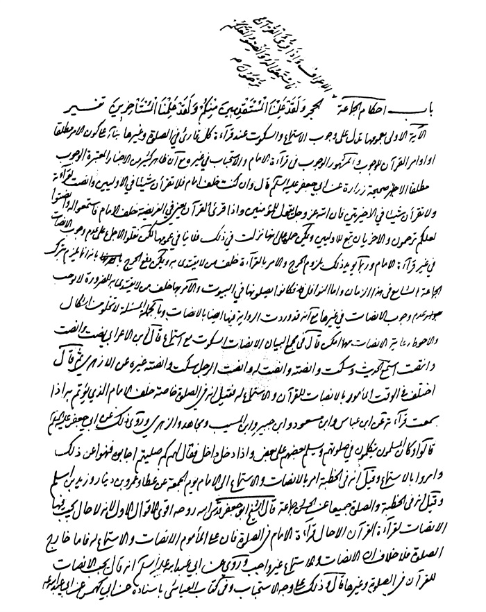
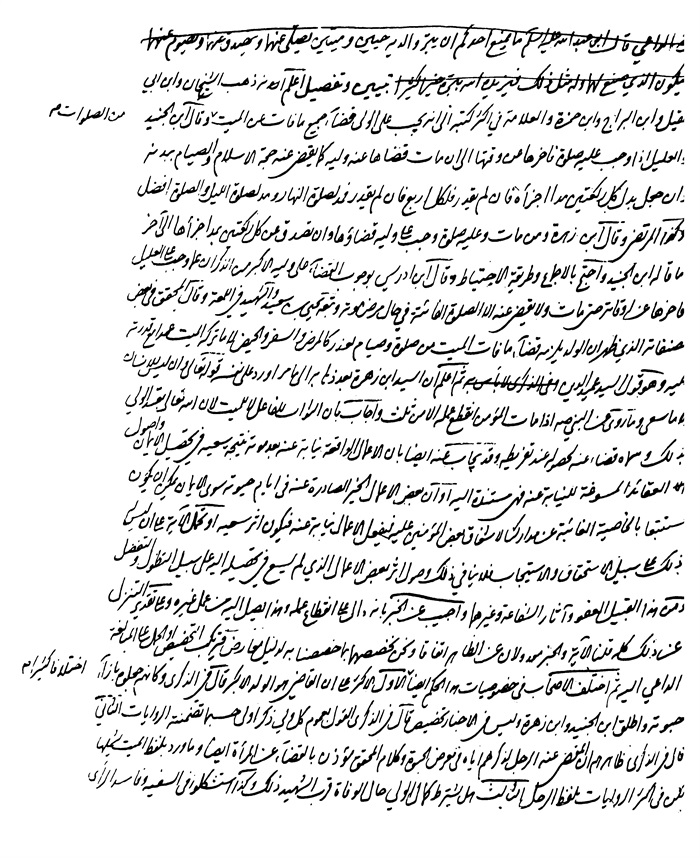

بحار الانوار الجامعة لدرر اخبار الائمة الاطهار المجلد 85

هوية الكتاب
بطاقة تعريف: مجلسي محمد باقربن محمدتقي 1037 - 1111ق.
عنوان واسم المؤلف: بحار الأنوار الجامعة لدرر أخبار الأئمة الأطهار المجلد 85: تأليف محمد باقربن محمدتقي المجلسي.
عنوان واسم المؤلف: بيروت داراحياء التراث العربي [ -13].
مظهر: ج - عينة.
ملاحظة: عربي.
ملاحظة: فهرس الكتابة على أساس المجلد الرابع والعشرين، 1403ق. [1360].
ملاحظة: المجلد108،103،94،91،92،87،67،66،65،52،24(الطبعة الثالثة: 1403ق.=1983م.=[1361]).
ملاحظة: فهرس.
محتويات: ج.24.كتاب الامامة. ج.52.تاريخ الحجة. ج67،66،65.الإيمان والكفر. ج.87.كتاب الصلاة. ج.92،91.الذكر و الدعا. ج.94.كتاب السوم. ج.103.فهرست المصادر. ج.108.الفهرست.-
عنوان: أحاديث الشيعة — قرن 11ق
ترتيب الكونجرس: BP135/م3ب31300 ي ح
تصنيف ديوي: 297/212
رقم الببليوغرافيا الوطنية: 1680946
ص: 1

تتمة كتاب الصلاة 

باب 1 فضل الجماعة و عللها 

الآیات: 
البقرة: وَ ارْكَعُوا مَعَ الرَّاكِعِینَ (1)

> **پاورقی**: 1- 1. البقرة: 43، و الآیة الكریمة و ان كانت فی سیاق الخطاب مع الیهود، لكن اللّٰه عزّ و جلّ انما یدعوهم فی هذه الآیات أولا الی ما كان فرضا علیهم بالخصوص من الایمان بالقرآن فقال: و آمنوا بما أنزلت مصدقا لما معكم و لا تكونوا أول كافر به، ثمّ نهاهم عما كانوا یفعلون من تلبیس الحق بالباطل فقال: و لا تلبسوا الحق بالباطل و تكتموا الحق و أنتم تعلمون، ثمّ بعد ذلك و ثانیا، أمرهم و دعاهم الی ما كان أوجبه و أراده من كل مؤمن بالقرآن و الرسول، و هو اقامة الصلاة و ایتاء الزكاة و الركوع مع الراكعین بالاجتماع كما كان یمتثله المسلمون حینذاك. فالآیة الكریمة انما تدعو الیهود الی دین الإسلام، و یشیر الی أن من مهام دین الإسلام الصلاة بالاجتماع جماعة، لا أنّها تدعوهم الی شی ء هو زائد علی دین الإسلام یخص بهم، حتی یقال: ان القرآن الكریم لم یذكر الاجتماع فی الركوع الا فی هذه الآیة، و هی تخاطب الیهود لا المسلمین. و أمّا قوله عزّ و جلّ:« وَ ارْكَعُوا مَعَ الرَّاكِعِینَ» فقد عرفت فی ج 85 ص 97 أن المراد به الاجتماع فی الصلاة و اقامتها جماعة، و یرشدنا الی أن ملاك ادراك الجماعة الركوع، و توضیحه أن هذه الجملة من المتشابهات بأم الكتاب یشبه أن یكون أمره بالركوع مع الراكعین حكما علی حدة فی قبال الصلاة و الزكاة، و لیس كذلك، و لذلك أوله النبیّ الی ركوع الصلاة فكانت الصلاة بالجماعة سنة من تركها رغبة عنها فقد عصی علی حدّ سائر السنن التی ذكرت فی القرآن العزیز بصورة المتشابهات و سیمر علیك فی طی الباب أحادیث تنص علی ذلك إنشاء اللّٰه تعالی.

آل عمران: مخاطبا لمریم علیها السلام وَ ارْكَعِی مَعَ الرَّاكِعِینَ (1) 
الأعراف: وَ أَقِیمُوا وُجُوهَكُمْ عِنْدَ كُلِّ مَسْجِدٍ(2) 
تفسیر: 
المشهور فی الآیة الأولی و الثانیة أن المراد بهما الصلاة مع المصلین جماعة و لما لم یقل ظاهرا أحد من علمائنا بوجوبها فی غیر الجمعة و العیدین (3) مع
ص: 2

> **پاورقی**: 1- 1. آل عمران: 43، و الآیة تدلّ علی شرافة عظیمة لمریم علیها السلام حیث أمرها اللّٰه بالصلاة جماعة، مع أنّه لا جماعة علی النساء، و تدلّ أیضا علی أن الیهود أو عبادهم و نساكهم كانوا یجتمعون لصلاتهم و یصلون جماعة، و أن صلاتهم أیضا كانت ذات ركوع رغما لما قد یقال: ان صلاتهم كانت من دون ركوع علی حدّ صلاة المسلمین فی صدر الإسلام.

> **پاورقی**: 2- 2. الأعراف: 29، و قد مر الكلام فیها فی ج 84 ص 195، و أن المراد بها الصلاة فی المسجد كما قال صلی اللّٰه علیه و آله « لا صلاة لجار المسجد الا فی مسجده» و انما ذكرت الآیة فی الباب، لان موضع اجتماع المسلمین هو المسجد، و إذا وجب علیهم الاجتماع فی الصلاة انصرف الوجوب الی الاجتماع فی المسجد.

> **پاورقی**: 3- 3. الجماعة و الاجتماع فی صلاة الجمعة فرض بآیة الجمعة علی ما سیأتی بیانها فی محله فلا تصح الجمعة الا بالاجتماع و اما سائر الصلوات فالجماعة فیها سنة واجبة فی حال الاختیار لا یجور تركها الا عند العذر علی حدّ سائر السنن و إلا لكان المصلی بغیر جماعة راغبا عن سنته صلی اللّٰه علیه و آله و قد قال: و من رغب عن سنتی فلیس منی. و اما صلاة العیدین، فهما أیضا سنة استنهما النبیّ صلّی اللّٰه علیه و آله علی كیفیة صلاة الجمعة لتكون السنن ضعفی الفریضة، حتی من حیث كیفیاتها، و سیأتی الكلام فی محله.

الشرائط حملوها علی الاستحباب المؤكد أو الجمعة و العیدین و الثانیة تدل علی استحبابها للنساء و أما الثالثة فقال فی مجمع البیان (1) عند ذكر الوجوه فی تفسیرها و رابعها أن معناه اقصدوا المسجد فی وقت كل صلاة أمرا بالجماعة لها ندبا عند الأكثرین و حتما عند الأقلین. 
«1»- ثَوَابُ الْأَعْمَالِ، عَنْ مُحَمَّدِ بْنِ مُوسَی بْنِ الْمُتَوَكِّلِ عَنْ مُحَمَّدِ بْنِ جَعْفَرٍ عَنْ مُوسَی بْنِ عِمْرَانَ عَنِ الْحُسَیْنِ بْنِ یَزِیدَ عَنْ حَمَّادِ بْنِ عَمْرٍو عَنْ أَبِی الْحَسَنِ الْخُرَاسَانِیِّ عَنْ مُیَسِّرِ بْنِ عَبْدِ اللَّهِ عَنْ أَبِی عَائِشَةَ السَّعْدِیِّ عَنْ یَزِیدَ بْنِ عُمَرَ بْنِ عَبْدِ الْعَزِیزِ عَنْ أَبِی سَلَمَةَ بْنِ عَبْدِ الرَّحْمَنِ عَنْ أَبِی هُرَیْرَةَ وَ عَبْدِ اللَّهِ بْنِ عَبَّاسٍ قَالا قَالَ رَسُولُ اللَّهِ صلی اللّٰه علیه و آله: مَنْ مَشَی إِلَی مَسْجِدٍ مِنْ مَسَاجِدِ اللَّهِ عَزَّ وَ جَلَّ فَلَهُ بِكُلِّ خُطْوَةٍ یَخْطُوهَا حَتَّی یَرْجِعَ إِلَی مَنْزِلِهِ عَشْرُ حَسَنَاتٍ وَ مُحِیَ عَنْهُ عَشْرُ سَیِّئَاتٍ وَ یُرْفَعُ لَهُ عَشْرُ دَرَجَاتٍ وَ مَنْ حَافَظَ عَلَی الْجَمَاعَةِ حَیْثُ مَا كَانَ مَرَّ عَلَی الصِّرَاطِ كَالْبَرْقِ اللَّامِعِ فِی أَوَّلِ زُمْرَةٍ مَعَ السَّابِقِینَ وَ وَجْهُهُ أَضْوَأُ مِنَ الْقَمَرِ لَیْلَةَ الْبَدْرِ وَ كَانَ لَهُ بِكُلِّ یَوْمٍ وَ لَیْلَةٍ حَافَظَ عَلَیْهَا ثَوَابُ شَهِیدٍ وَ مَنْ حَافَظَ عَلَی الصَّفِّ الْمُقَدَّمِ فَیُدْرِكُ مِنَ الْأَجْرِ مِثْلَ مَا لِلْمُؤَذِّنِ وَ أَعْطَاهُ اللَّهُ عَزَّ وَ جَلَّ فِی الْجَنَّةِ مِثْلَ ثَوَابِ الْمُؤَذِّنِ (2).
«2»- مَجَالِسُ الصَّدُوقِ، عَنْ أَحْمَدَ بْنِ مُحَمَّدِ بْنِ یَحْیَی عَنْ أَبِیهِ مُحَمَّدِ بْنِ عِیسَی عَنِ الْحُسَیْنِ بْنِ سَعِیدٍ عَنْ عَلِیِّ بْنِ جَعْفَرٍ عَنْ مُحَمَّدِ بْنِ عُمَرَ الْجُرْجَانِیِّ قَالَ قَالَ الصَّادِقُ جَعْفَرُ بْنُ مُحَمَّدٍ علیه السلام: أَوَّلُ جَمَاعَةٍ كَانَتْ أَنَّ رَسُولَ اللَّهِ صلی اللّٰه علیه و آله كَانَ یُصَلِّی وَ أَمِیرُ الْمُؤْمِنِینَ عَلِیُّ بْنُ أَبِی طَالِبٍ علیه السلام مَعَهُ إِذْ مَرَّ بِهِ أَبُو طَالِبٍ وَ جَعْفَرٌ مَعَهُ فَقَالَ یَا بُنَیَّ صِلْ جَنَاحَ ابْنِ عَمِّكَ فَلَمَّا أَحَسَّ رَسُولُ اللَّهِ تَقَدَّمَهُمَا وَ انْصَرَفَ أَبُو طَالِبٍ مَسْرُوراً إِلَی أَنْ قَالَ: 
ص: 3

> **پاورقی**: 1- 1. مجمع البیان ج 4 ص 411.

> **پاورقی**: 2- 2. ثواب الأعمال ص 259 فی حدیث طویل.

فَكَانَتْ أَوَّلَ جَمَاعَةٍ جُمِّعَتْ ذَلِكَ الْیَوْمَ (1).
بیان: صِلْ جناح ابن عمك أی تمّم جناحه فإن علیا علیه السلام بمنزلة أحد الجناحین فكن جناحه الآخر و القراءة بالتشدید بعیدة و الخبر یدل علی أنه یستحب للإمام أن یتقدم إذا تعدد المأموم و قال العلامة فی المنتهی لو أم اثنین فوقف إلی جنبه أخرهما الإمام و قال أبو حنیفة بل یتقدم هو لنا أن النبی صلی اللّٰه علیه و آله أخرج جابرا و جبارا عن جنبیه و جعلهما خلفه و لأنه الأصل فی الصلاة فكره له الاشتغال بما لیس من الصلاة بخلاف المأموم انتهی و هذه الروایة أقوی و روایة جابر عامیة و یمكن الجمع بحملها علی قبل الصلاة و هذه علی ما إذا حدث فی أثنائهما.
«3»- تَنْبِیهُ الْخَاطِرِ، قَالَ رَسُولُ اللَّهِ صلی اللّٰه علیه و آله: إِنَّ اللَّهَ یَسْتَحْیِی مِنْ عَبْدِهِ إِذَا صَلَّی فِی جَمَاعَةٍ ثُمَّ سَأَلَهُ حَاجَةً أَنْ یَنْصَرِفَ حَتَّی یَقْضِیَهَا(2).
«4»- تُحَفُ الْعُقُولِ، عَنِ الرِّضَا علیه السلام قَالَ: فَضْلُ الْجَمَاعَةِ عَلَی الْفَرْدِ بِكُلِّ رَكْعَةٍ أَلْفَا رَكْعَةٍ وَ لَا تُصَلِّی خَلْفَ فَاجِرٍ وَ لَا تَقْتَدِی إِلَّا بِأَهْلِ الْوَلَایَةِ(3).
«5»- الذِّكْرَی، عَنِ النَّبِیِّ صلی اللّٰه علیه و آله: صَلَاةُ الْجَمَاعَةِ تَفْضُلُ صَلَاةَ الْفَذِّ بِسَبْعٍ وَ عِشْرِینَ دَرَجَةً(4).
ثم قال رحمه اللّٰه الفذ بالفاء و الذال المعجمة المفرد. 
وَ مِنْهُ عَنِ النَّبِیِّ صلی اللّٰه علیه و آله: مَنْ صَلَّی أَرْبَعِینَ یَوْماً فِی جَمَاعَةٍ یُدْرِكُ التَّكْبِیرَةَ الْأُولَی كُتِبَ لَهُ بَرَاءَتَانِ بَرَاءَةٌ مِنَ النَّارِ وَ بَرَاءَةٌ مِنَ النِّفَاقِ (5).
«6»- النَّفْلِیَّةُ، عَنِ النَّبِیِّ صلی اللّٰه علیه و آله: لَا صَلَاةَ لِمَنْ لَمْ یُصَلِّ فِی الْمَسْجِدِ مَعَ الْمُسْلِمِینَ 
ص: 4

> **پاورقی**: 1- 1. أمالی الصدوق: 304.

> **پاورقی**: 2- 2. تنبیه الخواطر: 4، رواه عن ابی سعید الخدریّ.

> **پاورقی**: 3- 3. تحف العقول ص 440 ط الإسلامیة.

> **پاورقی**: 4- 4. الذكری: 267.

> **پاورقی**: 5- 5. الذكری: 267.

إِلَّا مِنْ عِلَّةٍ(1).
وَ عَنْهُ صلی اللّٰه علیه و آله: الصَّلَاةَ جَمَاعَةً وَ لَوْ عَلَی رَأْسِ زُجٍّ. 
وَ عَنْهُ صلی اللّٰه علیه و آله: إِذَا سُئِلْتَ عَمَّنْ لَا یَشْهَدُ الْجَمَاعَةَ فَقُلْ لَا أَعْرِفُهُ. 
وَ عَنِ الصَّادِقِ علیه السلام: الصَّلَاةُ خَلْفَ الْعَالِمِ بِأَلْفِ رَكْعَةٍ وَ خَلْفَ الْقُرَشِیِّ بِمِائَةٍ وَ خَلْفَ الْعَرَبِیِّ خَمْسُونَ وَ خَلْفَ الْمَوْلَی خَمْسٌ وَ عِشْرُونَ. 
بیان: قال الشهید الثانی رحمه اللّٰه فی الخبر الأول المراد نفی الكمال لا الصحة لإجماعنا علی صحة الصلاة فرادی و التقیید بالمسجد بناء علی الأغلب من وقوع الجماعة فیه و إلا فالنفی المذكور متوجه إلی مطلق الفرادی و قال الزج بضم الزاء و الجیم المشددة الحدیدة فی أسفل الرمح و العنزة هذا علی طریق المبالغة فی المحافظة علیها مع السعة و الضیق و الصلاة منصوبة بتقدیر احضروا و نحوه أو مرفوعة علی الابتداء.
فقل لا أعرفه أی لا تزكه بالعدالة(2)
و إن ظهر منه المحافظة علی الواجبات بترك المنهیات لتهاونه بأعظم السنن و أجلها و عدم المعرفة له كنایة عن القدح فیه بالفسق و تعریض به 
وَ قَدْ وَقَعَ مُصَرَّحاً بِهِ فِی حَدِیثٍ آخَرَ رَوَیْنَاهُ (3) عَنِ الصَّادِقِ علیه السلام أَنَّ رَسُولَ اللَّهِ صلی اللّٰه علیه و آله قَالَ: لَا صَلَاةَ لِمَنْ لَا یُصَلِّی فِی الْمَسْجِدِ مَعَ الْمُسْلِمِینَ إِلَّا لِعِلَّةٍ وَ لَا غِیبَةَ لِمَنْ صَلَّی فِی بَیْتِهِ وَ رَغِبَ عَنْ جَمَاعَتِنَا وَ مَنْ رَغِبَ عَنْ جَمَاعَةِ الْمُسْلِمِینَ سَقَطَ عَدَالَتُهُ وَ وَجَبَ هِجْرَانُهُ وَ إِنْ رُفِعَ إِلَی إِمَامِ الْمُسْلِمِینَ أَنْذَرَهُ وَ حَذَّرَهُ وَ مَنْ لَزِمَ جَمَاعَةَ الْمُسْلِمِینَ حَرُمَتْ عَلَیْهِمْ غِیبَتُهُ وَ ثَبَتَتْ عَدَالَتُهُ. 
و قال المراد بالقرشی المنسوب إلی النضر بن كنانة جد النبی صلی اللّٰه علیه و آله و السادة الأشراف أجل هذه الطائفة و العربی المنسوب إلی العرب یقابل العجمی و هو المنسوب إلی غیر العرب مطلقا و المولی یطلق علی معانی كثیرة و المراد هنا غیر 
ص: 5

> **پاورقی**: 1- 1. قد عرفت الوجه فی ذلك.

> **پاورقی**: 2- 2. و ذلك إذا كان تركه رغبة عنها من دون علة.

> **پاورقی**: 3- 3. رواه فی الذكری ص 267.

العربی بقرینة ما قبله و كثیرا ما یطلق المولی علی غیر العربی و إن كان حر الأصل 
«7»- مَجَالِسُ الصَّدُوقِ، عَنْ مُحَمَّدِ بْنِ مُوسَی بْنِ الْمُتَوَكِّلِ عَنْ مُحَمَّدِ بْنِ جَعْفَرٍ الْأَسَدِیِّ عَنْ مُحَمَّدِ بْنِ إِسْمَاعِیلَ الْبَرْمَكِیِّ عَنْ عَبْدِ اللَّهِ بْنِ وَهْبٍ عَنْ ثَوَابَةَ بْنِ مَسْعُودٍ عَنْ أَنَسٍ عَنِ النَّبِیِّ صلی اللّٰه علیه و آله قَالَ: مَنْ صَلَّی صَلَاةَ الْفَجْرِ فِی جَمَاعَةٍ ثُمَّ جَلَسَ یَذْكُرُ اللَّهَ عَزَّ وَ جَلَّ حَتَّی تَطْلُعَ الشَّمْسُ كَانَ لَهُ فِی الْفِرْدَوْسِ سَبْعُونَ دَرَجَةً بُعْدُ مَا بَیْنَ كُلِّ دَرَجَتَیْنِ كَحُضْرِ الْفَرَسِ الْجَوَادِ الْمُضَمَّرِ سَبْعِینَ سَنَةً وَ مَنْ صَلَّی الظُّهْرَ فِی جَمَاعَةٍ كَانَ لَهُ فِی جَنَّاتِ عَدْنٍ خَمْسُونَ دَرَجَةً بُعْدُ مَا بَیْنَ كُلِّ دَرَجَتَیْنِ كَحُضْرِ الْفَرَسِ الْجَوَادِ خَمْسِینَ سَنَةً وَ مَنْ صَلَّی الْعَصْرَ فِی جَمَاعَةٍ كَانَ لَهُ كَأَجْرِ ثَمَانِیَةٍ مِنْ وُلْدِ إِسْمَاعِیلَ كُلٌّ مِنْهُمْ رَبُّ بَیْتٍ یُعْتِقُهُمْ وَ مَنْ صَلَّی الْمَغْرِبَ فِی جَمَاعَةٍ كَانَ لَهُ كَحَجَّةٍ مَبْرُورَةٍ وَ عُمْرَةٍ مُتَقَبَّلَةٍ وَ مَنْ صَلَّی الْعِشَاءَ فِی جَمَاعَةٍ كَانَ لَهُ كَقِیَامِ لَیْلَةِ الْقَدْرِ(1).
بیان: الحضر بالضم العدو و قال فی النهایة فیه من صام یوما فی سبیل اللّٰه باعده اللّٰه من النار سبعین خریفا للمضمر المجید المضمر الذی یضمر خیله لغزو أو سباق و تضمیر الخیل هو أن یظاهر علیها بالعلف حتی تسمن ثم لا تعلف إلا قوتا لتخف و قیل أن تشد علیها سروجها و تجلل الأجلة حتی تعرق تحتها فیذهب وهلها و یشتد لحمها أی یباعده منها مسافة سبعین سنة تقطعها الخیل المضمرة ركضا. 
«8»- الْخِصَالُ (2)، وَ الْمَجَالِسُ، بِالْإِسْنَادِ الْمُتَقَدِّمِ: فِی خَبَرٍ نَفَرٌ مِنَ الْیَهُودِ جَاءُوا إِلَی رَسُولِ اللَّهِ صلی اللّٰه علیه و آله قَالَ النَّبِیُّ صلی اللّٰه علیه و آله وَ أَمَّا الْجَمَاعَةُ فَإِنَّ صُفُوفَ أُمَّتِی فِی الْأَرْضِ كَصُفُوفِ الْمَلَائِكَةِ فِی السَّمَاءِ وَ الرَّكْعَةُ فِی جَمَاعَةٍ أَرْبَعٌ وَ عِشْرُونَ رَكْعَةً كُلُّ رَكْعَةٍ أَحَبُّ إِلَی اللَّهِ عَزَّ وَ جَلَّ
مِنْ عِبَادَةِ أَرْبَعِینَ سَنَةً وَ أَمَّا یَوْمَ الْقِیَامَةِ یَجْمَعُ اللَّهُ فِیهِ الْأَوَّلِینَ وَ الْآخِرِینَ لِلْحِسَابِ فَمَا مِنْ مُؤْمِنٍ مَشَی إِلَی الْجَمَاعَةِ إِلَّا خَفَّفَ اللَّهُ عَلَیْهِ عَزَّ وَ جَلَ 
ص: 6

> **پاورقی**: 1- 1. أمالی الصدوق: 41 فی حدیث.

> **پاورقی**: 2- 2. الخصال ج 2 ص 9.

أَهْوَالَ یَوْمِ الْقِیَامَةِ ثُمَّ یَأْمُرُ بِهِ إِلَی الْجَنَّةِ(1).
«9»- الْمَجَالِسُ، عَنْ مُحَمَّدِ بْنِ عَلِیٍّ مَاجِیلَوَیْهِ عَنْ عَمِّهِ مُحَمَّدِ بْنِ أَبِی الْقَاسِمِ عَنْ أَحْمَدَ بْنِ مُحَمَّدٍ الْبَرْقِیِّ عَنْ أَبِیهِ عَنْ بَكْرِ بْنِ صَالِحٍ عَنْ عَبْدِ اللَّهِ بْنِ إِبْرَاهِیمَ عَنْ عَبْدِ الرَّحْمَنِ عَنْ عَمِّهِ عَبْدِ الْعَزِیزِ عَنْ سَعِیدِ بْنِ الْمُسَیَّبِ عَنْ أَبِی سَعِیدٍ الْخُدْرِیِّ قَالَ قَالَ رَسُولُ اللَّهِ صلی اللّٰه علیه و آله: أَ لَا أَدُلُّكُمْ عَلَی شَیْ ءٍ یُكَفِّرُ اللَّهُ بِهِ الْخَطَایَا وَ یَزِیدُ فِی الْحَسَنَاتِ قِیلَ بَلَی یَا رَسُولَ اللَّهِ قَالَ صلی اللّٰه علیه و آله إِسْبَاغُ الْوُضُوءِ عَلَی الْمَكَارِهِ وَ كَثْرَةُ الْخُطَی إِلَی هَذِهِ الْمَسَاجِدِ وَ انْتِظَارُ الصَّلَاةِ بَعْدَ الصَّلَاةِ وَ مَا مِنْكُمْ مِنْ أَحَدٍ یَخْرُجُ مِنْ بَیْتِهِ مُتَطَهِّراً فَیُصَلِّی الصَّلَاةَ فِی الْجَمَاعَةِ مَعَ الْمُسْلِمِینَ ثُمَّ یَقْعُدُ یَنْتَظِرُ الصَّلَاةَ الْأُخْرَی إِلَّا وَ الْمَلَائِكَةُ تَقُولُ- اللَّهُمَّ اغْفِرْ لَهُ اللَّهُمَّ ارْحَمْهُ فَإِذَا قُمْتُمْ إِلَی الصَّلَاةِ فَاعْدِلُوا صُفُوفَكُمْ وَ أَقِیمُوهَا وَ سُدُّوا الْفُرَجَ وَ إِذَا قَالَ إِمَامُكُمْ اللَّهُ أَكْبَرُ فَقُولُوا اللَّهُ أَكْبَرُ وَ إِذَا رَكَعَ فَارْكَعُوا وَ إِذَا قَالَ سَمِعَ اللَّهُ لِمَنْ حَمِدَهُ فَقُولُوا اللَّهُمَّ رَبَّنَا لَكَ الْحَمْدُ إِنَّ خَیْرَ الصُّفُوفِ صَفُّ الرِّجَالِ الْمُقَدَّمُ وَ شَرَّهَا الْمُؤَخَّرُ(2).
«10»- مَعَانِی الْأَخْبَارِ(3)، وَ الْمَجَالِسُ، عَنْ أَحْمَدَ بْنِ مُحَمَّدِ بْنِ یَحْیَی الْعَطَّارِ عَنْ سَعْدِ بْنِ عَبْدِ اللَّهِ عَنْ أَحْمَدَ بْنِ مُحَمَّدِ بْنِ عِیسَی عَنْ أَبِیهِ عَنِ ابْنِ أَبِی عُمَیْرٍ عَنْ عَلِیِّ بْنِ أَبِی حَمْزَةَ عَنْ أَبِی بَصِیرٍ عَنِ الصَّادِقِ علیه السلام عَنْ آبَائِهِ علیهم السلام قَالَ قَالَ رَسُولُ اللَّهِ صلی اللّٰه علیه و آله: إِنَّ فِی الْجَنَّةِ غُرَفاً یُرَی ظَاهِرُهَا مِنْ بَاطِنِهَا وَ بَاطِنُهَا مِنْ ظَاهِرِهَا یَسْكُنُهَا مِنْ أُمَّتِی مَنْ أَطَابَ الْكَلَامَ وَ أَطْعَمَ الطَّعَامَ وَ أَفْشَی السَّلَامَ وَ صَلَّی بِاللَّیْلِ وَ النَّاسُ نِیَامٌ فَقَالَ عَلِیٌّ علیه السلام یَا رَسُولَ اللَّهِ وَ مَنْ یُطِیقُ هَذَا مِنْ أُمَّتِكَ فَقَالَ یَا عَلِیُّ أَ وَ مَا تَدْرِی مَا إِطَابَةُ الْكَلَامِ مَنْ قَالَ إِذَا أَصْبَحَ وَ أَمْسَی سُبْحَانَ اللَّهِ وَ الْحَمْدُ لِلَّهِ وَ لَا إِلَهَ إِلَّا اللَّهُ وَ اللَّهُ أَكْبَرُ عَشْرَ مَرَّاتٍ وَ إِطْعَامُ الطَّعَامِ نَفَقَةُ الرَّجُلِ عَلَی عِیَالِهِ وَ أَمَّا الصَّلَاةُ بِاللَّیْلِ وَ النَّاسُ نِیَامٌ فَمَنْ صَلَّی الْمَغْرِبَ وَ الْعِشَاءَ الْآخِرَةَ وَ صَلَاةَ الْغَدَاةِ فِی الْمَسْجِدِ
ص: 7

> **پاورقی**: 1- 1. أمالی الصدوق: ص 117.

> **پاورقی**: 2- 2. أمالی الصدوق: ص 194.

> **پاورقی**: 3- 3. معانی الأخبار ص 250.

فِی جَمَاعَةٍ فَكَأَنَّمَا أَحْیَا اللَّیْلَ كُلَّهُ وَ إِفْشَاءُ السَّلَامِ أَنْ لَا یَبْخَلَ بِالسَّلَامِ عَلَی أَحَدٍ مِنَ الْمُسْلِمِینَ (1).
«11»- الْمَجَالِسُ، عَنْ جَعْفَرِ بْنِ مُحَمَّدِ بْنِ مَسْرُورٍ عَنِ الْحُسَیْنِ بْنِ مُحَمَّدِ بْنِ عَامِرٍ عَنْ عَمِّهِ عَبْدِ اللَّهِ عَنْ مُحَمَّدِ بْنِ زِیَادٍ عَنْ إِبْرَاهِیمَ بْنِ زِیَادٍ عَنِ الصَّادِقِ علیه السلام قَالَ: مَنْ صَلَّی خَمْسَ صَلَوَاتٍ فِی الْیَوْمِ وَ اللَّیْلَةِ فِی جَمَاعَةٍ فَظَنُّوا بِهِ خَیْراً وَ أَجِیزُوا شَهَادَتَهُ (2).
وَ مِنْهُ فِی خَبَرِ الْمَنَاهِی قَالَ النَّبِیُّ صلی اللّٰه علیه و آله: مَنْ أَمَّ قَوْماً بِإِذْنِهِمْ وَ هُمْ بِهِ رَاضُونَ فَاقْتَصَدَ بِهِمْ فِی حُضُورِهِ وَ أَحْسَنَ صَلَاتَهُ بِقِیَامِهِ وَ قِرَاءَتِهِ وَ رُكُوعِهِ وَ سُجُودِهِ وَ قُعُودِهِ فَلَهُ مِثْلُ أَجْرِ الْقَوْمِ وَ لَا یُنْقَصُ مِنْ أُجُورِهِمْ شَیْ ءٌ أَلَا وَ مَنْ أَمَّ قَوْماً بِأَمْرِهِمْ ثُمَّ لَمْ یُتِمَّ بِهِمُ الصَّلَاةَ وَ لَمْ یُحْسِنْ فِی رُكُوعِهِ وَ سُجُودِهِ وَ خُشُوعِهِ وَ قِرَاءَتِهِ رُدَّتْ عَلَیْهِ صَلَاتُهُ وَ لَمْ تُجَاوِزْ تَرْقُوَتَهُ وَ كَانَتْ مَنْزِلَتُهُ كَمَنْزِلَةِ إِمَامٍ جَائِرٍ مُعْتَدٍ لَمْ یُصْلِحْ إِلَی رَعِیَّتِهِ وَ لَمْ یَقُمْ فِیهِمْ بِحَقٍّ وَ لَا قَامَ فِیهِمْ بِأَمْرٍ(3) وَ قَالَ علیه السلام أَلَا وَ مَنْ مَشَی إِلَی مَسْجِدٍ یَطْلُبُ فِیهِ الْجَمَاعَةَ كَانَ لَهُ بِكُلِّ خُطْوَةٍ سَبْعُونَ أَلْفَ حَسَنَةٍ وَ یُرْفَعُ لَهُ مِنَ الدَّرَجَاتِ مِثْلُ ذَلِكَ وَ إِنْ مَاتَ وَ هُوَ عَلَی ذَلِكَ وَكَّلَ اللَّهُ بِهِ سَبْعِینَ أَلْفَ مَلَكٍ یَعُودُونَهُ فِی قَبْرِهِ وَ یُؤْنِسُونَهُ فِی وَحْدَتِهِ وَ یَسْتَغْفِرُونَهُ لَهُ حَتَّی یُبْعَثَ (4).
وَ مِنْهُ عَنْ أَحْمَدَ بْنِ زِیَادٍ الْهَمَدَانِیِّ عَنْ عَلِیِّ بْنِ إِبْرَاهِیمَ عَنْ أَبِیهِ عَنْ عَبْدِ اللَّهِ بْنِ مَیْمُونٍ الْقَدَّاحِ عَنِ الصَّادِقِ عَنْ آبَائِهِ علیهم السلام قَالَ: اشْتَرَطَ رَسُولُ اللَّهِ صلی اللّٰه علیه و آله عَلَی جِیرَانِ الْمَسْجِدِ شُهُودَ الصَّلَاةِ وَ قَالَ لَیَنْتَهِیَنَّ أَقْوَامٌ لَا یَشْهَدُونَ الصَّلَاةَ أَوْ لَآمُرَنَّ مُؤَذِّناً یُؤَذِّنُ ثُمَّ یُقِیمُ ثُمَّ آمُرُ رَجُلًا مِنْ أَهْلِ بَیْتِی وَ هُوَ عَلِیٌّ فَلَیُحْرِقَنَّ عَلَی أَقْوَامٍ بُیُوتَهُمْ بِحُزَمِ الْحَطَبِ لِأَنَّهُمْ لَا یَأْتُونَ الصَّلَاةَ(5).
ص: 8

> **پاورقی**: 1- 1. أمالی الصدوق: ص 198.

> **پاورقی**: 2- 2. أمالی الصدوق: ص 204.

> **پاورقی**: 3- 3. أمالی الصدوق ص 258.

> **پاورقی**: 4- 4. أمالی الصدوق ص 259.

> **پاورقی**: 5- 5. أمالی الصدوق ص 290.

ثواب الأعمال، عن محمد بن علی ماجیلویه عن علی بن إبراهیم: مثله (1) المحاسن، عن جعفر بن محمد الأشعری عن القداح: مثله (2)
«12»- مَجَالِسُ الصَّدُوقِ، عَنْ جَعْفَرِ بْنِ مُحَمَّدِ بْنِ مَسْرُورٍ عَنِ الْحُسَیْنِ بْنِ مُحَمَّدِ بْنِ عَامِرٍ عَنْ عَمِّهِ عَبْدِ اللَّهِ عَنِ ابْنِ أَبِی عُمَیْرٍ عَنْ عَبْدِ اللَّهِ بْنِ سِنَانٍ عَنِ الصَّادِقِ علیه السلام قَالَ: صَلَّی رَسُولُ اللَّهِ الْفَجْرَ فَلَمَّا انْصَرَفَ أَقْبَلَ بِوَجْهِهِ عَلَی أَصْحَابِهِ فَسَأَلَ عَنْ أُنَاسٍ هَلْ حَضَرُوا فَقَالُوا لَا یَا رَسُولَ اللَّهِ فَقَالَ أَ غُیَّبٌ هُمْ قَالُوا لَا فَقَالَ أَمَا إِنَّهُ لَیْسَ مِنْ صَلَاةٍ أَشَدَّ عَلَی الْمُنَافِقِینَ مِنْ هَذِهِ الصَّلَاةِ وَ الْعِشَاءِ(3).
ثواب الأعمال، عن أبیه عن سعد بن عبد اللّٰه عن أحمد بن محمد عن الحسن بن علی الوشاء عن ابن سنان: مثله (4) المحاسن، عن الوشاء: مثله (5).
«13»- الْمَجَالِسُ (6)، عَنْ جَعْفَرِ بْنِ عَلِیٍّ الْكُوفِیِّ عَنْ جَدِّهِ الْحَسَنِ بْنِ عَلِیٍّ عَنْ جَدِّهِ عَبْدِ اللَّهِ بْنِ الْمُغِیرَةِ عَنِ السَّكُونِیِّ عَنِ الصَّادِقِ عَنْ آبَائِهِ علیهم السلام قَالَ قَالَ رَسُولُ اللَّهِ صلی اللّٰه علیه و آله: مَنْ سَمِعَ النِّدَاءَ فِی الْمَسْجِدِ فَخَرَجَ مِنْهُ مِنْ غَیْرِ عِلَّةٍ فَهُوَ مُنَافِقٌ إِلَّا أَنْ یُرِیدَ الرُّجُوعَ إِلَیْهِ (7).
الْخِصَالُ، عَنْ عَلِیِّ بْنِ الْحُسَیْنِ علیه السلام قَالَ: مَا مِنْ خُطْوَةٍ أَحَبَّ إِلَی اللَّهِ مِنْ خُطْوَتَیْنِ خُطْوَةٍ یَسُدُّ بِهَا الْمُؤْمِنُ صَفّاً فِی اللَّهِ وَ خُطْوَةٍ إِلَی ذِی رَحِمٍ قَاطِعٍ (8).
ص: 9

> **پاورقی**: 1- 1. ثواب الأعمال ص 208 و 209.

> **پاورقی**: 2- 2. المحاسن ص 84 و فی ط كمبانیّ المجالس و هو سهو.

> **پاورقی**: 3- 3. أمالی الصدوق: ص 291.

> **پاورقی**: 4- 4. ثواب الأعمال ص 208.

> **پاورقی**: 5- 5. المحاسن ص 84.

> **پاورقی**: 6- 6. فی مطبوعة الكمبانیّ المحاسن، و هو تصحیف.

> **پاورقی**: 7- 7. أمالی الصدوق: ص 300.

> **پاورقی**: 8- 8. الخصال ج 1 ص 26 فی حدیث.

بیان: یحتمل صف الجهاد و الجماعة و الأعم. 
«14»- الْخِصَالُ، عَنْ أَبِیهِ عَنْ عَلِیِّ بْنِ إِبْرَاهِیمَ عَنْ أَبِیهِ عَنْ حَمَّادٍ عَمَّنْ ذَكَرَهُ عَنْ أَبِی عَبْدِ اللَّهِ علیه السلام قَالَ قَالَ أَمِیرُ الْمُؤْمِنِینَ علیه السلام: مُرُوَّةُ الْحَضَرِ قِرَاءَةُ الْقُرْآنِ وَ مُجَالَسَةُ الْعُلَمَاءِ وَ النَّظَرُ فِی الْفِقْهِ وَ الْمُحَافَظَةُ عَلَی الصَّلَاةِ فِی الْجَمَاعَاتِ الْخَبَرَ(1).
«15»- الْمَعَانِی (2)، وَ الْخِصَالُ، عَنْ مُحَمَّدِ بْنِ الْحَسَنِ بْنِ الْوَلِیدِ عَنْ مُحَمَّدِ بْنِ الْحَسَنِ الصَّفَّارِ عَنْ أَحْمَدَ بْنِ أَبِی عَبْدِ اللَّهِ الْبَرْقِیِّ عَنْ أَبِیهِ عَنْ هَارُونَ بْنِ الْجَهْمِ عَنْ ثُوَیْرِ بْنِ أَبِی فَاخِتَةَ عَنْ أَبِی جَمِیلَةَ عَنْ سَعْدِ بْنِ طَرِیفٍ عَنِ الْبَاقِرِ علیه السلام قَالَ: ثَلَاثٌ كَفَّارَاتٌ إِسْبَاغُ الْوُضُوءِ فِی السَّبَرَاتِ وَ الْمَشْیُ بِاللَّیْلِ وَ النَّهَارِ إِلَی الصَّلَوَاتِ وَ الْمُحَافَظَةُ عَلَی الْجَمَاعَاتِ (3).
«16»- الْخِصَالُ،: فِیمَا أَوْصَی بِهِ النَّبِیُّ صلی اللّٰه علیه و آله عَلِیّاً علیه السلام یَا عَلِیُّ ثَلَاثٌ دَرَجَاتٌ إِسْبَاغُ الْوُضُوءِ فِی السَّبَرَاتِ وَ انْتِظَارُ الصَّلَاةِ بَعْدَ الصَّلَاةِ وَ الْمَشْیُ بِاللَّیْلِ وَ النَّهَارِ إِلَی الْجَمَاعَاتِ (4).
أقول: قد مضی بإسناد آخر فی باب المنجیات (5).
وَ مِنْهُ عَنْ عُبَیْدِ بْنِ أَحْمَدَ الْفَقِیهِ عَنْ أَبِی حَرْبٍ عَنْ مُحَمَّدِ بْنِ أبی أجید [أُحَیْدٍ] عَنِ ابْنِ أَبِی عِیسَی الْحَافِظِ عَنْ مُحَمَّدِ بْنِ إِبْرَاهِیمَ عَنِ ابْنِ بُكَیْرٍ عَنِ اللَّیْثِ عَنْ أَبِی الْهَادِ عَنْ عَبْدِ اللَّهِ بْنِ حُبَابٍ عَنْ أَبِی سَعِیدٍ الْخُدْرِیِّ قَالَ إِنَّ رَسُولَ اللَّهِ صلی اللّٰه علیه و آله 
ص: 10

> **پاورقی**: 1- 1. الخصال ج 1 ص 28.

> **پاورقی**: 2- 2. معانی الأخبار ص 314.

> **پاورقی**: 3- 3. الخصال ج 1 ص 41، و مثله فی المحاسن ص 4، و رواه الصدوق أیضا فی امالیه ص 329.

> **پاورقی**: 4- 4. الخصال ج 1 ص 42.

> **پاورقی**: 5- 5. راجع ج 70 ص 5- 7.

قَالَ: صَلَاةُ الْجَمَاعَةِ أَفْضَلُ مِنْ صَلَاةِ الْفَرْدِ بِخَمْسٍ وَ عِشْرِینَ دَرَجَةً(1).
قَالَ ره: وَ قَالَ أَبِی رَضِیَ اللَّهُ عَنْهُ فِی رِسَالَتِهِ إِلَیَّ لِصَلَاةِ الرَّجُلِ فِی جَمَاعَةٍ عَلَی صَلَاةِ الرَّجُلِ وَحْدَهُ خَمْسٌ وَ عِشْرُونَ دَرَجَةً فِی الْجَنَّةِ(2).
وَ مِنْهُ فِی خَبَرِ الْأَعْمَشِ قَالَ الصَّادِقُ علیه السلام: فَضْلُ الْجَمَاعَةِ عَلَی الْفَرْدِ بِأَرْبَعٍ وَ عِشْرِینَ (3).
«17»- مَجَالِسُ ابْنِ الشَّیْخِ،: فِیمَا كَتَبَ أَمِیرُ الْمُؤْمِنِینَ علیه السلام لِمُحَمَّدِ بْنِ أَبِی بَكْرٍ انْظُرْ إِلَی صَلَاتِكَ كَیْفَ هِیَ فَإِنَّكَ إِمَامٌ لِقَوْمِكَ أَنْ تُتِمَّهَا وَ لَا تُخَفِّفَهَا فَلَیْسَ مِنْ إِمَامٍ یُصَلِّی بِقَوْمٍ یَكُونُ فِی صَلَاتِهِمْ نُقْصَانٌ إِلَّا كَانَ عَلَیْهِ لَا یَنْقُصُ مِنْ صَلَاتِهِمْ شَیْ ءٌ وَ تَمِّمْهَا وَ تَحَفَّظْ فِیهَا یَكُنْ لَكَ مِثْلُ أَجْرِهِمْ وَ لَا یَنْقُصُ ذَلِكَ مِنْ أَجْرِهِمْ شَیْئاً(4).
«18»- الْعِلَلُ، عَنِ الْحُسَیْنِ بْنِ أَحْمَدَ بْنِ إِدْرِیسَ عَنْ أَبِیهِ عَنْ مُحَمَّدِ بْنِ عَلِیِّ بْنِ مَحْبُوبٍ عَنْ مُحَمَّدِ بْنِ الْحَسَنِ عَنْ ذُبْیَانَ بْنِ حَكِیمٍ الْأَزْدِیِّ عَنْ مُوسَی بْنِ النُّمَیْرِ عَنِ ابْنِ أَبِی یَعْفُورٍ عَنْ أَبِی عَبْدِ اللَّهِ علیه السلام قَالَ: إِنَّمَا جُعِلَ الْجَمَاعَةُ وَ الِاجْتِمَاعُ إِلَی الصَّلَاةِ لِكَیْ یُعْرَفَ مَنْ یُصَلِّی مِمَّنْ لَا یُصَلِّی وَ مَنْ یَحْفَظُ مَوَاقِیتَ الصَّلَاةِ مِمَّنْ یُضِیعُ وَ لَوْ لَا ذَلِكَ لَمْ یُمْكِنْ أَحَداً أَنْ یَشْهَدَ عَلَی أَحَدٍ بِصَلَاحٍ لِأَنَّ مَنْ لَمْ یُصَلِّ فِی جَمَاعَةٍ فَلَا صَلَاةَ لَهُ بَیْنَ الْمُسْلِمِینَ لِأَنَّ رَسُولَ اللَّهِ صلی اللّٰه علیه و آله قَالَ لَا صَلَاةَ لِمَنْ لَمْ یُصَلِّ فِی الْمَسْجِدِ مَعَ الْمُسْلِمِینَ إِلَّا مِنْ عِلَّةٍ(5).
بیان: و لو لا ذلك أی لو لم یحضروا الآن الجماعة بعد تأكده لا أنه لو لم یفرد أولا كان كذلك. 
«19»- مَجَالِسُ الصَّدُوقِ، عَنِ الْحُسَیْنِ بْنِ إِبْرَاهِیمَ بْنِ نَاتَانَةَ عَنْ عَلِیِّ بْنِ
ص: 11

> **پاورقی**: 1- 1. الخصال ج 2 ص 102.

> **پاورقی**: 2- 2. الخصال ج 2 ص 103.

> **پاورقی**: 3- 3. الخصال ج 2 ص 151.

> **پاورقی**: 4- 4. أمالی الطوسیّ ج 1 ص 29.

> **پاورقی**: 5- 5. علل الشرائع ج 2 ص 15.

إِبْرَاهِیمَ عَنْ أَبِیهِ عَنْ حَمَّادٍ عَنْ حَرِیزٍ عَنْ زُرَارَةَ عَنْ أَبِی جَعْفَرٍ علیه السلام قَالَ: مَنْ تَرَكَ الْجَمَاعَةَ رَغْبَةً عَنْهَا وَ عَنْ جَمَاعَةِ الْمُسْلِمِینَ مِنْ غَیْرِ عِلَّةٍ فَلَا صَلَاةَ لَهُ (1).
ثواب الأعمال، عن محمد بن الحسن الصفار عن یعقوب بن یزید عن حماد عن حریز و فضیل عن زرارة: مثله (2) المحاسن، فی روایة زرارة عن أبی جعفر: مثله (3).
«20»- الْعِلَلُ، وَ الْعُیُونُ، عَنْ عَبْدِ الْوَاحِدِ بْنِ مُحَمَّدِ بْنِ عُبْدُوسٍ عَنْ عَلِیِّ بْنِ قُتَیْبَةَ عَنِ الْفَضْلِ بْنِ شَاذَانَ فِیمَا رَوَاهُ مِنَ الْعِلَلِ عَنِ الرِّضَا علیه السلام: فَإِنْ قَالَ فَلِمَ جُعِلَتِ الْجَمَاعَةُ قِیلَ لِأَنْ لَا یَكُونَ الْإِخْلَاصُ وَ التَّوْحِیدُ وَ الْإِسْلَامُ وَ الْعِبَادَةُ لِلَّهِ إِلَّا ظَاهِراً مَكْشُوفاً مَشْهُوداً لِأَنَّ فِی إِظْهَارِهِ حُجَّةً عَلَی أَهْلِ الْمَشْرِقِ وَ الْمَغْرِبِ لِلَّهِ عَزَّ وَ جَلَّ وَ لِیَكُونَ الْمُنَافِقُ وَ الْمُسْتَخِفُّ مُؤَدِّیاً لِمَا أَقَرَّ بِهِ یُظْهِرُ الْإِسْلَامَ وَ الْمُرَاقَبَةَ وَ لِیَكُونَ شَهَادَاتُ النَّاسِ بِالْإِسْلَامِ مِنْ بَعْضِهِمْ لِبَعْضٍ جَائِزَةً مُمْكِنَةً مَعَ مَا فِیهِ مِنَ الْمُسَاعَدَةِ عَلَی الْبِرِّ وَ التَّقْوَی وَ الزَّجْرِ عَنْ كَثِیرٍ مِنْ مَعَاصِی اللَّهِ عَزَّ وَ جَلَ (4).
«21»- ثَوَابُ الْأَعْمَالِ، عَنْ أَبِیهِ عَنْ سَعْدِ بْنِ عَبْدِ اللَّهِ عَنْ أَحْمَدَ الْبَرْقِیِّ عَنِ ابْنِ أَبِی نَجْرَانَ عَنْ عَبْدِ اللَّهِ بْنِ سِنَانٍ قَالَ قَالَ أَبُو عَبْدِ اللَّهِ علیه السلام: الصَّلَاةُ فِی الْجَمَاعَةِ تَفْضُلُ عَلَی صَلَاةِ الْمُفْرِدِ بِثَلَاثٍ وَ عِشْرِینَ دَرَجَةً تَكُونُ خَمْساً وَ عِشْرِینَ صَلَاةً(5).
«22»- الْمَحَاسِنُ، عَنِ النَّوْفَلِیِّ عَنِ السَّكُونِیِّ عَنْ أَبِی عَبْدِ اللَّهِ علیه السلام قَالَ قَالَ رَسُولُ اللَّهِ صلی اللّٰه علیه و آله: مَنْ صَلَّی الْغَدَاةَ وَ الْعِشَاءَ الْآخِرَةَ فِی جَمَاعَةٍ فَهُوَ فِی ذِمَّةِ اللَّهِ
ص: 12

> **پاورقی**: 1- 1. أمالی الصدوق: ص 290.

> **پاورقی**: 2- 2. ثواب الأعمال: 209.

> **پاورقی**: 3- 3. المحاسن: 84.

> **پاورقی**: 4- 4. علل الشرائع ج 1 ص 249، عیون الأخبار ج 2 ص 109.

> **پاورقی**: 5- 5. ثواب الأعمال: 34.

فَمَنْ ظَلَمَهُ فَإِنَّمَا ظَلَمَ اللَّهَ وَ مَنْ حَقَّرَهُ فَإِنَّمَا یُحَقِّرُ اللَّهَ (1).
بیان: فی أكثر نسخ الحدیث و من حقره بالحاء المهملة و القاف من التحقیر و فی بعضها بالخاء المعجمة و الفاء من الخفر و هو نقض العهد یعنی لما كان فی أمان اللّٰه فنقض عهده نقض عهد اللّٰه تعالی وَ هَكَذَا رَوَاهُ فِی الذِّكْرَی (2)
أَیْضاً ثُمَّ قَالَ وَ عَنِ النَّبِیِّ صلی اللّٰه علیه و آله: مَنْ صَلَّی الْغَدَاةَ فَإِنَّهُ فِی ذِمَّةِ اللَّهِ فَلَا یُخْفِرَنَّ اللَّهَ فِی ذِمَّتِهِ. 
یقال أخفرته إذا نقضت عهده أی من نقض عهده فإنه ینقض عهد اللّٰه عز و جل لأنه بصلاته صار فی ذمة اللّٰه و جواره. 
قال فی النهایة بعد ذكر الروایة الثانیة خفرت الرجل أجرته و حفظته و خفرته إذا كنت له خفیرا أی حامیا و كفیلا و الخفارة بالكسر و الضم الذمام و أخفرت الرجل إذا نقضت عهده و ذمامه و الهمزة فیه للإزالة أی أزلت خفارته و هو المراد بالحدیث 
«23»- الْمَحَاسِنُ، فِی رِوَایَةِ مُحَمَّدِ بْنِ عَلِیٍّ عَنْ أَبِی عَبْدِ اللَّهِ علیه السلام قَالَ: مَنْ خَلَعَ جَمَاعَةَ الْمُسْلِمِینَ قَدْرَ شِبْرٍ خَلَعَ رِبْقَةَ الْإِیمَانِ مِنْ عُنُقِهِ (3).
بیان: الظاهر أن المراد هنا ترك إمام الحق و إن أمكن شموله لترك الجماعة أیضا. 
«24»- الْمَحَاسِنُ، فِی رِوَایَةِ أَبِی بَصِیرٍ عَنْ أَبِی جَعْفَرٍ علیه السلام: مَنْ سَمِعَ النِّدَاءَ مِنْ جِیرَانِ الْمَسْجِدِ فَلَمْ یُجِبْ فَلَا صَلَاةَ لَهُ (4).
«25»- مَجَالِسُ ابْنِ الشَّیْخِ، عَنِ الْحُسَیْنِ بْنِ عُبَیْدِ اللَّهِ الْغَضَائِرِیِّ عَنِ التَّلَّعُكْبَرِیِّ عَنْ مُحَمَّدِ بْنِ هَمَّامٍ عَنْ عَبْدِ اللَّهِ بْنِ جَعْفَرٍ الْحِمْیَرِیِّ عَنْ مُحَمَّدِ بْنِ خَالِدٍ الطَّیَالِسِیِّ عَنْ زُرَیْقٍ الْخُلْقَانِیِّ قَالَ سَمِعْتُ أَبَا عَبْدِ اللَّهِ علیه السلام یَقُولُ: رُفِعَ إِلَی أَمِیرِ الْمُؤْمِنِینَ علیه السلام بِالْكُوفَةِ أَنَّ قَوْماً مِنْ جِیرَانِ الْمَسْجِدِ لَا یَشْهَدُونَ الصَّلَاةَ جَمَاعَةً فِی الْمَسْجِدِ 
ص: 13

> **پاورقی**: 1- 1. المحاسن ص 84.

> **پاورقی**: 2- 2. الذكری: 267.

> **پاورقی**: 3- 3. المحاسن: 85.

> **پاورقی**: 4- 4. المحاسن: 85.

فَقَالَ علیه السلام لَیَحْضُرُنَّ مَعَنَا صَلَاتَنَا جَمَاعَةً أَوْ لَیَتَحَوَّلُنَّ عَنَّا وَ لَا یُجَاوِرُونَّا وَ لَا نُجَاوِرُهُمْ (1).
وَ مِنْهُ بِهَذَا الْإِسْنَادِ عَنْ زُرَیْقٍ قَالَ سَمِعْتُ أَبَا عَبْدِ اللَّهِ علیه السلام یَقُولُ: صَلَاةُ الرَّجُلِ فِی مَنْزِلِهِ جَمَاعَةً تَعْدِلُ أَرْبَعاً وَ عِشْرِینَ صَلَاةً وَ صَلَاةُ الرَّجُلِ جَمَاعَةً فِی الْمَسْجِدِ تَعْدِلُ ثَمَانِیاً وَ أَرْبَعِینَ صَلَاةً مُضَاعَفَةً فِی الْمَسْجِدِ وَ إِنَّ الرَّكْعَةَ فِی الْمَسْجِدِ الْحَرَامِ أَلْفُ رَكْعَةٍ فِی سِوَاهُ مِنَ الْمَسَاجِدِ وَ إِنَّ الصَّلَاةَ فِی الْمَسْجِدِ فَرْداً بِأَرْبَعٍ وَ عِشْرِینَ صَلَاةً وَ الصَّلَاةَ فِی مَنْزِلِكَ فَرْداً هَبَاءٌ مَنْثُورٌ لَا یَصْعَدُ مِنْهُ إِلَی اللَّهِ تَعَالَی شَیْ ءٌ وَ مَنْ صَلَّی فِی بَیْتِهِ جَمَاعَةً رَغْبَةً عَنِ الْمَسَاجِدِ فَلَا صَلَاةَ لَهُ وَ لَا لِمَنْ صَلَّی مَعَهُ إِلَّا مِنْ عِلَّةٍ تَمْنَعُ مِنَ الْمَسْجِدِ(2).
وَ بِهَذَا الْإِسْنَادِ عَنْ زُرَیْقٍ عَنْ أَبِی عَبْدِ اللَّهِ علیه السلام عَنْ أَمِیرِ الْمُؤْمِنِینَ علیه السلام: بَلَغَهُ أَنَّ قَوْماً لَا یَحْضُرُونَ الصَّلَاةَ فِی الْمَسْجِدِ فَخَطَبَ فَقَالَ إِنَّ قَوْماً لَا یَحْضُرُونَ الصَّلَاةَ مَعَنَا فِی مَسَاجِدِنَا فَلَا یُؤَاكِلُونَا وَ لَا یُشَارِبُونَا وَ لَا یُشَاوِرُونَا وَ لَا یُنَاكِحُونَا وَ لَا یَأْخُذُوا مِنْ فَیْئِنَا شَیْئاً أَوْ یَحْضُرُوا مَعَنَا صَلَاتَنَا جَمَاعَةً وَ إِنِّی لَأُوشِكُ أَنْ آمُرَ لَهُمْ بِنَارٍ تُشْعَلُ فِی دُورِهِمْ فَأُحْرِقَهَا عَلَیْهِمْ أَوْ یَنْتَهُونَ قَالَ فَامْتَنَعَ الْمُسْلِمُونَ عَنْ مُؤَاكَلَتِهِمْ وَ مُشَارَبَتِهِمْ وَ مُنَاكَحَتِهِمْ حَتَّی حَضَرُوا الْجَمَاعَةَ مَعَ الْمُسْلِمِینَ (3).
«26»- رَوَی الشَّهِیدُ الثَّانِی قُدِّسَ سِرُّهُ فِی شَرْحِهِ عَلَی الْإِرْشَادِ مِنْ كِتَابِ الْإِمَامِ وَ الْمَأْمُومِ لِلشَّیْخِ أَبِی مُحَمَّدٍ جَعْفَرِ بْنِ أَحْمَدَ الْقُمِّیِّ بِإِسْنَادِهِ الْمُتَّصِلِ إِلَی أَبِی سَعِیدٍ الْخُدْرِیِّ قَالَ قَالَ رَسُولُ اللَّهِ صلی اللّٰه علیه و آله: أَتَانِی جَبْرَئِیلُ مَعَ سَبْعِینَ أَلْفَ مَلَكٍ بَعْدَ صَلَاةِ الظُّهْرِ فَقَالَ یَا مُحَمَّدُ إِنَّ رَبَّكَ یُقْرِئُكَ السَّلَامَ وَ أَهْدَی إِلَیْكَ هَدِیَّتَیْنِ لَمْ یُهْدِهِمَا إِلَی نَبِیٍّ قَبْلَكَ قُلْتُ وَ مَا تِلْكَ الْهَدِیَّتَانِ قَالَ الْوَتْرُ ثَلَاثُ رَكَعَاتٍ وَ الصَّلَاةُ الْخَمْسُ فِی جَمَاعَةٍ قُلْتُ یَا جَبْرَئِیلُ وَ مَا لِأُمَّتِی فِی الْجَمَاعَةِ قَالَ یَا مُحَمَّدُ إِذَا كَانَا اثْنَیْنِ كَتَبَ اللَّهُ لِكُلِّ وَاحِدٍ بِكُلِ 
ص: 14

> **پاورقی**: 1- 1. أمالی الطوسیّ ج 2 ص 307.

> **پاورقی**: 2- 2. أمالی الطوسیّ ج 2 ص 307.

> **پاورقی**: 3- 3. أمالی الطوسیّ ج 2 ص 308.

رَكْعَةٍ مِائَةً وَ خَمْسِینَ صَلَاةً وَ إِذَا كَانُوا ثَلَاثَةً كَتَبَ لِكُلِّ وَاحِدٍ بِكُلِّ رَكْعَةٍ سِتَّ مِائَةِ صَلَاةٍ وَ إِذَا كَانُوا أَرْبَعَةً كَتَبَ اللَّهُ لِكُلِّ وَاحِدٍ بِكُلِّ رَكْعَةٍ أَلْفاً وَ مِائَتَیْ صَلَاةٍ وَ إِذَا كَانُوا خَمْسَةً كَتَبَ اللَّهُ لِكُلِّ وَاحِدٍ بِكُلِّ رَكْعَةٍ أَلْفَیْنِ وَ أَرْبَعَمِائَةٍ وَ إِذَا كَانُوا سِتَّةً كَتَبَ اللَّهُ لِكُلِّ وَاحِدٍ مِنْهُمْ بِكُلِّ رَكْعَةٍ أَرْبَعَةَ آلَافٍ وَ ثَمَانَمِائَةِ صَلَاةٍ وَ إِذَا كَانُوا سَبْعَةً كَتَبَ اللَّهُ لِكُلِّ وَاحِدٍ مِنْهُمْ بِكُلِّ رَكْعَةٍ تِسْعَةَ آلَافٍ وَ سِتَّ مِائَةِ صَلَاةٍ وَ إِذَا كَانُوا ثَمَانِیَةً كَتَبَ اللَّهُ لِكُلِّ وَاحِدٍ مِنْهُمْ بِكُلِّ رَكْعَةٍ تِسْعَةَ عَشَرَ أَلْفاً وَ مِائَتَیْ صَلَاةٍ وَ إِذَا كَانُوا تِسْعَةً كَتَبَ اللَّهُ لِكُلِّ وَاحِدٍ مِنْهُمْ بِكُلِّ رَكْعَةٍ سِتَّةً وَ ثَلَاثِینَ أَلْفاً وَ أَرْبَعَمِائَةِ صَلَاةٍ وَ إِذَا كَانُوا عَشَرَةً كَتَبَ اللَّهُ لِكُلِّ وَاحِدٍ بِكُلِّ رَكْعَةٍ سَبْعِینَ أَلْفاً وَ أَلْفَیْنِ وَ ثَمَانَمِائَةِ صَلَاةٍ فَإِنْ زَادُوا عَلَی الْعَشَرَةِ فَلَوْ صَارَتِ السَّمَاوَاتُ كُلُّهَا مِدَاداً وَ الْأَشْجَارُ أَقْلَاماً وَ الثَّقَلَانِ مَعَ الْمَلَائِكَةِ كُتَّاباً لَمْ یَقْدِرُوا أَنْ یَكْتُبُوا ثَوَابَ رَكْعَةٍ وَاحِدَةٍ یَا مُحَمَّدُ تَكْبِیرَةٌ یُدْرِكُهَا الْمُؤْمِنُ مَعَ الْإِمَامِ خَیْرٌ مِنْ سِتِّینَ أَلْفَ حَجَّةٍ وَ عُمْرَةٍ وَ خَیْرٌ مِنَ الدُّنْیَا وَ مَا فِیهَا سَبْعِینَ أَلْفَ مَرَّةٍ وَ رَكْعَةٌ یُصَلِّیهَا الْمُؤْمِنُ مَعَ الْإِمَامِ خَیْرٌ مِنْ مِائَةِ أَلْفِ دِینَارٍ یَتَصَدَّقُ بِهَا عَلَی الْمَسَاكِینِ وَ سَجْدَةٌ یَسْجُدُهُمَا الْمُؤْمِنُ مَعَ الْإِمَامِ فِی جَمَاعَةٍ خَیْرٌ مِنْ عِتْقِ مِائَةِ رَقَبَةٍ. 
«27»- جَامِعُ الْأَخْبَارِ، عَنْ أَبِی سَلَمَةَ عَنْ أَبِی سَعِیدٍ الْخُدْرِیِّ: مِثْلَهُ إِلَی قَوْلِهِ یَا مُحَمَّدُ تَكْبِیرٌ یُدْرِكُهُ الْمُؤْمِنُ خَیْرٌ لَهُ مِنْ سَبْعِینَ حَجَّةً وَ أَلْفِ عُمْرَةٍ سِوَی الْفَرِیضَةِ یَا مُحَمَّدُ رَكْعَةٌ یُصَلِّیهَا الْمُؤْمِنُ مَعَ الْإِمَامِ خَیْرٌ لَهُ مِنْ أَنْ یَتَصَدَّقَ بِمِائَةِ أَلْفِ دِینَارٍ عَلَی الْمَسَاكِینِ وَ سَجْدَةٌ یَسْجُدُهَا خَیْرٌ لَهُ مِنْ عِبَادَةِ سَنَةٍ وَ رَكْعَةٌ یَرْكَعُهَا الْمُؤْمِنُ مَعَ الْإِمَامِ خَیْرٌ مِنْ مِائَةِ رَقَبَةٍ یُعْتِقُهَا فِی سَبِیلِ اللَّهِ یَا مُحَمَّدُ مَنْ أَحَبَّ الْجَمَاعَةَ أَحَبَّهُ اللَّهُ وَ الْمَلَائِكَةُ أَجْمَعُونَ (1).
بیان: بناء أكثر المثوبات و زیادتها فی زیادة الأعداد علی التضعیف إلا الأول و الثامن و التاسع فإن التسعة علی هذا الحساب ینبغی أن یكون ثوابها ثمانیة و ثلاثین ألفا و أربع مائة و العشرة سبعین ألفا و ستة آلاف و ثمان مائة و لعله من الرواة أو النساخ.
ص: 15

> **پاورقی**: 1- 1. جامع الأخبار ص 89- 90.

«28»- الْهِدَایَةُ، قَالَ الصَّادِقُ علیه السلام: فَضْلُ صَلَاةِ الرَّجُلِ فِی جَمَاعَةٍ عَلَی صَلَاةِ الرَّجُلِ وَحْدَهُ خَمْسٌ وَ عِشْرُونَ دَرَجَةً فِی الْجَنَّةِ(1).
«29»- كِتَابُ زَیْدٍ النَّرْسِیِّ، عَنْ أَبِی عَبْدِ اللَّهِ علیه السلام قَالَ: إِنَّ قَوْماً جَلَسُوا عَنْ حُضُورِ الْجَمَاعَةِ فَهَمَّ رَسُولُ اللَّهِ صلی اللّٰه علیه و آله أَنْ یُشْعِلَ النَّارَ فِی دُورِهِمْ حَتَّی خَرَجُوا وَ حَضَرُوا الْجَمَاعَةَ مَعَ الْمُسْلِمِینَ. 
بیان: ظاهر هذا الخبر و أمثاله وجوب الجماعة فی الیومیة و لم ینقل عن أحد من علمائنا القول به و خالف فیه أكثر العامة فقال بعضهم فرض علی الكفایة فی الصلوات الخمس و قال آخرون إنها فرض علی الأعیان و قال بعضهم أنها شرط فی الصلاة تبطل بفواتها و لذا أول أصحابنا هذه الأخبار فحملوها تارة علی الجماعة الواجبة كالجمعة و أخری علی ما إذا تركها استخفافا. 
و ربما یقال العقوبة الدنیویة لا تنافی الاستحباب كالقتل علی ترك الأذان و لا یخفی ضعفه إذ لا معنی للعقوبة علی ما لا یلزم فعله و لا یستحق تاركه الذم و اللؤم كما فسر أكثرهم الواجب به و القول بأنه كان واجبا فی صدر الإسلام فنسخ أو كان الحضور مع إمام الأصل واجبا فمع أن أكثر الأخبار لا یساعدهما لم أر قائلا بهما أیضا و بالجملة الاحتیاط یقتضی عدم الترك إلا لعذر و إن كان بعض الأخبار یدل علی الاستحباب و كفی بفضلها أن الشیطان لا یمنع من شی ء من الطاعات منعها و طرق لهم فی ذلك شبهات من جهة العدالة و نحوها إذ لا یمكنهم إنكارها و نفیها رأسا لأن فضلها من ضروریات الدین أعاذنا اللّٰه و إخواننا المؤمنین من وساوس الشیاطین 
«30»- دَعَائِمُ الْإِسْلَامِ، رُوِّینَا عَنْ جَعْفَرِ بْنِ مُحَمَّدٍ عَنْ أَبِیهِ عَنْ آبَائِهِ عَنْ رَسُولِ اللَّهِ صلی اللّٰه علیه و آله أَنَّهُ قَالَ: مَنْ صَلَّی الصَّلَاةَ فِی جَمَاعَةٍ فَظُنُّوا بِهِ كُلَّ خَیْرٍ وَ اقْبَلُوا شَهَادَتَهُ (2).
ص: 16

> **پاورقی**: 1- 1. الهدایة: 34.

> **پاورقی**: 2- 2. دعائم الإسلام ج 1 ص 153.

وَ عَنْ جَعْفَرِ بْنِ مُحَمَّدٍ قَالَ: الصَّلَاةُ فِی جَمَاعَةٍ أَفْضَلُ مِنْ صَلَاةِ الْفَذِّ بِأَرْبَعٍ وَ عِشْرِینَ صَلَاةً(1).
وَ عَنْ أَبِی جَعْفَرٍ مُحَمَّدِ بْنِ عَلِیٍّ: أَنَّهُ سُئِلَ عَنِ الصَّلَاةِ فِی جَمَاعَةٍ أَ فَرِیضَةٌ قَالَ الصَّلَاةُ فَرِیضَةٌ وَ لَیْسَ الِاجْتِمَاعُ فِی الصَّلَوَاتِ بِمَفْرُوضٍ وَ لَكِنَّهَا سُنَّةٌ وَ مَنْ تَرَكَهَا رَغْبَةً عَنْهَا وَ عَنْ جَمَاعَةِ الْمُؤْمِنِینَ لِغَیْرِ عُذْرٍ وَ لَا عِلَّةٍ فَلَا صَلَاةَ لَهُ (2).
وَ عَنْ عَلِیٍّ علیه السلام أَنَّهُ قَالَ: مَنْ صَلَّی الْفَجْرَ فِی جَمَاعَةٍ رُفِعَتْ صَلَاتُهُ فِی صَلَاةِ الْأَبْرَارِ وَ كُتِبَ یَوْمَئِذٍ فِی وَفْدِ الْمُتَّقِینَ (3).
وَ عَنْ أَبِی جَعْفَرٍ مُحَمَّدِ بْنِ عَلِیٍّ أَنَّهُ قَالَ: قَامَ عَلِیٌّ علیه السلام اللَّیْلَ كُلَّهُ حَتَّی إِذَا انْشَقَّ عَمُودُ الصُّبْحِ صَلَّی الْفَجْرَ وَ خَفَقَ بِرَأْسِهِ فَلَمَّا صَلَّی رَسُولُ اللَّهِ صلی اللّٰه علیه و آله الْغَدَاةَ لَمْ یَرَهُ فَأَتَی فَاطِمَةَ فَقَالَ أَیْ بُنَیَّةِ مَا بَالُ ابْنِ عَمِّكِ لَمْ یَشْهَدْ مَعَنَا صَلَاةَ الْغَدَاةِ فَأَخْبَرَتْهُ الْخَبَرَ فَقَالَ مَا فَاتَهُ مِنْ صَلَاةِ الْغَدَاةِ فِی جَمَاعَةٍ أَفْضَلُ مِنْ قِیَامِ لَیْلِهِ كُلِّهِ فَانْتَبَهَ عَلِیٌّ لِكَلَامِ رَسُولِ اللَّهِ صلی اللّٰه علیه و آله فَقَالَ لَهُ یَا عَلِیُّ إِنَّ مَنْ صَلَّی الْغَدَاةَ فِی جَمَاعَةٍ فَكَأَنَّمَا قَامَ اللَّیْلَ كُلَّهُ رَاكِعاً وَ سَاجِداً یَا عَلِیُّ أَ مَا عَلِمْتَ أَنَّ الْأَرْضَ تَعِجُّ إِلَی اللَّهِ مِنْ نَوْمِ الْعَالِمِ عَلَیْهَا قَبْلَ طُلُوعِ الشَّمْسِ (4).
وَ عَنْ عَلِیٍّ علیه السلام: أَنَّهُ غَدَا عَلَی أَبِی الدَّرْدَاءِ فَوَجَدَهُ نَائِماً فَقَالَ لَهُ مَا لَكَ فَقَالَ كَانَ مِنِّی مِنَ اللَّیْلِ شَیْ ءٌ فَنِمْتُ فَقَالَ عَلِیٌّ أَ فَتَرَكْتَ صَلَاةَ الصُّبْحِ فِی جَمَاعَةٍ قَالَ نَعَمْ قَالَ عَلِیٌّ یَا أَبَا الدَّرْدَاءِ لَأَنْ أُصَلِّیَ الْعِشَاءَ وَ الْفَجْرَ فِی جَمَاعَةٍ أَحَبُّ إِلَیَّ مِنْ أَنْ أُحْیِیَ مَا بَیْنَهُمَا أَ وَ مَا سَمِعْتَ رَسُولَ اللَّهِ صلی اللّٰه علیه و آله یَقُولُ لَوْ یَعْلَمُونَ مَا فِیهِمَا لَأَتَوْهُمَا وَ لَوْ حَبْواً وَ إِنَّهُمَا لَیُكَفِّرَانِ مَا بَیْنَهُمَا(5).
وَ عَنْ أَبِی جَعْفَرٍ مُحَمَّدِ بْنَ عَلِیٍّ علیه السلام أَنَّهُ قَالَ: أَتَی رَجُلٌ مِنْ جُهَیْنَةَ إِلَی رَسُولِ اللَّهِ صلی اللّٰه علیه و آله فَقَالَ یَا رَسُولَ اللَّهِ صلی اللّٰه علیه و آله أَكُونُ بِالْبَادِیَةِ وَ مَعِی أَهْلِی وَ وُلْدِی وَ غِلْمَتِی فَأُؤَذِّنُ وَ أُقِیمُ وَ أُصَلِّی بِهِمْ أَ فَجَمَاعَةٌ نَحْنُ قَالَ نَعَمْ قَالَ فَإِنَّ الْغِلْمَةَ رُبَّمَا اتَّبَعُوا 
ص: 17

> **پاورقی**: 1- 1. دعائم الإسلام ج 1 ص 153.

> **پاورقی**: 2- 2. دعائم الإسلام ج 1 ص 153.

> **پاورقی**: 3- 3. دعائم الإسلام ج 1 ص 153.

> **پاورقی**: 4- 4. دعائم الإسلام ج 1 ص 153.

> **پاورقی**: 5- 5. دعائم الإسلام ج 1 ص 154.

الْإِبِلَ وَ أَبْقَی أَنَا وَ أَهْلِی وَ وُلْدِی فَأُؤَذِّنُ وَ أُقِیمُ وَ أُصَلِّی بِهِمْ أَ فَجَمَاعَةٌ نَحْنُ قَالَ نَعَمْ قَالَ فَإِنَّ بَنِیَّ رُبَّمَا اتَّبَعُوا قَطْرَ السَّحَابِ فَأَبْقَی أَنَا وَ أَهْلِی فَأُؤَذِّنُ وَ أُقِیمُ وَ أُصَلِّی بِهِمْ أَ فَجَمَاعَةٌ نَحْنُ قَالَ نَعَمْ قَالَ فَإِنَّ الْمَرْأَةَ تَذْهَبُ فِی مسلحتها [مَصْلَحَتِهَا] فَأَبْقَی وَحْدِی فَأُؤَذِّنُ وَ أُقِیمُ وَ أُصَلِّی أَ فَجَمَاعَةٌ أَنَا فَقَالَ رَسُولُ اللَّهِ صلی اللّٰه علیه و آله الْمُؤْمِنُ وَحْدَهُ جَمَاعَةٌ(1).
و قد ذكرنا فیما تقدم أن المؤمن إذا أذن و أقام صلی خلفه صفان من الملائكة. 
وَ عَنْ عَلِیٍّ علیه السلام أَنَّهُ قَالَ: تَحْتَ ظِلِّ الْعَرْشِ یَوْمَ لَا ظِلَّ إِلَّا ظِلُّهُ رَجُلٌ خَرَجَ مِنْ بَیْتِهِ فَأَسْبَغَ الطُّهْرَ ثُمَّ مَشَی إِلَی بَیْتٍ مِنْ بُیُوتِ اللَّهِ لِیَقْضِیَ فَرِیضَةً مِنْ فَرَائِضِ اللَّهِ فَهَلَكَ فِیمَا بَیْنَهُ وَ بَیْنَ ذَلِكَ وَ رَجُلٌ قَامَ فِی جَوْفِ اللَّیْلِ بَعْدَ مَا هَدَأَتِ الْعُیُونُ فَأَسْبَغَ الطُّهْرَ ثُمَّ قَامَ إِلَی بَیْتٍ مِنْ بُیُوتِ اللَّهِ فَهَلَكَ فِیمَا بَیْنَهُ وَ بَیْنَ ذَلِكَ (2).
وَ عَنْ رَسُولِ اللَّهِ صلی اللّٰه علیه و آله أَنَّهُ قَالَ: إِسْبَاغُ الْوُضُوءِ فِی الْمَكَارِهِ وَ نَقْلُ الْأَقْدَامِ إِلَی الْمَسَاجِدِ وَ انْتِظَارُ الصَّلَاةِ بَعْدَ الصَّلَاةِ تَغْسِلُ الْخَطَایَا غَسْلًا(3).
وَ عَنْهُ علیه السلام أَنَّهُ قَالَ: خَیْرُ صُفُوفِ الصَّلَاةِ الْمُقَدَّمُ وَ خَیْرُ صُفُوفِ الْجَنَائِزِ الْمُؤَخَّرُ قِیلَ یَا رَسُولَ اللَّهِ وَ كَیْفَ ذَلِكَ قَالَ لِأَنَّهُ سِتْرٌ لِلنِّسَاءِ وَ خَیْرُ صُفُوفِ الرِّجَالِ أَوَّلُهَا وَ خَیْرُ صُفُوفِ النِّسَاءِ آخِرُهَا وَ لَوْ یَعْلَمُ النَّاسُ مَا فِی الصَّفِّ الْأَوَّلِ لَمْ یَصِلْ إِلَیْهِ أَحَدٌ إِلَّا بِاسْتِهَامٍ (4).
وَ عَنْ عَلِیٍّ علیه السلام قَالَ: أَفْضَلُ الصُّفُوفِ أَوَّلُهَا وَ هُوَ صَفُّ الْمَلَائِكَةِ وَ أَفْضَلُ الْمُقَدَّمِ مَیَامِنُ الْإِمَامِ (5).
وَ عَنْهُ علیه السلام أَنَّهُ قَالَ: سُدُّوا فُرَجَ الصُّفُوفِ مَنِ اسْتَطَاعَ أَنْ یُتِمَّ الصَّفَّ الْأَوَّلَ وَ الَّذِی یَلِیهِ فَلْیَفْعَلْ فَإِنَّ ذَلِكَ أَحَبُّ إِلَی نَبِیِّكُمْ وَ أَتِمُّوا الصُّفُوفَ فَإِنَّ اللَّهَ وَ مَلَائِكَتَهُ یُصَلُّونَ عَلَی الَّذِینَ یُتِمُّونَ الصُّفُوفَ (6).
وَ عَنْ جَعْفَرِ بْنِ مُحَمَّدٍ علیهما السلام أَنَّهُ قَالَ: أَتِمُّوا الصُّفُوفَ وَ لَا یَضُرُّ أَحَدَكُمْ أَنْ یَتَأَخَّرَ 
ص: 18

> **پاورقی**: 1- 1. دعائم الإسلام ج 1 ص 154.

> **پاورقی**: 2- 2. دعائم الإسلام ج 1 ص 154.

> **پاورقی**: 3- 3. دعائم الإسلام ج 1 ص 154.

> **پاورقی**: 4- 4. دعائم الإسلام ج 1 ص 154.

> **پاورقی**: 5- 5. دعائم الإسلام ج 1 ص 155.

> **پاورقی**: 6- 6. دعائم الإسلام ج 1 ص 155.

إِذَا وَجَدَ ضِیقاً فِی الصَّفِّ الْأَوَّلِ فَیُتِمَّ الصَّفَّ الَّذِی خَلْفَهُ وَ إِنْ رَأَی خَلَلًا أَمَامَهُ فَلَا یَضُرُّهُ أَنْ یَمْشِیَ مُنْحَرِفاً إِنْ تَحَرَّفَ عَنْهُ حَتَّی یَسُدَّهُ یَعْنِی وَ هُوَ فِی الصَّلَاةِ(1).
بیان: أكثر هذه الأخبار مذكورة فی الكتب المشهورة و قال فی النهایة فیه لو یعلمون ما فی العشاء و الفجر لأتوهما و لو حبوا الحبو أن یمشی علی یدیه و ركبتیه أو استه و حبا الصبی إذا زحف علی استه و فی القاموس الغلام الطار الشارب و الجمع أغلمة و غلمة انتهی قوله صلی اللّٰه علیه و آله المؤمن وحده جماعة قال الصدوق رحمه اللّٰه لأنه متی أذن و أقام صلی خلفه صفان من الملائكة و متی أقام و لم یؤذن صلی خلفه صف واحد انتهی. 
و قال الوالد قدس سره لما كان صلاة المؤمن الكامل غالبا مع حضور القلب فیكون قلبه بمنزلة الإمام و حواسه الباطنة و الظاهرة و قواه و جوارحه بمنزلة المقتدین 
كَمَا قَالَ صلی اللّٰه علیه و آله: لَوْ خَشَعَ قَلْبُهُ لَخَشَعَتْ جَوَارِحُهُ. 
و قال الشهید رحمه اللّٰه المراد به إدراك فضیلة الجماعة عند تعذرها و یؤید الأول ما سیأتی فی خبر ابن مسعود.
قوله إلا باستهام أی إلا بأن نازعه الناس فأقرعوا فخرج القرعة باسمه قال فی النهایة فیه اذهبا فتوخیا ثم استهما أی اقترعا لیظهر سهم كل واحد منكما. 
«31»- الرَّوْضَةُ، لِلشَّهِیدِ الثَّانِی: الْجَمَاعَةُ مُسْتَحَبَّةٌ فِی الْفَرِیضَةِ مُتَأَكِّدَةٌ فِی الْیَوْمِیَّةِ حَتَّی إِنَّ الصَّلَاةَ الْوَاحِدَةَ مِنْهَا تَعْدِلُ خَمْساً أَوْ سَبْعاً وَ عِشْرِینَ مَعَ غَیْرِ الْعَالِمِ وَ مَعَهُ أَلْفاً وَ لَوْ وَقَعَتْ فِی مَسْجِدٍ یُضَاعَفُ بِمَضْرُوبِ عَدَدِهِ فِی عَدَدِهَا فَفِی الْجَامِعِ مَعَ غَیْرِ الْعَالِمِ أَلْفَانِ وَ سَبْعُ مِائَةٍ وَ مَعَهُ مِائَةُ أَلْفٍ (2)
قَالَ وَ رُوِیَ أَنَّ ذَلِكَ مَعَ اتِّحَادِ الْمَأْمُومِ فَلَوْ تَعَدَّدَ تَضَاعَفَ فِی كُلِّ وَاحِدٍ بِقَدْرِ الْمَجْمُوعِ فِی سَابِقِهِ (3).
«32»- كِتَابُ الْإِمَامَةِ وَ التَّبْصِرَةِ، لِعَلِیِّ بْنِ بَابَوَیْهِ عَنْ أَحْمَدَ بْنِ عَلِیٍّ عَنْ 
ص: 19

> **پاورقی**: 1- 1. دعائم الإسلام ج 1 ص 155.

> **پاورقی**: 2- 2. الروضة البهیة( شرح اللمعة) ص 70 الفصل 11.

> **پاورقی**: 3- 3. الروضة البهیة( شرح اللمعة) ص 70 الفصل 11.

مُحَمَّدِ بْنِ الْحَسَنِ الصَّفَّارِ عَنْ إِبْرَاهِیمَ بْنِ هَاشِمٍ عَنِ النَّوْفَلِیِّ عَنِ السَّكُونِیِّ عَنْ جَعْفَرِ بْنِ مُحَمَّدٍ عَنْ أَبِیهِ عَنْ آبَائِهِ علیهم السلام قَالَ قَالَ رَسُولُ اللَّهِ صلی اللّٰه علیه و آله: سَوُّوا صُفُوفَكُمْ فَإِنَّ تَسْوِیَةَ الصَّفِّ تَمَامُ الصَّلَاةِ. 
وَ مِنْهُ عَنْ هَارُونَ بْنِ مُوسَی عَنْ مُحَمَّدِ بْنِ عَلِیٍّ عَنْ مُحَمَّدِ بْنِ الْحُسَیْنِ عَنْ عَلِیِّ بْنِ أَسْبَاطٍ عَنِ ابْنِ فَضَّالٍ عَنِ الصَّادِقِ عَنْ أَبِیهِ عَنْ آبَائِهِ علیهم السلام عَنِ النَّبِیِّ صلی اللّٰه علیه و آله قَالَ: الصَّفُّ الْأَوَّلُ فِی الصَّلَاةِ أَفْضَلُ وَ الصَّفُّ الْأَخِیرُ عَلَی الْجِنَازَةِ أَفْضَلُ. 
وَ مِنْهُ عَنْ أَحْمَدَ بْنِ إِسْمَاعِیلَ عَنْ أَحْمَدَ بْنِ إِدْرِیسَ عَنِ الْحَسَنِ بْنِ عَلِیِّ بْنِ عَبْدِ اللَّهِ بْنِ الْمُغِیرَةِ عَنْ جَعْفَرِ بْنِ مُحَمَّدِ بْنِ عَبْدِ اللَّهِ عَنْ عَبْدِ اللَّهِ بْنِ الْمُغِیرَةِ عَنْ طَلْحَةَ بْنِ زَیْدٍ عَنْ جَعْفَرِ بْنِ مُحَمَّدٍ عَنْ أَبِیهِ عَنْ آبَائِهِ علیهم السلام قَالَ قَالَ رَسُولُ اللَّهِ صلی اللّٰه علیه و آله: لَوْ عَلِمَ النَّاسُ مَا فِی النِّدَاءِ وَ الصَّفِّ الْأَوَّلِ لَاسْتَهَمُوا عَلَیْهِ.
وَ مِنْهُ عَنْ سَهْلِ بْنِ أَحْمَدَ عَنْ مُحَمَّدِ بْنِ مُحَمَّدِ بْنِ الْأَشْعَثِ عَنْ مُوسَی بْنِ إِسْمَاعِیلَ بْنِ مُوسَی بْنِ جَعْفَرٍ عَنْ أَبِیهِ عَنْ آبَائِهِ علیهم السلام قَالَ قَالَ رَسُولُ اللَّهِ صلی اللّٰه علیه و آله: الرَّجُلُ أُحِبُّ أَنْ یُؤَمَّ فِی بَیْتِهِ الْخَبَرَ. 
ص: 20

باب 2 أحكام الجماعة

اشارة

الآیات: 
الأعراف: وَ إِذا قُرِئَ الْقُرْآنُ فَاسْتَمِعُوا لَهُ وَ أَنْصِتُوا لَعَلَّكُمْ تُرْحَمُونَ (1) 
الحجر: وَ لَقَدْ عَلِمْنَا الْمُسْتَقْدِمِینَ مِنْكُمْ وَ لَقَدْ عَلِمْنَا الْمُسْتَأْخِرِینَ (2) 
تفسیر: 
الآیة الأولی بعمومها تدل علی وجوب الاستماع و السكوت عند قراءة كل قارئ فی الصلاة و غیرها بناء علی كون الأمر مطلقا أو أوامر القرآن للوجوب و المشهور الوجوب فی قراءة الإمام و الاستحباب فی غیره (3) مع أن ظاهر كثیر من الأخبار المعتبرة الوجوب مطلقا 
إِلَّا صَحِیحَةُ زُرَارَةَ(4)
عَنْ أَبِی جَعْفَرٍ علیه السلام قَالَ: وَ إِنْ كُنْتَ خَلْفَ إِمَامٍ فَلَا تَقْرَأَنَّ شَیْئاً فِی الْأُولَیَیْنِ وَ أَنْصِتْ لِقِرَاءَتِهِ وَ لَا تَقْرَأَنَّ شَیْئاً فِی الْأَخِیرَتَیْنِ (5)
فَإِنَّ اللَّهَ عَزَّ وَ جَلَّ یَقُولُ لِلْمُؤْمِنِینَ وَ إِذا قُرِئَ الْقُرْآنُ یَعْنِی فِی الْفَرِیضَةِ خَلْفَ الْإِمَامِ- فَاسْتَمِعُوا لَهُ وَ أَنْصِتُوا لَعَلَّكُمْ تُرْحَمُونَ وَ الْأُخْرَیَانِ تَبَعٌ لِلْأُولَیَیْنِ. 
و یمكن حمله علی أنها نزلت فی ذلك فلا ینافی عمومها.
لكن نقلوا الإجماع علی عدم وجوب الإنصات فی غیر قراءة الإمام و ربما یؤید ذلك بلزوم الحرج و الأمر بالقراءة خلف من لا یقتدی به و یمكن دفع الحرج بأنه إنما یلزم بترك الجماعة الشائع فی هذا الزمان و أما النوافل فكانوا یصلونها فی البیوت 
ص: 21

> **پاورقی**: 1- 1. الأعراف: 204.

> **پاورقی**: 2- 2. الحجر: 24.

> **پاورقی**: 3- 3. قد عرفت الوجه فی الآیة فی ج 85 ص 69.

> **پاورقی**: 4- 4. الفقیه ج 1 ص 256، و رواه فی السرائر: 471.

> **پاورقی**: 5- 5. محمول علی القراءة خلف أئمة العامّة، فانهم یقرءون فی كل الركعات بفاتحة الكتاب.

و الأمر بها خلف من لا یقتدی به للضرورة لا یوجب عدم وجوب الإنصات فی غیرها مع أنه قد وردت الروایة فیها أیضا بالإنصات و بالجملة المسألة لا تخلو من إشكال و الأحوط رعایة الإنصات مهما أمكن.
قال فی مجمع البیان (1)
الإنصات السكوت مع استماع قال ابن الأعرابی نصت و أنصت استمع الحدیث و سكت و أنصته و أنصت له و أنصت الرجل سكت و أنصته غیره عن الأزهری. 
ثم قال اختلف فی الوقت المأمور بالإنصات للقرآن و الاستماع له فقیل إنه فی الصلاة خاصة خلف الإمام الذی یؤتم به إذا سمعت قراءته عن ابن عباس و ابن مسعود و ابن جبیر و ابن المسیب و مجاهد و الزهری و روی ذلك عن أبی جعفر علیه السلام.
قالوا و كان المسلمون یتكلمون فی صلاتهم و یسلم بعضهم علی بعض و إذا دخل داخل فقال لهم كم صلیتم أجابوه فنهوا عن ذلك و أمروا بالاستماع و قیل إنه فی الخطبة أمر بالإنصات و الاستماع إلی الإمام یوم الجمعة عن عطاء و عمرو بن دینار و زید بن أسلم و قیل إنه فی الخطبة و الصلاة جمیعا عن الحسن و جماعة. 
قال الشیخ أبو جعفر قدس سره أقوی الأقوال الأول لأنه لا حال یجب فیها الإنصات لقراءة القرآن إلا حال قراءة الإمام فی الصلاة فإن علی المأموم الإنصات و الاستماع له فأما خارج الصلاة فلا خلاف أن الإنصات و الاستماع غیر واجب 
وَ رُوِیَ عَنْ أَبِی عَبْدِ اللَّهِ علیه السلام أَنَّهُ قَالَ: یَجِبُ الْإِنْصَاتُ لِلْقُرْآنِ فِی الصَّلَاةِ وَ غَیْرِهَا. 
قال و ذلك علی وجه الاستحباب 
وَ فِی كِتَابِ الْعَیَّاشِیِ (2)
عَنْ أَبِی كَهْمَسٍ عَنْ أَبِی عَبْدِ اللَّهِ علیه السلام قَالَ: قَرَأَ ابْنُ الْكَوَّاءِ خَلْفَ أَمِیرِ الْمُؤْمِنِینَ علیه السلام لَئِنْ أَشْرَكْتَ لَیَحْبَطَنَّ عَمَلُكَ وَ لَتَكُونَنَّ مِنَ الْخاسِرِینَ (3)
ص: 22

> **پاورقی**: 1- 1. مجمع البیان: ج 4 ص 515.

> **پاورقی**: 2- 2. تفسیر العیّاشیّ ج 2 ص 44.

> **پاورقی**: 3- 3. الزمر: 65.

فَأَنْصَتَ لَهُ أَمِیرُ الْمُؤْمِنِینَ علیه السلام.
وَ عَنْ عَبْدِ اللَّهِ بْنِ أَبِی یَعْفُورٍ عَنْ أَبِی عَبْدِ اللَّهِ علیه السلام قَالَ: قُلْتُ لَهُ الرَّجُلُ یَقْرَأُ الْقُرْآنَ أَ یَجِبُ عَلَی مَنْ سَمِعَهُ الْإِنْصَاتُ لَهُ وَ الِاسْتِمَاعُ قَالَ نَعَمْ إِذَا قُرِئَ عِنْدَكَ الْقُرْآنُ وَجَبَ عَلَیْكَ الْإِنْصَاتُ وَ الِاسْتِمَاعُ. 
و قال الجبائی إنها نزلت فی ابتداء التبلیغ لیعلوا و یتفهموا و قال أحمد بن حنبل اجتمعت الأمة علی أنها نزلت فی الصلاة لَعَلَّكُمْ تُرْحَمُونَ أی لترحموا بذلك و باعتباركم به و اتعاظكم بمواعظه.
و قال رحمه اللّٰه فی الآیة الثانیة(1)
فیه أقوال إلی أن قال و خامسها علمنا المستقدمین إلی الصف الأول فی الصلاة و المتأخرین عنه فإنه كان یتقدم بعضهم إلی الصف الأول لیدرك أفضلیته و كان یتأخر بعضهم ینظر إلی أعجاز النساء فنزلت الآیة فیهم عن ابن عباس. 
وَ سَادِسُهَا: أَنَّ النَّبِیَّ صلی اللّٰه علیه و آله حَثَّ النَّاسَ عَلَی الصَّفِّ الْأَوَّلِ فِی الصَّلَاةِ وَ قَالَ خَیْرُ صُفُوفِ الرِّجَالِ أَوَّلُهَا وَ شَرُّهَا آخِرُهَا وَ خَیْرُ صُفُوفِ النِّسَاءِ آخِرُهَا وَ شَرُّهَا أَوَّلُهَا.
وَ قَالَ النَّبِیُّ صلی اللّٰه علیه و آله: إِنَّ اللَّهَ وَ مَلَائِكَتَهُ یُصَلُّونَ عَلَی الصَّفِّ الْمُقَدَّمِ فَازْدَحَمَ النَّاسُ وَ كَانَتْ دُورُ بَنِی عُذْرَةَ بَعِیدَةً مِنَ الْمَسْجِدِ فَقَالُوا لَنَبِیعَنَّ دُورَنَا وَ لَنَشْتَرِیَنَّ دُوراً قَرِیبَةً مِنَ الْمَسْجِدِ حَتَّی نُدْرِكَ الصَّفَّ الْمُتَقَدِّمَ فَنَزَلَتْ هَذِهِ الْآیَةُ عَنِ الرَّبِیعِ بْنِ أَنَسٍ. 
فعلی هذا یكون المعنی أنا نجازی الناس علی نیاتهم وَ إِنَّ رَبَّكَ هُوَ یَحْشُرُهُمْ أی یجمعهم یوم القیامة و یبعثهم للمجازات و المحاسبة إِنَّهُ حَكِیمٌ فی أفعاله عَلِیمٌ بما یستحق كل منهم.
«1»- الْخِصَالُ، عَنْ أَبِیهِ عَنْ سَعْدِ بْنِ عَبْدِ اللَّهِ عَنْ مُحَمَّدِ بْنِ عِیسَی الْیَقْطِینِیِّ عَنِ الْحَسَنِ بْنِ عَلِیِّ بْنِ یَقْطِینٍ عَنْ عَمْرِو بْنِ إِبْرَاهِیمَ عَنْ خَلَفِ بْنِ حَمَّادٍ عَنْ رَجُلٍ مِنْ أَصْحَابِنَا نَسِیَ الْحَسَنُ بْنُ عَلِیٍّ اسْمَهُ عَنْ أَبِی عَبْدِ اللَّهِ علیه السلام قَالَ: ثَلَاثَةٌ لَا یُصَلَّی
ص: 23

> **پاورقی**: 1- 1. مجمع البیان ج 6 ص 334.

خَلْفَهُمُ الْمَجْهُولُ وَ الْغَالِی وَ إِنْ كَانَ یَقُولُ بِقَوْلِكَ وَ الْمُجَاهِرُ بِالْفِسْقِ وَ إِنْ كَانَ مُقْتَصِداً(1).

بیان و تحقیق مهم 

الظاهر أن المراد بالمجهول من لا یعلم دینه و إلا فلم یكن حاجة إلی ذكر المجاهر بالفسق و الغالی الذی یغلو فی حق النبی صلی اللّٰه علیه و آله و الأئمة صلوات اللّٰه علیهم بالقول بالربوبیة و نحوها و إن كان یقول بقولك أی یعتقد إمامة الأئمة و خلافتهم و فضلهم و إن كان مقتصدا أی متوسطا فی العقائد بأن لا یكون غالیا و لا مفرطا. 
ثم اعلم أنه لا خلاف بین الأصحاب فی اشتراط إیمان الإمام و عدالته و الإیمان هنا الإقرار بالأصول الخمسة علی وجه یعد إمامیا و أما العدالة(2) فقد اختلف كلام الأصحاب فیها اختلافا كثیرا فی باب الإمامة و باب الشهادة و الظاهر أنه لا فرق عندهم فی معنی العدالة فی المقامین و إن كان یظهر من الأخبار أن الأمر فی الصلاة أسهل منه فی الشهادة.
و لعل السر فیه أن الشهادة یبتنی علیها الفروج و الدماء و الأموال و الحدود و المواریث فینبغی الاهتمام فیها بخلاف الصلاة فإنه لیس الغرض إلا اجتماع المؤمنین و ائتلافهم و استجابة دعواتهم و نقص الإمام و فسقه و كفره و حدثه و جنابته لا یضر بصلاة المأموم كما سیأتی فلذا اكتفی فیه بحسن ظاهر الإمام و عدم العلم بفسقه. 
ص: 24

> **پاورقی**: 1- 1. الخصال ج 1 ص 74، و تراه فی التهذیب ج 1 ص 254 و 333 ط حجر و تراه فی التهذیب ج 3 ص 31 ط نجف، و تراه فی الفقیه ج 1 ص 248.

> **پاورقی**: 2- 2. لا یذهب علیك أن الأحادیث الواردة فی باب جواز الاقتداء خالیة عن لفظ العدالة و ان كان لا یشد مضامینها عن معناها الاصطلاحی، و أمّا الإجماع، فلما لم یكن الإجماع دلیلا لفظیا، بل كان دلیلا لبیا، لا یصحّ الاستناد إلیه من حیث مفهوم العدالة الاصطلاحی و عمومه فلا نحتاج الی تفسیر العدالة فی هذا الباب، و انما علی الفقیه أن یبحث عن أخبار الباب و السیرة القائمة عند الاصحاب.

ثم الأشهر فی معناها أن لا یكون مرتكبا للكبائر و لا مصرا علی الصغائر و للعلماء فی تفسیر الكبیرة اختلاف شدید فقال قوم هی كل ذنب توعد اللّٰه علیه بالعقاب فی الكتاب العزیز و قال بعضهم هی كل ذنب رتب علیه الشارع حدا أو صرح فیه بالوعید و قال طائفة هی كل معصیة تؤذن بقلة اكتراث فاعلها بالدین و قال جماعة هی كل ذنب علمت حرمته بدلیل قاطع و قیل كلما توعد علیه توعدا شدیدا فی الكتاب و السنة و قیل ما نهی اللّٰه عنه فی سورة النساء من أوله إلی قوله تعالی إِنْ تَجْتَنِبُوا كَبائِرَ ما تُنْهَوْنَ عَنْهُ (1) الآیة. 
و قال قوم الكبائر سبع الشرك باللّٰه و قتل النفس التی حرم اللّٰه و قذف المحصنة و أكل مال الیتیم و الزنا و الفرار من الزحف و عقوق الوالدین و قیل إنها تسع بزیادة السحر و الإلحاد فی بیت اللّٰه أی الظلم فیه و زاد علیه فی بعض الروایات للعامة أكل الربا و عن علی علیه السلام زیادة علی ذلك شرب الخمر و السرقة. 
و زاد بعضهم علی السبعة السابقة ثلاث عشرة أخری اللواط و السحر و الربا و الغیبة و الیمین الغموس و شهادة الزور و شرب الخمر و استحلال الكعبة و السرقة و نكث الصفقة و التعرب بعد الهجرة و الیأس من روح اللّٰه و الأمن من مكر اللّٰه. 
و قد یزاد أربع عشرة أخری أكل المیتة و لحم الخنزیر و ما أهل لغیر اللّٰه به من غیر ضرورة و السحت و القمار و البخس فی الكیل و الوزن و معونة الظالمین و حبس الحقوق من غیر عسر و الإسراف و التبذیر و الخیانة و الاشتغال بالملاهی و الإصرار علی الذنوب. 
و قد یعد منها أشیاء أخر كالقیادة و الدیاثة و الغصب و النمیمة و قطیعة الرحم و تأخیر الصلاة عن وقتها و الكذب خصوصا علی رسول اللّٰه صلی اللّٰه علیه و آله و ضرب المسلم بغیر حق و كتمان الشهادة و السعایة إلی الظالمین و منع الزكاة المفروضة و تأخیر الحج عن عام الوجوب و الظهار و المحاربة و قطع الطریق. 
ص: 25

> **پاورقی**: 1- 1. النساء: 31، و قد مر البحث عن الآیة مستوفی فی ج 79 ص 10- 11، و شطر منه فی ص 2 و 3 من المجلد المذكور، راجعه.

و المعروف بین أصحابنا القول الأول من هذه الأقوال و هو الصحیح و یدل علیه أخبار كثیرة 
وَ أَمَّا أَخْبَارُنَا فَفِی رِوَایَةِ یُونُسَ (1) عَنْ أَبِی عَبْدِ اللَّهِ علیه السلام قَالَ سَمِعْتُهُ یَقُولُ: الْكَبَائِرُ سَبْعٌ قَتْلُ الْمُؤْمِنِ مُتَعَمِّداً وَ قَذْفُ الْمُحْصَنَةِ وَ الْفِرَارُ مِنَ الزَّحْفِ وَ التَّعَرُّبُ بَعْدَ الْهِجْرَةِ وَ أَكْلُ مَالِ الْیَتِیمِ ظُلْماً وَ أَكْلُ الرِّبَا بَعْدَ الْبَیِّنَةِ وَ كُلُّ مَا أَوْجَبَ اللَّهُ عَزَّ وَ جَلَّ عَلَیْهَا النَّارَ وَ قَالَ إِنَّ أَكْبَرَ الْكَبَائِرِ الشِّرْكُ بِاللَّهِ.
وَ فِی حَسَنَةِ(2)
عُبَیْدِ بْنِ زُرَارَةَ: الْكُفْرُ بِاللَّهِ عَزَّ وَ جَلَّ وَ قَتْلُ النَّفْسِ وَ الْعُقُوقُ وَ أَكْلُ الرِّبَا بَعْدَ الْبَیِّنَةِ وَ أَكْلُ مَالِ الْیَتِیمِ ظُلْماً وَ الْفِرَارُ مِنَ الزَّحْفِ وَ التَّعَرُّبُ بَعْدَ الْهِجْرَةِ وَ قَالَ علیه السلام تَرْكُ الصَّلَاةِ دَاخِلٌ فِی الْكُفْرِ. 
وَ فِی رِوَایَةِ مَسْعَدَةَ بْنِ صَدَقَةَ(3)
عَنِ الصَّادِقِ علیه السلام: الْقُنُوطُ مِنْ رَحْمَةِ اللَّهِ وَ الْإِیَاسُ مِنْ رَوْحِ اللَّهِ وَ الْأَمْنُ مِنْ مَكْرِ اللَّهِ وَ قَتْلُ النَّفْسِ الَّتِی حَرَّمَ اللَّهُ وَ الْعُقُوقُ وَ أَكْلُ مَالِ الْیَتِیمِ وَ الرِّبَا وَ التَّعَرُّبُ بَعْدَ الْهِجْرَةِ وَ قَذْفُ الْمُحْصَنَةِ وَ الْفِرَارُ مِنَ الزَّحْفِ.
وَ فِی الْحَسَنِ بَلِ الصَّحِیحِ (4)
عَنْ عَبْدِ الْعَظِیمِ الْحَسَنِیِّ عَنْ أَبِی جَعْفَرٍ الثَّانِی عَنْ أَبِیهِ عَنْ جَدِّهِ مُوسَی علیه السلام: أَنَّ الصَّادِقَ علیه السلام قَالَ لِعَمْرِو بْنِ عُبَیْدٍ أَكْبَرُ الْكَبَائِرِ الْإِشْرَاكُ بِاللَّهِ ثُمَّ الْیَأْسُ مِنْ رَوْحِ اللَّهِ ثُمَّ الْأَمَانُ مِنْ مَكْرِ اللَّهِ وَ عُقُوقُ الْوَالِدَیْنِ وَ قَتْلُ النَّفْسِ الَّتِی حَرَّمَ اللَّهُ إِلَّا بِالْحَقِّ وَ قَذْفُ الْمُحْصَنَةِ وَ أَكْلُ مَالِ الْیَتِیمِ وَ الْفِرَارُ مِنَ الزَّحْفِ وَ أَكْلُ الرِّبَا وَ السِّحْرُ وَ الزِّنَا وَ الْیَمِینُ الْغَمُوسُ وَ الْغُلُولُ وَ مَنْعُ الزَّكَاةِ الْمَفْرُوضَةِ وَ شَهَادَةُ الزُّورِ وَ كِتْمَانُ الشَّهَادَةِ وَ تَرْكُ الصَّلَاةِ مُتَعَمِّداً أَوْ شَیْ ءٍ مِمَّا فَرَضَ اللَّهُ وَ نَقْضُ الْعَهْدِ وَ قَطِیعَةُ الرَّحِمِ. 
ص: 26

> **پاورقی**: 1- 1. الكافی ج 2 ص 277.

> **پاورقی**: 2- 2. الكافی ج 2 ص 278.

> **پاورقی**: 3- 3. الكافی ج 2 ص 280.

> **پاورقی**: 4- 4. الكافی ج 2 ص 285، و تراه فی العیون ج 1 ص 285، علل الشرائع ج 2 ص 78، و رواه الصدوق فی الفقیه أیضا ج 3 ص 368.

وَ رَوَی الصَّدُوقُ (1) بِسَنَدِهِ الْمُعْتَبَرِ عَنِ الْفَضْلِ بْنِ شَاذَانَ: فِیمَا كَتَبَ الرِّضَا علیه السلام لِلْمَأْمُونِ الْكَبَائِرُ هِیَ قَتْلُ النَّفْسِ الَّتِی حَرَّمَ اللَّهُ وَ الزِّنَا وَ السَّرِقَةُ وَ شُرْبُ الْخَمْرِ وَ عُقُوقُ الْوَالِدَیْنِ وَ الْفِرَارُ مِنَ الزَّحْفِ وَ أَكْلُ مَالِ الْیَتِیمِ ظُلْماً وَ أَكْلُ الْمَیْتَةِ وَ الدَّمِ وَ لَحْمِ الْخِنْزِیرِ وَ مَا أُهِلَّ لِغَیْرِ اللَّهِ بِهِ مِنْ غَیْرِ ضَرُورَةٍ وَ أَكْلُ الرِّبَا بَعْدَ الْبَیِّنَةِ وَ السُّحْتِ وَ الْمَیْسِرُ وَ هُوَ الْقِمَارُ وَ الْبَخْسُ فِی الْمِكْیَالِ وَ الْمِیزَانِ وَ قَذْفُ الْمُحْصَنَاتِ وَ اللِّوَاطُ وَ شَهَادَةُ الزُّورِ وَ الْیَأْسُ مِنْ رَوْحِ اللَّهِ وَ الْأَمْنُ مِنْ مَكْرِ اللَّهِ وَ الْقُنُوطُ مِنْ رَحْمَةِ اللَّهِ وَ مَعُونَةُ الظَّالِمِینَ وَ الرُّكُونُ إِلَیْهِمْ وَ الْیَمِینُ الْغَمُوسُ وَ حَبْسُ الْحُقُوقِ مِنْ غَیْرِ عُسْرٍ وَ الْكَذِبُ وَ الْكِبْرُ وَ الْإِسْرَافُ وَ التَّبْذِیرُ وَ الْخِیَانَةُ وَ الِاسْتِخْفَافُ بِالْحَجِّ وَ الْمُحَارَبَةُ لِأَوْلِیَاءِ اللَّهِ وَ الِاشْتِغَالُ بِالْمَلَاهِی وَ الْإِصْرَارُ عَلَی الذُّنُوبِ.
وَ رَوَی: مِثْلَهُ (2)
بِإِسْنَادِهِ عَنِ الْأَعْمَشِ عَنِ الصَّادِقِ علیه السلام وَ زَادَ فِی أَوَّلِهِ الشِّرْكَ بِاللَّهِ ثُمَّ تَرْكَ مُعَاوَنَةِ الْمَظْلُومِینَ وَ قَالَ فِی آخِرِهِ وَ الْمَلَاهِی الَّتِی تَصُدُّ عَنْ ذِكْرِ اللَّهِ تَبَارَكَ وَ تَعَالَی مَكْرُوهَةٌ كَالْغِنَاءِ وَ ضَرْبُ الْأَوْتَارِ. 
ثم قال الصدوق رحمه اللّٰه الكبائر هی سبع و بعدها فكل ذنب كبیر بالإضافة إلی ما هو أصغر منه و صغیر بالإضافة إلی ما هو أكبر منه (3)
و هذا معنی ما ذكره الصادق علیه السلام فی هذا الحدیث من ذكر الكبائر الزائدة علی السبع و لا قوة إلا باللّٰه انتهی.
و یدل علی أن الصدوق إنما یقول بالسبع فی الكبائر.
وَ رَوَی أَیْضاً فِی الصَّحِیحِ (4)
عَنْ أَبِی عَبْدِ اللَّهِ علیه السلام قَالَ: وَجَدْنَا فِی كِتَابِ عَلِیٍّ علیه السلام 
ص: 27

> **پاورقی**: 1- 1. عیون الأخبار ج 2 ص 127.

> **پاورقی**: 2- 2. الخصال: ج 2 ص 155.

> **پاورقی**: 3- 3. لكنه لا یصحّ علی ذلك قوله تعالی« إِنْ تَجْتَنِبُوا كَبائِرَ ما تُنْهَوْنَ عَنْهُ نُكَفِّرْ عَنْكُمْ سَیِّئاتِكُمْ» فان صریح الآیة أن الكبائر فی مقابلة الصغائر، لا أنّه یصدق علی كل معصیة بالإضافة أنها صغیرة باعتبار و كبیرة باعتبار.

> **پاورقی**: 4- 4. تراه فی الخصال ج 1 ص 131، علل الشرائع ج 2 ص 160.

أَنَّ الْكَبَائِرَ خَمْسٌ الشِّرْكُ بِاللَّهِ وَ عُقُوقُ الْوَالِدَیْنِ وَ أَكْلُ الرِّبَا بَعْدَ الْبَیِّنَةِ وَ الْفِرَارُ مِنَ الزَّحْفِ وَ التَّعَرُّبُ بَعْدَ الْهِجْرَةِ. 
وَ فِی رِوَایَةٍ مُعْتَبَرَةٍ(1)
أُخْرَی عَنْ عُبَیْدِ بْنِ زُرَارَةَ عَنْهُ علیه السلام: أَنَّهَا أَكْلُ مَالِ الْیَتِیمِ وَ الْفِرَارُ مِنَ الزَّحْفِ وَ أَكْلُ الرِّبَا وَ رَمْیُ الْمُحْصَنَاتِ وَ قَتْلُ الْمُؤْمِنِ مُتَعَمِّداً. 
وَ عَنْ عَبْدِ الرَّحْمَنِ بْنِ كَثِیرٍ(2)
عَنْهُ علیه السلام: أَنَّهَا سَبْعٌ الشِّرْكُ وَ قَتْلُ النَّفْسِ وَ أَكْلُ مَالِ الْیَتِیمِ وَ عُقُوقُ الْوَالِدَیْنِ وَ قَذْفُ الْمُحْصَنَةِ وَ الْفِرَارُ مِنَ الزَّحْفِ وَ إِنْكَارُ حَقِّ أَهْلِ الْبَیْتِ. 
وَ رَوَی الْعَیَّاشِیُ (3)
بِإِسْنَادِهِ عَنْ مُیَسِّرٍ عَنْ أَبِی جَعْفَرٍ علیه السلام قَالَ: كُنْتُ أَنَا وَ عَلْقَمَةُ الْحَضْرَمِیُّ وَ أَبُو حَسَّانَ الْعِجْلِیُّ وَ عَبْدُ اللَّهِ بْنُ عَجْلَانَ نَنْتَظِرُ أَبَا جَعْفَرٍ علیه السلام فَخَرَجَ عَلَیْنَا فَقَالَ مَرْحَباً وَ أَهْلًا وَ اللَّهِ إِنِّی لَأُحِبُّ رِیحَكُمْ وَ أَرْوَاحَكُمْ وَ أَنْتُمْ لَعَلَی دِینِ اللَّهِ فَقَالَ عَلْقَمَةُ فَمَنْ كَانَ عَلَی دِینِ اللَّهِ تَشْهَدُ أَنَّهُ مِنْ أَهْلِ الْجَنَّةِ قَالَ فَمَكَثَ هُنَیْئَةً ثُمَّ قَالَ نَوِّرُوا أَنْفُسَكُمْ فَإِنْ لَمْ تَكُونُوا قَرَفْتُمُ الْكَبَائِرَ فَأَنَا أَشْهَدُ قُلْنَا وَ مَا الْكَبَائِرُ قَالَ هِیَ فِی كِتَابِ اللَّهِ عَلَی سَبْعٍ قُلْنَا فَعُدَّهَا عَلَیْنَا جُعِلْنَا فِدَاكَ قَالَ الشِّرْكُ بِاللَّهِ الْعَظِیمِ وَ أَكْلُ مَالِ الْیَتِیمِ وَ أَكْلُ الرِّبَا بَعْدَ الْبَیِّنَةِ وَ عُقُوقُ الْوَالِدَیْنِ وَ الْفِرَارُ مِنَ الزَّحْفِ وَ قَتْلُ الْمُؤْمِنِ وَ قَذْفُ الْمُحْصَنَةِ قُلْنَا مَا مِنَّا أَحَدٌ أَصَابَ مِنْ هَذِهِ شَیْئاً قَالَ فَأَنْتُمْ إِذًا. 
وَ رَوَی الشَّیْخُ جَعْفَرُ بْنُ أَحْمَدَ الْقُمِّیُّ فِی كِتَابِ الْغَایَاتِ (4) بِإِسْنَادِهِ عَنْ مُحَمَّدِ بْنِ مُسْلِمٍ عَنْ أَبِی عَبْدِ اللَّهِ علیه السلام قَالَ: قُلْتُ جُعِلْتُ فِدَاكَ مَا لَنَا نَشْهَدُ عَلَی مَنْ خَالَفَنَا بِالْكُفْرِ وَ بِالنَّارِ وَ لَا نَشْهَدُ عَلَی أَنْفُسِنَا وَ لَا عَلَی أَصْحَابِنَا أَنَّهُمْ فِی الْجَنَّةِ فَقَالَ مِنْ ضَعْفِكُمْ إِذَا لَمْ یَكُنْ 
ص: 28

> **پاورقی**: 1- 1. ثواب الأعمال ص 209، علل الشرائع ج 2 ص 161، الخصال ج 1 ص 131.

> **پاورقی**: 2- 2. علل الشرائع ج 2 ص 79 و 160 بإسناد آخر، الخصال ج 2 ص 14، و رواه فی الفقیه ج 3 ص 366.

> **پاورقی**: 3- 3. تفسیر العیّاشیّ ج 1 ص 237.

> **پاورقی**: 4- 4. و رواه الصدوق فی الخصال ج 2 ص 41.

فِیكُمْ شَیْ ءٌ مِنَ الْكَبَائِرِ فَاشْهَدُوا أَنَّكُمْ فِی الْجَنَّةِ قُلْتُ أَیُّ شَیْ ءٍ الْكَبَائِرُ فَقَالَ أَكْبَرُ الْكَبَائِرِ الشِّرْكُ وَ عُقُوقُ الْوَالِدَیْنِ وَ التَّعَرُّبُ بَعْدَ الْهِجْرَةِ وَ قَذْفُ الْمُحْصَنَةِ وَ الْفِرَارُ مِنَ الزَّحْفِ وَ أَكْلُ مَالِ الْیَتِیمِ ظُلْماً وَ الرِّبَا بَعْدَ الْبَیِّنَةِ وَ قَتْلُ الْمُؤْمِنِ فَقُلْتُ الزِّنَا وَ السَّرِقَةُ قَالَ لَیْسَ مِنْ ذَلِكَ. 
و قد وقع فی الأخبار فی خصوص بعض أنها كبائر كالغناء و الحیف فی الوصیة و الكذب علی اللّٰه و رسوله و الأئمة علیهم السلام و معونة الظالمین و غیرها. 
و اختلف أیضا فی معنی الإصرار علی الصغائر فقیل هو الإكثار منها سواء كان من نوع واحد أو من أنواع مختلفة و قیل المداومة علی نوع واحد منها و نقل بعضهم قولا بأن المراد به عدم التوبة و هو ضعیف. 
و قسم بعض علمائنا الإصرار إلی فعلی و حكمی فالفعلی هو الدوام علی نوع واحد منها بلا توبة أو الإكثار من جنسها بلا توبة و الحكمی هو العزم علی فعل تلك الصغیرة بعد الفراغ منها. 
و هذا مما ارتضاه جماعة من المتأخرین و النص خال عن بیان ذلك لكن الأنسب بالمعنی اللغوی المداومة علی نوع واحد منها و العزم علی المعاودة إلیها قال الجوهری أصررت علی الشی ء أی أقمت و دمت و قال فی النهایة أصر علی الشی ء یصر إصرارا إذا لزمه و داومه و ثبت علیه و فی القاموس أصر علی الأمر لزم و أما الإكثار من الذنوب و إن لم یكن من نوع واحد بحیث یكون ارتكابه للذنب أكثر من اجتنابه عنه إذا عن له من غیر توبة فالظاهر أنه قادح فی العدالة بلا خلاف فی ذلك بینهم. 
و فی كون العزم علی الفعل بعد الفراغ منه قادحا فیه محل إشكال لَكِنَّ رَوَی الْكُلَیْنِیُ (1)
عَنْ جَابِرٍ عَنْ أَبِی جَعْفَرٍ علیه السلام: فِی قَوْلِ اللَّهِ عَزَّ وَ جَلَ وَ لَمْ یُصِرُّوا عَلی ما فَعَلُوا وَ هُمْ یَعْلَمُونَ (2) قَالَ الْإِصْرَارُ أَنْ یُذْنِبَ الذَّنْبَ وَ لَا یَسْتَغْفِرَ وَ لَا یُحَدِّثَ نَفْسَهُ
ص: 29

> **پاورقی**: 1- 1. الكافی ج 2 ص 288.

> **پاورقی**: 2- 2. آل عمران: 135.

بِتَوْبَةٍ فَذَلِكَ الْإِصْرَارُ.
و الحدیث المشهور لا صغیرة مع الإصرار و لا كبیرة مع الاستغفار یومئ إلی أن الإصرار یحصل بعدم الاستغفار بقرینة المقابلة و فی العرف یقال فلان مصر علی هذا الأمر إذا كان عازما علی العود إلیه فالقول بكون العزم داخلا فی الإصرار لا یخلو من قوة.
و المشهور لا سیما بین المتأخرین اعتبار المروة فی الإمامة و الشهادة و لا شاهد له من جهة النصوص و فی ضبط معناها عبارات لهم متقاربة المعنی و حاصلها مجانبة ما یؤذن بخسة النفس و دناءة الهمة من المباحات و المكروهات و صغائر المحرمات التی لا تبلغ حد الإصرار كالأكل فی الأسواق و المجامع فی أكثر البلاد و البول فی الشوارع المسلوكة و كشف الرأس فی المجامع و تقبیل أمته و زوجته فی المحاضر و لبس الفقیه لباس الجندی و الإكثار من المضحكات و المضایقة فی الیسیر التی لا تناسب حاله و یختلف ذلك بحسب اختلاف الأشخاص و الأعصار و الأمصار و العادات المختلفة. 
و الحق أن ما لم یخالف ذلك الشرع و لم یرد فیه نهی لا یقدح فی العدالة و لا دلیل علیه و لیس فی الأخبار منه أثر بل ورد خلافه فی أخبار كثیرة و من كان أشرف من رسول اللّٰه صلی اللّٰه علیه و آله و كان یركب الحمار العاری و یردف خلفه و یأكل ماشیا إلی الصلاة كما روی و كأنهم اقتفوا فی ذلك أثر العامة فإنها مذكورة فی كتبهم و لذا لم یذكر المحقق رحمه اللّٰه ذلك فی معناها و أعرض منه كثیر من القدماء و المتأخرین.
و لا یعتبر فی العدالة الإتیان بالمندوبات إلا أن یبلغ تركها حدا یؤذن بقلة المبالاة بالدین كترك المندوبات أجمع قال الشهید الثانی و لو اعتاد ترك صنف منها كالجماعة و النوافل و نحو ذلك فكترك الجمیع لاشتراكها فی العلة المقتضیة لذلك نعم لو تركها أحیانا لم یضر. 
و إذا زالت العدالة بارتكاب ما یقدح فیها فتعود بالتوبة بغیر خلاف ظاهرا و كذلك من حد فی معصیة ثم تاب رجعت عدالته و قبلت شهادته و نقل بعض أصحاب إجماع 
ص: 30

الفرقة علی ذلك و لعل الأشهر أنه لا یكفی فی ذلك مجرد إظهار التوبة بل لا بد من الاختبار مدة یغلب معه الظن بأنه صادق فی توبته. 
و من الأصحاب من اعتبر إصلاح العمل و أنه یكفی فی ذلك عمل صالح و لو تسبیح أو ذكر و منهم من اكتفی فی ذلك بتكرر إظهار التوبة و الندم.
و ذهب الشیخ فی موضع من المبسوط إلی الاكتفاء فی قبول الشهادة بإظهار التوبة عقیب قول الحاكم له تب أقبل شهادتك لصدق التوبة المقتضی لعود العدالة 
وَ لَا یَخْلُو مِنْ قُوَّةٍ لِمَا رَوَاهُ الشَّیْخُ فِی الصَّحِیحِ (1) عَنْ عَبْدِ اللَّهِ بْنِ سِنَانٍ قَالَ: سَأَلْتُ أَبَا عَبْدِ اللَّهِ علیه السلام عَنِ الْمَحْدُودِ إِنْ تَابَ أَ تُقْبَلُ شَهَادَتُهُ فَقَالَ إِذَا تَابَ وَ تَوْبَتُهُ أَنْ یَرْجِعَ فِیمَا قَالَ وَ یُكْذِبَ نَفْسَهُ عِنْدَ الْإِمَامِ وَ عِنْدَ الْمُسْلِمِینَ فَإِذَا فَعَلَ فَإِنَّ عَلَی الْإِمَامِ أَنْ یَقْبَلَ شَهَادَتَهُ بَعْدَ ذَلِكَ.
وَ بِسَنَدٍ مُعْتَبِرٍ عَنْ أَبِی الصَّبَّاحِ (2) الْكِنَانِیِّ قَالَ: سَأَلْتُ أَبَا عَبْدِ اللَّهِ علیه السلام عَنِ الْقَاذِفِ بَعْدَ مَا یُقَامُ عَلَیْهِ الْحَدُّ مَا تَوْبَتُهُ قَالَ یُكْذِبُ نَفْسَهُ قُلْتُ أَ رَأَیْتَ إِنْ أَكْذَبَ نَفْسَهُ وَ تَابَ أَ تُقْبَلُ شَهَادَتُهُ قَالَ نَعَمْ وَ نَحْوُهُ رُوِیَ عَنْ یُونُسَ عَنْ بَعْضِ أَصْحَابِهِ- عَنْ أَحَدِهِمَا علیهما السلام.
وَ بِإِسْنَادِهِ عَنِ السَّكُونِیِ (3)
عَنْ أَبِی عَبْدِ اللَّهِ علیه السلام: أَنَّ أَمِیرَ الْمُؤْمِنِینَ علیه السلام شَهِدَ عِنْدَهُ رَجُلٌ وَ قَدْ قُطِعَتْ یَدُهُ وَ رِجْلُهُ نَهَارَهُ فَأَجَازَ شَهَادَتَهُ وَ قَدْ تَابَ وَ عُرِفَتْ تَوْبَتُهُ. 
وَ عَنِ الْقَاسِمِ (4)
بْنِ سُلَیْمَانَ قَالَ: سَأَلْتُ أَبَا عَبْدِ اللَّهِ علیه السلام عَنِ الرَّجُلِ یَقْذِفُ الرَّجُلَ فَیُجْلَدُ حَدّاً ثُمَّ یَتُوبُ وَ لَا یُعْلَمُ مِنْهُ إِلَّا خَیْرٌ أَ تَجُوزُ شَهَادَتُهُ فَقَالَ نَعَمْ مَا یُقَالُ عِنْدَكُمْ قُلْتُ یَقُولُونَ تَوْبَتُهُ فِیمَا بَیْنَهُ وَ بَیْنَ اللَّهِ لَا تُقْبَلُ شَهَادَتُهُ أَبَداً قَالَ بِئْسَ مَا قَالُوا كَانَ أَبِی علیه السلام یَقُولُ إِذَا تَابَ وَ لَمْ یُعْلَمْ مِنْهُ إِلَّا خَیْرٌ جَازَتْ شَهَادَتُهُ. 
وَ فِی الْمُوَثَّقِ (5)
عَنْ سَمَاعَةَ بْنِ مِهْرَانَ قَالَ قَالَ: إِنَّ شُهُودَ الزُّورِ یُجْلَدُونَ جَلْداً لَیْسَ لَهُ وَقْتٌ وَ ذَلِكَ إِلَی الْإِمَامِ وَ یُطَافُ بِهِمْ حَتَّی یَعْرِفَهُمُ النَّاسُ وَ أَمَّا(6)
قَوْلُ اللَّهِ 
ص: 31

> **پاورقی**: 1- 1. التهذیب ج 6 ص 245 ط نجف، الكافی ج 7 ص 397.

> **پاورقی**: 2- 2. التهذیب ج 6 ص 245 ط نجف، الكافی ج 7 ص 397.

> **پاورقی**: 3- 3. التهذیب ج 6 ص 245 ط نجف، الكافی ج 7 ص 397.

> **پاورقی**: 4- 4. التهذیب ج 6 ص 246 ط نجف.

> **پاورقی**: 5- 5. التهذیب ج 10 ص 144 ط نجف، الكافی ج 7 ص 241.

> **پاورقی**: 6- 6. و هذا ظ.

عَزَّ وَ جَلَّ- وَ لا تَقْبَلُوا لَهُمْ شَهادَةً أَبَداً ... إِلَّا الَّذِینَ تابُوا(1) قُلْتُ كَیْفَ تُعْرَفُ تَوْبَتُهُ قَالَ یُكْذِبُ نَفْسَهُ حِینَ یُضْرَبُ وَ یَسْتَغْفِرُ رَبَّهُ فَإِذَا فَعَلَ ذَلِكَ فَقَدْ ظَهَرَ تَوْبَتُهُ وَ مِثْلُهُ كَثِیرٌ.
ثم اعلم أن المتأخرین من علمائنا اعتبروا فی العدالة الملكة و هی صفة راسخة فی النفس تبعث علی ملازمة التقوی و المروة و لم أجدها فی النصوص و لا فی كلام من تقدم علی العلامة من علمائنا و لا وجه لاعتبارها. 
بقی الكلام فی أن المعتبر فی العدالة المشروطة فی إمام الجماعة و الشاهد هل هو الظن الغالب بحصول العدالة المستند إلی البحث و التفتیش أم یكفی فی ذلك ظهور الإیمان و عدم ظهور ما یقدح فی العدالة. المشهور بین المتأخرین الأول و جوز بعض الأصحاب التعویل فیها علی حسن الظاهر و قال ابن الجنید كل المسلمین علی العدالة إلی أن یظهر خلافها و ذهب الشیخ فی
الخلاف و ابن الجنید و المفید فی كتاب الأشراف إلی أنه یكفی فی قبول الشهادة ظاهر الإسلام مع عدم ظهور ما یقدح فی العدالة و مال إلیه فی المبسوط و هو ظاهر الإستبصار بل ادعی فی الخلاف الإجماع و الأخبار. 
و قال البحث عن عدالة الشهود ما كان فی أیام النبی صلی اللّٰه علیه و آله و لا أیام الصحابة و لا أیام التابعین إنما شی ء أحدثه شریك بن عبد اللّٰه القاضی و لو كان شرطا لما أجمع أهل الأمصار علی تركه و الظاهر عدم القائل بالفصل فی باب الإمامة و الشهادة فما یدل علی الحال فی أحدهما یدل علی الحال فی الآخر و القول الأخیر أقوی لأخبار كثیرة دلت علیه. 
فَقَدْ رُوِیَ عَنِ الرِّضَا علیه السلام (2) بِسَنَدٍ صَحِیحٍ: كُلُّ مَنْ وُلِدَ عَلَی الْفِطْرَةِ وَ عُرِفَ بِالصَّلَاحِ فِی نَفْسِهِ جَازَتْ شَهَادَتُهُ. 
وَ رَوَی الشَّیْخُ (3) عَنْ أَبِی عَبْدِ اللَّهِ علیه السلام بِسَنَدٍ مُعْتَبَرٍ أَنَّهُ قَالَ: خَمْسَةُ أَشْیَاءَ یَجِبُ 
ص: 32

> **پاورقی**: 1- 1. النور: 4.

> **پاورقی**: 2- 2. الفقیه ج 3 ص 28، التهذیب ج 6 ص 283 ط نجف.

> **پاورقی**: 3- 3. الفقیه ج 3 ص 28، التهذیب ج 6 ص 283 ط نجف.

عَلَی النَّاسِ الْأَخْذُ بِظَاهِرِ الْحُكْمِ الْوِلَایَاتُ وَ التَّنَاكُحُ وَ الْمَوَارِیثُ وَ الذَّبَائِحُ وَ الشَّهَادَاتُ فَإِذَا كَانَ ظَاهِرُهُ ظَاهِراً مَأْمُوناً جَازَتْ شَهَادَتُهُ وَ لَا یُسْأَلُ عَنْ بَاطِنِهِ. 
و رواه الصدوق بسند آخر فی الخصال (1)
وَ رَوَی الشَّیْخُ وَ الصَّدُوقُ: أَنَّهُ سُئِلَ أَبُو عَبْدِ اللَّهِ علیه السلام عَنْ قَوْمٍ خَرَجُوا مِنْ خُرَاسَانَ أَوْ بَعْضِ الْجِبَالِ وَ كَانَ یَؤُمُّهُمْ رَجُلٌ فَلَمَّا صَارُوا إِلَی الْكُوفَةِ عَلِمُوا أَنَّهُ یَهُودِیٌّ قَالَ لَا یُعِیدُونَ (2).
وَ رَوَی الشَّیْخُ (3)
عَنْ عَبْدِ الرَّحِیمِ الْقَصِیرِ قَالَ سَمِعْتُ أَبَا جَعْفَرٍ علیه السلام یَقُولُ: إِذَا كَانَ الرَّجُلُ لَا تَعْرِفُهُ یَؤُمُّ النَّاسَ یَقْرَأُ الْقُرْآنَ فَلَا تَقْرَأْ خَلْفَهُ وَ اعْتَدَّ بِصَلَاتِهِ. 
و قد ورد فی أخبار كثیرة إذا عرض للإمام عارض أخذ بید رجل من القوم فیقدمه و من تأمل فی عادة الأعصار السابقة فی مواظبتهم علی الجماعات و ترغیب الشارع فی ذلك و إشهادهم علی البیوع و الإجارات و سائر المعاملات و سنن الحكام فی قبول الشهادات و الأمراء الذین عینهم النبی صلی اللّٰه علیه و آله و أمیر المؤمنین و الحسن علیهما السلام لذلك و لما هو أعظم منه لا ینبغی أن یرتاب فی فسحة الأمر فی العدالة فی المقامین. 
و لو كان التضییق الذی بنوا علیه الأمر فی تلك الأعصار و جعلوا العدالة تلو العصمة حقا لما كان یكاد یوجد فی البلاد العظیمة رجلان یتصف بها و لو وجد فرضا كیف یتحملان جمیع عقود المسلمین و طلاقهم و نكاحهم و إمامتهم فیلزم تعطل السنن و الأحكام و صار ذلك سببا لتشكیك الشیطان أكثر الخلق فی هذه الأزمنة و صیرهم بذلك محرومین عن فضائل الجمعة و الجماعة وفقنا اللّٰه و سائر المؤمنین لما یحب و یرضی و أعاذنا و إیاهم من متابعة أهل الهوی. 
قال الشهید الثانی رحمه اللّٰه و هذا القول و إن كان أبین دلیلا و أكثر روایة و حال السلف تشهد به و بدونه لا یكاد ینتظم الأحكام للحكام خصوصا فی المدن الكبار 
ص: 33

> **پاورقی**: 1- 1. الخصال ج 1 ص 150.

> **پاورقی**: 2- 2. راجع التهذیب ج 1 ص 257 ط حجر، ج 3 ص 40 ط نجف، الفقیه ج 1 ص 263، و رواه الكلینی فی الكافی ج 3 ص 378.

> **پاورقی**: 3- 3. التهذیب ج 3 ص 331.

و القاضی من المتقدمین یستند إلیها لكن المشهور الآن بل المذهب خلافه. 
و قال سبطه السید قدس سره فی المدارك قد نقل جمع من الأصحاب الإجماع علی أن العدالة شرط فی الإمام و إن اكتفی بعضهم فی تحقیقها بحسن الظاهر أو عدم معلومیة الفسق ثم ذكر بعض الروایات التی استدل بها القوم ثم قال و هذه الأخبار لا تخلو من ضعف فی سند أو قصور فی دلالة و المستفاد من إطلاق كثیر من الروایات و خصوص بعضها الاكتفاء فی ذلك بحسن الظاهر و المعرفة بفقه الصلاة بل المنقول من فعل السلف الاكتفاء بما دون ذلك إلا أن المصیر إلی ما ذكره الأصحاب أحوط انتهی. 
و الذی یظهر لی من الأخبار أن المعتبر فی الشهادة عدم معلومیة الفسق و حسن الظاهر و فی الصلاة مع ذلك المواظبة علی الجمعة و الجماعة و عدم الإخلال بذلك بغیر عذر و لو ظهر فسق نادرا و علم من ظواهر أحواله التأثر و التألم و الندامة فهذا یكفی فی عدم الحكم بفسقه و لو علم منه عدم المبالاة أو التجاهر و التظاهر فهذا قادح لعدالته. 
و لنذكر زائدا علی ما تقدم بعض ما یدل علی ذلك 
فَمِنْهَا مَا رَوَاهُ الصَّدُوقُ (1)
عَنْ أَبِیهِ عَنْ عَلِیِّ بْنِ مُحَمَّدِ بْنِ قُتَیْبَةَ عَنْ حَمْدَانَ بْنِ سُلَیْمَانَ عَنْ نُوحِ بْنِ شُعَیْبٍ عَنْ مُحَمَّدِ بْنِ إِسْمَاعِیلَ عَنْ صَالِحِ بْنِ عُقْبَةَ عَنْ عَلْقَمَةَ بْنِ مُحَمَّدٍ قَالَ قَالَ الصَّادِقُ جَعْفَرُ بْنُ مُحَمَّدٍ علیه السلام: وَ قَدْ قُلْتُ لَهُ یَا ابْنَ رَسُولِ اللَّهِ أَخْبِرْنِی عَمَّنْ تُقْبَلُ شَهَادَتُهُ وَ مَنْ لَا تُقْبَلُ فَقَالَ یَا عَلْقَمَةُ كُلُّ مَنْ كَانَ عَلَی فِطْرَةِ الْإِسْلَامِ جَازَتْ شَهَادَتُهُ قَالَ فَقُلْتُ لَهُ تُقْبَلُ شَهَادَةُ مُقْتَرِفٍ بِالذُّنُوبِ فَقَالَ یَا عَلْقَمَةُ لَوْ لَمْ تُقْبَلْ شَهَادَةُ الْمُقْتَرِفِینَ لِلذُّنُوبِ لَمَا قُبِلَتْ إِلَّا شَهَادَاتُ الْأَنْبِیَاءِ وَ الْأَوْصِیَاءِ علیهم السلام لِأَنَّهُمْ هُمُ الْمَعْصُومُونَ دُونَ سَائِرِ الْخَلْقِ فَمَنْ لَمْ تَرَهُ بِعَیْنِكَ یَرْتَكِبُ أَوْ لَمْ یَشْهَدْ عَلَیْهِ بِذَلِكَ شَاهِدَانِ فَهُوَ مِنْ أَهْلِ الْعَدَالَةِ وَ السَّتْرِ وَ شَهَادَتُهُ مَقْبُولَةٌ وَ إِنْ كَانَ فِی نَفْسِهِ مُذْنِباً
ص: 34

> **پاورقی**: 1- 1. أمالی الصدوق: 63.

وَ مَنِ اغْتَابَهُ بِمَا فِیهِ فَهُوَ خَارِجٌ عَنْ وَلَایَةِ اللَّهِ عَزَّ وَ جَلَّ دَاخِلٌ فِی وَلَایَةِ الشَّیْطَانِ.
وَ لَقَدْ حَدَّثَنِی أَبِی عَنْ أَبِیهِ عَنْ آبَائِهِ علیهم السلام أَنَّ رَسُولَ اللَّهِ صلی اللّٰه علیه و آله قَالَ: مَنِ اغْتَابَ مُؤْمِناً بِمَا فِیهِ لَمْ یَجْمَعِ اللَّهُ بَیْنَهُمَا فِی الْجَنَّةِ أَبَداً وَ مَنِ اغْتَابَ مُؤْمِناً بِمَا لَیْسَ فِیهِ انْقَطَعَتِ الْعِصْمَةُ بَیْنَهُمَا وَ كَانَ الْمُغْتَابُ فِی النَّارِ خالِداً فِیها وَ بِئْسَ الْمَصِیرُ إِلَی آخِرِ مَا مَرَّ فِی كِتَابِ الْإِیمَانِ وَ الْكُفْرِ(1).
وَ رُوِیَ فِی الْخِصَالِ وَ الْعُیُونِ (2)
بِأَسَانِیدَ عَنِ الرِّضَا عَنْ آبَائِهِ علیهم السلام قَالَ قَالَ رَسُولُ اللَّهِ صلی اللّٰه علیه و آله: مَنْ عَامَلَ النَّاسَ فَلَمْ یَظْلِمْهُمْ وَ حَدَّثَهُمْ فَلَمْ یَكْذِبْهُمْ وَ وَعَدَهُمْ فَلَمْ یُخْلِفْهُمْ فَهُوَ مِمَّنْ كَمَلَتْ مُرُوَّتُهُ وَ ظَهَرَتْ عَدَالَتُهُ وَ وَجَبَتْ أُخُوَّتُهُ وَ حَرُمَتْ غِیبَتُهُ وَ رُوِیَ نَحْوُهُ (3)
بِسَنَدٍ مُعْتَبَرٍ عَنْ أَبِی عَبْدِ اللَّهِ علیه السلام.
وَ رُوِیَ فِی الْمَجَالِسِ (4)
بِسَنَدِهِ عَنْ إِبْرَاهِیمَ بْنِ زِیَادٍ عَنْ أَبِی عَبْدِ اللَّهِ علیه السلام قَالَ: مَنْ صَلَّی خَمْسَ صَلَوَاتٍ فِی الْیَوْمِ وَ اللَّیْلَةِ فِی جَمَاعَةٍ فَظُنُّوا بِهِ خَیْراً وَ أَجِیزُوا شَهَادَتَهُ. 
وَ فِیهِ أَیْضاً(5)
عَنْ هَارُونَ بْنِ الْجَهْمِ عَنِ الصَّادِقِ علیه السلام قَالَ: إِذَا جَاهَرَ الْفَاسِقُ بِفِسْقِهِ فَلَا حُرْمَةَ لَهُ وَ لَا غِیبَةَ. 
وَ رَوَی الْحِمْیَرِیُ (6)
فِی قُرْبِ الْإِسْنَادِ عَنِ الصَّادِقِ عَنْ أَبِیهِ علیهما السلام قَالَ: ثَلَاثَةٌ لَیْسَ لَهُمْ حُرْمَةٌ وَ عَدَّ مِنْهُمُ الْفَاسِقَ الْمُعْلِنَ الْفِسْقِ. 
ص: 35

> **پاورقی**: 1- 1. راجع ج 70 ص 2- 4.

> **پاورقی**: 2- 2. الخصال ج 1 ص 97، عیون الأخبار ج 2 ص 30، و تراه فی صحیفة الرضا علیه الصلاة و السلام: 7.

> **پاورقی**: 3- 3. الخصال ج 1 ص 98.

> **پاورقی**: 4- 4. أمالی الصدوق ص 204.

> **پاورقی**: 5- 5. أمالی الصدوق: ص 24.

> **پاورقی**: 6- 6. قرب الإسناد: 82 ط حجر ص 107 ط نجف.

وَ فِی كِتَابِ الْإِخْتِصَاصِ (1) عَنِ الرِّضَا علیه السلام قَالَ: مَنْ أَلْقَی جِلْبَابَ الْحَیَاءِ فَلَا غِیبَةَ لَهُ.
وَ رَوَی الشَّیْخُ (2)
فِی الْحَسَنِ عَنِ الْبَزَنْطِیِّ عَنْ أَبِی الْحَسَنِ علیه السلام أَنَّهُ قَالَ لَهُ: جُعِلْتُ فِدَاكَ كَیْفَ طَلَاقُ السُّنَّةِ قَالَ یُطَلِّقُهَا إِذَا طَهُرَتْ مِنْ حَیْضِهَا قَبْلَ أَنْ یَغْشَاهَا بِشَاهِدَیْنِ عَدْلَیْنِ كَمَا قَالَ اللَّهُ تَعَالَی فِی كِتَابِهِ ثُمَّ قَالَ فِی آخِرِ الرِّوَایَةِ مَنْ وُلِدَ عَلَی الْفِطْرَةِ أُجِیزَتْ شَهَادَتُهُ عَلَی الطَّلَاقِ بَعْدَ أَنْ یُعْرَفَ مِنْهُ خَیْرٌ. 
وَ رَوَی الصَّدُوقُ فِی الصَّحِیحِ (3)
عَنْ عَبْدِ اللَّهِ بْنِ الْمُغِیرَةِ عَنْ أَبِی الْحَسَنِ الرِّضَا علیه السلام قَالَ: مَنْ وُلِدَ عَلَی الْفِطْرَةِ وَ عُرِفَ بِالصَّلَاحِ فِی نَفْسِهِ جَازَتْ شَهَادَتُهُ.
وَ رُوِیَ (4) عَنِ النَّبِیِّ صلی اللّٰه علیه و آله أَنَّهُ قَالَ: مَنْ صَلَّی الصَّلَوَاتِ الْخَمْسَ جَمَاعَةً فَظُنُّوا بِهِ كُلَّ خَیْرٍ. 
وَ رَوَی الْكُلَیْنِیُ (5)
بِإِسْنَادِهِ عَنْ یُونُسَ بْنِ یَعْقُوبَ عَنْ أَبِی عَبْدِ اللَّهِ علیه السلام قَالَ سَمِعْتُهُ یَقُولُ: مَنْ أَذْنَبَ ذَنْباً فَعَلِمَ أَنَّ اللَّهَ مُطَّلِعٌ عَلَیْهِ إِنْ شَاءَ عَذَّبَهُ وَ إِنْ شَاءَ غَفَرَ لَهُ غَفَرَ لَهُ وَ إِنْ لَمْ یَسْتَغْفِرْ. 
وَ عَنْ أَبَانِ بْنِ تَغْلِبَ (6) قَالَ سَمِعْتُ أَبَا عَبْدِ اللَّهِ علیه السلام یَقُولُ: مَا مِنْ عَبْدٍ أَذْنَبَ ذَنْباً فَنَدِمَ عَلَیْهِ إِلَّا غَفَرَ اللَّهُ لَهُ قَبْلَ أَنْ یَسْتَغْفِرَ.
وَ عَنْ أَبِی عَبْدِ اللَّهِ علیه السلام (7) قَالَ: إِنَّ اللَّهَ یُحِبُّ الْمُفَتَّنَ التَّوَّابَ. 
ص: 36

> **پاورقی**: 1- 1. الاختصاص: 242، فی ط الكمبانیّ الخصال و هو سهو.

> **پاورقی**: 2- 2. التهذیب ج 2 ص 263 ط حجر.

> **پاورقی**: 3- 3. فقیه من لا یحضره الفقیه ج 3 ص 28 و مرة اخری ص 29، و رواه الشیخ فی التهذیب ج 6 ص 383 بسند و ص 384 بسند آخر ط نجف.

> **پاورقی**: 4- 4. الفقیه ج 1 ص 246.

> **پاورقی**: 5- 5. الكافی ج 2 ص 427.

> **پاورقی**: 6- 6. الكافی ج 2 ص 427.

> **پاورقی**: 7- 7. الكافی ج 2 ص 432.

وَ عَنْ عَمْرِو بْنِ جُمَیْعٍ (1) قَالَ قَالَ أَبُو عَبْدِ اللَّهِ علیه السلام: مَنْ جَاءَنَا یَلْتَمِسُ الْفِقْهَ وَ الْقُرْآنَ وَ تَفْسِیرَهُ فَدَعُوهُ وَ مَنْ جَاءَنَا یُبْدِی عَوْرَةً قَدْ سَتَرَهَا اللَّهُ تَعَالَی فَنَحُّوهُ فَقَالَ رَجُلٌ مِنَ الْقَوْمِ جُعِلْتُ فِدَاكَ وَ اللَّهِ إِنِّی لَمُقِیمٌ عَلَی ذَنْبٍ مُنْذُ دَهْرٍ أُرِیدُ أَنْ أَتَحَوَّلَ عَنْهُ إِلَی غَیْرِهِ فَمَا أَقْدِرُ عَلَیْهِ فَقَالَ لَهُ إِنْ كُنْتَ صَادِقاً فَإِنَّ اللَّهَ یُحِبُّكَ وَ مَا یَمْنَعُهُ أَنْ یَنْقُلَكَ عَنْهُ إِلَی غَیْرِهِ إِلَّا لِكَیْ تَخَافَهُ. 
وَ رَوَی الشَّهِیدُ الثَّانِی (2)
عَنِ الْبَاقِرِ علیهم السلام قَالَ: قَالَ أَمِیرُ الْمُؤْمِنِینَ علیه السلام مَنْ سَمِعَ النِّدَاءَ فَلَمْ یُجِبْهُ مِنْ غَیْرِ عِلَّةٍ فَلَا صَلَاةَ لَهُ وَ قَالَ رَسُولُ اللَّهِ صلی اللّٰه علیه و آله لَا صَلَاةَ لِمَنْ لَمْ یُصَلِّ فِی الْمَسْجِدِ مَعَ الْمُسْلِمِینَ إِلَّا مِنْ عِلَّةٍ وَ لَا غِیبَةَ إِلَّا لِمَنْ صَلَّی فِی بَیْتِهِ وَ رَغِبَ عَنْ جَمَاعَتِنَا وَ مَنْ رَغِبَ عَنْ جَمَاعَةِ الْمُسْلِمِینَ سَقَطَتْ عَدَالَتُهُ وَ وَجَبَ هِجْرَانُهُ وَ إِنْ رُفِعَ إِلَی إِمَامِ الْمُسْلِمِینَ أَنْذَرَهُ وَ حَذَّرَهُ وَ مَنْ لَزِمَ جَمَاعَةَ الْمُسْلِمِینَ حَرُمَتْ غِیبَتُهُ وَ ثَبَتَتْ عَدَالَتُهُ.
وَ رَوَی الشَّیْخُ بِسَنَدٍ مُعْتَبَرٍ(3)
عَنْ عَبْدِ اللَّهِ بْنِ أَبِی یَعْفُورٍ قَالَ: قُلْتُ لِأَبِی عَبْدِ اللَّهِ علیه السلام بِمَا یُعْرَفُ عَدَالَةُ الرَّجُلِ بَیْنَ الْمُسْلِمِینَ حَتَّی یُقْبَلَ شَهَادَتُهُ لَهُمْ وَ عَلَیْهِمْ قَالَ فَقَالَ أَنْ یَعْرِفُوهُ بِالسَّتْرِ وَ الْعَفَافِ وَ الْكَفِّ عَنِ الْبَطْنِ وَ الْفَرْجِ وَ الْیَدِ وَ اللِّسَانِ وَ یُعْرَفَ بِاجْتِنَابِ الْكَبَائِرِ الَّتِی أَوْعَدَ اللَّهُ عَلَیْهَا النَّارَ مِنْ شُرْبِ الْخَمْرِ وَ الزِّنَا وَ الرِّبَا وَ عُقُوقِ الْوَالِدَیْنِ وَ الْفِرَارِ مِنَ الزَّحْفِ وَ غَیْرِ ذَلِكَ وَ الدَّالُّ عَلَی ذَلِكَ كُلِّهِ (4) وَ السَّاتِرُ لِجَمِیعِ عُیُوبِهِ حَتَّی یَحْرُمَ عَلَی الْمُسْلِمِینَ تَفْتِیشُ مَا وَرَاءَ ذَلِكَ مِنْ عَثَرَاتِهِ وَ غِیبَتِهِ وَ یَجِبُ عَلَیْهِمْ تَوْلِیَتُهُ وَ إِظْهَارُ عَدَالَتِهِ فِی النَّاسِ 
ص: 37

> **پاورقی**: 1- 1. الكافی ج 2 ص 442.

> **پاورقی**: 2- 2. راجع الروضة البهیة كتاب الصلاة الفصل الحادی عشر.

> **پاورقی**: 3- 3. التهذیب ج 6 ص 241 ط نجف باب البینات.

> **پاورقی**: 4- 4. رواه الصدوق فی الفقیه ج 3 ص 24 و فیه: و الدلالة علی ذلك كله أن یكون ساترا لجمیع عیوبه إلخ.

التَّعَاهُدُ(1)
لِلصَّلَوَاتِ الْخَمْسِ إِذَا وَاظَبَ عَلَیْهِنَّ وَ حَافَظَ مَوَاقِیتَهُنَّ بِإِحْضَارِ جَمَاعَةِ الْمُسْلِمِینَ وَ أَنْ لَا یَتَخَلَّفَ عَنْ جَمَاعَتِهِمْ فِی مُصَلَّاهُمْ إِلَّا عَنْ عِلَّةٍ وَ ذَلِكَ أَنَّ الصَّلَاةَ سِتْرٌ وَ كَفَّارَةٌ لِلذُّنُوبِ وَ لَوْ لَمْ یَكُنْ ذَلِكَ لَمْ یَكُنْ لِأَحَدٍ أَنْ یَشْهَدَ عَلَی أَحَدٍ بِالصَّلَاحِ لِأَنَّ مَنْ لَمْ یُصَلِّ فَلَا صَلَاحَ لَهُ بَیْنَ الْمُسْلِمِینَ لِأَنَّ الْحُكْمَ جَرَی فِیهِ مِنَ اللَّهِ وَ مِنْ رَسُولِ اللَّهِ صلی اللّٰه علیه و آله بِالْحَرَقِ فِی جَوْفِ بَیْتِهِ. 
قَالَ رَسُولُ اللَّهِ صلی اللّٰه علیه و آله: لَا صَلَاةَ لِمَنْ لَا یُصَلِّی فِی الْمَسْجِدِ مَعَ الْمُسْلِمِینَ إِلَّا مِنْ عِلَّةٍ.
وَ قَالَ رَسُولُ اللَّهِ صلی اللّٰه علیه و آله: لَا غِیبَةَ إِلَّا لِمَنْ یُصَلِّی فِی بَیْتِهِ وَ رَغِبَ عَنْ جَمَاعَتِنَا وَ مَنْ رَغِبَ عَنْ جَمَاعَةِ الْمُسْلِمِینَ وَجَبَ عَلَی الْمُسْلِمِینَ غِیبَتُهُ وَ سَقَطَتْ بَیْنَهُمْ عَدَالَتُهُ وَ وَجَبَ هِجْرَانُهُ وَ إِذَا رُفِعَ إِلَی إِمَامِ الْمُسْلِمِینَ أَنْذَرَهُ وَ حَذَّرَهُ فَإِنْ حَضَرَ جَمَاعَةَ الْمُسْلِمِینَ وَ إِلَّا أَحْرَقَ عَلَیْهِ بَیْتَهُ وَ مَنْ لَزِمَ جَمَاعَتَهُمْ حَرُمَتْ عَلَیْهِمْ غِیبَتُهُ وَ ثَبَتَتْ عَدَالَتُهُ بَیْنَهُمْ. 
و من تأمل فی هذه الأخبار حق التأمل اتضح له ما ذكرناه غایة الاتضاح لا سیما الخبر الأخیر و هو مروی فی الفقیه بسند صحیح بأدنی تفاوت (2) فإنه
ص: 38

> **پاورقی**: 1- 1. التعاهد خبر قوله:« الدال علی ذلك» و ما بین العلامتین جملة معترضة، و لكن فی لفظ الفقیه هكذا،« و یكون منه التعاهد للصلوات» الخ.

> **پاورقی**: 2- 2. لفظ الفقیه هكذا:« و یكون منه التعاهد للصلوات الخمس إذا واظب علیهن و حفظ مواقیتهن بحضور جماعة من المسلمین و أن لا یتخلف عن جماعتهم فی مصلاهم الا من علة، فإذا كان كذلك لازما لمصلاه عند حضور الصلوات الخمس، فإذا سئل عنه فی قبیلته و محلته قالوا: ما رأینا منه إلا خیرا مواظبا علی الصلوات متعاهدا لاوقاتها فی مصلاه، فان ذلك یجیز شهادته و عدالته بین المسلمین. و ذلك أن الصلاة ستر و كفّارة للذنوب، و لیس یمكن الشهادة علی الرجل بأنّه یصلی اذا كان لا یحضر مصلاه، و یتعاهد جماعة المسلمین، و انما جعل الجماعة و الاجتماع الی الصلاة لكی یعرف من یصلی ممن لا یصلی، و من یحفظ مواقیت الصلاة ممن یضیع. و لو لا ذلك لم یمكن أحد أن یشهد علی آخر بصلاح، لان من لا یصلی لا صلاح له بین المسلمین، فان رسول اللّٰه صلّی اللّٰه علیه و آله هم بأن یحرق قوما فی منازلهم لتركهم الحضور لجماعة المسلمین، و قد كان منهم من یصلی فی بیته فلم یقبل منه ذلك، و كیف تقبل شهادة أو عدالة بین المسلمین ممن جری الحكم من اللّٰه عزّ و جلّ و من رسوله صلی اللّٰه علیه و آله فیه الحرق فی جوف بیته بالنار، و قد كان یقول رسول اللّٰه صلّی اللّٰه علیه و آله لا صلاة لمن لا یصلی فی المسجد مع المسلمین الا من علة.

یستفاد منها أن الذی یقدح فی العدالة فعل الكبیرة التی أوعد اللّٰه علیها النار و أنه یكفی فی الحكم بها أن یظهر من حال المكلف كونه ساترا لعیوبه ملازما لجماعة المسلمین بل الظاهر من آخر الخبر الاكتفاء بلزوم جماعتهم. 
و سیأتی تمام القول فیه فی أبواب الشهادات (1)
إن شاء اللّٰه تعالی و قد مضی تحقیق الكبائر و العدالة و غیر ذلك فی أبواب المناهی (2)
و أبواب الإیمان و الكفر(3).
ثم اعلم أن أكثر الأخبار الواردة فی اشتراط العدالة إنما هی فی الشهادة و لم یرد هذا اللفظ فی باب الجماعة و الأخبار الواردة فیها منها هذا الخبر(4) و هو مع ضعفه إنما یدل علی عدم التجاهر بالفسق. 
وَ مِنْهَا(5)
مَا رَوَاهُ الشَّیْخُ عَنْ أَبِی عَلِیِّ بْنِ رَاشِدٍ قَالَ: قُلْتُ لِأَبِی جَعْفَرٍ علیه السلام إِنَّ مَوَالِیَكَ قَدِ اخْتَلَفُوا فَأُصَلِّی خَلْفَهُمْ جَمِیعاً فَقَالَ لَا تُصَلِّ إِلَّا خَلْفَ مَنْ تَثِقُ بِدِینِهِ وَ أَمَانَتِهِ.
و هو مع عدم صحته إنما یدل علی المنع من الصلاة خلف من یكون فاسد 
ص: 39

> **پاورقی**: 1- 1. راجع ج 104 ص 314- 320.

> **پاورقی**: 2- 2. راجع ج 79 ص 2- 16.

> **پاورقی**: 3- 3. راجع ج 70 ص 1- 4، و لكن هذه الأبواب الثلاثة غیر مبیضة بید المؤلّف العلامة، و لا یوجد فیها بحث كامل.

> **پاورقی**: 4- 4. یعنی خبر الخصال الذی تقدم ص 23.

> **پاورقی**: 5- 5. التهذیب ج 1 ص 329 ط حجر.

العقیدة أو یكون خائنا فی أموال المسلمین أو أعراضهم. 
وَ مِنْهَا مَا رَوَاهُ أَیْضاً(1)
عَنْ سَعِیدِ بْنِ إِسْمَاعِیلَ عَنْ أَبِیهِ قَالَ: سَأَلْتُهُ عَنِ الرَّجُلِ یُقَارِفُ الذُّنُوبَ یُصَلِّی خَلْفَهُ أَمْ لَا قَالَ لَا. 
و هو أیضا مع عدم الصحة یدل علی المنع من الصلاة خلف من یكون مصرا علی اقتراف جمیع الذنوب مكثرا منها فإن المضارع یدل علی الاستمرار التجددی و الذنوب جمع معرف باللام یفید العموم و لو قیل بأن اقتراف جمیع الذنوب بعید فلا أقل من الدلالة علی ارتكاب كثیر من الذنوب مع العلم بها لا مع الاحتمال و التوهم.
وَ مِنْهَا صَحِیحَةُ عُمَرَ بْنِ یَزِیدَ(2)
قَالَ: سَأَلْتُ أَبَا عَبْدِ اللَّهِ علیه السلام عَنْ إِمَامٍ لَا بَأْسَ بِهِ فِی جَمِیعِ أُمُورِهِ عَارِفٍ غَیْرَ أَنَّهُ یُسْمِعُ أَبَوَیْهِ الْكَلَامَ الْغَلِیظَ الَّذِی یَغِیظُهُمَا أَقْرَأُ خَلْفَهُ قَالَ لَا، تَقْرَأُ خَلْفَهُ مَا لَمْ یَكُنْ عَاقّاً قَاطِعاً. 
و هذا یدل علی جواز الصلاة خلف المصر علی الصغیرة و عدمه خلف العاق قال فی الذكری و یحمل ذلك علی أنه غیر مصر إذ الإصرار علی الصغائر یلحقها بالكبائر إن جعلنا هذا صغیرة و تحریم أن یقول لهما أف یؤذن بعظم حقهما و بأن المتخطی نهی اللّٰه فیهما علی خطر عظیم انتهی. 
و بالجملة هذا الخبر و إن كان صحیحا فهو مشتمل علی ما لم یقولوا به و الحمل علی عدم الإصرار فی غایة البعد. 
وَ مِنْهَا مَا رُوِیَ (3): مِنَ الْمَنْعِ مِنَ الصَّلَاةِ خَلْفَ شَارِبِ الْخَمْرِ وَ النَّبِیذِ. 
وَ مِنْهَا مَا وَرَدَ: مِنَ الْمَنْعِ مِنَ الصَّلَاةِ خَلْفَ الْفَاجِرِ(4). و الظاهر منها خلفاء 
ص: 40

> **پاورقی**: 1- 1. التهذیب ج 1 ص 254 و 332 ط حجر، الفقیه ج 1 ص 249.

> **پاورقی**: 2- 2. التهذیب ج 1 ص 254، و الفقیه ج 1 ص 248.

> **پاورقی**: 3- 3. راجع السرائر: 484.

> **پاورقی**: 4- 4. الخصال ج 2 ص 151 فی خبر الأعمش و قد مر.

الجور و أتباعهم و كذا أخبار أبی ذر الظاهر(1) من بعضها الإمامة الكبری و من بعضها الصلاة خلف المنافقین و المخالفین كما كان دأبه من التعریض بعثمان و أتباعه و لذا أخرجه و طرده رضی اللّٰه عنه. 
فمع قطع النظر عن الإجماع المنقول یشكل إثبات اشتراط العدالة بمحض هذه الأخبار لا سیما علی طریقة القوم حیث لا یعملون بالأخبار الضعیفة و یمكن حملها علی الكراهة و استحباب رعایة هذا القدر الذی یستفاد من الأخبار إذ لم یثبت كون النهی حقیقة فی التحریم لا سیما فی الأخبار و مع تسلیم جمیع ذلك فلا یتخطی مدلولها كما عرفت. 
و أما الإجماع فمع ثبوته فإنما هو حجة فیما ثبت فیه فلا یمكن التمسك به فیما اختلف فیه من عدد الكبائر و اعتبار الملكة و المروة و أمثالها كما عرفت (2).
و إنما أطنبنا الكلام فی هذا المقام لئلا یصغی المؤمن المتدین إلی شبهات شیاطین الجن و الإنس و وساوسهم فیترك فضیلة الجماعة و فریضة الجمعة الثابتتین بالأخبار المتواترة بمحض الاحتیاط فی العدالة التی سبیلها ما عرفت و مع ذلك ینبغی أن لا یترك الناقد الخبیر المتدین البصیر الاحتیاط فی أمر دینه و صلاته و یطلب من یثق بدینه و قراءته و زهده و عبادته فإن لم یجد
فلیحتط إما بتقدیم الصلاة قبلها أو الإعادة بعدها و ذلك بعد أن یفرغ نفسه و یخلی قلبه عن دواعی الحقد و الحسد و سائر الأمراض النفسانیة و الأغراض الفاسدة فإذا فعل ذلك فسیرشده اللّٰه إلی ما یحب و یرضی كما قال تعالی وَ الَّذِینَ جاهَدُوا فِینا لَنَهْدِیَنَّهُمْ سُبُلَنا(3). 
«2»- الْعِلَلُ، عَنْ أَبِیهِ عَنْ عَلِیِّ بْنِ إِبْرَاهِیمَ عَنْ أَبِیهِ عَنْ عَبْدِ اللَّهِ بْنِ مَیْمُونٍ 
ص: 41

> **پاورقی**: 1- 1. الفقیه ج 1 ص 247، علل الشرائع ج 2 ص 15، التهذیب ج 1 ص 254.

> **پاورقی**: 2- 2. و ذلك لما مر أن الإجماع دلیل لبی لا اطلاق له و لا عموم و لا یثبت به الا القدر المتیقن من مفهوم العدالة، و هو اجتناب الكبائر التی اوعد اللّٰه علیها النار.

> **پاورقی**: 3- 3. العنكبوت: 69.

الْقَدَّاحِ عَنْ جَعْفَرِ بْنِ مُحَمَّدٍ عَنْ أَبِیهِ علیهم السلام قَالَ: كُنَّ یُؤْمَرْنَ النِّسَاءُ فِی زَمَنِ رَسُولِ اللَّهِ صلی اللّٰه علیه و آله أَنْ لَا یَرْفَعْنَ رُءُوسَهُنَّ إِلَّا بَعْدَ الرِّجَالِ لِقِصَرِ أُزُرِهِنَ (1) قَالَ وَ كَانَ رَسُولُ اللَّهِ صلی اللّٰه علیه و آله یَسْمَعُ صَوْتَ الصَّبِیِّ یَبْكِی وَ هُوَ فِی الصَّلَاةِ فَیُخَفِّفُ الصَّلَاةَ فَتَصِیرُ إِلَیْهِ أُمُّهُ (2).
«3»- قُرْبُ الْإِسْنَادِ، عَنْ مُحَمَّدِ بْنِ عِیسَی وَ الْحَسَنِ بْنِ طَرِیفٍ وَ عَلِیِّ بْنِ إِسْمَاعِیلَ جَمِیعاً عَنْ حَمَّادِ بْنِ عِیسَی عَنِ الصَّادِقِ علیه السلام قَالَ قَالَ عَلِیٌّ علیه السلام: كُنَّ النِّسَاءُ مَعَ النَّبِیِّ صلی اللّٰه علیه و آله وَ كُنَّ یُؤْمَرْنَ أَنْ لَا یَرْفَعْنَ رُءُوسَهُنَّ قَبْلَ الرِّجَالِ لِضِیقِ الْأُزُرِ(3).
بیان: رواه الصدوق فی الفقیه مرسلا(4)
مثل الأخیر فقیل المراد أزر الرجال فإنها لما كانت مضیقة كان یقع نظرهن أحیانا إلی فروج الرجال إذا رفعن رءوسهن قبلهم و یرد علیه أنه علی هذا كان ینبغی نهی الرجال عن لبس مثل تلك الأزر لبطلان صلاتهم بكشف العورة و لو فی بعض أحوال الصلاة إلا أن یقال إنهم كانوا مضطرین و لم یكن لهم غیرها أو كان یری حجم عورتهم بناء علی أنه لا یجب ستره كما هو المشهور و قیل المراد أزر النساء فإن الرجال كانوا ینظرون من بین الرجلین أو بطرف العینین إلی النساء فی وقت رفع الرأس عن السجود و كان لضیق أزرهن 
ص: 42

> **پاورقی**: 1- 1. فی هامش المصدر المطبوع:« لقصر أزرهم» نقلا عن بعض النسخ، و هو الظاهر عندی، و ذلك لان الازار انما یكون فی حال الركوع ساترا للفخذین إذا كان طویلا بحیث یستر الساقین الی نصفهما كما كان یلبسه رسول اللّٰه صلّی اللّٰه علیه و آله كذلك و أمّا سائر الناس فیظهر من هذا الخبر أن أزرهم كانت قصیرة لا تستر الفخذین الا حال القیام، و اما حال الركوع فترتفع و یظهر أسافل الفخذین( و هو مكروه عند بعض و غیر مجوز عند آخرین) و لذلك أمر النساء أن لا یرفعن رءوسهن قبلهم.

> **پاورقی**: 2- 2. علل الشرائع ج 2 ص 33.

> **پاورقی**: 3- 3. قرب الإسناد: 14 ط نجف.

> **پاورقی**: 4- 4. الفقیه ج 1 ص 259.

یرون بعض محاسنهن أو زینتهن كما قیل فی نزول قوله سبحانه وَ لَقَدْ عَلِمْنَا الْمُسْتَقْدِمِینَ مِنْكُمْ وَ لَقَدْ عَلِمْنَا الْمُسْتَأْخِرِینَ و قد مر(1).
و قد یصحف و یقرأ الأزز بالزاءین المعجمتین قال فی النهایة فی حدیث سمرة كسفت الشمس علی عهد رسول اللّٰه صلی اللّٰه علیه و آله فانتهیت إلی المسجد فإذا هو بأزز أی ممتلئ بالناس یقال أتیت الوالی و المجلس أزز أی كثیر الزحام لیس فیه متسع و الناس أزز إذا انضم بعضهم إلی بعض انتهی و هذا مع أنه مخالف للنسخ لا یستقیم التعلیل إلا بتكلف و الخبر الأول یؤید الثانی و ما سیأتی من المكارم یؤید الأول.
«4»- قُرْبُ الْإِسْنَادِ، عَنِ الْحَسَنِ بْنِ طَرِیفٍ عَنِ الْحُسَیْنِ بْنِ عُلْوَانَ عَنْ جَعْفَرِ بْنِ مُحَمَّدٍ عَنْ أَبِیهِ علیهم السلام أَنَّ عَلِیّاً علیه السلام كَانَ یَقُولُ: الْمَرْأَةُ خَلْفَ الرَّجُلِ صَفٌّ وَ لَا یَكُونُ الرَّجُلُ خَلْفَ الرَّجُلِ صَفّاً إِنَّمَا یَكُونُ الرَّجُلُ إِلَی جَنْبِ الرَّجُلِ عَنْ یَمِینِهِ (2).
وَ مِنْهُ عَنِ السِّنْدِیِّ بْنِ مُحَمَّدٍ عَنْ أَبِی الْبَخْتَرِیِّ عَنْ جَعْفَرِ بْنِ مُحَمَّدٍ عَنْ أَبِیهِ عَنْ عَلِیٍّ علیه السلام قَالَ قَالَ: رَجُلَانِ صَفٌّ فَإِذَا كَانُوا ثَلَاثَةً تَقَدَّمَ الْإِمَامُ (3).
وَ بِهَذَا الْإِسْنَادِ عَنْ عَلِیٍّ علیه السلام قَالَ: الصَّبِیُّ عَنْ یَمِینِ الرَّجُلِ فِی الصَّلَاةِ إِذَا ضَبَطَ الصَّفَّ جَمَاعَةٌ وَ الْمَرِیضُ الْقَاعِدُ عَنْ یَمِینِ الْمُصَلِّی هُمَا جَمَاعَةٌ وَ لَا بَأْسَ بِأَنْ یَؤُمَّ الْمَمْلُوكُ إِذَا كَانَ قَارِئاً وَ كُرِهَ أَنْ یَؤُمَّ الْأَعْرَابِیُّ لِجَفَائِهِ عَنِ الْوُضُوءِ وَ الصَّلَاةِ(4).
بیان: یستفاد من هذه الأخبار أحكام. 
الأول تحقق الجماعة بمأموم واحد و لا خلاف فیه بین الأصحاب. 
الثانی تحققه بالمریض و هو أیضا كذلك. 
الثالث تحققه بالمرأة و هو أیضا كذلك. 
ص: 43

> **پاورقی**: 1- 1. الحجر: 24.

> **پاورقی**: 2- 2. قرب الإسناد ص 72 ط نجف.

> **پاورقی**: 3- 3. قرب الإسناد ص 92 ط نجف.

> **پاورقی**: 4- 4. قرب الإسناد ص 95 ط نجف.

الرابع تحققه بالصبی إذا كان ممیزا فإنه الظاهر من ضبط الصف أی یستقر مكانه و لا یلعب و یأتی بالصلاة و ما یجب فی الاقتداء و مثل هذا لا یكون إلا ممیزا و ظاهر الأكثر أنه كذلك و ذكره فی المنتهی بغیر تعرض لخلاف إلا لبعض العامة و قال فی الذكری تنعقد الجماعة بالصبی الممیز لأن ابن عباس ائتم بالنبی صلی اللّٰه علیه و آله و كان إذ ذاك غیر بالغ و أما إمامته فسیأتی القول فیه.
الخامس أن المأموم إذا كان رجلا واحدا یقف عن یمین الإمام و المشهور أنه علی الاستحباب حتی قال فی المنتهی هذا الموقف سنة فلو خالف بأن وقف الواحد علی یسار الإمام أو خلفه لم تبطل صلاته عند علمائنا أجمع و حكی فی المختلف عن ابن الجنید القول بالبطلان مع المخالفة(1)
و الأحوط عدم المخالفة. 
السادس لو كان المأموم امرأة وجب التأخیر إن قلنا بتحریم المحاذاة و إلا استحب و كذا تأخرها عن الرجال المأمومین و الصبیان كما ذكره الأصحاب و الاحتیاط فی التأخر فی هذا المقام ألزم من غیره لورود الروایات الكثیرة مع عدم المعارض و یستحب للمرأة الواحدة مع التأخر أن تقف عن یمین الإمام لصحیحة هشام بن سالم و إن كان مع الرجل الواحد امرأة أو أكثر وقف الرجل عن یمین الإمام (2) و النساء خلفه لروایة القاسم بن الولید(3) و الحكمان مذكوران فی المنتهی و غیره.
السابع أن المأموم إذا كان رجلین أو أكثر یقفون خلفه و الكلام فی الاستحباب و الوجوب كما مر. 
الثامن ظاهر الأخبار أن من یقف عن یمین الإمام یقف محاذیا له من غیر تأخر كما هو ظاهر الأكثر و أوجب ابن إدریس فی ظاهر كلامه التقدم بقلیل و تدفعه 
ص: 44

> **پاورقی**: 1- 1. یرید إذا كان المأموم عالما بالسنة النبویّة صلی اللّٰه علیه و آله و أمكنه القیام عن یمین الامام و مع ذلك خالفها رغبة عنها.

> **پاورقی**: 2- 2. بل روایة فضیل بن یسار فی التهذیب ج 1 ص 329.

> **پاورقی**: 3- 3. التهذیب ج 1 ص 329، ط حجر.

ظواهر الأخبار و لو وجب التأخر لذكر و إلا لزم تأخیر البیان عن وقت الحاجة و لأنه لو كان شرطا لما أمكن اختلاف اثنین فی الإمامة إلا بأن یتوهم كل منها التقدم و هو بعید و قد ورد به الخبر.
ثم إن التقدم و التساوی بأی شی ء یعتبران فمنهم من أحالوهما علی العرف و ذكر جماعة من الأصحاب أن المعتبر التساوی بالأعقاب فلو تساوی العقبان لم یضر تقدم أصابع رجل المأموم أو رأسه و صدره و لو تقدم عقبه علی عقب الإمام لم ینفعه تأخر أصابعه و رأسه. 
و استقرب العلامة فی النهایة اعتبار التقدم بالأصابع و العقب معا و صرح بأنه لا یقدح فی التساوی تقدم رأس المأموم فی حالتی الركوع و السجود و مقادیم الركبتین و الأعجاز فی حال التشهد و لیست هذه التفاصیل فی شی ء من النصوص و العرف مضطرب و الأحوط رعایة الجمیع كما اختاره الشهید الثانی ره.
ثم الظاهر علی القول بالمحاذاة الحقیقیة تحقق كونه خلفه بقلیل من التأخر و الأحوط التأخر بعرض بدنه أو بما یقال عرفا أنه خلفه أما التأخر بجمیع بدنه فی أحوال الركوع و السجود و التشهد فالظاهر أنه غیر لازم و لعله أولی.
التاسع جواز إمامة المملوك إذا صحت قراءته كما هو المشهور و منع منه بعضهم قال فی الذكری اختلف فی إمامة العبد فقال فی المبسوط و النهایة لا یجوز أن یؤم الأحرار و یجوز أن یؤم موالیه إذا كان أقرأهم و قال ابن بابویه فی المقنع و لا یؤم العبد إلا أهله لروایة السكونی (1)
و أطلق ابن حمزة أن العبد لا یؤم الحر و جوز إمامته مطلقا ابن الجنید و ابن إدریس و أطلق الشیخ فی الخلاف جواز إمامته. 
قال و فی بعض روایاتنا(2)
أن العبد لا یؤم إلا مولاه و قال أبو الصلاح یكره و البحث عن الجواز و إن كان الحر مقدما علیه عند التعارض انتهی و الجواز 
ص: 45

> **پاورقی**: 1- 1. التهذیب ج 1 ص 254.

> **پاورقی**: 2- 2. التهذیب ج 1 ص 254.

أقوی. 
العاشر تدل علی كراهة إمامة الأعرابی لجفائه أی بعده عن معرفة أحكام الوضوء و الصلاة و التعلیل یقتضی أن كل من كان كذلك تكره إمامته و الأعرابی نسبة إلی الأعراب و هم سكان البادیة سواء كانوا من العرب أو العجم و المهاجر من هجر إلی النبی صلی اللّٰه علیه و آله و الإمام علیه السلام و قیل المهاجر فی زماننا سكان الأمصار المتمكنین من تحصیل معرفة الأحكام. 
ثم ظاهر الروایة كراهة إمامة الأعرابی مطلقا و قید أكثر الأصحاب الحكم بإمامته بالمهاجرین لحسنة إبراهیم بن هاشم (1).
ثم اختلفوا فیه فذهب الشیخ و جماعة من الأصحاب إلی التحریم و ذهب آخرون إلی الكراهة و فصل المحقق فی المعتبر فقال و الذی نختاره أنه إن كان ممن لا یعرف محاسن الإسلام و لا وصفها فالأمر كما ذكروه و إن كان وصل إلیه ما یكفیه اعتماده و یدین به و لم یكن ممن یلزمه المهاجرة وجوبا جاز أن یؤم إلی آخر ما قال قدس سره. 
و ما اختاره لا یخلو من قوة و إن كان الأحوط عدم الاقتداء به مطلقا لورود الأخبار الصحیحة بالمنع مطلقا لكن تحقق الهجرة فی زماننا غیر معلوم إذ لا خلاف فی وجوب الهجرة قبل الفتح و أما بعده فقیل نسخت لِقَوْلِهِ صلی اللّٰه علیه و آله: لَا هِجْرَةَ بَعْدَ الْفَتْحِ. 
و قیل كانت باقیة بعده و فی أعصار الأئمة علیهم السلام و أما فی زمن الغیبة فیشكل الحكم بوجوبها و تحقق مفهومها و دخولها تحت الألفاظ الواردة فی الأخبار.
نعم تعلم الأحكام الضروریة واجب بحسب الإمكان علی أهل البوادی و الأمصار فلو أخلوا بذلك كانوا فساقا من هذه الجهة بل كانت صلاتهم باطلة مع جهلهم بأحكامها فمن تلك الجهة لا یجوز الاقتداء بهم و فی الخبر إیماء إلیه. 
الحادی عشر یدل علی جواز اقتداء القاعد بالقائم و لا خلاف فیه. 
ص: 46

> **پاورقی**: 1- 1. التهذیب ج 1 ص 254.

ثم اعلم أن فی التهذیب (1) هكذا و المریض القاعد عن یمین الصبی فیحتمل وجهین أحدهما أن یكون المراد قعوده خلف الإمام البالغ عن یمین الصبی فالغرض بیان جواز ایتمام القاعد بالقائم و ثانیهما أن یكون المراد كون الصبی إماما و المریض مؤتما فیكون الغرض بیان أدون أفراد الجماعة و أخفاها من جهة الإمام و المأموم معا فیدل علی جواز إمامة الصبی كما قیل. 
«5»- قُرْبُ الْإِسْنَادِ، عَنِ الْحَسَنِ بْنِ طَرِیفٍ عَنِ الْحُسَیْنِ بْنِ عُلْوَانَ عَنْ جَعْفَرِ بْنِ مُحَمَّدٍ عَنْ أَبِیهِ علیهم السلاما قَالَ: كَانَ الْحَسَنُ وَ الْحُسَیْنُ علیهما السلام یَقْرَءَانِ خَلْفَ الْإِمَامِ (2).
تبیین: خلف الإمام أی أئمة الجور الذین كانوا فی زمانهما علیهما السلام كانا یصلیان خلفهم تقیة و لا ینویان الاقتداء بهم و كانا یقرءان و یصلیان لأنفسهما. 
و یستحب حضور جماعتهم استحبابا مؤكدا كما ذكره الأكثر و دلت علیه الأخبار و یجب عند التقیة لكن یستحب أن یصلی فی بیته ثم یأتی و یصلی معهم إن أمكن (3) و إلا فیجب أن یقرأ لنفسه و لا تسقط القراءة عنه بالایتمام بهم علی المشهور بل قال فی المنتهی لا نعرف فیه خلافا و لا یجب الجهر بالقراءة فی الجهریة و تجزیة الفاتحة وحدها مع تعذر قراءة السورة و إن قلنا بوجوبها و لا خلاف فیها ظاهرا. 
و لو ركع الإمام قبل إكمال الفاتحة فقیل إنه یقرأ فی ركوعه و قیل تسقط القراءة للضرورة كما قطع به فی التهذیب حتی قال إن الإنسان إذا لم یلحق القراءة معهم جاز له ترك القراءة و الاعتداد بتلك الصلاة بعد أن یكون قد أدرك الركوع و الأحوط الإعادة حینئذ و كذا لو قرأ فی النفس تقیة 
«6»- ثَوَابُ الْأَعْمَالِ، عَنْ مُحَمَّدِ بْنِ الْحَسَنِ بْنِ الْوَلِیدِ عَنْ مُحَمَّدِ بْنِ الْحَسَنِ الصَّفَّارِ عَنْ یَعْقُوبَ بْنِ یَزِیدَ عَنْ حَمَّادِ بْنِ عِیسَی عَنْ حَرِیزٍ عَنْ زُرَارَةَ وَ مُحَمَّدِ بْنِ
ص: 47

> **پاورقی**: 1- 1. التهذیب ج 1 ص 262.

> **پاورقی**: 2- 2. قرب الإسناد ص 73 ط نجف.

> **پاورقی**: 3- 3. راجع فی ذلك ج 82 ص 338- 339.

مُسْلِمٍ عَنْ أَبِی جَعْفَرٍ علیه السلام قَالَ كَانَ أَمِیرُ الْمُؤْمِنِینَ علیه السلام یَقُولُ: مَنْ قَرَأَ خَلْفَ إِمَامٍ یَأْتَمُّ بِهِ فَمَاتَ بَعَثَهُ اللَّهُ عَلَی غَیْرِ الْفِطْرَةِ(1).
المحاسن، عن أبی محمد عن حماد: مثله (2) السرائر، نقلا من كتاب حریز عنهما: مثله (3)
بیان: علی غیر الفطرة أی فطرة الإسلام مبالغة و لعله محمول علی الجهریة إذا سمع القراءة و یحتمل شموله للإخفاتیة. 
و اختلف الأصحاب فی هذه المسألة اختلافا شدیدا قال الشهید الثانی روح اللّٰه روحه تحریر محل الخلاف فی القراءة خلف الإمام و عدمها أن الصلاة إما جهریة أو سریة و علی الأول إما أن یسمع سماعا أو لا و علی التقدیرات فإما أن یكون فی الأولتین أو الأخیرتین فالأقسام ستة فابن إدریس و سلار أسقطا القراءة فی الجمیع لكن ابن إدریس جعلها محرمة و سلار جعل تركها مستحبا و باقی الأصحاب علی إباحة القراءة فی الجملة لكن یتوقف تحقیق الكلام علی تفصیل فنقول إن كانت الصلاة جهریة فإن سمع فی أولییهما و لو همهمة سقطت القراءة فیها إجماعا لكنه هل السقوط علی وجه الوجوب بحیث تحرم القراءة فیه قولان أحدهما التحریم ذهب إلیه جماعة منهم العلامة فی المختلف و الشیخان (4)
و الثانی الكراهة 
ص: 48

> **پاورقی**: 1- 1. ثواب الأعمال: 207.

> **پاورقی**: 2- 2. المحاسن: 79.

> **پاورقی**: 3- 3. السرائر: 472.

> **پاورقی**: 4- 4. قد عرفت ذیل قوله تعالی الأعراف: 204« وَ إِذا قُرِئَ الْقُرْآنُ فَاسْتَمِعُوا لَهُ وَ أَنْصِتُوا لَعَلَّكُمْ تُرْحَمُونَ» أن الانصات و الاستماع فی هذه الآیة مؤولة الی الصلوات الجهریة بالجماعة بتأویل النبیّ صلّی اللّٰه علیه و آله فصار الانصات لقراءة الامام سنة فی فریضة الاخذ بها هدی و تركها ضلالة و كل ضلالة فی النار. لكنه علی حدّ سائر السنن انما یكون ترك الانصات محرما، اذا كان ذلك رغبة عن. السنة، و أمّا إذا كان ساهیا أو جاهلا أو ناسیا أو لا یدری فلا شی ء علیه. هذا إذا سمع القراءة أو همهمة الامام بالقراءة، و أمّا إذا لم یستمع حتّی همهمة الامام بعد كمال الانصات، فهو خارج عن مورد هذه السنة موضوعا كما فی الصلوات الاخفاتیة حیث لا جهر بالقراءة حتّی یجب الانصات و الاستماع، و الاحسن الاشبه حینئذ أن یذكر اللّٰه عزّ و جلّ كما یذكره فی الاخریین من الصلوات الرباعیة حیث لا قراءة رأسا، فیقول:« سبحان اللّٰه و بحمده استغفر اللّٰه ربی و أتوب إلیه» ثلاثا ثمّ شفعا شفعا حتّی یفرغ الامام عن قراءته و یركع. و أمّا قراءة المأموم لنفسه، فهی مرجوحة، فان الامام یتحمل عن المأمومین قراءتهم مطلقا فانه الوافد بجماعة من خلفه إلی اللّٰه تعالی و الشفیع لهم عنده عزّ و جلّ بارزا عن صفوفهم یقرأ من قبلهم و یتكلم فیما یهمهم بأجمعهم، سواء جهر بقراءته علنا أو أخفت فیها مناجاة، فلو قرء المأموم أیضا لنفسه، كان كأنّه لا یعبأ بالامام و شفاعته منفردا فی صلاته و هذا خلف. و لو سكت تعویلا علی قراءة الامام و شفاعته، و كان له، لكنه أیضا مكروه فان الساكت عن ذكر اللّٰه انما یسكت لسانه، و أمّا جنانه فلا یسكت أبدا، بل یشتغل بالاحادیث النفسانیة یذهب هاهنا و هاهنا كالساهی عن الصلاة و الغافل عن الحضور عند اللّٰه عزّ و جلّ، و هذا مرجوح و سیمر علیك من أحادیث أهل البیت علیهم صلوات اللّٰه الرحمن ما ینص علی ذلك من دون اختلاف فیها.

و هو قول المحقق و الشهید.
و إن لم یسمع فیهما أصلا جازت القراءة بالمعنی الأعم لكن ظاهر أبی الصلاح الوجوب و ربما أشعر به كلام المرتضی أیضا و المشهور الاستحباب و علی القولین فهل القراءة للحمد و السورة أو للحمد وحدها قولان و صرح الشیخ بالثانی. 
و أما أخیرتا الجهریة ففیهما أقوال أحدها وجوب القراءة مخیرا بینها و بین التسبیح و هو قول أبی الصلاح و ابن زهرة و الثانی استحباب قراءة الحمد وحدها 
ص: 49

و هو قول الشیخ و الثالث التخییر بین قراءة الحمد و التسبیح استحبابا و هو ظاهر جماعة منهم العلامة فی المختلف. 
و إن كانت إخفاتیة ففیهما أقوال أحدها استحباب القراءة فیها مطلقا و هو ظاهر كلام العلامة فی الإرشاد و ثانیها استحباب قراءة الحمد وحدها و هو اختیاره فی القواعد و الشیخ رحمه اللّٰه ثالثها سقوط القراءة فی الأولتین و وجوبها فی الأخیرتین مخیرا بین الحمد و التسبیح و هو قول أبی الصلاح و ابن زهرة و رابعها استحباب التسبیح فی نفسه و حمد اللّٰه أو قراءة الحمد مطلقا و هو قول نجیب الدین یحیی بن سعید و لم أقف فی الفقه علی خلاف فی مسألة یبلغ هذا القدر من الأقوال انتهی كلامه رحمه اللّٰه. 
و الأخبار فیها مختلفة جدا و لعل الأوجه فی الجمع بینها حرمة القراءة فیما یجهر فیه الإمام مع سماعه و لو همهمة و مرجوحیتها فیما یخفت فیه مطلقا سواء كانت الأولیان أو الأخریان و لا یبعد القول بالتحریم فیها و استحباب القراءة فیما یجهر فیه إذا لم یسمع الهمهمة و الأحوط عدم الترك و الظاهر جواز الاكتفاء بالحمد فقط. 

فائدة

الظاهر استحباب دعاء التوجه للمأموم إذا لم یسمع قراءة الإمام فإذا شرع الإمام فی القراءة و هو یسمع فالظاهر وجوب الترك و إذا سمع الهمهمة ففیه إشكال و لعل الأحوط الترك قال فی الذكری هل یستحب للمأموم دعاء التوجه الوجه ذلك للعموم نعم لو كان یشغله الاستفتاح عن السماع أمكن استحباب تركه و قطع الفاضل بأنه لا یستفتح إذا اشتغل به. 
«7»- الْمُعْتَبَرُ، رَوَی عَبْدُ اللَّهِ بْنُ سِنَانٍ عَنْ أَبِی عَبْدِ اللَّهِ علیه السلام: إِذَا كَانَ مَأْمُوناً عَلَی الْقِرَاءَةِ فَلَا تَقْرَأْ خَلْفَهُ فِی الْأَخِیرَتَیْنِ (1).
وَ عَنْ أَبِی خَدِیجَةَ عَنْ أَبِی عَبْدِ اللَّهِ علیه السلام قَالَ: إِذَا كُنْتَ فِی الْأُخْرَیَیْنِ فَقُلْ لِلَّذِینَ 
ص: 50

> **پاورقی**: 1- 1. رواه الشیخ فی التهذیب ج 1 ص 255.

خَلْفَكَ یَقْرَءُونَ فَاتِحَةَ الْكِتَابِ (1).
«8»- السَّرَائِرُ، رُوِیَ: أَنَّهُ لَا قِرَاءَةَ عَلَی الْمَأْمُومِ فِی جَمِیعِ الرَّكَعَاتِ وَ الصَّلَوَاتِ سَوَاءٌ كَانَتْ جَهْرِیَّةً أَوْ إِخْفَاتِیَّةً وَ هِیَ أَظْهَرُ الرِّوَایَاتِ (2).
وَ رُوِیَ: أَنَّهُ یُنْصِتُ فِیمَا جَهَرَ الْإِمَامُ فِیهِ بِالْقِرَاءَةِ وَ لَا یَقْرَأُ هُوَ شَیْئاً وَ تَلْزَمُهُ الْقِرَاءَةُ فِیمَا خَافَتَ (3).
وَ رُوِیَ: أَنَّهُ بِالْخِیَارِ فِیمَا خَافَتَ فِیهِ الْإِمَامُ (4).
وَ رُوِیَ: أَنَّهُ لَا قِرَاءَةَ عَلَی الْمَأْمُومِ فِی الْأَخِیرَتَیْنِ وَ لَا تَسْبِیحَ (5).
وَ رُوِیَ: أَنَّهُ یَقْرَأُ فِیهِمَا أَوْ یُسَبِّحُ (6).
«9»- مَجَالِسُ ابْنِ الشَّیْخِ، عَنْ وَالِدِهِ عَنِ الْمُفِیدِ عَنِ الْجِعَابِیِّ عَنِ ابْنِ عُقْدَةَ عَنْ مُحَمَّدِ بْنِ عَبْدِ اللَّهِ بْنِ غَالِبٍ عَنِ الْحُسَیْنِ بْنِ رِبَاحٍ عَنِ ابْنِ عَمِیرَةَ عَنْ مُحَمَّدِ بْنِ مَرْوَانَ عَنِ ابْنِ أَبِی یَعْفُورٍ عَنْ أَبِی عَبْدِ اللَّهِ علیه السلام قَالَ: ثَلَاثَةٌ لَا تُقْبَلُ لَهُمْ صَلَاةٌ مِنْهُمْ رَجُلٌ أَمَّ قَوْماً وَ هُمْ لَهُ كَارِهُونَ (7).
بیان: قطع أكثر الأصحاب بكراهة من یكرهه المأمومون و الأخبار فی ذلك كثیرة و قال العلامة فی التذكرة یكره أن یؤم قوما و هم له كارهون 
قَالَ عَلِیٌّ علیه السلام: لِرَجُلٍ أَمَّ قَوْماً وَ هُمْ لَهُ كَارِهُونَ إِنَّكَ لَخَرُوطٌ. 
و الأقرب أنه إن كان ذا دین یكرهه القوم لذلك لم یكره انتهی. 
و العجب أنه رحمة اللّٰه علیه قال فی المنتهی لا یكره إمامة من یكرهه المأمومون أو أكثرهم إذا كان بشرائطهم خلافا لبعض الجمهور 
لَنَا قَوْلُهُ صلی اللّٰه علیه و آله: یَؤُمُّكُمْ أَقْرَؤُكُمْ.
و ذلك عام و لا اعتبار بكراهة المأمومین له إذ الإثم إنما یتعلق بمن كرهه لا به انتهی و الخروط هو الذی یتهور فی الأمور و یركب رأسه فی كل ما یرید بالجهل و قلة المعرفة بالأمور. 
ص: 51

> **پاورقی**: 1- 1. راجع التهذیب ج 1 ص 321.

> **پاورقی**: 2- 2. السرائر: 61.

> **پاورقی**: 3- 3. السرائر: 61.

> **پاورقی**: 4- 4. السرائر: 61.

> **پاورقی**: 5- 5. السرائر: 61.

> **پاورقی**: 6- 6. السرائر: 61.

> **پاورقی**: 7- 7. أمالی الطوسیّ ج 1 ص 196.

«10»- كِتَابُ الْمَسَائِلِ، لِعَلِیِّ بْنِ جَعْفَرٍ عَنْ أَخِیهِ مُوسَی علیه السلام قَالَ: سَأَلْتُهُ عَنِ الرَّجُلِ هَلْ یَحِلُّ لَهُ أَنْ یُصَلِّیَ خَلْفَ الْإِمَامِ فَوْقَ دُكَّانٍ قَالَ إِذَا كَانَ مَعَ الْقَوْمِ فِی الصَّفِّ فَلَا بَأْسَ (1).
بیان: فی الصف أی محاذیا لصفوفهم أو قریبا منها و یدل علی جواز علو المأموم علی الإمام و به قطع الأصحاب (2)
و یظهر من المنتهی أنه إجماعی و أما ارتفاع موقف الإمام عن المأمومین فالمشهور عدم الجواز فی غیر الأرض المنحدرة و ربما ینقل فیه الإجماع و ذهب الشیخ فی الخلاف إلی الكراهة و رجحه بعض المتأخرین و تردد فیه المحقق فی المعتبر و هو فی محله لأن مستند الحكم خبر عمار الساباطی (3) و هو مع عدم صحته فی غایة التشویش و الاضطراب. 
و اختلفوا فی مقدار العلو المانع فقیل إنه القدر المعتد به و قیل قدر شبر و قیل ما لا یتخطی (4)
و قربه فی التذكرة و قال لو كان العلو یسیرا جاز إجماعا. 
ثم إن قلنا بالمنع فهل یختص البطلان بصلاة المأمومین أم یعم صلاة الإمام 
ص: 52

> **پاورقی**: 1- 1. راجع المسائل المطبوع فی البحار ج 10 ص 253.

> **پاورقی**: 2- 2. و یدلّ علیه قوله تعالی لمریم و هی فی غرفة العبادة لا یجوز لها أن تخرج منها الا لضرورة« یا مَرْیَمُ اقْنُتِی لِرَبِّكِ وَ اسْجُدِی وَ ارْكَعِی مَعَ الرَّاكِعِینَ» فكان یركع من فوق غرفته مع من یركع مجتمعا فی صحن معبدهم اقتداء بزكریا علیه السّلام أو غیره من الأنبیاء و العباد الصالحین.

> **پاورقی**: 3- 3. تراه فی الكافی ج 3 ص 286، فقیه من لا یحضره الفقیه ج 1 ص 253- 254 التهذیب ج 1 ص 261 و 333 ط حجر ج 3 ص 53 ط نجف.

> **پاورقی**: 4- 4. ما ورد من روایة زرارة( ج 1 ص 253 من الفقیه، ج 3 ص 385 من الكافی ج 3 ص 52 من التهذیب ط نجف) و أی صف كان أهله یصلون بصلاة امام و بینهم و بین الصف الذی یتقدمهم ما لا یتخطی فلیس تلك لهم بصلاة ... و أیما امرأة صلت خلف امام بینها و بینه ما لا یتخطی فلیس لها تلك بصلاة» الحدیث، فلیس فی مورد علو الامام عن مقام المأمومین أو بالعكس، بل الحدیث فی باب الحائل: إذا كان بین المأموم و الامام أو الصف المتقدم و المتأخر مانع كالجدار أو الصندوق أو غیر ذلك بحیث یكون ارتفاعه أكثر من أن یتخطی عادة كان ذلك حائلا بینهم حالة السجود، و لا فرق فی المانع عن صدق الاجتماع أن یكون مانعا فی حالة السجود فقط أو حائلا فی حالة الركوع و القیام و السجود معا. و هذا هو السر فی جواز كون المأموم علی مرتفع بحیث یری و یشاهد الامام أو الصف المقدم علیه فی جمیع حالاته، و عدم جواز كون الامام علی سطح مرتفع فانه لا یراه الصف المقدم حین السجود، الا إذا كان الارتفاع بالانحدار و الانخفاض الذی یجوز معه الصلاة منفردا، صدقا لعنوان السجدة علی الأرض، كما مر فی باب السجود.

أیضا الذی ذكره الأصحاب الأول و ذهب بعض العامة إلی الثانی و هو ضعیف.
«11»- ثَوَابُ الْأَعْمَالِ، بِالْإِسْنَادِ الْمُتَقَدِّمِ فِی الْبَابِ السَّابِقِ عَنْ أَبِی هُرَیْرَةَ وَ ابْنِ عَبَّاسٍ عَنِ النَّبِیِّ صلی اللّٰه علیه و آله: مَنْ أَمَّ قَوْماً وَ لَمْ یَقْتَصِدْ بِهِمْ فِی حُضُورِهِ وَ قِرَاءَتِهِ وَ رُكُوعِهِ وَ سُجُودِهِ وَ قُعُودِهِ وَ قِیَامِهِ رُدَّتْ عَلَیْهِ صَلَاتُهُ وَ لَا تُجَاوِزُ تَرَاقِیَهُ وَ كَانَتْ مَنْزِلَتُهُ عِنْدَ اللَّهِ عَزَّ وَ جَلَّ مَنْزِلَةَ أَمِیرٍ جَائِرٍ مُتَعَدٍّ لَمْ یُصْلِحْ لِرَعِیَّتِهِ وَ لَمْ یَقُمْ فِیهِمْ بِأَمْرِ اللَّهِ (1).
«12»- قُرْبُ الْإِسْنَادِ، عَنْ عَبْدِ اللَّهِ بْنِ الْحَسَنِ عَنْ جَدِّهِ عَلِیِّ بْنِ جَعْفَرٍ عَنْ أَخِیهِ مُوسَی علیه السلام قَالَ: سَأَلْتُهُ عَنْ رَجُلٍ أَدْرَكَ مَعَ الْإِمَامِ رَكْعَةً ثُمَّ قَامَ یُصَلِّی كَیْفَ یَصْنَعُ یَقْرَأُ فِی الثَّلَاثِ كُلِّهِنَّ أَوْ فِی رَكْعَةٍ أَوْ فِی ثِنْتَیْنِ قَالَ یَقْرَأُ فِی ثِنْتَیْنِ وَ إِنْ قَرَأَ فِی وَاحِدَةٍ أَجْزَأَهُ (2).
توضیح: الثنتان إما مع التی أدركها مع الإمام أو مع قطع النظر عنها كما هو الظاهر فیحمل علی ما إذا لم یقرأ فی تلك الركعة. 
و اعلم أن أكثر الأصحاب لم یتعرضوا لقراءة المأموم إذا أدرك الإمام فی الأخیرتین و قد ورد فی صحیحتی زرارة(3)
و عبد الرحمن بن الحجاج (4) الأمر بالقراءة 
ص: 53

> **پاورقی**: 1- 1. ثواب الأعمال: 255.

> **پاورقی**: 2- 2. قرب الإسناد ص 90 ط حجر: 117 ط نجف.

> **پاورقی**: 3- 3. التهذیب ج 1 ص 258، الفقیه ج 1 ص 256 و 257.

> **پاورقی**: 4- 4. التهذیب ج 1 ص 259.

و قال فی المنتهی الأقرب عندی أن القراءة مستحبة و نقل عن بعض فقهائنا القول بالوجوب لئلا تخلو الصلاة عن قراءة إذ هو مخیر فی التسبیح فی الأخیرتین و لیس بشی ء فإن احتج بحدیث زرارة و عبد الرحمن حملنا الأمر فیها علی الندب لما ثبت من عدم وجوب القراءة علی المأموم انتهی. 
و المسألة لا تخلو من إشكال و الأحوط قراءة الحمد و السورة إن أمكنت و إلا فالحمد فقط كما فی صحیحة زرارة(1)
لا سیما إذا سبح الإمام بل الظاهر أن القراءة إنما هی فی هذه الصورة و هذا وجه جمع بین الأخبار و فی أخبار القراءة ما یرشد إلیه. 
ثم إن المشهور بین الأصحاب أن التخییر بین قراءة الحمد و بین التسبیح ثابت للمسبوق فی الأخیرتین و إن اختار الإمام التسبیح و لم یقرأ هو و یظهر من الأصحاب كون ذلك اتفاقیا بین الأصحاب انتهی و نقل عن بعضهم القول بوجوب القراءة فی ركعة لئلا تخلو الصلاة من القراءة و أطلق بعض المتأخرین القراءة فی الركعتین لكن مقتضی دلیلهم جواز الاكتفاء بالقراءة فی ركعة و الأظهر عدم التعیین و یمكن حمل أخبار القراءة علی التقیة و لا یبعد كون القراءة أولی كما اختاره الشهید فی النفلیة و غیره.
وَ یُؤَیِّدُهُ مَا رَوَاهُ الشَّیْخُ بِسَنَدٍ(2) مُرْسَلٍ عَنْ أَبِی جَعْفَرٍ علیه السلام قَالَ: قَالَ لِی أَیَّ شَیْ ءٍ یَقُولُ هَؤُلَاءِ فِی الرَّجُلِ إِذَا فَاتَتْهُ مَعَ الْإِمَامِ رَكْعَتَانِ قَالَ یَقُولُونَ یَقْرَأُ فِی الرَّكْعَتَیْنِ بِالْحَمْدِ وَ سُورَةٍ فَقَالَ هَذَا یُقَلِّبُ صَلَاتَهُ فَیَجْعَلُ أَوَّلَهَا آخِرَهَا فَقُلْتُ كَیْفَ یَصْنَعُ فَقَالَ یَقْرَأُ بِفَاتِحَةِ الْكِتَابِ فِی كُلِّ رَكْعَةٍ. 
و یمكن حمل أخبار القراءة علی ما إذا لم یقرأ خلف الإمام و أخبار التسبیح علی ما إذا قرأ فیكون مخیرا بینهما. 
ص: 54

> **پاورقی**: 1- 1. التهذیب ج 1 ص 259، و فیه:« فان لم یدرك السورة تامّة أجزأته أم الكتاب».

> **پاورقی**: 2- 2. المصدر نفسه، و رواه الصدوق فی الفقیه ج 1 ص 263.

و قال السید فی المدارك لا خلاف فی التخییر بین القراءة و التسبیح فی الأخیرتین فیما إذا أدرك الركعة الأخیرة مع الإمام و إنما الخلاف فیما إذا أدرك معه ركعتین و سبح الإمام فیهما فقیل یبقی التخییر بحاله للعموم و قیل تتعین القراءة لئلا تخلو الصلاة من فاتحة الكتاب و هو ضعیف 
«13»- قُرْبُ الْإِسْنَادِ، وَ كِتَابُ الْمَسَائِلِ، عَنْ عَلِیِّ بْنِ جَعْفَرٍ عَنْ أَخِیهِ مُوسَی علیه السلام قَالَ: سَأَلْتُهُ عَنِ الرَّجُلِ یَكُونُ خَلْفَ الْإِمَامِ فَیُطَوِّلُ فِی التَّشَهُّدِ فَیَأْخُذُهُ الْبَوْلُ أَوْ یَتَخَوَّفُ عَلَی شَیْ ءٍ أَوْ یَعْرِضُ لَهُ وَجَعٌ كَیْفَ یَصْنَعُ قَالَ یُسَلِّمُ هُوَ وَ یَنْصَرِفُ وَ یَدَعُ الْإِمَامَ (1).
بیان: لقد قطع الأصحاب بجواز تسلیم المأموم قبل الإمام سواء كان لعذر أم لا و یدل علیه أخبار لكن بعضها كهذا الخبر مقید بالعذر و الأحوط عدم الانفراد بدونه و إن كان الظاهر جوازه مطلقا و أما الانفراد قبل التشهد فمع عدم نیة الانفراد لغیر عذر الظاهر أنه لا خلاف فی عدم جوازه و لا ریب فی جواز مفارقته للعذر و أما بدون العذر مع نیة الانفراد فالمشهور جوازه أیضا. 
و نقل العلامة فی النهایة الإجماع علیه و هو ظاهر المنتهی و قال الشیخ فی المبسوط من فارق الإمام بغیر عذر بطلت صلاته و إن فارقه بعذر و تمم صحت صلاته و المسألة محل تردد و احتیاط و القول بجواز الانفراد مختص بالجماعة المستحبة أما الواجبة فلا یجوز قطعا و هل یجوز عدول المنفرد فی أثناء الصلاة إلی الایتمام فیه قولان أقربهما العدم و جوزه الشیخ فی الخلاف مدعیا علیه الإجماع و نفی العلامة عنه البأس فی التذكرة. 
«14»- قُرْبُ الْإِسْنَادِ، وَ كِتَابُ الْمَسَائِلِ، بِسَنَدَیْهِمَا عَنْ عَلِیِّ بْنِ جَعْفَرٍ عَنْ أَخِیهِ علیه السلام قَالَ: سَأَلْتُهُ عَنْ إِمَامٍ مُقِیمٍ أَمَّ قَوْماً مُسَافِرِینَ كَیْفَ یُصَلِّی الْمُسَافِرُونَ قَالَ رَكْعَتَیْنِ ثُمَ 
ص: 55

> **پاورقی**: 1- 1. قرب الإسناد ص 124 ط نجف ص 95 ط حجر، كتاب المسائل المطبوع فی البحار ج 10 ص 281- 282.

یُسَلِّمُونَ وَ یَقْعُدُونَ فَیَقُومُ الْإِمَامُ فَیُتِمُّ صَلَاتَهُ فَإِذَا سَلَّمَ وَ انْصَرَفَ انْصَرَفُوا(1).
بیان: یدل علی جواز ایتمام المسافر بالمقیم و المشهور بین الأصحاب كراهة ایتمام المقیم بالمسافر و ذكر بعضهم العكس أیضا و نقل عن علی بن بابویه أنه قال لا یجوز إمامة المتم للمقصر و لا العكس و ظاهر المحقق و العلامة الاتفاق علی عدم التحریم و هو القوی. 
و یدل علی أن المسافر یسلم عند تمام صلاته و لا خلاف فیه و علی أنه یستحب أن لا ینصرف حتی یسلم الإمام بل حتی ینصرف و إنما حملنا علی الاستحباب للاتفاق علی عدم الوجوب و للأخبار الصحیحة الدالة علی جواز الانصراف قبله و لو انعكس الفرض تخیر الحاضر عند انتهاء الفعل المشترك بین المفارقة فی الحال و الصبر حتی یسلم الإمام فیقوم إلی الإتمام و المشهور عدم وجوب بقاء الإمام المسافر فی مجلسه إلی أن یتم المأموم المقیم خلافا للمرتضی و ظاهر ابن الجنید فإنهما أوجبا ذلك و الظاهر الاستحباب لورود الخبر بالجواز و المشهور أن الكراهة مخصوصة بالصلاة المقصورة و قیل مطلقا. 
«15»- الْمُنْتَهَی، ذَكَرَ ابْنُ بَابَوَیْهِ فِی كِتَابِهِ: أَنَّهُ یُسْتَحَبُّ لِلْمَأْمُومِینَ إِذَا فَرَغَ الْإِمَامُ مِنْ قِرَاءَةِ الْحَمْدِ أَنْ یَقُولُوا الْحَمْدُ لِلَّهِ رَبِّ الْعَالَمِینَ وَ رَوَاهُ الْحُسَیْنُ بْنُ سَعِیدٍ أَیْضاً فِی كِتَابِهِ. 
«16»- مَجَالِسُ ابْنِ الشَّیْخِ، عَنْ مُحَمَّدِ بْنِ مُحَمَّدِ بْنِ مَخْلَدٍ عَنْ عُثْمَانَ بْنِ أَحْمَدَ الدَّقَّاقِ عَنْ عُبَیْدِ بْنِ عَبْدِ الْوَاحِدِ عَنِ ابْنِ أَبِی مَرْیَمَ عَنْ نَافِعِ بْنِ یَزِیدَ عَنْ یَحْیَی بْنِ أَبِی سُلَیْمَانَ الْمَدَنِیِّ عَنْ یَزِیدَ بْنِ أَبِی الْقَتَّاتِ وَ ابْنِ الْمَقْبُرِیِّ عَنْ أَبِی هُرَیْرَةَ قَالَ قَالَ رَسُولُ اللَّهِ صلی اللّٰه علیه و آله: إِذَا جِئْتُمْ إِلَی الصَّلَاةِ وَ نَحْنُ سُجُودٌ فَاسْجُدُوا وَ لَا تَعُدُّوهَا شَیْئاً وَ مَنْ أَدْرَكَ الرَّكْعَةَ فَقَدْ أَدْرَكَ الصَّلَاةَ(2).
ص: 56

> **پاورقی**: 1- 1. قرب الإسناد ص 99 ط حجر، ص 129 ط نجف، كتاب المسائل المطبوع فی البحار ج 4 ص 157 ط ك ج 10 ص 285 الطبعة الحدیثة هذه.

> **پاورقی**: 2- 2. أمالی الطوسیّ ج 1 ص 398- 399.

تفصیل و تبیین 

اعلم أن للمأموم بالنظر إلی إدراك الإمام أحوالا الأولی أن یدركه قبل الركوع و حكمه أن یدخل معه و یحتسب بتلك الركعة كما عرفت و الظاهر أنه اتفاقی. 
الثانیة أن یدركه فی حال ركوعه و ستعرف أن فی إدراك الركعة به خلافا و حینئذ یكبر المأموم تكبیرة للافتتاح و تكبیرة للركوع مستحبا و لو خاف الفوات أجزائه تكبیرة الافتتاح و فی المنتهی نقل الاتفاق علیه.
ثم قال لو نوی التكبیر للافتتاح صحت صلاته قطعا و لو نواه للركوع لم تصح صلاته لإخلاله بالركن و الإمام لا یتحمله و لو أطلق ففیه تردد أقربه البطلان و لو نواهما بالتكبیرة الواحدة ففیه إشكال انتهی و الصحة فی الأخیر لا یخلو من قوة لما سیأتی من روایة عمار و غیره (1).
الثالثة أن یدركه بعد رفع رأسه من الركوع و لا خلاف بین الأصحاب فی فوات الركعة حینئذ و استحب أكثر علمائنا التكبیر للمأموم و المتابعة فی السجدتین و إن لم یعتد بهما تحصیلا لإدراك الفضیلة و یظهر من العلامة فی المختلف التوقف فی هذا الحكم للنهی عن الدخول فی الركعة عند فوات تكبیرها 
فِی صَحِیحَةِ مُحَمَّدِ بْنِ مُسْلِمٍ (2)
عَنِ الْبَاقِرِ علیه السلام قَالَ: قَالَ لِی إِذَا لَمْ تُدْرِكِ الْقَوْمَ قَبْلَ أَنْ یُكَبِّرَ الْإِمَامُ الرَّكْعَةَ فَلَا تَدْخُلْ مَعَهُمْ. 
و أجیب بأنه محمول علی الكراهة لدلالة الأخبار الكثیرة علی جواز اللحوق فی الركوع. 
وَ رَوَی الشَّیْخُ عَنْ مُعَلَّی بْنِ خُنَیْسٍ عَنْ أَبِی عَبْدِ اللَّهِ علیه السلام قَالَ: إِذَا سَبَقَكَ الْإِمَامُ
ص: 57

> **پاورقی**: 1- 1. المحاسن ص 326.

> **پاورقی**: 2- 2. التهذیب ج 1 ص 258، و لكن ایراد هذا الخبر ألیق بالحالة الثانیة، و هی ادراك الامام فی الركوع، و مثله صحیحته الأخری عن أبی جعفر علیه السّلام قال: لا تعتد بالركعة التی لم تشهد تكبیرها مع الامام، و مثله ما رواه محمّد بن مسلم عن أبی عبد اللّٰه علیه السّلام قال: اذا لم تدرك تكبیرة الركوع فلا تدخل معهم فی تلك الركعة، و سیأتی الكلام فیه.

بِرَكْعَةٍ فَأَدْرَكْتَ وَ قَدْ رَفَعَ رَأْسَهُ فَاسْجُدْ مَعَهُ وَ لَا تَعْتَدَّ بِهَا(1).
لكن لیس فی الروایة سوی المتابعة فی السجود من النیة و التكبیر و الدخول معه فی الصلاة. 
ثم إن قلنا بالاستحباب المذكور فهل یجب استئناف النیة و تكبیرة الإحرام بعد ذلك اختلفوا فیه فذهب الأكثر إلی الوجوب و قال الشیخ لا تجب فإن قلنا بالاستئناف كان التكبیر المأتی به أولا مستحبا. 
الرابعة أن یدركه و قد سجد سجدة واحدة و حكمه كالسابق فعلی المشهور یكبر و یسجد و لا یعتد به و فی وجوب الاستئناف الخلاف السابق و عدم الاستئناف هنا أولی لأن المزید لیس ركنا و الظاهر أنه لم یفرق الأصحاب بینه و بین ما لو أدرك الإمام فی السجدة
لَكِنَّ قَوْلَ الصَّادِقِ علیه السلام فِی صَحِیحَةِ(2)
عَبْدِ الرَّحْمَنِ بْنِ أَبِی عَبْدِ اللَّهِ: إِذَا وَجَدْتَ الْإِمَامَ سَاجِداً فَاثْبُتْ مَكَانَكَ حَتَّی یَرْفَعَ رَأْسَهُ وَ إِنْ كَانَ قَاعِداً قَعَدْتَ وَ إِنْ كَانَ قَائِماً قُمْتَ یَنْفِیهِ. 
وَ مَا رَوَاهُ الشَّیْخُ فِی الصَّحِیحِ عَنْ مُحَمَّدِ بْنِ مُسْلِمٍ (3) قَالَ: قُلْتُ لَهُ مَتَی یَكُونُ مُدْرِكَ الصَّلَاةِ مَعَ الْإِمَامِ قَالَ إِذَا أَدْرَكَ الْإِمَامَ وَ هُوَ فِی السَّجْدَةِ الْأَخِیرَةِ مِنْ صَلَاتِهِ فَهُوَ مُدْرِكٌ لِفَضْلِ الصَّلَاةِ مَعَ الْإِمَامِ فَلَا صَرَاحَةَ لَهُ فِی اللُّحُوقِ وَ السُّجُودِ. 
نَعَمْ رَوَی الصَّدُوقُ (4)
بِسَنَدِهِ الصَّحِیحِ عَنْ مُعَاوِیَةَ بْنِ شُرَیْحٍ وَ فِیهِ جَهَالَةٌ لَكِنِ اعْتَمَدَ الصَّدُوقُ عَلَیْهِ عَنْ أَبِی عَبْدِ اللَّهِ علیه السلام قَالَ: إِذَا جَاءَ الرَّجُلُ مُبَادِراً وَ الْإِمَامُ رَاكِعٌ أَجْزَأَتْهُ تَكْبِیرَةٌ وَاحِدَةٌ لِدُخُولِهِ فِی الصَّلَاةِ وَ الرُّكُوعِ وَ مَنْ أَدْرَكَ الْإِمَامَ وَ هُوَ سَاجِدٌ كَبَّرَ وَ سَجَدَ مَعَهُ وَ لَمْ یَعْتَدَّ بِهَا وَ مَنْ أَدْرَكَ الْإِمَامَ وَ هُوَ فِی الرَّكْعَةِ الْأَخِیرَةِ فَقَدْ أَدْرَكَ فَضْلَ الْجَمَاعَةِ وَ مَنْ أَدْرَكَهُ وَ قَدْ رَفَعَ رَأْسَهُ مِنَ السَّجْدَةِ الْأَخِیرَةِ وَ هُوَ فِی التَّشَهُّدِ فَقَدْ أَدْرَكَ الْجَمَاعَةَ وَ لَیْسَ عَلَیْهِ أَذَانٌ وَ لَا إِقَامَةٌ وَ مَنْ أَدْرَكَهُ وَ قَدْ سَلَّمَ فَعَلَیْهِ الْأَذَانُ
ص: 58

> **پاورقی**: 1- 1. التهذیب ج 1 ص 259.

> **پاورقی**: 2- 2. التهذیب ج 1 ص 330.

> **پاورقی**: 3- 3. التهذیب ج 1 ص 262.

> **پاورقی**: 4- 4. الفقیه ج 1 ص 265.

وَ الْإِقَامَةُ. 
و هو یدل علی التكبیر و السجود و قوله علیه السلام و هو ساجد شامل للسجود الأول و الثانی و ظاهره عدم استئناف التكبیر. 
الخامسة أن یدركه بعد رفع رأسه من السجدة الأخیرة و قد حكم الفاضلان و غیرهما بأنه یكبر و یجلس معه فإذا سلم الإمام قام و أتم صلاته و لا یحتاج إلی استئناف التكبیر و قد صرح المحقق بأنه مخیر بین الإتیان بالتشهد و عدمه لتعارض موثقتی عمار فی ذلك إذ فی إحدی الروایتین یقعد فإذا سلم الإمام قام فأتم صلاته (1) و فی الأخری یفتتح الصلاة و لا یقعد مع الإمام حتی یقوم (2) و ما ذكره حسن لكن مورد الروایتین مختلف إذ الأولی فی التشهد الأخیر و الأخیرة فی الأول فلا تنافی. 
و قال الشهید فی الذكری روی ابن بابویه أن منصور بن حازم كان یقول إذا أتیت الإمام و هو جالس و قد صلی ركعتین فكبر ثم اجلس و إذا قمت فكبر و فی هذا إیماء إلی عدم الاجتزاء بالتكبیر إلا أن یجعله تكبیر القیام و هو نادر. 
و الظاهر أنه یدرك فضل الجماعة إذا كان التأخیر لا عمدا لأنه مأمور به مندوب إلیه و لیس إلا لإدراك الفضیلة و أما كونها كفضیلة من أدرك قبله فغیر معلوم و قال ابن بابویه فیمن أدركه فی السجدة الأخیرة أو فی التشهد أنه أدرك فضل الجماعة.
و قال ابن إدریس یدرك فضیلة الجماعة بإدراك بعض التشهد و ظاهره أنه یدرك ذلك و إن لم یتحرم بالصلاة انتهی و العلامة فی التذكرة قال الأقرب عدم إدراك الفضیلة فی تلك الصور و یحتمل الإدراك. 
«17»- الْخِصَالُ، عَنْ أَبِیهِ عَنْ سَعْدِ بْنِ عَبْدِ اللَّهِ عَنْ أَحْمَدَ بْنِ مُحَمَّدِ بْنِ عِیسَی عَنِ الْعَبَّاسِ بْنِ مَعْرُوفٍ عَنْ أَبِی جَمِیلَةَ عَنْ سَعْدِ بْنِ طَرِیفٍ عَنِ الْأَصْبَغِ بْنِ نُبَاتَةَ عَنْ أَمِیرِ الْمُؤْمِنِینَ علیه السلام قَالَ: سِتَّةٌ لَا یَنْبَغِی أَنْ یَؤُمُّوا النَّاسَ وَلَدُ الزِّنَا وَ الْمُرْتَدُّ 
ص: 59

> **پاورقی**: 1- 1. التهذیب ج 1 ص 330.

> **پاورقی**: 2- 2. التهذیب ج 1 ص 331.

وَ الْأَعْرَابِیُّ بَعْدَ الْهِجْرَةِ وَ شَارِبُ الْخَمْرِ وَ الْمَحْدُودُ وَ الْأَغْلَفُ (1).
السرائر، نقلا عن كتاب جعفر بن محمد بن قولویه بإسناده إلی الأصبغ: مثله (2)
تبیین: الخبر یتضمن أحكاما الأول المنع من إمامة ولد الزنا و المشهور أنه علی التحریم و ادعی جماعة أنه لا خلاف فیه و یدل علیه حسنة(3)
زرارة عن أبی جعفر علیه السلام حیث ورد بلفظ النهی و لا منع فیما تناله الألسن و لا ولد الشبهة و لا من جهل أبوه لكن قالوا یكره لنفرة النفس منهم الموجبة لعدم كمال الإقبال علی العبادة. 
الثانی المرتد و لا ریب فی عدم جواز إمامته لاشتراط الإیمان فیها اتفاقا. 
الثالث الأعرابی بعد الهجرة و لا ریب فی عدم جواز إمامته مع وجوب الهجرة علیه و إصراره علی الترك بغیر عذر و قد ورد فی أخبار كثیرة أن التعرب بعد الهجرة من الكبائر لكن تحققه فی هذا الزمان غیر معلوم كما علمت.
الرابع شارب الخمر و لا ریب فی المنع من إمامته.
الخامس المحدود و هو قبل التوبة فاسق لا تجوز إمامته و أما بعد التوبة فقد حكم الأكثر بكراهة إمامته و علله فی المعتبر بنقص مرتبته بذلك عن منصب الإمامة و إن زال فسقه بالتوبة و نقل عن أبی الصلاح أنه منع من إمامة المحدود بعد التوبة إلا لمثله و رده الأكثر بأن المحدود لیس أسوأ حالا من الكافر و بالتوبة و استجماع الشرائط تصح إمامته و هذا الخبر لا یمكن الاستدلال به علی عدم الجواز لأن لا ینبغی لا یعطی أكثر من الكراهة لكن ورد فی حسنة زرارة(4)
ص: 60

> **پاورقی**: 1- 1. الخصال ج 1 ص 160.

> **پاورقی**: 2- 2. السرائر ص 484.

> **پاورقی**: 3- 3. الكافی ج 3 ص 375، الفقیه ج 1 ص 247 تحت الرقم 16، و لعله یمنع من امامته ما مر فی باب النجاسات أن ولد الزنا لا یطهر.

> **پاورقی**: 4- 4. هی التی مر ذكرها عن الكافی و الفقیه.

و غیرها المنع من إمامة المحدود و هو یتناول التائب و غیره (1)
و الأحوط الترك. 
السادس الأغلف و أطلق بعض الأصحاب كراهة إمامته و منع منه جماعة كالشیخ و المرتضی و قال المحقق فی المعتبر مشروط بالفسوق و هو التفریط فی الاختتان مع التمكن لا مع العجز و بالجملة لیست الغفلة مانعة باعتبارها ما لم ینضم إلیها الفسوق بالإهمال و نطالب المانعین بالعلة ثم نكلم فی الروایة الآتیة بما سیأتی 
ص: 61

> **پاورقی**: 1- 1. و لقوله تعالی عزّ و جلّ فی المحدودین« وَ لا تَقْبَلُوا لَهُمْ شَهادَةً أَبَداً وَ أُولئِكَ هُمُ الْفاسِقُونَ * إِلَّا الَّذِینَ تابُوا مِنْ بَعْدِ ذلِكَ وَ أَصْلَحُوا فَإِنَّ اللَّهَ غَفُورٌ رَحِیمٌ» النور: 4 و 5 حیث انه عزّ و جلّ سماهم بعد اجراء الحدّ فاسقین من دون تقیید. و الاستثناء انما ینصرف الی قوله« وَ لا تَقْبَلُوا لَهُمْ شَهادَةً أَبَداً» بقرینة التأیید، فانه فی معنی أن لا تقبل لهم شهادة فی وقت من الأوقات الا بعد أن یتوبوا و یصلحوا- اذا كان هناك اصلاح كما فی مورد القذف بأن یكذبوا أنفسهم فحینئذ یجوز شهادتهم، و أمّا الاستثناء من التسمیة فغیر معقول. فعلی هذا كل من حدّ بحد من الحدود الشرعیة، ثبت علیه عنوان الفاسق وضعا و اسما علی الإطلاق، تاب أو لم یتب، فلا یجوز امامته و لا شهادته كسائر من سمی فی القرآن العزیز فاسقا من المنافقین و غیرهم: فردا كما فی ولید بن عقبة ابن أبی معیط، أو جمعا كالذین یقضون و یحكمون بغیر ما أنزل اللّٰه مثلا. نعم یجوز قبول الشهادة فی رامی المحصنات، بعد توبتهم و اصلاحهم بتكذیب أنفسهم فقط، للآیة الكریمة، فتعدیة الحكم الی غیرهم تعدی حدود اللّٰه عزّ و جلّ، كما هو ظاهر الاخبار، و أحادیث أهل بیت النبیّ الاطهار، علیهم صلوات اللّٰه الرحمن، ما دام اللیل و النهار. و كأنّ السر فی ذلك أن الحدّ الشرعی كسمة ضربت علی ناصیة العبد بأنّه فسق و خرج عن الایمان كما قال عزّ و جلّ« أَ فَمَنْ كانَ مُؤْمِناً كَمَنْ كانَ فاسِقاً»: السجدة: 18، فقابل بین الایمان و الفسق، و لا یمحو تلك السمة الا بمحوه فی تراب القبر، أو بدلیل شرعی آخر، و هو مفقود هنا الا فی مورد القذف، و اللّٰه الموفق للصواب.

و هو حسن. 
«18»- الْعِلَلُ، عَنْ أَبِیهِ عَنْ سَعْدِ بْنِ عَبْدِ اللَّهِ عَنِ الْهَیْثَمِ النَّهْدِیِّ عَنِ الْحَسَنِ بْنِ مَحْبُوبٍ عَنْ عَلِیِّ بْنِ رِئَابٍ عَنْ أَبِی عُبَیْدَةَ الْحَذَّاءِ قَالَ: بَعْضُنَا سَأَلَ أَبَا عَبْدِ اللَّهِ علیه السلام عَنِ الْقَوْمِ یَجْتَمِعُونَ فَتَحْضُرُ الصَّلَاةُ فَیَقُولُ بَعْضُهُمْ لِبَعْضٍ تَقَدَّمْ یَا فُلَانُ فَقَالَ قَالَ رَسُولُ اللَّهِ صلی اللّٰه علیه و آله یَتَقَدَّمُ الْقَوْمَ أَقْرَؤُهُمْ فَإِنْ كَانُوا فِی الْقِرَاءَةِ سَوَاءً فَأَقْدَمُهُمْ هِجْرَةً فَإِنْ كَانُوا فِی الْهِجْرَةِ سَوَاءً فَأَكْبَرُهُمْ سِنّاً فَإِنْ كَانُوا فِی السِّنِّ سَوَاءً فَلْیَؤُمَّهُمْ أَعْلَمُهُمْ بِالسُّنَّةِ وَ أَفْقَهُهُمْ فِی الدِّینِ وَ لَا یَتَقَدَّمُ أَحَدُهُمُ الرَّجُلَ فِی مَنْزِلِهِ وَ لَا صَاحِبَ سُلْطَانٍ فِی سُلْطَانِهِ (1).
وَ رُوِیَ فِی حَدِیثٍ آخَرَ: فَإِنْ كَانُوا فِی السِّنِّ سَوَاءً فَأَصْبَحُهُمْ وَجْهاً(2).
بیان: الخبر الأول حسن لا یقصر عن الصحیح (3)
و الأخیر مرسل و هما یشتملان علی أحكام و تفصیل القول فیها أنه لا ریب أن مع حضور الإمام الأعظم علیه السلام 
ص: 62

> **پاورقی**: 1- 1. علل الشرائع ج 2 ص 15، و قوله صلّی اللّٰه علیه و آله« و لا صاحب سلطان فی سلطانه» هو الذی نقله العامّة فی روایتهم عنه صلّی اللّٰه علیه و آله« و لا یؤمن الرجل الرجل فی سلطانه» علی ما سیأتی فی الذیل، و لیس المعنی بالسلطان الامارة و الولایة و السلطنة بمعناها العرفی الیوم، بل هو بمعناه اللغوی، فصاحب المنزل سلطان فی منزله، و صاحب الموالی سلطان علیهم، و الامیر سلطان علی جلاوزته و هكذا الوالی. و أمّا الامام الأعظم علیه الصلاة و السلام فالتقدم علیه كالتقدم علی رسول اللّٰه صلّی اللّٰه علیه و آله، فانه امام حیا و میتا وضعا و حكما، و من تقدم جثته و هو فی القبر كانت صلاته باطلة فكیف و هو حی، و أمّا صاحب المسجد بمعنی الامام الراتب، فان كان منصوبا من قبل المجتمعین فیه فهو، و الا فلا سلطان له و هو واضح.

> **پاورقی**: 2- 2. علل الشرائع ج 2 ص 16.

> **پاورقی**: 3- 3. و لو استشكل أحد بأن كتاب العلل غیر ثابت نسبته الی الصدوق رحمه اللّٰه أو قال: لا أقل أنّه غیر مصرح فی الاجازات روایة، و أن سنده و جادة، فالحدیث رواه الشیخ فی التهذیب ج 1 ص 254، و الكلینی فی الكافی ج 3 ص 376.

هو أولی من غیره و مع عدم حضوره فالمشهور أن صاحب المنزل و الإمام الراتب فی المسجد و صاحب الإمارة فی البلد من قبل الإمام أولی من غیرهم و قال فی المنتهی لا نعرف فیه مخالفا. 
و هذا الخبر یدل علی تقدیم صاحب المنزل و الإمارة و أما صاحب المسجد فعلل بأن المسجد یجری مجری منزله و بأن تقدیم غیر صاحب المسجد علیه یوجب وحشة و تنافرا و فیهما ما تری نعم یومئ بعض الأخبار إلی رعایة حقه كتقدیمه علی المتطهر إذا كان متیمما و نحوه و سیأتی فی فقه الرضا علیه السلام و فی الدعائم ما یدل علیه. 
و المشهور أنه لو أذن المستحق من هؤلاء لغیره فی التقدیم جاز و كان أولی و قال فی المنتهی و لا نعرف فیه خلافا و تعلیلهم لا یخلو من ضعف. 
و لو اجتمع صاحب المسجد أو المنزل مع صاحب الإمارة فقد قطع الشهید الثانی بكونه أولی منهما و فیه كلام و قالوا لا فرق فی صاحب المنزل بین مالك العین و المنفعة و المستعیر و قال الشهید الثانی رحمه اللّٰه لو اجتمع مالك العین و المنفعة فمالك المنفعة أولی و فی المستعیر مالك العین أولی و فی الفرق تأمل. 
ثم إذا لم یكن بینهم أحد من هؤلاء و تشاح الأئمة فلا یخلو إما أن یتفق المأمومون علی إمامة بعض الأئمة و إما أن یكرهوا جمیعا إمامة بعضهم و إما أن یختلفوا فإن اتفقوا علی إمامة أحد فهو أولی لما فیه من اجتماع القلوب (1) كذا ذكره الأصحاب و فیه تأمل و إن كرهوا جمیعا إمامة واحد لم یؤم بهم لما مر. 
و إن اختلف المأمومون فقد اعتبر أكثر الأصحاب الترجیح بالقراءة و غیرها و قال فی التذكرة یقدم اختیار الأكثر فإن تساووا طلب الترجیح و الروایة تمیل إلی الأول و ذكر غیر واحد من الأصحاب أن لیس للمأمومین أن یقتسموا الأئمة فیصلی كل قوم خلف من یختارونه لما فیه من الاختلاف المثیر للاحن. 
ص: 63

> **پاورقی**: 1- 1. لعلهم نظروا الی ما مر من عدم قبول صلاة الامام إذا كان القوم له كارهون، حیث یستفاد منه أن كراهة البعض أیضا قادح فی الجملة بالنسبة الی من اجتمع علیه القلوب.

ثم إن أكثر الأصحاب علی أن الأقرأ أولی من الأفقه و ذهب بعضهم إلی العكس و بعضهم إلی التخییر و یدل هذه الروایة علی الأول وَ قَدْ رُوِیَ مِنْ طَرِیقِ الْعَامَّةِ أَیْضاً عَنِ النَّبِیِّ صلی اللّٰه علیه و آله: یَؤُمُّ الْقَوْمَ أَقْرَؤُهُمْ لِكِتَابِ اللَّهِ فَإِنْ كَانُوا فِی الْقِرَاءَةِ سَوَاءً فَأَعْلَمُهُمْ بِالسُّنَّةِ فَإِنْ كَانُوا فِی السُّنَّةِ سَوَاءً فَأَقْدَمُهُمْ هِجْرَةً فَإِنْ كَانُوا فِی الْهِجْرَةِ سَوَاءً فَأَقْدَمُهُمْ سِنّاً(1).
و قد یجاب بأن المراد بالأقرإ الأفقه لأنه كان المتعارف فی زمانه صلی اللّٰه علیه و آله أنهم إذا تعلموا القرآن تعلموا أحكامه قال ابن مسعود كنا لا نجاوز عشر آیات حتی نعرف أمرها و نهیها و إطلاق القاری علی العالم بأحكام الشریعة غیر عزیز فی الصدر الأول. 
و اعترض علیه بأن ذكر الأعلم بالسنة بعد ذلك یأبی عنه إلا أن یقال المراد بالأقرإ الأعرف بمعانی القرآن و أحكامه 
وَ یُؤَیِّدُهُ قَوْلُهُ علیه السلام: لَا خَیْرَ فِی قِرَاءَةٍ لَیْسَ فِیهَا تَدَبُّرٌ. 
و الأفقهیة المذكورة بعدها هو العلم بالسنن و غیرها و ربما یرجح تقدیم الأعلم بالأخبار الدالة علی فضل العلم و العلماء و بما سیأتی من ذم تقدیم غیر الأعلم و بما اشتهر قدیما و حدیثا بین الشیعة من قبح تفضیل المفضول و تقدیمه. 
ثم إنه فسر جماعة من الأصحاب الأقرأ بالأجود قراءة و إتقانا للحروف و أحسن إخراجا لها من مخارجها و ضم بعضهم إلیها الأعرف بالأصول و القواعد المقررة بین القراء و قیل أكثر قرآنا و نسبه فی البیان إلی الروایة فیحتمل أكثر قراءة و أكثر حفظا للقرآن و لا یبعد شموله للجمیع. 
ثم المشهور أن بعد الأقرإ الأفقه كما سیأتی فی فقه الرضا علیه السلام و ذهب بعضهم إلی تقدیم الأقدم هجرة فالأسن فالأفقه كما فی الروایة و بعضهم إلی 
ص: 64

> **پاورقی**: 1- 1. رواه فی مشكاة المصابیح ص 100 عن أبی مسعود، و زاد بعده و لا یؤمن الرجل الرجل فی سلطانه و لا یقعد فی بیته علی تكرمته الا باذنه، رواه مسلم، و فی روایة له: و لا یؤمن الرجل الرجل فی أهله.

تقدیم الأقدم هجرة فالأفقه و ذكر غیر واحد أن المراد الأفقه بأحكام الصلاة فإن تساویا فیه و زاد أحدهما بفقه غیر الصلاة قیل بترجیحه و قیل بنفیه و ظاهر الروایة الأول. 
ثم المشهور أن بعد الأفقه الأقدم هجرة و إلیه ذهب الشیخ فی النهایة و قدم الشیخ فی المبسوط بعد الأفقه الأشرف ثم الأقدم هجرة ثم الأسن و قدم المرتضی الأسن بعد الأفقه و لم یذكر الهجرة و المراد بالهجرة السبق من دار الحرب إلی دار الإسلام و قال فی التذكرة المراد سبق الإسلام أو من كان أسبق هجرة من دار الحرب إلی دار الإسلام أو یكون من أولاد من تقدمت هجرته و
نقل فی الذكری عن یحیی بن سعید أن المراد التقدم فی العلم قبل الآخر و فی الذكری ربما جعلت الهجرة فی زماننا سكنی الأمصار و الظاهر من الروایة المعنی الأول و إن كان فی تحققه فی زماننا إشكال كما عرفت. 
و المراد بالأسن الأكثر بحسب السن و فی الذكری و غیره أن المراد علو السن فی الإسلام و كذا ذكره الشیخ فی المبسوط و هو اعتبار حسن لكنه خلاف المتبادر من النص. 
و أما الأصبح وجها فذكره ابنا بابویه و الشیخان و جماعة و قال المرتضی و ابن إدریس و قد روی إذا تساووا فأصبحهم وجها و قال فی المعتبر لا أری بهذا أثرا فی الأولویة و لا وجها فی شرف الرجال. 
و علل فی المختلف بأن فی حسن الوجه دلالة علی عنایة اللّٰه به و ذكر فی التذكرة عن العامة تفسیرین أحدهما أنه الأحسن صورة و الثانی أنه الأحسن ذكرا بین الناس. 
قَالَ فِی الذِّكْرَی یُمْكِنُ أَنْ یُحْتَجَّ عَلَی الْأَخِیرِ: بِقَوْلِ أَمِیرِ الْمُؤْمِنِینَ علیه السلام فِی عَهْدِ الْأَشْتَرِ رَضِیَ اللَّهُ عَنْهُ وَ إِنَّمَا یُسْتَدَلُّ عَلَی الصَّالِحِینَ بِمَا یُجْرِی اللَّهُ لَهُمْ عَلَی أَلْسُنِ عِبَادِهِ. 
ثم اعلم أن المحقق رحمه اللّٰه فی الشرائع جعل الهاشمی فی مرتبة صاحب المنزل 
ص: 65

و قراءته و قال فی الذكری قال فی المبسوط إذا حضر رجل من بنی هاشم فهو أولی بالتقدم إذا كان ممن یحسن القراءة و الظاهر أنه أراد به علی غیر الأمیر و صاحب المنزل و المسجد مع أنه جعل الأشرف بعد الأفقه الذی هو بعد الأقرإ و الظاهر أنه الأشرف نسبا. 
و تبعه ابن البراج فی تقدیم الهاشمی و قال بعده و لا یتقدم أحد علی أمیره و لا علی من هو فی مسجده أو منزله و جعل أبو الصلاح بعد الأفقه القرشی و ابن زهرة جعل الهاشمی بعد الأفقه و ابن حمزة جعل الأشرف بعد الأفقه و فی النهایة لم یذكر الأشرف و كذا المرتضی و ابن الجنید و علی بن بابویه و ابنه و سلار و ابن إدریس و الشیخ نجیب الدین یحیی بن سعید و ابن عمه فی المعتبر و ذكر ذلك فی الشرائع و أطلق و كذا الفاضل فی المختلف و قال إنه المشهور یعنی تقدیم الهاشمی.
و نحن لم نره مذكورا فی الأخبار إلا 
مَا رُوِیَ مُرْسَلًا أَوْ مُسْنَداً بِطْرِیقٍ غَیْرِ مَعْلُومٍ مِنْ قَوْلِ النَّبِیِّ صلی اللّٰه علیه و آله: قَدِّمُوا قُرَیْشاً وَ لَا تَقَدَّمُوهُمْ. 
و هو علی تقدیر تسلیمه غیر صریح فی المدعی نعم هو مشهور فی التقدیم فی الجنازة من غیر روایة تدل علیه نعم فیه إكرام لرسول اللّٰه صلی اللّٰه علیه و آله إذ تقدیمه لأجله نوع إكرام و إكرام رسول اللّٰه صلی اللّٰه علیه و آله و تبجیله مما لا خفاء بأولویته انتهی.
و قال فی التذكرة فإن استووا فی ذلك كله قدم أشرفهم أی أعلاهم نسبا و أفضلهم فی نفسه و أعلاهم قدرا فإن استووا فی هذه الخصال قدم أتقاهم و أورعهم لأنه أشرف فی الدین و أفضل و أقرب إلی الإجابة ثم قال و الأقوی عندی تقدیم هذا علی الأشرف لأن شرف الدین خیر من شرف الدنیا فإن استووا فی ذلك كله فالأقرب القرعة و احتمل الشهید فی الذكری تقدیم الأورع علی المراتب التی بعد القراءة و الفقه و هو غیر بعید. 
و كذا احتمل تقدیم المطلبی علی غیره إن قلنا بترجیح الهاشمی لكن الهاشمی أولی منه و احتمل ترجیح أمجاد بنی هاشم ثم بحسب شرف الآباء كالطالبی و العباسی و الحارثی و اللّٰهبی ثم العلوی و الحسنی و الحسینی ثم الصادقی و 
ص: 66

الموسوی و الرضوی و الهادوی.
و احتمل أیضا ترجیح العربی علی العجمی و القرشی علی سائر العرب قال و كذا ینسحب الاحتمال فی الترجیح بسبب الآباء الراجحین بعلم أو تقوی أو صلاح و من عبر من الأصحاب بالأشرف یدخل فی كلامه جمیع هذا و لا بأس به و من ثم ترجح أولاد المهاجرین علی غیرهم لشرف آبائهم انتهی. 
و اعلم أن الترجیحات المذكورة فی المراتب السابقة كلها تقدیم استحباب لا تقدیم اشتراط فلو قدم المفضول جاز قال فی التذكرة لا نعلم فیه خلافا لكن قال فی الذكری أوجب ابن حمزة أن یكون أقرأ القوم لظاهر الخبر و المشهور أنه علی الاستحباب. 
«19»- نَوَادِرُ الرَّاوَنْدِیِّ، عَنْ عَبْدِ الْوَاحِدِ بْنِ إِسْمَاعِیلَ الرُّویَانِیِّ عَنْ مُحَمَّدِ بْنِ الْحَسَنِ التَّمِیمِیِّ عَنْ سَهْلِ بْنِ أَحْمَدَ الدِّیبَاجِیِّ عَنْ مُحَمَّدِ بْنِ مُحَمَّدِ بْنِ الْأَشْعَثِ عَنْ مُوسَی بْنِ إِسْمَاعِیلَ عَنْ أَبِیهِ عَنْ جَدِّهِ مُوسَی بْنِ جَعْفَرٍ عَنْ آبَائِهِ عَنْ عَلِیٍّ علیهم السلام قَالَ: مَنْ صَلَّی بِالنَّاسِ وَ هُوَ جُنُبٌ أَعَادَ هُوَ وَ النَّاسُ صَلَاتَهُمْ (1).
بیان: إعادة الإمام لا ریب فیها و أما إعادة المأموم فالمشهور أنه لا یعید لو علم فسق الإمام أو كفره أو حدثه بعد الصلاة(2)
و حكی عن المرتضی و ابن الجنید أنهما أوجبا الإعادة و حكی الصدوق فی الفقیه عن جماعة من مشایخه أنه سمعهم یقولون لیس علیهم إعادة شی ء مما جهر فیه و علیهم إعادة صلاة ما صلی مما لم یجهر فیه و الأول أصح للأخبار الكثیرة الدالة علیه. 
وَ یُعَارِضُهَا خَبَرٌ مَجْهُولٌ آخَرُ رَوَاهُ الشَّیْخُ (3) عَنْ أَبِی عَبْدِ اللَّهِ علیه السلام قَالَ: صَلَّی عَلِیٌّ بِالنَّاسِ عَلَی غَیْرِ طُهْرٍ وَ كَانَتِ الظُّهْرَ ثُمَّ دَخَلَ فَخَرَجَ مُنَادِیهِ إِنَّ أَمِیرَ الْمُؤْمِنِینَ علیه السلام
ص: 67

> **پاورقی**: 1- 1. لم نجده فی المطبوع من المصدر.

> **پاورقی**: 2- 2. و ذلك لان المأموم انما ترك من صلاته القراءة فقط، و لیس فی ترك القراءة و هی سنة فی فریضة بطلان الصلاة الا إذا تركها عمدا و داریا.

> **پاورقی**: 3- 3. التهذیب ج 1 ص 257.

صَلَّی عَلَی غَیْرِ طُهْرٍ فَأَعِیدُوا وَ لْیُبَلِّغِ الشَّاهِدُ الْغَائِبَ. 
و هو مردود عند القوم لاشتماله علی سهو الإمام و هذا الخبر یمكن حمله علی علمهم بكونه جنبا أو علی الاستحباب أو علی التقیة لأنه مذهب الشعبی و ابن سیرین و أصحاب الرأی من العامة و إن كان أكثرهم معنا. 
و قال فی الذكری و قد روی أنهم إن علموا فی الوقت تلزمهم الإعادة و لو صلی بهم بعض الصلاة ثم علموا حینئذ أتم القوم فی روایة جمیل (1) و فی روایة حماد عن الحلبی (2)
یستقبلون صلاتهم. 
«20»- فِقْهُ الرِّضَا، قَالَ علیه السلام: إِذَا كُنْتَ إِمَاماً فَكَبِّرْ وَاحِدَةً تَجْهَرُ فِیهَا وَ تُسِرُّ السِّتَ (3)
وَ إِنْ كُنْتَ فِی صَلَاةٍ نَافِلَةٍ وَ أُقِیمَتِ الصَّلَاةُ فَاقْطَعْهَا وَ صَلِّ الْفَرِیضَةَ مَعَ الْإِمَامِ وَ إِنْ كُنْتَ فِی فَرِیضَتِكَ وَ أُقِیمَتِ الصَّلَاةُ فَلَا تَقْطَعْهَا وَ اجْعَلْهَا نَافِلَةً وَ سَلِّمْ فِی رَكْعَتَیْنِ ثُمَّ صَلِّ مَعَ الْإِمَامِ إِلَّا أَنْ یَكُونَ الْإِمَامُ مِمَّنْ لَا یُقْتَدَی بِهِ فَلَا تَقْطَعْ صَلَاتَكَ وَ لَا تَجْعَلْهَا نَافِلَةً وَ لَكِنِ اخْطُ إِلَی الصَّفِّ وَ صَلِّ مَعَهُ فَإِذَا صَلَّیْتَ أَرْبَعَ رَكَعَاتٍ وَ قَامَ الْإِمَامُ إِلَی رَابِعَتِهِ فَقُمْ مَعَهُ وَ تَتَشَهَّدُ مِنْ قِیَامٍ وَ تُسَلِّمُ مِنْ قِیَامٍ (4) وَ اعْلَمْ أَنَّ الْمُقَصِّرَ لَا یَجُوزُ لَهُ أَنْ یُصَلِّیَ خَلْفَ الْمُتَمِّمِ وَ لَا یُصَلِّی الْمُتَمِّمُ خَلْفَ الْمُقَصِّرِ وَ إِنِ ابْتُلِیتَ مَعَ قَوْمٍ لَا تَجِدُ بُدّاً مِنْ أَنْ تُصَلِّیَ مَعَهُمْ فَصَلِّ مَعَهُمْ رَكْعَتَیْنِ وَ سَلِّمْ وَ امْضِ لِحَاجَتِكَ إِنْ شِئْتَ وَ إِنْ خِفْتَ عَلَی نَفْسِكَ فَصَلِّ مَعَهُمُ الرَّكْعَتَیْنِ الْأُخْرَیَیْنِ وَ اجْعَلْهَا تَطَوُّعاً وَ إِنْ كُنْتَ مُتِمّاً صَلَّیْتَ خَلْفَ الْمُقَصِّرِ فَصَلِّ مَعَهُ رَكْعَتَیْنِ فَإِذَا سَلَّمَ فَقُمْ وَ أَتْمِمْ صَلَاتَكَ (5).
ص: 68

> **پاورقی**: 1- 1. الفقیه ج 1 ص 264، التهذیب ج 1 ص 330.

> **پاورقی**: 2- 2. لم نجد بهذا المضمون.

> **پاورقی**: 3- 3. فقه الرضا: 9 س 10.

> **پاورقی**: 4- 4. فقه الرضا ص 14 باب صلاة الجماعة.

> **پاورقی**: 5- 5. فقه الرضا ص 16 باب صلاة المسافر و المریض.

بیان: استحباب الإسرار بالست و الإجهار بتكبیرة الإحرام للإمام مما ذكره الشهید رحمه اللّٰه و غیره و ورد فی غیر هذه الروایة قال فی البیان و یسر المأموم الجمیع و الظاهر أن المنفرد مخیر فی الجهر و السر و یحتمل تبعیة الفریضة. 
و أما قطع النافلة و الانتقال عن الفریضة إلیها لإدراك الجماعة فمقطوع به فی كلام الأصحاب و عبارة التذكرة مؤذنة بدعوی الإجماع علیه و نقل عن ظاهر ابن إدریس المنع من النقل لأنه فی قوة الإبطال و الأشهر أقوی لصحیحة سلیمان بن خالد(1).
وَ لِمُوَثَّقَةِ سَمَاعَةَ(2)
قَالَ: سَأَلْتُهُ عَنْ رَجُلٍ كَانَ یُصَلِّی فَخَرَجَ الْإِمَامُ وَ قَدْ صَلَّی الرَّجُلُ رَكْعَةً مِنْ صَلَاةٍ فَرِیضَةٍ فَقَالَ إِنْ كَانَ إِمَاماً عَدْلًا فَلْیُصَلِّ أُخْرَی وَ یَنْصَرِفُ وَ یَجْعَلُهَا تَطَوُّعاً وَ لْیَدْخُلْ مَعَ الْإِمَامِ فِی صَلَاتِهِ كَمَا هُوَ وَ إِنْ لَمْ یَكُنْ إِمَامٌ عَدْلٌ فَلْیَبْنِ عَلَی صَلَاتِهِ كَمَا هُوَ وَ یُصَلِّی رَكْعَةً أُخْرَی مَعَهُ یَجْلِسُ قَدْرَ مَا یَقُولُ أَشْهَدُ أَنْ لَا إِلَهَ إِلَّا اللَّهُ وَحْدَهُ لَا شَرِیكَ لَهُ وَ أَشْهَدُ أَنَّ مُحَمَّداً عَبْدُهُ وَ رَسُولُهُ صلی اللّٰه علیه و آله ثُمَّ لْیُتِمَّ صَلَاتَهُ مَعَهُ عَلَی مَا اسْتَطَاعَ فَإِنَّ التَّقِیَّةَ وَاسِعَةٌ وَ لَیْسَ شَیْ ءٌ مِنَ التَّقِیَّةِ إِلَّا وَ صَاحِبُهَا مَأْجُورٌ عَلَیْهَا إِنْ شَاءَ اللَّهُ. 
و ظاهر الشیخ فی المبسوط أنه جوز قطع الفریضة من غیر حاجة إلی النقل إذا خاف الفوات معه و قواه فی الذكری. 
و قال جماعة من المتأخرین إذا علم بعد العدول فوت الجماعة بإتمام الركعتین قطعها و قال الشیخ و أكثر المتأخرین لو كان إمام الأصل قطع الفریضة و دخل من غیر عدول و تردد فیه فی المعتبر و ساوی العلامة فی المنتهی و المختلف بینه و بین غیره و لا یخلو من قوة و الحكم قلیل الجدوی و أما حكم حضور الإمام المخالف فسیأتی القول فیه و مضی الكلام فی ائتمام كل من المقیم و المسافر بالآخر و ظاهره موافق لقول علی بن بابویه. 
ص: 69

> **پاورقی**: 1- 1. التهذیب ج 1 ص 331.

> **پاورقی**: 2- 2. الكافی ج 3 ص 380.

«21»- السَّرَائِرُ، نَقْلًا مِنْ كِتَابِ حَرِیزٍ عَنْ زُرَارَةَ قَالَ قَالَ أَبُو جَعْفَرٍ علیه السلام: لَا تَقْرَأْ فِی الرَّكْعَتَیْنِ الْأَخِیرَتَیْنِ مِنَ الْأَرْبَعِ الرَّكَعَاتِ الْمَفْرُوضَاتِ شَیْئاً إِمَاماً كُنْتَ أَوْ غَیْرَ إِمَامٍ قُلْتُ فَمَا أَقُولُ فِیهِمَا قَالَ إِنْ كُنْتَ إِمَاماً فَقُلْ سُبْحَانَ اللَّهِ وَ الْحَمْدُ لِلَّهِ وَ لَا إِلَهَ إِلَّا اللَّهُ ثَلَاثَ مَرَّاتٍ ثُمَّ تُكَبِّرُ وَ تَرْكَعُ وَ إِنْ كُنْتَ خَلْفَ إِمَامٍ فَلَا تَقْرَأْ شَیْئاً فِی الْأُولَیَیْنِ وَ أَنْصِتْ لِقِرَاءَتِهِ وَ لَا تَقُولَنَّ شَیْئاً فِی الْأَخِیرَتَیْنِ فَإِنَّ اللَّهَ عَزَّ وَ جَلَّ یَقُولُ لِلْمُؤْمِنِینَ وَ إِذا قُرِئَ الْقُرْآنُ یَعْنِی فِی الْفَرِیضَةِ خَلْفَ الْإِمَامِ- فَاسْتَمِعُوا لَهُ وَ أَنْصِتُوا لَعَلَّكُمْ تُرْحَمُونَ وَ الْأُخْرَیَانِ تَبَعٌ لِلْأُولَیَیْنِ (1)
وَ قَالَ قَالَ أَبُو جَعْفَرٍ علیه السلام إِنْ صَلَّی قَوْمٌ وَ بَیْنَهُمْ وَ بَیْنَ الْإِمَامِ مَا لَا یُتَخَطَّی فَلَیْسَ ذَلِكَ الْإِمَامُ لَهُمْ إِمَاماً(2).
بیان: تبع للأولیین أی فی ترك القراءة ما لا یتخطی أی من موقف المأموم أو من مسجده و الأول أظهر و یؤیده أن فی التهذیب (3)
تتمة و هی قوله یكون قدر ذلك مسقط جسد الإنسان. 
و اعلم أنه نقل جماعة من الأصحاب الاتفاق علی أنه لا یجوز التباعد بین الإمام و المأموم إلا مع اتصال الصفوف و اختلف فی تحدیده فذهب الأكثر إلی أن المرجع فیه إلی العادة و قال الشیخ فی الخلاف حده ما یمنع عن مشاهدته و الاقتداء بأفعاله و یظهر من المبسوط جواز البعد بثلاث مائة ذراع.
و قال أبو الصلاح و ابن زهرة لا یجوز أن یكون بین الصفین ما لا یتخطی كما هو ظاهر الخبر و أجاب عنها فی المعتبر بأن اشتراط ذلك مستبعد فیحمل علی الأفضل و أجاب العلامة باحتمال أن یكون المراد ما لا یتخطی من الحائل لا المسافة و هو بعید(4) مع أنه لا یوافق قوله بتجویز الصلاة خلف الشبابیك و الحائل 
ص: 70

> **پاورقی**: 1- 1. السرائر: 471.

> **پاورقی**: 2- 2. السرائر: 472.

> **پاورقی**: 3- 3. التهذیب ج 1 ص 261 ط حجر ج 3 ص 52 ط نجف، الكافی ج 3 ص 385.

> **پاورقی**: 4- 4. بل قد عرفت أنّه لا بعد فیه، و یزیدك بیانا أن التعبیر بقوله« ما لا یتخطی» انما. یصح باطلاقه إذا كان هناك جدار أو حائل قصیر لا یمكن أن یتخطی عادة و یتجاوز منه، و أما التعبیر عن المسافة الكثیرة فغیر صحیح باطلاقه، فان كل مسافة فهی قابلة لان یتخطی الا أنّها قد یتخطی بخطوة أو خطوتین و قد لا یتخطی الا بخطوات غیر یسیرة، و من أراد بقوله:« ما لا یتخطی» المسافة الكثیرة، لا بدّ و أن یقید كلامه فیقول: بینهما ما لا یتخطی بخطوة واحدة أو بخطوتین و غیر ذلك. بل و لو كان أراد علیه السّلام بقوله« ما لا یتخطی» المسافة لكان الانسب أن یقول: « بینهما أكثر من خطوة أو خطوتین» أو یعین المسافة بالشبر و الذراع و غیر ذلك من المقادیر المتعارفة، و لذلك عبر أبو عبد اللّٰه علیه السّلام فی حدیث حدثه عبد اللّٰه بن سنان فقال: أقل ما یكون بینك و بین القبلة مربض عنز و أكثر ما یكون مربض فرس». و أمّا تفسیر الحدیث« یكون قدر ذلك مسقط جسد إنسان إذا سجد» فلیس بتفسیر لما لا یتخطی، بل كلاهما تفسیر لحد التواصل، و لفظ الحدیث هكذا:« و قال أبو جعفر علیه السلام ینبغی أن تكون الصفوف تامّة متواصلة بعضها الی بعض و لا یكون بین الصفین ما لا یتخطی، یكون قدر ذلك مسقط جسد إنسان إذا سجد»، فان« ذلك» اشارة الی التواصل، و لا یحصل الا بأن یكون مسجد الصف المتأخر قبیل مقام الصف المتقدم، و هو مسقط جسد إنسان إذا سجد، و هذه المسافة هی أكثر ما یحتاج من التباعد بین الصفین بحیث إذا زید علیه، أخل بالتواصل. فكما أن قوله:« یكون قدر ذلك» الخ تفسیر للتواصل: تواصل الصفین من حیث المسافة یكون قوله علیه السّلام« و لا یكون بین الصفین» الخ تفسیرا للتواصل من حیث عدم الحائل فان الحائل إذا كان بحیث لا یتخطی كان فاصلا بین الصفین، و قد كان التواصل و الاجتماع لازما فی كل حالات الصلاة حتّی فی حالة السجدة، و هذا فاصل مخل بالتواصل فلا یجوز.

القصیر الذی لا یمنع المشاهدة و یمنع الاستطراق و لو خرجت الصفوف المتخللة بین الإمام و بینه عن الاقتداء إما لانتهاء صلاتهم أو لعدولهم إلی الانفراد و حصل البعد المانع من الاقتداء قیل تنفسخ القدوة و لا یعود بانتقاله إلی محل الصحة و قیل یجوز تجدید القدوة مع القرب إذا لم یفعل فعلا كثیرا و ذكر بعض المحققین 
ص: 71

و نعم ما قال الأصح أن عدم التباعد إنما یعتبر فی ابتداء الصلاة خاصة كالجماعة و العدد فی الجمعة تمسكا بمقتضی الأصل السالم من المعارض انتهی و یأتی مثله فی تخلل المأمومین الذین لم یفتتحوا الصلاة بعد بینه و بین الإمام فإن الظاهر أن كونهم من الصفوف الناوین للاقتداء یكفی فی ذلك و اللّٰه یعلم. 
«22»- الْعُیُونُ، عَنْ مُحَمَّدِ بْنِ عَلِیِّ بْنِ الشَّاهِ عَنْ أَبِی بَكْرِ بْنِ عَبْدِ اللَّهِ النَّیْسَابُورِیِّ عَنْ عَبْدِ اللَّهِ بْنِ أَحْمَدَ الطَّائِیِّ عَنْ أَبِیهِ وَ عَنْ أَحْمَدَ بْنِ إِبْرَاهِیمَ الْخُوزِیِّ عَنْ إِبْرَاهِیمَ بْنِ مَرْوَانَ عَنْ جَعْفَرِ بْنِ مُحَمَّدِ بْنِ زِیَادٍ عَنْ أَحْمَدَ بْنِ عَبْدِ اللَّهِ الْهَرَوِیِّ عَنِ الْحُسَیْنِ بْنِ مُحَمَّدٍ الْأُشْنَانِیِّ عَنْ عَلِیِّ بْنِ مُحَمَّدِ بْنِ مَهْرَوَیْهِ عَنْ دَاوُدَ بْنِ سُلَیْمَانَ جَمِیعاً عَنِ الرِّضَا علیه السلام عَنْ آبَائِهِ علیهم السلام قَالَ قَالَ رَسُولُ اللَّهِ صلی اللّٰه علیه و آله: إِنِّی أَخَافُ عَلَیْكُمُ اسْتِخْفَافاً بِالدِّینِ وَ بَیْعَ الْحُكْمِ وَ قَطِیعَةَ الرَّحِمِ وَ أَنْ تَتَّخِذُوا الْقُرْآنَ مَزَامِیرَ تُقَدِّمُونَ أَحَدَكُمْ وَ لَیْسَ بِأَفْضَلِكُمْ فِی الدِّینِ (1).
بیان: یحتمل التقدیم فی الإمامة الكبری و الصلاة أو الأعم. 
«23»- الْعُیُونُ، عَنْ مُحَمَّدِ بْنِ عُمَرَ الْجِعَابِیِّ عَنِ الْحَسَنِ بْنِ عَبْدِ اللَّهِ بْنِ مُحَمَّدٍ التَّمِیمِیِّ عَنْ أَبِیهِ عَنِ الرِّضَا عَنْ آبَائِهِ علیهم السلام قَالَ قَالَ النَّبِیُّ صلی اللّٰه علیه و آله: الِاثْنَانِ فَمَا فَوْقَهُمَا جَمَاعَةٌ(2).
وَ مِنْهُ عَنْ عَبْدِ الْوَاحِدِ بْنِ مُحَمَّدِ بْنِ عُبْدُوسٍ عَنْ عَلِیِّ بْنِ مُحَمَّدِ بْنِ قُتَیْبَةَ عَنِ الْفَضْلِ بْنِ شَاذَانَ عَنِ الرِّضَا علیه السلام: فِیمَا كَتَبَ لِلْمَأْمُونِ لَا صَلَاةَ خَلْفَ الْفَاجِرِ وَ لَا یُقْتَدَی إِلَّا بِأَهْلِ الْوَلَایَةِ(3)
وَ قَالَ لَا یَجُوزُ أَنْ یُصَلَّی تَطَوُّعٌ فِی جَمَاعَةٍ لِأَنَّ ذَلِكَ بِدْعَةٌ وَ كُلُّ بِدْعَةٍ ضَلَالَةٌ وَ كُلُّ ضَلَالَةٍ سَبِیلُهَا إِلَی النَّارِ(4).
ص: 72

> **پاورقی**: 1- 1. عیون الأخبار ج 2 ص 42.

> **پاورقی**: 2- 2. عیون الأخبار ج 2 ص 61.

> **پاورقی**: 3- 3. عیون الأخبار ج 3 ص 123 ص 12.

> **پاورقی**: 4- 4. عیون الأخبار ج 2 ص 124 ص 4.

الخصال، عن ستة من مشایخه عن أحمد بن یحیی بن زكریا عن بكر بن عبد اللّٰه بن حبیب عن تمیم بن بهلول عن أبی معاویة عن الأعمش عن الصادق علیه السلام: مثله (1) تحف العقول، مرسلا: مثله (2).
«24»- الْمَحَاسِنُ، عَنِ ابْنِ مَحْبُوبٍ عَنْ عَبْدِ اللَّهِ بْنِ سِنَانٍ قَالَ سَمِعْتُ أَبَا عَبْدِ اللَّهِ علیه السلام یَقُولُ: أُوصِیكُمْ بِتَقْوَی اللَّهِ عَزَّ وَ جَلَّ وَ لَا تَحْمِلُوا النَّاسَ عَلَی أَكْتَافِكُمْ فَتَذِلُّوا إِنَّ اللَّهَ تَبَارَكَ وَ تَعَالَی یَقُولُ فِی كِتَابِهِ وَ قُولُوا لِلنَّاسِ حُسْناً(3) ثُمَّ قَالَ عُودُوا مَرْضَاهُمْ وَ اشْهَدُوا جَنَائِزَهُمْ وَ اشْهَدُوا لَهُمْ وَ عَلَیْهِمْ وَ صَلُّوا مَعَهُمْ فِی مَسَاجِدِهِمْ الْحَدِیثَ (4).
«25»- كِتَابُ الْمَسَائِلِ، لِعَلِیِّ بْنِ جَعْفَرٍ عَنْ أَخِیهِ مُوسَی علیه السلام قَالَ: صَلَّی حَسَنٌ وَ حُسَیْنٌ علیهما السلام خَلْفَ مَرْوَانَ وَ نَحْنُ نُصَلِّی مَعَهُمْ (5).
«26»- قُرْبُ الْإِسْنَادِ، عَنْ عَبْدِ اللَّهِ بْنِ الْحَسَنِ عَنْ جَدِّهِ عَلِیِّ بْنِ جَعْفَرٍ عَنْ أَخِیهِ مُوسَی علیه السلام قَالَ: سَأَلْتُهُ عَنِ الْقَوْمِ یَتَحَدَّثُونَ یَذْهَبُ الثُّلُثُ الْأَوَّلُ مِنَ اللَّیْلِ أَوْ أَكْثَرُ أَیُّهُمَا أَفْضَلُ یُصَلُّونَ الْعِشَاءَ جَمَاعَةً أَوْ فِی غَیْرِ جَمَاعَةٍ قَالَ یُصَلُّونَ جَمَاعَةً أَفْضَلُ (6).
كتاب المسائل، بإسناده: مثله (7).
«27»- التَّوْحِیدُ، عَنْ أَبِیهِ عَنْ عَلِیِّ بْنِ الْحَسَنِ الْكُوفِیِّ عَنْ أَبِیهِ الْحَسَنِ بْنِ عَلِیِّ بْنِ عَبْدِ اللَّهِ عَنْ جَدِّهِ عَبْدِ اللَّهِ بْنِ الْمُغِیرَةِ عَنْ إِسْمَاعِیلَ بْنِ مُسْلِمٍ: أَنَّهُ سُئِلَ الصَّادِقُ علیه السلام عَنِ الصَّلَاةِ 
ص: 73

> **پاورقی**: 1- 1. الخصال ج 2 ص 151.

> **پاورقی**: 2- 2. تحف العقول: 440 ط الإسلامیة.

> **پاورقی**: 3- 3. البقرة: 83.

> **پاورقی**: 4- 4. المحاسن ص 18.

> **پاورقی**: 5- 5. المسائل المطبوع فی البحار ج 10 ص 266.

> **پاورقی**: 6- 6. قرب الإسناد ص 93 ط حجر ص 121 ط نجف.

> **پاورقی**: 7- 7. المسائل فی البحار ج 10 ص 285.

خَلْفَ رَجُلٍ یُكَذِّبُ بِقَدَرِ اللَّهِ عَزَّ وَ جَلَّ قَالَ لِیُعِدْ كُلَّ صَلَاةٍ صَلَّاهَا خَلْفَهُ (1).
قَالَ وَ قَالَ عَلِیُّ بْنُ مُحَمَّدٍ وَ مُحَمَّدُ بْنُ عَلِیٍّ علیه السلام: مَنْ قَالَ بِالْجِسْمِ فَلَا تُعْطُوهُ شَیْئاً مِنَ الزَّكَاةِ وَ لَا تُصَلُّوا خَلْفَهُ (2).
«28»- الْعُیُونُ، عَنْ مُحَمَّدِ بْنِ أَحْمَدَ السِّنَانِیِّ عَنْ مُحَمَّدِ بْنِ أَبِی عَبْدِ اللَّهِ الْكُوفِیِّ عَنْ سَهْلِ بْنِ زِیَادٍ عَنْ عَبْدِ الْعَظِیمِ الْحَسَنِیِّ عَنْ إِبْرَاهِیمَ بْنِ أَبِی مَحْمُودٍ عَنِ الرِّضَا علیه السلام عَنْ آبَائِهِ علیهم السلام قَالَ: مَنْ زَعَمَ أَنَّ اللَّهَ یُجْبِرُ عِبَادَهُ عَلَی الْمَعَاصِی أَوْ یُكَلِّفُهُمْ مَا لَا یُطِیقُونَ فَلَا تُصَلُّوا وَرَاءَهُ (3).
الإحتجاج، عن عبد العظیم: مثله (4).
«29»- الْمُقْنِعُ، قَالَ رَسُولُ اللَّهِ صلی اللّٰه علیه و آله: أَقِیمُوا صُفُوفَكُمْ فَإِنِّی أَرَاكُمْ مِنْ خَلْفِی كَمَا أَرَاكُمْ مِنْ بَیْنِ یَدَیَّ وَ لَا تُخَالِفُوا فَیُخَالِفَ اللَّهُ بَیْنَ قُلُوبِكُمْ (5).
«30»- قُرْبُ الْإِسْنَادِ، بِإِسْنَادِهِ عَنْ عَلِیِّ بْنِ جَعْفَرٍ عَنْ أَخِیهِ قَالَ: سَأَلْتُهُ عَنِ الرَّجُلِ یُصَلِّی أَ لَهُ أَنْ یُكَبِّرَ قَبْلَ الْإِمَامِ قَالَ لَا یُكَبِّرُ إِلَّا مَعَ الْإِمَامِ فَإِنْ كَبَّرَ قَبْلَهُ أَعَادَ التَّكْبِیرَ(6).
بیان: لا خلاف بین الأصحاب فی وجوب متابعة المأموم للإمام فی أفعال الصلاة و نقل الإجماع علیه فی المعتبر و المنتهی و فسرت المتابعة هنا بعدم التقدم فلو تقدم بطلت صلاته و فی المقارنة خلاف و الظاهر الجواز و التأخر أفضل. 
ص: 74

> **پاورقی**: 1- 1. التوحید ص 383 ط مكتبة الصدوق.

> **پاورقی**: 2- 2. التوحید ص 101 ط مكتبة الصدوق بإسناده عن ماجیلویه، عن محمّد العطار عن الأشعریّ، عن عمران بن موسی، عن الحسن بن العباس بن حریش، عن بعض أصحابنا و رواه فی الفقیه مرسلا ص 248، و الذی قبله ص 249.

> **پاورقی**: 3- 3. عیون الأخبار ج 1 ص 124.

> **پاورقی**: 4- 4. الاحتجاج: 225.

> **پاورقی**: 5- 5. المقنع: 34 ط الإسلامیة.

> **پاورقی**: 6- 6. قرب الإسناد ص 130 ط نجف باب صلاة الجنازة.

قال الشهیدان و غیرهما قال الصدوق رحمه اللّٰه من المأمومین من لا صلاة له و هو الذی یسبق الإمام فی ركوعه و سجوده و رفعه و منهم من له صلاة واحدة و هو المقارن له فی ذلك و منهم من له أربع و عشرون ركعة و هو الذی یتبع الإمام فی كل شی ء فیركع بعده و یسجد بعده و یرفع منهما بعده و منهم من له ثمان و أربعون ركعة و هو الذی یجد فی الصف الأول ضیقا فیتأخر إلی الصف الثانی قالوا و الظاهر أن مثل هذا لا یقوله إلا عن روایة. 
هذا فی الأفعال و أما الأقوال فالظاهر أنه لا خلاف فی وجوب المتابعة فی تكبیرة الإحرام و اختلفوا فی المقارنة و الأكثر علی المنع و الروایة تدل علی الجواز و لا یخلو من قوة و الأحوط متابعة المشهور و أما باقی الأقوال فالمشهور عدم الوجوب و ذهب الشهید فی جملة من كتبه و جماعة إلی الوجوب و الأول أقوی. 
«31»- كِتَابُ عَاصِمِ بْنِ حُمَیْدٍ، عَنْ مُحَمَّدِ بْنِ مُسْلِمٍ عَنْ أَبِی جَعْفَرٍ علیه السلام قَالَ: إِذَا أَدْرَكْتَ التَّكْبِیرَةَ قَبْلَ أَنْ یَرْكَعَ الْإِمَامُ فَقَدْ أَدْرَكْتَ الصَّلَاةَ(1).
«32»- كِتَابُ جَعْفَرِ بْنِ مُحَمَّدِ بْنِ شُرَیْحٍ، عَنْ عَبْدِ اللَّهِ بْنِ طَلْحَةَ النَّهْدِیِّ عَنْ أَبِی عَبْدِ اللَّهِ علیه السلام قَالَ: لَا یَؤُمُّ النَّاسَ الْمَحْدُودُ وَ وَلَدُ الزِّنَا وَ الْأَغْلَفُ وَ الْأَعْرَابِیُّ وَ الْمَجْنُونُ وَ الْأَبْرَصُ وَ الْعَبْدُ. 
«33»- الْإِحْتِجَاجُ،: كَتَبَ الْحِمْیَرِیُّ إِلَی الْقَائِمِ علیه السلام أَنَّهُ رُوِیَ لَنَا عَنِ الْعَالِمِ أَنَّهُ سُئِلَ عَنْ إِمَامِ قَوْمٍ صَلَّی بِهِمْ بَعْضَ صَلَاتِهِمْ وَ حَدَثَتْ عَلَیْهِ حَادِثَةٌ كَیْفَ یَعْمَلُ مَنْ خَلْفَهُ فَقَالَ علیه السلام یُؤَخَّرُ وَ یَتَقَدَّمُ بَعْضُهُمْ وَ یُتِمُّ صَلَاتَهُمْ وَ یَغْتَسِلُ مَنْ مَسَّهُ (2)
التَّوْقِیعُ لَیْسَ عَلَی مَنْ نَحَّاهُ إِلَّا غَسْلُ الْیَدِ وَ إِذَا لَمْ یُحْدِثْ مَا یَقْطَعُ الصَّلَاةَ تَمَّمَ صَلَاتَهُ مَعَ الْقَوْمِ وَ رُوِیَ عَنِ الْعَالِمِ أَنَّهُ مَنْ مَسَّ مَیِّتاً بِحَرَارَتِهِ غَسَلَ یَدَهُ وَ مَنْ مَسَّهُ وَ قَدْ بَرَدَ فَعَلَیْهِ الْغُسْلُ وَ هَذَا الْإِمَامُ فِی هَذِهِ الْحَالَةِ لَا یَكُونُ إِلَّا بِحَرَارَةٍ فَالْعَمَلُ فِی ذَلِكَ عَلَی
ص: 75

> **پاورقی**: 1- 1. رواه الشیخ فی التهذیب بإسناده عن عاصم ج 1 ص 258.

> **پاورقی**: 2- 2. الاحتجاج: 269 و مثله فی كتاب الغیبة: 245.

مَا هُوَ وَ لَعَلَّهُ یُنَحِّیهِ بِثِیَابِهِ وَ لَا یَمَسُّهُ فَكَیْفَ یَجِبُ عَلَیْهِ الْغُسْلُ التَّوْقِیعُ إِذَا مَسَّهُ عَلَی هَذِهِ الْحَالَةِ لَمْ یَكُنْ عَلَیْهِ إِلَّا غَسْلُ یَدِهِ (1) وَ سَأَلَ عَنِ الرَّجُلِ یَلْحَقُ الْإِمَامَ وَ هُوَ رَاكِعٌ وَ رَكَعَ مَعَهُ وَ یَحْتَسِبُ تِلْكَ الرَّكْعَةَ فَإِنَّ بَعْضَ أَصْحَابِنَا قَالَ إِنْ لَمْ یَسْمَعْ تَكْبِیرَةَ الرُّكُوعِ فَلَیْسَ لَهُ أَنْ یَعْتَدَّ بِتِلْكَ الرَّكْعَةِ فَأَجَابَ علیه السلام إِذَا لَحِقَ مَعَ الْإِمَامِ مِنْ تَسْبِیحِ الرُّكُوعِ تَسْبِیحَةً وَاحِدَةً اعْتَدَّ بِتِلْكَ الرَّكْعَةِ وَ إِنْ لَمْ یَسْمَعْ تَكْبِیرَةَ الرُّكُوعِ (2).
بیان: لقد قطع الأصحاب بأنه إذا عرض للإمام ضرورة جاز أن یستنیب بل یستحب له ذلك و لو لم یستنب أو مات أو أغمی علیه استحب للمأمومین الاستنابة و لا یجب شی ء من ذلك (3)
بل یجوز للمأمومین أن یتموا الصلاة منفردین كلهم أو بعضهم و الظاهر أنه لا خلاف فی شی ء من ذلك بین الأصحاب و إن دلت صحیحة علی بن جعفر(4)
ظاهرا علی وجوب الإتمام جماعة و حملوها علی تأكد الاستحباب لنقل الإجماع فی التذكرة علی انتفاء الوجوب و الأحوط العمل بها إلا مع الضرورة. 
ثم اعلم أن الأصحاب اختلفوا فیما یدرك به الركعة فذهب الشیخ فی الخلاف و المرتضی و الفاضلان و جمهور المتأخرین إلی أنه یتحقق ذلك بإدراك الإمام راكعا و ذهب المفید فی المقنعة و الشیخ فی النهایة و كتابی الحدیث إلی أن المعتبر إدراك تكبیرة الركوع و قواه فی التذكرة. 
ص: 76

> **پاورقی**: 1- 1. الاحتجاج: 269، و مثله فی كتاب الغیبة: 245.

> **پاورقی**: 2- 2. الاحتجاج: 273.

> **پاورقی**: 3- 3. و إذا قلنا بوجوب الجماعة متابعة للسنة، علی ما مر شرحه، و أمكن تقدیم بعضهم أو تقدمه، وجب ذلك كما هو ظاهر.

> **پاورقی**: 4- 4. و صحیحة الحلبیّ فی التهذیب ج 1 ص 106، الكافی ج 3 ص 383، الفقیه ج 1 ص 262.

و الأخبار الدالة علی المشهور أكثر و منقولة من كثیر من الأصحاب و الروایات الدالة علی الثانی الأصل فی جلها بل كلها محمد بن مسلم (1) فلذا مال الأكثر إلی
ص: 77

> **پاورقی**: 1- 1. روی مضمون الحدیث عاصم بن حمید و جمیل بن دراج و العلاء كلهم عن محمّد ابن مسلم و لفظه قال: قال أبو عبد اللّٰه علیه السّلام: إذا لم تدرك تكبیرة الركوع فلا تدخل معهم فی تلك الركعة. و فی آخر: قال لی أبو جعفر علیه السّلام: إذا لم تدرك القوم قبل أن یكبر الامام للركعة فلا تدخل معهم فی تلك الركعة، و كأنّه أراد المؤلّف العلامة رضوان اللّٰه علیه، أن أصل الحدیث واحد، فلا یعارض بها الاخبار الكثیرة الدالة علی جواز الدخول فی الصلاة حینذلك. و أقول: عندی أن أحادیث محمّد بن مسلم انما ورد فی الدخول مع الجمهور فی صلاتهم و قد كان محمّد بن مسلم معروفا بینهم فی الكوفة یتقیهم بالحضور فی جماعاتهم، و ینص علی ذلك قوله علیه السّلام:« فلا تدخل معهم» و قوله علیه السّلام:« إذا لم تدرك القوم». و معلوم من المذهب بشهادة اخبار كثیرة اخری أن من یصلی خلف من لا یقتدی به، علیه أن یقرأ لنفسه و إذا دخل محمّد بن مسلم أو غیره بعد ركوع الامام فی صلاتهم، لم یمكنه القراءة لفوات محله، فاللازم علیه أن یشتغل بنفسه حتّی یرفع الامام رأسه، و یقوم للركعة الأخری، فیكبر و یقرأ فی نفسه كحدیث النفس ثمّ یركع مع الامام، حتی یصحّ صلاته. و یؤید ذلك صریحا لفظ الحدیث المروی عن العلاء عنه عن أبی جعفر علیه السّلام قال: « لا تعتد بالركعة التی لم تشهد تكبیرها مع الامام». و ذلك لان محمّد بن مسلم انما كان یأتم بهم تقیة، و أمّا هو فی جماعة أصحابنا، فلم یكن لیتقدم علیه أحد، و معلوم أن من یصلی خلف من لا یقتدی به، و لزمه الدخول معهم فی الركوع تقیة من دون أن یقرأ لنفسه، لا یصحّ له أن یعتد بهذه الركعة لان الصلاة خلفهم كالصلاة خلف الجدر. بل علیه أن یركع بركوعهم و یسجد بسجودهم حتّی إذا قاموا للركعة الآخرة، كبر. فی نفسه و قرء الحمد وحده أو الحمد و سورة خفیفة میسرة ثمّ یركع معهم، و یحتال فی اخفاء الامر عنهم علی ما ورد الامر به عن المعصومین علیهم السلام. و اما لفظ عاصم بن حمید عن محمّد بن مسلم، عن أبی جعفر علیه السّلام فانه قال قال علیه السّلام: إذا أدركت التكبیرة قبل أن یركع الامام فقد أدركت الصلاة» فاما أن یحمل علی سائر الألفاظ بان یكون المراد ادراك التكبیرة قبل ركوع الامام مع القراءة الخفیفة، أو ادراك تكبیرة الافتتاح و هویا من زمان القراءة: بمعنی أنّه یكبر تكبیرة الاحرام و یدخل معهم فی الصلاة و یرید أن یصلی و یقرأ لنفسه لا أن یقتدی بهم حقیقة، ثمّ إذا أراد أن یقرأ لنفسه القراءة، لم یمهله الامام و ركع، و الزمه التقیة أن یركع بركوعهم و یدع القراءة ضرورة، فحینئذ یتم صلاته و یعتد بهذه الركعة التی كبر لها تكبیرة الاحرام، و هذا واضح بحمد اللّٰه و حسن توفیقه، و اللّٰه ولی التوفیق.

الأول و حملوا أخبار المنع علی الكراهة بمعنی أنه یجوز له الدخول فی الركوع و الأولی تركه و هذا إنما یتأتی فی غیر الجمعة و أما فی الجمعة فالقول بأفضلیة الترك فی اللحوق فی الركوع الثانی مع وجوب الجمعة مشكل فینبغی تخصیصه بغیرها فیظهر منه وجه جمع آخر بحمل أخبار المنع علی غیر الجمعة و أخبار الجواز علیها و لا یخلو من قوة. 
و یؤید القول الثانی كون الأول أوفق بأقوال العامة لأن أكثرهم ذهبوا إلی إدراكها بإدراك جزء من الركوع و ذهب أبو حنیفة و جماعة إلی أن أی قدر أدرك من صلاة الإمام أدرك بها الجمعة و لو سجود السهو بعد التسلیم.
ثم المعتبر علی المشهور اجتماعهما فی حد الركوع و هل یقدح أخذ الإمام فی الرفع مع عدم مجاوزته حد الراكع وجهان و اعتبر العلامة فی التذكرة ذكر المأموم قبل رفع الإمام و اعترض علیه من تأخر عنه بعدم المستند و هذا الخبر صریح فیه (1) مع قربه من الصحة و الاحتیاط طریق النجاة. 
ص: 78

> **پاورقی**: 1- 1. هذا الخبر مع أنّه لا یصحّ لكونه توقیعا- و أن الظاهر أن ابن روح كان. یجیب فی هذه المسائل من عند نفسه و بفتوی- لا صراحة فیه، الا من حیث المفهوم، و قد عرفت فی ذیل قوله تعالی« وَ ارْكَعُوا مَعَ الرَّاكِعِینَ» أن ملاك ادراك الصلاة بجماعة هو ادراك الركوع مع الامام، سواء أدرك التسبیح معه أو لم یدرك، و ذلك لان التسبیح أیضا من سنن الركوع لا فرائضها كما عرفت فی باب الركوع ج 85 ص 97. نعم لا بدّ و أن یدركه فی الركوع مع الطمأنینة، فإذا أدرك الامام حین هو متلبس برفع رأسه، لم تصح له تلك الركعة، اذا كان تحقّق له ذلك.

«34»- مَجَالِسُ الصَّدُوقِ، عَنْ مُحَمَّدِ بْنِ الْحَسَنِ بْنِ الْوَلِیدِ عَنْ مُحَمَّدِ بْنِ الْحَسَنِ الصَّفَّارِ عَنِ الْعَبَّاسِ بْنِ مَعْرُوفٍ عَنْ عَلِیِّ بْنِ مَهْزِیَارَ قَالَ: كَتَبْتُ إِلَی أَبِی جَعْفَرٍ الثَّانِی علیه السلام جُعِلْتُ فِدَاكَ أُصَلِّی خَلْفَ مَنْ یَقُولُ بِالْجِسْمِ وَ مَنْ یَقُولُ بِقَوْلِ یُونُسَ یَعْنِی ابْنَ عَبْدِ الرَّحْمَنِ فَكَتَبَ علیه السلام لَا تُصَلُّوا خَلْفَهُمْ وَ لَا تُعْطُوهُمْ مِنَ الزَّكَاةِ وَ ابْرَءُوا مِنْهُمْ بَرِئَ اللَّهُ مِنْهُمْ (1).
بیان: الظاهر أن قول یونس الذی كان ینسب إلیه هو القول بالحلول و الاتحاد و وحدة الوجود الذی یذهب إلیه أكثر المبتدعة من الصوفیة
لِمَا رَوَی الْكَشِّیُ (2)
فِی رِجَالِهِ بِإِسْنَادِهِ عَنْ یُونُسَ بْنِ بَهْمَنَ قَالَ: قَالَ لِی یُونُسُ اكْتُبْ إِلَی أَبِی الْحَسَنِ علیه السلام فَاسْأَلْهُ عَنْ آدَمَ هَلْ فِیهِ مِنْ جَوْهَرِیَّةِ اللَّهِ شَیْ ءٌ قَالَ فَكَتَبَ إِلَیْهِ فَأَجَابَهُ علیه السلام هَذِهِ الْمَسْأَلَةُ مَسْأَلَةُ رَجُلٍ عَلَی غَیْرِ السُّنَّةِ. و نسب إلیه أیضا القول بعدم خلق الجنة و النار بعد لكن الأول أنسب بالقول بالجسم. 
«35»- قُرْبُ الْإِسْنَادِ، عَنْ أَحْمَدَ بْنِ إِسْحَاقَ عَنْ بَكْرِ بْنِ مُحَمَّدٍ الْأَزْدِیِّ عَنْ أَبِی عَبْدِ اللَّهِ علیه السلام قَالَ: إِنِّی لَأَكْرَهُ لِلْمُؤْمِنِ أَنْ یُصَلِّیَ خَلْفَ الْإِمَامِ فِی صَلَاةٍ لَا یُجْهَرُ فِیهَا بِالْقِرَاءَةِ فَیَقُومُ كَأَنَّهُ حِمَارٌ قَالَ قُلْتُ جُعِلْتُ فِدَاكَ فَیَصْنَعُ مَا ذَا قَالَ 
ص: 79

> **پاورقی**: 1- 1. أمالی الصدوق ص 167.

> **پاورقی**: 2- 2. رجال الكشّیّ: 417، و لكن الكشّیّ نفسه ضعف الأحادیث التی رویت علی یونس راجعه.

یُسَبِّحُ (1).
«36»- قُرْبُ الْإِسْنَادِ، عَنْ عَبْدِ اللَّهِ بْنِ الْحَسَنِ عَنْ جَدِّهِ عَلِیِّ بْنِ جَعْفَرٍ عَنْ أَخِیهِ مُوسَی علیه السلام قَالَ: سَأَلْتُهُ عَنِ الرَّجُلِ یُدْرِكُ الرَّكْعَةَ مِنَ الْمَغْرِبِ كَیْفَ یَصْنَعُ حِینَ یَقُومُ یَقْضِی أَ یَقْعُدُ فِی الثَّانِیَةِ وَ الثَّالِثَةِ قَالَ یَقْعُدُ فِیهِنَّ جَمِیعاً(2) وَ سَأَلْتُهُ عَنْ إِمَامٍ قَرَأَ السَّجْدَةَ فَأَحْدَثَ قَبْلَ أَنْ یَسْجُدَ كَیْفَ یَصْنَعُ قَالَ یُقَدِّمُ غَیْرَهُ فَیَسْجُدُ وَ یَسْجُدُونَ وَ یَنْصَرِفُ فَقَدْ تَمَّتْ صَلَاتُهُمْ (3) قَالَ وَ قَالَ علیه السلام عَلَی الْإِمَامِ أَنْ یَرْفَعَ یَدَیْهِ فِی الصَّلَاةِ وَ لَیْسَ عَلَی غَیْرِهِ أَنْ یَرْفَعَ یَدَیْهِ فِی التَّكْبِیرِ(4) قَالَ وَ سَأَلْتُهُ عَنِ الرَّجُلِ یَكُونُ خَلْفَ الْإِمَامِ یَجْهَرُ بِالْقِرَاءَةِ وَ هُوَ یَقْتَدِی بِهِ هَلْ لَهُ أَنْ یَقْرَأَ خَلْفَهُ قَالَ لَا وَ لَكِنْ یَعْتَدُّ بِهِ (5)
وَ سَأَلْتُهُ عَنْ حَدِّ قُعُودِ الْإِمَامِ بَعْدَ التَّسْلِیمِ مَا هُوَ قَالَ یُسَلِّمُ فَلَا یَنْصَرِفُ وَ لَا یَلْتَفِتُ حَتَّی یَعْلَمَ أَنَّ كُلَّ مَنْ دَخَلَ مَعَهُ فِی صَلَاتِهِ قَدْ أَتَمَّ صَلَاتَهُ ثُمَّ یَنْصَرِفُ (6)
وَ سَأَلْتُهُ عَنْ قَوْمٍ صَلَّوْا خَلْفَ إِمَامٍ هَلْ یَصْلُحُ لَهُمْ
أَنْ یَنْصَرِفُوا وَ الْإِمَامُ قَاعِدٌ قَالَ إِذَا سَلَّمَ فَلْیَقُمْ مَنْ أَحَبَ (7) وَ سَأَلْتُهُ عَنْ رَجُلٍ یُصَلِّی خَلْفَ إِمَامٍ یَقُومُ إِذَا سَلَّمَ الْإِمَامُ یُصَلِّی وَ الْإِمَامُ قَاعِدٌ قَالَ لَا بَأْسَ (8)
ص: 80

> **پاورقی**: 1- 1. قرب الإسناد ص 18 ط حجر ص 27 ط نجف.

> **پاورقی**: 2- 2. قرب الإسناد ص 90 ط حجر، ص 118 ط نجف.

> **پاورقی**: 3- 3. قرب الإسناد ص 94 ط حجر، ص 123 ط نجف، و رواه فی التهذیب ج 1 ص 220، و قد مر فی ج 85 ص 151 و فی الذیل شرح واف كالمتن.

> **پاورقی**: 4- 4. قرب الإسناد ص 95 ط حجر، التهذیب ج 1 ص 218.

> **پاورقی**: 5- 5. قرب الإسناد ص 125 ط نجف ص 95 ط حجر.

> **پاورقی**: 6- 6. قرب الإسناد ص 96 ط حجر.

> **پاورقی**: 7- 7. قرب الإسناد ص 96 ط حجر.

> **پاورقی**: 8- 8. قرب الإسناد ص 90 ط حجر، ص 118 ط نجف.

وَ سَأَلْتُهُ عَنِ الرَّجُلِ یَقْرَأُ خَلْفَ إِمَامٍ یَقْتَدِی بِهِ فِی الظُّهْرِ وَ الْعَصْرِ قَالَ لَا وَ لَكِنْ یُسَبِّحُ وَ یَحْمَدُ رَبَّهُ وَ یُصَلِّی عَلَی نَبِیِّهِ صلی اللّٰه علیه و آله(1)
قَالَ وَ سَأَلْتُهُ عَنْ قَوْمٍ صَلَّوْا جَمَاعَةً فِی سَفِینَةٍ أَیْنَ یَقُومُ الْإِمَامُ وَ إِنْ كَانَ مَعَهُمْ نِسَاءٌ كَیْفَ یَصْنَعُونَ أَ قِیَاماً یُصَلُّونَ أَمْ جُلُوساً قَالَ یُصَلُّونَ قِیَاماً فَإِنْ لَمْ یَقْدِرُوا عَلَی الْقِیَامِ صَلَّوْا جُلُوساً وَ تَقُومُ النِّسَاءُ خَلْفَهُمْ وَ إِنْ ضَاقَتِ السَّفِینَةُ قَعَدَ النِّسَاءُ وَ صَلَّی الرِّجَالُ وَ لَا بَأْسَ أَنْ تَكُونَ النِّسَاءُ بِحِیَالِهِمْ (2).
بیان: هذه المسائل أكثرها مذكورة فی كتاب المسائل (3) و قال فی الذكری یجوز التشهد للمسبوق مع الإمام و قال فی المبسوط إذا جلس للتشهد الأخیر جلس یحمد اللّٰه و یسبحه و قال أبو الصلاح یجلس مستوفزا و لا یتشهد و تبعه ابن زهرة و ابن حمزة انتهی. 
و الظاهر استحباب التشهد بمتابعة الإمام فی الأول و الأخیر لكن یستحب أن لا یجلس متمكنا بل یجلس متجافیا و قال الشهید فی الذكری و ذلك علی سبیل الندب و قال ابن بابویه یجب. 
قوله علیه السلام علی الإمام أی استحبابه علیه آكد كما فی النفلیة و غیرها قوله علیه السلام یعتد به فی المسائل (4)
و لكن ینصت للقرآن و هو محمول علی السماع كما هو ظاهر الخبر. 
و عد الأصحاب من المستحبات لزوم الإمام مكانه حتی یتم المسبوقون صلاتهم و قال فی النفلیة یستحب للمأمومین التعقیب مع الإمام و الروایة بأنه لیس بلازم لا یدفع الاستحباب. 
ص: 81

> **پاورقی**: 1- 1. قرب الإسناد ص 97 ط حجر.

> **پاورقی**: 2- 2. قرب الإسناد ص 98 ط حجر، ص 130 ط نجف.

> **پاورقی**: 3- 3. و قد طبع فی بحار الأنوار ج 10 ص 249- 291.

> **پاورقی**: 4- 4. المسائل المطبوع فی البحار ج 10 ص 259، و قد كان فی قرب الإسناد أیضا بدل« یعتد به» یقتدی به: لكنه تصحیف ظاهر.

قوله علیه السلام و لا بأس أن تكون النساء أی إذا لم یكن یصلین و یدل علی عدم جواز محاذاة النساء للرجال فی الصلاة و حمل بعضهم علی الكراهة كما مر و یدل علی جواز الجماعة فی السفینة و لا خلاف فیه ظاهرا قال فی المنتهی الجماعة فی السفینة جائزة اتحدت أو تعددت سواء شد بعض المتعدد إلی بعض أو لا انتهی. 
لَكِنْ رَوَی الشَّیْخُ وَ الْكُلَیْنِیُّ بِسَنَدٍ فِیهِ ضَعْفٌ (1) عَنْ أَبِی هَاشِمٍ الْجَعْفَرِیِّ قَالَ: كُنْتُ مَعَ أَبِی الْحَسَنِ علیه السلام فِی السَّفِینَةِ فِی دِجْلَةَ فَحَضَرَتِ الصَّلَاةُ فَقُلْتُ جُعِلْتُ فِدَاكَ نُصَلِّی فِی جَمَاعَةٍ قَالَ فَقَالَ لَا تُصَلِّی فِی بَطْنِ وَادٍ جَمَاعَةً. 
و حمله الشیخ و غیره علی الكراهة و هو حسن و یمكن حمله علی التقیة أیضا. 
«37»- قُرْبُ الْإِسْنَادِ، بِالْإِسْنَادِ عَنْ عَلِیِّ بْنِ جَعْفَرٍ عَنْ أَخِیهِ مُوسَی علیه السلام قَالَ: سَأَلْتُهُ عَنِ الرَّجُلِ هَلْ یَصْلُحُ لَهُ وَ هُوَ فِی رُكُوعِهِ أَوْ سُجُودِهِ یَبْقَی عَلَیْهِ الشَّیْ ءُ مِنَ السُّورَةِ یَكُونُ یَقْرَؤُهَا ثُمَّ یَأْخُذُ فِی غَیْرِهَا قَالَ أَمَّا الرُّكُوعُ فَلَا یَصْلُحُ لَهُ وَ أَمَّا السُّجُودُ فَلَا بَأْسَ (2) وَ سَأَلْتُهُ عَنْ رَجُلٍ قَرَأَ فِی رُكُوعِهِ مِنْ سُورَةٍ غَیْرِ السُّورَةِ الَّتِی كَانَ یَقْرَؤُهَا قَالَ إِنْ كَانَ فَرَغَ فَلَا بَأْسَ فِی السُّجُودِ فَأَمَّا فِی الرُّكُوعِ فَلَا یَصْلُحُ (3) وَ سَأَلْتُهُ عَنِ الرَّجُلِ یَقْرَأُ فِی صَلَاتِهِ هَلْ یُجْزِیهِ أَنْ لَا یُحَرِّكَ لِسَانَهُ وَ أَنْ یَتَوَهَّمَ تَوَهُّماً قَالَ لَا بَأْسَ (4).
بیان: قد مر الكلام فی تلك الأخبار فی باب القراءة و باب الركوع و قال فی الذكری و تجزیة الفاتحة وحدها مع تعذر السورة و لو ركع الإمام قبل قراءته قرأ فی ركوعه و لو بقی علیه شی ء فلا بأس. 
و قال فی موضع آخر كره الشیخ القراءة فی الركوع و كذا یكره عنده 
ص: 82

> **پاورقی**: 1- 1. التهذیب ج 1 ص 336، الكافی ج 3 ص 442.

> **پاورقی**: 2- 2. قرب الإسناد: 92 ط حجر، 120 ط نجف، راجع ج 85 ص 102.

> **پاورقی**: 3- 3. قرب الإسناد: 92 ط حجر، 120 ط نجف، راجع ج 85 ص 102.

> **پاورقی**: 4- 4. قرب الإسناد ص 122 ط نجف، راجع ج 85 ص 24.

فی السجود و التشهد إلی أن قال و قد روی فی التهذیب (1) قراءة المسبوق مع التقیة فی ركوعه
وَ رُوِیَ عَنْ عَمَّارٍ عَنِ الصَّادِقِ علیه السلام (2): فِی النَّاسِی حَرْفاً مِنَ الْقُرْآنِ لَا یَقْرَؤُهُ رَاكِعاً بَلْ سَاجِداً. 
و قال فی البیان و یكره القراءة فی الركوع و السجود و قال و لو ركع المصلی خلف من یتقیه قبل فراغ الحمد أتمها فی ركوعه انتهی.
و بالجملة النهی الوارد فی الخبر عن القراءة فی خصوص الركوع خلاف المشهور و فی المسبوق إشكال و لعل ترك القرآن فی الركوع ثم الإعادة أحوط و عدم تحریك اللسان بالقراءة و التوهم لعله فی القراءة المستحبة خلف الإمام أو خلف من لا یقتدی به تقیة. 
«38»- الْعِلَلُ، عَنْ عَلِیِّ بْنِ حَاتِمٍ عَنِ الْقَاسِمِ بْنِ مُحَمَّدٍ عَنْ حَمْدَانَ بْنِ الْحُسَیْنِ عَنْ الْحُسَیْنِ بْنِ الْوَلِیدِ عَنْ أَحْمَدَ بْنِ رِبَاطٍ عَنْ أَبِی عَبْدِ اللَّهِ علیه السلام قَالَ: قُلْتُ لَهُ لِأَیِّ عِلَّةٍ إِذَا صَلَّی اثْنَانِ صَارَ التَّابِعُ عَلَی یَمِینِ الْمَتْبُوعِ قَالَ لِأَنَّهُ إِمَامُهُ وَ طَاعَةٌ لِلْمَتْبُوعِ وَ إِنَّ اللَّهَ تَبَارَكَ وَ تَعَالَی جَعَلَ أَصْحَابَ الْیَمِینِ الْمُطِیعِینَ فَلِهَذِهِ الْعِلَّةِ یَقُومُ عَلَی یَمِینِ الْإِمَامِ دُونَ یَسَارِهِ (3).
وَ مِنْهُ عَنْ أَبِیهِ عَنْ سَعْدِ بْنِ عَبْدِ اللَّهِ وَ أَحْمَدَ بْنِ إِدْرِیسَ مَعاً عَنْ مُحَمَّدِ بْنِ عَبْدِ الْجَبَّارِ عَنْ صَفْوَانَ بْنِ یَحْیَی عَنْ عَبْدِ الرَّحْمَنِ بْنِ الْحَجَّاجِ قَالَ: سَأَلْتُ أَبَا عَبْدِ اللَّهِ علیه السلام عَنِ الصَّلَاةِ خَلْفَ الْإِمَامِ أَ یَقْرَأُ خَلْفَهُ قَالَ أَمَّا الصَّلَاةُ الَّتِی لَا یُجْهَرُ فِیهَا بِالْقِرَاءَةِ فَإِنَّ ذَلِكَ جُعِلَ إِلَیْهِ وَ لَا یَقْرَأُ خَلْفَهُ وَ أَمَّا الصَّلَاةُ الَّتِی یُجْهَرُ فِیهَا بِالْقِرَاءَةِ فَإِنَّمَا أُمِرَ بِالْجَهْرِ لِیُنْصِتَ مَنْ خَلْفَهُ فَإِنْ سَمِعْتَ فَأَنْصِتْ وَ إِنْ لَمْ تَسْمَعِ الْقِرَاءَةَ فَاقْرَأْ(4).
بیان: قال العلامة فی المنتهی قال فی المبسوط لو سمع مثل الهمهمة جاز له أن یقرأ و ربما استند إلی أن سماع الهمهمة لیس سماعا للقراءة انتهی و لا یخفی 
ص: 83

> **پاورقی**: 1- 1. التهذیب ج 1 ص 221.

> **پاورقی**: 2- 2. التهذیب ج 1 ص 221.

> **پاورقی**: 3- 3. علل الشرائع ج 2 ص 14.

> **پاورقی**: 4- 4. علل الشرائع ج 2 ص 15.

ضعفه لدخوله فی السماع و للتصریح فی الأخبار به نعم إدخاله فی الآیة مشكل إذ المتبادر من الاستماع و الإنصات فهم ما یستمعه. 
«39»- الْعِلَلُ، عَنْ أَبِیهِ عَنْ سَعْدِ بْنِ عَبْدِ اللَّهِ عَنْ أَحْمَدَ بْنِ أَبِی عَبْدِ اللَّهِ الْبَرْقِیِّ عَنْ أَبِی الْجَوْزَاءِ قَالَ: الْأَغْلَفُ لَا یَؤُمُّ الْقَوْمَ وَ إِنْ كَانَ أَقْرَأَهُمْ لِأَنَّهُ ضَیَّعَ مِنَ السُّنَّةِ أَعْظَمَهَا وَ لَا تُقْبَلُ لَهُ شَهَادَةٌ وَ لَا تُصَلَّی عَلَیْهِ إِذَا مَاتَ إِلَّا أَنْ یَكُونَ تَرَكَ ذَلِكَ خَوْفاً عَلَی نَفْسِهِ (1).
الْمُقْنِعُ، قَالَ أَمِیرُ الْمُؤْمِنِینَ علیه السلام: الْأَغْلَفُ لَا یَؤُمُّ الْقَوْمَ وَ ذَكَرَ مِثْلَهُ (2).
بیان: الظاهر أن فی سند العلل سقطا و فی التهذیب (3) هكذا محمد بن أحمد بن یحیی عن أبی جعفر عن أبی الجوزاء عن الحسین بن علوان عن عمرو بن خالد عن زید بن علی عن آبائه عن علی علیهم السلام و استدل به علی المنع عن إمامة الأغلف مطلقا و أجاب عنه فی المعتبر بوجهین أحدهما الطعن فی السند فإنهم بأجمعهم زیدیة مجهولو الحال و ثانیهما بأنه یتضمن ما یدل علی إهمال الختان مع وجوبه (4) و لا یخفی متانته. 
«40»- الْعِلَلُ، عَنْ أَبِیهِ عَنْ سَعْدِ بْنِ عَبْدِ اللَّهِ عَنْ أَحْمَدَ بْنِ الْحَسَنِ عَنْ عَمْرِو بْنِ سَعِیدٍ عَنْ مُصَدِّقٍ عَنْ عَمَّارٍ قَالَ: سَأَلْتُ أَبَا عَبْدِ اللَّهِ علیه السلام عَنِ الرَّجُلِ یَؤُمُّ بِقَوْمٍ یَجُوزُ لَهُ أَنْ یَتَوَشَّحَ قَالَ لَا یُصَلِّی الرَّجُلُ بِقَوْمٍ وَ هُوَ مُتَوَشِّحٌ فَوْقَ ثِیَابِهِ وَ إِنْ كَانَتْ 
ص: 84

> **پاورقی**: 1- 1. علل الشرائع ج 2 ص 17.

> **پاورقی**: 2- 2. المقنع ص 35.

> **پاورقی**: 3- 3. التهذیب ج 1 ص 254.

> **پاورقی**: 4- 4. یعنی أنّه واجب بالسنة النبویّة و الملّة الابراهیمیة، وَ مَنْ یَرْغَبُ عَنْ مِلَّةِ إِبْراهِیمَ إِلَّا مَنْ سَفِهَ نَفْسَهُ و لا یرغب عن سنة النبیّ صلی اللّٰه علیه و آله الا من لا حریجة له فی الدین، لكنه سنة علی علی حدّ سائر السنن یجب الإتیان به فی حال الاختیار. و أمّا فی حال یخاف علی نفسه من نزف الدم أو غیر ذلك، فلا یصدق علی تاركه أنّه رغب عن السنة و استخف بها، و هذا أصل فی كل باب.

عَلَیْهِ ثِیَابٌ كَثِیرَةٌ لِأَنَّ الْإِمَامَ لَا یَجُوزُ لَهُ الصَّلَاةُ وَ هُوَ مُتَوَشِّحٌ (1).
بیان: قد مر الكلام فی التوشح فوق القمیص و هذا یدل علی أن فی الإمام أشد كراهة. 
«41»- الْعِلَلُ، عَنْ أَبِیهِ عَنْ سَعْدٍ عَنْ أَیُّوبَ بْنِ نُوحٍ عَنْ مُحَمَّدِ بْنِ الْفُضَیْلِ عَنْ أَبِی الصَّبَّاحِ قَالَ: سَأَلْتُ أَبَا عَبْدِ اللَّهِ علیه السلام عَنِ الرَّجُلِ یَقُومُ فِی الصَّفِّ وَحْدَهُ قَالَ لَا بَأْسَ إِنَّمَا تُبْدَأُ الصُّفُوفُ وَاحِدٌ بَعْدَ وَاحِدٍ(2).
بیان: المشهور بین الأصحاب كراهة وقوف المأموم وحده مع سعة الصفوف و نقل بعضهم الإجماع علیه و حكی عن ابن الجنید أنه منع من ذلك و لا كراهة إذا لم یكن فی الصفوف مكان أو كانت متضایقة بأهلها كما ذكره الأصحاب و لعل الروایة محمولة علیه و فی التعلیل إیماء إلیه و الأولی وقوفه حینئذ بحذاء الإمام لروایة سعید الأعرج (3).
«42»- مَعَانِی الْأَخْبَارِ، عَنْ أَحْمَدَ بْنِ زِیَادٍ الْهَمَدَانِیِّ عَنْ عَلِیِّ بْنِ إِبْرَاهِیمَ عَنْ أَبِیهِ عَنِ ابْنِ أَبِی عُمَیْرٍ عَنْ عَمْرِو بْنِ جُمَیْعٍ عَنْ أَبِی عَبْدِ اللَّهِ علیه السلام قَالَ: إِذَا أَجْلَسَكَ الْإِمَامُ فِی مَوْضِعٍ یَجِبُ أَنْ تَقُومَ فِیهِ فَتَجَافَ (4).
بیان: التجافی فی هذا الموضع مستحب كما ذكره الأصحاب و قد یفهم من كلام بعضهم أنه الإقعاء علی العقبین كما هو مكروه لغیره و من بعضهم الجلوس علی القدمین و لعله یتحقق فی كل منهما.
«43»- التَّوْحِیدُ، عَنْ مُحَمَّدِ بْنِ عَلِیٍّ مَاجِیلَوَیْهِ عَنْ مُحَمَّدِ بْنِ یَحْیَی الْعَطَّارِ عَنْ مُحَمَّدِ بْنِ أَحْمَدَ بْنِ یَحْیَی الْأَشْعَرِیِّ عَنِ الْحَسَنِ بْنِ حَرِیشٍ عَنْ بَعْضِ أَصْحَابِنَا عَنْ عَلِیِّ بْنِ مُحَمَّدٍ وَ عَنْ أَبِی جَعْفَرٍ علیهما السلام قَالا: مَنْ قَالَ بِالْجِسْمِ فَلَا تُعْطُوهُ مِنَ الزَّكَاةِ 
ص: 85

> **پاورقی**: 1- 1. علل الشرائع ج 2 ص 19.

> **پاورقی**: 2- 2. علل الشرائع ج 2 ص 50.

> **پاورقی**: 3- 3. التهذیب ج 1 ص 330.

> **پاورقی**: 4- 4. معانی الأخبار ص 301 فی حدیث.

وَ لَا تُصَلُّوا وَرَاءَهُ (1).
بیان: الظاهر أنه شامل للمبلكفة القائلین بأنه سبحانه جسم لا كالأجسام كما مر فی كتاب التوحید(2).
«44»- قُرْبُ الْإِسْنَادِ، عَنْ هَارُونَ بْنِ مُسْلِمٍ عَنْ مَسْعَدَةَ بْنِ صَدَقَةَ عَنِ الصَّادِقِ علیه السلام عَنْ آبَائِهِ قَالَ قَالَ رَسُولُ اللَّهِ صلی اللّٰه علیه و آله: إِنَّ أَئِمَّتَكُمْ وَفْدُكُمْ إِلَی اللَّهِ فَانْظُرُوا مَنْ تُوفِدُونَ فِی دِینِكُمْ وَ صَلَاتِكُمْ (3).
بیان: الوافد القادم الوارد رسولا و قاصدا لأمیر للزیارة و الاسترفاد و نحوهما و الإبل السابق للقطار فعلی الأول و هو الأظهر المعنی أنه رسول إلی اللّٰه تعالی لیسأل و یطلب لهم الحاجة و المغفرة منه تعالی و لا محالة یكون مثل هذا أفضل القوم و أعلمهم و أشرفهم و قیل المراد أنه وافد من اللّٰه سبحانه إلیهم لیقرأ كلام اللّٰه علیهم و لا یخفی بعده و توجیهه علی الأخیرین ظاهر 
«45»- قُرْبُ الْإِسْنَادِ، بِالْإِسْنَادِ الْمُتَقَدِّمِ عَنْ عَلِیِّ بْنِ جَعْفَرٍ عَنْ أَخِیهِ قَالَ: سَأَلْتُهُ عَنْ وَلَدِ الزِّنَا هَلْ تَجُوزُ شَهَادَتُهُ قَالَ لَا تَجُوزُ شَهَادَتُهُ وَ لَا یَؤُمُ (4).
«46»- الْعِلَلُ، عَنْ مُحَمَّدِ بْنِ الْحَسَنِ بْنِ الْوَلِیدِ عَنْ مُحَمَّدِ بْنِ الْحَسَنِ الصَّفَّارِ عَنِ الْعَبَّاسِ بْنِ مَعْرُوفٍ عَنْ مُحَمَّدِ بْنِ سِنَانٍ عَنْ طَلْحَةَ بْنِ زَیْدٍ عَنْ ثَوْرِ بْنِ غَیْلَانَ عَنْ أَبِی ذَرٍّ رحمه اللّٰه قَالَ: إِنَّ إِمَامَكَ شَفِیعُكَ إِلَی اللَّهِ عَزَّ وَ جَلَّ فَلَا تَجْعَلْ شَفِیعَكَ إِلَی اللَّهِ عَزَّ وَ جَلَّ سَفِیهاً وَ لَا فَاسِقاً(5).
بیان: قد عرفت أنه یحتمل الإمامة الكبری بأن یكون المراد الشفاعة فی الآخرة أو الأعم و الصغری فالمراد فی حال الصلاة فإنه وافد المأمومین و المتكلم عنهم عند اللّٰه سبحانه و المراد بالسفیه الكافر و بالفاسق معناه أو بالعكس أو المراد بالسفیه المجنون 
ص: 86

> **پاورقی**: 1- 1. التوحید: 101 و قد مر قبل ذلك ص 74.

> **پاورقی**: 2- 2. ج 3 ص 289.

> **پاورقی**: 3- 3. قرب الإسناد: 37 ط حجر، 52 ط نجف.

> **پاورقی**: 4- 4. قرب الإسناد: 164 ط نجف.

> **پاورقی**: 5- 5. علل الشرائع ج 2 ص 15.

أو القلیل العقل فعلی الثانی یكون محمولا علی الاستحباب إلا أن یكون لا یتأتی منه أفعال الصلاة. 
قال الشهید رحمه اللّٰه فی البیان إن السفیه أن نافی سفهه العدالة منع من الإمامة و إن أمكن مجامعته العدالة جاز و ما روی عن أبی ذر رضی اللّٰه عنه محمول علی غیر العدل. 
«47»- الْعِلَلُ، عَنْ أَبِیهِ عَنْ سَعْدِ بْنِ عَبْدِ اللَّهِ عَنْ أَحْمَدَ بْنِ مُحَمَّدٍ رَفَعَهُ عَنْ عَلِیِّ بْنِ سُلَیْمَانَ عَنْ عَبْدِ اللَّهِ بْنِ سِنَانٍ عَنْ أَبِی عَبْدِ اللَّهِ علیه السلام قَالَ قَالَ رَسُولُ اللَّهِ صلی اللّٰه علیه و آله: إِنْ سَرَّكُمْ أَنْ تَزْكُوَ صَلَاتُكُمْ فَقَدِّمُوا خِیَارَكُمْ (1).
المقنع، مرسلا: مثله (2)
بیان: تزكو علی المجرد أو التفعیل من الزكاة بمعنی الطهارة أو النمو أو من التزكیة بمعنی الثناء و القبول. 
«48»- مَجَالِسُ الصَّدُوقِ، عَنِ الْحُسَیْنِ بْنِ إِبْرَاهِیمَ بْنِ نَاتَانَةَ عَنْ عَلِیِّ بْنِ إِبْرَاهِیمَ عَنْ أَبِیهِ عَنِ ابْنِ أَبِی عُمَیْرٍ عَنْ أَبِی زِیَادٍ النَّهْدِیِّ عَنْ عَبْدِ اللَّهِ بْنِ بُكَیْرٍ عَنِ الصَّادِقِ علیه السلام قَالَ: مَنْ صَلَّی مَعَهُمْ فِی الصَّفِّ الْأَوَّلِ فَكَأَنَّمَا صَلَّی مَعَ رَسُولِ اللَّهِ صلی اللّٰه علیه و آله فِی الصَّفِّ الْأَوَّلِ (3).
«49»- الْعِلَلُ، عَنْ أَبِیهِ عَنْ عَلِیِّ بْنِ إِبْرَاهِیمَ عَنْ أَبِیهِ عَنْ عَمْرِو بْنِ عُمَرَ عَنْ مُحَمَّدِ بْنِ عُذَافِرٍ عَنْ أَبِی عَبْدِ اللَّهِ علیه السلام قَالَ: سَأَلْتُهُ عَنْ دُخُولِی مَعَ مَنْ أَقْرَأُ خَلْفَهُ فِی الرَّكْعَةِ الثَّانِیَةِ فَیَرْكَعُ عِنْدَ فَرَاغِی مِنْ قِرَاءَةِ أُمِّ الْكِتَابِ قَالَ تَقْرَأُ فِی الْأُخْرَاوَیْنِ لِتَكُونَ قَدْ قَرَأْتَ فِی رَكْعَتَیْنِ (4).
«50»- مَجَالِسُ ابْنِ الشَّیْخِ، عَنْ أَحْمَدَ بْنِ هَارُونَ بْنِ الصَّلْتِ عَنِ ابْنِ عُقْدَةَ عَنِ 
ص: 87

> **پاورقی**: 1- 1. علل الشرائع ج 2 ص 16.

> **پاورقی**: 2- 2. المقنع ص 10 ط حجر ص 35 ط الإسلامیة.

> **پاورقی**: 3- 3. أمالی الصدوق ص 221.

> **پاورقی**: 4- 4. علل الشرائع ج 2 ص 29.

الْقَاسِمِ بْنِ جَعْفَرِ بْنِ أَحْمَدَ عَنْ عَبَّادِ بْنِ أَحْمَدَ الْقَزْوِینِیِّ عَنْ عَمِّهِ عَنْ أَبِیهِ عَنْ عَبْدِ الرَّحْمَنِ بْنِ ثَابِتٍ عَنْ حَسَّانَ بْنِ عَطِیَّةَ عَنْ عَمْرِو بْنِ مَیْمُونٍ الْأَزْدِیِّ قَالَ: كُنْتُ مَعَ مُعَاذٍ بِالشَّامِ فَلَمَّا قُبِضَ أَتَیْتُ عَبْدَ اللَّهِ بْنَ مَسْعُودٍ بِالْكُوفَةِ وَ كُنْتُ مَعَهُ فَأَبْكَرَ بَعْضٌ الْوَقْتَ فِی زَمَانِهِ فَقُلْتُ لَهُ یَا أَبَا عَبْدِ الرَّحْمَنِ كَیْفَ تَرَی فِی الصَّلَاةِ مَعَهُمْ فَقَالَ صَلِّ الصَّلَاةَ لِوَقْتِهَا وَ اجْعَلْ صَلَاتَكَ مَعَهُمْ سُبْحَةً فَقُلْتُ أَبَا عَبْدِ الرَّحْمَنِ یَرْحَمُكَ اللَّهُ نَدَعُ الصَّلَاةَ فِی الْجَمَاعَةِ فَقَالَ وَیْحَكَ یَا ابْنَ مَیْمُونٍ إِنَّ جُمْهُورَ النَّاسِ الْأَعْظَمَ قَدْ فَارَقُوا الْجَمَاعَةَ إِنَّ الْجَمَاعَةَ مَنْ كَانَ عَلَی الْحَقِّ وَ إِنْ كُنْتَ وَحْدَكَ فَقُلْتُ أَبَا عَبْدِ الرَّحْمَنِ وَ كَیْفَ أَكُونُ جَمَاعَةً وَ أَنَا وَحْدِی فَقَالَ إِنَّ مَعَكَ مِنْ مَلَائِكَةِ اللَّهِ وَ جُنُودِهِ الْمُطِیعِینَ لِلَّهِ أَكْثَرَ مِنْ بَنِی آدَمَ أَوَّلِهِمْ وَ آخِرِهِمْ (1).
«51»- ثَوَابُ الْأَعْمَالِ، عَنْ أَبِیهِ عَنْ سَعْدِ بْنِ عَبْدِ اللَّهِ عَنْ أَحْمَدَ بْنِ مُحَمَّدِ بْنِ عِیسَی عَنْ مُحَمَّدِ بْنِ خَالِدٍ عَنِ الْقَاسِمِ بْنِ مُحَمَّدٍ الْجَوْهَرِیِّ عَنِ الْحُسَیْنِ بْنِ أَبِی الْعَلَاءِ عَنِ ابْنِ الْعَزْرَمِیِّ عَنْ أَبِیهِ رَفَعَ الْحَدِیثَ إِلَی رَسُولِ اللَّهِ صلی اللّٰه علیه و آله قَالَ: مَنْ أَمَّ قَوْماً وَ فِیهِمْ مَنْ هُوَ أَعْلَمُ مِنْهُ أَوْ أَفْقَهُ لَمْ یَزَلْ أَمْرُهُمْ إِلَی سَفَالٍ إِلَی یَوْمِ الْقِیَامَةِ(2).
العلل، عن محمد بن الحسن عن محمد بن الحسن الصفار عن أیوب بن نوح عن العباس بن عامر عن داود بن الحصین عن سفیان الجریری عن العزرمی: مثله (3) المحاسن، عن أبیه عن الجوهری: مثله (4) السرائر، نقلا من كتاب أبی القاسم بن قولویه مرسلا: مثله (5)
بیان: قوله أو أفقه التردید من الراوی و هذا الخبر أیضا یحتمل الإمامتین 
ص: 88

> **پاورقی**: 1- 1. أمالی الطوسیّ ج 1 ص 359 و ما بین العلامتین ساقط من ط الكمبانیّ.

> **پاورقی**: 2- 2. ثواب الأعمال ص 186 و 187.

> **پاورقی**: 3- 3. علل الشرائع ج 2 ص 16.

> **پاورقی**: 4- 4. المحاسن ص 93.

> **پاورقی**: 5- 5. السرائر: 282.

و علی أحد الوجهین فیه حث عظیم علی تقدیم الأعلم قال فی الذكری قول ابن أبی عقیل بمنع إمامة المفضول بالفاضل و منع إمامة الجاهل بالعالم إن أراد به الكراهیة فحسن و إن أراد به التحریم أمكن استناده إلی أن ذلك یقبح عقلا و هو الذی اعتمد علیه محققو الأصولیین فی الإمامة الكبری و لقول اللّٰه جل اسمه أَ فَمَنْ یَهْدِی إِلَی الْحَقِّ أَحَقُّ أَنْ یُتَّبَعَ أَمَّنْ لا یَهِدِّی إِلَّا أَنْ یُهْدی فَما لَكُمْ كَیْفَ تَحْكُمُونَ (1) و لخبر أبی ذر و غیره (2).
ثم قال و اعتبر ابن الجنید فی ذلك الإذن و یمكن حمل كلام ابن أبی عقیل علیه و الخبران یحملان علی إیثار المفضول من حیث هو مفضول و لا ریب فی قبحه و لا یلزم من عدم جواز إیثاره علیه عدم جواز أصل إمامته و خصوصا مع إذن الفاضل و اختیاره. 
«52»- تَفْسِیرُ الْإِمَامِ (3)، قَالَ علیه السلام: نَظَرَ الْبَاقِرُ علیه السلام إِلَی بَعْضِ شِیعَتِهِ وَ قَدْ دَخَلَ خَلْفَ بَعْضِ الْمُخَالِفِینَ إِلَی الصَّلَاةِ وَ أَحَسَّ الشِّیعِیُّ بِأَنَّ الْبَاقِرَ علیه السلام قَدْ عَرَفَ ذَلِكَ مِنْهُ فَقَصَدَهُ وَ قَالَ أَعْتَذِرُ إِلَیْكَ یَا ابْنَ رَسُولِ اللَّهِ صلی اللّٰه علیه و آله مِنْ صَلَاتِی خَلْفَ فُلَانٍ فَإِنِّی أَتَّقِیهِ لَوْ لَا ذَلِكَ لَصَلَّیْتُ وَحْدِی قَالَ لَهُ الْبَاقِرُ علیه السلام یَا أَخِی إِنَّمَا كُنْتَ تَحْتَاجُ أَنْ تَعْتَذِرَ لَوْ تَرَكْتَ یَا عَبْدَ اللَّهِ الْمُؤْمِنَ مَا زَالَتْ مَلَائِكَةُ السَّمَاوَاتِ السَّبْعِ وَ الْأَرَضِینَ السَّبْعِ تُصَلِّی عَلَیْكَ وَ تَلْعَنُ إِمَامَكَ ذَاكَ وَ إِنَّ اللَّهَ أَمَرَ أَنْ یُحْسَبَ لَكَ صَلَاتُكَ خَلْفَهُ لِلتَّقِیَّةِ بِسَبْعِ مِائَةِ صَلَاةٍ لَوْ صَلَّیْتَهَا وَحْدَكَ فَعَلَیْكَ بِالتَّقِیَّةِ(4).
«53»- كِتَابُ الْمَسَائِلِ، لِعَلِیِّ بْنِ جَعْفَرٍ عَنْ أَخِیهِ مُوسَی علیه السلام قَالَ: سَأَلْتُهُ عَنْ قِیَامِ شَهْرِ رَمَضَانَ هَلْ یَصْلُحُ قَالَ لَا یَصْلُحُ إِلَّا بِقِرَاءَةٍ تَبْدَأُ وَ تَقْرَأُ فَاتِحَةَ الْكِتَابِ ثُمَّ تُنْصِتُ لِقِرَاءَةِ الْإِمَامِ فَإِذَا أَرَادَ الرُّكُوعَ قَرَأْتَ قُلْ هُوَ اللَّهُ أَحَدٌ أَوْ غَیْرَهَا ثُمَّ رَكَعْتَ أَنْتَ 
ص: 89

> **پاورقی**: 1- 1. یونس: 35.

> **پاورقی**: 2- 2. رواه فی التهذیب ج 1 ص 254، و قد مر عن العلل ص 86.

> **پاورقی**: 3- 3. فی الكمبانیّ تفسیر علیّ بن إبراهیم و هو سهو.

> **پاورقی**: 4- 4. تفسیر الإمام: 268.

إِذَا رَكَعَ وَ كَبَّرَ أَنْتَ فِی رُكُوعِكَ وَ سُجُودِكَ كَمَا تَفْعَلُ إِذَا صَلَّیْتَ وَحْدَكَ وَ صَلَاتُكَ وَحْدَكَ أَفْضَلُ (1)
قَالَ وَ سَأَلْتُهُ عَنِ الْقِیَامِ خَلْفَ الْإِمَامِ فِی الصَّفِّ مَا حَدُّهُ قَالَ قُمْ مَا اسْتَطَعْتَ فَإِذَا قَعَدْتَ فَضَاقَ الْمَكَانُ فَتَقَدَّمْ أَوْ تَأَخَّرْ فَلَا بَأْسَ (2) قَالَ وَ سَأَلْتُهُ عَنِ الرَّجُلِ یَكُونُ فِی صَلَاتِهِ فِی الصَّفِّ هَلْ یَصْلُحُ لَهُ أَنْ یَتَقَدَّمَ إِلَی الثَّانِی أَوِ الثَّالِثِ أَوْ یَتَأَخَّرَ وَرَاءً فِی جَانِبِ الصَّفِّ الْآخَرِ قَالَ إِذَا رَأَی خَلَلًا فَلَا بَأْسَ بِهِ (3).
بیان: عن قیام شهر رمضان ظاهره النافلة و یحتمل الفریضة و علی الأول السؤال إما لعدم جواز الایتمام فی النافلة أو لكون الإمام ممن لا یقتدی به و المشهور بین الأصحاب عدم جواز الاقتداء فی النوافل و عدوا الایتمام فی نافلة شهر رمضان من بدع عمر. 
و قال العلامة فی المنتهی و لا جماعة فی النوافل إلا ما استثنی ذهب إلیه علماؤنا أجمع و یظهر من بعض عبارات المحقق أن فی المسألة قولا بجواز الاقتداء فی النوافل مطلقا و فی عبارة الذكری أیضا إشعار بعدم تحقق الإجماع فیه و یدل علی المنع أخبار یعارضها أخبار كصحیحتی هشام بن سالم (4)
و سلیمان بن خالد(5) الدالتین علی جواز إمامة النساء فی النافلة 
وَ فِی صَحِیحَةِ عَبْدِ الرَّحْمَنِ (6): صَلِّ بِأَهْلِكَ فِی رَمَضَانَ الْفَرِیضَةَ وَ النَّافِلَةَ(7).
ص: 90

> **پاورقی**: 1- 1. المسائل المطبوع فی البحار ص 253، الطبعة الحدیثة.

> **پاورقی**: 2- 2. المسائل المطبوع فی البحار ص 277، الطبعة الحدیثة و المعنی أن تسویة الصفوف و تعدیلها انما تلزم حین القیام و أمّا إذا قعد المصلون للتشهد أو السجدة لا یلزم التحفظ علیه إلا فی حال عدم الضیق.

> **پاورقی**: 3- 3. المسائل المطبوع فی البحار ص 279- 280، الطبعة الحدیثة.

> **پاورقی**: 4- 4. التهذیب ج 1 ص 313.

> **پاورقی**: 5- 5. التهذیب ج 1 ص 329.

> **پاورقی**: 6- 6. التهذیب ج 1 ص 329.

> **پاورقی**: 7- 7. بل لا تعارض فیها، فان أخبار المنع تمنع عن الاجتماع فی النوافل الیومیة للرجال خصوصا فی شهر رمضان، و أخبار الجواز انما یجوز الاجتماع بالنساء فی البیت، و لا بأس بذلك، فان الملاك هو السنة و قد جرت بذلك.

و الاحتیاط فی الترك إلا فی العیدین و الاستسقاء و المعادة و استحب أبو الصلاح فی الصلاة الغدیر و نسب إلی الروایة و لم أرها و الأحوط فیه أیضا الترك.
عن القیام خلف الإمام لعل السؤال عن مقدار الضیق و السعة فی القیام فی فی الصف فأجاب علیه السلام بأنه بقدر استطاعة القیام فیه فإن ظهر الضیق بعد القعود تقدم أو تأخر و الظاهر أن المراد به التقدم و التأخر إلی صف آخر و یحتمل أن یكون المراد التقدم و التأخر قلیلا فی هذا الصف. 
قال فی الذكری یجوز التأخر إلی صف فیه فرجة إذا وجد ضیقا فی صفه 
وَ رَوَی التَّقَدُّمَ وَ التَّأَخُّرَ أَیْضاً عَلِیُّ بْنُ جَعْفَرٍ وَ فِی رِوَایَةِ مُحَمَّدِ بْنِ مُسْلِمٍ (1)
قَالَ: قُلْتُ لَهُ الرَّجُلُ یَتَأَخَّرُ وَ هُوَ فِی الصَّلَاةِ قَالَ لَا قُلْتُ فَیَتَقَدَّمُ قَالَ نَعَمْ مَاشِیاً إِلَی الْقِبْلَةِ. 
و یحمل علی عدم الحاجة إلی ذلك فیكره قال و یستحب لمن وجد خللا فی صف أن یسعی إلیه. 
«54»- قُرْبُ الْإِسْنَادِ، عَنْ عَبْدِ اللَّهِ بْنِ الْحَسَنِ عَنْ جَدِّهِ عَلِیِّ بْنِ جَعْفَرٍ عَنْ أَخِیهِ مُوسَی بْنِ جَعْفَرٍ علیه السلام قَالَ: سَأَلْتُهُ عَنِ الرَّجُلِ یَؤُمُّ بِغَیْرِ رِدَاءٍ فَقَالَ قَدْ أَمَّ رَسُولُ اللَّهِ صلی اللّٰه علیه و آله فِی ثَوْبٍ وَاحِدٍ مُتَوَشِّحٍ بِهِ (2).
بیان: المشهور بین الأصحاب كراهة الإمامة بغیر رداء 
وَ احْتَجُّوا عَلَیْهِ بِصَحِیحَةِ سُلَیْمَانَ بْنِ خَالِدٍ(3) قَالَ: سَأَلْتُ أَبَا عَبْدِ اللَّهِ علیه السلام عَنْ رَجُلٍ أَمَّ قَوْماً فِی قَمِیصٍ لَیْسَ عَلَیْهِ رِدَاءٌ قَالَ لَا یَنْبَغِی إِلَّا أَنْ یَكُونَ عَلَیْهِ رِدَاءٌ أَوْ عِمَامَةٌ یَرْتَدِی بِهَا. 
و هی إنما تدل علی كراهة الإمامة بدون الرداء فی القمیص وحده لا مطلقا وَ یُؤَیِّدُ الْإِخْتِصَاصَ 
قَوْلُ أَبِی جَعْفَرٍ علیه السلام: لَمَّا أَمَّ أَصْحَابَهُ فِی قَمِیصٍ بِغَیْرِ رِدَاءٍ إِنَّ قَمِیصِی كَثِیفٌ فَهُوَ یُجْزِی أَلَّا یَكُونَ عَلَیَّ إِزَارٌ وَ لَا رِدَاءٌ(4).
و هذا الخبر أیضا یؤیده و یدل علی عدم كراهة التوشح و قد مر كراهة 
ص: 91

> **پاورقی**: 1- 1. التهذیب ج 1 ص 330.

> **پاورقی**: 2- 2. قرب الإسناد ص 86 ط حجر، 112 ط نجف.

> **پاورقی**: 3- 3. راجع الكافی ج 3 ص 394، التهذیب ج 1 ص 241.

> **پاورقی**: 4- 4. راجع الكافی ج 3 ص 394، التهذیب ج 1 ص 216.

التوشح فوق الثیاب للإمام (1) و لا یبعد حمل جزئی الخبر علی الضرورة كما یومئ إلیه أصل الخبر.
«55»- نَوَادِرُ الرَّاوَنْدِیِّ، بِإِسْنَادِهِ عَنْ مُوسَی بْنِ جَعْفَرٍ عَنْ أَبِیهِ علیهما السلام قَالَ: كَانَ الْحَسَنُ وَ الْحُسَیْنُ علیهما السلام یُصَلِّیَانِ خَلْفَ مَرْوَانَ بْنِ الْحَكَمِ فَقَالُوا لِأَحَدِهِمَا مَا كَانَ أَبُوكَ یُصَلِّی إِذَا رَجَعَ إِلَی الْبَیْتِ فَقَالَ لَا وَ اللَّهِ مَا كَانَ یَزِیدُ عَلَی صَلَاةٍ(2).
«56»- الدُّرَّةُ الْبَاهِرَةُ، قَالَ أَبُو الْحَسَنِ الثَّالِثُ علیه السلام: إِذَا كَانَ زَمَانٌ الْعَدْلُ فِیهِ أَغْلَبُ مِنَ الْجَوْرِ فَحَرَامٌ أَنْ یُظَنَّ بِأَحَدٍ سُوءٌ حَتَّی یُعْلَمَ ذَلِكَ مِنْهُ وَ إِذَا كَانَ زَمَانٌ الْجَوْرُ فِیهِ أَغْلَبُ مِنَ الْعَدْلِ فَلَیْسَ لِأَحَدٍ أَنْ یَظُنَّ بِأَحَدٍ خَیْراً حَتَّی یَبْدُوَ ذَلِكَ مِنْهُ. 
بیان: یمكن حمله علی بلاد المخالفین أو علی كون الأكثر مشهورین بالفسق و لم یعلم منه خیر أو علی رعایة الحزم فی المعاملات كما یدل علیه سائر الروایات 
«57»- نَهْجُ الْبَلَاغَةِ،: فِی عَهْدِهِ علیه السلام لِلْأَشْتَرِ فَإِذَا قُمْتَ فِی صَلَاتِكَ لِلنَّاسِ فَلَا تَكُونَنَّ مُنَفِّراً وَ لَا مُضَیِّعاً فَإِنَّ فِی النَّاسِ مَنْ بِهِ الْعِلَّةُ وَ لَهُ الْحَاجَةُ وَ قَدْ سَأَلْتُ رَسُولَ اللَّهِ صلی اللّٰه علیه و آله حِینَ وَجَّهَنِی إِلَی الْیَمَنِ كَیْفَ أُصَلِّی بِهِمْ فَقَالَ صَلِّ بِهِمْ كَصَلَاةِ أَضْعَفِهِمْ وَ كُنْ بِالْمُؤْمِنِینَ رَحِیماً(3).
«58»- كِتَابُ الْغَارَاتِ، لِإِبْرَاهِیمَ بْنِ مُحَمَّدٍ الثَّقَفِیِّ عَنْ یَحْیَی بْنِ صَالِحٍ عَنْ مَالِكِ بْنِ خَالِدٍ الْأَسَدِیِّ عَنِ الْحَسَنِ بْنِ إِبْرَاهِیمَ عَنْ عَبْدِ اللَّهِ بْنِ الْحَسَنِ بْنِ الْحَسَنِ بْنِ عَلِیِّ بْنِ أَبِی طَالِبٍ عَنْ عَبَایَةَ قَالَ: كَتَبَ أَمِیرُ الْمُؤْمِنِینَ إِلَی مُحَمَّدِ بْنِ أَبِی بَكْرٍ انْظُرْ یَا مُحَمَّدُ صَلَاتُكَ كَیْفَ تُصَلِّیهَا لِوَقْتِهَا فَإِنَّهُ لَیْسَ مِنْ إِمَامٍ یُصَلِّی 
ص: 92

> **پاورقی**: 1- 1. راجع ج 83 ص 189 و ما بعدها.

> **پاورقی**: 2- 2. نوادر الراوندیّ: 30، و فیه: ما كان یرید علی صلاة الآیة.

> **پاورقی**: 3- 3. نهج البلاغة تحت الرقم 53 من قسم الرسائل و الكتب ص 534 ط سید الاهل.

بِقَوْمٍ فَیَكُونُ فِی صَلَاتِهِ نَقْصٌ إِلَّا كَانَتْ عَلَیْهِ وَ لَا یَنْقُصُ ذَلِكَ مِنْ صَلَاتِهِمْ.
أَقُولُ وَ فِی رِوَایَةِ ابْنِ أَبِی الْحَدِیدِ: وَ انْظُرْ یَا مُحَمَّدُ صَلَاتُكَ كَیْفَ تُصَلِّیهَا فَإِنَّمَا أَنْتَ إِمَامٌ یَنْبَغِی لَكَ أَنْ تُتِمَّهَا وَ أَنْ تُخَفِّفَهَا وَ أَنْ تُصَلِّیَهَا لِوَقْتِهَا فَإِنَّهُ لَیْسَ مِنْ إِمَامٍ یُصَلِّی بِقَوْمٍ فَیَكُونُ فِی صَلَاتِهِ وَ صَلَاتِهِمْ نَقْصٌ إِلَّا كَانَ إِثْمُ ذَلِكَ عَلَیْهِ وَ لَا یَنْقُصُ ذَلِكَ مِنْ صَلَاتِهِمْ شَیْئاً. 
وَ رَوَاهُ فِی تُحَفِ الْعُقُولِ (1)
هَكَذَا: ثُمَّ انْظُرْ صَلَاتَكَ كَیْفَ هِیَ فَإِنَّكَ إِمَامٌ وَ لَیْسَ مِنْ إِمَامٍ یُصَلِّی بِقَوْمٍ فَیَكُونُ فِی صَلَاتِهِمْ تَقْصِیرٌ إِلَّا كَانَ عَلَیْهِ أَوْزَارُهُمْ وَ لَا یُنْقَصُ مِنْ صَلَاتِهِمْ شَیْ ءٌ وَ لَا یُتِمُّهَا إِلَّا كَانَ لَهُ مِثْلُ أُجُورِهِمْ وَ لَا یَنْتَقِصُ مِنْ أُجُورِهِمْ شَیْ ءٌ وَ اعْلَمْ أَنَّ كُلَّ شَیْ ءٍ مِنْ عَمَلِكَ تَابِعٌ لِصَلَاتِكَ وَ اعْلَمْ أَنَّهُ مَنْ ضَیَّعَ الصَّلَاةَ فَإِنَّهُ لِغَیْرِ الصَّلَاةِ مِنْ شَرَائِعِ الْإِسْلَامِ أَضْیَعُ.
«59»- عُدَّةُ الدَّاعِی،: صَلَّی رَسُولُ اللَّهِ صلی اللّٰه علیه و آله بِالنَّاسِ یَوْماً فَخَفَّفَ فِی الرَّكْعَتَیْنِ الْأَخِیرَتَیْنِ فَلَمَّا انْصَرَفَ قَالَ لَهُ النَّاسُ یَا رَسُولَ اللَّهِ رَأَیْنَاكَ خَفَّفْتَ هَلْ حَدَثَ فِی الصَّلَاةِ أَمْرٌ قَالَ وَ مَا ذَلِكَ قَالُوا خَفَّفْتَ فِی الرَّكْعَتَیْنِ الْأَخِیرَتَیْنِ فَقَالَ أَ وَ مَا سَمِعْتُمْ صُرَاخَ الصَّبِیِّ وَ فِی حَدِیثٍ آخَرَ خَشِیتُ أَنْ یَشْتَغِلَ بِهِ خَاطِرُ أَبِیهِ. 
«60»- مَجْمَعُ الْبَیَانِ، رَوَی جَمِیلٌ عَنْ أَبِی عَبْدِ اللَّهِ علیه السلام قَالَ: إِذَا كُنْتَ خَلْفَ إِمَامٍ فَفَرَغَ مِنْ قِرَاءَةِ الْفَاتِحَةِ فَقُلْ أَنْتَ مِنْ خَلْفِهِ الْحَمْدُ لِلَّهِ رَبِّ الْعَالَمِینَ (2).
بیان: قال الشهید فی النفلیة یستحب قول المأموم سرا الحمد لله رب العالمین بعد فراغ الإمام من الفاتحة. 
«61»- الْعَیَّاشِیُّ، عَنْ عَبْدِ اللَّهِ بْنِ سِنَانٍ قَالَ: سَأَلْتُ أَبَا عَبْدِ اللَّهِ علیه السلام عَنِ الْإِمَامِ هَلْ عَلَیْهِ أَنْ یُسْمِعَ مَنْ خَلْفَهُ وَ إِنْ كَثُرُوا قَالَ لِیَقْرَأْ قِرَاءَةً وَسَطاً إِنَّ اللَّهَ یَقُولُ وَ لا تَجْهَرْ بِصَلاتِكَ وَ لا تُخافِتْ بِها(3). 
و منه عن المفضل: مثله (4).
«62»- الْمَكَارِمُ، عَنْ زُرَارَةَ عَنْ أَبِی جَعْفَرٍ علیه السلام قَالَ: رَجَعَ رَسُولُ اللَّهِ صلی اللّٰه علیه و آله مِنْ 
ص: 93

> **پاورقی**: 1- 1. تحف العقول: 174 ط الإسلامیة.

> **پاورقی**: 2- 2. مجمع البیان ج 1 ص 31.

> **پاورقی**: 3- 3. تفسیر العیّاشیّ ج 2 ص 318.

> **پاورقی**: 4- 4. تفسیر العیّاشیّ ج 2 ص 318.

سَفَرٍ فَدَخَلَ عَلَی فَاطِمَةَ علیها السلام فَرَأَی عَلَی بَابِهَا سِتْراً وَ فِی یَدَیْهَا سِوَارَیْنِ مِنْ فِضَّةٍ فَخَرَجَ مِنْ بَیْتِهَا فَدَعَتْ فَاطِمَةُ ابنتها- [ابْنَیْهَا] فَنَزَعَتِ السِّتْرَ وَ خَلَعَتِ السِّوَارَیْنِ وَ أرسلهما [أَرْسَلَتْهُمَا] إِلَی النَّبِیِّ صلی اللّٰه علیه و آله فَدَعَا النَّبِیُّ صلی اللّٰه علیه و آله أَهْلَ الصُّفَّةِ فَقَسَمَهُ بَیْنَهُمْ قِطَعاً ثُمَّ جَعَلَ یَدْعُو الرَّجُلَ مِنْهُمُ الْعَارِیَ الَّذِی لَا یَسْتَتِرُ بِشَیْ ءٍ وَ كَانَ ذَلِكَ السِّتْرُ طَوِیلًا لَیْسَ لَهُ عَرْضٌ فَجَعَلَ یُؤَزِّرُ الرَّجُلَ فَإِذَا الْتَقَی عَلَیْهِ قَطَعَهُ حَتَّی قَسَّمَهُ بَیْنَهُمْ أُزُراً ثُمَّ أَمَرَ النِّسَاءَ أَنْ لَا یَرْفَعْنَ رُءُوسَهُنَّ مِنَ الرُّكُوعِ وَ السُّجُودِ حَتَّی یَرْفَعَ الرِّجَالُ رُءُوسَهُمْ وَ ذَلِكَ أَنَّهُمْ كَانُوا مِنْ صِغَرِ إِزَارِهِمْ إِذَا رَكَعُوا وَ سَجَدُوا بَدَتْ عَوْرَتُهُمْ مِنْ خَلْفِهِمْ ثُمَّ جَرَتْ بِهِ السُّنَّةُ أَنْ لَا تَرْفَعَ النِّسَاءُ رُءُوسَهُنَّ مِنَ الرُّكُوعِ وَ السُّجُودِ حَتَّی تَرْفَعَ الرِّجَالُ (1).
أقول: تمامه فی أبواب تاریخها صلوات اللّٰه علیها.
«63»- الْكَشِّیُّ، عَنْ حَمْدَوَیْهِ عَنْ أَیُّوبَ عَنْ مُحَمَّدِ بْنِ سِنَانٍ عَنْ یُونُسَ بْنِ یَعْقُوبَ قَالَ: قَالَ لِی أَبُو عَبْدِ اللَّهِ علیه السلام یَا یُونُسُ قُلْ لَهُمْ یَا مُؤَلَّفَةُ قَدْ رَأَیْتُ مَا تَصْنَعُونَ إِذَا سَمِعْتُمُ الْأَذَانَ أَخَذْتُمْ نِعَالَكُمْ وَ خَرَجْتُمْ مِنَ الْمَسْجِدِ(2).
بیان: قل لهم أی للشیعة و خطابهم بالمؤلفة تأدیب لهم و تنبیه علی أنهم لیسوا من شیعتهم واقعا بل هم من المؤلفة قلوبهم و ذلك لأنهم كانوا یسمعون قوله و لا یتبعونه فی التقیة لأنهم بعد الأذان كانوا یخرجون من المسجد لئلا یصلوا مع المخالفین فیدل علی لزوم الصلاة خلفهم عند التقیة. 
«64»- الْكَشِّیُّ، عَنْ آدَمَ بْنِ مُحَمَّدٍ الْقَلَانِسِیِّ عَنْ عَلِیِّ بْنِ مُحَمَّدٍ الْقُمِّیِّ عَنْ أَحْمَدَ بْنِ مُحَمَّدِ بْنِ عِیسَی عَنْ یَعْقُوبَ بْنِ یَزِیدَ عَنْ أَبِیهِ یَزِیدَ بْنِ حَمَّادٍ قَالَ: قُلْتُ لَهُ أُصَلِّی خَلْفَ مَنْ لَا أَعْرِفُ فَقَالَ لَا تُصَلِّ إِلَّا خَلْفَ مَنْ تَثِقُ بِدِینِهِ فَقُلْتُ لَهُ أُصَلِّی خَلْفَ یُونُسَ وَ أَصْحَابِهِ قَالَ یَأْبَی ذَلِكَ عَلَیْكُمْ عَلِیُّ بْنُ حَدِیدٍ قُلْتُ آخُذُ بِقَوْلِهِ فِی ذَلِكَ قَالَ نَعَمْ قَالَ فَسَأَلْتُ عَلِیَّ بْنَ حَدِیدٍ عَنْ ذَلِكَ فَقَالَ لَا تُصَلِّ خَلْفَهُ وَ لَا خَلْفَ 
ص: 94

> **پاورقی**: 1- 1. مكارم الأخلاق: 108- 109.

> **پاورقی**: 2- 2. رجال الكشّیّ: 332.

أَصْحَابِهِ (1).
وَ مِنْهُ: سَأَلَ أَبُو عَبْدِ اللَّهِ الشَّاذَانِیُّ أَبَا مُحَمَّدٍ الْفَضْلَ بْنَ شَاذَانَ إِنَّا رُبَّمَا صَلَّیْنَا مَعَ هَؤُلَاءِ صَلَاةَ الْمَغْرِبِ فَلَا نُحِبُّ أَنْ نَدْخُلَ الْبَیْتَ عِنْدَ خُرُوجِنَا مِنَ الْمَسْجِدِ فَیَتَوَهَّمُوا عَلَیْنَا أَنَّ دُخُولَنَا الْمَنْزِلَ لَیْسَ إِلَّا لِإِعَادَةِ الصَّلَاةِ الَّتِی صَلَّیْنَا مَعَهُمْ فَنَتَدَافَعُ بِصَلَاةِ الْمَغْرِبِ إِلَی صَلَاةِ الْعَتَمَةِ فَقَالَ لَا تَفْعَلُوا هَذَا مِنْ ضِیقِ صُدُورِكُمْ مَا عَلَیْكُمْ لَوْ صَلَّیْتُمْ مَعَهُمْ فَتُكَبِّرُوا فِی مَرَّةٍ وَاحِدَةٍ ثَلَاثاً أَوْ خَمْسَ تَكْبِیرَاتٍ وَ تَقْرَءُوا فِی كُلِّ رَكْعَةٍ الْحَمْدَ وَ سُورَةً أَیَّ سُورَةٍ شِئْتُمْ بَعْدَ أَنْ تُتِمُّوهَا عِنْدَ مَا یُتِمُّ إِمَامُهُمْ وَ تَقُولُونَ فِی الرُّكُوعِ سُبْحَانَ رَبِّیَ الْعَظِیمِ وَ بِحَمْدِهِ بِقَدْرِ مَا یَتَأَتَّی لَكُمْ مَعَهُمْ وَ فِی السُّجُودِ مِثْلَ ذَلِكَ وَ تُسَلِّمُونَ مَعَهُمْ وَ قَدْ تَمَّتْ صَلَاتُكُمْ لِأَنْفُسِكُمْ وَ لْیَكُنِ الْإِمَامُ عِنْدَكُمْ وَ الْحَائِطُ بِمَنْزِلَةٍ وَاحِدَةٍ فَإِذَا فَرَغَ مِنَ الْفَرِیضَةِ فَقُومُوا مَعَهُمْ فَصَلُّوا السُّنَّةَ بَعْدَهَا أَرْبَعَ رَكَعَاتٍ فَقَالَ یَا بَا مُحَمَّدٍ أَ فَلَیْسَ یَجُوزُ إِذَا فَعَلْتَ مَا ذَكَرْتُ قَالَ نَعَمْ قَالَ فَهَلْ سَمِعْتَ أَحَداً مِنْ أَصْحَابِنَا یَفْعَلُ هَذِهِ الْفَعْلَةَ قَالَ نَعَمْ كُنْتُ بِالْعِرَاقِ وَ كَانَ صَدْرِی یَضِیقُ عَنِ الصَّلَاةِ مَعَهُمْ كَضِیقِ صُدُورِكُمْ فَشَكَوْتُ ذَلِكَ إِلَی فَقِیهٍ هُنَاكَ یُقَالُ لَهُ نُوحُ بْنُ شُعَیْبٍ فَأَمَرَنِی بِمِثْلِ الَّذِی أَمَرْتُكُمْ بِهِ فَقُلْتُ هَلْ یَقُولُ هَذَا غَیْرُكَ قَالَ نَعَمْ فَاجْتَمَعْتُ مَعَهُ فِی مَجْلِسٍ فِیهِ نَحْوٌ مِنْ عِشْرِینَ رَجُلًا مِنْ مَشَایِخِ أَصْحَابِنَا فَسَأَلْتُهُ یَعْنِی نُوحَ بْنَ شُعَیْبٍ أَنْ یُجْرِیَ بِحَضْرَتِهِمْ ذِكْراً مِمَّا سَأَلْتُهُ مِنْ هَذَا فَقَالَ نُوحُ بْنُ شُعَیْبٍ یَا مَعْشَرَ مَنْ حَضَرَ أَ لَا تَعْجَبُونَ مِنْ هَذَا الْخُرَاسَانِیِّ الْغَمْرِ یَظُنُّ فِی نَفْسِهِ أَنَّهُ أَكْبَرُ مِنْ هِشَامِ بْنِ الْحَكَمِ وَ یَسْأَلُنِی هَلْ یَجُوزُ الصَّلَاةُ مَعَ الْمُرْجِئَةِ فِی جَمَاعَتِهِمْ فَقَالَ جَمِیعُ مَنْ كَانَ حَاضِراً مِنَ الْمَشَایِخِ كَقَوْلِ نُوحِ بْنِ شُعَیْبٍ فَعِنْدَهَا طَابَتْ نَفْسِی (2).
بیان: التكبیرات الثلاث و الخمس لعلها الافتتاحیة إذ یجوز عند ضیق الوقت الاكتفاء بأحدهما و فی القاموس الغمر بالفتح الكریم الواسع الخلق و مثلثة و بالتحریك من لم یجرب الأمور. 
ص: 95

> **پاورقی**: 1- 1. رجال الكشّیّ: 418.

> **پاورقی**: 2- 2. رجال الكشّیّ ص 467- 468.

«65»- إِرْشَادُ الْقُلُوبِ، فِی حَدِیثٍ طَوِیلٍ یَرْوِیهِ عَنْ حُذَیْفَةَ: أَنَّ أَبَا بَكْرٍ أَرَادَ أَنْ یُصَلِّیَ بِالنَّاسِ فِی مَرَضِ النَّبِیِّ صلی اللّٰه علیه و آله بِغَیْرِ إِذْنِهِ فَلَمَّا سَمِعَ النَّبِیُّ صلی اللّٰه علیه و آله ذَلِكَ خَرَجَ إِلَی الْمَسْجِدِ مُتَّكِئاً عَلَی عَلِیٍّ علیه السلام وَ فَضْلِ بْنِ الْعَبَّاسِ فَتَقَدَّمَ إِلَی الْمِحْرَابِ وَ جَذَبَ أَبَا بَكْرٍ مِنْ وَرَائِهِ فَنَحَّاهُ عَنِ الْمِحْرَابِ فَصَلَّی النَّاسُ خَلْفَ رَسُولِ اللَّهِ صلی اللّٰه علیه و آله وَ هُوَ جَالِسٌ وَ بِلَالٌ یُسْمِعُ النَّاسَ التَّكْبِیرَ حَتَّی قَضَی صَلَاتَهُ إِلَی آخِرِ الْخَبَرِ(1).
بیان: یدل علی أنه لا یكره للمؤذن و شبهه رفع الصوت بالتكبیرات لیسمع سائر المأمومین كما هو الشائع مع أنه فی المجامع العظیمة لا یتأتی الأمر بدونه. 
«66»- الْهِدَایَةُ،: یَجِبُ أَنْ نَعْتَقِدَ فِیمَنْ یَعْتَقِدُ مَا وَصَفْنَاهُ أَنَّهُ عَلَی الْهُدَی وَ الطَّرِیقَةِ الْمُسْتَقِیمَةِ وَ أَنَّهُ أَخٌ لَنَا فِی الدِّینِ وَ نَقْبَلُ شَهَادَتَهُ وَ نُجِیزُ الصَّلَاةَ خَلْفَهُ وَ نُحَرِّمُ غِیبَتَهُ وَ نَعْتَقِدُ فِیمَنْ یُخَالِفُ مَا وَصَفْنَا أَنَّهُ عَلَی غَیْرِ الْهُدَی وَ لَا نَرَی قَبُولَ شَهَادَتِهِ وَ لَا الصَّلَاةَ خَلْفَهُ إِلَّا فِی حَالِ التَّقِیَّةِ فَنُصَلِّی خَلْفَهُمْ إِذَا جَاءَ الْخَوْفُ (2)
وَ قَالَ رِضْوَانُ اللَّهِ عَلَیْهِ فِی مَوْضِعٍ آخَرَ لَا تُصَلِّ خَلْفَ أَحَدٍ إِلَّا خَلْفَ رَجُلَیْنِ أَحَدُهُمَا مَنْ تَثِقُ بِدِینِهِ وَ وَرَعِهِ وَ آخَرُ تَتَّقِی سَیْفَهُ وَ سَوْطَهُ وَ شَنَاعَتَهُ عَلَی الدِّینِ فَصَلِّ خَلْفَهُ عَلَی سَبِیلِ التَّقِیَّةِ وَ الْمُدَارَاةِ وَ أَذِّنْ لِنَفْسِكَ وَ أَقِمْ وَ اقْرَأْ فِیهَا غَیْرَ مُؤْتَمٍّ بِهِ وَ إِنْ فَرَغْتَ مِنْ قِرَاءَةِ السُّورَةِ قَبْلَهُ فَبَقِّ مِنْهَا آیَةً وَ مَجِّدِ اللَّهَ فَإِذَا رَكَعَ الْإِمَامُ فَاقْرَأِ الْآیَةَ وَ ارْكَعْ بِهَا فَإِنْ لَمْ تَلْحَقِ الْقِرَاءَةَ وَ خَشِیتَ أَنْ یَرْكَعَ فَقُلْ مَا حَذَفَهُ الْإِمَامُ مِنَ الْأَذَانِ وَ الْإِقَامَةِ وَ ارْكَعْ (3).
وَ قَالَ الصَّادِقُ علیه السلام: عُودُوا مَرْضَاهُمْ وَ اشْهَدُوا جَنَائِزَهُمْ وَ صَلُّوا فِی مَسَاجِدِهِمْ (4).
ص: 96

> **پاورقی**: 1- 1. إرشاد القلوب ج 2 ص.

> **پاورقی**: 2- 2. الهدایة: 9، بتلخیص.

> **پاورقی**: 3- 3. الهدایة: 34 و 35.

> **پاورقی**: 4- 4. الهدایة ص 10.

وَ قَالَ علیه السلام: مَنْ صَلَّی مَعَهُمْ فِی الصَّفِّ الْأَوَّلِ (1)
فَكَأَنَّمَا صَلَّی مَعَ رَسُولِ اللَّهِ صلی اللّٰه علیه و آله فِی الصَّفِّ الْأَوَّلِ. 
وَ قَالَ علیه السلام: الرِّیَاءُ مَعَ الْمُنَافِقِ فِی دَارِهِ عِبَادَةٌ وَ مَعَ الْمُؤْمِنِ شِرْكٌ.
بیان: فی داره أی بلده و محل استیلائه كما یقال دار الشرك (2)
«67»- أَرْبَعِینُ الشَّهِیدِ، بِإِسْنَادِهِ عَنِ السَّیِّدِ الْمُرْتَضَی رِضْوَانُ اللَّهِ عَلَیْهِ عَنِ الْمُفِیدِ عَنِ ابْنِ قُولَوَیْهِ عَنِ الْكُلَیْنِیِّ عَنْ عَلِیِّ بْنِ إِبْرَاهِیمَ عَنْ أَبِیهِ عَنِ ابْنِ أَبِی عُمَیْرٍ عَنِ ابْنِ أُذَیْنَةَ عَنْ زُرَارَةَ قَالَ: قُلْتُ لِأَبِی عَبْدِ اللَّهِ علیه السلام مَا یَرْوِی النَّاسُ إِنَّ الصَّلَاةَ فِی جَمَاعَةٍ أَفْضَلُ مِنْ صَلَاةِ الرَّجُلِ وَحْدَهُ بِخَمْسٍ وَ عِشْرِینَ صَلَاةً فَقَالَ صَدَقُوا فَقُلْتُ الرَّجُلَانِ یَكُونَانِ جَمَاعَةً فَقَالَ نَعَمْ وَ یَقُومُ الرَّجُلُ عَنْ یَمِینِ الْإِمَامِ (3).
وَ مِنْهُ بِالْإِسْنَادِ عَنِ الْكُلَیْنِیِّ عَنْ عِدَّةٍ مِنْ أَصْحَابِهِ عَنْ أَحْمَدَ بْنِ مُحَمَّدٍ عَنِ الْحُسَیْنِ بْنِ سَعِیدٍ عَنْ حَمَّادِ بْنِ عِیسَی عَنْ مُحَمَّدِ بْنِ یُوسُفَ عَنْ أَبِیهِ قَالَ سَمِعْتُ أَبَا جَعْفَرٍ علیه السلام یَقُولُ: إِنَّ الْجُهَنِیَّ أَتَی النَّبِیَّ صلی اللّٰه علیه و آله بِمَكَّةَ فَقَالَ یَا رَسُولَ اللَّهِ إِنِّی أَكُونُ بِالْبَادِیَةِ وَ مَعِی أَهْلِی وَ وُلْدِی وَ غِلْمَتِی فَأُؤَذِّنُ وَ أُقِیمُ وَ أُصَلِّی بِهِمْ أَ فَجَمَاعَةٌ نَحْنُ فَقَالَ نَعَمْ فَقَالَ یَا رَسُولَ اللَّهِ إِنَّ غِلْمَتِی یَتَّبِعُونَ قَطْرَ السَّحَابِ فَأَبْقَی أَنَا وَ أَهْلِی وَ وُلْدِی فَأُؤَذِّنُ وَ أُقِیمُ وَ أُصَلِّی بِهِمْ أَ فَجَمَاعَةٌ نَحْنُ فَقَالَ نَعَمْ فَقَالَ یَا رَسُولَ اللَّهِ فَإِنَّ وُلْدِی یَتَفَرَّقُونَ فِی الْمَاشِیَةِ فَأَبْقَی أَنَا وَ أَهْلِی فَأُؤَذِّنُ وَ أُقِیمُ وَ أُصَلِّی بِهِمْ أَ فَجَمَاعَةٌ نَحْنُ فَقَالَ نَعَمْ فَقَالَ یَا رَسُولَ اللَّهِ إِنَّ الْمَرْأَةَ تَذْهَبُ فِی مَصْلَحَتِهَا وَ أَبْقَی أَنَا وَحْدِی فَأُؤَذِّنُ وَ أُقِیمُ أَ فَجَمَاعَةٌ أَنَا فَقَالَ نَعَمْ الْمُؤْمِنُ وَحْدَهُ جَمَاعَةٌ(4).
وَ مِنْهُ بِالْإِسْنَادِ عَنِ الْكُلَیْنِیِّ عَنْ عَلِیِّ بْنِ إِبْرَاهِیمَ عَنْ أَبِیهِ وَ مُحَمَّدِ بْنِ إِسْمَاعِیلَ عَنِ الْفَضْلِ بْنِ شَاذَانَ عَنْ حَمَّادٍ عَنْ حَرِیزٍ عَنْ زُرَارَةَ قَالَ: كُنْتُ جَالِساً عِنْدَ أَبِی [جَعْفَرٍ] علیه السلام عبد اللّٰه ذَاتَ یَوْمٍ فَدَخَلَ عَلَیْهِ رَجُلٌ فَقَالَ لَهُ جُعِلْتُ فِدَاكَ إِنِّی رَجُلٌ جَارُ 
ص: 97

> **پاورقی**: 1- 1. الهدایة ص 10.

> **پاورقی**: 2- 2. الهدایة ص 10.

> **پاورقی**: 3- 3. رواه عن الكافی ج 3 ص 371.

> **پاورقی**: 4- 4. رواه عن الكافی ج 3 ص 371.

مَسْجِدٍ لِقَوْمٍ فَإِذَا أَنَا لَمْ أُصَلِّ مَعَهُمْ وَقَعُوا فِیَّ وَ قَالُوا هُوَ كَذَا وَ هُوَ كَذَا فَقَالَ أَمَا إِنْ قُلْتَ ذَاكَ لَقَدْ قَالَ أَمِیرُ الْمُؤْمِنِینَ علیه السلام مَنْ سَمِعَ النِّدَاءَ فَلَمْ یُجِبْهُ مِنْ غَیْرِ عِلَّةٍ فَلَا صَلَاةَ لَهُ لَا تَدَعِ الصَّلَاةَ خَلْفَهُمْ وَ خَلْفَ كُلِّ إِمَامٍ فَلَمَّا خَرَجَ قُلْتُ لَهُ جُعِلْتُ فِدَاكَ كَبُرَ عَلَیَّ قَوْلُكَ لِهَذَا الرَّجُلِ حِینَ اسْتَفْتَاكَ فَإِنْ لَمْ یَكُونُوا مُؤْمِنِینَ قَالَ فَضَحِكَ أَبُو جَعْفَرٍ علیه السلام ثُمَّ قَالَ مَا أَرَاكَ بَعْدُ إِلَّا هَاهُنَا یَا زُرَارَةُ فَأَیَّةَ عِلَّةٍ تُرِیدُ أَعْظَمَ مِنْ أَنَّهُ لَا یُؤْتَمُّ بِهِ (1).
وَ مِنْهُ بِإِسْنَادِهِ عَنِ الْكُلَیْنِیِّ بِسَنَدِهِ الْحَسَنِ عَنِ الْحَلَبِیِّ عَنْ أَبِی عَبْدِ اللَّهِ علیه السلام قَالَ: مَنْ صَلَّی مَعَهُمْ فِی الصَّفِّ الْأَوَّلِ كَانَ كَمَنْ صَلَّی خَلْفَ رَسُولِ اللَّهِ صلی اللّٰه علیه و آله (2).
وَ مِنْهُ عَنْهُ بِسَنَدِهِ عَنِ الْحُسَیْنِ بْنِ عَبْدِ اللَّهِ الْأَرَّجَانِیِّ عَنْ أَبِی عَبْدِ اللَّهِ علیه السلام قَالَ: مَنْ صَلَّی فِی مَنْزِلِهِ ثُمَّ أَتَی مَسْجِداً مِنْ مَسَاجِدِهِمْ فَصَلَّی مَعَهُمْ خَرَجَ بِحَسَنَاتِهِمْ (3).
«68»- كِتَابُ زَیْدٍ النَّرْسِیِّ، عَنْ أَبِی عَبْدِ اللَّهِ علیه السلام قَالَ سَمِعْتُهُ یَقُولُ: مَنْ صَلَّی عَنْ یَمِینِ الْإِمَامِ أَرْبَعِینَ یَوْماً دَخَلَ الْجَنَّةَ. 
وَ مِنْهُ قَالَ سَمِعْتُ أَبَا الْحَسَنِ مُوسَی بْنَ جَعْفَرٍ علیه السلام یُحَدِّثُ عَنْ أَبِیهِ أَنَّهُ قَالَ: مَنْ أَسْبَغَ وُضُوءَهُ فِی بَیْتِهِ وَ تَطَیَّبَ ثُمَّ مَشَی مِنْ بَیْتِهِ غَیْرَ مُسْتَعْجِلٍ وَ عَلَیْهِ السَّكِینَةُ وَ الْوَقَارُ إِلَی مُصَلَّاهُ رَغْبَةً فِی جَمَاعَةِ الْمُسْلِمِینَ لَمْ یَرْفَعْ قَدَماً وَ لَمْ یَضَعْ أُخْرَی إِلَّا كُتِبَتْ لَهُ حَسَنَةٌ وَ مُحِیَتْ عَنْهُ سَیِّئَةٌ وَ رُفِعَتْ لَهُ دَرَجَةٌ فَإِذَا دَخَلَ الْمَسْجِدَ وَ قَالَ بِسْمِ اللَّهِ وَ بِاللَّهِ وَ عَلَی مِلَّةِ رَسُولِ اللَّهِ صلی اللّٰه علیه و آله وَ مِنَ اللَّهِ وَ إِلَی اللَّهِ وَ مَا شَاءَ اللَّهُ وَ لَا قُوَّةَ إِلَّا بِاللَّهِ- اللَّهُمَّ افْتَحْ لِی أَبْوَابَ رَحْمَتِكَ وَ مَغْفِرَتِكَ وَ أَغْلِقْ عَنِّی أَبْوَابَ سَخَطِكَ وَ غَضَبِكَ اللَّهُمَّ مِنْكَ الرَّوْحُ وَ الْفَرَجُ اللَّهُمَّ إِلَیْكَ غُدُوِّی وَ رَوَاحِی وَ بِفِنَائِكَ أَنَخْتُ أَبْتَغِی رَحْمَتَكَ وَ رِضْوَانَكَ وَ أَتَجَنَّبُ سَخَطَكَ اللَّهُمَّ وَ أَسْأَلُكَ الرَّوْحَ وَ الرَّاحَةَ وَ الْفَرَجَ ثُمَّ قَالَ اللَّهُمَّ إِنِّی أَتَوَجَّهُ إِلَیْكَ بِمُحَمَّدٍ وَ عَلِیٍّ أَمِیرِ الْمُؤْمِنِینَ فَاجْعَلْنِی مِنْ أَوْجَهِ مَنْ تَوَجَّهَ إِلَیْكَ بِهِمَا وَ أَقْرَبِ
ص: 98

> **پاورقی**: 1- 1. رواه عن الكافی ج 3 ص 372.

> **پاورقی**: 2- 2. رواه عن الكافی ج 3 ص 380.

> **پاورقی**: 3- 3. رواه عن الكافی ج 3 ص 381.

مَنْ تَقَرَّبَ إِلَیْكَ بِهِمَا وَ قَرِّبْنِی بِهِمَا مِنْكَ زُلْفَی وَ لَا تُبَاعِدْنِی عَنْكَ آمِینَ رَبَّ الْعَالَمِینَ ثُمَّ افْتَتِحِ الصَّلَاةَ مَعَ الْإِمَامِ جَمَاعَةً إِلَّا وَجَبَتْ لَهُ مِنَ اللَّهِ الْمَغْفِرَةُ وَ الْجَنَّةُ مِنْ قَبْلِ أَنْ یُسَلِّمَ الْإِمَامُ. 
وَ مِنْهُ عَنْ أَبِی الْحَسَنِ علیه السلام قَالَ: انْتِظَارُ الصَّلَاةِ جَمَاعَةً مِنْ جَمَاعَةٍ إِلَی جَمَاعَةٍ كَفَّارَةُ كُلِّ ذَنْبٍ. 
«69»- ثَوَابُ الْأَعْمَالِ، عَنْ أَبِیهِ عَنْ سَعْدِ بْنِ عَبْدِ اللَّهِ عَنْ مُحَمَّدِ بْنِ الْحُسَیْنِ بْنِ أَبِی الْخَطَّابِ عَنْ وُهَیْبِ بْنِ حَفْصٍ عَنْ أَبِی بَصِیرٍ عَنْ أَبِی عَبْدِ اللَّهِ علیه السلام قَالَ قَالَ رَسُولُ اللَّهِ صلی اللّٰه علیه و آله: یَا أَیُّهَا النَّاسُ أَقِیمُوا صُفُوفَكُمْ وَ امْسَحُوا بِمَنَاكِبِكُمْ لِئَلَّا یَكُونَ فِیكُمْ خَلَلٌ وَ لَا تُخَالِفُوا فَیُخَالِفَ اللَّهُ بَیْنَ قُلُوبِكُمْ أَلَا وَ إِنِّی أَرَاكُمْ مِنْ خَلْفِی (1).
المحاسن، عن محمد بن علی عن وهیب: مثله (2)
بیان: و امسحوا بمناكبكم أی اجعلوها ملاصقة یمسح بعضها بعضا. 
«70»- إِكْمَالُ الدِّینِ، عَنْ مُحَمَّدِ بْنِ الْحَسَنِ بْنِ الْوَلِیدِ عَنْ عَبْدِ اللَّهِ بْنِ جَعْفَرٍ الْحِمْیَرِیِّ عَنْ هَارُونَ بْنِ مُسْلِمٍ عَنْ أَبِی الْحَسَنِ اللَّیْثِیِّ عَنِ الصَّادِقِ عَنْ آبَائِهِ عَنِ النَّبِیِّ صلی اللّٰه علیه و آله قَالَ: إِنَّ أَئِمَّتَكُمْ قَادَتُكُمْ إِلَی اللَّهِ فَانْظُرُوا بِمَنْ تَقْتَدُونَ فِی دِینِكُمْ وَ صَلَاتِكُمْ (3).
«71»- الْبَصَائِرُ، لِلصَّفَّارِ عَنْ أَیُّوبَ بْنِ نُوحٍ عَنْ عَبْدِ اللَّهِ بْنِ الْمُغِیرَةِ عَنِ الْعَلَاءِ عَنْ مُحَمَّدِ بْنِ مُسْلِمٍ قَالَ: قُلْتُ لِأَبِی جَعْفَرٍ علیه السلام الرَّجُلُ یَكُونُ فِی الْمَسْجِدِ فَتَكُونُ الصُّفُوفُ مُخْتَلِفَةً فِیهَا النَّاسُ فَأَمِیلُ إِلَیْهِ مَشْیاً حَتَّی نُقِیمَهُ قَالَ نَعَمْ لَا بَأْسَ بِهِ إِنَّ رَسُولَ اللَّهِ صلی اللّٰه علیه و آله قَالَ أَیُّهَا النَّاسُ إِنِّی أَرَاكُمْ مِنْ خَلْفِی كَمَا أَرَاكُمْ مِنْ بَیْنِ یَدَیَّ لَتُقِیمُنَّ صُفُوفَكُمْ أَوْ لَیُخَالِفَنَّ اللَّهُ بَیْنَ قُلُوبِكُمْ (4).
ص: 99

> **پاورقی**: 1- 1. ثواب الأعمال: 207.

> **پاورقی**: 2- 2. المحاسن: 80.

> **پاورقی**: 3- 3. اكمال الدین ج 1 ص 221، ط مكتبة الصدوق.

> **پاورقی**: 4- 4. بصائر الدرجات: 419.

الخرائج، عن محمد بن مسلم: مثله (1).
«72»- الْبَصَائِرُ، عَنْ عَلِیِّ بْنِ إِسْمَاعِیلَ عَنْ صَفْوَانَ بْنِ یَحْیَی عَنْ عَلَاءٍ عَنْ مُحَمَّدِ بْنِ مُسْلِمٍ عَنْ أَبِی جَعْفَرٍ علیه السلام قَالَ: قُلْتُ لَهُ إِنَّا نُصَلِّی فِی مَسْجِدٍ لَنَا فَرُبَّمَا كَانَ الصَّفُّ أَمَامَنَا وَ فِیهِ انْقِطَاعٌ فَأَمْشِی إِلَیْهِ بِجَانِبِی حَتَّی أُقِیمَهُ قَالَ نَعَمْ إِنَّ رَسُولَ اللَّهِ صَلَّی اللَّهُ عَلَیْهِ وَ آلِهِ قَالَ أَرَاكُمْ مِنْ خَلْفِی كَمَا أَرَاكُمْ مِنْ بَیْنِ یَدَیَّ لَتُقِیمُنَّ صُفُوفَكُمْ أَوْ لَیُخَالِفَنَّ اللَّهُ بَیْنَ قُلُوبِكُمْ (2).
وَ مِنْهُ عَنْ أَحْمَدَ بْنِ مُحَمَّدٍ عَنِ ابْنِ أَبِی عُمَیْرٍ عَنْ حَمَّادِ بْنِ عُثْمَانَ عَنْ عُبَیْدِ اللَّهِ الْحَلَبِیِّ عَنْ أَبِی عَبْدِ اللَّهِ علیه السلام قَالَ: إِنَّ رَسُولَ اللَّهِ صلی اللّٰه علیه و آله قَالَ أَقِیمُوا صُفُوفَكُمْ فَإِنِّی أَرَاكُمْ مِنْ خَلْفِی كَمَا أَرَاكُمْ مِنْ بَیْنِ یَدَیَّ وَ لَا تَخْتَلِفُوا فَیُخَالِفَ اللَّهُ بَیْنَ قُلُوبِكُمْ (3).
فقه الرضا، عنه: مثله (4).
«73»- الْبَصَائِرُ، عَنِ الْحَسَنِ بْنِ عَلِیٍّ عَنْ عُبَیْسِ بْنِ هِشَامٍ عَنْ أَبِی إِسْمَاعِیلَ كَاتِبِ شُرَیْحٍ عَنْ أَبِی عَتَّابٍ زِیَادٍ مَوْلَی آلِ دَغْشٍ عَنْ أَبِی عَبْدِ اللَّهِ علیه السلام قَالَ: أَقِیمُوا صُفُوفَكُمْ إِذَا رَأَیْتُمْ خَلَلًا وَ لَا عَلَیْكَ أَنْ تَأْخُذَ وَرَاءَكَ إِذَا وَجَدْتَ ضِیقاً فِی الصُّفُوفِ فَتُتِمَّ الصَّفَّ الَّذِی خَلْفَكَ أَوْ تَمْشِیَ مُنْحَرِفاً فَتُتِمَّ الصَّفَّ الَّذِی قُدَّامَكَ فَهُوَ خَیْرٌ ثُمَّ قَالَ إِنَّ رَسُولَ اللَّهِ صلی اللّٰه علیه و آله قَالَ أَقِیمُوا صُفُوفَكُمْ فَإِنِّی أَنْظُرُ إِلَیْكُمْ مِنْ خَلْفِی لَتُقِیمُنَّ صُفُوفَكُمْ أَوْ لَیُخَالِفَنَّ اللَّهُ بَیْنَ قُلُوبِكُمْ (5).
بیان: قال فی النهایة فیه سووا صفوفكم و لا تختلفوا فتختلف قلوبكم أی إذا تقدم بعضهم علی بعض فی الصفوف تأثرت قلوبهم و نشأ بینهم الخلف و منه الحدیث الآخر لتسون صفوفكم أو لیخالفن اللّٰه بین وجوهكم یرید أن كلا منهم یصرف وجهه عن الآخر یوقع بینهم التباغض فإن إقبال الوجه علی الوجه من أثر المحبة و الألفة 
ص: 100

> **پاورقی**: 1- 1. الخرائج لم نجده.

> **پاورقی**: 2- 2. بصائر الدرجات: 420.

> **پاورقی**: 3- 3. بصائر الدرجات: 420.

> **پاورقی**: 4- 4. فقه الرضا: 14.

> **پاورقی**: 5- 5. بصائر الدرجات ص 420.

و قیل أراد بها تحویلها إلی الأدبار و قیل تغیر صورها إلی صور أخری. 
«74»- الْمَحَاسِنُ، عَنْ أَبِیهِ عَنْ مُحَمَّدِ بْنِ مِهْرَانَ عَنِ الْقَاسِمِ الزَّیَّاتِ عَنْ عَبْدِ اللَّهِ بْنِ حَبِیبِ بْنِ جُنْدَبٍ قَالَ: قُلْتُ لِأَبِی عَبْدِ اللَّهِ علیه السلام إِنِّی أُصَلِّی الْمَغْرِبَ مَعَ هَؤُلَاءِ وَ أُعِیدُهَا فَأَخَافُ أَنْ یَتَفَقَّدُونِّی قَالَ إِذَا صَلَّیْتَ الثَّالِثَةَ فَمَكِّنْ فِی الْأَرْضِ أَلْیَتَیْكَ ثُمَّ انْهَضْ وَ تَشَهَّدْ وَ أَنْتَ قَائِمٌ ثُمَّ ارْكَعْ وَ اسْجُدْ فَإِنَّهُمْ یَحْسَبُونَ أَنَّهَا نَافِلَةٌ(1).
بیان: قال فی المنتهی قال ابن بابویه و إن لم یتمكن من التشهد جالسا قام مع الإمام و تشهد قائما و قال فی المختلف لو كان الإمام ممن لا یقتدی به و قد سبقه المأموم لم یجز له قطع الفریضة بل یدخل معه فی صلاته و یتم هو فی نفسه فإذا فرغ سلم و تابعه فعلا فإن وافق حال تشهده حال قیام الإمام فلیقتصر فی تشهده علی الشهادتین و الصلاة علی النبی صلی اللّٰه علیه و آله إیماء و یقوم مع الإمام و قال علی بن بابویه فإذا صلیت أربع ركعات و قام الإمام إلی رابعته فقم معه و تشهد من قیام و سلم من قیام. 
و الأقرب عندی التفصیل فإن تمكن المأموم من تخفیف الشهادتین جالسا وجب و إلا جاز له القیام قبله للتقیة و فعل ما قاله علی بن بابویه.
و قال فی الذكری لو اضطر إلی القیام قبل تشهده قام و تشهد قائما انتهی و لا یخفی قوته لعمومات التقیة و خصوص الروایة. 
«75»- الْمَحَاسِنُ عَنْ أَیُّوبَ بْنِ نُوحٍ وَ سَمِعْتُهُ مِنْهُ عَنِ الْعَبَّاسِ بْنِ عَامِرٍ عَنِ الْحُسَیْنِ بْنِ الْمُخْتَارِ قَالَ: سُئِلَ عَنْ رَجُلٍ فَاتَتْهُ رَكْعَةٌ مِنَ الْمَغْرِبِ مَعَ الْإِمَامِ وَ إِدْرَاكُ الِاثْنَتَیْنِ فَهِیَ الْأُولَی لَهُ وَ الثَّانِیَةُ لِلْقَوْمِ أَ یَتَشَهَّدُ فِیهَا قَالَ نَعَمْ قُلْتُ فَفِی الثَّانِیَةِ أَیْضاً قَالَ نَعَمْ قُلْتُ فَفِی الثَّالِثَةِ قَالَ نَعَمْ هُنَّ بَرَكَاتٌ (2).
وَ مِنْهُ عَنْ أَبِیهِ عَنْ صَفْوَانَ وَ ابْنِ أَبِی نَجْرَانَ عَنِ ابْنِ بُكَیْرٍ عَنْ زُرَارَةَ قَالَ: سَأَلْتُ أَبَا عَبْدِ اللَّهِ علیه السلام عَنْ إِمَامٍ أَكُونُ مَعَهُ فَأَفْرُغُ مِنَ الْقِرَاءَةِ قَبْلَ أَنْ یَفْرُغَ 
ص: 101

> **پاورقی**: 1- 1. المحاسن: 325.

> **پاورقی**: 2- 2. المحاسن ص 326.

قَالَ أَمْسِكْ آیَةً وَ مَجِّدِ اللَّهَ وَ أَثْنِ عَلَیْهِ فَإِذَا فَرَغَ فَاقْرَأْهَا ثُمَّ ارْكَعْ (1).
وَ مِنْهُ عَنْ أَبِیهِ عَنْ صَفْوَانَ الْجَمَّالِ قَالَ: قُلْتُ لِأَبِی عَبْدِ اللَّهِ علیه السلام إِنَّ عِنْدَنَا مُصَلًّی لَا نُصَلِّی فِیهِ وَ أَهْلُهُ نُصَّابٌ وَ إِمَامُهُمْ مُخَالِفٌ أَ فَآتَمُّ بِهِ فَقَالَ لَا قُلْتُ إِنْ قَرَأَ أَقْرَأُ خَلْفَهُ قَالَ نَعَمْ قُلْتُ فَإِنْ نَفِدَتِ السُّورَةُ قَبْلَ أَنْ یَفْرُغَ قَالَ سَبِّحْ وَ كَبِّرْ إِنَّمَا هُوَ بِمَنْزِلَةِ الْقُنُوتِ وَ كَبِّرْ وَ هَلِّلْ (2).
بیان: المشهور أنه مخیر بین أن یبقی آیة فیقرؤها عند فراغ الإمام أو یتم السورة و یسبح حتی یفرغ جمعا بین الروایتین قال فی المنتهی لو فرغ المأموم من القراءة قبل الإمام استحب له أن یسبح إلی أن یفرغ الإمام و یركع معه و یستحب له أن یبقی آیة فإذا ركع الإمام قرأها و ركع معه. 
و قال فی الذكری لو قرأ ففرغ قبله استحب أن یبقی آیة لیقرأها عند فراغ الإمام لیركع عن قراءة ثم ذكر روایة زرارة(3)
و قال فیه دلیل علی استحباب التسبیح و التحمید فی الأثناء و علی جواز القراءة خلف الإمام ثم قال و كذا یستحب إبقاء آیة لو قرأ خلف من لا یقتدی به 
«76»- الْمَحَاسِنُ، عَنْ أَحْمَدَ بْنِ الْحَسَنِ بْنِ عَلِیِّ بْنِ فَضَّالٍ عَنْ عَمْرِو بْنِ سَعِیدٍ عَنْ مُصَدِّقِ بْنِ صَدَقَةَ عَنْ عَمَّارٍ السَّابَاطِیِّ عَنْ أَبِی عَبْدِ اللَّهِ علیه السلام: عَنْ رَجُلٍ جَاءَ مُبَادِراً وَ الْإِمَامُ رَاكِعٌ فَرَكَعَ قَالَ أَجْزَأَتْهُ تَكْبِیرَةٌ لِدُخُولِهِ فِی الصَّلَاةِ وَ لِلرُّكُوعِ (4).
وَ مِنْهُ عَنْ یَعْقُوبَ بْنِ یَزِیدَ عَنْ مُحَمَّدِ بْنِ زِیَادٍ عَنِ الْحُسَیْنِ بْنِ أَبِی الْعَلَاءِ عَنْ أَبِی عَبْدِ اللَّهِ علیه السلام قَالَ: سَأَلْتُهُ عَنِ الْمَجْذُومِ وَ الْأَبْرَصِ مِنَّا أَ یَؤُمُّ الْمُسْلِمِینَ قَالَ نَعَمْ وَ هَلْ یُبْتَلَی بِهَذَا إِلَّا الْمُؤْمِنُ نَعَمْ وَ هَلْ كُتِبَ الْبَلَاءُ إِلَّا عَلَی الْمُؤْمِنِینَ (5).
بیان: لعله سقط من الكلام شی ء. 
وَ فِی التَّهْذِیبِ (6)
بِسَنَدٍ آخَرَ عَنْ عَبْدِ اللَّهِ 
ص: 102

> **پاورقی**: 1- 1. المحاسن: 326.

> **پاورقی**: 2- 2. المحاسن: 326.

> **پاورقی**: 3- 3. و قد رواه الشیخ فی التهذیب ج 1 ص 257.

> **پاورقی**: 4- 4. المحاسن: 326.

> **پاورقی**: 5- 5. المحاسن: 326.

> **پاورقی**: 6- 6. التهذیب ج 1 ص 253.

بْنِ یَزِیدَ قَالَ: سَأَلْتُ أَبَا عَبْدِ اللَّهِ علیه السلام عَنِ الْمَجْذُومِ وَ الْأَبْرَصِ یَؤُمَّانِ الْمُسْلِمِینَ قَالَ نَعَمْ قُلْتُ هَلْ یَبْتَلِی اللَّهُ بِهِمَا الْمُؤْمِنَ قَالَ نَعَمْ وَ هَلْ كُتِبَ الْبَلَاءُ إِلَّا عَلَی الْمُؤْمِنِ.
و یدل علی جواز إمامة الأجذم و الأبرص و اختلف الأصحاب فیهما فقال الشیخ فی النهایة و الخلاف بالمنع منه مطلقا و قال المرتضی و ابن حمزة بالكراهة و الشیخ فی المبسوط و ابن البراج و ابن زهرة بالمنع إلا لمثلهما و قال ابن إدریس یكره إمامتهما فیما عدا الجمعة و العیدین أما فیهما فلا یجوز و المسألة لا تخلو من إشكال و إن كان الجواز مع الكراهة قویا. 
«77»- الْمَحَاسِنُ، عَنْ أَبِیهِ عَنِ الْعَبَّاسِ بْنِ مَعْرُوفٍ عَنْ عَلِیِّ بْنِ مَهْزِیَارَ عَنِ ابْنِ أَبِی عُمَیْرٍ وَ رَوَاهُ أَبِی عَنِ ابْنِ أَبِی عُمَیْرٍ عَنْ بَعْضِ أَصْحَابِنَا عَنْ أَحَدِهِمَا علیه السلام: فِی مُسَافِرٍ أَدْرَكَ الْإِمَامَ وَ دَخَلَ مَعَهُ فِی صَلَاةِ الظُّهْرِ قَالَ فَلْیَجْعَلِ الْأُولَیَیْنِ الظُّهْرَ وَ الْأَخِیرَتَیْنِ السُّبْحَةَ وَ إِنْ كَانَتْ صَلَاةَ الْعَصْرِ جَعَلَ الْأُولَیَیْنِ سُبْحَةً وَ الْأَخِیرَتَیْنِ الْعَصْرَ(1).
بیان: السبحة النافلة و یدل علی جواز اقتداء المسافر بالمقیم و جعل الأخیرتین فی العصر فریضة لكراهة النافلة بعد العصر كما ذكره الشیخ و قد ورد جواز اقتداء الصلاتین بواحدة منهما. 
«78»- فِقْهُ الرِّضَا، قَالَ علیه السلام: فَإِنْ أَنْتَ تَؤُمُّ النَّاسَ فَلَا تُطَوِّلْ فِی صَلَاتِكَ وَ خَفِّفْ فَإِذَا كُنْتَ وَحْدَكَ فَثَقِّلْ مَا شِئْتَ فَإِنَّهَا عِبَادَةٌ(2)
وَ قَالَ قَالَ الْعَالِمُ علیه السلام لَا یَنْبَغِی لِلْإِمَامِ أَنْ یَنْفَتِلَ مِنْ صَلَاتِهِ إِذَا سَلَّمَ حَتَّی یُتِمَّ مَنْ خَلْفَهُ الصَّلَاةَ(3)
وَ سُئِلَ عَنْ رَجُلٍ أَمَّ قَوْماً وَ هُوَ عَلَی غَیْرِ وُضُوءٍ قَالَ لَیْسَ عَلَیْهِمْ إِعَادَةٌ وَ عَلَیْهِ هُوَ أَنْ یُعِیدَ-(4)
ص: 103

> **پاورقی**: 1- 1. المحاسن: 326.

> **پاورقی**: 2- 2. فقه الرضا: 9 س 16.

> **پاورقی**: 3- 3. فقه الرضا: ص 10 ذیل الصفحة.

> **پاورقی**: 4- 4. فقه الرضا: ص 10 ذیل الصفحة.

وَ رُوِیَ إِنْ فَاتَكَ شَیْ ءٌ مِنَ الصَّلَاةِ مَعَ الْإِمَامِ فَاجْعَلْ أَوَّلَ صَلَاتِكَ مَا اسْتَقْبَلْتَ مِنْهَا وَ لَا تَجْعَلْ أَوَّلَ صَلَاتِكَ آخِرَهَا وَ إِذَا فَاتَكَ مَعَ الْإِمَامِ الرَّكْعَةُ الْأُولَی الَّتِی فِیهَا الْقِرَاءَةُ فَأَنْصِتْ لِلْإِمَامِ فِی الثَّانِیَةِ الَّتِی أَدْرَكْتَ ثُمَّ اقْرَأْ أَنْتَ فِی الثَّالِثَةِ لِلْإِمَامِ وَ هِیَ لَكَ ثِنْتَانِ وَ إِنْ صَلَّیْتَ فَنَسِیتَ أَنْ تَقْرَأَ فِیهِمَا شَیْئاً مِنَ الْقُرْآنِ أَجْزَأَكَ ذَلِكَ إِذَا حَفِظْتَ الرُّكُوعَ وَ السُّجُودَ(1) وَ قَالَ إِذَا أَدْرَكْتَ الْإِمَامَ وَ قَدْ رَكَعَ وَ كَبَّرْتَ قَبْلَ أَنْ یَرْفَعَ الْإِمَامُ رَأْسَهُ فَقَدْ أَدْرَكْتَ الرَّكْعَةَ فَإِنْ رَفَعَ الْإِمَامُ رَأْسَهُ قَبْلَ أَنْ تَرْكَعَ فَقَدْ فَاتَتْكَ الرَّكْعَةُ فَإِنْ وَجَدْتَ وَ قَدْ صَلَّی رَكْعَةً فَقُمْ مَعَهُ فِی الرَّكْعَةِ الثَّانِیَةِ فَإِذَا قَعَدَ فَاقْعُدْ مَعَهُ وَ إِذَا رَكَعَ الثَّالِثَةَ وَ هِیَ لَكَ الثَّانِیَةُ فَاقْعُدْ قَلِیلًا ثُمَّ قُمْ قَبْلَ أَنْ یَرْكَعَ فَإِذَا قَعَدَ فِی الرَّابِعَةِ فَاقْعُدْ مَعَهُ فَإِذَا سَلَّمَ الْإِمَامُ فَقُمْ فَصَلِّ الرَّابِعَةَ(2)
وَ قَالَ أَتِمُّوا الصُّفُوفَ إِذَا رَأَیْتُمْ خَلَلًا فِیهَا وَ لَا یَضُرُّكَ أَنْ تَتَأَخَّرَ وَرَاءَكَ إِذَا وَجَدْتَ ضِیقاً فِی الصَّفِّ فَتُتِمَّ الصَّفَّ الَّذِی خَلْفَكَ وَ تَمْشِیَ مُنْحَرِفاً(3)
وَ قَالَ یَؤُمُّ الرَّجُلَانِ أَحَدُهُمَا صَاحِبُهُ یَكُونُ عَنْ یَمِینِهِ فَإِذَا
كَانُوا أَكْثَرَ مِنْ ذَلِكَ قَامُوا خَلْفَهُ (4) وَ سُئِلَ عَنِ الْقَوْمِ یَكُونُونَ جَمِیعاً أَیُّهُمْ أَحَقُّ أَنْ یَؤُمَّهُمْ قَالَ إِنَّ رَسُولَ اللَّهِ صلی اللّٰه علیه و آله قَالَ صَاحِبُ الْفِرَاشِ أَحَقُّ بِفِرَاشِهِ وَ صَاحِبُ الْمَسْجِدِ أَحَقُّ بِمَسْجِدِهِ وَ قَالَ أَكْثَرُهُمْ قُرْآناً وَ قَالَ أَقْدَمُهُمْ هِجْرَةً فَإِنِ اسْتَوَوْا فَأَقْرَؤُهُمْ فَإِنِ اسْتَوَوْا فَأَفْقَهُهُمْ فَإِنِ اسْتَوَوْا فَأَكْبَرُهُمْ سِنّاً(5) وَ قَالَ إِذَا صَلَّیْتَ خَلْفَ الْإِمَامِ یُقْتَدَی بِهِ فَلَا تَقْرَأْ خَلْفَهُ سَمِعْتَ قِرَاءَتَهُ أَمْ لَمْ تَسْمَعْ إِلَّا أَنْ تَكُونَ صَلَاةً یُجْهَرُ فِیهَا فَلَمْ تَسْمَعْ فَاقْرَأْ وَ إِذَا كَانَ لَا یُقْتَدَی بِهِ فَاقْرَأْ خَلْفَهُ سَمِعْتَ أَمْ لَمْ تَسْمَعْ-(6)
ص: 104

> **پاورقی**: 1- 1. فقه الرضا ص 10 ذیل الصفحة.

> **پاورقی**: 2- 2. فقه الرضا ص 10 ذیل الصفحة.

> **پاورقی**: 3- 3. فقه الرضا ص 11 صدر الصفحة.

> **پاورقی**: 4- 4. فقه الرضا ص 11 صدر الصفحة.

> **پاورقی**: 5- 5. فقه الرضا ص 11 صدر الصفحة.

> **پاورقی**: 6- 6. فقه الرضا ص 11 صدر الصفحة.

وَ قَالَ جَابِرُ بْنُ عَبْدِ اللَّهِ صَاحِبُ رَسُولِ اللَّهِ صلی اللّٰه علیه و آله وَ سُئِلَ عَنْ هَؤُلَاءِ إِذَا أَخَّرُوا الصَّلَاةَ فَقَالَ إِنَّ النَّبِیَّ صلی اللّٰه علیه و آله لَمْ یَكُنْ یَشْغَلُهُ عَنِ الصَّلَاةِ الْحَدِیثُ وَ لَا الطَّعَامُ فَإِذَا تَرَكُوا بِذَلِكَ الْوَقْتَ فَصَلُّوا وَ لَا تَنْتَظِرُوهُمْ وَ إِذَا صَلَّیْتَ صَلَاتَكَ وَ أَنْتَ فِی مَسْجِدٍ وَ أُقِیمَتِ الصَّلَاةُ فَإِنْ شِئْتَ فَصَلِّ وَ إِنْ شِئْتَ فَاخْرُجْ ثُمَّ قَالَ لَا تَخْرُجْ بَعْدَ مَا أُقِیمَتْ صَلِّ مَعَهُمْ تَطَوُّعاً وَ اجْعَلْهَا تَسْبِیحاً(1) وَ قَالَ لَا أَرَی بِالصُّفُوفِ بَیْنَ الْأَسَاطِینِ بَأْساً(2)
وَ قَالَ علیه السلام اعْلَمْ أَنَّ صَلَاةً بِالْجَمَاعَةِ أَفْضَلُ بِأَرْبَعٍ وَ عِشْرِینَ صَلَاةً مِنْ صَلَاةٍ فِی غَیْرِ الْجَمَاعَةِ وَ إِنَّ أَوْلَی النَّاسِ بِالتَّقَدُّمِ فِی الْجَمَاعَةِ أَقْرَؤُهُمْ لِلْقُرْآنِ وَ إِنْ كَانُوا فِی الْقُرْآنِ سَوَاءً فَأَفْقَهُهُمْ وَ إِنْ كَانُوا فِی الْفِقْهِ سَوَاءً فَأَقْدَمُهُمْ هِجْرَةً فَإِنْ كَانَ فِی الْهِجْرَةِ سَوَاءً فَأَسَنُّهُمْ فَإِنْ كَانُوا فِی السِّنِّ سَوَاءً فَأَصْبَحُهُمْ وَجْهاً(3)
وَ صَاحِبُ الْمَسْجِدِ أَوْلَی بِمَسْجِدِهِ وَ لْیَكُنْ مَنْ یَلِی الْإِمَامَ مِنْكُمْ أُولُو الْأَحْلَامِ وَ التُّقَی فَإِنْ نَسِیَ الْإِمَامُ أَوْ تَعَایَا فَقَوِّمُوهُ (4) وَ أَفْضَلُ الصُّفُوفِ أَوَّلُهَا وَ أَفْضَلُ أَوَّلِهَا مَا قَرُبَ مِنَ الْإِمَامِ وَ أَفْضَلُ صَلَاةِ الرَّجُلِ فِی جَمَاعَةٍ(5) وَ صَلَاةٌ وَاحِدَةٌ فِی جَمَاعَةٍ بِخَمْسٍ وَ عِشْرِینَ صَلَاةً مِنْ غَیْرِ جَمَاعَةٍ وَ یُرْفَعُ لَهُ فِی الْجَنَّةِ خَمْسٌ وَ عِشْرُونَ دَرَجَةً فَإِنْ صَلَّیْتَ فَخَفِّفْ بِهِمُ الصَّلَاةَ وَ إِذَا كُنْتَ وَحْدَكَ فَثَقِّلْ فَإِنَّهَا الْعِبَادَةُ(6)
فَإِنْ خَرَجَتْ مِنْكَ رِیحٌ وَ غَیْرُهَا مِمَّا یَنْقُضُ الْوُضُوءَ أَوْ ذَكَرْتَ أَنَّكَ عَلَی غَیْرِ وُضُوءٍ فَسَلِّمْ عَلَی أَیِّ حَالٍ كُنْتَ فِی صَلَاتِكَ وَ قَدِّمْ رَجُلًا یُصَلِّی بِالْقَوْمِ بَقِیَّةَ صَلَاتِهِمْ وَ تَوَضَّأْ وَ أَعِدْ صَلَاتَكَ (7) 
فَإِنْ كُنْتَ خَلْفَ الْإِمَامِ فَلَا تَقُومُ فِی الصَّفِّ الثَّانِی إِنْ وَجَدْتَ فِی الْأَوَّلِ مَوْضِعاً فَإِنَّ رَسُولَ اللَّهِ صلی اللّٰه علیه و آله قَالَ أَتِمُّوا صُفُوفَكُمْ فَإِنِّی أَرَاكُمْ مِنْ خَلْفِی كَمَا أَرَاكُمْ مِنْ قُدَّامِی
ص: 105

> **پاورقی**: 1- 1. فقه الرضا ص 11 صدر الصفحة.

> **پاورقی**: 2- 2. فقه الرضا ص 11 صدر الصفحة.

> **پاورقی**: 3- 3. فقه الرضا ص 14 باب صلاة الجماعة.

> **پاورقی**: 4- 4. فقه الرضا ص 14 باب صلاة الجماعة.

> **پاورقی**: 5- 5. فقه الرضا ص 14 باب صلاة الجماعة.

> **پاورقی**: 6- 6. فقه الرضا ص 14 باب صلاة الجماعة.

> **پاورقی**: 7- 7. فقه الرضا ص 14 باب صلاة الجماعة.

وَ لَا تُخَالِفُوا فَیُخَالِفَ اللَّهُ قُلُوبَكُمْ (1) وَ إِنْ وَجَدْتَ ضِیقاً فِی الصَّفِّ الْأَوَّلِ فَلَا بَأْسَ أَنْ تَتَأَخَّرَ إِلَی الصَّفِّ الثَّانِی وَ إِنْ وَجَدْتَ فِی الصَّفِّ الْأَوَّلِ خَلَلًا فَلَا بَأْسَ أَنْ تَمْشِیَ إِلَیْهِ فَتُتِمَّهُ (2) فَإِنْ دَخَلْتَ الْمَسْجِدَ وَ وَجَدْتَ الصَّفَّ الْأَوَّلَ تَامّاً فَلَا بَأْسَ أَنْ تَقِفَ فِی الصَّفِّ الثَّانِی وَحْدَكَ أَوْ حَیْثُ شِئْتَ وَ أَفْضَلُ ذَلِكَ قُرْبُ الْإِمَامِ فَإِنْ سُبِقْتَ بِرَكْعَةٍ أَوْ رَكْعَتَیْنِ فَاقْرَأْ فِی الرَّكْعَتَیْنِ الْأُولَیَیْنِ مِنْ صِلَاتِكَ الْحَمْدَ وَ سُورَةً فَإِنْ لَمْ تَلْحَقِ السُّورَةَ أَجْزَأَكَ الْحَمْدُ وَحْدَهُ وَ سَبِّحْ فِی الْأُخْرَیَیْنِ وَ تَقُولُ سُبْحَانَ اللَّهِ وَ الْحَمْدُ لِلَّهِ وَ لَا إِلَهَ إِلَّا اللَّهُ وَ اللَّهُ أَكْبَرُ(3) وَ لَا تُصَلِّی خَلْفَ أَحَدٍ إِلَّا خَلْفَ رَجُلَیْنِ أَحَدُهُمَا مَنْ تَثِقُ بِهِ وَ تَدِینُهُ بِدِینِهِ وَ وَرَعِهِ وَ آخَرُ مَنْ تَتَّقِی سَیْفَهُ وَ سَوْطَهُ وَ شَرَّهُ وَ بَوَائِقَهُ وَ شُنْعَتَهُ فَصَلِّ خَلْفَهُ عَلَی سَبِیلِ التَّقِیَّةِ وَ الْمُدَارَاةِ وَ أَذِّنْ لِنَفْسِكَ وَ أَقِمْ وَ اقْرَأْ فِیهَا لِأَنَّهُ غَیْرُ مُؤْتَمَنٍ بِهِ فَإِنْ فَرَغْتَ قَبْلَهُ مِنَ الْقِرَاءَةِ أَبْقِ آیَةً حَتَّی تَقْرَأَ وَقْتَ رُكُوعِهِ وَ إِلَّا فَسَبِّحْ إِلَی أَنْ تَرْكَعَ (4).
تبیین: قوله علیه السلام و لا تجعل أول صلاتك آخرها أی بأن لا تقرأ فی الأولیین مع تسبیح الإمام أو مع القراءة فی الأخیرتین بالحمد فقط أو مع السورة و حمله الشیخ (5) علی الأخیر و ظاهره لزوم القراءة للمسبوق و قد تقدم القول فیه و قوله أتموا الصفوف إلی قوله منحرفا مضمون موثقة الفضیل (6) و المشی منحرفا إذا لم یحاذه لعدم الاستدبار و قال أقدمهم أی فی روایة أخری. 
ثم قال لا تخرج كراهة أو تقیة و اجعلها تسبیحا أی نافلة بین الأساطین 
ص: 106

> **پاورقی**: 1- 1. فقه الرضا ص 14- باب صلاة الجماعة.

> **پاورقی**: 2- 2. فقه الرضا ص 14- باب صلاة الجماعة.

> **پاورقی**: 3- 3. فقه الرضا ص 14- باب صلاة الجماعة.

> **پاورقی**: 4- 4. فقه الرضا ص 14- باب صلاة الجماعة.

> **پاورقی**: 5- 5. لا یعنی أن الشیخ حمل كلام الفقه الرضوی علی ذلك بل الحدیث الذی تضمن هذا الكلام، راجع التهذیب ج 1 ص 259.

> **پاورقی**: 6- 6. رواه فی التهذیب ج 1 ص 332.

یشمل ما كان معترضا بین الصف و ما كان بین الصفین فیدل علی أنه لا یضر مثل هذا المانع بین المأموم و الإمام و إن كان مانعا لرؤیته إذا رأی المأمومین الذین یرون الإمام أو من یراه. 
قوله علیه السلام بخمس و عشرین لا ینافی ما مر من الأربع لأن المراد بما سبق بیان الفضل و هنا بیان الفضل مع الأصل. 
و عد فی النفلیة من مستحبات الجماعة قصد الصف الأول لأهله و إطالته إلا مع الإفراط و التخطی إلیه ما لم یؤذ أحدا و اختصاص الفضلاء به و إقامة الصفوف بمحاذات المناكب و القرب من الإمام خصوصا الیمین. 
قال الشهید الثانی الیمین منه أو من الصف الأول لما روی من أن الرحمة تنتقل من الإمام إلیهم ثم إلی یسار الصف ثم إلی الباقی.
قوله فسلم هذا السلام غیر معهود لأنه ظهر أن صلاته كانت باطلة نعم ذكر فی النفلیة استحباب قطع الصلاة بتسلیمة لو كبر قبله ناسیا أو ظانا أنه كبر. 
«79»- السَّرَائِرُ، نَقْلًا مِنْ كِتَابِ أَبِی عَبْدِ اللَّهِ السَّیَّارِیِّ قَالَ: قُلْتُ لِأَبِی جَعْفَرٍ الثَّانِی علیه السلام قَوْمٌ مِنْ مَوَالِیكَ یَجْتَمِعُونَ فَتَحْضُرُ الصَّلَاةُ فَیَتَقَدَّمُ بَعْضُهُمْ فَیُصَلِّی جَمَاعَةً فَقَالَ إِنْ كَانَ الَّذِی یَؤُمُّ بِهِمْ لَیْسَ بَیْنَهُ وَ بَیْنَ اللَّهِ طَلِبَةٌ فَلْیَفْعَلْ (1)
قَالَ وَ قُلْتُ لَهُ مَرَّةً أُخْرَی إِنَّ الْقَوْمَ مِنْ مَوَالِیكَ یَجْتَمِعُونَ فَتَحْضُرُ الصَّلَاةُ فَیُؤَذِّنُ بَعْضُهُمْ وَ یَتَقَدَّمُ أَحَدُهُمْ فَیُصَلِّی بِهِمْ فَقَالَ إِنْ كَانَتْ قُلُوبُهُمْ كُلُّهَا وَاحِدَةً فَلَا بَأْسَ فَقُلْتُ وَ مَنْ لَهُمْ بِمَعْرِفَةِ ذَلِكَ قَالَ فَدَعُوا الْإِمَامَةَ لِأَهْلِهَا(2).
بیان: هذا الخبر مخالف للأحادیث الصحیحة الدالة علی المساهلة و التوسعة فی عدالة الإمام و الاكتفاء فیها بحسن الظاهر و عدم التظاهر بالفسق و الحث و الترغیب العظیم الوارد فی فعلها و عادة السلف فی الأعصار من مواظبتهم علیها و التأمل فی حال الجماعة الذین عینهم النبی و الأئمة صلوات اللّٰه علیهم لذلك مع 
ص: 107

> **پاورقی**: 1- 1. السرائر: 468.

> **پاورقی**: 2- 2. السرائر: 468.

أن الخبر ضعیف. 
و لو سلم فیمكن حمله علی استحباب كون الإمام متصفا بتلك الصفات أو یحمل قوله لیس بینه و بین اللّٰه طلبة علی أنه لم یكن علیه كبیرة لم یتب منها فإن الصغائر مكفرة مع اجتناب الكبائر فلا طلبة عنها فیدل علی أنه یشترط فی الإمام اعتقاد الإمام بعدالة نفسه. 
و أما كون قلوبهم واحدة فیمكن أن یراد به عدم الاختلاف فی العقائد و قوله دعوا الإمامة لأهلها یمكن حمله علی أن مع وجود الأفضل ینبغی أن لا یعدل عنه إلی غیره علی أنه یمكن أن یكون غرضه علیه السلام منع الراوی و أمثاله عن الإمامة لأنه كان ضعیفا فاسد المذهب قال النجاشی (1)
كان ضعیف الحدیث فاسد المذهب و قال ابن الغضائری إنه قال بالتناسخ و یمكن حمله علی التقیة أیضا لئلا یتضرروا من المخالفین. 
و بالجملة یشكل ترك هذه السنة المتواترة تمسكا بمثل هذه الروایة و اللّٰه العالم. 
«80»- الْعَیَّاشِیُّ، عَنْ زُرَارَةَ عَنْ أَحَدِهِمَا علیه السلام قَالَ: إِذَا كُنْتَ خَلْفَ إِمَامٍ تَأْتَمُّ بِهِ فَأَنْصِتْ وَ سَبِّحْ فِی نَفْسِكَ (2).
وَ مِنْهُ عَنْ زُرَارَةَ قَالَ قَالَ أَبُو جَعْفَرٍ علیه السلام: وَ إِذا قُرِئَ الْقُرْآنُ فِی الْفَرِیضَةِ خَلْفَ الْإِمَامِ فَاسْتَمِعُوا لَهُ وَ أَنْصِتُوا لَعَلَّكُمْ تُرْحَمُونَ (3). 
وَ مِنْهُ عَنْ زُرَارَةَ قَالَ سَمِعْتُ أَبَا عَبْدِ اللَّهِ علیه السلام یَقُولُ: یَجِبُ الْإِنْصَاتُ لِلْقُرْآنِ فِی الصَّلَاةِ وَ فِی غَیْرِهَا وَ إِذَا قُرِئَ عِنْدَكَ الْقُرْآنُ وَجَبَ عَلَیْكَ الْإِنْصَاتُ وَ الِاسْتِمَاعُ (4).
وَ مِنْهُ عَنْ أَبِی كَهْمَسٍ (5)
عَنْ أَبِی عَبْدِ اللَّهِ علیه السلام قَالَ: قَرَأَ ابْنُ الْكَوَّاءِ خَلْفَ أَمِیرِ الْمُؤْمِنِینَ علیه السلام لَئِنْ أَشْرَكْتَ لَیَحْبَطَنَّ عَمَلُكَ وَ لَتَكُونَنَّ مِنَ الْخاسِرِینَ فَأَنْصَتَ 
ص: 108

> **پاورقی**: 1- 1. فهرست النجاشیّ: 62.

> **پاورقی**: 2- 2. تفسیر العیّاشیّ ج 2 ص 44.

> **پاورقی**: 3- 3. تفسیر العیّاشیّ ج 2 ص 44.

> **پاورقی**: 4- 4. تفسیر العیّاشیّ ج 2 ص 44.

> **پاورقی**: 5- 5. فی ط الكمبانیّ عن أبی بصیر.

أَمِیرُ الْمُؤْمِنِینَ (1).
وَ مِنْهُ عَنْ عُبَیْدِ اللَّهِ الْحَلَبِیِّ عَنْ أَبِی عَبْدِ اللَّهِ علیه السلام قَالَ: یَنْبَغِی لِوَلَدِ الزِّنَا أَنْ لَا تَجُوزَ لَهُ شَهَادَةٌ وَ لَا یَؤُمَّ بِالنَّاسِ لَمْ یَحْمِلْهُ نُوحٌ فِی السَّفِینَةِ وَ قَدْ حَمَلَ فِیهَا الْكَلْبَ وَ الْخِنْزِیرَ(2).
«81»- السَّرَائِرُ، نَقْلًا مِنْ كِتَابِ ابْنِ مَحْبُوبٍ عَنِ ابْنِ سِنَانٍ عَنْ جَابِرٍ الْجُعْفِیِّ قَالَ: سَأَلْتُ الْبَاقِرَ علیه السلام إِنَّ لِی جِیرَاناً بَعْضُهُمْ یَعْرِفُ هَذَا الْأَمْرَ وَ بَعْضُهُمْ لَا یَعْرِفُ وَ قَدْ سَأَلُونِی أَنْ أُؤَذِّنَ لَهُمْ وَ أُصَلِّیَ بِهِمْ فَخِفْتُ أَنْ لَا یَكُونَ ذَلِكَ مُوَسَّعاً لِی فَقَالَ أَذِّنْ لَهُمْ وَ صَلِّ بِهِمْ وَ تَحَرَّ الْأَوْقَاتِ (3).
«82»- دَعَائِمُ الْإِسْلَامِ، رُوِّینَا عَنْ جَعْفَرِ بْنِ مُحَمَّدٍ عَنْ آبَائِهِ عَنْ عَلِیٍّ علیهم السلام أَنَّ رَسُولَ اللَّهِ صلی اللّٰه علیه و آله قَالَ: إِمَامُ الْقَوْمِ وَافِدُهُمْ فَقَدِّمُوا فِی صَلَاتِكُمْ أَفْضَلَكُمْ (4).
وَ عَنْ عَلِیٍّ صَلَوَاتُ اللَّهِ عَلَیْهِ أَنَّهُ قَالَ: لَا تُقَدِّمُوا سُفَهَاءَكُمْ فِی صَلَاتِكُمْ وَ لَا عَلَی جَنَائِزِكُمْ فَإِنَّهُمْ وَفْدُكُمْ إِلَی رَبِّكُمْ (5).
وَ عَنْهُ علیه السلام أَنَّهُ قَالَ: لَا یَؤُمُّ الْمَرِیضُ الْأَصِحَّاءَ إِنَّمَا كَانَ ذَلِكَ لِرَسُولِ اللَّهِ صلی اللّٰه علیه و آله خَاصَّةً(6).
وَ عَنْ أَبِی جَعْفَرٍ مُحَمَّدِ بْنِ عَلِیٍّ علیه السلام أَنَّهُ قَالَ: الْعَبْدُ یَؤُمُّ أَهْلَهُ (7)
إِذَا كَانَ فَقِیهاً وَ لَمْ یَكُنْ هُنَاكَ أَفْقَهُ مِنْهُ وَ رَخَّصَ فِی الصَّلَاةِ خَلْفَ الْأَعْمَی إِذَا سُدِّدَ لِلْقِبْلَةِ وَ كَانَ أَفْضَلَهُمْ (8).
وَ عَنْ عَلِیٍّ علیه السلام: أَنَّهُ نَهَی عَنِ الصَّلَاةِ خَلْفَ الْأَجْذَمِ وَ الْأَبْرَصِ وَ الْمَجْنُونِ وَ 
ص: 109

> **پاورقی**: 1- 1. تفسیر العیّاشیّ ج 2 ص 44.

> **پاورقی**: 2- 2. تفسیر العیّاشیّ ج 2 ص 148.

> **پاورقی**: 3- 3. السرائر: 473.

> **پاورقی**: 4- 4. دعائم الإسلام ج 1 ص 151.

> **پاورقی**: 5- 5. دعائم الإسلام ج 1 ص 151.

> **پاورقی**: 6- 6. دعائم الإسلام ج 1 ص 151.

> **پاورقی**: 7- 7. فی المصدر: أنه قال علیه السّلام: لا بأس بالصلاة خلف العبد إذا كان فقیها.

> **پاورقی**: 8- 8. دعائم الإسلام ج 1 ص 151.

الْمَحْدُودِ وَ وَلَدِ الزِّنَا وَ نَهَی الْأَعْرَابِیَّ أَنْ یَؤُمَّ الْمُهَاجِرِیَّ أَوِ الْمُقَیَّدَ الْمُطْلَقِینَ أَوِ الْمُتَیَمِّمَ الْمُتَوَضِّئِینَ أَوِ الْخَادِمَ (1) الْفُحُولَ أَوِ الْمَرْأَةَ الرِّجَالَ وَ لَا یَؤُمُّ الْخُنْثَی الرِّجَالَ وَ لَا الْأَخْرَسُ الْمُتَكَلِّمِینَ وَ لَا الْمُسَافِرُ الْمُقِیمِینَ (2).
وَ عَنْ جَعْفَرِ بْنِ مُحَمَّدٍ علیه السلام أَنَّهُ قَالَ: لَا تَعْتَدَّ بِالصَّلَاةِ خَلْفَ النَّاصِبِ وَ لَا الْحَرُورِیِّ وَ اجْعَلْهُ سَارِیَةً مِنْ سَوَارِی الْمَسْجِدِ اقْرَأْ لِنَفْسِكَ كَأَنَّكَ وَحْدَكَ (3).
وَ عَنْ أَبِی جَعْفَرٍ مُحَمَّدِ بْنَ عَلِیٍّ علیه السلام قَالَ: لَا تُصَلُّوا خَلْفَ نَاصِبٍ وَ لَا كَرَامَةَ إِلَّا أَنْ تَخَافُوا عَلَی أَنْفُسِكُمْ أَنْ تُشْهَرُوا وَ یُشَارَ إِلَیْكُمْ فَصَلُّوا فِی بُیُوتِكُمْ ثُمَّ صَلُّوا مَعَهُمْ وَ اجْعَلُوا صَلَاتَكُمْ مَعَهُمْ تَطَوُّعاً(4).
وَ عَنْ عَلِیٍّ علیه السلام أَنَّهُ قَالَ: صَلَّی عُمَرُ بِالنَّاسِ صَلَاةَ الْفَجْرِ فَلَمَّا قَضَی الصَّلَاةَ أَقْبَلَ عَلَیْهِمْ فَقَالَ یَا أَیُّهَا النَّاسُ إِنَّ عُمَرَ صَلَّی بِكُمُ الْغَدَاةَ وَ هُوَ جُنُبٌ فَقَالَ لَهُ النَّاسُ فَمَا ذَا تَرَی فَقَالَ عَلَیَّ الْإِعَادَةُ وَ لَا إِعَادَةَ عَلَیْكُمْ فَقَالَ لَهُ عَلِیٌّ علیه السلام بَلْ عَلَیْكَ الْإِعَادَةُ وَ عَلَیْهِمْ إِنَّ الْقَوْمَ بِإِمَامِهِمْ یَرْكَعُونَ وَ یَسْجُدُونَ وَ إِذَا فَسَدَ صَلَاةُ الْإِمَامِ فَسَدَ صَلَاةُ الْمَأْمُومِینَ (5).
وَ عَنْ رَسُولِ اللَّهِ صلی اللّٰه علیه و آله أَنَّهُ قَالَ: یَؤُمُّكُمْ أَكْثَرُكُمْ نُوراً وَ النُّورُ الْقُرْآنُ وَ كُلُّ أَهْلِ مَسْجِدٍ أَحَقُّ بِالصَّلَاةِ فِی مَسْجِدِهِمْ إِلَّا أَنْ یَكُونَ أَمِیرٌ حَضَرَ فَإِنَّهُ أَحَقُّ بِالْإِمَامَةِ مِنْ أَهْلِ الْمَسْجِدِ(6).
وَ عَنْ جَعْفَرِ بْنِ مُحَمَّدٍ علیه السلام أَنَّهُ قَالَ: یَؤُمُّ الْقَوْمَ أَقْدَمُهُمْ هِجْرَةً فَإِنِ اسْتَوَوْا فَأَقْرَؤُهُمْ وَ إِنِ اسْتَوَوْا فَأَفْقَهُهُمْ وَ إِنِ اسْتَوَوْا فَأَكْبَرُهُمْ سِنّاً وَ صَاحِبُ الْمَسْجِدِ أَحَقُّ بِمَسْجِدِهِ (7).
وَ عَنْ جَعْفَرِ بْنِ مُحَمَّدٍ علیه السلام أَنَّهُ قَالَ: إِذَا أَمَّ الرَّجُلُ رَجُلًا وَاحِداً أَقَامَهُ عَنْ یَمِینِهِ وَ إِذَا أَمَّ اثْنَیْنِ فَصَاعِداً قَامُوا خَلْفَهُ (8).
وَ عَنْ عَلِیٍّ علیه السلام أَنَّهُ قَالَ: لَا بَأْسَ أَنْ یُصَلِّیَ الْقَوْمُ بِصَلَاةِ الْإِمَامِ وَ هُمْ فِی غَیْرِ 
ص: 110

> **پاورقی**: 1- 1. فی المصدر: و لا الخصی الفحول.

> **پاورقی**: 2- 2. المصدر ج 1 ص 151.

> **پاورقی**: 3- 3. المصدر ج 1 ص 151.

> **پاورقی**: 4- 4. المصدر ج 1 ص 151.

> **پاورقی**: 5- 5. المصدر ج 1 ص 152.

> **پاورقی**: 6- 6. المصدر ج 1 ص 152.

> **پاورقی**: 7- 7. المصدر ج 1 ص 152.

> **پاورقی**: 8- 8. المصدر ج 1 ص 152.

الْمَسْجِدِ(1).
وَ عَنْ جَعْفَرِ بْنِ مُحَمَّدٍ علیه السلام أَنَّهُ قَالَ: إِذَا صَلَّیْتَ وَحْدَكَ فَطَوِّلْ فَإِنَّهَا الْعِبَادَةُ وَ إِذَا صَلَّیْتَ بِقَوْمٍ فَصَلِّ صَلَاةَ أَضْعَفِهِمْ خَفِّفِ الصَّلَاةَ(2)
وَ قَالَ كَانَتْ صَلَاةُ رَسُولِ اللَّهِ صلی اللّٰه علیه و آله أَخَفَّ صَلَاةٍ فِی تَمَامٍ (3).
وَ عَنْهُ علیه السلام أَنَّهُ قَالَ: لَا تَؤُمُّ الْمَرْأَةُ الرِّجَالَ وَ تُصَلِّی بِالنِّسَاءِ وَ لَا تَتَقَدَّمُهُنَّ تَقُومُ وَسَطاً مِنْهُنَّ وَ یُصَلِّینَ بِصَلَاتِهَا(4).
وَ عَنْ عَلِیٍّ علیه السلام: أَنَّهُ رَخَّصَ فِی تَلْقِینِ الْإِمَامِ الْقُرْآنَ إِذَا تَعَایَا وَ وَقَفَ فَأَمَّا(5)
إِنْ تَرَكَ آیَةً أَوْ آیَتَیْنِ أَوْ أَكْثَرَ أَوْ خَرَجَ مِنْ سُورَةٍ إِلَی سُورَةٍ وَ اسْتَمَرَّ فِی الْقُرْآنِ لَمْ یُلَقَّنْ (6).
وَ عَنْ رَسُولِ اللَّهِ صلی اللّٰه علیه و آله أَنَّهُ قَالَ: سَوُّوا(7)
صُفُوفَكُمْ وَ حَاذُوا بَیْنَ مَنَاكِبِكُمْ وَ لَا تُخَالِفُوا بَیْنَهَا فَتَخْتَلِفُوا وَ یَتَخَلَّلُكُمُ الشَّیْطَانُ تَخَلُّلَ أَوْلَادِ الْحَذَفِ. 
و الحذف ضرب من الغنم الصغار السود واحدتها حذفة فشبه رسول اللّٰه صلی اللّٰه علیه و آله تخلل الشیطان الصفوف إذا وجد فیها خللا بتخلل أولاد الغنم ما بین كبارها(8).
وَ عَنْ عَلِیٍّ علیه السلام أَنَّهُ قَالَ قَالَ لِی رَسُولُ اللَّهِ صلی اللّٰه علیه و آله: یَا عَلِیُّ لَا تَقُومَنَّ فِی 
ص: 111

> **پاورقی**: 1- 1. دعائم الإسلام ج 1 ص 152.

> **پاورقی**: 2- 2. دعائم الإسلام ج 1 ص 152.

> **پاورقی**: 3- 3. دعائم الإسلام ج 1 ص 152.

> **پاورقی**: 4- 4. دعائم الإسلام ج 1 ص 152.

> **پاورقی**: 5- 5. فی المصدر: فان خطرف آیة أو آیتین أو أكثر أو خرج من سورة الی سورة و استمر فی القراءة لم یلقن، قوله: خطرف أصله فی المشی یقال: خطرف: ای جعل خطوتین خطوة فی و ساعته، و ینطبق معناه علی ما فی نسخة المؤلّف العلامة رضوان اللّٰه علیه، الا أن قوله« أكثر» الظاهر أنّه فعل جی ء به فی مقابلة خطرف، لا أنّه أفعل تفضیل.

> **پاورقی**: 6- 6. المصدر نفسه ج 1 ص 152.

> **پاورقی**: 7- 7. فی المصدر: صلوا صفوفكم، و المعنی اتصال المناكب من دون تخلل.

> **پاورقی**: 8- 8. دعائم الإسلام ج 1 ص 155.

الْعِیكَلِ (1)
قُلْتُ وَ مَا الْعِیكَلُ یَا رَسُولَ اللَّهِ قَالَ تُصَلِّی خَلْفَ الصُّفُوفِ وَحْدَكَ (2).
یعنی و اللّٰه أعلم إذا كان ذلك و هو یجد موضعا فی الصفوف فأما إن لم یجد فلا شی ء علیه أن یصلی خلف الصفوف وحده. 
لِأَنَّا رُوِّینَا عَنْ أَبِی عَبْدِ اللَّهِ جَعْفَرِ بْنِ مُحَمَّدٍ علیه السلام: أَنَّهُ سُئِلَ عَنْ رَجُلٍ دَخَلَ مَعَ قَوْمٍ فِی جَمَاعَةٍ فَقَامَ وَحْدَهُ لَیْسَ مَعَهُ فِی الصَّفِّ غَیْرُهُ وَ الصَّفُّ الَّذِی بَیْنَ یَدَیْهِ مُتَضَایِقٌ قَالَ إِذَا كَانَ كَذَلِكَ صَلَّی وَحْدَهُ فَهُوَ مَعَهُمْ (3).
وَ قَالَ علیه السلام: قُمْ فِی الصَّفِّ مَا اسْتَطَعْتَ فَإِذَا ضَاقَ الْمَكَانُ فَتَقَدَّمْ أَوْ تَأَخَّرْ فَلَا بَأْسَ (4).
وَ عَنْ عَلِیٍّ علیه السلام أَنَّهُ قَالَ: إِذَا جَاءَ الرَّجُلُ وَ لَمْ یَسْتَطِعْ أَنْ یَدْخُلَ الصَّفَّ فَلْیَقُمْ حِذَاءَ الْإِمَامِ فَإِنَّ ذَلِكَ یُجْزِیهِ وَ لَا یُعَانِدِ الصَّفَ (5).
وَ عَنْ أَبِی جَعْفَرٍ مُحَمَّدِ بْنِ عَلِیٍّ علیه السلام أَنَّهُ قَالَ: یَنْبَغِی لِلصُّفُوفِ أَنْ تَكُونَ تَامَّةً مُتَّصِلَةً(6) وَ یَكُونَ بَیْنَ كُلِّ صَفَّیْنِ قَدْرُ مَسْقَطِ جَسَدِ الْإِنْسَانِ إِذَا سَجَدَ وَ أَیُّ صَفٍّ كَانَ أَهْلُهُ یُصَلُّونَ بِصَلَاةِ الْإِمَامِ وَ بَیْنَهُمْ وَ بَیْنَ الصَّفِّ الَّذِی تَقَدَّمَهُمْ أَقَلُّ مِنْ ذَلِكَ فَلَیْسَ تِلْكَ الصَّلَاةُ لَهُمْ بِصَلَاةٍ(7).
وَ عَنْهُ علیه السلام أَنَّهُ قَالَ: لِیَكُنِ الَّذِینَ یَلُونَ الْإِمَامَ أُولِی الْأَحْلَامِ وَ النُّهَی وَ إِنْ تَعَایَا لَقَّنُوهُ (8).
وَ عَنْهُ علیه السلام أَنَّهُ قَالَ: إِذَا صَلَّی النِّسَاءُ مَعَ الرِّجَالِ قُمْنَ فِی آخِرِ الصُّفُوفِ-(9)
ص: 112

> **پاورقی**: 1- 1. فی المصدر: العثكل، و جعل فی الذیل: العكل، العیكل خ ل، و كأنّه استظهر الفسكل، و سیأتی فی الشرح.

> **پاورقی**: 2- 2. دعائم الإسلام ج 1 ص 155.

> **پاورقی**: 3- 3. دعائم الإسلام ج 1 ص 156.

> **پاورقی**: 4- 4. دعائم الإسلام ج 1 ص 156.

> **پاورقی**: 5- 5. دعائم الإسلام ج 1 ص 156.

> **پاورقی**: 6- 6. فی المصدر: متواصلة، و هو الأظهر.

> **پاورقی**: 7- 7. دعائم الإسلام ج 1 ص 156.

> **پاورقی**: 8- 8. دعائم الإسلام ج 1 ص 156.

> **پاورقی**: 9- 9. فی المصدر: لا یتقدمن الرجال و لا یحاذینهم الا أن یكون بینهن و بین الرجال سترة.

وَ لَا یُحَاذِینَ الرِّجَالَ إِلَّا أَنْ یَكُونَ دُونَهُمْ سُتْرَةٌ(1).
وَ رُوِّینَا عَنْ أَمِیرِ الْمُؤْمِنِینَ صَلَوَاتُ اللَّهِ عَلَیْهِ أَنَّهُ قَالَ: إِذَا سَبَقَ أَحَدَكُمُ الْإِمَامُ بِشَیْ ءٍ مِنَ الصَّلَاةِ فَلْیَجْعَلْ مَا یُدْرِكُ مَعَ الْإِمَامِ أَوَّلَ صَلَاتِهِ وَ لْیَقْرَأْ فِیمَا بَیْنَهُ وَ بَیْنَ نَفْسِهِ إِنْ أَمْهَلَهُ الْإِمَامُ فَإِنْ لَمْ یُمْكِنْهُ قَرَأَ فِیمَا یَقْضِی وَ إِذَا دَخَلَ مَعَ الْإِمَامِ فِی صَلَاتِهِ الْعِشَاءِ الْآخِرَةِ وَ قَدْ سَبَقَهُ بِرَكْعَةٍ وَ أَدْرَكَ الْقِرَاءَةَ فِی الثَّانِیَةِ فَقَامَ الْإِمَامُ فِی الثَّالِثَةِ قَرَأَ الْمَسْبُوقُ فِی نَفْسِهِ كَمَا كَانَ یَقْرَأُ فِی الثَّانِیَةِ وَ اعْتَدَّ بِهَا لِنَفْسِهِ أَنَّهَا الثَّانِیَةُ فَإِذَا سَلَّمَ الْإِمَامُ لَمْ یُسَلِّمِ الْمَسْبُوقُ وَ قَامَ یَقْضِی رَكْعَةً یَقْرَأُ فِیهَا بِفَاتِحَةِ الْكِتَابِ لِأَنَّهَا هِیَ الَّتِی بَقِیَتْ عَلَیْهِ (2).
وَ عَنْ جَعْفَرِ بْنِ مُحَمَّدٍ علیهما السلام: أَنَّهُ سُئِلَ عَنْ رَجُلٍ دَخَلَ مَعَ قَوْمٍ فِی صَلَاةٍ قَدْ سُبِقَ فِیهَا بِرَكْعَةٍ كَیْفَ یَصْنَعُ قَالَ یَقُومُ مَعَهُمْ فِی الثَّانِیَةِ فَإِذَا جَلَسُوا فَلْیَجْلِسْ مَعَهُمْ (3) غَیْرَ مُتَمَكِّنٍ فَإِذَا قَامُوا فِی الثَّالِثَةِ كَانَتْ لَهُ هُوَ ثَانِیَةً فَلْیَقْرَأْ فِیهَا فَإِذَا رَفَعُوا رُءُوسَهُمْ مِنَ السُّجُودِ فَلْیَجْلِسْ شَیْئاً مَا یَتَشَهَّدُ تَشَهُّداً خَفِیفاً ثُمَّ لْیَقُمْ حَتَّی تَسْتَوِیَ الصُّفُوفُ قَبْلَ أَنْ یَرْكَعُوا فَإِذَا جَلَسُوا فِی الرَّابِعَةِ جَلَسَ مَعَهُمْ غَیْرَ مُتَمَكِّنٍ فَإِذَا سَلَّمَ الْإِمَامُ قَامَ فَأَتَی بِرَكْعَةٍ وَ جَلَسَ وَ تَشَهَّدَ وَ سَلَّمَ وَ انْصَرَفَ (4).
وَ عَنْ عَلِیٍّ علیه السلام أَنَّهُ قَالَ: مَنْ فَاتَتْهُ رَكْعَةٌ مِنْ صَلَاةِ الْمَغْرِبِ سَبَقَهُ بِهَا الْإِمَامُ ثُمَّ دَخَلَ مَعَهُ فِی صَلَاتِهِ جَلَسَ بَعْدَ كُلِّ رَكْعَةٍ(5).
ص: 113

> **پاورقی**: 1- 1. دعائم الإسلام ج 1 ص 156.

> **پاورقی**: 2- 2. دعائم الإسلام ج 1 ص 191.

> **پاورقی**: 3- 3. ما بین العلامتین ساقط من ط الكمبانیّ.

> **پاورقی**: 4- 4. دعائم الإسلام ج 1 ص 191.

> **پاورقی**: 5- 5. المصدر ج 1 ص 192، و زاد بعده شرحا هذا نصه: یعنی علیه السّلام أنّه إذا جلس الامام فی الثانیة و هی للمسبوق أو له جلس بعدها معه غیر متمكن، ثمّ یقوم الامام و یجلس فی الثالثة و هی للمسبوق ثانیة فلیجلس معه و یتشهد التشهد الأول و یقرأ فی التی خافت فیها الامام لنفسه مخافتا و هی للمسبوق ثانیة، ثمّ إذا سلم الامام قام فأتی بركعة یقرأ فیها بفاتحة الكتاب، و هی له ثالثة، ثمّ یجلس یتشهد التشهد الثانی و یسلم و ینصرف.

وَ عَنْ أَبِی جَعْفَرٍ مُحَمَّدِ بْنِ عَلِیٍّ صَلَوَاتُ اللَّهِ عَلَیْهِمَا أَنَّهُ قَالَ: وَ إِذَا أَدْرَكْتَ الْإِمَامَ وَ قَدْ صَلَّی رَكْعَتَیْنِ فَاجْعَلْ مَا أَدْرَكْتَ مَعَهُ أَوَّلَ صَلَاتِكَ فَاقْرَأْ لِنَفْسِكَ بِفَاتِحَةِ الْكِتَابِ وَ سُورَةٍ إِنْ أَمْهَلَكَ الْإِمَامُ أَوْ مَا أَدْرَكْتَ أَنْ تَقْرَأَ وَ اجْعَلْهُمَا أَوَّلَ صَلَاتِكَ وَ اجْلِسْ مَعَ الْإِمَامِ إِذَا جَلَسَ هُوَ لِلتَّشَهُّدِ الثَّانِی وَ اعْتَدَّ أَنْتَ لِنَفْسِكَ بِهِ أَنَّهُ التَّشَهُّدُ الْأَوَّلُ وَ تَشَهَّدْ فِیهِ بِمَا تَتَشَهَّدُ بِهِ فِی التَّشَهُّدِ الْأَوَّلِ فَإِذَا سَلَّمَ فَقُمْ قَبْلَ أَنْ تُسَلِّمَ أَنْتَ فَصَلِّ رَكْعَتَیْنِ إِنْ كَانَتِ الظُّهْرَ أَوِ الْعَصْرَ أَوِ الْعِشَاءَ الْآخِرَةَ أَوْ رَكْعَةً إِنْ كَانَتِ الْمَغْرِبَ تَقْرَأُ فِی كُلِّ رَكْعَةٍ بِفَاتِحَةِ الْكِتَابِ وَ تَتَشَهَّدُ التَّشَهُّدَ الثَّانِیَ وَ تُسَلِّمُ وَ إِنْ لَمْ تُدْرِكْ مَعَ الْإِمَامِ إِلَّا رَكْعَةً فَاجْعَلْهَا أَوَّلَ صَلَاتِكَ فَإِذَا جَلَسَ لِلتَّشَهُّدِ فَاجْلِسْ غَیْرَ مُتَمَكِّنٍ وَ لَا تَتَشَهَّدْ وَ إِذَا سَلَّمَ فَقُمْ فَابْنِ عَلَی الرَّكْعَةِ الَّتِی أَدْرَكْتَ حَتَّی تَقْضِیَ صَلَاتَكَ (1).
وَ عَنْهُ وَ عَنْ أَبِی عَبْدِ اللَّهِ علیه السلام أَنَّهُمَا قَالا: إِذَا أَدْرَكَ الرَّجُلُ الْإِمَامَ قَبْلَ أَنْ یَرْكَعَ أَوْ وَ هُوَ فِی الرُّكُوعِ وَ أَمْكَنَهُ أَنْ یُكَبِّرَ وَ یَرْكَعَ قَبْلَ أَنْ یَرْفَعَ الْإِمَامُ رَأْسَهُ وَ فَعَلَ ذَلِكَ فَقَدْ أَدْرَكَ تِلْكَ الرَّكْعَةَ وَ إِنْ لَمْ یُدْرِكْهُ حَتَّی رَفَعَ مِنَ الرُّكُوعِ فَلْیَدْخُلْ مَعَهُ وَ لَا یَعْتَدَّ بِتِلْكَ الرَّكْعَةِ(2).
وَ عَنْ عَلِیٍّ علیه السلام أَنَّهُ قَالَ: مَنْ أَدْرَكَ الْإِمَامَ رَاكِعاً فَكَبَّرَ تَكْبِیرَةً وَاحِدَةً وَ رَكَعَ مَعَهُ اكْتَفَی بِهَا(3).
وَ عَنْ جَعْفَرِ بْنِ مُحَمَّدٍ علیه السلام: أَنَّهُ قَالَ فِی رَجُلٍ سَبَقَهُ الْإِمَامُ بِرَكْعَةٍ فَلَمَّا سَلَّمَ الْإِمَامُ سَهَا عَنْ قَضَاءِ مَا فَاتَهُ فَسَلَّمَ وَ انْصَرَفَ مَعَ النَّاسِ قَالَ یُصَلِّی الرَّكْعَةَ الَّتِی فَاتَتْهُ وَحْدَهَا وَ یَتَشَهَّدُ وَ یُسَلِّمُ وَ یَنْصَرِفُ (4).
وَ عَنْهُ صَلَوَاتُ اللَّهِ عَلَیْهِ: أَنَّهُ قَالَ فِی رَجُلٍ سَبَقَهُ الْإِمَامُ بِبَعْضِ الصَّلَاةِ ثُمَّ أَحْدَثَ الْإِمَامُ فِی صَلَاتِهِ فَقَدَّمَهُ قَالَ إِذَا أَتَمَّ صَلَاةَ الْإِمَامِ أَشَارَ إِلَی مَنْ خَلْفَهُ فَسَلَّمُوا لِأَنْفُسِهِمْ 
ص: 114

> **پاورقی**: 1- 1. دعائم الإسلام ج 1 ص 192.

> **پاورقی**: 2- 2. دعائم الإسلام ج 1 ص 192.

> **پاورقی**: 3- 3. المصدر ج 1 ص 193.

> **پاورقی**: 4- 4. المصدر ج 1 ص 193.

وَ انْصَرَفُوا وَ قَامَ هُوَ فَأَتَمَّ مَا بَقِیَ عَلَیْهِ مِنْ غَیْرِ إِعْلَانٍ بِالتَّكْبِیرِ(1).
وَ عَنْهُ علیه السلام أَنَّهُ قَالَ: یَنْبَغِی لِلْإِمَامِ إِذَا سَلَّمَ أَنْ یَجْلِسَ مَكَانَهُ حَتَّی یَقْضِیَ مَنْ سُبِقَ بِالصَّلَاةِ مَا فَاتَهُ (2) وَ هَذَا عَلَی مَا ذَكَرْنَا مِمَّا یُؤْمَرُ بِهِ مِنَ الدُّعَاءِ وَ التَّوَجُّهِ بَعْدَ الصَّلَاةِ وَ قَبْلَ الْقِیَامِ مِنْ مَوْضِعِهِ (3) یَقْضِی فِی ذَلِكَ مَنْ فَاتَهُ شَیْ ءٌ مِنَ الصَّلَاةِ مَا فَاتَهُ مِنْهَا وَ الْإِمَامُ فِی ذَلِكَ یَدْعُو وَ یَتَوَجَّهُ وَ یَتَقَرَّبُ بِمَا أُمِرَ بِهِ مِنْ ذَلِكَ (4).
بیان: لا یؤم المریض الأصحاء أی المریض الذی یصلی جالسا أو مضطجعا أو لا یمكنه بعض أفعال الصلاة و لا خلاف فی عدم جواز ائتمام القائم بالقاعد قالوا و كذا الجالس بالمضطجع و اختلفوا فی إمامة العاری للمكتسی. 
و أما الأعمی فاختلف الأصحاب فی جواز إمامته و المشهور الجواز بل قال فی المنتهی فی باب الجماعة و لا بأس بإمامة الأعمی إذا كان من ورائه من یسدده و یوجهه إلی القبلة و هو مذهب أهل العلم لا نعلم فیه خلافا إلا ما نقل عن أنس و نسب الجواز فی الجمعة إلی أكثر أهل العلم و نسب فی التذكرة فی باب الجمعة اشتراط السلامة من العمی إلی أكثر علمائنا و به أفتی فی النهایة و الأصح الجواز.
و ظاهر كلام بعض الأصحاب عدم جواز إمامة المقید المطلقین و صاحب الفالج الأصحاء و المشهور الكراهة إلا مع عدم تمكنهما من الإتیان بأفعال الصلاة. 
و المراد بالخادم الخصی و لم أر فی سائر الأخبار المنع من إمامته و قال فی الذكری تضمن كلام أبی الصلاح أنه لا یؤم الخصی بالسلیم و لا نعلم وجهه سواء أرید به التحریم أو الكراهة و المشهور عدم جواز إمامة الخنثی للرجل بل و لا للخنثی لاحتمال كون الإمام امرأة و المأموم رجلا و قیل بالجواز فی الأخیر و لا خلاف فی عدم جواز ائتمام غیر الأخرس به و كذا المشهور عدم الجواز فی ائتمام 
ص: 115

> **پاورقی**: 1- 1. المصدر ج 1 ص 193.

> **پاورقی**: 2- 2. المصدر ج 1 ص 193.

> **پاورقی**: 3- 3. فی المصدر: مقدار ما یمكن أن یقضی فی ذلك.

> **پاورقی**: 4- 4. المصدر نفسه ج 1 ص 193.

المتقن باللاحن و جوزه بعضهم.
و قال فی المدارك یستحب صلاة المكتوبة فی المنزل أولا ثم حضور جماعتهم و الصلاة معهم نافلة أو قضاء
لِمَا رَوَاهُ ابْنُ بَابَوَیْهِ فِی الصَّحِیحِ عَنْ عَبْدِ اللَّهِ بْنِ سِنَانٍ (1)
عَنْ أَبِی عَبْدِ اللَّهِ علیه السلام أَنَّهُ قَالَ: مَا مِنْ عَبْدٍ یُصَلِّی فِی الْوَقْتِ وَ یَفْرُغُ ثُمَّ یَأْتِیهِمْ وَ یُصَلِّی مَعَهُمْ وَ هُوَ عَلَی وُضُوءٍ إِلَّا كَتَبَ اللَّهُ لَهُ خَمْساً وَ عِشْرِینَ دَرَجَةً. 
وَ فِی الصَّحِیحِ عَنْ عُمَرَ بْنِ یَزِیدَ(2)
عَنْهُ علیه السلام: مِثْلَهُ وَ زَادَ فِی آخِرِهِ فَارْغَبُوا فِی ذَلِكَ. 
قوله و علیهم لعله علیه السلام أمرهم بالإعادة لفسق إمامهم و كفره و یمكن حمله علی الاستحباب. 
قوله علیه السلام و هم فی غیر المسجد حمل علی عدم البعد المفرط قال فی الذكری لو صلی فی داره خلف إمام المسجد و هو یشاهد الصفوف صحت قدوته و أطلق الشیخ ذلك و الأولی تقییده بعدم البعد المفرط قال و إن كان باب الدار بحذاء باب المسجد أو باب المسجد عن یمینه أو یساره و اتصلت الصفوف من المسجد إلی داره صحت صلاتهم انتهی. 
و قطع أكثر الأصحاب بجواز إمامة المرأة للنساء بل قال فی التذكرة إنه قول علمائنا أجمع و نقل عن السید و ابن الجنید أنهما جوزا إمامة النساء فی النوافل دون الفرائض (3) و نفی عنه البأس فی المختلف. 
و تدل علیه روایات صحیحة 
وَ فِی صَحِیحَةِ زُرَارَةَ عَنْ أَبِی جَعْفَرٍ علیه السلام (4) قَالَ: 
ص: 116

> **پاورقی**: 1- 1. فقیه من لا یحضره الفقیه ج 1 ص 265.

> **پاورقی**: 2- 2. فقیه من لا یحضره الفقیه ج 1 ص 250.

> **پاورقی**: 3- 3. كما هو ظاهر الآیة الكریمة« وَ ارْكَعِی مَعَ الرَّاكِعِینَ» و قد ورد النهی عن امامتهن فی الفرائض فی غیر واحد من الروایات الصحیحة، و أمّا جواز امامتهن فی النوافل، فلان النهی عن الاجتماع فی النوافل انما اختص الرجال دون النساء.

> **پاورقی**: 4- 4. التهذیب ج 1 ص 131، الفقیه ج 1 ص 259، و رویا مثله باسنادهما عن هشام بن سالم عنه علیه السّلام.

قُلْتُ لَهُ الْمَرْأَةُ تَؤُمُّ النِّسَاءَ قَالَ لَا إِلَّا عَلَی الْمَیِّتِ إِذَا لَمْ یَكُنْ أَحَدٌ أَوْلَی مِنْهَا تَقُومُ وَسَطَهُنَّ مَعَهُنَّ فِی الصَّفِّ فَتُكَبِّرُ وَ یُكَبِّرْنَ. 
و أما أنها لا تتقدم و تقف فی صفهن فقال فی المعتبر علی ذلك اتفاق القائلین بإمامة النساء و تدل علیه روایات. 
و قال فی المنتهی إذا عرض للإمام وقفة أو خطأ فی قراءته فلا یدری ما یقرأ جاز لمن خلفه أن ینبهه و قال فی الذكری یفتح المأموم علی الإمام إذا أرتج علیه و ینبهه علی الغلط و اللحن فلو تركه لم یبطل إذا لم یعلم أنه تعمده انتهی و التفصیل الوارد فی الخبر غریب.
و فی النهایة فی حدیث الصلاة لا تتخللكم الشیاطین كأنها بنات حذف و فی روایة كأولاد الحذف هی الغنم الصغار الحجازیة واحدتها حذفة بالتحریك قیل هی صغار جرد لیس لها آذان و لا أذناب یجاء بها من حرش الیمن.
وَ رَوَی الشَّیْخُ بِسَنَدٍ(1)
فِیهِ ضَعْفٌ عَلَی الْمَشْهُورِ عَنْ جَعْفَرٍ عَنْ أَبِیهِ علیه السلام قَالَ قَالَ أَمِیرُ الْمُؤْمِنِینَ علیه السلام قَالَ رَسُولُ اللَّهِ صلی اللّٰه علیه و آله: لَا تَكُونَنَّ فِی الْعَیْكَلِ قُلْتُ وَ مَا الْعَیْكَلُ قَالَ أَنْ تُصَلِّیَ خَلْفَ الصُّفُوفِ وَحْدَكَ فَإِنْ لَمْ یُمْكِنِ الدُّخُولُ فِی الصَّفِّ قَامَ حِذَاءَ الْإِمَامِ أَجْزَأَهُ فَإِنْ هُوَ عَانَدَ الصَّفَّ فَسَدَ عَلَیْهِ صَلَاتُهُ. 
أقول: لم أر العیكل بهذا المعنی فی كتب اللغة قال فی القاموس اعتكل اعتزل و كمنبر مخبط الراعی و فی بعض النسخ بالثاء المثلثة و هو أیضا كذلك لیس له معنی مناسب و لا یبعد أن یكون الفسكل بالفاء و السین المهملة و هو بالضم و الكسر الفرس الذی یجی ء فی الحلبة آخر الخیل و رجل فسكل كزبرج رذل و كزنبور و برذون متأخر تابع ذكره الفیروزآبادی. 
وَ قَالَ فِی النِّهَایَةِ: إِنَّ أَسْمَاءَ بِنْتَ عُمَیْسٍ قَالَتْ لِعَلِیٍّ علیه السلام إِنَّ ثَلَاثَةً أَنْتَ آخِرُهُمْ لَأَخْیَارٌ فَقَالَ عَلِیٌّ علیه السلام لِأَوْلَادِهَا فَسْكَلَتْنِی أُمُّكُمْ. 
أی أخرتنی و جعلتنی كالفسكل و هو الفرس الذی یجی ء فی آخر خیل السباق و كانت تزوجت قبله 
ص: 117

> **پاورقی**: 1- 1. التهذیب ج 1 ص 333.

بجعفر أخیه ثم بأبی بكر انتهی. 
و معاندة الصف أن یدخل بینه مع الضیق أو یقف خلفه مع الفرجة و إمكان الدخول من غیر مشقة أو الأعم و الأحلام جمع حلم بالكسر و هو العقل و منه قوله تعالی أَمْ تَأْمُرُهُمْ أَحْلامُهُمْ بِهذا(1) و النهی بالضم العقل أیضا و تعایا أی لم یهتد لوجه مراده أو عجز عنه و لم یطق أحكامه. 
و المشهور بین الأصحاب أنه لا تصح الائتمام مع وجود حائل بین الإمام و المأموم یمنع مشاهدته أو مشاهدة من یشاهده و لو بوسائط و ادعوا الإجماع علیه و استثنی الأكثر من ذلك ما إذا كان المأموم امرأة فإنه یجوز ایتمامها به مع وجود الحائل لروایة عمار(2) و قوله إلا یكون دونهم سترة أیضا یومئ إلی ذلك و قال ابن إدریس قد وردت رخصة للنساء أن یصلین و بینهن و بین الإمام حائط و الأول أظهر و أصح انتهی و هو أحوط. 
فیما یقضی أی فیما یفعله منفردا بعد فراغ الإمام حتی تستوی الصفوف أی لا یطول التشهد یصلی الركعة حمل علی عدم الاستدبار و غیره مما یبطل عمدا و سهوا كما مر.
وَ رَوَی الشَّیْخُ فِی الصَّحِیحِ عَنْ مُعَاوِیَةَ(3) بْنِ عَمَّارٍ قَالَ: سَأَلْتُ أَبَا عَبْدِ اللَّهِ علیه السلام عَنِ الرَّجُلِ یَأْتِی الْمَسْجِدَ وَ هُمْ فِی الصَّلَاةِ وَ قَدْ سَبَقَهُ الْإِمَامُ بِرَكْعَةٍ أَوْ أَكْثَرَ فَیَعْتَلُّ الْإِمَامُ فَیَأْخُذُ بِیَدِهِ وَ یَكُونُ أَدْنَی الْقَوْمِ إِلَیْهِ فَیُقَدِّمُهُ فَقَالَ یُتِمُّ الصَّلَاةَ بِالْقَوْمِ ثُمَّ یَجْلِسُ حَتَّی إِذَا فَرَغُوا مِنَ التَّشَهُّدِ أَوْمَأَ إِلَیْهِمْ بِیَدِهِ عَنِ الْیَمِینِ وَ الشِّمَالِ فَكَانَ الَّذِی أَوْمَأَ إِلَیْهِمْ بِیَدِهِ التَّسْلِیمَ وَ انْقِضَاءَ صَلَاتِهِمْ وَ أَتَمَّ هُوَ مَا كَانَ فَاتَهُ أَوْ بَقِیَ عَلَیْهِ. 
و قال فی البیان و لو استنیب المسبوق أومأ إلیهم لیتموا بالتسلیم و روی أنه یقدم رجلا منهم فیسلم بهم و یتم المسبوق صلاته و علل الشهید الثانی فی النفلیة 
ص: 118

> **پاورقی**: 1- 1. الطور: 32.

> **پاورقی**: 2- 2. التهذیب ج 1 ص 261.

> **پاورقی**: 3- 3. التهذیب ج 1 ص 257.

كراهة استنابة المسبوق باحتیاجه إلی من یستخلف من یسلم بهم و ربما نسی و قام إلی تمام صلاته فقاموا معه سهوا.
«83»- مِشْكَاةُ الْأَنْوَارِ، نَقْلًا مِنَ الْمَحَاسِنِ عَنْ عُمَرَ بْنِ أَبَانٍ قَالَ سَمِعْتُ أَبَا عَبْدِ اللَّهِ علیه السلام یَقُولُ: یَا مَعْشَرَ الشِّیعَةِ إِنَّكُمْ قَدْ نُسِبْتُمْ إِلَیْنَا كُونُوا لَنَا زَیْناً وَ لَا تَكُونُوا شَیْناً كُونُوا مِثْلَ أَصْحَابِ عَلِیٍّ علیه السلام فِی النَّاسِ إِنْ كَانَ الرَّجُلُ مِنْهُمْ لِیَكُونَ فِی الْقَبِیلَةِ فَیَكُونُ إِمَامَهُمْ وَ مُؤَذِّنَهُمْ وَ صَاحِبَ أَمَانَاتِهِمْ وَ وَدَائِعِهِمْ عُودُوا مَرْضَاهُمْ وَ اشْهَدُوا جَنَائِزَهُمْ وَ صَلُّوا فِی مَسَاجِدِهِمْ وَ لَا یَسْبِقُوكُمْ إِلَی خَیْرٍ فَأَنْتُمْ وَ اللَّهِ أَحَقُّ مِنْهُمْ بِهِ (1).
وَ عَنْ عَبْدِ اللَّهِ بْنِ بُكَیْرٍ قَالَ: دَخَلْتُ عَلَی أَبِی عَبْدِ اللَّهِ علیه السلام وَ مَعِی رَجُلَانِ فَقَالَ أَحَدُهُمَا لِأَبِی عَبْدِ اللَّهِ علیه السلام آتِی الْجُمُعَةَ فَقَالَ لَهُ أَبُو عَبْدِ اللَّهِ علیه السلام ائْتِ الْجُمُعَةَ وَ الْجَمَاعَةَ وَ احْضُرِ الْجَنَازَةَ وَ عُدِ الْمَرِیضَ وَ اقْضِ الْحُقُوقَ ثُمَّ قَالَ أَ تَخَافُونَ أَنْ نُضِلَّكُمْ لَا وَ اللَّهِ لَا نُضِلُّكُمْ أَبَداً(2).
«84»- الذِّكْرَی، فِی الْحَدِیثِ عَنِ النَّبِیِّ صلی اللّٰه علیه و آله: مَنْ صَلَّی خَلْفَ عَالِمٍ فَكَمَنْ صَلَّی خَلْفَ رَسُولِ اللَّهِ صلی اللّٰه علیه و آله (3).
«85»- شَرْحُ النَّفْلِیَّةِ، لِلشَّهِیدِ الثَّانِی رَحِمَهُ اللَّهُ قَالَ رَوَی الْفَقِیهُ جَعْفَرُ بْنُ أَحْمَدَ الْقُمِّیُّ فِی كِتَابِ الْإِمَامِ وَ الْمَأْمُومِ بِإِسْنَادِهِ إِلَی الصَّادِقِ علیه السلام عَنْ أَبِیهِ عَنْ آبَائِهِ علیهم السلام قَالَ قَالَ رَسُولُ اللَّهِ صلی اللّٰه علیه و آله: لَا تُصَلُّوا خَلْفَ الْحَائِكِ وَ لَوْ كَانَ عَالِماً وَ لَا تُصَلُّوا خَلْفَ الْحَجَّامِ وَ لَوْ كَانَ زَاهِداً وَ لَا تُصَلُّوا خَلْفَ الدَّبَّاغِ وَ لَوْ كَانَ عَابِداً.
بیان: حكم الشهید رحمه اللّٰه باستحباب سلامة الإمام من هذه الصنائع الثلاث و كذا كونه أسیرا أو مكشوف غیر العورة خصوصا الرأس و قال الشهید الثانی المستند أخبار محمولة علی الكراهة و لم أر فی بعضها خبرا و كذا حكم باستحباب عدم كونه آدر و الأدرة نفخة فی الخصیة ثم قال و روی و لا ابنا بأبیه. 
ص: 119

> **پاورقی**: 1- 1. مشكاة الأنوار: 67.

> **پاورقی**: 2- 2. مشكاة الأنوار: 67.

> **پاورقی**: 3- 3. الذكری: 268.

«86»- الْمُقْنِعُ (1)،: قَالَ وَالِدِی رحمه اللّٰه فِی رِسَالَتِهِ إِلَیَّ اعْلَمْ یَا بُنَیَّ أَنَّ أَوْلَی النَّاسِ بِالتَّقَدُّمِ فِی جَمَاعَةٍ أَقْرَؤُهُمْ لِلْقُرْآنِ فَإِذَا كَانُوا فِی الْقِرَاءَةِ سَوَاءً فَأَفْقَهُهُمْ وَ إِنْ كَانُوا فِی الْفِقْهِ سَوَاءً فَأَقْدَمُهُمْ هِجْرَةً وَ إِنْ كَانُوا فِی الْهِجْرَةِ سَوَاءً فَأَسَنُّهُمْ فَإِنْ كَانُوا فِی السِّنِّ سَوَاءً فَأَصْبَحُهُمْ وَجْهاً وَ صَاحِبُ الْمَسْجِدِ أَوْلَی بِمَسْجِدِهِ وَ لْیَكُنْ مَنْ یَلِی الْإِمَامَ مِنْكُمْ أُوْلِی الْأَحْلَامِ وَ التُّقَی وَ إِنْ نَسِیَ الْإِمَامُ أَوْ تَعَایَا فَقَوِّمُوهُ وَ إِنْ ذَكَرْتَ أَنَّكَ عَلَی غَیْرِ وُضُوءٍ أَوْ خَرَجَتْ مِنْكَ رِیحٌ أَوْ غَیْرُهَا مِمَّا یَنْقُضُ الْوُضُوءَ فَسَلِّمْ فِی أَیِّ حَالٍ كُنْتَ فِی حَالِ الصَّلَاةِ وَ قَدِّمْ رَجُلًا یُصَلِّی بِالنَّاسِ بَقِیَّةَ صَلَاتِهِمْ وَ تَوَضَّأْ وَ أَعِدْ صَلَاتَكَ وَ سَبِّحْ فِی الْأُخْرَاوَیْنِ إِمَاماً كُنْتَ أَوْ غَیْرَ إِمَامٍ تَقُولُ سُبْحَانَ اللَّهِ وَ الْحَمْدُ لِلَّهِ وَ لَا إِلَهَ إِلَّا اللَّهُ وَ اللَّهُ أَكْبَرُ ثَلَاثاً ثُمَّ تُكَبِّرُ وَ تَرْكَعُ وَ اعْلَمْ أَنَّهُ لَا یَجُوزُ أَنْ تُصَلِّیَ إِلَّا خَلْفَ رَجُلَیْنِ أَحَدُهُمَا مَنْ تَثِقُ بِدِینِهِ وَ وَرَعِهِ وَ آخَرُ تَتَّقِی سَوْطَهُ وَ سَیْفَهُ وَ شَنَاعَتَهُ عَلَی الدِّینِ فَصَلِّ خَلْفَهُ عَلَی سَبِیلِ التَّقِیَّةِ وَ الْمُدَارَاةِ وَ أَذِّنْ لِنَفْسِكَ وَ أَقِمْ وَ اقْرَأْ لَهَا غَیْرَ مُؤْتَمٍّ بِهِ فَإِنْ فَرَغْتَ مِنْ قِرَاءَةِ السُّورَةِ قَبْلَهُ فَبَقِّ مِنْهَا آیَةً وَ اذْكُرِ اللَّهَ فَإِذَا رَكَعَ الْإِمَامُ فَاقْرَأِ الْآیَةَ وَ ارْكَعْ بِهَا وَ إِنْ لَمْ تَلْحَقِ الْقِرَاءَةَ وَ خَشِیتَ أَنْ یَرْكَعَ الْإِمَامُ فَقُلْ مَا حَذَفَهُ مِنَ الْأَذَانِ وَ الْإِقَامَةِ وَ ارْكَعْ. 
وَ قَالَ أَمِیرُ الْمُؤْمِنِینَ علیه السلام: لَا یَؤُمُّ صَاحِبُ الْعِلَّةِ الْأَصِحَّاءَ وَ لَا یَؤُمُّ صَاحِبُ الْقَیْدِ الْمُطْلَقِینَ وَ لَا یَؤُمُّ الْأَعْمَی فِی الصَّحْرَاءِ إِلَّا أَنْ یُوَجَّهَ إِلَی الْقِبْلَةِ وَ لَا یَؤُمُّ الْعَبْدُ إِلَّا أَهْلَهُ. 
وَ سُئِلَ الصَّادِقُ علیه السلام: مَا أَقَلُّ مَا یَكُونُ مِنَ الْجَمَاعَةِ قَالَ رَجُلٌ وَ امْرَأَةٌ فَإِذَا صَلَّی رَجُلَانِ فَقَالَ أَحَدُهُمَا أَنَا كُنْتُ إِمَامَكَ وَ قَالَ الْآخَرُ بَلْ أَنَا كُنْتُ إِمَامَكَ فَإِنَّ صَلَاتَهُمَا تَامَّةٌ وَ إِذَا قَالَ أَحَدُهُمَا كُنْتُ آتَمُّ بِكَ وَ قَالَ الْآخَرُ لَا بَلْ أَنَا كُنْتُ آتَمُّ بِكَ فَلْیَسْتَأْنِفَا-(2)
ص: 120

> **پاورقی**: 1- 1. المقنع: 34- 36، ط الإسلامیة.

> **پاورقی**: 2- 2. روی هذا بسند ضعیف بالسكونی عن أبی عبد اللّٰه علیه السّلام عن أمیر المؤمنین علیه السّلام، و مع ضعف سنده لا یصحّ فرض المسألة كذلك، فان الماموم یجب أن یتابع الامام فی صلاته، یكبر بعد تكبیرته بالاحرام فیصح دخول الامام فی الصلاة و یتم كونه مصلیا حتّی یجعل اماما و قدوة، و الا فالذی لم یدخل بعد فی الصلاة كیف یقتدی به؟ و لا أقل من أنّه یجب فی صدق المتابعة أن یأخذ الامام فی التكبیرة الاحرامیة ثمّ یكبر المأموم، و لو فرضنا أنهما كبرا معا فی آن واحد و أراد كل منهما الإمامة لبطلت صلاتهما لعدم المتابعة. علی أنّه كیف یتصور المسألة، و الحال أنّه لا یركع المأموم الا بعد ركوع امامه و لا یرفع رأسه الا بعد رفعه، و هكذا فی سائر الافعال، و لا أقل من أن یأخذ أحدهما بالركوع أو السجود ثمّ یتبعه الآخر، و حینئذ یكون الأول اماما و الآخر التابع مأموما. هذا إذا فرضنا المسألة فی الصلوات الاخفاتیة حیث لا یتبین القراءة علی فتوی القدماء من عدم جواز اسماع غیره حتّی من علی جوانبه كما هو المختار، و أمّا إذا فرضنا المسألة فی الصلوات الجهریة، حیث یجب القراءة فیها جهرا، أو كانت الصلوات اخفاتیة و أفتینا علی مبنی المتأخرین بوجوب اسماع القراءة حتّی فی الاخفاتیة لئلا تكون حدیث نفس( الا أنّه لا یتجهور المصلی بصوته، فرقا بین الجهریة و الاخفاتیة) فموهومیة فرض المسألة أوضح و أوضح سواء ادعی كل منهما الإمامة أو المأمومیة. علی أنك قد عرفت من سنة النبیّ صلّی اللّٰه علیه و آله ان علی المأموم الواحد أن یقف من یمین الامام فی صفه، و لو جهل المأموم بذلك أخذ الامام بیده و أقامه عن یمینه رغبة فی سنة النبیّ صلّی اللّٰه علیه و آله و حینئذ لو أغمضنا عن سائر الاشكالات الواردة فی فرض المسألة، لوجب أن نقول بأن الامام هو الذی كان فی الیسار، الا أن یكون الامام و المأموم كلاهما جاهلین بحكم السنة و الاحكام المبتلی بها، فعلی هذا الإمام و المأموم و علی اسلامهما السلام.

وَ لَا یَجُوزُ أَنْ یَؤُمَّ وَلَدُ الزِّنَا وَ لَا بَأْسَ أَنْ یَؤُمَّ صَاحِبُ التَّیَمُّمِ الْمُتَوَضِّئِینَ وَ لَا یَؤُمُّ صَاحِبُ الْفَالِجِ الْأَصِحَّاءَ وَ لَا یَؤُمُّ الْأَعْرَابِیُّ الْمُهَاجِرَ وَ إِذَا صَلَّیْتَ بِقَوْمٍ فَاخْتَصَصْتَ نَفْسَكَ بِالدُّعَاءِ دُونَهُمْ فَقَدْ خُنْتَ الْقَوْمَ-(1)
ص: 121

> **پاورقی**: 1- 1. فی المصدر: و إذا صلیت بقوم فلا تخص نفسك بالدعاء دونهم، فان النبیّ صلّی اللّٰه علیه و آله قال: من صلی بقوم فاختص نفسه بالدعاء دونهم فقد خان القوم، و الظاهر تصحیف الكلام فی نسخة المؤلّف، فان الحدیث الذی رواه عن النبیّ صلّی اللّٰه علیه و آله فقد رواه مرسلا فی الفقیه أیضا ج 1 ص 260، بهذه الصورة و رواه الشیخ فی التهذیب ج 1 ص 333.

فَإِذَا صَلَّی الْإِمَامُ رَكْعَةً أَوْ رَكْعَتَیْنِ فَأَصَابَهُ رُعَافٌ (1)
فَإِنَّهُ یَتَقَدَّمُ وَ یُتِمُّ بِهِمُ الصَّلَاةَ فَإِذَا تَمَّتْ صَلَاةُ الْقَوْمِ أَوْمَأَ إِلَیْهِمْ فَلْیُسَلِّمُوا وَ یَقُومُ هُوَ فَیُتِمُّ بَقِیَّةَ صَلَاتِهِ فَإِنْ خَرَجَ قَوْمٌ مِنْ خُرَاسَانَ أَوْ مِنْ بَعْضِ الْجِبَالِ وَ كَانَ یَؤُمُّهُمْ شَخْصٌ فَلَمَّا صَارُوا إِلَی الْكُوفَةِ أُخْبِرُوا أَنَّهُ یَهُودِیٌّ فَلَیْسَ عَلَیْهِمْ إِعَادَةُ شَیْ ءٍ مِنْ صَلَاتِهِمْ وَ لَا یَجُوزُ أَنْ تَؤُمَّ الْقَوْمَ وَ أَنْتَ مُتَوَشِّحٌ وَ إِذَا كُنْتَ خَلْفَ الْإِمَامِ فِی الصَّفِّ الثَّانِی وَ وَجَدْتَ فِی الصَّفِّ الْأَوَّلِ خَلَلًا فَلَا بَأْسَ أَنْ تَمْشِیَ إِلَیْهِ فَتُتِمَّهُ وَ إِذَا كُنْتَ إِمَاماً فَعَلَیْكَ أَنْ تَقْرَأَ فِی الرَّكْعَتَیْنِ الْأُولَیَیْنِ وَ عَلَی الَّذِینَ خَلْفَكَ أَنْ یُسَبِّحُوا یَقُولُوا سُبْحَانَ اللَّهِ وَ الْحَمْدُ لِلَّهِ وَ لَا إِلَهَ إِلَّا اللَّهُ وَ اللَّهُ أَكْبَرُ وَ إِذَا كُنْتَ فِی الرَّكْعَتَیْنِ الْأُخْرَاوَیْنِ فَعَلَیْكَ أَنْ تُسَبِّحَ مِثْلَ تَسْبِیحِ الْقَوْمِ فِی الرَّكْعَتَیْنِ الْأُولَیَیْنِ وَ عَلَی الَّذِینَ خَلْفَكَ أَنْ یَقْرَءُوا فَاتِحَةَ الْكِتَابِ وَ رُوِیَ أَنَّ عَلَی الْقَوْمِ فِی الرَّكْعَتَیْنِ الْأُولَیَیْنِ أَنْ یَسْتَمِعُوا إِلَی قِرَاءَةِ الْإِمَامِ وَ إِذَا كَانَ فِی صَلَاةٍ لَا یُجْهَرُ فِیهَا سَبَّحُوا وَ عَلَیْهِمْ فِی الرَّكْعَتَیْنِ الْأُخْرَاوَیْنِ أَنْ یُسَبِّحُوا وَ هَذَا أَحَبُّ إِلَیَ (2).
بیان: إنما ذكرنا هذا الكلام بطوله لأن بعضه روایة و بعضه مضامین الروایات المعتبرة و قوله و إذا صلی رجلان إلی آخره مضمون روایة السكونی (3) عن الصادق علیه السلام و عمل بها الأصحاب فضعفها منجبر به و استشكل بعض المتأخرین
ص: 122

> **پاورقی**: 1- 1. ما بین العلامتین سقط من أصل المؤلّف كمطبوعة الكمبانیّ، و لما أبهم فرض المسألة بسقوطه، ضرب المؤلّف علی قوله« صلی» و جعل بدله« سبق»، كما فی الكمبانیّ، و مع ذلك لم یرتفع الإبهام.

> **پاورقی**: 2- 2. المقنع: 34- 36 ط الإسلامیة.

> **پاورقی**: 3- 3. التهذیب ج 1 ص 261، الكافی ج 3 ص 374، الفقیه ج 1 ص 250.

فی الحكم الثانی بوجوه و لعل هذه الروایة مع قبول قدماء الأصحاب و الحكم بصحتها و العمل بها یكفی لإثباته.

فوائد

اعلم أنه یستحب إعادة المنفرد صلاته جماعة إماما كان أو مأموما و هو متفق علیه بین الأصحاب و تدل علیه روایات كثیرة. 
و من صلی الفریضة جماعة فوجد جماعة أخری ففی استحباب الإعادة تأمل و تردد فیه العلامة فی المنتهی و حكم باستحبابها فی الذكری و الترك أحوط و أولی. 
و یجوز اقتداء كل الفرائض بالأخری أداء و قضاء و استثناء الصدوق العصر بالظهر لم یظهر لنا وجهه و لو صلی اثنان فرادی ففی استحباب الصلاة لهما جماعة وجهان أحوطهما المنع و لو بادر المأموم فی الأفعال قبل الإمام (1)
فلا یخلو إما أن یكون عمدا أو سهوا فإن كان الرفع من الركوع فالمشهور بین الأصحاب أنه یستمر و ظاهر بعضهم البطلان و ظاهر المفید أنه یعود إلی الركوع حتی یرفع رأسه مع الإمام و القول بالتخییر لا یخلو من قوة و لعل العود أولی و لو كان الرفع من السجود عمدا ففیه الأقوال الثلاثة و لعل العود إلی السجود أقوی و إن كانت فی رفع الرأس من الركوع و السجود سهوا فالمشهور وجوب العود و قیل بالاستحباب و الأول أحوط.
و لو ترك الناسی العود علی القول بالوجوب ففی بطلان صلاته وجهان و الأحوط الإعادة بعد الإتمام و إن كانت المبادرة فی الركوع أو السجود فإن كان الإمام لم یفرغ من القراءة الواجبة فالظاهر بطلان صلاته و إن كان بعدها إثم. 
ص: 123

> **پاورقی**: 1- 1. یجب علی المصلی ادامة الایتمام و المتابعة حتّی یسلم الامام، لكون الجماعة واجبة بالسنة علی ما عرفت، و علی هذا لو تقدم علی الامام عند الركوع و السجود و الرفع منهما عمدا فلا ریب فی بطلان صلاته كالذی یترك القراءة عمدا فی صلاته، و أمّا إذا كان لعلة أو عذر فأراد الانفراد فلا بأس علی ما مر.

و فی بطلان الصلاة قولان فقال المتأخرون لا تبطل الصلاة و لا الاقتداء و ظاهر المبسوط البطلان و المسألة لا تخلو من إشكال و الاحتیاط فی الإتمام و الإعادة. 
و لو كان ذلك سهوا ففیه وجهان أحدهما أنه یرجع و هو المشهور بین المتأخرین و الآخر أنه یستمر و بعض الروایات المعتبرة یدل علی الرجوع لكنها مختصة بالركوع و بمن ظن ركوع الإمام لا الساهی و فی السجود الرجوع و الإعادة أحوط. 
أقول: قد سبق بعض الأحكام فی الباب السابق و عدم قبول صلاة من یؤم القوم و هم له كارهون فی باب من لا تقبل صلاته و ستأتی أحكام المرأة فی باب أحكامها.
ص: 124

باب 3 حكم النساء فی الصلاة

«1»- قُرْبُ الْإِسْنَادِ، عَنِ السِّنْدِیِّ بْنِ مُحَمَّدٍ عَنْ أَبِی الْبَخْتَرِیِّ عَنِ الصَّادِقِ علیه السلام عَنْ أَبِیهِ عَنْ عَلِیٍّ علیه السلام قَالَ: إِذَا حَاضَتِ الْجَارِیَةُ فَلَا تُصَلِّی إِلَّا بِخِمَارٍ(1).
بیان: المراد بالجاریة الصبیة الحرة و حیضها كنایة عن بلوغها لتلازمهما فی تلك البلاد غالبا و لكونه من علاماته. 
«2»- قُرْبُ الْإِسْنَادِ، عَنْ عَبْدِ اللَّهِ بْنِ الْحَسَنِ عَنْ عَلِیِّ بْنِ جَعْفَرٍ عَنْ أَخِیهِ علیه السلام قَالَ: سَأَلْتُهُ عَنِ الْمَرْأَةِ تَؤُمُّ النِّسَاءَ مَا حَدُّ رَفْعِ صَوْتِهَا بِالْقِرَاءَةِ قَالَ قَدْرُ مَا تُسْمَعُ (2) قَالَ وَ سَأَلْتُهُ عَنِ النِّسَاءِ هَلْ عَلَیْهِنَّ الْجَهْرُ بِالْقِرَاءَةِ فِی الْفَرِیضَةِ وَ النَّافِلَةِ قَالَ لَا إِلَّا أَنْ تَكُونَ امْرَأَةٌ تَؤُمُّ النِّسَاءَ فَتَجْهَرُ بِقَدْرِ مَا تُسْمَعُ قِرَاءَتُهَا(3)
وَ سَأَلْتُهُ عَنِ النِّسَاءِ هَلْ عَلَیْهِنَّ افْتِتَاحُ الصَّلَاةِ وَ التَّشَهُّدُ وَ الْقُنُوتُ وَ الْقَوْلُ فِی صَلَاةِ الزَّوَالِ وَ صَلَاةِ اللَّیْلِ مَا عَلَی الرِّجَالِ قَالَ نَعَمْ (4) وَ سَأَلْتُهُ عَنِ النِّسَاءِ هَلْ عَلَی مَنْ عَرَفَ مِنْهُنَّ صَلَاةَ النَّافِلَةِ وَ صَلَاةَ اللَّیْلِ وَ صَلَاةَ الزَّوَالِ وَ الْكُسُوفِ مَا عَلَی الرِّجَالِ قَالَ نَعَمْ (5) وَ سَأَلْتُهُ عَنِ الْمَرْأَةِ تَكُونُ فِی صَلَاةِ الْفَرِیضَةِ وَ وَلَدُهَا إِلَی جَنْبِهَا فَیَبْكِی وَ هِیَ قَاعِدَةٌ 
ص: 125

> **پاورقی**: 1- 1. قرب الإسناد ص 66 ط حجر ص 87 ط نجف، و المراد بالخمار هی الشملة كانت تلبسها المرة كالرداء فوق ثوب شعارها: یشد أزرارها عند جیبها و یدلیها علی كتفها و عضدیها الی أن یستر ساعدیها، و هو الذی قال اللّٰه عزّ و جلّ:« وَ لْیَضْرِبْنَ بِخُمُرِهِنَّ عَلی جُیُوبِهِنَّ» علی ما عرفت فی ج 83 ص 179.

> **پاورقی**: 2- 2. قرب الإسناد ص 132 ط نجف، باب ما تجب علی النساء فی الصلوات.

> **پاورقی**: 3- 3. قرب الإسناد ص 133.

> **پاورقی**: 4- 4. قرب الإسناد ص 133.

> **پاورقی**: 5- 5. قرب الإسناد ص 133.

هَلْ یَصْلُحُ لَهَا أَنْ تَتَنَاوَلَهُ فَتُقْعِدَهُ فِی حَجْرِهَا وَ تُسْكِتَهُ وَ تُرْضِعَهُ قَالَ لَا بَأْسَ (1) وَ سَأَلْتُهُ عَنِ الدِّیبَاجِ هَلْ یَصْلُحُ لُبْسُهُ لِلنِّسَاءِ قَالَ لَا بَأْسَ (2)
وَ سَأَلْتُهُ عَنِ الْمَرْأَةِ الْعَاصِیَةِ لِزَوْجِهَا هَلْ لَهَا صَلَاةٌ وَ مَا حَالُهَا قَالَ لَا تَزَالُ عَاصِیَةً حَتَّی یَرْضَی عَنْهَا(3).
بیان: یدل علی جواز إمامة المرأة للنساء بل استحبابها كما هو المشهور و علی استحباب جهرها بالقراءة بقدر ما تسمع المأمومات و لعله محمول علی عدم سماع الأجانب من الرجال و علی جواز لبس الحریر للنساء و ظاهره حالة الصلاة أو ما یشملها و قد
مر الكلام فیه و فی صلاة المرأة الناشزة و أنها محمولة علی عدم القبول لا عدم الإجزاء علی المشهور إذ لا خلاف فی إجزاء صلاتها آخر الوقت مع أنه لم یتعرض لحال الصلاة بل قال إنها عاصیة فهو یومئ إلی صحة صلاتها. 
«3»- الْخِصَالُ،: فِیمَا أَوْصَی بِهِ النَّبِیُّ صلی اللّٰه علیه و آله عَلِیّاً یَا عَلِیُّ لَیْسَ عَلَی النِّسَاءِ جُمُعَةٌ وَ لَا جَمَاعَةٌ وَ لَا أَذَانٌ وَ لَا إِقَامَةٌ(4).
وَ مِنْهُ عَنْ أَحْمَدَ بْنِ الْحَسَنِ الْقَطَّانِ عَنِ الْحَسَنِ بْنِ عَلِیٍّ السُّكَّرِیِّ عَنْ مُحَمَّدِ بْنِ زَكَرِیَّا الْجَوْهَرِیِّ عَنْ جَعْفَرِ بْنِ مُحَمَّدِ بْنِ عُمَارَةَ عَنْ أَبِیهِ عَنْ جَابِرٍ الْجُعْفِیِّ عَنِ الْبَاقِرِ علیه السلام قَالَ: لَیْسَ عَلَی النِّسَاءِ أَذَانٌ وَ لَا إِقَامَةٌ وَ لَا جُمُعَةٌ وَ لَا جَمَاعَةٌ وَ إِذَا قَامَتْ فِی صَلَاتِهَا ضَمَّتْ رِجْلَیْهَا وَ وَضَعَتْ یَدَیْهَا عَلَی صَدْرِهَا وَ تَضَعُ یَدَیْهَا فِی رُكُوعِهَا عَلَی فَخِذَیْهَا وَ تَجْلِسُ إِذَا أَرَادَتِ السُّجُودَ وَ سَجَدَتْ لَاطِئَةً بِالْأَرْضِ وَ إِذَا رَفَعَتْ رَأْسَهَا مِنَ السُّجُودِ جَلَسَتْ ثُمَّ نَهَضَتْ إِلَی الْقِیَامِ وَ إِذَا قَعَدَتْ لِلتَّشَهُّدِ رَفَعَتْ رِجْلَیْهَا وَ ضَمَّتْ فَخِذَیْهَا وَ إِذَا سَبَّحَتْ عَقَدَتْ عَلَی الْأَنَامِلِ لِأَنَّهُنَّ مَسْئُولَاتٌ وَ إِذَا كَانَتْ لَهَا إِلَی اللَّهِ حَاجَةٌ صَعِدَتْ فَوْقَ بَیْتِهَا وَ صَلَّتْ رَكْعَتَیْنِ وَ كَشَفَتْ رَأْسَهَا إِلَی 
ص: 126

> **پاورقی**: 1- 1. قرب الإسناد ص 133.

> **پاورقی**: 2- 2. قرب الإسناد ص 134.

> **پاورقی**: 3- 3. قرب الإسناد ص 134.

> **پاورقی**: 4- 4. الخصال ج 2 ص 97.

السَّمَاءِ فَإِنَّهَا إِذَا فَعَلَتْ ذَلِكَ اسْتَجَابَ اللَّهُ لَهَا وَ لَمْ یُخَیِّبْهَا وَ إِذَا أَرَادَتِ المَرْأَةُ الْحَاجَةَ وَ هِیَ فِی صَلَاتِهَا صَفَّقَتْ بِیَدَیْهَا وَ الرَّجُلُ یُومِئُ بِرَأْسِهِ وَ هُوَ فِی صَلَاتِهِ وَ یُشِیرُ بِیَدِهِ وَ یُسَبِّحُ وَ لَا یَجُوزُ لِلْمَرْأَةِ أَنْ تُصَلِّیَ بِغَیْرِ خِمَارٍ إِلَّا أَنْ تَكُونَ أَمَةً فَإِنَّهَا تُصَلِّی بِغَیْرِ خِمَارٍ مَكْشُوفَةَ الرَّأْسِ وَ یَجُوزُ لِلْمَرْأَةِ لُبْسُ الدِّیبَاجِ وَ الْحَرِیرِ فِی غَیْرِ صَلَاةٍ وَ إِحْرَامٍ وَ حُرِّمَ ذَلِكَ عَلَی الرِّجَالِ إِلَّا فِی الْجِهَادِ وَ یَجُوزُ أَنْ تَتَخَتَّمَ بِالذَّهَبِ وَ تُصَلِّیَ فِیهِ وَ حُرِّمَ ذَلِكَ عَلَی الرِّجَالِ وَ إِذَا صَلَّتِ الْمَرْأَةُ وَحْدَهَا مَعَ الرَّجُلِ قَامَتْ خَلْفَهُ وَ لَا تَقُمْ بِجَنْبِهِ (1).
أقول: تمام الخبر فی كتاب النكاح (2).
«4»- الْعِلَلُ، عَنْ أَبِیهِ عَنْ سَعْدِ بْنِ عَبْدِ اللَّهِ عَنْ مُحَمَّدِ بْنِ إِسْمَاعِیلَ عَنْ عِیسَی بْنِ مُحَمَّدٍ عَنْ مُحَمَّدِ بْنِ أَبِی عُمَیْرٍ عَنْ حَمَّادٍ عَنْ حَرِیزٍ عَنْ زُرَارَةَ عَنْ أَبِی جَعْفَرٍ علیه السلام قَالَ: قُلْتُ لَهُ الْمَرْأَةُ عَلَیْهَا أَذَانٌ وَ إِقَامَةٌ فَقَالَ إِنْ كَانَتْ تَسْمَعُ أَذَانَ الْقَبِیلَةِ فَلَیْسَ عَلَیْهَا شَیْ ءٌ وَ إِلَّا فَلَیْسَ عَلَیْهَا أَكْثَرُ مِنَ الشَّهَادَتَیْنِ لِأَنَّ اللَّهَ تَبَارَكَ وَ تَعَالَی قَالَ لِلرِّجَالِ أَقِیمُوا الصَّلاةَ وَ قَالَ لِلنِّسَاءِ وَ أَقِمْنَ الصَّلاةَ وَ آتِینَ الزَّكاةَ وَ أَطِعْنَ اللَّهَ وَ رَسُولَهُ قَالَ ثُمَّ قَالَ إِذَا قَامَتِ الْمَرْأَةُ فِی الصَّلَاةِ جَمَعَتْ بَیْنَ قَدَمَیْهَا وَ لَا تُفَرِّجُ بَیْنَهُمَا وَ تَضُمُّ یَدَیْهَا إِلَی صَدْرِهَا لِمَكَانِ ثَدْیَیْهَا فَإِذَا رَكَعَتْ وَضَعَتْ یَدَیْهَا فَوْقَ رُكْبَتَیْهَا عَلَی فَخِذَیْهَا لِئَلَّا تُطَأْطِئَ كَثِیراً فَتَرْتَفِعَ عَجِیزَتُهَا وَ إِذَا جَلَسَتْ فَعَلَی أَلْیَتَیْهَا لَیْسَ كَمَا یَقْعُدُ الرَّجُلُ وَ إِذَا سَقَطَتْ إِلَی السُّجُودِ بَدَأَتْ بِالْقُعُودِ بِالرُّكْبَتَیْنِ قَبْلَ الْیَدَیْنِ ثُمَّ تَسْجُدُ لَاطِئَةً بِالْأَرْضِ فَإِذَا كَانَتْ فِی جُلُوسٍ ضَمَّتْ فَخِذَیْهَا وَ رَفَعَتْ رُكْبَتَیْهَا مِنَ الْأَرْضِ وَ إِذَا نَهَضَتِ انْسَلَّتِ انْسِلَالًا لَا تَرْفَعُ عَجِیزَتَهَا أَوَّلًا(3).
بیان: قوله علیه السلام لأن اللّٰه تبارك و تعالی قال لعله تعلیل لأصل اللزوم 
ص: 127

> **پاورقی**: 1- 1. الخصال ج 2 ص 141- 142.

> **پاورقی**: 2- 2. راجع ج 103 ص 254- 257.

> **پاورقی**: 3- 3. علل الشرائع ج 2 ص 44.

علی المرأة فی الجملة أو المعنی أن اللّٰه تعالی إنما أمر الرجال و النساء بالصلاة و لم یأمرهم بالإقامة فهی سنة و الأذان و الإقامة غالبا للإعلام فلذا اختصا بالرجال و التطأطؤ التطأمن و الانخفاض یقال طأطأ رأسه فتطأطأ لاطئة أی لاصقة و فی النهایة فیه فانسللت بین یدیه أی مضیت و خرجت بتأن و تدریج و هذا الخبر مذكور فی الكافی و التهذیب (1)
بسند صحیح و علیه عمل الأصحاب و الظاهر هنا أیضا محمد بن عیسی مكان عیسی بن محمد فیكون صحیحا أیضا قال فی الذكری قال أكثر الأصحاب المرأة كالرجل فی الصلاة إلا فی مواضع تضمن خبر زرارة أكثرها و هو ما رواه الكلینی بإسناده إلی زرارة ثم أورد هذا الخبر فقال و هذه الروایة موقوفة علی زرارة لكن عمل الأصحاب علیها. 
أقول: كونها موقوفة لا تضر فإنه معلوم أن مثل زرارة لا یقول مثل هذا إلا من روایة مع أنها فی العلل لیست كذلك ثم قال رحمه اللّٰه و فی التهذیب فعلی ألیتیها كما یقعد الرجل بحذف لیس و هو سهو من الناسخین لأن الروایة منقولة من الكافی و لفظة لیس موجودة فیه و لا یطابق المعنی أیضا إذ جلوس المرأة لیس كجلوس الرجل لأنها فی جلوسها تضم فخذیها و ترفع ركبتیها من الأرض بخلاف الرجل فإنه یتورك. 
و قوله فإذا ركعت وضعت إلخ یشعر بأن ركوعها أقل انحناء من ركوع الرجال و یمكن أن یكون الانحناء مساویا و لكن لا تضع الیدین علی الركبتین حذرا من أن تطأطئ كثیرا بوضعهما علی الركبتین و تكون بحالة یمكنها الوضع. 
«5»- مَعَانِی الْأَخْبَارِ، عَنْ مُحَمَّدِ بْنِ مُوسَی بْنِ الْمُتَوَكِّلِ عَنْ مُحَمَّدِ بْنِ یَحْیَی الْعَطَّارِ وَ أَحْمَدَ بْنِ إِدْرِیسَ مَعاً عَنْ مُحَمَّدِ بْنِ أَحْمَدَ الْأَشْعَرِیِّ عَنْ أَحْمَدَ بْنِ مُحَمَّدٍ عَنْ بَعْضِ أَصْحَابِنَا رَفَعَهُ إِلَی أَبِی عَبْدِ اللَّهِ علیه السلام قَالَ قَالَ رَسُولُ اللَّهِ صلی اللّٰه علیه و آله: ثَمَانِیَةٌ لَا تُقْبَلُ لَهُمْ صَلَاةٌ الْعَبْدُ الْآبِقُ حَتَّی یَرْجِعَ إِلَی مَوْلَاهُ وَ النَّاشِزُ عَنْ زَوْجِهَا وَ هُوَ عَلَیْهَا سَاخِطٌ وَ مَانِعُ
ص: 128

> **پاورقی**: 1- 1. التهذیب ج 1 ص 161، الكافی ج 3 ص 335.

الزَّكَاةِ وَ تَارِكُ الْوُضُوءِ وَ الْجَارِیَةُ الْمُدْرِكَةُ تُصَلِّی بِغَیْرِ خِمَارٍ وَ إِمَامُ قَوْمٍ یُصَلِّی بِهِمْ وَ هُمْ لَهُ كَارِهُونَ وَ الزِّنِّینُ قَالُوا یَا رَسُولَ اللَّهِ وَ مَا الزِّنِّینُ قَالَ الرَّجُلُ یُدَافِعُ الْغَائِطَ وَ الْبَوْلَ وَ السَّكْرَانُ فَهَؤُلَاءِ ثَمَانِیَةٌ لَا تُقْبَلُ لَهُمْ صَلَاةٌ(1).
المحاسن، عن بعض أصحابنا عن أبی عبد اللّٰه علیه السلام: مثله (2).
«6»- فِقْهُ الرِّضَا، قَالَ علیه السلام: الْمَرْأَةُ إِذَا قَامَتْ إِلَی صَلَاتِهَا ضَمَّتْ رِجْلَیْهَا وَ وَضَعَتْ یَدَیْهَا عَلَی صَدْرِهَا لِمَكَانِ ثَدْیَیْهَا فَإِذَا رَكَعَتْ وَضَعَتْ یَدَیْهَا عَلَی فَخِذَیْهَا وَ لَا تَتَطَأْطَأُ كَثِیراً لِأَنْ لَا تُرْفَعَ عَجِیزَتُهَا فَإِذَا سَجَدَتْ جَلَسَتْ ثُمَّ سَجَدَتْ لَاطِئَةً بِالْأَرْضِ فَإِذَا أَرَادَتِ النُّهُوضَ تَقُومُ مِنْ غَیْرِ أَنْ تَرْفَعَ عَجِیزَتَهَا فَإِذَا قَعَدَتْ بِالتَّشَهُّدِ رَفَعَتْ رِجْلَیْهَا وَ ضَمَّتْ فَخِذَیْهَا(3).
الهدایة،: مثله (4).
«7»- مِشْكَاةُ الْأَنْوَارِ، نَقْلًا مِنَ الْمَحَاسِنِ عَنْ إِسْحَاقَ بْنِ عَمَّارٍ قَالَ سَمِعْتُ أَبَا عَبْدِ اللَّهِ علیه السلام: یَعِظُ أَهْلَهُ وَ نِسَاءَهُ وَ هُوَ یَقُولُ لَهُنَّ لَا تَقُلْنَ فِی سُجُودِكُنَّ أَقَلَّ مِنْ ثَلَاثِ تَسْبِیحَاتٍ فَإِنْ كُنْتُنَّ فَعَلْتُنَّ ذَلِكَ لَمْ یَكُنْ أَحَدٌ أَحْسَنَ عَمَلًا مِنْكُنَ (5).
«8»- الذِّكْرَی، عَنِ ابْنِ أَبِی یَعْفُورٍ عَنِ الصَّادِقِ علیه السلام قَالَ: إِذَا سَجَدَتِ الْمَرْأَةُ بَسَطَتْ ذِرَاعَیْهَا.
وَ عَنْ عَبْدِ الرَّحْمَنِ بْنِ أَبِی عَبْدِ اللَّهِ قَالَ: سَأَلْتُهُ عَنْ جُلُوسِ الْمَرْأَةِ فِی الصَّلَاةِ قَالَ تَضُمُّ فَخِذَیْهَا. 
ص: 129

> **پاورقی**: 1- 1. معانی الأخبار ص 404.

> **پاورقی**: 2- 2. المحاسن ص 12.

> **پاورقی**: 3- 3. فقه الرضا 9 ذیل الصفحة.

> **پاورقی**: 4- 4. الهدایة: 39 و 40.

> **پاورقی**: 5- 5. مشكاة الأنوار: 261.

وَ رَوَی الْعَامَّةُ عَنْ عَلِیٍّ علیه السلام: أَنَّ الْمَرْأَةَ لَا تَحْتَفِزُ فِی الصَّلَاةِ.
بالفاء و الزاء أی تتضمم و قد سبق أن الرجل لا یحتفز أی لا ینضم بعضه إلی بعض 
وَ رَوَی ابْنُ بُكَیْرٍ عَنْ بَعْضِ أَصْحَابِنَا قَالَ: الْمَرْأَةُ إِذَا سَجَدَتْ تَضَمَّمَتْ وَ الرَّجُلُ إِذَا سَجَدَ تَفَتَّحَ. 
و لم یزد فی التهذیب علی هذه الأخبار(1)
و هی غیر واضحة الاتصال لكن الشهرة تؤیدها. 
ص: 130

> **پاورقی**: 1- 1. التهذیب ج 2 ص 94 و 95 ط نجف.

باب 4 وقت ما یجبر الطفل علی الصلاة و جواز إیقاظ الناس لها

«1»- الْخِصَالُ، عَنْ أَبِیهِ عَنْ سَعْدِ بْنِ عَبْدِ اللَّهِ عَنْ مُحَمَّدِ بْنِ عِیسَی الْیَقْطِینِیِّ عَنِ الْقَاسِمِ بْنِ یَحْیَی عَنْ جَدِّهِ الْحَسَنِ عَنْ أَبِی بَصِیرٍ وَ مُحَمَّدِ بْنِ مُسْلِمٍ عَنْ أَبِی عَبْدِ اللَّهِ علیه السلام قَالَ قَالَ أَمِیرُ الْمُؤْمِنِینَ علیه السلام: عَلِّمُوا صِبْیَانَكُمُ الصَّلَاةَ وَ خُذُوهُمْ بِهَا إِذَا بَلَغُوا ثَمَانَ سِنِینَ (1).
«2»- مَجَالِسُ ابْنِ الشَّیْخِ، عَنْ أَبِیهِ عَنِ الْحُسَیْنِ بْنِ عُبَیْدِ اللَّهِ عَنِ الصَّدُوقِ عَنْ مُحَمَّدِ بْنِ عَلِیٍّ مَاجِیلَوَیْهِ عَنْ مُحَمَّدِ بْنِ یَحْیَی الْعَطَّارِ عَنْ مُحَمَّدِ بْنِ أَحْمَدَ الْأَشْعَرِیِّ عَنْ مُوسَی بْنِ جَعْفَرٍ الْبَغْدَادِیِّ عَنْ عَلِیِّ بْنِ مَعْبَدٍ عَنْ بُنْدَارَ بْنِ حَمَّادٍ عَنْ عَبْدِ اللَّهِ بْنِ فَضَالَةَ عَنْ أَبِی عَبْدِ اللَّهِ أَوْ أَبِی جَعْفَرٍ علیهما السلام قَالَ سَمِعْتُهُ یَقُولُ: إِذَا بَلَغَ الْغُلَامُ ثَلَاثَ سِنِینَ یُقَالُ لَهُ سَبْعَ مَرَّاتٍ قُلْ لَا إِلَهَ إِلَّا اللَّهُ ثُمَّ یُتْرَكُ حَتَّی تَتِمَّ لَهُ ثَلَاثُ سِنِینَ وَ سَبْعَةُ أَشْهُرٍ وَ عِشْرُونَ یَوْماً فَیُقَالَ لَهُ قُلْ مُحَمَّدٌ رَسُولُ اللَّهِ صلی اللّٰه علیه و آله سَبْعَ مَرَّاتٍ ثُمَّ یُتْرَكُ حَتَّی تَتِمَّ لَهُ أَرْبَعُ سِنِینَ ثُمَّ یُقَالُ لَهُ قُلْ صَلَّی اللَّهُ عَلَی مُحَمَّدٍ وَ عَلَی آلِهِ ثُمَّ یُتْرَكُ حَتَّی تَتِمَّ لَهُ خَمْسُ سِنِینَ ثُمَّ یُقَالُ لَهُ أَیُّهُمَا یَمِینُكَ وَ أَیُّهُمَا شِمَالُكَ فَإِنْ عَرَفَ ذَلِكَ حُوِّلَ وَجْهُهُ إِلَی الْقِبْلَةِ وَ یُقَالُ لَهُ اسْجُدْ ثُمَّ یُتْرَكُ حَتَّی یَتِمَّ لَهُ سَبْعُ سِنِینَ فَإِذَا تَمَّ لَهُ سَبْعُ سِنِینَ قِیلَ لَهُ اغْسِلْ وَجْهَكَ وَ كَفَّیْكَ فَإِذَا غَسَلَهُمَا قِیلَ لَهُ صَلِّ ثُمَّ یُتْرَكُ حَتَّی یَتِمَّ لَهُ تِسْعُ سِنِینَ فَإِذَا تَمَّ لَهُ تِسْعُ سِنِینَ عُلِّمَ الصَّوْمَ وَ ضُرِبَ عَلَیْهِ وَ أُمِرَ بِالصَّلَاةِ وَ ضُرِبَ عَلَیْهَا فَإِذَا تَعَلَّمَ الْوُضُوءَ وَ الصَّلَاةَ غَفَرَ اللَّهُ لِوَالِدَیْهِ (2).
«3»- كِتَابُ الْمَسَائِلِ، لِعَلِیِّ بْنِ جَعْفَرٍ عَنْ أَخِیهِ مُوسَی علیه السلام قَالَ: سَأَلْتُهُ 
ص: 131

> **پاورقی**: 1- 1. الخصال ج 2 ص 164 فی حدیث الاربعمائة.

> **پاورقی**: 2- 2. أمالی الطوسیّ ج 2 ص 48. أمالی الصدوق: 235.

عَنِ الْغُلَامِ مَتَی یَجِبُ عَلَیْهِ الصَّوْمُ وَ الصَّلَاةُ قَالَ إِذَا رَاهَقَ الْحُلُمَ وَ عَرَفَ الصَّوْمَ وَ الصَّلَاةَ(1).
بیان: المراد بالوجوب إما الوجوب علی الولی أن یمرنه علیها أو الاستحباب المؤكد علیه بناء علی كون أفعاله شرعیة و اختلف الأصحاب فی أن عبادة الصبی هل هی شرعیة بمعنی أنها مستندة إلی أمر الشارع فیستحق علیها الثواب أو تمرینیة فذهب الشیخ و المحقق و جماعة إلی الأول و استقرب فی المختلف الثانی. 
و الأول لا یخلو من قوة بأن یكون مكلفا بالعبادات علی وجه الندب و الاستحباب و لا یكون مكلفا بها علی وجه الوجوب و اللزوم و یكون المراد برفع القلم عنه هذا المعنی 
«4»- نَوَادِرُ الرَّاوَنْدِیِّ، بِإِسْنَادِهِ عَنْ مُوسَی بْنِ جَعْفَرٍ عَنْ آبَائِهِ علیهم السلام قَالَ قَالَ رَسُولُ اللَّهِ صلی اللّٰه علیه و آله: مُرُوا صِبْیَانَكُمْ بِالصَّلَاةِ إِذَا كَانُوا أَبْنَاءَ سَبْعِ سِنِینَ وَ اضْرِبُوهُمْ إِذَا كَانُوا أَبْنَاءَ تِسْعِ سِنِینَ (2).
وَ بِهَذَا الْإِسْنَادِ قَالَ قَالَ عَلِیٌّ علیه السلام: تَجِبُ الصَّلَاةُ عَلَی الصَّبِیِّ إِذَا عَقَلَ وَ الصَّوْمُ إِذَا أَطَاقَ وَ الْحُدُودُ إِذَا احْتَلَمَ (3).
بیان: قال فی الذكری یشترط فی وجوب الصلاة البلوغ و العقل إجماعا و لحدیث رفع القلم و یستحب تمرین الصبی لست رواه إسحاق بن عمار(4)
عن الصادق علیه السلام و محمد بن مسلم (5) عن أحدهما علیهما السلام بلفظ الوجوب فی الخبرین تأكیدا للاستحباب و عن الباقر علیه السلام فی صبیانهم خمس و فی غیرهم سبع (6)
و یضرب علیها 
ص: 132

> **پاورقی**: 1- 1. المسائل المطبوع فی البحار ج 10 ص 278، و تراه فی التهذیب ج 1 ص 244.

> **پاورقی**: 2- 2. نوادر الراوندیّ:

> **پاورقی**: 3- 3. نوادر الراوندیّ:

> **پاورقی**: 4- 4. التهذیب ج 1 ص 245.

> **پاورقی**: 5- 5. التهذیب ج 1 ص 245.

> **پاورقی**: 6- 6. الكافی ج 3 ص 409، التهذیب ج 1 ص 244.

لعشر لِمَا رُوِیَ عَنِ النَّبِیِّ صلی اللّٰه علیه و آله أَنَّهُ قَالَ: مُرُوهُمْ بِالصَّلَاةِ وَ هُمْ أَبْنَاءُ سَبْعٍ وَ اضْرِبُوهُمْ عَلَیْهَا وَ هُمْ أَبْنَاءُ عَشْرٍ. 
و قال بعض الأصحاب إنما یضرب لإمكان الاحتلام و یضعف بأصالة العدم و ندوره بل استصلاحا لیتمرن علی فعلها فیسهل علیه إذا بلغ كما یضرب للتأدیب. 
و قال ابن الجنید یستحب أن یعلم السجود لخمس و یوجه وجهه إلی القبلة و إذا تم له ست علم الركوع و السجود و أخذ بالصلاة و إذا تمت له سبع علم غسل وجهه و أن یصلی فإذا تم له تسع علم الوضوء و ضرب علیه و أمر بالصلاة و ضرب علیها قال و كذلك روی عن أبی جعفر محمد بن علی علیه السلام ثم روی الضرب عند العشر عن النبی صلی اللّٰه علیه و آله.
و رَوَی الصَّدُوقُ عَنْ عَبْدِ اللَّهِ (1)
بْنِ فَضَالَةَ عَنِ الْبَاقِرِ علیه السلام: إِذَا بَلَغَ الْغُلَامُ ثَلَاثَ سِنِینَ وَ ذَكَرَ مِثْلَ مَا مَرَّ نَقْلًا مِنَ الْمَجَالِسِ. 
«5»- دَعَائِمُ الْإِسْلَامِ، رُوِّینَا عَنْ جَعْفَرِ بْنِ مُحَمَّدٍ عَنْ أَبِیهِ عَنْ آبَائِهِ عَنْ عَلِیٍّ علیهم السلام أَنَّهُ قَالَ: یُؤْمَرُ الصَّبِیُّ بِالصَّلَاةِ إِذَا عَقَلَ وَ بِالصَّوْمِ إِذَا أَطَاقَ (2).
وَ عَنْهُ علیه السلام أَنَّهُ قَالَ: إِذَا عَقَلَ الْغُلَامُ وَ قَرَأَ شَیْئاً مِنَ الْقُرْآنِ عُلِّمَ الصَّلَاةَ(3).
وَ عَنْ عَلِیِّ بْنِ الْحُسَیْنِ علیه السلام: أَنَّهُ كَانَ یَأْمُرُ مَنْ عِنْدَهُ مِنَ الصِّبْیَانِ بِأَنْ یُصَلُّوا الظُّهْرَ وَ الْعَصْرَ فِی وَقْتٍ وَاحِدٍ وَ الْمَغْرِبَ وَ الْعِشَاءَ فِی وَقْتٍ وَاحِدٍ فَقِیلَ لَهُ فِی ذَلِكَ فَقَالَ هُوَ أَخَفُّ عَلَیْهِمْ وَ أَجْدَرُ أَنْ یُسَارِعُوا إِلَیْهَا وَ لَا یُضَیِّعُوهَا وَ لَا یَنَامُوا عَنْهَا وَ لَا یَشْتَغِلُوا وَ كَانَ لَا یَأْخُذُهُمْ بِغَیْرِ الصَّلَاةِ الْمَكْتُوبَةِ وَ یَقُولُ إِذَا أَطَاقُوا الصَّلَاةَ فَلَا تُؤَخِّرُوهُمْ عَنِ الْمَكْتُوبَةِ(4).
وَ عَنْ مُحَمَّدِ بْنِ عَلِیٍّ صَلَوَاتُ اللَّهِ عَلَیْهِ أَنَّهُ قَالَ: یُؤْمَرُ الصِّبْیَانُ بِالصَّلَاةِ إِذَا عَقَلُوهَا وَ أَطَاقُوهَا فَقِیلَ لَهُ وَ مَتَی یَكُونُ ذَلِكَ قَالَ إِذَا كَانُوا أَبْنَاءَ 
ص: 133

> **پاورقی**: 1- 1. الفقیه ج 1 ص 182.

> **پاورقی**: 2- 2. دعائم الإسلام ج 1 ص 193.

> **پاورقی**: 3- 3. دعائم الإسلام ج 1 ص 193.

> **پاورقی**: 4- 4. دعائم الإسلام ج 1 ص 193.

سِتِّ سِنِینَ (1).
وَ عَنْ جَعْفَرِ بْنِ مُحَمَّدٍ علیه السلام أَنَّهُ قَالَ: إِنَّا نَأْمُرُ صِبْیَانَنَا بِالصَّلَاةِ وَ الصِّیَامِ مَا أَطَاقُوا مِنْهُ إِذَا كَانُوا أَبْنَاءَ سَبْعِ سِنِینَ (2).
وَ رُوِیَ عَنْ أَبِیهِ عَنْ آبَائِهِ علیهم السلام أَنَّ رَسُولَ اللَّهِ صلی اللّٰه علیه و آله قَالَ: مُرُوا صِبْیَانَكُمْ بِالصَّلَاةِ إِذَا بَلَغُوا سَبْعَ سِنِینَ وَ اضْرِبُوهُمْ عَلَی تَرْكِهَا إِذَا بَلَغُوا تِسْعاً وَ فَرِّقُوا بَیْنَهُمْ فِی الْمَضَاجِعِ إِذَا بَلَغُوا عَشْراً(3).
و هذا قریب بعضه من بعض و أحوال الأطفال تختلف فی الطاقة و العقل علی قدر ذلك یعلمون و الأطفال غیر مكلفین و إنما أمر الأئمة بما أمروا به من ذلك أمر تأدیب لتجری به العادة و ینشأ علیه الصغیر لیصلی حین افتراضه علیه و قد تدرب فیه و أنس به و اعتاده فیكون ذلك أجدر له أن لا یضیع شیئا منه. 
وَ قَدْ رُوِّینَا عَنْ جَعْفَرِ بْنِ مُحَمَّدٍ علیهما السلام: أَنَّهُ كَانَ یَأْمُرُ الصَّبِیَّ بِالصَّوْمِ فِی شَهْرِ رَمَضَانَ بَعْضَ النَّهَارِ فَإِذَا رَأَی الْجُوعَ وَ الْعَطَشَ غَلَبَ عَلَیْهِ أَمَرَهُ فَأَفْطَرَ(4).
و هذا تدریج لهم و دربة فأما الفرض فلا یجب علی الذكر و الأنثی إلا بعد الاحتلام.
وَ رُوِّینَا عَنْ عَلِیٍّ صَلَوَاتُ اللَّهِ عَلَیْهِ أَنَّهُ قَالَ قَالَ رَسُولُ اللَّهِ صلی اللّٰه علیه و آله: رُفِعَ الْقَلَمُ عَنْ ثَلَاثَةٍ عَنِ النَّائِمِ حَتَّی یَسْتَیْقِظَ وَ عَنِ الْمَجْنُونِ حَتَّی یُفِیقَ وَ عَنِ الطِّفْلِ حَتَّی یَبْلُغَ (5).
«6»- قُرْبُ الْإِسْنَادِ، عَنِ السِّنْدِیِّ بْنِ مُحَمَّدٍ عَنْ أَبِی الْبَخْتَرِیِّ عَنْ جَعْفَرِ بْنِ مُحَمَّدٍ عَنْ أَبِیهِ علیه السلام: أَنَّ عَلِیَّ بْنَ أَبِی طَالِبٍ صَلَوَاتُ اللَّهِ عَلَیْهِ خَرَجَ یُوقِظُ النَّاسَ لِصَلَاةِ الصُّبْحِ فَضَرَبَهُ ابْنُ مُلْجَمٍ لَعَنَهُ اللَّهُ الْخَبَرَ(6).
«7»- التَّهْذِیبُ، بِسَنَدٍ فِیهِ جَهَالَةٌ: أَنَّ أَبَا حَبِیبٍ قَالَ لِأَبِی عَبْدِ اللَّهِ علیه السلام جَعَلَنِیَ اللَّهُ فِدَاكَ إِنَّ لِی رَحًی أَطْحَنُ فِیهَا فَرُبَّمَا قُمْتُ فِی سَاعَةٍ مِنَ اللَّیْلِ فَأَعْرِفُ مِنَ الرَّحَی 
ص: 134

> **پاورقی**: 1- 1. دعائم الإسلام ج 1 ص 194.

> **پاورقی**: 2- 2. دعائم الإسلام ج 1 ص 194.

> **پاورقی**: 3- 3. دعائم الإسلام ج 1 ص 194.

> **پاورقی**: 4- 4. دعائم الإسلام ج 1 ص 194.

> **پاورقی**: 5- 5. دعائم الإسلام ج 1 ص 194.

> **پاورقی**: 6- 6. قرب الإسناد ص 88 ط نجف.

أَنَّ الْغُلَامَ قَدْ نَامَ فَأَضْرِبُ الْحَائِطَ لِأُوقِظَهُ فَقَالَ نَعَمْ أَنْتَ فِی طَاعَةِ اللَّهِ عَزَّ وَ جَلَّ تَطْلُبُ رِزْقَهُ (1).
وَ بِسَنَدٍ آخَرَ فِیهِ إِرْسَالٌ عَنْهُ علیه السلام: أَنَّهُ سُئِلَ عَنِ الرَّجُلِ یَقُومُ مِنْ آخِرِ اللَّیْلِ وَ یَرْفَعُ صَوْتَهُ بِالْقُرْآنِ فَقَالَ یَنْبَغِی لِلرَّجُلِ إِذَا صَلَّی فِی اللَّیْلِ أَنْ یُسْمِعَ أَهْلَهُ لِكَیْ یَقُومَ الْقَائِمُ وَ یَتَحَرَّكَ الْمُتَحَرِّكُ (2).
ص: 135

> **پاورقی**: 1- 1. التهذیب ج 1 ص 228.

> **پاورقی**: 2- 2. التهذیب ج 1 ص 170.

باب 5 أحكام الشك و السهو

اشارة

«1»- الْخِصَالُ، عَنْ أَبِیهِ عَنْ سَعْدِ بْنِ عَبْدِ اللَّهِ عَنْ أَحْمَدَ بْنِ مُحَمَّدِ بْنِ عِیسَی عَنِ الْحُسَیْنِ بْنِ سَعِیدٍ عَنْ حَمَّادٍ عَنْ حَرِیزٍ عَنْ زُرَارَةَ عَنْ أَبِی جَعْفَرٍ علیه السلام قَالَ: لَا تُعَادُ الصَّلَاةُ إِلَّا مِنْ خَمْسَةٍ الطَّهُورِ وَ الْوَقْتِ وَ الْقِبْلَةِ وَ الرُّكُوعِ وَ السُّجُودِ ثُمَّ قَالَ الْقِرَاءَةُ سُنَّةٌ وَ التَّشَهُّدُ سُنَّةٌ وَ التَّكْبِیرُ سُنَّةٌ وَ لَا تَنْقُضُ السُّنَّةُ الْفَرِیضَةَ(1).
الهدایة، عنه علیه السلام مرسلا: مثله (2)
بیان: الظاهر أن المراد بالطهور رفع الحدث (3)
و لا ریب فی أن تركه یوجب 
ص: 136

> **پاورقی**: 1- 1. الخصال ج 1 ص 137 راجع شرح الحدیث ج 85 ص 141- 143.

> **پاورقی**: 2- 2. الهدایة: 38.

> **پاورقی**: 3- 3. قد عرفت فی مطاوی أبحاثنا السابقة خصوصا عند البحث عن فرائض الصلاة و أركانها، ج 83 ص 160، و هكذا عند البحث عن القبلة و الركوع و السجود، أن الفرض و الركن من أجزاء الصلاة هو ما ذكر فی القرآن العزیز صریحا بما هو من أجزاء الصلاة و قد ذكرت هذه الخمسة: الوقت و الطهور و القبلة و الركوع و السجود، فی القرآن العزیز بما أنّها من أجزاء الصلاة، فهی ركن تبطل الصلاة بالاخلال بها عمدا و سهوا و جهلا و نسیانا. و هكذا قد عرفت فی ج 85 ص 141، أن الاخلال بالفرائض و الاركان یختلف باختلاف ماهیة الفرض و حقیقته الشرعیة، و أن زیادة الركن قد یتحصل و یتحقّق لذاته كزیادة الركوع، و قد لا یتحصل لذاته كزیادة القبلة و الوقت و الطهور، و هو واضح، و قد لا یتحصل عنوان زیادة الركن لعارض كالسجدة، حیث ضم إلیها سجدة أخری سنة: فاذا سجد المصلی سجدة واحدة فقد أتی بالركن و الفرض، و إذا زاد علیها أخری كانت سنة واجبة و ان أتی بالثالثة و الرابعة، فان أتی بها عمدا بطلت صلاته، لانها بدعة و إذا أتی بها سهوا، فقد زاد فی السنن، و لا بطلان. و أمّا الاخلال بها من حیث الترك، فترك الوقت بالصلاة خارجه، و ترك القبلة باستدباره، و ترك الطهارة بالصلاة محدثا، و لیس یخفی أبحاثها علی المحصل الخبیر و لا كیفیة تداركها عند الاخلال بها، و قد مر بعض أبحاثها فی محالها من هذا الكتاب. و اما ترك الركوع و السجود، فلما كان الركوع و السجود یتحصل بفعل المصلی كان ترك كل منهما بتحصل الآخر فی غیر محله: فان سها المصلی عن الركوع و هو من القیام الی السجدة و سجد، فقد ترك الركوع و أخل بالركن، و بطلت صلاته، و ان رفع رأسه من الركوع، و توهم أنّه قام من السجدة فقرأ ثمّ ركع ثانیا فقد بطلت صلاته، سواء قلنا بأنّه زاد ركوعا فی صلاته، أو قلنا بأنّه ترك السجدة المفروضة التی هی ركن فی محله. و اما ان سها المصلی عن الإتیان بالركوع أو السجود و تنبه لنسیانه قبل أن یدخل فی الركن البعدی، تداركه بإلقاء ما أتی به من الاجراء المسنونة و یتم صلاته، و لا شی ء علیه الا ما أوجبته السنة من ارغام الشیطان و طرده. و لكن لا یذهب علیك أن هذا البحث: حكم الفرائض و الاركان انما یتعلق بالصلوات المفروضة، و أمّا الصلوات المسنونة، سواء كانت داخل الفرض و هی الركعات السبعة التی زادها النبیّ صلّی اللّٰه علیه و آله فی الظهرین و العشاءین، أو كانت خارجه كالنوافل المرتبة، فلا یتعلق بها لانصراف فرائض الصلاة الی الصلاة المفروضة و هی الركعتان الاولتان علی ما أشرنا إلیه فی ج 82 ص 277. فلما كانت الركعات السبعة، و هی المعروفة عند الفقهاء بفرض النبیّ مسنونة بأسرها لا یفرق بین قراءتها و ركوعها و تشهدها و سجودها، و هكذا سائر أذكارها فلا تكون سجدتها و ركوعها ركنا، حتی تبطل الصلاة بتركهما فی محلهما أو زیادتهما، بل یجوز له تداركهما كما یتدارك سنن الصلاة. فالذی سها عن الركوع و دخل فی السجدة یلقی السجدة كسائر ما أتی بها من سنن الصلاة و یرجع قائما و یركع ثمّ یسجد و یتم صلاته، و الذی سها عن السجدة و ركع بعد ركوعه الأول یلقی الركوع كالقاء قراءته و مسجد و یتم صلاته. الا أن الركعة الثالثة للمغرب لما كانت برزخا بین الفرض و السنة علی ما عرفت فی قوله تعالی« حافِظُوا عَلَی الصَّلَواتِ وَ الصَّلاةِ الْوُسْطی»( ج 2 ص 277) فاللازم علی المصلی أن یتلقاها كالفرض و یلحقها بالركعتین الاولتین، فإذا شك فی ثالثتها أو أخل بركوعها و سجودها، أبطلها و أعادها كأنها فرض، و سیأتی تمام الكلام فیه. هذا مذهب أهل بیت النبیّ صلّی اللّٰه علیه و آله، و قد تنبه له الشیخ قدّس سرّه علی ما سینقله المؤلّف العلامة عنه، و سیمر علیك فی مطاوی هذا الباب أحادیث تنص علی ذلك من دون اختلاف، و لله المنة و التوفیق.

إعادة الصلاة و یحتمل شموله للخبث فإنه یوجب الإعادة فی الجملة علی بعض الأقوال كما مر تفصیله و قد مر الكلام فی الوقت أیضا فإن من أوقع جمیع صلاته قبل الوقت یعید مطلقا و كذا القبلة علی بعض الوجوه كما مر.
ص: 137

و أما الركوع فظاهره بطلان الصلاة بتركه مطلقا و كذا السجود فأما الركوع فقد ذكر الأصحاب أنه إذا نسیه و ذكر قبل وضع الجبهة علی الأرض فإنه یعود إلی الركوع بغیر خلاف لكن اختلفوا فی أنه هل یجب القیام ثم الركوع عنه أم یكفی الوصول إلی حد الركوع و الأول أظهر إذ الركوع یستلزم تطأمنا من الأعلی و فی الثانی لا یتحقق ذلك. 
و لو ذكر بعد وضع الجبهة سواء كان علی ما یصح السجود علیه أم لا فالمشهور حینئذ بطلان الصلاة و قال الشیخ فی المبسوط و إن أخل به عامدا أو ناسیا فی الأولیین مطلقا أو فی ثالثة المغرب بطلت صلاته و إن تركه ناسیا و سجد السجدتین أو واحدة منهما أسقط السجدة و قام و ركع و تمم صلاته. 
و نحوه قال فی كتابی الأخبار و عد فی فصل السهو فی المبسوط مما یوجب الإعادة من ترك الركوع حتی یسجد قال و فی أصحابنا من قال یسقط السجود و یعید الركوع ثم یعید السجود و الأول أحوط و حكاه المحقق عن بعض 
ص: 138

الأصحاب. 
و قال الشیخ فی النهایة فإن تركه أی الركوع ناسیا ثم ذكر فی حال السجود وجب علیه الإعادة فإن لم یذكر حتی صلی ركعة أخری و دخل فی الثالثة ثم ذكر أسقط الركعة الأولی و بنی كأنه صلی ركعتین و كذلك إن كان قد ترك الركوع فی الثانیة و ذكر فی الثالثة أسقط الثانیة و جعل الثالثة ثانیة و تمم الصلاة.
و قال ابن الجنید لو صحت له الأولی و سها فی الثانیة سهوا لم یمكنه استدراكه كأن أیقن و هو ساجد أنه لم یكن ركع فأراد البناء علی الركعة الأولی التی صحت له رجوت أن یجزیه ذلك و لو أعاد إذا كان فی الأولیین و كان الوقت متسعا كان أحب إلی و فی الثانیتین ذلك یجزیه. 
و قال علی بن بابویه و إن نسیت الركوع و ذكرت بعد ما سجدت من الركعة فأعد صلاتك لأنه إذا لم تثبت لك الأولی لم تثبت لك صلاتك و إن كان الركوع من الركعة الثانیة أو الثالثة فاحذف السجدتین و اجعل الثالثة ثانیة و الرابعة ثالثة. 
و قال المفید إن ترك الركوع ناسیا أو متعمدا أعاد علی كل حال قال فی المختلف فإن كان مراده ما قصدناه من الإعادة إن ذكر بعد السجود فهو مذهبنا و إن قصد الإعادة و إن ذكر قبل السجود فهو ممنوع. 
وَ احْتُجَّ لِلْمَشْهُورِ بِصَحِیحَةِ رِفَاعَةَ(1) عَنْ أَبِی عَبْدِ اللَّهِ علیه السلام قَالَ: سَأَلْتُهُ عَنِ الرَّجُلِ یَنْسَی أَنْ یَرْكَعَ حَتَّی یَسْجُدَ وَ یَقُومَ قَالَ یَسْتَقْبِلُ.
وَ صَحِیحَةِ أَبِی بَصِیرٍ(2)
قَالَ: إِذَا أَیْقَنَ الرَّجُلُ أَنَّهُ تَرَكَ رَكْعَةً مِنَ الصَّلَاةِ وَ قَدْ سَجَدَ سَجْدَتَیْنِ وَ تَرَكَ الرُّكُوعَ اسْتَأْنَفَ الصَّلَاةَ.
وَ مُوَثَّقَةِ إِسْحَاقَ بْنِ عَمَّارٍ(3)
عَنْ أَبِی إِبْرَاهِیمَ علیه السلام قَالَ: سَأَلْتُهُ عَنِ الرَّجُلِ یَنْسَی أَنْ یَرْكَعَ قَالَ یَسْتَقْبِلُ حَتَّی یَضَعَ كُلَّ شَیْ ءٍ مِنْ ذَلِكَ مَوْضِعَهُ. 
ص: 139

> **پاورقی**: 1- 1. التهذیب ج 1 ص 177، الكافی ج 3 ص 348.

> **پاورقی**: 2- 2. الاستبصار ج 1 ص 180، التهذیب ج 1 ص 177.

> **پاورقی**: 3- 3. الاستبصار ج 1 ص 180، التهذیب ج 1 ص 177.

وَ خَبَرِ أَبِی بَصِیرٍ(1) عَنْ أَبِی جَعْفَرٍ علیه السلام قَالَ: سَأَلْتُهُ عَنْ رَجُلٍ نَسِیَ أَنْ یَرْكَعَ قَالَ عَلَیْهِ الْإِعَادَةُ. 
وَ اسْتَدَلَّ عَلَی التَّلْفِیقِ بِمَا رَوَاهُ الصَّدُوقُ فِی الصَّحِیحِ عَنْ مُحَمَّدِ بْنِ مُسْلِمٍ (2)
عَنْ أَبِی جَعْفَرٍ علیه السلام: فِی رَجُلٍ شَكَّ بَعْدَ مَا سَجَدَ أَنَّهُ لَمْ یَرْكَعْ قَالَ یَمْضِی فِی صَلَاتِهِ حَتَّی یَسْتَیْقِنَ أَنَّهُ لَمْ یَرْكَعْ فَإِنِ اسْتَیْقَنَ أَنَّهُ لَمْ یَرْكَعْ فَلْیُلْقِ السَّجْدَتَیْنِ اللَّتَیْنِ لَا رُكُوعَ لَهُمَا وَ یَبْنِی عَلَی صَلَاتِهِ عَلَی التَّمَامِ وَ إِنْ كَانَ لَمْ یَسْتَیْقِنْ إِلَّا مِنْ بَعْدِ مَا فَرَغَ وَ انْصَرَفَ فَلْیَقُمْ وَ لْیُصَلِّ رَكْعَةً وَ سَجْدَتَیْنِ وَ لَا شَیْ ءَ عَلَیْهِ (3).
وَ صَحِیحَةُ الْعِیصِ بْنِ الْقَاسِمِ (4)
قَالَ: سَأَلْتُ أَبَا عَبْدِ اللَّهِ علیه السلام عَنْ رَجُلٍ نَسِیَ رَكْعَةً فِی صَلَاتِهِ حَتَّی فَرَغَ مِنْهَا ثُمَّ ذَكَرَ أَنَّهُ لَمْ یَرْكَعْ قَالَ یَقُومُ فَیَرْكَعُ (5) وَ یَسْجُدُ سَجْدَتَیِ السَّهْوِ.
و الصحیحة الأخیرة تدل علی الإتیان بالركوع فقط بعد الصلاة لا إلقاء السجدتین و استئناف الركعة كما ذكره الشیخ و غیره و لم أر قائلا به إلا أن الشیخ احتمل ذلك فی مقام الجمع فی التهذیب و یمكن حملها علی مجموع الركعة فإنه إذا نسیها و ذكرها قبل الإتیان بما یبطل عمدا و سهوا یأتی بها و صحت صلاته و سجدتا السهو یمكن أن یكونا للتسلیم فی غیر محله. 
و أما الصحیحة الأولی فلا یمكن العمل بها و ترك سائر الأخبار الكثیرة 
ص: 140

> **پاورقی**: 1- 1. الاستبصار ج 1 ص 180، التهذیب ج 1 ص 177.

> **پاورقی**: 2- 2. الفقیه ج 1 ص 228، و التهذیب ج 1 ص 177.

> **پاورقی**: 3- 3. یعنی أنّه بعد القاء السجدتین یكون قد صلی ثلاثا عوض الاربع، فلیقم و لیكبر و یصلی ركعة واحدة بركوعها و سجودها و سائر سننها، حتی یتم له الاربع، و أمّا كفایة الركعة المنفصلة، فسیجی ء البحث عنها قریبا إنشاء اللّٰه تعالی.

> **پاورقی**: 4- 4. التهذیب ج 1 ص 178.

> **پاورقی**: 5- 5. یعنی یركع ركعة واحدة لیتم له تمام الصلاة، كما ذكرنا فی الحدیث قبله، و هو واضح.

الدالة علی بطلان الصلاة بترك الركوع إذ لا یتصور حینئذ له فرد یوجب البطلان لأنها تتضمن أنه لو لم یذكر و لم یأت به إلی آخر الصلاة أیضا لا یوجب البطلان فلا بد إما من طرحها أو حملها علی الجواز و غیرها علی الاستحباب فالعمل بالمشهور أولی علی كل حال. 
و یمكن حمله علی النافلة لورود مثله فیها أو علی التقیة و الشیخ حمله علی الأخیرتین و لذا قال بالتفصیل مع عدم إشعار فی الخبر به و أما ما ذكره علی بن بابویه فلا مستند له إلا ما سیأتی فی فقه الرضا علیه السلام و كذا ما ذكره ابن الجنید قدس سره. 
و أما السجود فالمشهور بین الأصحاب أن من أخل بالسجدتین معا حتی ركع فیما بعد بطلت صلاته سواء فی ذلك الأولیان و غیرهما و الرباعیة و غیرها كما اختاره الأكثر و قال الشیخ فی الجمل و الاقتصاد و إن كانتا یعنی السجدتین من الأخیرتین بنی علی الركوع فی الأول و أعاد السجدتین. 
و وافق المشهور فی موضع من المبسوط و قال فی موضع آخر منه من ترك سجدتین من ركعة من الركعتین الأولیین حتی یركع فیما بعدها أعاد علی المذهب الأول و علی الثانی یجعل السجدتین فی الثانیة للأولة و بنی علی صلاته و أشار بالمذهب الأول إلی ما ذكره فی الركوع كما مر ثم قال و الأول أحوط لأن هذا الحكم یختص بالركعتین الأخیرتین و من هنا یعلم تحقق الأقوال الثلاثة المذكورة فی الركوع هنا أیضا. 
ثم إن هذا الخبر یدل فی الجملة علی المشهور لیس فیه خبر صریح یدل علی البطلان فی هذه الصورة إلا خبر معلی بن خنیس (1)
و هو مع ضعفه شامل 
ص: 141

> **پاورقی**: 1- 1. روی الشیخ فی التهذیب ج 1 ص 179 بإسناده عن محمّد بن أحمد بن یحیی، عن علیّ بن إسماعیل، عن رجل، عن معلی بن خنیس، قال: سألت أبا الحسن الماضی علیه السّلام فی الرجل ینسی السجدة من صلاته، قال: إذا ذكرها قبل ركوعه سجدها و بنی علی صلاته ثمّ سجد سجدتی السهو بعد انصرافه و ان ذكرها بعد ركوعه أعاد الصلاة، و نسیان السجدة فی الاولتین و الأخیرتین سواء. و ضعف الحدیث بارساله مرة و ضعف معلی بن خنیس أخری و قد كان اول أمره مغیریا ثمّ دعا الی محمّد بن عبد اللّٰه المعروف بالنفس الزكیة( و فی هذه الظنة أخذه داود بن علی فقتله) علی أنّه قد قتل فی حیات أبی عبد اللّٰه علیه السّلام فكیف یروی عن أبی الحسن الماضی علیه السّلام. و قد حمله الشیخ علی من ترك السجدة رأسا أی ترك السجدتین معا، و لكن یبقی علیه ذیل الخبر، مع أنّه أفتی بالفرق بین الاولتین و الأخیرتین كما عرفت من المؤلّف العلامة نقله.

للسجدة الواحدة و البطلان فیها خلاف المشهور و الأخبار و لم نقف للقائلین بالتلفیق أیضا هنا علی حجة واضحة إذ الخبر الوارد فی ذلك مختص بترك الركوع و ربما یستدل للجانبین بعدم القول بالفصل و فیه إشكال.
لَكِنْ قَدْ یُفْهَمُ مِنْ فَحَاوِی الْأَخْبَارِ مَا یُؤَیِّدُ الْمَشْهُورَ كَرِوَایَةِ مُحَمَّدِ بْنِ مُسْلِمٍ (1)
عَنْ أَحَدِهِمَا علیهما السلام قَالَ: إِنَّ اللَّهَ عَزَّ وَ جَلَّ فَرَضَ الرُّكُوعَ وَ السُّجُودَ وَ الْقِرَاءَةُ سُنَّةٌ فَمَنْ تَرَكَ الْقِرَاءَةَ مُتَعَمِّداً أَعَادَ الصَّلَاةَ وَ مَنْ نَسِیَ الْقِرَاءَةَ فَقَدْ تَمَّتْ صَلَاتُهُ وَ لَا شَیْ ءَ عَلَیْهِ. 
فإنها تدل علی أن نسیان الركوع و السجود یوجب الإعادة بقرینة المقابلة و عدم بطلان الصلاة بترك السجدة الواحدة خرج بدلیل آخر. 
وَ مُوَثَّقَةِ مَنْصُورِ بْنِ حَازِمٍ (2)
قَالَ: قُلْتُ لِأَبِی عَبْدِ اللَّهِ علیه السلام إِنِّی صَلَّیْتُ الْمَكْتُوبَةَ فَنَسِیتُ أَنْ أَقْرَأَ فِی صَلَاتِی كُلِّهَا فَقَالَ أَ لَیْسَ قَدْ أَتْمَمْتَ الرُّكُوعَ وَ السُّجُودَ قُلْتُ بَلَی قَالَ فَقَدْ تَمَّتْ صَلَاتُكَ إِذَا كُنْتَ نَاسِیاً. 
فإنه یصدق فی الصورة المفروضة أنه ترك السجود و أنه لم یتمه و لا دلیل للعود إلیه بعد تجاوز المحل هنا. 
ص: 142

> **پاورقی**: 1- 1. الكافی ج 3 ص 347، التهذیب ج 1 ص 176.

> **پاورقی**: 2- 2. التهذیب ج 1 ص 177، الكافی ج 3 ص 348.

و خبر المعلی أیضا مما یؤید ذلك مع الشهرة بین الأصحاب و لعل الأحوط فی تلك الصورة العود إلی السجدتین و إتمام الصلاة ثم إعادتها. 
و لو نسی السجدتین و ذكرهما قبل الركوع فالمشهور بین الأصحاب أنه یعود إلیهما و یقوم و یستأنف القراءة و یتم الصلاة و منهم من قال بوجوب سجدتی السهو للقیام و ذهب ابن إدریس و المفید و أبو الصلاح إلی بطلان الصلاة حینئذ إذ الروایات الدالة علی العود ظاهرها السجدة الواحدة و الروایات الدالة علی بطلان الصلاة بنسیان السجود شاملة لهذه الصورة. 
و ربما یستدل للمشهور بأن الرجوع للسجدة الواحدة یدل علی الرجوع للسجدتین بطریق أولی أو أن السجدة تتحقق فی ضمن السجدتین فیجب الرجوع لها أو أن السجود مصدر یتناول الواحد و الكثیر و الأحوط فی هذه الصورة أیضا الرجوع و الإتمام و الإعادة و إن كان المشهور لا یخلو من قوة. 
«2»- السَّرَائِرُ، نَقْلًا مِنْ كِتَابِ الْحَسَنِ بْنِ مَحْبُوبٍ عَنِ الْعَلَاءِ عَنْ مُحَمَّدِ بْنِ مُسْلِمٍ عَنْ أَبِی جَعْفَرٍ علیه السلام: فِی رَجُلٍ شَكَّ بَعْدَ مَا سَجَدَ أَنَّهُ لَمْ یَرْكَعْ قَالَ یَمْضِی عَلَی شَكِّهِ حَتَّی یَسْتَیْقِنَ وَ لَا شَیْ ءَ عَلَیْهِ وَ إِنِ اسْتَیْقَنَ لَمْ یَعْتَدَّ بِالسَّجْدَتَیْنِ اللَّتَیْنِ لَا رَكْعَةَ مَعَهُمَا وَ یُتِمُّ مَا بَقِیَ عَلَیْهِ مِنْ صَلَاتِهِ وَ لَا سَهْوَ عَلَیْهِ (1).
«3»- قُرْبُ الْإِسْنَادِ، عَنْ أَحْمَدَ بْنِ مُحَمَّدِ بْنِ عِیسَی عَنْ أَحْمَدَ بْنِ مُحَمَّدِ بْنِ أَبِی نَصْرٍ الْبَزَنْطِیِّ قَالَ: سَأَلْتُ الرِّضَا علیه السلام عَنْ رَجُلٍ صَلَّی رَكْعَةً ثُمَّ ذَكَرَ فِی الثَّانِیَةِ وَ هُوَ رَاكِعٌ أَنَّهُ تَرَكَ سَجْدَةً فِی الْأُولَی فَقَالَ كَانَ أَبُو الْحَسَنِ علیه السلام یَقُولُ إِذَا تَرَكْتَ السَّجْدَةَ فِی الرَّكْعَةِ الْأُولَی وَ
لَمْ تَدْرِ وَاحِدَةً هِیَ أَوِ اثْنَتَیْنِ اسْتَقْبَلْتَ الصَّلَاةَ حَتَّی تَصِحَّ لَكَ الِاثْنَتَانِ وَ إِنْ كَانَ فِی الثَّالِثِ وَ الرَّابِعِ وَ تَرَكْتَ سَجْدَةً بَعْدَ أَنْ تَكُونَ قَدْ حَفِظْتَ الرُّكُوعَ وَ السُّجُودَ أَعَدْتَ السَّجْدَةَ(2).
ص: 143

> **پاورقی**: 1- 1. السرائر: 473، و یحمل علی الركعات المسنونة كما عرفت.

> **پاورقی**: 2- 2. قرب الإسناد ص 160 ط حجر ص 214 ط نجف، و الحدیث لا یحتج به و ان كان طریقه صحیحا فی التهذیب و الكافی، و ذلك لان الرضا صلوات اللّٰه و سلامه علیه انما لم یجب السائل من نفسه لعلة كانت هناك، و لذلك نقل كلام أبیه جوابا له، مشیا علی السیرة المعهودة عندهم علیهم السّلام فی الطفرة عن جواب السائل و الافتاء تقیة بالنقل عن آبائهم، و لعلّ اللّٰه یوفقنا للبحث عن ذلك فیما سیأتی و اللّٰه هو الموفق و المعین.

بیان: لا خلاف ظاهرا بین الأصحاب فی أنه إذا نسی سجدة واحدة و ذكرها قبل الركوع یعود و یأتی بها و یستأنف الركعة أما الرجوع إلی السجدة 
فَتَدُلُّ عَلَیْهِ أَخْبَارٌ مِنْهَا صَحِیحَةُ أَبِی بَصِیرٍ(1) قَالَ: سَأَلْتُ أَبَا عَبْدِ اللَّهِ علیه السلام عَنْ رَجُلٍ نَسِیَ أَنْ یَسْجُدَ وَاحِدَةً فَذَكَرَهَا وَ هُوَ قَائِمٌ قَالَ یَسْجُدُهَا إِذَا ذَكَرَهَا وَ لَمْ یَرْكَعْ فَإِنْ كَانَ قَدْ رَكَعَ فَلْیَمْضِ عَلَی صَلَاتِهِ فَإِذَا انْصَرَفَ قَضَاهَا وَحْدَهَا وَ لَیْسَ عَلَیْهِ سَهْوٌ. 
و أما استئناف الركعة(2)
فلم یذكر الأصحاب له دلیلا مع اتفاقهم علیه و یمكن أن یستدل له بما ورد فی هذا الخبر و أمثاله من قوله یسجدها إذا ذكرها و تقیید الثانی بالقضاء دون الأول فإنهما یقتضیان كون السجدة أداء واقعة فی محلها و هذا یعطی هدم ما وقع قبلها فإنه إذا تقع السجدة فی محلها و لو اكتفی بما فعل قبلها كانت واقعة فی غیر محلها فلم تكن أداء بل قضاء و یؤیده ما سیأتی فی فقه الرضا. 
ثم إنه ذهب أكثر المتأخرین إلی أنه إذا نسی سجدة واحدة و عاد للإتیان بها فإن كان جلس عقیب الأولی و اطمأن بنیة الفعل أو لا بنیته لم یجب الرجوع إلی الجلوس قبل السجدة و إن لم یجلس أو جلس و لم یطمئن فقیل یجب الجلوس (3)
ص: 144

> **پاورقی**: 1- 1. الفقیه ج 1 ص 228، التهذیب ج 1 ص 178.

> **پاورقی**: 2- 2. وجوب استیناف الركعة انما یكون قضاء لحق الركن، و هو واضح.

> **پاورقی**: 3- 3. بل یجب الجلوس مطلقا، حفظا لعنوان السجدة الثانیة التی هی مسنونة فی الفرض و ذلك لان السجدة المفروضة و هی الأولی سجدة عن قیام بالوقوع علی الأرض و الخرور علیها كما مرّ فی بحث السجود، و أمّا السجدة المسنونة فصورتها بالسجود عن الجلوس، فیجب التحفظ لصورتها، لتحقّق عنوانها. فالجلوس بین السجدتین لیس واجبا علی حدة فی نفسه حتّی یقال أنه: ان كان أتی به قبلا فلا یجب ثانیا الا نفس السجدة، بل هی مقدّمة للسجدة الأخری مقومة لماهیتها و عنوانها فلا بدّ و أن یوجد قبلها، كالركوع حیث لا یتحقّق عنوانها الا بالانحناء عن قیام، لا البلوغ الی حده من الجلوس أو السجدة، و هو واضح.

و قیل لا كما اختاره العلامة فی المنتهی و الشیخ فی المبسوط و المسألة محل تردد و إن كان الأول أقوی و أحوط و لو نوی بالجلوس الاستحباب لتوهمه أنه جلسة الاستراحة ففی الاكتفاء به وجهان و لعل الاكتفاء أقوی لعدم المضایقة فی النیة فی الأخبار و لما روی من أنه إذا فعل كثیرا من أفعال الصلاة بقصد النافلة یبنی علی ما نواه أولا من الفریضة فیدل علی أن نیة الصلاة أولا تكفی لانصراف كل فعل إلی ما یلزمه الإتیان به و لا یضر نیة المنافی سهوا.
و قال الشهید الثانی رحمه اللّٰه و لو شك هل جلس أم لا بنی علی الأصل فیجب الجلوس و إن كان حالة الشك قد انتقل عن محله لأنه بالعود إلی السجدة مع استمرار الشك یصیر فی محله و لا یخفی ما فیه إذ ظاهر أن الإتیان بالسجود فی هذا المحل لیس بالأمر الأول إذ الأمر الأول كان مقتضیا لإیقاعه قبل القیام و غیره و العود إلیه إنما هو للأخبار الواردة فیه و لم یرد فی تدارك الجلوس خبر و عود المحل لا معنی له. 
ثم إنه أوجب بعض الأصحاب هنا سجود السهو للقیام فی موضع القعود و زیادة الأفعال و هو غیر ثابت و سیأتی الكلام فیه و لعل الإتیان به أحوط. 
و اعلم أن هذا كله فیما إذا ذكر قبل الركوع و لو ذكر ترك السجدة بعد الوصول إلی حد الراكع فالمشهور أنه یجب علیه قضاء السجود بعد الصلاة و یسجد له سجدتی السهو. 
و ذهب الشیخ فی التهذیب إلی أن من ترك سجدة واحدة من الأولیین أعاد الصلاة و الظاهر من كلام ابن أبی عقیل إعادة الصلاة بترك سجدة واحدة مطلقا(1) سواء فی ذلك الأولیان و الأخریان لأنه قال من سها عن فرض فزاد فیه أو نقص 
ص: 145

> **پاورقی**: 1- 1. لا یظهر من كلامه ذلك، فان الفرض من السجود عندهم هو السجدة الأولی من قیام و أمّا الثانیة فهی سنة فی فریضة.

منه أو قدم منه مؤخرا أو أخر منه مقدما فصلاته باطلة و علیه الإعادة و قال قریبا منه فی موضع آخر و عد من الفرض الركوع و السجود. و نسب إلی المفید و الشیخ القول بأن كل سهو یلحق الركعتین الأولیین (1) یوجب إعادة الصلاة و كذلك الشك سواء كان فی عددهما أو أفعالهما و نقل الشیخ هذا القول عن بعض علمائنا و علی هذا القول یلزم فی نسیان السجدة إعادة الصلاة. 
و احتج الشیخ بهذا الخبر و فی التهذیب (2)
لیس قوله و السجود و فی الخبر تشویش و إجمال و یحتمل وجوها الأول أن یكون المراد بقوله و لم تدر واحدة هی أو اثنتین الركعة و الركعتین أی شككت مع ذلك بین الركعة و الركعتین فلا إشكال حینئذ فی الحكم لكن لا ینطبق الجواب علی السؤال و لا یستقیم المقابلة بین الشقین. 
الثانی أن یكون المراد السجدة و السجدتین و المعنی أنه تیقن ترك سجدة و شك فی أنه هل سجد شیئا أم لا و علی هذا یدل علی مقصود الشیخ فی الجملة إذ الشك بعد تجاوز المحل لا عبرة به فیكون البطلان لترك السجدة.
الثالث أن یكون الواو فی قوله و لم تدر بمعنی أو فیحتمل الوجه الأول أی الشك بین الركعة و الركعتین و الوجه الثانی أی السجدة و السجدتین فعلی الوجهین یدل علی مذهب الشیخ فی السجود و علی الثانی یدل علی ما نقلنا عنه ثانیا من إبطال مطلق الشك فی الأولیین أیضا و فی التهذیب فلم تدر فلا یتأتی فیه هذا الوجه و فی الكافی (3) كما هنا. 
ص: 146

> **پاورقی**: 1- 1. انهم یریدون بقولهم ذلك فرائض الأولیین، و الا فالسهو فی القراءة و التسبیح و التشهد حتّی فی الأولیین لا یوجب بطلان الصلاة إجماعا.

> **پاورقی**: 2- 2. رواه فی التهذیب بإسناده عن أحمد بن محمّد بن عیسی عن البزنطی ج 1 ص 179 و فی آخره:« بعد أن تكون قد حفظت الركوع أعدت السجود».

> **پاورقی**: 3- 3. الكافی ج 3 ص 349، لكنه ترك ذیل الحدیث المتضمن للشق الثانی من فرضی المسألة.

و مع هذا الإجمال یشكل العمل به و رد الأخبار الكثیرة الدالة علی عدم الفرق بین الأولیین و الأخیرتین و مفهوم آخر الخبر أیضا لا یعارض منطوق تلك الأخبار. 
و أجاب العلامة فی المختلف عن هذا الخبر بأنه یحتمل أن یكون المراد بالاستقبال الإتیان بالسجود المشكوك فیه لا استقبال الصلاة و یكون قوله علیه السلام و إذا كان فی الثالثة و الرابعة فتركت سجدة راجعا إلی من تیقن ترك السجدة فی الأولیین فإن علیه إعادة السجدة لفوات محلها و لا شی ء علیه لو شك بخلاف ما لو كان الشك فی الأولی لأنه لم ینتقل من محل السجود فیأتی بالمشكوك فیه و لا یخفی بعده و لعل الأولی حمله علی الاستحباب جمعا و العمل بالمشهور أولی. 
وَ احْتَجَّ فِی الْمُخْتَلَفِ لِابْنِ أَبِی عَقِیلٍ بِمَا رَوَاهُ الشَّیْخُ بِسَنَدٍ فِیهِ إِرْسَالٌ عَنْ مُعَلَّی بْنِ خُنَیْسٍ (1) قَالَ: سَأَلْتُ أَبَا الْحَسَنِ الْمَاضِیَ علیه السلام فِی الرَّجُلِ یَنْسَی السَّجْدَةَ مِنْ صَلَاتِهِ قَالَ إِذَا ذَكَرَهَا قَبْلَ رُكُوعِهِ سَجَدَهَا وَ بَنَی عَلَی صَلَاتِهِ ثُمَّ یَسْجُدُ سَجْدَتَیِ السَّهْوِ بَعْدَ انْصِرَافِهِ وَ إِنْ ذَكَرَهَا بَعْدَ رُكُوعِهِ أَعَادَ الصَّلَاةَ وَ نِسْیَانُ السَّجْدَةِ فِی الْأُولَیَیْنِ وَ الْأَخِیرَتَیْنِ سَوَاءٌ. 
و الشیخ حملها علی نسیان السجدتین معا و هو حسن جمعا بین الأدلة. 
و أما سجدتا السهو فالمشهور بین الأصحاب وجوبهما و نقل فی المنتهی و التذكرة الإجماع علیه و نقل فی المختلف و الذكری الخلاف فی ذلك عن ابن أبی عقیل و ابن بابویه و فی المختلف عن المفید فی الغریة. 
وَ اسْتَدَلُّوا عَلَی الْمَشْهُورِ بِرِوَایَةِ سُفْیَانِ بْنِ السِّمْطِ(2) عَنْ أَبِی عَبْدِ اللَّهِ علیه السلام قَالَ: تَسْجُدُ سَجْدَتَیِ السَّهْوِ فِی كُلِّ زِیَادَةٍ تَدْخُلُ عَلَیْكَ وَ نُقْصَانٍ. 
و لا یخفی أن هذه الروایة مخصصة فی موارد كثیرة وردت الروایات بعدم وجوب سجود السهو فیها و 
ص: 147

> **پاورقی**: 1- 1. قد مر البحث عنه آنفا فی ص 141 راجعه.

> **پاورقی**: 2- 2. التهذیب ج 1 ص 179 ط حجر ج 2 ص 155 ط نجف.

الأظهر حمله علی الاستحباب.
وَ رَوَی الشَّیْخُ فِی الْمُوَثَّقِ عَنْ عَمَّارٍ السَّابَاطِیِ (1) عَنْ أَبِی عَبْدِ اللَّهِ علیه السلام قَالَ: سُئِلَ عَنِ الرَّجُلِ یَنْسَی الرُّكُوعَ أَوْ یَنْسَی سَجْدَةً هَلْ عَلَیْهِ سَجْدَةُ السَّهْوِ قَالَ لَا قَدْ أَتَمَّ الصَّلَاةَ. 
و ظاهره عدم وجوب سجدة السهو لترك السجود مطلقا و إن أمكن حمله علی ما إذا أتی بها فی محلها(2)
كما یدل علیه انضمام الركوع. 
و ربما یقال فیه إشعار بوجوب سجود السهو فیما إذا ذكر بعد الركوع إذ التعلیل بإتمام الصلاة یشعر بأنه إذا لم یتمها لیس كذلك ففی الركوع لأنه یبطل به الصلاة و فی السجود لأنه یحتاج إلی سجود السهو إذا قضاه بعد الصلاة.
و قد مرت صحیحة أبی بصیر و قوله علیه السلام فیها لیس علیه سهو إذ الظاهر نفی سجود السهو و تأویل الشیخ بأنه أراد لا یكون حكمه حكم السهاة بل یكون حكم القاطعین لأنه إذا ذكر ما كان فاته و قضاه لم یبق علیه شی ء یشك فیه فخرج عن حد السهو(3) بعید جدا و قد ورد نحوه فی روایة محمد بن منصور و هو أصرح من ذلك مع تأیده بأصل البراءة فالقول بعدم الوجوب قوی و إن كان اتباع القوم أحوط. 
ص: 148

> **پاورقی**: 1- 1. التهذیب ج 1 ص 237 ط حجر ج 2 ص 354 ط نجف.

> **پاورقی**: 2- 2. بل هو المسلم، لما فی الحدیث:« إذا أردت أن تقعد فقمت أو أردت أن تقوم فقعدت، أو أردت أن تقرأ فسبحت، أو أردت أن تسبح فقرأت فعلیك سجدتا السهو، و لیس فی شی ء ممّا یتم به الصلاة سهو، و فیه« إذا أراد أن یقعد فقام ثمّ ذكر من قبل أن یقدم شیئا أو یحدث شیئا؟ فقال: لیس علیه سجدتا السهو حتّی یتكلم بشی ء» فیظهر من تضاعیفه أن السهو إذا لم یتدارك كان موجبا للسجدة، و الا فلا. و مثله ما رواه الشیخ فی التهذیب ج 1 ص 235 عن سماعة عن أبی عبد اللّٰه علیه السّلام قال: من حفظ سهوه فأتمه فلیس علیه سجدتا السهو، الحدیث.

> **پاورقی**: 3- 3. قاله فی التهذیب ج 2 ص 155 ط نجف، و الظاهر أن قوله« و لیس علیه سهو» یتعلق بالفرض الأول، و هو ما إذا ذكرها ما لم یركع، كما فی سائر الاخبار.

ثم اعلم أن الأصحاب اختلفوا فی محل السجود المنسی فالأكثر علی أنه بعد التسلیم و قال علی بن بابویه إن السجدة المنسیة فی الأولی تقضی فی الثالثة و المنسیة فی الثانیة تقضی فی الرابعة و المنسیة فی الثالثة تقضی بعد التسلیم. 
و قال ابن الجنید و الیقین بتركه إحدی السجدتین أهون من الیقین بتركه الركوع فإن أیقن بتركه إیاها بعد ركوعه فی الثالثة لها سجدها قبل سلامه و الاحتیاط إن كانت فی الأولیین الإعادة إن كانت فی وقت. 
و للمفید قول آخر قال إن ذكر بعد الركوع فلیسجد ثلاث مرات سجدات واحدة منها قضاء و الاثنتان لركعته التی هو فیها.
و الأخبار المعتبرة تدل علی المشهور و صحیحة عبد اللّٰه بن أبی یعفور(1) تدل علی مذهب ابن الجنید من إیقاعها قبل التسلیم و لا یبعد القول بالتخییر أو حمل ما قبل التسلیم علی التقیة أو علی النافلة أو علی ما إذا كان النسیان من الركعة الأخیرة و أما مذهب ابن بابویه و المفید فقد اعترف أكثر المتأخرین بعدم النص فیهما و قال فی الذكری و كأنهما عولا علی خبر لم یصل إلینا. 
أقول: ما ذكره ابن بابویه موجود فی فقه الرضا علیه السلام كما سیأتی و خبر جعفر بن بشیر یدل علی مذهب المفید فی الجملة كما ستعرف. 
ص: 149

> **پاورقی**: 1- 1. رواه الشیخ فی التهذیب ج 1 ص 180 ط حجر، و لفظه عن أبی عبد اللّٰه علیه السّلام قال: إذا نسی الرجل سجدة و أیقن أنّه قد تركها فلیسجدها بعد ما یقعد قبل أن یسلم، و ان كان شاكا فلیسلم ثمّ یسجدها و لیتشهد تشهدا خفیفا و لا یسمیها نقرة فان النقرة نقرة الغراب. و وجه الحدیث أن السجدة المنسیة المتیقن نسیانها، تكون مأمورا بها قضاء بعد الفراغ من الصلاة، و قد فرغ المصلی عن ماهیة صلاته و لم یبق علیه الا التحلیل، فله أن یأتی بها و یقضیها ان شاء قبل السلام و ان شاء بعد السلام، و لو قضاها قبل السلام، كان قد قضاها داخل الصلاة و لعله الاحسن.

«4»- الْمَحَاسِنُ، عَنْ أَبِیهِ رَفَعَهُ عَنْ جَعْفَرِ بْنِ بَشِیرٍ وَ عَنْ مُحَمَّدِ [بْنِ] الْحُسَیْنِ عَنْ جَعْفَرِ بْنِ بَشِیرٍ قَالَ: سُئِلَ أَحَدُهُمْ عَنْ رَجُلٍ ذَكَرَ أَنَّهُ لَمْ یَسْجُدْ فِی الرَّكْعَتَیْنِ الْأُولَیَیْنِ إِلَّا سَجْدَةً سَجْدَةً(1) وَ هُوَ فِی التَّشَهُّدِ الْأَوَّلِ قَالَ فَلْیَسْجُدْهَا ثُمَّ لْیَنْهَضْ وَ إِذَا ذَكَرَهُ وَ هُوَ فِی التَّشَهُّدِ الثَّانِی قَبْلَ أَنْ یُسَلِّمَ فَلْیَسْجُدْهَا ثُمَّ یُسَلِّمُ وَ یَسْجُدُ سَجْدَتَیِ السَّهْوِ(2).
بیان: هذا الخبر أیضا مخالف للمشهور كما عرفت و یدل الجزء الأول علی مذهب المفید لأن السجدتین اللتین یأتی بهما فی الثالثة إحداهما من الثانیة و الأخری من الأولی و ما هو من الثانیة الإتیان به موافق للمشهور و ما هو من الأولی الإتیان به موافق لما اختاره. 
و یمكن حمل الجزء الأخیر علی مذهبه أیضا بأن یكون المراد ترك السجدتین من الأخیرتین و لیس ببعید كثیرا و یمكن حمل الجمیع علی التقیة أو علی النافلة و إن كان بعیدا. 
أو علی أن المراد فی الصورتین الإتیان بالسجدة التی تخص تلك الركعة بقرینة أن فی ما عندنا من النسخ فلیسجدها فی الموضعین و كان الأنسب لو أرید به السجدتان فلیسجدهما و إن احتمل إرادة الجنس فیدل علی أن الإتیان بالسجدة المنسیة قبل الركوع یشمل الركعة الأخیرة أیضا. 
و المشهور أن المنسی فی الركعة الأخیرة إذا كان سجدة واحدة و ذكرها قبل التسلیم یأتی بها و إن ذكرها بعده یقضیها و الأمر فی سجدتی السهو كما مر و لو 
ص: 150

> **پاورقی**: 1- 1. فی المصدر و هكذا فی نسخة الوسائل« سجدة» من دون تكرار.

> **پاورقی**: 2- 2. المحاسن: 327، و الخبر ناظر الی أن المصلی إذا فرغ من فرائض الركعتین الاولتین( بالخروج عن السجدة الاولة من الركعة الثانیة) فقد خرج عن فرض الصلاة، و له أن یقضی السجدة المنسیة المتیقن نسیانها، و ذلك لان الذی بقی علیه من الصلاة أجزاؤها المسنونة، و السجدة المنسیة أیضا منها مأمور بها.

كان المنسی السجدتین فإن ذكر قبل التسلیم یأتی بهما و إن ذكر بعد التسلیم تبطل (1)
صلاته و هو الظاهر من الأدلة. 
و ما قیل من أن ظاهر أخبار الرجوع حیث قیدت بما قبل الركوع لا یشمل هذا الفرد فلیس له وجه إذ یصدق حینئذ أنه ذكرها قبل الركوع و إن لم یكن بعده ركوع موظف 
وَ یَدُلُّ عَلَیْهِ صَحِیحَةُ ابْنِ سِنَانٍ (2) قَالَ: إِذَا نَسِیتَ شَیْئاً مِنَ الصَّلَاةِ رُكُوعاً أَوْ سُجُوداً أَوْ تَكْبِیراً فَاقْضِ الَّذِی فَاتَكَ سَهْواً. 
وَ رِوَایَةُ حَكَمِ بْنِ حُكَیْمٍ (3)
عَنْ أَبِی عَبْدِ اللَّهِ علیه السلام: فِی رَجُلٍ نَسِیَ رَكْعَةً أَوْ سَجْدَةً أَوْ شَیْئاً مِنْهَا ثُمَّ یَذْكُرُ بَعْدَ ذَلِكَ قَالَ یَقْضِی ذَلِكَ بِعَیْنِهِ قُلْتُ أَ یُعِیدُ الصَّلَاةَ فَقَالَ لَا. 
و قوله علیه السلام فی الأولی فاقض الذی فاتك یشمل ما قبل التسلیم و ما بعده إذ القضاء یطلق علی مطلق الفعل و لم یثبت كونه حقیقة شرعیة فی الفعل بعد الوقت مع أنه رواها الشیخ فی الزیادات (4)
و فیها فاصنع مكان فاقض و أیضا صحیحة ابن أبی نصر الذی أخرجناه من قرب الإسناد تدل علی ذلك و البطلان بترك السجدتین إلی الفراغ من الصلاة تدل علیه ظواهر كثیر من الأخبار.
«5»- فِقْهُ الرِّضَا، قَالَ علیه السلام: إِنْ نَسِیتَ التَّشَهُّدَ فِی الرَّكْعَةِ الثَّانِیَةِ وَ ذَكَرْتَ فِی الثَّالِثَةِ فَأَرْسِلْ نَفْسَكَ وَ تَشَهَّدْ مَا لَمْ تَرْكَعْ فَإِنْ ذَكَرْتَ بَعْدَ مَا رَكَعْتَ فَامْضِ فِی صَلَاتِكَ فَإِذَا سَلَّمْتَ سَجَدْتَ سَجْدَتَیِ السَّهْوِ فَتَشَهَّدْتَ فِیهِمَا مَا قَدْ فَاتَكَ (5)
وَ إِنْ نَسِیتَ التَّشَهُّدَ وَ التَّسْلِیمَ وَ ذَكَرْتَ وَ قَدْ فَارَقْتَ الصَّلَاةَ فَاسْتَقْبِلِ الْقِبْلَةَ 
ص: 151

> **پاورقی**: 1- 1. و سیأتی الكلام فیه.

> **پاورقی**: 2- 2. التهذیب ج 1 ص 236 ط حجر.

> **پاورقی**: 3- 3. الاستبصار ج 1 ص 357 باب من نسی الركوع، التهذیب ج 1 ص 150 ط نجف.

> **پاورقی**: 4- 4. راجع ج 2 ص 350 ط نجف، و فیه:« فاصنع الذی فاتك سواء».

> **پاورقی**: 5- 5. فقه الرضا( كتاب التكلیف لابن أبی العزاقر الشلمغانی) ص 10 س 14.

قَائِماً كُنْتَ أَمْ قَاعِداً وَ تَشَهَّدُ وَ تُسَلِّمُ (1).
المقنع،: مثله إلی آخر الكلام (2)
إیضاح: إذا نسی التشهد و ذكر قبل الركوع فالمشهور وجوب العود إلیه بل لا خلاف فیه بین الأصحاب و تدل علیه أخبار صحیحة و قیل بوجوب سجدتی السهو فیه إذا ذكر بعد القیام و الأقوی استحبابهما و لو ذكر بعد الركوع فالمشهور أنه یقضیه بعد الصلاة و یسجد سجدتی السهو.
و أما وجوب السجود فقد ادعی بعضهم علیه الإجماع و نقل فی المختلف و الذكری الخلاف فیه عن ابن أبی عقیل و الشیخ فی الجمل و الاقتصاد و لم یذكره أبو الصلاح فیما یوجب سجدة السهو و الأظهر الوجوب للأخبار الصحیحة الدالة علیه. 
و أما وجوب قضاء التشهد فهو المشهور و ذهب المفید و ابنا بابویه إلی أنه یجزی التشهد الذی فی سجدتی السهو عن قضاء التشهد كما یدل علیه هذا الخبر و غیره من الأخبار و ذهب ابن الجنید إلی وجوب الإعادة إذا نسی التشهدین و مذهب المفید و الصدوقین لا یخلو من قوة. 
وَ اسْتُدِلَّ لِلْمَشْهُورِ بِمَا رَوَاهُ الشَّیْخُ فِی الصَّحِیحِ عَنْ مُحَمَّدِ بْنِ مُسْلِمٍ (3)
عَنْ أَحَدِهِمَا علیهما السلام: فِی الرَّجُلِ یَفْرُغُ مِنْ صَلَاتِهِ وَ قَدْ نَسِیَ التَّشَهُّدَ حَتَّی یَنْصَرِفَ فَقَالَ إِنْ كَانَ قَرِیباً رَجَعَ إِلَی مَكَانِهِ فَیَتَشَهَّدُ وَ إِلَّا طَلَبَ مَكَاناً نَظِیفاً فَیَتَشَهَّدُ فِیهِ. 
وَ فِی الضَّعِیفِ عَنْ عَلِیِّ بْنِ أَبِی حَمْزَةَ(4) قَالَ قَالَ أَبُو عَبْدِ اللَّهِ علیه السلام: إِذَا قُمْتَ فِی الرَّكْعَتَیْنِ الْأُولَیَیْنِ وَ لَمْ تَتَشَهَّدْ فَذَكَرْتَ قَبْلَ أَنْ تَرْكَعَ فَاقْعُدْ فَتَشَهَّدْ وَ إِنْ لَمْ تَذْكُرْ حَتَّی تَرْكَعَ فَامْضِ فِی صَلَاتِكَ كَمَا أَنْتَ فَإِذَا انْصَرَفْتَ سَجَدْتَ سَجْدَتَیِ السَّهْوِ لَا 
ص: 152

> **پاورقی**: 1- 1. فقه الرضا ص 10 س 17.

> **پاورقی**: 2- 2. المقنع ص 33 ط الإسلامیة.

> **پاورقی**: 3- 3. التهذیب ج 1 ص 180.

> **پاورقی**: 4- 4. التهذیب ج 1 ص 234.

رُكُوعَ فِیهِمَا ثُمَّ تَشَهَّدِ التَّشَهُّدَ الَّذِی فَاتَكَ. 
و الخبر الثانی ضعیف و لا صراحة فیه لكون التشهد غیر التشهد الذی یقرأ فی سجود السهو و صریح سائر الأخبار یقتضی حمله علیه و كلمة ثم و إن كان ظاهرها ذلك لكن كثیرا ما تطلق فی الأخبار منسلخة عن معنی التراخی و یمكن أن یكون باعتبار الشروع فی السجدتین أو یكون لبیان التراخی الرتبی لما بین السجدتین و التشهد النائب عن التشهد الفائت من المباینة. 
و أما صحیحة محمد بن مسلم فظاهرها التشهد الأخیر و یمكن القول بالفرق بینه و بین التشهد الأول و إن كان ظاهر كلام الأكثر عدم الفرق و یؤیده عدم ذكر السجود فیه إذ ظاهر كلام الأكثر اختصاص السجود بنسیان التشهد الأول كما هو ظاهر المفید و السید و الشیخ فی المبسوط و الخلاف و ابن إدریس.
و سائر الأصحاب كلامهم مطلق إلا العلامة فإنه صرح فی التذكرة و المنتهی بوجوب السجود لترك التشهد الأخیر إذا استمر إلی أن سلم فلو ذكر قبل التسلیم لم یكن علیه سجدة السهو و لم یذكر له دلیلا و الأظهر عدم الوجوب لعدم دلالة خبر صریح علیه (1) و ظاهر الأخبار و مقتضی الجمع بینها ذلك. و قال ابن إدریس لو نسی التشهد الأول و لم یذكره حتی ركع فی الثالثة مضی فی صلاته فإذا سلم منها قضاه و سجد سجدتی السهو فإن أحدث بعد سلامه و قبل الإتیان بالتشهد المنسی و قبل سجدتی السهو لم
تبطل صلاته بحدثه الناقض لطهارته بعد سلامه منها لأنه بسلامه انفصل منها فلم یكن حدثه فی صلاته بل بعد خروجه منها بالتسلیم الواجب علیه. 
قال فإذا كان المنسی التشهد الأخیر و أحدث ما ینقض طهارته قبل الإتیان به فالواجب علیه إعادة صلاته من أولها مستأنفا لها لأنه بعد فی قید صلاته لم 
ص: 153

> **پاورقی**: 1- 1. الا ما یظهر من روایتی عمّار و سماعة السابقتین فی ص 148 الدالتین علی أن السهو اذا لم یتدارك فی الصلاة وجب السجدتان رغما و طردا للشیطان.

یخرج منها بحال و فرقة تحكم (1) و اعترض علیه بوجوه تركناها مخافة الإسهاب و الأظهر عدم منافاة تخلل الحدث مطلقا. 
ثم اختلفوا فی وجوب قضاء أبعاض التشهد لو نسیها فذهب بعض الأصحاب إلی وجوب القضاء مطلقا و بعضهم إلی وجوب خصوص الصلاة علی محمد و آله و بعضهم لم یقل بوجوب قضاء شی ء منها و استدل بعضهم علی الوجوب بروایة حكم بن حكیم و صحیحة ابن سنان السابقتین. 
قال فی الذكری بعد نقل روایة حكم و هی تدل بظاهرها علی قضاء أبعاض الصلاة علی الإطلاق و هو نادر مع إمكان الحمل علی ما یقضی منها كالسجدة و التشهد و أبعاضه أو علی أنه یستدركه فی محله و كذا ما روی عبد اللّٰه بن سنان و نقل الصحیحة المتقدمة. 
قَالَ وَ كَذَا رِوَایَةُ الْحَلَبِیِّ عَنْهُ علیه السلام: إِذَا نَسِیتَ مِنْ صَلَاتِكَ فَذَكَرْتَ قَبْلَ أَنْ تُسَلِّمَ أَوْ بَعْدَ مَا تُسَلِّمُ أَوْ تَكَلَّمْتَ فَانْظُرِ الَّذِی كَانَ نَقَصَ مِنْ صَلَاتِكَ فَأَتِمَّهُ. 
و ابن طاوس فی البشری یلوح منه ارتضاء مضمونها انتهی.
ثم الظاهر عدم وجوب الترتیب بین الأجزاء المنسیة و سجود السهو لها أو لغیرها لإطلاق الأدلة و ظاهر الأكثر وجوب الترتیب بین الأجزاء المنسیة و بینها و بین سجود السهو لها بأن یأتی أولا بالأجزاء المنسیة علی الترتیب ثم بسجداتها كذلك و عولوا فی ذلك إلی حجج ضعیفة و خبر ابن أبی حمزة الذی استدلوا به علی قضاء التشهد یدل علی عكس ذلك. 
و أما نسیان التشهد و التسلیم فعلی المشهور محمول علی ما إذا لم یصدر عنه ما یبطل الصلاة عمدا و سهوا كالاستدبار و الحدث و إن كان یظهر من بعض الأخبار أنه لا یضر ذلك بعد إتمام أركان الصلاة كما یظهر من الصدوق القول به فی الحدث و 
ص: 154

> **پاورقی**: 1- 1. بل لا تحكم فیها علی مبنی القوم حیث یحكمون بأن سلامه وقع فی غیر محله، فهو بعد فی الصلاة یجب علیه التشهد ثمّ السلام، و إذا كان قد أتی بالمنافی أو أحدث فقد بطلت صلاته.

من غیره من الاستدبار ناسیا مطلقا و قد تقدم الكلام فیهما و سیأتی. 
و أما التشهد قائما فلعله محمول علی حال الضرورة أو علی الشك استحبابا لكن عمل به الصدوق قال فی الذكری حكم أبو الحسن ابن بابویه بأن ناسی التشهد أو التسلیم ثم یذكر بعد مفارقة مصلاه یستقبل القبلة و یأتی بهما قائما كان أو قاعدا و قال بعض الأصحاب تبطل الصلاة بنسیان التسلیم إذا أتی بالمنافی قبله و الحكمان ضعیفان أما الأول فقد تقدم ما فی نسیان التشهد و قضائه قائما مشكل لوجوب الجلوس فیه و أما الثانی فلان التسلیم لیس بركن فكیف تبطل الصلاة بفعل المنافی. 
فإن قال هذا مناف فی الصلاة لأنا نتكلم علی تقدیر أن التسلیم واجب قلنا هذا إنما یتم بمقدمة أخری و هی أن الخروج لا یتحقق إلا به و لا یلزم من وجوبه انحصار الخروج الشرعی من الصلاة فیه و قد سبق ذلك فی بابه انتهی.
و لعله كان فی نسخة الصدوق أو التسلیم إذ فتاواه غالبا مأخوذة من الفقه كما یظهر بالتتبع. 
«6»- قُرْبُ الْإِسْنَادِ، عَنْ عَبْدِ اللَّهِ بْنِ الْحَسَنِ عَنْ جَدِّهِ عَلِیِّ بْنِ جَعْفَرٍ عَنْ أَخِیهِ مُوسَی علیه السلام قَالَ: سَأَلْتُهُ عَنِ الرَّجُلِ یَذْكُرُ أَنَّ عَلَیْهِ السَّجْدَةَ یُرِیدُ أَنْ یَقْضِیَهَا وَ هُوَ رَاكِعٌ فِی بَعْضِ صَلَاتِهِ كَیْفَ یَصْنَعُ قَالَ یَمْضِی فِی صَلَاتِهِ فَإِذَا فَرَغَ سَجَدَهَا(1).
بیان: عدم ذكر سجود السهو مما یؤید عدم الوجوب.
«7»- قُرْبُ الْإِسْنَادِ، بِالْإِسْنَادِ عَنْ عَلِیِّ بْنِ جَعْفَرٍ عَنْ أَخِیهِ علیه السلام قَالَ: سَأَلْتُهُ عَنِ الرَّجُلِ تَرَكَ التَّشَهُّدَ حَتَّی سَلَّمَ كَیْفَ یَصْنَعُ قَالَ إِنْ ذَكَرَ قَبْلَ أَنْ یُسَلِّمَ فَلْیَتَشَهَّدْ وَ عَلَیْهِ سَجْدَتَا السَّهْوِ وَ إِنْ ذَكَرَ أَنَّهُ قَالَ أَشْهَدُ أَنْ لَا إِلَهَ إِلَّا اللَّهُ أَوْ بِسْمِ اللَّهِ أَجْزَأَهُ فِی صَلَاتِهِ وَ إِنْ لَمْ یَتَكَلَّمْ بِقَلِیلٍ وَ لَا كَثِیرٍ حَتَّی یُسَلِّمَ أَعَادَ الصَّلَاةَ(2).
بیان: رَوَی الشَّیْخُ بِسَنَدَیْنِ (3) عَنْ عَمَّارٍ السَّابَاطِیِّ عَنْ أَبِی عَبْدِ اللَّهِ علیه السلام 
ص: 155

> **پاورقی**: 1- 1. قرب الإسناد ص 90 ط حجر، ص 117 ط نجف.

> **پاورقی**: 2- 2. قرب الإسناد ص 91 ط حجر، ص 118 ط نجف.

> **پاورقی**: 3- 3. التهذیب ج 1 ص 226، و اخری ص 190 ط حجر.

قَالَ: إِنْ نَسِیَ الرَّجُلُ التَّشَهُّدَ فِی الصَّلَاةِ فَذَكَرَ أَنَّهُ قَالَ بِسْمِ اللَّهِ فَقَطْ فَقَدْ جَازَتْ صَلَاتُهُ وَ إِنْ لَمْ یَذْكُرْ شَیْئاً مِنَ التَّشَهُّدِ أَعَادَ الصَّلَاةَ.
و حمله علی أن المراد جازت صلاته و لا یعیدها و یقضی التشهد و إذا لم یذكر شیئا أعاد الصلاة إذا كان تركه عمدا. 
أقول: و یمكن حمل الإعادة علی الاستحباب و بالجملة یشكل العمل بظاهره مع مخالفته للأخبار الصحیحة الكثیرة. 
«8»- قُرْبُ الْإِسْنَادِ، وَ كِتَابُ الْمَسَائِلِ، بِسَنَدَیْهِمَا عَنْ عَلِیِّ بْنِ جَعْفَرٍ عَنْ أَخِیهِ قَالَ: سَأَلْتُهُ عَنِ الرَّجُلِ یَسْهُو فِی السَّجْدَةِ الْأَخِیرَةِ مِنَ الْفَرِیضَةِ قَالَ یُسَلِّمُ ثُمَّ یَسْجُدُهَا وَ فِی النَّافِلَةِ مِثْلُ ذَلِكَ (1).
بیان: فی نسخ قرب الإسناد و هو فی السجدة و الخبر لا یخلو من اضطراب و یحتمل وجوها الأول أن یكون المراد ترك السجدة الأخیرة كما هو ظاهر نسخة كتاب المسائل فیدل علی أنه بعد الشروع فی التشهد لا یعود إلی السجود و هو خلاف ما قررنا سابقا. 
الثانی أن یكون المراد السهو فی ذكرها أو طمأنینتها فیكون المراد بالسجود بعد الصلاة سجود السهو بناء علی وجوبها لكل زیادة و نقیصة. 
الثالث أن یكون المراد الشك فیه بعد الشروع فی التشهد و یكون السجود بعد الصلاة علی الاستحباب. 
الرابع أن یكون المراد الشك فی عدد الركعات بین الثلاث و الأربع فی السجدة الأخیرة فالمراد بقوله یسجدها الإتیان بالركعة المشكوك فیها و علی التقادیر الحكم فی النافلة أشكل و یشكل التعویل علی الخبر لحكم من الأحكام.
«9»- الْهِدَایَةُ، قَالَ الصَّادِقُ علیه السلام: إِنْ شَكَكْتَ أَنَّكَ لَمْ تُؤَذِّنْ وَ قَدْ أَقَمْتَ فَامْضِ وَ إِنْ شَكَكْتَ فِی الْإِقَامَةِ بَعْدَ مَا كَبَّرْتَ فَامْضِ وَ إِنْ شَكَكْتَ فِی الْقِرَاءَةِ بَعْدَ
ص: 156

> **پاورقی**: 1- 1. قرب الإسناد: 120 ط نجف، 92 ط حجر، كتاب المسائل المطبوع فی البحار ج 10 ص 283.

مَا رَكَعْتَ فَامْضِ وَ إِنْ شَكَكْتَ فِی الرُّكُوعِ بَعْدَ مَا سَجَدْتَ فَامْضِ وَ كُلُّ شَیْ ءٍ تَشُكُّ فِیهِ وَ قَدْ دَخَلَتْ فِی حَالٍ أُخْرَی فَامْضِ وَ لَا تَلْتَفِتْ إِلَی الشَّكِّ إِلَّا أَنْ تَسْتَیْقِنَ (1).

تفصیل و تبیین 

اعلم أن الظاهر أن هذا الخبر اختصار من صحیحة(2)
زرارة التی رواها الشیخ
قَالَ: قُلْتُ لِأَبِی عَبْدِ اللَّهِ علیه السلام رَجُلٌ شَكَّ فِی الْأَذَانِ وَ قَدْ دَخَلَ فِی الْإِقَامَةِ قَالَ یَمْضِی قُلْتُ رَجُلٌ شَكَّ فِی الْأَذَانِ وَ الْإِقَامَةِ وَ قَدْ كَبَّرَ قَالَ یَمْضِی قُلْتُ رَجُلٌ شَكَّ فِی التَّكْبِیرِ وَ قَدْ قَرَأَ قَالَ یَمْضِی قُلْتُ شَكَّ فِی الْقِرَاءَةِ وَ قَدْ رَكَعَ قَالَ یَمْضِی قُلْتُ شَكَّ فِی الرُّكُوعِ وَ قَدْ سَجَدَ قَالَ یَمْضِی عَلَی صَلَاتِهِ ثُمَّ قَالَ یَا زُرَارَةُ إِذَا خَرَجْتَ مِنْ شَیْ ءٍ ثُمَّ دَخَلْتَ فِی غَیْرِهِ فَشَكُّكَ لَیْسَ بِشَیْ ءٍ. 
و هذا الحكم فی الجملة إجماعی و إنما اختلفوا فی بعض خصوصیاته و لنشر إلیها الأول المشهور بین الأصحاب أنه لا فرق فی الحكم المذكور أی عدم الرجوع إلی المشكوك فیه بعد تجاوز المحل و كذا فی الرجوع قبله بین أن یكون الشك فی الأولیین أو غیرهما و فی الثنائیة و الثلاثیة أو غیرهما(3).
ص: 157

> **پاورقی**: 1- 1. الهدایة: 32.

> **پاورقی**: 2- 2. التهذیب ج 1 ص 236.

> **پاورقی**: 3- 3. و ذلك لان هذه القاعدة- و تسمی بقاعدة التجاوز- من الامارات العقلائیة التی جبلت النفوس علی السیر علیها و الاخذ بها، و الامارات الكاشفة عن واقعة خارجیة، لا تختلف حالها بالنسبة الی الفرائض و السنن حتّی یقال باعتبار هذه القاعدة فی الأخیرتین دون الاولتین أو بعدم شمولها لاجزاء القراءة و غیر ذلك ممّا سیأتی ذكره فی المتن. و لكن لا یذهب علیك أن اعتبار هذه القاعدة، انما یكون فی الافعال المتتابعة و الأقوال المترادفة، بعد ما كانت معتادة للعامل كالمصلی الذی استمر علی الصلاة بما فیها من الأقوال و الافعال المتتابعة، مدی من عمره، بحیث اعتادها كذلك و أمّا الذی لم یستمر علی الصلاة بعد، كأن أسلم جدیدا و علم الصلاة أو الذین یبلغون الحلم و لم یصلوا قبل بلوغهم تمرینا و تأدیبا، فلا یشملهم هذه القاعدة.

و قال المفید فی المقنعة كل سهو یلحق الإنسان فی الركعتین الأولیین من فرائضه فعلیه الإعادة و حكی المحقق فی المعتبر عن الشیخ قولا بوجوب الإعادة لكل شك یتعلق بكیفیة الأولیین كأعدادهما و نقله الشیخ عن بعض القدماء من علمائنا. 
و استقرب العلامة فی التذكرة البطلان إن تعلق الشك بركن من الأولیین و الأول أصوب لعموم الأخبار و هذا الخبر بالترتیب المذكور فیه كالصریح فی شموله للأولیین كما لا یخفی علی المتأمل. 
الثانی لو شك فی قراءة الفاتحة و هو فی السورة فالذی اختاره جماعة من الأصحاب منهم الشیخ أنه یعید قراءة الفاتحة و ذهب ابن إدریس إلی أنه لا یلتفت و نقل عن المفید أیضا و اختاره المحقق و لعل الثانی أقوی لعموم قوله علیه السلام إذا خرجت من شی ء ثم دخلت فی غیره إذ یصدق علی من شك فی قراءة الحمد و هو فی السورة أنه خرج من شی ء و دخل فی غیره. 
و قد یستدل علی الأول بقوله فی هذا الخبر قلت شك فی القراءة و قد ركع فإن ظاهره أن الانتقال عن القراءة إنما یكون بالركوع و بأن القراءة فعل واحد. 
و أجیب بأن التقیید لیس فی كلامه علیه السلام بل فی كلام الراوی و لیس فی كلام الراوی أیضا الحكم علی محل الوصف حتی یقتضی نفیه عما عداه بل سؤال عن حكم محل الوصف و لا دلالة فی ذلك علی شی ء.
سلمنا لكن دلالة المفهوم لا تعارض المنطوق و كون القراءة فعلا واحدا غیر مسلم إذ المغایرة بینهما حسا متحقق و فی الشرع وقع الأمر بكل منهما علی حده و لهما أحكام مختلفة فی الاختیار و الاضطرار و الأولیین و الأخیرتین و تناول اسم القراءة لهما لا یفید ذلك إذ یطلق علی جمیع الأفعال الصلاة أیضا.
لكن یرد علیه أنه ینتقض بالآیات كالشك فی البسملة بعد الشروع فی التحمید و كذا الآیات الأخر و لا یبعد التزام ذلك كما مال إلیه بعض المتأخرین 
ص: 158

و یمكن أن یقال الرجوع هنا أحوط إذ القرآن و الدعاء غیر ممنوع فی الصلاة و دخول ذلك فی القرآن الممنوع غیر معلوم و لعل الرجوع ثم إعادة الصلاة غایة الاحتیاط أو عدم الرجوع مع الإعادة. 
الثالث لو شك فی القراءة و هو فی القنوت فالظاهر عدم وجوب العود و قیل یجب العود لما مر و كذا لو أهوی إلی الركوع و لم یصل إلی حده و عدم العود فیهما أظهر لا سیما فی الأول و الاحتیاط ما مر. 
الرابع لو شك فی الركوع و قد هوی إلی السجود و لم یضع بعد جبهته علی الأرض فقد اختلف فیه فذهب الشهید الثانی رحمة اللّٰه علیه إلی العود و جماعة إلی عدمه 
وَ لَعَلَّ الْأَخِیرَ أَقْوَی لِلْمُوَثَّقِ (1) كَالصَّحِیحِ بِأَبَانٍ قَالَ: قُلْتُ لِأَبِی عَبْدِ اللَّهِ علیه السلام رَجُلٌ أَهْوَی إِلَی السُّجُودِ فَلَمْ یَدْرِ أَ رَكَعَ أَمْ لَمْ یَرْكَعْ قَالَ قَدْ رَكَعَ. 
و لعموم صحیحة زرارة المتقدمة و غیرها. 
وَ اسْتُدِلَّ عَلَی الْأَوَّلِ بِصَحِیحَةِ(2)
إِسْمَاعِیلَ بْنِ جَابِرٍ قَالَ قَالَ أَبُو عَبْدِ اللَّهِ علیه السلام: إِنْ شَكَّ فِی الرُّكُوعِ بَعْدَ مَا سَجَدَ فَلْیَمْضِ وَ إِنْ شَكَّ فِی السُّجُودِ بَعْدَ مَا قَامَ فَلْیَمْضِ كُلُّ شَیْ ءٍ شَكَّ فِیهِ مِمَّا قَدْ جَاوَزَهُ وَ دَخَلَ فِی غَیْرِهِ فَلْیَمْضِ عَلَیْهِ. 
و بصحیحة زرارة المتقدمة و صحیحة حماد(3)
و صحیحة محمد بن مسلم (4) حیث سأل السائل فیها عن الشك فی الركوع بعد السجود فقرره علیه السلام علی ذلك و أجاب بعدم الالتفات.
و أجیب بأن المفهوم لا یعارض المنطوق و رد بأن المنطوق لیس بصریح فی المقصود إذ یمكن أن یكون المراد بالهوی إلی السجود الوصول إلی حده. 
و ربما یجاب عن عموم صحیحتی زرارة و إسماعیل بن جابر و نحوهما بأن الظاهر دخوله فی فعل من أفعال الصلاة و الهوی لیس من الأفعال بل من مقدماتها 
ص: 159

> **پاورقی**: 1- 1. التهذیب ج 1 ص 178.

> **پاورقی**: 2- 2. التهذیب ج 1 ص 179.

> **پاورقی**: 3- 3. التهذیب ج 1 ص 178.

> **پاورقی**: 4- 4. الفقیه ج 1 ص 228، التهذیب ج 1 ص 177، السرائر: 473.

و لا یخفی أن هذا الفرق تحكم و لعل الأحوط المضی فی الصلاة ثم إعادتها. 
الخامس لو شك بعد رفع رأسه من الركوع هل وصل إلی حد الراكع أم لا مع جزمه بتحقق الانحناء فی الجملة و كون هویه بقصد الركوع فیحتمل العود لأنه یرجع إلی الشك فی الركوع قائما. 
وَ رُوِیَ فِی الصَّحِیحِ (1)
عَنْ عِمْرَانَ الْحَلَبِیِّ قَالَ: قُلْتُ الرَّجُلُ یَشُكُّ وَ هُوَ قَائِمٌ فَلَا یَدْرِی أَ رَكَعَ أَمْ لَا قَالَ فَلْیَرْكَعْ. 
و لما مر من الأخبار الدالة علی العود قبل السجود.
وَ یُحْتَمَلُ عُدْمُ الْعَوْدِ لِمَا رُوِیَ عَنِ الْفُضَیْلِ بْنِ یَسَارٍ(2) قَالَ: قُلْتُ لِأَبِی عَبْدِ اللَّهِ علیه السلام أَسْتَتِمُّ قَائِماً فَلَا أَدْرِی أَ رَكَعْتُ أَمْ لَا قَالَ بَلَی قَدْ رَكَعْتَ فَامْضِ فِی صَلَاتِكَ إِنَّمَا ذَلِكَ مِنَ الشَّیْطَانِ. 
و لأن الظاهر وصوله حینئذ إلی حد الراكع. 
و لعل الأول أقوی و یمكن حمل الخبر علی كثیر الشك فإن الغالب أن مثل هذا الشك لا یصدر إلا منه و قوله علیه السلام إنما ذلك من الشیطان لا یخلو من إیماء إلیه أو علی من ظن وصوله إلی حد الركوع كما هو الغالب فی مثله و حمله علی القیام من السجود أو التشهد بعید و إن أمكن ارتكابه لضرورة الجمع. 
السادس لو شك فی السجود و لما یستكمل القیام و قد أخذ فیه فالأقرب وجوب الإتیان به كما اختاره الشهیدان و جماعة من المتأخرین
لِخَبَرِ عَبْدِ الرَّحْمَنِ بْنِ أَبِی عَبْدِ اللَّهِ وَ وَصَفَهُ الْأَكْثَرُ بِالصِّحَّةِ(3)
لَكِنْ فِی طَرِیقِهِ أَبَانٌ وَ هُوَ وَ إِنْ كَانَ مُوَثَّقاً لَكِنْ فِیهِ إِجْمَاعُ الْعِصَابَةِ قَالَ: قُلْتُ لِأَبِی عَبْدِ اللَّهِ علیه السلام رَجُلٌ رَفَعَ رَأْسَهُ مِنَ السُّجُودِ فَشَكَّ قَبْلَ أَنْ یَسْتَوِیَ جَالِساً فَلَمْ یَدْرِ أَ سَجَدَ أَمْ لَمْ یَسْجُدْ قَالَ یَسْجُدُ قُلْتُ فَرَجُلٌ نَهَضَ مِنْ سُجُودِهِ فَشَكَّ قَبْلَ أَنْ یَسْتَوِیَ قَائِماً فَلَمْ یَدْرِ أَ سَجَدَ أَمْ لَمْ یَسْجُدْ قَالَ یَسْجُدُ. 
و یمكن أن یكون مخصصا للعمومات السابقة و إن جعله بعض المتأخرین مؤیدا للفرق بین الأفعال و مقدماتها. 
ص: 160

> **پاورقی**: 1- 1. التهذیب ج 1 ص 178 ط حجر ج 2 ص 150 ط نجف.

> **پاورقی**: 2- 2. التهذیب ج 2 ص 151 ط نجف، ص 178 ط حجر.

> **پاورقی**: 3- 3. التهذیب ج 1 ص 179.

السابع لو شك فی السجود و هو یتشهد أو فی التشهد و قد قام فالأظهر أنه لا یلتفت و به قال الشیخ فی المبسوط و كذا لو شك فی التشهد و لما یستكمل القیام و قال العلامة فی النهایة یرجع إلی السجود و التشهد ما لم یركع. 
و فی الذكری نسب هذا القول إلی الشیخ فی النهایة مع أنه قال فی النهایة بالفرق بین السجود و التشهد حیث قال فإن شك فی السجدتین و هو قاعد أو قد قام قبل أن یركع عاد فسجد السجدتین فإن شك فی واحدة من السجدتین و هو قائم أو قاعد قبل الركوع فلیسجد و من شك فی التشهد و هو جالس فلیتشهد فإن كان شكه فی التشهد الأول بعد قیامه إلی الثالثة مضی فی صلاته و لیس علیه شی ء. 
و نقل عن القاضی أنه فرق فی بعض كلامه بین السجود و التشهد فأوجب الرجوع بالشك فی التشهد حال قیامه دون السجود و فی موضع آخر سوی بینهما فی عدم الرجوع و حمل علی أنه أراد بالشك فی التشهد تركه ناسیا لئلا یتناقض كلامه و الأظهر عدم الرجوع فی الجمیع لما مر من عموم الأخبار. 
وَ رُبَّمَا یُسْتَدَلُّ لِلْعَوْدِ إِلَی السُّجُودِ بِحَسَنَةِ(1) الْحَلَبِیِّ قَالَ: سُئِلَ أَبُو عَبْدِ اللَّهِ علیه السلام عَنْ رَجُلٍ سَهَا فَلَمْ یَدْرِ سَجْدَةً سَجَدَ أَمْ ثِنْتَیْنِ قَالَ یَسْجُدُ أُخْرَی وَ لَیْسَ عَلَیْهِ بَعْدَ انْقِضَاءِ الصَّلَاةِ سَجْدَتَا السَّهْوِ. 
و هی محمولة علی ما إذا ذكر قبل القیام جمعا. 
و ربما یستشكل الحكم بعدم العود إلی السجود إذا شك فیه فی حال التشهد نظرا إلی روایة عبد الرحمن السابقة لدلالتها علی العود قبل تمام القیام فیشمل ما كان بعده تشهد و أجیب بأن الظاهر منها ما إذا لم یكن بعده تشهد لقوله نهض من سجوده فإن الظاهر من القیام عن السجود عدم الفصل بالتشهد إذ حینئذ یكون قیاما عن التشهد لا عن السجود. 
الثامن لو رجع الشاك فی الفعل فی موضعه و ذكر بعد فعله أنه كان فعله فإن كان ركنا بطلت صلاته و إلا فلا سواء كان غیر الركن سجدة أو غیرها علی المشهور
ص: 161

> **پاورقی**: 1- 1. التهذیب ج 1 ص 178، الكافی ج 3 ص 349.

بین الأصحاب و قال السید المرتضی رحمه اللّٰه إن شك فی سجدة فأتی بها ثم ذكر فعلها أعاد الصلاة و هو قول أبی الصلاح و ابن أبی عقیل. 
وَ الْأَوَّلُ أَقْوَی لِصَحِیحَةِ مَنْصُورِ بْنِ حَازِمٍ (1) عَنْ أَبِی عَبْدِ اللَّهِ علیه السلام قَالَ: سَأَلْتُهُ عَنْ رَجُلٍ صَلَّی فَذَكَرَ أَنَّهُ زَادَ سَجْدَةً فَقَالَ لَا یُعِیدُ الصَّلَاةَ مِنْ سَجْدَةٍ وَ یُعِیدُهَا مِنْ رَكْعَةٍ. 
وَ مُوَثَّقَةِ عُبَیْدِ بْنِ زُرَارَةَ(2)
قَالَ: سَأَلْتُ أَبَا عَبْدِ اللَّهِ علیه السلام عَنِ الرَّجُلِ شَكَّ فَلَمْ یَدْرِ أَ سَجَدَ ثِنْتَیْنِ أَمْ وَاحِدَةً فَسَجَدَ أُخْرَی ثُمَّ اسْتَیْقَنَ أَنَّهُ قَدْ زَادَ سَجْدَةً فَقَالَ لَا وَ اللَّهِ لَا یُفْسِدُ الصَّلَاةَ زِیَادَةُ سَجْدَةٍ وَ قَالَ لَا یُعِیدُ صَلَاتَهُ مِنْ سَجْدَةٍ وَ یُعِیدُهَا مِنْ رَكْعَةٍ. 
و هنا فرع آخر اختلفوا فیه و هو ما لو شك فی الركوع و هو قائم فركع ثم ذكر قبل رفعه فذهب الكلینی و الشیخ و المرتضی و ابن إدریس إلی أنه یرسل نفسه للسجود و المشهور بین المتأخرین بطلان الصلاة(3)
لتحقق زیادة الركن إذ لیس للقیام عن الركوع مدخل فی تحققه و للأصحاب فی توجیه كلام القدماء وجوه منها أن الانحناء الخاص مشترك بین الركوع و الهوی إلی السجود و یتمیز الأول عن الثانی بالرفع عنه (4) و لم یثبت أن مجرد القصد یكفی فی كونه ركوعا فإذن 
ص: 162

> **پاورقی**: 1- 1. التهذیب ج 1 ص 180.

> **پاورقی**: 2- 2. التهذیب ج 1 ص 180.

> **پاورقی**: 3- 3. الا إذا تذكر حین الهوی للركوع أو قبل أن یتطامن فی ركوعه، فأرسل نفسه الی السجدة، حیث لا یتحقّق الركوع بالنیة فقط و لا بالنیة و الهوی، الا إذا وصل الی حد الركوع و اطمأن اطمینانا ما، و هو واضح، و لعلّ هذه المشایخ العظام من القدماء، نظروا الی هذه الصورة.

> **پاورقی**: 4- 4. و لعلّ هذا هو الظاهر من لفظ الكلینی حیث قال فی ج 3 ص 360:« فان شك و هو قائم فلم یدر أركع أم لم یركع فلیركع حتّی یكون علی یقین من ركوعه، فان ركع ثمّ ذكر أنّه قد كان ركع فلیرسل نفسه الی السجود من غیر أن یرفع رأسه من الركوع فان مضی و رفع رأسه من الركوع ثمّ ذكر أنّه قد كان ركع فعلیه أن یعید الصلاة لانه قد زاد فی صلاته ركعة.

لا یلزم زیادة الركن. 
و منها ما ذكره الشهید رحمه اللّٰه فی الذكری بعد تقویة القول الأول حیث قال لأن ذلك و إن كان بصورة الركوع إلا أنه فی الحقیقة لیس بركوع لتبین خلافه و الهوی إلی السجود مشتمل علیه و هو واجب فیتأدی الهوی إلی السجود به فلا یتحقق الزیادة حینئذ بخلاف ما لو ذكر بعد رفع رأسه من الركوع لأن الزیادة حینئذ متحققة لافتقاره إلی هوی السجود. 
و منها أن هذه الزیادة لم تقتض تغییرا لهیئة الصلاة و لا خروجا عن الترتیب الموظف فلا تكون مبطلة و إن تحقق مسمی الركوع لانتفاء ما یدل علی بطلان الصلاة بزیادته علی هذا الوجه من نص أو إجماع.
و منها أن بعد تسلیم تحقق الزیادة المنساق إلی الذهن مما دل علی أن الزیادة فی الصلاة مبطلة و كذا ما دل علی أن زیادة الركوع مبطلة غیر هذا النحو من الزیادة فیحصل التأمل فی المسألة من حیث النظر إلی العموم اللفظی و السیاق الخاص من حیث الشیوع و الكثرة و التعارف إلی الذهن. 
و لا یخفی وهن الجمیع و لعل الباعث لهم علی إبداء تلك الوجوه اختیار أعاظم القدماء هذا المذهب و لا أظنهم اختاروه لتلك الوجوه بل الظاهر أنه وصل إلیهم نص فی ذلك لا سیما ثقة الإسلام فإنه من أرباب النصوص و لا یعتمد علی الآراء و المسألة محل إشكال و الإتمام ثم الإعادة طریق الاحتیاط. 
و لو وقع مثل ذلك للمأموم خلف الإمام أو للإمام و انفرد كل منهما به فلا أبعد صحة صلاته لتأیده بالأخبار الدالة علی أنه لا سهو للمأموم مع حفظ الإمام و بالعكس و إن كان الأحوط له أیضا ما ذكر. 
التاسع لو تلافی ما شك فیه بعد الانتقال عن محله فالأشهر بل الأظهر أنه تبطل صلاته إن كان عمدا سواء كان ركنا أو غیره لأن زیادة فعل من أفعال الصلاة فیها عمدا یوجب البطلان إلا أن یكون من قبیل الذكر و الدعاء و القرآن 
ص: 163

الذی لا یوجب زیادته البطلان و احتمل الشهید فی الذكری عدم البطلان بناء علی أن ترك الرجوع رخصة و لا یخفی ضعفه. 
العاشر لا خلاف ظاهرا بین الأصحاب فی أنه لیس لناسی ذكر الركوع أو الطمأنینة فیه حتی ینتصب و لناسی الرفع من الركوع أو الطمأنینة فی الرفع حتی یسجد و الذكر فی السجدتین أو السجود علی الأعضاء السبعة سوی الجبهة أو الطمأنینة فیهما أو فی الجلوس بینهما أو إكمال الرفع من السجدة الأولی حتی سجد ثانیا و كذا لو شك فی شی ء من ذلك الرجوع إلیها و لا تبطل الصلاة بذلك و لا یلزمه شی ء إلا علی القول بوجوب سجود السهو لكل زیادة و نقیصة فی السهو. 
و الدلیل علی الجمیع فوت محالها و فقد الدلیل علی الرجوع إلیها و علی بطلان الصلاة بتركها ناسیا و قد وردت الروایات فی خصوص بعضها.
و قد یقال ضابط التجاوز عن المحل فی الشك هو الشروع فی فعل موضعه بعد ذلك الفعل سواء كان ركنا أو غیره إلا ما أخرجه الدلیل و فی السهو فوت المحل بأن یدخل فی ركن هو بعد ذلك المنسی أو یكون تداركه مستلزما لتكرار ركن أو تكرار جزء من أجزاء ركن أما تكرار الركن فكنسیان ذكر الركوع و تذكره بعد رفع الرأس منه فإن تداركه یوجب تكرار الركوع و تكرار جزء الركن كنسیان ذكر إحدی السجدتین و تذكره بعد الرفع فإن العود إلیه لا یوجب تكرار الركن لكن یوجب تكرار جزء منه فإن السجدة الواحدة جزء من الركن و هو السجدتان (1).
و لا ینتقض ذلك بالرجوع إلی تكبیرة الافتتاح إذا ذكرها بعد الشروع فی القراءة لأن الكلام بعد الدخول فی الصلاة و من نسی التكبیر لم یدخل بعد فی الصلاة و ما ذكره الفقهاء من بطلان الصلاة فیه فهو علی المجاز و إن اكتفی فی إطلاق الاسم 
ص: 164

> **پاورقی**: 1- 1. و یمكن أن یقال: ضابطة فوت المحل فی تدارك الاجزاء المنسیة هو أن أجزاء الصلاة تفوت محلها عند الدخول فی الركن كالقراءة و القنوت و التشهد و السجود و الركوع و أمّا أجزاء أجزاء الصلاة فیفوت محلها بفوات ظرفها، كذكر الركوع و ذكر السجود.

صورة الصلاة فلم یتغیر فی الصورة المذكورة صورتها بالعود إلیه فلم تنتقض القاعدة. 
و قال الشهید الثانی رفع اللّٰه درجته فی ضابط السهو بأن فوته إنما هو بأن یكون الرجوع إلیه مستلزما لزیادة ركن أو سجدة و هو أیضا حسن. 
«10»- الْخِصَالُ، عَنْ أَبِیهِ عَنْ سَعْدِ بْنِ عَبْدِ اللَّهِ عَنْ مُحَمَّدِ بْنِ عِیسَی عَنِ الْقَاسِمِ بْنِ یَحْیَی عَنْ جَدِّهِ الْحَسَنِ عَنْ أَبِی بَصِیرٍ وَ مُحَمَّدِ بْنِ مُسْلِمٍ عَنِ الصَّادِقِ عَنْ آبَائِهِ قَالَ قَالَ أَمِیرُ الْمُؤْمِنِینَ علیه السلام: لَا یَكُونُ السَّهْوُ فِی خَمْسٍ فِی الْوَتْرِ وَ الْجُمُعَةِ وَ الرَّكْعَتَیْنِ الْأُولَیَیْنِ مِنْ كُلِّ صَلَاةٍ وَ فِی الصُّبْحِ وَ فِی الْمَغْرِبِ (1).
«11»- قُرْبُ الْإِسْنَادِ، عَنْ مُحَمَّدِ بْنِ خَالِدٍ الطَّیَالِسِیِّ عَنِ الْعَلَاءِ عَنْ أَبِی عَبْدِ اللَّهِ علیه السلام قَالَ: سَأَلْتُهُ عَنِ الرَّجُلِ یُصَلِّی الْفَجْرَ فَلَا یَدْرِی أَ رَكْعَةً صَلَّی أَوْ رَكْعَتَیْنِ قَالَ یُعِیدُ فَقَالَ لَهُ بَعْضُ أَصْحَابِنَا وَ أَنَا حَاضِرٌ وَ الْمَغْرِبُ قَالَ وَ الْمَغْرِبُ قُلْتُ لَهُ أَنَا وَ الْوَتْرُ قَالَ نَعَمْ وَ الْوَتْرُ وَ الْجُمُعَةُ(2).
بیان: 
رَوَی الشَّیْخُ رحمه اللّٰه الْخَبَرَ الْأَخِیرَ عَنِ العَلَاءِ بِسَنَدٍ صَحِیحٍ (3) هَكَذَا قَالَ:
ص: 165

> **پاورقی**: 1- 1. الخصال ج 2 ص 164.

> **پاورقی**: 2- 2. قرب الإسناد ص 16 ط حجر: 23 ط نجف.

> **پاورقی**: 3- 3. التهذیب ج 1 ص 186، و فقه الحدیث یبتنی علی أن حفظ الركعات فرض فی الصلوات المفروضة بقوله تعالی« حافِظُوا عَلَی الصَّلَواتِ وَ الصَّلاةِ الْوُسْطی» علی ما مر بیانها فی ج 82 ص 277، فالركعتان الاولتان من كل رباعیة كالفجر و الجمعة یكون حفظهما( بحیث یعلم أن هذه الركعة الأولی و هذه الركعة الثانیة) ركنا تبطل الصلاة بالاخلال به مطلقا عمدا و سهوا و جهلا و نسیانا، علی حدّ سائر الاركان. و أمّا صلاة المغرب فأولتاها كالركعتین الاولتین من الرباعیة، و أمّا ثالثتها فقد زیدت لتكون عدد الفرائض وترا، و لذلك صار حفظ ثالثتها أیضا كالفرض، یجب التحفظ علیها لئلا تصیر الفرائض شفعا فعلی المصلی إذا لم یحفظ ركعات المغرب بأن تلك اولاها و تیك ثانیتها( بالفرض) و هذه ثالثتها( بالسنة) فعلیه أن یبطلها رأسا بالتسلیم علی النبیّ صلّی اللّٰه علیه و آله و استیناف الصلاة حتّی یكون علی یقین من وترها. و لو عالجها بما یعالج الرباعیة بالبناء علی الاكثر- أو الاقل علی قول ابن بابویه- بقی احتمال كون المغرب شفعا بحیث لا یمكن رفعه، فحینئذ یكون المصلی قد أخل بالسنة النبویّة التی جعلت داخل الفرض و قد قال فیها رسول اللّٰه صلّی اللّٰه علیه و آله« السنة سنتان: سنة فی فریضة الاخذ بها هدی و تركها ضلالة، و كل ضلالة سبیلها الی النار. و هكذا یكون حكم صلاة الوتر حیث جعلت ثلاثة لتكون النوافل المسنونة وترا من حیث الاعداد، الا أن الامر فی النوافل المسنونة أسهل، لكونها سنة خارجة عن الفرض و الاخذ بها فضیلة و تركها الی غیر خطیئة. فكما قلنا مرارا أن النبیّ صلّی اللّٰه علیه و آله كان یصلّی من النوافل ضعفی الفریضة فكان یصلّی صلاة الجمعة بهیئة مخصوصة و كیفیة ممتازة، ثمّ یصلی ضعفها صلاة العیدین، فصلاة العیدین مع كونها مسنونة، یتبع فی كیفیتها و أحكامها صلاة الجمعة، هكذا صلاة الوتر من النوافل یتبع حكم صلاة المغرب، و لو ذهب علی المصلی حفظ ركعاتها- سواء فی ذلك صلاة العیدین و الوتر- علیه أن یبطلها بالتسلیم و یعیدها بحكم السنة، و اللّٰه هو الموفق للصواب.

سَأَلْتُهُ عَنِ الرَّجُلِ یَشُكُّ فِی الْفَجْرِ قَالَ یُعِیدُ قُلْتُ وَ الْمَغْرِبُ قَالَ نَعَمْ وَ الْوَتْرُ وَ الْجُمُعَةُ مِنْ غَیْرِ أَنْ أَسْأَلَهُ. 
و یستفاد من الخبرین أحكام الأول أن الشك فی الفجر و المغرب یوجب إعادة الصلاة و هو المشهور بین علمائنا قال فی المنتهی لو شك فی عدد الثنائیة كالصبح و صلاة السفر و الجمعة و الكسوف أو فی الثلاثیة كالمغرب أو فی الأولیین من الرباعیات أعاد ذهب إلیه علماؤنا أجمع إلا ابن بابویه فإنه جوز البناء علی الأقل و الإعادة و نقل عنه فی المختلف و الشهید فی الذكری من المقنع ما سیأتی.
ص: 166

ثم قال الشهید و هو قول نادر و ظاهر كلامه فی الفقیه یوافق المشهور و الأقرب الأول لدلالة الأخبار الصحیحة علیه و أخبار البناء علی الأقل محمولة علی التقیة لاتفاق المخالفین علیه و سیأتی الكلام علی مذهب الصدوق عند نقل كلامه. 
و السهو الواقع فی الخبر الأول و إطلاقه محمول علی الشك فی عدد الركعات بشهادة سائر الأخبار و قد مر حكایة الشیخ القول بإبطال الشك و السهو مطلقا فی الأولیین من كل صلاة و ظاهر استدلالهم شموله لثالثة المغرب أیضا.
ثم اعلم أن عموم النص و فتاوی الأصحاب یقتضی عدم الفرق فی وجوب الإعادة بین الشك فی الزیادة و النقصان 
وَ یُؤَیِّدُهُ مَا رَوَاهُ الشَّیْخُ عَنِ الْفُضَیْلِ (1) قَالَ: سَأَلْتُهُ عَنِ السَّهْوِ فَقَالَ فِی صَلَاةِ الْمَغْرِبِ إِذَا لَمْ تَحْفَظْ مَا بَیْنَ الثُّلُثِ إِلَی الْأَرْبَعِ فَأَعِدْ صَلَاتَكَ. 
الثانی أن الشك فی عدد الأولیین من الرباعیة یوجب البطلان علی الأشهر و الأقوی و قال العلامة فی المنتهی و الشهید فی الذكری إنه قول علمائنا أجمع إلا أبی جعفر بن بابویه فإنه قال لو شك بین الركعة و الركعتین فله البناء علی الركعة(2).
و قال والده إذا شك فی الركعة الأولی و الثانیة أعاد و إن شك ثانیا و توهم الثانیة بنی علیها ثم احتاط بعد التسلیم بركعتین قاعدا و إن توهم الأولی بنی علیها و تشهد فی كل ركعة فإن تیقن بعد التسلیم الزیادة لم یضر لأن التسلیم (3) حائل بین الرابعة و الخامسة و إن تساوی الاحتمالان تخیر بین ركعة قائما و ركعتین جالسا 
ص: 167

> **پاورقی**: 1- 1. التهذیب ج 1 ص 186.

> **پاورقی**: 2- 2. و فیه أنّه لو بنی علی الاقل- كما یقوله العامّة- سواء فی ذلك كل الشكوك، ذهب علیه حفظ الركعات وترا، و تطرق احتمال الشفع فیها، بحیث لا یزول ذلك أبدا، الا بابطالها و استیناف الصلاة، و سیأتی لهذا البحث تتمة بعون اللّٰه و مشیئته.

> **پاورقی**: 3- 3. استظهر العلامة المؤلّف رضوان اللّٰه علیه أن الصحیح بدل التسلیم التشهد، كما سیظهر من فقه الرضا( هامش الأصل).

قال فی الذكری و أطلق الأصحاب الإعادة و لم نقف له علی روایة تدل علی ما ذكره فی التفصیل انتهی. أقول ما ذكره مأخوذ من فقه الرضا علیه السلام كما ستعرف و علی كل حال العمل بالمشهور أولی لصحة أخباره و كثرتها و بعدها عن أقوال المخالفین و الظاهر أن الأخبار الدالة علی البناء علی الأقل محمولة علی التقیة و ربما تحمل علی النافلة. 
الثالث أن الشك فی عدد الجمعة مبطل و الكلام فیه كالكلام فی الفجر ثم الظاهر من الروایات أن الثنائیة و الثلاثیة من جمیع صلوات الواجبة الشك فی أعدادها یوجب البطلان كصلاة السفر و الجمعة و العیدین و الكسوف و الصلاة المنذورة الثنائیة و الثلاثیة و الآیات و الطواف. 
و لو كان الشك فی صلاة الكسوف فی عدد الركوع فإن تضمن الشك فی الركعتین كما لو شك هل هو فی الركوع الخامس أو السادس بطلت و إن لم یكن كذلك فالأقرب البناء علی الأقل لما مر فی ركوع الیومیة. 
و هنا قولان آخران غریبان لقطب الدین الراوندی و السید جمال الدین أحمد بن طاوس رحمه اللّٰه تركناهما لطولهما و قلة الجدوی فیهما و ذكرهما الشهید رحمه اللّٰه فی الذكری فمن أراد الاطلاع علیهما فلیرجع إلیه الرابع یدل الخبران علی أن الشك فی الوتر یوجب البطلان و هو مخالف للمشهور من التخییر فی النافلة مطلقا بین البناء علی الأقل أو الأكثر و یمكن الحمل علی صلاة الوتر المنذورة أو علی أنه لما كان الوتر یطلق غالبا علی الثلاث فیحمل علی الشك بین الاثنتین و الثلاث إذ الشك بین الواحد و الاثنتین شك فی الشفع حقیقة و الشك بین الثلاث و الأربع نادر فیعود شكه إلی أنه علم إیقاع الشفع و شك فی أنه هل أوقع الوتر أم لا و لما كانت الوتر صلاة برأسها فإذا شك فی إیقاعها یلزمه الإتیان بها و لیس من قبیل الشك فی الركعات.
علی أنه یمكن تخصیص عموم حكم النافلة بالخبرین كما فعله بعض المتأخرین 
ص: 168

أو علی الفضل و الاستحباب و لعله أصوب.
«12»- قُرْبُ الْإِسْنَادِ، عَنْ عَبْدِ اللَّهِ بْنِ الْحَسَنِ عَنْ جَدِّهِ عَلِیِّ بْنِ جَعْفَرٍ عَنْ أَخِیهِ قَالَ: سَأَلْتُهُ عَنِ الرَّجُلِ یَقُومُ فِی صَلَاتِهِ فَلَا یَدْرِی صَلَّی شَیْئاً أَمْ لَا كَیْفَ یَصْنَعُ قَالَ یَسْتَقْبِلُ الصَّلَاةَ(1).
توضیح: اعلم أن المشهور بین الأصحاب أن من لم یدر كم صلی یعید الصلاة مع أنهم ذكروا حكم السهو بین أعداد الركعات جمیعا فكلامهم یحتمل وجهین الأول أن یكون مرادهم كثرة أجزاء الشك بحیث یدخل فیه الواحد و الاثنین أیضا و هو الظاهر من كلام الأكثر. 
الثانی ما ذكره والدی قدس سره نقلا عن مشایخه و هو أن الشك فی الركعات إنما یكون إذا علم إتمام ركعة لا محالة و هذا هو الشك الذی لا یعلم إتمام الركعة أیضا كأن یشك قائما بین الواحدة و الاثنتین فلما لم یتیقن الواحدة فكأنه شك هل صلی شیئا أم لا و هو الظاهر من هذا الخبر و یحتمل وجها آخر و هو أن یكون الشك فی أنه هل شرع فی الصلاة و كبر أم لا و بطلانه ظاهر و أما الأولیین فلتعلق الشك بالأولیین فالصلاة باطلة علی المشهور. 
و الشیخ فی التهذیب (2)
أحسن و أجاد حیث جمع بین المعنیین الأولین فقال و من شك فلم یعلم صلی واحدة أم ثنتین أو ثلاثا أو أربعا وجب علیه إعادة الصلاة ثم أورد الأخبار الدالة علی ذلك ثم قال و من كان فی صلاته و لم یدر ما صلی وجب علیه إعادة الصلاة ثم أورد هذا الخبر بسند صحیح (3).
و بالجملة الحكم ببطلان صلاة من لم یدر كم صلی هو المشهور بین الأصحاب حتی قال فی المنتهی و علیه علماؤنا و مقتضی كلام الصدوق فی الفقیه جواز البناء علی الأقل فیه أیضا و قال والده فإن شككت فلم تدر أ واحدة صلیت أم اثنتین أم ثلاثا 
ص: 169

> **پاورقی**: 1- 1. قرب الإسناد: 91 ط حجر، 19 ط نجف.

> **پاورقی**: 2- 2. التهذیب ج 2 ص 187- 188 ط نجف.

> **پاورقی**: 3- 3. التهذیب ج 2 ص 189 ط نجف، ج 1 ص 189 ط حجر أیضا.

أم أربعا صلیت ركعة من قیام و ركعتین من جلوس. 
و یدل علی المشهور أخبار صحیحة كثیرة 
وَ عَلَی الْبِنَاءِ عَلَی الْأَقَلِّ صَحِیحَةُ عَلِیِّ بْنِ یَقْطِینٍ (1) قَالَ: سَأَلْتُ أَبَا الْحَسَنِ علیه السلام عَنِ الرَّجُلِ لَا یَدْرِی كَمْ صَلَّی وَاحِدَةً أَوِ اثْنَتَیْنِ أَمْ ثَلَاثاً قَالَ علیه السلام یَبْنِی عَلَی الْجَزْمِ وَ یَسْجُدُ سَجْدَتَیِ السَّهْوِ وَ یَتَشَهَّدُ تَشَهُّداً خَفِیفاً. 
و لعلها محمولة علی التقیة أو الاتقاء علی الراوی لكونه من الوزراء و اختلاطه مع المخالفین و هذا الحكم علی هذا الوجه مشهور بین المخالفین و روایاتهم واردة به و حملها الشیخ علی أن المراد بالجزم استئناف الصلاة و حمل الأمر بالسجود علی الاستحباب
و لا یخفی بعده و حملها العلامة علی كثیر السهو و هو أیضا بعید مع أن البناء علی الجزم لا یطابق حكم كثیر السهو و یدل علیه أخبار أخر محمولة علی التقیة و لو قیل بالتخییر أیضا فلا ریب أن العمل بالمشهور أحوط و أولی.
«13»- قُرْبُ الْإِسْنَادِ، عَنْ مُحَمَّدِ بْنِ خَالِدٍ الطَّیَالِسِیِّ عَنِ الْعَلَاءِ بْنِ رَزِینٍ قَالَ: قُلْتُ لِأَبِی عَبْدِ اللَّهِ علیه السلام رَجُلٌ صَلَّی رَكْعَتَیْنِ وَ شَكَّ فِی الثَّالِثَةِ قَالَ یَبْنِی عَلَی الْیَقِینِ إِذَا فَرَغَ تَشَهَّدَ وَ قَامَ قَائِماً وَ صَلَّی رَكْعَةً بِفَاتِحَةِ الْكِتَابِ (2).
«14»- مَعَانِی الْأَخْبَارِ، عَنْ أَحْمَدَ بْنِ الْحَسَنِ الْقَطَّانِ عَنِ ابْنِ عُقْدَةَ عَنِ الْمُنْذِرِ بْنِ مُحَمَّدٍ عَنْ جَعْفَرِ بْنِ سُلَیْمَانَ عَنْ عَبْدِ اللَّهِ بْنِ الْفَضْلِ الْهَاشِمِیِّ قَالَ: كُنْتُ عِنْدَ أَبِی عَبْدِ اللَّهِ علیه السلام فَدَخَلَ عَلَیْهِ رَجُلٌ فَسَأَلَهُ عَنْ رَجُلٍ لَمْ یَدْرِ وَاحِدَةً صَلَّی أَوِ اثْنَتَیْنِ فَقَالَ لَهُ یُعِیدُ الصَّلَاةَ فَقَالَ لَهُ فَأَیْنَ مَا رُوِیَ أَنَّ الْفَقِیهَ لَا یُعِیدُ الصَّلَاةَ قَالَ إِنَّمَا ذَاكَ فِی الثَّلَاثِ وَ الْأَرْبَعِ (3).
«15»- الْهِدَایَةُ، قَالَ الصَّادِقُ علیه السلام لِعَمَّارِ بْنِ مُوسَی: یَا عَمَّارُ أَجْمَعُ لَكَ 
ص: 170

> **پاورقی**: 1- 1. التهذیب ج 2 ص 187 ط نجف، ج 1 ص 189 ط حجر.

> **پاورقی**: 2- 2. قرب الإسناد: 16 ط حجر، 23 ط نجف.

> **پاورقی**: 3- 3. معانی الأخبار ص 159 و رواه فی التهذیب ج 1 ص 190.

السَّهْوَ كُلَّهُ فِی كَلِمَتَیْنِ مَتَی مَا شَكَكْتَ فَخُذْ بِالْأَكْثَرِ فَإِذَا سَلَّمْتَ فَأَتِمَّ مَا ظَنَنْتَ أَنَّكَ نَقَصْتَ (1).

بیان و تفصیل 

أقول: هذا الخبر مروی فی الفقیه (2)
بسند موثق و فی التهذیب بأسانید عن عمار(3) و علیه عمل أكثر الأصحاب بعد التخصیص بما سوی الثنائیة و الثلاثیة و الأولیین من الرباعیة و لنورد تفاصیل الأحكام المستنبطة منها فی مباحث لیسهل علیك فهم ما سیأتی من الأخبار المفصلة. 
الأول الشك بین الاثنتین و الثلاث و المشهور بین الأصحاب أنه یبنی علی الثلاث و یتم ثم یأتی بصلاة الاحتیاط(4)
و فی المسألة أقوال أخر
ص: 171

> **پاورقی**: 1- 1. الهدایة: 32.

> **پاورقی**: 2- 2. الفقیه ج 1 ص 225.

> **پاورقی**: 3- 3. التهذیب ج 1 ص 234 و 235 ط حجر، ج 2 ص 349 و 353 ط نجف.

> **پاورقی**: 4- 4. قد عرفت أن حفظ الركعتین الاولتین من الاركان بمعنی أن یتثبت و یتحفظ أن هذی الأولی و هذه الثانیة( و هكذا الثالثة من المغرب بحكم السنة حكما موضوعیا كما فی تكبیرة الاحرام حیث كان یلحق بالاركان لذلك كما عرفت فی ج 83 ص 160) فعلی هذا اذا شك فی الثالثة من الرباعیة قبل تحفظ الثانیة بمعنی أن یكون قبل اكمال السجدة حیث یئول شكه بین الاثنین و الثلاث تبطل صلاته. و أمّا إذا شك بین الاثنین و الثلاث بعد اكمال السجدة أعنی تحفظ الثانیة أو بین الثلاث و الاربع و غیر ذلك من الفروع، فعلیه أن یبنی علی الیقین بمعنی أن یحتال حیلة یتیقن معها أنّه لم یزد فی جمع الفرائض علی السبع عشرة، و لا یتحصل علی هذا الیقین الا بالبناء علی الاكثر و التسلیم ثمّ الإتیان بركعة أو ركعات یحتمل فواتها منه منفصلة، و لا بدع فی ذلك لأنّها من ركعات السنة علی أی حال، و ان جعلت داخل الفرض. بیان:ه أن الركعات السبع الزائدة علی الاولتین انما زیدت بسنة النبیّ صلّی اللّٰه علیه و آله أدخلها فی الفرض قبل التسلیم منه، ثمّ انه صلّی اللّٰه علیه و آله سلم مرة فی صلاته بعد تمام الركعتین عمدا لیتفقه المتفقه أن هذه الركعات الزائدة لم تدخل فی الفرائض بتة و لم تتصل بها بحیث لا یجوز انفصالها، بل الانفصال جائز فی موارد السهو أو الاضطرار. فاذا سها المصلی و سلم بعد تمام الركعتین مثلا فقد تمت صلاة فرضه، و علیه أن یأتی بالركعتین المسنونتین منفصلة بعدها بتحریم و تسلیم، و ذلك لما مر أن التسلیم مخرج عن الصلاة بحكم السنة وضعا كما فی تكبیرة الاحرام( و قد مر الكلام فیه أیضا فی ج 83 ص 161) فلا یمكن الغاء التسلیم و الإتیان بهاتین الركعتین متصلة و سیأتی الاخبار فی ذلك إنشاء اللّٰه تعالی. و هكذا إذا اضطر المصلی عند امتثال الاوامر فلم یجد حیلة الا بانفصال ركعات السنة عن الفرض، مثل ما إذا شك فی أنّه مسافر أم لا- اما لشك یتعلق بحاله، أو شك من حیث المسافة- فله أن یسلم عند تمام الركعتین فریضة و یحتاط بركعتین اخریین سنة یقرأ فیها بالحمد وحدها، حتی یكون علی یقین من امتثاله. و من ذلك إذا شك بین الثلاث و الاربع مثلا، یسلم عند تمام الركعة عمدا و یصلی الركعة المشكوكة منفصلة بتحریم و تسلیم، حتی یكون علی یقین من ركعاته: هذا هو الأصل الذی قاله علیه السّلام لعمار حیث سئل: هذا أصل فقال: نعم، أی نعم هذا أصل و قاعدة یتفرع علیه فروع، و سیمر علیك فی الاخبار ما لا یمكن اخراجه الا علی هذا المبنی، و للّٰه المن و التوفیق.

منها البناء علی الأقل و هو المنقول عن السید المرتضی. 
و منها تجویز البناء علی الأقل و هو الظاهر من الصدوق فی الفقیه. 
و منها قول علی بن بابویه حیث قال كما نقل عنه و إذا شككت بین الاثنتین و الثلاث و ذهب وهمك إلی الثلاثة فأضف إلیها رابعة فإذا سلمت صلیت ركعة بالحمد وحدها و إن ذهب وهمك إلی الأقل فابن علیه و تشهد فی كل ركعة ثم اسجد للسهو و إن اعتدل وهمك فأنت بالخیار إن شئت بنیت علی الأقل و تشهدت فی كل ركعة و إن شئت بنیت علی الأكثر و عملت ما وصفناه. 
و منها ما نقل عن الصدوق فی المقنع من بطلان الصلاة بذلك الشك و سیأتی 
ص: 172

كلامه فیه و قد نقل الفاضلان الإجماع علی عدم الإعادة فی صورة الشك فی الأخیرتین. 
أما القول الأول فقد قال فی الذكری لم نقف فیه علی روایة صریحة و نقل فیه ابن أبی عقیل تواتر الأخبار
وَ اسْتَدَلَّ الشَّیْخُ عَلَیْهِ بِمَا رَوَاهُ فِی الْحَسَنِ عَنْ زُرَارَةَ(1) عَنْ أَحَدِهِمَا علیه السلام قَالَ: قُلْتُ لَهُ رَجُلٌ لَا یَدْرِی أَ وَاحِدَةً صَلَّی أَمِ اثْنَتَیْنِ قَالَ یُعِیدُ قُلْتُ رَجُلٌ لَا یَدْرِی أَ ثِنْتَیْنِ صَلَّی أَمْ ثَلَاثاً قَالَ إِنْ دَخَلَهُ الشَّكُّ بَعْدَ دُخُولِهِ فِی الثَّالِثَةِ یَمْضِی فِی الثَّالِثَةِ ثُمَّ صَلَّی الْأُخْرَی وَ لَا شَیْ ءَ عَلَیْهِ وَ یُسَلِّمُ. 
و یرد علیه أنه غیر دال علی المطلوب و إنما یدل علی البناء علی الأقل إذا وقع الشك بعد دخوله فی الثالثة و هی الركعة المترددة بین كونها ثالثة أو رابعة لا المترددة بین كونها ثانیة أو ثالثة لأن ذلك شك فی الأولیین و هو مبطل كما مر. 
و إنما قال علیه السلام مضی فی الثالثة إشعارا بأنه یجعلها ثالثة و یضم إلیها الرابعة و یحتمل أن یكون المراد بقوله ثم صلی الأخری صلاة الاحتیاط و یكون عدم ذكر التسلیم أولا إما لعدم وجوبه أو ظهوره إلا أن الاستدلال بهذا الاحتمال البعید مشكل. 
و یمكن أن یقال القول ببطلان الصلاة بالشك بعد إكمال الركعتین یدفعه أخبار صحیحة كثیرة دالة علی أن الإعادة فی الأولیین و السهو فی الأخیرتین فبقی الكلام فی البناء علی الأقل أو الأكثر فعموم روایة عمار مع تأیده بالشهرة بین الأصحاب و مخالفة العامة و ادعاء ابن أبی عقیل و هو من أعاظم العلماء تواتر الأخبار فی ذلك یكفی لترجیح البناء علی الأكثر و إن كان القول بالتخییر أیضا لا یخلو من قوة. 
وَ أَمَّا مَا رَوَاهُ الشَّیْخُ فِی الصَّحِیحِ عَنْ عُبَیْدِ بْنِ زُرَارَةَ(2) عَنْ أَبِی عَبْدِ اللَّهِ علیه السلام قَالَ:
ص: 173

> **پاورقی**: 1- 1. التهذیب ج 1 ص 190، الكافی ج 3 ص 350.

> **پاورقی**: 2- 2. التهذیب ج 2 ص 193 ط نجف ج 1 ص 190 ط حجر، و رواه الصدوق فی المقنع ص 8 ط حجر ص 31 ط الإسلامیة.

سَأَلْتُهُ عَنْ رَجُلٍ لَمْ یَدْرِ رَكْعَتَیْنِ صَلَّی أَمْ ثَلَاثاً قَالَ یُعِیدُ قُلْتُ أَ لَیْسَ یُقَالُ لَا یُعِیدُ الصَّلَاةَ فَقِیهٌ فَقَالَ إِنَّمَا ذَلِكَ فِی الثَّلَاثِ وَ الْأَرْبَعِ. 
فیمكن الجمع بینها و بین حسنة زرارة بوجهین أحدهما أن یقال إنما یعید إذا دخل الشك قبل الدخول فی الركعة المترددة بین الثالثة و الرابعة فیخصص هذه الروایة بغیر الصورة المذكورة و مقتضی هذا الجمع إعادة الصلاة إذا كان الشك بعد إتمام الركعتین و قبل الدخول فی الركعة المذكورة و هو خلاف المشهور و المختار. 
إلا أن یقال إذا رفع رأسه من السجود یحصل لدخول فی الركعة الأخری بأن یقال رفع الرأس من الثانیة من مقدمات القیام لا أنه واجب مستقل خلافا للمشهور و الدخول فی مقدمة الشی ء فی قوة الدخول فیه. 
و ثانیهما التخییر بین الإعادة و الإتمام إذا كان الشك بعد الدخول فی الركعة المذكورة كما قیل.
و الشیخ حمل صحیحة عبید علی الشك فی المغرب و الأظهر حملها علی ما إذا كان الشك قبل إكمال السجدتین و كذا حمل مفهوم روایة زرارة علی ذلك إذ یكفی فی فائدة التقیید أن یكون لمخالفة أفراد شائعة ظاهرة مخالفة فی الحكم للمنطوق و لا یلزم مخالفة جمیع الأفراد و الحصر المذكور فی صحیحة عبید إضافی لا محالة إذ الشك بین الاثنین و الأربع أیضا غیر مبطل. 
و یمكن حمل الثلاث و الأربع علی الأعم من أن یكون شرع فی الثالثة أو أراد الشروع فیها إذ یصدق علیه أنه یشك فی أن الركعة التی یرید الشروع فیها ثالثة أم رابعة. 
و أما خبر العلاء الذی رویناه من قرب الإسناد فیحتمل وجهین الأول البناء علی الأقل كما هو ظاهر البناء علی الیقین فیكون الركعة التی یأتی بها بعدها لاحتماله زیادة ركعة فی الصلاة فیكون مع هذه الركعة ركعتین 
ص: 174

نافلة إذ لا تكون النافلة ركعة إلا الوتر. 
الثانی أن یكون المراد البناء علی الأكثر و یكون البناء علی الیقین باعتبار أن مع صلاة الاحتیاط یتیقن الخروج عن العهدة(1)
و عدم ذكر التسلیم لما مر فیكون الخبر حجة للمشهور فی البناء علی الأكثر و فی التخییر فی صلاة الاحتیاط بین الركعتین جالسا و الركعة قائما و فی تعیین الفاتحة فی صلاة الاحتیاط. 
ص: 175

> **پاورقی**: 1- 1. قد عرفت أن المراد فی كلامهم علیهم السّلام( البناء علی الیقین) البناء علی أمر یحصل معه الیقین، و سیأتی النصّ علی ذلك فی حدیث زرارة عن أحدهما أنه علیه السلام یقول: « لا ینقض الیقین بالشك، و لا یدخل الشك بالیقین و لا یخلط أحدهما بالآخر و لكنه ینقض الشك بالیقین و یتم علی الیقین، فیبنی علیه، و لا یعتد بالشك فی حال من الحالات». و هكذا حدیث عبد الرحمن بن الحجاج عن أبی إبراهیم علیه السّلام فی السهو فی الصلاة قال تبنی علی الیقین و تأخذ بالجزم و تحتاط الصلوات كلها. فكلامه علیه السّلام« ابن علی الیقین» صریح فیما قلناه حیث أن بالبناء علی الاقل( و قد اختاره بعض الاصحاب عملا بالروایات، و عمل به عامة الجمهور أخذا بالاستصحاب) لا یزال المصلی علی شك من ركعاته: هل زاد فی صلاته ركعة أو ركعات أو لم یزد، و هذا واضح بحمد اللّٰه كما مرّ مرارا. و أمّا فقهاؤنا المتأخرون- رضوان اللّٰه علیهم- فانما حملوا الیقین فی هذه الأحادیث علی البناء علی الاقل، لانسهم بالاستصحاب، و من أركانه الیقین الثابت و الشك اللاحق فی رفعه، و لذلك تراهم یحتجون بهذه الأخبار علی حجیة الاستصحاب، و لا تعلق لها بالاستصحاب الا من حیث ورود لفظی الیقین و الشك فقط، من دون أن ینطبق كلامهم حتّی علی مورد النصّ كما سیأتی بیانه. و أمّا الاستصحاب، فعندی أنّه حجة بالسیرة التی جبلت علیها العقلاء فأخذوا به حیث یطمئن نفوسهم ببقاء ما شك فی بقائه، لا یتجاوزون عن موارد الاطمینان، وفاقا لفقهائنا المتقدمین، و لعلّ اللّٰه یتفضل علینا بفرصة نبحث عن ذلك مشروحا بحوله و قوته، و اللّٰه ولی التوفیق و الإرشاد.

و أید الثانی بأنه لا فائدة فی ضم الركعة مع البناء علی الأقل لأنه كما تلزم النافلة ركعة مع الزیادة تلزم مع النقصان أیضا كون هذه الركعة فقط نافلة فأی فائدة فی الانضمام. و یمكن الجواب بأنه لا یلزم فی الأحكام ظهور العلة فیها و عدم ظهور العلة لا یصیر
سببا لصرف الخبر عن ظاهره مع تأیده بأخبار أخری مع أنه یمكن أن یقال الفرق أنه مع تمام الصلاة تكون النافلة ناقصة و لا محذور فیه و مع زیادتها لا تنصرف الركعة الزائدة إلی النافلة إلا بانضمام ركعة إلیها و مع عدمه یكون زیادة فی الصلاة یبطلها و سیأتی القول و الروایة بضم الركعتین جالسا مع زیادة الصلاة و علی المشهور لا یفرقون بین الركعة قائما و ركعتین جالسا فی المواضع و بالجملة كل من الوجهین لا یخلو من تكلف و لا ظهور لأحدهما بحیث یمكن الاستدلال به. 
الثانی الشك بین الثلاث و الأربع و المشهور بین الأصحاب أنه یبنی علی الأكثر و یتم و یصلی الاحتیاط و قال الصدوق و ابن الجنید یتخیر بین البناء علی الأقل و لا احتیاط و البناء علی الأكثر و الاحتیاط. 
وَ یَدُلُّ عَلَی الْمَشْهُورِ رِوَایَاتٌ مِنْهَا مَا رَوَاهُ الْكُلَیْنِیُ (1) وَ الشَّیْخُ (2)
فِی الْحَسَنِ بِإِبْرَاهِیمَ بْنِ هَاشِمٍ عَنِ الْحَلَبِیِّ عَنْ أَبِی عَبْدِ اللَّهِ علیه السلام قَالَ: إِذَا لَمْ تَدْرِ أَ ثِنْتَیْنِ صَلَّیْتَ أَمْ أَرْبَعاً وَ لَمْ یَذْهَبْ وَهْمُكَ إِلَی شَیْ ءٍ فَتَشَهَّدْ وَ سَلِّمْ ثُمَّ صَلِّ رَكْعَتَیْنِ وَ أَرْبَعَ سَجَدَاتٍ تَقْرَأُ فِیهِمَا بِأُمِّ الْقُرْآنِ ثُمَّ تَشَهَّدْ وَ سَلِّمْ فَإِنْ كُنْتَ إِنَّمَا صَلَّیْتَ رَكْعَتَیْنِ كَانَتَا هَاتَانِ تَمَامَ الْأَرْبَعِ وَ إِنْ كُنْتَ صَلَّیْتَ أَرْبَعاً كَانَتَا هَاتَانِ نَافِلَةً وَ إِنْ كُنْتَ لَا تَدْرِی ثَلَاثاً صَلَّیْتَ أَمْ أَرْبَعاً وَ لَمْ یَذْهَبْ وَهْمُكَ إِلَی شَیْ ءٍ فَسَلِّمْ ثُمَّ صَلِّ رَكْعَتَیْنِ وَ أَنْتَ جَالِسٌ تَقْرَأُ فِیهِمَا بِأُمِّ الْكِتَابِ وَ إِنْ ذَهَبَ وَهْمُكَ إِلَی الثَّلَاثِ فَقُمْ فَصَلِّ الرَّكْعَةَ الرَّابِعَةَ وَ لَا تَسْجُدْ 
ص: 176

> **پاورقی**: 1- 1. الكافی ج 3 ص 353.

> **پاورقی**: 2- 2. التهذیب ج 2 ص 186 ط نجف. و تراه فی الفقیه ج 1 ص 229.

سَجْدَتَیِ السَّهْوِ فَإِنْ ذَهَبَ وَهْمُكَ إِلَی الْأَرْبَعِ فَتَشَهَّدْ وَ سَلِّمْ ثُمَّ اسْجُدْ سَجْدَتَیِ السَّهْوِ. 
و اعلم أنه نسب إلی الصدوق القول بوجوب سجدتی السهو إذا شك بین الثلاث و الأربع و غلب ظنه علی الأربع 
وَ اسْتَدَلَّ لَهُ بِمَا رَوَاهُ الشَّیْخُ (1)
بِسَنَدٍ فِیهِ ضَعْفٌ عَلَی الْمَشْهُورِ عَنْ إِسْحَاقَ بْنِ عَمَّارٍ قَالَ قَالَ أَبُو عَبْدِ اللَّهِ علیه السلام: إِذَا ذَهَبَ وَهْمُكَ إِلَی التَّمَامِ أَبَداً فِی كُلِّ صَلَاةٍ فَاسْجُدْ سَجْدَتَیْنِ بِغَیْرِ رُكُوعٍ أَ فَهِمْتَ قُلْتُ نَعَمْ. 
و لعله استدل بهذا الخبر الذی هو فی غایة القوة و لا یقصر عن الصحیح مع تأیده بعموم خبر إسحاق فقوله لا یخلو من قوة و إن لم ینسب إلی غیره من الأصحاب و لكن موثقة أبان (2) عن أبی العباس ظاهره عدم الوجوب فیمكن حمله علی الاستحباب و الأحوط عدم الترك.
وَ مِنْهَا مَا رَوَیَاهُ فِی الْمُوَثَّقِ عَنْ أَبِی بَصِیرٍ(3) قَالَ: سَأَلْتُهُ عَنْ رَجُلٍ صَلَّی فَلَمْ یَدْرِ أَ فِی الثَّالِثَةِ هُوَ أَمْ فِی الرَّابِعَةِ قَالَ فَمَا ذَهَبَ وَهْمُهُ إِلَیْهِ إِنْ رَأَی أَنَّهُ فِی الثَّالِثَةِ وَ فِی قَلْبِهِ مِنَ الرَّابِعَةِ شَیْ ءٌ سَلَّمَ بَیْنَهُ وَ بَیْنَ نَفْسِهِ ثُمَّ صَلَّی رَكْعَتَیْنِ (4) یَقْرَأُ فِیهِمَا بِفَاتِحَةِ
ص: 177

> **پاورقی**: 1- 1. التهذیب ج 1 ص 187 ط حجر.

> **پاورقی**: 2- 2. التهذیب ج 1 ص 188 ط حجر، الكافی ج 3 ص 353.

> **پاورقی**: 3- 3. التهذیب ج 1 ص 188 ط حجر، الكافی ج 3 ص 353.

> **پاورقی**: 4- 4. یعنی عن جلوس: و انما لم یذكره اعتمادا علی فهم الراوی، حیث أن المشكوك فیها لم تكن الا ركعة واحدة، فإذا صلی ركعتین عن جلوس احتسبت بركعة واحدة، مع أنه قد روی فی فرض المسألة هذه أحادیث كثیرة تنص علی أنّه یصلی ركعتین عن جلوس و فی بعضها« صلی أربع ركعات و أربع سجدات بفاتحة الكتاب و هو جالس یقصر فی التشهد» راجع التهذیب ج 2 ص 185 ط نجف، فلیحمل علیها. و أمّا مورد السؤال فهو الشك فی الثلاث و الاربع مصرحا، الا أن الامام أجابه بأن یبنی علی ما ذهب وهمه إلیه، ثمّ بین له میزان الوهم الذی یعتبر فی أمثال تلك الموارد بأنه انما یجب العمل بالوهم إذا كان ظنا اطمئنانیا لم یكن من الطرف الآخر فی قلبه شی ء و أمّا إذا كان یذهب وهمه و ظنه الی الثالثة مثلا، و مع ذلك كان فی قلبه من الرابعة شی ء فوهمه هذا ملحق بالشك، و علیه أن یسلم بینه و بین نفسه ثمّ یصلی ركعتین عن جلوس احتیاطا و هذا واضح بحمد اللّٰه.

الْكِتَابِ. 
و ظاهره أن مع غلبة الظن فی الثالثة یبنی علی الأربع و یصلی صلاة الاحتیاط و هو خلاف فتوی الأصحاب و یمكن حمله علی أنه تم الكلام عند قوله فما ذهب إلیه وهمه ثم أنشأ حكم الشاك الذی لم یغلب علی ظنه أحدهما بحمل التنوین فی قوله شی ء علی التعظیم أی احتمال قوی یساوی احتمال الثالثة أو تقدر المساواة فی الكلام. 
و یمكن حمله علی البناء علی الأقل و استحباب الركعتین لاحتمال الزیادة لتكونا بانضمام الركعة الزائدة ركعتین نافلة أو علی الرجحان الضعیف الذی لا یبلغ إلی حد الظن المعتبر شرعا لكنهما أبعد من الأول الأول لفظا و الثانی معنی إذ الظاهر كفایة مطلق الرجحان. 
و قال بعض الأفاضل هذا برزخ بین الفصل و الوصل لأن سهوه برزخ بین الظن و الشك و لا یخفی ما فیه قال الشهید الثانی عبر جماعة من الأصحاب بغلبة الظن و هو یقتضی اشتراط ترجیح زائد علی أصل الظن و الأصح أن ذلك غیر شرط بل یكفی مطلق الظن و به صرح فی الدروس. 
وَ رَوَی الْكُلَیْنِیُّ عَنْ زُرَارَةَ(1)
بِسَنَدَیْنِ أَحَدُهُمَا مِنَ الْحِسَانِ عَنْ أَحَدِهِمَا علیهما السلام قَالَ: وَ إِذَا لَمْ یَدْرِ فِی ثَلَاثٍ هُوَ أَوْ فِی أَرْبَعٍ وَ قَدْ أَحْرَزَ الثَّلَاثَ قَامَ (2) فَأَضَافَ إِلَیْهَا أُخْرَی وَ لَا شَیْ ءَ عَلَیْهِ. 
و ظاهره البناء علی الأقل فجمع الصدوق بینه و بین سائر الأخبار
ص: 178

> **پاورقی**: 1- 1. الكافی ج 3 ص 351 و 352.

> **پاورقی**: 2- 2. یعنی بعد التسلیم، و انما لم یذكره اعتمادا علی ما كان معهودا بین الشیعة من البناء علی الاكثر و سیجی ء الكلام فیه، فان للحدیث ذیلا ینص علی البناء علی الاكثر.

بالقول بالتخییر و قد عرفت أن الحمل علی التقیة أظهر. 
لَكِنْ یُؤَیِّدُ الصَّدُوقَ هُنَا مَا رَوَاهُ فِی الْكَافِی بِسَنَدٍ حَسَنٍ (1) عَنْ مُحَمَّدِ بْنِ مُسْلِمٍ قَالَ: إِنَّمَا السَّهْوُ بَیْنَ الثَّلَاثِ وَ الْأَرْبَعِ وَ فِی الِاثْنَتَیْنِ وَ الْأَرْبَعِ بِتِلْكَ الْمَنْزِلَةِ وَ مَنْ سَهَا فَلَمْ یَدْرِ ثَلَاثاً صَلَّی أَمْ أَرْبَعاً وَ اعْتَدَلَ شَكُّهُ قَالَ یَقُومُ فَیُتِمُّ ثُمَّ یَجْلِسُ فَیَتَشَهَّدُ وَ یُسَلِّمُ وَ یُصَلِّی رَكْعَتَیْنِ وَ أَرْبَعَ سَجَدَاتٍ وَ هُوَ جَالِسٌ فَإِنْ كَانَ أَكْثَرُ وَهْمِهِ إِلَی الْأَرْبَعِ تَشَهَّدَ وَ سَلَّمَ ثُمَّ قَرَأَ فَاتِحَةَ الْكِتَابِ وَ رَكَعَ وَ سَجَدَ ثُمَّ قَرَأَ فَسَجَدَ سَجْدَتَیْنِ وَ تَشَهَّدَ وَ سَلَّمَ وَ إِنْ كَانَ أَكْثَرُ وَهْمِهِ الثِّنْتَیْنِ نَهَضَ فَصَلَّی رَكْعَتَیْنِ وَ تَشَهَّدَ وَ سَلَّمَ.
فإنه یحتمل وجوها أحدها أن یكون الواو فی قوله و یصلی بمعنی أو أو یكون فی الأصل أو فصحف فیكون صریحا فی التخییر بین البناء علی الأقل و ترك صلاة الاحتیاط و البناء علی الأكثر و إیقاعها. 
و ثانیها أن یكون الواو بمعناها و یكون الركعتان لاحتمال الزیادة فتصیران مع الزیادة نافلة كما مر فیكون محمولا علی الاستحباب لخلو سائر الأخبار عنه. 
و ثالثها أن یكون المراد بقوله ثلاثا صلی أنه شك بین الاثنتین و الثلاث فلم یدر أن الركعة التی یصلیها بعد ذلك ثالثة أم رابعة فیكون مؤیدا للمشهور فی الشك بین الاثنتین و الثلاث. 
و من استدل بخبر قرب الإسناد لا أدری لم لم یستدل بهذا الاحتمال فی هذا الخبر مع اشتراكهما فی وجه الاستدلال و لا یخفی أن أول الوجوه أظهرها ثم الثانی و علی الوجهین یؤید الصدوق و لم أر من تفطن بذلك. 
ثم المشهور فی الصورة المذكورة أنه یتخیر فی صلاة الاحتیاط بین ركعتین جالسا و ركعة قائما و المنقول عن ظاهر الجعفی و ابن أبی عقیل تعین الركعتین جالسا لضعف الروایة الدالة علی التخییر فی هذه الصورة فی سائر الصور لم ترد روایة صریحة فی ذلك فالأحوط فی الجمیع اختیار الركعتین جلوسا. 
ص: 179

> **پاورقی**: 1- 1. الكافی ج 3 ص 352 و 353.

الثالث الشك بین الاثنتین و الأربع و المشهور بین الأصحاب فیه أیضا أنه یبنی علی الأكثر و یسلم و یحتاط بركعتین قائما و ربما نقل عن الصدوق التخییر بینه و بین البناء علی الأقل و الإعادة و نقل فی المختلف عن الصدوق أنه قال یعید مع أن الفاضلین نقلا الإجماع علی عدم الإعادة فی صورة تعلق الشك بالأخیرتین و الأشهر أقوی و قد دلت علیه أخبار خاصة و عامة قد مر بعضها.
و یدل علی البناء علی الأقل أخبار منها ما رواه الشیخ (1) و الكلینی (2)
بسندین أحدهما حسن بإبراهیم بن هاشم و الآخر صحیح علی المشهور 
وَ إِنْ كَانَ فِیهِ كَلَامٌ (3)
عَنْ زُرَارَةَ عَنْ أَحَدِهِمَا علیه السلام قَالَ: قُلْتُ لَهُ مَنْ لَمْ یَدْرِ فِی أَرْبَعٍ هُوَ أَوْ ثِنْتَیْنِ وَ قَدْ أَحْرَزَ الثِّنْتَیْنِ قَالَ یَرْكَعُ رَكْعَتَیْنِ وَ أَرْبَعَ سَجَدَاتٍ (4) وَ هُوَ قَائِمٌ بِفَاتِحَةِ الْكِتَابِ وَ یَتَشَهَّدُ وَ لَا شَیْ ءَ عَلَیْهِ وَ إِذَا لَمْ یَدْرِ فِی ثَلَاثٍ هُوَ أَوْ فِی أَرْبَعٍ وَ قَدْ أَحْرَزَ الثَّلَاثَ قَامَ فَأَضَافَ إِلَیْهَا أُخْرَی وَ لَا شَیْ ءَ عَلَیْهِ وَ لَا یَنْقُضُ الْیَقِینَ (5)
بِالشَّكِّ وَ لَا یُدْخِلِ الشَّكَّ فِی الْیَقِینِ وَ لَا یَخْلِطْ أَحَدَهُمَا 
ص: 180

> **پاورقی**: 1- 1. التهذیب ج 1 ص 188.

> **پاورقی**: 2- 2. الكافی ج 3 ص 352- 351.

> **پاورقی**: 3- 3. لاسناد الكلینی عن محمّد بن إسماعیل، قال ابن داود فی رجاله: إذا وردت روایة عن محمّد بن یعقوب عن محمّد بن إسماعیل بلا واسطة ففی صحتها قول، لان فی لقائه له- یعنی إسماعیل بن بزیع- اشكالا، فیقف الروایة لجهالة الواسطة بینهما، و ان كانا مرضیین معظمین. راجع فی ذلك كتب الرجال و قد استوعب فیه الكلام الأردبیلیّ فی رجاله ذیل عنوانه لمحمّد بن إسماعیل بن بزیع.

> **پاورقی**: 4- 4. یعنی بعد التسلیم، و انما لم یصرح به اعتمادا علی ما هو المعهود بین الشیعة من الركعات الاحتیاطیة بتكبیر و تسلیم علی حدة منفصلة، كما مرّ آنفا عند عنوان المؤلّف العلامة ذیل الحدیث فی الفرع الثانی، و إذا جاء الاحتمال لم یصحّ الاستناد الی اطلاق الحدیث.

> **پاورقی**: 5- 5. مراده علیه السّلام بذلك قاعدة الاشتغال، و الیقین هو الیقین بأن المصلی یجب علیه أن یصلی أربعا و لا یزید جمع صلواته علی السبع عشرة، و نقض هذا الیقین( و قد عبر عنه الفقهاء رضوان اللّٰه علیهم بالبراءة فقالوا: الاشتغال الیقینی لا یرتفع الا بالبراءة الیقینیة) انما یجب بیقین آخر بأن یبنی علی الاكثر و یسلم و یأتی بما نقص احتمالا بصورة منفصلة( فانها كانت مسنونة دخلت فی الفرض بسنة النبیّ، و صارت خارجها فی مورد الاضطرار بسنة النبیّ صلّی اللّٰه علیه و آله علی مر و سیجی ء) و أمّا إذا نقضه بالشك بأن یبنی علی الاقل، لم یزل صلاته مشكوكة بین الاربع و الخمس، فمع أنّه یحتمل كون صلاته خمسا لا أربعا كیف یجوز له أن ینقض الواجب، و هو الصلاة أربعا باحتمال الامتثال. فمعنی قوله علیه السّلام« و لا یدخل الشك بالیقین و لا یخلط أحدهما بالآخر» أنه لا یدخل الركعة المشكوكة فی الركعات المتیقنة و لا یخلطهما، بل یفصل بینهما حتّی یخرج الركعة المشكوكة عن صلاته، فتكون نافلة لا یضر بركعات الفرض، ان كانت زائدة، و تكون من تمام صلاته المفروض لا یضرّه انفصالها، ان كانت صلاته ناقصة. و قوله علیه السّلام« و لكنه ینقض الشك بالیقین و یتم علی الیقین و یبنی علیه» معناه أنه یهدم شكه العارض فی ركعات صلاته بالیقین القطعی و البراءة الیقینیة و یتم صلاته علی هذا الیقین من صحة ركعاته بالبناء علی الاكثر لا بالشك الذی لا یزول مع البناء علی الاقل أبدا. و قوله« و لا یعتد بالشك فی حال من الحالات» أی لا یعتد بالشك عند امتثال الاوامر بأن یبره من الاشتغال الیقینی بالبراءة المشكوكة، و لو كان مراده علیه السّلام بالشك الشك فی الركعات لم یكن لهذا الكلام معنی أبدا. علی أنّه لو كان مراده علیه السّلام قاعدة الاستصحاب كما ذهب إلیه المتأخرون من فقهائنا، بالبناء علی الاقل، لكان المسألة واضحة لا یحتاج الی تكرار هذه الجملات و تأییده و تثبیته بعبارات یشبه بعضها بعضا من حیث المفاد، و لكان علی الفقهاء أن یفتوا بذلك كما أفتی بذلك علماء الجمهور، و قد مر فی ص 175 ما یؤید ذلك و سیأتی ما ینص علیه.

بِالْآخَرِ وَ لَكِنَّهُ یَنْقُضُ الشَّكَّ بِالْیَقِینِ وَ یَتِمُّ عَلَی الْیَقِینِ فَیَبْنِی عَلَیْهِ وَ لَا یَعْتَدُّ
ص: 181

بِالشَّكِّ فِی حَالٍ مِنَ الْحَالاتِ. 
فالخبر یحتمل وجهین الأول و هو الأظهر أنه یبنی علی الأقل و لا یسلم لعدم ذكره و ذكر التكبیر و یقوم و یضیف إلیها ركعتین و یتم فالمراد بقوله لا ینقض الیقین بالشك أی لا یبطل المتیقن من صلاته بسب الشك الذی عرض له فی البقیة و لا یدخل الشك فی الیقین أی لا یدخل الركعتین المشكوك فیهما فی الصلاة المتیقنة بأن یضمهما مع الركعتین المتیقنتین و یبنی علی الأكثر و لكنه ینقض الشك بالیقین أی یسقط الركعتین المشكوك فیهما بالیقین و هو البناء علی الأقل المتیقن.
الثانی أن یحمل علی المشهور بأن یكون المراد بقوله یركع ركعتین أنه یفتتحهما بتكبیرة و عدم ذكر التسلیم للظهور أو لعدم وجوبه و كذا قوله قام فأضاف إلیها أخری محمول علی ذلك و قوله و لا یدخل الشك فی الیقین أی لا یدخل الركعتین فی المتیقن بل یوقعهما بعد التسلیم و المراد بنقض الشك بالیقین إیقاعهما بعد التسلیم إذ حینئذ یتیقن إیقاع الصلاة خالیة عن الخلل لأنه مع البناء علی الأقل یحتمل زیادة الركعات فی الصلاة. 
و ربما یؤید ذلك بأن فی صورة الشك بین الاثنتین و الثلاث و الأربع وقع مثل تلك العبارة من غیر ذكر التسلیم و الافتتاح (1)
مع أن المراد به ما ذكر عن غیر ارتیاب و لا یخفی ظهور الأول و بعد الأخیر لكن لا بأس بارتكابه فی مقام الجمع و الأظهر حمله علی التقیة كما عرفت و مع ذلك یمكن أن یكون المراد ما ذكر فی الوجه الثانی توریة للتقیة. 
وَ رَوَی الشَّیْخُ فِی الصَّحِیحِ عَنْ مُحَمَّدِ بْنِ مُسْلِمٍ (2) قَالَ: سَأَلْتُهُ عَنِ الرَّجُلِ لَا یَدْرِی صَلَّی رَكْعَتَیْنِ أَمْ أَرْبَعاً قَالَ یُعِیدُ. 
و یمكن حمله علی الشك قبل إكمال السجدتین و الشیخ حمله علی الشك فی المغرب و الفجر و الصدوق قال بالتخییر لذلك و احتمل الشهید فی الذكری و العلامة فی النهایة كون البناء علی الأكثر و صلاة الاحتیاط 
ص: 182

> **پاورقی**: 1- 1. راجع ص 184 مرسلة ابن أبی عمیر.

> **پاورقی**: 2- 2. التهذیب ج 1 ص 188.

للرخصة و التخفیف و تكون الإعادة أیضا مجزیة و لا یخفی بعد هذا الكلام عن ظواهر النصوص و لا داعی إلی ذلك و لم یعلم قائل بذلك قبلهما. 
وَ رَوَی الشَّیْخُ فِی الصَّحِیحِ عَنْ أَبِی بَصِیرٍ(1) عَنْ أَبِی عَبْدِ اللَّهِ علیه السلام قَالَ: إِذَا لَمْ تَدْرِ أَرْبَعاً صَلَّیْتَ أَمْ رَكْعَتَیْنِ فَقُمْ وَ ارْكَعْ رَكْعَتَیْنِ ثُمَّ سَلِّمْ وَ اسْجُدْ سَجْدَتَیْنِ وَ أَنْتَ جَالِسٌ ثُمَّ سَلِّمْ بَعْدَهُمَا.
و هذا الخبر أیضا یحتمل البناء علی الأقل و الأكثر و حمله الشیخ و العلامة علی ما إذا تكلم ناسیا و هو بعید و یمكن الحمل علی الاستحباب و الظاهر أن السجود مبنی علی البناء علی الأقل كما هو المشهور عند العامة فیهما 
رَوَی مُسْلِمٌ فِی صَحِیحِهِ بِإِسْنَادِهِ عَنْ عَبْدِ الرَّحْمَنِ بْنِ عَوْفٍ قَالَ سَمِعْتُ النَّبِیَّ صلی اللّٰه علیه و آله یَقُولُ: إِذَا سَهَا أَحَدُكُمْ فِی صَلَاتِهِ فَلَمْ یَدْرِ وَاحِدَةً صَلَّی أَوْ ثِنْتَیْنِ فَلْیَبْنِ عَلَی وَاحِدَةٍ وَ إِنْ لَمْ یَدْرِ ثِنْتَیْنِ صَلَّی أَوْ ثَلَاثاً فَلْیَبْنِ عَلَی ثِنْتَیْنِ وَ إِنْ لَمْ یَدْرِ ثَلَاثاً صَلَّی أَوْ أَرْبَعاً فَلْیَبْنِ عَلَی ثَلَاثٍ وَ لْیَسْجُدْ سَجْدَتَیْنِ قَبْلَ أَنْ یُسَلِّمَ. 
قال البغوی فی شرح السنة هذا الحدیث مشتمل علی حكمین أحدهما أنه إذا شك فی صلاته فلم یدر كم صلی فلیأخذ بالأقل و الثانی أن محل سجود السهو قبل السلام أما الأول فأكثر العلماء علی أنه یبنی علی الأقل و یسجد للسهو و ذهب أصحاب الرأی إلی أنه یتحری و یأخذ بغلبة الظن و إن غلب علی ظنه أنها ثالثته أضاف إلیها ركعة أخری و إن كان غالب ظنه أنها رابعته أخذ به. 
هذا إذا كان الشك یعتریه مرة بعد أخری فأما إذا كان أول مرة سها فعلیه استئناف الصلاة عندهم. 
و أما الثانی فذهب أكثر فقهاء أهل المدینة إلی أنه یسجدهما قبل السلام و به قال الشافعی و غیره من أهل الحدیث و ذهب قوم إلی أنه یسجد بعد السلام و به قال سفیان الثوری و أصحاب الرأی. 
و قال مالك إن كان سهوه بزیادة زادها فی الصلاة سجد بعد السلام و إن كان 
ص: 183

> **پاورقی**: 1- 1. التهذیب ج 1 ص 188.

سهوه بنقصان سجد قبل السلام و قال أحمد كلما ورد قبل السلام یأتی به قبله و كلما ورد بعده یأتی به بعده انتهی.
فظهر أن البناء علی الأقل و السجود كلیهما محمولان علی التقیة. 
الرابع الشك بین الاثنتین و الثلاث و الأربع فذهب أكثر الأصحاب إلی أنه یبنی علی الأكثر و یتم و یصلی ركعتین من قیام و ركعتین من جلوس و ذهب الصدوقان و ابن الجنید إلی أنه یبنی علی الأربع و یصلی ركعة من قیام و ركعتین من جلوس و جوز ابن الجنید البناء علی الأقل ما لم یخرج الوقت. 
حُجَّةُ الْمَشْهُورِ مَا رَوَاهُ الشَّیْخُ (1)
وَ الْكُلَیْنِیُ (2) عَنْ عَلِیِّ بْنِ إِبْرَاهِیمَ عَنْ أَبِیهِ عَنِ ابْنِ أَبِی عُمَیْرٍ عَنْ بَعْضِ أَصْحَابِهِ عَنْ أَبِی عَبْدِ اللَّهِ علیه السلام: فِی رَجُلٍ صَلَّی فَلَمْ یَدْرِ اثْنَتَیْنِ صَلَّی أَمْ ثَلَاثاً أَمْ أَرْبَعاً قَالَ یَقُومُ فَیُصَلِّی رَكْعَتَیْنِ مِنْ قِیَامٍ وَ یُسَلِّمُ ثُمَّ یُصَلِّی رَكْعَتَیْنِ مِنْ جُلُوسٍ وَ یُسَلِّمُ فَإِنْ كَانَتْ أَرْبَعَ رَكَعَاتٍ كَانَتِ الرَّكَعَاتُ نَافِلَةً وَ إِلَّا تَمَّتِ الْأَرْبَعُ.
و أما القول الثانی فقال فی الذكری إنه قوی من حیث الاعتبار لأنهما منضمان حیث تكون الصلاة اثنتین و یجتزی بأحدهما حیث تكون ثلاثا إلا أن النقل و الاشتهار یدفعه انتهی. 
و قد ینازع فی قوته من حیث الاعتبار فإنه یستلزم تلفیق البدل الواحد من الفعل قائما و قاعدا علی تقدیر كون الواقع ركعتین و یستلزم زیادة بعض الأفعال كالنیة و التكبیر فی البدل و تغییر صورة البدل علی التقدیر المذكور. 
ثم ظاهر كلامه عدم نص علیه مَعَ أَنَّهُ قَدْ رَوَی الصَّدُوقُ فِی الصَّحِیحِ عَنْ عَبْدِ الرَّحْمَنِ بْنِ الْحَجَّاجِ (3)
عَنْ أَبِی إِبْرَاهِیمَ علیه السلام قَالَ: قُلْتُ لِأَبِی عَبْدِ اللَّهِ علیه السلام رَجُلٌ 
ص: 184

> **پاورقی**: 1- 1. الكافی ج 3 ص 353.

> **پاورقی**: 2- 2. التهذیب ج 1 ص 188.

> **پاورقی**: 3- 3. الفقیه ج 1 ص 230: و فیه« یصلی ركعتین من قیام ثمّ یسلم ثمّ یصلی ركعتین و هو جالس».

لَا یَدْرِی أَ ثِنْتَیْنِ صَلَّی أَمْ ثَلَاثاً أَمْ أَرْبَعاً فَقَالَ یُصَلِّی رَكْعَةً مِنْ قِیَامٍ ثُمَّ یُسَلِّمُ ثُمَّ یُصَلِّی رَكْعَتَیْنِ وَ هُوَ جَالِسٌ. 
لكن نسخ الفقیه مختلفة ففی أكثرها كما نقلناه و فی بعضها یصلی ركعتین من قیام فیكون موافقا للمشهور و لعله كان فی نسخته هكذا إذ عدم رجوعه إلی الفقیه بعید. 
و یؤید النسخة المشهورة قول الصدوق و والده إذ الظاهر أنهما لا یقولان إلا عن نص و یؤید النسخة الأخری عدم تعرض العلامة و الشهید و غیرهما لهذا الخبر و لم یوردوه حجة له و إنما تمسكوا له بالاعتبارات العقلیة. 
و فی هذا الخبر شی ء آخر و هو أن روایة الكاظم بهذا النحو عن والده صلوات اللّٰه علیه غیر معهود ففیه مظنة تصحیف و فی بعض النسخ قال قلت له و هو أصح لكنه نادر و أكثر النسخ كما نقلنا أولا. 
فإن أید القول الأخیر بأن روایة ابن أبی عمیر مرسلة و إن جعلوها فی حكم المسانید و هی حسنة و إن كانت فی غایة الحسن و روایة عبد الرحمن صحیحة مسندة أیدنا القول الأول بالشهرة و بما ذكرنا فی هذا الخبر من اختلاف النسخ و جهات الضعف. 
و یخطر بالبال وجه آخر لضعف النسخة المشهورة و هو أنها بعیدة من جهة الاعتبار إذ الظاهر أن جعل الركعتین جالسا مكان الركعة قائما مع مخالفتهما لهیئة أصل الصلاة إنما هو لضرورة عدم حسن الصلاة بركعة واحدة فأی شی ء صار هاهنا علة للعدول فی إحداهما دون الأخری فكان الأنسب أن تكون إما الركعتین قائما أو أربع ركعات جالسا فتفطن.
و ربما یؤید المذهب المشهور بأن الأخبار الواردة فی الشك بین الثلاث و الأربع و الاثنتین و الثلاث و الاثنتین و الأربع شاملة للصورة المفروضة إذ لیس فیها تقیید بعدم انضمام شك آخر معه و إن كان یوهم ظاهرها ذلك فالركعتان جالسا للأولیین و الركعتان قائما للأخیر ففی العمل بهذا الخبر یحصل العمل بجمیع 
ص: 185

تلك الأخبار. 
فظهر أن المشهور أقوی و العمل به أولی و لو لا تلك الوجوه لكان القول بالتخییر قویا و إن لم یعلم قائل به. 
و علی المشهور هل یجوز أن یصلی بدل الركعتین جالسا ركعة قائما فیه أقوال ثلاثة الأول تحتمه و نسبه فی الذكری إلی ظاهر المفید فی الغریة و سلار الثانی عدم الجواز و نسبه فی الذكری إلی الأصحاب (1)
الثالث التخییر لتساویهما فی البدلیة بل الركعة من قیام أقرب إلی حقیقة المحتمل اختاره العلامة و الشهیدان و الأوسط أقرب وقوفا علی النص. 
و هل یجب تقدیم الركعتین من قیام فیه أقوال وجوب تقدیمهما و هو قول المفید فی المقنعة و المرتضی فی أحد قولیه و التخییر و هو ظاهر المرتضی فی الإنتصار و أكثر الأصحاب و تحتم الركعتین جالسا حكی قول به و تحتم تقدیم ركعة قائما و هو المنقول عن المفید فی الغریة و الأول أقرب وقوفا علی النص للعطف بثم و إن احتمل أن لا یكون للترتیب كما استعمل فی كثیر من الأخبار كذلك لكن لا ینافی الظهور نعم لو لم یعمل فی الحكم بهذا الخبر و عول علی الأخبار الأخر كما أومأنا إلیه یتجه التخییر. 

فائدة

اعلم أن ظاهر الأصحاب أن كل شك تعلق بالاثنین یشترط فی عدم وجوب الإعادة إكمال السجدتین قاله فی الذكری و وجهه المحافظة علی سلامة الأولیین فإن الظاهر أن محافظتهما یتحقق بذلك فبدونه تجب الإعادة للأخبار الدالة علیه و نقل عن بعض الأصحاب الاكتفاء بالركوع لصدق مسمی الركعة و هو ضعیف. 
ص: 186

> **پاورقی**: 1- 1. و الوجه فی ذلك أن هذه الركعة من قیام- فی هذا الفرض أو سائر الفروض اذا كانت زائدة عن الصلاة المفروضة و لحقت بالنوافل أضرت بوترها علی ما مر من وجوب التحفظ علی كون صلوات النافلة وترا.

قال فی الذكری نعم لو كان ساجدا فی الثانیة و لما یرفع رأسه (1) و تعلق الشك لم أبعد صحته لحصول مسمی الركعة و فیه نظر إذ لو اكتفی فی تحقق الركعة بتحقق الأركان كان الظاهر الاكتفاء بوضع الرأس فی السجدة الثانیة و إن اعتبر تمام واجبات الركعة فرفع الرأس أیضا من واجباتها و القول بأنه من مقدمات الركعة الثانیة بعید فالأول أقوی و إن أمكن تأیید ما سواه بأصل البراءة و بقوله علیه السلام ما أعاد الصلاة فقیه.
لكن یؤید ما قویناه حسنة زرارة المتقدمة فی الشك بین الاثنین و الثلاث حیث اعتبر فیها الدخول فی الثالثة و لعل الأحوط لو كان الشك بعد وضع الرأس فی الثانیة البناء ثم الإعادة. 
«16»- الْمَحَاسِنُ، عَنْ أَبِیهِ وَ یَعْقُوبَ بْنِ یَزِیدَ عَنِ ابْنِ أَبِی عُمَیْرٍ عَنِ ابْنِ أُذَیْنَةَ عَنْ بُكَیْرِ بْنِ أَعْیَنَ عَنْ أَبِی جَعْفَرٍ علیه السلام قَالَ: قُلْتُ لَهُ رَجُلٌ شَكَّ وَ لَمْ یَدْرِ أَرْبَعاً صَلَّی أَمِ اثْنَتَیْنِ وَ هُوَ قَاعِدٌ قَالَ یَرْكَعُ رَكْعَتَیْنِ وَ أَرْبَعَ سَجَدَاتٍ وَ یُسَلِّمُ ثُمَّ یَسْجُدُ سَجْدَتَیْنِ وَ هُوَ جَالِسٌ (2).
بیان: قد سبق الكلام فی مثله و أن الظاهر البناء علی الأقل و الحمل علی التقیة و یحتمل البناء علی الأكثر و استحباب السجدة. 
«17»- الْإِحْتِجَاجُ، فِیمَا كَتَبَ عَبْدُ اللَّهِ بْنُ جَعْفَرٍ الْحِمْیَرِیُّ وَ قَدْ مَرَّ بِأَسَانِیدِهِ إِلَی الْقَائِمِ علیه السلام: یَسْأَلُهُ عَنْ رَجُلٍ صَلَّی الظُّهْرَ وَ دَخَلَ فِی صَلَاةِ الْعَصْرِ فَلَمَّا أَنْ صَلَّی مِنْ صَلَاتِهِ الْعَصْرَ رَكْعَتَیْنِ اسْتَیْقَنَ أَنَّهُ صَلَّی الظُّهْرَ رَكْعَتَیْنِ كَیْفَ یَصْنَعُ فَأَجَابَ إِنْ كَانَ قَدْ أَحْدَثَ بَیْنَ الصَّلَاتَیْنِ حَادِثَةً تُقْطَعُ بِهَا الصَّلَاةُ أَعَادَ الصَّلَاتَیْنِ وَ إِذَا لَمْ یَكُنْ أَحْدَثَ حَادِثَةً جَعَلَ الرَّكْعَتَیْنِ الْأَخِیرَتَیْنِ تَتِمَّةً لِصَلَاةِ الظُّهْرِ وَ صَلَّی الْعَصْرَ
ص: 187

> **پاورقی**: 1- 1. بل لو رفع رأسه من السجدة الأولی فقد تحفظ علی ركعتها، لما مر من أن الفرض انما هو السجدة الأولی عن قیام.

> **پاورقی**: 2- 2. المحاسن: 331.

بَعْدَ ذَلِكَ (1).
إیضاح: لعل المراد بالحادثة ما تقطع الصلاة عمدا و سهوا كالحدث و الاستدبار لا ما یقطع عمدا كالكلام فإنه فی حكم الناسی و مع ذلك فظاهر سائر الأخبار و فتوی الأصحاب یقتضی العدول حینئذ عن العصر إلی الظهر إلا أن یحمل علی أنه أحدث و لم یتوضأ للعصر و هو بعید. 
و أما الحكم الأخیر و هو جعل الركعتین لتتمة الظهر فهو قول جماعة من الأصحاب و قیل تبطل الثانیة و یعود إلی الأولی فیتمها و قیل تبطل الأولی و تصح الثانیة لأن النیة و التحریمة یبطلان عمدا و سهوا. 
و قال العلامة فی النهایة و لو نقص من عدد صلاته ناسیا و سلم ثم ذكر تدارك إكمال صلاته و سجد للسهو سواء فعل ما یبطلها عمدا كالكلام أو لا أما لو فعل المبطل عمدا و سهوا كالحدث و الاستدبار إن ألحقناه به فإنها تبطل لعدم إمكان الإتیان بالفائت من غیر خلل فی هیئة الصلاة و لقول أحدهما علیهما السلام إذا حول وجهه عن القبلة استقبل الصلاة استقبالا و لو فعل المبطل عمدا ساهیا
و تطاول الفصل فالأقرب عدم البطلان و یحتمل لخروجه عن كونه مصلیا فحینئذ یرجع فی حد التطاول إلی العرف و لو ذكر بعد أن شرع فی أخری و تطاول الفصل صحت الثانیة و بطلت الأولی و إن لم یطل عاد إلی الأولی و أتمها.
ص: 188

> **پاورقی**: 1- 1. الاحتجاج: 273: و الحدیث مبنی علی أنّه بعد ما صلی ركعتین من العصر تیقن انه سلم من الظهر بعد تمامها ركعتین، فان كان أحدث بین الصلاتین حدثا، فالاحسن أن یسلم من صلاته التی بیده نافلة و یرجع الی صلاة الظهر ثمّ العصر، و ان لم یكن احدث حدثا، فالسلام نسیانا لا تبطل الصلاة، و ان كان مخرجا عنها، لما أشرنا قبل ذلك و سیأتی من أن رسول اللّٰه صلّی اللّٰه علیه و آله سلم فی ركعتین ثمّ صلی تمام الاربع ركعتین علی حدة، فعلیه أیضا أن یسلم من هاتین الركعتین و یجعلهما تماما لصلاته الأولی منفصلة، علی ما فعله رسول اللّٰه صلّی اللّٰه علیه و آله و قد كان فعله صلّی اللّٰه علیه و آله مبنی صلوات الاحتیاط فی مذهبنا كما عرفت.

و هل یبنی الثانیة علی الأولی فیه احتمال فیجعل ما فعله من الثانیة تمام الأولی و یكون وجود السلام كعدمه لأنه سهو معذور فیه و النیة و التكبیرة لیستا ركنا فی تلك الصلاة فلا یبطلها و یحتمل بطلان الثانیة لأنها لم تقع بنیة الأولی فلا یصیر بعد عدمه منها و لو كان ما شرع فیه ثانیا نفلا فالأقرب عدم البناء لأنه لا یتأدی الفرض بنیة النفل انتهی. 
و قال الشهید الثانی قدس سره فی شرح الإرشاد حین عد ما یستثنی من قاعدة كون زیادة الركن مبطلا للصلاة السادس لو سلم علی بعض من صلاته ثم شرع فی فریضة أو ظن أنه سلم فشرع فی فریضة أخری و لما یأت بینهما بالمنافی فإن المروی عن صاحب الأمر علیه السلام الإجزاء من الفریضة الأولی و اغتفار ما زید من تكبیرة الإحرام. 
و هل یفتقر إلی العدول إلی الأولی یحتمله لأنه فی غیرها و إن كان سهوا كما لو صلی العصر ظانا أنه صلی الظهر ثم تبین العدم فی الأثناء و عدمه و هو الأصح لعدم انعقاد الثانیة لأن صحة التحریم بالثانیة موقوف علی التسلیم من الأولی فی موضعه أو الخروج بغیره و لم یحصلا. 
نعم ینبغی ملاحظة كونه فی الأولی من حین الذكر بناء علی تفسیر الاستدامة الحكمیة بأمر وجودی و علی التفسیر الأصح یكفی فی الأفعال الباقیة عدم إیقاعها بنیة الثانیة. 
و قال الشهید قدس اللّٰه روحه فی قواعده لو ظن أنه سلم فنوی فریضة أخری ثم ذكر نقص الأولی فالمروی عن صاحب الأمر الإجزاء عن الفریضة الأولی و السر فیه أن صحة التحریم بالثانیة موقوف علی التسلیم من الأولی فی موضعه أو الخروج منها و لم یحصلا فجرت التحریمة مجری الأذكار المطلقة التی لا تخل بصحة الصلاة و نیة الوجوب فی الثانیة لغو لعدم مصادفته محلا و حینئذ هل تجب نیة العدول إلی الأولی الأقرب عدمه لعدم انعقاد الثانیة و هو بعد فی الأولی نعم یجب القصد إلی أنه فی الأولی من حین الذكر. 
«18»- السَّرَائِرُ، نَقْلًا مِنْ كِتَابِ حَرِیزِ بْنِ عَبْدِ اللَّهِ قَالَ قَالَ زُرَارَةُ قَالَ أَبُو جَعْفَرٍ 
ص: 189

علیه السلام: كَانَ الَّذِی فَرَضَ اللَّهُ عَلَی الْعِبَادِ مِنَ الصَّلَاةِ عَشْراً فَزَادَ رَسُولُ اللَّهِ صلی اللّٰه علیه و آله سَبْعاً وَ فِیهِنَّ السَّهْوُ وَ لَیْسَ فِیهِنَّ قِرَاءَةٌ فَمَنْ شَكَّ فِی الْأُولَیَیْنِ أَعَادَ حَتَّی یَحْفَظَ وَ یَكُونَ عَلَی یَقِینٍ وَ مَنْ شَكَّ فِی الْأَخِیرَتَیْنِ عَمِلَ بِالْوَهْمِ (1).
قَالَ وَ قَالَ زُرَارَةُ عَنْ أَبِی جَعْفَرٍ علیه السلام: إِذَا جَاءَ یَقِینٌ بَعْدَ حَائِلٍ قَضَاهُ وَ مَضَی عَلَی الْیَقِینِ وَ یَقْضِی الْحَائِلَ وَ الشَّكَّ جَمِیعاً فَإِنْ شَكَّ فِی الظُّهْرِ فِیمَا بَیْنَهُ وَ بَیْنَ أَنْ یُصَلِّیَ الْعَصْرَ قَضَاهَا وَ إِنْ دَخَلَهُ الشَّكُّ بَعْدَ أَنْ یُصَلِّیَ الْعَصْرَ فَقَدْ مَضَتْ إِلَّا أَنْ یَسْتَیْقِنَ لِأَنَّ الْعَصْرَ حَائِلٌ فِیمَا بَیْنَهُ وَ بَیْنَ الظُّهْرِ فَلَا یَدَعُ الْحَائِلَ لِمَا كَانَ مِنَ الشَّكِّ إِلَّا بِیَقِینٍ (2).
بیان: صدر الخبر یدل علی ما مر من أن الشك فی الأولیین یوجب الإعادة و فی الأخیرتین لا یوجبها و التفصیل المذكور فی آخر الخبر مع صحته خلاف فتوی الأصحاب إذ المشهور التفصیل ببقاء الوقت و خروجه. 
قال فی الذكری لو شك فی فعل الصلاة و وقتها باق وجبت لقیام السبب و أصالة عدم الفعل و إلا فلا عملا بظاهر حال المسلم أنه لا یخل بالصلاة
وَ بِهِ خَبَرٌ حَسَنُ السَّنَدِ عَنْ زُرَارَةَ وَ الْفُضَیْلِ عَنْ أَبِی جَعْفَرٍ علیه السلام: أَنَّهُ مَتَی اسْتَیْقَنْتَ أَوْ شَكَكْتَ فِی وَقْتِ صَلَاةٍ أَنَّكَ لَمْ تُصَلِّهَا أَوْ فِی وَقْتِ فَوْتِهَا صَلَّیْتَهَا وَ إِنْ شَكَكْتَ بَعْدَ مَا خَرَجَ وَقْتُ الْفَوْتِ فَقَدْ حَالَ حَائِلٌ فَلَا إِعَادَةَ عَلَیْكَ أَوْرَدَهُ الْكُلَیْنِیُ (3) وَ الشَّیْخُ (4)
فِی التَّهْذِیبِ. 
أقول: الظاهر أن المراد بوقت الفوت وقت فوت الفضیلة(5) و یمكن 
ص: 190

> **پاورقی**: 1- 1. السرائر: 472. و قد مر مثله عن الكافی ج 3 ص 273 بسند و ص 272 بسند آخر.

> **پاورقی**: 2- 2. المصدر نفسه.

> **پاورقی**: 3- 3. الكافی: ج 3 ص 294.

> **پاورقی**: 4- 4. التهذیب ج 1 ص 215.

> **پاورقی**: 5- 5. قد عرفت فی باب أوقات الصلوات أن وقت صلاة الظهر إذا صار ظل الشاخص مثله بالسنة و هكذا وقت صلاة العصر إذا صار ظل الشاخص مثلیه بالسنة، فلا یدخل وقت أحدهما فی الآخر، الا ان حكم الخبر لمن یصلی هكذا فیفرق بین الصلاتین و یوقع كل صلاة فی وقتها المسنون اقتداء بسنة النبیّ صلّی اللّٰه علیه و آله و سلم و أمّا من یجمع بین الصلاتین فالحدیث غیر ناظر إلیه.

الجمع بین الخبرین بوجوب الفعل فی الشك مع بقاء الوقت إذا لم یدخل فی الصلاة التی بعدها لكن لم أظفر بقائل به. 
«19»- قُرْبُ الْإِسْنَادِ، بِالْإِسْنَادِ الْمُتَقَدِّمِ عَنْ عَلِیِّ بْنِ جَعْفَرٍ عَنْ أَخِیهِ علیه السلام قَالَ: سَأَلْتُهُ عَنْ رَجُلٍ دَخَلَ فِی صَلَاتِهِ فَنَسِیَ أَنْ یُكَبِّرَ حَتَّی رَكَعَ فَذَكَرَ حِینَ رَكَعَ هَلْ یُجْزِیهِ ذَلِكَ وَ إِنْ كَانَ قَدْ صَلَّی رَكْعَةً أَوْ ثِنْتَیْنِ وَ هَلْ یَعْتَدُّ بِمَا صَلَّی قَالَ یَعْتَدُّ بِمَا یَفْتَتِحُ بِهِ مِنَ التَّكْبِیرِ(1) قَالَ وَ سَأَلْتُهُ عَنْ رَجُلٍ رَكَعَ وَ سَجَدَ وَ لَمْ یَدْرِ هَلْ كَبَّرَ أَوْ قَالَ شَیْئاً فِی رُكُوعِهِ وَ سُجُودِهِ هَلْ یَعْتَدُّ بِتِلْكَ الرَّكْعَةِ وَ السَّجْدَةِ قَالَ إِذَا شَكَّ فَلْیَمْضِ فِی صَلَاتِهِ (2).
بیان: الظاهر أن المراد بالتكبیر فی الموضعین تكبیر الركوع لقوله علیه السلام یعتد بما یفتتح به من التكبیر إذ الظاهر أن المراد به التكبیرات الافتتاحیة المستحبة لما مر من أنها لتدارك ما ینسی من تكبیرات الصلاة. 
و یحتمل تكبیرة الإحرام أیضا و لا خلاف فی أنه لو ذكر ترك تكبیر الركوع بعد الركوع أو السجود لا یعود إلیه و إن قیل بوجوبه و كذا الشك لأنه بعد تجاوز المحل و یحتمل الأول التكبیرات الافتتاحیة المستحبة فالمراد بما یفتتح به تكبیر الإحرام و یدل علی أن الشك فی ذكر الركوع و السجود لا یعتبر بعد الرفع منهما كما هو مذهب الأصحاب. 
ثم اعلم أنهم نقلوا الإجماع علی أنه إذا أخل بالنیة حتی كبر تبطل صلاته عمدا كان أو سهوا لأن التكبیر من أجزاء الصلاة و یشترط النیة فی جمیعها و كذا لو أخل بالقیام حال التكبیر علی ما هو المشهور من أن القیام فی كل حال تابع لتلك الحال 
ص: 191

> **پاورقی**: 1- 1. قرب الإسناد ص 90 ط حجر ص 117 ط نجف.

> **پاورقی**: 2- 2. قرب الإسناد ص 119 ط نجف، ص 91 ط حجر.

و فیه إشكال لكن حكم الأكثر بذلك إلا شاذ قالوا بأن الركن من القیام هو ما اتصل بالركوع. 
و ربما یقال الإخلال بالمأمور به مطلقا مبطل للصلاة إلا ما ثبت بالدلیل أنه لا یبطل عمدا أو سهوا و هو باطل لأن الإخلال بواجب لا یوجب إبطال واجب آخر إلا إذا علم اشتراطه به و الأصل عدمه و لو قام دلیل علی الاشتراط اتبع مدلوله من الاشتراط عمدا أو مطلقا و لم یقم هنا دلیل علی كون القیام شرطا لصحة التكبیر سهوا. 
و المشهور اشتراط القیام حال النیة أیضا و فیه نظر یظهر مما حققنا فی بحث النیة و لا خلاف فی أن الإخلال بتكبیر الإحرام مبطل بمعنی أنه لا یعتد بما وقع بعده من واجب أو مستحب فی الصلاة و مع فعله لا بد من إعادة النیة لوجوب المقارنة و علیه (1) دلت أخبار كثیرة و ما ورد من عدم وجوب الإعادة فإما محمول علی الشك بعد تجاوز المحل أو علی التكبیرات المستحبة. 
«20»- قُرْبُ الْإِسْنَادِ، بِالْإِسْنَادِ الْمُتَقَدِّمِ عَنْ عَلِیِّ بْنِ جَعْفَرٍ عَنْ أَخِیهِ علیه السلام قَالَ: سَأَلْتُهُ عَنْ رَجُلٍ افْتَتَحَ الصَّلَاةَ فَقَرَأَ سُورَةً قَبْلَ فَاتِحَةِ الْكِتَابِ ثُمَّ ذَكَرَ بَعْدَ مَا فَرَغَ مِنَ السُّورَةِ قَالَ یَمْضِی فِی صَلَاتِهِ وَ یَقْرَأُ فَاتِحَةَ الْكِتَابِ فِیمَا یَسْتَقْبِلُ (2)
قَالَ وَ سَأَلْتُهُ علیه السلام عَنْ رَجُلٍ كَانَ فِی صَلَاتِهِ فَقَرَأَ سُورَةً قَبْلَ فَاتِحَةِ الْكِتَابِ هَلْ یُجْزِیهِ ذَلِكَ إِذَا كَانَ خَطَأً قَالَ نَعَمْ (3).
بیان: قوله علیه السلام یمضی فی صلاته لعله محمول علی الشك فیكون مؤیدا لما اخترنا سابقا من أن الانتقال إلی السورة یوجب عدم الاعتناء فی الشك فی الفاتحة و إلا فلا خلاف فی الرجوع قبل الركوع إذا تیقن ترك شی ء من القرآن و دلت علیه الأخبار الكثیرة و ربما یحمل علی الذكر بعد الركوع و هو أبعد.
ص: 192

> **پاورقی**: 1- 1. أی علی أن بالاخلال بتكبیر الاحرام مطلقا تبطل الصلاة، منه رحمه اللّٰه فی هامش الأصل.

> **پاورقی**: 2- 2. قرب الإسناد: 92 ط حجر ص 120 نجف.

> **پاورقی**: 3- 3. قرب الإسناد: 92 ط حجر ص 120 نجف.

و أما قراءة الحمد فیما یستقبل فالمراد به ما یخصه من القراءة لا قراءة الفاتحة المنسیة لورود الأخبار بنفیه و قد أول الشیخ أمثاله علی هذا الوجه و قیل یتعین قراءة الفاتحة فی الأخیرتین لمن تركها ناسیا فی الأولیین و یحتمل حمل قوله فیما یستقبل علی ما یقرؤه فی تلك الركعة و إن كان بعیدا أیضا و كذا قراءة السورة قبل الفاتحة یمكن حمله علی الذكر بعد الركوع أو یكون مبنیا علی استحباب قراءة السورة. 
و المشهور بین القائلین بوجوب السورة هنا وجوب إعادتها إن ذكر قبل الركوع و لم أر فیه خلافا و الفرق بین السؤالین أن السؤال الأول كان عن الذكر قبل قراءة الفاتحة و الثانی عن الذكر بعدها و الحاصل أن فی الأول كان الإخلال بأصل الفاتحة و فی الثانی بالترتیب. 
«21»- قُرْبُ الْإِسْنَادِ، وَ كِتَابُ الْمَسَائِلِ، بِسَنَدَیْهِمَا عَنْ عَلِیِّ بْنِ جَعْفَرٍ عَنْ أَخِیهِ قَالَ: سَأَلْتُهُ علیه السلام عَنِ الرَّجُلِ یُخْطِئُ فِی قِرَاءَتِهِ هَلْ یَصْلُحُ لَهُ أَنْ یُنْصِتَ سَاعَةً وَ یَتَذَكَّرَ قَالَ لَا بَأْسَ (1)
قَالَ وَ سَأَلْتُهُ عَنْ رَجُلٍ یُخْطِئُ فِی التَّشَهُّدِ وَ الْقُنُوتِ هَلْ یَصْلُحُ لَهُ أَنْ یُرَدِّدَ حَتَّی یَتَذَكَّرَ وَ یُنْصِتَ سَاعَةً وَ یَتَذَكَّرَ قَالَ لَا بَأْسَ أَنْ یُرَدِّدَ وَ یُنْصِتَ سَاعَةً حَتَّی یَذْكُرَ وَ لَیْسَ فِی الْقُنُوتِ سَهْوٌ وَ لَا فِی التَّشَهُّدِ(2).
بیان: قال فی التذكرة لو سكت فی أثناء القراءة بالخارج عن العادة إما بأن أرتج علیه فطلب التذكر أو قرأ من غیرها سهوا لم یقطع القراءة و قرأ الباقی و إن سكت طویلا عمدا لا لغرض حتی خرج عن كونه قارئا استأنف القراءة و كذا لو قرأه فی أثنائها ما لیس منها فلا تبطل صلاته و لو سكت بنیة القطع بطلت قراءته و لو سكت لا بنیة القطع أو نواه و لم یسكت صحت. 
و لو كرر آیة من الفاتحة لم تبطل قراءته سواء أوصلها بما انتهی إلیه أو ابتدأ 
ص: 193

> **پاورقی**: 1- 1. قرب الإسناد: 124 ط نجف، و قد مرت هذه الأحادیث فی باب القراءة.

> **پاورقی**: 2- 2. قرب الإسناد: 124 ط نجف، و قد مرت هذه الأحادیث فی باب القراءة.

من المنتهی خلافا لبعض الشافعیة فی الأولی و لو كرر الحمد عمدا ففی إبطال الصلاة به إشكال انتهی. 
قوله علیه السلام و لا فی التشهد أقول فی كتاب المسائل (1)
كما فی التشهد فنسخة قرب الإسناد یحتمل أن یكون المراد بها أن السهو عن بعض القنوت لا یضر للاكتفاء فیه بمسمی الذكر و الدعاء و لا فی التشهد أی مستحبات التشهد من التحیات و الأدعیة فإن الظاهر أن السهو إنما هو فیها و الشهادتان لا سهو فیهما غالبا أو المراد نفی سجود السهو فی تركهما فینفی قول من قال به فی كل زیادة و نقیصة حتی فی المستحبات كما سیأتی.
و علی النسخة الأخری یحتمل ما ذكر و أن یكون المراد إثباته فی التشهد بأن یكون متعلقا بالمنفی فیكون المراد ترك الشهادتین. 
«22»- قُرْبُ الْإِسْنَادِ، بِسَنَدِهِ عَنْ عَلِیِّ بْنِ جَعْفَرٍ عَنْ أَخِیهِ علیه السلام قَالَ: سَأَلْتُهُ عَنْ رَجُلٍ سَهَا فَبَنَی عَلَی مَا صَلَّی كَیْفَ یَصْنَعُ أَ یَفْتَتِحُ صَلَاتَهُ أَمْ یَقُومُ وَ یُكَبِّرُ وَ یَقْرَأُ وَ هَلْ عَلَیْهِ أَذَانٌ وَ إِقَامَةٌ وَ إِنْ كَانَ قَدْ سَهَا فِی الرَّكْعَتَیْنِ الْأُخْرَاوَیْنِ وَ قَدْ فَرَغَ مِنْ قِرَاءَتِهِ هَلْ عَلَیْهِ قِرَاءَةٌ أَوْ تَسْبِیحٌ أَوْ تَكْبِیرٌ قَالَ یَبْنِی عَلَی مَا صَلَّی فَإِنْ كَانَ قَدْ فَرَغَ مِنَ الْقِرَاءَةِ فَلَیْسَ عَلَیْهِ قِرَاءَةٌ وَ لَا أَذَانٌ وَ لَا إِقَامَةٌ(2).
«23»- كِتَابُ الْمَسَائِلِ، بِسَنَدِهِ عَنْ عَلِیِّ بْنِ جَعْفَرٍ عَنْ أَخِیهِ علیه السلام قَالَ: سَأَلْتُهُ عَنِ الرَّجُلِ یَسْهُو فَیَبْنِی عَلَی مَا ظَنَّ كَیْفَ یَصْنَعُ أَ یَفْتَتِحُ الصَّلَاةَ أَمْ یَقُومُ فَیُكَبِّرُ وَ یَقْرَأُ وَ هَلْ عَلَیْهِ أَذَانٌ وَ إِقَامَةٌ وَ إِنْ كَانَ قَدْ سَهَا فِی الرَّكْعَتَیْنِ الْأُخْرَاوَیْنِ وَ قَدْ فَرَغَ مِنْ قِرَاءَتِهِ هَلْ عَلَیْهِ أَنْ یُسَبِّحَ أَوْ یُكَبِّرَ قَالَ یَبْنِی عَلَی مَا كَانَ صَلَّی إِنْ كَانَ قَدْ فَرَغَ مِنَ الْقِرَاءَةِ فَلَیْسَ عَلَیْهِ قِرَاءَةٌ وَ لَیْسَ عَلَیْهِ أَذَانٌ وَ لَا إِقَامَةٌ وَ لَا سَهْوٌ عَلَیْهِ (3).
توضیح: إنما ذكرنا الخبرین مع أن الظاهر اتحادهما للاختلاف الكثیر 
ص: 194

> **پاورقی**: 1- 1. كتاب المسائل المطبوع فی البحار ج 10 ص 274 و 275.

> **پاورقی**: 2- 2. قرب الإسناد ص 125 ط حجر.

> **پاورقی**: 3- 3. كتاب المسائل البحار ج 10 ص 273.

فی متنهما و ما فی المسائل أظهر و غرض السائل الفاضل أنه إذا بنی علی الظن فلعله ظن الأقل مع أنه یحتمل عنده أن یزید صلاته لاحتمال مرجوح عنده فهل یبنی الزائد علی ما مضی بغیر تكبیر أم یستأنف ركعة أو ركعتین بتكبیرة و نیة مستأنفتین و إن كانت صلاته مستأنفة فهل یحتاج إلی أذان و إقامة كسائر الصلوات و إذا كان غالب ظنه الأكثر فیمكن أن یكون شكه فی الاثنتین و الثلاث بعد الفراغ من قراءة الحمد و السورة فإذا بنی علی الثلاث فتحسب تلك الركعة بالثالثة و كان علیه التسبیح و قد قرأ أو كان علیه الحمد وحدها و قد قرأ السورة أیضا. 
فأجاب علیه السلام بأنه یبنی علی ما مضی و لیس علیه تكبیرة أخری و لا أذان و لا إقامة و لا استئناف القراءة إذ الفاتحة تكفی فی الأخیرتین و السورة إنما قرأها سهوا و لا سهو علیه أی لیس علیه سجدتا السهو فینفی قول الصدوق بوجوب سجدتی السهو فی بعض الصور كما سیأتی. 
و یحتمل أن یكون السائل ظن أن مع البناء علی الظن لا بد من حین البناء جعل ما بقی من الصلاة مفصولا عما مضی مطلقا لكن ما ذكرنا أولا أدق و أنسب بحال السائل رضی اللّٰه عنه. 
و قوله أو یكبر یحتمل أن یكون المراد تكبیر الركوع أی هل یعید التسبیحات الأربع أو یكتفی بالقراءة و یكبر و یركع أو المراد تكبیر استئناف الصلاة أو التكبیر الذی فی التسبیحات الأربع فیكون أو بمعنی الواو أو بدلا عن التسبیح بناء علی الاكتفاء بمطلق الذكر و أما علی روایة قرب الإسناد فیمكن حمله علی هذا المعنی أیضا و إن كان بعیدا إذ الظاهر اتحادهما.
و یحتمل أن یكون غرض السائل من سها فی صلاته فسلم فی غیر موقعه ثم ذكر قبل المنافی فإنه یبنی علی صلاته و یتم فسأل هل هی مثل صلاة الاحتیاط فتحتاج إلی نیة و تكبیرة أم یبنی و یتم فالمراد بافتتاح الصلاة الشروع فیما بقی من صلاته من غیر تكبیر أو المراد بافتتاح الصلاة استئناف النیة و تكبیر الإحرام و بالتكبیر 
ص: 195

بعده التكبیر المستحب ظنا منه أنه یستحب هنا تكبیر فالجواب بالبناء ینفیهما معا. 
و قوله و إن كان قد سها إلخ أراد أنه إن كان سهوه فی الأخیرتین بأن سلم فی الثانیة أو فی الثالثة فالذی بقی علیه الأخیرتان كلتاهما أو إحداهما و قد فرغ من القراءة أی القراءة اللازمة إنما هی فی الأولیین و قد فرغ منهما فهل یكتفی فیما بقی علیه بالتسبیح بناء علی أنهما من تتمة الصلاة السابقة أو لا بد من القراءة لأنها صلاة مستأنفة فأجاب علیه السلام بأنه لیس علیه قراءة لأنه قد فرغ من الركعتین اللتین تجب فیهما القراءة. 
هذا ما خطر بالبال فی حل هذا الخبر و اللّٰه یعلم و من صدر عنه علیه السلام حقیقة الحال و استغفر اللّٰه من الخطاء فی المقال. 
«24»- قُرْبُ الْإِسْنَادِ، بِالسَّنَدِ الْمُتَقَدِّمِ عَنْ عَلِیِّ بْنِ جَعْفَرٍ عَنْ أَخِیهِ علیه السلام قَالَ: سَأَلْتُهُ عَمَّنْ تَرَكَ قِرَاءَةَ أُمِّ الْقُرْآنِ قَالَ إِنْ كَانَ مُتَعَمِّداً فَلَا صَلَاةَ لَهُ وَ إِنْ كَانَ نَاسِیاً فَلَا بَأْسَ (1).
بیان: یدل علی أن القراءة واجبة غیر ركن تبطل الصلاة بتركها عمدا لا سهوا و علیه معظم الأصحاب فإنهم قالوا إذا ذكر قبل الركوع ترك القراءة كلا أو بعضا یأتی به و إذا ذكر بعد الركوع لا تدارك لها و لا یبطل بذلك صلاته. 
و نقل الشیخ عن جماعة أنهم قالوا بأن القراءة ركن تبطل الصلاة بتركها عمدا و سهوا و الأخبار الكثیرة دالة علی المشهور و القول الذی حكاه الشیخ قول ضعیف لم نظفر بقائل به بعد زمان الشیخ فكأنه تحقق الإجماع علی خلافه بعده. 
«25»- الْمَحَاسِنُ، عَنْ أَبِیهِ عَنْ یُونُسَ عَنْ مُعَاوِیَةَ بْنِ وَهْبٍ عَنْ عُبَیْدِ بْنِ زُرَارَةَ عَنْ أَبِی عَبْدِ اللَّهِ علیه السلام: قَالَ فِی رَجُلٍ دَخَلَ مَعَ الْإِمَامِ فِی صَلَاتِهِ وَ قَدْ سَبَقَهُ الْإِمَامُ بِرَكْعَةٍ فَخَرَجَ 
ص: 196

> **پاورقی**: 1- 1. قرب الإسناد: 125 ط نجف.

مَعَ الْإِمَامِ فَذَكَرَ أَنَّهُ فَاتَتْهُ رَكْعَةٌ قَالَ یُعِیدُ رَكْعَةً وَاحِدَةً(1).
«26»- السَّرَائِرُ، نَقْلًا مِنْ كِتَابِ النَّوَادِرِ لِمُحَمَّدِ بْنِ عَلِیِّ بْنِ مَحْبُوبٍ عَنْ مُحَمَّدِ بْنِ الْحُسَیْنِ عَنْ صَفْوَانَ بْنِ یَحْیَی وَ یَعْقُوبَ بْنِ یَزِیدَ عَنِ ابْنِ أَبِی عُمَیْرٍ جَمِیعاً عَنْ عَبْدِ اللَّهِ بْنِ بُكَیْرٍ عَنْ عُبَیْدِ بْنِ زُرَارَةَ قَالَ: سَأَلْتُ أَبَا عَبْدِ اللَّهِ علیه السلام عَنِ الرَّجُلِ یُصَلِّی الْغَدَاةَ رَكْعَةً وَ یَتَشَهَّدُ ثُمَّ یَنْصَرِفُ وَ یَذْهَبُ وَ یَجِی ءُ ثُمَّ یَذْكُرُ بَعْدُ أَنَّهُ إِنَّمَا صَلَّی رَكْعَةً قَالَ یُضِیفُ إِلَیْهَا رَكْعَةً(2).

تبیین

اعلم أنه لا خلاف بین الأصحاب فی أن من ترك ركعة أو أكثر من الصلاة و ذكر قبل التسلیم و بعد التشهد أو ذكر قبل التشهد الأخیر أنه بقیت علیه ركعة و كان قد قرأ التشهد الأول بعد الركعة الأولی فإنه یتم صلاته و یتدارك التشهد المنسی بما مر و تدل علیه روایات. 
و لو ذكر بعد التسلیم نقص ركعة أو أزید و لم یأت بشی ء من المنافیات فلا خلاف أیضا فی أنه یتم الصلاة كما دلت علیه الأخبار و ذهب جماعة من الأصحاب إلی وجوب سجدتی السهو للسلام و لو قرأ التشهد فی غیر موقعه تداركه أیضا بسجدتی السهو علی قول بعض الأصحاب. 
و لو ذكر بعد فعل المنافی فلا یخلو من أن یكون المنافی ما هو مناف عمدا فقط كالكلام (3) و الاستدبار علی قول أو ما هو مناف عمدا و سهوا كالحدث و الاستدبار 
ص: 197

> **پاورقی**: 1- 1. المحاسن: 325، و لیحمل علی الصلوات الرباعیة أو الثلاثیة لما یأتی.

> **پاورقی**: 2- 2. السرائر: 476، و عندی أنّه یحتاط بعد ذلك بالاعادة، فان رسول اللّٰه صلّی اللّٰه علیه و آله انما سلم فی ركعتین فی صلاة رباعیة، و كان الملاك انفصال الركعتین المسنونتین اللتین زادهما بنفسه، فإذا سهی الرجل و سلم فی ركعتین أو ثلاثة، كان علیه أن یتم صلاته بالركعات المفصولة كما فی مورد الشك و البناء علی الاكثر.

> **پاورقی**: 3- 3. قد عرفت فی باب تكبیرة الاحرام أن الكلام مبطل للصلاة عمدا كان أو سهوا و ذلك لمنافاته مع الصلاة وضعا، لقوله صلّی اللّٰه علیه و آله:« تحلیلها التسلیم و تحریمها التكبیر».

علی قول آخر ففی الأول الأشهر و الأظهر عدم البطلان و إتمام الصلاة. 
و قال الشیخ فی النهایة تجب علیه الإعادة و هو المنقول عن أبی الصلاح و نقل فی المبسوط قولا عن بعض أصحابنا بوجوب الإعادة فی غیر الرباعیة.
وَ یَدُلُّ عَلَی الْمَشْهُورِ صَحِیحَةُ مُحَمَّدِ بْنِ مُسْلِمٍ (1) عَنِ الْبَاقِرِ علیه السلام: فِی رَجُلٍ صَلَّی رَكْعَتَیْنِ مِنَ الْمَكْتُوبَةِ فَسَلَّمَ وَ هُوَ یَرَی أَنَّهُ قَدْ أَتَمَّ الصَّلَاةَ وَ تَكَلَّمَ ثُمَّ ذَكَرَ أَنَّهُ لَمْ یُصَلِّ غَیْرَ رَكْعَتَیْنِ فَقَالَ یُتِمُّ مَا بَقِیَ مِنْ صَلَاتِهِ وَ لَا شَیْ ءَ عَلَیْهِ. 
لكن یدل علی خصوص الكلام.
وَ صَحِیحَةٌ أُخْرَی عَلَی الظَّاهِرِ عَنْ أَحَدِهِمَا علیهما السلام (2) قَالَ: سَأَلْتُهُ عَنْ رَجُلٍ دَخَلَ مَعَ الْإِمَامِ فِی صَلَاتِهِ وَ قَدْ سَبَقَهُ بِرَكْعَةٍ فَلَمَّا فَرَغَ الْإِمَامُ خَرَجَ مَعَ النَّاسِ ثُمَّ ذَكَرَ أَنَّهُ فَاتَتْهُ رَكْعَةٌ قَالَ یُعِیدُ رَكْعَةً وَاحِدَةً یَجُوزُ لَهُ ذَلِكَ إِذَا لَمْ یُحَوِّلْ وَجْهَهُ عَنِ الْقِبْلَةِ فَإِذَا حَوَّلَ وَجْهَهُ فَعَلَیْهِ أَنْ یَسْتَقْبِلَ اسْتِقْبَالًا. 
و هذا یدل علی جمیع المنافیات و الظاهر من التحویل الاستدبار و یمكن حمله علی التیامن و التیاسر فالمراد بالاستقبال الإعادة فی الوقت علی المشهور. 
وَ صَحِیحَةُ عَلِیِّ بْنِ النُّعْمَانِ الرَّازِیِ (3) قَالَ: كُنْتُ مَعَ أَصْحَابٍ لِی فِی سَفَرٍ وَ أَنَا إِمَامُهُمْ فَصَلَّیْتُ بِهِمُ الْمَغْرِبَ فَسَلَّمْتُ فِی الرَّكْعَتَیْنِ الْأُولَیَیْنِ فَقَالَ أَصْحَابِی إِنَّمَا صَلَّیْتَ بِنَا رَكْعَتَیْنِ فَكَلَّمْتُهُمْ وَ كَلَّمُونِی فَقَالُوا أَمَّا نَحْنُ فَنُعِیدُ وَ قُلْتُ وَ لَكِنِّی لَا أُعِیدُ وَ أُتِمُّ بِرَكْعَةٍ وَ أَتْمَمْتُ رَكْعَةً ثُمَّ سِرْنَا فَأَتَیْتُ أَبَا عَبْدِ اللَّهِ علیه السلام فَذَكَرْتُ 
ص: 198

> **پاورقی**: 1- 1. التهذیب ج 1 ص 190 و وجهه واضح.

> **پاورقی**: 2- 2. التهذیب ج 1 ص 235 ط حجر، ج 2 ص 348 ط نجف: و الظاهر أن تتمة الكلام من قوله« یجوز له ذلك» الخ من كلام الراوی أو العیّاشیّ، حیث أن الحدیث روی بألفاظه فی التهذیب قبل ذلك بصفحة، و هكذا رواه الفقیه ج 1 ص 220 كما مرّ عن المحاسن، و لیس فیهما هذه الزیادة.

> **پاورقی**: 3- 3. التهذیب ج 1 ص 187، الفقیه ج 1 ص 228، و وجه الحدیث واضح علی المبنی.

لَهُ الَّذِی كَانَ مِنْ أَمْرِنَا فَقَالَ أَنْتَ كُنْتَ أَصْوَبَ مِنْهُمْ فِعْلًا إِنَّمَا یُعِیدُ مَنْ لَا یَدْرِی مَا صَلَّی. 
و هذا الخبر ینفی القول بالتفصیل المتقدم لأنه ورد فی المغرب لكن فیه إشكال من جهة أن الظاهر من كلام من یقول بصحة الصلاة أنه إنما یقول بها إذا لم یأت بعد العلم بنقص الصلاة بالمنافی و ظاهر الروایة أنهم بعد العلم تكلموا و یمكن حمل التكلم و القول من الإمام و المأمومین جمیعا علی الإشارة و التسبیح مجازا لكنه بعید جدا. 
و الشیخ حمله علی جهل المسألة و قال بأن الجاهل هنا فی حكم الناسی و الشهید رحمه اللّٰه فی الذكری حمل القول أخیرا علی حدیث النفس و یرد علیه أنه لا ینفع فی المأمومین لأنهم تكلموا أولا عالمین بكونهم فی الصلاة إلا أن یقال الأصوبیة بسبب أنه راعی المسألة و لم یتكلم و هم تكلموا و لزمتهم الإعادة. 
و یستشكل أیضا فی الخبر بأن قوله علیه السلام أنت كنت أصوب منهم فعلا یدل علی أن فعلهم أیضا كان صوابا فیدل علی التخییر بین الاستئناف و البناء و هذا خلاف المشهور و یمكن أن یجاب بأن الأصوب هنا بمعنی الصواب و هذا الاستعمال شائع كما ورد قلیل فی سنة خیر من كثیر فی بدعة أو یقال إنهم و إن أخطئوا فی الكلام لكن أصابوا فی الإعادة و الإمام لما لم یتكلم بعد العلم و أتم كان أصوب منهم لأنه لم یخط أصلا.
و أما الثانی و هو أن یكون التذكر بعد وقوع المنافی عمدا و سهوا فالمشهور فیه البطلان و قال الصدوق فی المقنع علی ما حكی عنه و إن لم نجد فیما عندنا من نسخة إن صلیت ركعتین من الفریضة ثم قمت فذهبت فی حاجة لك فأضف إلی صلاتك ما نقص و لو بلغت الصین و لا تعد الصلاة فإن الإعادة فی هذه المسألة هو مذهب یونس بن عبد الرحمن و لعل الأول أقوی لورود الروایات الكثیرة بالبطلان و اشتهاره بین أعاظم القدماء كالكلینی و المفید و الشیخ و سائر المتأخرین.
ص: 199

و أما الروایات الدالة علی عدم البطلان كروایتی عبید بن زرارة المتقدمة فقد تحمل علی التقیة أو النافلة أو الشك بحمل الإعادة علی الاستحباب أو علی عدم فعل المنافی كذلك. 
و بالجملة العمل بالمشهور أولی و إن أمكن الجمع بینها بالتخییر و لعل الأحوط الإتمام و الإعادة. 
و لو نسی التسلیم و ذكر بعد المنافی عمدا فالمشهور عدم بطلان الصلاة بل لا یعلم فیه خلاف و لو ذكر بعد المنافی عمدا و سهوا فالمشهور بطلان الصلاة و الشهید فی الذكری ناقش فیه و مال إلی عدم البطلان كما مر ذكره و یدل علی عدم البطلان روایات كثیرة أكثرها صحیحة و یظهر من كثیر منها أن الحدث قبل التشهد أیضا لا یبطل الصلاة و به قال الصدوق فی الفقیه و لا یخلو من قوة و الأحوط فی التشهد بل فی التسلیم أیضا أن یتطهر و یأتی به ثم یعید الصلاة. 
«27»- الْمُقْنِعُ،: فَإِنِ اسْتَیْقَنْتَ أَنَّكَ صَلَّیْتَ خَمْساً فَأَعِدِ الصَّلَاةَ(1).
وَ رُوِیَ: فِیمَنِ اسْتَیْقَنَ أَنَّهُ صَلَّی خَمْساً إِنْ كَانَ جَلَسَ فِی الرَّابِعَةِ فَصَلَاةُ الظُّهْرِ لَهُ تَامَّةٌ فَلْیَقُمْ وَ لْیُضِفْ إِلَی الرَّكْعَةِ الْخَامِسَةِ رَكْعَةً فَتَكُونُ الرَّكْعَتَانِ نَافِلَةً وَ لَا شَیْ ءَ عَلَیْهِ (2).
وَ رُوِیَ: أَنَّهُ مَنِ اسْتَیْقَنَ أَنَّهُ صَلَّی سِتّاً فَلْیُعِدِ الصَّلَاةَ(3).

تبیین

اعلم أنه لا خلاف بین الأصحاب فی أنه من زاد فی الصلاة ركعة أو أكثر تبطل صلاته إن كان عمدا و أیضا لا خلاف فی أنه لو لم یجلس عقیب الرابعة قدر التشهد تبطل صلاته و إن زاد ركعة و جلس عقیب الرابعة بمقدار التشهد فالأكثر أیضا علی البطلان.
و قال الشیخ فی المبسوط من زاد ركعة فی صلاته أعاد و من أصحابنا من قال إن كانت الصلاة رباعیة و جلس فی الرابعة بمقدار التشهد فلا إعادة علیه (4) و الأول 
ص: 200

> **پاورقی**: 1- 1. المقنع: 31.

> **پاورقی**: 2- 2. المقنع: 31.

> **پاورقی**: 3- 3. المقنع: 31.

> **پاورقی**: 4- 4. و لعلّ الوجه فیه أن نسیان التسلیم فی محله لا یوجب بطلان الصلاة عندهم و لا فرق بین أن یسهو عن التسلیم و یفعل المنافی سهوا، أو یشرع فی ركعة اخری: فتأمل. و الذی عندی- كما مرّ فی باب التسلیم- أن التسلیم هو المخرج عن الصلاة وضعا، فهو كالركن علی حدّ تكبیرة الاحرام التی جعلت ركنا بحكم السنة وضعا، فمن سها عن التسلیم، لم یكن المنافیات مباحا له بحكم وضعی، فتكون صلاته باطلة مطلقا، الا إذا سبقه الحدث لقوله علیه السّلام« كلما غلب اللّٰه علی العبد، فاللّٰه أولی بالعذر».

هو الصحیح لأن هذا قول من یقول إن الذكر فی التشهد لیس بواجب و القول الذی حكاه الشیخ محكی عن ابن الجنید أیضا و هو مختار المعتبر و التحریر و المختلف و جعله المحقق أحد قولی الشیخ. 
و ذهب الشیخ فی كتابی الأخبار و ابن إدریس إلی أنه إن قرأ التشهد عقیب الرابعة و نسی التسلیم و قام و أتی بالخامسة فصلاته صحیحة. 
حجة القول الأول أخبار صحیحة دالة علی أن الزیادة فی الصلاة مبطلة و هی إما مخصوصة بزیادة الركعة أو شاملة لها و أخبار أخری دالة علی إبطال زیادة الركوع (1) و زیادة الركعة مشتملة علیها. 
وَ حَسَنَةُ زُرَارَةَ(2)
عَنْ أَبِی جَعْفَرٍ علیه السلام قَالَ: إِذَا اسْتَیْقَنَ أَنَّهُ زَادَ فِی الصَّلَاةِ الْمَكْتُوبَةِ رَكْعَةً لَمْ یَعْتَدَّ بِهَا وَ اسْتَقْبَلَ الصَّلَاةَ اسْتِقْبَالًا إِذَا اسْتَیْقَنَ یَقِیناً. 
وَ حُجَّةُ الْقَوْلِ الثَّانِی صَحِیحَةُ زُرَارَةَ(3) عَنْ أَبِی جَعْفَرٍ علیه السلام قَالَ: سَأَلْتُهُ عَنْ رَجُلٍ صَلَّی خَمْساً فَقَالَ إِنْ كَانَ جَلَسَ فِی الرَّكْعَةِ قَدْرَ التَّشَهُّدِ فَقَدْ تَمَّتْ صَلَاتُهُ. 
ص: 201

> **پاورقی**: 1- 1. لكن الركوع الخامس لیس بفرض فلیس بركن تبطل الصلاة بزیادته.

> **پاورقی**: 2- 2. التهذیب: ج 1 ص 191، الكافی: ج 3 ص 348، و وجه الحدیث و ما هو بمضمونه أن الواجب علی الأمة بسنة النبیّ صلّی اللّٰه علیه و آله أن یتحفظ علی صلاته حتّی لا یشذ عدد ركعاتها علی السبع عشرة، كما عرفت مرارا فإذا زاد فی صلاته ركعة فقد أخل بهذه السنة وضعا، و علیه الإعادة.

> **پاورقی**: 3- 3. التهذیب: ج 1 ص 191.

وَ رَوَی الصَّدُوقُ فِی الصَّحِیحِ: مِثْلَهُ عَنْ جَمِیلٍ (1) عَنِ الصَّادِقِ علیه السلام.
وَ رِوَایَةُ مُحَمَّدِ بْنِ مُسْلِمٍ (2) قَالَ: سَأَلْتُ أَبَا جَعْفَرٍ علیه السلام عَنْ رَجُلٍ اسْتَیْقَنَ بَعْدَ مَا صَلَّی الظُّهْرَ أَنَّهُ صَلَّی خَمْساً قَالَ وَ كَیْفَ اسْتَیْقَنَ قُلْتُ عَلِمَ قَالَ إِنْ كَانَ عَلِمَ أَنَّهُ جَلَسَ فِی الرَّابِعَةِ فَصَلَاةُ الظُّهْرِ تَامَّةٌ وَ لْیَقُمْ فَلْیُضِفْ إِلَی الرَّكْعَةِ الْخَامِسَةِ رَكْعَةً وَ سَجْدَتَیْنِ فَیَكُونَانِ رَكْعَتَیْنِ نَافِلَةً وَ لَا شَیْ ءَ عَلَیْهِ.
و هذه هی الروایة التی أشار الصدوق ره (3).
وَ رَوَی فِی الْفَقِیهِ فِی الصَّحِیحِ عَنْ مُحَمَّدِ بْنِ مُسْلِمٍ (4) عَنْ أَبِی عَبْدِ اللَّهِ علیه السلام قَالَ: سَأَلْتُهُ عَنْ رَجُلٍ صَلَّی الظُّهْرَ خَمْساً فَقَالَ إِنْ كَانَ لَا یَدْرِی جَلَسَ فِی الرَّابِعَةِ أَمْ لَمْ یَجْلِسْ فَلْیَجْعَلْ أَرْبَعَ رَكَعَاتٍ مِنْهَا الظُّهْرَ وَ یَجْلِسُ وَ یَتَشَهَّدُ ثُمَّ یُصَلِّی وَ هُوَ جَالِسٌ رَكْعَتَیْنِ وَ أَرْبَعَ سَجَدَاتٍ فَیُضِیفُهَا إِلَی الْخَامِسَةِ فَتَكُونُ نَافِلَةً. 
و هذه الروایة تدل علی أنه یكفی لصحة الصلاة عدم العلم بعدم الجلوس سواء علم الجلوس أو شك فیه و یومئ إلیه كلام الشهید فی الذكری و غیره و ظاهر الصدوق أیضا العمل به و ربما یقال أنه شك فی المخرج عن الصلاة بعد تجاوز المحل و لا عبرة به و یشكل الأمر فی التشهد المذكور فی الروایة فإنه إن كان التشهد الأخیر من الفریضة فإن التشهد المشكوك فیه لا یقضی بعد تجاوز محله و إن كان تشهد النافلة فكان الأنسب إیقاعه بعد الركعتین من جلوس. 
و یمكن توجیهه بوجهین الأول أن یقال هو تشهد الفریضة و قد كان علم ترك التشهد و إنما كان شكه فی أنه هل جلس بقدره أم لا و إیقاع التشهد المنسی فی أثناء النافلة المفصولة عما بعده فی الكیفیة و الأحكام غیر مستبعد.
الثانی أن یقال أنه تشهد النافلة و لما كان الركعتان من جلوس صلاة برأسها 
ص: 202

> **پاورقی**: 1- 1. الفقیه: ج 1 ص 229.

> **پاورقی**: 2- 2. التهذیب ج 1 ص 191.

> **پاورقی**: 3- 3. یعنی فی المقنع حیث قال: و روی فیمن استیقن إلخ.

> **پاورقی**: 4- 4. الفقیه: ج 1 ص 229.

بتكبیر و تشهد و تسلیم لا بد من فصل تلك الركعة عنهما و بالأخرة تصیران بمنزلة ركعتین كركعتی الاحتیاط بعد الفریضة. 
و بالجملة بعد ورود النص الصحیح و عمل بعض الأصحاب لا مجال لتلك المناقشات و علی التقادیر الظاهر استحباب الإضافة مطلقا لخلو سائر الأخبار عنها. 
و حجة القول الثالث تلك الأخبار بحمل الجلوس بقدر التشهد علی قراءة التشهد إذ من المستبعد أن یجلس فی هذا المقام بقدر التشهد و لا یأتی به مع أنه شائع أنه یعبر عن التشهد بالجلوس.
أقول: و هذا الوجه و إن لم یكن محملا بعیدا لكن یشكل الاستدلال به و القائلون بالأول حملوا هذه الأخبار علی التقیة لموافقتها لمذاهب كثیر من العامة منهم أبو حنیفة. 
قال الشیخ فی الخلاف بعد الاستدلال علی القول الأول بتوقف یقین البراءة علیه و إنما یعتبر الجلوس بمقدار التشهد أبو حنیفة بناء علی أن الذكر فی التشهد لیس بواجب عنده. 
أقول: رَوَی مُسْلِمٌ فِی صَحِیحِهِ عَنْ عَبْدِ اللَّهِ بْنِ مَسْعُودٍ: أَنَّ رَسُولَ اللَّهِ صلی اللّٰه علیه و آله صَلَّی الظُّهْرَ خَمْساً فَقِیلَ لَهُ أَ زِیدَ فِی الصَّلَاةِ فَقَالَ وَ مَا ذَاكَ قَالُوا صَلَّیْتَ خَمْساً فَسَجَدَ سَجْدَتَیْنِ بَعْدَ مَا سَلَّمَ. 
و قال فی شرح السنة أكثر أهل العلم علی أنه إذا صلی خمسا ساهیا فصلاته صحیحة یسجد للسهو و هو قول علقمة و الحسن البصری و عطاء و النخعی و به قال الزهری و مالك و الأوزاعی و الشافعی و أحمد و إسحاق. 
و قال سفیان الثوری إن لم یكن قعد فی الرابعة یعید الصلاة و قال أبو حنیفة إن لم یكن قعد فی الرابعة فصلاته فاسدة تجب إعادتها و إن قعد فی الرابعة تم ظهره و الخامسة تطوع یضیف إلیها ركعة أخری ثم یتشهد و یسلم و یسجد للسهو انتهی. 
ص: 203

فظهر أن أخبار البطلان أبعد من مذاهب العامة و هذه الأخبار موافقة لمذاهب جماعة منهم فیمكن حملها علی التقیة.
و المسألة لا تخلو من إشكال و لا ریب أن الإعادة أحوط و أولی و أحوط منه إضافة ركعة قائما أو ركعتین جالسا ثم الإعادة. 
و لو زاد أكثر من واحدة فأولی بالبطلان و إن كان من احتج علی عدم البطلان هناك بعدم وجوب التسلیم و الخروج من الصلاة بالتشهد أو الاكتفاء للفصل بالجلوس بقدر التشهد یلزمه القول بالصحة هنا أیضا بل فی الثنائیة و الثلاثیة أیضا كما نبه علیه الشهید رحمه اللّٰه حیث قال فی الذكری بعد نقل الأقوال و یتفرع علی ذلك انسحاب الحكم إلی زیادة أكثر من واحدة و الظاهر أنه لا فرق لتحقق الفصل بالتشهد علی ما اخترناه و بالجلوس علی القول الآخر و كذا لو زاد فی الثنائیة أو الثلاثیة. و لو ذكر الزیادة قبل الركوع فلا إشكال فی الصحة لعدم كون زیادة القیام سهوا مبطلة و علیه سجدتا السهو و لو ذكره الزیادة بین الركوع و السجود فكالذكر بعد السجود و احتمل الفاضل الإبطال لأنا إن أمرنا بالسجود زاد ركنا آخر فی الصلاة و إن لم نأمره به زاد ركنا غیر متعبد به (1)
بخلاف الركعة الواحدة لإمكان البناء علیها نفلا كما سبق. 
و علی ما قلناه من اعتبار التشهد لا فرق فی ذلك كله فی الصحة إن حصل و فی البطلان إن لم یحصل انتهی.
و أما الروایة التی أشار إلیها الصدوق 
فَالَّذِی فِیمَا عِنْدَنَا مِنَ الْكُتُبِ مَا رَوَاهُ الشَّیْخُ بِسَنَدٍ فِیهِ ضَعْفٌ عَنْ زَیْدٍ الشَّحَّامِ (2)
قَالَ: سَأَلْتُهُ عَنِ الرَّجُلِ صَلَّی الْعَصْرَ سِتَّ رَكَعَاتٍ أَوْ خَمْسَ رَكَعَاتٍ قَالَ إِنِ اسْتَیْقَنَ أَنَّهُ صَلَّی خَمْساً أَوْ سِتّاً فَلْیُعِدْ وَ لَا اخْتِصَاصَ لَهَا بِالسِّتِّ. 
و لعلها روایة أخری لم یصل إلینا. 
ص: 204

> **پاورقی**: 1- 1. و یشكل بأن الركوع الخامس لیس بفرض كما مر.

> **پاورقی**: 2- 2. التهذیب: ج 1 ص 236.

«28»- الْمُقْنِعُ،: إِنْ لَمْ تَدْرِ أَرْبَعاً صَلَّیْتَ أَمْ خَمْساً(1)
أَوْ زِدْتَ أَوْ نَقَصْتَ فَتَشَهَّدْ وَ سَلِّمْ وَ صَلِّ رَكْعَتَیْنِ بِأَرْبَعِ سَجَدَاتٍ وَ أَنْتَ جَالِسٌ بَعْدَ تَسْلِیمِكَ (2).
وَ فِی حَدِیثٍ آخَرَ: یَسْجُدُ سَجْدَتَیْنِ بِغَیْرِ رُكُوعٍ وَ لَا قِرَاءَةٍ(3).
فِقْهُ الرِّضَا علیه السلام: مِثْلَهُ وَ زَادَ فِی آخِرِهِ وَ تَشَهَّدُ فِیهِمَا تَشَهُّداً خَفِیفاً(4).
بیان: المشهور بین الأصحاب فی الشك بین الأربع و الخمس بعد إكمال السجدتین صحة الصلاة و وجوب سجدتی السهو لاحتمال الزیادة و قال فی المختلف بعد إیراد عبارة المقنع ردا علیه الركعتان جعلتا تماما لما نقص من الصلاة و التقدیر أنه شك فی الزیادة بعد حفظ الكمال فلا یجب علیه بدل المأتی به نعم إن قصد الشیخ أبو جعفر بن بابویه أن الشك إذا وقع حالة القیام كأن یقول قیامی هذا لا أدری أنه لرابعة أو خامسة فإنه یجلس إذا لم یكن ركع و یسلم و یصلی ركعة من قیام أو ركعتین من جلوس و یسجد للسهو و إن كان بعد ركوعه قبل السجود فإنه یعید الصلاة انتهی. 
و أقول الاعتراض علی الصدوق غیر متوجه لأنه تبع فی ذلك روایة كما هو الظاهر من حاله و كما یشهد به قوله و فی حدیث آخر مع أن الاعتراض بأنه لا وجه لزیادة الركعتین غیر متجه لما قد عرفت سابقا من أن زیادة الركعتین لاحتمال زیادة الركعة فتكون نافلة و النافلة بركعة واحدة سوی الوتر مرجوحة فتنضم الركعتان القائمتان مقام ركعة إلی الركعة فیصیر المجموع بمنزلة ركعتین من قیام. 
نعم لو كانت الروایة بلفظها موجودة و كانت قابلة للتأویل الذی ذكره العلامة لكان وجه جمع بین الأخبار و یمكن الجمع بحمل الركعتین علی الاستحباب أیضا و مع ذلك فالمشهور أقوی.
ثم علی المشهور من صحة الصلاة و عدم صلاة الاحتیاط اختلفوا فی وجوب سجدتی 
ص: 205

> **پاورقی**: 1- 1. ما بین العلامتین ساقط عن ط الكمبانیّ.

> **پاورقی**: 2- 2. المقنع: 31، و زاد بعده فتشهد فیهما تشهدا خفیفا.

> **پاورقی**: 3- 3. المقنع: 31، و زاد بعده فتشهد فیهما تشهدا خفیفا.

> **پاورقی**: 4- 4. فقه الرضا ص 10 س 23.

السهو فالمشهور الوجوب و خالف فیه المفید و الشیخ فی الخلاف و ابنا بابویه و سلار و أبو الصلاح. 
وَ یَدُلُّ عَلَی الْمَشْهُورِ فِی الْمَقَامَیْنِ رِوَایَاتٌ مِنْهَا صَحِیحَةُ عَبْدِ اللَّهِ بْنِ سِنَانٍ (1)
عَنْ أَبِی عَبْدِ اللَّهِ علیه السلام قَالَ: إِذَا لَمْ تَدْرِ أَرْبَعاً صَلَّیْتَ أَمْ خَمْساً فَاسْجُدْ سَجْدَتَیِ السَّهْوِ بَعْدَ تَسْلِیمِكَ ثُمَّ سَلِّمْ بَعْدَهُمَا.
وَ مِنْهَا صَحِیحَةُ الْحَلَبِیِ (2)
عَنْ أَبِی عَبْدِ اللَّهِ علیه السلام قَالَ: إِذَا لَمْ تَدْرِ خَمْساً صَلَّیْتَ أَمْ أَرْبَعاً أَمْ نَقَصْتَ أَمْ زِدْتَ فَتَشَهَّدْ وَ سَلِّمْ وَ اسْجُدِ السَّجْدَتَیْنِ بِغَیْرِ رُكُوعٍ وَ لَا قِرَاءَةٍ تَشَهَّدُ فِیهِمَا تَشَهُّداً خَفِیفاً.
و أقول الخبر الأخیر یحتمل وجوها أحدها و هو أظهرها أن یكون المراد بیان نوع واحد من الشك و هو ما إذا شك بین التمام و الناقص و الزائد بركعة و أزید كالشك بین الثلاث و الأربع و الخمس و الست. 
فیكون تقدیر الكلام لم تدر أربعا أم خمسا أم نقصت عن الأربع أم زدت علی الخمس فیشمل كل شك بین الأربع و الخمس و الأزید منهما و الأنقص كالشك بین الاثنتین و الأربع و الخمس و السبع (3)
مثلا فیخرج ما دخل فیه الشك فی الأولیین بالأخبار الأخر و یبقی فیه ما سوی ذلك فیكون مؤیدا لقول من قال بوجوب صلاة الاحتیاط لاحتمال النقیصة و سجدتی السهو لاحتمال الزیادة و قیل بالبطلان و قیل بالبناء علی الأقل. 
الثانی أن یكون أم نقصت بمعنی أو كما فی المقنع و الفقیه فیكون لبیان نوع آخر من الشك فیحتمل الركعات و الأفعال فالأول كمن شك بین الثلاث و الخمس و لم أر قائلا فیه بالصحة و إن احتمل فی الألفیة البناء علی الأقل إلا أن یحمل علی أن الزیادة و النقص لیس بالنسبة إلی العدد المذكور بل المراد الشك
ص: 206

> **پاورقی**: 1- 1. التهذیب: ج 1 ص 188، الكافی: ج 3 ص 355.

> **پاورقی**: 2- 2. التهذیب: ج 1 ص 191، الفقیه: ج 1 ص 230.

> **پاورقی**: 3- 3. فی ط الكمبانیّ هاهنا زیادة سهوا، راجعه.

بین عددین أحدهما زائد علی الآخر و یكون النقص بالنسبة إلی الزیادة فیشمل جمیع الشكوك بین الركعات و لا قائل بوجوب سجود السهو فیها إلا فی الأربع و الخمس كما عرفت. 
نعم قال ابن أبی عقیل لا یختص سجود السهو بالشك بین الأربع و الخمس بل یشمل كل شك بین الأربع و ما زاد كالأربع و الست و احتمل فی المختلف البطلان حینئذ و قیل بالصحة بغیر سجود.
و الثانی كمن شك فی سجدة واحدة و ثلاث سجدات و قیل فیه بوجوب سجود السهو و لا یخلو من قوة إذا لم یكن الشك مرددا بین زیادة الركن و تركه كالشك بین ترك الركوع و إیقاع ركوعین فإن الظاهر فیه البطلان. 
الثالث أن یكون أم فی قوله أم زدت أیضا بمعنی أو كما فی المقنع و یكون كلاهما معطوفین علی قوله لم تدر أی إذا نقصت أو زدت فیكون مؤیدا لقول من قال بوجوب السجدتین لكل زیادة و نقیصة و لا یخفی بعده كما أن الأول أقرب الوجوه و اللّٰه یعلم و حججه علیهم السلام.
و اعلم أن للشك بین الأربع و الخمس صورا الأولی أن یكون الشك بعد رفع الرأس من السجدة الأخیرة و حكمه ما مر. 
الثانیة أن یقع بین السجدتین و حكمه كالأولی و احتمل فی الذكری البطلان فی هذه الصورة لعدم الإكمال و تجویز الزیادة و هو ضعیف. 
الثالثة أن یقع الشك بین الركوع و السجود و قد قطع العلامة فی جملة من كتبه فی هذه الصورة بالبطلان لتردده بین محذورین الإكمال المعرض للزیادة و الهدم المعرض للنقیصة. 
و حكی الشهید فی الذكری عن المحقق فی الفتاوی أنه قطع بالصحة لأن تجویز الزیادة لا ینفی ما هو ثابت بالأصالة إذ الأصل عدم الزیادة و لأن تجویز الزیادة لو منع لأثر فی جمیع صوره و قواه جماعة من المتأخرین و علی القول بالصحة 
ص: 207

وجبت السجدتان تمسكا بالإطلاق.
و ربما یؤید هذا المذهب بأن المصلی فی الصورة المذكورة جازم بإیقاع ركوع الرابعة شاك فی إیقاع سجدتیها و حكم الشاك قبل تجاوز المحل الإتیان بالفعل المشكوك فیه و احتمال الزیادة غیر مانع لحصوله فی كل فعل یشك فیه و یأتی به فی محله إلا أن فی هذه الصورة انضم إلیه احتمال زیادة الركوع أیضا و هو أیضا لا یضر لأنه إذا شك المصلی فی الرابعة فی ركوعها و أتی به ثم شك فی سجدتیها لا بد أن یأتی بهما و لا یمنعه احتمال زیادة الركوع. 
و بالجملة هذا القول لا یخلو من قوة و إن كان الأحوط الإتمام و الإتیان بالسجدتین مع الإعادة. 
الرابعة أن یكون الشك فی الركوع و احتمل الشهید رحمه اللّٰه ثلاثة أوجه الإبطال و الإكمال مع سجود السهو و الإرسال أی إبطال الركوع و الاحتیاط بركعة قائما أو ركعتین جالسا و أید الثانی بالأخبار الواردة فی البناء علی الأقل مطلقا و الأحوط اختیاره ثم الإعادة. 
الخامسة أن یكون الشك قبل الركوع فلا خلاف ظاهرا فی أنه یبنی علی الأكثر و یهدم الركعة شرع فی القراء أم لا و یجلس و یتشهد و یسلم و یصلی ركعتین جالسا أو ركعة قائما علی المشهور.
و أما سجود السهو فإن قلنا بوجوبه للقیام فی موضع القعود أو بتناول نصوص الشك بین الأربع و الخمس لهذه الصورة كما قیل فیجب و إلا فلا و الأحوط فعله. 
و بعض الأصحاب زادوا فی الصور فقالوا إما أن یكون الشك بعد رفع الرأس من السجدتین أو قبله بعد تمام الذكر فی السجدة الثانیة أو بعد السجدة الثانیة قبل تمام ذكرها أو بین السجدتین قبل الرفع من السجدة الأولی بعد تمام ذكرها أو قبل تمام ذكرها أو بعد الرفع من الركوع أو بعد الانحناء قبل الرفع بعد تمام الذكر أو قبله أو قبل الركوع بعد القراءة أو فی أثنائها أو قبل القراءة بعد استكمال القیام أو قبل 
ص: 208

استكماله فهذه ثلاث عشرة صورة فالأولی مر حكمها و الثانیة كالأولی إن لم نعد رفع الرأس من أفعال الركعة و فی الثالثة تردد ینشأ من كون الذكر من أفعال الركعة فلم یتم الركعة فلم یدخل تحت مدلول النصوص فیجی ء فیه الخلاف السابق من البطلان و عدمه و من تنزیل معظم أفعال الركعة منزلتها فیصدق علیه النصوص و أیضا تحقق الركن بالسجود فلا یزید بالذكر ركنا و قد فرغ من جمیع الأركان و یزید هذا التردد فی الرابعة كما مر. 
و الخامسة و السادسة فی التردد مثل الرابعة و قد مر حكم سائر الصور و لا یظهر لتكثیر الصور فائدة إلا الفصل بین أن یكون الشك بعد الشروع فی القراءة أو قبله فتظهر فائدته علی القول بوجوب سجدتی السهو لكل زیادة و نقیصة بناء علی تعددها بتعدد الموجب و كذا فی الفصل بین استیفاء القیام و قبله بناء علی القول بوجوب سجود السهو للقیام فی موضع القعود لا مطلق الزیادة تظهر الفائدة.
و أما سائر الشقوق المترددة بین الزیادة و النقیصة فإذا كان الشك فی الأولیین داخلا فیها فقد عرفت بطلانها و لو لم یكن داخلا بل كان جازما بإكمال الركعتین و كان الشك فی الزیادة فلا یخلو إما أن یكون الشك فی التمام داخلا فیها أم لا. 
فإن كان داخلا فیها فیمكن تركیب أحكام الشكوك السابقة فیها كالشك بین الاثنتین و الثلاث و الأربع و الخمس فیصلی ركعتین من قیام و ركعتین من جلوس للشك بین الاثنتین و الثلاث و الأربع و یسجد سجدتی السهو للشك بین الأربع و الخمس كما مر مع أنه داخل فی أظهر محتملات صحیحة الحلبی و قیل بالبطلان و قیل بالبناء علی الأقل و الأحوط العمل بالأول و الثانی معا. و كذا الشك بین الاثنتین و الأربع و الست علی مذهب ابن أبی عقیل كما عرفت و لو لم یدخل صورة التمام فی الشقوق المردد فیها كالشك بین الثلاث و الخمس أو الست فلم أر قبل الشهید رحمه اللّٰه قائلا فیه بالصحة حیث قال فی الألفیة الشك بین الاثنتین و الخمس أی بعد إكمال السجود و الشك بین الثلاث و الخمس بعد الركوع أو بعد السجود و الشك بین الاثنتین و الثلاث و الخمس بعد 
ص: 209

السجود و الشك بین الاثنتین و الأربع و الخمس بعد السجود فی هذه الأربعة وجه بالبناء علی الأقل لأنه المتیقن و وجه بالبطلان فی الثلاثة الأولی احتیاطا و البناء فی الأخیر علی الأربع. 
و یظهر حكم سائر الشكوك مما ذكرنا لا نطیل الكلام بإیرادها و هی مذكورة فی بعض مؤلفات الأصحاب و لنذكر هنا بعض المهمات من مسائل الشك. 
الأولی أن الشك إنما یعتبر مع تساوی الطرفین و مع غلبة الظن یبنی علیه هذا فی الأخیرتین إجماعی و أما الأولیین و الصبح و المغرب فالمشهور أیضا ذلك و نسب إلی ظاهر ابن إدریس تخصیص الحكم بالأخیرتین من الرباعیة. 
وَ احْتُجَّ لِلْمَشْهُورِ بِرِوَایَةِ صَفْوَانَ (1) عَنْ أَبِی الْحَسَنِ علیه السلام قَالَ: إِذَا كُنْتَ لَا تَدْرِی كَمْ صَلَّیْتَ وَ لَمْ یَقَعْ وَهْمُكَ عَلَی شَیْ ءٍ فَأَعِدِ الصَّلَاةَ. 
و بمفهوم الأخبار الواردة فی أنه إذا شككت فی المغرب فأعد و إذا شككت فی الفجر فأعد و إذا شككت فی الركعتین الأولیین فأعد بناء علی أن الشك حقیقة فی متساوی الطرفین كما ذكره الزمخشری فی قوله تعالی وَ إِنَّ الَّذِینَ اخْتَلَفُوا فِیهِ لَفِی شَكٍّ مِنْهُ (2) لكن فسر الجوهری الشك بما یخالف الیقین و فی الأخبار إطلاق الأعم شائع. 
نعم الخبر الأول و إن لم یكن صحیحا لكنه مؤید بالشهرة بین الأصحاب 
وَ مَا مَرَّ مِنْ رِوَایَةِ عَلِیِّ بْنِ جَعْفَرٍ عَنْ أَخِیهِ علیه السلام قَالَ: سَأَلْتُهُ عَنِ الرَّجُلِ یَسْهُو فَیَبْنِی عَلَی مَا ظَنَّ. 
لا یخلو بإطلاقه من دلالة علیه و كذا ما ورد فی بعض أخبار البطلان لا یدری فإن الظن نوع درایة و لعل الأحوط البناء علی الظن ثم الإعادة لتقیید كثیر من الأخبار بالیقین فی الأولیین و الفجر و المغرب. 
ثم إن الأصحاب قطعوا بأن الظن فی الأفعال أیضا متبع و لم ینقلوا فی ذلك من ابن إدریس أیضا خلافا مع أن الروایات الواردة فی ذلك إنما هی فی عدد 
ص: 210

> **پاورقی**: 1- 1. الكافی: ج 3 ص 358.

> **پاورقی**: 2- 2. النساء: 157.

الركعات و الاحتیاط فیها البناء و إعادة الصلاة. 
الثانیة ذكر الشهید الثانی قدس سره أن من عرض له الشك فی شی ء من أفعال الصلاة یجب علیه التروی فإن ترجح عنده أحد الطرفین عمل علیه و إن بقی الشك بلا ترجیح لزمه حكم الشاك.
و اعترض علیه بأنه لا یظهر ذلك من الروایات و ربما یقال كثیرا ما یذهل الإنسان عن الأفعال و لا یقال أنه شاك فیها فلا بد عند ذلك من قلیل من التروی حتی یعلم أنه شاك أو متذكر و لا بأس به. 
الثالثة المشهور بین الأصحاب تعین الفاتحة فی صلاة الاحتیاط و قول ابن إدریس بالتخییر بین الفاتحة و التسبیحات محتجا بأن للبدل حكم المبدل ضعیف و لا بد فی صلاة الاحتیاط من النیة و التكبیر لأنها تقع بعد التسلیم فلیس جزاء من الصلاة الأولی إذ الصلاة تحریمها التكبیر و تحلیلها التسلیم فلا بد فی الثانیة من تحریمه بعد التحلیل من الأولی و أیضا قد ورد أنه مع تمام الصلاة تكون نافلة و لا تكون نافلة بلا نیة و تكبیر. 
الرابعة اختلفوا فی أن عروض المبطل بین أصل الصلاة و صلاة الاحتیاط هل هو مبطل للصلاة أم لا فالأول ظاهر المفید و اختاره فی المختلف و الشهید فی الذكری و الثانی مختار جماعة من الأصحاب منهم ابن إدریس و العلامة فی الإرشاد و عدم الإبطال أقوی. 
و قال فی الذكری ظاهر الفتاوی و الأخبار وجوب تعقیب الاحتیاط للصلاة من غیر تخلل حدث أو كلام أو غیره و الأحوط رعایة الفوریة و عدم إیقاع المبطل و مع وقوعه الإتمام ثم الإعادة و الشهید فی الذكری نقل الإجماع علی وجوب الفوریة فی الأجزاء المنسیة و لو فعل المنافی قبل فعلها ففی بطلان الصلاة أیضا وجهان و الأوجه العدم و الاحتیاط ما سبق. 
و لو فات الوقت و لما یفعلها متعمدا بطلت الصلاة عند بعض الأصحاب و قال فی الذكری و یحتمل قویا صحة الصلاة بتعمد ترك الأبعاض و إن خرج الوقت 
ص: 211

لعدم توقف صحة الصلاة فی الجملة علیها قیل و إن كان تركها سهوا لم تبطل و نوی بها القضاء و كانت مرتبة علی الفوائت قبلها أبعاضا كانت أو صلوات مستقلة و ما ذكره رحمه اللّٰه من عدم البطلان لا یخلو من قوة و أما كونها مترتبة فیحتاج إلی دلیل و إطلاق الأدلة یقتضی انتفاؤه. 
و لو فاتته صلاة الاحتیاط عمدا احتمل كونه كالسجدة الفائتة إن قلنا بالبطلان هناك بل هی أولی بذلك لاشتمالها علی أركان و یحتمل الصحة بناء علی أن فعل المنافی قبله لا یبطله. 
قال فی الذكری فإن قلنا به نوی القضاء بعد خروج الوقت و یرتب علی ما سلف و فیه نظر و قال أیضا فی الذكری یترتب الاحتیاط ترتب المجبورات و هو بناء علی أنه لا یبطله فعل المنافی و كذا الأجزاء المنسیة تترتب. 
و لو فاته سجدة من الأولی و ركعة احتیاط قدم السجدة و لو كانت من الركعة الأخیرة احتمل تقدیم الاحتیاط لتقدمه علیها و تقدیم السجدة لكثرة الفصل بالاحتیاط بینها و بین الصلاة و فی الكل نظر و إن كان الأحوط ما ذكر.
«29»- فِقْهُ الرِّضَا، قَالَ علیه السلام: إِذَا سَهَوْتَ فِی الرَّكْعَتَیْنِ الْأُولَیَیْنِ فَلَمْ تَعْلَمْ رَكْعَةً صَلَّیْتَ أَمْ رَكْعَتَیْنِ أَعِدِ الصَّلَاةَ وَ إِنْ سَهَوْتَ فِیمَا بَیْنَهُ وَ بَیْنَ اثْنَتَیْنِ أَوْ ثَلَاثٍ أَوْ أَرْبَعٍ أَوْ خَمْسٍ تَبْنِی عَلَی الْأَقَلِّ وَ تَسْجُدُ بَعْدَ ذَلِكَ سَجْدَتَیِ السَّهْوِ(1)
وَ قَدْ رُوِیَ أَنَّ الْفَقِیهَ لَا یُعِیدُ الصَّلَاةَ(2)
وَ كُلُّ سَهْوٍ بَعْدَ الْخُرُوجِ مِنَ الصَّلَاةِ فَلَیْسَ بِشَیْ ءٍ وَ لَا إِعَادَةَ فِیهِ لِأَنَّكَ قَدْ خَرَجْتَ عَلَی یَقِینٍ وَ الشَّكُّ لَا یَنْقُضُ الْیَقِینَ (3) وَ إِنْ شَكَكْتَ فِی أَذَانِكَ وَ قَدْ أَقَمْتَ الصَّلَاةَ فَامْضِ وَ إِنْ شَكَكْتَ فِی الْإِقَامَةِ بَعْدَ مَا كَبَّرْتَ فَامْضِ وَ إِنْ شَكَكْتَ فِی الْقِرَاءَةِ بَعْدَ مَا رَكَعْتَ فَامْضِ وَ إِنْ شَكَكْتَ 
ص: 212

> **پاورقی**: 1- 1. فقه الرضا 9 أول الصفحة.

> **پاورقی**: 2- 2. فقه الرضا 9 أول الصفحة.

> **پاورقی**: 3- 3. فقه الرضا 9 أول الصفحة.

فِی الرُّكُوعِ بَعْدَ مَا سَجَدْتَ فَامْضِ وَ كُلُّ شَیْ ءٍ تَشُكُّ فِیهِ وَ قَدْ دَخَلْتَ فِی حَالَةٍ أُخْرَی فَامْضِ وَ لَا تَلْتَفِتْ إِلَی الشَّكِّ إِلَّا أَنْ تَسْتَیْقِنَ فَإِنَّكَ إِذَا اسْتَیْقَنْتَ أَنَّكَ تَرَكْتَ الْأَذَانَ وَ الْإِقَامَةَ ثُمَّ ذَكَرْتَ فَلَا بَأْسَ بِتَرْكِ الْأَذَانِ وَ تُصَلِّی عَلَی النَّبِیِّ صلی اللّٰه علیه و آله ثُمَّ قُلْ قَدْ قَامَتِ الصَّلَاةُ قَدْ قَامَتِ الصَّلَاةُ وَ إِنِ اسْتَیْقَنْتَ أَنَّكَ لَمْ تُكَبِّرْ تَكْبِیرَةَ الِافْتِتَاحِ فَأَعِدْ صَلَاتَكَ وَ كَیْفَ لَكَ أَنْ تَسْتَیْقِنَ (1)
وَ قَدْ نَرْوِی عَنْ أَبِی عَبْدِ اللَّهِ علیه السلام أَنَّهُ قَالَ الْإِنْسَانُ لَا یَنْسَی تَكْبِیرَةَ الِافْتِتَاحِ (2) فَإِنْ نَسِیتَ الْقِرَاءَةَ فِی صَلَاتِكَ كُلِّهَا ثُمَّ ذَكَرْتَ فَلَیْسَ عَلَیْكَ شَیْ ءٌ إِذَا أَتْمَمْتَ الرُّكُوعَ وَ السُّجُودَ وَ إِنْ نَسِیتَ الْحَمْدَ حَتَّی قَرَأْتَ السُّورَةَ ثُمَّ ذَكَرْتَ قَبْلَ أَنْ تَرْكَعَ فَاقْرَأِ الْحَمْدَ وَ أَعِدِ السُّورَةَ وَ إِنْ رَكَعْتَ فَامْضِ عَلَی حَالَتِكَ (3).
بیان: قوله علیه السلام تبنی علی الأقل مؤید لما اختاره الشهید رحمه اللّٰه فی الألفیة و سجود السهو فیه مؤید لأحد الوجوه المذكورة فی الخبر المتقدم.
«30»- كِتَابُ مُحَمَّدِ بْنِ الْمُثَنَّی، عَنْ جَعْفَرِ بْنِ مُحَمَّدِ بْنِ شُرَیْحٍ عَنْ ذَرِیحٍ الْمُحَارِبِیِّ قَالَ: قُلْتُ لِأَبِی عَبْدِ اللَّهِ علیه السلام الرَّجُلُ یَنْسَی أَنْ یُكَبِّرَ حَتَّی یَقْرَأَ قَالَ یُكَبِّرُ.
«31»- فِقْهُ الرِّضَا، قَالَ علیه السلام: وَ إِنْ نَسِیتَ الرُّكُوعَ بَعْدَ مَا سَجَدْتَ مِنَ الرَّكْعَةِ الْأُولَی فَأَعِدْ صَلَاتَكَ لِأَنَّهُ إِذَا لَمْ تَصِحَّ لَكَ الرَّكْعَةُ الْأُولَی لَمْ تَصِحَّ صَلَاتُكَ (4)
وَ إِنْ كَانَ الرُّكُوعُ مِنَ الرَّكْعَةِ الثَّانِیَةِ أَوِ الثَّالِثَةِ فَاحْذَفِ السَّجْدَتَیْنِ وَ اجْعَلْهَا أَعْنِی الثَّانِیَةَ الْأُولَی وَ الثَّالِثَةَ ثَانِیَةً وَ
الرَّابِعَةَ ثَالِثَةً(5)
وَ إِنْ نَسِیتَ السَّجْدَةَ مِنَ الرَّكْعَةِ الْأُولَی ثُمَّ ذَكَرْتَ فِی الثَّانِیَةِ مِنْ قَبْلِ أَنْ تُرْفَعَ فَأَرْسِلْ نَفْسَكَ وَ اسْجُدْهَا ثُمَّ قُمْ إِلَی الثَّانِیَةِ وَ أَعِدِ الْقِرَاءَةَ فَإِنْ ذَكَرْتَهَا بَعْدَ مَا رَكَعْتَ فَاقْضِهَا فِی الرَّكْعَةِ الثَّالِثَةِ-(6)
ص: 213

> **پاورقی**: 1- 1. فقه الرضا ص 9 ذیل الصفحة.

> **پاورقی**: 2- 2. فقه الرضا ص 9 ذیل الصفحة.

> **پاورقی**: 3- 3. فقه الرضا ص 9 ذیل الصفحة.

> **پاورقی**: 4- 4. فقه الرضا ص 10.

> **پاورقی**: 5- 5. فقه الرضا ص 10.

> **پاورقی**: 6- 6. فقه الرضا ص 10.

وَ إِنْ نَسِیتَ السَّجْدَتَیْنِ جَمِیعاً مِنَ الرَّكْعَةِ الْأُولَی فَأَعِدْ صَلَاتَكَ فَإِنَّهُ لَا تَثْبُتُ صَلَاتُكَ مَا لَمْ تَثْبُتِ الْأَوْلَی (1)
وَ إِنْ نَسِیتَ سَجْدَةً مِنَ الرَّكْعَةِ الثَّانِیَةِ وَ ذَكَرْتَهَا فِی الثَّالِثَةِ قَبْلَ الرُّكُوعِ فَأَرْسِلْ نَفْسَكَ وَ اسْجُدْهَا فَإِنْ ذَكَرْتَ بَعْدَ الرُّكُوعِ فَاقْضِهَا فِی الرَّكْعَةِ الرَّابِعَةِ(2)
وَ إِنْ كَانَتِ السَّجْدَتَانِ مِنَ الرَّكْعَةِ الثَّالِثَةِ وَ ذَكَرْتَهَا فِی الرَّابِعَةِ فَأَرْسِلْ نَفْسَكَ وَ اسْجُدْهُمَا مَا لَمْ تَرْكَعْ فَإِنْ ذَكَرْتَهُمَا بَعْدَ الرُّكُوعِ فَامْضِ فِی صَلَاتِكَ وَ اسْجُدْهُمَا بَعْدَ التَّسْلِیمِ (3) وَ إِنْ شَكَكْتَ فِی الرَّكْعَةِ الْأُولَی وَ الثَّانِیَةِ فَأَعِدْ صَلَاتَكَ وَ إِنْ شَكَكْتَ مَرَّةً أُخْرَی فِیهِمَا وَ كَانَ أَكْثَرُ وَهْمِكَ إِلَی الثَّانِیَةِ فَابْنِ عَلَیْهَا وَ اجْعَلْهَا ثَانِیَةً فَإِذَا سَلَّمْتَ صَلَّیْتَ رَكْعَتَیْنِ مِنْ قُعُودٍ بِأُمِّ الْكِتَابِ (4) وَ إِنْ ذَهَبَ وَهْمُكَ إِلَی الْأُولَی جَعَلْتَهَا الْأُولَی وَ تَشَهَّدْتَ فِی كُلِّ رَكْعَةٍ وَ إِنِ اسْتَیْقَنْتَ بَعْدَ مَا سَلَّمْتَ أَنَّ الَّتِی بَنَیْتَ عَلَیْهَا وَاحِدَةً كَانَتْ ثَانِیَةً وَ زِدْتَ فِی صَلَاتِكَ رَكْعَةً لَمْ یَكُنْ عَلَیْكَ شَیْ ءٌ لِأَنَّ التَّشَهُّدَ حَائِلٌ بَیْنَ الرَّابِعَةِ وَ الْخَامِسَةِ(5)
وَ إِنِ اعْتَدَلَ وَهْمُكَ فَأَنْتَ بِالْخِیَارِ إِنْ شِئْتَ صَلَّیْتَ رَكْعَةً مِنْ قِیَامٍ وَ إِلَّا رَكْعَتَیْنِ وَ أَنْتَ جَالِسٌ (6)
وَ إِنْ شَكَكْتَ فَلَمْ تَدْرِ اثْنَتَیْنِ صَلَّیْتَ أَمْ ثَلَاثاً وَ ذَهَبَ وَهْمُكَ إِلَی الثَّالِثَةِ فَأَضِفْ إِلَیْهَا الرَّابِعَةَ فَإِذَا سَلَّمْتَ صَلَّیْتَ رَكْعَةً بِالْحَمْدِ وَحْدَهَا وَ إِنْ ذَهَبَ وَهْمُكَ إِلَی الْأَقَلِّ فَابْنِ عَلَیْهِ وَ تَشَهَّدْ فِی كُلِّ رَكْعَةٍ ثُمَّ اسْجُدْ سَجْدَتَیِ السَّهْوِ بَعْدَ التَّسْلِیمِ (7)
وَ إِنِ اعْتَدَلَ وَهْمُكَ فَأَنْتَ بِالْخِیَارِ فَإِنْ شِئْتَ بَنَیْتَ عَلَی الْأَقَلِّ وَ تَشَهَّدْتَ فِی كُلِّ رَكْعَةٍ وَ إِنْ شِئْتَ بَنَیْتَ عَلَی الْأَكْثَرِ وَ عَمِلْتَ مَا وَصَفْنَاهُ لَكَ (8)
وَ إِنْ شَكَكْتَ فَلَمْ تَدْرِ ثَلَاثاً صَلَّیْتَ أَمْ أَرْبَعاً وَ ذَهَبَ وَهْمُكَ إِلَی الثَّالِثَةِ فَأَضِفْ إِلَیْهَا رَكْعَةً مِنْ قِیَامٍ وَ إِنِ اعْتَدَلَ وَهْمُكَ فَصَلِّ رَكْعَتَیْنِ وَ أَنْتَ جَالِسٌ (9)
وَ إِنْ شَكَكْتَ فَلَمْ تَدْرِ اثْنَتَیْنِ صَلَّیْتَ أَمْ ثَلَاثاً أَمْ أَرْبَعاً صَلَّیْتَ رَكْعَةً مِنْ قِیَامٍ وَ رَكْعَتَیْنِ وَ أَنْتَ جَالِسٌ
ص: 214

> **پاورقی**: 1- 1. فقه الرضا ص 10.

> **پاورقی**: 2- 2. فقه الرضا ص 10.

> **پاورقی**: 3- 3. فقه الرضا ص 10.

> **پاورقی**: 4- 4. فقه الرضا ص 10.

> **پاورقی**: 5- 5. فقه الرضا ص 10.

> **پاورقی**: 6- 6. فقه الرضا ص 10.

> **پاورقی**: 7- 7. فقه الرضا ص 10.

> **پاورقی**: 8- 8. فقه الرضا ص 10.

> **پاورقی**: 9- 9. فقه الرضا ص 10.

وَ كَذَلِكَ إِنْ شَكَكْتَ فَلَمْ تَدْرِ أَ وَاحِدَةً صَلَّیْتَ أَمِ اثْنَتَیْنِ أَمْ ثَلَاثاً أَمْ أَرْبَعاً صَلَّیْتَ رَكْعَةً مِنْ قِیَامٍ وَ رَكْعَتَیْنِ وَ أَنْتَ جَالِسٌ (1) وَ إِنْ ذَهَبَ وَهْمُكَ إِلَی وَاحِدَةٍ فَاجْعَلْهَا وَاحِدَةً وَ تَشَهَّدْ فِی كُلِّ رَكْعَةٍ وَ إِنْ شَكَكْتَ فِی الثَّانِیَةِ أَوِ الرَّابِعَةِ فَصَلِّ رَكْعَتَیْنِ مِنْ قِیَامٍ بِالْحَمْدِ وَ إِنْ ذَهَبَ وَهْمُكَ إِلَی الْأَقَلِّ أَوْ أَكْثَرَ فَعَلْتَ مَا بَیَّنْتُ لَكَ فِیمَا تَقَدَّمَ (2) وَ إِنْ نَسِیتَ الْقُنُوتَ حَتَّی تَرْكَعَ فَاقْنُتْ بَعْدَ رَفْعِكَ مِنَ الرُّكُوعِ وَ إِنْ ذَكَرْتَهُ بَعْدَ مَا سَجَدْتَ فَاقْنُتْ بَعْدَ التَّسْلِیمِ وَ إِنْ ذَكَرْتَ وَ أَنْتَ تَمْشِی فِی طَرِیقِكَ فَاسْتَقْبِلِ الْقِبْلَةَ وَ اقْنُتْ (3)
وَ إِنْ نَسِیتَ فَلَمْ تَدْرِ أَ رَكْعَةً رَكَعْتَ أَمْ ثِنْتَیْنِ فَإِنْ كَانَتِ الْأُولَیَیْنِ مِنَ الْفَرِیضَةِ فَأَعِدْ وَ إِنْ شَكَكْتَ فِی الْمَغْرِبِ فَأَعِدْ وَ إِنْ شَكَكْتَ فِی الْفَجْرِ فَأَعِدْ وَ إِنْ شَكَكْتَ فِیهِمَا فَأَعِدْهُمَا(4) وَ إِذَا لَمْ تَدْرِ اثْنَتَیْنِ صَلَّیْتَ أَمْ أَرْبَعاً وَ لَمْ یَذْهَبْ وَهْمُكَ إِلَی شَیْ ءٍ فَتَشَهَّدُ ثُمَّ تُصَلِّی رَكْعَتَیْنِ وَ أَرْبَعَ سَجَدَاتٍ تَقْرَأُ فِیهِمَا بِأُمِّ الْكِتَابِ ثُمَّ تَشَهَّدُ وَ تُسَلِّمُ فَإِنْ كُنْتَ صَلَّیْتَ رَكْعَتَیْنِ كَانَتَا هَاتَانِ تَمَاماً لِلْأَرْبَعِ وَ إِنْ كُنْتَ صَلَّیْتَ أَرْبَعاً كَانَتَا هَاتَانِ نَافِلَةً(5) وَ إِنْ لَمْ تَدْرِ أَ ثَلَاثاً صَلَّیْتَ أَمْ أَرْبَعاً وَ لَمْ یَذْهَبْ وَهْمُكَ إِلَی شَیْ ءٍ فَسَلِّمْ ثُمَّ صَلِّ رَكْعَتَیْنِ وَ أَرْبَعَ سَجَدَاتٍ وَ أَنْتَ جَالِسٌ تَقْرَأُ فِیهِمَا بِأُمِّ الْقُرْآنِ وَ إِنْ ذَهَبَ وَهْمُكَ إِلَی الثَّالِثَةِ فَقُمْ فَصَلِّ الرَّكْعَةَ الرَّابِعَةَ وَ لَا تَسْجُدْ سَجْدَتَیِ السَّهْوِ فَإِنْ ذَهَبَ وَهْمُكَ إِلَی أَرْبَعٍ فَتَشَهَّدْ وَ سَلِّمْ وَ اسْجُدْ سَجْدَتَیِ السَّهْوِ(6) وَ كُنْتُ یَوْماً عِنْدَ الْعَالِمِ علیه السلام وَ رَجُلٌ سَأَلَهُ عَنْ رَجُلٍ سَهَا فَسَلَّمَ فِی رَكْعَتَیْنِ مِنَ الْمَكْتُوبَةِ ثُمَّ ذَكَرَ أَنَّهُ لَمْ یُتِمَّ صَلَاتَهُ قَالَ فَلْیُتِمَّهَا وَ یَسْجُدُ سَجْدَتَیِ السَّهْوِ(7)
وَ قَالَ إِنَّ رَسُولَ اللَّهِ صلی اللّٰه علیه و آله صَلَّی یَوْماً الظُّهْرَ فَسَلَّمَ فِی رَكْعَتَیْنِ فَقَالَ ذُو الْیَدَیْنِ یَا رَسُولَ اللَّهِ صلی اللّٰه علیه و آله أُمِرْتَ بِتَقْصِیرِ الصَّلَاةِ أَمْ نَسِیتَ فَقَالَ رَسُولُ اللَّهِ صلی اللّٰه علیه و آله لِلْقَوْمِ صَدَقَ ذُو الْیَدَیْنِ فَقَالُوا نَعَمْ یَا رَسُولَ اللَّهِ صلی اللّٰه علیه و آله لَمْ تُصَلِّ إِلَّا رَكْعَتَیْنِ فَقَامَ فَصَلَّی إِلَیْهِمَا رَكْعَتَیْنِ 
ص: 215

> **پاورقی**: 1- 1. فقه الرضا ص 10.

> **پاورقی**: 2- 2. فقه الرضا ص 10.

> **پاورقی**: 3- 3. فقه الرضا ص 10.

> **پاورقی**: 4- 4. فقه الرضا ص 10.

> **پاورقی**: 5- 5. فقه الرضا ص 10.

> **پاورقی**: 6- 6. فقه الرضا ص 10.

> **پاورقی**: 7- 7. فقه الرضا ص 10.

ثُمَّ سَلَّمَ وَ سَجَدَ سَجْدَتَیِ السَّهْوِ وَ سُئِلَ عَنْ رَجُلٍ سَهَا فَلَمْ یَدْرِ أَ سَجَدَ سَجْدَةً أَمْ ثِنْتَیْنِ فَقَالَ یَسْجُدُ أُخْرَی وَ لَیْسَ عَلَیْهِ سَجْدَتَا السَّهْوِ(1)
وَ قَالَ تَقُولُ فِی سَجْدَتَیِ السَّهْوِ بِسْمِ اللَّهِ وَ بِاللَّهِ صَلَّی اللَّهُ عَلَی مُحَمَّدٍ وَ آلِ مُحَمَّدٍ وَ سَلَّمَ وَ سَمِعْتُهُ مَرَّةً أُخْرَی یَقُولُ بِسْمِ اللَّهِ وَ بِاللَّهِ السَّلَامُ عَلَیْكَ أَیُّهَا النَّبِیُّ وَ رَحْمَةُ اللَّهِ وَ بَرَكَاتُهُ (2)
وَ قَالَ إِذَا قُمْتَ مِنَ الرَّكْعَتَیْنِ مِنَ الظُّهْرِ أَوْ غَیْرِهَا وَ نَسِیتَ وَ لَمْ تَشَهَّدْ فِیهِمَا فَذَكَرْتَ ذَلِكَ فِی الرَّكْعَةِ الثَّالِثَةِ قَبْلَ أَنْ تَرْكَعَ فَاجْلِسْ وَ تَشَهَّدْ ثُمَّ قُمْ فَأَتِمَّ صَلَاتَكَ وَ إِنْ أَنْتَ لَمْ تَذْكُرْ حَتَّی رَكَعْتَ فَامْضِ فِی
صَلَاتِكَ حَتَّی إِذَا فَرَغْتَ فَاسْجُدْ سَجْدَتَیِ السَّهْوِ بَعْدَ مَا تُسَلِّمُ قَبْلَ أَنْ تَتَكَلَّمَ (3) وَ إِنْ فَاتَكَ شَیْ ءٌ مِنْ صَلَاتِكَ مِثْلُ الرُّكُوعِ وَ السُّجُودِ وَ التَّكْبِیرِ ثُمَّ ذَكَرْتَ ذَلِكَ فَاقْضِ الَّذِی فَاتَكَ (4) وَ عَنِ الرَّجُلِ صَلَّی الظُّهْرَ أَوِ الْعَصْرَ فَأَحْدَثَ حِینَ جَلَسَ فِی الرَّابِعَةِ قَالَ إِنْ كَانَ قَالَ أَشْهَدُ أَنْ لَا إِلَهَ إِلَّا اللَّهُ وَ أَنَّ مُحَمَّداً رَسُولُ اللَّهِ فَلَا یُعِیدُ صَلَاتَهُ وَ إِنْ لَمْ یَكُنْ تَشَهَّدَ قَبْلَ أَنْ یُحْدِثَ فَلْیُعِدْ وَ عَنْ رَجُلٍ لَمْ یَدْرِ رَكَعَ أَمْ لَمْ یَرْكَعْ قَالَ یَرْكَعُ ثُمَّ یَسْجُدُ سَجْدَتَیِ السَّهْوِ وَ عَنْ رَجُلٍ نَسِیَ الظُّهْرَ حَتَّی صَلَّی الْعَصْرَ قَالَ یَجْعَلُ صَلَاةَ الْعَصْرِ الَّتِی صَلَّی الظُّهْرَ ثُمَّ یُصَلِّی الْعَصْرَ بَعْدَ ذَلِكَ (5).
توضیح: قوله علیه السلام و إن نسیت الركوع أقول هذا كله موافق لما نسب إلی علی بن بابویه رحمه اللّٰه كما عرفت و كذا موضع قضاء السجدة موافق لما اختاره كما مر و ما تضمن من التفصیل بین الأولی و الأخیرتین فمع تعارض مفهومیهما فی الثانیة لم أر بهذا التفصیل قائلا و هو شبیه بما مر(6)
من روایة البزنطی عن الرضا 
ص: 216

> **پاورقی**: 1- 1. فقه الرضا ص 10.

> **پاورقی**: 2- 2. فقه الرضا ص 10.

> **پاورقی**: 3- 3. فقه الرضا ص 10.

> **پاورقی**: 4- 4. فقه الرضا ص 10.

> **پاورقی**: 5- 5. فقه الرضا ص 10.

> **پاورقی**: 6- 6. راجع ص 143 فیما سبق.

علیه السلام إلا أن فیها السجدة مكان السجدتین و قد عرفت أن المشهور فی السجدتین مع الذكر قبل الركوع الرجوع و بعده البطلان مطلقا و قیل بالتلفیق مطلقا أو بالتفصیل. 
و أما قضاؤهما بعد الصلاة فلم أر به زاعما و یحتمل أن یكون سقط من الكلام شی ء. 
و أما الفرق بین الشك أولا و ثانیا فی البناء علی الظن فهو أشبه بمذهب أبی حنیفة و غیره من العامة لكنهم لم یقولوا بصلاة الاحتیاط و یمكن حملها علی الاستحباب و بالجملة أكثر ما ذكر هاهنا مخالف لما عرفت من مذاهب الأصحاب. 
و قوله لأن التشهد حائل یؤید قول من قال لا یبطل زیادة الركعة مع العلم بالتشهد فی آخر الصلاة كما مر قوله فإن شككت فی المغرب أی فی ركوعها و قوله فیهما أی فی عدد ركعاتهما أو الأعم منها و من سائر أفعالهما ثم ما ذكر بعد ذلك موافق للأخبار و الأقوال المشهورة و لعل جامع الكتاب جمع بین ما سمع منه فی مقامات التقیة و غیرها و أوردها جمیعا و ما ذكر من سجود السهو مع ظن الأربع فهو موافق لما ذهب إلیه الصدوق كما عرفت سابقا مع دلیله. 
قوله علیه السلام و كنت یوما أقول
قَرِیبٌ مِنْهُ صَحِیحَةُ سَعِیدٍ الْأَعْرَجِ (1) قَالَ 
ص: 217

> **پاورقی**: 1- 1. التهذیب ج 1 ص 234 ط حجر، ج 2 ص 344 ط نجف، الكافی ج 3 ص 357، الفقیه ج 1 ص 234، فأصل تسلیم النبیّ صلّی اللّٰه علیه و آله بعد تمام الركعتین فی الرباعیة مسلم عند الفریقین فی روایات متواترة، الا انهم لما توهموا سهو النبیّ صلّی اللّٰه علیه و آله، و لم یدروا أنه صلی اللّٰه علیه و آله عمد الی ذلك أنكروا أصل الحدیث، مع أن تعمده صلی اللّٰه علیه و آله فی التسلیم قطعی، و لذلك قال:« كل ذلك لم یكن» أی لم یكن عن سهو، و لم تقصر الصلاة، فلا یبقی حینئذ الا العمد، و لذلك روی فی بعض الاخبار أنه صلی اللّٰه علیه و آله قال:« انما أسهو لا بین لكم» و من أراد تبیین الاحكام و توجه الی ذلك كیف یكون ساهیا واقعا. نعم انه صلی اللّٰه علیه و آله فعل ذلك و سلم فی الركعتین یوهم الناس أنّه قد سهی، لتكون حكم جواز التسلیم مقصورا عند الاعذار، كالسهو، و الاضطرار عند الشك فی الركعات، أو إذا وجد غمزا فی بطنه كما ورد فی الحدیث.

سَمِعْتُ أَبَا عَبْدِ اللَّهِ علیه السلام یَقُولُ: صَلَّی رَسُولُ اللَّهِ صلی اللّٰه علیه و آله ثُمَّ سَلَّمَ فِی رَكْعَتَیْنِ فَسَأَلَهُ مَنْ خَلْفَهُ یَا رَسُولَ اللَّهِ أَ حَدَثَ فِی الصَّلَاةِ شَیْ ءٌ قَالَ وَ مَا ذَاكَ قَالُوا إِنَّمَا صَلَّیْتَ بِنَا رَكْعَتَیْنِ قَالَ أَ كَذَلِكَ یَا ذَا الْیَدَیْنِ وَ كَانَ یُدْعَی ذَا الشِّمَالَیْنِ فَقَالَ نَعَمْ فَبَنَی عَلَی صَلَاتِهِ فَأَتَمَّ الصَّلَاةَ أَرْبَعاً وَ قَالَ علیه السلام إِنَّ اللَّهَ هُوَ الَّذِی أَنْسَاهُ رَحْمَةً لِلْأُمَّةِ أَ لَا تَرَی لَوْ أَنَّ رَجُلًا صَنَعَ هَذَا لَعُیِّرَ وَ قِیلَ مَا تُقْبَلُ صَلَاتُكَ فَمَنْ دَخَلَ عَلَیْهِ الْیَوْمَ ذَلِكَ قَالَ قَدْ سَنَّ رَسُولُ اللَّهِ صلی اللّٰه علیه و آله وَ صَارَتْ أُسْوَةً وَ سَجَدَ سَجْدَتَیْنِ لِمَكَانِ الْكَلَامِ. 
فظاهر روایة المتن وجوب سجدتی السهو للتسلیم فی غیر موضعه و ظاهر هذه الروایة أن السجود إنما كان للكلام لا للتسلیم و أما وجوب السجود للكلام فذكره أكثر الأصحاب من غیر خلاف و ادعی فی المنتهی إجماع الأصحاب علیه و یظهر من المختلف أن فیه خلافا من الصدوق رحمه اللّٰه و هو غیر ثابت و الأخبار فی ذلك كثیرة.
وَ یُعَارِضُهَا صَحِیحَةُ زُرَارَةَ(1)
عَنِ الْبَاقِرِ علیه السلام: فِی رَجُلٍ یَسْهُو فِی الرَّكْعَتَیْنِ وَ یَتَكَلَّمُ فَقَالَ یُتِمُّ مَا بَقِیَ مِنْ صَلَاتِهِ تَكَلَّمَ أَمْ لَمْ یَتَكَلَّمْ وَ لَا شَیْ ءَ عَلَیْهِ. 
و حملت هی و أمثالها علی عدم الإثم أو نفی الإعادة و إن أمكن الجمع بحمل أخبار السجود علی الاستحباب و لعل المشهور أقوی. 
و أما وجوبه للتسلیم فهو أیضا كذلك نقل فی المنتهی اتفاق الأصحاب علیه و یظهر من المختلف تحقق الخلاف فیه من الصدوق و والده رحمه اللّٰه و الكلینی صرح بعدم الوجوب و ذهب إلی أنه إن تكلم بعد التسلیم یجب علیه سجدتا السهو و إلا فلا. 
و استدل لذلك بصحیحة سعید الأعرج بوجهین الأول أن ظاهرها أن السجود كان للكلام فقط و الثانی أن ظاهرها وحدة السجود و بناء علی المشهور من عدم التداخل كان یلزم التعدد و أجیب بأن الكلام یشمل التسلیم أیضا فإنه تكلم مع الإمام
ص: 218

> **پاورقی**: 1- 1. التهذیب ج 1 ص 190.

أو المأموم أو المؤمنین و أیضا لا یتم الاستدلال علی مذهب التداخل إذ حینئذ یمكن إسناد السجود إلی كل من العلتین مع أن الأصحاب قد صرحوا فی الروایات المتضمنة لسهو النبی صلی اللّٰه علیه و آله بأنها مخالفة لأصول متكلمی الإمامیة فإنهم لا یجوزون السهو علی النبی و الأئمة صلوات اللّٰه علیهم كما مر فی مجلدات الأصول مفصلا و لم یخالف فی ذلك إلا الصدوق و شیخه رحمه اللّٰه فإنهما جوزا الإسهاء من اللّٰه لنوع من المصلحة. 
وَ یُعَارِضُهَا مُوَثَّقَةُ زُرَارَةَ(1)
قَالَ: سَأَلْتُ أَبَا جَعْفَرٍ علیه السلام هَلْ سَجَدَ رَسُولُ اللَّهِ صلی اللّٰه علیه و آله سَجْدَتَیِ السَّهْوِ قَطُّ قَالَ لَا وَ لَا یَسْجُدُهُمَا فَقِیهٌ. 
فالظاهر أن تلك الروایات محمولة علی التقیة لاشتهارها بین العامة. 
و قد طعن فیها بعض العامة أیضا بأن راوی الحدیث أبو هریرة و إسلامه كان فی سنة سبع من الهجرة و ذو الیدین ممن استشهد یوم بدر فی الثانیة من الهجرة فكیف شهد أبو هریرة تلك الواقعة التی جری بینه و بین النبی صلی اللّٰه علیه و آله.
و أجاب بعضهم بأن من استشهد یوم بدر كان ذا الشمالین و كان اسمه عبد اللّٰه بن عمرو بن نضلة الخزاعی و ذو الیدین غیره و كان اسمه خرباق و بقی إلی زمن معاویة و الدلیل علی ذلك أن عمران بن الحصین قال فی روایته فقام الخرباق فقال أ قصرت الصلاة الخبر. 
و رد بأن الأوزاعی قال فی روایته فقام ذو الشمالین و لا ریب فی أنه استشهد یوم بدر. 
و یظهر من روایاتنا اتحاد ذی الیدین و ذی الشمالین كما عرفت. 
و مما یقدح فیها الاختلاف الكثیر فی نقلها من الجانبین ففی بعضها أنه صلی اللّٰه علیه و آله قال فی جواب ذی الیدین كل ذلك لم یكن و فی بعضها أنه صلی اللّٰه علیه و آله قال إنما أسهو لأبین لكم و فی بعضها أنه صلی اللّٰه علیه و آله قال لم أنس و لم تقصر الصلاة و أیضا اختلف فی الصلاة المسهو فیها و كل ذلك مما یضعفها. 
ص: 219

> **پاورقی**: 1- 1. التهذیب: ج 1 ص 236.

و بالجملة لا ریب فی أن إیقاع السجود أحوط و أولی و إن أمكن حمله علی الاستحباب جمعا. 
ثم المشهور أنه لو ظن إتمام الصلاة فتكلم لم تبطل صلاته و ذهب الشیخ فی النهایة إلی البطلان و الأول أقوی لدلالة الأخبار الكثیرة علیه و تردد فی المنتهی فی إبطال الصلاة مكرها و المشهور الإبطال و هو أقوی.
قوله علیه السلام یسجد أخری محمول علی الشك قبل تجاوز المحل كما عرفت. 
وَ أَمَّا الذِّكْرُ فِی سَجْدَتَیِ السَّهْوِ فَرَوَی الصَّدُوقُ فِی الصَّحِیحِ (1)
عَنِ الْحَلَبِیِّ عَنْ أَبِی عَبْدِ اللَّهِ علیه السلام أَنَّهُ قَالَ: تَقُولُ فِی سَجْدَتَیِ السَّهْوِ بِسْمِ اللَّهِ وَ بِاللَّهِ وَ صَلَّی اللَّهُ عَلَی مُحَمَّدٍ وَ آلِ مُحَمَّدٍ وَ قَالَ وَ سَمِعْتُهُ مَرَّةً أُخْرَی یَقُولُ بِسْمِ اللَّهِ وَ بِاللَّهِ السَّلَامُ عَلَیْكَ أَیُّهَا النَّبِیُّ وَ رَحْمَةُ اللَّهِ وَ بَرَكَاتُهُ. 
و رواه الكلینی فی الحسن عن الحلبی (2)
و فیه بدل قوله و صلی اللّٰه اللّٰهم صل وفاقا لبعض نسخ الفقیه 
وَ رَوَی الشَّیْخُ فِی الصَّحِیحِ عَنْهُ (3)
قَالَ سَمِعْتُ أَبَا عَبْدِ اللَّهِ علیه السلام: یَقُولُ فِی سَجْدَتَیِ السَّهْوِ إِلَی آخِرِ مَا نَقَلَ الصَّدُوقُ وَ لَكِنْ فِیهِ وَ السَّلَامُ بِإِضَافَةِ الْعَاطِفِ.
و فی التهذیب و علی آل محمد و الظاهر إجزاء الجمیع.
و استضعف المحقق الروایة من حیث تضمنها وقوع السهو من الإمام و أجیب بأنه لا دلالة فی الخبر علی وقوع السهو منه علیه السلام بل یحتمل أن یكون المراد أنه علیه السلام قال ذلك فی بیان ما یقال فیهما بل الظاهر ذلك كما یدل علیه روایة الفقیه و الكافی. 
و اعلم أنه لا ریب فی أجزاء ما ذكر من الذكر و هل یجب فیهما الذكر مطلقا؟ 
ص: 220

> **پاورقی**: 1- 1. الفقیه ج 1 ص 226.

> **پاورقی**: 2- 2. الكافی ج 3 ص 355- 356.

> **پاورقی**: 3- 3. التهذیب ج 1 ص 191.

المشهور نعم خلافا للمحقق فی المعتبر و العلامة فی المنتهی و لا یخلو من قوة و یدل علیه موثقة عمار(1)
و علی تقدیر وجوب الذكر هل یتعین فیه ما ذكر قال جماعة من الأصحاب نعم و قال الشیخ لا و هو أقوی. 
ثم المشهور وجوب التشهد و التسلیم بعدهما و فی المعتبر و المنتهی أنه قول علمائنا أجمع و قال فی المختلف الأقرب عندی أن ذلك كله للاستحباب بل الواجب فیه النیة لا غیر و الأحوط اتباع المشهور و إن كان القول بالاستحباب وجه جمع بین الأخبار لكن أخبار الوجوب أقوی و أصح. 
و ذكر الأكثر فیهما تشهدا خفیفا كما ورد فی الروایة و اختلف فی أن كونه خفیفا هل هو علی الرخصة أو العزیمة و الأحوط رعایة الخفة و ذكر الأصحاب الخفیف هكذا أشهد أن لا إله إلا اللّٰه و أشهد أن محمدا رسول اللّٰه اللّٰهم صل علی محمد و آل محمد.
ثم الظاهر من التسلیم ما ینصرف به من الصلاة و ذكر أبو الصلاح أنه ینصرف بالتسلیم علی محمد صلی اللّٰه علیه و آله و لا یعلم له وجه و ذكر جماعة من الأصحاب أنه یجب فیهما ما یجب فی سجود الصلاة من الجلوس و ستر العورة و الاستقبال و الطمأنینة فیهما و بینهما و الأحوط رعایة جمیع ذلك و إن كان فی إثباتها من حیث الدلیل إشكال. 
و العجب أن أكثر من توقف فی وجوبها فی سجود التلاوة جزموا بها هاهنا مع أن الاستدلال بأن المتبادر فی عرف الشرع من السجود ما یشتمل علی ذلك مشترك بینهما و لا خلاف فی وجوب النیة فیهما. 
و ذكر الشیخ تكبیرا قبلهما و ذهب بعض الأصحاب إلی استحبابه 
وَ احْتَجُّوا بِمَا رَوَاهُ الصَّدُوقُ فِی الْمُوَثَّقِ عَنْ عَمَّارٍ(2) عَنْ أَبِی عَبْدِ اللَّهِ علیه السلام قَالَ: سَأَلْتُهُ عَنْ سَجْدَتَیِ السَّهْوِ هَلْ فِیهِمَا تَسْبِیحٌ أَوْ تَكْبِیرٌ فَقَالَ لَا إِنَّمَا هُمَا سَجْدَتَانِ فَقَطْ فَإِنْ كَانَ الَّذِی سَهَا هُوَ الْإِمَامَ كَبَّرَ إِذَا سَجَدَ وَ إِذَا رَفَعَ رَأْسَهُ لِیَعْلَمَ مَنْ خَلْفَهُ أَنَّهُ قَدْ سَهَا وَ لَیْسَ 
ص: 221

> **پاورقی**: 1- 1. التهذیب ج 1 ص 191، و سیأتی متنه.

> **پاورقی**: 2- 2. الفقیه ج 1 ص 226.

عَلَیْهِ أَنْ یُسَبِّحَ فِیهِمَا وَ لَا فِیهِمَا تَشَهُّدٌ بَعْدَ السَّجْدَتَیْنِ. 
و كلام الشیخ یحتمل الوجوب و الاستحباب و ذهب أكثر العامة إلی الوجوب و الخبر یدل علی رجحانه لخصوص الإمام لا مطلقا. 
و یدل علی استحباب التكبیر للرفع من كل سجدة و لم أر به قائلا و الأظهر عدم الوجوب و الاستحباب لغیر الإمام و لو كبر الإمام استحبابا كان حسنا. 
و أما ما تضمنه من كون السجدتین بعد التسلیم فهو المشهور بین الأصحاب مطلقا و نقل فی المبسوط عن بعض الأصحاب أنهما إن كانتا للزیادة فمحلهما بعد التسلیم و إن كانتا للنقیصة فمحلهما قبله و نسبه فی المعتبر إلی قوم من أصحابنا و هو قول ابن الجنید علی ما فی المختلف. 
و نقل فی الذكری كلام ابن الجنید ثم قال و لیس فی هذا كله تصریح بما یرویه بعض الأصحاب أن ابن الجنید قائل بالتفصیل نعم هو مذهب أبی حنیفة من العامة.
و نقل المحقق فی الشرائع قولا بأن محلهما قبل التسلیم مطلقا و لم أظفر بقائله و الأول أقوی للأخبار الكثیرة الدالة علیه و ما دل علی أنهما قبل التسلیم مطلقا أو بالتفصیل محمول علی التقیة لما عرفت من أنهما من أقوال المخالفین و قال الصدوق إنی أفتی بها فی حال التقیة. 
قوله علیه السلام فاقض الذی فاتك هذا مضمون صحیحة عبد اللّٰه بن سنان (1) عن الصادق علیه السلام و حمل علی الذكر قبل تجاوز المحل قوله علیه السلام إن كان قال یدل علی أن الحدث قبل التشهد مبطل كما هو المشهور و إن الحدث قبل التسلیم غیر مبطل و إن الصلاة علی محمد و آله لیس جزءا للتشهد.
قوله علیه السلام ثم یسجد هذا مخالف للمشهور نعم المفید فی الغریة أوجب سجدتی السهو علی من لم یدر أ زاد ركوعا أو نقصه أو زاد سجدة أو نقصها و كان قد تجاوز محلهما و هو غیر ما ذكر و یرد علیه أنه إذا لم یدر زاد ركوعا أم نقص 
ص: 222

> **پاورقی**: 1- 1. التهذیب ج 1 ص 236، و قد مر.

إن كان المراد معناه المتبادر فیكون جازما بأنه إما ترك الركوع أصلا أو زاد فیكون جازما بوقوع ما یبطل الصلاة فالظاهر حینئذ وجوب الاستئناف لا سجود السهو إلا أن یحمل النقیصة علی النقیصة عن الزیادة كما ذكرناه فی تأویل الخبر. قوله علیه السلام یجعل صلاة العصر أقول 
هَذَا الْمَضْمُونُ وَرَدَ فِی رِوَایَةِ الْحَلَبِیِ (1) قَالَ: سَأَلْتُهُ عَنْ رَجُلٍ نَسِیَ أَنْ یُصَلِّیَ الْأُولَی حَتَّی صَلَّی الْعَصْرَ قَالَ فَلْیَجْعَلْ صَلَاتَهُ الَّتِی صَلَّی الْأُولَی ثُمَّ لْیَسْتَأْنِفِ الْعَصْرَ. 
وَ فِی صَحِیحَةِ زُرَارَةَ(2)
عَنْ أَبِی جَعْفَرٍ علیه السلام قَالَ: إِنْ نَسِیتَ الظُّهْرَ حَتَّی صَلَّیْتَ الْعَصْرَ فَذَكَرْتَهَا وَ أَنْتَ فِی الصَّلَاةِ أَوْ بَعْدَ فَرَاغِكَ مِنْهَا فَانْوِهَا الْأُولَی ثُمَّ صَلِّ الْعَصْرَ فَإِنَّمَا هِیَ أَرْبَعٌ مَكَانَ أَرْبَعٍ.
و حملها الشیخ و غیره علی الذكر فی أثناء الصلاة قال فی الخلاف قوله علیه السلام أو بعد فراغك منها المراد ما قارب الفراغ و لو قبل التسلیم و لا یخفی بعد هذا الحمل. 
و المشهور بین الأصحاب أنه إن صلی اللاحقة قبل السابقة فذكر فی أثنائها قبل تجاوز وقت العدول یعدل النیة إلی السابقة و إلا یتم و یأتی بالسابقة إن كان فی الوقت المشترك و كذا إن ذكر بعد الفراغ و لو كان فی الوقت المختص بالأولی تبطل صلاته و یأتی بها بعد الإتیان بالسابقة بناء علی القول بالاختصاص و علی القول بعدمه یعدل فی وقت العدول و یصح بعده و بعد الفراغ
مطلقا من غیر عدول و یشكل ترك هذه الأخبار و ارتكاب التأویلات البعیدة فیها من غیر معارض و لعل الأحوط العدول ثم الإتیان بهما علی الترتیب. 
و لنذكر سائر ما قیل فیه بوجوب سجود السهو مما ذكروا فیه وفاقا و خلافا و هی تسعة مواضع الأول الكلام و الثانی السلام فی غیر محله و الثالث الشك بین الأربع و الخمس علی المشهور و بین الأربع و ما زاد أیضا علی مذهب ابن أبی عقیل 
ص: 223

> **پاورقی**: 1- 1. التهذیب ج 1 ص 212.

> **پاورقی**: 2- 2. التهذیب ج 1 ص 300 فی حدیث طویل.

الرابع نسیان السجدة و ذكرها بعد تجاوز المحل الخامس نسیان التشهد و ذكره بعد تجاوز المحل السادس الشك بین الثلاث و الأربع مع غلبة الظن علی الأربع فإنه قال الصدوق فیه بوجوب سجود السهو و فی الذكری نسب إلی الصدوقین القول بوجوبه فی كل شك ظن الأكثر و بنی علیه كما سیأتی و قد مر الكلام فی جمیع ذلك مع نوع من التفصیل. 
السابع القیام فی موضع القعود و بالعكس ذهب إلی وجوب سجود السهو فیهما الصدوق و السید و سلار و أبو الصلاح و ابن البراج و ابن حمزة و ابن إدریس و العلامة. 
وَ احْتَجُّوا بِرِوَایَةِ مِنْهَالٍ الْقَصَّابِ (1) قَالَ: قُلْتُ لِأَبِی عَبْدِ اللَّهِ علیه السلام أَسْهُو فِی الصَّلَاةِ وَ أَنَا خَلْفَ الْإِمَامِ قَالَ فَإِذَا سَلَّمَ فَاسْجُدْ سَجْدَتَیْنِ وَ لَا تَهُبَّ. 
وَ عَنْ عَمَّارٍ السَّابَاطِیِ (2)
قَالَ: سَأَلْتُ أَبَا عَبْدِ اللَّهِ علیه السلام عَنِ السَّهْوِ مَا یَجِبُ فِیهِ سَجْدَتَا السَّهْوِ فَقَالَ إِذَا أَرَدْتَ أَنْ تَقْعُدَ فَقُمْتَ وَ إِذَا أَرَدْتَ أَنْ تَقُومَ فَقَعَدْتَ أَوْ أَرَدْتَ أَنْ تَقْرَأَ فَسَبَّحْتَ أَوْ أَرَدْتَ أَنْ تُسَبِّحَ فَقَرَأْتَ فَعَلَیْكَ سَجْدَتَا السَّهْوِ. 
وَ بِمَا رَوَاهُ الْكُلَیْنِیُ (3)
فِی الصَّحِیحِ عَلَی الظَّاهِرِ عَنْ مُعَاوِیَةَ بْنِ عَمَّارٍ قَالَ: سَأَلْتُهُ عَنِ الرَّجُلِ یَسْهُو فَیَقُومُ فِی مَوْضِعِ قُعُودٍ أَوْ یَقْعُدُ فِی حَالِ قِیَامٍ قَالَ یَسْجُدُ سَجْدَتَیْنِ بَعْدَ التَّسْلِیمِ وَ هُمَا الْمُرْغِمَتَانِ یُرْغِمَانِ الشَّیْطَانَ. 
و یضعف خبر عمار إن فی آخر الخبر ما ینافی هذا حیث قال و عن الرجل إذا أراد أن یقعد فقام ثم ذكر من قبل أن یقدم شیئا أو یحدث شیئا قال لیس علیه سجدتا السهو حتی یتكلم بشی ء. 
و هذا التفصیل لم یقل به أحد و ما فیه من التسبیح فی موضع القراءة یحتمل أن یكون المراد به إذا ذكره فی موضع القراءة و قرأ فیكون السجود لزیادة التسبیح أو بعد 
ص: 224

> **پاورقی**: 1- 1. التهذیب ج 1 ص 237.

> **پاورقی**: 2- 2. التهذیب ج 1 ص 237.

> **پاورقی**: 3- 3. الكافی ج 3 ص 357.

تجاوز المحل فیكون لنقصان القراءة أو للتسبیح فی غیر المحل أیضا فإنه بمنزلة الزیادة. 
و أما القراءة فی موضع التسبیح فإنما تكون فی الأخیرتین و قد أجمعوا علی التخییر فیهما بین الحمد و التسبیح (1)
فلا وجه لسجود السهو. 
إلا أن یحمل علی تسبیح الركوع و السجود كما قال الشیخ فی الخلاف نقلا عن الشافعی سجود السهو یجب لأحد أمرین لزیادة فیها أو نقصان فالزیادة ضربان قول و فعل فالقول أن یسلم ساهیا فی غیر موضعه أو یتكلم ساهیا و أن یقرأ فی ركوعه و سجوده فی غیر موضع القراءة إلی آخر ما قال. 
وَ عُورِضَتْ هَذِهِ الرِّوَایَاتُ بِمَا فِی مُوَثَّقَةِ(2) سَمَاعَةَ: مَنْ حَفِظَ سَهْوَهُ فَأَتَمَّهُ فَلَیْسَ عَلَیْهِ سَجْدَتَا السَّهْوِ. 
و بالأخبار الكثیرة الدالة علی أن ناسی السجود أو التشهد إذا ذكرهما قبل الركوع یأتی بهما من غیر سجود و لا یبعد أن یكون عندهم كل من الصورتین مستثنی من تلك القاعدة إذ ظاهر كلام أكثر القائلین بتلك القاعدة اختصاص السجود فی الصورتین بما إذا ذكرهما بعد الركوع و بالجملة الحكم بالوجوب لا یخلو من إشكال و لا یبعد حمل الخبر علی الاستحباب و إن كان الأحوط عدم الترك. 
الثامن وجوب السجدتین لكل زیادة و نقیصة فی الصلاة ذهب إلیه العلامة و نقله الشیخ فی الخلاف عن بعض الأصحاب و یظهر منه فی المبسوط أن قولهم شامل لزیادة المستحبات و نقصانها أیضا و ظاهر العلامة أنه لا یقول به فی المستحبات و قال ابن الجنید فی خصوص القنوت إن تركه یوجبهما و قال أبو الصلاح فی لحن القراءة سهوا إنه یوجبهما. 
احْتَجُّوا بِرِوَایَةِ سُفْیَانَ بْنِ السِّمْطِ(3) عَنْ أَبِی عَبْدِ اللَّهِ علیه السلام قَالَ: تَسْجُدُ 
ص: 225

> **پاورقی**: 1- 1. قد عرفت فی ج 85 ص 85 أن التسبیح متعین.

> **پاورقی**: 2- 2. التهذیب ج 1 ص 235 فی حدیث.

> **پاورقی**: 3- 3. التهذیب ج 1 ص 179.

سَجْدَتَیِ السَّهْوِ لِكُلِّ زِیَادَةٍ تَدْخُلُ عَلَیْكَ أَوْ نُقْصَانٍ. 
و ببعض محتملات الأخبار المتقدمة فی الشك بین الأربع و الخمس و قد عرفت عدم دلالة الأخبار و الاستدلال بالاحتمالات البعیدة غیر موجه و خبر سفیان مجهول و یعارضه أخبار كثیرة صحیحة و معتبرة دالة علی عدم وجوبهما فی كثیر من الزیادة و النقصان فی الصلاة.
نعم لو قیل بالاستحباب فی غیر تلك المواضع لم یكن بعیدا و إن كان الظاهر حمل الأخبار علی التقیة لاشتهارها روایة و فتوی بین العامة.
التاسع ذهب العلامة إلی وجوب سجدتی السهو لكل شك فی زیادة أو نقیصة و هو ظاهر ما نقله الشیخ فی الخلاف عن بعض الأصحاب و كلام الصدوق فی الفقیه یحتمله و ذهب المفید فی بعض مسائله إلی وجوبهما إن لم یدر أ زاد سجدة أو نقص سجدة أو زاد ركوعا أو نقص ركوعا و لم یتیقن ذلك و كان الشك بعد تقضی وقته و المشهور عدم الوجوب. 
وَ احْتَجَّ الْأَوَّلُونَ بِصَحِیحَةِ الْفُضَیْلِ (1): أَنَّهُ سَأَلَ أَبَا عَبْدِ اللَّهِ علیه السلام عَنِ السَّهْوِ فَقَالَ مَنْ یَحْفَظْ سَهْوَهُ فَأَتَمَّهُ فَلَیْسَ عَلَیْهِ سَجْدَتَا السَّهْوِ إِنَّمَا السَّهْوُ عَلَی مَنْ لَمْ یَدْرِ أَ زَادَ فِی صَلَاتِهِ أَمْ نَقَصَ. 
وَ قَرِیبٌ مِنْهُ مُوَثَّقَةُ(2)
سَمَاعَةَ وَ قَدْ مَرَّ قُرْبُ هَذَا الِاحْتِمَالِ فِی صَحِیحَةِ(3)
الْحَلَبِیِّ عَنْ أَبِی عَبْدِ اللَّهِ علیه السلام قَالَ: إِذَا لَمْ تَدْرِ أَرْبَعاً صَلَّیْتَ أَمْ خَمْساً أَمْ نَقَصْتَ أَمْ زِدْتَ فَتَشَهَّدْ وَ سَلِّمْ وَ اسْجُدْ سَجْدَتَیْنِ بِغَیْرِ رُكُوعٍ وَ لَا قِرَاءَةٍ تَتَشَهَّدُ فِیهِمَا تَشَهُّداً خَفِیفاً. 
بأن یكون أم فی قوله أم نقصت بمعنی أو فیكون من عطف أحد الشقین علی الآخر بقرینة أن الشك بین الأربع و الخمس مستقل فی إیجاب السجدتین فلا فائدة فی ضم غیرهما إلیهما و ظاهره أعم من الركعات و الأفعال و لا باعث علی التخصیص بالركعات. 
ص: 226

> **پاورقی**: 1- 1. الفقیه ج 1 ص 230.

> **پاورقی**: 2- 2. قد مر ذكره.

> **پاورقی**: 3- 3. راجع ص 206 فیما سبق.

و یعارضها الأخبار الدالة علی أن بعد التجاوز عن المحل لا یعتنی بالشك و غیرها فلا یبعد الحمل علی الاستحباب و إن كان القول بالوجوب لا یخلو من قوة و الاحتیاط یوجب عدم الترك. 
ثم اعلم أن الظاهر من الأخبار و الأقوال أن یكون شكه مترددا بین الزیادة عن الوظیفة المقررة و النقصان عنها من غیر احتمال المساواة و إلا لقال زدت أم لم تزد أو نقصت أم لم تنقص فیكون حینئذ جازما بوقوع ما یوجب سجود السهو من الزیادة أو النقصان فیؤیده خبر سفیان أیضا و یكون القائلون بهذا القول أیضا قائلین به و أما الشك فی الركوع الذی قال به المفید فالظاهر فیه البطلان كما عرفت. 
فوائد الأولی اختلف الأصحاب فی تعدد السجود بتعدد الأسباب فذهب العلامة و جماعة من المتأخرین إلی عدم التداخل مطلقا و اختار الشیخ فی المبسوط التداخل مطلقا و جعل التعدد أحوط و فصل ابن إدریس فحكم بالتداخل مع تجانس الأسباب كتعدد الكلام أو تعدد السجود و بعدمه مع عدم التجانس.
و ما اختاره الشیخ أقوی لحصول الامتثال بالواحد و لما روی بأسانید إذا اجتمعت لله علیك حقوق كفاك حق واحد. 
الثانیة المشهور بین الأصحاب وجوبهما علی الفور و استدل بكون الأمر للفور و هو ممنوع و بالأخبار الدالة علی إیقاعهما جالسا قبل التكلم و یرد علیه أنها لا تدل إلا علی وجوب إیقاعهما قبل الكلام و لا تلازم بینه و بین الفوریة بل یمكن المناقشة فی الوجوب أیضا إذ یمكن أن یكون القید للاستحباب لكن الوجوب منها أظهر و ظاهر الشهید فی الألفیة الاستحباب و أما تحریم سائر المنافیات كما ذكره جماعة من الأصحاب فلا یستفاد منها و ظاهر العلامة فی النهایة استحباب الفور و الدلائل علیه كثیرة من الآیات و الأخبار الدالة علی المسارعة إلی الخیرات و علی الأخذ بالأحوط. 
الثالثة ذهب جماعة من الأصحاب إلی وجوب إیقاعهما فی وقت الصلاة 
ص: 227

التی لزمتا بسببها و لم یذكروا له دلیلا مقنعا و ظاهر الألفیة الاستحباب و ظاهر أكثر الأصحاب الاتفاق علی أنه لو أخل بالفور أو الوقت أو تكلم عمدا أو سهوا لا تبطل الصلاة و لا یسقط السجود إذ لا دلیل یدل علی اشتراط الصلاة به. 
وَ یَدُلُّ عَلَیْهِ خَبَرُ عَمَّارٍ السَّابَاطِیِ (1) عَنْ أَبِی عَبْدِ اللَّهِ علیه السلام: فِی الرَّجُلِ یَنْسَی سَجْدَتَیِ السَّهْوِ قَالَ یَسْجُدُهُمَا مَتَی ذَكَرَ. 
وَ رِوَایَةٌ أُخْرَی مِنْهُ (2)
عَنْهُ علیه السلام: عَنِ الرَّجُلِ یَسْهُو فِی صَلَاتِهِ فَلَا یَذْكُرُ ذَلِكَ حَتَّی صَلَّی الْفَجْرَ كَیْفَ یَصْنَعُ قَالَ لَا یَسْجُدْ سَجْدَتَیِ السَّهْوِ حَتَّی تَطْلُعَ الشَّمْسُ وَ یَذْهَبَ شُعَاعُهَا. 
لكن الروایتان وردتا فی النسیان و ظاهر الأخیر وقوع السهو فی الصلاة السابقة علی الفجر و یمكن أن یقال لما صار السجود قضاء زال عنه الفوریة أو التأخیر قبل التذكر كان لمانع عقلی و بعده لمانع شرعی لكن المشهور بین الأصحاب عدم كراهة سجود السهو و التلاوة و الشكر فی هذه الأوقات بل لا قائل بكراهتها ظاهرا. 
الرابعة قال الشیخ فی الخلاف سجود السهو شرط فی صحة الصلاة و هذا مذهب مالك و به قال الكرخی من أصحاب أبی حنیفة إلا أنه قال لیس بشرط فی صحة الصلاة و قال الشافعی هو مسنون غیر واجب و به قال أكثر أصحاب أبی حنیفة.
دلیلنا أنه مأمور بالسجود فی المواضع التی قدمناها و الأمر یقتضی الوجوب فمن حمله علی الندب فعلیه الدلالة و أیضا لا خلاف فی أن من أتی به صلاته ماضیة و ذمته بریئة و إذا لم یأت به الخلاف فالاحتیاط یقتضی ما قلناه انتهی. 
و لا یخفی أن دلائله إنما تدل علی الوجوب و أما اشتراط صحة الصلاة به فهو ممنوع.
ثم إن كلامه فی الاشتراط مجمل یحتمل أن یكون مراده أنه لو أخل بالفور تبطل الصلاة أو أنه لو أخل به فی الوقت تبطل أو أنه لو تكلم قبله أو فعل منافیا من منافیات الصلاة تبطل أو أنه لو أخل به فی تمام العمر تبطل صلاته فیجب علی 
ص: 228

> **پاورقی**: 1- 1. التهذیب ج 1 ص 237.

> **پاورقی**: 2- 2. التهذیب ج 1 ص 237.

الولی حینئذ قضاؤها. 
ثم قال فی الخلاف بعد ذلك بلا فاصلة من نسی سجدتی السهو ثم ذكر فعلیه إعادتهما تطاولت المدة أو لم تطل ثم نقل عن بعض العامة القول بالسقوط من التطاول و حكم العلامة فی المختلف بالتناقض بین كلامیه و لا تناقض إذ یمكن أن یكون مراده فی الأول العمد و فی الثانی السهو أو فی الأول تمام العمر و الأول أظهر. 
و قال العلامة فی النهایة علی ما اخترناه من أنه خارج الصلاة فكذلك ینبغی أن یأتی به علی الفور فإن طال الفصل سجد و لو خرج وقت الصلاة فكذلك و هل یكون قضاء الأقرب ذلك و هل تبطل الصلاة لو كان عن نقصان أو مطلقا أو لا تبطل مطلقا الأقرب الأخیر و إذا سجد بعد طول الفصل أعاد الصلاة انتهی و لا یخفی ما فی كلامه رحمة اللّٰه علیه هنا من الاضطراب و لعل بعض الاحتمالات المذكورة من أقوال المخالفین. 
الخامسة ذكر جماعة من الأصحاب أنه مع تقضی وقت الصلاة ینوی للسجدة القضاء كما ذكر فی النهایة و كذا إذا كان السجود لصلاة القضاء و ربما یقال أنه بعد التكلم ینوی القضاء لورود التوقیت بذلك فی الخبر و یظهر من بعضهم أن بعد وقوع كل مناف یصیر قضاء و الأحوط عدم تعیین الأداء و القضاء مطلقا لعدم الدلیل علی أصله و لا علی وجوب نیة الوجه فی مثله و إن ثبت فی أصل الصلاة مع أنه فیها أیضا غیر ثابت و الأحوط مع تعدد الأسباب و القول بعدم التداخل تعیین نیة السبب كما ذكره الأكثر. 
«32»- السَّرَائِرُ، نَقْلًا مِنْ كِتَابِ النَّوَادِرِ لِمُحَمَّدِ بْنِ عَلِیِّ بْنِ مَحْبُوبٍ عَنْ یَعْقُوبَ بْنِ یَزِیدَ عَنِ ابْنِ أَبِی عُمَیْرٍ عَنْ مُحَمَّدِ بْنِ مُسْلِمٍ عَنْ أَبِی عَبْدِ اللَّهِ علیه السلام قَالَ: إِذَا شَكَّ بَعْدَ مَا صَلَّی فَلَمْ یَدْرِ ثَلَاثاً صَلَّی أَوْ أَرْبَعاً وَ كَانَ یَقِینُهُ حِینَ انْصَرَفَ أَنَّهُ قَدْ أَتَمَّ لَمْ یُعِدْ وَ كَانَ حِینَ انْصَرَفَ أَقْرَبَ مِنْهُ إِلَی الْحِفْظِ مِنْهُ بَعْدَ ذَلِكَ (1).
ص: 229

> **پاورقی**: 1- 1. السرائر: 478.

بیان: یدل علی أنه لا یعتبر الشك بعد الصلاة و لا خلاف فیه بین الأصحاب 
«33»- السَّرَائِرُ، نَقْلًا مِنَ النَّوَادِرِ لِابْنِ مَحْبُوبٍ أَیْضاً عَنْ حَمَّادٍ عَنْ رِبْعِیٍّ عَنِ الْفُضَیْلِ قَالَ: ذَكَرْتُ لِأَبِی عَبْدِ اللَّهِ علیه السلام السَّهْوَ فَقَالَ وَ یَنْفَلِتُ مِنْ ذَلِكَ أَحَدٌ رُبَّمَا أَقْعَدْتُ الْخَادِمَ خَلْفِی یَحْفَظُ عَلَیَّ صَلَاتِی (1).
بیان: لعله محمول علی أنه علیه السلام كان یفعل ذلك لتعلیم الناس و ظاهره موافق لمذهب الصدوق و یدل علی استحباب تعیین أحد لمن خاف السهو أو الشك و علی جواز الاعتماد علی الغیر حتی فی الأولیین. 
«34»- السَّرَائِرُ، مِنَ الْكِتَابِ الْمَذْكُورِ عَنِ الْعَبَّاسِ عَنْ حَمَّادِ بْنِ عِیسَی عَنْ مُعَاوِیَةَ بْنِ عَمَّارٍ عَنْ أَبِی عَبْدِ اللَّهِ علیه السلام قَالَ: قُلْتُ الرَّجُلُ یَسْهُو عَنِ الْقِرَاءَةِ فِی الرَّكْعَتَیْنِ الْأَوَّلَتَیْنِ فَیَذْكُرُ فِی الرَّكْعَتَیْنِ الْأَخِیرَتَیْنِ أَنَّهُ لَمْ یَقْرَأْ قَالَ أَتَمَّ الرُّكُوعَ وَ السُّجُودَ قُلْتُ نَعَمْ قَالَ إِنِّی أَكْرَهُ أَنْ أَجْعَلَ آخِرَ صَلَاتِی أَوَّلَهَا(2).
«35»- فَلَاحُ السَّائِلِ، عَنْ مُحَمَّدِ بْنِ أَبِی عُمَیْرٍ عَنْ عُمَرَ بْنِ یَزِیدَ قَالَ: شَكَوْتُ إِلَی أَبِی عَبْدِ اللَّهِ علیه السلام السَّهْوَ فِی الْمَغْرِبِ فَقَالَ صَلِّهَا بِقُلْ هُوَ اللَّهُ أَحَدٌ وَ قُلْ یَا أَیُّهَا الْكَافِرُونَ فَفَعَلْتُ ذَلِكَ فَذَهَبَ ذَلِكَ عَنِّی (3).
«36»- الْمُقْنِعُ (4)،: إِذَا لَمْ تَدْرِ وَاحِدَةً صَلَّیْتَ أَمِ اثْنَتَیْنِ فَأَعِدِ الصَّلَاةَ وَ رُوِیَ ابْنِ عَلَی رَكْعَةٍ وَ إِذَا شَكَكْتَ فِی الْفَجْرِ فَأَعِدْ وَ إِذَا شَكَكْتَ فِی الْمَغْرِبِ فَأَعِدْ وَ رُوِیَ إِذَا شَكَكْتَ فِی الْمَغْرِبِ وَ لَمْ تَدْرِ وَاحِدَةً صَلَّیْتَ أَمِ اثْنَتَیْنِ فَسَلِّمْ ثُمَّ قُمْ فَصَلِّ رَكْعَةً وَ إِنْ شَكَكْتَ فِی الْمَغْرِبِ فَلَمْ تَدْرِ فِی ثَلَاثٍ أَنْتَ أَمْ فِی أَرْبَعٍ وَ قَدْ أَحْرَزْتَ الِاثْنَتَیْنِ فِی نَفْسِكَ وَ أَنْتَ فِی 
ص: 230

> **پاورقی**: 1- 1. السرائر: 478.

> **پاورقی**: 2- 2. السرائر: 476.

> **پاورقی**: 3- 3. فلاح السائل: 229.

> **پاورقی**: 4- 4. المقنع باب السهو فی الصلاة، و قد مر بعض مسائلها.

شَكٍّ مِنَ الثَّلَاثِ وَ الْأَرْبَعِ فَأَضِفْ إِلَیْهَا رَكْعَةً أُخْرَی وَ لَا تَعْتَدَّ بِالشَّكِّ فَإِنْ ذَهَبَ وَهْمُكَ إِلَی الثَّالِثَةِ فَسَلِّمْ وَ صَلِّ رَكْعَتَیْنِ وَ أَرْبَعَ سَجَدَاتٍ وَ سُئِلَ الصَّادِقُ علیه السلام عَمَّنْ لَا یَدْرِی اثْنَتَیْنِ صَلَّی أَمْ ثَلَاثاً قَالَ یُعِیدُ الصَّلَاةَ قِیلَ وَ أَیْنَ مَا رُوِیَ عَنْ رَسُولِ اللَّهِ صلی اللّٰه علیه و آله الْفَقِیهُ لَا یُعِیدُ الصَّلَاةَ(1) قَالَ إِنَّمَا ذَلِكَ فِی الثَّلَاثِ وَ الْأَرْبَعِ وَ رُوِیَ عَنْ بَعْضِهِمْ یَبْنِی عَلَی الَّذِی ذَهَبَ وَهْمُهُ إِلَیْهِ وَ یَسْجُدُ سَجْدَتَیِ السَّهْوِ وَ یَتَشَهَّدُ لَهُمَا تَشَهُّداً خَفِیفاً فَإِنْ لَمْ تَدْرِ اثْنَتَیْنِ صَلَّیْتَ أَمْ أَرْبَعاً فَأَعِدِ الصَّلَاةَ وَ رُوِیَ سَلِّمْ ثُمَّ قُمْ فَصَلِّ رَكْعَتَیْنِ وَ لَا تَتَكَلَّمْ وَ تَقْرَأُ فِیهِمَا بِأُمِّ الْكِتَابِ فَإِنْ كُنْتَ صَلَّیْتَ أَرْبَعَ رَكَعَاتٍ كَانَتَا هَاتَانِ نَافِلَةً وَ إِنْ كُنْتَ صَلَّیْتَ رَكْعَتَیْنِ كَانَتَا تَمَامَ الْأَرْبَعِ رَكَعَاتٍ وَ إِنْ تَكَلَّمْتَ فَاسْجُدْ سَجْدَتَیِ السَّهْوِ وَ إِنْ لَمْ تَدْرِ ثَلَاثاً صَلَّیْتَ أَمْ أَرْبَعاً وَ ذَهَبَ وَهْمُكَ إِلَی الثَّالِثَةِ فَأَضِفْ إِلَیْهَا الرَّابِعَةَ وَ إِنْ ذَهَبَ وَهْمُكَ إِلَی الرَّابِعَةِ فَتَشَهَّدْ وَ سَلِّمْ وَ اسْجُدْ سَجْدَتَیِ السَّهْوِ وَ رَوَی أَبُو بَصِیرٍ إِنْ كَانَ ذَهَبَ وَهْمُكَ إِلَی الرَّابِعَةِ فَصَلِّ رَكْعَتَیْنِ وَ أَرْبَعَ سَجَدَاتٍ جَالِساً فَإِنْ كُنْتَ صَلَّیْتَ ثَلَاثاً كَانَتَا هَاتَانِ تَمَامَ الْأَرْبَعِ وَ إِنْ كُنْتَ صَلَّیْتَ (2) أَرْبَعاً كَانَتَا هَاتَانِ نَافِلَةً وَ كَذَلِكَ إِنْ لَمْ تَدْرِ زِدْتَ أَمْ نَقَصْتَ وَ فِی رِوَایَةِ مُحَمَّدِ بْنِ مُسْلِمٍ إِنْ ذَهَبَ وَهْمُكَ إِلَی الثَّالِثَةِ فَصَلِّ رَكْعَةً وَ اسْجُدْ سَجْدَتَیِ السَّهْوِ بِغَیْرِ قِرَاءَةٍ وَ إِنِ اعْتَدَلَ وَهْمُكَ فَأَنْتَ بِالْخِیَارِ إِنْ شِئْتَ صَلَّیْتَ رَكْعَةً(3)
مِنْ قِیَامٍ وَ إِلَّا رَكْعَتَیْنِ مِنْ جُلُوسٍ وَ إِنْ ذَهَبَ وَهْمُكَ مَرَّةً إِلَی ثَلَاثٍ وَ مَرَّةً إِلَی أَرْبَعٍ فَتَشَهَّدْ وَ سَلِّمْ وَ صَلِّ
رَكْعَتَیْنِ وَ أَرْبَعَ سَجَدَاتٍ وَ أَنْتَ قَاعِدٌ تَقْرَأُ فِیهِمَا بِأُمِّ الْقُرْآنِ وَ إِنْ لَمْ تَدْرِ كَمْ صَلَّیْتَ وَ لَمْ یَذْهَبْ وَهْمُكَ إِلَی شَیْ ءٍ فَأَعِدِ الصَّلَاةَ وَ إِنْ صَلَّیْتَ 
ص: 231

> **پاورقی**: 1- 1. ما بین العلامتین ساقط عن الأصل و هكذا طبعة الكمبانیّ.

> **پاورقی**: 2- 2. ما بین العلامتین ساقط عن الأصل و هكذا طبعة الكمبانیّ.

> **پاورقی**: 3- 3. ما بین العلامتین ساقط عن ط الكمبانیّ.

رَكْعَتَیْنِ ثُمَّ قُمْتَ فَذَهَبْتَ فِی حَاجَةٍ لَكَ فَأَعِدِ الصَّلَاةَ وَ لَا تَبْنِ عَلَی رَكْعَتَیْنِ وَ قِیلَ لِأَبِی عَبْدِ اللَّهِ علیه السلام مَا بَالُ رَسُولِ اللَّهِ صلی اللّٰه علیه و آله صَلَّی رَكْعَتَیْنِ وَ بَنَی عَلَیْهِمَا فَقَالَ إِنَّ رَسُولَ اللَّهِ صلی اللّٰه علیه و آله لَمْ یَقُمْ مِنْ مَجْلِسِهِ وَ إِنْ صَلَّیْتَ رَكْعَتَیْنِ مِنَ الْمَكْتُوبَةِ ثُمَّ نَسِیتَ فَقُمْتَ قَبْلَ أَنْ تَجْلِسَ فِیهِمَا فَاجْلِسْ مَا لَمْ تَرْكَعْ فَإِنْ لَمْ تَذْكُرْ حَتَّی رَكَعْتَ فَامْضِ فِی صَلَاتِكَ فَإِذَا سَلَّمْتَ سَجَدْتَ سَجْدَتَیِ السَّهْوِ فِی رِوَایَةِ الْفُضَیْلِ بْنِ یَسَارٍ وَ فِی رِوَایَةِ زُرَارَةَ لَیْسَ عَلَیْكَ شَیْ ءٌ فَإِنْ تَكَلَّمْتَ فِی صَلَاتِكَ نَاسِیاً فَقُلْتَ أَقِیمُوا صُفُوفَكُمْ فَأَتِمَّ صَلَاتَكَ وَ اسْجُدْ سَجْدَتَیِ السَّهْوِ وَ إِنْ تَكَلَّمْتَ فِی صِلَاتِكَ مُتَعَمِّداً فَأَعِدِ الصَّلَاةَ وَ إِنْ رَفَعْتَ رَأْسَكَ مِنَ السَّجْدَةِ الثَّانِیَةِ فِی الرَّكْعَةِ الرَّابِعَةِ فَأَحْدَثْتَ فَإِنْ كُنْتَ قُلْتَ أَشْهَدُ أَنْ لَا إِلَهَ إِلَّا اللَّهُ وَ أَنَّ مُحَمَّداً رَسُولُ اللَّهِ فَقَدْ مَضَتْ صَلَاتُكَ وَ فِی حَدِیثٍ آخَرَ أَمَّا صَلَاتُكَ فَقَدْ مَضَتْ وَ إِنَّمَا التَّشَهُّدُ سُنَّةٌ فِی الصَّلَاةِ فَتَوَضَّأْ ثُمَّ عُدْ إِلَی مَجْلِسِكَ فَتَشَهَّدْ وَ إِنْ نَسِیتَ التَّسْلِیمَ خَلْفَ الْإِمَامِ أَجْزَأَكَ تَسْلِیمُ الْإِمَامِ وَ اعْلَمْ أَنَّ السَّهْوَ الَّذِی یَجِبُ فِیهِ سَجْدَتَا السَّهْوِ إِذَا سَهَوْتَ فِی الرَّكْعَتَیْنِ الْأُخْرَاوَیْنِ وَ اعْلَمْ أَنَّهُ لَا سَهْوَ فِی النَّافِلَةِ وَ إِذَا سَجَدْتَ سَجْدَتَیِ السَّهْوِ فَقُلْ فِیهِمَا بِسْمِ اللَّهِ وَ بِاللَّهِ السَّلَامُ عَلَیْكَ أَیُّهَا النَّبِیُّ وَ رَحْمَةُ اللَّهِ وَ بَرَكَاتُهُ (1).
إیضاح: قوله و روی إذا شككت أقول 
رَوَی الشَّیْخُ فِی الْمُوَثَّقِ عَنْ عَمَّارٍ السَّابَاطِیِ (2) قَالَ: قُلْتُ لِأَبِی عَبْدِ اللَّهِ علیه السلام رَجُلٌ شَكَّ فِی الْمَغْرِبِ فَلَمْ یَدْرِ رَكْعَتَیْنِ صَلَّی أَمْ ثَلَاثَةً قَالَ یُسَلِّمُ ثُمَّ یَقُومُ فَیُضِیفُ إِلَیْهَا رَكْعَةً ثُمَّ قَالَ هَذَا وَ اللَّهِ مِمَّا لَا یُقْضَی أَبَداً. 
ص: 232

> **پاورقی**: 1- 1. المقنع باب السهو فی الصلاة بحذف بعض الفروع.

> **پاورقی**: 2- 2. التهذیب ج 1 ص 187، و قوله علیه السّلام« هذا و اللّٰه ممّا لا یقضی أبدا» صریح فی التقیة فان معنی لا یقضی أی لا یحكم به كما هو واضح خصوصا بقرینة القسم و هو أصل فی كلماتهم علیهم السّلام حیث یتقون علی أنفسهم أو علی السائل.

و أجیب عنه بالطعن فی السند لاشتماله علی الفطحیة و بأنه لم یقل به أحد لعدم انطباقه علی التفصیل المنقول من الصدوق و لا علی ما نقل عنه من البناء علی الأقل و الشیخ نقل الإجماع علی ترك العمل به. 
و أقول یمكن حمل التسلیم علی التسلیم المستحب فیكون المراد به البناء علی الأقل و كان الأصحاب حملوه علی هذا حیث نسبوا إلیه البناء علی الأقل
لَكِنْ یُنَافِیهِ مَا رَوَی الشَّیْخُ بِسَنَدٍ آخَرَ عَنْ عَمَّارٍ(1) قَالَ: سَأَلْتُ أَبَا عَبْدِ اللَّهِ علیه السلام عَنْ رَجُلٍ لَمْ یَدْرِ صَلَّی الْفَجْرَ رَكْعَتَیْنِ أَوْ رَكْعَةً قَالَ یَتَشَهَّدُ وَ یَنْصَرِفُ ثُمَّ یَقُومُ فَیُصَلِّی رَكْعَةً فَإِنْ كَانَ صَلَّی رَكْعَتَیْنِ كَانَتْ هَذِهِ تَطَوُّعاً وَ إِنْ كَانَ صَلَّی رَكْعَةً كَانَتْ هَذِهِ تَمَامَ الصَّلَاةِ. 
قُلْتُ فَصَلَّی الْمَغْرِبَ فَلَمْ یَدْرِ ثِنْتَیْنِ صَلَّی أَمْ ثَلَاثاً قَالَ یَتَشَهَّدُ وَ یَنْصَرِفُ ثُمَّ یَقُومُ فَیُصَلِّی رَكْعَةً فَإِنْ كَانَ صَلَّی ثَلَاثاً كَانَتْ هَذِهِ تَطَوُّعاً وَ إِنْ كَانَ صَلَّی اثْنَتَیْنِ كَانَتْ هَذِهِ تَمَامَ الصَّلَاةِ وَ هَذَا وَ اللَّهِ مِمَّا لَا یُقْضَی أَبَداً. 
فإن حمل هذه علی البناء علی الأقل فی غایة البعد و الشیخ حملهما تارة علی نافلة الفجر و المغرب و أخری علی من شك ثم غلب علی ظنه الأكثر و تكون إضافة الركعة علی الاستحباب. 
و الأخیر لا یخلو من وجه و أما الأول ففی غایة البعد لأنه إن بنی علی الأقل فلا وجه للتشهد فی الفجر و لا للركعة فی المغرب بل كان علیه أن یضیف إلیها ركعتین و إن بنی علی الأكثر فلا وجه لإضافة الركعة فی الفجر و لا للتشهد فی المغرب مع أن قوله علیه السلام فإن كان صلی ثلاثا كانت هذه تطوعا إلی آخر الكلام یأبی عن ذلك. 
و بالجملة یشكل التعویل علی هذا الخبر الذی راویه عمار الذی قل أن یكون 
ص: 233

> **پاورقی**: 1- 1. التهذیب ج 1 ص 187، و هذا الحدیث أیضا كسابقه من حیث اشتماله علی دلیل الاتقاء، و أزیدك أن مبنی العترة علیهم السّلام فی أمثال هذه الموارد: الصلاة بركعتین و أربع سجدات لتصح كونها نافلة، و أمّا ركعة واحدة عن قیام، فهو دلیل علی خلاف المذهب كما كان فی سابقه.

خبر من أخباره خالیا من تشویش و اضطراب فی اللفظ و المعنی و ترك الأخبار الكثیرة الصحیحة الدالة علی البطلان و إلا لكان یمكن القول بالتخییر. 
قوله فلم تدر فی ثلاث یمكن حمله علی الشك قائما بقرینة قوله و قد أحرزت الاثنتین فیكون المراد بإضافة الركعة إتمامها فیكون موافقا لما نسب إلیه من البناء علی الأقل و إن حمل علی بعد تمام الركعة فیمكن حمل الركعة علی صلاة الاحتیاط بعد التسلیم لاحتمال الزیادة لتكون مع الزائدة ركعتین نافلة كما أن الركعتین جالسا بعد ذلك لذلك و هو أیضا خلاف المشهور و إنما نسب إلی الصدوق القول به و المشهور العمل بالظن من غیر احتیاط. 
قال الشهید فی اللمعة أوجب الصدوق الاحتیاط بركعتین جالسا لو شك فی المغرب بین الاثنتین و ذهب وهمه إلی الثالثة عملا بروایة عمار الساباطی عن الصادق علیه السلام و هو فطحی. 
قوله علیه السلام یعید الصلاة حمل علی ما قبل إكمال الركعتین كما عرفت.
قوله علیه السلام یبنی إلی آخره سجود السهو مع البناء علی الظن مطلقا خلاف المشهور و لم ینسب إلی الصدوق إلا السجود للبناء علی الأكثر قال فی الذكری لو ظن الأكثر بنی علیه لما سلف و لا تجب معه سجدتا السهو للأصل و لعدم ذكرهما فی أحادیث الاحتیاط هنا و لا یجوز تأخیر البیان عن وقت الحاجة و أوجبهما الصدوقان
وَ لَعَلَّهُ لِرِوَایَةِ إِسْحَاقَ بْنِ عَمَّارٍ(1) عَنْ أَبِی عَبْدِ اللَّهِ علیه السلام: إِذَا ذَهَبَ وَهْمُكَ إِلَی التَّمَامِ أَبَداً فِی كُلِّ صَلَاةٍ فَاسْجُدْ سَجْدَتَیْنِ بِغَیْرِ رُكُوعٍ. 
و حملت علی الاستحباب انتهی. 
و أقول الخبر لا یدل علی مطلق البناء علی الأكثر بل إذا كان ظنه متعلقا بتمام الصلاة كالشك بین الثلاث و الأربع إذا ظن الأربع و قد مضت الروایة الصحیحة فیه و یمكن أن یقال بعد البناء علی الظن و إتمام الصلاة فی سائر الشكوك 
ص: 234

> **پاورقی**: 1- 1. التهذیب ج 1 ص 187، و بعده:« أ فهمت؟ قلت: نعم» و فی استفهامه علیه السلام فی القلب منه شی ء.

یصدق أنه یذهب وهمه إلی التمام. 
قوله و إن تكلمت أی فی أصل الصلاة أو فی صلاة الاحتیاط أو بین صلاة الاحتیاط و أصل الصلاة و الأخیر أظهر فیدل علی حرمة الكلام فیما بینهما بل إنه فی حكم الصلاة فتبطل الصلاة بوقوع مبطل بینهما كما ذهب إلیه جماعة و قد مر القول فیه. 
و احتج فی المختلف بهذا الخبر علیه و أورد علیه بالقدح فی السند و أن ترتب سجود السهو لا یدل علی التحریم فقد ذهب جماعة من الأصحاب بوجوب السجود لترك المستحبات و زیادتها و لو سلم فالتحریم لا یوجب البطلان.
و أما روایة أبی بصیر فغیر موجود فیما عندنا من الكتب و یحتمل أن تكون هی ما مر من موثقة أبی بصیر التی تكلمنا علیها فی الشك بین الأربع و الخمس و الظاهر أنها روایة أخری و مع غلبة الظن الحكم بصلاة الاحتیاط لم ینسب إلی أحد و إن كان ظاهر الصدوق هنا تجویزه و یمكن حمله علی الاستحباب. 
و قوله كذلك إن لم تدر یمكن حمله علی الشك بین الأربع و الخمس فیكون موافقا لما اختاره من صلاة الاحتیاط فی ذلك أو علی الشك بین الثلاث و الخمس أو الثلاث و الأربع و الخمس فالصلاة لاحتمال الثلاث و سجدتا السهو مع ظن الأقل لاحتمال الزیادة و لم أر به قائلا و یمكن حمله علی الاستحباب. 
و قوله فإن ذهب وهمك یوهم تكرارا و لعله من كلامه أورده بعد الروایة قوله و لا تبن علی الركعتین هذا مخالف لما نسب إلیه كما مر.
«37»- الْخِصَالُ، عَنْ أَبِیهِ عَنْ سَعْدِ بْنِ عَبْدِ اللَّهِ عَنْ مُحَمَّدِ بْنِ عِیسَی عَنِ الْقَاسِمِ بْنِ یَحْیَی عَنْ جَدِّهِ الْحَسَنِ عَنْ أَبِی بَصِیرٍ وَ مُحَمَّدِ بْنِ مُسْلِمٍ عَنِ الصَّادِقِ علیه السلام عَنْ آبَائِهِ قَالَ قَالَ أَمِیرُ الْمُؤْمِنِینَ علیه السلام: إِذَا قَالَ الْعَبْدُ فِی التَّشَهُّدِ الْأَخِیرِ وَ هُوَ جَالِسٌ أَشْهَدُ أَنْ لَا إِلَهَ إِلَّا اللَّهُ
وَحْدَهُ لَا شَرِیكَ لَهُ وَ أَشْهَدُ أَنَّ مُحَمَّداً عَبْدُهُ وَ رَسُولُهُ- وَ أَنَّ السَّاعَةَ آتِیَةٌ لا رَیْبَ فِیها وَ أَنَّ اللَّهَ یَبْعَثُ مَنْ فِی الْقُبُورِ ثُمَّ أَحْدَثَ حَدَثاً فَقَدْ تَمَّتْ صَلَاتُهُ (1).
ص: 235

> **پاورقی**: 1- 1. الخصال ج 2 ص 166.

«38»- مِشْكَاةُ الْأَنْوَارِ، عَنِ السَّكُونِیِّ قَالَ قَالَ أَبُو عَبْدِ اللَّهِ علیه السلام: إِذَا خِفْتَ حَدِیثَ النَّفْسِ فِی الصَّلَاةِ فَاطْعُنْ فَخِذَكَ الْیُسْرَی بِیَدِكَ الْیُمْنَی ثُمَّ قُلْ بِسْمِ اللَّهِ وَ بِاللَّهِ تَوَكَّلْتُ عَلَی اللَّهِ أَعُوذُ بِاللَّهِ السَّمِیعِ الْعَلِیمِ مِنَ الشَّیْطَانِ الرَّجِیمِ (1).
«39»- دَعَائِمُ الْإِسْلَامِ، رُوِّینَا عَنْ جَعْفَرِ بْنِ مُحَمَّدٍ عَنْ أَبِیهِ صَلَوَاتُ اللَّهِ عَلَیْهِمَا أَنَّهُ قَالَ: مَنْ سَهَا عَنْ تَكْبِیرَةِ الْإِحْرَامِ أَعَادَ الصَّلَاةَ(2).
وَ عَنْ جَعْفَرِ بْنِ مُحَمَّدٍ أَنَّهُ قَالَ: فِیمَنْ شَكَّ فِی الرُّكُوعِ وَ هُوَ فِی الصَّلَاةِ قَالَ یَرْكَعُ وَ یَسْجُدُ سَجْدَتَیِ السَّهْوِ(3).
وَ عَنْهُ علیه السلام: أَنَّهُ سُئِلَ عَنِ الرَّجُلِ یُصَلِّی فَیَشُكُّ فِی وَاحِدَةٍ هُوَ أَوْ فِی اثْنَتَیْنِ قَالَ إِنْ كَانَ جَلَسَ وَ تَشَهَّدَ فَالتَّشَهُّدُ حَائِلٌ إِلَّا أَنْ یَسْتَیْقِنَ أَنَّهُ لَمْ یُصَلِّ غَیْرَ وَاحِدَةٍ فَیَقُومُ فَیُصَلِّی ثَانِیَةً وَ إِنْ لَمْ یَكُنْ جَلَسَ لِلتَّشَهُّدِ بَنَی عَلَی الْیَقِینِ وَ عَلَیْهِ فِی ذَلِكَ كُلِّهِ سَجْدَتَا السَّهْوِ وَ إِنْ شَكَّ فَلَمْ یَدْرِ اثْنَتَیْنِ صَلَّی أَمْ ثَلَاثاً بَنَی عَلَی الْیَقِینِ مِمَّا یَذْهَبُ وَهْمُهُ إِلَیْهِ وَ إِنْ شَكَّ وَ لَمْ یَدْرِ أَ ثَلَاثاً صَلَّی أَمْ أَرْبَعاً فَإِنَّهُ یُصَلِّی رَكْعَتَیْنِ جَالِساً بَعْدَ أَنْ یُسَلِّمَ فَإِنْ كَانَ قَدْ صَلَّی ثَلَاثاً كَانَتَا هَاتَانِ الرَّكْعَتَانِ اللَّتَانِ صَلَّاهُمَا جَالِساً مَقَامَ رَكْعَةٍ وَ أَتَمَّ الصَّلَاةَ أَرْبَعاً وَ إِنْ كَانَ قَدْ صَلَّی أَرْبَعاً كَانَتَا نَافِلَةً لَهُ وَ إِنْ شَكَّ فَلَمْ یَدْرِ اثْنَتَیْنِ صَلَّی أَمْ أَرْبَعاً سَلَّمَ وَ صَلَّی رَكْعَتَیْنِ یَقْرَأُ فِیهِمَا بِفَاتِحَةِ الْكِتَابِ فَإِنْ كَانَ إِنَّمَا صَلَّی رَكْعَتَیْنِ كَانَتَا تَمَامَ صَلَاتِهِ وَ إِنْ كَانَ قَدْ صَلَّی أَرْبَعاً كَانَتَا نَافِلَةً لَهُ وَ عَلَیْهِ فِی كُلِّ شَیْ ءٍ مِنْ هَذَا أَنْ یَسْجُدَ سَجْدَتَیِ السَّهْوِ بَعْدَ السَّلَامِ وَ یَتَشَهَّدُ بَعْدَهُمَا تَشَهُّداً خَفِیفاً وَ یُسَلِّمُ وَ مَنْ سَهَا عَنِ الرُّكُوعِ حَتَّی یَسْجُدَ أَعَادَ الصَّلَاةَ وَ مَنْ سَهَا عَنِ السُّجُودِ سَجَدَ بَعْدَ مَا یُسَلِّمُ حِینَ یَذْكُرُ وَ إِنْ سَهَا عَنِ التَّشَهُّدِ سَجَدَ سَجْدَتَیِ السَّهْوِ وَ مَنْ سَهَا عَنِ التَّسْلِیمِ أَجْزَأَهُ تَسْلِیمُ التَّشَهُّدِ إِذَا قَالَ السَّلَامُ عَلَیْكَ أَیُّهَا النَّبِیُّ وَ رَحْمَةُ اللَّهِ وَ بَرَكَاتُهُ 
ص: 236

> **پاورقی**: 1- 1. مشكاة الأنوار: 247، و رواه فی الفقیه ج 1 ص 224، الكافی ج 3 ص 358.

> **پاورقی**: 2- 2. دعائم الإسلام ج 1 ص 188.

> **پاورقی**: 3- 3. دعائم الإسلام ج 1 ص 188.

السَّلَامُ عَلَیْنَا وَ عَلَی عِبَادِ اللَّهِ الصَّالِحِینَ (1).
وَ عَنْ جَعْفَرِ بْنِ مُحَمَّدٍ علیه السلام أَنَّهُ قَالَ: مَنْ سَهَا عَنِ الْقِرَاءَةِ فِی بَعْضِ الصَّلَاةِ قَرَأَ فِیمَا بَقِیَ مِنْهَا وَ أَجْزَأَهُ ذَلِكَ فَإِنْ نَسِیَ الْقِرَاءَةَ فِیهَا كُلَّهَا وَ أَتَمَّ الرُّكُوعَ وَ السُّجُودَ وَ التَّكْبِیرَ لَمْ تَكُنْ عَلَیْهِ إِعَادَةٌ فَإِنْ تَرَكَ الْقِرَاءَةَ عَامِداً أَعَادَ الصَّلَاةَ(2).
وَ عَنْهُ علیه السلام أَنَّهُ قَالَ: مَنْ نَسِیَ أَنْ یَجْلِسَ فِی التَّشَهُّدِ الْأَوَّلِ وَ قَامَ فِی الثَّالِثَةِ فَذَكَرَ أَنَّهُ لَمْ یَجْلِسْ قَبْلَ أَنْ یَرْكَعَ جَلَسَ فَتَشَهَّدَ فَإِذَا سَلَّمَ سَجَدَ سَجْدَتَیِ السَّهْوِ وَ إِنْ لَمْ یَذْكُرْ إِلَّا بَعْدَ أَنْ رَكَعَ مَضَی فِی صَلَاتِهِ وَ سَجَدَ سَجْدَتَیِ السَّهْوِ بَعْدَ السَّلَامِ (3).
وَ عَنْهُ علیه السلام: أَنَّهُ سُئِلَ عَنِ الْمُصَلِّی یَسْهُو فَیُسَلِّمُ مِنْ رَكْعَتَیْنِ یَرَی أَنَّهُ قَدْ أَكْمَلَ الصَّلَاةَ فَقَالَ إِنَّ رَسُولَ اللَّهِ صلی اللّٰه علیه و آله صَلَّی بِالنَّاسِ فَسَلَّمَ مِنْ رَكْعَتَیْنِ فَقَالَ لَهُ ذُو الْیَدَیْنِ لَمَّا انْصَرَفَ أَ قَصُرَتِ الصَّلَاةُ أَمْ نَسِیتَ یَا رَسُولَ اللَّهِ قَالَ وَ مَا ذَلِكَ قَالَ إِنَّمَا صَلَّیْتَ رَكْعَتَیْنِ فَقَالَ رَسُولُ اللَّهِ صلی اللّٰه علیه و آله لِلنَّاسِ أَ حَقّاً مَا قَالَ ذُو الْیَدَیْنِ قَالُوا بَلَی یَا رَسُولَ اللَّهِ فَصَلَّی رَسُولُ اللَّهِ صلی اللّٰه علیه و آله رَكْعَتَیْنِ ثُمَّ سَلَّمَ ثُمَّ سَجَدَ سَجْدَتَیِ السَّهْوِ وَ تَشَهَّدَ تَشَهُّداً خَفِیفاً وَ سَلَّمَ (4).
وَ عَنْ أَبِی جَعْفَرٍ مُحَمَّدِ بْنِ عَلِیٍّ علیه السلام: أَنَّهُ قَالَ فِیمَنْ نَسِیَ فَزَادَ فِی صَلَاتِهِ قَالَ إِنْ كَانَ جَلَسَ فِی الرَّابِعَةِ وَ تَشَهَّدَ فَقَدْ تَمَّتْ صَلَاتُهُ وَ یَسْجُدُ سَجْدَتَیِ السَّهْوِ وَ إِنْ لَمْ یَجْلِسْ فِی الرَّابِعَةِ اسْتَقْبَلَ الصَّلَاةَ(5).
وَ عَنْ جَعْفَرِ بْنِ مُحَمَّدٍ أَنَّهُ قَالَ: مَنْ سَهَا فَلَمْ یَدْرِ أَ زَادَ فِی صَلَاتِهِ أَمْ نَقَصَ مِنْهَا سَجَدَ سَجْدَتَیِ السَّهْوِ(6).
وَ عَنْهُ علیه السلام أَنَّهُ قَالَ: مَنْ شَكَّ فِی شَیْ ءٍ مِنْ صَلَاتِهِ بَعْدَ أَنْ خَرَجَ مِنْهُ مَضَی فِی صَلَاتِهِ إِذَا شَكَّ فِی التَّكْبِیرِ بَعْدَ مَا رَكَعَ مَضَی وَ إِنْ شَكَّ فِی الرُّكُوعِ بَعْدَ مَا سَجَدَ مَضَی وَ إِنْ شَكَّ فِی السُّجُودِ بَعْدَ مَا قَامَ أَوْ جَلَسَ لِلتَّشَهُّدِ مَضَی وَ إِنْ شَكَّ فِی شَیْ ءٍ مِنَ الصَّلَاةِ بَعْدَ أَنْ سَلَّمَ مِنْهَا لَمْ یَكُنْ عَلَیْهِ إِعَادَةٌ وَ هَذَا كُلُّهُ إِذَا شَكَّ وَ لَمْ یَتَیَقَّنْ 
ص: 237

> **پاورقی**: 1- 1. دعائم الإسلام ج 1 ص 188.

> **پاورقی**: 2- 2. دعائم الإسلام ج 1 ص 189.

> **پاورقی**: 3- 3. دعائم الإسلام ج 1 ص 189.

> **پاورقی**: 4- 4. دعائم الإسلام ج 1 ص 189.

> **پاورقی**: 5- 5. دعائم الإسلام ج 1 ص 189.

> **پاورقی**: 6- 6. دعائم الإسلام ج 1 ص 189.

فَأَمَّا إِنْ تَیَقَّنَ لَمْ یَمْضِ عَلَی الْخَطَاءِ(1).
وَ عَنْهُ علیه السلام: أَنَّهُ سُئِلَ عَمَّنْ سَهَا خَلْفَ الْإِمَامِ قَالَ لَا شَیْ ءَ عَلَیْهِ الْإِمَامُ یَحْمِلُ عَنْهُ (2) وَ سُئِلَ عَنِ السَّهْوِ فِی النَّافِلَةِ قَالَ لَا شَیْ ءَ عَلَیْهِ لِأَنَّهُ یَتَطَوَّعُ فِی النَّافِلَةِ بِرَكْعَةٍ أَوْ بِسَجْدَةٍ أَوْ بِمَا شَاءَ(3).
وَ عَنْ عَلِیٍّ علیه السلام: أَنَّ رَجُلًا مِنَ الْأَنْصَارِ أَتَی رَسُولَ اللَّهِ فَقَالَ یَا رَسُولَ اللَّهِ أَشْكُو إِلَیْكَ مَا أَلْقَی مِنَ الْوَسْوَسَةِ فِی صَلَاتِی حَتَّی إِنِّی مَا أَعْقَلُ مَا صَلَّیْتُ مِنْ زِیَادَةٍ وَ لَا نُقْصَانٍ فَقَالَ رَسُولُ اللَّهِ صلی اللّٰه علیه و آله إِذَا قُمْتَ فِی الصَّلَاةِ فَاطْعُنْ فِی فَخِذِكَ الْیُسْرَی بِإِصْبَعِكَ الْیُمْنَی الْمُسَبِّحَةِ ثُمَّ قُلْ بِسْمِ اللَّهِ وَ بِاللَّهِ تَوَكَّلْتُ عَلَی اللَّهِ أَعُوذُ بِاللَّهِ السَّمِیعِ الْعَلِیمِ مِنَ الشَّیْطَانِ الرَّجِیمِ فَإِنَّ ذَلِكَ یَزْجُرُهُ وَ یَطْرُدُهُ (4).
وَ عَنْ أَبِی جَعْفَرٍ علیه السلام: أَنَّهُ سُئِلَ عَنِ الرَّجُلِ یَشُكُّ فِی صَلَاتِهِ قَالَ یُعِیدُ قِیلَ فَإِنَّهُ یَكْثُرُ ذَلِكَ عَلَیْهِ كُلَّمَا أَعَادَ شَكَّ قَالَ یَمْضِی فِی شَكِّهِ وَ قَالَ لَا تُعَوِّدُوا الْخَبِیثَ مِنْ أَنْفُسِكُمْ نَقْضَ الصَّلَاةِ فَتُطْمِعُوهُ فَإِنَّهُ إِذَا فَعَلَ ذَلِكَ لَمْ یَعُدْ إِلَیْهِ (5).
بیان: كثیر مما ذكر یخالف ما مر محمول علی التقیة و قد علم مما مر فلا نطیل الكلام بالتعرض لها. 
«40»- الْمُقْنِعُ،: وَ اعْلَمْ أَنَّهُ لَا سَهْوَ عَلَی مَنْ خَلْفَ الْإِمَامِ وَ هُوَ أَنْ یُسَلِّمَ قَبْلَ أَنْ یُسَلِّمَ الْإِمَامُ أَوْ یَسْهُوَ فَیَتَشَهَّدَ وَ یُسَلِّمَ قَبْلَ أَنْ یُسَلِّمَ الْإِمَامُ وَ سُئِلَ أَبُو عَبْدِ اللَّهِ علیه السلام عَنِ الْإِمَامِ یُصَلِّی بِأَرْبَعَةِ أَنْفُسٍ أَوْ بِخَمْسَةٍ فَیُسَبِّحُ اثْنَانِ عَلَی أَنَّهُمْ صَلَّوْا ثَلَاثاً وَ یُسَبِّحُ ثَلَاثَةٌ عَلَی أَنَّهُمْ صَلَّوْا أَرْبَعاً یَقُولُ هَؤُلَاءِ قُومُوا وَ یَقُولُ هَؤُلَاءِ اقْعُدُوا وَ الْإِمَامُ مَائِلٌ مَعَ أَحَدِهِمَا أَوْ مُعْتَدِلُ الْوَهْمِ فَمَا یَجِبُ عَلَیْهِمْ قَالَ لَیْسَ عَلَی الْإِمَامِ سَهْوٌ إِذَا حَفِظَ عَلَیْهِ مَنْ خَلْفَهُ سَهْوَهُ بِإِیقَانٍ مِنْهُمْ وَ لَیْسَ عَلَی مَنْ خَلْفَ الْإِمَامِ سَهْوٌ إِذَا لَمْ یَسْهُ الْإِمَامُ وَ لَا سَهْوَ فِی السَّهْوِ وَ لَیْسَ فِی الْمَغْرِبِ وَ لَا فِی الْفَجْرِ سَهْوٌ 
ص: 238

> **پاورقی**: 1- 1. دعائم الإسلام ج 1 ص 189.

> **پاورقی**: 2- 2. دعائم الإسلام ج 1 ص 190.

> **پاورقی**: 3- 3. دعائم الإسلام ج 1 ص 190.

> **پاورقی**: 4- 4. دعائم الإسلام ج 1 ص 190.

> **پاورقی**: 5- 5. دعائم الإسلام ج 1 ص 190.

وَ لَا فِی الرَّكْعَتَیْنِ الْأُولَیَیْنِ مِنْ كُلِّ صَلَاةٍ سَهْوٌ وَ لَا سَهْوَ فِی نَافِلَةٍ وَ إِنِ اخْتُلِفَ عَلَی الْإِمَامِ مَنْ خَلْفَهُ فَعَلَیْهِ وَ عَلَیْهِمْ فِی الِاحْتِیَاطِ الْإِعَادَةُ وَ الْأَخْذُ بِالْجَزْمِ (1).

تحقیق و تبیین 

اشارة

اعْلَمْ أَنَّهُ رَوَی الْكُلَیْنِیُّ بِسَنَدٍ حَسَنٍ كَالصَّحِیحِ عَنْ حَفْصِ بْنِ الْبَخْتَرِیِ (2)
عَنْ أَبِی عَبْدِ اللَّهِ علیه السلام قَالَ: لَیْسَ عَلَی الْإِمَامِ سَهْوٌ وَ لَا عَلَی مَنْ خَلْفَ الْإِمَامِ سَهْوٌ وَ لَا عَلَی السَّهْوِ سَهْوٌ وَ لَا عَلَی الْإِعَادَةِ إِعَادَةٌ. 
وَ الشَّیْخُ فِی الصَّحِیحِ عَنْ عَلِیِّ بْنِ جَعْفَرٍ عَنْ أَخِیهِ مُوسَی علیه السلام قَالَ: سَأَلْتُهُ عَنْ رَجُلٍ یُصَلِّی خَلْفَ الْإِمَامِ لَا یَدْرِی كَمْ صَلَّی عَلَیْهِ سَهْوٌ قَالَ لَا(3).
وَ بِإِسْنَادِهِ عَنْ مُحَمَّدِ بْنِ سَهْلٍ عَنِ الرِّضَا علیه السلام قَالَ: الْإِمَامُ یَحْمِلُ أَوْهَامَ مَنْ خَلْفَهُ إِلَّا تَكْبِیرَةَ الِافْتِتَاحِ (4).
وَ رَوَی الشَّیْخُ (5)
وَ الْكُلَیْنِیُ (6) عَنْ عَلِیِّ بْنِ إِبْرَاهِیمَ عَنْ مُحَمَّدِ بْنِ عِیسَی عَنْ یُونُسَ عَنْ رَجُلٍ عَنْ أَبِی عَبْدِ اللَّهِ علیه السلام قَالَ: سَأَلْتُهُ عَنِ الْإِمَامِ یُصَلِّی بِأَرْبَعَةِ أَنْفُسٍ إِلَی آخِرِ مَا مَرَّ بِرِوَایَةِ الْمُقْنِعِ. 
و روی فی الفقیه أیضا مرسلا(7)
إلا أن فی أكثر نسخه مكان قوله بإیقان قوله باتفاق و فی بعضها فعلیه و علیهم فی الاحتیاط و الإعادة الأخذ بالجزم. 
قوله یقول هؤلاء قوموا أی بالتسبیح أو بالإشارة.
و اعلم أن السهو یطلق فی الأخبار كثیرا علی الشك و علی ما یشمله و المعنی 
ص: 239

> **پاورقی**: 1- 1. المقنع: 33.

> **پاورقی**: 2- 2. الكافی ج 3 ص 359.

> **پاورقی**: 3- 3. التهذیب ج 1 ص 236.

> **پاورقی**: 4- 4. الفقیه ج 1 ص 332.

> **پاورقی**: 5- 5. التهذیب ج 1 ص 332.

> **پاورقی**: 6- 6. الكافی ج 3 ص 358 و 359.

> **پاورقی**: 7- 7. الفقیه ج 1 ص 231.

المشهور و لا ریب فی شمول تلك الأخبار للشك و لا خلاف فی رجوع كل من الإمام و المأموم عند عروض الشك إلی الآخر مع حفظه له فی الجملة سواء كان الشك فی الركعات أو فی الأفعال. 
و قوله لا یدری كم صلی یشمل ما إذا كان الشك موجبا للبطلان للمنفرد كالشك قبل إكمال الركعتین و فی الفجر و المغرب أو كان موجبا للاحتیاط كالشك بین الثلاث و الأربع أو لسجود السهو كالشك بین الأربع و الخمس فیدل الجواب علی عدم البطلان فی الأول و عدم لزوم الاحتیاط فی الثانی و سقوط السجدة فی الثالث.
و لا بأس أن نفصل و نوضح ما یستنبط من تلك الأخبار فی فصول. 

الفصل الأول فی بیان حكم شك الإمام و المأموم

اعلم أنه مع شك الإمام أو المأموم أو اختلافهما لا یخلو من أن یكون المأموم واحدا أو متعددا و علی كل التقادیر لا یخلو من أن یكون المأموم رجلا أو امرأة عادلین أو فاسقین أو صبیا ممیزا و علی التقادیر لا یخلو من أن یكون المأموم (1) أو الإمام متیقنا أو ظانا أو شاكا و علی تقدیر اشتراك الشك بینهما لا یخلو من أن یكونا موافقین فی الشك أو مخالفین و علی تقدیر الاختلاف
إما أن یكون بینهما ما به الاشتراك أو لا و علی تقدیر تعدد المأمومین لا یخلو من أن یكونا متفقین فی الشك و الظن و الیقین أو مختلفین و لنشر إلی جمیع تلك الأحكام بعون اللّٰه الملك العلام. 
فاعلم أن المشهور بین الأصحاب أن فی رجوع الإمام إلی المأموم لا فرق بین كون المأموم ذكرا أو أنثی و لا بین كونه عادلا أو فاسقا و لا بین كونه واحدا أو متعددا مع اتفاقهم و لا بین حصول الظن بقولهم أم لا لإطلاق النصوص المتقدمة فی جمیع ذلك و عدم التعرض للتفصیل فی شی ء منها. 
ص: 240

> **پاورقی**: 1- 1. ما بین العلامتین ساقط من ط الكمبانیّ.

و أما مع كون الإمام صبیا ممیزا ففیه إشكال و ذهب جماعة إلی قبول قوله للاعتماد علی قوله فی كثیر من الأحكام كقبول الهدیة و إذن الدخول و أمثالهما و لا یخفی ما فیه و الأظهر التمسك فی ذلك أیضا بإطلاق النصوص و إذا حصل الظن بقوله فلا إشكال. 
وَ رُبَّمَا یُؤْنَسُ لِهَذَا الْحُكْمِ بِمَا رُوِیَ (1) عَنِ الصَّادِقِ علیه السلام: فِی الرَّجُلِ یَتَّكِلُ عَلَی عَدَدِ صَاحِبَتِهِ فِی الطَّوَافِ أَ یُجْزِیهِ عَنْهَا وَ عَنِ الصَّبِیِّ فَقَالَ نَعَمْ أَ لَا تَرَی أَنَّكَ تَأْتَمُّ بِالْإِمَامِ إِذَا صَلَّیْتَ خَلْفَهُ فَهُوَ مِثْلُهُ. 
و فیه نظر لأن الخبر مجمل ذو وجوه لا یمكن الاستدلال به علی مثله ببعض الاحتمالات البعیدة. 
و أما غیر المأموم فلا تعویل علیه إلا أن یفید قوله الظن فیدخل فی عمومات ما ورد فی هذا الباب من التعویل علی الظن و أما سائر الصور التی أشرنا إلیها فنبین حكمها فی أبحاث. 
الأول أن یكون الإمام موقنا و المأموم شاكا فیرجع المأمومون إلیه سواء كانوا متفقین فی الشك أو مختلفین إلا أن یكونوا مع شكهم موقنین بخلاف یقین الإمام فینفردون حینئذ. 
الثانی أن یكون المأموم موقنا و الإمام شاكا مع اتفاق المأمومین و لا شك حینئذ فی رجوع الإمام إلی یقینهم إلا مع كونه مع شكه موقنا بخلاف یقین المأمومین فالحكم فیه الانفراد كما مر. 
الثالث أن یكون الإمام موقنا و المأمومون موقنین بخلافه فلا خلاف حینئذ أنه یرجع كل منهم إلی یقینه سواء اتفق المأمومون فی یقینهم أو اختلفوا. 
الرابع أن یكون الإمام شاكا و المأمومون موقنین مع اختلافهم كما هو المفروض فی مرسلة یونس و المشهور بین الأصحاب حینئذ وجوب انفراد كل منهم و العمل بما یقتضیه یقینه أو شكه إذ لا یحتمل رجوع المأمومین مع یقینهم إلی شك 
ص: 241

> **پاورقی**: 1- 1. الفقیه ج 2 ص 255.

الإمام و لا رجوع الإمام إلی أحد الفریقین لعدم الترجیح نعم لو حصل له بالقرائن ظن بقول أحدهما یعمل بمقتضی ظنه فلا ینفرد منه الموقن الذی وافقه ظن الإمام و ینفرد الآخر. 
و الاحتمال الذی یتوهم فی صورة عدم حصول الظن هو تخییر الإمام بین الرجوع إلی كل من الفریقین لعموم قوله علیه السلام لیس علی الإمام سهو لكنه یعارضه ما یظهر من أول المرسلة من عدم رجوع الإمام إلی المأمومین إلا مع اتفاقهم لا سیما علی نسخة الفقیه من قوله باتفاق منهم مع أنه مؤید بالشهرة و بعمومات العمل بأحكام الشك. 
لكن بقی الكلام فی الحكم المستفاد من آخر المرسلة المتقدمة لهذه القضیة فأما علی ما هو فی كثیر من نسخ الفقیه من تقدیم العاطف (1) فلا یدل علی ما ینافی الحكم المذكور إذ مفادها حینئذ أن علی الإمام و علی كل من المأمومین فی صورة اختلافهم أن یعمل كل منهم بما یقتضیه شكه أو یقینه من الاحتیاط أو الإعادة حتی یحصل له الجزم ببراءة الذمة. و لیس كلامه علیه السلام حینئذ مقصورا علی الحكم المسئول عنه حتی یقال لا تلزم الإعادة فی الصورة المزبورة علی أحد منهم بل هو حكم عام یشمل هذه الصورة و غیرها و لذا ردد علیه السلام و أبهم فیشمل ما إذا شك الإمام أو بعض المأمومین بین الواحد و الاثنین فیلزمه الإعادة. 
و أما علی ما هو فی أكثر نسخ الحدیث من تأخیر العاطف (2) فظاهره وجوب الإعادة علی الجمیع و هو مخالف لما رجحنا من القول المشهورة. 
و یمكن القول باستحباب الإعادة و تخصیص الحكم بالصورة المذكورة بأن یكون المأمومون مخیرین بین العمل بیقینهم و استئناف صلاتهم و كان الاستئناف أولی لهم لمعارضة یقینهم بیقین آخرین مشاركین لهم فی العمل و الإمام مخیرا بین الاستئناف 
ص: 242

> **پاورقی**: 1- 1. یعنی قوله:« فی الاحتیاط و الإعادة الاخذ بالجزم».

> **پاورقی**: 2- 2. یعنی قوله:« فی الاحتیاط الإعادة و الاخذ بالجزم».

و الأخذ بالأكثر مع الاحتیاط و كان اختیار الأول له أولی كما یومئ إلیه قوله فی الاحتیاط. 
و إنما حملنا علی ذلك لأنه یشكل تخصیص عمومات أحكام الیقین و الشك بهذه الروایة مع إرسالها و ضعف سندها و مخالفتها للمشهور بین الأصحاب و لعل الأحوط فی تلك الصورة انفراد كل منهم و العمل بمقتضی یقینه أو شكه ثم الإعادة. 
الخامس یقین المأمومین و اتفاقهم مع ظن الإمام بخلافهم و الأشهر بین الأصحاب حینئذ رجوع الإمام إلی علم المأمومین و مال المحقق الأردبیلی قدس سره فی شرح الإرشاد إلی عمل الإمام بظنه و انفراد المأمومین عنه و الأول أقوی إذ الظاهر من قوله لا سهو علی الإمام عدم ترتب أحكام السهو علی سهوه و لا یخفی علی المتتبع أن فی الأخبار یطلق السهو علی ما یشمل الظن كما یظهر من مرسلة یونس بل من صحیحة علی بن جعفر أیضا و لعل العمل بذلك ثم إعادة كل من الإمام و المأموم أحوط.
ثم اعلم أن الإشكال فی هذه الصورة إنما هو فیما إذا لم یرجع الإمام بعد الاطلاع علی یقینهم عن ظنه فلو رجع إلی الشك أو الظن الموافق لیقین المأمومین فلا شك فی رجوعه إلیهم. 
السادس یقین المأمومین و اختلافهم مع ظن الإمام بخلافهم و الأشهر و الأظهر حینئذ الانفراد و عمل كل بیقینه أو ظنه لما مر فی الرابع و الاحتیاط فی تلك الصورة أیضا الإعادة لمرسلة یونس و شمول الجواب لتلك الصورة.
السابع اختلاف المأمومین فی الیقین و ظن الإمام بأحدهما فالظاهر أنه یعمل هنا بظنه و یتبعه الموافقون له فی الیقین و ینفرد المخالفون و الأحوط الإعادة للجمیع لدخول تلك الصورة فی مرسلة یونس سؤالا و جوابا. 
الثامن یقین الإمام مع ظن المأمومین بخلافه متفقین أو مختلفین و المشهور فی تلك الصورة أیضا رجوع المأمومین إلی الإمام و توقف فیه أیضا المحقق 
ص: 243

الأردبیلی رحمة اللّٰه علیه و الأول أقوی لقوله علیه السلام لیس علی المأموم سهو بما مر من التقریر و لعمومات الأخبار الدالة علی وجوب متابعة الإمام مطلقا خرج منه الیقین إجماعا فبقی الظن. 
و استدل الشهید الثانی نور اللّٰه ضریحه علیه بما تقدم من خبر محمد بن سهل (1) إذ یطلق فی الروایات الوهم علی الظن فیدل علی أن الإمام یحمل ظنون من خلفه فلا عبرة بظنهم مع یقین الإمام و فیه نظر إذ فی سنده ما عرفت و فی دلالته قصور إذ الظاهر من تلك الروایة أن المراد بالوهم إما السهو أو الأعم منه و من الشك و إن أمكن إرادة الأعم منهما و من الظن أیضا لكن یشكل الاستدلال به. 
و لعل الإعادة فی تلك الصورة أیضا أحوط لا سیما مع اختلاف المأمومین لإطلاق الجواب فی المرسلة المتقدمة أخیرا و إن كان قوله علیه السلام فیها و لیس علی من خلف الإمام سهو إذا لم یسه الإمام یدل علی ما اخترنا كما عرفت. 
التاسع ظن الإمام أو المأموم مع شك الآخر فالمشهور بین الأصحاب أنه یرجع الشاك إلی الظان لعموم النصوص الدالة علی عدم اعتبار شك المأموم و الإمام و أیضا عموم أخبار متابعة الإمام تدل علی عدم العبرة بشك المأموم مع ظن الإمام و لا قائل بالفرق فی ذلك بین الإمام و المأموم و لا معارض فی ذلك إلا ما یتراءی من مرسلة یونس من اشتراط الیقین فی المرجوع إلیه و لیس فیه شی ء یكون صریحا فی ذلك سوی ما فی أكثر النسخ من قوله علیه السلام بإیقان و اتفاق نسخ الفقیه علی قوله باتفاق مكانه و مخالفة مدلوله لما هو المشهور بین الأصحاب مع ما عرفت من ضعف السند یضعف الاحتجاج به و سبیل الاحتیاط واسع.
قال المحقق الأردبیلی رحمه اللّٰه لا شك فی رجوع أحدهما إلی الآخر مع شكه و یقین الآخر و أما إذا ظن الآخر فهو أیضا محتمل لأن الظن فی باب الشك معمول به و أنه بمنزلة الیقین و ظاهر قوله فی المرسلة المتقدمة مع إیقان العدم و كأنه محمول علی ما یجب لهم أن یعملوا به من الظن و الیقین مع احتمال 
ص: 244

> **پاورقی**: 1- 1. التهذیب ج 1 ص 332، الفقیه ج 1 ص 264.

العدم و الحمل علی الظاهر إلا أنها مرسلة انتهی. 
العاشر كون كل منهما ظانا بخلاف الآخر فظاهر الأصحاب عدم رجوع أحدهما إلی الآخر بل كل منهما ینفرد بحكمه لعدم الترجیح و لا یخلو من قوة إذا المتبادر من النصوص الدالة علی رجوع أحدهما إلی صاحبه أن یكون بینهما تفاوت فی مراتب العلم لا سیما مرسلة یونس حیث قال إذا حفظ علیه من خلفه و قال إذا لم یسه الإمام و التمسك بعموم متابعة الإمام هنا ضعیف و إن كان محتملا. 
الحادی عشر یقین الإمام و یقین بعض المأمومین بخلافه و شك آخرین فالشاك یرجع إلی الإمام لعموم النصوص و ینفرد الموقن بحكمه. 
الثانی عشر شك الإمام و بعض المأمومین مختلفین فی الشك أو متفقین مع یقین مع المأمومین فالأشهر و الأظهر فی تلك الصورة رجوع الإمام إلی الموقن و الشاك من المأمومین إلی الإمام لعموم النصوص الدالة علی رجوع الإمام إلی المأمومین و متابعة المأموم للإمام. 
و فی مرسلة یونس ما یدل علی عدم رجوع الإمام إلی المأمومین مع اختلافهم و یمكن حمله علی أن المراد بقوله علیه السلام إذا حفظ علیه من خلفه بإیقان أعم من یقین الجمیع بأمر واحد أو یقین البعض مع عدم معارضة یقین آخرین و حمل قوله فإذا اختلف علی الإمام من خلفه علی الاختلاف فی الیقین. 
و بالجملة یشكل التعویل علی المرسلة المزبورة لضعفها مع معارضة النصوص المعتبرة و إن كان الاحتیاط یقتضی العمل بما قلنا ثم إعادة الجمیع كما عرفت فی أمثاله لظاهر المرسلة لا سیما علی نسخة الفقیه من قوله باتفاق منهم. 
الثالث عشر اشتراك الشك بین الإمام و المأمومین مع اتفاقهم فی نوع الشك و لا شك فی أنه یلزمهم جمیعا حكم ذلك الشك و لا یبعد التخییر بین الایتمام و الانفراد فیما یلزمهم من صلاة الاحتیاط كما ذكره بعضهم. 
الرابع عشر اشتراكهما فی الشك مع اختلاف نوع شك الإمام مع شك 
ص: 245

المأمومین مع تحقق رابطة بین الشكین فالمشهور حینئذ رجوعهما إلی تلك الرابطة كما إذا شك الإمام بین الاثنتین و الثلاث و شك المأموم بین الثلاث و الأربع فهما متفقان فی تجویز الثلاث و الإمام موقن بعدم احتمال الأربع و المأموم موقن بعدم احتمال الاثنتین فإذا رجع كل منهما إلی یقین الآخر تعین اختیار الثلاث فیبنون علیها و یتمون الصلاة من غیر احتیاط.
و ربما قیل بانفراد كل منهما حینئذ بشكه و ربما یستأنس له بما یظهر من مرسلة یونس من عدم رجوع أحدهما إلی الآخر مع شك الآخر و إن أمكن أن یقال أنه لیس الرجوع هنا فیما شكا فیه بل فیما أیقنا فیه و لعل اختیار الرابطة و الإتمام و الإعادة أیضا أحوط. 
الخامس عشر الصورة المتقدمة مع عدم تحقق الرابطة كما إذا شك أحدهما بین الاثنتین و الثلاث و الآخر بین الأربع و الخمس فالمشهور أنه ینفرد كل منها بشكه و یعمل بحكم شكه و هو قوی لعدم دخوله ظاهرا فی عموم نصوص رجوع أحدهما إلی الآخر كما عرفت و لعموم النصوص الدالة علی حكم شك كل منهما.
ثم اعلم أنه علی المشهور لا فرق فی الصورتین بین كون الشك فی الركعات أو فی الأفعال و كذا لا فرق فی صورة تحقق الرابطة بین أن یكون شك أحدهما مبطلا أم لا فالأول كما إذا شك أحدهما بین الاثنین و الثلاث و الآخر بین الثلاث و الخمس فإنهما یرجعان إلی الثلاث و إن كان الشك بین الثلاث و الخمس مبطلا لو انفرد. 
و كذا لا فرق بین ما إذا انفرد كل منهما بحكم أم لا فالأول كما إذا شك أحدهما بین الثلاث و الأربع و الآخر بین الأربع و الخمس فإن حكم الأول صلاة الاحتیاط و حكم الثانی سجدة السهو فإنه یسقطان عنهما و یرجعان إلی الأربع و كما إذا شك أحدهما بین الاثنتین و الثلاث و الأربع و الآخر بین الثلاث و الأربع و الخمس و حكم الأول ركعتان من قیام و ركعتان من جلوس و حكم الثانی ركعتان من جلوس مع سجدة السهو 
ص: 246

فیرجعان إلی الشك بین الثلاث و الأربع فیسقط عن الأول حكمه المختص به و هو الركعتان من قیام و عن الثانی حكمه المختص به و هو سجدة السهو. السادس عشر اشتراك الشك بین الإمام و المأمومین مع تعدد المأمومین و اختلافهم أیضا فی الشك فالمشهور فی هذه الصورة أیضا التفصیل المتقدم بأنه إن كان بینهم رابطة یرجعون إلیها كما إذا شك أحدهم بین الاثنتین و الأربع و الثانی بین الثلاث و الأربع و الثالث بین الأربع و الخمس فیبنون علی الأربع لعلم الأول بعدم الثلاث و الخمس و الثانی بعدم الاثنتین و الخمس فهما متفقان فی نفی الخمس و الثانی و الثالث متفقان فی نفی الاثنتین و الأول و الثالث متفقان فی نفی الثلاث. 
و إن لم یكن بینهما رابطة فینفرد كل منهم و یعمل بحكم شكه بما مر من التقریب كما إذا شك أحدهم بین الاثنتین و الثلاث و الثانی بین الثلاث و الأربع و الثالث بین الأربع و الخمس و قال الشهید الثانی قدس اللّٰه روحه فی شرح الإرشاد بعد الحكم فی تلك الصورة بالانفراد لكن هذا الفرض لا یتفق إلا مع ظن كل منهم انتفاء ما خرج عن شكه لا مع یقینه فإن تیقن الأولین عدم الخمس ینفیها و تیقن الأول عدم الأربع ینفیها فلا یمكن فرض شك الثالث علی هذا الوجه انتهی.
أقول: لا أعرف لهذا الكلام معنی محصلا إذ لو كان غرضه عدم إمكان تحقق شك الثالث مع یقین الآخرین بنفی ما شك فیه فلا یخفی وهنه إذ لا تنافی بین یقین إنسان و شك آخر مع أنه لا اختصاص له بالثالث إذا الثالث جازم بنفی ما یشك فیه الأول فلا یتصور شكه علی هذا. 
و لو كان الغرض عدم الاعتناء بشكه و لزوم الرجوع إلی الآخرین فهو رحمه اللّٰه لم یفرق فی رجوع كل من المأموم و الإمام إلی الآخر بین الظن و الیقین و قال سابقا الظن فی باب الشك فی حكم الیقین. 
و تحقیق المقام أنه لو كان الثانی أی الشاك بین الثلاث و الأربع الإمام فلا یتصور 
ص: 247

له الرجوع إلی المأمومین لعدم اتفاقهم و عدم تحقق جامع بینهم و الرجوع إلی بعضهم دون بعض ترجیح من غیر مرجح إلا أن یحصل له ظن بقول بعضهم فیخرج عن الصورة المفروضة و یحمل بظنه و فی رجوع المأمومین إلیه ما مر و أما رجوع بعض المأمومین إلی بعض فلا وجه له فلا بد من انفرادهم و یحتمل عدم انفراد الثالث عن الإمام لأنه أیضا یبنی علی الأربع. 
و یحتمل فی تلك الصورة وجه آخر بأن یقال یرجع الثالث فی نفی الخمس إلی الإمام و فی نفی الثلاث إلی علمه فیبنی علی الأربع من غیر سجدة للسهو و الأول یرجع إلی الإمام فی نفی الاثنین و فی نفی الأربع إلی علمه فیبنی علی الثلاث من غیر احتیاط و هذا وجه قریب بالنظر إلی عمومات الأدلة كما لا یخفی.
و لو كان الثالث الإمام فله مع بعض المأمومین رابطة و لا یبعد عمل الثانی و الثالث بالرابطة و ینفرد الأول عملا بظواهر بعض النصوص المعتبرة و لو كان الأول الإمام فله مع الثانی رابطة هی الثلاث فیعملان بها و یبنیان علیها و ینفرد الثالث و الأحوط فی الجمیع الإعادة مع العمل بما ذكرناه لدلالة المرسلة المتقدمة علیها علی بعض المحتملات و لتعارض تلك الوجوه المتقدمة و اللّٰه تعالی یعلم حقائق أحكامه و حججه علیهم السلام.
ص: 248

الفصل الثانی فی بیان حكم سهو الإمام و المأموم 

اعلم أنه لا یخلو من أن یكون السهو مشتركا بین الإمام و المأموم أو مختصا بالإمام أو بالمأموم و لنورد الأخبار الواردة فی ذلك سوی ما تقدم ذكره ثم نبین حكم كل من الصور. 
فَمِنْهَا مَا رَوَاهُ الشَّیْخُ فِی الْمُوَثَّقِ (1)
عَنْ عَمَّارٍ السَّابَاطِیِّ عَنْ أَبِی عَبْدِ اللَّهِ علیه السلام قَالَ: سَأَلْتُهُ عَنِ الرَّجُلِ یَنْسَی وَ هُوَ خَلْفَ الْإِمَامِ أَنْ یُسَبِّحَ فِی السُّجُودِ أَوْ فِی الرُّكُوعِ أَوْ نَسِیَ أَنْ یَقُولَ شَیْئاً بَیْنَ السَّجْدَتَیْنِ فَقَالَ لَیْسَ عَلَیْهِ شَیْ ءٌ.
وَ بِهَذَا الْإِسْنَادِ(2)
عَنْ عَمَّارٍ عَنْهُ علیه السلام قَالَ: سَأَلْتُهُ عَنْ رَجُلٍ سَهَا خَلْفَ الْإِمَامِ بَعْدَ مَا افْتَتَحَ الصَّلَاةَ فَلَمْ یَقُلْ شَیْئاً وَ لَمْ یُكَبِّرْ وَ لَمْ یُسَبِّحْ وَ لَمْ یَتَشَهَّدْ حَتَّی یُسَلِّمَ فَقَالَ جَازَتْ صَلَاتُهُ وَ لَیْسَ عَلَیْهِ إِذَا سَهَا خَلْفَ الْإِمَامِ سَجْدَتَا السَّهْوِ لِأَنَّ الْإِمَامَ ضَامِنٌ لِصَلَاةِ مَنْ خَلْفَهُ. 
وَ رُوِیَ أَیْضاً فِی الْمُوَثَّقِ عَنْ عَمَّارٍ(3) عَنْهُ علیه السلام قَالَ: سَأَلْتُهُ عَنِ الرَّجُلِ یَدْخُلُ مَعَ الْإِمَامِ وَ قَدْ سَبَقَهُ الْإِمَامُ بِرَكْعَةٍ أَوْ أَكْثَرَ فَسَهَا الْإِمَامُ كَیْفَ یَصْنَعُ فَقَالَ إِذَا سَلَّمَ الْإِمَامُ فَسَجَدَ سَجْدَتَیِ السَّهْوِ فَلَا یَسْجُدُ الرَّجُلُ الَّذِی دَخَلَ مَعَهُ وَ إِذَا قَامَ وَ بَنَی عَلَی صَلَاتِهِ وَ أَتَمَّهَا وَ سَلَّمَ سَجَدَ الرَّجُلُ سَجْدَتَیِ السَّهْوِ إِلَی أَنْ قَالَ وَ عَنْ رَجُلٍ سَهَا خَلْفَ الْإِمَامِ فَلَمْ یَفْتَتِحِ الصَّلَاةَ قَالَ یُعِیدُ الصَّلَاةَ وَ لَا صَلَاةَ بِغَیْرِ افْتِتَاحٍ. 
وَ رُوِیَ أَیْضاً فِی الصَّحِیحِ (4)
عَنْ عَبْدِ الرَّحْمَنِ بْنِ الْحَجَّاجِ قَالَ: سَأَلْتُ أَبَا عَبْدِ اللَّهِ علیه السلام عَنِ الرَّجُلِ یَتَكَلَّمُ نَاسِیاً فِی الصَّلَاةِ یَقُولُ أَقِیمُوا صُفُوفَكُمْ قَالَ یُتِمُ 
ص: 249

> **پاورقی**: 1- 1. التهذیب ج 1 ص 332 ط حجر، ج 3 ص 278 ط نجف.

> **پاورقی**: 2- 2. التهذیب ج 1 ص 332 ط حجر، ج 3 ص 278 ط نجف.

> **پاورقی**: 3- 3. التهذیب: ج 1 ص 237 ط حجر، ج 2 ص 254 ط نجف.

> **پاورقی**: 4- 4. التهذیب ج 1 ص 190.

صَلَاتَهُ ثُمَّ یَسْجُدُ سَجْدَتَیْنِ فَقُلْتُ سَجْدَتَیِ السَّهْوِ قَبْلَ التَّسْلِیمِ هُمَا أَوْ بَعْدُ قَالَ بَعْدُ. 
وَ رُوِیَ أَیْضاً بِسَنَدٍ صَحِیحٍ عَنْ مِنْهَالٍ الْقَصَّابِ (1) وَ هُوَ مَجْهُولٌ (2)
قَالَ: قُلْتُ لِأَبِی عَبْدِ اللَّهِ علیه السلام أَسْهُو فِی الصَّلَاةِ وَ أَنَا خَلْفَ الْإِمَامِ قَالَ فَقَالَ إِذَا سَلَّمَ فَاسْجُدْ سَجْدَتَیْنِ وَ لَا تَهُبَّ.
قوله علیه السلام لا تهب یحتمل أن یكون من المضاعف أی لا تقم من مكانك حتی تأتی بهما و قال فی النهایة فیه لقد رأیت أصحاب رسول اللّٰه صلی اللّٰه علیه و آله یهبون إلیها كما یهبون إلی المكتوبة یعنی ركعتی المغرب أی ینهضون إلیها و فی القاموس الهب انتباه من النوم و نشاط كل سائر و سرعته و یحتمل أن یكون علی بناء الأجوف فالمراد به إما عدم الخوف من تشنیع الناس علیه بالسهو فی الصلاة أو عدم الخوف من المخالفین للخلاف بینهم فی ذلك كما ستطلع علیه. 
وَ رَوَی الشَّیْخُ (3)
وَ الْكُلَیْنِیُ (4) بِسَنَدٍ مَرْفُوعٍ عَنِ الرِّضَا علیه السلام قَالَ: الْإِمَامُ یَحْمِلُ أَوْهَامَ مَنْ خَلْفَهُ إِلَّا تَكْبِیرَةَ الِافْتِتَاحِ.
أقول: قد مر مثله عنه علیه السلام (5)
بسند آخر و هو یحتمل وجوها الأول أن یكون المراد بالوهم الشك أو ما یشمله و الظن فإن المأموم الشاك یرجع إلی یقین الإمام اتفاقا و إلی ظنه علی الأشهر و الظان إلی یقینه علی الأشهر كما عرفت فیصدق أنه یحمل أوهام من خلفه و أما استثناء التكبیر فلأنه مع الشك فیه لم یتحقق المأمومیة بعد فلا یرجع إلیه و لأنه لیس تابعا 
ص: 250

> **پاورقی**: 1- 1. التهذیب ج 1 ص 237.

> **پاورقی**: 2- 2. بل هو مهمل لم یذكر حاله بجرح و لا تعدیل، و قد كان أصحابنا المتقدمون یعملون بخبر رواته غیر مجروحین و لو بالاهمال، و أمّا المجهول فهو الذی اطلق علیه الطعن بأنّه مجهول راجع فی ذلك قاموس الرجال الفصل 17 من مقدّمته.

> **پاورقی**: 3- 3. التهذیب ج 1 ص 176.

> **پاورقی**: 4- 4. الكافی ج 3 ص 347.

> **پاورقی**: 5- 5. قد مر باسناد الشیخ و الصدوق عن محمّد بن سهل ص 244 و.

للإمام فیه حتی یعلم بفعل الإمام فعله. 
و یرد علی الأخیر أن هذا الوجه مشترك بینه و بین سائر الأذكار إلا أن یقال ذكره علی سبیل المثال أو یقال إن فی سائر الأذكار لما تحقق القدوة فی الحالة التی تقع الذكر فیها فالظاهر وقوع الذكر منه مع إیقاع الإمام كالركوع و السجود بخلاف التكبیر و فیه بعد كلام. 
الثانی أن یكون المراد بالوهم الأعم من الشك و السهو و یكون المقصود بیان فضیلة الجماعة و فوائدها و أنه لا یقع من المأموم سهو و شك غالبا فی الركعات و الأفعال لتذكیر الإمام له و لا یخفی بعده. 
الثالث أن یكون المراد بالوهم ما یشمل الشك و الظن و السهو أو یخص بالسهو كما فهمه جماعة فیدل علی عدم ترتب حكم السهو علی سهو المأموم و منه عدم بطلان صلاة المأموم بزیادة الركن سهوا فیما إذا ركع أو سجد قبل الإمام أو رفع رأسه عنهما قبله فإنه یرجع فی تلك الصور و لا تضره زیادة الركن. 
الرابع أن یكون المراد ما یسهو عنه من الأذكار إذ لیس فیها ركن غیرها قلت لعل المراد أنه یثاب علیها لقراءة إمامه بخلاف المنفرد فإنه إنما لا یعاقب علی تركها. 
ثُمَّ إِنَّهُ رَوَی الشَّیْخُ بِسَنَدٍ فِیهِ ضَعْفٌ عَنْ زُرَارَةَ(1) قَالَ: سَأَلْتُ أَحَدَهُمَا علیهما السلام عَنْ رَجُلٍ صَلَّی بِقَوْمٍ فَأَخْبَرَهُمْ أَنَّهُ لَمْ یَكُنْ عَلَی وُضُوءٍ قَالَ یُتِمُّ الْقَوْمُ صَلَاتَهُمْ فَإِنَّهُ لَیْسَ عَلَی الْإِمَامِ ضَمَانٌ وَ رَوَاهُ الصَّدُوقُ (2)
بِسَنَدٍ صَحِیحٍ. 
وَ فِی الصَّحِیحِ عَنْ مُعَاوِیَةَ بْنِ وَهْبٍ (3) قَالَ: قُلْتُ لِأَبِی عَبْدِ اللَّهِ علیه السلام أَ یَضْمَنُ الْإِمَامُ صَلَاةَ الْفَرِیضَةِ فَإِنَّ هَؤُلَاءِ یَزْعُمُونَ أَنَّهُ یَضْمَنُ قَالَ لَا یَضْمَنُ أَیَّ شَیْ ءٍ یَضْمَنُ
ص: 251

> **پاورقی**: 1- 1. التهذیب ج 1 ص 332 ط حجر ج 3 ص 269 ط نجف.

> **پاورقی**: 2- 2. الفقیه ج 1 ص 264.

> **پاورقی**: 3- 3. التهذیب ج 1 ص 332 ط حجر، ج 3 ص 277 ط نجف.

إِلَّا أَنْ یُصَلِّیَ بِهِمْ جُنُباً أَوْ عَلَی غَیْرِ وُضُوءٍ. 
وَ فِی الصَّحِیحِ عَنْ أَبِی بَصِیرٍ(1) عَنْ أَبِی عَبْدِ اللَّهِ علیه السلام قَالَ: قُلْتُ لَهُ أَ یَضْمَنُ الْإِمَامُ الصَّلَاةَ فَقَالَ لَیْسَ بِضَامِنٍ. 
وَ رُوِیَ مُرْسَلًا عَنِ الْحُسَیْنِ بْنِ بَشِیرٍ(2) عَنْ أَبِی عَبْدِ اللَّهِ علیه السلام: أَنَّهُ سَأَلَهُ رَجُلٌ عَنِ الْقِرَاءَةِ خَلْفَ الْإِمَامِ فَقَالَ لَا إِنَّ الْإِمَامَ ضَامِنٌ لِلْقِرَاءَةِ وَ لَیْسَ یَضْمَنُ الْإِمَامُ صَلَاةَ الَّذِینَ خَلْفَهُ وَ إِنَّمَا یَضْمَنُ الْقِرَاءَةَ. 
و رواه فی الفقیه (3)
مرسلا عن الحسین بن كثیر و هو أصوب و هما مجهولان (4).
أقول: یمكن الجمع بین أخبار إثبات الضمان و عدمه بوجوه الأول ما ذكره الصدوق حیث قال بعد إیراد روایة أبی بصیر(5)
لیس هذا بخلاف خبر عمار و خبر الرضا علیه السلام لأن الإمام ضامن لصلاة من خلفه متی سها عن شی ء منها غیر تكبیرة الافتتاح و لیس بضامن لما یتركه المأموم متعمدا. 
و الثانی ما ذكره أیضا حیث قال و وجه آخر و هو أنه لیس علی الإمام ضمان لإتمام الصلاة بالقوم فربما حدث به حدث قبل أن یتمها أو یذكر أنه علی غیر طهر ثم استشهد بروایة زرارة المتقدمة. 
و الثالث أن یكون المراد بالضمان ضمان القراءة و بعدمه سائر الأذكار و الأفعال. 
ص: 252

> **پاورقی**: 1- 1. التهذیب ط حجر نفسه ط نجف ج 3 ص 279.

> **پاورقی**: 2- 2. رواه الشیخ فی الاستبصار( ج 1 ص 220 ط حجر ج 1 ص 440 ط نجف) بإسناده، عن الحسین بن سعید، عن زرعة، عن سماعة، عن أبی عبد اللّٰه علیه السلام و أرسله فی التهذیب راجع( ج 1 ص 332 ط حجر، ج 3 ص 279 ط نجف).

> **پاورقی**: 3- 3. الفقیه: ج 1 ص 247.

> **پاورقی**: 4- 4. بل هما مهملان كما عرفت.

> **پاورقی**: 5- 5. الفقیه: ج 1 ص 264.

الرابع أن یكون المراد بالضمان الإثم و العقاب علی الإخلال بالشرایط و الواجبات من جهة المأمومین و بعدمه عدم الإثم إذا كان سهوا أو عدم التأثیر فی بطلان صلاة المأمومین مطلقا كما یومی إلیه بعض الأخبار السالفة أو عدم وجوب أعلامهم بذلك كما یشیر إلیه أیضا بعض الأخبار.
الخامس أن یكون بعض الأخبار محمولة علی التقیة كما سنشیر إلیه.
فإذا أحطت خبرا بالأخبار الواردة فی هذا الباب فاستمع لما یتلی علیك فی بیان أحكام الصور الثلاث فأما الأولی و هو اشتراك السهو بین الإمام و المأموم فلا ریب فی أنهما یعملان بمقتضی سهوهما سواء اتحد حكمهما أو اختلف فالأول كما إذا تركا سجدة واحدة سهوا فذكراها بعد الركوع فیمضیان فی الصلاة و یقضیان السجود بعدها اتفاقا و یسجدان للسهو علی المشهور و لو ذكراها قبل الركوع یجلسان و یأتیان بها ثم یستأنفان الركعة و قیل بالسجود للسهو هنا أیضا. 
و الثانی كما إذا ذكر الإمام السجدة المنسیة بعد الركوع و المأموم قبله فیأتی المأموم بها و یلحق بالإمام و یقضیها الإمام بعد الصلاة و فی سجودهما للسهو ما مر و لو كان المنسی السجدتین معا و ذكرهما الإمام بعد الركوع و المأموم قبله فتبطل صلاة الإمام و ینفرد المأموم لصحة صلاته علی المشهور و إن قیل فیه بالبطلان أیضا و یأتی بهما و یتم الصلاة و هنا صور أخر تعلم بالمقایسة.
و أما الثانیة و هو اختصاص السهو بالإمام كما إذا تكلم ناسیا و لم یتبعه المأموم فالأشهر بین المتأخرین اختصاصه بحكم السهو و ذهب الشیخ و بعض أتباعه إلی أنه یجب علی المأموم متابعته فی سجدتی السهو و إن لم یعرض له السبب. 
و استدل أولا بوجوب متابعة الإمام و رد بأنه إنما تجب المتابعة حال كونه إماما لا مطلقا و السجدتان إنما یؤتی بهما بعد الصلاة. 
وَ ثَانِیاً بِمَا رَوَتْهُ الْعَامَّةُ عَنْ عُمَرَ عَنِ النَّبِیِّ صلی اللّٰه علیه و آله أَنَّهُ قَالَ: لَیْسَ عَلَی مَنْ 
ص: 253

خَلْفَ الْإِمَامِ سَهْوٌ الْإِمَامُ كَافِیهِ وَ إِنْ سَهَا الْإِمَامُ فَعَلَیْهِ وَ عَلَی مَنْ خَلْفَهُ.
رواه الدارقطنی و بقول الشیخ قال أكثر العامة لهذا الخبر و رد بأن الخبر من مرویات العامة و عندهم أیضا ضعیف فكیف یصلح للتمسك به فی حكم. 
و ثالثا بروایة عمار الثالثة المتقدمة و یمكن الجواب عنه بعد الإعراض عن القدح فی سنده بعدم صراحته فی اختصاص السهو بالإمام و لو سلم فیمكن حمله علی التقیة لاشتهار الحكم بین العامة كما عرفت و بالجملة یشكل التعویل علی مثل هذا الخبر فی إثبات حكم مخالف للأصل و إن كان الأحوط متابعة الشیخ فی المتابعة. 
ثم اعلم أنه أورد الشهید رحمه اللّٰه فی الذكری لمذهب الشیخ فروعا الأول لو رأی المأموم الإمام یسجد وجب علیه السجود و إن لم یعلم عروض السبب حملا علی أن الظاهر منه أنه یؤدی ما وجب علیه و لعدم شرعیة التطوع بسجدتی السهو و اعترض علیه المحقق الأردبیلی قدس سره بأنه یحتمل أن یكون عرض له السبب فی صلاة أخری و ذكره فی هذا الوقت فلا یجب علی المأموم المتابعة. 
أقول: و یرد أیضا علی ادعائه عدم شرعیة التطوع بهما أنه فی محل المنع إذ الأصحاب كثیرا ما یحملون الأخبار الواردة بهما مع المعارض أو مخالفة المشهور علی الاستحباب.
الثانی أنه لو عرض للإمام السبب فلم یسجد إما تعمدا أو نسیانا وجب علی المأموم فعله قاله الشیخ لارتباط صلاته به فیجبرها و إن لم یجبر الإمام و ربما قیل یبنی هذا علی أن سجود المأموم هل هو لسهو الإمام و نقص صلاته أو لوجوب المتابعة فعلی الأول یسجد و إن لم یسجد الإمام و علی الثانی لا یسجد إلا بسجوده. 
أقول: الأحوط الإتیان بهما لروایة عمار و إن كان فی دلالتها علی هذه الصورة خفاء فتفطن. 
الثالث لو سها الإمام قبل اقتداء المسبوق ففی وجوب متابعته الإمام عندی 
ص: 254

وجهان من ظاهر الخبر و أنه دخل فی صلاة ناقصة و من عدم رابطة الاقتداء حینئذ و هذا أقرب. 
أقول: ما جعله أقرب أصوب إذ لیس فی هذا الحكم ما یصلح للتمسك به فی الجملة إلا روایة عمار و ظاهرها عروض السهو بعد اللحوق. 
أقول: و ذكر فروعا أخری طویناها علی غرها لما بینا من ضعف مبناها فلا طائل فی إیرادها. 
و أما الثالثة و هی اختصاص عروض السهو بالمأموم فلا خلاف حینئذ فی عدم وجوب شی ء علی الإمام لذلك و أما المأموم فالأشهر أنه یأتی بموجب سهوه و ذهب الشیخ رحمه اللّٰه فی الخلاف و المبسوط إلی أنه لا حكم لسهو المأموم حینئذ و لا یجب علیه سجود السهو بل ادعی علیه الإجماع و اختاره المرتضی رضی اللّٰه عنه أیضا و نقله عن جمیع الفقهاء إلا مكحولا و مال إلیه الشهید قدس سره فی الذكری أیضا.
و استدل لهم بوجوه الأول عموم حسنة حفص بن البختری حیث قال و لا علی من خلف الإمام سهو و الثانی ما ذكرنا سابقا من قول الرضا علیه السلام الإمام یحمل أوهام من خلفه و الثالث روایتا عمار الأولی و الثانیة. 
و استدل المخالفون علی ذلك بروایة عمر المتقدمة و بأنه تكلم معاویة بن الحكم خلف النبی صلی اللّٰه علیه و آله و لم یأمره بالسجود. 
و یمكن الجواب عن الأول بأنا قد بینا سابقا أن السهو فیه مجمل یحتمل شموله للسهو و عدمه بل الظاهر من صحیحة علی بن جعفر و مرسلة یونس اختصاصه بالشك فیشكل الاستدلال به و عن الثانی بأنك قد عرفت أنه یحتمل وجوها أظهر من هذا الوجه فكیف یتأتی الاستدلال به. 
و عن روایة عمار الأولی بضعف السند مع أن الأمور المذكورة وجوب السجود فیها خلاف المشهور بین الأصحاب و إنما یستقیم علی مذهب من قال بوجوبهما 
ص: 255

لكل زیادة و نقیصة و سیأتی القول فیها و إنما یتم الاستدلال فیها مع إثبات وجوب السجدتین فی تلك الأشیاء و دونه خرط القتاد مع أنه یمكن حمله علی نفی الإثم و العقاب أو علی نفی إعادة الصلاة. 
و عن روایة عمار الثانیة بضعف السند و أجیب عنها أیضا بأنه یعارضها الأخبار الدالة علی نفی الضمان عن الإمام فی غیر القراءة و فیه نظر إذ قد عرفت أنها مجملة محتملة لوجوه من التأویل و یحتمل أن یكون المراد أنه لا یضمن شیئا من أفعال الصلاة بحیث یسقط عن المأموم الإتیان به سوی القراءة كما أومأنا إلیه و هذا لا ینافی سقوط سجود السهو الخارج عن الصلاة عنه و الأظهر حمل تلك الأخبار علی التقیة لموافقتها للمشهور بین العامة. 
و أما أدلة المثبتین فمنها ما دل علی وجوب سجود السهو عند عروض تلك الأسباب و منها روایة منهال القصاب المتقدمة و طعن فیها بجهالة السند و حملها الشهید رحمه اللّٰه علی الاستحباب و منها صحیحة عبد الرحمن بن الحجاج المتقدمة إذ الظاهر أنه كان من المأمومین و حمله علی المنفرد كما قیل بعید و منها روایات نفی الضمان و اعترض الشهید رحمه اللّٰه علی ذلك بأن نفی الضمان عام و نفی السهو خاص و الخاص مقدم علی العام 
وَ مُعَارِضٌ بِمَا رَوَاهُ عِیسَی بْنُ عَبْدِ اللَّهِ الْهَاشِمِیُّ عَنْ أَبِیهِ عَنْ جَدِّهِ عَنْ عَلِیٍّ علیه السلام أَنَّهُ قَالَ: الْإِمَامُ ضَامِنٌ. 
أقول: قد عرفت ما فی روایة نفی الضمان من الإبهام و الإجمال و العمدة فی هذا الباب أن مع تعارض تلك الأخبار من الجانبین یشكل ترك العمل بالأحكام الثابتة بالعمومات القویة عند عروض السهو مع أنه موافق للاحتیاط و مؤید بالأخبار الدالة علیه فالأقوی و الأحوط عدم ترك موجب السهو للمأموم.
و مما فرع الشهید رحمه اللّٰه علی ما اختاره من قول الشیخ هو أنه لو سها المأموم بعد تسلیم الإمام لم یتحمله الإمام و كذا لو نوی الانفراد ثم سها و لا یخلو من قوة. 
ص: 256

الفصل الثالث فی بیان ما یستنبط من الأحكام من قوله علیه السلام و لا علی السهو سهو فی خبر حفص بن البختری و قوله و لا سهو فی سهو فی مرسلة یونس. 

اعلم أنه لما كان مفاد هذه الفقرة عدم السهو فی السهو و قد عبر به أكثر الأصحاب هكذا مجملا و قد عرفت أن السهو یطلق فی أخبارنا علی الشك و علی ما یعمه و یشمله إطلاقا شایعا و یحتمل كل من اللفظین كلا من المعنیین فتحصل أربعة احتمالات الشك فی الشك و الشك فی السهو و السهو فی الشك و السهو فی السهو و الثانی من اللفظین فی كل من الاحتمالات یحتمل الموجب بالكسر و الموجب بالفتح فبتوفیق المفضل الوهاب أفتح لك فی ثمانیة فصول من جنان التحقیق ثمانیة أبواب لیرفع عنك ما یدخل علیك منها من نسائهم التدقیق حجب الشك و الارتیاب. 
الأول الشك فی موجب الشك بالكسر أی یشك فی أنه هل شك فی الفعل أم لا و ذهب الأصحاب إلی أنه لا یلتفت إلیه و التحقیق أنه إن كان الشكان فی زمان واحد و كان محل الفعل المشكوك فیه باقیا و لا یترجح عنده فی هذا الوقت الفعل و الترك
فهو شاك فی أصل الفعل و لم یتجاوز محله فمقتضی عمومات الأدلة وجوب الإتیان بالفعل و لا یظهر من النصوص استثناء تلك الصورة و یشكل تخصیص العمومات ببعض المحامل البعیدة لقوله لا سهو علی سهو و لو ترجح عنده أحد طرفی الفعل و الترك فهو جازم بالظن غیر شاك فی الشك و لو كان بعد تجاوز المحل فلا عبرة به. 
و لو كان الشكان فی زمانین و لعل هذا هو المعنی الصحیح لتلك العبارة بأن شك فی هذا الوقت فی أنه هل شك سابقا أم لا فلا یخلو إما أن یكون شاكا فی هذا الوقت أیضا و محل التدارك باق فیأتی به أو تجاوز عنه فلا یلتفت إلیه أو لم 
ص: 257

یبق شكه بل إما جازم أو ظان بالفعل أو الترك فیأتی بحكمهما و لو تیقن بعد تجاوز المحل حصول الشك قبل تجاوز محله و لم یعمل بمقتضاه فلو كان عمدا بطلت صلاته و لو كان سهوا فیرجع إلی السهو فی الشك و سیأتی حكمه. 
هذا إذا استمر الشك و لو تیقن الشك و أهمل حتی جاوز محله عمدا بطلت صلاته و لو كان سهوا یعمل بحكم السهو و لو تیقن الفعل و كان تأخیر الفعل المشكوك فیه إلی حصول الیقین عمدا بطلت صلاته أیضا إن جاوز محله و إن كان سهوا فلا تبطل صلاته و كذا الكلام لو شك فی أنه هل شك سابقا بین الاثنین و الثلاث أو بین الثلاث و الأربع فإن ذهب شكه الآن و انقلب بالیقین أو الظن فلا عبرة به و یأتی بما تیقنه أو ظنه و لو استمر شكه فهو شاك فی هذا الوقت بین الاثنین و الثلاث و الأربع و كذا الكلام لو شك فی أن شكه كان فی التشهد أو فی السجدة قبل تجاوز المحل أو بعده و سیأتی فی الشك فی السهو ما ینفعك فی هذا المقام و بالجملة الركون إلی تلك العبارة المجملة و ترك القواعد المقررة المفصلة لا یخلو من إشكال. 
الثانی الشك فی موجب الشك بالفتح أی ما أوجبه الشك من صلاة الاحتیاط أو سجود السهو و ذلك یتصور علی وجوه الأول أن یشك بعد الصلاة فی أنه هل أتی بصلاة الاحتیاط أو السجود الذی أوجبه الشك أم لا مع تیقن الموجب فالمشهور وجوب الإتیان بهما للعلم بحصول السبب و للشك فی الخروج عن العهدة مع بقاء الوقت كما لو شك فی الوقت هل صلی أم لا. 
الثانی أن یعلم بعد الصلاة حصول شك منه یوجب الاحتیاط و شك فی أنه هل یوجب ركعتین قائما أو ركعتین جالسا فالظاهر من كلام بعضهم وجوب الإتیان بهما و هو أحوط و سیأتی نظیره فی الشك فی السهو. 
الثالث أن یشك فی ركعات صلاة الاحتیاط أو فی أفعالها أو فی عدد سجدتی السهو أو فی أفعالهما فذهب الأكثر إلی عدم الالتفات إلی هذا الشك بل أكثر الأصحاب خصوا 
ص: 258

قولهم علیهم السلام لا سهو فی سهو بهذه الصورة و بصورة الشك فی موجب السهو فعلی المشهور یبنی علی الأكثر و یتم و لا یلزمه احتیاط و لا سجود و لو كان الأقل أصح یبنی علی الأقل كما لو شك فی ركعتی الاحتیاط أو فی سجدتی السهو بین الاثنین و الثلاث فتبنی علی الاثنین.
و كذا لو شك فی فعل من أفعال صلاة الاحتیاط أو سجود السهو لا یلتفت إلیه و لو كان قبل تجاوز محله أیضا. 
و قیل یبنی فی الجمیع علی الأقل و یأتی بالفعل المشكوك فیه قبل تجاوز محله كما مال إلیه المحقق الأردبیلی قدس اللّٰه روحه لعدم صراحة النص فی سقوط ذلك و الأصل بقاء شغل الذمة و لعموم ما ورد فی العود إلی الفعل المشكوك فیه و لم أر قائلا به غیره و هو أیضا لم یجزم و تردد فیه بعض من تأخر عنه. 
و یرد علیه أن كون الأصل بقاء شغل الذمة إنما یصح إذا لم یتجاوز عن المحل الأصلی للفعل و أما إذا تجاوز عنه و لم یتجاوز عن المحل الذی قرر الشارع فی أصل الصلاة العود إلی الفعل المشكوك فیه فالأوامر الأولة لا تشمل هذا إذ المأمور به فیها إیقاع كل فعل فی محله و هو قد تجاوز عنه فیحتاج العود إلیه إلی دلیل آخر و أما أدلة العود فلا نسلم شمولها لصلاة الاحتیاط و سجود السهو بل الظاهر أنها فی أصل الصلوات الیومیة. نعم لو قیل إذا شك فی ركعتی الاحتیاط بین الواحدة و الاثنتین و كذا فی سجدتی السهو قبل الشروع فی التشهد یأتی بالمشكوك فیه و كذا لو شك فی شی ء من أفعالهما قبل التجاوز عن المحل الأصلی یأتی به و بعده لا یلتفت إلیه فلا یخلو من قوة لكن لم نطلع علی أحد من الأصحاب قال به. 
و أیضا یحتمل فی صلاة الاحتیاط القول بالبطلان لإطلاق بعض الأخبار و إن كان ظاهرها الصلوات الأصلیة الیومیة و ما ذكره الأصحاب لا یخلو من قوة إذ الظاهر من سیاق الخبر من أوله إلی آخره شمول قوله لا سهو فی سهو و نظیره
ص: 259

لهذه الصورة مع تأیدها بالشهرة بل كأنه متفق علیه بین الأصحاب و لو عمل بالمشهور و أعاد الصلاة أیضا كان أحوط.
الرابع أن یشك فی فعل یجب تداركه كسجدة قبل القیام فأتی بها ثم شك فی الذكر و الطمأنینة فیها و أمثالهما و المشهور أن حكمه حكم الشك فی السجدة الأصلیة. 
الخامس أن یشك فی أنه هل أتی بعد الشك بالسجدة المشكوك فیها أم لا فهذا الشك إن كان فی موضع یعتبر الشك فی الفعل فیه فیأتی بها ثانیا لأنه یرجع إلی الشك فی أصل الفعل و یحتمل العدم لأنه ینجر إلی الترامی فی الشك و الحرج مع أنه داخل فی بعض المحتملات الظاهرة لقوله لا سهو فی سهو و لو كان بعد تجاوز المحل فالظاهر أنه لا عبرة به لشمول الأخبار الدالة علی عدم اعتبار الشك بعد تجاوز المحل له. 
و لو قیل بالفرق بین الشك فی الأصلی و الفعل الواجب بسبب الشك قلنا بعد قطع النظر عن شمول النصوص له كما أومأنا إلیه نقول لا نسلم وجوب الفعل حینئذ إذ لا تدل الدلائل الدالة علی الإتیان بالفعل المشكوك فیه إلا علی الإتیان به فی محله لا مطلقا و سیأتی بعض الكلام فی تلك الفروع فی نظیره أعنی فی الشك فی موجب السهو. 
الثالث الشك فی موجب السهو بالكسر أی فی نفس السهو كأن یشك فی أنه هل عرض له سهو أم لا و أطلق الأصحاب فی ذلك أنه لا یلتفت إلیه و التحقیق أنه لا یخلو إما أن یكون ذلك الشك بعد الصلاة أو فی أثنائها و علی الثانی لا یخلو إما أن یكون محل الفعل باقیا بحیث إذا شك فی الفعل یلزمه العود إلیه أم لا.
ففی الأول و الثالث لا شك أنه لا یلتفت إلیه لأنه یرجع إلی الشك بعد تجاوز المحل و قد دلت الأخبار الكثیرة علی عدم الالتفات إلیه و أما الثانی فیرجع 
ص: 260

إلی الشك فی الفعل قبل تجاوز محله و قد دلت الأخبار علی وجوب الإتیان بالفعل المشكوك فیه حینئذ و لعل كلام الأصحاب أیضا مخصوص بغیر تلك الصورة. 
و فیه صور أخری غیر ما ذكر كأن تیقن وقوع سهو منه و شك فی أنه هل كان مما له حكم أم لا لكونه نسی تعیینه فلا یلتفت إلیه كذا ذكره الشهید الثانی رحمه اللّٰه و كذا أطلق كل من تبعه و ینبغی تقییده بما إذا لم یكن أحد الأفعال التی شك فی سهوها وقته باقیا بحیث یكون شاكا فی هذا الفعل بحیث لم یترجح عنده الفعل علی الترك كما لو شك فی أنه هل نسی السجدة من الركعة الأولی أو الثانیة أو الثالثة و كان جالسا فی الثالثة و لم یترجح عنده فعل ما شك فیه فی الثالثة فهو شاك فی تلك السجدة مع بقاء محله و حكمه الإتیان به و یشكل تخصیص العمومات الثابتة ببعض محتملات هذه الفقرة مع عدم ظهور كونه مرادا منها. 
و قال الشهید الثانی قدس سره و لو انحصر فیما یبطل و ما لا یبطل فالظاهر عدم البطلان للشك فیه و یظهر من البیان تحقق القول حینئذ بالبطلان بل مال إلیه فعلی القول الأول لو شك فی أنه هل كان المنسی سجدة أو ركوعا فیأتی بالسجدة و لا یعید الصلاة و علی الثانی یعید الصلاة حسب. 
و قالوا لو كان الشك منحصرا فی احتمالات الصحة و كان كل منها موجبا لحكم یجب العمل بالجمیع كما إذا شك فی أنه هل كان نسی سجدة أو تشهدا فیجب أن یأتی بهما بعد الصلاة و یسجد سجدتی السهو. 
أقول: فی هذا الفرق نظر إذ لو كان وقت الفعل المشكوك فیه باقیا فلا فرق بین الركن و غیره فی وجوب الإتیان به و لو لم یكن الوقت باقیا فكما لا یعتبر الشك فی الركوع بعد تجاوز محله فكذا لا یعتبر الشك فی السجدة و التشهد بعد تجاوز محلهما. 
فإن قیل إنما یعتبر الشك هنا بعد تجاوز محله لأنه تیقن وقوع سهو منه و وجوب حكمه علیه و لما لم یتعین عنده أحدهما فالعمل بأحدهما دون الآخر 
ص: 261

ترجیح بلا مرجح فیجب العمل بالجمیع للخروج عن العهدة. 
قلنا الدلیل مشترك فإنه إذا كان الشك بین نسیان الركوع و التشهد التكلیف معلوم إما بالإعادة أو بقضاء السجدة و لا ترجیح فیلزمه الإتیان بالتشهد المنسی مع سجدتی السهو و إعادة الصلاة. 
فإن قیل إعادة الصلاة خلاف الأصل قلنا إعادة التشهد أیضا خلاف الأصل و بالجملة الفرق بین الصورتین مشكل.
قیل و لا یبعد فی الصورتین القول بالتخییر بین العمل بمقتضی أحد السهوین فإن بعد فعل أحدهما لا یعلم شغل الذمة بالآخر كما إذا شك فی أنه هل لزید عنده عشرة دراهم أو عشرون فإذا أدی عشرة دراهم تبرأ ذمته لأنه المتیقن و لا یعلم بعد ذلك شغل ذمته بشی ء لكن الفرق بین الجزء و الكل و الأفراد المتباینة ظاهر بعد التأمل الصادق و الأحوط الإتیان فی الصورتین بمقتضی السهوین و اللّٰه یعلم. 
الرابع الشك فی موجب السهو بالفتح و له صور الأولی أن یقع منه سهو یلزمه تدارك ذلك بعد الصلاة كالتشهد و وجبت علیه سجدتا السهو ثم شك بعد الصلاة فی أنه هل أتی بالفعل المنسی أو بسجدتی السهو بعد الصلاة أم لا فیجب الإتیان بهما للعلم ببراءة الذمة و لیس معنی نفی الشك فی السهو رفع حكم ثبت قبله بل إنه لا یلزم علیه بسبب الشك شی ء و كأنه لا خلاف فیه. 
الثانیة أن یشك فی أثناء السجدة المنسیة أو التشهد المنسی فی التسبیح أو فی الطمأنینة أو فی بعض فقرات التشهد فمقتضی الأصل أن یأتی بما شك فیه فی السجود قبل رفع الرأس منه سواء كان إیقاعه فی الصلاة أو بعدها و فی التشهد لو كان فی الصلاة یأتی بما شك فیه لو لم یتجاوز محل الشك و فی خارج الصلاة یأتی به مطلقا و فی كلام الأصحاب هنا تشویش. 
الثالثة أن یتیقن السهو عن فعل و یشك فی أنه هل عمل بموجبه أم لا 
ص: 262

فقد صرح الشهید الثانی رحمة اللّٰه علیه و غیره بأنه یأتی ثانیا بالفعل المشكوك فیه فلو سها عن فعل و كان مما یتدارك لو ذكر فی محله و لو ذكر فی غیر محله یجب علیه القضاء بعد الصلاة و شك فی الإتیان فی محله فلا یخلو إما أن یكون الشك فی محل یجب فیه الإتیان بالمشكوك فیه أو فی محل یجب فیه الإتیان بالمسهو عنه أو فی محل لا یمكن الإتیان بشی ء منهما فی الصلاة. 
فالأول كما لو كان الشك فی السجدة المنسیة و الإتیان بها ثانیا و عدمه قبل القیام و الثانی كما لو كان قبل الركوع و الثالث كما لو كان بعد الركوع. 
و ظاهر إطلاق جماعة منهم وجوب الإتیان بها فی الأولین فی الصلاة و فی الثالث بعدها و فیها تأمل إلا فی الأول إذ هذا الشك یرجع إلی الشك فی إیقاع أصل الفعل و لا عبرة به بعد تجاوز محل الشك و إن كان تیقن بالسهو لأن هذا الیقین لیس بأشد من الیقین بأصل الفعل و لا یخفی أن الأخبار الصحیحة الدالة علی عدم الالتفات إلی الشك بعد التجاوز عن محله تشمل بعمومها هذه الصورة أیضا. 
الخامس السهو فی موجب الشك بالكسر أی فی الشك نفسه فلو كان داخلا فی النص فلعل مفاده أنه لا تأثیر فی السهو فی الشك بمعنی أنه لو شك فی فعل یجب علیه تداركه كالسجدة قبل القیام و كان یجب علیه فعلها فسها و لم یأت به فلو ذكر الشك و المحل باق یأتی به و لو ذكر بعد تجاوز المحل لا یلتفت إلیه لأنه یرجع إلی الشك بعد تجاوز المحل.
و فیه إشكال إذ یمكن أن یقال هذا الفعل الواجب بسبب الشك بمنزلة الفعل الأصلی فی الوجوب فكما أن السجدة الأصلیة إذا سها عنها و ذكر قبل الركوع یأتی بها و لو ذكر بعد الركوع یقضیها بعد الصلاة فكذا هذه السجدة الواجبة یجب الإتیان بها لو ذكرها بعد القیام و قبل الركوع لأنه خرج عن حكم الشك فی أصل الفعل بسبب ما لزمه من السجدة بسبب الشك فقد تیقن ترك السجدة الواجبة و الوقت
ص: 263

باق فیجب الإتیان بها و كذا القول فی الذكر بعد الركوع و التعویل عن بعض محتملات هذا النص فی الخروج من القواعد المعلومة مشكل كما عرفت مرارا. 
لكن یمكن أن یقال شمول أدلة السهو فی أفعال الصلاة لتلك الأفعال غیر معلوم إذ المتبادر منها نسیان أصل الأفعال الواجبة بسب عروض الشك و فی تلك الصورة لم یحصل الیقین بترك الفعل الأصلی حتی یجب تداركه فی الصلاة أو بعدها بتلك العمومات بل إنما حصل الیقین بترك فعل وجب الإتیان به بسبب الشك و دخول مثله فی تلك العمومات غیر معلوم فیرجع إلی حكم الأصل و هو عدم وجوب قضاء الفعل.
فإن قیل الأصل استمرار وجوب التدارك قلنا المأمور به هو التدارك قبل فوات المحل و بعد التجاوز الإتیان بالمأمور به متعذر. 
نَعَمْ یُمْكِنُ أَنْ یَتَمَسَّكَ فِی ذَلِكَ بِمَا رَوَاهُ الشَّیْخُ فِی الصَّحِیحِ عَنْ حَكَمِ بْنِ حُكَیْمٍ (1)
قَالَ: سَأَلْتُ أَبَا عَبْدِ اللَّهِ علیه السلام عَنْ رَجُلٍ یَنْسَی مِنْ صَلَاتِهِ رَكْعَةً أَوْ سَجْدَةً أَوِ الشَّیْ ءَ مِنْهَا ثُمَّ یَذْكُرُ بَعْدَ ذَلِكَ قَالَ یَقْضِی ذَلِكَ بِعَیْنِهِ قُلْتُ أَ یُعِیدُ الصَّلَاةَ قَالَ لَا. 
وَ بِمَا رَوَاهُ أَیْضاً فِی الصَّحِیحِ عَنِ ابْنِ سِنَانٍ (2) عَنْهُ علیه السلام أَنَّهُ قَالَ: إِذَا نَسِیتَ شَیْئاً مِنَ الصَّلَاةِ رُكُوعاً أَوْ سُجُوداً أَوْ تَكْبِیراً ثُمَّ ذَكَرْتَ فَاقْضِ الَّذِی فَاتَكَ سَهْواً. 
إذ الظاهر أنه یصدق علی تلك الأفعال أنها شی ء من الصلاة لكن لم یعمل بعموم الخبرین أحد من الأصحاب إلا فی موارد معینة. 
و ربما قیل فی مثل هذا بوجوب إعادة الصلاة لأن التكلیف بالصلاة و أجزائها و هیئاتها معلوم و بعد فوت المحل به علی الوجه المأمور به متعذر و ما دام الوقت باقیا یجب السعی فی تحصیل براءة الذمة و لا یحصل البراءة یقینا إلا بإعادة الصلاة و فی الشك فی الأفعال الأصلیة بعد التجاوز عن محلها و إن كان یجری مثل هذا لكن الأدلة الدالة علی عدم الالتفات إلیها مخرجة عن حكم الأصل و بالجملة المسألة 
ص: 264

> **پاورقی**: 1- 1. التهذیب ج 1 ص 187.

> **پاورقی**: 2- 2. التهذیب ج 1 ص 236.

فی غایة الإشكال لكن العمومات الدالة علی عدم إعادة الصلاة و عدم الالتفات إلی ما شك فیه مما مضی وقته و الإمضاء فیما شك فیه بل عموم رفع عن أمتی الخطاء و النسیان و غیر ذلك مما یقوی عدم الالتفات و صحة الصلاة و الأحوط الإمضاء فی الشك و إتمام الصلاة ثم الإعادة. 
و مما یتفرع علی هذا الإشكال هو أن یشك فی السجدتین معا فی حال الجلوس فنسی أن یأتی بهما ثم قام فذكر فی القیام أو بعد الركوع فعلی تقدیر كونهما بحكم الأجزاء الأصلیة یجب علیه العود فی الأول و تبطل صلاته فی الثانی و علی الوجه الآخر لا یلتفت إلیه أصلا. السادس السهو فی موجب الشك بالفتح كأن یسهو عن فعل فی صلاة الاحتیاط أو فی سجدتی السهو اللتین لزمتا بسبب الشك فی الصلاة فالمشهور أنه لا یجب علیه لذلك سجود السهو و هذا قوی لأن الأدلة الدالة علی وجوب سجود السهو شمولها لصلاة الاحتیاط و سجود السهو غیر معلوم بل الظاهر منها اختصاصها بأصل الصلوات الیومیة. 
أما إذا سها فی فعل من أفعال صلاة الاحتیاط أو سجود السهو و ذكر فی محله الحقیقی فلا ینبغی الشك فی وجوب الإتیان به كما إذا نسی سجدة فی الصلاة و ذكرها قبل القیام أو قبل الشروع فی التشهد أو نسی واحدة من سجدتی السهو و ذكرها قبل الشروع فی التشهد إذ لیس الإتیان بها من جهة السهو حتی یسقط بالسهو فی السهو بل إنما یجب بأصل الأمر بصلاة الاحتیاط و بسجدتی السهو. 
و أما إذا جاز عن محل الفعل و لم یجز عن محل تدارك الفعل المنسی إذا كان فی أصل الصلاة فظاهر الشهید الثانی رحمه اللّٰه و بعض المتأخرین وجوب الإتیان به بما مر من التقریب و فیه نظر لما عرفت مرارا أن بعد الشروع فی فعل آخر فات محله المأمور به بالأمر الأول و العود یحتاج إلی دلیل و شمول دلائل العود لصلاة الاحتیاط ممنوع لكن یمكن ادعاء الشمول فی بعض العمومات 
ص: 265

كما عرفت سابقا. 
و أما وجوب سجدتی السهو إن قیل به هنا فی أصل الصلاة فقد صرح الشهید الثانی رحمه اللّٰه بسقوطه فی صلاة الاحتیاط و سجود السهو و احتمل المحقق الأردبیلی رحمه اللّٰه القول بالفرق بین الصلاة و السجود بلزومه فی الأول دون الثانی و هو غریب. 
و لو ذكر بعد التجاوز عن محل السهو أیضا فقال بعضهم یبطل الصلاة و السجدة لو كان المتروك ركنا و لو لم یكن ركنا یجب الإتیان به بعد الصلاة و بعد السجدة لكن لا یجب له سجود السهو و احتمل المحقق المزبور رحمه اللّٰه هنا أیضا السجود فی الصلاة دون السجود. 
و المسألة فی غایة الإشكال لعدم تعرض القدماء لتلك الأحكام و إنما تصدی لها بعض المتأخرین و كلامهم أیضا لا یخلو من إجمال و تشویش و أكثر النصوص الواردة فی تدارك ما فات و وجوب سجدتی السهو لها ظاهرها أصل الصلوات الیومیة و فی بعضها ما یشمل كل صلاة بل كل فعل متعلق بالصلاة و هذا الخبر أعنی لا سهو فی سهو مجمل یشكل الاستدلال به و مقتضی الأصل عدم وجوب الإتیان بالفعل بعد فوت محله.
و یمكن القول بوجوب إعادة صلاة الاحتیاط و سجدتی السهو للعلم بالبراءة كما أومأنا إلیه سابقا و إن كان لم یقل به أحد و لعل الأحوط فی جمیع تلك الصور الإتیان بالمتروك فی الصلاة مع إمكان العود إلیه و فی خارج الصلاة مع عدمه و الإتیان بسجود السهو أیضا مع الإعادة. 
ثم اعلم أن نسیان الركن فی سجدتی السهو إنما یكون بترك السجدتین معا و لا ریب حینئذ فی وجوب الإعادة لبطلان هیئة الفعل بذلك رأسا.
و بقی وجه آخر للسهو فی موجب الشك و هو أن یترك صلاة الاحتیاط أو سجود السهو الواجب بسبب الشك ثم ذكرهما فلا یترتب علی السهو حكم إذ لو كان قبل عروض مبطل 
ص: 266

للصلاة فلا خلاف فی صحة الصلاة و وجوب الإتیان بهما و مع عروض المبطل خلاف و الأظهر الصحة فیه أیضا فلا یترتب لأجل السهو حكم و لو استمر السهو إلی آخر العمر یحتمل وجوب صلاة الاحتیاط علی الولی مع علمه بذلك و لو كان سجود السهو شرطا لصحة الصلاة و لم یكن واجبا برأسه یحتمل وجوب قضاء الصلاة علی الولی. 
السابع السهو فی نفس السهو كأن یترك السجدة الواحدة أو التشهد سهوا و ذكر بعد القیام و كان الواجب علیه العود إلیه فنسی العود و السهو فإن ذكر قبل الركوع فیأتی به و إن ذكر بعد الركوع فیرجع إلی نسیان الفعل و الذكر بعد الركوع فیجب تداركه بعد الصلاة مع سجدتی السهو علی المشهور. 
و لو كان السهو عن السجدتین معا و ذكرهما فی القیام و لم یأت بهما سهوا و ذكرهما بعد الركوع یبطل صلاته فیظهر أنه لا یترتب علی السهو حكم جدید بل لیس حكمه إلا حكم السهو فی أصل الفعل. 
و كذا لو نسی ما یجب تداركه بعد الصلاة أو سجود السهو یجب الإتیان بهما بعد الذكر إذ لیس لهما وقت معین و مع عروض المبطل فالأظهر أیضا وجوب الإتیان بهما و لو قیل بالبطلان فیبطل الصلاة هنا أیضا كما عرفت فی الفصل السابق و الحاصل أنه لا یحصل بعد السهو حكم لم یكن قبله. 
الثامن السهو فی موجب السهو بالفتح أی ترك الإتیان بما أوجبه السهو من الإتیان بالفعل المتروك أو سجود السهو ثم ذكرهما فیجب الإتیان بهما كما مر آنفا أو سها فی فعل من أفعال الفعل الذی یجب علیه تداركه أو فی فعل من أفعال سجدتی السهو یجب الإتیان به فی محله و القضاء بعده و لا یجب علیه بذلك سجدتا السهو. 
كذا ذكره الأصحاب و التحقیق أنه لا یخلو إما أن یكون السهو فی أجزاء الفعل المتروك الذی یأتی به فی الصلاة أو فی الفعل الذی یقضیه خارج الصلاة أو فی الركعة التی تركها سهوا ثم یأتی بها بعد التسلیم أو فی سجدتی السهو فهنا أربع صور 
ص: 267

الأولی أن یسهو فی فعل كالسجدة ثم ذكرها قبل الركوع فعاد إلیها و بعد العود سها فی ذكر تلك السجدة أو الطمأنینة فیها أو شی ء من أفعالها فیمكن أن یقال یجری فیه جمیع أفعال سجدة الصلاة من عدم وجوب التدارك بعد رفع الرأس و وجوب سجدة السهو إن قلنا به لكل زیادة و نقیصة إذ العود إلیها و الإتیان بها لیس من مقتضیات السهو بل لأنها من أفعال الصلاة و یجب بالأمر الأول الإتیان بها و یمكن القول بأنه لیس مما یقتضیه الأمر الأول إذ مقتضی الأمر الأول الإتیان بها فی محلها و قبل الشروع فی فعل آخر كما هو المعلوم من ترتیب أجزاء الصلاة و هیئاتها و أما الإتیان بهما بعد التلبس بفعل آخر فهو إنما یظهر من أحكام السهو و الحق أن ذلك لا یؤثر فی خروجها عن كونها من أفعال الصلاة الواقعة فیها فیجری فیها أحكام الشك و السهو الواقعین فی أفعال الصلاة. 
الثانیة أن یسهو فی فعل من أفعال الفعل الذی یقضیه خارج الصلاة كالسجود و التشهد فیمكن القول بأنه یجری فیه أحكام الفعل الواقع فی الصلاة إذ لیس إلا هذا الفعل المتروك فیجری فیه سائر الأحكام أیضا فلو ترك الذكر فیه أو ذكر بعد رفع الرأس منه فالظاهر أنه لا یلتفت إلیه. 
و هل یجب له سجود السهو یحتمل ذلك لأنه من مقتضیات أصل الفعل و أحكامه بل یمكن ادعاء عدم الفرق فیما إذا وقع فی أثناء الصلاة أو بعدها إذ هما من أفعال الصلاة و الترتیب المقرر فات فیهما و لم یجب شی ء منهما بالأمر الأول و إنما وجبا بأمر جدید فمن حكم بلزوم سجود السهو لترك الذكر مثلا فیه إذا وقع فی الصلاة یلزمه أن یحكم به هنا أیضا. 
و الأظهر عدم الوجوب إذ الدلائل الدالة علی وجوب سجود السهو إنما تدل علی وجوبه للأفعال الواقعة فی الصلاة و لا یشمل الأجزاء المقضیة بعدها كما لا یخفی علی من تأمل فیها و ربما یحتمل وجوب إعادة السجود للعلم بالبراءة و هو ضعیف. 
ص: 268

ثم إن هذا كله فی السجود و أما التشهد فالظاهر وجوب الإتیان بالجزء المتروك نسیانا للأمر بقضاء التشهد و لیس له وقت یفوت بتركه فیه لكن الظاهر عدم وجوب سجود السهو له كما عرفت. 
الثالثة أن یقع منه سهو فی الركعات المنسیة كما إذا سلم فی الركعتین فی الرباعیة ثم ذكر ذلك قبل عروض مبطل فیجب علیه الإتیان بالركعتین فإذا سها فیهما عن سجود مثلا فالظاهر وجوب التدارك و سجود السهو إن وجب لأنهما من ركعات الصلاة وقعتا فی محلهما و إنما وجبتا بالأمر الأول و لیستا من أحكام السهو و الشك فیجری فیهما جمیع أحكام ركعات الصلاة و كذا إذا سها فیهما عن ركن أو زاد ركنا یبطل الصلاة بهما و لعله لم یخالف فی تلك الأحكام أحد. 
الرابعة أن یقع منه سهو فی أفعال سجود السهو فذهب جماعة إلی أنه إن زاد فیهما ركنا أو ترك ركنا یجب علیه إعادتهما إما ترك الركن فقد عرفت أنه لا یتأتی إلا بترك السجدتین معا و تنمحی فیه صورة الفعل رأسا فالظاهر وجوب الإعادة و أما مع الزیادة كما إذا سجد أربع سجدات ففیه إشكال و إن كان الأحوط الإعادة.
و لو كان المتروك غیر ركن كالسجدة الواحدة فذهب جماعة إلی وجوب التدارك بعدهما و فیه إشكال لعدم شمول النصوص الواردة فی تدارك ما فات لغیر أفعال الصلاة و إن كان الأحوط ذلك و أما وجوب سجود السهو لذلك فلم یقل به أحد و كذا لم یقل أحد بوجوب إعادتهما لذلك. 
ثم اعلم أن قوله لا سهو فی سهو و إن كان علی بعض المحتملات یدل علی سقوط كثیر من تلك الأحكام لكن قد عرفت أن التعویل علی مثل هذه العبارة المجملة لإثبات تلك الأحكام مشكل و اللّٰه یعلم حقائق أحكامه و حججه الكرام علیهم السلام.
ص: 269

الفصل الرابع فیما یستنبط من الأحكام من قوله علیه السلام و لا علی الإعادة إعادة. 

اعلم أنه لا خلاف بین الأصحاب فی أن كثرة وقوع الشك و السهو علی الإنسان فی الجملة موجب لعدم الالتفات إلیهما و سقوط بعض أحكامهما
وَ تَدُلُّ عَلَیْهِ أَخْبَارٌ كَثِیرَةٌ مِنْهَا مَا رَوَاهُ الْكُلَیْنِیُ (1) وَ الشَّیْخُ (2)
بِسَنَدٍ حَسَنٍ لَا یَقْصُرُ عَنِ الصَّحِیحِ (3)
عَنْ زُرَارَةَ وَ أَبِی بَصِیرٍ جَمِیعاً قَالا: قُلْنَا لَهُ الرَّجُلُ یَشُكُّ كَثِیراً فِی صَلَاتِهِ حَتَّی لَا یَدْرِیَ كَمْ صَلَّی وَ لَا مَا بَقِیَ عَلَیْهِ قَالَ یُعِیدُ قُلْتُ فَإِنَّهُ یَكْثُرُ عَلَیْهِ ذَلِكَ كُلَّمَا أَعَادَ شَكَّ قَالَ یَمْضِی فِی شَكِّهِ ثُمَّ قَالَ لَا تُعَوِّدُوا الْخَبِیثَ مِنْ أَنْفُسِكُمْ نَقْضَ الصَّلَاةِ فَتُطْمِعُوهُ فَإِنَّ الشَّیْطَانَ خَبِیثٌ مُعْتَادٌ لِمَا عُوِّدَ فَلْیَمْضِ أَحَدُكُمْ فِی الْوَهْمِ وَ لَا یُكْثِرَنَّ نَقْضَ الصَّلَاةِ فَإِنَّهُ إِذَا فَعَلَ ذَلِكَ مَرَّاتٍ لَمْ یَعُدْ إِلَیْهِ الشَّكُّ قَالَ زُرَارَةُ ثُمَّ قَالَ إِنَّمَا یُرِیدُ الْخَبِیثُ أَنْ یُطَاعَ فَإِذَا عُصِیَ لَمْ یَعُدْ إِلَی أَحَدِكُمْ. 
ص: 270

> **پاورقی**: 1- 1. الكافی ج 3 ص 358.

> **پاورقی**: 2- 2. التهذیب ج 1 ص 189.

> **پاورقی**: 3- 3. قال المؤلّف العلامة رحمه اللّٰه فی بعض كلامه: أول هذا السند مثل سند حدیث حفص بن البختری( یعنی ما وقع فی صدر السندین: علی بن إبراهیم، عن أبیه و محمّد ابن إسماعیل، عن الفضل بن شاذان جمیعا) و آخره أقوی منه( فان فیه: عن الفضل بن شاذان، عن ابن أبی عمیر، عن حفص البختری، و فی هذا: عن الفضل بن شاذان جمیعا عن حماد بن عیسی، عن حریز، عن زرارة و أبی بصیر جمیعا) لاشتراك زرارة و أبی بصیر فی الروایة، و هما مع حماد ممن أجمعت العصابة علی تصحیح ما یصحّ عنهم، و الظاهر أخذ الحدیث من كتاب حماد، و للشیخ إلیه طرق كثیرة و طریق الصدوق أیضا إلیه صحیح و لم أطلع علی هذا الحدیث الا بهذا السند، و وصف القوم كلهم الحدیث بالصحة، حتی السیّد صاحب المدارك رحمه اللّٰه، مع مبالغته فی تضعیف الاخبار، و علی ما حققنا هو فوق الصحة كما عرفت.

أقول: قوله یشك كثیرا یحتمل وجهین أحدهما كثرة أفراد الشك أی یقع منه الشك كثیرا حتی یبلغ إلی حد لا یعرف عدد الركعات أصلا و الثانی أن یكون المراد كثرة أطراف الشك و محتملاته. 
فعلی الأول یشكل حكمه علیه السلام بإعادة الصلاة مع حصول كثرة الشك إذ ظاهر الأخبار و الأصحاب وجوب عدم الالتفات إلیه حینئذ كما ستعلمه و آخر هذا الخبر أیضا یدل علی ذلك بأبلغ وجه و علی الثانی یستقیم الجواب علی المشهور إذ صدور مثل هذا
الشك لا یدل علی كون صاحبه كثیر الشك و لا یدخل هذا فی شی ء من المعانی التی سنذكرها لكثرته و علی هذا یستقیم إعادة سؤال السائل أیضا إذ حمله علی أنه أعاد ما سأله أولا بعید. 
و احتمل المحقق الأردبیلی رحمه اللّٰه الاحتمال الأول و بنی الخبر علی ما اختاره من التخییر فی الحكم بأن یكون حكم كثیر الشك التخییر بین العمل بالشك و عدم الالتفات إلیه فأمره علیه السلام أولا بالإعادة ثم لما بالغ فی الكثرة أمره علیه السلام بعدم الالتفات إلیه. 
و لا یخفی بعد هذا الوجه إذ نهیه علیه السلام عن تعوید الخبیث و أمره بالإمضاء و نهیه عن إكثار نقض الصلاة و ذكر التعلیلات المؤكدة للحكم تأبی عن التخییر و أیضا لو لم یدل علی الوجوب فلا شك فی دلالته عن الاستحباب المؤكد فكیف أمره علیه السلام أولا بخلافه إلا أن یقال بالفرق بین مراتب كثرة الشك و استحباب العمل بالشك فی بعضها و استحباب عدم الالتفات فی بعضها و لم یقل به أحد. 
بل لم یعلم قول بالتخییر أیضا إلا ما یفهم من كلام الشهید رحمه اللّٰه فی الذكری حیث قال لو أتی بعد الحكم بالكثرة بما شك فیه فالظاهر بطلان صلاته لأنه فی حكم الزیادة فی الصلاة متعمدا إلا أن یقال هذا رخصة لقول الباقر علیه السلام فامض فی صلاتك فإنه یوشك أن یدعك الشیطان إذ الرخصة هنا غیر واجبة انتهی و لا یخفی ما فیه و عدم دلالة الحدیث علی ما یدعیه. 
ص: 271

وَ مِنْهَا مَا رَوَاهُ الْكُلَیْنِیُ (1) وَ الشَّیْخُ رَضِیَ اللَّهُ عَنْهُمَا فِی الصَّحِیحِ (2) عَنْ مُحَمَّدِ بْنِ مُسْلِمٍ عَنْ أَبِی جَعْفَرٍ علیه السلام قَالَ: إِذَا كَثُرَ عَلَیْكَ السَّهْوُ فَامْضِ عَلَی صَلَاتِكَ فَإِنَّهُ یُوشِكُ أَنْ یَدَعَكَ إِنَّمَا هُوَ الشَّیْطَانُ. 
و رواه الصدوق ره (3)
بإسناده عن محمد بن مسلم لكن فیه مكان فامض فی صلاتك قوله فدعه و سنده إلی كتاب محمد بن مسلم و إن كان فیه جهالة(4) لكن كتابه كان أشهر من أكثر الأصول و أیضا سنده إلی كتاب العلاء صحیح و هو داخل فی هذا السند و فی هذا الحدیث و إن كان لا یحتاج إلی هذا و لكن إنما تعرضنا لذلك لتعلم ما تتقوی به الأسانید فی سائر المقامات التی تحتاج إلی ذلك.
وَ مِنْهَا مَا رَوَاهُ الشَّیْخُ (5)
بِإِسْنَادِهِ عَنِ الْحُسَیْنِ بْنِ سَعِیدٍ عَنْ فَضَالَةَ عَنِ ابْنِ سِنَانٍ عَنْ غَیْرِ وَاحِدٍ(6) عَنْ أَبِی عَبْدِ اللَّهِ علیه السلام قَالَ: إِذَا كَثُرَ عَلَیْكَ السَّهْوُ فَامْضِ فِی صَلَاتِكَ. 
ص: 272

> **پاورقی**: 1- 1. الكافی ج 1 ص 359.

> **پاورقی**: 2- 2. التهذیب ج 1 ص 234.

> **پاورقی**: 3- 3. الفقیه ج 1 ص 224.

> **پاورقی**: 4- 4. قال فی المشیخة، و ما كان عن محمّد بن مسلم الثقفی، فقد رویته عن علیّ بن أحمد بن عبد اللّٰه بن أحمد بن أبی عبد اللّٰه، عن أبیه، عن جده أحمد بن أبی عبد اللّٰه البرقی، عن أبیه محمّد بن خالد، عن العلاء بن رزین، عن محمّد بن مسلم، و الجهالة بالاهمال بعلی بن أحمد و أبیه و هما غیر مذكورین فی كتب الرجال و یحتمل أن یكون المراد بأحمد بن عبد اللّٰه، أحمد بن عبد اللّٰه بن ابنة أحمد بن أبی عبد اللّٰه البرقی، و هو أحد العدة فی الكافی فی اسناده عن البرقی فتكون لفظة« بنت» ساقطة عن نسخ المشیخة.

> **پاورقی**: 5- 5. التهذیب ج 1 ص 234.

> **پاورقی**: 6- 6. قال المؤلّف العلامة فی بعض كلامه: فی هذا الخبر و ان كان ارسال لكنه لا یقصر عن الصحیح، اذ ابن سنان هو عبد اللّٰه الثقة لروایة فضالة عنه، و لم یعهد روایته عن محمّد و ارسال مثل ابن سنان مع جلالته عن غیر واحد یخرجه عن الإرسال. مع أن فی الخبر فضالة و هو ممن أجمعت العصابة علی تصحیح أخباره، و ان قیل مكانه عثمان بن عیسی، و قد عرفت أنّه ذهب جماعة من المحققین منهم والدی العلامة- نور اللّٰه ضرائحهم- الی أن معنی اجماع العصابة علی تصحیح أخبار رجل أنّه لا یلزم النظر الی من بعده من رجال السند و یكفی لصحة الحدیث صحة الطریق إلیه، و لعله أقوی ممّا فهمه الاكثر من أنّه مؤكد للتوثیق، اذ لیس فیه كثیر فائدة.

وَ مِنْهَا مَا رَوَاهُ (1) الشَّیْخُ مِنْ كِتَابِ مُحَمَّدِ بْنِ أَحْمَدَ بْنِ یَحْیَی عَنْ مُعَاوِیَةَ بْنِ حُكَیْمٍ عَنْ عَبْدِ اللَّهِ بْنِ الْمُغِیرَةِ عَنْ عَلِیِّ بْنِ أَبِی حَمْزَةَ عَنْ رَجُلٍ صَالِحٍ قَالَ: سَأَلْتُهُ عَنْ رَجُلٍ یَشُكُّ فَلَا یَدْرِی وَاحِدَةً صَلَّی أَمْ ثِنْتَیْنِ أَوْ ثَلَاثاً أَوْ أَرْبَعاً تَلْتَبِسُ عَلَیْهِ صَلَاتُهُ قَالَ كُلُّ ذَا قَالَ قُلْتُ نَعَمْ قَالَ فَلْیَمْضِ فِی صَلَاتِهِ وَ یَتَعَوَّذُ بِاللَّهِ مِنَ الشَّیْطَانِ الرَّجِیمِ فَإِنَّهُ یُوشِكُ أَنْ یَذْهَبَ عَنْهُ (2).
ص: 273

> **پاورقی**: 1- 1. التهذیب ج 1 ص 189.

> **پاورقی**: 2- 2. و قال المؤلّف العلامة: و رواه الصدوق فی الفقیه( ج 1 ص 230) بإسناده عن ابن أبی حمزة، عن العبد الصالح علیه السلام ثم قال: و للشیخ الی كتاب الأشعریّ طرق صحیحة و غیرها، و الأشعریّ ثقة جلیل و معاویة ثقة فطحی و ابن المغیرة ثقة أجمعت العصابة علیه، و أمّا علیّ بن أبی حمزة فهو مشترك فی الرجال بین الثمالی الثقة، و البطائنی و الثمالی قلما یقع راویا، و لو وقع فیصرح بلقبه و الذی یقع فی الاخبار كثیرا هو البطائنی و كان قائد أبی بصیر، و الاصحاب یعدون حدیثه ضعیفا ما ذكره الشیخ و النجاشیّ أنّه كان من عمد الواقفة، و لروایة الكشّیّ أخبارا تدلّ علی ذمه و سوء عقیدته، و أنّه كان كذابا. و كان والدی العلامة- قدس اللّٰه روحه- یعد حدیثه من الموثقات، لان الشیخ قال فی الفهرست: له أصل، و ذكر سنده الی ذلك الأصل، فظاهر كلامه أنّه كان كتابه من الأصول المعتبرة التی یرجع إلیها الاصحاب، و كان رحمه اللّٰه یعد قولهم« له أصل» مدحا عظیما، و لیس ببعید. و یؤیده أن الشیخ یستند الی أحادیثه فی كتبه، و یسكن إلیها، و لم یقدح فیه، مع أنه قال فی العدة:« ان الطائفة عملت بما رواه ابن فضال و الطاطریون و عبد اللّٰه بن بكیر و سماعة و علیّ بن أبی حمزة و عثمان بن عیسی، فعمل الطائفة بخبر رجل فوق التوثیق بل هو قریب من اجماع العصابة علی تصحیح ما یصحّ عنه. ثمّ قال: أقول: هذا الكلام فی غایة المتانة، و فی خصوص هذا الخبر شی ء آخر یقوی العمل بخبره، و هو اجماع العصابة علی ابن المغیرة كما عرفت، و طریق المصدوق الی ابن أبی حمزة صحیح و ان كان لبعض القوم فیه كلام. و أقول أما: عمل الطائفة بخبر رجل لا یكون توثیقا له، كما أن روایة أصحاب الإجماع لا یكون دلیلا علی توثیق من رووا عنه و هو واضح، و أمّا هذا الخبر، فبعد ما كان عبد اللّٰه بن المغیرة من أصحاب الإجماع، یكون الخبر صحیحا، و ان كان روی الخبر عن البطائنی الخبیث، فانه لا یروی عنه الا بقرینة عنده تدلّ علی صحة الخبر. و أمّا قوله« و طریق الصدوق» الخ فطریق الصدوق الی البطائنی: محمّد بن علی ماجیلویه عن محمّد بن یحیی العطّار عن محمّد بن الحسین بن أبی الخطاب، عن أحمد بن محمّد ابن أبی نصر البزنطی، عن علیّ بن أبی حمزة، و الكلام فی ماجیلویه، الا أن العلامة وثقه فی الخلاصة، حیث صحح طریق الصدوق الی إسماعیل بن ریاح و هو فیه و كذلك غیر ذلك مع ترضی الصدوق علیه.

و ظاهره أن الشك المشتمل علی احتمالات كثیرة و إن كان واحدا یصیر سببا للدخول فی حكم كثرة السهو و لم یقل به أحد و مع ذلك مخالف لسائر الأخبار فینبغی حمله علی أن جوابه علیه السلام مبنی علی ما هو الغالب من أن من یشك مثل هذا الشك یصدر
منه الشك كثیرا أو أنه كان یعلم من حال السائل أنه كذلك ثم إنه صریح فی الشك و لا یدل علی كثرة السهو بالمعنی المقابل للشك. 
وَ مِنْهَا مَا رَوَاهُ الشَّیْخُ ره (1)
فِی الْمُوَثَّقِ عَنْ عَمَّارٍ السَّابَاطِیِّ عَنْ أَبِی عَبْدِ اللَّهِ علیه السلام: فِی الرَّجُلِ یَكْثُرُ عَلَیْهِ الْوَهْمُ فِی الصَّلَاةِ فَیَشُكُّ فِی الرُّكُوعِ فَلَا یَدْرِی رَكَعَ أَمْ لَا وَ یَشُكُّ فِی السُّجُودِ فَلَا یَدْرِی أَ سَجَدَ أَمْ لَا فَقَالَ لَا یَسْجُدُ وَ لَا یَرْكَعُ وَ یَمْضِی فِی صَلَاتِهِ حَتَّی یَسْتَیْقِنَ یَقِیناً. 
ص: 274

> **پاورقی**: 1- 1. التهذیب ج 1 ص 179.

أقول: و إن كان لفظ الوهم فی أوله یوهم شموله للسهو أیضا لكن التفریع صریح فی الشك و یدل علی أن كثرة الشك فی الأفعال أیضا یصیر سببا للحكم بعدم الالتفات إلیه علی أن كثیر الشك لا یعود إلی الفعل المشكوك فیه و إن كان وقته باقیا و لا یقضیه بعد الصلاة إن جاوز محله.
وَ مِنْهَا مَا رَوَاهُ الصَّدُوقُ رحمه اللّٰه فِی الْفَقِیهِ (1) حَیْثُ قَالَ فِی رِوَایَةِ عَبْدِ اللَّهِ بْنِ الْمُغِیرَةِ أَنَّهُ قَالَ: لَا بَأْسَ أَنْ یَعُدَّ الرَّجُلُ صَلَاتَهُ بِخَاتَمِهِ أَوْ بِحَصًی یَأْخُذُهُ بِیَدِهِ فَیَعُدُّ بِهِ وَ قَالَ الرِّضَا علیه السلام (2) إِذَا كَثُرَ عَلَیْكَ السَّهْوُ فَامْضِ عَلَی صَلَاتِكَ وَ لَا تُعِدْ. 
ص: 275

> **پاورقی**: 1- 1. الفقیه ج 1 ص 224.

> **پاورقی**: 2- 2. فی المصدر المطبوع بالنجف« قال الرضا علیه السّلام» من دون عاطف، و قال المؤلّف العلامة فی بعض كلامه: توهم جماعة أن قوله« قال الرضا علیه السّلام» من تتمة حدیث عبد اللّٰه بن المغیرة، فعدوه حسنا كالصحیح لان طریق الصدوق الی كتابه حسن بابراهیم ابن هاشم، و مؤید بسند آخر فیه جهالة( عن جعفر بن علی الكوفیّ، عن جده الحسن ابن علی، عن جده عبد اللّٰه بن المغیرة) و قد عرفت حال مثل هذا السند فی الحدیث الأول. و اعترض علیه بأنّه یروی عن الكاظم علیه السّلام، و روایته عن الرضا علیه السّلام غیر معلوم. و الجواب أنّه و ان لم یذكر النجاشیّ روایته عن الرضا علیه السّلام لكن الشیخ صرّح فی رجاله بروایته عنه علیه السّلام، مع أن خبره معه علیه السّلام و ما ظهر من اعجازه له معروف، و فی أكثر الكتب مذكور. نعم لا یمكن الحكم بكونه من تتمة هذا الخبر، لاحتمال كونه خبرا آخر مرسلا، بل الظاهر أنّه خبر آخر، اذ الظاهر من دأب الصدوق فی الجزء الأول من الخبر أن ابن المغیرة لم یرو عن المعصوم بلا واسطة، لانه انما یقول« فی روایة فلان» اذا كان هكذا غالبا كما لا یخفی علی المتتبع، و الظاهر رجوع الضمیر فی« أنه قال» الی الصادق علیه السّلام، فلو. كان من روایة ابن المغیرة، لكان علیه الاشعار بأنّه روی بلا واسطة عن الرضا علیه السّلام اما باعادة لفظ قال مرتین أو بوجه آخر.

وَ مِنْهَا مَا رَوَاهُ الصَّدُوقُ (1) أَیْضاً بِسَنَدِهِ الصَّحِیحِ عَنِ ابْنِ أَبِی عُمَیْرٍ عَنْ مُحَمَّدِ بْنِ أَبِی حَمْزَةَ(2)
أَنَّ الصَّادِقَ علیه السلام قَالَ: إِذَا كَانَ الرَّجُلُ مِمَّنْ یَسْهُو فِی كُلِّ ثَلَاثٍ فَهُوَ مِمَّنْ كَثُرَ عَلَیْهِ السَّهْوُ.
و لنرجع إلی تفاصیل الأحكام المستنبطة من النصوص المتقدمة فنوضحها فی فصول. 

الأول فی بیان معنی السهو الذی بكثرته یحصل الحكم المخصوص به. 

اعلم أن المشهور بین الأصحاب أن حكم الكثرة مخصوص بالشك و إنما یحصل بالكثرة فیه و یحصل حكمه فیه لا بالسهو و لا فیه و حملوا الأخبار الواردة فی ذلك علی الشك. 
و ذهب بعض الأصحاب كالشهید الثانی رحمه اللّٰه إلی شمول الحكم للسهو و الشك معا و حصول ذلك بكل منهما و ظهور أثره فی كل منهما عملا بظاهر بعض النصوص أو إطلاقها و لعل الأول أقوی إذ الخبر الأول صریح فی الشك و إن كان السؤال وقع عن الشك فی الركعات لكن الجواب عام یشمل الشك فی الأفعال أیضا و لا خلاف فی أنه یحصل الكثرة بكل منهما و كذا الخبر الرابع صریح فی الشك و أما الأخبار الأخر فیحتملهما و یحتمل الأعم منهما. 
ص: 276

> **پاورقی**: 1- 1. الفقیه: ج 1 ص 224 و 225.

> **پاورقی**: 2- 2. و قال المؤلّف العلامة فی بعض كلامه: محمّد بن أبی حمزة قد ذكر فی كتب الرجال مرة بوصف التیملی و مرة بوصف الثمالی، و الأول لم یوثق و الثانی روی الكشّیّ توثیقه، فظن لذلك تعدّدهما، و الاصوب أنهما واحد، و التیملی تصحیف الثمالی فالخبر صحیح.

و ربما قیل فی الثانی بأنه ظاهر فی الشك لأنه نسبه إلی الشیطان و الشك یكون منه غالبا و السهو من لوازم طبیعة الإنسان و فیه نظر إذ السهو نسب فی الآیات و الأخبار الكثیرة إلی الشیطان كقوله تعالی وَ إِمَّا یُنْسِیَنَّكَ الشَّیْطانُ (1) و قوله تعالی وَ ما أَنْسانِیهُ إِلَّا الشَّیْطانُ (2) و إن كان النسیان فیهما یحتمل معنی آخر لكن مثلهما كثیر مع أن الشك إنما یحصل من النسیان فلا فرق بینهما فی أن كلا منهما یحصل من الشیطان. 
بل الأصوب أن یقال شمول لفظ السهو فی تلك الأخبار للسهو المقابل للشك غیر معلوم و إن سلم كونه بحسب أصل اللغة حقیقة فیه إذ كثرة استعماله فی المعنی الآخر بلغت حدا لا یمكن فهم أحدهما منه إلا بالقرینة و شمولها للشك معلوم بمعونة الأخبار الصریحة فیشكل الاستدلال علی المعنی الآخر بمجرد الاحتمال.
مع أن حمله علیه یوجب تخصیصات كثیرة تخرجه عن الظهور لو كان ظاهرا فیه إذ لو ترك بعض الركعات أو الأفعال سهوا یجب علیه الإتیان به فی محله إجماعا و لو ترك ركنا سهوا و فات محله تبطل صلاته إجماعا و لو كان غیر ركن یأتی به بعد الصلاة لو كان مما یتدارك فلم یبق للتعمیم فائدة إلا فی سقوط سجود السهو و تحمل تلك التخصیصات الكثیرة أبعد من حمل السهو علی خصوص الشك لو كان بعیدا مع أن مدلول الروایات المضی فی الصلاة و هو لا ینافی وجوب سجود السهو إذ هو خارج عن الصلاة. 
فظهر أن من عمم النصوص لا یحصل له فی التعمیم فائدة و لذا تشبث من قال بسقوط سجود السهو بالحرج و العسر لا بتلك الأخبار.
ثم اعلم أن الأصحاب اختلفوا فی الشك الموجب للحكم هل هو شك یترتب علیه حكم أو هو أعم منه لیشمل ما إذا شك مع ترجح أحد الطرفین أو بعد تجاوز 
ص: 277

> **پاورقی**: 1- 1. الأنعام: 68.

> **پاورقی**: 2- 2. الكهف: 63.

المحل أو فی النافلة فذهب الأكثر إلی التعمیم لإطلاق النصوص. 
و ذهب جماعة إلی التخصیص بما له حكم إذ العلة عدم لزوم المشقة و المشقة إنما تكون فی شك یترتب علیه حكم و أیضا الأمر بالمضی فی الصلاة الوارد فی النصوص ظاهره أنه مما یترتب علیه حكم آخر لو لم یمض. 
و یمكن أن یقال لا نسلم كون العلة ما ذكر بل العلة الواردة فی النصوص عدم إطاعة الشیطان و كون بعض الشكوك مما یحصل فیه إطاعته أو ینجر أخیرا إلیه یكفی فی ذلك و الأمر بالمضی علی الوجهین صحیح و إن كانت الفائدة إنما تظهر فیما له حكم. 
و الحاصل أن تعلق الحكم بالمضی الذی ظاهره تعلقه بما له حكم علی كثرة الشك لا یستلزم كون الشكوك الكثیرة من هذا الجنس إذ یكفی فی فائدة تخصیص الحكم بما بعد الكثرة أنه لو كان تحقق مثل هذا الشك قبل تحققها لم یكن له المضی فی الصلاة و لو سلم لزوم تحقق مثل هذا الشك قبل الكثرة لا نسلم كون حصول الكثرة كلها من هذا الصنف. 
و الحق أنه لو لم ندع كون ظواهر النصوص التخصیص فدعوی كون ظواهرها العموم مكابرة فیشكل تخصیص عمومات أحكام الشك و السهو إلا بالفرد المتیقن فالأحوط مع تحقق الكثرة بالشك الذی لا حكم له العمل بحكم الشك ثم إعادة الصلاة و اللّٰه یعلم. 

الثانی فی بیان الحكم المترتب علی كثرة الشك أو السهو. 

اعلم أنه لا خلاف ظاهرا بین الأصحاب فی أن حكم الشك حینئذ عدم الالتفات إلیه و عدم إبطال الصلاة بما یبطلها فی غیر تلك الحالة و المضی فی الصلاة و البناء علی وقوع المشكوك فیه و إن كان محله باقیا سواء كان ركنا أو غیره ما لم یستلزم الزیادة فیبنی علی المصحح كما دلت علیه الروایات السابقة إذ دلالتها علی عدم 
ص: 278

إبطال الصلاة بالشك ظاهرة.
و أما علی عدم الإتیان بالمشكوك فیه فروایة عمار صریحة فی عدم الإتیان بالركوع و السجود المشكوك فیهما و كذا قوله فامض فی صلاتك فی عدم الإتیان بفعل یوجبه الشك فی الصلاة و ربما یقال قوله علیه السلام لا تعد یشمل بإطلاقه ذلك و كذا التعلیل بقطع عمل الشیطان یقتضی ذلك و أیضا إذا لم یلزم العود إلی الصلاة مع عروض ما یوجب إعادتها فی غیر تلك الحالة فعدم العود إلی فعل من أفعالها مع بقاء وقته أولی.
و لعل اجتماع تلك الدلالات و إن كان بعضها ضعیفا مع اتفاق الأصحاب یكفی لثبوت هذا الحكم و كذا هذه الوجوه تدل علی عدم لزوم صلاة الاحتیاط بل فیها أظهر بل ربما یقال الإتیان بصلاة الاحتیاط نوع من نقض الصلاة و تردد المحقق الأردبیلی قدس اللّٰه روحه فی سقوط صلاة الاحتیاط و فیه ما فیه.
و أما سقوط سجدة السهو فیشكل الاستدلال بالنصوص علیه إلا بالتعلیل الذی أشرنا إلیه و لذا تمسك المحقق و بعض المتأخرین رحمهم اللّٰه فی ذلك بلزوم العسر و الحرج المنفیین و لم یظهر من الأصحاب مخالف فی ذلك إلا المحقق الأردبیلی حیث تردد فیه و لعل الأحوط إیقاعها و إن كان القول بسقوطها لا یخلو من قوة إذ بعد التأمل فی النصوص یظهر الحكم فی الجملة كما لا یخفی. ثم اعلم أن حكم عدم الالتفات إلی الفعل المشكوك فیه حتمی كما یدل علیه الأوامر و النواهی الواقعة فیها الظاهرة فی الحتمیة مع تأكدها بالتعلیلات و أنه لم یخالف فی ذلك إلا المحقق الأردبیلی و الشهید رحمة اللّٰه علیهما حیث ذكر التخییر علی سبیل الاحتمال و المحقق المزبور مال إلیه فی آخر كلامه. 
و العلامة و الشهید رضی اللّٰه عنهما احتملا البطلان إذا عمل بمقتضی الشك و الشهید الثانی رحمه اللّٰه جزم بالبطلان و الشهیدان عمما الحكم فی صورتی تذكر الاحتیاج إلی الفعل المأتی به و عدمه و استدل العلامة رحمه اللّٰه علی البطلان بأنه 
ص: 279

فعل خارج عن الصلاة و الفعل الخارج عنها یبطلها إذا وقع فیها و علل الشهیدان بأنها زیادة منهی عنها و كلما كان كذلك فهو مبطل للصلاة. 
و اعترض المحقق الأردبیلی علی الدلیلین بوجوه ذكرها و التعرض لها یوجب التطویل و الأحوط عدم الإتیان بالفعل المشكوك فیه و مع الإتیان به إتمام الصلاة ثم إعادتها إذ الجزم بالبطلان لا یخلو من إشكال. 
ثم اعلم أن المشهور بین الأصحاب أن من كثر شكه یبنی علی الأكثر و یسقط عنه صلاة الاحتیاط و اختار المحقق الأردبیلی قدس اللّٰه روحه البناء علی الأقل للأصل مع العمل بعدم اعتبار الشك مع الكثرة فی الجملة و لم أر قائلا بذلك غیره و لا یخفی علی المتأمل فی تلك الأخبار أن لیس العلة فی تغییر حكم كثیر شك إلا تخفیف الحكم علیه و رفع وسواس الشیطان عنه و التخفیف لا یحصل بالبناء علی الأقل كثیرا لعدم الفرق فی الشاك بین الثلاث و الأربع مثلا بین أن یأتی بركعة واحدة فی الصلاة أو فی خارجها إلا بتكبیرة و تسلیمة و ظاهر أن مثل هذا التخفیف لا یكون مقصودا للشارع فی مثل هذا المقام. 
و أما الركعتان من جلوس فالمشهور أنه لا یتعین فی الاحتیاط مع أن الشارع جعله دائما بدل الركعة من قیام فبناء التخفیف علیه بعید ثم إن حكمه رحمه اللّٰه بعدم العود إلی الفعل المشكوك فیه مع بقاء محله و الإتیان بالركعة المشكوك فیها داخل الصلاة و القول بالفرق بینهما غریب إذ دلالة النصوص فی كل منهما علی الإتیان و عدمه علی السواء. 
و أما السهو فقد عرفت أن المشهور بین الأصحاب عدم ترتب حكم علی الكثرة فیه و ذهب الشهید الثانی رحمه اللّٰه إلی ترتب الحكم علیه مع موافقته لسائر الأصحاب فی وجوب العود إلی الفعل الذی سها فیه إذا ذكره مع بقاء محله و قضائه بعد الصلاة مع تذكره
بعد محله و بطلان الصلاة بترك الركن أو الركعة نسیانا مع مضی وقت التدارك و كذا زیادة الركن و الركعة علی التفصیل المقرر فی أحكام السهو. 
ص: 280

فلم یبق النزاع إلا فی سجود السهو و یشكل الاستدلال بالنصوص علی سقوطه فالأحوط الإتیان به و احتمل الشهید الثانی فی الذكری اغتفار زیادة الركن سهوا من كثیر السهو دفعا للحرج و لاغتفار زیادته فی بعض المواضع. 
أقول: طریق الاحتیاط واضح قال رحمة اللّٰه علیه لو كثر شكه فی فعل بعینه بنی علی فعله فلو شك فی غیره فالظاهر البناء علی فعله أیضا لصدق الكثرة انتهی و هو حسن. 

الثالث فی بیان حد كثرة السهو 

فقال الشیخ فی المبسوط قیل حده أن یسهو ثلاث مرات متوالیة و به قال ابن حمزة و قال ابن إدریس حده أن یسهو فی شی ء واحد أو فریضة واحدة ثلاث مرات فیسقط بعد ذلك حكمه أو یسهو فی أكثر الخمس أعنی ثلاث صلوات الخمس فیسقط بعد ذلك حكم السهو فی الفریضة الرابعة. 
و أنكر المحقق فی المعتبر هذا القول و قال إنه یجب أن یطالب هذا القائل بمأخذ دعواه فإنا لا نعلم لذلك أصلا فی لغة و لا شرع و الدعوی من غیر دلالة تحكم انتهی و أكثر الأصحاب أحالوه علی العرف قال الشهید الثانی قدس اللّٰه روحه المرجع فی الكثرة إلی العرف لعدم تقدرها شرعا و قیل یتحقق بالسهو فی ثلاث فرائض متوالیة أو فی فریضة واحدة ثلاث مرات و الظاهر أنه غیر مناف للعرف و فی حكمه السهو فی فریضتین متوالیتین و ربما خصها بعضهم بالسهو فی ثلاث فرائض لروایة ابن أبی عمیر و هی غیر صریحة فی ذلك فإن ظاهرها أن المراد وجود الشك فی كل ثلاث بحیث لا تسلم له ثلاث صلوات خالیة عن شكه و لم یقل أحد بانحصار الاعتبار فی ذلك. 
أقول: قوله فی فریضتین أی ثلاثا فیهما. 
و اعلم أن القائلین بالثلاث اختلفوا فی أن الحكم یتعلق بالثالثة أو بالرابعة 
ص: 281

و تمسك القائلون بالثانی بأن حصول الثلاث سبب لتحقق حكم الكثرة و السبب مقدم علی المسبب و لا یخفی وهنه إذ تقدم السبب ذاتی و لا ینافی المعیة الزمانیة مع أن تقدم الزمانی لا یخل هنا بالمقصود.
ثم إذ قد عرفت أقوال مشاهیر الأصحاب فلنرجع إلی بیان مدلول صحیحة ابن أبی عمیر المشتملة علی بیان حد الكثرة فاعلم أن الخبر فی غایة الإجمال و یشكل التمسك به فی مقام الاستدلال إذ الثلاث المذكور فیها لا یعلم أن المراد بها الصلوات أو الركعات أو أفعال الصلاة أو مطلق الأفعال لكن الظاهر أن المراد بها الصلوات ثم بعد بنائه علی ذلك أیضا فیه احتمالات. 
الأول و هو أظهر الاحتمالات أن یكون المراد أن یسهو فی كل ثلاث صلوات متوالیات سهوا واحدا و لا یكون ثلاث صلوات متوالیات منه خالیة عن السهو كأن یسهو مثلا فی الصبح ثم فی المغرب ثم فی الظهر و هكذا. 
و لا یخفی أنه علی هذا یظهر منه تحدید انقطاع كثرة السهو و لا یظهر منه تحدید حصولها إذ لو كان المراد استمرار ذلك إلی آخر العمر فلا یعلم كونه كثیر السهو إلا بعد موته و لو حمل علی الیوم و اللیلة فلا دلالة للخبر علیه مع أنه لا یتعدد الشك فیهما و ظاهر الخبر كون ذلك فی زمان یتعدد حصول الشك فیه و التحدید بالأسبوع و الشهر و غیرهما تعیین بغیر دلیل فلا بد من الحوالة إلی العرف أی تكررت تلك الحالة منه بحیث یقال فی العرف أن لیس ثلاث صلوات منه خالیة من الشك. 
فعلی هذا فالخبر مستقل فی تحدید الانقطاع و لما لم یكن مستقلا فی تحدید حصول كثرة السهو إلا بمعونة العرف و العرف مستقل فی أصل الحكم فیصیر الخبر من تلك الجهة خالیا عن الفائدة فلا بد أن یكون سیاق الخبر لبیان حكم الانقطاع فقط و یكون الحوالة فی حصولها إلی العرف. 
و یمكن أن یقال مدخلیة العرف فی ذلك لا یصیر التحدید لغوا إذ المراد 
ص: 282

بیان: المعنی الشرعی للكثرة بمعونة حكم العرف فی أمر آخر و هو كونه لا یخلو ثلاث صلوات منه من السهو و حكمه فی ذلك غیر حكمه فی أصل الكثرة و لعله لم یتوافق الحكمان و لو سلم أن المراد بیان المعنی العرفی للكثرة فیمكن أن یكون حكمه فی مفهوم عدم الخلو أظهر من حكمه فی أصل الكثرة فجعل تحقق أحدهما دلیلا علی الآخر. 
الثانی أن یكون المراد أن یسهو فی الیوم و اللیلة فی ثلاث صلوات فإنه یصدق حینئذ أنه لا یخلو ثلاث صلوات منهما عن السهو و لا یخفی ركاكة نسبة التعبیر عن هذا المطلب بتلك العبارة إلی الإمام الذی هو أفصح البلغاء لا سیما فی مقام الحكم لعامة الناس. 
الثالث أن یكون المراد أن یسهو فی كل جزء من أجزاء الثلاث صلوات أی فی كل صلاة منها فیكون تحدیدا لحصول الكثرة بالشك فی ثلاث متوالیة كما فهمه المحقق الأردبیلی رحمة اللّٰه علیه حیث قال و یمكن أن یكون معنی روایة محمد بن أبی عمیر أن السهو فی كل واحدة واحدة من أجزاء الثلاث بحیث یتحقق فی جمیعه موجب لصدق الكثرة و أنه لا خصوصیة له بثلاث دون ثلاث بل فی كل ثلاث تحقق تحقق كثرة السهو فتزول بواحدة و اثنتین أیضا و یتحقق حكمها فی المرتبة الثالثة فیكون تحدیدا لتحقق و زوال حكم السهو معا فتأمل فإنه قریب انتهی كلامه رفع اللّٰه مقامه.
و لا یخفی أن ما قربه رحمه اللّٰه بعید من سیاق الخبر و لعل الأظهر فی الخبر هو الاحتمال الأول ففی حصول الكثرة یرجع إلی العرف و فی انقطاعها إلی خلو ثلاث صلوات عن السهو و هو أیضا غیر بعید عن حكم العرف و الأحوط فی صورة اشتباه الحكم العمل بأحكام الشك ثم إعادة الصلاة. 
ص: 283

الرابع فی بیان مفاد قوله علیه السلام و لا علی الإعادة إعادة 

فإنه كان مقصودنا و إنما ذكرنا ما ذكرنا إعانة علی فهمه. 
فاعلم أن ظاهر العبارة أنه إذا صدر منه شك أو سهو مبطل للصلاة بحیث لزمته إعادة الصلاة ثم صدر فی الإعادة أیضا ما یوجب الإعادة لا یلتفت إلیه و یتم صلاته و لا تنافی بینه و بین التحدید الواقع فی صحیحة ابن أبی عمیر إذ لا یلزم أن یكون عدم الإعادة هنا لتحقق كثرة السهو بل هما حكمان بینهما عموم من وجه إذا السهو الموجب للكثرة لا ینحصر فیما كان سببا للإعادة و الإعادة أیضا لا یستلزم كثرة السهو و إن اجتمع الحكمان فی بعض المواد و لا تنافی بینهما. 
لكن لم یتعرض له الأصحاب و لم یقل به ظاهرا أحد إلا الشهید رفع اللّٰه درجته فی الذكری حیث احتمل ذلك و قال بعد بسط القول فی تحقیق حد الكثرة و یظهر من قوله علیه السلام فی حسنة حفص بن البختری و لا علی الإعادة إعادة أن السهو یكثر بالثانیة إلا أن یقال یخص بموضع وجوب الإعادة انتهی. 
و قال السید صاحب المدارك بعد نقل هذا القول و هو كذلك إلا أنی لا أعلم بمضمونها قائلا. 
أقول: لما لم یعلم تحقق إجماع علی خلافه و الروایة المعتبرة دلت علیه فلا مانع من القول به و لذا مال إلیه والدی العلامة قدس اللّٰه روحه و الأحوط الإتمام و الإعادة رعایة للمشهور بین الأصحاب. 
ثم إن لمن لم یقل بظاهره وجوها من التأویل فیه الأول أن یحمل علی ما إذا تحققت الكثرة فی الشك فی المعادة أو قبله علی القولین. 
الثانی أن یكون المراد عدم استحباب الإعادة ثانیة فیما تستحب فیه الإعادة كإعادة الصلاة لمن صلی منفردا فإنها مستحبة و لا یستحب بعد ذلك إعادتها جماعة مرة أخری كما إذا أعاد الناسی للنجاسة الصلاة خارج الوقت استحبابا علی القول 
ص: 284

به فلا یستحب له الإعادة مرة أخری و أمثال ذلك. 
الثالث أنه إذا أعاد الصلاة فی موضع تجب فیه الإعادة فلا تجوز الإعادة مرة أخری بالسبب الأول من غیر عروض سبب آخر لها و لا یخفی بعد تلك الوجوه.
«41»- السَّرَائِرُ، نَقْلًا مِنْ كِتَابِ النَّوَادِرِ لِمُحَمَّدِ بْنِ عَلِیِّ بْنِ مَحْبُوبٍ عَنِ الْعَبَّاسِ عَنْ عَبْدِ اللَّهِ بْنِ الْمُغِیرَةِ عَنْ سَمَاعَةَ عَنْ أَبِی بَصِیرٍ عَنْ أَبِی عَبْدِ اللَّهِ علیه السلام قَالَ: لَا سَهْوَ عَلَی مَنْ أَقَرَّ عَلَی نَفْسِهِ بِسَهْوٍ(1).
بیان: أقول لعل المعنی أنه لا یعتبر الشك أو السهو ممن یعرف من نفسه كثرتهما بتقدیر مضاف أو ممن أقر علی نفسه أن شكه من قبیل وسواس الشیطان و لیس شكا واقعیا بل یعلم بعد التأمل أنه أتی بالفعل كما هو غالب حال من یكثر الشك أو لا یلزم سجود السهو بعد التذكر و الإتیان بالفعل المنسی فی محله أو المعنی أنه لا یقبل من الصناع ادعاء السهو فیما جنوا بأیدیهم علی المتاع و لا یعذرون بذلك أو ینبغی عدم مؤاخذتهم علی سهوهم و یمكن حمله علی بعض معانی السهو فی السهو و لا یخلو شی ء منها من التكلف و إن كان الأول أقل تكلفا. 
أقول: و إنما خرجنا فی هذا الباب عما التزمناه فی أول الكتاب من رعایة الاختصار و عطفنا عنان البیان قلیلا إلی التطویل و الإطناب و الإكثار لعموم البلوی بتلك المقاصد و كثرة حاجة الناس إلیها و اللّٰه ولی التوفیق. 
ص: 285

> **پاورقی**: 1- 1. السرائر: 478.

أبواب ما یحصل من الأنواع للصلوات الیومیة بحسب ما یعرض لها من خصوص الأحوال و الأزمان و أحكامها و آدابها و ما یتبعها من النوافل و السنن و فیها أنواع من الأبواب 

أبواب القضاء 

باب 1 أحكام قضاء الصلوات 

الآیات: 
طه: فَاعْبُدْنِی وَ أَقِمِ الصَّلاةَ لِذِكْرِی (1) 
الفرقان: وَ هُوَ الَّذِی جَعَلَ اللَّیْلَ وَ النَّهارَ خِلْفَةً لِمَنْ أَرادَ أَنْ یَذَّكَّرَ أَوْ أَرادَ
ص: 286

> **پاورقی**: 1- 1. طه: 14، و الظاهر من لفظ الآیة الكریمة أن اللام فی« لذكری» ظرفیة بمعنی« عند» كما فی قوله تعالی:« أَقِمِ الصَّلاةَ لِدُلُوكِ الشَّمْسِ» الآیة، فالمراد بالذكر هو الذكر عن نسیان، لیصح معنی التوقیت، و لو كان المراد بالذكر ما یشمل الذكر عن ادامة الحفظ، كما قیل سواء كان ذكرا باللسان أو بالقلب، لوجب علیه اقامة الصلاة متواترا فی كل حین، و هو خلاف ظاهر الآیة الكریمة من التوقیت بوقت معین، كما هو كذلك فی كل شرع. و أمّا معنی الصلاة، فقد كانت عند بنی إسرائیل معهودة بهیئتها و أركانها و اشتمالها علی ذكر اللّٰه عزّ و جلّ بالتوجه و الدعاء و التضرع إلیه و الانابة له، من لدن أن قال إبراهیم الخلیل علیه الصلاة و السلام:« رَبِّ اجْعَلْنِی مُقِیمَ الصَّلاةِ وَ مِنْ ذُرِّیَّتِی رَبَّنا وَ تَقَبَّلْ دُعاءِ». فمن المسلم أن موسی بن عمران علیه السّلام- قبل أن یوحی إلیه هذا الوحی- كان یصلی للّٰه عزّ و جلّ و یعبده علی الوجه المقرر فی شریعة إبراهیم الخلیل علیه الصلاة و السلام و خاصّة بعد ما بلغ أشده و آتاه اللّٰه الحكم و العلم، و لذلك لم یتكفل الوحی لبیان معنی الصلاة له و شرح أذكارها و أركانها، و انما بین له علیه السّلام ما كان یهمه و یحصه من وقت الصلاة مدی اشتغاله بابلاغ الرسالة الی فرعون و ملائه فوقت له اقامة الصلاة كلما تنبه لذكر اللّٰه عزّ و جلّ و لا یكون ذلك الا بعد ذهول و غفلة و نسیان كعند قیامه من النوم أو الفراغ من المشاغل التی ینسی و یمحو ذكر اللّٰه عزّ و جلّ عن القلب. و هذا الذی وصی اللّٰه عزّ و جلّ به موسی بن عمران، یجب علینا العمل به فی ظرفه بعد ملاحظة شرع نبیّنا المطهر، لقوله عزّ و جلّ:« شَرَعَ لَكُمْ مِنَ الدِّینِ ما وَصَّی بِهِ نُوحاً وَ الَّذِی أَوْحَیْنا إِلَیْكَ وَ ما وَصَّیْنا بِهِ إِبْراهِیمَ وَ مُوسی وَ عِیسی أَنْ أَقِیمُوا الدِّینَ وَ لا تَتَفَرَّقُوا فِیهِ» الشوری: 12. فبحكم الآیة الكریمة شرع اللّٰه عزّ و جلّ لنا ما أوحی الی نبیّنا المكرم من أوقات الصلوات الخمسة كما أنّه شرع لنا من أحكام الدین ما وصی به الأنبیاء الأربعة أولی العزم خصوصا فشرف تلك الأمة المرحومة بالشرافة التی كان خص بها أولی العزم من الرسل لیشملهم بذلك رحمته و رضوانه. فمن ذلك الصلاة و الزكاة كما قال اللّٰه عزّ و جلّ حاكیا عن عیسی بن مریم علیهما السلام« وَ أَوْصانِی بِالصَّلاةِ وَ الزَّكاةِ ما دُمْتُ حَیًّا» مریم: 31، و من ذلك الامر بالمعروف و النهی عن المنكر بتبلیغ أمر اللّٰه عزّ و جلّ و نشر دینه و عدم التفرق فیه كما عرفت من قوله تعالی:« أَنْ أَقِیمُوا الدِّینَ وَ لا تَتَفَرَّقُوا فِیهِ» الآیة. و من ذلك اقامة الصلاة حین تذكرها بعد النسیان و الذهول عنها فی أوقاتها المعلومة فی شرعنا، لقوله عزّ و جلّ لموسی علیه السلام « إِنَّنِی أَنَا اللَّهُ لا إِلهَ إِلَّا أَنَا فَاعْبُدْنِی وَ أَقِمِ الصَّلاةَ لِذِكْرِی». فعلی هذا یجب علی من فاتته احدی الصلوات الیومیة فی وقتها المعین فی شرعنا بالفرض أو السنة، أن یصلیها حین تذكرها و تبدل نسیانها الی الذكر، بحیث إذا أهملها بعد ذكرانها حتّی نسیها مرة اخری فقد عصی باهماله بحكم الآیة الكریمة، و سیمر علیك فی تضاعیف الاخبار ما ینص علی ذلك إنشاء اللّٰه.

**ص: 287**

شُكُوراً(1) 
تفسیر: 
وَ أَقِمِ الصَّلاةَ لِذِكْرِی قیل فیه وجوه الأول لتذكرنی فإن ذكری أن أعبد و یصلی لی الثانی لتذكرنی فیها لاشتمال الصلاة علی الأذكار الثالث لأنی ذكرتها فی الكتب و أمرت بها الرابع لأن أذكرك بالمدح و الثناء و أجعل لك لسان صدق الخامس لذكری خاصة أو لإخلاص ذكری و طلب وجهی لا ترائی بها و لا تقصد بها غرضا آخر السادس لتكون لی ذاكرا غیر ناس فعل المخلصین فی جعلهم ذكر ربهم علی بال منهم و توكیل هممهم و أفكارهم به كما قال تعالی رِجالٌ لا تُلْهِیهِمْ تِجارَةٌ وَ لا بَیْعٌ عَنْ ذِكْرِ اللَّهِ (2) السابع لأوقات ذكری و هی مواقیت الصلوات الثامن عند ذكر الصلاة بعد نسیانها أی أقمها متی ذكرت كنت فی وقتها أو لم تكن. 
و هذا أقوی الوجوه بحسب الروایات (3)
و نسبه فی مجمع البیان إلی أكثر
ص: 288

> **پاورقی**: 1- 1. الفرقان: 62، و معنی قوله عزّ و جلّ:« لِمَنْ أَرادَ أَنْ یَذَّكَّرَ» أی لمن أراد أن یتلبس بالذكر، فان المراد من الذكر هاهنا هو الذكر اللسانی و القلبی كلما خلف النهار اللیل و خلف اللیل النهار، بقرینة التردید بینه و بین الشكر و جعلهما متعلقا لارادة من أراد و هو واضح.

> **پاورقی**: 2- 2. النور: 37.

> **پاورقی**: 3- 3. بل بحسب ظاهر الآیة الكریمة أیضا كما عرفت، و نزیدك بیانا أن مآل الوجه الأول و الثانی و هكذا الوجه السادس الی تقدیر الآیة هكذا: أقم ذكری لتذكرنی و هذا الكلام من السخافة بمكان و أمّا الوجه الثالث و معناه: أقم الصلاة لانی ذكرتها فی الكتب و أمرت بها، فهو أسخف من القولین الاولین، فان« أَقِمِ الصَّلاةَ»* أمر مستقل فی وحی مستقل توجه الی موسی علیه السّلام من دون واسطة، فلا وجه لان یعلل ایجابها بأنها قد سطرت فی كتب الاقدمین، لو كان هناك كتب، غیر صحف إبراهیم علیه السّلام، و بعبارة اخری هذا الامر مولوی توجه بالخطاب إلیه حضورا، فلا معنی لجعله ارشادیا بارجاعه الی كتب الاقدمین. و أمّا الوجه الرابع: أقم الصلاة لان أذكرك بالمدح و الثناء و أجعل لك لسان صدق، فمفاده اخراج الامر المولوی بایجاب الصلاة فی حدّ ذاتها علی الإطلاق الی الامر الاستحبابی الترغیبی مع أن المقام مقام الامر المولوی لظاهر قوله:« إِنَّنِی أَنَا اللَّهُ لا إِلهَ إِلَّا أَنَا فَاعْبُدْنِی». و أمّا الوجه الخامس و یشبهه بوجه الوجه السادس أیضا،« صل لی و لا تصل لغیری كما یفعله المشركون» فلا یلیق لان یخاطب به مثل موسی علیه السّلام بعد ما قال عزّ و جلّ: « وَ أَنَا اخْتَرْتُكَ» فانه علیه السّلام كان منزها من الشرك و الریاء بعصمة من اللّٰه عزّ و جلّ و قد آتاه رشده و أعطاه الحكمة و العلم، و لا یكون من باب قولهم ایاك أعنی و اسمعی یا جارة، فان هذا الوحی و التكلیم كان مخصوصا به علیه السّلام لم یحضر الطور غیره أحد من البشر. و أمّا الوجه السابع« أقم الصلاة لاوقات ذكری» ثم تأویله الی مثل قولنا« أقم الصلاة لاوقات الصلوات» فان كان المراد بالاوقات الأوقات التی وقتت فی شرع إبراهیم علیه السّلام تبدل الامر ارشادیا بعد ما كان مولویا كما قلنا فی الوجه الثالث، مع أنّه أوهم تضییع موسی علیه السّلام لاوقات الصلوات، حیث وصاه بإقامة الصلاة فی أوقاتها، و ان كان المراد بالاوقات غیر ما وقت فی شرع إبراهیم الخلیل لزم تأخیر البیان عن وقت الحاجة، حیث أمر بالصلاة و لم یبین أوقاتها الموقتة.

المفسرین و قال و هو المروی عن أبی جعفر علیه السلام قال :
وَ یَعْضُدُهُ مَا رَوَاهُ مُسْلِمٌ فِی الصَّحِیحِ عَنْ أَنَسٍ أَنَّ النَّبِیَّ صلی اللّٰه علیه و آله قَالَ: مَنْ نَسِیَ صَلَاةً فَلْیُصَلِّهَا إِذَا ذَكَرَهَا لَا كَفَّارَةَ لَهَا 
ص: 289

غَیْرُ ذَلِكَ وَ قَرَأَ أَقِمِ الصَّلاةَ لِذِكْرِی (1). انتهی. 
وَ رَوَی الشَّیْخُ (2) وَ الْكُلَیْنِیُ (3) بِسَنَدٍ فِیهِ جَهَالَةٌ عَلَی الْمَشْهُورِ(4) عَنْ زُرَارَةَ عَنِ الْبَاقِرِ علیه السلام أَنَّهُ قَالَ: إِذَا فَاتَتْكَ صَلَاةٌ فَذَكَرْتَهَا فِی وَقْتٍ أُخْرَی فَإِنْ كُنْتَ تَعْلَمُ أَنَّكَ إِذَا صَلَّیْتَ الَّتِی فَاتَتْكَ كُنْتَ مِنَ الْأُخْرَی فِی وَقْتٍ فَابْدَأْ بِالَّتِی فَاتَتْكَ فَإِنَّ اللَّهَ تَعَالَی یَقُولُ أَقِمِ الصَّلاةَ لِذِكْرِی. 
وَ رَوَی الشَّهِیدُ رَحْمَةُ اللَّهِ عَلَیْهِ فِی الذِّكْرَی (5) بِسَنَدِهِ الصَّحِیحِ عَنْ زُرَارَةَ عَنْ أَبِی جَعْفَرٍ علیه السلام قَالَ قَالَ رَسُولُ اللَّهِ صلی اللّٰه علیه و آله: إِذَا دَخَلَ وَقْتُ صَلَاةٍ مَكْتُوبَةٍ فَلَا صَلَاةَ نَافِلَةً حَتَّی یُبْدَأَ بِالْمَكْتُوبَةِ قَالَ فَقَدِمْتُ الْكُوفَةَ فَأَخْبَرْتُ الْحَكَمَ بْنَ عُتَیْبَةَ وَ أَصْحَابَهُ فَقَبِلُوا ذَلِكَ مِنِّی فَلَمَّا كَانَ فِی الْقَابِلِ لَقِیتُ أَبَا جَعْفَرٍ علیه السلام فَحَدَّثَنِی أَنَّ رَسُولَ اللَّهِ صلی اللّٰه علیه و آله عَرَّسَ فِی بَعْضِ أَسْفَارِهِ فَقَالَ مَنْ یَكْلَؤُنَا فَقَالَ بِلَالٌ أَنَا فَنَامَ بِلَالٌ وَ نَامُوا حَتَّی طَلَعَتِ الشَّمْسُ فَقَالَ یَا بِلَالُ مَا أَرْقَدَكَ فَقَالَ یَا رَسُولَ اللَّهِ صلی اللّٰه علیه و آله أَخَذَ بِنَفْسِیَ الَّذِی أَخَذَ بِأَنْفَاسِكُمْ فَقَالَ رَسُولُ اللَّهِ صلی اللّٰه علیه و آله قُومُوا فَتَحَوَّلُوا عَنْ مَكَانِكُمُ الَّذِی أَصَابَكُمْ فِیهِ الْغَفْلَةُ وَ قَالَ یَا بِلَالُ أَذِّنْ فَأَذَّنَ فَصَلَّی النَّبِیُّ صلی اللّٰه علیه و آله رَكْعَتَیِ الْفَجْرِ وَ أَمَرَ أَصْحَابَهُ فَصَلَّوْا رَكْعَتَیِ الْفَجْرِ ثُمَّ قَامَ فَصَلَّی بِهِمُ الصُّبْحَ ثُمَّ قَالَ مَنْ نَسِیَ شَیْئاً مِنَ الصَّلَاةِ فَلْیُصَلِّهَا إِذَا ذَكَرَهَا فَإِنَّ اللَّهَ عَزَّ وَ جَلَّ یَقُولُ وَ أَقِمِ الصَّلاةَ لِذِكْرِی قَالَ زُرَارَةُ فَحَمَلْتُ الْحَدِیثَ إِلَی الْحَكَمِ وَ أَصْحَابِهِ فَقَالَ نَقَضْتَ حَدِیثَكَ الْأَوَّلَ
ص: 290

> **پاورقی**: 1- 1. مجمع البیان ج 7 ص 5 و 6.

> **پاورقی**: 2- 2. التهذیب: ج 1 ص 184.

> **پاورقی**: 3- 3. الكافی ج 3 ص 293.

> **پاورقی**: 4- 4. بل هو مهمل لم یذكر بمدح الا ما ذكره ابن داود حیث عنونه فی القسم الأوّل تحت الرقم 1192، و قال كان وزیر أبی جعفر المنصور ممدوح.

> **پاورقی**: 5- 5. الذكری: 134، و قد مر مشروحا فی ج 87 ص 24.

فَقَدِمْتُ عَلَی أَبِی جَعْفَرٍ علیه السلام فَأَخْبَرْتُهُ بِمَا قَالَ الْقَوْمُ فَقَالَ یَا زُرَارَةُ أَ لَا أَخْبَرْتَهُمْ أَنَّهُ قَدْ فَاتَ الْوَقْتَانِ جَمِیعاً وَ أَنَّ ذَلِكَ كَانَ قَضَاءً مِنْ رَسُولِ اللَّهِ صلی اللّٰه علیه و آله.
وَ فِی تَفْسِیرِ عَلِیِّ بْنِ إِبْرَاهِیمَ قَالَ: إِذَا نَسِیتَهَا ثُمَّ ذَكَرْتَهَا فَصَلِّهَا(1).
بقی الكلام فی توجیه الآیة علی هذا الوجه فإن الظاهر علیه أن یقال لذكرها(2) و فیه أیضا وجوه الأول أن یقدر مضاف أی لذكر صلاتی. 
الثانی أن یقال إنما قال لذكری لبیان أن ذكر الصلاة مستلزم لذكره سبحانه و ذكر أمره بها و عقابه علی تركها فكأن ذكرها عین ذكره تعالی.
الثالث أن یكون المعنی عند ذكر الصلاة الذی هو من قبلی و أنا علته كما ورد فی الأخبار أن الذكر و النسیان من الأشیاء التی لیس للعباد فیها صنع. 
الرابع أن یكون المراد عند ذكری لك و ذكر اللّٰه كنایة عن لطفه و رحمته 
ص: 291

> **پاورقی**: 1- 1. تفسیر القمّیّ: 418.

> **پاورقی**: 2- 2. قد عرفت أن الآیة الكریمة انما تحكی وحیا و تكلیما من اللّٰه عزّ و جلّ لموسی علیه السّلام( لا ریب فی ذلك) یوقت له أوقات الصلاة بوجه خاصّ، الا أن ذلك التوقیت إذا توجه الینا بحكم آیة الشوری كان مفادها كمثل هذا القول:« أقم الصلاة لذكرها بعد نسیانها». فرسول اللّٰه صلّی اللّٰه علیه و آله و أهل بیته المعصومون انما یحتجون بالآیة بهذا الوجه، لا بما أنّها نزلت تخاطب النبیّ صلّی اللّٰه علیه و آله حتّی یرد علی الروایات ما ذكره المؤلّف العلامة. و هذا مثل ما كان أهل البیت یحتجون بقوله تعالی« لِلَّهِ الْمَشْرِقُ وَ الْمَغْرِبُ فَأَیْنَما تُوَلُّوا فَثَمَّ وَجْهُ اللَّهِ» علی أن صلاة النافلة تجوز الی كل جانب، و صلاة المتحیر تجوز إذا وقعت ما بین المشرق و المغرب، مع أنّها نزلت فی غیر هذا المورد علی ما عرفت بیانها فی ج 84 ص 29 و 33، و كثیرا ما یستند الامام علیه السّلام بآیة من آیات القرآن الكریم من حیث نتیجة مفادها بالنسبة الینا مع أن ظاهر لفظ الآیة تخالف حكمهم بذلك، فلا تغفل عن هذه الدقیقة، و لعلّ اللّٰه یوفقنا للبحث عن ذلك مستوفی فیما بعد إنشاء اللّٰه تعالی.

كما قال فَاذْكُرُونِی أَذْكُرْكُمْ (1) و نَسُوا اللَّهَ فَنَسِیَهُمْ (2) إذ تذكیر الصلاة بعد نسیانها من ألطافه سبحانه و لم أر هذا الوجه فی كلامهم (3).
ثم إن الآیة علی الوجه الأخیر الذی قویناه تدل علی أن وقت القضاء الذكر و أنه لا تكره و لا تمنع فی شی ء من الأوقات إلا مع مزاحمته لواجب مضیق و لذا أجمع الفقهاء علی أنه تقضی الفرائض فی كل وقت ما لم تتضیق الحاضرة و لو عممنا الصلاة بحیث تشمل الفریضة و النافلة و الأمر بحیث یشمل الوجوب و الندب دلت الآیة علی جواز قضاء النافلة فی أوقات الفرائض كما مر القول فیه و تدل علیه صحیحة زرارة المتقدمة فی الجملة. 
و استدل بها أیضا علی المضایقة فی القضاء للأمر بإیقاعها عند الذكر و الأمر للوجوب و أجیب بأنه إنما یتم إذا كان الأمر للفور و لم یثبت و اعترض علیه بأن الآیة علی هذا الحمل دالة علی تعیین زمان المأمور به و الإخلال به یوجب عدم الإتیان بالمأمور به و الحقیقة هاهنا و إن كانت غیر مرادة لكن لا بد من حمله علی أقرب المجازات إلیها فیجب الإتیان بها بعد التذكر بلا فصل یعتد به علی أن هذا المعنی ینساق إلی الذهن فی أمثال هذه المواضع عرفا. 
أقول: یمكن أن یقال علی هذا الوجه لا تدل الآیة إلا علی أن زمان الذكر وقت للصلاة و هو وقت متسع و لا تدل علی أن وقته أول أوقات الذكر حتی یحتاج إلی تلك التكلفات فتفطن و ما ذكره من شهادة العرف ممنوع. 
جَعَلَ اللَّیْلَ وَ النَّهارَ خِلْفَةً أی جعلهما ذوی خلفة یخلف كل منهما الآخر بأن یقوم مقامه فیما كان ینبغی أن یعمل فیه أو بأن یعقبه یقال هما یختلفان كما یقال یعتقبان و منه قوله وَ اخْتِلافِ اللَّیْلِ وَ النَّهارِ(4) و قیل أی جعل كلا 
ص: 292

> **پاورقی**: 1- 1. البقرة: 152.

> **پاورقی**: 2- 2. براءة: 67.

> **پاورقی**: 3- 3. هذه الوجوه تشبه بعض الوجوه السبعة التی مر البحث عنها فیما سبق.

> **پاورقی**: 4- 4. آیات كثیرة منها فی سورة البقرة: 164، آل عمران: 190.

منهما مخالفا للآخر و لیس بشی ء و الأول هو المؤید بالأخبار. 
لِمَنْ أَرادَ أَنْ یَذَّكَّرَ قال فی الكشاف و قرئ تذكر و یذكر و عن أبی بن كعب یتذكر و المعنی لینظر فی اختلافهما الناظر فیعلم أنه لا بد لانتقالهما من حال إلی حال و تغیرهما من ناقل و مغیر و یستدل بذلك علی عظم قدرته و یشكر الشاكر علی النعمة فیهما من السكون باللیل و التصرف بالنهار كما قال عز و جل وَ مِنْ رَحْمَتِهِ جَعَلَ لَكُمُ اللَّیْلَ وَ النَّهارَ لِتَسْكُنُوا فِیهِ وَ لِتَبْتَغُوا مِنْ فَضْلِهِ (1) أو لیكونا وقتین للمتذكرین و الشاكرین من فاته فی أحدهما ورده من العبادة قام به فی الآخر انتهی.
و الأخیر أظهر و أقوی كما اختاره فی مجمع البیان (2)
و نسبه إلی ابن عباس و غیره 
وَ رُوِیَ ذَلِكَ عَنْ أَبِی عَبْدِ اللَّهِ علیه السلام قَالَ: یَقْضِی صَلَاةَ اللَّیْلِ بِالنَّهَارِ. 
و حمل قوله لِمَنْ أَرادَ أَنْ یَذَّكَّرَ علی قضاء الفریضة و قوله شُكُوراً علی قضاء النافلة.
وَ یُؤَیِّدُهُ مَا رَوَاهُ الشَّیْخُ فِی الْمُوَثَّقِ عَنْ عَنْبَسَةَ الْعَابِدِ(3) قَالَ: سَأَلْتُ أَبَا عَبْدِ اللَّهِ علیه السلام عَنْ قَوْلِ اللَّهِ عَزَّ وَ جَلَ وَ هُوَ الَّذِی جَعَلَ اللَّیْلَ وَ النَّهارَ خِلْفَةً الْآیَةَ قَالَ قَضَاءُ صَلَاةِ اللَّیْلِ بِالنَّهَارِ وَ صَلَاةِ النَّهَارِ بِاللَّیْلِ. 
وَ قَالَ فِی الْفَقِیهِ (4)
قَالَ الصَّادِقُ علیه السلام: كُلَّمَا فَاتَكَ بِاللَّیْلِ فَاقْضِهِ بِالنَّهَارِ قَالَ اللَّهُ تَبَارَكَ وَ تَعَالَی- وَ هُوَ الَّذِی جَعَلَ اللَّیْلَ وَ النَّهارَ خِلْفَةً لِمَنْ أَرادَ أَنْ یَذَّكَّرَ أَوْ أَرادَ شُكُوراً یَعْنِی أَنْ یَقْضِیَ الرَّجُلُ مَا فَاتَهُ بِاللَّیْلِ بِالنَّهَارِ وَ مَا فَاتَهُ بِالنَّهَارِ بِاللَّیْلِ. 
و قد مر فی باب أحكام النوافل مثله بروایة علی بن إبراهیم (5) عن أبیه عن صالح بن عقبة 
ص: 293

> **پاورقی**: 1- 1. القصص: 73.

> **پاورقی**: 2- 2. مجمع البیان ج 7 ص 178.

> **پاورقی**: 3- 3. التهذیب ج 2 ص 275، ط نجف.

> **پاورقی**: 4- 4. الفقیه ج 1 ص 315.

> **پاورقی**: 5- 5. تفسیر القمّیّ: 467، و قد مر فی باب جوامع أحكام النوافل ج 87 ص 43.

عن جمیل عنه علیه السلام و زاد فی آخره و هو من سر آل محمد المكنون. 
فعلی هذا تدل الآیة علی رجحان قضاء كل ما فات باللیل فی النهار و بالعكس إلا ما أخرجه الدلیل. 
«1»- الْمَحَاسِنُ، عَنْ أَبِیهِ عَنِ الْعَبَّاسِ بْنِ مَعْرُوفٍ عَنْ عَلِیِّ بْنِ مَهْزِیَارَ عَنِ الْحُسَیْنِ بْنِ سَعِیدٍ یَرْفَعُ الْحَدِیثَ قَالَ: سُئِلَ أَبُو عَبْدِ اللَّهِ علیه السلام عَنْ رَجُلٍ نَسِیَ صَلَاةً مِنَ الصَّلَوَاتِ الْخَمْسِ لَا یَدْرِی أَیَّتُهَا هِیَ قَالَ یُصَلِّی ثَلَاثَةً وَ أَرْبَعَةً وَ رَكْعَتَیْنِ فَإِنْ كَانَتِ الظُّهْرَ وَ الْعَصْرَ وَ الْعِشَاءَ كَانَ قَدْ صَلَّی وَ إِنْ كَانَتِ الْمَغْرِبَ وَ الْغَدَاةَ فَقَدْ صَلَّی (1).
بیان: روی الشیخ مضمونه بسندین صحیحین (2)
عن علی بن أسباط عن غیر واحد من أصحابنا عنه علیه السلام و علی بن أسباط قد وثقه النجاشی (3)
و قال إنه من أوثق الناس و أصدقهم لهجة و ذكر أنه كان فطحیا ثم رجع عنه و تركه و لم یذكر الشیخ كونه فطحیا و مثل هذا إذا قال من غیر واحد من أصحابنا یمكن عده من الصحاح لا سیما مع تأیده بهذه الروایة و عمل الأصحاب و ذكره الصدوق (4)
فی المقنع أیضا و لذا ذهب جل الأصحاب إلی العمل بمضمونه و قالوا یردد الأربع بین الظهر و العصر و العشاء مخیرا بین الجهر و الإخفات و نقل الشیخ فی الخلاف علیه إجماع الفرقة و حكی عن أبی الصلاح و ابن حمزة وجوب الخمس و الأول أقوی. 
و القائلون بالأول قالوا لو كانت الفائتة من صلاة السفر اكتفی باثنتین ثنائیة مطلقة إطلاقا رباعیا و مغرب إلا ابن إدریس حیث لم یوافق هنا مع موافقته فی الأول نظرا إلی اختصاص النص بالأول فالتعدیة قیاس.
ص: 294

> **پاورقی**: 1- 1. المحاسن: 325 و فی هامش الأصل: ثلاثا و أربعا ظ.

> **پاورقی**: 2- 2. التهذیب ج 1 ص 191 بسند و ص 192 بسند آخر.

> **پاورقی**: 3- 3. رجال النجاشیّ ص 190.

> **پاورقی**: 4- 4. المقنع ص 32 ط الإسلامیة، الفقیه ج 1 ص 231.

و أقول یمكن أن یقال الاستدلال بخبر المحاسن من قبیل القیاس علی العلة المنصوصة و المشهور حجیته فتأمل و ما قیل من أنه من قبیل دلالة التنبیه و مفهوم الموافقة فلم نعرف معناه. 
«2»- قُرْبُ الْإِسْنَادِ، عَنْ عَبْدِ اللَّهِ بْنِ الْحَسَنِ عَنْ جَدِّهِ عَلِیِّ بْنِ جَعْفَرٍ عَنْ أَخِیهِ مُوسَی علیه السلام قَالَ: سَأَلْتُهُ عَنِ الْمَرِیضِ یُغْمَی عَلَیْهِ أَیَّاماً ثُمَّ یُفِیقُ مَا عَلَیْهِ مِنْ قَضَاءِ مَا تَرَكَ مِنَ الصَّلَاةِ قَالَ یَقْضِی صَلَاةَ ذَلِكَ الْیَوْمِ الَّذِی أَفَاقَ فِیهِ (1).
«3»- الْعُیُونُ، وَ الْعِلَلُ، عَنْ عَبْدِ الْوَاحِدِ بْنِ عُبْدُوسٍ عَنْ عَلِیِّ بْنِ مُحَمَّدِ بْنِ قُتَیْبَةَ عَنِ الْفَضْلِ بْنِ شَاذَانَ فِیمَا رَوَاهُ مِنَ الْعِلَلِ عَنِ الرِّضَا علیه السلام: فَإِنْ قَالَ فَلِمَ صَارَتِ الْحَائِضُ یَقْضِی الصِّیَامَ لَا الصَّلَاةَ قِیلَ لِعِلَلٍ شَتَّی إِلَی آخِرِ مَا مَرَّ فِی كِتَابِ الطَّهَارَةِ(2)
ثُمَّ قَالَ فَإِنْ قَالَ فَلِمَ إِذَا مَرِضَ الرَّجُلُ أَوْ سَافَرَ فِی شَهْرِ رَمَضَانَ فَلَمْ یَخْرُجْ مِنْ سَفَرِهِ أَوْ لَمْ یُفِقْ مِنْ مَرَضِهِ حَتَّی یَدْخُلَ عَلَیْهِ شَهْرُ رَمَضَانٍ آخَرُ وَجَبَ عَلَیْهِ الْفِدَاءُ لِلْأَوَّلِ وَ سَقَطَ الْقَضَاءُ قِیلَ لِأَنَّ ذَلِكَ الصَّوْمَ إِنَّمَا وَجَبَ عَلَیْهِ فِی تِلْكَ السَّنَةِ فِی هَذَا الشَّهْرِ وَ أَمَّا الَّذِی لَمْ یُفِقْ فَإِنَّهُ لَمَّا مَرَّ عَلَیْهِ السَّنَةُ كُلُّهَا وَ قَدْ غَلَبَ اللَّهُ عَلَیْهِ فَلَمْ یَجْعَلْ لَهُ السَّبِیلَ إِلَی أَدَائِهَا سَقَطَ عَنْهُ وَ كَذَلِكَ كُلُّ مَا غَلَبَ اللَّهُ عَلَیْهِ مِثْلُ الْمُغْمَی عَلَیْهِ یُغْمَی عَلَیْهِ فِی یَوْمٍ وَ لَیْلَةٍ فَلَا یَجِبُ عَلَیْهِ قَضَاءُ الصَّلَوَاتِ كَمَا قَالَ الصَّادِقُ علیه السلام كُلُّ مَا غَلَبَ اللَّهُ عَلَی الْعَبْدِ فَهُوَ أَعْذَرُ لَهُ (3).
«4»- الذِّكْرَی، عَنْ إِسْمَاعِیلَ بْنِ جَابِرٍ قَالَ: سَقَطْتُ عَنْ بَعِیرِی فَانْقَلَبْتُ عَلَی أُمِّ رَأْسِی فَمَكَثْتُ سَبْعَ عَشْرَةَ لَیْلَةً مُغْمًی عَلَیْهِ فَسَأَلْتُهُ عَنْ ذَلِكَ فَقَالَ اقْضِ مَعَ كُلِّ صَلَاةٍ صَلَاةً(4).
ص: 295

> **پاورقی**: 1- 1. قرب الإسناد ص 97 ط حجر ص 128 ط نجف.

> **پاورقی**: 2- 2. راجع ج 81 ص 106.

> **پاورقی**: 3- 3. علل الشرائع ج 1 ص 257، عیون الأخبار ج 2 ص 117.

> **پاورقی**: 4- 4. الذكری: 134.

قال الشهید رحمه اللّٰه و فیه تصریح بالتوسعة لو أوجبنا القضاء علی المغمی علیه و قال قال سلار رحمه اللّٰه و قد روی أنه إذا أفاق آخر النهار قضی صلاة ذلك الیوم و إن أفاق آخر اللیل قضی صلاة تلك اللیلة و ابن إدریس حكی هذا و أنه روی أنه یقضی صلاة شهر. 
«5»- الْمُقْنِعُ،: اعْلَمْ أَنَّ الْمُغْمَی عَلَیْهِ یَقْضِی جَمِیعَ مَا فَاتَهُ مِنَ الصَّلَوَاتِ وَ رُوِیَ لَیْسَ عَلَی الْمُغْمَی عَلَیْهِ أَنْ یَقْضِیَ إِلَّا صَلَاةَ الْیَوْمِ الَّذِی أَفَاقَ فِیهِ وَ اللَّیْلَةِ الَّتِی أَفَاقَ فِیهَا وَ رُوِیَ أَنَّهُ یَقْضِی صَلَاةَ ثَلَاثَةِ أَیَّامٍ وَ رُوِیَ أَنَّهُ یَقْضِی الصَّلَاةَ الَّتِی أَفَاقَ فِیهَا فِی وَقْتِهَا(1).
تنقیح اعلم أن الأصحاب اختلفوا فی قضاء المغمی علیه الصلاة مع استیعاب الإغماء جمیع وقت الصلاة فذهب الأكثر إلی أنه لا یجب علیه القضاء أصلا و ذهب الصدوق إلی القضاء مطلقا كما عرفت (2)
و حكی عن بعض الأصحاب أنه یقضی آخر 
ص: 296

> **پاورقی**: 1- 1. المقنع: 37.

> **پاورقی**: 2- 2. و هو المختار، لما عرفت فی ج 82 ص 313 ذیل قوله تعالی:« إِنَّ الصَّلاةَ كانَتْ عَلَی الْمُؤْمِنِینَ كِتاباً مَوْقُوتاً» أن الصلاة مكتوبة علی المؤمنین كالدین المؤجل بآجال معینة كلما حل أجل وجب أداء ما افترض و كتب علیه من ثنائیة أو رباعیة او ثلاثیة، فلا یسقط تلك الكتابة الا بالاداء، حتی انه یطالب أولیاء المؤمنین بعد مماتهم بقضاء هذا الدین عن میته كما هو المسلم فی الشریعة. فعلی هذا یكون قضاء الصلوات فی أی ظرف كان بالامر الأول، و هذا الامر انما بتوجه الی المكلف حین یبلغ أول تكلیفه فیحكم علیه بكتابة هذا الدین علیه لیؤدی دیون صلواته المكتوبة فی أنجمها، فإذا تركها عمدا یؤدی ما فاته بعد التوبة و الاعتذار، و یكون فاسقا بل كافرا حین تركه للصلاة، و إذا تركها نسیانا أداها بعد التذكر، و إذا تركها لمرض غلبه كالسلیم أو صاحب الوجع الذی لا یزال یلتوی من شدة الوجع، أداها بعد رفع الحرج و إذا فاتته الصلاة لاغماء أو سكر أو برسام غلب علیه، أداها بعد الافاقة و إذا تركها لنوم غلبه أداها بعد الیقظة، كل ذلك لان الصلاة مكتوبة لا یخرج عن عهدتها الا بأدائها. الا أنّه لا عصیان فی هذه الصور غیر العمدیة، لان هذه الآفات عرض علیه من دون اختیاره و كلما غلب اللّٰه علی العبد، فاللّٰه أولی بالعذر، و لما ثبت عن النبیّ صلّی اللّٰه علیه و آله: رفع عن امتی تسعة: الخطا، و النسیان، و ما اضطروا إلیه، و ما لا یطیقون ... و لقوله صلی اللّٰه علیه و آله رفع القلم عن النائم حتّی یستیقظ و عن المجنون حتّی یفیق. و هناك روایات صحیحة كثیرة تنص علی أن المغمی علیه یقضی صلواته كلها منها صحیحة عبد اللّٰه بن سنان عن أبی عبد اللّٰه علیه السلام قال: كل ما تركته من صلاتك لمرض اغمی علیك فیه فاقضه اذا أفقت و منها صحیحة رفاعة عن أبی عبد اللّٰه علیه السّلام قال: سألته عن المغمی علیه شهرا ما یقضی من الصلاة؟ قال: یقضیها كلها، ان أمر الصلاة شدید، و منها ما عن منصور بن حازم عن أبی عبد اللّٰه علیه السلام أنه سأله عن المغمی علیه شهرا أو أربعین لیلة؟ قال: فقال: ان شئت أخبرتك بما آمر به نفسی و ولدی: أن تقضی كل ما فاتك( التهذیب ج 1 ص 421). و اما ما روی من أنّه لا یقضی صلاته، و یحتج فیها بقوله علیه السّلام:« كلما غلب اللّٰه علیه فاللّٰه أولی بالعذر» فهذا الاحتجاج دلیل التقیة و الاتقاء فی الفتوی، فان العذر انما هو فی تركه فی الوقت المعین و عدم نقصان دینه و عدالته و ورعه بذلك، و أمّا بعد رفع العذر، فالتكلیف بحاله، و لا فرق بین الاعذار بأنّه لو كان النوم و النسیان وجب القضاء، و لو كان هو الاغماء لم یجب. و لذلك تری الامام علیه السّلام یحتج بهذه القاعدة فی غیر مورد الاغماء أیضا كما فی حدیث مرازم قال: سألت أبا عبد اللّٰه علیه السّلام عن المریض لا یقدر علی الصلاة؟ قال: فقال كلما غلب اللّٰه علی العبد فاللّٰه أولی بالعذر. نعم لو كان المكلف هو الذی أورد علی نفسه احدی هذه الاعذار، كما إذا شرب مسكرا أو مخدرا أو غیر ذلك من الأدویة فغلب علیه النوم أو النسیان أو الاغماء أو الهجر كان فی فعله ذلك عاصیا و كان كأنّه ترك الصلاة عمدا، و هذا واضح بحمد اللّٰه.

أیام إفاقته إن أفاق نهارا أو آخر لیلته إن أفاق لیلا و الأول أقوی و الأخبار 
ص: 297

الدالة علی القضاء محمولة علی الاستحباب و بعضها أشد استحبابا من بعض كالیوم و الثلاثة الأیام. 
و ذكر الشهید رحمه اللّٰه أنه لو أغمی بفعله وجب علیه القضاء و أسنده إلی الأصحاب و لا حجة علیه ظاهرا.
قال فی الذكری لو زال عقل المكلف بشی ء من قبله فصار مجنونا أو سكر فغطی عقله و أغمی علیه بفعل فعله وجب القضاء لأنه مسبب عن فعله و أفتی به الأصحاب و كذا النوم المستوعب و شرب المرقد. 
و لو كان النوم علی خلاف العادة فالظاهر إلحاقه بالإغماء و قد نبه علیه فی المبسوط و لو تناول المزیل للعقل غیر عالم بذلك أو أكل غذاء موذیا لا یعلم به أو سقی المسكر كرها أو لم یعلم كونه مسكرا أو اضطر إلی استعماله دواء فزال عقله فهو فی حكم الإغماء لظهور عذره. 
أما لو علم أن جنسه مسكر و ظن أن ذلك القدر لا یسكر أو علم أن متناوله یغمی علیه فی وقت فتناوله فی غیره مما یظن بأنه لا یغمی علیه فیه لم یعذر لتعرضه للزوال و لو وثب لحاجة فزال عقله أو أغمی علیه فلا قضاء و لو كان عبثا فالقضاء إن ظن كون مثله یؤثر ذلك و لو بقول عارف انتهی. 
و الظاهر أن ما فات بالنوم أو بالعمد بالنسیان یجب قضاؤها مطلقا للأخبار الكثیرة الدالة بإطلاقها علی جمیع الأفراد و أما المسكر و المرقد فالظاهر وجوب القضاء فی جمیع أفرادهما لعمومات النصوص الدالة علی أن من فاتته فریضة یجب علیه القضاء و فی الإغماء الظاهر عدم وجوب القضاء مطلقا. 
و الأولی فی الشقوق المختلف فیها القضاء احتیاطا لا سیما فیما إذا كان الإغماء بفعله للشهرة العظیمة بین الأصحاب مع أنه یمكن أن یقال النصوص الواردة بعدم القضاء فی الإغماء تنصرف إلی الفرد الشائع الغالب و هو ما لم یكن بفعله فیتناول غیره 
ص: 298

عمومات القضاء و لا یخلو من وجه. 
«6»- رِسَالَةُ الْمُوَاسَعَةِ، فِی الْقَضَاءِ لِلسَّیِّدِ عَلِیِّ بْنِ طَاوُسٍ نَقْلًا مِنْ أَصْلِ عُبَیْدِ اللَّهِ بْنِ عَلِیٍّ الْحَلَبِیِّ الْمَعْرُوضِ عَلَی الصَّادِقِ علیه السلام قَالَ: خَمْسُ صَلَوَاتٍ یُصَلَّیْنَ عَلَی كُلِّ حَالٍ مَتَی ذَكَرَهُ وَ مَتَی أَحَبَّ صَلَاةٌ فَرِیضَةٌ نَسِیَهَا یَقْضِیهَا مَعَ غُرُوبِ الشَّمْسِ وَ طُلُوعِهَا وَ صَلَاةُ رَكْعَتَیِ الْإِحْرَامِ وَ رَكْعَتَیِ الطَّوَافِ وَ الْفَرِیضَةِ وَ كُسُوفِ الشَّمْسِ عِنْدَ طُلُوعِهَا وَ عِنْدَ غُرُوبِهَا. 
وَ مِنْهَا عَنِ الْأَصْلِ الْمَذْكُورِ قَالَ: وَ مَنْ نَامَ أَوْ نَسِیَ أَنْ یُصَلِّیَ الْمَغْرِبَ وَ الْعِشَاءَ الْآخِرَةَ فَإِنِ اسْتَیْقَظَ قَبْلَ الْفَجْرِ بِمِقْدَارِ مَا یُصَلِّیهِمَا جَمِیعاً فَلْیُصَلِّهِمَا وَ إِنِ اسْتَیْقَظَ بَعْدَ الْفَجْرِ فَلْیُصَلِّ الْفَجْرَ ثُمَّ یُصَلِّی الْمَغْرِبَ ثُمَّ الْعِشَاءَ. 
وَ مِنْهَا نَقْلًا عَنْ كِتَابِ الصَّلَاةِ لِلْحُسَیْنِ بْنِ سَعِیدٍ عَنْ صَفْوَانَ عَنْ عِیصِ بْنِ الْقَاسِمِ قَالَ: سَأَلْتُ أَبَا عَبْدِ اللَّهِ علیه السلام عَنْ رَجُلٍ نَسِیَ أَوْ نَامَ عَنِ الصَّلَاةِ حَتَّی دَخَلَ وَقْتُ صَلَاةٍ أُخْرَی فَقَالَ إِنْ كَانَتْ صَلَاةَ الْأُولَی فَلْیَبْدَأْ بِهَا وَ إِنْ كَانَتْ صَلَاةَ الْعَصْرِ فَلْیُصَلِّ الْعِشَاءَ ثُمَّ یُصَلِّی الْعَصْرَ. 
«7»- تَفْسِیرُ عَلِیِّ بْنِ إِبْرَاهِیمَ،: قَالَ صَلَاةُ الْحَیْرَةِ عَلَی ثَلَاثَةِ وُجُوهٍ فَوَجْهٌ مِنْهَا هُوَ الرَّجُلُ یَكُونُ فِی مَفَازَةٍ لَا یَعْرِفُ الْقِبْلَةَ یُصَلِّی إِلَی أَرْبَعَةِ جَوَانِبَ وَ الْوَجْهُ الثَّانِی مَنْ فَاتَتْهُ صَلَاةٌ وَ لَمْ یَعْرِفْ أَیُّ صَلَاةٍ هِیَ فَإِنَّهُ یَجِبُ أَنْ یُصَلِّیَ ثَلَاثَ رَكَعَاتٍ وَ أَرْبَعَ رَكَعَاتٍ وَ رَكْعَتَیْنِ
فَإِنْ كَانَتِ الَّتِی فَاتَتْهُ الْمَغْرِبَ فَقَدْ قَضَاهَا وَ إِنْ كَانَتِ الْعَتَمَةَ فَقَدْ قَضَاهَا وَ إِنْ كَانَتِ الْفَجْرَ فَقَدْ قَضَاهَا وَ إِنْ كَانَتِ الظُّهْرَ فَقَدْ قَضَاهَا وَ إِنْ كَانَتِ الْعَصْرَ فَقَدْ قَضَاهَا فَقَدْ قَامَتِ الثَّلَاثُ مَقَامَهَا وَ مَنْ كَانَ عَلَیْهِ ثَوْبَانِ فَأَصَابَ أَحَدَهُمَا بَوْلٌ أَوْ قَذَرٌ أَوْ جَنَابَةٌ وَ لَمْ یَدْرِ أَیَّ الثَّوْبَیْنِ أَصَابَ الْقَذَرُ فَإِنَّهُ یُصَلِّی فِی هَذَا وَ فِی هَذَا فَإِذَا وَجَدَ الْمَاءَ غَسَلَهُمَا جَمِیعاً(1).
«8»- الْخِصَالُ، عَنْ أَبِیهِ عَنْ عَلِیِّ بْنِ إِبْرَاهِیمَ عَنْ أَبِیهِ عَنْ حَمَّادٍ عَنْ حَرِیزٍ 
ص: 299

> **پاورقی**: 1- 1. تفسیر القمّیّ: 70.

عَنْ زُرَارَةَ قَالَ قَالَ أَبُو جَعْفَرٍ علیه السلام: أَرْبَعُ صَلَوَاتٍ یُصَلِّیهَا الرَّجُلُ فِی كُلِّ سَاعَةٍ صَلَاةٌ فَاتَتْكَ فَمَتَی ذَكَرْتَهَا أَدَّیْتَهَا وَ صَلَاةُ رَكْعَتَیْ طَوَافِ الْفَرِیضَةِ وَ صَلَاةُ الْكُسُوفِ وَ الصَّلَاةُ عَلَی الْمَیِّتِ هَؤُلَاءِ یُصَلِّیهِنَّ الرَّجُلُ فِی السَّاعَاتِ كُلِّهَا(1).
بیان: یدل علی أنه لا یكره القضاء فی الساعات المكروهة و هی شاملة لقضاء النافلة. 
«9»- الْخِصَالُ، عَنْ مُحَمَّدِ بْنِ الْحَسَنِ بْنِ الْوَلِیدِ عَنْ مُحَمَّدِ بْنِ الْحَسَنِ الصَّفَّارِ عَنْ أَحْمَدَ بْنِ مُحَمَّدِ بْنِ عِیسَی عَنْ مُحَمَّدِ بْنِ سِنَانٍ عَنِ ابْنِ مُسْكَانَ عَنْ مُوسَی بْنِ بَكْرٍ قَالَ: قُلْتُ لِأَبِی عَبْدِ اللَّهِ علیه السلام الرَّجُلُ یُغْمَی عَلَیْهِ الْیَوْمَ وَ الْیَوْمَیْنِ وَ الثَّلَاثَةَ وَ الْأَرْبَعَةَ وَ أَكْثَرَ مِنْ ذَلِكَ كَمْ یَقْضِی مِنْ صَلَاتِهِ فَقَالَ أَ لَا أُخْبِرُكَ بِمَا یَجْمَعُ لَكَ هَذَا وَ أَشْبَاهَهُ كُلُّ مَا غَلَبَ اللَّهُ عَزَّ وَ جَلَّ عَلَیْهِ مِنْ أَمْرٍ فَاللَّهُ أَعْذَرُ لِعَبْدِهِ وَ زَادَ فِیهِ غَیْرُهُ أَنَّ أَبَا عَبْدِ اللَّهِ علیه السلام قَالَ وَ هَذَا مِنَ الْأَبْوَابِ الَّتِی یَفْتَحُ كُلُّ بَابٍ مِنْهَا أَلْفَ بَابٍ (2).
الْبَصَائِرُ، لِلصَّفَّارِ عَنْ أَحْمَدَ بْنِ مُحَمَّدٍ: مِثْلَهُ (3) وَ فِیهِ یَوْماً أَوْ یَوْمَیْنِ أَوْ ثَلَاثَةً أَوْ أَكْثَرَ وَ فِیهِ بِمَا یَنْتَظِمُ هَذَا وَ أَشْبَاهَهُ.
«10»- الْعِلَلُ، عَنِ ابْنِ الْوَلِیدِ عَنِ الصَّفَّارِ عَنِ الْعَبَّاسِ بْنِ مَعْرُوفٍ عَنْ عَلِیِّ بْنِ مَهْزِیَارَ عَنِ الْحُسَیْنِ بْنِ سَعِیدٍ عَنْ حَمَّادِ بْنِ عِیسَی عَنْ عُمَرَ بْنِ أُذَیْنَةَ عَنْ زُرَارَةَ وَ بُكَیْرٍ وَ فُضَیْلٍ وَ مُحَمَّدِ بْنِ مُسْلِمٍ وَ بُرَیْدِ بْنِ مُعَاوِیَةَ عَنْ أَبِی جَعْفَرٍ وَ أَبِی عَبْدِ اللَّهِ علیهما السلام: أَنَّهُمَا قَالا فِی الرَّجُلِ یَكُونُ فِی بَعْضِ هَذِهِ الْأَهْوَاءِ- الْحَرُورِیَّةِ وَ الْمُرْجِئَةِ وَ الْعُثْمَانِیَّةِ وَ الْقَدَرِیَّةِ وَ ثُمَّ یَتُوبُ وَ یَعْرِفُ هَذَا الْأَمْرَ وَ یَحْسُنُ رَأْیُهُ أَ یُعِیدُ كُلَّ صَلَاةٍ صَلَّاهَا أَوْ صَوْمٍ أَوْ زَكَاةٍ أَوْ حَجٍّ قَالَ لَیْسَ عَلَیْهِ إِعَادَةُ شَیْ ءٍ مِنْ ذَلِكَ غَیْرَ الزَّكَاةِ فَإِنَّهُ لَا بُدَّ 
ص: 300

> **پاورقی**: 1- 1. الخصال ج 1 ص 118.

> **پاورقی**: 2- 2. الخصال ج 2 ص 174.

> **پاورقی**: 3- 3. البصائر: 306.

أَنْ یُؤَدِّیَهَا لِأَنَّهُ وَضَعَ الزَّكَاةَ فِی غَیْرِ مَوْضِعِهَا وَ إِنَّمَا مَوْضِعُهَا أَهْلُ الْوَلَایَةِ(1).
بیان: هذا الخبر فی نهایة الصحة و قد رواه خمسة من أفاضل الأصحاب و یدل علی أن جمیع فرق المخالفین لا یعیدون العبادات إلا الزكاة إذا أعطوها المخالفین سواء كانوا ممن حكم بكفرهم أم لا لأن الحروریة هم الخوارج و هم كفار نواصب و سقوط القضاء عن الكافر الأصلی بعد إسلامه موضع وفاق و یدل علیه الآیة و الخبر و لا یلحق بالكافر الأصلی من حكم بكفره من فرق المسلمین و لا غیرهم من المخالفین بل یجب علیهم القضاء عند الاستبصار إذا فاتتهم و أما إذا أوقعوها صحیحة بحسب معتقدهم لم یجب علیهم القضاء لهذا الخبر و غیره من الأخبار لكن الأكثر قیدوها بالصحیحة عندهم و بعضهم بالصحیحة عندنا و الأول أظهر فإنه المتبادر من النصوص و إن كان القول بصحة ما كان صحیحا عندنا أیضا لا یخلو من وجه و استشكال العلامة فی التذكرة الصحة مطلقا غیر موجه بعد ورود الأخبار الصحیحة و سیأتی تمام القول فیه فی كتاب الحج إن شاء اللّٰه تعالی. 
«11»- فِقْهُ الرِّضَا، قَالَ قَالَ الْعَالِمُ علیه السلام: لَیْسَ عَلَی الْمَرِیضِ أَنْ یَقْضِیَ الصَّلَاةَ إِذَا أُغْمِیَ عَلَیْهِ إِلَّا الصَّلَاةَ الَّتِی أَفَاقَ فِی وَقْتِهَا(2)
وَ قَالَ مَنْ أَجْنَبَ ثُمَّ لَمْ یَغْتَسِلْ حَتَّی یُصَلِّیَ الصَّلَوَاتِ كُلَّهُنَّ فَذَكَرَ بَعْدَ مَا صَلَّی فَعَلَیْهِ الْإِعَادَةُ یُؤَذِّنُ وَ یُقِیمُ ثُمَّ یَفْصِلُ بَیْنَ كُلِّ صَلَاتَیْنِ بِإِقَامَةٍ(3)
وَ عَنْ رَجُلٍ أَجْنَبَ فِی رَمَضَانَ فَنَسِیَ أَنْ یَغْتَسِلَ حَتَّی خَرَجَ رَمَضَانُ قَالَ عَلَیْهِ أَنْ یَقْضِیَ الصَّلَاةَ وَ الصَّوْمَ إِذَا ذَكَرَ(4).
«12»- الْكَشِّیُّ، عَنْ مُحَمَّدِ بْنِ مَسْعُودٍ وَ مُحَمَّدِ بْنِ الْحَسَنِ مَعاً عَنْ إِبْرَاهِیمَ بْنِ مُحَمَّدِ بْنِ فَارِسٍ عَنْ أَحْمَدَ بْنِ الْحَسَنِ عَنْ عَلِیِّ بْنِ یَعْقُوبَ عَنْ مَرْوَانَ بْنِ مُسْلِمٍ عَنْ 
ص: 301

> **پاورقی**: 1- 1. علل الشرائع ج 2 ص 61، و رواه الشیخ فی التهذیب ج 1 ص 364. و رواه الكلینی فی الكافی ج 3 ص 545.

> **پاورقی**: 2- 2. فقه الرضا ص 11 ص 19- 22.

> **پاورقی**: 3- 3. فقه الرضا ص 11 ص 19- 22.

> **پاورقی**: 4- 4. فقه الرضا ص 11 ص 19- 22.

عَمَّارٍ السَّابَاطِیِّ قَالَ: قَالَ سُلَیْمَانُ بْنُ خَالِدٍ لِأَبِی عَبْدِ اللَّهِ علیه السلام وَ أَنَا جَالِسٌ إِنِّی مُنْذُ عَرَفْتُ هَذَا الْأَمْرَ أُصَلِّی فِی كُلِّ یَوْمٍ صَلَاتَیْنِ أَقْضِی مَا فَاتَنِی قَبْلَ مَعْرِفَتِی قَالَ لَا تَفْعَلْ فَإِنَّ الْحَالَ الَّتِی كُنْتَ عَلَیْهَا أَعْظَمُ مِنْ تَرْكِ مَا تَرَكْتَ مِنَ الصَّلَاةِ(1).
بیان: ما فاتنی أی ما صلیت مع عدم الإیمان فكأنه لفقد الشرائط و عدم موافقة الحق قد فاتنی فإن الحال التی الغرض رفع استبعاده من قبول تلك الصلوات و العفو عن التقصیرات الواقعة فیها بأن اللّٰه تعالی إذا عفا عن أصل المذهب الباطل فالعفو عما یقارنه و یتبعه أخف و أسهل.
و لا یخفی أن ظاهر الخبر عدم وجوب إعادة ما تركه من الصلوات و غیرها من العبادات و هو خلاف المشهور و روی الشهید قدس سره هذا الخبر من كتاب الرحمة(2) بسنده إلی عمار ثم قال و هذا الحدیث مع ندوره و ضعف سنده لا ینهض مخصصا للعموم مع قبوله التأویل بأن یكون سلیمان یقضی صلواته التی صلاها و سماها فائتة بحسب معتقده الآن لأنه اعتقد أنه بحكم من لم یصل لمخالفتها فی بعض الأمور و یكون قول الإمام علیه السلام من ترك ما تركت من شرائطها و أفعالها(3) و حینئذ لا دلالة فیه علی عدم قضاء الفائتة حقیقة فی الحال الأولی. 
و قد تشكك بعض الأصحاب فی سقوط القضاء عمن صلی منهم أو صام لاختلال الشرائط و الأركان فكیف تجزی عن العبادة الصحیحة و هو ضعیف لأنا كالمتفقین علی عدم إعادتهم الحج الذی لا إخلال فیه بركن مع أنه لا یكاد ینفك من مخالفه فی الصورة و لأن الشبهة متمكنة فیه فیعذر و إنما لم یعذر فی الزكاة لأنها حق آدمی بنی علی التضییق. 
«13»- كِتَابُ الصِّفِّینِ، لِنَصْرِ بْنِ مُزَاحِمٍ عَنْ عَمْرِو بْنِ شِمْرٍ عَنْ إِسْمَاعِیلَ السُّدِّیِ 
ص: 302

> **پاورقی**: 1- 1. رجال الكشّیّ ص 361 تحقیق المصطفوی.

> **پاورقی**: 2- 2. رواه فی الذكری: 136.

> **پاورقی**: 3- 3. و لعله الظاهر من افراد لفظ الصلاة فی قوله علیه السّلام« من ترك ما تركت من الصلاة» و لو كان المراد ترك أصل الصلاة لقال:« من ترك ما تركت من الصلوات».

عَنْ عَبْدِ خَیْرٍ الْهَمْدَانِیِّ قَالَ: نَظَرْتُ إِلَی عَمَّارِ بْنِ یَاسِرٍ رُمِیَ رَمْیَةً فَأُغْمِیَ عَلَیْهِ وَ لَمْ یُصَلِّ الظُّهْرَ وَ الْعَصْرَ وَ لَا الْمَغْرِبَ وَ لَا الْعِشَاءَ وَ لَا الْفَجْرَ ثُمَّ أَفَاقَ فَقَضَاهُنَّ جَمِیعاً یَبْدَأُ بِأَوَّلِ شَیْ ءٍ فَاتَهُ ثُمَّ الَّتِی تَلِیهَا. 
«14»- دَعَائِمُ الْإِسْلَامِ، عَنْ جَعْفَرِ بْنِ مُحَمَّدٍ علیه السلام أَنَّهُ قَالَ: الْمَرِیضُ إِذَا ثَقُلَ وَ تَرَكَ الصَّلَاةَ أَیَّاماً أَعَادَ مَا تَرَكَ إِذَا اسْتَطَاعَ الصَّلَاةَ(1).
وَ عَنْهُ علیه السلام: أَنَّهُ سُئِلَ عَنْ سَكْرَانَ صَلَّی وَ هُوَ سَكْرَانُ قَالَ یُعِیدُ الصَّلَاةَ(2).
وَ عَنْهُ علیه السلام قَالَ: الْمُغْمَی عَلَیْهِ إِذَا أَفَاقَ قَضَی كُلَّ مَا فَاتَهُ مِنَ الصَّلَاةِ(3).
ص: 303

> **پاورقی**: 1- 1. دعائم الإسلام ج 1 ص 198.

> **پاورقی**: 2- 2. دعائم الإسلام ج 1 ص 198.

> **پاورقی**: 3- 3. دعائم الإسلام ج 1 ص 198.

باب 2 القضاء عن المیت و الصلاة له و تشریك الغیر فی ثواب الصلاة

اشارة

«1»- الْمَحَاسِنُ، عَنْ أَبِیهِ عَنْ أَبَانِ بْنِ عُثْمَانَ عَنْ مُعَاوِیَةَ بْنِ عَمَّارٍ قَالَ: قُلْتُ لِأَبِی عَبْدِ اللَّهِ علیه السلام أَیُّ شَیْ ءٍ یَلْحَقُ الرَّجُلَ بَعْدَ مَوْتِهِ قَالَ یَلْحَقُهُ الْحَجُّ عَنْهُ وَ الصَّدَقَةُ عَنْهُ وَ الصَّوْمُ عَنْهُ (1).
«2»- فِهْرِسْتُ النَّجَاشِیِّ، وَ فِهْرِسْتُ الشَّیْخِ، عَنْ صَفْوَانَ بْنِ یَحْیَی مَوْلَی بَجِیلَةَ یُكَنَّی أَبَا مُحَمَّدٍ بَیَّاعِ السَّابِرِیِّ أَوْثَقِ أَهْلِ زَمَانِهِ عِنْدَ أَهْلِ الْحَدِیثِ وَ أَعْبَدِهِمْ: كَانَ یُصَلِّی كُلَّ یَوْمٍ خَمْسِینَ وَ مِائَةَ رَكْعَةٍ وَ یَصُومُ فِی السَّنَةِ ثَلَاثَةَ أَشْهُرٍ وَ یُخْرِجُ زَكَاةَ مَالِهِ كُلَّ سَنَةٍ ثَلَاثَ مَرَّاتٍ وَ ذَلِكَ أَنَّهُ اشْتَرَكَ هُوَ وَ عَبْدُ اللَّهِ بْنُ جُنْدَبٍ وَ عَلِیُّ بْنُ النُّعْمَانِ فِی بَیْتِ اللَّهِ الْحَرَامِ فَتَعَاقَدُوا جَمِیعاً إِنْ مَاتَ وَاحِدٌ مِنْهُمْ یُصَلِّی مَنْ بَقِیَ بَعْدَهُ صَلَاتَهُ وَ یَصُومُ عَنْهُ وَ یَحُجُّ عَنْهُ وَ یُزَكِّی عَنْهُ مَا دَامَ حَیّاً فَمَاتَ صَاحِبَاهُ وَ بَقِیَ صَفْوَانُ بَعْدَهُمَا وَ كَانَ یَفِی لَهُمَا بِذَلِكَ وَ یُصَلِّی لَهُمَا وَ یُزَكِّی عَنْهُمَا وَ یَصُومُ عَنْهُمَا وَ یَحُجُّ عَنْهُمَا وَ كُلُّ شَیْ ءٍ مِنَ الْبِرِّ وَ الصَّلَاحِ یَفْعَلُهُ لِنَفْسِهِ كَذَلِكَ یَفْعَلُهُ عَنْ صَاحِبَیْهِ (2).
الْإِخْتِصَاصُ، قَالَ: ذَكَرَ مُحَمَّدُ بْنُ جَعْفَرٍ الْمُؤَدِّبُ أَنَّ صَفْوَانَ بْنَ یَحْیَی كَانَ یُصَلِّی فِی كُلِّ یَوْمٍ خَمْسِینَ وَ مِائَةَ رَكْعَةٍ وَ سَاقَ الْخَبَرَ إِلَی آخِرِهِ (3).
«3»- دَعَوَاتُ الرَّاوَنْدِیِّ، عَنِ الصَّادِقِ علیه السلام: یَكُونُ الرَّجُلُ عَاقّاً لِوَالِدَیْهِ فِی حَیَاتِهِمَا فَیَصُومُ عَنْهُمَا بَعْدَ مَوْتِهِمَا وَ یُصَلِّی وَ یَقْضِی عَنْهُمَا الدَّیْنَ فَلَا یَزَالُ كَذَلِكَ 
ص: 304

> **پاورقی**: 1- 1. المحاسن: 72.

> **پاورقی**: 2- 2. رجال النجاشیّ: 148.

> **پاورقی**: 3- 3. الاختصاص: 88.

حَتَّی یُكْتَبَ بَارّاً وَ یَكُونَ بَارّاً فِی حَیَاتِهِمَا فَإِذَا مَاتَ لَا یَقْضِی دَیْنَهُ وَ لَا یَبَرُّهُ بِوَجْهٍ مِنْ وُجُوهِ الْبِرِّ فَلَا یَزَالُ كَذَلِكَ حَتَّی یُكْتَبَ عَاقّاً. 

تبیین و تفصیل 

اعلم أنه ذهب الشیخان و ابن أبی عقیل و ابن البراج و ابن حمزة و العلامة فی أكثر كتبه إلی أنه یجب علی الولی قضاء جمیع ما فات عن المیت من الصلوات. 
و قال ابن الجنید و العلیل إذا وجب علیه صلاة فأخرها عن وقتها إلی أن مات قضاها عنه ولیه كما یقضی عنه ولیه حجة الإسلام و الصیام ببدنه و إن جعل بدل كل ركعتین مدا أجزأه فإن لم یقدر فلكل أربع فإن لم یقدر فمد لصلاة النهار و مد لصلاة اللیل و الصلاة أفضل و كذا المرتضی.
و قال ابن زهرة و من مات و علیه صلاة وجب علی ولیه قضاؤها و إن تصدق عن كل ركعتین بمد أجزأها إلی آخر ما قاله ابن الجنید و احتج بالإجماع و طریقة الاحتیاط. 
و قال ابن إدریس بوجوب القضاء علی ولیه الأكبر من الذكران عما وجب علی العلیل فأخرها عن أوقاته حتی مات و لا یقضی عنه إلا الصلاة الفائتة فی حال مرض موته و تبعه یحیی بن سعید و الشهید فی اللمعة. 
و قال المحقق فی بعض مصنفاته الذی ظهر أن الولد یلزمه قضاء ما فات المیت من صلاة و صیام لعذر كالمرض و السفر و الحیض لا ما تركه المیت عمدا مع قدرته علیه و هو قول السید عمید الدین. 
ثم اعلم أن السید بن زهرة بعد ذهابه إلی ما مر أورد علی نفسه قوله تعالی وَ أَنْ لَیْسَ لِلْإِنْسانِ إِلَّا ما سَعی (1)
وَ مَا رُوِیَ عَنِ النَّبِیِّ صلی اللّٰه علیه و آله: إِذَا مَاتَ الْمُؤْمِنُ انْقَطَعَ عَمَلُهُ إِلَّا مِنْ ثَلَاثٍ (2).
ص: 305

> **پاورقی**: 1- 1. النجم: 39.

> **پاورقی**: 2- 2. و هی اما صدقة أجراها فی حیاته فهی تجری علیه بعد موته، أو سنة هدی سنها فهی تعمل بها بعد موته، أو ولد صالح یستغفر له.

و أجاب بأن الثواب للفاعل لا للمیت لأن اللّٰه تعالی تعبد الولی بذلك و سماه قضاء عنه لحصوله عند تفریطه و قد یجاب عنه أیضا بأن الأعمال الواقعة نیابة عنه بعد موته نتیجة سعیه فی تحصیل الإیمان و أصول العقائد المسوغة للنیابة عنه فهی مستندة إلیه أو أن بعض الأعمال الخیر الصادرة عنه فی أیام حیاته سوی الإیمان یمكن أن یكون مستتبعا بالخاصیة الغائبة عن مداركنا لإشفاق بعض المؤمنین علیه فیفعل الأعمال نیابة عنه فیكون أثر سعیه. 
أو تحمل الآیة علی أن لیس له ذلك علی سبیل الاستحقاق و الاستیجاب فلا ینافی ذلك وصول أثر بعض الأعمال الذی لم یسع فی تحصیله إلیه علی سبیل التطول و التفضل و من هذا القبیل العفو و آثار الشفاعة و غیرهما و أجیب عن الخبر بأنه دال علی انقطاع عمله و هذا یصل إلیه من عمل غیره. 
و علی تقدیر التنزل عن ذلك كله قلنا الآیة و الخبر معدولان عن الظاهر اتفاقا و نحن نخصصهما بما خصصنا به لدلیل معارض فیرتكب التخصیص أو الحمل علی المبالغة الداعی إلیه. 
ثم اختلف الأصحاب فی خصوصیات هذا الحكم أیضا اختلافا كثیرا. 
الأول الأكثر علی أن القاضی هو الولد الأكبر قال فی الذكری و كأنهم جعلوه بإزاء حبوته و أطلق ابن الجنید و ابن زهرة و لیس فی الأخبار تخصیص قال فی الذكری القول بعموم كل ولی ذكر أولی حسبما تضمنته الروایات.
الثانی قال فی الذكری ظاهرهم أن المقضی عنه الرجل لذكرهم إیاه فی معرض الحبوة و كلام المحقق مؤذن بالقضاء عن المرأة أیضا و ما ورد بلفظ المیت یشملها لكن فی أكثر الروایات بلفظ الرجل. 
الثالث هل یشترط كمال الولی حال الوفاة قرب الشهید ذلك و كذا استشكلوا فی السفیه و فاسد الرأی و لعل العموم أقوی. 
ص: 306

الرابع اختلفوا فی أنه هل له الاستیجار أو لا بد له من إیقاعها بنفسه و الأخیر أحوط و لا یبعد سقوطها عنه مع تبرع المتبرع. 
الخامس إذا مات الولی هل یتحملها ولیه أیضا قرب فی الذكری العدم و الأحوط التحمل. 
السادس لو أوصی المیت بقضائها عنه بأجرة من ماله و أسندها إلی أحد أولیائه أو إلی أجنبی فهل یسقط عن الولی اختار فی الذكری السقوط لعموم العمل بالوصیة. 
السابع لو قلنا بعدم قضاء الولی ما تركه المیت عمدا أو كان المیت لا ولی له و لم یوص المیت فالمنقول عن ظاهر المتأخرین من الأصحاب عدم الإخراج من ماله للأصل. 
و قال فی الذكری و بعض الأصحاب أوجب إخراجها كالحج و صب الأخبار التی لا ولی فیها علیه و احتج أیضا 
بِخَبَرِ زُرَارَةَ(1)
قَالَ: قُلْتُ لِأَبِی عَبْدِ اللَّهِ علیه السلام إِنَّ أَبَاكَ قَالَ لِی مَنْ فَرَّ بِهَا مِنَ الزَّكَاةِ فَعَلَیْهِ أَنْ یُؤَدِّیَهَا فَقَالَ صَدَقَ أَبِی إِنَّ عَلَیْهِ أَنْ یُؤَدِّیَ مَا وَجَبَ عَلَیْهِ وَ مَا لَمْ یَجِبْ عَلَیْهِ فَلَا شَیْ ءَ عَلَیْهِ ثُمَّ قَالَ أَ رَأَیْتَ لَوْ أَنَّ رَجُلًا أُغْمِیَ عَلَیْهِ یَوْماً ثُمَّ مَاتَ فَذَهَبَتْ صَلَاتُهُ أَ كَانَ عَلَیْهِ وَ قَدْ مَاتَ أَنْ یُؤَدِّیَهَا فَقُلْتُ لَا قَالَ إِلَّا أَنْ یَكُونَ أَفَاقَ مِنْ یَوْمِهِ.
فإن ظاهره أنه یؤدیها بعد موته و هو إنما یكون بولیه أو ماله فحیث لا ولی تحمل علی المال و هو شامل لحالة الإیصاء و عدمه. 
ثم قال لو أوصی بفعلها من ماله فإن قلنا بوجوبه لو لا الإیصاء كان من الأصل كسائر الواجبات و إن قلنا بعدمه فهو تبرع یخرج من الثلث إلا أن یجیزه الوارث. 
و لنذكر الآن مستند ما اشتهر بین الأصحاب من استیجار الصلاة للمیت و 
ص: 307

> **پاورقی**: 1- 1. التهذیب ج 1 ص 350.

التبرع عنه و لما كان الشهید قدس اللّٰه روحه فی الذكری بسط فی ذلك الكلام و وفی حق المقام نذكر ما أفاده قال طیب اللّٰه رمسه قال الفاضل أما الدعاء و الاستغفار و الصدقة و الواجبات التی تدخلها النیابة فإجماع قال اللّٰه وَ الَّذِینَ جاؤُ مِنْ بَعْدِهِمْ یَقُولُونَ رَبَّنَا
اغْفِرْ لَنا وَ لِإِخْوانِنَا الَّذِینَ سَبَقُونا بِالْإِیمانِ (1) و قال تعالی وَ اسْتَغْفِرْ لِذَنْبِكَ وَ لِلْمُؤْمِنِینَ وَ الْمُؤْمِناتِ (2) و قد سبق فی الدعاء للمیت عن النبی صلی اللّٰه علیه و آله اللّٰهم اغفر لحینا و میتنا و عن الأئمة علیهم السلام نحو ذلك. 
وَ فِی الْفَقِیهِ (3)
عَنِ الصَّادِقِ علیه السلام: أَنَّ الْمَیِّتَ یَفْرَحُ بِالتَّرَحُّمِ وَ الِاسْتِغْفَارِ لَهُ كَمَا یَفْرَحُ الْحَیُّ بِالْهَدِیَّةِ تُهْدَی إِلَیْهِ. 
وَ فِی الْبُخَارِیِّ وَ غَیْرِهِ عَنِ ابْنِ عَبَّاسٍ قَالَ: قَالَ رَجُلٌ إِنَّ أُخْتِی نَذَرَتْ أَنْ تَحُجَّ وَ إِنَّهَا مَاتَتْ فَقَالَ النَّبِیُّ صلی اللّٰه علیه و آله لَوْ كَانَ عَلَیْهَا دَیْنٌ أَ كُنْتَ قَاضِیَهُ قَالَ نَعَمْ قَالَ فَاقْضِ دَیْنَ اللَّهِ فَإِنَّهُ أَحَقُّ بِالْقَضَاءِ. 
و أما ما عداها فعندنا أنه یصل إلیه 
رَوَی ابْنُ بَابَوَیْهِ (4)
عَنِ الصَّادِقِ علیه السلام: سِتَّةٌ تَلْحَقُ الْمُؤْمِنَ بَعْدَ وَفَاتِهِ وَلَدٌ یَسْتَغْفِرُ لَهُ وَ مُصْحَفٌ یُخَلِّفُهُ وَ غَرْسٌ یَغْرِسُهُ وَ صَدَقَةُ مَاءٍ یُجْرِیهِ وَ قَلِیبٌ یَحْفِرُهُ وَ سُنَّةٌ یُؤْخَذُ بِهَا مِنْ بَعْدِهِ. 
قلت هذا الحدیث یتضمن المهم من ذلك 
إِذْ قَدْ رَوَی ابْنُ بَابَوَیْهِ (5)
أَیْضاً عَنِ الصَّادِقِ علیه السلام: مَنْ عَمِلَ مِنَ الْمُسْلِمِینَ عَنْ مَیِّتٍ عَمَلًا أُضْعِفَ لَهُ أَجْرُهُ وَ نَفَعَ اللَّهُ عَزَّ وَ جَلَّ بِهِ الْمَیِّتَ قَالَ وَ قَالَ ع-(6) یَدْخُلُ عَلَی الْمَیِّتِ فِی قَبْرِهِ الصَّلَاةُ وَ الصَّوْمُ وَ الْحَجُّ وَ الصَّدَقَةُ وَ الْبِرُّ وَ الدُّعَاءُ وَ یُكْتَبُ أَجْرُهُ لِلَّذِی فَعَلَهُ وَ لِلْمَیِّتِ. 
ص: 308

> **پاورقی**: 1- 1. الحشر: 10.

> **پاورقی**: 2- 2. غافر: 55.

> **پاورقی**: 3- 3. الفقیه ج 1 ص 117.

> **پاورقی**: 4- 4. الفقیه ج 1 ص 117.

> **پاورقی**: 5- 5. الفقیه ج 1 ص 117.

> **پاورقی**: 6- 6. الفقیه ج 1 ص 117.

ثم قال قدس اللّٰه روحه (1)
و لنذكر هنا أحادیث من هذا الباب ضمنها السید المرتضی رضی الدین أبو القاسم علی بن طاوس الحسینی طیب اللّٰه سره فی كتابه المسمی غیاث سلطان الوری لسكان الثری و قصد به بیان قضاء الصلوات عن الأموات. 
الْحَدِیثُ الْأَوَّلُ مَا رَوَاهُ الصَّدُوقُ (2) فِی كِتَابِ مَنْ لَا یَحْضُرُهُ الْفَقِیهُ وَ قَدْ ضَمِنَ صِحَّةَ مَا اشْتَمَلَ عَلَیْهِ وَ أَنَّهُ حُجَّةٌ بَیْنَهُ وَ بَیْنَ رَبِّهِ: أَنَّ الصَّادِقَ علیه السلام سَأَلَهُ عُمَرُ بْنُ یَزِیدَ أَ یُصَلَّی عَنِ الْمَیِّتِ فَقَالَ نَعَمْ حَتَّی إِنَّهُ لَیَكُونُ فِی ضِیقٍ فَیُوَسَّعُ عَلَیْهِ ذَلِكَ الضِّیقُ ثُمَّ یُؤْتَی فَیُقَالُ لَهُ خُفِّفَ عَنْكَ هَذَا الضِّیقُ بِصَلَاةِ فُلَانٍ أَخِیكَ عَنْكَ.
الثَّانِی مَا رَوَاهُ عَلِیُّ بْنُ جَعْفَرٍ(3)
فِی مَسَائِلِهِ عَنْ أَخِیهِ مُوسَی علیه السلام قَالَ حَدَّثَنِی أَخِی مُوسَی بْنُ جَعْفَرٍ قَالَ: سَأَلْتُ أَبِی جَعْفَرَ بْنَ مُحَمَّدٍ علیه السلام عَنِ الرَّجُلِ هَلْ یَصْلُحُ لَهُ أَنْ یُصَلِّیَ أَوْ یَصُومَ عَنْ بَعْضِ مَوْتَاهُ قَالَ نَعَمْ فَیُصَلِّی مَا أَحَبَّ وَ یَجْعَلُ تِلْكَ لِلْمَیِّتِ فَهُوَ لِلْمَیِّتِ إِذَا جَعَلَ ذَلِكَ لَهُ. 
و لفظ ما أحب للعموم و جعلها نفسها للمیت دون ثوابها ینفی أن یكون هدیة صلاة مندوبة 
الثَّالِثُ مِنْ مَسَائِلِهِ (4)
أَیْضاً عَنْ أَخِیهِ مُوسَی علیه السلام: وَ سَأَلَهُ عَنِ الرَّجُلِ هَلْ أن یَصْلُحُ أَنْ یُصَلِّیَ وَ یَصُومَ عَنْ بَعْضِ أَهْلِهِ بَعْدَ مَوْتِهِ فَقَالَ نَعَمْ یُصَلِّی مَا أَحَبَّ وَ یَجْعَلُ ذَلِكَ لِلْمَیِّتِ فَهُوَ لِلْمَیِّتِ إِذَا جَعَلَهُ لَهُ. 
الرَّابِعُ مَا رَوَاهُ الشَّیْخُ أَبُو جَعْفَرٍ الطُّوسِیُّ بِإِسْنَادِهِ إِلَی مُحَمَّدِ بْنِ عُمَرَ بْنِ یَزِیدَ قَالَ: قُلْتُ لِأَبِی عَبْدِ اللَّهِ علیه السلام یُصَلِّی عَنِ الْمَیِّتِ قَالَ نَعَمْ حَتَّی إِنَّهُ لَیَكُونُ فِی ضِیقٍ 
ص: 309

> **پاورقی**: 1- 1. راجع الذكری ص 73- 75.

> **پاورقی**: 2- 2. الفقیه ج 1 ص 117.

> **پاورقی**: 3- 3. راجع البحار ج 10 ص 291، آخر الرسالة.

> **پاورقی**: 4- 4. لم نجده فی المسائل المطبوع فی البحار.

فَیُوَسَّعُ عَلَیْهِ ذَلِكَ ثُمَّ یُؤْتَی فَیُقَالُ لَهُ خُفِّفَ عَنْكَ هَذَا الضِّیقُ بِصَلَاةِ فُلَانٍ أَخِیكَ. 
الْخَامِسُ مَا رَوَاهُ بِإِسْنَادِهِ إِلَی عَمَّارِ بْنِ مُوسَی السَّابَاطِیِّ مِنْ كِتَابِ أَصْلِهِ الْمَرْوِیِّ عَنِ الصَّادِقِ علیه السلام: عَنِ الرَّجُلِ یَكُونُ عَلَیْهِ صَلَاةٌ أَوْ یَكُونُ عَلَیْهِ صَوْمٌ هَلْ یَجُوزُ لَهُ أَنْ یَقْضِیَهُ رَجُلٌ غَیْرُ عَارِفٍ قَالَ لَا یَقْضِیهِ إِلَّا مُسْلِمٌ عَارِفٌ. 
السَّادِسُ مَا رَوَاهُ الشَّیْخُ أَیْضاً بِإِسْنَادِهِ إِلَی مُحَمَّدِ بْنِ أَبِی عُمَیْرٍ عَنْ رِجَالِهِ عَنِ الصَّادِقِ علیه السلام: فِی الرَّجُلِ یَمُوتُ وَ عَلَیْهِ صَلَاةٌ أَوْ صِیَامٌ قَالَ یَقْضِیهِ أَوْلَی النَّاسِ بِهِ. 
السَّابِعُ مَا رَوَاهُ الشَّیْخُ مُحَمَّدُ بْنُ یَعْقُوبَ الْكُلَیْنِیُّ فِی الْكَافِی بِإِسْنَادِهِ إِلَی ابْنِ أَبِی عُمَیْرٍ عَنْ حَفْصِ بْنِ الْبَخْتَرِیِّ عَنْ أَبِی عَبْدِ اللَّهِ علیه السلام: فِی الرَّجُلِ یَمُوتُ وَ عَلَیْهِ صَلَاةٌ أَوْ صِیَامٌ قَالَ یَقْضِی عَنْهُ أَوْلَی النَّاسِ بِهِ. 
الثامن هذا الحدیث بعینه عن حفص بطریق آخر إلی كتابه الذی هو من الأصول. 
التَّاسِعُ مَا رُوِیَ فِی أَصْلِ هِشَامِ بْنِ سَالِمٍ مِنْ رِجَالِ الصَّادِقِ وَ الْكَاظِمِ علیهما السلام وَ یَرْوِی عَنْهُ ابْنُ أَبِی عُمَیْرٍ قَالَ هِشَامٌ فِی كِتَابِهِ وَ عَنْهُ علیه السلام قَالَ: قُلْتُ یَصِلُ إِلَی الْمَیِّتِ الدُّعَاءُ وَ الصَّدَقَةُ وَ الصَّلَاةُ وَ نَحْوُ هَذَا قَالَ نَعَمْ قُلْتُ أَ وَ یَعْلَمُ مَنْ صَنَعَ ذَلِكَ بِهِ قَالَ نَعَمْ ثُمَّ قَالَ یَكُونُ مَسْخُوطاً عَلَیْهِ فَیُرْضَی عَنْهُ.
و ظاهره أنه من الصلاة الواجبة التی تركها لأنها سبب فی السخط. 
الْعَاشِرُ مَا رَوَاهُ عَلِیُّ بْنُ أَبِی حَمْزَةَ فِی أَصْلِهِ وَ هُوَ مِنْ رِجَالِ الصَّادِقِ وَ الْكَاظِمِ علیهما السلام قَالَ: وَ سَأَلْتُ عَنِ الرَّجُلِ یَحُجُّ وَ یَعْتَمِرُ وَ یُصَلِّی وَ یَصُومُ وَ یَتَصَدَّقُ عَنْ وَالِدَیْهِ وَ ذَوِی قَرَابَتِهِ قَالَ لَا بَأْسَ بِهِ یُؤْجَرُ فِیمَا یَصْنَعُ وَ لَهُ أَجْرٌ آخَرُ بِصِلَتِهِ قَرَابَتَهُ قُلْتُ وَ إِنْ كَانَ لَا یَرَی مَا أَرَی وَ هُوَ نَاصِبٌ قَالَ یُخَفَّفُ عَنْهُ بَعْضُ مَا هُوَ فِیهِ. 
أقول: و هذا أیضا ذكره ابن بابویه فی كتابه. 
الْحَادِی عَشَرَ مَا رَوَاهُ الْحُسَیْنُ بْنُ الْحَسَنِ الْعَلَوِیُّ الْكَوْكَبِیُّ فِی كِتَابِ الْمَنْسِكِ بِإِسْنَادِهِ إِلَی عَلِیِّ بْنِ أَبِی حَمْزَةَ قَالَ: قُلْتُ لِأَبِی إِبْرَاهِیمَ علیه السلام أَحُجُّ وَ أُصَلِّی وَ أَتَصَدَّقُ 
ص: 310

عَنِ الْأَحْیَاءِ وَ الْأَمْوَاتِ مِنْ قَرَابَتِی وَ أَصْحَابِی قَالَ نَعَمْ صَدِّقْ عَنْهُ وَ صَلِّ عَنْهُ وَ لَكَ أَجْرٌ آخَرُ بِصَلَاتِكَ إِیَّاهُ. 
قال ابن طاوس رحمه اللّٰه یحمل فی الحی علی ما یصح فیه النیابة من الصلوات و یبقی المیت علی عمومه 
الثَّانِی عَشَرَ مَا رَوَاهُ الْحَسَنُ بْنُ مَحْبُوبٍ فِی كِتَابِ الْمَشِیخَةِ عَنِ الصَّادِقِ علیه السلام أَنَّهُ قَالَ: یَدْخُلُ عَلَی الْمَیِّتِ فِی قَبْرِهِ الصَّلَاةُ وَ الصَّوْمُ وَ الْحَجُّ وَ الصَّدَقَةُ وَ الْبِرُّ وَ الدُّعَاءُ قَالَ وَ یُكْتَبُ أَجْرُهُ لِلَّذِی یَفْعَلُهُ وَ لِلْمَیِّتِ. 
و هذا الحسن بن محبوب یروی عن ستین رجلا من أصحاب أبی عبد اللّٰه علیه السلام و روی عن الرضا علیه السلام و قد دعا له الرضا علیه السلام و أثنی علیه فقال فیما كتبه إن اللّٰه قد أیدك بحكمة و أنطقها علی لسانك قد أحسنت و أصبت أصاب اللّٰه بك الرشاد و یسرك للخیر و وفقك لطاعته. 
الثَّالِثَ عَشَرَ مَا رَوَاهُ مُحَمَّدُ بْنُ أَبِی عُمَیْرٍ بِطَرِیقٍ آخَرَ عَنِ الْإِمَامِ علیه السلام: یَدْخُلُ عَلَی الْمَیِّتِ فِی قَبْرِهِ الصَّلَاةُ وَ الصَّوْمُ وَ الْحَجُّ وَ الصَّدَقَةُ وَ الْبِرُّ وَ الدُّعَاءُ قَالَ وَ یُكْتَبُ أَجْرُهُ لِلَّذِی یَفْعَلُهُ وَ لِلْمَیِّتِ.
قال السید رحمه اللّٰه هذا عمن أدركه محمد بن أبی عمیر من الأئمة و لعله مولانا الرضا علیه السلام.
الرَّابِعَ عَشَرَ مَا رَوَاهُ إِسْحَاقُ بْنُ عَمَّارٍ قَالَ سَمِعْتُ أَبَا عَبْدِ اللَّهِ علیه السلام یَقُولُ: یَدْخُلُ عَلَی الْمَیِّتِ فِی قَبْرِهِ الصَّلَاةُ وَ الصَّوْمُ وَ الْحَجُّ وَ الصَّدَقَةُ وَ الْبِرُّ وَ الدُّعَاءُ قَالَ وَ یُكْتَبُ أَجْرُهُ لِلَّذِی یَفْعَلُهُ وَ لِلْمَیِّتِ.
الْخَامِسَ عَشَرَ رَوَی ابْنُ بَابَوَیْهِ عَنِ الصَّادِقِ علیه السلام: تَدْخُلُ عَلَی الْمَیِّتِ فِی قَبْرِهِ الصَّلَاةُ وَ الصَّوْمُ وَ الْحَجُّ وَ الصَّدَقَةُ وَ الْعِتْقُ. 
السَّادِسَ عَشَرَ مَا رَوَاهُ عُمَرُ بْنُ مُحَمَّدِ بْنِ یَزِیدَ قَالَ قَالَ أَبُو عَبْدِ اللَّهِ علیه السلام: إِنَّ الصَّلَاةَ وَ الصَّوْمَ وَ الصَّدَقَةَ وَ الْحَجَّ وَ الْعُمْرَةَ وَ كُلَّ عَمَلٍ صَالِحٍ یَنْفَعُ الْمَیِّتَ حَتَّی إِنَّ الْمَیِّتَ
ص: 311

لَیَكُونُ فِی ضِیقٍ فَیُوَسَّعُ عَلَیْهِ وَ یُقَالُ إِنَّ هَذَا بِعَمَلِ ابْنِكَ فُلَانٍ وَ بِعَمَلِ أَخِیكَ فُلَانٍ أَخُوهُ فِی الدِّینِ. 
قال السید قال علیه السلام أخوه فی الدین إیضاح لكل ما یدخل تحت عمومه من الابتداء بالصلاة عن المیت أو بالإجارات 
السَّابِعَ عَشَرَ مَا رَوَاهُ عَلِیُّ بْنُ یَقْطِینٍ: وَ كَانَ عَظِیمَ الْقَدْرِ عِنْدَ أَبِی الْحَسَنِ مُوسَی علیه السلام لَهُ كِتَابُ الْمَسَائِلِ عَنْهُ قَالَ وَ عَنِ الرَّجُلِ یَتَصَدَّقُ عَنِ الْمَیِّتِ وَ یَصُومُ وَ یُعْتِقُ وَ یُصَلِّی قَالَ كُلُّ ذَلِكَ حَسَنٌ یَدْخُلُ مَنْفَعَتُهُ عَلَی الْمَیِّتِ. 
الثَّامِنَ عَشَرَ مَا رَوَاهُ عَلِیُّ بْنُ إِسْمَاعِیلَ الْمِیثَمِیُّ فِی أَصْلِ كِتَابِهِ قَالَ حَدَّثَنِی كِرْدِینٌ قَالَ: قُلْتُ لِأَبِی عَبْدِ اللَّهِ علیه السلام الصَّدَقَةُ وَ الْحَجُّ وَ الصَّوْمُ یَلْحَقُ الْمَیِّتَ قَالَ نَعَمْ قَالَ فَقَالَ هَذَا الْقَاضِی خَلْفِی وَ هُوَ لَا یَرَی ذَلِكَ قَالَ قُلْتُ وَ مَا أَنَا وَ ذَا فَوَ اللَّهِ لَوْ أَمَرْتَنِی أَنْ أَضْرِبَ عُنُقَهُ لَضَرَبْتُ عُنُقَهُ قَالَ فَضَحِكَ قَالَ وَ سَأَلْتُ أَبَا الْحَسَنِ علیه السلام عَنِ الصَّلَاةِ عَلَی الْمَیِّتِ أَ تَلْحَقُ بِهِ قَالَ نَعَمْ قَالَ وَ سَأَلْتُ أَبَا عَبْدِ اللَّهِ علیه السلام قُلْتُ إِنِّی لَمْ أَتَصَدَّقْ بِصَدَقَةٍ مُذْ مَاتَتْ أُمِّی إِلَّا عَنْهَا قَالَ نَعَمْ قُلْتُ أَ فَتَرَی غَیْرَ ذَلِكَ قَالَ نَعَمْ نِصْفٌ عَنْكَ وَ نِصْفٌ عَنْهَا قُلْتُ أَ یَلْحَقُ بِهَا قَالَ نَعَمْ. 
قال السید قوله الصلاة علی المیت أی التی كانت علی المیت أیام حیاته و لو كانت ندبا كان الذی یلحقه ثوابها دون الصلاة نفسها. 
التَّاسِعَ عَشَرَ مَا رَوَاهُ حَمَّادُ بْنُ عُثْمَانَ فِی كِتَابِهِ قَالَ قَالَ أَبُو عَبْدِ اللَّهِ علیه السلام: إِنَّ الصَّلَاةَ وَ الصَّوْمَ وَ الصَّدَقَةَ وَ الْحَجَّ وَ الْعُمْرَةَ وَ كُلَّ عَمَلٍ صَالِحٍ یَنْفَعُ الْمَیِّتَ حَتَّی إِنَّ الْمَیِّتَ لَیَكُونُ فِی ضِیقٍ فَیُوَسَّعُ عَلَیْهِ وَ یُقَالُ هَذَا بِعَمَلِ ابْنِكَ فُلَانٍ أَوْ بِعَمَلِ أَخِیكَ فُلَانٍ أَخُوهُ فِی الدِّینِ. 
الْعِشْرُونَ مَا رَوَاهُ عَبْدُ اللَّهِ بْنُ جُنْدَبٍ (1) قَالَ: كَتَبْتُ إِلَی أَبِی الْحَسَنِ علیه السلام أَسْأَلُهُ عَنِ الرَّجُلِ یُرِیدُ أَنْ یَجْعَلَ أَعْمَالَهُ مِنَ الصَّلَاةِ وَ الْبِرِّ وَ الْخَیْرِ أَثْلَاثاً ثُلُثاً لَهُ وَ ثُلُثَیْنِ 
ص: 312

> **پاورقی**: 1- 1. تراه فی قرب الإسناد ص 175.

لِأَبَوَیْهِ أَوْ یُفْرِدَهُمَا مِنْ أَعْمَالِهِ بِشَیْ ءٍ مِمَّا یَتَطَوَّعُ بِهِ وَ إِنْ كَانَ أَحَدُهُمَا حَیّاً وَ الْآخَرُ مَیِّتاً فَكَتَبَ إِلَیَّ أَمَّا الْمَیِّتُ فَحَسَنٌ جَائِزٌ وَ أَمَّا الْحَیُّ فَلَا إِلَّا الْبِرَّ وَ الصِّلَةَ. 
قال السید لا یراد بهذا الصلاة المندوبة لأن الظاهر جوازها عن الأحیاء فی الزیارات و الحج و غیرهما. 
الْحَادِی وَ الْعِشْرُونَ مَا رَوَاهُ مُحَمَّدُ بْنُ عَبْدِ اللَّهِ بْنِ جَعْفَرٍ الْحِمْیَرِیُّ: أَنَّهُ كَتَبَ إِلَی الْكَاظِمِ علیه السلام مِثْلَهُ وَ أَجَابَهُ بِمِثْلِهِ.
الثَّانِی وَ الْعِشْرُونَ مَا رَوَاهُ أَبَانُ بْنُ عُثْمَانَ عَنْ عَلِیِّ بْنِ مِسْمَعٍ قَالَ: قُلْتُ لِأَبِی عَبْدِ اللَّهِ علیه السلام إِنَّ أُمِّی هَلَكَتْ وَ لَمْ أَتَصَدَّقْ بِصَدَقَةٍ كَمَا تَقَدَّمَ إِلَی قَوْلِهِ أَ فَیُلْحَقُ ذَلِكَ بِهَا قَالَ نَعَمْ قُلْتُ وَ الْحَجُّ قَالَ نَعَمْ قُلْتُ وَ الصَّلَاةُ قَالَ نَعَمْ قَالَ ثُمَّ سَأَلْتُ أَبَا الْحَسَنِ علیه السلام بَعْدَ ذَلِكَ أَیْضاً عَنِ الصَّوْمِ فَقَالَ نَعَمْ. 
الثَّالِثُ وَ الْعِشْرُونَ مَا رَوَاهُ الْكُلَیْنِیُّ بِإِسْنَادِهِ (1) إِلَی مُحَمَّدِ بْنِ مَرْوَانَ قَالَ قَالَ أَبُو عَبْدِ اللَّهِ علیه السلام: مَا یَمْنَعُ الرَّجُلَ مِنْكُمْ أَنْ یَبَرَّ وَالِدَیْهِ حَیَّیْنِ وَ مَیِّتَیْنِ یُصَلِّیَ عَنْهُمَا وَ یَتَصَدَّقَ عَنْهُمَا وَ یَحُجَّ عَنْهُمَا وَ یَصُومَ عَنْهُمَا فَیَكُونَ الَّذِی صَنَعَ لَهُمَا وَ لَهُ مِثْلُ ذَلِكَ فَیَزِیدُهُ اللَّهُ بِبِرِّهِ وَ صَلَاتِهِ خَیْراً كَثِیراً. 
الرَّابِعُ وَ الْعِشْرُونَ عَنْ عَبْدِ اللَّهِ بْنِ سِنَانٍ عَنِ الصَّادِقِ علیه السلام قَالَ: الصَّلَاةُ الَّتِی حَصَلَ وَقْتُهَا قَبْلَ أَنْ یَمُوتَ الْمَیِّتُ یَقْضِی عَنْهُ أَوْلَی النَّاسِ بِهِ.
ثم ذكر رحمه اللّٰه عشرة أحادیث تدل بطریق العموم. 
الْأَوَّلُ مَا رَوَاهُ عَبْدُ اللَّهِ بْنُ أَبِی یَعْفُورٍ عَنِ الصَّادِقِ علیه السلام قَالَ: یُقْضَی عَنِ الْمَیِّتِ الْحَجُّ وَ الصَّوْمُ وَ الْعِتْقُ وَ فَعَالُهُ الْحَسَنُ. 
الثَّانِی مَا رَوَاهُ صَفْوَانُ بْنُ یَحْیَی وَ كَانَ مِنْ خَوَاصِّ الرِّضَا وَ الْجَوَادِ علیهما السلام وَ رَوَی عَنْ أَرْبَعِینَ رَجُلًا مِنْ أَصْحَابِ الصَّادِقِ علیه السلام قَالَ: یُقْضَی عَنِ الْمَیِّتِ الْحَجُّ وَ الصَّوْمُ وَ الْعِتْقُ وَ فَعَالُهُ الْحَسَنُ. 
الثَّالِثُ مَا رَوَاهُ مُحَمَّدُ بْنُ مُسْلِمٍ عَنْ أَبِی عَبْدِ اللَّهِ علیه السلام قَالَ: یُقْضَی عَنِ الْمَیِّتِ الْحَجُ 
ص: 313

> **پاورقی**: 1- 1. الكافی ج 2 ص 159، عدّة الداعی: 58.

وَ الصَّوْمُ وَ الْعِتْقُ وَ فَعَالُهُ الْحَسَنُ. 
الرَّابِعُ مَا رَوَاهُ الْعَلَاءُ بْنُ رَزِینٍ فِی كِتَابِهِ وَ هُوَ أَحَدُ رِجَالِ الصَّادِقِ علیه السلام قَالَ: یُقْضَی عَنِ الْمَیِّتِ الْحَجُّ وَ الصَّوْمُ وَ الْعِتْقُ وَ فَعَالُهُ الْحَسَنُ. 
الْخَامِسُ مَا رَوَاهُ الْبَزَنْطِیُّ رحمه اللّٰه وَ كَانَ مِنْ رِجَالِ الرِّضَا علیه السلام قَالَ: یُقْضَی عَنِ الْمَیِّتِ الْحَجُّ وَ الصَّوْمُ وَ الْعِتْقُ وَ فِعْلُهُ الْحَسَنُ. 
السَّادِسُ مَا ذَكَرَهُ صَاحِبُ الْفَاخِرِ مِمَّا أُجْمِعَ عَلَیْهِ وَ صَحَّ مِنْ قَوْلِ الْأَئِمَّةِ علیهم السلام قَالَ: وَ یُقْضَی عَنِ الْمَیِّتِ أَعْمَالُهُ الْحَسَنَةُ كُلُّهَا.
السَّابِعُ مَا رَوَاهُ ابْنُ بَابَوَیْهِ ره (1)
عَنِ الصَّادِقِ علیه السلام قَالَ: مَنْ عَمِلَ مِنَ الْمُسْلِمِینَ عَمَلًا صَالِحاً عَنْ مَیِّتٍ أَضْعَفَ اللَّهُ أَجْرَهُ وَ نَفَعَ اللَّهُ بِهِ الْمَیِّتَ.
الثَّامِنُ مَا رَوَاهُ عُمَرُ بْنُ یَزِیدَ قَالَ قَالَ أَبُو عَبْدِ اللَّهِ علیه السلام: مَنْ عَمِلَ مِنَ الْمُؤْمِنِینَ عَنْ مَیِّتٍ عَمَلًا صَالِحاً أَضْعَفَ اللَّهُ أَجْرَهُ وَ یُنَعِّمُ بِذَلِكَ الْمَیِّتَ.
التَّاسِعُ مَا رَوَاهُ الْعَلَاءُ بْنُ رَزِینٍ عَنْ مُحَمَّدِ بْنِ مُسْلِمٍ عَنْ أَبِی عَبْدِ اللَّهِ علیه السلام قَالَ: یُقْضَی عَنِ الْمَیِّتِ الْحَجُّ وَ الصَّوْمُ وَ الْعِتْقُ وَ فَعَالُهُ الْحَسَنُ. 
الْعَاشِرُ مَا رَوَاهُ حَمَّادُ بْنُ عُثْمَانَ فِی كِتَابِهِ قَالَ قَالَ أَبُو عَبْدِ اللَّهِ علیه السلام: مَنْ عَمِلَ مِنَ الْمُؤْمِنِینَ عَنْ مَیِّتٍ عَمَلًا صَالِحاً أَضْعَفَ اللَّهُ أَجْرَهُ وَ یُنَعِّمُ بِذَلِكَ الْمَیِّتَ. 
قُلْتُ وَ رَوَی یُونُسُ عَنِ الْعَلَاءِ بْنِ رَزِینٍ عَنْ عَبْدِ اللَّهِ بْنِ أَبِی یَعْفُورٍ عَنِ الصَّادِقِ علیه السلام قَالَ: یُقْضَی عَنِ الْمَیِّتِ الْحَجُّ وَ الصَّوْمُ وَ الْعِتْقُ وَ الْفِعْلُ الْحَسَنُ. 
وَ مِمَّا یُصْلِحُ هُنَا مَا أَوْرَدَهُ فِی التَّهْذِیبِ (2) بِإِسْنَادِهِ عَنْ عُمَرَ بْنِ یَزِیدَ قَالَ: كَانَ أَبُو عَبْدِ اللَّهِ علیه السلام یُصَلِّی عَنْ وَلَدِهِ فِی كُلِّ لَیْلَةٍ رَكْعَتَیْنِ وَ عَنْ وَالِدَیْهِ فِی كُلِّ یَوْمٍ رَكْعَتَیْنِ قُلْتُ جُعِلْتُ فِدَاكَ كَیْفَ صَارَ لِلْوَلَدِ اللَّیْلُ قَالَ لِأَنَّ الْفِرَاشَ لِلْوَلَدِ قَالَ وَ كَانَ یَقْرَأُ فِیهِمَا الْقَدْرَ وَ الْكَوْثَرَ.
فإن هذا الحدیث یدل علی وقوع الصلاة عن المیت من غیر الولد كالأب و هو 
ص: 314

> **پاورقی**: 1- 1. الفقیه ج 1 ص 117.

> **پاورقی**: 2- 2. التهذیب ج 1 ص 132.

حجة علی من ینفی الوقوع أصلا أو ینفیه إلا من الولد. 
ثم ذكر رحمه اللّٰه أن الصلاة دین و كل دین یقضی عن المیت أما أن الصلاة تسمی دینا ففیه أربعة أحادیث. 
الْأَوَّلُ مَا رَوَاهُ حَمَّادٌ عَنْ أَبِی عَبْدِ اللَّهِ الصَّادِقِ علیه السلام: فِی إِخْبَارِهِ عَنْ لُقْمَانَ علیه السلام إِذَا جَاءَ وَقْتُ صَلَاةٍ فَلَا تُؤَخِّرْهَا بِشَیْ ءٍ صَلِّهَا وَ اسْتَرِحْ مِنْهَا فَإِنَّهَا دَیْنٌ. 
الثَّانِی مَا ذَكَرَهُ ابْنُ بَابَوَیْهِ (1)
فِی بَابِ آدَابِ الْمُسَافِرِ: إِذَا جَاءَ وَقْتُ صَلَاةٍ فَلَا تُؤَخِّرْهَا لِشَیْ ءٍ صَلِّهَا وَ اسْتَرِحْ مِنْهَا فَإِنَّهَا دَیْنٌ.
الثَّالِثُ مَا رَوَاهُ ابْنُ بَابَوَیْهِ فِی كِتَابِ مَعَانِی الْأَخْبَارِ(2) بِإِسْنَادِهِ إِلَی مُحَمَّدِ بْنِ الْحَنَفِیَّةِ: فِی حَدِیثِ الْأَذَانِ لَمَّا أُسْرِیَ بِالنَّبِیِّ صلی اللّٰه علیه و آله إِلَی قَوْلِهِ ثُمَّ قَالَ حَیَّ عَلَی الصَّلَاةِ قَالَ اللَّهُ جَلَّ جَلَالُهُ فَرَضْتُهَا عَلَی عِبَادِی وَ جَعَلْتُهَا لِی دَیْناً إِذَا رُوِیَ بِفَتْحِ الدَّالِ. 
الرَّابِعُ مَا رَوَاهُ حَرِیزُ بْنُ عَبْدِ اللَّهِ عَنْ زُرَارَةَ عَنْ أَبِی جَعْفَرٍ علیه السلام قَالَ: قُلْتُ لَهُ رَجُلٌ عَلَیْهِ دَیْنٌ مِنْ صَلَاةٍ قَامَ یَقْضِیهِ فَخَافَ أَنْ یُدْرِكَهُ الصُّبْحُ وَ لَمْ یُصَلِّ صَلَاةَ لَیْلَتِهِ تِلْكَ قَالَ یُؤَخِّرُ الْقَضَاءَ وَ یُصَلِّی صَلَاةَ لَیْلَتِهِ تِلْكَ وَ أَمَّا قَضَاءُ الدَّیْنِ عَنِ الْمَیِّتِ فَلِقَضِیَّةِ الْخَثْعَمِیَّةِ(3) لَمَّا سَأَلَتْ رَسُولَ اللَّهِ صلی اللّٰه علیه و آله فَقَالَتْ یَا رَسُولَ اللَّهِ صلی اللّٰه علیه و آله إِنَّ أَبِی أَدْرَكَتْهُ فَرِیضَةُ الْحَجِّ شَیْخاً زَمِناً لَا یَسْتَطِیعُ أَنْ 
ص: 315

> **پاورقی**: 1- 1. الفقیه ج 2 ص 195.

> **پاورقی**: 2- 2. معانی الأخبار: 42.

> **پاورقی**: 3- 3. عن ابن عبّاس قال: ان امرأة من خثعم قالت: یا رسول اللّٰه ان فریضة اللّٰه علی عباده فی الحجّ، أدركت أبی شیخا كبیرا لا یثبت علی الراحلة، أ فأحج عنه؟ قال: نعم و ذلك فی حجة الوداع، متفق علیه. و عن ابن عبّاس قال: أتی رجل النبیّ صلّی اللّٰه علیه و آله فقال: ان أختی نذرت أن تحج، و انها ماتت فقال النبیّ صلّی اللّٰه علیه و آله: لو كان علیها دین أ كنت قاضیه! قال: نعم، قال: فاقض دین اللّٰه، فهو أحق بالقضاء، متفق علیه، راجع مشكاة المصابیح ص 221.

یَحُجَّ إِنْ حَجَجْتَ عَنْهُ أَ یَنْفَعُهُ ذَلِكَ قَالَ لَهَا أَ رَأَیْتِ لَوْ كَانَ عَلَی أَبِیكِ دَیْنٌ فَقَضَیْتِهِ أَ كَانَ یَنْفَعُهُ ذَلِكَ قَالَتْ نَعَمْ قَالَ فَدَیْنُ اللَّهِ أَحَقُّ بِالْقَضَاءِ. 
إذا تقرر ذلك فلو أوصی المیت بالصلاة عنه وجب العمل بوصیته لعموم قوله تعالی فَمَنْ بَدَّلَهُ بَعْدَ ما سَمِعَهُ فَإِنَّما إِثْمُهُ عَلَی الَّذِینَ یُبَدِّلُونَهُ و لأنه لو أوصی لیهودی أو نصرانی وجب إنفاذ وصیته فكیف الصلاة المشروعة. 
لِرِوَایَةِ الْحُسَیْنِ بْنِ سَعِیدٍ بِسَنَدِهِ إِلَی مُحَمَّدِ بْنِ مُسْلِمٍ قَالَ: سَأَلْتُ أَبَا عَبْدِ اللَّهِ علیه السلام عَنْ رَجُلٍ أَوْصَی بِمَالِهِ فِی سَبِیلِ اللَّهِ قَالَ أَعْطِهِ لِمَنْ أَوْصَی لَهُ وَ إِنْ كَانَ یَهُودِیّاً أَوْ نَصْرَانِیّاً إِنَّ اللَّهَ عَزَّ وَ جَلَّ یَقُولُ- فَمَنْ بَدَّلَهُ بَعْدَ ما سَمِعَهُ فَإِنَّما إِثْمُهُ عَلَی الَّذِینَ یُبَدِّلُونَهُ (1). 
وَ ذَكَرَ الْحُسَیْنُ بْنُ سَعِیدٍ فِی حَدِیثٍ آخَرَ عَنِ الصَّادِقِ علیه السلام: لَوْ أَنَّ رَجُلًا أَوْصَی إِلَیَّ أَنْ أَضَعَ فِی یَهُودِیٍّ أَوْ نَصْرَانِیٍّ لَوَضَعْتُ فِیهِمْ إِنَّ اللَّهَ یَقُولُ فَمَنْ بَدَّلَهُ بَعْدَ ما سَمِعَهُ الْآیَةَ. 
قال السید بعد هذا الكلام و یدل علی أن الصلاة عن المیت أمر مشروع تعاقد صفوان بن یحیی و عبد اللّٰه بن جندب و علی بن النعمان فی بیت اللّٰه الحرام أن من مات منهم یصلی من بقی صلاته و یصوم عنه و یحج عنه ما دام حیا فمات صاحباه و بقی صفوان فكان یفی لهما بذلك فیصلی كل یوم و لیلة خمسین و مائة ركعة و هؤلاء من أعیان مشایخ الأصحاب و الرواة عن الأئمة علیهم السلام.
قال السید رحمه اللّٰه حسنا قال إنك إذا اعتبرت كثیرا من الأحكام الشرعیة وجدت الأخبار فیها مختلفة حتی صنف لأجلها كتب و لم یستوعب الخلاف و الصلاة عن الأموات قد ورد فیها مجموع هذه الأخبار و لم نجد خبرا واحدا یخالفها و من المعلوم أن هذا المهم فی الدین لا یخلو عن شرع بقضاء أو ترك فإذا وجد المقتضی و لم یوجد المانع علم موافقة ذلك للحكمة الإلهیة. 
و قد ذكر ذلك الأصحاب لأنهم مفتون بلزوم قضاء الصلاة علی الولی فقد 
ص: 316

> **پاورقی**: 1- 1. البقرة: 181.

حكی ابن حمزة فی كتابه فی قضاء الصلاة عن الشیخ أبی جعفر محمد بن الحسین الشوهانی أنه كان یجوز الاستیجار عن المیت و استدل ابن زهرة علی وجوب قضاء الولی الصلاة بالإجماع علی أنها تجری مجری الصوم و الحج و قد سبقه ابن الجنید بهذا الكلام حیث قال و العلیل إذا وجبت علیه الصلاة و أخرها عن وقتها إلی أن فاتت قضاها عنه ولیه كما یقضی حجة الإسلام و الصیام قال و كذلك روی أبو یحیی إبراهیم بن سلیم عن أبی عبد اللّٰه علیه السلام فقد سویا بین الصلاة و بین الحج و لا ریب فی جواز الاستیجار علی الحج. 
قلت هذه المسألة أعنی الاستیجار علی فعل الصلاة الواجبة بعد الوفاة مبنیة علی مقدمتین إحداهما جواز الصلاة عن المیت و هذه إجماعیة و الأخبار الصحیحة ناطقة بها كما تلوناه و الثانیة أنه كلما جازت الصلاة عن المیت جاز الاستیجار عنه. و هذه المقدمة داخلة فی عموم الاستیجار علی الأعمال المباحة التی یمكن أن تقع للمستأجر و لا یخالف فیها أحد من الإمامیة بل و لا من غیرهم لأن المخالف من العامة إنما منع لزعمه أنه لا یمكن وقوعها للمستأجر عنه أما من یقول بإمكان وقوعها له و هم جمیع الإمامیة فلا یمكنه القول بمنع الاستیجار إلا أن یخرق الإجماع فی إحدی المقدمتین علی أن هذا النوع قد انعقد علیه الإجماع من الإمامیة الخلف و السلف من عهد المصنف و ما قبله إلی زماننا هذا و قد تقرر أن إجماعهم حجة قطعیة.
فإن قلت فهلا اشتهر الاستیجار علی ذلك و العمل به عن النبی صلی اللّٰه علیه و آله و الأئمة علیهم السلام كما اشتهر الاستیجار علی الحج حتی علم من المذهب ضرورة. 
قلت لیس كل واقع یجب اشتهاره و لا كل مشهور یجب الجزم بصحته فرب مشهور لا أصل له و رب متأصل لم یشتهر إما لعدم الحاجة إلیه فی بعض الأحیان أو لندور وقوعه و الأمر فی الصلاة كذلك فإن سلف الشیعة كانوا علی ملازمة الفریضة
ص: 317

و النافلة علی حد لا یقع من أحد منهم إخلال بها إلا لعذر یعتد به كمرض موت أو غیره و إذا اتفق فوات فریضة بادروا إلی فعلها لأن أكثر قدمائهم علی المضایقة المحضة فلم یفتقروا إلی هذه المسألة و اكتفوا بذكر قضاء الولی لما فات المیت من ذلك علی طریقة الندور و یعرف هذه الدعاوی من طالع كتب الحدیث و الفقه و سیرة السلف معرفة لا یرتاب فیها.
فخلف من بعدهم قوم تطرق إلیهم التقصیر و استولی علیهم فتور الهمم حتی آل الحال إلی أنه لا یوجد من یقوم بكمال السنن إلا أوحدیهم و لا مبادر بقضاء الفائت إلا أقلهم فاحتاجوا إلی استدراك ذلك بعد الموت لظنهم عجز الولی عن القیام فوجب رد ذلك إلی الأصول المقررة و القواعد الممهدة و فیما ذكرناه كفایة انتهی كلامه زید إكرامه (1).
و لقد حقق و أفاد و أحسن و أجاد و الحدیث الثانی و الثالث مذكوران فی كتاب المسائل و العشرون و الحادی و العشرون و هما واحد رواه فی قرب الإسناد عن أحمد بن محمد بن عیسی عن الحسن بن محبوب عن عبد اللّٰه بن جندب و الثالث و العشرون رواه مرسلا فی عدة الداعی (2)
و لا بأس أن نتمم ما حققه ببعض الكلام. 
اعلم أن الصلوات و الأعمال التی یؤتی بها للمیت علی وجوه و أنواع الأول الإتیان بالتطوعات و إهداء ثوابها إلی المیت و هذا مما لا ریب فی جوازه و استحبابه كالصلوات المندوبة و الصوم و الحج المندوبین و الصدقات المستحبة بل یجوز ذلك للأحیاء أیضا بأن یشركهم فی ثوابها بعد الفعل أو یهب لهم جمیع الثواب و الأحوط أن لا یفعل الأخیر فی الواجبات. 
الثانی الصلاة التی فاتت عن المیت و علم ذلك و لم یكن له ولد أو كان و لم 
ص: 318

> **پاورقی**: 1- 1. الذكری: 73- 75.

> **پاورقی**: 2- 2. قد أشرنا إلی مواضعهما.

یأت بها فالظاهر أنه یجوز فعلها تبرعا عن المیت (1) و الاستیجار له و إن لم یرد
ص: 319

> **پاورقی**: 1- 1. قد عرفت فیما سبق من أبحاثنا أن الصلاة دین لقوله تعالی:« إِنَّ الصَّلاةَ كانَتْ عَلَی الْمُؤْمِنِینَ كِتاباً مَوْقُوتاً» و هكذا الصوم حیث یقول عزّ و جلّ:« كُتِبَ عَلَیْكُمُ الصِّیامُ كَما كُتِبَ عَلَی الَّذِینَ مِنْ قَبْلِكُمْ» و هكذا الحجّ، حیث عبر عنه فی القرآن العزیز كالتعبیر عن الحقوق المالیة، فقال:« وَ لِلَّهِ عَلَی النَّاسِ حِجُّ الْبَیْتِ مَنِ اسْتَطاعَ إِلَیْهِ سَبِیلًا» الا أن الصلاة و الصوم دین علی الأبدان، و الحجّ دین فی الأموال و الأبدان معا. فاذا مات المؤمن و كان علیه صوم أو صلاة، وجب علی ولیه أداء هذا الدین بنفسه أو باستیجار شخص آخر یستاجره بمال نفسه. لا من مال المیت، فانهما حقّ علی الأبدان خاصّة، الا أنّه إذا أوصی المیت بذلك أخرج ولیه أجرة ذلك من ثلث ماله، و أمّا إذا لم یكن له ولی یطالب بأداء هذا الدین جاز لسائر المؤمنین من إخوانه أن یتبرعوا بصلاته و صیامه لقوله تعالی:« وَ الْمُؤْمِنُونَ وَ الْمُؤْمِناتُ بَعْضُهُمْ أَوْلِیاءُ بَعْضٍ» و أمّا الحجّ، فلما كان ذا وجهین: له تعلق بالاموال و تعلق بالابدان وجب علی ولیه تكفل ذلك بمعنی أنّه یخرج من صلب مال المیت ما یكفی لمخارج الحجّ فقط و هو الشطر الذی تعلق بماله، ثمّ یحج الولی بنفسه و ینفق ذاك المال فی سفره من دون أن یأخذ لاعماله البدنیة عوضا من مال المیت، فان هذا الشطر ممّا تعلق ببدنه، و هذا ولیه یطالب بذلك علی حدّ الصلاة و الصوم. نعم له أن لا یحج بنفسه و یستأجر من ینوب عنه و یؤدی الزائد علی المخارج الاصلی من ماله، الا أن یكون المیت أوصی بذلك فیخرج مئونة ذلك من ثلث ماله ان و فی بذلك. و أمّا جواز النیابة فی ذلك، سواء كان تبرعا أو استیجارا- فلان الصلاة و الصوم و الحجّ عبادات مجعولة، بمعنی أن الشارع المقدس یتلقی فعل كل واحد منها عبادة له و قربة منه، لا أنّه یكون قصد القربة من المتعبد محققا لعنوان العبادة فیهما، علی ما هو الشأن فی التوسلیات، و لذلك نحكم بحرمة الصلاة و الصوم من الحائض، و ان لم یقصد القربة بذلك، أو قیل بأنّه لا یتمشی منها قصد القربة، و هكذا الصلاة من غیر طهارة و ان كان المصلی لا یقصد القربة بذلك. فاذا كانت الصوم و الصلاة و هكذا الحجّ ماهیة مجعولة و تلقاها الشارع عبادة، جاز اتیانها نیابة عن المیت، فانها مطلوبة بماهیتها: تقرب صاحبها إلی اللّٰه عزّ و جلّ، و صاحبها عند اللّٰه هو المنوب عنه لا النائب، فان النائب انما عمل تلك الاعمال العبادیة بدلا عن الغیر فی مقابلة الثواب و ثوابه اما الاجرة ان كان استیجارا، و اما الجنة و نعیمها ان كان تبرعا، و هذا أیضا واضح بحمد اللّٰه.

بخصوصه فی الأخبار و لم یكن مشتهرا بین قدماء الأصحاب لكن لا یبعد القول به بالعمومات و لو تبرع الموجر بها أو ألزم علی نفسه بالنذر أو الیمین و تبرع الوارث أو غیره بالأجرة من غیر شرط و صیغة لكان أولی و أحوط. 
الثالث الصلاة أو الصوم أو الحج باحتمال أن علیه قضاء إما بالإخلال بها أو ببعض شرائطها و واجباتها كما فی أكثر الناس حیث یأتون بها مع جهلهم بالمسائل و عدم تصحیحهم للقراءة و عدم تورعهم عن النجاسات أو الثیاب المغصوبة و أشباه ذلك فالظاهر استحباب إیقاعهم ثانیا بأنفسهم و الاستیجار لهم و التبرع عنهم بعد وفاتهم لعمومات الاحتیاط و لقصة صفوان. 
الرابع أن یفعل للمیت قضاء الصلاة و الصوم و شبههما مع العلم أو الظن الغالب بعدم شغل ذمتهم بها ففیه إشكال و إن شمله بعض الأخبار المتقدمة بل الظاهر من حال صفوان و رفیقیه ذلك (1)
لأن سائر الأخبار غیر صریحة فی ذلك و قصة 
ص: 320

> **پاورقی**: 1- 1. بل الظاهر من حال صفوان- و قد مر قصته بنصها فی أول الباب تحت الرقم 2 أنه كان یفرض رفیقیه الماضیین حیا و مع ذلك یأتی بالعبادات المفروضة و المسنونة علیهما نیابة، و هذا مشكل من حیث الصحة و جواز الإتیان بها، و ذلك لانه كان یصلّی فی الیوم و اللیلة خمسین و مائة ركعة: خمسین لنفسه فرضا و نفلا و خمسین لعبد اللّٰه بن جندب و خمسین لعلی بن النعمان، و صلاته هذه عنهما ان جوّزنا و صححنا بالنسبة الی النوافل المندوبة لا یصحّ و لا یجوز بالنسبة الی الفرائض، فانها انما جعلت فرضا علی الاحیاء فلو فرضا حیین لم یصحّ النیابة عنهما لكون الفرائض مكتوبا علی أنفسهما، و لو فرضا میتین لم تكن مفروضة علیهما. بل و لو قلنا بأن نیته للفرائض بدلا عنهما یصیر لغوا، و یبقی محبوبیة تلك الصلوات علی حالها، فیلحقهما ثوابها، لم یصحّ لان غیر صلاة الصبح من الفرائض بعضها رباعیة و بعضها ثلاثیة، و لا انتداب الی صلاة كذلك الا بعنوان الفرض، فتدبر.

صفوان رووها مرسلا. 
و قد یتسامح فی أسانید تلك القصص التی لیس الغرض الأصلی من إیرادها تأسیس حكم شرعی. 
ثم إنه یمكن المناقشة فی بعض استدلالات السید و الشهید قدس اللّٰه روحهما و دعوی الإجماع و غیر ذلك طویناه علی غرة إذ بعد وضوح المرام لا طائل تحت ذلك إلا الإطناب و تكثیر حجم الكتاب. 
ص: 321

باب 3 تقدیم الفوائت علی الحواضر و الترتیب بین الصلوات

«1»- قُرْبُ الْإِسْنَادِ، عَنْ عَبْدِ اللَّهِ بْنِ الْحَسَنِ عَنْ جَدِّهِ عَلِیِّ بْنِ جَعْفَرٍ عَنْ أَخِیهِ مُوسَی علیه السلام قَالَ: سَأَلْتُهُ عَنْ رَجُلٍ نَسِیَ الْمَغْرِبَ حَتَّی دَخَلَ وَقْتُ الْعِشَاءِ الْآخِرَةِ قَالَ یُصَلِّی الْعِشَاءَ ثُمَّ الْمَغْرِبَ (1)
وَ سَأَلْتُهُ عَنْ رَجُلٍ نَسِیَ الْعِشَاءَ فَذَكَرَ بَعْدَ طُلُوعِ الْفَجْرِ كَیْفَ یَصْنَعُ قَالَ یُصَلِّی الْعِشَاءَ ثُمَّ الْفَجْرَ(2)
وَ سَأَلْتُهُ عَنْ رَجُلٍ نَسِیَ الْفَجْرَ حَتَّی حَضَرَتِ الظُّهْرُ قَالَ یَبْدَأُ بِالظُّهْرِ ثُمَّ یُصَلِّی الْفَجْرَ كَذَلِكَ كُلُّ صَلَاةٍ بَعْدَهَا صَلَاةٌ(3).
بیان: اعلم أن أكثر المتقدمین من الأصحاب ذهبوا إلی وجوب الفور فی القضاء فأوجبوا تقدیم الفائتة علی الحاضرة سواء اتحدت أو تعددت ما لم یتضیق وقت الحاضرة فمنهم من صرح ببطلان الحاضرة إذا أتی بها فی سعة الوقت مع تذكر الفائتة و منهم من لم یصرح بذلك و بالغ السید و ابن إدریس فی ذلك حتی لم یجوزا الأكل و النوم و تحصیل المعیشة إلا بقدر الضرورة و قالا لا یجوز أن یصلی الحاضرة إلا فی آخر الوقت. 
و ذهب ابنا بابویه إلی المواسعة المحضة و إلیه ذهب أكثر المتأخرین قال فی المختلف و هو مذهب والدی و أكثر من عاصرناه من المشایخ لكن عند المتأخرین تقدیم الفائتة مستحب و عند ابنی بابویه یستحب تقدیم الحاضرة. 
و ذهب المحقق إلی تقدیم الفائتة الواحدة علی الحاضرة دون المتعددة و 
ص: 322

> **پاورقی**: 1- 1. قرب الإسناد ص 91 ط حجر، 119 ط نجف.

> **پاورقی**: 2- 2. قرب الإسناد ص 91 ط حجر، 119 ط نجف.

> **پاورقی**: 3- 3. قرب الإسناد ص 91 ط حجر، 119 ط نجف.

العلامة فی المختلف إلی تقدیم الفائتة إن ذكرها فی یوم الفوات سواء كانت واحدة أو متعددة و كأنه أراد بالیوم ما یتناول اللیلة المستقبلة لیتناول تعدد الفائت مع تذكره فی یوم الفوات. 
و القول بالمواسعة المطلقة لا یخلو من قوة و الأخبار الدالة علی المضایقة یمكن حملها علی التقیة لاشتهارها بین العامة أو علی الاستحباب إن قلنا باستحباب تقدیم الفائتة و هو أیضا مشكل لورود أخبار كثیرة بالأمر بتقدیم الحاضرة و الوجه الأول أظهر. 
و أما التفصیل الوارد فی هذا الخبر(1)
فلم أر به مصرحا نعم نقله الشیخ یحیی بن سعید فی الجامع روایة حیث قال و لمن علیه فائت فرض صلاة أن یصلی الحاضرة أول الوقت و آخره و روی عبد اللّٰه بن جعفر الحمیری و ذكر هذا الخبر.
ثُمَّ قَالَ وَ رُوِیَ فِی حَدِیثٍ عَنِ الصَّادِقِ علیه السلام: فَإِنْ ذَكَرْتَهُمَا یَعْنِی الْمَغْرِبَ وَ الْعِشَاءَ بَعْدَ الصُّبْحِ فَصَلِّ الصُّبْحَ ثُمَّ الْمَغْرِبَ ثُمَّ الْعِشَاءَ قَبْلَ طُلُوعِ الشَّمْسِ فَإِنْ نِمْتَ عَنِ الْغَدَاةِ حَتَّی طَلَعَتِ الشَّمْسُ فَصَلِّ الرَّكْعَتَیْنِ ثُمَّ صَلِّ الْغَدَاةَ. 
انتهی. 
و الخبر مما یدل علی المواسعة و الأمر بتقدیم العشاء للاستحباب لكراهة الصلاة بعد الفجر أو للتقیة لمنعهم من ذلك و هذا معنی قوله علیه السلام كل صلاة 
ص: 323

> **پاورقی**: 1- 1. قد عرفت وجه ذلك فی باب أوقات الصلوات ج 82، و أن تقدیم الحاضرة انما یكون إذا كانت الحاضرة صاحبة الوقت بالفرض أو السنة، بحیث إذا أخرها عن وقتها، صارت الحاضرة أیضا قضاء. و یدلّ علی ذلك بل ینص علیه روایات منها ما رواه زرارة عن أبی جعفر علیه السّلام قال: إذا فاتتك صلاة فذكرتها فی وقت اخری فان كنت تعلم انك إذا صلیت التی فاتتك كنت من الأخری فی وقت فابدأ بالتی فاتتك، فان اللّٰه عزّ و جلّ یقول:« أَقِمِ الصَّلاةَ لِذِكْرِی» و ان كنت تعلم أنك إذا صلیت التی فاتتك، فاتتك التی بعدها، فابدأ بالتی أنت فی وقتها و اقض الأخری.

بعدها صلاة أی نافلة و لا یكره الصلاة بعدها و المراد بوقت العشاء الوقت المختص بها. 
«2»- فِقْهُ الرِّضَا، قَالَ علیه السلام: سُئِلَ الْعَالِمُ علیه السلام عَنْ رَجُلٍ نَامَ وَ نَسِیَ فَلَمْ یُصَلِّ الْمَغْرِبَ وَ الْعِشَاءَ قَالَ إِنِ اسْتَیْقَظَ قَبْلَ الْفَجْرِ بِقَدْرِ مَا یُصَلِّیهِمَا جَمِیعاً یُصَلِّیهِمَا وَ إِنْ خَافَ أَنْ یَفُوتَ إِحْدَاهُمَا فَلْیَبْدَأْ بِالْعِشَاءِ الْآخِرَةِ فَإِنِ اسْتَیْقَظَ بَعْدَ الصُّبْحِ فَلْیُصَلِّ الصُّبْحَ ثُمَّ الْمَغْرِبَ ثُمَّ الْعِشَاءَ قَبْلَ طُلُوعِ الشَّمْسِ فَإِنْ خَافَ أَنْ تَطْلُعَ الشَّمْسُ فَتَفُوتَهُ إِحْدَی الصَّلَاتَیْنِ فَلْیُصَلِّ الْمَغْرِبَ وَ یَدَعُ الْعِشَاءَ الْآخِرَةَ حَتَّی تَنْبَسِطَ الشَّمْسُ وَ یَذْهَبَ شُعَاعُهَا وَ إِنْ خَافَ أَنْ یُعَجِّلَهُ طُلُوعُ الشَّمْسِ وَ یَذْهَبَ عَنْهُمَا جَمِیعاً فَلْیُؤَخِّرْهُمَا حَتَّی تَطْلُعَ الشَّمْسُ وَ یَذْهَبَ شُعَاعُهَا(1).
ص: 324

> **پاورقی**: 1- 1. فقه الرضا علیه السّلام ص 10 و 11، و رواه الشیخ فی التهذیب ج 1 ص 213 بإسناده عن ابی بصیر عن أبی عبد اللّٰه علیه السّلام، و مثله بإسناده عن ابن مسكان عنه علیه الصلاة و السلام. و وجه الحدیث واضح علی ما عرفت من أوقات الصلوات، حیث كان صلاة المغرب وقتها محدودة بین المغربین بالفرض، و مختصة بأول ذهاب الحمرة بالسنة، و صلاة العشاء وقتها ممدودة الی ثلث اللیل، الی نصف اللیل، الی آخر اللیل لمن اضطر الی ذلك، بالفرض، مختصة بذهاب الحمرة من المشرق بحكم السنة، و هكذا صلاة الفجر، وقتها محدودة بین الطلوعین بالفرض مخصوصة بالغلس أو طلوع الفجر الصادق بحكم السنة. و إذا أنعمت النظر فیما تلوناه علیك، تعرف أن لا مخالفة بین الاخبار الواردة عن الأئمّة المعصومین علیهم السّلام فی باب المواسعة و المضایقة و باب الترتیب بین الحاضرة و الفائتة، و تعرف أن ذلك كله انما تتبع حكم أوقات الصلوات فیختلف حكمها باختلاف أوقاتها المسنونة و المفروضة بعد رعایة بعض المصالح كالتحفظ علی صلاة العصر و الفجر أن لا یصلی بعدهما صلاة قضاء، حیث لا یتمیز صلاة القضاء عن النافلة الا بالنیة، و قد نهی النبیّ صلّی اللّٰه علیه و آله عن الصلاة بعدهما و أمّا الاصحاب رضوان اللّٰه علیهم، فلما لم یتحرروا مبنی الأحادیث زعموا أنّه لا بد من الحكم الكلی اما بالمواسعة أو المضایقة و هكذا الحكم بلزوم الترتیب أو عدمه، فوجدوا الأحادیث مختلفة فی ذلك فاختلفوا فی فتاواهم و لا اختلاف فیها بحمد اللّٰه.

«3»- دَعَائِمُ الْإِسْلَامِ، رُوِّینَا عَنْ جَعْفَرِ بْنِ مُحَمَّدٍ علیهما السلام أَنَّهُ قَالَ: مَنْ فَاتَتْهُ صَلَاةٌ حَتَّی دَخَلَ فِی وَقْتِ صَلَاةٍ أُخْرَی فَإِنْ كَانَتْ فِی الْوَقْتِ سَعَةٌ بَدَأَ بِالَّتِی فَاتَتْهُ وَ صَلَّی الَّتِی هُوَ مِنْهَا فِی وَقْتٍ وَ إِنْ لَمْ یَكُنْ فِی الْوَقْتِ إِلَّا مِقْدَارُ مَا یُصَلِّی فِیهِ الَّتِی هُوَ فِی وَقْتِهَا بَدَأَ بِهَا وَ قَضَی بَعْدَهَا الصَّلَاةَ الْفَائِتَةَ(1).
وَ عَنْهُ علیه السلام: أَنَّ رَجُلًا سَأَلَهُ فَقَالَ یَا ابْنَ رَسُولِ اللَّهِ صلی اللّٰه علیه و آله مَا تَقُولُ فِی رَجُلٍ نَسِیَ صَلَاةَ الظُّهْرِ حَتَّی صَلَّی رَكْعَتَیْنِ مِنَ الْعَصْرِ قَالَ فَلْیَجْعَلْهُمَا لِلظُّهْرِ ثُمَّ یَسْتَأْنِفُ الْعَصْرَ قَالَ فَإِنْ نَسِیَ الْمَغْرِبَ حَتَّی صَلَّی رَكْعَتَیْنِ مِنَ الْعِشَاءِ قَالَ یُتِمُّ صَلَاتَهُ ثُمَّ یُصَلِّی الْمَغْرِبَ بَعْدُ قَالَ لَهُ الرَّجُلُ جُعِلْتُ فِدَاكَ وَ مَا الْفَرْقُ بَیْنَهُمَا قَالَ لِأَنَّ الْعَصْرَ لَیْسَ بَعْدَهَا صَلَاةٌ یَعْنِی لَا یَتَنَفَّلُ بَعْدَهَا وَ الْعِشَاءَ الْآخِرَةَ یُصَلِّی بَعْدَهَا مَا شَاءَ(2).
وَ عَنْهُ علیه السلام: أَنَّهُ سُئِلَ عَنْ رَجُلٍ نَسِیَ صَلَاةَ الظُّهْرِ حَتَّی صَلَّی الْعَصْرَ قَالَ یَجْعَلُ الَّتِی صَلَّی الظُّهْرَ وَ یُصَلِّی الْعَصْرَ قِیلَ فَإِنْ نَسِیَ الْمَغْرِبَ حَتَّی صَلَّی الْعِشَاءَ الْآخِرَةَ قَالَ یُصَلِّی الْمَغْرِبَ ثُمَّ یُصَلِّی الْعِشَاءَ الْآخِرَةَ(3).
بیان: الخبر الثانی (4)
لم أر قائلا به و حمل علی ما إذا تضیق وقت العشاء دون العصر و إن كان التعلیل یأبی عنه لمعارضته للأخبار الكثیرة و یمكن حمله علی التقیة و التعلیل ربما یؤیده و الأخیر یدل علی العدول بعد الفعل و سیأتی القول فیه. 
«4»- الْمُعْتَبَرُ، بِإِسْنَادِهِ عَنْ جَمِیلٍ عَنْ أَبِی عَبْدِ اللَّهِ علیه السلام قُلْتُ: یَفُوتُ الرَّجُلَ 
ص: 325

> **پاورقی**: 1- 1. دعائم الإسلام ج 1 ص 141.

> **پاورقی**: 2- 2. دعائم الإسلام ج 1 ص 141.

> **پاورقی**: 3- 3. دعائم الإسلام ج 1 ص 141.

> **پاورقی**: 4- 4. تراه فی التهذیب ج 1 ص 213.

الْأُولَی وَ الْعَصْرُ وَ الْمَغْرِبُ وَ یَذْكُرُ عِنْدَ الْعِشَاءِ قَالَ یَبْدَأُ بِالْوَقْتِ الَّذِی هُوَ فِیهِ فَإِنَّهُ لَا یَأْمَنُ الْمَوْتَ فَیَكُونُ قَدْ تَرَكَ الْفَرِیضَةَ فِی وَقْتٍ قَدْ دَخَلَ ثُمَّ یَقْضِی مَا فَاتَهُ الْأَوَّلَ فَالْأَوَّلَ (1).
«5»- فِقْهُ الرِّضَا، قَالَ علیه السلام: سُئِلَ الْعَالِمُ علیه السلام عَنْ رَجُلٍ نَسِیَ الظُّهْرَ حَتَّی صَلَّی الْعَصْرَ قَالَ یَجْعَلُ صَلَاةَ الْعَصْرِ الَّتِی صَلَّی الظُّهْرَ ثُمَّ یُصَلِّی الْعَصْرَ بَعْدَ ذَلِكَ (2).
بیان: هذا مضمون روایة الحلبی رواها الشیخ بسند فیه (3) ضعف علی المشهور و تفصیل القول فیه أنه لو ظن أنه صلی الظهر فاشتغل بالعصر فإن ذكر و هو فیها عدل بنیته إلی الأولی و صلی الثانیة سواء كان فی الوقت المختص أو المشترك و الروایات فی ذلك كثیرة و لو كان الذكر قبل التسلیم قال فی البیان فی العدول وجهان مبنیان علی وجوبه و أنه جزء من الصلاة أو لا انتهی و ربما یقال علی القول بالاستحباب أیضا یعدل.
و إن ذكر بعد الفراغ فالمشهور أنه إن كان جمیع الصلاة فی الوقت المختص بالأولی أعاد و إلا صحت صلاته و یأتی بالأولی بعدها بناء علی القول بالاختصاص و أما علی القول بالاشتراك كما هو مذهب الصدوق صحت صلاته علی التقدیرین و الأخبار الواردة بعدم الإعادة مطلقة. 
و أما العدول بعد إتمام الصلاة فلم أر به قائلا و أول الشیخ هذا الخبر و صحیحة زرارة(4) الدالة علی ذلك علی أنه صلی أكثرها أو یكون معنی صلی شرع فیها و هو بعید و القول بالتخییر بین العدول و فعل الأولی بعدها من غیر عدول جامع بین 
ص: 326

> **پاورقی**: 1- 1. المعتبر: 236.

> **پاورقی**: 2- 2. فقه الرضا ص 10 ذیل الصفحة.

> **پاورقی**: 3- 3. التهذیب ج 1 ص 212، و ضعفه بمحمّد بن سنان.

> **پاورقی**: 4- 4. التهذیب ج 1 ص 300، الكافی ج 3 ص 291.

الأخبار إن لم یكن مخالفا للإجماع و الأحوط العدول مطلقا ثم الإتیان بهما معا. 
«6»- غِیَاثُ سُلْطَانِ الْوَرَی، عَنْ حَرِیزٍ عَنْ زُرَارَةَ عَنْ أَبِی جَعْفَرٍ علیه السلام قَالَ: قُلْتُ لَهُ رَجُلٌ عَلَیْهِ دَیْنٌ مِنْ صَلَاةٍ قَامَ یَقْضِیهِ فَخَافَ أَنْ یُدْرِكَهُ الصُّبْحُ وَ لَمْ یُصَلِّ صَلَاةَ لَیْلَتِهِ تِلْكَ قَالَ یُؤَخِّرُ الْقَضَاءَ وَ یُصَلِّی صَلَاةَ لَیْلَتِهِ تِلْكَ. 
أقول: ألف السید الجلیل علی بن طاوس قدس اللّٰه لطیفه (1) رسالة فی عدم المضایقة فی فوائت الصلوات و لنذكر هنا بعضها قال بعد إیراد روایة قرب الإسناد كما مر 
وَ مِنْ ذَلِكَ مَا رَوَیْتُهُ مِنْ كِتَابِ الْفَاخِرِ الْمُخْتَصَرِ مِنْ كِتَابِ بَحْرِ الْأَحْكَامِ تَأْلِیفِ 
ص: 327

> **پاورقی**: 1- 1. هو السیّد الشریف رضیّ الدین أبو القاسم علیّ بن سعد الدین أبی إبراهیم موسی ابن جعفر بن محمّد بن أحمد بن محمّد بن أحمد بن أبی عبد اللّٰه محمّد بن الطاوس الحسنی الحسینی كانت أمه بنت الشیخ ورّام بن أبی فراس. و أم والده بنت ابنة الشیخ الطوسیّ، و لذا یعبر كثیرا فی تصانیفه عن الشیخ الطوسیّ بجدی أو جد والدی. و قال المحدث القمّیّ: هو السیّد الأجل الاورع الازهد قدوة العارفین الذی ما اتفقت كلمة الاصحاب علی اختلاف مشاربهم و طریقتهم علی صدور الكرامات عن أحد ممن تقدمه أو تأخر عنه- غیره، قال العلامة فی اجازته الكبیرة: و كان رضیّ الدین علی صاحب الكرامات حكی لی بعضها، و روی لی والدی رحمة اللّٰه علیه البعض الآخر. اه. أقول: مؤلّفاته كثیرة و قد أكثر النقل عنها المؤلّف العلّامة المجلسیّ منها: أمان الاخطار، سعد السعود، كشف الیقین فی تسمیة مولانا أمیر المؤمنین، الطرائف، الدروع الواقیة، فتح الأبواب، فرج المهموم بمعرفة منهج الحلال و الحرام من علم النجوم، جمال الأسبوع، اقبال الاعمال، فلاح السائل، مهج الدعوات، مصباح الزائر، الملهوف علی قتلی الطفوف، غیاث سلطان الوری، رسالة محاسبة النفس و غیرها.

أَبِی الْفَضْلِ مُحَمَّدِ بْنِ أَحْمَدَ بْنِ سُلَیْمٍ رِوَایَةُ مُحَمَّدِ بْنِ عُمَرَ الَّذِی ذَكَرَ فِی خُطْبَتِهِ أَنَّهُ مَا رُوِیَ فِیهِ إِلَّا مَا أُجْمِعَ عَلَیْهِ وَ صَحَّ مِنْ قَوْلِ الْأَئِمَّةِ علیهم السلام عِنْدَهُ وَ قَالَ فِیهِ مَا هَذَا لَفْظُهُ: وَ الصَّلَوَاتُ الْفَائِتَاتُ یُقْضَیْنَ مَا لَمْ یَدْخُلْ عَلَیْهِ وَقْتُ صَلَاةٍ فَإِذَا دَخَلَ عَلَیْهِ وَقْتُ صَلَاةٍ بَدَأَ بِالَّتِی دَخَلَ وَقْتُهَا وَ قَضَی الْفَائِتَةَ مَتَی أَحَبَّ. 
وَ مِنْ ذَلِكَ مَا رَوَیْتُهُ عَنْ عُبَیْدِ اللَّهِ بْنِ عَلِیٍّ الْحَلَبِیِ (1): وَ قِیلَ إِنَّ كِتَابَهُ عُرِضَ عَلَی الصَّادِقِ علیه السلام فَاسْتَحْسَنَهُ وَ قَالَ لَیْسَ لِهَؤُلَاءِ یَعْنِی الْمُخَالِفِینَ مِثْلُهُ قَالَ فِیهِ وَ مَنْ نَامَ أَوْ نَسِیَ أَنْ یُصَلِّیَ الْمَغْرِبَ وَ الْعِشَاءَ الْآخِرَةَ فَإِنِ اسْتَیْقَظَ قَبْلَ الْفَجْرِ بِمِقْدَارِ مَا یُصَلِّیهِمَا جَمِیعاً فَلْیُصَلِّهِمَا وَ إِنِ اسْتَیْقَظَ بَعْدَ الْفَجْرِ فَلْیُصَلِّ الْفَجْرَ ثُمَّ یُصَلِّی الْمَغْرِبَ ثُمَّ الْعِشَاءَ. 
وَ مِنْ ذَلِكَ مَا أَرْوِیهِ بِإِسْنَادِی إِلَی مُحَمَّدِ بْنِ عَلِیِّ بْنِ مَحْبُوبٍ مِنْ أَصْلٍ بِخَطِّ جَدِّی 
ص: 328

> **پاورقی**: 1- 1. هو أبو علیّ عبید اللّٰه بن علیّ بن أبی شعبة الحلبیّ مولی بنی تیم اللات بن ثعلبة كوفیّ كان یتجر هو و أبوه و اخوته الی حلب فغلب علیهم النسبة الی حلب، قال النجاشیّ: و آل أبی شعبة بالكوفة بیت مذكور من أصحابنا، و جمیعهم ثقات مرجوع الی ما یقولون، و كان عبید اللّٰه كبیرهم و وجههم، و صنف الكتاب المنسوب إلیه و عرضه علی أبی عبد اللّٰه علیه السّلام و صححه: قال عند قراءته: أ تری لهؤلاء مثل هذا، و النسخ مختلفة الاوائل، و التفاوت فیها قریب. قال النجاشیّ: قد روی هذا الكتاب خلق من أصحابنا عن عبید اللّٰه، و الطرق إلیه كثیرة، و نحن جارون علی عادتنا فی هذا الكتاب و ذاكرون إلیه طریقا واحدا أخبرنا غیر واحد عن علیّ بن حبشی بن قونی الكاتب الكوفیّ عن حمید بن زیاد عن عبید اللّٰه بن أحمد ابن نهیك عن ابن أبی عمیر عن حماد عن الحلبیّ. و قال البرقی فی رجاله، عبید اللّٰه بن علی الحلبیّ، عن یحیی بن عمران الحلبیّ، كوفیّ و كان متجره الی حلب فغلب علیه هذا اللقب، مولی ثقة صحیح، له كتاب و هو اول كتاب صنفه الشیعة!.

أَبِی جَعْفَرٍ الطُّوسِیِّ رِضْوَانُ اللَّهِ عَلَیْهِ فَقَالَ فِی كِتَابِهِ نَوَادِرِ الْمُصَنِّفِ عَنْ عَلِیِّ بْنِ خَالِدٍ عَنْ أَحْمَدَ بْنِ الْحَسَنِ بْنِ عَلِیٍّ عَنْ عَمْرِو بْنِ سَعِیدٍ الْمَدَائِنِیِّ عَنْ مُصَدِّقِ بْنِ صَدَقَةَ عَنْ عَمَّارِ بْنِ مُوسَی عَنْ أَبِی عَبْدِ اللَّهِ علیه السلام قَالَ: سَأَلْتُهُ عَنْ رَجُلٍ یَنَامُ عَنِ الْفَجْرِ حَتَّی تَطْلُعَ الشَّمْسُ وَ هُوَ فِی سَفَرٍ كَیْفَ یَصْنَعُ أَ یَجُوزُ لَهُ أَنْ یَقْضِیَ بِالنَّهَارِ قَالَ لَا یَقْضِی صَلَاةً نَافِلَةً وَ لَا فَرِیضَةً بِالنَّهَارِ وَ لَا یَجُوزُ لَهُ وَ لَا یَثْبُتُ لَهُ وَ لَكِنْ یُؤَخِّرُهَا فَیَقْضِیهَا بِاللَّیْلِ. 
وَ مِنْ ذَلِكَ مَا أَرْوِیهِ عَنِ الْحُسَیْنِ بْنِ سَعِیدٍ الْأَهْوَازِیِّ رِضْوَانُ اللَّهِ عَلَیْهِ مِمَّا رَوَاهُ فِی كِتَابِ الصَّلَاةِ عَنْ مُحَمَّدِ بْنِ سِنَانٍ عَنِ ابْنِ مُسْكَانَ عَنِ الْحَسَنِ بْنِ زِیَادٍ الصَّیْقَلِ قَالَ: سَأَلْتُ أَبَا عَبْدِ اللَّهِ علیه السلام عَنْ رَجُلٍ نَسِیَ الْأُولَی حَتَّی صَلَّی رَكْعَتَیْنِ مِنَ الْعَصْرِ قَالَ فَلْیَجْعَلْهُمَا الْأُولَی وَ لْیَسْتَأْنِفِ الْعَصْرَ قُلْتُ فَإِنَّهُ نَسِیَ الْمَغْرِبَ حَتَّی صَلَّی رَكْعَتَیْنِ مِنَ الْعِشَاءِ ثُمَّ ذَكَرَ قَالَ فَلْیُتِمَّ صَلَاتَهُ ثُمَّ لْیَقْضِ بَعْدُ الْمَغْرِبَ قَالَ قُلْتُ لَهُ جُعِلْتُ فِدَاكَ مَتَی نَسِیَ الظُّهْرَ ثُمَّ ذَكَرَ وَ هُوَ فِی الْعَصْرِ یَجْعَلُهَا الْأُولَی ثُمَّ یَسْتَأْنِفُ وَ قُلْتُ لِهَذَا یَقْضِی صَلَاتَهُ بَعْدُ الْمَغْرِبَ فَقَالَ لَیْسَ هَذَا مِثْلَ هَذَا إِنَّ الْعَصْرَ لَیْسَ بَعْدَهَا صَلَاةٌ وَ الْعِشَاءُ بَعْدَهَا صَلَاةٌ.
وَ مِنْ ذَلِكَ مَا أَرْوِیهِ أَیْضاً عَنِ الْحُسَیْنِ بْنِ سَعِیدٍ الْمُشَارِ إِلَیْهِ رِضْوَانُ اللَّهِ عَلَیْهِ فِی كِتَابِ الصَّلَاةِ مَا هَذَا لَفْظُهُ صَفْوَانُ عَنْ عِیصِ بْنِ الْقَاسِمِ قَالَ: سَأَلْتُ أَبَا عَبْدِ اللَّهِ علیه السلام عَنْ رَجُلٍ نَسِیَ أَوْ نَامَ عَنِ الصَّلَاةِ حَتَّی دَخَلَ وَقْتُ صَلَاةٍ أُخْرَی فَقَالَ إِنْ كَانَتْ صَلَاةَ الْأُولَی فَلْیَبْدَأْ بِهَا وَ إِنْ كَانَتْ صَلَاةَ الْعَصْرِ فَلْیُصَلِّ الْعِشَاءَ ثُمَّ یُصَلِّی الْعَصْرَ. 
وَ مِنْ ذَلِكَ مَا أَرْوِیهِ أَیْضاً عَنِ الْحُسَیْنِ بْنِ سَعِیدٍ مِنْ كِتَابِ الصَّلَاةِ مَا هَذَا لَفْظُهُ حَدَّثَنَا فَضَالَةُ وَ النَّضْرُ بْنُ سُوَیْدٍ عَنِ ابْنِ سِنَانٍ عَنْ أَبِی عَبْدِ اللَّهِ علیه السلام قَالَ: إِنْ نَامَ رَجُلٌ أَوْ نَسِیَ أَنْ یُصَلِّیَ الْمَغْرِبَ وَ الْعِشَاءَ الْآخِرَةَ فَإِنِ اسْتَیْقَظَ قَبْلَ الْفَجْرِ قَدْرَ مَا یُصَلِّیهِمَا كِلْتَیْهِمَا فَلْیُصَلِّهِمَا وَ إِنْ خَافَ أَنْ تَفُوتَهُ إِحْدَاهُمَا فَلْیَبْدَأْ بِالْعِشَاءِ وَ إِنِ اسْتَیْقَظَ بَعْدَ الْفَجْرِ 
ص: 329

فَلْیُصَلِّ الصُّبْحَ ثُمَّ الْمَغْرِبَ ثُمَّ الْعِشَاءَ قَبْلَ طُلُوعِ الشَّمْسِ. 
وَ مِنْ ذَلِكَ مَا أَرْوِیهِ عَنِ الْحُسَیْنِ بْنِ سَعِیدٍ مِنْ كِتَابِ الصَّلَاةِ مَا هَذَا لَفْظُهُ حَمَّادٌ عَنْ شُعَیْبٍ عَنْ أَبِی بَصِیرٍ عَنْ أَبِی عَبْدِ اللَّهِ علیه السلام قَالَ: إِنْ نَامَ رَجُلٌ وَ لَمْ یُصَلِّ صَلَاةَ الْمَغْرِبِ وَ الْعِشَاءِ الْآخِرَةِ أَوْ نَسِیَ فَإِنِ اسْتَیْقَظَ قَبْلَ الْفَجْرِ قَدْرَ مَا یُصَلِّیهِمَا كِلْتَیْهِمَا فَلْیُصَلِّهِمَا وَ إِنْ خَشِیَ أَنْ تَفُوتَ إِحْدَاهُمَا فَلْیَبْدَأْ بِالْعِشَاءِ الْآخِرَةِ وَ إِنِ اسْتَیْقَظَ بَعْدَ الْفَجْرِ فَلْیَبْدَأْ فَلْیُصَلِّ الْفَجْرَ ثُمَّ الْمَغْرِبَ ثُمَّ الْعِشَاءَ الْآخِرَةَ قَبْلَ طُلُوعِ الشَّمْسِ وَ إِنْ خَافَ أَنْ تَطْلُعَ الشَّمْسُ فَتَفُوتَ إِحْدَی الصَّلَاتَیْنِ فَلْیُصَلِّ الْمَغْرِبَ وَ یَدَعُ الْعِشَاءَ الْآخِرَةَ حَتَّی تَطْلُعَ الشَّمْسُ وَ یَذْهَبَ شُعَاعُهَا ثُمَّ لْیُصَلِّهَا. 
و من ذلك ما رأیته فی كتاب النقض علی من أظهر الخلاف لأهل بیت النبی صلی اللّٰه علیه و آله إملاء أبی عبد اللّٰه الحسین بن عبید اللّٰه بن علی المعروف بالواسطی فقال ما هذا لفظه مسألة من ذكر صلاة و هو فی أخری قال أهل البیت علیهم السلام یتمم التی هو فیها و یقضی ما فاته و به قال الشافعی ثم ذكر خلاف الفقهاء المخالفین لأهل البیت علیهم السلام ثم ذكر فی أواخر المجلدة. 
مسألة أخری من ذكر صلاة و هو فی أخری إن سأل سائل فقال أخبرونا عمن ذكر صلاة و هو فی أخری ما الذی یجب علیه قیل له یتمم التی هو فیها و یقضی ما فاته و به قال الشافعی ثم ذكر خلاف المخالفین و قال 
دَلِیلُنَا عَلَی ذَلِكَ مَا رُوِیَ عَنِ الصَّادِقِ جَعْفَرِ بْنِ مُحَمَّدٍ علیهما السلام أَنَّهُ قَالَ: مَنْ كَانَ فِی صَلَاةٍ ثُمَّ ذَكَرَ صَلَاةً أُخْرَی فَاتَتْهُ أَتَمَّ الَّتِی هُوَ فِیهَا ثُمَّ یَقْضِی مَا فَاتَهُ. 
یقول علی بن موسی بن جعفر بن محمد بن طاوس هذا آخر ما أردنا ذكره من الروایات أو ما رأینا مما لم یكن مشهورا بین أهل الدرایات و صلی اللّٰه علی سید المرسلین محمد النبی و آله الطاهرین و سلم. 
و وجدت فی أمالی السید أبی طالب علی بن الحسین الحسنی فی المواسعة ما هذا لفظه 
ص: 330

حَدَّثَنَا مَنْصُورُ بْنُ رَامِسٍ حَدَّثَنَا عَلِیُّ بْنُ عُمَرَ الْحَافِظُ الدَّارَقُطْنِیُّ حَدَّثَنَا أَحْمَدُ بْنُ نَصْرِ بْنِ طَالِبٍ الْحَافِظُ حَدَّثَنَا أَبُو ذُهْلٍ عُبَیْدُ بْنُ عَبْدِ الْغَفَّارِ الْعَسْقَلَانِیُّ حَدَّثَنَا أَبُو مُحَمَّدٍ سُلَیْمَانُ الزَّاهِدُ حَدَّثَنَا الْقَاسِمُ بْنُ مَعْنٍ حَدَّثَنَا الْعَلَاءُ بْنُ الْمُسَیَّبِ بْنِ رَافِعٍ حَدَّثَنَا عَطَاءُ بْنُ أَبِی رَبَاحٍ عَنْ جَابِرِ بْنِ عَبْدِ اللَّهِ قَالَ: قَالَ رَجُلٌ یَا رَسُولَ اللَّهِ صلی اللّٰه علیه و آله وَ كَیْفَ أَقْضِی قَالَ صَلِّ مَعَ كُلِّ صَلَاةٍ مِثْلَهَا قَالَ یَا رَسُولَ اللَّهِ صلی اللّٰه علیه و آله قَبْلُ أَمْ بَعْدُ قَالَ قَبْلُ. 
أقول: و هذا حدیث صریح و هذه الأمالی عندنا الآن فی أواخر مجلدة قال (1) الطالبی أولها الجزء الأول من المنتخب من كتاب زاد المسافر تألیف أبی العلاء الحسن بن أحمد العطار الهمدانی و قد كتب فی حیاته و كان عظیم الشأن. 
ثم قال السید رضی اللّٰه عنه و من المنامات عن الصادقین الذین لا یشبه بهم شی ء من الشیاطین فی المواسعة و إن لم یكن ذلك مما یحتج به لكنه مستطرف ما وجدته بخط الخازن أبی الحسن رضوان اللّٰه علیه و كان رجلا عدلا متفقا علیه و بلغنی أن جدی وراما(2) رضوان اللّٰه علیه صلی خلفه مؤتما به ما هذا لفظه رأیت فی منامی لیلة سادس عشر جمادی الآخرة أمیر المؤمنین و الحجة علیهما السلام و كان علی أمیر المؤمنین علیه السلام ثوب خشن و علی الحجة ثوب ألین منه فقلت لأمیر المؤمنین علیه السلام
ص: 331

> **پاورقی**: 1- 1. فی هامش الأصل: قالب ظ ل.

> **پاورقی**: 2- 2. هو الامیر الزاهد أبو الحسین ورّام بن عیسی بن أبی النجم بن ورّام بن خولان ابن إبراهیم بن مالك الأشتر النخعیّ صاحب أمیر المؤمنین علیه السّلام، و هو جد السیّد رضی الدین ابن طاوس لامه كما مر، و له كتاب تنبیه الخواطر و نزهة النواظر قد ینقل عنه المؤلّف العلّامة المجلسیّ فی البحار، و قد كان من القائلین بالمضایقة. قال الشهید فی شرح الإرشاد علی ما نقله النوریّ فی خاتمة المستدرك ص 477: و من الناصرین للقول بالمضایقة الشیخ الزاهد أبو الحسین ورّام بن أبی فراس رضی اللّٰه عنه، فانه صنف فیها مسئلة حسنة الفوائد جیدة المقاصد.

یا مولای ما تقول فی المضایقة فقال لی سل صاحب الأمر و مضی أمیر المؤمنین علیه السلام و بقیت أنا و الحجة فجلسنا فی موضع فقلت له ما تقول فی المضایقة فقال قولا مجملا تصلی. 
فقلت له قولا هذا معناه و إن اختلفت ألفاظه فی الناس من یعمل نهاره و یتعب و لا یتهیأ له المضایقة فقال یصلی قبل آخر الوقت فقلت له ابن إدریس (1) یمنع من الصلاة قبل آخر الوقت ثم التفت فإذا ابن إدریس ناحیة عنا فناداه الحجة علیه السلام یا ابن إدریس فجاءه و لم یسلم علیه و لم یتقدم إلیه فقال له لم تمنع الناس من الصلاة قبل آخر الوقت أ سمعت هذا من الشارع فسكت و لم یعد جوابا و انتبهت فی أثر ذلك. 
أقول: ثم ذكر السید منامین آخرین فی هذا المعنی أحدهما من الخازن المذكور و الآخر من الوزیر محمد بن أحمد العلقمی تركناهما لعدم مناسبتهما للكتاب و اللّٰه أعلم بالصواب.
«7»- الْمُقْنِعُ،: إِنْ نَسِیتَ الظُّهْرَ حَتَّی غَرَبَتِ الشَّمْسُ وَ قَدْ صَلَّیْتَ الْعَصْرَ فَإِنْ أَمْكَنَكَ أَنْ تُصَلِّیَهَا قَبْلَ أَنْ تَفُوتَكَ الْمَغْرِبُ فَابْدَأْ بِهَا وَ إِلَّا فَصَلِّ الْمَغْرِبَ ثُمَّ صَلِّ بَعْدَهَا الظُّهْرَ وَ إِنْ نَسِیتَ الظُّهْرَ فَذَكَرْتَهَا وَ أَنْتَ تُصَلِّی الْعَصْرَ فَاجْعَلْهَا الظُّهْرَ ثُمَّ صَلِّ الْعَصْرَ بَعْدَ ذَلِكَ فَإِنْ خِفْتَ أَنْ یَفُوتَكَ وَقْتُ الْعَصْرِ فَابْدَأْ بِالْعَصْرِ وَ إِنْ نَسِیتَ الظُّهْرَ وَ الْعَصْرَ فَذَكَرْتَهُمَا عِنْدَ غُرُوبِ الشَّمْسِ فَصَلِّ الظُّهْرَ ثُمَّ صَلِّ الْعَصْرَ إِنْ كُنْتَ لَا تَخَافُ فَوْتَ إِحْدَاهُمَا وَ إِنْ خِفْتَ أَنْ تَفُوتَ إِحْدَاهُمَا فَابْدَأْ بِالْعَصْرِ وَ لَا تُؤَخِّرْهُمَا فَتَكُونَ قَدْ فَاتَتَاكَ جَمِیعاً ثُمَّ تُصَلِّی الْأُولَی بَعْدَ ذَلِكَ عَلَی أَثَرِهَا 
ص: 332

> **پاورقی**: 1- 1. هو الشیخ الفقیه فخر الدین أبو عبد اللّٰه محمّد ابن أحمد بن إدریس الحلی كان شیخ الفقهاء بالحلة، و یذهب الی رأی السیّد المرتضی قدس سرهما بعدم حجیة أخبار الآحاد و لذلك طعن علیه بعض الاصحاب كابن داود حیث عنونه فی رجاله فی الضعفاء.

وَ مَتَی فَاتَتْكَ صَلَاةٌ فَصَلِّهَا إِذَا ذَكَرْتَ مَتَی ذَكَرْتَ إِلَّا أَنْ تَذْكُرَهَا فِی وَقْتِ فَرِیضَةٍ فَصَلِّ الَّتِی أَنْتَ فِی وَقْتِهَا ثُمَّ صَلِّ الْفَائِتَةَ وَ إِنْ نَسِیتَ أَنْ تُصَلِّیَ الْمَغْرِبَ وَ الْعِشَاءَ الْآخِرَةَ فَذَكَرْتَهُمَا قَبْلَ الْفَجْرِ فَصَلِّهِمَا جَمِیعاً إِنْ كَانَ الْوَقْتُ وَ إِنْ خِفْتَ أَنْ تَفُوتَكَ إِحْدَاهُمَا فَابْدَأْ بِالْعِشَاءِ الْآخِرَةِ وَ إِنْ ذَكَرْتَ بَعْدَ الصُّبْحِ فَصَلِّ الصُّبْحَ ثُمَّ الْمَغْرِبَ ثُمَّ الْعِشَاءَ قَبْلَ طُلُوعِ الشَّمْسِ فَإِنْ نِمْتَ عِنْدَ الْغَدَاةِ حَتَّی طَلَعَتِ الشَّمْسُ فَصَلِّ رَكْعَتَیْنِ ثُمَّ صَلِّ الْغَدَاةَ(1).
ص: 333

> **پاورقی**: 1- 1. المقنع: 32- 33 ط الإسلامیة.

تصویر

صورة فتوغرافیة من نسخة الأصل بخطِّ ید المؤلف العلّامة المجلسیِّ قدّس سرّه تراها فی ص 21 و 22 من هذا المجلد
ص: 334

تصویر

صورة اُخری من نسخة الأصل تراها فی ص 305 و 306 من هذا المجلد والنسخة لخزانة كتب الوجیه الموفق المرزا فخرالدین النصیریّ الأمینی دام ظلّه
ص: 335

[كلمة المصحّح الأولی]

بسمه تعالی 
ههنا ننهی بالجزء التاسع من المجلّد الثامن عشر من كتاب بحار الأنوار الجامعة لدرر أخبار الأئمة الأطهار- صلوات اللّٰه و سلامه علیهم ما دام اللیل و النهار و هو الجزء الثامن و الثمانون حسب تجزئتنا فی هذه الطبعة النفیسة الرائقة.
و لقد بذلنا جهدنا فی تصحیحه و مقابلته فخرج بحمد اللّٰه و مشیّته نقیّا من الأغلاط إلّا نزراً زهیداً زاغ عنه البصر و كلّ عنه النظر لا یكاد یخفی علی القاری ء الكریم و من اللّٰه نسأل العصمة و هو ولیّ التوفیق.
السیّد إبراهیم المیانجی محمّد الباقر البهبودی
ص: 336

كلمة المصحّح [الثانیة]

بسم اللّٰه الرّحمن الرّحیم 
و علیه توكلی و به نستعین 
الحمد للّٰه ربّ العالمین و الصلاة و السلام علی رسوله محمّد و عترته الطاهرین. 
و بعد: فهذا هو الجزء التاسع من المجلّد الثامن عشر و قد انتهی رقمه فی سلسلة الأجزاء حسب تجزئتنا إلی 88 حوی فی طیّه ثمانیة أبواب من كتاب الصلاة. 
و قد قابلناه علی طبعة الكمبانیّ المشهورة بطبع أمین الضرب و هكذا علی نصّ المصادر التی استخرجت الأحادیث منها و من أحكام الجماعة إلی آخر هذا الجزء علی نسخة الأصل التی هی بخطّ ید المؤلّف العلّامة المجلسیّ رضوان اللّٰه علیه تری صورتین منها فتوغرافیّتین فیما یلی. 
و النسخة لخزانة كتب الفاضل البحّاث الوجیه الموفّق المرزا فخر الدین النصیریّ الأمینیّ زاده اللّٰه توفیقا لحفظ كتب السلف عن الضیاع و التلف فقد أودعها سماحته عندنا للعرض و المقابلة خدمة للدین و أهله فجزاه اللّٰه عنّا و عن المسلمین أهل العلم خیر جزاء المحسنین. 
المحتجّ بكتاب اللّٰه علی الناصب محمد الباقر البهبودی صفر المظفر عام 1391 ه ق 
ص: 337

فهرس ما فی هذا الجزء من الأبواب 

عناوین الأبواب/ رقم الصفحة 
«83»- باب فضل الجماعة و عللها 20- 1
«84»- باب أحكام الجماعة 124- 21 
«85»- باب حكم النساء فی الصلاة 130- 125 
«86»- باب وقت ما یجبر الطفل علی الصلاة و جواز إیقاظ الناس لها 135- 131 
«87»- باب أحكام الشكّ و السهو 285- 136 
أبواب ما یحصل من الأنواع للصلوات الیومیة بحسب ما یعرض لها من خصوص الأحوال و الأزمان و أحكامها و آدابها و ما یتبعها من النوافل و السنن و فیها أنواع من الأبواب 
أبواب القضاء 
«88»- باب أحكام قضاء الصلوات 303- 286 
«89»- باب القضاء عن المیت و الصلاة له و تشریك الغیر فی ثواب الصلاة 321- 304 
«90»- باب تقدیم الفوائت علی الحواضر و الترتیب بین الصلوات 322 
ص: 338

رموز الكتاب

ب: لقرب الإسناد. 
بشا: لبشارة المصطفی. 
تم: لفلاح السائل. 
ثو: لثواب الأعمال. 
ج: للإحتجاج. 
جا: لمجالس المفید. 
جش: لفهرست النجاشیّ.
جع: لجامع الأخبار. 
جم: لجمال الأسبوع. 
جُنة: للجُنة. 
حة: لفرحة الغریّ. 
ختص: لكتاب الإختصاص. 
خص: لمنتخب البصائر. 
د: للعَدَد. 
سر: للسرائر. 
سن: للمحاسن. 
شا: للإرشاد. 
شف: لكشف الیقین. 
شی: لتفسیر العیاشیّ 
ص: لقصص الأنبیاء. 
صا: للإستبصار. 
صبا: لمصباح الزائر. 
صح: لصحیفة الرضا علیه السلام . 
ضا: لفقه الرضا علیه السلام . 
ضوء: لضوء الشهاب. 
ضه: لروضة الواعظین.
ط: للصراط المستقیم. 
طا: لأمان الأخطار. 
طب: لطبّ الأئمة. 
ع: لعلل الشرائع. 
عا: لدعائم الإسلام. 
عد: للعقائد. 
عدة: للعُدة. 
عم: لإعلام الوری. 
عین: للعیون و المحاسن. 
غر: للغرر و الدرر. 
غط: لغیبة الشیخ. 
غو: لغوالی اللئالی. 
ف: لتحف العقول. 
فتح: لفتح الأبواب. 
فر: لتفسیر فرات بن إبراهیم. 
فس: لتفسیر علیّ بن إبراهیم. 
فض: لكتاب الروضة. 
ق: للكتاب العتیق الغرویّ 
قب: لمناقب ابن شهر آشوب.
قبس: لقبس المصباح. 
قضا: لقضاء الحقوق. 
قل: لإقبال الأعمال. 
قیة: للدُروع. 
ك: لإكمال الدین. 
كا: للكافی. 
كش: لرجال الكشیّ. 
كشف: لكشف الغمّة. 
كف: لمصباح الكفعمیّ. 
كنز: لكنز جامع الفوائد و تأویل الآیات الظاهرة معا. 
ل: للخصال. 
لد: للبلد الأمین. 
لی: لأمالی الصدوق. 
م: لتفسیر الإمام العسكریّ علیه السلام . 
ما: لأمالی الطوسیّ. 
محص: للتمحیص. 
مد: للعُمدة. 
مص: لمصباح الشریعة. 
مصبا: للمصباحین.
مع: لمعانی الأخبار. 
مكا: لمكارم الأخلاق. 
مل: لكامل الزیارة. 
منها: للمنهاج. 
مهج: لمهج الدعوات. 
ن: لعیون أخبار الرضا علیه السلام . 
نبه: لتنبیه الخاطر. 
نجم: لكتاب النجوم. 
نص: للكفایة. 
نهج: لنهج البلاغة. 
نی: لغیبة النعمانیّ. 
هد: للهدایة. 
یب: للتهذیب. 
یج: للخرائج. 
ید: للتوحید. 
یر: لبصائر الدرجات. 
یف: للطرائف. 
یل: للفضائل. 
ین: لكتابی الحسین بن سعید او لكتابه و النوادر.
یه: لمن لا یحضره الفقیه.
ص: 339