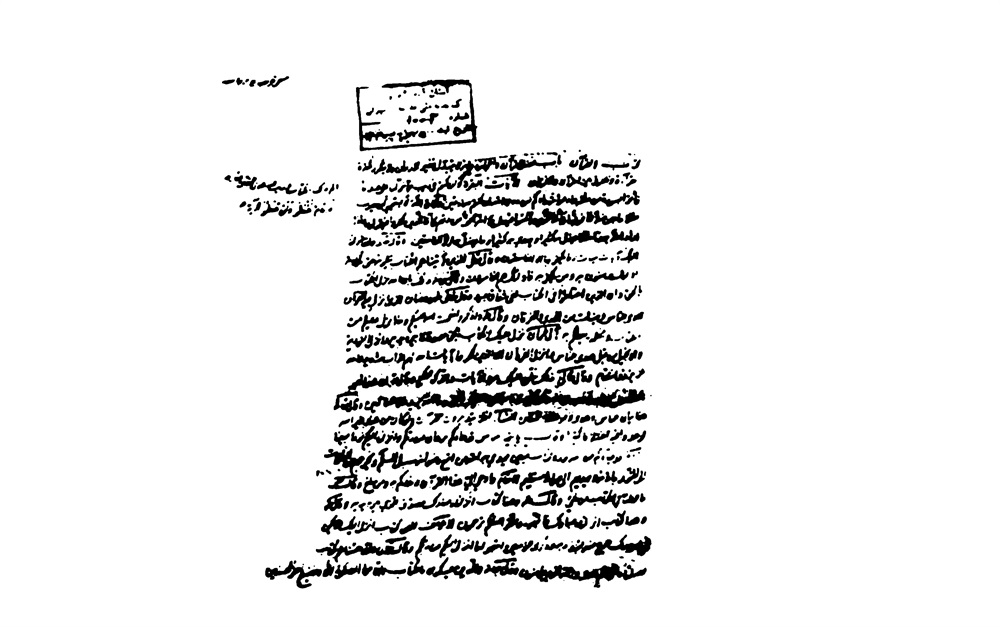
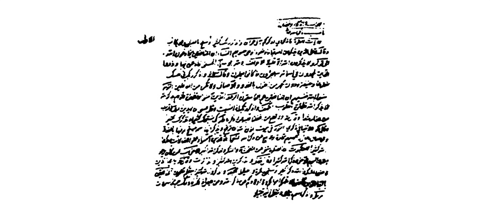
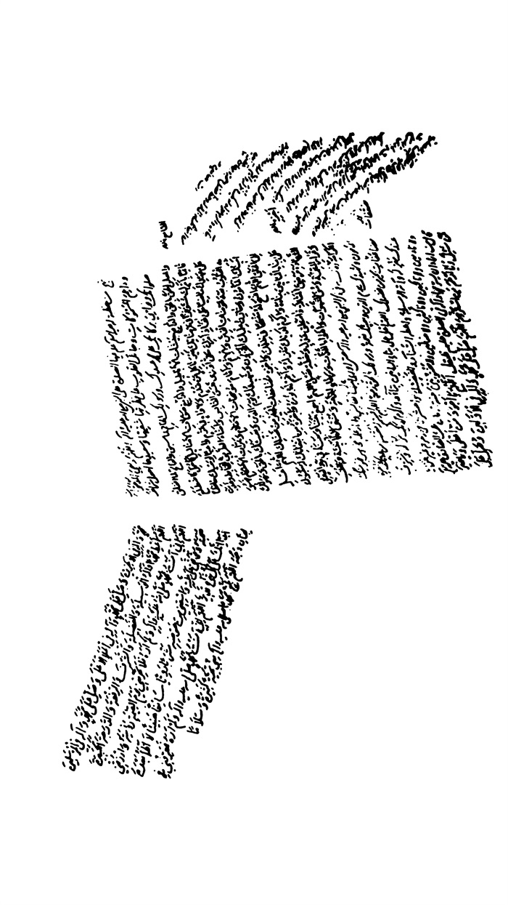
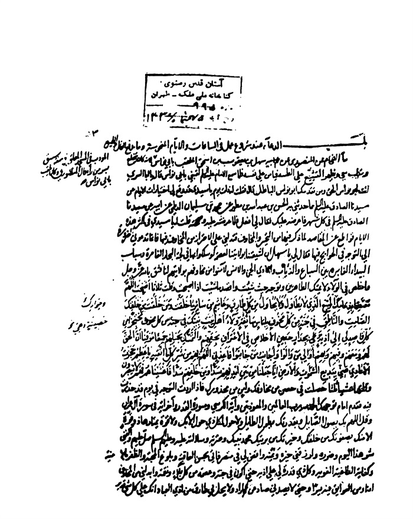
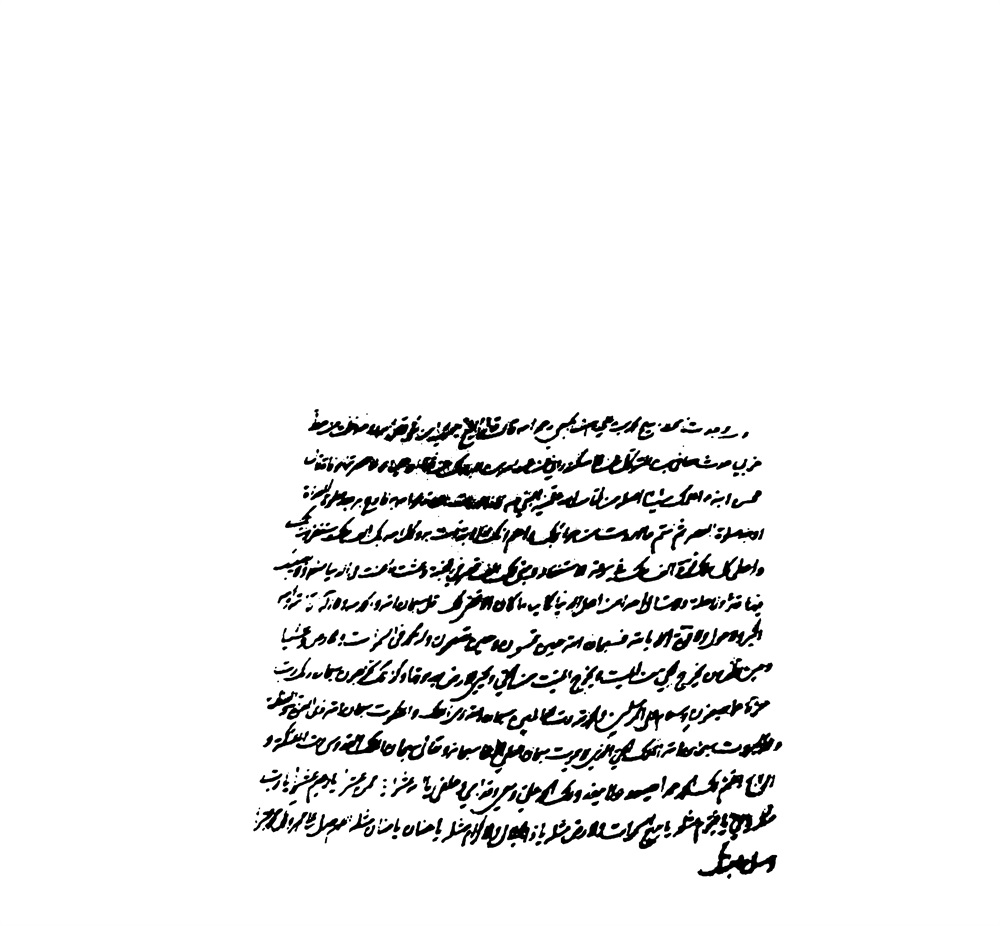

بحار الانوار الجامعة لدرر اخبار الائمة الاطهار المجلد 92

هوية الكتاب
بطاقة تعريف: مجلسي محمد باقربن محمدتقي 1037 - 1111ق.
عنوان واسم المؤلف: بحار الأنوار الجامعة لدرر أخبار الأئمة الأطهار المجلد 92: تأليف محمد باقربن محمدتقي المجلسي.
عنوان واسم المؤلف: بيروت داراحياء التراث العربي [ -13].
مظهر: ج - عينة.
ملاحظة: عربي.
ملاحظة: فهرس الكتابة على أساس المجلد الرابع والعشرين، 1403ق. [1360].
ملاحظة: المجلد108،103،94،91،92،87،67،66،65،52،24(الطبعة الثالثة: 1403ق.=1983م.=[1361]).
ملاحظة: فهرس.
محتويات: ج.24.كتاب الامامة. ج.52.تاريخ الحجة. ج67،66،65.الإيمان والكفر. ج.87.كتاب الصلاة. ج.92،91.الذكر و الدعا. ج.94.كتاب السوم. ج.103.فهرست المصادر. ج.108.الفهرست.-
عنوان: أحاديث الشيعة — قرن 11ق
ترتيب الكونجرس: BP135/م3ب31300 ي ح
تصنيف ديوي: 297/212
رقم الببليوغرافيا الوطنية: 1680946
ص: 1

تتمة كتاب الذكر و الدعا 

تتمة أبواب أحراز النبی و الأئمة علیهم السلام 

باب 53 الدعاء عند شروع عمل فی الساعات و الأیام المنحوسة و ما یدفع الفال و الطیرة

«1»- ما، [الأمالی للشیخ الطوسی] الْفَحَّامُ عَنِ الْمَنْصُورِیِّ عَنْ سَهْلِ بْنِ یَعْقُوبَ بْنِ إِسْحَاقَ الْمُلَقَّبِ بِأَبِی نُوَاسٍ الْمُؤَدِّبِ فِی الْمَسْجِدِ الْمُعَلَّقِ فِی صُفَّةِ سُبَیْقٍ بِسُرَّ مَنْ رَأَی قَالَ الْمَنْصُورِیُّ: وَ كَانَ یُلَقَّبُ بِأَبِی نُوَاسٍ لِأَنَّهُ كَانَ یَتَخَلَّعُ وَ یَتَطَیَّبُ مَعِی وَ یُظْهِرُ التَّشَیُّعَ عَلَی الطَّیِّبَةِ فَیَأْمَنُ عَلَی نَفْسِهِ فَلَمَّا سَمِعَ الْإِمَامُ علیه السلام لَقَّبَنِی بِأَبِی نُوَاسٍ قَالَ یَا أَبَا السَّرِیِّ أَنْتَ أَبُو نُوَاسٍ الْحَقُّ وَ مَنْ تَقَدَّمَكَ أَبُو نُوَاسٍ الْبَاطِلُ قَالَ فَقُلْتُ لَهُ ذَاتَ یَوْمٍ یَا سَیِّدِی قَدْ وَقَعَ لِی اخْتِیَارَاتُ الْأَیَّامِ عَنْ سَیِّدِنَا الصَّادِقِ علیه السلام مِمَّا حَدَّثَنِی بِهِ الْحَسَنُ بْنُ عَبْدِ اللَّهِ بْنِ مُطَهَّرٍ عَنْ مُحَمَّدِ بْنِ سُلَیْمَانَ الدَّیْلَمِیِّ عَنْ أَبِیهِ عَنْ سَیِّدِنَا الصَّادِقِ علیه السلام فِی كُلِّ شَهْرٍ فَأَعْرِضُهُ عَلَیْكَ فَقَالَ لِی افْعَلْ فَلَمَّا عَرَضْتُهُ عَلَیْهِ وَ صَحَّحْتُهُ قُلْتُ لَهُ یَا سَیِّدِی فِی أَكْثَرِ هَذِهِ الْأَیَّامِ قَوَاطِعُ عَنِ الْمَقَاصِدِ لِمَا ذُكِرَ فِیهَا مِنَ التَّحَیُّرِ وَ الْمَخَاوِفِ فَتَدُلُّنِی عَلَی الِاحْتِرَازِ مِنَ الْمَخَاوِفِ فِیهَا فَإِنَّمَا تَدْعُونِی الضَّرُورَةُ إِلَی التَّوَجُّهِ فِی الْحَوَائِجِ فِیهَا فَقَالَ لِی یَا سَهْلُ إِنَّ لِشِیعَتِنَا بِوَلَایَتِنَا لَعِصْمَةً لَوْ سَلَكُوا بِهَا فِی لُجَّةِ الْبِحَارِ الْغَامِرَةِ وَ سَبَاسِبِ الْبِیدِ الْغَائِرَةِ(1) بَیْنَ السِّبَاعِ وَ الذِّئَابِ وَ أَعَادِی الْجِنِّ وَ الْإِنْسِ لَأَمِنُوا مِنْ مَخَاوِفِهِمْ

> **پاورقی**: 1- 1. السباسب جمع سبسب و هو المفازة، أو الأرض المستویة البعیدة و البید جمع البیداء.

بِوَلَایَتِهِمْ لَنَا فَثِقْ بِاللَّهِ عَزَّ وَ جَلَّ وَ أَخْلِصْ فِی الْوَلَاءِ لِأَئِمَّتِكَ الطَّاهِرِینَ وَ تَوَجَّهْ حَیْثُ شِئْتَ وَ اقْصِدْ مَا شِئْتَ إِذَا أَصْبَحْتَ وَ قُلْتَ ثَلَاثاً أَصْبَحْتُ اللَّهُمَّ مُعْتَصِماً بِذِمَامِكَ وَ جِوَارِكَ الْمَنِیعِ الَّذِی لَا یُطَاوَلُ وَ لَا یُحَاوَلُ مِنْ شَرِّ كُلِّ طَارِقٍ وَ غَاشِمٍ مِنْ سَائِرِ مَنْ خَلَقْتَ وَ مَا خَلَقْتَ مِنْ خَلْقِكَ الصَّامِتِ وَ النَّاطِقِ فِی جُنَّةٍ مِنْ كُلِّ مَخُوفٍ بِلِبَاسٍ سَابِغَةٍ هُوَ وَلَاءُ أَهْلِ بَیْتِ نَبِیِّكَ مُحْتَجِزاً مِنْ كُلِّ قَاصِدٍ لِی أَذِیَّةً بِجِدَارٍ حَصِینٍ الْإِخْلَاصِ فِی الِاعْتِرَافِ بِحَقِّهِمْ وَ التَّمَسُّكِ بِحَبْلِهِمْ جَمِیعاً مُوْقِناً أَنَّ الْحَقَّ لَهُمْ وَ مَعَهُمْ وَ فِیهِمْ وَ بِهِمْ أُوَالِی مَنْ وَالَوْا وَ أُجَانِبُ مَنْ جَانَبُوا فَأَعِذْنِی اللَّهُمَّ بِهِمْ مِنْ شَرِّ كُلِّ مَا أَتَّقِیهِ یَا عَظِیمُ حَجَزْتُ الْأَعَادِیَ عَنِّی بِبَدِیعِ السَّمَاوَاتِ وَ الْأَرْضِ إِنَّا جَعَلْنا مِنْ بَیْنِ أَیْدِیهِمْ سَدًّا وَ مِنْ خَلْفِهِمْ سَدًّا فَأَغْشَیْناهُمْ فَهُمْ لا یُبْصِرُونَ وَ قُلْتَهَا عَشِیّاً ثَلَاثاً حَصَلْتَ فِی حِصْنٍ مِنْ مَخَاوِفِكَ وَ أَمْنٍ مِنْ مَحْذُورِكَ فَإِذَا أَرَدْتَ التَّوَجُّهَ فِی یَوْمٍ قَدْ حَذَرْتَ فِیهِ فَقَدِّمْ أَمَامَ تَوَجُّهِكَ الْحَمْدُ لِلَّهِ رَبِّ الْعَالَمِینَ وَ الْمُعَوِّذَتَیْنِ وَ آیَةَ الْكُرْسِیِّ وَ سُورَةَ الْقَدْرِ وَ آخِرَ آیَةٍ فِی سُورَةِ آلِ عِمْرَانَ وَ قُلِ اللَّهُمَّ بِكَ یَصُولُ الصَّائِلُ وَ بِقُدْرَتِكَ یَطُولُ الطَّائِلُ وَ لَا حَوْلَ لِكُلِّ ذِی حَوْلٍ إِلَّا بِكَ وَ لَا قُوَّةَ یَمْتَارُهَا ذُو قُوَّةٍ إِلَّا مِنْكَ بِصَفْوَتِكَ مِنْ خَلْقِكَ وَ خِیَرَتِكَ مِنْ بَرِیَّتِكَ مُحَمَّدٍ نَبِیِّكَ وَ عِتْرَتِهِ وَ سُلَالَتِهِ عَلَیْهِ وَ عَلَیْهِمُ السَّلَامُ صَلِّ عَلَیْهِمْ وَ اكْفِنِی شَرَّ هَذَا الْیَوْمِ وَ ضَرَرَهُ وَ ارْزُقْنِی خَیْرَهُ وَ یُمْنَهُ وَ اقْضِ لِی فِی مُتَصَرَّفَاتِی بِحُسْنِ الْعَاقِبَةِ وَ بُلُوغِ الْمَحَبَّةِ
وَ الظَّفَرِ بِالْأُمْنِیَّةِ وَ كِفَایَةِ الطَّاغِیَةِ الْغَوِیَّةِ وَ كُلِّ ذِی قُدْرَةٍ لِی عَلَی أَذِیَّةٍ حَتَّی أَكُونَ فِی جُنَّةٍ وَ عِصْمَةٍ مِنْ كُلِّ بَلَاءٍ وَ نَقِمَةٍ وَ أَبْدِلْنِی مِنَ الْمَخَاوِفِ أَمْناً وَ مِنَ الْعَوَائِقِ فِیهِ یُسْراً وَ حَتَّی لَا یَصُدَّنِی صَادٌّ عَنِ الْمُرَادِ وَ لَا یَحُلَّ بِی طَارِقٌ مِنْ أَذَی الْعِبَادِ إِنَّكَ عَلی كُلِّ شَیْ ءٍ قَدِیرٌ وَ الْأُمُورُ إِلَیْكَ تَصِیرُ یَا مَنْ لَیْسَ كَمِثْلِهِ شَیْ ءٌ وَ هُوَ السَّمِیعُ الْبَصِیرُ(1). 
«2»- مكا، [مكارم الأخلاق] فِی الْفَالِ وَ الطِّیَرَةِ فِی الْحَدِیثِ: أَنَّ النَّبِیَّ صلی اللّٰه علیه و آله كَانَ یُحِبُّ الْفَالَ 
ص: 2

> **پاورقی**: 1- 1. أمالی الطوسیّ ج 1 ص 283 و قد مر الحدیث مشروحا فی ج 59 ص 27 فراجع.

الْحَسَنَ وَ یَكْرَهُ الطِّیَرَةَ وَ كَانَ علیه السلام یَأْمُرُ مَنْ رَأَی شَیْئاً یَكْرَهُهُ وَ یَتَطَیَّرُ مِنْهُ أَنْ یَقُولَ اللَّهُمَّ لَا یُؤْتِی الْخَیْرَ إِلَّا أَنْتَ وَ لَا یَدْفَعُ السَّیِّئَاتِ إِلَّا أَنْتَ وَ لَا حَوْلَ وَ لَا قُوَّةَ إِلَّا بِكَ (1).
«3»- مكا، [مكارم الأخلاق]: مَا یُقَالُ إِذَا اضْطُرَّ الْإِنْسَانُ إِلَی التَّوَجُّهِ فِی أَحَدِ الْأَیَّامِ الَّتِی نُهِیَ عَنِ السَّعْیِ فِیهَا فِی دُبُرِ كُلِّ فَرِیضَةٍ وَ هُوَ مِنْ أَدْعِیَةِ الْفَرَجِ لَا حَوْلَ وَ لَا قُوَّةَ إِلَّا بِاللَّهِ أَحُلُّ بِهَا كُلَّ عُقْدَةٍ لَا حَوْلَ وَ لَا قُوَّةَ إِلَّا بِاللَّهِ أَجْلُو بِهَا كُلَّ ظُلْمَةٍ لَا حَوْلَ وَ لَا قُوَّةَ إِلَّا بِاللَّهِ أَفْتَحُ بِهَا كُلَّ بَابٍ لَا حَوْلَ وَ لَا قُوَّةَ إِلَّا بِاللَّهِ أَسْتَعِینُ بِهَا عَلَی كُلِّ شِدَّةٍ وَ مُصِیبَةٍ لَا حَوْلَ وَ لَا قُوَّةَ إِلَّا بِاللَّهِ أَعْتَصِمُ بِهَا مِنْ كُلِّ مَحْذُورٍ أُحَاذِرُهُ لَا حَوْلَ وَ لَا قُوَّةَ إِلَّا بِاللَّهِ أَسْتَوْجِبُ بِهَا الْعَفْوَ وَ الْعَافِیَةَ وَ الرِّضَا مِنَ اللَّهِ لَا حَوْلَ وَ لَا قُوَّةَ إِلَّا بِاللَّهِ تَفْرُقُ أَعْدَاءَ اللَّهِ وَ غَلَبَتْ حُجَّةُ اللَّهِ وَ بَقِیَ وَجْهُ اللَّهِ لَا حَوْلَ وَ لَا قُوَّةَ إِلَّا بِاللَّهِ اللَّهُمَّ رَبَّ الْأَرْوَاحِ الْفَانِیَةِ وَ رَبَّ الْأَجْسَادِ الْبَالِیَةِ وَ رَبَّ الشُّعُورِ الْمُتَمَعِّطَةِ وَ الْجُلُودِ الْمُمَزَّقَةِ وَ رَبِّ الْعِظَامِ النَّخِرَةِ وَ رَبِّ السَّاعَةِ الْقَائِمَةِ أَسْأَلُكَ یَا رَبِّ أَنْ تُصَلِّیَ عَلَی مُحَمَّدٍ وَ آلِ مُحَمَّدٍ وَ عَلَی أَهْلِ بَیْتِهِ الطَّاهِرِینَ وَ افْعَلْ بِی ذَلِكَ بِخَفِیِّ لُطْفِكَ یَا ذَا الْجَلَالِ وَ الْإِكْرَامِ آمِینَ آمِینَ (2).
ص: 3

> **پاورقی**: 1- 1. مكارم الأخلاق ص 403.

> **پاورقی**: 2- 2. مكارم الأخلاق ص 558.

باب 54 ما یجوز من النشرة و التمیمة و الرقیة و العوذة و ما لا یجوز و آداب حمل العوذات و استعمالها

باب 54 ما یجوز من النشرة و التمیمة و الرقیة(1) و العوذة و ما لا یجوز و آداب حمل العوذات و استعمالها
«1»- طب، [طب الأئمة] علیهم السلام إِبْرَاهِیمُ بْنُ مَأْمُونٍ عَنْ حَمَّادِ بْنِ عِیسَی عَنْ شُعَیْبٍ الْعَقَرْقُوفِیِّ عَنْ أَبِی بَصِیرٍ عَنْ أَبِی عَبْدِ اللَّهِ علیه السلام قَالَ: لَا بَأْسَ بِالرُّقَی مِنَ الْعَیْنِ وَ الْحُمَّی وَ الضِّرْسِ وَ كُلِّ ذَاتِ هَامَّةٍ لَهَا حُمَةٌ(2) إِذَا عَلِمَ الرَّجُلُ مَا یَقُولُ لَا یُدْخِلْ فِی رُقْیَتِهِ وَ عُوذَتِهِ شَیْئاً لَا یَعْرِفُهُ (3).
«2»- طب، [طب الأئمة] علیهم السلام مُحَمَّدُ بْنُ زَیْدِ بْنِ سُلَیْمٍ الْكُوفِیُّ عَنِ النَّضْرِ عَنْ عَبْدِ اللَّهِ بْنِ سِنَانٍ عَنْ أَبِی عَبْدِ اللَّهِ علیه السلام قَالَ: سَأَلْتُهُ عَنْ رُقْیَةِ الْعَقْرَبِ وَ الْحَیَّةِ وَ النُّشْرَةِ وَ رُقْیَةِ الْمَجْنُونِ وَ الْمَسْحُورِ الَّذِی یُعَذَّبُ قَالَ یَا ابْنَ سِنَانٍ لَا بَأْسَ بِالرُّقْیَةِ وَ الْعُوذَةِ وَ النَّشْرِ إِذَا كَانَتْ مِنَ الْقُرْآنِ وَ مَنْ لَمْ یَشْفِهِ الْقُرْآنُ فَلَا شَفَاهُ اللَّهُ وَ هَلْ شَیْ ءٌ أَبْلَغُ فِی هَذِهِ الْأَشْیَاءِ مِنَ الْقُرْآنِ أَ لَیْسَ اللَّهُ یَقُولُ وَ نُنَزِّلُ مِنَ الْقُرْآنِ ما هُوَ شِفاءٌ وَ رَحْمَةٌ لِلْمُؤْمِنِینَ (4) أَ لَیْسَ یَقُولُ تَعَالَی ذِكْرُهُ وَ جَلَّ ثَنَاؤُهُ لَوْ أَنْزَلْنا هذَا الْقُرْآنَ عَلی جَبَلٍ لَرَأَیْتَهُ خاشِعاً مُتَصَدِّعاً مِنْ خَشْیَةِ اللَّهِ (5) سَلُونَا نُعَلِّمْكُمْ وَ نُوقِفْكُمْ عَلَی قَوَارِعِ الْقُرْآنِ لِكُلِّ دَاءٍ(6).
ص: 4

> **پاورقی**: 1- 1. یقال: رقاه یرقیه رقیا و رقیة: عوذة و نفث فی عوذته، و ربما عدی بعلی فقیل رقی علیه، تضمینا له لمعنی قرأ و نفث، و الرقیة بالضم كاللقمة: العوذة و الجمع رقی بالضم كهدی، و التمیمة: عوذة تعلق علی الصبیان مخافة العین، و منه قوله علیه السلام: من علق تمیمة فلا أتم اللّٰه له، و یقال التمیمة فی الحدیث الخزرة.

> **پاورقی**: 2- 2. الهامة ما له سم كالحیة، و الحمة كثبة: الابرة یضرب بها الزنبور و الحیة و نحو ذلك أو یلدغ بها.

> **پاورقی**: 3- 3. طبّ الأئمّة: 48.

> **پاورقی**: 4- 4. أسری: 82.

> **پاورقی**: 5- 5. الحشر: 21.

> **پاورقی**: 6- 6. طبّ الأئمّة ص 48.

«3»- طب، [طب الأئمة] علیهم السلام أَحْمَدُ بْنُ مُحَمَّدِ بْنِ مُسْلِمٍ قَالَ: سَأَلْتُ أَبَا جَعْفَرٍ مُحَمَّدَ الْبَاقِرِ علیه السلام أَ یَتَعَوَّذُ بِشَیْ ءٍ مِنْ هَذِهِ الرُّقَی قَالَ لَا إِلَّا مِنَ الْقُرْآنِ فَإِنَّ عَلِیّاً علیه السلام كَانَ یَقُولُ إِنَّ كَثِیراً مِنَ الرُّقَی وَ التَّمَائِمِ مِنَ الْإِشْرَاكِ (1).
«4»- طب، [طب الأئمة] علیهم السلام جَعْفَرُ بْنُ عَبْدِ اللَّهِ بْنِ مَیْمُونٍ السَّعْدِیِّ عَنِ النَّضْرِ بْنِ یَزِیدَ عَنِ الْقَاسِمِ قَالَ أَبُو عَبْدِ اللَّهِ الصَّادِقُ علیه السلام: إِنَّ كَثِیراً مِنَ التَّمَائِمِ شِرْكٌ (2).
«5»- طب، [طب الأئمة] علیهم السلام إِسْحَاقُ بْنُ یُوسُفَ عَنْ فَضَالَةَ عَنْ أَبَانِ بْنِ عُثْمَانَ عَنْ زُرَارَةَ بْنِ أَعْیَنَ قَالَ: سَأَلْتُ أَبَا جَعْفَرٍ الْبَاقِرَ علیه السلام عَنِ الْمَرِیضِ هَلْ یُعَلَّقُ عَلَیْهِ تَعْوِیذٌ أَوْ شَیْ ءٌ مِنَ الْقُرْآنِ فَقَالَ نَعَمْ لَا بَأْسَ بِهِ إِنَّ قَوَارِعَ الْقُرْآنِ تَنْفَعُ فَاسْتَعْمِلُوهَا(3).
طب، [طب الأئمة] علیهم السلام إِسْحَاقُ بْنُ یُوسُفَ عَنْ فَضَالَةَ بْنِ عُثْمَانَ عَنْ إِسْحَاقَ بْنِ عَمَّارٍ عَنْ أَبِی عَبْدِ اللَّهِ الصَّادِقِ علیه السلام: فِی الرَّجُلِ یَكُونُ بِهِ الْعِلَّةُ فَیُكْتَبُ لَهُ الْقُرْآنُ فَیُعَلَّقُ عَلَیْهِ أَوْ یُكْتَبُ لَهُ فَیَغْسِلُهُ وَ یَشْرَبُهُ فَقَالَ لَا بَأْسَ بِهِ كُلِّهِ (4).
«7»- طب، [طب الأئمة] علیهم السلام عَلَّانُ بْنُ مُحَمَّدٍ عَنْ صَفْوَانَ عَنْ مَنْصُورِ بْنِ حَازِمٍ عَنْ عَنْبَسَةَ بْنِ مُصْعَبٍ عَنْ أَبِی عَبْدِ اللَّهِ علیه السلام قَالَ: لَا بَأْسَ بِالتَّعْوِیذِ أَنْ یَكُونَ لِلصَّبِیِّ وَ الْمَرْأَةِ(5).
«8»- طب، [طب الأئمة] علیهم السلام عُمَرُ بْنُ عَبْدِ اللَّهِ بْنِ عُمَرَ التَّمِیمِیُّ عَنْ حَمَّادِ بْنِ عِیسَی عَنْ شُعَیْبٍ الْعَقَرْقُوفِیِّ عَنِ الْحَلَبِیِّ قَالَ: سَأَلْتُ جَعْفَرَ بْنَ مُحَمَّدٍ علیهما السلام فَقُلْتُ یَا ابْنَ رَسُولِ اللَّهِ هَلْ نُعَلِّقُ شَیْئاً مِنَ الْقُرْآنِ وَ الرُّقَی عَلَی صِبْیَانِنَا وَ نِسَائِنَا فَقَالَ نَعَمْ إِذَا كَانَ فِی أَدِیمٍ تَلْبَسُهُ الْحَائِضُ وَ إِذَا لَمْ یَكُنْ فِی أَدِیمٍ لَمْ تَلْبَسْهُ الْمَرْأَةُ(6).
«9»- طب، [طب الأئمة] علیهم السلام شُعَیْبُ بْنُ زُرَیْقٍ عَنْ فَضَالَةَ وَ الْقَاسِمِ مَعاً عَنْ أَبَانِ بْنِ عُثْمَانَ عَنْ عَبْدِ الرَّحْمَنِ بْنِ أَبِی عَبْدِ اللَّهِ وَ هُوَ ابْنُ سَالِمٍ قَالَ: سَأَلْتُ أَبَا عَبْدِ اللَّهِ علیه السلام عَنِ الْمَرِیضِ هَلْ یُعَلَّقُ عَلَیْهِ شَیْ ءٌ مِنَ الْقُرْآنِ أَوِ التَّعْوِیذِ قَالَ لَا بَأْسَ قُلْتُ رُبَّمَا أَصَابَتْنَا الْجَنَابَةُ قَالَ إِنَّ الْمُؤْمِنَ لَیْسَ بِنَجَسٍ وَ لَكِنَّ الْمَرْأَةَ لَا تَلْبَسُهُ إِذَا لَمْ یَكُنْ فِی أَدِیمٍ وَ أَمَّا الرَّجُلُ وَ الصَّبِیُّ فَلَا بَأْسَ (7).
ص: 5

> **پاورقی**: 1- 1. طبّ الأئمّة ص 48.

> **پاورقی**: 2- 2. طبّ الأئمّة ص 48.

> **پاورقی**: 3- 3. طبّ الأئمّة ص 48.

> **پاورقی**: 4- 4. طبّ الأئمّة ص 49.

> **پاورقی**: 5- 5. طبّ الأئمّة ص 49.

> **پاورقی**: 6- 6. طبّ الأئمّة ص 49.

> **پاورقی**: 7- 7. طبّ الأئمّة ص 49.

«10»- ل، [الخصال] ابْنُ الْوَلِیدِ عَنِ الصَّفَّارِ عَنِ ابْنِ هَاشِمٍ عَنِ النَّوْفَلِیِّ عَنِ السَّكُونِیِّ عَنِ الصَّادِقِ عَنْ أَبِیهِ علیهما السلام أَنَّ النَّبِیَّ صلی اللّٰه علیه و آله قَالَ: لَا رُقَی إِلَّا فِی ثَلَاثَةٍ فِی حُمَةٍ أَوْ عَیْنٍ أَوْ دَمٍ لَا یَرْقَأُ(1).
«11»- ل، [الخصال] الْعِجْلِیُّ عَنِ ابْنِ زَكَرِیَّا عَنِ ابْنِ حَبِیبٍ عَنِ ابْنِ بُهْلُولٍ عَنْ أَبِیهِ عَنِ الْحُسَیْنِ بْنِ مُصْعَبٍ قَالَ قَالَ أَبُو عَبْدِ اللَّهِ علیه السلام: یُكْرَهُ النَّفْخُ فِی الرُّقَی وَ الطَّعَامِ وَ مَوْضِعِ السُّجُودِ(2).
«12»- ب، [قرب الإسناد] ابْنُ طَرِیفٍ عَنِ ابْنِ عُلْوَانَ عَنِ الصَّادِقِ عَنْ أَبِیهِ علیهما السلام قَالَ: أَصَابَ رَجُلٌ لِرَجُلٍ بِالْعَیْنِ فَذُكِرَ ذَلِكَ لِرَسُولِ اللَّهِ صلی اللّٰه علیه و آله فَقَالَ رَسُولُ اللَّهِ صلی اللّٰه علیه و آله الْتَمِسُوا لَهُ مَنْ یَرْقِیهِ (3).
«13»- ب، [قرب الإسناد] عَلِیٌّ عَنْ أَخِیهِ علیه السلام قَالَ: سَأَلْتُهُ عَنِ الْمَرِیضِ یُكْوَی أَوْ یَسْتَرْقِی قَالَ لَا بَأْسَ إِذَا اسْتَرْقَی بِمَا یَعْرِفُهُ (4).

باب 55 العوذات الجامعة لجمیع الأمراض و الأوجاع

«1»- طب، [طب الأئمة علیهم السلام] مُحَمَّدُ بْنُ كَثِیرٍ الدِّمَشْقِیُّ عَنِ الْحُسَیْنِ بْنِ عَلِیِّ بْنِ یَقْطِینٍ عَنِ الرِّضَا علیه السلام قَالَ: أَخَذْتُ هَذِهِ الْعُوذَةَ مِنَ الرِّضَا وَ ذَكَرَ أَنَّهَا جَامِعَةٌ مَانِعَةٌ وَ هِیَ حِرْزٌ وَ أَمَانٌ مِنْ كُلِّ دَاءٍ وَ خَوْفٍ بِسْمِ اللَّهِ الرَّحْمنِ الرَّحِیمِ بِسْمِ اللَّهِ اخْسَؤُا فِیها وَ لاتُكَلِّمُونِ أَعُوذُ بِالرَّحْمنِ مِنْكَ إِنْ كُنْتَ تَقِیًّا أَوْ غَیْرَ تَقِیٍّ أَخَذْتُ بِسَمْعِ اللَّهِ وَ بَصَرِهِ عَلَی أَسْمَاعِكُمْ وَ أَبْصَارِكُمْ وَ بِقُوَّةِ اللَّهِ عَلَی قُوَّتِكُمْ لَا سُلْطَانَ لَكُمْ عَلَی فُلَانِ بْنِ فُلَانٍ وَ لَا عَلَی ذُرِّیَّتِهِ وَ لَا 
ص: 6

> **پاورقی**: 1- 1. الخصال ج 1 ص 76.

> **پاورقی**: 2- 2. الخصال ج 1 ص 76.

> **پاورقی**: 3- 3. قرب الإسناد ص 70.

> **پاورقی**: 4- 4. قرب الإسناد ص 128.

عَلَی مَالِهِ وَ لَا عَلَی أَهْلِ بَیْتِهِ سَتَرْتُ بَیْنَكُمْ وَ بَیْنَهُ بِسَتْرِ النُّبُوَّةِ الَّتِی اسْتَتَرُوا بِهَا مِنْ سَطَوَاتِ الْفَرَاعِنَةِ جَبْرَئِیلُ عَنْ أَیْمَانِكُمْ وَ مِیكَائِیلُ عَنْ یَسَارِكُمْ وَ مُحَمَّدٌ صلی اللّٰه علیه و آله وَ أَهْلُ بَیْتِهِ أَمَامَكُمْ وَ اللَّهُ تَعَالَی مُظِلٌّ عَلَیْكُمْ یَمْنَعُهُ اللَّهُ وَ ذُرِّیَّتَهُ وَ مَالَهُ وَ أَهْلَ بَیْتِهِ مِنْكُمْ وَ مِنَ الشَّیَاطِینِ مَا شَاءَ اللَّهُ لَا حَوْلَ وَ لَا قُوَّةَ إِلَّا بِاللَّهِ الْعَلِیِّ الْعَظِیمِ اللَّهُمَّ إِنَّهُ لَا یَبْلُغُ حِلْمُهُ أَنَاتَكَ وَ لَا یَبْلُغُهُ مَجْهُودُ نَفْسِهِ فَعَلَیْكَ تَوَكَّلْتُ وَ أَنْتَ نِعْمَ الْمَوْلی وَ نِعْمَ النَّصِیرُ حَرَسَكَ اللَّهُ وَ ذُرِّیَّتَكَ یَا فُلَانُ بِمَا حَرَسَ اللَّهُ بِهِ أَوْلِیَاءَهُ وَ صَلَّی اللَّهُ عَلَی مُحَمَّدٍ وَ أَهْلِ بَیْتِهِ وَ تَكْتُبُ آیَةَ الْكُرْسِیِّ إِلَی قَوْلِهِ وَ هُوَ الْعَلِیُّ الْعَظِیمُ ثُمَّ تَكْتُبُ لَا حَوْلَ وَ لَا قُوَّةَ إِلَّا بِاللَّهِ الْعَلِیِّ الْعَظِیمِ وَ لَا مَلْجَأَ مِنَ اللَّهِ إِلَّا إِلَیْهِ حَسْبُنَا اللَّهُ وَ نِعْمَ الْوَكِیلُ دل سام فی رأس السهباطا لسلسبیلایها(1).
- 2- طب، [طب الأئمة علیهم السلام] أَحْمَدُ بْنُ زِیَادٍ عَنْ فَضَالَةَ بْنِ أَیُّوبَ عَنْ إِسْمَاعِیلَ بْنِ زِیَادٍ عَنْ أَبِی عَبْدِ اللَّهِ علیه السلام قَالَ: كَانَ رَسُولُ اللَّهِ صلی اللّٰه علیه و آله إِذَا أَصَابَهُ كَسَلٌ أَوْ صُدَاعٌ بَسَطَ یَدَیْهِ فَقَرَأَ فَاتِحَةَ الْكِتَابِ وَ الْمُعَوِّذَتَیْنِ ثُمَّ یَمْسَحُ بِهِمَا وَجْهَهُ فَیَذْهَبُ عَنْهُ مَا كَانَ یَجِدُ(2).
مكا، [مكارم الأخلاق] عَنِ الرِّضَا علیه السلام: مِثْلَهُ وَ زَادَ فِیهِ قُلْ هُوَ اللَّهُ أَحَدٌ(3).
«3»- طب، [طب الأئمة علیهم السلام] مُحَمَّدُ بْنُ جَعْفَرٍ الْبُرْسِیُّ عَنْ مُحَمَّدِ بْنِ یَحْیَی الْأَرْمَنِیِّ عَنْ مُحَمَّدِ بْنِ سِنَانٍ عَنْ سَلَمَةَ بْنِ مُحْرِزٍ قَالَ سَمِعْتُ أَبَا جَعْفَرٍ الْبَاقِرَ علیه السلام یَقُولُ: كُلُّ مَنْ لَمْ یُبْرِئْهُ سُورَةُ الْحَمْدِ وَ قُلْ هُوَ اللَّهُ أَحَدٌ لَمْ یُبْرِئْهُ شَیْ ءٌ وَ كُلُّ عِلَّةٍ تُبْرِئُهَا هاتین السورتین (4) [هَاتَانِ السُّورَتَانِ]. 
«4»- طب، [طب الأئمة علیهم السلام] مُحَمَّدُ بْنُ إِبْرَاهِیمَ السَّرَّاجُ عَنْ فَضَالَةَ وَ الْقَاسِمُ جَمِیعاً عَنْ أَبَانِ بْنِ عُثْمَانَ عَنِ الثُّمَالِیِّ عَنْ أَبِی جَعْفَرٍ الْبَاقِرِ علیه السلام قَالَ: إِذَا اشْتَكَی أَحَدُكُمْ شَیْئاً فَلْیَقُلْ 
ص: 7

> **پاورقی**: 1- 1. طبّ الأئمّة ص 40، و فیه:« فی رأسی للسماطا» و قد مر مثله نقلا من كتاب مهج الدعوات راجع ج 94 ص 345.

> **پاورقی**: 2- 2. طبّ الأئمّة ص 39.

> **پاورقی**: 3- 3. مكارم الأخلاق ص 421.

> **پاورقی**: 4- 4. طبّ الأئمّة ص 39.

بِسْمِ اللَّهِ وَ بِاللَّهِ وَ صَلَّی اللَّهُ عَلَی رَسُولِ اللَّهِ وَ أَهْلِ بَیْتِهِ وَ أَعُوذُ بِعِزَّةِ اللَّهِ وَ قُدْرَتِهِ عَلَی مَا یَشَاءُ مِنْ شَرِّ مَا أَجِدُ(1).
«5»- طب، [طب الأئمة علیهم السلام] مُحَمَّدُ بْنُ حَامِدٍ عَنْ خَلَفِ بْنِ حَمَّادٍ عَنْ خَالِدٍ الْعَبْسِیِّ قَالَ: عَلَّمَنِی عَلِیُّ بْنُ مُوسَی علیه السلام هَذِهِ الْعُوذَةَ وَ قَالَ عَلِّمْهَا إِخْوَانَكَ مِنَ الْمُؤْمِنِینَ فَإِنَّهَا لِكُلِّ أَلَمٍ وَ هِیَ أُعِیذُ نَفْسِی بِرَبِّ الْأَرْضِ وَ رَبِّ السَّمَاءِ أُعِیذُ نَفْسِی بِالَّذِی لَا یَضُرُّ مَعَ اسْمِهِ دَاءٌ أُعِیذُ نَفْسِی بِالَّذِی اسْمُهُ بَرَكَةٌ وَ شِفَاءٌ(2).
«6»- طب، [طب الأئمة علیهم السلام] مُحَمَّدُ بْنُ إِسْمَاعِیلَ عَنْ مُحَمَّدِ بْنِ خَالِدٍ عَنْ سَعْدَانَ بْنِ مُسْلِمٍ عَنْ سَعْدٍ الْمُزَنِیِّ قَالَ: أَمْلَی عَلَیْنَا أَبُو عَبْدِ اللَّهِ الصَّادِقُ علیه السلام الْعُوذَةَ الَّتِی تُسَمَّی الْجَامِعَةَ بِسْمِ اللَّهِ الرَّحْمنِ الرَّحِیمِ بِسْمِ اللَّهِ الَّذِی لَا یَضُرُّ مَعَ اسْمِهِ شَیْ ءٌ فِی الْأَرْضِ وَ لَا فِی السَّمَاءِ اللَّهُمَّ إِنِّی أَسْأَلُكَ بِاسْمِكَ الطَّاهِرِ الطُّهْرِ الْمُطَهَّرِ الْمُقَدَّسِ السَّلَامِ الْمُؤْمِنِ الْمُهَیْمِنِ الْمُبَارَكِ الَّذِی مَنْ سَأَلَكَ بِهِ أَعْطَیْتَهُ وَ مَنْ دَعَاكَ بِهِ أَجَبْتَهُ أَنْ تُصَلِّیَ عَلَی مُحَمَّدٍ وَ آلِ مُحَمَّدٍ وَ أَنْ تُعَافِیَنِی مِمَّا أَجِدُ فِی سَمْعِی وَ بَصَرِی وَ فِی یَدِی وَ رِجْلِی وَ فِی شَعْرِی وَ بَشَرِی وَ فِی بَطْنِی إِنَّكَ لَطِیفٌ لِمَا تَشَاءُ وَ أَنْتَ عَلَی كُلِّ شَیْ ءٍ قَدِیرٌ(3).
«7»- طب، [طب الأئمة علیهم السلام] إِسْحَاقُ بْنُ حَسَّانَ الْعَارِفُ (4) عَنِ الْحُسَیْنِ بْنِ مَحْبُوبٍ عَنْ جَمِیلِ بْنِ صَالِحٍ عَنْ ذَرِیحٍ الْمُحَارِبِیِّ قَالَ: دَخَلْتُ عَلَی أَبِی عَبْدِ اللَّهِ وَ هُوَ یُعَوِّذُ ابْناً لَهُ صَغِیراً وَ هُوَ یَقُولُ بِسْمِ اللَّهِ أَعْزِمُ عَلَیْكَ یَا وَجَعُ وَ یَا رِیحُ كَائِناً مَا كَانَتْ بِالْعَزِیمَةِ الَّتِی عَزَمَ بِهَا رَسُولُ اللَّهِ صلی اللّٰه علیه و آله وَ عَلِیُّ بْنُ أَبِی طَالِبٍ علیه السلام عَلَی جِنِّ وَادِی الصَّبْرَةِ فَأَجَابُوا وَ أَطَاعُوا لَمَّا أَجَبْتِ وَ أَطَعْتِ وَ خَرَجْتِ عَنِ ابْنِ فُلَانِ بْنِ فُلَانَةَ السَّاعَةَ السَّاعَةَ حَتَّی قَالَهَا ثَلَاثَ مَرَّاتٍ (5).
ص: 8

> **پاورقی**: 1- 1. طبّ الأئمّة ص 39 و 40.

> **پاورقی**: 2- 2. طبّ الأئمّة ص 41.

> **پاورقی**: 3- 3. طبّ الأئمّة ص 74.

> **پاورقی**: 4- 4. العلّاف خ، و فی المصدر المطبوع« العلّاف العارف».

> **پاورقی**: 5- 5. طبّ الأئمّة ص 91.

«8»- طب، [طب الأئمة علیهم السلام] الْحَسَنُ بْنُ الْحُسَیْنِ الدَّامَغَانِیُّ عَنِ الْحَسَنِ بْنِ عَلِیِّ بْنِ فَضَّالٍ عَنْ إِبْرَاهِیمَ بْنِ أَبِی الْبِلَادِ یَرْفَعُهُ إِلَی مُوسَی بْنِ جَعْفَرٍ الْكَاظِمِ علیهما السلام قَالَ: شَكَا إِلَیْهِ عَامِلُ الْمَدِینَةِ تَوَاتُرَ الْوَجَعِ عَلَی ابْنِهِ قَالَ تُكْتَبُ لَهُ هَذِهِ الْعُوذَةُ فِی رَقٍّ وَ تُصَیَّرُ فِی قَصَبَةِ فِضَّةٍ وَ تُعَلَّقُ عَلَی الصَّبِیِّ یَدْفَعُ اللَّهُ عَنْهُ بِهَا كُلَّ عِلَّةٍ بِسْمِ اللَّهِ أَعُوذُ بِوَجْهِكَ الْعَظِیمِ وَ عِزَّتِكَ الَّتِی لَا تُرَامُ وَ قُدْرَتِكَ الَّتِی لَا یَمْتَنِعُ مِنْهَا شَیْ ءٌ مِنْ شَرِّ مَا أَخَافُ فِی اللَّیْلِ وَ النَّهَارِ وَ مِنْ شَرِّ الْأَوْجَاعِ كُلِّهَا وَ مِنْ شَرِّ الدُّنْیَا وَ الْآخِرَةِ وَ مِنْ كُلِّ سُقْمٍ أَوْ وَجَعٍ أَوْ هَمٍّ أَوْ مَرَضٍ أَوْ بَلَاءٍ أَوْ بَلِیَّةٍ أَوْ مِمَّا عَلِمَ اللَّهُ أَنَّهُ خَلَقَنِی لَهُ وَ لَمْ أَعْلَمْهُ مِنْ نَفْسِی وَ أَعِذْنِی یَا رَبِّ مِنْ شَرِّ ذَلِكَ كُلِّهِ فِی لَیْلِی حَتَّی أُصْبِحَ وَ فِی نَهَارِی حَتَّی أُمْسِیَ وَ بِكَلِمَاتِ اللَّهِ التَّامَّاتِ الَّتِی لَا یُجَاوِزُهُنَّ بَرٌّ وَ لَا فَاجِرٌ وَ مِنْ شَرِّ ما یَنْزِلُ مِنَ السَّماءِ وَ ما یَعْرُجُ فِیها وَ ما یَلِجُ فِی الْأَرْضِ وَ ما یَخْرُجُ مِنْها وَ سَلامٌ عَلَی الْمُرْسَلِینَ وَ الْحَمْدُ لِلَّهِ رَبِّ الْعالَمِینَ أَسْأَلُكَ یَا رَبِّ بِمَا سَأَلَكَ بِهِ مُحَمَّدٌ
صَلَوَاتُ اللَّهِ عَلَیْهِ وَ عَلَی أَهْلِ بَیْتِهِ حَسْبِیَ اللَّهُ لا إِلهَ إِلَّا هُوَ عَلَیْهِ تَوَكَّلْتُ وَ هُوَ رَبُّ الْعَرْشِ الْعَظِیمِ اخْتِمْ عَلَیَّ ذَلِكَ مِنْكَ یَا بَرُّ یَا رَحِیمُ بِاسْمِكَ اللَّهُمَّ الْوَاحِدِ الْأَحَدِ الصَّمَدِ صَلَّی اللَّهُ عَلَی مُحَمَّدٍ وَ آلِ مُحَمَّدٍ وَ ادْفَعْ عَنِّی سُوءَ مَا أَجِدُ بِقُدْرَتِكَ (1).
«9»- طب، [طب الأئمة علیهم السلام] حَكِیمُ بْنُ مُحَمَّدِ بْنِ مُسْلِمٍ عَنِ الْحَسَنِ بْنِ عَلِیِّ بْنِ یَقْطِینٍ عَنْ یُونُسَ عَنِ ابْنِ سِنَانٍ عَنْ حَفْصِ بْنِ عَبْدِ الْحَمِیدِ عَنْ مُحَمَّدِ بْنِ مُسْلِمٍ عَنْ أَبِی جَعْفَرٍ مُحَمَّدِ بْنِ عَلِیٍّ علیهما السلام: أَنَّهُ اشْتَكَی بَعْضُ وُلْدِهِ فَدَنَا مِنْهُ فَقَبَّلَهُ ثُمَّ قَالَ لَهُ یَا بُنَیَّ كَیْفَ تَجِدُكَ قَالَ أَجِدُنِی وَجِعاً قَالَ قُلْ إِذَا صَلَّیْتَ الظُّهْرَ یَا اللَّهُ یَا اللَّهُ یَا اللَّهُ عَشْرَ مَرَّاتٍ فَإِنَّهُ لَا یَقُولُهَا مَكْرُوبٌ إِلَّا قَالَ الرَّبُّ تَبَارَكَ وَ تَعَالَی لَبَّیْكَ عَبْدِی مَا حَاجَتُكَ. 
وَ عَنْ أَبِی عَبْدِ اللَّهِ علیه السلام أَنَّهُ قَالَ: دُعَاءُ الْمَكْرُوبِ فِی اللَّیْلِ یَا مُنْزِلَ الشِّفَاءِ بِاللَّیْلِ وَ النَّهَارِ وَ مُذْهِبَ الدَّاءِ بِاللَّیْلِ وَ النَّهَارِ أَنْزِلْ عَلَیَّ مِنْ شِفَائِكَ شِفَاءً لِكُلِّ مَا بِی مِنَ الدَّاءِ(2).
ص: 9

> **پاورقی**: 1- 1. طبّ الأئمّة ص 92.

> **پاورقی**: 2- 2. طبّ الأئمّة ص 121.

«10»- طب، [طب الأئمة علیهم السلام] الْقَاسِمُ بْنُ بَهْرَامَ عَنْ مُحَمَّدِ بْنِ عِیسَی عَنْ أَبِی إِسْحَاقَ عَنِ الْحُسَیْنِ بْنِ الْحَسَنِ الْخُرَاسَانِیِّ وَ كَانَ مِنَ الْأَخْیَارِ قَالَ: حَضَرْتُ أَبَا عَبْدِ اللَّهِ الصَّادِقَ علیه السلام مَعَ جَمَاعَةٍ مِنْ إِخْوَانِی مِنَ الْحُجَّاجِ أَیَّامَ أَبِی الدَّوَانِیقِ فَسُئِلَ عَنْ دُعَاءِ الْمَكْرُوبِ فَقَالَ دُعَاءُ الْمَكْرُوبِ إِذَا صَلَّی صَلَاةَ اللَّیْلِ یَضَعُ یَدَهُ عَلَی مَوْضِعِ سُجُودِهِ وَ لْیَقُلْ بِسْمِ اللَّهِ بِسْمِ اللَّهِ مُحَمَّدٌ رَسُولُ اللَّهِ عَلِیٌّ إِمَامُ اللَّهِ فِی أَرْضِهِ عَلَی جَمِیعِ عِبَادِهِ اشْفِنِی یَا شَافِی لَا شِفَاءَ إِلَّا شِفَاؤُكَ شِفَاءً لَا یُغَادِرُ سُقْماً مِنْ كُلِّ دَاءٍ وَ سُقْمٍ قَالَ الْخُرَاسَانِیُّ لَا أَدْرِی أَنَّهُ قَالَ یَقُولُهَا ثَلَاثَ مَرَّاتٍ أَوْ سَبْعَ مَرَّاتٍ. 
وَ عَنْهُ علیه السلام أَنَّهُ قَالَ: دُعَاءُ الْمَكْرُوبِ الْمَلْهُوفِ وَ مَنْ قَدْ أَعْیَتْهُ الْحِیلَةُ وَ أَصَابَتْهُ بَلِیَّةٌ لا إِلهَ إِلَّا أَنْتَ سُبْحانَكَ إِنِّی كُنْتُ مِنَ الظَّالِمِینَ یَقُولُهَا لَیْلَةَ الْجُمُعَةِ إِذَا فَرَغَ مِنَ الصَّلَاةِ الْمَكْتُوبَةِ مِنَ الْعِشَاءِ الْآخِرَةِ وَ قَالَ أَخَذْتُهُ عَنْ أَبِی جَعْفَرٍ مُحَمَّدٍ الْبَاقِرِ علیه السلام قَالَ أَخَذْتُهُ عَنْ عَلِیِّ بْنِ الْحُسَیْنِ ذِی الثَّفِنَاتِ قَالَ أَخَذَهُ عَنِ الْحُسَیْنِ بْنِ عَلِیٍّ قَالَ أَخَذَهُ عَنْ أَمِیرِ الْمُؤْمِنِینَ عَلِیِّ بْنِ أَبِی طَالِبٍ علیه السلام أَخَذَهُ عَنْ رَسُولِ اللَّهِ صلی اللّٰه علیه و آله أَخَذَهُ عَنْ جَبْرَئِیلَ صَلَوَاتُ اللَّهِ عَلَیْهِمْ أَجْمَعِینَ أَخَذَهُ جَبْرَئِیلُ عَنِ اللَّهِ عَزَّ وَ جَلَ (1).
«11»- طب، [طب الأئمة علیهم السلام] عَلِیُّ بْنُ مِهْرَانَ بْنِ الْوَلِیدِ الْعَسْكَرِیُّ عَنْ مُحَمَّدِ بْنِ سَالِمٍ عَنِ الْأَرْقَطِ وَ هُوَ ابْنُ أُخْتِ أَبِی عَبْدِ اللَّهِ الصَّادِقِ علیه السلام قَالَ: مَرِضْتُ مَرَضاً شَدِیداً وَ أَرْسَلْتُ أُمِّی إِلَی خَالِی فَجَاءَ وَ أُمِّی خَارِجَةٌ فِی بَابِ الْبَیْتِ وَ هِیَ أُمُّ سَلَمَةَ بِنْتُ مُحَمَّدِ بْنِ عَلِیٍّ وَ هِیَ تَقُولُ وَا شَبَابَاهْ فَرَآهَا خَالِی فَقَالَ ضُمِّی عَلَیْكِ ثِیَابَكِ ثُمَّ ارْقَیْ فَوْقَ الْبَیْتِ ثُمَّ اكْشِفِی قِنَاعَكِ حَتَّی تُبْرِزِی شَعْرَكِ إِلَی السَّمَاءِ ثُمَّ قُولِی رَبِّ أَنْتَ أَعْطَیْتَنِیهِ وَ أَنْتَ وَهَبْتَهُ لِی اللَّهُمَّ فَاجْعَلْ هِبَتَكَ الْیَوْمَ جَدِیدَةً إِنَّكَ قَادِرٌ مُقْتَدِرٌ ثُمَّ اسْجُدِی فَإِنَّكِ لَا تَرْفَعِینَ رَأْسَكِ حَتَّی یَبْرَأَ ابْنُكِ فَسَمِعَتْ ذَلِكَ وَ فَعَلَتْهُ قَالَ فَقُمْتُ مِنْ سَاعَتِی فَخَرَجْتُ مَعَ خَالِی إِلَی الْمَسْجِدِ(2).
«12»- طب، [طب الأئمة علیهم السلام] مُحَمَّدُ بْنُ عَبْدِ اللَّهِ بْنِ زَیْدٍ عَنْ مُحَمَّدِ بْنِ بَكْرٍ الْأَزْدِیِّ عَنْ أَبِی عَبْدِ اللَّهِ علیه السلام: وَ أَوْصَی أَصْحَابَهُ وَ أَوْلِیَاءَهُ مَنْ كَانَ بِهِ عِلَّةٌ فَلْیَأْخُذْ قُلَّةً جَدِیدَةً وَ لْیَجْعَلْ
ص: 10

> **پاورقی**: 1- 1. طبّ الأئمّة ص 122.

> **پاورقی**: 2- 2. طبّ الأئمّة ص 122.

فِیهَا الْمَاءَ وَ لیستقی [لْیَسْتَقِ] الْمَاءَ بِنَفْسِهِ وَ لْیَقْرَأْ عَلَی الْمَاءِ سُورَةَ إِنَّا أَنْزَلْنَاهُ عَلَی التَّرْتِیلِ ثَلَاثِینَ مَرَّةً ثُمَّ لْیَشْرَبْ مِنْ ذَلِكَ الْمَاءِ وَ لْیَتَوَضَّأْ وَ لْیَمْسَحْ بِهِ وَ كُلَّمَا نَقَصَ زَادَ فِیهِ فَإِنَّهُ لَا یَظْهَرُ ذَلِكَ ثَلَاثَةَ أَیَّامٍ إِلَّا یُعَافِیهِ اللَّهُ تَعَالَی مِنْ ذَلِكَ الدَّاءِ(1).
«13»- طب، [طب الأئمة علیهم السلام] عَبْدُ الْوَهَّابِ بْنُ مُحَمَّدٍ الْمُقْرِی عَنْ أَبِی زَكَرِیَّا یَحْیَی بْنِ أَبِی زَكَرِیَّا عَنْ عَبْدِ اللَّهِ بْنِ الْقَاسِمِ عَنْ شَرِیفِ بْنِ سَابِقٍ التَّفْلِیسِیِّ عَنِ الْفَضْلِ بْنِ أَبِی قُرَّةَ عَنْ أَبِی عَبْدِ اللَّهِ الصَّادِقِ علیه السلام قَالَ: هَذِهِ عُوذَةٌ لِمَنِ ابْتُلِیَ بِبَلَاءٍ مِنْ هَذِهِ الْبَلَایَا الْفَادِحَةِ(2) مِثْلِ الْأَكِلَةِ وَ غَیْرِهَا تَضَعُ یَدَكَ عَلَی رَأْسِ صَاحِبِ الْبَلَاءِ ثُمَّ تَقُولُ بِسْمِ اللَّهِ وَ بِاللَّهِ وَ مِنَ اللَّهِ وَ إِلَی اللَّهِ وَ مَا شَاءَ اللَّهُ وَ لَا حَوْلَ وَ لَا قُوَّةَ إِلَّا بِاللَّهِ إِبْرَاهِیمُ خَلِیلُ اللَّهِ وَ مُوسَی كَلِیمُ اللَّهِ نُوحٌ نَجِیُّ اللَّهِ عِیسَی رُوحُ اللَّهِ مُحَمَّدٌ رَسُولُ اللَّهِ صَلَوَاتُ اللَّهِ عَلَیْهِمْ أَجْمَعِینَ مِنْ كُلِّ بَلَاءٍ فَادِحٍ وَ أَمْرٍ فَاجِعٍ وَ كُلِّ رِیحٍ وَ أَرْوَاحٍ وَ أَوْجَاعٍ قُسِمَ مِنَ اللَّهِ وَ عَزَائِمَ مِنْهُ لِفُلَانِ بْنِ فُلَانَةَ لَا یَقْرَبُهُ الْأَكِلَةُ وَ غَیْرُهُ وَ أُعِیذُهُ بِكَلِمَاتِ اللَّهِ التَّامَّاتِ الَّتِی سَأَلَ بِهَا آدَمُ علیه السلام رَبَّهُ فَتابَ عَلَیْهِ إِنَّهُ هُوَ التَّوَّابُ الرَّحِیمُ أَلَا إِنَّهَا حِرْزٌ أَیَّتُهَا الْأَوْجَاعُ وَ الْأَرْوَاحُ لِصَاحِبِهِ بِإِذْنِ اللَّهِ بِعَوْنِ اللَّهِ بِقُدْرَةِ اللَّهِ أَلا لَهُ الْخَلْقُ وَ الْأَمْرُ تَبارَكَ اللَّهُ رَبُّ الْعالَمِینَ ثُمَّ تَقْرَأُ أُمَّ الْكِتَابِ وَ آیَةَ الْكُرْسِیِّ وَ عَشْرَ آیَاتٍ مِنْ سُورَةِ یس وَ تَسْأَلُهُ بِحَقِّ مُحَمَّدٍ وَ آلِ مُحَمَّدٍ الشِّفَاءَ فَإِنَّهُ یَبْرَأُ مِنْ كُلِّ دَاءٍ بِإِذْنِ اللَّهِ تَعَالَی (3).
«14»- شی، [تفسیر العیاشی] عَنِ النَّوْفَلِیِّ عَنِ السَّكُونِیِّ عَنْ جَعْفَرِ بْنِ مُحَمَّدٍ عَنْ أَبِیهِ علیهما السلام قَالَ: قَالَ النَّبِیُّ صلی اللّٰه علیه و آله وَ قَدْ فَقَدَ رَجُلًا فَقَالَ مَا أَبْطَأَ بِكَ عَنَّا فَقَالَ السُّقْمُ وَ الْعِیَالُ 
ص: 11

> **پاورقی**: 1- 1. طبّ الأئمّة ص 123 و صدر السند فیه هكذا: محمّد بن یوسف المؤذن مؤذن مسجد سرمن رأی قال: حدّثنا محمّد بن عبد اللّٰه بن زید إلخ.

> **پاورقی**: 2- 2. الفادح: الثقیل الذی یبهظ حامله، و الاكلة: داء فی العضو یأتكل منه یقال له بالفارسیة خوره.

> **پاورقی**: 3- 3. طبّ الأئمّة ص 124.

فَقَالَ أَ لَا أُعَلِّمُكَ بِكَلِمَاتٍ تَدْعُو بِهِنَّ یُذْهِبِ اللَّهُ عَنْكَ السُّقْمَ وَ یَنْفِی عَنْكَ الْفَقْرَ تَقُولُ لَا حَوْلَ وَ لَا قُوَّةَ إِلَّا بِاللَّهِ الْعَلِیِّ الْعَظِیمِ تَوَكَّلْتُ عَلَی الْحَیِّ الَّذِی لَا یَمُوتُ الْحَمْدُ لِلَّهِ الَّذِی لَمْ یَتَّخِذْ وَلَداً وَ لَمْ یَكُنْ لَهُ شَرِیكٌ فِی الْمُلْكِ وَ لَمْ یَكُنْ لَهُ وَلِیٌّ مِنَ الذُّلِّ وَ كَبِّرْهُ تَكْبِیراً(1).
جا، [المجالس للمفید] الْمَرَاغِیُّ عَنِ الْحَسَنِ بْنِ عَلِیٍّ الْبَرْقِیِّ عَنْ جَعْفَرِ بْنِ مَرْوَانَ عَنْ أَبِیهِ عَنْ أَحْمَدَ بْنِ عِیسَی عَنِ الصَّادِقِ عَنْ أَبِیهِ علیهما السلام: مِثْلَهُ وَ فِیهِ: فَقَالَ السُّقْمُ وَ الْفَقْرُ وَ لَیْسَ فِیهِ الْعَلِیُّ الْعَظِیمُ (2).
«15»- مكا، [مكارم الأخلاق]: التَّهْلِیلُ مِنَ الْقُرْآنِ یُسْتَشْفَی بِهِ مِنْ سَائِرِ الْأَمْرَاضِ بِسْمِ اللَّهِ الرَّحْمنِ الرَّحِیمِ وَ إِلهُكُمْ إِلهٌ واحِدٌ لا إِلهَ إِلَّا هُوَ الرَّحْمنُ الرَّحِیمُ اللَّهُ لا إِلهَ إِلَّا هُوَ الْحَیُّ الْقَیُّومُ لا تَأْخُذُهُ سِنَةٌ وَ لا نَوْمٌ إِلَی قَوْلِهِ وَ هُوَ الْعَلِیُّ الْعَظِیمُ (3) بِسْمِ اللَّهِ الرَّحْمنِ الرَّحِیمِ الم اللَّهُ لا إِلهَ إِلَّا هُوَ الْحَیُّ الْقَیُّومُ هُوَ الَّذِی یُصَوِّرُكُمْ فِی الْأَرْحامِ كَیْفَ یَشاءُ لا إِلهَ إِلَّا هُوَ الْعَزِیزُ الْحَكِیمُ شَهِدَ اللَّهُ أَنَّهُ لا إِلهَ إِلَّا هُوَ إِلَی قَوْلِهِ سَرِیعُ الْحِسابِ (4) وَ إِذا حُیِّیتُمْ بِتَحِیَّةٍ فَحَیُّوا بِأَحْسَنَ مِنْها أَوْ رُدُّوها إِنَّ اللَّهَ كانَ عَلی كُلِّ شَیْ ءٍ حَسِیباً اللَّهُ لا إِلهَ إِلَّا هُوَ لَیَجْمَعَنَّكُمْ إِلی یَوْمِ الْقِیامَةِ لا رَیْبَ فِیهِ وَ مَنْ أَصْدَقُ مِنَ اللَّهِ حَدِیثاً(5) ذلِكُمُ اللَّهُ رَبُّكُمْ لا إِلهَ إِلَّا هُوَ خالِقُ كُلِّ شَیْ ءٍ فَاعْبُدُوهُ وَ هُوَ عَلی كُلِّ شَیْ ءٍ وَكِیلٌ اتَّبِعْ ما أُوحِیَ إِلَیْكَ مِنْ رَبِّكَ لا إِلهَ إِلَّا هُوَ وَ أَعْرِضْ عَنِ الْمُشْرِكِینَ (6) قُلْ یا أَیُّهَا النَّاسُ إِنِّی رَسُولُ اللَّهِ إِلَیْكُمْ جَمِیعاً الَّذِی لَهُ مُلْكُ السَّماواتِ وَ الْأَرْضِ 
ص: 12

> **پاورقی**: 1- 1. تفسیر العیّاشیّ ج 2 ص 320 فی آیة الاسراء: 111.

> **پاورقی**: 2- 2. أمالی المفید ص 142.

> **پاورقی**: 3- 3. البقرة: 158 و 256.

> **پاورقی**: 4- 4. آل عمران: 1 و 4 و 16 و 17.

> **پاورقی**: 5- 5. النساء: 88 و 89.

> **پاورقی**: 6- 6. الأنعام: 102 و 106.

لا إِلهَ إِلَّا هُوَ یُحیِی وَ یُمِیتُ فَآمِنُوا بِاللَّهِ وَ رَسُولِهِ النَّبِیِّ الْأُمِّیِّ الَّذِی یُؤْمِنُ بِاللَّهِ وَ كَلِماتِهِ وَ اتَّبِعُوهُ لَعَلَّكُمْ تَهْتَدُونَ (1) وَ ما أُمِرُوا إِلَّا لِیَعْبُدُوا إِلهاً واحِداً لا إِلهَ إِلَّا هُوَ سُبْحانَهُ عَمَّا یُشْرِكُونَ فَإِنْ تَوَلَّوْا فَقُلْ حَسْبِیَ اللَّهُ لا إِلهَ إِلَّا هُوَ عَلَیْهِ تَوَكَّلْتُ وَ هُوَ رَبُّ الْعَرْشِ الْعَظِیمِ (2) حَتَّی إِذا أَدْرَكَهُ الْغَرَقُ قالَ آمَنْتُ أَنَّهُ لا إِلهَ إِلَّا الَّذِی آمَنَتْ بِهِ بَنُوا إِسْرائِیلَ وَ أَنَا مِنَ الْمُسْلِمِینَ (3) فَإِلَّمْ یَسْتَجِیبُوا لَكُمْ فَاعْلَمُوا أَنَّما أُنْزِلَ بِعِلْمِ اللَّهِ وَ أَنْ لا إِلهَ إِلَّا هُوَ فَهَلْ أَنْتُمْ مُسْلِمُونَ (4) قُلْ هُوَ رَبِّی لا إِلهَ إِلَّا هُوَ عَلَیْهِ تَوَكَّلْتُ وَ إِلَیْهِ مَتابِ (5) یُنَزِّلُ الْمَلائِكَةَ بِالرُّوحِ مِنْ أَمْرِهِ عَلی مَنْ یَشاءُ مِنْ عِبادِهِ أَنْ أَنْذِرُوا أَنَّهُ لا إِلهَ إِلَّا أَنَا فَاتَّقُونِ (6) وَ إِنْ تَجْهَرْ بِالْقَوْلِ فَإِنَّهُ یَعْلَمُ السِّرَّ وَ أَخْفی اللَّهُ لا إِلهَ إِلَّا هُوَ لَهُ الْأَسْماءُ الْحُسْنی إِنَّكَ بِالْوادِ الْمُقَدَّسِ طُویً وَ أَنَا اخْتَرْتُكَ فَاسْتَمِعْ لِما یُوحی إِنَّنِی أَنَا اللَّهُ لا إِلهَ إِلَّا أَنَا فَاعْبُدْنِی وَ أَقِمِ
الصَّلاةَ لِذِكْرِی إِنَّ السَّاعَةَ آتِیَةٌ أَكادُ أُخْفِیها لِتُجْزی كُلُّ نَفْسٍ بِما تَسْعی إِنَّما إِلهُكُمُ اللَّهُ الَّذِی لا إِلهَ إِلَّا هُوَ وَسِعَ كُلَّ شَیْ ءٍ عِلْماً(7) وَ ما أَرْسَلْنا مِنْ قَبْلِكَ مِنْ رَسُولٍ إِلَّا نُوحِی إِلَیْهِ أَنَّهُ لا إِلهَ إِلَّا أَنَا فَاعْبُدُونِ وَ ذَا النُّونِ إِذْ ذَهَبَ مُغاضِباً فَظَنَّ أَنْ لَنْ نَقْدِرَ عَلَیْهِ فَنادی فِی الظُّلُماتِ أَنْ لا إِلهَ إِلَّا أَنْتَ سُبْحانَكَ إِنِّی كُنْتُ مِنَ الظَّالِمِینَ (8) فَتَعالَی اللَّهُ الْمَلِكُ الْحَقُّ لا إِلهَ إِلَّا هُوَ رَبُّ الْعَرْشِ الْكَرِیمِ (9)
ص: 13

> **پاورقی**: 1- 1. الأعراف: 158.

> **پاورقی**: 2- 2. براءة: 31 و 129.

> **پاورقی**: 3- 3. یونس: 90.

> **پاورقی**: 4- 4. هود: 14.

> **پاورقی**: 5- 5. الرعد: 29.

> **پاورقی**: 6- 6. النحل: 2.

> **پاورقی**: 7- 7. طه: 6 و 7 و 12- 15، 98.

> **پاورقی**: 8- 8. الأنبیاء: 25 و 87.

> **پاورقی**: 9- 9. المؤمنون: 117.

وَ یَعْلَمُ ما تُخْفُونَ وَ ما تُعْلِنُونَ اللَّهُ لا إِلهَ إِلَّا هُوَ رَبُّ الْعَرْشِ الْعَظِیمِ (1) وَ هُوَ اللَّهُ لا إِلهَ إِلَّا هُوَ لَهُ الْحَمْدُ فِی الْأُولی وَ الْآخِرَةِ وَ لَهُ الْحُكْمُ وَ إِلَیْهِ تُرْجَعُونَ (2) یا أَیُّهَا النَّاسُ اذْكُرُوا نِعْمَتَ اللَّهِ عَلَیْكُمْ هَلْ مِنْ خالِقٍ غَیْرُ اللَّهِ یَرْزُقُكُمْ مِنَ السَّماءِ وَ الْأَرْضِ لا إِلهَ إِلَّا هُوَ فَأَنَّی تُؤْفَكُونَ (3) إِنَّا كَذلِكَ نَفْعَلُ بِالْمُجْرِمِینَ إِنَّهُمْ كانُوا إِذا قِیلَ لَهُمْ لا إِلهَ إِلَّا اللَّهُ یَسْتَكْبِرُونَ وَ یَقُولُونَ أَ إِنَّا لَتارِكُوا آلِهَتِنا لِشاعِرٍ مَجْنُونٍ بَلْ جاءَ بِالْحَقِّ وَ صَدَّقَ الْمُرْسَلِینَ (4) غافِرِ الذَّنْبِ وَ قابِلِ التَّوْبِ شَدِیدِ الْعِقابِ ذِی الطَّوْلِ لا إِلهَ إِلَّا هُوَ إِلَیْهِ الْمَصِیرُ ذلِكُمُ اللَّهُ رَبُّكُمْ خالِقُ كُلِّ شَیْ ءٍ لا إِلهَ إِلَّا هُوَ فَأَنَّی تُؤْفَكُونَ هُوَ الْحَیُّ لا إِلهَ إِلَّا هُوَ فَادْعُوهُ مُخْلِصِینَ لَهُ الدِّینَ الْحَمْدُ لِلَّهِ رَبِّ الْعالَمِینَ (5) رَبِّ السَّماواتِ وَ الْأَرْضِ وَ ما بَیْنَهُما إِنْ كُنْتُمْ مُوقِنِینَ لا إِلهَ إِلَّا هُوَ یُحْیِی وَ یُمِیتُ رَبُّكُمْ وَ رَبُّ آبائِكُمُ الْأَوَّلِینَ (6) فَأَنَّی لَهُمْ إِذا جاءَتْهُمْ ذِكْراهُمْ فَاعْلَمْ أَنَّهُ لا إِلهَ إِلَّا اللَّهُ وَ اسْتَغْفِرْ لِذَنْبِكَ وَ لِلْمُؤْمِنِینَ وَ الْمُؤْمِناتِ وَ اللَّهُ یَعْلَمُ مُتَقَلَّبَكُمْ وَ مَثْواكُمْ (7) لَوْ أَنْزَلْنا هذَا الْقُرْآنَ عَلی جَبَلٍ لَرَأَیْتَهُ خاشِعاً مُتَصَدِّعاً مِنْ خَشْیَةِ اللَّهِ وَ تِلْكَ الْأَمْثالُ نَضْرِبُها لِلنَّاسِ لَعَلَّهُمْ یَتَفَكَّرُونَ إِلَی آخِرِ السُّورَةِ(8) فَإِنَّما عَلی رَسُولِنَا الْبَلاغُ الْمُبِینُ اللَّهُ لا إِلهَ إِلَّا هُوَ وَ عَلَی اللَّهِ فَلْیَتَوَكَّلِ الْمُؤْمِنُونَ (9) رَبُّ الْمَشْرِقِ وَ الْمَغْرِبِ لا إِلهَ إِلَّا هُوَ فَاتَّخِذْهُ وَكِیلًا(10). 
ص: 14

> **پاورقی**: 1- 1. النمل: 25 و 26.

> **پاورقی**: 2- 2. القصص: 71.

> **پاورقی**: 3- 3. فاطر: 3.

> **پاورقی**: 4- 4. الصافّات: 33- 37.

> **پاورقی**: 5- 5. المؤمن: 3 و 63 و 65.

> **پاورقی**: 6- 6. الدخان: 6 و 7.

> **پاورقی**: 7- 7. القتال: 20 و 21.

> **پاورقی**: 8- 8. الحشر: 21.

> **پاورقی**: 9- 9. التغابن: 12 و 13.

> **پاورقی**: 10- 10. مكارم الأخلاق: 421- 424، و الآیة فی المزّمّل: 9.

«16»- مكا، [مكارم الأخلاق] لِلشِّفَاءِ مِنْ كُلِّ دَاءٍ رُوِیَ عَنْ رَسُولِ اللَّهِ صلی اللّٰه علیه و آله أَنَّهُ قَالَ: عَلَّمَنِی جَبْرَئِیلُ دَوَاءً لَا یَحْتَاجُ مَعَهُ إِلَی دَوَاءٍ فَقِیلَ یَا رَسُولَ اللَّهِ مَا ذَلِكَ الدَّوَاءُ قَالَ یُؤْخَذُ مَاءُ الْمَطَرِ قَبْلَ أَنْ یَنْزِلَ إِلَی الْأَرْضِ ثُمَّ یَجْعَلُ فِی إِنَاءٍ نَظِیفٍ وَ یَقْرَأُ عَلَیْهِ الْحَمْدُ لِلَّهِ إِلَی آخِرِهَا سَبْعِینَ مَرَّةً ثُمَّ یَشْرَبُ مِنْهُ قَدَحاً بِالْغَدَاةِ وَ قَدَحاً بِالْعَشِیِّ قَالَ رَسُولُ اللَّهِ صَلَّی اللَّهُ عَلَیْهِ وَ آلِهِ أَجْمَعِینَ وَ الَّذِی بَعَثَنِی بِالْحَقِّ لَیَنْزِعَنَّ اللَّهُ ذَلِكَ الدَّاءَ مِنْ بَدَنِهِ وَ عِظَامِهِ وَ مخخه [مِخَخَتِهِ] وَ عُرُوقِهِ (1)
وَ مِثْلُهُ یُؤْخَذُ سَبْعُ حَبَّاتِ شُونِیزٍ(2)
وَ سَبْعُ حَبَّاتِ عَدَسٍ وَ شَیْ ءٌ مِنْ طِینِ قَبْرِ الْحُسَیْنِ علیه السلام وَ سَبْعُ قَطَرَاتِ عَسَلٍ وَ یُجْعَلُ فِی مَاءٍ أَوْ دُهْنٍ وَ یَقْرَأُ عَلَیْهِ فَاتِحَةَ الْكِتَابِ وَ الْمُعَوِّذَتَیْنِ وَ قُلْ هُوَ اللَّهُ أَحَدٌ وَ آیَةَ الْكُرْسِیِ اللَّهُ لا إِلهَ إِلَّا هُوَ الْحَیُّ الْقَیُّومُ لا تَأْخُذُهُ سِنَةٌ وَ لا نَوْمٌ لَهُ ما فِی السَّماواتِ وَ ما فِی الْأَرْضِ مَنْ ذَا الَّذِی یَشْفَعُ عِنْدَهُ إِلَّا بِإِذْنِهِ یَعْلَمُ ما بَیْنَ أَیْدِیهِمْ وَ ما خَلْفَهُمْ وَ لا یُحِیطُونَ بِشَیْ ءٍ مِنْ عِلْمِهِ إِلَّا بِما شاءَ وَسِعَ كُرْسِیُّهُ السَّماواتِ إلخ وَ أَوَّلَ الْحَدِیدِ إِلَی قَوْلِهِ تُرْجَعُ الْأُمُورُ وَ آخِرَ الْحَشْرِ. 
قَالَ أَبُو جَعْفَرٍ علیه السلام: قَالَ اللَّهُ تَبَارَكَ وَ تَعَالَی وَ نُنَزِّلُ مِنَ الْقُرْآنِ ما هُوَ شِفاءٌ وَ رَحْمَةٌ لِلْمُؤْمِنِینَ (3) وَ قَالَ اللَّهُ عَزَّ وَ جَلَ یَخْرُجُ مِنْ بُطُونِها شَرابٌ مُخْتَلِفٌ أَلْوانُهُ فِیهِ شِفاءٌ لِلنَّاسِ (4) وَ قَالَ النَّبِیُّ صلی اللّٰه علیه و آله الْحَبَّةُ السَّوْدَاءُ شِفَاءٌ مِنْ كُلِّ دَاءٍ إِلَّا السَّامَ وَ نَحْنُ نَقُولُ بِظَهْرِ الْكُوفَةِ قَبْرٌ لَا یَلُوذُ بِهِ ذُو عَاهَةٍ إِلَّا شَفَاهُ اللَّهُ تَعَالَی (5).
دُعَاءُ الْمَرِیضِ لِنَفْسِهِ: 
یُسْتَحَبُّ لِلْمَرِیضِ أَنْ یَقُولَهُ وَ یُكَرِّرَهُ لا إِلهَ إِلَّا اللَّهُ یُحْیِی وَ یُمِیتُ وَ هُوَ حَیٌ
ص: 15

> **پاورقی**: 1- 1. مكارم الأخلاق: 444 و زاد فیه: و قل هو اللّٰه أحد و المعوذتین سبعین مرة.

> **پاورقی**: 2- 2. الشونیز: الحبة السوداء.

> **پاورقی**: 3- 3. أسری: 84.

> **پاورقی**: 4- 4. النحل: 71.

> **پاورقی**: 5- 5. مكارم الأخلاق ص 444.

لَا یَمُوتُ سُبْحَانَ اللَّهِ رَبِّ الْعِبَادِ وَ الْبِلَادِ وَ الْحَمْدُ لِلَّهِ حَمْداً كَثِیراً طَیِّباً مُبَارَكاً فِیهِ عَلَی كُلِّ حَالٍ وَ اللَّهُ أَكْبَرُ كَبِیراً كِبْرِیَاءُ رَبِّنَا وَ جَلَالُهُ وَ قُدْرَتُهُ بِكُلِّ مَكَانٍ اللَّهُمَّ إِنْ كُنْتَ أَمْرَضْتَنِی لِقَبْضِ رُوحِی فِی مَرَضِی هَذَا فَاجْعَلْ رُوحِی فِی أَرْوَاحِ مَنْ سَبَقَتْ لَهُمْ مِنْكَ الْحُسْنَی وَ بَاعِدْنِی مِنَ النَّارِ كَمَا بَاعَدْتَ أَوْلِیَاءَكَ الَّذِینَ سَبَقَتْ لَهُمْ مِنْكَ الْحُسْنَی (1).
دُعَاءٌ یُدْعَی بِهِ لِلْمَرِیضِ عَنْ أَبِی عَبْدِ اللَّهِ علیه السلام قَالَ: تَضَعُ یَدَكَ عَلَی رَأْسِ الْمَرِیضِ ثُمَّ تَقُولُ بِسْمِ اللَّهِ وَ بِاللَّهِ وَ مِنَ اللَّهِ وَ إِلَی اللَّهِ وَ مَا شَاءَ اللَّهُ وَ لَا حَوْلَ وَ لَا قُوَّةَ إِلَّا بِاللَّهِ إِبْرَاهِیمُ خَلِیلُ اللَّهِ مُوسَی نَجِیُّ اللَّهِ عِیسَی رُوحُ اللَّهِ مُحَمَّدٌ رَسُولُ اللَّهِ صلی اللّٰه علیه و آله مِنَ الْأَرْوَاحِ وَ الْأَوْجَاعِ بِسْمِ اللَّهِ وَ بِاللَّهِ وَ عَزَائِمُ مِنَ اللَّهِ لِفُلَانِ بْنِ فُلَانَةَ لَا یَقْرَبُهُ إِلَّا كُلُّ مُسْلِمٍ وَ أُعِیذُهُ بِكَلِمَاتِ اللَّهِ التَّامَّاتِ كُلِّهَا الَّتِی سَأَلَ بِهَا آدَمُ فَتابَ عَلَیْهِ إِنَّهُ هُوَ التَّوَّابُ الرَّحِیمُ إِلَّا انْزَجَرْتِ أَیَّتُهَا الْأَرْوَاحُ وَ الْأَوْجَاعُ بِإِذْنِ اللَّهِ عَزَّ وَ جَلَّ لَا إِلَهَ إِلَّا اللَّهُ أَلا لَهُ الْخَلْقُ وَ الْأَمْرُ تَبارَكَ اللَّهُ رَبُّ الْعالَمِینَ ثُمَّ تَقْرَأُ آیَةَ الْكُرْسِیِّ وَ أُمَّ الْكِتَابِ وَ الْمُعَوِّذَتَیْنِ وَ قُلْ هُوَ اللَّهُ أَحَدٌ وَ عَشْرَ آیَاتٍ مِنْ یس ثُمَّ تَقُولُ اللَّهُمَّ اشْفِهِ بِشِفَائِكَ وَ دَاوِهِ بِدَوَائِكَ وَ عَافِهِ مِنْ بَلَائِكَ وَ تَسْأَلُهُ بِحَقِّ مُحَمَّدٍ وَ آلِ مُحَمَّدٍ صَلَوَاتُ اللَّهِ عَلَیْهِ وَ عَلَیْهِمْ أَجْمَعِینَ (2).
دُعَاءٌ إِذَا مَرِضَ وَلَدُهُ الْحُسَیْنُ بْنُ نُعَیْمٍ عَنْ أَبِی عَبْدِ اللَّهِ علیه السلام قَالَ: اشْتَكَی بَعْضُ وُلْدِهِ فَقَالَ لَهُ یَا بُنَیَّ قُلِ اللَّهُمَّ اشْفِنِی بِشِفَائِكَ وَ دَاوِنِی بِدَوَائِكَ وَ عَافِنِی مِنْ بَلَائِكَ فَإِنِّی عَبْدُكَ وَ ابْنُ عَبْدَیْكَ (3).
دُعَاءٌ لِغَیْرِهِ عَنِ النَّبِیِّ صلی اللّٰه علیه و آله: عَلَّمَهُ بَعْضَ أَصْحَابِهِ مِنْ وَجَعٍ قَالَ اجْعَلْ یَدَكَ الْیُمْنَی عَلَیْهِ فَقُلْ بِسْمِ اللَّهِ أَعُوذُ بِعِزَّةِ اللَّهِ وَ قُدْرَتِهِ مِنْ شَرِّ مَا أَجِدُ(4).
ص: 16

> **پاورقی**: 1- 1. مكارم الأخلاق ص 447.

> **پاورقی**: 2- 2. مكارم الأخلاق ص 448.

> **پاورقی**: 3- 3. مكارم الأخلاق ص 450.

> **پاورقی**: 4- 4. مكارم الأخلاق ص 450.

وَ عَنْهُ صلی اللّٰه علیه و آله قَالَ: مَنْ عَادَ مَرِیضاً فَلْیَقُلْ اللَّهُمَّ اشْفِ عَبْدَكَ یَنْكِی لَكَ عَدُوّاً وَ یَمْشِی لَكَ إِلَی الصَّلَاةِ(1).
وَ رُوِیَ أَنَّهُ صلی اللّٰه علیه و آله كَانَ یَقُولُ: إِذَا دَخَلَ عَلَی مَرِیضٍ امْسَحِ الْبَأْسَ (2) رَبَّ النَّاسِ بِیَدِكَ الشِّفَاءُ لَا كَاشِفَ لِلْبَلَاءِ إِلَّا أَنْتَ (3).
مِثْلُهُ: أَذْهِبِ الْبَأْسَ رَبَّ النَّاسِ وَ اشْفِ أَنْتَ الشَّافِی لَا شِفَاءَ إِلَّا شِفَاؤُكَ شِفَاءً لَا یُغَادِرُ سُقْماً اللَّهُمَّ أَصْلِحِ الْقَلْبَ وَ الْجِسْمَ وَ اكْشِفِ السُّقْمَ وَ أَجِبِ الدَّعْوَةَ(4).
وَ قَالَ النَّبِیُّ صلی اللّٰه علیه و آله: مَنْ دَخَلَ عَلَی مَرِیضٍ لَمْ یَحْضُرْ أَجَلُهُ فَقَالَ أَسْأَلُ اللَّهَ الْعَظِیمَ رَبَّ الْعَرْشِ الْعَظِیمِ أَنْ یَشْفِیَكَ عُوفِیَ (5)
وَ دَخَلَ صلی اللّٰه علیه و آله عَلَی بَعْضِ أَصْحَابِهِ وَ هُوَ مُشْتَكٍ فَعَلَّمَهُ رُقْیَةً عَلَّمَهَا إِیَّاهُ جَبْرَئِیلُ علیه السلام بِسْمِ اللَّهِ أَرْقِیكَ بِسْمِ اللَّهِ أَشْفِیكَ مِنْ كُلِّ إِرْبٍ (6) یُؤْذِیكَ وَ مِنْ شَرِّ النَّفَّاثاتِ فِی الْعُقَدِ وَ مِنْ شَرِّ حاسِدٍ إِذا حَسَدَ(7).
وَ مِثْلُهُ: تَضَعُ یَدَكَ عَلَی فَمِكَ وَ تَقُولُ ثَلَاثَ مَرَّاتٍ بِسْمِ اللَّهِ بِجَلَالِ اللَّهِ بِعَظَمَةِ اللَّهِ بِكَلِمَاتِ اللَّهِ التَّامَّاتِ بِأَسْمَاءِ اللَّهِ الْحُسْنَی ثُمَّ تَضَعُ یَدَكَ عَلَی مَوْضِعِ الْوَجَعِ وَ تَقُولُ بِسْمِ اللَّهِ بِسْمِ اللَّهِ بِسْمِ اللَّهِ ثُمَّ تَقُولُ سَبْعَ مَرَّاتٍ اللَّهُمَّ امْسَحْ مَا بِی وَ تَقُولُ عِنْدَ الشِّفَاءِ إِذَا شَفَی اللَّهُ الْحَمْدُ لِلَّهِ الَّذِی خَلَقَنِی فَهَدَانِی وَ أَطْعَمَنِی وَ سَقَانِی وَ صَحَّحَ جِسْمِی وَ شَفَانِی لَهُ الْحَمْدُ وَ لَهُ الشُّكْرُ(8).
«17»- مِنْ خَطِّ الشَّهِیدِ قُدِّسَ سِرُّهُ عَنِ ابْنِ عَبَّاسٍ قَالَ: كَانَ رَسُولُ اللَّهِ صلی اللّٰه علیه و آله یُعَلِّمُنَا مِنَ الْأَوْجَاعِ كُلِّهَا أَنْ نَقُولَ بِاسْمِ الْكَبِیرِ أَعُوذُ بِاللَّهِ الْعَظِیمِ مِنْ شَرِّ عِرْقٍ نَعَّارٍ وَ مِنْ حَرِّ النَّارِ(9).
ص: 17

> **پاورقی**: 1- 1. مكارم الأخلاق 450.

> **پاورقی**: 2- 2. امح البأس خ ل، و فی المصدر المطبوع: أذهب البأس.

> **پاورقی**: 3- 3. مكارم الأخلاق ص 450.

> **پاورقی**: 4- 4. مكارم الأخلاق ص 450.

> **پاورقی**: 5- 5. مكارم الأخلاق ص 450.

> **پاورقی**: 6- 6. كذا، و الارب: العضو و الصحیح« من كل داء یؤذیك».

> **پاورقی**: 7- 7. مكارم الأخلاق ص 451.

> **پاورقی**: 8- 8. مكارم الأخلاق ص 451.

> **پاورقی**: 9- 9. عرق نعار: أی فوار بالدم له صوت، و تری الحدیث فی مكارم الأخلاق مسندا عن زرارة عن أحدهما علیهما السلام ص 450.

«18»- دَعَوَاتُ الرَّاوَنْدِیِّ، دُعَاءُ الْعَلِیلِ عَنِ الصَّادِقِ علیه السلام: اللَّهُمَّ إِنِّی أَدْعُوكَ دُعَاءَ الْعَلِیلِ الذَّلِیلِ الْفَقِیرِ دُعَاءَ مَنِ اشْتَدَّتْ فَاقَتُهُ وَ قَلَّتْ حِیلَتُهُ وَ ضَعُفَ عَمَلُهُ وَ أَلَحَّ الْبَلَاءُ عَلَیْهِ دُعَاءَ مَكْرُوبٍ إِنْ لَمْ تُدْرِكْهُ هَلَكَ وَ إِنْ لَمْ تُسْعِدْهُ فَلَا حِیلَةَ لَهُ فَلَا تُحِطْ بِهِ مَكْرَكَ وَ لَا تُبَیِّتْ عَلَیَّ غَضَبَكَ وَ لَا تَضْطَرَّنِی إِلَی الْیَأْسِ مِنْ رَوْحِكَ وَ الْقُنُوطِ مِنْ رَحْمَتِكَ وَ هَذَا أَمِیرُ الْمُؤْمِنِینَ أَخُو نَبِیِّكَ وَ وَصِیُّ نَبِیِّكَ أَتَوَجَّهُ بِهِ إِلَیْكَ فَإِنَّكَ جَعَلْتَهُ مَفْزَعاً لِخَلْقِكَ وَ اسْتَوْدَعْتَهُ عِلْمَ مَا سَبَقَ وَ مَا هُوَ كَائِنٌ فَاكْشِفْ بِهِ ضُرِّی وَ خَلِّصْنِی مِنْ هَذِهِ الْبَلِیَّةِ إِلَی مَا عَوَّدْتَنِی مِنْ رَحْمَتِكَ یَا هُوَ یَا هُوَ یَا هُوَ انْقَطَعَ الرَّجَاءُ إِلَّا مِنْكَ وَ كَانَ علیه السلام یَقُولُ اللَّهُمَّ اجْعَلْهُ أَدَباً وَ لَا تَجْعَلْهُ غَضَباً. 
وَ مِنْ دُعَاءِ الْعَلِیلِ: اللَّهُمَّ اجْعَلِ الْمَوْتَ خَیْرَ غَائِبٍ نَنْتَظِرُهُ وَ الْقَبْرَ خَیْرَ مَنْزِلٍ نَعْمُرُهُ وَ اجْعَلْ مَا بَعْدَهُ خَیْراً لَنَا مِنْهُ اللَّهُمَّ أَصْلِحْنَا قَبْلَ الْمَوْتِ وَ ارْحَمْنَا عِنْدَ الْمَوْتِ وَ اغْفِرْ لَنَا بَعْدَ الْمَوْتِ. 
وَ عَنْ مَرْوَانَ الْقَنْدِیِّ قَالَ: كَتَبْتُ إِلَی أَبِی الْحَسَنِ علیه السلام أَشْكُو إِلَیْهِ وَجَعاً بِی فَكَتَبَ قُلْ یَا مَنْ لَا یُضَامُ وَ لَا یُرَامُ یَا مَنْ بِهِ تُوَاصَلُ الْأَرْحَامُ صَلِّ عَلَی مُحَمَّدٍ وَ آلِ مُحَمَّدٍ وَ عَافِنِی مِنْ وَجَعِی هَذَا. 
وَ كَانَ أَبُو عَبْدِ اللَّهِ علیه السلام یَقُولُ عِنْدَ الْعِلَّةِ اللَّهُمَّ إِنَّكَ عَیَّرْتَ أَقْوَاماً فَقُلْتَ قُلِ ادْعُوا الَّذِینَ زَعَمْتُمْ مِنْ دُونِهِ فَلا یَمْلِكُونَ كَشْفَ الضُّرِّ عَنْكُمْ وَ لا تَحْوِیلًا فَیَا مَنْ لَا یَمْلِكُ أَنْ یَكْشِفَ ضُرِّی وَ لَا تَحْوِیلَهُ أَحَدٌ غَیْرُهُ اكْشِفْ ضُرِّی وَ حَوِّلْهُ إِلَی مَنْ یَدْعُو مَعَكَ إِلَهاً آخَرَ لَا إِلَهَ غَیْرُكَ. 
عدة الداعی، روی ابن أبی نجران و ابن فضال عن بعض أصحابنا عن أبی عبد اللّٰه علیهم السلام: مثله. 
«19»- دَعَوَاتُ الرَّاوَنْدِیِّ، وَ رُوِیَ عَنْهُمْ علیهم السلام: أَنَّ مَنْ كَانَ بِهِ عِلَّةٌ فَلْیَمْسَحْ مَوْضِعَ السُّجُودِ سَبْعاً بَعْدَ الْفَرَائِضِ وَ لْیَمْسَحْهُ عَلَی الْعِلَّةِ وَ لْیَقُلْ یَا مَنْ كَبَسَ الْأَرْضَ عَلَی الْمَاءِ وَ سَتَرَ الْهَوَاءَ بِالسَّمَاءِ وَ اخْتَارَ لِنَفْسِهِ أَحْسَنَ الْأَسْمَاءِ صَلِّ عَلَی مُحَمَّدٍ وَ آلِ مُحَمَّدٍ 
ص: 18

وَ افْعَلْ بِی كَذَا وَ كَذَا وَ ارْزُقْنِی وَ عَافِنِی مِنْ كَذَا وَ كَذَا. 
مَرِضَ أَمِیرُ الْمُؤْمِنِینَ علیه السلام فَقَالَ لَهُ رَسُولُ اللَّهِ صلی اللّٰه علیه و آله یَا عَلِیُّ قُلِ اللَّهُمَّ إِنِّی أَسْأَلُكَ تَعْجِیلَ عَافِیَتِكَ أَوْ صَبْراً عَلَی بَلِیَّتِكَ أَوْ خُرُوجاً إِلَی رَحْمَتِكَ. 
عدة الداعی، عن أبی جعفر علیه السلام: مثله. 
«20»- دَعَوَاتُ الرَّاوَنْدِیِّ، وَ قَالَ الصَّادِقُ علیه السلام: مَنْ قَالَ لَا حَوْلَ وَ لَا قُوَّةَ إِلَّا بِاللَّهِ تَوَكَّلْتُ عَلَی الْحَیِّ الَّذِی لَا یَمُوتُ وَ الْحَمْدُ لِلَّهِ الَّذِی لَمْ یَتَّخِذْ وَلَداً وَ لَمْ یَكُنْ لَهُ شَرِیكٌ فِی الْمُلْكِ وَ لَمْ یَكُنْ لَهُ وَلِیٌّ مِنَ الذُّلِّ وَ كَبِّرْهُ تَكْبِیراً أَذْهَبَ اللَّهُ عَنْهُ السُّقْمَ وَ الْفَقْرَ. 
«21»- عُدَّةُ الدَّاعِی،: بِسْمِ اللَّهِ الرَّحْمنِ الرَّحِیمِ الْحَمْدُ لِلَّهِ رَبِّ الْعالَمِینَ حَسْبُنَا اللَّهُ وَ نِعْمَ الْوَكِیلُ تَبَارَكَ اللَّهُ أَحْسَنُ الْخالِقِینَ وَ لَا حَوْلَ وَ لَا قُوَّةَ إِلَّا بِاللَّهِ الْعَلِیِّ الْعَظِیمِ یُدْعَی بِهَذَا أَرْبَعِینَ مَرَّةً عَقِیبَ صَلَاةِ الصُّبْحِ وَ یُمْسَحُ بِهِ عَلَی الْعِلَّةِ كَائِناً مَا كَانَتْ خُصُوصاً الْفُطْرَ(1)
یَبْرَأُ بِإِذْنِ اللَّهِ تَعَالَی وَ قَدْ صُنِعَ ذَلِكَ فَانْتُفِعَ بِهِ. 
وَ رَوَی دَاوُدُ بْنُ زُرْبِیٍّ عَنْ أَبِی عَبْدِ اللَّهِ علیه السلام قَالَ: تَضَعُ یَدَكَ عَلَی الْمَوْضِعِ الَّذِی فِیهِ الْوَجَعُ وَ تَقُولُ ثَلَاثَ مَرَّاتٍ اللَّهُ اللَّهُ رَبِّی حَقّاً لَا أُشْرِكُ بِهِ شَیْئاً اللَّهُمَّ أَنْتَ لَهَا وَ لِكُلِّ عَظِیمَةٍ فَفَرِّجْهَا عَنِّی (2).
وَ الْمُفَضَّلُ عَنْ أَبِی عَبْدِ اللَّهِ علیه السلام: لِلْأَوْجَاعِ بِسْمِ اللَّهِ وَ بِاللَّهِ كَمْ مِنْ نِعْمَةٍ لِلَّهِ فِی عِرْقٍ سَاكِنٍ وَ غَیْرِ سَاكِنٍ عَلَی عَبْدٍ شَاكِرٍ وَ غَیْرِ شَاكِرٍ وَ تَأْخُذُ لِحْیَتَكَ بِیَدِكَ الْیُمْنَی بَعْدَ الصَّلَاةِ الْمَفْرُوضَةِ وَ تَقُولُ اللَّهُمَّ فَرِّجْ عَنِّی كُرْبَتِی وَ عَجِّلْ عَافِیَتِی وَ اكْشِفْ ضُرِّی ثَلَاثَ مَرَّاتٍ وَ احْرِصْ أَنْ یَكُونَ ذَلِكَ مَعَ دُمُوعٍ وَ بُكَاءٍ(3).
وَ عَنْ إِبْرَاهِیمَ بْنِ عَبْدِ الْحَمِیدِ عَنْ رَجُلٍ قَالَ: دَخَلْتُ عَلَی أَبِی عَبْدِ اللَّهِ علیه السلام فَشَكَوْتُ إِلَیْهِ وَجَعاً بِی فَقَالَ قُلْ بِسْمِ اللَّهِ ثُمَّ امْسَحْ یَدَكَ عَلَیْهِ ثُمَّ قُلْ أَعُوذُ بِعِزَّةِ اللَّهِ وَ أَعُوذُ بِقُدْرَةِ اللَّهِ وَ أَعُوذُ بِرَحْمَةِ اللَّهِ وَ أَعُوذُ بِجَلَالِ اللَّهِ وَ أَعُوذُ بِعَظَمَةِ اللَّهِ وَ أَعُوذُ بِجَمْعِ اللَّهِ وَ أَعُوذُ بِرَسُولِ اللَّهِ وَ أَعُوذُ بِأَسْمَاءِ اللَّهِ مِنْ شَرِّ مَا أَحْذَرُ وَ مِنْ شَرِّ مَا أَخَافُ عَلَی نَفْسِی تَقُولُهَا سَبْعَ مَرَّاتٍ قَالَ فَفَعَلْتُ فَأَذْهَبَ اللَّهُ الْوَجَعَ عَنِّی (4).
ص: 19

> **پاورقی**: 1- 1. الفطر: الشق.

> **پاورقی**: 2- 2. تراها فی الكافی ج 1 ص 566- 565.

> **پاورقی**: 3- 3. تراها فی الكافی ج 1 ص 566- 565.

> **پاورقی**: 4- 4. تراها فی الكافی ج 1 ص 566- 565.

باب 56 عوذة الحمی و أنواعها

«1»- طب، [طب الأئمة علیهم السلام] مُحَمَّدُ بْنُ كَثِیرٍ الدِّمَشْقِیُّ عَنِ الْحَسَنِ بْنِ عَلِیِّ بْنِ یَقْطِینٍ قَالَ حَدَّثَنَا الرِّضَا عَلِیُّ بْنُ مُوسَی بْنِ جَعْفَرِ بْنِ مُحَمَّدٍ الْبَاقِرِ علیهم السلام قَالَ: هَذِهِ عُوذَةٌ لِشِیعَتِنَا لِلسِّلِّ یَا اللَّهُ یَا رَبَّ الْأَرْبَابِ وَ یَا سَیِّدَ السَّادَاتِ وَ یَا إِلَهَ الْآلِهَةِ وَ یَا مَلِكَ الْمُلُوكِ وَ یَا جَبَّارَ السَّمَاوَاتِ وَ الْأَرْضِ اشْفِنِی وَ عَافِنِی مِنْ دَائِی هَذَا فَإِنِّی عَبْدُكَ وَ ابْنُ عَبْدِكَ أَتَقَلَّبُ فِی قَبْضَتِكَ وَ نَاصِیَتِی بِیَدِكَ تَقُولُهَا ثَلَاثاً فَإِنَّ اللَّهَ عَزَّ وَ جَلَّ یَكْفِیكَ بِحَوْلِهِ وَ قُوَّتِهِ إِنْ شَاءَ اللَّهُ تَعَالَی (1).
«2»- طب، [طب الأئمة علیهم السلام] الْبَرْقِیُّ عَنْ أَبِیهِ عَنْ بَكْرِ بْنِ صَالِحٍ عَنْ مُحَمَّدِ بْنِ سِنَانٍ عَنْ عَبْدِ اللَّهِ بْنِ عَمَّارٍ الدُّهْنِیِّ عَنْ أَبِیهِ عَنْ عَمْرٍو ذِی قَرٍّ وَ ثَعْلَبَةَ الْجَمَالِیِّ قَالا سَمِعْنَا أَمِیرَ الْمُؤْمِنِینَ علیه السلام یَقُولُ: حُمَّ رَسُولُ اللَّهِ حُمَّی شَدِیدَةً فَأَتَاهُ جَبْرَئِیلُ علیه السلام فَعَوَّذَهُ وَ قَالَ بِسْمِ اللَّهِ أَرْقِیكَ بِسْمِ اللَّهِ أَشْفِیكَ مِنْ كُلِّ دَاءٍ یُؤْذِیكَ بِسْمِ اللَّهِ وَ اللَّهُ شَافِیكَ بِسْمِ اللَّهِ خُذْهَا فَلْتَهْنِیكَ بِسْمِ اللَّهِ الرَّحْمَنِ الرَّحِیمِ فَلا أُقْسِمُ بِمَواقِعِ النُّجُومِ وَ إِنَّهُ لَقَسَمٌ لَوْ تَعْلَمُونَ عَظِیمٌ لَتَبْرَأَنَّ بِإِذْنِ اللَّهِ عَزَّ وَ جَلَّ فَأُطْلِقَ النَّبِیُّ صلی اللّٰه علیه و آله مِنْ عِقَالِهِ فَقَالَ یَا جَبْرَئِیلُ هَذِهِ عُوذَةٌ بَلِیغَةٌ قَالَ هِیَ مِنْ خِزَانَةٍ فِی السَّمَاءِ السَّابِعَةِ(2).
«3»- طب، [طب الأئمة علیهم السلام] أَحْمَدُ بْنُ سَلَمَةَ عَنْ مُحَمَّدِ بْنِ عِیسَی عَنْ حَرِیزِ بْنِ عَبْدِ اللَّهِ السِّجِسْتَانِیِّ عَنْ أَحْمَدَ بْنِ حَمْزَةَ عَنْ أَبَانِ بْنِ عُثْمَانَ عَنِ الْفُضَیْلِ بْنِ یَسَارٍ عَنْ أَبِی جَعْفَرٍ علیه السلام قَالَ: إِذَا مَرِضَ الرَّجُلُ فَأَرَدْتَ أَنْ تُعَوِّذَهُ فَقُلْ اخْرُجْ عَلَیْكِ یَا عِرْقُ أَوْ یَا عَیْنَ الْجِنِّ أَوْ یَا عَیْنَ الْإِنْسِ أَوْ یَا وَجَعُ بِفُلَانِ بْنِ فُلَانٍ اخْرُجْ بِاللَّهِ الَّذِی كَلَّمَ مُوسَی تَكْلِیماً وَ اتَّخَذَ إِبْرَاهِیمَ خَلِیلًا صَلَوَاتُ اللَّهِ عَلَیْهِ وَ رَبِّ عِیسَی ابْنِ مَرْیَمَ رُوحِ اللَّهِ وَ كَلِمَتِهِ وَ رَبِ 
ص: 20

> **پاورقی**: 1- 1. طبّ الأئمّة ص 37.

> **پاورقی**: 2- 2. طبّ الأئمّة ص 38.

مُحَمَّدٍ وَ آلِ مُحَمَّدٍ الْهُدَاةِ وَ طَفِیتَ كَمَا طَفِیَتْ نَارُ إِبْرَاهِیمَ الْخَلِیلِ علیه السلام (1).
«4»- طب، [طب الأئمة علیهم السلام] عَبْدُ اللَّهِ عَنْ أَبِی زَكَرِیَّا یَحْیَی بْنِ أَبِی بَكْرٍ عَنِ الْحَضْرَمِیِّ: أَنَّ أَبَا الْحَسَنِ الْأَوَّلَ علیه السلام كُتِبَ لَهُ هَذَا وَ كَانَ ابْنُهُ یُحَمُّ حُمَّی الرِّبْعِ فَأَمَرَهُ أَنْ یُكْتَبَ عَلَی یَدِهِ الْیُمْنَی بِسْمِ اللَّهِ جَبْرَائِیلُ وَ عَلَی یَدِهِ الْیُسْرَی بِسْمِ اللَّهِ مِیكَائِیلُ وَ عَلَی رِجْلِهِ الْیُمْنَی بِسْمِ اللَّهِ إِسْرَافِیلُ وَ عَلَی رِجْلِهِ الْیُسْرَی بِسْمِ اللَّهِ لا یَرَوْنَ فِیها شَمْساً وَ لا زَمْهَرِیراً وَ بَیْنَ كَتِفَیْهِ بِسْمِ اللَّهِ الْعَزِیزِ الْجَبَّارِ قَالَ وَ مَنْ شَكَّ لَمْ یَنْفَعْهُ (2).
«5»- ختص، [الإختصاص] الْحَسَنُ بْنُ عَلِیٍّ الْوَشَّاءُ عَنْ أَبِی الْحَسَنِ الرِّضَا علیه السلام قَالَ: قَالَ لِی مَا لِی أَرَاكَ مُصْفَرّاً فَقُلْتُ هَذِهِ الْحُمَّی الرِّبْعُ قَدْ أَلَحَّتْ عَلَیَّ قَالَ فَدَعَا بِدَوَاةٍ وَ قِرْطَاسٍ ثُمَّ كَتَبَ بِسْمِ اللَّهِ الرَّحْمنِ الرَّحِیمِ أَبْجَدْ هَوَّزْ حُطِّی عَنْ فُلَانِ بْنِ فُلَانَةَ ثُمَّ دَعَا بِخَیْطٍ فَأُتِیَ بِخَیْطٍ مَبْلُولٍ فَقَالَ ائْتِنِی بِخَیْطٍ لَمْ یَمَسَّهُ الْمَاءُ فَأُتِیَ بِخَیْطٍ یَابِسٍ فَشَدَّ وَسَطَهُ وَ عَقَدَ عَلَی الْجَانِبِ الْأَیْمَنِ أَرْبَعَةً وَ عَقَدَ عَلَی الْأَیْسَرِ
ثَلَاثَ عُقَدٍ وَ قَرَأَ عَلَی كُلِّ عَقْدٍ الْحَمْدَ وَ الْمُعَوِّذَتَیْنِ وَ آیَةَ الْكُرْسِیِّ ثُمَّ دَفَعَهُ إِلَیَّ وَ قَالَ شُدَّهُ عَلَی عَضُدِكَ الْأَیْمَنِ وَ لَا تَشُدَّهُ عَلَی الْأَیْسَرِ(3).
«6»- طب، [طب الأئمة علیهم السلام] الْخَضِرُ بْنُ مُحَمَّدٍ عَنِ الْخَزَازِینِیِّ عَنْ مُحَمَّدِ بْنِ الْعَبَّاسِ عَنْ عَبْدِ اللَّهِ بْنِ الْفَضْلِ النَّوْفَلِیِّ عَنْ أَحَدِهِمَا علیهما السلام: مَا قُرِئَتِ الْحَمْدُ سَبْعِینَ مَرَّةً إِلَّا سَكَّنَ وَ إِنْ شِئْتُمْ فَجَرِّبُوهُ وَ لَا تَشُكُّوا(4).
«7»- طب، [طب الأئمة علیهم السلام] مُحَمَّدُ بْنُ جَعْفَرٍ الْبُرْسِیُّ عَنْ مُحَمَّدِ بْنِ یَحْیَی عَنْ مُحَمَّدِ بْنِ سِنَانٍ عَنْ یُونُسَ بْنِ ظَبْیَانَ عَنِ الْمُفَضَّلِ بْنِ عُمَرَ عَنْ جَعْفَرِ بْنِ مُحَمَّدٍ الصَّادِقِ علیه السلام: أَنَّهُ دَخَلَ عَلَیْهِ رَجُلٌ مِنْ مَوَالِیهِ وَ قَدْ وُعِكَ وَ قَالَ مَا لِی أَرَاكَ مُتَغَیِّرَ اللَّوْنِ فَقُلْتُ جُعِلْتُ فِدَاكَ وُعِكْتُ (5)
ص: 21

> **پاورقی**: 1- 1. طبّ الأئمّة ص 39.

> **پاورقی**: 2- 2. طبّ الأئمّة ص 51.

> **پاورقی**: 3- 3. الاختصاص: 18.

> **پاورقی**: 4- 4. طبّ الأئمّة ص 53.

> **پاورقی**: 5- 5. الوعك: المرض یشتد حماه.

وَعَكاً شَدِیداً مُنْذُ شَهْرٍ ثُمَّ لَمْ تَنْقَلِعِ الْحُمَّی عَنِّی وَ قَدْ عَالَجْتُ نَفْسِی بِكُلِّ مَا وَصَفَهُ لِی الْمُتَرَفِّعُونَ فَلَمْ أَنْتَفِعْ بِشَیْ ءٍ مِنْ ذَلِكَ فَقَالَ لَهُ الصَّادِقُ علیه السلام حُلَّ أَزْرَارَ قَمِیصِكَ وَ أَدْخِلْ رَأْسَكَ فِی قَمِیصِكَ وَ أَذِّنْ وَ أَقِمْ وَ اقْرَأْ سُورَةَ الْحَمْدِ سَبْعَ مَرَّاتٍ قَالَ فَفَعَلْتُ ذَلِكَ فَكَأَنَّمَا نَشِطْتُ مِنْ عِقَالٍ (1).
«8»- طب، [طب الأئمة علیهم السلام] الْعِیصُ بْنُ الْمُبَارَكِ الْأَسَدِیُّ عَنْ عَبْدِ الْعَزِیزِ عَنْ یُونُسَ عَنْ دَاوُدَ الرَّقِّیِّ قَالَ: مَرِضْتُ بِالْمَدِینَةِ مَرَضاً شَدِیداً فَبَلَغَ ذَلِكَ أَبَا عَبْدِ اللَّهِ علیه السلام فَكَتَبَ إِلَیَّ بَلَغَنِی عِلَّتُكَ فَاشْتَرِ صَاعاً مِنْ بُرٍّ وَ اسْتَلْقِ عَلَی قَفَاكَ وَ انْثُرْهُ عَلَی صَدْرِكَ كَیْفَ مَا انْتَثَرَ وَ قُلِ اللَّهُمَّ إِنِّی أَسْأَلُكَ بِاسْمِكَ الَّذِی إِذَا سَأَلَكَ بِهِ الْمُضْطَرُّ كَشَفْتَ مَا بِهِ مِنْ ضُرٍّ وَ مَكَّنْتَ لَهُ فِی الْأَرْضِ وَ جَعَلْتَهُ خَلِیفَتَكَ عَلَی خَلْقِكَ أَنْ تُصَلِّیَ عَلَی مُحَمَّدٍ وَ آلِ مُحَمَّدٍ وَ أَنْ تُعَافِیَنِی مِنْ عِلَّتِی هَذِهِ ثُمَّ اسْتَوِ جَالِساً وَ اجْمَعِ الْبُرَّ مِنْ حَوْلِكَ وَ قُلْ مِثْلَ ذَلِكَ وَ اقْسِمْهُ أَرْبَعَةَ أَقْسَامٍ مُدّاً مُدّاً لِكُلِّ مِسْكِینٍ وَ قُلْ مِثْلَ ذَلِكَ قَالَ دَاوُدُ فَفَعَلْتُ مَا أَمَرَنِی بِهِ فَكَأَنَّمَا نَشِطْتُ مِنْ عِقَالٍ وَ قَدْ فَعَلَهُ غَیْرُ وَاحِدٍ فَانْتَفَعَ بِهِ (2).
دَعَوَاتُ الرَّاوَنْدِیِّ، قَالَ دَاوُدُ بْنُ زُرْبِیٍّ: مَرِضْتُ بِالْمَدِینَةِ مَرَضاً شَدِیداً وَ ذَكَرَ مِثْلَهُ (3).
«9»- طب، [طب الأئمة علیهم السلام] عَبْدُ اللَّهِ بْنُ خَالِدِ بْنِ نَجِیحٍ عَنْ مَسْعُودِ بْنِ مُحَمَّدِ بْنِ عَبْدِ اللَّهِ بْنِ أَبِی أَحْمَدَ عَنِ ابْنِ أَبِی نَجْرَانَ عَنْ یُونُسَ بْنِ یَعْقُوبَ قَالَ: حَضَرْتُ أَبَا عَبْدِ اللَّهِ علیه السلام وَ هُوَ یُعَلِّمُ رَجُلًا مِنْ أَوْلِیَائِهِ رُقْیَةَ الْحُمَّی فَكَتَبْتُهَا مِنَ الرَّجُلِ قَالَ یُقْرَأُ فَاتِحَةُ الْكِتَابِ وَ قُلْ هُوَ اللَّهُ أَحَدٌ وَ إِنَّا أَنْزَلْنَاهُ وَ آیَةُ الْكُرْسِیِّ ثُمَّ یُكْتَبُ عَلَی جَنْبَیِ الْمَحْمُومِ بِالسَّبَّابَةِ اللَّهُمَّ ارْحَمِ جِلْدَهُ الرَّقِیقَ وَ عَظْمَهُ الدَّقِیقَ مِنْ سَوْرَةِ الْحَرِیقِ یَا أُمَّ مِلْدَمٍ (4) إِنْ كُنْتِ آمَنْتِ بِاللَّهِ وَ الْیَوْمِ الْآخِرِ فَلَا تَأْكُلِی اللَّحْمَ وَ لَا تَشْرَبِی الدَّمَ وَ لَا تَهْتِكِی الْجِسْمَ وَ لَا تَصْدَعِی الرَّأْسَ وَ انْتَقِلِی عَنْ فُلَانِ بْنِ فُلَانَةَ إِلَی مَنْ یَجْعَلُ مَعَ اللَّهِ إِلَهاً آخَرَ لَا إِلَهَ
ص: 22

> **پاورقی**: 1- 1. طبّ الأئمّة ص 52.

> **پاورقی**: 2- 2. طبّ الأئمّة ص 53.

> **پاورقی**: 3- 3. و تراه فی الكافی ج 2 ص 564.

> **پاورقی**: 4- 4. ام ملدم كنیة الحمی، و یقال: الدمت علیه الحمی: دامت.

إِلَّا اللَّهُ تَعَالَی اللَّهُ عَمَّا یُشْرِكُونَ عُلُوّاً كَبِیراً(1).
«10»- طب، [طب الأئمة علیهم السلام] أَحْمَدُ بْنُ مُحَمَّدِ بْنِ عَبْدِ اللَّهِ الْكُوفِیِّ عَنْ إِبْرَاهِیمَ بْنِ مَیْمُونٍ عَنْ حَمَّادٍ عَنْ حَرِیزٍ عَنِ الصَّادِقِ عَنْ آبَائِهِ علیهم السلام قَالَ: مَا مِنْ مُؤْمِنٍ عَادَ أَخَاهُ الْمُؤْمِنَ وَ هُوَ شَاكٍ فَقَالَ لَهُ أُعِیذُكَ بِاللَّهِ الْعَظِیمِ رَبِّ الْعَرْشِ الْكَرِیمِ مِنْ شَرِّ كُلِّ عِرْقٍ نَعَّارٍ وَ مِنْ شَرِّ حَرِّ النَّارِ فَكَانَ فِی أَجَلِهِ تَخْفِیفٌ وَ تَأْخِیرٌ إِلَّا خَفَّفَ اللَّهُ عَنْهُ (2).
«11»- مكا، [مكارم الأخلاق] لِلْحُمَّی وَ الصُّدَاعِ عَنْ أَبِی عَبْدِ اللَّهِ علیه السلام قَالَ: یَكْتُبُ لِلْحُمَّی وَ الصُّدَاعِ یَشُدُّهُ وَ یَعْقِدُ عَلَیْهِ سَبْعَ عُقَدٍ وَ یَقْرَأُ عَلَی كُلِّ عُقْدَةٍ فَاتِحَةَ الْكِتَابِ وَ یَشُدُّهُ عَلَی رَأْسِ الْمَحْمُومِ وَ یُعَلَّقُ عَلَی عَضُدِهِ الْأَیْمَنِ بِسْمِ اللَّهِ الرَّحْمنِ الرَّحِیمِ الْحَمْدُ لِلَّهِ رَبِّ الْعالَمِینَ تَمَامَ السُّورَةِ وَ الْمُعَوِّذَتَیْنِ وَ قُلْ هُوَ اللَّهُ أَحَدٌ بِتَمَامِهَا بِسْمِ اللَّهِ الرَّحْمنِ الرَّحِیمِ رَبَّ النَّاسِ أَذْهِبِ الْبَأْسَ وَ اشْفِهِ یَا شَافِی فَإِنَّهُ لَا شِفَاءَ إِلَّا شِفَاؤُكَ شِفَاءً لَا یُغَادِرُ سُقْماً بیده [بِیَدِكَ] الْخَیْرُ إِنَّكَ عَلی كُلِّ شَیْ ءٍ قَدِیرٌ وَ نُنَزِّلُ مِنَ الْقُرْآنِ ما هُوَ شِفاءٌ وَ رَحْمَةٌ لِلْمُؤْمِنِینَ وَ بِسْمِ اللَّهِ الرَّحْمنِ الرَّحِیمِ قُلْنا یا نارُ كُونِی بَرْداً وَ سَلاماً عَلی إِبْراهِیمَ كَذَلِكَ صَاحِبُ كِتَابِی هَذَا بِرَحْمَتِكَ یَا أَرْحَمَ الرَّاحِمِینَ بِسْمِ اللَّهِ الرَّحْمنِ الرَّحِیمِ وَ لَهُ ما سَكَنَ فِی اللَّیْلِ وَ النَّهارِ وَ هُوَ السَّمِیعُ الْعَلِیمُ اسْكُنْ أَیُّهَا الصُّدَاعُ وَ الْأَلَمُ بِعِزَّةِ اللَّهِ اسْكُنْ بِقُدْرَةِ اللَّهِ اسْكُنْ بِجَلَالِ اللَّهِ اسْكُنْ بِعَظَمَةِ اللَّهِ اسْكُنْ بِلَا حَوْلَ وَ لَا قُوَّةَ إِلَّا بِاللَّهِ الْعَلِیِّ الْعَظِیمِ فَسَیَكْفِیكَهُمُ اللَّهُ وَ هُوَ السَّمِیعُ الْعَلِیمُ وَ ذَا النُّونِ إِذْ ذَهَبَ مُغاضِباً إِلَی قَوْلِهِ نُنْجِی الْمُؤْمِنِینَ (3) وَ لَا حَوْلَ وَ لَا قُوَّةَ إِلَّا بِاللَّهِ الْعَلِیِّ الْعَظِیمِ وَ حَسْبُنَا اللَّهُ وَ نِعْمَ الْوَكِیلُ وَ صَلَّی اللَّهُ عَلَی مُحَمَّدٍ وَ آلِهِ وَ سَلَّمَ تَسْلِیماً. 
لِلْحُمَّی وَ غَیْرِهِ: وَ قَالَ أَبُو عَبْدِ اللَّهِ علیه السلام لِبَعْضِ أَصْحَابِهِ وَ قَدِ اشْتَكَی وَعِكاً حُلَ
ص: 23

> **پاورقی**: 1- 1. طبّ الأئمّة ص 54.

> **پاورقی**: 2- 2. طبّ الأئمّة ص 120.

> **پاورقی**: 3- 3. الأنبیاء: 78.

أَزْرَارَ قَمِیصِكَ وَ أَدْخِلْ رَأْسَكَ فِی جَیْبِكَ وَ أَذِّنْ وَ أَقِمْ وَ اقْرَأِ الْحَمْدَ سَبْعَ مَرَّاتٍ قَالَ فَفَعَلْتُ فَكَأَنَّمَا أُنْشِطْتُ مِنْ عِقَالٍ. 
لِلْحُمَّی أَیْضاً عَنْهُ علیه السلام قَالَ: تُدْخِلُ رَأْسَكَ فِی جَیْبِكَ فَتُؤَذِّنُ وَ تُقِیمُ وَ تَقْرَأُ فَاتِحَةَ الْكِتَابِ وَ قُلْ هُوَ اللَّهُ أَحَدٌ وَ قُلْ أَعُوذُ بِرَبِّ الْفَلَقِ وَ قُلْ أَعُوذُ بِرَبِّ النَّاسِ وَ تَقْرَأُ قُلْ هُوَ اللَّهُ ثَلَاثَ مَرَّاتٍ وَ تَقُولُ أُعِیذُ نَفْسِی بِعِزَّةِ اللَّهِ وَ قُدْرَةِ اللَّهِ وَ عَظَمَةِ اللَّهِ وَ سُلْطَانِ اللَّهِ وَ بِجَمَالِ اللَّهِ وَ بِجَمْعِ اللَّهِ وَ بِرَسُولِ اللَّهِ وَ بِعِتْرَتِهِ صَلَّی اللَّهُ عَلَیْهِ وَ عَلَیْهِمْ وَ بِوُلَاةِ أَمْرِ اللَّهِ مِنْ شَرِّ مَا أَخَافُ وَ أَحْذَرُ وَ أَشْهَدُ أَنَّ اللَّهَ عَلی كُلِّ شَیْ ءٍ قَدِیرٌ وَ لَا حَوْلَ وَ لَا قُوَّةَ إِلَّا بِاللَّهِ الْعَلِیِّ الْعَظِیمِ وَ صَلَّی اللَّهُ عَلَی مُحَمَّدٍ وَ آلِهِ اللَّهُمَّ اشْفِنِی بِشِفَائِكَ وَ دَاوِنِی بِدَوَائِكَ وَ عَافِنِی مِنْ بَلَائِكَ.
وَ فِی رِوَایَةٍ قَالَ: تُدْخِلُ رَأْسَكَ فِی جَیْبِكَ وَ تُؤَذِّنُ وَ تُقِیمُ وَ تَقْرَأُ فَاتِحَةَ الْكِتَابِ وَ الْمُعَوِّذَتَیْنِ وَ تَقْرَأُ قُلْ هُوَ اللَّهُ أَحَدٌ ثَلَاثَ مَرَّاتٍ وَ آخِرَ الْحَشْرِ ثَلَاثَ مَرَّاتٍ وَ تَقُولُ أُعِیذُ نَفْسِی كَمَا سَبَقَ (1).
عَنْ حَمَّادِ بْنِ عُثْمَانَ عَنْ أَبِی عَبْدِ اللَّهِ علیه السلام قَالَ: شَكَا رَجُلٌ إِلَیْهِ حُمَّی قَدْ تَطَاوَلَتْ فَقَالَ اكْتُبْ آیَةَ الْكُرْسِیِّ فِی إِنَاءٍ ثُمَّ دُفْهُ بِجُرْعَةٍ مِنْ مَاءٍ وَ اشْرَبْهُ.
مِثْلُهُ عَنْ بَعْضِ الصَّادِقِینَ قَالَ: یُؤْخَذُ مِنْ تُرْبَةِ الْحُسَیْنِ علیه السلام وَ تُدَافُ بِالْمَاءِ وَ تُكْتَبُ فِی جَامِ زُجَاجٍ بِقَلَمِ حَدِیدٍ وَ تُسْقَی مَنْ بِهِ أَلَمٌ حَادِثٌ سَلامٌ قَوْلًا مِنْ رَبٍّ رَحِیمٍ حَسْبِیَ اللَّهُ وَ نِعْمَ الْوَكِیلُ طه ما أَنْزَلْنا عَلَیْكَ الْقُرْآنَ لِتَشْقی إِنَّ اللَّهَ یُمْسِكُ السَّماواتِ الْآیَةَ(2) یُرِیدُ اللَّهُ أَنْ یُخَفِّفَ عَنْكُمْ الْآنَ خَفَّفَ اللَّهُ عَنْكُمْ قُلْنا یا نارُ كُونِی بَرْداً وَ سَلاماً عَلی إِبْراهِیمَ ارْدُدْ عَنْ فُلَانِ بْنِ فُلَانٍ الْحَرَّ وَ الْبَرْدَ وَ الْمَلِیلَةَ(3)
وَ جَمِیعَ الْآلَامِ وَ الْأَسْقَامِ وَ الْأَعْرَاضِ وَ الْأَمْرَاضِ وَ الْأَوْجَاعِ وَ الصُّدَاعِ طسم طس بِأَسْمَاءِ اللَّهِ حم عسق كَذلِكَ یُوحِی إِلَیْكَ وَ إِلَی الَّذِینَ مِنْ قَبْلِكَ اللَّهُ الْعَزِیزُ الْحَكِیمُ وَ لَا حَوْلَ وَ لَا قُوَّةَ إِلَّا بِاللَّهِ الْعَلِیِّ الْعَظِیمِ وَ الْحَمْدُ لِلَّهِ رَبِّ الْعالَمِینَ 
ص: 24

> **پاورقی**: 1- 1. مكارم الأخلاق ص 425.

> **پاورقی**: 2- 2. فاطر: 39.

> **پاورقی**: 3- 3. الملیلة: الحر الكامن فی العظم، یقال به ملة و ملیلة: أی حمی باطنة.

وَ صَلَوَاتُهُ عَلَی سَیِّدِنَا مُحَمَّدٍ النَّبِیِّ وَ آلِهِ الطَّاهِرِینَ یَا مَنْ تَزُولُ الْجِبَالُ وَ لَا یَزُولُ صَلِّ عَلَی مُحَمَّدٍ وَ آلِ مُحَمَّدٍ وَ أَزِلْ كُلَّ مَا بِفُلَانِ بْنِ فُلَانٍ مِنْ مَرَضٍ وَ سُقْمٍ وَ أَلَمٍ إِنَّكَ عَلی كُلِّ شَیْ ءٍ قَدِیرٌ وَ حَسْبُنَا اللَّهُ وَحْدَهُ وَ صَلَوَاتُهُ عَلَی مُحَمَّدٍ النَّبِیِّ وَ آلِهِ أَجْمَعِینَ.
مِثْلُهُ: یُكْتَبُ عَلَی الْقِرْطَاسِ وَ یُعَلَّقُ عَلَیْهِ وَ بِالْحَقِّ أَنْزَلْناهُ وَ بِالْحَقِّ نَزَلَ إِلَی قَوْلِهِ نَذِیراً(1) وَ نُنَزِّلُ مِنَ الْقُرْآنِ إِلَی قَوْلِهِ لِلْمُؤْمِنِینَ (2) وَ ما مُحَمَّدٌ إِلَّا رَسُولٌ إِلَی قَوْلِهِ عَلی عَقِبَیْهِ (3) وَ آمَنُوا بِما نُزِّلَ عَلی مُحَمَّدٍ إِلَی قَوْلِهِ بالَهُمْ (4) ما كانَ مُحَمَّدٌ إِلَی قَوْلِهِ عَلِیماً(5) مُحَمَّدٌ رَسُولُ اللَّهِ إِلَی قَوْلِهِ فِی الْإِنْجِیلِ (6) وَ مُبَشِّراً الْآیَةَ(7) وَ لَوْ أَنَّ قُرْآناً سُیِّرَتْ بِهِ الْجِبالُ أَوْ قُطِّعَتْ بِهِ الْأَرْضُ أَوْ كُلِّمَ بِهِ الْمَوْتی بَلْ لِلَّهِ الْأَمْرُ جَمِیعاً الْمُلْكُ لِلَّهِ الْواحِدِ الْقَهَّارِ ثُمَّ یَقُولُ بِسْمِ اللَّهِ الْمَكْتُوبِ عَلَی سَاقِ الْعَرْشِ (8).
لِلْحُمَّی الرَّابِعَةِ: یُكْتَبُ وَ یُعَلَّقُ عَلَی الْعَضُدِ الْأَیْمَنِ بِسْمِ اللَّهِ الرَّحْمنِ الرَّحِیمِ وَ لَوْ أَنَّ قُرْآناً سُیِّرَتْ بِهِ الْجِبالُ أَوْ قُطِّعَتْ بِهِ الْأَرْضُ أَوْ كُلِّمَ بِهِ الْمَوْتی بَلْ لِلَّهِ الْأَمْرُ 
ص: 25

> **پاورقی**: 1- 1. و بالحق أنزلناه و بالحق نزل و ما أرسلناك الا مبشرا و نذیرا: أسری: 105.

> **پاورقی**: 2- 2. و ننزل من القرآن ما هو شفاء و رحمة للمؤمنین: اسری: 82.

> **پاورقی**: 3- 3. و ما محمّد إلا رسول قد خلت من قبله الرسل أ فإن مات أو قتل انقلبتم علی أعقابكم و من ینقلب علی عقبیه: آل عمران: 144.

> **پاورقی**: 4- 4. و آمنوا بما نزل علی محمّد و هو الحق من ربهم كفر عنهم سیئاتهم و أصلح بالهم: القتال: 2.

> **پاورقی**: 5- 5. ما كان محمّد أبا أحد من رجالكم و لكن رسول اللّٰه و خاتم النبیین و كان اللّٰه بكل شی ء علیما: الأحزاب: 40.

> **پاورقی**: 6- 6. محمّد رسول اللّٰه و الذین آمنوا معه أشداء علی الكفّار رحماء بینهم تراهم ركعا سجدا یبتغون فضلا من اللّٰه و رضوانا سیماهم فی وجوههم من أثر السجود ذلك مثلهم فی التوراة و مثلهم فی الإنجیل: الفتح: 29.

> **پاورقی**: 7- 7. و مبشرا برسول یأتی من بعدی اسمه أحمد فلما جاءهم بالبینات قالوا هذا سحر مبین: الصف: 6.

> **پاورقی**: 8- 8. مكارم الأخلاق ص 426.

جَمِیعاً یَا شَافِی یَا كَافِی یَا مُعَافِی وَ بِالْحَقِّ أَنْزَلْناهُ وَ بِالْحَقِّ نَزَلَ وَ ما أَرْسَلْناكَ إِلَّا مُبَشِّراً وَ نَذِیراً بِاسْمِ فُلَانِ بْنِ فُلَانٍ بِبِسْمِ اللَّهِ وَ بِاللَّهِ وَ مِنَ اللَّهِ وَ إِلَی اللَّهِ وَ لَا غَالِبَ إِلَّا اللَّهُ أُخْرَی یُكْتَبُ عَلَی كَتِفِهِ بِ بِسْمِ اللَّهِ الرَّحْمنِ الرَّحِیمِ أَ لَمْ نَشْرَحْ لَكَ صَدْرَكَ إِلَی آخِرِهِ لَا بَأْسَ بِرَبِّ النَّاسِ أَذْهِبِ الْبَأْسَ اشْفِ ابْتِلَائِی لَا شِفَاءَ إِلَّا شِفَاؤُكَ قالَ رَبِّ إِنِّی وَهَنَ الْعَظْمُ مِنِّی وَ اشْتَعَلَ الرَّأْسُ شَیْباً بِاسْمِ فُلَانِ بْنِ فُلَانٍ (1)
لِلْحُمَّی النَّافِضِ (2) بِسْمِ اللَّهِ مَرَجَ الْبَحْرَیْنِ یَلْتَقِیانِ بَیْنَهُما بَرْزَخٌ لا یَبْغِیانِ وَ جَعَلَ بَیْنَهُما بَرْزَخاً وَ حِجْراً مَحْجُوراً یا نارُ كُونِی بَرْداً(3) الْآیَةَ فَإِنَّ حِزْبَ اللَّهِ هُمُ الْغالِبُونَ وَ لَقَدْ سَبَقَتْ كَلِمَتُنا إِلَی قَوْلِهِ الْغالِبُونَ (4).
لِلرِّبْعِ عَنِ الْحَسَنِ الزَّكِیِّ علیه السلام قَالَ اكْتُبْ عَلَی وَرَقَةٍ یا نارُ كُونِی بَرْداً وَ سَلاماً عَلی إِبْراهِیمَ وَ عَلِّقْهُ عَلَی الْمَحْمُومِ إِذَا أَخَذَتْهُ الْحُمَّی یَكْتُبُ عَلَی قِرْطَاسٍ هَذِهِ الْآیَةَ وَ یَشُدُّ عَلَی عَضُدِهِ قُلْ آللَّهُ أَذِنَ لَكُمْ أَمْ عَلَی اللَّهِ تَفْتَرُونَ وَ یَكْتُبُ بطلط بطلطلط وَ یَقُولُ عَقَدْتُ عَلَی اسْمِ اللَّهِ حُمَّی فُلَانٍ وَ یَشُدُّ عَلَی سَاقِهِ الْیُسْرَی (5): مِثْلُهُ أَ لَمْ تَرَ إِلی رَبِّكَ كَیْفَ مَدَّ الظِّلَ الْآیَةَ(6).
«12»- مكا، [مكارم الأخلاق] عَنْهُمْ علیهم السلام: یَكْتُبُ فِی رَقٍّ وَ یُعَلِّقُهُ عَلَی الْمَحْمُومِ اللَّهُمَّ إِنِّی أَسْأَلُكَ 
ص: 26

> **پاورقی**: 1- 1. مكارم الأخلاق ص 427.

> **پاورقی**: 2- 2. الحمی النافض: الحمی الرعدة، مذكر یقال أخذته حمی بنافض، و حمی نافض بالإضافة- و حمی نافض- بالوصف-، و الأول أحسن.

> **پاورقی**: 3- 3. یا نار كونی بردا و سلاما علی إبراهیم: الأنبیاء: 69.

> **پاورقی**: 4- 4. و لقد سبقت كلمتنا لعبادنا المرسلین انهم لهم المنصورون و ان جندنا لهم الغالبون: الصافّات: 171- 173.

> **پاورقی**: 5- 5. مكارم الأخلاق ص 427.

> **پاورقی**: 6- 6. أ لم تر الی ربك كیف مد الظل و لو شاء لجعله ساكنا ثمّ جعلنا الشمس علیه دلیلا الفرقان: 45 راجع مكارم الأخلاق 428.

بِعِزَّتِكَ وَ قُدْرَتِكَ وَ سُلْطَانِكَ وَ مَا أَحَاطَ بِهِ عِلْمُكَ أَنْ تُصَلِّیَ عَلَی مُحَمَّدٍ وَ آلِ مُحَمَّدٍ وَ أَنْ لَا تُسَلِّطَ عَلَی فُلَانِ بْنِ فُلَانٍ شَیْئاً مِمَّا خَلَقْتَ بِسُوءٍ وَ ارْحَمْ جِلْدَهُ الرَّقِیقَ وَ عَظْمَهُ الدَّقِیقَ مِنْ فَوْرَةِ الْحَرِیقِ اخرج [اخْرُجِی] یَا أُمَّ مِلْدَمٍ یَا آكِلَةَ اللَّحْمِ وَ شَارِبَةَ الدَّمِ حَرُّهَا وَ بَرْدُهَا مِنْ جَهَنَّمَ إِنْ كُنْتِ آمَنْتِ بِاللَّهِ الْأَعْظَمِ أَنْ لَا تَأْكُلِی لِفُلَانِ بْنِ فُلَانَةَ لَحْماً وَ لَا تَمَصِّی لَهُ دَماً وَ لَا تَنْهَكِی لَهُ عَظْماً وَ لَا تَثُورِی عَلَیْهِ غَمّاً وَ لَا تُهَیِّجِی عَلَیْهِ صُدَاعاً وَ انْتَقِلِی عَنْ شَعْرِهِ وَ بَشَرِهِ وَ لَحْمِهِ وَ دَمِهِ إِلَی مَنْ زَعَمَ أَنَ مَعَ اللَّهِ إِلهاً آخَرَ لا إِلهَ إِلَّا هُوَ سُبْحانَهُ وَ تَعالی عَمَّا یُشْرِكُونَ وَ یُكْتَبُ اسْمُ ذِمِّیٍّ أَوْ عَدُوٍّ لِلَّهِ (1)
رُقْیَةً لِلْحُمَّیَاتِ خُصُوصاً لِحُمَّی یَوْمٍ یُكْتَبُ عَلَی الْقِرْطَاسِ وَ یُشَدُّ بِخَیْطٍ وَ تُعْقَدُ عَلَیْهِ مِنَ الْجَانِبِ الْأَیْمَنِ أَرْبَعُ عُقَدٍ وَ مِنْ أَیْسَرِ الْخَیْطِ ثَلَاثُ عُقَدٍ وَ تُعَلَّقُ مِنْ رَقَبَةِ الْمَحْمُومِ أُعِیذُ بِمَا اسْتَعَاذَ بِهِ مُوسَی وَ إِبْرَاهِیمَ وَ مُحَمَّدٍ صَلَّی اللَّهُ عَلَیْهِمْ مِنَ الْحُمَّی وَ النَّافِضِ وَ الْغِبِّ وَ الْعَتِیقِ وَ الرِّبْعِ وَ الصُّدَاعِ اللَّهُمَّ كَمَا لَمْ تَلِدْ بِنْتُ عِمْرَانَ غَیْرَ عِیسَی فَلَا تَذَرْ عَلَی هَذِهِ الْإِنْسَانِ مِنْ هَذِهِ الْأَوْرَامِ وَ الْأَوْجَاعِ شَیْئاً إِلَّا نَزَعْتَهُ عَنْهُ فَلا أُقْسِمُ بِما تُبْصِرُونَ وَ ما لا تُبْصِرُونَ إِنَّهُ لَقَوْلُ رَسُولٍ كَرِیمٍ أَقْسَمْتُ عَلَیْكَ لَمَّا تَرَكْتَهُ وَ لَا تَأْخُذِیهِ وَ تَقْرَأُ الْإِخْلَاصَ وَ الْمُعَوِّذَتَیْنِ ثُمَّ قُلِ اللَّهُمَّ اشْفِ فُلَانَ بْنَ فُلَانَةَ مِنْ حُمَّی یَوْمٍ وَ یَوْمَیْنِ وَ ثَلَاثَةَ أَیَّامٍ وَ حُمَّی رِبْعٍ فَإِنَّكَ تَفْعَلُ مَا تُرِیدُ وَ تَحْكُمُ مَا تَشَاءُ وَ أَنْتَ عَلَی كُلِّ شَیْ ءٍ قَدِیرٌ بِسْمِ اللَّهِ كَتَبْتُ وَ بِسْمِ اللَّهِ خَتَمْتُ وَ عَلَیْهِ تَوَكَّلْتُ وَ هُوَ رَبُّ الْعَرْشِ الْعَظِیمِ وَ لَا حَوْلَ وَ لَا قُوَّةَ إِلَّا بِاللَّهِ الْعَلِیِّ الْعَظِیمِ (2)
أُخْرَی تَتَّخِذُ خَیْطاً مِنَ الْغَزْلِ الْقُطْنِ سَبْعَ طَاقَاتٍ وَ تَقْرَأُ عَلَیْهِ فَاتِحَةَ الْكِتَابِ وَ الْإِخْلَاصَ وَ الْمُعَوِّذَتَیْنِ وَ تَعْقِدُ عَلَیْهِ سَبْعَ عُقَدٍ وَ تَشُدُّ فِی عُنُقِهِ وَ قِیلَ یَقْرَأُ كُلَّ هَذِهِ عَلَی كُلِّ عُقَدٍ. 
أُخْرَی وَ قَالَ النَّبِیُّ صلی اللّٰه علیه و آله: مَا مِنْ رَجُلٍ یُحَمُّ فَیَغْتَسِلُ ثَلَاثَةَ أَیَّامٍ مُتَتَابِعَةٍ یَقُولُ عِنْدَ كُلِّ غُسْلٍ بِسْمِ اللَّهِ اللَّهُمَّ إِنَّمَا اغْتَسَلْتُ الْتِمَاسَ شِفَائِكَ وَ تَصْدِیقَ نَبِیِّكَ إِلَّا كَشَفَ عَنْهُ. 
ص: 27

> **پاورقی**: 1- 1. مكارم الأخلاق ص 460.

> **پاورقی**: 2- 2. مكارم الأخلاق ص 460.

أُخْرَی عَنِ ابْنِ عَبَّاسٍ قَالَ: كَانَ النَّبِیُّ صلی اللّٰه علیه و آله یُعَلِّمُنَا مِنَ الْأَوْجَاعِ كُلِّهَا وَ الْحُمَّی وَ الصُّدَاعِ بِسْمِ اللَّهِ الْكَبِیرِ أَعُوذُ بِاللَّهِ الْعَظِیمِ مِنْ شَرِّ كُلِّ عِرْقٍ نَعَّارٍ وَ مِنْ شَرِّ حَرِّ النَّارِ وَ إِذَا رَفَعْتَ یَدَكَ فَقُلْ بِسْمِ اللَّهِ وَ بِاللَّهِ مُحَمَّدٌ رَسُولُ اللَّهِ أَعُوذُ بِاللَّهِ وَ قُدْرَتِهِ عَلَی مَا یَشَاءُ مِنْ شَرِّ مَا أَجِدُ. 
حِرْزُ النَّبِیِّ صلی اللّٰه علیه و آله لِفَاطِمَةَ علیها السلام خَاصَّةً لَهَا وَ لِكُلِّ مُؤْمِنٍ مُقِرٍّ لِلْحَقِّ وَ لَهُ ما سَكَنَ فِی اللَّیْلِ وَ النَّهارِ وَ هُوَ السَّمِیعُ الْعَلِیمُ یَا أُمَّ مِلْدَمٍ إِنْ كُنْتِ آمَنْتِ بِاللَّهِ الْعَظِیمِ الْكَرِیمِ فَلَا تَهْشِمِی الْعَظْمَ وَ لَا تَأْكُلِی اللَّحْمَ وَ لَا تَشْرَبِی الدَّمَ اخْرُجِی مِنْ حَامِلِ كِتَابِی هَذَا إِلَی مَنْ لا یُؤْمِنُ بِاللَّهِ الْعَظِیمِ وَ رَسُولِهِ الْكَرِیمِ وَ آلِهِ مُحَمَّدٍ وَ عَلِیٍّ وَ فَاطِمَةَ وَ الْحَسَنِ وَ الْحُسَیْنِ علیهم السلام (1).
لِلرِّبْعِ عَنِ الْوَشَّاءِ قَالَ: دَخَلَ رَجُلٌ عَلَی الرِّضَا علیه السلام فَقَالَ لَهُ مَا لِی أَرَاكَ مُصْفَارّاً قَالَ هَذِهِ الرِّبْعُ قَدْ أَلَحَّتْ عَلَیَّ فَدَعَا بِدَوَاةٍ وَ كَتَبَ بِسْمِ اللَّهِ الرَّحْمنِ الرَّحِیمِ بِسْمِ اللَّهِ وَ بِاللَّهِ أَبْجَدْ هَوَّزْ حُطِّی عَنْ فُلَانِ بْنِ فُلَانَةَ بِإِذْنِ اللَّهِ ثُمَّ تَخَتَّمَ فِی أَسْفَلِ الْكِتَابِ سَبْعَ مَرَّاتٍ خَاتَمَ سُلَیْمَانَ (2)
ثُمَّ طَوَاهُ ثُمَّ قَالَ یَا مُغِیثُ (3) ائْتِنِی بِسِلْكٍ لَمْ یُصِبْهُ الْمَاءُ وَ لَا الْبُزَاقُ فَأَتَاهُ بِهِ فَعَقَدَ عَلَیْهِ ثُمَّ أَدْنَاهُ مِنْ فِیهِ فَعَقَدَ مِنْ جَانِبٍ أَرْبَعَ عُقَدٍ یَقْرَأُ عَلَی كُلِّ عُقَدٍ فَاتِحَةَ الْكِتَابِ وَ الْمُعَوِّذَتَیْنِ وَ قُلْ هُوَ اللَّهُ أَحَدٌ وَ آیَةَ الْكُرْسِیِّ وَ عَلَی الْجَانِبِ الْآخَرِ ثَلَاثَ عُقَدٍ یَقْرَأُ عَلَیْهَا مِثْلَ ذَلِكَ وَ نَاوَلَهُ إِیَّاهُ وَ قَالَ ارْبِطْ عَلَی عَضُدِكَ الْأَیْمَنِ وَ اقْرَأْ آیَةَ الْكُرْسِیِّ وَ اخْتِمْ وَ لَا تُجَامِعْ عَلَیْهِ. 
وَ فِی رِوَایَةٍ أُخْرَی: ثُمَّ أَدْرَجَ الْكِتَابَ وَ دَعَا بِخَیْطٍ فَأُتِیَ بِخَیْطٍ مَبْلُولٍ فَقَالَ ائْتُونِی بِخَیْطٍ یَابِسٍ فَعَقَدَ وَسَطَهُ وَ عَقَدَ عَلَی الْأَیْمَنِ أَرْبَعَ عُقَدٍ وَ عَلَی الْأَیْسَرِ ثَلَاثَ عُقَدٍ وَ قَرَأَ 
ص: 28

> **پاورقی**: 1- 1. مكارم الأخلاق ص 461.

> **پاورقی**: 2- 2. قیل: و صورة خاتم سلیمان أن ترسم مثلثین متواردین بحیث یحصل من ذلك كوكبة لها ستة زوایا هكذا* و قیل یرسم ثلاث مثلثات متواردات.

> **پاورقی**: 3- 3. فی المصدر: یا معتب.

عَلَی كُلِّ عُقْدَةٍ أُمَّ الْكِتَابِ وَ الْمُعَوِّذَتَیْنِ وَ قُلْ هُوَ اللَّهُ أَحَدٌ وَ آیَةَ الْكُرْسِیِّ عَلَی التَّنْزِیلِ ثُمَّ قَالَ هَاكَ شُدَّهُ عَلَی عَضُدِكَ الْأَیْمَنِ وَ لَا تُجَامِعْ عَلَیْهِ. 
أُخْرَی ذَكَرَ أَبُو زَكَرِیَّا الْحَضْرَمِیُّ: أَنَّ أَبَا الْحَسَنِ علیه السلام كَتَبَ لَهُ هَذَا الْكِتَابَ وَ كَانَ یُحَمُّ حُمَّی الرِّبْعِ أَمَرَ أَنْ یُكْتَبَ عَلَی یَدِهِ الْیُمْنَی بِسْمِ اللَّهِ جَبْرَئِیلُ وَ عَلَی یَدِهِ الْیُسْرَی بِسْمِ اللَّهِ مِیكَائِیلُ وَ عَلَی رِجْلِهِ الْیُمْنَی بِسْمِ اللَّهِ إِسْرَافِیلُ وَ عَلَی رِجْلِهِ الْیُسْرَی بِسْمِ اللَّهِ لا یَرَوْنَ فِیها شَمْساً وَ لا زَمْهَرِیراً وَ بَیْنَ كَتِفَیْهِ بِسْمِ اللَّهِ الْعَزِیزِ الْجَبَّارِ(1).
دعوات الراوندی، عن یحیی بن بكر الحضرمی عن أبی الحسن موسی علیه السلام: مثله.
«13»- مكا، [مكارم الأخلاق] لِلْحُمَّی فِی رِوَایَةٍ: یُكْتَبُ عَلَی كَتِفِهِ الْأَیْمَنِ بِسْمِ اللَّهِ جَبْرَئِیلُ وَ عَلَی كَتِفِهِ الْأَیْسَرِ بِسْمِ اللَّهِ مِیكَائِیلُ وَ عَلَی كَتِفِهِ الْأَیْمَنِ بِسْمِ اللَّهِ إِسْرَافِیلُ وَ عَلَی كَتِفِهِ الْأَیْسَرِ بِسْمِ اللَّهِ لا یَرَوْنَ فِیها شَمْساً وَ لا زَمْهَرِیراً. 
لِلْغِبِّ یَأْخُذُ ثَلَاثَةَ أَوْرَاقٍ مِنْ شَجَرٍ وَ یَكْتُبُ عَلَی اسْمِ الْمَحْمُومِ عَلَی وَرَقٍ طیسوما وَ عَلَی وَرَقٍ آخَرَ اوحوما وَ عَلَی وَرَقٍ ثَالِثٍ ابراسوما وَ یُلْقَی فِی الْمَاءِ بِثَلَاثِ دَفَعَاتٍ. 
وَ بِرِوَایَةٍ أُخْرَی: یُكْتَبُ عَلَی وَرَقَاتِ الْفِرْصَادِ عَلَی ثَلَاثٍ حموما أوحوما ابرحوما وَ یُلْقَی فِی الْمَاءِ.
وَ فِی رِوَایَةٍ: حوما طیسوما ابرسوما.
رُقْیَةٌ لِلْحُمَّی یُكْتَبُ وَ یُشَدُّ عَلَی عَضُدِهِ الْأَیْمَنِ بِسْمِ اللَّهِ الرَّحْمنِ الرَّحِیمِ الْحَمْدُ لِلَّهِ رَبِّ الْعالَمِینَ إِلَی آخِرِهِ بِسْمِ اللَّهِ وَ بِاللَّهِ أَعُوذُ بِكَلِمَاتِ اللَّهِ التَّامَّاتِ كُلِّهَا الَّتِی لَا یُجَاوِزُهُنَّ بَرٌّ وَ لَا فَاجِرٌ مِنْ شَرِّ مَا خَلَقَ وَ ذَرَأَ وَ بَرَأَ وَ مِنْ شَرِّ الْهَامَّةِ وَ السَّامَّةِ وَ الْعَامَّةَ وَ اللَّامَّةِ(2)
وَ مِنْ شَرِّ طَوَارِقِ اللَّیْلِ وَ النَّهَارِ وَ مِنْ شَرِّ فُسَّاقِ الْعَرَبِ وَ الْعَجَمِ 
ص: 29

> **پاورقی**: 1- 1. مكارم الأخلاق ص 462 و مر مثله ص 21.

> **پاورقی**: 2- 2. الهامة ما له سم، یقتل أولا، كالحیة و الجمع هوام و قد یطلق الهوام علی ما لا یقتل من الحشرات كما فی قوله( ص)« أ یؤذیك هوام رأسك» أی قمله، و السامة: كل ذات سم من الحیوانات المؤذیة، و العامّة خلاف الخاصّة اطلق علی كل شر عام كالطاعون و الوباء و القحط، لانها تعم بالشر، و اللامّة: كل ما یلم الإنسان و یصیبه بسوء كالعین اللامّة.

وَ مِنْ شَرِّ فَسَقَةِ الْجِنِّ وَ الْإِنْسِ وَ مِنْ شَرِّ الشَّیْطَانِ وَ شِرْكِهِ وَ مِنْ شَرِّ كُلِّ ذِی شَرٍّ وَ مِنْ شَرِّ كُلِّ دَابَّةٍ هُوَ آخِذٌ بِناصِیَتِها إِنَّ رَبِّی عَلی صِراطٍ مُسْتَقِیمٍ رَبَّنا عَلَیْكَ تَوَكَّلْنا وَ إِلَیْكَ أَنَبْنا وَ إِلَیْكَ الْمَصِیرُ یا نارُ كُونِی بَرْداً وَ سَلاماً عَلی إِبْراهِیمَ وَ أَرادُوا بِهِ كَیْداً فَجَعَلْناهُمُ الْأَخْسَرِینَ بَرْداً وَ سَلَاماً عَلَی فُلَانِ بْنِ فُلَانَةَ رَبَّنا لا تُؤاخِذْنا إِنْ نَسِینا أَوْ أَخْطَأْنا إِلَی آخِرِ السُّورَةِ(1)
حَسْبِیَ اللَّهُ لا إِلهَ إِلَّا هُوَ فَاتَّخِذْهُ وَكِیلًا وَ تَوَكَّلْ عَلَی الْحَیِّ الَّذِی لا یَمُوتُ وَ سَبِّحْ بِحَمْدِهِ وَ كَفی بِهِ بِذُنُوبِ عِبادِهِ خَبِیراً بَصِیراً لَا إِلَهَ إِلَّا اللَّهُ وَحْدَهُ لَا شَرِیكَ لَهُ صَدَقَ وَعْدَهُ وَ نَصَرَ عَبْدَهُ وَ هَزَمَ الْأَحْزَابَ وَحْدَهُ ما شاءَ اللَّهُ لا قُوَّةَ إِلَّا بِاللَّهِ كَتَبَ اللَّهُ لَأَغْلِبَنَّ أَنَا وَ رُسُلِی إِنَّ اللَّهَ قَوِیٌّ عَزِیزٌ أُولئِكَ حِزْبُ اللَّهِ أَلا إِنَّ حِزْبَ اللَّهِ هُمُ الْمُفْلِحُونَ وَ مَنْ یَعْتَصِمْ بِاللَّهِ فَقَدْ هُدِیَ إِلی صِراطٍ مُسْتَقِیمٍ وَ صَلَّی اللَّهُ عَلَی مُحَمَّدٍ وَ آلِهِ الطَّیِّبِینَ الطَّاهِرِینَ (2).
«14»- ما، [الأمالی] للشیخ الطوسی جَمَاعَةٌ عَنْ أَبِی الْمُفَضَّلِ عَنْ عَبْدِ اللَّهِ بْنِ مُحَمَّدِ بْنِ عَبْدِ الْعَزِیزِ الْبَغَوِیِّ عَنْ أَبِی بَكْرِ بْنِ أَبِی شَیْبَةَ عَنْ أَبِی الْأَحْوَصِ عَنْ أَبِی إِسْحَاقَ عَنِ الْحَارِثِ عَنْ عَلِیٍّ علیه السلام قَالَ: كَانَ رَسُولُ اللَّهِ صلی اللّٰه علیه و آله إِذَا دَخَلَ عَلَی مَرِیضٍ قَالَ أَذْهِبِ الْبَأْسَ رَبَّ النَّاسِ وَ اشْفِ أَنْتَ الشَّافِی لَا شَافِیَ إِلَّا أَنْتَ (3).
وَ بِهَذَا الْإِسْنَادِ عَنِ الْبَغَوِیِّ عَنْ بِشْرِ بْنِ هِلَالٍ الصَّوَّافِ عَنْ عَبْدِ الْوَارِثِ بْنِ سَعِیدٍ عَنْ أَبِی نَصْرٍ عَنْ أَبِی سَعِیدٍ: أَنَّ جَبْرَئِیلَ علیه السلام أَتَی النَّبِیَّ صلی اللّٰه علیه و آله فَقَالَ یَا مُحَمَّدُ اشْتَكَیْتَ قَالَ نَعَمْ قَالَ بِسْمِ اللَّهِ أَرْقِیكَ مِنْ كُلِّ شَیْ ءٍ یُؤْذِیكَ مِنْ شَرِّ كُلِّ نَفْسٍ أَوْ عَیْنٍ حَاسِدٍ وَ اللَّهُ یَشْفِیكَ بِسْمِ اللَّهِ أَرْقِیكَ (4).
ص: 30

> **پاورقی**: 1- 1. البقرة: 286.

> **پاورقی**: 2- 2. مكارم الأخلاق ص 463.

> **پاورقی**: 3- 3. أمالی الطوسیّ ج 2 ص 252.

> **پاورقی**: 4- 4. أمالی الطوسیّ ج 2 ص 252.

«15»- دَعَوَاتُ الرَّاوَنْدِیِّ، عَنْ سَلَمَةَ بْنِ أَبِی سَلَمَةَ قَالَ: مَرِضَ أَمِیرُ الْمُؤْمِنِینَ علیه السلام فَعَادَهُ النَّبِیُّ صلی اللّٰه علیه و آله وَ قَالَ یَا عَلِیُّ إِنَّ أَشَدَّ النَّاسِ بَلَاءً النَّبِیُّونَ وَ الَّذِینَ یَلُونَهُمْ أَبْشِرْ یَا عَلِیُّ فَإِنَّ الْحُمَّی حَظُّكَ مِنْ عَذَابِ اللَّهِ مَعَ مَا لَكَ مِنَ الثَّوَابِ أَ تُحِبُّ أَنْ یَكْشِفَ اللَّهُ عَزَّ وَ جَلَّ مَا بِكَ قَالَ بَلَی قَالَ قُلْ رَبِّ ارْحَمِ جِلْدِیَ الرَّقِیقَ وَ عَظْمِیَ الدَّقِیقَ وَ أَعُوذُ بِكَ مِنْ فَوْرَةِ الْحَرِیقِ یَا أُمَّ مِلْدَمٍ فَإِنْ كُنْتِ آمَنْتِ بِاللَّهِ وَ الْیَوْمِ الْآخِرِ فَلَا تَأْكُلِی اللَّحْمَ وَ لَا تَشْرَبِی الدَّمَ وَ انْتَقِلِی إِلَی مَنْ یَزْعُمُ أَنَّ مَعَ اللَّهِ إِلَهاً آخَرَ لَا إِلَهَ إِلَّا اللَّهُ وَحْدَهُ لَا شَرِیكَ لَهُ شَهِدْتُ بِهِ وَ أَنَّ مُحَمَّداً عَبْدُهُ وَ رَسُولُهُ قَالَ عَلِیٌّ علیه السلام فَقُلْتُهَا وَ عُوفِیتُ. 
وَ كَانَ رَسُولُ اللَّهِ صلی اللّٰه علیه و آله یَتَعَوَّذُ مِنَ الْحُمَّی وَ الْأَوْجَاعِ وَ یَقُولُ اللَّهُمَّ إِنِّی أَعُوذُ بِكَ مِنْ شَرِّ عِرْقٍ نَعَّارٍ وَ مِنْ شَرِّ حَرِّ النَّارِ. 
وَ عَنِ الْحَسَنِ بْنِ طَرِیفٍ قَالَ: كَتَبْتُ إِلَی أَبِی مُحَمَّدٍ الْعَسْكَرِیِّ علیه السلام أَسْأَلُهُ عَنِ الْقَائِمِ إِذَا قَامَ بِمَ یَقْضِی بَیْنَ النَّاسِ وَ أَرَدْتُ أَنْ أَسْأَلَهُ عَنْ شَیْ ءٍ لِحُمَّی الرِّبْعِ فَأَغْفَلْتُ ذِكْرَ الْحُمَّی فَجَاءَ الْجَوَابُ سَأَلْتَ عَنِ الْإِمَامِ إِذَا قَامَ قَضَی بَیْنَ النَّاسِ بِعِلْمِهِ كَقَضَاءِ دَاوُدَ لَا یَسْأَلُ الْبَیِّنَةَ وَ كُنْتَ أَرَدْتَ أَنْ تَسْأَلَ لِحُمَّی الرِّبْعِ فَأُنْسِیتَ فَاكْتُبْ فِی وَرَقَةٍ وَ عَلِّقْهُ عَلَی الْمَحْمُومِ یا نارُ كُونِی بَرْداً وَ سَلاماً عَلی إِبْراهِیمَ قَالَ فَكَتَبْتُ ذَلِكَ وَ عَلَّقْتُ عَلَی مَحْمُومٍ لَنَا فَأَفَاقَ وَ بَرَأَ وَ لِلْحُمَّی یَكْتُبُ عَلَی كَاغَذٍ وَ یَشُدُّ عَلَی الْعَضُدِ بَرَاءَةٌ مِنَ اللَّهِ الْعَزِیزِ الْحَكِیمِ وَ مِنْ مُحَمَّدٍ رَسُولِ رَبِّ الْعَالَمِینَ إِلَی أُمِّ مِلْدَمٍ الَّتِی تَمَصُّ الدَّمَ وَ تَنْهَشُ الْعَظْمَ وَ تُرِقُّ الْجِلْدَ وَ تَأْكُلُ اللَّحْمَ أَنْ كُونِی عَلَی صَاحِبِ كِتَابِی هَذَا بَرْداً وَ سَلَاماً كَمَا كَانَتِ النَّارُ عَلَی إِبْرَاهِیمَ وَ أَرادُوا بِهِ كَیْداً فَجَعَلْناهُمُ الْأَخْسَرِینَ وَ ذَا النُّونِ إِذْ ذَهَبَ مُغاضِباً فَظَنَّ أَنْ لَنْ نَقْدِرَ عَلَیْهِ فَنادی فِی الظُّلُماتِ أَنْ لا إِلهَ إِلَّا أَنْتَ سُبْحانَكَ إِنِّی كُنْتُ مِنَ الظَّالِمِینَ وَ صَلَّی اللَّهُ عَلَی مُحَمَّدٍ وَ آلِهِ أَجْمَعِینَ. 
وَ لِلْحُمَّی أَیْضاً: یَكْتُبُ عَلَی ثَلَاثِ سُكَّرَاتٍ بِیضٍ یُرِیدُ اللَّهُ أَنْ یُخَفِّفَ عَنْكُمْ وَ خُلِقَ الْإِنْسانُ ضَعِیفاً الْآنَ خَفَّفَ اللَّهُ عَنْكُمْ ذلِكَ تَخْفِیفٌ مِنْ رَبِّكُمْ وَ رَحْمَةٌ. 
ص: 31

«16»- مكا، [مكارم الأخلاق]: لِلْمَحْمُومِ یَكْتُبُ عَلَی ثَلَاثِ أَقْطَاعٍ بِخَطِّ دَقِیقٍ لَا یُمْكِنُ قِرَاءَتُهُ وَ یَأْكُلُهَا الْمَحْمُومُ كُلَّ یَوْمٍ نُسْخَةٌ مِنْهَا عَلَی الرِّیقِ بَعْدَ أَنْ جُعِلَتْ مَجْمُوعَةً مُدَوَّرَةً كَالْبُنْدُقَةِ بِسْمِ اللَّهِ ذِی الْعِزِّ وَ الْكِبْرِیَاءِ وَ النُّورِ وَ هَذِهِ النُّسْخَةُ مُجَرَّبَةٌ. 
كَانَ الْإِمَامُ الْحَسَنُ السَّمَرْقَنْدِیُّ یَعْتَدُّ بِهَا وَ یُدَاوِمُ مُكَاتَبَتَهَا حَقَّهُ وَ كَأَنَّهُ وَجَدَ لَهُ إِسْنَاداً.
أُخْرَی: یَكْتُبُ عَلَی ثَلَاثِ سُكَّرَاتٍ وَ یَأْكُلُهَا الْمَحْمُومُ بِثَلَاثِ غَدَوَاتٍ كُلَّ یَوْمٍ قِطْعَةً عَلَی الرِّیقِ الْأُولَی عَقَدْتُ بِإِذْنِ اللَّهِ الثَّانِی شَدَدْتُ بِإِذْنِ اللَّهِ الثَّالِثُ سَكَّنْتُ بِإِذْنِ اللَّهِ. 
أُخْرَی: بِسْمِ اللَّهِ الرَّحْمنِ الرَّحِیمِ وَ رَبَطْنا عَلی قُلُوبِهِمْ إِلَی قَوْلِهِ شَطَطاً(1) إِذْ قالَ مُوسی لِأَهْلِهِ إِلَی قَوْلِهِ الْحَكِیمُ (2) مَعَ سَبْعٍ مِنَ الْعُقُودِ السُّلَیْمَانِیَّةِ(3).
أُخْرَی: یَكْتُبُ عَلَی الْقَدَمِ الْأَیْمَنِ بِسْمِ اللَّهِ یَا حُمَّی الْمَاضِیَةُ الْمُسْتَمْضِیَةُ بِالَّذِی فِی السَّمَاءِ عَرْشُهُ وَ بِالَّذِی كَلَّمَ مُوسَی تَكْلِیماً وَ اتَّخَذَ إِبْرَاهِیمَ خَلِیلًا وَ بَعَثَ مُحَمَّداً بِالْحَقِّ نَبِیّاً لَمَّا خَرَجْتِ مِنَ الْعَظْمِ إِلَی اللَّحْمِ وَ مِنَ اللَّحْمِ إِلَی الْجِلْدِ وَ مِنَ الْجِلْدِ إِلَی الْأَرْضِ فَتَسْكُنُ فِیهَا وَ لَا حَوْلَ وَ لَا قُوَّةَ إِلَّا بِاللَّهِ الْعَلِیِّ الْعَظِیمِ وَ صَلَّی اللَّهُ عَلَی مُحَمَّدٍ وَ آلِهِ وَ سَلَّمَ تَسْلِیماً كَثِیراً(4).
أُخْرَی: یَكْتُبُ وَ یَشُدُّ وَ یَعْقِدُهُ سَبْعَ عُقَدٍ وَ یَقْرَأُ عَلَی كُلِّ عُقْدَةٍ فَاتِحَةَ الْكِتَابِ وَ یَشُدُّ عَلَی رَأْسِ الْمَحْمُومِ بِسْمِ اللَّهِ الرَّحْمنِ الرَّحِیمِ وَ بِالْحَقِّ أَنْزَلْناهُ وَ بِالْحَقِّ نَزَلَ وَ نُنَزِّلُ مِنَ الْقُرْآنِ ما هُوَ شِفاءٌ وَ رَحْمَةٌ لِلْمُؤْمِنِینَ یا نارُ كُونِی بَرْداً وَ سَلاماً عَلی إِبْراهِیمَ وَ أَرادُوا بِهِ كَیْداً فَجَعَلْناهُمُ الْأَخْسَرِینَ یَا اللَّهُ یَا اللَّهُ یَا اللَّهُ یَا رَحْمَانُ
ص: 32

> **پاورقی**: 1- 1. و ربطنا علی قلوبهم اذ قاموا فقالوا ربّنا ربّ السموات و الأرض لن ندعو من دونه الها لقد قلنا إذا شططا: الكهف: 13.

> **پاورقی**: 2- 2. اذ قال موسی لاهله انی آنست نارا سآتیكم منها بخبر أو آتیكم بشهاب قبس لعلكم تصطلون فلما جاءها نودی أن بورك من فی النار و من حولها و سبحان اللّٰه ربّ العالمین یا موسی انه أنا اللّٰه العزیز الحكیم، النمل: 7- 9.

> **پاورقی**: 3- 3. كأنّه یرید الخاتم كما مرّ ص 28.

> **پاورقی**: 4- 4. مكارم الأخلاق ص 458.

یَا رَحْمَانُ یَا رَحْمَانُ اسْكُنْ بِقُدْرَةِ الْجَبَّارِ الْعَظِیمِ بِقُدْرَةِ الْمَنَّانِ الْكَرِیمِ وَ یَكْتُبُ الْمُعَوِّذَتَیْنِ. 
أُخْرَی عَنِ الصَّادِقِ علیه السلام أَنَّهُ قَالَ: حُمَّ رَسُولُ اللَّهِ صلی اللّٰه علیه و آله فَأَتَاهُ جَبْرَئِیلُ علیه السلام فَقَالَ بِسْمِ اللَّهِ أَرْقِیكَ یَا مُحَمَّدَ بْنَ عَبْدِ اللَّهِ بِسْمِ اللَّهِ أَشْفِیكَ بِسْمِ اللَّهِ مِنْ كُلِّ دَاءٍ یَعْنِیكَ بِسْمِ اللَّهِ وَ اللَّهُ شَافِیكَ بِسْمِ اللَّهِ خُذْهَا فَلْتَهْنِیكَ بِسْمِ اللَّهِ الرَّحْمنِ الرَّحِیمِ فَلا أُقْسِمُ بِمَواقِعِ النُّجُومِ لَتَبْرَأَنَّ بِإِذْنِ اللَّهِ وَ یُشَدُّ التَّعْوِیذُ فِی عُنُقِ الْمَحْمُومِ.
عَنِ الرِّضَا علیه السلام قَالَ: اشْتَكَتْ جَارِیَةٌ لِی وَ كَانَ لَهَا قَدْرٌ فَأَتَانِی آتٍ فِی الْمَنَامِ فَقَالَ لِی قُلْ لَهَا تَقُولُ یَا رَبَّاهْ یَا سَیِّدَاهْ صَلِّ عَلَی مُحَمَّدٍ وَ أَهْلِ بَیْتِهِ وَ اكْشِفْ عَنِّی مَا أَجِدُ فَإِنَّ فُلَانَ بْنَ فُلَانٍ نَجَا مِنَ النَّارِ بِهَذِهِ الدَّعْوَةِ. 
لِلْحُمَّی (1)
عَنِ الرِّضَا علیه السلام: یَكْتُبُ بِسْمِ اللَّهِ الرَّحْمنِ الرَّحِیمِ قُلْنا یا نارُ كُونِی بَرْداً وَ سَلاماً عَلی إِبْراهِیمَ وَ آلِ إِبْرَاهِیمَ وَ صَلِّ عَلَی مُحَمَّدٍ وَ آلِ مُحَمَّدٍ وَ عَلَی فُلَانِ بْنِ فُلَانٍ بِإِذْنِ اللَّهِ وَ بِذِكْرِ الرَّحْمَنِ یُطْفِی حَرَّ النَّارِ. 
عَنْ دَاوُدَ بْنِ زُرْبِیٍّ قَالَ: وُعِكْتُ بِالْمَدِینَةِ وَعْكاً شَدِیداً فَبَلَغَ ذَلِكَ أَبَا عَبْدِ اللَّهِ علیه السلام فَكَتَبَ إِلَیَّ قَدْ بَلَغَنِی عِلَّتُكَ فَاشْتَرِ صَاعاً مِنْ بُرٍّ ثُمَّ اسْتَلْقِ عَلَی قَفَاكَ وَ انْثُرْهُ عَلَی صَدْرِكَ كَیْفَ مَا انْتَثَرَ وَ قُلِ اللَّهُمَّ إِنِّی أَسْأَلُكَ بِاسْمِكَ الَّذِی إِذَا سَأَلَكَ بِهِ الْمُضْطَرُّ كَشَفْتَ مَا بِهِ مِنْ ضُرٍّ وَ مَكَّنْتَ لَهُ فِی الْأَرْضِ وَ جَعَلْتَهُ خَلِیفَتَكَ عَلَی خَلْقِكَ أَنْ تُصَلِّیَ عَلَی مُحَمَّدٍ وَ آلِ مُحَمَّدٍ وَ أَنْ تُعَافِیَنِی مِنْ عِلَّتِی وَ اسْتَوِ جَالِساً وَ اجْمَعِ الْبُرَّ مِنْ حَوْلِكَ وَ قُلْ مِثْلَ ذَلِكَ وَ اقْسِمْهُ مُدّاً مُدّاً لِكُلِّ مِسْكِینٍ وَ قُلْ مِثْلَ ذَلِكَ قَالَ دَاوُدُ فَفَعَلْتُ ذَلِكَ فَكَأَنَّمَا نَشِطْتُ مِنْ عِقَالٍ وَ قَدْ فَعَلَ غَیْرُ وَاحِدٍ فَانْتَفَعَ بِهِ (2).
دُعَاءٌ آخَرُ قَالَ الصَّادِقُ علیه السلام: حُمَّ رَسُولُ اللَّهِ صلی اللّٰه علیه و آله فَأَتَاهُ جَبْرَئِیلُ علیه السلام یُعَوِّذُهُ وَ قَالَ بِسْمِ اللَّهِ أَرْقِیكَ وَ بِسْمِ اللَّهِ أَشْفِیكَ وَ بِسْمِ اللَّهِ مِنْ كُلِّ دَاءٍ یَعْنِیكَ بِسْمِ اللَّهِ 
ص: 33

> **پاورقی**: 1- 1. مكارم الأخلاق ص 459.

> **پاورقی**: 2- 2. المصدر: 446.

وَ اللَّهُ شَافِیكَ بِسْمِ اللَّهِ خُذْهَا فَلْتَهْنِیكَ بِسْمِ اللَّهِ الرَّحْمنِ الرَّحِیمِ فَلا أُقْسِمُ بِمَواقِعِ النُّجُومِ لَتَبْرَأَنَّ بِإِذْنِ اللَّهِ (1).
مِنْ مَسْمُوعَاتِ السَّیِّدِ الْإِمَامِ نَاصِحِ الدِّینِ أَبِی الْبَرَكَاتِ الْمَشْهَدِیِّ رَحْمَةُ اللَّهِ عَلَیْهِ عَنِ الصَّادِقِ علیه السلام قَالَ: طِینُ قَبْرِ الْحُسَیْنِ علیه السلام شِفَاءٌ مِنْ كُلِّ دَاءٍ فَإِذَا أَكَلْتَهُ فَقُلْ بِسْمِ اللَّهِ وَ بِاللَّهِ اللَّهُمَّ اجْعَلْهُ رِزْقاً وَاسِعاً وَ عِلْماً نَافِعاً وَ شِفَاءً مِنْ كُلِّ دَاءٍ إِنَّكَ عَلی كُلِّ شَیْ ءٍ قَدِیرٌ. 
وَ قَالَ الصَّادِقُ علیه السلام: مَنْ أَصَابَتْهُ عِلَّةٌ فَبَدَأَ بِطِینِ قَبْرِ الْحُسَیْنِ علیه السلام شَفَاهُ اللَّهُ مِنْ تِلْكَ الْعِلَّةِ إِلَّا أَنْ تَكُونَ عِلَّةَ السَّامِ. 
دُعَاءٌ آخَرُ عَنْ أَبِی جَعْفَرٍ علیه السلام قَالَ: ضَعْ رَاحَتَكَ عَلَی فَمِكَ وَ قُلْ بِسْمِ اللَّهِ ثَلَاثاً بِجَلَالِ اللَّهِ ثَلَاثاً بِكَلِمَاتِ اللَّهِ التَّامَّاتِ ثَلَاثاً ثُمَّ تَمْسَحُ عَلَی رَأْسِ الَّذِی یَشْتَكِی وَ وَجْهِهِ یَصْنَعُ ذَلِكَ أَشْفَقُ أَهْلِهِ عَلَیْهِ (2).
دُعَاءٌ آخَرُ عَنْ زُرَارَةَ عَنْ أَحَدِهِمَا علیهما السلام قَالَ: إِذَا دَخَلْتَ عَلَی مَرِیضٍ فَقُلْ أُعِیذُكَ بِاللَّهِ الْعَظِیمِ رَبِّ الْعَرْشِ الْعَظِیمِ مِنْ كُلِّ عِرْقٍ نَعَّارٍ وَ مِنْ شَرِّ حَرِّ النَّارِ سَبْعَ مَرَّاتٍ (3).
«18»- طا، [الأمان]: فِیمَا جَرَّبْنَاهُ لِزَوَالِ الْحُمَّی فَوَجَدْنَاهُ كَمَا رَوَیْنَاهُ یَكْتُبُ فِی كَاغَذٍ یَوْمَ الْأَحَدِ وَ یَوْمَ الْأَرْبِعَاءِ كُلَّ طِلَسْمٍ مِنْهَا مُنْفَرِداً فِی رُقْعَةٍ وَ یَغْسِلُ فِی شَرَابٍ أَوْ مَاءٍ الْأَوَّلَ یَوْمَ الْأَحَدِ وَ الثَّانِیَ یَوْمَ الْإِثْنَیْنِ وَ الثَّالِثَ یَوْمَ الثَّلَاثَاءِ وَ یَشْرَبُ كُلَّ یَوْمٍ وَاحِداً إِذَا غَسَلَ لَا یَبْقَی فِی الْوَرَقَةِ مِنْ مِدَادِهِ شَیْ ءٌ فَإِنْ زَالَتِ الْحُمَّی فِی هَذِهِ الثَّلَاثَةِ الْأَیَّامِ وَ إِلَّا تُكْتَبُ كَذَلِكَ فِی ثَلَاثِ وَرَقَاتٍ یَوْمَ الْأَرْبِعَاءِ وَ یُغْسَلُ الْأَوَّلُ یَوْمَ الْأَرْبِعَاءِ وَ یُشْرَبُ مَاؤُهُ وَ الثَّانِی یَوْمَ الْخَمِیسِ وَ الثَّالِثُ یَوْمَ الْجُمُعَةِ وَ یُشْرَبُ مَاؤُهُ وَ قَدْ زَالَتِ الْحُمَّی بِاللَّهِ جَلَّ جَلَالُهُ وَ هَذِهِ صُورَةُ الثَّلَاثِ طِلَسْمَاتٍ.
ص: 34

> **پاورقی**: 1- 1. مكارم الأخلاق ص 449.

> **پاورقی**: 2- 2. مكارم الأخلاق ص 449.

> **پاورقی**: 3- 3. مكارم الأخلاق ص 450.

«19»- كا، [الكافی] مُحَمَّدُ بْنُ یَحْیَی عَنْ أَحْمَدَ بْنِ مُحَمَّدٍ عَنْ عَبْدِ الْعَزِیزِ بْنِ الْمُهْتَدِی عَنْ یُونُسَ بْنِ عَبْدِ الرَّحْمَنِ عَنْ دَاوُدَ بْنِ زُرْبِیٍّ قَالَ: مَرِضْتُ بِالْمَدِینَةِ مَرَضاً شَدِیداً فَبَلَغَ ذَلِكَ أَبَا عَبْدِ اللَّهِ علیه السلام فَكَتَبَ إِلَیَّ قَدْ بَلَغَنِی عِلَّتُكَ فَاشْتَرِ صَاعاً مِنْ بُرٍّ ثُمَّ اسْتَلْقِ عَلَی قَفَاكَ وَ انْثُرْهُ عَلَی صَدْرِكَ كَیْفَ مَا انْتَثَرَ وَ قُلِ اللَّهُمَّ إِنِّی أَسْأَلُكَ بِاسْمِكَ الَّذِی إِذَا سَأَلَكَ بِهِ الْمُضْطَرُّ كَشَفْتَ مَا بِهِ مِنْ ضُرٍّ وَ مَكَّنْتَ لَهُ فِی الْأَرْضِ وَ جَعَلْتَهُ خَلِیفَتَكَ عَلَی خَلْقِكَ أَنْ تُصَلِّیَ عَلَی مُحَمَّدٍ وَ عَلَی أَهْلِ بَیْتِهِ وَ أَنْ تُعَافِیَنِی مِنْ عِلَّتِی ثُمَّ اسْتَوِ جَالِساً وَ اجْمَعِ الْبُرَّ مِنْ حَوْلِكَ وَ قُلْ مِثْلَ ذَلِكَ وَ اقْسِمْهُ مُدّاً مُدّاً لِكُلِّ مِسْكِینٍ وَ قُلْ مِثْلَ ذَلِكَ قَالَ دَاوُدُ فَفَعَلْتُ ذَلِكَ فَكَأَنَّمَا نَشِطْتُ مِنْ عِقَالٍ وَ قَدْ فَعَلَهُ غَیْرُ وَاحِدٍ فَانْتَفَعَ بِهِ (1).
«20»- كا، [الكافی] الْحُسَیْنُ بْنُ مُحَمَّدٍ عَنْ أَحْمَدَ بْنِ إِسْحَاقَ الْأَشْعَرِیِّ عَنْ بَكْرِ بْنِ مُحَمَّدٍ الْأَزْدِیِّ قَالَ قَالَ أَبُو عَبْدِ اللَّهِ علیه السلام: حُمَّ رَسُولُ اللَّهِ صلی اللّٰه علیه و آله فَأَتَاهُ جَبْرَئِیلُ علیه السلام فَعَوَّذَهُ فَقَالَ بِسْمِ اللَّهِ أَرْقِیكَ یَا مُحَمَّدُ بِسْمِ اللَّهِ أَشْفِیكَ بِسْمِ اللَّهِ مِنْ كُلِّ دَاءٍ یَعْنِیكَ بِسْمِ اللَّهِ وَ اللَّهُ شَافِیكَ بِسْمِ اللَّهِ خُذْهَا فَلْیَهْنِیكَ بِسْمِ اللَّهِ الرَّحْمنِ الرَّحِیمِ فَلا أُقْسِمُ بِمَواقِعِ النُّجُومِ لَتَبْرَأَنَّ بِإِذْنِ اللَّهِ قَالَ بَكْرٌ وَ سَأَلْتُهُ عَنْ رُقْیَةِ الْحُمَّی فَحَدَّثَنِی بِهَذَا(2).
«21»- ق، [الكتاب العتیق الغرویّ]: عُوذَةٌ لِلْحُمَّی مُبَارَكَةٌ یُكْتَبُ فِی وَرَقَةٍ وَ یُعَلِّقُهُ الرَّجُلُ فِی عَضُدِهِ الْأَیْسَرِ وَ الِامْرَأَةُ فِی عَضُدِهَا الْأَیْمَنِ وَ یَشُدُّ الْكِتَابَ بِغَزْلِ الْأُمِّ وَ ابْنَتِهَا وَ هُوَ بِسْمِ اللَّهِ الرَّحْمنِ الرَّحِیمِ مِنَ اللَّهِ وَ إِلَی اللَّهِ وَ لَا غَالِبَ إِلَّا اللَّهُ الْمُسْتَعَانُ بِاللَّهِ وَ التُّكْلَانُ عَلَی اللَّهِ وَ الشِّفَاءُ بِیَدِ اللَّهِ وَ لَا حَوْلَ وَ لَا قُوَّةَ إِلَّا بِاللَّهِ الْعَلِیِّ الْعَظِیمِ بَرَاءَةٌ مِنَ اللَّهِ الْعَزِیزِ الْحَكِیمِ لِصَاحِبِ كِتَابِی هَذَا وَ شَعْرِهِ وَ بَشَرِهِ وَ جَسَدِهِ وَ بَدَنِهِ وَ لَحْمِهِ وَ دَمِهِ وَ عَظْمِهِ إِلَی أُمِّ مِلْدَمٍ الَّتِی تُذِیبُ اللَّحْمَ وَ تَمَصُّ الدَّمَ وَ تُوهِنُ الْعَظْمَ حَرُّهَا مِنْ جَهَنَّمَ وَ بَرْدُهَا مِنَ الزَّمْهَرِیرِ یَا أُمَّ مِلْدَمٍ إِنْ كُنْتِ مُؤْمِنَةً بِاللَّهِ وَ الْیَوْمِ الْآخِرِ فَلَا تَقْرَبِی مَنْ عُلِّقَ عَلَیْهِ كِتَابِی
ص: 35

> **پاورقی**: 1- 1. الكافی ج 8 ص 88، ج 2 ص 564.

> **پاورقی**: 2- 2. الكافی ج 8 ص 109.

هَذَا وَ لَا تَمَصِّی لَهُ دَماً وَ لَا تُوهِنِی لَهُ عَظْماً وَ لَا تُذِیبِی لَهُ لَحْماً وَ اطْفَئِی بِعِزَّةِ اللَّهِ الَّذِی جَعَلَ النَّارَ بَرْداً وَ سَلاماً عَلی إِبْراهِیمَ وَ أَرادُوا بِهِ كَیْداً فَجَعَلْناهُمُ الْأَخْسَرِینَ آدَمُ صَفْوَةُ اللَّهِ إِبْرَاهِیمُ خَلِیلُ اللَّهِ مُوسَی كَلِیمُ اللَّهِ عِیسَی رُوحُ اللَّهِ مُحَمَّدٌ حَبِیبُ اللَّهِ یَا عَدُوَّةَ آدَمَ وَ حَوَّاءَ قَدْ حَالَ جَبْرَئِیلُ عَزَمْتُ عَلَیْكِ یَا أُمَّ مِلْدَمٍ بِعِزَّةِ اللَّهِ وَ قُدْرَةِ اللّٰه وَ بِعَظَمَةِ اللَّهِ وَ بِجَلَالِ اللَّهِ وَ سُلْطَانِ اللَّهِ وَ بِكِبْرِیَاءِ اللَّهِ وَ بِمَا جَرَی بِهِ الْقَلَمُ مِنْ عِنْدِ اللَّهِ عَلَی مُحَمَّدِ بْنِ عَبْدِ اللَّهِ صلی اللّٰه علیه و آله أَوْ كَالَّذِی مَرَّ عَلی قَرْیَةٍ وَ هِیَ خاوِیَةٌ عَلی عُرُوشِها قالَ أَنَّی یُحْیِی هذِهِ اللَّهُ بَعْدَ مَوْتِها فَأَماتَهُ اللَّهُ مِائَةَ عامٍ ثُمَّ بَعَثَهُ قالَ كَمْ لَبِثْتَ قالَ لَبِثْتُ یَوْماً أَوْ بَعْضَ یَوْمٍ إِلَیْكَ عَنِّی جَرَی الْقِرْطَاسُ وَ الْقَلَمُ وَ نُنَزِّلُ مِنَ الْقُرْآنِ ما هُوَ شِفاءٌ وَ رَحْمَةٌ لِلْمُؤْمِنِینَ وَ لا یَزِیدُ الظَّالِمِینَ إِلَّا خَساراً خَتَمْتُ هَذَا الْكِتَابَ عَلَی اسْمِ اللَّهِ الْمُقَدَّسِ الْمُطَهَّرِ الطَّاهِرِ وَ خَاتَمِ سُلَیْمَانَ بْنِ دَاوُدَ وَ خَاتَمِ مُحَمَّدِ بْنِ عَبْدِ اللَّهِ صلی اللّٰه علیه و آله وَ فَاتِحَةِ الْكِتَابِ إِلَی آخِرِهَا أَوْ كَالَّذِی مَرَّ عَلی قَرْیَةٍ. 
«21»- مهج، [مهج الدعوات]: دَخَلَ النَّبِیُّ صلی اللّٰه علیه و آله عَلَی فَاطِمَةَ الزَّهْرَاءِ علیها السلام فَوَجَدَ الْحَسَنَ علیه السلام مَوْعُوكاً فَشَقَّ ذَلِكَ عَلَی النَّبِیِّ صلی اللّٰه علیه و آله فَنَزَلَ جَبْرَئِیلُ علیه السلام فَقَالَ یَا مُحَمَّدُ أَ لَا أُعَلِّمُكَ مَعَاذَةً تَدْعُو بِهَا فَیَنْجَلِیَ بِهَا عَنْهُ مَا یَجِدُهُ قَالَ بَلَی قَالَ قُلِ اللَّهُمَّ لَا إِلَهَ إِلَّا أَنْتَ الْعَلِیُّ الْعَظِیمُ ذُو السُّلْطَانِ الْقَدِیمِ وَ الْمَنِّ الْعَظِیمِ وَ الْوَجْهِ الْكَرِیمِ لَا إِلَهَ إِلَّا أَنْتَ الْعَلِیُّ الْعَظِیمُ وَلِیُّ الْكَلِمَاتِ التَّامَّاتِ وَ الدَّعَوَاتِ الْمُسْتَجَابَاتِ حُلَّ مَا أَصْبَحَ بِفُلَانٍ فَدَعَا النَّبِیُّ صلی اللّٰه علیه و آله ثُمَّ وَضَعَ یَدَهُ عَلَی جَبْهَتِهِ فَإِذَا هُوَ بِعَوْنِ اللَّهِ قَدْ أَفَاقَ (1).
«22»- مهج، [مهج الدعوات] عَلِیُّ بْنُ عَبْدِ الصَّمَدِ عَنْ جَدِّهِ عَنِ الْفَقِیهِ أَبِی الْحَسَنِ عَنِ السَّیِّدِ أَبِی الْبَرَكَاتِ عَلِیِّ بْنِ الْحُسَیْنِ الْحَسَنِیِّ الْجَوْزِیِّ عَنْ مُحَمَّدِ بْنِ بَابَوَیْهِ عَنِ الْحَسَنِ بْنِ مُحَمَّدِ بْنِ سَعِیدٍ عَنْ فُرَاتِ بْنِ إِبْرَاهِیمَ عَنْ جَعْفَرِ بْنِ مُحَمَّدِ بْنِ بِشْرَوَیْهِ عَنْ مُحَمَّدِ بْنِ إِدْرِیسَ الْأَنْصَارِیِّ عَنْ دَاوُدَ بْنِ رُشَیْدٍ وَ الْوَلِیدِ بْنِ شُجَاعِ بْنِ مَرْوَانَ 
ص: 36

> **پاورقی**: 1- 1. مهج الدعوات ص.

عَنْ عَاصِمٍ عَنْ عَبْدِ اللَّهِ بْنِ سَلْمَانَ الْفَارِسِیِّ عَنْ أَبِیهِ قَالَ: خَرَجْتُ مِنْ مَنْزِلِی یَوْماً بَعْدَ وَفَاةِ رَسُولِ اللَّهِ صلی اللّٰه علیه و آله بِعَشَرَةِ أَیَّامٍ فَلَقِیَنِی عَلِیُّ بْنُ أَبِی طَالِبٍ علیه السلام ابْنُ عَمِّ الرَّسُولِ صلی اللّٰه علیه و آله فَقَالَ لِی یَا سَلْمَانُ جَفَوْتَنَا بَعْدَ رَسُولِ اللَّهِ صلی اللّٰه علیه و آله فَقُلْتُ حَبِیبِی أَبَا الْحَسَنِ مِثْلُكُمْ لَا یُجْفَی غَیْرَ أَنَّ حُزْنِی عَلَی رَسُولِ اللَّهِ صلی اللّٰه علیه و آله طَالَ فَهُوَ الَّذِی مَنَعَنِی مِنْ زِیَارَتِكُمْ فَقَالَ علیه السلام یَا سَلْمَانُ ائْتِ مَنْزِلَ فَاطِمَةَ بِنْتِ رَسُولِ اللَّهِ صلی اللّٰه علیه و آله فَإِنَّهَا إِلَیْكَ مُشْتَاقَةٌ تُرِیدُ أَنْ تُتْحِفَكَ بِتُحْفَةٍ قَدْ أُتْحِفَتْ بِهَا مِنَ الْجَنَّةِ قُلْتُ لِعَلِیٍّ علیه السلام قَدْ أُتْحِفَتْ فَاطِمَةُ علیها السلام بِشَیْ ءٍ مِنَ الْجَنَّةِ بَعْدَ وَفَاةِ رَسُولِ اللَّهِ صلی اللّٰه علیه و آله قَالَ نَعَمْ بِالْأَمْسِ قَالَ سَلْمَانُ فَهَرْوَلْتُ إِلَی مَنْزِلِ فَاطِمَةَ بِنْتِ مُحَمَّدٍ صلی اللّٰه علیه و آله فَإِذَا هِیَ جَالِسَةٌ وَ عَلَیْهَا قِطْعَةُ عَبَاءٍ إِذَا خَمَّرَتْ رَأْسَهَا انْجَلَی سَاقُهَا وَ إِذَا غَطَّتْ سَاقَهَا انْكَشَفَتْ رَأْسُهَا فَلَمَّا نَظَرَتْ إِلَیَّ اعْتَجَرَتْ ثُمَّ قَالَتْ یَا سَلْمَانُ جَفَوْتَنِی بَعْدَ وَفَاةِ أَبِی صلی اللّٰه علیه و آله قُلْتُ حَبِیبَتِی لَمْ أَجْفُكُمْ قَالَتْ فَمَهْ اجْلِسْ وَ اعْقِلْ مَا أَقُولُ لَكَ إِنِّی كُنْتُ جَالِسَةً بِالْأَمْسِ فِی هَذَا الْمَجْلِسِ وَ بَابُ الدَّارُ مُغْلَقٌ وَ أَنَا أَتَفَكَّرُ فِی انْقِطَاعِ الْوَحْیِ عَنَّا وَ انْصِرَافِ الْمَلَائِكَةِ عَنْ مَنْزِلِنَا فَإِذَا انْفَتَحَ الْبَابُ مِنْ غَیْرِ أَنْ یَفْتَحَهُ أَحَدٌ فَدَخَلَ عَلَیَّ ثَلَاثُ جَوَارٍ لَمْ یَرَ الرَّاءُونَ بِحُسْنِهِنَّ وَ لَا كَهَیْئَتِهِنَّ وَ لَا نَضَارَةِ وُجُوهِهِنَّ وَ لَا أَزْكَی مِنْ رِیحِهِنَّ فَلَمَّا رَأَیْتُهُنَّ قُمْتُ إِلَیْهِنَّ مُتَنَكِّرَةً لَهُنَّ فَقُلْتُ لَهُنَّ بِأَبِی أَنْتُنَّ مِنْ أَهْلِ مَكَّةَ أَمْ مِنْ أَهْلِ الْمَدِینَةِ فَقُلْنَ یَا بِنْتَ مُحَمَّدٍ لَسْنَا مِنْ أَهْلِ مَكَّةَ وَ لَا مِنْ أَهْلِ الْمَدِینَةِ وَ لَا مِنْ أَهْلِ الْأَرْضِ جَمِیعاً غَیْرَ أَنَّنَا جَوَارٍ مِنَ الْحُورِ الْعِینِ مِنْ دَارِ السَّلَامِ أَرْسَلَنَا رَبُّ الْعِزَّةِ إِلَیْكِ یَا بِنْتَ مُحَمَّدٍ إِنَّا إِلَیْكِ مُشْتَاقَاتٌ فَقُلْتُ لِلَّتِی أَظُنُّ أَنَّهَا أَكْبَرُ سِنّاً مَا اسْمُكِ قَالَتِ اسْمِی مَقْدُودَةُ قُلْتُ وَ لِمَ سُمِّیتِ مَقْدُودَةَ قَالَتْ خُلِقْتُ لِلْمِقْدَادِ بْنِ الْأَسْوَدِ الْكِنْدِیِّ صَاحِبِ رَسُولِ اللَّهِ صلی اللّٰه علیه و آله فَقُلْتُ لِلثَّانِیَةِ مَا اسْمُكِ قَالَتْ ذَرَّةُ قُلْتُ وَ لِمَ سُمِّیتِ ذَرَّةَ وَ أَنْتِ فِی عَیْنِی نَبِیلَةٌ قَالَتْ خُلِقْتُ لِأَبِی ذَرٍّ الْغِفَارِیِّ صَاحِبِ رَسُولِ اللَّهِ صلی اللّٰه علیه و آله فَقُلْتُ لِلثَّالِثَةِ مَا اسْمُكِ قَالَتْ سَلْمَی قُلْتُ وَ لِمَ سُمِّیتِ سَلْمَی قَالَتْ أَنَا لِسَلْمَانَ الْفَارِسِیِّ مَوْلَی أَبِیكِ رَسُولِ اللَّهِ صلی اللّٰه علیه و آله. 
ص: 37

قَالَتْ فَاطِمَةُ ثُمَّ أَخْرَجْنَ لِی رُطَباً أَزْرَقَ كَأَمْثَالِ الْخُشْكَنَانَجِ الْكِبَارِ(1)
أَبْیَضَ مِنَ الثَّلْجِ وَ أَزْكَی رِیحاً مِنَ الْمِسْكِ الْأَذْفَرِ(2) فَقَالَتْ لِی یَا سَلْمَانُ أَفْطِرْ عَشِیَّتَكَ عَلَیْهِ فَإِذَا كَانَ غَداً فَجِئْنِی بِنَوَاهُ أَوْ قَالَتْ عَجَمِهِ قَالَ سَلْمَانُ فَأَخَذْتُ الرُّطَبَ فَمَا مَرَرْتُ بِجَمْعٍ مِنْ أَصْحَابِ رَسُولِ اللَّهِ صلی اللّٰه علیه و آله إِلَّا قَالُوا یَا سَلْمَانُ أَ مَعَكَ مِسْكٌ قُلْتُ نَعَمْ فَلَمَّا كَانَ وَقْتُ الْإِفْطَارِ أَفْطَرْتُ عَلَیْهِ فَلَمْ أَجِدْ لَهُ عَجَماً وَ لَا نَوًی. 
فَمَضَیْتُ إِلَی بِنْتِ رَسُولِ اللَّهِ صلی اللّٰه علیه و آله فِی الْیَوْمِ الثَّانِی فَقُلْتُ لَهَا علیها السلام إِنِّی أَفْطَرْتُ عَلَی مَا أَتْحَفْتِینِی بِهِ فَمَا وَجَدْتُ لَهُ عَجَماً وَ لَا نَوًی قَالَتْ یَا سَلْمَانُ وَ لَنْ یَكُونَ لَهُ عَجَمٌ وَ لَا نَوًی وَ إِنَّمَا هُوَ نَخْلٌ غَرَسَهُ اللَّهُ فِی دَارِ السَّلَامِ بِكَلَامٍ عَلَّمَنِیهِ أَبِی مُحَمَّدٌ صلی اللّٰه علیه و آله كُنْتُ أَقُولُهُ غُدْوَةً وَ عَشِیَّةً قَالَ سَلْمَانُ قُلْتُ عَلِّمِینِی الْكَلَامَ یَا سَیِّدَتِی فَقَالَتْ إِنْ سَرَّكَ أَنْ لَا یَمَسَّكَ أَذَی الْحُمَّی مَا عِشْتَ فِی دَارِ الدُّنْیَا فَوَاظِبْ عَلَیْهِ ثُمَّ قَالَ سَلْمَانُ عَلَّمَتْنِی هَذَا الْحِرْزَ فَقَالَتْ بِسْمِ اللَّهِ الرَّحْمنِ الرَّحِیمِ بِسْمِ اللَّهِ النُّورِ بِسْمِ اللَّهِ نُورِ النُّورِ بِسْمِ اللَّهِ نُورٌ عَلَی نُورٍ بِسْمِ اللَّهِ الَّذِی هُوَ مُدَبِّرُ الْأُمُورِ بِسْمِ اللَّهِ الَّذِی خَلَقَ النُّورَ مِنَ النُّورِ الْحَمْدُ لِلَّهِ الَّذِی خَلَقَ النُّورَ مِنَ النُّورِ وَ أَنْزَلَ النُّورَ عَلَی الطُّورِ فِی كِتَابٍ مَسْطُورٍ فِی رَقٍّ مَنْشُورٍ بِقَدَرٍ مَقْدُورٍ عَلَی نَبِیٍّ مَحْبُورٍ الْحَمْدُ لِلَّهِ الَّذِی هُوَ بِالْعِزِّ مَذْكُورٌ وَ بِالْفَخْرِ مَشْهُورٌ وَ عَلَی السَّرَّاءِ وَ الضَّرَّاءِ مَشْكُورٌ وَ صَلَّی اللَّهُ عَلَی سَیِّدِنَا مُحَمَّدٍ وَ آلِهِ الطَّاهِرِینَ قَالَ سَلْمَانُ فَتَعَلَّمْتُهُنَّ فَوَ اللَّهِ وَ لَقَدْ عَلَّمْتُهُنَّ أَكْثَرَ مِنْ أَلْفِ نَفْسٍ مِنْ أَهْلِ الْمَدِینَةِ وَ مَكَّةَ مِمَّنْ بِهِمْ عِلَلُ الْحُمَّی فَكُلٌّ بَرَأَ مِنْ مَرَضِهِ بِإِذْنِ اللَّهِ 
ص: 38

> **پاورقی**: 1- 1. خشك نانج معرب خشكنانه و هو الخبز السكری الذی یختبز مع الفستق و اللوز.

> **پاورقی**: 2- 2. قد سقط هاهنا من الأصل نحو سطر من المتن و قد مر الحدیث بروایة الطبریّ و كان لفظه هكذا: و قد أهدوا الی هدیة من الجنة و قد خبأت لك منها فأخرجت الی طبقا من رطب أبیض ما یكون من الثلج و أزكی رائحة من المسك فدفعت الی خمس رطبات و قالت لی: كل هذا یا سلمان عند افطارك إلخ.

تَعَالَی (1).
أقول: قد مضی خبر آخر فی هذا المعنی فی باب أحراز مولاتنا فاطمة الزهراء صلوات اللّٰه علیها(2).

باب 57 العوذة و الدعاء للحوامل من الإنس و الدواب و عوذة الطفل ساعة یولد و عوذة النفساء 

«1»- طب، [طب الأئمة علیهم السلام] الْوَلِیدُ بْنُ نَقِیَّةَ مُؤَذِّنُ مَسْجِدِ الْكُوفَةِ قَالَ حَدَّثَنَا أَبُو الْحَسَنِ الْعَسْكَرِیُّ عَنْ آبَائِهِ عَنْ مُحَمَّدٍ الْبَاقِرِ علیه السلام قَالَ: مَنْ أَرَادَ أَنْ لَا یَعْبَثَ الشَّیْطَانُ بِأَهْلِهِ مَا دَامَتِ الْمَرْأَةُ فِی نِفَاسِهَا فَلْیَكْتُبْ هَذِهِ الْعُوذَةَ بِمِسْكٍ وَ زَعْفَرَانٍ بِمَاءِ الْمَطَرِ الصَّافِی وَ لْیَعْصِرْهُ بِثَوْبٍ جَدِیدٍ لَمْ یُلْبَسْ وَ أَلْبَسَ مِنْهُ أَهْلَهُ وَ وَلَدَهُ وَ لْیَرُشَّ الْمَوْضِعَ وَ الْبَیْتَ الَّذِی فِیهِ النُّفَسَاءُ فَإِنَّهُ لَا یُصِیبُ أَهْلَهُ مَا دَامَتْ فِی نِفَاسِهَا وَ لَا یُصِیبُ وَلَدَهُ خَبْطٌ وَ لَا جُنُونٌ وَ لَا فَزَعٌ وَ لَا نَظْرَةٌ إِنْ شَاءَ اللَّهُ تَعَالَی بِسْمِ اللَّهِ الرَّحْمنِ الرَّحِیمِ بِسْمِ اللَّهِ بِسْمِ اللَّهِ بِسْمِ اللَّهِ وَ السَّلَامُ عَلَی رَسُولِ اللَّهِ وَ السَّلَامُ عَلَی آلِ رَسُولِ اللَّهِ وَ الصَّلَاةُ عَلَیْهِمْ وَ رَحْمَةُ اللَّهِ وَ بَرَكَاتُهُ بِسْمِ اللَّهِ وَ بِاللَّهِ اخْرُجْ بِإِذْنِ اللَّهِ اخْرُجْ بِإِذْنِ اللَّهِ مِنْهَا خَرَجْتُمْ وَ فِیها نُعِیدُكُمْ وَ مِنْها نُخْرِجُكُمْ تارَةً أُخْری فَإِنْ تَوَلَّوْا فَقُلْ حَسْبِیَ اللَّهُ لا إِلهَ إِلَّا هُوَ عَلَیْهِ تَوَكَّلْتُ وَ هُوَ رَبُّ الْعَرْشِ الْعَظِیمِ بِسْمِ اللَّهِ وَ بِاللَّهِ أَدْفَعُكُمْ بِرَسُولِ اللَّهِ (3).
«2»- طب، [طب الأئمة علیهم السلام] الْخَضِرُ بْنُ مُحَمَّدٍ عَنِ الْخَرَاذِینِیِّ عَنِ الْحَسَنِ بْنِ عَلِیِّ بْنِ فَضَّالٍ عَنْ مُحَمَّدِ بْنِ هَارُونَ عَنِ ابْنِ رِئَابٍ عَنِ ابْنِ سِنَانٍ عَنِ الْمُفَضَّلِ عَنْ جَابِرٍ عَنْ 
ص: 39

> **پاورقی**: 1- 1. مهج الدعوات: 6- 9.

> **پاورقی**: 2- 2. راجع ج 94 ص 226- 227.

> **پاورقی**: 3- 3. طبّ الأئمّة ص 97.

أَبِی جَعْفَرٍ علیه السلام وَ رَوَاهُ أَیْضاً عَنْ عَلِیِّ بْنِ أَسْبَاطٍ عَنِ ابْنِ بُكَیْرٍ عَنْ زُرَارَةَ بْنِ أَعْیَنَ عَنْ أَبِی جَعْفَرٍ علیه السلام قَالَ: تُكْتَبُ لِلْفَرَسِ الْعَتِیقَةِ الْكَرِیمَةِ عِنْدَ وَضْعِهَا هَذِهِ الْعُوذَةَ فِی رَقِّ غَزَالٍ وَ یُعَلَّقُ فِی حَقْوَیْهَا اللَّهُمَّ یَا فَارِجَ الْهَمِّ وَ كَاشِفَ الْغَمِّ رَحْمَانَ الدُّنْیَا وَ الْآخِرَةِ وَ رَحِیمَهُمَا ارْحَمْ فُلَانَ بْنَ فُلَانٍ صَاحِبَ الْفَرَسِ رَحْمَةً تُغْنِیهِ عَنْ رَحْمَةِ مَنْ سِوَاكَ وَ فَرِّجْ هَمَّهُ وَ غَمَّهُ وَ نَفِّسْ كُرْبَتَهُ وَ سَلِّمْ فَرَسَهُ وَ یَسِّرْ عَلَیْهَا وِلَادَتَهَا خَرَجَ عِیسَی ابْنُ مَرْیَمَ وَ یَحْیَی بْنُ زَكَرِیَّا عَلَی نَبِیِّنَا وَ آلِهِ وَ عَلَیْهِمَا السَّلَامُ إِلَی الْبَرِّیَّةِ فَسَمِعَا صَوْتَ وَحْشِیَّةٍ فَقَالَ الْمَسِیحُ عِیسَی ابْنُ مَرْیَمَ علیهما السلام یَا عَجَباً مَا هَذَا الصَّوْتُ قَالَ یَحْیَی هَذَا صَوْتُ وَحْشِیَّةٍ تَلِدُ فَقَالَ عِیسَی ابْنُ مَرْیَمَ علیهما السلام انْزِلْ سَرْحاً سَرْحاً بِإِذْنِ اللَّهِ تَعَالَی (1).
«3»- طب، [طب الأئمة علیهم السلام] أَبُو یَزِیدَ الْقَنَّادُ عَنْ مُحَمَّدِ بْنِ مُسْلِمٍ عَنْ أَبِی الْحَسَنِ الرِّضَا علیه السلام قَالَ: تُكْتَبُ هَذِهِ الْعُوذَةُ فِی قِرْطَاسٍ أَوْ رَقٍّ لِلْحَوَامِلِ مِنَ الْإِنْسِ وَ الدَّوَابِ بِسْمِ اللَّهِ الرَّحْمنِ الرَّحِیمِ بِسْمِ اللَّهِ بِسْمِ اللَّهِ بِسْمِ اللَّهِ إِنَّ مَعَ الْعُسْرِ یُسْراً إِنَّ مَعَ الْعُسْرِ یُسْراً یُرِیدُ اللَّهُ بِكُمُ الْیُسْرَ وَ لا یُرِیدُ بِكُمُ الْعُسْرَ وَ لِتُكْمِلُوا الْعِدَّةَ وَ لِتُكَبِّرُوا اللَّهَ عَلی ما هَداكُمْ وَ لَعَلَّكُمْ تَشْكُرُونَ وَ إِذا سَأَلَكَ عِبادِی عَنِّی فَإِنِّی قَرِیبٌ أُجِیبُ دَعْوَةَ الدَّاعِ إِذا دَعانِ فَلْیَسْتَجِیبُوا لِی وَ لْیُؤْمِنُوا بِی لَعَلَّهُمْ یَرْشُدُونَ وَ یُهَیِّئْ لَكُمْ مِنْ أَمْرِكُمْ مِرْفَقاً وَ یُهَیِّئْ لَكُمْ مِنْ أَمْرِكُمْ رَشَداً وَ عَلَی اللَّهِ قَصْدُ السَّبِیلِ وَ مِنْها جائِرٌ وَ لَوْ شاءَ لَهَداكُمْ أَجْمَعِینَ ثُمَّ السَّبِیلَ یَسَّرَهُ أَ وَ لَمْ یَرَ الَّذِینَ كَفَرُوا أَنَّ السَّماواتِ وَ الْأَرْضَ كانَتا رَتْقاً فَفَتَقْناهُما وَ جَعَلْنا مِنَ الْماءِ كُلَّ شَیْ ءٍ حَیٍّ أَ فَلا یُؤْمِنُونَ فَانْتَبَذَتْ بِهِ مَكاناً قَصِیًّا فَأَجاءَهَا الْمَخاضُ إِلی جِذْعِ النَّخْلَةِ قالَتْ یا لَیْتَنِی مِتُّ قَبْلَ هذا وَ كُنْتُ نَسْیاً مَنْسِیًّا فَناداها مِنْ تَحْتِها أَلَّا تَحْزَنِی قَدْ جَعَلَ رَبُّكِ تَحْتَكِ سَرِیًّا وَ هُزِّی إِلَیْكِ بِجِذْعِ النَّخْلَةِ تُساقِطْ عَلَیْكِ رُطَباً جَنِیًّا فَكُلِی وَ اشْرَبِی وَ قَرِّی عَیْناً فَإِمَّا تَرَیِنَّ مِنَ الْبَشَرِ أَحَداً فَقُولِی إِنِّی نَذَرْتُ
ص: 40

> **پاورقی**: 1- 1. طبّ الأئمّة ص 98.

لِلرَّحْمنِ صَوْماً فَلَنْ أُكَلِّمَ الْیَوْمَ إِنْسِیًّا فَأَتَتْ بِهِ قَوْمَها تَحْمِلُهُ قالُوا یا مَرْیَمُ لَقَدْ جِئْتِ شَیْئاً فَرِیًّا یا أُخْتَ هارُونَ ما كانَ أَبُوكِ امْرَأَ سَوْءٍ وَ ما كانَتْ أُمُّكِ بَغِیًّا فَأَشارَتْ إِلَیْهِ قالُوا كَیْفَ نُكَلِّمُ مَنْ كانَ فِی الْمَهْدِ صَبِیًّا قالَ إِنِّی عَبْدُ اللَّهِ آتانِیَ الْكِتابَ وَ جَعَلَنِی نَبِیًّا وَ جَعَلَنِی مُبارَكاً أَیْنَ ما كُنْتُ وَ أَوْصانِی بِالصَّلاةِ وَ الزَّكاةِ ما دُمْتُ حَیًّا وَ بَرًّا بِوالِدَتِی وَ لَمْ یَجْعَلْنِی جَبَّاراً شَقِیًّا وَ السَّلامُ عَلَیَّ یَوْمَ وُلِدْتُ وَ یَوْمَ أَمُوتُ وَ یَوْمَ أُبْعَثُ حَیًّا ذلِكَ عِیسَی ابْنُ مَرْیَمَ وَ اللَّهُ أَخْرَجَكُمْ مِنْ بُطُونِ أُمَّهاتِكُمْ لا تَعْلَمُونَ شَیْئاً وَ جَعَلَ لَكُمُ السَّمْعَ وَ الْأَبْصارَ وَ الْأَفْئِدَةَ لَعَلَّكُمْ تَشْكُرُونَ أَ لَمْ یَرَوْا إِلَی الطَّیْرِ مُسَخَّراتٍ فِی جَوِّ السَّماءِ ما یُمْسِكُهُنَّ إِلَّا اللَّهُ إِنَّ فِی ذلِكَ لَآیاتٍ لِقَوْمٍ یُؤْمِنُونَ كَذَلِكَ أَیُّهَا الْمَوْلُودُ اخْرُجْ سَوِیّاً بِإِذْنِ اللَّهِ عَزَّ وَ جَلَّ ثُمَّ تُعَلَّقُ عَلَیْهَا فَإِذَا وُضِعَتْ نُزِعَ مِنْهَا وَ احْفَظِ الْآیَةَ أَنْ تَتْرُكَ مِنْهَا بَعْضَهَا أَوْ تَقِفَ عَلَی مَوْضِعٍ مِنْهَا حَتَّی تُتِمَّهَا وَ هُوَ قَوْلُهُ تَعَالَی وَ اللَّهُ أَخْرَجَكُمْ مِنْ بُطُونِ أُمَّهاتِكُمْ لا تَعْلَمُونَ شَیْئاً فَإِنْ وَقَفْتَ هَاهُنَا خَرَجَ الْمَوْلُودُ أَخْرَسَ وَ إِنْ لَمْ تَقْرَأْ وَ جَعَلَ لَكُمُ السَّمْعَ وَ الْأَبْصارَ وَ الْأَفْئِدَةَ لَعَلَّكُمْ تَشْكُرُونَ لَمْ یَخْرُجِ الْوَلَدُ سَوِیّاً(1).

باب 58 عوذة الحیوانات من العین و غیرها 

«1»- طب، [طب الأئمة علیهم السلام] أَحْمَدُ بْنُ الْحَارِثِ عَنْ سُلَیْمَانَ بْنِ جَعْفَرٍ عَنْ مُوسَی بْنِ جَعْفَرٍ عَنْ آبَائِهِ علیهم السلام: فِی عُوذَةِ الْحَیَوَانِ وَ قَالَ هِیَ مَحْفُوظَةٌ عِنْدَهُمْ بِسْمِ اللَّهِ الرَّحْمنِ الرَّحِیمِ بِسْمِ اللَّهِ وَ بِاللَّهِ خَرَجَ عَیْنُ السَّوْءِ مِنْ بَیْنِ لَحْمِهِ وَ جِلْدِهِ وَ عَظْمِهِ وَ عَصَبِهِ وَ عُرُوقِهِ فَلَقِیَهَا جَبْرَئِیلُ وَ مِیكَائِیلُ صَلَوَاتُ اللَّهِ عَلَیْهِمَا فَقَالا أَیْنَ تَذْهَبِینَ أَیَّتُهَا اللَّعِینَةُ(2)
ص: 41

> **پاورقی**: 1- 1. طبّ الأئمّة ص 98- 99.

> **پاورقی**: 2- 2. فی المصدر: أیتها العینة و كذا فیما یأتی.

قَالَتْ أَذْهَبُ إِلَی الْجَمَلِ فَأَطْرَحُهُ مِنْ قِطَارِهِ وَ الدَّابَّةَ مِنْ مِقْوَدِهَا وَ الْحِمَارَ مِنْ آكَامِهِ وَ الصَّبِیَّ مِنْ حَجْرِ أُمِّهِ وَ أُلْقِی الرَّجُلَ الشَّابَّ الْمُمْتَلِئَ مِنْ قَدَمَیْهِ فَقَالا لَهَا اذْهَبِی أَیَّتُهَا اللَّعِینَةُ إِلَی الْبَرِّیَّةِ فَثَمَّ حَیَّةٌ لَهَا عَیْنَانِ عَیْنٌ مِنْ مَاءٍ وَ عَیْنٌ مِنْ نَارٍ وَ كَذَلِكَ یَطْبَعُ اللَّهُ عَلَی عَیْنِ السَّوْءِ وَ عَبَسٍ عَابِسٍ وَ حَجَرٍ یَابِسٍ وَ نَفْسٍ نَافِسٍ وَ نَارٍ قَابِسٍ رَدَدْتُ بِعَوْنِ اللَّهِ عَیْنَ السَّوْءِ إِلَی أَهْلِهِ وَ فِی جَنْبَیْهِ وَ كَشْحَیْهِ وَ فِی أَحَبِّ خُلَّانِهِ إِلَیْهِ بِعَزِیمَةِ اللَّهِ وَ قَوْلُهُ أَ وَ لَمْ یَرَ الَّذِینَ كَفَرُوا أَنَّ السَّماواتِ وَ الْأَرْضَ كانَتا رَتْقاً فَفَتَقْناهُما وَ جَعَلْنا مِنَ الْماءِ كُلَّ شَیْ ءٍ حَیٍّ أَ فَلا یُؤْمِنُونَ ثُمَّ ارْجِعِ الْبَصَرَ كَرَّتَیْنِ یَنْقَلِبْ إِلَیْكَ الْبَصَرُ خاسِئاً وَ هُوَ حَسِیرٌ وَ صَلَّی اللَّهُ عَلَی سَیِّدِنَا مُحَمَّدٍ النَّبِیِّ وَ آلِهِ الطَّاهِرِینَ (1).
«2»- طا، [الأمان]: فِیمَا نَذْكُرُهُ إِذَا حَصَلَتِ الْمَلْعُونَةُ فِی عَیْنِ دَابَّةٍ یَقْرَؤُهَا وَ یُمِرُّ یَدَهُ عَلَی عَیْنِهَا وَ وَجْهِهَا أَوْ یَكْتُبُهَا وَ یُمِرُّ الْكِتَابَةَ عَلَیْهَا بِإِخْلَاصِ نِیَّةٍ بِسْمِ اللَّهِ الرَّحْمنِ الرَّحِیمِ بِسْمِ اللَّهِ الشَّافِی بِسْمِ اللَّهِ الْكَافِی بِسْمِ اللَّهِ الْمُعَافِی بِسْمِ الَّذِی لَا یَضُرُّ مَعَ اسْمِهِ شَیْ ءٌ فِی الْأَرْضِ وَ لَا فِی السَّمَاءِ وَ هُوَ السَّمِیعُ الْعَلِیمُ وَ نُنَزِّلُ مِنَ السَّمَاءِ ما هُوَ شِفاءٌ وَ رَحْمَةٌ لِلْمُؤْمِنِینَ وَ ارْدُدِ الْعَیْنَ الْحَابِسَ وَ حَجَرَ یَابِسٍ وَ مَاءَ فَارِسٍ وَ شِهَابَ ثَاقِبٍ مِنَ الْعَیْنِ إِلَی الْعَیْنِ فَقَالَ جَبْرَئِیلُ وَ مِیكَائِیلُ علیهما السلام إِلَی أَیْنَ تَذْهَبُ یَا عَیْنَ السَّوْءِ قَالَتْ أَذْهَبُ إِلَی الثَّوْرِ فِی نِیرِهِ وَ الْجَمَلِ فِی قِطَارِهِ وَ الدَّابَّةِ فِی رِبَاطِهَا فَقَالا علیهما السلام لَهَا عَزَمْنَا عَلَیْكَ بِتِسْعَةٍ وَ تِسْعِینَ اسْماً أَنْ تُلْقِیَ الثَّوْرَ فِی نِیرِهِ (2)
وَ الْجَمَلَ فِی قِطَارِهِ وَ الدَّابَّةَ فِی رِبَاطِهَا كَذَلِكَ یُطْفِئُ اللَّهُ الْوَجَعَ مِنَ الْعَیْنِ بِلَا حَوْلَ وَ لَا قُوَّةَ إِلَّا بِاللَّهِ الْعَلِیِّ الْعَظِیمِ بِسْمِ اللَّهِ سَلَامٌ سَلَامٌ مِنَ اللَّهِ الَّذِی لا إِلهَ إِلَّا هُوَ ... السَّلامُ الْمُؤْمِنُ الْمُهَیْمِنُ الْعَزِیزُ الْجَبَّارُ الْمُتَكَبِّرُ سُبْحانَ اللَّهِ عَمَّا یُشْرِكُونَ. 
«3»- ق، [الكتاب العتیق الغرویّ]: عُوذَةٌ لِأَمِیرِ الْمُؤْمِنِینَ علیه السلام لِلْعَیْنِ قَالَ حِینَ أَصَابَتِ الْعَیْنُ فَحْلًا مِنْ إِبِلِ أَمِیرِ الْمُؤْمِنِینَ عَلِیٍ بِسْمِ اللَّهِ الرَّحْمنِ الرَّحِیمِ بِسْمِ اللَّهِ الْعَظِیمِ [مِنْ] عَبْسٍ عَابِسٍ وَ شِهَابٍ
ص: 42

> **پاورقی**: 1- 1. طبّ الأئمّة ص 133- 134.

> **پاورقی**: 2- 2. النیر: الخشبة المعترضة فی عنقی الثورین بأداتها و یسمی بالفارسیة« یوغ».

قَابِسٍ وَ حَجَرٍ یَابِسٍ رَدَدْتُ عَیْنَ الْعَائِنِ عَلَیْهِ مِنْ رَأْسِهِ إِلَی قَدَمَیْهِ آخِذٍ عَیْنَاهُ قَابِضٍ بِكُلَاهُ وَ عَلَی جَارِهِ وَ أَقَارِبِهِ جِلْدُهُ دَقِیقٌ وَ دَمُهُ رَقِیقٌ وَ بَابُ الْمَكْرُوهِ بِهِ تَلِیقٌ فَارْجِعِ الْبَصَرَ هَلْ تَری مِنْ فُطُورٍ ثُمَّ ارْجِعِ الْبَصَرَ كَرَّتَیْنِ یَنْقَلِبْ إِلَیْكَ الْبَصَرُ خاسِئاً وَ هُوَ حَسِیرٌ. 
«4»- ق، [الكتاب العتیق الغرویّ]: عُوذَةٌ لِلدَّوَابِّ عَنِ الصَّادِقِینَ علیهم السلام بِسْمِ اللَّهِ الرَّحْمنِ الرَّحِیمِ أُعِیذُ مَنْ (1)
عُلِّقَ عَلَیْهِ كِتَابِی هَذَا مِنَ الْخَیْلِ وَ الدَّوَابِّ كُمْتِهَا وَ شُقْرِهَا وَ بُلْقِهَا وَ دُهْمِهَا أَغَرِّهَا وَ أَحْوَاهَا وَ سَمَیْدَعِهَا وَ زُرْزُورِهَا وَ أَعْشَابِهَا وَ مُحَجَّلِهَا(2)
وَ أَصْفَرِهَا وَ مَا
اخْتُلِفَ مِنْ أَلْوَانِهَا أَعُوذُ وَ أَمْتَنِعُ وَ أَزْجُرُ وَ أَعْقِدُ وَ أَحْبِسُ عَنْ مَنْ عُلِّقَ عَلَیْهِ كِتَابِی هَذَا مِنَ الْخَیْلِ وَ الْبَهَائِمِ وَ الْحَیَوَانِ مِنَ الْكِلَامِ وَ الصِّدَامِ وَ مَضْغِ اللِّجَامِ وَ قَرْضِ الْأَسْنَانِ وَ الْأَرْسَانِ وَ الْعَتْرَةِ وَ النَّظْرَةِ وَ السَّكْرَةِ وَ الْحِصَارَةِ وَ الْعِدَایَةِ(3)
وَ وَجَعِ الْكَبِدِ 
ص: 43

> **پاورقی**: 1- 1. ما علق خ ل، و كذا فیما یأتی.

> **پاورقی**: 2- 2. الكمت بالضم جمع كمیت باعتبار معناه فانه تصغیر أكمت من غیر قیاس یستوی فیه المذكر و المؤنث یقال: مهر كمیت و مهرة كمیت، و الكمیت من الخیل: الأحمر الذی خالط حمرته قنوء ای سواد غیر خالص، و قیل: بین الأسود و الأحمر، و الشقر جمع أشقر و هو من الخیل: الأحمر الذی حمرتها صافیة مع حمرة العرف و الذنب، و هذا هو الفرق بین الكمیت و الاشقر، قال أبو عبیدة: یفرق بینهما بالعرف و الذنب فان كانا أحمرین فهو الاشقر و ان كانا أسودین فهو الكمیت. و البلق جمع الأبلق: و هو الذی فیه سواد و بیاض، و الدهم جمع الادهم و هو الشدید الورقة: سواد فی غبرة- حتی یذهب البیاض، و الاغر: ما كان بجبهته بیاض قدر درهم و الاحوی الأسود الذی یضرب سواده الی الخضرة، و قیل: الأحمر یضرب الی السواد و السمیدع، الموطأ الاكتاف الذلول، و الزرزور: المركب الضیق و الاعشاب كانه جمع عشب أو عشبة: القصیر الدمیم أو الكبیر المسن أو الذی یضرب لونه الی لون العشب و المحجل: ما كان فی قوائمه الاربع بیاض و ان كان فی الرجلین فهو محجل الرجلین.

> **پاورقی**: 3- 3. الكلام- بالكسر- جمع كلم و هو الجرح، و الصدام بالكسر و العامّة تضمه و هو القیاس: داء فی رءوس الدوابّ قاله الجوهریّ، و العترة بالفتح: الاضطراب و الوثوب و النظرة أن تبصر الخیل الطائف من الجن، فیشخص عینه الی جانبه، و السكرة: التحیر و سكون. النظر، أو امتلاء المركوب من الغیظ و الغضب، و الحصارة أن ینقطع الخیل و یقف وقفة بعد ما ارسل ارسالا كانه حبس نفسه، و العدایة أن یعدو الفرس متواثبا مالكا لزمامه لا یمكن حبسها.

وَ الرِّیَةِ وَ الطِّحَالِ وَ الْأَنْشَارِ(1) وَ الْعَسَلِ وَ الْكَبْوَةِ(2)
وَ الْفَزْعَةِ وَ الْعَرِیرَةِ وَ الْحَرْدِ وَ الْحَرْبِ وَ الْجَلْدِ وَ الْقَصْرِ وَ الْحُمْرَةِ(3) وَ الْهَدْمِ فِی الظَّهْرِ وَ الرَّوَابِدِ وَ النُّفَّاخِ وَ الْعِلَاقِ وَ الذُّبَابِ (4)
وَ الزَّنَابِیرِ وَ الِارْتِعَاشِ وَ الِارْتِهَاسِ وَ الظُّلْمَةِ وَ الْمَعْلِ (5)
وَ الْوَرَمِ وَ الْجُدَرِیِّ وَ الطَّبُّوعِ وَ مِنَ الْجَمْحِ وَ الرَّمْحِ (6)
وَ مِنَ الْفَالِجِ وَ الْقُولَنْجِ وَ الْحِدَاجِ وَ وِحَامِ الْعَیْنِ 
ص: 44

> **پاورقی**: 1- 1. الانشار جمع نشر و هو الجرب و فی بعض النسخ[ و الانثیان] فیكون عطفا علی الكبد، أی و وجع الانثیان، لا علی الوجع.

> **پاورقی**: 2- 2. و العسل أن یضطرب الفرس فی عدوه و یهز رأسه فی مضائه، و الكبوة: أن ینكب لوجهه.

> **پاورقی**: 3- 3. العریرة: نوع جرب و الحرد أن یسترخی عصب ید الحافر من عقال و نحوه أو یكون خلقة حتّی كأنّه ینفضها إذا مشی. و الحرب الهلاك و ان كان بالمعجمة فهو معروف و الجلد: السقوط علی الأرض، و فی الإبل و نحوه أن لا یكون لها نتاج و لا لبن، و القصر محركة- داء یصیب البعیر و غیره فی عنقه فلیتوی. و الحمرة: ورم من جنس الطواعین و هو الورم الحار.

> **پاورقی**: 4- 4. الروابد جمع رابد: الحابس للدابّة عن المشی. و النفاخ كرمان نفخة الورم من داء یحدث یأخذ حیث أخذ. و العلاق أن تشرب الدابّة ماء فعلقت بحلقومها العلقة و الذباب معروف و یطلق أیضا: علی الجنون، و الشؤم، و الشر الدائم، و نكتة سوداء فی جوف حدقة الفرس و سیأتی له معنی آخر.

> **پاورقی**: 5- 5. الارتهاس: اصطكاك رجلی الدابّة، و الظلمة لعلها أن یظلم بعض الدوابّ بعضها بالنطح یقال وجدنا أرضا تتظالم معزاها، و المعل: استلال الخصیتین.

> **پاورقی**: 6- 6. الجدری بثور حمر بیض الرءوس تنتشر فی البدن و تتنفط و تنقیح سریعا یقال له بالفارسیة: آبله، و الطبوع- كتنور- دویبة ذات سم من جنس القردان تتعلق بالبعیر و نحوه و هی كالقمل للإنسان، و الجمح: أن یركب الدابّة رأسه لا یثنیه شی ء و أن یعتز راكبه و یجری غالبا ایاه، و الرمح أن یرفس برجله.

وَ الدَّمْعَةِ(1)
عِنْدَ الْجِهَی وَ مِنَ التَّعْسِیرِ وَ التَّخْیِیلِ وَ مِنْ مَعْطِ(2)
شَعْرِ النَّاصِیَةِ وَ مِنَ الِامْتِنَاعِ مِنَ الْعَلَفِ وَ مِنَ الْبَرَصِ وَ بَلْعِ الرِّیشِ وَ مِنَ الذَّرَبِ وَ مِنْ قَصْدِ الِارْتِیَاعِ (3)
وَ مِنَ النَّكْبَةِ وَ النَّمْلَةِ(4) وَ مِنَ الِامْتِنَاعِ مِنَ الْأُبْنَةِ(5) وَ الْعَلَفِ وَ السَّرْجِ وَ اللِّجَامِ حَصَّنْتُ جَمِیعَ مَا عُلِّقَ عَلَیْهِ كِتَابِی هَذَا بِاللَّهِ الْعَظِیمِ مِنْ شَرِّ كُلِّ سَبُعٍ وَ ضَبُعٍ وَ أَسَدٍ وَ أَسْوَدَ وَ مِنَ السُّرَّاقِ وَ الطُّرَّاقِ إِلَّا طَارِقٌ یَطْرُقُ بِخَیْرٍ قُلْ مَنْ یَكْلَؤُكُمْ بِاللَّیْلِ وَ النَّهارِ مِنَ الرَّحْمنِ بَلْ هُمْ عَنْ ذِكْرِ رَبِّهِمْ مُعْرِضُونَ قُلْ هُوَ اللَّهُ أَحَدٌ الْوَاحِدُ الْقَهَّارُ تَحَصَّنْتُ بِذِی الْعِزَّةِ وَ الْجَبَرُوتِ وَ تَوَكَّلْتُ عَلَی الْحَیِّ الَّذِی لَا یَمُوتُ نُورِ النُّورِ وَ مُقَدِّرِ النُّورِ نُورِ الْأَنْوَارِ ذَلِكَ اللَّهُ الْمَلِكُ الْقَهَّارُ فَسَیَكْفِیكَهُمُ اللَّهُ
ص: 45

> **پاورقی**: 1- 1. الحداج: أن ینظر الفرس الی شخص أو شی ء أو یسمع صوتا فأقام اذنیه نحوه مع عینیه. و الوحام شدة الحر.

> **پاورقی**: 2- 2. التعسیر: أن یحتبس ما فی بطن الدابّة و لا یخرج، و التخییل أن یتخیل إلیها الجن أو الأشیاء المخوفة، أو هو التخبیل بمعنی الجنون، و تخبیل الید: فلجها و فی القاموس: اختبلت الدابّة: لم تثبت فی موطئها. و معط الشعر: أن یتساقط من داء أو جرب و نحو ذلك.

> **پاورقی**: 3- 3. الذرب- بالكسر- شی ء یكون فی عنق الإنسان أو الدابّة مثل الحصاة و قیل: داء یكون فی الكبد. و الارتیاع بالعین المهملة الفزع و التفزع، و قد یكون بمعنی الارتیاح و بالغین المعجمة: الروغان و هو الذهاب هكذا و هكذا.

> **پاورقی**: 4- 4. النملة: شق فی حافر الدابّة من الاشعر الی طرف السنبك، و قروح فی الجنب و بثرة تخرج بالجسد بالتهاب و احتراق و یرم مكانها یسیرا و یدب الی موضع آخر كالنملة و یسمیها الاطباء الذباب، و تقول المجوس: ان ولد الرجل إذا كان من أخته و خطّ علی النملة شفی صاحبها كقوله:« كرام و انا لا نخط علی النمل».

> **پاورقی**: 5- 5. الابن: الیابس من الطعام و العلف، و نبت یخرج فی رءوس الآكام له أصل و لا یطول و كانه شعر یؤكل.

وَ هُوَ السَّمِیعُ الْعَلِیمُ.
«5»- ق، [الكتاب العتیق الغرویّ]: عُوذَةُ الْفَرَسِ وَ الْفَارِسِ بِسْمِ اللَّهِ الرَّحْمنِ الرَّحِیمِ أَعُوذُ وَ أُعِیذُ دَابَّةَ فُلَانِ بْنِ فُلَانٍ الْمَعْرُوفِ بِكَذَا وَ كَذَا وَ سَائِرَ دَوَابِّهِ مِنَ الْخَیْلِ مِنْ دُهْمِهَا وَ شُقْرِهَا وَ كُمْتِهَا وَ أَغَرِّهَا وَ مُحَجَّلِهَا وَ حُصُنِهَا وَ حُجُورِهَا مِنَ الْمَشَشِ وَ الرَّهَشِ وَ الرَّعَشِ وَ الدِّعْصِ وَ الرَّهْصَةِ وَ الرَّصَّةِ(1) وَ خَفَقَانِ الْفُؤَادِ وَ غُدَّةِ الصِّفَاقِ وَ الرِّجْسِ (2) وَ بَلْعِ الرِّیشِ وَ بَلْعِ الْحَشِیشِ وَ الْجِدَارِ وَ الْخِذْلَانِ (3)
وَ وَجَعِ الْجَوْفِ وَ الرَّبْوِ فِی الْمَرِیسِ وَ مِنَ الطَّرْفَةِ(4)
وَ الصَّدْمَةِ وَ الْعِثَارِ وَ الْحُمْرَةِ فِی الْآمَاقِ وَ مِنَ الْحَمَرِ وَ الْبُهْرِ وَ
عِرْقِ (5)
الِانْتِشَارِ وَ وَجَعِ الْأَعْضَاءِ وَ اسْتِرْخَاءِ الْقَوَائِمِ وَ سَائِرِ الْأَعْلَالِ فِی الْبَهَائِمِ دَفَعْتُ عُیُونَ السَّوْءِ عَنْهَا فِی سَائِرِ جُسُومِهَا وَ بَشَرِهَا وَ لَحْمِهَا وَ دَمِهَا وَ ظَاهِرِهَا 
ص: 46

> **پاورقی**: 1- 1. المشش: شی ء یشخص فی وظیف الدابّة حتّی یشتد دون اشتداد العظم، و بیاض یعتری الإبل فی عیونها. و الرهش و الارتهاش و الرهس و الارتهاس اصطكاك رجلی الدابّة فتعقر رواهشها، كما مر، و الرعش و الارتعاش كالرعس و الارتعاس الاضطراب و الاهتزاز فی السیر، و یطلق علی المشی الضعیف من الاعیاء و غیره و لعله ما یقال له: بالفارسیة« كوفت». و الدعص: الركض و الرفس بالرجل. كالدعس، و الرهصة: و قرة تصیب باطن حافر الفرس، و الرصة بالمهملة: التصاق الفخذین، و هو یورث الدبر، و الرضة بالمعجمة: التكسر.

> **پاورقی**: 2- 2. الصفاق: جلد البطن كله، أو هو الجلد الاسفل الذی تحت الجلد الذی علیه الشعر. و الرجس بالفتح: أن تهدر البعیر كالرعد.

> **پاورقی**: 3- 3. الخذلان: فی الدابّة التخلف عن القطیع منفردا لا یأنس بصواحبها.

> **پاورقی**: 4- 4. الربو: انتفاخ الفرس من عدو او فزع. و الطرفة: نقطة حمراء من الدم تحدث فی العین من ضربة و غیرها.

> **پاورقی**: 5- 5. الحمر داء فی الفرس تتغیر رائحة فمه و یكون من اكل الشعیر الفاسد یوجب السنق و التخمة، و قیل: السنق للحیوان و التخمة للإنسان. و البهر: تتابع النفس و انقطاعه من الاعیاء، و انما یعتری الفرس و نحوه عند السعی و العدو الشدید، و انتشار العرق و العصب انتفاخه من كثرة العدو أو داء آخر.

وَ بَاطِنِهَا بِالْإِحَاطَةِ الْكُبْرَی وَ بِأَسْمَاءِ اللَّهِ الْحُسْنَی وَ بِكَلِمَاتِهِ الْعُظْمَی مِنَ الِامْتِنَاعِ مِنَ الْأَكْلِ وَ الشُّرْبِ وَ التَّغَصُّصِ وَ الِالْتِوَاءِ وَ الضَّرَبَانِ وَ مِنْ جُرْحٍ بِالْحَدِیدِ وَ وَجْرٍ بِالشَّوْكِ أَوْ حَرَقٍ بِالنَّارِ أَوْ مِخْلَبٍ وَ مِنْ وَقْعِ نِصَالِ السِّهَامِ وَ أَسِنَّةِ الرِّمَاحِ وَ مِنَ الْغَوَامِزِ(1)
وَ اللَّوَادِغِ وَ ضَرْبَةٍ مُوهِنَةٍ أَوْ دَفْعَةٍ مُحَطِّمَةٍ أُعِیذُهُ وَ رَاكِبَهُ بِمَا اسْتَعَاذَ بِهِ جَبْرَائِیلُ علیه السلام وَ عَوَّذَ بِهِ النَّبِیُّ صلی اللّٰه علیه و آله الْبُرَاقَ وَ مَا عَوَّذَ بِهِ فَرَسَهُ السَّحَابَ وَ مَا عَوَّذَ عَلِیٌّ علیه السلام فَرَسَهُ لزاق وَ بِمَا عَوَّذَ بِهِ شَمْعُونُ الصَّفَا فَرَسَهُ الطماح وَ بِمَا عَوَّذَ بِهِ مُوسَی الْكَلِیمُ فَرَسَهُ الَّذِی عَبَرَ فِی أَمْرِهِ الْبَحْرِ عَوَّذْتُ هَذِهِ الدَّابَّةَ وَ صَاحِبَهَا وَ مَوْضِعَهَا وَ مَرْعَاهَا وَ سَائِرَ مَا لَهُ مِنَ الْكُرَاعِ وَ الْمَرَاتِعِ مِنْ سَائِرِ السِّبَاعِ وَ الْهَوَامِّ وَ مِنْ كُلَّ أَذِیَّةٍ وَ بَلِیَّةٍ وَ مِنَ الشُّهُورِ وَ الدُّهُورِ وَ الرَّدَّةِ وَ الْغَرَقِ وَ الْحَرَقِ وَ الْوَبَاءِ وَ مَدَارِكِ الشَّقَا بِالْعَقْدِ الْعَظِیمِ وَ الْأَسْمَاءِ الْأَوَّلِیَّةِ الْعِلْیَةِ مِنْ أَعْیُنِ الْجِنِّ وَ الْإِنْسِ أَجْمَعِینَ بِسْمِ اللَّهِ رَبِّ الْعَالَمِینَ بِسْمِ اللَّهِ عَالِمِ السِّرِّ وَ أَخْفَی بِسْمِ اللَّهِ الْأَعْلَی وَ بِأَسْمَاءِ اللَّهِ الْكُبْرَی فِی سُرَادِقِ عِلْمِ اللَّهِ وَ فِی حُجُبِ مَلَكُوتِ اللَّهِ الَّتِی یَحْیَا بِهَا الْأَمْوَاتُ وَ بِهَا رُفِعَتِ السَّمَاوَاتُ وَ بِأَسْمَاءِ اللَّهِ الَّتِی أَضَاءَتْ بِهَا الشَّمْسُ وَ ارْتَفَعَ بِهَا الْعَرْشُ مِنْ سَائِرِ مَا ذَكَرْتُ وَ مَا لَمْ أَذْكُرْ وَ مَا عَلِمْتُ وَ مَا لَمْ أَعْلَمْ وَ رَفَعْتُ عَنْهَا سَائِرَ الْأَعْیُنِ النَّاظِرَةِ وَ الْعَادِیَةِ وَ الْخَوَاطِرِ الْخَاطِرَةِ وَ الصُّدُورِ الْوَاغِرَةِ بِلَا حَوْلَ وَ لَا قُوَّةَ إِلَّا بِاللَّهِ الْعَلِیِّ الْعَظِیمِ وَ هُوَ حَسْبِی وَ نِعْمَ الْوَكِیلُ. 
ص: 47

> **پاورقی**: 1- 1. الغوامز جمع غامز، و هو ما یغمز فی رجل الحافر و نحوه بحیث یمیل من رجلها، و ذلك لوجع أو لداء أو رهصة، و اللوادغ جمع اللادغ، من العقرب و الحیة و الزنبور و نحوها من اللداغ.

باب 59 الدعاء لعموم الأوجاع و الریاح و خصوص وجع الرأس و الشقیقة و ضربان العروق 

«1»- مكا، [مكارم الأخلاق]: رُقْیَةٌ لِجَمِیعِ الْآلَامِ وَ قِیلَ لِلضِّرْسِ بِسْمِ اللَّهِ وَ بِاللَّهِ وَ صَلَّی اللَّهُ عَلَی مُحَمَّدٍ وَ آلِهِ الطَّیِّبِینَ صُنْعَ اللَّهِ الَّذِی أَتْقَنَ كُلَّ شَیْ ءٍ إِنَّهُ خَبِیرٌ بِما تَفْعَلُونَ اسْكُنْ أَیُّهَا الْوَجَعُ سَكَّنْتُكَ بِالَّذِی سَكَنَ لَهُ مَا فِی السَّمَاوَاتِ وَ مَا فِی الْأَرْضِ وَ هُوَ الْعَلِیُّ الْعَظِیمُ عَزَمْتُ عَلَیْكَ أَیُّهَا الْوَجَعُ بِاللَّهِ الَّذِی اتَّخَذَ إِبْرَاهِیمَ خَلِیلًا وَ كَلَّمَ مُوسَی تَكْلِیماً وَ خَلَقَ عِیسَی مِنْ رُوحِ الْقُدُسِ وَ بَعَثَ مُحَمَّداً بِالْحَقِّ نَبِیّاً لَمَّا ذَهَبْتِ عَنْ فُلَانِ بْنِ فُلَانَةَ إِلَی مُدَّةِ حَیَاتِهِ وَ لَا تَعُودُ إِلَیْهِ (1).
حِرْزُ الْقَلَنْسُوَةِ: كَانَ بِالْمَلِكِ النَّجَاشِیِّ صُدَاعٌ فَكَتَبَ إِلَی النَّبِیِّ صلی اللّٰه علیه و آله فِی ذَلِكَ فَبَعَثَ إِلَیْهِ هَذَا الْحِرْزَ فَخَاطَهُ فِی قَلَنْسُوَتِهِ فَسَكَنَ ذَلِكَ عَنْهُ وَ هُوَ بِسْمِ اللَّهِ الرَّحْمنِ الرَّحِیمِ بِسْمِ اللَّهِ الْحَقِّ الْمُبِینِ شَهِدَ اللَّهُ الْآیَةَ(2)
لِلَّهِ نُورٌ وَ حِكْمَةٌ وَ عِزَّةٌ وَ قُوَّةٌ وَ بُرْهَانٌ وَ قُدْرَةٌ وَ سُلْطَانٌ وَ رَحْمَةٌ یَا مَنْ لَا یَنَامُ لَا إِلَهَ إِلَّا اللَّهُ إِبْرَاهِیمُ خَلِیلُ اللَّهِ لَا إِلَهَ إِلَّا اللَّهُ مُوسَی كَلِیمُ اللَّهِ لَا إِلَهَ إِلَّا اللَّهُ عِیسَی رُوحُ اللَّهِ وَ كَلِمَتُهُ لَا إِلَهَ إِلَّا اللَّهُ مُحَمَّدٌ رَسُولُ اللَّهِ وَ صَفِیُّهُ وَ صَفْوَتُهُ صَلَّی اللَّهُ عَلَیْهِ وَ آلِهِ وَ سَلَّمَ عَلَیْهِمْ أَجْمَعِینَ اسْكُنْ سَكَّنْتُكَ بِمَا سَكَنَ لَهُ مَا فِی السَّمَاوَاتِ وَ الْأَرْضِ وَ بِمَنْ یَسْكُنُ لَهُ مَا فِی اللَّیْلِ وَ النَّهارِ وَ هُوَ السَّمِیعُ الْعَلِیمُ فَسَخَّرْنا لَهُ الرِّیحَ تَجْرِی بِأَمْرِهِ رُخاءً حَیْثُ أَصابَ وَ الشَّیاطِینَ كُلَّ بَنَّاءٍ وَ غَوَّاصٍ أَلا إِلَی اللَّهِ تَصِیرُ الْأُمُورُ(3). 
ص: 48

> **پاورقی**: 1- 1. مكارم الأخلاق ص 463.

> **پاورقی**: 2- 2. شهد اللّٰه أنّه لا إله إلّا هو و الملائكة و أولو العلم قائما بالقسط لا إله إلّا هو العزیز الحكیم: آل عمران: 19.

> **پاورقی**: 3- 3. مكارم الأخلاق ص 464.

أُخْرَی لِلصُّدَاعِ: یُكْتَبُ فِی رَقٍّ وَ یُشَدُّ عَلَی الرَّأْسِ بِخَیْطِ بِسْمِ اللَّهِ الرَّحْمنِ الرَّحِیمِ الم اللَّهُ لا إِلهَ إِلَّا هُوَ الْحَیُّ الْقَیُّومُ إِلَی قَوْلِهِ أُمُّ الْكِتابِ (1) وَ اخْرُجْ مِنْها مَذْؤُماً مَدْحُوراً. 
لِلصُّدَاعِ عَنْ أَبِی جَعْفَرٍ علیه السلام قَالَ: یُكْتَبُ فِی كِتَابٍ وَ یُعَلَّقُ عَلَی صَاحِبِ الصُّدَاعِ مِنَ الشَّقِّ الَّذِی یَشْتَكِی اللَّهُمَّ إِنَّكَ لَسْتَ بِإِلَهٍ اسْتَحْدَثْنَاهُ وَ لَا بِرَبٍّ یَبِیدُ ذِكْرُهُ وَ لَا مَعَكَ شُرَكَاءُ یَقْضُونَ مَعَكَ وَ لَا كَانَ قَبْلَكَ إِلَهٌ نَدْعُوهُ وَ نَتَعَوَّذُ بِهِ وَ نَتَضَرَّعُ إِلَیْهِ وَ نَدَعُكَ وَ لَا أَعَانَكَ عَلَی خَلْقِنَا مِنْ أَحَدٍ فَنَشُكُّ فِیكَ لَا إِلَهَ إِلَّا أَنْتَ وَحْدَكَ لَا شَرِیكَ لَكَ عَافِ فُلَانَ بْنَ فُلَانَةَ وَ صَلِّ عَلَی مُحَمَّدٍ وَ أَهْلِ بَیْتِهِ. 
وَ فِی رِوَایَةٍ: أَسْأَلُكَ بِاسْمِكَ الَّذِی قَامَ بِهِ عَرْشُكَ عَلَی الْمَاءِ أَنْ تُصَلِّیَ عَلَی مُحَمَّدٍ وَ آلِ مُحَمَّدٍ وَ أَنْ تَشْفِیَ فُلَانَ بْنَ فُلَانَةَ مِنَ الصُّدَاعِ وَ الشَّقِیقَةِ فَضَرَبْنا عَلَی آذانِهِمْ فِی الْكَهْفِ سِنِینَ عَدَداً وَ أَسْأَلُكَ بِاسْمِكَ الَّذِی بِهِ خَلَقْتَ آدَمَ علیه السلام وَ أَتْمَمْتَ خَلْقَهُ أَنْ تُصَلِّیَ عَلَی مُحَمَّدٍ وَ آلِ مُحَمَّدٍ وَ أَنْ تَشْفِیَ فُلَانَ بْنَ فُلَانَةَ(2).
لِلشَّقِیقَةِ: یُكْتَبُ هَذِهِ الْكَلِمَاتُ فِی رَقٍّ أَوْ قِرْطَاسٍ فَإِنْ كَانَ رَجُلًا شُدَّ عَلَی رَأْسِهِ وَ إِنْ كَانَتِ امْرَأَةً جَعَلَتْهُ مَعَ عِقَاصِهَا(3) بِسْمِ اللَّهِ الرَّحْمنِ الرَّحِیمِ بِسْمِ اللَّهِ مِنَ الْأَرْضِ إِلَی السَّمَاءِ كَانَ هَبَطَ جَبْرَئِیلُ فَاسْتَقْبَلَهُ الْأَجْدَعُ فَقَالَ أَیْنَ تُرِیدُ قَالَ أَذْهَبُ إِلَی إِنْسَانٍ آكُلُ شَحْمَ عَیْنَیْهِ وَ أَشْرَبُ مِنْ دَمِهِ فَقَالَ بِاللَّهِ الَّذِی لَا إِلَهَ إِلَّا هُوَ لَا تَذْهَبُ إِلَی الْإِنْسَانِ وَ لَا تَأْكُلُ شَحْمَةَ عَیْنَیْهِ وَ لَا تَشْرَبْ مِنْ دَمِهِ أَنَا الرَّاقِی وَ اللَّهُ الشَّافِی وَ صَلَّی اللَّهُ عَلَی مُحَمَّدٍ وَ أَهْلِ بَیْتِهِ (4).
«2»- مكا، [مكارم الأخلاق] عَنْ أَبِی عَبْدِ اللَّهِ علیه السلام قَالَ: تَضَعُ یَدَكَ عَلَی الْمَوْضِعِ الَّذِی فِیهِ
ص: 49

> **پاورقی**: 1- 1. آل عمران 1- 7، و فی المصدر: الی قوله:« أُولُوا الْأَلْبابِ».

> **پاورقی**: 2- 2. مكارم الأخلاق ص 464.

> **پاورقی**: 3- 3. العقاص: جمع عقیصة، خصلة تأخذها المرأة من شعرها فتلویها ثمّ تعقدها مثل الرمانة.

> **پاورقی**: 4- 4. مكارم الأخلاق ص 467.

الْوَجَعُ وَ تَقُولُ ثَلَاثَ مَرَّاتٍ اللَّهُ اللَّهُ اللَّهُ رَبِّی حَقّاً لَا أُشْرِكُ بِهِ شَیْئاً اللَّهُمَّ أَنْتَ لَهَا وَ لِكُلِّ عَظِیمَةٍ فَفَرِّجْهَا عَنِّی. 
دُعَاءٌ آخَرُ عَنْهُ علیه السلام قَالَ: تَضَعُ یَدَكَ عَلَی مَوْضِعِ الْوَجَعِ وَ تَقُولُ اللَّهُمَّ إِنِّی أَسْأَلُكَ بِحَقِّ الْقُرْآنِ الْعَظِیمِ الَّذِی نَزَلَ بِهِ الرُّوحُ الْأَمِینُ وَ هُوَ عِنْدَكَ فِی أُمِّ الْكِتَابِ عَلِیٌّ حَكِیمٌ أَنْ تَشْفِیَنِی بِشِفَائِكَ وَ تُدَاوِیَنِی بِدَوَائِكَ وَ تُعَافِیَنِی مِنْ بَلَائِكَ ثَلَاثَ مَرَّاتٍ وَ صَلَّی اللَّهُ عَلَی مُحَمَّدٍ وَ أَهْلِ بَیْتِهِ (1).
قَالَ الصَّادِقُ علیه السلام: تَقُولُ بِسْمِ اللَّهِ وَ بِاللَّهِ كَمْ مِنْ نِعْمَةٍ لِلَّهِ عَزَّ وَ جَلَّ فِی عِرْقٍ سَاكِنٍ وَ غَیْرِ سَاكِنٍ عَلَی عَبْدٍ شَاكِرٍ وَ غَیْرِ شَاكِرٍ ثُمَّ تَأْخُذُ لِحْیَتَكَ بِیَدِكَ الْیُمْنَی بَعْدَ صَلَاةٍ مَفْرُوضَةٍ وَ تَقُولُ اللَّهُمَّ فَرِّجْ كَرْبِی وَ عَجِّلْ عَافِیَتِی وَ اكْشِفْ ضُرِّی ثَلَاثَ مَرَّاتٍ وَ احْرِصْ أَنْ یَكُونَ ذَلِكَ مَعَ دُمُوعٍ وَ بُكَاءٍ(2).
دُعَاءٌ آخَرُ وَ عَنْ بَعْضِهِمْ قَالَ: شَكَوْتُ إِلَی أَبِی عَبْدِ اللَّهِ علیه السلام وَجَعاً بِی فَقَالَ قُلْ بِسْمِ اللَّهِ ثُمَّ امْسَحْ یَدَكَ عَلَیْهِ وَ قُلْ أَعُوذُ بِعِزَّةِ اللَّهِ وَ أَعُوذُ بِجَلَالِ اللَّهِ وَ أَعُوذُ بِعَظَمَةِ اللَّهِ وَ أَعُوذُ بِجَمْعِ اللَّهِ وَ أَعُوذُ بِرَسُولِ اللَّهِ وَ أَعُوذُ بِأَسْمَاءِ اللَّهِ مِنْ شَرِّ مَا أَحْذَرُ وَ مِنْ شَرِّ مَا أَخَافُ عَلَی نَفْسِی تَقُولُهَا سَبْعَ مَرَّاتٍ قَالَ فَفَعَلْتُ فَأَذْهَبَ اللَّهُ عَنِّی (3).
دُعَاءٌ آخَرُ عَنْهُ علیه السلام قَالَ: تَضَعُ یَدَكَ عَلَی مَوْضِعِ الْوَجَعِ وَ تَقُولُ بِسْمِ اللَّهِ وَ بِاللَّهِ مُحَمَّدٌ رَسُولُ اللَّهِ صلی اللّٰه علیه و آله لَا حَوْلَ وَ لَا قُوَّةَ إِلَّا بِاللَّهِ اللَّهُمَّ امْسَحْ عَنِّی مَا أَجِدُ وَ یُمْسَحُ الْوَجَعُ ثَلَاثَ مَرَّاتٍ (4).
«3»- كا، [الكافی] مُحَمَّدُ بْنُ یَحْیَی عَنْ أَحْمَدَ بْنِ مُحَمَّدٍ عَنِ ابْنِ مَحْبُوبٍ عَنْ جَمِیلِ بْنِ صَالِحٍ عَنْ ذَرِیحٍ قَالَ: سَمِعْتُ أَبَا عَبْدِ اللَّهِ علیه السلام یُعَوِّذُ بَعْضَ وُلْدِهِ وَ یَقُولُ عَزَمْتُ عَلَیْكِ (5) یَا رِیحُ وَ یَا وَجَعُ كَائِناً مَا كُنْتِ بِالْعَزِیمَةِ الَّتِی عَزَمَ بِهَا عَلِیُّ بْنُ 
ص: 50

> **پاورقی**: 1- 1. مكارم الأخلاق ص 447.

> **پاورقی**: 2- 2. مكارم الأخلاق ص 447.

> **پاورقی**: 3- 3. و تراه فی الكافی ج 2 ص 566.

> **پاورقی**: 4- 4. مكارم الأخلاق ص 448.

> **پاورقی**: 5- 5. أی أقسمت علیك.

أَبِی طَالِبٍ أَمِیرُ الْمُؤْمِنِینَ علیه السلام رَسُولُ رَسُولِ اللَّهِ صلی اللّٰه علیه و آله عَلَی جِنِّ وَادِی الصَّبْرَةِ فَأَجَابُوا وَ أَطَاعُوا لَمَّا أَجَبْتِ وَ أَطَعْتِ وَ خَرَجْتِ عَنِ ابْنِی فُلَانٍ ابْنِ ابْنَتِی فُلَانَةَ السَّاعَةَ السَّاعَةَ(1).
«4»- كا، [الكافی] مُحَمَّدُ بْنُ یَحْیَی عَنِ ابْنِ عِیسَی عَنْ أَبِیهِ عَنِ ابْنِ الْمُغِیرَةِ عَنِ السَّكُونِیِّ عَنْ أَبِی عَبْدِ اللَّهِ علیه السلام قَالَ: مَنِ اشْتَكَی الْوَاهِنَةَ أَوْ كَانَ بِهِ صُدَاعٌ أَوْ غَمَزَهُ بَوْلُهُ فَلْیَضَعْ یَدَهُ عَلَی ذَلِكَ الْمَوْضِعِ وَ لْیَقُلِ اسْكُنْ سَكَّنْتُكَ بِالَّذِی سَكَنَ لَهُ مَا فِی اللَّیْلِ وَ النَّهارِ وَ هُوَ السَّمِیعُ الْعَلِیمُ (2). 
«5»- ما، [الأمالی] للشیخ الطوسی أَحْمَدُ بْنُ عُبْدُونٍ عَنْ عَلِیِّ بْنِ مُحَمَّدِ بْنِ الزُّبَیْرِ عَنْ عَلِیِّ بْنِ الْحَسَنِ بْنِ فَضَّالٍ عَنِ الْعَبَّاسِ بْنِ عَامِرٍ عَنْ أَحْمَدَ بْنِ رِزْقٍ عَنْ مُعَاوِیَةَ بْنِ وَهْبٍ قَالَ: كُنْتُ عِنْدَ أَبِی عَبْدِ اللَّهِ علیه السلام قَالَ فَصَدَعَ ابْنٌ لِرَجُلٍ مِنْ أَهْلِ مَرْوَ وَ هُوَ عِنْدَهُ جَالِسٌ قَالَ فَشَكَا ذَلِكَ إِلَی أَبِی عَبْدِ اللَّهِ علیه السلام قَالَ أَدْنِهِ مِنِّی قَالَ فَمَسَحَ عَلَی رَأْسِهِ ثُمَّ قَالَ إِنَّ اللَّهَ یُمْسِكُ السَّماواتِ وَ الْأَرْضَ أَنْ تَزُولا وَ لَئِنْ زالَتا إِنْ أَمْسَكَهُما مِنْ أَحَدٍ مِنْ بَعْدِهِ إِنَّهُ كانَ حَلِیماً غَفُوراً(3). 
«6»- ب، [قرب الإسناد] ابْنُ طَرِیفٍ عَنِ ابْنِ عُلْوَانَ عَنِ الصَّادِقِ عَنْ أَبِیهِ علیهما السلام: أَنَّ رَسُولَ اللَّهِ صلی اللّٰه علیه و آله اشْتَكَی الصُّدَاعَ فَنَزَلَ عَلَیْهِ جَبْرَئِیلُ علیه السلام فَرَقَاهُ فَقَالَ بِسْمِ اللَّهِ یَشْفِیكَ بِسْمِ اللَّهِ یَكْفِیكَ مِنْ كُلِّ دَاءٍ یُؤْذِیكَ خُذْهَا فَلْیَهْنِیكَ (4).
«7»- طب، [طب الأئمة علیهم السلام] عَبْدُ اللَّهِ بْنُ بِسْطَامَ عَنْ إِسْحَاقَ بْنِ إِبْرَاهِیمَ عَنْ أَبِی الْحَسَنِ الْعَسْكَرِیِّ علیه السلام قَالَ: حَضَرْتُهُ یَوْماً وَ قَدْ شَكَا إِلَیْهِ بَعْضُ إِخْوَانِنَا فَقَالَ یَا ابْنَ رَسُولِ اللَّهِ إِنَّ أَهْلِی یُصِیبُهُمْ كَثِیراً هَذَا الْوَجَعُ الْمَلْعُونُ قَالَ وَ مَا هُوَ قَالَ وَجَعُ الرَّأْسِ قَالَ خُذْ قَدَحاً مِنْ مَاءٍ وَ اقْرَأْ عَلَیْهِ أَ وَ لَمْ یَرَ الَّذِینَ كَفَرُوا أَنَّ السَّماواتِ وَ الْأَرْضَ كانَتا رَتْقاً فَفَتَقْناهُما وَ جَعَلْنا مِنَ الْماءِ كُلَّ شَیْ ءٍ حَیٍّ أَ فَلا یُؤْمِنُونَ ثُمَ 
ص: 51

> **پاورقی**: 1- 1. الكافی ج 8 ص 85 و لجن وادی الصبرة ذكر فی الأحادیث راجع الإرشاد: 160.

> **پاورقی**: 2- 2. الكافی ج 8 ص 190.

> **پاورقی**: 3- 3. أمالی الطوسیّ ج 2 ص 284.

> **پاورقی**: 4- 4. قرب الإسناد ص 62.

اشْرَبْهُ فَإِنَّهُ لَا یَضُرُّهُ إِنْ شَاءَ اللَّهُ تَعَالَی (1).
«8»- طب، [طب الأئمة علیهم السلام] مُحَمَّدُ بْنُ جَعْفَرٍ الْبُرْسِیُّ عَنْ مُحَمَّدِ بْنِ یَحْیَی الْأَرْمَنِیِّ عَنْ مُحَمَّدِ بْنِ سِنَانٍ النَّسَائِیِّ عَنْ یُونُسَ بْنِ ظَبْیَانَ عَنِ الْمُفَضَّلِ عَنْ أَبِی عَبْدِ اللَّهِ عَنْ آبَائِهِ علیهم السلام قَالَ قَالَ أَمِیرُ الْمُؤْمِنِینَ علیه السلام: هَذِهِ عُوذَةٌ نَزَلَ بِهَا جَبْرَئِیلُ علیه السلام عَلَی النَّبِیِّ صلی اللّٰه علیه و آله وَ النَّبِیُّ صلی اللّٰه علیه و آله مُصْدَعٌ فَقَالَ یَا مُحَمَّدُ عَوِّذْ صُدَاعَكَ بِهَذِهِ الْعُوذَةِ یُخَفِّفِ اللَّهُ عَنْكَ وَ قَالَ یَا مُحَمَّدُ مَنْ عَوَّذَ بِهَذِهِ الْعُوذَةِ سَبْعَ مَرَّاتٍ عَلَی أَیِّ وَجَعٍ یُصِیبُهُ شَفَاهُ اللَّهُ بِإِذْنِهِ تَمْسَحُ بِیَدِكَ عَلَی الْمَوْضِعِ الَّذِی تَشْتَكِی وَ تَقُولُ بِسْمِ اللَّهِ رَبِّنَا الَّذِی فِی السَّمَاءِ تَقَدَّسَ ذِكْرُهُ رَبِّنَا الَّذِی فِی السَّمَاءِ وَ الْأَرْضِ أَمْرُهُ نَافِذٌ مَاضٍ كَمَا أَنَّ أَمْرَهُ فِی السَّمَاءِ اجْعَلْ رَحْمَتَكَ فِی الْأَرْضِ وَ اغْفِرْ لَنَا ذُنُوبَنَا وَ خَطَایَانَا یَا رَبَّ الطَّیِّبِینَ الطَّاهِرِینَ أَنْزِلْ أَنْزِلْ شِفَاءً مِنْ شِفَائِكَ وَ رَحْمَةً مِنْ رَحْمَتِكَ عَلَی فُلَانِ بْنِ فُلَانَةَ وَ تُسَمِّی اسْمَهُ. 
أَیْضاً رُقْیَةٌ لِلصُّدَاعِ: یَا مُصَغِّرَ الْكُبَرَاءِ وَ یَا مُكَبِّرَ الصُّغَرَاءِ وَ یَا مُذْهِبَ الرِّجْسِ عَنْ مُحَمَّدٍ وَ آلِ مُحَمَّدٍ وَ مُطَهِّرَهُمْ تَطْهِیراً صَلِّ عَلَی مُحَمَّدٍ وَ آلِهِ وَ امْسَحْ مَا بِی مِنْ صُدَاعٍ أَوْ شَقِیقَةٍ(2).
«9»- طب، [طب الأئمة علیهم السلام] مُحَمَّدُ بْنُ إِبْرَاهِیمَ السَّرَّاجُ عَنِ ابْنِ مَحْبُوبٍ عَنْ هِشَامِ بْنِ سَالِمٍ عَنْ حَبِیبٍ السِّجِسْتَانِیِّ وَ كَانَ أَقْدَمَ مِنْ حَرِیزِ السِّجِسْتَانِیِّ إِلَّا أَنَّ حَرِیزاً كَانَ أَسْبَغَ عِلْماً مِنْ حَبِیبٍ هَذَا قَالَ: شَكَوْتُ إِلَی الْبَاقِرِ علیه السلام شَقِیقَةً تَعْتَرِینِی فِی كُلِّ أُسْبُوعٍ مَرَّةً أَوْ مَرَّتَیْنِ فَقَالَ ضَعْ یَدَكَ عَلَی الشَّقِّ الَّذِی یَعْتَرِیكَ وَ قُلْ یَا ظَاهِراً مَوْجُوداً وَ یَا بَاطِناً غَیْرَ مَفْقُودٍ ارْدُدْ عَلَی عَبْدِكَ الضَّعِیفِ أَیَادِیَكَ الْجَمِیلَةَ عِنْدَهُ وَ أَذْهِبْ عَنْهُ مَا بِهِ مِنْ أَذًی إِنَّكَ رَحِیمٌ وَدُودٌ قَدِیرٌ تَقُولُهَا ثَلَاثاً تُعَافَی إِنْ شَاءَ اللَّهُ تَعَالَی (3).
ق، [الكتاب العتیق الغرویّ] مُرْسَلًا: مِثْلَهُ وَ فِیهِ إِنَّكَ عَلِیمٌ قَدِیرٌ. 
«10»- طب، [طب الأئمة علیهم السلام] السَّیَّارِیُّ عَنْ مُحَمَّدِ بْنِ عَلِیِّ بْنِ الْحُسَیْنِ علیهم السلام: یُعَوِّذُ رَجُلًا مِنْ 
ص: 52

> **پاورقی**: 1- 1. طبّ الأئمّة ص 19.

> **پاورقی**: 2- 2. طبّ الأئمّة ص 20.

> **پاورقی**: 3- 3. طبّ الأئمّة ص 20.

أَوْلِیَائِهِ ذَكَرَ أَنَّهُ أَصَابَتْهُ شَقِیقَةٌ فَذَكَرَ نَحْوَ الْعُوذَةِ الْمُتَقَدِّمَةِ.
أَیْضاً لَهُ: یُكْتَبُ فِی قِرْطَاسٍ وَ یُعَلَّقُ عَلَی الْجَانِبِ الَّذِی یَشْتَكِی بِسْمِ اللَّهِ الرَّحْمنِ الرَّحِیمِ أَشْهَدُ أَنَّكَ لَسْتَ بِإِلَهٍ اسْتَحْدَثْنَاكَ وَ لَا بِرَبٍّ یَبِیدُ ذِكْرُكَ وَ لَا مَلِیكٍ یَشْرَكُكَ قَوْمٌ یُفْضُونَ مَعَكَ وَ لَا كَانَ قَبْلَكَ مِنْ إِلَهٍ نَلْجَأُ إِلَیْهِ أَوْ نَتَعَوَّذُ بِهِ وَ نَدْعُوهُ وَ نَدَعُكَ وَ لَا أَعَانَكَ عَلَی خَلْقِنَا مِنْ أَحَدٍ فَیَسْأَلُ فِیكَ سُبْحَانَكَ وَ بِحَمْدِكَ صَلِّ عَلَی مُحَمَّدٍ وَ آلِهِ وَ اشْفِهِ بِشِفَائِكَ عَاجِلًا(1).
«11»- طب، [طب الأئمة علیهم السلام]: لِلرِّیحِ فِی الْجَسَدِ بِسْمِ اللَّهِ الرَّحْمنِ الرَّحِیمِ اللَّهُمَّ إِنِّی أَسْأَلُكَ بِاسْمِكَ الطَّاهِرِ الْمُطَهَّرِ الْقُدُّوسِ الْمُبَارَكِ الَّذِی مَنْ سَأَلَكَ بِهِ أَعْطَیْتَهُ وَ مَنْ دَعَاكَ بِهِ أَجَبْتَهُ أَنْ تُصَلِّیَ عَلَی مُحَمَّدٍ وَ آلِهِ وَ أَنْ تُعَافِیَنِی مِمَّا أَجِدُ فِی رَأْسِی وَ فِی سَمْعِی وَ فِی بَصَرِی وَ فِی بَطْنِی وَ فِی ظَهْرِی وَ فِی یَدِی وَ فِی رِجْلِی وَ فِی جَسَدِی وَ فِی جَمِیعِ أَعْضَائِی وَ جَوَارِحِی إِنَّكَ لَطِیفٌ لِمَا تَشَاءُ وَ أَنْتَ عَلَی كُلِّ شَیْ ءٍ قَدِیرٌ(2).
«12»- طب، [طب الأئمة علیهم السلام] الْخَزَازِینِیُّ الرَّازِیُّ عَنْ فَضَالَةَ عَنْ أَبَانٍ عَنِ الثُّمَالِیِّ عَنِ الْبَاقِرِ علیه السلام قَالَ قَالَ أَمِیرُ الْمُؤْمِنِینَ علیه السلام: مَنْ أَصَابَهُ أَلَمٌ فِی جَسَدِهِ فَلْیُعَوِّذْ نَفْسَهُ وَ لْیَقُلْ أَعُوذُ بِعِزَّةِ اللَّهِ وَ قُدْرَتِهِ عَلَی الْأَشْیَاءِ أُعِیذُ نَفْسِی بِجَبَّارِ السَّمَاءِ أُعِیذُ نَفْسِی بِمَنْ لَا یَضُرُّ مَعَ اسْمِهِ دَاءٌ أُعِیذُ نَفْسِی بِالَّذِی اسْمُهُ بَرَكَةٌ وَ شِفَاءٌ فَإِنَّهُ إِذَا قَالَ ذَلِكَ لَمْ یَضُرَّهُ أَلَمٌ وَ لَا دَاءٌ(3).
«13»- طب، [طب الأئمة علیهم السلام] عَلِیُّ بْنُ إِبْرَاهِیمَ الْوَاسِطِیُّ عَنِ ابْنِ مَحْبُوبٍ عَنْ مُحَمَّدِ بْنِ سُلَیْمَانَ الْأَوْدِیِّ عَنْ أَبِی الْجَارُودِ عَنْ أَبِی إِسْحَاقَ عَنِ الْحَارِثِ الْأَعْوَرِ قَالَ: شَكَوْتُ إِلَی أَمِیرِ الْمُؤْمِنِینَ علیه السلام أَلَماً وَ وَجَعاً فِی جَسَدِی فَقَالَ إِذَا اشْتَكَی أَحَدُكُمْ فَلْیَقُلْ بِسْمِ اللَّهِ وَ بِاللَّهِ وَ صَلَّی اللَّهُ عَلَی رَسُولِ اللَّهِ وَ آلِهِ أَعُوذُ بِعِزَّةِ اللَّهِ وَ قُدْرَتِهِ عَلَی مَا یَشَاءُ مِنْ شَرِّ مَا أَجِدُ فَإِنَّهُ إِذَا قَالَ ذَلِكَ صَرَفَ اللَّهُ عَنْهُ الْأَذَی إِنْ شَاءَ اللَّهُ تَعَالَی (4).
«14»- طب، [طب الأئمة علیهم السلام] سَهْلُ بْنُ أَحْمَدَ عَنْ عَلِیِّ بْنِ نُعْمَانَ عَنِ ابْنِ مُسْكَانَ عَنْ 
ص: 53

> **پاورقی**: 1- 1. طبّ الأئمّة ص 21 و قد مر مثله ص 49.

> **پاورقی**: 2- 2. طبّ الأئمّة ص 17.

> **پاورقی**: 3- 3. طبّ الأئمّة ص 17.

> **پاورقی**: 4- 4. طبّ الأئمّة ص 17.

عَبْدِ الرَّحِیمِ الْقَصِیرِ عَنْ أَبِی جَعْفَرٍ الْبَاقِرِ علیه السلام قَالَ: مَنِ اشْتَكَی رَأْسَهُ فَلْیَمْسَحْهُ بِیَدِهِ وَ لْیَقُلْ أَعُوذُ بِاللَّهِ الَّذِی سَكَنَ لَهُ مَا فِی الْبَرِّ وَ الْبَحْرِ وَ مَا فِی السَّمَاوَاتِ وَ الْأَرْضِ وَ هُوَ السَّمِیعُ الْعَلِیمُ سَبْعَ مَرَّاتٍ فَإِنَّهُ یُرْفَعُ عَنْهُ الْوَجَعُ (1).
«15»- طب، [طب الأئمة علیهم السلام] جَرِیرُ بْنُ أَیُّوبَ الْجُرْجَانِیُّ عَنْ مُحَمَّدِ بْنِ أَبِی نَصْرٍ عَنْ ثَعْلَبَةَ عَنْ عُمَرَ بْنِ یَزِیدَ الصَّیْقَلِ عَنْ جَعْفَرِ بْنِ مُحَمَّدٍ علیهما السلام قَالَ: شَكَوْتُ إِلَیْهِ وَجَعَ رَأْسِی وَ مَا أَجِدُ مِنْهُ لَیْلًا وَ نَهَاراً فَقَالَ ضَعْ یَدَكَ عَلَیْهِ وَ قُلْ بِسْمِ اللَّهِ الَّذِی لَا یَضُرُّ مَعَ اسْمِهِ شَیْ ءٌ فِی الْأَرْضِ وَ لَا فِی السَّمَاءِ وَ هُوَ السَّمِیعُ الْعَلِیمُ اللَّهُمَّ إِنِّی أَسْتَجِیرُ بِكَ بِمَا اسْتَجَارَ بِهِ مُحَمَّدٌ صلی اللّٰه علیه و آله لِنَفْسِهِ سَبْعَ مَرَّاتٍ فَإِنَّهُ یَسْكُنُ ذَلِكَ عَنْهُ بِإِذْنِ اللَّهِ تَعَالَی وَ حُسْنِ تَوْفِیقِهِ (2).
«16»- طب، [طب الأئمة علیهم السلام] أَبُو الصَّلْتِ الْهَرَوِیُّ عَنِ الرِّضَا عَنْ أَبِیهِ علیهما السلام قَالَ قَالَ الْبَاقِرُ علیه السلام: عَلِّمْ شِیعَتَنَا لِوَجَعِ الرَّأْسِ یا طاهی یا ذر یا طمنة یا طناب فَإِنَّهَا أَسَامٍ عِظَامٌ لَهَا مَكَانٌ مِنَ اللَّهِ عَزَّ وَ جَلَّ یَصْرِفُ اللَّهُ عَنْهُمْ ذَلِكَ (3).
«17»- طب، [طب الأئمة علیهم السلام] عَلِیُّ بْنُ عُرْوَةَ الْأَهْوَازِیُّ عَنِ الدَّیْلَمِیِّ عَنْ دَاوُدَ الرَّقِّیِّ عَنْ مُوسَی بْنِ جَعْفَرٍ علیهما السلام قَالَ: قُلْتُ یَا ابْنَ رَسُولِ اللَّهِ لَا أَزَالُ أَجِدُ فِی رَأْسِی شَكَاةً وَ رُبَّمَا أَسْهَرَتْنِی وَ شَغَلَتْنِی عَنِ الصَّلَاةِ بِاللَّیْلِ قَالَ یَا دَاوُدُ إِذَا أَحْسَسْتَ بِشَیْ ءٍ مِنْ ذَلِكَ فَامْسَحْ یَدَكَ عَلَیْهِ وَ قُلْ أَعُوذُ بِاللَّهِ وَ أُعِیذُ نَفْسِی مِنْ جَمِیعِ مَا اعْتَرَانِی بِاسْمِ اللَّهِ الْعَظِیمِ وَ كَلِمَاتِهِ التَّامَّاتِ الَّتِی لَا یُجَاوِزُهُنَّ بَرٌّ وَ لَا فَاجِرٌ أُعِیذُ نَفْسِی بِاللَّهِ عَزَّ وَ جَلَّ وَ بِرَسُولِ اللَّهِ صَلَّی اللَّهُ عَلَیْهِ وَ آلِهِ الطَّاهِرِینَ الْأَخْیَارِ اللَّهُمَّ بِحَقِّهِمْ عَلَیْكَ إِلَّا أَجَرْتَنِی مِنْ شَكَاتِی هَذِهِ فَإِنَّهَا لَا تَضُرُّكَ بَعْدُ(4).
«18»- طب، [طب الأئمة علیهم السلام] قَالَ أَبُو عَبْدِ اللَّهِ علیه السلام: مَا اشْتَكَی أَحَدٌ مِنَ الْمُؤْمِنِینَ شَكَاةً قَطُّ فَقَالَ بِإِخْلَاصِ نِیَّةٍ وَ مَسَحَ مَوْضِعَ الْعِلَّةِ وَ یَقُولُ وَ نُنَزِّلُ مِنَ الْقُرْآنِ ما هُوَ شِفاءٌ وَ رَحْمَةٌ لِلْمُؤْمِنِینَ وَ لا یَزِیدُ الظَّالِمِینَ إِلَّا خَساراً إِلَّا عُوفِیَ مِنْ تِلْكَ الْعِلَّةِ أَیَّةَ عِلَّةٍ كَانَتْ 
ص: 54

> **پاورقی**: 1- 1. طبّ الأئمّة ص 18.

> **پاورقی**: 2- 2. طبّ الأئمّة ص 18.

> **پاورقی**: 3- 3. طبّ الأئمّة ص 19.

> **پاورقی**: 4- 4. طبّ الأئمّة ص 18.

وَ مِصْدَاقُ ذَلِكَ فِی الْآیَةِ حَیْثُ یَقُولُ شِفاءٌ وَ رَحْمَةٌ لِلْمُؤْمِنِینَ (1). 
«19»- طب، [طب الأئمة علیهم السلام] عَلِیُّ بْنُ إِسْحَاقَ الْبَصْرِیُّ عَنْ زَكَرِیَّا بْنِ آدَمَ الْمُقْرِی وَ كَانَ یَخْدُمُ الرِّضَا علیه السلام بِخُرَاسَانَ قَالَ: قَالَ الرِّضَا علیه السلام یَوْماً یَا زَكَرِیَّا قُلْتُ لَبَّیْكَ یَا ابْنَ رَسُولِ اللَّهِ قَالَ قُلْ عَلَی جَمِیعِ الْعِلَلِ یَا مُنْزِلَ الشِّفَاءِ وَ مُذْهِبَ الدَّاءِ أَنْزِلْ عَلَی وَجَعِیَ الشِّفَاءَ فَإِنَّكَ تُعَافَی بِإِذْنِ اللَّهِ تَعَالَی (2).
«20»- طب، [طب الأئمة علیهم السلام] أَحْمَدُ بْنُ صَالِحٍ النَّیْشَابُورِیُّ عَنْ جَمِیلِ بْنِ صَالِحٍ عَنْ ذَرِیحٍ قَالَ: سَمِعْتُ أَبَا عَبْدِ اللَّهِ علیه السلام یُعَوِّذُ رَجُلًا مِنْ أَوْلِیَائِهِ مِنَ الرِّیحِ قَالَ عَزَمْتُ عَلَیْكِ یَا وَجَعُ بِالْعَزِیمَةِ الَّتِی عَزَمَ بِهَا عَلِیُّ بْنُ أَبِی طَالِبٍ رَسُولُ رَسُولِ اللَّهِ عَلَی جِنِّ وَادِی الصَّبْرَةِ فَأَطَاعُوا وَ أَجَابُوا لَمَّا أَطَعْتِ وَ أَجَبْتِ وَ خَرَجْتِ عَنْ فُلَانِ بْنِ فُلَانٍ السَّاعَةَ السَّاعَةَ بِإِذْنِ اللَّهِ تَعَالَی بِأَمْرِ اللَّهِ عَزَّ وَ جَلَّ بِقُدْرَةِ اللَّهِ بِسُلْطَانِ اللَّهِ بِجَلَالِ اللَّهِ بِكِبْرِیَاءِ اللَّهِ بِعَظَمَةِ اللَّهِ بِوَجْهِ اللَّهِ بِجَمَالِ اللَّهِ بِبَهَاءِ اللَّهِ بِنُورِ اللَّهِ فَإِنَّهُ لَا یَلْبَثُ أَنْ یَخْرُجَ (3).
«21»- طب، [طب الأئمة علیهم السلام] حَاتِمُ بْنُ عَبْدِ اللَّهِ عَنْ إِبْرَاهِیمَ بْنِ عَبْدِ اللَّهِ الصَّائِغِ عَنْ حَمَّادٍ عَنْ زَیْدٍ الشَّحَّامِ قَالَ قَالَ أَبُو عَبْدِ اللَّهِ علیه السلام: خُذْ لِكُلِّ وَجَعٍ وَ حَرَارَةٍ مِنْ قِبَلِ الرَّأْسِ تَكْتُبُ مُرَبَّعَةً فِی وَسَطِهَا حَرُّ النَّارِ عَلَی هَذِهِ الصُّورَةِ بِسْمِ اللَّهِ صَوْلَةِ الرَّحْمَنِ تُطْفِئُ حَرَّ النَّارِ ثُمَّ تَقُولُ بِسْمِ اللَّهِ وَ صَلَّی اللَّهُ عَلَی مُحَمَّدٍ النَّبِیِّ وَ آلِهِ وَ سَلَّمَ وَ تَكْتُبُ الْأَذَانَ وَ الْإِقَامَةَ فِی رُقْعَةٍ وَ تُعَلِّقُهَا عَلَیْهِ فَإِنَّ الْحَرَارَةَ وَ الْوَجَعَ یَسْكُنَانِ مِنْ سَاعَتِهِمَا بِإِذْنِ اللَّهِ عَزَّ وَ جَلَّ جَیِّدٌ مُجَرَّبٌ (4).
«22»- طب، [طب الأئمة علیهم السلام] عَبْدُ اللَّهِ بْنُ مُوسَی الطَّبَرِیُّ عَنْ مُحَمَّدِ بْنِ إِسْمَاعِیلَ عَنْ مُحَمَّدِ بْنِ 
ص: 55

> **پاورقی**: 1- 1. طبّ الأئمّة ص 28.

> **پاورقی**: 2- 2. طبّ الأئمّة ص 37.

> **پاورقی**: 3- 3. طبّ الأئمّة ص 40.

> **پاورقی**: 4- 4. طبّ الأئمّة ص 72.

خَالِدٍ الْبَرْقِیِّ عَنْ مُحَمَّدِ بْنِ سِنَانٍ السِّنَانِیِّ عَنِ الْمُفَضَّلِ بْنِ عُمَرَ قَالَ: شَكَا رَجُلٌ مِنْ إِخْوَانِنَا إِلَی أَبِی عَبْدِ اللَّهِ علیه السلام شَكَاةَ أَهْلِهِ مِنَ النَّظْرَةِ وَ الْعَیْنِ وَ الْبَطَنِ وَ السُّرَّةِ وَ وَجَعِ الرَّأْسِ وَ الشَّقِیقَةِ وَ قَالَ یَا ابْنَ رَسُولِ اللَّهِ لَا تَزَالُ سَاهِرَةً تَصِیحُ اللَّیْلَ أَجْمَعَ وَ أَنَا فِی جَهْدٍ مِنْ بُكَائِهَا وَ صُرَاخِهَا فَمُنَّ عَلَیْنَا وَ عَلَیْهَا بِعُوذَةٍ فَقَالَ الصَّادِقُ علیه السلام إِذَا صَلَّیْتَ الْفَرِیضَةَ فَابْسُطْ یَدَیْكَ جَمِیعاً إِلَی السَّمَاءِ ثُمَّ قُلْ بِخُشُوعٍ وَ اسْتِكَانَةٍ أَعُوذُ بِجَلَالِكَ وَ جَمَالِكَ وَ قُدْرَتِكَ وَ بَهَائِكَ وَ سُلْطَانِكَ مِمَّا أَجِدُ یَا غَوْثِی یَا اللَّهُ یَا غَوْثِی یَا رَسُولَ اللَّهِ یَا غَوْثِی یَا أَمِیرَ الْمُؤْمِنِینَ یَا غَوْثِی یَا فَاطِمَةُ بِنْتَ رَسُولِ اللَّهِ أَغِثْنِی أَغِثْنِی ثُمَّ امْسَحْ بِیَدِكَ الْیُمْنَی عَلَی هَامَتِكَ وَ تَقُولُ یَا مَنْ سَكَنَ لَهُ مَا فِی السَّمَاوَاتِ وَ مَا فِی الْأَرْضِ سَكَنَ مَا بِی بِقُوَّتِكَ وَ قُدْرَتِكَ صَلِّ عَلَی مُحَمَّدٍ وَ آلِهِ وَ سَكَنَ مَا بِی (1).
«23»- طب، [طب الأئمة علیهم السلام] فِی الصُّدَاعِ مُحَمَّدُ بْنُ إِسْمَاعِیلَ عَنْ مُحَمَّدِ بْنِ خَالِدٍ عَنْ أَبِی یَعْقُوبَ الزَّیَّاتِ عَنْ مُعَاوِیَةَ عَنْ عَمَّارٍ الدُّهْنِیِّ قَالَ: شَكَوْتُ إِلَی أَبِی عَبْدِ اللَّهِ علیه السلام ذَلِكَ فَقَالَ إِذَا أَنْتَ فَرَغْتَ مِنَ الْفَرِیضَةِ فَضَعْ سَبَّابَتَكَ الْیُمْنَی عَلَی عَیْنَیْكَ وَ قُلْ سَبْعَ مَرَّاتٍ وَ أَنْتَ تُمِرُّهَا عَلَی حَاجِبِكَ الْأَیْمَنِ یَا حَنَّانُ اشْفِنِی یَا حَنَّانُ اشْفِنِی ثُمَّ أَمِرَّهَا سَبْعَ مَرَّاتٍ عَلَی حَاجِبِكَ الْأَیْسَرِ وَ قُلْ یَا مَنَّانُ اشْفِنِی ثُمَّ ضَعْ رَاحَتَكَ الْیُمْنَی عَلَی هَامَتِكَ وَ قُلْ یَا مَنْ سَكَنَ لَهُ مَا فِی السَّمَاوَاتِ وَ مَا فِی الْأَرْضِ صَلِّ عَلَی مُحَمَّدٍ وَ آلِهِ وَ سَكِّنْ مَا بِی ثُمَّ انْهَضْ إِلَی التَّطَوُّعِ (2).
«24»- طب، [طب الأئمة علیهم السلام] الْحُسَیْنُ بْنُ مُخْتَارٍ الْحَنْظَلِیُّ عَنْ عَبْدِ الرَّحْمَنِ بْنِ أَبِی هَاشِمٍ عَنْ أَبِی الْجَارُودِ عَنْ جَابِرٍ عَنْ أَبِی جَعْفَرٍ مُحَمَّدِ بْنِ عَلِیٍّ علیهما السلام أَنَّهُ قَالَ: هَذِهِ عُوذَةٌ مِنْ كُلِّ وَجَعٍ تَضَعُ یَدَكَ عَلَی فِیكَ مَرَّةً وَ تَقُولُ بِسْمِ اللَّهِ الرَّحْمنِ الرَّحِیمِ ثَلَاثَ مَرَّاتٍ بِجَلَالِ اللَّهِ ثَلَاثَ مَرَّاتٍ بِكَلِمَاتِ اللَّهِ التَّامَّاتِ ثَلَاثَ مَرَّاتٍ ثُمَّ تَضَعُ یَدَكَ عَلَی مَوْضِعِ الْوَجَعِ ثُمَّ تَقُولُ أَعُوذُ بِعِزَّةِ اللَّهِ وَ قُدْرَتِهِ عَلَی مَا یَشَاءُ مِنْ شَرِّ مَا تَحْتَ یَدِی ثَلَاثَ مَرَّاتٍ فَإِنَّهَا تَسْكُنُ بِإِذْنِ اللَّهِ تَعَالَی (3).
ص: 56

> **پاورقی**: 1- 1. طبّ الأئمّة ص 73.

> **پاورقی**: 2- 2. طبّ الأئمّة ص 74.

> **پاورقی**: 3- 3. طبّ الأئمّة ص 92.

«25»- طب، [طب الأئمة علیهم السلام] أَحْمَدُ بْنُ مُحَمَّدِ بْنِ الْجَارُودِ عَنْ مُحَمَّدِ بْنِ عِیسَی عَنْ دَاوُدَ بْنِ رَزِینٍ قَالَ: شَكَوْتُ إِلَی أَبِی عَبْدِ اللَّهِ علیه السلام وَ قُلْتُ یَا ابْنَ رَسُولِ اللَّهِ ضَرَبَ عَلَیَّ الْبَارِحَةَ عِرْقٌ فَمَا هَدَأَتْ إِلَی أَنْ أَصْبَحْتُ فَأَتَیْتُكَ مُسْتَجِیراً فَقَالَ ضَعْ یَدَكَ عَلَی الْمَوْضِعِ الَّذِی ضَرَبَ عَلَیْكَ وَ قُلْ ثَلَاثَ مَرَّاتٍ اللَّهُ اللَّهُ اللَّهُ رَبِّی حَقّاً فَإِنَّهُ یَسْكُنُ فِی سَاعَتِهِ.
وَ عَنِ الْمُفَضَّلِ بْنِ عُمَرَ عَنْ أَبِی عَبْدِ اللَّهِ علیه السلام قَالَ: خُذْ عَنِّی یَا مُفَضَّلُ عُوذَةَ الْأَوْجَاعِ كُلِّهَا مِنَ الْعُرُوقِ الضَّارِبَةِ وَ غَیْرِهَا قُلْ بِسْمِ اللَّهِ وَ بِاللَّهِ كَمْ مِنْ نِعْمَةٍ لِلَّهِ فِی عِرْقٍ سَاكِنٍ وَ غَیْرِ سَاكِنٍ عَلَی عَبْدٍ شَاكِرٍ وَ غَیْرِ شَاكِرٍ وَ تَأْخُذُ لِحْیَتَكَ بِیَدِكَ الْیُمْنَی بَعْدَ الصَّلَاةِ الْمَكْتُوبَةِ وَ قُلِ اللَّهُمَّ فَرِّجْ كُرْبَتِی وَ عَجِّلْ عَافِیَتِی وَ اكْشِفْ ضُرِّی ثَلَاثَ مَرَّاتٍ وَ اجْهَدْ أَنْ یَكُونَ ذَلِكَ مَعَ دُمُوعٍ وَ بُكَاءٍ(1).
وَ عَنِ الْمُفَضَّلِ عَنْ أَبِی عَبْدِ اللَّهِ علیه السلام قَالَ: كَانَ زَیْنُ الْعَابِدِینَ علیه السلام یُعَوِّذُ أَهْلَهُ بِهَذِهِ الْعُوذَةِ وَ یُعَلِّمُهَا خَاصَّتَهُ تَضَعُ یَدَكَ عَلَی فِیكَ وَ تَقُولُ بِسْمِ اللَّهِ بِسْمِ اللَّهِ بِسْمِ اللَّهِ وَ بِصُنْعِ اللَّهِ الَّذِی أَتْقَنَ كُلَّ شَیْ ءٍ إِنَّهُ خَبِیرٌ بِما تَفْعَلُونَ ثُمَّ تَقُولُ اسْكُنْ أَیُّهَا الْوَجَعُ سَأَلْتُكِ بِاللَّهِ رَبِّی وَ رَبِّكِ وَ رَبِّ كُلِّ شَیْ ءٍ الَّذِی سَكَنَ لَهُ مَا فِی اللَّیْلِ وَ النَّهارِ وَ هُوَ السَّمِیعُ الْعَلِیمُ سَبْعَ مَرَّاتٍ (2).
«26»- قب، [المناقب لابن شهرآشوب] مُعَاوِیَةُ بْنُ وَهْبٍ: صُدِّعَ ابْنٌ لِرَجُلٍ مِنْ أَهْلِ مَرْوَ فَشَكَا ذَلِكَ إِلَی أَبِی عَبْدِ اللَّهِ علیه السلام فَقَالَ ادْنُ مِنِّی قَالَ فَمَسَحَ عَلَی رَأْسِهِ ثُمَّ قَالَ إِنَّ اللَّهَ یُمْسِكُ السَّماواتِ وَ الْأَرْضَ أَنْ تَزُولا وَ لَئِنْ زالَتا إِنْ أَمْسَكَهُما مِنْ أَحَدٍ مِنْ بَعْدِهِ فَبَرَأَ بِإِذْنِ اللَّهِ (3).
«27»- مكا، [مكارم الأخلاق] لِلصُّدَاعِ وَ الشَّقِیقَةِ عَنْ أَبِی عَبْدِ اللَّهِ علیه السلام قَالَ: اقْرَأْ وَ لَوْ أَنَ
ص: 57

> **پاورقی**: 1- 1. طبّ الأئمّة ص 116.

> **پاورقی**: 2- 2. طبّ الأئمّة ص 117.

> **پاورقی**: 3- 3. مناقب آل أبی طالب ج 4 ص 232.

قُرْآناً سُیِّرَتْ بِهِ الْجِبالُ إِلَی قَوْلِهِ جَمِیعاً(1) تَكادُ السَّماواتُ یَتَفَطَّرْنَ مِنْهُ إِلَی قَوْلِهِ هَدًّا(2) وَ جَعَلْنا مِنْ بَیْنِ أَیْدِیهِمْ سَدًّا وَ مِنْ خَلْفِهِمْ سَدًّا الْآیَةَ(3)
وَ یا أَرْضُ ابْلَعِی ماءَكِ وَ یا سَماءُ أَقْلِعِی الْآیَةَ(4)
مِثْلَهُ فَمَنْ كانَ مِنْكُمْ مَرِیضاً إِلَی قَوْلِهِ نُسُكٍ (5) یَدُ اللَّهِ فَوْقَ أَیْدِیهِمْ فَمَنْ نَكَثَ فَإِنَّما یَنْكُثُ عَلی نَفْسِهِ اسْكُنْ سَكَّنْتُكَ یَا وَجَعَ الرَّأْسِ بِالَّذِی سَكَنَ لَهُ مَا فِی اللَّیْلِ وَ النَّهارِ وَ هُوَ السَّمِیعُ الْعَلِیمُ.
مِثْلَهُ: اشْتَكَی إِلَی الصَّادِقِ علیه السلام رَجُلٌ مِنَ الصُّدَاعِ فَقَالَ ضَعْ یَدَكَ عَلَی الْمَوْضِعِ الَّذِی یُصَدِّعُكَ وَ اقْرَأْ آیَةَ الْكُرْسِیِّ وَ فَاتِحَةَ الْكِتَابِ وَ قُلْ اللَّهُ أَكْبَرُ اللَّهُ أَكْبَرُ لَا إِلَهَ إِلَّا اللَّهُ وَ اللَّهُ أَجَلُّ وَ أَكْبَرُ مِمَّا أَخَافُ وَ أَحْذَرُ أَعُوذُ بِاللَّهِ مِنْ عِرْقٍ نَعَّارٍ(6) وَ أَعُوذُ بِاللَّهِ مِنْ حَرِّ النَّارِ. 
لِلصُّدَاعِ رَوَی عُمَرُ بْنُ حَنْظَلَةَ قَالَ: شَكَوْتُ إِلَی أَبِی جَعْفَرٍ علیه السلام صُدَاعاً یُصِیبُنِی قَالَ إِذَا أَصَابَكَ فَضَعْ یَدَكَ عَلَی هَامَتِكَ فَقُلْ لَوْ كانَ مَعَهُ آلِهَةٌ كَما یَقُولُونَ إِذاً لَابْتَغَوْا إِلی ذِی الْعَرْشِ سَبِیلًا وَ إِذا قِیلَ لَهُمْ تَعالَوْا إِلی ما أَنْزَلَ اللَّهُ وَ إِلَی الرَّسُولِ رَأَیْتَ الْمُنافِقِینَ یَصُدُّونَ عَنْكَ صُدُوداً(7). 
ص: 58

> **پاورقی**: 1- 1. و لو أن قرآنا سیرت به الجبال أو قطعت به الأرض أو كلم به الموتی بل للّٰه الامر جمیعا، أ فلم یا یئس الذین آمنوا أن لو یشاء اللّٰه لهدی الناس جمیعا: الرعد: 31.

> **پاورقی**: 2- 2. تكاد السموات یتفطرن منه و تنشق الأرض و تخر الجبال هدا: مریم: 90.

> **پاورقی**: 3- 3. و جعلنا من بین ایدیهم سدا و من خلفهم سدا فأغشیناهم فهم لا یبصرون: یس: 8.

> **پاورقی**: 4- 4. و قیل یا أرض ابلعی ماءك و یا سماء أقلعی و غیض الماء و قضی الامر و استوت علی الجودی و قیل بعدا للقوم الظالمین: هود: 44.

> **پاورقی**: 5- 5. فمن كان منكم مریضا أو به أذی من راسه ففدیة من صیام أو صدقة أو نسك: البقرة: 196.

> **پاورقی**: 6- 6. یقال نعر العرق: فار منه الدم، أو هو الفوران مع الصوت و النعرة.

> **پاورقی**: 7- 7. مكارم الأخلاق ص 428.

دَعَوَاتُ الرَّاوَنْدِیِّ،: مِثْلَهُ إِلَی قَوْلِهِ سَبِیلًا وَ إِذَا ذَكَرَ اللَّهُ وَحْدَهُ رَأَیْتَ الَّذِینَ كَفَرُوا یَصُدُّونَ عَنْكَ صُدُوداً.
«28»- مكا، [مكارم الأخلاق] لِلشَّقِیقَةِ عَنِ الرِّضَا علیه السلام: بِسْمِ اللَّهِ الرَّحْمنِ الرَّحِیمِ رَبَّنا لا تُزِغْ قُلُوبَنا بَعْدَ إِذْ هَدَیْتَنا وَ هَبْ لَنا مِنْ لَدُنْكَ رَحْمَةً إِنَّكَ أَنْتَ الْوَهَّابُ رَبَّنا إِنَّكَ جامِعُ النَّاسِ لِیَوْمٍ لا رَیْبَ فِیهِ إِنَّ اللَّهَ لا یُخْلِفُ الْمِیعادَ وَ یُكْتَبُ اللَّهُمَّ إِنَّكَ لَسْتَ بِإِلَهٍ اسْتَحْدَثْنَاهُ إِلَی آخِرِ مَا سَنَذْكُرُهُ فِی الْفَصْلِ الرَّابِعِ بَعْدُ إِنْ شَاءَ اللَّهُ تَعَالَی (1).
لِلصُّدَاعِ وَ غَیْرِهِ عَنِ الصَّادِقِ علیه السلام قَالَ: مَنْ كَانَ بِهِ صُدَاعٌ أَوْ غَیْرُهُ فَلْیَضَعْ یَدَهُ عَلَی ذَلِكَ الْمَوْضِعِ وَ لْیَقُلِ اسْكُنْ سَكَّنْتُكَ بِالَّذِی سَكَنَ لَهُ مَا فِی اللَّیْلِ وَ النَّهارِ وَ هُوَ السَّمِیعُ الْعَلِیمُ. 
عَنْهُ علیه السلام قَالَ: كَانَ النَّبِیُّ صلی اللّٰه علیه و آله إِذَا كَسِلَ أَوْ أَصَابَهُ عَیْنٌ أَوْ صُدَاعٌ بَسَطَ یَدَهُ فَقَرَأَ فَاتِحَةَ الْكِتَابِ وَ الْمُعَوِّذَتَیْنِ ثُمَّ یَمْسَحُ یَدَهُ عَلَی وَجْهِهِ فَیَذْهَبُ عَنْهُ مَا كَانَ یَجِدُهُ. 
عُمَرُ بْنُ إِبْرَاهِیمَ قَالَ: شَكَوْتُ إِلَی الرِّضَا علیه السلام مِرَّةً كُنْتُ أَجِدُهَا یَأْخُذُنِی مِنْهَا شَبِیهُ الْجُنُونِ وَ صُدَاعٌ غَالِبٌ قَالَ عَلَیْكَ بِهَذِهِ الْبَقْلَةِ الَّتِی یَلْتَفُّ وَرَقُهَا وَ ضَعْهَا عَلَی رَأْسِكَ وَ مُرْهُمْ فَلْیَضَعُوهَا عَلَی رُءُوسِ صِبْیَانِهِمْ فَإِنَّهَا نَافِعَةٌ بِإِذْنِ اللَّهِ فَفَعَلْتُ فَسَكَنَ عَنِّی الْوَجَعُ وَ الْبَقْلَةُ اللَّبْلَابُ (2).
عَنْهُ علیه السلام: فِی الصُّدَاعِ قَالَ فَلْیَخْتَضِبْ بِالْحِنَّاءِ(3).
مُعَاوِیَةُ بْنُ عَمَّارٍ قَالَ: شَكَوْتُ إِلَی أَبِی عَبْدِ اللَّهِ علیه السلام رِیحَ الشَّقِیقَةِ قَالَ فَإِذَا فَرَغْتَ مِنَ الْفَرِیضَةِ فَضَعْ سَبَّابَتَكَ الْیُمْنَی بَیْنَ عَیْنَیْكَ وَ قُلْ سَبْعَ مَرَّاتٍ وَ أَنْتَ تُمِرُّهَا عَلَی حَاجِبِكَ الْأَیْمَنِ یَا حَنَّانُ اشْفِنِی ثُمَّ تُمِرُّهَا عَلَی یَسَارِكَ وَ تَقُولُ یَا مَنَّانُ
ص: 59

> **پاورقی**: 1- 1. قوله إلی آخر ما سنذكره فی الفصل الرابع بعد، من كلام الطبرسیّ فی المكارم و قد مر تحت الرقم 1 ص 49.

> **پاورقی**: 2- 2. اللبلاب: نبت یلوی علی الشجر و ورقه كورق اللوبیا. و یقال له: عشقة و كشوث و حبل المساكین، و البقلة الباردة.

> **پاورقی**: 3- 3. مكارم الأخلاق ص 429 و هذا مقتحم فی هذا الكتاب فانه لیس بدعاء.

اشْفِنِی ثُمَّ ضَعْ رَاحَتَكَ الْیُمْنَی عَلَی هَامَتِكَ وَ قُلْ یَا مَنْ سَكَنَ لَهُ مَا فِی اللَّیْلِ وَ النَّهارِ وَ مَا فِی السَّمَاوَاتِ وَ الْأَرْضِ صَلِّ عَلَی مُحَمَّدٍ وَ أَهْلِ بَیْتِهِ وَ سَكِّنْ مَا بِی (1).
دعوات الراوندی، عن معاویة: مثله. 
«29»- مكا، [مكارم الأخلاق]: رُقْیَةٌ لِلشَّقِیقَةِ بِسْمِ اللَّهِ الرَّحْمنِ الرَّحِیمِ رَبَّنا لا تُزِغْ قُلُوبَنا إِلَی أَنْتَ الْوَهَّابُ (2) فَإِنْ بَرَأَ وَ إِلَّا أَخَذْتَ حِمَّصَةً بَیْضَاءَ وَ نصف [نِصْفاً] وَ دَقَقْتَهَا دَقّاً نَاعِماً وَ قَرَأْتَ عَلَیْهَا قُلْ هُوَ اللَّهُ ثَلَاثَ مَرَّاتٍ وَ سَقَیْتَهَا الْمَرِیضَ (3).
شَكَا رَجُلٌ مِنْ أَهْلِ مَرْوَ إِلَی أَبِی عَبْدِ اللَّهِ الصُّدَاعَ قَالَ ادْنُ مِنِّی فَمَسَحَ رَأْسَهُ ثُمَّ قَالَ إِنَّ اللَّهَ یُمْسِكُ السَّماواتِ وَ الْأَرْضَ أَنْ تَزُولا وَ لَئِنْ زالَتا إِنْ أَمْسَكَهُما مِنْ أَحَدٍ مِنْ بَعْدِهِ إِنَّهُ كانَ حَلِیماً غَفُوراً(4). 
«30»- مكا، [مكارم الأخلاق]: رُقْیَةٌ لِجَمِیعِ الْآلَامِ وَ قِیلَ لِلضِّرْسِ بِسْمِ اللَّهِ وَ بِاللَّهِ وَ صَلَّی اللَّهُ عَلَی مُحَمَّدٍ وَ آلِهِ الطَّیِّبِینَ صُنْعَ اللَّهِ الَّذِی أَتْقَنَ كُلَّ شَیْ ءٍ إِنَّهُ خَبِیرٌ بِما تَفْعَلُونَ اسْكُنْ أَیُّهَا الْوَجَعُ سَكَّنْتُكَ (5).
«31»- طب، [طب الأئمة علیهم السلام] لِوَجَعِ الْأُذُنِ حَوَّاشُ بْنُ زُهَیْرٍ الْأَزْدِیُ (6)
عَنْ مُحَمَّدِ بْنِ جُمْهُورٍ الْعَمِّیِّ عَنْ یُونُسَ بْنِ ظَبْیَانَ عَنْ أَبِی عَبْدِ اللَّهِ الصَّادِقِ علیه السلام قَالَ: شَكَوْتُ إِلَیْهِ وَجَعاً فِی أُذُنِی فَقَالَ ضَعْ یَدَكَ عَلَیْهِ وَ قُلْ أَعُوذُ بِاللَّهِ الَّذِی سَكَنَ لَهُ مَا فِی الْبَرِّ وَ الْبَحْرِ وَ السَّمَاوَاتِ وَ الْأَرْضِ وَ هُوَ السَّمِیعُ الْعَلِیمُ سَبْعَ مَرَّاتٍ فَإِنَّهُ یَبْرَأُ بِإِذْنِ اللَّهِ 
ص: 60

> **پاورقی**: 1- 1. مكارم الأخلاق ص 430.

> **پاورقی**: 2- 2. ربنا لا تزغ قلوبنا بعد اذ هدیتنا وهب لنا من لدنك رحمة انك انت الوهاب: آل عمران: 8.

> **پاورقی**: 3- 3. مكارم الأخلاق ص 430.

> **پاورقی**: 4- 4. مكارم الأخلاق ص 429، و فی نسخة الأصل و هكذا طبعة الكمبانیّ تكرر حدیث معاویة بن عمّار هاهنا فأسقطناه.

> **پاورقی**: 5- 5. مكارم الأخلاق ص 463.

> **پاورقی**: 6- 6. فی المصدر: خراش بن زهیر.

تَعَالَی (1).
طب، [طب الأئمة علیهم السلام] أَسْلَمُ بْنُ عَمْرٍو النَّصِیبِیُّ عَنْ عَلِیِّ بْنِ أَبِی زَیْنَبَةَ عَنْ مُحَمَّدِ بْنِ سُلَیْمَانَ عَنْ أَبِیهِ عَنْ أَبِی عَبْدِ اللَّهِ علیه السلام: أَنَّهُ عَوَّذَ رَجُلًا مِنْ أَصْحَابِهِ مِنْ وَجَعِ الْأُذُنِ فَذَكَرَ مِثْلَ هَذَا(2).
«33»- طب، [طب الأئمة علیهم السلام] رُوِیَ عَنْ أَبِی بَكْرٍ عَنْ عَمِّهِ سَدِیرٍ قَالَ: أَخَذْتُ حَصَاةً فَحَكَكْتُ بِهَا أُذُنِی فَغَاصَتْ فِیهَا فَجَهَدْتُ كُلَّ جَهْدٍ أَنْ أُخْرِجَهَا مِنْ أُذُنِی فَلَمْ أَقْدِرْ عَلَیْهِ أَنَا وَ لَا الْمُعَالِجُونَ فَحَجَجْتُ وَ لَقِیتُ الْبَاقِرَ علیه السلام فَشَكَوْتُ إِلَیْهِ مَا لَقِیتُ مِنْ أَلَمِهَا فَقَالَ لِلصَّادِقِ علیه السلام یَا جَعْفَرُ خُذْ بِیَدِهِ فَأَخْرِجْهُ إِلَی الضَّوْءِ فَانْظُرْ فَنَظَرَ فِیهِ فَقَالَ لَا أَرَی شَیْئاً فَقَالَ ادْنُ مِنِّی فَدَنَوْتُ ثُمَّ قَالَ اللَّهُمَّ أَخْرِجْهَا كَمَا أَدْخَلْتَهَا بِلَا مَئُونَةٍ وَ لَا مَشَقَّةٍ وَ قَالَ قُلْ ثَلَاثَ مَرَّاتٍ كَمَا قُلْتُ فَقُلْتُهَا فَقَالَ لِی أَدْخِلْ إِصْبَعَكَ فَأَدْخَلْتُهَا فَأَخْرَجْتُهَا بِالْإِصْبَعِ الَّتِی أَدْخَلْتُهَا وَ الْحَمْدُ لِلَّهِ رَبِّ الْعالَمِینَ (3). 
«34»- طب، [طب الأئمة علیهم السلام] حَنَانُ بْنُ جَابِرٍ الْفِلَسْطِینِیُّ عَنْ مُحَمَّدِ بْنِ عَلِیٍّ عَنِ ابْنِ سِنَانٍ عَنْ عَمَّارِ بْنِ مَرْوَانَ عَنِ الْمُنَخَّلِ عَنْ جَابِرٍ عَنْ أَبِی جَعْفَرٍ علیه السلام: أَنَّ رَجُلًا شَكَا صَمَماً فَقَالَ امْسَحْ یَدَكَ عَلَیْهِ وَ اقْرَأْ عَلَیْهِ لَوْ أَنْزَلْنا هذَا الْقُرْآنَ عَلی جَبَلٍ لَرَأَیْتَهُ خاشِعاً مُتَصَدِّعاً مِنْ خَشْیَةِ اللَّهِ إِلَی آخِرِ السُّورَةِ(4).
«35»- مكا، [مكارم الأخلاق]: لِوَجَعِ الْأُذُنِ یُقْرَأُ عَلَی دُهْنِ الْیَاسَمِینِ أَوِ الْبَنَفْسَجِ سَبْعَ مَرَّاتٍ قَوْلُهُ تَعَالَی كَأَنْ لَمْ یَسْمَعْها كَأَنَّ فِی أُذُنَیْهِ وَقْراً إِنَّ السَّمْعَ وَ الْبَصَرَ وَ الْفُؤادَ كُلُّ أُولئِكَ كانَ عَنْهُ مَسْؤُلًا وَ یُصَبُّ فِی الْأُذُنِ (5).
«36»- ختص، [الإختصاص] الْفَزَارِیُّ عَنْ أَبِی عِیسَی عَنِ الْحَسَنِ بْنِ مُوسَی عَنْ مُحَمَّدِ بْنِ عُمَرَ الْأَنْصَارِیِّ عَنْ مَعْمَرٍ عَنْ أَبِیهِ عَنْ عُبَیْدِ اللَّهِ بْنِ أَبِی رَافِعٍ عَنْ أَبِیهِ عَنْ جَدِّهِ قَالَ سَمِعْتُ رَسُولَ اللَّهِ صلی اللّٰه علیه و آله یَقُولُ: مَنْ طَنَّتْ (6) أُذُنُهُ فَلْیُصَلِّ عَلَیَّ وَ لْیَقُلْ مَنْ 
ص: 61

> **پاورقی**: 1- 1. طبّ الأئمّة ص 22، و المها: الحصی الابیض.

> **پاورقی**: 2- 2. طبّ الأئمّة ص 22، و المها: الحصی الابیض.

> **پاورقی**: 3- 3. طبّ الأئمّة ص 22، و المها: الحصی الابیض.

> **پاورقی**: 4- 4. طبّ الأئمّة ص 23.

> **پاورقی**: 5- 5. مكارم الأخلاق ص 431.

> **پاورقی**: 6- 6. أی صوتت.

ذَكَرَنِی بِخَیْرٍ ذَكَرَهُ اللَّهُ بِخَیْرٍ(1).
«37»- مِنْ خَطِّ الشَّهِیدِ رَحِمَهُ اللَّهُ: قِیلَ أَصَابَ أَسْمَاءَ بِنْتَ أَبِی بَكْرٍ وَرَمٌ فِی رَأْسِهَا وَ وَجْهِهَا فَأَتَی رَسُولُ اللَّهِ صلی اللّٰه علیه و آله فَوَضَعَ یَدَهُ عَلَی وَجْهِهَا وَ رَأْسِهَا مِنْ فَوْقِ الثِّیَابِ فَقَالَ بِسْمِ اللَّهِ أَذْهِبْ عَنْهَا سُوءَهُ وَ فُحْشَهُ بِدَعْوَةِ نَبِیِّكَ الطَّیِّبِ الْمُبَارَكِ الْمَكِینِ عِنْدَكَ بِسْمِ اللَّهِ صَنَعَ ثَلَاثَ مَرَّاتٍ وَ أَمَرَهَا أَنْ تَفْعَلَ ذَلِكَ فَقَالَتْ ثَلَاثَةَ أَیَّامٍ فَذَهَبَ الْوَرَمُ وَ كَانَ كَثِیراً یَقُولُهَا عِنْدَ الصَّلَوَاتِ الْمَكْتُوبَةِ ثَلَاثاً. 
«38»- دَعَوَاتُ الرَّاوَنْدِیِّ، قَالَ بَعْضُ أَصْحَابِ أَبِی عَبْدِ اللَّهِ علیه السلام: شَكَوْتُ إِلَیْهِ ثِقْلًا فِی أُذُنِی فَقَالَ علیه السلام عَلَیْكَ بِتَسْبِیحِ فَاطِمَةَ علیها السلام.
وَ قَالُوا علیهم السلام: مَنْ قَالَ إِذَا عَطَسَ الْحَمْدُ لِلَّهِ رَبِّ الْعَالَمِینَ عَلَی كُلِّ حَالٍ وَ صَلَّی اللَّهُ عَلَی مُحَمَّدٍ وَ آلِ مُحَمَّدٍ لَمْ یَشْتَكِ شَیْئاً مِنْ أَضْرَاسِهِ وَ لَا مِنْ أُذُنَیْهِ. 
وَ عَنْ مُحَمَّدِ بْنِ الْفَهْمِ قَالَ: كُنْتُ عِنْدَ الْمَأْمُونِ فِی بِلَادِ الرُّومِ فَأَقَامَ عَلَی حِصْنٍ لِیَفْتَحَهُ فَجَعَلَ الْحَرْبَ بَیْنَهُمْ فَلَحِقَ الْمَأْمُونَ صُدَاعٌ فَأَمَرَ بِالْكَفِّ عَنِ الْحَرْبِ فَاطَّلَعَ الْبِطْرِیقُ فَقَالَ مَا بَالُكُمْ كَفَفْتُمْ عَنِ الْحَرْبِ فَقَالُوا نَالَ أَمِیرَ الْمُؤْمِنِینَ صُدَاعٌ فَرَمَی قَلَنْسُوَةً فَقَالَ قُولُوا لَهُ یَلْبَسْهَا فَإِنَّ الصُّدَاعَ یَسْكُنُ فَلَبِسَهَا فَسَكَنَ فَأَمَرَ الْمَأْمُونُ بِفَتْقِهَا فَوَجَدَ فِیهَا قِطْعَةَ رَقٍّ فِیهَا مَكْتُوبٌ سُبْحَانَ یَا مَنْ لَا یَنْسَی مَنْ نَسِیَهُ وَ لَا یَنْسَی مَنْ ذَكَرَهُ كَمْ مِنْ نِعْمَةٍ لِلَّهِ عَلَی عَبْدٍ شَاكِرٍ وَ غَیْرِ شَاكِرٍ فِی عِرْقٍ سَاكِنٍ وَ غَیْرِ سَاكِنٍ حم عسق. 
وَ رُوِیَ: أَنَّ النَّجَاشِیَّ كَانَ وَرِثَ عَنْ آبَائِهِ قَلَنْسُوَةً مِنْ أَرْبَعِمِائَةِ سَنَةٍ مَا وُضِعَتْ عَلَی وَجَعٍ إِلَّا سَكَنَ فَفُتِّشَتْ فَإِذَا فِیهَا هَذَا الدُّعَاءُ بِسْمِ اللَّهِ الْمَلِكِ الْحَقِّ الْمُبِینِ شَهِدَ اللَّهُ أَنَّهُ لا إِلهَ إِلَّا هُوَ وَ الْمَلائِكَةُ وَ أُولُوا الْعِلْمِ قائِماً بِالْقِسْطِ لا إِلهَ إِلَّا هُوَ الْعَزِیزُ الْحَكِیمُ إِنَّ الدِّینَ عِنْدَ اللَّهِ الْإِسْلامُ اللَّهُ نُورٌ وَ حِكْمَةٌ وَ حَوْلٌ وَ قُوَّةٌ وَ قُدْرَةٌ وَ سُلْطَانٌ وَ بُرْهَانٌ لَا إِلَهَ إِلَّا اللَّهُ آدَمُ صَفِیُّ اللَّهِ لَا إِلَهَ إِلَّا اللَّهُ إِبْرَاهِیمُ خَلِیلُ اللَّهِ لَا إِلَهَ إِلَّا اللَّهُ مُوسَی كَلِیمُ اللَّهِ لَا إِلَهَ إِلَّا اللَّهُ مُحَمَّدٌ الْعَرَبِیُّ رَسُولُ اللَّهِ وَ حَبِیبُهُ وَ خِیَرَتُهُ مِنْ خَلْقِهِ 
ص: 62

> **پاورقی**: 1- 1. الاختصاص ص 160.

اسْكُنْ یَا جَمِیعَ الْأَوْجَاعِ وَ الْأَسْقَامِ وَ الْأَمْرَاضِ وَ جَمِیعَ الْعِلَلِ وَ جَمِیعَ الْحُمَّیَاتِ سَكَّنْتُكَ بِالَّذِی سَكَنَ لَهُ مَا فِی اللَّیْلِ وَ النَّهارِ وَ هُوَ السَّمِیعُ الْعَلِیمُ وَ صَلَّی اللَّهُ عَلَی خَیْرِ خَلْقِهِ مُحَمَّدٍ وَ آلِهِ أَجْمَعِینَ (1).
وَ قَالَ أَبُو عَبْدِ اللَّهِ علیه السلام: مَنْ أَصَابَهُ مَرَضٌ أَوْ شِدَّةٌ فَلَمْ یَقْرَأْ فِی مَرَضِهِ أَوْ شِدَّتِهِ بِقُلْ هُوَ اللَّهُ أَحَدٌ ثُمَّ مَاتَ فِی مَرَضِهِ أَوْ فِی تِلْكَ الشِّدَّةِ الَّتِی نَزَلَتْ فَهُوَ مِنْ أَهْلِ النَّارِ. 
قَالَ الزَّمَخْشَرِیُّ فِی الْبَابِ السَّابِعِ وَ السَّبْعِینَ فِی الْأَمْرَاضِ وَ الْعِلَلِ مِنْ كِتَابِ رَبِیعِ الْأَبْرَارِ: أَنَّهُ صُدِّعَ الْمَأْمُونُ بِطَرَسُوسَ فَلَمْ یَنْفَعْهُ عِلَاجٌ فَوَجَّهَ إِلَیْهِ قَیْصَرُ قَلَنْسُوَةً وَ كَتَبَ بَلَغَنِی صُدَاعُكَ فَضَعْ هَذِهِ عَلَی رَأْسِكَ یَسْكُنْ فَخَافَ أَنْ تَكُونَ مَسْمُومَةً فَوُضِعَتْ عَلَی رَأْسِ حَامِلِهَا فَلَمْ تَضُرَّهُ ثُمَّ وَضَعَ عَلَی رَأْسِ مُصَدَّعٍ فَسَكَنَ فَوَضَعَهَا عَلَی رَأْسِهِ فَسَكَنَ فَتَعَجَّبَ مِنْ ذَلِكَ فَفُتِقَتْ فَإِذَا فِیهَا بِسْمِ اللَّهِ الرَّحْمنِ الرَّحِیمِ كَمْ مِنْ نِعْمَةٍ لِلَّهِ فِی عِرْقٍ سَاكِنٍ حم عسق لا یُصَدَّعُونَ عَنْها وَ لا یُنْزِفُونَ مِنْ كَلَامِ الرَّحْمَنِ خَمَدَتِ النِّیرَانُ وَ لَا حَوْلَ وَ لَا قُوَّةَ إِلَّا بِاللَّهِ وَ جَالَ نَفْعُ الدَّوَاءِ فِیكَ كَمَا یَجُولُ مَاءُ الرَّبِیعِ فِی الْغُصْنِ. 
«39»- مهج، [مهج الدعوات] عَلِیُّ بْنُ عَبْدِ الصَّمَدِ عَنْ جَمَاعَةٍ مِنَ الْمَدَنِیِّینَ عَنِ الثَّقَفِیِّ عَنْ یُوسُفَ عَنِ الْحَسَنِ بْنِ الْوَلِیدِ عَنْ عُمَرَ بْنِ مُحَمَّدٍ السِّنَانِیِّ عَنْ إِبْرَاهِیمَ بْنِ عَبْدِ الرَّحْمَنِ عَنْ مُحَمَّدِ بْنِ فُضَیْلِ بْنِ غَزْوَانَ عَنْ إِسْمَاعِیلَ بْنِ جُوَیْبِرٍ عَنِ الضَّحَّاكِ عَنِ ابْنِ عَبَّاسٍ رَضِیَ اللَّهُ عَنْهُ قَالَ: كُنْتُ عِنْدَ عَلِیِّ بْنِ أَبِی طَالِبٍ علیه السلام جَالِساً فَدَخَلَ عَلَیْهِ رَجُلٌ مُتَغَیِّرُ اللَّوْنِ فَقَالَ یَا أَمِیرَ الْمُؤْمِنِینَ إِنِّی رَجُلٌ مِسْقَامٌ كَثِیرُ الْأَوْجَاعِ فَعَلِّمْنِی دُعَاءً أَسْتَعِینُ بِهِ عَلَی ذَلِكَ فَقَالَ أُعَلِّمُكَ دُعَاءً عَلَّمَهُ جَبْرَئِیلُ علیه السلام لِرَسُولِ اللَّهِ صلی اللّٰه علیه و آله فِی مَرَضِ الْحَسَنِ وَ الْحُسَیْنِ علیهما السلام وَ هُوَ هَذَا الدُّعَاءُ إِلَهِی كُلَّمَا أَنْعَمْتَ عَلَیَّ نِعْمَةً(2)
قَلَّ لَكَ عِنْدَهَا شُكْرِی وَ كُلَّمَا ابْتَلَیْتَنِی بِبَلِیَّةٍ قَلَّ لَكَ عِنْدَهَا صَبْرِی فَیَا مَنْ قَلَّ شُكْرِی عِنْدَ نِعْمَةٍ فَلَمْ یَحْرِمْنِی وَ یَا مَنْ قَلَّ صَبْرِی عِنْدَ بَلَائِهِ فَلَمْ یَخْذُلْنِی وَ یَا مَنْ رَآنِی عَلَی الْمَعَاصِی فَلَمْ یَفْضَحْنِی وَ یَا مَنْ 
ص: 63

> **پاورقی**: 1- 1. مر نظیره عن مكارم الأخلاق ص 48.

> **پاورقی**: 2- 2. بنعمة خ.

رَآنِی عَلَی الْخَطَایَا فَلَمْ یُعَاقِبْنِی عَلَیْهَا صَلِّ عَلَی مُحَمَّدٍ وَ آلِ مُحَمَّدٍ وَ اغْفِرْ لِی ذَنْبِی وَ اشْفِنِی مِنْ مَرَضِی إِنَّكَ عَلی كُلِّ شَیْ ءٍ قَدِیرٌ قَالَ ابْنُ عَبَّاسٍ فَرَأَیْتُ الرَّجُلَ بَعْدَ سَنَةٍ حَسَنَ اللَّوْنِ مُشْرَبَ الْحُمْرَةِ قَالَ وَ مَا دَعَوْتُ اللَّهَ بِهَذَا الدُّعَاءِ وَ أَنَا سَقِیمٌ إِلَّا شُفِیتُ وَ لَا مَرِیضٌ إِلَّا بَرِئْتُ وَ مَا دَخَلْتُ عَلَی سُلْطَانٍ أَخَافُهُ (1)
إِلَّا رَدَّهُ اللَّهُ عَزَّ وَ جَلَّ عَنِّی (2).
«40»- مهج، [مهج الدعوات] سَعْدُ بْنُ مُحَمَّدٍ الْفَرَّاءُ عَنِ الْحُسَیْنِ بْنِ مُحَمَّدِ بْنِ الْجَوَادِ بِالْمَشْهَدِ الْمَوْسُومِ بِمَوْلَانَا جَعْفَرِ بْنِ مُحَمَّدٍ علیهما السلام بِالْجَامِعِینَ یَوْمَ الْجُمُعَةِ الثَّانِی وَ الْعِشْرِینَ مِنْ جُمَادَی الْآخِرَةِ قَالَ حَدَّثَنِی سَعِیدُ بْنُ أَبِی الْفَتْحِ بْنِ الْحَسَنِ الْقُمِّیُّ النَّازِلُ بِوَاسِطٍ قَالَ: حَدَثَ بِی مَرَضٌ أَعْیَا الْأَطِبَّاءَ فَأَخَذَنِی وَالِدِی إِلَی الْمَارِسْتَانِ (3)
فَجَمَعَ الْأَطِبَّاءَ وَ السَّاعُورَ(4) فَافْتَكَرُوا فَقَالُوا هَذَا مَرَضٌ لَا یُزِیلُهُ إِلَّا اللَّهُ تَعَالَی فَعُدْتُ وَ أَنَا مُنْكَسِرُ الْقَلْبِ ضَیِّقُ الصَّدْرِ فَأَخَذْتُ كِتَاباً مِنْ كُتُبِ وَالِدِی فَوَجَدْتُ عَلَی ظَهْرِهِ مَكْتُوباً عَنِ الصَّادِقِ علیه السلام یَرْفَعُهُ عَنْ آبَائِهِ عَنِ النَّبِیِّ صلی اللّٰه علیه و آله قَالَ مَنْ كَانَ بِهِ مَرَضٌ فَقَالَ عَقِیبَ الْفَجْرِ أَرْبَعِینَ مَرَّةً بِسْمِ اللَّهِ الرَّحْمنِ الرَّحِیمِ الْحَمْدُ لِلَّهِ رَبِّ الْعالَمِینَ حَسْبُنَا اللَّهُ وَ نِعْمَ الْوَكِیلُ فَتَبارَكَ اللَّهُ أَحْسَنُ الْخالِقِینَ وَ لَا حَوْلَ وَ لَا قُوَّةَ إِلَّا بِاللَّهِ الْعَلِیِّ الْعَظِیمِ وَ مَسَحَ بِیَدِهِ عَلَیْهَا أَزَالَهُ اللَّهُ تَعَالَی عَنْهُ وَ شَفَاهُ فَصَابَرْتُ الْوَقْتَ إِلَی الْفَجْرِ فَلَمَّا
ص: 64

> **پاورقی**: 1- 1. خفت جوره خ.

> **پاورقی**: 2- 2. مهج الدعوات ص 9.

> **پاورقی**: 3- 3. المار بالفارسیة: الصحة و البرء، و الاستان بمعنی الدار و المحل فالمارستان: دار الشفاء و المستشفی، و یقال للمریض و المعلول: بی مار كما یقال بیمارستان لذلك.

> **پاورقی**: 4- 4. فی المصدر: الساعون، و هو تصحیف، و الساعور: مقدم النصاری فی معرفة الطبّ و كأنّه أراد رأس الاطباء فی المارستان، و یظهر من تلك الكلمة و سیرة المسیحیین فی العالم أن مار فی مارستان أیضا لغة سریانیة مأخوذة من:« ماریا» اسم مریم علیها السلام، یعنی أنها دار مریم.

طَلَعَ الْفَجْرُ صَلَّیْتُ الْفَرِیضَةَ وَ جَلَسْتُ فِی مَوْضِعِی وَ أُرَدِّدُهَا أَرْبَعِینَ مَرَّةً وَ أَمْسَحُ بِیَدِی عَلَی الْمَرَضِ فَأَزَالَهُ اللَّهُ تَعَالَی فَجَلَسْتُ فِی مَوْضِعِی وَ أَنَا خَائِفٌ أَنْ یُعَاوِدَ فَلَمْ أَزَلْ كَذَلِكَ ثَلَاثَةَ أَیَّامٍ وَ أَخْبَرْتُ وَالِدِی بِذَلِكَ فَشَكَرَ اللَّهَ تَعَالَی وَ حَكَی ذَلِكَ لِبَعْضِ الْأَطِبَّاءِ وَ كَانَ ذِمِّیّاً دَخَلَ عَلَیَّ فَنَظَرَ إِلَی الْمَرَضِ وَ قَدْ زَالَ فَحَكَیْتُ لَهُ الْحِكَایَةَ فَقَالَ أَشْهَدُ أَنْ لَا إِلَهَ إِلَّا اللَّهُ وَ أَنَّ مُحَمَّداً رَسُولُ اللَّهِ وَ حَسُنَ إِسْلَامُهُ (1).
«41»- ب، [قرب الإسناد] هَارُونُ عَنِ ابْنِ صَدَقَةَ عَنِ الصَّادِقِ علیه السلام قَالَ: اشْتَكَی بَعْضُ وُلْدِ أَبِی رَضِیَ اللَّهُ عَنْهُ فَمَرَّ بِهِ فَقَالَ لَهُ قُلْ عَشْرَ مَرَّاتٍ یَا اللَّهُ یَا اللَّهُ یَا اللَّهُ فَإِنَّهُ لَمْ یَقُلْهَا أَحَدٌ مِنَ الْمُؤْمِنِینَ قَطُّ إِلَّا قَالَ لَهُ الرَّبُّ تَبَارَكَ وَ تَعَالَی لَبَّیْكَ عَبْدِی سَلْ حَاجَتَكَ (2).
«42»- ما، [الأمالی للشیخ الطوسی] الْفَحَّامُ عَنِ الْمَنْصُورِیِّ عَنْ عَمِّ أَبِیهِ عَنْ أَبِی الْحَسَنِ الْعَسْكَرِیِّ عَنْ آبَائِهِ علیهم السلام قَالَ قَالَ الصَّادِقُ علیه السلام: مَنْ نَالَتْهُ عِلَّةٌ فَلْیَقْرَأْ فِی جَیْبِهِ الْحَمْدَ سَبْعَ مَرَّاتٍ فَإِنْ ذَهَبَتِ الْعِلَّةُ وَ إِلَّا فَلْیَقْرَأْهَا سَبْعِینَ مَرَّةً وَ أَنَا الضَّامِنُ لَهُ الْعَافِیَةَ(3).
«43»- ب، [قرب الإسناد] هَارُونُ عَنِ ابْنِ صَدَقَةَ قَالَ قَالَ أَبُو عَبْدِ اللَّهِ علیه السلام: لِیَقُلْ أَحَدُكُمْ إِذَا هُوَ اشْتَكَی اللَّهُمَّ اشْفِنِی بِشِفَائِكَ وَ دَاوِنِی بِدَوَائِكَ وَ عَافِنِی مِنْ بَلَائِكَ فَإِنَّهُ لَعَلَّهُ أَنْ یَقُولَهَا ثَلَاثَ مَرَّاتٍ حَتَّی یَرَی الْعَافِیَةَ(4).
«44»- ب، [قرب الإسناد] ابْنُ سَعْدٍ عَنِ الْأَزْدِیِّ قَالَ قَالَ أَبُو عَبْدِ اللَّهِ علیه السلام: حُمَّ رَسُولُ اللَّهِ صلی اللّٰه علیه و آله فَأَتَاهُ جَبْرَئِیلُ فَعَوَّذَهُ فَقَالَ بِسْمِ اللَّهِ أَرْقِیكَ یَا مُحَمَّدُ وَ بِسْمِ اللَّهِ أَشْفِیكَ وَ بِسْمِ اللَّهِ مِنْ كُلِّ دَاءٍ یَعْنِیكَ وَ بِسْمِ اللَّهِ وَ اللَّهُ شَافِیكَ وَ بِسْمِ اللَّهِ خُذْهَا فَلْتَهْنِیكَ بِسْمِ اللَّهِ الرَّحْمنِ الرَّحِیمِ فَلا أُقْسِمُ بِمَواقِعِ النُّجُومِ لَتَبْرَأَنَّ بِإِذْنِ اللَّهِ قَالَ بَكْرُ بْنُ مُحَمَّدٍ فَسَأَلْتُهُ عَنْ رُقْیَةِ الْحُمَّی فَحَدَّثَنِی بِهَا وَ سَأَلْتُهُ عَنْ رُقْیَةِ الْوَرَمِ وَ الْجِرَاحِ فَقَالَ أَبُو عَبْدِ اللَّهِ علیه السلام تَأْخُذُ سِكِّیناً ثُمَّ تُمِرُّهَا عَلَی الْمَوْضِعِ الَّذِی تَشْكُو 
ص: 65

> **پاورقی**: 1- 1. مهج الدعوات ص 98.

> **پاورقی**: 2- 2. قرب الإسناد ص 1.

> **پاورقی**: 3- 3. أمالی الطوسیّ ج 1 ص 290.

> **پاورقی**: 4- 4. قرب الإسناد ص 3.

مِنْ جُرْحٍ أَوْ غَیْرِهِ فَتَقُولُ بِسْمِ اللَّهِ أَرْقِیكَ مِنَ الْحَدِّ وَ الْحَدِیدِ وَ مِنْ أَثَرِ الْعُودِ وَ الْحَجَرِ الْمَلْبُودِ وَ مِنَ الْعِرْقِ الْفَاتِرِ وَ مِنَ الْوَرَمِ الْأَجَرِ وَ مِنَ الطَّعَامِ وَ عَقْرِهِ وَ مِنَ الشَّرَابِ وَ بَرْدِهِ أَمْضِی إِلَیْكَ بِإِذْنِ اللَّهِ إِلَی أَجَلٍ مُسَمًّی فِی الْإِنْسِ وَ الْأَنْعَامِ بِسْمِ اللَّهِ فَتَحْتُ وَ بِسْمِ اللَّهِ خَتَمْتُ ثُمَّ أَوْتِدِ السِّكِّینَ فِی الْأَرْضِ (1).
«45»- ثو، [ثواب الأعمال] ابْنُ الْوَلِیدِ عَنِ الصَّفَّارِ عَنِ الْبَرْقِیِّ عَنِ ابْنِ مِهْرَانَ عَنِ ابْنِ الْبَطَائِنِیِّ عَنْ صَنْدَلٍ عَنْ هَارُونَ بْنِ خَارِجَةَ قَالَ سَمِعْتُ أَبَا عَبْدِ اللَّهِ علیه السلام یَقُولُ: مَنْ أَصَابَهُ مَرَضٌ أَوْ شِدَّةٌ فَلَمْ یَقْرَأْ فِی مَرَضِهِ أَوْ شِدَّتِهِ قُلْ هُوَ اللَّهُ أَحَدٌ ثُمَّ مَاتَ فِی مَرَضِهِ أَوْ فِی تِلْكَ الشِّدَّةِ الَّتِی نَزَلَتْ بِهِ فَهُوَ فِی النَّارِ(2).
أقول: قد مضی بتغییر ما فی كتاب القرآن (3)
و قد أوردنا بعض الأخبار فی باب أدعیة الصباح و المساء. 
«46»- یج، [الخرائج و الجرائح] رَوَی الْحَسَنُ بْنُ ظَرِیفٍ أَنَّهُ قَالَ: اخْتَلَجَ فِی صَدْرِی مَسْأَلَتَانِ وَ أَرَدْتُ الْكِتَابَ بِهِمَا إِلَی أَبِی مُحَمَّدٍ علیه السلام فَكَتَبْتُ أَسْأَلُهُ عَنِ الْقَائِمِ علیه السلام بِمَ یَقْضِی وَ أَیْنَ 
ص: 66

> **پاورقی**: 1- 1. قرب الإسناد ص 29، و الحد: ظبة السیف و نحوه، و الحدید وصف منه، و یطلق علی الفلز المعروف، و اثر العود ما یبقی بعد الضرب به من انعقاد الدم و اسوداده تحت الجلد و الحجر الملبود، لم نعرف معناه، و لعلّ الصحیح: الحجز الملبود، و الحجز محركة: الزنخ لمرض فی المعی، و الملبود: الملصق الملزق. و العرق- ان كان بالكسر- فهو من البدن: أوردته التی یجری فیها الدم فیكون الفاتر بمعنی الضعیف، و لا یكون الا لمرض؛ و ان كان بالفتح و هو ما جری من أصول الشعر من ماء الجلد فالفاتر بمعنی البارد الساكن حرارته، و لا یكون الا عند الموت، و الورم انتفاخ العضو، و الاجر- محركة- عدم استواء العضو بحیث یخرج عن هیئته، و أصله فی العظم، و عقر الطعام احتباسه فی الحلقوم فهو بمعنی الغصص، و برد الشراب بالتحریك ما یوجب التخمة فی المعدة و فساد الطعام، و قد قیل: اصل كل داء البردة كما قیل: أن الماء یمد الداء.

> **پاورقی**: 2- 2. ثواب الأعمال ص 115.

> **پاورقی**: 3- 3. راجع ج 92 ص 345.

مَجْلِسُهُ وَ أَرَدْتُ أَنْ أَسْأَلَهُ عَنْ رُقْیَةِ الْحُمَّی الرِّبْعِ فَأَغْفَلْتُ ذِكْرَ الْحُمَّی فَجَاءَ الْجَوَابُ سَأَلْتَ عَنِ الْقَائِمِ إِذَا قَامَ یَقْضِی بَیْنَ النَّاسِ بِعِلْمِهِ كَقَضَاءِ دَاوُدَ وَ لَا یَسْأَلُ الْبَیِّنَةَ وَ كُنْتَ أَرَدْتَ أَنْ تَسْأَلَ عَنِ الْحُمَّی الرِّبْعِ فَأُنْسِیتَ فَاكْتُبْ وَرَقَةً وَ عَلِّقْهَا عَلَی الْمَحْمُومِ یا نارُ كُونِی بَرْداً وَ سَلاماً عَلی إِبْراهِیمَ فَكَتَبْتُ وَ عَلَّقْتُ عَلَی الْمَحْمُومِ فَبَرَأَ(1).
«47»- طا، [الأمان]: عُوذَةٌ جَرَّبْنَاهَا لِسَائِرِ الْأَمْرَاضِ فَتَزُولُ بِقُدْرَةِ اللَّهِ تَعَالَی جَلَّ جَلَالُهُ الَّذِی لَا یُخَیِّبُ لَدَیْهِ الْمَأْمُولُ إِذَا عُرِضَ مَرَضٌ فَاجْعَلْ یَدَكَ الْیُمْنَی عَلَیْهِ وَ قُلِ اسْكُنْ أَیُّهَا الْوَجَعُ وَ ارْتَحِلْ السَّاعَةَ مِنْ هَذَا الْعَبْدِ الضَّعِیفِ سَكَّنْتُكَ وَ رَحَّلْتُكَ بِالَّذِی سَكَنَ لَهُ مَا فِی اللَّیْلِ وَ النَّهارِ وَ هُوَ السَّمِیعُ الْعَلِیمُ فَإِنْ لَمْ یَسْكُنْ فِی أَوَّلِ مَرَّةٍ فَقُلْ ذَلِكَ ثَلَاثَ مَرَّاتٍ أَوْ حَتَّی یَسْكُنَ إِنْ شَاءَ اللَّهُ تَعَالَی.
«48»- طا، [الأمان]: فِیمَا نَذْكُرُهُ لِزَوَالِ الْأَسْقَامِ وَ جَرَّبْنَاهُ فَبَلَغْنَا بِهِ نِهَایَاتِ الْمَرَامِ یُكْتَبُ فِی رُقْعَةٍ یَا مَنِ اسْمُهُ دَوَاءٌ وَ ذِكْرُهُ شِفَاءٌ یَا مَنْ یَجْعَلُ الشِّفَاءَ فِیمَا یَشَاءُ مِنَ الْأَشْیَاءِ صَلِّ عَلَی مُحَمَّدٍ وَ آلِ مُحَمَّدٍ وَ اجْعَلْ شِفَائِی مِنْ هَذَا الدَّاءِ فِی اسْمِكَ هَذَا یَا اللَّهُ یَا اللَّهُ یَا اللَّهُ یَا اللَّهُ یَا اللَّهُ یَا اللَّهُ یَا اللَّهُ یَا اللَّهُ یَا اللَّهُ یَا اللَّهُ یَا رَبِّ یَا رَبِّ یَا رَبِّ یَا رَبِّ یَا رَبِّ یَا رَبِّ یَا رَبِّ یَا رَبِّ یَا رَبِّ یَا رَبِّ یَا أَرْحَمَ الرَّاحِمِینَ یَا أَرْحَمَ الرَّاحِمِینَ یَا أَرْحَمَ الرَّاحِمِینَ یَا أَرْحَمَ الرَّاحِمِینَ یَا أَرْحَمَ الرَّاحِمِینَ یَا أَرْحَمَ الرَّاحِمِینَ یَا أَرْحَمَ الرَّاحِمِینَ یَا أَرْحَمَ الرَّاحِمِینَ یَا أَرْحَمَ الرَّاحِمِینَ یَا أَرْحَمَ الرَّاحِمِینَ. 
«49»- مُحَاسَبَةُ النَّفْسِ، لِلسَّیِّدِ عَلِیِّ بْنِ طَاوُسٍ قُدِّسَ سِرُّهُ نَقْلًا مِنْ كِتَابِ الْمَشِیخَةِ لِلْحَسَنِ بْنِ مَحْبُوبٍ قَالَ: اشْتَكَی بَعْضُ أَصْحَابِ أَبِی جَعْفَرٍ علیه السلام فَقَالَ لَهُ قُلْ یَا اللَّهُ یَا اللَّهُ عَشْرَ مَرَّاتٍ مُتَتَابِعَاتٍ فَإِنَّهُ لَمْ یَقُلْهَا مُؤْمِنٌ إِلَّا قَالَ رَبُّهُ لَبَّیْكَ عَبْدِی سَلْ حَاجَتَكَ.
و قد مضی بعض الأخبار فی ذلك فی أبواب الأذكار. 
ص: 67

> **پاورقی**: 1- 1. لم نجده فی مختار الخرائج، و تراه فی المناقب ج 4 ص 431، الكافی ج 1 ص 509.

«50»- عُدَّةُ الدَّاعِی، رُوِیَ: أَنَّ الْوَلَدَ إِذَا مَرِضَ تَرْقَی أُمُّهُ السَّطْحَ وَ تَكْشِفُ عَنْ قِنَاعِهَا حَتَّی تُبْرِزَ شَعْرَهَا نَحْوَ السَّمَاءِ وَ تَقُولُ اللَّهُمَّ إِنَّكَ أَعْطَیْتَنِیهِ وَ أَنْتَ وَهَبْتَهُ لِی اللَّهُمَّ فَاجْعَلْ هِبَتَكَ الْیَوْمَ جَدِیدَةً إِنَّكَ قَادِرٌ مُقْتَدِرٌ ثُمَّ تَسْجُدُ فَإِنَّهَا لَا تَرْفَعُ رَأْسَهَا إِلَّا وَ قَدْ بَرَأَ ابْنُهَا. 
«51»- ختص، [الإختصاص] عَنْ عَبْدِ اللَّهِ رَحِمَهُ اللَّهُ عَنْ أَحْمَدَ بْنِ عَلِیِّ بْنِ الْحَسَنِ بْنِ شَاذَانَ عَنْ مُحَمَّدِ بْنِ عَلِیِّ بْنِ الْفَضْلِ الْكُوفِیِّ عَنِ الْحُسَیْنِ بْنِ مُحَمَّدِ بْنِ الْفَرَزْدَقِ عَنْ مُحَمَّدِ بْنِ عَلِیِّ بْنِ عَمْرَوَیْهِ عَنِ الْحَسَنِ بْنِ مُوسَی عَنْ مُحَمَّدِ بْنِ عُمَرَ الْأَنْصَارِیِّ عَنْ مَعْمَرٍ عَنْ أَبِیهِ عَنْ عُبَیْدِ اللَّهِ بْنِ أَبِی رَافِعٍ عَنْ أَبِیهِ عَنْ جَدِّهِ قَالَ سَمِعْتُ رَسُولَ اللَّهِ صلی اللّٰه علیه و آله یَقُولُ: مَنْ طَنَّتْ أُذُنُهُ فَلْیُصَلِّ عَلَیَّ وَ لْیَقُلْ مَنْ ذَكَرَنِی بِخَیْرٍ ذَكَرَهُ اللَّهُ بِخَیْرٍ(1).

باب 60 الدعاء لوجع الظهر 

«1»- طب، [طب الأئمة علیهم السلام] الْخَضِرُ بْنُ مُحَمَّدٍ عَنِ الْخَرَازِینِیِّ عَنْ فَضَالَةَ عَنْ أَبَانِ بْنِ عُثْمَانَ عَنِ الثُّمَالِیِّ عَنْ أَبِی جَعْفَرٍ مُحَمَّدٍ الْبَاقِرِ علیه السلام قَالَ: شَكَا رَجُلٌ مِنْ هَمْدَانَ إِلَی أَمِیرِ الْمُؤْمِنِینَ علیه السلام وَجَعَ الظَّهْرِ وَ أَنَّهُ یَسْهَرُ اللَّیْلَ فَقَالَ ضَعْ یَدَكَ عَلَی الْمَوْضِعِ الَّذِی تَشْتَكِی مِنْهُ وَ اقْرَأْ ثَلَاثاً وَ ما كانَ لِنَفْسٍ أَنْ تَمُوتَ إِلَّا بِإِذْنِ اللَّهِ كِتاباً مُؤَجَّلًا وَ مَنْ یُرِدْ ثَوابَ الدُّنْیا نُؤْتِهِ مِنْها وَ مَنْ یُرِدْ ثَوابَ الْآخِرَةِ نُؤْتِهِ مِنْها وَ سَنَجْزِی الشَّاكِرِینَ وَ اقْرَأْ سَبْعَ مَرَّاتٍ إِنَّا أَنْزَلْنَاهُ فِی لَیْلَةِ الْقَدْرِ إِلَی آخِرِهَا فَإِنَّكَ تُعَافَی مِنَ الْعِلَلِ إِنْ شَاءَ اللَّهُ تَعَالَی (2).
«2»- طب، [طب الأئمة علیهم السلام] مُحَمَّدُ بْنُ عَبْدِ اللَّهِ مِنْ وُلْدِ الْمُعَلَّی بْنِ خُنَیْسٍ عَنْ یَعْقُوبَ بْنِ أَبِی یَعْقُوبَ
ص: 68

> **پاورقی**: 1- 1. الاختصاص ص 160، و السند فی ص 142، و قد مر تحت الرقم 36 بنصه.

> **پاورقی**: 2- 2. طبّ الأئمّة ص 30.

الزَّیَّاتِ عَنْ مُحَمَّدِ بْنِ إِبْرَاهِیمَ عَنِ الْحُسَیْنِ بْنِ مُخْتَارٍ عَنِ الْمُعَلَّی بْنِ أَبِی عَبْدِ اللَّهِ عَنْ أَبِی عَبْدِ اللَّهِ علیه السلام قَالَ: كُنَّا مَعَهُ فِی سَفَرٍ وَ مَعَهُ إِسْمَاعِیلُ بْنُ الصَّادِقِ علیه السلام فَشَكَا إِلَیْهِ وَجَعَ بَطْنِهِ وَ ظَهْرِهِ فَأَنْزَلَهُ ثُمَّ أَلْقَاهُ عَلَی قَفَاهُ وَ قَالَ بِسْمِ اللَّهِ وَ بِاللَّهِ بِصُنْعِ اللَّهِ الَّذِی أَتْقَنَ كُلَّ شَیْ ءٍ إِنَّهُ خَبِیرٌ بِما تَفْعَلُونَ اسْكُنْ یَا رِیحُ بِالَّذِی سَكَنَ لَهُ مَا فِی اللَّیْلِ وَ النَّهارِ وَ هُوَ السَّمِیعُ الْعَلِیمُ (1). 
«3»- مكا، [مكارم الأخلاق]: لِوَجَعِ الظَّهْرِ شَهِدَ اللَّهُ إِلَی قَوْلِهِ سَرِیعُ الْحِسابِ (2). 

باب 61 الدعاء لوجع الفخذین 

«1»- طب، [طب الأئمة علیهم السلام] أَبُو عَبْدِ الرَّحْمَنِ الْكَاتِبُ عَنْ مُحَمَّدِ بْنِ عَبْدِ اللَّهِ الزَّعْفَرَانِیِّ عَنْ حَمَّادِ بْنِ عِیسَی رَفَعَهُ إِلَی أَمِیرِ الْمُؤْمِنِینَ علیه السلام قَالَ: إِذَا اشْتَكَی أَحَدُكُمْ وَجَعَ الْفَخِذَیْنِ فَلْیَجْلِسْ فِی تَوْرٍ كَبِیرٍ أَوْ طَشْتٍ فِی الْمَاءِ الْمُسَخَّنِ وَ لْیَضَعْ یَدَهُ عَلَیْهِ وَ لْیَقْرَأْ أَ وَ لَمْ یَرَ الَّذِینَ كَفَرُوا أَنَّ السَّماواتِ وَ الْأَرْضَ كانَتا رَتْقاً فَفَتَقْناهُما وَ جَعَلْنا مِنَ الْماءِ كُلَّ شَیْ ءٍ حَیٍّ أَ فَلا یُؤْمِنُونَ (3). 

باب 62 الدعاء لوجع الرحم 

«1»- مكا، [مكارم الأخلاق]: بِسْمِ اللَّهِ وَ بِاللَّهِ الَّذِی بِإِذْنِهِ قَامَتِ السَّمَاوَاتُ وَ الْأَرْضُ فَإِنَّ مَرْیَمَ بِنْتَ عِمْرَانَ لَمْ یَضُرَّهَا وَجَعُ الْأَرْحَامِ كَذَلِكَ یَشْفِی اللَّهُ فُلَانَةَ بِنْتَ فُلَانَةَ مِنْ وَجَعِ 
ص: 69

> **پاورقی**: 1- 1. طبّ الأئمّة ص 78- 79.

> **پاورقی**: 2- 2. مكارم الأخلاق ص 435، و الآیة فی آل عمران: 16- 17.

> **پاورقی**: 3- 3. طبّ الأئمّة ص 31.

الْأَرْحَامِ وَ مِنْ وَجَعِ عِرْقِ الْأَرْحَامِ اسْلَمْ اسْلَمْ بِسْمِ اللَّهِ الْحَیِّ الْقَیُّومِ بِسْمِ اللَّهِ الْمُسْتَغَاثِ بِاللَّهِ عَلَی مَا هُوَ كَائِنٌ وَ عَلَی مَا قَدْ كَانَ وَ أَشْهَدُ أَنَّ اللَّهَ عَلی كُلِّ شَیْ ءٍ قَدِیرٌ وَ أَنَّ اللَّهَ قَدْ أَحاطَ بِكُلِّ شَیْ ءٍ عِلْماً بِ بِسْمِ اللَّهِ الرَّحْمنِ الرَّحِیمِ مُحَمَّدٌ رَسُولُ اللَّهِ وَ الَّذِینَ مَعَهُ أَشِدَّاءُ عَلَی الْكُفَّارِ رُحَماءُ بَیْنَهُمْ تَراهُمْ رُكَّعاً سُجَّداً إِلَی آخِرِ السُّورَةِ(1) أَجِیبُوا داعِیَ اللَّهِ عَزَمْتُ عَلَی سَامِعَةِ الْكَلَامِ إِلَّا أَجَابَتْ هَذَا الْخَاتَمَ بِعَزَائِمِ اللَّهِ السَّدَادِ الَّتِی تُزْهِقُ الْأَرْوَاحَ وَ الْأَجْسَادَ وَ لَا یَبْقَی رُوحٌ وَ لَا فُؤَادٌ أَجِبْ بِسْمِ اللَّهِ الَّذِی قَالَ لِلسَّمَاوَاتِ وَ الْأَرْضِ ائْتِیا طَوْعاً أَوْ كَرْهاً قالَتا أَتَیْنا طائِعِینَ صَلِّ عَلَی مُحَمَّدٍ وَ آلِهِ الطَّاهِرِینَ وَ اقْرَأْهَا أَنْتَ بَیْنَكَ وَ بَیْنَ نَفْسِكَ إِنْ شَاءَ اللَّهُ (2).

باب 63 الدعاء لورم المفاصل و أوجاعها 

«1»- طب، [طب الأئمة علیهم السلام] الْحَسَنُ بْنُ صَالِحٍ الْمَحْمُودِیُّ عَنْ عَمْرِو بْنِ شِمْرٍ عَنْ جَابِرٍ عَنْ أَبِی جَعْفَرٍ علیه السلام قَالَ: قَالَ لِی یَا جَابِرُ قُلْتُ لَبَّیْكَ یَا ابْنَ رَسُولِ اللَّهِ قَالَ اقْرَأْ عَلَی كُلِّ وَرَمٍ آخِرَ سُورَةِ الْحَشْرِ لَوْ أَنْزَلْنا هذَا الْقُرْآنَ عَلی جَبَلٍ إِلَی آخِرِ السُّورَةِ وَ اتْفُلْ (3)
عَلَیْهَا ثَلَاثاً فَإِنَّهُ یَسْكُنُ بِإِذْنِ اللَّهِ تَعَالَی تَأْخُذُ سِكِّیناً وَ تُمِرُّهَا عَلَی الْوَرَمِ وَ تَقُولُ بِسْمِ اللَّهِ أَرْقِیكَ مِنَ الْحَدِّ وَ الْحَدِیدِ وَ مِنْ أَثَرِ الْعُودِ وَ مِنَ الْحَجَرِ الْمَلْبُودِ وَ مِنَ الْعِرْقِ الْعَاقِرِ وَ مِنَ الْوَرَمِ الآخر [الْأَحَرِّ] وَ مِنَ 
ص: 70

> **پاورقی**: 1- 1. الفتح: 29.

> **پاورقی**: 2- 2. مكارم الأخلاق ص 435، و لیس فیه الحروف المصورة.

> **پاورقی**: 3- 3. فی المصدر: و اتل علیها.

الطَّعَامِ وَ عَقْدِهِ وَ مِنَ الشَّرَابِ وَ بَرْدِهِ امْضِ بِإِذْنِ اللَّهِ إِلَی أَجَلٍ مُسَمًّی فِی الْإِنْسِ وَ الْأَنْعَامِ بِسْمِ اللَّهِ فَتَحْتُ وَ بِسْمِ اللَّهِ خَتَمْتُ ثُمَّ أَوْتِدِ السِّكِّینَ فِی الْأَرْضِ (1).
«2»- طب، [طب الأئمة علیهم السلام] مُحَمَّدُ بْنُ جَعْفَرٍ الْبُرْسِیُّ عَنْ مُحَمَّدِ بْنِ أَحْمَدَ الْأَرْمَنِیِّ عَنْ یُونُسَ بْنِ ظَبْیَانَ عَنِ ابْنِ أَبِی زَیْنَبَ قَالَ: بَیْنَا أَنَا عِنْدَ جَعْفَرِ بْنِ مُحَمَّدٍ علیهما السلام إِذْ أَتَاهُ سِنَانُ بْنُ سَلَمَةَ مُصْفَرَّ الْوَجْهِ فَقَالَ لَهُ مَا لَكَ فَوَصَفَ لَهُ مَا یُقَاسِیهِ مِنْ شِدَّةِ الضَّرَبَانِ فِی الْمَفَاصِلِ فَقَالَ لَهُ وَیْحَكَ قُلِ اللَّهُمَّ إِنِّی أَسْأَلُكَ بِأَسْمَائِكَ وَ بَرَكَاتِكَ وَ دَعْوَةِ نَبِیِّكَ الطَّیِّبِ الْمُبَارَكِ الْمَكِینِ عِنْدَكَ صلی اللّٰه علیه و آله وَ بِحَقِّهِ وَ بِحَقِّ ابْنَتِهِ فَاطِمَةَ الْمُبَارَكَةِ وَ بِحَقِّ وَصِیِّهِ أَمِیرِ الْمُؤْمِنِینَ وَ حَقِّ سَیِّدَیْ شَبَابِ أَهْلِ الْجَنَّةِ إِلَّا أَذْهَبْتَ عَنِّی شَرَّ مَا أَجِدُهُ بِحَقِّهِمْ بِحَقِّهِمْ بِحَقِّهِمْ بِحَقِّكَ یَا إِلَهَ الْعَالَمِینَ فَوَ اللَّهِ مَا قَامَ مِنْ مَجْلِسِهِ حَتَّی سَكَنَ مَا بِهِ (2).
«3»- مكا، [مكارم الأخلاق]: مَنْ لَحِقَهُ عِلَّةٌ فِی سَاقِهِ أَوْ تَعَبٌ أَوْ نَصَبٌ فَلْیَكْتُبْ عَلَیْهِ وَ لَقَدْ خَلَقْنَا السَّماواتِ وَ الْأَرْضَ وَ ما بَیْنَهُما فِی سِتَّةِ أَیَّامٍ وَ ما مَسَّنا مِنْ لُغُوبٍ (3). 
«4»- عُدَّةُ الدَّاعِی، أَبُو حَمْزَةَ قَالَ: عَرَضَ لِی وَجَعٌ فِی رُكْبَتِی فَشَكَوْتُ ذَلِكَ إِلَی أَبِی جَعْفَرٍ علیه السلام فَقَالَ إِذَا أَنْتَ صَلَّیْتَ فَقُلْ یَا أَجْوَدَ مَنْ أَعْطَی وَ یَا خَیْرَ مَنْ سُئِلَ وَ یَا أَرْحَمَ مَنِ اسْتُرْحِمَ ارْحَمْ ضَعْفِی وَ قِلَّةَ حِیلَتِی وَ أَعْفِنِی مِنْ وَجَعِی قَالَ فَقُلْتُهُ فَعُوفِیتُ. 
ص: 71

> **پاورقی**: 1- 1. طبّ الأئمّة ص 34، و قد مر مثله ص 66 مشروحا.

> **پاورقی**: 2- 2. طبّ الأئمّة ص 69- 70.

> **پاورقی**: 3- 3. مكارم الأخلاق ص 441.

باب 64 الدعاء للعرق الشائع فی بلدة لار المعروف بالفارسیة پیبوكو رشته لار أیضا

«1»- مكا، [مكارم الأخلاق]: لِلْعِرْقِ الْمَدِینِیِّ وَ یُقَالُ لَهُ بِالْفَارِسِیَّةِ رشته (1)
یُؤْخَذُ خَیْطٌ مِنْ صُوفِ جَمَلٍ وَ یُنْتَفُ مِنْهُ مِنْ غَیْرِ أَنْ یُجَزَّ عَنْهُ بِجَلَمٍ (2) أَوْ سِكِّینٍ أَوْ مِقْرَاضٍ وَ یَعْقِدُ عَلَیْهِ سَبْعَ عُقَدٍ وَ یُقْرَأُ عَلَی كُلِّ عُقْدَةٍ فَاتِحَةُ الْكِتَابِ ثَلَاثَ مَرَّاتٍ ثُمَّ یُدْعَی عَلَیْهِ ثَلَاثَ مَرَّاتٍ هَذَا الدُّعَاءُ بِسْمِ اللَّهِ الْأَبَدِ الْأَبَدِ الْمُحْصِی الْعَدَدَ الْقَرِیبِ لِمَا بَعُدَ الطَّاهِرِ عَنِ الْوَلَدِ الْعَالِی عَنْ أَنْ یُولَدَ الْمُنْجِزِ لِمَا وَعَدَ الْعَزِیزِ بِلَا عَدَدٍ الْقَوِیِّ بِلَا مَدَدٍ لَمْ یَلِدْ وَ لَمْ یُولَدْ وَ لَمْ یَكُنْ لَهُ كُفُواً أَحَدٌ یَا خَالِقَ الْخَلِیقَةِ یَا عَالِمَ السِّرِّ وَ الْخَفِیَّةِ یَا مَنِ السَّمَاوَاتُ بِقُدْرَتِهِ مُرْخَاةٌ یَا مَنِ الْأَرْضُ بِعِزَّتِهِ مَدْحُوَّةٌ یَا مَنِ الْجِبَالُ بِإِرَادَتِهِ مُرْسَاةٌ یَا مَنْ نَجَا بِهِ صَاحِبُ الْفَرْقِ مِنْ كُلِّ آفَةٍ وَ بَلِیَّةٍ صَلَّی اللَّهُ عَلَی مُحَمَّدٍ خَیْرِ خَلْقِكَ وَ اشْفِ اللَّهُمَّ فُلَانَ بْنَ فُلَانَةَ بِشِفَائِكَ وَ دَاوِهِ بِدَوَائِكَ وَ عَافِهِ مِنْ بَلَائِكَ إِنَّكَ قَادِرٌ عَلَی مَا تَشَاءُ وَ أَنْتَ أَرْحَمُ الرَّاحِمِینَ وَ صَلَّی اللَّهُ عَلَی مُحَمَّدٍ النَّبِیِّ وَ آلِهِ (3).
ص: 72

> **پاورقی**: 1- 1. قال فی البرهان: أنه مرض یعلو الاجسام كاوتار الحبل، و الاكثر الابتلاء به فی مدینة لار.

> **پاورقی**: 2- 2. الجلم: ما به یجز الشعر و الصوف، و هو شی ء یشبه المقراض.

> **پاورقی**: 3- 3. مكارم الأخلاق ص 471.

باب 65 الدعاء لعرق النساء

«1»- طب، [طب الأئمة علیهم السلام] مُعَلَّی بْنُ إِبْرَاهِیمَ الْوَاسِطِیُّ عَنِ ابْنِ مَحْبُوبٍ عَنْ مُحْرِزِ بْنِ سُلَیْمَانَ الْأَزْرَقِ عَنْ أَبِی الْجَارُودِ عَنْ أَبِی إِسْحَاقَ عَنِ الْحَارِثِ الْأَعْوَرِ عَنْ أَمِیرِ الْمُؤْمِنِینَ علیه السلام: أَنَّهُ عَلَّمَ رَجُلًا مِنْ أَصْحَابِهِ وَ شَكَا إِلَیْهِ عِرْقَ النَّسَا فَقَالَ إِذَا أَحْسَسْتَ بِهِ فَضَعْ یَدَكَ عَلَیْهِ وَ قُلْ بِسْمِ اللَّهِ الرَّحْمنِ الرَّحِیمِ بِسْمِ اللَّهِ وَ بِاللَّهِ أَعُوذُ بِسْمِ اللَّهِ الْكَبِیرِ وَ أَعُوذُ بِسْمِ اللَّهِ الْعَظِیمِ مِنْ شَرِّ كُلِّ عِرْقٍ نَعَّارٍ وَ مِنْ شَرِّ حَرِّ النَّارِ فَإِنَّكَ تُعَافَی بِإِذْنِ اللَّهِ تَعَالَی قَالَ الرَّجُلُ فَمَا قُلْتُ ذَلِكَ إِلَّا ثَلَاثاً حَتَّی أَذْهَبَ اللَّهُ مَا بِی وَ عُوفِیتُ مِنْهُ (1).
«2»- مكا، [مكارم الأخلاق]: لِلْعِرْقِ الْمَدِینِیِّ یُكْتَبُ عَلَیْهِ وَقْتَ الْحِكَّةِ قَبْلَ أَنْ یَخْرُجَ وَ یَسْئَلُونَكَ عَنِ الْجِبالِ إِلَی قَوْلِهِ أَمْتاً(2) وَ یُطْلَی بِالصَّبِرِ(3) وَ یُكْتَبُ أَیْضاً هَذِهِ الْآیَةُ أَوْ كَالَّذِی مَرَّ عَلی قَرْیَةٍ وَ هِیَ خاوِیَةٌ عَلی عُرُوشِها قالَ أَنَّی یُحْیِی هذِهِ اللَّهُ بَعْدَ مَوْتِها فَأَماتَهُ اللَّهُ مِائَةَ عامٍ (4). 
ص: 73

> **پاورقی**: 1- 1. طبّ الأئمّة ص 37.

> **پاورقی**: 2- 2. و یسألونك عن الجبال فقل ینسفها ربی نسفا، فیذرها قاعا صفصفا لا تری فیها عوجا و لا أمتا: طه: 105- 107.

> **پاورقی**: 3- 3. الصبر: ككتف: عصارة شجر مر، و الواحدة صبرة، و لا تسكن باؤه الا لضرورة.

> **پاورقی**: 4- 4. مكارم الأخلاق ص 442.

باب 66 دعاء رگ باد افكندن

«1»- مكا، [مكارم الأخلاق]: یَقْرَأُ أَ وَ لَمْ یَرَ الَّذِینَ كَفَرُوا أَنَّ السَّماواتِ وَ الْأَرْضَ كانَتا رَتْقاً فَفَتَقْناهُما وَ یُفَرْقِعُ إِصْبَعاً مِنْ أَصَابِعِهِ بِاسْمِ صَاحِبِ الْوَجَعِ (1).

باب 67 الدعاء للفالج و الخدر 

«1»- كش، [رجال الكشی] مُحَمَّدُ بْنُ مَسْعُودٍ عَنْ عَلِیِّ بْنِ الْحَسَنِ عَنِ ابْنِ أُورَمَةَ عَنْ عُثْمَانَ بْنِ عِیسَی عَنْ إِسْمَاعِیلَ بْنِ جَابِرٍ قَالَ: أَصَابَتْنِی لَقْوَةٌ(2) فِی وَجْهِی فَلَمَّا قَدِمْنَا الْمَدِینَةَ دَخَلْتُ عَلَی أَبِی عَبْدِ اللَّهِ علیه السلام قَالَ مَا الَّذِی أَرَاهُ بِوَجْهِكَ قَالَ فَقُلْتُ فَاسِدَةُ الرِّیحِ قَالَ فَقَالَ لِیَ ائْتِ قَبْرَ النَّبِیِّ صلی اللّٰه علیه و آله فَصَلِّ عِنْدَهُ رَكْعَتَیْنِ ثُمَّ ضَعْ یَدَكَ عَلَی وَجْهِكَ ثُمَّ قُلْ بِسْمِ اللَّهِ وَ بِاللَّهِ بِهَذَا اخْرُجْ أَقْسَمْتُ عَلَیْكِ مِنْ عَیْنِ إِنْسٍ أَوْ عَیْنِ جِنٍّ أَوْ وَجَعٍ اخْرُجْ أَقْسَمْتُ عَلَیْكِ بِالَّذِی اتَّخَذَ إِبْرَاهِیمَ خَلِیلًا وَ كَلَّمَ مُوسَی تَكْلِیماً وَ خَلَقَ عِیسَی مِنْ رُوحِ الْقُدُسِ لَمَّا هَدَأْتِ وَ طَفِئْتِ كَمَا طَفِئَتْ نَارُ إِبْرَاهِیمَ اطْفِئِی بِإِذْنِ اللَّهِ قَالَ فَمَا عَاوَدْتُ إِلَّا مَرَّتَیْنِ حَتَّی رَجَعَ وَجْهِی فَمَا عَادَ إِلَی السَّاعَةِ(3).
«2»- مكا، [مكارم الأخلاق]: شَكَا إِلَی أَبِی جَعْفَرٍ علیه السلام رَجُلٌ فَقَالَ إِنَّ لِیَ ابْنَةً یَأْخُذُهَا فِی 
ص: 74

> **پاورقی**: 1- 1. مكارم الأخلاق ص 442، و لیس فیه عنوان« رگ باد افكندن» و الظاهر أن المتن هو الصحیح.

> **پاورقی**: 2- 2. اللقوة بالفتح: داء یصیب الوجه یعوج منه الشدق الی أحد جانبی العنق فیخرج البلغم و البصاق من جانب واحد، و لا یحسن التقاء الشفتین و لا تنطبق احدی العینین.

> **پاورقی**: 3- 3. رجال الكشّیّ ص 174.

عَضُدِهَا خَدَرٌ(1)
أَحْیَاناً حَتَّی تَسْقُطَ فَقَالَ انْظُرْ إِلَی ابْنَتِكَ فَغَذِّهَا أَیَّامَ الْحَیْضِ بِالشِّبِتِّ الْمَطْبُوخِ (2) وَ الْعَسَلِ ثَلَاثَةَ أَیَّامٍ قَالَ وَ تَقْرَأُ عَلَی الْفَالِجِ وَ الْقُولَنْجِ وَ الْخَامِّ وَ الْإِبْرِدَةِ(3) وَ الرِّیحِ مِنْ كُلِّ وَجَعٍ أُمَّ الْقُرْآنِ وَ قُلْ هُوَ اللَّهُ أَحَدٌ وَ الْمُعَوِّذَتَیْنِ ثُمَّ تَكْتُبُ بَعْدَ ذَلِكَ أَعُوذُ بِوَجْهِ اللَّهِ الْعَظِیمِ وَ عِزَّتِهِ الَّتِی لَا تُرَامُ وَ قُدْرَتِهِ الَّتِی لَا یَمْتَنِعُ مِنْهَا شَیْ ءٌ مِنْ شَرِّ هَذَا الْوَجَعِ وَ مِنْ شَرِّ مَا فِیهِ وَ مِنْ شَرِّ مَا أَجِدُ مِنْهُ یَكْتُبُ هَذَا فِی كَتِفٍ أَوْ لَوْحٍ وَ یَغْسِلُهُ بِمَاءِ السَّمَاءِ وَ یَشْرَبُهُ عَلَی الرِّیقِ عِنْدَ مَنَامِهِ یَبْرَأُ إِنْ شَاءَ اللَّهُ تَعَالَی (4).

باب 68 الدعاء للحصاة و الفالج أیضا 

«1»- مكا، [مكارم الأخلاق] عَنِ الصَّادِقِ علیه السلام: تَقُولُ حِینَ تُصَلِّی صَلَاةَ اللَّیْلِ وَ أَنْتَ سَاجِدٌ اللَّهُمَّ إِنِّی أَدْعُوكَ دُعَاءَ الذَّلِیلِ الْفَقِیرِ الْعَلِیلِ أَدْعُوكَ دُعَاءَ مَنِ اشْتَدَّتْ فَاقَتُهُ وَ قَلَّتْ حِیلَتُهُ وَ ضَعُفَ عَمَلُهُ وَ أَلَحَّ عَلَیْهِ الْبَلَاءُ دُعَاءَ مَكْرُوبٍ إِنْ لَمْ تُدْرِكْهُ هَالِكٍ إِنْ لَمْ تَسْتَنْقِذْهُ فَلَا حِیلَةَ لَهُ فَلَا یُحِیطَنَّ بِی مَكْرُكَ وَ لَا یُبَیِّتُ عَلَیَّ غَضَبُكَ وَ لَا تَضْطَرُّنِی إِلَی الْیَأْسِ مِنْ رَوْحِكَ وَ الْقُنُوطِ مِنْ رَحْمَتِكَ وَ طُولِ التَّصَبُّرِ عَلَی الْبَلَاءِ اللَّهُمَ 
ص: 75

> **پاورقی**: 1- 1. تشنج للعصب فلا یستطیع الحركة.

> **پاورقی**: 2- 2. الشبت- بكسرتین: نبت و یقال له: شود أیضا.

> **پاورقی**: 3- 3. الخام: المتغیر المنتن من اللبن و اللحم، و لعله داء شبه التخمة یورث فساد الطعام فی الجوف بحیث ینتن المدفوع أیضا، و یورث الدیدان الصغار، و یؤید ذلك أن الحدیث عنون فی كتاب طبّ الأئمّة مسندا تحت عنوان« للخام و الابردة و القولنج» ثم ذكر بعد الحدیث ما یقتل الدود أیضا، و أمّا الابردة- بالكسر- برد الجوف كما ذكره فی اللسان و البردة بالتحریك: التخمة كما مر.

> **پاورقی**: 4- 4. مكارم الأخلاق ص 440، و رواه فی طبّ الأئمّة ص 65 مسندا.

إِنَّهُ لَا طَاقَةَ لِی بِبَلَائِكَ وَ لَا غِنَی بِی عَنْ رَحْمَتِكَ وَ هَذَا ابْنُ حَبِیبِكَ أَتَوَجَّهُ إِلَیْكَ بِهِ فَإِنَّكَ جَعَلْتَهُ مَفْزَعاً لِلْخَائِفِ وَ اسْتَوْدَعْتَهُ عِلْمَ مَا سَبَقَ وَ مَا هُوَ كَائِنٌ فَاكْشِفْ لِی ضُرِّی وَ خَلِّصْنِی مِنْ هَذِهِ الْبَلِیَّةِ وَ أَعِدْنِی مَا عَوَّدْتَنِی مِنْ رَحْمَتِكَ وَ عَافِیَتِكَ یَا هُوَ یَا هُوَ یَا هُوَ انْقَطَعَ الرَّجَاءُ إِلَّا مِنْكَ (1).

باب 69 الدعاء للزحیر و اللوی

باب 69 الدعاء للزحیر و اللوی (2)
«1»- طب، [طب الأئمة علیهم السلام] حُمَیْدُ بْنُ عَبْدِ اللَّهِ الْمَدَنِیُّ عَنْ إِسْحَاقَ بْنِ مُحَمَّدٍ صَاحِبِ أَبِی الْحَسَنِ عَنْ عَلِیِّ بْنِ سِنْدِیٍّ عَنْ سَعْدِ بْنِ سَعْدٍ عَنْ مُوسَی بْنِ جَعْفَرٍ علیهما السلام: أَنَّهُ قَالَ لِبَعْضِ أَصْحَابِهِ وَ هُوَ یَشْكُو اللَّوَی خُذْ مَاءً وَ ارْقَهْ بِهَذِهِ الرُّقْیَةِ وَ لَا تَصُبَّ عَلَیْهِ دُهْناً وَ قُلْ یُرِیدُ اللَّهُ بِكُمُ الْیُسْرَ وَ لا یُرِیدُ بِكُمُ الْعُسْرَ ثَلَاثاً أَ وَ لَمْ یَرَ الَّذِینَ كَفَرُوا أَنَّ السَّماواتِ وَ الْأَرْضَ كانَتا رَتْقاً فَفَتَقْناهُما وَ جَعَلْنا مِنَ الْماءِ كُلَّ شَیْ ءٍ حَیٍّ أَ فَلا یُؤْمِنُونَ ثُمَّ اشْرَبْهُ وَ أَمِرَّ یَدَكَ عَلَی بَطْنِكَ فَإِنَّكَ تُعَافَی بِإِذْنِ اللَّهِ عَزَّ وَ جَلَ (3).
«2»- مكا، [مكارم الأخلاق] للزحیر عُثْمَانُ بْنُ عِیسَی قَالَ: شَكَا رَجُلٌ إِلَی أَبِی الْحَسَنِ علیه السلام أَنَّ بِی زَحِیراً لَا یَسْكُنُ فَقَالَ إِذَا فَرَغْتَ مِنْ صَلَاةِ اللَّیْلِ فَقُلِ اللَّهُمَّ مَا كَانَ (4) مِنْ خَیْرٍ فَمِنْكَ لَا حَمْدَ لِی فِیهِ وَ مَا عَمِلْتُ مِنْ سُوءٍ فَقَدْ حَذَّرْتَنِیهِ وَ لَا عُذْرَ لِی فِیهِ 
ص: 76

> **پاورقی**: 1- 1. مكارم الأخلاق ص 452، و قد مر مثله.

> **پاورقی**: 2- 2. الزحیر: استطلاق البطن بشدة، و تقطیع فیه یمشی دما، و اللوی بالفتح مقصورا: وجع المعدة بشدة یوجب الالتواء لصاحبه، و كانهما سنخ واحد، و اصلهما قرح المعدة أو قرح الاثنی عشر.

> **پاورقی**: 3- 3. طبّ الأئمّة ص 69.

> **پاورقی**: 4- 4. ما عملت من خیر فهو منك خ ل.

اللَّهُمَّ إِنِّی أَعُوذُ بِكَ أَنْ أَتَّكِلَ عَلَی مَا لَا حَمْدَ لِی فِیهِ أَوْ آمَنَ (1)
مَا لَا عُذْرَ لِی فِیهِ (2).
«3»- مكا، [مكارم الأخلاق]: لِلَّوَی یُقْرَأُ عَلَی الدُّهْنِ وَ ینضج [یُنْضَحُ] عَلَی بَطْنِهِ وَ یُتَدَهَّنُ بِهِ بِسْمِ اللَّهِ الرَّحْمنِ الرَّحِیمِ فَفَتَحْنا أَبْوابَ السَّماءِ بِماءٍ مُنْهَمِرٍ وَ فَجَّرْنَا الْأَرْضَ عُیُوناً فَالْتَقَی الْماءُ عَلی أَمْرٍ قَدْ قُدِرَ وَ حَمَلْناهُ عَلی ذاتِ أَلْواحٍ وَ دُسُرٍ فَفَتَحْنَا عَلَیْهِمْ أَبْوَابَ كُلِّ شَیْ ءٍ بِاسْمِ فُلَانِ بْنِ فُلَانٍ أَ وَ لَمْ یَرَ الَّذِینَ كَفَرُوا أَنَّ السَّماواتِ وَ الْأَرْضَ كانَتا رَتْقاً الْآیَةَ(3).
لِلَّوَی عَنْ أَبِی عَبْدِ اللَّهِ علیه السلام قَالَ: یُكْتَبُ لِلَّوَی بِسْمِ اللَّهِ الْمُتَعَلِّمُونَ الَّذِینَ لَا یَعْلَمُونَ وَ الَّذِینَ یَعْلَمُونَ قَاعِدُونَ فَوْقَ عِلِّیِّینَ یَأْكُلُونَ نُوراً طَرِیّاً یَسْأَلُونَ صَاحِبَهُمْ مِنَ النُّورِ الْعِلْوِیِّ كَذَلِكَ یَشْفِی فُلَانَ بْنَ فُلَانَةَ أَ وَ لَمْ یَرَ الَّذِینَ كَفَرُوا أَنَّ السَّماواتِ وَ الْأَرْضَ كانَتا رَتْقاً الْآیَةَ یُرْقَی سَبْعَ مَرَّاتٍ عَلَی مَاءٍ ثُمَّ یُصَبُّ عَلَیْهِ دُهْنٌ فَإِذَا الْتَزَقَ الدُّهْنُ دَلَكْتَهُ وَ سَقَیْتَهُ صَاحِبَ اللَّوَی إِنْ شَاءَ اللَّهُ تَعَالَی. 
وَ مِثْلُهُ عَنْ أَبِی عَبْدِ اللَّهِ علیه السلام قَالَ: یَقْرَأُ عَلَیْهِ إِذَا السَّماءُ انْشَقَّتْ إِلَی قَوْلِهِ وَ أَلْقَتْ ما فِیها وَ تَخَلَّتْ مَرَّةً وَاحِدَةً إِذْ قالَتِ امْرَأَتُ عِمْرانَ الْآیَةَ(4) وَ نُنَزِّلُ مِنَ الْقُرْآنِ ما هُوَ شِفاءٌ وَ رَحْمَةٌ لِلْمُؤْمِنِینَ (5). 
وَ مِثْلُهُ عَنْهُمْ علیهم السلام: یُرْقَی عَلَی مَاءٍ بِلَا دُهْنٍ ثُمَّ یُسْقَی صَاحِبُ اللَّوَی ثُمَّ تُمِرُّ بِیَدِكَ عَلَی بَطْنِهِ ثَلَاثَ مَرَّاتٍ وَ تَقُولُ یُرِیدُ اللَّهُ بِكُمُ الْیُسْرَ وَ لا یُرِیدُ بِكُمُ الْعُسْرَ ثُمَّ السَّبِیلَ یَسَّرَهُ أَنَّ السَّماواتِ وَ الْأَرْضَ كانَتا رَتْقاً فَفَتَقْناهُما فَأَجاءَهَا الْمَخاضُ إِلی جِذْعِ النَّخْلَةِ وَ اللَّهُ أَخْرَجَكُمْ مِنْ بُطُونِ أُمَّهاتِكُمْ لا تَعْلَمُونَ شَیْئاً كَذَلِكَ أَخْرَجَ اللَّوَی بِإِذْنِ اللَّهِ عَزَّ وَ جَلَ (6).
ص: 77

> **پاورقی**: 1- 1. فی المصدر:« أو أقع فیما».

> **پاورقی**: 2- 2. مكارم الأخلاق ص 469.

> **پاورقی**: 3- 3. مكارم الأخلاق ص 439، و الآیة فی سورة الأنبیاء: 31.

> **پاورقی**: 4- 4. آل عمران: 35.

> **پاورقی**: 5- 5. مكارم الأخلاق ص 439.

> **پاورقی**: 6- 6. مكارم الأخلاق ص 439.

باب 70 الدعاء لقراقر البطن 

«1»- طب، [طب الأئمة علیهم السلام] سَلَمَةُ بْنُ مُحَمَّدٍ الْأَشْعَرِیُّ عَنْ عُثْمَانَ بْنِ عِیسَی قَالَ: شَكَا رَجُلٌ إِلَی أَبِی الْحَسَنِ الْأَوَّلِ علیه السلام فَقَالَ إِنَّ بِی قَرْقَرَةً لَا تَسْكُنُ أَصْلًا وَ إِنِّی لَأَسْتَحْیِی أَنْ أُكَلِّمَ النَّاسَ فَیُسْمَعُ مِنْ صَوْتِ تِلْكَ الْقَرْقَرَةِ فَادْعُ لِی بِالشِّفَاءِ مِنْهَا فَقَالَ إِذَا فَرَغْتَ مِنْ صَلَاةِ اللَّیْلِ فَقُلِ اللَّهُمَّ مَا عَمِلْتُ مِنْ خَیْرٍ فَهُوَ مِنْكَ لَا حَمْدَ لِی فِیهِ وَ مَا عَمِلْتُ مِنْ سُوءٍ فَقَدْ حَذَّرْتَنِیهِ فَلَا عُذْرَ لِی فِیهِ اللَّهُمَّ إِنِّی أَعُوذُ بِكَ أَنْ أَتَّكِلَ عَلَی مَا لَا حَمْدَ لِی فِیهِ وَ آمَنَ مَا لَا عُذْرَ لِی فِیهِ (1).

باب 71 الدعاء للجذام و البرص و البهق و الداء الخبیث

«1»- طب، [طب الأئمة علیهم السلام] عَبْدُ الْعَزِیزِ بْنُ عَبْدِ الْجَبَّارِ عَنْ دَاوُدَ بْنِ عَبْدِ الرَّحْمَنِ عَنْ یُونُسَ قَالَ: أَصَابَنِی بَیَاضٌ بَیْنَ عَیْنَیَّ فَدَخَلْتُ عَلَی أَبِی عَبْدِ اللَّهِ علیه السلام فَشَكَوْتُ ذَلِكَ إِلَیْهِ فَقَالَ تَطَهَّرْ وَ صَلِّ رَكْعَتَیْنِ وَ قُلْ یَا اللَّهُ یَا رَحْمَانُ یَا رَحِیمُ یَا سَمِیعَ الدَّعَوَاتِ یَا مُعْطِیَ الْخَیْرَاتِ أَعْطِنِی خَیْرَ الدُّنْیَا وَ خَیْرَ الْآخِرَةِ وَ قِنِی شَرَّ الدُّنْیَا وَ شَرَّ الْآخِرَةِ وَ أَذْهِبْ عَنِّی مَا أَجِدُ فَقَدْ غَاظَنِی الْأَمْرُ وَ أَحْزَنَنِی قَالَ یُونُسُ فَفَعَلْتُ مَا أَمَرَنِی بِهِ فَأَذْهَبَ اللَّهُ عَنِّی ذَلِكَ وَ لَهُ الْحَمْدُ(2).
وَ عَنْهُ صَلَوَاتُ اللَّهِ عَلَیْهِ وَ آلِهِ أَنَّهُ قَالَ: ضَعْ یَدَكَ عَلَیْهِ وَ قُلْ یَا مُنْزِلَ الشِّفَاءِ وَ مُذْهِبَ الدَّاءِ أَنْزِلْ عَلَی مَا بِی مِنْ دَاءٍ شِفَاءً(3).
ص: 78

> **پاورقی**: 1- 1. طبّ الأئمّة ص 101.

> **پاورقی**: 2- 2. طبّ الأئمّة ص 102.

> **پاورقی**: 3- 3. طبّ الأئمّة ص 102.

«2»- طب، [طب الأئمة علیهم السلام] إِبْرَاهِیمُ بْنُ سِرْحَانَ الْمُتَطَبِّبُ عَنْ عَلِیِّ بْنِ أَسْبَاطٍ عَنْ حَكَمِ بْنِ مِسْكِینٍ عَنْ إِسْحَاقَ بْنِ إِسْمَاعِیلَ وَ بَشِیرِ بْنِ عَمَّارٍ قَالا: أَتَیْنَا أَبَا عَبْدِ اللَّهِ علیه السلام وَ قَدْ خَرَجَ بِیُونُسَ مِنَ الدُّعَاءِ الْخَبِیثِ قَالَ فَجَلَسْنَا بَیْنَ یَدَیْهِ فَقُلْنَا أَصْلَحَكَ اللَّهُ أُصِبْنَا مُصِیبَةً لَمْ نُصَبْ بِمِثْلِهَا أَبَداً قَالَ وَ مَا ذَاكَ فَأَخْبَرْنَاهُ بِالْقِصَّةِ فَقَالَ لِیُونُسَ قُمْ وَ تَطَهَّرْ وَ صَلِّ رَكْعَتَیْنِ ثُمَّ احْمَدِ اللَّهَ وَ أَثْنِ عَلَیْهِ وَ صَلِّ عَلَی مُحَمَّدٍ وَ أَهْلِ بَیْتِهِ ثُمَّ قُلْ یَا اللَّهُ یَا اللَّهُ یَا اللَّهُ یَا رَحْمَانُ یَا رَحْمَانُ یَا رَحْمَانُ یَا رَحِیمُ یَا رَحِیمُ یَا رَحِیمُ یَا وَاحِدُ یَا وَاحِدُ یَا وَاحِدُ یَا أَحَدُ یَا أَحَدُ یَا أَحَدُ یَا صَمَدُ یَا صَمَدُ یَا صَمَدُ یَا أَرْحَمَ الرَّاحِمِینَ یَا أَرْحَمَ الرَّاحِمِینَ یَا أَرْحَمَ الرَّاحِمِینَ یَا أَقْدَرَ الْقَادِرِینَ یَا أَقْدَرَ الْقَادِرِینَ یَا أَقْدَرَ الْقَادِرِینَ یَا رَبَّ الْعَالَمِینَ یَا رَبَّ الْعَالَمِینَ یَا رَبَّ الْعَالَمِینَ یَا سَامِعَ الدَّعَوَاتِ یَا مُنْزِلَ الْبَرَكَاتِ یَا مُعْطِیَ الْخَیْرَاتِ صَلِّ عَلَی مُحَمَّدٍ وَ آلِ مُحَمَّدٍ وَ أَعْطِنِی خَیْرَ الدُّنْیَا وَ خَیْرَ الْآخِرَةِ وَ اصْرِفْ عَنِّی شَرَّ الدُّنْیَا وَ الْآخِرَةِ وَ أَذْهِبْ مَا بِی فَقَدْ غَاظَنِی الْأَمْرُ وَ أَحْزَنَنِی قَالَ فَفَعَلْتُ مَا أَمَرَنِی بِهِ الصَّادِقُ علیه السلام فَوَ اللَّهِ مَا خَرَجْنَا مِنَ الْمَدِینَةِ حَتَّی تَنَاثَرَ عَنِّی مِثْلُ النُّخَالَةِ(1).
«3»- طب، [طب الأئمة علیهم السلام] عَنْ سَلَامَةَ بْنِ عَمْرٍو الْهَمْدَانِیِّ قَالَ: دَخَلْتُ الْمَدِینَةَ فَأَتَیْتُ أَبَا عَبْدِ اللَّهِ علیه السلام فَقُلْتُ یَا ابْنَ رَسُولِ اللَّهِ اعْتَلَلْتُ عَلَی أَهْلِ بَیْتِی بِالْحَجِّ وَ أَتَیْتُكَ مُسْتَجِیراً مُسْتَسِرّاً مِنْ أَهْلِ بَیْتِی مِنْ عِلَّةٍ أَصَابَتْنِی وَ هِیَ الدَّاءُ الْخَبِیثَةُ قَالَ أَقِمْ فِی جِوَارِ رَسُولِ اللَّهِ صلی اللّٰه علیه و آله وَ فِی حَرَمِهِ وَ أَمْنِهِ وَ اكْتُبْ سُورَةَ الْأَنْعَامِ بِالْعَسَلِ وَ اشْرَبْهُ فَإِنَّهُ یَذْهَبُ عَنْكَ (2).
«4»- قب، [المناقب لابن شهرآشوب] إِسْحَاقُ وَ إِسْمَاعِیلُ وَ یُونُسُ بَنُو عَمَّارٍ: أَنَّهُ اسْتَحَالَ وَجْهُ یُونُسَ إِلَی الْبَیَاضِ فَنَظَرَ الصَّادِقُ علیه السلام إِلَی جَبْهَتِهِ فَصَلَّی رَكْعَتَیْنِ ثُمَّ حَمِدَ اللَّهَ وَ أَثْنَی عَلَیْهِ وَ صَلَّی عَلَی النَّبِیِّ وَ آلِهِ ثُمَّ قَالَ یَا اللَّهُ یَا اللَّهُ یَا اللَّهُ یَا رَحْمَانُ یَا رَحْمَانُ یَا رَحْمَانُ یَا رَحِیمُ یَا رَحِیمُ یَا رَحِیمُ یَا أَرْحَمَ الرَّاحِمِینَ یَا سَمِیعَ الدَّعَوَاتِ یَا مُعْطِیَ الْخَیْرَاتِ صَلِّ عَلَی مُحَمَّدٍ وَ عَلَی أَهْلِ بَیْتِهِ الطَّاهِرِینَ الطَّیِّبِینَ وَ اصْرِفْ عَنِّی شَرَّ الدُّنْیَا وَ شَرَّ الْآخِرَةِ
ص: 79

> **پاورقی**: 1- 1. طبّ الأئمّة ص 103.

> **پاورقی**: 2- 2. طبّ الأئمّة ص 105.

وَ أَذْهِبْ عَنِّی شَرَّ الدُّنْیَا وَ شَرَّ الْآخِرَةِ وَ أَذْهِبْ عَنِّی مَا بِی فَقَدْ غَاظَنِی ذَلِكَ وَ أَحْزَنَنِی قَالَ فَوَ اللَّهِ مَا خَرَجْنَا مِنَ الْمَدِینَةِ حَتَّی تَنَاثَرَ عَنْ وَجْهِهِ مِثْلُ النُّخَالَةِ وَ ذَهَبَ قَالَ الْحَكَمُ بْنُ مِسْكِینٍ وَ رَأَیْتُ الْبَیَاضَ بِوَجْهِهِ ثُمَّ انْصَرَفَ وَ لَیْسَ فِی وَجْهِهِ شَیْ ءٌ(1).
«5»- مكا، [مكارم الأخلاق]: لِلْبَرَصِ وَ الْجُذَامِ یُقْرَأُ عَلَیْهِ وَ یُكْتَبُ وَ یُعَلَّقُ عَلَیْهِ بِسْمِ اللَّهِ الرَّحْمنِ الرَّحِیمِ یَمْحُوا اللَّهُ ما یَشاءُ وَ یُثْبِتُ وَ عِنْدَهُ أُمُّ الْكِتابِ الْحَمْدُ لِلَّهِ فاطِرِ السَّماواتِ وَ الْأَرْضِ جاعِلِ الْمَلائِكَةِ رُسُلًا أُولِی أَجْنِحَةٍ مَثْنی وَ ثُلاثَ وَ رُباعَ بِاسْمِ فُلَانِ بْنِ فُلَانَةَ(2).
شَكَا رَجُلٌ إِلَی أَبِی عَبْدِ اللَّهِ علیه السلام الْبَرَصَ فَأَمَرَهُ أَنْ یَأْخُذَ طِینَ قَبْرِ الْحُسَیْنِ علیه السلام بِمَاءِ السَّمَاءِ فَفَعَلَ ذَلِكَ فَبَرَأَ(3).
وَ رُوِیَ عَنْ بَعْضِ أَصْحَابِنَا قَالَ: كَانَ قَدْ ظَهَرَ لِی شَیْ ءٌ مِنَ الْبَیَاضِ فَأَمَرَنِی أَبُو عَبْدِ اللَّهِ علیه السلام أَنْ أَكْتُبَ یس بِالْعَسَلِ فِی جَامٍ وَ أَغْسِلَهُ وَ أَشْرَبَهُ فَفَعَلْتُ فَذَهَبَ عَنِّی (4).
لِلْبَهَقِ یُكْتَبُ عَلَی مَوْضِعِ الْبَهَقِ وَ إِنْ مِنْ شَیْ ءٍ إِلَّا عِنْدَنا خَزائِنُهُ وَ ما نُنَزِّلُهُ إِلَّا بِقَدَرٍ مَعْلُومٍ هَلْ یَسْمَعُونَكُمْ إِذْ تَدْعُونَ أَوْ یَنْفَعُونَكُمْ أَوْ یَضُرُّونَ (5). 
«6»- عُدَّةُ الدَّاعِی، عَنْ یُونُسَ بْنِ عَمَّارٍ قَالَ: قُلْتُ لِأَبِی عَبْدِ اللَّهِ علیه السلام جُعِلْتُ فِدَاكَ هَذَا الَّذِی قَدْ ظَهَرَ بِوَجْهِی یَزْعُمُ النَّاسُ أَنَّ اللَّهَ لَمْ یَبْتَلِ بِهِ عَبْداً لَهُ فِیهِ حَاجَةٌ فَقَالَ لِی لَا قَدْ كَانَ مُؤْمِنُ آلِ یس مُكَنَّعَ الْأَصَابِعِ فَكَانَ یَقُولُ هَكَذَا وَ یَمُدُّ یَدَهُ یا قَوْمِ اتَّبِعُوا الْمُرْسَلِینَ قَالَ ثُمَّ قَالَ لِی إِذَا كَانَ الثُّلُثُ الْأَخِیرُ مِنَ اللَّیْلِ فِی أَوَّلِهِ فَتَوَضَّأْ وَ قُمْ إِلَی صَلَاتِكَ الَّتِی تُصَلِّیهَا فَإِذَا كُنْتَ فِی السَّجْدَةِ الْأَخِیرَةِ مِنَ الرَّكْعَتَیْنِ الْأُولَیَیْنِ فَقُلْ وَ أَنْتَ سَاجِدٌ یَا عَلِیُّ یَا عَظِیمُ یَا رَحْمَانُ یَا رَحِیمُ یَا سَامِعَ الدَّعَوَاتِ یَا مُعْطِیَ الْخَیْرَاتِ صَلِّ عَلَی مُحَمَّدٍ وَ آلِ مُحَمَّدٍ وَ أَعْطِنِی مِنْ خَیْرِ الدُّنْیَا وَ الْآخِرَةِ مَا أَنْتَ أَهْلُهُ وَ اصْرِفْ عَنِّی مِنْ شَرِّ الدُّنْیَا وَ الْآخِرَةِ مَا أَنْتَ أَهْلُهُ وَ أَذْهِبْ عَنِّی هَذَا الْوَجَعَ فَإِنَّهُ قَدْ
ص: 80

> **پاورقی**: 1- 1. مناقب آل أبی طالب ج 4 ص 232. و كأنّ أصل الخبر ما رواه فی طبّ الأئمّة.

> **پاورقی**: 2- 2. مكارم الأخلاق ص 441.

> **پاورقی**: 3- 3. مكارم الأخلاق ص 441.

> **پاورقی**: 4- 4. مكارم الأخلاق ص 441.

> **پاورقی**: 5- 5. المصدر نفسه، و البهق- محركة- بیاض فی الجسد لا من برص، لا یزید و لا ینقص.

أَغَاظَنِی وَ أَحْزَنَنِی وَ أَلِحَّ فِی الدُّعَاءِ قَالَ فَمَا وَصَلْتُ إِلَی الْكُوفَةِ حَتَّی أَذْهَبَ اللَّهُ بِهِ عَنِّی كُلَّهُ (1).

باب 72 الدعاء للكلف و البرسون

باب 72 الدعاء للكلف و البرسون (2)
«1»- مكا، [مكارم الأخلاق]: تَخُطُّ عَلَیْهِ خَطّاً مُدَوَّراً ثُمَّ تَكْتُبُ فِی وَسَطِهِ بوتا بوتا برتاتا ادَّعَی أَصْوَاتاً وَ هِیَ تَمُرُّ مَرَّ السَّحابِ صُنْعَ اللَّهِ الَّذِی أَتْقَنَ كُلَّ شَیْ ءٍ إِنَّهُ خَبِیرٌ بِما تَفْعَلُونَ. 
أَیْضاً یُكْتَبُ عَلَیْهِ بُكْرَةً عَلَی الرِّیقِ هریقه مریقه حَتَّی تُحِبَّ الطَّرِیقَةَ. 
أَیْضاً یُكْتَبُ بُكْرَةً قهرید قهرانید كسرهن كسروهن سالار خشك باد بِحَقِّ الْمَلِكِ الْقُدُّوسِ (3).

باب 73 الدعاء للبواسیر 

«1»- طب، [طب الأئمة علیهم السلام] الْخَرَازِینِیُّ الرَّازِیُّ عَنْ صَفْوَانَ بْنِ یَحْیَی السَّابِرِیِّ وَ لَیْسَ هُوَ صَفْوَانَ الْجَمَّالَ عَنْ یَعْقُوبَ بْنِ شُعَیْبٍ عَنْ أَبَانِ بْنِ تَغْلِبَ عَنْ عَبْدِ الْأَعْلَی عَنْ أَبِی عَبْدِ الرَّحْمَنِ السُّلَمِیِّ عَنْ أَمِیرِ الْمُؤْمِنِینَ علیه السلام قَالَ: مَنْ عَوَّذَ الْبَوَاسِیرَ بِهَذِهِ الْعُوذَةِ كُفِیَ شَرَّهَا بِإِذْنِ اللَّهِ تَعَالَی وَ هُوَ یَا جَوَادُ یَا مَاجِدُ یَا رَحِیمُ یَا قَرِیبُ یَا مُجِیبُ یَا بَارِئُ یَا رَاحِمُ صَلِّ عَلَی مُحَمَّدٍ وَ آلِهِ وَ ارْدُدْ عَلَیَّ نِعْمَتَكَ وَ اكْفِنِی أَمْرَ وَجَعِی 
ص: 81

> **پاورقی**: 1- 1. عدّة الداعی ص.

> **پاورقی**: 2- 2. الكلف- محركة- سواد یظهر فی الوجه فیغیره، و البرسون كأنّه ما یعرف عند الفرس به« سالك» یشبه أثر الكی، و فی المصدر المطبوع: للكلف و البرص.

> **پاورقی**: 3- 3. مكارم الأخلاق ص 472.

فَإِنَّهُ یُعَافَی مِنْهُ بِإِذْنِ اللَّهِ عَزَّ وَ جَلَ (1).
«2»- مكا، [مكارم الأخلاق] رُوِیَ عَنِ الرِّضَا علیه السلام: أَنَّهُ شَكَا إِلَیْهِ رَجُلٌ الْبَوَاسِیرَ فَقَالَ اكْتُبْ یس بِالْعَسَلِ وَ اشْرَبْهُ (2).

باب 74 الدعاء للبثر و الدمامیل و الجرب و القوباء و القروح و الرقی للورم و الجرح

«1»- طب، [طب الأئمة علیهم السلام] عَلِیُّ بْنُ الْعَبَّاسِ عَنْ مُحَمَّدِ بْنِ إِبْرَاهِیمَ الْعَلَوِیِّ عَنِ الرِّضَا عَنْ أَبِیهِ عَنِ الصَّادِقِ علیهم السلام قَالَ: إِذَا أَحْسَسْتَ بِالْبَثْرِ فَضَعْ عَلَیْهِ السَّبَّابَةَ وَ دَوِّرْ مَا حَوْلَهُ وَ قُلْ لَا إِلَهَ إِلَّا اللَّهُ الْحَلِیمُ الْكَرِیمُ سَبْعَ مَرَّاتٍ فَإِذَا كَانَ فِی السَّابِعَةِ فَضَمِّدْهُ وَ شَدِّدْهُ بِالسَّبَّابَةِ(3).
«2»- طب، [طب الأئمة علیهم السلام] عَلِیُّ بْنُ مُحَمَّدِ بْنِ هِلَالٍ عَنْ عَلِیِّ بْنِ مِهْرَانَ عَنْ حَمَّادٍ عَنْ حَرِیزٍ عَنْ أَبِی عَبْدِ اللَّهِ علیه السلام قَالَ: هَذِهِ الدَّمَامِیلُ وَ الْقُرُوحُ أَكْثَرُهَا مِنْ هَذَا الدَّمِ الْمُحْتَرِقِ الَّذِی لَا یُخْرِجُهُ صَاحِبُهُ فِی أَیَّامِهِ (4)
فَمَنْ غَلَبَ عَلَیْهِ شَیْ ءٌ مِنْ ذَلِكَ فَلْیَقُلْ إِذَا أَوَی إِلَی فِرَاشِهِ أَعُوذُ بِوَجْهِ اللَّهِ الْعَظِیمِ وَ كَلِمَاتِهِ التَّامَّاتِ الَّتِی لَا یُجَاوِزُهُنَّ بَرٌّ وَ لَا فَاجِرٌ مِنْ شَرِّ كُلِّ ذِی شَرٍّ فَإِنَّهُ إِذَا قَالَ ذَلِكَ لَمْ یُؤْذِهِ شَیْ ءٌ مِنَ الْأَرْوَاحِ وَ عُوفِیَ مِنْهَا بِإِذْنِ اللَّهِ عَزَّ وَ جَلَ (5).
آخَرُ: یَكْتُبُ عَلَی كَاغَذٍ فَیَبْلَعُهُ صَاحِبُ الدَّمَامِیلِ لَا آلَاءَ إِلَّا آلَاؤُكَ یَا اللَّهُ مُحِیطٌ 
ص: 82

> **پاورقی**: 1- 1. طبّ الأئمّة ص 32.

> **پاورقی**: 2- 2. مكارم الأخلاق ص 440، و الحدیث عن الصادق علیه السلام.

> **پاورقی**: 3- 3. طبّ الأئمّة ص 38 و التضمید: شد الضماد و لف الخرقة علیه.

> **پاورقی**: 4- 4. فی ابانه خ ل.

> **پاورقی**: 5- 5. طبّ الأئمّة ص 108.

عِلْمُكَ بِهِ كهلسون.
«3»- مكا، [مكارم الأخلاق]: لِلْجَرَبِ وَ الدُّمَّلِ وَ الْقُوبَاءِ(1) یُقْرَأُ عَلَیْهِ وَ یُكْتَبُ وَ یُعَلَّقُ عَلَیْهِ بِسْمِ اللَّهِ الرَّحْمنِ الرَّحِیمِ وَ مَثَلُ كَلِمَةٍ خَبِیثَةٍ كَشَجَرَةٍ خَبِیثَةٍ اجْتُثَّتْ مِنْ فَوْقِ الْأَرْضِ ما لَها مِنْ قَرارٍ(2) الْآیَةَ مِنْها خَلَقْناكُمْ وَ فِیها نُعِیدُكُمْ وَ مِنْها نُخْرِجُكُمْ تارَةً أُخْری اللَّهُ أَكْبَرُ وَ أَنْتَ لَا تَكْبُرُ اللَّهُ یَبْقَی وَ أَنْتَ لَا تَبْقَی وَ اللَّهُ عَلی كُلِّ شَیْ ءٍ قَدِیرٌ(3). 
رُقْیَةُ الْوَرَمِ وَ الْجُرْحِ عَنْ بَعْضِ الصَّادِقِینَ قَالَ: تَأْخُذُ سِكِّیناً وَ تُمِرُّهَا عَلَی الْمَوْضِعِ الَّذِی تَشْكُو مِنَ الْجِرَاحِ أَوْ غَیْرِهِ تَقُولُ بِسْمِ اللَّهِ أَرْقِیكَ مِنَ الْحَدِّ وَ الْحَدِیدِ وَ مِنْ أَثَرِ الْعُودِ وَ مِنَ الْحَجَرِ الْمَلْبُودِ وَ مِنَ الْعِرْقِ الْعَاثِرِ وَ مِنَ الْوَرَمِ الْأَحَرِّ وَ مِنَ الطَّعَامِ وَ حَرِّهِ وَ مِنَ الشَّرَابِ وَ بَرْدِهِ بِسْمِ اللَّهِ فَتَحْتُ وَ بِسْمِ اللَّهِ خَتَمْتُ ثُمَّ أَوْتِدِ السِّكِّینَ فِی الْأَرْضِ (4).

باب 75 الدعاء لوجع الفرج

«1»- طب، [طب الأئمة علیهم السلام] أَبُو عَبْدِ الرَّحْمَنِ الْكَاتِبُ عَنْ مُحَمَّدِ بْنِ عَبْدِ اللَّهِ الزَّعْفَرَانِیِّ عَنْ حَمَّادِ بْنِ عِیسَی عَنْ حَرِیزٍ قَالَ: حَجَجْتُ فَدَخَلْتُ عَلَی أَبِی عَبْدِ اللَّهِ الصَّادِقِ علیه السلام بِالْمَدِینَةِ وَ إِذَا بِالْمُعَلَّی بْنِ خُنَیْسٍ رَضِیَ اللَّهُ عَنْهُ یَشْكُو إِلَیْهِ وَجَعَ الْفَرْجِ فَقَالَ لَهُ الصَّادِقُ علیه السلام إِنَّكَ كَشَفْتَ عَوْرَتَكَ فِی مَوْضِعٍ مِنَ الْمَوَاضِعِ فَأَعْقَبَكَ اللَّهُ هَذَا الْوَجَعَ وَ لَكِنْ عَوِّذْهُ بِالْعُوذَةِ الَّتِی عَوَّذَ بِهَا أَمِیرُ الْمُؤْمِنِینَ أَبَا وَاثِلَةَ ثُمَّ لَمْ تَعُدْ قَالَ لَهُ الْمُعَلَّی یَا ابْنَ 
ص: 83

> **پاورقی**: 1- 1. داء یظهر فی الجسد فیتقشر منه الجلد و یتسع، و یقال لها: الحزاز أیضا و یعالج بالریق، و هی مؤنثة لا تنصرف.

> **پاورقی**: 2- 2. إبراهیم: 26، و الآیة تامّة و لیس فی المصدر بعدها لفظ« الآیة».

> **پاورقی**: 3- 3. مكارم الأخلاق ص 440.

> **پاورقی**: 4- 4. مكارم الأخلاق ص 471 و قد مر ص 65 مثله مشروحا.

رَسُولِ اللَّهِ وَ مَا الْعُوذَةُ قَالَ قُلْ بَعْدَ أَنْ تَضَعَ یَدَكَ الْیُسْرَی عَلَیْهِ بِسْمِ اللَّهِ وَ بِاللَّهِ بَلی مَنْ أَسْلَمَ وَجْهَهُ لِلَّهِ وَ هُوَ مُحْسِنٌ فَلَهُ أَجْرُهُ عِنْدَ رَبِّهِ وَ لا خَوْفٌ عَلَیْهِمْ وَ لا هُمْ یَحْزَنُونَ اللَّهُمَّ إِنِّی أَسْلَمْتُ وَجْهِی إِلَیْكَ وَ فَوَّضْتُ أَمْرِی إِلَیْكَ لَا مَلْجَأَ وَ لَا مَنْجَی إِلَّا إِلَیْكَ ثَلَاثَ مَرَّاتٍ فَإِنَّكَ تُعَافَی إِنْ شَاءَ اللَّهُ تَعَالَی (1).

باب 76 الدعاء لوجع الرجلین و الركبة 

«1»- طب، [طب الأئمة علیهم السلام] حَنَانُ بْنُ جَابِرٍ عَنْ مُحَمَّدِ بْنِ عَلِیٍّ الصَّیْرَفِیِّ عَنِ الْحُسَیْنِ الْأَشْقَرِ عَنْ عَمْرِو بْنِ أَبِی الْمِقْدَامِ عَنْ جَابِرٍ الْجُعْفِیِّ عَنْ مُحَمَّدٍ الْبَاقِرِ علیه السلام قَالَ: كُنْتُ عِنْدَ الْحُسَیْنِ بْنِ عَلِیٍّ علیه السلام إِذْ أَتَاهُ رَجُلٌ مِنْ بَنِی أُمَیَّةَ مِنْ شِیعَتِنَا فَقَالَ لَهُ یَا ابْنَ رَسُولِ اللَّهِ مَا قَدَرْتُ أَنْ أَمْشِیَ إِلَیْكَ مِنْ وَجَعِ رِجْلِی قَالَ فَأَیْنَ أَنْتَ مِنْ عُوذَةِ الْحَسَنِ بْنِ عَلِیٍّ قَالَ یَا ابْنَ رَسُولِ اللَّهِ وَ مَا ذَاكَ قَالَ إِنَّا فَتَحْنا لَكَ فَتْحاً مُبِیناً لِیَغْفِرَ لَكَ اللَّهُ إِلَی قَوْلِهِ وَ كانَ اللَّهُ عَزِیزاً حَكِیماً قَالَ فَفَعَلْتُ مَا أَمَرَنِی بِهِ فَمَا أَحْسَسْتُ بَعْدَ ذَلِكَ بِشَیْ ءٍ مِنْهَا بِعَوْنِ اللَّهِ تَعَالَی (2).
«2»- مكا، [مكارم الأخلاق] دُعَاءٌ لِوَجَعِ الرُّكْبَةِ عَنْ أَبِی حَمْزَةَ قَالَ: عَرَضَ لِی وَجَعٌ فِی رُكْبَتِی فَشَكَوْتُ ذَلِكَ إِلَی أَبِی جَعْفَرٍ علیه السلام فَقَالَ إِذَا أَنْتَ صَلَّیْتَ فَقُلْ یَا أَجْوَدَ مَنْ أَعْطَی یَا خَیْرَ مَنْ سُئِلَ وَ یَا أَرْحَمَ مَنِ اسْتُرْحِمَ ارْحَمْ ضَعْفِی وَ قِلَّةَ حِیَلِی وَ أَعْفِنِی مِنْ وَجَعِی قَالَ فَفَعَلْتُ فَعُوفِیتُ (3).
دعوات الراوندی، عنه علیه السلام: مثله. 
ص: 84

> **پاورقی**: 1- 1. طبّ الأئمّة ص 31.

> **پاورقی**: 2- 2. طبّ الأئمّة ص 33.

> **پاورقی**: 3- 3. مكارم الأخلاق ص 452، و تراه فی الكافی ج 2 ص 568.

باب 77 الدعاء لوجع الساقین

«1»- طب، [طب الأئمة علیهم السلام] خِدَاشُ بْنُ سَبْرَةَ عَنْ مُحَمَّدِ بْنِ جُمْهُورٍ عَنْ صَفْوَانَ بَیَّاعِ السَّابِرِیِّ عَنْ سَالِمِ بْنِ مُحَمَّدٍ قَالَ: شَكَوْتُ إِلَی الصَّادِقِ علیه السلام وَجَعَ السَّاقَیْنِ وَ أَنَّهُ قَدْ أَقْعَدَنِی عَنْ أُمُورِی وَ أَسْبَابِی فَقَالَ عَوِّذْهُمَا قُلْتُ بِمَا ذَا یَا ابْنَ رَسُولِ اللَّهِ قَالَ بِهَذِهِ الْآیَةِ سَبْعَ مَرَّاتٍ فَإِنَّكَ تُعَافَی بِإِذْنِ اللَّهِ تَعَالَی وَ اتْلُ ما أُوحِیَ إِلَیْكَ مِنْ كِتابِ رَبِّكَ لا مُبَدِّلَ لِكَلِماتِهِ وَ لَنْ تَجِدَ مِنْ دُونِهِ مُلْتَحَداً قَالَ فَعَوَّذْتُهَا سَبْعاً كَمَا أَمَرَنِی فَرُفِعَ الْوَجَعُ عَنِّی رَفْعاً حَتَّی لَمْ أَحُسَّ بَعْدَ ذَلِكَ بِشَیْ ءٍ مِنْهُ (1).

باب 78 الدعاء لوجع العراقیب و باطن القدم 

«1»- طب، [طب الأئمة علیهم السلام] عَبْدُ اللَّهِ بْنُ بِسْطَامَ عَنْ إِبْرَاهِیمَ بْنِ مُحَمَّدٍ الْأَوْدِیِّ عَنْ صَفْوَانَ الْجَمَّالِ عَنْ جَعْفَرِ بْنِ مُحَمَّدٍ عَنْ أَبِیهِ عَنْ عَلِیِّ بْنِ الْحُسَیْنِ علیهما السلام: أَنَّ رَجُلًا اشْتَكَی إِلَی أَبِی عَبْدِ اللَّهِ الْحُسَیْنِ بْنِ عَلِیٍّ علیهما السلام فَقَالَ یَا ابْنَ رَسُولِ اللَّهِ إِنِّی أَجِدُ وَجَعاً فِی عَرَاقِیبِی قَدْ مَنَعَنِی مِنَ النُّهُوضِ إِلَی الْغُرَفِ (2)
قَالَ فَمَا یَمْنَعُكَ مِنَ الْعُوذَةِ قَالَ لَسْتُ أَعْلَمُهَا قَالَ فَإِذَا أَحْسَسْتَ بِهَا فَضَعْ یَدَكَ عَلَیْهَا وَ قُلْ بِسْمِ اللَّهِ وَ بِاللَّهِ وَ السَّلَامُ عَلَی رَسُولِ اللَّهِ صلی اللّٰه علیه و آله ثُمَّ اقْرَأْ عَلَیْهِ وَ ما قَدَرُوا اللَّهَ حَقَّ قَدْرِهِ وَ الْأَرْضُ جَمِیعاً قَبْضَتُهُ یَوْمَ الْقِیامَةِ وَ السَّماواتُ مَطْوِیَّاتٌ بِیَمِینِهِ سُبْحانَهُ وَ تَعالی عَمَّا یُشْرِكُونَ فَفَعَلَ الرَّجُلُ ذَلِكَ فَشَفَاهُ اللَّهُ تَعَالَی (3).
ص: 85

> **پاورقی**: 1- 1. طبّ الأئمّة ص 32.

> **پاورقی**: 2- 2. فی المصدر:« الی الصلاة».

> **پاورقی**: 3- 3. طبّ الأئمّة ص 33.

باب 79 الدعاء لوجع العین و ما یناسبه 

«1»- ل، [الخصال الْأَرْبَعُمِائَةِ] قَالَ أَمِیرُ الْمُؤْمِنِینَ علیه السلام: إِذَا اشْتَكَی أَحَدُكُمْ عَیْنَهُ فَلْیَقْرَأْ آیَةَ الْكُرْسِیِّ وَ لْیُضْمِرْ فِی نَفْسِهِ أَنَّهَا تَبْرَأُ فَإِنَّهُ یُعَافَی إِنْ شَاءَ اللَّهُ (1).
«2»- ما، [الأمالی] للشیخ الطوسی الْمُفِیدُ عَنِ ابْنِ قُولَوَیْهِ عَنْ أَبِیهِ عَنْ سَعْدٍ عَنِ ابْنِ عِیسَی عَنِ الْحُسَیْنِ بْنِ سَعِیدٍ عَنِ ابْنِ أَبِی عُمَیْرٍ عَنْ مُحَمَّدٍ الْجُعْفِیِّ عَنْ أَبِیهِ قَالَ: كُنْتُ كَثِیراً مَا أَشْتَكِی عَیْنِی فَشَكَوْتُ ذَلِكَ إِلَی أَبِی عَبْدِ اللَّهِ علیه السلام فَقَالَ أَ لَا أُعَلِّمُكَ دُعَاءً لِدُنْیَاكَ وَ آخِرَتِكَ وَ تُكْفَی بِهِ وَجَعَ عَیْنِكَ فَقُلْتُ بَلَی فَقَالَ تَقُولُ فِی دُبُرِ الْفَجْرِ وَ دُبُرِ الْمَغْرِبِ اللَّهُمَّ إِنِّی أَسْأَلُكَ بِحَقِّ مُحَمَّدٍ وَ آلِ مُحَمَّدٍ عَلَیْكَ أَنْ تُصَلِّیَ عَلَی مُحَمَّدٍ وَ آلِ مُحَمَّدٍ أَنْ تَجْعَلَ النُّورَ فِی بَصَرِی وَ الْبَصِیرَةَ فِی دِینِی وَ الْیَقِینَ فِی قَلْبِی وَ الْإِخْلَاصَ فِی عَمَلِی وَ السَّلَامَةَ فِی نَفْسِی وَ السَّعَةَ فِی رِزْقِی وَ الشُّكْرَ لَكَ مَا أَبْقَیْتَنِی (2).
«3»- طب، [طب الأئمة علیهم السلام] أَحْمَدُ بْنُ مُحَمَّدٍ عَنِ ابْنِ أَبِی عُمَیْرٍ عَنْ أَبِی أَیُّوبَ الْخَزَّازِ عَنْ مُحَمَّدِ بْنِ مُسْلِمٍ عَنِ الصَّادِقِ عَنْ آبَائِهِ علیهم السلام قَالَ قَالَ عَلِیُّ بْنُ أَبِی طَالِبٍ علیه السلام: لَمَّا دَعَانِی رَسُولُ اللَّهِ صلی اللّٰه علیه و آله یَوْمَ خَیْبَرَ قِیلَ لَهُ یَا رَسُولَ اللَّهِ إِنَّهُ أَرْمَدُ فَقَالَ رَسُولُ اللَّهِ صلی اللّٰه علیه و آله ائْتُونِی بِهِ فَأَتَیْتُهُ فَقُلْتُ یَا رَسُولَ اللَّهِ إِنِّی أَرْمَدُ لَا أُبْصِرُ شَیْئاً قَالَ فَقَالَ ادْنُ مِنِّی یَا عَلِیُّ فَدَنَوْتُ مِنْهُ فَمَسَحَ یَدَهُ عَلَی عَیْنَیَّ فَقَالَ بِسْمِ
اللَّهِ وَ بِاللَّهِ وَ السَّلَامُ عَلَی رَسُولِ اللَّهِ اللَّهُمَّ اكْفِهِ الْحَرَّ وَ الْبَرْدَ وَ قِهِ الْأَذَی وَ الْبَلَاءَ قَالَ عَلِیٌّ علیه السلام فَبَرَأْتُ وَ الَّذِی أَكْرَمَهُ بِالنُّبُوَّةِ وَ خَصَّهُ بِالرِّسَالَةِ وَ اصْطَفَاهُ عَلَی الْعِبَادِ مَا وَجَدْتُ بَعْدَ ذَلِكَ حَرّاً وَ لَا بَرْداً وَ لَا أَذًی فِی عَیْنَیَّ. 
قَالَ: وَ كَانَ عَلِیٌّ علیه السلام رُبَّمَا خَرَجَ فِی الْیَوْمِ الشَّاتِی الشَّدِیدِ الْبَرْدِ وَ عَلَیْهِ قَمِیصٌ
ص: 86

> **پاورقی**: 1- 1. الخصال ج 2 ص 158.

> **پاورقی**: 2- 2. أمالی الطوسیّ ج 1 ص 199، و تراه فی الكافی ج 2 ص 550.

شَفٌ (1)
فَیُقَالُ یَا أَمِیرَ الْمُؤْمِنِینَ أَ مَا تُصِیبُ الْبَرْدَ فَقَالَ مَا أَصَابَنِی حَرٌّ وَ لَا بَرْدٌ مُنْذُ عَوَّذَنِی رَسُولُ اللَّهِ صلی اللّٰه علیه و آله وَ رُبَّمَا خَرَجَ إِلَیْنَا فِی الْیَوْمِ الْحَارِّ الشَّدِیدِ الْحَرِّ فِی جُبَّةٍ مَحْشُوَّةٍ فَیُقَالُ لَهُ أَ مَا تُصِیبُكَ مَا یُصِیبُ النَّاسَ مِنْ شِدَّةِ هَذَا الْحَرِّ حَتَّی تَلْبَسَ الْمَحْشُوَّةَ فَیَقُولُ لَهُمْ مِثْلَ ذَلِكَ (2).
ق، كتاب العتیق الغروی: مِثْلَهُ وَ فِیهِ وَ الصَّلَاةُ عَلَی رَسُولِ اللَّهِ صلی اللّٰه علیه و آله. 
«4»- طب، [طب الأئمة علیهم السلام] مُحَمَّدُ بْنُ عَبْدِ اللَّهِ الزَّعْفَرَانِیُّ عَنْ عُمَرَ بْنِ عَبْدِ الْعَزِیزِ عَنْ عِیسَی بْنِ سُلَیْمَانَ قَالَ: جِئْتُ إِلَی أَبِی عَبْدِ اللَّهِ علیه السلام یَوْماً مِنَ الْأَیَّامِ فَرَأَیْتُ بِهِ مِنَ الرَّمَدِ شَیْئاً فَاغْتَمَمْتُ بِهِ ثُمَّ دَخَلْتُ عَلَیْهِ مِنَ الْغَدِ وَ لَمْ یَكُنْ بِهِ رَمَدٌ فَسَأَلْتُهُ عَنْ ذَلِكَ فَقَالَ عَالَجْتُهَا بِشَیْ ءٍ وَ هُوَ عُوذَةٌ عِنْدِی عَوَّذْتُهُمَا بِهَا قَالَ فَأَخْبَرَنِی بِهَا وَ هَذِهِ نُسْخَتُهَا أَعُوذُ بِعِزَّةِ اللَّهِ أَعُوذُ بِقُدْرَةِ اللَّهِ أَعُوذُ بِعَظَمَةِ اللَّهِ أَعُوذُ بِجَلَالِ اللَّهِ أَعُوذُ بِجَمَالِ اللَّهِ أَعُوذُ بِكَرَمِ اللَّهِ أَعُوذُ بِبَهَاءِ اللَّهِ أَعُوذُ بِغُفْرَانِ اللَّهِ أَعُوذُ بِحِلْمِ اللَّهِ أَعُوذُ بِذِكْرِ اللَّهِ أَعُوذُ بِرَسُولِ اللَّهِ أَعُوذُ بِآلِ رَسُولِ اللَّهِ صَلَّی اللَّهُ عَلَیْهِ وَ عَلَیْهِمْ عَلَی مَا أَجِدُ مِنْ حِكَّةِ عَیْنَیَّ وَ مَا أَخَافُ مِنْهَا وَ مَا أَحْذَرُ اللَّهُمَّ رَبَّ الطَّیِّبِینَ أَذْهِبْ ذَلِكَ عَنِّی بِحَوْلِكَ وَ قُدْرَتِكَ (3).
«5»- طب، [طب الأئمة علیهم السلام] مُحَمَّدُ بْنُ الْمُثَنَّی عَنْ مُحَمَّدِ بْنِ عِیسَی عَنْ عَمْرِو بْنِ أَبِی الْمِقْدَامِ عَنْ جَابِرٍ عَنِ الْبَاقِرِ علیه السلام قَالَ: كَانَ النَّبِیُّ صلی اللّٰه علیه و آله إِذَا رَمِدَ هُوَ أَوْ أَحَدٌ مِنْ أَهْلِهِ أَوْ مِنْ أَصْحَابِهِ دَعَا بِهَذِهِ الدَّعَوَاتِ اللَّهُمَّ مَتِّعْنِی بِسَمْعِی وَ بَصَرِی وَ اجْعَلْهُمَا الْوَارِثَیْنِ مِنِّی وَ انْصُرْنِی عَلَی مَنْ ظَلَمَنِی وَ أَرِنِی فِیهِ ثَارِی (4).
«6»- سر، [السرائر] مِنْ جَامِعِ الْبَزَنْطِیِّ عَنْ یُونُسَ بْنِ ظَبْیَانَ قَالَ: دَخَلْنَا عَلَی أَبِی عَبْدِ اللَّهِ علیه السلام وَ هُوَ رَمِدٌ شَدِیدَ الرَّمَدِ فَاغْتَمَمْنَا لِذَلِكَ ثُمَّ أَصْبَحْنَا مِنَ الْغَدِ فَدَخَلْنَا
ص: 87

> **پاورقی**: 1- 1. الشف من الثیاب: الثوب الرقیق یظهر ما تحته.

> **پاورقی**: 2- 2. طبّ الأئمّة ص 21.

> **پاورقی**: 3- 3. طبّ الأئمّة ص 85.

> **پاورقی**: 4- 4. طبّ الأئمّة ص 83.

عَلَیْهِ فَإِذَا لَا رَمَدَ بِعَیْنِهِ وَ لَا بِهِ قَلَبَةٌ(1)
فَقُلْنَا جُعِلْنَا فِدَاكَ هَلْ عَالَجْتَ عَیْنَیْكَ بِشَیْ ءٍ فَقَالَ نَعَمْ بِمَا هُوَ مِنَ الْعِلَاجِ فَقُلْنَا مَا هُوَ فَقَالَ عُوذَةٌ فَكَتَبْنَاهَا وَ هِیَ أَعُوذُ بِعِزَّةِ اللَّهِ وَ أَعُوذُ بِقُوَّةِ اللَّهِ وَ أَعُوذُ بِقُدْرَةِ اللَّهِ وَ أَعُوذُ بِنُورِ اللَّهِ وَ أَعُوذُ بِعَظَمَةِ اللَّهِ وَ أَعُوذُ بِجَلَالِ اللَّهِ وَ أَعُوذُ بِجَمَالِ اللَّهِ وَ أَعُوذُ بِبَهَاءِ اللَّهِ وَ أَعُوذُ بِجَمْعِ اللَّهِ قُلْنَا وَ مَا جَمْعُ اللَّهِ قَالَ بِكُلِّ اللَّهِ وَ أَعُوذُ بِعَفْوِ اللَّهِ وَ أَعُوذُ بِغُفْرَانِ اللَّهِ وَ أَعُوذُ بِرَسُولِ اللَّهِ وَ أَعُوذُ بِالْأَئِمَّةِ وَ سَمَّی وَاحِداً وَاحِداً ثُمَّ قَالَ عَلَی مَا نَشَاءُ مِنْ شَرِّ مَا أَجِدُ اللَّهُمَّ رَبَّ الْمُطِیعِینَ (2).
«7»- قب، [المناقب] لابن شهرآشوب: سَمِعَ ضَرِیرٌ دُعَاءَ أَمِیرِ الْمُؤْمِنِینَ علیه السلام اللَّهُمَّ إِنِّی أَسْأَلُكَ یَا رَبَّ الْأَرْوَاحِ الْفَانِیَةِ وَ رَبَّ الْأَجْسَادِ الْبَالِیَةِ أَسْأَلُكَ بِطَاعَةِ الْأَرْوَاحِ الرَّاجِعَةِ إِلَی أَجْسَادِهَا وَ بِطَاعَةِ الْأَجْسَادِ الْمُلْتَئِمَةِ إِلَی أَعْضَائِهَا وَ بِانْشِقَاقِ الْقُبُورِ عَنْ أَهْلِهَا وَ بِدَعْوَتِكَ الصَّادِقَةِ فِیهِمْ وَ أَخْذِكَ بِالْحَقِّ بَیْنَهُمْ إِذَا بَرَزَ الْخَلَائِقُ یَنْتَظِرُونَ قَضَاءَكَ وَ یَرَوْنَ سُلْطَانَكَ وَ یَخَافُونَ بَطْشَكَ وَ یَرْجُونَ رَحْمَتَكَ یَوْمَ لا یُغْنِی مَوْلًی عَنْ مَوْلًی شَیْئاً وَ لا هُمْ یُنْصَرُونَ إِلَّا مَنْ رَحِمَ اللَّهُ إِنَّهُ هُوَ الْعَزِیزُ الرَّحِیمُ أَسْأَلُكَ یَا رَحْمَانُ أَنْ تَجْعَلَ النُّورَ فِی بَصَرِی وَ الْیَقِینَ فِی قَلْبِی وَ ذِكْرَكَ بِاللَّیْلِ وَ النَّهَارِ عَلَی لِسَانِی أَبَداً مَا أَبْقَیْتَنِی إِنَّكَ عَلی كُلِّ شَیْ ءٍ قَدِیرٌ قَالَ فَسَمِعَهَا الْأَعْمَی وَ حَفِظَهَا وَ رَجَعَ إِلَی بَیْتِهِ الَّذِی یَأْوِیهِ فَتَطَهَّرَ لِلصَّلَاةِ وَ صَلَّی ثُمَّ دَعَا بِهَا فَلَمَّا بَلَغَ إِلَی قَوْلِهِ أَنْ تَجْعَلَ النُّورَ فِی بَصَرِی ارْتَدَّ الْأَعْمَی بَصِیراً بِإِذْنِ اللَّهِ (3).
«8»- مكا، [مكارم الأخلاق] لِوَجَعِ الْعَیْنِ عَنْ أَمِیرِ الْمُؤْمِنِینَ علیه السلام قَالَ: إِذَا اشْتَكَی أَحَدُكُمْ عَیْنَهُ فَلْیَقْرَأْ عَلَیْهَا آیَةَ الْكُرْسِیِّ وَ فِی قَلْبِهِ أَنَّهُ یَبْرَأُ وَ یُعَافَی فَإِنَّهُ یُعَافَی إِنْ شَاءَ اللَّهُ وَ قِیلَ مَنْ كَانَ یَقُولُ فِی كُلِّ یَوْمٍ فَجَعَلْناهُ سَمِیعاً بَصِیراً یَسْلَمُ عَیْنُهُ مِنَ الْآفَاتِ. 
نَظَرَ النَّبِیُّ صلی اللّٰه علیه و آله إِلَی سَلْمَانَ وَ هُوَ أَرْمَدُ قَالَ لَا تَأْكُلِ التَّمْرَ وَ لَا تَنَمْ عَلَی جَانِبِكَ الْأَیْسَرِ.
ص: 88

> **پاورقی**: 1- 1. القلبة بالضم: الحمرة، و بالفتح: الداء و العیب.

> **پاورقی**: 2- 2. مستطرفات السرائر: 469.

> **پاورقی**: 3- 3. مناقب آل أبی طالب ج 2 ص 287، و تراه فی مكارم الأخلاق ص 451 كما سیأتی.

وَ مِثْلُهُ: یُقْرَأُ عَلَی الْمَاءِ ثَلَاثَ مَرَّاتٍ وَ یُغْسَلُ بِهِ الْوَجْهُ فَكَشَفْنا عَنْكَ غِطاءَكَ فَبَصَرُكَ الْیَوْمَ حَدِیدٌ وَ لَوْ نَشاءُ لَطَمَسْنا عَلی أَعْیُنِهِمْ إِلَی قَوْلِهِ یُبْصِرُونَ (1). 
وَ مِثْلُهُ: وَ إِنْ یَكادُ الَّذِینَ كَفَرُوا لَیُزْلِقُونَكَ بِأَبْصارِهِمْ لَمَّا سَمِعُوا الذِّكْرَ وَ یَقُولُونَ إِنَّهُ لَمَجْنُونٌ إِلَی آخِرِ السُّورَةِ(2).
لِلشَّبْكُورِ عَنْ أَبِی یُوسُفَ الْمُعَصَّبِ قَالَ: قُلْتُ لِأَبِی الْحَسَنِ الْأَوَّلِ علیه السلام أَشْكُو إِلَیْكَ مَا أَجِدُ فِی بَصَرِی وَ قَدْ صِرْتُ شَبْكُوراً فَإِنْ رَأَیْتَ أَنْ تُعَلِّمَنِی شَیْئاً قَالَ اكْتُبْ هَذِهِ الْآیَةَ اللَّهُ نُورُ السَّماواتِ وَ الْأَرْضِ (3) الْآیَةَ ثَلَاثَ مَرَّاتٍ فِی جَامٍ ثُمَّ اغْسِلْهُ وَ صَیِّرْهُ فِی قَارُورَةٍ وَ اكْتَحِلْ بِهِ قَالَ وَ مَا اكْتَحَلْتُ إِلَّا أَقَلَّ مِنْ مِائَةِ مِیلٍ حَتَّی رَجَعَ بَصَرِی أَصَحَّ مَا كَانَ أَوْ قَالَ مَا كُنْتُ (4)
لِوَجَعِ الْعَیْنِ تَأْخُذُ قُطْناً وَ تَبُلُّهُ وَ تَضَعُهُ عَلَی الْعَیْنِ وَ تَقُولُ عَیْنُ الشَّمْسِ فِی لُجَّةِ الْبَحْرِ یا نارُ كُونِی بَرْداً وَ سَلاماً عَلی إِبْراهِیمَ (5). 
أُخْرَی سُلَیْمَانُ بْنُ عِیسَی قَالَ: دَخَلْتُ عَلَی أَبِی عَبْدِ اللَّهِ علیه السلام فَرَأَیْتُ بِهِ الرَّمَدَ شَیْئاً فَاحِشاً فَاغْتَمَمْتُ وَ خَرَجْتُ ثُمَّ دَخَلْتُ عَلَیْهِ مِنَ الْغَدِ فَإِذَا لَا قَلَبَةَ بِعَیْنِهِ (6) فَقُلْتُ جُعِلْتُ فِدَاكَ خَرَجْتُ مِنْ عِنْدِكَ الْأَمْسَ وَ بِكَ مِنَ الرَّمَدِ مَا غَمَّنِی وَ دَخَلْتُ عَلَیْكَ الْیَوْمَ فَلَمْ أَرَ شَیْئاً أَ عَالَجْتَهُ بِشَیْ ءٍ قَالَ عَوَّذْتُهَا بِعُوذَةٍ عِنْدِی قُلْتُ أَخْبِرْنِی بِهَا فَكَتَبَ أَعُوذُ بِعِزَّةِ اللَّهِ أَعُوذُ بِقُوَّةِ اللَّهِ أَعُوذُ بِقُدْرَةِ اللَّهِ أَعُوذُ بِعَظَمَةِ اللَّهِ أَعُوذُ بِجَلَالِ اللَّهِ أَعُوذُ بِبَهَاءِ اللَّهِ أَعُوذُ بِجَمْعِ اللَّهِ أَعُوذُ بِرَسُولِ اللَّهِ صلی اللّٰه علیه و آله عَلَی مَا أَحْذَرُ وَ أَخَافُ عَلَی عَیْنِی وَ أَجِدُهُ مِنْ وَجَعِ عَیْنِی اللَّهُمَّ رَبَّ الطَّیِّبِینَ أَذْهِبْ ذَلِكَ عَنِّی بِحَوْلِكَ وَ قُوَّتِكَ (7) فَكَشَفْنا عَنْكَ غِطاءَكَ فَبَصَرُكَ الْیَوْمَ حَدِیدٌ فَنَظَرَ نَظْرَةً فِی النُّجُومِ فَقالَ إِنِّی سَقِیمٌ 
ص: 89

> **پاورقی**: 1- 1. یس: 66، و لو نشاء لطمسنا علی أعینهم فاستبقوا الصراط فأنی یبصرون.

> **پاورقی**: 2- 2. و هی: و ما هو الا ذكر للعالمین، راجع مكارم الأخلاق ص 430.

> **پاورقی**: 3- 3. النور: 35.

> **پاورقی**: 4- 4. مكارم الأخلاق ص 431.

> **پاورقی**: 5- 5. مكارم الأخلاق ص 465.

> **پاورقی**: 6- 6. فی الأصل: لابلیة، و هو تصحیف.

> **پاورقی**: 7- 7. الظاهر تمام العوذة هاهنا، كما عرفت من السرائر و طبّ الأئمّة، فما بعده عوذة اخری.

وَ صَوَّرَكُمْ فَأَحْسَنَ صُوَرَكُمْ وَ رَزَقَكُمْ مِنَ الطَّیِّباتِ ... فَتَبارَكَ اللَّهُ رَبُّ الْعالَمِینَ یَا عَلِیُّ یَا عَظِیمُ یَا كَبِیرُ یَا جَلِیلُ یَا جَمِیلُ یَا مَنِیعُ یَا فَرْدُ یَا وَتْرُ یَا رَبِّ لا تَذَرْنِی فَرْداً وَ أَنْتَ خَیْرُ الْوارِثِینَ بِسْمِ اللَّهِ الرَّحْمنِ الرَّحِیمِ یَا حَیُّ یَا حَلِیمُ یَا عَلِیُّ یَا عَظِیمُ یَا جَلِیلُ یَا جَمِیلُ یَا فَرْدُ یَا وَتْرُ أَسْأَلُكَ أَنْ تُصَلِّیَ عَلَی مُحَمَّدٍ وَ آلِ مُحَمَّدٍ وَ أَسْأَلُكَ أَنْ لَا تَدَعَنِی فِی قَبْرِی فَرْداً وَ أَنْتَ خَیْرُ الْوارِثِینَ وَ أَنْ كُنْتُ إِلَّا وَاجِدَ الصَّلَاةِ فِی قَبْرِهِ مِمَّا رَزَقَنِی فِی حَاجَةٍ آمِینَ رَبَّ الْعَالَمِینَ (1).
دُعَاءٌ لِوَجَعِ الْعَیْنِ عَنْ مُحَمَّدِ بْنِ الْجُعْفِیِّ عَنْ أَبِیهِ قَالَ: كَثِیراً مَا أَشْتَكِی عَیْنِی فَشَكَوْتُ ذَلِكَ إِلَی أَبِی عَبْدِ اللَّهِ علیه السلام فَقَالَ أَ لَا أُعَلِّمُكَ دُعَاءً لِدُنْیَاكَ وَ آخِرَتِكَ وَ بَلَاغاً لِوَجَعِ عَیْنِكَ قُلْتُ بَلَی قَالَ تَقُولُ فِی دُبُرِ صَلَاةِ الْفَجْرِ وَ صَلَاةِ الْمَغْرِبِ اللَّهُمَّ إِنِّی أَسْأَلُكَ بِحَقِّ مُحَمَّدٍ وَ آلِ مُحَمَّدٍ أَنْ تُصَلِّیَ عَلَی مُحَمَّدٍ وَ آلِ مُحَمَّدٍ وَ أَنْ تَجْعَلَ النُّورَ فِی بَصَرِی وَ الْبَصِیرَةَ فِی دِینِی وَ الْیَقِینَ فِی قَلْبِی وَ الْإِخْلَاصَ فِی عَمَلِی وَ السَّلَامَةَ فِی نَفْسِی وَ السَّعَةَ فِی رِزْقِی وَ الشُّكْرَ لَكَ أَبَداً مَا أَبْقَیْتَنِی وَ فِی رِوَایَةٍ تَقُولُ ذَلِكَ سَبْعَ مَرَّاتٍ إِذَا صَلَّیْتَ الْفَجْرَ قَبْلَ أَنْ تَقُومَ مِنْ مُقَامِكَ (2).
«9»- كا، [الكافی] الْحُسَیْنُ بْنُ مُحَمَّدٍ وَ مُحَمَّدُ بْنُ یَحْیَی عَنْ عَلِیِّ بْنِ مُحَمَّدِ بْنِ سَعْدٍ عَنْ مُحَمَّدِ بْنِ سَالِمٍ عَنْ مُوسَی بْنِ عَبْدِ اللَّهِ بْنِ مُوسَی عَنْ مُحَمَّدِ بْنِ عَلِیِّ بْنِ جَعْفَرٍ عَنِ الرِّضَا علیه السلام قَالَ: إِنَّمَا شِفَاءُ الْعَیْنِ قِرَاءَةُ الْحَمْدِ وَ الْمُعَوِّذَتَیْنِ وَ آیَةِ الْكُرْسِیِّ وَ الْبَخُورُ بِالْقُسْطِ وَ الْمُرِّ وَ اللُّبَانِ (3).
«10»- دَعَوَاتُ الرَّاوَنْدِیِّ، عَنْ أَبِی جَعْفَرٍ علیه السلام قَالَ: مَرَّ أَعْمَی عَلَی النَّبِیِّ صلی اللّٰه علیه و آله 
ص: 90

> **پاورقی**: 1- 1. مكارم الأخلاق ص 465 راجعه ففی السطر الأخیر انغلاق و اختلاف.

> **پاورقی**: 2- 2. مكارم الأخلاق ص 451.

> **پاورقی**: 3- 3. الكافی ج 6 ص 503، و القسط- بالضم- عود من عقاقیر البحر یتداوی به، و یقال أنه عود هندی و عربی مدر نافع للكبد جدا و المغص، و المر: صمغ شجرة تكون ببلاد المغرب و اللبان: الكندر.

فَقَالَ لَهُ أَ تَشْتَهِی أَنْ یَرُدَّ اللَّهُ عَلَیْكَ بَصَرَكَ قَالَ نَعَمْ فَقَالَ صلی اللّٰه علیه و آله تَوَضَّأْ وَ أَسْبِغِ الْوُضُوءَ ثُمَّ صَلِّ رَكْعَتَیْنِ ثُمَّ قُلِ اللَّهُمَّ إِنِّی أَسْأَلُكَ وَ أَدْعُوكَ وَ أَرْغَبُ إِلَیْكَ وَ أَتَوَجَّهُ إِلَیْكَ بِنَبِیِّكَ مُحَمَّدٍ نَبِیِّ الرَّحْمَةِ یَا مُحَمَّدُ إِنِّی أَتَوَجَّهُ بِكَ إِلَی اللَّهِ رَبِّكَ وَ رَبِّی لِیَرُدَّ بِكَ عَلَیَّ بَصَرِی قَالَ فَمَا قَامَ النَّبِیُّ صلی اللّٰه علیه و آله مِنْ مَحَلِّهِ حَتَّی رَجَعَ الْأَعْمَی وَ قَدْ رَدَّ اللَّهُ عَلَیْهِ بَصَرَهُ. 
وَ قَالَ أَبُو عَبْدِ اللَّهِ علیه السلام: مَنْ قَرَأَ فِی الْمُصْحَفِ نَظَراً مُتِّعَ بِبَصَرِهِ. 

باب 80 الدعاء للرعاف 

«1»- مكا، [مكارم الأخلاق]: تَقْرَأُ وَ تَكْتُبُ وَ تَأْخُذُ بِأَنْفِ الْمَرْعُوفِ یَا مَنْ حَمَلَ الْفِیلَ مِنْ بَیْتِهِ الْحَرَامِ أَسْكِنْ دَمَ فُلَانِ بْنِ فُلَانٍ أَوْ یُصَبُّ عَلَی رَأْسِهِ وَ جَبْهَتِهِ مَاءُ الْجَمَدِ فَإِنَّهُ یَسْكُنُ بِإِذْنِ اللَّهِ (1)
لِلرُّعَافِ مِنْها خَلَقْناكُمْ وَ فِیها نُعِیدُكُمْ وَ مِنْها نُخْرِجُكُمْ تارَةً أُخْری یَوْمَئِذٍ یَتَّبِعُونَ الدَّاعِیَ لا عِوَجَ إِلَی قَوْلِهِ هَمْساً(2) یا أَرْضُ ابْلَعِی ماءَكِ وَ یا سَماءُ أَقْلِعِی وَ غِیضَ الْماءُ وَ قُضِیَ الْأَمْرُ وَ اسْتَوَتْ عَلَی الْجُودِیِّ وَ قِیلَ بُعْداً لِلْقَوْمِ الظَّالِمِینَ وَ مَنْ یَتَّقِ اللَّهَ یَجْعَلْ لَهُ مَخْرَجاً الْآیَةَ(3) وَ جَعَلْنا مِنْ بَیْنِ أَیْدِیهِمْ سَدًّا الْآیَةَ(4)
وَ مِثْلُهُ یُكْتَبُ عَلَی جَبْهَةِ الْمَرْعُوفِ بِدَمِهِ وَ قِیلَ یا أَرْضُ ابْلَعِی ماءَكِ إِلَی 
ص: 91

> **پاورقی**: 1- 1. مكارم الأخلاق ص 466، مع اختلاف یسیر.

> **پاورقی**: 2- 2. یومئذ یتبعون الداعی لا عوج له و خشعت الأصوات للرحمن فلا تسمع إلا همسا: طه: 109.

> **پاورقی**: 3- 3. الطلاق: 3، و الآیة غیر موجودة فی المصدر.

> **پاورقی**: 4- 4. یس: 8، و جعلنا من بین ایدیهم سدا و من خلفهم سدا فأغشیناهم فهم لا یبصرون راجع مكارم الأخلاق ص 432.

آخِرِهَا فَإِنَّهُ یَسْكُنُ إِنْ شَاءَ اللَّهُ (1).
«2»- نُقِلَ مِنْ خَطِّ الشَّهِیدِ قُدِّسَ سِرُّهُ: یُكْتَبُ لِلْعَلَقِ الْحَمْدُ وَ آیَةُ الْكُرْسِیِّ وَ أَ لَمْ تَرَ إِلَی الَّذِینَ خَرَجُوا مِنْ دِیارِهِمْ إِلَی قَوْلِهِ مُوتُوا(2) اللَّهُمَّ أَسْأَلُكَ بِحَقِّ مُحَمَّدٍ وَ آلِهِ أَنْ تُصَلِّیَ عَلَی مُحَمَّدٍ وَ آلِ مُحَمَّدٍ وَ أَنْ تُخْرِجَ هَذَا الْعَلَقَ عَنْ حَامِلِهَا وَ تَصْرِفَ عَذَابَكَ یَا أَرْحَمَ الرَّاحِمِینَ. 

باب 81 الدعاء لوجع الفم و الأضراس 

«1»- طب، [طب الأئمة علیهم السلام] حَرِیزُ بْنُ أَیُّوبَ الْجُرْجَانِیُّ عَنْ أَبِی سُمَیْنَةَ عَنِ ابْنِ أَسْبَاطٍ عَنْ أَبِی حَمْزَةَ عَنْ أَبِی بَصِیرٍ عَنْ أَبِی عَبْدِ اللَّهِ علیه السلام قَالَ: شَكَا إِلَیْهِ وَلِیٌّ مِنْ أَوْلِیَائِهِ وَجَعاً فِی فَمِهِ فَقَالَ إِذَا أَصَابَكَ ذَلِكَ فَضَعْ یَدَكَ عَلَیْهِ وَ قُلْ بِسْمِ اللَّهِ الرَّحْمنِ الرَّحِیمِ بِسْمِ اللَّهِ الَّذِی لَا یَضُرُّ مَعَ اسْمِهِ دَاءٌ أَعُوذُ بِكَلِمَاتِ اللَّهِ الَّتِی لَا یَضُرُّ مَعَهَا شَیْ ءٌ قُدُّوساً قُدُّوساً قُدُّوساً بِاسْمِكَ یَا رَبَّ الطَّاهِرِ الْمُقَدَّسِ الْمُبَارَكِ الَّذِی مَنْ سَأَلَكَ بِهِ أَعْطَیْتَهُ وَ مَنْ دَعَاكَ بِهِ أَجَبْتَهُ أَسْأَلُكَ یَا اللَّهُ یَا اللَّهُ یَا اللَّهُ أَنْ تُصَلِّیَ عَلَی مُحَمَّدٍ النَّبِیِّ وَ أَهْلِ بَیْتِهِ وَ أَنْ تُعَافِیَنِی مِمَّا أَجِدُ فِی فَمِی وَ فِی رَأْسِی وَ فِی سَمْعِی وَ فِی بَصَرِی وَ فِی بَطْنِی وَ فِی ظَهْرِی وَ فِی یَدِی وَ فِی رِجْلِی وَ فِی جَمِیعِ جَوَارِحِی كُلِّهَا فَإِنَّهُ یُخَفِّفُ عَنْكَ إِنْ شَاءَ اللَّهُ تَعَالَی (3).
«2»- طب، [طب الأئمة علیهم السلام] الْحُسَیْنُ بْنُ أَحْمَدَ الْخَوَاتِیمِیُّ عَنِ الْحُسَیْنِ بْنِ عَلِیِّ بْنِ یَقْطِینٍ عَنْ حَنَانٍ الصَّیْقَلِ عَنْ أَبِی بَصِیرٍ عَنْ أَبِی جَعْفَرٍ الْبَاقِرِ علیه السلام قَالَ: شَكَوْتُ إِلَیْهِ وَجَعَ أَضْرَاسِی وَ أَنَّهُ یُسْهِرُنِی اللَّیْلَ قَالَ فَقَالَ لِی یَا أَبَا بَصِیرٍ إِذَا أَحْسَسْتَ بِذَلِكَ فَضَعْ یَدَكَ 
ص: 92

> **پاورقی**: 1- 1. مكارم الأخلاق ص 433.

> **پاورقی**: 2- 2. البقرة: 243.

> **پاورقی**: 3- 3. طبّ الأئمّة ص 23.

عَلَیْهِ وَ اقْرَأْ سُورَةَ الْحَمْدِ وَ قُلْ هُوَ اللَّهُ أَحَدٌ ثُمَّ اقْرَأْ وَ تَرَی الْجِبالَ تَحْسَبُها جامِدَةً وَ هِیَ تَمُرُّ مَرَّ السَّحابِ صُنْعَ اللَّهِ الَّذِی أَتْقَنَ كُلَّ شَیْ ءٍ إِنَّهُ خَبِیرٌ بِما تَفْعَلُونَ فَإِنَّهُ یَسْكُنُ ثُمَّ لَا یَعُودُ(1).
«3»- طب، [طب الأئمة علیهم السلام] حَمْدَانُ بْنُ أَعْیَنَ الرَّازِیُّ عَنْ أَبِی طَالِبٍ عَنْ یُونُسَ عَنْ أَبِی حَمْزَةَ عَنْ سَمَاعَةَ بْنِ مِهْرَانَ عَنْ أَبِی عَبْدِ اللَّهِ علیه السلام: أَنَّهُ أَمَرَ رَجُلًا بِذَلِكَ وَ زَادَ فِیهِ قَالَ اقْرَأْ إِنَّا أَنْزَلْنَاهُ فِی لَیْلَةِ الْقَدْرِ مَرَّةً وَاحِدَةً فَإِنَّهُ یَسْكُنُ وَ لَا یَعُودُ(2).
وَ عَنْ أَمِیرِ الْمُؤْمِنِینَ علیه السلام أَنَّهُ قَالَ: مَنِ اشْتَكَی مِنْ ضِرْسِهِ فَلْیَأْخُذْ مِنْ مَوْضِعِ سُجُودِهِ وَ لْیَمْسَحْهُ عَلَی الْمَوْضِعِ الَّذِی یَشْتَكِی وَ یَقُولُ بِسْمِ اللَّهِ وَ الشَّافِی اللَّهُ وَ لَا حَوْلَ وَ لَا قُوَّةَ إِلَّا بِاللَّهِ الْعَلِیِّ الْعَظِیمِ. 
«4»- طب، [طب الأئمة علیهم السلام] إِبْرَاهِیمُ بْنُ خَالِدٍ عَنْ إِبْرَاهِیمَ بْنِ عَبْدِ رَبِّهِ عَنْ ثَعْلَبَةَ عَنْ أَبِی بَصِیرٍ عَنْ أَبِی عَبْدِ اللَّهِ علیه السلام قَالَ: إِنَّ هَذِهِ الرُّقْیَةَ رُقْیَةُ الضِّرْسِ وَ هِیَ نَافِعَةٌ لَا تُخَالِفُ أَبَداً أَصْلًا بِإِذْنِ اللَّهِ تَعَالَی تَعْمِدُ إِلَی ثَلَاثَةِ أَوْرَاقٍ مِنْ وَرَقِ زَیْتُونٍ فَتَكْتُبُ عَلَی وَجْهِ الْوَرَقَةِ بِسْمِ اللَّهِ لَا مَلِكَ أَعْظَمُ مِنَ اللَّهِ مَلَكَ وَ أَنْتَ لَهُ الْخَلِیفَةُ یَاهِیّاً شَرَاهِیَّا أَخْرِجِ الدُّعَاءَ وَ أَنْزِلِ الشِّفَاءَ وَ صَلَّی اللَّهُ عَلَی مُحَمَّدٍ وَ آلِ مُحَمَّدٍ وَ سَلَّمَ تَسْلِیماً(3) 
قَالَ أَبُو عَبْدِ اللَّهِ علیه السلام یَاهِیّاً شَرَاهِیَّا اسْمَانِ مِنْ أَسْمَاءِ اللَّهِ تَعَالَی بِالْعِبْرَانِیَّةِ وَ تَكْتُبُ عَلَی ظَهْرِ الْوَرَقَةِ ذَلِكَ وَ تَشُدُّ بِغَزْلِ جَارِیَةٍ لَمْ تَحِضْ فِی خِرْقَةٍ نَظِیفَةٍ وَ تَعْقِدُ عَلَیْهِ سَبْعَ عُقَدٍ وَ تُسَمِّی عَلَی كُلِّ عُقْدَةٍ بِاسْمِ نَبِیٍّ وَ أَسَامِی آدَمَ نُوحٍ إِبْرَاهِیمَ مُوسَی عِیسَی شُعَیْبٍ وَ تُصَلِّی عَلَی مُحَمَّدٍ وَ آلِهِ عَلَیْهِ وَ عَلَیْهِمُ السَّلَامُ وَ تُعَلِّقُهُ عَلَیْهِ یَبْرَأُ بِإِذْنِ اللَّهِ تَعَالَی (4).
رُقْیَةُ جَبْرَئِیلَ علیه السلام لِلْحُسَیْنِ بْنِ عَلِیٍّ علیهما السلام الْعَجَبُ كُلُّ الْعَجَبِ لِدَابَّةٍ تَكُونُ فِی الْفَمِ تَأْكُلُ الْعَظْمَ وَ تَتْرُكُ اللَّحْمَ أَنَا أَرْقِی وَ اللَّهُ عَزَّ وَ جَلَّ الشَّافِی الْكَافِی لَا إِلَهَ إِلَّا اللَّهُ وَ الْحَمْدُ لِلَّهِ رَبِّ الْعالَمِینَ وَ إِذْ قَتَلْتُمْ نَفْساً فَادَّارَأْتُمْ فِیها وَ اللَّهُ مُخْرِجٌ ما كُنْتُمْ 
ص: 93

> **پاورقی**: 1- 1. طبّ الأئمّة ص 24.

> **پاورقی**: 2- 2. طبّ الأئمّة ص 24.

> **پاورقی**: 3- 3. طبّ الأئمّة ص 25.

> **پاورقی**: 4- 4. طبّ الأئمّة ص 25.

تَكْتُمُونَ فَقُلْنا اضْرِبُوهُ بِبَعْضِها تَضَعُ إِصْبَعَكَ عَلَی الضِّرْسِ ثُمَّ تَرْقِیهِ مِنْ جَانِبِهِ سَبْعَ مَرَّاتٍ بِهَذَا إِنْ شَاءَ اللَّهُ تَعَالَی (1).
عُوذَةٌ مُجَرَّبَةٌ لِلضِّرْسِ تَقْرَأُ الْحَمْدَ وَ الْمُعَوِّذَتَیْنِ وَ قُلْ هُوَ اللَّهُ أَحَدٌ مَعَ كُلِّ سُورَةٍ تَقْرَأُ بِسْمِ اللَّهِ الرَّحْمنِ الرَّحِیمِ وَ بَعْدَ قُلْ هُوَ اللَّهُ أَحَدٌ بِسْمِ اللَّهِ الرَّحْمنِ الرَّحِیمِ وَ لَهُ ما سَكَنَ فِی اللَّیْلِ وَ النَّهارِ وَ هُوَ السَّمِیعُ الْعَلِیمُ قُلْنا یا نارُ كُونِی بَرْداً وَ سَلاماً عَلی إِبْراهِیمَ وَ أَرادُوا بِهِ كَیْداً فَجَعَلْناهُمُ الْأَخْسَرِینَ نُودِیَ أَنْ بُورِكَ مَنْ فِی النَّارِ وَ مَنْ حَوْلَها وَ سُبْحانَ اللَّهِ رَبِّ الْعالَمِینَ ثُمَّ تَقُولُ بَعْدَ ذَلِكَ اللَّهُمَّ یَا كَافِی مِنْ كُلِّ شَیْ ءٍ وَ لَا یَكْفِی مِنْكَ شَیْ ءٌ اكْفِ عَبْدَكَ وَ ابْنَ أَمَتِكَ مِنْ شَرِّ مَا یَخَافُ وَ یَحْذَرُ وَ مِنْ شَرِّ الْوَجَعِ الَّذِی یَشْكُوهُ إِلَیْكَ (2).
«5»- طب، [طب الأئمة علیهم السلام] عُمَرُ بْنُ عُثْمَانَ الْخَزَّازُ عَنْ عَلِیِّ بْنِ عِیسَی عَنْ عَمِّهِ قَالَ: شَكَوْتُ إِلَی مُوسَی بْنِ جَعْفَرٍ علیهما السلام رِیحَ الْبَخَرِ(3) فَقَالَ قُلْ وَ أَنْتَ سَاجِدٌ یَا اللَّهُ یَا اللَّهُ یَا اللَّهُ یَا رَحْمَانُ یَا رَبَّ الْأَرْبَابِ یَا سَیِّدَ السَّادَاتِ یَا إِلَهَ الْآلِهَةِ یَا مَالِكَ الْمُلْكِ یَا
مَلِكَ الْمُلُوكِ اشْفِنِی بِشِفَائِكَ مِنْ هَذَا الدَّاءِ وَ اصْرِفْهُ عَنِّی فَإِنِّی عَبْدُكَ وَ ابْنُ عَبْدِكَ وَ أَتَقَلَّبُ فِی قَبْضَتِكَ فَانْصَرَفْتُ مِنْ عِنْدِهِ فَوَ اللَّهِ الَّذِی أَكْرَمَهُمْ بِالْإِمَامَةِ مَا دَعَوْتُ بِهِ إِلَّا مَرَّةً وَاحِدَةً فِی سُجُودِی فَلَمْ أَحُسَّ بِهِ بَعْدَ ذَلِكَ (4).
«6»- مكا، [مكارم الأخلاق] لِوَجَعِ الضِّرْسِ عَنِ السَّكُونِیِّ عَنْ أَبِی عَبْدِ اللَّهِ علیه السلام قَالَ قَالَ أَمِیرُ الْمُؤْمِنِینَ علیه السلام: مَنِ اشْتَكَی ضِرْسَهُ فَلْیَأْخُذْ مِنْ مَوْضِعِ سُجُودِهِ ثُمَّ یَمْسَحُ بِهِ عَلَی الْمَوْضِعِ الَّذِی یَشْتَكِی وَ یَقُولُ بِسْمِ اللَّهِ وَ الْكَافِی اللَّهُ وَ لَا حَوْلَ وَ لَا قُوَّةَ إِلَّا بِاللَّهِ (5).
وَ مِثْلُهُ وَ قَالَ الصَّادِقُ علیه السلام: فِی رُقْیَةِ الضِّرْسِ یَأْخُذُ سِكِّیناً أَوْ خُوصَةً(6)
فَیَمْسَحُ
ص: 94

> **پاورقی**: 1- 1. طبّ الأئمّة ص 25.

> **پاورقی**: 2- 2. طبّ الأئمّة ص 25.

> **پاورقی**: 3- 3. البخر: نتن الفم، یقال: بخر فمه كعلم بخرا بالتحریك أنتن فمه، فهو أبخر.

> **پاورقی**: 4- 4. طبّ الأئمّة ص 118.

> **پاورقی**: 5- 5. مكارم الأخلاق 466.

> **پاورقی**: 6- 6. الخوص: ورق النخل، و الواحدة خوصة.

بِهِ عَلَی الْجَانِبِ الَّذِی یَشْتَكِی وَ یَقُولُ سَبْعَ مَرَّاتٍ بِسْمِ اللَّهِ الرَّحْمنِ الرَّحِیمِ بِسْمِ اللَّهِ وَ بِاللَّهِ مُحَمَّدٌ رَسُولُ اللَّهِ وَ إِبْرَاهِیمُ خَلِیلُ اللَّهِ اسْكُنْ بِالَّذِی سَكَنَ لَهُ مَا فِی اللَّیْلِ وَ النَّهارِ بِإِذْنِهِ وَ هُوَ عَلی كُلِّ شَیْ ءٍ قَدِیرٌ(1). 
وَ عَنِ ابْنِ عَبَّاسٍ قَالَ النَّبِیُّ صلی اللّٰه علیه و آله: مَنِ اشْتَكَی ضِرْسَهُ فَلْیَضَعْ إِصْبَعَهُ عَلَیْهِ وَ لْیَقْرَأْ عَلَیْهِ هَذِهِ الْآیَةَ سَبْعَ مَرَّاتٍ هُوَ الَّذِی أَنْشَأَكُمْ وَ جَعَلَ لَكُمُ السَّمْعَ وَ الْأَبْصارَ وَ الْأَفْئِدَةَ قَلِیلًا ما تَشْكُرُونَ (2). 
لِوَجَعِ الْأَسْنَانِ رَقَی بِهَا جَبْرَئِیلُ الْحُسَیْنَ بْنَ عَلِیٍّ علیهما السلام یَضَعُ عُودَةً أَوْ حَدِیدَةً عَلَی الضِّرْسِ وَ یَرْقِیهِ مِنْ جَانِبِهِ سَبْعَ مَرَّاتٍ بِسْمِ اللَّهِ الرَّحْمنِ الرَّحِیمِ الْعَجَبُ كُلُّ الْعَجَبِ دُودَةٌ تَكُونُ فِی الْفَمِ تَأْكُلُ الْعَظْمَ وَ تُنْزِلُ الدَّمَ أَنَا الرَّاقِی وَ اللَّهُ الشَّافِی وَ الْكَافِی لا إِلهَ إِلَّا اللَّهُ وَ الْحَمْدُ لِلَّهِ رَبِّ الْعالَمِینَ وَ إِذْ قَتَلْتُمْ نَفْساً فَادَّارَأْتُمْ فِیها إِلَی قَوْلِهِ لَعَلَّكُمْ تَعْقِلُونَ سَبْعَ مَرَّاتٍ یَفْعَلُ مَا قَدَّمْنَاهُ (3).
لِلضِّرْسِ الْمُفَضَّلُ بْنُ عُمَرَ قَالَ: دَخَلْتُ عَلَی أَبِی عَبْدِ اللَّهِ علیه السلام وَ بِی ضَرَبَانُ الضِّرْسِ فَشَكَوْتُ ذَلِكَ إِلَیْهِ فَقَالَ ادْنُ مِنِّی فَدَنَوْتُ مِنْهُ فَقَالَ بِسَبَّابَتِهِ فَأَدْخَلَهَا فَوَضَعَهَا عَلَی الضِّرْسِ الَّذِی یَضْرِبُ ثُمَّ قَرَأَ شَیْئاً خَفِیّاً فَسَكَنَ عَلَی الْمَكَانِ فَقَالَ لِی قَدْ سَكَنَ یَا مُفَضِّلُ قُلْتُ نَعَمْ فَتَبَسَّمَ فَقُلْتُ أُحِبُّ أَنْ تُعَلِّمَنِی هَذِهِ الرُّقْیَةِ قَالَ إِنَّ فَاطِمَةَ أَتَتْ أَبَاهَا صَلَّی اللَّهُ عَلَیْهِمَا تَشْكُو مَا تَلْقَی مِنْ وَجَعِ الضِّرْسِ أَوِ السِّنِّ فَأَدْخَلَ صلی اللّٰه علیه و آله سَبَّابَتَهُ الْیُمْنَی فَوَضَعَهَا عَلَی سِنِّهَا الَّتِی تَضْرِبُ وَ قَالَ بِسْمِ اللَّهِ وَ بِاللَّهِ أَسْأَلُكَ بِعِزَّتِكَ وَ جَلَالِكَ وَ قُدْرَتِكَ عَلَی كُلِّ
شَیْ ءٍ إِنَّ مَرْیَمَ لَمْ تَلِدْ غَیْرَ عِیسَی رُوحِكَ وَ كَلِمَتِكَ أَنْ تَكْشِفَ مَا تَلْقَی فَاطِمَةُ بِنْتُ خَدِیجَةَ مِنَ الضُّرِّ كُلِّهِ فَسَكَنَ مَا بِهَا كَمَا سَكَنَ مَا بِكَ وَ مَا زِدْتُ عَلَیْهِ شَیْئاً بَعْدَ هَذَا(4).
وَ مِثْلُهُ عَنْ عَطَاءٍ عَنِ الصَّادِقِ علیه السلام قَالَ: شَكَوْتُ إِلَیْهِ مَا أَلْقَی مِنْ ضِرْسِی وَ أَسْنَانِی وَ ضَرَبَانِهَا فَقَالَ تَقْرَأُ عَلَیْهِ سَبْعَ مَرَّاتٍ بِسْمِ اللَّهِ وَ بِاللَّهِ اسْكُنْ بِقُدْرَةِ اللَّهِ الَّذِی 
ص: 95

> **پاورقی**: 1- 1. مكارم الأخلاق ص 466.

> **پاورقی**: 2- 2. مكارم الأخلاق ص 466.

> **پاورقی**: 3- 3. مكارم الأخلاق ص 466.

> **پاورقی**: 4- 4. مكارم الأخلاق ص 467.

خَلَقَكَ فَإِنَّهُ قَادِرٌ مُقْتَدِرٌ عَلَیْكَ وَ عَلَی الْجِبَالِ أَثْبَتَهَا وَ أَثْبَتَكَ فَقِرَّ حَتَّی یَأْتِیَ فِیكَ أَمْرُهُ وَ صَلَّی اللَّهُ عَلَی مُحَمَّدٍ وَ آلِهِ (1) لِلضِّرْسِ اقْرَأْ فَاتِحَةَ الْكِتَابِ ثَلَاثَ مَرَّاتٍ وَ قُلْ هُوَ اللَّهُ أَحَدٌ ثَلَاثَ مَرَّاتٍ ثُمَّ قُلْ یَا ضِرْسُ أَ بِالْحَارِّ تَسْكُنِینَ أَمْ بِالْبَارِدِ تَسْكُنِینَ أَمْ بِاسْمِ اللَّهِ تَسْكُنِینَ اسْكُنْ سَكَّنْتُكَ بِالَّذِی سَكَنَ لَهُ مَا فِی السَّمَاوَاتِ وَ مَا فِی الْأَرْضِ وَ هُوَ السَّمِیعُ الْعَلِیمُ قالَ مَنْ یُحْیِ الْعِظامَ وَ هِیَ رَمِیمٌ إِلَی قَوْلِهِ بِكُلِّ خَلْقٍ عَلِیمٌ (2) فَاخْرُجْ مِنْها فَإِنَّكَ رَجِیمٌ وَ لَنُخْرِجَنَّهُمْ مِنْها الْآیَةَ(3) فَخَرَجَ مِنْها خائِفاً یَتَرَقَّبُ (4) لِوَجَعِ الضِّرْسِ یَكْتُبُ عَلَی الْخُبْزِ الرَّقِیقِ وَ یَضَعُ عَلَی السِّنِّ الَّذِی فِیهِ الْوَجَعُ بِسْمِ اللَّهِ لِكُلِّ نَبَإٍ مُسْتَقَرٌّ وَ سَوْفَ تَعْلَمُونَ أَتی أَمْرُ اللَّهِ فَلا تَسْتَعْجِلُوهُ سُبْحانَهُ وَ تَعالی عَمَّا یُشْرِكُونَ فَقُلْنا اضْرِبُوهُ بِبَعْضِها إِلَی قَوْلِهِ لَعَلَّكُمْ تَعْقِلُونَ (5) قالَ مَنْ یُحْیِ الْعِظامَ وَ هِیَ رَمِیمٌ إِلَی قَوْلِهِ عَلِیمٌ (6) لعقده یَأْخُذُ مِسْمَاراً وَ یَقْرَأُ عَلَیْهِ ثَلَاثَ مَرَّاتٍ فَاتِحَةَ الْكِتَابِ وَ الْمُعَوِّذَتَیْنِ ثُمَّ یَقْرَأُ مَنْ یُحْیِ الْعِظامَ وَ هِیَ رَمِیمٌ الْآیَةَ ثُمَّ یَقُولُ یَا ضِرْسَ فُلَانِ بْنِ فُلَانٍ أَكَلْتِ الْحَارَّ وَ الْبَارِدَ أَ فَبِالْحَارِّ تَسْكُنِینَ أَمْ بِالْبَارِدِ تَسْكُنِینَ ثُمَّ یَقْرَأُ وَ لَهُ ما سَكَنَ فِی اللَّیْلِ وَ النَّهارِ(7) الْآیَةَ شَدَّدْتُ دَاءَ هَذَا الضِّرْسِ مِنْ فُلَانِ بْنِ فُلَانٍ بِسْمِ اللَّهِ الْعَظِیمِ ثُمَّ یَضْرِبُهُ فِی حَائِطٍ وَ یَقُولُ اللَّهُ اللَّهُ اللَّهُ (8).
ص: 96

> **پاورقی**: 1- 1. مكارم الأخلاق ص 467.

> **پاورقی**: 2- 2. یس: 78 و 79: قل یحییها الذی أنشأها أول مرة و هو بكل خلق علیم.

> **پاورقی**: 3- 3. و لنجر جنهم منها أذلة و هم صاغرون: النمل: 37.

> **پاورقی**: 4- 4. مكارم الأخلاق ص 431.

> **پاورقی**: 5- 5. البقرة: 68، فقلنا اضربوه ببعضها كذلك یحیی اللّٰه الموتی و یریكم آیاته لعلكم تعقلون.

> **پاورقی**: 6- 6. یس: 78 و 79، و قد مر نصها آنفا، راجع مكارم الأخلاق 431.

> **پاورقی**: 7- 7. الأنعام: 13.

> **پاورقی**: 8- 8. مكارم الأخلاق ص 432.

أَیْضاً لِوَجَعِ الضِّرْسِ یَأْخُذُ بَقْلَةً وَ یَكْتُبُ عَلَیْهَا الَّذِی جَعَلَ لَكُمْ مِنَ الشَّجَرِ الْأَخْضَرِ ناراً فَإِذا أَنْتُمْ مِنْهُ تُوقِدُونَ ثُمَّ یَضَعُهَا عَلَی ضِرْسِهِ الْوَجِعِ ثُمَّ یَمْشِی وَ یَرْمِی بِالْبَقْلَةِ خَلْفَهُ وَ لَا یَلْتَفِتُ إِلَی خَلْفِهِ فَإِنَّهُ یَسْكُنُ إِنْ شَاءَ اللَّهُ (1).
أَیْضاً یَكُونُ الرَّاقِی دَاخِلَ الْبَابِ وَ الْعَلِیلُ مِنْ خَارِجٍ وَ یَقْرَأُ وَ هُوَ عَلَی الْوُضُوءِ لِلَّهِ ما فِی السَّماواتِ وَ ما فِی الْأَرْضِ إِلَی آخِرِهِ (2)
وَ یَقُولُ كَمْ سَنَةً تُرِیدُ وَ أَیَّ بَقْلَةٍ لَا تَأْكُلُهُ فَإِنَّهُ یَسْكُنُ الْوَجَعُ (3).
«5»- مِنْ خَطِّ الشَّهِیدِ رَحِمَهُ اللَّهُ عَنِ ابْنِ عَبَّاسٍ قَالَ رَسُولُ اللَّهِ صلی اللّٰه علیه و آله: مَنِ اشْتَكَی ضِرْسَهُ فَلْیَضَعْ إِصْبَعَهُ عَلَیْهِ وَ لْیَقْرَأْ هَذِهِ الْآیَةَ وَ هُوَ الَّذِی أَنْشَأَ لَكُمُ السَّمْعَ وَ الْأَبْصارَ وَ الْأَفْئِدَةَ قَلِیلًا ما تَشْكُرُونَ.
وَ عَنْ نُوحِ بْنِ أَبِی ذَكْوَانَ قَالَ: اشْتَكَی رَجُلٌ إِلَی رَسُولِ اللَّهِ صلی اللّٰه علیه و آله وَجَعَ الضِّرْسِ فَقَالَ لَهُ رَسُولُ اللَّهِ صلی اللّٰه علیه و آله قُلِ اسْكُنِی أَیَّتُهَا الرِّیحُ اسْكُنِی بِاللَّهِ الَّذِی سَكَنَ لَهُ مَا فِی السَّمَاوَاتِ وَ الْأَرْضِ وَ هُوَ السَّمِیعُ الْعَلِیمُ. 

باب 82 الدعاء للثالول

باب 82 الدعاء للثالول (4)
«1»- ن، [عیون أخبار الرضا علیه السلام] ابْنُ الْوَلِیدِ عَنِ الْحِمْیَرِیِّ عَنِ السَّیَّارِیِّ عَنْ عَلِیِّ بْنِ النُّعْمَانِ عَنِ الرِّضَا علیه السلام قَالَ: قُلْتُ لَهُ جُعِلْتُ فِدَاكَ إِنَّ بِی ثَآلِیلَ كَثِیرَةً وَ قَدِ اغْتَمَمْتُ بِأَمْرِهَا فَأَسْأَلُكَ أَنْ تُعَلِّمَنِی شَیْئاً أَنْتَفِعُ بِهِ فَقَالَ علیه السلام خُذْ لِكُلِّ ثُؤْلُولٍ سَبْعَ شَعِیرَاتٍ 
ص: 97

> **پاورقی**: 1- 1. مكارم الأخلاق ص 432.

> **پاورقی**: 2- 2. لقمان 25: و تمامها: ان اللّٰه هو الغنی الحمید.

> **پاورقی**: 3- 3. مكارم الأخلاق ص 432.

> **پاورقی**: 4- 4. الثالول و الثؤلول: خراج یكون یجسد الإنسان ناتئ صلب مستدیر یشبه حلمة الثدی و الجمع ثآلیل.

وَ اقْرَأْ عَلَی كُلِّ شَعِیرَةٍ سَبْعَ مَرَّاتٍ إِذا وَقَعَتِ الْواقِعَةُ إِلَی قَوْلِهِ فَكانَتْ هَباءً مُنْبَثًّا وَ قَوْلَهُ عَزَّ وَ جَلَ وَ یَسْئَلُونَكَ عَنِ الْجِبالِ فَقُلْ یَنْسِفُها رَبِّی نَسْفاً فَیَذَرُها قاعاً صَفْصَفاً لا تَری فِیها عِوَجاً وَ لا أَمْتاً ثُمَّ تَأْخُذُ الشَّعِیرَ شَعِیرَةً شَعِیرَةً فَامْسَحْ بِهَا كُلَّ ثُؤْلُولٍ ثُمَّ صَیِّرْهَا فِی خِرْقَةٍ جَدِیدَةٍ وَ ارْبِطْ عَلَی الْخِرْقَةِ حَجَراً وَ أَلْقِهَا فِی كَنِیفٍ قَالَ فَفَعَلْتُ فَنَظَرْتُ إِلَیْهَا یَوْمَ السَّابِعِ فَإِذَا هِیَ مِثْلُ رَاحَتِی وَ یَنْبَغِی أَنْ تَفْعَلَ ذَلِكَ فِی مُحَاقِ الشَّهْرِ(1).
طب، [طب الأئمة علیهم السلام] سعدویه بن عبد اللّٰه عن علی بن النعمان: مثله دعوات الراوندی، عن علی بن النعمان: مثله (2).
«2»- طب، [طب الأئمة علیهم السلام] صَالِحُ بْنُ مُحَمَّدٍ الْعَنْبَرِیُّ عَنِ النَّضْرِ عَنْ عَبْدِ اللَّهِ بْنِ سِنَانٍ عَنْ عود [عَوْنِ] بْنِ عَبْدِ اللَّهِ عَنْ أَبِی عَبْدِ اللَّهِ علیه السلام قَالَ: تُمِرُّ یَدَكَ عَلَی مَوْضِعِ الثَّآلِیلِ ثُمَّ تَقُولُ بِسْمِ اللَّهِ الرَّحْمنِ الرَّحِیمِ بِسْمِ اللَّهِ وَ بِاللَّهِ مُحَمَّدٌ رَسُولُ اللَّهِ صلی اللّٰه علیه و آله وَ لَا حَوْلَ وَ لَا قُوَّةَ إِلَّا بِاللَّهِ الْعَلِیِّ الْعَظِیمِ اللَّهُمَّ امْحُ عَنِّی مَا أَجِدُ تُمِرُّ یَدَكَ الْیُمْنَی وَ تَرْقِی عَلَیْهَا ثَلَاثَ مَرَّاتٍ (3).
«3»- مكا، [مكارم الأخلاق]: لِلثُّؤْلُولِ یَأْخُذُ صَاحِبُهُ قِطْعَةَ مِلْحٍ وَ یَمْسَحُهَا بِالثُّؤْلُولِ وَ یَقْرَأُ عَلَیْهِ ثَلَاثَ مَرَّاتٍ لَوْ أَنْزَلْنا هذَا الْقُرْآنَ عَلی جَبَلٍ لَرَأَیْتَهُ خاشِعاً مُتَصَدِّعاً مِنْ خَشْیَةِ اللَّهِ إِلَی آخِرِ السُّورَةِ(4) وَ یَطْرَحُهَا فِی تَنُّورٍ وَ یَنْصَرِفُ سَرِیعاً یَذْهَبُ إِنْ شَاءَ اللَّهُ تَعَالَی (5)
أُخْرَی یَقْرَأُ عَلَی ثَلَاثِ شَعِیرَاتٍ وَ مَثَلُ كَلِمَةٍ خَبِیثَةٍ كَشَجَرَةٍ خَبِیثَةٍ اجْتُثَّتْ مِنْ فَوْقِ الْأَرْضِ ما لَها مِنْ قَرارٍ وَ یُدِیرُهَا عَلَی الثُّؤْلُولِ ثُمَّ یَدْفِنُهَا فِی مَوْضِعٍ نَدِیٍ
ص: 98

> **پاورقی**: 1- 1. عیون الأخبار ج 2 ص 50، و الآیة الأخیرة فی سورة طه: 106.

> **پاورقی**: 2- 2. طبّ الأئمّة ص 109، و دعوات الراوندیّ مخطوط، و رواه الطبرسیّ فی المكارم ص 442.

> **پاورقی**: 3- 3. طبّ الأئمّة ص 60 و 61.

> **پاورقی**: 4- 4. الحشر: 21.

> **پاورقی**: 5- 5. مكارم الأخلاق ص 441.

فِی مُحَاقِ الشَّهْرِ فَإِذَا عَفِنَتِ الشَّعِیرَاتُ تَمَایَلَ الثُّؤْلُولُ (1).
أَیْضاً لِلثُّؤْلُولِ عَنِ الرِّضَا علیه السلام قَالَ: تَنْظُرُ إِلَی أَوَّلِ كَوْكَبٍ یَطْلُعُ بِالْعَشِیِّ فَلَا تُحِدَّ نَظَرَكَ إِلَیْهِ وَ تَنَاوَلْ مِنَ التُّرَابِ وَ ادْلُكْهُ بِهَا وَ أَنْتَ تَقُولُ بِسْمِ اللَّهِ وَ بِاللَّهِ رَأَیْتَنِی وَ لَمْ أَرَكَ سُوءَ عَوْدِ بَصَرِكَ اللَّهُ یُخْفِی أَثَرَكَ ارْفَعْ ثَآلِیلِی مَعَكَ (2)-.

باب 83 الدعاء للسلع و الأورام و الخنازیر 

باب 83 الدعاء للسلع (3)و الأورام و الخنازیر 
«1»- طب، [طب الأئمة علیهم السلام] مُحَمَّدُ بْنُ عَامِرٍ عَنْ مُحَمَّدِ بْنِ عُلَیْمٍ الثَّقَفِیِّ عَنْ عَمَّارِ بْنِ عِیسَی الْكِلَابِیِّ عَنْ عَبْدِ اللَّهِ بْنِ سِنَانٍ عَنْ أَبِی عَبْدِ اللَّهِ علیه السلام قَالَ: شَكَا إِلَیْهِ رَجُلٌ مِنَ الشِّیعَةِ سِلْعَةً ظَهَرَتْ بِهِ فَقَالَ لَهُ أَبُو عَبْدِ اللَّهِ علیه السلام صُمْ ثَلَاثَةَ أَیَّامٍ ثُمَّ اغْتَسِلْ فِی الْیَوْمِ الرَّابِعِ عِنْدَ زَوَالِ الشَّمْسِ وَ ابْرُزْ لِرَبِّكَ وَ لْیَكُنْ مَعَكَ خِرْقَةٌ نَظِیفَةٌ فَصَلِّ أَرْبَعَ رَكَعَاتٍ وَ اقْرَأْ فِیهَا مَا تَیَسَّرَ مِنَ الْقُرْآنِ وَ اخْضَعْ بِجُهْدِكَ فَإِذَا فَرَغْتَ مِنْ صَلَاتِكَ فَأَلْقِ ثِیَابَكَ وَ ابْرُزْ بِالْخِرْقَةِ وَ الْزَقْ خَدَّكَ الْأَیْمَنَ عَلَی الْأَرْضِ ثُمَّ قُلْ بِابْتِهَالٍ وَ تَضَرُّعٍ وَ خُشُوعٍ یَا وَاحِدُ یَا أَحَدُ یَا كَرِیمُ یَا حَنَّانُ یَا قَرِیبُ یَا مُجِیبُ یَا أَرْحَمَ الرَّاحِمِینَ صَلِّ عَلَی مُحَمَّدٍ وَ آلِ مُحَمَّدٍ وَ اكْشِفْ مَا بِی مِنْ مَرَضٍ وَ أَلْبِسْنِی
الْعَافِیَةَ الشَّافِیَةَ فِی الدُّنْیَا وَ الْآخِرَةِ وَ امْنُنْ عَلَیَّ بِتَمَامِ النِّعْمَةِ وَ أَذْهِبْ مَا بِی فَقَدْ آذَانِی وَ غَمَّنِی فَقَالَ لَهُ أَبُو عَبْدِ اللَّهِ علیه السلام وَ اعْلَمْ أَنَّهُ لَا یَنْفَعُكَ حَتَّی لَا یُخَالِجَ فِی قَلْبِكَ خِلَافُهُ وَ تَعْلَمُ أَنَّهُ 
ص: 99

> **پاورقی**: 1- 1. مكارم الأخلاق ص 442.

> **پاورقی**: 2- 2. مكارم الأخلاق ص 472.

> **پاورقی**: 3- 3. السلع جمع سلعة: الضواة و هی شی ء كالغدة فی البدن، و قیل: خراج فی العنق أو غدة فیها، أو زیادة فی البدن كالغدة تمور بین الجلد و اللحم إذا ضغطت، و تكون من قدر حمصة الی بطیخة.

یَنْفَعُكَ قَالَ فَفَعَلَ الرَّجُلُ مَا أَمَرَهُ بِهِ جَعْفَرٌ الصَّادِقُ علیه السلام فَعُوفِیَ مِنْهَا(1).
«2»- طب، [طب الأئمة علیهم السلام] مُحَمَّدُ بْنُ إِسْحَاقَ بْنِ الْوَلِیدِ عَنِ ابْنِ عَمِّهِ أَحْمَدَ بْنِ إِبْرَاهِیمَ بْنِ الْوَلِیدِ عَنِ ابْنِ أَسْبَاطٍ عَنِ الْحَكَمِ بْنِ سُلَیْمَانَ عَنْ مُیَسِّرٍ عَنْ أَبِی عَبْدِ اللَّهِ الصَّادِقِ علیه السلام قَالَ: إِنَّ هَذِهِ الْآیَةَ لِكُلِّ وَرَمٍ فِی الْجَسَدِ یَخَافُ الرَّجُلُ أَنْ یَئُولَ إِلَی شَیْ ءٍ فَإِذَا قَرَأْتَهَا فَاقْرَأْهَا وَ أَنْتَ طَاهِرٌ قَدْ أَعْدَدْتَ وُضُوءَكَ لِصَلَاةِ الْفَرِیضَةِ فَعَوِّذْ بِهَا وَرَمَكَ قَبْلَ الصَّلَاةِ وَ دُبُرَهَا وَ هِیَ لَوْ أَنْزَلْنا هذَا الْقُرْآنَ عَلی جَبَلٍ لَرَأَیْتَهُ خاشِعاً مُتَصَدِّعاً مِنْ خَشْیَةِ اللَّهِ إِلَی آخِرِ السُّورَةِ(2) فَإِنَّكَ إِذَا فَعَلْتَ ذَلِكَ عَلَی مَا حُدَّ لَكَ سَكَنَ الْوَرَمُ (3).
«3»- مكا(4)، [مكارم الأخلاق] دَعَوَاتُ الرَّاوَنْدِیِّ، عَنِ الرِّضَا علیه السلام قَالَ: خَرَجَ بِجَارِیَةٍ لَنَا خَنَازِیرُ فِی عُنُقِهَا فَأَتَی آتٍ وَ قَالَ یَا عَلِیُّ قُلْ لَهَا فَلْتَقُلْ یَا رَءُوفُ یَا رَحِیمُ یَا رَبِّ یَا سَیِّدِی تُكَرِّرُهُ قَالَ فَقَالَتْ فَأَذْهَبَ اللَّهُ عَزَّ وَ جَلَّ عَنْهَا. 
«4»- مكا، [مكارم الأخلاق]: دُعَاءٌ آخَرُ یَقْرَأُ عَلَیْهِ ثَلَاثَةَ أَیَّامٍ بِسْمِ اللَّهِ وَ بِاللَّهِ اللَّهُ أَكْبَرُ اللَّهُ أَكْبَرُ وَ هُوَ یَأْمُرُكَ أَنْ لَا تَكْبُرَ ثَلَاثَ مَرَّاتٍ ثُمَّ قُلِ ابْتَدِئْ بِاللِّصِّ قَبْلَ أَنْ یَبْتَدِأَ بِكَ ثَلَاثَ مَرَّاتٍ وَ یَتْفُلُ كُلَّ مَرَّةٍ فَإِنَّهُ یَجِفُ (5).
ص: 100

> **پاورقی**: 1- 1. طبّ الأئمّة ص 109.

> **پاورقی**: 2- 2. الحشر: 21.

> **پاورقی**: 3- 3. طبّ الأئمّة ص 110.

> **پاورقی**: 4- 4. مكارم الأخلاق ص 451.

> **پاورقی**: 5- 5. مكارم الأخلاق ص 469.

باب 84 الدعاء للجدری

«1»- مكا، [مكارم الأخلاق]: یُكْتَبُ وَ یُعَلَّقُ عَلَی عَضُدِهِ فَإِنَّهُ لَا یَخْرُجُ وَ إِنْ كَانَ قَدْ خَرَجَ فَلَا یَخْرُجُ أَكْثَرَ مِمَّا قَدْ خَرَجَ إِنْ شَاءَ اللَّهُ سی سی و بالقرعة السر السر ناوس ارنوس اس وَ مِثْلُهُ یُكْتَبُ هَذَا الشَّكْلُ الْأَرْبَعَةُ فِی الْأَرْبَعَةِ لِلجُّدَرِیِّ وَ یُعَلَّقُ عَلَیْهِ (1)
16 3 2 13 5 10 11 8 9 6 7 12 4 15 14 1.

باب 85 الدعاء لوجع الصدر 

«1»- مكا، [مكارم الأخلاق]: وَ إِذْ قَتَلْتُمْ نَفْساً فَادَّارَأْتُمْ فِیها إِلَی قَوْلِهِ لَعَلَّكُمْ تَعْقِلُونَ (2). 
رُوِیَ عَنْ أَبِی عَبْدِ اللَّهِ علیه السلام: أَنَّهُ شَكَا إِلَیْهِ رَجُلٌ وَجَعَ صَدْرِهِ فَقَالَ اسْتَشْفِ بِالْقُرْآنِ فَإِنَّ اللَّهَ عَزَّ وَ جَلَّ یَقُولُ فِیهِ شِفاءٌ لِما فِی الصُّدُورِ(3). 
ص: 101

> **پاورقی**: 1- 1. مكارم الأخلاق ص 472.

> **پاورقی**: 2- 2. البقرة: 72- 73.

> **پاورقی**: 3- 3. مكارم الأخلاق ص 434.

باب 86 الدعاء لوجع القلب

«1»- مكا، [مكارم الأخلاق]: رُقْیَةٌ لِوَجَعِ الْقَلْبِ تُقْرَأُ هَذِهِ الْآیَاتُ عَلَی الْمَاءِ وَ یَشْرَبُهُ لَئِنْ أَنْجَیْتَنا مِنْ هذِهِ لَنَكُونَنَّ مِنَ الشَّاكِرِینَ سَیُهْزَمُ الْجَمْعُ وَ یُوَلُّونَ الدُّبُرَ إِلَی قَوْلِهِ أَدْهی وَ أَمَرُّ(1) إِنَّ اللَّهَ یُمْسِكُ السَّماواتِ وَ الْأَرْضَ إِلَی قَوْلِهِ غَفُوراً(2) أَیْضاً تُقْرَأُ هَذِهِ الْآیَاتُ عَلَی الْمَاءِ وَ یَشْرَبُهُ وَ یُرَدِّدُ عَلَی الْقَلْبِ وَ یُكْتَبُ أَیْضاً وَ یُعَلَّقُ عَلَی عُنُقِهِ بِ بِسْمِ اللَّهِ الرَّحْمنِ الرَّحِیمِ رَبَّنا لا تُزِغْ قُلُوبَنا إِلَی قَوْلِهِ لا یُخْلِفُ الْمِیعادَ(3) الَّذِینَ آمَنُوا وَ تَطْمَئِنُّ قُلُوبُهُمْ بِذِكْرِ اللَّهِ إِلَی قَوْلِهِ وَ حُسْنُ مَآبٍ (4)- لَئِنْ أَنْجَیْتَنا مِنْ هذِهِ لَنَكُونَنَّ مِنَ الشَّاكِرِینَ (5). 

باب 87 الدعاء للسعال و السل 

«1»- طب، [طب الأئمة علیهم السلام] عَبْدُ اللَّهِ بْنُ مُحَمَّدِ بْنِ مِهْرَانَ عَنْ أَیُّوبَ عَنْ عَمْرِو بْنِ شِمْرٍ عَنْ جَابِرٍ عَنْ أَبِی جَعْفَرٍ مُحَمَّدِ بْنِ عَلِیِّ بْنِ الْحُسَیْنِ عَنِ الْحُسَیْنِ علیهم السلام قَالَ قَالَ أَمِیرُ الْمُؤْمِنِینَ علیه السلام: مَنِ اشْتَكَی حَلْقَهُ وَ كَثُرَ سُعَالُهُ وَ اشْتَدَّ یُبْسُهُ فَلْیُعَوِّذْ بِهَذِهِ الْكَلِمَاتِ وَ كَانَ یُسَمِّیهَا الْجَامِعَةَ لِكُلِّ شَیْ ءٍ اللَّهُمَّ أَنْتَ رَجَائِی وَ أَنْتَ ثِقَتِی وَ عِمَادِی وَ غِیَاثِی وَ رِفْعَتِی وَ جَمَالِی وَ أَنْتَ مَفْزَعُ الْمُفْزَعِینَ لَیْسَ لِلْهَارِبِینَ مَهْرَبٌ إِلَّا إِلَیْكَ وَ لَا لِلْعَالَمِینَ مُعَوَّلٌ إِلَّا عَلَیْكَ وَ لَا 
ص: 102

> **پاورقی**: 1- 1. القمر: 45- 46.

> **پاورقی**: 2- 2. فاطر: 39.

> **پاورقی**: 3- 3. آل عمران 6 و 7.

> **پاورقی**: 4- 4. الرعد: 28.

> **پاورقی**: 5- 5. مكارم الأخلاق ص 433.

لِلرَّاغِبِینَ مَرْغَبٌ إِلَّا لَدَیْكَ وَ لَا لِلْمَظْلُومِینَ نَاصِرٌ إِلَّا أَنْتَ وَ لَا لِذِی الْحَوَائِجِ مَقْصَدٌ إِلَّا إِلَیْكَ وَ لَا لِلطَّالِبِینَ عَطَاءٌ إِلَّا مِنْ لَدُنْكَ وَ لَا لِلتَائِبِینَ مَتَابٌ إِلَّا إِلَیْكَ وَ لَیْسَ الرِّزْقُ وَ الْخَیْرُ وَ الْفُتُوحُ إِلَّا بِیَدِكَ حَزَنَتْنِی الْأُمُورُ الْفَادِحَةُ وَ أَعْیَتْنِی الْمَسَالِكُ الضَّیِّقَةُ وَ أَحْوَشَتْنِی الْأَوْجَاعُ الْمُوجِعَةُ وَ لَمْ أَجِدْ فَتْحَ بَابِ الْفَرَجِ إِلَّا بِیَدِكَ فَأَقَمْتُ تِلْقَاءَ وَجْهِكَ وَ اسْتَفْتَحْتُ عَلَیْكَ بِالدُّعَاءِ إِغْلَاقَهُ فَافْتَحْ یَا رَبِّ لِلْمُسْتَفْتِحِ وَ اسْتَجِبْ لِلدَّاعِی وَ فَرِّجِ الْكَرْبَ وَ اكْشِفِ الضُّرَّ وَ سُدَّ الْفَقْرَ وَ أَجْلِ الْحُزْنَ وَ انْفِ الْهَمَّ وَ اسْتَنْقِذْنِی مِنَ الْهَلَكَةِ فَإِنِّی قَدْ أَشْفَیْتُ عَلَیْهَا وَ لَا أَجِدُ لِخَلَاصِی مِنْهَا غَیْرَكَ یَا اللَّهُ یَا مَنْ یُجِیبُ الْمُضْطَرَّ إِذا دَعاهُ وَ یَكْشِفُ السُّوءَ ارْحَمْنِی وَ اكْشِفْ مَا بِی مِنْ غَمٍّ وَ كَرْبٍ وَ وَجَعٍ وَ دَاءٍ رَبِّ إِنْ لَمْ تَفْعَلْ لَمْ أَرْجُ فَرَجِی مِنْ عِنْدِ غَیْرِكَ فَارْحَمْنِی یَا أَرْحَمَ الرَّاحِمِینَ هَذَا مَكَانُ الْبَائِسِ الْفَقِیرِ هَذَا مَكَانُ الْمُسْتَغِیثِ هَذَا مَكَانُ الْمُسْتَجِیرِ هَذَا مَكَانُ الْمَكْرُوبِ الضَّرِیرِ هَذَا مَكَانُ الْمَلْهُوفِ الْمُسْتَعِیذِ هَذَا مَكَانُ الْعَبْدِ الْمُشْفِقِ الْهَالِكِ الْغَرِقِ الْخَائِفِ الْوَجِلِ هَذَا مَكَانُ مَنِ انْتَبَهَ مِنْ رَقْدَتِهِ وَ اسْتَیْقَظَ مِنْ غَفْلَتِهِ وَ أَفْرَقَ مِنْ عِلَّتِهِ وَ شِدَّةِ وَجَعِهِ وَ خَافَ مِنْ خَطِیئَتِهِ وَ اعْتَرَفَ بِذَنْبِهِ وَ أَخْبَتَ إِلَی رَبِّهِ وَ بَكَی مِنْ حَذَرِهِ وَ اسْتَغْفَرَ وَ اسْتَعْبَرَ وَ اسْتَقَالَ وَ اسْتَعْفَی وَ اللَّهِ إِلَی رَبِّهِ وَ رَهِبَ مِنْ سَطْوَتِهِ وَ أَرْسَلَ مِنْ عَبْرَتِهِ وَ رَجَا وَ بَكَی وَ دَعَا وَ نَادَی رَبِّ إِنِّی مَسَّنِیَ الضُّرُّ فَتَلَافَنِی قَدْ تَرَی مَكَانِی وَ تَسْمَعُ كَلَامِی وَ تَعْلَمُ سَرَائِرِی وَ عَلَانِیَتِی وَ تَعْلَمُ حَاجَتِی وَ تُحِیطُ بِمَا عِنْدِی وَ لَا یَخْفَی عَلَیْكَ شَیْ ءٌ مِنْ أَمْرِی مِنْ عَلَانِیَتِی وَ سِرِّی وَ مَا أُبْدِی وَ مَا یُكِنُّهُ صَدْرِی فَأَسْأَلُكَ بِأَنَّكَ تَلِی التَّدْبِیرَ وَ تَقْبَلُ الْمَعَاذِیرَ وَ تُمْضِی الْمَقَادِیرَ سُؤَالَ مَنْ أَسَاءَ وَ اعْتَرَفَ وَ ظَلَمَ نَفْسَهُ وَ اقْتَرَفَ وَ نَدِمَ عَلَی مَا سَلَفَ وَ أَنَابَ إِلَی رَبِّهِ وَ أَسِفَ وَ لَاذَ بِفِنَائِهِ وَ عَكَفَ وَ أَنَاخَ رَجَاهُ وَ عَطَفَ وَ تَبَتَّلَ إِلَی مُقِیلِ عَثْرَتِهِ وَ قَابِلِ تَوْبَتِهِ وَ غَافِرِ حُوبَتِهِ وَ رَاحِمِ عَبْرَتِهِ وَ كَاشِفِ كُرْبَتِهِ وَ شَافِی عِلَّتِهِ أَنْ تَرْحَمَ تَجَاوُزِی بِكَ وَ تَضَرُّعِی إِلَیْكَ وَ تَغْفِرَ لِی جَمِیعَ مَا أَخْطَأَتْهُ كُتَّابُكَ وَ أَحْصَاهُ كِتَابُكَ وَ مَا مَضَی مِنْ عِلْمِكَ مِنْ ذُنُوبِی وَ خَطَایَایَ وَ جَرَائِرِی فِی خَلَوَاتِی وَ فَجَرَاتِی 
ص: 103

وَ سَیِّئَاتِی وَ هَفَوَاتِی وَ هَنَاتِی وَ جَمِیعِ مَا تَشْهَدُ بِهِ حَفَظَتُكَ وَ كَتَبَتْهُ مَلَائِكَتُكَ فِی الصِّغَرِ وَ بَعْدَ الْبُلُوغِ وَ الشَّیْبِ وَ الشَّبَابِ بِاللَّیْلِ وَ النَّهَارِ وَ الْغُدُوِّ وَ الْآصَالِ وَ بِالْعَشِیِّ وَ الْإِبْكَارِ وَ الضُّحَی وَ الْأَسْحَارِ فِی الْحَضَرِ وَ السَّفَرِ فِی الْخَلَإِ وَ الْمَلَإِ وَ أَنْ تُجَاوِزَ عَنْ سَیِّئَاتِی فِی أَصْحابِ الْجَنَّةِ وَعْدَ الصِّدْقِ الَّذِی كانُوا یُوعَدُونَ اللَّهُمَّ بِحَقِّ مُحَمَّدٍ وَ آلِهِ أَنْ تَكْشِفَ عَنِّی الْعِلَلَ الْغَاشِیَةَ فِی جِسْمِی وَ فِی شَعْرِی وَ بَشَرِی وَ عُرُوقِی وَ عَصَبِی وَ جَوَارِحِی فَإِنَّ ذَلِكَ لَا یَكْشِفُهَا غَیْرُكَ یَا أَرْحَمَ الرَّاحِمِینَ وَ یَا مُجِیبَ دَعْوَةِ الْمُضْطَرِّینَ (1).

باب 88 الدعاء للطحال 

«1»- طب، [طب الأئمة علیهم السلام] مُحَمَّدُ بْنُ عَبْدِ الرَّحْمَنِ بْنِ مِهْرَانَ الْكَرْخِیُّ عَنْ أَیُّوبَ عَنْ عَمْرِو بْنِ شِمْرٍ عَنْ جَابِرٍ عَنْ أَبِی جَعْفَرٍ علیه السلام قَالَ: جَاءَ رَجُلٌ مِنْ خُرَاسَانَ إِلَی عَلِیِّ بْنِ الْحُسَیْنِ علیهما السلام فَقَالَ یَا ابْنَ رَسُولِ اللَّهِ حَجَجْتُ وَ نَوَیْتُ عِنْدَ خُرُوجِی أَنْ أَقْصِدَكَ فَإِنَّ بِی وَجَعَ الطِّحَالِ وَ أَنْ تَدْعُوَ لِی بِالْفَرَجِ فَقَالَ لَهُ عَلِیُّ بْنُ الْحُسَیْنِ علیهما السلام قَدْ كَفَاكَ اللَّهُ ذَلِكَ وَ لَهُ الْحَمْدُ فَإِذَا أَحْسَسْتَ بِهِ فَاكْتُبْ هَذِهِ الْآیَةَ بِزَعْفَرَانٍ بِمَاءِ زَمْزَمَ وَ اشْرَبْهُ فَإِنَّ اللَّهَ تَعَالَی یَدْفَعُ عَنْكَ ذَلِكَ الْوَجَعَ قُلِ ادْعُوا اللَّهَ أَوِ ادْعُوا الرَّحْمنَ أَیًّا ما تَدْعُوا فَلَهُ الْأَسْماءُ الْحُسْنی وَ لا تَجْهَرْ بِصَلاتِكَ وَ لا تُخافِتْ بِها وَ ابْتَغِ بَیْنَ ذلِكَ سَبِیلًا وَ قُلِ الْحَمْدُ لِلَّهِ الَّذِی لَمْ یَتَّخِذْ وَلَداً وَ لَمْ یَكُنْ لَهُ شَرِیكٌ فِی الْمُلْكِ وَ لَمْ یَكُنْ لَهُ وَلِیٌّ مِنَ الذُّلِّ وَ كَبِّرْهُ تَكْبِیراً تَكْتُبُ عَلَی رَقِّ ظَبْیٍ وَ عَلِّقْهَا عَلَی الْعَضُدِ الْأَیْسَرِ سَبْعَةَ أَیَّامٍ فَإِنَّهُ یَسْكُنُ وَ هِیَ هَذِهِ التَّرْجَمَةُ لاس س س ح ح دم كرم ل له و محیی حح لله صره و حجه سر ححجت عشره به هك بان عنها محتاح حل هوبوا امنوا مسعوف ثم (2).
ص: 104

> **پاورقی**: 1- 1. طبّ الأئمّة ص 25- 27.

> **پاورقی**: 2- 2. طبّ الأئمّة ص 29- 30.

«2»- مكا، [مكارم الأخلاق]: رُقْیَةُ الطِّحَالِ فَاقْرَأْ عَلَی كَفِّهِ إِذا جاءَ نَصْرُ اللَّهِ وَ الْفَتْحُ ثَلَاثَ مَرَّاتٍ ثُمَّ تَقْرَأُ إِنَّ الَّذِینَ قالُوا رَبُّنَا اللَّهُ ثُمَّ اسْتَقامُوا(1) إِلَی آخِرِ الْآیَةِ ثَلَاثَ مَرَّاتٍ ثُمَّ امْسَحْ بِهِمَا رَأْسَهُ سَبْعَ مَرَّاتٍ أُخْرَی یُكْتَبُ وَ یُعَلَّقُ عَلَی هَذَا الْمَوْضِعِ إِنَّ اللَّهَ یُمْسِكُ السَّماواتِ الْآیَةَ(2) إِنَّهُ مِنْ سُلَیْمانَ وَ إِنَّهُ بِسْمِ اللَّهِ الرَّحْمنِ الرَّحِیمِ (3). 

باب 89 الدعاء لوجع المثانة و احتباس البول و عسره و لمن بال فی النوم 

«1»- طب، [طب الأئمة علیهم السلام] مُحَمَّدُ بْنُ جَعْفَرٍ الْبُرْسِیُّ عَنْ مُحَمَّدِ بْنِ یَحْیَی الْأَرْمَنِیِّ عَنْ مُحَمَّدِ بْنِ سِنَانٍ عَنِ الْمُفَضَّلِ بْنِ عُمَرَ عَنْ مُحَمَّدِ بْنِ إِسْمَاعِیلَ عَنْ أَبِی زَیْنَبَ قَالَ: شَكَا رَجُلٌ مِنْ إِخْوَانِنَا إِلَی أَبِی عَبْدِ اللَّهِ علیه السلام وَجَعَ الْمَثَانَةِ قَالَ فَقَالَ لَهُ عَوِّذْهُ بِهَذِهِ الْآیَاتِ إِذَا نِمْتَ ثَلَاثاً وَ إِذَا انْتَبَهْتَ مَرَّةً وَاحِدَةً فَإِنَّكَ لَا تُحِسُّ بِهِ بَعْدَ ذَلِكَ أَ لَمْ تَعْلَمْ أَنَّ اللَّهَ عَلی كُلِّ شَیْ ءٍ قَدِیرٌ أَ لَمْ تَعْلَمْ أَنَّ اللَّهَ لَهُ مُلْكُ السَّماواتِ وَ الْأَرْضِ وَ ما لَكُمْ مِنْ دُونِ اللَّهِ مِنْ وَلِیٍّ وَ لا نَصِیرٍ قَالَ الرَّجُلُ فَفَعَلْتُ ذَلِكَ فَمَا أَحْسَسْتُ بَعْدَ ذَلِكَ بِهَا(4).
«2»- مكا، [مكارم الأخلاق]: لِاحْتِبَاسِ الْبَوْلِ یَغْسِلُ رِجْلَیْهِ وَ یَكْتُبُ عَلَی سَاقِهِ الْیُسْرَی فَفَتَحْنا أَبْوابَ السَّماءِ بِماءٍ مُنْهَمِرٍ إِلَی قَوْلِهِ لِمَنْ كانَ كُفِرَ(5). 
ص: 105

> **پاورقی**: 1- 1. تمامها: تتنزل علیهم الملائكة ألا تخافوا و لا تحزنوا و أبشروا بالجنة التی كنتم توعدون: السجدة( فصلت): 30.

> **پاورقی**: 2- 2. فاطر: 39، و قد مر نصها مرارا.

> **پاورقی**: 3- 3. مكارم الأخلاق ص 438.

> **پاورقی**: 4- 4. طبّ الأئمّة ص 30.

> **پاورقی**: 5- 5. القمر: 11- 15.

عَنْ حُمْرَانَ قَالَ: كَتَبْتُ إِلَی أَبِی الْحَسَنِ الثَّالِثِ علیه السلام جُعِلْتُ فِدَاكَ قِبَلِی رَجُلٌ مِنْ مَوَالِیكَ بِهِ حَصْرُ الْبَوْلِ وَ هُوَ یَسْأَلُكَ الدُّعَاءَ لَهُ أَنْ یُلْبِسَهُ اللَّهُ الْعَافِیَةَ وَ اسْمُهُ نَفِیسٌ الْخَادِمُ فَأَجَابَ كَشَفَ اللَّهُ ضُرَّكَ وَ دَفَعَ عَنْكَ مَكَارِهَ الدُّنْیَا وَ الْآخِرَةِ وَ أَلِحَّ عَلَیْهِ بِالْقُرْآنِ فَإِنَّهُ یُشْفَی إِنْ شَاءَ اللَّهُ تَعَالَی (1).
دُعَاءٌ لِعُسْرِ الْبَوْلِ رَبُّنَا اللَّهُ الَّذِی فِی السَّمَاءِ تَقَدَّسَ اللَّهُمَّ اسْمُكَ فِی السَّمَاءِ وَ الْأَرْضِ اللَّهُمَّ كَمَا رَحْمَتُكَ فِی السَّمَاءِ اجْعَلْ رَحْمَتَكَ فِی الْأَرْضِ اغْفِرْ لَنَا حُوبَنَا وَ خَطَایَانَا أَنْتَ رَبُّ الْمُطَیَّبِینَ أَنْزِلْ رَحْمَةً مِنْ رَحْمَتِكَ وَ شِفَاءً مِنْ شِفَائِكَ عَلَی هَذَا الْوَجَعِ فَلْیَبْرَأْ(2).
«3»- مكا، [مكارم الأخلاق]: لِمَنْ بَالَ فِی النَّوْمِ رُوِیَ عَنْهُمْ علیهم السلام یُؤْخَذُ جزءین [جُزْءَانِ] مِنْ سُعْدٍ وَ جُزْءٌ مِنْ زَعْفَرَانٍ وَ یُدَقُّ كُلُّ وَاحِدٍ مِنْهُمَا عَلَی حِدَةٍ وَ یُنْخَلُ السُّعْدُ بِحَرِیرَةٍ صَفِیقَةٍ وَ یُخْلَطَانِ جَمِیعاً وَ یُعْجَنَانِ بِعَسَلٍ مَنْزُوعِ الرَّغْوَةِ ثُمَّ یُبَنْدَقُ وَ یُكْتَبُ فِی جَامِ حَدِیدٍ بِزَعْفَرَانٍ بِسْمِ اللَّهِ الرَّحْمنِ الرَّحِیمِ إِنَّ اللَّهَ یُمْسِكُ السَّماواتِ وَ الْأَرْضَ أَنْ تَزُولا إِلَی قَوْلِهِ حَلِیماً غَفُوراً یَمْلَأُ الْجَامَ مِنْ هَذِهِ الْآیَةِ مَرَّةً بَعْدَ أُخْرَی ثُمَّ یَغْسِلُهُ بِمَاءٍ بَارِدٍ وَ یَصُبُّ فِی قِنِّینَةٍ نَظِیفَةٍ(3)
وَ یُؤْخَذُ رَقٌّ فَیَكْتُبُ فِیهِ بِمِدَادٍ هَذِهِ الْآیَةَ وَ فَاتِحَةَ الْكِتَابِ وَ قُلْ هُوَ اللَّهُ ثَلَاثَ مَرَّاتٍ وَ الْمُعَوِّذَتَیْنِ وَ آیَةَ الْكُرْسِیِّ كَمَا أُنْزِلَتْ وَ آخِرَ الْحَشْرِ وَ آخِرَ بَنِی إِسْرَائِیلَ ثُمَّ یَكْتُبُ بِسْمِ اللَّهِ الرَّحْمنِ الرَّحِیمِ إِنَّ اللَّهَ یُمْسِكُ السَّماواتِ وَ الْأَرْضَ الْآیَةَ(4)
وَ یَكْتُبُ یَا مَنْ هُوَ هَكَذَا وَ لَا هَكَذَا غَیْرُهُ أَمْسِكْ عَنْ فُلَانِ بْنِ فُلَانَةَ مَا یَجِدُ مِنْ غَلَبَةِ الْبَوْلِ وَ یُعَلَّقُ التَّعْوِیذُ عَلَی رُكْبَتِهَا إِنْ كَانَتْ أُنْثَی وَ إِنْ كَانَ غُلَاماً عَلَی مَوْضِعِ الْعَانَةِ عَلَی إِحْلِیلِهِ وَ یُؤْخَذُ بُنْدُقَةٌ مِنْ تِلْكَ الْبَنَادِقِ وَ یَسْقِیهِ إِیَّاهَا حِینَ یَأْخُذُ مَضْجَعَهُ بِشَیْ ءٍ مِنْ ذَلِكَ الْمَاءِ الْمُعَوَّذِ وَ لْیُقِلَّ مِنْ شُرْبِ الْمَاءِ فَإِذَا 
ص: 106

> **پاورقی**: 1- 1. مكارم الأخلاق ص 435.

> **پاورقی**: 2- 2. مكارم الأخلاق ص 452.

> **پاورقی**: 3- 3. القنینة- بكسر القاف و تشدید النون المكسورة- اناء من زجاج.

> **پاورقی**: 4- 4. فاطر: 39.

ذَهَبَ مَا یَجِدُ مِنْ غَلَبَةِ الْبَوْلِ إِنْ شَاءَ اللَّهُ فَلْیُحَلَّ التَّعْوِیذُ عَنْهُ لِئَلَّا یَعْتَرِیَهُ الْحَصْرُ(1) لِمَنْ بَالَ فِی النَّوْمِ یُكْتَبُ عَلَی الرَّقِّ وَ یُعَلَّقُ عَلَیْهِ هف هف هد هد هف هف هات هات أناله كف كف كف هف هفف هفف هفف مهم مسعر لم قُلْ هُوَ اللَّهُ أَحَدٌ الْغَالِبُ مِنْ حَیْثُ یَسْتَحْسِرُ الْعَدُوُّ إِبْلِیسُ شیخ [شَیْخاً] لِبَنِی آدَمَ كَمَا الَّذِی سَجَدَ لآِدَمَ الْمَلَائِكَةُ بِإِذْنِ اللَّهِ إِنَّهُ كَرِیمَةٌ بِنْتُ كَرِیمَةٍ وَ وَلَدُ فُلَانِ بْنِ فُلَانٍ ...... سددت شددت بسورة بسورة صفه صفه خَتَمْتُ بِخَاتَمِ سُلَیْمَانَ بْنِ دَاوُدَ لِلَّهِ رَبِّ الْعَالَمِینَ (2)
أُخْرَی لَهُ وَ لِمَنْ فَزِعَ فِی النَّوْمِ بِسْمِ اللَّهِ الرَّحْمنِ الرَّحِیمِ مِنْ مُحَمَّدٍ رَسُولِ اللَّهِ النَّبِیِّ الْأُمِّیِّ الْعَرَبِیِّ الْهَاشِمِیِّ الْمَدَنِیِّ الْأَبْطَحِیِّ التِّهَامِیِّ صلی اللّٰه علیه و آله إِلَی مَنْ حَضَرَ الدَّارَ مِنَ الْعُمَّارِ أَمَّا بَعْدُ فَإِنَّ لَنَا وَ لَكُمْ فِی الْحَقِّ سَعَةً فَإِنْ یَكُنْ فَاجِراً مُقْتَحِماً أَوْ دَاعِیَ حَقٍّ مُبْطِلًا أَوْ مَنْ یُؤْذِی الْوِلْدَانَ وَ یُفْزِعُ الصِّبْیَانَ وَ یُبَوِّلُهُمْ فِی الْفِرَاشِ فَلْیَمْضُوا إِلَی أَصْحَابِ الْأَصْنَامِ وَ إِلَی عَبَدَةِ الْأَوْثَانِ وَ لْیَخْلُوا عَنْ أَصْحَابِ الْقُرْآنِ فِی جِوَارِ الرَّحْمَنِ وَ مَخَازِی الشَّیْطَانِ وَ عَنْ إِیمَانِهِمُ الْقُرْآنَ وَ صَلَّی اللَّهُ عَلَی مُحَمَّدٍ النَّبِیِّ وَ آلِهِ صلی اللّٰه علیه و آله (3).

باب 90 الدعاء لوجع البطن و القولنج و ریاح البطن و أوجاعها

«1»- مكا، [مكارم الأخلاق] لِلرِّیَاحِ فِی الْبَطْنِ یُونُسُ بْنُ یَعْقُوبَ قَالَ: قُلْتُ لِأَبِی عَبْدِ اللَّهِ علیه السلام جُعِلْتُ فِدَاكَ إِنِّی أَجِدُ وَجَعاً فِی بَطْنِی فَقَالَ وَحِّدِ اللَّهَ فَقُلْتُ كَیْفَ أَقُولُ قَالَ تَقُولُ یَا اللَّهُ یَا اللَّهُ یَا رَبِّی یَا رَحْمَانُ یَا رَبَّ الْأَرْبَابِ وَ یَا سَیِّدَ السَّادَاتِ اشْفِنِی وَ عَافِنِی مِنْ كُلِّ دَاءٍ وَ سُقْمٍ فَإِنِّی عَبْدُكَ وَ ابْنُ عَبْدِكَ أَنْقَلِبُ فِی قَبْضَتِكَ (4)
ص: 107

> **پاورقی**: 1- 1. مكارم الأخلاق ص 436.

> **پاورقی**: 2- 2. مكارم الأخلاق ص 469.

> **پاورقی**: 3- 3. مكارم الأخلاق ص 469.

> **پاورقی**: 4- 4. مكارم الأخلاق ص 468.

لِلْمَغْصِ وَ النَّفْخِ فِی الْبَطْنِ بِسْمِ اللَّهِ الَّذِی اتَّخَذَ إِبْرَاهِیمَ خَلِیلًا وَ كَلَّمَ مُوسَی تَكْلِیماً وَ بَعَثَ مُحَمَّداً بِالْحَقِّ نَبِیّاً ثُمَّ قُلْ یَا رِیحُ اخْرُجِی بِإِذْنِ اللَّهِ تَعَالَی ثَلَاثَ مَرَّاتٍ (1).
لِعِلَّةِ الْبَطْنِ عَنِ الْكَاظِمِ علیه السلام: یَكْتُبُ أُمَّ الْقُرْآنِ وَ الْمُعَوِّذَتَیْنِ وَ قُلْ هُوَ اللَّهُ أَحَدٌ ثُمَّ یَكْتُبُ أَعُوذُ بِوَجْهِ اللَّهِ الْعَظِیمِ وَ عِزَّتِهِ الَّتِی لَا تُرَامُ وَ قُدْرَتِهِ الَّتِی لَا یَمْتَنِعُ مِنْهُ مِنْ شَرِّ هَذَا الْوَجَعِ وَ مِنْ شَرِّ مَا فِیهِ وَ مِنْ شَرِّ مَا أَحْذَرُ مِنْهُ (2)
لِوَجَعِ الْبَطْنِ وَ غَیْرِهِ مِنَ الْآلَامِ یَضَعُ یَدَهُ عَلَیْهِ وَ یَقُولُ سَبْعَ مَرَّاتٍ أَعُوذُ بِعِزَّةِ اللَّهِ وَ جَلَالِهِ مِنْ شَرِّ مَا أَجِدُ وَ یَضَعُ یَدَهُ الْیُمْنَی عَلَی الْأَلَمِ وَ یَقُولُ بِسْمِ اللَّهِ ثَلَاثاً(3)
لِوَجَعِ الْبَطْنِ یَكْتُبُ سُورَةَ الْإِخْلَاصِ وَ بِسْمِ اللَّهِ الرَّحْمنِ الرَّحِیمِ قُلْ یُحْیِیهَا الَّذِی أَنْشَأَها أَوَّلَ مَرَّةٍ وَ هُوَ بِكُلِّ خَلْقٍ عَلِیمٌ وَ لَوْ أَنَّ قُرْآناً سُیِّرَتْ بِهِ الْجِبالُ أَوْ قُطِّعَتْ بِهِ الْأَرْضُ أَوْ كُلِّمَ بِهِ الْمَوْتی بَلْ لِلَّهِ الْأَمْرُ جَمِیعاً وَ یُعَلَّقُ عَلَیْهِ وَ هَذِهِ الْآیَاتُ تُقْرَأُ عَلَیْهِ بِسْمِ اللَّهِ الرَّحْمنِ الرَّحِیمِ ما أَصابَ مِنْ مُصِیبَةٍ فِی الْأَرْضِ وَ لا فِی أَنْفُسِكُمْ إِلَّا فِی كِتابٍ مِنْ قَبْلِ أَنْ نَبْرَأَها إِنَّ ذلِكَ عَلَی اللَّهِ یَسِیرٌ هذانِ خَصْمانِ اخْتَصَمُوا فِی رَبِّهِمْ فَالَّذِینَ كَفَرُوا قُطِّعَتْ لَهُمْ ثِیابٌ مِنْ نارٍ یُصَبُّ مِنْ فَوْقِ رُؤُسِهِمُ الْحَمِیمُ یُصْهَرُ بِهِ ما فِی بُطُونِهِمْ وَ الْجُلُودُ فَتَعالَی اللَّهُ الْمَلِكُ الْحَقُّ لا إِلهَ إِلَّا هُوَ رَبُّ الْعَرْشِ الْكَرِیمِ لا إِلهَ إِلَّا اللَّهُ وَحْدَهُ لا شَرِیكَ لَهُ لَهُ الْمُلْكُ وَ لَهُ الْحَمْدُ یُحْیِی وَ یُمِیتُ وَ هُوَ حَیٌّ لَا یَمُوتُ بِیَدِهِ الْخَیْرُ وَ هُوَ عَلی كُلِّ شَیْ ءٍ قَدِیرٌ(4) أُخْرَی بِسْمِ اللَّهِ الرَّحْمنِ الرَّحِیمِ وَ ذَا النُّونِ إِذْ ذَهَبَ مُغاضِباً فَظَنَّ أَنْ لَنْ نَقْدِرَ عَلَیْهِ إِلَی آخِرِ الْآیَةِ(5)
وَ یُقْرَأُ فَاتِحَةُ الْكِتَابِ سَبْعَ مَرَّاتٍ جَیِّدٌ مُجَرَّبٌ أُخْرَی لَئِنْ أَنْجَیْتَنا مِنْ هذِهِ لَنَكُونَنَّ مِنَ الشَّاكِرِینَ إِنَّ اللَّهَ بِالنَّاسِ لَرَؤُفٌ 
ص: 108

> **پاورقی**: 1- 1. مكارم الأخلاق ص 468.

> **پاورقی**: 2- 2. مكارم الأخلاق ص 468.

> **پاورقی**: 3- 3. مكارم الأخلاق ص 468.

> **پاورقی**: 4- 4. مكارم الأخلاق ص 434.

> **پاورقی**: 5- 5. الأنبیاء: 87.

رَحِیمٌ وَ نُنَزِّلُ مِنَ الْقُرْآنِ ما هُوَ شِفاءٌ وَ رَحْمَةٌ لِلْمُؤْمِنِینَ (1).
لِلْقُولَنْجِ إِبْرَاهِیمُ بْنُ یَحْیَی عَنْهُمْ علیهم السلام قَالَ: یَكْتُبُ لِلْقُولَنْجِ أُمَّ الْقُرْآنِ وَ قُلْ هُوَ اللَّهُ أَحَدٌ وَ الْمُعَوِّذَتَیْنِ وَ یَكْتُبُ أَسْفَلَ ذَلِكَ أَعُوذُ بِوَجْهِ اللَّهِ الْعَظِیمِ وَ بِعِزَّتِهِ الَّتِی لَا یُرَامُ وَ بِقُدْرَتِهِ الَّتِی لَا یَمْتَنِعُ مِنْهَا شَیْ ءٌ مِنْ شَرِّ هَذَا الْوَجَعِ وَ مِنْ شَرِّ مَا فِیهِ وَ مِنْ شَرِّ مَا أَجِدُ مِنْهُ یَكْتُبُ هَذَا الْكِتَابَ فِی لَوْحٍ أَوْ كَتِفٍ وَ یَغْسِلُ بِمَاءِ السَّمَاءِ وَ یَشْرَبُ عَلَی الرِّیقِ عِنْدَ النَّوْمِ فَإِنَّهُ نَافِعٌ مُبَارَكٌ إِنْ شَاءَ اللَّهُ (2).
«2»- طب، [طب الأئمة علیهم السلام] لِوَجَعِ الْبَطْنِ وَ الْقُولَنْجِ الْحُسَیْنُ بْنُ بِسْطَامَ عَنْ مُحَمَّدِ بْنِ خَلَفٍ عَنِ الْوَشَّاءِ عَنْ عَبْدِ اللَّهِ بْنِ سِنَانٍ عَنْ جَعْفَرِ بْنِ مُحَمَّدٍ عَنْ أَبِیهِ عَنْ جَدِّهِ علیهم السلام قَالَ: شَكَا رَجُلٌ إِلَی النَّبِیِّ صلی اللّٰه علیه و آله فَقَالَ یَا رَسُولَ اللَّهِ إِنَّ لِی أَخاً یَشْتَكِی بَطْنَهُ فَقَالَ مُرْ أَخَاكَ أَنْ یَشْرَبَ شَرْبَةَ عَسَلٍ بِمَاءٍ حَارٍّ فَانْصَرَفَ إِلَیْهِ مِنَ الْغَدِ وَ قَالَ یَا رَسُولَ اللَّهِ قَدْ أَسْقَیْتُهُ وَ مَا انْتَفَعَ بِهَا فَقَالَ رَسُولُ اللَّهِ صلی اللّٰه علیه و آله صَدَقَ اللَّهُ وَ كَذَبَ بَطْنُ أَخِیكَ اذْهَبْ فَأَسْقِ أَخَاكَ شَرْبَةَ عَسَلٍ وَ عَوِّذْهُ بِفَاتِحَةِ الْكِتَابِ سَبْعَ مَرَّاتٍ فَلَمَّا أَدْبَرَ الرَّجُلُ قَالَ النَّبِیُّ صلی اللّٰه علیه و آله یَا عَلِیُّ إِنَّ أَخَا هَذَا الرَّجُلِ مُنَافِقٌ فَمِنْ هَاهُنَا لَا تَنْفَعُهُ الشَّرْبَةُ(3) وَ شَكَا رَجُلٌ إِلَی أَمِیرِ الْمُؤْمِنِینَ علیه السلام وَجَعَ الْبَطْنِ فَأَمَرَهُ أَنْ یَشْرَبَ مَاءً حَارّاً وَ یَقُولَ یَا اللَّهُ یَا اللَّهُ یَا اللَّهُ یَا رَحْمَانُ یَا رَحِیمُ یَا رَبَّ الْأَرْبَابِ یَا إِلَهَ الْآلِهَةِ یَا مَلِكَ الْمُلُوكِ یَا سَیِّدَ السَّادَاتِ اشْفِنِی بِشِفَائِكَ مِنْ كُلِّ دَاءٍ وَ سُقْمٍ فَإِنِّی عَبْدُكَ وَ ابْنُ عَبْدِكَ أَتَقَلَّبُ فِی قَبْضَتِكَ (4).
«3»- طب، [طب الأئمة علیهم السلام] أَبُو عَبْدِ اللَّهِ الْخَوَاتِیمِیُّ عَنِ ابْنِ یَقْطِینٍ عَنْ حَسَّانَ الصَّیْقَلِ عَنْ أَبِی بَصِیرٍ قَالَ: شَكَا رَجُلٌ إِلَی أَبِی عَبْدِ اللَّهِ الصَّادِقِ علیه السلام وَجَعَ السُّرَّةِ فَقَالَ لَهُ اذْهَبْ فَضَعْ یَدَكَ عَلَی الْمَوْضِعِ الَّذِی تَشْتَكِی وَ قُلْ وَ إِنَّهُ لَكِتَابٌ عَزِیزٌ لا یَأْتِیهِ الْباطِلُ
ص: 109

> **پاورقی**: 1- 1. مكارم الأخلاق ص 434.

> **پاورقی**: 2- 2. مكارم الأخلاق ص 438.

> **پاورقی**: 3- 3. طبّ الأئمّة ص 27.

> **پاورقی**: 4- 4. طبّ الأئمّة 28.

مِنْ بَیْنِ یَدَیْهِ وَ لا مِنْ خَلْفِهِ تَنْزِیلٌ مِنْ حَكِیمٍ حَمِیدٍ ثَلَاثاً فَإِنَّكَ تُعَافَی بِإِذْنِ اللَّهِ تَعَالَی. 
قَالَ أَبُو عَبْدِ اللَّهِ علیه السلام: مَا اشْتَكَی أَحَدٌ مِنَ الْمُؤْمِنِینَ شَكَاةً قَطُّ فَقَالَ بِإِخْلَاصِ نِیَّةٍ وَ مَسَحَ مَوْضِعَ الْعِلَّةِ وَ نُنَزِّلُ مِنَ الْقُرْآنِ ما هُوَ شِفاءٌ وَ رَحْمَةٌ لِلْمُؤْمِنِینَ وَ لا یَزِیدُ الظَّالِمِینَ إِلَّا خَساراً إِلَّا عُوفِیَ مِنْ تِلْكَ الْعِلَّةِ أَیَّةَ عِلَّةٍ كَانَتْ وَ مِصْدَاقُ ذَلِكَ فِی الْآیَةِ حَیْثُ یَقُولُ شِفاءٌ وَ رَحْمَةٌ لِلْمُؤْمِنِینَ (1). 
«4»- طب، [طب الأئمة علیهم السلام] مُوسَی بْنُ عُمَرَ بْنِ یَزِیدَ عَنْ أَبِیهِ عَنِ الصَّادِقِ علیه السلام قَالَ: شَكَا إِلَیْهِ رَجُلٌ مِنْ أَوْلِیَائِهِ الْقُولَنْجَ فَقَالَ اكْتُبْ لَهُ أُمَّ الْقُرْآنِ وَ سُورَةَ الْإِخْلَاصِ وَ الْمُعَوِّذَتَیْنِ ثُمَّ تَكْتُبُ أَسْفَلَ ذَلِكَ أَعُوذُ بِوَجْهِ اللَّهِ الْعَظِیمِ وَ بِعِزَّتِهِ الَّتِی لَا تُرَامُ وَ بِقُدْرَتِهِ الَّتِی لَا یَمْتَنِعُ مِنْهَا شَیْ ءٌ مِنْ شَرِّ هَذَا الْوَجَعِ وَ مِنْ شَرِّ مَا فِیهِ ثُمَّ تَشْرَبُهُ عَلَی الرِّیقِ بِمَاءِ الْمَطَرِ یَبْرَأُ بِإِذْنِ اللَّهِ تَعَالَی (2).
«5»- طب، [طب الأئمة علیهم السلام] هَارُونُ بْنُ شُعَیْبٍ عَنْ دَاوُدَ بْنِ عَبْدِ اللَّهِ عَنْ إِبْرَاهِیمَ بْنِ أَبِی یَحْیَی عَنْ مُحَمَّدِ بْنِ إِسْمَاعِیلَ بْنِ أَبِی زَیْنَبَ عَنِ الْجُعْفِیِّ عَنْ جَابِرٍ عَنْ أَبِی جَعْفَرٍ مُحَمَّدِ بْنِ عَلِیِّ بْنِ الْحُسَیْنِ بْنِ عَلِیِّ بْنِ أَبِی طَالِبٍ علیهم السلام قَالَ: شَكَا إِلَیْهِ رَجُلٌ الْخَامَ وَ الْإِبْرِدَةَ وَ رِیحَ الْقُولَنْجِ فَقَالَ أَمَّا الْقُولَنْجُ فَاكْتُبْ لَهُ أُمَّ الْقُرْآنِ وَ الْمُعَوِّذَتَیْنِ وَ قُلْ هُوَ اللَّهُ أَحَدٌ وَ اكْتُبْ أَسْفَلَ مِنْ ذَلِكَ أَعُوذُ بِوَجْهِ اللَّهِ الْعَظِیمِ وَ بِقُوَّتِهِ الَّتِی لَا تُرَامُ وَ بِقُدْرَتِهِ الَّتِی لَا یَمْتَنِعُ مِنْهَا شَیْ ءٌ مِنْ شَرِّ هَذَا الْوَجَعِ وَ شَرِّ مَا فِیهِ وَ شَرِّ مَا أَحْذَرُ مِنْهُ تَكْتُبُ هَذَا فِی كَتِفٍ أَوْ لَوْحٍ أَوْ جَامٍ بِمِسْكٍ وَ زَعْفَرَانٍ ثُمَّ تَغْسِلُهُ بِمَاءِ السَّمَاءِ وَ تَشْرَبُهُ عَلَی الرِّیقِ أَوْ عِنْدَ مَنَامِكَ (3).
«6»- طب، [طب الأئمة علیهم السلام] أَحْمَدُ بْنُ عَبْدِ الرَّحْمَنِ بْنِ جَمِیلَةَ عَنِ الْحَسَنِ بْنِ خَالِدٍ قَالَ: كَتَبْتُ إِلَی أَبِی الْحَسَنِ علیه السلام أَشْكُو إِلَیْهِ عِلَّةً فِی بَطْنِی وَ أَسْأَلُهُ الدُّعَاءَ فَكَتَبَ بِسْمِ اللَّهِ الرَّحْمنِ الرَّحِیمِ تَكْتُبُ أُمَّ الْقُرْآنِ وَ الْمُعَوِّذَتَیْنِ وَ قُلْ هُوَ اللَّهُ أَحَدٌ ثُمَّ تَكْتُبُ أَسْفَلَ 
ص: 110

> **پاورقی**: 1- 1. طبّ الأئمّة ص 28.

> **پاورقی**: 2- 2. طبّ الأئمّة ص 38، و فیه: الضراری، قال: حدّثنا موسی بن عمر بن یزید إلخ.

> **پاورقی**: 3- 3. طبّ الأئمّة ص 65.

مِنْ ذَلِكَ أَعُوذُ بِوَجْهِ اللَّهِ الْعَظِیمِ وَ عِزَّتِهِ الَّتِی لَا تُرَامُ وَ قُدْرَتِهِ الَّتِی لَا یَمْتَنِعُ مِنْهَا شَیْ ءٌ مِنْ شَرِّ هَذَا الْوَجَعِ وَ شَرِّ مَا فِیهِ وَ مِمَّا أَحْذَرُ یَكْتُبُ ذَلِكَ فِی لَوْحٍ أَوْ كَتِفٍ ثُمَّ تَغْسِلُهُ بِمَاءِ السَّمَاءِ ثُمَّ تَشْرَبُهُ عَلَی الرِّیقِ وَ عِنْدَ مَنَامِكَ وَ یَكْتُبُ أَسْفَلَ مِنْ ذَلِكَ جَعَلَهُ شِفَاءً مِنْ كُلِّ دَاءٍ(1).

باب 91 الدعاء لوجع الخاصرة 

«1»- طب، [طب الأئمة علیهم السلام] حَرِیزُ بْنُ أَیُّوبَ عَنْ أَبِی سُمَیْنَةَ عَنِ ابْنِ أَسْبَاطٍ عَنْ أَبِی حَمْزَةَ عَنْ حُمْرَانَ قَالَ: سَأَلَ رَجُلٌ مُحَمَّدَ بْنَ عَلِیٍّ الْبَاقِرَ علیه السلام فَقَالَ یَا ابْنَ رَسُولِ اللَّهِ إِنِّی أَجِدُ فِی خَاصِرَتِی وَجَعاً شَدِیداً وَ قَدْ عَالَجْتُهُ بِعِلَاجٍ كَثِیرَةٍ فَلَیْسَ یَبْرَأُ قَالَ أَیْنَ أَنْتَ مِنْ عُوذَةِ أَمِیرِ الْمُؤْمِنِینَ علیه السلام قَالَ وَ مَا ذَاكَ یَا ابْنَ رَسُولِ اللَّهِ قَالَ إِذَا فَرَغْتَ مِنْ صَلَاتِكَ فَضَعْ یَدَكَ عَلَی مَوْضِعِ السُّجُودِ ثُمَّ امْسَحْهُ وَ اقْرَأْ أَ فَحَسِبْتُمْ أَنَّما خَلَقْناكُمْ عَبَثاً وَ أَنَّكُمْ إِلَیْنا لا تُرْجَعُونَ فَتَعالَی اللَّهُ الْمَلِكُ الْحَقُّ لا إِلهَ إِلَّا هُوَ رَبُّ الْعَرْشِ الْكَرِیمِ وَ مَنْ یَدْعُ مَعَ اللَّهِ إِلهاً آخَرَ لا بُرْهانَ لَهُ بِهِ فَإِنَّما حِسابُهُ عِنْدَ رَبِّهِ إِنَّهُ لا یُفْلِحُ الْكافِرُونَ وَ قُلْ رَبِّ اغْفِرْ وَ ارْحَمْ وَ أَنْتَ خَیْرُ الرَّاحِمِینَ قَالَ الرَّجُلُ فَفَعَلْتُ ذَلِكَ فَذَهَبَ عَنِّی بِعَوْنِ اللَّهِ تَعَالَی (2).
«2»- دَعَوَاتُ الرَّاوَنْدِیِّ، مكا، [مكارم الأخلاق] قَالَ رَسُولُ اللَّهِ صلی اللّٰه علیه و آله: یَنْبَغِی لِأَحَدِكُمْ إِذَا أَحَسَّ بِوَجَعِ الْخَاصِرَةِ أَنْ یَمْسَحَ یَدَهُ عَلَیْهَا ثَلَاثَ مَرَّاتٍ وَ لْیَقُلْ كُلَّ مَرَّةٍ أَعُوذُ بِعِزَّةِ اللَّهِ وَ قُدْرَتِهِ عَلَی مَا یَشَاءُ مِنْ شَرِّ مَا أَجِدُ فِی خَاصِرَتِی (3).
«3»- مكا، [مكارم الأخلاق] وَ عَنِ الصَّادِقِ علیه السلام قَالَ: تُمِرُّ یَدَكَ عَلَی مَوْضِعِ الْوَجَعِ وَ تَقُولُ: 
ص: 111

> **پاورقی**: 1- 1. طبّ الأئمّة ص 100.

> **پاورقی**: 2- 2. طبّ الأئمّة ص 29.

> **پاورقی**: 3- 3. مكارم الأخلاق ص 468.

بِسْمِ اللَّهِ وَ بِاللَّهِ مُحَمَّدٌ رَسُولُ اللَّهِ صلی اللّٰه علیه و آله وَ لَا حَوْلَ وَ لَا قُوَّةَ إِلَّا بِاللَّهِ الْعَلِیِّ الْعَظِیمِ اللَّهُمَّ امْسَحْ عَنِّی مَا أَجِدُ فِی خَاصِرَتِی ثُمَّ تُمِرُّ یَدَكَ عَلَی مَوْضِعِ الْوَجَعِ ثَلَاثَ مَرَّاتٍ (1).

باب 92 الدعاء و العوذة لما یعرض الصبیان من الریاح

«1»- عُدَّةُ الدَّاعِی،: كَتَبَ مُحَمَّدُ بْنُ هَارُونَ إِلَی أَبِی جَعْفَرٍ علیه السلام یَسْأَلُهُ عُوذَةً لِلرِّیَاحِ الَّذِی تَعْرِضُ لِلصِّبْیَانِ فَكَتَبَ إِلَیْهِ بِخَطِّهِ اللَّهُ أَكْبَرُ أَشْهَدُ أَنَّ مُحَمَّداً رَسُولُ اللَّهِ صلی اللّٰه علیه و آله اللَّهُ أَكْبَرُ لا إِلهَ إِلَّا اللَّهُ وَ لَا رَبَّ لِی إِلَّا اللَّهُ لَهُ الْمُلْكُ وَ لَهُ الْحَمْدُ لا شَرِیكَ لَهُ سُبْحَانَ اللَّهِ مَا شَاءَ اللَّهُ كَانَ وَ مَا لَمْ یَشَأْ لَمْ یَكُنْ اللَّهُمَّ ذَا الْجَلَالِ وَ الْإِكْرَامِ رَبَّ عِیسَی وَ مُوسَی وَ إِبْراهِیمَ الَّذِی وَفَّی إِلَهَ إِبْرَاهِیمَ وَ إِسْمَاعِیلَ وَ إِسْحَاقَ وَ یَعْقُوبَ وَ الْأَسْبَاطِ لَا إِلَهَ إِلَّا أَنْتَ سُبْحَانَكَ مَعَ مَا عَدَّدْتَ مِنْ آیَاتِكَ وَ بِعَظَمَتِكَ وَ بِمَا سَأَلَكَ بِهِ النَّبِیُّونَ وَ بِأَنَّكَ رَبُّ النَّاسِ كُنْتَ قَبْلَ كُلِّ شَیْ ءٍ وَ أَنْتَ بَعْدَ كُلِّ شَیْ ءٍ أَسْأَلُكَ بِكَلِمَاتِكَ الَّتِی تُمْسِكُ السَّمَاءَ أَنْ تَقَعَ عَلَی الْأَرْضِ إِلَّا بِإِذْنِكَ وَ بِكَلِمَاتِكَ الَّتِی تُحْیِی بِهَا الْمَوْتَی أَنْ تُجِیرَ عَبْدَكَ فُلَاناً مِنْ شَرِّ ما یَنْزِلُ مِنَ السَّماءِ وَ ما یَعْرُجُ فِیها وَ مَا یَخْرُجُ مِنَ الْأَرْضِ وَ مَا یَلِجُ فِیهَا وَ السَّلَامُ عَلَی الْمُرْسَلِینَ وَ الْحَمْدُ لِلَّهِ رَبِّ الْعالَمِینَ. 
عَنْهُ علیه السلام أَیْضاً بِخَطِّهِ: بِسْمِ اللَّهِ وَ بِاللَّهِ وَ إِلَی اللَّهِ وَ كَمَا شَاءَ اللَّهُ وَ بِعِزَّةِ اللَّهِ وَ جَبَرُوتِ اللَّهِ وَ قُدْرَةِ اللَّهِ وَ مَلَكُوتِ اللَّهِ هَذَا الْكِتَابَ اجْعَلْهُ یَا اللَّهُ شِفَاءً لِفُلَانِ بْنِ فُلَانٍ ابْنِ عَبْدِكَ وَ ابْنِ أَمَتِكَ عَبْدِ اللَّهِ صَلَّی اللَّهُ عَلَی رَسُولِ اللَّهِ. 
ص: 112

> **پاورقی**: 1- 1. مكارم الأخلاق ص 468.

باب 93 الدعاء لحل المربوط

«1»- طب، [طب الأئمة علیهم السلام] أَحْمَدُ بْنُ بَدْرٍ عَنْ إِسْحَاقَ الصَّحَّافِ عَنْ مُوسَی بْنِ جَعْفَرٍ علیه السلام قَالَ: یَا صَحَّافُ قُلْتُ لَبَّیْكَ یَا ابْنَ رَسُولِ اللَّهِ قَالَ إِنَّكَ مَأْخُوذٌ عَنْ أَهْلِكَ قُلْتُ بَلَی یَا ابْنَ رَسُولِ اللَّهِ مُنْذُ ثَلَاثِ سِنِینَ قَدْ عَالَجْتُ بِكُلِّ دَوَاءٍ فَوَ اللَّهِ مَا نَفَعَنِی قَالَ یَا صَحَّافُ أَ فَلَا أَعْلَمْتَنِی قُلْتُ یَا ابْنَ رَسُولِ اللَّهِ وَ اللَّهِ مَا خَفِیَ عَلَیَّ أَنَّ كُلَّ شَیْ ءٍ عِنْدَكُمْ فَرَجُهُ وَ لَكِنْ أَسْتَحْیِیكَ قَالَ وَیْحَكَ وَ مَا مَنَعَكَ الْحَیَاءُ فِی رَجُلٍ مَسْحُورٍ مَأْخُوذٍ أَمَا إِنِّی أَرَدْتُ أَنْ أُفَاتِحَكَ بِذَلِكَ قُلْ بِسْمِ اللَّهِ الرَّحْمنِ الرَّحِیمِ أَذْرَأْتُكُمْ أَیُّهَا السَّحَرَةُ عَنْ فُلَانِ بْنِ فُلَانَةَ بِاللَّهِ الَّذِی قَالَ لِإِبْلِیسَ اخْرُجْ مِنْها مَذْؤُماً مَدْحُوراً اخْرُجْ مِنْهَا فَما یَكُونُ لَكَ أَنْ تَتَكَبَّرَ فِیها فَاخْرُجْ إِنَّكَ مِنَ الصَّاغِرِینَ أَبْطَلْتُ عَمَلَكُمْ وَ رَدَدْتُ عَلَیْكُمْ وَ نَقَضْتُهُ بِإِذْنِ اللَّهِ الْعَلِیِّ الْأَعْلَی الْأَعْظَمِ الْقُدُّوسِ الْعَزِیزِ الْعَلِیمِ الْقَدِیمِ رَجَعَ سِحْرُكُمْ كَمَا لا یَحِیقُ الْمَكْرُ السَّیِّئُ إِلَّا بِأَهْلِهِ كَمَا بَطَلَ كَیْدُ السَّحَرَةِ حِینَ قَالَ اللَّهُ تَعَالَی لِمُوسَی صَلَوَاتُ اللَّهِ عَلَیْهِ أَلْقِ عَصاكَ فَإِذا هِیَ تَلْقَفُ ما یَأْفِكُونَ فَوَقَعَ الْحَقُّ وَ بَطَلَ ما كانُوا یَعْمَلُونَ بِإِذْنِ اللَّهِ أُبْطِلُ سَحَرَةَ فِرْعَوْنَ. 
أَبْطَلْتُ عَمَلَكُمْ أَیُّهَا السَّحَرَةُ وَ نَقَضْتُهُ عَلَیْكُمْ بِإِذْنِ اللَّهِ الَّذِی أَنْزَلَ وَ لا تَكُونُوا كَالَّذِینَ نَسُوا اللَّهَ فَأَنْساهُمْ أَنْفُسَهُمْ وَ بِالَّذِی قَالَ وَ لَوْ نَزَّلْنا عَلَیْكَ كِتاباً فِی قِرْطاسٍ فَلَمَسُوهُ بِأَیْدِیهِمْ لَقالَ الَّذِینَ كَفَرُوا إِنْ هذا إِلَّا سِحْرٌ مُبِینٌ وَ قالُوا لَوْ لا أُنْزِلَ عَلَیْهِ مَلَكٌ وَ لَوْ أَنْزَلْنا مَلَكاً لَقُضِیَ الْأَمْرُ ثُمَّ لا یُنْظَرُونَ وَ لَوْ جَعَلْناهُ مَلَكاً لَجَعَلْناهُ رَجُلًا وَ لَلَبَسْنا عَلَیْهِمْ ما یَلْبِسُونَ وَ بِإِذْنِ اللَّهِ الَّذِی أَنْزَلَ فَأَكَلا مِنْها فَبَدَتْ لَهُما سَوْآتُهُما فَأَنْتُمْ تَتَحَیَّرُونَ وَ لَا تَتَوَجَّهُونَ بِشَیْ ءٍ مِمَّا كُنْتُمْ فِیهِ وَ لَا تَرْجِعُونَ إِلَی شَیْ ءٍ مِنْهُ أَبَداً قَدْ بَطَلَ بِحَمْدِ اللَّهِ عَمَلُكُمْ وَ خَابَ سَعْیُكُمْ وَ وَهَنَ كَیْدُكُمْ مَعَ مَنْ كَانَ ذَلِكَ مِنَ الشَّیَاطِینِ إِنَّ كَیْدَ الشَّیْطانِ كانَ ضَعِیفاً غَلَبْتُكُمْ بِإِذْنِ اللَّهِ وَ هَزَمْتُ كَثْرَتَكُمْ بِجُنُودِ 
ص: 113

اللَّهِ وَ كَسَرْتُ قُوَّتَكُمْ بِسُلْطَانِ اللَّهِ وَ سَلَّطْتُ عَلَیْكُمْ عَزَائِمَ اللَّهِ عَمِیَ بَصَرُكُمْ وَ ضَعُفَتْ قُوَّتُكُمْ وَ انْقَطَعَتْ أَسْبَابُكُمْ وَ تَبَرَّأَ الشَّیْطَانُ مِنْكُمْ بِإِذْنِ اللَّهِ الَّذِی أَنْزَلَ كَمَثَلِ الشَّیْطانِ إِذْ قالَ لِلْإِنْسانِ اكْفُرْ فَلَمَّا كَفَرَ قالَ إِنِّی بَرِی ءٌ مِنْكَ إِنِّی أَخافُ اللَّهَ رَبَّ الْعالَمِینَ فَكانَ عاقِبَتَهُما أَنَّهُما فِی النَّارِ خالِدَیْنِ فِیها وَ ذلِكَ جَزاءُ الظَّالِمِینَ وَ أَنْزَلَ إِذْ تَبَرَّأَ الَّذِینَ اتُّبِعُوا مِنَ الَّذِینَ اتَّبَعُوا وَ رَأَوُا الْعَذابَ وَ تَقَطَّعَتْ بِهِمُ الْأَسْبابُ وَ قالَ الَّذِینَ اتَّبَعُوا لَوْ أَنَّ لَنا كَرَّةً فَنَتَبَرَّأَ مِنْهُمْ كَما تَبَرَّؤُا مِنَّا كَذلِكَ یُرِیهِمُ اللَّهُ أَعْمالَهُمْ حَسَراتٍ عَلَیْهِمْ وَ ما هُمْ بِخارِجِینَ مِنَ النَّارِ بِإِذْنِ اللَّهِ الَّذِی لا إِلهَ إِلَّا هُوَ الْحَیُّ الْقَیُّومُ الْآیَةَ(1) إِنَّ إِلهَكُمْ لَواحِدٌ رَبُّ السَّماواتِ وَ الْأَرْضِ إِلَی قَوْلِهِ تَعَالَی شِهابٌ ثاقِبٌ (2) إِنَّ فِی خَلْقِ السَّماواتِ وَ الْأَرْضِ وَ اخْتِلافِ اللَّیْلِ وَ النَّهارِ لَآیاتٍ لِأُولِی الْأَلْبابِ وَ ما أَنْزَلَ اللَّهُ مِنَ السَّماءِ مِنْ ماءٍ الْآیَةَ(3) إِنَّ رَبَّكُمُ اللَّهُ الَّذِی خَلَقَ السَّماواتِ وَ الْأَرْضَ فِی سِتَّةِ أَیَّامٍ الْآیَةَ(4) هُوَ اللَّهُ الَّذِی لا إِلهَ إِلَّا هُوَ عالِمُ الْغَیْبِ وَ الشَّهادَةِ إِلَی آخِرِ السُّورَةِ(5) مَنْ أَرَادَ فُلَانَ بْنَ فُلَانَةَ بِسُوءٍ مِنَ الْجِنِّ وَ الْإِنْسِ أَوْ غَیْرِهِمْ بَعْدَ هَذِهِ الْعُوذَةِ جَعَلَهُ اللَّهُ مِمَّنْ وَصَفَهُمْ فَقَالَ أُولئِكَ الَّذِینَ اشْتَرَوُا الضَّلالَةَ(6) ثَلَاثَ آیَاتٍ جَعَلَهُ
ص: 114

> **پاورقی**: 1- 1. یعنی آیة الكرسیّ: البقرة: 255.

> **پاورقی**: 2- 2. تمامها: و ما بینهما و ربّ المشارق إنا زیّنّا السماء الدنیا بزینة الكواكب و حفظا من كل شیطان مارد لا یسمعون الی الملاء الأعلی و یقذفون من كل جانب دحورا و لهم عذاب واصب الا من خطف الخطفة فأتبعه شهاب ثاقب، الصافّات: 3- 10.

> **پاورقی**: 3- 3. تمامها: فأحیا به الأرض بعد موتها و بث فیها من كل دابة و تصریف الریاح و السحاب المسخر بین السماء و الأرض لآیات لقوم یعقلون: البقرة: 164.

> **پاورقی**: 4- 4. تمامها: ثم استوی علی العرش یغشی اللیل النهار یطلبه حثیثا و الشمس و القمر و النجوم مسخرات بأمره ألا له الخلق و الامر تبارك اللّٰه ربّ العالمین، الأعراف: 54.

> **پاورقی**: 5- 5. یعنی سورة الحشر: 21- 24.

> **پاورقی**: 6- 6. البقرة: 16- 18.

اللَّهُ مِمَّنْ قَالَ وَ مَثَلُ الَّذِینَ كَفَرُوا كَمَثَلِ الَّذِی یَنْعِقُ بِما لا یَسْمَعُ إِلَّا دُعاءً وَ نِداءً صُمٌّ بُكْمٌ عُمْیٌ فَهُمْ لا یَعْقِلُونَ جَعَلَهُ اللَّهُ مِمَّنْ قَالَ وَ مَنْ یُشْرِكْ بِاللَّهِ فَكَأَنَّما خَرَّ الْآیَةَ(1)
جَعَلَهُ اللَّهُ مِمَّنْ قَالَ مَثَلُ ما یُنْفِقُونَ فِی هذِهِ الْحَیاةِ الدُّنْیا الْآیَةَ(2) جَعَلَهُ اللَّهُ مِمَّنْ قَالَ كَمَثَلِ صَفْوانٍ عَلَیْهِ تُرابٌ الْآیَةَ(3)
جَعَلَهُ اللَّهُ مِمَّنْ قَالَ وَ مَثَلُ كَلِمَةٍ خَبِیثَةٍ كَشَجَرَةٍ أَرْبَعَ آیَاتٍ (4) جَعَلَهُ اللَّهُ مِمَّنْ قَالَ مَثَلُ الَّذِینَ كَفَرُوا بِرَبِّهِمْ أَعْمالُهُمْ إِلَی قَوْلِهِ فَما لَهُ مِنْ نُورٍ(5) اللَّهُمَّ فَأَسْأَلُكَ بِصِدْقِكَ وَ عِلْمِكَ وَ حُسْنِ أَمْثَالِكَ وَ بِحَقِّ مُحَمَّدٍ وَ آلِهِ مَنْ أَرَادَ فُلَاناً بِسُوءٍ أَنْ تَرُدَّ كَیْدَهُ فِی نَحْرِهِ وَ تَجْعَلَ خَدَّهُ الْأَسْفَلَ وَ تُرْكِسَهُ لِأُمِّ رَأْسِهِ فِی حَفِیرَةٍ إِنَّكَ عَلی كُلِّ شَیْ ءٍ قَدِیرٌ وَ ذَلِكَ عَلَیْكَ یَسِیرٌ وَ ما كَانَ ذلِكَ عَلَی اللَّهِ بِعَزِیزٍ لَا إِلَهَ إِلَّا اللَّهُ مُحَمَّدٌ رَسُولُ اللَّهِ صلی اللّٰه علیه و آله وَ السَّلَامُ عَلَیْهِمْ وَ رَحْمَةُ اللَّهِ وَ بَرَكَاتُهُ ثُمَّ تَقْرَأُ عَلَی طِینِ الْقَبْرِ وَ تَخْتِمُ وَ تُعَلِّقُهُ عَلَی الْمَأْخُوذِ وَ تَقْرَأُ هُوَ اللَّهُ الَّذِی أَرْسَلَ رَسُولَهُ بِالْهُدی وَ دِینِ الْحَقِّ لِیُظْهِرَهُ عَلَی الدِّینِ كُلِّهِ وَ لَوْ كَرِهَ الْمُشْرِكُونَ وَ كَفی بِاللَّهِ شَهِیداً وَ بَطَلَ ما كانُوا یَعْمَلُونَ فَغُلِبُوا هُنالِكَ وَ انْقَلَبُوا صاغِرِینَ (6). 
«2»- عُدَّةُ الدَّاعِی،: لِحَلِّ الْمَرْبُوطِ یُكْتَبُ فِی رُقْعَةٍ وَ یُعَلَّقُ عَلَیْهِ بِسْمِ اللَّهِ الرَّحْمنِ الرَّحِیمِ إِنَّا فَتَحْنا لَكَ فَتْحاً مُبِیناً لِیَغْفِرَ لَكَ اللَّهُ ما تَقَدَّمَ مِنْ ذَنْبِكَ وَ ما تَأَخَّرَ وَ یُتِمَّ نِعْمَتَهُ عَلَیْكَ وَ یَهْدِیَكَ صِراطاً مُسْتَقِیماً ثُمَّ یُكْتَبُ سُورَةُ النَّصْرِ ثُمَّ یُكْتَبُ وَ مِنْ آیاتِهِ أَنْ خَلَقَ لَكُمْ مِنْ أَنْفُسِكُمْ أَزْواجاً لِتَسْكُنُوا إِلَیْها وَ جَعَلَ بَیْنَكُمْ مَوَدَّةً وَ رَحْمَةً إِنَّ فِی ذلِكَ لَآیاتٍ لِقَوْمٍ یَتَفَكَّرُونَ ادْخُلُوا عَلَیْهِمُ الْبابَ فَإِذا دَخَلْتُمُوهُ فَإِنَّكُمْ غالِبُونَ فَفَتَحْنا أَبْوابَ السَّماءِ بِماءٍ مُنْهَمِرٍ وَ فَجَّرْنَا الْأَرْضَ عُیُوناً فَالْتَقَی الْماءُ عَلی أَمْرٍ قَدْ قُدِرَ قالَ رَبِّ اشْرَحْ لِی صَدْرِی وَ یَسِّرْ لِی أَمْرِی وَ احْلُلْ 
ص: 115

> **پاورقی**: 1- 1. الحجّ: 31.

> **پاورقی**: 2- 2. آل عمران: 117.

> **پاورقی**: 3- 3. البقرة: 264.

> **پاورقی**: 4- 4. إبراهیم: 26- 29.

> **پاورقی**: 5- 5. النور: 39- 40.

> **پاورقی**: 6- 6. طبّ الأئمّة ص 45- 47.

عُقْدَةً مِنْ لِسانِی یَفْقَهُوا قَوْلِی وَ تَرَكْنا بَعْضَهُمْ یَوْمَئِذٍ یَمُوجُ فِی بَعْضٍ وَ نُفِخَ فِی الصُّورِ فَجَمَعْناهُمْ جَمْعاً كَذَلِكَ حَلَلْتُ فُلَانَ بْنَ فُلَانَةَ بِنْتِ فُلَانَةَ لَقَدْ جاءَكُمْ رَسُولٌ مِنْ أَنْفُسِكُمْ عَزِیزٌ عَلَیْهِ ما عَنِتُّمْ حَرِیصٌ عَلَیْكُمْ بِالْمُؤْمِنِینَ رَؤُفٌ رَحِیمٌ فَإِنْ تَوَلَّوْا فَقُلْ حَسْبِیَ اللَّهُ لا إِلهَ إِلَّا هُوَ عَلَیْهِ تَوَكَّلْتُ وَ هُوَ رَبُّ الْعَرْشِ الْعَظِیمِ. 

باب 94 الدعاء لعسر الولادة 

«1»- طب، [طب الأئمة علیهم السلام] الْخَوَاتِیمِیُّ عَنْ مُحَمَّدِ بْنِ عَلِیٍّ الصَّیْرَفِیِّ عَنْ مُحَمَّدِ بْنِ أَسْلَمَ عَنِ الْحَسَنِ بْنِ مُحَمَّدٍ الْهَاشِمِیِّ عَنْ أَبَانِ بْنِ أَبِی عَیَّاشٍ عَنْ سُلَیْمِ بْنِ قَیْسٍ الْهِلَالِیِّ عَنْ أَمِیرِ الْمُؤْمِنِینَ علیه السلام قَالَ: إِنِّی لَأَعْرِفُ آیَتَیْنِ مِنْ كِتَابِ اللَّهِ الْمُنْزَلِ یُكْتَبَانِ لِلْمَرْأَةِ إِذَا عَسُرَ عَلَیْهَا وَلَدُهَا یُكْتَبَانِ فِی رَقِّ ظَبْیٍ وَ یُعَلِّقُهُ فِی حَقْوَیْهَا بِسْمِ اللَّهِ وَ بِاللَّهِ إِنَّ مَعَ الْعُسْرِ یُسْراً إِنَّ مَعَ الْعُسْرِ یُسْراً سَبْعَ مَرَّاتٍ یا أَیُّهَا النَّاسُ اتَّقُوا رَبَّكُمْ إِنَّ زَلْزَلَةَ السَّاعَةِ شَیْ ءٌ عَظِیمٌ یَوْمَ تَرَوْنَها تَذْهَلُ كُلُّ مُرْضِعَةٍ عَمَّا أَرْضَعَتْ وَ تَضَعُ كُلُّ ذاتِ حَمْلٍ حَمْلَها وَ تَرَی النَّاسَ سُكاری وَ ما هُمْ بِسُكاری وَ لكِنَّ عَذابَ اللَّهِ شَدِیدٌ مَرَّةً وَاحِدَةً یُكْتَبُ عَلَی وَرَقَةٍ وَ تُرْبَطُ بِخَیْطٍ مِنْ كَتَّانٍ غَیْرِ مَفْتُولٍ وَ یُشَدُّ عَلَی فَخِذِهَا الْأَیْسَرِ فَإِذَا وَلَدَتْهُ قَطَعْتَهُ مِنْ سَاعَتِكَ وَ لَا تَتَوَانَی عَنْهُ وَ یُكْتَبُ حی وَلَدَتْ مَرْیَمُ وَ مَرْیَمُ وَلَدَتْ حی یَا حی اهْبِطْ إِلَی الْأَرْضِ السَّاعَةَ بِإِذْنِ اللَّهِ تَعَالَی (1).
«2»- طب، [طب الأئمة علیهم السلام] صَالِحُ بْنُ إِبْرَاهِیمَ عَنِ ابْنِ فَضَّالٍ عَنْ مُحَمَّدِ بْنِ الْجَهْمِ عَنِ الْمُنَخَّلِ عَنْ جَابِرِ بْنِ یَزِیدَ الْجُعْفِیِّ: أَنَّ رَجُلًا أَتَی أَبَا جَعْفَرٍ مُحَمَّدَ بْنَ عَلِیٍّ الْبَاقِرَ علیه السلام فَقَالَ یَا ابْنَ رَسُولِ اللَّهِ أَغِثْنِی فَقَالَ وَ مَا ذَاكَ قَالَ امْرَأَتِی قَدْ أَشْرَفَتْ عَلَی الْمَوْتِ مِنْ شِدَّةِ الطَّلْقِ قَالَ اذْهَبْ وَ اقْرَأْ عَلَیْهَا فَأَجاءَهَا الْمَخاضُ إِلی جِذْعِ النَّخْلَةِ قالَتْ یا لَیْتَنِی 
ص: 116

> **پاورقی**: 1- 1. طبّ الأئمّة ص 36.

مِتُّ قَبْلَ هذا وَ كُنْتُ نَسْیاً مَنْسِیًّا فَناداها مِنْ تَحْتِها أَلَّا تَحْزَنِی قَدْ جَعَلَ رَبُّكِ تَحْتَكِ سَرِیًّا وَ هُزِّی إِلَیْكِ بِجِذْعِ النَّخْلَةِ تُساقِطْ عَلَیْكِ رُطَباً جَنِیًّا ثُمَّ ارْفَعْ صَوْتَكَ بِهَذِهِ الْآیَةِ وَ اللَّهُ أَخْرَجَكُمْ مِنْ بُطُونِ أُمَّهاتِكُمْ لا تَعْلَمُونَ شَیْئاً وَ جَعَلَ لَكُمُ السَّمْعَ وَ الْأَبْصارَ وَ الْأَفْئِدَةَ لَعَلَّكُمْ تَشْكُرُونَ كَذَلِكَ اخْرُجْ أَیُّهَا الطَّلْقُ اخْرُجْ بِإِذْنِ اللَّهِ فَإِنَّهَا تَبْرَأُ مِنْ سَاعَتِهَا بِعَوْنِ اللَّهِ تَعَالَی (1).
«3»- طب، [طب الأئمة علیهم السلام] عَبْدُ الْوَهَّابِ بْنُ مَهْدِیٍّ عَنْ مُحَمَّدِ بْنِ عِیسَی عَنِ ابْنِ هَمَّامٍ عَنْ مُحَمَّدِ بْنِ سَعِیدٍ عَنْ أَبِی حَمْزَةَ عَنْ أَبِی جَعْفَرٍ علیه السلام أَنَّهُ قَالَ: إِذَا عَسُرَ عَلَی الْمَرْأَةِ وِلَادَتُهَا تُكْتَبُ لَهَا هَذِهِ الْآیَاتُ فِی إِنَاءٍ نَظِیفٍ بِمِسْكٍ وَ زَعْفَرَانٍ ثُمَّ یُغْسَلُ بِمَاءِ الْبِئْرِ وَ یُسْقَی مِنْهُ الْمَرْأَةُ وَ یُنْضَحُ (2)
بَطْنُهَا وَ فَرْجُهَا فَإِنَّهَا تَلِدُ مِنْ سَاعَتِهَا یُكْتَبُ كَأَنَّهُمْ یَوْمَ یَرَوْنَها لَمْ یَلْبَثُوا إِلَّا عَشِیَّةً أَوْ ضُحاها كَأَنَّهُمْ یَوْمَ یَرَوْنَ ما یُوعَدُونَ لَمْ یَلْبَثُوا إِلَّا ساعَةً مِنْ نَهارٍ بَلاغٌ فَهَلْ یُهْلَكُ إِلَّا الْقَوْمُ الْفاسِقُونَ لَقَدْ كانَ فِی قَصَصِهِمْ عِبْرَةٌ لِأُولِی الْأَلْبابِ ما كانَ حَدِیثاً یُفْتَری وَ لكِنْ تَصْدِیقَ الَّذِی بَیْنَ یَدَیْهِ وَ تَفْصِیلَ كُلِّ شَیْ ءٍ وَ هُدیً وَ رَحْمَةً لِقَوْمٍ یُؤْمِنُونَ (3). 
«4»- طب، [طب الأئمة علیهم السلام] عِیسَی بْنُ دَاوُدَ عَنْ مُوسَی بْنِ الْقَاسِمِ قَالَ حَدَّثَنَا الْمُفَضَّلُ بْنُ عُمَرَ عَنْ أَبِی الظَّبْیَانِ عَنِ الصَّادِقِ علیه السلام قَالَ: تَكْتُبُ هَذِهِ الْآیَاتِ فِی قِرْطَاسٍ الْحَامِلُ إِذَا دَخَلَتْ فِی شَهْرِهَا الَّتِی تَلِدُ فِیهِ فَإِنَّهُ لَا یُصِیبُهَا طَلْقٌ وَ لَا عُسْرُ وِلَادَةٍ وَ لْیُلَفَّ عَلَی الْقِرْطَاسِ سَحَاةٌ(4) لَفّاً خَفِیفاً وَ لَا یَرْبِطْهَا وَ لْیَكْتُبْ أَ وَ لَمْ یَرَ الَّذِینَ كَفَرُوا أَنَّ السَّماواتِ وَ الْأَرْضَ كانَتا رَتْقاً فَفَتَقْناهُما وَ جَعَلْنا مِنَ الْماءِ كُلَّ شَیْ ءٍ حَیٍّ أَ فَلا یُؤْمِنُونَ وَ آیَةٌ لَهُمُ اللَّیْلُ نَسْلَخُ مِنْهُ النَّهارَ فَإِذا هُمْ مُظْلِمُونَ وَ الشَّمْسُ تَجْرِی
ص: 117

> **پاورقی**: 1- 1. طبّ الأئمّة ص 69.

> **پاورقی**: 2- 2. النضح: الرش بالماء.

> **پاورقی**: 3- 3. طبّ الأئمّة ص 95.

> **پاورقی**: 4- 4. السحاء: نبت شائك یرعاه النحل فیطیب عسله علیه و سحاء القرطاس: ما سحی منه، أی أخذ.

لِمُسْتَقَرٍّ لَها ذلِكَ تَقْدِیرُ الْعَزِیزِ الْعَلِیمِ وَ الْقَمَرَ قَدَّرْناهُ مَنازِلَ حَتَّی عادَ كَالْعُرْجُونِ الْقَدِیمِ لَا الشَّمْسُ یَنْبَغِی لَها أَنْ تُدْرِكَ الْقَمَرَ وَ لَا اللَّیْلُ سابِقُ النَّهارِ وَ كُلٌّ فِی فَلَكٍ یَسْبَحُونَ وَ آیَةٌ لَهُمْ أَنَّا حَمَلْنا ذُرِّیَّتَهُمْ فِی الْفُلْكِ الْمَشْحُونِ وَ خَلَقْنا لَهُمْ مِنْ مِثْلِهِ ما یَرْكَبُونَ وَ إِنْ نَشَأْ نُغْرِقْهُمْ فَلا صَرِیخَ لَهُمْ وَ لا هُمْ یُنْقَذُونَ إِلَّا رَحْمَةً مِنَّا وَ مَتاعاً إِلی حِینٍ وَ نُفِخَ فِی الصُّورِ فَإِذا هُمْ مِنَ الْأَجْداثِ إِلی رَبِّهِمْ یَنْسِلُونَ وَ تُكْتَبُ عَلَی ظَهْرِ الْقِرْطَاسِ هَذِهِ الْآیَاتُ كَأَنَّهُمْ یَوْمَ یَرَوْنَ ما یُوعَدُونَ لَمْ یَلْبَثُوا إِلَّا ساعَةً مِنْ نَهارٍ بَلاغٌ فَهَلْ یُهْلَكُ إِلَّا الْقَوْمُ الْفاسِقُونَ كَأَنَّهُمْ یَوْمَ یَرَوْنَها لَمْ یَلْبَثُوا إِلَّا عَشِیَّةً أَوْ ضُحاها وَ یُعَلَّقُ الْقِرْطَاسُ فِی وَسَطِهَا فَحِینَ یَقَعُ وَلَدُهَا یُقْطَعُ عَنْهَا وَ لَا یُتْرَكُ عَلَیْهَا سَاعَةً وَاحِدَةً(1).
«5»- طب، [طب الأئمة علیهم السلام] سَعْدُ بْنُ مِهْرَانَ عَنْ مُحَمَّدِ بْنِ صَدَقَةَ عَنْ مُحَمَّدِ بْنِ سِنَانٍ الزَّاهِرِیِّ عَنْ یُونُسَ بْنِ ظَبْیَانَ عَنْ مُحَمَّدِ بْنِ إِسْمَاعِیلَ عَنْ جَابِرِ بْنِ یَزِیدَ الْجُعْفِیِّ قَالَ: جَاءَ رَجُلٌ مِنْ بَنِی أُمَیَّةَ إِلَی أَبِی جَعْفَرٍ علیه السلام وَ كَانَ مُؤْمِناً مِنْ آلِ فِرْعَوْنَ یُوَالِی آلَ مُحَمَّدٍ فَقَالَ یَا ابْنَ رَسُولِ اللَّهِ إِنَّ جَارِیَتِی قَدْ دَخَلَتْ فِی شَهْرِهَا وَ لَیْسَ لِی وَلَدٌ فَادْعُ اللَّهَ أَنْ یَرْزُقَنِی ابْناً فَقَالَ اللَّهُمَّ ارْزُقْهُ ابْناً ذَكَراً سَوِیّاً ثُمَّ قَالَ إِذَا دَخَلَتْ فِی شَهْرِهَا فَاكْتُبْ لَهَا إِنَّا أَنْزَلْنَاهُ وَ عَوِّذْهَا بِهَذِهِ الْعُوذَةِ وَ مَا فِی بَطْنِهَا بِمِسْكٍ وَ زَعْفَرَانٍ وَ اغْسِلْهَا وَ اسْقِهَا مَاءَهَا وَ انْضِحْ فَرْجَهَا وَ الْعُوذَةُ هَذِهِ أُعِیذُ مَوْلُودِی بِسْمِ اللَّهِ بِسْمِ اللَّهِ وَ أَنَّا لَمَسْنَا السَّماءَ فَوَجَدْناها مُلِئَتْ حَرَساً شَدِیداً وَ شُهُباً وَ أَنَّا كُنَّا نَقْعُدُ مِنْها مَقاعِدَ لِلسَّمْعِ فَمَنْ یَسْتَمِعِ الْآنَ یَجِدْ لَهُ شِهاباً رَصَداً ثُمَّ یَقُولُ بِسْمِ اللَّهِ بِسْمِ اللَّهِ أَعُوذُ بِاللَّهِ السَّمِیعِ الْعَلِیمِ مِنَ الشَّیْطَانِ الرَّجِیمِ أَنَا وَ أَنْتَ وَ الْبَیْتُ وَ مَنْ فِیهِ وَ الدَّارُ وَ مَنْ فِیهَا نَحْنُ كُلُّنَا فِی حِرْزِ اللَّهِ وَ عِصْمَةِ اللَّهِ وَ جِیرَانِ اللَّهِ وَ جِوَارِ اللَّهِ آمِنِینَ مَحْفُوظِینَ ثُمَّ تَقْرَأُ الْمُعَوِّذَتَیْنِ وَ تَبْدَأُ بِفَاتِحَةِ الْكِتَابِ قَبْلَهُمَا ثُمَّ سُورَةَ الْإِخْلَاصِ ثُمَّ تَقْرَأُ أَ فَحَسِبْتُمْ أَنَّما خَلَقْناكُمْ عَبَثاً وَ أَنَّكُمْ إِلَیْنا لا تُرْجَعُونَ فَتَعالَی اللَّهُ الْمَلِكُ الْحَقُّ لا إِلهَ إِلَّا هُوَ رَبُّ الْعَرْشِ الْكَرِیمِ وَ مَنْ یَدْعُ مَعَ اللَّهِ إِلهاً آخَرَ 
ص: 118

> **پاورقی**: 1- 1. طبّ الأئمّة ص 95.

لا بُرْهانَ لَهُ بِهِ فَإِنَّما حِسابُهُ عِنْدَ رَبِّهِ إِنَّهُ لا یُفْلِحُ الْكافِرُونَ وَ قُلْ رَبِّ اغْفِرْ وَ ارْحَمْ وَ أَنْتَ خَیْرُ الرَّاحِمِینَ لَوْ أَنْزَلْنا هذَا الْقُرْآنَ إِلَی آخِرِ السُّورَةِ(1) ثُمَّ تَقُولُ مَدْحُورٌ مَنْ یُشَاقُّ اللَّهَ وَ رَسُولَهُ أَقْسَمْتُ عَلَیْكَ یَا بَیْتُ وَ مَنْ فِیكَ بِالْأَسْمَاءِ السَّبْعَةِ وَ الْأَمْلَاكِ السَّبْعَةِ الَّذِینَ یَخْتَلِفُون بَیْنَ السَّمَاءِ وَ الْأَرْضِ مَحْجُوباً عَنْ هَذِهِ الْمَرْأَةِ وَ مَا فِی بَطْنِهَا كُلُّ عَرَضٍ وَ اخْتِلَاسٍ أَوْ لَمْسٍ أَوْ لُمْعَةٍ أَوْ طَیْفِ مَسٍّ مِنْ إِنْسٍ أَوْ جَانٍّ وَ إِنْ قَالَ عِنْدَ فَرَاغِهِ مِنْ هَذَا الْقَوْلِ وَ مِنَ الْعُوذَةِ كُلِّهَا أَعْنِی بِهَذَا الْقَوْلِ وَ هَذِهِ الْعُوذَةِ فُلَاناً وَ أَهْلَهُ وَ وَلَدَهُ وَ دَارَهُ وَ
مَنْزِلَهُ فَلْیُسَمِّ نَفْسَهُ وَ لْیُسَمِّ دَارَهُ وَ مَنْزِلَهُ وَ أَهْلَهُ وَ وَلَدَهُ وَ لْیَلْفَظْ بِهِ وَ لْیَقُلْ أَهْلَ فُلَانِ بْنِ فُلَانٍ وَ وَلَدَهُ فُلَانَ بْنَ فُلَانٍ فَإِنَّهُ أَحْكَمُ لَهُ وَ أَجْوَدُ وَ أَنَا الضَّامِنُ عَلَی نَفْسِهِ وَ أَهْلِهِ وَ وَلَدِهِ أَنْ لَا یُصِیبَهُمْ آفَةٌ وَ لَا خَبَلٌ وَ لَا جُنُونٌ بِإِذْنِ اللَّهِ تَعَالَی (2).
«6»- سر، [السرائر] الْحَسَنُ بْنُ مَحْبُوبٍ عَنْ صَالِحِ بْنِ رَزِینٍ عَنْ شِهَابٍ عَنْ أَبِی عَبْدِ اللَّهِ علیه السلام قَالَ: إِذَا عَسُرَ عَلَی الْمَرْأَةِ وَلَدُهَا فَاكْتُبْ لَهَا فِی رَقٍ بِسْمِ اللَّهِ الرَّحْمنِ الرَّحِیمِ كَأَنَّهُمْ یَوْمَ یَرَوْنَ ما یُوعَدُونَ لَمْ یَلْبَثُوا إِلَّا ساعَةً مِنْ نَهارٍ كَأَنَّهُمْ یَوْمَ یَرَوْنَها لَمْ یَلْبَثُوا إِلَّا عَشِیَّةً أَوْ ضُحاها إِذْ قالَتِ امْرَأَتُ عِمْرانَ رَبِّ إِنِّی نَذَرْتُ لَكَ ما فِی بَطْنِی مُحَرَّراً ثُمَّ ارْبِطْهُ بِخَیْطٍ وَ شُدَّهُ عَلَی فَخِذِهَا الْأَیْمَنِ فَإِذَا وَضَعَتْ فَانْزَعْهُ (3).
«7»- مكا، [مكارم الأخلاق]: لِعُسْرِ الْوِلَادَةِ یُكْتَبُ وَ یُعَلَّقُ عَلَی سَاقِهَا الْیُسْرَی بِسْمِ اللَّهِ وَ بِاللَّهِ مُحَمَّدٌ رَسُولُ اللَّهِ كَأَنَّهُمْ یَوْمَ یَرَوْنَها الْآیَةَ(4) إِذَا السَّماءُ انْشَقَّتْ وَ أَذِنَتْ لِرَبِّها وَ حُقَّتْ وَ إِذَا الْأَرْضُ مُدَّتْ وَ أَلْقَتْ ما فِیها وَ تَخَلَّتْ وَ لَبِثُوا فِی كَهْفِهِمْ ثَلاثَ مِائَةٍ سِنِینَ وَ ازْدَادُوا تِسْعاً اخْرُجْ بِإِذْنِ اللَّهِ مِنَ الْبَطْنِ الطَّیِّبَةِ إِلَی الْأَرْضِ الطَّیِّبَةِ مِنْها خَلَقْناكُمْ وَ فِیها نُعِیدُكُمْ وَ مِنْها نُخْرِجُكُمْ تارَةً أُخْری بِإِذْنِ اللَّهِ وَ قُدْرَتِهِ وَ اسْمِهِ الَّذِی لَا یَضُرُّ مَعَ 
ص: 119

> **پاورقی**: 1- 1. الحشر: 21- 24.

> **پاورقی**: 2- 2. طبّ الأئمّة ص 96.

> **پاورقی**: 3- 3. مستطرفات السرائر:

> **پاورقی**: 4- 4. النازعات: 46، و قد مر نصها.

اسْمِهِ دَاءٌ فِی الْأَرْضِ وَ لَا فِی السَّمَاءِ وَ هُوَ السَّمِیعُ الْعَلِیمُ الْعَزِیزُ الْوَهَّابُ كَأَنَّهُمْ یَوْمَ یَرَوْنَ ما یُوعَدُونَ لَمْ یَلْبَثُوا إِلَّا ساعَةً مِنْ نَهارٍ بَلاغٌ فَهَلْ یُهْلَكُ إِلَّا الْقَوْمُ الْفاسِقُونَ أَ وَ لَمْ یَرَ الَّذِینَ كَفَرُوا أَنَّ السَّماواتِ وَ الْأَرْضَ كانَتا رَتْقاً إِلَی قَوْلِهِ أَ فَلا یُؤْمِنُونَ (1) إِنَّما أَمْرُهُ إِذا أَرادَ شَیْئاً أَنْ یَقُولَ لَهُ كُنْ فَیَكُونُ فَسُبْحانَ الَّذِی بِیَدِهِ مَلَكُوتُ كُلِّ شَیْ ءٍ وَ إِلَیْهِ تُرْجَعُونَ وَ إِذا جاءَ نَصْرُ اللَّهِ السُّورَةَ وَ أُولاتُ الْأَحْمالِ أَجَلُهُنَّ أَنْ یَضَعْنَ حَمْلَهُنَ (2). 
مِثْلُهُ: یُكْتَبُ فِی رَقٍّ وَ یُعَلَّقُ عَلَی فَخِذِهَا سَبْعَ مَرَّاتٍ إِنَّ مَعَ الْعُسْرِ یُسْراً إِنَّ مَعَ الْعُسْرِ یُسْراً وَ مَرَّةً وَاحِدَةً یا أَیُّهَا النَّاسُ اتَّقُوا رَبَّكُمْ إِنَّ زَلْزَلَةَ السَّاعَةِ شَیْ ءٌ عَظِیمٌ إِلَی قَوْلِهِ كُلُّ ذاتِ حَمْلٍ حَمْلَها.
وَ مِثْلُهُ: یُكْتَبُ فِی جَنْبِهَا بِسْمِ اللَّهِ وَ بِاللَّهِ اخْرُجْ بِإِذْنِ اللَّهِ مِنْها خَلَقْناكُمْ وَ فِیها نُعِیدُكُمْ وَ مِنْها نُخْرِجُكُمْ تارَةً أُخْری وَ یُصَلِّی عَلَی النَّبِیِّ وَ آلِهِ.
وَ مِثْلُهُ: بِسْمِ اللَّهِ الرَّحْمنِ الرَّحِیمِ فَإِنَّ مَعَ الْعُسْرِ یُسْراً إِنَّ مَعَ الْعُسْرِ یُسْراً یُرِیدُ اللَّهُ بِكُمُ الْیُسْرَ وَ لا یُرِیدُ بِكُمُ الْعُسْرَ یُهَیِّئْ لَكُمْ مِنْ أَمْرِكُمْ مِرْفَقاً وَ یُهَیِّئْ لَكُمْ مِنْ أَمْرِكُمْ رَشَداً وَ عَلَی اللَّهِ قَصْدُ السَّبِیلِ وَ مِنْها جائِرٌ(3) أَ وَ لَمْ یَرَ الَّذِینَ كَفَرُوا أَنَّ السَّماواتِ وَ الْأَرْضَ كانَتا رَتْقاً فَفَتَقْناهُما الْآیَةَ. 
وَ رُوِیَ: یُكْتَبُ لَهَا إِنَّا أَنْزَلْناهُ فِی لَیْلَةِ الْقَدْرِ وَ یُسْقَی مَاؤُهَا وَ یُنْضَحُ عَلَی فَرْجِهَا.
وَ رُوِیَ: أَنَّهُ یُقْرَأُ عِنْدَهَا إِنَّا أَنْزَلْناهُ فِی لَیْلَةِ الْقَدْرِ(4). 
وَ مِثْلُهُ: یُكْتَبُ عَلَی قِرْطَاسٍ أَ وَ لَمْ یَرَ الَّذِینَ كَفَرُوا أَنَّ السَّماواتِ وَ الْأَرْضَ كانَتا رَتْقاً إِلَی قَوْلِهِ أَ فَلا یُؤْمِنُونَ وَ آیَةٌ لَهُمُ اللَّیْلُ نَسْلَخُ مِنْهُ النَّهارَ فَإِذا هُمْ مُظْلِمُونَ وَ نُفِخَ فِی الصُّورِ فَإِذا هُمْ مِنَ الْأَجْداثِ إِلی رَبِّهِمْ یَنْسِلُونَ كَأَنَّهُمْ یَوْمَ یَرَوْنَ ما یُوعَدُونَ لَمْ یَلْبَثُوا إِلَّا ساعَةً مِنْ نَهارٍ وَ یُعَلَّقُ عَلَی وَسَطِهَا فَإِذَا وَضَعَتْ یُقْطَعُ وَ لَا یُتْرَكُ إِنْ شَاءَ اللَّهُ. 
ص: 120

> **پاورقی**: 1- 1. الأنبیاء: 31.

> **پاورقی**: 2- 2. مكارم الأخلاق ص 437.

> **پاورقی**: 3- 3. زاد فی المصدر بعده« ثُمَّ السَّبِیلَ یَسَّرَهُ» أَ وَ لَمْ یَرَ الَّذِینَ الآیة.

> **پاورقی**: 4- 4. مكارم الأخلاق ص 438، و فی نسخة الكمبانیّ تقدیم و تأخیر، راجعه.

دُعَاءٌ لِعُسْرِ الْوِلَادَةِ مَنْ عَسُرَتْ عَلَیْهَا الْوِلَادَةُ یُقْرَأُ هَذِهِ الْأَدْعِیَةُ فِی كُوزٍ مَلِی ءٍ مَاءً ثَلَاثَ مَرَّاتٍ وَ تَشْرَبُ الْمَرْأَةُ وَ یُصَبُّ بَیْنَ كَتِفَیْهَا وَ ثَدْیَیْهَا فَتَضَعُ الْوَلَدَ بِإِذْنِ اللَّهِ تَعَالَی بِسْمِ اللَّهِ الَّذِی لَا إِلَهَ إِلَّا هُوَ الْحَلِیمُ الْكَرِیمُ سُبْحَانَ اللَّهِ رَبِّ السَّمَاوَاتِ وَ رَبِّ الْعَرْشِ الْعَظِیمِ الْحَمْدُ لِلَّهِ رَبِّ الْعالَمِینَ كَأَنَّهُمْ یَوْمَ یَرَوْنَها لَمْ یَلْبَثُوا إِلَّا عَشِیَّةً أَوْ ضُحاها كَأَنَّهُمْ یَوْمَ یَرَوْنَ ما یُوعَدُونَ لَمْ یَلْبَثُوا إِلَّا ساعَةً مِنْ نَهارٍ وَ صَلَّی اللَّهُ عَلَی مُحَمَّدٍ وَ آلِهِ أَجْمَعِینَ (1).
لِعُسْرِ الْوِلَادَةِ عَنِ الصَّادِقِ علیه السلام قَالَ: یُكْتَبُ لِلْمَرْأَةِ إِذَا عَسُرَ عَلَیْهَا وِلَادَتُهَا فِی رَقٍّ أَوْ قِرْطَاسٍ اللَّهُمَّ فَارِجَ الْهَمِّ وَ كَاشِفَ الْغَمِّ وَ رَحْمَانَ الدُّنْیَا وَ الْآخِرَةِ وَ رَحِیمَهُمَا ارْحَمِ فُلَانَةَ بِنْتَ فُلَانَةَ رَحْمَةً تُغْنِیهَا بِهَا عَنْ رَحْمَةِ جَمِیعِ خَلْقِكَ تُفَرِّجُ بِهَا كُرْبَتَهَا وَ تَكْشِفُ بِهَا غَمَّهَا وَ تُیَسِّرُ وِلَادَتَهَا وَ قُضِیَ بَیْنَهُمْ بِالْحَقِّ وَ هُمْ لا یُظْلَمُونَ وَ قِیلَ الْحَمْدُ لِلَّهِ رَبِّ الْعالَمِینَ (2). 
وَ مِثْلُهُ: مَنْ عَسُرَتْ عَلَیْهَا الْوِلَادَةُ مِنْ إِنْسَانٍ أَوْ دَابَّةٍ یُقْرَأُ عَلَیْهَا یَا خَالِقَ النَّفْسِ مِنَ النَّفْسِ وَ مُخْلِصَ النَّفْسِ مِنَ النَّفْسِ أَخْلِصْهُ بِحَوْلِكَ وَ قُوَّتِكَ (3).
وَ مِثْلُهُ: یُكْتَبُ عَلَی خِرْقَتَیْنِ لَا یَمَسُّهُمَا مَاءٌ وَ تُوضَعُ تَحْتَ رِجْلَیْهَا فَإِنَّهَا تَلِدُ فِی مَكَانِهَا إِنْ شَاءَ اللَّهُ تَعَالَی (4).
وَ فِی رِوَایَةٍ: یَكْتُبُ هَذَا الشَّكْلَ وَ یُعَلِّقُهَا عَلَی فَخِذِهَا الْأَیْمَنِ وَ یَكْتُبُ عَلَی كَاغَذٍ وَ یَشُدُّ عَلَی فَخِذِهَا الْأَیْسَرِ مِنْها خَلَقْناكُمْ وَ فِیها نُعِیدُكُمْ وَ مِنْها نُخْرِجُكُمْ تارَةً أُخْری یَا خَالِقَ النَّفْسِ مِنَ النَّفْسِ وَ مُخْلِصَ النَّفْسِ مِنَ النَّفْسِ فَرِّجْ عَنَّا فَأَلْقَتْهُ سَوِیّاً بِإِذْنِ اللَّهِ عَزَّ وَ جَلَ (5).
ص: 121

> **پاورقی**: 1- 1. مكارم الأخلاق ص 452.

> **پاورقی**: 2- 2. مكارم الأخلاق ص 470.

> **پاورقی**: 3- 3. مكارم الأخلاق ص 470.

> **پاورقی**: 4- 4. فی المصدر:« فانها تلقیه سویا باذن اللّٰه عزّ و جلّ».

> **پاورقی**: 5- 5. مكارم الأخلاق ص 471.

وَ مِثْلُهُ: یُكْتَبُ هَذِهِ الصُّورَةُ عَلَی ظَهْرِ قَفِیزٍ وَ جَلَسَتْ فَوْقَهُ الْمَرْأَةُ الَّتِی تُطْلَقُ وَلَدَتْ بِسُرْعَةٍ إِنْ شَاءَ اللَّهُ وَ مِنْ حَقِّ كِتَابَتِهَا أَنْ یُبْدَأَ بِالاثْنَیْنِ مِنَ السَّطْرِ الْفَوْقَانِیِّ ثُمَّ بِثَلَاثَةٍ ثُمَّ بِأَرْبَعَةٍ ثُمَّ بِثَلَاثَةٍ ثُمَّ بِالاثْنَیْنِ ثُمَّ بِأَرْبَعَةٍ لِیَتِمَّ خَاصِیَّتُهُ (1).

باب 95 دعاء الآبق و الضالة و الدابة النافرة و المستصعبة 

«1»- سن، [المحاسن] مُحَمَّدُ بْنُ عَلِیٍّ عَنْ عُبَیْسِ بْنِ هِشَامٍ عَنْ أَبِی إِسْمَاعِیلَ الْفَرَّاءِ عَنْ زَیْدٍ الشَّحَّامِ عَنْ أَبِی عَبْدِ اللَّهِ علیه السلام قَالَ: تَدْعُو لِلضَّالَّةِ اللَّهُمَّ إِنَّكَ إِلَهُ مَنْ فِی السَّمَاءِ وَ إِلَهُ مَنْ فِی الْأَرْضِ وَ عَدْلٌ فِیهِمَا وَ أَنْتَ الْهَادِی مِنَ الضَّالَّةِ وَ تَرُدُّ الضَّالَّةَ رُدَّ عَلَیَّ ضَالَّتِی فَإِنَّهَا مِنْ رِزْقِكَ وَ عَطِیَّتِكَ اللَّهُمَّ لَا تَفْتِنْ بِهَا مُؤْمِناً وَ لَا تُغْنِ بِهَا كَافِراً اللَّهُمَّ صَلِّ عَلَی مُحَمَّدٍ عَبْدِكَ وَ رَسُولِكَ وَ عَلَی أَهْلِ بَیْتِهِ (2).
«2»- سن، [المحاسن] مُحَمَّدُ بْنُ عَلِیٍّ عَنْ یُونُسَ بْنِ یَعْقُوبَ عَنْ أَبِی عُبَیْدَةَ الْحَذَّاءِ قَالَ: كُنْتُ مَعَ أَبِی جَعْفَرٍ علیه السلام فَضَلَّ بَعِیرِی فَقَالَ صَلِّ رَكْعَتَیْنِ ثُمَّ قُلْ كَمَا أَقُولُ اللَّهُمَّ رَادَّ الضَّالَّةِ هَادِیاً مِنَ الضَّلَالَةِ رُدَّ عَلَیَّ ضَالَّتِی فَإِنَّهَا مِنْ فَضْلِ اللَّهِ وَ عَطَائِهِ قَالَ ثُمَّ إِنَّ أَبَا جَعْفَرٍ علیه السلام أَمَرَ غُلَامَهُ فَشَدَّ عَلَی بَعِیرٍ مِنْ إِبِلِهِ فَحَمَلَهُ ثُمَّ قَالَ یَا بَا عُبَیْدَةَ تَعَالَ فَارْكَبْ فَرَكِبْتُ مَعَ أَبِی جَعْفَرٍ علیه السلام فَلَمَّا سِرْنَا إِذَا سَوَادٌ عَلَی الطَّرِیقِ فَقَالَ یَا بَا عُبَیْدَةَ هَذَا بَعِیرُكَ فَإِذَا هُوَ بَعِیرِی (3).
«3»- سن، [المحاسن] مُحَمَّدُ بْنُ عَلِیٍّ عَنْ عُمَرَ بْنِ عَبْدِ الْعَزِیزِ عَنْ أَبِیهِ عَنِ الثُّمَالِیِّ عَنْ أَبِی جَعْفَرٍ علیه السلام قَالَ: مَنْ نَفَرَتْ لَهُ دَابَّةٌ فَقَالَ هَذِهِ الْكَلِمَاتِ یَا عِبَادَ اللَّهِ الصَّالِحِینَ أَمْسِكُوا عَلَیَّ رَحِمَكُمُ اللَّهُ بأن فی ع و ح و ماه (4) ی ح ح قَالَ ثُمَّ قَالَ أَبُو جَعْفَرٍ 
ص: 122

> **پاورقی**: 1- 1. مكارم الأخلاق ص 471.

> **پاورقی**: 2- 2. المحاسن ص 363.

> **پاورقی**: 3- 3. المحاسن ص 363.

> **پاورقی**: 4- 4. یاه خ ل، كما فی المصدر.

علیه السلام إِنَّ الْبَرَّ مُوَكَّلٌ بِهِ م (1) فی حرج وَ الْبَحْرُ مُوَكَّلٌ بِهِ ه ح ح قَالَ عُمَرُ فَقُلْتُ أَنَا ذَلِكَ فِی بِغَالٍ ضَلَّتْ فَجَمَعَهَا اللَّهُ لِی (2).
«4»- مكا، [مكارم الأخلاق] رُوِیَ عَنِ الرِّضَا علیه السلام قَالَ: إِذَا ذَهَبَ لَكَ ضَالَّةٌ أَوْ مَتَاعٌ فَقُلْ وَ عِنْدَهُ مَفاتِحُ الْغَیْبِ إِلَی قَوْلِهِ فِی كِتابٍ مُبِینٍ ثُمَّ تَقُولُ اللَّهُمَّ إِنَّكَ تَهْدِی مِنَ الضَّالَّةِ وَ تُنَجِّی مِنَ الْعَمَی وَ تَرُدُّ الضَّالَّةَ صَلِّ عَلَی مُحَمَّدٍ وَ آلِهِ وَ اغْفِرْ لِی وَ رُدَّ ضَالَّتِی وَ صَلِّ عَلَی مُحَمَّدٍ وَ آلِهِ وَ سَلِّمْ (3).
صَلَاةٌ لِرَدِّ الضَّالَّةِ عَنْ أَمِیرِ الْمُؤْمِنِینَ علیه السلام: تُصَلِّی رَكْعَتَیْنِ تَقْرَأُ فِیهِمَا یس وَ تَقُولُ بَعْدَ فَرَاغِكَ مِنْهُمَا رَافِعاً یَدَكَ إِلَی السَّمَاءِ اللَّهُمَّ رَادَّ الضَّالَّةِ وَ الْهَادِی مِنَ الضَّلَالَةِ صَلِّ عَلَی مُحَمَّدٍ وَ آلِ مُحَمَّدٍ وَ احْفَظْ عَلَیَّ ضَالَّتِی وَ ارْدُدْهَا إِلَیَّ سَالِمَةً یَا أَرْحَمَ الرَّاحِمِینَ فَإِنَّهَا مِنْ فَضْلِكَ وَ عَطَائِكَ یَا عِبَادَ اللَّهِ فِی الْأَرْضِ وَ یَا سَیَّارَةَ اللَّهِ فِی الْأَرْضِ رُدُّوا عَلَیَّ ضَالَّتِی فَإِنَّهَا مِنْ فَضْلِ اللَّهِ وَ عَطَائِهِ (4).
وَ مِثْلُهُ أَیْضاً عَنْ أَمِیرِ الْمُؤْمِنِینَ علیه السلام: اللَّهُمَّ لَا إِلَهَ إِلَّا أَنْتَ لَكَ السَّمَاوَاتُ وَ الْأَرْضُ وَ مَا بَیْنَهُمَا فَاجْعَلِ الْأَرْضَ عَلَی كَذَا أَضْیَقَ مِنْ جِلْدِ جَمَلٍ حَتَّی تُمْكِنَنِی مِنْهُ إِنَّكَ عَلی كُلِّ شَیْ ءٍ قَدِیرٌ(5). 
وَ فِی رِوَایَةٍ عَنِ الصَّادِقِ علیه السلام: ادْعُ بِهَذَا الدُّعَاءِ لِلْآبِقِ وَ اكْتُبْهُ فِی وَرَقَةٍ اللَّهُمَّ إِنَّ السَّمَاءَ لَكَ وَ الْأَرْضَ لَكَ وَ مَا بَیْنَهُمَا لَكَ فَاجْعَلْ مَا بَیْنَهُمَا أَضْیَقَ عَلَی فُلَانٍ مِنْ جِلْدِ جَمَلٍ حَتَّی تَرُدَّهُ عَلَیَّ وَ تُظْفِرَنِی بِهِ وَ لْیَكُنْ حَوْلَ الْكِتَابِ آیَةُ الْكُرْسِیِّ مَكْتُوبَةً مُدَوَّرَةً ثُمَّ ادْفِنْهُ وَ ضَعْ فَوْقَهُ شَیْئاً ثَقِیلًا فِی مَوْضِعِهِ الَّذِی كَانَ یَأْوِی إِلَیْهِ فِیهِ بِاللَّیْلِ (6).
ص: 123

> **پاورقی**: 1- 1. لا یوجد فی المصدر لفظ« م».

> **پاورقی**: 2- 2. المحاسن ص 363.

> **پاورقی**: 3- 3. مكارم الأخلاق ص 444، و الآیة فی سورة الأنعام: 59.

> **پاورقی**: 4- 4. مكارم الأخلاق ص 457.

> **پاورقی**: 5- 5. مكارم الأخلاق ص 457.

> **پاورقی**: 6- 6. مكارم الأخلاق ص 458.

أَیْضاً لِلْآبِقِ: یُكْتَبُ أَوْ یُقْرَأُ اللَّهُمَّ أَنْتَ جَبَّارٌ فِی السَّمَاءِ وَ جَبَّارٌ فِی الْأَرْضِ وَ مَلِكٌ فِی السَّمَاءِ وَ مَلِكٌ فِی الْأَرْضِ وَ إِلَهٌ فِی السَّمَاءِ وَ إِلَهٌ فِی الْأَرْضِ تَرُدُّ الضَّالَّةَ وَ تَهْدِی مِنَ الضَّلَالَةِ رُدَّ عَلَی فُلَانٍ ضَالَّتَهُ وَ احْفَظْهُ (1).
«5»- طا، [الأمان] مِنْ كِتَابِ مُنْیَةِ الدَّاعِی بِإِسْنَادِهِ قَالَ قَالَ رَسُولُ اللَّهِ صلی اللّٰه علیه و آله: یَا عَلِیُّ مَنِ اسْتَصْعَبَتْ عَلَیْهِ دَابَّتُهُ فَلْیَقْرَأْ فِی أُذُنِهِ الْیُسْرَی وَ لَهُ أَسْلَمَ مَنْ فِی السَّماواتِ وَ الْأَرْضِ طَوْعاً وَ كَرْهاً وَ إِلَیْهِ یُرْجَعُونَ.

باب 96 الدعاء لدفع السحر و العین

الآیات:
یوسف: وَ قالَ یا بَنِیَّ لا تَدْخُلُوا مِنْ بابٍ واحِدٍ وَ ادْخُلُوا مِنْ أَبْوابٍ مُتَفَرِّقَةٍ وَ ما أُغْنِی عَنْكُمْ مِنَ اللَّهِ مِنْ شَیْ ءٍ إِنِ الْحُكْمُ إِلَّا لِلَّهِ عَلَیْهِ تَوَكَّلْتُ وَ عَلَیْهِ فَلْیَتَوَكَّلِ الْمُتَوَكِّلُونَ وَ لَمَّا دَخَلُوا مِنْ حَیْثُ أَمَرَهُمْ أَبُوهُمْ ما كانَ یُغْنِی عَنْهُمْ مِنَ اللَّهِ مِنْ شَیْ ءٍ إِلَّا حاجَةً فِی نَفْسِ یَعْقُوبَ قَضاها وَ إِنَّهُ لَذُو عِلْمٍ لِما عَلَّمْناهُ وَ لكِنَّ أَكْثَرَ النَّاسِ لا یَعْلَمُونَ (2). 
«1»- طب، [طب الأئمة علیهم السلام] عَبْدُ اللَّهِ بْنُ العَلَاءِ الْقَزْوِینِیُّ عَنْ إِبْرَاهِیمَ بْنِ مُحَمَّدٍ عَنْ حَمَّادِ بْنِ عِیسَی عَنْ یَعْقُوبَ بْنِ شُعَیْبٍ عَنْ عِمْرَانَ بْنِ مِیثَمٍ عَنْ عَبَایَةَ الْأَسَدِیِّ: أَنَّهُ سَمِعَ أَمِیرَ الْمُؤْمِنِینَ صَلَوَاتُ اللَّهِ عَلَیْهِ یَأْمُرُ بَعْضَ أَصْحَابِهِ وَ قَدْ شَكَا إِلَیْهِ السِّحْرَ فَقَالَ اكْتُبْ فِی رَقِّ ظَبْیٍ وَ عَلِّقْهُ عَلَیْكَ فَإِنَّهُ لَا یَضُرُّكَ وَ لَا یَجُوزُ كَیْدُهُ فِیكَ بِسْمِ اللَّهِ وَ بِاللَّهِ بِسْمِ اللَّهِ وَ مَا شَاءَ اللَّهُ بِسْمِ اللَّهِ لَا حَوْلَ وَ لَا قُوَّةَ إِلَّا بِاللَّهِ قالَ مُوسی ما جِئْتُمْ بِهِ السِّحْرُ إِنَّ اللَّهَ سَیُبْطِلُهُ إِنَّ اللَّهَ لا یُصْلِحُ عَمَلَ الْمُفْسِدِینَ فَوَقَعَ الْحَقُّ وَ بَطَلَ ما كانُوا یَعْمَلُونَ فَغُلِبُوا هُنالِكَ وَ انْقَلَبُوا صاغِرِینَ (3). 
ص: 124

> **پاورقی**: 1- 1. مكارم الأخلاق ص 458.

> **پاورقی**: 2- 2. یوسف: 67- 68.

> **پاورقی**: 3- 3. طبّ الأئمّة ص 35.

«2»- طب، [طب الأئمة علیهم السلام] مُحَمَّدُ بْنُ مُوسَی الرَّبَعِیُّ عَنْ مُحَمَّدِ بْنِ مَحْبُوبٍ عَنْ عَبْدِ اللَّهِ بْنِ غَالِبٍ عَنِ ابْنِ ظَرِیفٍ عَنِ ابْنِ نُبَاتَةَ عَنْ أَمِیرِ الْمُؤْمِنِینَ علیه السلام: قَالَ الْأَصْبَغُ أَخَذْتُ هَذِهِ الْعُوذَةَ مِنْهُ فَقَالَ لِی یَا أَصْبَغُ هَذِهِ عُوذَةُ السِّحْرِ وَ الْخَوْفِ مِنَ السُّلْطَانِ تَقُولُهَا سَبْعَ مَرَّاتٍ بِسْمِ اللَّهِ وَ بِاللَّهِ سَنَشُدُّ عَضُدَكَ بِأَخِیكَ وَ نَجْعَلُ لَكُما سُلْطاناً فَلا یَصِلُونَ إِلَیْكُما بِآیاتِنا أَنْتُما وَ مَنِ اتَّبَعَكُمَا الْغالِبُونَ وَ تَقُولُهُ فِی وَجْهِ السَّاحِرِ(1) إِذَا فَرَغْتَ مِنْ صَلَاةِ اللَّیْلِ قَبْلَ أَنْ تَبْدَأَ بِصَلَاةِ النَّهَارِ سَبْعَ مَرَّاتٍ فَإِنَّهُ لَا یَضُرُّكَ إِنْ شَاءَ اللَّهُ تَعَالَی (2).
«3»- طب، [طب الأئمة علیهم السلام] مُحَمَّدُ بْنُ جَعْفَرٍ الْبُرْسِیُّ عَنْ مُحَمَّدِ بْنِ یَحْیَی الْأَرْمَنِیِّ عَنْ مُحَمَّدِ بْنِ سِنَانٍ عَنِ الْمُفَضَّلِ عَنْ أَبِی عَبْدِ اللَّهِ علیه السلام قَالَ قَالَ أَمِیرُ الْمُؤْمِنِینَ صَلَوَاتُ اللَّهِ عَلَیْهِ: إِنَّ جَبْرَئِیلَ علیه السلام أَتَی النَّبِیَّ صلی اللّٰه علیه و آله وَ قَالَ لَهُ یَا مُحَمَّدُ قَالَ لَبَّیْكَ یَا جَبْرَئِیلُ قَالَ إِنَّ فُلَاناً الْیَهُودِیَّ سَحَرَكَ وَ جَعَلَ السِّحْرَ فِی بِئْرِ بَنِی فُلَانٍ فَابْعَثْ إِلَیْهِ یَعْنِی إِلَی الْبِئْرِ أَوْثَقَ النَّاسِ عِنْدَكَ وَ أَعْظَمَهُمْ فِی عَیْنِكَ وَ هُوَ عَدِیلُ نَفْسِكَ حَتَّی یَأْتِیَكَ بِالسِّحْرِ قَالَ فَبَعَثَ النَّبِیُّ صلی اللّٰه علیه و آله عَلِیَّ بْنَ أَبِی طَالِبٍ علیه السلام وَ قَالَ انْطَلِقْ إِلَی بِئْرِ [أَرْوَانَ] أزوان (3)
فَإِنَّ فِیهَا سِحْراً سَحَرَنِی بِهِ لَبِیدُ بْنُ أَعْصَمَ الْیَهُودِیُّ فَأْتِنِی بِهِ قَالَ عَلِیٌّ علیه السلام فَانْطَلَقْتُ فِی حَاجَةِ رَسُولِ اللَّهِ صلی اللّٰه علیه و آله فَهَبَطْتُ فَإِذَا مَاءُ الْبِئْرِ قَدْ صَارَ كَأَنَّهُ مَاءُ الْحِنَّاءِ(4)
مِنَ السِّحْرِ فَطَلَبْتُهُ مُسْتَعْجِلًا حَتَّی انْتَهَیْتُ إِلَی أَسْفَلِ الْقَلِیبِ فَلَمْ أَظْفَرْ بِهِ قَالَ الَّذِینَ مَعِی مَا فِیهِ شَیْ ءٌ فَاصْعَدْ فَقُلْتُ لَا وَ اللَّهِ مَا كَذَبْتُ وَ مَا كُذِبْتُ وَ مَا نَفْسِی بِهِ مِثْلُ أَنْفُسِكُمْ (5) یَعْنِی رَسُولَ اللَّهِ صلی اللّٰه علیه و آله ثُمَّ طَلَبْتُ طَلَباً بِلُطْفٍ فَاسْتَخْرَجْتُ
ص: 125

> **پاورقی**: 1- 1. فی المصدر: فی وجه الماء.

> **پاورقی**: 2- 2. طبّ الأئمّة ص 35.

> **پاورقی**: 3- 3. فی المصدر: بئر ذروان، و فی مجمع البیان ج 10 ص 568 دروان بالمهملة و قال الفیروزآبادی: و بئر ذروان بالمدینة أو هو ذو أروان بسكون الراء و قیل بتحریكه أصح.

> **پاورقی**: 4- 4. فی المصدر: ماء الحیاض.

> **پاورقی**: 5- 5. و ما یقینی به مثل یقینكم ظ.

حُقّاً فَأَتَیْتُ النَّبِیَّ صلی اللّٰه علیه و آله فَقَالَ افْتَحْهُ فَفَتَحْتُهُ فَإِذَا فِی الْحُقِّ قِطْعَةُ كَرَبِ النَّخْلِ (1) فِی جَوْفِهِ وَتَرٌ عَلَیْهَا إِحْدَی وَ عِشْرُونَ عُقْدَةً وَ كَانَ جَبْرَئِیلُ علیه السلام أَنْزَلَ یَوْمَئِذٍ الْمُعَوِّذَتَیْنِ عَلَی النَّبِیِّ صلی اللّٰه علیه و آله فَقَالَ النَّبِیُّ یَا عَلِیُّ اقْرَأْهَا عَلَی الْوَتَرِ فَجَعَلَ أَمِیرُ الْمُؤْمِنِینَ علیه السلام كُلَّمَا قَرَأَ آیَةً انْحَلَّتْ عُقْدَةً حَتَّی فَرَغَ مِنْهَا وَ كَشَفَ اللَّهُ عَزَّ وَ جَلَّ عَنْ نَبِیِّهِ مَا سَحَرَ بِهِ وَ عَافَاهُ. 
وَ رُوِیَ: أَنَّ جَبْرَئِیلَ وَ مِیكَائِیلَ علیهما السلام أَتَیَا إِلَی النَّبِیِّ صلی اللّٰه علیه و آله فَجَلَسَ أَحَدُهُمَا عَنْ یَمِینِهِ وَ الْآخَرُ عَنْ شِمَالِهِ فَقَالَ جَبْرَئِیلُ لِمِیكَائِیلَ مَا وَجَعُ الرَّجُلِ فَقَالَ مِیكَائِیلُ هُوَ مَطْبُوبٌ (2)
فَقَالَ جَبْرَئِیلُ علیه السلام وَ مَنْ طَبَّهُ قَالَ لَبِیدُ بْنُ أَعْصَمَ الْیَهُودِیُّ ثُمَّ ذَكَرَ الْحَدِیثَ إِلَی آخِرِهِ (3).
«4»- طب، [طب الأئمة علیهم السلام] إِبْرَاهِیمُ الْبَیْطَارُ قَالَ حَدَّثَنَا مُحَمَّدُ بْنُ عِیسَی عَنْ یُونُسَ بْنِ عَبْدِ الرَّحْمَنِ وَ یُقَالُ لَهُ یُونُسُ الْمُصَلِّی لِكَثْرَةِ صَلَاتِهِ عَنِ ابْنِ مُسْكَانَ عَنْ زُرَارَةَ قَالَ قَالَ أَبُو جَعْفَرٍ الْبَاقِرُ عَلَیْهِ الصَّلَاةُ وَ السَّلَامُ: إِنَّ السَّحَرَةَ لَمْ یُسَلَّطُوا عَلَی شَیْ ءٍ إِلَّا عَلَی الْعَیْنِ. 
وَ عَنْ أَبِی عَبْدِ اللَّهِ الصَّادِقِ علیه السلام: أَنَّهُ سُئِلَ عَنِ الْمُعَوِّذَتَیْنِ أَ هُمَا مِنَ الْقُرْآنِ فَقَالَ الصَّادِقُ علیه السلام نَعَمْ هُمَا مِنَ الْقُرْآنِ فَقَالَ الرَّجُلُ إِنَّهُمَا لَیْسَتَا مِنَ الْقُرْآنِ فِی قِرَاءَةِ ابْنِ مَسْعُودٍ وَ لَا فِی مُصْحَفِهِ فَقَالَ أَبُو عَبْدِ اللَّهِ علیه السلام أَخْطَأَ ابْنُ مَسْعُودٍ أَوْ قَالَ كَذَبَ ابْنُ مَسْعُودٍ هُمَا مِنَ الْقُرْآنِ قَالَ الرَّجُلُ فَأَقْرَأُ بِهِمَا یَا ابْنَ رَسُولِ اللَّهِ فِی الْمَكْتُوبَةِ قَالَ نَعَمْ وَ هَلْ تَرَی مَا مَعْنَی الْمُعَوِّذَتَیْنِ وَ فِی أَیِّ شَیْ ءٍ نَزَلَتَا إِنَّ رَسُولَ اللَّهِ صلی اللّٰه علیه و آله سَحَرَهُ لَبِیدُ بْنُ أَعْصَمَ الْیَهُودِیُّ فَقَالَ أَبُو بَصِیرٍ لِأَبِی عَبْدِ اللَّهِ علیه السلام وَ مَا كَادَ أَوْ عَسَی أَنْ یَبْلُغَ مِنْ سِحْرِهِ قَالَ أَبُو عَبْدِ اللَّهِ الصَّادِقُ بَلَی كَانَ النَّبِیُّ صلی اللّٰه علیه و آله یَرَی أَنَّهُ یُجَامِعُ وَ لَیْسَ یُجَامِعُ وَ كَانَ یُرِیدُ الْبَابَ وَ لَا یُبْصِرُهُ 
ص: 126

> **پاورقی**: 1- 1. الحق- بالضم- وعاء صغیر من خشب و قد یصنع من العاج، و كرب النخل- بالتحریك- اصول السعف الغلاظ العراض.

> **پاورقی**: 2- 2. رجل مطبوب: أی مسحور، و انما كنوا بالطب عن السحر تفاؤلا بالبراءة.

> **پاورقی**: 3- 3. طبّ الأئمّة ص 113.

حَتَّی یَلْمَسَهُ بِیَدِهِ وَ السِّحْرُ حَقٌّ وَ مَا یُسَلَّطُ السِّحْرُ إِلَّا عَلَی الْعَیْنِ وَ الْفَرْجِ فَأَتَاهُ جَبْرَئِیلُ علیه السلام فَأَخْبَرَهُ بِذَلِكَ فَدَعَا عَلِیّاً علیه السلام وَ بَعَثَهُ لِیَسْتَخْرِجَ ذَلِكَ مِنْ بِئْرِ [أَرْوَانَ] أزوان وَ ذَكَرَ الْحَدِیثَ بِطُولِهِ إِلَی آخِرِهِ (1).
«5»- طب، [طب الأئمة علیهم السلام] سَهْلُ بْنُ مُحَمَّدِ بْنِ سَهْلٍ عَنْ عَبْدِ رَبِّهِ بْنِ مُحَمَّدِ بْنِ إِبْرَاهِیمَ عَنِ ابْنِ أُورَمَةَ عَنِ ابْنِ مُسْكَانَ عَنِ الْحَلَبِیِّ قَالَ: سَأَلْتُ أَبَا عَبْدِ اللَّهِ علیه السلام عَنِ النُّشْرَةِ لِلْمَسْحُورِ فَقَالَ مَا كَانَ أَبِی علیه السلام یَرَی بِهَا بَأْساً(2).
وَ عَنْ مُحَمَّدِ بْنِ مُسْلِمٍ قَالَ: هَذِهِ الْعُوذَةُ الَّتِی أَمْلَاهَا عَلَیْنَا أَبُو عَبْدِ اللَّهِ علیه السلام یَذْكُرُ أَنَّهَا وِرَاثَةٌ وَ أَنَّهَا تُبْطِلُ السِّحْرَ تُكْتَبُ عَلَی وَرَقٍ وَ یُعَلَّقُ عَلَی الْمَسْحُورِ قالَ مُوسی ما جِئْتُمْ بِهِ السِّحْرُ إِنَّ اللَّهَ سَیُبْطِلُهُ إِنَّ اللَّهَ لا یُصْلِحُ عَمَلَ الْمُفْسِدِینَ وَ یُحِقُّ اللَّهُ الْحَقَّ بِكَلِماتِهِ وَ لَوْ كَرِهَ الْمُجْرِمُونَ أَ أَنْتُمْ أَشَدُّ خَلْقاً أَمِ السَّماءُ بَناها رَفَعَ سَمْكَها فَسَوَّاها الْآیَاتِ (3) فَوَقَعَ الْحَقُّ وَ بَطَلَ ما كانُوا یَعْمَلُونَ فَغُلِبُوا هُنالِكَ وَ انْقَلَبُوا صاغِرِینَ وَ أُلْقِیَ السَّحَرَةُ ساجِدِینَ قالُوا آمَنَّا بِرَبِّ الْعالَمِینَ رَبِّ مُوسی وَ هارُونَ (4). 
«6»- طب، [طب الأئمة علیهم السلام] مُحَمَّدُ بْنُ سُلَیْمَانَ بْنَ مِهْرَانَ عَنْ زِیَادِ بْنِ هَارُونَ الْعَبْدِیِّ عَنْ عَبْدِ اللَّهِ بْنِ مُحَمَّدٍ الْبَجَلِیِّ عَنْ أَبِی عَبْدِ اللَّهِ علیه السلام قَالَ: مَنْ أَعْجَبَهُ شَیْ ءٌ مِنْ أَخِیهِ الْمُؤْمِنِ فَلْیُكَبِّرْ عَلَیْهِ فَإِنَّ الْعَیْنَ حَقٌ (5).
«7»- مُحَمَّدُ بْنُ مَیْمُونٍ الْمَكِّیُّ عَنْ عُثْمَانَ بْنِ عِیسَی عَنِ الْحُسَیْنِ بْنِ الْمُخْتَارِ عَنْ صَفْوَانَ الْجَمَّالِ عَنْ أَبِی عَبْدِ اللَّهِ علیه السلام أَنَّهُ قَالَ: لَوْ نَبَشَ لَكُمْ مِنَ الْقُبُورِ لَرَأَیْتُمْ أَنَّ أَكْثَرَ مَوْتَاكُمْ بِالْعَیْنِ لِأَنَّ الْعَیْنَ حَقٌّ إِلَّا أَنَّ رَسُولَ اللَّهِ صلی اللّٰه علیه و آله قَالَ الْعَیْنُ حَقٌّ فَمَنْ أَعْجَبَهُ مِنْ أَخِیهِ شَیْ ءٌ فَلْیَذْكُرِ اللَّهَ فِی ذَلِكَ فَإِنَّهُ إِذَا ذَكَرَ اللَّهَ لَمْ یَضُرِّهُ (6).
ص: 127

> **پاورقی**: 1- 1. طبّ الأئمّة ص 114.

> **پاورقی**: 2- 2. طبّ الأئمّة ص 114.

> **پاورقی**: 3- 3. النازعات: 27- 32.

> **پاورقی**: 4- 4. طبّ الأئمّة ص 115.

> **پاورقی**: 5- 5. طبّ الأئمّة ص 121.

> **پاورقی**: 6- 6. طبّ الأئمّة ص 121.

«8»- طب، [طب الأئمة علیهم السلام]: فِی الْعَیْنِ یَقْرَأُ أَوْ یَكْتُبُ وَ یُعَلِّقُ عَلَیْهِ سُورَةَ الْحَمْدِ وَ الْمُعَوِّذَتَیْنِ [وَ] قُلْ هُوَ اللَّهُ أَحَدٌ وَ آیَةَ الْكُرْسِیِّ وَ اللَّهُمَّ أَنْتَ رَبِّی لَا إِلَهَ إِلَّا أَنْتَ عَلَیْكَ تَوَكَّلْتُ وَ أَنْتَ رَبُّ الْعَرْشِ الْعَظِیمِ حَسْبِیَ اللَّهُ وَ نِعْمَ الْوَكِیلُ مَا شَاءَ اللَّهُ كَانَ وَ مَا لَمْ یَشَأْ لَمْ یَكُنْ أَشْهَدُ أَنَّ اللَّهَ عَلی كُلِّ شَیْ ءٍ قَدِیرٌ وَ أَنَّ اللَّهَ قَدْ أَحاطَ بِكُلِّ شَیْ ءٍ عِلْماً وَ أَحْصی كُلَّ شَیْ ءٍ عَدَداً اللَّهُمَّ إِنِّی أَعُوذُ بِكَ مِنْ شَرِّ نَفْسِی وَ مِنْ شَرِّ كُلِّ دَابَّةٍ أَنْتَ آخِذٌ بِناصِیَتِها إِنَّ رَبِّی عَلی صِراطٍ مُسْتَقِیمٍ فَإِنْ تَوَلَّوْا فَقُلْ حَسْبِیَ اللَّهُ لا إِلهَ إِلَّا هُوَ عَلَیْهِ تَوَكَّلْتُ وَ هُوَ رَبُّ الْعَرْشِ الْعَظِیمِ بِسْمِ اللَّهِ رَبِّ عِیسَی عَبْسٌ عَابِسٌ وَ حَجَرٌ یَابِسٌ وَ مَاءٌ فَارِسٌ وَ شِهَابٌ قَابِسٌ مِنْ نَفْسِ نَافِسٍ وَ عَیْنِ الْعَائِنِ رَدَدْتُ عَیْنَ الْعَائِنِ عَلَیْهِ وَ عَلَی أَحَبِّ النَّاسِ إِلَیْهِ فِی كَبِدِهِ وَ كُلْیَتِهِ دَمٍ رَقِیقٍ وَ شَحْمٍ وَسِیقٍ وَ عَظْمٍ دَقِیقٍ فِی مَالِهِ یَلِیقُ بِسْمِ اللَّهِ الرَّحْمنِ الرَّحِیمِ وَ كَتَبْنا عَلَیْهِمْ فِیها أَنَّ النَّفْسَ بِالنَّفْسِ وَ الْعَیْنَ بِالْعَیْنِ وَ الْأَنْفَ بِالْأَنْفِ وَ الْأُذُنَ بِالْأُذُنِ وَ السِّنَّ بِالسِّنِّ وَ الْجُرُوحَ قِصاصٌ وَ صَلَّی اللَّهُ عَلَی سَیِّدِنَا وَ نَبِیِّنَا مُحَمَّدٍ وَ آلِهِ الطَّاهِرِینَ (1).
«9»- مكا، [مكارم الأخلاق] لِلْعَیْنِ مُعَمَّرُ بْنُ خَلَّادٍ قَالَ: كُنْتُ مَعَ الرِّضَا علیه السلام بِخُرَاسَانَ عَلَی نَفَقَاتِهِ فَأَمَرَنِی أَنْ أَتَّخِذَ لَهُ غَالِیَةً فَلَمَّا اتَّخَذْتُهَا فَأَعْجَبَ بِهَا فَنَظَرَ إِلَیْهَا فَقَالَ لِی یَا مُعَمَّرُ إِنَّ الْعَیْنَ حَقٌّ فَاكْتُبْ فِی رُقْعَةٍ الْحَمْدَ لِلَّهِ وَ قُلْ هُوَ اللَّهُ أَحَدٌ وَ الْمُعَوِّذَتَیْنِ وَ آیَةَ الْكُرْسِیِّ وَ اجْعَلْهَا فِی غِلَافِ الْقَارُورَةِ(2).
وَ مِثْلُهُ وَ رُوِیَ عَنْ أَبِی عَبْدِ اللَّهِ علیه السلام أَنَّهُ قَالَ: الْعَیْنُ حَقٌّ وَ لَیْسَ تَأْمَنُهَا مِنْكَ عَلَی نَفْسِكَ وَ لَا مِنْكَ عَلَی غَیْرِكَ فَإِذَا خِفْتَ شَیْئاً مِنْ ذَلِكَ فَقُلْ ما شاءَ اللَّهُ لا قُوَّةَ إِلَّا بِاللَّهِ الْعَلِیُّ الْعَظِیمُ ثَلَاثاً وَ قَالَ إِذَا تَهَیَّأَ أَحَدُكُمْ تَهْیِئَةً تُعْجِبُهُ فَلْیَقْرَأْ حِینَ یَخْرُجُ مِنْ مَنْزِلِهِ الْمُعَوِّذَتَیْنِ فَإِنَّهُ لَا یَضُرُّهُ بِإِذْنِ اللَّهِ (3).
وَ عَنْهُ علیه السلام قَالَ: مَنْ أَعْجَبَهُ مِنْ أَخِیهِ شَیْ ءٌ فَلْیُبَارِكْ عَلَیْهِ فَإِنَّ الْعَیْنَ حَقٌّ. 
ص: 128

> **پاورقی**: 1- 1. طبّ الأئمّة ص 140.

> **پاورقی**: 2- 2. مكارم الأخلاق ص 443.

> **پاورقی**: 3- 3. مكارم الأخلاق ص 443.

وَ قَالَ النَّبِیُّ صلی اللّٰه علیه و آله: إِنَّ الْعَیْنَ لَیُدْخِلُ الرَّجُلَ الْقَبْرَ وَ الْجَمَلَ الْقِدْرَ وَ قَالَ صلی اللّٰه علیه و آله لَا رُقْیَةَ إِلَّا مِنْ حُمَةٍ وَ الْعَیْنِ (1).
فِی السِّحْرِ عَنْ مُحَمَّدِ بْنِ عِیسَی قَالَ: سَأَلْتُ الرِّضَا علیه السلام عَنِ السِّحْرِ قَالَ هُوَ حَقٌّ وَ هُمْ یُضِرُّونَ بِإِذْنِ اللَّهِ فَإِذَا أَصَابَكَ ذَلِكَ فَارْفَعْ یَدَكَ بِحِذَاءِ وَجْهِكَ وَ اقْرَأْ عَلَیْهَا بِسْمِ اللَّهِ الْعَظِیمِ رَبِّ الْعَرْشِ الْعَظِیمِ إِلَّا ذَهَبَتْ وَ انْقَرَضَتْ قَالَ وَ سَأَلَهُ رَجُلٌ عَنِ الْعَیْنِ فَقَالَ هُوَ حَقٌّ فَإِذَا أَصَابَكَ ذَلِكَ فَارْفَعْ كَفَّیْكَ بِحِذَاءِ وَجْهِكَ وَ اقْرَأِ الْحَمْدُ لِلَّهِ وَ قُلْ هُوَ اللَّهُ وَ الْمُعَوِّذَتَیْنِ وَ امْسَحْهُمَا عَلَی نَوَاصِیكَ فَإِنَّهُ نَافِعٌ بِإِذْنِ اللَّهِ (2).
رُوِیَ عَنْ أَبِی عَبْدِ اللَّهِ علیه السلام: أَنَّهُ سُئِلَ عَنِ الْمُعَوِّذَتَیْنِ قَالَ إِنَّ رَسُولَ اللَّهِ صلی اللّٰه علیه و آله سَحَرَهُ لَبِیدُ بْنُ أَعْصَمَ الْیَهُودِیُّ فَأَتَاهُ جَبْرَئِیلُ بِالْمُعَوِّذَتَیْنِ فَدَعَا عَلِیّاً علیه السلام فَعَقَدَ لَهُ خَیْطاً فِیهِ اثْنَتَا عَشْرَةَ عُقْدَةً ثُمَّ قَالَ انْطَلِقْ إِلَی بِئْرِ ذَرْوَانَ فَانْزِلْ إِلَی الْقَلِیبِ فَاقْرَأْ آیَةً وَ حُلَّ عُقْدَةً فَنَزَلَ عَلِیٌّ وَ اسْتَخْرَجَ مِنَ الْقَلِیبِ فَتَحَالَلَ ذَلِكَ عَنْ رَسُولِ اللَّهِ صلی اللّٰه علیه و آله (3).
عَنِ ابْنِ عَبَّاسٍ قَالَ: إِنَّ لَبِیدَ بْنَ أَعْصَمَ سَحَرَ رَسُولَ اللَّهِ صلی اللّٰه علیه و آله ثُمَّ دَسَّ ذَلِكَ فِی بِئْرٍ لِبَنِی زُرَیْقٍ فَمَرِضَ رَسُولُ اللَّهِ صلی اللّٰه علیه و آله فَبَیْنَا هُوَ نَائِمٌ إِذْ أَتَاهُ مَلَكَانِ فَقَعَدَ أَحَدُهُمَا عِنْدَ رَأْسِهِ وَ الْآخَرُ عِنْدَ رِجْلَیْهِ فَأَخْبَرَاهُ بِذَلِكَ وَ إِنَّهُ فِی بِئْرِ ذَرْوَانَ فِی جُفِّ طَلْعَةٍ تَحْتَ رَاعُوفَةٍ وَ الْجُفُّ قِشْرُ الطَّلْعِ وَ الرَّاعُوفَةُ حَجَرٌ فِی أَسْفَلِ الْبِئْرِ یَقُومُ عَلَیْهِ الْمَاتِحُ (4)
فَانْتَبَهَ رَسُولُ اللَّهِ صلی اللّٰه علیه و آله وَ بَعَثَ عَلِیّاً وَ الزُّبَیْرَ وَ عَمَّاراً فَنَزَحُوا
ص: 129

> **پاورقی**: 1- 1. مكارم الأخلاق ص 443.

> **پاورقی**: 2- 2. مكارم الأخلاق ص 475.

> **پاورقی**: 3- 3. مكارم الأخلاق ص 475.

> **پاورقی**: 4- 4. الظاهر الصحیح« المائح» بدل الماتح، فان الماتح هو الذی یقوم فی اعلی البئر و ینزع الدلو و یستخرجها، و سئل الأصمعی عن المتح و المیح، فقال:« الفوق للفوق و التحت للتحت، أی أن المتح أن یستقی و هو علی رأس البئر، و المیح أن یملأ الدلو و هو فی قعرها، و من أمثالهم؛« هو أعرف به من المائح باست الماتح».

مَاءَ تِلْكَ الْبِئْرِ ثُمَّ رَفَعُوا الصَّخْرَةَ وَ أَخْرَجُوا الْجُفَّ فَإِذَا فِیهِ مُشَاطَةُ رَأْسِهِ وَ أَسْنَانٌ مِنْ مَشْطِهِ وَ إِذَا هُوَ مُعَقَّدٌ فِیهِ إِحْدَی عَشْرَةَ عُقْدَةً مَغْرُوزَةً بِالْإِبْرَةِ فَنَزَلَتْ هَاتَانِ السُّورَتَانِ فَجَعَلَ كُلَّمَا یَقْرَأُ آیَةً انْحَلَّتْ عُقْدَةٌ وَ وَجَدَ رَسُولُ اللَّهِ صلی اللّٰه علیه و آله خِفَّةً فَقَامَ كَأَنَّمَا أُنْشِطَ مِنْ عِقَالٍ وَ جَعَلَ جَبْرَئِیلُ علیه السلام یَقُولُ بِسْمِ اللَّهِ أَرْقِیكَ مِنْ كُلِّ شَیْ ءٍ یُؤْذِیكَ مِنْ حَاسِدٍ وَ عَیْنٍ وَ اللَّهُ یَشْفِیكَ (1).
أُخْرَی لِلسِّحْرِ: یُكْتَبُ فِی رَقٍّ وَ یُعَلَّقُ عَلَیْهِ قالَ مُوسی ما جِئْتُمْ بِهِ السِّحْرُ إِلَی قَوْلِهِ الْمُفْسِدِینَ (2) وَ أَوْحَیْنا إِلی مُوسی إِلَی قَوْلِهِ فَوَقَعَ الْحَقُّ وَ بَطَلَ ما كانُوا یَعْمَلُونَ فَغُلِبُوا هُنالِكَ وَ انْقَلَبُوا صاغِرِینَ. 
أُخْرَی یَتَكَلَّمُ بِهِ سَبْعَ مَرَّاتٍ سَنَشُدُّ عَضُدَكَ إِلَی قَوْلِهِ وَ مَنِ اتَّبَعَكُمَا الْغالِبُونَ (3). 
عَنِ الصَّادِقِ علیه السلام قَالَ: إِنَّ رَسُولَ اللَّهِ صلی اللّٰه علیه و آله سَأَلَتْهُ امْرَأَةٌ أَنَّ لِی زَوْجاً وَ بِهِ غِلْظَةٌ وَ إِنِّی صَنَعْتُ شَیْئاً لِأُعَطِّفَهُ عَلَیَّ فَقَالَ صلی اللّٰه علیه و آله أُفٍّ لَكِ كَدَرْتِ التِّجَارَةَ وَ كَدَرْتِ الْعَیْنَ (4) وَ لَعَنَتْكِ الْمَلَائِكَةُ الْأَخْیَارُ وَ مَلَائِكَةُ السَّمَاءِ وَ الْأَرْضِ فَصَامَتْ 
ص: 130

> **پاورقی**: 1- 1. راجع مكارم الأخلاق ص 476، و قد ذكر القصة فی تفسیره مجمع البیان ذیل سورتی المعوذتین، و أنكر صحة الحدیث من حیث عدم تأثیر السحر فی الأنبیاء و الأئمّة علیهم السلام و له فی ذلك كلام راجعه. و هكذا المؤلّف العلامة قال فی ج 18 ص 70 من هذه الطبعة الحدیثة: المشهور بین الإمامیّة عدم تأثیر السحر فی الأنبیاء و الأئمّة علیهم السلام و أولو بعض الأخبار الواردة فی ذلك و طرحوا بعضها ثمّ نقل كلام العلامة الطبرسیّ عن المجمع بطوله، و قد عنون المؤلّف العلامة فی مجلد السماء و العالم« باب تأثیر السحر و العین و حقیقتهما»( ص 567- 578 من طبعة الكمبانیّ، ج 62 من هذه الطبعة الحدثیة) و نقل هذه الروایات مع غیرها، و له فیها كلام طویل الذیل راجعه ان شئت.

> **پاورقی**: 2- 2. یونس: 81، و زاد فی المصدر الی قوله« المجرمون».

> **پاورقی**: 3- 3. مكارم الأخلاق: 476، و الآیة فی القصص: 35.

> **پاورقی**: 4- 4. فی الفقیه: كدرت البحار و كدرت الطین.

نَهَارَهَا وَ قَامَتْ لَیْلَهَا وَ حَلَقَتْ رَأْسَهَا وَ لَبِسَتِ الْمُسُوحَ (1) فَبَلَغَ ذَلِكَ النَّبِیَّ صلی اللّٰه علیه و آله فَقَالَ إِنَّ ذَلِكَ لَا یُقْبَلُ مِنْهَا(2)
فَقِیلَ (3) یَا رَسُولَ اللَّهِ لِمَ لَا یُقْتَلُ سَاحِرُ الْكُفَّارِ فَقَالَ لِأَنَّ الشِّرْكَ أَعْظَمُ مِنَ الْكُفْرِ وَ السِّحْرُ وَ الشِّرْكُ مَقْرُونَانِ (4).
رُقْیَةُ الْعَیْنِ عَنْ زُرَارَةَ قَالَ: یَنْفُثُ فِی الْمَنْخِرِ الْیُمْنَی أَرْبَعاً وَ الْیُسْرَی ثَلَاثاً ثُمَّ یَقُولُ بِسْمِ اللَّهِ لَا بَأْسَ أَذْهِبِ الْبَأْسَ رَبَّ النَّاسِ وَ اشْفِ أَنْتَ الشَّافِی وَ لَا یَكْشِفُ الْبَأْسَ إِلَّا أَنْتَ. 
عَنِ الصَّادِقِ علیه السلام قَالَ: لَوْ كَانَ شَیْ ءٌ یَسْبِقُ الْقَدْرَ سَبَقَتْهُ الْعَیْنُ لِمَنْ یُصِیبُهُ الْعَیْنُ یَقْرَأُ فَاتِحَةَ الْكِتَابِ وَ یَكْتُبُ بِسْمِ اللَّهِ أُعِیذُ فُلَانَ بْنَ فُلَانَةَ بِكَلِمَاتِ اللَّهِ التَّامَّاتِ مِنْ شَرِّ مَا خَلَقَ وَ ذَرَأَ وَ بَرَأَ وَ مِنْ عَیْنٍ نَاظِرَةٍ وَ أُذُنٍ سَامِعَةٍ وَ لِسَانٍ نَاطِقٍ إِنَّ رَبِّی عَلی صِراطٍ مُسْتَقِیمٍ وَ مِنْ شَرِّ الشَّیْطَانِ وَ عَمَلِ الشَّیْطَانِ وَ خَیْلِهِ وَ رَجِلِهِ وَ قالَ یا بَنِیَّ لا تَدْخُلُوا مِنْ بابٍ واحِدٍ وَ ادْخُلُوا مِنْ أَبْوابٍ مُتَفَرِّقَةٍ. 
عُوذَةُ الْعَیْنِ اللَّهُمَّ رَبَّ مَطَرٍ حَابِسٍ وَ حَجَرٍ یَابِسٍ وَ لَیْلٍ دَامِسٍ وَ رَطْبٍ وَ یَابِسٍ رُدَّ عَیْنَ الْعَیْنِ عَلَیْهِ فِی كَبِدِهِ وَ نَحْرِهِ وَ مَالِهِ فَ ارْجِعِ الْبَصَرَ كَرَّتَیْنِ یَنْقَلِبْ إِلَیْكَ الْبَصَرُ خاسِئاً وَ هُوَ حَسِیرٌ(5). 
ص: 131

> **پاورقی**: 1- 1. المسوح؛ جمع المسح بالكسر: الكساء من الشعر و ما یلبس من نسیج الشعر علی البدن تقشفا، و هو من شعار الصوفیة.

> **پاورقی**: 2- 2. مكارم الأخلاق: 476، و رواه الصدوق فی الفقیه ج 3 ص 282 قال: روی إسماعیل بن مسلم عن جعفر بن محمّد عن أبیه، عن آبائه عن رسول اللّٰه صلّی اللّٰه علیه و آله.

> **پاورقی**: 3- 3. كذا فی الأصل و المصدر، و الظاهر أن صدر الحدیث سقط عن النسخ، فانه روی الصدوق فی الفقیه ج 3 ص 371 عن السكونی، عن جعفر بن محمّد، عن أبیه عن آبائه علیهم السلام قال: قال رسول اللّٰه: ساحر المسلمین یقتل، و ساحر الكفّار لا یقتل، فقیل یا رسول اللّٰه لم لا یقتل ساحر الكفّار؟ قال: الخ.

> **پاورقی**: 4- 4. مكارم الأخلاق: 477.

> **پاورقی**: 5- 5. مكارم الأخلاق: 477.

«10»- جع، [جامع الأخبار] قَالَ رَسُولُ اللَّهِ صلی اللّٰه علیه و آله: إِنَّ الْعَیْنَ لَتُدْخِلُ الرَّجُلَ الْقَبْرَ وَ تُدْخِلُ الْجَمَلَ الْقِدْرَ. 
وَ جَاءَ فِی الْخَبَرِ: أَنَّ أَسْمَاءَ بِنْتَ عُمَیْسٍ قَالَتْ یَا رَسُولَ اللَّهِ صلی اللّٰه علیه و آله إِنَّ بَنِی جَعْفَرٍ یُصِیبُهُمْ الْعَیْنُ أَ فَأَسْتَرْقِی لَهُمْ قَالَ نَعَمْ فَلَوْ كَانَ شَیْ ءٌ یَسْبِقُ الْقَدْرَ لَسَبَقَتِ الْعَیْنُ (1).
وَ قِیلَ: إِنَّ الرَّجُلَ مِنْهُمْ كَانَ إِذَا أَرَادَ أَنْ یُصِیبَ صَاحِبَهُ بِالْعَیْنِ تَجُوعُ ثَلَاثَةَ أَیَّامٍ ثُمَّ كَانَ یَصِفُهُ فَیَصْرَعُهُ بِذَلِكَ وَ ذَلِكَ بِأَنْ یَقُولَ لِلَّذِی یُرِیدُ أَنْ یُصِیبَهُ بِالْعَیْنِ لَا أَرَی كَالْیَوْمِ إِبِلًا أَوْ شَاءَ(2) أَوْ مَا أَرَادَ أَیَّ مَا أَرَی كَإِبِلٍ أَرَاهَا الْیَوْمَ فَقَالُوا لِلنَّبِیِّ صلی اللّٰه علیه و آله كَمَا كَانُوا یَقُولُونَ لَمَّا یُرِیدُونَ أَنْ یُصِیبُوهُ بِالْعَیْنِ عَنِ الْفَرَّاءِ وَ الزَّجَّاجِ (3).
قَالَ الْحَسَنُ: دَوَاءُ إِصَابَةِ الْعَیْنِ أَنْ یَقْرَأَ الْإِنْسَانُ هَذِهِ الْآیَةَ وَ إِنْ یَكادُ الَّذِینَ كَفَرُوا لَیُزْلِقُونَكَ بِأَبْصارِهِمْ لَمَّا سَمِعُوا الذِّكْرَ وَ یَقُولُونَ إِنَّهُ لَمَجْنُونٌ وَ ما هُوَ إِلَّا ذِكْرٌ لِلْعالَمِینَ (4). 
«11»- طا، [الأمان] مِنْ كِتَابِ غُنْیَةِ الدَّاعِی تَأْلِیفِ عَلِیِّ بْنِ مُحَمَّدِ بْنِ عَبْدِ الصَّمَدِ بِإِسْنَادِهِ قَالَ قَالَ رَسُولُ اللَّهِ صلی اللّٰه علیه و آله: یَا عَلِیُّ مَنْ خَافَ شَیْطَاناً أَوْ سَاحِراً فَلْیَقْرَأْ إِنَّ رَبَّكُمُ اللَّهُ الَّذِی خَلَقَ السَّماواتِ وَ الْأَرْضَ إِلَی قَوْلِهِ تَعَالَی تَبارَكَ اللَّهُ رَبُّ الْعالَمِینَ (5). 
«12»- جُنَّةُ الْأَمَانِ، لِلْكَفْعَمِیِّ قَالَ ذَكَرَ عَبْدُ الْكَرِیمِ بْنُ مُحَمَّدِ بْنِ الْمُظَفَّرِ السَّمْعَانِیُّ فِی كِتَابِهِ: أَنَّ جَبْرَئِیلَ نَزَلَ عَلَی النَّبِیِّ صلی اللّٰه علیه و آله فَرَآهُ مُغْتَمّاً فَسَأَلَهُ عَنْ غَمِّهِ فَقَالَ لَهُ إِنَّ الْحَسَنَیْنِ أَصَابَتْهُمَا عَیْنٌ فَقَالَ لَهُ یَا مُحَمَّدُ الْعَیْنُ حَقٌّ فَعَوِّذْهُمَا بِهَذِهِ الْعُوذَةِ 
ص: 132

> **پاورقی**: 1- 1. جامع الأخبار: 183.

> **پاورقی**: 2- 2. الشاء جمع الشاة.

> **پاورقی**: 3- 3. و ذكره العلامة الطبرسیّ فی المجمع ج 10 ص 341 فی تفسیر آخر آیة من سورة القلم، و قد قالوا: ان العین كان فی بنی أسد، و للبحث مجال واسع تكلم فیه المؤلّف العلامة فی مجلد السماء و العالم باب تأثیر السحر و العین، راجعه.

> **پاورقی**: 4- 4. جامع الأخبار: 184.

> **پاورقی**: 5- 5. الأعراف: 54.

اللَّهُمَّ یَا ذَا السُّلْطَانِ الْعَظِیمِ وَ الْمَنِّ الْقَدِیمِ وَ الْوَجْهِ الْكَرِیمِ ذَا الْكَلِمَاتِ التَّامَّاتِ وَ الدَّعَوَاتِ الْمُسْتَجَابَاتِ عَافِ الْحَسَنَ وَ الْحُسَیْنَ مِنْ أَنْفُسِ (1) الْجِنِّ وَ أَعْیُنِ الْإِنْسِ.
وَ مِنْهُ قَالَ فِی خَطِّ الْوَزِیرِ مُؤَیَّدِ الدِّینِ بْنِ الْعَلْقَمِیِّ: رُقْیَةُ الْمَعْیُونِ بِسْمِ اللَّهِ الْعَظِیمِ الشَّأْنِ الْقَوِیِّ السُّلْطَانِ الشَّدِیدِ الْأَرْكَانِ حَبْسٌ حَابِسٌ وَ حَجَرٌ یَابِسٌ وَ شِهَابٌ قَابِسٌ وَ لَیْلٌ دَامِسٌ وَ مَاءٌ قَارِسٌ فِی عَیْنِ الْعَائِنِ وَ فِی أَحَبِّ خَلْقِ اللَّهِ إِلَیْهِ وَ فِی كَبِدِهِ وَ كُلْیَتَیْهِ فَارْجِعِ الْبَصَرَ هَلْ تَری مِنْ فُطُورٍ ثُمَّ ارْجِعِ الْبَصَرَ كَرَّتَیْنِ یَنْقَلِبْ إِلَیْكَ الْبَصَرُ خاسِئاً وَ هُوَ حَسِیرٌ. 
«12»- وَ فِی زُبْدَةِ الْبَیَانِ: أَنَّ جَبْرَئِیلَ علیه السلام رَقَی النَّبِیَّ صلی اللّٰه علیه و آله وَ عَلَّمَهُ هَذِهِ الرُّقْیَةِ لِلْعَیْنِ بِسْمِ اللَّهِ أَرْقِیكَ مِنْ كُلِّ عَیْنٍ حَاسِدٍ اللَّهُ یَشْفِیكَ. 
وَ عَنِ الصَّادِقِ علیه السلام: إِذَا تَهَیَّأَ أَحَدُكُمْ بِهَیْئَةٍ تُعْجِبُهُ فَلْیَقْرَأْ حِینَ یَخْرُجُ مِنْ بَیْتِهِ الْمُعَوِّذَتَیْنِ فَإِنَّهُ لَا یَضُرُّهُ شَیْ ءٌ بِإِذْنِ اللَّهِ تَعَالَی. 
«13»- الْجَوَامِعُ لِلطَّبْرِسِیِّ، عَنِ النَّبِیِّ صلی اللّٰه علیه و آله: مَنْ رَأَی شَیْئاً یُعْجِبُهُ فَقَالَ اللَّهُ اللَّهُ ما شاءَ اللَّهُ لا قُوَّةَ إِلَّا بِاللَّهِ لَمْ یَضُرَّهُ شَیْ ءٌ. 
وَ عَنِ الْحَسَنِ: أَنَّ دَوَاءَ الْإِصَابَةِ بِالْعَیْنِ أَنْ یُقْرَأَ وَ إِنْ یَكادُ الَّذِینَ كَفَرُوا السُّورَةَ(2).
ص: 133

> **پاورقی**: 1- 1. الانفس جمع النفس، و المراد هاهنا: العین التی تصیب الإنسان، یقال: أصابت فلانا نفس: أی عین، و قال ابن الاعرابی: النفوس كصبور: الذی یصیب الناس بالعین، أقول: و منه الحدیث:« و نفس نافس» كما مرّ فی العوذات.

> **پاورقی**: 2- 2. و ذكره فی المجمع أیضا راجع ج 10 ص 341.

باب 97 معنی جهد البلاء و الاستعاذة منه و من ضلع الدین و غلبة الرجال و بوار الأیم و طلب تمام النعمة و معناه و فضل قول یا ذا الجلال و الإكرام 

باب 97 معنی جهد البلاء و الاستعاذة منه و من ضلع الدین و غلبة الرجال و بوار الأیم (1) و طلب تمام النعمة و معناه و فضل قول یا ذا الجلال و الإكرام 
«1»- ل، [الخصال] أَبِی عَنْ عَلِیٍّ عَنْ أَبِیهِ عَنِ النَّوْفَلِیِّ عَنِ السَّكُونِیِّ عَنِ الصَّادِقِ عَنْ آبَائِهِ علیهم السلام قَالَ قَالَ رَسُولُ اللَّهِ صلی اللّٰه علیه و آله: جَهْدُ الْبَلَاءِ أَنْ یُقَدَّمَ الرَّجُلُ فَیُضْرَبَ عُنُقُهُ صَبْراً وَ الْأَسِیرُ مَا دَامَ فِی وَثَاقِ الْعَدُوِّ وَ الرَّجُلُ یَجِدُ عَلَی بَطْنِ امْرَأَتِهِ رَجُلًا(2).
مع، [معانی الأخبار] أبی عن سعد عن ابن هاشم عن النوفلی: مثله (3).
«2»- ل، [الخصال الْأَرْبَعُمِائَةِ] قَالَ أَمِیرُ الْمُؤْمِنِینَ علیه السلام: سَلُوا اللَّهَ الْعَافِیَةَ مِنْ جَهْدِ الْبَلَاءِ فَإِنَّ جَهْدَ الْبَلَاءِ ذَهَابُ الدِّینِ (4).
وَ قَالَ علیه السلام: اسْتَعِیذُوا بِاللَّهِ مِنْ ضَلَعِ الدَّیْنِ وَ غَلَبَةِ الرِّجَالِ (5).
«3»- مع، [معانی الأخبار] ابْنُ الْمُتَوَكِّلِ عَنِ السَّعْدَآبَادِیِّ عَنِ الْبَرْقِیِّ عَنْ أَبِیهِ عَنْ مُحَمَّدِ بْنِ سِنَانٍ عَنْ عَبْدِ الْمَلِكِ بْنِ عَبْدِ اللَّهِ الْقُمِّیِّ قَالَ: سَأَلَ أَبَا عَبْدِ اللَّهِ علیه السلام الْكَاهِلِیُّ وَ 
ص: 134

> **پاورقی**: 1- 1. جهد البلاء- بالفتح- البلاء علی الحالة التی یختار علیها الموت، و الضلع: الاعوجاج، یقال. أخذه ضلع الدین ای ثقله حتّی یمیل بصاحبه عن الاستواء الی الاعوجاج. و الایم: التی لا زوج لها، و بوارها كساد سوقها، فتبقی فی بیتها لا تخطب، و كل هذه معانی لغویّة لها مصادیق تطلق علیها كنایة.

> **پاورقی**: 2- 2. الخصال ج 1 ص 67.

> **پاورقی**: 3- 3. معانی الأخبار: 340.

> **پاورقی**: 4- 4. الخصال ج 2 ص 155.

> **پاورقی**: 5- 5. الخصال ج 2 ص 162.

أَنَا عِنْدَهُ أَ كَانَ عَلِیٌّ علیه السلام یَتَعَوَّذُ مِنْ بَوَارِ الْأَیِّمِ فَقَالَ نَعَمْ وَ لَیْسَ حَیْثُ تَذْهَبُ إِنَّمَا كَانَ یَتَعَوَّذُ مِنَ الْعَاهَاتِ وَ الْعَامَّةُ یَقُولُونَ بَوَارِ الْأَیِّمِ وَ لَیْسَ كَمَا یَقُولُونَ (1).
«4»- مع، [معانی الأخبار] مُحَمَّدُ بْنُ أَحْمَدَ بْنِ تَمِیمٍ عَنْ مُحَمَّدِ بْنِ إِدْرِیسَ عَنْ مُحَمَّدِ بْنِ مُهَاجِرٍ عَنْ إِسْمَاعِیلَ بْنِ إِبْرَاهِیمَ عَنِ الْجَرِیرِیِّ عَنْ أَبِی الْوَرْدِ بْنِ یَمَامَةَ عَنِ اللَّجْلَاجِ عَنْ مُعَاذِ بْنِ جَبَلٍ قَالَ: كُنْتُ مَعَ النَّبِیِّ صلی اللّٰه علیه و آله فَمَرَّ رَجُلٌ یَدْعُو وَ هُوَ یَقُولُ اللَّهُمَّ إِنِّی أَسْأَلُكَ تَمَامَ النِّعْمَةِ فَقَالَ ابْنَ آدَمَ وَ هَلْ تَدْرِی مَا تَمَامُ النِّعْمَةِ الْخَلَاصُ مِنَ النَّارِ وَ دُخُولُ الْجَنَّةِ وَ مَرَّ علیه السلام بِرَجُلٍ وَ هُوَ یَدْعُو وَ یَقُولُ یَا ذَا الْجَلَالِ وَ الْإِكْرَامِ فَقَالَ لَهُ قَدِ اسْتُجِیبَ لَكَ فَسَلْ (2).
«5»- ن، [عیون أخبار الرضا علیه السلام] بِالْأَسَانِیدِ الثَّلَاثَةِ عَنِ الرِّضَا عَنْ آبَائِهِ علیهم السلام قَالَ قَالَ أَمِیرُ الْمُؤْمِنِینَ علیه السلام: إِذَا أَرَادَ أَحَدُكُمُ الْحَاجَةَ فَلْیُبَكِّرْ فِی طَلَبِهَا یَوْمَ الْخَمِیسِ وَ لْیَقْرَأْ إِذَا خَرَجَ مِنْ مَنْزِلِهِ آخِرَ سُورَةِ آلِ عِمْرَانَ وَ آیَةَ الْكُرْسِیِّ وَ إِنَّا أَنْزَلْنَاهُ فِی لَیْلَةِ الْقَدْرِ وَ أُمَّ الْكِتَابِ فَإِنَّ فِیهَا قَضَاءَ حَوَائِجِ الدُّنْیَا وَ الْآخِرَةِ(3).
«6»- ل، [الخصال الْأَرْبَعُمِائَةِ] عَنْ أَمِیرِ الْمُؤْمِنِینَ علیه السلام: مِثْلَهُ وَ فِیهِ بَعْدَ یَوْمِ الْخَمِیسِ فَإِنَّ رَسُولَ اللَّهِ صلی اللّٰه علیه و آله قَالَ اللَّهُمَّ بَارِكْ لِأُمَّتِی فِی بُكُورِهَا یَوْمَ الْخَمِیسِ وَ لْیَقْرَأْ إِذَا خَرَجَ مِنْ بَیْتِهِ الْآیَاتِ مِنْ آلِ عِمْرَانَ (4).
«7»- مع، [معانی الأخبار] أَبِی عَنْ سَعْدٍ عَنْ أَحْمَدَ بْنِ مُحَمَّدٍ عَنْ أَبِیهِ عَنْ صَفْوَانَ عَنْ حَكَمٍ الْحَنَّاطِ عَنِ الشَّحَّامِ عَنْ أَبِی عَبْدِ اللَّهِ علیه السلام قَالَ: النَّعِیمُ فِی الدُّنْیَا الْأَمْنُ وَ صِحَّةُ الْجِسْمِ وَ تَمَامُ النِّعْمَةِ فِی الْآخِرَةِ دُخُولُ الْجَنَّةِ وَ مَا تَمَّتِ النِّعْمَةُ عَلَی عَبْدٍ قَطُّ لَمْ یَدْخُلِ الْجَنَّةَ(5).
ص: 135

> **پاورقی**: 1- 1. معانی الأخبار: 343.

> **پاورقی**: 2- 2. معانی الأخبار: 229.

> **پاورقی**: 3- 3. عیون أخبار الرضا ج 2 ص 40.

> **پاورقی**: 4- 4. الخصال ج 2 ص 162.

> **پاورقی**: 5- 5. معانی الأخبار ص 408.

باب 98 الدعاء لدفع وساوس الشیطان 

«1»- ل، [الخصال الْأَرْبَعُمِائَةِ] قَالَ أَمِیرُ الْمُؤْمِنِینَ علیه السلام: إِذَا وَسْوَسَ الشَّیْطَانُ إِلَی أَحَدِكُمْ فَلْیَتَعَوَّذْ بِاللَّهِ وَ لْیَقُلْ آمَنْتُ بِاللَّهِ وَ بِرَسُولِهِ مُخْلِصاً لَهُ الدِّینَ (1).
«2»- لی، [الأمالی] للصدوق ابْنُ شَاذَوَیْهِ عَنْ مُحَمَّدٍ الْحِمْیَرِیِّ عَنْ أَبِیهِ عَنِ ابْنِ یَزِیدَ عَنِ ابْنِ أَبِی عُمَیْرٍ عَنْ أَبَانِ بْنِ عُثْمَانَ عَنْ أَبَانِ بْنِ تَغْلِبَ عَنْ عِكْرِمَةَ عَنِ ابْنِ عَبَّاسٍ قَالَ: لَمَّا أَنْ بَعَثَ اللَّهُ عِیسَی علیه السلام تُعْرَضُ لَهُ الشَّیْطَانُ فَوَسْوَسَهُ فَقَالَ عِیسَی علیه السلام سُبْحَانَ اللَّهِ مِلْ ءَ سَمَاوَاتِهِ وَ أَرْضِهِ وَ مِدَادَ كَلِمَاتِهِ وَ زِنَةَ عَرْشِهِ وَ رِضَا نَفْسِهِ قَالَ فَلَمَّا سَمِعَ إِبْلِیسُ ذَلِكَ ذَهَبَ عَلَی وَجْهِهِ لَا یَمْلِكُ مِنْ نَفْسِهِ شَیْئاً حَتَّی وَقَعَ فِی اللُّجَّةِ الْخَضْرَاءِ(2).
أقول: تمامه فی باب أحوال عیسی علیه السلام (3).
«3»- مكا، [مكارم الأخلاق]: لِوَسْوَسَةِ الْقَلْبِ یَقُولُ فَإِذا قَرَأْتَ الْقُرْآنَ فَاسْتَعِذْ بِاللَّهِ مِنَ الشَّیْطانِ الرَّجِیمِ وَ یَقْرَأُ الْمُعَوِّذَتَیْنِ. 
وَ قَالَ أَمِیرُ الْمُؤْمِنِینَ علیه السلام: إِذَا وَسْوَسَ الشَّیْطَانُ لِأَحَدِكُمْ فَلْیَتَعَوَّذْ بِاللَّهِ وَ لْیَقُلْ بِلِسَانِهِ وَ قَلْبِهِ آمَنْتُ بِاللَّهِ وَ رُسُلِهِ مُخْلِصاً لَهُ الدِّینَ (4)
لِضِیقِ الْقَلْبِ یَقْرَأُ سَبْعَةَ عَشَرَ یَوْماً أَ لَمْ نَشْرَحْ إِلَی آخِرِهِ كُلَّ یَوْمٍ مَرَّتَیْنِ مَرَّةً بِالْغَدَاةِ وَ مَرَّةً بِالْعِشَاءِ(5).
«4»- نُقِلَ مِنْ خَطِّ الشَّهِیدِ رَحِمَهُ اللَّهُ عَنِ النَّبِیِّ صلی اللّٰه علیه و آله: أَنَّ الشَّیْطَانَ اثْنَانِ 
ص: 136

> **پاورقی**: 1- 1. الخصال ج 2 ص 163.

> **پاورقی**: 2- 2. أمالی الصدوق: 122.

> **پاورقی**: 3- 3. راجع ج 14 ص 270.

> **پاورقی**: 4- 4. مكارم الأخلاق ص 433.

> **پاورقی**: 5- 5. مكارم الأخلاق ص 434.

شَیْطَانُ الْجِنِّ وَ یَبْعُدُ بِلَا حَوْلَ وَ لَا قُوَّةَ إِلَّا بِاللَّهِ الْعَلِیِّ الْعَظِیمِ وَ شَیْطَانُ الْإِنْسِ وَ یَبْعُدُ بِالصَّلَاةِ عَلَی النَّبِیِّ وَ آلِهِ. 
وَ مِنْهُ عَنْ أَبِی زُمَیْلٍ قَالَ: سَأَلْتُ ابْنَ عَبَّاسٍ عَمَّا یَجِدُ الْإِنْسَانُ فِی صَدْرِهِ مِنَ الشَّكِّ فَقَالَ مَا نَجَا مِنْ ذَلِكَ أَحَدٌ وَ قَدْ أَنْزَلَ اللَّهُ فَإِنْ كُنْتَ فِی شَكٍّ إِذَا وَجَدْتَ ذَلِكَ فَقُلْ هُوَ الْأَوَّلُ وَ الْآخِرُ وَ الظَّاهِرُ وَ الْباطِنُ وَ هُوَ بِكُلِّ شَیْ ءٍ عَلِیمٌ. 
وَ عَنْ عُثْمَانَ بْنِ أَبِی الْعَاصِ: قُلْتُ یَا رَسُولَ اللَّهِ حَالَ الشَّیْطَانُ بَیْنَ صَلَاتِی وَ قِرَاءَتِی قَالَ ذَلِكَ شَیْطَانٌ یُقَالُ لَهُ خَیْزَبُ فَإِذَا أَحْسَسْتَ بِهِ فَتَعَوَّذْ بِاللَّهِ مِنْهُ وَ اتْفُلْ عَنْ یَسَارِكَ ثَلَاثاً. 

باب 99 الدعاء لوساوس الصدر و بلابله و لرفع الوحشة.

«1»- طب، [طب الأئمة علیهم السلام] أَبُو الْقَاسِمِ التَّفْلِیسِیُّ عَنْ حَمَّادِ بْنِ عِیسَی عَنْ حَرِیزِ بْنِ عَبْدِ اللَّهِ السِّجِسْتَانِیِّ عَنْ أَبِی عَبْدِ اللَّهِ الصَّادِقِ علیه السلام قَالَ: قُلْتُ یَا ابْنَ رَسُولِ اللَّهِ إِنِّی أَجِدُ بَلَابِلَ فِی صَدْرِی وَ وَسَاوِسَ فِی فُؤَادِی حَتَّی لَرُبَّمَا قَطَعَ صَلَاتِی وَ شَوَّشَ عَلَیَّ قِرَاءَتِی قَالَ وَ أَیْنَ أَنْتَ مِنْ عُوذَةِ أَمِیرِ الْمُؤْمِنِینَ علیه السلام قُلْتُ یَا ابْنَ رَسُولِ اللَّهِ عَلِّمْنِی قَالَ إِذَا أَحْسَسْتَ بِشَیْ ءٍ مِنْ ذَلِكَ فَضَعْ یَدَكَ عَلَیْهِ وَ قُلْ بِسْمِ اللَّهِ وَ بِاللَّهِ اللَّهُمَّ مَنَنْتَ عَلَیَّ بِالْإِیمَانِ وَ أَوْدَعْتَنِی الْقُرْآنَ وَ رَزَقْتَنِی صِیَامَ شَهْرِ رَمَضَانَ فَامْنُنْ عَلَیَّ بِالرَّحْمَةِ وَ الرِّضْوَانِ وَ الرَّأْفَةِ وَ الْغُفْرَانِ وَ تَمَامِ مَا أَوْلَیْتَنِی مِنَ النِّعَمِ وَ الْإِحْسَانِ یَا حَنَّانُ یَا مَنَّانُ یَا دَائِمُ یَا رَحْمَانُ سُبْحَانَكَ وَ لَیْسَ لِی أَحَدٌ سِوَاكَ سُبْحَانَكَ أَعُوذُ بِكَ بَعْدَ هَذِهِ الْكَرَامَاتِ مِنَ الْهَوَانِ وَ أَسْأَلُكَ أَنْ تُجْلِیَ عَنْ قَلْبِی الْأَحْزَانَ تَقُولُهَا ثَلَاثاً فَإِنَّكَ تُعَافَی مِنْهَا بِعَوْنِ اللَّهِ تَعَالَی ثُمَّ تُصَلِّی عَلَی النَّبِیِّ وَ السَّلَامُ عَلَیْهِمْ وَ رَحْمَةُ اللَّهِ (1).
ص: 137

> **پاورقی**: 1- 1. طبّ الأئمّة: 27.

بیان: قوله علیه السلام فضع یدك علیه أی علی الفؤاد كما یظهر من الخبر الآتی أیضا و لما كان الصدر محلا للفؤاد فینبغی وضع الید علی الصدر. 
«2»- طب، [طب الأئمة علیهم السلام] عَلِیُّ بْنُ مَاهَانَ عَنْ سَرَّاجٍ مَوْلَی الرِّضَا علیه السلام عَنْ جَعْفَرِ بْنِ دَیْلَمٍ عَنْ إِبْرَاهِیمَ بْنِ عَبْدِ الْحَمِیدِ عَنِ الْحَلَبِیِّ قَالَ: قَالَ رَجُلٌ لِأَبِی عَبْدِ اللَّهِ الصَّادِقِ علیه السلام إِنِّی إِذَا خَلَوْتُ بِنَفْسِی تَدَاخَلَنِی وَحْشَةٌ وَ هَمٌّ وَ إِذَا خَالَطْتَ النَّاسَ لَا أَحُسُّ بِشَیْ ءٍ مِنْ ذَلِكَ فَقَالَ ضَعْ یَدَكَ عَلَی فُؤَادِكَ وَ قُلْ بِسْمِ اللَّهِ بِسْمِ اللَّهِ بِسْمِ اللَّهِ ثُمَّ امْسَحْ یَدَكَ عَلَی فُؤَادِكَ وَ قُلْ أَعُوذُ بِعِزَّةِ اللَّهِ وَ أَعُوذُ بِقُدْرَةِ اللَّهِ وَ أَعُوذُ بِجَلَالِ اللَّهِ وَ أَعُوذُ بِعَظَمَةِ اللَّهِ وَ أَعُوذُ بِجَمْعِ اللَّهِ وَ أَعُوذُ بِرَسُولِ اللَّهِ وَ أَعُوذُ بِأَسْمَاءِ اللَّهِ مِنْ شَرِّ مَا أَحْذَرُ وَ مِنْ شَرِّ مَا أَخَافُ عَلَی نَفْسِی تَقُولُ ذَلِكَ سَبْعَ مَرَّاتٍ قَالَ فَفَعَلْتُ ذَلِكَ فَأَذْهَبَ اللَّهُ عَنِّی الْوَحْشَةَ وَ أَبْدَلَنِی الْأُنْسَ وَ الْأَمْنَ (1).
«3»- طب، [طب الأئمة علیهم السلام] الْحُسَیْنُ بْنُ بِسْطَامَ عَنْ مُحَمَّدِ بْنِ خَلَفٍ عَنِ الْحَسَنِ بْنِ عَلِیٍّ الْوَشَّاءِ عَنْ عَبْدِ اللَّهِ بْنِ سِنَانٍ قَالَ: شَكَا رَجُلٌ إِلَی أَبِی عَبْدِ اللَّهِ علیه السلام كَثْرَةَ التَّمَنِّی وَ الْوَسْوَسَةِ فَقَالَ أَمِرَّ یَدَكَ عَلَی صَدْرِكَ ثُمَّ قُلْ بِسْمِ اللَّهِ وَ بِاللَّهِ مُحَمَّدٌ رَسُولُ اللَّهِ وَ لَا حَوْلَ وَ لَا قُوَّةَ إِلَّا بِاللَّهِ الْعَلِیِّ الْعَظِیمِ اللَّهُمَّ امْسَحْ عَنِّی مَا أَحْذَرُ ثُمَّ أَمِرَّ یَدَكَ عَلَی بَطْنِكَ وَ قُلْ ثَلَاثَ مَرَّاتٍ فَإِنَّ اللَّهَ تَعَالَی یَمْسَحُ عَنْكَ وَ یَصْرِفُ قَالَ الرَّجُلُ فَكُنْتُ كَثِیراً مَا أَقْطَعُ صَلَاتِی مِمَّا یُفْسِدُ عَلَیَّ التَّمَنِّیَ وَ الْوَسْوَسَةَ فَفَعَلْتُ مَا أَمَرَنِی بِهِ سَیِّدِی وَ مَوْلَایَ ثَلَاثَ مَرَّاتٍ فَصَرَفَ اللَّهُ عَنِّی وَ عُوفِیتُ مِنْهُ فَلَمْ أَحُسَّ بِهِ بَعْدَ ذَلِكَ (2).

باب 100 ما یتعلق بأدعیة السیف 

«1»- ق، [الكتاب العتیق الغرویّ]: رُقْعَةُ السَّیْفِ وَجَدْتُ فِی قَائِمِ سَیْفِ أَمِیرِ الْمُؤْمِنِینَ عَلِیِّ بْنِ أَبِی طَالِبٍ علیه السلام وَ كَانَتْ أَیْضاً فِی قَائِمِ سَیْفِ رَسُولِ اللَّهِ صلی اللّٰه علیه و آله وَ هِیَ بِسْمِ اللَّهِ الرَّحْمنِ الرَّحِیمِ بِاللَّهِ بِاللَّهِ بِاللَّهِ أَسْأَلُكَ یَا مَلِكَ الْمُلُوكِ الْأَوَّلَ الْقَدِیمَ الْأَبَدِیَّ الَّذِی 
ص: 138

> **پاورقی**: 1- 1. طبّ الأئمّة: 117.

> **پاورقی**: 2- 2. طبّ الأئمّة: 117.

لَا یَزُولُ وَ لَا یَحُولُ أَنْتَ اللَّهُ الْعَظِیمُ الْكَافِی كُلَّ شَیْ ءٍ الْمُحِیطُ بِكُلِّ شَیْ ءٍ اللَّهُمَّ اكْفِنِی بِاسْمِكَ الْأَعْظَمِ الْأَجَلِّ الْوَاحِدِ الْأَحَدِ الصَّمَدِ الَّذِی لَمْ یَلِدْ وَ لَمْ یُولَدْ وَ لَمْ یَكُنْ لَهُ كُفُواً أَحَدٌ احْجُبْ عَنِّی شُرُورَهُمْ وَ شُرُورَ الْأَعْدَاءِ كُلِّهِمْ وَ سُیُوفِهِمْ وَ بَأْسَهُمْ وَ اللَّهُ مِنْ وَرائِهِمْ مُحِیطٌ اللَّهُمَّ احْجُبْ عَنِّی شَرَّ مَنْ أَرَادَنِی بِسُوءٍ بِحِجَابِكَ الَّذِی احْتَجَبْتَ بِهِ فَلَمْ یَنْظُرْ إِلَیْهِ أَحَدٌ مِنْ شَرِّ فَسَقَةِ الْجِنِّ وَ الْإِنْسِ وَ مِنْ شَرِّ سِلَاحِهِمْ وَ مِنَ الْحَدِیدِ وَ مِنْ شَرِّ كُلِّ مَا نَتَخَوَّفُ وَ نَحْذَرُ وَ مِنْ شَرِّ كُلِّ شِدَّةٍ وَ بَلِیَّةٍ وَ مِنْ شَرِّ مَا أَنْتَ بِهِ أَعْلَمُ وَ عَلَیْهِ أَقْدَرُ إِنَّكَ عَلی كُلِّ شَیْ ءٍ قَدِیرٌ وَ صَلَّی اللَّهُ عَلَی مُحَمَّدٍ نَبِیِّهِ وَ آلِهِ وَ سَلَّمَ تَسْلِیماً كَثِیراً. 

باب 101 ما یدفع الحرق و الهدم

«1»- كشف، [كشف الغمة] مِنْ كِتَابِ عَبْدِ الْعَزِیزِ الْجَنَابِذِیِّ عَنْ جَعْفَرِ بْنِ مُحَمَّدٍ عَنْ آبَائِهِ علیهم السلام قَالَ قَالَ رَسُولُ اللَّهِ صلی اللّٰه علیه و آله: إِذَا رَأَیْتُمُ الْحَرِیقَ فَكَبِّرُوا فَإِنَّ اللَّهَ تَعَالَی یُطْفِیهِ (1).

باب 102 الدعاء لمن یخاف السرق أو الهدم أو الحرق

«1»- مكا، [مكارم الأخلاق]: فِیمَنْ یَخَافُ السَّارِقَ یَقْرَأُ عَلَی الْحَلَقِ وَ الْقُفْلِ قُلِ ادْعُوا اللَّهَ أَوِ ادْعُوا الرَّحْمنَ إِلَی آخِرِ السُّورَةِ(2).
ص: 139

> **پاورقی**: 1- 1. كشف الغمّة ج 2 ص 383.

> **پاورقی**: 2- 2. مكارم الأخلاق ص 403. و الآیة فی الاسراء 110- 111.

باب 103 الدعاء لدفع السموم و الموذیات و السباع و معنی السامة و الهامة و العامة و اللامة 

«1»- لی، [الأمالی] للصدوق ابْنُ الْمُتَوَكِّلِ عَنِ السَّعْدَآبَادِیِّ عَنِ الْبَرْقِیِّ عَنْ أَبِیهِ عَنْ أَحْمَدَ بْنِ النَّضْرِ عَنْ أَبِی جَمِیلَةَ عَنْ أَبِی طَرِیفٍ عَنِ ابْنِ نُبَاتَةَ عَنْ عَلِیٍّ علیه السلام قَالَ: إِنَّ الْیَهُودَ أَتَتِ امْرَأَةً مِنْهُمْ یُقَالُ لَهَا عَبْدَةُ فَقَالُوا یَا عَبْدَةُ قَدْ عَلِمْتِ أَنَّ مُحَمَّداً قَدْ هَدَّ رُكْنَ بَنِی إِسْرَائِیلَ وَ هَدَمَ الْیَهُودِیَّةَ وَ قَدْ غَالَی الْمَلَأُ مِنْ بَنِی إِسْرَائِیلَ بِهَذَا السَّمِّ لَهُ (1)
وَ هُمْ جَاعِلُونَ لَكِ جُعْلًا عَلَی أَنْ تسمیه [تُسَمِّمَهُ] فِی هَذِهِ الشَّاةِ فَعَمَدَتْ عَبْدَةُ إِلَی الشَّاةِ فَشَوَتْهَا ثُمَّ جَمَعَتِ الرُّؤَسَاءَ فِی بَیْتِهَا وَ أَتَتْ رَسُولَ اللَّهِ صلی اللّٰه علیه و آله فَقَالَتْ یَا مُحَمَّدُ قَدْ عَلِمْتَ مَا تُوجَبُ لِی مِنْ حَقِّ الْجِوَارِ وَ قَدْ حَضَرَنِی رُؤَسَاءُ الْیَهُودِ فَزَیِّنِّی بِأَصْحَابِكَ. 
فَقَامَ رَسُولُ اللَّهِ صلی اللّٰه علیه و آله وَ مَعَهُ عَلِیٌّ علیه السلام وَ أَبُو دُجَانَةَ وَ أَبُو أَیُّوبَ وَ سَهْلُ بْنُ حُنَیْفٍ وَ جَمَاعَةٌ مِنَ الْمُهَاجِرِینَ فَلَمَّا دَخَلُوا وَ أَخْرَجَتِ الشَّاةَ سَدَّتِ الْیَهُودُ آنَافَهَا بِالصُّوفِ وَ قَامُوا عَلَی أَرْجُلِهِمْ وَ تَوَكَّئُوا عَلَی عِصِیِّهِمْ فَقَالَ لَهُمْ رَسُولُ اللَّهِ صلی اللّٰه علیه و آله اقْعُدُوا فَقَالُوا إِنَّا إِذَا زَارَنَا نَبِیٌّ لَمْ یَقْعُدْ مِنَّا أَحَدٌ وَ كَرِهْنَا أَنْ یَصِلَ إِلَیْهِ مِنْ أَنْفَاسِنَا مَا یَتَأَذَّی بِهِ وَ كَذَبَتِ الْیَهُودُ عَلَیْهَا لَعْنَةُ اللَّهِ إِنَّمَا فَعَلَتْ ذَلِكَ مَخَافَةَ سَوْرَةِ السَّمِّ وَ دُخَانِهِ فَلَمَّا وُضِعَتِ الشَّاةُ بَیْنَ یَدَیْهِ تَكَلَّمَ كَتِفُهَا فَقَالَتْ مَهْ یَا مُحَمَّدُ لَا تَأْكُلْنِی فَإِنِّی مَسْمُومَةٌ فَدَعَا رَسُولُ اللَّهِ صلی اللّٰه علیه و آله عَبْدَةَ فَقَالَ مَا حَمَلَكِ عَلَی مَا صَنَعْتِ فَقَالَتْ قُلْتُ إِنْ كَانَ نَبِیّاً لَمْ یَضُرَّهُ وَ إِنْ كَانَ كَاذِباً أَوْ سَاحِراً أَرَحْتُ قَوْمِی مِنْهُ فَهَبَطَ جَبْرَئِیلُ علیه السلام فَقَالَ السَّلَامُ یُقْرِئُكَ السَّلَامَ وَ یَقُولُ قُلْ بِسْمِ اللَّهِ الَّذِی یُسَمِّیهِ بِهِ كُلُّ مُؤْمِنٍ وَ بِهِ عِزُّ كُلِّ مُؤْمِنٍ وَ بِنُورِهِ الَّذِی أَضَاءَتْ بِهِ السَّمَاوَاتُ وَ الْأَرْضُ وَ بِقُدْرَتِهِ الَّتِی 
ص: 140

> **پاورقی**: 1- 1. غالاه بالثمن مغالاة: اشتراه بثمن غال.

خَضَعَ لَهَا كُلُّ جَبَّارٍ عَنِیدٍ وَ انْتَكَسَ كُلُّ شَیْطَانٍ مَرِیدٍ مِنْ شَرِّ السَّمِّ وَ السِّحْرِ وَ اللَّمَمِ بِسْمِ الْعَلِیِّ الْمَلِكِ الْفَرْدِ الَّذِی لَا إِلَهَ إِلَّا هُوَ وَ نُنَزِّلُ مِنَ الْقُرْآنِ ما هُوَ شِفاءٌ وَ رَحْمَةٌ لِلْمُؤْمِنِینَ وَ لا یَزِیدُ الظَّالِمِینَ إِلَّا خَساراً. 
فَقَالَ النَّبِیُّ صلی اللّٰه علیه و آله ذَلِكَ وَ أَمَرَ أَصْحَابَهُ فَتَكَلَّمُوا بِهِ ثُمَّ قَالَ كُلُوا ثُمَّ أَمَرَهُمْ أَنْ یَحْتَجِمُوا(1).
«2»- مع، [معانی الأخبار] أَبِی عَنْ مُحَمَّدٍ الْعَطَّارِ عَنِ الْأَشْعَرِیِّ عَنْ مُوسَی بْنِ جَعْفَرٍ عَنْ غَیْرِ وَاحِدٍ مِنْ أَصْحَابِنَا عَنْ سُلَیْمَانَ بْنِ خَالِدٍ عَنْ أَبِی عَبْدِ اللَّهِ علیه السلام: أَنَّهُ سُئِلَ عَنْ قَوْلِ رَسُولِ اللَّهِ صلی اللّٰه علیه و آله أَعُوذُ بِكَ مِنْ شَرِّ السَّامَّةِ وَ الْهَامَّةِ وَ الْعَامَّةِ وَ اللَّامَّةِ فَقَالَ السَّامَّةُ الْقَرَابَةُ وَ الْهَامَّةُ هَوَامُّ الْأَرْضِ وَ اللَّامَّةُ لَمَمُ الشَّیَاطِینِ وَ الْعَامَّةُ عَامَّةُ النَّاسِ (2).
«3»- ل، [الخصال الْأَرْبَعُمِائَةِ] قَالَ أَمِیرُ الْمُؤْمِنِینَ علیه السلام: مَنْ خَافَ مِنْكُمُ الْأَسَدَ عَلَی نَفْسِهِ وَ غَنَمِهِ فَلْیَخُطَّ عَلَیْهَا خَطَّةً وَ لْیَقُلِ اللَّهُمَّ رَبَّ دَانِیَالَ وَ الْجُبِّ رَبَّ كُلِّ أَسَدٍ مُسْتَأْسِدٍ احْفَظْنِی وَ احْفَظْ غَنَمِی وَ مَنْ خَافَ مِنْكُمُ الْعَقْرَبَ فَلْیَقْرَأْ هَذِهِ الْآیَاتِ سَلامٌ عَلی نُوحٍ فِی الْعالَمِینَ إِنَّا كَذلِكَ نَجْزِی الْمُحْسِنِینَ إِنَّهُ مِنْ عِبادِنَا الْمُؤْمِنِینَ (3). 
«4»- ص، [قصص الأنبیاء علیهم السلام] الصَّدُوقُ عَنْ أَحْمَدَ بْنِ الْحُسَیْنِ عَنْ جَعْفَرِ بْنِ شَاذَانَ عَنْ جَعْفَرِ بْنِ عَلِیِّ بْنِ نَجِیحٍ عَنْ إِبْرَاهِیمَ بْنِ مُحَمَّدِ بْنِ مَیْمُونٍ عَنْ مُصْعَبٍ عَنْ عِكْرِمَةَ عَنِ ابْنِ عَبَّاسٍ قَالَ: كَانَ رَسُولُ اللَّهِ صلی اللّٰه علیه و آله إِذَا أَرَادَ حَاجَةً أَبْعَدَ فِی الْمَشْیِ فَأَتَی یَوْماً وَادِیاً لِحَاجَةٍ فَنَزَعَ خُفَّهُ وَ قَضَی حَاجَتَهُ ثُمَّ تَوَضَّأَ وَ أَرَادَ لُبْسَ خُفِّهِ فَجَاءَ طَائِرٌ أَخْضَرُ فَحَمَلَ الْخُفَّ فَارْتَفَعَ بِهِ ثُمَّ طَرَحَهُ فَخَرَجَ مِنْهُ أَسْوَدُ فَقَالَ رَسُولُ اللَّهِ صلی اللّٰه علیه و آله هَذِهِ كَرَامَةٌ أَكْرَمَنِیَ اللَّهُ بِهَا اللَّهُمَّ إِنِّی أَعُوذُ بِكَ مِنْ شَرِّ مَنْ یَمْشِی عَلی بَطْنِهِ وَ مِنْ شَرِّ مَنْ یَمْشِی عَلی رِجْلَیْنِ وَ مِنْ 
ص: 141

> **پاورقی**: 1- 1. أمالی الصدوق: 135، و تراه فی المناقب ج 1 ص 91 فی ط و ص 81 فی ط.

> **پاورقی**: 2- 2. معانی الأخبار: 173، و قد مر معنی السامة و الهامة و العامّة لغة.

> **پاورقی**: 3- 3. الخصال ج 2 ص 160.

شَرِّ مَنْ یَمْشِی عَلی أَرْبَعٍ وَ مِنْ شَرِّ كُلِّ ذِی شَرٍّ وَ مِنْ شَرِّ كُلِّ دَابَّةٍ أَنْتَ آخِذٌ بِناصِیَتِها إِنَّ رَبِّی عَلی صِراطٍ مُسْتَقِیمٍ. 
«5»- یج، [الخرائج و الجرائح] رُوِیَ عَنْ عَبْدِ اللَّهِ بْنِ یَحْیَی الْكَاهِلِیِّ قَالَ قَالَ أَبُو عَبْدِ اللَّهِ علیه السلام: إِذَا رَأَیْتَ السَّبُعَ مَا تَقُولُ لَهُ قُلْتُ لَا أَدْرِی قَالَ إِذَا لَقِیتَهُ فَاقْرَأْ فِی وَجْهِهِ آیَةَ الْكُرْسِیِّ وَ قُلْ عَزَمْتُ عَلَیْكَ بِعَزِیمَةِ اللَّهِ وَ عَزِیمَةِ رَسُولِ اللَّهِ وَ عَزِیمَةِ سُلَیْمَانَ بْنِ دَاوُدَ وَ عَزِیمَةِ أَمِیرِ الْمُؤْمِنِینَ وَ الْأَئِمَّةِ مِنْ بَعْدِهِ إِلَّا تَنَحَّیْتَ عَنْ طَرِیقِنَا وَ لَمْ تُؤْذِنَا فَإِنَّا لَا نُؤْذِیكَ قَالَ فَنَظَرْتُ إِلَیْهِ وَ قَدْ طَأْطَأَ رَأْسَهُ وَ أَدْخَلَ ذَنَبَهُ بَیْنَ رِجْلَیْهِ وَ رَكِبَ الطَّرِیقَ رَاجِعاً مِنْ حَیْثُ جَاءَ(1).
طا، [الأمان] من كتاب الدلائل للنعمانی عنه علیه السلام: مثله.
«6»- سن، [المحاسن] مُوسَی بْنُ الْقَاسِمِ عَنِ ابْنِ أَبِی عُمَیْرٍ عَنِ الْحَسَنِ بْنِ عَطِیَّةَ عَنْ عُمَرَ بْنِ یَزِیدَ عَنْ أَبِی عَبْدِ اللَّهِ عَنْ آبَائِهِ علیهم السلام قَالَ قَالَ رَسُولُ اللَّهِ صلی اللّٰه علیه و آله: مَنْ نَزَلَ مَنْزِلًا یَتَخَوَّفُ عَلَیْهِ السَّبُعَ فَقَالَ أَشْهَدُ أَنْ لا إِلهَ إِلَّا اللَّهُ وَحْدَهُ لا شَرِیكَ لَهُ لَهُ الْمُلْكُ وَ لَهُ الْحَمْدُ بِیَدِهِ الْخَیْرُ وَ هُوَ عَلی كُلِّ شَیْ ءٍ قَدِیرٌ مِنْ شَرِّ كُلِّ سَبُعٍ أَمِنَ مِنْ شَرِّ ذَلِكَ السَّبُعِ حَتَّی یَرْحَلَ مِنْ ذَلِكَ الْمَنْزِلِ بِإِذْنِ اللَّهِ إِنْ شَاءَ اللَّهُ (2).
«7»- سن، [المحاسن] ابْنُ فَضَّالٍ عَنْ أَبِی جَمِیلَةَ عَنْ ثُوَیْرِ بْنِ أَبِی فَاخِتَةَ عَنْ أَبِیهِ قَالَ: كَانَ جَعْدَةُ بْنُ أَبِی هُبَیْرَةَ یَبْعَثُنِی إِلَی سُورا فَذَكَرْتُ ذَلِكَ لِأَبِی الْحَسَنِ علیه السلام فَقَالَ سَأُعَلِّمُكَ مَا إِذَا قُلْتَهُ لَمْ یَضُرَّكَ الْأَسَدُ قُلْ أَعُوذُ بِرَبِّ دَانِیَالَ وَ الْجُبِّ مِنْ شَرِّ هَذَا الْأَسَدِ ثَلَاثَ مَرَّاتٍ قَالَ فَخَرَجْتُ فَإِذَا هُوَ بَاسِطٌ ذِرَاعَیْهِ عِنْدَ الْجِسْرِ فَلَمْ یَعْرِضْ لِی وَ مَرَّتْ بَقَرَاتٌ فَعَرَضَ لَهُنَّ وَ ضَرَبَ بَقَرَةً وَ قَدْ سَمِعْتُ أَنَا مَنْ یَقُولُ اللَّهُمَّ رَبَّ دَانِیَالَ وَ الْجُبِّ اصْرِفْهُ عَنِّی (3).
ص: 142

> **پاورقی**: 1- 1. الخرائج و الجرائح ص 231، و تراه فی المناقب ج 3 ص 350، و نقله فی كشف الغمّة ج 2 ص 417، و للحدیث ذیل راجعه.

> **پاورقی**: 2- 2. المحاسن: 367.

> **پاورقی**: 3- 3. المحاسن: 368، و سوری كطوبی: موضع بالعراق و هو من بلد السریانیین و موضع من اعمال بغداد، و قد یمد، قاله الفیروزآبادی.

«8»- سن، [المحاسن] بَكْرُ بْنُ صَالِحٍ عَنِ الْجَعْفَرِیِّ قَالَ: قَالَ لِأَبِی الْحَسَنِ علیه السلام رَجُلٌ إِنِّی صَاحِبُ صَیْدِ سَبُعٍ وَ أَبِیتُ بِاللَّیْلِ فِی الْخَرَابَاتِ وَ الْمَكَانِ الْوَحْشِ فَقَالَ إِذَا دَخَلْتَ فَقُلْ بِسْمِ اللَّهِ وَ أَدْخِلْ رِجْلَكَ الْیُمْنَی وَ إِذَا خَرَجْتَ فَأَخْرِجْ رِجْلَكَ الْیُسْرَی وَ قُلْ بِسْمِ اللَّهِ فَإِنَّكَ لَا تَرَی مَكْرُوهاً إِنْ شَاءَ اللَّهُ (1).
«9»- ضا، [فقه الرضا علیه السلام]: فَإِذَا رَأَیْتَ الْأَسَدَ فَكَبِّرْ فِی وَجْهِهِ ثَلَاثَ تَكْبِیرَاتٍ وَ قُلِ اللَّهُ أَعَزُّ وَ أَكْبَرُ وَ أَجَلُّ مِنْ كُلِّ شَیْ ءٍ وَ أَعُوذُ بِاللَّهِ مِمَّا أَخَافُ وَ أَحْذَرُ فَإِذَا نَبَحَكَ الْكَلْبُ فَاقْرَأْ یا مَعْشَرَ الْجِنِّ وَ الْإِنْسِ (2) إِلَی آخِرِهَا وَ إِذَا نَزَلْتَ مَنْزِلًا تَخَافُ فِیهِ السَّبُعَ فَقُلْ أَشْهَدُ أَنْ لا إِلهَ إِلَّا اللَّهُ وَحْدَهُ لا شَرِیكَ لَهُ لَهُ الْمُلْكُ وَ لَهُ الْحَمْدُ یُحْیِی وَ یُمِیتُ وَ هُوَ حَیٌّ لَا یَمُوتُ بِیَدِهِ الْخَیْرُ كُلُّهُ وَ هُوَ عَلی كُلِّ شَیْ ءٍ قَدِیرٌ أَعُوذُ بِاللَّهِ مِنْ شَرِّ كُلِّ سَبُعٍ وَ إِنْ خِفْتَ عَقْرَباً فَقُلْ أَعُوذُ بِكَلِمَاتِ اللَّهِ التَّامَّاتِ الَّتِی لَا یُجَاوِزُهُنَّ بَرٌّ وَ لَا فَاجِرٌ مِنْ شَرِّ كُلِّ ذِی شَرٍّ بِشَرِّهِ وَ مِنْ شَرِّ مَا ذَرَأَ وَ بَرَأَ وَ مِنْ شَرِّ كُلِّ دَابَّةٍ هُوَ آخِذٌ بِناصِیَتِها إِنَّ رَبِّی عَلی صِراطٍ مُسْتَقِیمٍ. 
«10»- طب، [طب الأئمة علیهم السلام] عَلِیُّ بْنُ عُرْوَةَ الْأَهْوَازِیُّ عَنِ الدَّیْلَمِیِّ عَنْ دَاوُدَ الرَّقِّیِّ عَنْ مُوسَی بْنِ جَعْفَرٍ علیه السلام قَالَ: مَنْ كَانَ فِی سَفَرٍ وَ خَافَ اللُّصُوصَ وَ السَّبُعَ فَلْیَكْتُبْ عَلَی عُرْفِ دَابَّتِهِ لا تَخافُ دَرَكاً وَ لا تَخْشی فَإِنَّهُ یَأْمَنُ بِإِذْنِ اللَّهِ عَزَّ وَ جَلَّ قَالَ دَاوُدُ الرَّقِّیُّ فَحَجَجْتُ فَلَمَّا كُنَّا بِالْبَادِیَةِ جَاءَ قَوْمٌ مِنَ الْأَعْرَابِ فَقَطَعُوا عَلَی الْقَافِلَةِ وَ أَنَا فِیهِمْ فَكَتَبْتُ عَلَی عُرْفِ جَمَلِی لا تَخافُ دَرَكاً وَ لا تَخْشی فَوَ الَّذِی بَعَثَ مُحَمَّداً صلی اللّٰه علیه و آله بِالنُّبُوَّةِ وَ خَصَّهُ بِالرِّسَالَةِ وَ شَرَّفَ أَمِیرَ الْمُؤْمِنِینَ بِالْإِمَامَةِ مَا نَازَعَنِی أَحَدٌ مِنْهُمْ أَعْمَاهُمُ اللَّهُ عَنِّی (3).
«11»- طب، [طب الأئمة علیهم السلام] عَنْ أَبِی حَمْزَةَ الثُّمَالِیِّ عَنْ أَبِی جَعْفَرٍ علیه السلام قَالَ: عَوِّذْ نَفْسَكَ
ص: 143

> **پاورقی**: 1- 1. المحاسن ص 370.

> **پاورقی**: 2- 2. الرحمن: 33.

> **پاورقی**: 3- 3. طبّ الأئمّة: 36- 37.

مِنَ الْهَوَامِّ بِهَذِهِ الْكَلِمَاتِ بِسْمِ اللَّهِ الرَّحْمنِ الرَّحِیمِ بِسْمِ اللَّهِ وَ بِاللَّهِ مُحَمَّدٌ رَسُولُ اللَّهِ صلی اللّٰه علیه و آله أَعُوذُ بِعِزَّةِ اللَّهِ أَعُوذُ بِقُدْرَةِ اللَّهِ عَلَی مَا یَشَاءُ مِنْ شَرِّ كُلِّ هَامَّةٍ تَدِبُّ بِاللَّیْلِ وَ النَّهَارِ إِنَّ رَبِّی عَلی صِراطٍ مُسْتَقِیمٍ (1). 
«12»- طب، [طب الأئمة علیهم السلام] مُحَمَّدُ بْنُ الْأَسْوَدِ الْعَطَّارُ عَنْ مُحَمَّدِ بْنِ عِیسَی عَنْ فَضَالَةَ عَنْ إِبْرَاهِیمَ بْنِ الْحُسَیْنِ عَنْ أَبِیهِ الْحُسَیْنِ بْنِ یَحْیَی قَالَ: لَدَغَتْنِی قَمْلَةُ النَّسْرِ(2) وَ دَخَلَتْ فِی جِلْدِی فَأَصَابَنِی وَجَعٌ شَدِیدٌ فَشَكَوْتُ ذَلِكَ إِلَی أَبِی عَبْدِ اللَّهِ علیه السلام فَقَالَ ضَعْ یَدَكَ عَلَی الْمَوْضِعِ الَّذِی یُوجِعُكَ فَامْسَحْهُ ثُمَّ ضَعْ یَدَكَ عَلَی مَوْضِعِ سُجُودِكَ إِذَا فَرَغْتَ مِنْ صَلَاةِ الْفَجْرِ وَ قُلْ بِسْمِ اللَّهِ وَ بِاللَّهِ مُحَمَّدٌ رَسُولُ اللَّهِ صلی اللّٰه علیه و آله ثُمَّ تَرْفَعُ یَدَكَ فَتَضَعُهَا عَلَی مَوْضِعِ الدَّاءِ وَ تَقُولُ اشْفِ یَا شَافِی لَا شِفَاءَ إِلَّا شِفَاؤُكَ شِفَاءً لَا یُغَادِرُ سُقْماً تَقُولُ ذَلِكَ سَبْعَ مَرَّاتٍ (3).
«13»- طب، [طب الأئمة علیهم السلام]: لِلنَّمْلِ تَدُقُّ الْكَرَاوَیَا وَ تُلْقِی فِی جُحْرِ النَّمْلِ وَ تَكْتُبُ فِی شَیْ ءٍ وَ تُعَلِّقُ فِی زَوَایَا الدَّارِ بِسْمِ اللَّهِ الرَّحْمنِ الرَّحِیمِ إِنْ كُنْتُمْ تُؤْمِنُونَ بِاللَّهِ وَ الْیَوْمِ الْآخِرِ وَ بِالنَّبِیِّینَ وَ مَا أُنْزِلَ إِلَیْهِمْ فَأَسْأَلُكُمْ بِحَقِّ اللَّهِ وَ بِحَقِّ نَبِیِّكُمْ وَ نَبِیِّنَا وَ مَا أُنْزِلَ عَلَیْهِمَا إِلَّا تَحَوَّلْتُمْ عَنْ مَسْكَنِنَا(4).
«14»- أَقُولُ أَوْرَدْنَا فِی بَابِ جَوَامِعِ مُعْجِزَاتِ الرَّسُولِ صلی اللّٰه علیه و آله عَنْ تَفْسِیرِ الْإِمَامِ علیه السلام: أَنَّ النَّبِیَّ صلی اللّٰه علیه و آله وَضَعَ یَدَهُ عَلَی الذِّرَاعِ الْمَسْمُومَةِ وَ نَفَثَ فِیهِ وَ قَالَ بِسْمِ اللَّهِ الشَّافِی بِسْمِ اللَّهِ الْكَافِی بِسْمِ اللَّهِ الْمُعَافِی بِسْمِ اللَّهِ الَّذِی لَا یَضُرُّ مَعَ اسْمِهِ شَیْ ءٌ وَ لَا دَاءٌ فِی الْأَرْضِ وَ لا فِی السَّماءِ وَ هُوَ السَّمِیعُ الْعَلِیمُ ثُمَّ قَالَ كُلُوا عَلَی اسْمِ اللَّهِ فَأَكَلَ رَسُولُ اللَّهِ صلی اللّٰه علیه و آله وَ أَكَلُوا حَتَّی شَبِعُوا وَ لَمْ یَضُرَّهُمْ شَیْئاً(5).
«15»- مكا، [مكارم الأخلاق] عَنْ أَبِی جَعْفَرٍ علیه السلام قَالَ: مَنْ قَالَ هَذِهِ الْكَلِمَاتِ فَأَنَا ضَامِنٌ أَنْ 
ص: 144

> **پاورقی**: 1- 1. طبّ الأئمّة: 119.

> **پاورقی**: 2- 2. دویبة لا تكاد تری لصغرها غیر أن لسعها یقتل.

> **پاورقی**: 3- 3. طبّ الأئمّة ص 120.

> **پاورقی**: 4- 4. طبّ الأئمّة ص 140.

> **پاورقی**: 5- 5. راجع ج 17 ص 319 و 329.

لَا یُصِیبَهُ عَقْرَبٌ وَ لَا هَامَّةٌ حَتَّی یُصْبِحَ أَعُوذُ بِكَلِمَاتِ اللَّهِ التَّامَّاتِ الَّتِی لَا یُجَاوِزُهُنَّ بَرٌّ وَ لَا فَاجِرٌ مِنْ شَرِّ مَا ذَرَأَ وَ مِنْ شَرِّ مَا بَرَأَ وَ مِنْ شَرِّ كُلِّ دَابَّةٍ هُوَ آخِذٌ بِنَاصِیَتِهَا إِنَّ رَبِّی عَلَی صِرَاطٍ مُسْتَقِیمٍ (1).
كَانَ أَبُو الْحَسَنِ الرِّضَا علیه السلام إِذَا نَظَرَ إِلَی هَذِهِ الْكَوْكَبِ الَّذِی یُقَالُ لَهَا السُّهَا فِی بَنَاتِ نَعْشٍ قَالَ اللَّهُمَّ رَبَّ هُودِ بْنِ آسِیَةَ آمِنِّی شَرَّ كُلِّ عَقْرَبٍ وَ حَیَّةٍ قَالَ وَ كَانَ یَقُولُ مَنْ تَعَوَّذَ بِهَا ثَلَاثَ مَرَّاتٍ حِینَ یَنْظُرُ إِلَیْهَا بِاللَّیْلِ لَمْ یُصِبْهُ عَقْرَبٌ وَ لَا حَیَّةٌ(2).
آخَرُ لِأَبِی عَبْدِ اللَّهِ علیه السلام: قَالَ لَهُ إِسْحَاقُ بْنُ عَمَّارٍ إِنِّی خِفْتُ الْعَقَارِبَ فَقَالَ لَهُ انْظُرْ إِلَی بَنَاتِ نَعْشٍ الْكَوَاكِبِ الثَّلَاثَةِ الْأَوْسَطِ مِنْهَا بِجَنْبِهِ كَوْكَبٌ صَغِیرٌ قَرِیبٌ مِنْهُ تُسَمِّیهِ الْعَرَبُ السُّهَا وَ نُسَمِّیهِ نَحْنُ أَسْلَمَ تُحِدُّ النَّظَرَ إِلَیْهِ كُلَّ لَیْلَةٍ وَ قُلْ ثَلَاثَ مَرَّاتٍ اللَّهُمَّ رَبَّ أَسْلَمَ صَلِّ عَلَی مُحَمَّدٍ وَ آلِ مُحَمَّدٍ وَ عَجِّلْ فَرَجَهُمْ وَ سَلِّمْنَا مِنْ شَرِّ كُلِّ ذِی شَرٍّ قَالَ إِسْحَاقُ فَمَا تَرَكْتُهُ فِی دَهْرِی إِلَّا مَرَّةً فَضَرَبَنِی الْعَقْرَبُ (3).
دَعَوَاتُ الرَّاوَنْدِیِّ،: مِثْلَهُ وَ فِیهِ أَحِدَّ النَّظَرَ إِلَیْهِ ثَلَاثاً وَ لَیْسَ فِیهِ مِنْ شَرِّ كُلِّ ذِی شَرٍّ. 
«16»- مكا، [مكارم الأخلاق] عَنْ أَبِی عَبْدِ اللَّهِ علیه السلام قَالَ: مَنْ خَافَ الْأَسَدَ عَلَی نَفْسِهِ أَوْ عَلَی غَنَمِهِ فَلْیَخُطَّ عَلَیْهَا بِخَطٍّ وَ لْیَقُلِ اللَّهُمَّ رَبَّ دَانِیَالَ وَ الْجُبِّ وَ رَبَّ كُلِّ أَسَدٍ مُسْتَأْسِدٍ احْفَظْنِی وَ احْفَظْ عَلَیَّ غَنَمِی (4).
عَنِ النَّبِیِّ صلی اللّٰه علیه و آله: أَنَّهُ قَالَ لِعَلِیٍّ یَا عَلِیُّ إِذَا رَأَیْتَ أَسَداً أَوِ اشْتَدَّ بِكَ أَمْرٌ فَكَبِّرْ ثَلَاثاً وَ قُلِ اللَّهُ أَكْبَرُ وَ أَجَلُّ وَ أَعَزُّ وَ أَعْظَمُ مِنْ كُلِّ شَیْ ءٍ وَ أَكْبَرُ وَ أَعَزُّ مِنْ خَلْقِهِ وَ أَقْدَرُ أَعُوذُ بِاللَّهِ مِنْ شَرِّ مَا أَخَافُ وَ أَحْذَرُ تُكْفَ سُوءَهُ إِنْ شَاءَ اللَّهُ تَعَالَی فِیمَنْ یَخَافُ الْكِلَابَ وَ السِّبَاعَ فَلْیَقُلْ قُلْ لِلَّذِینَ آمَنُوا یَغْفِرُوا لِلَّذِینَ لا یَرْجُونَ 
ص: 145

> **پاورقی**: 1- 1. مكارم الأخلاق ص 336.

> **پاورقی**: 2- 2. مكارم الأخلاق ص 336.

> **پاورقی**: 3- 3. مكارم الأخلاق ص 336.

> **پاورقی**: 4- 4. مكارم الأخلاق ص 402 و فیه« تكف شره».

أَیَّامَ اللَّهِ لِیَجْزِیَ قَوْماً بِما كانُوا یَكْسِبُونَ وَ إِذا قَرَأْتَ الْقُرْآنَ جَعَلْنا بَیْنَكَ وَ بَیْنَ الَّذِینَ لا یُؤْمِنُونَ بِالْآخِرَةِ حِجاباً مَسْتُوراً وَ جَعَلْنا عَلی قُلُوبِهِمْ أَكِنَّةً أَنْ یَفْقَهُوهُ وَ فِی آذانِهِمْ وَقْراً وَ إِنْ یَرَوْا كُلَّ آیَةٍ لا یُؤْمِنُوا بِها حَتَّی إِذا جاؤُكَ یُجادِلُونَكَ یَقُولُ الَّذِینَ كَفَرُوا إِنْ هذا إِلَّا أَساطِیرُ الْأَوَّلِینَ (1).
لِلْعَقَارِبِ وَ الْحَیَّاتِ عَنِ الصَّادِقِ علیه السلام قَالَ: یُقْرَأُ عِنْدَ الْمَسَاءِ بِسْمِ اللَّهِ وَ بِاللَّهِ وَ صَلَّی اللَّهُ عَلَی مُحَمَّدٍ وَ آلِهِ أَخَذْتُ الْعَقَارِبَ وَ الْحَیَّاتِ كُلَّهَا بِإِذْنِ اللَّهِ تَبَارَكَ وَ تَعَالَی بِأَفْوَاهِهَا وَ أَذْنَابِهَا وَ أَسْمَاعِهَا وَ أَبْصَارِهَا وَ قُوَاهَا عَنِّی وَ عَمَّنْ أَحْبَبْتُ إِلَی ضَحْوَةِ النَّهَارِ إِنْ شَاءَ اللَّهُ تَعَالَی (2).
أُخْرَی عَنْهُ علیه السلام أَیْضاً: بِسْمِ اللَّهِ وَ بِاللَّهِ تَوَكَّلْتُ عَلَی اللَّهِ وَ مَنْ یَتَوَكَّلْ عَلَی اللَّهِ فَهُوَ حَسْبُهُ إِنَّ اللَّهَ بالِغُ أَمْرِهِ اللَّهُمَّ اجْعَلْنِی فِی كَنَفِكَ وَ فِی جِوَارِكَ وَ اجْعَلْنِی فِی حِفْظِكَ وَ اجْعَلْنِی فِی أَمْنِكَ (3).
أُخْرَی عَنْهُ علیه السلام أَیْضاً قَالَ: أَتَی رَسُولَ اللَّهِ قَوْمٌ یَشْكُونَ الْعَقَارِبَ وَ مَا یَلْقَوْنَ مِنْهَا فَقَالَ قُولُوا إِذَا أَصْبَحْتُمْ وَ أَمْسَیْتُمْ أَعُوذُ بِكَلِمَاتِ اللَّهِ التَّامَّاتِ كُلِّهَا الَّتِی لَا یُجَاوِزُهُنَّ بَرٌّ وَ لَا فَاجِرٌ الَّذِی لَا یُخْفَرُ جَارُهُ مِنْ شَرِّ مَا ذَرَأَ وَ مِنْ شَرِّ مَا بَرَأَ وَ مِنْ شَرِّ الشَّیَاطِینِ وَ شَرِكِهِ وَ مِنْ شَرِّ كُلِّ دَابَّةٍ هُوَ آخِذٌ بِناصِیَتِها إِنَّ رَبِّی عَلی صِراطٍ مُسْتَقِیمٍ سَبْعَ مَرَّاتٍ وَ قَالَ أَبُو جَعْفَرٍ علیه السلام مَنْ قَالَ هَذِهِ الْكَلِمَاتُ حِینَ یُمْسِی فَأَنَا ضَامِنٌ أَنْ لَا یُصِیبَهُ عَقْرَبٌ وَ لَا هَامَّةٌ حَتَّی یُصْبِحَ (4).
رُقْیَةُ الْحَیَّاتِ رُقْیَةُ سُلَیْمَانَ النَّبِیِّ صَلَّی اللَّهُ عَلَی نَبِیِّنَا مُحَمَّدٍ وَ آلِهِ وَ عَلَیْهِ بِسْمِ اللَّهِ الرَّحْمنِ الرَّحِیمِ خَاتَمِ سُلَیْمَانَ بْنِ دَاوُدَ اح اح و ملائكة هبوا سبوا ماروادار وَ إِذَا قوی فوادی مَرْیَمَ هندبا بِسْمِ اللَّهِ خَاتَمٌ وَ بِاللَّهِ الْخَاتَمُ تَقْرَأُ ثَلَاثاً فَإِنَّهَا تَقِفُ وَ تُخْرِجُ لِسَانَهَا فَخُذْهَا عِنْدَ ذَلِكَ (5).
ص: 146

> **پاورقی**: 1- 1. مكارم الأخلاق ص 402.

> **پاورقی**: 2- 2. مكارم الأخلاق ص 402.

> **پاورقی**: 3- 3. مكارم الأخلاق ص 473.

> **پاورقی**: 4- 4. مكارم الأخلاق ص 473.

> **پاورقی**: 5- 5. مكارم الأخلاق ص 473.

وَ إِذَا أَرَدْتَ أَنْ لَا تَدْخُلَ الْحَیَّةُ مَنْزِلَكَ تَكْتُبُ أَرْبَعَ رِقَاعٍ وَ تَدْفَنُ فِی زَوَایَا بَیْتِكَ بِسْمِ اللَّهِ الرَّحْمنِ الرَّحِیمِ هجه وَ مهجه وَ یهود محنا وَ اطرد(1).
رُقْیَةٌ لِلْعَقْرَبِ یُكْتَبُ بُكْرَةَ یَوْمِ الْخَامِسِ مِنْ إِسْفَنْدَارَ مذماه وَ یَكُونُ عَلَی وُضُوءٍ وَ لَا یَتَكَلَّمُ حَتَّی یَفْرُغَ مِنَ الْكِتَابَةِ وَ یَحْفَظُهُ وَ لَا تَلْدَغُهُ عَقْرَبٌ بِسْمِ اللَّهِ سجه سجه قرنیه برنیه ملحه بحرقعیا برقعیا تعطا قطعه تُرْوَی هَذِهِ الرُّقْیَةُ لِلْحَیَّةِ عَنِ النَّبِیِّ صلی اللّٰه علیه و آله أَنَّهُ قَالَ تَكْتُبُهُ وَ تَضَعُهُ فِی شَقِّ حَائِطِ الْبَیْتِ فَإِنَّهُ یَسْقُطُ وَ یَنْشَقُّ بِنِصْفَیْنِ. 
وَ قَالَ إِبْرَاهِیمُ النَّخَعِیُّ: لَسَعَتْنِی حَیَّةٌ عَلَی عُنُقِی فَرَقَانِی الْأَسْوَدُ بْنُ یَزِیدَ فَبَرَأَتْ (2).
رُقْیَةٌ لِلْبَرَاغِیثِ یَقُولُ أَیُّهَا الْأَسْوَدُ الْوَثَّابُ الَّذِی لَا یُبَالِی غَلَقاً وَ لَا بَاباً عَزَمْتُ عَلَیْكَ بِأُمِّ الْكِتَابِ أَنْ لَا تُؤْذِیَنِی وَ لَا أَصْحَابِی إِلَی أَنْ یَنْقَضِیَ اللَّیْلُ وَ یَجِی ءَ الصُّبْحُ بِمَا جَاءَ بِهِ وَ الَّذِی تَعْرِفُهُ إِلَی أَنْ یَئُوبَ الصُّبْحُ بِمَا آبَ (3).
«17»- دَعَوَاتُ الرَّاوَنْدِیِّ، قَالَ أَمِیرُ الْمُؤْمِنِینَ علیه السلام: إِنَّ النَّبِیَّ صلی اللّٰه علیه و آله لَسَعَتْهُ الْعَقْرَبُ وَ هُوَ قَائِمٌ یُصَلِّی فَقَالَ لَعَنَ اللَّهُ الْعَقْرَبَ لَوْ تَرَكَ أَحَداً لَتَرَكَ هَذَا الْمُصَلِّی یَعْنِی نَفْسَهُ صلی اللّٰه علیه و آله ثُمَّ دَعَا بِمَاءٍ وَ قَرَأَ عَلَیْهِ الْحَمْدَ وَ الْمُعَوِّذَتَیْنِ ثُمَّ جَرَعَ مِنْهُ جُرَعاً ثُمَّ دَعَا بِمِلْحٍ وَ دَافَهُ فِی الْمَاءِ وَ جَعَلَ یَدْلُكُ صلی اللّٰه علیه و آله ذَلِكَ الْمَوْضِعَ حَتَّی سَكَنَ وَ لَمَّا رَكِبَ نُوحٌ علیه السلام فِی السَّفِینَةِ أَبَی أَنْ یَحْمِلَ الْعَقْرَبَ مَعَهُ فَقَالَ عَاهَدْتُكَ أَنْ لَا أَلْسَعَ أَحَداً یَقُولُ سَلامٌ عَلَی مُحَمَّدٍ وَ آلِ مُحَمَّدٍ وَ عَلی نُوحٍ فِی الْعالَمِینَ. 
ص: 147

> **پاورقی**: 1- 1. مكارم الأخلاق ص 474.

> **پاورقی**: 2- 2. مكارم الأخلاق ص 474.

> **پاورقی**: 3- 3. مكارم الأخلاق ص 473.

باب 104 الدعاء لدفع الجن و المخاوف و أم الصبیان و الصرع و الخبل و الجنون 

«1»- ما، [الأمالی] للشیخ الطوسی الْفَحَّامُ عَنِ الْمَنْصُورِیِّ عَنْ عَمِّ أَبِیهِ عَنْ أَبِی الْحَسَنِ الثَّالِثِ عَنْ آبَائِهِ علیهم السلام قَالَ: دَخَلَ أَشْجَعُ السُّلَمِیُّ عَلَی الصَّادِقِ علیه السلام وَ قَالَ یَا سَیِّدِی أَنَا كَثِیرُ الْأَسْفَارِ وَ أَحْصُلُ فِی الْمَوَاضِعِ الْمُفْزِعَةِ فَتُعَلِّمُنِی مَا آمَنُ بِهِ عَلَی نَفْسِی قَالَ فَإِذَا خِفْتَ أَمْراً فَاتْرُكْ یَمِینَكَ عَلَی أُمِّ رَأْسِكَ وَ اقْرَأْ بِرَفِیعِ صَوْتِكَ أَ فَغَیْرَ دِینِ اللَّهِ یَبْغُونَ وَ لَهُ أَسْلَمَ مَنْ فِی السَّماواتِ وَ الْأَرْضِ طَوْعاً وَ كَرْهاً وَ إِلَیْهِ یُرْجَعُونَ قَالَ أَشْجَعُ فَحَصَلْتُ فِی وَادٍ نَعَتَتْ فِیهِ الْجِنُّ فَسَمِعْتُ قَائِلًا یَقُولُ خُذُوهُ فَقَرَأْتُهَا فَقَالَ قَائِلٌ كَیْفَ نَأْخُذُهُ وَ قَدِ احْتَجَزَ بِآیَةٍ طَیِّبَةٍ(1).
«2»- سن، [المحاسن] قَالَ رَسُولُ اللَّهِ صلی اللّٰه علیه و آله: إِذَا تَغَوَّلَتِ الْغِیلَانُ فَأَذِّنُوا بِأَذَانِ الصَّلَاةِ(2).
«3»- طب، [طب الأئمة علیهم السلام] عَبْدُ اللَّهِ بْنُ زُهَیْرٍ الْعَابِدُ وَ كَانَ مِنْ زُهَّادِ الشِّیعَةِ عَنْ عَبْدِ اللَّهِ بْنِ الْفَضْلِ النَّوْفَلِیِّ عَنْ أَبِیهِ قَالَ: شَكَا رَجُلٌ إِلَی أَبِی عَبْدِ اللَّهِ الصَّادِقِ علیه السلام فَقَالَ إِنَّ لِی صَبِیّاً رُبَّمَا أَخَذَهُ رِیحُ أُمِّ الصِّبْیَانِ فَآیَسُ مِنْهُ لِشِدَّةِ مَا یَأْخُذُهُ فَإِنْ رَأَیْتَ یَا ابْنَ رَسُولِ اللَّهِ أَنْ تَدْعُوَ اللَّهَ عَزَّ وَ جَلَّ لَهُ بِالْعَافِیَةِ قَالَ فَدَعَا اللَّهَ عَزَّ وَ جَلَّ لَهُ ثُمَّ قَالَ اكْتُبْ لَهُ سَبْعَ مَرَّاتٍ الْحَمْدَ بِزَعْفَرَانٍ وَ مِسْكٍ ثُمَّ اغْسِلْهُ بِالْمَاءِ وَ لْیَكُنْ شَرَابُهُ مِنْهُ شَهْراً وَاحِداً فَإِنَّهُ یُعَافَی مِنْهُ قَالَ فَفَعَلْنَا بِهِ لَیْلَةً وَاحِدَةً فَمَا عَادَتْ إِلَیْهِ وَ اسْتَرَاحَ وَ اسْتَرَحْنَا(3).
وَ عَنْهُ علیه السلام أَنَّهُ قَالَ: مَا قُرِئَ سُورَةُ الْحَمْدِ عَلَی وَجَعٍ مِنَ الْأَوْجَاعِ سَبْعِینَ مَرَّةً 
ص: 148

> **پاورقی**: 1- 1. أمالی الطوسیّ ج 1 ص 288.

> **پاورقی**: 2- 2. المحاسن: 85.

> **پاورقی**: 3- 3. طبّ الأئمّة ص 88.

إِلَّا سَكَنَ بِإِذْنِ اللَّهِ تَعَالَی (1).
«4»- طب، [طب الأئمة علیهم السلام] إِبْرَاهِیمُ بْنُ الْمُنْذِرِ الْخُزَاعِیُّ عَنْ أَحْمَدَ بْنِ مُحَمَّدِ بْنِ أَبِی بَصِیرٍ عَنْ أَبِی عَبْدِ اللَّهِ علیه السلام قَالَ: تُعَوِّذُ الْمَصْرُوعَ وَ تَقُولُ عَزَمْتُ عَلَیْكِ یَا رِیحُ بِالْعَزِیمَةِ الَّتِی عَزَمَ بِهَا عَلِیُّ بْنُ أَبِی طَالِبٍ علیه السلام رَسُولُ رَسُولِ اللَّهِ صلی اللّٰه علیه و آله عَلَی جِنِّ وَادِی الصَّبْرَةِ فَأَجَابُوا وَ أَطَاعُوا لَمَّا أَجَبْتِ وَ أَطَعْتِ وَ خَرَجْتِ عَنْ فُلَانِ بْنِ فُلَانَةَ السَّاعَةَ(2).
«5»- طب، [طب الأئمة علیهم السلام] عُثْمَانُ بْنُ سَعِیدٍ الْقَطَّانُ عَنْ سَعْدَانَ بْنِ مُسْلِمٍ عَنْ مُحَمَّدِ بْنِ إِبْرَاهِیمَ قَالَ: دَخَلَ رَجُلٌ إِلَی أَبِی عَبْدِ اللَّهِ علیه السلام وَ قَدْ عَرَضَ لَهُ خَبَلٌ فَقَالَ لَهُ أَبُو عَبْدِ اللَّهِ علیه السلام ادْعُ بِهَذَا الدُّعَاءِ إِذَا أَوَیْتَ إِلَی فِرَاشِكَ بِسْمِ اللَّهِ وَ بِاللَّهِ آمَنْتُ بِاللَّهِ وَ كَفَرْتُ بِالطَّاغُوتِ اللَّهُمَّ احْفَظْنِی فِی مَنَامِی وَ یَقَظَتِی أَعُوذُ بِعِزَّةِ اللَّهِ وَ جَلَالِهِ مِمَّا أَجِدُ وَ أَحْذَرُ قَالَ الرَّجُلُ فَفَعَلْتُهُ فَعُوفِیتُ بِإِذْنِ اللَّهِ تَعَالَی (3).
وَ عَنْهُ علیه السلام أَنَّهُ قَالَ: مَنْ أَصَابَهُ الْخَبَلُ فَلْیُعَوِّذْ نَفْسَهُ لَیْلَةَ الْجُمُعَةِ بِهَذِهِ الْعُوذَةِ النَّافِعَةِ الشَّافِیَةِ ثُمَّ ذَكَرَ نَحْوَ الْحَدِیثِ الْأَوَّلِ وَ قَالَ لَا یَعُودُ إِلَیْهِ أَبَداً وَ لْیَفْعَلْ ذَلِكَ عِنْدَ السِّحْرِ بَعْدَ الِاسْتِغْفَارِ وَ فَرَاغِهِ مِنْ صَلَاةِ اللَّیْلِ (4).
«6»- طب، [طب الأئمة علیهم السلام] جَعْفَرُ بْنُ حَنَانٍ الطَّائِیُّ عَنْ مُحَمَّدِ بْنِ عَبْدِ اللَّهِ بْنِ مَسْعُودٍ عَنِ ابْنِ مُسْكَانَ عَنِ الْحَلَبِیِّ قَالَ: قَالَ أَبُو عَبْدِ اللَّهِ علیه السلام لِرَجُلٍ مِنْ أَوْلِیَائِهِ وَ قَدْ سَأَلَهُ الرَّجُلُ فَقَالَ یَا ابْنَ رَسُولِ اللَّهِ إِنَّ لِی بُنَیَّةً وَ أَنَا أَرِقُّ لَهَا وَ أُشْفِقُ عَلَیْهَا وَ إِنَّهَا تَفْزَعُ كَثِیراً لَیْلًا وَ نَهَاراً فَإِنْ رَأَیْتَ أَنْ تَدْعُوَ اللَّهَ بِالْعَافِیَةِ قَالَ فَدَعَا لَهَا ثُمَّ قَالَ مُرْهَا بِالْفَصْدِ فَإِنَّهَا تَنْتَفِعُ بِذَلِكَ (5).
وَ عَنْ أَبِی جَعْفَرٍ مُحَمَّدٍ الْبَاقِرِ علیهما السلام: أَنَّهُ شَكَا إِلَیْهِ رَجُلٌ مِنَ الْمُؤْمِنِینَ فَقَالَ یَا ابْنَ رَسُولِ اللَّهِ إِنَّ لِی جَارِیَةً یَتَعَرَّضُ لَهَا الْأَرْوَاحُ فَقَالَ عَوِّذْهَا بِفَاتِحَةِ الْكِتَابِ 
ص: 149

> **پاورقی**: 1- 1. طبّ الأئمّة ص 88.

> **پاورقی**: 2- 2. طبّ الأئمّة ص 92. و قد مر مثله ص 51.

> **پاورقی**: 3- 3. طبّ الأئمّة ص 107.

> **پاورقی**: 4- 4. طبّ الأئمّة ص 107.

> **پاورقی**: 5- 5. طبّ الأئمّة ص 108.

وَ الْمُعَوِّذَتَیْنِ عَشْراً عَشْراً ثُمَّ اكْتُبْهُ لَهَا فِی جَامٍ بِمِسْكٍ وَ زَعْفَرَانٍ فَاسْقِهَا إِیَّاهُ یَكُونُ فِی شَرَابِهَا وَ وَضُوئِهَا وَ غُسْلِهَا فَفَعَلْتُ ذَلِكَ ثَلَاثَةَ أَیَّامٍ فَذَهَبَ اللَّهُ بِهِ عَنْهَا(1).
«7»- طب، [طب الأئمة علیهم السلام] مُحَمَّدُ بْنُ بُكَیْرٍ عَنْ صَفْوَانَ بْنِ الْیَسَعِ عَنِ الْمُنْذِرِ بْنِ هَامَانَ عَنْ مُحَمَّدِ بْنِ مُسْلِمٍ وَ سَعْدٍ الْمَوْلَی قَالا قَالَ أَبُو عَبْدِ اللَّهِ علیه السلام: إِنَّ عَامَّةَ هَذِهِ الْأَرْوَاحِ مِنَ الْمُرَّةِ الْغَالِبَةِ أَوِ الدَّمِ الْمُحْتَرِقِ أَوْ بَلْغَمٍ غَالِبٍ فَلْیَشْتَغِلِ الرَّجُلُ بِمُرَاعَاةِ نَفْسِهِ قَبْلَ أَنْ یَغْلِبَ عَلَیْهِ شَیْ ءٌ مِنْ هَذِهِ الطَّبَائِعِ فَیُهْلِكَهُ (2).
وَ عَنْ أَبِی الْحَسَنِ الرِّضَا علیه السلام: أَنَّهُ رَأَی مَصْرُوعاً فَدَعَا لَهُ بِقَدَحٍ فِیهِ مَاءٌ ثُمَّ قَرَأَ عَلَیْهِ الْحَمْدَ وَ الْمُعَوِّذَتَیْنِ وَ نَفَثَ فِی الْقَدَحِ ثُمَّ أَمَرَ فَصُبَّ الْمَاءُ عَلَی رَأْسِهِ وَ وَجْهِهِ فَأَفَاقَ وَ قَالَ لَهُ لَا یَعُودُ إِلَیْكَ أَبَداً(3).
«8»- طب، [طب الأئمة علیهم السلام] الْمُظَفَّرُ بْنُ مُحَمَّدِ بْنِ عَبْدِ الرَّحْمَنِ عَنِ ابْنِ أَبِی نَجْرَانَ عَنْ سُلَیْمَانَ بْنِ جَعْفَرٍ عَنْ إِبْرَاهِیمَ بْنِ أَبِی یَحْیَی الْمَدَنِیِّ قَالَ قَالَ رَسُولُ اللَّهِ صلی اللّٰه علیه و آله: مَنْ رُمِیَ أَوْ رَمَتْهُ الْجِنُّ فَلْیَأْخُذِ الْحَجَرَ الَّذِی رُمِیَ بِهِ فَلْیَرْمِ مِنْ حَیْثُ رُمِیَ وَ لْیَقُلْ حَسْبِیَ اللَّهُ وَ كَفَی وَ سَمِعَ اللَّهُ لِمَنْ دَعَا لَیْسَ وَرَاءَ اللَّهِ مُنْتَهًی. 
وَ قَالَ صلی اللّٰه علیه و آله: أَكْثِرُوا مِنَ الدَّوَاجِنِ فِی بُیُوتِكُمْ تَتَشَاغَلْ بِهَا الشَّیَاطِینُ عَنْ صِبْیَانِكُمْ (4).
«9»- طب، [طب الأئمة علیهم السلام] أَبُو عُبَیْدَةَ بْنُ مُحَمَّدِ بْنِ عُبَیْدٍ عَنْ أَبِیهِ عَنِ النَّضْرِ عَنِ الْیُسْرِ عَنْ أَبِی عَبْدِ اللَّهِ علیه السلام قَالَ: إِنَّ رَجُلًا قَالَ لَهُ یَا ابْنَ رَسُولِ اللَّهِ إِنَّ لِی جَارِیَةً یَكْثُرُ فَزَعُهَا فِی الْمَنَامِ وَ رُبَّمَا اشْتَدَّ بِهَا الْحَالُ فَلَا تَهْدَأُ وَ یَأْخُذُهَا خَدَرٌ فِی عَضُدِهَا وَ قَدْ رَآهَا بَعْضُ مَنْ یُعَالِجُ فَقَالَ إِنَّ بِهَا مس [مَسّاً] مِنْ أَهْلِ الْأَرْضِ وَ لَیْسَ یُمْكِنُ عِلَاجُهَا فَقَالَ علیه السلام مُرْهَا بِالْفَصْدِ وَ خُذْ لَهَا مَاءَ الشِّبِتِّ الْمَطْبُوخِ بِالْعَسَلِ وَ تُسْقَی ثَلَاثَةَ أَیَّامٍ 
ص: 150

> **پاورقی**: 1- 1. طبّ الأئمّة ص 108.

> **پاورقی**: 2- 2. طبّ الأئمّة ص 110.

> **پاورقی**: 3- 3. طبّ الأئمّة ص 111.

> **پاورقی**: 4- 4. طبّ الأئمّة ص 112.

قَالَ فَفَعَلْتُ ذَلِكَ فَعُوفِیَتْ بِإِذْنِ اللَّهِ عَزَّ وَ جَلَ (1).
«10»- مكا، [مكارم الأخلاق]: لِلصَّرْعِ وَ ما لَنا أَلَّا نَتَوَكَّلَ عَلَی اللَّهِ الْآیَةَ(2).
لِفَزَعِ الصِّبْیَانِ إِذا زُلْزِلَتِ السُّورَةَ فَضَرَبْنا عَلَی آذانِهِمْ فِی الْكَهْفِ سِنِینَ عَدَداً إِلَی قَوْلِهِ أَمَداً(3) وَ آیَةُ شَهِدَ اللَّهُ (4) وَ قُلِ ادْعُوا اللَّهَ إِلَی آخِرِ السُّورَةِ(5) وَ لَقَدْ جاءَكُمْ إِلَی آخِرِ السُّورَةِ(6) وَ مَنْ یَتَوَكَّلْ عَلَی اللَّهِ فَهُوَ حَسْبُهُ إِنَّ اللَّهَ بالِغُ أَمْرِهِ (7). 
«11»- نُقِلَ مِنْ خَطِّ الشَّهِیدِ رَحِمَهُ اللَّهُ عَنْ عَبْدِ الرَّحْمَنِ: أَنَّ الشَّیَاطِینَ تَحَدَّرَتْ عَلَی عَهْدِ رَسُولِ اللَّهِ صلی اللّٰه علیه و آله مِنَ الْجِبَالِ وَ الْأَوْدِیَةِ مَعَهُمْ شَیْطَانٌ مَعَهُ شُعْلَةٌ مِنْ نَارٍ یُرِیدُ أَنْ یُحْرِقَ رَسُولَ اللَّهِ صلی اللّٰه علیه و آله فَفَزِعَ مِنْهُمْ فَأَتَاهُ جَبْرَئِیلُ علیه السلام فَقَالَ یَا مُحَمَّدُ قُلْ قَالَ وَ مَا أَقُولُ قَالَ قُلْ أَعُوذُ بِكَلِمَاتِ اللَّهِ التَّامَّاتِ الَّتِی لَا یُجَاوِزُهُنَّ بَرٌّ وَ لَا فَاجِرٌ مِنْ شَرِّ مَا خَلَقَ وَ ذَرَأَ وَ بَرَأَ وَ مِنْ شَرِّ ما یَنْزِلُ مِنَ السَّماءِ وَ مِنْ شَرِّ ما یَعْرُجُ فِیها وَ مِنْ شَرِّ مَا یَلِجُ فِی الْأَرْضِ وَ مِنْ شَرِّ ما یَخْرُجُ مِنْها وَ مِنْ شَرِّ فِتَنِ اللَّیْلِ وَ النَّهَارِ وَ شَرِّ الطَّوَارِقِ إِلَّا طَارِقاً یَطْرُقُ بِخَیْرٍ یَا رَحْمَانُ قَالَ فَطَفِئَتْ وَ هَزَمَهُمُ اللَّهُ عَزَّ وَ جَلَّ. 
«12»- دَعَوَاتُ الرَّاوَنْدِیِّ،: كَتَبَ إِلَی أَبِی الْحَسَنِ الْعَسْكَرِیِّ علیه السلام بَعْضُ مَوَالِیهِ فِی صَبِیٍّ لَهُ یَشْتَكِی رِیحَ أُمِّ الصِّبْیَانِ فَقَالَ اكْتُبْ فِی رَقٍّ وَ عَلِّقْهُ عَلَیْهِ فَفَعَلَ فَعُوفِیَ بِإِذْنِ اللَّهِ وَ الْمَكْتُوبُ هَذَا بِسْمِ اللَّهِ الْعَلِیِّ الْعَظِیمِ الْحَلِیمِ الْكَرِیمِ الْقَدِیمِ الَّذِی لَا یَزُولُ
ص: 151

> **پاورقی**: 1- 1. طبّ الأئمّة ص 130. و قد مر.

> **پاورقی**: 2- 2. مكارم الأخلاق ص 443: و الآیة فی سورة إبراهیم: 12.

> **پاورقی**: 3- 3. الكهف: 11- 12.

> **پاورقی**: 4- 4. آل عمران: ص 16.

> **پاورقی**: 5- 5. أسری: 110.

> **پاورقی**: 6- 6. براءة: 129.

> **پاورقی**: 7- 7. مكارم الأخلاق ص 443، و ما بین العلامتین زیادة من المصدر.

أَعُوذُ بِعِزَّةِ الْحَیِّ الَّذِی لَا یَمُوتُ مِنْ شَرِّ كُلِّ حَیٍّ یَمُوتُ. 
«13»- كِتَابُ زَیْدٍ الزَّرَّادِ، قَالَ: سَأَلْتُ أَبَا عَبْدِ اللَّهِ علیه السلام فَقُلْتُ الْجِنُّ یَخْطَفُونَ الْإِنْسَانَ فَقَالَ مَا لَهُمْ إِلَی ذَلِكَ سَبِیلٌ لِمَنْ یُكَلِّمُ بِهَذِهِ الْكَلِمَاتِ إِذَا أَمْسَی وَ أَصْبَحَ یا مَعْشَرَ الْجِنِّ وَ الْإِنْسِ إِنِ اسْتَطَعْتُمْ أَنْ تَنْفُذُوا مِنْ أَقْطارِ السَّماواتِ وَ الْأَرْضِ فَانْفُذُوا لا تَنْفُذُونَ إِلَّا بِسُلْطانٍ لَا سُلْطَانَ لَكُمْ عَلَیَّ وَ لَا عَلَی دَارِی وَ لَا عَلَی أَهْلِی وَ لَا عَلَی وَلَدِی یَا سُكَّانَ الْهَوَاءِ وَ یَا سُكَّانَ الْأَرْضِ عَزَمْتُ عَلَیْكُمْ بِعَزِیمَةِ اللَّهِ الَّتِی عَزَمَ بِهَا أَمِیرُ الْمُؤْمِنِینَ عَلِیُّ بْنُ أَبِی طَالِبٍ علیه السلام عَلَی جِنِّ وَادِی الصَّبْرَةِ أَنْ لَا سَبِیلَ لَكُمْ عَلَیَّ وَ لَا عَلَی شَیْ ءٍ مِنْ أَهْلِ حُزَانَتِی یَا صَالِحِی الْجِنِّ یَا مُؤْمِنِی الْجِنِّ عَزَمْتُ عَلَیْكُمْ بِمَا أَخَذَ اللَّهُ عَلَیْكُمْ مِنَ الْمِیثَاقِ بِالطَّاعَةِ لِفُلَانِ بْنِ فُلَانٍ حُجَّةِ اللَّهِ عَلَی جَمِیعِ الْبَرِیَّةِ وَ الْخَلِیقَةِ وَ تُسَمِّی صَاحِبَكَ أَنْ تَمْنَعُوا عَنِّی شَرَّ فَسَقَتِكُمْ حَتَّی لَا یَصِلُوا إِلَیَّ بِسُوءٍ أَخَذْتُ بِسَمْعِ اللَّهِ عَلَی أَسْمَاعِكُمْ وَ بِعَیْنِ اللَّهِ عَلَی أَعْیُنِكُمْ وَ امْتَنَعْتُ بِحَوْلِ اللَّهِ وَ قُوَّتِهِ عَلَی حَبَائِلِكُمْ وَ مَكْرِكُمْ إِنْ تَمْكُرُوا یَمْكُرِ اللَّهُ بِكُمْ وَ هُوَ خَیْرُ الْمَاكِرِینَ. 
وَ جَعَلْتُ نَفْسِی وَ أَهْلِی وَ وُلْدِی وَ جَمِیعَ حُزَانَتِی فِی كَنَفِ اللَّهِ وَ سِتْرِهِ وَ كَنَفِ مُحَمَّدِ بْنِ عَبْدِ اللَّهِ رَسُولِ اللَّهِ صلی اللّٰه علیه و آله وَ كَنَفِ أَمِیرِ الْمُؤْمِنِینَ عَلِیِّ بْنِ أَبِی طَالِبٍ صَلَوَاتُ اللَّهِ عَلَیْهِ اسْتَتَرْتُ بِاللَّهِ وَ بِهِمَا وَ امْتَنَعْتُ بِاللَّهِ وَ بِهِمَا وَ احْتَجَبْتُ بِاللَّهِ وَ بِهِمَا مِنْ شَرِّ فَسَقَتِكُمْ وَ مِنْ شَرِّ فَسَقَةِ الْإِنْسِ وَ الْعَرَبِ وَ الْعَجَمِ فَإِنْ تَوَلَّوْا فَقُلْ حَسْبِیَ اللَّهُ لا إِلهَ إِلَّا هُوَ عَلَیْهِ تَوَكَّلْتُ وَ هُوَ رَبُّ الْعَرْشِ الْعَظِیمِ لَا سَبِیلَ لَكُمْ وَ لَا سُلْطَانَ قَهَرْتُ سُلْطَانَكُمْ بِسُلْطَانِ اللَّهِ وَ بَطْشَكُمْ بِبَطْشِ اللَّهِ وَ قَهَرْتُ مَكْرَكُمْ وَ حَبَائِلَكُمْ وَ كَیْدَكُمْ وَ رَجِلَكُمْ وَ خَیْلَكُمْ وَ سُلْطَانَكُمْ وَ بَطْشَكُمْ بِسُلْطَانِ اللَّهِ وَ عِزِّهِ وَ مُلْكِهِ وَ عَظَمَتِهِ وَ عَزِیمَتِهِ الَّتِی عَزَمَ بِهَا أَمِیرُ الْمُؤْمِنِینَ علیه السلام عَلَی جِنِّ وَادِی الصَّبْرَةِ لَمَّا طَغَوْا وَ بَغَوْا وَ تَمَرَّدُوا فَأَذْعَنُوا لَهُ صَاغِرِینَ مِنْ بَعْدِ قُوَّتِهِمْ فَلَا سُلْطَانَ لَكُمْ وَ لَا سَبِیلَ وَ لَا حَوْلَ وَ لَا قُوَّةَ إِلَّا بِاللَّهِ الْعَلِیِّ الْعَظِیمِ. 
وَ مِنْهُ قَالَ: حَجَجْنَا سَنَةً فَلَمَّا صِرْنَا فِی خَرَابَاتِ الْمَدِینَةِ بَیْنَ الْحِیطَانِ افْتَقَدْنَا رَفِیقاً لَنَا مِنْ إِخْوَانِنَا فَطَلَبْنَاهُ فَلَمْ نَجِدْهُ فَقَالَ لَنَا النَّاسُ بِالْمَدِینَةِ إِنَّ صَاحِبَكُمْ 
ص: 152

اخْتَطَفَتْهُ الْجِنُّ فَدَخَلْتُ عَلَی أَبِی عَبْدِ اللَّهِ علیه السلام وَ أَخْبَرْتُهُ بِحَالِهِ وَ بِقَوْلِ أَهْلِ الْمَدِینَةِ فَقَالَ لِی اخْرُجْ إِلَی الْمَكَانِ الَّذِی اخْتُطِفَ أَوْ قَالَ افْتُقِدَ فَقُلْ بِأَعْلَی صَوْتِكَ یَا صَالِحَ بْنَ عَلِیٍّ إِنَّ جَعْفَرَ بْنَ مُحَمَّدٍ یَقُولُ لَكَ أَ هَكَذَا عَاهَدَتْ وَ عَاقَدَتِ الْجِنُّ عَلِیَّ بْنَ أَبِی طَالِبٍ اطْلُبْ فُلَاناً حَتَّی تُؤَدِّیَهُ إِلَی رُفَقَائِهِ ثُمَّ قُلْ یَا مَعْشَرَ الْجِنِّ عَزَمْتُ عَلَیْكُمْ بِمَا عَزَمَ عَلَیْكُمْ عَلِیُّ بْنُ أَبِی طَالِبٍ لَمَّا خَلَّیْتُمْ عَنْ صَاحِبِی وَ أَرْشَدْتُمُوهُ إِلَی الطَّرِیقِ. 
قَالَ فَفَعَلْتُ ذَلِكَ فَلَمْ أَلْبَثْ إِذَا بِصَاحِبِی قَدْ خَرَجَ عَلَیَّ مِنْ بَعْضِ الْخَرَابَاتِ فَقَالَ إِنَّ شَخْصاً تَرَاءَی لِی مَا رَأَیْتُ صُورَةً إِلَّا وَ هُوَ أَحْسَنُ مِنْهَا فَقَالَ یَا فَتَی أَظُنُّكَ تَتَوَلَّی آلَ مُحَمَّدٍ فَقُلْتُ نَعَمْ فَقَالَ إِنَّ هَاهُنَا رجل [رَجُلًا] مِنْ آلِ مُحَمَّدٍ هَلْ لَكَ أَنْ تُؤْجَرَ وَ تُسَلِّمَ عَلَیْهِ فَقُلْتُ بَلَی فَأَدْخَلَنِی بَیْنَ هَذِهِ الْحِیطَانِ وَ هُوَ یَمْشِی أَمَامِی فَلَمَّا أَنْ سَارَ غَیْرَ بَعِیدٍ نَظَرْتُ فَلَمْ أَرَ شَیْئاً وَ غُشِیَ عَلَیَّ فَبَقِیتُ مَغْشِیّاً عَلَیَّ لَا أَدْرِی أَیْنَ أَنَا مِنْ أَرْضِ اللَّهِ حَتَّی كَانَ الْآنَ فَإِذَا قَدْ أَتَانِی آتٍ وَ حَمَلَنِی حَتَّی أَخْرَجَنِی إِلَی الطَّرِیقِ. 
فَأَخْبَرْتُ أَبَا عَبْدِ اللَّهِ علیه السلام بِذَلِكَ فَقَالَ ذَلِكَ الْغُوَّالُ أَوِ الْغُولُ نَوْعٌ مِنَ الْجِنِّ یَغْتَالُ الْإِنْسَانَ فَإِذَا رَأَیْتَ الشَّخْصَ الْوَاحِدَ فَلَا تَسْتَرْشِدْهُ وَ إِنْ أَرْشَدَكُمْ فَخَالِفُوهُ وَ إِذَا رَأَیْتَهُ فِی خَرَابٍ وَ قَدْ خَرَجَ عَلَیْكَ أَوْ فِی فَلَاةٍ مِنَ الْأَرْضِ فَأَذِّنْ فِی وَجْهِهِ وَ ارْفَعْ صَوْتَكَ وَ قُلْ سُبْحَانَ اللَّهِ الَّذِی جُعِلَ فِی السَّمَاءِ نُجُوماً رُجُوماً لِلشَّیَاطِینِ عَزَمْتُ عَلَیْكَ یَا خَبِیثُ بِعَزِیمَةِ اللَّهِ الَّتِی عَزَمَ بِهَا أَمِیرُ الْمُؤْمِنِینَ عَلِیُّ بْنُ أَبِی طَالِبٍ صلوات اللّٰه علیه وَ رَمَیْتُ بِسَهْمِ اللَّهِ الْمُصِیبِ الَّذِی لَا یُخْطِئُ وَ جَعَلْتُ سَمْعَ اللَّهِ عَلَی سَمْعِكَ وَ بَصَرِكَ وَ ذَلَّلْتُكَ بِعِزَّةِ اللَّهِ وَ قَهَرْتُ سُلْطَانَكَ بِسُلْطَانِ اللَّهِ یَا خَبِیثُ لَا سَبِیلَ لَكَ عَلَیَّ فَإِنَّكَ تَقْهَرُهُ إِنْ شَاءَ اللَّهُ وَ تَصْرِفُهُ عَنْكَ.
فَإِذَا ضَلَلْتَ الطَّرِیقَ فَأَذِّنْ بِأَعْلَی صَوْتِكَ وَ قُلْ یَا سَیَّارَةَ اللَّهِ دُلُّونَا عَلَی الطَّرِیقِ یَرْحَمْكُمُ اللَّهُ أَرْشِدُونَا یُرْشِدْكُمُ اللَّهُ فَإِنْ أَصَبْتَ وَ إِلَّا فَنَادِ یَا عُتَاةَ الْجِنِّ وَ یَا مَرَدَةَ الشَّیَاطِینِ أَرْشِدُونِی وَ دُلُّونِی عَلَی الطَّرِیقِ وَ إِلَّا أَسْرَعْتُ لَكُمْ بِسَهْمِ اللَّهِ الْمُصِیبِ إِیَّاكُمْ عَزِیمَةِ عَلِیِّ بْنِ أَبِی طَالِبٍ یَا مَرَدَةَ الشَّیَاطِینِ إِنِ اسْتَطَعْتُمْ أَنْ تَنْفُذُوا مِنْ أَقْطارِ السَّماواتِ 
ص: 153

وَ الْأَرْضِ فَانْفُذُوا لا تَنْفُذُونَ إِلَّا بِسُلْطانٍ مُبِینٍ اللَّهُ غَالِبُكُمْ بِجُنْدِهِ الْغَالِبِ وَ قَاهِرُكُمْ بِسُلْطَانِهِ الْقَاهِرِ وَ مُذَلِّلُكُمْ بِعِزَّةِ الْمَتِینِ فَإِنْ تَوَلَّوْا فَقُلْ حَسْبِیَ اللَّهُ لا إِلهَ إِلَّا هُوَ عَلَیْهِ تَوَكَّلْتُ وَ هُوَ رَبُّ الْعَرْشِ الْعَظِیمِ وَ ارْفَعْ صَوْتَكَ بِالْأَذَانِ تُرْشَدْ وَ تُصِبِ الطَّرِیقَ إِنْ شَاءَ اللَّهُ. 

باب 105 الأدعیة لقضاء الحوائج و فیه أدعیة الإلحاح أیضا و ما یناسب ذلك من الأدعیة 

«1»- أَقُولُ: قَدْ مَرَّ فِی خَبَرِ الْأَعْرَابِیِّ وَ النَّاقَةِ أَنَّ أَمِیرَ الْمُؤْمِنِینَ رَأَی الْأَعْرَابِیَّ مُتَعَلِّقاً بِأَسْتَارِ الْكَعْبَةِ وَ هُوَ یَقُولُ یَا صَاحِبَ الْبَیْتِ الْبَیْتُ بَیْتُكَ وَ الضَّیْفُ ضَیْفُكَ وَ لِكُلِّ ضَیْفٍ مِنْ ضیفه [مُضِیفِهِ] قِرًی فَاجْعَلْ قِرَایَ مِنْكَ اللَّیْلَةَ الْمَغْفِرَةَ فَقَالَ أَمِیرُ الْمُؤْمِنِینَ علیه السلام لِأَصْحَابِهِ أَمَا تَسْمَعُونَ كَلَامَ الْأَعْرَابِیِّ قَالُوا نَعَمْ فَقَالَ اللَّهُ أَكْرَمُ مِنْ أَنْ یَرُدَّ ضَیْفَهُ قَالَ فَلَمَّا كَانَ اللَّیْلَةُ الثَّانِیَةُ وَجَدَهُ مُتَعَلِّقاً بِذَلِكَ الرُّكْنِ وَ هُوَ یَقُولُ یَا عَزِیزاً فِی عِزَّتِكَ فَلَا أَعَزَّ مِنْكَ فِی عِزِّكَ أَعِزَّنِی بِعِزِّ عِزِّكَ فِی عِزٍّ لَا یَعْلَمُ أَحَدٌ كَیْفَ هُوَ أَتَوَجَّهُ إِلَیْكَ وَ أَتَوَسَّلُ إِلَیْكَ بِحَقِّ مُحَمَّدٍ وَ آلِ مُحَمَّدٍ عَلَیْكَ أَعْطِنِی مَا لَا یُعْطِینِی أَحَدٌ غَیْرُكَ وَ اصْرِفْ عَنِّی مَا لَا یَصْرِفُهُ أَحَدٌ غَیْرُكَ قَالَ فَقَالَ أَمِیرُ الْمُؤْمِنِینَ علیه السلام لِأَصْحَابِهِ هَذَا وَ اللَّهِ الِاسْمُ الْأَكْبَرُ بِالسُّرْیَانِیَّةِ أَخْبَرَنِی بِهِ حَبِیبِی رَسُولُ اللَّهِ صلی اللّٰه علیه و آله سَأَلَهُ الْجَنَّةَ فَأَعْطَاهُ وَ سَأَلَهُ صَرْفَ النَّارِ وَ قَدْ صَرَفَهَا عَنْهُ قَالَ فَلَمَّا كَانَ اللَّیْلَةُ الثَّالِثَةُ وَجَدَهُ وَ هُوَ مُتَعَلِّقٌ بِذَلِكَ الرُّكْنِ وَ هُوَ یَقُولُ یَا مَنْ لَا یَحْوِیهِ مَكَانٌ وَ لَا یَخْلُو مِنْهُ مَكَانٌ بِلَا كَیْفِیَّةٍ كَانَ ارْزُقِ الْأَعْرَابِیَّ أَرْبَعَةَ أَلْفِ دِرْهَمٍ (1).
«2»- ب، [قرب الإسناد] هَارُونُ عَنِ ابْنِ صَدَقَةَ قَالَ: قَالَ لِلصَّادِقِ علیه السلام قَائِلٌ عَلِّمْنِی دُعَاءً 
ص: 154

> **پاورقی**: 1- 1. مر الحدیث بطوله فی ج 41 ص 44- 47 من كتاب الأمالی ص 280- 282.

فَقَالَ لَهُ أَیْنَ أَنْتَ مِنْ دُعَاءِ الْإِلْحَاحِ فَقَالَ لَهُ الطَّالِبُ وَ مَا دُعَاءُ الْإِلْحَاحِ فَقَالَ لَهُ تَقُولُ اللَّهُمَّ رَبَّ السَّمَاوَاتِ السَّبْعِ وَ مَا فِیهِنَّ وَ رَبَّ الْأَرَضِینَ السَّبْعِ وَ مَا فِیهِنَّ وَ رَبَّ الْعَرْشِ الْعَظِیمِ وَ رَبَّ مُحَمَّدٍ خَاتَمِ النَّبِیِّینَ أَسْأَلُكَ بِاسْمِكَ الَّذِی بِهِ تَقُومُ السَّمَاءُ وَ بِهِ تَقُومُ الْأَرْضُ وَ بِهِ تُفَرِّقُ الْجَمْعَ وَ بِهِ تَجْمَعُ الْمُتَفَرِّقَ وَ بِهِ تَرْزُقُ الْأَحْیَاءَ وَ بِهِ أَحْصَیْتَ عَدَدَ الثَّرَی وَ الرَّمْلِ وَ وَرَقِ الْأَشْجَارِ وَ قَطْرِ الْبُحُورِ أَنْ تُصَلِّیَ عَلَی مُحَمَّدٍ وَ آلِ مُحَمَّدٍ وَ تَسْأَلُ حَاجَتَكَ وَ أَلِحَّ فِی الطَّلَبِ فَإِنَّهُ یُحِبُّ إِلْحَاحَ الْمُلِحِّینَ مِنْ عِبَادِهِ الْمُؤْمِنِینَ.
قَالَ وَ قَالَ أَبُو عَبْدِ اللَّهِ علیه السلام: وَ هَذَا مِنْ دُعَاءِ الْإِلْحَاحِ وَ هَذَا مِنْهُ یَا مَنْ لَا یَحْجُبُهُ سَمَاءٌ عَنْ سَمَاءٍ وَ لَا أَرْضٌ عَنْ أَرْضٍ وَ لَا جَنْبٌ عَنْ قَلْبٍ وَ لَا سِتْرٌ عَنْ كِنٍّ وَ لَا جَبَلٌ عَمَّا فِی أَصْلِهِ وَ لَا بَحْرٌ عَمَّا فِی قَعْرِهِ یَا مَنْ لَا تَشْتَبِهُ عَلَیْهِ الْأَصْوَاتُ وَ لَا تَغْلِبُهُ كَثْرَةُ الْحَاجَاتِ وَ لَا یُبْرِمُهُ إِلْحَاحُ الْمُلِحِّینَ صَلِّ عَلَی مُحَمَّدٍ وَ آلِ مُحَمَّدٍ ثُمَّ سَلْ حَاجَتَكَ (1).
«3»- ل، [الخصال] هَانِی بْنُ مَحْمُودِ بْنِ هَانِی عَنْ أَبِیهِ عَنْ مُحَمَّدِ بْنِ مُحَمَّدِ بْنِ الْحَسَنِ عَنْ عُبْدُوسِ بْنِ مُحَمَّدٍ عَنْ مَنْصُورِ بْنِ أَسَدٍ عَنْ أَحْمَدَ بْنِ عَبْدِ اللَّهِ عَنْ إِسْحَاقَ بْنِ یَحْیَی عَنْ خُصَیْفِ بْنِ عَبْدِ الرَّحْمَنِ عَنْ سَعِیدِ بْنِ جُبَیْرٍ عَنِ ابْنِ عَبَّاسٍ قَالَ: أَقْبَلَ عَلِیُّ بْنُ أَبِی طَالِبٍ علیه السلام إِلَی النَّبِیِّ صلی اللّٰه علیه و آله فَسَأَلَهُ شَیْئاً فَقَالَ النَّبِیُّ یَا عَلِیُّ وَ الَّذِی بَعَثَنِی بِالْحَقِّ نَبِیّاً مَا عِنْدِی قَلِیلٌ وَ لَا كَثِیرٌ وَ لَكِنِّی أُعَلِّمُكَ شَیْئاً أَتَانِی بِهِ جَبْرَئِیلُ خَلِیلِی فَقَالَ یَا مُحَمَّدُ هَذِهِ هَدِیَّةٌ لَكَ مِنْ عِنْدِ اللَّهِ عَزَّ وَ جَلَّ أَكْرَمَكَ اللَّهُ بِهَا لَمْ یُعْطِهَا أَحَداً قَبْلَكَ مِنَ الْأَنْبِیَاءِ وَ هِیَ تِسْعَةَ عَشَرَ حَرْفاً لَا یَدْعُو بِهِنَّ مَلْهُوفٌ وَ لَا مَكْرُوبٌ وَ لَا مَحْزُونٌ وَ لَا مَغْمُومٌ وَ لَا عِنْدَ سَرَقٍ وَ لَا حَرَقٍ وَ لَا یَقُولُهُنَّ عَبْدٌ یَخَافُ سُلْطَاناً إِلَّا فَرَّجَ اللَّهُ عَنْهُ وَ هِیَ تِسْعَةَ عَشَرَ حَرْفاً أَرْبَعَةٌ مِنْهَا مَكْتُوبَةٌ عَلَی جَبْهَةِ إِسْرَافِیلَ وَ أَرْبَعَةٌ مِنْهَا مَكْتُوبَةٌ عَلَی جَبْهَةِ مِیكَائِیلَ وَ أَرْبَعَةٌ مَكْتُوبَةٌ حَوْلَ الْعَرْشِ وَ أَرْبَعَةٌ مِنْهَا مَكْتُوبَةٌ عَلَی جَبْهَةِ جَبْرَئِیلَ وَ ثَلَاثَةٌ مِنْهَا حَیْثُ شَاءَ اللَّهُ. 
فَقَالَ عَلِیُّ بْنُ أَبِی طَالِبٍ علیه السلام كَیْفَ یَدْعُو بِهَا یَا رَسُولَ اللَّهِ قَالَ قُلْ یَا عِمَادَ
ص: 155

> **پاورقی**: 1- 1. قرب الإسناد ص 5.

مَنْ لَا عِمَادَ لَهُ وَ یَا ذُخْرَ مَنْ لَا ذُخْرَ لَهُ وَ یَا سَنَدَ مَنْ لَا سَنَدَ لَهُ وَ یَا حِرْزَ مَنْ لَا حِرْزَ لَهُ وَ یَا غِیَاثَ مَنْ لَا غِیَاثَ لَهُ وَ یَا كَرِیمَ الْعَفْوِ وَ یَا حَسَنَ الْبَلَاءِ وَ یَا عَظِیمَ الرَّجَاءِ یَا عِزَّ الضُّعَفَاءِ یَا مُنْقِذَ الْغَرْقَی یَا مُنْجِیَ الْهَلْكَی یَا مُحْسِنُ یَا مُجْمِلُ یَا مُنْعِمُ یَا مُفْضِلُ أَنْتَ الَّذِی سَجَدَ لَكَ سَوَادُ اللَّیْلِ وَ نُورُ النَّهَارِ وَ ضَوْءُ الْقَمَرِ وَ شُعَاعُ الشَّمْسِ وَ دَوِیُّ الْمَاءِ وَ حَفِیفُ الشَّجَرِ یَا اللَّهُ یَا اللَّهُ یَا اللَّهُ أَنْتَ وَحْدَكَ لَا شَرِیكَ لَكَ ثُمَّ قُلِ اللَّهُمَّ افْعَلْ بِی كَذَا وَ كَذَا فَإِنَّكَ لَا تَقُومُ مِنْ مَجْلِسِكَ حَتَّی یُسْتَجَابَ لَكَ إِنْ شَاءَ اللَّهُ. 
قَالَ أَحْمَدُ بْنُ عَبْدِ اللَّهِ قَالَ أَبُو صَالِحٍ: لَا تُعَلِّمُوا السُّفَهَاءَ ذَلِكَ (1).
«4»- ما، [الأمالی] للشیخ الطوسی الْفَحَّامُ عَنِ الْمَنْصُورِیِّ عَنْ عَمِّ أَبِیهِ قَالَ: قُلْتُ لِلْإِمَامِ عَلِیِّ بْنِ مُحَمَّدٍ علیهما السلام عَلِّمْنِی یَا سَیِّدِی دُعَاءً أَتَقَرَّبُ إِلَی اللَّهِ عَزَّ وَ جَلَّ بِهِ فَقَالَ لِی هَذَا دُعَاءٌ كَثِیراً مَا أَدْعُو بِهِ وَ قَدْ سَأَلْتُ اللَّهَ عَزَّ وَ جَلَّ أَنْ لَا یُخَیِّبَ مَنْ دَعَا بِهِ فِی مَشْهَدِی بَعْدِی وَ هُوَ یَا عُدَّتِی عِنْدَ الْعُدَدِ وَ یَا رَجَائِی وَ الْمُعْتَمَدُ وَ یَا كَهْفِی وَ السَّنَدُ وَ یَا وَاحِدُ یَا أَحَدُ وَ یَا قُلْ هُوَ اللَّهُ أَحَدٌ أَسْأَلُكَ اللَّهُمَّ بِحَقِّ مَنْ خَلَقْتَهُ مِنْ خَلْقِكَ وَ لَمْ تَجْعَلْ فِی خَلْقِكَ مِثْلَهُمْ أَحَداً صَلِّ عَلَی جَمَاعَتِهِمْ وَ افْعَلْ بِی كَذَا وَ كَذَا(2).
دعوات الراوندی، عن الشیخ أبی جعفر النیسابوری عن الشیخ أبی علی عن والده شیخ الطائفة عن الفحام: مثله. 
أقول: سیأتی بإسناد آخر فی أبواب الزیارات. 
«5»- ما، [الأمالی] للشیخ الطوسی جَمَاعَةٌ عَنْ أَبِی الْمُفَضَّلِ عَنِ الْحَسَنِ بْنِ إِبْرَاهِیمَ بْنِ حَبِیبٍ عَنِ الْحَسَنِ بْنِ مُحَمَّدِ بْنِ عَبْدِ الْوَاحِدِ عَنِ الْحَسَنِ بْنِ الْحُسَیْنِ عَنْ عَلِیِّ بْنِ الْقَاسِمِ الْكِنْدِیِّ عَنْ عَمْرِو بْنِ خَالِدٍ عَنْ زَیْدِ بْنِ عَلِیٍّ عَنْ آبَائِهِ عَنْ عَلِیِّ بْنِ أَبِی طَالِبٍ علیهم السلام قَالَ: كَانَ النَّبِیُّ صلی اللّٰه علیه و آله إِذَا نَزَلَ بِهِ كَرْبٌ أَوْ هَمٌّ دَعَا یَا حَیُّ یَا قَیُّومُ یَا حَیّاً لَا یَمُوتُ لَا إِلَهَ إِلَّا أَنْتَ كَاشِفُ الْهَمِّ مُجِیبُ دَعْوَةِ الْمُضْطَرِّینَ أَسْأَلُكَ بِأَنَّ لَكَ الْحَمْدَ لَا إِلَهَ إِلَّا أَنْتَ الْمَنَّانُ بَدِیعُ السَّماواتِ وَ الْأَرْضِ ذُو الْجَلالِ وَ الْإِكْرامِ رَحْمَانُ الدُّنْیَا 
ص: 156

> **پاورقی**: 1- 1. الخصال ج 2 ص 96.

> **پاورقی**: 2- 2. أمالی الطوسیّ ج 1 ص 286.

وَ الْآخِرَةِ وَ رَحِیمُهُمَا ارْحَمْنِی رَحْمَةً تُغْنِینِی بِهَا عَنْ رَحْمَةِ مَنْ سِوَاكَ یَا أَرْحَمَ الرَّاحِمِینَ قَالَ رَسُولُ اللَّهِ صلی اللّٰه علیه و آله مَا دَعَا أَحَدٌ مِنَ الْمُسْلِمِینَ بِهَذِهِ ثَلَاثَ مَرَّاتٍ إِلَّا أُعْطِیَ مَسْأَلَتَهُ إِلَّا أَنْ یَسْأَلَ مَأْثَماً أَوْ قَطِیعَةَ رَحِمٍ (1).
أقول: قد أوردنا بعض ما یناسب الباب فی باب أدعیة الفرج. 
«1»- 6- سن، [المحاسن] جَعْفَرُ بْنُ مُحَمَّدٍ الْأَشْعَرِیُّ عَنِ الْقَدَّاحِ عَنْ جَعْفَرٍ عَنْ أَبِیهِ علیهما السلام عَنْ عَبْدِ اللَّهِ بْنِ جَعْفَرٍ قَالَ: قَالَ لِی عَمِّی عَلِیُّ بْنُ أَبِی طَالِبٍ أَ لَا أَحْبُوكَ كَلِمَاتٍ وَ اللَّهِ مَا حَدَّثْتُ بِهَا حَسَناً وَ لَا حُسَیْناً إِذَا كَانَتْ لَكَ إِلَی اللَّهِ حَاجَةٌ تُحِبُّ قَضَاءَهَا فَقُلْ لَا إِلَهَ إِلَّا اللَّهُ الْحَلِیمُ الْكَرِیمُ لَا إِلَهَ إِلَّا اللَّهُ الْعَلِیُّ الْعَظِیمُ سُبْحَانَ اللَّهِ رَبِّ السَّمَاوَاتِ السَّبْعِ وَ مَا فِیهِنَّ وَ مَا بَیْنَهُنَّ وَ رَبِّ الْعَرْشِ الْعَظِیمِ وَ الْحَمْدُ لِلَّهِ رَبِّ الْعالَمِینَ اللَّهُمَّ إِنِّی أَسْأَلُكَ بِأَنَّكَ مَلِكٌ مُقْتَدِرٌ وَ أَنْتَ عَلَی كُلِّ شَیْ ءٍ قَدِیرٌ مَا تَشَاءُ مِنْ كُلِّ شَیْ ءٍ یَكُونُ ثُمَّ تَسْأَلُ حَاجَتَكَ (2).
«7»- غط، [الغیبة] للشیخ الطوسی أَحْمَدُ بْنُ عَلِیٍّ الرَّازِیُّ عَنْ عَلِیِّ بْنِ عَائِذٍ الرَّازِیِّ عَنِ الْحَسَنِ بْنِ وَجْنَاءَ النَّصِیبِیِّ عَنْ أَبِی نُعَیْمٍ مُحَمَّدِ بْنِ أَحْمَدَ الْأَنْصَارِیِّ عَنِ الْقَائِمِ صَلَوَاتُ اللَّهِ عَلَیْهِ قَالَ: كَانَ أَبُو عَبْدِ اللَّهِ علیه السلام یَقُولُ فِی دُعَاءِ الْإِلْحَاحِ اللَّهُمَّ إِنِّی أَسْأَلُكَ بِاسْمِكَ الَّذِی بِهِ تَقُومُ السَّمَاءُ وَ بِهِ تَقُومُ الْأَرْضُ وَ بِهِ تُفَرِّقُ بَیْنَ الْحَقِّ وَ الْبَاطِلِ وَ بِهِ تَجْمَعُ بَیْنَ الْمُتَفَرِّقِ وَ بِهِ تُفَرِّقُ بَیْنَ الْمُجْتَمِعِ وَ بِهِ أَحْصَیْتَ عَدَدَ الرِّمَالِ وَ زِنَةَ الْجِبَالِ وَ كَیْلَ الْبِحَارِ أَنْ تُصَلِّیَ عَلَی مُحَمَّدٍ وَ آلِ مُحَمَّدٍ وَ أَنْ تَجْعَلَ لِی مِنْ أَمْرِی فَرَجاً وَ مَخْرَجاً(3).
أقول: أوردنا تمام الخبر بأسانید جمة فی باب من رأی القائم علیه السلام و باب دعوات الأئمة علیهم السلام (4).
ص: 157

> **پاورقی**: 1- 1. أمالی الطوسیّ ج 2 ص 125.

> **پاورقی**: 2- 2. المحاسن ص 34.

> **پاورقی**: 3- 3. غیبة الشیخ الطوسیّ ص 68.

> **پاورقی**: 4- 4. راجع ج 52 ص 6 و 7، تاریخ الإمام الثانی عشر الحجة القائم، ج 94 ص 188 من كتاب الدعاء نقلا من كتاب كمال الدین ج 2 ص 144.

«8»- ضا، [فقه الرضا علیه السلام]: إِذَا كَانَ لَكَ إِلَی رَجُلٍ حَاجَةٌ فَقُلْ خَیْرُكَ بَیْنَ عَیْنَیْكَ وَ شَرُّكَ تَحْتَ قَدَمَیْكَ فَأَنَا أَسْتَعِینُ بِاللَّهِ عَلَیْكَ تَقُولُ ذَلِكَ مِرَاراً. 
«9»- قب، [المناقب] لابن شهرآشوب الْكَلْوَاذَانِیُّ فِی الْأَمَالِی وَ عُمَرُ [الْمُلَّا] الولاء فِی الْوَسِیلَةِ جَاءَ فِی حَدِیثِ اللَّیْثِ بْنِ سَعْدٍ: أَنَّهُ رَأَی رَجُلًا جَالِساً عَلَی أَبِی قُبَیْسٍ وَ هُوَ یَقُولُ یَا رَبِّ یَا رَبِّ حَتَّی انْقَطَعَ نَفَسُهُ ثُمَّ قَالَ یَا أَرْحَمَ الرَّاحِمِینَ حَتَّی انْقَطَعَ نَفَسُهُ ثُمَّ قَالَ یَا رَبَّاهْ یَا رَبَّاهْ حَتَّی انْقَطَعَ نَفَسُهُ ثُمَّ قَالَ یَا اللَّهُ یَا اللَّهُ حَتَّی انْقَطَعَ نَفَسُهُ ثُمَّ قَالَ یَا حَیُّ یَا حَیُّ حَتَّی انْقَطَعَ نَفَسُهُ ثُمَّ قَالَ یَا رَحِیمُ یَا رَحِیمُ حَتَّی انْقَطَعَ نَفَسُهُ ثُمَّ قَالَ یَا أَرْحَمَ الرَّاحِمِینَ حَتَّی انْقَطَعَ نَفَسُهُ سَبْعَ مَرَّاتٍ ثُمَّ قَالَ اللَّهُمَّ إِنِّی أَشْتَهِی مِنْ هَذَا الْعِنَبِ فَأَطْعِمْنِیهِ اللَّهُمَّ وَ إِنَّ بُرْدَایَ قَدْ خَلُقَا فَاكْسُنِی قَالَ اللَّیْثُ فَوَ اللَّهِ مَا اسْتَتَمَّ كَلَامَهُ حَتَّی نَظَرْتُ إِلَی سَلَّةٍ مَمْلُوءَةٍ عِنَباً وَ لَیْسَ عَلَی وَجْهِ الْأَرْضَ یَوْمَئِذٍ عِنَبَةٌ وَ بُرْدَیْنِ مَصْبُوغَیْنِ فَقَرُبْتُ مِنْهُ وَ أَكَلْتُ مَعَهُ وَ لَبِسَ الْبُرْدَیْنِ ثُمَّ نَزَلْنَا فَلَقِیَ فَقِیراً فَأَعْطَاهُ بُرْدَیْهِ الْخَلَقَیْنِ ثُمَّ انْصَرَفَ فَسَأَلْتُ عَنْهُ فَقِیلَ هَذَا جَعْفَرٌ الصَّادِقُ (1).
أَقُولُ: رَوَاهُ فِی كَشْفِ الْغُمَّةِ عَنْ مُحَمَّدِ بْنِ طَلْحَةَ وَ غَیْرِهِ بِأَسَانِیدَ وَ فِیهِ فَقَالَ: یَا رَبِّ یَا رَبِّ حَتَّی انْقَطَعَ نَفَسُهُ ثُمَّ قَالَ رَبِّ رَبِّ حَتَّی انْقَطَعَ نَفَسُهُ ثُمَّ قَالَ یَا اللَّهُ یَا اللَّهُ حَتَّی انْقَطَعَ نَفَسُهُ إِلَی آخِرِ الدُّعَاءِ(2).
«10»- مكا، [مكارم الأخلاق]: مِنْ دُعَاءِ أَمِیرِ الْمُؤْمِنِینَ علیه السلام فِی الْحَاجَةِ لَا إِلَهَ إِلَّا اللَّهُ وَحْدَهُ لَا شَرِیكَ لَهُ الْحَلِیمُ الْكَرِیمُ لَا إِلَهَ إِلَّا اللَّهُ وَحْدَهُ لَا شَرِیكَ لَهُ الْعَلِیُّ الْعَظِیمُ الْحَمْدُ لِلَّهِ الَّذِی بِنِعْمَتِهِ تَتِمُّ الصَّالِحَاتُ یَا هُوَ یَا مَنْ هُوَ هُوَ هُوَ یَا مَنْ لَیْسَ هُوَ إِلَّا هُوَ یَا هُوَ یَا مَنْ لَا هُوَ إِلَّا هُوَ(3).
ص: 158

> **پاورقی**: 1- 1. مناقب آل أبی طالب ج 4 ص 232.

> **پاورقی**: 2- 2. كشف الغمّة ج 2 ص 420، و فیه تفصیل، و قد أورده المؤلّف العلامة فی ج 47 ص 142 من تاریخ الإمام الصّادق علیه السلام راجعه.

> **پاورقی**: 3- 3. مكارم الأخلاق ص 398.

أَیْضاً فِی طَلَبِ الْحَاجَةِ عَنْ أَبِی عَبْدِ اللَّهِ علیه السلام قَالَ: كَانَ أَبِی إِذَا أَلَمَّتْ بِهِ الْحَاجَةُ یَسْجُدُ مِنْ غَیْرِ قِرَاءَةٍ وَ لَا رُكُوعٍ ثُمَّ یَقُولُ یَا أَرْحَمَ الرَّاحِمِینَ سَبْعَ مَرَّاتٍ وَ مَا قَالَهَا مُؤْمِنٌ إِلَّا قَالَ اللَّهُ جَلَّ جَلَالُهُ هَا أَنَا ذَا أَرْحَمُ الرَّاحِمِینَ سَلْ حَاجَتَكَ (1).
قَالَ النَّبِیُّ صلی اللّٰه علیه و آله لِعَلِیٍّ یَا عَلِیُّ إِذَا خَرَجْتَ مِنْ مَنْزِلِكَ تُرِیدُ حَاجَةً فَاقْرَأْ آیَةَ الْكُرْسِیِّ فَإِنَّ حَاجَتَكَ تُقْضَی إِنْ شَاءَ اللَّهُ (2).
عَنِ الصَّادِقِ علیه السلام قَالَ: مَنْ ذَهَبَ فِی حَاجَةٍ عَلَی غَیْرِ وُضُوءٍ فَلَمْ یُقْضَ حَاجَتُهُ فَلَا یَلُومَنَّ إِلَّا نَفْسَهُ (3).
مِنْ كِتَابِ عُیُونِ الْأَخْبَارِ عَنِ الرِّضَا عَنْ آبَائِهِ عَنْ عَلِیٍّ علیهم السلام قَالَ قَالَ: إِذَا أَرَادَ أَحَدُكُمُ الْحَاجَةَ فَلْیُبَكِّرْ فِی طَلَبِهَا یَوْمَ الْخَمِیسِ وَ لْیَقْرَأْ إِذَا خَرَجَ مِنْ مَنْزِلِهِ آخِرَ سُورَةِ آلِ عِمْرَانَ وَ آیَةَ الْكُرْسِیِّ وَ إِنَّا أَنْزَلْنَاهُ فِی لَیْلَةِ الْقَدْرِ وَ أُمَّ الْكِتَابِ فَإِنَّ فِیهَا قَضَاءَ حَوَائِجِ الدُّنْیَا وَ الْآخِرَةِ(4).
فِی الْمُهِمَّاتِ عَنْ أَبِی عَبْدِ اللَّهِ علیه السلام قَالَ: إِذَا أَصَابَ الرَّجُلَ كُرْبَةٌ أَوْ شِدَّةٌ فَلْیَكْشِفْ عَنْ رُكْبَتَیْهِ وَ ذِرَاعَیْهِ وَ لْیُلْصِقْهَا بِالْأَرْضِ وَ یُلْصِقْ جُؤْجُؤَهُ بِالْأَرْضِ ثُمَّ یَدْعُو(5).
آخَرُ: قَالَ عَلِیٌّ علیه السلام لِابْنِهِ إِذَا نَزَلَ بِكَ أَمْرٌ عَظِیمٌ فِی دِینٍ أَوْ دُنْیَا فَتَوَضَّأْ وَ ارْفَعْ یَدَیْكَ وَ قُلْ یَا اللَّهُ یَا اللَّهُ سَبْعَ مَرَّاتٍ فَإِنَّهُ یُسْتَجَابُ لَكَ (6).
آخَرُ وَ عَنْ أَبِی الْحَسَنِ الْأَوَّلِ علیه السلام: مَا مِنْ أَحَدٍ دَهِمَهُ أَمْرٌ یَغُمُّهُ أَوْ كَرَبَتْهُ كُرْبَةٌ فَرَفَعَ رَأْسَهُ إِلَی السَّمَاءِ وَ قَالَ ثَلَاثَ مَرَّاتٍ بِسْمِ اللَّهِ الرَّحْمنِ الرَّحِیمِ إِلَّا فَرَّجَ اللَّهُ كُرْبَتَهُ وَ أَذْهَبَ غَمَّهُ إِنْ شَاءَ اللَّهُ تَعَالَی (7).
«11»- مكا، [مكارم الأخلاق]: إِذَا أَرَدْتَ حَاجَةً فَقُلِ اللَّهُمَّ إِنِّی أَسْأَلُكَ بِاسْمِكَ الْأَعْلَی الْأَكْبَرِ الْأَعَزِّ الْأَجَلِّ الْأَعْظَمِ الْأَكْرَمِ أَنْ تَفْعَلَ بِی كَذَا فَإِنَّهُ لَا یُرَدُّ(8).
ص: 159

> **پاورقی**: 1- 1. مكارم الأخلاق ص 398.

> **پاورقی**: 2- 2. مكارم الأخلاق ص 398.

> **پاورقی**: 3- 3. مكارم الأخلاق ص 399، و تراه فی كتاب العیون ج 2 ص 40.

> **پاورقی**: 4- 4. مكارم الأخلاق ص 399، و تراه فی كتاب العیون ج 2 ص 40.

> **پاورقی**: 5- 5. مكارم الأخلاق: 399.

> **پاورقی**: 6- 6. مكارم الأخلاق: 399.

> **پاورقی**: 7- 7. مكارم الأخلاق: 399.

> **پاورقی**: 8- 8. مكارم الأخلاق ص 405.

«12»- كشف، [كشف الغمة] مِنْ كِتَابِ الدَّلَائِلِ لِلْحِمْیَرِیِّ عَنْ أَبِی جَعْفَرٍ علیه السلام قَالَ: لَمَّا قُتِلَ الْحُسَیْنُ بْنُ عَلِیٍّ علیه السلام جَاءَ مُحَمَّدُ بْنُ الْحَنَفِیَّةِ إِلَی عَلِیِّ بْنِ الْحُسَیْنِ فَقَالَ لَهُ یَا ابْنَ أَخِی أَنَا عَمُّكَ وَ صِنْوُ أَبِیكَ وَ أَسَنُّ مِنْكَ فَأَنَا أَحَقُّ بِالْإِمَامَةِ وَ الْوَصِیَّةِ فَادْفَعْ إِلَیَّ سِلَاحَ رَسُولِ اللَّهِ فَقَالَ عَلِیُّ بْنُ الْحُسَیْنِ یَا عَمِّ اتَّقِ اللَّهَ وَ لَا تَدَّعِ مَا لَیْسَ لَكَ فَإِنِّی أَخَافُ عَلَیْكَ نَقْصَ الْعُمُرِ وَ شَتَاتَ الْأَمْرِ فَقَالَ لَهُ مُحَمَّدُ بْنُ الْحَنَفِیَّةِ أَنَا أَحَقُّ بِهَذَا الْأَمْرِ مِنْكَ فَقَالَ عَلِیُّ بْنُ الْحُسَیْنِ یَا عَمِّ فَهَلْ لَكَ إِلَی حَاكِمٍ نَحْتَكِمُ إِلَیْهِ فَقَالَ وَ مَنْ هُوَ قَالَ الْحَجَرُ الْأَسْوَدُ قَالَ فَتَحَاكَمَا إِلَیْهِ فَلَمَّا وَقَفَا عِنْدَهُ قَالَ لَهُ یَا عَمِّ تَكَلَّمْ فَأَنْتَ الْمُطَالِبُ قَالَ فَتَكَلَّمَ مُحَمَّدُ بْنُ الْحَنَفِیَّةِ فَلَمْ یُجِبْهُ قَالَ فَتَقَدَّمَ عَلِیُّ بْنُ الْحُسَیْنِ فَوَضَعَ یَدَهُ عَلَیْهِ وَ قَالَ اللَّهُمَّ إِنِّی أَسْأَلُكَ بِاسْمِكَ الْمَكْتُوبِ فِی سُرَادِقِ الْبَهَاءِ وَ أَسْأَلُكَ بِاسْمِكَ الْمَكْتُوبِ فِی سُرَادِقِ الْعَظَمَةِ وَ أَسْأَلُكَ بِاسْمِكَ الْمَكْتُوبِ فِی سُرَادِقِ الْقُوَّةِ وَ أَسْأَلُكَ بِاسْمِكَ الْمَكْتُوبِ فِی سُرَادِقِ الْجَلَالِ وَ أَسْأَلُكَ بِاسْمِكَ الْمَكْتُوبِ فِی سُرَادِقِ السُّلْطَانِ وَ أَسْأَلُكَ بِاسْمِكَ الْمَكْتُوبِ فِی سُرَادِقِ السَّرَائِرِ وَ أَسْأَلُكَ بِاسْمِكَ الْفَائِقِ الْخَبِیرِ الْبَصِیرِ رَبِّ الْمَلَائِكَةِ الثَّمَانِیَةِ وَ رَبِّ جَبْرَئِیلَ وَ مِیكَائِیلَ وَ إِسْرَافِیلَ وَ رَبِّ مُحَمَّدٍ خَاتَمِ النَّبِیِّینَ لَمَّا أَنْطَقْتَ هَذَا الْحَجَرَ بِلِسَانٍ عَرَبِیٍّ فَصِیحٍ یُخْبِرُ لِمَنِ الْإِمَامَةُ وَ الْوَصِیَّةُ بَعْدَ الْحُسَیْنِ بْنِ عَلِیٍّ قَالَ ثُمَّ أَقْبَلَ عَلِیُّ بْنُ الْحُسَیْنِ عَلَی الْحَجَرِ فَقَالَ أَسْأَلُكَ بِالَّذِی جَعَلَ فِیكَ مَوَاثِیقَ الْعِبَادِ وَ الشَّهَادَةَ لِمَنْ وَافَاكَ إِلَّا أَخْبَرْتَ لِمَنِ الْإِمَامَةُ وَ الْوَصِیَّةُ بَعْدَ الْحُسَیْنِ بْنِ عَلِیٍّ فَتَزَعْزَعَ الْحَجَرُ حَتَّی كَادَ أَنْ یَزُولَ مِنْ مَوْضِعِهِ وَ تَكَلَّمَ بِلِسَانٍ عَرَبِیٍّ فَصِیحٍ یَقُولُ یَا مُحَمَّدُ سَلِّمْ سَلِّمْ إِنَّ الْإِمَامَةَ وَ الْوَصِیَّةَ بَعْدَ الْحُسَیْنِ لِعَلِیِّ بْنِ الْحُسَیْنِ قَالَ أَبُو جَعْفَرٍ علیه السلام فَرَجَعَ مُحَمَّدُ بْنُ عَلِیٍّ ابْنُ الْحَنَفِیَّةِ وَ هُوَ یَقُولُ بِأَبِی عَلِیٌ (1).
«13»- كشف، [كشف الغمة] مِنْ كِتَابِ دَلَائِلِ الْحِمْیَرِیِّ عَنْ مَوْلًی لِأَبِی عَبْدِ اللَّهِ علیه السلام قَالَ: كُنَّا مَعَ أَبِی الْحَسَنِ علیه السلام حِینَ قَدِمَ بِهِ الْبَصْرَةَ فَلَمَّا أَنْ كَانَ قُرْبَ الْمَدَائِنِ رَكِبْنَا فِی أَمْوَاجٍ كَثِیرَةٍ وَ خَلْفَنَا سَفِینَةٌ فِیهَا امْرَأَةٌ تُزَفُّ إِلَی زَوْجِهَا وَ كَانَتْ لَهُمْ جَلَبَةٌ(2)
فَقَالَ
ص: 160

> **پاورقی**: 1- 1. كشف الغمّة ج 2 ص 309.

> **پاورقی**: 2- 2. الجلبة: اختلاف الأصوات.

مَا هَذِهِ الْجَلَبَةُ قُلْنَا عَرُوسٌ فَمَا لَبِثْنَا أَنْ سَمِعْنَا صَیْحَةً فَقَالَ مَا هَذَا فَقَالُوا ذَهَبَتِ الْعَرُوسُ لِتَغْتَرِفَ مَاءً فَوَقَعَ مِنْهَا سِوَارٌ مِنْ ذَهَبٍ فَصَاحَتْ فَقَالَ احْبِسُوا وَ قُولُوا لِمَلَّاحِهِمْ تَحْبِسُ فَحَبَسْنَا وَ حَبَسَ مَلَّاحُهُمْ فَاتَّكَأَ عَلَی السَّفِینَةِ وَ هَمَسَ قَلِیلًا وَ قَالَ قُولُوا لِمَلَّاحِهِمْ یَتَّزِرْ بِفُوطَةٍ وَ یَنْزِلُ فَیَتَنَاوَلُ السِّوَارَ فَنَظَرْنَا فَإِذَا السِّوَارُ عَلَی وَجْهِ الْأَرْضِ وَ إِذَا مَاءٌ قَلِیلٌ فَنَزَلَ الْمَلَّاحُ فَأَخَذَ السِّوَارَ فَقَالَ أَعْطِهَا وَ قُلْ لَهَا فَلْتَحْمَدِ اللَّهَ رَبَّهَا ثُمَّ سِرْنَا فَقَالَ لَهُ أَخُوهُ إِسْحَاقُ جُعِلْتُ فِدَاكَ الدُّعَاءُ الَّذِی دَعَوْتَ بِهِ عَلِّمْنِیهِ قَالَ نَعَمْ وَ لَا تُعَلِّمْهُ مَنْ لَیْسَ لَهُ بِأَهْلٍ وَ لَا تُعَلِّمْهُ إِلَّا مَنْ كَانَ مِنْ شِیعَتِنَا ثُمَّ قَالَ اكْتُبْ فَأَمْلَی عَلَیَّ إِنْشَاءً یَا سَابِقَ كُلِّ فَوْتٍ یَا سَامِعاً لِكُلِّ صَوْتٍ قَوِیٍّ أَوْ خَفِیٍّ یَا مُحْیِیَ النُّفُوسِ بَعْدَ الْمَوْتِ لَا تَغْشَاكَ الظُّلُمَاتُ الْحِنْدِسِیَّةُ(1) وَ لَا تَشَابَهُ عَلَیْكَ اللُّغَاتُ الْمُخْتَلِفَةُ وَ لَا یَشْغَلُكَ شَیْ ءٌ عَنْ شَیْ ءٍ یَا مَنْ لَا یَشْغَلُهُ دَعْوَةُ دَاعٍ دَعَاهُ مِنَ السَّمَاءِ یَا مَنْ لَهُ عِنْدَ كُلِّ شَیْ ءٍ مِنْ خَلْقِهِ سَمْعٌ سَامِعٌ وَ بَصَرٌ نَافِذٌ یَا مَنْ لَا تُغَلِّطُهُ كَثْرَةُ الْمَسَائِلِ وَ لَا یُبْرِمُهُ إِلْحَاحُ الْمُلِحِّینَ یَا حَیُّ حِینَ لَا حَیَّ فِی دَیْمُومَةِ مُلْكِهِ وَ بَقَائِهِ یَا مَنْ سَكَنَ الْعُلَی وَ احْتَجَبَ عَنْ خَلْقِهِ بِنُورِهِ یَا مَنْ أَشْرَقَتْ لِنُورِهِ دُجَی الظُّلَمِ أَسْأَلُكَ بِاسْمِكَ الْوَاحِدِ الْأَحَدِ الْفَرْدِ الصَّمَدِ الَّذِی هُوَ مِنْ جَمِیعِ أَرْكَانِكَ صَلِّ عَلَی مُحَمَّدٍ وَ أَهْلِ بَیْتِهِ ثُمَّ سَلْ حَاجَتَكَ (2).
«14»- تم، [فلاح السائل] رَوَی أَبُو مُحَمَّدٍ الْحَسَنُ بْنُ مُحَمَّدٍ الْمُقْرِی عَنْ مُحَمَّدِ بْنِ أَحْمَدَ الْمَنْصُورِیِّ عَنْ عَمِّ أَبِیهِ مُوسَی بْنِ عِیسَی بْنِ أَحْمَدَ عَنِ الْإِمَامِ أَبِی الْحَسَنِ عَلِیِّ بْنِ مُحَمَّدٍ علیه السلام صَاحِبِ الْعَسْكَرِ عَنْ آبَائِهِ علیهم السلام قَالَ: مَنْ قَدَّمَ هَذَا الدُّعَاءَ أَمَامَ دُعَائِهِ اسْتُجِیبَ لَهُ قَالَ وَ حَدَّثَنَاهُ مَرَّةً أُخْرَی فَقَالَ حَدَّثَنِی عَمِّی عَنْ یَزِیدَ بْنِ دَاوُدَ عَنْ إِبْرَاهِیمَ بْنِ عَبْدِ اللَّهِ الْكَجِّیِّ عَنْ عَاصِمٍ النَّبِیلِ عَنْ أَبِی عَبْدِ اللَّهِ علیه السلام قَالَ: مَنْ أَحَبَّ أَنْ لَا یُرَدَّ 
ص: 161

> **پاورقی**: 1- 1. الحندس: ظلمة اللیل و اشتداد سواده.

> **پاورقی**: 2- 2. كشف الغمّة ج 3 ص 43.

دُعَاؤُهُ فَلْیُقَدِّمْ هَذَا الدُّعَاءَ أَمَامَ دُعَائِهِ وَ هُوَ مَا شَاءَ اللَّهُ تَوَجُّهاً إِلَی اللَّهِ مَا شَاءَ اللَّهُ تَعَبُّداً لِلَّهِ مَا شَاءَ اللَّهُ تَلَطُّفاً لِلَّهِ مَا شَاءَ اللَّهُ تَذَلُّلًا لِلَّهِ مَا شَاءَ اللَّهُ اسْتِنْصَاراً بِاللَّهِ مَا شَاءَ اللَّهُ اسْتِكَانَةً لِلَّهِ مَا شَاءَ اللَّهُ تَضَرُّعاً إِلَی اللَّهِ مَا شَاءَ اللَّهُ اسْتِعَانَةً بِاللَّهِ مَا شَاءَ اللَّهُ اسْتِغَاثَةً بِاللَّهِ مَا شَاءَ اللَّهُ لَا حَوْلَ وَ لَا قُوَّةَ إِلَّا بِاللَّهِ الْعَلِیِّ الْعَظِیمِ (1).
«15»- ق، [الكتاب العتیق الغرویّ] رَوَی مُحَمَّدُ بْنُ أَحْمَدَ بْنِ عَبْدِ اللَّهِ الْمَنْصُورِیُّ عَنْ عَمِّهِ عَنْ أَبِیهِ قَالَ: قُلْتُ لِسَیِّدِنَا أَبِی الْحَسَنِ عَلِیٍّ صَاحِبِ الْعَسْكَرِ علیه السلام عَلِّمْنِی دُعَاءً وَ خُصَّنِی بِهِ فَقَالَ قُلْ یَا بَا مُوسَی یَا عُدَّتِی دُونَ الْعَدَدِ یَا رَجَائِی وَ الْمُعْتَمَدُ وَ یَا كَهْفِی وَ السَّنَدُ وَ یَا وَاحِدُ یَا أَحَدُ یَا مَنْ هُوَ اللَّهُ أَحَدٌ أَسْأَلُكَ بِحَقِّ مَنْ خَلَقْتَهُ مِنْ خَلْقِكَ وَ لَمْ تَجْعَلْ فِی خَلْقِكَ مِثْلَهُمْ أَحَداً أَنْ تُصَلِّیَ عَلَی جَمَاعَتِهِمْ وَ تَفْعَلَ بِی كَذَا وَ كَذَا فَإِنِّی قَدْ سَأَلْتُ اللَّهَ سُبْحَانَهُ أَنْ لَا یُخَیِّبَ مَنْ دَعَا بِهِ.
«16»- ما، [الأمالی] للشیخ الطوسی أَحْمَدُ بْنُ عُبْدُونٍ عَنْ عَلِیِّ بْنِ مُحَمَّدِ بْنِ مُحَمَّدِ بْنِ الزُّبَیْرِ عَنْ عَلِیِّ بْنِ الْحَسَنِ بْنِ فَضَّالٍ عَنِ الْعَبَّاسِ بْنِ عَامِرٍ عَنْ أَحْمَدَ بْنِ رِزْقٍ عَنْ یَحْیَی بْنِ الْعَلَاءِ عَنْ أَبِی جَعْفَرٍ علیه السلام قَالَ: قَالَ لِیَ ادْعُ بِهَذَا الدُّعَاءِ وَ أَنَا ضَامِنٌ لَكَ حَاجَتَكَ عَلَی اللَّهِ اللَّهُمَّ أَنْتَ وَلِیُّ نِعْمَتِی وَ أَنْتَ الْقَادِرُ عَلَی طَلِبَتِی قَدْ تَعْلَمُ حَاجَتِی فَأَسْأَلُكَ بِحَقِّ مُحَمَّدٍ وَ آلِ مُحَمَّدٍ لَمَّا قَضَیْتَهَا(2).
«17»- دَعَوَاتُ الرَّاوَنْدِیِّ، قَالَ أَمِیرُ الْمُؤْمِنِینَ علیه السلام: مَنْ قَرَأَ مِائَةَ آیَةٍ مِنَ الْقُرْآنِ مِنْ أَیِّ الْقُرْآنِ شَاءَ ثُمَّ قَالَ یَا اللَّهُ سَبْعَ مَرَّاتٍ فَلَوْ دَعَا عَلَی الصَّخْرَةِ لَقَلَعَهَا(3) إِنْ شَاءَ اللَّهُ. 
وَ عَنِ الرِّضَا علیه السلام قَالَ: اغْتَمَمْتُ فِی بَعْضِ الْأُمُورِ فَأَتَانِی أَبُو جَعْفَرٍ علیه السلام فَقَالَ یَا بُنَیَّ ادْعُ اللَّهَ وَ أَكْثِرْ مِنْ یَا رَءُوفُ یَا رَحِیمُ. 
وَ قَالَ أَبُو عَبْدِ اللَّهِ علیه السلام: مَنْ قَالَ یَا مَنْ یَفْعَلُ مَا یَشَاءُ وَ لَا یَفْعَلُ مَا یَشَاءُ أَحَدٌ غَیْرُهُ ثَلَاثَ مَرَّاتٍ اسْتُجِیبَ لَهُ وَ هُوَ الدُّعَاءُ الَّذِی لَا یُرَدُّ وَ إِنَّ مِنْ أَوْجَهِ الدُّعَاءِ 
ص: 162

> **پاورقی**: 1- 1. فلاح السائل 97.

> **پاورقی**: 2- 2. أمالی الطوسیّ ج 2 ص 289.

> **پاورقی**: 3- 3. لفلقها خ.

وَ أَبْلَغِهِ أَنْ یَقُولَ یَا اللَّهُ الَّذِی لَیْسَ كَمِثْلِهِ شَیْ ءٌ صَلِّ عَلَی مُحَمَّدٍ وَ أَهْلِ بَیْتِهِ وَ افْعَلْ بِی كَذَا وَ كَذَا وَ كَانَ أَبِی علیه السلام یَخْزُنُ هَذَا الدُّعَاءَ وَ یَخْبَأُهُ وَ لَا یُطْلِعُ عَلَیْهِ أَحَداً أَعُوذُ بِدِرْعِ اللَّهِ الْحَصِینَةِ الَّتِی لَا تُرَامُ وَ أَعُوذُ بِجَمْعِ اللَّهِ مِنْ كَذَا وَ كَذَا وَ قُولُوا كَلِمَاتِ الْفَرَجِ. 
وَ قَالَ أَبُو عَبْدِ اللَّهِ علیه السلام: إِنَّ مِنْ أَلَحِّ الدُّعَاءِ أَنْ یَقُولَ الْعَبْدُ مَا شَاءَ اللَّهُ وَ إِنَّ مِنْ أَجْمَعِ الدُّعَاءِ أَنْ یَقُولَ الْعَبْدُ الِاسْتِغْفَارَ وَ سَیِّدُ كَلَامِ الْأَوَّلِینَ وَ الْآخِرِینَ لَا إِلَهَ إِلَّا اللَّهُ. 
وَ قَدِمَ رَجُلٌ عَلَی رَسُولِ اللَّهِ صلی اللّٰه علیه و آله فَقَالَ یَا رَسُولَ اللَّهِ هَلْ مِنْ دُعَاءٍ لَا یُرَدُّ قَالَ نَعَمْ اللَّهُمَّ إِنِّی أَسْأَلُكَ بِاسْمِكَ الْأَعْلَی الْأَجَلِّ الْأَعْظَمِ رَدِّدْهَا ثُمَّ سَلْ حَاجَتَكَ. 
وَ عَنِ الثُّمَالِیِّ قَالَ: قُلْتُ لِعَلِیِّ بْنِ الْحُسَیْنِ علیهما السلام عَلِّمْنِی دُعَاءً فَقَالَ یَا ثَابِتُ قُلِ اللَّهُمَّ إِنِّی أَسْأَلُكَ بِأَنَّ لَكَ الْحَمْدَ لَا إِلَهَ إِلَّا أَنْتَ الْمَنَّانُ بَدِیعُ السَّماواتِ وَ الْأَرْضِ ذُو الْجَلالِ وَ الْإِكْرامِ أَنْ تَفْعَلَ بِی كَذَا وَ كَذَا ثُمَّ قَالَ قَالَ رَسُولُ اللَّهِ صلی اللّٰه علیه و آله هُوَ الَّذِی إِذَا دُعِیَ بِهِ أَجَابَ وَ إِذَا سُئِلَ بِهِ أَعْطَی. 
وَ عَنِ النَّبِیِّ صلی اللّٰه علیه و آله قَالَ: دَفَعَ إِلَیَّ جَبْرَئِیلُ عَنِ اللَّهِ تَبَارَكَ وَ تَعَالَی هَذِهِ الْمُنَاجَاةَ لِطَلَبِ الْحَاجَةِ اللَّهُمَّ جَدِیرٌ مَنْ أَمَرْتَهُ بِالدُّعَاءِ أَنْ یَدْعُوَكَ وَ مَنْ وَعَدْتَهُ بِالاسْتِجَابَةِ أَنْ یَرْجُوَكَ وَ لِیَ اللَّهُمَّ حَاجَةٌ قَدْ عَجَزَتْ عَنْهَا حِیلَتِی وَ كَلَّتْ مِنْهَا طَاقَتِی وَ ضَعُفَتْ عَنْ مَرَامِهَا قُوَّتِی وَ سَوَّلَتْ لِی نَفْسِیَ الْأَمَّارَةُ بِالسُّوءِ وَ عَدُوِّی الْغَرُورُ الَّذِی أَنَا مِنْهُ وَ مِنْهَا مَبْلُوٌّ أَنْ أَرْغَبَ إِلَی ضَعِیفٍ مِثْلِی وَ مَنْ هُوَ فِی النُّكُولِ شَكْلِی حَتَّی تَدَارَكَتْنِی رَحْمَتُكَ وَ بَادَرَتْنِی بِالتَّوْفِیقِ رَأْفَتُكَ وَ رَدَدْتَ عَلَیَّ عَقْلِی بِتَطَوُّلِكَ وَ أَلْهَمْتَنِی رُشْدِی بِتَفَضُّلِكَ وَ أَجْلَیْتَ بِالرَّجَاء لَكَ قَلْبِی وَ أَزَلْتَ خُدْعَةَ عَدُوِّی عَنْ لُبِّی وَ صَحَّحْتَ فِی التَّأَمُّلِ فِكْرِی وَ شَرَحْتَ بِالرَّجَاءِ لِإِسْعَافِكَ صَدْرِی وَ صَوَّرْتَ لِیَ الْفَوْزَ بِبُلُوغِ مَا رَجَوْتُهُ وَ الْوُصُولِ إِلَی مَا أَمَّلْتُهُ فَوَقَفْتُ اللَّهُمَّ رَبِّ بَیْنَ ذَلِكَ سَائِلًا لَكَ مِمَّا دَعَا إِلَیْكَ وَاثِقاً بِكَ مُتَوَكِّلًا عَلَیْكَ فِی قَضَاءِ حَاجَتِی وَ تَحْقِیقِ أُمْنِیَّتِی وَ تَصْدِیقِ 
ص: 163

رَغْبَتِی فَأَعِذْنِی اللَّهُمَّ رَبِّ بِكَرَمِكَ مِنَ الْخَیْبَةِ وَ الْقُنُوطِ وَ الْأنَاةِ وَ التَّثْبِیطِ بِهَنِی ءِ إِجَابَتِكَ وَ سَابِغِ مَوْهِبَتِكَ إِنَّكَ وَلِیٌّ وَ بِالْمَنَائِحِ الْجَزِیلَةِ مَلِیٌّ وَ أَنْتَ عَلی كُلِّ شَیْ ءٍ قَدِیرٌ وَ بِكُلِّ شَیْ ءٍ مُحِیطٌ. 
وَ مِنْ دُعَاءِ النَّبِیِّ صلی اللّٰه علیه و آله: یَا مَنْ أَظْهَرَ الْجَمِیلَ وَ سَتَرَ عَلَیَّ الْقَبِیحَ یَا مَنْ لَمْ یَهْتِكِ السِّتْرَ وَ لَمْ یُؤَاخِذْ بِالْجَرِیرَةِ یَا عَظِیمَ الْعَفْوِ یَا حَسَنَ التَّجَاوُزِ یَا وَاسِعَ الْمَغْفِرَةِ یَا بَاسِطَ الْیَدَیْنِ بِالرَّحْمَةِ یَا صَاحِبَ كُلِّ نَجْوَی وَ مُنْتَهَی كُلِّ شَكْوَی یَا مُقِیلَ الْعَثَرَاتِ یَا كَرِیمَ الصَّفْحِ یَا عَظِیمَ الْمَنِّ یَا مُبْتَدِئاً بِالنِّعَمِ قَبْلَ اسْتِحْقَاقِهَا یَا رَبَّاهْ یَا سَیِّدَاهْ یَا أَمَلَاهْ یَا غَایَةَ رَغْبَتَاهْ أَسْأَلُكَ بِكَ یَا اللَّهُ أَنْ لَا تُشَوِّهَ خَلْقِی بِالنَّارِ وَ أَنْ تَقْضِیَ لِی حَوَائِجَ آخِرَتِی وَ دُنْیَایَ وَ تَفْعَلَ بِی كَذَا وَ كَذَا وَ تُصَلِّیَ عَلَی مُحَمَّدٍ وَ آلِ مُحَمَّدٍ وَ تَدْعُوَ بِمَا بَدَا لَكَ.
وَ رُوِیَ: أَنَّ فِی الْعَرْشِ تِمْثَالًا لِكُلِّ عَبْدٍ فَإِذَا اشْتَغَلَ الْعَبْدُ بِالْعِبَادَةِ رَأَتِ الْمَلَائِكَةُ تِمْثَالَهُ وَ إِذَا اشْتَغَلَ بِالْمَعْصِیَةِ أَمَرَ اللَّهُ بَعْضَ الْمَلَائِكَةِ حَتَّی یَحْجُبُوهُ بِأَجْنِحَتِهِمْ لِئَلَّا تَرَاهُ الْمَلَائِكَةُ فَذَلِكَ مَعْنَی قَوْلِهِ صلی اللّٰه علیه و آله یَا مَنْ أَظْهَرَ الْجَمِیلَ وَ سَتَرَ الْقَبِیحَ. 
«18»- الْبَلَدُ الْأَمِینُ، نَقْلًا مِنْ كِتَابِ الِاحْتِسَابِ عَلَی الْأَلْبَابِ لِابْنِ طَاوُسٍ رَحِمَهُ اللَّهُ: إِنَّ الصَّادِقَ علیه السلام كَانَ إِذَا أَلَحَّتْ بِهِ الْحَاجَةُ یَسْجُدُ مِنْ غَیْرِ صَلَاةٍ وَ لَا رُكُوعٍ ثُمَّ یَقُولُ یَا أَرْحَمَ الرَّاحِمِینَ سَبْعاً ثُمَّ یَسْأَلُ حَاجَتَهُ ثُمَّ قَالَ علیه السلام مَا قَالَ أَحَدٌ یَا أَرْحَمَ الرَّاحِمِینَ سَبْعاً إِلَّا قَالَ اللَّهُ تَعَالَی لَهُ هَا أَنَا أَرْحَمُ الرَّاحِمِینَ سَلْ حَاجَتَكَ.
وَ فِی كِتَابِ الْمَشِیخَةِ تَأْلِیفِ الْحَسَنِ بْنِ مَحْبُوبٍ عَنْ أَبِی جَعْفَرٍ علیه السلام: أَنَّهُ لَمْ یَقُلْ مُؤْمِنٌ یَا اللَّهُ عَشْرَ مَرَّاتٍ مُتَتَابِعَاتٍ إِلَّا قَالَ اللَّهُ تَعَالَی لَبَّیْكَ عَبْدِی سَلْ حَاجَتَكَ. 
وَ فِی كِتَابِ الصَّلَاةِ لِمُحَمَّدِ بْنِ عَلِیِّ بْنِ مَحْبُوبٍ عَنِ الصَّادِقِ علیه السلام: مَنْ قَالَ عَشْرَ مَرَّاتٍ یَا رَبِّ یَا رَبِّ قِیلَ لَهُ لَبَّیْكَ سَلْ حَاجَتَكَ. 
وَ فِی كِتَابِ الْكَافِی لِلْكُلَیْنِیِّ عَنِ الرِّضَا علیه السلام: دَعْوَةُ الْعَبْدِ سِرّاً دَعْوَةً وَاحِدَةً تَعْدِلُ سَبْعِینَ دَعْوَةً عَلَانِیَةً. 
وَ عَنِ الصَّادِقِ علیه السلام: إِنَّ اللَّهَ تَعَالَی لَا یَسْتَجِیبُ دُعَاءً بِظَهْرِ قَلْبٍ قَاسٍ. 
ص: 164

وَ فِی عُدَّةِ الدَّاعِی: أَنَّهُ لَمْ یَقُلْ أَحَدٌ یَا رَبَّاهْ یَا رَبَّاهْ عَشْراً إِلَّا قِیلَ لَهُ لَبَّیْكَ سَلْ حَاجَتَكَ وَ مِثْلَ ذَلِكَ یَا سَیِّدَاهْ یَا سَیِّدَاهْ.
وَ رُوِیَ: أَنَّهُ مَنْ قَالَ فِی سَجْدَتِهِ یَا رَبَّاهْ یَا سَیِّدَاهْ ثَلَاثاً أُجِیبَ بِمِثْلِ ذَلِكَ.
وَ عَنْ سَمَاعَةَ عَنْ أَبِی الْحَسَنِ علیه السلام: إِذَا كَانَ لَكَ عِنْدَ اللَّهِ تَعَالَی حَاجَةٌ فَقُلِ اللَّهُمَّ بِحَقِّ مُحَمَّدٍ وَ عَلِیٍّ فَإِنَّ لَهُمَا عِنْدَكَ شَأْناً مِنَ الشَّأْنِ وَ قَدْراً مِنَ الْقَدْرِ أَسْأَلُكَ بِحَقِّ ذَلِكَ الشَّأْنِ وَ بِحَقِّ ذَلِكَ الْقَدْرِ أَنْ تُصَلِّیَ عَلَی مُحَمَّدٍ وَ آلِ مُحَمَّدٍ وَ أَنْ تَفْعَلَ بِی كَذَا وَ كَذَا فَإِنَّهُ إِذَا كَانَ یَوْمُ الْقِیَامَةِ لَمْ یَبْقَ مَلَكٌ مُقَرَّبٌ وَ لَا نَبِیٌّ مُرْسَلٌ وَ لَا عَبْدٌ مُؤْمِنٌ امْتَحَنَ اللَّهُ تَعَالَی قَلْبَهُ لِلْإِیمَانِ إِلَّا وَ هُوَ مُحْتَاجٌ إِلَیْهِمَا فِی ذَلِكَ الْیَوْمِ. 
وَ مِنْهُ عَنْ عَلِیٍّ علیه السلام قَالَ: مَنْ قَرَأَ مِائَةَ آیَةٍ مِنْ أَیِّ آیِ الْقُرْآنِ شَاءَ ثُمَّ قَالَ یَا اللَّهُ سَبْعاً فَلَوْ دَعَا عَلَی صَخْرَةٍ لَقَلَعَهَا اللَّهُ تَعَالَی (1).
«19»- مهج، [مهج الدعوات]: دُعَاءٌ عَلَّمَهُ أَمِیرُ الْمُؤْمِنِینَ لِابْنِهِ الْحَسَنِ علیه السلام إِذَا قَصَدْتَ إِنْسَاناً لِحَاجَةٍ فَاكْتُبْ ذَلِكَ وَ أَمْسِكْهُ فِی یَدِكَ الْیُمْنَی وَ تَذْهَبُ أَیْنَ شِئْتَ اللَّهُمَّ إِنِّی أَسْأَلُكَ یَا اللَّهُ یَا وَاحِدُ یَا أَحَدُ یَا وَتْرُ یَا نُورُ یَا صَمَدُ یَا مَنْ مَلَأَتْ أَرْكَانُهُ السَّمَاوَاتِ وَ الْأَرْضَ أَسْأَلُكَ أَنْ تُسَخِّرَ لِی قَلْبَ فُلَانِ بْنِ فُلَانٍ كَمَا سَخَّرْتَ الْحَیَّةَ لِمُوسَی علیه السلام وَ أَسْأَلُكَ أَنْ تُسَخِّرَ لِی قَلْبَهُ كَمَا سَخَّرْتَ لِسُلَیْمَانَ جُنُودَهُ مِنَ الْجِنِّ وَ الْإِنْسِ وَ الطَّیْرِ فَهُمْ یُوزَعُونَ وَ أَسْأَلُكَ أَنْ تُلَیِّنَ لِی قَلْبَهُ كَمَا لَیَّنْتَ الْحَدِیدَ لِدَاوُدَ علیه السلام وَ أَسْأَلُكَ أَنْ تُذَلِّلَ قَلْبَهُ كَمَا ذَلَّلْتَ نُورَ الْقَمَرِ لِنُورِ الشَّمْسِ یَا اللَّهُ هُوَ عَبْدُكَ ابْنُ أَمَتِكَ وَ أَنَا عَبْدُكَ ابْنُ أَمَتِكَ أَخَذْتُ بِقَدَمَیْهِ وَ نَاصِیَتِهِ فَسَخِّرْهُ لِی حَتَّی یَقْضِیَ حَاجَتِی هَذِهِ وَ مَا أُرِیدُ إِنَّكَ عَلی كُلِّ شَیْ ءٍ قَدِیرٌ وَ هُوَ عَلَی مَا هُوَ فِیمَا هُوَ لا إِلهَ إِلَّا هُوَ الْحَیُّ الْقَیُّومُ (2). 
«20»- مهج، [مهج الدعوات] رَوَی مُحَمَّدُ بْنُ أَحْمَدَ بْنِ عُبَیْدِ اللَّهِ الْمَنْصُورِیُّ عَنْ عَمِّ أَبِیهِ قَالَ: قُلْتُ لِسَیِّدِنَا أَبِی الْحَسَنِ عَلِیٍّ صَاحِبِ الْعَسْكَرِ علیه السلام عَلِّمْنِی دُعَاءً وَ خُصَّنِی بِهِ 
ص: 165

> **پاورقی**: 1- 1. النصوص منقولة من حاشیة البلد الأمین لمؤلّفه، و لم تطبع، راجع محاسبة النفس 147- 151، الكافی ج 2 ص 476 و 474 عدّة الداعی ص 38.

> **پاورقی**: 2- 2. مهج الدعوات ص 179.

فَقَالَ قُلْ یَا بَا مُوسَی یَا عُدَّتِی دُونَ الْعُدَدِ وَ یَا رَجَائِی وَ الْمُعْتَمَدُ وَ یَا كَهْفِی وَ السَّنَدُ یَا وَاحِدُ یَا أَحَدُ یَا مَنْ هُوَ اللَّهُ أَحَدٌ أَسْأَلُكَ بِحَقِّ مَنْ خَلَقْتَهُ مِنْ خَلْقِكَ وَ لَمْ تَجْعَلْ فِی خَلْقِكَ مِثْلَهُمْ أَحَداً أَنْ تُصَلِّیَ عَلَی جَمَاعَتِهِمْ وَ تَفْعَلَ بِی كَذَا وَ كَذَا فَإِنِّی قَدْ سَأَلْتُ اللَّهَ سُبْحَانَهُ وَ تَعَالَی أَنْ لَا یُخَیِّبَ مَنْ دَعَا بِهِ (1).
«21»- مهج، [مهج الدعوات] رَوَیْنَا بِإِسْنَادِنَا إِلَی سَعْدِ بْنِ عَبْدِ اللَّهِ مِنْ كِتَابِهِ قَالَ حَدَّثَنِی الْحَسَنُ بْنُ عَلِیِّ بْنِ عَبْدِ اللَّهِ عَنِ الْحُسَیْنِ بْنِ سَیْفٍ عَنْ مُحَمَّدِ بْنِ سُلَیْمَانَ الْبَصْرِیِّ عَنْ إِبْرَاهِیمَ بْنِ الْمُفَضَّلِ عَنْ أَبَانِ بْنِ تَغْلِبَ عَنْ أَبِی عَبْدِ اللَّهِ علیه السلام قَالَ: كَانَ الَّذِی دَعَا بِهِ عَلِیُّ بْنُ الْحُسَیْنِ علیهما السلام عِنْدَ مُحَاكَمَتِهِ مُحَمَّدَ بْنَ الْحَنَفِیَّةِ إِلَی الْحَجَرِ الْأَسْوَدِ أَنْ قَالَ اللَّهُمَّ إِنِّی أَسْأَلُكَ بِاسْمِكَ الْمَكْتُوبِ فِی سُرَادِقِ الْمَجْدِ وَ أَسْأَلُكَ بِاسْمِكَ الْمَكْتُوبِ فِی سُرَادِقِ الْبَهَاءِ وَ أَسْأَلُكَ بِاسْمِكَ الْمَكْتُوبِ فِی سُرَادِقِ الْعَظَمَةِ وَ أَسْأَلُكَ بِاسْمِكَ الْمَكْتُوبِ فِی سُرَادِقِ الْجَلَالِ وَ أَسْأَلُكَ بِاسْمِكَ الْمَكْتُوبِ فِی سُرَادِقِ الْعِزَّةِ وَ أَسْأَلُكَ بِاسْمِكَ الْمَكْتُوبِ فِی سُرَادِقِ الْقُدْرَةِ وَ أَسْأَلُكَ بِاسْمِكَ الْمَكْتُوبِ فِی سُرَادِقِ السَّرَائِرِ السَّابِقِ الْفَائِقِ الْحَسَنِ النَّضِیرِ رَبِّ الْمَلَائِكَةِ الثَّمَانِیَةِ وَ رَبِّ الْعَرْشِ الْعَظِیمِ وَ بِالْعَیْنِ الَّتِی لَا تَنَامُ وَ بِالاسْمِ الْأَكْبَرِ
الْأَكْبَرِ الْأَكْبَرِ وَ بِالاسْمِ الْأَعْظَمِ الْأَعْظَمِ الْأَعْظَمِ الْمُحِیطِ بِمَلَكُوتِ السَّمَاوَاتِ وَ الْأَرْضِ وَ بِالاسْمِ الَّذِی أَشْرَقَتْ بِهِ الشَّمْسُ وَ أَضَاءَ بِهِ الْقَمَرُ وَ سُجِّرَتْ بِهِ الْبِحَارُ وَ نُصِبَتْ بِهِ الْجِبَالُ وَ بِالاسْمِ الَّذِی قَامَ بِهِ الْعَرْشُ وَ الْكُرْسِیُّ وَ بِأَسْمَائِكَ الْمُقَدَّسَاتِ الْمُكَرَّمَاتِ الْمَكْنُونَاتِ الْمَخْزُونَاتِ فِی عِلْمِ الْغَیْبِ عِنْدَكَ أَسْأَلُكَ بِذَلِكَ كُلِّهِ أَنْ تُصَلِّیَ عَلَی مُحَمَّدٍ وَ آلِ مُحَمَّدٍ وَ أَنْ تَفْعَلَ بِی كَذَا وَ كَذَا قَالَ أَبَانُ بْنُ تَغْلِبَ قَالَ أَبُو عَبْدِ اللَّهِ علیه السلام یَا أَبَانُ إِیَّاكُمْ أَنْ تَدْعُوا بِهَذَا الدُّعَاءِ إِلَّا لِأَمْرٍ مُهِمٍّ مِنْ أَمْرِ الْآخِرَةِ وَ الدُّنْیَا فَإِنَّ الْعِبَادَ مَا یَدْرُونَ مَا هُوَ هُوَ مِنْ مَخْزُونِ عِلْمِ آلِ مُحَمَّدٍ عَلَیْهِ وَ عَلَیْهِمُ السَّلَامُ (2).
«22»- مهج، [مهج الدعوات] رَوَیْنَا بِإِسْنَادِنَا إِلَی سَعْدِ بْنِ عَبْدِ اللَّهِ مِنْ كِتَابِ فَضْلِ الدُّعَاءِ بِإِسْنَادِهِ
ص: 166

> **پاورقی**: 1- 1. مهج الدعوات ص 338 و فیه« یا مؤنسی یا عدتی» و هو تصحیف.

> **پاورقی**: 2- 2. مهج الدعوات ص 197 و قد مر فی ص 160 أیضا مع اختلاف.

إِلَی مُحَمَّدِ بْنِ مُسْلِمٍ عَنْ أَبِی جَعْفَرٍ علیه السلام قَالَ: الْكَلِمَاتُ الَّتِی تَلَقَّی بِهَا آدَمُ رَبَّهُ هِیَ اللَّهُمَّ لَا إِلَهَ إِلَّا أَنْتَ سُبْحَانَكَ وَ بِحَمْدِكَ عَمِلْتُ سُوءاً وَ ظَلَمْتُ نَفْسِی فَاغْفِرْ لِی فَإِنَّهُ لَا یَغْفِرُ الذُّنُوبَ إِلَّا أَنْتَ اللَّهُمَّ إِنِّی عَمِلْتُ سُوءاً وَ ظَلَمْتُ نَفْسِی فَاغْفِرْ لِی إِنَّكَ خَیْرُ الْغافِرِینَ (1). 
وَ مِنْ ذَلِكَ مَا عَلَّمَهُ اللَّهُ جَلَّ جَلَالُهُ لآِدَمَ علیه السلام لِدَفْعِ حَدِیثِ النَّفْسِ رَوَیْنَا ذَلِكَ بِإِسْنَادِنَا أَیْضاً إِلَی سَعْدِ بْنِ عَبْدِ اللَّهِ مِنْ كِتَابِ فَضْلِ الدُّعَاءِ بِإِسْنَادِهِ إِلَی هِشَامِ بْنِ سَالِمٍ عَنْ أَبِی عَبْدِ اللَّهِ علیه السلام قَالَ: شَكَا آدَمُ علیه السلام إِلَی اللَّهِ حَدِیثَ النَّفْسِ فَنَزَلَ عَلَیْهِ جَبْرَئِیلُ فَقَالَ قُلْ لَا حَوْلَ وَ لَا قُوَّةَ إِلَّا بِاللَّهِ (2).
وَ مِنْ ذَلِكَ دُعَاءُ آدَمَ علیه السلام بِرِوَایَةٍ أُخْرَی: لَمَّا تَلَقَّی مِنْ رَبِّهِ كَلِمَاتٍ وَ لَعَلَّهُ علیه السلام دَعَا بِهَا وَ هُوَ یَا رَبَّاهْ یَا رَبَّاهْ یَا رَبَّاهْ لَا یَرُدُّ غَضَبَكَ إِلَّا حِلْمُكَ وَ لَا یُنْجِی مِنْ عُقُوبَتِكَ إِلَّا التَّضَرُّعُ إِلَیْكَ حَاجَتِی الَّتِی إِنْ أَعْطَیْتَنِیهَا لَمْ یَضُرَّنِی مَا حَرَمْتَنِی وَ إِنْ حَرَمْتَنِیهَا لَمْ یَنْفَعْنِی مَا أَعْطَیْتَنِی اللَّهُمَّ إِنِّی أَسْأَلُكَ الْفَوْزَ بِالْجَنَّةِ وَ أَعُوذُ بِكَ مِنَ النَّارِ یَا ذَا الْعَرْشِ الشَّامِخِ الْمُنِیفِ یَا ذَا الْجَلَالِ وَ الْإِكْرَامِ الْبَاذِخِ الْعَظِیمِ یَا ذَا الْمُلْكِ الْفَاخِرِ الْقَدِیمِ یَا إِلَهَ الْعَالَمِینَ یَا صَرِیخَ الْمُسْتَصْرِخِینَ وَ یَا مَنْزُولًا بِهِ كُلُّ حَاجَةٍ إِنْ كُنْتَ قَدْ رَضِیتَ عَنِّی فَازْدَدْ عَنِّی رِضًی وَ قَرِّبْنِی مِنْكَ زُلْفَی وَ إِلَّا تَكُنْ رَضِیتَ عَنِّی فَبِحَقِّ مُحَمَّدٍ وَ آلِهِ وَ بِفَضْلِكَ عَلَیْهِمْ لَمَّا رَضِیتَ عَنِّی إِنَّكَ أَنْتَ التَّوَّابُ قَالَ أَبُو عَبْدِ اللَّهِ علیه السلام هَذَا الدُّعَاءُ الَّذِی تَلَقَّی آدَمُ مِنْ رَبِّهِ فَتابَ عَلَیْهِ فَقَالَ یَا آدَمُ سَأَلْتَنِی بِمُحَمَّدٍ وَ لَمْ تَرَهُ فَقَالَ رَأَیْتُ عَلَی عَرْشِكَ مَكْتُوباً لَا إِلَهَ إِلَّا اللَّهُ مُحَمَّدٌ رَسُولُ اللَّهِ. 
فَقَالَ رَاوِی الْحَدِیثِ فَوَ اللَّهِ مَا دَعَوْتُ بِهِنَّ فِی سِرٍّ وَ لَا عَلَانِیَةٍ فِی شِدَّةٍ وَ لَا رَخَاءٍ إِلَّا اسْتَجَابَ اللَّهُ لِی (3).
وَ مِنْ ذَلِكَ دُعَاءُ نُوحٍ علیه السلام وَجَدْتُ فِی الْجُزْءِ الرَّابِعِ مِنْ كِتَابِ دَفْعِ الْهُمُومِ وَ الْأَحْزَانِ تَأْلِیفِ أَحْمَدَ بْنِ دَاوُدَ النُعْمَانِیِّ قَالَ: وَ لَمَّا نَظَرَ نُوحٌ علیه السلام إِلَی هَوْلِ الْمَاءِ 
ص: 167

> **پاورقی**: 1- 1. مهج الدعوات ص 378.

> **پاورقی**: 2- 2. مهج الدعوات ص 378.

> **پاورقی**: 3- 3. مهج الدعوات ص 379.

وَ الْمَوْجِ وَ الْأَمْوَاجِ دَخَلَهُ الرُّعْبُ فَأَوْحَی اللَّهُ جَلَّ وَ عَزَّ إِلَیْهِ قُلْ لَا إِلَهَ إِلَّا اللَّهُ أَلْفَ مَرَّةً أُنْجِكَ قَالَ فَدَخَلَتِ الرِّیحُ فِی الشِّرَاعِ فَقَالَ لَا إِلَهَ إِلَّا اللَّهُ أَلْفاً أَلْفاً فَنَجَّاهُ اللَّهُ بِمَا قَالَهَا(1).
وَ مِنْ ذَلِكَ دُعَاءُ إِدْرِیسَ علیه السلام وَجَدْنَاهُ عَنِ الْحَسَنِ الْبَصْرِیِّ قَالَ: لَمَّا بَعَثَ اللَّهُ إِدْرِیسَ علیه السلام إِلَی قَوْمِهِ عَلَّمَهُ هَذِهِ الْأَسْمَاءَ وَ أَوْحَی إِلَیْهِ أَنْ قُلْهُنَّ سِرّاً فِی نَفْسِكَ وَ لَا تُبْدِهِنَّ لِلْقَوْمِ فَیَدْعُونِی بِهِنَّ قَالَ وَ بِهِنَّ دَعَا فَرَفَعَهُ اللَّهُ مَكَاناً عَلِیّاً ثُمَّ عَلَّمَهُنَّ اللَّهُ تَعَالَی مُوسَی ثُمَّ عَلَّمَهُنَّ اللَّهُ تَعَالَی مُحَمَّداً صلی اللّٰه علیه و آله وَ بِهِنَّ دَعَا فِی غَزْوَةِ الْأَحْزَابِ قَالَ الْحَسَنُ وَ كُنْتُ مُسْتَخْفِیاً مِنَ الْحَجَّاجِ فَأَدْعُو اللَّهَ عَزَّ وَ جَلَّ بِهِنَّ فَحَبَسَهُ عَنِّی وَ لَقَدْ دَخَلُوا عَلَیَّ سِتَّ مَرَّاتٍ فَأَدْعُو بِهِنَّ فَأَخَذَ اللَّهُ سُبْحَانَهُ أَبْصَارَهُمْ عَنِّی فَادْعُ بِهِنَّ فِی الْتِمَاسِ الْمَغْفِرَةِ لِجَمِیعِ الذُّنُوبِ ثُمَّ اسْأَلْ حَاجَتَكَ مِنْ أَمْرِ آخِرَتِكَ وَ دُنْیَاكَ فَإِنَّكَ تُعْطَاهُ إِنْ شَاءَ اللَّهُ عَزَّ وَ جَلَّ فَإِنَّهُنَّ أَرْبَعُونَ أَسْمَاءَ عَدَدَ أَیَّامِ التَّوْبَةِ وَ هِیَ سُبْحَانَكَ لَا إِلَهَ إِلَّا أَنْتَ یَا رَبَّ كُلِّ شَیْ ءٍ وَ وَارِثَهُ یَا إِلَهَ الْآلِهَةِ الرَّفِیعَ جَلَالُهُ یَا اللَّهُ الْمَحْمُودُ فِی كُلِّ فِعَالِهِ یَا رَحْمَانَ كُلِّ شَیْ ءٍ وَ رَاحِمَهُ یَا حَیُّ حِینَ لَا حَیَّ فِی دَیْمُومِیَّةِ مُلْكِهِ وَ بَقَائِهِ یَا قَیُّومُ فَلَا شَیْ ءَ یَفُوتُ عِلْمَهُ وَ لَا یَئُودُهُ یَا وَاحِدُ الْبَاقِی أَوَّلَ كُلِّ شَیْ ءٍ وَ آخِرَهُ یَا دَائِمُ بِلَا فَنَاءٍ وَ لَا زَوَالٍ لِمُلْكِهِ یَا صَمَدُ مِنْ غَیْرِ شَبِیهٍ وَ لَا شَیْ ءَ كَمِثْلِهِ یَا بَارِئُ فَلَا شَیْ ءَ كُفْوُهُ وَ لَا إِمْكَانَ لِوَصْفِهِ یَا كَبِیرُ أَنْتَ الَّذِی لَا تَهْتَدِی الْقُلُوبُ لِوَصْفِ عَظَمَتِهِ یَا بَارِئَ النُّفُوسِ بِلَا مِثَالٍ خَلَا مِنْ غَیْرِهِ یَا زَاكِی الطَّاهِرُ مِنْ كُلِّ آفَةٍ بِقُدْسِهِ یَا كَافِی الْمُوسِعُ لِمَا خَلَقَ مِنْ عَطَایَا فَضْلِهِ یَا نَقِیُّ مِنْ كُلِّ جَوْرٍ وَ لَمْ یَرْضَهُ وَ لَمْ یُخَالِطْهُ فِعَالُهُ یَا حَنَّانُ أَنْتَ الَّذِی وَسِعْتَ كُلَّ شَیْ ءٍ رَحْمَةً وَ عِلْماً یَا مَنَّانُ ذَا الْإِحْسَانِ قَدْ عَمَّ الْخَلَائِقَ مَنُّهُ یَا دَیَّانَ الْعِبَادِ كُلٌّ یَقُومُ خَاضِعاً لِرَهْبَتِهِ وَ رَغْبَتِهِ یَا خَالِقَ مَنْ فِی السَّمَاوَاتِ وَ الْأَرَضِینَ وَ كُلٌّ إِلَیْهِ مَعَادُهُ یَا رَحِیمَ كُلِّ صَرِیخٍ وَ مَكْرُوبٍ وَ غِیَاثَهُ وَ مَعَاذَهُ یَا تَامُّ فَلَا تَصِفُ الْأَلْسِنَةُ كُنْهَ جَلَالِ مُلْكِهِ وَ عِزِّهِ یَا مُبْدِئَ الْبَدَائِعِ لَمْ یَبْغِ فِی إِنْشَائِهَا
ص: 168

> **پاورقی**: 1- 1. مهج الدعوات ص 379.

عَوْناً مِنْ خَلْقِهِ یَا عَلَّامَ الْغُیُوبِ فَلَا یَئُودُهُ شَیْ ءٌ مِنْ حِفْظِهِ یَا حَلِیمُ ذَا الْأَنَاةِ فَلَا یَعْدِلُهُ شَیْ ءٌ مِنْ خَلْقِهِ یَا مُعِیدَ مَا أَفْنَاهُ إِذَا بَرَزَ الْخَلَائِقُ لِدَعْوَتِهِ مِنْ مَخَافَتِهِ یَا حَمِیدَ الْفِعَالِ ذَا الْمَنِّ عَلَی جَمِیعِ خَلْقِهِ بِلُطْفِهِ یَا عَزِیزُ الْمَنِیعُ الْغَالِبُ عَلَی أَمْرِهِ فَلَا شَیْ ءَ یَعْدِلُهُ یَا قَاهِرُ ذَا الْبَطْشِ الشَّدِیدِ أَنْتَ الَّذِی لَا یُطَاقُ انْتِقَامُهُ یَا قَرِیبُ الْمُتَعَالِی فَوْقَ كُلِّ شَیْ ءٍ عُلُوُّ ارْتِفَاعِهِ یَا مُذِلَّ كُلِّ جَبَّارٍ عَنِیدٍ بِقَهْرِ عَزِیزِ سُلْطَانِهِ یَا نُورَ كُلِّ شَیْ ءٍ وَ هُدَاهُ أَنْتَ الَّذِی فَلَقَ الظُّلُمَاتِ نُورُهُ یَا قُدُّوسُ الطَّاهِرُ مِنْ كُلِّ سُوءٍ فَلَا شَیْ ءَ یُعَادِلُهُ مِنْ خَلْقِهِ یَا قَرِیبُ الْمُجِیبُ
الْمُتَدَانِی دُونَ كُلِّ شَیْ ءٍ قُرْبُهُ یَا عَالِی الشَّامِخُ فَوْقَ كُلِّ شَیْ ءٍ عُلُوُّ ارْتِفَاعِهِ یَا مُبْدِئَ الْبَدَایَا(1) وَ مُعِیدَهَا بَعْدَ فَنَائِهَا بِقُدْرَتِهِ یَا جَلِیلُ الْمُتَكَبِّرُ عَلَی كُلِّ شَیْ ءٍ فَالْعَدْلُ أَمْرُهُ وَ الصِّدْقُ قَوْلُهُ وَ وَعْدُهُ یَا مَحْمُودُ فَلَا تَسْتَطِیعُ الْأَوْهَامُ كُلَّ شَأْنِهِ وَ مَجْدِهِ یَا كَرِیمَ الْعَفْوِ ذَا الْعَدْلِ أَنْتَ الَّذِی مَلَأَ كُلَّ شَیْ ءٍ عَدْلُهُ یَا عَظِیمُ ذَا الثَّنَاءِ الْفَاخِرِ وَ ذَا الْعِزِّ وَ الْمَجْدِ وَ الْكِبْرِیَاءِ فَلَا یَذِلُّ عِزُّهُ یَا مُجِیبُ فَلَا تَنْطِقُ الْأَلْسِنَةُ بِكُلِّ آلَائِهِ وَ ثَنَائِهِ وَ نَعْمَائِهِ أَسْأَلُكَ یَا غِیَاثِی عِنْدَ كُلِّ كُرْبَةٍ وَ یَا مُجِیبِی عِنْدَ كُلِّ دَعْوَةٍ وَ مَعَاذِی عِنْدَ كُلِّ شِدَّةٍ أَسْأَلُكَ اللَّهُمَّ یَا رَبِّ الصَّلَاةَ عَلَی نَبِیِّكَ مُحَمَّدٍ صلی اللّٰه علیه و آله وَ أَمَاناً مِنْ عُقُوبَاتِ الدُّنْیَا وَ الْآخِرَةِ وَ أَنْ تَحْبِسَ عَنِّی أَبْصَارَ الظَّلَمَةِ الْمُرِیدِینَ بِیَ السُّوءَ وَ أَنْ تَصْرِفَ قُلُوبَهُمْ عَنْ شَرِّ مَا یُضْمِرُونَ إِلَی خَیْرِ مَا لَا یَمْلِكُهُ غَیْرُكَ اللَّهُمَّ هَذَا الدُّعَاءُ وَ مِنْكَ الْإِجَابَةُ وَ هَذَا الْحَمْدُ وَ عَلَیْكَ التُّكْلَانُ وَ لَا حَوْلَ وَ لَا قُوَّةَ إِلَّا بِاللَّهِ الْعَلِیِّ الْعَظِیمِ (2).
وَ مِنْ ذَلِكَ دُعَاءُ إِبْرَاهِیمَ علیه السلام وَ قَدْ قَدَّمْنَا بِهِ رِوَایَةً عِنْدَ دُعَاءِ النَّبِیِّ صلی اللّٰه علیه و آله یَوْمَ أُحُدٍ، وَ رَأَیْتُ رِوَایَةً أُخْرَی فِی دُعَاءِ إِبْرَاهِیمَ علیه السلام لَمَّا دَحَی بِهِ (3) إِلَی النَّارِ فَنَجَّاهُ اللَّهُ بِهِ وَ ذَكَرَ الرِّوَایَةَ أَنَّهُ مِنَ السَّرَائِرِ الْعَظِیمَةِ وَ الْقَدْرِ الْكَبِیرِ عِنْدَ اللَّهِ سُبْحَانَهُ وَ تَعَالَی فَقَالَ هَذَا مَا لَفْظُهُ:
ص: 169

> **پاورقی**: 1- 1. البرایا خ ل.

> **پاورقی**: 2- 2. مهج الدعوات ص 380- 381.

> **پاورقی**: 3- 3. رمی به.

بِسْمِ اللَّهِ الرَّحْمنِ الرَّحِیمِ اللَّهُمَّ إِنِّی أَسْأَلُكَ یَا اللَّهُ یَا اللَّهُ یَا اللَّهُ یَا اللَّهُ یَا اللَّهُ أَنْتَ الْمَرْهُوبُ یَرْهَبُ مِنْكَ جَمِیعُ خَلْقِكَ یَا اللَّهُ یَا اللَّهُ یَا اللَّهُ یَا اللَّهُ یَا اللَّهُ أَنْتَ الرَّفِیعُ عَرْشُكَ مِنْ فَوْقِ جَمِیعِ سَمَاوَاتِكَ وَ أَنْتَ الْمُطِلُّ عَلَی كُلِّ شَیْ ءٍ لَا یُطِلُّ شَیْ ءٌ عَلَیْكَ یَا اللَّهُ یَا اللَّهُ یَا اللَّهُ یَا اللَّهُ یَا اللَّهُ أَنْتَ أَعْظَمُ مِنْ كُلِّ شَیْ ءٍ فَلَا یَصِلُ أَحَدٌ عَظَمَتَكَ یَا اللَّهُ یَا اللَّهُ یَا اللَّهُ یَا اللَّهُ یَا اللَّهُ یَا نُورَ النُّورِ قَدِ اسْتَضَاءَ بِنُورِكَ أَهْلُ سَمَاوَاتِكَ وَ أَرْضِكَ یَا اللَّهُ یَا اللَّهُ یَا اللَّهُ یَا اللَّهُ یَا اللَّهُ لَا إِلَهَ إِلَّا أَنْتَ تَعَالَیْتَ أَنْ یَكُونَ لَكَ شَرِیكٌ وَ تَكَبَّرْتَ أَنْ یَكُونَ لَكَ ضِدٌّ یَا نُورَ النُّورِ یَا نُورَ كُلِّ نُورٍ لَا خَامِدٌ لِنُورِكَ یَا مَلِیكَ كُلِّ مَلِیكٍ كُلُّ مَلِیكٍ یَفْنَی غَیْرَكَ یَا نُورَ النُّورِ یَا مَنْ مَلَأَ أَرْكَانَ السَّمَاوَاتِ وَ الْأَرْضِ بِعَظَمَتِهِ یَا اللَّهُ یَا اللَّهُ یَا اللَّهُ یَا اللَّهُ یَا اللَّهُ یَا هُوَ یَا هُوَ یَا مَنْ لَیْسَ كَهُوَ إِلَّا هُوَ یَا مَنْ لَا هُوَ إِلَّا هُوَ أَغِثْنِی أَغِثْنِی السَّاعَةَ السَّاعَةَ السَّاعَةَ یَا مَنْ أَمْرُهُ كَلَمْحِ الْبَصَرِ أَوْ هُوَ أَقْرَبُ یَاهِیّاً شَرَاهِیَّا آذونی أصباوث آل شدای یَا اللَّهُ یَا اللَّهُ یَا اللَّهُ یَا اللَّهُ یَا اللَّهُ یَا رَبَّاهْ یَا رَبَّاهْ یَا رَبَّاهْ یَا رَبَّاهْ یَا رَبَّاهْ یَا غَایَةَ مُنْتَهَاهْ وَ رَغْبَتَاهْ فَلَمَّا دَعَا إِبْرَاهِیمُ علیه السلام عَجَّتِ الْأَمْلَاكُ مِنْ صَوْتِهِ وَ إِذَا النِّدَاءُ مِنَ الْعَلِیِّ الْأَعْلَی یا نارُ كُونِی بَرْداً وَ سَلاماً عَلی إِبْراهِیمَ فَخَمَدَتْ أَسْرَعَ مِنْ طَرْفَةِ عَیْنٍ (1).
وَ مِنْ ذَلِكَ دُعَاءُ یُوسُفَ علیه السلام لَمَّا أُلْقِیَ فِی الْجُبِّ رَوَیْنَاهُ بِإِسْنَادِنَا إِلَی سَعِیدِ بْنِ هِبَةِ اللَّهِ الرَّاوَنْدِیِّ مِنْ كِتَابِ قِصَصِ الْأَنْبِیَاءِ علیهم السلام بِإِسْنَادِهِ فِیهِ إِلَی أَبِی عَبْدِ اللَّهِ علیه السلام قَالَ: لَمَّا أَلْقَی إِخْوَةُ یُوسُفَ یُوسُفَ صَلَوَاتُ اللَّهِ عَلَیْهِ فِی الْجُبِّ نَزَلَ عَلَیْهِ جَبْرَئِیلُ علیه السلام وَ قَالَ یَا غُلَامُ مَنْ طَرَحَكَ فِی هَذَا الْجُبِّ فَقَالَ إِخْوَتِی لِمَنْزِلَتِی مِنْ أَبِی حَسَدُونِی قَالَ أَ تُحِبُّ أَنْ تَخْرُجَ مِنْ هَذَا الْجُبِّ قَالَ ذَاكَ إِلَی إِلَهِ إِبْرَاهِیمَ وَ إِسْحَاقَ وَ یَعْقُوبَ قَالَ جَبْرَئِیلُ فَإِنَّ اللَّهَ یَقُولُ لَكَ قُلِ- اللَّهُمَّ إِنِّی أَسْأَلُكَ بِأَنَّ لَكَ الْحَمْدَ لَا إِلَهَ إِلَّا أَنْتَ الْحَنَّانُ الْمَنَّانُ بَدِیعُ السَّمَاوَاتِ وَ الْأَرْضِ یَا ذَا الْجَلَالِ وَ الْإِكْرَامِ أَنْ تُصَلِّیَ عَلَی مُحَمَّدٍ وَ آلِ مُحَمَّدٍ وَ أَنْ تَجْعَلَ لِی مِنْ أَمْرِی فَرَجاً وَ مَخْرَجاً وَ تَرْزُقَنِی مِنْ حَیْثُ 
ص: 170

> **پاورقی**: 1- 1. مهج الدعوات ص 382.

أَحْتَسِبُ وَ مِنْ حَیْثُ لَا أَحْتَسِبُ (1).
وَ رَأَیْتُ فِی الْمُجَلَّدِ الْخَامِسِ مِنْ حِلْیَةِ الْأَوْلِیَاءِ لِأَبِی نُعَیْمٍ فِی حَدِیثِ الْخُرَاسَانِیِّ أَنَّ دَاوُدَ علیه السلام قَالَ: یَا رَبِّ مَا لِبَنِی إِسْرَائِیلَ إِذَا نَزَلَ بِهِمْ كَرْبٌ أَوْ شِدَّةٌ قَالُوا یَا إِلَهَ إِبْرَاهِیمَ وَ إِسْحَاقَ وَ یَعْقُوبَ فَأَوْحَی اللَّهُ تَعَالَی إِلَی دَاوُدَ علیه السلام أَنَّ إِبْرَاهِیمَ لَمْ یُخَیَّرْ بَیْنِی وَ بَیْنَ شَیْ ءٍ إِلَّا اخْتَارَنِی عَلَیْهِ وَ أَنَّ إِسْحَاقَ جَادَ لِی بِمُهْجَتِهِ وَ أَنَّ یَعْقُوبَ ابْتَلَیْتُهُ بِبَلَاءٍ فَمَا أَسَاءَنِی ظَنّاً فِی ذَلِكَ الْبَلَاءِ حَتَّی فَرَّجْتُهُ عَنْهُ أَوْ كَشَفْتُهُ (2).
وَ مِنْ ذَلِكَ رِوَایَةٌ أُخْرَی وَجَدْنَاهَا بِدُعَاءِ یُوسُفَ علیه السلام فِی الْجُبِّ وَ لَعَلَّهُ دَعَا بِهِمَا وَ هِیَ: یَا صَرِیخَ الْمُسْتَصْرِخِینَ وَ یَا غَوْثَ الْمُسْتَغِیثِینَ وَ یَا مُفَرِّجَ كُرَبِ الْمَكْرُوبِینَ قَدْ تَرَی مَكَانِی وَ تَعْرِفُ حَالِی وَ لَا یَخْفَی عَلَیْكَ شَیْ ءٌ مِنْ أَمْرِی (3).
وَ مِنْ ذَلِكَ دُعَاءُ یُوسُفَ علیه السلام فِی بَعْضِ أَوْقَاتِ بَلْوَاهُ: یَا رَاحِمَ الْمَسَاكِینِ وَ یَا رَازِقَ الْمُتَكَلِّمِینَ یَا رَبَّ الْعَالَمِینَ وَ یَا مَالِكَ یَوْمِ الدِّینِ وَ یَا غِیَاثَ الْمَكْرُوبِینَ وَ یَا مُجِیبَ دَعْوَةِ الْمُضْطَرِّینَ وَ یَا أَرْحَمَ الرَّاحِمِینَ وَ یَا أَحْكَمَ الْحَاكِمِینَ وَ یَا أَسْرَعَ الْحَاسِبِینَ وَ یَا خَیْرَ الْمَسْئُولِینَ وَ یَا ذَا الْجَلَالِ وَ الْإِكْرَامِ یَا كَبِیرَ كُلِّ كَبِیرٍ یَا مَنْ لَا شَرِیكَ لَهُ وَ لَا وَزِیرَ یَا مَنْ هُوَ عَلی كُلِّ شَیْ ءٍ قَدِیرٌ یَا مَنْ هُوَ عَلِیمٌ خَبِیرٌ یَا مَنْ هُوَ بِكُلِّ شَیْ ءٍ بَصِیرٌ یَا خَالِقَ الشَّمْسِ وَ الْقَمَرِ الْمُنِیرِ یَا جَابِرَ الْعَظْمِ الْكَسِیرِ یَا مُغْنِیَ الْبَائِسِ الْفَقِیرِ یَا مُطْلِقَ الْمُكَبَّلِ الْأَسِیرِ یَا مُدَبِّرَ الْأَمْرِ ثُمَ إِلَیْهِ الْمَصِیرُ یَا مَنْ لا یُجارُ عَلَیْهِ وَ هُوَ یُجِیرُ یَا مَنْ یُحْیِ الْمَوْتی وَ هُوَ عَلَیْهِ یَسِیرٌ یَا عِصْمَةَ الْخَائِفِ الْمُسْتَجِیرِ یَا مُغْنِیَ الْفَقِیرِ الضَّرِیرِ یَا حَافِظَ الطِّفْلِ الصَّغِیرِ یَا رَاحِمَ الشَّیْخِ الْكَبِیرِ یَا مَنْ لَا تَخْفَی عَلَیْهِ خَافِیَةٌ فِی السَّمَاوَاتِ وَ الْأَرْضِ یَا غَافِرَ الذُّنُوبِ یَا عَلَّامَ الْغُیُوبِ یَا سَاتِرَ الْعُیُوبِ أَسْأَلُكَ أَنْ تُصَلِّیَ عَلَی مُحَمَّدٍ وَ آلِ مُحَمَّدٍ وَ أَنْ تَغْفِرَ لِی وَ لِوَالِدَیَّ وَ تَجَاوَزَ عَنَّا فِیمَا تَعْلَمُ فَإِنَّكَ الْأَعَزُّ الْأَكْرَمُ. 
أقول: إن قوله أسألك أن تصلی علی محمد و آل محمد إلی آخره لعله من 
ص: 171

> **پاورقی**: 1- 1. مهج الدعوات ص 383.

> **پاورقی**: 2- 2. مهج الدعوات ص 383.

> **پاورقی**: 3- 3. مهج الدعوات ص 383.

زیادة الروایة(1).
وَ مِنْ ذَلِكَ دُعَاءُ یُوسُفَ علیه السلام لَمَّا اتَّهَمَهُ الْعَزِیزُ بِزَلِیخَا: وَ هُوَ أَنَّهُ صَلَّی رَكْعَتَیْنِ ثُمَّ دَعَا وَ هُوَ مَرْفُوعٌ رَأْسُهُ إِلَی السَّمَاءِ فَقَالَ اللَّهُمَّ ارْحَمِ صِغَرَ سِنِّی وَ ضَعْفَ رُكْنِی وَ قِلَّةَ حِیلَتِی فَ إِنَّكَ عَلی كُلِّ شَیْ ءٍ قَدِیرٌ فَاذْكُرْنِی بِصَلَاحِ یَعْقُوبَ وَ صَبْرِ إِسْحَاقَ وَ یَقِینِ إِسْمَاعِیلَ وَ شَیْبَةِ إِبْرَاهِیمَ بِرَحْمَتِكَ یَا أَرْحَمَ الرَّاحِمِینَ فَبَكَتْ لِبُكَائِهِ الْمَلَائِكَةُ فِی السَّمَاوَاتِ (2).
وَ مِنْ ذَلِكَ دُعَاءُ یَعْقُوبَ علیه السلام: لَمَّا رَدَّ اللَّهُ جَلَّ جَلَالُهُ عَلَیْهِ یُوسُفَ بِسْمِ اللَّهِ الرَّحْمنِ الرَّحِیمِ یَا مَنْ خَلَقَ الْخَلْقَ بِغَیْرِ مِثَالٍ وَ یَا مَنْ بَسَطَ الْأَرْضَ بِغَیْرِ أَعْوَانٍ وَ یَا مَنْ دَبَّرَ الْأُمُورَ بِغَیْرِ وَزِیرٍ وَ یَا مَنْ یَرْزُقُ الْخَلْقَ بِغَیْرِ مُشِیرٍ وَ یَا مَنْ یُخَرِّبُ الدُّنْیَا بِغَیْرِ اسْتِیمَارٍ ثُمَّ تَدْعُو بِمَا شِئْتَ تُسْتَجَابُ (3).
وَ مِنْ ذَلِكَ دُعَاءُ أَیُّوبَ علیه السلام: اللَّهُمَّ إِنِّی أَعُوذُ بِكَ الْیَوْمَ فَأَعِذْنِی وَ أَسْتَجِیرُ بِكَ الْیَوْمَ مِنْ جَهْدِ الْبَلَاءِ فَأَجِرْنِی وَ أَسْتَغِیثُ بِكَ الْیَوْمَ فَأَغِثْنِی وَ أَسْتَنْصِرُكَ الْیَوْمَ فَانْصُرْنِی وَ أَسْتَعِینُ بِكَ الْیَوْمَ عَلَی أَمْرِی فَأَعِنِّی وَ أَتَوَكَّلُ عَلَیْكَ فَاكْفِنِی وَ أَعْتَصِمُ بِكَ فَاعْصِمْنِی وَ آمَنُ بِكَ فَآمِنِّی وَ أَسْأَلُكَ فَأَعْطِنِی وَ أَسْتَرْزِقُكَ فَارْزُقْنِی وَ أَسْتَغْفِرُكَ فَاغْفِرْ لِی وَ أَدْعُوكَ فَاذْكُرْنِی وَ أَسْتَرْحِمُكَ فَارْحَمْنِی (4).
وَ مِنْ ذَلِكَ دُعَاءُ مُوسَی علیه السلام لَمَّا وَقَفَ عَلَی فِرْعَوْنَ: اللَّهُمَّ بَدِیعَ السَّمَاوَاتِ وَ الْأَرَضِینَ الَّذِی نَوَاصِی الْعِبَادِ بِیَدِكَ فَإِنَّ فِرْعَوْنَ وَ جَمِیعَ أَهْلِ السَّمَاوَاتِ وَ أَهْلِ الْأَرْضِ وَ مَا بَیْنَهُمَا عَبِیدُكَ وَ نَوَاصِیهِمْ بِیَدِكَ وَ أَنْتَ تَصْرِفُ الْقُلُوبَ حَیْثُ شِئْتَ اللَّهُمَّ إِنِّی أَعُوذُ بِخَیْرِكَ مِنْ شَرِّهِ وَ أَسْأَلُكَ بِخَیْرِكَ مِنْ خَیْرِهِ عَزَّ جَارُكَ وَ جَلَّ ثَنَاؤُكَ وَ لَا إِلَهَ غَیْرُكَ كُنْ لَنَا جَاراً مِنْ فِرْعَوْنَ وَ جُنُودِهِ ثُمَّ دَخَلَ عَلَیْهِ وَ قَدْ أَلْبَسَهُ اللَّهُ جُنَّةً مِنْ سُلْطَانِهِ لَنْ یَصِلَ إِلَیْهِ بِعَوْنِ اللَّهِ (5).
ص: 172

> **پاورقی**: 1- 1. مهج الدعوات ص 383.

> **پاورقی**: 2- 2. مهج الدعوات ص 384.

> **پاورقی**: 3- 3. مهج الدعوات ص 384.

> **پاورقی**: 4- 4. مهج الدعوات ص 384.

> **پاورقی**: 5- 5. مهج الدعوات ص 385.

وَ مِنْ ذَلِكَ دُعَاءٌ آخَرُ لِمُوسَی علیه السلام: لَا إِلَهَ إِلَّا اللَّهُ الْحَلِیمُ الْكَرِیمُ سُبْحَانَ اللَّهِ رَبِّ السَّمَاوَاتِ السَّبْعِ وَ رَبِّ الْأَرَضِینَ السَّبْعِ وَ رَبِّ الْعَرْشِ الْعَظِیمِ وَ الْحَمْدُ لِلَّهِ رَبِّ الْعَالَمِینَ اللَّهُمَّ إِنِّی أَدْرَأُ بِكَ فِی نَحْرِهِ وَ أَعُوذُ بِكَ مِنْ شَرِّهِ وَ أَسْتَعِینُكَ عَلَیْهِ فَاكْفِنِیهِ بِمَا شِئْتَ (1).
وَ مِنْ ذَلِكَ دُعَاءُ یُوشَعَ بْنِ نُونٍ وَصِیِّ مُوسَی علیه السلام رَوَیْنَاهُ بِإِسْنَادِنَا إِلَی سَعْدِ بْنِ عَبْدِ اللَّهِ مِنْ كِتَابِ فَضْلِ الدُّعَاءِ بِإِسْنَادِهِ إِلَی الرِّضَا علیه السلام قَالَ: وَجَدَ رَجُلٌ مِنَ الصَّحَابَةِ صَحِیفَةً فَأَتَی بِهَا رَسُولَ اللَّهِ صلی اللّٰه علیه و آله فَنَادَی الصَّلَاةَ جَامِعَةً فَمَا تَخَلَّفَ أَحَدٌ ذَكَرٌ وَ لَا أُنْثَی فَرَقَا الْمِنْبَرَ فَقَرَأَهَا فَإِذَا كِتَابُ یُوشَعَ بْنِ نُونٍ وَصِیِّ مُوسَی وَ إِذَا فِیهَا وَ إِنَّ رَبَّكُمْ لَرَؤُفٌ رَحِیمٌ أَلَا إِنَّ خَیْرَ عِبَادِ اللَّهِ التَّقِیُّ الْخَفِیُّ وَ إِنَّ شَرَّ عِبَادِ اللَّهِ الْمُشَارُ إِلَیْهِ بِالْأَصَابِعِ فَمَنْ أَحَبَّ أَنْ یَكْتَالَ بِالْمِكْیَالِ الْأَوْفَی وَ أَنْ یُؤَدِّیَ الْحُقُوقَ الَّتِی أَنْعَمَ اللَّهُ بِهَا عَلَیْهِ فَلْیَقُلْ فِی كُلِّ یَوْمٍ سُبْحَانَ
اللَّهِ كَمَا یَنْبَغِی لِلَّهِ وَ الْحَمْدُ لِلَّهِ كَمَا یَنْبَغِی لِلَّهِ وَ لَا إِلَهَ إِلَّا اللَّهُ كَمَا یَنْبَغِی لِلَّهِ وَ اللَّهُ أَكْبَرُ كَمَا یَنْبَغِی لِلَّهِ وَ لَا حَوْلَ وَ لَا قُوَّةَ إِلَّا بِاللَّهِ وَ صَلَّی اللَّهُ عَلَی مُحَمَّدٍ وَ عَلَی أَهْلِ بَیْتِ النَّبِیِّ وَ عَلَی جَمِیعِ الْمُرْسَلِینَ حَتَّی یَرْضَی اللَّهُ وَ نَزَلَ رَسُولُ اللَّهِ صلی اللّٰه علیه و آله وَ قَدْ أَلَحُّوا فِی الدُّعَاءِ فَصَبَرَ هُنَیْئَةً ثُمَّ رَقَا الْمِنْبَرَ فَقَالَ مَنْ أَحَبَّ أَنْ یَعْلُوَ ثَنَاؤُهُ عَلَی ثَنَاءِ الْمُجَاهِدِینَ فَلْیَقُلْ هَذَا الْقَوْلَ فِی كُلِّ یَوْمٍ فَإِنْ كَانَتْ لَهُ حَاجَةٌ قُضِیَتْ أَوْ عَدُوٌّ كُبِتَ أَوْ دَیْنٌ قُضِیَ أَوْ كَرْبٌ كُشِفَ وَ خَرَقَ كَلَامُهُ السَّمَاوَاتِ حَتَّی یُكْتَبَ فِی اللَّوْحِ الْمَحْفُوظِ(2).
وَ مِنْ ذَلِكَ دُعَاءُ الْخَضِرِ وَ إِلْیَاسَ علیهما السلام رُوِیَ: أَنَّ الْخَضِرَ وَ إِلْیَاسَ یَجْتَمِعَانِ فِی كُلِّ مَوْسِمٍ فَیَفْتَرِقَانِ عَنْ هَذَا الدُّعَاءِ وَ هُوَ بِسْمِ اللَّهِ ما شاءَ اللَّهُ لا قُوَّةَ إِلَّا بِاللَّهِ مَا شَاءَ اللَّهُ كُلُّ نِعْمَةٍ مِنَ اللَّهِ مَا شَاءَ اللَّهُ الْخَیْرُ كُلُّهُ بِیَدِ اللَّهِ عَزَّ وَ جَلَّ مَا شَاءَ اللَّهُ لَا یَصْرِفُ السُّوءَ إِلَّا اللَّهُ قَالَ فَمَنْ قَالَهَا حِینَ یُصْبِحُ ثَلَاثَ مَرَّاتٍ أَمِنَ مِنَ الْحَرَقِ وَ السَّرَقِ 
ص: 173

> **پاورقی**: 1- 1. مهج الدعوات ص 385.

> **پاورقی**: 2- 2. مهج الدعوات ص 386.

وَ الْغَرَقِ (1).
وَ مِنْ ذَلِكَ دُعَاءٌ آخَرُ لِلْخَضِرِ علیه السلام: یَا شَامِخاً فِی عُلُوِّهِ یَا قَرِیباً فِی دُنُوِّهِ یَا مُدَانِیاً فِی بُعْدِهِ یَا رَءُوفاً فِی رَحْمَتِهِ یَا مُخْرِجَ النَّبَاتِ یَا دَائِمَ الثَّبَاتِ یَا مُحْیِیَ الْأَمْوَاتِ یَا ظَهْرَ اللَّاجِینَ یَا جَارَ الْمُسْتَجِیرِینَ یَا أَسْمَعَ السَّامِعِینَ یَا أَبْصَرَ النَّاظِرِینَ یَا صَرِیخَ الْمُسْتَصْرِخِینَ یَا عِمَادَ مَنْ لَا عِمَادَ لَهُ یَا سَنَدَ مَنْ لَا سَنَدَ لَهُ یَا ذُخْرَ مَنْ لَا ذُخْرَ لَهُ یَا حِرْزَ مَنْ لَا حِرْزَ لَهُ یَا كَنْزَ الضُّعَفَاءِ یَا عَظِیمَ الرَّجَاءِ یَا مُنْقِذَ الْغَرْقَی یَا مُنْجِیَ الْهَلْكَی یَا مُحْیِیَ الْمَوْتَی یَا أَمَانَ الْخَائِفِینَ یَا إِلَهَ الْعَالَمِینَ یَا صَانِعَ كُلِّ مَصْنُوعٍ یَا جَابِرَ كُلِّ كَسِیرٍ یَا صَاحِبَ كُلِّ غَرِیبٍ یَا مُونِسَ كُلِّ وَحِیدٍ یَا قَرِیباً غَیْرَ بَعِیدٍ یَا شَاهِداً غَیْرَ غَائِبٍ یَا غَالِباً غَیْرَ مَغْلُوبٍ یَا حَیُّ حِینَ لَا حَیَّ یَا مُحْیِیَ الْمَوْتَی یَا حَیُّ لَا إِلَهَ إِلَّا أَنْتَ مَنْ قَالَهُ قَوْلًا أَوْ سَمِعَهُ سَمْعاً أَمِنَ الْوَسْوَسَةَ أَرْبَعِینَ سَنَةً. 
أقول: و أدعیة الخضر كثیرة و قد اقتصرنا علی ما ذكرناه (2).
وَ مِنْ ذَلِكَ دُعَاءُ یُونُسَ بْنِ مَتَّی علیه السلام وَ هُوَ: یَا رَبِّ مِنَ الْجِبَالِ أَنْزَلْتَنِی وَ مِنَ الْمَسْكَنِ أَخْرَجْتَنِی وَ فِی الْبِحَارِ صَیَّرْتَنِی وَ فِی بَطْنِ الْحُوتِ حَبَسْتَنِی فَ لا إِلهَ إِلَّا أَنْتَ سُبْحانَكَ إِنِّی كُنْتُ مِنَ الظَّالِمِینَ فَأَنْجَاهُ اللَّهُ مِنَ الْغَمِ (3).
وَ مِنْ ذَلِكَ دُعَاءٌ آخَرُ لِیُونُسَ بْنِ مَتَّی علیه السلام وَ هُوَ: یَا رَبِّ اللَّهُمَّ إِنِّی أَسْأَلُكَ بِأَسْمَائِكَ الْحُسْنَی وَ آلَائِكَ الْعُلْیَا وَ أَسْأَلُكَ یَا رَبِّ یَا اللَّهُ یَا اللَّهُ یَا كَبِیرُ یَا جَلِیلُ یَا حَنَّانُ یَا مَنَّانُ یَا فَرْدُ یَا دَائِمُ یَا وَتْرُ یَا أَحَدُ یَا صَمَدُ یَا اللَّهُ یَا لَا إِلَهَ إِلَّا أَنْتَ أَسْأَلُكَ بِلَا إِلَهَ إِلَّا أَنْتَ أَنْ تُصَلِّیَ عَلَی مُحَمَّدٍ وَ آلِ مُحَمَّدٍ وَ أَنْ تَغْفِرَ لِی ذُنُوبِی وَ أَنْ تُحَرِّمَ جَسَدِی عَلَی النَّارِ اللَّهُمَّ إِنَّكَ قُلْتَ فِی كِتَابِكَ الْمُنْزَلِ عَلَی مُوسَی أَلَّا تَرُدُّوا السَّائِلِینَ عَنْ أَبْوَابِكُمْ وَ نَحْنُ عَلَی بَابِكَ فَلَا تَرُدَّنَا اللَّهُمَّ إِنَّكَ قُلْتَ فِی كِتَابِكَ الْمُنْزَلِ عَلَی نَبِیِّكَ مُوسَی أَنِ اغْفِرُوا
لِلظَّالِمِینَ وَ نَحْنُ الظَّالِمُونَ عَلَی بَابِكَ فَاغْفِرْ لَنَا اللَّهُمَّ إِنَّكَ قُلْتَ فِی كِتَابِكَ الْمُنْزَلِ عَلَی مُوسَی بْنِ عِمْرَانَ أَنْ أَعْتِقُوا الْأَرِقَّاءَ وَ نَحْنُ عَبِیدُكَ فَأَعْتِقْنَا 
ص: 174

> **پاورقی**: 1- 1. مهج الدعوات ص 386.

> **پاورقی**: 2- 2. مهج الدعوات ص 387.

> **پاورقی**: 3- 3. مهج الدعوات ص 387.

مِنَ النَّارِ(1).
وَ مِنْ ذَلِكَ دُعَاءُ دَاوُدَ علیه السلام عَلَی وَصْفِ التَّحْمِیدِ رُوِیَ: أَنَّ دَاوُدَ علیه السلام لَمَّا قَالَ هَذَا التَّحْمِیدَ أَوْحَی اللَّهُ تَعَالَی إِلَیْهِ أَتْعَبْتَ الْحَفَظَةَ وَ هُوَ اللَّهُمَّ لَكَ الْحَمْدُ دَائِماً مَعَ دَوَامِكَ وَ لَكَ الْحَمْدُ بَاقِیاً مَعَ بَقَائِكَ وَ لَكَ الْحَمْدُ خَالِداً مَعَ خُلُودِكَ وَ لَكَ الْحَمْدُ كَمَا یَنْبَغِی لِكَرَمِ وَجْهِكَ وَ عِزِّ جَلَالِكَ یَا ذَا الْجَلَالِ وَ الْإِكْرَامِ (2).
وَ مِنْ ذَلِكَ دُعَاءُ آصَفَ وَزِیرِ سُلَیْمَانَ بْنِ دَاوُدَ علیه السلام رُوِیَ: أَنَّهُ أَتَی بِهِ عَرْشَ بِلْقِیسَ وَ أَنَّهُ الدُّعَاءُ الَّذِی كَانَ عِیسَی علیه السلام یُحْیِی بِهِ الْمَوْتَی وَ هُوَ اللَّهُمَّ إِنِّی أَسْأَلُكَ بِأَنَّكَ أَنْتَ اللَّهُ لَا إِلَهَ إِلَّا أَنْتَ الْحَیُّ الْقَیُّومُ الطَّاهِرُ الْمُطَهَّرُ نُورُ السَّمَاوَاتِ وَ الْأَرَضِینَ.
وَ فِی رِوَایَةٍ أُخْرَی: رَبُّ السَّمَاوَاتِ وَ الْأَرَضِینَ عالِمُ الْغَیْبِ وَ الشَّهادَةِ الْكَبِیرُ الْمُتَعالِ الْحَنَّانُ الْمَنَّانُ ذُو الْجَلَالِ وَ الْإِكْرَامِ أَنْ تَفْعَلَ بِی كَذَا وَ كَذَا وَ تَجْعَلَهُ أَنْتَ أَنْ تُصَلِّیَ عَلَی مُحَمَّدٍ وَ آلِ مُحَمَّدٍ وَ أَنْ تَفْعَلَ بِی كَذَا وَ كَذَا فَإِنَّهُ یُسْتَجَابُ لَكَ إِنْ شَاءَ اللَّهُ هَذَا لَفْظُهُ كَمَا وَجَدْنَاهُ (3).
وَ مِنْ ذَلِكَ دُعَاءُ عِیسَی علیه السلام رَوَیْنَاهُ بِإِسْنَادِنَا إِلَی سَعِیدِ بْنِ هِبَةِ اللَّهِ الرَّاوَنْدِیِّ رَحِمَهُ اللَّهُ مِنْ كِتَابِ قِصَصِ الْأَنْبِیَاءِ بِإِسْنَادِهِ إِلَی الصَّادِقِ علیه السلام عَنْ آبَائِهِ علیهم السلام عَنِ النَّبِیِّ صلی اللّٰه علیه و آله قَالَ: لَمَّا اجْتَمَعَتِ الْیَهُودُ إِلَی عِیسَی علیه السلام لِیَقْتُلُوهُ بِزَعْمِهِمْ أَتَاهُ جَبْرَئِیلُ علیه السلام فَغَشَّاهُ بِجَنَاحِهِ فَطَمَحَ عِیسَی بِبَصَرِهِ فَإِذَا هُوَ بِكِتَابٍ فِی بَاطِنِ جَنَاحِ جَبْرَئِیلَ علیه السلام وَ هُوَ اللَّهُمَّ إِنِّی أَدْعُوكَ بِاسْمِكَ الْوَاحِدِ الْأَعَزِّ وَ أَدْعُوكَ اللَّهُمَّ بِاسْمِكَ الصَّمَدِ وَ أَدْعُوكَ اللَّهُمَّ بِاسْمِكَ الْعَظِیمِ الْوَتْرِ وَ أَدْعُوكَ اللَّهُمَّ بِاسْمِكَ الْكَبِیرِ الْمُتَعَالِ الَّذِی ثَبَتَتْ بِهِ أَرْكَانُكَ كُلُّهَا أَنْ تَكْشِفَ عَنِّی مَا أَصْبَحْتُ وَ أَمْسَیْتُ فِیهِ فَلَمَّا دَعَا بِهِ علیه السلام أَوْحَی اللَّهُ تَعَالَی إِلَی جَبْرَئِیلَ أَنِ ارْفَعْهُ إِلَی عِنْدِی ثُمَّ قَالَ رَسُولُ اللَّهِ صلی اللّٰه علیه و آله یَا بَنِی عَبْدِ الْمُطَّلِبِ سَلُوا رَبَّكُمْ بِهَذِهِ الْكَلِمَاتِ فَوَ اللَّهِ 
ص: 175

> **پاورقی**: 1- 1. مهج الدعوات ص 387.

> **پاورقی**: 2- 2. مهج الدعوات ص 388.

> **پاورقی**: 3- 3. مهج الدعوات ص 388.

الَّذِی نَفْسِی بِیَدِهِ مَا دَعَا بِهِنَّ عَبْدٌ بِإِخْلَاصِ نِیَّةٍ إِلَّا اهْتَزَّ لَهُنَّ الْعَرْشُ وَ إِلَّا قَالَ اللَّهُ لِلْمَلَائِكَةِ اشْهَدُوا أَنِّی قَدِ اسْتَجَبْتُ لَهُ بِهِنَّ وَ أَعْطَیْتُهُ سُؤْلَهُ فِی عَاجِلِ دُنْیَاهُ وَ آجِلِ آخِرَتِهِ ثُمَّ قَالَ لِأَصْحَابِهِ سَلُوهَا وَ لَا تَسْتَبْطِئُوا الْإِجَابَةَ(1).
وَ مِنْ ذَلِكَ دُعَاءُ عِیسَی علیه السلام بِرِوَایَةٍ غَیْرِ هَذِهِ وَ هِیَ: أَنَّ النَّبِیَّ صلی اللّٰه علیه و آله رَأَی فِی بَاطِنِ جَبْرَئِیلَ الدُّعَاءَ فَعَلَّمَهُ عَلِیّاً وَ الْعَبَّاسَ وَ قَالَ یَا عَلِیُّ یَا خَیْرَ بَنِی هَاشِمٍ یَا بَنِی عَبْدِ الْمُطَّلِبِ سَلُوا رَبَّكُمْ بِهَؤُلَاءِ الْكَلِمَاتِ فَوَ الَّذِی نَفْسِی بِیَدِهِ مَا دَعَا بِهِنَّ مُؤْمِنٌ بِإِخْلَاصٍ إِلَّا اهْتَزَّ لَهُنَّ الْعَرْشُ وَ السَّمَاوَاتُ السَّبْعُ وَ الْأَرَضُونَ وَ قَالَ اللَّهُ تَعَالَی لِمَلَائِكَتِهِ اشْهَدُوا أَنِّی قَدِ اسْتَجَبْتُ لِلدَّاعِی بِهِنَّ وَ أَعْطَیْتُهُ سُؤْلَهُ فِی عَاجِلِ دُنْیَاهُ وَ آجِلِ آخِرَتِهِ وَ زَعَمُوا أَنَّهُ الدُّعَاءُ الَّذِی دَعَا بِهِ عِیسَی ابْنُ مَرْیَمَ فَرَفَعَهُ اللَّهُ وَ هُوَ هَذَا الدُّعَاءُ اللَّهُمَّ إِنِّی أَعُوذُ بِاسْمِكَ الْوَاحِدِ الْأَحَدِ وَ أَعُوذُ بِاسْمِكَ الْأَحَدِ الصَّمَدِ وَ أَعُوذُ بِكَ بِاسْمِكَ اللَّهُمَّ الْعَظِیمِ الْوَتْرِ وَ أَعُوذُ اللَّهُمَّ بِاسْمِكَ الْكَبِیرِ الْمُتَعَالِ الَّذِی مَلَأَ الْأَرْكَانَ كُلَّهَا أَنْ تَكْشِفَ عَنِّی غَمَّ مَا أَصْبَحْتُ فِیهِ وَ أَمْسَیْتُ (2).
وَ مِنْ ذَلِكَ دُعَاءٌ لِعِیسَی ابْنِ مَرْیَمَ علیه السلام بِرِوَایَةٍ أُخْرَی وَ هُوَ: اللَّهُمَّ خَالِقَ النَّفْسِ مِنَ النَّفْسِ وَ مُخْرِجَ النَّفْسِ مِنَ النَّفْسِ وَ مُخَلِّصَ النَّفْسِ مِنَ النَّفْسِ فَرِّجْ عَنَّا وَ خَلِّصْنَا مِنْ شِدَّتِنَا(3).
«23»- مهج، [مهج الدعوات] وَ مِنْ ذَلِكَ دُعَاءُ سَلْمَانَ الْفَارِسِیِّ رِضْوَانُ اللَّهِ عَلَیْهِ الَّذِی عَلَّمَهُ النَّبِیُّ صلی اللّٰه علیه و آله وَ یُرْوَی أَنَّ سَلْمَانَ كَانَ مِنْ بَقَایَا أَوْصِیَاءِ عِیسَی علیه السلام وَ رُوِیَ عَنْ أَحَدِ الْأَئِمَّةِ صلوات اللّٰه علیهم أَنَّ سَلْمَانَ أَدْرَكَ الْعِلْمَ الْأَوَّلَ وَ الْآخِرَ وَجَدْتُهُ فِی أَصْلٍ عَتِیقٍ تَارِیخُ كِتَابَتِهِ رَبِیعُ الْآخِرِ سَنَةَ أَرْبَعَةَ عَشَرَ وَ ثَلَاثِمِائَةٍ قَالَ: قَالَ رَسُولُ اللَّهِ صلی اللّٰه علیه و آله لِسَلْمَانَ الْفَارِسِیِّ أَ لَا أُخْبِرُكَ بِمَا هُوَ خَیْرٌ مِنَ الذَّهَبِ وَ الْفِضَّةِ وَ خَیْرٌ مِنَ الدُّنْیَا وَ زَهْرَتِهَا فَقَالَ بَلَی یَا رَسُولَ اللَّهِ صَلَّی اللَّهُ عَلَیْكَ وَ عَلَی آلِكَ قَالَ فَقُلْ: 
ص: 176

> **پاورقی**: 1- 1. مهج الدعوات ص 388.

> **پاورقی**: 2- 2. مهج الدعوات ص 389.

> **پاورقی**: 3- 3. مهج الدعوات ص 389.

اللَّهُمَّ إِنَّ الْأَمْرَ قَدْ خَلَصَ إِلَی نَفْسِی وَ هِیَ أَعَزُّ الْأَنْفُسِ عَلَیَّ وَ أَهَمُّهَا إِلَیَّ وَ قَدْ عَلِمْتَ رَبِّی وَ عِلْمُكَ أَفْضَلُ مِنْ عِلْمِی إِنَّكَ تَعْلَمُ مِنِّی مَا لَا أَعْلَمُ مِنْ نَفْسِی لَكَ مَحْیَایَ وَ مَمَاتِی وَ دُنْیَایَ وَ آخِرَتِی إِلَیْكَ مَرْجِعِی وَ مُنْقَلَبِی لَا أَمْلِكُ إِلَّا مَا أَعْطَیْتَنِی وَ لَا أَتَّقِی إِلَّا مَا وَقَیْتَنِی وَ لَا أُنْفِقُ إِلَّا مَا رَزَقْتَنِی بِنُورِكَ اهْتَدَیْتُ وَ بِفَضْلِكَ اسْتَغْنَیْتُ وَ بِنِعْمَتِكَ أَصْبَحْتُ وَ أَمْسَیْتُ مَلَكْتَنِی بِقُدْرَتِكَ وَ قَدَرْتَ عَلَیَّ بِسُلْطَانِكَ تَقْضِی فِیمَا أَرَدْتَ لَا یَحُولُ أَحَدٌ دُونَ قَضَائِكَ أَوْقَرْتَنِی نِعَماً وَ أَوْقَرْتُ نَفْسِی ذُنُوباً كَثُرَتْ خَطَایَایَ وَ عَظُمَ جُرْمِی وَ اكْتَنَفَتْنِی شَهَوَاتِی فَقَدْ ضَاقَ بِهَا ذَرْعِی وَ عَجَزَ عَنْهَا عَمَلِی وَ ضَعُفَ عَنْهَا شُكْرِی وَ قَدْ كِدْتُ أَنْ أَقْنَطَ مِنْ رَحْمَتِكَ إِلَهِی وَ أَنْ أُلْقِیَ إِلَی التَّهْلُكَةِ بِیَدِیَ الَّذِی أَیْأَسُ مِنْهُ عُذْرِی وَ ذِكْرِی مِنْ ذُنُوبِی وَ مَا أَسْرَفْتُ بِهِ عَلَی نَفْسِی وَ لَكِنَّ رَحْمَتَكَ رَبِّ الَّتِی تُنْهِضُنِی وَ تُقَوِّینِی وَ لَوْ لَا هِیَ لَمْ أَرْفَعْ رَأْسِی وَ لَمْ أَقِمْ صُلْبِی مِنْ ثِقَلِ ذُنُوبِی فَإِیَّاكَ أَرْجُو إِلَهِی أَنْتَ أَرْجَی عِنْدِی مِنْ عَمَلِیَ الَّذِی أَتَخَوَّفُهُ وَ أُشْفِقُ مِنْهُ عَلَی نَفْسِی إِلَهِی وَ كَیْفَ لَا أُشْفِقُ مِنْ ذُنُوبِی وَ قَدْ خِفْتُ أَنْ تَكُونَ أَوْبَقَتْنِی وَ قَدْ أَحَاطَتْ بِی وَ أَهْلَكَتْنِی وَ أَنَا أَذْكُرُ مِنْ
تَضْیِیعِ أَمَانَتِی وَ مَا قَدْ تَكَلَّفْتُ بِهِ عَلَی نَفْسِی مَا لَمْ تَحْمِلْهُ الْجِبَالُ قَبْلِی وَ لَا السَّمَاوَاتُ وَ الْأَرَضُونَ وَ هِیَ أَقْوَی مِنِّی وَ حَمَلْتُهَا بِعِلْمِكَ بِهَا وَ قِلَّةِ عِلْمِی فَلَوْ كَانَ لِی عِلْمٌ یَنْفَعُنِی لَمْ تَقَرَّ فِی الدُّنْیَا عَیْنِی وَ أصارت [لَصَارَتْ] حَلَاوَتُهَا مَرَارَةً عِنْدِی وَ لَفَرَرْتُ هَارِباً مِنْ ذُنُوبِی لَا بَیْتَ یَأْوِینِی وَ لَا ظِلَّ یُكِنُّنِی مَعَ الْوُحُوشِ مَقْعَدِی وَ مَقِیلِی وَ لَوْ فَعَلْتُ ذَلِكَ لَكَانَ یَحِقُّ لِی أَنْ أَتَخَوَّفَ عَلَی نَفْسِی وَ الْمَوْتُ یَطْلُبُنِی حَثِیثاً دَائِباً یَقُصُّ أَثَرِی مُوَكَّلٌ بِی كَأَنَّهُ لَا یُرِیدُ أَحَداً غَیْرِی لَیْسَ یُنَاظِرُنِی (1)
سَاعَةً إِذَا جَاءَ أَجَلِی كَأَنِّی أَرَانِی صَرِیعاً بَیْنَ یَدَیْهِ وَ كَأَنِّی بِالْمَوْتِ لَیْسَ أَحَدٌ مِنَ الْمَوْتِ یَمْنَعُنِی وَ لَا یَدْفَعُ كَرْبَهُ عَنِّی وَ لَا أَسْتَطِیعُ امْتِنَاعاً یُؤَخِّرُنِی وَ بِكَأْسِ الْمَوْتِ یَسْقِینِی 
ص: 177

> **پاورقی**: 1- 1. بناظری خ ل.

وَ لَا مَنَعَةَ عِنْدِی مَقْلُوبَةً(1) بِكَرْبِ الْمَوْتِ طَرْفِی جَزَعاً فَیَا لَكَ مِنْ مَصْرَعٍ مَا أَقْطَعَهُ عِنْدِی مَغْلُوبَةً(2)
بِكَرْبِ الْمَوْتِ نَفْسِی تَخْتَلِجُ لَهَا أَعْضَائِی وَ أَوْصَالِی وَ كُلُّ عِرْقٍ سَاكِنٍ مِنِّی فَكَأَنِّی بِمَلَكِ الْمَوْتِ یَسْتَلُّ رُوحِی مُسْتَسْلِمٌ لَهُ بَلْ عَلَی الْكَرَاهَةِ مِنِّی كَذَا رُسُلُ رَبِّی یَقْبِضُونَ فِی الْحَرِّ رُوحِی فَعِنْدَهَا یَنْقَطِعُ مِنَ الدُّنْیَا أَثَرِی وَ أُغْلِقَ بَابُ تَوْبَتِی وَ رُفِعَتْ كُتُبِی وَ طُوِیَتْ صَحِیفَتِی وَ عَفَا ذِكْرِی وَ رُفِعَ عَمَلِی وَ أُدْخِلْتُ فِی هَوْلِ آخِرَتِی وَ صِرْتُ جَسَداً بَیْنَ أَهْلِی یَصْرُخُونَ وَ یَبْكُونَ حَوْلِی وَ قَدِ اسْتَوْحَشُوا مِنِّی وَ أَحَبُّوا فُرْقَتِی وَ عَجَّلُوا إِلَی كَفَنِی وَ حَمَلُونِی إِلَی حُفْرَتِی فَأُلْقِیتُ فِیهَا لِحَیْنِی (3) وَ سُوِّیَتِ الْأَرْضُ عَلَیَّ مِنْ فَوْقِی وَ سَلَّمُوا عَلَیَّ وَ وَدَّعُونِی وَ أُقِمْتُ فِی مُنْتَهَا مَنْ كَانَ قِبَلِی مِنْ جِیرَانٍ لَا یُؤَانِسُونِّی وَ لَا أَزُورُهُمْ وَ لَا یَزُورُونِّی وَ فِی عَسْكَرِ الْمَوْتِ خَلَّفُونِی فِیهِ مَضْجَعِی وَ مَنَامِی وَحْشٌ قَفْرٌ مَكَانِی قَدْ ذَهَبَ الْأَهْلُونَ عَنِّی وَ أَیْقَنُوا بِالتَّفْرِقَةِ مِنِّی لَا یَرْجُونِّی آخِرَ الدَّهْرِ لَیْسَ أَحَدٌ مِنْهُمْ یُؤْنِسُنِی فِی وَحْشَتِی وَ لَا یَحْمِلُ ذَنْباً مِنْ ذُنُوبِی وَ كُلٌّ قَدْ ذَهَلَ عَنِّی وَ تَرَكُونِی وَحِیداً فِی قَبْرِی وَ أَنَا صَاحِبُ نَفْسِی لَا یَرَانِی أَحَدٌ مِنَ النَّاسِ مَا یُفْعَلُ بِی فَإِنْ تَكُ رَبِّی رَاضِیاً عَنِّی فَطُوبَی ثُمَّ طُوبَی لِی وَ إِنْ تَكُنِ الْأُخْرَی فَیَا حَسْرَتَی وَ یَا نَدَامَتَا عَلَی مَا فَرَّطْتُ فِی جَنْبِ رَبِّی وَ كَیْفَ أَذْكُرُ هَذَا الْأَمْرَ ثُمَّ لَا تَدْمَعُ لَهُ عَیْنِی وَ لَا یَفْزَعُ لِذِكْرِهِ قَلْبِی وَ لَا تُرْعَدُ لَهُ فَرَائِصِی وَ لَا أَحْمِلُ عَلَی ثِقَلِهِ نَفْسِی وَ لَا أَقْصُرُ عَلَی هَوَایَ وَ شَهَوَاتِی مَغْرُورٌ فِی دَارِ غُرُورٍ قَدْ خِفْتُ أَنْ لَا یَكُونَ هَذَا الصِّدْقُ مِنِّی فَأَشْكُو إِلَیْكَ یَا رَبِّ قَسْوَةَ قَلْبِی وَ تَقْصِیرِی وَ إِبْطَائِی وَ قِلَّةَ شُكْرِ رَبِّی رَبِّ جَعَلْتَ لِی جَوَارِحَ لِاسْتِبْهَامِ النِّعَمِ مِنْكَ یَحِقُّ بِی لَكَ الشُّكْرُ عَلَی جَوَارِحِی وَ أَعْضَائِی وَ أَوْصَالِی بِالَّذِی یَحِقُّ لَكَ عَلَیْهَا مِنَ الْعِبَادَةِ بِخُشُوعِ نَفْسِی وَ بَصَرِی وَ جَمِیعِ أَرْكَانِی 
ص: 178

> **پاورقی**: 1- 1. أقلب خ كما فی المصدر.

> **پاورقی**: 2- 2. أغلب خ.

> **پاورقی**: 3- 3. لجنبی خ.

فَبِهِنَّ عَصَیْتُكَ رَبِّی وَ لَمْ یَكُنْ ذَلِكَ جَزَاءَكَ وَ لَا شُكْرَكَ مِنِّی وَ قَدْ خِفْتُ أَنْ أَكُونَ قَدْ أَوْبَقْتُ نَفْسِی وَ اسْتَهْلَكْتُهَا بِجُرْمِی فَاسْتَوْجَبْتُ الْعُقُوبَةَ مِنْكَ لَیْسَ دُونَكَ أَحَدٌ یَأْوِینِی وَ لَا یُطِیقُ مَلْجَئِی وَ لَا مِنْ عُقُوبَتِكَ یُنْجِینِی وَ لَا یَغْفِرُ ذَنْباً مِنْ ذُنُوبِی وَ كُلٌّ قَدْ شُغِلَ بِنَفْسِهِ عَنِّی بَارَزْتُكَ بِسَوْءَتِی وَ بَاشَرْتُ الْخَطَایَا وَ أَنْتَ تَرَانِی فِی سِرِّی مِنْهَا وَ عَلَانِیَتِی وَ أَظْهَرْتُ لَكَ مَا أَخْفَیْتُ مِنَ النَّاسِ فَاسْتَتَرْتُ مِنْ ذُنُوبِی وَ لَا یَرَوْنِی فَیَعِیبُونِی اسْتِحْیَاءً مِنْهُمْ وَ لَمْ أَسْتَحْیِكَ إِلَهِی قَدْ أَنِسْتُ إِلَی نَفْسِی وَ قَذَفَتْنِی فِی الْمَهَالِكِ شَهَوَاتِی وَ تَعَاطَتْ مَا تَعَاطَتْ وَ طَاوَعَتْهَا فِیمَا مَضَی مِنْ عُمُرِی وَ لَا أَجِدُهَا تُطِیعُنِی أَدْعُوهَا إِلَی رُشْدِهَا فَتَأْبَی أَنْ تُطِیعَنِی وَ أَشْكُو إِلَیْكَ رَبِّ مَا أَشْكُو لِتُصْرِخَنِی وَ تَسْتَنْقِذَنِی ثُمَّ تَسْأَلُ حَاجَتَكَ (1).
أَقُولُ وَجَدْتُ بِخَطِّ الشَّیْخِ مُحَمَّدِ بْنِ عَلِیٍّ الْجُبَعِیِّ رَحِمَهُ اللَّهُ قَالَ قَالَ الشَّیْخُ الشَّهِیدُ ابْنُ مَكِّیٍّ قَدَّسَ اللَّهُ رُوحَهُ نَقَلْتُ مِنْ خَطِّ مَغْرِبِیٍّ حَدَّثَ مُعَافَی بْنُ الْمُتَوَكِّلِ عَنِ الْإِسْكَنْدَرَانِیِّ عَنْ عَبْدِ اللَّهِ بْنِ الْمُبَارَكِ عَنْ ثِقَةٍ: أَنَّ عَلِیّاً علیه السلام لَمَّا حَضَرَتْهُ الْوَفَاةُ قَالَ لِلْحَسَنِ ابْنِهِ علیه السلام أُعَلِّمُكَ شَیْئاً أَصْلُهُ مِنْ كِتَابِ اللَّهِ عَلَّمَنِیهِ النَّبِیُّ صلی اللّٰه علیه و آله فَإِذَا أَرَدْتَ أَنْ تَدْعُوَ اللَّهَ بِهِ فَادْعُ بِهِ بَعْدَ صَلَاةِ الْغَدَاةِ أَوْ بَعْدَ صَلَاةِ الْعَصْرِ ثُمَّ سَمِّ مَا أَرَدْتَ مِنْ حَوَائِجِكَ وَ اعْلَمْ أَنَّكَ إِذَا ابْتَدَأْتَ بِهِ وَكَّلَ اللَّهُ بِكَ أَلْفَ مَلَكٍ یَسْتَغْفِرُونَ لَكَ وَ أَعْطَی كُلَّ مَلَكٍ قُوَّةَ أَلْفِ مَلَكٍ فِی سُرْعَةِ الِاسْتِغْفَارِ وَ یَبْنِی لَكَ أَلْفَ قَصْرٍ فِی الْجَنَّةِ وَ عِشْتَ مَا عِشْتَ فِی الدُّنْیَا مُنَعَّماً وَ لَا یُصِیبُكَ فِیهَا قَتَرٌ وَ لَا خَلَّةٌ وَ لَا تَسْأَلُ أَحَداً مِنَ الدُّنْیَا كَائِناً مَا كَانَ إِلَّا قَضَی لَكَ قُلْ سُبْحَانَ اللَّهِ وَ الْحَمْدُ لِلَّهِ وَ لَا إِلَهَ إِلَّا اللَّهُ وَ اللَّهُ أَكْبَرُ وَ لَا حَوْلَ وَ لَا قُوَّةَ إِلَّا بِاللَّهِ فَسُبْحانَ اللَّهِ حِینَ تُمْسُونَ وَ حِینَ تُصْبِحُونَ وَ لَهُ الْحَمْدُ فِی السَّماواتِ وَ الْأَرْضِ وَ عَشِیًّا وَ حِینَ تُظْهِرُونَ یُخْرِجُ الْحَیَّ مِنَ الْمَیِّتِ وَ یُخْرِجُ الْمَیِّتَ مِنَ الْحَیِّ وَ یُحْیِ الْأَرْضَ بَعْدَ مَوْتِها وَ كَذلِكَ تُخْرَجُونَ سُبْحانَ رَبِّكَ رَبِّ الْعِزَّةِ عَمَّا یَصِفُونَ وَ سَلامٌ عَلَی الْمُرْسَلِینَ وَ الْحَمْدُ لِلَّهِ رَبِّ الْعالَمِینَ. 
ص: 179

> **پاورقی**: 1- 1. مهج الدعوات ص 390- 393.

سُبْحَانَ اللَّهِ ذِی الْمُلْكِ وَ الْمَلَكُوتِ سُبْحَانَ اللَّهِ ذِی الْعِزَّةِ وَ الْعَظَمَةِ وَ الْجَبَرُوتِ سُبْحَانَ اللَّهِ الْمَلِكِ الْحَیِّ الَّذِی لَا یَمُوتُ سُبْحَانَ الْعَلِیِّ الْأَعْلَی سُبْحَانَهُ وَ تَعَالَی سُبْحَانَ الْمَلِكِ الْقُدُّوسِ رَبِّ الْمَلَائِكَةِ وَ الرُّوحِ اللَّهُمَّ لَكَ الْحَمْدُ حَمْداً یَصْعَدُ وَ لَا یَنْفَدُ وَ لَكَ الْحَمْدُ عَلَیَّ وَ مَعِی وَ قُدَّامِی وَ خَلْفِی یَا اللَّهُ عَشْراً یَا رَحْمَانُ عَشْراً یَا رَحِیمُ عَشْراً یَا رَبِّ مِثْلَهُ یَا حَیُّ یَا قَیُّومُ مِثْلَهُ یَا بَدِیعَ السَّمَاوَاتِ وَ الْأَرْضِ مِثْلَهُ یَا ذَا الْجَلَالِ وَ الْإِكْرَامِ مِثْلَهُ یَا حَنَّانُ یَا مَنَّانُ مِثْلَهُ اللَّهُمَّ صَلِّ عَلَی مُحَمَّدٍ وَ آلِ مُحَمَّدٍ عَشْراً وَ سَلْ حَاجَتَكَ.

باب 106 أدعیة الفرج و دفع الأعداء و رفع الشدائد و فیه أدعیة یوسف علیه السلام فی الجب و السجن و دعاء دانیال فی الجب و أدعیة سائر الأنبیاء علیهم السلام و ما یناسب ذلك من أدعیة التحرز من الآفات و الهلكات

«1»- ما، [الأمالی] للشیخ الطوسی الْمُفِیدُ عَنْ أَحْمَدَ بْنِ الْوَلِیدِ عَنْ أَبِیهِ عَنِ الصَّفَّارِ عَنِ ابْنِ عِیسَی عَنْ هَارُونَ عَنِ ابْنِ صَدَقَةَ قَالَ: سَأَلْتُ أَبَا عَبْدِ اللَّهِ علیه السلام أَنْ یُعَلِّمَنِی دُعَاءً أَدْعُو بِهِ فِی الْمُهِمَّاتِ فَأَخْرَجَ إِلَیَّ أَوْرَاقاً مِنْ صَحِیفَةٍ عَتِیقَةٍ قَالَ انْتَسِخْ مَا فِیهَا فَهُوَ دُعَاءُ جَدِّی عَلِیِّ بْنِ الْحُسَیْنِ زَیْنِ الْعَابِدِینَ علیهما السلام لِلْمُهِمَّاتِ فَكَتَبْتُ ذَلِكَ عَلَی وَجْهِهِ فَمَا كَرَبَنِی شَیْ ءٌ قَطُّ وَ أَهَمَّنِی إِلَّا دَعَوْتُ بِهِ فَفَرَّجَ اللَّهُ هَمِّی وَ كَشَفَ كَرْبِی وَ أَعْطَانِی سُؤْلِی وَ هُوَ اللَّهُمَّ هَدَیْتَنِی فَلَهَوْتُ وَ وَعَظْتَ فَقَسَوْتُ وَ أَبْلَیْتَ الْجَمِیلَ فَعَصَیْتُ وَ عَرَّفْتَ فَأَصْرَرْتُ ثُمَّ عَرَّفْتَ فَاسْتَغْفَرْتُ فَأَقَلْتَ فَعُدْتُ فَسَتَرْتَ فَلَكَ الْحَمْدُ إِلَهِی تَقَحَّمْتُ أَوْدِیَةَ هَلَاكِی وَ تحَلَّلْتُ شِعَابَ تَلَفِی تَعَرَّضْتُ فِیهَا لِسَطَوَاتِكَ وَ بِحُلُولِهَا لِعُقُوبَاتِكَ وَ وَسِیلَتِی إِلَیْكَ التَّوْحِیدُ وَ ذَرِیعَتِی أَنِّی لَمْ أُشْرِكْ بِكَ شَیْئاً وَ لَمْ أَتَّخِذْ مَعَكَ إِلَهاً 
ص: 180

وَ قَدْ فَرَرْتُ إِلَیْكَ مِنْ نَفْسِی وَ إِلَیْكَ یَفِرُّ الْمُسِی ءُ أَنْتَ مَفْزَعُ الْمُضِیعِ حَظَّ نَفْسِهِ فَلَكَ الْحَمْدُ إِلَهِی فَكَمْ مِنْ عَدُوٍّ انْتَضَی عَلَیَّ سَیْفَ عَدَاوَتِهِ (1) وَ شَحَذَ لِی ظُبَةَ مُدْیَتِهِ وَ أَرْهَفَ لِی شَبَا حَدِّهِ وَ دَافَ لِی قَوَاتِلَ سُمُومِهِ وَ سَدَّدَ نَحْوِی صَوَائِبَ سِهَامِهِ وَ لَمْ تَنَمْ عَنِّی عَیْنُ حِرَاسَتِهِ وَ أَظْهَرَ أَنْ یُسِیمَنِی الْمَكْرُوهَ وَ یُجَرِّعَنِی ذُعَافَ مَرَارَتِهِ (2)
فَنَظَرْتَ یَا إِلَهِی إِلَی ضَعْفِی عَنِ احْتِمَالِ الْفَوَادِحِ وَ عَجْزِی عَنِ الِانْتِصَارِ مِمَّنْ قَصَدَنِی بِمُحَارَبَتِهِ وَ وَحْدَتِی فِی كَثِیرِ عَدَدِ مَنْ نَاوَانِی وَ أَرْصَدَ لِیَ الْبَلَاءَ فِیمَا لَمْ أُعْمِلْ فِیهِ فِكْرِی فَابْتَدَأْتَنِی بِنُصْرَتِكَ وَ شَدَدْتَ أَزْرِی بِقُوَّتِكَ ثُمَّ فَلَلْتَ حَدَّهُ وَ صَیَّرْتَهُ مِنْ بَعْدِ جَمْعِهِ وَحْدَهُ وَ أَعْلَیْتَ كَعْبِی وَ جَعَلْتَ مَا سَدَّدَهُ مَرْدُوداً عَلَیْهِ فَرَدَدْتَهُ لَمْ یَشْفِ غَلِیلَهُ وَ لَمْ یَبْرُدْ حَرَارَةُ غَیْظِهِ قَدْ عَضَّ عَلَی شَوَاهُ وَ أَدْبَرَ مُوَلِّیاً قَدْ أَخْلَفَ سَرَایَاهُ وَ كَمْ مِنْ بَاغٍ بَغَانِی بِمَكَایِدِهِ وَ نَصَبَ لِی أَشْرَاكَ مَصَایِدِهِ وَ وَكَّلَ بِی تَفَقُّدَ رِعَایَتِهِ وَ أَضْبَأَ(3) إِلَیَّ إِضْبَاءَ السَّبُعِ لِمَصَایِدِهِ وَ انْتِظَارِ الِانْتِهَازِ لِفَرِیسَتِهِ فَنَادَیْتُكَ یَا إِلَهِی مُسْتَغِیثاً بِكَ وَاثِقاً بِسُرْعَةِ إِجَابَتِكَ عَالِماً أَنَّهُ لَنْ یُضْطَهَدَ مَنْ أَوَی إِلَی ظِلِّ كَنَفِكَ وَ لَنْ یَفْزَعَ مَنْ لَجَأَ إِلَی مَعَاقِلِ انْتِصَارِكَ فَحَصَّنْتَنِی مِنْ بَأْسِهِ بِقُدْرَتِكَ وَ كَمْ مِنْ سَحَائِبِ مَكْرُوهٍ جَلَّیْتَهَا وَ غَوَاشِیَ كُرُبَاتٍ كَشَفْتَهَا لَا تُسْأَلُ عَمَّا تَفْعَلُ وَ قَدْ سُئِلْتَ فَأَعْطَیْتَ وَ لَمْ تُسْأَلْ فَابْتَدَأْتَ وَ اسْتُمِیحَ فَضْلُكَ فَمَا أَكْدَیْتَ أَبَیْتَ إِلَّا إِحْسَاناً وَ أَبَیْتُ إِلَّا تَقَحُّمَ حُرُمَاتِكَ وَ تَعَدِّیَ حُدُودِكَ وَ الْغَفْلَةَ عَنْ وَعِیدِكَ فَلَكَ الْحَمْدُ إِلَهِی مِنْ مُقْتَدِرٍ لَا یُغْلَبُ وَ ذِی أَنَاةٍ لَا یَعْجَلُ هَذَا مَقَامُ مَنِ اعْتَرَفَ لَكَ بِالتَّقْصِیرِ 
ص: 181

> **پاورقی**: 1- 1. یقال: انتضی سیفه: استله من غمده، و الشحذ كالتشحیذ: التحدید، و بمعناه الارهاف، و المدیة: الشفرة، و الظبة كالشبا حد السیف و السكین و نحوهما، و الدوف: خلط الدواء و مزجها، و الصوائب جمع الصائب و هو من السهام: الذی لا یخطئ فی الإصابة.

> **پاورقی**: 2- 2. یقال سامه خسفا: اولاه إیّاه و اراده علیه، و فلانا الامر: كلفه إیّاه و أكثر ما یستعمل فی العذاب و الشر، و الذعاف: السم القاتل: یقتل من ساعته، و الفادح: الثقیل من البلاء.

> **پاورقی**: 3- 3. اظبأ الصائد: استتر و اختبا لیختل صیده.

وَ شَهِدَ عَلَی نَفْسِهِ بِالتَّضْیِیعِ. 
اللَّهُمَّ إِنِّی أَتَقَرَّبُ إِلَیْكَ بِالْمُحَمَّدِیَّةِ الرَّفِیعَةِ وَ أَتَوَجَّهُ إِلَیْكَ بِالْعَلَوِیَّةِ الْبَیْضَاءِ فَأَعِذْنِی مِنْ شَرِّ مَا خَلَقْتَ وَ شَرِّ مَنْ یُرِیدُ بِی سُوءاً فَإِنَّ ذَلِكَ لَا یَضِیقُ عَلَیْكَ فِی وُجْدِكَ وَ لَا یَتَكَأَّدُكَ فِی قُدْرَتِكَ وَ أَنْتَ عَلَی كُلِّ شَیْ ءٍ قَدِیرٌ اللَّهُمَّ ارْحَمْنِی بِتَرْكِ الْمَعَاصِی مَا أَبْقَیْتَنِی وَ ارْحَمْنِی بِتَرْكِ تَكَلُّفِ مَا لَا یَعْنِینِی وَ ارْزُقْنِی حُسْنَ النَّظَرِ فِیمَا یُرْضِیكَ عَنِّی وَ أَلْزِمْ قَلْبِی حِفْظَ كِتَابِكَ كَمَا عَلَّمْتَنِی وَ اجْعَلْنِی أَتْلُوهُ عَلَی مَا یُرْضِیكَ بِهِ عَنِّی وَ نَوِّرْ بِهِ بَصَرِی وَ أَوْعِهِ سَمْعِی وَ اشْرَحْ بِهِ صَدْرِی وَ فَرِّجْ بِهِ قَلْبِی وَ أَطْلِقْ بِهِ لِسَانِی وَ اسْتَعْمِلْ بِهِ بَدَنِی وَ اجْعَلْ فِیَّ مِنَ الْحَوْلِ وَ الْقُوَّةِ مَا یُسَهِّلُ ذَلِكَ عَلَیَّ فَإِنَّهُ لَا حَوْلَ وَ لَا قُوَّةَ إِلَّا بِكَ اللَّهُمَّ اجْعَلْ لَیْلِی وَ نَهَارِی وَ دُنْیَایَ وَ آخِرَتِی وَ مُنْقَلَبِی وَ مَثْوَایَ عَافِیَةً مِنْكَ وَ مُعَافَاةً وَ بَرَكَةً مِنْكَ اللَّهُمَّ أَنْتَ رَبِّی وَ مَوْلَایَ وَ سَیِّدِی وَ أَمَلِی وَ إِلَهِی وَ غِیَاثِی وَ سَنَدِی وَ خَالِقِی وَ نَاصِرِی وَ ثِقَتِی وَ رَجَائِی لَكَ مَحْیَایَ وَ مَمَاتِی وَ لَكَ سَمْعِی وَ بَصَرِی وَ بِیَدِكَ رِزْقِی وَ إِلَیْكَ أَمْرِی فِی الدُّنْیَا وَ الْآخِرَةِ مَلَكْتَنِی بِقُدْرَتِكَ وَ قَدَرْتَ عَلَیَّ بِسُلْطَانِكَ لَكَ الْقُدْرَةُ فِی أَمْرِی وَ نَاصِیَتِی بِیَدِكَ لَا یَحُولُ أَحَدٌ دُونَ رِضَاكَ بِرَأْفَتِكَ أَرْجُو رَحْمَتَكَ وَ بِرَحْمَتِكَ أَرْجُو رِضْوَانَكَ لَا أَرْجُو ذَلِكَ بِعَمَلِی فَقَدْ عَجَزْتُ عَنْ عَمَلِی فَكَیْفَ أَرْجُو مَا قَدْ عَجَزَ عَنِّی أَشْكُو إِلَیْكَ فَاقَتِی وَ ضَعْفَ قُوَّتِی وَ إِفْرَاطِی فِی أَمْرِی وَ كُلُّ ذَلِكَ مِنْ عِنْدِی وَ مَا أَنْتَ أَعْلَمُ بِهِ مِنِّی فَاكْفِنِی ذَلِكَ كُلَّهُ اللَّهُمَّ اجْعَلْنِی مِنْ رُفَقَاءِ مُحَمَّدٍ حَبِیبِكَ وَ إِبْرَاهِیمَ خَلِیلِكَ وَ یَوْمَ الْفَزَعِ الْأَكْبَرِ مِنَ الْآمِنِینَ فَآمِنِّی وَ بِیَسَارِكَ فَیَسِّرْنِی وَ بِأَظْلَالِكَ فَأَظِلَّنِی وَ مَفَازَةٍ مِنَ النَّارِ فَنَجِّنِی وَ لَا تَسُمْنِی السُّوءَ وَ لَا تُخْزِنِی وَ مِنَ الدُّنْیَا فَسَلِّمْنِی وَ حُجَّتِی یَوْمَ الْقِیَامَةِ فَلَقِّنِّی وَ بِذِكْرِكَ فَذَكِّرْنِی وَ لِلْیُسْرَی فَیَسِّرْنِی وَ لِلْعُسْرَی فَجَنِّبْنِی وَ الصَّلَاةَ وَ الزَّكَاةَ مَا دُمْتُ حَیّاً فَأَلْهِمْنِی وَ لِعِبَادَتِكَ فَوَفِّقْنِی وَ فِی الْفِقْهِ وَ مَرْضَاتِكَ فَاسْتَعْمِلْنِی وَ مِنْ فَضْلِكَ فَارْزُقْنِی وَ یَوْمَ الْقِیَامَةِ فَبَیِّضْ وَجْهِی وَ حِسَاباً یَسِیراً فَحَاسِبْنِی وَ بِقَبِیحِ 
ص: 182

عَمَلِی فَلَا تَفْضَحْنِی وَ بِهُدَاكَ فَاهْدِنِی وَ بِالْقَوْلِ الثَّابِتِ فِی الْحَیاةِ الدُّنْیا وَ فِی الْآخِرَةِ فَثَبِّتْنِی وَ مَا أَحْبَبْتَ فَحَبِّبْهُ إِلَیَّ وَ مَا كَرِهْتَ فَبَغِّضْهُ إِلَیَّ وَ مَا أَهَمَّنِی مِنَ الدُّنْیَا وَ الْآخِرَةِ فَاكْفِنِی وَ فِی صَلَاتِی وَ صِیَامِی وَ دُعَائِی وَ نُسُكِی وَ دُنْیَایَ وَ آخِرَتِی فَبَارِكْ لِی وَ الْمَقَامَ الْمَحْمُودَ فَابْعَثْنِی وَ سُلْطَاناً نَصِیراً فَاجْعَلْ لِی وَ ظُلْمِی وَ جَهْلِی وَ إِسْرَافِی فِی أَمْرِی فَتَجَاوَزْ عَنِّی وَ مِنْ فِتْنَةِ الْمَحْیَا وَ الْمَمَاتِ فَخَلِّصْنِی وَ مِنَ الْفَوَاحِشِ مَا ظَهَرَ مِنْهَا وَ مَا بَطَنَ فَنَجِّنِی وَ مِنْ أَوْلِیَائِكَ یَوْمَ الْقِیَامَةِ فَاجْعَلْنِی وَ أَدِمْ صَالِحَ الَّذِی آتَیْتَنِی وَ بِالْحَلَالِ عَنِ الْحَرَامِ فَأَغْنِنِی وَ بِالطَّیِّبِ عَنِ الْخَبِیثِ فَاكْفِنِی أَقْبِلْ بِوَجْهِكَ الْكَرِیمِ إِلَیَّ وَ لَا تَصْرِفْهُ عَنِّی وَ إِلَی صِرَاطِكَ الْمُسْتَقِیمِ فَاهْدِنِی وَ لِمَا تُحِبُّ وَ تَرْضَی فَوَفِّقْنِی اللَّهُمَّ إِنِّی أَعُوذُ بِكَ مِنَ الرِّیَاءِ وَ السُّمْعَةِ وَ الْكِبْرِیَاءِ وَ التَّعَظُّمِ وَ الْخُیَلَاءِ وَ الْفَخْرِ وَ الْبَذَخِ (1) وَ الْأَشَرِ وَ الْبَطَرِ وَ الْإِعْجَابِ بِنَفْسِی وَ الْجَبَرِیَّةِ رَبِّ وَ أَعُوذُ بِكَ مِنَ الْفَجْرِ وَ الْبُخْلِ وَ الشُّحِّ وَ الْحَسَدِ وَ الْحِرْصِ وَ الْمُنَافَسَةِ وَ الْغِشِّ وَ أَعُوذُ بِكَ مِنَ الطَّمَعِ وَ الطَّبَعِ (2)
وَ الْهَلَعِ وَ الْجَزَعِ وَ الزَّیْغِ وَ الْقَمْعِ وَ أَعُوذُ بِكَ مِنَ الْبَغْیِ وَ الظُّلْمِ وَ الِاعْتِدَاءِ وَ الْفَسَادِ وَ الْفُجُورِ وَ الْفُسُوقِ وَ أَعُوذُ بِكَ مِنَ الْخِیَانَةِ وَ الْعُدْوَانِ وَ الطُّغْیَانِ رَبِّ وَ أَعُوذُ بِكَ مِنَ الْمَعْصِیَةِ وَ الْقَطِیعَةِ وَ السَّیِّئَةِ وَ الْفَوَاحِشِ وَ الذُّنُوبِ وَ أَعُوذُ بِكَ مِنَ الْإِثْمِ وَ الْمَأْثَمِ وَ الْحَرَامِ وَ الْمُحَرَّمِ وَ الْخَبَثِ وَ كُلِّ مَا لَا تُحِبُّ رَبِّ وَ أَعُوذُ بِكَ مِنَ الشَّیْطَانِ وَ مَكْرِهِ وَ بَغْیِهِ وَ ظُلْمِهِ وَ عُدْوَانِهِ وَ شَرِكِهِ وَ زَبَانِیَتِهِ وَ جُنْدِهِ وَ أَعُوذُ بِكَ مِنْ شَرِّ ما یَنْزِلُ مِنَ السَّماءِ وَ ما یَعْرُجُ فِیها وَ أَعُوذُ بِكَ مِنْ شَرِّ مَا خَلَقْتَ مِنْ دَابَّةٍ وَ هَامَّةٍ أَوْ جِنٍّ أَوْ إِنْسٍ مِمَّا یَتَحَرَّكُ وَ أَعُوذُ بِكَ مِنْ شَرِّ مَا یَنْزِلُ مِنَ السَّماءِ وَ ما یَعْرُجُ فِیها وَ مِنْ شَرِّ مَا ذَرَأَ فِی الْأَرْضِ وَ مَا یَخْرُجُ مِنْهَا وَ أَعُوذُ بِكَ مِنْ 
ص: 183

> **پاورقی**: 1- 1. البذخ: التكبر، و هو من المجاز، أصله بمعنی الطول و الرفعة.

> **پاورقی**: 2- 2. الطبع: الدنس و الدناءة، و فی الحدیث أعوذ من طمع یهدی الی طبع. و الهلع: الحرص، و الجزع: عدم التصبر، و الزیغ: المیل و الاعوجاج، و القمع: الذلة و التحیر.

شَرِّ كُلِّ كَاهِنٍ وَ سَاحِرٍ وَ زَاكِنٍ (1) وَ نَافِثٍ وَ رَاقٍ (2)
وَ أَعُوذُ بِكَ مِنْ شَرِّ كُلِّ حَاسِدٍ وَ طَاغٍ وَ بَاغٍ وَ نَافِسٍ وَ ظَالِمٍ وَ مُعَانِدٍ وَ جَائِرٍ وَ أَعُوذُ بِكَ مِنَ الْعَمَی وَ الصَّمَمِ وَ الْبَكَمِ وَ الْبَرَصِ وَ الْجُذَامِ وَ الشَّكِّ وَ الرَّیْبِ وَ أَعُوذُ بِكَ مِنَ الْكَسَلِ وَ الْفَشَلِ وَ الْعَجْزِ وَ التَّفْرِیطِ وَ الْعَجَلَةِ وَ التَّضْیِیعِ وَ الْإِبْطَاءِ وَ أَعُوذُ بِكَ مِنْ شَرِّ مَا خَلَقْتُ فِی السَّمَاوَاتِ وَ الْأَرْضِ وَ مَا بَیْنَهُمَا وَ مَا تَحْتَ الثَّرَی وَ أَعُوذُ بِكَ مِنَ الْقِلَّةِ وَ الذِّلَّةِ وَ أَعُوذُ بِكَ مِنَ الضِّیقِ وَ الشِّدَّةِ وَ الْقَیْدِ وَ الْحَبْسِ وَ الْوَثَاقِ وَ السُّجُونِ وَ الْبَلَاءِ وَ كُلِّ مُصِیبَةٍ لَا صَبْرَ لِی عَلَیْهَا آمِینَ رَبَّ الْعَالَمِینَ اللَّهُمَّ أَعْطِنَا كُلَّ الَّذِی سَأَلْنَاكَ وَ زِدْنَا مِنْ فَضْلِكَ عَلَی قَدْرِ جَلَالِكَ وَ عَظَمَتِكَ بِحَقِّ لَا إِلَهَ إِلَّا أَنْتَ الْعَزِیزُ الْحَكِیمُ (3).
جا، [المجالس] للمفید أحمد بن الولید: مثله (4).
«2»- لی، [الأمالی] للصدوق الْعَطَّارُ عَنْ سَعْدٍ عَنِ ابْنِ عَبْدِ الْجَبَّارِ عَنِ ابْنِ الْبَطَائِنِیِّ عَنْ أَبِیهِ عَنْ أَبِی بَصِیرٍ قَالَ: قُلْتُ لِأَبِی عَبْدِ اللَّهِ علیه السلام مَا كَانَ دُعَاءُ یُوسُفَ علیه السلام فِی الْجُبِّ فَإِنَّا قَدِ اخْتَلَفْنَا فِیهِ فَقَالَ إِنَّ یُوسُفَ علیه السلام لَمَّا صَارَ فِی الْجُبِّ وَ أَیِسَ مِنَ الْحَیَاةِ قَالَ اللَّهُمَّ إِنْ كَانَتِ الْخَطَایَا وَ الذُّنُوبُ قَدْ أَخْلَقَتْ وَجْهِی عِنْدَكَ فَلَنْ تَرْفَعَ لِی إِلَیْكَ صَوْتاً وَ لَنْ تَسْتَجِیبَ لِی دَعْوَةً فَإِنِّی أَسْأَلُكَ بِحَقِّ الشَّیْخِ یَعْقُوبَ فَارْحَمْ ضَعْفَهُ وَ اجْمَعْ بَیْنِی وَ بَیْنَهُ فَقَدْ عَلِمْتَ رِقَّتَهُ عَلَیَّ وَ شَوْقِی إِلَیْهِ قَالَ ثُمَّ بَكَی أَبُو عَبْدِ اللَّهِ الصَّادِقُ علیه السلام ثُمَّ قَالَ وَ أَنَا أَقُولُ اللَّهُمَّ إِنْ كَانَتِ الْخَطَایَا وَ الذُّنُوبُ قَدْ أَخْلَقَتْ وَجْهِی عِنْدَكَ فَلَنْ تَرْفَعَ لِی إِلَیْكَ صَوْتاً فَإِنِّی أَسْأَلُكَ بِكَ فَلَیْسَ كَمِثْلِكَ شَیْ ءٌ وَ أَتَوَجَّهُ إِلَیْكَ بِمُحَمَّدٍ نَبِیِّكَ نَبِیِّ الرَّحْمَةِ یَا اللَّهُ یَا اللَّهُ یَا اللَّهُ یَا اللَّهُ یَا اللَّهُ قَالَ ثُمَّ قَالَ أَبُو عَبْدِ اللَّهِ علیه السلام قُولُوا هَذَا وَ أَكْثِرُوا مِنْهُ فَإِنِّی كَثِیراً مَا 
ص: 184

> **پاورقی**: 1- 1. الزاكن: المتفرس الفطن الذی یطلع علی الاسرار فیؤذی الناس.

> **پاورقی**: 2- 2. الراقی: النفاث فی العقد.

> **پاورقی**: 3- 3. أمالی الطوسیّ ج 1 ص 15- 18.

> **پاورقی**: 4- 4. مجالس المفید: 149- 152.

أَقُولُهُ عِنْدَ الْكُرَبِ الْعِظَامِ (1).
«3»- لی، [الأمالی] للصدوق ابْنُ الْمُتَوَكِّلِ عَنْ عَلِیٍّ عَنْ أَبِیهِ عَنِ ابْنِ أَبِی عُمَیْرٍ عَمَّنْ سَمِعَ أَبَا سَیَّارٍ یَقُولُ سَمِعْتُ أَبَا عَبْدِ اللَّهِ علیه السلام یَقُولُ: جَاءَ جَبْرَئِیلُ علیه السلام إِلَی یُوسُفَ علیه السلام وَ هُوَ فِی السِّجْنِ فَقَالَ قُلْ فِی دُبُرِ كُلِّ صَلَاةٍ مَفْرُوضَةٍ اللَّهُمَّ اجْعَلْ لِی مِنْ أَمْرِی فَرَجاً وَ مَخْرَجاً وَ ارْزُقْنِی مِنْ حَیْثُ أَحْتَسِبُ وَ مِنْ حَیْثُ لَا أَحْتَسِبُ ثَلَاثَ مَرَّاتٍ (2).
«4»- فس، [تفسیر القمی] فِی رِوَایَةِ أَبِی الْجَارُودِ عَنْ أَبِی جَعْفَرٍ علیه السلام قَالَ: لَمَّا طَرَحُوا یُوسُفَ فِی الْجُبِّ قَالَ یَا إِلَهَ إِبْرَاهِیمَ وَ إِسْحَاقَ وَ یَعْقُوبَ ارْحَمْ ضَعْفِی وَ قِلَّةَ حِیلَتِی وَ صِغَرِی (3).
«5»- فس، [تفسیر القمی] الْحَسَنُ بْنُ عَلِیٍّ عَنْ أَبِیهِ عَنْ إِسْمَاعِیلَ بْنِ عَمْرٍو عَنْ شُعَیْبٍ الْعَقَرْقُوفِیِّ عَنْ أَبِی عَبْدِ اللَّهِ علیه السلام قَالَ: لَمَّا أُذِنَ لِیُوسُفَ علیه السلام فِی دُعَاءِ الْفَرَجِ وَضَعَ خَدَّهُ عَلَی الْأَرْضِ ثُمَّ قَالَ اللَّهُمَّ إِنْ كَانَتْ ذُنُوبِی قَدْ أَخْلَقَتْ وَجْهِی عِنْدَكَ فَإِنِّی أَتَوَجَّهُ إِلَیْكَ بِوَجْهِ آبَائِیَ الصَّالِحِینَ إِبْرَاهِیمَ وَ إِسْمَاعِیلَ وَ إِسْحَاقَ وَ یَعْقُوبَ فَفَرَّجَ اللَّهُ عَنْهُ قُلْتُ جُعِلْتُ فِدَاكَ أَ نَدْعُو نَحْنُ بِهَذَا الدُّعَاءِ فَقَالَ ادْعُ بِمِثْلِهِ اللَّهُمَّ إِنْ كَانَتْ ذُنُوبِی قَدْ أَخْلَقَتْ وَجْهِی عِنْدَكَ فَإِنِّی أَتَوَجَّهُ إِلَیْكَ بِنَبِیِّكَ نَبِیِّ الرَّحْمَةِ صلی اللّٰه علیه و آله وَ عَلِیٍّ وَ فَاطِمَةَ وَ الْحَسَنِ وَ الْحُسَیْنِ وَ الْأَئِمَّةِ علیهم السلام (4).
«6»- فس، [تفسیر القمی] قَالَ: لَمَّا وَلَّی الرَّسُولُ إِلَی الْمَلِكِ بِكِتَابِ یَعْقُوبَ رَفَعَ یَعْقُوبُ یَدَهُ إِلَی السَّمَاءِ فَقَالَ یَا حَسَنَ الصُّحْبَةِ یَا كَرِیمَ الْمَعُونَةِ یَا خَیْرَ إِلَهٍ ائْتِنِی بِرَوْحٍ مِنْكَ وَ فَرَجٍ مِنْ عِنْدِكَ فَهَبَطَ عَلَیْهِ جَبْرَئِیلُ علیه السلام فَقَالَ لَهُ یَا یَعْقُوبُ أَ لَا أُعَلِّمُكَ دَعَوَاتٍ یَرُدُّ اللَّهُ عَلَیْكَ بَصَرَكَ وَ ابْنَیْكَ قَالَ نَعَمْ قَالَ قُلْ یَا مَنْ لَا یَعْلَمُ أَحَدٌ كَیْفَ هُوَ 
ص: 185

> **پاورقی**: 1- 1. أمالی الصدوق ص 243.

> **پاورقی**: 2- 2. أمالی الصدوق ص 244.

> **پاورقی**: 3- 3. تفسیر القمّیّ ص 317.

> **پاورقی**: 4- 4. تفسیر القمّیّ ص 322 و تراه فی تفسیر العیّاشیّ ج 2 ص 178.

إِلَّا هُوَ یَا مَنْ سَدَّ السَّمَاءَ بِالْهَوَاءِ وَ كَبَسَ الْأَرْضَ عَلَی الْمَاءِ وَ اخْتَارَ لِنَفْسِهِ أَحْسَنَ الْأَسْمَاءِ ائْتِنِی بِرَوْحٍ مِنْكَ وَ فَرَجٍ مِنْ عِنْدِكَ قَالَ فَمَا انْفَجَرَ عَمُودُ الصُّبْحِ حَتَّی أُتِیَ بِالْقَمِیصِ فَطُرِحَ عَلَیْهِ وَ رَدَّ اللَّهُ عَلَیْهِ بَصَرَهُ وَ وَلَدَهُ (1).
شی، [تفسیر العیاشی] عَنْ مُقَرِّنٍ عَنْ أَبِی عَبْدِ اللَّهِ علیه السلام: مِثْلَهُ وَ فِیهِ یَا مَنْ لَا یَعْلَمُ أَحَدٌ كَیْفَ هُوَ وَ حَیْثُ هُوَ وَ قُدْرَتَهُ إِلَّا هُوَ(2).
«7»- فس، [تفسیر القمی] أَبِی عَنِ ابْنِ مَحْبُوبٍ عَنِ الْحَسَنِ بْنِ عُمَارَةَ عَنْ أَبِی سَیَّارٍ عَنْ أَبِی عَبْدِ اللَّهِ صَلَوَاتُ اللَّهِ عَلَیْهِ قَالَ: لَمَّا طَرَحَ إِخْوَةُ یُوسُفَ یُوسُفَ فِی الْجُبِّ دَخَلَ عَلَیْهِ جَبْرَئِیلُ وَ هُوَ فِی الْجُبِّ فَقَالَ یَا غُلَامُ مَنْ طَرَحَكَ فِی هَذَا الْجُبِّ قَالَ لَهُ یُوسُفُ إِخْوَتِی لِمَنْزِلَتِی مِنْ أَبِی حَسَدُونِی وَ لِذَلِكَ فِی الْجُبِّ طَرَحُونِی قَالَ فَتُحِبُّ أَنْ تَخْرُجَ مِنْهَا فَقَالَ لَهُ یُوسُفُ ذَاكَ إِلَی إِلَهِ إِبْرَاهِیمَ وَ إِسْحَاقَ وَ یَعْقُوبَ قَالَ فَإِنَّ إِلَهَ إِبْرَاهِیمَ وَ إِسْحَاقَ وَ یَعْقُوبَ یَقُولُ لَكَ قُلِ اللَّهُمَّ إِنِّی أَسْأَلُكَ فَإِنَّ لَكَ الْحَمْدَ لَا إِلَهَ إِلَّا أَنْتَ الْحَنَّانُ الْمَنَّانُ بَدِیعُ السَّماواتِ وَ الْأَرْضِ ذُو الْجَلالِ وَ الْإِكْرامِ صَلِّ عَلَی مُحَمَّدٍ وَ آلِ مُحَمَّدٍ وَ اجْعَلْ لِی مِنْ أَمْرِی فَرَجاً وَ مَخْرَجاً وَ ارْزُقْنِی
مِنْ حَیْثُ أَحْتَسِبُ وَ مِنْ حَیْثُ لَا أَحْتَسِبُ فَدَعَا رَبَّهُ فَجَعَلَ اللَّهُ لَهُ مِنَ الْجُبِّ فَرَجاً وَ مِنْ كَیْدِ المَرْأَةِ مَخْرَجاً وَ آتَاهُ مُلْكَ مِصْرَ مِنْ حَیْثُ لَمْ یَحْتَسِبْ (3).
«8»- فس، [تفسیر القمی]: قَالَ جَبْرَئِیلُ علیه السلام لِیُوسُفَ علیه السلام قُلْ أَسْأَلُكَ بِمَنِّكَ الْعَظِیمِ وَ إِحْسَانِكَ الْقَدِیمِ وَ لُطْفِكَ الْعَمِیمِ یَا رَحْمَانُ یَا رَحِیمُ فَقَالَهَا فَرَأَی الْمَلِكُ الرُّؤْیَا فَكَانَ فَرَجُهُ فِیهَا(4).
أقول: قد مضی بعض الأخبار فی باب الحوقلة(5).
«9»- جا(6)، [المجالس] للمفید ما، [الأمالی] للشیخ الطوسی الْمُفِیدُ عَنْ أَحْمَدَ بْنِ الْوَلِیدِ عَنْ أَبِیهِ عَنِ الصَّفَّارِ عَنِ 
ص: 186

> **پاورقی**: 1- 1. تفسیر القمّیّ ص 329.

> **پاورقی**: 2- 2. تفسیر العیّاشیّ ج 2 ص 195.

> **پاورقی**: 3- 3. تفسیر القمّیّ ص 330.

> **پاورقی**: 4- 4. تفسیر القمّیّ ص 330.

> **پاورقی**: 5- 5. راجع ج 93 ص 274.

> **پاورقی**: 6- 6. مجالس المفید ص 168.

ابْنِ عِیسَی عَنِ الرَّیَّانِ قَالَ سَمِعْتُ الرِّضَا علیه السلام: یَدْعُو بِكَلِمَاتٍ فَحَفِظْتُهَا عَنْهُ فَمَا دَعَوْتُ بِهَا فِی شِدَّةٍ إِلَّا فَرَّجَ اللَّهُ عَنِّی وَ هِیَ اللَّهُمَّ أَنْتَ ثِقَتِی فِی كُلِّ كَرْبٍ وَ أَنْتَ رَجَائِی فِی كُلِّ شِدَّةٍ وَ أَنْتَ لِی فِی كُلِّ أَمْرٍ نَزَلَ بِی ثِقَةٌ وَ عُدَّةٌ كَمْ مِنْ كَرْبٍ یَضْعُفُ عَنْهُ الْفُؤَادُ وَ تَقِلُّ فِیهِ الْحِیلَةُ وَ تَعْیَا فِیهِ الْأُمُورُ وَ یَخْذُلُ فِیهِ الْبَعِیدُ وَ الْقَرِیبُ وَ الصَّدِیقُ وَ یَشْمَتُ فِیهِ الْعَدُوُّ أَنْزَلْتُهُ بِكَ وَ شَكَوْتُهُ إِلَیْكَ رَاغِباً إِلَیْكَ فِیهِ عَمَّنْ سِوَاكَ فَفَرَّجْتَهُ وَ كَشَفْتَهُ وَ كَفَیْتَنِیهِ فَأَنْتَ وَلِیُّ كُلِّ نِعْمَةٍ وَ صَاحِبُ كُلِّ حَاجَةٍ وَ مُنْتَهَی كُلِّ رَغْبَةٍ فَلَكَ الْحَمْدُ كَثِیراً وَ لَكَ الْمَنُّ فَاضِلًا بِنِعْمَتِكَ تَتِمُّ الصَّالِحَاتُ یَا مَعْرُوفاً بِالْمَعْرُوفِ مَعْرُوفٌ وَ یَا مَنْ هُوَ بِالْمَعْرُوفِ مَوْصُوفٌ أَنِلْنِی مِنْ مَعْرُوفِكَ مَعْرُوفاً تُغْنِینِی بِهِ عَنْ مَعْرُوفِ مَنْ سِوَاكَ بِرَحْمَتِكَ یَا أَرْحَمَ الرَّاحِمِینَ (1).
«10»- ما، [الأمالی] للشیخ الطوسی الْمُفِیدُ عَنِ ابْنِ قُولَوَیْهِ عَنْ أَبِیهِ عَنْ سَعْدٍ عَنِ ابْنِ عِیسَی عَنِ الْحُسَیْنِ بْنِ سَعِیدٍ عَنِ ابْنِ أَبِی عُمَیْرٍ عَنْ عَلِیِّ بْنِ أَبِی حَمْزَةَ عَنْ أَبِی بَصِیرٍ قَالَ: سَأَلْتُ أَبَا عَبْدِ اللَّهِ علیه السلام عَنْ دُعَاءِ یُوسُفَ علیه السلام مَا كَانَ فَقَالَ إِنَّ دُعَاءَ یُوسُفَ علیه السلام كَانَ كَثِیراً لَكِنَّهُ لَمَّا اشْتَدَّ عَلَیْهِ الْحَبْسُ خَرَّ لِلَّهِ سَاجِداً وَ قَالَ اللَّهُمَّ إِنْ كَانَتِ الذُّنُوبُ قَدْ أَخْلَقَتْ وَجْهِی عِنْدَكَ فَلَنْ تَرْفَعَ لِی إِلَیْكَ صَوْتاً فَأَنَا أَتَوَجَّهُ إِلَیْكَ بِوَجْهِ الشَّیْخِ یَعْقُوبَ- قَالَ ثُمَّ بَكَی أَبُو عَبْدِ اللَّهِ علیه السلام وَ قَالَ صَلَّی اللَّهُ عَلَی یَعْقُوبَ- وَ عَلَی یُوسُفَ وَ أَنَا أَقُولُ اللَّهُمَّ بِاللَّهِ وَ بِرَسُولِهِ علیه السلام (2).
أقول: قد مضی بعض الأخبار فی باب الأدعیة لقضاء الحوائج. 
«11»- ما، [الأمالی] للشیخ الطوسی الْفَحَّامُ عَنْ مُحَمَّدِ بْنِ عِیسَی بْنِ هَارُونَ عَنْ إِبْرَاهِیمَ بْنِ عَبْدِ الصَّمَدِ عَنْ أَبِیهِ عَنْ جَدِّهِ قَالَ قَالَ سَیِّدُنَا الصَّادِقُ علیه السلام: مَنِ اهْتَمَّ لِرِزْقِهِ كُتِبَ عَلَیْهِ خَطِیئَةٌ إِنَّ دَانِیَالَ كَانَ فِی زَمَنِ مَلِكٍ جَبَّارٍ عَاتٍ أَخَذَهُ فَطَرَحَهُ فِی جُبٍّ وَ طَرَحَ مَعَهُ السِّبَاعَ فَلَمْ تَدْنُو مِنْهُ وَ لَمْ یُخْرِجْهُ فَأَوْحَی اللَّهُ إِلَی نَبِیٍّ مِنْ أَنْبِیَائِهِ أَنِ ائْتِ دَانِیَالَ بِطَعَامٍ قَالَ یَا رَبِّ وَ أَیْنَ دَانِیَالُ قَالَ تَخْرُجُ مِنَ الْقَرْیَةِ فَیَسْتَقْبِلُكَ ضَبُعٌ فَاتْبَعْهُ فَإِنَّهُ یَدُلُّكَ إِلَیْهِ 
ص: 187

> **پاورقی**: 1- 1. أمالی الطوسیّ ج 1 ص 33- 34.

> **پاورقی**: 2- 2. أمالی الطوسیّ ج 2 ص 28.

فَأَتَتْ بِهِ الضَّبُعُ إِلَی ذَلِكَ الْجُبِّ فَإِذَا فِیهِ دَانِیَالُ فَأَدْلَی إِلَیْهِ الطَّعَامَ فَقَالَ دَانِیَالُ الْحَمْدُ لِلَّهِ الَّذِی لَا یَنْسَی مَنْ ذَكَرَهُ وَ الْحَمْدُ لِلَّهِ الَّذِی لَا یُخَیِّبُ مَنْ دَعَاهُ الْحَمْدُ لِلَّهِ الَّذِی مَنْ تَوَكَّلَ عَلَیْهِ كَفَاهُ الْحَمْدُ لِلَّهِ الَّذِی مَنْ وَثِقَ بِهِ لَمْ یَكِلْهُ إِلَی غَیْرِهِ الْحَمْدُ لِلَّهِ الَّذِی یَجْزِی بِالْإِحْسَانِ إِحْسَاناً وَ بِالصَّبْرِ نَجَاةً ثُمَّ قَالَ الصَّادِقُ علیه السلام إِنَّ اللَّهَ أَبَی إِلَّا أَنْ یَجْعَلَ أَرْزَاقَ الْمُتَّقِینَ مِنْ حَیْثُ لَا یَحْتَسِبُونَ وَ أَنْ لَا یُقْبَلَ لِأَوْلِیَائِهِ شَهَادَةٌ فِی دَوْلَةِ الظَّالِمِینَ (1).
ص، [قصص الأنبیاء علیهم السلام] الصدوق عن ابن الولید عن الصفار عن القاشانی عن الأصبهانی عن المنقری عن حفص عنه علیه السلام: مثله. 
«12»- فس، [تفسیر القمی] أَبِی عَنِ النَّضْرِ عَنْ یَحْیَی الْحَلَبِیِّ عَنْ هَارُونَ بْنِ خَارِجَةَ عَنْ أَبِی عَبْدِ اللَّهِ علیه السلام فِی خَبَرٍ طَوِیلٍ ذَكَرَ فِیهِ قِصَّةَ بُخْتَنَصَّرَ وَ دَانِیَالَ قَالَ: كَانَ دُعَاؤُهُ علیه السلام الْحَمْدُ لِلَّهِ الَّذِی لَا یَنْسَی إِلَی قَوْلِهِ بِالْإِحْسَانِ إِحْسَاناً وَ زَادَ فِیهِ الْحَمْدُ لِلَّهِ الَّذِی یَجْزِی بِالصَّبْرِ نَجَاةً وَ الْحَمْدُ لِلَّهِ الَّذِی یَكْشِفُ ضُرَّنَا عِنْدَ كُرْبَتِنَا وَ الْحَمْدُ لِلَّهِ الَّذِی هُوَ ثِقَتُنَا حِینَ یَنْقَطِعُ الْحِیَلُ مِنَّا وَ الْحَمْدُ لِلَّهِ الَّذِی هُوَ رَجَاؤُنَا حِینَ سَاءَ ظَنُّنَا بِأَعْمَالِنَا(2).
أقول: تمامه فی كتاب النبوات (3).
«13»- ثو، [ثواب الأعمال] أَبِی عَنْ مُحَمَّدٍ الْعَطَّارِ عَنِ الْأَشْعَرِیِّ عَنْ مُحَمَّدِ بْنِ حَسَّانَ عَنِ ابْنِ مِهْرَانَ عَنِ ابْنِ الْبَطَائِنِیِّ عَنْ صَنْدَلٍ عَنْ هَارُونَ بْنِ خَارِجَةَ عَنْ أَبِی عَبْدِ اللَّهِ علیه السلام قَالَ: مَنْ أَصَابَهُ مَرَضٌ أَوْ شِدَّةٌ فَلَمْ یَقْرَأْ فِی مَرَضِهِ أَوْ فِی تِلْكَ الشِّدَّةِ الَّتِی نَزَلَتْ بِهِ قُلْ هُوَ اللَّهُ أَحَدٌ فَهُوَ مِنْ أَهْلِ النَّارِ(4).
«14»- ص، [قصص الأنبیاء علیهم السلام] بِالْإِسْنَادِ إِلَی الصَّدُوقِ عَنْ أَبِیهِ عَنْ سَعْدٍ عَنِ ابْنِ یَزِیدَ عَنِ 
ص: 188

> **پاورقی**: 1- 1. أمالی الطوسیّ ج 1 ص 306.

> **پاورقی**: 2- 2. تفسیر القمّیّ ص 89.

> **پاورقی**: 3- 3. راجع ج 14 ص 356.

> **پاورقی**: 4- 4. ثواب الأعمال ص 115.

ابْنِ أَبِی عُمَیْرٍ عَنْ أَبَانِ بْنِ عُثْمَانَ عَنْ أَبِی عَبْدِ اللَّهِ صَلَوَاتُ اللَّهِ عَلَیْهِ قَالَ أَخْبَرَنِی أَبِی عَنْ جَدِّی عَنِ النَّبِیِّ صلی اللّٰه علیه و آله عَنْ جَبْرَئِیلَ علیه السلام قَالَ: لَمَّا أَخَذَ نُمْرُودُ إِبْرَاهِیمَ علیه السلام لِیُلْقِیَهُ فِی النَّارِ قُلْتُ یَا رَبِّ عَبْدُكَ وَ خَلِیلُكَ لَیْسَ فِی أَرْضِكَ أَحَدٌ یَعْبُدُكَ غَیْرُهُ قَالَ اللَّهُ تَعَالَی هُوَ عَبْدِی آخُذُهُ إِذَا شِئْتُ وَ لَمَّا أُلْقِیَ إِبْرَاهِیمُ علیه السلام فِی النَّارِ تَلَقَّاهُ جَبْرَئِیلُ علیه السلام فِی الْهَوَاءِ وَ هُوَ یَهْوِی إِلَی النَّارِ فَقَالَ یَا إِبْرَاهِیمُ لَكَ حَاجَةٌ فَقَالَ أَمَّا إِلَیْكَ فَلَا وَ قَالَ یَا اللَّهُ یَا أَحَدُ یَا صَمَدُ یَا مَنْ لَمْ یَلِدْ وَ لَمْ یُولَدْ وَ لَمْ یَكُنْ لَهُ كُفُواً أَحَدٌ نَجِّنِی مِنَ النَّارِ بِرَحْمَتِكَ فَأَوْحَی اللَّهُ تَعَالَی إِلَی النَّارِ كُونِی بَرْداً وَ سَلاماً عَلی إِبْراهِیمَ. 
«15»- ص، [قصص الأنبیاء علیهم السلام] بِالْإِسْنَادِ إِلَی الصَّدُوقِ عَنْ مَاجِیلَوَیْهِ عَنْ عَمِّهِ عَنِ الْبَرْقِیِّ عَنِ الْبَزَنْطِیِّ عَنْ أَبَانِ بْنِ عُثْمَانَ عَنْ مُحَمَّدِ بْنِ مَرْوَانَ عَنْ أَبِی جَعْفَرٍ علیه السلام قَالَ: كَانَ دُعَاءُ إِبْرَاهِیمَ علیه السلام یَوْمَئِذٍ یَا أَحَدُ یَا صَمَدُ یَا مَنْ لَمْ یَلِدْ وَ لَمْ یُولَدْ وَ لَمْ یَكُنْ لَهُ كُفُواً أَحَدٌ ثُمَّ تَوَكَّلْتُ عَلَی اللَّهِ فَقَالَ كُفِیتَ. 
«16»- ص، [قصص الأنبیاء علیهم السلام] بِالْإِسْنَادِ إِلَی الصَّدُوقِ بِإِسْنَادِهِ إِلَی ابْنِ مَحْبُوبٍ عَنِ الْحَسَنِ بْنِ عُمَارَةَ عَنْ أَبِی سَیَّارٍ عَنْ أَبِی عَبْدِ اللَّهِ علیه السلام قَالَ: لَمَّا أَلْقَی إِخْوَةُ یُوسُفَ یُوسُفَ علیه السلام فِی الْجُبِّ نَزَلَ عَلَیْهِ جَبْرَئِیلُ فَقَالَ یَا غُلَامُ مَنْ طَرَحَكَ فِی هَذَا الْجُبِّ فَقَالَ إِخْوَتِی لِمَنْزِلَتِی مِنْ أَبِی حَسَدُونِی قَالَ أَ تُحِبُّ أَنْ تَخْرُجَ مِنْ هَذَا الْجُبِّ قَالَ ذَلِكَ إِلَی إِلَهِ إِبْرَاهِیمَ وَ إِسْحَاقَ وَ یَعْقُوبَ قَالَ فَإِنَّ اللَّهَ یَقُولُ لَكَ قُلِ اللَّهُمَّ إِنِّی أَسْأَلُكَ بِأَنَّ لَكَ الْحَمْدَ لَا إِلَهَ إِلَّا أَنْتَ بَدِیعُ السَّمَاوَاتِ وَ الْأَرْضِ یَا ذَا الْجَلَالِ وَ الْإِكْرَامِ أَنْ تُصَلِّیَ عَلَی مُحَمَّدٍ وَ آلِ مُحَمَّدٍ وَ أَنْ تَجْعَلَ مِنْ أَمْرِی فَرَجاً وَ مَخْرَجاً وَ تَرْزُقَنِی مِنْ حَیْثُ أَحْتَسِبُ وَ مِنْ حَیْثُ لَا أَحْتَسِبُ. 
أقول: قد أوردنا بعض الأخبار فی باب الكلمات الأربع.
«17»- ص، [قصص الأنبیاء علیهم السلام] بِالْإِسْنَادِ إِلَی الصَّدُوقِ عَنْ حَمْزَةَ الْعَلَوِیِّ عَنْ أَحْمَدَ بْنِ مُحَمَّدٍ عَنِ الْحَسَنِ بْنِ عَلِیِّ بْنِ یُوشَعَ عَنْ عَلِیِّ بْنِ مُحَمَّدٍ الْجَرِیرِیِّ عَنْ حَمْزَةَ بْنِ یَزِیدَ عَنْ عُمَرَ عَنْ جَعْفَرٍ عَنْ آبَائِهِ عَنِ النَّبِیِّ صلی اللّٰه علیه و آله قَالَ: لَمَّا اجْتَمَعَتِ الْیَهُودُ إِلَی عِیسَی علیه السلام لِیَقْتُلُوهُ بِزَعْمِهِمْ أَتَاهُ جَبْرَئِیلُ علیه السلام فَغَشَّاهُ بِجَنَاحِهِ وَ طَمَحَ
ص: 189

عِیسَی بِبَصَرِهِ فَإِذَا هُوَ بِكِتَابٍ فِی جَنَاحِ جَبْرَئِیلَ اللَّهُمَّ إِنِّی أَدْعُوكَ بِاسْمِكَ الْوَاحِدِ الْأَعَزِّ وَ أَدْعُوكَ اللَّهُمَّ بِاسْمِكَ الصَّمَدِ وَ أَدْعُوكَ اللَّهُمَّ بِاسْمِكَ الْعَظِیمِ الْوَتْرِ وَ أَدْعُوكَ اللَّهُمَّ بِاسْمِكَ الْكَبِیرِ الْمُتَعَالِ الَّذِی ثَبَّتَ أَرْكَانَكَ كُلَّهَا أَنْ تَكْشِفَ عَنِّی مَا أَصْبَحْتُ وَ أَمْسَیْتُ فِیهِ فَلَمَّا دَعَا بِهِ عِیسَی علیه السلام أَوْحَی اللَّهُ تَعَالَی إِلَی جَبْرَئِیلَ ارْفَعْهُ إِلَی عِنْدِی ثُمَّ قَالَ رَسُولُ اللَّهِ صلی اللّٰه علیه و آله یَا بَنِی عَبْدِ الْمُطَّلِبِ سَلُوا رَبَّكُمْ بِهَؤُلَاءِ الْكَلِمَاتِ فَوَ الَّذِی نَفْسِی بِیَدِهِ مَا دَعَا بِهِنَّ عَبْدٌ بِإِخْلَاصٍ وَ نِیَّةٍ إِلَّا اهْتَزَّ لَهُ الْعَرْشُ وَ إِلَّا قَالَ اللَّهُ لِمَلَائِكَتِهِ اشْهَدُوا أَنِّی قَدِ اسْتَجَبْتُ لَهُ بِهِنَّ وَ أَعْطَیْتُهُ سُؤْلَهُ فِی عَاجِلِ دُنْیَاهُ وَ آجِلِ آخِرَتِهِ ثُمَّ قَالَ لِأَصْحَابِهِ سَلُوا بِهَا وَ لَا تَسْتَبْطِئُوا الْإِجَابَةَ.
«18»- ص، [قصص الأنبیاء علیهم السلام] الصَّدُوقُ عَنْ أَبِی حَامِدٍ عَنِ ابْنِ سَعْدَانَ عَنْ أَبِی الْخَیْرِ بْنِ بُنْدَارَ بْنِ یَعْقُوبَ عَنْ جَعْفَرِ بْنِ دُرُسْتَوَیْهِ عَنِ الْیَمَانِ بْنِ سَعِیدٍ عَنْ یَحْیَی بْنِ عَبْدِ اللَّهِ عَنْ عَبْدِ الرَّزَّاقِ عَنْ مَعْمَرٍ عَنِ الزُّهْرِیِّ عَنْ سَالِمِ بْنِ عَبْدِ اللَّهِ عَنِ ابْنِ عُمَرَ قَالَ: كُنَّا جُلُوساً عِنْدَ رَسُولِ اللَّهِ صلی اللّٰه علیه و آله إِذْ دَخَلَ أَعْرَابِیٌّ عَلَی نَاقَةٍ حَمْرَاءَ فَسَلَّمَ ثُمَّ قَعَدَ فَقَالَ بَعْضُهُمْ إِنَّ النَّاقَةَ الَّتِی تَحْتَ الْأَعْرَابِیِّ سَرَقَهَا قَالَ أَقِمْ بَیِّنَةً فَقَالَتِ النَّاقَةُ الَّتِی تَحْتَ الْأَعْرَابِیِّ وَ الَّذِی بَعَثَكَ بِالْكَرَامَةِ یَا رَسُولَ اللَّهِ إِنَّ هَذَا مَا سَرَقَنِی وَ لَا مَلَكَنِی أَحَدٌ سِوَاهُ فَقَالَ رَسُولُ اللَّهِ صلی اللّٰه علیه و آله یَا أَعْرَابِیُّ مَا الَّذِی قُلْتَ حَتَّی أَنْطَقَهَا اللَّهُ بِعُذْرِكَ قَالَ قُلْتُ اللَّهُمَّ إِنَّكَ لَسْتَ بِإِلَهٍ اسْتَحْدَثْنَاكَ وَ لَا مَعَكَ إِلَهٌ أَعَانَكَ عَلَی خَلْقِنَا وَ لَا مَعَكَ رَبٌّ فَیَشْرَكَكَ فِی رُبُوبِیَّتِكَ أَنْتَ رَبُّنَا كَمَا تَقُولُ وَ فَوْقَ مَا یَقُولُ الْقَائِلُونَ أَسْأَلُكَ أَنْ تُصَلِّیَ عَلَی مُحَمَّدٍ وَ آلِ مُحَمَّدٍ وَ أَنْ تُبَرِّئَنِی بِبَرَاءَتِی فَقَالَ النَّبِیُّ صلی اللّٰه علیه و آله وَ الَّذِی بَعَثَنِی بِالْكَرَامَةِ یَا أَعْرَابِیُّ لَقَدْ رَأَیْتُ الْمَلَائِكَةَ یَكْتُبُونَ مَقَالَتَكَ أَلَا وَ مَنْ نَزَلَ بِهِ مِثْلُ مَا نَزَلَ بِكَ فَلْیَقُلْ مِثْلَ مَقَالَتِكَ وَ لْیُكْثِرِ الصَّلَاةَ عَلَیَّ. 
«19»- ضا، [فقه الرضا علیه السلام]: وَ إِذَا حَزَنَكَ أَمْرٌ فَقُلْ سَبْعَ مَرَّاتٍ بِسْمِ اللَّهِ الرَّحْمنِ الرَّحِیمِ لَا حَوْلَ وَ لَا قُوَّةَ إِلَّا بِاللَّهِ الْعَلِیِّ الْعَظِیمِ فَإِنْ كُفِیتَ وَ إِلَّا أَتْمَمْتَ سَبْعِینَ مَرَّةً وَ إِذَا 
ص: 190

ابْتُلِیتَ بِبَلْوَی أَوْ أَصَابَتْكَ مِحْنَةٌ أَوْ خِفْتَ أَمْراً أَوْ أَصَابَكَ غَمٌّ فَاسْتَعِنْ بِبَعْضِ إِخْوَانِكَ وَ ادْعُ بِهَذَا الدُّعَاءِ وَ یُؤَمِّنُ الْأَخُ عَلَیْهِ فَإِنَّهُ نَرْوِی عَنْ رَسُولِ اللَّهِ صلی اللّٰه علیه و آله أَنَّهُ دَعَا وَ أَمَّنَ عَلَیْهِ عَلِیُّ بْنُ أَبِی طَالِبٍ علیه السلام فِی الْمُهِمَّاتِ وَ قَالَ مَا دَعَا بِهَذَا الدُّعَاءِ أَحَدٌ قَطُّ ثَلَاثَ مَرَّاتٍ إِلَّا أُعْطِیَ مَا سَأَلَ إِلَّا أَنْ یَسْأَلَ مَأْثَماً أَوْ قَطِیعَةَ رَحِمٍ وَ هُوَ أَنْ یَقُولَ یَا حَیُّ یَا قَیُّومُ یَا حَیُّ لَا یَمُوتُ یَا حَیُّ لَا إِلَهَ إِلَّا أَنْتَ أَسْأَلُكَ بِأَنَّ لَكَ الْحَمْدَ لَا إِلَهَ إِلَّا أَنْتَ الْمَنَّانُ بَدِیعُ السَّماواتِ وَ الْأَرْضِ یَا ذَا الْجَلَالِ وَ الْإِكْرَامِ وَ إِذَا كُنْتَ مَجْهُوداً فَاسْجُدْ ثُمَّ اجْعَلْ خَدَّكَ الْأَیْمَنَ عَلَی الْأَرْضِ ثُمَّ خَدَّكَ الْأَیْسَرَ وَ قُلْ فِی كُلِّ وَاحِدٍ یَا مُذِلَّ كُلِّ جَبَّارٍ عَنِیدٍ یَا مُعِزَّ كُلِّ ذَلِیلٍ قَدْ وَ حَقِّكَ بَلَغَ مَجْهُودِی فَصَلِّ عَلَی مُحَمَّدٍ وَ عَلَی آلِ مُحَمَّدٍ وَ فَرِّجْ عَنِّی وَ إِذَا كَرِهْتَ أَمْراً فَقُلْ حَسْبِیَ اللَّهُ وَ نِعْمَ الْوَكِیلُ. 
«20»- یج، [الخرائج و الجرائح] ذَكَرَ الرَّضِیُ (1) فِی كِتَابِ خَصَائِصِ الْأَئِمَّةِ بِإِسْنَادِهِ عَنِ ابْنِ عَبَّاسٍ قَالَ: كَانَ رَجُلٌ عَلَی عَهْدِ عُمَرَ وَ لَهُ إِبِلٌ بِنَاحِیَةِ آذَرْبِیجَانَ قَدِ اسْتَصْعَبَتْ عَلَیْهِ فَشَكَا إِلَیْهِ مَا نَالَهُ وَ أَنَّ مَعَاشَهُ كَانَ مِنْهَا فَقَالَ لَهُ اذْهَبْ فَاسْتَغِثْ بِاللَّهِ تَعَالَی فَقَالَ الرَّجُلُ مَا زِلْتُ أَدْعُو اللَّهَ وَ أَتَوَسَّلُ إِلَیْهِ وَ كُلَّمَا قَرُبْتُ مِنْهَا حَمَلَتْ عَلَیَّ فَكَتَبَ لَهُ عُمَرُ رُقْعَةً فِیهَا مِنْ عُمَرَ أَمِیرِ الْمُؤْمِنِینَ إِلَی مَرَدَةِ الْجِنِّ وَ الشَّیَاطِینِ أَنْ یُذَلِّلُوا هَذِهِ الْمَوَاشِیَ لَهُ فَأَخَذَ الرَّجُلُ الرُّقْعَةَ وَ مَضَی فَقَالَ عَبْدُ اللَّهِ بْنُ عَبَّاسٍ فَاغْتَمَمْتُ شَدِیداً فَلَقِیتُ عَلِیّاً فَأَخْبَرْتُهُ بِمَا كَانَ فَقَالَ علیه السلام وَ الَّذِی فَلَقَ الْحَبَّةَ وَ بَرَأَ النَّسَمَةَ لَیَعُودَنَّ بِالْخَیْبَةِ فَهَدَأَ مَا بِی وَ طَالَتْ عَلَیَّ شُقَّتِی وَ جَعَلْتُ أَرْقُبُ كُلَّ مَنْ جَاءَ مِنْ أَهْلِ الْجِبَالِ فَإِذَا أَنَا بِالرَّجُلِ قَدْ وَافَی وَ فِی جَبْهَتِهِ شَجَّةٌ تَكَادُ الْیَدُ تَدْخُلُ فِیهَا فَلَمَّا رَأَیْتُهُ بَادَرْتُ إِلَیْهِ فَقُلْتُ مَا وَرَاكَ فَقَالَ إِنِّی صِرْتُ إِلَی الْمَوْضِعِ وَ رَمَیْتُ بِالرُّقْعَةِ فَحَمَلَ عَلَیَّ عِدَادٌ مِنْهَا فَهَالَنِی أَمْرُهَا وَ لَمْ یَكُنْ لِی قُوَّةٌ فَجَلَسْتُ فَرَمَحَتْنِی أَحَدُهَا فِی وَجْهِی فَقُلْتُ اللَّهُمَّ اكْفِنِیهَا وَ كُلُّهَا تَشُدُّ عَلَیَّ وَ تُرِیدُ قَتْلِی
ص: 191

> **پاورقی**: 1- 1. فی المصدر: و منها ما ذكر المرتضی فی خصائص الأئمّة إلخ.

فَانْصَرَفَتْ عَنِّی فَسَقَطْتُ فَجَاءَ أَخِی فَحَمَلَنِی وَ لَسْتُ أَعْقِلُ فَلَمْ أَزَلْ أَتَعَالَجُ حَتَّی صَلَحْتُ وَ هَذَا الْأَثَرُ فِی وَجْهِی فَقُلْتُ لَهُ صِرْ إِلَی عُمَرَ وَ أَعْلِمْهُ فَصَارَ إِلَیْهِ وَ عِنْدَهُ نَفَرٌ فَأَخْبَرَهُ بِمَا كَانَ فَزَبَرَهُ فَقَالَ لَهُ كَذَبْتَ لَمْ تَذْهَبْ بِكِتَابِی فَحَلَفَ الرَّجُلُ لَقَدْ فَعَلَ فَأَخْرَجَهُ عَنْهُ. 
قَالَ ابْنُ عَبَّاسٍ فَمَضَیْتُ بِهِ إِلَی أَمِیرِ الْمُؤْمِنِینَ علیه السلام فَتَبَسَّمَ ثُمَّ قَالَ أَ لَمْ أَقُلْ لَكَ ثُمَّ أَقْبَلَ عَلَی الرَّجُلِ فَقَالَ لَهُ إِذَا انْصَرَفْتَ إِلَی الْمَوْضِعِ الَّذِی هِیَ فِیهِ فَقُلِ اللَّهُمَّ إِنِّی أَتَوَجَّهُ إِلَیْكَ بِنَبِیِّكَ نَبِیِّ الرَّحْمَةِ وَ أَهْلِ بَیْتِهِ الَّذِینَ اخْتَرْتَهُمْ عَلَی عِلْمٍ عَلَی الْعَالَمِینَ اللَّهُمَّ ذَلِّلْ لِی صُعُوبَتَهَا وَ اكْفِنِی شَرَّهَا فَإِنَّكَ الْكَافِی الْمُعَافِی وَ الْغَالِبُ الْقَاهِرُ قَالَ فَانْصَرَفَ الرَّجُلُ رَاجِعاً فَلَمَّا كَانَ مِنْ قَابِلٍ قَدِمَ الرَّجُلُ وَ مَعَهُ جُمْلَةٌ مِنَ الْمَالِ قَدْ حَمَلَهَا مِنْ أَثْمَانِهَا إِلَی أَمِیرِ الْمُؤْمِنِینَ وَ صَارَ إِلَیْهِ وَ أَنَا مَعَهُ فَقَالَ علیه السلام تُخْبِرُنِی أَوْ أُخْبِرُكَ فَقَالَ الرَّجُلُ یَا أَمِیرَ الْمُؤْمِنِینَ بَلْ تُخْبِرُنِی قَالَ كَأَنِّی بِكَ وَ قَدْ صِرْتَ إِلَیْهَا فَجَاءَتْكَ وَ لَاذَتْ بِكَ خَاضِعَةً ذَلِیلَةً فَأَخَذْتَ بِنَوَاصِیهَا وَاحِدَةً وَاحِدَةً فَقَالَ الرَّجُلُ صَدَقْتَ یَا أَمِیرَ الْمُؤْمِنِینَ كَأَنَّكَ كُنْتَ مَعِی هَكَذَا كَانَ فَتَفَضَّلْ بِقَبُولِ مَا جِئْتُكَ بِهِ فَقَالَ امْضِ رَاشِداً بَارَكَ اللَّهُ لَكَ وَ بَلَغَ الْخَبَرُ عُمَرَ فَغَمَّهُ ذَلِكَ وَ انْصَرَفَ الرَّجُلُ وَ كَانَ یَحُجُّ كُلَّ سَنَةٍ وَ قَدْ أَنْمَی اللَّهُ مَالَهُ فَقَالَ أَمِیرُ الْمُؤْمِنِینَ علیه السلام كُلُّ مَنِ اسْتَصْعَبَ عَلَیْهِ شَیْ ءٌ مِنْ مَالٍ أَوْ أَهْلٍ أَوْ وَلَدٍ أَوْ أَمْرٍ فَلْیَبْتَهِلْ إِلَی اللَّهِ بِهَذَا الدُّعَاءِ فَإِنَّهُ یَكْفِی مِمَّا یَخَافُ إِنْ شَاءَ اللَّهُ (1).
«21»- شی، [تفسیر العیاشی] عَنْ مُحَمَّدِ بْنِ مُسْلِمٍ عَنْ أَبِی جَعْفَرٍ علیه السلام قَالَ قَالَ: الْكَلِمَاتُ الَّتِی تَلَقَّاهُنَّ آدَمُ علیه السلام مِنْ رَبِّهِ فَتابَ عَلَیْهِ وَ هَدی قَالَ سُبْحَانَكَ اللَّهُمَّ وَ بِحَمْدِكَ إِنِّی عَمِلْتُ سُوءاً وَ ظَلَمْتُ نَفْسِی فَاغْفِرْ لِی إِنَّكَ أَنْتَ الْغَفُورُ الرَّحِیمُ اللَّهُمَّ إِنَّهُ لَا إِلَهَ إِلَّا أَنْتَ سُبْحَانَكَ وَ بِحَمْدِكَ إِنِّی عَمِلْتُ سُوءاً وَ ظَلَمْتُ نَفْسِی فَاغْفِرْ لِی إِنَّكَ أَنْتَ خَیْرُ الْغَافِرِینَ اللَّهُمَّ إِنَّهُ لَا إِلَهَ إِلَّا أَنْتَ سُبْحَانَكَ وَ بِحَمْدِكَ إِنِّی عَمِلْتُ سُوءاً 
ص: 192

> **پاورقی**: 1- 1. مختار الخرائج و الجرائح: 225- 226، و ذكر القصة فی المناقب ج 2 ص 310- 311، عن ابی العزیز كادش العكبری.

وَ ظَلَمْتُ نَفْسِی فَاغْفِرْ لِی إِنَّكَ أَنْتَ الْغَفُورُ الرَّحِیمُ (1).
«22»- سر، [السرائر] مُحَمَّدُ بْنُ عَلِیِّ بْنِ مَحْبُوبٍ عَنْ مُحَمَّدِ بْنِ الْحُسَیْنِ عَنِ الْحَسَنِ بْنِ عَلِیِّ بْنِ فَضَّالٍ عَنْ أَبِی إِسْحَاقَ ثَعْلَبَةَ عَنْ عَبْدِ اللَّهِ بْنِ هِلَالٍ قَالَ: قُلْتُ لِأَبِی عَبْدِ اللَّهِ علیه السلام إِنَّ حَالَنَا قَدْ تَغَیَّرَتْ قَالَ فَادْعُ فِی صَلَاتِكَ الْفَرِیضَةِ قُلْتُ أَ یَجُوزُ فِی الْفَرِیضَةِ فَأُسَمِّیَ حَاجَتِی لِلدِّینِ وَ الدُّنْیَا قَالَ نَعَمْ فَإِنَّ رَسُولَ اللَّهِ صلی اللّٰه علیه و آله قَدْ قَنَتَ وَ دَعَا عَلَی قَوْمٍ بِأَسْمَائِهِمْ وَ أَسْمَاءِ آبَائِهِمْ وَ عَشَائِرِهِمْ وَ فَعَلَهُ عَلِیٌّ علیه السلام مِنْ بَعْدِهِ (2).
«23»- شی، [تفسیر العیاشی] عَنْ إِسْحَاقَ بْنِ یَسَارٍ عَنْ أَبِی عَبْدِ اللَّهِ علیه السلام أَنَّهُ قَالَ: إِنَّ اللَّهَ بَعَثَ إِلَی یُوسُفَ علیه السلام وَ هُوَ فِی السِّجْنِ یَا ابْنَ یَعْقُوبَ مَا أَسْكَنَكَ مَعَ الْخَطَّاءِینَ قَالَ جُرْمِی قَالَ فَاعْتَرَفَ بِجُرْمِهِ وَ أُخْرِجَ فَاعْتَرَفَ بِمَجْلِسِهِ مِنْهَا مَجْلِسَ الرَّجُلِ مِنْ أَهْلِهِ فَقَالَ لَهُ ادْعُ بِهَذَا الدُّعَاءِ یَا كَبِیرَ كُلِّ كَبِیرٍ یَا مَنْ لَا شَرِیكَ لَهُ وَ لَا وَزِیرَ یَا خَالِقَ الشَّمْسِ وَ الْقَمَرِ الْمُنِیرِ یَا عِصْمَةَ الْمُضْطَرِّ الضَّرِیرِ یَا قَاصِمَ كُلِّ جَبَّارٍ عَنِیدٍ یَا مُغْنِیَ الْبَائِسِ الْفَقِیرِ یَا جَابِرَ الْعَظْمِ الْكَسِیرِ یَا مُطْلِقَ الْمُكَبَّلِ الْأَسِیرِ أَسْأَلُكَ بِحَقِّ مُحَمَّدٍ وَ آلِ مُحَمَّدٍ أَنْ تَجْعَلَ لِی مِنْ أَمْرِی فَرَجاً وَ مَخْرَجاً وَ تَرْزُقَنِی مِنْ حَیْثُ أَحْتَسِبُ وَ مِنْ حَیْثُ لَا أَحْتَسِبُ قَالَ فَلَمَّا أَصْبَحَ دَعَا بِهِ الْمَلِكُ فَخَلَّی سَبِیلَهُ وَ ذَلِكَ قَوْلُهُ وَ قَدْ أَحْسَنَ بِی إِذْ أَخْرَجَنِی مِنَ السِّجْنِ (3). 
«24»- مكا، [مكارم الأخلاق] قَالَ النَّبِیُّ صلی اللّٰه علیه و آله: مَنْ دَعَا بِهَذَا الدُّعَاءِ اللَّهُمَّ إِنِّی عَبْدُكَ وَ ابْنُ عَبْدِكَ وَ ابْنُ أَمَتِكَ نَاصِیَتِی بِیَدِكَ مَاضٍ فِیَّ حُكْمُكَ عَدْلٌ فِیَّ قَضَاؤُكَ أَسْأَلُكَ بِكُلِّ اسْمٍ هُوَ لَكَ سَمَّیْتَ بِهِ نَفْسَكَ أَوْ أَنْزَلْتَهُ فِی كِتَابِكَ أَوْ عَلَّمْتَهُ أَحَداً مِنْ خَلْقِكَ أَوِ اسْتَأْثَرْتَ بِهِ فِی عِلْمِ الْغَیْبِ عِنْدَكَ أَنْ تَجْعَلَ الْقُرْآنَ رَبِیعَ قَلْبِی وَ نُورَ صَدْرِی وَ جَلَاءَ حُزْنِی وَ ذَهَابَ هَمِّی أَذْهَبَ اللَّهُ هَمَّهُ وَ أَبْدَلَهُ مَكَانَ حُزْنِهِ 
ص: 193

> **پاورقی**: 1- 1. تفسیر العیّاشیّ ج 1 ص 41 و الآیة فی یوسف: 100.

> **پاورقی**: 2- 2. السرائر ص 476.

> **پاورقی**: 3- 3. تفسیر العیّاشیّ ج 2 ص 198.

فَرَحاً(1).
وَ رُوِیَ عَنِ النَّبِیِّ صلی اللّٰه علیه و آله: أَنَّهُ قَالَ لِعَلِیٍّ علیه السلام إِذَا وَقَعْتَ فِی وَرْطَةٍ فَقُلْ بِسْمِ اللَّهِ الرَّحْمنِ الرَّحِیمِ لَا حَوْلَ وَ لَا قُوَّةَ إِلَّا بِاللَّهِ الْعَلِیِّ الْعَظِیمِ اللَّهُمَ إِیَّاكَ نَعْبُدُ وَ إِیَّاكَ نَسْتَعِینُ فَإِنَّ اللَّهَ سُبْحَانَهُ یَدْفَعُ بِهَا الْبَلَاءَ(2).
«25»- تم، [فلاح السائل] بِإِسْنَادِی إِلَی جَدِّی أَبِی جَعْفَرٍ الطُّوسِیِّ مِنْ كِتَابِ الرَّبِیعِ بْنِ مُحَمَّدٍ الْمُسْلِیِّ بِإِسْنَادِهِ إِلَی ابْنِ خَارِجَةَ: زِیَادَةً فِی دُعَاءِ یُوسُفَ علیه السلام فَقَالَ شَكَوْتُ إِلَی أَبِی عَبْدِ اللَّهِ علیه السلام تَغَیُّرَ حَالِی فَقَالَ لِی فَأَیْنَ أَنْتَ عَنْ دُعَاءِ یُوسُفَ فَقُلْتُ وَ مَا دُعَاءُ یُوسُفَ فَقَالَ كَانَ یَقُولُ سَكَنَ جِسْمِی مِنَ الْبَلْوَی وَ سَبَقَنِی لِسَانِی بِالْخَطِیئَةِ فَإِنْ یَكُنْ وَجْهِی خَلُقَ عِنْدَكَ وَ حَجَبَتِ الذُّنُوبُ صَوْتِی عَنْكَ فَإِنِّی أَتَوَجَّهُ إِلَیْكَ بِوَجْهِ الشَّیْخِ یَعْقُوبَ قَالَ قُلْتُ فَإِنَّ یُوسُفَ یَقُولُ بِوَجْهِ الشَّیْخِ یَعْقُوبَ فَمَا أَقُولُ أَنَا قَالَ تَقُولُ بِوَجْهِ مُحَمَّدٍ صَلَّی اللَّهُ عَلَیْهِ وَ عَلَی أَهْلِ بَیْتِهِ. 
أقول: و قد رویت فی لفظ دعاء یوسف علیه السلام فی الحبس غیر ذلك و أما قوله فی الدعاء سكن جسمی من البلوی فلعلها شكا جسمی من البلوی لكننی وجدت اللفظ كما نقلته (3).
«26»- نَوَادِرُ الرَّاوَنْدِیِّ، بِإِسْنَادِهِ عَنْ جَعْفَرِ بْنِ مُحَمَّدٍ عَنْ آبَائِهِ علیهم السلام قَالَ قَالَ رَسُولُ اللَّهِ صلی اللّٰه علیه و آله: مَنْ تَظَاهَرَتْ نِعَمُ اللَّهِ عَلَیْهِ فَلْیُكْثِرِ الشُّكْرَ وَ مَنْ أُلْهِمَ الشُّكْرَ لَمْ یُحْرَمِ الْمَزِیدَ وَ مَنْ كَثُرَ هُمُومُهُ فَلْیُكْثِرْ مِنَ الِاسْتِغْفَارِ وَ مَنْ أَلَحَّ عَلَیْهِ الْفَقْرُ فَلْیُكْثِرْ مِنْ قَوْلِ لَا حَوْلَ وَ لَا قُوَّةَ إِلَّا بِاللَّهِ الْعَلِیِّ الْعَظِیمِ.
«27»- نُقِلَ مِنْ خَطِّ الشَّهِیدِ رَحِمَهُ اللَّهُ عَنِ النَّبِیِّ صلی اللّٰه علیه و آله: مَا مِنْ عَبْدٍ یَخَافُ زَوَالَ نِعْمَةٍ أَوْ فَجَاءَةَ نَقِمَةٍ أَوْ تَغَیُّرَ عَافِیَةٍ وَ یَقُولُ یَا حَیُّ یَا قَیُّومُ یَا وَاحِدُ یَا مَجِیدُ یَا بَرُّ یَا كَرِیمُ یَا رَحِیمُ یَا غَنِیُّ تَمِّمْ عَلَیْنَا نِعْمَتَكَ وَ هَبْ لَنَا(4)
كَرَامَتَكَ وَ أَلْبِسْنَا عَافِیَتَكَ إِلَّا أَعْطَاهُ اللَّهُ تَعَالَی خَیْرَ الدُّنْیَا وَ الْآخِرَةِ. 
ص: 194

> **پاورقی**: 1- 1. مكارم الأخلاق ص 404.

> **پاورقی**: 2- 2. مكارم الأخلاق ص 406.

> **پاورقی**: 3- 3. فلاح السائل ص 194.

> **پاورقی**: 4- 4. هنئنا خ ل.

«28»- ما، [الأمالی] للشیخ الطوسی جَمَاعَةٌ عَنْ أَبِی الْمُفَضَّلِ عَنْ عَبْدِ اللَّهِ بْنِ مُحَمَّدِ بْنِ عَبْدِ الْعَزِیزِ عَنْ مُحَمَّدِ بْنِ عَبَّادٍ الْمَكِّیِّ عَنْ حَاتِمِ بْنِ إِسْمَاعِیلَ عَنْ مُحَمَّدِ بْنِ عَجْلَانَ عَنْ مُحَمَّدِ بْنِ كَعْبٍ عَنْ عَبْدِ اللَّهِ بْنِ شَدَّادٍ عَنْ عَبْدِ اللَّهِ بْنِ جَعْفَرٍ قَالَ: لَقَّنَنِی عَلِیُّ بْنُ أَبِی طَالِبٍ كَلِمَاتِ الْفَرَجِ وَ أَخْبَرَنِی أَنَّ رَسُولَ اللَّهِ صلی اللّٰه علیه و آله لَقَّنَهُنَّ إِیَّاهُ وَ أَمَرَهُ إِذَا نَزَلَ بِهِ كَرْبٌ أَوْ شِدَّةٌ أَنْ یَقُولَهُنَّ لَا إِلَهَ إِلَّا اللَّهُ الْحَلِیمُ الْكَرِیمُ لَا إِلَهَ إِلَّا اللَّهُ الْعَلِیُّ الْعَظِیمُ سُبْحَانَ اللَّهِ وَ تَبَارَكَ اللَّهُ رَبُّ السَّمَاوَاتِ السَّبْعِ وَ رَبُّ الْعَرْشِ الْعَظِیمِ وَ الْحَمْدُ لِلَّهِ رَبِّ الْعالَمِینَ (1). 
«29»- دَعَوَاتُ الرَّاوَنْدِیِّ، عَنْ رَسُولِ اللَّهِ صلی اللّٰه علیه و آله قَالَ: مَنْ أَصَابَهُ هَمٌّ أَوْ كَرْبٌ أَوْ بَلَاءٌ أَوْ حُزْنٌ فَلْیَقُلْ اللَّهُ اللَّهُ رَبِّی لَا أُشْرِكُ بِهِ شَیْئاً تَوَكَّلْتُ عَلَی الْحَیِّ الَّذِی لَا یَمُوتُ وَ مِنْ دُعَاءِ الْفَرَجِ یَا مَنْ یَكْفِی مِنْ كُلِّ شَیْ ءٍ وَ لَا یَكْفِی مِنْهُ شَیْ ءٌ اكْفِنِی مَا أَهَمَّنِی.
وَ عَنِ الصَّادِقِ علیه السلام: أَنَّ رَسُولَ اللَّهِ صلی اللّٰه علیه و آله قَالَ لِأَمِیرِ الْمُؤْمِنِینَ علیه السلام إِذَا وَقَعْتَ فِی وَرْطَةٍ فَقُلْ بِسْمِ اللَّهِ الرَّحْمنِ الرَّحِیمِ وَ لَا حَوْلَ وَ لَا قُوَّةَ إِلَّا بِاللَّهِ فَإِنَّ اللَّهَ یَصْرِفُ بِهَا مَا یَشَاءُ مِنْ أَنْوَاعِ الْبَلَاءِ. 
وَ فِی رِوَایَةِ أَحْمَدَ: یُكَرِّرُهَا سَبْعَ مَرَّاتٍ فَإِنِ انْكَشَفَ ذَلِكَ الْبَلَاءُ وَ إِلَّا یُتِمُّهَا سَبْعِینَ مَرَّةً وَ قَالَ أَغْلِقُوا أَبْوَابَ الْمَعْصِیَةِ بِالاسْتِعَاذَةِ وَ افْتَحُوا أَبْوَابَ الطَّاعَةِ بِالتَّسْمِیَةِ. 
وَ عَنْ أَبِی جَعْفَرٍ علیه السلام: أَنَّ یَعْقُوبَ علیه السلام كَانَ اشْتَدَّ بِهِ الْحُزْنُ وَ رَفَعَ یَدَهُ إِلَی السَّمَاءِ وَ قَالَ یَا حَسَنَ الصُّحْبَةِ یَا كَثِیرَ الْمَعُونَةِ یَا خَیْراً كُلُّهُ ائْتِنِی بِرَوْحٍ مِنْكَ وَ فَرَجٍ مِنْ عِنْدِكَ فَهَبَطَ جَبْرَئِیلُ علیه السلام فَقَالَ یَا یَعْقُوبُ أَ لَا أُعَلِّمُكَ دَعَوَاتٍ یَرُدُّ اللَّهُ عَلَیْكَ بِهَا بَصَرَكَ وَ وَلَدَیْكَ قَالَ نَعَمْ قَالَ قُلْ یَا مَنْ لَا یَعْلَمُ أَحَدٌ كَیْفَ هُوَ وَ حَیْثُ هُوَ وَ قُدْرَتَهُ إِلَّا هُوَ یَا مَنْ سَدَّ الْهَوَاءَ بِالسَّمَاءِ وَ كَبَسَ الْأَرْضَ عَلَی الْمَاءِ وَ اخْتَارَ لِنَفْسِهِ أَحْسَنَ الْأَسْمَاءِ ائْتِنِی بِرَوْحٍ مِنْكَ وَ فَرَجٍ مِنْ عِنْدِكَ قَالَ فَمَا انْفَجَرَ عَمُودُ الصُّبْحِ حَتَّی أُتِیَ بِالْقَمِیصِ یُطْرَحُ عَلَیْهِ وَ رَدَّ اللَّهُ عَلَیْهِ بَصَرَهُ وَ وَلَدَهُ. 
ص: 195

> **پاورقی**: 1- 1. أمالی الطوسیّ ج 2 ص 235.

وَ عَنْ زَیْنِ الْعَابِدِینَ علیه السلام قَالَ: ضَمَّنِی وَالِدِی علیه السلام إِلَی صَدْرِهِ یَوْمَ قُتِلَ وَ الدِّمَاءُ تَغْلِی وَ هُوَ یَقُولُ یَا بُنَیَّ احْفَظْ عَنِّی دُعَاءً عَلَّمَتْنِیهِ فَاطِمَةُ علیها السلام وَ عَلَّمَهَا رَسُولُ اللَّهِ صلی اللّٰه علیه و آله وَ عَلَّمَهُ جَبْرَئِیلُ علیه السلام فِی الْحَاجَةِ وَ الْمُهِمِّ وَ الْغَمِّ وَ النَّازِلَةِ إِذَا نَزَلَتْ وَ الْأَمْرِ الْعَظِیمِ الْفَادِحِ قَالَ ادْعُ بِحَقِ یس وَ الْقُرْآنِ الْحَكِیمِ وَ بِحَقِ طه وَ الْقُرْآنِ الْعَظِیمِ یَا مَنْ یَقْدِرُ عَلَی حَوَائِجِ السَّائِلِینَ یَا مَنْ یَعْلَمُ مَا فِی الضَّمِیرِ یَا منفس [مُنَفِّساً] عَنِ الْمَكْرُوبِینَ یَا مفرج [مُفَرِّجاً] عَنِ الْمَغْمُومِینَ یَا رَاحِمَ الشَّیْخِ الْكَبِیرِ یَا رَازِقَ الطِّفْلِ الصَّغِیرِ یَا مَنْ لَا یَحْتَاجُ إِلَی التَّفْسِیرِ صَلِّ عَلَی مُحَمَّدٍ وَ آلِ مُحَمَّدٍ وَ افْعَلْ بِی كَذَا وَ كَذَا. 
وَ قَالَ النَّبِیُّ صلی اللّٰه علیه و آله: قَالَ لِی جَبْرَئِیلُ أَ لَا أُعَلِّمُكَ الْكَلِمَاتِ الَّتِی قَالَهُنَّ مُوسَی علیه السلام حِینَ انْفَلَقَ لَهُ الْبَحْرُ قَالَ قُلْتُ بَلَی قَالَ قُلِ اللَّهُمَّ لَكَ الْحَمْدُ وَ إِلَیْكَ الْمُشْتَكَی وَ بِكَ الْمُسْتَغَاثُ وَ أَنْتَ الْمُسْتَعَانُ وَ لَا حَوْلَ وَ لَا قُوَّةَ إِلَّا بِاللَّهِ الْعَلِیِّ الْعَظِیمِ.
«30»- الْبَلَدُ الْأَمِینُ، ذَكَرَ صَاحِبُ كِتَابِ دَفْعِ الْهُمُومِ وَ الْأَحْزَانِ وَ قَمْعِ الْغُمُومِ: یَقُولُ الْمَحْبُوسُ ثَلَاثاً أَسْأَلُ اللَّهَ الْعَفْوَ وَ الْعَافِیَةَ وَ الْمُعَافَاةَ فِی الدُّنْیَا وَ الْآخِرَةِ. 
وَ قَالَ نُوبَةُ الْعَنْبَرِیُّ: أَكْرَهَنِی السُّلْطَانُ عَلَی الْقِتَالِ فَأَبَیْتُ فَحَبَسَنِی حَتَّی لَمْ یَبْقَ فِی رَأْسِی شَعْرَةٌ فَأَتَانِی آتٍ فِی مَنَامِی عَلَیْهِ ثِیَابٌ بِیضٌ وَ قَالَ یَا نُوبَةُ قَدْ أَطَالُوا حَبْسَكَ قُلْتُ نَعَمْ قَالَ قُلْ أَسْأَلُ اللَّهُ الْعَفْوَ وَ الْعَافِیَةَ وَ الْمُعَافَاةَ فِی الدُّنْیَا وَ الْآخِرَةِ فَاسْتَیْقَظْتُ فَكَتَبْتُ مَا قَالَهُ ثُمَّ تَوَضَّأْتُ وَ صَلَّیْتُ مَا شَاءَ اللَّهُ وَ قُلْتُ ذَلِكَ حَتَّی صَلَّیْتُ صَلَاةَ الصُّبْحِ فَجَاءَ حَرَسِیٌّ وَ قَالَ أَیْنَ نُوبَةُ فَقُلْتُ نَعَمْ فَحَمَلَنِی وَ أَدْخَلَنِی عَلَیْهِ وَ أَنَا أَتَكَلَّمُ بِهِنَّ فَلَمَّا رَآنِی أَمَرَ بِإِطْلَاقِی قَالَ نُوبَةُ فَعَلَّمْتُهُ رَجُلًا فِی الْبَصْرَةِ قَالَ لَمْ أَقُلْهُنَّ فِی عَذَابٍ إِلَّا خُلِّیَ عَنِّی وَ عُذِّبْتُ یَوْماً وَ لَمْ أَذْكُرْهُنَّ حَتَّی جُلِدْتُ مِائَةَ سَوْطٍ فَذَكَرْتُهُنَّ حِینَئِذٍ فَدَعَوْتُ بِهِنَّ فَخُلِّیَ عَنِّی (1).
«31»- مِنْ كِتَابِ الرَّوْضَةِ، بِحَذْفِ الْإِسْنَادِ عَنِ الرَّبِیعِ صَاحِبِ الْمَنْصُورِ قَالَ: لَمَّا اسْتُوِیَتِ الْخِلَافَةُ لَهُ قَالَ یَا رَبِیعُ- ابْعَثْ إِلَی جَعْفَرِ بْنِ مُحَمَّدٍ مَنْ یَأْتِینِی بِهِ ثُمَّ قَالَ 
ص: 196

> **پاورقی**: 1- 1. راجع البلد الأمین ص 523.

بَعْدَ سَاعَةٍ أَ لَمْ أَقُلْ لَكَ أَنْ تَبْعَثَ إِلَی جَعْفَرِ بْنِ مُحَمَّدٍ فَوَ اللَّهِ لَتَأْتِیَنِّی بِهِ وَ إِلَّا قَتَلْتُكَ فَلَمْ أَجِدْ بُدّاً فَذَهَبْتُ إِلَیْهِ فَقُلْتُ یَا أَبَا عَبْدِ اللَّهِ أَجِبْ أَمِیرَ الْمُؤْمِنِینَ فَقَامَ مَعِی فَلَمَّا دَنَوْنَا مِنَ الْبَابِ رَأَیْتُهُ یُحَرِّكُ شَفَتَیْهِ ثُمَّ دَخَلَ فَسَلَّمَ عَلَیْهِ فَلَمْ یَرُدَّ عَلَیْهِ فَوَقَفَ فَلَمْ یُجْلِسْهُ ثُمَّ رَفَعَ إِلَیْهِ رَأْسَهُ فَقَالَ یَا جَعْفَرُ أَنْتَ الَّذِی أَلَّبْتَ عَلَیَّ وَ كَثَّرْتَ فَقَدْ حَدَّثَنِی أَبِی عَنْ أَبِیهِ عَنْ جَدِّهِ أَنَّ النَّبِیَّ صلی اللّٰه علیه و آله قَالَ یُنْصَبُ لِكُلِّ غَادِرٍ لِوَاءٌ یَوْمَ الْقِیَامَةِ یُعْرَفُ بِهِ فَقَالَ جَعْفَرُ بْنُ مُحَمَّدٍ علیهما السلام وَ حَدَّثَنِی أَبِی عَنْ أَبِیهِ عَنْ جَدِّهِ أَنَّ النَّبِیَّ صلی اللّٰه علیه و آله قَالَ یُنَادِی مُنَادٍ یَوْمَ الْقِیَامَةِ مِنْ بُطْنَانِ الْعَرْشِ أَلَا فَلْیَقُمْ كُلُّ مَنْ أَجْرُهُ عَلَیَّ فَلَا یَقُومُ إِلَّا مَنْ عَفَا عَنْ أَخِیهِ فَمَا زَالَ یَقُولُ حَتَّی سَكَنَ مَا بِهِ وَ لَانَ لَهُ فَقَالَ اجْلِسْ أَبَا عَبْدِ اللَّهِ ثُمَّ دَعَا بِمُدْهُنٍ مِنْ غَالِیَةٍ فَجَعَلَ یُغَلِّفُهُ بِیَدِهِ وَ الْغَالِیَةُ تَقْطُرُ مِنْ بَیْنِ أَنَامِلِ أَمِیرِ الْمُؤْمِنِینَ ثُمَّ قَالَ انْصَرِفْ أَبَا عَبْدِ اللَّهِ فِی حِفْظِ اللَّهِ وَ قَالَ لِی یَا رَبِیعُ أَتْبِعْ أَبَا عَبْدِ اللَّهِ جَائِزَتَهُ وَ أَضْعِفْهَا لَهُ قَالَ فَخَرَجْتُ فَقُلْتُ أَبَا عَبْدِ اللَّهِ أَ تَعْلَمُ مَحَبَّتِی لَكَ قَالَ نَعَمْ یَا رَبِیعُ أَنْتَ مِنَّا حَدَّثَنِی أَبِی عَنْ أَبِیهِ عَنْ جَدِّهِ عَنِ النَّبِیِّ صلی اللّٰه علیه و آله قَالَ مَوْلَی الْقَوْمِ مِنْ أَنْفُسِهِمْ فَأَنْتَ مِنَّا قُلْتُ یَا أَبَا عَبْدِ اللَّهِ شَهِدْتُ مَا لَمْ نَشْهَدْ وَ سَمِعْتُ مَا لَمْ نَسْمَعْ وَ قَدْ دَخَلْتَ عَلَیْهِ وَ رَأَیْتُكَ تُحَرِّكُ شَفَتَیْكَ عِنْدَ الدُّخُولِ عَلَیْهِ قَالَ نَعَمْ دُعَاءٌ كُنْتُ أَدْعُو بِهِ فَقُلْتُ أَ دُعَاءٌ كُنْتَ تَلَقَّیْتَهُ عِنْدَ الدُّخُولِ أَوْ شَیْ ءٌ تَأْثُرُهُ عَنْ آبَائِكَ الطَّیِّبِینَ فَقَالَ بَلْ حَدَّثَنِی أَبِی عَنْ أَبِیهِ عَنْ جَدِّهِ أَنَّ النَّبِیَّ صلی اللّٰه علیه و آله كَانَ إِذَا حَزَبَهُ أَمْرٌ دَعَا بِهَذَا الدُّعَاءِ وَ كَانَ یُقَالُ لَهُ دُعَاءُ الْفَرَجِ وَ هُوَ اللَّهُمَّ احْرُسْنِی بِعَیْنِكَ الَّتِی لَا تَنَامُ وَ اكْنُفْنِی بِرُكْنِكَ الَّذِی لَا یُرَامُ وَ ارْحَمْنِی بِقُدْرَتِكَ عَلَیَّ وَ لَا أَهْلِكُ وَ أَنْتَ رَجَائِی فَكَمْ مِنْ نِعْمَةٍ أَنْعَمْتَ بِهَا عَلَیَّ قَلَّ لَكَ بِهَا شُكْرِی وَ كَمْ مِنْ بَلِیَّةٍ ابْتَلَیْتَنِی قَلَّ لَكَ بِهَا صَبْرِی فَیَا مَنْ قَلَّ عِنْدَ نِعْمَتِهِ شُكْرِی فَلَمْ یَحْرِمْنِی وَ یَا مَنْ قَلَّ عِنْدَ بَلِیَّتِهِ صَبْرِی فَلَمْ یَخْذُلْنِی وَ یَا مَنْ رَآنِی عَلَی الْخَطَایَا فَلَمْ یَفْضَحْنِی أَسْأَلُكَ أَنْ تُصَلِّیَ عَلَی مُحَمَّدٍ وَ آلِ مُحَمَّدٍ. 
اللَّهُمَّ أَعِنِّی عَلَی دِینِی بِالدُّنْیَا وَ عَلَی الْآخِرَةِ بِالتَّقْوَی وَ احْفَظْنِی فِیمَا غِبْتُ 
ص: 197

عَنْهُ وَ لَا تَكِلْنِی إِلَی نَفْسِی فِیمَا حَضَرَتْهُ یَا مَنْ لَا تَضُرُّهُ الذُّنُوبُ وَ لَا تَنْقُصُهُ الْمَغْفِرَةُ هَبْ لِی مَا لَا یَنْقُصُكَ وَ اغْفِرْ لِی مَا لَا یَضُرُّكَ إِنَّكَ رَبٌّ وَهَّابٌ أَسْأَلُكَ فَرَجاً قَرِیباً وَ صَبْراً جَمِیلًا وَ رِزْقاً وَاسِعاً وَ الْعَافِیَةَ مِنْ جَمِیعِ الْبَلَاءِ وَ شُكْرَ الْعَافِیَةِ وَ فِی رِوَایَةٍ وَ أَسْأَلُكَ تَمَامَ الْعَافِیَةِ وَ أَسْأَلُكَ دَوَامَ الْعَافِیَةِ وَ أَسْأَلُكَ الشُّكْرَ عَلَی الْعَافِیَةِ وَ أَسْأَلُكَ الْغِنَی عَنِ النَّاسِ وَ لَا حَوْلَ وَ لَا قُوَّةَ إِلَّا بِاللَّهِ الْعَلِیِّ الْعَظِیمِ قَالَ الرَّبِیعُ فَكَتَبْتُهُ مِنْ جَعْفَرِ بْنِ مُحَمَّدٍ علیهما السلام فِی رُقْعَةٍ فَهَا هُوَ ذَا فِی جَیْبِی وَ قَالَ مُوسَی بْنُ سَهْلٍ كَتَبْتُهُ مِنَ الرَّبِیعِ وَ هَا هُوَ فِی جَیْبِی وَ قَالَ مُحَمَّدُ بْنُ هَارُونَ كَتَبْتُهُ مِنَ الْعَبْسِیِّ وَ هَا هُوَ فِی جَیْبِی وَ قَالَ عَلِیُّ بْنُ أَحْمَدَ الْمُحْتَسِبُ كَتَبْتُهُ مِنْ مُحَمَّدِ بْنِ هَارُونَ وَ هَا هُوَ فِی جَیْبِی وَ قَالَ عَلِیُّ بْنُ الْحَسَنِ كَتَبْتُ مِنَ الْمُحْتَسِبِ وَ هَا هُوَ فِی جَیْبِی وَ قَالَ السُّلَمِیُّ مِثْلَهُ وَ قَالَ أَبُو صَالِحٍ مِثْلَهُ وَ قَالَ الْحَافِظُ أَبُو مَنْصُورٍ مِثْلَهُ وَ أَنَا أَقُولُ مِثْلَهُ (1).
«32»- عُدَّةُ الدَّاعِی، عُمَرُ بْنُ شُعَیْبٍ عَنْ أَبِیهِ عَنْ جَدِّهِ عَنِ النَّبِیِّ صلی اللّٰه علیه و آله: أَنَّ جَبْرَئِیلَ علیه السلام نَزَلَ عَلَیْهِ بِهَذَا الدُّعَاءِ مِنَ السَّمَاءِ وَ نَزَلَ عَلَیْهِ ضَاحِكاً مُسْتَبْشِراً فَقَالَ السَّلَامُ عَلَیْكَ یَا مُحَمَّدُ قَالَ وَ عَلَیْكَ السَّلَامُ یَا جَبْرَئِیلُ فَقَالَ إِنَّ اللَّهَ عَزَّ وَ جَلَّ بَعَثَ إِلَیْكَ بِهَدِیَّةٍ قَالَ وَ مَا تِلْكَ الْهَدِیَّةُ یَا جَبْرَئِیلُ قَالَ كَلِمَاتٌ مِنْ كُنُوزِ الْعَرْشِ أَكْرَمَكَ اللَّهُ بِهَا قَالَ وَ مَا هُنَّ یَا جَبْرَئِیلُ قَالَ قُلْ یَا مَنْ أَظْهَرَ الْجَمِیلَ وَ سَتَرَ الْقَبِیحَ یَا مَنْ لَمْ یُؤَاخِذْ بِالْجَرِیرَةِ وَ لَمْ یَهْتِكِ السِّتْرَ یَا عَظِیمَ الْعَفْوِ یَا حَسَنَ التَّجَاوُزِ یَا وَاسِعَ الْمَغْفِرَةِ یَا بَاسِطَ الْیَدَیْنِ بِالرَّحْمَةِ یَا صَاحِبَ كُلِّ نَجْوَی وَ مُنْتَهَی كُلِّ شَكْوَی یَا كَرِیمَ الصَّفْحِ یَا عَظِیمَ الْمَنِّ یَا مُبْتَدِئاً بِالنِّعَمِ قَبْلَ اسْتِحْقَاقِهَا یَا رَبَّنَا وَ یَا سَیِّدَنَا وَ یَا مَوْلَانَا وَ یَا غَایَةَ رَغْبَتِنَا أَسْأَلُكَ یَا اللَّهُ أَنْ لَا تُشَوِّهَ خَلْقِی بِالنَّارِ. 
فَقَالَ رَسُولُ اللَّهِ صلی اللّٰه علیه و آله لِجَبْرَئِیلَ مَا ثَوَابُ هَذِهِ الْكَلِمَاتِ قَالَ هَیْهَاتَ هَیْهَاتَ انْقَطَعَ الْعَمَلُ لَوِ اجْتَمَعَ مَلَائِكَةُ سَبْعِ سَمَاوَاتٍ وَ سَبْعُ أَرَضِینَ عَلَی أَنْ یَصِفُوا ثَوَابَ ذَلِكَ إِلَی یَوْمِ الْقِیَامَةِ مَا وَصَفُوا مِنْ كُلِّ جُزْءٍ جُزْءاً وَاحِداً. 
ص: 198

> **پاورقی**: 1- 1. مر مثله بأسانید كثیرة، راجع ج 94 ص 316.

فَإِذَا قَالَ الْعَبْدُ یَا مَنْ أَظْهَرَ الْجَمِیلَ وَ سَتَرَ الْقَبِیحَ سَتَرَهُ اللَّهُ وَ رَحِمَهُ فِی الدُّنْیَا وَ جَمَّلَهُ فِی الْآخِرَةِ وَ سَتَرَ اللَّهُ عَلَیْهِ أَلْفَ سِتْرٍ فِی الدُّنْیَا وَ الْآخِرَةِ وَ إِذَا قَالَ یَا مَنْ لَمْ یُؤَاخِذْ بِالْجَرِیرَةِ وَ لَمْ یَهْتِكِ السِّتْرَ لَمْ یُحَاسِبْهُ اللَّهُ تَعَالَی یَوْمَ الْقِیَامَةِ وَ لَمْ یَهْتِكْ سِتْرَهُ یَوْمَ تُهْتَكُ السُّتُورُ وَ إِذَا قَالَ یَا عَظِیمَ الْعَفْوِ غَفَرَ اللَّهُ لَهُ ذُنُوبَهُ وَ لَوْ كَانَتْ خَطِیئَتُهُ مِثْلَ زَبَدِ الْبَحْرِ وَ إِذَا قَالَ یَا حَسَنَ التَّجَاوُزِ تَجَاوَزَ اللَّهُ عَنْهُ حَتَّی السَّرِقَةِ وَ شُرْبِ الْخَمْرِ وَ أَهَاوِیلِ الدُّنْیَا وَ غَیْرِ ذَلِكَ مِنَ الْكَبَائِرِ وَ إِذَا قَالَ یَا وَاسِعَ الْمَغْفِرَةِ فَتَحَ اللَّهُ تَعَالَی لَهُ سَبْعِینَ بَاباً مِنَ الرَّحْمَةِ فَهُوَ یَخُوضُ فِی رَحْمَةِ اللَّهِ تَعَالَی حَتَّی یَخْرُجَ مِنَ الدُّنْیَا وَ إِذَا قَالَ یَا بَاسِطَ الْیَدَیْنِ بِالرَّحْمَةِ بَسَطَ اللَّهُ یَدَهُ عَلَیْهِ لَهُ بِالرَّحْمَةِ وَ إِذَا قَالَ یَا صَاحِبَ كُلِّ نَجْوَی وَ مُنْتَهَی كُلِّ شَكْوَی أَعْطَاهُ اللَّهُ مِنَ الْأَجْرِ ثَوَابَ كُلِّ مُصَابٍ وَ كُلِّ سَالِمٍ وَ كُلِّ مَرِیضٍ وَ كُلِّ ضَرِیرٍ وَ كُلِّ مِسْكِینٍ وَ كُلِّ فَقِیرٍ وَ كُلِّ صَاحِبِ مُصِیبَةٍ إِلَی یَوْمِ الْقِیَامَةِ وَ إِذَا قَالَ یَا كَرِیمَ الصَّفْحِ أَكْرَمَهُ اللَّهُ كَرَامَةَ الْأَنْبِیَاءِ وَ إِذَا قَالَ یَا عَظِیمَ الْمَنِّ أَعْطَاهُ اللَّهُ یَوْمَ الْقِیَامَةِ مُنْیَتَهُ وَ مُنْیَةَ الْخَلَائِقِ وَ إِذَا قَالَ یَا مُبْتَدِئاً بِالنِّعَمِ قَبْلَ اسْتِحْقَاقِهَا أَعْطَاهُ اللَّهُ مِنَ الْأَجْرِ بِعَدَدِ مَنْ شَكَرَ نَعْمَاءَهُ وَ إِذَا قَالَ یَا رَبَّنَا وَ یَا سَیِّدَنَا قَالَ اللَّهُ تَعَالَی اشْهَدُوا مَلَائِكَتِی أَنِّی قَدْ غَفَرْتُ لَهُ وَ أَعْطَیْتُهُ مِنَ الْأَجْرِ بِعَدَدِ مَنْ خَلَقْتُهُ فِی الْجَنَّةِ وَ النَّارِ وَ السَّمَاوَاتِ السَّبْعِ وَ الْأَرَضِینَ السَّبْعِ وَ الشَّمْسِ وَ الْقَمَرِ وَ النُّجُومِ وَ قَطْرِ الْأَقْطَارِ وَ أَنْوَاعِ الْخَلْقِ وَ الْجِبَالِ وَ الْحَصَی وَ الثَّرَی وَ غَیْرِ ذَلِكَ وَ الْعَرْشِ وَ الْكُرْسِیِّ وَ إِذَا قَالَ یَا مَوْلَانَا مَلَأَ اللَّهُ قَلْبَهُ مِنَ الْإِیمَانِ وَ إِذَا قَالَ یَا غَایَةَ رَغْبَتِنَا أَعْطَاهُ اللَّهُ تَعَالَی- یَوْمَ الْقِیَامَةِ رَغْبَتَهُ وَ مِثْلَ رَغْبَةِ الْخَلَائِقِ وَ إِذَا قَالَ أَسْأَلُكَ یَا اللَّهُ أَنْ لَا تُشَوِّهَ خَلْقِی بِالنَّارِ قَالَ الْجَبَّارُ اسْتَعْتَقَنِی عَبْدِی مِنَ النَّارِ اشْهَدُوا مَلَائِكَتِی أَنِّی قَدْ أَعْتَقْتُهُ مِنَ النَّارِ وَ أَعْتَقْتُ أَبَوَیْهِ وَ إِخْوَتَهُ وَ أَهْلَهُ وَ وُلْدَهُ وَ جِیرَانَهُ وَ شَفَّعْتُهُ فِی أَلْفِ رَجُلٍ مِمَّنْ وَجَبَتْ لَهُ النَّارُ وَ آجَرْتُهُ مِنَ النَّارِ فَعَلِّمْهُنَّ یَا مُحَمَّدُ الْمُتَّقِینَ وَ لَا تُعَلِّمْهُنَّ الْمُنَافِقِینَ فَإِنَّهَا دَعْوَةٌ مُسْتَجَابَةٌ لِقَائِلِهِنَّ إِنْ شَاءَ اللَّهُ وَ هُوَ دُعَاءُ أَهْلِ الْبَیْتِ 
ص: 199

الْمَعْمُورِ حَوْلَهُ إِذَا كَانُوا یَطُوفُونَ بِهِ. 
«33»- كِتَابُ الْإِمَامَةِ لِلطَّبَرِیِّ، أَبُو جَعْفَرٍ مُحَمَّدُ بْنُ هَارُونَ بْنِ مُوسَی التَّلَّعُكْبَرِیُّ قَالَ حَدَّثَنِی أَبُو الْحُسَیْنِ بْنُ أَبِی الْبَغْلِ الْكَاتِبُ قَالَ: تَقَلَّدْتُ عَمَلًا مِنْ أَبِی مَنْصُورِ بْنِ الصَّالِحَانِ وَ جَرَی بَیْنِی وَ بَیْنَهُ مَا أَوْجَبَ اسْتِتَارِی فَطَلَبَنِی وَ أَخَافَنِی فَمَكَثْتُ مُسْتَتِراً خَائِفاً ثُمَّ قَصَدْتُ مَقَابِرَ قُرَیْشٍ لَیْلَةَ الْجُمُعَةِ وَ اعْتَمَدْتُ الْمَبِیتَ هُنَاكَ لِلدُّعَاءِ وَ الْمَسْأَلَةِ وَ كَانَتْ لَیْلَةَ رِیحٍ وَ مَطَرٍ فَسَأَلْتُ ابْنَ جَعْفَرٍ الْقَیِّمَ أَنْ یُغْلِقَ الْأَبْوَابَ وَ أَنْ یَجْتَهِدَ فِی خَلْوَةِ الْمَوْضِعِ لِأَخْلُوَ بِمَا أُرِیدُهُ مِنَ الدُّعَاءِ وَ الْمَسْأَلَةِ وَ آمَنَ مِنْ دُخُولِ إِنْسَانٍ مِمَّا لَمْ آمَنْهُ وَ خِفْتُ مِنْ لِقَائِی لَهُ فَفَعَلَ وَ قَفَّلَ الْأَبْوَابَ وَ انْتَصَفَ اللَّیْلُ وَ وَرَدَ مِنَ الرِّیحِ وَ الْمَطَرِ مَا قَطَعَ النَّاسَ عَنِ الْمَوْضِعِ وَ مَكَثْتُ أَدْعُو وَ أَزُورُ وَ أُصَلِّی. 
فَبَیْنَمَا أَنَا كَذَلِكَ إِذْ سَمِعْتُ وَطْأَةً عِنْدَ مَوْلَانَا مُوسَی علیه السلام وَ إِذَا رَجُلٌ یَزُورُ فَسَلَّمَ عَلَی آدَمَ وَ أُولِی الْعَزْمِ علیهم السلام ثُمَّ الْأَئِمَّةِ وَاحِداً وَاحِداً إِلَی أَنِ انْتَهَی إِلَی صَاحِبِ الزَّمَانِ علیه السلام فَلَمْ یَذْكُرْهُ فَعَجِبْتُ مِنْ ذَلِكَ وَ قُلْتُ لَعَلَّهُ نَسِیَ أَوْ لَمْ یَعْرِفْ أَوْ هَذَا مَذْهَبٌ لِهَذَا الرَّجُلِ فَلَمَّا فَرَغَ مِنْ زِیَارَتِهِ صَلَّی رَكْعَتَیْنِ وَ أَقْبَلَ إِلَی عِنْدِ مَوْلَانَا أَبِی جَعْفَرٍ علیه السلام فَزَارَ مِثْلَ الزِّیَارَةِ وَ ذَلِكَ السَّلَامَ وَ صَلَّی رَكْعَتَیْنِ وَ أَنَا خَائِفٌ مِنْهُ إِذْ لَمْ أَعْرِفْهُ وَ رَأَیْتُهُ شَابّاً تَامّاً مِنَ الرِّجَالِ عَلَیْهِ ثِیَابٌ بَیَاضٌ وَ عِمَامَةٌ مُحَنَّكٌ بِهَا بِذُؤَابَةٍ وَرْدِیٍّ عَلَی كَتِفِهِ مُسْبَلٌ فَقَالَ لِی یَا بَا الْحُسَیْنِ بْنَ أَبِی الْبَغْلِ أَیْنَ أَنْتَ عَنْ دُعَاءِ الْفَرَجِ فَقُلْتُ وَ مَا هُوَ یَا سَیِّدِی فَقَالَ تُصَلِّی رَكْعَتَیْنِ وَ تَقُولُ یَا مَنْ أَظْهَرَ الْجَمِیلَ وَ سَتَرَ الْقَبِیحَ یَا مَنْ لَمْ یُؤَاخِذْ بِالْجَرِیرَةِ وَ لَمْ یَهْتِكِ السِّتْرَ یَا عَظِیمَ الْمَنِّ یَا كَرِیمَ الصَّفْحِ یَا حَسَنَ التَّجَاوُزِ یَا وَاسِعَ الْمَغْفِرَةِ یَا بَاسِطَ الْیَدَیْنِ بِالرَّحْمَةِ یَا مُنْتَهَی كُلِّ نَجْوَی یَا غَایَةَ كُلِّ شَكْوَی یَا عَوْنَ كُلِّ مُسْتَعِینٍ یَا مُبْتَدِئاً بِالنِّعَمِ قَبْلَ اسْتِحْقَاقِهَا یَا رَبَّاهْ عَشْرَ مَرَّاتٍ یَا سَیِّدَاهْ عَشْرَ مَرَّاتٍ یَا مَوْلَیَاهْ عَشْرَ مَرَّاتٍ یَا غَایَتَاهْ عَشْرَ مَرَّاتٍ یَا مُنْتَهَی رَغْبَتَاهْ عَشْرَ مَرَّاتٍ أَسْأَلُكَ بِحَقِّ هَذِهِ الْأَسْمَاءِ وَ بِحَقِّ مُحَمَّدٍ وَ آلِهِ الطَّاهِرِینَ علیهم السلام إِلَّا
ص: 200

مَا كَشَفْتَ كَرْبِی وَ نَفَّسْتَ هَمِّی وَ فَرَّجْتَ عَنِّی وَ أَصْلَحْتَ حَالِی وَ تَدْعُو بَعْدَ ذَلِكَ بِمَا شِئْتَ وَ تَسْأَلُ حَاجَتَكَ ثُمَّ تَضَعُ خَدَّكَ الْأَیْمَنَ عَلَی الْأَرْضِ وَ تَقُولُ مِائَةَ مَرَّةٍ فِی سُجُودِكَ یَا مُحَمَّدُ یَا عَلِیُّ یَا عَلِیُّ یَا مُحَمَّدُ اكْفِیَانِی فَإِنَّكُمَا كَافِیَایَ وَ انْصُرَانِی فَإِنَّكُمَا نَاصِرَایَ وَ تَضَعُ خَدَّكَ الْأَیْسَرَ عَلَی الْأَرْضِ وَ تَقُولُ مِائَةَ مَرَّةٍ أَدْرِكْنِی وَ تُكَرِّرُهَا كَثِیراً وَ تَقُولُ الْغَوْثَ الْغَوْثَ حَتَّی یَنْقَطِعَ نَفَسُكَ وَ تَرْفَعُ رَأْسَكَ فَإِنَّ اللَّهَ بِكَرَمِهِ یَقْضِی حَاجَتَكَ إِنْ شَاءَ اللَّهُ تَعَالَی فَلَمَّا شُغِلْتُ بِالصَّلَاةِ وَ الدُّعَاءِ خَرَجَ فَلَمَّا فَرَغْتُ خَرَجْتُ لِابْنِ جَعْفَرٍ لِأَسْأَلَهُ عَنِ الرَّجُلِ وَ كَیْفَ دَخَلَ فَرَأَیْتُ الْأَبْوَابَ عَلَی حَالِهَا مُغَلَّقَةً مُقَفَّلَةً فَعَجِبْتُ مِنْ ذَلِكَ وَ قُلْتُ لَعَلَّهُ بَابٌ هَاهُنَا وَ لَمْ أَعْلَمْ فَأَنْبَهْتُ ابْنَ جَعْفَرٍ الْقَیِّمَ فَخَرَجَ إِلَی عِنْدِی مِنْ بَیْتِ الزَّیْتِ فَسَأَلْتُهُ عَنِ الرَّجُلِ وَ دُخُولِهِ فَقَالَ الْأَبْوَابُ مُقَفَّلَةٌ كَمَا تَرَی مَا فَتَحْتُهَا فَحَدَّثْتُهُ بِالْحَدِیثِ فَقَالَ هَذَا مَوْلَانَا صَاحِبُ الزَّمَانِ صلوات اللّٰه علیه وَ قَدْ شَاهَدْتُهُ دَفَعَاتٍ فِی مِثْلِ هَذِهِ اللَّیْلَةِ عِنْدَ خُلُوِّهَا مِنَ النَّاسِ فَتَأَسَّفْتُ عَلَی مَا فَاتَنِی مِنْهُ وَ خَرَجْتُ عِنْدَ قُرْبِ الْفَجْرِ وَ قَصَدْتُ الْكَرْخَ إِلَی الْمَوْضِعِ الَّذِی كُنْتُ مُسْتَتِراً فِیهِ فَمَا أَضْحَی النَّهَارَ إِلَّا وَ أَصْحَابُ ابْنِ الصَّالِحَانِ یَلْتَمِسُونَ لِقَائِی وَ یَسْأَلُونَ عَنِّی أَصْدِقَائِی وَ مَعَهُمْ أَمَانٌ مِنَ الْوَزِیرِ وَ رُقْعَةٌ بِخَطِّهِ فِیهَا كُلُّ جَمِیلٍ فَحَضَرْتُ مَعَ ثِقَةٍ مِنْ أَصْدِقَائِی عِنْدَهُ فَقَامَ وَ الْتَزَمَنِی وَ عَامَلَنِی بِمَا لَمْ أَعْهَدْهُ مِنْهُ وَ قَالَ انْتَهَتْ بِكَ الْحَالُ إِلَی أَنْ تَشْكُوَنِی إِلَی صَاحِبِ الزَّمَانِ صَلَوَاتُ اللَّهِ عَلَیْهِ فَقُلْتُ قَدْ كَانَ مِنِّی دُعَاءٌ وَ مَسْأَلَةٌ فَقَالَ وَیْحَكَ رَأَیْتُ الْبَارِحَةَ مَوْلَایَ صَاحِبَ الزَّمَانِ فِی النَّوْمِ یَعْنِی لَیْلَةَ الْجُمُعَةِ وَ هُوَ یَأْمُرُنِی بِكُلِّ جَمِیلٍ وَ یَجْفُو عَلَیَّ فِی ذَلِكَ جَفْوَةً خِفْتُهَا فَقُلْتُ لَا إِلَهَ إِلَّا اللَّهُ أَشْهَدُ أَنَّهُمُ الْحَقُّ وَ مُنْتَهَی الْحَقِّ رَأَیْتُ الْبَارِحَةَ مَوْلَانَا فِی الْیَقَظَةِ وَ قَالَ لِی كَذَا وَ كَذَا وَ شَرَحْتُ مَا رَأَیْتُهُ فِی الْمَشْهَدِ فَعَجِبَ مِنْ ذَلِكَ وَ جَرَتْ مِنْهُ أُمُورٌ عِظَامٌ حِسَانٌ فِی هَذَا الْمَعْنَی وَ بَلَغْتُ مِنْهُ غَایَةَ مَا لَمْ أَظُنَّهُ بِبَرَكَةِ مَوْلَانَا صَاحِبِ الزَّمَانِ صَلَوَاتُ اللَّهِ عَلَیْهِ (1).
ص: 201

> **پاورقی**: 1- 1. دلائل الإمامة ص 304- 306.

«34»- إِخْتِیَارُ ابْنِ الْبَاقِی، عَنِ الرَّیَّانِ بْنِ الصَّلْتِ قَالَ: سَمِعْتُ الرِّضَا علیه السلام یَدْعُو بِكَلِمَاتٍ فَحَفِظْتُهَا عَنْهُ فَمَا دَعَوْتُ بِهَا فِی شِدَّةٍ إِلَّا فَرَّجَ اللَّهُ عَنِّی وَ هِیَ هَذِهِ اللَّهُمَّ أَنْتَ ثِقَتِی فِی كُلِّ كُرْبَةٍ وَ أَنْتَ رَجَائِی فِی كُلِّ شِدَّةٍ وَ أَنْتَ لِی فِی كُلِّ أَمْرٍ نَزَلَ بِی ثِقَةٌ وَ عُدَّةٌ كَمْ مِنْ كَرْبٍ یَضْعُفُ عَنْهُ الْفُؤَادُ وَ تَقِلُّ فِیهِ الْحِیلَةُ وَ تُعْیِینِی فِیهِ الْأُمُورُ وَ یَخْذُلُ فِیهِ الْقَرِیبُ وَ الْبَعِیدُ وَ الصَّدِیقُ وَ یَشْمَتُ فِیهِ الْعَدُوُّ أَنْزَلْتُهُ بِكَ وَ شَكَوْتُهُ إِلَیْكَ رَاغِباً إِلَیْكَ فِیهِ عَمَّنْ سِوَاكَ فَفَرَّجْتَهُ وَ كَشَفْتَهُ وَ كَفَیْتَنِیهِ فَأَنْتَ وَلِیُّ كُلِّ نِعْمَةٍ وَ صَاحِبُ كُلِّ حَاجَةٍ وَ مُنْتَهَی كُلِّ رَغْبَةٍ فَلَكَ الْحَمْدُ كَثِیراً وَ لَكَ الْمَنُّ فَاضِلًا وَ بِنِعْمَتِكَ تَتِمُّ الصَّالِحَاتُ یَا مَعْرُوفاً بِالْمَعْرُوفِ یَا مَنْ هُوَ بِالْمَعْرُوفِ مَوْصُوفٌ آتِنِی مِنْ مَعْرُوفِكَ مَعْرُوفاً تُغْنِینِی بِهِ عَنْ مَعْرُوفِ مَنْ سِوَاكَ بِرَحْمَتِكَ یَا أَرْحَمَ الرَّاحِمِینَ. 
«35»- مهج، [مهج الدعوات]: دُعَاءُ الْمَأْسُورِ بِأَرْضِ الرُّومِ قِیلَ أُسِرَ رَجُلٌ بِأَرْضِ الرُّومِ فَقَامَ فِی آخِرِ اللَّیْلِ فَصَلَّی رَكْعَتَیْنِ ثُمَّ دَعَا بِهَذَا الدُّعَاءِ فَبَعَثَ اللَّهُ عَزَّ وَ جَلَّ لَهُ مَلَكاً حَتَّی صَیَّرَهُ فِی خِبَائِهِ مَعَ رُفَقَائِهِ فَسَأَلُوهُ عَنْ حَالِهِ فَأَخْبَرَهُمْ أَنَّهُ دَعَا بِهَذَا الدُّعَاءِ وَ هُوَ أَیْنَ إِلَهُ الدَّاهِرِینَ أَیْنَ إِلَهُ بَنِی إِسْرَائِیلَ أَیْنَ مُغْرِقُ فِرْعَوْنَ وَ جُنُودِهِ أَیْنَ مُهْلِكُ الْجَبَابِرَةِ أَیْنَ الَّذِی مَنِ ابْتَغَاهُ وَجَدَهُ أَیْنَ الَّذِی مَنْ دَعَاهُ أَجَابَهُ أَیْنَ الَّذِی لَا یُسَلِّمُ أَوْلِیَاءَهُ أَیْنَ الَّذِی كَانَ وَ لَمْ یَكُنْ شَیْ ءٌ قَبْلَهُ أَیْنَ الَّذِی یَبْقَی وَ یَفْنَی كُلُّ شَیْ ءٍ بِأَمْرِهِ أَیْنَ الَّذِی أَرْسَی الْجِبَالَ بِقُدْرَتِهِ أَیْنَ الَّذِی زَخَّرَ الْبَحْرَ فَانْفَلَقَ فَكانَ كُلُّ فِرْقٍ كَالطَّوْدِ الْعَظِیمِ أَیْنَ مُفَرِّجُ الْغُمُومِ وَ الْهُمُومِ أَیْنَ خَالِقُ الْخَلَائِقِ أَیْنَ عَظِیمُ الْعُظَمَاءِ أَنْتَ هُوَ یَا رَبِّ أَنْتَ هُوَ یَا رَبِّ أَنْتَ هُوَ یَا رَبِّ صَلِّ عَلَی مُحَمَّدٍ وَ آلِ مُحَمَّدٍ وَ أَعْطِ مُحَمَّداً الْوَسِیلَةَ وَ اسْتَجِبْ دُعَائِی بِلَا إِلَهَ إِلَّا أَنْتَ افْكُكْنِی مِنْ كُلِّ بَلَاءٍ وَ ارْحَمْنِی یَا أَرْحَمَ الرَّاحِمِینَ یَا كهیعص آمِینَ آمِینَ یَا قُدُّوسُ یَا قُدُّوسُ یَا أَوَّلَ الْأَوَّلِینَ یَا آخِرَ الْآخِرِینَ یَا اللَّهُ یَا اللَّهُ یَا اللَّهُ یَا رَحْمَانُ یَا رَحْمَانُ یَا رَحْمَانُ یَا رَحِیمُ یَا رَحِیمُ
ص: 202

یَا رَحِیمُ افْعَلْ بِی كَذَا وَ كَذَا(1).
«36»- مهج، [مهج الدعوات] رُوِیَ: أَنَّ رَجُلًا كَانَ مَحْبُوساً بِالشَّامِ مُدَّةً طَوِیلَةً مُضَیَّقاً عَلَیْهِ فَرَأَی فِی مَنَامِهِ كَأَنَّ الزَّهْرَاءَ صَلَوَاتُ اللَّهِ عَلَیْهَا أَتَتْهُ فَقَالَتْ لَهُ ادْعُ بِهَذَا الدُّعَاءِ فَتَعَلَّمَهُ وَ دَعَا بِهِ فَتَخَلَّصَ وَ رَجَعَ إِلَی مَنْزِلِهِ وَ هُوَ اللَّهُمَّ بِحَقِّ الْعَرْشِ وَ مَنْ عَلَاهُ وَ بِحَقِّ الْوَحْیِ وَ مَنْ أَوْحَاهُ وَ بِحَقِّ النَّبِیِّ وَ مَنْ نَبَّأَهُ یَا سَامِعَ كُلِّ صَوْتٍ یَا جَامِعَ كُلِّ فَوْتٍ یَا بَارِئَ النُّفُوسِ بَعْدَ الْمَوْتِ صَلِّ عَلَی مُحَمَّدٍ وَ أَهْلِ بَیْتِهِ وَ آتِنَا وَ جَمِیعَ الْمُؤْمِنِینَ وَ الْمُؤْمِنَاتِ فِی مَشَارِقِ الْأَرْضِ وَ مَغَارِبِهَا فَرَجاً مِنْ عِنْدِكَ عَاجِلًا بِشَهَادَةِ أَنْ لَا إِلَهَ إِلَّا اللَّهُ وَ أَنَّ مُحَمَّداً عَبْدُكَ وَ رَسُولُكَ صَلَّی اللَّهُ عَلَیْهِ وَ عَلَی ذُرِّیَّتِهِ الطَّیِّبِینَ الطَّاهِرِینَ وَ سَلَّمَ تَسْلِیماً(2).
«37»- جُنَّةُ الْأَمَانِ، رَأَیْتُ فِی بَعْضِ كُتُبِ أَصْحَابِنَا مَا مُلَخَّصُهُ: أَنَّ رَجُلًا جَاءَ إِلَی النَّبِیِّ صلی اللّٰه علیه و آله وَ قَالَ یَا رَسُولَ اللَّهِ إِنِّی كُنْتُ غَنِیّاً فَافْتَقَرْتُ وَ صَحِیحاً فَمَرِضْتُ وَ كُنْتُ مَقْبُولًا عِنْدَ النَّاسِ فَصِرْتُ مَبْغُوضاً وَ خَفِیفاً عَلَی قُلُوبِهِمْ فَصِرْتُ ثَقِیلًا وَ كُنْتُ فَرْحَانَ فَاجْتَمَعَتْ عَلَیَّ الْهُمُومُ وَ قَدْ ضَاقَتْ عَلَیَّ الْأَرْضُ بِمَا رَحُبَتْ وَ أَجُولُ طُولَ نَهَارِی فِی طَلَبِ الرِّزْقِ فَلَا أَجِدُ مَا أَتَقَوَّتُ بِهِ كَأَنَّ اسْمِی قَدْ مُحِیَ مِنْ دِیوَانِ الْأَرْزَاقِ. 
فَقَالَ لَهُ النَّبِیُّ صلی اللّٰه علیه و آله یَا هَذَا لَعَلَّكَ تَسْتَعْمِلُ مِیرَاثَ الْهُمُومِ فَقَالَ وَ مَا مِیرَاثُ الْهُمُومِ قَالَ لَعَلَّكَ تَتَعَمَّمُ مِنْ قُعُودٍ أَوْ تَتَسَرْوَلُ مِنْ قِیَامٍ أَوْ تَقْلِمُ أَظْفَارَكَ بِسِنِّكَ أَوْ تَمْسَحُ وَجْهَكَ بِذَیْلِكَ أَوْ تَبُولُ فِی مَاءٍ رَاكِدٍ أَوْ تَنَامُ مُنْبَطِحاً عَلَی وَجْهِكَ فَقَالَ لَمْ أَفْعَلْ مِنْ ذَلِكَ شَیْئاً فَقَالَ لَهُ النَّبِیُّ صلی اللّٰه علیه و آله اتَّقِ اللَّهَ وَ أَخْلِصْ ضَمِیرَكَ وَ ادْعُ بِهَذَا الدُّعَاءِ وَ هُوَ دُعَاءُ الْفَرَجِ: 
بِسْمِ اللَّهِ الرَّحْمنِ الرَّحِیمِ إِلَهِی طُمُوحُ الْآمَالِ قَدْ خَابَتْ إِلَّا لَدَیْكَ وَ مَعَاكِفُ الْهِمَمِ قَدْ تَقَطَّعَتْ إِلَّا عَلَیْكَ وَ مَذَاهِبُ الْعُقُولِ قَدْ سَمَتْ إِلَّا إِلَیْكَ فَإِلَیْكَ الرَّجَاءُ وَ إِلَیْكَ الْمُلْتَجَأُ یَا أَكْرَمَ مَقْصُودٍ وَ یَا أَجْوَدَ مَسْئُولٍ هَرَبْتُ إِلَیْكَ بِنَفْسِی 
ص: 203

> **پاورقی**: 1- 1. مهج الدعوات ص 393.

> **پاورقی**: 2- 2. مهج الدعوات ص 176.

یَا مَلْجَأَ الْهَارِبِینَ بِأَثْقَالِ الذُّنُوبِ أَحْمِلُهَا عَلَی ظَهْرِی وَ لَا أَجِدُ لِی شَافِعاً سِوَی مَعْرِفَتِی بِأَنَّكَ أَقْرَبُ مَنْ رَجَاهُ الطَّالِبُونَ وَ لَجَأَ إِلَیْهِ الْمُضْطَرُّونَ وَ أَمَّلَ مَا لَدَیْهِ الرَّاغِبُونَ یَا مَنْ فَتَقَ الْعُقُولَ بِمَعْرِفَتِهِ وَ أَطْلَقَ الْأَلْسُنَ بِحَمْدِهِ وَ جَعَلَ مَا امْتَنَّ بِهِ عَلَی عِبَادِهِ كِفَاءً لِتَأْدِیَةِ حَقِّهِ صَلِّ عَلَی مُحَمَّدٍ وَ آلِهِ وَ لَا تَجْعَلْ لِلْهَوْمِ [لِلْهُمُومِ] عَلَی عَقْلِی سَبِیلًا وَ لَا لِلْبَاطِلِ عَلَی عَمَلِی دَلِیلًا وَ افْتَحْ لِی بِخَیْرِ الدُّنْیَا وَ الْآخِرَةِ یَا وَلِیَّ الْخَیْرِ فَلَمَّا دَعَا بِهِ الرَّجُلُ وَ أَخْلَصَ نِیَّتَهُ عَادَ إِلَی أَحْسَنِ حَالاتِهِ.
«38»- ق، [الكتاب العتیق الغرویّ] دُعَاءُ التَّحَرُّزِ مِنَ الْآفَاتِ وَ التَّعَوُّذِ مِنَ الْهَلَكَاتِ (1) قَالَ أَبُو مُحَمَّدٍ عَبْدُ اللَّهِ بْنُ مُحَمَّدٍ الْمَرْوَزِیُّ حَدَّثَنِی عُمَارَةُ بْنُ زَیْدٍ قَالَ حَدَّثَنِی عَبْدُ اللَّهِ بْنُ الْعَلَاءِ عَنْ جَعْفَرِ بْنِ مُحَمَّدٍ الصَّادِقِ علیه السلام یَقُولُ قَالَ: كُنْتُ مَعَ أَبِی مُحَمَّدِ بْنِ عَلِیِّ بْنِ الْحُسَیْنِ علیهما السلام وَ بَیْنَنَا قَوْمٌ مِنَ الْأَنْصَارِ إِذْ أَتَاهُ آتٍ فَقَالَ لَهُ الْحَقْ فَقَدِ احْتَرَقَتْ دَارُكَ فَقَالَ یَا بُنَیَّ مَا احْتَرَقَتْ فَذَهَبَ ثُمَّ لَمْ یَلْبَثْ أَنْ عَادَ فَقَالَ قَدْ وَ اللَّهِ احْتَرَقَتْ دَارُكَ فَقَالَ یَا بُنَیَّ وَ اللَّهِ مَا احْتَرَقَتْ فَذَهَبَ ثُمَّ لَمْ یَلْبَثْ أَنْ عَادَ وَ مَعَهُ جَمَاعَةٌ مِنْ أَهْلِنَا وَ مَوَالِینَا یَبْكُونَ وَ یَقُولُونَ بِأَبِی قَدِ احْتَرَقَتْ دَارُكَ فَقَالَ كَلَّا وَ اللَّهِ مَا احْتَرَقَتْ وَ لَا كَذَبْتُ وَ أَنَا أَوْثَقُ بِمَا فِی یَدِی مِنْكُمْ وَ مِمَّا أَبْصَرَتْ أَعْیُنُكُمْ وَ قَامَ أَبِی وَ قُمْتُ مَعَهُ حَتَّی انْتَهَوْا إِلَی مَنَازِلِنَا وَ النَّارُ مُشْتَعِلَةٌ عَنْ أَیْمَانِ مَنَازِلِنَا وَ عَنْ شِمَالِهَا وَ مِنْ كُلِّ جَانِبٍ مِنْهَا ثُمَّ عَدَلَ إِلَی الْمَسْجِدِ فَخَرَّ سَاجِداً وَ قَالَ فِی سُجُودِهِ وَ عِزَّتِكَ وَ جَلَالِكَ لَا رَفَعْتُ رَأْسِی مِنْ سُجُودِی أَوْ تُطْفِئَهَا قَالَ فَوَ اللَّهِ مَا رَفَعَ رَأْسَهُ حَتَّی طَفِئَتْ وَ صَارَتْ إِلَی جَارِهِ وَ احْتَرَقَ مَا حَوْلَهَا وَ سَلِمَتْ مَنَازِلُنَا قَالَ فَقُلْتُ یَا أَبَهْ جُعِلْتُ فِدَاكَ أَیُّ شَیْ ءٍ هَذَا قَالَ یَا بُنَیَّ إِنَّا نَتَوَارَثُ مِنْ عِلْمِ رَسُولِ اللَّهِ صلی اللّٰه علیه و آله كَنْزاً هُوَ خَیْرٌ مِنَ الدُّنْیَا وَ مَا فِیهَا وَ مِنَ الْمَالِ وَ الْجَوَاهِرِ وَ أَعَزُّ مِنَ الْجُمْهُورِ وَ السِّلَاحِ وَ الْخَیْلِ وَ الْعَدَدِ فَقُلْتُ یَا أَبَهْ جُعِلْتُ فِدَاكَ وَ مَا هُوَ قَالَ سِرٌّ مِنْ سِرِّ رَسُولِ اللَّهِ صلی اللّٰه علیه و آله أَتَی جَبْرَئِیلُ مُحَمَّداً صلی اللّٰه علیه و آله وَ عَلَّمَهُ مُحَمَّدٌ عَلِیّاً أَخَاهُ وَ فَاطِمَةَ علیهما السلام وَ تَوَارَثْنَاهُ عَنْ آبَائِنَا 
ص: 204

> **پاورقی**: 1- 1. فی هامش الأصل: أوردته بسند آخر فی تعقیب صلاة الفجر باختلاف و لذا أوردته هاهنا أیضا.

وَ هُوَ الدُّعَاءُ الْكَامِلُ الَّذِی مَنْ قَدَّمَهُ أَمَامَهُ فِی كُلِّ یَوْمٍ وَكَّلَ اللَّهُ عَزَّ وَ جَلَّ بِهِ مِائَةَ أَلْفِ مَلَكٍ یَحْفَظُونَهُ فِی مَالِهِ وَ نَفْسِهِ وَ وُلْدِهِ وَ جَسَدِهِ وَ أَهْلِ عِنَایَتِهِ مِنَ الْغَرَقِ وَ الْحَرَقِ وَ السَّرَقِ وَ الْهَدْمِ وَ الْخَسْفِ وَ الْقَذْفِ وَ زَجَرَ عَنْهُ الشَّیْطَانَ وَ لَا یَحُلُّ بِهِ سِحْرُ سَاحِرٍ وَ لَا كَیْدُ كَائِدٍ وَ لَا حَسَدُ حَاسِدٍ وَ كَانَ فِی أَمَانِ اللَّهِ جَلَّ وَ عَزَّ وَ أَعْطَاهُ اللَّهُ ثَوَابَ أَلْفِ صِدِّیقٍ فَإِنْ مَاتَ مِنْ یَوْمِهِ دَخَلَ الْجَنَّةَ إِنْ شَاءَ اللَّهُ تَعَالَی قُلْتُ یَا أَبَهْ جَعَلَنِیَ اللَّهُ فِدَاكَ عَلِّمْنِیهِ قَالَ نَعَمْ احْتَفِظْ بِهِ وَ لَا تُعَلِّمْهُ إِلَّا لِمَنْ تَثِقُ بِهِ فَإِنَّهُ دُعَاءٌ لَا یُسْأَلُ اللَّهُ عَزَّ وَ جَلَّ شَیْئاً إِلَّا أَعْطَاهُ قَائِلَهُ یَا بُنَیَّ إِذَا أَصْبَحْتَ قُلِ اللَّهُمَّ إِنِّی أَصْبَحْتُ أُشْهِدُكَ وَ كَفَی بِكَ شَهِیداً وَ أُشْهِدُ مَلَائِكَتَكَ وَ حَمَلَةَ عَرْشِكَ وَ سُكَّانَ سَمَاوَاتِكَ وَ أَرَضِیكَ وَ أَنْبِیَاءَكَ وَ رُسُلَكَ وَ الصَّالِحِینَ مِنْ عِبَادِكَ وَ جَمِیعِ خَلْقِكَ بِأَنَّكَ أَنْتَ اللَّهُ لَا إِلَهَ إِلَّا أَنْتَ وَحْدَكَ لَا شَرِیكَ لَكَ وَ أَنَّ كُلَّ مَعْبُودٍ مِنْ دُونِ عَرْشِكَ إِلَی قَرَارِ الْأَرَضِینَ السَّابِعَةِ السُّفْلَی بَاطِلٌ مَا خَلَا وَجْهَكَ الْكَرِیمَ فَإِنَّهُ أَعَزُّ وَ أَكْرَمُ وَ أَجَلُّ مِنْ أَنْ یَصِفَ الْوَاصِفُونَ كُنْهَ جَلَالِهِ أَوْ تَهْتَدِیَ الْقُلُوبُ لِكُلِّ عَظَمَتِهِ یَا مَنْ فَاقَ مَدْحَ الْمَادِحِینَ فَخْرُ مَدْحِهِ وَ عَدَا وَصْفَ الْوَاصِفِینَ مَآثِرُ حَمْدِهِ وَ جَلَّ عَنْ مَقَالَةِ النَّاطِقِینَ تَعْظِیمُ شَأْنِهِ تَقُولُ ذَلِكَ ثَلَاثاً ثُمَّ تَقُولُ لا إِلهَ إِلَّا اللَّهُ وَحْدَهُ لا شَرِیكَ لَهُ لَهُ الْمُلْكُ وَ لَهُ الْحَمْدُ یُحْیِی وَ یُمِیتُ وَ هُوَ حَیٌّ لَا یَمُوتُ بِیَدِهِ الْخَیْرُ وَ هُوَ عَلی كُلِّ شَیْ ءٍ قَدِیرٌ وَ تَقُولُ ذَلِكَ إِحْدَی عَشْرَةَ مَرَّةً ثُمَّ تَقُولُ سُبْحَانَ اللَّهِ وَ الْحَمْدُ لِلَّهِ وَ لَا إِلَهَ إِلَّا اللَّهُ وَ اللَّهُ أَكْبَرُ ما شاءَ اللَّهُ لا قُوَّةَ إِلَّا بِاللَّهِ الْحَلِیمِ الْكَرِیمِ الْعَلِیِّ الْعَظِیمِ الرَّحْمَنِ الرَّحِیمِ الْمَلِكِ الْحَقِّ الْمُبِینِ عَدَدَ خَلْقِ اللَّهِ وَ زِنَةَ عَرْشِهِ وَ مِلْ ءَ سَمَاوَاتِهِ وَ أَرْضِهِ وَ عَدَدَ مَا جَرَی بِهِ قَلَمُهُ وَ أَحْصَاهُ كِتَابُهُ وَ رِضَا نَفْسِهِ تَقُولُ ذَلِكَ إِحْدَی عَشْرَةَ مَرَّةً ثُمَّ تَقُولُ اللَّهُمَّ صَلِّ عَلَی مُحَمَّدٍ وَ أَهْلِ بَیْتِهِ الْمُبَارَكِینَ وَ صَلِّ عَلَی جَبْرَئِیلَ وَ مِیكَائِیلَ وَ إِسْرَافِیلَ وَ حَمَلَةِ عَرْشِكَ وَ الْمَلَائِكَةِ الْمُقَرَّبِینَ صَلِّ اللَّهُمَّ عَلَیْهِمْ حَتَّی تُبَلِّغَهُمُ الرِّضَا وَ تَزِیدَهُمْ بَعْدَ الرِّضَا مِمَّا أَنْتَ أَهْلُهُ یَا أَرْحَمَ الرَّاحِمِینَ اللَّهُمَّ صَلِّ عَلَی مَلَكِ الْمَوْتِ وَ أَعْوَانِهِ وَ رِضْوَانَ وَ خَزَنَةِ الْجِنَانِ وَ صَلِّ عَلَی مَالِكٍ وَ خَزَنَةِ النِّیرَانِ اللَّهُمَّ صَلِّ عَلَیْهِمْ حَتَّی تُبَلِّغَهُمُ الرِّضَا وَ تَزِیدَهُمْ بَعْدَ الرِّضَا مَا أَنْتَ أَهْلُهُ
ص: 205

یَا أَرْحَمَ الرَّاحِمِینَ (1) اللَّهُمَّ وَ صَلِّ عَلَی الْكِرَامِ الْكَاتِبِینَ وَ السَّفَرَةِ الْكِرَامِ الْبَرَرَةِ وَ الْحَفَظَةِ لِبَنِی آدَمَ وَ صَلِّ عَلَی مَلَائِكَةِ السَّمَاوَاتِ الْعُلَی وَ مَلَائِكَةِ الْأَرَضِینَ السَّابِعَةِ السُّفْلَی وَ مَلَائِكَةِ اللَّیْلِ وَ النَّهَارِ وَ الْأَرَضِینَ وَ الْأَقْطَارِ وَ الْبِحَارِ وَ الْأَنْهَارِ وَ الْبَرَارِی وَ الْقِفَارِ وَ صَلِّ عَلَی مَلَائِكَتِكَ الَّذِینَ أَغْنَیْتَهُمْ عَنِ الطَّعَامِ وَ الشَّرَابِ بِتَقْدِیسِكَ اللَّهُمَّ صَلِّ عَلَیْهِمْ حَتَّی تُبَلِّغَهُمُ الرِّضَا وَ تَزِیدَهُمْ بَعْدَ الرِّضَا مِمَّا أَنْتَ أَهْلُهُ یَا أَرْحَمَ الرَّاحِمِینَ اللَّهُمَّ وَ صَلِّ عَلَی أَبِی آدَمَ وَ أُمِّی حَوَّاءَ وَ مَا وَلَدَا مِنَ النَّبِیِّینَ وَ الصِّدِّیقِینَ وَ الشُّهَدَاءِ وَ الصَّالِحِینَ صَلِّ اللَّهُمَّ عَلَیْهِمْ حَتَّی تُبَلِّغَهُمُ الرِّضَا وَ تَزِیدَهُمْ بَعْدَ الرِّضَا مِمَّا أَنْتَ أَهْلُهُ یَا أَرْحَمَ الرَّاحِمِینَ اللَّهُمَّ صَلِّ عَلَی مُحَمَّدٍ وَ عَلَی أَهْلِ بَیْتِهِ الطَّیِّبِینَ وَ عَلَی أَصْحَابِهِ الْمُنْتَجَبِینَ وَ أَزْوَاجِهِ الْمُطَهَّرِینَ وَ عَلَی ذُرِّیَّةِ مُحَمَّدٍ وَ عَلَی كُلِّ نَبِیٍّ بَشَّرَ بِمُحَمَّدٍ وَ عَلَی كُلِّ نَبِیٍّ وَلَدَ مُحَمَّداً وَ عَلَی كُلِّ مَرْأَةٍ صَالِحَةٍ كَفَّلَتْ مُحَمَّداً وَ عَلَی كُلِّ مَنْ صَلَاتُكَ عَلَیْهِ رِضًا لَكَ وَ رِضًا لِنَبِیِّكَ مُحَمَّدٍ صلی اللّٰه علیه و آله صَلِّ اللَّهُمَّ عَلَیْهِمْ حَتَّی تُبَلِّغَهُمُ الرِّضَا وَ تَزِیدَهُمْ بَعْدَ الرِّضَا مِمَّا أَنْتَ أَهْلُهُ یَا أَرْحَمَ الرَّاحِمِینَ اللَّهُمَّ صَلِّ عَلَی مُحَمَّدٍ وَ آلِ مُحَمَّدٍ وَ بَارِكْ عَلَی مُحَمَّدٍ وَ آلِ مُحَمَّدٍ وَ ارْحَمْ مُحَمَّداً وَ آلَ مُحَمَّدٍ كَمَا صَلَّیْتَ وَ بَارَكْتَ وَ رَحِمْتَ عَلَی إِبْرَاهِیمَ وَ آلِ إِبْرَاهِیمَ إِنَّكَ حَمِیدٌ مَجِیدٌ اللَّهُمَّ أَعْطِ مُحَمَّداً الْوَسِیلَةَ وَ الْفَضْلَ وَ الْفَضِیلَةَ وَ الدَّرَجَةَ الرَّفِیعَةَ اللَّهُمَّ صَلِّ عَلَی مُحَمَّدٍ وَ آلِ مُحَمَّدٍ كَمَا أَمَرْتَنَا أَنْ نُصَلِّیَ عَلَیْهِ اللَّهُمَّ صَلِّ عَلَی مُحَمَّدٍ وَ آلِ مُحَمَّدٍ بِعَدَدِ مَنْ صَلَّی عَلَیْهِ اللَّهُمَّ صَلِّ عَلَی مُحَمَّدٍ وَ آلِ مُحَمَّدٍ بِعَدَدِ كُلِّ صَلَاةٍ صَلَّیْتَ عَلَیْهِ اللَّهُمَّ صَلِّ عَلَی مُحَمَّدٍ وَ آلِ مُحَمَّدٍ بِعَدَدِ كُلِّ حَرْفٍ فِی صَلَاةٍ صَلَّیْتَ عَلَیْهِ اللَّهُمَّ صَلِّ عَلَی مُحَمَّدٍ وَ آلِ مُحَمَّدٍ بِعَدَدِ شَعْرِ مَنْ صَلَّی عَلَیْهِ اللَّهُمَّ صَلِّ عَلَی مُحَمَّدٍ وَ آلِ مُحَمَّدٍ بِعَدَدِ شَعْرِ مَنْ لَمْ یُصَلِّ عَلَیْهِ اللَّهُمَّ صَلِّ عَلَی مُحَمَّدٍ وَ آلِ مُحَمَّدٍ بِعَدَدِ نَفَسِ مَنْ صَلَّی عَلَیْهِ اللَّهُمَّ صَلِّ عَلَی مُحَمَّدٍ وَ آلِ مُحَمَّدٍ بِعَدَدِ نَفَسِ مَنْ لَمْ یُصَلِّ عَلَیْهِ اللَّهُمَّ صَلِّ عَلَی مُحَمَّدٍ وَ آلِ مُحَمَّدٍ بِعَدَدِ سُكُونِ مَنْ صَلَّی عَلَیْهِ اللَّهُمَ 
ص: 206

> **پاورقی**: 1- 1. ما بین العلامتین ساقط من نسخة الكمبانیّ، أضفناه من نسخة خطیة.

صَلِّ عَلَی مُحَمَّدٍ وَ آلِ مُحَمَّدٍ بِعَدَدِ سُكُونِ مَنْ لَمْ یُصَلِّ عَلَیْهِ اللَّهُمَّ صَلِّ عَلَی مُحَمَّدٍ وَ آلِ مُحَمَّدٍ بِعَدَدِ حَرَكَةِ مَنْ صَلَّی عَلَیْهِ اللَّهُمَّ صَلِّ عَلَی مُحَمَّدٍ وَ آلِ مُحَمَّدٍ بِعَدَدِ حَرَكَاتِهِمْ وَ صِفَاتِهِمْ وَ دَقَائِقِهِمْ وَ سَاعَاتِهِمْ وَ عَدَدِ زِنَةِ ذَرِّ مَا عَمِلُوا أَوْ لَمْ یَعْمَلُوا أَوْ كَانَ مِنْهُمْ أَوْ یَكُونُ إِلَی یَوْمِ الْقِیَامَةِ اللَّهُمَّ لَكَ الْحَمْدُ وَ الشُّكْرُ وَ الْمَنُّ وَ الْفَضْلُ وَ الطَّوْلُ وَ النِّعْمَةُ وَ الْعَظَمَةُ وَ الْجَبَرُوتُ وَ الْمُلْكُ وَ الْمَلَكُوتُ وَ الْقَهْرُ وَ الْفَخْرُ وَ السُّؤْدُدُ وَ السُّلْطَانُ وَ الِامْتِنَانُ وَ الْكَرَمُ وَ الْجَلَالُ وَ الْجَبْرُ وَ التَّوْحِیدُ وَ التَّمْجِیدُ وَ التَّهْلِیلُ وَ التَّكْبِیرُ وَ التَّقْدِیسُ وَ الْعَظَمَةُ وَ الرَّحْمَةُ وَ الْمَغْفِرَةُ وَ الْكِبْرِیَاءُ وَ لَكَ مَا زَكَا وَ طَابَ مِنَ الثَّنَاءِ الطَّیِّبِ وَ الْمَدْحِ الْفَاخِرِ وَ الْقَوْلِ الْحَسَنِ الْجَمِیلِ الَّذِی تَرْضَی بِهِ عَنْ قَائِلِهِ وَ تَرْضَی بِهِ مِمَّنْ قَالَهُ وَ هُوَ رِضًا لَكَ فَتَقَبَّلْ حَمْدِی بِحَمْدِ أَوَّلِ الْحَامِدِینَ وَ ثَنَائِی بِثَنَاءِ أَوَّلِ الْمُثْنِینَ وَ تَهْلِیلِی بِتَهْلِیلِ أَوَّلِ الْمُهَلِّلِینَ وَ تَكْبِیرِی بِتَكْبِیرِ أَوَّلِ الْمُكَبِّرِینَ وَ قَوْلِی الْحَسَنِ الْجَمِیلِ بِقَوْلِ أَوَّلِ الْقَائِلِینَ الْمُجْمِلِینَ الْمُثْنِینَ عَلَی رَبِّ الْعَالَمِینَ مُتَّصِلًا ذَلِكَ كَذَلِكَ مِنْ أَوَّلِ الدَّهْرِ إِلَی یَوْمِ الْقِیَامَةِ وَ بِعَدَدِ زِنَةِ ذَرِّ الرِّمَالِ وَ التِّلَالِ وَ الْجِبَالِ وَ عَدَدِ جُرَعِ مَاءِ الْبِحَارِ وَ عَدَدِ قَطْرِ الْأَمْطَارِ وَ وَرَقِ الْأَشْجَارِ وَ عَدَدِ النُّجُومِ وَ عَدَدِ زِنَةِ ذَلِكَ وَ عَدَدِ الثَّرَی وَ النَّوَی وَ الْحَصَی وَ عَدَدِ زِنَةِ ذَرِّ السَّمَاوَاتِ وَ الْأَرْضِ وَ مَا فِیهِنَّ وَ مَا بَیْنَهُنَّ وَ مَا تَحْتَهُنَّ وَ مَا بَیْنَ ذَلِكَ وَ مَا فَوْقَ ذَلِكَ مِنْ لَدُنِ الْعَرْشِ إِلَی قَرَارِ الْأَرْضِ السَّابِعَةِ السُّفْلَی وَ عَدَدِ حُرُوفِ أَلْفَاظِ أَهْلِهِنَّ وَ عَدَدِ أَزْمَانِهِمْ وَ دَقَائِقِهِمْ وَ سُكُونِهِمْ وَ حَرَكَاتِهِمْ وَ أَشْعَارِهِمْ وَ أَبْشَارِهِمْ وَ عَدَدِ زِنَةِ مَا عَمِلُوا أَوْ لَمْ یَعْمَلُوا أَوْ كَانَ مِنْهُمْ أَوْ یَكُونُ إِلَی یَوْمِ الْقِیَامَةِ. 
أُعِیذُ أَهْلَ بَیْتِ مُحَمَّدٍ صلی اللّٰه علیه و آله وَ نَفْسِی وَ مَالِی وَ ذُرِّیَّتِی وَ أَهْلِی وَ وُلْدِی وَ قَرَابَاتِی وَ أَهْلَ بَیْتِی وَ كُلَّ ذِی رَحِمٍ لِی دَخَلَ فِی الْإِسْلَامِ وَ جِیرَانِی وَ إِخْوَانِی وَ مَنْ قَلَّدَنِی دُعَاءً أَوْ أَسْدَی إِلَیَّ بِرّاً أَوِ اتَّخَذَ عِنْدِی یَداً مِنَ الْمُؤْمِنِینَ وَ الْمُؤْمِنَاتِ بِاللَّهِ وَ بِأَسْمَائِهِ التَّامَّةِ الشَّامِلَةِ الْكَامِلَةِ الْفَاضِلَةِ الْمُبَارَكَةِ الْمُتَعَالِیَةِ الزَّكِیَّةِ الشَّرِیفَةِ الْمَنِیعَةِ الْكَرِیمَةِ 
ص: 207

الْعَظِیمَةِ الْمَكْنُونَةِ الْمَخْزُونَةِ الَّتِی لَا یُجَاوِزُهُنَّ بَرٌّ وَ لَا فَاجِرٌ وَ بِأُمِّ الْكِتَابِ وَ خَاتِمَتِهِ وَ مَا بَیْنَهُمَا مِنْ سُورَةٍ شَرِیفَةٍ وَ آیَةٍ مُحْكَمَةٍ وَ شِفَاءٍ وَ رَحْمَةٍ وَ عُوذَةٍ وَ بَرَكَةٍ وَ بِالتَّوْرَاةِ وَ الْإِنْجِیلِ وَ الزَّبُورِ وَ بِصُحُفِ إِبْرَاهِیمَ وَ مُوسَی وَ بِكُلِّ كِتَابٍ أَنْزَلَ اللَّهُ وَ بِكُلِّ رَسُولٍ أَرْسَلَ اللَّهُ وَ بِكُلِّ حُجَّةٍ أَقَامَهَا اللَّهُ وَ بِكُلِّ بُرْهَانٍ أَظْهَرَهُ اللَّهُ وَ بِكُلِّ نُورٍ أَنَارَهُ اللَّهُ وَ بِكُلِّ آلَاءِ اللَّهِ وَ عَظَمَتِهِ أُعِیذُ وَ أَسْتَعِیذُ بِاللَّهِ مِنْ شَرِّ كُلِّ ذِی شَرٍّ وَ مِنْ شَرِّ مَا أَخَافُ وَ أَحْذَرُ وَ مِنْ شَرِّ مَا رَبِّی تَبَارَكَ وَ تَعَالَی مِنْهُ أَكْبَرُ وَ مِنْ شَرِّ فَسَقَةِ الْجِنِّ وَ الْإِنْسِ وَ الشَّیَاطِینِ وَ السَّلَاطِینِ وَ إِبْلِیسَ وَ جُنُودِهِ وَ أَشْیَاعِهِ وَ أَتْبَاعِهِ وَ مِنْ شَرِّ مَا فِی النُّورِ وَ الظُّلْمَةِ وَ مِنْ شَرِّ مَا دَهَمَ أَوْ هَجَمَ وَ مِنْ شَرِّ كُلِّ هَمٍّ وَ غَمٍّ وَ آفَةٍ وَ نَدَمٍ وَ مِنْ شَرِّ ما یَنْزِلُ مِنَ السَّماءِ وَ ما یَعْرُجُ فِیها وَ مِنْ شَرِّ ما یَلِجُ فِی الْأَرْضِ وَ ما یَخْرُجُ مِنْها وَ مِنْ شَرِّ كُلِّ دَابَّةٍ رَبِّی آخِذٌ بِناصِیَتِها إِنَّ رَبِّی عَلی صِراطٍ مُسْتَقِیمٍ فَإِنْ تَوَلَّوْا فَقُلْ حَسْبِیَ اللَّهُ لا إِلهَ إِلَّا هُوَ عَلَیْهِ تَوَكَّلْتُ وَ هُوَ رَبُّ الْعَرْشِ الْعَظِیمِ. 
«39»- عُدَّةُ الدَّاعِی، رَوَی ابْنُ مُسْكَانَ عَنْ أَبِی حَمْزَةَ قَالَ قَالَ مُحَمَّدُ بْنُ عَلِیٍّ علیه السلام: یَا بَا حَمْزَةَ مَا لَكَ إِذَا نَابَكَ أَمْرٌ تَخَافُهُ أَنْ لَا تَتَوَجَّهَ إِلَی بَعْضِ زَوَایَا بَیْتِكَ یَعْنِی الْقِبْلَةَ فَتُصَلِّیَ رَكْعَتَیْنِ ثُمَّ تَقُولَ یَا أَبْصَرَ النَّاظِرِینَ وَ یَا أَسْمَعَ السَّامِعِینَ وَ یَا أَسْرَعَ الْحَاسِبِینَ وَ یَا أَرْحَمَ الرَّاحِمِینَ سَبْعِینَ مَرَّةً كُلَّمَا دَعَوْتَ اللَّهَ مَرَّةً بِهَذِهِ الْكَلِمَاتِ سَأَلْتَ حَاجَتَكَ. 
وَ عَنْ عَاصِمِ بْنِ حُمَیْدٍ عَنْ أَسْمَاءَ قَالَتْ: قَالَ رَسُولُ اللَّهِ صلی اللّٰه علیه و آله: مَنْ أَصَابَهُ هَمٌّ أَوْ غَمٌّ أَوْ كَرْبٌ أَوْ بَلَاءٌ أَوْ لَأْوَاءٌ فَلْیَقُلِ اللَّهُ رَبِّی لَا أُشْرِكُ بِهِ شَیْئاً تَوَكَّلْتُ عَلَی الْحَیِّ الَّذِی لَا یَمُوتُ. 
وَ عَنْ عَلِیِّ بْنِ مَهْزِیَارَ قَالَ: كَتَبَ مُحَمَّدُ بْنُ حَمْزَةَ الْعَلَوِیُّ إِلَیَّ یَسْأَلُنِی أَنْ أَكْتُبَ إِلَی أَبِی جَعْفَرٍ علیه السلام فِی دُعَاءٍ یُعَلِّمُهُ یَرْجُو بِهِ الْفَرَجَ فَكَتَبَ إِلَیَّ أَمَّا مَا سَأَلَ مُحَمَّدُ بْنُ حَمْزَةَ الْعَلَوِیُّ مِنْ تَعْلِیمِهِ دُعَاءً یَرْجُو بِهِ الْفَرَجَ فَقُلْ لَهُ یَلْزَمُ یَا مَنْ یَكْفِی مِنْ كُلِّ شَیْ ءٍ وَ لَا یَكْفِی مِنْهُ شَیْ ءٌ اكْفِنِی مَا أَهَمَّنِی فَإِنِّی أَرْجُو أَنْ یُكْفَی مَا هُوَ فِیهِ مِنَ الْغَمِ 
ص: 208

إِنْ شَاءَ اللَّهُ. 
وَ قَالَ الصَّادِقُ علیه السلام: أَ لَا أُعَلِّمُكَ كَلِمَاتٍ إِذَا وَقَعْتَ فِی وَرْطَةٍ فَقُلْ بِسْمِ اللَّهِ الرَّحْمنِ الرَّحِیمِ لَا حَوْلَ وَ لَا قُوَّةَ إِلَّا بِاللَّهِ فَإِنَّ اللَّهَ یَصْرِفُ بِهَا عَنْكَ مَا یَشَاءُ مِنْ أَنْوَاعِ الْبَلَاءِ. 

باب 107 الأدعیة و الأحراز لدفع كید الأعداء زائدا علی ما سبق و ما یناسب هذا المعنی و فیه دعاء الحرز الیمانی المعروف بالدعاء السیفی أیضا و دعاء العلوی المصری و نحوهما

«1»- لی، [الأمالی] للصدوق ابْنُ الْمُتَوَكِّلِ عَنْ عَلِیٍّ عَنْ أَبِیهِ عَنِ الْحَسَنِ بْنِ عَلِیِّ بْنِ یَقْطِینٍ عَنْ أَخِیهِ الْحُسَیْنِ عَنْ أَبِیهِ قَالَ: وَقَعَ الْخَبَرُ إِلَی مُوسَی بْنِ جَعْفَرٍ علیهما السلام وَ عِنْدَهُ جَمَاعَةٌ مِنْ أَهْلِ بَیْتِهِ بِمَا عَزَمَ عَلَیْهِ مُوسَی بْنُ الْمَهْدِیِّ فِی أَمْرِهِ فَقَالَ لِأَهْلِ بَیْتِهِ بِمَا تُشِیرُونَ قَالُوا نَرَی أَنْ تَتَبَاعَدَ عَنْ هَذَا الرَّجُلِ وَ أَنْ تُغَیِّبَ شَخْصَكَ مِنْهُ فَإِنَّهُ لَا یُؤْمَنُ شَرُّهُ فَتَبَسَّمَ أَبُو الْحَسَنِ علیه السلام ثُمَّ قَالَ: 
زَعَمَتْ سَخِینَةُ أَنْ سَتَغْلِبُ رَبَّهَا***وَ لَیُغْلَبَنَّ مُغَلِّبُ [مُغَالِبُ] الْغَلَّابِ
ثُمَّ رَفَعَ علیه السلام یَدَهُ إِلَی السَّمَاءِ فَقَالَ: 
إِلَهِی كَمْ مِنْ عَدُوٍّ شَحَذَ لِی ظُبَةَ مُدْیَتِهِ وَ أَرْهَفَ لِی سِنَانَ (1) حَدِّهِ وَ دَافَ لِی قَوَاتِلَ سُمُومِهِ وَ لَمْ تَنَمْ عَنِّی عَیْنُ حِرَاسَتِهِ فَلَمَّا رَأَیْتَ ضَعْفِی عَنِ احْتِمَالِ الْفَوَادِحِ وَ عَجْزِی عَنْ مُلِمَّاتِ الْجَوَائِحِ صَرَفْتَ ذَلِكَ عَنِّی بِحَوْلِكَ وَ قُوَّتِكَ لَا بِحَوْلِی وَ لَا بِقُوَّتِی فَأَلْقَیْتَهُ فِی الْحَفِیرِ الَّذِی احْتَفَرَهُ لِی خَائِباً مِمَّا أَمَّلَهُ فِی دُنْیَاهُ مُتَبَاعِداً مِمَّا رَجَاهُ فِی آخِرَتِهِ فَلَكَ الْحَمْدُ عَلَی ذَلِكَ قَدْرَ اسْتِحْقَاقِكَ سَیِّدِی اللَّهُمَ 
ص: 209

> **پاورقی**: 1- 1. شبا حده خ ل فی سائر النسخ.

فَخُذْهُ بِعِزَّتِكَ وَ افْلُلْ حَدَّهُ عَنِّی بِقُدْرَتِكَ وَ اجْعَلْ لَهُ شُغُلًا فِیمَا یَلِیهِ وَ عَجْزاً عَمَّنْ (1) یُنَاوِیهِ اللَّهُمَّ وَ أَعْدِنِی عَلَیْهِ عَدْوَی حَاضِرَةً تَكُونُ مِنْ غَیْظِی شِفَاءً وَ مِنْ حَقِّی (2) عَلَیْهِ وَفَاءً وَ صِلِ اللَّهُمَّ دُعَائِی بِالْإِجَابَةِ وَ انْظِمْ شَكَاتِی بِالتَّغْیِیرِ وَ عَرِّفْهُ عَمَّا قَلِیلٍ مَا وَعَدْتَ الظَّالِمِینَ وَ عَرِّفْنِی مَا وَعَدْتَ فِی إِجَابَةِ الْمُضْطَرِّینَ إِنَّكَ ذُو الْفَضْلِ الْعَظِیمِ وَ الْمَنِّ الْكَرِیمِ قَالَ ثُمَّ تَفَرَّقَ الْقَوْمُ فَمَا اجْتَمَعُوا إِلَّا لِقِرَاءَةِ الْكِتَابِ الْوَارِدِ بِمَوْتِ مُوسَی بْنِ الْمَهْدِیِ (3).
ما، [الأمالی] للشیخ الطوسی الغضائری عن الصدوق: مثله (4) ن، [عیون أخبار الرضا علیه السلام] المكتب عن أحمد بن محمد الوراق عن علی بن هارون الحمیری عن علی بن محمد بن سلیمان عن أبیه عن علی بن یقطین: مثله و قد أوردناه فی باب أحواله علیه السلام (5).
«2»- ن (6)، [عیون أخبار الرضا علیه السلام] لی، [الأمالی] للصدوق مَاجِیلَوَیْهِ عَنْ عَلِیِّ بْنِ إِبْرَاهِیمَ قَالَ سَمِعْتُ رَجُلًا مِنْ أَصْحَابِنَا یَقُولُ: لَمَّا حَبَسَ هَارُونُ الرَّشِیدُ مُوسَی بْنَ جَعْفَرٍ علیه السلام جَنَّ عَلَیْهِ اللَّیْلُ فَخَافَ نَاحِیَةَ هَارُونَ أَنْ یَقْتُلَهُ فَجَدَّدَ مُوسَی علیه السلام طَهُورَهُ وَ اسْتَقْبَلَ
بِوَجْهِهِ الْقِبْلَةَ وَ صَلَّی لِلَّهِ عَزَّ وَ جَلَّ أَرْبَعَ رَكَعَاتٍ ثُمَّ دَعَا بِهَذِهِ الدَّعَوَاتِ فَقَالَ یَا سَیِّدِی نَجِّنِی مِنْ حَبْسِ هَارُونَ وَ خَلِّصْنِی مِنْ یَدِهِ یَا مُخَلِّصَ الشَّجَرِ مِنْ 
ص: 210

> **پاورقی**: 1- 1. عما خ ل.

> **پاورقی**: 2- 2. حتفی خ ل و فی بعض النسخ حنقی و هو الظاهر.

> **پاورقی**: 3- 3. أمالی الصدوق: 226 و قد مر فی ج 94 ص 317- 327 نقلا عن كتاب مهج الدعوات ص 268، بروایة طویلة، و هكذا فی ج 94 ص 337 نقلا عن المهج ص 36 بروایة اخری مثل ما فی المتن، و مر شرح بعض لغاتها فراجع ان شئت، و تراه فی المناقب ج 4 ص 306.

> **پاورقی**: 4- 4. أمالی الطوسیّ ج 2 ص 35.

> **پاورقی**: 5- 5. عیون الأخبار ج 1 ص 76 و تراه فی ج 48 ص 151 و 217 من تاریخ الامام موسی بن جعفر علیه السلام.

> **پاورقی**: 6- 6. عیون الأخبار ج 1 ص 93.

بَیْنِ رَمْلٍ وَ طِینٍ وَ مَاءٍ وَ یَا مُخَلِّصَ اللَّبَنِ مِنْ بَیْنِ فَرْثٍ وَ دَمٍ وَ یَا مُخَلِّصَ الْوَلَدِ مِنْ بَیْنِ مَشِیمَةٍ وَ رَحِمٍ وَ یَا مُخَلِّصَ النَّارِ مِنْ بَیْنِ الْحَدِیدِ وَ الْحَجَرِ وَ یَا مُخَلِّصَ الرُّوحِ مِنْ بَیْنِ الْأَحْشَاءِ وَ الْأَمْعَاءِ خَلِّصْنِی مِنْ یَدَیْ هَارُونَ. 
قَالَ فَلَمَّا دَعَا مُوسَی علیه السلام بِهَذِهِ الدَّعَوَاتِ رَأَی هَارُونُ رَجُلًا أَسْوَدَ فِی مَنَامِهِ وَ بِیَدِهِ سَیْفٌ قَدْ سَلَّهُ وَاقِفاً عَلَی رَأْسِ هَارُونَ وَ هُوَ یَقُولُ یَا هَارُونُ أَطْلِقْ عَنْ مُوسَی بْنِ جَعْفَرٍ وَ إِلَّا ضَرَبْتُ عِلَاوَتَكَ بِسَیْفِی هَذَا فَخَافَ هَارُونُ مِنْ هَیْبَتِهِ ثُمَّ دَعَا الْحَاجِبَ فَجَاءَ الْحَاجِبُ فَقَالَ لَهُ اذْهَبْ إِلَی السِّجْنِ وَ أَطْلِقْ عَنْ مُوسَی بْنِ جَعْفَرٍ قَالَ فَخَرَجَ الْحَاجِبُ فَقَرَعَ بَابَ السِّجْنِ فَأَجَابَهُ صَاحِبُ السِّجْنِ فَقَالَ مَنْ ذَا قَالَ إِنَّ الْخَلِیفَةَ یَدْعُو مُوسَی بْنَ جَعْفَرٍ فَأَخْرِجْهُ مِنْ سِجْنِكَ وَ أَطْلِقْ عَنْهُ فَصَاحَ السَّجَّانُ یَا مُوسَی إِنَّ الْخَلِیفَةَ یَدْعُوكَ فَقَامَ مُوسَی بْنُ جَعْفَرٍ مَذْعُوراً فَزِعاً وَ هُوَ یَقُولُ لَا یَدْعُونِی فِی جَوْفِ هَذِهِ اللَّیْلَةِ إِلَّا لِشَرٍّ یُرِیدُ بِی فَقَامَ بَاكِیاً حَزِیناً مَغْمُوماً آیِساً مِنْ حَیَاتِهِ فَجَاءَ إِلَی عِنْدِ هَارُونَ وَ هُوَ یَرْتَعِدُ فَرَائِصُهُ فَقَالَ سَلَامٌ عَلَی هَارُونَ فَرَدَّ عَلَیْهِ السَّلَامَ ثُمَّ قَالَ لَهُ هَارُونُ نَاشَدْتُكَ بِاللَّهِ هَلْ دَعَوْتَ فِی جَوْفِ هَذِهِ اللَّیْلَةِ بِدَعَوَاتٍ فَقَالَ نَعَمْ قَالَ وَ مَا هُنَّ قَالَ جَدَّدْتُ طَهُوراً وَ صَلَّیْتُ لِلَّهِ عَزَّ وَ جَلَّ أَرْبَعَ رَكَعَاتٍ وَ رَفَعْتُ طَرْفِی إِلَی السَّمَاءِ وَ قُلْتُ یَا سَیِّدِی خَلِّصْنِی مِنْ یَدَیْ هَارُونَ وَ شَرِّهِ وَ ذَكَرَ لَهُ مَا كَانَ مِنْ دُعَائِهِ فَقَالَ هَارُونُ قَدِ اسْتَجَابَ اللَّهُ دَعْوَتَكَ یَا حَاجِبُ أَطْلِقْ عَنْ هَذَا ثُمَّ دَعَا بِخِلَعٍ فَخَلَعَ عَلَیْهِ ثَلَاثاً وَ حَمَلَهُ عَلَی فَرَسِهِ وَ أَكْرَمَهُ وَ صَیَّرَهُ نَدِیماً لِنَفْسِهِ ثُمَّ قَالَ هَاتِ الْكَلِمَاتِ حَتَّی أُثْبِتَهَا ثُمَّ دَعَا بِدَوَاةٍ وَ قِرْطَاسٍ وَ كَتَبَ هَذِهِ الْكَلِمَاتِ قَالَ فَأَطْلَقَ عَنْهُ وَ سَلَّمَهُ إِلَی حَاجِبِهِ لِیُسَلِّمَهُ إِلَی الدَّارِ فَصَارَ مُوسَی بْنُ جَعْفَرٍ علیه السلام كَرِیماً عِنْدَ هَارُونَ وَ كَانَ یَدْخُلُ عَلَیْهِ فِی كُلِّ خَمِیسٍ (1).
«3»- أَقُولُ: قَدْ أَوْرَدْنَا فِی احْتِجَاجِ الْحَسَنِ بْنِ عَلِیٍّ صَلَوَاتُ اللَّهِ عَلَیْهِمَا عَلَی 
ص: 211

> **پاورقی**: 1- 1. أمالی الصدوق ص 227. و تراه فی أمالی الطوسیّ ج 2 ص 36، و هكذا فی المناقب ج 4 ص 305.

مُعَاوِیَةَ وَ أَصْحَابِهِ لَعَنَهُمُ اللَّهُ أَنَّهُمْ لَمَّا دَعَوْهُ علیه السلام قَالَ اللَّهُمَّ إِنِّی أَدْرَأُ بِكَ فِی نُحُورِهِمْ وَ أَعُوذُ بِكَ مِنْ شُرُورِهِمْ وَ أَسْتَعِینُ بِكَ عَلَیْهِمْ فَاكْفِنِیهِمْ بِمَا شِئْتَ وَ أَنَّی شِئْتَ مِنْ حَوْلِكَ وَ قُوَّتِكَ یَا أَرْحَمَ الرَّاحِمِینَ ثُمَّ قَالَ لِلرَّسُولِ هَذَا كَلَامُ الْفَرَجِ (1).
«4»- ب، [قرب الإسناد] هَارُونُ عَنِ ابْنِ صَدَقَةَ عَنِ الصَّادِقِ علیه السلام قَالَ قَالَ عَلِیُّ بْنُ الْحُسَیْنِ صَلَّی اللَّهُ عَلَیْهِ: مَا أُبَالِی إِذَا أَنَا قُلْتُ هَذِهِ الْكَلِمَاتِ لَوِ اجْتَمَعَ عَلَیَّ الْجِنُّ وَ الْإِنْسُ مَعَ الْقَضَاءِ بِالنُّصْرَةِ تَقُولُ بِسْمِ اللَّهِ وَ بِاللَّهِ وَ لِلَّهِ وَ فِی سَبِیلِ اللَّهِ بِسْمِ اللَّهِ وَ بِاللَّهِ وَ مِنَ اللَّهِ وَ إِلَی اللَّهِ وَ عَلَی مِلَّةِ رَسُولِ اللَّهِ صلی اللّٰه علیه و آله اللَّهُمَّ إِنِّی أَسْلَمْتُ نَفْسِی إِلَیْكَ وَ فَوَّضْتُ أَمْرِی إِلَیْكَ وَ وَجَّهْتُ وَجْهِی إِلَیْكَ وَ أَلْجَأْتُ ظَهْرِی إِلَیْكَ اللَّهُمَّ احْفَظْنِی بِحِفْظِ الْإِیمَانِ مِنْ بَیْنِ یَدَیَّ وَ مِنْ خَلْفِی وَ عَنْ یَمِینِی وَ عَنْ شِمَالِی وَ مِنْ فَوْقِی وَ مِنْ تَحْتِی فَادْفَعْ عَنِّی بِحَوْلِكَ وَ قُوَّتِكَ وَ لَا حَوْلَ وَ لَا قُوَّةَ إِلَّا بِاللَّهِ الْعَلِیِّ الْعَظِیمِ (2).
«5»- ن، [عیون أخبار الرضا علیه السلام] الْهَمْدَانِیُّ عَنْ عَلِیِّ بْنِ إِبْرَاهِیمَ عَنْ مُحَمَّدِ بْنِ الْحُسَیْنِ الْمَدَنِیِّ عَنْ عَبْدِ اللَّهِ بْنِ الْفَضْلِ عَنْ أَبِیهِ قَالَ: كُنْتُ أَحْجُبُ الرَّشِیدَ فَأَقْبَلَ عَلَیَّ یَوْماً غَضْبَانَ وَ بِیَدِهِ سَیْفٌ یُقَلِّبُهُ فَقَالَ لِی یَا فَضْلُ بِقَرَابَتِی مِنْ رَسُولِ اللَّهِ صلی اللّٰه علیه و آله لَئِنْ لَمْ تَأْتِنِی بِابْنِ عَمِّی لَآخُذَنَّ الَّذِی فِیهِ عَیْنَاكَ فَقُلْتُ بِمَنْ أَجِیئُكَ فَقَالَ بِهَذَا الْحِجَازِیِّ قُلْتُ وَ أَیُّ الْحِجَازِیِّینَ قَالَ مُوسَی بْنُ جَعْفَرِ بْنِ مُحَمَّدِ بْنِ عَلِیِّ بْنِ الْحُسَیْنِ بْنِ عَلِیِّ بْنِ أَبِی طَالِبٍ قَالَ الْفَضْلُ فَخِفْتُ مِنَ اللَّهِ عَزَّ وَ جَلَّ إِنْ جِئْتُ بِهِ إِلَیْهِ ثُمَّ فَكَّرْتُ فِی النِّعْمَةِ فَقُلْتُ لَهُ أَفْعَلُ فَقَالَ ائْتِنِی بِسَوْطَیْنِ (3) وَ هبنازین (4)
وَ جَلَّادَیْنِ قَالَ فَأَتَیْتُهُ بِذَلِكَ وَ مَضَیْتُ إِلَی مَنْزِلِ أَبِی إِبْرَاهِیمَ مُوسَی بْنِ جَعْفَرٍ علیه السلام فَأَتَیْتُ إِلَی خَرِبَةٍ فِیهَا 
ص: 212

> **پاورقی**: 1- 1. راجع ج 44 ص 71 من تاریخه علیه السلام نقلا عن كتاب الاحتجاج: 137.

> **پاورقی**: 2- 2. قرب الإسناد ص 3.

> **پاورقی**: 3- 3. بسواطین خ، بشرطین خ.

> **پاورقی**: 4- 4. كذا فی الأصل، و هكذا وقع فی ج 48 ص 215 من تاریخ الإمام موسی بن جعفر علیه السلام، و فی المصدر: هسارین و فی هامش نسخة الكمبانیّ هصارین، و الهصار: القصاف، و فی هامش المصدر عن بعض النسخ: هبارین، و الهبار: البتاك القطاع، فتحرر.

كُوخٌ (1)
مِنْ جَرَائِدِ النَّخْلِ فَإِذَا أَنَا بِغُلَامٍ أَسْوَدَ فَقُلْتُ لَهُ اسْتَأْذِنْ لِی عَلَی مَوْلَاكَ یَرْحَمُكَ اللَّهُ فَقَالَ لِی لِجْ لَیْسَ لَهُ حَاجِبٌ وَ لَا بَوَّابٌ فَوَلَجْتُ إِلَیْهِ فَإِذَا أَنَا بِغُلَامٍ أَسْوَدَ بِیَدِهِ مِقَصٌّ یَأْخُذُ اللَّحْمَ مِنْ جَبِینِهِ وَ عِرْنِینِ أَنْفِهِ مِنْ كَثْرَةِ سُجُودِهِ فَقُلْتُ لَهُ السَّلَامُ عَلَیْكَ یَا ابْنَ رَسُولِ اللَّهِ أَجِبِ الرَّشِیدَ فَقَالَ مَا لِلرَّشِیدِ وَ مَا لِی أَ مَا تَشْغَلُهُ نِعْمَتُهُ عَنِّی ثُمَّ قَامَ مُسْرِعاً وَ هُوَ یَقُولُ لَوْ لَا أَنِّی سَمِعْتُ فِی خَبَرٍ عَنْ جَدِّی رَسُولِ اللَّهِ صلی اللّٰه علیه و آله أَنَّ طَاعَةَ السُّلْطَانِ لِلتَّقِیَّةِ وَاجِبَةٌ إِذاً مَا جِئْتُ فَقُلْتُ لَهُ اسْتَعِدَّ لِلْعُقُوبَةِ یَا بَا إِبْرَاهِیمَ رَحِمَكَ اللَّهُ فَقَالَ علیه السلام أَ لَیْسَ مَعِی مَنْ یَمْلِكُ الدُّنْیَا وَ الْآخِرَةَ وَ لَنْ یَقْدِرَ الْیَوْمَ عَلَی سُوءٍ بِی إِنْ شَاءَ اللَّهُ قَالَ الْفَضْلُ بْنُ الرَّبِیعِ فَرَأَیْتُهُ وَ قَدْ أَدَارَ یَدَهُ یَلُوحُ بِهَا عَلَی رَأْسِهِ ثَلَاثَ مَرَّاتٍ فَدَخَلْتُ إِلَی الرَّشِیدِ فَإِذَا هُوَ كَأَنَّهُ امْرَأَةٌ ثَكْلَی قَائِمٌ حَیْرَانُ فَلَمَّا رَآنِی قَالَ لِی یَا فَضْلُ فَقُلْتُ لَبَّیْكَ فَقَالَ جِئْتَنِی بِابْنِ عَمِّی قُلْتُ نَعَمْ قَالَ لَا تَكُونُ أَزْعَجْتَهُ فَقُلْتُ لَا قَالَ لَا تَكُونُ أَعْلَمْتَهُ أَنِّی عَلَیْهِ غَضْبَانُ فَإِنِّی قَدْ هَیَّجْتُ عَلَی نَفْسِی مَا لَمْ أُرِدْهُ ائْذَنْ لَهُ بِالدُّخُولِ فَأَذِنْتُ لَهُ فَلَمَّا رَآهُ وَثَبَ إِلَیْهِ قَائِماً وَ عَانَقَهُ وَ قَالَ لَهُ مَرْحَباً بِابْنِ عَمِّی وَ أَخِی وَ وَارِثِ نِعْمَتِی ثُمَّ أَجْلَسَهُ عَلَی فَخِذِهِ وَ قَالَ لَهُ مَا الَّذِی قَطَعَكَ عَنْ زِیَارَتِنَا فَقَالَ سَعَةُ مُلْكِكَ وَ حُبُّكَ لِلدُّنْیَا فَقَالَ ائْتُونِی بِحُقَّةِ الْغَالِیَةِ فَأُتِیَ بِهَا فَغَلَفَهُ بِیَدِهِ (2)
ثُمَّ أَمَرَ أَنْ یُحْمَلَ بَیْنَ یَدَیْهِ خِلَعٌ وَ بَدْرَتَانِ دَنَانِیرُ فَقَالَ مُوسَی بْنُ جَعْفَرٍ علیه السلام وَ اللَّهِ لَوْ لَا أَنِّی أَرَی مَنْ أُزَوِّجُهُ بِهَا مِنْ عُزَّابِ بَنِی أَبِی طَالِبٍ لِئَلَّا یَنْقَطِعَ نَسْلُهُ أَبَداً مَا قَبِلْتُهَا ثُمَّ تَوَلَّی علیه السلام وَ هُوَ یَقُولُ الْحَمْدُ لِلَّهِ رَبِّ الْعالَمِینَ فَقَالَ الْفَضْلُ یَا أَمِیرَ الْمُؤْمِنِینَ أَرَدْتَ أَنْ تُعَاقِبَهُ فَخَلَعْتَ عَلَیْهِ وَ أَكْرَمْتَهُ فَقَالَ لِی یَا فَضْلُ إِنَّكَ لَمَّا مَضَیْتَ لِتَجِیئَنِی بِهِ رَأَیْتُ أَقْوَاماً قَدْ أَحْدَقُوا بِدَارِی بِأَیْدِیهِمْ حِرَابٌ قَدْ غَرَسُوهَا فِی أَصْلِ الدَّارِ یَقُولُونَ إِنْ آذَی ابْنَ رَسُولِ اللَّهِ صلی اللّٰه علیه و آله خَسَفْنَا بِهِ 
ص: 213

> **پاورقی**: 1- 1. الكوخ: البیت من قصب بلا كوة.

> **پاورقی**: 2- 2. یقال غلف لحیته بالغالیة: ضمخها بها، و عن ابن درید أنّها عامیّة، و الصواب غللها و غلاها تغلیة.

وَ إِنْ أَحْسَنَ إِلَیْهِ انْصَرَفْنَا عَنْهُ وَ تَرَكْنَاهُ. 
فَتَبِعْتُهُ علیه السلام فَقُلْتُ لَهُ مَا الَّذِی قُلْتَ حَتَّی كُفِیتَ أَمْرَ الرَّشِیدِ فَقَالَ دُعَاءُ جَدِّی عَلِیِّ بْنِ أَبِی طَالِبٍ علیه السلام كَانَ إِذَا دَعَا بِهِ مَا بَرَزَ إِلَی عَسْكَرٍ إِلَّا هَزَمَهُ وَ لَا إِلَی فَارِسٍ إِلَّا قَهَرَهُ وَ هُوَ دُعَاءُ كِفَایَةِ الْبَلَاءِ قُلْتُ وَ مَا هُوَ قَالَ قُلْتُ اللَّهُمَّ بِكَ أُسَاوِرُ وَ بِكَ أُحَاوِلُ وَ بِكَ أُحَاوِرُ وَ بِكَ أَصُولُ وَ بِكَ أَمُوتُ وَ بِكَ أَحْیَا أَسْلَمْتُ نَفْسِی إِلَیْكَ وَ فَوَّضْتُ أَمْرِی إِلَیْكَ لَا حَوْلَ وَ لَا قُوَّةَ إِلَّا بِاللَّهِ الْعَلِیِّ الْعَظِیمِ اللَّهُمَّ إِنَّكَ خَلَقْتَنِی وَ رَزَقْتَنِی وَ سَتَرْتَنِی وَ عَنِ الْعِبَادِ بِلُطْفِ مَا خَوَّلْتَنِی أَغْنَیْتَنِی إِذَا هَوِیتُ رَدَدْتَنِی وَ إِذَا عَثَرْتُ قَوَّیْتَنِی وَ إِذَا مَرِضْتُ شَفَیْتَنِی وَ إِذَا دَعَوْتُ أَجَبْتَنِی یَا سَیِّدِی ارْضَ عَنِّی فَقَدْ أَرْضَیْتَنِی (1).
«6»- ن، [عیون أخبار الرضا علیه السلام] أَحْمَدُ بْنُ مُحَمَّدِ بْنِ الصَّقْرِ وَ عَلِیُّ بْنُ مُحَمَّدِ بْنِ مَهْرَوَیْهِ مَعاً عَنْ عَبْدِ الرَّحْمَنِ بْنِ أَبِی حَاتِمٍ عَنْ أَبِیهِ عَنِ الْحَسَنِ بْنِ الْفَضْلِ عَنِ الرِّضَا عَنْ أَبِیهِ صَلَوَاتُ اللَّهِ عَلَیْهِمَا قَالَ: أَرْسَلَ أَبُو جَعْفَرٍ الدَّوَانِیقِیُّ إِلَی جَعْفَرِ بْنِ مُحَمَّدٍ علیهما السلام لِیَقْتُلَهُ وَ طَرَحَ لَهُ سَیْفاً وَ نَطْعاً وَ قَالَ یَا رَبِیعُ إِذَا أَنَا كَلَّمْتُهُ ثُمَّ ضَرَبْتُ بِإِحْدَی یَدَیَّ عَلَی الْأُخْرَی فَاضْرِبْ عُنُقَهُ فَلَمَّا دَخَلَ جَعْفَرُ بْنُ مُحَمَّدٍ علیه السلام وَ نَظَرَ إِلَیْهِ مِنْ بَعِیدٍ تَحَرَّكَ أَبُو جَعْفَرٍ عَلَی فِرَاشِهِ وَ قَالَ مَرْحَباً وَ أَهْلًا بِكَ یَا أَبَا عَبْدِ اللَّهِ مَا أَرْسَلْنَا إِلَیْكَ إِلَّا رَجَاءَ أَنْ نَقْضِیَ دَیْنَكَ وَ نَقْضِیَ ذِمَامَكَ (2)
ثُمَّ سَاءَلَهُ مُسَاءَلَةً لَطِیفَةً عَنْ أَهْلِ بَیْتِهِ وَ قَالَ قَدْ قَضَی اللَّهُ حَاجَتَكَ وَ دَیْنَكَ وَ أَخْرَجَ جَائِزَتَكَ یَا رَبِیعُ لَا تَمْضِیَنَّ ثَالِثَةٌ حَتَّی یَرْجِعَ جَعْفَرٌ إِلَی أَهْلِهِ فَلَمَّا خَرَجَ قَالَ لَهُ الرَّبِیعُ یَا بَا عَبْدِ اللَّهِ رَأَیْتَ السَّیْفَ إِنَّمَا كَانَ وَضَعَ لَكَ وَ النَّطْعَ فَأَیَّ شَیْ ءٍ رَأَیْتُكَ تُحَرِّكُ بِهِ شَفَتَیْكَ قَالَ جَعْفَرُ بْنُ مُحَمَّدٍ علیه السلام نَعَمْ یَا رَبِیعُ لَمَّا رَأَیْتُ الشَّرَّ فِی وَجْهِهِ قُلْتُ حَسْبِیَ الرَّبُّ مِنَ الْمَرْبُوبِینَ وَ حَسْبِیَ الْخَالِقُ مِنَ
ص: 214

> **پاورقی**: 1- 1. عیون أخبار الرضا علیه السلام ج 1 ص 76.

> **پاورقی**: 2- 2. الذمام: الحق و الحرمة، و أصل الذمام: ما یذم الرجل علی اضاعته و نقضه كالعهد و حقّ الجوار و غیر ذلك.

الْمَخْلُوقِینَ وَ حَسْبِیَ الرَّازِقُ مِنَ الْمَرْزُوقِینَ وَ حَسْبِیَ اللَّهُ رَبُّ الْعَالَمِینَ حَسْبِی مَنْ هُوَ حَسْبِی حَسْبِی مَنْ لَمْ یَزَلْ حَسْبِی حَسْبِیَ اللَّهُ لا إِلهَ إِلَّا هُوَ عَلَیْهِ تَوَكَّلْتُ وَ هُوَ رَبُّ الْعَرْشِ الْعَظِیمِ (1). 
«7»- ما، [الأمالی] للشیخ الطوسی الْمُفِیدُ عَنِ الْجِعَابِیِّ عَنِ ابْنِ عُقْدَةَ عَنْ مُحَمَّدِ بْنِ أَحْمَدَ بْنِ خَاقَانَ عَنِ ابْنِ یَزِیدَ عَنِ ابْنِ أَبِی عُمَیْرٍ عَنْ مُحَمَّدِ بْنِ أَعْیَنَ عَنْ أَبِی عَبْدِ اللَّهِ علیه السلام قَالَ كَانَ عَلِیُّ بْنُ الْحُسَیْنِ علیهما السلام یَقُولُ: مَا أُبَالِی إِذَا قُلْتُ هَذِهِ الْكَلِمَاتِ لَوِ اجْتَمَعَ عَلَیَّ الْإِنْسُ وَ الْجِنُّ بِسْمِ اللَّهِ وَ بِاللَّهِ وَ مِنَ اللَّهِ وَ إِلَی اللَّهِ وَ فِی سَبِیلِ اللَّهِ اللَّهُمَّ إِلَیْكَ أَسْلَمْتُ نَفْسِی وَ إِلَیْكَ وَجَّهْتُ وَجْهِی وَ إِلَیْكَ فَوَّضْتُ أَمْرِی فَاحْفَظْنِی بِحِفْظِ الْإِیمَانِ مِنْ بَیْنِ یَدَیَّ وَ مِنْ خَلْفِی وَ عَنْ یَمِینِی وَ عَنْ شِمَالِی وَ مِنْ فَوْقِی وَ مِنْ تَحْتِی وَ ادْفَعْ عَنِّی بِحَوْلِكَ وَ قُوَّتِكَ وَ إِنَّهُ لَا حَوْلَ وَ لَا قُوَّةَ إِلَّا بِاللَّهِ الْعَلِیِّ الْعَظِیمِ (2).
«8»- ما، [الأمالی] للشیخ الطوسی الْفَحَّامُ عَنِ الْمَنْصُورِیِّ عَنْ عَمِّ أَبِیهِ عَنْ أَبِی الْحَسَنِ الْعَسْكَرِیِّ عَنْ آبَائِهِ علیهم السلام قَالَ: جَاءَ رَجُلٌ إِلَی سَیِّدِنَا الصَّادِقِ جَعْفَرِ بْنِ مُحَمَّدٍ علیهما السلام فَشَكَا إِلَیْهِ رَجُلًا یَظْلِمُهُ قَالَ لَهُ أَیْنَ أَنْتَ عَنْ دَعْوَةِ الْمَظْلُومِ الَّتِی عَلَّمَهَا النَّبِیُّ علیه السلام لِأَمِیرِ الْمُؤْمِنِینَ علیه السلام مَا دَعَا بِهَا مَظْلُومٌ عَلَی ظَالِمِهِ إِلَّا نَصَرَهُ اللَّهُ تَعَالَی عَلَیْهِ وَ كَفَاهُ إِیَّاهُ وَ هُوَ اللَّهُمَّ طُمَّهُ بِالْبَلَاءِ طَمّاً وَ عُمَّهُ بِالْبَلَاءِ عَمّاً وَ قُمَّهُ بِالْأَذَی قَمّاً(3) وَ ارْمِهِ بِیَوْمٍ لَا مُعَادَ لَهُ وَ سَاعَةٍ لَا مَرَدَّ لَهَا وَ أَبِحْ حَرِیمَهُ وَ صَلِّ عَلَی مُحَمَّدٍ وَ أَهْلِ بَیْتِهِ عَلَیْهِ وَ عَلَیْهِمُ السَّلَامُ وَ اكْفِنِی أَمْرَهُ وَ قِنِی شَرَّهُ وَ اصْرِفْ عَنِّی كَیْدَهُ وَ أَحْرِجْ قَلْبَهُ وَ سُدَّ فَاهُ عَنِّی وَ خَشَعَتِ الْأَصْواتُ لِلرَّحْمنِ فَلا تَسْمَعُ إِلَّا هَمْساً وَ عَنَتِ الْوُجُوهُ لِلْحَیِّ الْقَیُّومِ وَ قَدْ خابَ مَنْ حَمَلَ ظُلْماً اخْسَؤُا فِیها وَ لا تُكَلِّمُونِ صَهْ صَهْ 
ص: 215

> **پاورقی**: 1- 1. عیون الأخبار ج 1 ص 304.

> **پاورقی**: 2- 2. أمالی الطوسیّ ج 1 ص 212.

> **پاورقی**: 3- 3. یقال: طمه بالبلاء إذا غطاه و غمره، و الطامة: الداهیة تغلب ما سواها لأنّها تطم كل شی ء و تغطیه، و قمه بالاذی: أی تتبعه بها بحیث كلما رآه و نظر إلیه لم یتركه الا و قد آذاه.

سَبْعَ مَرَّاتٍ (1).
أقول: یناسب الباب الخبر الذی أوردنا فی باب الدعاء لشروع عمل فی الأیام المنحوسة(2) و فی باب الاسم الأعظم (3).
«9»- ما، [الأمالی] للشیخ الطوسی جَمَاعَةٌ عَنْ أَبِی الْمُفَضَّلِ عَنْ أَحْمَدَ بْنِ مُحَمَّدِ بْنِ عِیسَی الْعَرَّادِ عَنْ مُحَمَّدِ بْنِ الْحَسَنِ بْنِ شَمُّونٍ عَنِ الْحَسَنِ بْنِ الْفَضْلِ بْنِ الرَّبِیعِ عَنْ أَبِیهِ عَنْ جَدِّهِ الرَّبِیعِ قَالَ: دَعَانِی الْمَنْصُورُ یَوْماً فَقَالَ یَا رَبِیعُ أَحْضِرْ جَعْفَرَ بْنَ مُحَمَّدٍ وَ اللَّهِ لَأَقْتُلَنَّهُ فَوَجَّهْتُ إِلَیْهِ فَلَمَّا وَافَی قُلْتُ یَا ابْنَ رَسُولِ اللَّهِ إِنْ كَانَ لَكَ وَصِیَّةٌ أَوْ عَهْدٌ تَعْهَدُهُ فَافْعَلْ فَقَالَ اسْتَأْذِنْ لِی عَلَیْهِ فَدَخَلْتُ إِلَی الْمَنْصُورِ فَأَعْلَمْتُهُ مَوْضِعَهُ فَقَالَ أَدْخِلْهُ فَلَمَّا وَقَعَتْ عَیْنُ جَعْفَرٍ علیه السلام عَلَی الْمَنْصُورِ رَأَیْتُهُ یُحَرِّكُ شَفَتَیْهِ بِشَیْ ءٍ لَمْ أَفْهَمْهُ وَ مَضَی فَلَمَّا سَلَّمَ عَلَی الْمَنْصُورِ نَهَضَ إِلَیْهِ فَاعْتَنَقَهُ وَ أَجْلَسَهُ إِلَی جَانِبِهِ وَ قَالَ لَهُ ارْفَعْ حَوَائِجَكَ فَأَخْرَجَ رِقَاعاً لِأَقْوَامٍ وَ سَأَلَ فِی آخَرِینَ فَقُضِیَتْ حَوَائِجُهُ فَقَالَ الْمَنْصُورُ ارْفَعْ حَوَائِجَكَ فِی نَفْسِكَ فَقَالَ لَهُ جَعْفَرٌ لَا تَدْعُنِی حَتَّی أَجِیئَكَ فَقَالَ لَهُ الْمَنْصُورُ مَا لِی إِلَی ذَلِكَ سَبِیلٌ وَ أَنْتَ تَزْعُمُ لِلنَّاسِ یَا بَا عَبْدِ اللَّهِ أَنَّكَ تَعْلَمُ الْغَیْبَ فَقَالَ جَعْفَرٌ علیه السلام مَنْ أَخْبَرَكَ بِهَذَا فَأَوْمَأَ الْمَنْصُورُ إِلَی شَیْخٍ قَاعِدٍ بَیْنَ یَدَیْهِ فَقَالَ جَعْفَرٌ علیه السلام لِلشَّیْخِ أَنْتَ سَمِعْتَنِی أَقُولُ هَذَا قَالَ الشَّیْخُ نَعَمْ قَالَ جَعْفَرٌ علیه السلام لِلْمَنْصُورِ أَ یَحْلِفُ یَا أَمِیرَ الْمُؤْمِنِینَ فَقَالَ لَهُ الْمَنْصُورُ احْلِفْ فَلَمَّا بَدَأَ الشَّیْخُ فِی الْیَمِینِ قَالَ جَعْفَرٌ علیه السلام لِلْمَنْصُورِ حَدَّثَنِی أَبِی عَنْ أَبِیهِ عَنْ جَدِّهِ عَنْ أَمِیرِ الْمُؤْمِنِینَ أَنَّ الْعَبْدَ إِذَا حَلَفَ بِالْیَمِینِ الَّتِی یَبَرُّهُ اللَّهُ عَزَّ وَ جَلَّ فِیهَا وَ هُوَ كَاذِبٌ امْتَنَعَ اللَّهُ عَزَّ وَ جَلَّ مِنْ عُقُوبَتِهِ عَلَیْهَا فِی عَاجِلَتِهِ لِمَا بَرَّ اللَّهُ عَزَّ وَ جَلَّ وَ لَكِنِّی أَنَا أَسْتَحْلِفُهُ فَقَالَ الْمَنْصُورُ ذَلِكَ لَكَ فَقَالَ جَعْفَرٌ علیه السلام لِلشَّیْخِ قُلْ أَبْرَأُ إِلَی اللَّهِ مِنْ حَوْلِهِ وَ قُوَّتِهِ وَ أَلْجَأُ إِلَی حَوْلِی وَ قُوَّتِی إِنْ لَمْ أَكُنْ سَمِعْتُكَ تَقُولُ هَذَا الْقَوْلَ فَتَلَكَّأَ الشَّیْخُ فَرَفَعَ الْمَنْصُورُ
ص: 216

> **پاورقی**: 1- 1. أمالی الطوسیّ ج 1 ص 281، و صه كلمة زجر بمعنی اسكت.

> **پاورقی**: 2- 2. راجع ص 1- 3 من هذا المجلد.

> **پاورقی**: 3- 3. راجع ج 93 ص 233- 235.

عَمُوداً كَانَ فِی یَدِهِ فَقَالَ وَ اللَّهِ لَئِنْ لَمْ تَحْلِفْ لَأَعْلُوَنَّكَ بِهَذَا الْعَمُودِ(1) فَحَلَفَ الشَّیْخُ فَمَا أَتَمَّ الْیَمِینَ حَتَّی دَلَعَ لِسَانَهُ كَمَا یَدْلَعُ الْكَلْبُ وَ مَاتَ لِوَقْتِهِ وَ نَهَضَ جَعْفَرٌ علیه السلام قَالَ الرَّبِیعُ فَقَالَ لِی الْمَنْصُورُ وَیْلَكَ اكْتُمْهَا النَّاسَ لَا یَفْتَتِنُونَ قَالَ الرَّبِیعُ فَحَلَفْتُ جَعْفَراً علیه السلام فَقُلْتُ لَهُ یَا ابْنَ رَسُولِ اللَّهِ إِنَّ مَنْصُوراً كَانَ قَدْ هَمَّ بِأَمْرٍ عَظِیمٍ فَلَمَّا وَقَعَتْ عَیْنُكَ عَلَیْهِ وَ عَیْنُهُ عَلَیْكَ زَالَ ذَلِكَ فَقَالَ یَا رَبِیعُ إِنِّی رَأَیْتُ الْبَارِحَةَ رَسُولَ اللَّهِ صلی اللّٰه علیه و آله فِی النَّوْمِ فَقَالَ لِی یَا جَعْفَرُ خِفْتَهُ فَقُلْتُ نَعَمْ یَا رَسُولَ اللَّهِ فَقَالَ لِی إِذَا وَقَعَتْ عَیْنُكَ عَلَیْهِ فَقُلْ بِبِسْمِ اللَّهِ أَسْتَفْتِحُ وَ بِبِسْمِ اللَّهِ أَسْتَنْجِحُ وَ بِمُحَمَّدٍ صلی اللّٰه علیه و آله أَتَوَجَّهُ اللَّهُمَّ ذَلِّلْ لِی صُعُوبَةَ أَمْرِی وَ كُلَّ صُعُوبَةٍ وَ سَهِّلْ لِی حُزُونَةَ أَمْرِی وَ كُلَّ حُزُونَةٍ وَ اكْفِنِی مَئُونَةَ أَمْرِی وَ كُلَّ مَئُونَةٍ.
قَالَ أَبُو الْمُفَضَّلِ حَدَّثَنِی إِبْرَاهِیمُ بْنُ عَبْدِ الصَّمَدِ الْهَاشِمِیُّ بِسُرَّ مَنْ رَأَی بِإِسْنَادٍ عَنْ أَهْلِهِ لَا أَحْفَظُهُ: فَذَكَرَ هَذَا الْحَدِیثَ وَ ذَكَرَ أَنَّ الْمَنْصُورَ قَامَ إِلَیْهِ فَاعْتَنَقَهُ فَقَالَ لِیَ الْمَنْصُورُ خَلِیفَةٌ وَ لَا یَنْبَغِی لِلْخَلِیفَةِ أَنْ یَقُومَ إِلَی أَحَدٍ وَ لَا إِلَی عُمُومَتِهِ وَ مَا قَامَ الْمَنْصُورُ إِلَّا إِلَی أَبِی عَبْدِ اللَّهِ علیه السلام (2).
«10»- ثو، [ثواب الأعمال] أَبِی عَنْ سَعْدٍ عَنْ أَحْمَدَ بْنِ مُحَمَّدٍ عَنِ الْحَسَنِ بْنِ عَلِیٍّ عَنِ الْحَسَنِ بْنِ جَهْمٍ عَنْ إِبْرَاهِیمَ بْنِ مِهْزَمٍ عَنْ رَجُلٍ سَمِعَ أَبَا الْحَسَنِ علیه السلام یَقُولُ: مَنْ قَدَّمَ قُلْ هُوَ اللَّهُ أَحَدٌ بَیْنَهُ وَ بَیْنَ جَبَّارٍ مَنَعَهُ اللَّهُ مِنْهُ یَقْرَأُهَا بَیْنَ یَدَیْهِ وَ مِنْ خَلْفِهِ وَ عَنْ یَمِینِهِ وَ عَنْ شِمَالِهِ فَإِذَا فَعَلَ ذَلِكَ رَزَقَهُ اللَّهُ خَیْرَهُ وَ مَنَعَهُ شَرَّهُ وَ قَالَ إِذَا خِفْتَ أَمْراً فَاقْرَأْ مِائَةَ آیَةٍ مِنَ الْقُرْآنِ مِنْ حَیْثُ شِئْتَ ثُمَّ قُلِ اللَّهُمَّ اكْشِفْ عَنِّی الْبَلَاءَ ثَلَاثَ مَرَّاتٍ (3).
«11»- ص، [قصص الأنبیاء علیهم السلام] بِالْإِسْنَادِ إِلَی الصَّدُوقِ عَنِ ابْنِ الْوَلِیدِ عَنِ الصَّفَّارِ عَنِ ابْنِ
ص: 217

> **پاورقی**: 1- 1. أی لاضربن علاوتك: ای رأسك.

> **پاورقی**: 2- 2. أمالی الطوسیّ ج 2 ص 76- 77.

> **پاورقی**: 3- 3. ثواب الأعمال ص 116.

عِیسَی عَنِ الْوَشَّاءِ عَنْ أَبِی جَمِیلَةَ عَنْ مُحَمَّدِ بْنِ مَرْوَانَ عَنِ الْعَبْدِ الصَّالِحِ صَلَوَاتُ اللَّهِ عَلَیْهِ قَالَ: كَانَ مِنْ قَوْلِ مُوسَی علیه السلام حِینَ دَخَلَ عَلَی فِرْعَوْنَ اللَّهُمَّ إِنِّی أَدْرَأُ إِلَیْكَ (1)
فِی نَحْرِهِ وَ أَسْتَجِیرُ بِكَ مِنْ شَرِّهِ وَ أَسْتَعِینُ بِكَ فَحَوَّلَ اللَّهُ مَا كَانَ فِی قَلْبِ فِرْعَوْنَ مِنَ الْأَمْنِ خَوْفاً. 
«12»- یج، [الخرائج و الجرائح] رُوِیَ أَنَّ عَبْدَ اللَّهِ بْنَ أَبِی لَیْلَی قَالَ: كُنْتُ بِالرَّبَذَةِ مَعَ أَبِی الدَّوَانِیقِ وَ كَانَ قَدْ وَجَّهَ إِلَی أَبِی عَبْدِ اللَّهِ علیه السلام وَ كَانَ یَقُولُ عَلَیَّ بِهِ سَقَی اللَّهُ الْأَرْضَ دَمِی إِنْ لَمْ أَسْقِهَا دَمَهُ عَجِّلُوا عَجِّلُوا قَالَ فَلَمَّا دَخَلَ جَعْفَرٌ قَالَ لَهُ مَرْحَباً مَرْحَباً یَا ابْنَ رَسُولِ اللَّهِ فَمَا زَالَ یَرْفَعُهُ حَتَّی أَجْلَسَهُ عَلَی وِسَادَتِهِ ثُمَّ دَعَا بِالطَّعَامِ وَ قَضَی حَوَائِجَهُ وَ أَمَرَهُ بِالانْصِرَافِ قُلْتُ لَهُ أَ رَأَیْتَ أَنْ تُعَلِّمَنِی فَقَدْ رَأَیْتُكَ تُحَرِّكُ شَفَتَیْكَ إِذْ دَخَلْتَ قَالَ قُلْتُ مَا شَاءَ اللَّهُ لَا یَأْتِی بِالْخَیْرِ إِلَّا اللَّهُ مَا شَاءَ اللَّهُ لَا یَصْرِفُ السُّوءَ إِلَّا اللَّهُ مَا شَاءَ اللَّهُ كُلُّ نِعْمَةٍ مِنَ اللَّهِ مَا شَاءَ اللَّهُ لَا حَوْلَ وَ لَا قُوَّةَ إِلَّا بِاللَّهِ (2).
كشف، [كشف الغمة] مِنْ كِتَابِ الدَّلَائِلِ لِلْحِمْیَرِیِّ عَنْ عَبْدِ اللَّهِ بْنِ أَبِی لَیْلَی: مِثْلَهُ وَ فِیهِ مَا شَاءَ اللَّهُ مَا شَاءَ اللَّهُ لَا یَأْتِی بِالْخَیْرِ إِلَّا اللَّهُ مَا شَاءَ اللَّهُ مَا شَاءَ اللَّهُ لَا یَصْرِفُ السُّوءَ إِلَّا اللَّهُ مَا شَاءَ اللَّهُ مَا شَاءَ اللَّهُ كُلُّ نِعْمَةٍ فَمِنَ اللَّهِ مَا شَاءَ اللَّهُ لَا حَوْلَ وَ لَا قُوَّةَ إِلَّا بِاللَّهِ (3).
«14»- یج، [الخرائج و الجرائح] رُوِیَ: أَنَّ النَّبِیَّ صلی اللّٰه علیه و آله كَانَ یُصَلِّی مُقَابِلَ الْحَجَرِ الْأَسْوَدِ وَ یَسْتَقْبِلُ الْكَعْبَةَ وَ یَسْتَقْبِلُ بَیْتَ الْمَقْدِسِ فَلَا یُرَی حَتَّی یَفْرُغَ مِنْ صَلَاتِهِ وَ كَانَ یَسْتَتِرُ بِقَوْلِهِ وَ إِذا قَرَأْتَ الْقُرْآنَ جَعَلْنا بَیْنَكَ وَ بَیْنَ الَّذِینَ لا یُؤْمِنُونَ بِالْآخِرَةِ حِجاباً مَسْتُوراً وَ بِقَوْلِهِ أُولئِكَ الَّذِینَ طَبَعَ اللَّهُ عَلی قُلُوبِهِمْ وَ بِقَوْلِهِ وَ جَعَلْنا عَلی قُلُوبِهِمْ أَكِنَّةً أَنْ یَفْقَهُوهُ وَ فِی آذانِهِمْ وَقْراً وَ بِقَوْلِهِ أَ فَرَأَیْتَ مَنِ اتَّخَذَ إِلهَهُ هَواهُ وَ أَضَلَّهُ اللَّهُ عَلی عِلْمٍ وَ خَتَمَ عَلی سَمْعِهِ وَ قَلْبِهِ وَ جَعَلَ عَلی بَصَرِهِ غِشاوَةً(4). 
ص: 218

> **پاورقی**: 1- 1. أدر أبك ظ و قصص الأنبیاء مخطوط.

> **پاورقی**: 2- 2. لم نجده فی مختار الخرائج و الجرائح المطبوع.

> **پاورقی**: 3- 3. كشف الغمّة ج 2 ص 428.

> **پاورقی**: 4- 4. لم نجده فی الخرائج المطبوع.

«15»- ضا، [فقه الرضا علیه السلام]: إِذَا فَرَغْتَ مِنْ سُلْطَانٍ أَوْ غَیْرِهِ فَقُلْ حَسْبِیَ اللَّهُ لا إِلهَ إِلَّا هُوَ عَلَیْهِ تَوَكَّلْتُ وَ هُوَ رَبُّ الْعَرْشِ الْعَظِیمِ أَمْتَنِعُ بِحَوْلِ اللَّهِ وَ قُوَّتِهِ مِنْ حَوْلِهِمْ وَ قُوَّتِهِمْ أَمْتَنِعُ بِرَبِّ الْفَلَقِ مِنْ شَرِّ ما خَلَقَ وَ أَقُولُ ما شاءَ اللَّهُ لا قُوَّةَ إِلَّا بِاللَّهِ وَ إِذَا دَخَلْتَ عَلَی سُلْطَانٍ تَخَافُ شَرَّهُ فَقُلِ اللَّهُمَّ إِنِّی أَسْأَلُكَ خَیْرَ فُلَانٍ وَ أَعُوذُ بِكَ مِنْ شَرِّهِ وَ أَسْأَلُكَ بَرَكَتَهُ وَ أَعُوذُ بِكَ مِنْ فِتْنَتِهِ اللَّهُمَّ اجْعَلْ حَاجَتِی أَوَّلَهَا صَلَاحاً وَ أَوْسَطَهَا فَلَاحاً وَ آخِرَهَا نَجَاحاً. 
«16»- طب، [طب الأئمة علیهم السلام] الْأَشْعَثُ بْنُ عَبْدِ اللَّهِ عَنْ مُحَمَّدِ بْنِ عِیسَی عَنْ أَبِی الْحَسَنِ الرِّضَا علیه السلام عَنْ مُوسَی بْنِ جَعْفَرٍ قَالَ: لَمَّا طَلَبَ أَبُو الدَّوَانِیقِ أَبَا عَبْدِ اللَّهِ علیه السلام وَ هَمَّ بِقَتْلِهِ فَأَخَذَهُ صَاحِبُ الْمَدِینَةِ وَ وَجَّهَ بِهِ إِلَیْهِ وَ كَانَ أَبُو الدَّوَانِیقِ اسْتَعْجَلَهُ وَ اسْتَبْطَأَ قُدُومَهُ حِرْصاً مِنْهُ عَلَی قَتْلِهِ فَلَمَّا مَثُلَ بَیْنَ یَدَیْهِ ضَحِكَ فِی وَجْهِهِ ثُمَّ رَحَّبَ بِهِ وَ أَجْلَسَهُ عِنْدَهُ وَ قَالَ یَا ابْنَ رَسُولِ اللَّهِ وَ اللَّهِ لَقَدْ وَجَّهْتُ إِلَیْكَ وَ أَنَا عَازِمٌ عَلَی قَتْلِكَ وَ لَقَدْ نَظَرْتُ فَأُلْقِیَ إِلَیَّ مَحَبَّةٌ لَكَ فَوَ اللَّهِ مَا أَجِدُ أَحَداً مِنْ أَهْلِ بَیْتِی أَعَزَّ مِنْكَ وَ لَا آثَرَ عِنْدِی وَ لَكِنْ یَا أَبَا عَبْدِ اللَّهِ مَا كَلَامٌ یَبْلُغُنِی عَنْكَ تُهَجِّنُنَا فِیهِ وَ تَذْكُرُنَا بِسُوءٍ فَقَالَ یَا أَمِیرَ الْمُؤْمِنِینَ مَا ذَكَرْتُكَ قَطُّ بِسُوءٍ فَتَبَسَّمَ أَیْضاً وَ قَالَ وَ اللَّهِ أَنْتَ أَصْدَقُ عِنْدِی مِنْ جَمِیعِ مَنْ سَعَی بِكَ إِلَیَّ هَذَا مَجْلِسِی بَیْنَ یَدَیْكَ وَ خَاتَمِی فَانْبَسِطْ وَ لَا تَخْشَنِی (1) فِی جَلِیلِ أَمْرِكَ وَ صَغِیرِهِ فَلَسْتُ أَرُدُّكَ عَنْ شَیْ ءٍ ثُمَّ أَمَرَهُ بِالانْصِرَافِ وَ حَبَاهُ وَ أَعْطَاهُ فَأَبَی أَنْ یَقْبَلَ شَیْئاً وَ قَالَ یَا أَمِیرَ الْمُؤْمِنِینَ أَنَا فِی غَنَاءٍ وَ كِفَایَةٍ وَ خَیْرٍ كَثِیرٍ فَإِذَا هَمَمْتَ بِبِرِّی فَعَلَیْكَ بِالْمُتَخَلِّفِینَ مِنْ أَهْلِ بَیْتِی فَارْفَعْ عَنْهُمُ الْقَتْلَ. 
قَالَ قَدْ قَبِلْتُ یَا أَبَا عَبْدِ اللَّهِ وَ قَدْ أَمَرْتُ بِمِائَةِ أَلْفِ دِرْهَمٍ فَفَرِّقْ بَیْنَهُمْ فَقَالَ وَصَلْتَ الرَّحِمَ یَا أَمِیرَ الْمُؤْمِنِینَ. 
فَلَمَّا خَرَجَ مِنْ عِنْدِهِ مَشَی بَیْنَ یَدَیْهِ مَشَایِخُ قُرَیْشٍ وَ شُبَّانُهُمْ وَ مِنْ كُلِ 
ص: 219

> **پاورقی**: 1- 1. لا تحتشمنی خ ل.

قَبِیلَةٍ وَ مَعَهُ عَیْنُ أَبِی الدَّوَانِیقِ فَقَالَ لَهُ یَا ابْنَ رَسُولِ اللَّهِ لَقَدْ نَظَرْتُ نَظَراً شَافِیاً حِینَ دَخَلْتَ عَلَی أَمِیرِ الْمُؤْمِنِینَ فَمَا أَنْكَرْتُ مِنْكَ شَیْئاً غَیْرَ أَنِّی نَظَرْتُ إِلَی شَفَتَیْكَ وَ قَدْ حَرَّكْتَهُمَا بِشَیْ ءٍ فَمَا كَانَ ذَلِكَ قَالَ إِنِّی لَمَّا نَظَرْتُ إِلَیْهِ قُلْتُ یَا مَنْ لَا یُضَامُ وَ لَا یُرَامُ وَ بِهِ یُوَاصَلُ الْأَرْحَامُ صَلِّ عَلَی مُحَمَّدٍ وَ آلِهِ وَ اكْفِنِی شَرَّهُ بِحَوْلِكَ وَ قُوَّتِكَ وَ اللَّهِ مَا زِدْتُ عَلَی مَا سَمِعْتَ قَالَ فَرَجَعَ الْعَیْنُ إِلَی أَبِی الدَّوَانِیقِ فَأَخْبَرَهُ بِقَوْلِهِ فَقَالَ وَ اللَّهِ مَا اسْتَتَمَّ مَا قَالَ حَتَّی ذَهَبَ مَا كَانَ فِی صَدْرِی مِنْ غَائِلَةٍ وَ شَرٍّ(1).
«17»- طب، [طب الأئمة علیهم السلام] عَبْدُ اللَّهِ بْنُ یَحْیَی الْبَزَّازُ عَنْ عَلِیِّ بْنِ مِسْكِینٍ عَنْ عَبْدِ اللَّهِ بْنِ الْفَضْلِ النَّوْفَلِیِّ عَنْ أَبِیهِ عَنِ الْحُسَیْنِ بْنِ عَلِیٍّ قَالَ: كَلِمَاتٌ إِذَا قُلْتُهُنَّ مَا أُبَالِی عَمَّنِ اجْتَمَعَ عَلَیَّ مِنَ الْجِنِّ وَ الْإِنْسِ بِسْمِ اللَّهِ وَ بِاللَّهِ وَ إِلَی اللَّهِ وَ فِی سَبِیلِ اللَّهِ وَ عَلَی مِلَّةِ رَسُولِ اللَّهِ صلی اللّٰه علیه و آله اللَّهُمَّ اكْفِنِی بِقُوَّتِكَ وَ حَوْلِكَ وَ قُدْرَتِكَ مِنْ شَرِّ كُلِّ مُغْتَالٍ وَ كَیْدِ الْفُجَّارِ فَإِنِّی أُحِبُّ الْأَبْرَارَ وَ أُوَالِی الْأَخْیَارَ وَ صَلَّی اللَّهُ عَلَی مُحَمَّدٍ النَّبِیِّ وَ آلِهِ وَ سَلَّمَ (2).
«18»- طب، [طب الأئمة علیهم السلام] سَعِیدُ بْنُ مُحَمَّدِ بْنِ سَعِیدٍ عَنْ مُوسَی بْنِ عِیسَی الْحَنَّاطِ عَنْ مُحَمَّدِ بْنِ سَعِیدٍ وَ هُوَ وَالِدُ سَعِیدِ بْنِ مُحَمَّدٍ الشَّعِیرِیِّ عَنْ جَعْفَرِ بْنِ مُحَمَّدٍ الصَّادِقِ علیه السلام قَالَ قَالَ رَسُولُ اللَّهِ صلی اللّٰه علیه و آله: مَنْ أَرَادَهُ إِنْسَانٌ بِسُوءٍ فَأَرَادَ أَنْ یَحْجُزَ اللَّهُ بَیْنَهُ وَ بَیْنَهُ فَلْیَقُلْ حِینَ یَرَاهُ أَعُوذُ بِحَوْلِ اللَّهِ وَ قُوَّتِهِ مِنْ حَوْلِ خَلْقِهِ وَ قُوَّتِهِمْ وَ أَعُوذُ بِرَبِّ الْفَلَقِ مِنْ شَرِّ ما خَلَقَ ثُمَّ یَقُولُ مَا قَالَ اللَّهُ عَزَّ وَ جَلَّ لِنَبِیِّهِ مُحَمَّدٍ صلی اللّٰه علیه و آله فَإِنْ تَوَلَّوْا فَقُلْ حَسْبِیَ اللَّهُ لا إِلهَ إِلَّا هُوَ عَلَیْهِ تَوَكَّلْتُ وَ هُوَ رَبُّ الْعَرْشِ الْعَظِیمِ إِلَّا صَرَفَ اللَّهُ عَنْهُ كَیْدَ كُلِّ كَائِدٍ وَ مَكْرَ كُلِّ مَاكِرٍ وَ حَسَدَ كُلِّ حَاسِدٍ وَ لَا یَقُولَنَّ هَذِهِ الْكَلِمَاتِ إِلَّا فِی وَجْهِهِ فَإِنَّ اللَّهَ یَكْفِیهِ بِحَوْلِهِ (3).
ص: 220

> **پاورقی**: 1- 1. طبّ الأئمّة ص 116.

> **پاورقی**: 2- 2. طبّ الأئمّة ص 116.

> **پاورقی**: 3- 3. طبّ الأئمّة ص 222.

«19»- شا، [الإرشاد] أَبُو مُحَمَّدٍ الْحَسَنُ بْنُ مُحَمَّدٍ عَنْ جَدِّهِ عَنْ دَاوُدَ بْنِ الْقَاسِمِ عَنِ الْحُسَیْنِ بْنِ زَیْدٍ عَنْ عَمِّهِ عُمَرَ بْنِ عَلِیٍّ عَنْ أَبِیهِ عَلِیِّ بْنِ الْحُسَیْنِ علیه السلام أَنَّهُ كَانَ یَقُولُ: لَمْ أَرَ مِثْلَ التَّقَدُّمِ فِی الدُّعَاءِ فَإِنَّ الْعَبْدَ لَیْسَ تَحْضُرُهُ الْإِجَابَةُ فِی كُلِّ وَقْتٍ وَ كَانَ مِمَّا حُفِظَ عَنْهُ علیه السلام مِنَ الدُّعَاءِ حِینَ بَلَغَهُ تَوَجُّهُ مُسْرِفِ بْنِ عُقْبَةَ(1)
إِلَی الْمَدِینَةِ رَبِّ كَمْ مِنْ نِعْمَةٍ أَنْعَمْتَ بِهَا عَلَیَّ قَلَّ لَكَ عِنْدَهَا شُكْرِی وَ كَمْ مِنْ بَلِیَّةٍ ابْتَلَیْتَنِی بِهَا قَلَّ لَكَ عِنْدَهَا صَبْرِی فَیَا مَنْ قَلَّ عِنْدَ نِعْمَتِهِ شُكْرِی فَلَمْ یَحْرِمْنِی وَ قَلَّ عِنْدَ بَلَائِهِ صَبْرِی فَلَمْ یَخْذُلْنِی یَا ذَا الْمَعْرُوفِ الَّذِی لَا یَنْقَطِعُ أَبَداً وَ یَا ذَا النَّعْمَاءِ الَّتِی لَا تُحْصَی عَدَداً صَلِّ عَلَی مُحَمَّدٍ وَ آلِ مُحَمَّدٍ وَ ادْفَعْ عَنِّی شَرَّهُ فَإِنِّی أَدْرَأُ بِكَ فِی نَحْرِهِ وَ أَسْتَعِیذُ بِكَ مِنْ شَرِّهِ فَقَدِمَ مُسْرِفُ بْنُ عُقْبَةَ الْمَدِینَةَ وَ كَانَ یُقَالُ لَا یُرِیدُ غَیْرَ عَلِیِّ بْنِ الْحُسَیْنِ علیه السلام فَسَلَّمَ عَلَیْهِ وَ أَكْرَمَهُ وَ حَبَاهُ وَ وَصَلَهُ (2).
«20»- عم (3)، [إعلام الوری] شا، [الإرشاد] وَ رُوِیَ: أَنَّ دَاوُدَ بْنَ عَلِیِّ بْنِ عَبْدِ اللَّهِ بْنِ الْعَبَّاسِ قَتَلَ الْمُعَلَّی بْنَ الْخُنَیْسِ مَوْلَی جَعْفَرِ بْنِ مُحَمَّدٍ علیه السلام وَ أَخَذَ مَالَهُ فَدَخَلَ عَلَیْهِ جَعْفَرٌ وَ هُوَ یَجُرُّ رِدَاءَهُ فَقَالَ لَهُ قَتَلْتَ مَوْلَایَ وَ أَخَذْتَ مَالِی أَ مَا عَلِمْتَ أَنَّ الرَّجُلَ یَنَامُ عَلَی الثَّكَلِ وَ لَا یَنَامُ عَلَی الْحَرَبِ (4)
أَمَا وَ اللَّهِ لَأَدْعُوَنَّ اللَّهَ عَلَیْكَ فَقَالَ لَهُ دَاوُدُ تُهَدِّدُنَا بِدُعَائِكَ كَالْمُسْتَهْزِئِ بِقَوْلِهِ فَرَجَعَ أَبُو عَبْدِ اللَّهِ علیه السلام إِلَی دَارِهِ فَلَمْ یَزَلْ لَیْلَهُ كُلَّهُ قَائِماً وَ قَاعِداً حَتَّی إِذَا كَانَ السَّحَرُ سُمِعَ وَ هُوَ یَقُولُ فِی مُنَاجَاتِهِ یَا ذَا الْقُوَّةِ الْقَوِیَّةِ وَ یَا ذَا الْمِحَالِ الشَّدِیدَةِ وَ یَا ذَا الْعِزَّةِ الَّتِی كُلُّ خَلْقِكَ لَهَا ذَلِیلٌ اكْفِنِی هَذَا الطَّاغِیَةَ وَ انْتَقِمْ لِی مِنْهُ فَمَا كَانَ إِلَّا سَاعَةً حَتَّی ارْتَفَعَتِ الْأَصْوَاتُ
ص: 221

> **پاورقی**: 1- 1. مسرف بن عقبة هو مسلم بن عقبة الذی بعثه یزید بن معاویة لوقعة الحرة فسمی مسرفا لاسرافه فی اهراق الدماء.

> **پاورقی**: 2- 2. إرشاد المفید ص 242.

> **پاورقی**: 3- 3. إعلام الوری ص 270.

> **پاورقی**: 4- 4. الحرب فی الأصل بمعنی أخذ المال و ترك صاحبه بلا شی ء یقال حرب الرجل ماله- كعنی- سلبه فهو محروب.

بِالصِّیَاحِ وَ قِیلَ قَدْ مَاتَ دَاوُدُ بْنُ عَلِیٍّ السَّاعَةَ(1).
«21»- مكا، [مكارم الأخلاق] قَالَ رَسُولُ اللَّهِ صلی اللّٰه علیه و آله: إِذَا خِفْتَ امْرَأً فَأَرَدْتَ أَنْ تُكفَی أَمْرَهُ وَ شَرَّهُ فَاعْتَمِدْ طَلِبَةَ الْهِلَالِ فِی أَوَّلِ الشَّهْرِ فَإِذَا رَأَیْتَهُ فَقُمْ قَائِماً عَلَی قَدَمَیْكَ وَ قُلْ كَأَنَّكَ تُومِئُ إِلَیْهِ بِالْخِطَابِ أَ یَوَدُّ أَحَدُكُمْ أَنْ تَكُونَ لَهُ جَنَّةٌ مِنْ نَخِیلٍ وَ أَعْنابٍ تَجْرِی مِنْ تَحْتِهَا الْأَنْهارُ لَهُ فِیها مِنْ كُلِّ الثَّمَراتِ وَ أَصابَهُ الْكِبَرُ وَ لَهُ ذُرِّیَّةٌ ضُعَفاءُ فَأَصابَها إِعْصارٌ فِیهِ نارٌ فَاحْتَرَقَتْ وَ تُومِئُ بِهَذِهِ الْكَلِمَاتِ نَحْوَ دَارِ الرَّجُلِ الَّذِی تَخَافُهُ ثُمَّ تَقُولُ فَاحْتَرَقَتْ فَاحْتَرَقَتْ فَاحْتَرَقَتْ اللَّهُمَّ طُمَّهُ بِالْبَلَاءِ طَمّاً وَ عُمَّهُ بِالْعَمَاءِ عَمّاً وَ ارْمِهِ بِحِجَارَةٍ مِنْ سِجِّیلٍ وَ طَیْرِكَ الْأَبَابِیلِ یَا عَلِیُّ یَا عَظِیمُ ثُمَّ تَقُولُ مِثْلَ ذَلِكَ فِی اللَّیْلَةِ الثَّانِیَةِ مِنَ الشَّهْرِ وَ فِی اللَّیْلَةِ الثَّالِثَةِ فَإِنْ أَنْجَعَ وَ بَلَغَ مَا تُرِیدُ فِی الشَّهْرِ الْأَوَّلِ وَ إِلَّا فَعَلْتَ فِی الشَّهْرِ الثَّانِی تَلْتَمِسُ الْهِلَالَ اللَّیْلَةَ الْأُولَی وَ تَقُولُ مَا تَقَدَّمَ ذِكْرُهُ وَ الثَّانِیَةَ وَ الثَّالِثَةَ فَإِنْ نَجَعَ وَ إِلَّا فَمِثْلَ ذَلِكَ فِی الشَّهْرِ الثَّالِثِ وَ لَنْ تَحْتَاجَ بَعْدَ ذَلِكَ بِإِذْنِ اللَّهِ عَزَّ وَ جَلَ (2).
آخَرُ: جَاءَ رَجُلٌ إِلَی الصَّادِقِ علیه السلام فَشَكَا إِلَیْهِ ظَالِماً یَظْلِمُهُ فَقَالَ لَهُ قُلْ یَا نَاصِرَ الْمَظْلُومِ الْمَبْغِیِّ عَلَیْهِ إِنْ كَانَ فُلَانُ بْنُ فُلَانٍ یَظْلِمْنِی فَابْتَلِهِ بِفَقْرٍ لَا تَجْبُرُهُ وَ بَلَاءٍ لَا تَسْتُرُهُ فَمَا دَعَا الرَّجُلُ عَلَی ظَالِمِهِ بِهَذَا الدُّعَاءِ إِلَّا ثَلَاثَ مَرَّاتٍ حَتَّی أَصَابَهُ وَضَحٌ فِی جَبْهَتِهِ ثُمَّ افْتَقَرَ مِنْ بَعْدِهِ (3).
آخَرُ: وَ إِذَا دَخَلْتَ عَلَی سُلْطَانٍ فَقُلْ خَیْرُكَ بَیْنَ عَیْنَیْكَ وَ شَرُّكَ تَحْتَ قَدَمَیْكَ وَ أَنَا أَسْتَعِینُ بِاللَّهِ عَلَیْكَ (4).
آخَرُ عَنِ الرِّضَا علیه السلام قَالَ: إِذَا دَعَا أَحَدُكُمْ عَلَی عَدُوِّهِ فَلْیَقُلْ اللَّهُمَّ أَطْرِقْهُ بِلَیْلَةٍ لَا أُخْتَ لَهَا وَ أَبِحْ حَرِیمَهُ (5).
آخَرُ: یَا مَنْ یَكْفِی مِنْ كُلِّ شَیْ ءٍ وَ لَا یَكْفِی مِنْهُ شَیْ ءٌ صَلِّ عَلَی مُحَمَّدٍ وَ آلِ 
ص: 222

> **پاورقی**: 1- 1. إرشاد المفید ص 256 و رواه فی كشف الغمّة ج 2 ص 390.

> **پاورقی**: 2- 2. مكارم الأخلاق ص 400.

> **پاورقی**: 3- 3. مكارم الأخلاق ص 400.

> **پاورقی**: 4- 4. مكارم الأخلاق ص 400.

> **پاورقی**: 5- 5. مكارم الأخلاق ص 401.

مُحَمَّدٍ وَ اكْفِنِی مَئُونَتَهُ بِلَا مَئُونَةٍ(1).
آخَرُ: إِذَا فَزِعْتَ رَجُلًا فَقُلْ حَسْبِیَ اللَّهُ لَا إِلَهَ إِلَّا هُوَ عَلَیْهِ تَوَكَّلْتُ وَ هُوَ رَبُّ الْعَرْشِ الْعَظِیمِ أَمْتَنِعُ بِحَوْلِ اللَّهِ وَ قُوَّتِهِ مِنْ حَوْلِهِمْ وَ قُوَّتِهِمْ وَ أَمْتَنِعُ بِرَبِّ الْفَلَقِ [وَ] مِنْ شَرِّ ما خَلَقَ ما شاءَ اللَّهُ لا قُوَّةَ إِلَّا بِاللَّهِ (2). 
دُعَاءٌ آخَرُ عَنِ الصَّادِقِ علیه السلام: دَعَا بِهِ عِنْدَ دُخُولِهِ عَلَی الْمَنْصُورِ وَ هُوَ فِی شِدَّةِ غَضَبِهِ فَسَكَنَ غَضَبُهُ یَا عُدَّتِی عِنْدَ شِدَّتِی وَ یَا غَوْثِی عِنْدَ كُرْبَتِی احْرُسْنِی بِعَیْنِكَ الَّتِی لَا تَنَامُ وَ اكْنُفْنِی بِرُكْنِكَ الَّذِی لَا یُرَامُ (3).
«22»- كشف، [كشف الغمة] مِنْ كِتَابِ مُحَمَّدِ بْنِ طَلْحَةَ قَالَ حَدَّثَ عَبْدُ اللَّهِ بْنُ الْفَضْلِ بْنِ الرَّبِیعِ عَنْ أَبِیهِ قَالَ: حَجَّ الْمَنْصُورُ سَنَةَ سَبْعٍ وَ أَرْبَعِینَ وَ مِائَةٍ فَقَدِمَ الْمَدِینَةَ وَ قَالَ لِلرَّبِیعِ ابْعَثْ إِلَی جَعْفَرِ بْنِ مُحَمَّدٍ مَنْ یَأْتِینَا بِهِ مُتْعَباً قَتَلَنِیَ اللَّهُ إِنْ لَمْ أَقْتُلْهُ فَتَغَافَلَ الرَّبِیعُ عَنْهُ لِیَنْسَاهُ ثُمَّ أَعَادَ ذِكْرَهُ لِلرَّبِیعِ وَ قَالَ ابْعَثْ مَنْ یَأْتِ بِهِ مُتْعَباً فَتَغَافَلَ عَنْهُ ثُمَّ أَرْسَلَ إِلَی الرَّبِیعِ رِسَالَةً قَبِیحَةً أَغْلَظَ عَلَیْهِ فِیهَا وَ أَمَرَهُ أَنْ یَبْعَثَ مَنْ یُحْضِرُ جَعْفَراً فَفَعَلَ. 
فَلَمَّا أَتَاهُ قَالَ لَهُ الرَّبِیعُ یَا بَا عَبْدِ اللَّهِ اذْكُرِ اللَّهَ فَإِنَّهُ أَرْسَلَ إِلَیْكَ بِمَا لَا دَافِعَ لَهُ غَیْرُ اللَّهِ فَقَالَ جَعْفَرٌ لَا حَوْلَ وَ لَا قُوَّةَ إِلَّا بِاللَّهِ ثُمَّ إِنَّ الرَّبِیعَ أَعْلَمَ الْمَنْصُورَ بِحُضُورِهِ فَلَمَّا دَخَلَ جَعْفَرٌ عَلَیْهِ أَوْعَدَهُ وَ أَغْلَظَ وَ قَالَ أَیْ عَدُوَّ اللَّهِ اتَّخَذَكَ أَهْلُ الْعِرَاقِ إِمَاماً یَبْعَثُونَ إِلَیْكَ زَكَاةَ أَمْوَالِهِمْ وَ تُلْحِدُ فِی سُلْطَانِی وَ تَبْغِیهِ الْغَوَائِلَ قَتَلَنِیَ اللَّهُ إِنْ لَمْ أَقْتُلْكَ فَقَالَ لَهُ یَا أَمِیرَ الْمُؤْمِنِینَ إِنَّ سُلَیْمَانَ أُعْطِیَ فَشَكَرَ وَ إِنَّ أَیُّوبَ ابْتُلِیَ فَصَبَرَ وَ إِنَّ یُوسُفَ ظُلِمَ فَغَفَرَ وَ أَنْتَ مِنْ ذَلِكَ السِّنْخِ. 
فَلَمَّا سَمِعَ الْمَنْصُورُ ذَلِكَ مِنْهُ قَالَ لَهُ إِلَیَّ وَ عِنْدِی أَبَا عَبْدِ اللَّهِ أَنْتَ الْبَرِی ءُ السَّاحَةِ السَّلِیمُ النَّاحِیَةِ الْقَلِیلُ الْغَائِلَةِ جَزَاكَ اللَّهُ مِنْ ذِی رَحِمٍ أَفْضَلَ مَا جَزَی ذَوِی الْأَرْحَامِ عَنْ أَرْحَامِهِمْ ثُمَّ تَنَاوَلَ یَدَهُ فَأَجْلَسَهُ مَعَهُ فِی فَرْشِهِ ثُمَّ قَالَ عَلَیَّ بِالطِّیبِ فَأُتِیَ 
ص: 223

> **پاورقی**: 1- 1. مكارم الأخلاق ص 401.

> **پاورقی**: 2- 2. مكارم الأخلاق ص 401.

> **پاورقی**: 3- 3. مكارم الأخلاق ص 404.

بِالْغَالِیَةِ فَجَعَلَ یُغَلِّفُ لِحْیَةَ جَعْفَرٍ بِیَدِهِ (1)
حَتَّی تَرَكَهَا یَقْطُرُ ثُمَّ قَالَ قُمْ فِی حِفْظِ اللَّهِ وَ كِلَاءَتِهِ ثُمَّ قَالَ یَا رَبِیعُ أَلْحِقْ أَبَا عَبْدِ اللَّهِ جَائِزَتَهُ وَ كِسْوَتَهُ انْصَرِفْ أَبَا عَبْدِ اللَّهِ فِی حِفْظِهِ وَ كَنَفِهِ فَانْصَرَفَ. 
قَالَ الرَّبِیعُ وَ لَحِقْتُهُ فَقُلْتُ إِنِّی قَدْ رَأَیْتُ قَبْلَكَ مَا لَمْ تَرَهُ وَ رَأَیْتُ بَعْدَكَ مَا لَا رَأَیْتُهُ فَمَا قُلْتَ یَا بَا عَبْدِ اللَّهِ حِینَ دَخَلْتَ قَالَ قُلْتُ اللَّهُمَّ احْرُسْنِی بِعَیْنِكَ الَّتِی لَا تَنَامُ وَ اكْنُفْنِی بِرُكْنِكَ الَّذِی لَا یُرَامُ وَ اغْفِرْ لِی بِقُدْرَتِكَ عَلَیَّ وَ لَا أَهْلِكَ وَ أَنْتَ رَجَائِی اللَّهُمَّ أَنْتَ أَكْبَرُ وَ أَجَلُّ مِمَّا أَخَافُ وَ أَحْذَرُ اللَّهُمَّ بِكَ أَدْفَعُ فِی نَحْرِهِ وَ أَسْتَعِیذُ بِكَ مِنْ شَرِّهِ فَفَعَلَ اللَّهُ بِی مَا رَأَیْتَ (2).
وَ مِنْ كِتَابِ الْحَافِظِ عَبْدِ الْعَزِیزِ عَنْ مُحَمَّدِ بْنِ إِسْحَاقَ بْنِ جَعْفَرٍ عَنْ أَبِیهِ قَالَ: دَخَلَ جَعْفَرُ بْنُ مُحَمَّدٍ عَلَی أَبِی جَعْفَرٍ الْمَنْصُورِ فَتَكَلَّمَ فَلَمَّا خَرَجُوا مِنْ عِنْدِهِ أَرْسَلَ إِلَی جَعْفَرِ بْنِ مُحَمَّدٍ فَرَدَّهُ فَلَمَّا رَجَعَ حَرَّكَ شَفَتَیْهِ بِشَیْ ءٍ فَقِیلَ لَهُ مَا قُلْتَ قَالَ قُلْتُ اللَّهُمَّ أَنْتَ تَكْفِی مِنْ كُلِّ شَیْ ءٍ وَ لَا یَكْفِی مِنْكَ شَیْ ءٌ فَاكْفِنِیهِ (3).
أقول: تمام الخبر فی أبواب تاریخه علیه السلام.
«23»- كش، [رجال الكشی] مُحَمَّدُ بْنُ الْحُسَیْنِ عَنِ الْحَسَنِ بْنِ خُرَّزَادَ عَنْ یُونُسَ بْنِ الْقَاسِمِ الْبَلْخِیِّ عَنْ رِزَامٍ مَوْلَی خَالِدٍ الْقَسْرِیِّ قَالَ: كُنْتُ أُعَذَّبُ بِالْمَدِینَةِ بَعْدَ مَا خَرَجَ مِنْهَا مُحَمَّدُ بْنُ خَالِدٍ فَكَانَ صَاحِبُ الْعَذَابِ یُعَلِّقُنِی بِالسَّقْفِ وَ یَرْجِعُ إِلَی أَهْلِهِ وَ یُغْلِقُ عَلَیَّ الْبَابَ وَ كَانَ أَهْلُ الْبَیْتِ إِذَا انْصَرَفَ إِلَی أَهْلِهِ حَلُّوا الْحَبْلَ عَنِّی وَ یَحُلُّونِّی وَ أَقْعُدُ عَلَی الْأَرْضِ حَتَّی إِذَا دَنَا مَجِیئُهُ عَلَّقُونِی فَوَ اللَّهِ إِنِّی كَذَلِكَ ذَاتَ یَوْمٍ إِذَا رُقْعَةٌ وَقَعَتْ مِنَ الْكُوَّةِ إِلَیَّ مِنَ الطَّرِیقِ فَأَخَذْتُهَا فَإِذَا هِیَ مَشْدُودَةٌ بِحَصَاةٍ فَنَظَرْتُ فِیهَا خَطَّ أَبِی عَبْدِ اللَّهِ علیه السلام فَإِذَا فِیهَا بِسْمِ اللَّهِ الرَّحْمنِ الرَّحِیمِ قُلْ یَا رِزَامُ یَا كَائِناً قَبْلَ كُلِ
ص: 224

> **پاورقی**: 1- 1. قال الجزریّ: فیه: كنت اغلف لحیة رسول اللّٰه بالغالیة أی ألطخها به و أكثر و الغالیة ضرب مركب من الطیب، منه رحمه اللّٰه.

> **پاورقی**: 2- 2. كشف الغمّة ج 2 ص 374.

> **پاورقی**: 3- 3. كشف الغمّة ج 2 ص 384.

شَیْ ءٍ وَ یَا كَائِناً بَعْدَ كُلِّ شَیْ ءٍ وَ یَا مُكَوِّنَ كُلِّ شَیْ ءٍ أَلْبِسْنِی دِرْعَكَ الْحَصِینَةَ مِنْ شَرِّ جَمِیعِ خَلْقِكَ قَالَ رِزَامُ فَقُلْتُ ذَلِكَ فَمَا عَادَ إِلَیَّ شَیْ ءٌ مِنَ الْعَذَابِ بَعْدَ ذَلِكَ (1).
«24»- كش، [رجال الكشی] عَنِ ابْنِ أَبِی نَجْرَانَ عَنْ حَمَّادٍ النَّابِ عَنِ الْمِسْمَعِیِّ عَنْ مُعَتِّبٍ قَالَ: لَمَّا قَتَلَ دَاوُدُ بْنُ عَلِیٍّ مُعَلَّی بْنَ خُنَیْسٍ لَمْ یَزَلْ أَبُو عَبْدِ اللَّهِ علیه السلام لَیْلَةً سَاجِداً وَ قَائِماً قَالَ فَسَمِعْتُهُ فِی آخِرِ اللَّیْلِ وَ هُوَ سَاجِدٌ یَقُولُ اللَّهُمَّ إِنِّی أَسْأَلُكَ بِقُوَّتِكَ الْقَوِیَّةِ وَ مِحَالِكَ الشَّدِیدِ وَ بِعِزَّتِكَ الَّتِی جُلُّ خَلْقِكَ لَهَا ذَلِیلٌ أَنْ تُصَلِّیَ عَلَی مُحَمَّدٍ وَ آلِ مُحَمَّدٍ أَنْ تَأْخُذَهُ السَّاعَةَ السَّاعَةَ قَالَ فَوَ اللَّهِ مَا رَفَعَ رَأْسَهُ مِنْ سُجُودِهِ حَتَّی سَمِعْنَا الصَّائِحَةَ فَقَالُوا مَاتَ دَاوُدَ بْنُ عَلِیٍّ فَقَالَ أَبُو عَبْدِ اللَّهِ علیه السلام إِنِّی دَعَوْتُ اللَّهَ عَلَیْهِ بِدَعْوَةٍ بَعَثَ اللَّهُ إِلَیْهِ مَلَكاً فَضَرَبَ رَأْسَهُ بِمِرْزَبَةٍ انْشَقَّتْ مَثَانَتُهُ (2).
«25»- نُقِلَ مِنْ خَطِّ الشَّهِیدِ قُدِّسَ سِرُّهُ نَقْلًا مِنَ الْجَعْفَرِیَّاتِ بِالْإِسْنَادِ إِلَی أَمِیرِ الْمُؤْمِنِینَ علیه السلام: لَمَّا وَضَحَ لِمُوسَی علیه السلام وَجْهُ فِرْعَوْنَ قَالَ مُوسَی اللَّهُمَّ إِنِّی أَدْرَأُ بِكَ فِی نَحْرِهِ وَ أَسْتَعِینُ بِكَ عَلَیْهِ فَاكْفِنِی شَرَّهُ قَالَ جَعْفَرٌ الصَّادِقُ علیه السلام وَ هُوَ دُعَاؤُنَا أَهْلَ الْبَیْتِ عِنْدَ سُلْطَانٍ نَخَافُ ظُلْمَهُ. 
«26»- مهج، [مهج الدعوات] بِإِسْنَادِنَا إِلَی ابْنِ الْوَلِیدِ عَنْ أَبِیهِ عَنِ الصَّفَّارِ عَنِ ابْنِ عِیسَی عَنْ هَارُونَ بْنِ مُسْلِمٍ عَنِ ابْنِ صَدَقَةَ قَالَ: سَأَلْتُ أَبَا عَبْدِ اللَّهِ جَعْفَرَ بْنَ مُحَمَّدٍ علیهما السلام أَنْ یُعَلِّمَنِی دُعَاءً أَدْعُو بِهِ فِی الْمُهِمَّاتِ فَأَخْرَجَ إِلَیَّ أَوْرَاقاً مِنْ صَحِیفَةٍ عَتِیقَةٍ فَقَالَ انْتَسِخْ مَا فِیهَا فَهُوَ دُعَاءُ جَدِّی عَلِیِّ بْنِ الْحُسَیْنِ علیهما السلام لِلْمُهِمَّاتِ فَكَتَبْتُ ذَلِكَ عَلَی وَجْهِهِ فَمَا كَرَبَنِی شَیْ ءٌ قَطُّ وَ أَهَمَّنِی إِلَّا دَعَوْتُ بِهِ فَفَرَّجَ اللَّهُ كَرْبِی وَ هَمِّی وَ أَعْطَانِی سُؤْلِی وَ هُوَ اللَّهُمَّ هَدَیْتَنِی فَلَهَوْتُ وَ وَعَظْتَ فَقَسَوْتُ وَ أَنَلْتَ الْجَمِیلَ فَعَصَیْتُ وَ عَرَّفْتَ فَأَصْرَرْتُ ثُمَّ عَرَّفْتَ فَاسْتَغْفَرْتُ وَ أَقْلَعْتُ فَعُدْتُ فَسَتَرْتَ فَلَكَ الْحَمْدُ یَا إِلَهِی 
ص: 225

> **پاورقی**: 1- 1. رجال الكشّیّ ص 290.

> **پاورقی**: 2- 2. رجال الكشّیّ ص 323- 324 و الحدیث مختصر، و المرزبة: بالتخفیف و التثقیل: عصبة من حدید.

تَقَحَّمْتُ أَوْدِیَةَ هَلَاكِی وَ تَخَلَّلْتُ شِعَابَ تَلَفِی وَ تَعَرَّضْتُ فِیهَا لِسَطَوَاتِكَ وَ بِحُلُولِهَا لِعُقُوبَاتِكَ وَ وَسِیلَتِی إِلَیْكَ التَّوْحِیدُ وَ ذَرِیعَتِی أَنِّی لَمْ أُشْرِكْ بِكَ شَیْئاً وَ لَمْ أَتَّخِذْ مَعَكَ إِلَهاً وَ قَدْ فَرَرْتُ إِلَیْكَ مِنْ نَفْسِی وَ إِلَیْكَ یَفِرُّ الْمُسِی ءُ وَ أَنْتَ مَفْزَعُ الْمُضِیعِ حَظَّ نَفْسِهِ فَلَكَ الْحَمْدُ یَا إِلَهِی فَكَمْ مِنْ عَدُوٍّ انْتَضَی عَلَیَّ سَیْفَ عَدَاوَتِهِ وَ شَحَذَ لِی ظَبَا مُدْیَتِهِ وَ أَرْهَفَ لِی شَبَا حَدِّهِ وَ دَافَ لِی قَوَاتِلَ سُمُومِهِ وَ سَدَّدَ نَحْوِی صَوَائِبَ سِهَامِهِ وَ لَمْ تَنَمْ عَنِّی عَیْنُ حِرَاسَتِهِ وَ أَضْمَرَ أَنْ یَسُومَنِی الْمَكْرُوهَ وَ یُجَرِّعَنِّی ذُعَافَ مَرَارَتِهِ (1)
فَنَظَرْتَ یَا إِلَهِی إِلَی ضَعْفِی عَنِ احْتِمَالِ الْفَوَادِحِ وَ عَجْزِی عَنِ الِانْتِصَارِ مِمَّنْ قَصَدَنِی بِمُحَارَبَتِهِ وَ وَحْدَتِی فِی كَثِیرِ عَدَدِ مَنْ نَاوَانِی وَ أَرْصَدَ لِی الْبَلَاءَ فِیمَا لَمْ أُعْمِلْ فِیهِ فِكْرَتِی فَابْتَدَأْتَنِی بِنُصْرَتِكَ وَ شَدَدْتَ أَزْرِی بِقُوَّتِكَ ثُمَّ فَلَلْتَ لِی حَدَّهُ وَ صَیَّرْتَهُ مِنْ بَعْدِ جَمْعِ عَدِیدِهِ وَحْدَهُ وَ أَعْلَیْتَ كَعْبِی عَلَیْهِ وَ جَعَلْتَ مَا سَدَّدَهُ مَرْدُوداً عَلَیْهِ وَ رَدَدْتَهُ لَمْ یَشْفِ غَلِیلَهُ وَ لَمْ تَبْرُدْ حَرَارَةُ غَیْظِهِ قَدْ عَضَّ عَلَی مَثْوَاهُ وَ أَدْبَرَ مُوَلِّیاً قَدْ أَخْلَفَتْ سَرَایَاهُ وَ كَمْ مِنْ بَاغٍ بَغَی لِی بِمَكَایِدِهِ وَ نَصَبَ لِی أَشْرَاكَ مَصَایِدِهِ وَ وَكَّلَ بِی تَفَقُّدَ رِعَایَتِهِ وَ أَضْبَأَ إِلَیَّ إِضْبَاءَ السَّبُعِ لِطَرِیدَتِهِ وَ انْتِظَارَ الِانْتِهَازِ لِفَرِیسَتِهِ فَنَادَیْتُكَ یَا إِلَهِی مُسْتَغِیثاً بِكَ وَاثِقاً بِسُرْعَةِ إِجَابَتِكَ عَالِماً أَنَّهُ لَمْ یُضْطَهَدْ مَنْ أَوَی إِلَی ظِلِّ كَنَفِكَ وَ لَمْ یَفْزَعْ مَنْ لَجَأَ إِلَی مَعَاقِلِ انْتِصَارِكَ فَحَصَّنْتَنِی مِنْ بَأْسِهِ بِقُدْرَتِكَ وَ كَمْ مِنْ سَحَائِبِ مَكْرُوهٍ قَدْ جَلَّیْتَهَا وَ غَوَاشِی كُرُبَاتٍ كَشَفْتَهَا لَا تُسْأَلْ عَمَّا تَفْعَلُ وَ لَقَدْ سُئِلْتَ فَأَعْطَیْتَ وَ لَمْ تُسْأَلْ فَابْتَدَأْتَ وَ اسْتُمِیحَ فَضْلُكَ فَمَا أَكْدَیْتَ أَبَیْتَ إِلَّا إِحْسَاناً وَ أَبَیْتُ إِلَّا تَقَحُّمَ حُرُمَاتِكَ وَ تَعَدِّیَ حُدُودِكَ وَ الْغَفْلَةَ عَنْ وَعِیدِكَ فَلَكَ الْحَمْدُ مِنْ مُقْتَدِرٍ لَا یُغْلَبُ وَ ذِی أَنَاةٍ لَا یَعْجَلُ هَذَا مَقَامُ مَنِ اعْتَرَفَ لَكَ بِالتَّقْصِیرِ وَ شَهِدَ عَلَی نَفْسِهِ بِالتَّضْیِیعِ إِلَهِی أَتَقَرَّبُ إِلَیْكَ بِالْمُحَمَّدِیَّةِ الرَّفِیعَةِ وَ أَتَوَجَّهُ إِلَیْكَ بِالْعَلَوِیَّةِ الْبَیْضَاءِ 
ص: 226

> **پاورقی**: 1- 1. قد مر هذا الدعاء مشروحا مرارا.

فَأَعِذْنِی مِنْ شَرِّ مَا یَكِیدُنِی وَ مِنْ شَرِّ مَا خَلَقْتَ وَ مِنْ شَرِّ مَنْ یُرِیدُ بِی سُوءاً فَإِنَّ ذَلِكَ لَا یَضِیقُ عَلَیْكَ فِی وُجْدِكَ وَ لَا یَتَكَأَّدُكَ فِی قُدْرَتِكَ وَ أَنْتَ عَلَی كُلِّ شَیْ ءٍ قَدِیرٌ إِلَهِی ارْحَمْنِی بِتَرْكِ الْمَعَاصِی مَا أَبْقَیْتَنِی وَ ارْحَمْنِی بِتَرْكِ تَكَلُّفِ مَا لَا یَعْنِینِی وَ ارْزُقْنِی حُسْنَ النَّظَرِ فِیمَا یُرْضِیكَ بِهِ عَنِّی وَ أَلْزِمْ قَلْبِی حِفْظَ كِتَابِكَ كَمَا عَلَّمْتَنِی وَ اجْعَلْنِی أَتْلُوهُ عَلَی مَا یُرْضِیكَ بِهِ عَنِّی وَ نَوِّرْ بِهِ بَصَرِی وَ أَوْعِهِ سَمْعِی وَ اشْرَحْ بِهِ صَدْرِی وَ فَرِّحْ بِهِ قَلْبِی وَ أَطْلِقْ بِهِ لِسَانِی وَ اسْتَعْمِلْ بِهِ بَدَنِی وَ اجْعَلْ فِیَّ مِنَ الْحَوْلِ وَ الْقُوَّةِ مَا یُسَهِّلُ ذَلِكَ عَلَیَّ فَإِنَّهُ لَا حَوْلَ وَ لَا قُوَّةَ إِلَّا بِكَ اللَّهُمَّ أَنْتَ رَبِّی وَ مَوْلَایَ وَ سَیِّدِی وَ أَمَلِی وَ إِلَهِی وَ غِیَاثِی وَ سَنَدِی وَ خَالِقِی وَ نَاصِرِی وَ ثِقَتِی وَ رَجَائِی لَكَ مَحْیَایَ وَ مَمَاتِی لَكَ سَمْعِی وَ بَصَرِی وَ بِیَدِكَ رِزْقِی وَ إِلَیْكَ أَمْرِی فِی الدُّنْیَا وَ الْآخِرَةِ مَلَكْتَنِی بِقُدْرَتِكَ وَ قَدَرْتَ عَلَیَّ بِسُلْطَانِكَ فَلَكَ الْقُدْرَةُ فِی أَمْرِی وَ نَاصِیَتِی بِیَدِكَ لَا یَحُولُ أَحَدٌ دُونَ رِضَاكَ بِرَأْفَتِكَ أَرْجُو رَحْمَتَكَ وَ بِرَحْمَتِكَ أَرْجُو رِضْوَانَكَ لَا أَرْجُو ذَلِكَ بِعَمَلِی فَقَدْ عَجَزَ عَنِّی عَمَلِی فَكَیْفَ أَرْجُو مَا عَجَزَ عَنِّی أَشْكُو إِلَیْكَ فَاقَتِی وَ ضَعْفَ قُوَّتِی وَ إِفْرَاطِی فِی أَمْرِی وَ كُلُّ ذَلِكَ مِنْ عِنْدِی وَ مَا أَنْتَ أَعْلَمُ بِهِ مِنِّی فَاكْفِنِی ذَلِكَ كُلَّهُ اللَّهُمَّ اجْعَلْنِی مِنْ رُفَقَاءِ مُحَمَّدٍ حَبِیبِكَ وَ إِبْرَاهِیمَ خَلِیلِكَ وَ یَوْمَ الْفَزَعِ الْأَكْبَرِ مِنَ الْآمِنِینَ فَآمِنِّی وَ بِبُشْرَاكَ فَبَشِّرْنِی (1)
وَ بِأَظْلَالِكَ فَظَلِّلْنِی وَ بِمَفَازَةٍ مِنَ النَّارِ فَنَجِّنِی لَا یَمَسَّنِی السُّوءُ وَ لَا تُخْزِنِی وَ مِنَ الدُّنْیَا فَسَلِّمْنِی وَ حُجَّتِی یَوْمَ الْقِیَامَةِ فَلَقِّنِّی وَ بِذِكْرِكَ فَاذْكُرْنِی (2)
وَ لِلْیُسْرَی فَیَسِّرْنِی وَ لِلْعُسْرَی فَجَنِّبْنِی وَ لِلصَّلَاةِ وَ الزَّكَاةِ مَا دُمْتُ حَیّاً فَأَلْهِمْنِی وَ لِعِبَادَتِكَ فَقَوِّنِی وَ فِی الْفِقْهِ وَ مَرْضَاتِكَ فَاسْتَعْمِلْنِی وَ مِنْ فَضْلِكَ فَارْزُقْنِی وَ یَوْمَ الْقِیَامَةِ فَبَیِّضْ وَجْهِی وَ حِسَاباً یَسِیراً فَحَاسِبْنِی وَ بِقَبِیحِ عَمَلِی فَلَا تَفْضَحْنِی وَ بِهُدَاكَ فَاهْدِنِی وَ بِالْقَوْلِ الثَّابِتِ فِی الْحَیاةِ الدُّنْیا وَ فِی الْآخِرَةِ فَثَبِّتْنِی وَ مَا أَحْبَبْتَ فَحَبِّبْهُ إِلَیَّ وَ مَا كَرِهْتَ فَبَغِّضْهُ إِلَیَّ وَ مَا أَهَمَّنِی مِنْ أَمْرِ الدُّنْیَا وَ الْآخِرَةِ فَاكْفِنِی وَ فِی صَلَاتِی وَ صِیَامِی وَ دُعَائِی وَ نُسُكِی وَ شُكْرِی وَ دُنْیَایَ وَ آخِرَتِی فَبَارِكْ لِی
ص: 227

> **پاورقی**: 1- 1. بتیسیرك فیسر لی خ ل.

> **پاورقی**: 2- 2. فذكرنی خ ل.

وَ الْمَقَامَ الْمَحْمُودَ فَابْعَثْنِی وَ سُلْطَاناً نَصِیراً فَاجْعَلْ لِی وَ ظُلْمِی وَ جَهْلِی وَ إِسْرَافِی فِی أَمْرِی فَتَجَاوَزْ عَنِّی وَ مِنْ فِتْنَةِ الْمَحْیَا وَ الْمَمَاتِ فَخَلِّصْنِی وَ مِنَ الْفَوَاحِشِ ما ظَهَرَ مِنْها وَ ما بَطَنَ فَنَجِّنِی وَ مِنْ أَوْلِیَائِكَ یَوْمَ الْقِیَامَةِ فَاجْعَلْنِی وَ أَدِمْ لِی صَلَاحَ الَّذِی آتَیْتَنِی وَ بِالْحَلَالِ عَنِ الْحَرَامِ فَأَغْنِنِی وَ بِالطَّیِّبِ عَنِ الْخَبِیثِ فَاكْفِنِی أَقْبِلْ بِوَجْهِكَ الْكَرِیمِ إِلَیَّ وَ لَا تَصْرِفْهُ عَنِّی وَ إِلَی صِرَاطِكَ الْمُسْتَقِیمِ فَاهْدِنِی وَ لِمَا تُحِبُّ وَ تَرْضَی فَوَفِّقْنِی اللَّهُمَّ إِنِّی أَعُوذُ بِكَ مِنَ الرِّیَاءِ وَ السُّمْعَةِ وَ الْكِبْرِیَاءِ وَ التَّعَظُّمِ وَ الْخُیَلَاءِ وَ الْفَخْرِ وَ الْبَذَخِ وَ الْأَشَرِ وَ الْبَطَرِ وَ الْإِعْجَابِ بِنَفْسِی وَ الْجَبَرِیَّةِ رَبِّ فَنَجِّنِی وَ أَعُوذُ بِكَ رَبِّ مِنَ الْعَجْزِ وَ الْبُخْلِ وَ الْحِرْصِ وَ الْمُنَاقَشَةِ وَ الْغِشِّ وَ أَعُوذُ بِكَ مِنَ الطَّمَعِ وَ الطَّبَعِ وَ الْهَلَعِ وَ الْجَزَعِ وَ الزَّرْعِ وَ الْقَمْعِ وَ أَعُوذُ بِكَ مِنَ الْبَغْیِ وَ الظُّلْمِ وَ الِاعْتِدَاءِ وَ الْفَسَادِ وَ الْفُجُورِ وَ الْفُسُوقِ وَ أَعُوذُ بِكَ مِنَ الْخِیَانَةِ وَ الْعُدْوَانِ وَ الطُّغْیَانِ رَبِّ وَ أَعُوذُ بِكَ مِنَ الْمَعْصِیَةِ(1) وَ الْقَطِیعَةِ وَ السَّیِّئَةِ وَ الْفَوَاحِشِ وَ الذُّنُوبِ وَ أَعُوذُ بِكَ مِنَ الْإِثْمِ وَ الْمَأْثَمِ وَ الْحَرَامِ وَ الْمُحَرَّمِ وَ الْخَبِیثِ وَ كُلِّ مَا لَا تُحِبُّ رَبِّ أَعُوذُ بِكَ مِنْ شَرِّ الشَّیْطَانِ وَ بَغْیِهِ وَ ظُلْمِهِ وَ عُدْوَانِهِ (2) وَ شَرِكِهِ وَ زَبَانِیَتِهِ وَ جُنْدِهِ وَ أَعُوذُ بِكَ مِنْ شَرِّ مَا یَنْزِلُ مِنَ السَّمَاءِ وَ مَا یَعْرُجُ فِیهَا وَ أَعُوذُ بِكَ مِنْ شَرِّ مَا خَلَقْتَ مِنْ دَابَّةٍ وَ هَامَّةٍ أَوْ جِنٍّ أَوْ إِنْسٍ مِمَّا یَتَحَرَّكُ وَ أَعُوذُ بِكَ مِنْ شَرِّ مَا ذَرَأَ فِی الْأَرْضِ وَ مَا یَخْرُجُ مِنْهَا وَ أَعُوذُ بِكَ مِنْ شَرِّ كُلِّ كَاهِنٍ وَ سَاحِرٍ وَ زَاكِنٍ وَ نَافِثٍ وَ رَاقٍ وَ أَعُوذُ بِكَ مِنْ شَرِّ كُلِّ حَاسِدٍ وَ بَاغٍ وَ طَاغٍ وَ نَافِسٍ وَ ظَالِمٍ وَ مُعْتَدٍ وَ جَابِرٍ وَ أَعُوذُ بِكَ مِنَ الْعَمَی وَ الصَّمَمِ وَ الْبَكَمِ وَ الْبَرَصِ وَ الْجُذَامِ وَ الشَّكِّ وَ الرَّیْبِ وَ أَعُوذُ بِكَ رَبِّ مِنَ الْكَسَلِ وَ الْفَشَلِ وَ الْعَجْزِ وَ التَّفْرِیطِ وَ الْعَجَلَةِ وَ التَّضْیِیعِ وَ التَّقْصِیرِ وَ الْإِبْطَاءِ وَ أَعُوذُ بِكَ رَبِّ مِنْ شَرِّ مَا خَلَقْتَ فِی السَّمَاوَاتِ وَ الْأَرْضِ وَ مَا بَیْنَهُمَا وَ مَا تَحْتَ الثَّرَی رَبِّ وَ أَعُوذُ بِكَ مِنَ الْفَقْرِ وَ الْفَاقَةِ وَ الْحَاجَةِ وَ الْمَسْكَنَةِ وَ الضِّیقَةِ وَ الْعَائِلَةِ وَ أَعُوذُ بِكَ مِنَ الْقِلَّةِ وَ الذِّلَّةِ وَ أَعُوذُ بِكَ مِنَ الضِّیقِ وَ الشِّدَّةِ وَ الْقَیْدِ وَ الْحَبْسِ وَ الْوَثَاقِ وَ السُّجُونِ وَ الْبَلَاءِ وَ كُلِّ مُصِیبَةٍ لَا صَبْرَ لِی عَلَیْهَا آمِینَ رَبَّ الْعَالَمِینَ 
ص: 228

> **پاورقی**: 1- 1. من العصبیّة خ ل.

> **پاورقی**: 2- 2. و عداوته خ ل.

اللَّهُمَّ أَعْطِنَا كُلَّ الَّذِی سَأَلْنَاكَ وَ زِدْنَا مِنْ فَضْلِكَ عَلَی قَدْرِ جَلَالِكَ وَ عَظَمَتِكَ بِحَقِّ لَا إِلَهَ إِلَّا أَنْتَ الْعَزِیزُ الْحَكِیمُ (1).
«27»- مهج، [مهج الدعوات] أَخْبَرَنَا مُحَمَّدُ بْنُ جَعْفَرِ بْنِ هِشَامٍ الْأَصْبَغِیُّ عَنِ الْیَسَعِ بْنِ حَمْزَةَ الْقُمِّیِّ قَالَ أَخْبَرَنِی (2)
عَمْرُو بْنُ مَسْعَدَةَ وَزِیرُ الْمُعْتَصِمِ الْخَلِیفَةِ: أَنَّهُ جَاءَ عَلَیَّ بِالْمَكْرُوهِ الْفَظِیعِ حَتَّی تَخَوَّفْتُ عَلَی إِرَاقَةِ دَمِی وَ فَقْرِ عَقِبِی فَكَتَبْتُ إِلَی سَیِّدِی أَبِی الْحَسَنِ الْعَسْكَرِیِّ علیه السلام أَشْكُو إِلَیْهِ مَا حَلَّ بِی فَكَتَبَ إِلَیَّ لَا رَوْعَ عَلَیْكَ وَ لَا بَأْسَ فَادْعُ اللَّهَ بِهَذِهِ الْكَلِمَاتِ یُخَلِّصْكَ اللَّهُ وَشِیكاً مِمَّا وَقَعْتَ فِیهِ وَ یَجْعَلْ لَكَ فَرَجاً فَإِنَّ آلَ مُحَمَّدٍ یَدْعُونَ بِهَا عِنْدَ إِشْرَافِ الْبَلَاءِ وَ ظُهُورِ الْأَعْدَاءِ وَ عِنْدَ تَخَوُّفِ الْفَقْرِ وَ ضِیقِ الصَّدْرِ قَالَ الْیَسَعُ بْنُ حَمْزَةَ فَدَعَوْتُ اللَّهَ بِالْكَلِمَاتِ الَّتِی كَتَبَ إِلَیَّ سَیِّدِی بِهَا فِی صَدْرِ النَّهَارِ فَوَ اللَّهِ مَا مَضَی شَطْرُهُ حَتَّی جَاءَنِی رَسُولُ عَمْرِو بْنِ مَسْعَدَةَ فَقَالَ لِی أَجِبِ الْوَزِیرَ فَنَهَضْتُ وَ دَخَلْتُ عَلَیْهِ فَلَمَّا بَصُرَ بِی تَبَسَّمَ إِلَیَّ وَ أَمَرَ بِالْحَدِیدِ فَفَكَّ عَنِّی وَ بِالْأَغْلَالِ فَحُلَّتْ مِنِّی وَ أَمَرَنِی بِخِلْعَةٍ مِنْ فَاخِرِ ثِیَابِهِ وَ أَتْحَفَنِی بِطِیبٍ ثُمَّ أَدْنَانِی وَ قَرَّبَنِی وَ جَعَلَ یُحَدِّثُنِی وَ یَعْتَذِرُ إِلَیَّ وَ رَدَّ عَلَیَّ جَمِیعَ مَا كَانَ اسْتَخْرَجَهُ مِنِّی وَ أَحْسَنَ رِفْدِی وَ رَدَّنِی إِلَی النَّاحِیَةِ الَّتِی أَتَقَلَّدُهَا وَ أَضَافَ إِلَیْهَا الْكُورَةَ الَّتِی تَلِیهَا قَالَ وَ كَانَ الدُّعَاءُ یَا مَنْ تُحَلُّ بِأَسْمَائِهِ عُقَدُ الْمَكَارِهِ وَ یَا مَنْ یُفَلُّ بِذِكْرِهِ حَدُّ الشَّدَائِدِ وَ یَا مَنْ یُدْعَی بِأَسْمَائِهِ الْعِظَامِ مِنْ ضِیقِ الْمَخْرَجِ إِلَی مَحَلِّ الْفَرَجِ ذَلَّتْ لِقُدْرَتِكَ الصِّعَابُ وَ تَسَبَّبَتْ بِلُطْفِكَ الْأَسْبَابُ وَ جَرَی بِطَاعَتِكَ الْقَضَاءُ وَ مَضَتْ عَلَی ذَلِكَ الْأَشْیَاءِ فَهِیَ بِمَشِیَّتِكَ دُونَ قَوْلِكَ مُؤْتَمِرَةٌ وَ بِإِرَادَتِكَ دُونَ وَحْیِكَ مُنْزَجِرَةٌ وَ أَنْتَ الْمَرْجُوُّ لِلْمُهِمَّاتِ وَ أَنْتَ الْمَفْزَعُ لِلْمُلِمَّاتِ (3) لَا یَنْدَفِعُ مِنْهَا إِلَّا مَا دَفَعْتَ وَ لَا یَنْكَشِفُ مِنْهَا 
ص: 229

> **پاورقی**: 1- 1. مهج الدعوات ص 197- 202.

> **پاورقی**: 2- 2. فی المصدر: اجترئ، فتحرر.

> **پاورقی**: 3- 3. فی الملمات خ ل.

إِلَّا مَا كَشَفْتَ وَ قَدْ نَزَلَ بِی مِنَ الْأَمْرِ مَا قَدْ فَدَحَنِی ثِقْلُهُ وَ حَلَّ بِی مِنْهُ مَا بَهَظَنِی حَمْلُهُ وَ بِقُدْرَتِكَ أَوْرَدْتَ عَلَیَّ ذَلِكَ وَ بِسُلْطَانِكَ وَجَّهْتَهُ إِلَیَّ فَلَا مُصْدِرَ لِمَا أَوْرَدْتَ وَ لَا مُیَسِّرَ لِمَا عَسَّرْتَ وَ لَا صَارِفَ لِمَا وَجَّهْتَ وَ لَا فَاتِحَ لِمَا أَغْلَقْتَ وَ لَا مُغْلِقَ لِمَا فَتَحْتَ وَ لَا نَاصِرَ لِمَنْ خَذَلْتَ إِلَّا أَنْتَ صَلِّ عَلَی مُحَمَّدٍ وَ آلِ مُحَمَّدٍ وَ افْتَحْ لِی بَابَ الْفَرَجِ بِطَوْلِكَ وَ اصْرِفْ عَنِّی سُلْطَانَ الْهَمِّ بِحَوْلِكَ وَ أَنِلْنِی حُسْنَ النَّظَرِ فِیمَا شَكَوْتُ وَ ارْزُقْنِی حَلَاوَةَ الصُّنْعِ فِیمَا سَأَلْتُكَ وَ هَبْ لِی مِنْ لَدُنْكَ فَرَجاً وَحِیّاً وَ اجْعَلْ لِی مِنْ عِنْدِكَ مَخْرَجاً هَنِیئاً وَ لَا تَشْغَلْنِی بِالاهْتِمَامِ عَنْ تَعَاهُدِ فَرَائِضِكَ وَ اسْتِعْمَالِ سُنَّتِكَ فَقَدْ ضِقْتُ بِمَا نَزَلَ بِی ذَرْعاً وَ امْتَلَأْتُ بِحَمْلِ مَا حَدَثَ عَلَیَّ جَزَعاً وَ أَنْتَ الْقَادِرُ عَلَی كَشْفِ مَا بُلِیتُ بِهِ وَ دَفْعِ مَا وَقَعْتُ فِیهِ فَافْعَلْ بِی ذَلِكَ وَ إِنْ كُنْتُ غَیْرَ مُسْتَوْجِبِهِ مِنْكَ یَا ذَا الْعَرْشِ الْعَظِیمِ وَ ذَا الْمَنِّ الْكَرِیمِ فَأَنْتَ قَادِرٌ یَا أَرْحَمَ الرَّاحِمِینَ آمِینَ رَبَّ الْعَالَمِینَ (1).
«28»- مهج، [مهج الدعوات] قَالَ أَبُو حَمْزَةَ الثُّمَالِیُّ رَحِمَهُ اللَّهُ: انْكَسَرَتْ یَدُ ابْنِی مَرَّةً فَأَتَیْتُ بِهِ یَحْیَی بْنَ عَبْدِ اللَّهِ الْمُجَبِّرِ فَنَظَرَ إِلَیْهِ فَقَالَ أَرَی كَسْراً قَبِیحاً ثُمَّ صَعِدَ غُرْفَتَهُ لَیَجِی ءُ بِعِصَابَةٍ وَ رِفَادَةٍ فَذَكَرْتُ فِی سَاعَتِی تِلْكَ دُعَاءَ عَلِیِّ بْنِ الْحُسَیْنِ زَیْنِ الْعَابِدِینَ علیه السلام فَأَخَذْتُ یَدَ ابْنِی فَقَرَأْتُ عَلَیْهِ وَ مَسَحْتُ الْكَسْرَ فَاسْتَوَی الْكَسْرُ بِإِذْنِ اللَّهِ تَعَالَی فَنَزَلَ یَحْیَی بْنُ عَبْدِ اللَّهِ فَلَمْ یَرَ شَیْئاً فَقَالَ نَاوِلْنِی الْیَدَ الْأُخْرَی فَلَمْ یَرَ كَسْراً فَقَالَ سُبْحَانَ اللَّهِ أَ لَیْسَ عَهْدِی بِهِ كَسْراً قَبِیحاً فَمَا هَذَا أَمَا إِنَّهُ لَیْسَ بِعَجَبٍ مِنْ سِحْرِكُمْ مَعَاشِرَ الشِّیعَةِ فَقُلْتُ ثَكِلَتْكَ أُمُّكَ لَیْسَ هَذَا سِحْرٌ بَلْ إِنِّی ذَكَرْتُ دُعَاءً سَمِعْتُهُ مِنْ مَوْلَایَ عَلِیِّ بْنِ الْحُسَیْنِ علیهما السلام فَدَعَوْتُ بِهِ فَقَالَ عَلِّمْنِیهِ فَقُلْتُ أَ بَعْدَ مَا سَمِعْتُ مَا قُلْتَ لَا وَ لَا نُعْمَةَ عَیْنٍ (2) لَسْتَ مِنْ أَهْلِهِ قَالَ حُمْرَانُ بْنُ أَعْیَنَ فَقُلْتُ لِأَبِی حَمْزَةَ 
ص: 230

> **پاورقی**: 1- 1. مهج الدعوات ص 339- 340 و مثله الدعاء السابع من الصحیفة السجّادیة علیه الصلاة و السلام راجعه.

> **پاورقی**: 2- 2. نعمة عین بضم النون و كسرها و نعام عین بفتحها و نعم عین كذلك، و كلها منصوب باضمار الفعل: أی أفعل ذلك تقریرا و إنعاما لعینك و اكراما لك فقوله و لا نعمة عین: أی لا أعلمها ایاك و لا قرة عین بك.

نَشَدْتُكَ بِاللَّهِ إِلَّا مَا أَوْرَدْتَنَاهُ فَقَالَ سُبْحَانَ اللَّهِ مَا ذَكَرْتُ مَا قُلْتُ إِلَّا وَ أَنَا أُفِیدُكُمْ اكْتُبُوا: بِسْمِ اللَّهِ الرَّحْمنِ الرَّحِیمِ یَا حَیُّ قَبْلَ كُلِّ حَیٍّ یَا حَیُّ بَعْدَ كُلِّ حَیٍّ یَا حَیُّ مَعَ كُلِّ حَیٍّ یَا حَیُّ حِینَ لَا حَیَّ یَا حَیُّ یَبْقَی وَ یَفْنَی كُلُّ حَیٍّ یَا حَیُّ لَا إِلَهَ إِلَّا أَنْتَ یَا حَیُّ یَا كَرِیمُ یَا مُحْیِیَ الْمَوْتَی یَا قائِمٌ عَلی كُلِّ نَفْسٍ بِما كَسَبَتْ إِنِّی أَتَوَجَّهُ إِلَیْكَ وَ أَتَوَسَّلُ إِلَیْكَ بِجُودِكَ وَ كَرَمِكَ وَ رَحْمَتِكَ الَّتِی وَسِعَتْ كُلَّ شَیْ ءٍ وَ أَتَوَجَّهُ إِلَیْكَ وَ أَتَوَسَّلُ إِلَیْكَ بِحُرْمَةِ هَذَا الْقُرْآنِ وَ بِحُرْمَةِ الْإِسْلَامِ وَ شَهَادَةِ أَنْ لَا إِلَهَ إِلَّا أَنْتَ وَحْدَكَ لَا شَرِیكَ لَكَ وَ أَنَّ مُحَمَّداً عَبْدُكَ وَ رَسُولُكَ وَ أَتَوَجَّهُ إِلَیْكَ وَ أَتَوَسَّلُ إِلَیْكَ وَ أَسْتَشْفِعُ إِلَیْكَ بِنَبِیِّكَ نَبِیِّ الرَّحْمَةِ مُحَمَّدٍ صَلَّی اللَّهُ عَلَیْهِ وَ آلِهِ وَ سَلَّمَ تَسْلِیماً وَ بِأَمِیرِ الْمُؤْمِنِینَ عَلِیِّ بْنِ أَبِی طَالِبٍ وَ فَاطِمَةَ الزَّهْرَاءِ وَ الْحَسَنِ وَ الْحُسَیْنِ عَبْدَیْكَ وَ أَمِینَیْكَ وَ حُجَّتَیْكَ عَلَی الْخَلْقِ أَجْمَعِینَ وَ عَلِیِّ بْنِ الْحُسَیْنِ زَیْنِ الْعَابِدِینَ وَ نُورِ الزَّاهِدِینَ وَ وَارِثِ عِلْمِ النَّبِیِّینَ وَ الْمُرْسَلِینَ وَ إِمَامِ الْخَاشِعِینَ وَ وَلِیِّ الْمُؤْمِنِینَ وَ الْقَائِمِ فِی خَلْقِكَ أَجْمَعِینَ وَ بَاقِرِ عِلْمِ الْأَوَّلِینَ وَ الْآخِرِینَ وَ الدَّلِیلِ عَلَی أَمْرِ النَّبِیِّینَ وَ الْمُرْسَلِینَ وَ الْمُقْتَدِی بِآبَائِهِ الصَّالِحِینَ وَ كَهْفِ الْخَلْقِ أَجْمَعِینَ وَ جَعْفَرِ بْنِ مُحَمَّدٍ الصَّادِقِ مِنْ أَوْلَادِ النَّبِیِّینَ وَ الْمُقْتَدِی بِآبَائِهِ الصَّالِحِینَ وَ الْبَارِّ مِنْ عِتْرَتِهِ الْبَرَرَةِ الْمُتَّقِینَ وَ وَلِیِّ دِینِكَ وَ حُجَّتِكَ عَلَی الْعَالَمِینَ وَ مُوسَی بْنِ جَعْفَرٍ الْعَبْدِ الصَّالِحِ مِنْ أَهْلِ بَیْتِ الْمُرْسَلِینَ وَ لِسَانِكَ فِی خَلْقِكَ أَجْمَعِینَ وَ النَّاطِقِ بِأَمْرِكَ وَ حُجَّتِكَ عَلَی بَرِیَّتِكَ وَ عَلِیِّ بْنِ مُوسَی الرِّضَا الْمُرْتَضَی الزَّكِیِّ الْمُصْطَفَی الْمَخْصُوصِ بِكَرَامَتِكَ وَ الدَّاعِی إِلَی طَاعَتِكَ وَ حُجَّتِكَ عَلَی الْخَلْقِ أَجْمَعِینَ وَ مُحَمَّدِ بْنِ عَلِیٍّ الرَّشِیدِ الْقَائِمِ بِأَمْرِكَ النَّاطِقِ بِحُكْمِكَ وَ حَقِّكَ وَ حُجَّتِكَ عَلَی بَرِیَّتِكَ وَ وَلِیِّكَ وَ ابْنِ أَوْلِیَائِكَ وَ حَبِیبِكَ وَ ابْنِ أَحِبَّائِكَ وَ عَلِیِّ بْنِ مُحَمَّدٍ السِّرَاجِ الْمُنِیرِ وَ الرُّكْنِ الْوَثِیقِ الْقَائِمِ بِعَدْلِكَ وَ الدَّاعِی إِلَی دِینِكَ وَ دِینِ نَبِیِّكَ وَ حُجَّتِكَ عَلَی بَرِیَّتِكَ وَ الْحَسَنِ بْنِ عَلِیٍّ عَبْدِكَ وَ وَلِیِّكَ وَ خَلِیفَتِكَ الْمُؤَدِّی عَنْكَ فِی خَلْقِكَ عَنْ آبَائِهِ الصَّادِقِینَ وَ بِحَقِّ خَلَفِ الْأَئِمَّةِ الْمَاضِینَ وَ الْإِمَامِ الزَّكِیِّ الْهَادِی الْمَهْدِیِّ وَ الْحُجَّةِ بَعْدَ آبَائِهِ عَلَی خَلْقِكَ الْمُؤَدِّی عَنْ عِلْمِ
ص: 231

نَبِیِّكَ وَ وَارِثِ عِلْمِ الْمَاضِینَ مِنَ الْوَصِیِّینَ الْمَخْصُوصِ الدَّاعِی إِلَی طَاعَتِكَ وَ طَاعَةِ آبَائِهِ الصَّالِحِینَ یَا مُحَمَّدُ یَا أَبَا الْقَاسِمَاهْ بِأَبِی أَنْتَ وَ أُمِّی إِلَی اللَّهِ أَتَشَفَّعُ بِكَ وَ بِالْأَئِمَّةِ مِنْ وُلْدِكَ وَ بِعَلِیٍّ أَمِیرِ الْمُؤْمِنِینَ وَ فَاطِمَةَ وَ الْحَسَنِ وَ الْحُسَیْنِ وَ عَلِیِّ بْنِ الْحُسَیْنِ وَ مُحَمَّدِ بْنِ عَلِیٍّ وَ جَعْفَرِ بْنِ مُحَمَّدٍ وَ مُوسَی بْنِ جَعْفَرٍ وَ عَلِیِّ بْنِ مُوسَی وَ مُحَمَّدِ بْنِ عَلِیٍّ وَ عَلِیِّ بْنِ مُحَمَّدٍ وَ الْحَسَنِ بْنِ عَلِیٍّ وَ الْخَلَفِ الْقَائِمِ الْمُنْتَظَرِ اللَّهُمَّ فَصَلِّ عَلَیْهِمْ وَ عَلَی مَنِ اتَّبَعَهُمْ وَ صَلِّ عَلَی مُحَمَّدٍ وَ آلِ مُحَمَّدٍ صَلَاةَ الْمُرْسَلِینَ وَ الصِّدِّیقِینَ وَ الصَّالِحِینَ صَلَاةً لَا یَقْدِرُ عَلَی إِحْصَائِهَا غَیْرُكَ اللَّهُمَّ أَلْحِقْ أَهْلَ بَیْتِ نَبِیِّكَ وَ ذُرِّیَّتَهُمْ وَ شِیعَتَهُمْ بِنَبِیِّكَ سَیِّدِ الْمُرْسَلِینَ وَ أَلْحِقْنَا بِهِمْ مُؤْمِنِینَ مُخْبِتِینَ فَائِزِینَ مُتَّقِینَ صَالِحِینَ خَاشِعِینَ عَابِدِینَ مُوَفَّقِینَ مُسَدِّدِینَ عَامِلِینَ زَاكِینَ مُزَكِّینَ تَائِبِینَ سَاجِدَیْنِ رَاكِعِینَ شَاكِرِینَ حَامِدِینَ صَابِرِینَ مُحْتَسِبِینَ مُنِیبِینَ مُصِیبِینَ (1)
اللَّهُمَّ إِنِّی أَتَوَلَّی وَلِیَّهُمْ وَ أَتَبَرَّأُ إِلَیْكَ مِنْ عَدُوِّهِمْ وَ أَتَقَرَّبُ إِلَیْكَ بِحُبِّهِمْ وَ مُوَالاتِهِمْ وَ طَاعَتِهِمْ فَارْزُقْنِی بِهِمْ خَیْرَ الدُّنْیَا وَ الْآخِرَةِ وَ اصْرِفْ عَنِّی بِهِمْ أَهْوَالَ یَوْمِ الْقِیَامَةِ اللَّهُمَّ إِنِّی أُشْهِدُكَ بِأَنَّكَ أَنْتَ اللَّهُ لَا إِلَهَ إِلَّا أَنْتَ وَ أَنَّ مُحَمَّداً وَ عَلِیّاً وَ زَوْجَتَهُ وَ وَلَدَیْهِ (2) عَبِیدُكَ وَ إِمَاؤُكَ وَ أَنْتَ وَلِیُّهُمْ فِی الدُّنْیَا وَ الْآخِرَةِ وَ هُمْ أَوْلِیَاؤُكَ وَ الأولین [الْأَوْلَوْنَ](3) بِالْمُؤْمِنِینَ وَ الْمُؤْمِنَاتِ وَ الْمُسْلِمِینَ وَ الْمُسْلِمَاتِ مِنْ بَرِیَّتِكَ وَ أَشْهَدُ أَنَّهُمْ عِبَادُكَ الْمُؤْمِنُونَ لَا یَسْبِقُونَكَ بِالْقَوْلِ وَ هُمْ بِأَمْرِكَ یَعْمَلُونَ اللَّهُمَّ إِنِّی أَتَوَسَّلُ إِلَیْكَ بِهِمْ وَ أَتَشَفَّعُ بِهِمْ إِلَیْكَ أَنْ تُحْیِیَنِی مَحْیَاهُمْ وَ تُمِیتَنِی عَلَی طَاعَتِهِمْ وَ مِلَّتِهِمْ وَ تَمْنَعُنِی مِنْ طَاعَةِ عَدُوِّهِمْ وَ تَمْنَعُ عَدُوَّكَ وَ عَدُوَّهُمْ مِنِّی وَ تُعِینَنِی بِكَ وَ بِأَوْلِیَائِكَ عَمَّنْ أَغْنَیْتَهُ عَنِّی وَ تُسَهِّلَنِی لِمَنْ أَحْوَجْتَهُمْ إِلَیَّ وَ أَنْ تَجْعَلَنِی فِی 
ص: 232

> **پاورقی**: 1- 1. مصلین خ ل محبین خ ل.

> **پاورقی**: 2- 2. و ولده خ ل.

> **پاورقی**: 3- 3. و الاولون ظ.

حِفْظِكَ فِی الدِّینِ وَ الدُّنْیَا وَ الْآخِرَةِ وَ تُلْبِسَنِی الْعَافِیَةَ حَتَّی تُهَنِّئَنِی الْمَعِیشَةَ وَ الْحَظْنِی بِلَحْظَةٍ مِنْ لَحَظَاتِكَ الْكَرِیمَةِ الرَّحِیمَةِ الشَّرِیفَةِ تَكْشِفُ بِهَا عَنِّی مَا قَدِ ابْتُلِیتُ بِهِ وَ دَبِّرْنِی (1) بِهَا إِلَی أَحْسَنِ عَادَاتِكَ وَ أَجْمَلِهَا عِنْدِی وَ قَدْ ضَعُفَتْ قُوَّتِی وَ قَلَّتْ حِیلَتِی وَ نَزَلَ بِی مَا لَا طَاقَةَ لِی بِهِ فَرُدَّنِی (2)
إِلَی أَحْسَنِ عَادَاتِكَ فَقَدْ أَیِسْتُ مِمَّا عِنْدَ خَلْقِكَ فَلَمْ یَبْقَ إِلَّا رَجَاؤُكَ فِی قَلْبِی وَ قَدِیماً مَا مَنَنْتَ عَلَیَّ وَ قُدْرَتُكَ یَا سَیِّدِی وَ رَبِّی وَ خَالِقِی وَ مَوْلَایَ وَ رَازِقِی عَلَی إِذْهَابِ مَا أَنَا فِیهِ كَقُدْرَتِكَ عَلَیَّ حَیْثُ ابْتَلَیْتَنِی بِهِ إِلَهِی ذِكْرُ عَوَائِدِكَ یُؤْنِسُنِی وَ رَجَاءُ إِنْعَامِكَ یُقَرِّبُنِی وَ لَمْ أَخْلُ مِنْ نِعْمَتِكَ مُنْذُ خَلَقْتَنِی فَأَنْتَ یَا رَبِّ ثِقَتِی وَ رَجَائِی وَ إِلَهِی وَ سَیِّدِی وَ الذَّابُّ عَنِّی وَ الرَّاحِمُ بِی وَ الْمُتَكَفِّلُ بِرِزْقِی فَأَسْأَلُكَ یَا رَبَّ مُحَمَّدٍ وَ آلِ مُحَمَّدٍ أَنْ تَجْعَلَ رُشْدِی بِمَا قَضَیْتَ مِنَ الْخَیْرِ وَ حَتَمْتَهُ وَ قَدَّرْتَهُ وَ أَنْ تَجْعَلَ خَلَاصِی مِمَّا أَنَا فِیهِ فَإِنِّی لَا أَقْدِرُ عَلَی ذَلِكَ إِلَّا بِكَ وَحْدَكَ لَا شَرِیكَ لَكَ وَ لَا أَعْتَمِدُ فِیهِ إِلَّا عَلَیْكَ فَكُنْ یَا رَبَّ الْأَرْبَابِ وَ یَا سَیِّدَ السَّادَاتِ عِنْدَ حُسْنِ ظَنِّی بِكَ وَ أَعْطِنِی مَسْأَلَتِی یَا أَسْمَعَ السَّامِعِینَ وَ یَا أَبْصَرَ النَّاظِرِینَ وَ یَا أَحْكَمَ الْحَاكِمِینَ وَ یَا أَسْرَعَ الْحَاسِبِینَ وَ یَا أَقْدَرَ الْقَادِرِینَ وَ یَا أَقْهَرَ الْقَاهِرِینَ وَ یَا أَوَّلَ الْأَوَّلِینَ وَ یَا آخِرَ الْآخِرِینَ وَ یَا حَبِیبَ مُحَمَّدٍ صلی اللّٰه علیه و آله وَ عَلِیٍّ وَ جَمِیعِ الْأَنْبِیَاءِ وَ الْمُرْسَلِینَ وَ الْأَوْصِیَاءِ الْمُنْتَجَبِینَ (3) حَبِیبَ مُحَمَّدٍ صلی اللّٰه علیه و آله وَ أَوْصِیَائِهِ وَ أَنْصَارِهِ وَ خُلَفَائِهِ وَ أَحِبَّائِهِ الْمُؤْمِنِینَ وَ حُجَجِكَ الْبَالِغِینَ مِنْ أَهْلِ بَیْتِ الرَّحْمَةِ الْمُطَهَّرِینَ الزَّاهِدِینَ أَجْمَعِینَ صَلِّ عَلَی مُحَمَّدٍ وَ عَلَی آلِ مُحَمَّدٍ وَ افْعَلْ بِی مَا أَنْتَ أَهْلُهُ یَا أَرْحَمَ الرَّاحِمِینَ (4).
«29»- مهج، [مهج الدعوات] نَقَلَ مِنْ مَجْمُوعٍ عَتِیقٍ قَالَ: كَتَبَ الْوَلِیدُ بْنُ عَبْدِ الْمَلِكِ إِلَی صَالِحِ بْنِ عَبْدِ اللَّهِ الْمُرِّیِّ عَامِلِهِ عَلَی الْمَدِینَةِ أَبْرِزِ الْحَسَنَ بْنَ الْحَسَنِ بْنِ عَلِیِّ بْنِ أَبِی طَالِبٍ 
ص: 233

> **پاورقی**: 1- 1. دبرتنی خ.

> **پاورقی**: 2- 2. و تردنی خ.

> **پاورقی**: 3- 3. مهج الدعوات 205- 208.

> **پاورقی**: 4- 4. الظاهر أن ما بین العلامتین تكرار، و قد ضرب علیه فی المصدر.

وَ كَانَ مَحْبُوساً فِی حَبْسِهِ وَ اضْرِبْهُ فِی مَسْجِدِ رَسُولِ اللَّهِ صلی اللّٰه علیه و آله خَمْسَمِائَةِ سَوْطٍ فَأَخْرَجَهُ صَالِحٌ إِلَی الْمَسْجِدِ وَ اجْتَمَعَ النَّاسُ وَ صَعِدَ صَالِحٌ الْمِنْبَرَ یَقْرَأُ عَلَیْهِمُ الْكِتَابَ ثُمَّ یَنْزِلُ فَیَأْمُرُ بِضَرْبِ الْحَسَنِ فَبَیْنَمَا هُوَ یَقْرَأُ الْكِتَابَ إِذْ دَخَلَ عَلِیُّ بْنُ الْحُسَیْنِ بْنِ عَلِیِّ بْنِ أَبِی طَالِبٍ علیهم السلام فَأَفْرَجَ النَّاسُ عَنْهُ حَتَّی انْتَهَی إِلَی الْحَسَنِ بْنِ الْحَسَنِ فَقَالَ لَهُ یَا ابْنَ عَمِّ ادْعُ اللَّهَ بِدُعَاءِ الْكَرْبِ یُفَرِّجْ عَنْكَ فَقَالَ مَا هُوَ یَا ابْنَ عَمِّ فَقَالَ قُلْ لَا إِلَهَ إِلَّا اللَّهُ الْحَلِیمُ الْكَرِیمُ لَا إِلَهَ إِلَّا اللَّهُ الْعَلِیُّ الْعَظِیمُ سُبْحَانَ اللَّهِ رَبِّ السَّمَاوَاتِ السَّبْعِ وَ رَبِّ الْأَرَضِینَ السَّبْعِ وَ رَبِّ الْعَرْشِ الْعَظِیمِ وَ الْحَمْدُ لِلَّهِ رَبِّ الْعالَمِینَ قَالَ وَ انْصَرَفَ عَلِیُّ بْنُ الْحُسَیْنِ علیهما السلام وَ أَقْبَلَ الْحَسَنُ یُكَرِّرُهَا فَلَمَّا فَرَغَ صَالِحٌ مِنْ قِرَاءَةِ الْكِتَابِ وَ نَزَلَ قَالَ أَرَی سَجِیَّةَ رَجُلٍ مَظْلُومٍ أَخِّرُوا أَمْرَهُ وَ أَنَا رَاجِعٌ أَمِیرَ الْمُؤْمِنِینَ فِیهِ وَ كَتَبَ صَالِحٌ إِلَی الْوَلِیدِ فِی ذَلِكَ فَكَتَبَ إِلَیْهِ أَطْلِقْهُ (1).
«30»- مهج، [مهج الدعوات] وَجَدْنَا فِی نُسْخَةٍ عَتِیقَةٍ هَذَا لَفْظُهَا حَدَّثَنِی الشَّرِیفُ أَبُو الْحَسَنِ مُحَمَّدُ بْنُ مُحَمَّدِ بْنِ الْمُحْسِنِ بْنِ یَحْیَی بْنِ الرِّضَا أَدَامَ اللَّهُ تَأْیِیدَهُ یَوْمَ الْجُمُعَةِ لِخَمْسٍ بَقِینَ مِنْ ذِی الْحِجَّةِ سَنَةَ أَرْبَعٍ وَ أَرْبَعِمِائَةٍ بِمَشْهَدِ مَقَابِرِ قُرَیْشٍ عَلَی سَاكِنِهِ السَّلَامُ قَالَ حَدَّثَنِی أَبِی رَضِیَ اللَّهُ عَنْهُ قَالَ حَدَّثَنَا أَبُو عَبْدِ اللَّهِ مُحَمَّدُ بْنُ إِبْرَاهِیمَ بْنِ صَدَقَةَ یَوْمَ السَّبْتِ لِثَلَاثٍ بَقِینَ مِنْ صَفَرٍ سَنَةَ اثْنَیْنِ وَ سِتِّینَ وَ ثَلَاثِمِائَةٍ بِمَشْهَدِ مَقَابِرِ قُرَیْشٍ عَلَی سَاكِنِهِ السَّلَامُ مِنْ حِفْظِهِ قَالَ أَخْبَرَنَا سَلَامَةُ بْنُ مُحَمَّدٍ الْأَزْدِیُّ قَالَ حَدَّثَنِی أَبُو جَعْفَرِ بْنُ عَبْدِ اللَّهِ الْعُقَیْلِیُّ وَ حَدَّثَنِی أَبُو الْحَسَنِ مُحَمَّدُ بْنُ بُرَیْكٍ الرُّهَاوِیُّ قَالَ أَخْبَرَنَا أَبُو الْقَاسِمِ عَبْدُ الْوَاحِدِ الْمَوْصِلِیُّ إِجَازَةً قَالَ حَدَّثَنِی أَبُو مُحَمَّدٍ جَعْفَرُ بْنُ عَقِیلِ بْنِ عَبْدِ اللَّهِ بْنِ عَقِیلِ بْنِ مُحَمَّدِ بْنِ عَبْدِ اللَّهِ بْنِ عَقِیلِ بْنِ أَبِی طَالِبٍ قَالَ حَدَّثَنِی أَبُو رَوْحٍ النَّسَائِیُّ عَنْ أَبِی الْحَسَنِ عَلِیِّ بْنِ مُحَمَّدٍ علیه السلام: أَنَّهُ دَعَا عَلَی الْمُتَوَكِّلِ فَقَالَ بَعْدَ أَنْ حَمِدَ اللَّهَ وَ أَثْنَی عَلَیْهِ اللَّهُمَّ إِنِّی وَ فُلَاناً عَبْدَانِ مِنْ عَبِیدِكَ إِلَی آخِرِ الدُّعَاءِ الَّذِی یَأْتِی ذِكْرُهُ وَ وَجَدْتُ هَذَا الدُّعَاءَ مَذْكُوراً بِطَرِیقٍ آخَرَ هَذَا لَفْظُهُ ذَكَرَ بِإِسْنَادِهِ عَنْ زَرَافَةَ 
ص: 234

> **پاورقی**: 1- 1. مهج الدعوات ص 413- 414.

حَاجِبِ الْمُتَوَكِّلِ وَ كَانَ شِیعِیّاً أَنَّهُ قَالَ: كَانَ الْمُتَوَكِّلُ لِحُظْوَةِ(1) الْفَتْحِ بْنِ خَاقَانَ عِنْدَهُ وَ قُرْبِهِ مِنْهُ دُونَ النَّاسِ جَمِیعاً وَ دُونَ وُلْدِهِ وَ أَهْلِهِ أَرَادَ أَنْ یُبَیِّنَ مَوْضِعَهُ عِنْدَهُمْ فَأَمَرَ جَمِیعَ مَمْلَكَتِهِ مِنَ الْأَشْرَافِ مِنْ أَهْلِهِ وَ غَیْرِهِمْ وَ الْوُزَرَاءَ وَ الْأُمَرَاءَ وَ الْقُوَّادَ وَ سَائِرَ الْعَسَاكِرِ وَ وُجُوهَ النَّاسِ أَنْ یُزَیَّنُوا بِأَحْسَنِ التَّزْیِینِ وَ یَظْهَرُوا فِی أَفْخَرِ عُدَدِهِمْ وَ ذَخَائِرِهِمْ وَ یَخْرُجُوا مُشَاةً بَیْنَ یَدَیْهِ وَ أَنْ لَا یَرْكَبَ أَحَدٌ إِلَّا هُوَ وَ الْفَتْحُ بْنُ خَاقَانَ خَاصَّةً بِسُرَّ مَنْ رَأَی وَ مَشَی النَّاسُ بَیْنَ أَیْدِیهِمَا عَلَی مَرَاتِبِهِمْ رَجَّالَةً وَ كَانَ یَوْماً قَائِظاً شَدِیدَ الْحَرِّ وَ أَخْرَجُوا فِی جُمْلَةِ الْأَشْرَافِ أَبَا الْحَسَنِ عَلِیَّ بْنَ مُحَمَّدٍ علیه السلام وَ شَقَّ مَا لَقِیَهُ مِنَ الْحَرِّ وَ الزَّحْمَةِ قَالَ زَرَافَةُ فَأَقْبَلْتُ إِلَیْهِ وَ قُلْتُ لَهُ یَا سَیِّدِی یَعَزُّ وَ اللَّهِ عَلَیَّ مَا تَلْقَی مِنْ هَذِهِ الطُّغَاةِ وَ مَا قَدْ تَكَلَّفْتَهُ مِنَ الْمَشَقَّةِ وَ أَخَذْتُ بِیَدِهِ فَتَوَكَّأَ عَلَیَّ وَ قَالَ یَا زَرَافَةُ مَا نَاقَةُ صَالِحٍ عِنْدَ اللَّهِ بِأَكْرَمَ مِنِّی أَوْ قَالَ بِأَعْظَمَ قَدْراً مِنِّی وَ لَمْ أَزَلْ أُسَائِلُهُ وَ أَسْتَفِیدُ مِنْهُ وَ أُحَادِثُهُ إِلَی أَنْ نَزَلَ الْمُتَوَكِّلُ مِنَ الرُّكُوبِ وَ أَمَرَ النَّاسَ بِالانْصِرَافِ فَقُدِّمَتْ إِلَیْهِمْ دَوَابُّهُمْ فَرَكِبُوا إِلَی مَنَازِلِهِمْ وَ قُدِّمَتْ بَغْلَةٌ لَهُ فَرَكِبَهَا وَ رَكِبْتُ مَعَهُ إِلَی دَارِهِ فَنَزَلَ وَ وَدَّعْتُهُ وَ انْصَرَفْتُ إِلَی دَارِی وَ لِوَلَدِی مُؤَدِّبٌ یَتَشَیَّعُ مِنْ أَهْلِ الْعِلْمِ وَ الْفَضْلِ وَ كَانَتْ لِی عَادَةٌ بِإِحْضَارِهِ عِنْدَ الطَّعَامِ فَحَضَرَ عِنْدَ ذَلِكَ وَ تَجَارَیْنَا الْحَدِیثَ وَ مَا جَرَی مِنْ رُكُوبِ الْمُتَوَكِّلِ وَ الْفَتْحِ وَ مَشْیِ الْأَشْرَافِ وَ ذَوِی الْأَقْدَارِ بَیْنَ أَیْدِیهِمَا وَ ذَكَرْتُ لَهُ مَا شَاهَدْتُهُ مِنْ أَبِی الْحَسَنِ عَلِیِّ بْنِ مُحَمَّدٍ علیهما السلام وَ مَا سَمِعْتُهُ مِنْ قَوْلِهِ مَا نَاقَةُ صَالِحٍ عِنْدَ اللَّهِ بِأَعْظَمَ قَدْراً مِنِّی. 
وَ كَانَ الْمُؤَدِّبُ یَأْكُلُ مَعِی فَرَفَعَ یَدَهُ وَ قَالَ بِاللَّهِ إِنَّكَ سَمِعْتَ هَذَا اللَّفْظَ مِنْهُ فَقُلْتُ لَهُ وَ اللَّهِ إِنِّی سَمِعْتُهُ یَقُولُهُ فَقَالَ لِی اعْلَمْ أَنَّ الْمُتَوَكِّلَ لَا یَبْقَی فِی مَمْلَكَتِهِ أَكْثَرَ مِنْ ثَلَاثَةِ أَیَّامٍ وَ یَهْلِكُ فَانْظُرْ فِی أَمْرِكَ وَ أَحْرِزْ مَا تُرِیدُ إِحْرَازَهُ وَ تَأَهَّبْ لِأَمْرِكَ كَیْ لَا یَفْجَأَكُمْ هَلَاكُ هَذَا الرَّجُلِ فَتَهْلِكَ أَمْوَالُكُمْ بِحَادِثَةٍ تَحْدُثُ
ص: 235

> **پاورقی**: 1- 1. فی المصدر: یحضره، و التصحیح من البحار نفسه ج 50 ص 192 فی تاریخ الامام الهادی علیه السلام.

أَوْ سَبَبٍ یَجْرِی فَقُلْتُ لَهُ مِنْ أَیْنَ لَكَ ذَلِكَ فَقَالَ أَ مَا قَرَأْتَ الْقُرْآنَ فِی قِصَّةِ صَالِحٍ وَ النَّاقَةِ وَ قَوْلَهُ تَعَالَی تَمَتَّعُوا فِی دارِكُمْ ثَلاثَةَ أَیَّامٍ ذلِكَ وَعْدٌ غَیْرُ مَكْذُوبٍ (1) وَ لَا یَجُوزُ أَنْ تُبْطِلَ قَوْلَ الْإِمَامِ قَالَ زَرَافَةُ فَوَ اللَّهِ مَا جَاءَ الْیَوْمُ الثَّالِثُ حَتَّی هَجَمَ الْمُنْتَصِرُ وَ مَعَهُ بغا وَ وَصِیفٌ وَ الْأَتْرَاكُ عَلَی الْمُتَوَكِّلِ فَقَتَلُوهُ وَ قَطَّعُوهُ وَ الْفَتْحَ بْنَ خَاقَانَ جَمِیعاً قَطْعاً حَتَّی لَمْ یُعْرَفْ أَحَدُهُمَا مِنَ الْآخَرِ وَ أَزَالَ اللَّهُ نِعْمَتَهُ وَ مَمْلَكَتَهُ فَلَقِیتُ الْإِمَامَ أَبَا الْحَسَنِ علیه السلام بَعْدَ ذَلِكَ وَ عَرَّفْتُهُ مَا جَرَی مَعَ الْمُؤَدِّبِ وَ مَا قَالَهُ فَقَالَ صَدَقَ إِنَّهُ لَمَّا بَلَغَ مِنِّی الْجُهْدَ رَجَعْتُ إِلَی كُنُوزٍ نَتَوَارَثُهَا مِنْ آبَائِنَا هِیَ أَعَزُّ مِنَ الْحُصُونِ وَ السِّلَاحِ وَ الْجُنَنِ وَ هُوَ دُعَاءُ الْمَظْلُومِ عَلَی الظَّالِمِ فَدَعَوْتُ بِهِ عَلَیْهِ فَأَهْلَكَهُ اللَّهُ فَقُلْتُ یَا سَیِّدِی إِنْ رَأَیْتَ أَنْ تُعَلِّمَنِیهِ فَعَلِّمْنِیهِ وَ هُوَ اللَّهُمَ (2) إِنِّی وَ فُلَاناً عَبْدَانِ مِنْ عَبِیدِكَ نَوَاصِینَا بِیَدِكَ تَعْلَمُ مُسْتَقَرَّنَا وَ مُسْتَوْدَعَنَا وَ تَعْلَمُ مُنْقَلَبَنَا وَ مَثْوَانَا وَ سِرَّنَا وَ عَلَانِیَتَنَا وَ تَطَّلِعُ عَلَی نِیَّاتِنَا وَ تُحِیطُ بِضَمَائِرِنَا عِلْمُكَ بِمَا تُبْدِیهِ كَعِلْمِكَ بِمَا تُخْفِیهِ وَ مَعْرِفَتُكَ بِمَا نُبْطِنُهُ كَمَعْرِفَتِكَ بِمَا نُظْهِرُهُ وَ لَا یَنْطَوِی عَلَیْكَ شَیْ ءٌ مِنْ أُمُورِنَا وَ لَا یُسْتَتَرُ دُونَكَ حَالٌ مِنْ أَحْوَالِنَا وَ لَا لَنَا مِنْكَ مَعْقِلٌ یُحْصِنُنَا وَ لَا حِرْزٌ یُحْرِزُنَا وَ لَا مَهْرَبٌ یَفُوتُكَ مِنَّا. 
وَ لَا یَمْتَنِعُ الظَّالِمُ مِنْكَ بِسُلْطَانِهِ وَ لَا یُجَاهِدُكَ عَنْهُ جُنُودُهُ (3) وَ لَا یُغَالِبُكَ مُغَالِبٌ بِمَنْعِهِ وَ لَا یُعَازُّكَ مُتَعَزِّزٌ بِكَثْرَةٍ(4) أَنْتَ مُدْرِكُهُ أَیْنَ مَا سَلَكَ وَ قَادِرٌ 
ص: 236

> **پاورقی**: 1- 1. هود ص 65.

> **پاورقی**: 2- 2. فی المصدر: اللّٰهمّ انك أنت الملك المتعزز بالكبریاء، المتفرد بالبقاء، الحی القیوم المقتدر القهار، الذی لا إله إلّا أنت، أنا عبدك و أنت ربی ظلمت نفسی، و اعترفت باساءتی و أستغفر إلیك من ذنوبی، فانه لا یغفر الذنوب الا أنت، اللّٰهمّ إنّی و فلان بن فلان إلخ.

> **پاورقی**: 3- 3. جوده، خ ل.

> **پاورقی**: 4- 4. یقال عازه معازة: أی عارضه فی العزة.

عَلَیْهِ أَیْنَ لَجَأَ فَمَعَاذُ الْمَظْلُومِ مِنَّا بِكَ وَ تَوَكُّلُ الْمَقْهُورِ مِنَّا عَلَیْكَ وَ رُجُوعُهُ إِلَیْكَ وَ یَسْتَغِیثُ بِكَ إِذَا خَذَلَهُ الْمُغِیثُ وَ یَسْتَصْرِخُكَ إِذَا قَعَدَ عَنْهُ النَّصِیرُ وَ یَلُوذُ بِكَ إِذَا نَفَتْهُ الْأَفْنِیَةُ وَ یَطْرُقُ بَابَكَ إِذَا غُلِّقَتْ دُونَهُ الْأَبْوَابُ الْمُرْتَجَّةُ وَ یَصِلُ إِلَیْكَ إِذَا احْتُجِبَتْ عَنْهُ الْمُلُوكُ الْغَافِلَةُ تَعْلَمُ مَا حَلَّ بِهِ قَبْلَ أَنْ یَشْكُوَهُ إِلَیْكَ وَ تَعْرِفُ مَا یُصْلِحُهُ قَبْلَ أَنْ یَدْعُوَكَ لَهُ فَلَكَ الْحَمْدُ سَمِیعاً بَصِیراً لَطِیفاً قَدِیراً اللَّهُمَّ إِنَّهُ قَدْ كَانَ فِی سَابِقِ عِلْمِكَ وَ قَضَائِكَ وَ مَاضِی حُكْمِكَ وَ نَافِذِ مَشِیَّتِكَ فِی خَلْقِكَ أَجْمَعِینَ سَعِیدِهِم وَ شَقِیِّهِمْ وَ فَاجِرِهِمْ وَ بَرِّهِمْ أَنْ جَعَلْتَ لِفُلَانِ بْنِ فُلَانٍ عَلَیَّ قُدْرَةً فَظَلَمَنِی بِهَا وَ بَغَی عَلَیَّ لِمَكَانِهَا وَ تَعَزَّزَ عَلَیَّ بِسُلْطَانِهِ الَّذِی خَوَّلْتَهُ إِیَّاهُ وَ تَجَبَّرَ عَلَیَّ بِعُلُوِّ حَالِهِ الَّتِی جَعَلْتَهَا لَهُ وَ غَرَّهُ إِمْلَاؤُكَ لَهُ وَ أَطْغَاهُ حِلْمُكَ عَنْهُ فَقَصَدَنِی بِمَكْرُوهٍ عَجَزْتُ عَنِ الصَّبْرِ عَلَیْهِ وَ تَعَمَّدَنِی بِشَرٍّ ضَعُفْتُ عَنِ احْتِمَالِهِ وَ لَمْ أَقْدِرْ عَلَی الِانْتِصَارِ لِضَعْفِی وَ الِانْتِصَافِ مِنْهُ لِذُلِّی فَوَكَلْتُهُ إِلَیْكَ وَ تَوَكَّلْتُ فِی أَمْرِهِ عَلَیْكَ وَ تَوَاعَدْتُهُ بِعُقُوبَتِكَ وَ حَذَّرْتُهُ سَطْوَتَكَ وَ خَوَّفْتُهُ نَقِمَتَكَ فَظَنَّ أَنَّ حِلْمَكَ عَنْهُ مِنْ ضَعْفٍ وَ حَسَبَ أَنَّ إِمْلَاؤُكَ لَهُ مِنْ عَجْزٍ وَ لَمْ تَنْهَهُ وَاحِدَةٌ عَنْ أُخْرَی وَ لَا انْزَجَرَ عَنْ ثَانِیَةٍ بِأُولَی وَ لَكِنَّهُ تَمَادَی فِی غَیِّهِ وَ تَتَابَعَ فِی ظُلْمِهِ وَ لَجَّ فِی عَدَاوَتِهِ وَ اسْتَشْرَی فِی طُغْیَانِهِ جُرْأَةً عَلَیْكَ یَا سَیِّدِی وَ تَعَرُّضاً لِسَخَطِكَ الَّذِی لَا تَرُدُّهُ عَنِ الْقَوْمِ الظَّالِمِینَ وَ قِلَّةَ اكْتِرَاثٍ بِبَأْسِكَ الَّذِی لَا تَحْبِسُهُ عَنِ الْبَاغِینَ فَهَا أَنَا ذَا یَا سَیِّدِی مُسْتَضْعَفٌ فِی یَدَیْهِ مُسْتَضَامٌ تَحْتَ سُلْطَانِهِ مُسْتَذِلٌّ بِعِقَابِهِ مَغْلُوبٌ مَبْغِیٌّ عَلَیَّ مَقْصُودٌ وَجِلٌ خَائِفٌ مُرَوَّعٌ مَقْهُورٌ قَدْ قَلَّ صَبْرِی وَ ضَاقَتْ حِیلَتِی وَ انْغَلَقَتْ عَلَیَّ الْمَذَاهِبُ إِلَّا إِلَیْكَ وَ انْسَدَّتْ عَلَیَّ الْجِهَاتُ إِلَّا جِهَتَكَ وَ الْتَبَسَتْ عَلَیَّ أُمُورِی فِی رَفْعِ مَكْرُوهِهِ عَنِّی وَ اشْتَبَهَتْ عَلَیَّ الْآرَاءُ فِی إِزَالَةِ ظُلْمِهِ وَ خَذَلَنِی مَنِ اسْتَنْصَرْتُهُ مِنْ عِبَادِكَ وَ أَسْلَمَنِی مَنْ تَعَلَّقْتُ بِهِ مِنْ خَلْقِكَ طُرّاً وَ اسْتَشَرْتُ نَصِیحِی فَأَشَارَ عَلَیَّ بِالرَّغْبَةِ إِلَیْكَ وَ اسْتَرْشَدْتُ دَلِیلِی فَلَمْ یَدُلَّنِی إِلَّا عَلَیْكَ. 
ص: 237

فَرَجَعْتُ إِلَیْكَ یَا مَوْلَایَ صَاغِراً رَاغِماً مُسْتَكِیناً عَالِماً أَنَّهُ لَا فَرَجَ لِی إِلَّا عِنْدَكَ وَ لَا خَلَاصَ لِی إِلَّا بِكَ أَتَنَجَّزُ وَعْدَكَ فِی نُصْرَتِی وَ إِجَابَةِ دُعَائِی فَإِنَّكَ قُلْتَ وَ قَوْلُكَ الْحَقُّ الَّذِی لَا یُرَدُّ وَ لَا یُبَدَّلُ وَ مَنْ بُغِیَ عَلَیْهِ لَیَنْصُرَنَّهُ اللَّهُ وَ قُلْتَ جَلَّ جَلَالُكَ وَ تَقَدَّسَتْ أَسْمَاؤُكَ ادْعُونِی أَسْتَجِبْ لَكُمْ وَ أَنَا فَاعِلٌ مَا أَمَرْتَنِی فَاسْتَجِبْ لِی كَمَا وَعَدْتَنِی وَ إِنِّی لَأَعْلَمُ یَا سَیِّدِی أَنَّ لَكَ یَوْماً تَنْتَقِمُ فِیهِ مِنَ الظَّالِمِ لِلْمَظْلُومِ وَ أَتَیَقَّنُ أَنَّ لَكَ وَقْتاً تَأْخُذُ فِیهِ مِنَ الْغَاضِبِ لِلْمَغْضُوبِ لِأَنَّكَ لَا یَسْبِقُكَ مُعَانِدٌ وَ لَا یَخْرُجُ عَنْ قَبْضَتِكَ مُنَابِذٌ وَ لَا تَخَافُ فَوْتَ فَائِتٍ وَ لَكِنَّ جَزَعِی وَ هَلَعِی لَا یُبْلِغَانِ بِیَ الصَّبْرَ عَلَی أَنَاتِكَ وَ انْتِظَارِ حِلْمِكَ فَقُدْرَتُكَ یَا مَوْلَایَ فَوْقَ كُلِّ قُدْرَةٍ وَ سُلْطَانُكَ غَالِبُ كُلِّ سُلْطَانٍ وَ مَعَادُ كُلِّ أَحَدٍ إِلَیْكَ وَ إِنْ أَمْهَلْتَهُ وَ رُجُوعُ كُلِّ ظَالِمٍ إِلَیْكَ وَ إِنْ أَنْظَرْتَهُ وَ قَدْ أَضَرَّنِی یَا رَبِّ حِلْمُكَ عَنْ فُلَانِ بْنِ فُلَانٍ وَ طُولُ أَنَاتِكَ لَهُ وَ إِمْهَالُكَ إِیَّاهُ وَ كَادَ الْقُنُوطُ یَسْتَوْلِی عَلَیَّ لَوْ لَا الثِّقَةُ بِكَ وَ الْیَقِینُ بِوَعْدِكَ فَإِنْ كَانَ فِی قَضَائِكَ النَّافِذِ وَ قُدْرَتِكَ الْمَاضِیَةِ أَنْ یُنِیبَ أَوْ یَتُوبَ أَوْ یَرْجِعَ عَنْ ظُلْمِی أَوْ یَكُفَّ مَكْرُوهَهُ عَنِّی وَ یَنْتَقِلَ عَنْ عَظِیمِ مَا رَكِبَ مِنِّی فَصَلِّ عَلَی مُحَمَّدٍ وَ آلِ مُحَمَّدٍ وَ أَوْقِعْ ذَلِكَ فِی قَلْبِهِ السَّاعَةَ السَّاعَةَ قَبْلَ إِزَالَتِهِ نِعْمَتَكَ الَّتِی أَنْعَمْتَ بِهَا عَلَیَّ وَ تَكْدِیرِهِ مَعْرُوفَكَ الَّذِی صَنَعْتَهُ عِنْدِی وَ إِنْ كَانَ فِی عِلْمِكَ بِهِ غَیْرُ ذَلِكَ مِنْ مَقَامٍ عَلَی ظُلْمِی فَأَسْأَلُكَ یَا نَاصِرَ الْمَظْلُومِ الْمَبْغِیِّ عَلَیْهِ إِجَابَةَ دَعْوَتِی فَصَلِّ عَلَی مُحَمَّدٍ وَ آلِ مُحَمَّدٍ وَ خُذْهُ مِنْ مَأْمَنِهِ أَخْذَ عَزِیزٍ مُقْتَدِرٍ وَ افْجَأْهُ فِی غَفْلَتِهِ مُفَاجَأَةَ مَلِیكٍ مُنْتَصِرٍ وَ اسْلُبْهُ نِعْمَتَهُ وَ سُلْطَانَهُ وَ فُلَ (1) عَنْهُ جُنُودَهُ وَ أَعْوَانَهُ وَ مَزِّقْ مُلْكَهُ كُلَّ مُمَزَّقٍ وَ فَرِّقْ أَنْصَارَهُ كُلَّ مُفَرَّقٍ وَ أَعْرِهِ مِنْ نِعْمَتِكَ الَّتِی لَمْ یُقَابِلْهَا بِالشُّكْرِ وَ انْزِعْ عَنْهُ سِرْبَالَ (2) عِزِّهِ الَّذِی لَمْ یُجَازِهِ بِالْإِحْسَانِ وَ اقْصِمْهُ یَا قَاصِمَ الْجَبَابِرَةِ وَ أَهْلِكْهُ یَا مُهْلِكَ الْقُرُونِ 
ص: 238

> **پاورقی**: 1- 1. امر من فل القوم یفل: ای كسرهم و هزمهم، و فی المصدر و افضض عنه جموعه.

> **پاورقی**: 2- 2. لباس عزه خ ل.

الْخَالِیَةِ وَ أَبِرْهُ یَا مُبِیرَ الْأُمَمِ الظَّالِمَةِ(1)
وَ اخْذُلْهُ یَا خَاذِلَ الْفِئَاتِ الْبَاغِیَةِ وَ أَبْتِرْهُ عُمُرَهُ وَ ابْتَزِّهِ مُلْكَهُ وَ عِفَّ أَثَرَهُ وَ اقْطَعْ خَبَرَهُ وَ أَطْفِئْ نَارَهُ وَ أَظْلِمْ نَهَارَهُ وَ كَوِّرْ شَمْسَهُ وَ اهْشِمْ شِدَّتَهُ (2) وَ جُذَّ سَنَامَهُ (3) وَ أَرْغِمْ أَنْفَهُ وَ لَا تَدَعْ لَهُ جُنَّةً إِلَّا هَتَكْتَهَا وَ لَا دِعَامَةً إِلَّا قَصَمْتَهَا وَ لَا كَلِمَةً مُجْتَمِعَةً إِلَّا فَرَّقْتَهَا وَ لَا قَائِمَةَ عُلْوٍ إِلَّا وَضَعْتَهَا وَ لَا رُكْناً إِلَّا وَهَنْتَهُ وَ لَا سَبَباً إِلَّا قَطَعْتَهُ. 
وَ أَرِهِ أَنْصَارَهُ وَ جُنْدَهُ عَبَادِیدَ بَعْدَ الْأُلْفَةِ وَ شَتَّی بَعْدَ اجْتِمَاعِ الْكَلِمَةِ وَ مُقَنِّعِی الرُّءُوسِ بَعْدَ الظُّهُورِ عَلَی الْأُمَّةِ وَ اشْفِ بِزَوَالِ أَمْرِهِ الْقُلُوبَ الْمُنْقَلِبَةَ الْوَجِلَةَ وَ الْأَفْئِدَةَ اللَّهِفَةَ وَ الْأُمَّةَ الْمُتَحَیِّرَةَ وَ الْبَرِیَّةَ الضَّائِعَةَ وَ أَدْلِ بِبَوَارِهِ الْحُدُودَ الْمُعَطَّلَةَ وَ الْأَحْكَامَ الْمُهْمَلَةَ وَ السُّنَنَ الدَّائِرَةَ وَ الْمَعَالِمَ الْمُغَیَّرَةَ(4) وَ الْآیَاتِ الْمُحَرَّفَةَ وَ الْمَدَارِسَ الْمَهْجُورَةَ وَ الْمَحَارِیبَ الْمَجْفُوَّةَ وَ الْمَسَاجِدَ الْمَهْدُومَةَ وَ أَشْبِعْ بِهِ الْخِمَاصَ السَّاغِبَةَ وَ أَرْوِ بِهِ اللَّهَوَاتِ اللَّاغِبَةَ وَ الْأَكْبَادَ الظَّامِئَةَ وَ أَرِحْ بِهِ الْأَقْدَامَ الْمُتْعَبَةَ وَ اطْرُقْهُ بِلَیْلَةٍ لَا أُخْتَ لَهَا وَ سَاعَةٍ لَا شِفَاءَ مِنْهَا وَ بِنَكْبَةٍ لَا انْتِعَاشَ مَعَهَا وَ بِعَثْرَةٍ لَا إِقَالَةَ مِنْهَا وَ أَبِحْ حَرِیمَهُ وَ نَغِّصْ نِعْمَتَهُ (5) وَ أَرِهِ بَطْشَتَكَ الْكُبْرَی وَ نَقِمَتَكَ الْمُثْلَی وَ قُدْرَتَكَ الَّتِی هِیَ فَوْقَ كُلِّ قُدْرَةٍ وَ سُلْطَانَكَ الَّذِی هُوَ أَعَزُّ مِنْ سُلْطَانِهِ وَ اغْلِبْهُ لِی بِقُوَّتِكَ الْقَوِیَّةِ وَ مِحَالِكَ الشَّدِیدِ وَ امْنَعْنِی بِمَنَعَتِكَ الَّتِی كُلُّ خَلْقٍ فِیهَا ذَلِیلٌ وَ ابْتَلِهِ بِفَقْرٍ لَا تَجْبُرُهُ وَ بِسُوءٍ لَا تَسْتُرُهُ وَ كِلْهُ إِلَی نَفْسِهِ فِیمَا یُرِیدُ إِنَّكَ فَعَّالٌ لِمَا تُرِیدُ. 
ص: 239

> **پاورقی**: 1- 1. الطاغیة خ ل.

> **پاورقی**: 2- 2. فی المصدر ص 70 فی ذكر قنوت الإمام موسی بن جعفر علیه السلام:« و اهشم سوقه».

> **پاورقی**: 3- 3. جذ الشی ء الصلب: كسره أو قطعه مستأصلا، و فی المصدر فی الموضعین:« وجب سنامه» و الجب أیضا: القطع، و خصوصا قطع السنام، یقال بعیر أجب: أی مقطوع السنام و الجبب قطع السنام أو ان یأكله الرجل فلا یكبر.

> **پاورقی**: 4- 4. و التلاوات المغیرة خ ل.

> **پاورقی**: 5- 5. نعیمه خ ل.

وَ أَبْرِئْهُ مِنْ حَوْلِكَ وَ قُوَّتِكَ وَ أَحْوِجْهُ إِلَی حَوْلِهِ وَ قُوَّتِهِ وَ أَذِلَّ مَكْرَهُ بِمَكْرِكَ وَ ادْفَعْ مَشِیَّتَهُ بِمَشِیَّتِكَ وَ أَسْقِمْ جَسَدَهُ وَ أَیْتِمْ وُلْدَهُ وَ انْقُصْ أَجَلَهُ وَ خَیِّبْ أَمَلَهُ وَ أَدِلْ دَوْلَتَهُ وَ أَطِلْ عَوْلَتَهُ وَ اجْعَلْ شُغُلَهُ فِی بَدَنِهِ وَ لَا تَفُكَّهُ مِنْ حُزْنِهِ وَ صَیِّرْ كَیْدَهُ فِی ضَلَالٍ وَ أَمْرَهُ إِلَی زَوَالٍ وَ نِعْمَتَهُ إِلَی انْتِقَالٍ وَ جَدَّهُ فِی سَفَالٍ وَ سُلْطَانَهُ فِی اضْمِحْلَالٍ وَ عَاقِبَةَ أَمْرِهِ إِلَی شَرِّ حَالٍ وَ أَمِتْهُ بِغَیْظِهِ إِذَا أَمَتَّهُ وَ أَبْقِهِ لِحُزْنِهِ إِنْ أَبْقَیْتَهُ وَ قِنِی شَرَّهُ وَ هَمْزَهُ وَ لَمْزَهُ وَ سَطْوَتَهُ وَ عَدَاوَتَهُ وَ الْمَحْهُ لَمْحَةً تُدَمِّرُ بِهَا عَلَیْهِ فَإِنَّكَ أَشَدُّ بَأْساً وَ أَشَدُّ تَنْكِیلًا(1). 
ق، كتاب العتیق الغروی ذكر بإسناد عن زرافة حاجب المتوكل: و ذكر مثله سواء. 
أقول: و من الأدعیة المشهورة دعاء الحرز الیمانی المعروف بالدعاء السیفی أیضا و قد رأیت فی ذلك عدة طرق و روایات مختلفات و لنذكر هنا المهم منها إن شاء اللّٰه تعالی.
«31»- مهج، [مهج الدعوات] الدُّعَاءُ الْمَعْرُوفُ بِالْیَمَانِیِّ أَخْبَرَنَا أَبُو عَبْدِ اللَّهِ الْحُسَیْنُ بْنُ إِبْرَاهِیمَ بْنِ عَلِیٍّ الْقُمِّیُّ الْمَعْرُوفُ بِابْنِ الْخَیَّاطِ عَنْ هَارُونَ بْنِ مُوسَی التَّلَّعُكْبَرِیِّ عَنْ عَبْدِ الْوَاحِدِ بْنِ عَبْدِ اللَّهِ بْنِ یُونُسَ الْمَوْصِلِیِّ عَنْ عَلِیِّ بْنِ مُحَمَّدِ بْنِ أَحْمَدَ الْعَلَوِیِّ عَنْ عَبْدِ الرَّحْمَنِ بْنِ عَلِیِّ بْنِ زِیَادٍ قَالَ قَالَ عَبْدُ اللَّهِ بْنُ عَبَّاسٍ وَ عَبْدُ اللَّهِ بْنُ جَعْفَرٍ: بَیْنَمَا نَحْنُ عِنْدَ مَوْلَانَا أَمِیرِ الْمُؤْمِنِینَ عَلِیِّ بْنِ أَبِی طَالِبٍ صَلَوَاتُ اللَّهِ عَلَیْهِ ذَاتَ یَوْمٍ إِذْ دَخَلَ الْحَسَنُ بْنُ عَلِیٍّ علیهما السلام فَقَالَ یَا أَمِیرَ الْمُؤْمِنِینَ بِالْبَابِ رَجُلٌ یَسْتَأْذِنُ عَلَیْكَ یَنْفَحُ مِنْهُ رِیحُ الْمِسْكِ قَالَ لَهُ ائْذَنْ لَهُ فَدَخَلَ رَجُلٌ جَسِیمٌ وَسِیمٌ لَهُ مَنْظَرٌ رَائِعٌ وَ طَرَفٌ فَاضِلٌ (2) فَصِیحُ اللِّسَانِ 
ص: 240

> **پاورقی**: 1- 1. مهج الدعوات: 330- 337، و زاد بعده: اقول: و قد تقدم أیضا نحو هذا الدعاء عن مولانا الهادی[ الكاظم ظ] و بینهما تفاوت، و لهذا حدیث رأیته لتلك الروایة لكنه ذكر الدعاء فی قنوت الإمام موسی بن جعفر علیه السلام ص 67- 72، و اوله« اللّٰهمّ انی و فلان بن فلان كما نقله المؤلّف العلامة هاهنا، راجعه ان شئت.

> **پاورقی**: 2- 2. منظر رائع، ای یعجب الناس بحسنه و جهارة رونقه، و طرف فاضل: الطرف محركة من البدن: الیدان و الرجلان و الرأس، و الطرف بفتح فسكون: العین، و الكریم من الفتیان و الرجال.

عَلَیْهِ لِبَاسُ الْمُلُوكِ فَقَالَ السَّلَامُ عَلَیْكَ یَا أَمِیرَ الْمُؤْمِنِینَ وَ رَحْمَةُ اللَّهِ وَ بَرَكَاتُهُ إِنِّی رَجُلٌ مِنْ أَقْصَی بِلَادِ الْیَمَنِ وَ مِنْ أَشْرَافِ الْعَرَبِ مِمَّنِ انْتَسَبَ إِلَیْكَ وَ قَدْ خَلَّفْتُ وَرَائِی مُلْكاً عَظِیماً وَ نِعْمَةً سَابِغَةً وَ إِنِّی لَفِی غَضَارَةٍ مِنَ الْعَیْشِ وَ خَفْضٍ مِنَ الْحَالِ وَ ضِیَاعٍ نَاشِئَةٍ وَ قَدْ عَجَمْتُ الْأُمُورَ وَ دَرَّبَتْنِی الدُّهُورُ(1) وَ لِی عَدُوٌّ مُشِحٌّ وَ قَدْ أَرْهَقَنِی وَ غَلَبَنِی بِكَثْرَةِ نَفِیرِهِ وَ قُوَّةِ نَصِیرِهِ وَ تَكَاثُفِ جَمْعِهِ وَ قَدْ أَعْیَتْنِی فِیهِ الْحِیَلُ وَ إِنِّی كُنْتُ رَاقِداً ذَاتَ لَیْلَةٍ حَتَّی أَتَانِی الْآتِی فَهَتَفَ بِی أَنْ قُمْ یَا رَجُلُ إِلَی خَیْرِ خَلْقِ اللَّهِ بَعْدَ نَبِیِّهِ أَمِیرِ الْمُؤْمِنِینَ صَلَوَاتُ اللَّهِ عَلَیْهِمَا وَ عَلَی آلِهِمَا فَاسْأَلْهُ أَنْ یُعَلِّمَكَ الدُّعَاءَ الَّذِی عَلَّمَهُ حَبِیبُ اللَّهِ وَ خِیَرَتُهُ وَ صَفْوَتُهُ مِنْ خَلْقِهِ مُحَمَّدُ بْنُ عَبْدِ اللَّهِ بْنِ عَبْدِ الْمُطَّلِبِ بْنِ هَاشِمٍ صَلَوَاتُ اللَّهِ عَلَیْهِ وَ عَلَی آلِهِ فَفِیهِ اسْمُ اللَّهِ الْأَعْظَمُ عَزَّ وَ جَلَّ فَادْعُ بِهِ عَلَی عَدُوِّكَ الْمُنَاصِبِ لَكَ فَانْتَبَهْتُ یَا أَمِیرَ الْمُؤْمِنِینَ وَ لَمْ أُعَرِّجْ عَلَی شَیْ ءٍ حَتَّی شَخَصْتُ فِی أَرْبَعِ مِائَةِ عَبْدٍ نَحْوَكَ إِنِّی أُشْهِدُ اللَّهَ وَ أُشْهِدُ رَسُولَهُ وَ أُشْهِدُكَ أَنَّهُمْ أَحْرَارٌ وَ قَدْ أُعْتِقُهُمْ لِوَجْهِ اللَّهِ جَلَّتْ عَظَمَتُهُ وَ قَدْ جِئْتُكَ یَا أَمِیرَ الْمُؤْمِنِینَ مِنْ فَجٍّ عَمِیقٍ وَ بَلَدٍ شَاسِعٍ قَدْ ضَؤُلَ جِرْمِی وَ نَحِلَ جِسْمِی فَامْنُنْ عَلَیَّ یَا أَمِیرَ الْمُؤْمِنِینَ بِفَضْلِكَ وَ بِحَقِّ الْأُبُوَّةِ وَ الرَّحِمِ الْمَاسَّةِ عَلِّمْنِی الدُّعَاءَ الَّذِی رَأَیْتُ فِی مَنَامِی وَ هَتَفَ بِی أَنْ أَرْحَلَ فِیهِ إِلَیْكَ فَقَالَ مَوْلَانَا أَمِیرُ الْمُؤْمِنِینَ صَلَوَاتُ اللَّهِ عَلَیْهِ نَعَمْ أَفْعَلُ ذَلِكَ إِنْ شَاءَ اللَّهُ وَ دَعَا بِدَوَاةٍ وَ قِرْطَاسٍ وَ كَتَبَ لَهُ هَذَا الدُّعَاءَ وَ هُوَ بِسْمِ اللَّهِ الرَّحْمنِ الرَّحِیمِ اللَّهُمَّ أَنْتَ اللَّهُ الْمَلِكُ الْحَقُّ الَّذِی لَا إِلَهَ إِلَّا أَنْتَ وَ أَنَا عَبْدُكَ وَ أَنْتَ رَبِّی ظَلَمْتُ نَفْسِی وَ اعْتَرَفْتُ بِذَنْبِی وَ لَا یَغْفِرُ الذُّنُوبَ 
ص: 241

> **پاورقی**: 1- 1. عجمت الامر: أی خبرت حاله و امتحنته و عرفت تصاریفه، و المدرب المنجد المجرب، المصاب بالبلایا، الذی صرفه الدهور و خبرته الحال، و عرفته عواقب الأمور.

إِلَّا أَنْتَ فَاغْفِرْ لِی یَا غَفُورُ یَا شَكُورُ. 
اللَّهُمَّ إِنِّی أَحْمَدُكَ وَ أَنْتَ لِلْحَمْدِ أَهْلٌ عَلَی مَا خَصَصْتَنِی بِهِ مِنْ مَوَاهِبِ الرَّغَائِبِ وَ مَا وَصَلَ إِلَیَّ مِنْ فَضْلِكَ السَّابِغِ وَ مَا أَوْلَیْتَنِی بِهِ مِنْ إِحْسَانِكَ إِلَیَّ وَ بَوَّأْتَنِی بِهِ مِنْ مَظِنَّةِ الْعَدْلِ وَ أَنَلْتَنِی مِنْ مَنِّكَ الْوَاصِلِ إِلَیَّ وَ مِنَ الدِّفَاعِ عَنِّی وَ التَّوْفِیقِ لِی وَ الْإِجَابَةِ لِدُعَائِی حَتَّی أُنَاجِیَكَ دَاعِیاً وَ أَدْعُوَكَ مُضَاماً وَ أَسْأَلَكَ فَأَجِدَكَ فِی الْمَوَاطِنِ كُلِّهَا لِی جَابِراً(1) وَ فِی الْأُمُورِ نَاظِراً وَ لِذُنُوبِی غَافِراً وَ لِعَوْرَاتِی سَاتِراً. 
لَمْ أَعْدَمْ خَیْرَكَ طَرْفَةَ عَیْنٍ مُذْ أَنْزَلْتَنِی دَارَ الِاخْتِبَارِ لِتَنْظُرَ مَا أُقَدِّمُ لِدَارِ الْقَرَارِ فَأَنَا عَتِیقُكَ مِنْ جَمِیعِ الْآفَاتِ وَ الْمَصَائِبِ فِی اللَّوَازِبِ وَ الْغُمُومِ الَّتِی سَاوَرَتْنِی فِیهَا الْهُمُومُ (2) بِمَعَارِیضِ أَصْنَافِ الْبَلَاءِ وَ مَصْرُوفِ (3) جُهْدِ الْقَضَاءِ لَا أَذْكُرُ مِنْكَ إِلَّا الْجَمِیلَ وَ لَا أَرَی مِنْكَ غَیْرَ التَّفْضِیلِ. 
خَیْرُكَ لِی شَامِلٌ وَ فَضْلُكَ عَلَیَّ مُتَوَاتِرٌ وَ نِعْمَتُكَ عِنْدِی مُتَّصِلَةٌ وَ سوابق [سَوَابِغُ] لَمْ تُحَقِّقْ حِذَارِی (4) بَلْ صَدَّقْتَ رَجَائِی وَ صَاحَبْتَ أَسْفَارِی وَ أَكْرَمْتَ أَحْضَارِی وَ شَفَیْتَ أَمْرَاضِی وَ أَوْصَابِی (5) وَ عَافَیْتَ مُنْقَلَبِی وَ مَثْوَایَ وَ لَمْ تُشْمِتْ بِی أَعْدَائِی وَ رَمَیْتَ مَنْ رَمَانِی وَ كَفَیْتَنِی مَئُونَةَ مَنْ عَادَانِی. 
فَحَمْدِی لَكَ وَاصِلٌ وَ ثَنَائِی لَكَ دَائِمٌ مِنَ الدَّهْرِ إِلَی الدَّهْرِ بِأَلْوَانِ التَّسْبِیحِ خَالِصاً لِذِكْرِكَ وَ مَرْضِیّاً لَكَ بِنَاصِعِ التَّوْحِیدِ وَ إِمْحَاضِ التَّمْجِیدِ بِطُولِ التَّعْدِیدِ وَ مَزِیَّةِ أَهْلِ الْمَزِیدِ لَمْ تُعَنْ فِی قُدْرَتِكَ وَ لَمْ تُشَارَكْ فِی إِلَهِیَّتِكَ وَ لَمْ تُعَلَّمْ إِذْ حَبَسْتَ 
ص: 242

> **پاورقی**: 1- 1. فی المصدر: جارا.

> **پاورقی**: 2- 2. ساوره الهموم: و ثبت علیه.

> **پاورقی**: 3- 3. صروف جهد البلاء خ ل.

> **پاورقی**: 4- 4. أی انی كنت أحذر أن تفوتنی نعمك فتخذلنی، لكنك لم تحقّق حذاری هذا بسلب نعمك بل صدقت رجائی بدوام نعمك.

> **پاورقی**: 5- 5. الاوصاب جمع وصب- محركة- المرض و الوجع الدائم، قال ابن درید: الوصب نحول الجسم من تعب أو مرض، و قد یطلق علی التعب و الفتور فی البدن.

الْأَشْیَاءَ عَلَی الْغَرَائِزِ وَ لَا خَرَقَتِ الْأَوْهَامُ حُجُبَ الْغُیُوبِ فَتَعْتَقِدُ فِیكَ مَحْدُوداً فِی عَظَمَتِكَ. 
فَلَا یَبْلُغُكَ بُعْدُ الْهِمَمِ وَ لَا یَنَالُكَ غَوْصُ الْفِكَرِ وَ لَا یَنْتَهِی إِلَیْكَ نَظَرُ نَاظِرٍ فِی مَجْدِ جَبَرُوتِكَ ارْتَفَعَتْ عَنْ صِفَةِ الْمَخْلُوقِینَ صِفَاتُ قُدْرَتِكَ وَ عَلَا عَنْ ذَلِكَ كِبْرِیَاءُ عَظَمَتِكَ لَا یَنْقُصُ مَا أَرَدْتَ أَنْ یَزْدَادَ وَ لَا یَزْدَادُ مَا أَرَدْتَ أَنْ یَنْقُصَ وَ لَا أَحَدٌ حَضَرَكَ حِینَ بَرَأْتَ النُّفُوسَ كَلَّتِ الْأَوْهَامُ (1) عَنْ تَفْسِیرِ صِفَتِكَ وَ انْحَسَرَتِ الْعُقُولُ عَنْ كُنْهِ عَظَمَتِكَ وَ كَیْفَ تُوصَفُ وَ أَنْتَ الْجَبَّارُ الْقُدُّوسُ الَّذِی لَمْ تَزَلْ أَزَلِیّاً دَائِماً فِی الْغُیُوبِ وَحْدَكَ لَیْسَ فِیهَا غَیْرُكَ وَ لَمْ یَكُنْ لَهَا سِوَاكَ حَارَ فِی مَلَكُوتِكَ عَمِیقَاتُ مَذَاهِبِ التَّفْكِیرِ فَتَوَاضَعَتِ الْمُلُوكُ لِهَیْبَتِكَ وَ عَنَتِ الْوُجُوهُ بِذُلِّ الِاسْتِكَانَةِ لَكَ وَ انْقَادَ كُلُّ شَیْ ءٍ لِعَظَمَتِكَ وَ اسْتَسْلَمَ كُلُّ شَیْ ءٍ لِقُدْرَتِكَ وَ خَضَعَتْ لَكَ الرِّقَابُ وَ كَلَّ دُونَ ذَلِكَ تَحْبِیرُ اللُّغَاتِ وَ ضَلَّ هُنَالِكَ التَّدْبِیرُ فِی تَصَارِیفِ الصِّفَاتِ فَمَنْ تَفَكَّرَ فِی ذَلِكَ رَجَعَ طَرْفُهُ إِلَیْهِ حَسِیراً وَ عَقْلُهُ مَبْهُوراً وَ تَفَكُّرُهُ مُتَحَیِّراً اللَّهُمَّ فَلَكَ الْحَمْدُ مُتَوَاتِراً مُتَوَالِیاً مُتَّسِقاً مُسْتَوْثِقاً یَدُومُ وَ لَا یَبِیدُ غَیْرَ مَفْقُودٍ فِی الْمَلَكُوتِ وَ لَا مَطْمُوسٍ فِی الْعَالَمِ وَ لَا مُنْتَقَصٍ فِی الْعِرْفَانِ وَ لَكَ الْحَمْدُ مَا لَا تُحْصَی مَكَارِمُهُ فِی اللَّیْلِ إِذَا أَدْبَرَ وَ الصُّبْحِ إِذَا أَسْفَرَ وَ فِی الْبَرَارِی وَ الْبِحَارِ وَ الْغُدُوِّ وَ الْآصَالِ وَ الْعَشِیِّ وَ الْإِبْكَارِ وَ فِی الظَّهَائِرِ وَ الْأَسْحَارِ اللَّهُمَّ بِتَوْفِیقِكَ قَدْ أَحْضَرْتَنِی الرَّغْبَةَ وَ جَعَلْتَنِی مِنْكَ فِی وَلَایَةِ الْعِصْمَةِ فَلَمْ أَبْرَحْ فِی سُبُوغِ نَعْمَائِكَ وَ تَتَابُعِ آلَائِكَ مَحْفُوظاً لَكَ فِی الْمَنَعَةِ وَ الدِّفَاعِ مَحُوطاً بِكَ فِی مَثْوَایَ وَ مُنْقَلَبِی وَ لَمْ تُكَلِّفْنِی فَوْقَ طَاقَتِی إِذْ لَمْ تَرْضَ مِنِّی إِلَّا طَاقَتِی وَ لَیْسَ شُكْرِی وَ إِنْ بَالَغْتُ فِی الْمَقَالِ وَ بَالَغْتُ فِی الْفَعَالِ بِبَالِغٍ أَدَاءَ حَقِّكَ وَ لَا مُكَافِیاً لِفَضْلِكَ لِأَنَّكَ أَنْتَ اللَّهُ الَّذِی لَا إِلَهَ إِلَّا أَنْتَ لَمْ تَغِبْ وَ لَا تَغِیبُ عَنْكَ غَائِبَةٌ وَ لَا تَخْفَی عَلَیْكَ خَافِیَةٌ وَ لَمْ تَضِلَّ لَكَ (2) فِی ظُلَمِ الْخَفِیَّاتِ ضَالَّةٌ إِنَّمَا أَمْرُكَ إِذَا أَرَدْتَ شَیْئاً 
ص: 243

> **پاورقی**: 1- 1. الافهام خ ل.

> **پاورقی**: 2- 2. عنك خ ل.

أَنْ تَقُولَ لَهُ كُنْ فَیَكُونُ اللَّهُمَّ لَكَ الْحَمْدُ مِثْلَ مَا حَمِدْتَ بِهِ نَفْسَكَ وَ أَضْعَافَ مَا حَمِدَكَ بِهِ الْحَامِدُونَ وَ مَجَّدَكَ بِهِ الْمُمَجِّدُونَ وَ كَبَّرَكَ بِهِ الْمُكَبِّرُونَ وَ عَظَّمَكَ بِهِ الْمُعَظِّمُونَ حَتَّی یَكُونَ لَكَ مِنِّی وَحْدِی فِی كُلِّ طَرْفَةِ عَیْنٍ وَ أَقَلَّ مِنْ ذَلِكَ مِثْلَ حَمْدِ الْحَامِدِینَ وَ تَوْحِیدِ أَصْنَافِ الْمُخْلِصِینَ وَ تَقْدِیسِ أَجْنَاسِ الْعَارِفِینَ وَ ثَنَاءِ جَمِیعِ الْمُهَلِّلِینَ وَ مِثْلَ مَا أَنْتَ بِهِ عَارِفٌ مِنْ رِزْقِكَ اعْتِبَاراً وَ فَضْلًا وَ سَأَلْتَنِی مِنْهُ یَسِیراً صَغِیراً وَ أَعْفَیْتَنِی مِنْ جَمِیعِ خَلْقِكَ مِنَ الْحَیَوَانِ وَ أَرْغَبُ إِلَیْكَ فِی رَغْبَةِ مَا أَنْطَقْتَنِی بِهِ مِنْ حَمْدِكَ فَمَا أَیْسَرَ مَا كَلَّفْتَنِی بِهِ مِنْ حَقِّكَ وَ أَعْظَمَ مَا وَعَدْتَنِی عَلَی شُكْرِكَ ابْتَدَأْتَنِی بِالنِّعَمِ فَضْلًا وَ طَوْلًا وَ أَمَرْتَنِی بِالشُّكْرِ حَقّاً وَ عَدْلًا وَ وَعَدْتَنِی عَلَیْهِ أَضْعَافاً وَ مَزِیداً وَ أَعْطَیْتَنِی مِنْ رِزْقِكَ اعْتِبَاراً وَ فَضْلًا(1) وَ سَأَلْتَنِی مِنْهُ یَسِیراً صَغِیراً وَ أَعْفَیْتَنِی مِنْ جَهْدِ الْبَلَاءِ وَ لَمْ تُسَلِّمْنِی لِلسُّوءِ مِنْ بَلَائِكَ مَعَ مَا أَوْلَیْتَنِی مِنَ الْعَافِیَةِ وَ سَوَّغْتَ مِنْ كَرَائِمِ النُّحْلِ وَ ضَاعَفْتَ لِیَ الْفَضْلَ مَعَ مَا أَوْدَعْتَنِی مِنَ الْحُجَّةِ(2) الشَّرِیفَةِ وَ یَسَّرْتَ لِی مِنَ الدَّرَجَةِ الرَّفِیعَةِ وَ اصْطَفَیْتَنِی بِأَعْظَمِ النَّبِیِّینَ دَعْوَةً وَ أَفْضَلِهِمْ شَفَاعَةً مُحَمَّدٍ صلی اللّٰه علیه و آله. 
اللَّهُمَّ اغْفِرْ لِی مَا لَا یَسَعُهُ إِلَّا مَغْفِرَتُكَ وَ لَا یَمْحَقُهُ (3) إِلَّا عَفْوُكَ وَ لَا یُكَفِّرُهُ إِلَّا فَضْلُكَ وَ هَبْ لِی فِی یَوْمِی هَذَا یَقِیناً تُهَوِّنُ عَلَیَّ بِهِ مُصِیبَاتِ الدُّنْیَا وَ أَحْزَانَهَا بِشَوْقٍ إِلَیْكَ وَ رَغْبَةٍ فِیمَا عِنْدَكَ وَ اكْتُبْ لِی عِنْدَكَ الْمَغْفِرَةَ وَ بَلِّغْنِیَ الْكَرَامَةَ وَ ارْزُقْنِی شُكْرَ مَا أَنْعَمْتَ بِهِ عَلَیَّ فَإِنَّكَ أَنْتَ اللَّهُ الْوَاحِدُ الرَّفِیعُ الْبَدِی ءُ الْبَدِیعُ السَّمِیعُ الْعَلِیمُ الَّذِی لَیْسَ لِأَمْرِكَ مَدْفَعٌ وَ لَا عَنْ قَضَائِكَ مُمْتَنِعٌ. 
أَشْهَدُ أَنَّكَ رَبِّی وَ رَبُّ كُلِّ شَیْ ءٍ فَاطِرُ السَّمَاوَاتِ وَ الْأَرْضِ عَالِمُ الْغَیْبِ وَ الشَّهَادَةِ الْعَلِیُّ الْكَبِیرُ
ص: 244

> **پاورقی**: 1- 1. اختبارا و غرضا خ ل.

> **پاورقی**: 2- 2. المحجة خ ل كما فی المصدر.

> **پاورقی**: 3- 3. و لا یلحقه خ ل.

اللَّهُمَّ إِنِّی أَسْأَلُكَ الثَّبَاتَ فِی الْأَمْرِ وَ الْعَزِیمَةَ عَلَی الرُّشْدِ وَ الشُّكْرَ عَلَی نِعْمَتِكَ وَ أَعُوذُ بِكَ مِنْ جَوْرِ كُلِّ جَائِرٍ وَ بَغْیِ كُلِّ بَاغٍ وَ حَسَدِ كُلِّ حَاسِدٍ بِكَ أَصُولُ عَلَی الْأَعْدَاءِ وَ بِكَ أَرْجُو وَلَایَةَ الْأَحِبَّاءِ مَعَ مَا لَا أَسْتَطِیعُ إِحْصَاءَهُ وَ لَا تَعْدِیدَهُ مِنْ عَوَائِدِ فَضْلِكَ وَ طُرَفِ رِزْقِكَ وَ أَلْوَانِ مَا أَوْلَیْتَ مِنْ إِرْفَادِكَ فَإِنَّكَ أَنْتَ اللَّهُ الَّذِی لَا إِلَهَ إِلَّا أَنْتَ الْفَاشِی فِی الْخَلْقِ رِفْدُهُ الْبَاسِطُ بِالْحَقِ (1) یَدُكَ وَ لَا تُضَادُّ فِی حُكْمِكَ وَ لَا تُنَازَعُ فِی أَمْرِكَ تَمْلِكُ مِنَ الْأَنَامِ مَا تَشَاءُ وَ لَا یَمْلِكُونَ إِلَّا مَا تُرِیدُ. 
قُلِ اللَّهُمَّ مالِكَ الْمُلْكِ تُؤْتِی الْمُلْكَ مَنْ تَشاءُ وَ تَنْزِعُ الْمُلْكَ مِمَّنْ تَشاءُ وَ تُعِزُّ مَنْ تَشاءُ وَ تُذِلُّ مَنْ تَشاءُ بِیَدِكَ الْخَیْرُ إِنَّكَ عَلی كُلِّ شَیْ ءٍ قَدِیرٌ تُولِجُ اللَّیْلَ فِی النَّهارِ وَ تُولِجُ النَّهارَ فِی اللَّیْلِ وَ تُخْرِجُ الْحَیَّ مِنَ الْمَیِّتِ وَ تُخْرِجُ الْمَیِّتَ مِنَ الْحَیِّ وَ تَرْزُقُ مَنْ تَشاءُ بِغَیْرِ حِسابٍ. 
أَنْتَ الْمُنْعِمُ الْمُفْضِلُ (2) الْخَالِقُ الْبَارِئُ الْقَادِرُ الْقَاهِرُ الْمُقَدَّسُ فِی نُورِ الْقُدْسِ تَرَدَّیْتَ بِالْمَجْدِ وَ الْعِزِّ وَ تَعَظَّمْتَ بِالْكِبْرِیَاءِ وَ تَغَشَّیْتَ بِالنُّورِ وَ الْبَهَاءِ وَ تَجَلَّلْتَ بِالْمَهَابَةِ وَ السَّنَاءِ لَكَ الْمَنُّ الْقَدِیمُ وَ السُّلْطَانُ الشَّامِخُ وَ الْجُودُ الْوَاسِعُ وَ الْقُدْرَةُ الْمُقْتَدِرَةُ جَعَلْتَنِی مِنْ أَفْضَلِ بَنِی آدَمَ وَ جَعَلْتَنِی سَمِیعاً بَصِیراً صَحِیحاً سَوِیّاً مُعَافًی وَ لَمْ تَشْغَلْنِی نُقْصَاناً فِی بَدَنِی وَ لَمْ تَمْنَعْكَ كَرَامَتُكَ إِیَّایَ وَ حُسْنُ صَنِیعِكَ عِنْدِی وَ فَضْلُ إِنْعَامِكَ (3) عَلَیَّ إِنْ وَسِعْتَ عَلَیَّ فِی الدُّنْیَا وَ فَضَّلْتَنِی عَلَی كَثِیرٍ مِنْ أَهْلِهَا فَجَعَلْتَ لِی سَمْعاً وَ فُؤَاداً یَعْرِفَانِ عَظَمَتَكَ وَ أَنَا بِفَضْلِكَ حَامِدٌ وَ بِجَهْدِ نَفْسِی لَكَ شَاكِرٌ وَ بِحَقِّكَ شَاهِدٌ فَإِنَّكَ حَیٌّ قَبْلَ كُلِّ حَیٍّ وَ حَیٌّ بَعْدَ كُلِّ حَیٍّ وَ حَیٌّ تَرِثُ الْحَیَاةَ لَمْ تَقْطَعْ خَیْرَكَ عَنِّی طَرْفَةَ عَیْنٍ فِی كُلِّ وَقْتٍ وَ لَمْ تُنْزِلْ بِی عُقُوبَاتِ النِّقَمِ وَ لَمْ تُغَیِّرْ عَلَیَّ دَقَائِقَ الْعِصَمِ فَلَوْ لَمْ أَذْكُرْ مِنْ إِحْسَانِكَ إِلَّا عَفْوَكَ وَ إِجَابَةَ دُعَائِی حِینَ رَفَعْتُ رَأْسِی بِتَحْمِیدِكَ وَ تَمْجِیدِكَ وَ فِی قِسْمَةِ الْأَرْزَاقِ حِینَ قَدَّرْتَ فَلَكَ الْحَمْدُ عَدَدَ مَا حَفِظَ عِلْمُكَ وَ عَدَدَ مَا أَحَاطَتْ بِهِ قُدْرَتُكَ وَ عَدَدَ مَا 
ص: 245

> **پاورقی**: 1- 1. بالجود خ ل.

> **پاورقی**: 2- 2. المتفضل خ ل.

> **پاورقی**: 3- 3. نعمائك خ ل.

وَسِعَتْهُ رَحْمَتُكَ. 
اللَّهُمَّ فَتَمِّمْ إِحْسَانَكَ فِیمَا بَقِیَ كَمَا أَحْسَنْتَ فِیمَا مَضَی فَإِنِّی أَتَوَسَّلُ بِتَوْحِیدِكَ وَ تَمْجِیدِكَ وَ تَحْمِیدِكَ وَ تَهْلِیلِكَ وَ تَكْبِیرِكَ وَ تَعْظِیمِكَ وَ بِنُورِكَ وَ رَأْفَتِكَ وَ رَحْمَتِكَ وَ عُلُوِّكَ وَ جَمَالِكَ وَ جَلَالِكَ وَ بَهَائِكَ وَ سُلْطَانِكَ وَ قُدْرَتِكَ وَ بِمُحَمَّدٍ وَ آلِهِ الطَّاهِرِینَ أَلَّا تَحْرِمَنِی رِفْدَكَ وَ فَوَائِدَكَ فَإِنَّهُ لَا یَعْتَرِیكَ لِكَثْرَةِ مَا یَنْدَفِقُ بِهِ عَوَائِقُ الْبُخْلِ وَ لَا یَنْقُصُ جُودَكَ تَقْصِیرٌ فِی شُكْرِ نِعْمَتِكَ وَ لَا تُفْنِی خَزَائِنَ مَوَاهِبِكَ النِّعَمُ وَ لَا تَخَافُ ضَیْمَ إِمْلَاقٍ فَتُكْدِیَ وَ لَا یَلْحَقُكَ خَوْفُ عُدْمٍ فَیَنْقُصَ فَیْضُ فَضْلِكَ اللَّهُمَّ ارْزُقْنِی قَلْباً خَاشِعاً وَ یَقِیناً صَادِقاً وَ لِسَاناً ذَاكِراً وَ لَا تُؤْمِنِّی مَكْرَكَ وَ لَا تَكْشِفْ عَنِّی سِتْرَكَ وَ لَا تُنْسِنِی ذِكْرَكَ وَ لَا تُبَاعِدْنِی مِنْ جِوَارِكَ وَ لَا تَقْطَعْنِی مِنْ رَحْمَتِكَ وَ لَا تُؤْیِسْنِی مِنْ رَوْحِكَ وَ كُنْ لِی أُنْساً مِنْ كُلِّ وَحْشَةٍ وَ اعْصِمْنِی مِنْ كُلِّ هَلَكَةٍ وَ نَجِّنِی مِنْ كُلِّ بَلَاءٍ فَ إِنَّكَ لا تُخْلِفُ الْمِیعادَ اللَّهُمَّ ارْفَعْنِی وَ لَا تَضَعْنِی وَ زِدْنِی وَ لَا تَنْقُصْنِی وَ ارْحَمْنِی وَ لَا تُعَذِّبْنِی وَ انْصُرْنِی وَ لَا تَخْذُلْنِی وَ آثِرْنِی وَ لَا تُؤْثِرْ عَلَیَّ وَ صَلِّ عَلَی مُحَمَّدٍ وَ آلِ مُحَمَّدٍ الطَّیِّبِینَ الطَّاهِرِینَ وَ سَلِّمْ تَسْلِیماً قَالَ ابْنُ عَبَّاسٍ رَضِیَ اللَّهُ عَنْهُ ثُمَّ قَالَ لَهُ انْظُرْ أَنْ حُفِظَ لَكَ وَ لَا تَدَعَنَّ قِرَاءَتَهُ یَوْماً وَاحِداً فَإِنِّی أَرْجُو أَنْ تُوَافِیَ بَلَدَكَ وَ قَدْ أَهْلَكَ اللَّهُ عَدُوَّكَ فَإِنِّی سَمِعْتُ رَسُولَ اللَّهِ صلی اللّٰه علیه و آله یَقُولُ لَوْ أَنَّ رَجُلًا قَرَأَ هَذَا الدُّعَاءَ بِنِیَّةٍ صَادِقَةٍ وَ قَلْبٍ خَاشِعٍ ثُمَّ أَمَرَ الْجِبَالَ أَنْ تَسِیرَ مَعَهُ لَسَارَتْ وَ عَلَی الْبَحْرِ لَمَشَی عَلَیْهِ وَ خَرَجَ الرَّجُلُ إِلَی بِلَادِهِ فَوَرَدَ كِتَابُهُ عَلَی مَوْلَانَا أَمِیرِ الْمُؤْمِنِینَ علیه السلام بَعْدَ أَرْبَعِینَ یَوْماً إِنَّ اللَّهَ قَدْ أَهْلَكَ عَدُوَّهُ حَتَّی إِنَّهُ لَمْ یَبْقَ فِی نَاحِیَتِهِ رَجُلٌ وَاحِدٌ فَقَالَ مَوْلَانَا أَمِیرُ الْمُؤْمِنِینَ صَلَوَاتُ اللَّهِ عَلَیْهِ وَ آلِهِ قَدْ عَلِمْتُ ذَلِكَ وَ لَقَدْ عَلَّمَنِیهِ رَسُولُ اللَّهِ صلی اللّٰه علیه و آله وَ مَا اسْتَعْسَرَ عَلَیَّ أَمْرٌ إِلَّا اسْتَیْسَرَ بِهِ (1).
«32»- مهج، [مهج الدعوات] دُعَاءُ الْیَمَانِیِّ بِرِوَایَةٍ أُخْرَی حَدَّثَنَا زَیْدُ بْنُ جَعْفَرٍ الْعَلَوِیُ
ص: 246

> **پاورقی**: 1- 1. مهج الدعوات ص 132- 139.

عَنْ مُحَمَّدِ بْنِ عَبْدِ اللَّهِ بْنِ الْبِسَاطِ عَنِ الْمُغِیرَةِ بْنِ عُمَرَ بْنِ الْوَلِیدِ الْعَزْرَمِیِّ الْمَكِّیِّ عَنْ مُفَضَّلِ بْنِ مُحَمَّدٍ الْحُسَیْنِیِّ عَنْ إِبْرَاهِیمَ بْنِ مُحَمَّدٍ الشَّافِعِیِّ وَ مُحَمَّدِ بْنِ یَحْیَی بْنِ أَبِی عُمَرَ الْعَبْدِیِّ عَنْ فُضَیْلِ بْنِ عِیَاضٍ عَنْ عَطَاءِ بْنِ السَّائِبِ عَنْ طَاوُسٍ عَنِ ابْنِ عَبَّاسٍ قَالَ: كُنْتُ ذَاتَ یَوْمٍ جَالِساً عِنْدَ أَمِیرِ الْمُؤْمِنِینَ عَلِیِّ بْنِ أَبِی طَالِبٍ صَلَوَاتُ اللَّهِ عَلَیْهِ نَتَذَاكَرُ فَدَخَلَ ابْنُهُ الْحَسَنُ صَلَوَاتُ اللَّهِ عَلَیْهِ فَقَالَ یَا أَمِیرَ الْمُؤْمِنِینَ بِالْبَابِ فَارِسٌ یَطْلُبُ الْإِذْنَ عَلَیْكَ قَدْ سَطَعَ مِنْهُ رَائِحَةُ الْمِسْكِ وَ الْعَنْبَرِ فَقَالَ ائْذَنْ لَهُ فَدَخَلَ رَجُلٌ جَسِیمٌ وَسِیمٌ حَسَنُ الْوَجْهِ وَ الْهَیْئَةِ عَلَیْهِ لِبَاسُ الْمُلُوكِ فَقَالَ السَّلَامُ عَلَیْكَ یَا أَمِیرَ الْمُؤْمِنِینَ وَ رَحْمَةُ اللَّهِ وَ بَرَكَاتُهُ فَقَالَ عَلِیٌّ علیه السلام وَ عَلَیْكَ السَّلَامُ ثُمَّ أَدْنَاهُ وَ قَرَّبَهُ فَقَالَ یَا أَمِیرَ الْمُؤْمِنِینَ إِنِّی صِرْتُ إِلَیْكَ مِنْ أَقْصَی بِلَادِ الْیَمَنِ وَ أَنَا رَجُلٌ مِنْ أَشْرَافِ الْعَرَبِ وَ مِمَّنْ یُنْسَبُ إِلَیْكَ وَ قَدْ خَلَّفْتُ وَرَائِی مَمْلَكَةً عَظِیمَةً وَ نِعْمَةً سَابِغَةً وَ ضِیَاعاً نَاشِئَةً وَ إِنِّی لَفِی غَضَارَةٌ مِنَ الْعَیْشِ وَ خَفْضٍ مِنَ الْحَالِ وَ بِإِزَائِی عَدُوٌّ یُرِیدُ الْمُزَایَلَةَ وَ الْمُغَالَبَةَ عَلَی نِعْمَتِی هِمَّتُهُ التَّحَصُّنُ وَ الْمُخَاتَلَةُ لِی وَ قَدْ نَشَرَ لِمُحَارَبَتِی وَ مُنَاوَشَتِی مُنْذُ حِجَجٍ وَ أَعْوَامٍ وَ قَدْ أَعْیَتْنِی فِیهِ الْحِیلَةُ وَ كُنْتُ یَا أَمِیرَ الْمُؤْمِنِینَ نِمْتُ لَیْلَةً فَهَتَفَ بِی هَاتِفٌ أَنْ قُمْ وَ ارْحَلْ إِلَی خَلِیفَةِ اللَّهِ أَمِیرِ الْمُؤْمِنِینَ عَلِیِّ بْنِ أَبِی طَالِبٍ علیه السلام وَ اسْأَلْهُ أَنْ یُعَلِّمَكَ الدُّعَاءَ الَّذِی عَلَّمَهُ رَسُولُ اللَّهِ صلی اللّٰه علیه و آله فَفِیهِ اسْمُ اللَّهِ الْأَعْظَمُ وَ كَلِمَاتُهُ التَّامَّاتُ فَإِنَّكَ تَسْتَحِقُّ بِهِ مِنَ اللَّهِ عَزَّ وَ جَلَّ الْإِجَابَةَ وَ النَّجَاةَ مِنْ عَدُوِّكَ هَذَا الْمُنَاصِبِ لَكَ فَلَمَّا انْتَبَهْتُ لَمْ أَتَمَالَكْ وَ لَا عَرَّجْتُ عَلَی شَیْ ءٍ حَتَّی شَخَصْتُ نَحْوَكَ فِی أَرْبَعِمِائَةِ عَبْدٍ وَ إِنِّی أُشْهِدُ اللَّهَ عَزَّ وَ جَلَّ وَ أُشْهِدُكَ أَنِّی قَدْ أَعْتَقْتُهُمْ لِوَجْهِ اللَّهِ عَزَّ وَ جَلَّ فَإِنَّهُمْ أَحْرَارٌ وَ قَدْ أَزَلْتُ عَنْهُمُ الرِّقَّ وَ الْمَلْكَةَ وَ قَدْ جِئْتُكَ یَا أَمِیرَ الْمُؤْمِنِینَ مِنْ بَلَدٍ شَاسِعٍ وَ مَوْضِعٍ شَاحِطٍ(1) وَ فَجٍّ عَمِیقٍ قَدْ تَضَاءَلَ فِی الْبَلَدِ بَدَنِی وَ نَحِلَ فِیهِ جِسْمِی فَامْنُنْ عَلَیَّ یَا أَمِیرَ الْمُؤْمِنِینَ بِحَقِّ الْأُبُوَّةِ وَ الرَّحِمِ الْمَاسَّةِ وَ عَلِّمْنِی هَذَا 
ص: 247

> **پاورقی**: 1- 1. بلد شاسع، و منزل شاحط، ای بعید.

الدُّعَاءَ الَّذِی رَأَیْتُ فِی نَوْمِی أَنْ أَرْتَحِلَ فِیهِ إِلَیْكَ فَقَالَ نَعَمْ ثُمَّ دَعَا بِدَوَاةٍ وَ قِرْطَاسٍ فَكَتَبَ فِیهِ وَ كَتَبْتُ أَنَا أَیْضاً وَ هُوَ هَذَا الدُّعَاءَ: 
بِسْمِ اللَّهِ الرَّحْمنِ الرَّحِیمِ الْحَمْدُ لِلَّهِ رَبِّ الْعالَمِینَ وَ الْعاقِبَةُ لِلْمُتَّقِینَ وَ صَلَّی اللَّهُ عَلَی مُحَمَّدٍ خَاتَمِ النَّبِیِّینَ وَ عَلَی أَهْلِ بَیْتِهِ أَجْمَعِینَ اللَّهُمَّ إِنِّی أَحْمَدُكَ وَ أَنْتَ لِلْحَمْدِ أَهْلٌ عَلَی مَا خَصَصْتَنِی بِهِ مِنْ مَوَاهِبِ الرَّغَائِبِ وَ وَصَلَ إِلَیَّ مِنْ فَضَائِلِ الصَّنَائِعِ وَ مَا أَوْلَیْتَنِی بِهِ مِنْ إِحْسَانِكَ وَ بَوَّأْتَنِی بِهِ مِنْ مَظِنَّةِ الصِّدْقِ وَ أَنَلْتَنِی بِهِ مِنْ مَنِّكَ الْوَاصِلِ إِلَیَّ وَ مِنَ الدِّفَاعِ عَنِّی وَ التَّوْفِیقِ لِی وَ الْإِجَابَةِ لِدُعَائِی حِینَ أُنَاجِیكَ رَاغِباً وَ أَدْعُوكَ مُصَافِیاً وَ حَتَّی (1) أَرْجُوَكَ وَ أَجِدَكَ فِی الْمَوَاضِعِ كُلِّهَا لِی جَابِراً(2) وَ فِی الْمَوَاطِنِ نَاظِراً وَ عَلَی الْأَعْدَاءِ نَاصِراً وَ لِلذُّنُوبِ سَاتِراً. 
لَمْ أَعْدَمْ فَضْلَكَ طَرْفَةَ عَیْنٍ مُذْ أَنْزَلْتَنِی دَارَ الِاخْتِبَارِ لِتَنْظُرَ مَا أُقَدِّمُ لِدَارِ الْقَرَارِ فَأَنَا عَتِیقُكَ مِنْ جَمِیعِ الْمَصَائِبِ وَ اللَّوَازِبِ وَ الْغُمُومِ الَّتِی سَاوَرَتْنِی فِیهَا الْهُمُومُ بِمَعَارِیضِ أَصْنَافِ الْبَلَاءِ وَ مَصْرُوفِ جُهْدِ الْقَضَاءِ لَا أَذْكُرُ مِنْكَ إِلَّا الْجَمِیلِ وَ لَا أَرَی مِنْكَ إِلَّا التَّفْضِیلَ خَیْرُكَ لِی شَامِلٌ وَ فَضْلُكَ عَلَیَّ مُتَوَاتِرٌ وَ نِعْمَتُكَ عِنْدِی مُتَّصِلَةٌ لَمْ تُحَقِّقْ حَذَارِی وَ صَدَّقْتَ رَجَائِی وَ صَاحَبْتَ أَسْفَارِی وَ أَكْرَمْتَ أَحْضَارِی وَ شَفَیْتَ أَمْرَاضِی وَ عَافَیْتَ مُنْقَلَبِی وَ مَثْوَایَ وَ لَمْ تُشْمِتْ بِی أَعْدَائِی وَ رَمَیْتَ مَنْ رَمَانِی وَ كَفَیْتَنِی شَنَئَانَ مَنْ عَادَانِی فَحَمْدِی لَكَ وَاصِلٌ وَ ثَنَائِی عَلَیْكَ دَائِمٌ مِنَ الدَّهْرِ إِلَی الدَّهْرِ بِأَلْوَانِ التَّسْبِیحِ خَالِصاً لِذِكْرِكَ وَ مَرْضِیّاً لَكَ بِنَاصِعِ التَّحْمِیدِ وَ إِخْلَاصِ التَّوْحِیدِ وَ إِمْحَاضِ التَّمْجِیدِ بِطُولِ التَّعْدِیدِ فِی إِكْذَابِ (3) أَهْلِ التَّنْدِیدِ لَمْ تُعَنْ فِی قُدْرَتِكَ وَ لَمْ تُشَارَكْ فِی إِلَهِیَّتِكَ وَ لَمْ تُعَایَنْ إِذْ حَبَسْتَ الْأَشْیَاءَ عَلَی الْغَرَائِزِ الْمُخْتَلِفَاتِ وَ لَا خَرَقْتَ الْأَوْهَامَ حُجُبَ الْغُیُوبِ إِلَیْكَ فَاعْتَقَدْتُ مِنْكَ مَحْدُوداً فِی عَظَمَتِكَ لَا یَبْلُغُكَ بُعْدُ الْهِمَمِ وَ لَا یَنَالُكَ غَوْصُ الْفِطَنِ وَ لَا یَنْتَهِی إِلَیْكَ نَظَرُ النَّاظِرِ فِی 
ص: 248

> **پاورقی**: 1- 1. حین خ ل.

> **پاورقی**: 2- 2. جارا خ، كما فی المصدر.

> **پاورقی**: 3- 3. و اكذاب خ.

مَجْدِ جَبَرُوتِكَ ارْتَفَعَتْ عَنْ صِفَةِ الْمَخْلُوقِینَ صِفَاتُ قُدْرَتِكَ وَ عَلَا عَنْ ذَلِكَ كَبِیرُ(1) عَظَمَتِكَ لَا یَنْقُصُ مَا أَرَدْتَ أَنْ یَزْدَادَ وَ لَا یَزْدَادُ مَا أَرَدْتَ أَنْ یَنْقُصَ لَا أَحَدٌ شَهِدَكَ حِینَ فَطَرْتَ الْخَلْقَ وَ لَا نِدٌّ حَضَرَكَ حِینَ بَدَأْتَ (2)
النُّفُوسَ كَلَّتِ الْأَلْسُنُ عَنْ تَفْسِیرِ صِفَتِكَ وَ انْحَسَرَتِ الْعُقُولُ عَنْ كُنْهِ مَعْرِفَتِكَ وَ كَیْفَ تُوصَفُ وَ أَنْتَ الْجَبَّارُ الْقُدُّوسُ الَّذِی لَمْ تَزَلْ أَزَلِیّاً دَائِماً فِی الْغُیُوبِ وَحْدَكَ لَیْسَ فِیهَا غَیْرُكَ وَ لَمْ یَكُنْ لَهَا سِوَاكَ وَ لَا هَجَمَتِ الْعُیُونُ (3) عَلَیْكَ فَتُدْرِكَ مِنْكَ إِنْشَاءً وَ لَا تَهْتَدِی الْقُلُوبُ لِصِفَتِكَ وَ لَا تَبْلُغُ الْعُقُولُ جَلَالَ عِزَّتِكَ حَارَتْ فِی مَلَكُوتِكَ عَمِیقَاتُ مَذَاهِبِ التَّفْكِیرِ فَتَوَاضَعَتِ الْمُلُوكُ لِهَیْبَتِكَ وَ عَنَتِ الْوُجُوهُ بِذِلَّةِ الِاسْتِكَانَةِ لَكَ وَ انْقَادَ كُلُّ شَیْ ءٍ لِعَظَمَتِكَ وَ اسْتَسْلَمَ كُلُّ شَیْ ءٍ لِقُدْرَتِكَ وَ خَضَعَتْ لَكَ الرِّقَابُ وَ كَلَّ دُونَ ذَلِكَ تَحْبِیرُ اللُّغَاتِ وَ ضَلَّ هُنَالِكَ التَّدْبِیرُ فِی تَضَاعِیفِ (4) الصِّفَاتِ فَمَنْ تَفَكَّرَ فِی ذَلِكَ رَجَعَ طَرْفُهُ إِلَیْهِ حَسِیراً وَ عَقْلُهُ مَبْهُوتاً وَ تَفَكُّرُهُ مُتَحَیِّراً اللَّهُمَّ فَلَكَ الْحَمْدُ مُتَوَاتِراً مُتَوَالِیاً مُتَّسِقاً مُسْتَوْسِقاً یَدُومُ وَ لَا یبد [یَبِیدُ] غَیْرَ مَفْقُودٍ فِی الْمَلَكُوتِ وَ لَا مَطْمُوسٍ فِی الْعَالَمِ وَ لَا مُنْتَقَصٍ فِی الْعِرْفَانِ وَ لَكَ الْحَمْدُ فِیمَا لَا تُحْصَی مَكَارِمُهُ فِی اللَّیْلِ إِذْ أَدْبَرَ وَ الصُّبْحِ إِذا أَسْفَرَ وَ فِی الْبَرِّ وَ الْبِحَارِ وَ الْغُدُوِّ وَ الْآصَالِ وَ الْعَشِیِّ وَ الْإِبْكَارِ وَ الظَّهِیرَةِ وَ الْأَسْحَارِ. 
اللَّهُمَّ بِتَوْفِیقِكَ قَدْ أَحْضَرْتَنِی النَّجَاةَ وَ جَعَلْتَنِی مِنْكَ فِی وَلَایَةِ الْعِصْمَةِ فَلَمْ أَبْرَحْ فِی سُبُوغِ نَعْمَائِكَ وَ تَتَابُعِ آلَائِكَ مَحْفُوظاً لَكَ فِی الْمَنَعَةِ وَ الدِّفَاعِ لَمْ تُكَلِّفْنِی فَوْقَ طَاقَتِی إِذْ لَمْ تَرْضَ مِنِّی إِلَّا طَاعَتِی فَلَیْسَ شُكْرِی وَ لَوْ دَأَبْتُ مِنْهُ فِی الْمَقَالِ وَ بَالَغْتُ فِی الْفَعَالِ یَبْلُغُ أَدْنَی حَقِّكَ (5) وَ لَا مُكَافٍ فَضْلَكَ لِأَنَّكَ أَنْتَ اللَّهُ الَّذِی لَا إِلَهَ إِلَّا أَنْتَ لَمْ تَغِبْ وَ لَا یَغِیبُ عَنْكَ غَائِبَةٌ وَ لَا تَخْفَی فِی غَوَامِضِ الْوَلَائِجِ عَلَیْكَ
ص: 249

> **پاورقی**: 1- 1. كبریاء خ ل.

> **پاورقی**: 2- 2. برأت خ ل.

> **پاورقی**: 3- 3. الأعیان خ ل.

> **پاورقی**: 4- 4. تصاریف خ ل.

> **پاورقی**: 5- 5. ببالغ أداء حقك خ ل.

خَافِیَةٌ وَ لَمْ تَضِلَّ لَكَ فِی ظُلَمِ الْخَفِیَّاتِ ضَالَّةٌ إِنَّمَا أَمْرُكَ إِذَا شِئْتَ (1) أَنْ تَقُولَ لَهُ كُنْ فَیَكُونُ. 
اللَّهُمَّ فَلَكَ الْحَمْدُ مِثْلَ مَا حَمِدْتَ بِهِ نَفْسَكَ وَ حَمِدَكَ بِهِ الْحَامِدُونَ وَ مَجَّدَكَ بِهِ الْمُمَجِّدُونَ وَ كَبَّرَكَ بِهِ الْمُكَبِّرُونَ وَ عَظَّمَكَ بِهِ الْمُعَظِّمُونَ حَتَّی یَكُونَ لَكَ مِنِّی وَحْدِی فِی كُلِّ طَرْفَةِ عَیْنٍ وَ أَقَلَّ مِنْ ذَلِكَ مِثْلُ حَمْدِ الْحَامِدِینَ وَ تَوْحِیدِ أَصْنَافِ الْمُخْلِصِینَ وَ ثَنَاءِ جَمِیعِ الْمُهَلِّلِینَ وَ تَقْدِیسِ أَحِبَّائِكَ الْعَارِفِینَ وَ مِثْلُ مَا أَنْتَ عَارِفٌ بِهِ وَ مَحْمُودٌ بِهِ فِی جَمِیعِ خَلْقِكَ مِنَ الْحَیَوَانِ وَ أَرْغَبُ إِلَیْكَ فِی الْبَرَكَةِ(2) مَا أَنْطَقْتَنِی بِهِ مِنْ حَمْدِكَ فَمَا أَیْسَرَ مَا كَلَّفْتَنِی مِنْ حَمْدِكَ وَ أَعْظَمَ مَا وَعَدْتَنِی عَلَی شُكْرِكَ مِنْ ثَوَابِهِ ابْتِدَاءً لِلنِّعَمِ (3) فَضْلًا وَ طَوْلًا وَ أَمَرْتَنِی بِالشُّكْرِ حَقّاً وَ عَدْلًا وَ وَعَدْتَنِی أَضْعَافاً وَ مَزِیداً وَ أَعْطَیْتَنِی مِنْ رِزْقِكَ اعْتِبَاراً وَ فَرْضاً وَ سَأَلْتَنِی مِنْهُ صَغِیراً وَ أَعْفَیْتَنِی مِنْ جَهْدِ الْبَلَاءِ وَ لَمْ تُسَلِّمْنِی لِلسُّوءِ مِنْ بَلَائِكَ وَ جَعَلْتَ بَلِیَّتِی (4) الْعَافِیَةَ وَ أَوْلَیْتَنِی بِالْبَسِیطَةِ(5) وَ الرَّخَاءِ وَ شَرَعْتَ لِی أَیْسَرَ الْفَضْلِ مَعَ مَا وَعَدْتَنِی مِنَ الْمَحَجَّةِ الشَّرِیفَةِ وَ یَسَّرْتَ لِی مِنَ الدَّرَجَةِ الرَّفِیعَةِ وَ اصْطَفَیْتَنِی بِأَعْظَمِ النَّبِیِّینَ دَعْوَةً وَ أَفْضَلِهِمْ شَفَاعَةً مُحَمَّدٍ صلی اللّٰه علیه و آله. 
اللَّهُمَّ فَاغْفِرْ لِی مَا لَا یَسَعُهُ إِلَّا مَغْفِرَتُكَ وَ لَا یَمْحَاهُ [یمحوع] إِلَّا عَفْوُكَ وَ لَا یُكَفِّرُهُ إِلَّا فَضْلُكَ وَ هَبْ لِی فِی یَوْمِی هَذَا یَقِیناً یُهَوِّنُ عَلَیَّ مُصِیبَاتِ الدُّنْیَا وَ أَحْزَانَهَا وَ شَوْقاً إِلَیْكَ وَ رَغْبَةً فِیمَا عِنْدَكَ وَ اكْتُبْ لِی مِنْ عِنْدِكَ الْمَغْفِرَةَ وَ بَلِّغْنِی الْكَرَامَةَ مِنْ عِنْدِكَ وَ ارْزُقْنِی شُكْرَ مَا أَنْعَمْتَ بِهِ عَلَیَّ فَإِنَّكَ أَنْتَ اللَّهُ الْوَاحِدُ الرَّفِیعُ الْبَدِی ءُ الْبَدِیعُ السَّمِیعُ 
ص: 250

> **پاورقی**: 1- 1. اذا أردت خ ل.

> **پاورقی**: 2- 2. فی شكر ما أنطقتنی خ ل.

> **پاورقی**: 3- 3. ابتدأتنی بالنعم خ ل.

> **پاورقی**: 4- 4. و منحتنی العافیة خ، مع ما أولیتنی خ ل، كما مرّ فی الدعاء السابق.

> **پاورقی**: 5- 5. البسطة خ ل.

الْعَلِیمُ الَّذِی لَیْسَ لِأَمْرِكَ مَدْفَعٌ وَ لَا عَنْ فَضْلِكَ مَمْنَعٌ (1) وَ أَشْهَدُ أَنَّكَ رَبِّی وَ رَبُّ كُلِّ شَیْ ءٍ فَاطِرُ السَّمَاوَاتِ وَ الْأَرْضِ عَالِمُ الْغَیْبِ وَ الشَّهَادَةِ الْعَلِیُّ الْكَبِیرُ اللَّهُمَّ إِنِّی أَسْأَلُكَ الثَّبَاتَ فِی الْأَمْرِ وَ الْعَزِیمَةَ عَلَی الرُّشْدِ وَ الشُّكْرَ عَلَی نِعْمَتِكَ وَ أَعُوذُ بِكَ مِنْ جَوْرِ كُلِّ جَائِرٍ وَ بَغْیِ كُلِّ بَاغٍ وَ حَسَدِ كُلِّ حَاسِدٍ بِكَ أَصُولُ عَلَی الْأَعْدَاءِ وَ إِیَّاكَ أَرْجُو الْوَلَایَةَ لِلْأَحِبَّاءِ مَعَ مَا لَا أَسْتَطِیعُ إِحْصَاءَهُ وَ لَا تَعْدِیدَهُ وَ مِنْ فَوَائِدِ(2) فَضْلِكَ وَ طُرَفِ رِزْقِكَ وَ أَلْوَانِ مَا أَوْلَیْتَنِی مِنْ إِرْفَادِكَ فَأَنَا مُقِرٌّ بِأَنَّكَ أَنْتَ اللَّهُ لَا إِلَهَ إِلَّا أَنْتَ الْفَاشِی فِی الْخَلْقِ حَمْدُكَ الْبَاسِطُ بِالْجُودِ یَدَكَ لَا تُضَادُّ فِی حُكْمِكَ وَ لَا تُنَازَعُ فِی أَمْرِكَ تَمْلِكُ مِنَ الْأَنَامِ مَا تَشَاءُ وَ لَا یَمْلِكُونَ إِلَّا مَا تُرِیدُ أَنْتَ الْمُنْعِمُ الْمُفْضِلُ الْقَادِرُ الْقَاهِرُ الْمُقَدَّسُ فِی نُورِ الْقُدْسِ تَرَدَّیْتَ الْمَجْدَ بِالْعِزِّ وَ تَعَظَّمْتَ الْعِزَّ بِالْكِبْرِیَاءِ وَ تَغَشَّیْتَ النُّورَ بِالْبَهَاءِ وَ تَجَلَّلْتَ الْبَهَاءَ بِالْمَهَابَةِ لَكَ الْمَنُّ الْقَدِیمُ وَ السُّلْطَانُ الشَّامِخُ وَ الْحَوْلُ الْوَاسِعُ وَ الْقُدْرَةُ الْمُقْتَدِرَةُ إِذْ جَعَلْتَنِی مِنْ أَفَاضِلِ بَنِی آدَمَ وَ جَعَلْتَنِی سَمِیعاً بَصِیراً صَحِیحاً سَوِیّاً مُعَافًی لَمْ تَشْغَلْنِی فِی نُقْصَانٍ (3)
فِی بَدَنِی ثُمَّ لَمْ تَمْنَعْكَ كَرَامَتُكَ إِیَّایَ وَ حُسْنُ صَنِیعِكَ عِنْدِی وَ فَضْلُ نَعْمَائِكَ عَلَیَّ إِنْ وَسِعَتْ عَلَیَّ فِی الدُّنْیَا وَ فَضَّلْتَنِی عَلَی كَثِیرٍ مِنْ أَهْلِهَا فَجَعَلْتَ لِی سَمْعاً یَعْقِلُ آیَاتِكَ وَ بَصَراً یَرَی قُدْرَتَكَ وَ فُؤَاداً یَعْرِفُ عَظَمَتَكَ فَأَنَا لِفَضْلِكَ عَلَیَّ حَامِدٌ وَ تَحْمَدُهُ لَكَ نَفْسِی وَ بِحَقِّكَ شَاهِدٌ لِأَنَّكَ حَیٌّ قَبْلَ كُلِّ حَیٍّ وَ حَیٌّ بَعْدَ كُلِّ مَیِّتٍ وَ حَیٌّ تَرِثُ الْحَیَاةَ لَمْ تَقْطَعْ عَنِّی خَیْرَكَ فِی كُلِّ وَقْتٍ وَ لَمْ تُنْزِلْ بِی عُقُوبَاتِ النِّقَمِ وَ لَمْ تُغَیِّرْ عَلَیَّ وَثَائِقَ الْعِصَمِ فَلَوْ لَمْ أَذْكُرْ مِنْ إِحْسَانِكَ إِلَّا عَفْوَكَ عَنِّی وَ الِاسْتِجَابَةَ لِدُعَائِی حِینَ رَفَعْتُ رَأْسِی وَ انْطَلَقْتُ لِسَانِی بِتَحْمِیدِكَ وَ تَمْجِیدِكَ لَا فِی تَقْدِیرِكَ خَطَاءً حِینَ صَوَّرْتَنِی وَ لَا فِی قِسْمَةِ الْأَرْزَاقِ
ص: 251

> **پاورقی**: 1- 1. عن قضائك ممتنع، خ ل.

> **پاورقی**: 2- 2. عوائد خ ل.

> **پاورقی**: 3- 3. بنقصان خ ل.

حِینَ قَدَّرْتَ فَلَكَ الْحَمْدُ عَدَدَ مَا حَفِظَهُ عِلْمُكَ فَعَدَدَ مَا أَحَاطَتْ بِهِ قُدْرَتُكَ وَ عَدَدَ مَا وَسِعَتْ رَحْمَتُكَ. 
اللَّهُمَّ فَتَمِّمْ إِحْسَانَكَ فِیمَا بَقِیَ كَمَا أَحْسَنْتَ إِلَیَّ فِیمَا مَضَی فَإِنِّی أَتَوَسَّلُ إِلَیْكَ بِتَوْحِیدِكَ وَ تَمْجِیدِكَ وَ تَحْمِیدِكَ وَ تَهْلِیلِكَ وَ تَكْبِیرِكَ وَ تَعْظِیمِكَ وَ تَنْوِیرِكَ وَ رَأْفَتِكَ وَ رَحْمَتِكَ وَ عُلُوِّكَ وَ حِیَاطَتِكَ وَ وِقَائِكَ وَ مَنِّكَ وَ جَلَالِكَ وَ جَمَالِكَ وَ بَهَائِكَ وَ سُلْطَانِكَ وَ قُدْرَتِكَ أَلَّا تَحْرِمَنِی رِفْدَكَ وَ فَوَائِدَ كَرَامَتِكَ فَإِنَّهُ لَا یَعْتَرِیكَ لِكَثْرَةِ مَا یَنْدَفِقُ مِنْ سُیُوبِ الْعَطَایَا عَوَائِقُ الْبُخْلِ وَ لَا یَنْقُصُ جُودَكَ التَّقْصِیرُ فِی شُكْرِ نِعْمَتِكَ وَ لَا یَجِمُّ خَزَائِنَكَ الْمَنْعُ وَ لَا یُؤَثِّرُ فِی جُودِكَ الْعَظِیمِ مَنْحُكَ الْفَائِقُ الْجَلِیلُ وَ تَخَافَ ضَیْمَ إِمْلَاقٍ فَتُكْدِیَ وَ لَا یَلْحَقُكَ خَوْفُ عُدْمٍ فَتُفِیضَ فَیْضَ فَضْلِكَ وَ تَرْزُقَنِی قَلْباً خَاشِعاً وَ یَقِیناً صَادِقاً وَ لِسَاناً ذَاكِراً وَ لَا تُؤْمِنِّی مَكْرَكَ وَ لَا تَكْشِفْ عَنِّی سِتْرَكَ وَ لَا تُنْسِنِی ذِكْرَكَ وَ لَا تَنْزِعْ مِنِّی بَرَكَتَكَ وَ لَا تَقْطَعْ مِنِّی رَحْمَتَكَ وَ لَا تُبَاعِدْنِی مِنْ جِوَارِكَ وَ لَا تُؤْیِسْنِی مِنْ رَوْحِكَ وَ كُنْ لِی أَنِیساً مِنْ كُلِّ وَحْشَةٍ وَ اعْصِمْنِی مِنْ كُلِّ هَلْكَةٍ إِنَّكَ لا تُخْلِفُ الْمِیعادَ وَ صَلَّی اللَّهُ عَلَی مُحَمَّدٍ وَ آلِهِ الطَّاهِرِینَ فَقَالَ الرَّجُلُ یَا أَمِیرَ الْمُؤْمِنِینَ حَقَّقْتَ الظَّنَّ وَ صَدَّقْتَ الرَّجَاءَ وَ أَدَّیْتَ حَقَّ الْأُبُوَّةِ فَجَزَاكَ اللَّهُ جَزَاءَ الْمُحْسِنِینَ ثُمَّ قَالَ یَا أَمِیرَ الْمُؤْمِنِینَ إِنِّی أُرِیدُ أَنْ أَتَصَدَّقَ بِعَشَرَةِ آلَافِ دِینَارٍ فَمَنِ الْمُسْتَحِقُ (1) لِذَلِكَ یَا أَمِیرَ الْمُؤْمِنِینَ فَقَالَ أَمِیرُ الْمُؤْمِنِینَ فَرِّقْ ذَلِكَ فِی أَهْلِ الْوَرَعِ مِنْ حَمَلَةِ الْقُرْآنِ فَمَا تَزْكُو الصَّنِیعَةُ إِلَّا عِنْدَ أَمْثَالِهِمْ فَیَتَقَوَّوْنَ بِهَا عَلَی عِبَادَةِ رَبِّهِمْ وَ تِلَاوَةِ كِتَابِهِ فَانْتَهَی الرَّجُلُ إِلَی مَا أَشَارَ بِهِ أَمِیرُ الْمُؤْمِنِینَ صَلَوَاتُ اللَّهِ عَلَیْهِ وَ سَلَامُهُ (2).
«33»- أَقُولُ: قَدِ اشْتُهِرَ الْحِرْزُ الْیَمَانِیُّ بِوَجْهٍ آخَرَ وَ لَمْ أَرَهُ فِی الْكُتُبِ الْمَأْثُورَةِ لَكِنَّهُ مِنَ الْأَدْعِیَةِ الْمَشْهُورَةِ وَ لَهُ فَوَائِدُ مُجَرَّبَةٌ فَأَوْرَدْتُهُ أَیْضاً وَ لَهُ افْتِتَاحٌ یُقْرَأُ قَبْلَ الدُّعَاءِ وَ هُوَ فَاتِحَةُ الْكِتَابِ وَ آیَةُ الْكُرْسِیِّ وَ الْأَسْمَاءُ التِّسْعَةُ وَ التسعین [التِّسْعُونَ] بِإِحْدَی 
ص: 252

> **پاورقی**: 1- 1. فی المصدر: المستحقون.

> **پاورقی**: 2- 2. مهج الدعوات ص 143- 149.

الرِّوَایَاتِ الَّتِی سَبَقَ ذِكْرُهَا ثُمَّ یَقُولُ: 
اللَّهُمَّ یَا لَطِیفُ أَغِثْنِی وَ أَدْرِكْنِی بِحَقِّ لُطْفِكَ الْخَفِیِّ إِلَهِی كَفَی عِلْمُكَ عَنِ الْمَقَالِ وَ كَفَی كَرْمُكَ عَنِ السُّؤَالِ یَا إِلَهَ الْعَالَمِینَ وَ یَا خَیْرَ النَّاصِرِینَ بِرَحْمَتِكَ یَا أَرْحَمَ الرَّاحِمِینَ أَسْتَغِیثُ إِلَهِی مَنْ ذَا الَّذِی دَعَاكَ فَلَمْ تُجِبْهُ وَ مَنْ ذَا الَّذِی اسْتَجَارَكَ فَلَمْ تُجِرْهُ وَ مَنْ ذَا الَّذِی اسْتَغَاثَ بِكَ فَلَمْ تُغِثْهُ وَا غَوْثَاهْ وَا غَوْثَاهْ وَا غَوْثَاهْ أَغِثْنِی یَا غِیَاثَ الْمُسْتَغِیثِینَ الدُّعَاءَ اللَّهُمَّ أَنْتَ الْمَلِكُ الْحَقُّ الَّذِی لَا إِلَهَ إِلَّا أَنْتَ أَنْتَ رَبِّی وَ أَنَا عَبْدُكَ عَمِلْتُ سُوءً وَ ظَلَمْتُ نَفْسِی وَ اعْتَرَفْتُ بِذَنْبِی فَاغْفِرْ لِی ذُنُوبِی فَإِنَّهُ لَا یَغْفِرُ الذُّنُوبَ إِلَّا أَنْتَ یَا غَفُورُ یَا رَحِیمُ یَا شَكُورُ یَا حَلِیمُ یَا كَرِیمُ. 
اللَّهُمَّ إِنِّی أَحْمَدُكَ وَ أَنْتَ لِلْحَمْدِ أَهْلٌ عَلَی مَا اخْتَصَصْتَنِی بِهِ مِنْ مَوَاهِبِ الرَّغَائِبِ وَ أَوْصَلْتَ إِلَیَّ مِنْ فَضَائِلِ الصَّنَائِعِ وَ أَوْلَیْتَنِی بِهِ مِنْ إِحْسَانِكَ إِلَیَّ وَ بَوَّأْتَنِی بِهِ مِنْ مَظِنَّةِ الصِّدْقِ وَ أَنَلْتَنِی بِهِ مِنْ مِنَنِكَ الْوَاصِلَةِ إِلَیَّ وَ أَحْسَنْتَ إِلَیَّ مِنَ انْدِفَاعِ الْبَلِیَّةِ عَنِّی وَ التَّوْفِیقِ لِی وَ الْإِجَابَةِ لِدُعَائِی حِینَ أُنَادِیكَ دَاعِیاً وَ أُنَاجِیكَ رَاغِباً وَ أَدْعُوكَ ضَارِعاً مُتَضَرِّعاً مُصَافِیاً وَ حِینَ أَرْجُوكَ رَاجِیاً فَأَجِدُكَ فِی الْمَوَاطِنِ كُلِّهَا لِی جَاراً حَاضِراً حَفِیّاً بَارّاً وَ فِی الْأُمُورِ نَاصِراً وَ نَاظِراً وَ لِلْخَطَایَا وَ الذُّنُوبِ غَافِراً وَ لِلْعُیُوبِ سَاتِراً لَمْ أَعْدَمْ عَوْنَكَ وَ بِرَّكَ وَ إِحْسَانَكَ وَ خَیْرَكَ لِی طَرْفَةَ عَیْنٍ مُذْ أَنْزَلْتَنِی دَارَ الِاخْتِبَارِ وَ الْفِكْرِ وَ الِاعْتِبَارِ لِتَنْظُرَ فِیمَا أُقَدِّمُ إِلَیْكَ لِدَارِ الْقَرَارِ فَأَنَا عَتِیقُكَ یَا إِلَهِی مِنْ جَمِیعِ الْمَضَالِّ وَ الْمَضَارِّ وَ الْمَصَائِبِ وَ الْمَعَائِبِ وَ اللَّوَازِبِ وَ اللَّوَازِمِ وَ الْهُمُومِ الَّتِی قَدْ سَاوَرَتْنِی فِیهَا الْغُمُومُ بِمَعَارِیضِ أَصْنَافِ الْبَلَاءِ وَ ضُرُوبِ جَهْدِ الْقَضَاءِ وَ لَا أَذْكُرُ مِنْكَ إِلَّا الْجَمِیلَ وَ لَمْ أَرَ مِنْكَ إِلَّا التَّفْضِیلَ خَیْرُكَ لِی شَامِلٌ وَ صُنْعُكَ بِی كَامِلٌ وَ لُطْفُكَ لِی كَافِلٌ وَ فَضْلُكَ عَلَیَّ مُتَوَاتِرٌ وَ نِعَمُكَ عِنْدِی مُتَّصِلَةٌ وَ أَیَادِیكَ لَدَیَّ مُتَظَاهِرَةٌ لَمْ تَخْفِرْ لِی جِوَارِی وَ صَدَّقْتَ رَجَائِی وَ صَاحَبْتَ أَسْفَارِی وَ أَكْرَمْتَ أَحْضَارِی وَ حَقَّقْتَ آمَالِی وَ شَفَیْتَ أَمْرَاضِی وَ عَافَیْتَ مُنْقَلَبِی وَ مَثْوَایَ وَ لَمْ تُشْمِتْ بِی أَعْدَائِی 
ص: 253

وَ رَمَیْتَ مَنْ رَمَانِی بِسُوءٍ وَ كَفَیْتَنِی شَرَّ مَنْ عَادَانِی. 
فَحَمْدِی لَكَ وَاصِبٌ وَ ثَنَائِی عَلَیْكَ مُتَوَاتِرٌ دَائِمٌ مِنَ الدَّهْرِ إِلَی الدَّهْرِ بِأَلْوَانِ التَّسْبِیحِ لَكَ وَ التَّحْمِیدِ وَ التَّمْجِیدِ خَالِصاً لِذِكْرِكَ وَ مَرْضِیّاً لَكَ بِنَاصِعِ التَّوْحِیدِ وَ إِخْلَاصِ التَّفْرِیدِ وَ إِمْحَاضِ التَّمْجِیدِ وَ التَّحْمِیدِ بِطُولِ التَّعَبُّدِ وَ التَّعْدِیدِ لَمْ تُعَنْ فِی قُدْرَتِكَ وَ لَمْ تُشَارَكْ فِی إِلَهِیَّتِكَ وَ لَمْ تُعْلَمْ لَكَ مَائِیَّةٌ وَ مَاهِیَّةٌ فَتَكُونَ لِلْأَشْیَاءِ الْمُخْتَلِفَةِ مُجَانِساً وَ لَمْ تُعَایَنْ إِذْ حَبَسْتَ الْأَشْیَاءَ عَلَی الْعَزَائِمِ الْمُخْتَلِفَاتِ وَ لَا خَرَقَتِ الْأَوْهَامُ حُجُبَ الْغُیُوبِ إِلَیْكَ فَأَعْتَقِدَ مِنْكَ مَحْدُوداً فِی عَظَمَتِكَ لَا یَبْلُغُكَ بُعْدُ الْهِمَمِ وَ لَا یَنَالُكَ غَوْصُ الْفِطَنِ وَ لَا یَنْتَهِی إِلَیْكَ بَصَرُ النَّاظِرِینَ فِی مَجْدِ جَبَرُوتِكَ ارْتَفَعَتْ عَنْ صِفَةِ الْمَخْلُوقِینَ صِفَاتُ قُدْرَتِكَ وَ عَلَا عَنْ ذِكْرِ الذَّاكِرِینَ كِبْرِیَاءُ عَظَمَتِكَ فَلَا یَنْتَقِصُ مَا أَرَدْتَ أَنْ یَزْدَادَ وَ لَا یَزْدَادُ مَا أَرَدْتَ أَنْ یَنْتَقِصَ وَ لَا ضِدٌّ شَهِدَكَ حِینَ فَطَرْتَ الْخَلْقَ وَ لَا نِدٌّ حَضَرَكَ حِینَ بَرَأْتَ النُّفُوسَ كَلَّتِ الْأَلْسُنُ عَنْ تَفْسِیرِ صِفَتِكَ وَ انْحَسَرَتِ الْعُقُولُ عَنْ كُنْهِ مَعْرِفَتِكَ وَ كَیْفَ یُوصَفُ كُنْهُ صِفَتِكَ یَا رَبِّ وَ أَنْتَ اللَّهُ الْمَلِكُ الْجَبَّارُ الْقُدُّوسُ الَّذِی لَمْ تَزَلْ أَزَلِیّاً أَبَدِیّاً سَرْمَدِیّاً دَائِماً فِی الْغُیُوبِ وَحْدَكَ لَا شَرِیكَ لَكَ لَیْسَ فِیهَا أَحَدٌ غَیْرُكَ وَ لَمْ یَكُنْ إِلَهٌ سِوَاكَ حَارَتْ فِی بِحَارِ مَلَكُوتِكَ عَمِیقَاتُ مَذَاهِبِ التَّفْكِیرِ وَ تَوَاضَعَتِ الْمُلُوكُ لِهَیْبَتِكَ وَ عَنَتِ الْوُجُوهُ بِذِلَّةِ الِاسْتِكَانَةِ لَكَ لِعِزَّتِكَ وَ انْقَادَ كُلُّ شَیْ ءٍ لِعَظَمَتِكَ وَ اسْتَسْلَمَ كُلُّ شَیْ ءٍ لِقُدْرَتِكَ وَ خَضَعَتْ لَكَ الرِّقَابُ وَ كَلَّ دُونَ ذَلِكَ تَحْبِیرُ اللُّغَاتِ وَ ضَلَّ هُنَالِكَ التَّدْبِیرُ فِی تَصَارِیفِ الصِّفَاتِ فَمَنْ تَفَكَّرَ فِی ذَلِكَ رَجَعَ طَرْفُهُ إِلَیْهِ حَسِیراً وَ عَقْلُهُ مَبْهُوتاً وَ تَفَكُّرُهُ مُتَحَیِّراً أَسِیراً.
اللَّهُمَّ لَكَ الْحَمْدُ حَمْداً كَثِیراً دَائِماً مُتَوَالِیاً مُتَوَاتِراً مُتَّسِقاً(1) مُسْتَوْثِقاً یَدُومُ وَ یَتَضَاعَفُ وَ لَا یَبِیدُ غَیْرَ مَفْقُودٍ فِی الْمَلَكُوتِ وَ لَا مَطْمُوسٍ فِی الْمَعَالِمِ وَ لَا مُنْتَقَصٍ
ص: 254

> **پاورقی**: 1- 1. متسعا خ ل.

فِی الْعِرْفَانِ فَلَكَ الْحَمْدُ عَلَی مَكَارِمِكَ الَّتِی لَا تُحْصَی فِی اللَّیْلِ إِذْ أَدْبَرَ وَ الصُّبْحِ إِذا أَسْفَرَ وَ فِی الْبَرِّ وَ الْبِحَارِ وَ الْغُدُوِّ وَ الْآصَالِ وَ الْعَشِیِّ وَ الْإِبْكَارِ وَ الظَّهِیرَةِ وَ الْأَسْحَارِ وَ فِی كُلِّ جُزْءٍ مِنْ أَجْزَاءِ اللَّیْلِ وَ النَّهَارِ اللَّهُمَّ بِتَوْفِیقِكَ قَدْ أَحْضَرْتَنِی النَّجَاةَ وَ جَعَلْتَنِی مِنْكَ فِی وَلَایَةِ الْعِصْمَةِ فَلَمْ أَبْرَحْ مِنْكَ فِی سُبُوغِ نَعْمَائِكَ وَ تَتَابُعِ آلَائِكَ مَحْرُوساً لَكَ فِی الرَدِّ وَ الِامْتِنَاعِ مَحْفُوظاً لَكَ فِی الْمَنَعَةِ وَ الدِّفَاعِ عَنِّی وَ لَمْ تُكَلِّفْنِی فَوْقَ طَاقَتِی وَ لَمْ تَرْضَ عَنِّی إِلَّا طَاعَتِی فَإِنَّكَ أَنْتَ اللَّهُ الَّذِی لَا إِلَهَ إِلَّا أَنْتَ لَمْ تَغِبْ وَ لَا تَغِیبُ عَنْكَ غَائِبَةٌ وَ لَا تَخْفَی عَلَیْكَ خَافِیَةٌ وَ لَنْ تَضِلَّ عَنْكَ فِی ظُلَمِ الْخَفِیَّاتِ ضَالَّةٌ إِنَّمَا أَمْرُكَ إِذَا أَرَدْتَ شَیْئاً أَنْ تَقُولَ لَهُ كُنْ فَیَكُونُ اللَّهُمَّ إِنِّی أَحْمَدُكَ فَلَكَ الْحَمْدُ مِثْلَ مَا حَمِدْتَ بِهِ نَفْسَكَ وَ أَضْعَافَ مَا حَمِدَكَ بِهِ الْحَامِدُونَ وَ مَجَّدَكَ بِهِ الْمُمَجِّدُونَ وَ كَبَّرَكَ بِهِ الْمُكَبِّرُونَ وَ سَبَّحَكَ بِهِ الْمُسَبِّحُونَ وَ هَلَّلَكَ بِهِ الْمُهَلِّلُونَ وَ عَظَّمَكَ بِهِ الْمُعَظِّمُونَ وَ وَحَّدَكَ بِهِ الْمُوَحِّدُونَ حَتَّی یَكُونَ لَكَ مِنِّی وَحْدِی فِی كُلِّ طَرْفَةِ عَیْنٍ وَ أَقَلَّ مِنْ ذَلِكَ مِثْلُ حَمْدِ جَمِیعِ الْحَامِدِینَ وَ تَوْحِیدِ أَصْنَافِ الْمُوَحِّدِینَ وَ الْمُخْلِصِینَ وَ تَقْدِیسِ أَجْنَاسِ الْعَارِفِینَ وَ ثَنَاءِ جَمِیعِ الْمُهَلِّلِینَ وَ الْمُصَلِّینَ وَ الْمُسَبِّحِینَ وَ مِثْلُ مَا أَنْتَ بِهِ عَالِمٌ وَ عَارِفٌ وَ هُوَ مَحْمُودٌ مَحْبُوبٌ وَ مَحْجُوبٌ مِنْ جَمِیعِ خَلْقِكَ كُلِّهِمْ مِنَ الْحَیَوَانَاتِ وَ أَرْغَبُ إِلَیْكَ فِی بَرَكَةِ مَا أَنْطَقْتَنِی بِهِ مِنْ حَمْدِكَ فَمَا أَیْسَرَ مَا كَلَّفْتَنِی بِهِ مِنْ حَقِّكَ وَ أَعْظَمَ مَا وَعَدْتَنِی بِهِ عَلَی شُكْرِكَ ابْتَدَأْتَنِی بِالنِّعَمِ فَضْلًا وَ طَوْلًا وَ أَمَرْتَنِی بِالشُّكْرِ حَقّاً وَ عَدْلًا وَ وَعَدْتَنِی عَلَیْهِ أَضْعَافاً وَ مَزِیداً وَ أَعْطَیْتَنِی مِنْ رِزْقِكَ وَاسِعاً اخْتِیَاراً وَ رِضًا وَ سَأَلْتَنِی مِنْهُ شُكْراً یَسِیراً صَغِیراً إِذْ نَجَّیْتَنِی وَ عَافَیْتَنِی مِنْ جَهْدِ الْبَلَاءِ وَ لَمْ تُسَلِّمْنِی لِسُوءِ قَضَائِكَ وَ بَلَائِكَ وَ جَعَلْتَ مَلْبَسِی الْعَافِیَةَ وَ أَوْلَیْتَنِی الْبَسْطَةَ وَ الرَّخَاءَ وَ شَرَعْتَ لِی مِنَ الدِّینِ أَیْسَرَ الْقَوْلِ وَ الْفِعْلِ وَ سَوَّغْتَ لِی أَیْسَرَ الصِّدْقِ (1) وَ ضَاعَفْتَ لِی أَشْرَفَ 
ص: 255

> **پاورقی**: 1- 1. القصد خ ل.

الْفَضْلِ وَ الْمَزِیدِ. 
مَعَ مَا وَعَدْتَنِی بِهِ مِنَ الْمَحَجَّةِ الشَّرِیفَةِ وَ بَشَّرْتَنِی بِهِ مِنَ الدَّرَجَةِ الرَّفِیعَةِ وَ اصْطَفَیْتَنِی بِأَعْظَمِ النَّبِیِّینَ دَعْوَةً وَ أَفْضَلِهِمْ شَفَاعَةً وَ أَوْضَحِهِمْ حُجَّةً وَ أَرْفَعِهِمْ دَرَجَةً وَ أَقْرَبِهِمْ مَنْزِلَةً مُحَمَّدٍ صلی اللّٰه علیه و آله وَ عَلَی جَمِیعِ الْأَنْبِیَاءِ وَ الْمُرْسَلِینَ اللَّهُمَّ صَلِّ عَلَی مُحَمَّدٍ وَ آلِ مُحَمَّدٍ وَ اغْفِرْ لِی مَا لَا یَسَعُهُ إِلَّا مَغْفِرَتُكَ وَ لَا یَمْحَقُهُ إِلَّا عَفْوُكَ وَ لَا یُكَفِّرُهُ إِلَّا تَجَاوُزُكَ وَ فَضْلُكَ وَ هَبْ لِی فِی سَاعَتِی هَذِهِ وَ یَوْمِی هَذَا وَ لَیْلَتِی هَذِهِ وَ شَهْرِی هَذَا وَ سَنَتِی هَذِهِ یَقِیناً صَادِقاً یُهَوِّنُ عَلَیَّ مَصَائِبَ الدُّنْیَا وَ الْآخِرَةِ وَ أَحْزَانَهُمَا وَ یُشَوِّقُنِی إِلَیْكَ وَ یُرَغِّبُنِی فِیمَا عِنْدَكَ وَ اكْتُبْ لِی عِنْدَكَ الْمَغْفِرَةَ وَ بَلِّغْنِی الْكَرَامَةَ مِنْ عِنْدِكَ وَ أَوْزِعْنِی شُكْرَ مَا أَنْعَمْتَ بِهِ عَلَیَّ فَإِنَّكَ أَنْتَ اللَّهُ الَّذِی لَا إِلَهَ إِلَّا أَنْتَ الْوَاحِدُ الْأَحَدُ الْمُبْدِئُ الرَّفِیعُ الْبَدِیعُ السَّمِیعُ الْعَلِیمُ الَّذِی لَیْسَ لِأَمْرِكَ مَدْفَعٌ وَ لَا عَنْ قَضَائِكَ مُمْتَنَعٌ اللَّهُمَّ وَ أَشْهَدُ أَنَّكَ أَنْتَ اللَّهُ الَّذِی لَا إِلَهَ إِلَّا أَنْتَ رَبِّی وَ رَبُّ كُلِّ شَیْ ءٍ فاطِرُ السَّماواتِ وَ الْأَرْضِ عالِمُ الْغَیْبِ وَ الشَّهادَةِ الْكَبِیرُ الْمُتَعالِ اللَّهُمَّ إِنِّی أَسْأَلُكَ الثَّبَاتَ فِی الْأَمْرِ وَ الْعَزِیمَةَ عَلَی الرُّشْدِ وَ الشُّكْرَ عَلَی نِعَمِكَ وَ أَسْأَلُكَ حُسْنَ عِبَادَتِكَ وَ أَسْأَلُكَ مِنْ كُلِّ خَیْرٍ تَعْلَمُ وَ لَا أَعْلَمُ وَ أَعُوذُ بِكَ مِنْ كُلِّ شَرٍّ تَعْلَمُ وَ لَا أَعْلَمُ وَ أَنْتَ عَلَّامُ الْغُیُوبِ وَ أَسْأَلُكَ أَمْناً مِنْ جَوْرِ كُلِّ جَائِرٍ وَ بَغْیِ كُلِّ بَاغٍ وَ حَسَدِ كُلِّ حَاسِدٍ وَ ظُلْمِ كُلِّ ظَالِمٍ وَ مَكْرِ كُلِّ مَاكِرٍ وَ كَیْدِ كُلِّ كَائِدٍ وَ غَدْرِ كُلِّ غَادِرٍ وَ سِحْرِ كُلِّ سَاحِرٍ وَ شَمَاتَةِ كُلِّ كَاشِحٍ بِكَ أَصُولُ عَلَی الْأَعْدَاءِ وَ إِیَّاكَ أَرْجُو وَلَایَةَ الْأَحِبَّاءِ وَ الْأَوْلِیَاءِ وَ الْقُرَنَاءِ وَ الْأَقْرِبَاءِ فَلَكَ الْحَمْدُ عَلَی مَا لَا أَسْتَطِیعُ إِحْصَاءَهُ وَ لَا تَعْدِیدَهُ مِنْ عَوَائِدِ فَضْلِكَ وَ عَوَارِفِ رِزْقِكَ وَ أَلْوَانِ مَا أَوْلَیْتَنِی بِهِ مِنْ إِرْفَادِكَ فَإِنَّكَ أَنْتَ اللَّهُ الَّذِی لَا إِلَهَ إِلَّا أَنْتَ الْفَاشِی فِی الْخَلْقِ حَمْدُكَ الْبَاسِطُ بِالْجُودِ یَدَكَ لَا تُضَادُّ فِی حُكْمِكَ وَ لَا تُنَازَعُ فِی سُلْطَانِكَ وَ مُلْكِكَ وَ أَمْرِكَ تَمْلِكُ مِنَ الْأَنَامِ مَا تَشَاءُ وَ لَا یَمْلِكُونَ مِنْكَ إِلَّا مَا تُرِیدُ 
ص: 256

اللَّهُمَّ أَنْتَ الْمُنْعِمُ الْمُفْضِلُ الْقَادِرُ الْقَاهِرُ الْمُقْتَدِرُ الْقُدُّوسُ فِی نُورِ الْقُدْسِ تَرَدَّیْتَ بِالْمَجْدِ وَ الْبَهَاءِ وَ تَعَظَّمْتَ بِالْعِزِّ وَ العَلَاءِ وَ تَأَزَّرْتَ بِالْعَظَمَةِ وَ الْكِبْرِیَاءِ وَ تَغَشَّیْتَ بِالنُّورِ وَ الضِّیَاءِ وَ تَجَلَّلْتَ بِالْمَهَابَةِ وَ الْبَهَاءِ اللَّهُمَّ لَكَ الْمَنُّ الْقَدِیمُ وَ السُّلْطَانُ الشَّامِخُ وَ الْمُلْكُ الْبَاذِخُ وَ الْجُودُ الْوَاسِعُ وَ الْقُدْرَةُ الْكَامِلَةُ وَ الْحِكْمَةُ الْبَالِغَةُ وَ الْعِزَّةُ الشَّامِلَةُ فَلَكَ الْحَمْدُ عَلَی مَا جَعَلْتَنِی مِنْ أُمَّةِ مُحَمَّدٍ صلی اللّٰه علیه و آله وَ هُوَ أَفْضَلُ بَنِی آدَمَ الَّذِینَ كَرَّمْتَهُمْ وَ حَمَلْتَهُمْ فِی الْبَرِّ وَ الْبَحْرِ وَ رَزَقْتَهُمْ مِنَ الطَّیِّبَاتِ وَ فَضَّلْتَهُمْ عَلَی كَثِیرٍ مِمَّنْ خَلَقْتَهُمْ مِنْ أَهْلِهَا تَفْضِیلًا وَ خَلَقْتَنِی سَمِیعاً بَصِیراً صَحِیحاً سَوِیّاً سَالِماً مُعَافًی وَ لَمْ تَشْغَلْنِی بِنُقْصَانٍ فِی بِدَنِی عَنْ طَاعَتِكَ وَ لَمْ تَمْنَعْنِی كَرَامَتَكَ إِیَّایَ وَ حُسْنَ صَنِیعِكَ عِنْدِی وَ فَضْلَ مَنَائِحِكَ لَدَیَّ وَ نَعْمَائِكَ عَلَیَّ أَنْتَ الَّذِی أَوْسَعْتَ عَلَیَّ فِی الدُّنْیَا وَ الْآخِرَةِ وَ فَضَّلْتَنِی عَلَی كَثِیرٍ مِمَّنْ خَلَقْتَ مِنْ خَلْقِكَ تَفْضِیلًا فَجَعَلْتَ لِی سَمْعاً یَسْمَعُ آیَاتِكَ وَ عَقْلًا یَفْهَمُ إِیمَانَكَ وَ بَصَراً یَرَی قُدْرَتَكَ وَ فُؤَاداً یَعْرِفُ عَظَمَتَكَ وَ قَلْباً یَعْتَقِدُ تَوْحِیدَكَ فَإِنِّی لِفَضْلِكَ عَلَیَّ حَامِدٌ وَ لَكَ نَفْسِی شَاكِرَةٌ وَ بِحَقِّكَ شَاهِدَةٌ فَإِنَّكَ حَیٌّ قَبْلَ كُلِّ حَیٍّ وَ حَیٌّ بَعْدَ كُلِّ حَیٍّ وَ حَیٌّ بَعْدَ كُلِّ مَیِّتٍ وَ حَیٌّ لَمْ تَرِثِ الْحَیَاةَ مِنْ حَیٍّ وَ لَمْ تَقْطَعْ خَیْرَكَ عَنِّی طَرْفَةَ عَیْنٍ فِی كُلِّ وَقْتٍ وَ لَمْ تَقْطَعْ رَجَائِی وَ لَمْ تُنْزِلْ بِی عُقُوبَاتِ النِّقَمِ وَ لَمْ تَمْنَعْ عَنِّی دَقَائِقَ الْعِصَمِ وَ لَمْ تُغَیِّرْ عَلَیَّ وَثَائِقَ النِّعَمِ فَلَوْ لَمْ أَذْكُرْ مِنْ إِحْسَانِكَ إِلَّا عَفْوَكَ عَنِّی وَ التَّوْفِیقَ لِی وَ الِاسْتِجَابَةَ لِدُعَائِی حِینَ رَفَعْتُ صَوْتِی وَ رَفَعْتُ رَأْسِی وَ انْطَلَقْتُ لِسَانِی وَ رَغِبْتُ إِلَیْكَ بِأَنْوَاعِ حَوَائِجِی فَقَضَیْتَهَا وَ أَسْأَلُكَ بِتَمْجِیدِكَ وَ تَحْمِیدِكَ وَ تَوْحِیدِكَ وَ تَعْظِیمِكَ وَ تَفْضِیلِكَ وَ تَكْبِیرِكَ وَ تَهْلِیلِكَ وَ إِلَّا فِی تَقْدِیرِكَ خَلْقِی حِینَ صَوَّرْتَنِی فَأَحْسَنْتَ صُورَتِی وَ إِلَّا فِی قِسْمَةِ الْأَرْزَاقِ حِینَ قَدَّرْتَهَا لِی لَكَانَ فِی ذَلِكَ مَا یَشْغَلُ شُكْرِی عَنْ جَهْدِی فَكَیْفَ إِذَا فَكَّرْتُ فِی النِّعَمِ الْعِظَامِ الَّتِی أَتَقَلَّبُ فِیهَا أَوْ لَا أَبْلُغُ شُكْرَ شَیْ ءٍ مِنْهَا 
ص: 257

فَلَكَ الْحَمْدُ عَدَدَ مَا حَفِظَهُ عِلْمُكَ وَ عَدَدَ مَا وَسِعَتْهُ رَحْمَتُكَ وَ عَدَدَ مَا أَحَاطَتْ بِهِ قُدْرَتُكَ وَ أَضْعَافَ مَا تَسْتَوْجِبُهُ مِنْ جَمِیعِ خَلْقِكَ اللَّهُمَّ فَتَمِّمْ إِحْسَانَكَ إِلَیَّ فِیمَا بَقِیَ مِنْ عُمُرِی كَمَا أَحْسَنْتَ إِلَیَّ فِیمَا مَضَی مِنْهُ اللَّهُمَّ إِنِّی أَسْأَلُكَ وَ أَتَوَسَّلُ إِلَیْكَ بِتَوْحِیدِكَ وَ تَمْجِیدِكَ وَ تَحْمِیدِكَ وَ تَهْلِیلِكَ وَ كِبْرِیَائِكَ وَ كَمَالِكَ وَ تَعْظِیمِكَ وَ نُورِكَ وَ رَأْفَتِكَ وَ رَحْمَتِكَ وَ عِلْمِكَ وَ حِلْمِكَ وَ عُلُوِّكَ وَ وَقَارِكَ وَ مَنِّكَ وَ بَهَائِكَ وَ جَمَالِكَ وَ جَلَالِكَ وَ سُلْطَانِكَ وَ عَظَمَتِكَ وَ قُوَّتِكَ وَ قُدْرَتِكَ وَ إِحْسَانِكَ وَ غُفْرَانِكَ وَ امْتِنَانِكَ وَ رَحْمَتِكَ وَ نَبِیِّكَ وَ وَلِیِّكَ وَ عِتْرَتِهِ الطَّیِّبِینَ الطَّاهِرِینَ أَنْ تُصَلِّیَ عَلَی مُحَمَّدٍ وَ آلِ مُحَمَّدٍ وَ أَنْ لَا تَحْرِمَنِی رِفْدَكَ وَ فَضْلَكَ وَ جَمَالَكَ وَ جَلَالَكَ وَ فَوَائِدَ كَرَامَاتِكَ فَإِنَّهُ لَا یَعْتَرِیكَ لِكَثْرَةِ مَا قَدْ نَشَرْتَ بِهِ مِنَ الْعَطَایَا عَوَائِقُ الْبُخْلِ وَ لَا یَنْقُصُ جُودَكَ التَّقْصِیرُ فِی شُكْرِ نِعْمَتِكَ وَ لَا تَنْفَدُ خَزَائِنَكَ مَوَاهِبُكَ الْمُتَّسِعَةُ وَ لَا تُؤَثِّرُ فِی جُودِكَ الْعَظِیمِ مِنَحُكَ الْفَائِقَةُ الْجَمِیلَةُ الْجَلِیلَةُ وَ لَا تَخَافُ ضَیْمَ إِمْلَاقٍ فَتُكْدِیَ وَ لَا یَلْحَقُكَ خَوْفُ عَدَمٍ فَیَنْتَقِصَ مِنْ جُودِكَ فَیْضُ فَضْلِكَ اللَّهُمَّ ارْزُقْنِی قَلْباً خَاشِعاً خَاضِعاً ضَارِعاً وَ بَدَناً صَابِراً وَ لِسَاناً ذَاكِراً حَامِداً وَ یَقِیناً صَادِقاً وَ رِزْقاً وَاسِعاً وَ عِلْماً نَافِعاً وَ وَلَداً صَالِحاً وَ سِنّاً طَوِیلًا وَ امْرَأَةً صَالِحَةً وَ عَمَلًا صَالِحاً وَ عَیْناً بَاكِیَةً وَ تَوْبَةً مَقْبُولَةً وَ أَسْأَلُكَ رِزْقاً حَلَالًا طَیِّباً وَ لَا تُؤْمِنِّی مَكْرَكَ وَ لَا تُنْسِنِی ذِكْرَكَ وَ لَا تَكْشِفْ عَنِّی سِتْرَكَ وَ لَا تُقَنِّطْنِی مِنْ رَحْمَتِكَ وَ لَا تُبَعِّدْنِی مِنْ كَنَفِكَ وَ جِوَارِكَ وَ أَعِذْنِی وَ لَا تُؤْیِسْنِی مِنْ رَحْمَتِكَ وَ رَوْحِكَ وَ كُنْ لِی أَنِیساً مِنْ كُلِّ رَوْعَةٍ وَ وَحْشَةٍ وَ اعْصِمْنِی مِنْ كُلِّ هَلْكَةٍ وَ نَجِّنِی مِنْ كُلِّ بَلِیَّةٍ وَ آفَةٍ وَ عَاهَةٍ وَ إِهَانَةٍ وَ ذِلَّةٍ وَ عِلَّةٍ وَ قِلَّةٍ وَ مَرَضٍ وَ بَرَصٍ وَ فَقْرٍ وَ فَاقَةٍ وَ وَبَاءٍ وَ بَلَاءٍ وَ زَلْزَلَةٍ وَ غَرَقٍ وَ حَرَقٍ وَ شَرَقٍ وَ سَرَقٍ وَ حَرٍّ وَ بَرْدٍ وَ جُوعٍ وَ عَطَشٍ وَ غَیٍّ وَ ضَلَالَةٍ وَ غُصَّةٍ وَ مِحْنَةٍ وَ شِدَّةٍ فِی الدَّارَیْنِ إِنَّكَ لا تُخْلِفُ الْمِیعادَ اللَّهُمَّ ارْفَعْنِی وَ لَا تَضَعْنِی وَ ادْفَعْ عَنِّی وَ لَا تَدْفَعْنِی وَ أَعْطِنِی وَ لَا تَحْرِمْنِی وَ أَكْرِمْنِی وَ لَا تُهِنِّی وَ زِدْنِی وَ لَا تَنْقُصْنِی وَ ارْحَمْنِی وَ لَا تُعَذِّبْنِی وَ انْصُرْنِی وَ لَا تَخْذُلْنِی وَ اسْتُرْنِی وَ لَا تَفْضَحْنِی وَ آثِرْنِیَ وَ لَا تُؤْثِرْ عَلَیَّ أَحَداً فِی أَمْرِ الدُّنْیَا وَ الْآخِرَةِ 
ص: 258

وَ فَرِّجْ هَمِّی وَ اكْشِفْ غَمِّی وَ أَهْلِكْ عَدُوِّی وَ احْفَظْنِی وَ لَا تُضَیِّعْنِی فَ إِنَّكَ عَلی كُلِّ شَیْ ءٍ قَدِیرٌ وَ صَلَّی اللَّهُ عَلَی سَیِّدِنَا مُحَمَّدٍ وَ آلِهِ أَجْمَعِینَ یَا ذَا الْجَلَالِ وَ الْإِكْرَامِ اللَّهُمَّ مَا قَدَّرْتَ لِی مِنْ أَمْرٍ وَ شَرَعْتَ فِیهِ بِتَوْفِیقِكَ وَ تَدْبِیرِكَ (1)
فَتَمِّمْهُ لِی بِأَحْسَنِ الْوُجُوهِ كُلِّهَا وَ أَصْلَحِهَا وَ أَصْوَبِهَا فَإِنَّكَ عَلَی مَا تَشَاءُ قَدِیرٌ وَ بِالْإِجَابَةِ جَدِیرٌ یَا مَنْ قَامَتِ السَّمَاوَاتُ وَ الْأَرَضُونَ بِأَمْرِهِ یَا مَنْ یُمْسِكُ السَّماءَ أَنْ تَقَعَ عَلَی الْأَرْضِ إِلَّا بِإِذْنِهِ یَا مَنْ أَمْرُهُ إِذا أَرادَ شَیْئاً أَنْ یَقُولَ لَهُ كُنْ فَیَكُونُ فَسُبْحانَ الَّذِی بِیَدِهِ مَلَكُوتُ كُلِّ شَیْ ءٍ وَ إِلَیْهِ تُرْجَعُونَ وَ صَلَّی اللَّهُ عَلَی مُحَمَّدٍ وَ آلِهِ أَجْمَعِینَ وَ سَلَّمَ تَسْلِیماً دَائِماً أَبَداً فَضْلًا كَثِیراً وَ الْحَمْدُ لِلَّهِ رَبِّ الْعالَمِینَ. 
«34»- مهج، [مهج الدعوات]: دُعَاءٌ لِمَوْلَانَا وَ مُقْتَدَانَا أَمِیرِ الْمُؤْمِنِینَ علیه السلام فِی الشَّدَائِدِ وَ نُزُولِ الْحَوَادِثِ وَ هُوَ سَرِیعُ الْإِجَابَةِ مِنَ اللَّهِ تَعَالَی اللَّهُمَّ أَنْتَ الْمَلِكُ الْحَقُّ الَّذِی لَا إِلَهَ إِلَّا أَنْتَ وَ أَنَا عَبْدُكَ ظَلَمْتُ نَفْسِی وَ اعْتَرَفْتُ بِذَنْبِی فَاغْفِرْ لِیَ الذُّنُوبَ لَا إِلَهَ إِلَّا أَنْتَ یَا غَفُورُ اللَّهُمَّ إِنِّی أَحْمَدُكَ وَ أَنْتَ لِلْحَمْدِ أَهْلٌ عَلَی مَا خَصَصْتَنِی بِهِ مِنْ مَوَاهِبِ الرَّغَائِبِ وَ وَصَلَ (2) إِلَیَّ مِنْ فَضَائِلِ الصَّنَائِعِ وَ عَلَی مَا أَوْلَیْتَنِی بِهِ وَ تَوَلَّیْتَنِی بِهِ مِنْ رِضْوَانِكَ وَ أَنَلْتَنِی مِنْ مَنِّكَ الْوَاصِلِ إِلَیَّ وَ مِنَ الدِّفَاعِ عَنِّی وَ التَّوْفِیقِ لِی وَ الْإِجَابَةِ لِدُعَائِی حَتَّی أُنَاجِیَكَ رَاغِباً وَ أَدْعُوَكَ مُصَافِیاً وَ حَتَّی أَرْجُوَكَ فَأَجِدَكَ فِی الْمَوَاطِنِ كُلِّهَا لِی جَابِراً(3) وَ فِی أُمُورِی نَاظِراً وَ لِذُنُوبِی غَافِراً وَ لِعَوْرَاتِی سَاتِراً لَمْ أَعْدَمْ خَیْرَكَ طَرْفَةَ عَیْنٍ مُذْ أَنْزَلْتَنِی دَارَ الِاخْتِبَارِ لِتَنْظُرَ مَا ذَا أُقَدِّمُ لِدَارِ الْقَرَارِ فَأَنَا عَتِیقُكَ اللَّهُمَّ مِنْ جَمِیعِ الْمَصَائِبِ وَ اللَّوَازِبِ وَ الْغُمُومِ الَّتِی سَاوَرَتْنِی فِیهَا الْهُمُومُ بِمَعَارِیضِ الْقَضَاءِ وَ مَصْرُوفِ جَهْدِ الْبَلَاءِ لَا أَذْكُرُ مِنْكَ إِلَّا الْجَمِیلَ وَ لَا أَرَی مِنْكَ غَیْرَ التَّفْضِیلِ خَیْرُكَ لِی شَامِلٌ وَ فَضْلُكَ عَلَیَّ مُتَوَاتِرٌ وَ نِعَمُكَ عِنْدِی مُتَّصِلَةٌ سَوَابِغُ لَمْ تُحَقِّقْ حِذَارِی بَلْ صَدَّقْتَ رَجَائِی وَ صَاحَبْتَ أَسْفَارِی وَ أَكْرَمْتَ أَحْضَارِی
ص: 259

> **پاورقی**: 1- 1. تیسیرك خ ل.

> **پاورقی**: 2- 2. و وصلت خ ل.

> **پاورقی**: 3- 3. جارا خ.

وَ شَفَیْتَ أَمْرَاضِی وَ عَافَیْتَ أَوْصَابِی وَ أَحْسَنْتَ مُنْقَلَبِی وَ مَثْوَایَ وَ لَمْ تُشْمِتْ بِی أَعْدَائِی وَ رَمَیْتَ مَنْ رَمَانِی وَ كَفَیْتَنِی شَرَّ مَنْ عَادَانِی اللَّهُمَّ كَمْ مِنْ عَدُوٍّ انْتَضَی عَلَیَّ سَیْفَ عَدَاوَتِهِ وَ شَحَذَ لِقَتْلِی ظُبَةَ مُدْیَتِهِ وَ أَرْهَفَ لِی شَبَا حَدِّهِ وَ دَافَ لِی قَوَاتِلَ سُمُومِهِ وَ سَدَّدَ لِی صَوَائِبَ سِهَامِهِ وَ أَضْمَرَ أَنْ یَسُومَنِی الْمَكْرُوهَ وَ یُجَرِّعَنِی ذُعَافَ مَرَارَتِهِ فَنَظَرْتَ یَا إِلَهِی إِلَی ضَعْفِی عَنِ احْتِمَالِ الْفَوَادِحِ وَ عَجْزِی عَنِ الِانْتِصَارِ مِمَّنْ قَصَدَنِی بِمُحَارَبَتِهِ وَ وَحْدَتِی فِی كَثِیرِ مَنْ نَاوَانِی وَ أَرْصَدَ لِی فِیمَا لَمْ أُعْمِلْ فِكْرِی فِی الِانْتِصَارِ مِنْ مِثْلِهِ فَأَیَّدْتَنِی یَا رَبِّ بِعَوْنِكَ وَ شَدَدْتَ أَیْدِی بِنَصْرِكَ ثُمَّ فَلَلْتَ لِی حَدَّهُ وَ صَیَّرْتَهُ بَعْدَ جَمْعِ عَدِیدِهِ وَحْدَهُ وَ أَعْلَیْتَ كَعْبِی عَلَیْهِ وَ رَدَدْتَهُ حَسِیراً لَمْ یَشْفِ غَلِیلَهُ وَ لَمْ تَبْرُدْ حَزَازَاتُ غَیْظِهِ وَ قَدْ غض [عَضَ] عَلَیَّ شَوَاهُ وَ آبَ مُوَلِّیاً قَدْ أَخْلَفَتْ سَرَایَاهُ وَ أُخْلِفَتْ آمَالُهُ اللَّهُمَّ وَ كَمْ مِنْ بَاغٍ بَغَی عَلَیَّ بِمَكَایِدِهِ وَ نَصَبَ لِی شَرَكَ مَصَایِدِهِ وَ أَضْبَأَ إِلَیَّ ضُبُوءَ السَّبُعِ لِطَرِیدَتِهِ وَ انْتَهَزَ فُرْصَتَهُ وَ اللَّحَاقَ لِفَرِیسَتِهِ وَ هُوَ مُظْهِرٌ بَشَاشَةَ الْمَلَقِ وَ یَبْسُطُ إِلَیَّ وَجْهاً طَلْقاً فَلَمَّا رَأَیْتَ یَا إِلَهِی دَغَلَ سَرِیرَتِهِ وَ قُبْحَ طَوِیَّتِهِ أَنْكَسْتَهُ لِأُمِّ رَأْسِهِ فِی زُبْیَتِهِ وَ أَرْكَسْتَهُ فِی مَهْوَی حَفِیرَتِهِ (1) وَ أَنْكَصْتَهُ عَلَی عَقِبِهِ وَ رَمَیْتَهُ بِحَجَرِهِ وَ نَكَّأْتَهُ بِمِشْقَصِهِ وَ خَنَقْتَهُ بِوَتَرِهِ وَ رَدَدْتَ كَیْدَهُ فِی نَحْرِهِ وَ رَبَقْتَهُ بِنَدَامَتِهِ وَ اسْتَخْذَلَ وَ تَضَاءَلَ بَعْدَ نَخْوَتِهِ وَ بَخَعَ وَ انْقَمَعَ بَعْدَ اسْتِطَالَتِهِ ذَلِیلًا مَأْسُوراً فِی حَبَائِلِهِ الَّتِی كَانَ یُحِبُّ أَنْ یَرَانِی فِیهَا وَ قَدْ كِدْتُ لَوْ لَا رَحْمَتُكَ أَنْ یَحُلَّ بِی مَا حَلَّ بِسَاحَتِهِ فَالْحَمْدُ لِرَبٍّ مُقْتَدِرٍ لَا یُنَازَعُ وَ لِوَلِیٍّ ذِی أَنَاةٍ لَا یَعْجَلُ وَ قَیُّومٍ لَا یَغْفُلُ وَ حَلِیمٍ لَا یَجْهَلُ نَادَیْتُكَ یَا إِلَهِی مُسْتَجِیراً بِكَ وَاثِقاً بِسُرْعَةِ إِجَابَتِكَ مُتَوَكِّلًا عَلَی مَا لَمْ أَزَلْ أَعْرِفُهُ مِنْ حُسْنِ دِفَاعِكَ عَنِّی عَالِماً أَنَّهُ لَمْ یُضْطَهَدْ مَنْ أَوَی إِلَی ظِلِّ كِفَایَتِكَ وَ لَا تَقْرَعُ الْقَوَارِعُ مَنْ لَجَأَ إِلَی مَعْقِلِ الِانْتِصَارِ بِكَ فَخَلَّصْتَنِی یَا رَبِّ بِقُدْرَتِكَ وَ نَجَّیْتَنِی مِنْ بَأْسِهِ بِتَطَوُّلِكَ وَ مَنِّكَ. 
ص: 260

> **پاورقی**: 1- 1. قد مر شرح هذه العبارات مرارا.

اللَّهُمَّ وَ كَمْ مِنْ سَحَائِبِ مَكْرُوهٍ جَلَّیْتَهَا وَ سَمَاءِ نِعْمَةٍ أَمْطَرْتَهَا وَ جَدَاوِلِ كَرَامَةٍ أَجْرَیْتَهَا وَ أَعْیُنِ أَجْدَاثٍ طَمَسْتَهَا وَ نَاشِی رَحْمَةٍ نَشَرْتَهَا وَ غَوَاشِی كُرَبٍ فَرَّجْتَهَا وَ غُمَمِ بَلَاءٍ كَشَفْتَهَا وَ جُنَّةِ عَافِیَةٍ أَلْبَسْتَهَا وَ أُمُورٍ حَادِثَةٍ قَدَّرْتَهَا لَمْ تُعْجِزْكَ إِذْ طَلَبْتَهَا وَ لَمْ تَمْتَنِعْ مِنْكَ إِذْ أَرَدْتَهَا اللَّهُمَّ وَ كَمْ مِنْ حَاسِدٍ سُوءٍ تَوَّلَنِی (1) بِحَسَدِهِ وَ سَلَقَنِی بِحَدِّ لِسَانِهِ (2) وَ وَخَزَنِی بِغَرْبِ عَیْنِهِ وَ جَعَلَ عِرْضِی غَرَضاً لِمَرَامِیهِ وَ قَلَّدَنِی خِلَالًا لَمْ تَزَلْ فِیهِ كَفَیْتَنِی أَمْرَهُ اللَّهُمَّ وَ كَمْ مِنْ ظَنٍّ حَسَنٍ حَقَّقْتَ وَ عُدْمِ إِمْلَاقٍ ضَرَّنِی جَبَرْتَ وَ أَوْسَعْتَ وَ مِنْ صَرْعَةٍ أَقَمْتَ وَ مِنْ كُرْبَةٍ نَفَّسْتَ وَ مِنْ مَسْكَنَةٍ حَوَّلْتَ وَ مِنْ نِعْمَةٍ خَوَّلْتَ لَا تُسْأَلُ عَمَّا تَفْعَلُ وَ لَا بِمَا أَعْطَیْتَ تَبْخَلُ وَ لَقَدْ سُئِلْتَ فَبَذَلْتَ وَ لَمْ تُسْأَلْ فَابْتَدَأْتَ وَ اسْتُمِیحَ فَضْلُكَ فَمَا أَكْدَیْتَ أَبَیْتَ إِلَّا إِنْعَاماً وَ امْتِنَاناً وَ تَطَوُّلًا وَ أَبَیْتُ إِلَّا تَقَحُّماً عَلَی مَعَاصِیكَ وَ انْتِهَاكاً لِحُرُمَاتِكَ وَ تَعَدِّیاً لِحُدُودِكَ وَ غَفْلَةً عَنْ وَعِیدِكَ وَ طَاعَةً لِعَدُوِّی وَ عَدُوِّكَ لَمْ تَمْتَنِعْ عَنْ إِتْمَامِ إِحْسَانِكَ وَ تَتَابُعِ امْتِنَانِكَ وَ لَمْ یَحْجُزْنِی ذَلِكَ عَنِ ارْتِكَابِ مَسَاخِطِكَ اللَّهُمَّ فَهَذَا مَقَامُ الْمُعْتَرِفِ لَكَ بِالتَّقْصِیرِ عَنْ أَدَاءِ حَقِّكَ الشَّاهِدِ عَلَی نَفْسِهِ بِسُبُوغِ نِعْمَتِكَ وَ حُسْنِ كِفَایَتِكَ فَهَبْ لِیَ اللَّهُمَّ یَا إِلَهِی مَا أَصِلُ بِهِ إِلَی رَحْمَتِكَ وَ أَتَّخِذُهُ سُلَّماً أَعْرُجُ فِیهِ إِلَی مَرْضَاتِكَ وَ آمَنُ بِهِ مِنْ عِقَابِكَ فَإِنَّكَ تَفْعَلُ مَا تَشَاءُ وَ تَحْكُمُ مَا تُرِیدُ وَ أَنْتَ عَلَی كُلِّ شَیْ ءٍ قَدِیرٌ. 
اللَّهُمَّ حَمْدِی لَكَ مُتَوَاصِلٌ وَ ثَنَائِی عَلَیْكَ دَائِمٌ مِنَ الدَّهْرِ إِلَی الدَّهْرِ بِأَلْوَانِ التَّسْبِیحِ وَ فُنُونِ التَّقْدِیسِ خَالِصاً لِذِكْرِكَ وَ مَرْضِیّاً لَكَ بنِاصِعِ التَّوْحِیدِ وَ مَحْضِ التَّحْمِیدِ وَ طُولِ التَّعْدِیدِ فِی إِكْذَابِ أَهْلِ التَّنْدِیدِ(3)
ص: 261

> **پاورقی**: 1- 1. ثولنی ظ، أی أصابنی.

> **پاورقی**: 2- 2. یقال: سلقه بالكلام سلقا: آذاه، و هو شدة القول باللسان، و فی القرآن الكریم« سلقوكم بألسنة حداد». و الحدید: الحاد، و الغرب حدة الغضب، و اسم لمقدم العین و مؤخرها، و النظر بغرب العین كنایة عن الغضب و التهدید، و الوخز: الطعن.

> **پاورقی**: 3- 3. یقال: ندد بفلان: إذا صرّح بعیوبه و أسمعه القبیح و شهره و شیعه بین الناس.

لَمْ تُعَنْ فِی شَیْ ءٍ مِنْ قُدْرَتِكَ وَ لَمْ تُشَارَكْ فِی إِلَهِیَّتِكَ وَ لَمْ تُعَایَنْ إِذْ حَبَسْتَ الْأَشْیَاءَ عَلَی الْغَرَائِزِ الْمُخْتَلِفَاتِ وَ فَطَرْتَ الْخَلَائِقَ عَلَی صُنُوفِ الْهَیْئَاتِ وَ لَا خَرَقَتِ الْأَوْهَامُ حُجُبَ الْغُیُوبِ إِلَیْكَ فَاعْتَقَدْتُ مِنْكَ مَحْمُوداً فِی عَظَمَتِكَ وَ لَا كَیْفِیَّةَ فِی أَزَلِیَّتِكَ وَ لَا مُمْكِناً فِی قِدَمِكَ وَ لَا یَبْلُغُكَ بُعْدُ الْهِمَمِ وَ لَا یَنَالُكَ غَوْصُ الْفِطَنِ وَ لَا یَنْتَهِی إِلَیْكَ نَظَرُ النَّاظِرِینَ فِی مَجْدِ جَبَرُوتِكَ وَ عَظِیمِ قُدْرَتِكَ ارْتَفَعَتْ عَنْ صِفَةِ الْمَخْلُوقِینَ صِفَةُ قُدْرَتِكَ وَ عَلَا عَنْ ذَلِكَ كِبْرِیَاءُ عَظَمَتِكَ وَ لَا یَنْتَقِصُ مَا أَرَدْتَ أَنْ یَزْدَادَ وَ لَا یَزْدَادُ مَا أَرَدْتَ أَنْ یَنْتَقِصَ وَ لَا أَحَدٌ شَهِدَكَ حِینَ فَطَرْتَ الْخَلْقَ وَ لَا ضِدٌّ حَضَرَكَ حِینَ بَرَأْتَ النُّفُوسَ كَلَّتِ الْأَلْسُنُ عَنْ تَبْیِینِ صِفَتِكَ وَ انْحَسَرَتِ الْعُقُولُ عَنْ كُنْهِ مَعْرِفَتِكَ وَ كَیْفَ تُدْرِكُكَ الصِّفَاتُ أَوْ تَحْوِیكَ الْجِهَاتُ وَ أَنْتَ الْجَبَّارُ الْقُدُّوسُ الَّذِی لَمْ تَزَلْ أَزَلِیّاً دَائِماً فِی الْغُیُوبِ وَحْدَكَ لَیْسَ فِیهَا غَیْرُكَ وَ لَمْ یَكُنْ لَهَا سِوَاكَ حَارَتْ فِی مَلَكُوتِكَ عَمِیقَاتُ مَذَاهِبِ التَّفْكِیرِ وَ حَسَرَ عَنْ إِدْرَاكِكَ بَصَرُ الْبَصِیرِ وَ تَوَاضَعَتِ الْمُلُوكُ لِهَیْبَتِكَ وَ عَنَتِ الْوُجُوهُ بِذُلِّ الِاسْتِكَانَةِ لِعِزَّتِكَ وَ انْقَادَ كُلُّ شَیْ ءٍ لِعَظَمَتِكَ وَ اسْتَسْلَمَ كُلُّ شَیْ ءٍ لِقُدْرَتِكَ وَ خَضَعَتِ الرِّقَابُ لِسُلْطَانِكَ فَضَلَّ هُنَالِكَ التَّدْبِیرُ فِی تَصَارِیفِ الصِّفَاتِ لَكَ فَمَنْ تَفَكَّرَ فِی ذَلِكَ رَجَعَ طَرْفُهُ إِلَیْهِ حَسِیراً وَ عَقْلُهُ مَبْهُوتاً مَبْهُوراً وَ فِكْرُهُ مُتَحَیِّراً اللَّهُمَّ فَلَكَ الْحَمْدُ حَمْداً مُتَوَاتِراً مُتَوَالِیاً مُتَّسِقاً مُسْتَوْسِقاً یَدُومُ وَ لَا یَبِیدُ غَیْرَ مَفْقُودٍ فِی الْمَلَكُوتِ وَ لَا مَطْمُوسٍ فِی الْعَالَمِ وَ لَا مُنْتَقَصٍ فِی الْعِرْفَانِ فَلَكَ الْحَمْدُ حَمْداً لَا تُحْصَی مَكَارِمُهُ فِی اللَّیْلِ إِذْ أَدْبَرَ وَ فِی الصُّبْحِ إِذا أَسْفَرَ وَ فِی الْبَرِّ وَ الْبَحْرِ وَ بِالْغُدُوِّ وَ الْآصَالِ وَ الْعَشِیِّ وَ الْإِبْكَارِ وَ الظَّهِیرَةِ وَ الْأَسْحَارِ اللَّهُمَّ بِتَوْفِیقِكَ أَحْضَرْتَنِی النَّجَاةَ وَ جَعَلْتَنِی مِنْكَ فِی وَلَایَةِ الْعِصْمَةِ لَمْ تُكَلِّفْنِی فَوْقَ طَاقَتِی إِذْ لَمْ تَرْضَ مِنِّی إِلَّا بِطَاعَتِی فَلَیْسَ شُكْرِی وَ إِنْ دَأَبْتُ مِنْهُ فِی الْمَقَالِ وَ بَالَغْتُ مِنْهُ فِی الْفَعَالِ بِبَالِغٍ أَدَاءَ حَقِّكَ وَ لَا مُكَافٍ فَضْلَكَ لِأَنَّكَ 
ص: 262

أَنْتَ اللَّهُ لَا إِلَهَ إِلَّا أَنْتَ لَمْ تَغِبْ عَنْكَ غَائِبَةٌ وَ لَا تَخْفَی عَلَیْكَ خَافِیَةٌ وَ لَا تَضِلُّ لَكَ فِی ظُلَمِ الْخَفِیَّاتِ ضَالَّةٌ إِنَّمَا أَمْرُكَ إِذَا أَرَدْتَ شَیْئاً أَنْ تَقُولَ لَهُ كُنْ فَیَكُونُ اللَّهُمَّ لَكَ الْحَمْدُ مِثْلَ مَا حَمِدْتَ بِهِ نَفْسَكَ وَ حَمِدَكَ بِهِ الْحَامِدُونَ وَ مَجَّدَكَ بِهِ الْمُمَجِّدُونَ وَ كَبَّرَكَ بِهِ الْمُكَبِّرُونَ وَ عَظَّمَكَ بِهِ الْمُعَظِّمُونَ حَتَّی یَكُونَ لَكَ مِنِّی وَحْدِی فِی كُلِّ طَرْفَةِ عَیْنٍ وَ أَقَلَّ مِنْ ذَلِكَ مِثْلُ حَمْدِ جَمِیعِ الْحَامِدِینَ وَ تَوْحِیدِ أَصْنَافِ الْمُخْلِصِینَ وَ تَقْدِیسِ أَحِبَّائِكَ الْعَارِفِینَ وَ ثَنَاءِ جَمِیعِ الْمُهَلِّلِینَ وَ مِثْلُ مَا أَنْتَ عَارِفٌ بِهِ وَ مَحْمُودٌ بِهِ مِنْ جَمِیعِ خَلْقِكَ مِنَ الْحَیَوَانِ وَ الْجَمَادِ وَ أَرْغَبُ إِلَیْكَ اللَّهُمَّ فِی شُكْرِ مَا أَنْطَقْتَنِی بِهِ مِنْ حَمْدِكَ فَمَا أَیْسَرَ مَا كَلَّفْتَنِی مِنْ ذَلِكَ وَ أَعْظَمَ مَا وَعَدْتَنِی عَلَی شُكْرِكَ ابْتَدَأْتَنِی بِالنِّعَمِ فَضْلًا وَ طَوْلًا وَ أَمَرْتَنِی بِالشُّكْرِ حَقّاً وَ عَدْلًا وَ وَعَدْتَنِی عَلَیْهِ أَضْعَافاً وَ مَزِیداً وَ أَعْطَیْتَنِی مِنْ رِزْقِكَ اعْتِبَاراً وَ امْتِحَاناً وَ سَأَلْتَنِی مِنْهُ قَرْضاً یَسِیراً صَغِیراً وَ وَعَدْتَنِی عَلَیْهِ أَضْعَافاً وَ مَزِیداً وَ عَطَاءً كَثِیراً وَ عَافَیْتَنِی مِنْ جَهْدِ الْبَلَاءِ وَ لَمْ تُسَلِّمْنِی لِلسُّوءِ مِنْ بَلَائِكَ وَ مَنَحْتَنِی الْعَافِیَةَ وَ أَوْلَیْتَنِی بِالْبَسْطَةِ وَ الرَّخَاءِ وَ ضَاعَفْتَ لِیَ الْفَضْلَ مَعَ مَا وَعَدْتَنِی بِهِ مِنَ الْمَحَلَّةِ الشَّرِیفَةِ وَ بَشَّرْتَنِی بِهِ مِنَ الدَّرَجَةِ الرَّفِیعَةِ الْمَنِیعَةِ وَ اصْطَفَیْتَنِی بِأَعْظَمِ النَّبِیِّینَ دَعْوَةً وَ أَفْضَلِهِمْ شَفَاعَةً مُحَمَّدٍ صلی اللّٰه علیه و آله. 
اللَّهُمَّ اغْفِرْ لِی مَا لَا یَسَعُهُ إِلَّا مَغْفِرَتُكَ وَ لَا یَمْحَقُهُ إِلَّا عَفْوُكَ وَ هَبْ لِی فِی یَوْمِی هَذَا وَ سَاعَتِی هَذِهِ یَقِیناً یُهَوِّنُ عَلَیَّ مُصِیبَاتِ الدُّنْیَا وَ أَحْزَانَهَا وَ یُشَوِّقُنِی إِلَیْكَ وَ یُرَغِّبُنِی فِیمَا عِنْدَكَ وَ اكْتُبْ لِی الْمَغْفِرَةَ وَ بَلِّغْنِی الْكَرَامَةَ وَ ارْزُقْنِی شُكْرَ مَا أَنْعَمْتَ بِهِ عَلَیَّ فَإِنَّكَ أَنْتَ اللَّهُ الْوَاحِدُ الرَّفِیعُ الْبَدِی ءُ الْبَدِیعُ السَّمِیعُ الْعَلِیمُ الَّذِی لَیْسَ لِأَمْرِكَ مَدْفَعٌ وَ لَا عَنْ قَضَائِكَ مُمْتَنَعٌ وَ أَشْهَدُ أَنَّكَ رَبِّی وَ رَبُّ كُلِّ شَیْ ءٍ فاطِرُ السَّماواتِ وَ الْأَرْضِ عالِمُ الْغَیْبِ وَ الشَّهادَةِ الْعَلِیُ الْكَبِیرُ الْمُتَعالِ اللَّهُمَّ إِنِّی أَسْأَلُكَ الثَّبَاتَ فِی الْأَمْرِ وَ الْعَزِیمَةَ فِی الرُّشْدِ وَ إِلْهَامَ الشُّكْرِ عَلَی نِعْمَتِكَ وَ أَعُوذُ بِكَ مِنْ جَوْرِ كُلِّ جَائِرٍ وَ بَغْیِ كُلِّ بَاغٍ وَ حَسَدِ كُلِّ حَاسِدٍ اللَّهُمَّ بِكَ أَصُولُ عَلَی الْأَعْدَاءِ وَ إِیَّاكَ أَرْجُو وَلَایَةَ الْأَحِبَّاءِ وَ مَعَ مَا لَا أَسْتَطِیعُ
ص: 263

إِحْصَاءَهُ مِنْ فَوَائِدِ فَضْلِكَ وَ أَصْنَافِ رِفْدِكَ وَ أَنْوَاعِ رِزْقِكَ فَإِنَّكَ أَنْتَ اللَّهُ لَا إِلَهَ إِلَّا أَنْتَ الْفَاشِی فِی الْخَلْقِ حَمْدُكَ الْبَاسِطُ بِالْحَقِّ یَدَكَ لَا تُضَادُّ فِی حُكْمِكَ وَ لَا تُنَازَعُ فِی مُلْكِكَ وَ لَا تُرَاجَعُ فِی أَمْرِكَ تَمْلِكُ مِنَ الْأَنَامِ مَا شِئْتَ وَ لَا یَمْلِكُونَ إِلَّا مَا تُرِیدُ اللَّهُمَّ أَنْتَ الْمُنْعِمُ الْمُفْضِلُ الْقَادِرُ الْقَاهِرُ الْمُقَدَّسُ فِی نُورِ الْقُدْسِ تَرَدَّیْتَ بِالْعِزَّةِ وَ الْمَجْدِ وَ تَعَظَّمْتَ بِالْقُدْرَةِ وَ الْكِبْرِیَاءِ وَ غَشَّیْتَ النُّورَ بِالْبَهَاءِ وَ جَلَّلْتَ الْبَهَاءَ بِالْمَهَابَةِ اللَّهُمَّ لَكَ الْحَمْدُ الْعَظِیمُ وَ الْمَنُّ الْقَدِیمُ وَ السُّلْطَانُ الشَّامِخُ وَ الْحَوْلُ الْوَاسِعُ وَ الْقُدْرَةُ الْمُقْتَدِرَةُ وَ الْحَمْدُ الْمُتَتَابِعُ الَّذِی لَا یَنْفَدُ بِالشُّكْرِ سَرْمَداً وَ لَا یَنْقَضِی أَبَداً إِذْ جَعَلْتَنِی مِنْ أَفَاضِلِ بَنِی آدَمَ وَ جَعَلْتَنِی سَمِیعاً بَصِیراً صَحِیحاً سَوِیّاً مُعَافًی لَمْ تَشْغَلْنِی بِنُقْصَانٍ فِی بَدَنِی وَ لَا بِآفَةٍ فِی جَوَارِحِی وَ لَا عَاهَةٍ فِی نَفْسِی وَ لَا فِی عَقْلِی وَ لَمْ یَمْنَعْكَ كَرَامَتُكَ إِیَّایَ وَ حُسْنُ صُنْعِكَ عِنْدِی وَ فَضْلُ نَعْمَائِكَ عَلَیَّ إِذْ وَسَّعْتَ عَلَیَّ فِی الدُّنْیَا وَ فَضَّلْتَنِی عَلَی كَثِیرٍ مِنْ أَهْلِهَا تَفْضِیلًا وَ جَعَلْتَنِی سَمِیعاً أَعِی مَا كَلَّفْتَنِی بَصِیراً أَرَی قُدْرَتَكَ فِیمَا ظَهَرَ لِی وَ اسْتَرْعَیْتَنِی وَ اسْتَوْدَعْتَنِی قَلْباً یَشْهَدُ لِعَظَمَتِكَ وَ لِسَاناً نَاطِقاً بِتَوْحِیدِكَ فَإِنِّی لِفَضْلِكَ عَلَیَّ حَامِدٌ وَ لِتَوْفِیقِكَ إِیَّایَ بِحَمْدِكَ شَاكِرٌ وَ بِحَقِّكَ شَاهِدٌ وَ إِلَیْكَ فِی مُلِمِّی وَ مُهِمِّی ضَارِعٌ لِأَنَّكَ حَیٌّ قَبْلَ كُلِّ حَیٍّ وَ حَیٌّ بَعْدَ كُلِّ مَیِّتٍ وَ حَیٌّ تَرِثُ الْأَرْضَ وَ مَنْ عَلَیْهَا وَ أَنْتَ خَیْرُ الْوارِثِینَ اللَّهُمَّ لَا تَقْطَعْ عَنِّی خَیْرَكَ فِی كُلِّ وَقْتٍ وَ لَمْ تُنْزِلْ بِی عُقُوبَاتِ النِّقَمِ وَ لَمْ تُغَیِّرْ مَا بِی مِنَ النِّعَمِ وَ لَا أَخْلَیْتَنِی مِنْ وَثِیقِ الْعِصَمِ فَلَوْ لَمْ أَذْكُرْ مِنْ إِحْسَانِكَ إِلَیَّ وَ إِنْعَامِكَ عَلَیَّ إِلَّا عَفْوَكَ عَنِّی وَ الِاسْتِجَابَةَ لِدُعَائِی حِینَ رَفَعْتُ رَأْسِی بِتَحْمِیدِكَ وَ تَمْجِیدِكَ لَا فِی تَقْدِیرِكَ جَزِیلَ حَظِّی حِینَ وَفَّرْتَهُ انْتَقَصَ مُلْكُكَ وَ لَا فِی قِسْمَةِ الْأَرْزَاقِ حِینَ قَتَّرْتَ عَلَیَّ تَوْفِیرُ مُلْكِكَ.
ص: 264

اللَّهُمَّ لَكَ الْحَمْدُ عَدَدَ مَا أَحَاطَ بِهِ عِلْمُكَ وَ عَدَدَ مَا أَدْرَكَتْهُ قُدْرَتُكَ وَ عَدَدَ مَا وَسِعَتْهُ رَحْمَتُكَ وَ أَضْعَافَ ذَلِكَ كُلِّهِ حَمْداً وَاصِلًا مُتَوَاتِراً مُتَوَازِیاً لِآلَائِكَ وَ أَسْمَائِكَ اللَّهُمَّ فَتَمِّمْ إِحْسَانَكَ إِلَیَّ فِیمَا بَقِیَ مِنْ عُمُرِی كَمَا أَحْسَنْتَ إِلَیَّ مِنْهُ فِیمَا مَضَی فَإِنِّی أَتَوَسَّلُ إِلَیْكَ بِتَوْحِیدِكَ وَ تَهْلِیلِكَ وَ تَمْجِیدِكَ وَ تَكْبِیرِكَ وَ تَعْظِیمِكَ وَ أَسْأَلُكَ بِاسْمِكَ الَّذِی خَلَقْتَهُ مِنْ ذَلِكَ فَلَا یَخْرُجُ مِنْكَ إِلَّا إِلَیْكَ وَ أَسْأَلُكَ بِاسْمِكَ الرُّوحِ الْمَكْنُونِ الْحَیِّ الْحَیِّ الْحَیِّ وَ بِهِ وَ بِهِ وَ بِهِ وَ بِكَ وَ بِكَ وَ بِكَ أَلَّا تَحْرِمَنِی رِفْدَكَ وَ فَوَائِدَ كَرَامَتِكَ وَ لَا تُوَلِّنِی غَیْرَكَ وَ لَا تُسْلِمْنِی إِلَی عَدُوِّی وَ لَا تَكِلْنِی إِلَی نَفْسِی وَ أَحْسِنْ إِلَیَّ أَتَمَّ الْإِحْسَانِ عَاجِلًا وَ آجِلًا وَ حَسِّنْ فِی الْعَاجِلَةِ عَمَلِی وَ بَلِّغْنِی فِیهَا أَمَلِی وَ فِی الْآجِلَةِ وَ الْخَیْرَ فِی مُنْقَلَبِی فَإِنَّهُ لَا تُفْقِرُكَ كَثْرَةُ مَا یَنْدَفِقُ بِهِ فَضْلُكَ وَ سَیْبُ الْعَطَایَا مِنْ مَنِّكَ وَ لَا یَنْقُصُ جُودَكَ تَقْصِیرِی فِی شُكْرِ نِعْمَتِكَ وَ لَا تُجِمُّ خَزَائِنَ نِعْمَتِكَ النِّعَمُ وَ لَا یَنْقُصُ عَظِیمَ مَوَاهِبِكَ مِنْ سَعَتِكَ الْإِعْطَاءُ وَ لَا یُؤَثِّرُ فِی جُودِكَ الْعَظِیمِ الْفَاضِلِ الْجَلِیلِ مِنَحُكَ وَ لَا تَخَافُ ضَیْمَ إِمْلَاقٍ فَتُكْدِیَ وَ لَا یَلْحَقُكَ خَوْفُ عُدْمٍ فَیَنْقُصَ فَیْضُ مُلْكِكَ وَ فَضْلِكَ اللَّهُمَّ ارْزُقْنِی قَلْباً خَاشِعاً وَ یَقِیناً صَادِقاً وَ بِالْحَقِّ صَادِعاً وَ لَا تُؤْمِنِّی مَكْرَكَ وَ لَا تُنْسِنِی ذِكْرَكَ وَ لَا تَهْتِكْ عَنِّی سِتْرَكَ وَ لَا تُوَلِّنِی غَیْرَكَ وَ لَا تُقَنِّطْنِی مِنْ رَحْمَتِكَ بَلْ تَغَمَّدْنِی بِفَوَائِدِكَ وَ لَا تَمْنَعْنِی جَمِیلَ عَوَائِدِكَ وَ كُنْ لِی فِی كُلِّ وَحْشَةٍ أَنِیساً وَ فِی كُلِّ جَزَعٍ حَصِیناً وَ مِنْ كُلِّ هَلْكَةٍ غِیَاثاً وَ نَجِّنِی مِنْ كُلِّ بَلَاءٍ وَ اعْصِمْنِی مِنْ كُلِّ زَلَلٍ وَ خَطَاءٍ وَ تَمِّمْ لِی فَوَائِدَكَ وَ قِنِی وَعِیدَكَ وَ اصْرِفْ عَنِّی أَلِیمَ عَذَابِكَ وَ تَدْمِیرَ تَنْكِیلِكَ وَ شَرِّفْنِی بِحِفْظِ كِتَابِكَ وَ أَصْلِحْ لِی دِینِی وَ دُنْیَایَ وَ آخِرَتِی وَ أَهْلِی وَ وُلْدِی وَ وَسِّعْ رِزْقِی وَ أَدِرَّهُ عَلَیَّ وَ أَقْبِلْ عَلَیَّ وَ لَا تُعْرِضْ عَنِّی اللَّهُمَّ ارْفَعْنِی وَ لَا تَضَعْنِی وَ ارْحَمْنِی وَ لَا تُعَذِّبْنِی وَ انْصُرْنِی وَ لَا تَخْذُلْنِی وَ آثِرْنِی وَ لَا تُؤْثِرْ عَلَیَّ وَ اجْعَلْ لِی مِنْ أَمْرِی یُسْراً وَ فَرَجاً وَ عَجِّلْ إِجَابَتِی وَ اسْتَنْقِذْنِی مِمَّا قَدْ نَزَلَ بِی إِنَّكَ عَلی كُلِّ شَیْ ءٍ قَدِیرٌ وَ ذَلِكَ عَلَیْكَ یَسِیرٌ وَ أَنْتَ 
ص: 265

الْجَوَادُ الْكَرِیمُ (1).
«35»- أقول و لنا سند آخر عال جدا لهذا الدعاء و لا یخلو من غرابة فإنی أرویه عن والدی عن بعض الصالحین عن مولانا القائم علیه السلام: بلا واسطة و شرح ذلك أن (2)
«36»- ق، [الكتاب العتیق الغرویّ] مهج، [مهج الدعوات] ذِكْرُ مَا نَخْتَارُهُ لِمَوْلَانَا الْمَهْدِیِّ علیه السلام وَ عَنْهُ صَلَوَاتُ اللَّهِ عَلَیْهِ بِرِوَایَةٍ أُخْرَی (3)
فَمِنْ ذَلِكَ الدُّعَاءُ الْمَعْرُوفُ بِدُعَاءِ الْعَلَوِیِّ الْمِصْرِیِّ لِكُلِّ شَدِیدَةٍ وَ عَظِیمَةٍ أَخْبَرَهُمْ أَبُو الْحَسَنِ عَلِیُّ بْنُ حَمَّادٍ الْمِصْرِیُّ قَالَ أَخْبَرَنِی أَبُو عَبْدِ اللَّهِ الْحُسَیْنُ بْنُ مُحَمَّدٍ الْعَلَوِیُّ قَالَ حَدَّثَنِی مُحَمَّدُ بْنُ عَلِیٍّ الْعَلَوِیُّ الْحُسَیْنِیُّ الْمِصْرِیُّ قَالَ: أَصَابَنِی غَمٌّ شَدِیدٌ وَ دَهِمَنِی أَمْرٌ عَظِیمٌ مِنْ قِبَلِ رَجُلٍ مِنْ أَهْلِ بَلَدَیِ مِنْ مُلُوكِهِ فَخَشِیتُهُ خَشْیَةً لَمْ أَرْجُ لِنَفْسِی مِنْهَا مَخْلَصاً فَقَصَدْتُ مَشْهَدَ سَادَاتِی وَ آبَائِی صَلَوَاتُ اللَّهِ عَلَیْهِمْ بِالْحَائِرِ لَائِذاً بِهِمْ وَ عَائِذاً بِقُبُورِهِمْ وَ مُسْتَجِیراً مِنْ عَظِیمِ سَطْوَةِ مَنْ كُنْتُ أَخَافُهُ وَ أَقَمْتُ بِهَا خَمْسَةَ عَشَرَ یَوْماً أَدْعُو وَ أَتَضَرَّعُ لَیْلًا وَ نَهَاراً فَتَرَاءَی لِی قَائِمُ الزَّمَانِ وَ وَلِیُّ الرَّحْمَنِ عَلَیْهِ وَ عَلَی آبَائِهِ أَفْضَلُ التَّحِیَّةِ وَ السَّلَامِ فَأَتَانِی وَ أَنَا بَیْنَ النَّائِمِ وَ الْیَقْظَانِ فَقَالَ لِی یَا بُنَیَّ خِفْتَ فُلَاناً فَقُلْتُ نَعَمْ أَرَادَنِی بِكَیْتَ وَ كَیْتَ فَالْتَجَأْتُ إِلَی سَادَاتِی علیهم السلام أَشْكُو إِلَیْهِمْ لِیُخَلِّصُونِی مِنْهُ فَقَالَ لِی هَلَّا دَعَوْتَ اللَّهَ رَبَّكَ وَ رَبَّ آبَائِكَ بِالْأَدْعِیَةِ الَّتِی دَعَا بِهَا أَجْدَادِی الْأَنْبِیَاءُ صَلَوَاتُ اللَّهِ عَلَیْهِمْ حَیْثُ كَانُوا فِی الشِّدَّةِ فَكَشَفَ اللَّهُ عَزَّ وَ جَلَّ عَنْهُمْ ذَلِكَ قُلْتُ وَ بِمَا ذَا دَعَوْهُ لِأَدْعُوَهُ بِهِ قَالَ علیه السلام إِذَا كَانَ لَیْلَةُ الْجُمُعَةِ فَقُمْ وَ اغْتَسِلْ وَ صَلِّ صَلَاتَكَ فَإِذَا فَرَغْتَ مِنْ سَجْدَةِ الشُّكْرِ فَقُلْ وَ أَنْتَ بَارِكٌ عَلَی رُكْبَتَیْكَ وَ ادْعُ
ص: 266

> **پاورقی**: 1- 1. مهج الدعوات ص 158- 166.

> **پاورقی**: 2- 2. هاهنا بیاض فی نسخة الأصل، و فی هامشه: لا بد أن یكتب الباقی من هذه القصة من النسخة التی هی الآن عند الامیر محمّد صالح أو یؤخذ من ملا ذو الفقار أو ملا محمّد رضا إنشاء اللّٰه.

> **پاورقی**: 3- 3. نقل السیّد قدّس سرّه قبل هذا روایة للدعاء وجدها فی مجلد عتیق. و قد ذكرها المؤلّف العلامة فی تاریخ الإمام الثانی عشر ج 51 ص 307.

بِهَذَا الدُّعَاءِ مُبْتَهِلًا قَالَ وَ كَانَ یَأْتِینِی خَمْسَ لَیَالٍ مُتَوَالِیَاتٍ یُكَرِّرُ عَلَیَّ الْقَوْلَ وَ هَذَا الدُّعَاءَ حَتَّی حَفِظْتُهُ وَ انْقَطَعَ مَجِیئُهُ لَیْلَةَ الْجُمُعَةِ فَقُمْتُ وَ اغْتَسَلْتُ وَ غَیَّرْتُ ثِیَابِی (1) وَ تَطَیَّبْتُ وَ صَلَّیْتُ مَا وَجَبَ عَلَیَّ مِنْ صَلَاةِ اللَّیْلِ وَ جَثَوْتُ عَلَی رُكْبَتَیَّ فَدَعَوْتُ اللَّهَ تَعَالَی بِهَذَا الدُّعَاءِ فَأَتَانِی علیه السلام لَیْلَةَ السَّبْتِ كَهَیْئَتِهِ الَّتِی یَأْتِینِی فِیهَا فَقَالَ لِی قَدْ أُجِیبَتْ دَعْوَتُكَ یَا مُحَمَّدُ وَ قُتِلَ عَدُوُّكَ وَ أَهْلَكَهُ اللَّهُ عَزَّ وَ جَلَّ عِنْدَ فَرَاغِكَ مِنَ الدُّعَاءِ. 
قَالَ فَلَمَّا أَصْبَحْتُ لَمْ یَكُنْ لِی هِمَّةٌ غَیْرَ وَدَاعِ سَادَاتِی صَلَوَاتُ اللَّهِ عَلَیْهِمْ وَ الرِّحْلَةِ نَحْوَ الْمَنْزِلِ الَّذِی هَرَبْتُ مِنْهُ فَلَمَّا بَلَغْتُ بَعْضَ الطَّرِیقِ إِذَا رَسُولُ أَوْلَادِی وَ كُتُبُهُمْ بِأَنَّ الرَّجُلَ الَّذِی هَرَبْتَ مِنْهُ جَمَعَ قَوْماً وَ اتَّخَذَ لَهُمْ دَعْوَةً فَأَكَلُوا وَ شَرِبُوا وَ تَفَرَّقَ الْقَوْمُ وَ نَامَ هُوَ وَ غِلْمَانُهُ فِی الْمَكَانِ فَأَصْبَحَ النَّاسُ وَ لَمْ یُسْمَعْ لَهُ حِسٌّ فَكُشِفَ عَنْهُ الْغِطَاءُ فَإِذَا هُوَ مَذْبُوحٌ مِنْ قَفَاهُ وَ دِمَاهُ تَسِیلُ وَ ذَلِكَ فِی لَیْلَةِ الْجُمُعَةِ وَ لَا یَدْرُونَ مَنْ فَعَلَ بِهِ ذَلِكَ وَ یَأْمُرُونَنِی بِالْمُبَادَرَةِ نَحْوَ الْمَنْزِلِ فَلَمَّا وَافَیْتُ إِلَی الْمَنْزِلِ وَ سَأَلْتُ عَنْهُ وَ فِی أَیِّ وَقْتٍ كَانَ قَتْلُهُ فَإِذَا هُوَ عِنْدَ فَرَاغِی مِنَ الدُّعَاءِ وَ هَذَا الدُّعَاءُ رَبِّ مَنْ ذَا الَّذِی دَعَاكَ فَلَمْ تُجِبْهُ وَ مَنْ ذَا الَّذِی سَأَلَكَ فَلَمْ تُعْطِهِ وَ مَنْ ذَا الَّذِی نَاجَاكَ فَخَیَّبْتَهُ أَوْ تَقَرَّبَ إِلَیْكَ فَأَبْعَدْتَهُ رَبِّ هَذَا فِرْعَوْنُ ذُو الْأَوْتَادِ مَعَ عِنَادِهِ وَ كُفْرِهِ وَ عُتُوِّهِ وَ ادِّعَائِهِ الرُّبُوبِیَّةَ لِنَفْسِهِ وَ عِلْمِكَ بِأَنَّهُ لَا یَتُوبُ وَ لَا یَرْجِعُ وَ لَا یَئُوبُ وَ لَا یُؤْمِنُ وَ لَا یَخْشَعُ اسْتَجَبْتَ لَهُ دُعَاءَهُ وَ أَعْطَیْتَهُ سُؤْلَهُ كَرَماً مِنْكَ وَ جُوداً وَ قِلَّةَ مِقْدَارٍ لِمَا سَأَلَكَ عِنْدَكَ مَعَ عِظَمِهِ عِنْدَهُ أَخْذاً بِحُجَّتِكَ عَلَیْهِ وَ تَأْكِیداً لَهَا حِینَ فَجَرَ وَ كَفَرَ وَ اسْتَطَالَ عَلَی قَوْمِهِ وَ تَجَبَّرَ وَ بِكُفْرِهِ عَلَیْهِمُ افْتَخَرَ وَ بِظُلْمِهِ لِنَفْسِهِ تَكَبَّرَ وَ بِحِلْمِكَ عَنْهُ اسْتَكْبَرَ فَكَتَبَ وَ حَكَمَ عَلَی نَفْسِهِ جُرْأَةً مِنْهُ أَنَّ جَزَاءَ مِثْلِهِ أَنْ یُغْرَقَ فِی الْبَحْرِ فَجَزَیْتَهُ بِمَا حَكَمَ بِهِ عَلَی نَفْسِهِ إِلَهِی وَ أَنَا عَبْدُكَ ابْنُ عَبْدِكَ وَ ابْنُ أَمَتِكَ مُعْتَرِفٌ لَكَ بِالْعُبُودِیَّةِ مُقِرٌّ 
ص: 267

> **پاورقی**: 1- 1. غیرت ثیابی بالیاء المثناة: أی بدلت ثیابی و لبست ثیابی الطاهرة المطهرة، و غبرت ثیابی بالباء الموحدة: أی آثرت الغبار عنها.

بِأَنَّكَ أَنْتَ اللَّهُ خَالِقِی لَا إِلَهَ لِی غَیْرُكَ وَ لَا رَبَّ لِی سِوَاكَ مُقِرٌّ(1)
بِأَنَّكَ رَبِّی وَ إِلَیْكَ إِیَابِی عَالِمٌ بِأَنَّكَ عَلَی كُلِّ شَیْ ءٍ قَدِیرٌ تَفْعَلُ مَا تَشَاءُ وَ تَحْكُمُ مَا تُرِیدُ لَا مُعَقِّبَ لِحُكْمِكَ وَ لَا رَادَّ لِقَضَائِكَ وَ أَنَّكَ الْأَوَّلُ وَ الْآخِرُ وَ الظَّاهِرُ وَ الْباطِنُ لَمْ تَكُنْ مِنْ شَیْ ءٍ وَ لَمْ تَبِنْ عَنْ شَیْ ءٍ كُنْتَ قَبْلَ كُلِّ شَیْ ءٍ وَ أَنْتَ الْكَائِنُ بَعْدَ كُلِّ شَیْ ءٍ وَ الْمُكَوِّنُ لِكُلِّ شَیْ ءٍ خَلَقْتَ كُلَّ شَیْ ءٍ بِتَقْدِیرٍ وَ أَنْتَ السَّمِیعُ الْبَصِیرُ وَ أَشْهَدُ أَنَّكَ كَذَلِكَ كُنْتَ وَ تَكُونُ وَ أَنْتَ حَیٌّ قَیُّومٌ لَا تَأْخُذُكَ سِنَةٌ وَ لَا نَوْمٌ وَ لَا تُوصَفُ بِالْأَوْهَامِ وَ لَا تُدْرَكُ بِالْحَوَاسِّ وَ لَا تُقَاسُ بِالْمِقْیَاسِ وَ لَا تُشْبِهُ بِالنَّاسِ وَ إِنَّ الْخَلْقَ كُلَّهُمْ عَبِیدُكَ وَ إِمَاؤُكَ وَ أَنْتَ الرَّبُّ وَ نَحْنُ الْمَرْبُوبُونَ وَ أَنْتَ الْخَالِقُ وَ نَحْنُ الْمَخْلُوقُونَ وَ أَنْتَ الرَّازِقُ وَ نَحْنُ الْمَرْزُوقُونَ فَلَكَ الْحَمْدُ یَا إِلَهِی إِذْ خَلَقْتَنِی بَشَراً سَوِیّاً وَ جَعَلْتَنِی غَنِیّاً مَكْفِیّاً بَعْدَ مَا كُنْتُ طِفْلًا صَبِیّاً تُقَوِّتُنِی مِنَ الثَّدْیِ لَبَناً مَرِیئاً وَ غَذَّیْتَنِی غِذَاءً طَیِّباً هَنِیئاً وَ جَعَلْتَنِی ذَكَراً مِثَالًا سَوِیّاً فَلَكَ الْحَمْدُ حَمْداً إِنْ عُدَّ لَمْ یُحْصَ وَ إِنْ وُضِعَ لَمْ یَتَّسِعْ لَهُ شَیْ ءٌ حَمْداً یَفُوقُ عَلَی جَمِیعِ حَمْدِ الْحَامِدِینَ وَ یَعْلُو عَلَی حَمْدِ كُلِّ شَیْ ءٍ(2) وَ یَفْخُمُ وَ یَعْظُمُ عَلَی ذَلِكَ كُلِّهِ وَ كُلَّمَا حَمِدَ اللَّهَ شَیْ ءٌ.
وَ الْحَمْدُ لِلَّهِ كَمَا یُحِبُّ اللَّهُ أَنْ یُحْمَدَ وَ الْحَمْدُ لِلَّهِ عَدَدَ مَا خَلَقَ وَ زِنَةَ مَا خَلَقَ وَ زِنَةَ أَجَلِّ مَا خَلَقَ وَ بوزنة [بِزِنَةِ] أَخَفِّ مَا خَلَقَ وَ بِعَدَدِ أَصْغَرِ مَا خَلَقَ وَ الْحَمْدُ لِلَّهِ حَتَّی یَرْضَی رَبُّنَا وَ بَعْدَ الرِّضَا وَ أَسْأَلُهُ أَنْ یُصَلِّیَ عَلَی مُحَمَّدٍ وَ آلِ مُحَمَّدٍ وَ أَنْ یَغْفِرَ لِی رَبِّی (3)
وَ أَنْ یَحْمَدَ لِی أَمْرِی وَ یَتُوبَ عَلَیَ إِنَّهُ هُوَ التَّوَّابُ الرَّحِیمُ إِلَهِی وَ إِنِّی أَنَا أَدْعُوكَ وَ أَسْأَلُكَ بِاسْمِكَ الَّذِی دَعَاكَ بِهِ صَفْوَتُكَ أَبُونَا آدَمُ علیه السلام وَ هُوَ مُسِی ءٌ ظَالِمٌ حِینَ أَصَابَ الْخَطِیئَةَ فَغَفَرْتَ لَهُ خَطِیئَتَهُ وَ تُبْتَ عَلَیْهِ وَ اسْتَجَبْتَ دَعْوَتَهُ وَ كُنْتَ مِنْهُ قَرِیباً یَا قَرِیبُ أَنْ تُصَلِّیَ عَلَی مُحَمَّدٍ وَ آلِ مُحَمَّدٍ وَ أَنْ تَغْفِرَ لِی خَطِیئَتِی وَ تَرْضَی عَنِّی فَإِنْ لَمْ تَرْضَ عَنِّی فَاعْفُ عَنِّی فَإِنِّی مُسِی ءٌ ظَالِمٌ خَاطِئٌ عَاصٍ وَ قَدْ یَعْفُو 
ص: 268

> **پاورقی**: 1- 1. فی المصدر: موقن بأنك أنت اللّٰه ربی.

> **پاورقی**: 2- 2. سقط عن الأصل.

> **پاورقی**: 3- 3. سقط عن الأصل.

السَّیِّدُ عَنْ عَبْدِهِ وَ لَیْسَ بِرَاضٍ عَنْهُ وَ أَنْ تُرْضِیَ عَنِّی خَلْقَكَ وَ تُمِیطَ عَنِّی حَقَّكَ إِلَهِی وَ أَسْأَلُكَ بِاسْمِكَ الَّذِی دَعَاكَ بِهِ إِدْرِیسُ فَجَعَلْتَهُ صِدِّیقاً نَبِیّاً وَ رَفَعْتَهُ مَكَاناً عَلِیّاً وَ اسْتَجَبْتَ دُعَاءَهُ وَ كُنْتَ مِنْهُ قَرِیباً یَا قَرِیبُ أَنْ تُصَلِّیَ عَلَی مُحَمَّدٍ وَ آلِ مُحَمَّدٍ وَ أَنْ تَجْعَلَ مَآبِی إِلَی جَنَّتِكَ وَ مَحَلِّی فِی رَحْمَتِكَ وَ تُسْكِنَنِی فِیهَا بِعَفْوِكَ وَ تُزَوِّجَنِی مِنْ حُورِهَا بِقُدْرَتِكَ یَا قَدِیرُ إِلَهِی وَ أَسْأَلُكَ بِاسْمِكَ الَّذِی دَعَاكَ بِهِ نُوحٌ إِذْ نَادَی رَبَّهُ وَ هُوَ أَنِّی مَغْلُوبٌ فَانْتَصِرْ فَفَتَحْنا أَبْوابَ السَّماءِ بِماءٍ مُنْهَمِرٍ وَ فَجَّرْنَا الْأَرْضَ عُیُوناً فَالْتَقَی الْماءُ عَلی أَمْرٍ قَدْ قُدِرَ وَ حَمَلْناهُ وَ نَجَّیْنَاهُ عَلی ذاتِ أَلْواحٍ وَ دُسُرٍ فَاسْتَجَبْتَ دُعَاءَهُ وَ كُنْتَ مِنْهُ قَرِیباً یَا قَرِیبُ أَنْ تُصَلِّیَ عَلَی مُحَمَّدٍ وَ آلِ مُحَمَّدٍ وَ أَنْ تُنْجِیَنِی مِنْ ظُلْمِ مَنْ یُرِیدُ ظُلْمِی وَ تَكُفَّ عَنِّی شَرَّ كُلِّ سُلْطَانٍ جَائِرٍ وَ عَدُوٍّ قَاهِرٍ وَ مُسْتَخِفٍّ قَادِرٍ وَ جَبَّارٍ عَنِیدٍ وَ كُلِّ شَیْطَانٍ مَرِیدٍ وَ إِنْسِیٍّ شَدِیدٍ وَ كَیْدِ كُلِّ مَكِیدٍ یَا حَلِیمُ یَا وَدُودُ. 
إِلَهِی وَ أَسْأَلُكَ بِاسْمِكَ الَّذِی دَعَاكَ بِهِ عَبْدُكَ وَ نَبِیُّكَ صَالِحٌ علیه السلام فَنَجَّیْتَهُ مِنَ الْخَسْفِ وَ أَعْلَیْتَهُ عَلَی عَدُوِّهِ وَ اسْتَجَبْتَ دُعَاءَهُ وَ كُنْتَ مِنْهُ قَرِیباً یَا قَرِیبُ أَنْ تُصَلِّیَ عَلَی مُحَمَّدٍ وَ آلِ مُحَمَّدٍ وَ أَنْ تُخَلِّصَنِی مِنْ شَرِّ مَا یُرِیدُ بِی أَعْدَائِی بِهِ وَ یَبْغِی لِی حُسَّادِی وَ تَكْفِیَنِیهِمْ بِكِفَایَتِكَ وَ تَتَوَلَّانِی بِوَلَایَتِكَ وَ تَهْدِیَ قَلْبِی بِهُدَاكَ وَ تُؤَیِّدَنِی بِتَقْوَاكَ وَ تُبَصِّرَنِی بِمَا فِیهِ رِضَاكَ وَ تُغْنِیَنِی بِغِنَاكَ یَا حَلِیمُ. 
إِلَهِی وَ أَسْأَلُكَ بِاسْمِكَ الَّذِی دَعَاكَ بِهِ عَبْدُكَ وَ نَبِیُّكَ وَ خَلِیلُكَ إِبْرَاهِیمُ علیه السلام حِینَ أَرَادَ نُمْرُودُ إِلْقَاءَهُ فِی النَّارِ فَجَعَلْتَ النَّارَ عَلَیْهِ بَرْداً وَ سَلَاماً وَ اسْتَجَبْتَ دُعَاءَهُ وَ كُنْتَ مِنْهُ قَرِیباً یَا قَرِیبُ أَنْ تُصَلِّیَ عَلَی مُحَمَّدٍ وَ آلِ مُحَمَّدٍ وَ أَنْ تُبَرِّدَ عَنِّی حَرَّ نَارِكَ وَ تُطْفِئَ عَنِّی لَهِیبَهَا وَ تَكْفِیَنِی حَرَّهَا وَ تَجْعَلَ نَائِرَةَ أَعْدَائِی فِی شِعَارِهِمْ وَ دِثَارِهِمْ وَ تَرُدَّ كَیْدَهُمْ فِی نَحْرِهِمْ وَ تُبَارِكَ لِی فِیمَا أَعْطَیْتَنِیهِ كَمَا بَارَكْتَ عَلَیْهِ وَ عَلَی آلِهِ إِنَّكَ أَنْتَ الْوَهَّابُ الْحَمِیدُ الْمَجِیدُ إِلَهِی وَ أَسْأَلُكَ بِالاسْمِ الَّذِی دَعَاكَ بِهِ إِسْمَاعِیلُ علیه السلام فَجَعَلْتَهُ نَبِیّاً وَ رَسُولًا وَ جَعَلْتَ لَهُ حَرَمَكَ مَنْسَكاً وَ مَسْكَناً وَ مَأْوًی وَ اسْتَجَبْتَ لَهُ دُعَاءَهُ رَحْمَةً مِنْكَ وَ كُنْتَ 
ص: 269

مِنْهُ قَرِیباً یَا قَرِیبُ أَنْ تُصَلِّیَ عَلَی مُحَمَّدٍ وَ آلِ مُحَمَّدٍ وَ أَنْ تَفْسَحَ لِی فِی قَبْرِی وَ تَحُطَّ عَنِّی وِزْرِی وَ تَشُدَّ لِی أَزْرِی وَ تَغْفِرَ لِی ذَنْبِی وَ تَرْزُقَنِی التَّوْبَةَ بِحَطِّ السَّیِّئَاتِ وَ تَضَاعُفِ الْحَسَنَاتِ وَ كَشْفِ الْبَلِیَّاتِ وَ رِبْحِ التِّجَارَاتِ وَ دَفْعِ مَعَرَّةِ السِّعَایَاتِ إِنَّكَ مُجِیبُ الدَّعَوَاتِ وَ مُنْزِلُ الْبَرَكَاتِ وَ قَاضِی الْحَاجَاتِ وَ مُعْطِی الْخَیْرَاتِ وَ جَبَّارُ السَّمَاوَاتِ إِلَهِی وَ أَسْأَلُكَ بِمَا سَأَلَكَ بِهِ ابْنُ خَلِیلِكَ الَّذِی نَجَّیْتَهُ مِنَ الذَّبْحِ وَ فَدَیْتَهُ بِذِبْحٍ عَظِیمٍ وَ قَلَبْتَ لَهُ الْمِشْقَصَ حَتَّی نَاجَاكَ مُوقِناً بِذَبْحِهِ رَاضِیاً بِأَمْرِ وَالِدِهِ وَ اسْتَجَبْتَ لَهُ دُعَاءَهُ وَ كُنْتَ مِنْهُ قَرِیباً یَا قَرِیبُ أَنْ تُصَلِّیَ عَلَی مُحَمَّدٍ وَ آلِ مُحَمَّدٍ وَ أَنْ تُنْجِیَنِی مِنْ كُلِّ سُوءٍ وَ بَلِیَّةٍ وَ تَصْرِفَ عَنِّی كُلَّ ظُلْمَةٍ وَخِیمَةٍ وَ تَكْفِیَنِی مَا أَهَمَّنِی مِنْ أُمُورِ دُنْیَایَ وَ آخِرَتِی وَ مَا أُحَاذِرُهُ وَ أَخْشَاهُ وَ مِنْ شَرِّ خَلْقِكَ أَجْمَعِینَ بِحَقِّ آلِ یس إِلَهِی وَ أَسْأَلُكَ بِاسْمِكَ الَّذِی دَعَاكَ بِهِ لُوطٌ فَنَجَّیْتَهُ وَ أَهْلَهُ مِنَ الْخَسْفِ وَ الْهَدْمِ وَ الْمَثْلِ وَ الشِّدَّةِ وَ الْجَهْدِ وَ أَخْرَجْتَهُ (1)
وَ أَهْلَهُ مِنَ الْكَرْبِ الْعَظِیمِ وَ اسْتَجَبْتَ دُعَاءَهُ وَ كُنْتَ مِنْهُ قَرِیباً یَا قَرِیبُ أَنْ تُصَلِّیَ عَلَی مُحَمَّدٍ وَ آلِ مُحَمَّدٍ وَ أَنْ تَأْذَنَ بِجَمْعِ مَا شُتِّتَ مِنْ شَمْلِی وَ تُقِرَّ عَیْنَیَّ بِوَلَدِی وَ أَهْلِی وَ مَالِی وَ تُصْلِحَ لِی أُمُورِی وَ تُبَارِكَ لِی فِی جَمِیعِ أَحْوَالِی وَ تُبَلِّغَنِی فِی نَفْسِی آمَالِی وَ(2)
تُجِیرَنِی مِنَ النَّارِ وَ تَكْفِیَنِی شَرَّ الْأَشْرَارِ بِالْمُصْطَفَیْنَ الْأَخْیَارِ الْأَئِمَّةِ الْأَبْرَارِ وَ نُورِ الْأَنْوَارِ مُحَمَّدٍ وَ آلِهِ الطَّیِّبِینَ الطَّاهِرِینَ الْأَخْیَارِ الْأَئِمَّةِ الْمَهْدِیِّینَ وَ الصَّفْوَةِ الْمُنْتَجَبِینَ صَلَوَاتُ اللَّهِ عَلَیْهِمْ أَجْمَعِینَ وَ تَرْزُقَنِی مُجَالَسَتَهُمْ وَ تَمُنَّ عَلَیَّ بِمُرَافَقَتِهِمْ وَ تُوَفِّقَ لِی صُحْبَتَهُمْ مَعَ أَنْبِیَائِكَ الْمُرْسَلِینَ وَ مَلَائِكَتِكَ الْمُقَرَّبِینَ وَ عِبَادِكَ الصَّالِحِینَ وَ أَهْلِ طَاعَتِكَ أَجْمَعِینَ وَ حَمَلَةِ عَرْشِكَ وَ الْكَرُوبِیِّینَ إِلَهِی وَ أَسْأَلُكَ بِاسْمِكَ الَّذِی سَأَلَكَ بِهِ یَعْقُوبُ وَ قَدْ كُفَّ بَصَرُهُ وَ شُتِّتَ 
ص: 270

> **پاورقی**: 1- 1. ساقط عن الأصل.

> **پاورقی**: 2- 2. لا یوجد فی المصدر و هو الظاهر كما سیأتی فی ذكر یعقوب علیه السلام.

جَمْعُهُ وَ فَقَدَ قُرَّةَ عَیْنِهِ ابْنَهُ فَاسْتَجَبْتَ لَهُ دُعَاءَهُ وَ جَمَعْتَ شَمْلَهُ وَ أَقْرَرْتَ عَیْنَهُ وَ كَشَفْتَ ضُرَّهُ وَ كُنْتَ مِنْهُ قَرِیباً یَا قَرِیبُ أَنْ تُصَلِّیَ عَلَی مُحَمَّدٍ وَ آلِ مُحَمَّدٍ وَ أَنْ تَأْذَنَ لِی بِجَمْعِ مَا تَبَدَّدَ مِنْ أَمْرِی وَ تُقِرَّ عَیْنِی بِوَلَدِی وَ أَهْلِی وَ مَالِی وَ تُصْلِحَ لِی شَأْنِی كُلَّهُ وَ تُبَارِكَ لِی فِی جَمِیعِ أَحْوَالِی وَ تُبَلِّغَنِی فِی نَفْسِی آمَالِی وَ تُصْلِحَ لِی أَفْعَالِی وَ تَمُنَّ عَلَیَّ یَا كَرِیمُ یَا ذَا الْمَعَالِی بِرَحْمَتِكَ یَا أَرْحَمَ الرَّاحِمِینَ إِلَهِی وَ أَسْأَلُكَ بِاسْمِكَ الَّذِی دَعَاكَ بِهِ عَبْدُكَ وَ نَبِیُّكَ یُوسُفُ علیه السلام فَنَجَّیْتَهُ مِنْ غَیَابَتِ الْجُبِّ وَ كَشَفْتَ ضُرَّهُ وَ كَفَیْتَهُ كَیْدَ إِخْوَتِهِ وَ جَعَلْتَهُ بَعْدَ الْعُبُودِیَّةِ مَلِكاً وَ اسْتَجَبْتَ دُعَاءَهُ وَ كُنْتَ مِنْهُ قَرِیباً یَا قَرِیبُ أَنْ تُصَلِّیَ عَلَی مُحَمَّدٍ وَ آلِ مُحَمَّدٍ وَ أَنْ تَدْفَعَ عَنِّی كَیْدَ كُلِّ كَائِدٍ وَ شَرَّ كُلِّ حَاسِدٍ إِنَّكَ عَلی كُلِّ شَیْ ءٍ قَدِیرٌ إِلَهِی وَ أَسْأَلُكَ بِاسْمِكَ الَّذِی دَعَاكَ بِهِ عَبْدُكَ وَ نَبِیُّكَ مُوسَی بْنُ عِمْرَانَ إِذْ قُلْتَ تَبَارَكْتَ وَ تَعَالَیْتَ وَ نادَیْناهُ مِنْ جانِبِ الطُّورِ الْأَیْمَنِ وَ قَرَّبْناهُ نَجِیًّا وَ ضَرَبْتَ لَهُ طَرِیقاً فِی الْبَحْرِ یَبَساً وَ نَجَّیْتَهُ وَ مَنْ تَبِعَهُ مِنْ بَنِی إِسْرَائِیلَ وَ أَغْرَقْتَ فِرْعَوْنَ وَ هامانَ وَ جُنُودَهُما وَ اسْتَجَبْتَ لَهُ دُعَاءَهُ وَ كُنْتَ مِنْهُ قَرِیباً یَا قَرِیبُ أَسْأَلُكَ أَنْ تُصَلِّیَ عَلَی مُحَمَّدٍ وَ آلِ مُحَمَّدٍ وَ أَنْ تُعِیذَنِی مِنْ شَرِّ خَلْقِكَ وَ تُقَرِّبَنِی مِنْ عَفْوِكَ وَ تَنْشُرَ عَلَیَّ مِنْ فَضْلِكَ مَا تُغْنِینِی بِهِ عَنْ جَمِیعِ خَلْقِكَ وَ یَكُونُ لِی بَلَاغاً أَنَالُ بِهِ مَغْفِرَتَكَ وَ رِضْوَانَكَ یَا وَلِیِّی وَ وَلِیَّ الْمُؤْمِنِینَ إِلَهِی وَ أَسْأَلُكَ بِالاسْمِ الَّذِی دَعَاكَ بِهِ عَبْدُكَ وَ نَبِیُّكَ دَاوُدُ فَاسْتَجَبْتَ لَهُ دُعَاءَهُ وَ سَخَّرْتَ لَهُ الْجِبَالَ یُسَبِّحْنَ مَعَهُ بِالْعَشِیِّ وَ الْإِبْكَارِ وَ الطَّیْرَ مَحْشُورَةً كُلٌّ لَهُ أَوَّابٌ وَ شَدَّدْتَ مُلْكَهُ وَ آتَیْتَهُ الْحِكْمَةَ وَ فَصْلَ الْخِطَابِ وَ أَلَنْتَ لَهُ الْحَدِیدَ وَ عَلَّمْتَهُ صَنْعَةَ لَبُوسٍ لَهُمْ وَ غَفَرْتَ ذَنْبَهُ وَ كُنْتَ مِنْهُ قَرِیباً یَا قَرِیبُ أَنْ تُصَلِّیَ عَلَی مُحَمَّدٍ وَ آلِ مُحَمَّدٍ وَ أَنْ تُسَخِّرَ لِی جَمِیعَ أُمُورِی وَ تُسَهِّلَ لِی تَقْدِیرِی وَ تَرْزُقَنِی مَغْفِرَتَكَ وَ عِبَادَتَكَ وَ تَدْفَعَ عَنِّی ظُلْمَ الظَّالِمِینَ وَ كَیْدَ الْمُعَانِدِینَ وَ مَكْرَ الْمَاكِرِینَ وَ سَطَوَاتِ الْفَرَاعِنَةِ الْجَبَّارِینَ وَ حَسَدَ الْحَاسِدِینَ یَا أَمَانَ الْخَائِفِینَ وَ جَارَ الْمُسْتَجِیرِینَ وَ ثِقَةَ الْوَاثِقِینَ وَ ذَرِیعَةَ الْمُؤْمِنِینَ وَ رَجَاءَ الْمُتَوَكِّلِینَ وَ مُعْتَمَدَ الصَّالِحِینَ یَا أَرْحَمَ الرَّاحِمِینَ.
ص: 271

إِلَهِی وَ أَسْأَلُكَ اللَّهُمَّ بِالاسْمِ الَّذِی سَأَلَكَ بِهِ عَبْدُكَ وَ نَبِیُّكَ سُلَیْمَانُ بْنُ دَاوُدَ علیهما السلام إِذْ قَالَ رَبِ هَبْ لِی مُلْكاً لا یَنْبَغِی لِأَحَدٍ مِنْ بَعْدِی إِنَّكَ أَنْتَ الْوَهَّابُ فَاسْتَجَبْتَ لَهُ دُعَاءَهُ وَ أَطَعْتَ لَهُ الْخَلْقَ وَ حَمَلْتَهُ عَلَی الرِّیحِ وَ عَلَّمْتَهُ مَنْطِقَ الطَّیْرِ وَ سَخَّرْتَ لَهُ الشَّیَاطِینَ مِنْ كُلِ بَنَّاءٍ وَ غَوَّاصٍ وَ آخَرِینَ مُقَرَّنِینَ فِی الْأَصْفادِ هَذَا عَطَاؤُكَ لَا عَطَاءُ غَیْرِكَ وَ كُنْتَ مِنْهُ قَرِیباً یَا قَرِیبُ أَنْ تُصَلِّیَ عَلَی مُحَمَّدٍ وَ آلِ مُحَمَّدٍ وَ أَنْ تَهْدِیَ لِی قَلْبِی وَ تَجْمَعَ لِی لُبِّی (1) وَ تَكْفِیَنِی هَمِّی وَ تُؤْمِنَ خَوْفِی وَ تَفُكَّ أَسْرِی وَ تَشُدَّ أَزْرِی وَ تُمْهِلَنِی وَ تُنَفِّسَنِی وَ تَسْتَجِیبَ دُعَائِی وَ تَسْمَعَ نِدَائِی وَ لَا تَجْعَلَ فِی النَّارِ مَأْوَایَ وَ لَا الدُّنْیَا أَكْبَرَ هَمِّی وَ أَنْ تُوَسِّعَ عَلَیَّ رِزْقِی وَ تُحَسِّنَ خَلْقِی وَ تُعْتِقَ رَقَبَتِی فَإِنَّكَ سَیِّدِی وَ مَوْلَایَ وَ مُؤَمَّلِی. 
إِلَهِی وَ أَسْأَلُكَ اللَّهُمَّ بِاسْمِكَ الَّذِی دَعَاكَ بِهِ أَیُّوبُ لَمَّا حَلَّ بِهِ الْبَلَاءُ بَعْدَ الصِّحَّةِ وَ نَزَلَ السُّقْمُ مِنْهُ مَنْزِلَ الْعَافِیَةِ وَ الضِّیقُ بَعْدَ السَّعَةِ فَكَشَفْتَ ضُرَّهُ وَ رَدَدْتَ عَلَیْهِ أَهْلَهُ وَ مِثْلَهُمْ مَعَهُمْ حِینَ نَادَاكَ دَاعِیاً لَكَ رَاغِباً إِلَیْكَ رَاجِیاً لِفَضْلِكَ شَاكِیاً إِلَیْكَ رَبِّ إِنِّی مَسَّنِیَ الضُّرُّ وَ أَنْتَ أَرْحَمُ الرَّاحِمِینَ فَاسْتَجَبْتَ لَهُ دُعَاءَهُ وَ كَشَفْتَ ضُرَّهُ وَ كُنْتَ مِنْهُ قَرِیباً یَا قَرِیبُ أَنْ تُصَلِّیَ عَلَی مُحَمَّدٍ وَ آلِ مُحَمَّدٍ وَ أَنْ تَكْشِفَ ضُرِّی وَ تُعَافِیَنِی فِی نَفْسِی وَ أَهْلِی وَ مَالِی وَ وُلْدِی وَ إِخْوَانِی فِیكَ عَافِیَةً بَاقِیَةً شَافِیَةً كَافِیَةً وَافِرَةً هَادِیَةً نَامِیَةً مُسْتَغْنِیَةً عَنِ الْأَطِبَّاءِ وَ الْأَدْوِیَةِ وَ تَجْعَلَهَا شِعَارِی وَ دِثَارِی وَ تُمَتِّعَنِی بِسَمْعِی وَ بَصَرِی وَ تَجْعَلَهُمَا الْوَارِثَیْنِ مِنِّی إِنَّكَ عَلی كُلِّ شَیْ ءٍ قَدِیرٌ إِلَهِی وَ أَسْأَلُكَ بِاسْمِكَ الَّذِی دَعَاكَ بِهِ یُونُسُ بْنُ مَتَّی فِی بَطْنِ الْحُوتِ حِینَ نَادَاكَ فِی ظُلُمَاتٍ ثَلَاثٍ أَنْ لا إِلهَ إِلَّا أَنْتَ سُبْحانَكَ إِنِّی كُنْتُ مِنَ الظَّالِمِینَ وَ أَنْتَ أَرْحَمُ الرَّاحِمِینَ فَاسْتَجَبْتَ لَهُ دُعَاءَهُ وَ أَنْبَتَ عَلَیْهِ شَجَرَةً مِنْ یَقْطِینٍ وَ أَرْسَلْتَهُ إِلی مِائَةِ أَلْفٍ أَوْ یَزِیدُونَ وَ كُنْتَ مِنْهُ قَرِیباً یَا قَرِیبُ أَنْ تُصَلِّیَ عَلَی مُحَمَّدٍ وَ آلِ مُحَمَّدٍ وَ أَنْ تَسْتَجِیبَ دُعَائِی وَ تُدَارِكَنِی بِعَفْوِكَ فَقَدْ غَرِقْتُ فِی بَحْرِ الظُّلْمِ لِنَفْسِی وَ رَكِبَتْنِی مَظَالِمُ كَثِیرَةٌ لِخَلْقِكَ عَلَیَّ وَ صَلِّ عَلَی مُحَمَّدٍ وَ آلِ مُحَمَّدٍ وَ اسْتُرْنِی مِنْهُمْ وَ أَعْتِقْنِی مِنَ النَّارِ وَ 
ص: 272

> **پاورقی**: 1- 1. شملی خ ل.

اجْعَلْنِی مِنْ عُتَقَائِكَ وَ طُلَقَائِكَ مِنَ النَّارِ فِی مَقَامِی هَذَا بِمَنِّكَ یَا مَنَّانُ إِلَهِی وَ أَسْأَلُكَ بِاسْمِكَ الَّذِی دَعَاكَ بِهِ عَبْدُكَ وَ نَبِیُّكَ عِیسَی ابْنُ مَرْیَمَ إِذْ أَیَّدْتَهُ بِرُوحِ الْقُدُسِ وَ أَنْطَقْتَهُ فِی الْمَهْدِ فَأَحْیَا بِهِ الْمَوْتَی وَ أَبْرَأَ بِهِ الْأَكْمَهَ وَ الْأَبْرَصَ بِإِذْنِكَ وَ خَلَقَ مِنَ الطِّینِ كَهَیْئَةِ الطَّیْرِ فَصَارَ طَائِراً بِإِذْنِكَ وَ كُنْتَ مِنْهُ قَرِیباً یَا قَرِیبُ أَنْ تُصَلِّیَ عَلَی مُحَمَّدٍ وَ آلِ مُحَمَّدٍ وَ أَنْ تُفْرِغَنِی لِمَا خَلَقْتَ لَهُ وَ لَا تَشْغَلَنِی بِمَا تَكَفَّلْتَهُ لِی وَ تَجْعَلَنِی مِنْ عُبَّادِكَ وَ زُهَّادِكَ فِی الدُّنْیَا وَ مِمَّنْ خَلَقْتَهُ لِلْعَافِیَةِ وَ هَنَّأْتَهُ بِهَا مَعَ كَرَامَتِكَ یَا كَرِیمُ یَا عَلِیُّ یَا عَظِیمُ إِلَهِی وَ أَسْأَلُكَ بِاسْمِكَ الَّذِی دَعَاكَ بِهِ آصَفُ بْنُ بَرْخِیَا عَلَی عَرْشِ مَلِكَةِ سَبَإٍ فَكَانَ أَقَلَّ مِنْ لَحْظَةِ الطَّرْفِ حَتَّی كَانَ مُصَوَّراً بَیْنَ یَدَیْهِ فَلَمَّا رَأَتْهُ قِیلَ أَ هَكَذَا عَرْشُكَ قَالَتْ كَأَنَّهُ هُوَ فَاسْتَجَبْتَ دُعَاءَهُ وَ كُنْتَ مِنْهُ قَرِیباً یَا قَرِیبُ أَنْ تُصَلِّیَ عَلَی مُحَمَّدٍ وَ آلِ مُحَمَّدٍ وَ أَنْ تُكَفِّرَ عَنِّی سَیِّئَاتِی وَ تَقَبَّلَ مِنِّی حَسَنَاتِی وَ تَقَبَّلَ تَوْبَتِی وَ تَتُوبَ عَلَیَّ وَ تُغْنِیَ فَقْرِی وَ تَجْبُرَ كَسْرِی وَ تُحْیِیَ فُؤَادِی بِذِكْرِكَ وَ تُحْیِیَنِی فِی عَافِیَةٍ وَ تُمِیتَنِی فِی عَافِیَةٍ. 
إِلَهِی وَ أَسْأَلُكَ بِالاسْمِ الَّذِی دَعَاكَ بِهِ عَبْدُكَ وَ نَبِیُّكَ زَكَرِیَّا حِینَ سَأَلَكَ دَاعِیاً رَاجِیاً لِفَضْلِكَ فَقَامَ فِی الْمِحْرَابِ یُنَادِی نِدَاءً خَفِیّاً فَقَالَ رَبِّ هَبْ لِی مِنْ لَدُنْكَ وَلِیًّا یَرِثُنِی وَ یَرِثُ مِنْ آلِ یَعْقُوبَ وَ اجْعَلْهُ رَبِّ رَضِیًّا فَوَهَبْتَ لَهُ یَحْیَی وَ اسْتَجَبْتَ لَهُ دُعَاءَهُ وَ كُنْتَ مِنْهُ قَرِیباً یَا قَرِیبُ أَنْ تُصَلِّیَ عَلَی مُحَمَّدٍ وَ آلِ مُحَمَّدٍ وَ أَنْ تُبْقِیَ لِی أَوْلَادِی وَ أَنْ تُمَتِّعَنِی بِهِمْ وَ تَجْعَلَنِی وَ إِیَّاهُمْ مُؤْمِنِینَ لَكَ رَاغِبِینَ فِی ثَوَابِكَ خَائِفِینَ مِنْ عِقَابِكَ رَاجِینَ لِمَا عِنْدَكَ آیِسِینَ مِمَّا عِنْدَ غَیْرِكَ حَتَّی تُحْیِیَنَا حَیَاةً طَیِّبَةً وَ تُمِیتَنَا مَیِّتَةً طَیِّبَةً إِنَّكَ فَعَّالٌ لِمَا تُرِیدُ. 
إِلَهِی وَ أَسْأَلُكَ بِالاسْمِ الَّذِی سَأَلَتْكَ بِهِ امْرَأَةُ فِرْعَوْنَ إِذْ قالَتْ رَبِّ ابْنِ لِی عِنْدَكَ بَیْتاً فِی الْجَنَّةِ وَ نَجِّنِی مِنْ فِرْعَوْنَ وَ عَمَلِهِ وَ نَجِّنِی مِنَ الْقَوْمِ الظَّالِمِینَ فَاسْتَجَبْتَ لَهَا دُعَاءَهَا وَ كُنْتَ مِنْهَا قَرِیباً یَا قَرِیبُ أَنْ تُصَلِّیَ عَلَی مُحَمَّدٍ وَ آلِ مُحَمَّدٍ وَ أَنْ تُقِرَّ عَیْنِی بِالنَّظَرِ إِلَی جَنَّتِكَ وَ أَوْلِیَائِكَ وَ تُفَرِّحَنِی بِمُحَمَّدٍ وَ آلِهِ وَ تُؤْنِسَنِی بِهِ وَ بِآلِهِ وَ بِمُصَاحَبَتِهِمْ 
ص: 273

وَ مُرَافَقَتِهِمْ وَ تُمَكِّنَ لِی فِیهَا وَ تُنْجِیَنِی مِنَ النَّارِ وَ مَا أُعِدَّ لِأَهْلِهَا مِنَ السَّلَاسِلِ وَ الْأَغْلَالِ وَ الشَّدَائِدِ وَ الْأَنْكَالِ وَ أَنْوَاعِ الْعَذَابِ بِعَفْوِكَ. 
إِلَهِی وَ أَسْأَلُكَ بِاسْمِكَ الَّذِی دَعَتْكَ عَبْدَتُكَ وَ صِدِّیقَتُكَ مَرْیَمُ الْبَتُولُ وَ أُمُّ الْمَسِیحِ الرَّسُولِ علیهما السلام إِذْ قُلْتَ- وَ مَرْیَمَ ابْنَتَ عِمْرانَ الَّتِی أَحْصَنَتْ فَرْجَها فَنَفَخْنا فِیهِ مِنْ رُوحِنا وَ صَدَّقَتْ بِكَلِماتِ رَبِّها وَ كُتُبِهِ وَ كانَتْ مِنَ الْقانِتِینَ فَاسْتَجَبْتَ دُعَاءَهَا وَ كُنْتَ مِنْهَا قَرِیباً یَا قَرِیبُ أَنْ تُصَلِّیَ عَلَی مُحَمَّدٍ وَ آلِ مُحَمَّدٍ وَ أَنْ تُحْصِنَنِی بِحِصْنِكَ الْحَصِینِ وَ تَحْجُبَنِی بِحِجَابِكَ الْمَنِیعِ وَ تُحْرِزَنِی بِحِرْزِكَ الْوَثِیقِ وَ تَكْفِیَنِی بِكِفَایَتِكَ الْكَافِیَةِ مِنْ شَرِّ كُلِّ طَاغٍ وَ ظُلْمِ كُلِّ بَاغٍ وَ مَكْرِ كُلِّ مَاكِرٍ وَ غَدْرِ كُلِّ غَادِرٍ وَ سِحْرِ كُلِّ سَاحِرٍ وَ جَوْرِ كُلِّ سُلْطَانٍ فَاجِرٍ بِمَنْعِكَ یَا مَنِیعُ إِلَهِی وَ أَسْأَلُكَ بِالاسْمِ الَّذِی دَعَاكَ بِهِ عَبْدُكَ وَ نَبِیُّكَ وَ صَفِیُّكَ وَ خِیَرَتُكَ مِنْ خَلْقِكَ وَ أَمِینِكَ عَلَی وَحْیِكَ وَ بَعِیثُكَ إِلَی بَرِیَّتِكَ وَ رَسُولُكَ إِلَی خَلْقِكَ مُحَمَّدٌ خَاصَّتُكَ وَ خَالِصَتُكَ صلی اللّٰه علیه و آله فَاسْتَجَبْتَ دُعَاءَهُ وَ أَیَّدْتَهُ بِجُنُودٍ لَمْ یَرَوْهَا وَ جَعَلْتَ كَلِمَتَكَ الْعُلْیَا وَ كَلِمَةَ الَّذِینَ كَفَرُوا السُّفْلی وَ كُنْتَ مِنْهُ قَرِیباً یَا قَرِیبُ أَنْ تُصَلِّیَ عَلَی مُحَمَّدٍ وَ آلِ مُحَمَّدٍ صَلَاةً زَاكِیَةً طَیِّبَةً نَامِیَةً بَاقِیَةً مُبَارَكَةً كَمَا صَلَّیْتَ عَلَی أَبِیهِمْ إِبْرَاهِیمَ وَ آلِ إِبْرَاهِیمَ وَ بَارِكْ عَلَیْهِمْ كَمَا بَارَكْتَ عَلَیْهِمْ وَ سَلِّمْ عَلَیْهِمْ كَمَا سَلَّمْتَ عَلَیْهِمْ وَ زِدْهُمْ فَوْقَ ذَلِكَ كُلِّهِ زِیَادَةً مِنْ عِنْدِكَ وَ اخْلُطْنِی بِهِمْ وَ اجْعَلْنِی مِنْهُمْ وَ احْشُرْنِی مَعَهُمْ وَ فِی زُمْرَتِهِمْ حَتَّی تَسْقِیَنِی مِنْ حَوْضِهِمْ وَ تُدْخِلَنِی فِی جُمْلَتِهِمْ وَ تَجْمَعَنِی وَ إِیَّاهُمْ وَ تُقِرَّ عَیْنِی بِهِمْ وَ تُعْطِیَنِی سُؤْلِی وَ تُبَلِّغَنِی آمَالِی فِی دِینِی وَ دُنْیَایَ وَ آخِرَتِی وَ مَحْیَایَ وَ مَمَاتِی وَ تُبْلِغَهُمْ سَلَامِی وَ تَرُدَّ عَلَیَّ مِنْهُمُ السَّلَامَ وَ عَلَیْهِمُ السَّلَامُ وَ رَحْمَةُ اللَّهِ وَ بَرَكَاتُهُ إِلَهِی أَنْتَ الَّذِی تُنَادِی فِی أَنْصَافِ كُلِّ لَیْلَةٍ هَلْ مِنْ سَائِلٍ فَأُعْطِیَهُ أَمْ هَلْ مِنْ دَاعٍ فَأُجِیبَهُ أَمْ هَلْ مِنْ مُسْتَغْفِرٍ فَأَغْفِرَ لَهُ أَمْ هَلْ مِنْ رَاجٍ فَأُبْلِغَهُ رَجَاءَهُ أَمْ هَلْ مِنْ مُؤَمِّلٍ فَأُبْلِغَهُ أَمَلَهُ هَا أَنَا سَائِلُكَ بِفِنَائِكَ وَ مِسْكِینُكَ بِبَابِكَ وَ ضَعِیفُكَ بِبَابِكَ وَ فَقِیرُكَ بِبَابِكَ وَ مُؤَمِّلُكَ بِفِنَائِكَ أَسْأَلُكَ نَائِلَكَ وَ أَرْجُو رَحْمَتَكَ وَ أُؤَمِّلُ 
ص: 274

عَفْوَكَ وَ أَلْتَمِسُ غُفْرَانَكَ. 
فَصَلِّ عَلَی مُحَمَّدٍ وَ آلِ مُحَمَّدٍ وَ أَعْطِنِی سُؤْلِی وَ بَلِّغْنِی أَمَلِی وَ اجْبُرْ فَقْرِی وَ ارْحَمْ عِصْیَانِی وَ اعْفُ عَنْ ذُنُوبِی وَ فُكَّ رَقَبَتِی مِنْ مَظَالِمَ لِعِبَادِكَ رَكِبَتْنِی وَ قَوِّ ضَعْفِی وَ أَعِزَّ مَسْكَنَتِی وَ ثَبِّتْ وَطْأَتِی وَ اغْفِرْ جُرْمِی وَ أَنْعِمْ بَالِی وَ أَكْثِرْ مِنَ الْحَلَالِ مَالِی وَ خِرْ لِی فِی جَمِیعِ أُمُورِی وَ أَفْعَالِی وَ رَضِّنِی بِهَا وَ ارْحَمْنِی وَ وَالِدَیَّ وَ مَا وَلَدَا مِنَ الْمُؤْمِنِینَ وَ الْمُؤْمِنَاتِ وَ الْمُسْلِمِینَ وَ الْمُسْلِمَاتِ الْأَحْیَاءِ مِنْهُمْ وَ الْأَمْوَاتِ إِنَّكَ سَمِیعُ الدَّعَوَاتِ وَ أَلْهِمْنِی مِنْ بِرِّهِمَا مَا أَسْتَحِقُّ بِهِ ثَوَابَكَ وَ الْجَنَّةَ وَ تَقَبَّلْ حَسَنَاتِهِمَا وَ اغْفِرْ سَیِّئَاتِهِمَا وَ اجْزِهِمَا بِأَحْسَنِ مَا فَعَلَا بِی ثَوَابَكَ وَ الْجَنَّةَ. 
إِلَهِی وَ قَدْ عَلِمْتُ یَقِیناً أَنَّكَ لَا تَأْمُرُ بِالظُّلْمِ وَ لَا تَرْضَاهُ وَ لَا تَمِیلُ إِلَیْهِ وَ لَا تَهْوَاهُ وَ لَا تُحِبُّهُ وَ لَا تَغْشَاهُ وَ تَعْلَمُ مَا فِیهِ هَؤُلَاءِ الْقَوْمُ مِنْ ظُلْمِ عِبَادِكَ وَ بَغْیِهِمْ عَلَیْنَا وَ تَعَدِّیهِمْ بِغَیْرِ حَقٍّ وَ لَا مَعْرُوفٍ بَلْ ظُلْماً وَ عُدْوَاناً وَ زُوراً وَ بُهْتَاناً فَإِنْ كُنْتَ جَعَلْتَ لَهُمْ مُدَّةً لَا بُدَّ مِنْ بُلُوغِهَا أَوْ كَتَبْتَ لَهُمْ آجَالًا یَنَالُونَهَا فَقَدْ قُلْتَ وَ قَوْلُكَ الْحَقُّ وَ وَعْدُكَ الصِّدْقُ یَمْحُوا اللَّهُ ما یَشاءُ وَ یُثْبِتُ وَ عِنْدَهُ أُمُّ الْكِتابِ فَأَنَا أَسْأَلُكَ بِكُلِّ مَا سَأَلَكَ بِهِ أَنْبِیَاؤُكَ وَ رُسُلُكَ وَ أَسْأَلُكَ بِمَا سَأَلَكَ بِهِ عِبَادُكَ الصَّالِحُونَ وَ مَلَائِكَتُكَ الْمُقَرَّبُونَ أَنْ تَمْحُوَ مِنْ أُمِّ الْكِتَابِ ذَلِكَ وَ تَكْتُبَ لَهُمُ الِاضْمِحْلَالَ وَ الْمَحْقَ حَتَّی تُقَرِّبَ آجَالَهُمْ وَ تَقْضِیَ مُدَّتَهُمْ وَ تُذْهِبَ أَیَّامَهُمْ وَ تَبْتُرَ أَعْمَارَهُمْ وَ تُهْلِكَ فُجَّارَهُمْ وَ تُسَلِّطَ بَعْضَهُمْ عَلَی بَعْضٍ حَتَّی لَا تُبْقِیَ مِنْهُمْ أَحَداً وَ لَا تُنْجِیَ مِنْهُمْ أَحَداً وَ تُفَرِّقَ جُمُوعَهُمْ وَ تُكِلَّ سِلَاحَهُمْ وَ تُبَدِّدَ شَمْلَهُمْ وَ تَقْطَعَ آجَالَهُمْ وَ تُقْصِرَ أَعْمَارَهُمْ وَ تُزَلْزِلَ أَقْدَامَهُمْ وَ تُطَهِّرَ بِلَادَكَ مِنْهُمْ وَ تُظْهِرَ عِبَادَكَ عَلَیْهِمْ فَقَدْ غَیَّرُوا سُنَّتَكَ وَ نَقَضُوا عَهْدَكَ وَ هَتَكُوا حَرِیمَكَ وَ أَتَوْا مَا نَهَیْتَهُمْ عَنْهُ وَ عَتَوْا عُتُوًّا كَبِیراً وَ ضَلُّوا ضَلالًا بَعِیداً فَصَلِّ عَلَی مُحَمَّدٍ وَ آلِ مُحَمَّدٍ وَ آذِنْ لِجَمْعِهِمْ بِالشَّتَاتِ وَ لِحَیِّهِمْ بِالْمَمَاتِ وَ لِأَزْوَاجِهِمْ بِالنَّهَبَاتِ وَ خَلِّصْ عِبَادَكَ مِنْ ظُلْمِهِمْ وَ اقْبِضْ أَیْدِیَهُمْ عَنْ هَضْمِهِمْ وَ طَهِّرْ أَرْضَكَ مِنْهُمْ وَ آذِنْ بِحَصْدِ نَبَاتِهِمْ وَ اسْتِئْصَالِ شَأْفَتِهِمْ وَ شَتَاتِ شَمْلِهِمْ وَ هَدْمِ بُنْیَانِهِمْ یَا ذَا الْجَلَالِ وَ الْإِكْرَامِ. 
ص: 275

وَ أَسْأَلُكَ یَا إِلَهِی وَ إِلَهَ كُلِّ شَیْ ءٍ وَ رَبِّی وَ رَبَّ كُلِّ شَیْ ءٍ وَ أَدْعُوكَ بِمَا دَعَاكَ بِهِ عَبْدَاكَ وَ رَسُولَاكَ وَ نَبِیَّاكَ وَ صَفِیَّاكَ مُوسَی وَ هَارُونُ علیهما السلام حِینَ قَالا دَاعِیَیْنِ لَكَ رَاجِیَیْنِ لِفَضْلِكَ رَبَّنا إِنَّكَ آتَیْتَ فِرْعَوْنَ وَ مَلَأَهُ زِینَةً وَ أَمْوالًا فِی الْحَیاةِ الدُّنْیا رَبَّنا لِیُضِلُّوا عَنْ سَبِیلِكَ رَبَّنَا اطْمِسْ عَلی أَمْوالِهِمْ وَ اشْدُدْ عَلی قُلُوبِهِمْ فَلا یُؤْمِنُوا حَتَّی یَرَوُا الْعَذابَ الْأَلِیمَ فَمَنَنْتَ وَ أَنْعَمْتَ عَلَیْهِمَا بِالْإِجَابَةِ لَهُمَا إِلَی أَنْ قَرَعْتَ سَمْعَهُمَا بِأَمْرِكَ اللَّهُمَّ رَبِ قَدْ أُجِیبَتْ دَعْوَتُكُما فَاسْتَقِیما وَ لا تَتَّبِعانِّ سَبِیلَ الَّذِینَ لا یَعْلَمُونَ أَنْ تُصَلِّیَ عَلَی مُحَمَّدٍ وَ آلِ مُحَمَّدٍ وَ أَنْ تَطْمِسَ عَلَی أَمْوَالِ هَؤُلَاءِ الظَّلَمَةِ وَ أَنْ تُشَدِّدَ عَلَی قُلُوبِهِمْ وَ أَنْ تَخْسِفَ بِهِمْ بَرَّكَ وَ أَنْ تُغْرِقَهُمْ فِی بَحْرِكَ فَإِنَّ السَّمَاوَاتِ وَ الْأَرْضَ وَ مَا فِیهِمَا لَكَ وَ أَرِ الْخَلْقَ قُدْرَتَكَ فِیهِمْ وَ بَطْشَكَ عَلَیْهِمْ فَافْعَلْ ذَلِكَ بِهِمْ وَ عَجِّلْ ذَلِكَ لَهُمْ یَا خَیْرَ مَنْ سُئِلَ وَ خَیْرَ مَنْ دُعِیَ وَ خَیْرَ مَنْ تَذَلَّلَتْ لَهُ الْوُجُوهُ وَ رُفِعَتْ إِلَیْهِ الْأَیْدِی وَ دُعِیَ بِالْأَلْسُنِ وَ شَخَصَتْ إِلَیْهِ الْأَبْصَارُ وَ أَمَّتْ إِلَیْهِ الْقُلُوبُ وَ نُقِلَتْ إِلَیْهِ الْأَقْدَامُ وَ تُحُوكِمَ إِلَیْهِ فِی الْأَعْمَالِ إِلَهِی وَ أَنَا عَبْدُكَ أَسْأَلُكَ مِنْ أَسْمَائِكَ بِأَبْهَاهَا وَ كُلُّ أَسْمَائِكَ بَهِیٌّ بَلْ أَسْأَلُكَ بِأَسْمَائِكَ كُلِّهَا أَنْ تُصَلِّیَ عَلَی مُحَمَّدٍ وَ آلِ مُحَمَّدٍ وَ أَنْ تُرْكِسَهُمْ عَلَی أُمِّ رُءُوسِهِمْ فِی زُبْیَتِهِمْ وَ تُرْدِیَهُمْ فِی مَهْوَی حُفْرَتِهِمْ وَ ارْمِهِمْ بِحَجَرِهِمْ وَ ذَكِّهِمْ بِمَشَاقِصِهِمْ وَ اكْبُبْهُمْ عَلَی مَنَاخِرِهِمْ وَ اخْنُقْهُمْ بِوَتَرِهِمْ وَ ارْدُدْ كَیْدَهُمْ فِی نُحُورِهِمْ وَ أَوْبِقْهُمْ بِنَدَامَتِهِمْ حَتَّی یُسْتَخْذَلُوا وَ یَتَضَاءَلُوا بَعْدَ نَخْوَتِهِمْ وَ یَنْقَمِعُوا وَ یَخْشَعُوا بَعْدَ اسْتِطَالَتِهِمْ أَذِلَّاءَ مَأْسُورِینَ فِی رِبْقِ حَبَائِلِهِمُ الَّتِی كَانُوا یُؤَمِّلُونَ أَنْ یَرَوْنَا فِیهَا وَ تُرِینَا قُدْرَتَكَ فِیهِمْ وَ سُلْطَانَكَ عَلَیْهِمْ وَ تَأْخُذَهُمْ أَخْذَ الْقِرَی وَ هِیَ ظالِمَةٌ إِنَّ أَخْذَكَ الْأَلِیمُ الشَّدِیدُ أَخْذَ عَزِیزٍ مُقْتَدِرٍ فَإِنَّكَ عَزِیزٌ مُقْتَدِرٌ شَدِیدُ الْعِقابِ شَدِیدُ الْمِحالِ اللَّهُمَّ صَلِّ عَلَی مُحَمَّدٍ وَ آلِ مُحَمَّدٍ وَ عَجِّلْ إِیرَادَهُمْ عَذَابَكَ الَّذِی أَعْدَدْتَهُ لِلظَّالِمِینَ مِنْ أَمْثَالِهِمْ وَ الطَّاغِینَ مِنْ نُظَرَائِهِمْ وَ ارْفَعْ حِلْمَكَ عَنْهُمْ وَ احْلُلْ عَلَیْهِمْ غَضَبَكَ الَّذِی لَا یَقُومُ لَهُ شَیْ ءٌ وَ أْمُرْ فِی تَعْجِیلِ ذَلِكَ بِأَمْرِكَ الَّذِی لَا یُرَدُّ وَ لَا یُؤَخَّرُ فَإِنَّكَ شَاهِدُ كُلِّ نَجْوَی وَ عَالِمُ كُلِّ فَحْوَی وَ لَا تَخْفَی عَلَیْكَ مِنْ أَعْمَالِهِمْ خَافِیَةٌ وَ لَا یَذْهَبُ 
ص: 276

عَنْكَ مِنْ أَعْمَالِهِمْ خَائِنَةٌ وَ أَنْتَ عَلَّامُ الْغُیُوبِ عَالِمُ مَا فِی الضَّمَائِرِ وَ الْقُلُوبِ اللَّهُمَّ وَ أَسْأَلُكَ وَ أُنَادِیكَ بِمَا نَادَاكَ بِهِ سَیِّدِی وَ سَأَلَكَ بِهِ نُوحٌ إِذْ قُلْتَ تَبَارَكْتَ وَ تَعَالَیْتَ وَ لَقَدْ نادانا نُوحٌ فَلَنِعْمَ الْمُجِیبُونَ أَجَلْ اللَّهُمَّ یَا رَبِّ أَنْتَ نِعْمَ الْمُجِیبُ وَ نِعْمَ الْمَدْعُوُّ وَ نِعْمَ الْمَسْئُولُ وَ نِعْمَ الْمُعْطِی أَنْتَ الَّذِی لَا تُخَیِّبُ سَائِلَكَ وَ لَا تُمِلُّ دُعَاءَ مَنْ أَمَّلَكَ وَ لَا تَتَبَرَّمُ بِكَثْرَةِ حَوَائِجِهِمْ إِلَیْكَ وَ لَا بِقَضَائِهَا لَهُمْ فَإِنَّ قَضَاءَ حَوَائِجِ جَمِیعِ خَلْقِكَ إِلَیْكَ فِی أَسْرَعِ لَحْظٍ مِنْ لَمْحِ الطَّرْفِ وَ أَخَفُّ عَلَیْكَ وَ أَهْوَنُ مِنْ جَنَاحِ بَعُوضَةٍ وَ حَاجَتِی یَا سَیِّدِی وَ مَوْلَایَ وَ مُعْتَمَدِی وَ رَجَائِی أَنْ تُصَلِّیَ عَلَی مُحَمَّدٍ وَ آلِ مُحَمَّدٍ وَ أَنْ تَغْفِرَ لِی ذَنْبِی فَقَدْ جِئْتُكَ ثَقِیلَ الظَّهْرِ بِعَظِیمِ مَا بَارَزْتُكَ بِهِ مِنْ سَیِّئَاتِی وَ رَكِبَنِی مِنْ مَظَالِمِ عِبَادِكَ مَا لَا یَكْفِینِی وَ لَا یُخَلِّصُنِی مِنْهُ غَیْرُكَ وَ لَا یَقْدِرُ عَلَیْهِ وَ لَا یَمْلِكُهُ سِوَاكَ فَامْحُ یَا سَیِّدِی كَثْرَةَ سَیِّئَاتِی بِیَسِیرِ عَبَرَاتِی بَلْ بِقَسَاوَةِ قَلْبِی وَ جُمُودِ عَیْنِی لَا بَلْ بِرَحْمَتِكَ الَّتِی وَسِعَتْ كُلَّ شَیْ ءٍ وَ أَنَا شَیْ ءٌ فَلْتَسَعْنِی رَحْمَتُكَ یَا رَحْمَانُ یَا رَحِیمُ یَا أَرْحَمَ الرَّاحِمِینَ لَا تَمْتَحِنِّی فِی هَذِهِ الدُّنْیَا بِشَیْ ءٍ مِنَ الْمِحَنِ وَ لَا تُسَلِّطْ عَلَیَّ مَنْ لَا یَرْحَمُنِی وَ لَا تُهْلِكْنِی بِذُنُوبِی وَ عَجِّلْ خَلَاصِی مِنْ كُلِّ مَكْرُوهٍ وَ ادْفَعْ عَنِّی كُلَّ ظُلْمٍ وَ لَا تَهْتِكْ سِتْرِی وَ لَا تَفْضَحْنِی یَوْمَ جَمْعِكَ الْخَلَائِقَ لِلْحِسَابِ یَا جَزِیلَ الْعَطَاءِ وَ الثَّوَابِ أَسْأَلُكَ أَنْ تُصَلِّیَ عَلَی مُحَمَّدٍ وَ آلِ مُحَمَّدٍ وَ أَنْ تُحْیِیَنِی حَیَاةَ السُّعَدَاءِ وَ تُمِیتَنِی مِیتَةَ الشُّهَدَاءِ وَ تَقْبَلَنِی قَبُولَ الْأَوِدَّاءِ وَ تَحْفَظَنِی فِی هَذِهِ الدُّنْیَا الدَّنِیَّةِ مِنْ شَرِّ سَلَاطِینِهَا وَ فُجَّارِهَا وَ شِرَارِهَا وَ مُحِبِّیهَا وَ الْعَامِلِینَ لَهَا فِیهَا وَ قِنِی شَرَّ طُغَاتِهَا وَ حُسَّادِهَا وَ بَاغِی الشِّرْكِ فِیهَا حَتَّی تَكْفِیَنِی مَكْرَ الْمَكَرَةِ وَ تَفْقَأَ عَنِّی أَعْیُنَ الْكَفَرَةِ وَ تُفْحِمَ عَنِّی أَلْسُنَ الْفَجَرَةِ وَ تَقْبِضَ لِی عَلَی أَیْدِی الظَّلَمَةِ وَ تُؤْمِنَ لِی كَیْدَهُمْ وَ تُمِیتَهُمْ بِغَیْظِهِمْ وَ تَشْغَلَهُمْ بِأَسْمَاعِهِمْ وَ أَبْصَارِهِمْ وَ أَفْئِدَتِهِمْ وَ تَجْعَلَنِی مِنْ ذَلِكَ كُلِّهِ فِی أَمْنِكَ وَ أَمَانِكَ وَ حِرْزِكَ وَ سُلْطَانِكَ وَ حِجَابِكَ وَ كَنَفِكَ وَ عِیَاذِكَ وَ جَارِكَ إِنَّ وَلِیِّیَ اللَّهُ الَّذِی نَزَّلَ الْكِتابَ وَ هُوَ یَتَوَلَّی الصَّالِحِینَ. 
ص: 277

اللَّهُمَّ بِكَ أَعُوذُ وَ بِكَ أَلُوذُ وَ لَكَ أَعْبُدُ وَ إِیَّاكَ أَرْجُو وَ بِكَ أَسْتَعِینُ وَ بِكَ أَسْتَكْفِی وَ بِكَ أَسْتَغِیثُ وَ بِكَ أَسْتَقْدِرُ وَ مِنْكَ أَسْأَلُ أَنْ تُصَلِّیَ عَلَی مُحَمَّدٍ وَ آلِ مُحَمَّدٍ وَ لَا تَرُدَّنِی إِلَّا بِذَنْبٍ مَغْفُورٍ وَ سَعْیٍ مَشْكُورٍ وَ تِجَارَةٍ لَنْ تَبُورَ وَ أَنْ تَفْعَلَ بِی مَا أَنْتَ أَهْلُهُ وَ لَا تَفْعَلَ بِی مَا أَنَا أَهْلُهُ فَإِنَّكَ أَهْلُ التَّقْوی وَ أَهْلُ الْمَغْفِرَةِ وَ أَهْلُ الْفَضْلِ وَ الرَّحْمَةِ إِلَهِی وَ قَدْ أَطَلْتُ دُعَائِی وَ أَكْثَرْتُ خِطَابِی وَ ضِیقُ صَدْرِی حَدَانِی عَلَی ذَلِكَ كُلِّهِ وَ حَمَلَنِی عَلَیْهِ عِلْماً مِنِّی بِأَنَّهُ یُجْزِیكَ مِنْهُ قَدْرُ الْمِلْحِ فِی الْعَجِینِ بَلْ یَكْفِیكَ عَزْمُ إِرَادَةٍ وَ أَنْ یَقُولَ الْعَبْدُ بِنِیَّةٍ صَادِقَةٍ وَ لِسَانٍ صَادِقٍ یَا رَبِّ فَتَكُونُ عِنْدَ ظَنِّ عَبْدِكَ بِكَ وَ قَدْ نَاجَاكَ بِعَزْمِ الْإِرَادَةِ قَلْبِی فَأَسْأَلُكَ أَنْ تُصَلِّیَ عَلَی مُحَمَّدٍ وَ آلِ مُحَمَّدٍ وَ أَنْ تَقْرِنَ دُعَائِی بِالْإِجَابَةِ مِنْكَ وَ تُبْلِغَنِی مَا أَمَّلْتُهُ فِیكَ مِنَّةً مِنْكَ وَ طَوْلًا وَ قُوَّةً وَ حَوْلًا وَ لَا تُقِیمَنِی مِنْ مَقَامِی هَذَا إِلَّا بِقَضَائِكَ جَمِیعَ مَا سَأَلْتُكَ فَإِنَّهُ عَلَیْكَ یَسِیرٌ وَ خَطَرُهُ عِنْدِی جَلِیلٌ كَثِیرٌ وَ أَنْتَ عَلَیْهِ قَدِیرٌ یَا سَمِیعُ یَا بَصِیرُ إِلَهِی وَ هَذَا مَقَامُ الْعَائِذِ بِكَ مِنَ النَّارِ وَ الْهَارِبِ مِنْكَ إِلَیْكَ مِنْ ذُنُوبٍ تَهَجَّمَتْهُ وَ عُیُوبٍ فَضَحَتْهُ فَصَلِّ عَلَی مُحَمَّدٍ وَ آلِ مُحَمَّدٍ وَ انْظُرْ إِلَیَّ نَظْرَةَ رَحْمَةٍ أَفُوزُ بِهَا إِلَی جَنَّتِكَ وَ اعْطِفْ عَلَیَّ عَطْفَةً أَنْجُو بِهَا مِنْ عِقَابِكَ فَإِنَّ الْجَنَّةَ وَ النَّارَ لَكَ وَ بِیَدِكَ وَ مَفَاتِیحَهُمَا وَ مَغَالِیقَهُمَا إِلَیْكَ وَ أَنْتَ عَلَی ذَلِكَ قَادِرٌ وَ هُوَ عَلَیْكَ هَیِّنٌ یَسِیرٌ وَ افْعَلْ بِی مَا سَأَلْتُكَ یَا قَدِیرُ وَ لَا حَوْلَ وَ لَا قُوَّةَ إِلَّا بِاللَّهِ الْعَلِیِّ الْعَظِیمِ وَ حَسْبُنَا اللَّهُ وَ نِعْمَ الْوَكِیلُ. 
قال علی بن حماد أخذت هذا الدعاء من أبی الحسن بن علی العلوی العریضی و اشترط علی أن لا أبذله لمخالف و لا أعطیه إلا لمن أعلم مذهبه و أنه من أولیاء آل محمد علیهم السلام و كان عندی أدعو به و إخوانی ثم قدم علی إلی البصرة بعض قضاة الأهواز كان مخالفا و له علی أیاد و كنت أحتاج إلیه فی بلده و أنزل علیه فقبض علیه السلطان فصادر و أخذ حظه بعشرین ألف درهم فرققت له و رحمته و دفعت إلیه هذا الدعاء فدعا به فما استتم أسبوعا حتی أطلقه السلطان ابتداء و لم یلزمه شیئا مما أخذ به حظه و رده إلی بلده مكرما و شیعته إلی الأبلة(1)
ص: 278

> **پاورقی**: 1- 1. الابلة- كعتلة- موضع بالبصرة، أحد جنان الدنیا. قاله الفیروزآبادی.

و عدت إلی البصرة. 
فلما كان بعد أیام طلبت الدعاء فلم أجده و فتشت كتبی كلها فلم أر له أثرا فطلبته من أبی المختار الحسینی و كانت عنده نسخة بها فلم یجده فی كتبه فلم نزل نطلبه فی كتبنا فلا نجده عشرین سنة فعلمت أن ذلك عقوبة من اللّٰه جل و عز لما بذلته لمخالف فلما كان بعد العشرین سنة وجدناه فی كتبنا و قد فتشناها مرارا لا تحصی فآلیت علی نفسی ألا أعطیه إلا لمن أثق بدینه ممن یعتقد ولایة آل الرسول صلی اللّٰه علیه و علیهم بعد أن آخذ علیه العهد ألا یبذله إلا لمن یستحقه و باللّٰه نستعین و علیه نتوكل (1).

باب 108 أدعیة رفع الهموم و الأحزان و المخاوف و كشف الشدائد و ما یناسب ذلك و هو قریب من الباب السابق 

«1»- دَعَوَاتُ الرَّاوَنْدِیِّ، قَالَ النَّبِیُّ صلی اللّٰه علیه و آله: مَا أَصَابَ أَحَداً هَمٌّ وَ لَا حُزْنٌ فَقَالَ اللَّهُمَّ إِنِّی عَبْدُكَ وَ ابْنُ عَبْدِكَ وَ ابْنُ أَمَتِكَ نَاصِیَتِی بِیَدِكَ مَاضٍ فِیَّ حُكْمُكَ عَدْلٌ فِیَّ قَضَاؤُكَ أَسْأَلُكَ بِكُلِّ اسْمٍ سَمَّیْتَ بِهِ نَفْسَكَ وَ أَنْزَلْتَهُ فِی كِتَابِكَ أَوْ عَلَّمْتَهُ أَحَداً مِنْ خَلْقِكَ أَوِ اسْتَأْثَرْتَ بِهِ فِی عِلْمِ الْغَیْبِ عِنْدَكَ أَنْ تَجْعَلَ الْقُرْآنَ رَبِیعَ قَلْبِی وَ نُورَ صَدْرِی وَ جَلَاءَ حُزْنِی وَ ذَهَابَ هَمِّی إِلَّا أَذْهَبَ اللَّهُ هَمَّهُ وَ أَنْزَلَ مَكَانَهُ فَرَحاً. 
وَ عَنْ زَیْنِ الْعَابِدِینَ علیه السلام قَالَ: دَخَلَ رَسُولُ اللَّهِ صلی اللّٰه علیه و آله عَلَی نَفَرٍ مِنْ أَهْلِهِ فَقَالَ أَ لَا أُحَدِّثُكُمْ بِمَا یَكُونُ لَكُمْ خَیْراً مِنَ الدُّنْیَا وَ الْآخِرَةِ وَ إِذَا كُرِبْتُمْ وَ اغْتَمَمْتُمْ دَعَوْتُمُ اللَّهَ عَزَّ وَ جَلَّ فَفَرَّجَ عَنْكُمْ قَالُوا بَلَی یَا رَسُولَ اللَّهِ قَالَ قُولُوا اللَّهُ اللَّهُ اللَّهُ 
ص: 279

> **پاورقی**: 1- 1. مهج الدعوات ص 347- 366.

رَبُّنَا رَبُّنَا لَا نُشْرِكُ بِهِ شَیْئاً ثُمَّ ادْعُوا بِمَا بَدَا لَكُمْ. 
وَ عَنْ أَبِی عَبْدِ اللَّهِ علیه السلام قَالَ: الْأَحْزَانُ أَسْقَامُ الْقُلُوبِ كَمَا أَنَّ الْأَمْرَاضَ أَسْقَامُ الْأَبْدَانِ فَمَنْ أَصَابَهُ حُزْنٌ أَوْ بَلَاءٌ فَلْیَقُلْ اللَّهُمَّ إِنِّی أَسْأَلُكَ یَا مُفَجِّرَ الْأَنْهَارِ وَ مُطْعِمَ الثِّمَارِ یَا مَنْ تُسَبِّحُ لَهُ ظُلْمَةُ اللَّیْلِ وَ ضَوْءُ النَّهَارِ وَ مَا عَلَی الْأَرْضِ وَ قَعْرِ الْبِحَارِ افْتَحْ لَنَا فِی هَذِهِ السَّاعَةِ وَ سَهِّلْ لَنَا صَالِحَ الْأَسْبَابِ وَ یَسِّرْ لَنَا التَّوْبَةَ یَا تَوَّابُ وَ صَلِّ عَلَی مُحَمَّدٍ وَ آلِهِ یَا سَمِیعُ یَا وَهَّابُ وَ قَالَ علیه السلام إِذَا تَوَالَتِ الْهُمُومُ فَعَلَیْكَ بِلَا حَوْلَ وَ لَا قُوَّةَ إِلَّا بِاللَّهِ. 
«2»- الدُّرُّ الْمَنْثُورُ، عَنْ عَبْدِ اللَّهِ بْنِ مَسْعُودٍ قَالَ قَالَ رَسُولُ اللَّهِ صلی اللّٰه علیه و آله: مَنْ أَصَابَهُ هَمٌّ أَوْ حُزْنٌ فَلْیَقُلْ اللَّهُمَّ إِنِّی عَبْدُكَ وَ ابْنُ عَبْدِكَ وَ ابْنُ أَمَتِكَ نَاصِیَتِی فِی یَدِكَ مَاضٍ فِیَّ حُكْمُكَ عَدْلٌ فِیَّ قَضَاؤُكَ أَسْأَلُكَ بِكُلِّ اسْمٍ هُوَ لَكَ سَمَّیْتَ بِهِ نَفْسَكَ أَوْ أَنْزَلْتَهُ فِی كِتَابِكَ أَوْ عَلَّمْتَهُ أَحَداً مِنْ خَلْقِكَ أَوِ اسْتَأْثَرْتَ بِهِ فِی عِلْمِ الْغَیْبِ عِنْدَكَ أَنْ تَجْعَلَ الْقُرْآنَ رَبِیعَ قَلْبِی وَ نُورَ صَدْرِی وَ ذَهَابَ هَمِّی وَ جَلَاءَ حُزْنِی قَالَ رَسُولُ اللَّهِ صلی اللّٰه علیه و آله مَا قَالَهُنَّ مَهْمُومٌ قَطُّ إِلَّا أَذْهَبَ اللَّهُ هَمَّهُ وَ أَبْدَلَهُ بِهَمِّهِ فَرَحاً قَالُوا یَا رَسُولَ اللَّهِ أَ فَلَا نَتَعَلَّمُ هَذِهِ الْكَلِمَاتِ قَالَ فَتَعَلَّمُوهُنَّ وَ عَلِّمُوهُنَ (1).
«3»- مهج، [مهج الدعوات] عَلِیُّ بْنُ عَبْدِ الصَّمَدِ قَالَ أَخْبَرَنِی الْإِمَامُ جَدِّی وَ الشَّیْخُ أَبُو بَكْرٍ عُثْمَانُ بْنُ إِسْمَاعِیلَ بْنِ أَحْمَدَ الْحَاجِّیُّ وَ الْإِمَامُ أَحْمَدُ بْنُ عَلِیِّ بْنِ أَبِی صَالِحٍ الْمُقْرِی قِرَاءَةً عَلَیْهِمْ عَنْ أَبِی بَكْرٍ عَبْدِ الْغَفَّارِ بْنِ مُحَمَّدٍ عَنِ الْحَسَنِ بْنِ مُحَمَّدٍ الدَّرْبَنْدِیِّ عَنْ عَبْدِ الرَّحْمَنِ بْنِ عُثْمَانَ الدِّمَشْقِیِّ عَنْ أَبِی بَكْرٍ مُحَمَّدِ بْنِ صَالِحِ بْنِ الْخَلَفِ الْحَوْرَانِیِّ عَنْ أَبِیهِ عَنْ مُوسَی بْنِ إِبْرَاهِیمَ عَنْ مُوسَی بْنِ جَعْفَرٍ عَنْ أَبِیهِ عَنْ جَدِّهِ علیهم السلام قَالَ: قَالَ رَسُولُ اللَّهِ صلی اللّٰه علیه و آله لِعَلِیٍّ یَا عَلِیُّ إِذَا هَالَكَ أَمْرٌ أَوْ نَزَلَتْ بِكَ شِدَّةٌ فَقُلِ اللَّهُمَّ إِنِّی أَسْأَلُكَ بِحَقِّ مُحَمَّدٍ وَ آلِ مُحَمَّدٍ أَنْ تُصَلِّیَ عَلَی مُحَمَّدٍ وَ آلِ مُحَمَّدٍ وَ أَنْ تُنْجِیَنِی مِنْ هَذَا الْغَمِ (2).
ص: 280

> **پاورقی**: 1- 1. الدّر المنثور ج 3 ص 149.

> **پاورقی**: 2- 2. مهج الدعوات ص 4- 5.

«4»- مهج، [مهج الدعوات]: دُعَاءُ النَّبِیِّ صلی اللّٰه علیه و آله وَ هُوَ دُعَاءُ الْفَرَجِ. 
بِسْمِ اللَّهِ الرَّحْمنِ الرَّحِیمِ اللَّهُمَّ إِنِّی أَسْأَلُكَ یَا اللَّهُ یَا اللَّهُ یَا اللَّهُ یَا مَنْ عَلَا فَقَهَرَ وَ یَا مَنْ بَطَنَ فَخَبَرَ وَ یَا مَنْ مَلَكَ فَقَدَرَ وَ یَا مَنْ عُبِدَ فَشَكَرَ وَ یَا مَنْ عُصِیَ فَغَفَرَ یَا مَنْ لَا یُحِیطُ بِهِ الْفِكَرُ وَ یَا مَنْ لَا یُدْرِكُهُ بَصَرٌ وَ یَا مَنْ لَا یَخْفَی عَلَیْهِ أَثَرٌ یَا عَالِیَ الْمَكَانِ یَا شَدِیدَ الْأَرْكَانِ یَا مُنْزِلَ الْفُرْقَانِ یَا مُبَدِّلَ الزَّمَانِ یَا قَابِلَ الْقُرْبَانِ یَا نَیِّرَ الْبُرْهَانِ یَا عَظِیمَ الشَّأْنِ یَا ذَا الْمَنِّ وَ الْإِحْسَانِ وَ یَا ذَا الْعِزَّةِ وَ السُّلْطَانِ یَا رَحِیمُ یَا رَحْمَانُ یَا رَبَّ الْأَرْبَابِ یَا تَوَّابُ یَا وَهَّابُ یَا مُعْتِقَ الرِّقَابِ یَا مُنْشِئَ السَّحَابِ یَا مَنْ حَیْثُ مَا دُعِیَ أَجَابَ یَا مُرْخِصَ الْأَسْعَارِ یَا مُنْزِلَ الْأَمْطَارِ یَا مُنْبِتَ الْأَشْجَارِ فِی الْأَرْضِ الْقِفَارِ وَ مُخْرِجَ الثِّمَارِ یَا دَائِمَ الثَّبَاتِ یَا مُخْرِجَ النَّبَاتِ یَا مُحْیِیَ الْأَمْوَاتِ یَا مُقِیلَ الْعَثَرَاتِ یَا كَاشِفَ الْكُرُبَاتِ یَا مَنْ لَا تُضْجِرُهُ الْأَصْوَاتُ وَ لَا تَشْتَبِهُ عَلَیْهِ اللُّغَاتُ وَ لَا تَغْشَاهُ الظُّلُمَاتُ یَا مُعْطِیَ السُؤْلَاتِ یَا وَلِیَّ الْحَسَنَاتِ یَا دَافِعَ الْبَلِیَّاتِ یَا قَابِلَ الصَّدَقَاتِ یَا قَابِلَ التَّوْبَاتِ یَا عَالِمَ الْخَفِیَّاتِ یَا مُجِیبَ الدَّعَوَاتِ یَا رَافِعَ الدَّرَجَاتِ یَا قَاضِیَ الْحَاجَاتِ یَا رَاحِمَ الْعَبَرَاتِ یَا مُنْجِحَ الطَّلِبَاتِ یَا مُنْزِلَ الْبَرَكَاتِ یَا جَامِعَ الشَّتَاتِ یَا رَادَّ مَا كَانَ فَاتَ یَا جَمَالَ الْأَرَضِینَ وَ السَّمَاوَاتِ یَا سَابِغَ النِّعَمِ یَا كَاشِفَ الْأَلَمِ یَا شَافِیَ السَّقَمِ یَا مَعْدِنَ الْجُودِ وَ الْكَرَمِ یَا أَجْوَدَ الْأَجْوَدِینَ یَا أَكْرَمَ الْأَكْرَمِینَ یَا أَسْمَعَ السَّامِعِینَ یَا أَبْصَرَ النَّاظِرِینَ یَا أَرْحَمَ الرَّاحِمِینَ یَا أَقْرَبَ الْأَقْرَبِینَ یَا إِلَهَ الْعَالَمِینَ یَا غِیَاثَ الْمُسْتَغِیثِینَ یَا جَارَ الْمُسْتَجِیرِینَ یَا مُتَجَاوِزاً عَنِ الْمُسِیئِینَ یَا مَنْ لَا یَعْجَلُ عَلَی الْخَاطِئِینَ یَا فَكَّاكَ الْمَأْسُورِینَ یَا مُفَرِّجَ غَمِّ الْمَغْمُومِینَ یَا جَامِعَ الْمُتَفَرِّقِینَ یَا مُدْرِكَ الْهَارِبِینَ یَا غَایَةَ الطَّالِبِینَ. 
یَا صَاحِبَ كُلِّ غَرِیبٍ یَا مُونِسَ كُلِّ وَحِیدٍ یَا رَاحِمَ الشَّیْخِ الْكَبِیرِ یَا رَازِقَ 
ص: 281

الطِّفْلِ الصَّغِیرِ یَا جَابِرَ الْعَظْمِ الْكَسِیرِ یَا عِصْمَةَ الْخَائِفِ الْمُسْتَجِیرِ یَا مَنْ لَهُ التَّدْبِیرُ وَ إِلَیْهِ التَّقْدِیرُ یَا مَنِ الْعَسِیرُ عَلَیْهِ سَهْلٌ یَسِیرٌ یَا مَنْ هُوَ بِكُلِّ شَیْ ءٍ خَبِیرٌ یَا مَنْ هُوَ عَلی كُلِّ شَیْ ءٍ قَدِیرٌ یَا خَالِقَ الشَّمْسِ وَ الْقَمَرِ الْمُنِیرِ. 
یَا فَالِقَ الْإِصْبَاحِ یَا مُرْسِلَ الرِّیَاحِ یَا بَاعِثَ الْأَرْوَاحِ یَا ذَا الْجُودِ وَ السَّمَاحِ یَا مَنْ بِیَدِهِ كُلُّ مِفْتَاحٍ. 
یَا عِمَادَ مَنْ لَا عِمَادَ لَهُ یَا سَنَدَ مَنْ لَا سَنَدَ لَهُ یَا ذُخْرَ مَنْ لَا ذُخْرَ لَهُ یَا عِزَّ مَنْ لَا عِزَّ لَهُ یَا كَنْزَ مَنْ لَا كَنْزَ لَهُ یَا حِرْزَ مَنْ لَا حِرْزَ لَهُ یَا عَوْنَ مَنْ لَا عَوْنَ لَهُ یَا رُكْنَ مَنْ لَا رُكْنَ لَهُ یَا غِیَاثَ مَنْ لَا غِیَاثَ لَهُ یَا عَظِیمَ الْمَنِّ یَا كَرِیمَ الْعَفْوِ یَا حَسَنَ التَّجَاوُزِ یَا وَاسِعَ الْمَغْفِرَةِ یَا بَاسِطَ الْیَدَیْنِ بِالرَّحْمَةِ یَا مُبْتَدِئاً بِالنِّعَمِ قَبْلَ اسْتِحْقَاقِهَا یَا ذَا الْحُجَّةِ الْبَالِغَةِ یَا ذَا الْمُلْكِ وَ الْمَلَكُوتِ یَا ذَا الْعِزَّةِ وَ الْجَبَرُوتِ یَا مَنْ هُوَ حَیٌّ لَا یَمُوتُ أَسْأَلُكَ بِعِلْمِكَ الْغُیُوبَ وَ بِمَعْرِفَتِكَ مَا فِی ضَمَائِرِ الْقُلُوبِ وَ بِكُلِّ اسْمٍ هُوَ لَكَ اصْطَفَیْتَهُ لِنَفْسِكَ وَ أَنْزَلْتَهُ فِی كِتَابٍ مِنْ كُتُبِكَ أَوِ اسْتَأْثَرْتَ بِهِ فِی عِلْمِ الْغَیْبِ عِنْدَكَ وَ بِأَسْمَائِكَ الْحُسْنَی كُلِّهَا حَتَّی انْتَهَی إِلَی اسْمِكَ الْعَظِیمِ الْأَعْظَمِ الَّذِی فَضَّلْتَهُ عَلَی جَمِیعِ أَسْمَائِكَ أَسْأَلُكَ بِهِ أَنْ تُصَلِّیَ عَلَی مُحَمَّدٍ وَ آلِهِ وَ أَنْ تُیَسِّرَ لِی مِنْ أَمْرِی مَا أَخَافُ عُسْرَهُ وَ تُفَرِّجَ عَنِّی الْهَمَّ وَ الْغَمَّ وَ الْكَرْبَ وَ مَا ضَاقَ بِهِ صَدْرِی وَ عِیلَ بِهِ صَبْرِی فَإِنَّهُ لَا یَقْدِرُ عَلَی فَرَجِی سِوَاكَ وَ افْعَلْ بِی مَا أَنْتَ أَهْلُهُ یَا أَهْلَ التَّقْوَی وَ أَهْلَ الْمَغْفِرَةِ یَا مَنْ لَا یَكْشِفُ الْكَرْبَ غَیْرُهُ وَ لَا یُجَلِّی الْحُزْنَ سِوَاهُ وَ لَا یُفَرِّجُ عَنِّی إِلَّا هُوَ اكْفِنِی شَرَّ نَفْسِی خَاصَّةً وَ شَرَّ النَّاسِ عَامَّةً وَ أَصْلِحْ لِی شَأْنِی كُلَّهُ وَ أَصْلِحْ أُمُورِی وَ اقْضِ لِی حَوَائِجِی وَ اجْعَلْ لِی مِنْ أَمْرِی فَرَجاً وَ مَخْرَجاً فَإِنَّكَ تَعْلَمُ وَ لَا أَعْلَمُ وَ تَقْدِرُ وَ لَا أَقْدِرُ وَ أَنْتَ عَلَی كُلِّ شَیْ ءٍ قَدِیرٌ بِرَحْمَتِكَ یَا أَرْحَمَ الرَّاحِمِینَ (1).
«5»- ق، [الكتاب العتیق الغرویّ] دُعَاءٌ لِلْكَرْبِ وَ السُّلْطَانِ عَنِ النَّبِیِّ علیه السلام قَالَ صلی اللّٰه علیه و آله: إِذَا هَاجَ بِكُمْ كَرْبٌ أَوْ خَشْیَةٌ مِنْ سُلْطَانٍ أَوْ أَرَدْتُمْ حَاجَةً تَدْعُو بِهَذِهِ الدَّعَوَاتِ فَوَ الَّذِی 
ص: 282

> **پاورقی**: 1- 1. مهج الدعوات ص 115- 117.

بَعَثَنِی بِالْحَقِّ نَبِیّاً مَا دَعَوْتُ بِهَا فِی وَجْهِهِ إِلَّا نُصِرْتُ وَ لَا عَلَی عَدُوٍّ إِلَّا ظَفِرْتُ وَ أَرَی مَا أُحِبُّ وَ تَقَرُّ بِهِ عَیْنِی وَ هُوَ هَذَا الدُّعَاءُ یَا عَالِمَ الْغُیُوبِ وَ السَّرَائِرِ یَا مُطَاعُ یَا عَزِیزُ یَا عَلِیمُ یَا هَازِمَ الْأَحْزَابِ لِأَحْمَدَ یَا كَائِدَ فِرْعَوْنَ لِمُوسَی یَا مُنْجِیَ عِیسَی مِنْ أَیْدِی الظَّلَمَةِ یَا مُخَلِّصَ نُوحٍ مِنَ الْغَرَقِ یَا قَاصِدَ كُلِّ خَیْرٍ یَا ذَا الْجَلَالِ وَ الْإِكْرَامِ یَا خَالِقَ الْخَیْرِ یَا أَهْلَ الْخَیْرِ رَغِبْتُ إِلَیْكَ فِی كَذَا وَ كَذَا فَصَلِّ اللَّهُمَّ عَلَی مُحَمَّدٍ وَ آلِهِ وَ فَرِّجْ عَنِّی وَ أَغِثْنِی وَ اسْتَجِبْ لِی وَ ارْحَمْنِی یَا أَرْحَمَ الرَّاحِمِینَ. 
«6»- مهج، [مهج الدعوات] رُوِیَ: أَنَّ الْحَاجَّ أَصَابَهُمْ عَطَشٌ فِی بَعْضِ السِّنِینَ حَتَّی كَادُوا أَنْ یَهْلِكُوا فَجَلَسَ وَاحِدٌ مِنْهُمْ لِیَمُوتَ فَأَخَذَتْهُ سِنَةُ النَّوْمِ فَرَأَی مَوْلَانَا عَلِیَّ بْنَ أَبِی طَالِبٍ علیه السلام یَقُولُ لَهُ مَا أَغْفَلَكَ عَنْ كَلِمَةِ النَّجَاةِ فَقُلْتُ وَ مَا كَلِمَةُ النَّجَاةِ فَقَالَ تَقُولُ إِلَهِی أَدِمْ مُلْكَكَ عَلَی مُلْكِكَ بِلُطْفِكَ الْخَفِیِّ وَ أَنَا عَلِیُّ بْنُ أَبِی طَالِبٍ فَاسْتَیْقَظْتُ وَ قُلْتُهَا فَنَشَأَ غَمَامٌ وَ أَغَاثَ النَّاسَ فِی الْحَالِ حَتَّی عَاشُوا وَ الْحَمْدُ لِلَّهِ وَحْدَهُ (1).
«7»- مهج، [مهج الدعوات] مِنْ كِتَابِ تَعْبِیرِ الرُّؤْیَا لِمُحَمَّدِ بْنِ یَعْقُوبَ الْكُلَیْنِیِّ وَ هَذَا لَفْظُهُ أَحْمَدُ عَنِ الْوَشَّاءِ عَنْ أَبِی الْحَسَنِ الرِّضَا علیه السلام قَالَ: رَأَیْتُ أَبِی علیه السلام فِی الْمَنَامِ فَقَالَ یَا بُنَیَّ إِذَا كُنْتَ فِی شِدَّةٍ فَأَكْثِرْ مِنْ أَنْ تَقُولَ یَا رَءُوفُ یَا رَحِیمُ وَ الَّذِی نَرَاهُ فِی النَّوْمِ كَمَا نَرَاهُ فِی الْیَقَظَةِ(2).
«8»- مهج، [مهج الدعوات] بِإِسْنَادِنَا إِلَی مُحَمَّدِ بْنِ الْحَسَنِ الصَّفَّارِ فِی كِتَابِ فَضْلِ الدُّعَاءِ بِإِسْنَادِهِ إِلَی عُثْمَانَ بْنِ عِیسَی عَنْ أَبِی حَمْزَةَ الثُّمَالِیِّ قَالَ: اسْتَأْذَنْتُ عَلَی أَبِی جَعْفَرٍ علیه السلام فَخَرَجَ وَ شَفَتَاهُ یَتَحَرَّكَانِ قَالَ وَ بُهْتَ لِذَلِكَ یَا ثُمَالِیُّ قَالَ قُلْتُ نَعَمْ جُعِلْتُ فِدَاكَ قَالَ
إِنِّی وَ اللَّهِ تَكَلَّمْتُ بِكَلَامٍ مَا تَكَلَّمَ بِهِ أَحَدٌ قَطُّ إِلَّا كَفَاهُ اللَّهُ مَا أَهَمَّهُ مِنْ أَمْرِ دُنْیَاهُ وَ آخِرَتِهِ قَالَ فَقُلْتُ لَهُ جَعَلَنِیَ اللَّهُ فِدَاكَ فَأَخْبِرْنِی بِهِ قَالَ نَعَمْ مَنْ قَالَ حِینَ یَخْرُجُ مِنْ مَنْزِلِهِ بِسْمِ اللَّهِ الرَّحْمنِ الرَّحِیمِ حَسْبِیَ اللَّهُ تَوَكَّلْتُ عَلَی اللَّهِ اللَّهُمَّ إِنِّی أَسْأَلُكَ خَیْرَ أُمُورِی كُلِّهَا وَ أَعُوذُ بِكَ مِنْ خِزْیِ الدُّنْیَا وَ عَذَابِ الْآخِرَةِ لَیُقْضَی مَا أَحَبَّهُ (3).
ص: 283

> **پاورقی**: 1- 1. مهج الدعوات ص 173 و ص 416 و ص 215 علی الترتیب.

> **پاورقی**: 2- 2. مهج الدعوات ص 173 و ص 416 و ص 215 علی الترتیب.

> **پاورقی**: 3- 3. مهج الدعوات ص 173 و ص 416 و ص 215 علی الترتیب.

وَ مِنْ ذَلِكَ دُعَاءٌ آخَرُ عَنْ مَوْلَانَا الْبَاقِرِ علیه السلام وَجَدْتُهُ فِی أَصْلٍ مِنْ كُتُبِ أَصْحَابِنَا عَنْ عَبَّاسِ بْنِ عَامِرٍ عَنْ رَبِیعٍ عَنْ عَبْدِ اللَّهِ بْنِ عَبْدِ الرَّحْمَنِ عَنْ أَبِی جَعْفَرٍ علیه السلام قَالَ: أَ لَا أُعَلِّمُكَ دُعَاءً نَدْعُو بِهِ أَهْلَ الْبَیْتِ إِذَا كَرَبَنَا أَمْرٌ أَوْ تَخَوَّفْنَا شَرَّ السُّلْطَانِ أَوْ أَمْراً لَا قِبَلَ لَنَا بِهِ قُلْتُ بَلَی بِأَبِی وَ أُمِّی یَا ابْنَ رَسُولِ اللَّهِ قَالَ قُلْ یَا كَائِناً قَبْلَ كُلِّ شَیْ ءٍ وَ یَا مُكَوِّنَ كُلِّ شَیْ ءٍ وَ یَا بَاقِی بَعْدَ كُلِّ شَیْ ءٍ صَلِّ عَلَی مُحَمَّدٍ وَ أَهْلِ بَیْتِهِ وَ افْعَلْ بِی كَذَا وَ كَذَا(1).
«9»- دَعَوَاتُ الرَّاوَنْدِیِّ، رُوِیَ عَنِ ابْنِ عَبَّاسٍ: أَنَّهُ كَانَ رَجُلٌ عَلَی عَهْدِ عُمَرَ وَ لَهُ فِلَاءٌ(2) بِنَاحِیَةِ آذَرْبَایِجَانَ قَدِ اسْتَصْعَبَتْ عَلَیْهِ فَمَنَعَتْ جَانِبَهَا فَشَكَا إِلَیْهِ مَا قَدْ نَالَهُ قَالَ اذْهَبْ فَاسْتَغِثْ بِاللَّهِ وَ كَتَبَ لَهُ رُقْعَةً فِیهَا الرُّقْیَةُ وَ مَضَی وَ اغْتَمَمْتُ لَهُ غَمّاً شَدِیداً فَلَقِیتُ أَمِیرَ الْمُؤْمِنِینَ علیه السلام فَأَخْبَرْتُهُ بِهِ فَقَالَ لَیَعُودَنَّ بِالْخَیْبَةِ فَهَدَأَ مَا بِی وَ طَالَتْ عَلَیَّ سَنَتِی فَإِذَا أَنَا بِالرَّجُلِ قَدْ وَافَی وَ فِی جَبْهَتِهِ شَجَّةٌ تَكَادُ الْیَدُ تَدْخُلُ فِیهَا فَلَمَّا رَأَیْتُهُ بَادَرْتُ فَقُلْتُ مَا وَرَاكَ فَقَالَ إِنِّی صِرْتُ إِلَی الْمَوْضِعِ وَ رَمَیْتُ بِالرُّقْعَةِ فَحُمِلَ عِدَادٌ مِنْهَا فَرَمَحَنِی (3)
أَحَدُهَا فِی وَجْهِی فَسَقَطْتُ وَ كَانَ مَعِی أَخٌ لِی فَحَمَلَنِی فَلَمْ أَزَلْ أَتَعَالَجُ حَتَّی صَلَحْتُ فَصَارَ إِلَی عُمَرَ فَأَخْبَرَهُ بِمَا كَانَ فَزَبَرَهُ وَ قَالَ لَهُ كَذَبْتَ لَمْ تَذْهَبْ بِكِتَابِی فَمَضَیْتُ بِهِ إِلَی أَمِیرِ الْمُؤْمِنِینَ علیه السلام فَتَبَسَّمَ وَ قَالَ أَ لَمْ أَقُلْ لَكَ ثُمَّ أَقْبَلَ عَلَی الرَّجُلِ فَقَالَ لَهُ إِذَا انْصَرَفْتَ فَصِرْ إِلَی الْمَوْضِعِ الَّذِی فِیهِ وَ قُلِ اللَّهُمَّ إِنِّی أَتَوَجَّهُ إِلَیْكَ بِنَبِیِّكَ نَبِیِّ الرَّحْمَةِ وَ أَهْلِ بَیْتِهِ الَّذِینَ اخْتَرْتَهُمْ عَلَی عِلْمٍ عَلَی الْعَالَمِینَ فَذَلِّلْ لِی صُعُوبَتَهَا وَ حُزُونَتَهَا وَ اكْفِنِی شَرَّهَا فَإِنَّكَ الْكَافِی الْمُعَافِی وَ الْغَالِبُ الْقَاهِرُ فَانْصَرَفَ الرَّجُلُ رَاجِعاً. 
فَلَمَّا كَانَ مِنْ قَابِلٍ قَدِمَ الرَّجُلُ وَ مَعَهُ جُمْلَةٌ مِنْ أَثْمَانِهَا وَ كَانَ الرَّجُلُ یَحُجُ 
ص: 284

> **پاورقی**: 1- 1. مهج الدعوات: 216.

> **پاورقی**: 2- 2. الفلاء- بالكسر- جمع فلو للمهر إذا فطم.

> **پاورقی**: 3- 3. أی رفسنی بحافره.

كُلَّ سَنَةٍ وَ قَدْ أَنْمَی اللَّهُ مَالَهُ قَالَ ابْنُ عَبَّاسٍ قَالَ أَمِیرُ الْمُؤْمِنِینَ علیه السلام كُلُّ مَنِ اسْتَصْعَبَ عَلَیْهِ شَیْ ءٌ مِنْ مَالٍ أَوْ أَهْلٍ أَوْ وَلَدٍ أَوْ فِرْعَوْنٍ مِنَ الْفَرَاعِنَةِ فَلْیَبْتَهِلْ بِهَذَا الدُّعَاءِ فَإِنَّهُ یَكْفِی مَا یَخَافُ إِنْ شَاءَ اللَّهُ (1).

باب 109 أدعیة العافیة و رفع المحنة و هو من البابین السابقین 

«1»- دَعَوَاتُ الرَّاوَنْدِیِّ، قَالَ الرِّضَا علیه السلام: رَأَی عَلِیُّ بْنُ الْحُسَیْنِ علیهما السلام رَجُلًا یَطُوفُ بِالْكَعْبَةِ وَ هُوَ یَقُولُ اللَّهُمَّ إِنِّی أَسْأَلُكَ الصَّبْرَ قَالَ فَضَرَبَ عَلِیُّ بْنُ الْحُسَیْنِ علیهما السلام عَلَی كَتِفِهِ قَالَ سَأَلْتَ الْبَلَاءَ قُلِ اللَّهُمَّ إِنِّی أَسْأَلُكَ الْعَافِیَةَ وَ الشُّكْرَ عَلَی الْعَافِیَةِ. 
وَ رُوِیَ: أَنَّ النَّبِیَّ صلی اللّٰه علیه و آله دَخَلَ عَلَی مَرِیضٍ فَقَالَ مَا شَأْنُكَ قَالَ صَلَّیْتَ بِنَا صَلَاةَ الْمَغْرِبِ فَقَرَأْتَ الْقَارِعَةَ فَقُلْتُ اللَّهُمَّ إِنْ كَانَ لِی عِنْدَكَ ذَنْبٌ تُرِیدُ أَنْ تُعَذِّبَنِی بِهِ فِی الْآخِرَةِ فَعَجِّلْ ذَلِكَ فِی الدُّنْیَا فَصِرْتُ كَمَا تَرَی فَقَالَ صلی اللّٰه علیه و آله بِئْسَمَا قُلْتَ أَلَّا قُلْتَ رَبَّنا آتِنا فِی الدُّنْیا حَسَنَةً وَ فِی الْآخِرَةِ حَسَنَةً وَ قِنا عَذابَ النَّارِ فَدَعَا لَهُ حَتَّی أَفَاقَ قَالَ وَ كَانَ دَاوُدُ علیه السلام یَقُولُ اللَّهُمَّ لَا مَرَضٌ یُضْنِینِی (2) وَ لَا صِحَّةٌ تُنْسِینِی وَ لَكِنْ بَیْنَ ذَلِكَ. 
«2»- مهج، [مهج الدعوات] وَ مِنْ ذَلِكَ دُعَاءُ الْعَافِیَةِ رَوَیْنَاهُ بِإِسْنَادِنَا إِلَی سَعْدِ بْنِ عَبْدِ اللَّهِ بِإِسْنَادِهِ إِلَی أَبِی عَبْدِ اللَّهِ علیه السلام قَالَ: كُنْتُ جَالِساً عِنْدَ أَبِی وَ عِنْدَهُ رَجُلٌ قَدْ سَقَطَتْ إِحْدَی یَدَیْهِ مِنْ فَالِجٍ بِهِ وَ هُوَ یَطْلُبُ إِلَی أَبِی أَنْ یَدْعُوَ لَهُ دَعْوَةً وَ ذَكَرَ أَنَّ بِهِ حَصَاةً لَا یَقْدِرُ عَلَی 
ص: 285

> **پاورقی**: 1- 1. دعوات الراوندیّ مخطوط و قد مر عن الخرائج ص 191.

> **پاورقی**: 2- 2. ضنی- كعلم- ضنی: مرض مرضا مخامرا كلما ظنّ برؤه نكس.

الْبَوْلِ إِلَّا بِشِدَّةٍ فَعَلَّمَهُ أَبِی هَذَا الدُّعَاءَ فَقَالَ لَهُ الرَّجُلُ امْسَحْ یَدَیْكَ الْمُبَارَكَتَیْنِ عَلَی بَدَنِی فَفَعَلَ فَقَالَ لَهُ أَبِی قُلْ هَذَا الدُّعَاءَ حِینَ تُصَلِّی صَلَاةَ اللَّیْلِ وَ أَنْتَ سَاجِدٌ اللَّهُمَّ إِنِّی أَدْعُوكَ دُعَاءَ الْعَلِیلِ الذَّلِیلِ الْفَقِیرِ أَدْعُوكَ دُعَاءَ مَنِ اشْتَدَّتْ فَاقَتُهُ وَ قَلَّتْ حِیلَتُهُ وَ ضَعُفَ عَمَلُهُ مِنَ الْخَطِیئَةِ وَ الْبَلَاءِ دُعَاءَ مَكْرُوبٍ إِنْ لَمْ تَدَارَكْهُ هَلَكَ وَ إِنْ لَمْ تَسْتَنْقِذْهُ فَلَا حِیلَةَ لَهُ فَلَا تُحِطْ بِهِ یَا سَیِّدِی وَ مَوْلَایَ وَ إِلَهِی مَكْرَكَ وَ لَا تُثْبِتْ عَلَیَّ غَضَبَكَ وَ لَا تَضْطَرَّنِی إِلَی الْیَأْسِ مِنْ رَوْحِكَ وَ الْقُنُوطِ مِنْ رَحْمَتِكَ وَ طُولِ الصَّبْرِ عَلَی الْأَذَی اللَّهُمَّ لَا طَاقَةَ لِی عَلَی بَلَائِكَ وَ لَا غِنَی بِی عَنْ رَحْمَتِكَ وَ هَذَا ابْنُ نَبِیِّكَ وَ حَبِیبِكَ صَلَوَاتُكَ عَلَیْهِ وَ آلِهِ بِهِ أَتَوَجَّهُ إِلَیْكَ فَإِنَّكَ جَعَلْتَهُ مَفْزَعاً لِلْخَائِفِ وَ اسْتَوْدَعْتَهُ عِلْمَ مَا كَانَ وَ مَا هُوَ كَائِنٌ فَاكْشِفْ ضُرِّی وَ خَلِّصْنِی مِنْ هَذِهِ الْبَلِیَّةِ إِلَی مَا قَدْ عَوَّدْتَنِی مِنْ عَافِیَتِكَ وَ رَحْمَتِكَ انْقَطَعَ الرَّجَاءُ إِلَّا مِنْكَ یَا اللَّهُ یَا اللَّهُ یَا اللَّهُ فَانْصَرَفَ الرَّجُلُ ثُمَّ أَتَاهُ بَعْدَ أَیَّامٍ وَ مَا بِهِ شَیْ ءٌ مِمَّا كَانَ یَجِدُهُ قَالَ وَ أَمَرَنَا أَبُو عَبْدِ اللَّهِ علیه السلام أَنْ نَكْتُمَ ذَلِكَ وَ قَالَ أَخْبَرْتُ أَبِی بِعَافِیَةِ الرَّجُلِ فَقَالَ یَا بُنَیَّ مَنْ كَتَمَ بَلَاءً ابْتُلِیَ بِهِ مِنَ النَّاسِ وَ شَكَا إِلَی اللَّهِ أَنْ یُعَافِیَهُ عَافَاهُ مِنْ ذَلِكَ الْبَلَاءِ عِنْدَ هَذَا الدُّعَاءِ(1).
«3»- مهج، [مهج الدعوات] وَ مِنْ ذَلِكَ وَجَدْتُ فِی مَجْمُوعٍ: أَنَّ عُقْبَةَ بْنَ إِسْمَاعِیلَ الْحَضْرَمِیَّ عَمِّی فَرَأَی فِی مَنَامِهِ قَائِلًا یَقُولُ یَا قَرِیبُ یَا مُجِیبُ یَا سَمِیعَ الدُّعَاءِ یَا لَطِیفاً لِمَا یَشَاءَ رُدَّ إِلَیَّ بَصَرِی فَقَالَ ذَلِكَ فَعَادَ إِلَیْهِ بَصَرُهُ (2).
وَ رَأَیْتُ بِخَطِّ الرَّضِیِّ الْآوِیِّ قَدَّسَ اللَّهُ رُوحَهُ مَا هَذَا لَفْظُهُ: دُعَاءٌ عَلَّمَهُ النَّبِیُّ صلی اللّٰه علیه و آله أَعْمَی فَرَدَّ اللَّهُ إِلَیْهِ بَصَرَهُ یُصَلِّی رَكْعَتَیْنِ ثُمَّ یَقُولُ اللَّهُمَّ إِنِّی أَسْأَلُكَ وَ أَدْعُوكَ وَ أَرْغَبُ إِلَیْكَ وَ أَتَوَجَّهُ إِلَیْكَ بِنَبِیِّكَ مُحَمَّدٍ نَبِیِّ الرَّحْمَةِ یَا مُحَمَّدُ إِنِّی أَتَوَجَّهُ بِكَ إِلَی اللَّهِ رَبِّكَ وَ رَبِّی لِیَرُدَّ بِكَ عَلَیَّ نُورَ بَصَرِی فَمَا قَامَ الْأَعْمَی 
ص: 286

> **پاورقی**: 1- 1. مهج الدعوات: 404.

> **پاورقی**: 2- 2. مهج الدعوات: 405.

حَتَّی رَدَّ اللَّهُ عَلَیْهِ بَصَرَهُ (1).
وَ رَأَیْتُ فِی الْمُجَلَّدِ الْأَوَّلِ مِنْ كِتَابِ التَّجَمُّلِ فِی تَرْجَمَةِ مُحَمَّدِ بْنِ جَعْفَرِ بْنِ عَبْدِ اللَّهِ بْنِ یَحْیَی بْنِ خَاقَانَ مَا سَمِعْنَاهُ: أَنَّ إِنْسَاناً ضَعُفَ بَصَرُهُ فَرَأَی فِی مَنَامِهِ مَنْ یَقُولُ لَهُ قُلْ أُعِیذُ نُورَ بَصَرِی بِنُورِ اللَّهِ الَّذِی لَا یُطْفَأُ وَ امْسَحْ یَدَكَ عَلَی عَیْنَیْكَ وَ تُتْبِعُهَا بِآیَةِ الْكُرْسِیِّ فَقَالَ فَصَحَّ بَصَرُهُ وَ جُرِّبَ ذَلِكَ فَصَحَّ لِی بِالتَّجْرِبَةِ(2).
«4»- ق، كتاب العتیق الغروی رُوِیَ عَنِ الْعَالِمِ عَنْ جَعْفَرِ بْنِ مُحَمَّدٍ الصَّادِقِ علیه السلام قَالَ قَالَ أَمِیرُ الْمُؤْمِنِینَ عَلِیُّ بْنُ أَبِی طَالِبٍ صَلَوَاتُ اللَّهِ عَلَیْهِ وَ عَلَی آلِهِ: عَلَّمَنِی حَبِیبِی رَسُولُ اللَّهِ صلی اللّٰه علیه و آله دُعَاءً وَ لَا أَحْتَاجُ مَعَهُ إِلَی دَوَاءِ الْأَطِبَّاءِ قِیلَ وَ مَا هُوَ یَا أَمِیرَ الْمُؤْمِنِینَ قَالَ سَبْعٌ وَ ثَلَاثُونَ تَهْلِیلَةً مِنَ الْقُرْآنِ مِنْ أَرْبَعٍ وَ عِشْرِینَ سُورَةً مِنَ الْبَقَرَةِ إِلَی الْمُزَّمِّلِ مَا قَالَهَا مَكْرُوبٌ إِلَّا فَرَّجَ اللَّهُ كَرْبَهُ وَ لَا مَدْیُونٌ إِلَّا قَضَی اللَّهُ دَیْنَهُ وَ لَا غَائِبٌ إِلَّا رَدَّ اللَّهُ غُرْبَتَهُ وَ لَا ذُو حَاجَةٍ إِلَّا قَضَی اللَّهُ حَاجَتَهُ وَ لَا خَائِفٌ إِلَّا آمَنَ اللَّهُ خَوْفَهُ وَ مَنْ قَرَأَهَا فِی كُلِّ یَوْمٍ حِینَ یُصْبِحُ آمَنَ قَلْبَهُ مِنَ الشِّقَاقِ وَ النِّفَاقِ وَ دَفَعَ عَنْهُ سَبْعِینَ نَوْعاً مِنْ أَنْوَاعِ الْبَلَاءِ أَهْوَنُهَا الْجُذَامُ وَ الْجُنُونُ وَ الْبَرَصُ وَ أَحْیَاهُ اللَّهُ رَیَّاناً وَ أَمَاتَهُ رَیَّاناً وَ أَدْخَلَهُ الْجَنَّةَ رَیَّاناً وَ مَنْ قَالَهَا وَ هُوَ عَلَی سَفَرٍ لَمْ یَرَ فِی سَفَرِهِ إِلَّا خَیْراً وَ مَنْ قَرَأَهَا كُلَّ لَیْلَةٍ حِینَ یَأْوِی إِلَی فِرَاشِهِ وَكَّلَ اللَّهُ بِهِ سَبْعِینَ مَلَكاً یَحْفَظُونَهُ مِنْ إِبْلِیسَ وَ جُنُودِهِ حَتَّی یُصْبِحَ وَ كَانَ فِی نَهَارِهِ مِنَ الْمَحْفُوظِینَ وَ الْمَرْزُوقِینَ حَتَّی یُمْسِیَ وَ مَنْ كَتَبَهَا وَ شَرِبَهَا بِمَاءِ الْمَطَرِ لَمْ یُصِبْهُ فِی بَدَنِهِ سُوءٌ وَ لَا خَصَاصَةٌ وَ لَا شَیْ ءٌ مِنْ أَعْیُنِ الْجِنِّ وَ لَا نَفْثِهِمْ وَ لَا سِحْرِهِمْ وَ لَا كَیْدِهِمْ وَ لَمْ یَزَلْ مَحْفُوظاً مِنْ كُلِّ آفَةٍ مَدْفُوعاً عَنْهُ كُلُّ بَلِیَّةٍ فِی الدُّنْیَا مَرْزُوقاً بِأَوْسَعِ مَا یَكُونُ آمِناً مِنْ كُلِّ شَیْطَانٍ مَرِیدٍ وَ جَبَّارٍ عَنِیدٍ وَ لَمْ یَخْرُجْ عَنْ دَارِ الدُّنْیَا حَتَّی یُرِیَهُ اللَّهُ عَزَّ وَ جَلَّ فِی مَنَامِهِ مَقْعَدَهُ مِنَ الْجَنَّةِ وَ هَذَا أَوَّلُهُ: مِنْ سُورَةِ الْبَقَرَةِ اثْنَتَانِ وَ إِلهُكُمْ إِلهٌ واحِدٌ لا إِلهَ إِلَّا هُوَ الرَّحْمنُ الرَّحِیمُ 
ص: 287

> **پاورقی**: 1- 1. مهج الدعوات ص 405.

> **پاورقی**: 2- 2. مهج الدعوات ص 405.

اللَّهُ لا إِلهَ إِلَّا هُوَ الْحَیُّ الْقَیُّومُ لا تَأْخُذُهُ سِنَةٌ وَ لا نَوْمٌ (1) وَ مِنْ آلِ عِمْرَانَ خَمْسَةٌ الم اللَّهُ لا إِلهَ إِلَّا هُوَ الْحَیُّ الْقَیُّومُ نَزَّلَ عَلَیْكَ الْكِتابَ بِالْحَقِ هُوَ الَّذِی یُصَوِّرُكُمْ فِی الْأَرْحامِ كَیْفَ یَشاءُ لا إِلهَ إِلَّا هُوَ الْعَزِیزُ الْحَكِیمُ (2) شَهِدَ اللَّهُ أَنَّهُ لا إِلهَ إِلَّا هُوَ وَ الْمَلائِكَةُ وَ أُولُوا الْعِلْمِ قائِماً بِالْقِسْطِ لا إِلهَ إِلَّا هُوَ الْعَزِیزُ الْحَكِیمُ إِنَّ الدِّینَ عِنْدَ اللَّهِ الْإِسْلامُ إِنَّ هذا لَهُوَ الْقَصَصُ الْحَقُّ وَ ما مِنْ إِلهٍ إِلَّا اللَّهُ وَ إِنَّ اللَّهَ لَهُوَ الْعَزِیزُ الْحَكِیمُ وَ مِنَ النِّسَاءِ وَاحِدَةٌ اللَّهُ لا إِلهَ إِلَّا هُوَ لَیَجْمَعَنَّكُمْ إِلی یَوْمِ الْقِیامَةِ لا رَیْبَ فِیهِ وَ مَنْ أَصْدَقُ مِنَ اللَّهِ حَدِیثاً(3) وَ مِنَ الْمَائِدَةِ وَاحِدَةٌ لَقَدْ كَفَرَ الَّذِینَ قالُوا إِنَّ اللَّهَ ثالِثُ ثَلاثَةٍ وَ ما مِنْ إِلهٍ إِلَّا إِلهٌ واحِدٌ وَ إِنْ لَمْ یَنْتَهُوا عَمَّا یَقُولُونَ لَیَمَسَّنَّ الَّذِینَ كَفَرُوا مِنْهُمْ عَذابٌ أَلِیمٌ (4) وَ مِنَ الْأَنْعَامِ اثْنَتَانِ ذلِكُمُ اللَّهُ رَبُّكُمْ لا إِلهَ إِلَّا هُوَ خالِقُ كُلِّ شَیْ ءٍ فَاعْبُدُوهُ وَ هُوَ عَلی كُلِّ شَیْ ءٍ وَكِیلٌ اتَّبِعْ ما أُوحِیَ إِلَیْكَ مِنْ رَبِّكَ لا إِلهَ إِلَّا هُوَ وَ أَعْرِضْ عَنِ الْمُشْرِكِینَ (5) وَ مِنَ الْأَعْرَافِ وَاحِدَةٌ قُلْ یا أَیُّهَا النَّاسُ إِنِّی رَسُولُ اللَّهِ إِلَیْكُمْ جَمِیعاً الَّذِی لَهُ مُلْكُ السَّماواتِ وَ الْأَرْضِ لا إِلهَ إِلَّا هُوَ یُحیِی وَ یُمِیتُ فَآمِنُوا بِاللَّهِ وَ رَسُولِهِ النَّبِیِّ الْأُمِّیِّ الَّذِی یُؤْمِنُ بِاللَّهِ وَ كَلِماتِهِ وَ اتَّبِعُوهُ لَعَلَّكُمْ تَهْتَدُونَ (6) وَ مِنْ بَرَاءَةَ اثْنَتَانِ اتَّخَذُوا أَحْبارَهُمْ وَ رُهْبانَهُمْ أَرْباباً مِنْ دُونِ اللَّهِ وَ الْمَسِیحَ ابْنَ مَرْیَمَ وَ ما أُمِرُوا إِلَّا لِیَعْبُدُوا إِلهاً واحِداً لا إِلهَ إِلَّا هُوَ سُبْحانَهُ عَمَّا یُشْرِكُونَ فَإِنْ 
ص: 288

> **پاورقی**: 1- 1. البقرة: 158 و 258.

> **پاورقی**: 2- 2. آل عمران: 1 و 6 و 17 و 62.

> **پاورقی**: 3- 3. النساء: 89.

> **پاورقی**: 4- 4. المائدة: 73.

> **پاورقی**: 5- 5. الأنعام: 102 و 106.

> **پاورقی**: 6- 6. الأعراف: 158.

تَوَلَّوْا فَقُلْ حَسْبِیَ اللَّهُ لا إِلهَ إِلَّا هُوَ عَلَیْهِ تَوَكَّلْتُ وَ هُوَ رَبُّ الْعَرْشِ الْعَظِیمِ (1) وَ مِنْ یُونُسَ وَاحِدَةٌ حَتَّی إِذا أَدْرَكَهُ الْغَرَقُ قالَ آمَنْتُ أَنَّهُ لا إِلهَ إِلَّا الَّذِی آمَنَتْ بِهِ بَنُوا إِسْرائِیلَ وَ أَنَا مِنَ الْمُسْلِمِینَ (2) وَ مِنْ هُودٍ وَاحِدَةٌ فَإِلَّمْ یَسْتَجِیبُوا لَكُمْ فَاعْلَمُوا أَنَّما أُنْزِلَ بِعِلْمِ اللَّهِ وَ أَنْ لا إِلهَ إِلَّا هُوَ فَهَلْ أَنْتُمْ مُسْلِمُونَ (3) وَ مِنَ الرَّعْدِ وَاحِدَةٌ وَ هُمْ یَكْفُرُونَ بِالرَّحْمنِ قُلْ هُوَ رَبِّی لا إِلهَ إِلَّا هُوَ عَلَیْهِ تَوَكَّلْتُ وَ إِلَیْهِ مَتابِ (4) وَ مِنَ النَّحْلِ وَاحِدَةٌ یُنَزِّلُ الْمَلائِكَةَ بِالرُّوحِ مِنْ أَمْرِهِ عَلی مَنْ یَشاءُ مِنْ عِبادِهِ أَنْ أَنْذِرُوا أَنَّهُ لا إِلهَ إِلَّا أَنَا فَاتَّقُونِ (5) وَ مِنْ طه ثَلَاثَةٌ یَعْلَمُ السِّرَّ وَ أَخْفی اللَّهُ لا إِلهَ إِلَّا هُوَ لَهُ الْأَسْماءُ الْحُسْنی وَ أَنَا اخْتَرْتُكَ فَاسْتَمِعْ لِما یُوحی إِنَّنِی أَنَا اللَّهُ لا إِلهَ إِلَّا أَنَا فَاعْبُدْنِی وَ أَقِمِ الصَّلاةَ لِذِكْرِی إِنَّما إِلهُكُمُ اللَّهُ الَّذِی لا إِلهَ إِلَّا هُوَ وَسِعَ كُلَّ شَیْ ءٍ عِلْماً(6) وَ مِنَ الْأَنْبِیَاءِ اثْنَتَانِ وَ ما أَرْسَلْنا مِنْ قَبْلِكَ مِنْ رَسُولٍ إِلَّا نُوحِی إِلَیْهِ أَنَّهُ لا إِلهَ إِلَّا أَنَا فَاعْبُدُونِ وَ ذَا النُّونِ إِذْ ذَهَبَ مُغاضِباً فَظَنَّ أَنْ لَنْ نَقْدِرَ عَلَیْهِ فَنادی فِی الظُّلُماتِ أَنْ لا إِلهَ إِلَّا أَنْتَ سُبْحانَكَ إِنِّی كُنْتُ مِنَ الظَّالِمِینَ (7) وَ مِنَ الْمُؤْمِنِینَ وَاحِدَةٌ فَتَعالَی اللَّهُ الْمَلِكُ الْحَقُّ لا إِلهَ إِلَّا هُوَ رَبُّ الْعَرْشِ الْكَرِیمِ (8) وَ مِنَ النَّمْلِ وَاحِدَةٌ وَ یَعْلَمُ ما تُخْفُونَ وَ ما تُعْلِنُونَ اللَّهُ لا إِلهَ إِلَّا هُوَ رَبُ 
ص: 289

> **پاورقی**: 1- 1. براءة: 31 و 129.

> **پاورقی**: 2- 2. یونس: 90.

> **پاورقی**: 3- 3. هود: 14.

> **پاورقی**: 4- 4. الرعد: 29.

> **پاورقی**: 5- 5. النحل: 2.

> **پاورقی**: 6- 6. طه: 6 و 7 و 12- 14 و 98.

> **پاورقی**: 7- 7. الأنبیاء: 25 و 87.

> **پاورقی**: 8- 8. المؤمنون: 117.

الْعَرْشِ الْعَظِیمِ (1) وَ مِنَ الْقَصَصِ اثْنَتَانِ وَ هُوَ اللَّهُ لا إِلهَ إِلَّا هُوَ لَهُ الْحَمْدُ فِی الْأُولی وَ الْآخِرَةِ وَ لَهُ الْحُكْمُ وَ إِلَیْهِ تُرْجَعُونَ (2) وَ لا تَدْعُ مَعَ اللَّهِ إِلهاً آخَرَ لا إِلهَ إِلَّا هُوَ كُلُّ شَیْ ءٍ هالِكٌ إِلَّا وَجْهَهُ لَهُ الْحُكْمُ وَ إِلَیْهِ تُرْجَعُونَ وَ مِنْ فَاطِرٍ وَاحِدَةٌ یا أَیُّهَا النَّاسُ اذْكُرُوا نِعْمَتَ اللَّهِ عَلَیْكُمْ هَلْ مِنْ خالِقٍ غَیْرُ اللَّهِ یَرْزُقُكُمْ مِنَ السَّماءِ وَ الْأَرْضِ لا إِلهَ إِلَّا هُوَ فَأَنَّی تُؤْفَكُونَ (3) وَ مِنَ الصَّافَّاتِ وَاحِدَةٌ إِنَّهُمْ كانُوا إِذا قِیلَ لَهُمْ لا إِلهَ إِلَّا اللَّهُ یَسْتَكْبِرُونَ (4) وَ مِنْ ص وَاحِدَةٌ قُلْ إِنَّما أَنَا مُنْذِرٌ وَ ما مِنْ إِلهٍ إِلَّا اللَّهُ الْواحِدُ الْقَهَّارُ(5) وَ مِنْ غَافِرٍ اثْنَتَانِ ذلِكُمُ اللَّهُ رَبُّكُمْ خالِقُ كُلِّ شَیْ ءٍ لا إِلهَ إِلَّا هُوَ فَأَنَّی تُؤْفَكُونَ ذلِكُمُ اللَّهُ رَبُّكُمْ هُوَ الْحَیُّ لا إِلهَ إِلَّا هُوَ فَادْعُوهُ مُخْلِصِینَ لَهُ الدِّینَ الْحَمْدُ لِلَّهِ رَبِّ الْعالَمِینَ (6) وَ مِنَ الدُّخَانِ وَاحِدَةٌ لا إِلهَ إِلَّا هُوَ یُحْیِی وَ یُمِیتُ رَبُّكُمْ وَ رَبُّ آبائِكُمُ الْأَوَّلِینَ (7) وَ مِنَ الْحَشْرِ اثْنَتَانِ هُوَ اللَّهُ الَّذِی لا إِلهَ إِلَّا هُوَ عالِمُ الْغَیْبِ وَ الشَّهادَةِ هُوَ الرَّحْمنُ الرَّحِیمُ هُوَ اللَّهُ الَّذِی لا إِلهَ إِلَّا هُوَ الْمَلِكُ الْقُدُّوسُ السَّلامُ الْمُؤْمِنُ الْمُهَیْمِنُ الْعَزِیزُ الْجَبَّارُ الْمُتَكَبِّرُ سُبْحانَ اللَّهِ عَمَّا یُشْرِكُونَ (8)
ص: 290

> **پاورقی**: 1- 1. النمل: 26، و ما بین العلامتین ساقط عن الكمبانیّ و قد مر فی ص 12- 14 من هذا المجلد.

> **پاورقی**: 2- 2. القصص: 71 و 88.

> **پاورقی**: 3- 3. فاطر: 3.

> **پاورقی**: 4- 4. الصافّات: 33.

> **پاورقی**: 5- 5. ص: 65.

> **پاورقی**: 6- 6. غافر: 3 و 65.

> **پاورقی**: 7- 7. الدخان: 6، و تجد بعدها فی سورة القتال: 21: فاعلم أنّه لا إله إلّا هو و استغفر لذنبك و للمؤمنین و المؤمنات و اللّٰه یعلم منقلبكم و مثواكم.

> **پاورقی**: 8- 8. الحشر: 21- 23.

وَ فِی التَّغَابُنِ وَاحِدَةٌ اللَّهُ لا إِلهَ إِلَّا هُوَ وَ عَلَی اللَّهِ فَلْیَتَوَكَّلِ الْمُؤْمِنُونَ (1) وَ فِی الْمُزَّمِّلِ وَاحِدَةٌ رَبُّ الْمَشْرِقِ وَ الْمَغْرِبِ لا إِلهَ إِلَّا هُوَ فَاتَّخِذْهُ وَكِیلًا(2). 
«5»- كِتَابُ الْإِسْتِدْرَاكِ، بِإِسْنَادِهِ إِلَی الْأَعْمَشِ: أَنَّ الْمَنْصُورَ حَیْثُ طَلَبَهُ فَتَطَهَّرَ وَ تَكَفَّنَ وَ تَحَنَّطَ قَالَ لَهُ حَدِّثْنِی بِحَدِیثٍ سَمِعْتُهُ أَنَا وَ أَنْتَ مِنْ جَعْفَرِ بْنِ مُحَمَّدٍ فِی بَنِی حِمَّانَ قَالَ قُلْتُ لَهُ أَیُّ الْأَحَادِیثِ قَالَ حَدِیثُ أَرْكَانِ جَهَنَّمَ قَالَ قُلْتُ أَ وَ تُعْفِینِی قَالَ لَیْسَ إِلَی ذَلِكَ سَبِیلٌ قَالَ قُلْتُ حَدَّثَنَا جَعْفَرُ بْنُ مُحَمَّدٍ عَنْ آبَائِهِ علیهم السلام أَنَّ رَسُولَ اللَّهِ صلی اللّٰه علیه و آله قَالَ لِجَهَنَّمَ سَبْعَةُ أَبْوَابٍ وَ هِیَ الْأَرْكَانُ لِسَبْعَةِ فَرَاعِنَةٍ ثُمَّ ذَكَرَ الْأَعْمَشُ نُمْرُودَ بْنَ كَنْعَانَ فِرْعَوْنَ الْخَلِیلِ وَ مُصْعَبَ بْنَ الْوَلِیدِ فِرْعَوْنَ مُوسَی وَ أَبَا جَهْلِ بْنَ هِشَامٍ وَ الْأَوَّلَ وَ الثَّانِیَ وَ السَّادِسَ یَزِیدَ قَاتِلَ وَلَدِی ثُمَّ سَكَتُّ فَقَالَ لِی الْفِرْعَوْنُ السَّابِعُ قُلْتُ رَجُلٌ مِنْ وُلْدِ الْعَبَّاسِ یَلِی الْخِلَافَةَ یُلَقَّبُ بِالدَّوَانِیقِیِّ اسْمُهُ الْمَنْصُورُ قَالَ فَقَالَ لِی صَدَقْتَ هَكَذَا حَدَّثَنَا جَعْفَرُ بْنُ مُحَمَّدٍ قَالَ فَرَفَعَ رَأْسَهُ وَ إِذَا عَلَی رَأْسِهِ غُلَامٌ أَمْرَدُ مَا رَأَیْتُ أَحْسَنَ وَجْهاً مِنْهُ فَقَالَ إِنْ كُنْتُ أَحَدَ أَبْوَابِ جَهَنَّمَ فَلَمْ أَسْتَبِقْ هَذَا وَ كَانَ الْغُلَامُ عَلَوِیّاً حُسَیْنِیّاً فَقَالَ لَهُ الْغُلَامُ سَأَلْتُكَ یَا أَمِیرَ الْمُؤْمِنِینَ بِحَقِّ آبَائِی إِلَّا عَفَوْتَ عَنِّی فَأَبَی ذَلِكَ وَ أَمَرَ الْمَرْزُبَانَ بِهِ فَلَمَّا مَدَّ یَدَهُ حَرَّكَ شَفَتَیْهِ بِكَلَامٍ لَمْ أَعْلَمْهُ فَإِذَا هُوَ كَأَنَّهُ طَیْرٌ قَدْ طَارَ مِنْهُ قَالَ الْأَعْمَشُ فَمَرَّ عَلَیَّ بَعْدَ أَیَّامٍ فَقُلْتُ أَقْسَمْتُ عَلَیْكَ بِحَقِّ أَمِیرِ الْمُؤْمِنِینَ لَمَّا عَلَّمْتَنِی الْكَلَامَ فَقَالَ ذَاكَ دُعَاءُ الْمِحْنَةِ لَنَا أَهْلَ الْبَیْتِ وَ هُوَ الدُّعَاءُ الَّذِی دَعَا بِهِ أَمِیرُ الْمُؤْمِنِینَ علیه السلام لَمَّا نَامَ عَلَی فِرَاشِ رَسُولِ اللَّهِ صلی اللّٰه علیه و آله. 
وَ هُوَ یَا مَنْ لَیْسَ مَعَهُ رَبٌّ یُدْعَی یَا مَنْ لَیْسَ فَوْقَهُ خَالِقٌ یُخْشَی یَا مَنْ لَیْسَ دُونَهُ إِلَهٌ یُتَّقَی یَا مَنْ لَیْسَ لَهُ وَزِیرٌ یُرْشَی یَا مَنْ لَیْسَ لَهُ نَدِیمٌ یَغْشَی یَا مَنْ لَیْسَ لَهُ حَاجِبٌ یُنَادَی یَا مَنْ لَا یَزْدَادُ عَلَی كَثْرَةِ السُّؤَالِ إِلَّا كَرَماً وَ جُوداً یَا مَنْ لَا یَزْدَادُ عَلَی عِظَمِ الذُّنُوبِ إِلَّا رَحْمَةً وَ عَفْواً وَ اسْأَلْهُ مَا أَحْبَبْتَ فَإِنَّهُ قَرِیبٌ مُجِیبٌ. 
ص: 291

> **پاورقی**: 1- 1. التغابن: 13.

> **پاورقی**: 2- 2. المزّمّل: 9.

قَالَ الْأَعْمَشُ وَ أَمَرَ الْمَنْصُورُ فِی رَجُلٍ بِأَمْرٍ غَلِیظٍ فَحُبِسَ فِی بَیْتٍ لِیُنْفِذَ فِیهِ أَمْرَهُ ثُمَّ فُتِحَ عَنْهُ فَلَمْ یُوجَدْ فَقَالَ الْمَنْصُورُ أَ سَمِعْتُمُوهُ یَقُولُ شَیْئاً فَقَالَ الْمُوَكَّلُ سَمِعْتُهُ یَقُولُ یَا مَنْ لَا إِلَهَ غَیْرُهُ فَأَدْعُوَهُ وَ لَا رَبَّ سِوَاهُ فَأَرْجُوَهُ نَجِّنِی السَّاعَةَ فَقَالَ وَ اللَّهِ لَقَدِ اسْتَغَاثَ بِكَرِیمٍ فَنَجَّاهُ.
«6»- مِشْكَاةُ الْأَنْوَارِ، مِنْ كِتَابِ الْمَحَاسِنِ عَنِ الرِّضَا علیه السلام قَالَ: مَرَّ عَلِیُّ بْنُ الْحُسَیْنِ علیهما السلام بِرَجُلٍ وَ هُوَ یَدْعُو اللَّهَ أَنْ یَرْزُقَهُ الصَّبْرَ فَقَالَ أَلَا لَا تَقُلْ هَذَا وَ لَكِنْ سَلِ اللَّهَ الْعَافِیَةَ وَ الشُّكْرَ عَلَی الْعَافِیَةِ فَإِنَّ الشُّكْرَ عَلَی الْعَافِیَةِ خَیْرٌ مِنَ الصَّبْرِ عَلَی الْبَلَاءِ(1) كَانَ مِنْ دُعَاءِ النَّبِیِّ صلی اللّٰه علیه و آله اللَّهُمَّ إِنِّی أَسْأَلُكَ الْعَافِیَةَ وَ الشُّكْرَ عَلَی الْعَافِیَةِ وَ تَمَامَ الْعَافِیَةِ فِی الدُّنْیَا وَ الْآخِرَةِ(2).
وَ مِنْهُ قَالَ كَانَ النَّبِیُّ صلی اللّٰه علیه و آله یَقُولُ: اللَّهُمَّ إِنِّی أَعُوذُ بِكَ مِنَ الدُّنْیَا فَإِنَّ الدُّنْیَا تَمْنَعُ الْآخِرَةَ(3).
عَنْ أَبِی عَبْدِ اللَّهِ علیه السلام: أَنَّهُ كَانَ یَقُولُ فِی دُعَائِهِ اللَّهُمَّ مُنَّ عَلَیَّ بِالتَّوَكُّلِ عَلَیْكَ وَ التَّفْوِیضِ إِلَیْكَ وَ الرِّضَا بِقَدَرِكَ وَ التَّسْلِیمِ لِأَمْرِكَ حَتَّی لَا أُحِبَّ تَعْجِیلَ مَا أَخَّرْتَ وَ لَا تَأْخِیرَ مَا قَدَّمْتَ یَا رَبَّ الْعَالَمِینَ (4).
ص: 292

> **پاورقی**: 1- 1. مشكاة الأنوار: 258.

> **پاورقی**: 2- 2. مشكاة الأنوار: 258.

> **پاورقی**: 3- 3. مشكاة الأنوار: 271.

> **پاورقی**: 4- 4. مشكاة الأنوار: 13 و 302، و فیه عنه علیه السلام كان أمیر المؤمنین علیه السلام یقول إلخ.

باب 110 أدعیة الرزق

الآیات:
نوح: فَقُلْتُ اسْتَغْفِرُوا رَبَّكُمْ إِنَّهُ كانَ غَفَّاراً یُرْسِلِ السَّماءَ عَلَیْكُمْ مِدْراراً وَ یُمْدِدْكُمْ بِأَمْوالٍ وَ بَنِینَ وَ یَجْعَلْ لَكُمْ جَنَّاتٍ وَ یَجْعَلْ لَكُمْ أَنْهاراً(1). 
«1»- ب، [قرب الإسناد] هَارُونُ عَنِ ابْنِ صَدَقَةَ عَنِ الصَّادِقِ عَنْ أَبِیهِ علیهما السلام قَالَ: إِذَا غَدَوْتَ فِی حَاجَتِكَ بَعْدَ أَنْ تُصَلِّیَ الْغَدَاةَ بَعْدَ التَّشَهُّدِ فَقُلِ اللَّهُمَّ إِنِّی غَدَوْتُ أَلْتَمِسُ مِنْ فَضْلِكَ كَمَا أَمَرْتَنِی فَارْزُقْنِی مِنْ فَضْلِكَ رِزْقاً حَلَالًا طَیِّباً وَ أَعْطِنِی فِیمَا تَرْزُقُنِی الْعَافِیَةَ تَقُولُ ذَلِكَ ثَلَاثَ مَرَّاتٍ (2).
قَالَ: وَ سَمِعْتُ جَعْفَراً یُمْلِی عَلَی بَعْضِ التُّجَّارِ مِنْ أَهْلِ الْكُوفَةِ فِی طَلَبِ الرِّزْقِ فَقَالَ لَهُ صَلِّ رَكْعَتَیْنِ مَتَی شِئْتَ فَإِذَا فَرَغْتَ مِنَ التَّشَهُّدِ قُلْتَ تَوَجَّهْتُ بِحَوْلِ اللَّهِ وَ قُوَّتِهِ بِلَا حَوْلٍ مِنِّی وَ لَا قُوَّةٍ وَ لَكِنْ بِحَوْلِكَ یَا رَبِّ وَ قُوَّتِكَ أَبْرَأُ إِلَیْكَ مِنَ الْحَوْلِ وَ الْقُوَّةِ إِلَّا مَا قَوَّیْتَنِی اللَّهُمَّ إِنِّی أَسْأَلُكَ بَرَكَةَ هَذَا الْیَوْمِ وَ أَسْأَلُكَ بَرَكَةَ أَهْلِهِ وَ أَسْأَلُكَ أَنْ تَرْزُقَنِی مِنْ فَضْلِكَ رِزْقاً وَاسِعاً حَلَالًا طَیِّباً مُبَارَكاً تَسُوقُهُ إِلَیَّ فِی عَافِیَةٍ بِحَوْلِكَ وَ قُوَّتِكَ وَ أَنَا خَافِضٌ فِی عَافِیَةٍ تَقُولُ ذَلِكَ ثَلَاثَ مَرَّاتٍ (3).
أقول: قد مضی ما یوجب مزید الرزق فی كتاب السنن فی باب مفرد(4) و قد أوردنا فی باب الاستغفار أخبارا فی أنه یوجب مزید الرزق (5).
«2»- ما، [الأمالی] للشیخ الطوسی الْفَحَّامُ عَنْ عَمِّهِ عَنْ عَبْدِ اللَّهِ بْنِ أَحْمَدَ عَنْ أَبِیهِ أَحْمَدَ بْنِ عَامِرٍ 
ص: 293

> **پاورقی**: 1- 1. نوح: 10- 14.

> **پاورقی**: 2- 2. قرب الإسناد: 2 و 3.

> **پاورقی**: 3- 3. قرب الإسناد: 2 و 3.

> **پاورقی**: 4- 4. راجع ج 76 باب الدعاء عند دخول السوق 172- 174، و باب ما یورث الفقر و الغناء ص 314- 318.

> **پاورقی**: 5- 5. راجع ج 93 ص 275- 285.

عَنِ الرِّضَا عَنْ آبَائِهِ علیهم السلام قَالَ قَالَ النَّبِیُّ صلی اللّٰه علیه و آله: مَنْ قَالَ فِی كُلِّ یَوْمٍ مِائَةَ مَرَّةٍ لَا إِلَهَ إِلَّا الَّلهُ الْمَلِكُ الْحَقُّ الْمُبِینُ اسْتَجْلَبَ بِهِ الْغِنَی وَ اسْتَدْفَعَ بِهِ الْفَقْرَ وَ سَدَّ عَنْهُ بَابَ النَّارِ وَ اسْتَفْتَحَ لَهُ بَابَ الْجَنَّةِ(1).
«3»- ع، [علل الشرائع] السِّنَانِیُّ عَنِ الْعَلَوِیِّ عَنِ الْفَزَارِیِّ عَنْ جَعْفَرِ بْنِ سُلَیْمَانَ عَنْ سُلَیْمَانَ بْنِ مُقْبِلٍ قَالَ: قُلْتُ لِأَبِی الْحَسَنِ مُوسَی علیه السلام لِأَیِّ عِلَّةٍ یُسْتَحَبُّ لِلْإِنْسَانِ إِذَا سَمِعَ الْأَذَانَ أَنْ یَقُولَ كَمَا یَقُولُ الْمُؤَذِّنُ وَ إِنْ كَانَ عَلَی الْبَوْلِ وَ الْغَائِطِ قَالَ إِنَّ ذَلِكَ یَزِیدُ فِی الرِّزْقِ (2).
«4»- ثو، [ثواب الأعمال] أَبِی عَنْ أَحْمَدَ بْنِ إِدْرِیسَ عَنِ الْأَشْعَرِیِّ عَنْ عَمْرِو بْنِ عَلِیٍّ عَنْ عَمِّهِ مُحَمَّدِ بْنِ عُمَرَ رَفَعَهُ إِلَی أَبِی عَبْدِ اللَّهِ علیه السلام قَالَ: مَنْ كَتَبَ عَلَی خَاتَمِهِ ما شاءَ اللَّهُ لا قُوَّةَ إِلَّا بِاللَّهِ أَسْتَغْفِرُ اللَّهَ أَمِنَ مِنَ الْفَقْرِ الْمُدْقِعِ (3).
«5»- سن، [المحاسن] النَّوْفَلِیُّ عَنِ السَّكُونِیِّ عَنِ الصَّادِقِ عَنْ آبَائِهِ علیهم السلام قَالَ قَالَ رَسُولُ اللَّهِ صلی اللّٰه علیه و آله: مَنْ أَلَحَّ عَلَیْهِ الْفَقْرُ فَلْیُكْثِرْ مِنْ قَوْلِ لَا حَوْلَ وَ لَا قُوَّةَ إِلَّا بِاللَّهِ یَنْفِی اللَّهُ عَنْهُ الْفَقْرَ(4).
أقول: قد أوردنا بعض الأدعیة فی باب أدعیة الصباح و المساء. 
«6»- شی، [تفسیر العیاشی] عَنِ النَّوْفَلِیِّ عَنِ السَّكُونِیِّ عَنْ جَعْفَرِ بْنِ مُحَمَّدٍ عَنْ أَبِیهِ علیهما السلام قَالَ قَالَ النَّبِیُّ صلی اللّٰه علیه و آله: وَ قَدْ فَقَدَ رَجُلًا فَقَالَ مَا بَطَّأَ بِكَ عَنَّا فَقَالَ السُّقْمُ وَ الْعِیَالُ فَقَالَ أَ لَا أُعَلِّمُكَ بِكَلِمَاتٍ تَدْعُو بِهِنَّ یُذْهِبِ اللَّهُ عَنْكَ السُّقْمَ وَ یَنْفِی عَنْكَ الْفَقْرَ لَا حَوْلَ وَ لَا قُوَّةَ إِلَّا بِاللَّهِ الْعَلِیِّ الْعَظِیمِ تَوَكَّلْتُ عَلَی الْحَیِّ الَّذِی لَا یَمُوتُ الْحَمْدُ لِلَّهِ الَّذِی لَمْ یَتَّخِذْ وَلَداً وَ لَمْ یَكُنْ لَهُ شَرِیكٌ فِی الْمُلْكِ وَ لَمْ یَكُنْ لَهُ وَلِیٌّ مِنَ الذُّلِّ وَ كَبِّرْهُ تَكْبِیراً(5). 
ص: 294

> **پاورقی**: 1- 1. أمالی الطوسیّ ج 1 ص 285. و مثله فی ثواب الأعمال: 8.

> **پاورقی**: 2- 2. علل الشرائع ج 1 ص 269.

> **پاورقی**: 3- 3. ثواب الأعمال: 163.

> **پاورقی**: 4- 4. المحاسن: 42.

> **پاورقی**: 5- 5. تفسیر العیّاشیّ ج 2 ص 320.

أقول: أوردناه فی باب الدعاء للأسقام بسند آخر و لیس فیه العلی العظیم. 
«7»- مكا، [مكارم الأخلاق] فِی طَلَبِ الرِّزْقِ عَنِ الرِّضَا علیه السلام قَالَ: شَكَا رَجُلٌ إِلَی أَبِی عَبْدِ اللَّهِ علیه السلام الْفَقْرَ قَالَ أَذِّنْ كُلَّمَا سَمِعْتَ الْأَذَانَ كَمَا یُؤَذِّنُ الْمُؤَذِّنُ.
عَنِ الصَّادِقِ علیه السلام: اللَّهُمَّ إِنْ كَانَ رِزْقِی فِی السَّمَاءِ فَأَنْزِلْهُ وَ إِنْ كَانَ فِی الْأَرْضِ فَأَظْهِرْهُ وَ إِنْ كَانَ بَعِیداً فَقَرِّبْهُ وَ إِنْ كَانَ قَرِیباً فَأَعْطِنِیهِ وَ إِنْ كَانَ قَدْ أَعْطَیْتَنِیهِ فَبَارِكْ لِی فِیهِ وَ جَنِّبْنِی عَلَیْهِ الْمَعَاصِیَ وَ الرَّدَی (1).
«8»- كا، [الكافی] الْعِدَّةُ عَنْ سَهْلٍ عَنْ یَحْیَی بْنِ الْمُبَارَكِ عَنْ إِبْرَاهِیمَ بْنِ صَالِحٍ عَنْ رَجُلٍ مِنَ الْجَعْفَرِیِّینَ قَالَ: كَانَ بِالْمَدِینَةِ عِنْدَنَا رَجُلٌ یُكْنَی أَبَا الْقَمْقَامِ وَ كَانَ مُحَارَفاً فَأَتَی أَبَا الْحَسَنِ علیه السلام فَشَكَا إِلَیْهِ حِرْفَتَهُ وَ أَخْبَرَهُ أَنَّهُ لَا یَتَوَجَّهُ فِی حَاجَةٍ لَهُ فَتُقْضَی لَهُ فَقَالَ لَهُ أَبُو الْحَسَنِ علیه السلام قُلْ فِی آخِرِ دُعَائِكَ مِنْ صَلَاةِ الْفَجْرِ سُبْحَانَ اللَّهِ الْعَظِیمِ وَ بِحَمْدِهِ أَسْتَغْفِرُ اللَّهَ وَ أَتُوبُ إِلَیْهِ وَ أَسْأَلُهُ مِنْ فَضْلِهِ عَشْرَ مَرَّاتٍ قَالَ أَبُو الْقَمْقَامِ فَلَزِمْتُ ذَلِكَ فَوَ اللَّهِ مَا لَبِثْتُ إِلَّا قَلِیلًا حَتَّی وَرَدَ عَلَیَّ قَوْمٌ مِنَ الْبَادِیَةِ فَأَخْبَرُونِی أَنَّ رَجُلًا مِنْ قَوْمِی مَاتَ وَ لَمْ یُعْرَفْ لَهُ وَارِثٌ غَیْرِی فَانْطَلَقْتُ فَقَبَضْتُ مِیرَاثَهُ وَ أَنَا مُسْتَغْنٍ (2).
«9»- كا، [الكافی] الْعِدَّةُ عَنْ سَهْلٍ عَنْ عَلِیِّ بْنِ سُلَیْمَانَ عَنْ أَحْمَدَ بْنِ الْفَضْلِ عَنْ أَبِی عَمْرٍو الْحَذَّاءِ قَالَ: سَاءَتْ حَالِی فَكَتَبْتُ إِلَی أَبِی جَعْفَرٍ علیه السلام فَكَتَبَ إِلَیَّ أَدِمْ قِرَاءَةَ إِنَّا أَرْسَلْنا نُوحاً إِلی قَوْمِهِ قَالَ فَقَرَأْتُهَا حَوْلًا فَلَمْ أَرَ شَیْئاً فَكَتَبْتُ إِلَیْهِ أُخْبِرُهُ بِسُوءِ حَالِی وَ أَنِّی قَدْ قَرَأْتُ إِنَّا أَرْسَلْنا نُوحاً إِلی قَوْمِهِ حَوْلًا كَمَا أَمَرْتَنِی وَ لَمْ أَرَ شَیْئاً قَالَ فَكَتَبَ إِلَیَّ قَدْ وَفَی لَكَ الْحَوْلُ فَانْتَقِلْ مِنْهَا إِلَی قِرَاءَةِ إِنَّا أَنْزَلْنَاهُ قَالَ فَفَعَلْتُ فَمَا كَانَ إِلَّا یَسِیراً حَتَّی بَعَثَ إِلَیَّ ابْنُ أَبِی دَاوُدَ(3)
فَقَضَی عَنِّی 
ص: 295

> **پاورقی**: 1- 1. مكارم الأخلاق: 401.

> **پاورقی**: 2- 2. الكافی ج 5 ص 315.

> **پاورقی**: 3- 3. ابن أبی دواد ظ.

دَیْنِی وَ أَجْرَی عَلَیَّ وَ عَلَی عِیَالِی وَ وَجَّهَنِی إِلَی الْبَصْرَةِ فِی وِكَالَتِهِ بِبَابِ [كَلَّاءَ] كلتا(1) وَ أَجْرَی عَلَیَّ خَمْسَمِائَةِ دِرْهَمٍ وَ كَتَبْتُ مِنَ الْبَصْرَةِ عَلَی یَدَیْ عَلِیِّ بْنِ مَهْزِیَارَ إِلَی أَبِی الْحَسَنِ صَلَوَاتُ اللَّهِ عَلَیْهِ أَنِّی كُنْتُ سَأَلْتُ أَبَاكَ عَنْ كَذَا وَ كَذَا وَ شَكَوْتُ كَذَا وَ كَذَا وَ أَنِّی قَدْ قُلْتُ الَّذِی أَحْبَبْتُ فَأَحْبَبْتُ أَنْ تُخْبِرَنِی یَا مَوْلَایَ كَیْفَ أَصْنَعُ فِی قِرَاءَةِ إِنَّا أَنْزَلْنَاهُ أَقْتَصِرُ عَلَیْهَا وَحْدَهَا فِی فَرَائِضِی وَ غَیْرِهَا أَمْ أَقْرَأُ مَعَهَا غَیْرَهَا أَمْ لَهَا حَدٌّ أَعْمَلُ بِهِ فَوَقَّعَ علیه السلام وَ قَرَأْتُ التَّوْقِیعَ لَا تَدَعْ مِنَ الْقُرْآنِ قَصِیرَةً وَ لَا طَوِیلَةً وَ یُجْزِیكَ مِنْ قِرَاءَةِ إِنَّا أَنْزَلْنَاهُ یَوْمَكَ وَ لَیْلَتَكَ مِائَةَ مَرَّةٍ(2).
«10»- كا، [الكافی] عَلِیٌّ عَنْ أَبِیهِ عَنِ النَّوْفَلِیِّ عَنِ السَّكُونِیِّ عَنْ أَبِی عَبْدِ اللَّهِ علیه السلام قَالَ قَالَ رَسُولُ اللَّهِ صلی اللّٰه علیه و آله: مَنْ ظَهَرَتْ عَلَیْهِ النِّعْمَةُ فَلْیُكْثِرْ ذِكْرَ الْحَمْدُ لِلَّهِ وَ مَنْ كَثُرَتْ هُمُومُهُ فَعَلَیْهِ بِالاسْتِغْفَارِ وَ مَنْ أَلَحَّ عَلَیْهِ الْفَقْرُ فَلْیُكْثِرْ مِنْ قَوْلِ لَا حَوْلَ وَ لَا قُوَّةَ إِلَّا بِاللَّهِ الْعَلِیِّ الْعَظِیمِ یُنْفَی عَنْهُ الْفَقْرُ.
وَ قَالَ: فَقَدَ النَّبِیُّ صلی اللّٰه علیه و آله رَجُلًا مِنَ الْأَنْصَارِ فَقَالَ مَا غَیَّبَكَ عَنَّا فَقَالَ الْفَقْرُ یَا رَسُولَ اللَّهِ وَ طُولُ السُّقْمِ فَقَالَ لَهُ رَسُولُ اللَّهِ صلی اللّٰه علیه و آله أَ لَا أُعَلِّمُكَ كَلَاماً إِذَا قُلْتَهُ ذَهَبَ عَنْكَ الْفَقْرُ وَ السُّقْمُ فَقَالَ بَلَی یَا رَسُولَ اللَّهِ فَقَالَ إِذَا أَصْبَحْتَ وَ أَمْسَیْتَ فَقُلْ لَا حَوْلَ وَ لَا قُوَّةَ إِلَّا بِاللَّهِ تَوَكَّلْتُ عَلَی الْحَیِّ الَّذِی لَا یَمُوتُ وَ الْحَمْدُ لِلَّهِ الَّذِی لَمْ یَتَّخِذْ وَلَداً وَ لَمْ یَكُنْ لَهُ شَرِیكٌ فِی الْمُلْكِ وَ لَمْ یَكُنْ لَهُ وَلِیٌّ مِنَ الذُّلِّ وَ كَبِّرْهُ تَكْبِیراً فَقَالَ الرَّجُلُ فَوَ اللَّهِ مَا قُلْتُهُ إِلَّا ثَلَاثَةَ أَیَّامٍ حَتَّی ذَهَبَ عَنِّی الْفَقْرُ وَ السُّقْمُ (3).
«11»- دَعَوَاتُ الرَّاوَنْدِیِّ، عَنِ الصَّادِقِ عَنْ آبَائِهِ علیهم السلام قَالَ: مَنْ لَمْ یَسْأَلِ اللَّهَ مِنْ فَضْلِهِ افْتَقَرَ
ص: 296

> **پاورقی**: 1- 1. فی المصدر: كلاء، و هو موضع بالبصرة.

> **پاورقی**: 2- 2. الكافی ج 5 ص 316.

> **پاورقی**: 3- 3. الكافی ج 2 ص 551، و ج 8 ص 93.

وَ مِنْ دُعَائِهِمْ علیهم السلام اللَّهُمَّ إِنِّی أَسْأَلُكَ مِنْ فَضْلِكَ الْوَاسِعِ الْفَاضِلِ الْمُفْضِلِ رِزْقاً وَاسِعاً حَلَالًا طَیِّباً بَلَاغاً لِلْآخِرَةِ وَ الدُّنْیَا هَنِیئاً مَرِیئاً صَبّاً صَبّاً مِنْ غَیْرِ مَنٍّ مِنْ أَحَدٍ إِلَّا سَعَةً مِنْ فَضْلِكَ وَ طَیِّباً مِنْ رِزْقِكَ وَ حَلَالًا مِنْ وَاسِعِكَ تُغْنِینِی بِهِ عَنْ فَضْلِكَ أَسْأَلُ وَ مِنْ یَدِكَ الْمَلْأَی أَسْأَلُ وَ مِنْ خِیَرَتِكَ أَسْأَلُ یَا مَنْ بِیَدِهِ الْخَیْرُ وَ هُوَ عَلی كُلِّ شَیْ ءٍ قَدِیرٌ. 
وَ مِنْ دُعَاءِ أَمِیرِ الْمُؤْمِنِینَ علیه السلام اللَّهُمَّ صُنْ وَجْهِی بِالْیَسَارِ وَ لَا تَبْتَذِلْ جَاهِی بِالْإِقْتَارِ فَأَسْتَرْزِقَ طَالِبِی رِزْقِكَ وَ أَسْتَعْطِفَ شِرَارَ خَلْقِكَ وَ أُبْتَلَی بِحَمْدِ مَنْ أَعْطَانِی وَ أُفْتَتَنَ بِذَمِّ مَنْ مَنَعَنِی وَ أَنْتَ مِنْ وَرَاءِ ذَلِكَ وَلِیُّ الْإِعْطَاءِ وَ الْمَنْعِ إِنَّكَ عَلی كُلِّ شَیْ ءٍ قَدِیرٌ(1) اللَّهُمَّ اجْعَلْ نَفْسِی أَوَّلَ كَرِیمَةٍ تَنْتَزِعُهَا مِنْ كَرَائِمِی وَ أَوَّلَ وَدِیعَةٍ تَرْتَجِعُهَا مِنْ وَدَائِعِ نِعَمِكَ عِنْدِی. 
«12»- عُدَّةُ الدَّاعِی، عَنِ الصَّادِقِ علیه السلام: لِطَلَبِ الرِّزْقِ یَا اللَّهُ یَا اللَّهُ یَا اللَّهُ أَسْأَلُكَ بِحَقِّ مَنْ حَقُّهُ عَلَیْكَ عَظِیمٌ أَنْ تُصَلِّیَ عَلَی مُحَمَّدٍ وَ آلِ مُحَمَّدٍ وَ أَنْ تَرْزُقَنِی الْعَمَلَ بِمَا عَلَّمْتَنِی مِنْ مَعْرِفَةِ حَقِّكَ وَ أَنْ تَبْسُطَ عَلَیَّ مَا حَظَرْتَ مِنْ رِزْقِكَ. 
«13»- مِصْبَاحُ الْأَنْوَارِ، عَنْ أَبِی جَعْفَرٍ علیه السلام قَالَ: زَارَتْ فَاطِمَةُ رَسُولَ اللَّهِ صلی اللّٰه علیه و آله ذَاتَ یَوْمٍ فَقَالَ یَا بُنَیَّةِ أَ لَا أُزَوِّدُكِ قَالَتْ بَلَی یَا رَسُولَ اللَّهِ فَقَالَ قُولِی اللَّهُ رَبُّنَا وَ رَبُّ كُلِّ شَیْ ءٍ مُنْزِلُ التَّوْرَاةِ وَ الْإِنْجِیلِ وَ الزَّبُورِ وَ الْفُرْقَانِ فَالِقُ الْحَبِّ وَ النَّوَی أَعُوذُ بِكَ مِنْ شَرِّ كُلِّ دَابَّةٍ أَنْتَ آخِذٌ بِنَاصِیَتِهَا أَنْتَ الْأَوَّلُ فَلَیْسَ قَبْلَكَ أَحَدٌ وَ أَنْتَ الْآخِرُ فَلَیْسَ بَعْدَكَ أَحَدٌ وَ أَنْتَ الظَّاهِرُ فَلَیْسَ فَوْقَكَ أَحَدٌ وَ أَنْتَ الْبَاطِنُ فَلَیْسَ دُونَكَ أَحَدٌ اقْضِ عَنِّی الدَّیْنَ وَ أَغْنِنِی مِنَ الْفَقْرِ. 
«14»- ق، [الكتاب العتیق الغرویّ]: دُعَاءٌ اللَّهُمَّ كَمَا صُنْتَ وَجْهِی عَنِ السُّجُودِ إِلَّا لَكَ فَصُنْهُ عَنْ طَلَبِ الرِّزْقِ إِلَّا مِنْكَ اللَّهُمَّ قَوِّنِی عَلَی مَا خَلَقْتَنِی لَهُ وَ لَا تَشْغَلْنِی بِمَا تَكَفَّلْتَ لِی بِهِ وَ اعْصِمْنِی مِمَّا تُعَاقِبُنِی عَلَیْهِ.
«15»- ق، [الكتاب العتیق الغرویّ]: دُعَاءٌ فِی سَجْدَةِ الشُّكْرِ لِطَلَبِ الرِّزْقِ یَا مَنْ لَا یَزِیدُ مُلْكَهُ حَسَنَاتِی
ص: 297

> **پاورقی**: 1- 1. نقله الرضی فی نهج البلاغة تحت الرقم 223 من الخطب.

وَ لَا تَشِینُهُ سَیِّئَاتِی وَ لَا یَنْقُصُ خَزَائِنَهُ غِنَایَ وَ لَا یَزِیدُ فِیهَا فَقْرِی صَلِّ عَلَی مُحَمَّدٍ وَ آلِ مُحَمَّدٍ وَ أَثْبِتْ رَجَاءَكَ فِی قَلْبِی وَ اقْطَعْ رَجَائِی عَمَّنْ سِوَاكَ حَتَّی لَا أَرْجُوَ إِلَّا إِیَّاكَ وَ لَا أَخَافَ إِلَّا مِنْكَ وَ لَا أَثِقَ إِلَّا بِكَ وَ لَا أَتَّكِلَ إِلَّا عَلَیْكَ وَ أَجِرْنِی مِنْ تَحْوِیلِ مَا أَنْعَمْتَ بِهِ عَلَیَّ فِی الدِّینِ وَ الدُّنْیَا وَ الْآخِرَةِ أَیَّامَ الدُّنْیَا بِرَحْمَتِكَ یَا أَرْحَمَ الرَّاحِمِینَ.
«16»- ختص، [الإختصاص] عَنِ الْقَاسِمِ بْنِ بُرَیْدٍ عَنْ أَبِیهِ قَالَ: دَخَلْتُ عَلَی أَبِی عَبْدِ اللَّهِ علیه السلام فَقُلْتُ جُعِلْتُ فِدَاكَ قَدْ كَانَ الْحَالُ حَسَناً وَ إِنَّ الْأَشْیَاءَ الْیَوْمَ مُتَغَیِّرَةٌ فَقَالَ إِذَا قَدِمْتَ الْكُوفَةَ فَاطْلُبْ عَشَرَةَ دَرَاهِمَ فَإِنْ لَمْ تُصِبْهَا فَبِعْ وِسَادَةً مِنْ وَسَائِدِكَ بِعَشَرَةِ دَرَاهِمَ ثُمَّ ادْعُ عَشَرَةً مِنْ أَصْحَابِكَ وَ اصْنَعْ لَهُمْ طَعَاماً فَإِذَا أَكَلُوا فَاسْأَلْهُمْ فَیَدْعُوا اللَّهَ لَكَ قَالَ فَقَدِمْتُ الْكُوفَةَ فَطَلَبْتُ عَشَرَةَ دَرَاهِمَ فَلَمْ أَقْدِرْ عَلَیْهَا حَتَّی بِعْتُ وِسَادَةً لِی بِعَشَرَةِ دَرَاهِمَ كَمَا قَالَ وَ جَعَلْتُ لَهُمْ طَعَاماً وَ دَعَوْتُ أَصْحَابِی عَشَرَةً فَلَمَّا أَكَلُوا سَأَلْتُهُمْ أَنْ یَدْعُوا اللَّهَ لِی فَمَا مَكَثْتُ حَتَّی مَالَتْ عَلَیَّ الدُّنْیَا(1).
«17»- ق، [الكتاب العتیق الغرویّ]: دُعَاءُ الرِّزْقِ مَرْوِیٌّ عَنْ عَلِیِّ بْنِ الْحُسَیْنِ صَلَوَاتُ اللَّهِ عَلَیْهِمَا اللَّهُمَّ سَأَلْتَ عِبَادَكَ قَرْضاً مِمَّا تَفَضَّلْتَ بِهِ عَلَیْهِمْ وَ ضَمِنْتَ لَهُمْ مِنْهُ خَلَفاً وَ وَعَدْتَهُمْ عَلَیْهِ وَعْداً حَسَناً فَبَخِلُوا عَنْكَ فَكَیْفَ بِمَنْ هُوَ دُونَكَ إِذَا سَأَلَهُمْ فَالْوَیْلُ لِمَنْ كَانَتْ حَاجَتُهُ إِلَیْهِمْ فَأَعُوذُ بِكَ یَا سَیِّدِی أَنْ تَكِلَنِی إِلَی أَحَدٍ مِنْهُمْ فَإِنَّهُمْ لَوْ یَمْلِكُونَ خَزَائِنَ رَحْمَتِكَ لَأَمْسَكُوا خَشْیَةَ الْإِنْفاقِ بِمَا وَصَفْتَهُمْ وَ كانَ الْإِنْسانُ قَتُوراً اللَّهُمَّ اقْذِفْ فِی قُلُوبِ عِبَادِكَ مَحَبَّتِی وَ ضَمِّنِ السَّمَاوَاتِ وَ الْأَرْضَ رِزْقِی وَ أَلْقِ الرُّعْبَ فِی قُلُوبِ أَعْدَائِكَ مِنِّی وَ آنِسْنِی بِرَحْمَتِكَ وَ أَتْمِمْ عَلَیَّ نِعْمَتَكَ وَ اجْعَلْهَا مَوْصُولَةً بِكَرَامَتِكَ إِیَّایَ وَ أَوْزِعْنِی شُكْرَكَ وَ أَوْجِبْ لِیَ الْمَزِیدَ مِنْ لَدُنْكَ وَ لَا تُنْسِنِی وَ لَا تَجْعَلْنِی مِنَ الْغَافِلِینَ أَحِبَّنِی وَ حَبِّبْنِی وَ حَبِّبْ إِلَیَّ مَا تُحِبُّ مِنَ الْقَوْلِ وَ الْعَمَلِ حَتَّی أَدْخُلَ فِیهِ بِلَذَّةٍ وَ أَخْرُجَ مِنْهُ بِنَشَاطٍ وَ أَدْعُوَكَ فِیهِ بِنَظَرِكَ مِنِّی إِلَیْهِ لِأُدْرِكَ بِهِ مَا عِنْدَكَ مِنْ فَضْلِكَ الَّذِی مَنَنْتَ بِهِ عَلَی أَوْلِیَائِكَ وَ أَنَالَ بِهِ طَاعَتَكَ إِنَّكَ 
ص: 298

> **پاورقی**: 1- 1. الاختصاص: 24.

قَرِیبٌ مُجِیبٌ رَبِّ إِنَّكَ عَوَّدْتَنِی عَافِیَتَكَ وَ غَذَّوْتَنِی بِنِعْمَتِكَ وَ تَغَمَّدْتَنِی بِرَحْمَتِكَ تَغْدُو وَ تَرُوحُ بِفَضْلِ ابْتِدَائِكَ لَا أَعْرِفُ غَیْرَهَا وَ رَضِیتَ مِنِّی بِمَا أَسْدَیْتَ إِلَیَّ أَنْ أَحْمَدَكَ بِهَا شُكْراً مِنِّی عَلَیْهَا فَضَعُفَ شُكْرِی لِقِلَّةِ جُهْدِی فَامْنُنْ عَلَیَّ بِحَمْدِكَ كَمَا ابْتَدَأْتَنِی بِنِعْمَتِكَ فَبِهَا تَتِمُّ الصَّالِحَاتُ فَلَا تَنْزِعْ مِنِّی مَا عَوَّدْتَنِی مِنْ رَحْمَتِكَ فَأَكُونَ مِنَ الْقَانِطِینَ فَإِنَّهُ لَا یَقْنَطُ مِنْ رَحْمَتِكَ إِلَّا الضَّالُّونَ رَبِّ إِنَّكَ قُلْتَ وَ فِی السَّماءِ رِزْقُكُمْ وَ ما تُوعَدُونَ وَ قَوْلُكَ الْحَقُّ وَ أَتْبَعْتَ ذَلِكَ مِنْكَ بِالْیَمِینِ لِأَكُونَ مِنَ الْمُوقِنِینَ فَقُلْتَ فَوَ رَبِّ السَّماءِ وَ الْأَرْضِ إِنَّهُ لَحَقٌّ مِثْلَ ما أَنَّكُمْ تَنْطِقُونَ فَعَلِمْتُ ذَلِكَ عِلْمَ مَنْ لَمْ یَنْتَفِعْ بِعِلْمِهِ حِینَ أَصْبَحْتُ وَ أَمْسَیْتُ وَ أَنَا مُهْتَمٌّ بَعْدَ ضَمَانِكَ لِی وَ حَلْفِكَ لِی عَلَیْهِ هَمّاً أَنْسَانِی ذِكْرَكَ فِی نَهَارِی وَ نَفَی عَنِّی النَّوْمَ فِی لَیْلِی فَصَارَ الْفَقْرُ مُمَثَّلًا بَیْنَ عَیْنَیَّ وَ مَلَأَ قَلْبِی أَقُولُ مِنْ أَیْنَ وَ إِلَی أَیْنَ وَ كَیْفَ أَحْتَالُ وَ مَنْ لِی وَ مَا أَصْنَعُ وَ مِنْ أَیْنَ أَطْلُبُ وَ أَیْنَ أَذْهَبُ وَ مَنْ یَعُودُ عَلَیَّ أَخَافُ شَمَاتَةَ الْأَعْدَاءِ وَ أَكْرَهُ حُزْنَ الْأَصْدِقَاءِ فَقَدِ اسْتَحْوَذَ الشَّیْطَانُ عَلَیَّ إِنْ لَمْ تُدَارِكْنِی مِنْكَ بِرَحْمَةٍ تُلْقِی بِهَا فِی نَفْسِیَ الْغِنَی وَ أَقْوَی بِهَا عَلَی أَمْرِ الْآخِرَةِ وَ الدُّنْیَا فَارْضَنِی یَا مَوْلَایَ بِوَعْدِكَ كَیْ أُوفِیَ بِعَهْدِكَ وَ أَوْسِعْ عَلَیَّ مِنْ رِزْقِكَ وَ اجْعَلْنِی مِنَ الْعَامِلِینَ بِطَاعَتِكَ حَتَّی أَلْقَاكَ سَیِّدِی وَ أَنَا مِنَ الْمُتَّقِینَ اللَّهُمَ اغْفِرْ لِی وَ أَنْتَ خَیْرُ الْغافِرِینَ وَ ارْحَمْنِی وَ أَنْتَ خَیْرُ الرَّاحِمِینَ وَ اعْفُ عَنِّی وَ أَنْتَ خَیْرُ الْعَافِینَ وَ ارْزُقْنِی وَ أَنْتَ خَیْرُ الرَّازِقِینَ وَ أَفْضِلْ عَلَیَّ وَ أَنْتَ خَیْرُ الْمُفْضِلِینَ وَ تَوَفَّنِی مُسْلِماً وَ أَلْحِقْنِی بِالصَّالِحِینَ وَ لا تُخْزِنِی یَوْمَ الْقِیَامَةِ یَوْمَ یُبْعَثُونَ یَوْمَ لا یَنْفَعُ مالٌ وَ لا بَنُونَ یَا وَلِیَّ الْمُؤْمِنِینَ اللَّهُمَّ إِنَّهُ لَا عِلْمَ لِی بِمَوْضِعِ رِزْقِی وَ إِنَّمَا أَطْلُبُهُ بِخَطَرَاتٍ تَخْطُرُ عَلَی قَلْبِی فَأَجُولُ فِی طَلَبِهِ فِی الْبُلْدَانِ وَ أَنَا مِمَّا أُحَاوِلُ طَالِبٌ كَالْحَیْرَانِ لَا أَدْرِی فِی سَهْلٍ أَوْ فِی جَبَلٍ أَوْ فِی أَرْضٍ أَوْ فِی سَمَاءٍ أَوْ فِی بَحْرٍ أَوْ فِی بَرٍّ وَ عَلَی یَدَیْ مَنْ هُوَ وَ مِنْ 
ص: 299

قِبَلِ مَنْ وَ قَدْ عَلِمْتُ أَنَّ عِلْمَ ذَلِكَ كُلِّهِ عِنْدَكَ وَ أَنَّ أَسْبَابَهُ بِیَدِكَ وَ أَنْتَ الَّذِی تَقْسِمُهُ بِلُطْفِكَ وَ تُسَبِّبُهُ بِرَحْمَتِكَ فَاجْعَلْ رِزْقَكَ لِی وَاسِعاً وَ مَطْلَبَهُ سَهْلًا وَ مَأْخَذَهُ قَرِیباً وَ لَا تُعَنِّنِی بِطَلَبِ مَا لَمْ تُقَدِّرْ لِی فِیهِ رِزْقاً فَإِنَّكَ غَنِیٌّ عَنْ عَذَابِی وَ أَنَا إِلَی رَحْمَتِكَ فَقِیرٌ فَجُدْ عَلَیَّ بِفَضْلِكَ یَا مَوْلَایَ إِنَّكَ ذُو فَضْلٍ عَظِیمٍ. 
«18»- مهج، [مهج الدعوات] دُعَاءٌ لِمَوْلَانَا وَ مُقْتَدَانَا أَمِیرِ الْمُؤْمِنِینَ علیه السلام یُعَلَّقُ عَلَی الْإِنْسَانِ عَنْ أَمِیرِ الْمُؤْمِنِینَ عَلِیِّ بْنِ أَبِی طَالِبٍ صَلَوَاتُ اللَّهِ عَلَیْهِ أَنَّهُ قَالَ: مَنْ تَعَذَّرَ عَلَیْهِ رِزْقُهُ وَ تَغَلَّقَتْ عَلَیْهِ مَذَاهِبُ الْمَطَالِبِ فِی مَعَاشِهِ ثُمَّ كَتَبَ لَهُ هَذَا الْكَلَامَ فِی رَقِّ ظَبْیٍ أَوْ قِطْعَةٍ مِنْ أَدَمٍ وَ عَلَّقَهُ عَلَیْهِ أَوْ جَعَلَهُ فِی بَعْضِ ثِیَابِهِ الَّتِی یَلْبَسُهَا فَلَمْ یُفَارِقْهُ وَسَّعَ اللَّهُ رِزْقَهُ وَ فَتَحَ عَلَیْهِ أَبْوَابَ الْمَطَالِبِ فِی مَعَاشِهِ مِنْ حَیْثُ لَا یَحْتَسِبُ اللَّهُمَّ لَا طَاقَةَ لِفُلَانِ بْنِ فُلَانٍ بِالْجُهْدِ وَ لَا صَبْرَ لَهُ عَلَی الْبَلَاءِ وَ لَا قُوَّةَ لَهُ عَلَی الْفَقْرِ وَ الْفَاقَةِ اللَّهُمَّ فَصَلِّ عَلَی مُحَمَّدٍ وَ آلِ مُحَمَّدٍ وَ لَا تَحْظُرْ عَلَی فُلَانِ بْنِ فُلَانٍ رِزْقَكَ وَ لَا تَقْتُرْ عَلَیْهِ سَعَةَ مَا عِنْدَكَ وَ لَا تَحْرِمْهُ فَضْلَكَ وَ لَا تَحْسِمْهُ مِنْ جَزِیلِ قِسْمِكَ وَ لَا تَكِلْهُ إِلَی خَلْقِكَ وَ لَا إِلَی نَفْسِهِ فَیَعْجِزَ عَنْهَا وَ یَضْعُفَ عَنِ الْقِیَامِ فِیمَا یُصْلِحُهُ وَ یُصْلِحُ مَا قِبَلَهُ بَلْ تَنْفَرِدُ بِلَمِّ شَعَثِهِ وَ تَوَلِّی كِفَایَتِهِ وَ انْظُرْ إِلَیْهِ فِی جَمِیعِ أُمُورِهِ إِنَّكَ إِنْ وَكَلْتَهُ إِلَی خَلْقِكَ لَمْ یَنْفَعُوهُ وَ إِنْ أَلْجَأْتَهُ إِلَی أَقْرِبَائِهِ حَرَمُوهُ وَ إِنْ أَعْطَوْهُ أَعْطَوْهُ قَلِیلًا نَكِداً وَ إِنْ مَنَعُوهُ مَنَعُوهُ كَثِیراً وَ إِنْ بَخِلُوا بَخِلُوا وَ هُمْ لِلْبُخْلِ أَهْلٌ اللَّهُمَّ أَغْنِ فُلَانَ بْنَ فُلَانٍ مِنْ فَضْلِكَ وَ لَا تُخْلِهِ مِنْهُ فَإِنَّهُ مُضْطَرٌّ إِلَیْكَ فَقِیرٌ إِلَی مَا فِی یَدِكَ وَ أَنْتَ غَنِیٌّ عَنْهُ وَ أَنْتَ بِهِ خَبِیرٌ عَلِیمٌ وَ مَنْ یَتَوَكَّلْ عَلَی اللَّهِ فَهُوَ حَسْبُهُ إِنَّ اللَّهَ بالِغُ أَمْرِهِ قَدْ جَعَلَ اللَّهُ لِكُلِّ شَیْ ءٍ قَدْراً إِنَّ مَعَ الْعُسْرِ یُسْراً- إِنَّ مَعَ الْعُسْرِ یُسْراً وَ مَنْ یَتَّقِ اللَّهَ یَجْعَلْ لَهُ مَخْرَجاً وَ یَرْزُقْهُ مِنْ حَیْثُ لا یَحْتَسِبُ (1). 
ص: 300

> **پاورقی**: 1- 1. مهج الدعوات: 157.

باب 111 الأدعیة للدین
«1»- لی، [الأمالی] للصدوق النَّقَّاشُ عَنْ أَحْمَدَ الْهَمْدَانِیِّ عَنْ عُبَیْدِ بْنِ حُمْدُونٍ عَنْ حُسَیْنِ بْنِ نَصْرٍ عَنْ أَبِیهِ عَنْ عَمْرِو بْنِ شِمْرٍ عَنْ جَابِرٍ عَنِ الْبَاقِرِ عَنْ أَبِیهِ عَنْ جَدِّهِ عَنْ عَلِیٍّ علیهم السلام قَالَ: شَكَوْتُ إِلَی رَسُولِ اللَّهِ صلی اللّٰه علیه و آله دَیْناً كَانَ عَلَیَّ فَقَالَ یَا عَلِیُّ قُلِ اللَّهُمَّ أَغْنِنِی بِحَلَالِكَ عَنْ حَرَامِكَ وَ بِفَضْلِكَ عَمَّنْ سِوَاكَ فَلَوْ كَانَ عَلَیْكَ مِثْلُ صَبِیرٍ(1)
دَیْناً قَضَاهُ اللَّهُ عَنْكَ وَ صَبِیرٌ جَبَلٌ بِالْیَمَنِ لَیْسَ بِالْیَمَنِ جَبَلٌ أَجَلَّ وَ لَا أَعْظَمَ مِنْهُ (2).
ما، [الأمالی] للشیخ الطوسی الغضائری عن الصدوق: مثله (3).
«2»- مع، [معانی الأخبار] الْقَطَّانُ عَنِ ابْنِ زَكَرِیَّا عَنِ ابْنِ حَبِیبٍ عَنِ ابْنِ بُهْلُولٍ عَنْ أَبِیهِ عَنْ عَبْدِ اللَّهِ بْنِ الْفَضْلِ الْهَاشِمِیِّ قَالَ: قُلْتُ لِأَبِی عَبْدِ اللَّهِ علیه السلام إِنَّ عَلَیَّ دَیْناً كَثِیراً وَ لِی عِیَالٌ وَ لَا أَقْدِرُ عَلَی الْحَجِّ فَعَلِّمْنِی دُعَاءً أَدْعُو بِهِ فَقَالَ قُلْ فِی دُبُرِ كُلِّ صَلَاةٍ مَكْتُوبَةٍ اللَّهُمَّ صَلِّ عَلَی مُحَمَّدٍ وَ آلِ مُحَمَّدٍ وَ اقْضِ عَنِّی دَیْنَ الدُّنْیَا وَ دَیْنَ الْآخِرَةِ فَقُلْتُ لَهُ أَمَّا دَیْنُ الدُّنْیَا فَقَدْ عَرَفْتُهُ فَمَا دَیْنُ الْآخِرَةِ فَقَالَ دَیْنُ الْآخِرَةِ الْحَجُ (4).
«3»- ضا، [فقه الرضا علیه السلام] رُوِیَ: أَنَّهُ شَكَا رَجُلٌ إِلَی الْعَالِمِ علیه السلام دَیْناً عَلَیْهِ فَقَالَ لَهُ الْعَالِمُ علیه السلام أَكْثِرْ مِنَ الصَّلَاةِ. 
وَ إِذَا كَانَ لَكَ دَیْنٌ عَلَی قَوْمٍ وَ قَدْ تَعَسَّرَ عَلَیْكَ أَخْذُهُ فَقُلِ اللَّهُمَّ لَحْظَةً مِنْ
ص: 301

> **پاورقی**: 1- 1. قال الفیروزآبادی: الصبیر: الجبل، و قال: الصبر ككتف: جبل مطل علی تعز، و قال: تعز كتقل: قاعدة الیمن.

> **پاورقی**: 2- 2. أمالی الصدوق ص 233.

> **پاورقی**: 3- 3. أمالی الطوسیّ ج 2 ص 45.

> **پاورقی**: 4- 4. معانی الأخبار ص 175.

لَحَظَاتِكَ تُیَسِّرُ عَلَی غُرَمَائِی بِهَا الْقَضَاءَ وَ تُیَسِّرُ لِی بِهَا مِنْهُمُ الِاقْتِضَاءَ إِنَّكَ عَلی كُلِّ شَیْ ءٍ قَدِیرٌ وَ إِذَا وَقَعَ عَلَیْكَ دَیْنٌ فَقُلِ اللَّهُمَّ أَغْنِنِی بِحَلَالِكَ عَنْ حَرَامِكَ وَ أَغْنِنِی بِفَضْلِكَ عَنْ فَضْلِ مَنْ سِوَاكَ فَإِنَّهُ نَرْوِی عَنْ رَسُولِ اللَّهِ صلی اللّٰه علیه و آله لَوْ كَانَ عَلَیْكَ مِثْلُ صَبِیرٍ(1)
دَیْناً قَضَاهُ عَنْكَ وَ الصَّبِیرُ جَبَلٌ بِالْیَمَنِ یُقَالُ لَا یُرَی جَبَلٌ أَعْظَمَ مِنْهُ. 
وَ رُوِیَ: أَكْثِرْ مِنَ الِاسْتِغْفَارِ وَ أَرْطِبْ لِسَانَكَ بِقِرَاءَةِ إِنَّا أَنْزَلْنَاهُ فِی لَیْلَةِ الْقَدْرِ(2).
«4»- شی، [تفسیر العیاشی] عَنْ عَبْدِ اللَّهِ بْنِ سِنَانٍ قَالَ: شَكَوْتُ إِلَی أَبِی عَبْدِ اللَّهِ علیه السلام فَقَالَ أَ لَا أُعَلِّمُكَ شَیْئاً إِذَا قُلْتَهُ قَضَی اللَّهُ دَیْنَكَ وَ أَنْعَشَكَ وَ أَنْعَشَ حَالَكَ فَقُلْتُ مَا أَحْوَجَنِی إِلَی ذَلِكَ فَعَلَّمَهُ هَذَا الدُّعَاءَ قُلْ فِی دُبُرِ صَلَاةِ الْفَجْرِ تَوَكَّلْتُ عَلَی الْحَیِّ الَّذِی لَا یَمُوتُ
وَ الْحَمْدُ لِلَّهِ الَّذِی لَمْ یَتَّخِذْ وَلَداً وَ لَمْ یَكُنْ لَهُ شَرِیكٌ فِی الْمُلْكِ وَ لَمْ یَكُنْ لَهُ وَلِیٌّ مِنَ الذُّلِّ وَ كَبِّرْهُ تَكْبِیراً اللَّهُمَّ إِنِّی أَعُوذُ بِكَ مِنَ الْبُؤْسِ وَ الْفَقْرِ وَ مِنْ غَلَبَةِ الدَّیْنِ وَ السُّقْمِ وَ أَسْأَلُكَ أَنْ تُعِینَنِی عَلَی أَدَاءِ حَقِّكَ إِلَیْكَ وَ إِلَی النَّاسِ (3).
«5»- مكا، [مكارم الأخلاق] عَنِ الْحُسَیْنِ بْنِ خَالِدٍ قَالَ: لَزِمَنِی دَیْنٌ بِبَغْدَادَ ثَلَاثُ مِائَةِ أَلْفٍ وَ كَانَ لِی دَیْنٌ أَرْبَعُمِائَةِ أَلْفٍ فَلَمْ یَدَعْنِی غُرَمَائِی أَنْ أَقْتَضِیَ دَیْنِی وَ أُعْطِیَهُمْ قَالَ وَ حَضَرَ الْمَوْسِمُ فَخَرَجْتُ مُسْتَتِراً وَ أَرَدْتُ الْوُصُولَ إِلَی أَبِی الْحَسَنِ علیه السلام فَلَمْ أَقْدِرْ فَكَتَبْتُ إِلَیْهِ أَصِفُ لَهُ حَالِی وَ مَا عَلَیَّ وَ مَا لِی فَكَتَبَ إِلَیَّ فِی عَرْضِ كِتَابِی قُلْ فِی دُبُرِ كُلِّ صَلَاةٍ اللَّهُمَّ إِنِّی أَسْأَلُكَ یَا لَا إِلَهَ إِلَّا أَنْتَ بِحَقِّ لَا إِلَهَ إِلَّا أَنْتَ أَنْ تَرْحَمَنِی بِلَا إِلَهَ 
ص: 302

> **پاورقی**: 1- 1. فی النسخ: مثل صید، و هكذا فیما یأتی، و قد عرفت أنّه صبیر.

> **پاورقی**: 2- 2. تراه فی الكافی ج 2 ص 554.

> **پاورقی**: 3- 3. تفسیر العیّاشیّ ج 2 ص 320، و یقال: أنعشه اللّٰه: رفعه و سد فقره و أخصب حاله قبل و أنكره ابن السكیت و الجوهریّ، یعنی من باب الافعال و أن الصحیح من باب الثلاثی و التضعیف.

إِلَّا أَنْتَ اللَّهُمَّ إِنِّی أَسْأَلُكَ یَا لَا إِلَهَ إِلَّا أَنْتَ بِحَقِّ لَا إِلَهَ إِلَّا أَنْتَ أَنْ تَرْضَی عَنِّی بِلَا إِلَهَ إِلَّا أَنْتَ اللَّهُمَّ إِنِّی أَسْأَلُكَ یَا لَا إِلَهَ إِلَّا أَنْتَ بِحَقِّ لَا إِلَهَ إِلَّا أَنْتَ أَنْ تَغْفِرَ لِی بِلَا إِلَهَ إِلَّا أَنْتَ أَعِدْ ذَلِكَ ثَلَاثَ مَرَّاتٍ فِی دُبُرِ كُلِّ صَلَاةٍ فَرِیضَةٍ فَإِنَّ حَاجَتَكَ تُقْضَی إِنْ شَاءَ اللَّهُ تَعَالَی قَالَ الْحُسَیْنُ فَأَدَمْتُهَا فَوَ اللَّهِ مَا مَضَتْ بِی إِلَّا أَرْبَعَةُ أَشْهُرٍ حَتَّی اقْتَضَیْتُ دَیْنِی وَ قَضَیْتُ مَا عَلَیَّ وَ افْتَضَلْتُ مِائَةَ أَلْفِ دِرْهَمٍ (1).
«6»- كا، [الكافی] الْعِدَّةُ عَنْ سَهْلٍ عَنْ مَنْصُورِ بْنِ الْعَبَّاسِ عَنْ إِسْمَاعِیلَ بْنِ سَهْلٍ قَالَ: كَتَبْتُ إِلَی جَعْفَرٍ علیه السلام أَنِّی قَدْ لَزِمَنِی دَیْنٌ فَادِحٌ فَكَتَبَ أَكْثِرْ مِنَ الِاسْتِغْفَارِ وَ رَطِّبْ لِسَانَكَ بِقِرَاءَةِ إِنَّا أَنْزَلْنَاهُ (2).

باب 112 أدعیة السفر 
أقول: قد أوردنا عمدة الآداب و الأعمال و الأدعیة للسفر فی عدة أبواب من كتاب الحج و فی كتاب العشرة و كتاب الآداب و السنن و لنذكر هنا أیضا نبذا منها تیمنا و تبركا بذلك إن شاء اللّٰه تعالی. 
«1»- مهج، [مهج الدعوات]: دُعَاءٌ عَلَّمَهُ النَّبِیُّ صلی اللّٰه علیه و آله عَلِیّاً علیه السلام حِینَ وَجَّهَهُ إِلَی الْیَمَنِ اللَّهُمَّ إِنِّی أَتَوَجَّهُ إِلَیْكَ بِلَا ثِقَةٍ مِنِّی بِغَیْرِكَ وَ لَا رَجَاءٍ یَأْوِی بِی إِلَّا إِلَیْكَ وَ لَا قُوَّةٍ أَتَّكِلُ عَلَیْهَا وَ لَا حِیلَةٍ أَلْجَأُ إِلَیْهَا إِلَّا طَلَبَ فَضْلِكَ وَ التَّعَرُّضَ لِرَحْمَتِكَ وَ السُّكُونَ إِلَی أَحْسَنِ عَادَتِكَ (3) وَ أَنْتَ أَعْلَمُ بِمَا سَبَقَ لِی فِی وَجْهِی هَذَا مِمَّا أُحِبُّ وَ أَكْرَهُ فَإِنَّمَا أَوْقَعْتَ عَلَیَّ فِیهِ قُدْرَتَكَ فَمَحْمُودٌ فِیهِ بَلَاؤُكَ مُتَّضِحٌ فِیهِ قَضَاؤُكَ وَ أَنْتَ تَمْحُو مَا تَشَاءُ وَ تُثْبِتُ وَ عِنْدَكَ أُمُّ الْكِتَابِ.
ص: 303

> **پاورقی**: 1- 1. مكارم الأخلاق ص 399.

> **پاورقی**: 2- 2. الكافی ج 5 ص 317.

> **پاورقی**: 3- 3. عداتك خ ل.

اللَّهُمَّ فَاصْرِفْ عَنِّی مَقَادِیرَ كُلِّ بَلَاءٍ وَ مَقَاصِرَ كُلِّ لَأْوَاءٍ وَ ابْسُطْ عَلَیَّ كَنَفاً مِنْ رَحْمَتِكَ وَ سَعَةً مِنْ فَضْلِكَ وَ لُطْفاً مِنْ عَفْوِكَ حَتَّی لَا أُحِبَّ تَعْجِیلَ مَا أَخَّرْتَ وَ لَا تَأْخِیرَ مَا عَجَّلْتَ وَ ذَلِكَ مَعَ مَا أَسْأَلُكَ أَنْ تُخْلِفَنِی فِی أَهْلِی وَ وُلْدِی وَ صُرُوفِ حُزَانَتِی بِأَحْسَنِ مَا خَلَّفْتَ بِهِ غَائِباً مِنَ الْمُؤْمِنِینَ فِی تَحْصِینِ كُلِّ عَوْرَةٍ وَ سَتْرِ كُلِّ سَیِّئَةٍ وَ حَطِّ كُلِّ مَعْصِیَةٍ وَ كِفَایَةِ كُلِّ مَكْرُوهٍ وَ ارْزُقْنِی عَلَی ذَلِكَ شُكْرَكَ وَ ذِكْرَكَ وَ حُسْنَ عِبَادَتِكَ وَ الرِّضَا بِقَضَائِكَ یَا وَلِیَّ الْمُؤْمِنِینَ وَ اجْعَلْنِی وَ وُلْدِی وَ مَا خَوَّلْتَنِی وَ رَزَقْتَنِی مِنَ الْمُؤْمِنِینَ وَ الْمُؤْمِنَاتِ فِی حِمَاكَ الَّذِی لَا یُسْتَبَاحُ وَ ذِمَّتِكَ الَّتِی لَا تُخْفَرُ وَ جِوَارِكَ الَّذِی لَا یُرَامُ وَ أَمَانِكَ الَّذِی لَا یَنْقُضُ وَ سِتْرِكَ الَّذِی لَا یَهْتِكُ فَإِنَّهُ مَنْ كَانَ فِی حِمَاكَ وَ ذِمَّتِكَ وَ جِوَارِكَ وَ أَمَانِكَ وَ سِتْرِكَ كَانَ آمِناً مَحْفُوظاً وَ لَا حَوْلَ وَ لَا قُوَّةَ إِلَّا بِاللَّهِ الْعَلِیِّ الْعَظِیمِ. 
أَقُولُ قَالَ مُحَمَّدُ بْنُ الْمَشْهَدِیِّ فِی مَزَارِهِ رُوِیَ عَنْ مَوْلَانَا أَبِی عَبْدِ اللَّهِ علیه السلام قَالَ: لَمَّا أَرَادَ أَمِیرُ الْمُؤْمِنِینَ علیه السلام الْخُرُوجَ إِلَی الْیَمَنِ قَالَ لَهُ رَسُولُ اللَّهِ صلی اللّٰه علیه و آله یَا عَلِیُّ صَلِّ رَكْعَتَیْنِ وَ أَقْبِلْ إِلَیَّ حَتَّی أُعَلِّمَكَ دُعَاءً یَجْمَعُ اللَّهُ بِهِ لَكَ خَیْرَ الدُّنْیَا وَ الْآخِرَةِ قَالَ مَوْلَایَ صَلَوَاتُ اللَّهِ عَلَیْهِ فَصَلَّیْتُ وَ أَقْبَلْتُ إِلَیْهِ فَقَالَ لِی علیه السلام قُلِ اللَّهُمَّ إِنِّی أَتَوَجَّهُ إِلَیْكَ وَ سَاقَ الدُّعَاءَ كَمَا مَرَّ وَ زَادَ فِی آخِرِهِ وَ صَلَّی اللَّهُ عَلَی سَیِّدِنَا مُحَمَّدٍ وَ آلِهِ.

باب 113 أدعیة الخروج من الدار 
أقول: و قد أوردت أكثر تلك الأدعیة و الآداب فی كتاب الآداب و السنن و كتاب العشرة و غیرهما و لنذكر هنا أیضا نبذا یسیرا منها. 
«1»- كِتَابُ زَیْدٍ الزَّرَّادِ، قَالَ: رَأَیْتُ أَبَا عَبْدِ اللَّهِ علیه السلام قَدْ خَرَجَ مِنْ مَنْزِلِهِ فَوَقَفَ عَلَی عَتَبَةِ بَابِ دَارِهِ فَلَمَّا نَظَرَ إِلَی السَّمَاءِ رَفَعَ رَأْسَهُ وَ حَرَّكَ إِصْبَعَهُ السَّبَّابَةَ 
ص: 304

یُدِیرُهَا وَ یَتَكَلَّمُ بِكَلَامٍ خَفِیٍّ لَمْ أَسْمَعْهُ فَسَأَلْتُهُ فَقَالَ نَعَمْ یَا زَیْدُ إِذَا أَنْتَ نَظَرْتَ إِلَی السَّمَاءِ فَقُلْ یَا مَنْ جَعَلَ السَّمَاءَ سَقْفاً مَرْفُوعاً یَا مَنْ رَفَعَ السَّمَاءَ بِغَیْرِ عَمَدٍ یَا مَنْ سَدَّ الْهَوَاءَ بِالسَّمَاءِ یَا مُنْزِلَ الْبَرَكَاتِ مِنَ السَّمَاءِ إِلَی الْأَرْضِ یَا مَنْ فِی السَّمَاءِ مُلْكُهُ وَ عَرْشُهُ وَ فِی الْأَرْضِ سُلْطَانُهُ یَا مَنْ هُوَ بِالْمَنْظَرِ الْأَعْلَی یَا مَنْ هُوَ بِالْأُفُقِ الْمُبِینِ یَا مَنْ زَیَّنَ السَّمَاءَ بِالْمَصَابِیحِ وَ جَعَلَهَا رُجُوماً لِلشَّیاطِینِ صَلِّ عَلَی مُحَمَّدٍ وَ عَلَی آلِ مُحَمَّدٍ وَ اجْعَلْ فِكْرِی فِی خَلْقِ السَّماواتِ وَ الْأَرْضِ وَ اخْتِلافِ اللَّیْلِ وَ النَّهارِ وَ لَا تَجْعَلْنِی مِنَ الْغَافِلِینَ وَ أَنْزِلْ عَلَیَّ بَرَكَاتٍ مِنَ السَّمَاءِ وَ افْتَحْ لِیَ الْبَابَ الَّذِی إِلَیْكَ یَصْعَدُ مِنْهُ صَالِحُ عَمَلِی حَتَّی یَكُونَ ذَلِكَ إِلَیْكَ وَاصِلًا وَ قَبِیحَ عَمَلِی فَاغْفِرْهُ وَ اجْعَلْهُ هَبَاءً مَنْثُوراً مُتَلَاشِیاً وَ افْتَحْ لِی بَابَ الرَّوْحِ وَ الْفَرَجِ وَ الرَّحْمَةِ وَ انْشُرْ عَلَیَّ بَرَكَاتِكَ وَ كِفْلَیْنِ مِنْ رَحْمَتِكَ فَآتِنِی وَ أَغْلِقْ عَنِّی الْبَابَ الَّذِی تُنْزِلُ مِنْهُ نِقْمَتَكَ وَ سَخَطَكَ وَ عَذَابَكَ الْأَدْنَی وَ عَذَابَكَ الْأَكْبَرَ إِنَّ فِی خَلْقِ السَّماواتِ وَ الْأَرْضِ وَ اخْتِلافِ اللَّیْلِ وَ النَّهارِ إِلَی آخِرِ الْآیَةِ ثُمَّ تَقُولُ اللَّهُمَّ عَافِنِی مِنْ شَرِّ ما یَنْزِلُ مِنَ السَّماءِ إِلَی الْأَرْضِ وَ مِنْ شَرِّ ما یَعْرُجُ فِیها وَ مِنْ شَرِّ مَا ذَرَأَ
فِی الْأَرْضِ وَ ما یَخْرُجُ مِنْها وَ مِنْ شَرِّ طَوَارِقِ اللَّیْلِ وَ النَّهَارِ إِلَّا طَارِقاً یَطْرُقُنِی بِخَیْرٍ اطْرُقْنِی بِرَحْمَةٍ مِنْكَ تَعُمُّنِی وَ تَعُمُّ دَارِی وَ أَهْلِی وَ وُلْدِی وَ أَهْلَ حُزَانَتِی وَ لَا تَطْرُقْنِی بِبَلَاءٍ یَغُصُّنِی بِرِیقِی وَ یَشْغَلُنِی عَنْ رُقَادِی فَإِنَّ رَحْمَتَكَ سَبَقَتْ غَضَبَكَ وَ عَافِیَتَكَ سَبَقَتْ بَلَاءَكَ وَ تَقْرَأُ حَوْلَ نَفْسِكَ وَ وُلْدِكَ آیَةَ الْكُرْسِیِّ وَ أَنَا ضَامِنٌ لَكَ أَنْ تُعَافَی مِنْ كُلِّ طَارِقِ سَوْءٍ وَ مِنْ كُلِّ أَنْوَاعِ الْبَلَاءِ. 
«2»- كِتَابُ زَیْدٍ الزَّرَّادِ، قَالَ سَمِعْتُ أَبَا عَبْدِ اللَّهِ علیه السلام یَقُولُ: إِذَا خَرَجَ أَحَدُكُمْ مِنْ مَنْزِلِهِ فَلْیَتَصَدَّقْ بِصَدَقَةٍ وَ لْیَقُلِ اللَّهُمَّ أَظِلَّنِی مِنْ تَحْتِ كَنَفِكَ وَ هَبْ لِیَ السَّلَامَةَ فِی وَجْهِی هَذَا ابْتِغَاءَ السَّلَامَةِ وَ الْعَافِیَةِ وَ الْمَغْفِرَةِ وَ صَرْفَ أَنْوَاعِ الْبَلَاءِ اللَّهُمَّ فَاجْعَلْهُ لِی أَمَاناً فِی وَجْهِی هَذَا وَ حِجَاباً وَ سِتْراً وَ مَانِعاً وَ حَاجِزاً مِنْ كُلِّ مَكْرُوهٍ وَ مَحْذُورٍ 
ص: 305

وَ جَمِیعِ أَنْوَاعِ الْبَلَاءِ إِنَّكَ وَهَّابٌ جَوَادٌ مَاجِدٌ كَرِیمٌ فَإِنَّكَ إِذَا فَعَلْتَ ذَلِكَ وَ قُلْتَهُ لَمْ تَزَلْ فِی ظِلِّ صَدَقَتِكَ مَا نَزَلَ بَلَاءٌ مِنَ السَّمَاءِ إِلَّا وَ دَفَعَهُ عَنْكَ وَ لَا اسْتَقْبَلَكَ بَلَاءٌ فِی وَجْهِكَ إِلَّا وَ صَدَمَهُ عَنْكَ وَ لَا أَرَادَكَ مِنْ هَوَامِّ الْأَرْضِ شَیْ ءٌ مِنْ تَحْتِكَ وَ لَا عَنْ یَمِینِكَ وَ لَا عَنْ یَسَارِكَ إِلَّا وَ قَمَعَتْهُ الصَّدَقَةُ. 

باب 114 فی أدعیة السر المرویة عن النبی صلی اللّٰه علیه و آله عن اللّٰه تعالی و هی من جملة الأحادیث القدسیة و فیها أدعیة لكثیر من المطالب أیضا 
«1»- لد، [بلد الأمین] أَدْعِیَةُ السِّرِّ رِوَایَةً عَنْ أَبِی جَعْفَرٍ الْبَاقِرِ علیه السلام عَنْ أَمِیرِ الْمُؤْمِنِینَ علیه السلام قَالَ: كَانَ لِرَسُولِ اللَّهِ صلی اللّٰه علیه و آله سِرٌّ لَا یَعْلَمُهُ إِلَّا قَلِیلٌ قَلَّمَا عُثِرَ(1) عَلَیْهِ وَ كَانَ یَقُولُ وَ أَنَا أَقُولُ لَعْنَةُ اللَّهِ وَ مَلَائِكَتِهِ وَ أَنْبِیَائِهِ وَ رُسُلِهِ وَ صَالِحِ خَلْقِهِ عَلَی مُفْشِی سِرِّ رَسُولِ اللَّهِ صلی اللّٰه علیه و آله إِلَی غَیْرِ ثِقَةٍ فَاكْتُمُوا سِرَّ رَسُولِ اللَّهِ صلی اللّٰه علیه و آله فَإِنِّی سَمِعْتُ رَسُولَ اللَّهِ صلی اللّٰه علیه و آله یَقُولُ یَا عَلِیُّ إِنِّی وَ اللَّهِ مَا أُحَدِّثُكَ إِلَّا مَا سَمِعَتْهُ أُذُنَایَ وَ وَعَاهُ قَلْبِی وَ نَظَرَهُ بَصَرِی إِنْ لَمْ یَكُنْ مِنَ اللَّهِ فَمِنْ رَسُولِهِ یَعْنِی جَبْرَئِیلَ علیه السلام فَإِیَّاكَ یَا عَلِیُّ أَنْ تُضِیعَ سِرِّی هَذَا فَإِنِّی قَدْ دَعَوْتُ اللَّهَ تَعَالَی أَنْ یُذِیقَ مَنْ أَضَاعَ سِرِّی هَذَا جَرَاثِیمَ جَهَنَّمَ اعْلَمْ أَنَّ كَثِیراً مِنَ النَّاسِ وَ إِنْ قَلَّ تَعَبُّدُهُمْ إِذَا عَلِمُوا مَا أَقُولُ لَكَ كَانُوا فِی أَشَدِّ الْعِبَادَةِ وَ أَفْضَلِ الِاجْتِهَادِ وَ لَوْ لَا طُغَاةُ هَذِهِ الْأُمَّةِ لَبَثَثْتُ هَذَا السِّرَّ وَ لَكِنْ قَدْ عَلِمْتُ أَنَّ الدِّینَ إِذاً یَضِیعُ وَ أَحْبَبْتُ أَنْ لَا یَنْتَهِیَ ذَلِكَ إِلَّا إِلَی ثِقَةٍ إِنِّی لَمَّا أُسْرِیَ بِی إِلَی السَّمَاءِ فَانْتَهَیْتُ إِلَی السَّمَاءِ السَّابِعَةِ فُتِحَ لِی بَصَرِی إِلَی فُرْجَةٍ فِی الْعَرْشِ تَفُورُ كَفَوْرِ(2)
الْقُدُورِ.
ص: 306

> **پاورقی**: 1- 1. فلما عثر علیه كان خ.

> **پاورقی**: 2- 2. كما یفور القدر خ ل.

فَلَمَّا أَرَدْتُ الِانْصِرَافَ أُقْعِدْتُ عِنْدَ تِلْكَ الْفُرْجَةِ ثُمَّ نُودِیتُ یَا مُحَمَّدُ إِنَّ رَبَّكَ یَقْرَأُ عَلَیْكَ السَّلَامَ وَ یَقُولُ أَنْتَ أَكْرَمُ خَلْقِهِ عَلَیْهِ وَ عِنْدَهُ عِلْمٌ قَدْ زَوَاهُ عَنْ جَمِیعِ الْأَنْبِیَاءِ وَ جَمِیعِ أُمَمِهِمْ غَیْرَكَ وَ غَیْرَ أُمَّتِكَ لِمَنْ ارْتَضَیْتَ لِلَّهِ مِنْهُمْ أَنْ یَنْشُرُوهُ لِمَنْ بَعْدَهُمْ لِمَنِ ارْتَضَوْا لِلَّهِ مِنْهُمْ أَنَّهُ لَا یَضُرُّهُمْ بَعْدَ مَا أَقُولُ لَكَ ذَنْبٌ كَانَ قَبْلَهُ وَ لَا مَخَافَةَ مَا یَأْتِی مِنْ بَعْدِهِ وَ لِذَلِكَ أُمِرْتُ بِكِتْمَانِهِ لِئَلَّا یَقُولَ الْعَالِمُونَ حَسْبُنَا هَذَا مِنَ الطَّاعَةِ. 
یَا مُحَمَّدُ قُلْ لِمَنْ عَمِلَ كَبِیرَةً مِنْ أُمَّتِكَ فَأَرَادَ مَحْوَهَا وَ الطَّهَارَةَ مِنْهَا فَلْیُطَهِّرْ لِی بَدَنَهُ وَ ثِیَابَهُ ثُمَّ لْیَخْرُجْ إِلَی بَرِّیَّةِ أَرْضِی فَلْیَسْتَقْبِلْ وَجْهِی یَعْنِی الْقِبْلَةَ حَیْثُ لَا یَرَاهُ أَحَدٌ ثُمَّ لْیَرْفَعْ یَدَیْهِ إِلَیَّ فَإِنَّهُ لَیْسَ بَیْنِی وَ بَیْنَهُ حَائِلٌ وَ لْیَقُلْ یَا وَاسِعاً بِحُسْنِ عَائِدَتِهِ وَ یَا مُلَبِّسَنَا(1) فَضْلَ رَحْمَتِهِ وَ یَا مَهِیباً لِشِدَّةِ سُلْطَانِهِ وَ یَا رَاحِماً بِكُلِّ مَكَانٍ ضَرِیراً أَصَابَهُ الضُّرُّ فَخَرَجَ إِلَیْكَ مُسْتَغِیثاً بِكَ آئِباً إِلَیْكَ هَائِباً لَكَ یَقُولُ عَمِلْتُ سُوءاً وَ ظَلَمْتُ نَفْسِی وَ لِمَغْفِرَتِكَ خَرَجْتُ إِلَیْكَ أَسْتَجِیرُ(2) بِكَ فِی خُرُوجِی مِنَ النَّارِ وَ بِعِزِّ جَلَالِكَ تَجَاوَزْتُ تَجَاوَزْ(3)
یَا كَرِیمُ وَ بِاسْمِكَ الَّذِی تَسَمَّیْتَ بِهِ وَ جَعَلْتَهُ فِی كُلِّ عَظَمَتِكَ وَ مَعَ كُلِّ قُدْرَتِكَ وَ فِی كُلِّ سُلْطَانِكَ وَ صَیَّرْتَهُ فِی قَبْضَتِكَ وَ نَوَّرْتَهُ بِكِتَابِكَ وَ أَلْبَسْتَهُ وَقَاراً مِنْكَ یَا اللَّهُ یَا اللَّهُ أَطْلُبُ إِلَیْكَ أَنْ تُصَلِّیَ عَلَی مُحَمَّدٍ وَ آلِ مُحَمَّدٍ وَ أَنْ تَمْحُوَ عَنِّی مَا أَتَیْتُكَ بِهِ (4)
وَ انْزِعْ بَدَنِی عَنْ مِثْلِهِ فَإِنِّی بِكَ لَا إِلَهَ إِلَّا أَنْتَ أَعْتَصِمُ وَ بِاسْمِكَ الَّذِی فِیهِ تَفْصِیلُ الْأُمُورِ كُلِّهَا مُؤْمِنٌ هَذَا اعْتِرَافِی لَكَ فَلَا تَخْذُلْنِی وَ هَبْ لِی عَافِیَةً وَ أَنْجِنِی (5)
مِنَ الذَّنْبِ الْعَظِیمِ هَلَكْتُ (6) فَتَلَافَنِی بِحَقِّ حُقُوقِكَ كُلِّهَا یَا كَرِیمُ فَإِنَّهُ إِنْ لَمْ یُرِدْ بِمَا أَمَرْتُكَ بِهِ غَیْرِی خَلَّصْتُهُ مِنْ كَبِیرَتِهِ تِلْكَ حَتَّی أَغْفِرَهَا 
ص: 307

> **پاورقی**: 1- 1. یا ملبسا خ ل.

> **پاورقی**: 2- 2. استجرت بك خ ل.

> **پاورقی**: 3- 3. فتجاوز خ ل.

> **پاورقی**: 4- 4. أتیت بیدی خ ل.

> **پاورقی**: 5- 5. نجنی خ ل.

> **پاورقی**: 6- 6. الذی هلكت فیه خ ل.

لَهُ وَ أُطَهِّرَهُ الْأَبَدَ مِنْهَا لِأَنِّی قَدْ عَلَّمْتُكَ أَسْمَاءً أُجِیبَ بِهَا الدَّاعِی. 
یَا مُحَمَّدُ وَ مَنْ كَثُرَتْ ذُنُوبُهُ مِنْ أُمَّتِكَ فِیمَا دُونَ الْكَبَائِرِ حَتَّی یَشْهَرَ بِكَثْرَتِهَا وَ یُمَقِّتَ عَلَی اتِّبَاعِهَا فَلْیَعْتَمِدْنِی عِنْدَ طُلُوعِ الْفَجْرِ أَوْ قَبْلَ أُفُولِ الشَّفَقِ وَ لْیَنْصَبْ وَجْهَهُ إِلَیَّ وَ لْیَقُلْ یَا رَبِّ یَا رَبِّ فُلَانُ بْنُ فُلَانٍ عَبْدُكَ شَدِیدٌ حَیَاؤُهُ مِنْكَ لِتَعَرُّضِهِ (1) لِرَحْمَتِكَ لِإِصْرَارِهِ عَلَی مَا نَهَیْتَ عَنْهُ مِنَ الذَّنْبِ الْعَظِیمِ یَا عَظِیمُ إِنَّ عَظِیمَ مَا أَتَیْتُ بِهِ لَا یَعْلَمُهُ غَیْرُكَ قَدْ شَمِتَ بِی فِیهِ الْقَرِیبُ وَ الْبَعِیدُ وَ أَسْلَمَنِی فِیهِ الْعَدُوُّ وَ الْحَبِیبُ وَ أَلْقَیْتُ بِیَدِی إِلَیْكَ طَمَعاً لِأَمْرٍ وَاحِدٍ وَ طَمَعِی ذَلِكَ فِی رَحْمَتِكَ فَارْحَمْنِی یَا ذَا الرَّحْمَةِ الْوَاسِعَةِ وَ تَلَافَنِی بِالْمَغْفِرَةِ وَ الْعِصْمَةِ مِنَ الذُّنُوبِ (2) إِنِّی إِلَیْكَ مُتَضَرِّعٌ أَسْأَلُكَ بِاسْمِكَ الَّذِی یُرْسِلُ (3) أَقْدَامَ حَمَلَةِ عَرْشِكَ ذِكْرُهُ وَ تُرْعِدُ لِسَمَاعِهِ أَرْكَانُ الْعَرْشِ إِلَی أَسْفَلِ التُّخُومِ (4)
إِنِّی أَسْأَلُكَ بِعِزِّ ذَلِكَ الِاسْمِ الَّذِی مَلَأَ كُلَّ شَیْ ءٍ دُونَكَ إِلَّا رَحِمْتَنِی یَا رَبِّ بِاسْتِجَارَتِی إِلَیْكَ بِاسْمِكَ هَذَا یَا عَظِیمُ أَتَیْتُكَ بِكَذَا وَ كَذَا وَ یُسَمِّی الْأَمْرَ الَّذِی أَتَی بِهِ فَاغْفِرْ لِی تَبِعَتَهُ وَ عَافِنِی مِنْ إِشَاعَتِهِ (5)
بَعْدَ مَقَامِی هَذَا یَا رَحِیمُ فَإِنَّهُ إِذَا قَالَ ذَلِكَ بَدَّلْتُ ذُنُوبَهُ إِحْسَاناً وَ رَفَعْتُ دُعَاءَهُ مُسْتَجَاباً وَ غَلَبْتُ لَهُ هَوَاهُ یَا مُحَمَّدُ وَ مَنْ كَانَ كَافِراً وَ أَرَادَ التَّوْبَةَ وَ الْإِیمَانَ فَلْیُطَهِّرْ لِی بَدَنَهُ وَ ثِیَابَهُ ثُمَّ لْیَسْتَقْبِلْ قِبْلَتِی وَ لْیَضَعْ حُرَّ جَبِینِهِ لِی بِالسُّجُودِ فَإِنَّهُ لَیْسَ بَیْنِی وَ بَیْنَهُ حَائِلٌ وَ لْیَقُلْ: 
یَا مَنْ تَغَشَّی لِبَاسَ النُّورِ السَّاطِعِ الَّذِی اسْتَضَاءَ بِهِ أَهْلُ سَمَاوَاتِهِ وَ أَرْضِهِ وَ یَا مَنْ خَزَنَ رُؤْیَتَهُ عَنْ كُلِّ مَنْ هُوَ دُونَهُ وَ كَذَلِكَ (6) یَنْبَغِی لِوَجْهِهِ الَّذِی عَنَتْ وُجُوهُ 
ص: 308

> **پاورقی**: 1- 1. و من تعرضه خ ل.

> **پاورقی**: 2- 2. من الذنب خ ل.

> **پاورقی**: 3- 3. یزیل خ ل.

> **پاورقی**: 4- 4. تخوم الأرضین خ ل.

> **پاورقی**: 5- 5. اتباعه خ ل.

> **پاورقی**: 6- 6. و لذلك خ ل.

الْمَلَائِكَةِ الْمُقَرَّبِینَ لَهُ إِنَّ الَّذِی كُنْتُ لَكَ فِیهِ مِنْ عَظَمَتِكَ جَاحِداً أَشَدُّ(1) مِنْ كُلِّ نِفَاقٍ فَاغْفِرْ لِی جُحُودِی فَإِنِّی أَتَیْتُكَ تَائِباً وَ هَا أَنَا ذَا أَعْتَرِفُ لَكَ عَلَی نَفْسِی بِالْفِرْیَةِ عَلَیْكَ فَإِذْ أَمْهَلْتَ (2)
لِی فِی الْكُفْرِ(3) ثُمَّ خَلَّصْتَنِی مِنْهُ فَطَوِّقْنِی حُبَّ الْإِیمَانِ الَّذِی أَطْلُبُهُ مِنْكَ بِحَقِّ مَا لَكَ مِنَ الْأَسْمَاءِ الَّتِی مَنَعْتَ مِنْ دُونِكَ (4)
عِلْمَهَا لِعِظَمِ شَأْنِهَا وَ شِدَّةِ(5) جَلَالِهَا وَ بِالاسْمِ الْوَاحِدِ الَّذِی لَا یَبْلُغُ أَحَدٌ صِفَةَ كُنْهِهِ وَ بِحَقِّهَا كُلِّهَا أَجِرْنِی أَنْ أَعُودَ إِلَی الْكُفْرِ بِكَ (6)
سُبْحَانَكَ لا إِلهَ إِلَّا أَنْتَ غُفْرَانَكَ إِنِّی مِنَ الظَّالِمِینَ فَإِنَّهُ إِذَا قَالَ ذَلِكَ لَمْ یَرْفَعْ رَأْسَهُ إِلَّا عَنْ رِضًی مِنِّی وَ هَذَا لَهُ قَبُولٌ یَا مُحَمَّدُ وَ مَنْ كَثُرَتْ هُمُومُهُ مِنْ أُمَّتِكَ فَلْیَدْعُنِی سِرّاً وَ لْیَقُلْ یَا جَالِیَ الْأَحْزَانِ وَ یَا مُوَسِّعَ الضِّیقِ وَ یَا أَوْلَی بِخَلْقِهِ مِنْ أَنْفُسِهِمْ وَ یَا فَاطِرَ تِلْكَ (7) النُّفُوسِ وَ مُلْهِمَهَا فُجُورَهَا وَ تَقْوَاهَا(8) نَزَلَ بِی یَا فَارِجَ (9)
الْهَمِّ هَمٌّ ضِقْتُ بِهِ ذَرْعاً وَ صَدْراً حَتَّی خَشِیتُ أَنْ أَكُونَ غَرَضَ فِتْنَةٍ یَا اللَّهُ وَ بِذِكْرِكَ تَطْمَئِنُّ الْقُلُوبُ یَا مُقَلِّبَ الْقُلُوبِ وَ الْأَبْصَارِ قَلِّبْ قَلْبِی مِنَ الْهُمُومِ إِلَی الرَّوْحِ وَ الدَّعَةِ وَ لَا تَشْغَلْنِی عَنْ ذِكْرِكَ بِتَرْكِكَ مَا بِی مِنَ الْهُمُومِ إِنِّی إِلَیْكَ مُتَضَرِّعٌ أَسْأَلُكَ بِاسْمِكَ الَّذِی لَا یُوصَفُ إِلَّا بِالْمَعْنَی لِكِتْمَانِكَ (10) هُوَ فِی غُیُوبِكَ ذَاتِ النُّورِ اجْلُ (11) بِحَقِّهِ أَحْزَانِی وَ اشْرَحْ صَدْرِی بِكُشُوطِ مَا بِی مِنَ الْهَمِ (12)
ص: 309

> **پاورقی**: 1- 1. أشر خ ل.

> **پاورقی**: 2- 2. أمهلتنی خ ل.

> **پاورقی**: 3- 3. بالكفر خ ل.

> **پاورقی**: 4- 4. من- بالفتح و الكسر.

> **پاورقی**: 5- 5. و شهرة جلالها خ ل.

> **پاورقی**: 6- 6. الی الكفور و الریاء و الفجور خ ل.

> **پاورقی**: 7- 7. تلك الانفس أنفسنا ل خ.

> **پاورقی**: 8- 8. و التقوی خ ل.

> **پاورقی**: 9- 9. یا مفرج خ ل.

> **پاورقی**: 10- 10. لكتمانه خ ل لكتمانكه خ ل.

> **پاورقی**: 11- 11. اجلا خ ل.

> **پاورقی**: 12- 12. من الهموم خ ل.

یَا كَرِیمُ. 
فَإِنَّهُ إِذَا قَالَ ذَلِكَ تَوَلَّیْتُهُ فَجَلَوْتُ هُمُومَهُ فَلَنْ تَعُودَ إِلَیْهِ أَبَداً یَا مُحَمَّدُ وَ مَنْ نَزَلَتْ بِهِ قَارِعَةٌ مِنْ فَقْرٍ فِی دُنْیَاهُ فَأَحَبَّ الْعَافِیَةَ مِنْهَا فَلْیَنْزِلْ بِی فِیهَا وَ لْیَقُلْ یَا مَحَلَّ كُنُوزِ أَهْلِ الْغِنَی وَ یَا مُغْنِیَ أَهْلِ الْفَاقَةِ مِنْ سَعَةِ تِلْكَ الْكُنُوزِ بِالْعَائِدَةِ إِلَیْهِمْ (1)
وَ النَّظَرِ لَهُمْ یَا اللَّهُ لَا یُسَمَّی غَیْرُكَ إِلَهاً إِنَّمَا الْآلِهَةُ كُلُّهَا مَعْبُودَةٌ دُونَكَ بِالْفِرْیَةِ وَ الْكَذِبِ لَا إِلَهَ إِلَّا أَنْتَ یَا سَادَّ الْفَقْرِ وَ یَا جَابِرَ الْكَسْرِ وَ یَا كَاشِفَ الضُّرِّ وَ یَا عَالِمَ السَّرَائِرِ صَلِّ عَلَی مُحَمَّدٍ وَ آلِهِ وَ ارْحَمْ هَرَبِی إِلَیْكَ مِنْ فَقْرِی أَسْأَلُكَ بِاسْمِكَ الْحَالِّ فِی غِنَاكَ الَّذِی لَا یَفْتَقِرُ ذَاكِرُهُ أَبَداً أَنْ تُعِیذَنِی مِنْ لُزُومِ فَقْرٍ أَنْسَی بِهِ الدِّینَ أَوْ بِسُوءِ(2) غِنًی أُفْتَتَنُ بِهِ عَنِ الطَّاعَةِ بِحَقِّ نُورِ أَسْمَائِكَ كُلِّهَا أَطْلُبُ إِلَیْكَ مِنْ رِزْقِكَ كَفَافاً لِلدُّنْیَا تَعْصِمُ بِهِ الدِّینَ لَا أَجِدُ لِی غَیْرَكَ (3)
مَقَادِیرُ الْأَرْزَاقِ عِنْدَكَ فَانْفَعْنِی مِنْ قُدْرَتِكَ فِیهَا بِمَا تَنْزِعُ بِهِ مَا نَزَلَ بِی مِنَ الْفَقْرِ یَا غَنِیُّ یَا مُجِیبُ فَإِنَّهُ إِذَا قَالَ ذَلِكَ نَزَعْتُ الْفَقْرَ مِنْ قَلْبِهِ وَ غَشَّیْتُهُ الْغِنَی وَ جَعَلْتُهُ مِنْ أَهْلِ الْقَنَاعَةِ یَا مُحَمَّدُ وَ مَنْ نَزَلَتْ بِهِ مُصِیبَةٌ فِی نَفْسِهِ أَوْ دِینِهِ أَوْ دُنْیَاهُ أَوْ أَهْلِهِ أَوْ مَالِهِ فَأَحَبَّ فَرَجَهَا فَلْیُنْزِلْهَا بِی وَ لْیَقُلْ یَا مُمْتَنّاً عَلَی أَهْلِ الصَّبْرِ بِتَطْوِیقِكَهُمْ بِالدَّعَةِ الَّتِی أَدْخَلْتَهَا عَلَیْهِمْ بِطَاعَتِكَ لَا حَوْلَ وَ لَا قُوَّةَ إِلَّا بِكَ فَدَحَتْنِی (4)
مُصِیبَةٌ قَدْ فَتَنَتْنِی وَ أَعْیَتْنِی الْمَسَالِكُ لِلْخُرُوجِ (5)
مِنْهَا وَ اضْطَرَّنِی إِلَیْكَ الطَّمَعُ فِیهَا مَعَ حُسْنِ الرَّجَاءِ لَكَ فِیهَا فَهَرَبْتُ إِلَیْكَ بِنَفْسِی وَ انْقَطَعْتُ إِلَیْكَ لِضُرِّی وَ رَجَوْتُكَ لِدُعَائِی قَدْ هَلَكْتُ فَأَغِثْنِی وَ اجْبُرْ مُصِیبَتِی بِجَلَاءِ كَرْبِهَا وَ إِدْخَالِكَ الصَّبْرَ عَلَیَّ فِیهَا فَإِنَّكَ إِنْ خَلَّیْتَ بَیْنِی وَ بَیْنَ 
ص: 310

> **پاورقی**: 1- 1. علیهم خ ل.

> **پاورقی**: 2- 2. بسوط خ ل بسط خ ل.

> **پاورقی**: 3- 3. لا أحد لی غیرك خ.

> **پاورقی**: 4- 4. قدحتنی خ ل.

> **پاورقی**: 5- 5. للروح خ ل.

مَا أَنَا فِیهِ هَلَكْتُ فَلَا صَبْرَ لِی یَا ذَا الِاسْمِ الْجَامِعِ الَّذِی فِیهِ عَظِیمُ الشُّئُونِ كُلِّهَا بِحَقِّكَ وَ أَغِثْنِی بِتَفْرِیجِ مُصِیبَتِی عَنِّی یَا كَرِیمُ فَإِنَّهُ إِذَا قَالَ ذَلِكَ أَلْهَمْتُهُ الصَّبْرَ وَ طَوَّقْتُهُ الشُّكْرَ وَ فَرَّجْتُ عَنْهُ مُصِیبَتَهُ بِجُبْرَانِهَا یَا مُحَمَّدُ وَ مَنْ خَافَ شَیْئاً دُونِی مِنْ كَیْدِ الْأَعْدَاءِ وَ اللُّصُوصِ فَلْیَقُلْ فِی الْمَكَانِ الَّذِی یَخَافُ فِیهِ یَا آخِذاً بِنَوَاصِی خَلْقِهِ وَ السَّافِعَ بِهَا إِلَی قَدْرِهِ وَ الْمُنْفِذَ فِیهَا حُكْمَهُ وَ خَالِقَهَا وَ جَاعِلَ قَضَائِهِ (1)
لَهَا غَالِباً وَ كُلُّهُمْ ضَعِیفٌ عِنْدَ غَلَبَتِهِ وَثِقْتُ بِكَ یَا سَیِّدِی عِنْدَ قُوَّتِهِمْ إِنِّی مَكْیُودٌ لِضَعْفِی (2)
وَ لِقُوَّتِكَ (3) عَلَی مَنْ كَادَنِی تَعَرَّضْتُ لَكَ فَسَلِّمْنِی مِنْهُمْ اللَّهُمَّ فَإِنْ حُلْتَ بَیْنَهُمْ وَ بَیْنِی فَذَلِكَ أَرْجُوهُ مِنْكَ وَ إِنْ أَسْلَمْتَنِی إِلَیْهِمْ غَیَّرُوا مَا بِی مِنْ نِعَمِكَ یَا خَیْرَ الْمُنْعِمِینَ صَلِّ عَلَی مُحَمَّدٍ وَ آلِ مُحَمَّدٍ وَ لَا تَجْعَلْ تَغْیِیرَ نِعْمَتِكَ عَلَی یَدِ أَحَدٍ سِوَاكَ وَ لَا تُغَیِّرْهَا أَنْتَ بِی فَقَدْ تَرَی الَّذِی یُرَادُ بِی فَحُلْ بَیْنِی وَ بَیْنَ شَرِّهِمْ بِحَقِّ مَا بِهِ تَسْتَجِیبُ الدُّعَاءَ یَا اللَّهُ یَا رَبَّ الْعَالَمِینَ فَإِنَّهُ إِذَا قَالَ ذَلِكَ نَصَرْتُهُ عَلَی أَعْدَائِهِ وَ حَفِظْتُهُ یَا مُحَمَّدُ وَ مَنْ
خَافَ شَیْئاً مِمَّا فِی الْأَرْضِ مِنْ سَبُعٍ أَوْ هَامَّةٍ فَلْیَقُلْ فِی الْمَكَانِ الَّذِی یُخَافُ ذَلِكَ فِیهِ یَا ذَارِئَ مَا فِی الْأَرْضِ كُلِّهَا بِعِلْمِهِ بِعِلْمِكَ یَكُونُ مَا یَكُونُ مِمَّا ذَرَأْتَ لَكَ السُّلْطَانُ عَلَی مَا ذَرَأْتَ وَ لَكَ السُّلْطَانُ الْقَاهِرُ عَلَی كُلِّ شَیْ ءٍ مِنْ دُونِكَ یَا عَزِیزُ یَا مَنِیعُ إِنِّی أَعُوذُ بِقُدْرَتِكَ عَلَی كُلِّ شَیْ ءٍ مِنْ كُلِّ شَیْ ءٍ یَضُرُّ مِنْ سَبُعٍ أَوْ هَامَّةٍ أَوْ عَارِضٍ مِنْ سَائِرِ الدَّوَابِّ یَا خَالِقَهَا بِفِطْرَتِهِ صَلِّ عَلَی مُحَمَّدٍ وَ آلِ مُحَمَّدٍ وَ ادْرَأْهَا عَنِّی وَ احْجُزْهَا وَ لَا تُسَلِّطْهَا عَلَیَّ وَ عَافِنِی مِنْ شَرِّهَا وَ بَأْسِهَا یَا اللَّهُ ذَا الْعِلْمِ الْعَظِیمِ احْفَظْنِی (4)
بِحِفْظِكَ
ص: 311

> **پاورقی**: 1- 1. قضائها خ ل.

> **پاورقی**: 2- 2. الی ضعفی خ ل.

> **پاورقی**: 3- 3. و لقدرتك خ ل.

> **پاورقی**: 4- 4. حطنی خ ل.

مِنْ مَخَاوِفِی یَا رَحِیمُ.
فَإِنَّهُ إِذَا قَالَ ذَلِكَ لَمْ تَضُرَّهُ دَوَابُّ الْأَرْضِ الَّتِی تُرَی وَ الَّتِی لَا تُرَی یَا مُحَمَّدُ وَ مَنْ خَافَ مِمَّا فِی الْأَرْضِ جَانّاً أَوْ شَیْطَاناً فَلْیَقُلْ حِینَ یَدْخُلُهُ الرَّوْعُ یَا اللَّهُ الْإِلَهُ الْأَكْبَرُ الْقَاهِرُ بِقُدْرَتِهِ جَمِیعَ عِبَادِهِ وَ الْمُطَاعُ لِعَظَمَتِهِ عِنْدَ كُلِّ خَلِیقَتِهِ وَ الْمُمْضَی مَشِیَّتُهُ لِسَابِقِ قَدَرِهِ (1) أَنْتَ تَكْلَأُ مَا خَلَقْتَ بِاللَّیْلِ وَ النَّهَارِ وَ لَا یَمْتَنِعُ مَنْ أَرَدْتَ بِهِ سُوءاً بِشَیْ ءٍ دُونَكَ مِنْ ذَلِكَ السُّوءِ وَ لَا یَحُولُ أَحَدٌ دُونَكَ بَیْنَ أَحَدٍ وَ مَا تُرِیدُ بِهِ مِنَ الْخَیْرِ كُلُّ مَا یُرَی وَ لَا یُرَی فِی قَبْضَتِكَ وَ جَعَلْتَ قَبَائِلَ الْجِنِّ وَ الشَّیَاطِینِ یَرَوْنَنَا وَ لَا نَرَاهُمْ وَ أَنَا لِكَیْدِهِمْ خَائِفٌ (2) فَآمِنِّی مِنْ شَرِّهِمْ وَ بَأْسِهِمْ بِحَقِّ سُلْطَانِكَ الْعَزِیزِ یَا عَزِیزُ فَإِنَّهُ إِذَا قَالَ ذَلِكَ لَمْ یَصِلْ إِلَیْهِ مِنَ الْجِنِّ وَ الشَّیَاطِینِ سُوءً أَبَداً یَا مُحَمَّدُ وَ مَنْ خَافَ سُلْطَاناً أَوْ أَرَادَ إِلَیْهِ طَلَبَ حَاجَةٍ فَلْیَقُلْ حِینَ یَدْخُلُ عَلَیْهِ یَا مُمَكِّنَ هَذَا مِمَّا فِی یَدَیْهِ وَ مُسَلِّطَهُ عَلَی كُلِّ مَنْ دُونَهُ وَ مُعَرِّضَهُ فِی ذَلِكَ لِامْتِحَانِ دِینِهِ عَلَی كُلِّ مَنْ دُونَهُ إِنَّهُ یَسْطُو بِمَرَحِهِ فِیمَا آتَیْتَهُ مِنَ الْمُلْكِ وَ یَجُورُ فِینَا وَ یَتَجَبَّرُ بِافْتِخَارِهِ (3)
بِالَّذِی ابْتَلَیْتَهُ بِهِ مِنَ التَّعْظِیمِ عِنْدَ عِبَادِكَ أَسْأَلُكَ أَنْ تَسْلُبَهُ مَا هُوَ فِیهِ أَنْتَ بِقُوَّةٍ لَا امْتِنَاعَ لَهُ مِنْهَا عِنْدَ إِرَادَتِكَ (4) فِیهَا إِنِّی أَمْتَنِعُ مِنْ شَرِّ هَذَا بِخَیْرِكَ وَ أَعُوذُ مِنْ قُوَّتِهِ بِقُدْرَتِكَ اللَّهُمَّ صَلِّ عَلَی مُحَمَّدٍ وَ آلِهِ وَ ادْفَعْهُ عَنِّی وَ آمِنِّی مِنْ حِذَارِی مِنْهُ بِحَقِّ وَجْهِكَ وَ عَظَمَتِكَ یَا عَظِیمُ یَا مُحَمَّدُ وَ لْیَقُلْ إِذَا أَرَادَ طَلَبَ حَاجَةٍ إِلَیْهِ یَا مَنْ هُوَ أَوْلَی بِهَذَا مِنْ نَفْسِهِ وَ یَا أَقْرَبَ إِلَیْهِ مِنْ قَلْبِهِ وَ یَا أَعْلَمَ بِهِ مِنْ غَیْرِهِ وَ یَا رَازِقَهُ مِمَّا هُوَ فِی یَدَیْهِ مِمَّا أَحْتَاجُ إِلَیْهِ إِلَیْكَ أَطْلُبُ وَ بِكَ أَتَشَفَّعُ لِنَجَاحِ 
ص: 312

> **پاورقی**: 1- 1. قدرته خ ل.

> **پاورقی**: 2- 2. صل علی محمّد و آل محمّد و آمنی خ ل.

> **پاورقی**: 3- 3. فتجازیه بالذی خ ل.

> **پاورقی**: 4- 4. عند مرادته منها خ ل.

حَاجَتِی فَخُذْ لِی حِینَ أُكَلِّمُهُ بِقَلْبِهِ فَاغْلِبْهُ لِی حَتَّی أَبْتَزَّ مِنْهُ حَوَائِجِی كُلَّهَا بِلَا امْتِنَاعٍ مِنْهُ وَ لَا مَنٍّ وَ لَا رَدٍّ وَ لَا فَظَاظَةٍ یَا حَیّاً فِی غِنًی لَا تَمُوتُ وَ لَا تَبْلَی أَمِتْ قَلْبَهُ عَنْ رَدِّی بِلَا قَضَاءِ الْحَاجَةِ وَ اقْضِ (1) لِی طَلِبَتِی فِی الَّذِی قِبَلَهُ وَ خُذْهُ لِی فِی ذَلِكَ أَخْذَ عَزِیزٍ مُقْتَدِرٍ
بِحَقِّ قُدْرَتِكَ (2)
الَّتِی غَلَبْتَ بِهَا الْعَالَمِینَ (3) فَإِنَّهُ إِذَا قَالَ ذَلِكَ قَضَیْتُ حَاجَتَهُ وَ لَوْ كَانَتْ فِی نَفْسِ الْمَطْلُوبِ إِلَیْهِ یَا مُحَمَّدُ وَ مَنْ هَمَّ بِأَمْرَیْنِ فَأَحَبَّ أَنْ أَخْتَارَ أَرْضَاهُمَا إِلَیَّ فَأُلْزِمَهُ إِیَّاهُ فَلْیَقُلْ حِینَ یُرِیدُ ذَلِكَ اللَّهُمَّ اخْتَرْ لِی بِعِلْمِكَ وَ وَفِّقْنِی بِعِلْمِكَ لِرِضَاكَ وَ مَحَبَّتِكَ اللَّهُمَّ اخْتَرْ لِی (4) بِقُدْرَتِكَ وَ جَنِّبْنِی بِعِزَّتِكَ وَ قُدْرَتِكَ مِنْ مَقْتِكَ وَ سَخَطِكَ اللَّهُمَّ اخْتَرْ لِی فِیمَا أُرِیدُ مِنْ هَذَیْنِ الْأَمْرَیْنِ وَ تُسَمِّیهِمَا أَحَبَّهُمَا إِلَیْكَ وَ أَرْضَاهُمَا لَكَ وَ أَقْرَبَهُمَا مِنْكَ اللَّهُمَّ إِنِّی أَسْأَلُكَ بِالْقُدْرَةِ الَّتِی زَوَیْتَ بِهَا عِلْمَ الْأَشْیَاءِ عَنْ جَمِیعِ خَلْقِكَ أَنْ تُصَلِّیَ عَلَی مُحَمَّدٍ وَ آلِ مُحَمَّدٍ وَ اغْلِبْ (5)
بَالِی وَ هَوَایَ وَ سَرِیرَتِی وَ عَلَانِیَتِی بِأَخْذِكَ وَ اسْفَعْ بِنَاصِیَتِی إِلَی مَا تَرَاهُ لَكَ رِضًی وَ لِی صَلَاحاً فِیمَا أَسْتَخِیرُكَ فِیهِ حَتَّی تُلْزِمَنِی مِنْ ذَلِكَ أَمْراً أَرْضَی فِیهِ بِحُكْمِكَ وَ أَتَّكِلُ فِیهِ عَلَی قَضَائِكَ وَ أَكْتَفِی فِیهِ بِقُدْرَتِكَ وَ لَا تَقْلِبْنِی (6)
وَ هَوَایَ لِهَوَاكَ مُخَالِفٌ وَ لَا مَا أُرِیدُ لِمَا تُرِیدُ لِی مُجَانِبٌ اغْلِبْ بِقُدْرَتِكَ الَّتِی تَقْضِی بِهَا مَا أَحْبَبْتَ بِهَوَاكَ هَوَایَ وَ یَسِّرْنِی لِلْیُسْرَی الَّتِی تَرْضَی بِهَا عَنْ صَاحِبِهَا وَ لَا تَخْذُلْنِی بَعْدَ تَفْوِیضِی إِلَیْكَ أَمْرِی بِرَحْمَتِكَ الَّتِی وَسِعَتْ كُلَّ شَیْ ءٍ اللَّهُمَّ أَوْقِعْ خِیَرَتَكَ فِی قَلْبِی وَ افْتَحْ قَلْبِی لِلُزُومِهَا یَا كَرِیمُ آمِینَ فَإِنَّهُ إِذَا قَالَ ذَلِكَ اخْتَرْتُ لَهُ مَنَافِعَهُ فِی الْعَاجِلِ وَ الْآجِلِ. 
ص: 313

> **پاورقی**: 1- 1. و امض خ ل.

> **پاورقی**: 2- 2. و أنجح طلبتی لدیه بقدرتك علیه خ ل.

> **پاورقی**: 3- 3. للغالبین خ ل.

> **پاورقی**: 4- 4. خر لی خ ل.

> **پاورقی**: 5- 5. و أن تغلبنی خ ل.

> **پاورقی**: 6- 6. و لا تغلبنی خ ل.

یَا مُحَمَّدُ وَ مَنْ أَصَابَهُ مَعَارِیضُ بَلَاءٍ مِنْ مَرَضٍ فَلْیَنْزِلْ بِی فِیهِ وَ لْیَقُلْ یَا مُصِحَ (1) أَبْدَانِ مَلَائِكَتِهِ وَ یَا مُفَرِّغَ تِلْكَ الْأَبْدَانِ لِطَاعَتِهِ وَ یَا خَالِقَ الْآدَمِیِّینَ صَحِیحاً وَ مُبْتَلًی وَ یَا مُعَرِّضَ أَهْلِ السُّقْمِ وَ أَهْلِ الصِّحَّةِ لِلْأَجْرِ وَ الْبَلِیَّةِ وَ یَا مُدَاوِیَ الْمَرْضَی وَ شَافِیَهُمْ وَ یَا مُصِحَّ أَهْلِ السُّقْمِ بِإِلْبَاسِهِمْ عَافِیَتَهُ بِطِبِّهِ وَ یَا مفرج [مُفَرِّجاً] عَنْ أَهْلِ الْبَلَاءِ بَلَایَاهُمْ بِجَلِیلِ (2) رَحْمَتِهِ قَدْ نَزَلَ بِی مِنَ الْأَمْرِ مَا رَفَضَنِی فِیهِ أَقَارِبِی وَ أَهْلِی وَ الصَّدِیقُ وَ الْبَعِیدُ وَ مَا شَمِتَ بِی فِیهِ أَعْدَائِی حَتَّی صِرْتُ مَذْكُوراً بِبَلَائِی فِی أَفْوَاهِ الْمَخْلُوقِینَ وَ أَعْیَتْنِی أَقَاوِیلُ أَهْلِ الْأَرْضِ لِقِلَّةِ عِلْمِهِمْ بِدَوَاءِ دَائِی وَ طِبُّ دَوَائِی فِی عِلْمِكَ عِنْدَكَ مُثْبَتٌ صَلِّ عَلَی مُحَمَّدٍ وَ آلِ مُحَمَّدٍ وَ انْفَعْنِی بِطِبِّكَ فَلَا طَبِیبَ أَرْجَی عِنْدِی مِنْكَ وَ لَا حَمِیمَ أَشَدُّ تَعَطُّفاً مِنْكَ عَلَیَّ قَدْ غَیَّرَتْ بَلِیَّتُكَ نِعَمَكَ عَلَیَّ فَحَوِّلْ ذَلِكَ عَنِّی إِلَی الْفَرَجِ وَ الرَّخَاءِ فَإِنَّكَ إِنْ لَمْ تَفْعَلْ لَمْ أَرْجُهُ مِنْ غَیْرِكَ فَانْفَعْنِی بِطِبِّكَ وَ دَاوِنِی بِدَوَائِكَ یَا رَحِیمُ فَإِنَّهُ إِذَا قَالَ ذَلِكَ صَرَفْتُ عَنْهُ ضُرَّهُ وَ عَافَیْتُهُ مِنْهُ یَا مُحَمَّدُ وَ مَنْ نَزَلَ بِهِ الْقَحْطُ مِنْ أُمَّتِكَ فَإِنِّی إِنَّمَا أَبْتَلِی بِالْقَحْطِ أَهْلَ الذُّنُوبِ فَلْیَجْأَرُوا إِلَیَّ جَمِیعاً وَ لْیَجْأَرْ إِلَیَّ جَائِرُهُمْ وَ لْیَقُلْ یَا مُعِینَنَا عَلَی دِینِنَا بِإِحْیَائِهِ أَنْفُسَنَا بِالَّذِی نَشَرَ عَلَیْنَا مِنْ رِزْقِهِ نَزَلَ بِنَا أَمْرٌ عَظِیمٌ لَا یَقْدِرُ عَلَی تَفْرِیجِهِ عَنَّا غَیْرُ مُنْزِلِهِ یَا مُنْزِلَهُ عَجَزَ الْعِبَادُ عَنْ فَرَجِهِ فَقَدْ أَشْرَفَتِ الْأَبْدَانُ عَلَی الْهَلَاكِ وَ إِذَا هَلَكَتِ الْأَبْدَانُ هَلَكَ الدِّینُ یَا دَیَّانَ الْعِبَادِ وَ مُدَبِّرَ أُمُورِهِمْ بِتَقْدِیرِ أَرْزَاقِهِمْ لَا تَحُولَنَّ بِشَیْ ءٍ بَیْنَنَا وَ بَیْنَ رِزْقِكَ وَ هَنِّئْنَا مَا أَصْبَحْنَا فِیهِ مِنْ كَرَامَتِكَ لَكَ مُتَعَرِّضِینَ قَدْ أُصِیبَ مَنْ لَا ذَنْبَ لَهُ مِنْ خَلْقِكَ بِذُنُوبِنَا(3) فَارْحَمْنَا بِمَنْ جَعَلْتَهُ أَهْلًا لِذَلِكَ حِینَ تُسْأَلُ بِهِ یَا رَحِیمُ لَا تَحْبِسْ عَنْ أَهْلِ الْأَرْضِ مَا فِی السَّمَاءِ وَ انْشُرْ عَلَیْنَا رَحْمَتَكَ وَ ابْسُطْ عَلَیْنَا كَنَفَكَ وَ عُدْ عَلَیْنَا بِقَبُولِكَ وَ عَافِنَا مِنَ الْفِتْنَةِ فِی الدِّینِ وَ الدُّنْیَا وَ شَمَاتَةِ الْقَوْمِ الْكَافِرِینَ یَا ذَا النَّفْعِ وَ الضَّرِّ إِنَّكَ إِنْ أَنْجَیْتَنَا فَبِلَا 
ص: 314

> **پاورقی**: 1- 1. یا مصحح خ ل.

> **پاورقی**: 2- 2. بتحلیل خ ل.

> **پاورقی**: 3- 3. فصل علی محمّد و آل محمّد و ارحمنا خ ل.

تَقْدِیمٍ مِنَّا لِأَعْمَالٍ حَسَنَةٍ وَ لَكِنْ لِإِتْمَامِ مَا بِنَا مِنَ الرَّحْمَةِ وَ النِّعْمَةِ وَ إِنْ رَدَدْتَنَا فَبِلَا ظُلْمٍ مِنْكَ لَنَا وَ لَكِنْ بِجِنَایَتِنَا فَاعْفُ عَنَّا قَبْلَ انْصِرَافِنَا وَ اقْلِبْنَا بِإِنْجَاحِ الْحَاجَةِ یَا عَظِیمُ فَإِنَّهُ إِنْ لَمْ یُرِدْ مِمَّا أَمَرْتُكَ أَحَداً غَیْرِی حَوَّلْتُ لِأَهْلِ تِلْكَ الْبَلْدَةِ بِالشِّدَّةِ رَخَاءً وَ بِالْخَوْفِ أَمْناً وَ بِالْعُسْرِ یُسْراً وَ ذَلِكَ لِأَنِّی قَدْ عَلَّمْتُكَ دُعَاءً عَظِیماً یَا مُحَمَّدُ وَ مَنْ أَرَادَ الْخُرُوجَ مِنْ أَهْلِهِ لِحَاجَةٍ أَوْ سَفْرٍ فَأَحَبَّ أَنْ أُؤَدِّیَهُ سَالِماً مَعَ قَضَائِی لَهُ الْحَاجَةَ فَلْیَقُلْ حِینَ یَخْرُجُ مِنْ بَیْتِهِ بِسْمِ اللَّهِ مَخْرَجِی وَ بِإِذْنِهِ خَرَجْتُ وَ قَدْ عَلِمَ قَبْلَ أَنْ أَخْرُجَ خُرُوجِی وَ قَدْ أَحْصَی عِلْمُهُ (1) مَا فِی مَخْرَجِی وَ مَرْجِعِی (2) تَوَكَّلْتُ عَلَی الْإِلَهِ الْأَكْبَرِ تَوَكُّلَ مُفَوِّضٍ إِلَیْهِ أَمْرَهُ وَ مُسْتَعِینٍ بِهِ عَلَی شُئُونِهِ مُسْتَزِیدٍ مِنْ فَضْلِهِ مُبْرِئٍ نَفْسَهُ مِنْ كُلِّ حَوْلٍ وَ مِنْ كُلِّ قُوَّةٍ إِلَّا بِهِ خُرُوجَ ضَرِیرٍ(3) خَرَجَ بِضُرِّهِ إِلَی مَنْ یَكْشِفُهُ وَ خُرُوجَ فَقِیرٍ خَرَجَ بِفَقْرِهِ إِلَی مَنْ یَسُدُّهُ وَ خُرُوجَ عَائِلٍ خَرَجَ بِعَیْلَتِهِ إِلَی مَنْ یُغْنِیهَا وَ خُرُوجَ مَنْ رَبُّهُ أَكْبَرُ ثِقَتِهِ وَ أَعْظَمُ رَجَائِهِ وَ أَفْضَلُ أُمْنِیَّتِهِ اللَّهُ ثِقَتِی فِی جَمِیعِ أُمُورِی كُلِّهَا بِهِ فِیهَا جَمِیعاً أَسْتَعِینُ وَ لَا شَیْ ءَ إِلَّا مَا شَاءَ اللَّهُ فِی عِلْمِهِ أَسْأَلُ اللَّهَ خَیْرَ الْمَخْرَجِ وَ الْمَدْخَلِ لا إِلهَ إِلَّا هُوَ إِلَیْهِ الْمَصِیرُ فَإِنَّهُ إِذَا قَالَ ذَلِكَ وَجَّهْتُ لَهُ فِی مَدْخَلِهِ وَ مَخْرَجِهِ السُّرُورَ وَ أَدَّیْتُهُ سَالِماً یَا مُحَمَّدُ وَ مَنْ أَرَادَ مِنْ أُمَّتِكَ أَلَّا یَحُولَ بَیْنَ دُعَائِهِ وَ بَیْنِی حَائِلٌ وَ أَنْ أُجِیبَهُ لِأَیِّ أَمْرٍ شَاءَ عَظِیماً كَانَ أَوْ صَغِیراً فِی السِّرِّ وَ الْعَلَانِیَةِ إِلَیَّ أَوْ إِلَی غَیْرِی فَلْیَقُلْ آخِرَ دُعَائِهِ: 
یَا اللَّهُ الْمَانِعُ بِقُدْرَتِهِ خَلْقَهُ وَ الْمَالِكُ بِهَا سُلْطَانُهُ وَ الْمُتَسَلِّطُ بِمَا فِی یَدَیْهِ (4) كُلُّ مَرْجُوٍّ دُونَكَ یُخَیِّبُ رَجَاءَ رَاجِیهِ وَ رَاجِیكَ مَسْرُورٌ لَا یَخِیبُ أَسْأَلُكَ بِكُلِّ رِضًی لَكَ مِنْ كُلِّ شَیْ ءٍ أَنْتَ فِیهِ وَ بِكُلِّ شَیْ ءٍ تُحِبُّ أَنْ تُذْكَرَ بِهِ وَ بِكَ یَا اللَّهُ فَلَیْسَ یَعْدِلُكَ
ص: 315

> **پاورقی**: 1- 1. بعلمه خ ل.

> **پاورقی**: 2- 2. رجعتی خ ل.

> **پاورقی**: 3- 3. ضعیف خ ل.

> **پاورقی**: 4- 4. و الممسك بها ما فی یدیه خ ل.

شَیْ ءٌ أَنْ تُصَلِّیَ عَلَی مُحَمَّدٍ وَ آلِهِ وَ أَنْ تَحُوطَنِی وَ وَالِدَیَّ وَ وُلْدِی وَ إِخْوَانِی وَ أَخَوَاتِی وَ مَالِی بِحِفْظِكَ وَ أَنْ تَقْضِیَ حَاجَتِی فِی كَذَا وَ كَذَا. 
فَإِنَّهُ إِذَا قَالَ ذَلِكَ قَضَیْتُ حَاجَتَهُ قَبْلَ أَنْ یَزُولَ مِنْ مَكَانِهِ یَا مُحَمَّدُ وَ مَنْ أَرَادَ طَلَبَ شَیْ ءٍ مِنَ الْخَیْرِ الَّذِی یَتَقَرَّبُ بِهِ الْعِبَادُ إِلَیَّ وَ أَنْ أَفْتَحَ لَهُ كَائِناً مَا كَانَ فَلْیَقُلْ حِینَ یُرِیدُ ذَلِكَ: 
یَا دَالَّنَا عَلَی الْمَنَافِعِ لِأَنْفُسِنَا مِنْ لُزُومِ طَاعَتِهِ وَ یَا هَادِیَنَا لِعِبَادَتِهِ الَّتِی جَعَلَهَا سَبِیلًا إِلَی دَرْكِ رِضَاهُ إِنَّمَا یَفْتَحُ الْخَیْرَ وَلِیُّهُ یَا وَلِیَّ الْخَیْرِ قَدْ أَرَدْتُ مِنْكَ كَذَا وَ كَذَا وَ یُسَمِّی ذَلِكَ الْأَمْرَ وَ لَمْ أَجِدْ إِلَیْهِ بَابَ سَبِیلٍ مَفْتُوحاً وَ لَا نَاهِجَ طَرِیقٍ وَاضِحٍ وَ لَا تَهْیِئَةَ سَبَبٍ تَیَسَّرَ(1)
أَعْیَتْنِی فِیهِ جَمِیعُ أُمُورِی كُلُّهَا فِی الْمَوَارِدِ وَ الْمَصَادِرِ وَ أَنْتَ وَلِیُّ الْفَتْحِ لِی بِذَلِكَ لِأَنَّكَ دَلَلْتَنِی عَلَیْهِ فَلَا تَحْظُرْهُ عَنِّی وَ لَا تَجْبَهْنِی عَنْهُ بِرَدٍّ فَلَیْسَ یَقْدِرُ عَلَیْهِ أَحَدٌ غَیْرُكَ وَ لَیْسَ عِنْدَ أَحَدٍ إِلَّا عِنْدَكَ أَسْأَلُكَ بِمَفَاتِحِ غُیُوبِكَ كُلِّهَا وَ جَلَالِ عِلْمِكَ كُلِّهِ وَ عَظِیمِ شُئُونِكَ كُلِّهَا إِقْرَارَ عَیْنِی وَ إِفْرَاحَ قَلْبِی وَ تَهْنِیَتَكَ إِیَّایَ بِإِسْبَاغِ نِعَمِكَ عَلَیَّ بِتَیْسِیرِ قَضَاءِ حَوَائِجِی وَ نَسْخِكَهَا فِی حَوَائِجِ مَنْ نَسَخْتَ حَاجَتَهُ مَقْضِیَّةً لَا تُقَلِّبْنِی بِحَقِّكَ عَنِ اعْتِمَادِی لَكَ إِلَّا بِهَا فَإِنَّكَ أَنْتَ الْفَتَّاحُ بِالْخَیْرَاتِ (2)
وَ أَنْتَ عَلَی كُلِّ شَیْ ءٍ قَدِیرٌ فَیَا فَتَّاحُ یَا مُدَبِّرُ صَلِّ عَلَی مُحَمَّدٍ وَ آلِ مُحَمَّدٍ وَ هَیِّئْ لِی تَیْسِیرَ سَبَبِهَا وَ سَهِّلْ عَلَیَّ بَابَ طَرِیقِهَا وَ افْتَحْ لِی مِنْ غِنَاكَ بَابَ مَدْخَلِهَا(3) وَ لْیَنْفَعْنِی جَارِی (4) بِكَ فِیهَا یَا رَحِیمُ فَإِنَّهُ إِذَا قَالَ ذَلِكَ فَتَحْتُ لَهُ بَابَ الْخَیْرِ بِرِضَایَ عَنْهُ وَ جَعَلْتُهُ لِی وَلِیّاً یَا مُحَمَّدُ وَ مَنْ أَرَادَ مِنْ أُمَّتِكَ أَنْ أُعَافِیَهُ مِنَ الْغِلِّ وَ الْحَسَدِ وَ الرِّیَاءِ وَ الْفُجُورِ فَلْیَقُلْ حِینَ یَسْمَعُ تَأْذِینَ السَّحَرِ: 
یَا مُطْفِئَ الْأَنْوَارِ بِنُورِهِ وَ یَا مَانِعَ الْأَبْصَارِ مِنْ رُؤْیَتِهِ وَ یَا مُحَیِّرَ الْقُلُوبِ 
ص: 316

> **پاورقی**: 1- 1. یسیر خ ل.

> **پاورقی**: 2- 2. ذو الخیرات خ ل.

> **پاورقی**: 3- 3. مدخل بابها خ ل.

> **پاورقی**: 4- 4. استغاثتی خ ل.

فِی شَأْنِهِ إِنَّكَ طَاهِرٌ مُطَهِّرٌ یَطْهُرُ بِطُهْرِكَ (1) مَنْ طَهَّرْتَهُ بِهَا وَ لَیْسَ مِنْ دُونِكَ أَحَدٌ أَحْوَجَ إِلَی تَطْهِیرِكَ إِیَّاهُ مِنِّی لِدِینِی وَ بَدَنِی وَ قَلْبِی فَأَیَّةُ حَالٍ كُنْتُ فِیهَا مُجَانِباً لَكَ فِی الطَّاعَةِ وَ الْهَوَی (2) فَأَلْزِمْنِی وَ إِنْ كَرِهْتُ حُبَّ طَاعَتِكَ بِحَقِّ مَحَلِّ جَلَالِكَ مِنْكَ حَتَّی أَنَالَ فَضِیلَةَ الطُّهْرَةِ مِنْكَ لِجَمِیعِ شُئُونِی رَبِّ صَلِّ عَلَی مُحَمَّدٍ وَ آلِ مُحَمَّدٍ وَ اجْعَلْ مَا طَهُرَ مِنْ طُهْرَتِكَ عَلَی بَدَنِی طُهْرَةَ خَیْرٍ حَتَّی تُطَهِّرَ بِهِ مِنِّی مَا أُكِنُّ فِی صَدْرِی وَ أُخْفِیهِ فِی نَفْسِی وَ اجْعَلْنِی عَلَی ذَلِكَ أَحْبَبْتُ أَمْ كَرِهْتُ وَ اجْعَلْ مَحَبَّتِی تَابِعَةً لِمَحَبَّتِكَ وَ اشْغَلْنِی بِنَفْسِی عَنْ كُلِّ مَنْ دُونَكَ شُغُلًا یَدُومُ فِیهِ الْعَمَلُ بِطَاعَتِكَ وَ اشْغَلْ غَیْرِی عَنِّی لِلْمُعَافَاةِ مِنْ نَفْسِی وَ مِنْ جَمِیعِ الْمَخْلُوقِینَ فَإِنَّهُ إِذَا قَالَ ذَلِكَ أَلْزَمْتُهُ حُبَّ أَوْلِیَائِی وَ بُغْضَ أَعْدَائِی وَ كَفَیْتُهُ كُلَّ الَّذِی أَكْفِی عِبَادِیَ الصَّالِحِینَ یَا مُحَمَّدُ وَ مَنْ كَانَتْ لَهُ حَاجَةٌ سِرّاً بَالِغَةً مَا بَلَغَتْ إِلَیَّ أَوْ إِلَی غَیْرِی فَلْیَدْعُنِی فِی جَوْفِ اللَّیْلِ خَالِیاً وَ لْیَقُلْ وَ هُوَ عَلَی طُهْرٍ یَا اللَّهُ مَا أَجِدُ أَحَداً إِلَّا وَ أَنْتَ رَجَاؤُهُ وَ مِنْ أَرْجَی خَلْقِكَ لَكَ أَنَا یَا اللَّهُ وَ لَیْسَ شَیْ ءٌ مِنْ خَلْقِكَ إِلَّا وَ هُوَ وَاثِقٌ وَ مِنْ أَوْثَقِ خَلْقِكَ بِكَ أَنَا یَا اللَّهُ وَ لَیْسَ أَحَدٌ مِنْ خَلْقِكَ إِلَّا وَ هُوَ لَكَ فِی حَاجَتِهِ مُعْتَمَدٌ وَ فِی طَلِبَتِهِ سَائِلٌ وَ مِنْ أَلْحَفِهِمْ سُؤَالًا لَكَ أَنَا وَ مِنْ أَشَدِّهِمْ اعْتِمَاداً لَكَ أَنَا لِأَنِّی أَمْسَیْتُ شَدِیداً ثِقَتِی فِی طَلِبَتِی إِلَیْكَ وَ هِیَ كَذَا وَ كَذَا وَ سَمِّهَا فَإِنَّكَ إِنْ قَضَیْتَهَا قُضِیَتْ وَ إِنْ لَمْ تَقْضِهَا لَمْ تُقْضَ أَبَداً(3) وَ قَدْ لَزِمَنِی مِنَ الْأَمْرِ مَا لَا بُدَّ لِی مِنْهَا(4) فَلِذَلِكَ طَلَبْتُ إِلَیْكَ یَا مُنْفِذَ أَحْكَامِهِ بِإِمْضَائِهَا صَلِّ عَلَی مُحَمَّدٍ وَ آلِ مُحَمَّدٍ وَ امْضِ قَضَاءَ حَاجَتِی هَذِهِ بِإِثْبَاتِكَهَا فِی غُیُوبِ الْإِجَابَةِ حَتَّی تَقْلِبَنِی بِهَا مُنْجِحاً حَیْثُ كَانَتْ تَغْلِبُ لِی فِیهَا أَهْوَاءُ جَمِیعِ عِبَادِكَ وَ امْنُنْ عَلَیَّ بِإِمْضَائِهَا وَ تَیْسِیرِهَا(5) وَ نَجَاحِهَا فَیَسِّرْهَا لِی فَإِنِّی مُضْطَرٌّ إِلَی قَضَائِهَا وَ 
ص: 317

> **پاورقی**: 1- 1. بطهرك تطهر خ ل.

> **پاورقی**: 2- 2. و الهذی خ ل.

> **پاورقی**: 3- 3. فلا تقضی خ ل.

> **پاورقی**: 4- 4. منه خ ل.

> **پاورقی**: 5- 5. و اكفنی مئونة تردادها خ ل.

قَدْ عَلِمْتَ ذَلِكَ فَاكْشِفْ مَا بِی مِنَ الضُّرِّ بِحَقِّكَ الَّذِی تَقْضِی بِهِ مَا تُرِیدُ. 
فَإِنَّهُ إِذَا قَالَ ذَلِكَ قَضَیْتُ حَاجَتَهُ قَبْلَ أَنْ یَزُولَ فَلْیُطِبْ بِذَلِكَ نَفْسَهُ یَا مُحَمَّدُ إِنَّ لِی عِلْماً أُبْلِغُ بِهِ مَنْ عَلِمَهُ رِضَایَ مَعَ طَاعَتِی وَ أُغَلِّبُ لَهُ هَوَاهُ إِلَی مَحَبَّتِی فَمَنْ أَرَادَ ذَلِكَ فَلْیَقُلْ یَا مُزِیلَ قُلُوبِ الْمَخْلُوقِینَ عَنْ هَوَاهُمْ إِلَی هَوَاهُ وَ یَا قَاصِراً أَفْئِدَةَ الْعِبَادِ لِإِمْضَاءِ الْقَضَاءِ بِنَفَاذِ الْقَدَرِ(1) ثَبِّتْ قَلْبِی عَلَی طَاعَتِكَ وَ مَعْرِفَتِكَ وَ رُبُوبِیَّتِكَ وَ أَثْبِتْ فِی قَضَائِكَ وَ قَدَرِكَ الْبَرَكَةَ فِی نَفْسِی وَ أَهْلِی وَ مَالِی فِی لَوْحِ الْحِفْظِ الْمَحْفُوظِ بِحِفْظِكَ یَا حَفِیظُ الْحَافِظُ حِفْظَهُ احْفَظْنِی بِالْحِفْظِ الَّذِی جَعَلْتَ (2) مَنْ حَفِظْتَهُ بِهِ مَحْفُوظاً وَ صَیِّرْ شُئُونِی كُلَّهَا بِمَشِیَّتِكَ فِی الطَّاعَةِ لَكَ مِنِّی مُؤَاتِیَةً وَ حَبِّبْ إِلَیَّ حُبَّ مَا تُحِبُّ مِنْ مَحَبَّتِكَ إِلَیَّ فِی الدِّینِ وَ الدُّنْیَا وَ أَحْیِنِی عَلَی ذَلِكَ فِی الدُّنْیَا وَ تَوَفَّنِی عَلَیْهِ وَ اجْعَلْنِی مِنْ أَهْلِهِ عَلَی كُلِّ حَالٍ أَحْبَبْتُ أَمْ كَرِهْتُ یَا رَحِیمُ فَإِنَّهُ إِذَا قَالَ ذَلِكَ لَمْ أُرِهِ فِی دِینِهِ فِتْنَةً وَ لَمْ أُكَرِّهْ إِلَیْهِ طَاعَتِی وَ مَرْضَاتِی أَبَداً. 
یَا مُحَمَّدُ وَ مَنْ أَحَبَّ مِنْ أُمَّتِكَ رَحْمَتِی وَ بَرَكَاتِی وَ رِضْوَانِی وَ تَعَطُّفِی وَ قَبُولِی وَ وَلَایَتِی وَ إِجَابَتِی فَلْیَقُلْ حِینَ تَزُولُ الشَّمْسُ أَوْ یَزُولُ اللَّیْلُ اللَّهُمَّ رَبَّنَا لَكَ الْحَمْدُ كُلُّهُ جُمْلَتُهُ وَ تَفْصِیلُهُ كَمَا اسْتَحْمَدْتَ بِهِ إِلَی أَهْلِهِ الَّذِینَ خَلَقْتَهُمْ لَهُ اللَّهُمَّ رَبَّنَا لَكَ الْحَمْدُ حَمْداً كَمَا یَحْمَدُكَ (3) مَنْ بِالْحَمْدِ رَضِیتَ عَنْهُ لِشُكْرِ مَا بِهِ مِنْ نِعَمِكَ اللَّهُمَّ رَبَّنَا لَكَ الْحَمْدُ كَمَا رَضِیتَ بِهِ لِنَفْسِكَ وَ قَضَیْتَ بِهِ عَلَی عِبَادِكَ حَمْداً مَرْغُوباً فِیهِ عِنْدَ أَهْلِ الْخَوْفِ مِنْكَ لِمَهَابَتِكَ وَ مَرْهُوباً عِنْدَ أَهْلِ الْعِزَّةِ بِكَ لِسَطَوَاتِكَ وَ مَشْهُوداً(4) عِنْدَ أَهْلِ الْإِنْعَامِ مِنْكَ لِإِنْعَامِكَ سُبْحَانَكَ مُتَكَبِّراً فِی مَنْزِلَةٍ تَذَبْذَبَتْ أَبْصَارُ النَّاظِرِینَ وَ تَحَیَّرَتْ عُقُولُهُمْ عَنْ بُلُوغِ عِلْمِ جَلَالِهَا 
ص: 318

> **پاورقی**: 1- 1. اثبت لی من قضائك و قدرك و ازالتك و قصرك عملی و بدنی و اهلی خ ل.

> **پاورقی**: 2- 2. حفظت خ ل.

> **پاورقی**: 3- 3. حمدك خ ل.

> **پاورقی**: 4- 4. مشكورا خ ل.

تَبَارَكْتَ فِی مَنَازِلِكَ الْعُلَی كُلِّهَا وَ تَقَدَّسْتَ فِی الْآلَاءِ الَّتِی أَنْتَ فِیهَا أَهْلُ الْكِبْرِیَاءِ لَا إِلَهَ إِلَّا أَنْتَ الْكَبِیرُ الْأَكْبَرُ لِلْفَنَاءِ خَلَقْتَنَا وَ أَنْتَ الْكَائِنُ لِلْبَقَاءِ فَلَا تَفْنَی وَ لَا نَبْقَی وَ أَنْتَ الْعَالِمُ بِنَا وَ نَحْنُ أَهْلُ الْعِزَّةِ بِكَ وَ الْغَفْلَةِ عَنْ شَأْنِكَ وَ أَنْتَ الَّذِی لَا تَغْفُلُ بِسِنَةٍ وَ لَا نَوْمٍ بِحَقِّكَ یَا سَیِّدِی أَجِرْنِی مِنْ تَحْوِیلِ مَا أَنْعَمْتَ عَلَیَّ بِهِ فِی الدِّینِ وَ الدُّنْیَا فِی أَیَّامِ الدُّنْیَا یَا كَرِیمُ فَإِنَّهُ إِذَا قَالَ ذَلِكَ كَفَیْتُهُ كُلَّ الَّذِی أَكْفِی عِبَادِیَ الصَّالِحِینَ الْحَامِدِینَ الشَّاكِرِینَ یَا مُحَمَّدُ وَ مَنْ أَرَادَ مِنْ أُمَّتِكَ حِفْظِی وَ كِلَاءَتِی وَ مَعُونَتِی فَلْیَقُلْ عِنْدَ صَبَاحِهِ وَ مَسَائِهِ
وَ نَوْمِهِ آمَنْتُ بِرَبِّی وَ هُوَ اللَّهُ الَّذِی لا إِلهَ إِلَّا هُوَ(1) إِلَهُ كُلِّ شَیْ ءٍ وَ مُنْتَهَی كُلِّ عِلْمٍ وَ وَارِثُهُ وَ رَبُّ كُلِّ رَبٍّ وَ أُشْهِدُ اللَّهَ عَلَی نَفْسِی بِالْعُبُودِیَّةِ وَ الذُّلِّ وَ الصَّغَارِ وَ أَعْتَرِفُ بِحُسْنِ صَنَائِعِ اللَّهِ إِلَیَّ وَ أَبُوءُ عَلَی نَفْسِی بِقِلَّةِ الشُّكْرِ وَ أَسْأَلُ اللَّهَ فِی یَوْمِی هَذَا أَوْ فِی لَیْلَتِی هَذِهِ بِحَقِّ مَا یَرَاهُ لَهُ حَقّاً عَلَی مَا یَرَاهُ مِنِّی لَهُ رِضًی (2)
وَ إِیمَاناً وَ إِخْلَاصاً وَ رِزْقاً وَاسِعاً وَ یَقِیناً خَالِصاً بِلَا شَكٍّ وَ لَا ارْتِیَابٍ حَسْبِی إِلَهِی مِنْ كُلِّ مَنْ هُوَ دُونَهُ وَ اللَّهُ وَكِیلِی مِنْ كُلِّ مَنْ سِوَاهُ آمَنْتُ بِسِرِّ عِلْمِ اللَّهِ كُلِّهِ وَ عَلَانِیَتِهِ وَ أَعُوذُ بِمَا فِی عِلْمِ اللَّهِ كُلِّهِ مِنْ كُلِّ سُوءٍ وَ مِنْ كُلِّ شَرٍّ سُبْحَانَ الْعَالِمِ بِمَا خَلَقَ اللَّطِیفِ فِیهِ الْمُحْصِی لَهُ الْقَادِرِ عَلَیْهِ ما شاءَ اللَّهُ لا قُوَّةَ إِلَّا بِاللَّهِ أَسْتَغْفِرُ اللَّهَ هُوَ إِلَیْهِ الْمَصِیرُ فَإِنَّهُ إِذَا قَالَ ذَلِكَ جَعَلْتُ لَهُ فِی خَلْقِی جِهَةً وَ عَطَفْتُ عَلَیْهِ قُلُوبَهُمْ وَ جَعَلْتُهُ فِی دِینِهِ مَحْفُوظاً یَا مُحَمَّدُ إِنَّ السِّحْرَ لَمْ یَزَلْ قَدِیماً وَ لَیْسَ یَضُرُّ شَیْئاً إِلَّا بِإِذْنِی فَمَنْ أَحَبَّ أَنْ یَكُونَ مِنْ أَهْلِ عَافِیَتِی مِنَ السِّحْرِ فَلْیَقُلْ اللَّهُمَّ رَبَّ مُوسَی وَ خَاصَّهُ بِكَلَامِهِ وَ هَازِمَ مَنْ كَادَهُ بِسِحْرِهِ بِعَصَاهُ وَ 
ص: 319

> **پاورقی**: 1- 1. اله كل اله و اله كل شی ء خ ل.

> **پاورقی**: 2- 2. رضا ایمان و إخلاص و إتقان و ایقان بلا شك خ ل.

مُعِیدَهَا بَعْدَ الْعَوْدِ ثُعْبَاناً وَ مُلَقِّفَهَا إِفْكَ أَهْلِ الْإِفْكِ وَ مُفْسِدَ عَمَلِ السَّاحِرِینَ وَ مُبْطِلَ كَیْدِ أَهْلِ الْفَسَادِ مَنْ كَادَنِی بِسِحْرٍ أَوْ بِضُرٍّ(1) عَامِداً أَوْ غَیْرَ عَامِدٍ أَعْلَمُهُ أَوْ لَا أَعْلَمُهُ وَ أَخَافُهُ أَوْ لَا أَخَافُهُ فَاقْطَعْ مِنْ أَسْبَابِ السَّمَاوَاتِ عَمَلَهُ حَتَّی تُرْجِعَهُ عَنِّی غَیْرَ نَافِذٍ وَ لَا ضَارٍّ(2) لِی وَ لَا شَامِتٍ بِی إِنِّی أَدْرَأُ بِعَظَمَتِكَ فِی نُحُورِ الْأَعْدَاءِ فَكُنْ لِی مِنْهُمْ مُدَافِعاً أَحْسَنَ مُدَافَعَةٍ وَ أَتَمَّهَا یَا كَرِیمُ. 
فَإِنَّهُ إِذَا قَالَ ذَلِكَ لَمْ یَضُرَّهُ سِحْرُ سَاحِرٍ جِنِّیٍّ وَ لَا إِنْسِیٍّ أَبَداً یَا مُحَمَّدُ وَ مَنْ أَرَادَ مِنْ أُمَّتِكَ تَقَبُّلَ الْفَرَائِضِ وَ النَّوَافِلِ مِنْهُ فَلْیَقُلْ خَلْفَ كُلِّ فَرِیضَةٍ أَوْ تَطَوُّعٍ یَا شَارِعاً لِمَلَائِكَتِهِ الدِّینَ الْقَیِّمَ (3) دِیناً رَاضِیاً بِهِ مِنْهُمْ لِنَفْسِهِ وَ یَا خَالِقاً مَنْ سِوَی الْمَلَائِكَةِ مِنْ خَلْقِهِ لِلِابْتِلَاءِ بِدِینِهِ وَ یَا مُسْتَخِصّاً مِنْ خَلْقِهِ لِدِینِهِ رُسُلًا إِلَی مَنْ دُونَهُمْ وَ یَا مُجَازِیَ أَهْلِ الدِّینِ بِمَا عَمِلُوا فِی الدِّینِ اجْعَلْنِی بِحَقِّ اسْمِكَ الَّذِی كُلُّ شَیْ ءٍ مِنَ الْخَیْرَاتِ مَنْسُوبٌ إِلَیْهِ مِنْ أَهْلِ دِینِكَ الْمُؤْثِرِ بِهِ بِإِلْزَامِكَهُمْ حَقَّهُ (4)
وَ تَفْرِیغِكَ قُلُوبَهُمْ لِلرَّغْبَةِ فِی أَدَاءِ حَقِّكَ فِیهِ إِلَیْكَ لَا تَجْعَلْ بِحَقِّ اسْمِكَ الَّذِی فِیهِ تَفْصِیلُ الْأُمُورِ كُلِّهَا شَیْئاً سِوَی دِینِكَ عِنْدِی أَبْیَنَ فَضْلًا وَ لَا إِلَیَّ أَشَدَّ تَحَبُّباً وَ لَا بِی لَاصِقاً وَ لَا أَنَا إِلَیْهِ مُنْقَطِعاً وَ اغْلِبْ بَالِی وَ هَوَایَ وَ سَرِیرَتِی وَ عَلَانِیَتِی وَ اسْفَعْ بِنَاصِیَتِی إِلَی كُلِّ مَا تَرَاهُ لَكَ مِنِّی رِضًی مِنْ طَاعَتِكَ فِی الدِّینِ فَإِنَّهُ إِذَا قَالَ ذَلِكَ تَقَبَّلْتُ مِنْهُ النَّوَافِلَ وَ الْفَرَائِضَ وَ عَصَمْتُهُ فِیهَا مِنَ الْعُجْبِ وَ حَبَّبْتُ إِلَیْهِ طَاعَتِی وَ ذِكْرِی یَا مُحَمَّدُ وَ مَنْ مَلَأَهُ هَمُّ دَیْنٍ مِنْ أُمَّتِكَ فَلْیَنْزِلْ بِی وَ لْیَقُلْ: 
یَا مُبْتَلِیَ الْفَرِیقَیْنِ أَهْلِ الْفَقْرِ وَ أَهْلِ الْغِنَی وَ جَازِیَهُمْ بِالصَّبْرِ فِی الَّذِی ابْتَلَیْتَهُمْ بِهِ وَ یَا مُزَیِّنَ حُبِّ الْمَالِ عِنْدَ عِبَادِهِ وَ مُلْهِمَ الْأَنْفُسِ الشُّحَّ وَ السَّخَاءَ وَ یَا فَاطِرَ الْخَلْقِ عَلَی الْفَظَاظَةِ وَ اللِّینِ غَمَّنِی دَیْنُ فُلَانِ بْنِ فُلَانٍ وَ فَضَحَنِی بِمَنِّهِ عَلَیَّ بِهِ وَ
ص: 320

> **پاورقی**: 1- 1. بضیر خ ل.

> **پاورقی**: 2- 2. ضائر خ ل.

> **پاورقی**: 3- 3. دین القیمة خ ل.

> **پاورقی**: 4- 4. حبه خ ل.

أَعْیَانِی بَابُ طَلِبَتِهِ إِلَّا مِنْكَ یَا خَیْرَ مَطْلُوبٍ إِلَیْهِ الْحَوَائِجُ یَا مُفَرِّجَ الْأَهَاوِیلِ فَرِّجْ هَمِّی وَ أَهَاوِیلِی فِی الَّذِی لَزِمَنِی مِنْ دَیْنِ فُلَانٍ بِتَیْسِیرِكَهُ لِی مِنْ رِزْقِكَ فَاقْضِهِ یَا قَدِیرُ وَ لَا تُهِنِّی بِتَأَخُّرِ(1) أَدَائِهِ وَ لَا بِتَضْیِیقِهِ عَلَیَّ وَ یَسِّرْ لِی أَدَاءَهُ فَإِنِّی بِهِ مُسْتَرَقٌّ فَافْكُكْ رِقِّی (2) مِنْ سَعَتِكَ الَّتِی لَا تَبِیدُ وَ لَا تَغِیضُ أَبَداً فَإِنَّهُ إِذَا قَالَ ذَلِكَ صَرَفْتُ عَنْهُ صَاحِبَ الدَّیْنِ وَ أَدَّیْتُهُ إِلَیْهِ عَنْهُ یَا مُحَمَّدُ وَ مَنْ أَصَابَهُ تَرْوِیعٌ فَأَحَبَّ أَنْ أُتِمَّ عَلَیْهِ النِّعْمَةَ وَ أُهَنِّئَهُ الْكَرَامَةَ وَ أَجْعَلَهُ وَجِیهاً عِنْدِی فَلْیَقُلْ: 
یَا حَاشِیَ الْعِزِّ قُلُوبَ أَهْلِ التَّقْوَی وَ یَا مُتَوَلِّیَهُمْ بِحُسْنِ سَرَائِرِهِمْ وَ یَا مُؤَمِّنَهُمْ بِحُسْنِ تَعَبَّدِهِمْ أَسْأَلُكَ بِكُلِّ مَا قَدْ أَبْرَمْتَهُ إِحْصَاءً مِنْ كُلِّ شَیْ ءٍ قَدْ أَتْقَنْتَهُ عِلْماً أَنْ تَسْتَجِیبَ لِی بِتَثْبِیتِ قَلْبِی عَلَی الطُّمَأْنِینَةِ وَ الْإِیمَانِ وَ أَنْ تُوَلِّیَنِی مِنْ قَبُولِكَ مَا تُبَلِّغُنِی بِهِ شِدَّةَ الرَّغْبَةِ فِی طَاعَتِكَ حَتَّی لَا أُبَالِیَ أَحَداً سِوَاكَ وَ لَا أَخَافَ شَیْئاً مِنْ دُونِكَ یَا رَحِیمُ فَإِنَّهُ إِذَا قَالَ ذَلِكَ آمَنْتُهُ مِنْ رَوَائِعِ الْحَدَثَانِ فِی نَفْسِهِ وَ دِینِهِ وَ نِعَمِهِ یَا مُحَمَّدُ قُلْ لِلَّذِینَ یُرِیدُونَ التَّقَرُّبَ إِلَیَّ اعْلَمُوا عِلْمَ یَقِینٍ أَنَّ هَذَا الْكَلَامَ أَفْضَلُ مَا أَنْتُمْ مُتَقَرِّبُونَ بِهِ إِلَیَّ بَعْدَ الْفَرَائِضِ وَ ذَلِكَ أَنْ تَقُولَ اللَّهُمَّ إِنَّهُ لَمْ یَمَسَّ أَحَدٌ مِنْ خَلْقِكَ أَنْتَ أَحْسَنُ إِلَیْهِ صَنِیعاً مِنِّی وَ لَا لَهُ أَدْوَمُ كَرَامَةً وَ لَا عَلَیْهِ أَبْیَنُ فَضْلًا وَ لَا بِهِ أَشَدُّ تَرَفُّقاً وَ لَا عَلَیْهِ أَشَدُّ حِیَاطَةً(3) وَ لَا عَلَیْهِ أَشَدُّ تَعَطُّفاً مِنْكَ عَلَیَّ وَ إِنْ كَانَ جَمِیعُ الْمَخْلُوقِینَ یُعَدِّدُونَ مِنْ ذَلِكَ مِثْلَ تَعْدِیدِی فَاشْهَدْ یَا كَافِیَ الشَّهَادَةِ بِأَنِّی أُشْهِدُكَ بِنِیَّةِ صِدْقٍ بِأَنَّ لَكَ الْفَضْلَ وَ الطَّوْلَ فِی إِنْعَامِكَ عَلَیَّ وَ قِلَّةِ شُكْرِی لَكَ فِیهَا یَا فَاعِلَ كُلِّ إِرَادَتِهِ صَلِّ عَلَی مُحَمَّدٍ وَ آلِهِ وَ طَوِّقْنِی أَمَاناً مِنْ حُلُولِ السُّخْطِ فِیهِ لِقِلَّةِ الشُّكْرِ وَ أَوْجِبْ لِی زِیَادَةً مِنْ إِتْمَامِ النِّعْمَةِ(4)
ص: 321

> **پاورقی**: 1- 1. بتأخیر خ ل.

> **پاورقی**: 2- 2. رقبتی خ ل و فی بعض النسخ رزقی، و كانه تصحیف.

> **پاورقی**: 3- 3. حیطة خ ل.

> **پاورقی**: 4- 4. زیادة النعمة خ ل.

بِسَعَةِ الْمَغْفِرَةِ(1)
أَنْظِرْنِی خَیْرَكَ وَ صَلِّ عَلَی مُحَمَّدٍ وَ آلِهِ وَ لَا تُقَایِسْنِی بِسَرِیرَتِی وَ امْتَحِنْ قَلْبِی لِرِضَاكَ وَ اجْعَلْ مَا تَقَرَّبْتُ بِهِ إِلَیْكَ فِی دِینِكَ لَكَ خَالِصاً وَ لَا تَجْعَلْهُ لِلُزُومِ شُبْهَةٍ أَوْ فَخْرٍ أَوْ رِئَاءٍ(2) أَوْ كِبْرٍ یَا كَرِیمُ فَإِنَّهُ إِذَا قَالَ ذَلِكَ أَحَبَّهُ أَهْلُ سَمَاوَاتِی وَ سَمَّوْهُ الشَّكُورَ یَا مُحَمَّدُ وَ مَنْ أَرَادَ مِنْ أُمَّتِكَ أَلَّا یَكُونَ لِأَحَدٍ عَلَیْهِ سُلْطَانٌ بِكِفَایَتِی إِیَّاهُ الشُّرُورَ فَلْیَقُلْ یَا قَابِضاً عَلَی الْمُلْكِ لِمَا دُونَهُ وَ مَانِعاً مَنْ دُونَهُ نَیْلَ شَیْ ءٍ مِنْ مُلْكِهِ یَا مُغْنِیَ (3) أَهْلِ التَّقْوَی بِإِمَاطَتِهِ الْأَذَی فِی جَمِیعِ الْأُمُورِ عَنْهُمْ لَا تَجْعَلْ وَلَایَتِی فِی الدِّینِ وَ الدُّنْیَا إِلَی أَحَدٍ سِوَاكَ وَ اسْفَعْ بِنَوَاصِی أَهْلِ الْخَیْرِ كُلِّهِمْ إِلَیَّ حَتَّی أَنَالَ مِنْ خَیْرِهِمْ خَیْرَهُ وَ كُنْ لِی عَلَیْهِمْ فِی ذَلِكَ مُعِیناً وَ خُذْ لِی بِنَوَاصِی
أَهْلِ الشَّرِّ كُلِّهِمْ (4) وَ كُنْ لِی مِنْهُمْ فِی ذَلِكَ حَافِظاً وَ عَنِّی مُدَافِعاً وَ لِی مَانِعاً حَتَّی أَكُونَ آمِناً بِأَمَانِكَ لِی بِوَلَایَتِكَ لِی مِنْ شَرِّ مَنْ لَا یُؤْمَنُ شَرُّهُ إِلَّا بِأَمَانِكَ یَا أَرْحَمَ الرَّاحِمِینَ فَإِنَّهُ إِذَا قَالَ ذَلِكَ لَمْ یَضُرَّهُ كَیْدُ كَائِدٍ أَبَداً یَا مُحَمَّدُ وَ مَنْ أَرَادَ مِنْ أُمَّتِكَ أَنْ تَرْبَحَ تِجَارَتُهُ فَلْیَقُلْ حِینَ یَبْتَدِئُ بِهَا یَا مُرْبِیَ نَفَقَاتِ أَهْلِ التَّقْوَی وَ مُضَاعِفَهَا وَ یَا سَائِقَ الْأَرْزَاقِ سَحّاً إِلَی الْمَخْلُوقِینَ وَ یَا مُفَضِّلَنَا بِالْأَرْزَاقِ بَعْضَنَا عَلَی بَعْضٍ سُقْنِی وَ وَجِّهْنِی فِی تِجَارَتِی هَذِهِ إِلَی وَجْهِ غِنَی عَاصِمٍ شَكُورٍ آخُذُهُ بِحُسْنِ شُكْرٍ لِتَنْفَعَنِی بِهِ وَ تَنْفَعُ بِهِ مِنِّی یَا مُرْبِحَ تِجَارَاتِ الْعَالَمِینَ بِطَاعَتِهِ صَلِّ عَلَی مُحَمَّدٍ وَ آلِ مُحَمَّدٍ وَ سُقْ لِی فِی تِجَارَتِی هَذِهِ رِزْقاً تَرْزُقُنِی فِیهِ حُسْنَ الصُّنْعِ فِیمَا ابْتَلَیْتَنِی بِهِ وَ تَمْنَعُنِی فِیهِ (5) مِنَ الطُّغْیَانِ وَ الْقُنُوطِ یَا خَیْرَ نَاشِرٍ رِزْقَهُ لَا تُشْمِتْ بِی (6) بِرَدِّكَ عَلَیَّ دُعَائِی بِالْخُسْرَانِ عَدُوّاً لِی وَ أَسْعِدْنِی بِطَلِبَتِی مِنْكَ وَ 
ص: 322

> **پاورقی**: 1- 1. الرحمة خ ل.

> **پاورقی**: 2- 2. و لا فخر و لا ریاء خ ل.

> **پاورقی**: 3- 3. یا معین خ ل.

> **پاورقی**: 4- 4. حتی أعافی من شرهم كلهم خ.

> **پاورقی**: 5- 5. فی تجارتی هذه ربحا و ارزقنی فیه حسن الصنیع فیما ابتلیتنی و امنعنی فیه ... خ.

> **پاورقی**: 6- 6. فی المصدر: لا تشمت بی عدوی بردك دعائی بالخسران لی.

بِدُعَائِی إِیَّاكَ یَا أَرْحَمَ الرَّاحِمِینَ (1) فَإِنَّهُ إِذَا قَالَ ذَلِكَ أَرْبَحْتُ تِجَارَتَهُ وَ أَرْبَیْتُهَا لَهُ یَا مُحَمَّدُ وَ مَنْ أَرَادَ مِنْ أُمَّتِكَ الْأَمَانَ مِنْ بَلِیَّتِی وَ الِاسْتِجَابَةَ لِدَعْوَتِهِ فَلْیَقُلْ حِینَ یَسْمَعُ تَأْذِینَ الْمَغْرِبِ یَا مُسَلِّطَ نِقَمِهِ عَلَی أَعْدَائِهِ بِالْخِذْلَانِ لَهُمْ فِی الدُّنْیَا وَ الْعَذَابِ لَهُمْ فِی الْآخِرَةِ وَ یَا مُوَسِّعاً فَضْلَهُ عَلَی أَوْلِیَائِهِ بِعِصْمَتِهِ إِیَّاهُمْ فِی الدُّنْیَا وَ حُسْنِ عَائِدَتِهِ وَ یَا شَدِیدَ النَّكَالِ بِالانْتِقَامِ وَ یَا حَسَنَ الْمُجَازَاةِ بِالثَّوَابِ وَ یَا بَارِئَ خَلْقِ الْجَنَّةِ وَ النَّارِ وَ مُلْزِمَ أَهْلِهِمَا عَمَلَهُمَا وَ الْعَالِمَ بِمَنْ یَصِیرُ إِلَی جَنَّتِهِ وَ نَارِهِ یَا هَادِی یَا مُضِلُّ یَا كَافِی یَا مُعَافِی یَا مُعَاقِبُ صَلِّ عَلَی مُحَمَّدٍ وَ آلِ مُحَمَّدٍ وَ اهْدِنِی بِهُدَاكَ وَ عَافِنِی بِمُعَافَاتِكَ مِنْ سُكْنَی جَهَنَّمَ مَعَ الشَّیَاطِینِ وَ ارْحَمْنِی فَإِنَّكَ إِنْ لَمْ تَرْحَمْنِی أَكُنْ (2) مِنَ الْخاسِرِینَ وَ أَعِذْنِی مِنَ الْخُسْرَانِ (3) بِدُخُولِ النَّارِ وَ حِرْمَانِ الْجَنَّةِ بِحَقِّ لَا إِلَهَ إِلَّا أَنْتَ یَا ذَا الْفَضْلِ الْعَظِیمِ فَإِنَّهُ إِذَا قَالَ ذَلِكَ تَغَمَّدْتُهُ فِی ذَلِكَ الْمَقَامِ الَّذِی یَقُولُ فِیهِ بِرَحْمَتِی یَا مُحَمَّدُ وَ مَنْ كَانَ غَائِباً فَأَحَبَّ أَنْ أُؤَدِّیَهُ سَالِماً مَعَ قَضَائِی لَهُ الْحَاجَةَ فَلْیَقُلْ فِی غُرْبَتِهِ یَا جَامِعاً بَیْنَ أَهْلِ الْجَنَّةِ عَلَی تَأَلُّفٍ مِنَ الْقُلُوبِ وَ شِدَّةِ تَوَاجُدٍ فِی الْمَحَبَّةِ وَ یَا جَامِعاً بَیْنَ طَاعَتِهِ وَ بَیْنَ مَنْ خَلَقَهُ لَهَا وَ یَا مُفَرِّجاً عَنْ كُلِّ مَحْزُونٍ وَ یَا مَوْئِلَ (4) كُلِّ غَرِیبٍ وَ یَا رَاحِمِی فِی غُرْبَتِی بِحُسْنِ الْحِفْظِ وَ الْكِلَاءَةِ وَ الْمَعُونَةِ لِی وَ یَا مُفَرِّجَ مَا بِی مِنَ الضِّیقِ وَ الْحُزْنِ بِالْجَمْعِ بَیْنِی وَ بَیْنَ أَحِبَّتِی وَ یَا مُؤَلِّفاً بَیْنَ الْأَحِبَّاءِ صَلِّ عَلَی مُحَمَّدٍ وَ آلِ مُحَمَّدٍ وَ لَا تَفْجَعْنِی بِانْقِطَاعِ أَوْبَةِ(5) أَهْلِی وَ وَلَدِی عَنِّی وَ لَا
ص: 323

> **پاورقی**: 1- 1. و صلّی اللّٰه علی محمّد و آله الطیبین الطاهرین الأخیار، و اسمع دعائی و استجب ندائی انك سمیع الدعاء خ.

> **پاورقی**: 2- 2. كنت خ ل.

> **پاورقی**: 3- 3. و من دخول خ ل.

> **پاورقی**: 4- 4. منهل خ ل.

> **پاورقی**: 5- 5. رؤیة خ ل.

تَفْجَعْ أَهْلِی بِانْقِطَاعِ أَوْبَتِی (1) عَنْهُمْ بِكُلِّ مَسَائِلِكَ أَدْعُوكَ فَاسْتَجِبْ لِی فَذَلِكَ دُعَائِی إِیَّاكَ فَارْحَمْنِی یَا أَرْحَمَ الرَّاحِمِینَ فَإِنَّهُ إِذَا قَالَ ذَلِكَ آنَسْتُهُ فِی غُرْبَتِهِ وَ حَفِظْتُهُ فِی الْأَهْلِ وَ أَدَّیْتُهُ سَالِماً مَعَ قَضَائِی لَهُ الْحَاجَةَ یَا مُحَمَّدُ وَ مَنْ أَرَادَ مِنْ أُمَّتِكَ أَنْ أَرْفَعَ صَلَاتَهُ مُضَاعَفَةً فَلْیَقُلْ خَلْفَ كُلِّ صَلَاةٍ افْتَرَضْتُ عَلَیْهِ وَ هُوَ رَافِعٌ یَدَیْهِ آخِرَ كُلِّ شَیْ ءٍ یَا مُبْدِئَ الْأَسْرَارِ وَ مُبَیِّنَ الْكِتْمَانِ وَ شَارِعَ الْأَحْكَامِ وَ ذَارِئَ الْأَنْعَامِ وَ خَالِقَ الْأَنَامِ وَ فَارِضَ الطَّاعَةِ وَ مُلْزِمَ الدِّینِ وَ مُوجِبَ التَّعَبُّدِ أَسْأَلُكَ بِحَقِّ تَزْكِیَةِ كُلِّ صَلَاةٍ زَكَّیْتَهَا وَ بِحَقِّ مَنْ زَكَّیْتَهَا لَهُ وَ بِحَقِّ مَنْ زَكَّیْتَهَا بِهِ أَنْ تَجْعَلَ صَلَاتِی هَذِهِ زَاكِیَةً مُتَقَبَّلَةً بِتَقَبُّلِكَهَا وَ رَفْعِكَهَا وَ تصیرك [تَصْیِیرِكَ] بِهَا دِینِی زَاكِیاً وَ إِلْهَامِكَ قَلْبِی حُسْنَ الْمُحَافَظَةِ عَلَیْهَا حَتَّی تَجْعَلَنِی مِنْ أَهْلِهَا الَّذِینَ ذَكَرْتَهُمْ بِالْخُشُوعِ فِیهَا أَنْتَ وَلِیُّ الْحَمْدِ كُلِّهِ فَلَا إِلَهَ إِلَّا أَنْتَ فَلَكَ الْحَمْدُ كُلُّهُ بِكُلِّ حَمْدٍ أَنْتَ لَهُ وَلِیٌّ وَ أَنْتَ وَلِیُّ التَّوْحِیدِ كُلِّهِ فَلَا إِلَهَ إِلَّا أَنْتَ فَلَكَ التَّوْحِیدُ كُلُّهُ بِكُلِّ تَوْحِیدٍ أَنْتَ لَهُ وَلِیٌّ وَ أَنْتَ وَلِیُّ التَّهْلِیلِ كُلِّهِ فَلَا إِلَهَ إِلَّا أَنْتَ فَلَكَ التَّهْلِیلُ كُلُّهُ بِكُلِّ تَهْلِیلٍ أَنْتَ لَهُ وَلِیٌّ وَ أَنْتَ وَلِیُّ التَّسْبِیحِ كُلِّهِ فَلَا إِلَهَ إِلَّا أَنْتَ فَلَكَ التَّسْبِیحُ كُلُّهُ بِكُلِّ تَسْبِیحٍ أَنْتَ لَهُ وَلِیٌّ وَ أَنْتَ وَلِیُّ التَّكْبِیرِ كُلِّهِ فَلَا إِلَهَ إِلَّا أَنْتَ فَلَكَ التَّكْبِیرُ كُلُّهُ بِكُلِّ تَكْبِیرٍ أَنْتَ لَهُ وَلِیٌّ رَبِّ عُدْ عَلَیَّ فِی صَلَاتِی هَذِهِ بِرَفْعِكَهَا زَاكِیَةً مُتَقَبَّلَةً إِنَّكَ أَنْتَ السَّمِیعُ الْعَلِیمُ فَإِنَّهُ إِذَا قَالَ ذَلِكَ رَفَعْتُ لَهُ صَلَاتَهُ مُضَاعَفَةً فِی اللَّوْحِ الْمَحْفُوظِ(2).
أَقُولُ وَجَدْتُ فِی بَعْضِ كُتُبِ الْإِجَازَاتِ إِسْنَاداً لِأَدْعِیَةِ السِّرِّ وَ هُوَ هَذَا مِنْ خَطِّ السَّیِّدِ نِظَامِ الدِّینِ أَحْمَدَ الشِّیرَازِیِّ الْفَقِیرِ إِلَی اللَّهِ الْغَنِیِّ الْمُغْنِی أَحْمَدَ بْنِ الْحَسَنِ بْنِ إِبْرَاهِیمَ الْحَسَنِیِّ الْحُسَیْنِیِّ یَرْوِی عَنْ عَمِّهِ وَ مَخْدُومِهِ مَجْدِ الْمِلَّةِ وَ الدِّینِ إِسْمَاعِیلَ عَنْ وَالِدِهِ وَ مَخْدُومِهِ شَرَفِ الْإِسْلَامِ وَ عِزِّ الْمُسْلِمِینَ إِبْرَاهِیمَ عَنْ شَیْخِ شُیُوخِ 
ص: 324

> **پاورقی**: 1- 1. رؤیتی خ ل.

> **پاورقی**: 2- 2. راجع البلد الأمین ص 504- 515.

الْمُحَدِّثِینَ صَدْرِ الْحَقِّ وَ الدِّینِ إِبْرَاهِیمَ بْنِ مُحَمَّدِ بْنِ الْمُؤَیَّدِ عَنِ الشَّیْخِ سَدِیدِ الدِّینِ یُوسُفَ بْنِ عَلِیِّ بْنِ مُطَهَّرٍ الْحِلِّیِّ عَنِ الشَّیْخِ الْإِمَامِ مُهَذَّبِ الدِّینِ أَبِی عَبْدِ اللَّهِ الْحُسَیْنِ بْنِ الْفَرَجِ النِّیلِیِّ عَنِ الشَّیْخِ الْمُفِیدِ أَبِی عَلِیٍّ الْحَسَنِ بْنِ مُحَمَّدٍ الطُّوسِیِّ عَنِ الشَّیْخِ الْإِمَامِ أَبِی جَعْفَرٍ مُحَمَّدِ بْنِ الْحَسَنِ بْنِ عَلِیٍّ الطُّوسِیِّ وَ عَنِ الشَّیْخِ الْإِمَامِ صَدْرِ الدِّینِ أَیْضاً عَنِ الْإِمَامِ بَدْرِ الدِّینِ مُحَمَّدِ بْنِ أَبِی الْكَرَمِ عَبْدِ الرَّزَّاقِ بْنِ أَبِی بَكْرِ بْنِ حَیْدَرٍ عَنِ الْقَاضِی فَخْرِ الدِّینِ مُحَمَّدِ بْنِ خَالِدٍ الْأَبْهَرِیِّ عَنِ السَّیِّدِ الْإِمَامِ ضِیَاءِ الدِّینِ أَبِی الرِّضَا فَضْلِ اللَّهِ بْنِ عَلِیٍّ الرَّاوَنْدِیِّ قَالَ أَخْبَرَنَا السَّیِّدُ الْإِمَامُ أَبُو الصَّمْصَامِ ذُو الْفَقَارِ بْنُ مُحَمَّدِ بْنِ مَعْبَدٍ الْحَسَنِیُّ قَالَ أَخْبَرَنَا الشَّیْخُ أَبُو جَعْفَرٍ مُحَمَّدُ بْنُ الْحَسَنِ الطُّوسِیُّ قَالَ حَدَّثَنَا أَبُو عَبْدِ اللَّهِ الْحُسَیْنُ بْنُ عُبَیْدِ اللَّهِ بْنِ إِبْرَاهِیمَ الْغَضَائِرِیُّ عَنْ أَبِی مُحَمَّدٍ هَارُونَ بْنِ مُوسَی التَّلَّعُكْبَرِیِّ قَالَ حَدَّثَنِی أَبُو عَلِیٍّ مُحَمَّدُ بْنُ هَمَّامٍ قَالَ حَدَّثَنِی الْحَسَنُ بْنُ زَكَرِیَّا الْبَصْرِیُّ قَالَ حَدَّثَنِی صُهَیْبُ بْنُ عَبَّادِ بْنِ صُهَیْبٍ عَنْ أَبِیهِ عَبَّادٍ عَنْ أَبِی عَبْدِ اللَّهِ جَعْفَرِ بْنِ مُحَمَّدٍ الصَّادِقِ عَنْ أَبِیهِ عَنْ آبَائِهِ عَنْ مَوْلَانَا أَمِیرِ الْمُؤْمِنِینَ عَلِیِّ بْنِ أَبِی طَالِبٍ علیهم السلام قَالَ: كَانَ لِرَسُولِ اللَّهِ صلی اللّٰه علیه و آله سِرٌّ فلما [قَلَّمَا] عُثِرَ عَلَیْهِ إِلَی آخِرِ أَدْعِیَةِ السِّرِّ أَقُولُ وَ ذَكَرَ السَّیِّدُ الْأَجَلُّ عَلِیُّ بْنُ طَاوُسٍ فِی كِتَابِ فَتْحِ الْأَبْوَابِ فِی الِاسْتِخَارَاتِ عِنْدَ ذِكْرِ دُعَاءِ الِاسْتِخَارَةِ مِنْ تِلْكَ الْأَدْعِیَةِ سَنَداً آخَرَ حَیْثُ قَالَ أَخْبَرَنَا أَبُو عَلِیٍّ الْحَسَنُ بْنُ أَحْمَدَ بْنِ إِبْرَاهِیمَ بْنِ شَاذَانَ قَالَ حَدَّثَنَا أَبُو جَعْفَرٍ أَحْمَدُ بْنُ یَعْقُوبَ بْنِ یُوسُفَ الْأَصْفَهَانِیُّ فِی جُمَادَی الْأُولَی مِنْ سَنَةِ تِسْعٍ وَ أَرْبَعِینَ وَ ثَلَاثِمِائَةٍ قَالَ حَدَّثَنَا أَبُو جَعْفَرٍ أَحْمَدُ بْنُ عَلِیٍّ الْأَصْفَهَانِیُّ صَاحِبُ الشَّاذَكُونِیِّ قَالَ حَدَّثَنَا أَبُو إِسْحَاقَ إِبْرَاهِیمُ بْنُ مُحَمَّدِ بْنِ سَعِیدٍ الثَّقَفِیُّ قَالَ حَدَّثَنَا أَحْمَدُ بْنُ مُحَمَّدِ بْنِ عُمَرَ بْنِ یُونُسَ الْیَمَانِیُّ قَالَ حَدَّثَنِی مُحَمَّدُ بْنُ إِبْرَاهِیمَ بْنِ نُوحٍ الْأَصْبَحِیُّ وَ أَبُو الْخَصِیبِ سُلَیْمَانُ بْنُ عَمْرِو بْنِ نُوحٍ الْأَصْبَحِیُّ قَالَ حَدَّثَنَا مُحَمَّدُ بْنُ عَلِیِّ بْنِ الْحُسَیْنِ بْنِ عَلِیِّ بْنِ أَبِی طَالِبٍ عَنْ عَلِیِّ بْنِ الْحُسَیْنِ صَلَوَاتُ اللَّهِ عَلَیْهِمْ قَالَ قَالَ عَلِیٌّ عَلَیْهِ الصَّلَاةُ وَ السَّلَامُ: إِنَّهُ كَانَ لِرَسُولِ اللَّهِ صلی اللّٰه علیه و آله سِرٌّ فلما [قَلَّمَا] عُثِرَ إِلَی آخِرِ مَا مَرَّ مِنَ الرِّوَایَةِ ثُمَّ ذَكَرَ الدُّعَاءَ. 
ص: 325

باب 115 ما ینبغی أن یدعی به فی زمان الغیبة 
أقول: قد أوردنا أكثر أدعیة هذا المعنی فی كتاب الغیبة و لنذكر هنا أیضا شطرا منها. 
«1»- ك، [إكمال الدین] الْمُظَفَّرُ الْعَلَوِیُّ عَنِ ابْنِ الْعَیَّاشِیِّ عَنْ أَبِیهِ عَنْ جَبْرَئِیلَ بْنِ أَحْمَدَ عَنِ الْعَسْكَرِیِّ بْنِ مُحَمَّدِ بْنِ عِیسَی عَنْ یُونُسَ بْنِ عَبْدِ الرَّحْمَنِ عَنْ عَبْدِ اللَّهِ بْنِ سِنَانٍ قَالَ قَالَ أَبُو عَبْدِ اللَّهِ علیه السلام: سَتُصِیبُكُمْ شُبْهَةٌ فَتَبْقَوْنَ بِلَا عَلَمٍ یُرَی وَ لَا إِمَامٍ هُدًی لَا یَنْجُو مِنْهَا إِلَّا مَنْ دَعَا بِدُعَاءِ الْغَرِیقِ قُلْتُ وَ كَیْفَ دُعَاءُ الْغَرِیقِ قَالَ تَقُولُ یَا اللَّهُ یَا رَحْمَانُ یَا رَحِیمُ یَا مُقَلِّبَ الْقُلُوبِ ثَبِّتْ قَلْبِی عَلَی دِینِكَ فَقُلْتُ یَا مُقَلِّبَ الْقُلُوبِ وَ الْأَبْصَارِ ثَبِّتْ قَلْبِی عَلَی دِینِكَ فَقَالَ إِنَّ اللَّهَ عَزَّ وَ جَلَّ مُقَلِّبُ الْقُلُوبِ وَ الْأَبْصَارِ وَ لَكِنْ قُلْ كَمَا أَقُولُ یَا مُقَلِّبَ الْقُلُوبِ ثَبِّتْ قَلْبِی عَلَی دِینِكَ (1).
مهج، مهج الدعوات لعل معنی قوله الأبصار لأن تقلب القلوب و الأبصار یكون یوم القیامة من شدة أهواله و فی الغیبة إنما یخاف من تقلب القلوب دون الأبصار(2).
«2»- ك، [إكمال الدین] الْعَطَّارُ عَنْ سَعْدٍ عَنِ ابْنِ عِیسَی عَنْ خَالِدِ بْنِ نَجِیحٍ عَنْ زُرَارَةَ عَنْ أَبِی عَبْدِ اللَّهِ علیه السلام فِی حَدِیثٍ ذَكَرَ فِیهِ غَیْبَةَ الْقَائِمِ علیه السلام قَالَ زُرَارَةُ: فَقُلْتُ جُعِلْتُ فِدَاكَ فَإِنْ أَدْرَكْتُ ذَلِكَ الزَّمَانَ فَأَیَّ شَیْ ءٍ أَعْمَلُ قَالَ یَا زُرَارَةُ إِنْ أَدْرَكْتَ ذَلِكَ الزَّمَانَ فَالْزَمْ هَذَا الدُّعَاءَ اللَّهُمَّ عَرِّفْنِی نَفْسَكَ فَإِنَّكَ إِنْ لَمْ تُعَرِّفْنِی نَفْسَكَ لَمْ أَعْرِفْ نَبِیَّكَ اللَّهُمَّ عَرِّفْنِی رَسُولَكَ فَإِنَّكَ إِنْ لَمْ تُعَرِّفْنِی رَسُولَكَ لَمْ أَعْرِفْ حُجَّتَكَ اللَّهُمَّ عَرِّفْنِی حُجَّتَكَ فَإِنَّكَ إِنْ لَمْ تُعَرِّفْنِی حُجَّتَكَ ضَلَلْتُ عَنْ دِینِی (3).
ص: 326

> **پاورقی**: 1- 1. اكمال الدین ج 2 ص 21.

> **پاورقی**: 2- 2. مهج الدعوات ص 415.

> **پاورقی**: 3- 3. اكمال الدین ج 2 ص 11 و 12.

أقول: قد مضی تمامه بأسانید فی باب مدح المؤمنین فی زمان الغیبة(1).
«3»- ك، [إكمال الدین] أَبُو مُحَمَّدٍ الْحَسَنُ بْنُ أَحْمَدَ الْمُكَتِّبُ قَالَ حَدَّثَنَا أَبُو عَلِیِّ بْنِ هَمَّامٍ بِهَذَا الدُّعَاءِ: وَ ذَكَرَ أَنَّ الشَّیْخَ (2)
قَدَّسَ اللَّهُ رُوحَهُ أَمْلَاهُ عَلَیْهِ وَ أَمَرَهُ أَنْ یَدْعُوَ بِهِ وَ هُوَ الدُّعَاءُ فِی غَیْبَةِ الْقَائِمِ علیه السلام. 
اللَّهُمَّ عَرِّفْنِی نَفْسَكَ فَإِنَّكَ إِنْ لَمْ تُعَرِّفْنِی نَفْسَكَ لَمْ أَعْرِفْ رَسُولَكَ اللَّهُمَّ عَرِّفْنِی رَسُولَكَ فَإِنَّكَ إِنْ لَمْ تُعَرِّفْنِی رَسُولَكَ لَمْ أَعْرِفْ حُجَّتَكَ اللَّهُمَّ عَرِّفْنِی حُجَّتَكَ فَإِنَّكَ إِنْ لَمْ تُعَرِّفْنِی حُجَّتَكَ ضَلَلْتُ عَنْ دِینِی اللَّهُمَّ لَا تُمِتْنِی مِیتَةَ الْجَاهِلِیَّةِ وَ لَا تُزِغْ قَلْبِی بَعْدَ إِذْ هَدَیْتَنِی اللَّهُمَّ فَكَمَا هَدَیْتَنِی بِوَلَایَةِ مَنْ فَرَضْتَ طَاعَتَهُ عَلَیَّ مِنْ وُلَاةِ أَمْرِكَ بَعْدَ رَسُولِكَ صَلَوَاتُكَ عَلَیْهِ وَ آلِهِ حَتَّی وَالَیْتُ وُلَاةَ أَمْرِكَ أَمِیرَ الْمُؤْمِنِینَ وَ الْحَسَنَ وَ الْحُسَیْنَ وَ عَلِیّاً وَ مُحَمَّداً وَ جَعْفَراً وَ مُوسَی وَ عَلِیّاً وَ مُحَمَّداً وَ عَلِیّاً وَ الْحَسَنَ وَ الْحُجَّةَ الْقَائِمَ الْمَهْدِیَّ صَلَوَاتُكَ عَلَیْهِمْ أَجْمَعِینَ اللَّهُمَّ فَثَبِّتْنِی عَلَی دِینِكَ وَ اسْتَعْمِلْنِی بِطَاعَتِكَ وَ لَیِّنْ قَلْبِی لِوَلِیِّ أَمْرِكَ وَ عَافِنِی مِمَّا امْتَحَنْتَ بِهِ خَلْقَكَ وَ ثَبِّتْنِی عَلَی طَاعَةِ وَلِیِّ أَمْرِكَ الَّذِی سَتَرْتَهُ عَنْ خَلْقِكَ فَبِإِذْنِكَ غَابَ عَنْ بَرِیَّتِكَ وَ أَمْرَكَ یَنْتَظِرُ وَ أَنْتَ الْعَالِمُ غَیْرُ مُعَلَّمٍ بِالْوَقْتِ الَّذِی فِیهِ صَلَاحُ أَمْرِ وَلِیِّكَ فِی الْإِذْنِ لَهُ بِإِظْهَارِ أَمْرِهِ وَ كَشْفِ سِتْرِهِ وَ صَبِّرْنِی عَلَی ذَلِكَ حَتَّی لَا أُحِبَّ تَعْجِیلَ مَا أَخَّرْتَ وَ لَا تَأْخِیرَ مَا عَجَّلْتَ وَ لَا أَكْشِفَ عَمَّا سَتَرْتَهُ وَ لَا أَبْحَثَ عَمَّا كَتَمْتَهُ وَ لَا أُنَازِعَكَ فِی تَدْبِیرِكَ وَ لَا أَقُولَ لِمَ وَ كَیْفَ وَ مَا بَالُ وَلِیِّ أَمْرِ اللَّهِ لَا یَظْهَرُ وَ قَدِ امْتَلَأَتِ الْأَرْضُ مِنَ الْجَوْرِ وَ أُفَوِّضُ أُمُورِی كُلَّهَا إِلَیْكَ اللَّهُمَّ إِنِّی أَسْأَلُكَ أَنْ تُرِیَنِی وَلِیَّ أَمْرِكَ ظَاهِراً نَافِذاً لِأَمْرِكَ مَعَ عِلْمِی بِأَنَّ لَكَ السُّلْطَانَ وَ الْقُدْرَةَ وَ الْبُرْهَانَ وَ الْحُجَّةَ وَ الْمَشِیَّةَ وَ الْإِرَادَةَ وَ الْحَوْلَ وَ الْقُوَّةَ فَافْعَلْ ذَلِكَ بِی وَ بِجَمِیعِ الْمُؤْمِنِینَ حَتَّی نَنْظُرَ إِلَی وَلِیِّكَ ظَاهِرَ الْمَقَالَةِ وَاضِحَ الدَّلَالَةِ هَادِیاً مِنَ الضَّلَالَةِ شَافِیاً مِنَ الْجَهَالَةِ أَبْرِزْ یَا رَبِّ مَشَاهِدَهُ وَ ثَبِّتْ قَوَاعِدَهُ وَ 
ص: 327

> **پاورقی**: 1- 1. راجع ج 52 ص 122- 150.

> **پاورقی**: 2- 2. فی المصدر: الشیخ العمری.

اجْعَلْنَا مِمَّنْ تَقَرُّ عَیْنُنَا بِرُؤْیَتِهِ وَ أَقِمْنَا بِخِدْمَتِهِ وَ تَوَفَّنَا عَلَی مِلَّتِهِ وَ احْشُرْنَا فِی زُمْرَتِهِ. 
اللَّهُمَّ أَعِذْهُ مِنْ شَرِّ جَمِیعِ مَا خَلَقْتَ وَ بَرَأْتَ وَ ذَرَأْتَ وَ أَنْشَأْتَ وَ صَوَّرْتَ وَ احْفَظْهُ مِنْ بَیْنِ یَدَیْهِ وَ مِنْ خَلْفِهِ وَ عَنْ یَمِینِهِ وَ عَنْ شِمَالِهِ وَ مِنْ فَوْقِهِ وَ مِنْ تَحْتِهِ بِحِفْظِكَ الَّذِی لَا یَضِیعُ مَنْ حَفِظْتَهُ بِهِ وَ احْفَظْ فِیهِ رَسُولَكَ وَ وَصِیَّ رَسُولِكَ اللَّهُمَّ وَ مُدَّ فِی عُمُرِهِ وَ زِدْ فِی أَجَلِهِ وَ أَعِنْهُ عَلَی مَا أَوْلَیْتَهُ وَ اسْتَرْعَیْتَهُ وَ زِدْ فِی كَرَامَتِكَ لَهُ فَإِنَّهُ الْهَادِی الْمَهْدِیُّ الْقَائِمُ الْمُهْتَدِی الطَّاهِرُ التَّقِیُّ النَّقِیُّ الزَّكِیُّ الرَّضِیُّ الْمَرْضِیُّ الصَّابِرُ الْمُجْتَهِدُ الشَّكُورُ. 
اللَّهُمَّ وَ لَا تَسْلُبْنَا الْیَقِینَ لِطُولِ الْأَمَدِ فِی غَیْبَتِهِ وَ انْقِطَاعِ خَبَرِهِ عَنَّا وَ لَا تُنْسِنَا ذِكْرَهُ وَ انْتِظَارَهُ وَ الْإِیمَانَ بِهِ وَ قُوَّةَ الْیَقِینِ فِی ظُهُورِهِ وَ الدُّعَاءَ لَهُ وَ الصَّلَاةَ عَلَیْهِ حَتَّی لَا یُقَنِّطَنَا طُولُ غَیْبَتِهِ مِنْ ظُهُورِهِ وَ قِیَامِهِ وَ یَكُونَ یَقِینُنَا فِی ذَلِكَ كَیَقِینِنَا فِی قِیَامِ رَسُولِ اللَّهِ صلی اللّٰه علیه و آله وَ مَا جَاءَ بِهِ مِنْ وَحْیِكَ وَ تَنْزِیلِكَ قَوِّ قُلُوبَنَا عَلَی الْإِیمَانِ بِهِ حَتَّی تَسْلُكَ بِنَا عَلَی یَدِهِ مِنْهَاجَ الْهُدَی وَ الْمَحَجَّةَ الْعُظْمَی وَ الطَّرِیقَةَ الْوُسْطَی وَ قَوِّنَا عَلَی طَاعَتِهِ وَ ثَبِّتْنَا عَلَی مُشَایَعَتِهِ وَ اجْعَلْنَا فِی حِزْبِهِ وَ أَعْوَانِهِ وَ أَنْصَارِهِ وَ الرَّاغِبِینَ بِفِعْلِهِ وَ لَا تَسْلُبْنَا ذَلِكَ فِی حَیَاتِنَا وَ لَا عِنْدَ وَفَاتِنَا حَتَّی تَوَفَّانَا وَ نَحْنُ عَلَی ذَلِكَ غَیْرُ شَاكِّینَ وَ لَا نَاكِثِینَ وَ لَا مُرْتَابِینَ وَ لَا مُكَذِّبِینَ اللَّهُمَّ عَجِّلْ فَرَجَهُ وَ أَیِّدْهُ بِالنَّصْرِ وَ انْصُرْ نَاصِرِیهِ وَ اخْذُلْ خَاذِلِیهِ وَ دَمْدِمْ عَلَی مَنْ نَصَبَ لَهُ وَ كَذَّبَ بِهِ وَ أَظْهِرْ بِهِ الْحَقَّ وَ أَمِتْ بِهِ الْجَوْرَ وَ اسْتَنْقِذْ بِهِ عِبَادَكَ الْمُؤْمِنِینَ مِنَ الذُّلِّ وَ انْعَشْ بِهِ الْبِلَادَ وَ اقْتُلْ بِهِ الْجَبَابِرَةَ الْكَفَرَةَ وَ اقْصِمْ بِهِ رُءُوسَ الضَّلَالَةِ وَ ذَلِّلْ بِهِ الْجَبَّارِینَ وَ الْكَافِرِینَ وَ أَبِرْ بِهِ الْمُنَافِقِینَ وَ النَّاكِثِینَ وَ جَمِیعَ الْمُخَالِفِینَ وَ الْمُلْحِدِینَ فِی مَشَارِقِ الْأَرْضِ وَ مَغَارِبِهَا وَ بَحْرِهَا وَ بَرِّهَا وَ سَهْلِهَا وَ جَبَلِهَا حَتَّی لَا تَدَعَ مِنْهُمْ دَیَّاراً وَ لَا تُبْقِیَ لَهُمْ آثَاراً وَ تُطَهِّرَ مِنْهُمْ بِلَادَكَ وَ اشْفِ مِنْهُمْ صُدُورَ عِبَادِكَ وَ جَدِّدْ بِهِ مَا امْتَحَی مِنْ دِینِكَ وَ أَصْلِحْ بِهِ مَا بُدِّلَ مِنْ حُكْمِكَ وَ غُیِّرَ مِنْ سُنَّتِكَ حَتَّی یَعُودَ دِینُكَ بِهِ وَ عَلَی یَدِهِ غَضّاً جَدِیداً صَحِیحاً لَا عِوَجَ
ص: 328

فِیهِ وَ لَا بِدْعَةَ مَعَهُ حَتَّی تُطْفِئَ بِعَدْلِهِ نِیرَانَ الْكَافِرِینَ فَإِنَّهُ عَبْدُكَ الَّذِی اسْتَخْلَصْتَهُ لِنَفْسِكَ وَ ارْتَضَیْتَهُ لِنُصْرَةِ دِینِكَ وَ اصْطَفَیْتَهُ بِعِلْمِكَ وَ عَصَمْتَهُ مِنَ الذُّنُوبِ وَ بَرَّأْتَهُ مِنَ الْعُیُوبِ وَ أَطْلَعْتَهُ عَلَی الْغُیُوبِ وَ أَنْعَمْتَ عَلَیْهِ وَ طَهَّرْتَهُ مِنَ الرِّجْسِ وَ نَقَّیْتَهُ مِنَ الدَّنَسِ اللَّهُمَّ فَصَلِّ عَلَیْهِ وَ عَلَی آبَائِهِ الْأَئِمَّةِ الطَّاهِرِینَ وَ عَلَی شِیعَتِهِمُ الْمُنْتَجَبِینَ وَ بَلِّغْهُمْ مِنْ آمَالِهِمْ أَفْضَلَ مَا یَأْمُلُونَ وَ اجْعَلْ ذَلِكَ مِنَّا خَالِصاً مِنْ كُلِّ شَكٍّ وَ شُبْهَةٍ وَ رِیَاءٍ وَ سُمْعَةٍ حَتَّی لَا نُرِیدَ بِهِ غَیْرَكَ وَ لَا نَطْلُبَ بِهِ إِلَّا وَجْهَكَ اللَّهُمَّ إِنَّا نَشْكُو إِلَیْكَ فَقْدَ نَبِیِّنَا وَ غَیْبَةَ وَلِیِّنَا وَ شِدَّةَ الزَّمَانِ عَلَیْنَا وَ وُقُوعَ الْفِتَنِ بِنَا وَ تَظَاهُرَ الْأَعْدَاءِ وَ كَثْرَةَ عَدُوِّنَا وَ قِلَّةَ عَدَدِنَا اللَّهُمَّ فَافْرِجْ ذَلِكَ بِفَتْحٍ مِنْكَ تُعَجِّلُهُ وَ بِصَبْرٍ مِنْكَ تُیَسِّرُهُ وَ إِمَامِ عَدْلٍ تُظْهِرُهُ إِلَهَ الْحَقِّ رَبَّ الْعَالَمِینَ اللَّهُمَّ إِنَّا نَسْأَلُكَ أَنْ تَأْذَنَ لِوَلِیِّكَ فِی إِظْهَارِ عَدْلِكَ فِی عِبَادِكَ وَ قَتْلِ أَعْدَائِكَ فِی بِلَادِكَ حَتَّی لَا تَدَعَ لِلْجَوْرِ دِعَامَةً إِلَّا قَصَمْتَهَا وَ لَا بِنْیَةً إِلَّا أَفْنَیْتَهَا(1) وَ لَا قُوَّةً إِلَّا أَوْهَنْتَهَا وَ لَا رُكْناً إِلَّا هَدَدْتَهُ وَ لَا حَدّاً إِلَّا فَلَلْتَهُ وَ لَا سِلَاحاً إِلَّا كَلَلْتَهُ وَ لَا رَایَةً إِلَّا نَكَّسْتَهَا وَ لَا شُجَاعاً إِلَّا قَتَلْتَهُ وَ لَا حُبّاً(2)
إِلَّا خَذَلْتَهُ ارْمِهِمْ یَا رَبِّ بِحَجَرِكَ الدَّامِغِ وَ اضْرِبْهُمْ بِسَیْفِكَ الْقَاطِعِ وَ بِبَأْسِكَ الَّذِی لَا یُرَدُّ عَنِ الْقَوْمِ الْمُجْرِمِینَ وَ عَذِّبْ أَعْدَاءَكَ وَ أَعْدَاءَ دِینِكَ وَ أَعْدَاءَ رَسُولِكَ بِیَدِ وَلِیِّكَ وَ أَیْدِی عِبَادِكَ الْمُؤْمِنِینَ اللَّهُمَّ اكْفِ وَلِیَّكَ وَ حُجَّتَكَ فِی أَرْضِكَ هَوْلَ عَدُوِّهِ وَ كِدْ مَنْ كَادَهُ وَ امْكُرْ بِمَنْ مَكَرَ بِهِ وَ اجْعَلْ دَائِرَةَ السَّوْءِ عَلَی مَنْ أَرَادَ بِهِ سُوءاً وَ اقْطَعْ عَنْهُ مَادَّتَهُمْ وَ أَرْعِبْ بِهِ قُلُوبَهُمْ وَ زَلْزِلْ لَهُ أَقْدَامَهُمْ وَ خُذْهُمْ جَهْرَةً وَ بَغْتَةً شَدِّدْ عَلَیْهِمْ عِقَابَكَ وَ أَخْزِهِمْ فِی عِبَادِكَ وَ الْعَنْهُمْ فِی بِلَادِكَ وَ أَسْكِنْهُمْ أَسْفَلَ نَارِكَ وَ أَحِطْ بِهِمْ أَشَدَّ 
ص: 329

> **پاورقی**: 1- 1. فی المصدر: و لا بقیة.

> **پاورقی**: 2- 2. فی المصدر: و لا جیشا.

عَذَابِكَ وَ أَصْلِهِمْ نَاراً وَ احْشُ قُبُورَ مَوْتَاهُمْ نَاراً وَ أَصْلِهِمْ حَرَّ نَارِكَ فَإِنَّهُمْ أَضاعُوا الصَّلاةَ وَ اتَّبَعُوا الشَّهَواتِ وَ أَذَلُّوا عِبَادَكَ اللَّهُمَّ وَ أَحْیِ بِوَلِیِّكَ الْقُرْآنَ وَ أَرِنَا نُورَهُ سَرْمَداً لَا ظُلْمَةَ فِیهِ وَ أَحْیِ بِهِ الْقُلُوبَ الْمَیْتَةَ وَ اشْفِ بِهِ الصُّدُورَ الْوَغِرَةَ وَ اجْمَعْ بِهِ الْأَهْوَاءَ الْمُخْتَلِفَةَ عَلَی الْحَقِّ وَ أَقِمْ بِهِ الْحُدُودَ الْمُعَطَّلَةَ وَ الْأَحْكَامَ الْمُهْمَلَةَ حَتَّی لَا یَبْقَی حَقٌّ إِلَّا ظَهَرَ وَ لَا عَدْلٌ إِلَّا زَهَرَ وَ اجْعَلْنَا یَا رَبِّ مِنْ أَعْوَانِهِ وَ مِمَّنْ یَقْوَی بِسُلْطَانِهِ وَ الْمُؤْتَمِرِینَ لِأَمْرِهِ وَ الرَّاضِینَ بِفِعْلِهِ وَ الْمُسَلِّمِینَ لِأَحْكَامِهِ وَ مِمَّنْ لَا حَاجَةَ بِهِ إِلَی التَّقِیَّةِ مِنْ خَلْقِكَ أَنْتَ یَا رَبِّ الَّذِی تَكْشِفُ السُّوءَ وَ تُجِیبُ الْمُضْطَرَّ إِذَا دَعَاكَ وَ تُنَجِّی مِنَ الْكَرْبِ الْعَظِیمِ فَاكْشِفِ الضُّرَّ عَنْ وَلِیِّكَ وَ اجْعَلْهُ خَلِیفَةً فِی أَرْضِكَ كَمَا ضَمِنْتَ لَهُ اللَّهُمَّ وَ لَا تَجْعَلْنَا مِنْ خُصَمَاءِ آلِ مُحَمَّدٍ وَ لَا تَجْعَلْنَا مِنْ أَعْدَاءِ آلِ مُحَمَّدٍ وَ لَا تَجْعَلْنِی مِنْ أَهْلِ الْحَنَقِ وَ الْغَیْظِ عَلَی
آلِ مُحَمَّدٍ فَإِنِّی أَعُوذُ بِكَ مِنْ ذَلِكَ فَأَعِذْنِی وَ أَسْتَجِیرُ بِكَ فَأَجِرْنِی اللَّهُمَّ صَلِّ عَلَی مُحَمَّدٍ وَ آلِ مُحَمَّدٍ وَ اجْعَلْنِی بِهِمْ فَائِزاً عِنْدَكَ فِی الدُّنْیَا وَ الْآخِرَةِ وَ مِنَ الْمُقَرَّبِینَ (1).
جم، [جمال الأسبوع] جماعة بإسنادهم إلی جدی أبی جعفر الطوسی عن جماعة عن التلعكبری عن أبی علی محمد بن همام: مثله (2).
«4»- جم، [جمال الأسبوع] جَمَاعَةٌ بِإِسْنَادِهِمْ إِلَی جَدِّی أَبِی جَعْفَرٍ الطُّوسِیِّ عَنِ ابْنِ أَبِی جِیدٍ عَنْ مُحَمَّدِ بْنِ الْحَسَنِ بْنِ سَعِیدِ بْنِ عَبْدِ اللَّهِ وَ الْحِمْیَرِیِّ وَ عَلِیِّ بْنِ إِبْرَاهِیمَ وَ الصَّفَّارِ كُلِّهِمْ عَنْ إِبْرَاهِیمَ بْنِ هَاشِمٍ عَنْ إِسْمَاعِیلَ بْنِ مَوْلِدٍ وَ صَالِحِ بْنِ السِّنْدِیِّ عَنْ یُونُسَ بْنِ عَبْدِ الرَّحْمَنِ وَ رَوَاهُ جَدِّی أَبُو جَعْفَرٍ الطُّوسِیُّ فِیمَا یَرْوِیهِ عَنْ یُونُسَ بْنِ عَبْدِ الرَّحْمَنِ بِعِدَّةِ طُرُقٍ تَرَكْتُ ذِكْرَهَا كَرَاهِیَةً لِلْإِطَالَةِ فِی هَذَا الْمَكَانِ یَرْوِی عَنْ یُونُسَ بْنِ عَبْدِ الرَّحْمَنِ: أَنَّ الرِّضَا علیه السلام كَانَ یَأْمُرُ بِالدُّعَاءِ لِصَاحِبِ الْأَمْرِ بِهَذَا: 
اللَّهُمَّ ادْفَعْ عَنْ وَلِیِّكَ وَ خَلِیفَتِكَ وَ حُجَّتِكَ عَلَی خَلْقِكَ وَ لِسَانِكَ الْمُعَبِّرِ عَنْكَ بِإِذْنِكَ النَّاطِقِ بِحُكْمِكَ وَ عَیْنِكَ النَّاظِرَةِ عَلَی بَرِیَّتِكَ وَ شَاهِدِكَ عَلَی عِبَادِكَ الْجَحْجَاحِ (3) الْمُجَاهِدِ الْعَائِذِ بِكَ عِنْدَكَ وَ أَعِذْهُ 
ص: 330

> **پاورقی**: 1- 1. اكمال الدین ج 2 ص 190.

> **پاورقی**: 2- 2. جمال الأسبوع: 521- 529.

> **پاورقی**: 3- 3. الجحجاح: السیّد المسارع فی المكارم.

مِنْ شَرِّ جَمِیعِ مَا خَلَقْتَ وَ بَرَأْتَ وَ أَنْشَأْتَ وَ صَوَّرْتَ وَ احْفَظْهُ مِنْ بَیْنِ یَدَیْهِ وَ مِنْ خَلْفِهِ وَ عَنْ یَمِینِهِ وَ عَنْ شِمَالِهِ وَ مِنْ فَوْقِهِ وَ مِنْ تَحْتِهِ بِحِفْظِكَ الَّذِی لَا یَضِیعُ مَنْ حَفِظْتَهُ بِهِ وَ احْفَظْ فِیهِ رَسُولَكَ وَ آبَاءَهُ أَئِمَّتَكَ وَ دَعَائِمَ دِینِكَ وَ اجْعَلْهُ فِی وَدِیعَتِكَ الَّتِی لَا تَضِیعُ وَ فِی جِوَارِكَ الَّذِی لَا یُخْفَرُ وَ فِی مَنْعِكَ وَ عِزِّكَ الَّذِی لَا یُقْهَرُ وَ آمِنْهُ بِأَمَانِكَ الْوَثِیقِ الَّذِی لَا یُخْذَلُ مَنْ آمَنْتَهُ بِهِ وَ اجْعَلْهُ فِی كَنَفِكَ الَّذِی لَا یُرَامُ مَنْ كَانَ فِیهِ وَ أَیِّدْهُ بِنَصْرِكَ الْعَزِیزِ وَ أَیِّدْهُ بِجُنْدِكَ الْغَالِبِ وَ قَوِّهِ بِقُوَّتِكَ وَ أَرْدِفْهُ بِمَلَائِكَتِكَ وَ وَالِ مَنْ وَلَّاهُ وَ عَادِ مَنْ عَادَاهُ وَ أَلْبِسْهُ دِرْعَكَ الْحَصِینَةَ وَ حُفَّهُ بِالْمَلَائِكَةِ حَفّاً. 
اللَّهُمَّ وَ بَلِّغْهُ أَفْضَلَ مَا بَلَّغْتَ الْقَائِمِینَ بِقِسْطِكَ مِنْ أَتْبَاعِ النَّبِیِّینَ اللَّهُمَّ اشْعَبْ بِهِ الصَّدْعَ وَ ارْتُقْ بِهِ الْفَتْقَ وَ أَمِتْ بِهِ الْجَوْرَ وَ أَظْهِرْ بِهِ الْعَدْلَ وَ زَیِّنْ بِطُولِ بَقَائِهِ الْأَرْضَ وَ أَیِّدْهُ بِالنَّصْرِ وَ انْصُرْهُ بِالرُّعْبِ وَ قَوِّ نَاصِرِیهِ وَ اخْذُلْ خَاذِلِیهِ وَ دَمْدِمْ عَلَی مَنْ نَصَبَ لَهُ وَ دَمِّرْ مَنْ غَشَّهُ وَ اقْتُلْ بِهِ جَبَابِرَةَ الْكُفْرِ وَ عُمُدَهُ وَ دَعَائِمَهُ وَ اقْصِمْ بِهِ رُءُوسَ الضَّلَالَةِ وَ شَارِعَةَ الْبِدَعِ وَ مُمِیتَةَ السُّنَّةِ وَ مُقَوِّیَةَ الْبَاطِلِ وَ ذَلِّلْ بِهِ الْجَبَّارِینَ وَ أَبِرْ بِهِ الْكَافِرِینَ وَ جَمِیعَ الْمُلْحِدِینَ فِی مَشَارِقِ الْأَرْضِ وَ مَغَارِبِهَا وَ بَرِّهَا وَ بَحْرِهَا وَ سَهْلِهَا وَ جَبَلِهَا حَتَّی لَا تَدَعَ مِنْهُمْ دَیَّاراً وَ لَا تُبْقِیَ لَهُمْ آثَاراً اللَّهُمَّ طَهِّرْ مِنْهُمْ بِلَادَكَ وَ اشْفِ مِنْهُمْ عِبَادَكَ وَ أَعِزَّ بِهِ الْمُؤْمِنِینَ وَ أَحْیِ بِهِ سُنَنَ الْمُرْسَلِینَ وَ دَارِسَ حِكْمَةِ النَّبِیِّینَ وَ جَدِّدْ بِهِ مَا امْتَحَی مِنْ دِینِكَ وَ بُدِّلَ مِنْ حُكْمِكَ حَتَّی تُعِیدَ دِینَكَ بِهِ وَ عَلَی یَدَیْهِ جَدِیداً غَضّاً مَحْضاً صَحِیحاً لَا عِوَجَ فِیهِ وَ لَا بِدْعَةَ مَعَهُ وَ حَتَّی تُنِیرَ بِعَدْلِهِ ظُلَمَ الْجَوْرِ وَ تُطْفِئَ بِهِ نِیرَانَ الْكُفْرِ وَ تُوضِحَ بِهِ مَعَاقِدَ الْحَقِّ وَ مَجْهُولَ الْعَدْلِ فَإِنَّهُ عَبْدُكَ الَّذِی اسْتَخْلَصْتَهُ لِنَفْسِكَ وَ اصْطَفَیْتَهُ مِنْ خَلْقِكَ وَ اصْطَنَعْتَهُ عَلَی عَیْنِكَ وَ ائْتَمَنْتَهُ عَلَی غَیْبِكَ وَ عَصَمْتَهُ مِنَ الذُّنُوبِ وَ بَرَّأْتَهُ مِنَ الْعُیُوبِ وَ طَهَّرْتَهُ مِنَ الرِّجْسِ وَ سَلَّمْتَهُ مِنَ الدَّنَسِ. 
اللَّهُمَّ فَإِنَّا نَشْهَدُ لَهُ یَوْمَ الْقِیَامَةِ وَ یَوْمَ حُلُولِ الطَّامَّةِ أَنَّهُ لَمْ یُذْنِبْ ذَنْباً وَ لَا أَتَی حُوباً وَ لَمْ یَرْتَكِبْ مَعْصِیَةً وَ لَمْ یُضَیِّعْ لَكَ طَاعَةً وَ لَمْ یَهْتِكْ لَكَ حُرْمَةً وَ لَمْ 
ص: 331

یُبَدِّلْ لَكَ فَرِیضَةً وَ لَمْ یُغَیِّرْ لَكَ شَرِیعَةً وَ أَنَّهُ الْهَادِی الْمَهْدِیُّ الطَّاهِرُ التَّقِیُّ النَّقِیُّ الرَّضِیُّ الزَّكِیُّ. 
اللَّهُمَّ أَعْطِهِ فِی نَفْسِهِ وَ أَهْلِهِ وَ وُلْدِهِ وَ ذُرِّیَّتِهِ وَ أُمَّتِهِ وَ جَمِیعِ رَعِیَّتِهِ مَا تُقِرُّ بِهِ عَیْنَهُ وَ تَسُرُّ بِهِ نَفْسَهُ وَ تَجْمَعُ لَهُ مُلْكَ الْمُمْلَكَاتِ كُلِّهَا قَرِیبِهَا وَ بَعِیدِهَا وَ عَزِیزِهَا وَ ذَلِیلِهَا حَتَّی یَجْرِیَ حُكْمُهُ عَلَی كُلِّ حُكْمٍ وَ یُغْلَبَ بِحَقِّهِ كُلُّ بَاطِلٍ اللَّهُمَّ اسْلُكْ بِنَا عَلَی یَدَیْهِ مِنْهَاجَ الْهُدَی وَ الْمَحَجَّةَ الْعُظْمَی وَ الطَّرِیقَةَ الْوُسْطَی الَّتِی یَرْجِعُ إِلَیْهَا الْقَالِی وَ یُلْحَقُ بِهَا التَّالِی وُقُوفاً عَلَی طَاعَتِهِ وَ ثَبِّتْنَا عَلَی مُشَایَعَتِهِ وَ امْنُنْ عَلَیْنَا بِمُتَابَعَتِهِ وَ اجْعَلْنَا فِی حِزْبِهِ الْقَوَّامِینَ بِأَمْرِهِ الصَّابِرِینَ مَعَهُ الطَّالِبِینَ رِضَاكَ بِمُنَاصَحَتِهِ حَتَّی تَحْشُرَنَا یَوْمَ الْقِیَامَةِ فِی أَنْصَارِهِ وَ أَعْوَانِهِ وَ مُقَوِّیَةِ سُلْطَانِهِ اللَّهُمَّ وَ اجْعَلْ ذَلِكَ لَنَا خَالِصاً مِنْ كُلِّ شَكٍّ وَ شُبْهَةٍ وَ رِیَاءٍ وَ سُمْعَةٍ حَتَّی لَا نَعْتَمِدَ بِهِ غَیْرَكَ وَ لَا نَطْلُبَ بِهِ إِلَّا وَجْهَكَ وَ حَتَّی تُحِلَّنَا مَحَلَّهُ وَ تَجْعَلَنَا فِی الْجَنَّةِ مَعَهُ وَ أَعِذْنَا مِنَ السَّامَّةِ وَ الْكَسَلِ وَ الْفَتْرَةِ وَ اجْعَلْنَا مِمَّنْ تَنْتَصِرُ بِهِ لِدِینِكَ وَ تُعِزُّ بِهِ نَصْرَ وَلِیِّكَ وَ لَا تَسْتَبْدِلْ بِنَا غَیْرَنَا فَإِنَّ اسْتِبْدَالَكَ بِنَا غَیْرَنَا عَلَیْكَ یَسِیرٌ وَ هُوَ عَلَیْنَا عَسِیرٌ اللَّهُمَّ صَلِّ عَلَی وُلَاةِ عَهْدِهِ وَ الْأَئِمَّةِ مِنْ بَعْدِهِ وَ بَلِّغْهُمْ آمَالَهُمْ وَ زِدْ فِی آجَالِهِمْ وَ أَعِزَّ نَصْرَهُمْ وَ تَمِّمْ لَهُمْ مَا أَسْنَدْتَ إِلَیْهِمْ مِنْ أَمْرِكَ لَهُمْ وَ ثَبِّتْ دَعَائِمَهُمْ وَ اجْعَلْنَا لَهُمْ أَعْوَاناً وَ عَلَی دِینِكَ أَنْصَاراً فَإِنَّهُمْ مَعَادِنُ كَلِمَاتِكَ وَ أَرْكَانُ تَوْحِیدِكَ وَ دَعَائِمُ دِینِكَ وَ وُلَاةُ أَمْرِكَ وَ خَالِصَتُكَ بَیْنَ عِبَادِكَ وَ صَفْوَتُكَ مِنْ خَلْقِكَ وَ أَوْلِیَاؤُكَ وَ سَلَائِلُ أَوْلِیَائِكَ وَ صَفْوَةُ أَوْلَادِ رُسُلِكَ وَ السَّلَامُ عَلَیْهِمْ وَ رَحْمَةُ اللَّهِ وَ بَرَكَاتُهُ (1).
«5»- قَالَ السَّیِّدُ وَ وَجَدْتُ هَذَا الدُّعَاءَ بِرِوَایَةٍ أُخْرَی وَ هِیَ مَا حَدَّثَ بِهِ زَیْدُ بْنُ جَعْفَرٍ الْعَلَوِیُّ عَنْ إِسْحَاقَ بْنِ الْحَسَنِ عَنْ مُحَمَّدِ بْنِ هَمَّامِ بْنِ سُهَیْلٍ وَ مُحَمَّدِ بْنِ شُعَیْبِ بْنِ أَحْمَدَ مَعاً عَنْ شُعَیْبِ بْنِ أَحْمَدَ الْمَالِكِیِّ عَنْ یُونُسَ بْنِ عَبْدِ الرَّحْمَنِ عَنْ مَوْلَانَا أَبِی الْحَسَنِ عَلِیِّ بْنِ مُوسَی الرِّضَا علیه السلام: أَنَّهُ كَانَ یَأْمُرُ بِالدُّعَاءِ لِلْحُجَّةِ 
ص: 332

> **پاورقی**: 1- 1. جمال الأسبوع: 506- 511.

صَاحِبِ الزَّمَانِ علیه السلام فَكَانَ مِنْ دُعَائِهِ لَهُ صَلَوَاتُ اللَّهِ عَلَیْهِمَا. 
اللَّهُمَّ صَلِّ عَلَی مُحَمَّدٍ وَ آلِ مُحَمَّدٍ وَ ادْفَعْ عَنْ وَلِیِّكَ وَ خَلِیفَتِكَ وَ حُجَّتِكَ عَلَی خَلْقِكَ وَ لِسَانِكَ الْمُعَبِّرِ عَنْكَ بِإِذْنِكَ النَّاطِقِ بِحِكْمَتِكَ وَ عَیْنِكَ النَّاظِرَةِ فِی بَرِیَّتِكَ وَ شاهدا [شَاهِدِكَ] عَلَی عِبَادِكَ الْجَحْجَاحِ الْمُجَاهِدِ الْمُجْتَهِدِ عَبْدِكَ الْعَائِذِ بِكَ اللَّهُمَّ وَ أَعِذْهُ مِنْ شَرِّ مَا خَلَقْتَ وَ ذَرَأْتَ وَ بَرَأْتَ وَ أَنْشَأْتَ وَ صَوَّرْتَ وَ احْفَظْهُ مِنْ بَیْنِ یَدَیْهِ وَ مِنْ خَلْفِهِ وَ عَنْ یَمِینِهِ وَ عَنْ شِمَالِهِ وَ مِنْ فَوْقِهِ وَ مِنْ تَحْتِهِ بِحِفْظِكَ الَّذِی لَا یَضِیعُ مَنْ حَفِظْتَهُ بِهِ وَ احْفَظْ فِیهِ رَسُولَكَ وَ وَصِیَّ رَسُولِكَ وَ آبَاءَهُ أَئِمَّتَكَ وَ دَعَائِمَ دِینِكَ صَلَوَاتُكَ عَلَیْهِمْ أَجْمَعِینَ وَ اجْعَلْهُ فِی وَدِیعَتِكَ الَّتِی لَا تَضِیعُ وَ فِی جِوَارِكَ الَّذِی لَا یُخْفَرُ وَ فِی مَنْعِكَ وَ عِزِّكَ الَّذِی لَا یُقْهَرُ اللَّهُمَّ وَ آمِنْهُ بِأَمَانِكَ الْوَثِیقِ الَّذِی لَا یُخْذَلُ مَنْ أَمِنْتَهُ بِهِ وَ اجْعَلْهُ فِی كَنَفِكَ الَّذِی لَا یُضَامُ مَنْ كَانَ فِیهِ وَ انْصُرْهُ بِنَصْرِكَ الْعَزِیزِ وَ أَیِّدْهُ بِجُنْدِكَ الْغَالِبِ وَ قَوِّهِ بِقُوَّتِكَ وَ أَرْدِفْهُ بِمَلَائِكَتِكَ اللَّهُمَّ وَالِ مَنْ وَالاهُ وَ عَادِ مَنْ عَادَاهُ وَ أَلْبِسْهُ دِرْعَكَ الْحَصِینَةَ وَ حُفَّهُ بِمَلَائِكَتِكَ حَفّاً اللَّهُمَّ وَ بَلِّغْهُ أَفْضَلَ مَا بَلَّغْتَ الْقَائِمِینَ بِقِسْطِكَ مِنْ أَتْبَاعِ النَّبِیِّینَ اللَّهُمَّ اشْعَبْ بِهِ الصَّدْعَ وَ ارْتُقْ بِهِ الْفَتْقَ وَ أَمِتْ بِهِ الْجَوْرَ وَ أَظْهِرْ بِهِ الْعَدْلَ وَ زَیِّنْ بِطُولِ بَقَائِهِ الْأَرْضَ وَ أَیِّدْهُ بِالنَّصْرِ وَ انْصُرْهُ بِالرُّعْبِ وَ افْتَحْ لَهُ فَتْحاً یَسِیراً وَ اجْعَلْ لَهُ مِنْ لَدُنْكَ عَلَی عَدُوِّكَ وَ عَدُوِّهِ سُلْطَاناً نَصِیراً اللَّهُمَّ اجْعَلْهُ الْقَائِمَ الْمُنْتَظَرَ وَ الْإِمَامَ الَّذِی بِهِ تَنْتَصِرُ وَ أَیِّدْهُ بِنَصْرٍ عَزِیزٍ وَ فَتْحٍ قَرِیبٍ وَ وَرِّثْهُ مَشَارِقَ الْأَرْضِ وَ مَغَارِبَهَا اللَّاتِی بَارَكْتَ فِیهَا وَ أَحْیِ بِهِ سُنَّةَ نَبِیِّكَ صَلَوَاتُكَ عَلَیْهِ وَ آلِهِ حَتَّی لَا یَسْتَخْفِیَ بِشَیْ ءٍ مِنَ الْحَقِّ مَخَافَةَ أَحَدٍ مِنَ الْخَلْقِ وَ قَوِّ نَاصِرَهُ وَ اخْذُلْ خَاذِلَهُ وَ دَمْدِمْ عَلَی مَنْ نَصَبَ لَهُ وَ دَمِّرْ عَلَی مَنْ غَشَّهُ اللَّهُمَّ وَ اقْتُلْ بِهِ جَبَابِرَةَ الْكُفْرِ وَ عُمُدَهُ وَ دَعَائِمَهُ وَ الْقُوَّامَ بِهِ وَ اقْصِمْ 
ص: 333

بِهِ رُءُوسَ الضَّلَالَةِ وَ شَارِعَةَ الْبِدْعَةِ وَ مُمِیتَةَ السُّنَّةِ وَ مُقَوِّیَةَ الْبَاطِلِ وَ أَذْلِلْ بِهِ الْجَبَّارِینَ وَ أَبِرْ بِهِ الْكَافِرِینَ وَ الْمُنَافِقِینَ وَ جَمِیعَ الْمُلْحِدِینَ حَیْثُ كَانُوا وَ أَیْنَ كَانُوا مِنْ مَشَارِقِ الْأَرْضِ وَ مَغَارِبِهَا وَ بَرِّهَا وَ بَحْرِهَا وَ سَهْلِهَا وَ جَبَلِهَا حَتَّی لَا تَدَعَ مِنْهُمْ دِسَاراً وَ لَا تُبْقِیَ لَهُمْ آثَاراً. 
اللَّهُمَّ وَ طَهِّرْ مِنْهُمْ بِلَادَكَ وَ اشْفِ مِنْهُمْ عِبَادَكَ وَ أَعِزَّ بِهِ الْمُؤْمِنِینَ وَ أَحْیِ بِهِ سُنَنَ الْمُرْسَلِینَ وَ دَارِسَ حُكْمِ النَّبِیِّینَ وَ جَدِّدْ بِهِ مَا مُحِیَ مِنْ دِینِكَ وَ بُدِّلَ مِنْ حُكْمِكَ حَتَّی تُعِیدَ دِینَكَ بِهِ وَ عَلَی یَدَیْهِ غَضّاً جَدِیداً صَحِیحاً مَحْضاً لَا عِوَجَ فِیهِ وَ لَا بِدْعَةَ مَعَهُ حَتَّی تُبَیِّنَ [تُنِیرَ] بِعَدْلِهِ ظُلَمَ الْجَوْرِ وَ تُطْفِئَ بِهِ نِیرَانَ الْكُفْرِ وَ تُطَهِّرَ بِهِ مَعَاقِدَ الْحَقِّ وَ مَجْهُولَ الْعَدْلِ وَ تُوضِحَ بِهِ مُشْكِلَاتِ الْحُكْمِ اللَّهُمَّ وَ إِنَّهُ عَبْدُكَ الَّذِی اسْتَخْلَصْتَهُ لِنَفْسِكَ وَ اصْطَفَیْتَهُ مِنْ خَلْقِكَ وَ اصْطَفَیْتَهُ عَلَی عِبَادِكَ وَ ائْتَمَنْتَهُ عَلَی غَیْبِكَ وَ عَصَمْتَهُ مِنَ الذُّنُوبِ وَ بَرَّأْتَهُ مِنَ الْعُیُوبِ وَ طَهَّرْتَهُ مِنَ الرِّجْسِ وَ صَرَفْتَهُ عَنِ الدَّنَسِ وَ سَلَّمْتَهُ مِنَ الرَّیْبِ اللَّهُمَّ فَإِنَّا نَشْهَدُ لَهُ یَوْمَ الْقِیَامَةِ وَ یَوْمَ حُلُولِ الطَّامَّةِ أَنَّهُ لَمْ یُذْنِبْ وَ لَمْ یَأْتِ حُوباً وَ لَمْ یَرْتَكِبْ لَكَ مَعْصِیَةً وَ لَمْ یُضَیِّعْ لَكَ طَاعَةً وَ لَمْ یَهْتِكْ لَكَ حُرْمَةً وَ لَمْ یُبَدِّلْ لَكَ فَرِیضَةً وَ لَمْ یُغَیِّرْ لَكَ شَرِیعَةً وَ أَنَّهُ الْإِمَامُ التَّقِیُّ الْهَادِی الْمَهْدِیُّ الطَّاهِرُ النَّقِیُّ الْوَفِیُّ الرَّضِیُّ الزَّكِیُّ اللَّهُمَّ فَصَلِّ عَلَیْهِ وَ عَلَی آبَائِهِ وَ أَعْطِهِ فِی نَفْسِهِ وَ وُلْدِهِ وَ أَهْلِهِ وَ ذُرِّیَّتِهِ وَ أُمَّتِهِ وَ جَمِیعِ رَعِیَّتِهِ مَا تُقِرُّ بِهِ عَیْنَهُ وَ تَسُرُّ بِهِ نَفْسَهُ وَ تَجْمَعُ لَهُ مُلْكَ الْمُمْلَكَاتِ كُلِّهَا قَرِیبِهَا وَ بَعِیدِهَا وَ عَزِیزِهَا وَ ذَلِیلِهَا حَتَّی یَجْرِیَ حُكْمُهُ عَلَی كُلِّ حُكْمٍ وَ یُغْلَبَ بِحَقِّهِ عَلَی كُلِّ بَاطِلٍ اللَّهُمَّ وَ اسْلُكْ بِنَا عَلَی یَدَیْهِ مِنْهَاجَ الْهُدَی وَ الْمَحَجَّةَ الْعُظْمَی وَ الطَّرِیقَةَ الْوُسْطَی الَّتِی یَرْجِعُ إِلَیْهَا الْغَالِی وَ یُلْحَقُ بِهَا التَّالِی اللَّهُمَّ وَ قَوِّنَا عَلَی طَاعَتِهِ وَ ثَبِّتْنَا عَلَی مُشَایَعَتِهِ وَ امْنُنْ عَلَیْنَا بِمُتَابَعَتِهِ وَ اجْعَلْنَا فِی حِزْبِهِ الْقَوَّامِینَ بِأَمْرِهِ الصَّابِرِینَ مَعَهُ الطَّالِبِینَ رِضَاكَ بِمُنَاصَحَتِهِ حَتَّی تَحْشُرَنَا یَوْمَ الْقِیَامَةِ فِی أَنْصَارِهِ وَ 
ص: 334

أَعْوَانِهِ وَ مُقَوِّیَةِ سُلْطَانِهِ. 
اللَّهُمَّ صَلِّ عَلَی مُحَمَّدٍ وَ آلِ مُحَمَّدٍ وَ اجْعَلْ ذَلِكَ كُلَّهُ مِنَّا لَكَ خَالِصاً مِنْ كُلِّ شَكٍّ وَ شُبْهَةٍ وَ رِیَاءٍ وَ سُمْعَةٍ حَتَّی لَا نَعْتَمِدَ بِهِ غَیْرَكَ وَ لَا نَطْلُبَ بِهِ إِلَّا وَجْهَكَ وَ حَتَّی تُحِلَّنَا مَحَلَّهُ وَ تَجْعَلَنَا فِی الْجَنَّةِ مَعَهُ وَ لَا تَبْتَلِنَا فِی أَمْرِهِ بِالسَّأْمَةِ وَ الْكَسَلِ وَ الْفَتْرَةِ وَ الْفَشَلِ وَ اجْعَلْنَا مِمَّنْ تَنْتَصِرُ بِهِ لِدِینِكَ وَ تُعِزُّ بِهِ نَصْرَ وَلِیِّكَ وَ لَا تَسْتَبْدِلْ بِنَا غَیْرَنَا فَإِنَّ اسْتِبْدَالَكَ بِنَا غَیْرَنَا عَلَیْكَ یَسِیرٌ وَ هُوَ عَلَیْنَا كَبِیرٌ إِنَّكَ عَلی كُلِّ شَیْ ءٍ قَدِیرٌ اللَّهُمَّ وَ صَلِّ عَلَی وُلَاةِ عُهُودِهِ وَ بَلِّغْهُمْ آمَالَهُمْ وَ زِدْ فِی آجَالِهِمْ وَ انْصُرْهُمْ وَ تَمِّمْ لَهُ مَا أَسْنَدْتَ إِلَیْهِمْ مِنْ أَمْرِ دِینِكَ وَ اجْعَلْنَا لَهُمْ أَعْوَاناً وَ عَلَی دِینِكَ أَنْصَاراً وَ صَلِّ عَلَی آبَائِهِ الطَّاهِرِینَ الْأَئِمَّةِ الرَّاشِدِینَ اللَّهُمَّ فَإِنَّهُمْ مَعَادِنُ كَلِمَاتِكَ وَ خُزَّانُ عِلْمِكَ وَ وُلَاةُ أَمْرِكَ وَ خَالِصَتُكَ مِنْ عِبَادِكَ وَ خِیَرَتُكَ مِنْ خَلْقِكَ وَ أَوْلِیَاؤُكَ وَ سَلَائِلُ أَوْلِیَائِكَ وَ صِفْوَتُكَ وَ أَوْلَادُ أَصْفِیَائِكَ صَلَوَاتُكَ وَ رَحْمَتُكَ وَ بَرَكَاتُكَ عَلَیْهِمْ أَجْمَعِینَ اللَّهُمَّ وَ شُرَكَاؤُهُ فِی أَمْرِهِ وَ مُعَاوِنُوهُ عَلَی طَاعَتِكَ الَّذِینَ جَعَلْتَهُمْ حِصْنَهُ وَ سِلَاحَهُ وَ مَفْزَعَهُ وَ أُنْسَهُ الَّذِینَ سَلَوْا عَنِ الْأَهْلِ وَ الْأَوْلَادِ وَ تَجَافَوُا الْوَطَنَ وَ عَطَّلُوا الْوَثِیرَ مِنَ الْمِهَادِ قَدْ رَفَضُوا تِجَارَاتِهِمْ وَ أَضَرُّوا بِمَعَایِشِهِمْ وَ فَقَدُوا فِی أَنْدِیَتِهِمْ بِغَیْرِ غَیْبَةٍ عَنْ مِصْرِهِمْ وَ حَالَفُوا الْبَعِیدَ مِمَّنْ عَاضَدَهُمْ عَلَی أَمْرِهِمْ وَ خَالَفُوا الْقَرِیبَ مِمَّنْ صُدَّ عَنْ وِجْهَتِهِمْ وَ ائْتَلَفُوا بَعْدَ التَّدَابُرِ وَ التَّقَاطُعِ فِی دَهْرِهِمْ وَ قَطَعُوا الْأَسْبَابَ الْمُتَّصِلَةَ بِعَاجِلِ حُطَامٍ مِنَ الدُّنْیَا فَاجْعَلْهُمُ اللَّهُمَّ فِی حِرْزِكَ وَ فِی ظِلِّ كَنَفِكَ وَ رُدَّ عَنْهُمْ بَأْسَ مَنْ قَصَدَ إِلَیْهِمْ بِالْعَدَاوَةِ مِنْ خَلْقِكَ وَ أَجْزِلْ لَهُمْ مِنْ دَعْوَتِكَ مِنْ كِفَایَتِكَ وَ مَعُونَتِكَ لَهُمْ وَ تَأْیِیدِكَ وَ نَصْرِكَ إِیَّاهُمْ مَا تُعِینُهُمْ بِهِ عَلَی طَاعَتِكَ وَ أَزْهِقْ بِحَقِّهِمْ بَاطِلَ مَنْ أَرَادَ إِطْفَاءَ نُورِكَ وَ صَلِّ عَلَی مُحَمَّدٍ وَ آلِهِ وَ امْلَأْ بِهِمْ كُلَّ أُفُقٍ مِنَ 
ص: 335

الْآفَاقِ وَ قُطْرٍ مِنَ الْأَقْطَارِ قِسْطاً وَ عَدْلًا وَ مَرْحَمَةً وَ فَضْلًا وَ اشْكُرْ لَهُمْ عَلَی حَسَبِ كَرْمِكَ وَ جُودِكَ وَ مَا مَنَنْتَ بِهِ عَلَی الْعَالَمِینَ بِالِقُسْطِ مِنْ عِبَادِكَ وَ اذْخَرْ لَهُمْ مِنْ ثَوَابِكَ مَا تَرْفَعُ لَهُمْ بِهِ الدَّرَجَاتِ إِنَّكَ تَفْعَلُ مَا تَشَاءُ وَ تَحْكُمُ مَا تُرِیدُ آمِینَ رَبَّ الْعَالَمِینَ (1).
«6»- مهج، [مهج الدعوات] بِإِسْنَادِنَا إِلَی مُحَمَّدِ بْنِ أَحْمَدَ بْنِ إِبْرَاهِیمَ الْجُعْفِیِّ الْمَعْرُوفِ بِالصَّابُونِیِّ فِی جُمْلَةِ حَدِیثِ بِإِسْنَادِهِ وَ ذَكَرَ فِیهِ غَیْبَةَ الْمَهْدِیِّ صَلَوَاتُ اللَّهِ عَلَیْهِ: قُلْتُ كَیْفَ تَصْنَعُ شِیعَتُكَ قَالَ عَلَیْكُمْ بِالدُّعَاءِ وَ انْتِظَارِ الْفَرَجِ وَ إِنَّهُ سَیَبْدُو لَكُمْ عَلَمٌ فَإِذَا بَدَا لَكُمْ فَاحْمَدُوا اللَّهَ وَ تَمَسَّكُوا بِمَا بَدَا لَكُمْ قُلْتُ فَمَا نَدْعُو بِهِ قَالَ تَقُولُ اللَّهُمَّ أَنْتَ عَرَّفْتَنِی نَفْسَكَ وَ عَرَّفْتَنِی رَسُولَكَ وَ عَرَّفْتَنِی مَلَائِكَتَكَ وَ عَرَّفْتَنِی وُلَاةَ أَمْرِكَ اللَّهُمَّ لَا آخُذُ إِلَّا مَا أَعْطَیْتَ وَ لَا أَقِی إِلَّا مَا وَقَیْتَ اللَّهُمَّ لَا تُغَیِّبْنِی عَنْ مَنَازِلِ أَوْلِیَائِكَ وَ لَا تُزِغْ قَلْبِی بَعْدَ إِذْ هَدَیْتَنِی اللَّهُمَّ اهْدِنِی لِوَلَایَةِ مَنِ افْتَرَضْتَ طَاعَتَهُ (2).
«7»- مهج، [مهج الدعوات] وَ رَأَیْتُ أَنَا فِی الْمَنَامِ مَنْ یُعَلِّمُنِی دُعَاءً یَصْلَحُ لِأَیَّامِ الْغَیْبَةِ وَ هَذِهِ أَلْفَاظُهُ: یَا مَنْ فَضَّلَ آلَ إِبْرَاهِیمَ وَ آلَ إِسْرَائِیلَ عَلَی الْعَالَمِینَ بِاخْتِیَارِهِ وَ أَظْهَرَ فِی مَلَكُوتِ السَّمَاوَاتِ وَ الْأَرْضِ عِزَّةَ اقْتِدَارِهِ وَ أَوْدَعَ مُحَمَّداً صلی اللّٰه علیه و آله وَ أَهْلَ بَیْتِهِ غَرَائِبَ أَسْرَارِهِ صَلِّ عَلَی مُحَمَّدٍ وَ آلِهِ وَ اجْعَلْنِی مِنْ أَعْوَانِ حُجَّتِكَ عَلَی عِبَادِكَ وَ أَنْصَارِهِ (3).
وَ حَدَّثَنِی صَدِیقُنَا الْمَلِكُ مَسْعُودٌ خَتَمَ اللَّهُ جَلَّ جَلَالُهُ لَهُ بِإِنْجَازِ الْوُعُودِ: أَنَّهُ رَأَی فِی مَنَامِهِ شَخْصاً یُكَلِّمُهُ مِنْ وَرَاءِ حَائِطٍ وَ لَمْ یَرَ وَجْهَهُ وَ یَقُولُ یَا صَاحِبَ الْقَدْرِ وَ الْأَقْدَارِ وَ الْهِمَمِ وَ الْمَهَامِّ عَجِّلْ فَرَجَ عَبْدِكَ وَ وَلِیِّكَ وَ الْحُجَّةِ الْقَائِمِ بِأَمْرِكَ فِی خَلْقِكَ وَ اجْعَلْ لَنَا فِی ذَلِكَ الْخِیَرَةَ(4).
ص: 336

> **پاورقی**: 1- 1. جمال الأسبوع: 512- 519.

> **پاورقی**: 2- 2. مهج الدعوات ص 414.

> **پاورقی**: 3- 3. مهج الدعوات ص 415 و 416.

> **پاورقی**: 4- 4. مهج الدعوات ص 415 و 416.

«8»- مهج، [مهج الدعوات] حَدَّثَنَا مُحَمَّدُ بْنُ عَلِیِّ بْنِ دَقَّاقٍ الْقُمِّیُّ أَبُو جَعْفَرٍ قَالَ حَدَّثَنَا أَبُو الْحَسَنِ مُحَمَّدُ بْنُ أَحْمَدَ بْنِ عَلِیِّ بْنِ الْحَسَنِ بْنِ شَاذَانَ الْقُمِّیُّ قَالَ حَدَّثَنَا أَبُو جَعْفَرٍ مُحَمَّدُ بْنُ عَلِیِّ بْنِ بَابَوَیْهِ الْقُمِّیُّ عَنْ أَبِیهِ عَنْ عَبْدِ اللَّهِ بْنِ جَعْفَرٍ عَنِ الْعَبَّاسِ بْنِ مَعْرُوفٍ عَنْ عَبْدِ السَّلَامِ بْنِ سَالِمٍ قَالَ حَدَّثَنَا مُحَمَّدُ بْنُ سِنَانٍ عَنْ یُونُسَ بْنِ ظَبْیَانَ عَنْ جَابِرِ بْنِ یَزِیدَ الْجُعْفِیِّ قَالَ قَالَ أَبُو جَعْفَرٍ علیه السلام: مَنْ دَعَا بِهَذَا الدُّعَاءِ مَرَةً وَاحِدَةً فِی دَهْرِهِ كُتِبَ فِی رِقِّ الْعُبُودِیَّةِ وَ رُفِعَ فِی دِیوَانِ الْقَائِمِ علیه السلام فَإِذَا قَامَ قَائِمُنَا نَادَی بِاسْمِهِ وَ اسْمِ أَبِیهِ ثُمَّ یُدْفَعُ إِلَیْهِ هَذَا الْكِتَابُ وَ یُقَالُ لَهُ خُذْ هَذَا كِتَابُ الْعَهْدِ الَّذِی عَاهَدْتَنَا فِی الدُّنْیَا وَ ذَلِكَ قَوْلُهُ عَزَّ وَ جَلَ إِلَّا مَنِ اتَّخَذَ عِنْدَ الرَّحْمنِ عَهْداً(1) وَ ادْعُ بِهِ وَ أَنْتَ طَاهِرٌ تَقُولُ اللَّهُمَّ یَا إِلَهَ الْآلِهَةِ یَا وَاحِدُ یَا أَحَدُ یَا آخِرَ الْآخِرِینَ یَا قَاهِرَ الْقَاهِرِینَ یَا عَلِیُّ یَا عَظِیمُ أَنْتَ الْعَلِیُّ الْأَعْلَی عَلَوْتَ فَوْقَ كُلِّ عُلْوٍ هَذَا یَا سَیِّدِی عَهْدِی وَ أَنْتَ مُنْجِزٌ وَعْدِی فَصِلْ یَا مَوْلَایَ وَعْدِی وَ أَنْجِزْ وَعْدِی آمَنْتُ بِكَ وَ أَسْأَلُكَ بِحِجَابِكَ الْعَرَبِیِّ وَ بِحِجَابِكَ الْعَجَمِیِّ وَ بِحِجَابِكَ الْعِبْرَانِیِّ وَ بِحِجَابِكَ السُّرْیَانِیِّ وَ بِحِجَابِكَ الرُّومِیِّ وَ بِحِجَابِكَ الْهِنْدِیِّ وَ أَثْبَتِ مَعْرِفَتِكَ بِالْعِنَایَةِ الْأُولَی فَإِنَّكَ أَنْتَ اللَّهُ لَا تُرَی وَ أَنْتَ بِالْمَنْظَرِ الْأَعْلَی وَ أَتَقَرَّبُ إِلَیْكَ بِرَسُولِكَ الْمُنْذِرِ صلی اللّٰه علیه و آله وَ بِعَلِیٍّ أَمِیرِ الْمُؤْمِنِینَ صَلَوَاتُ اللَّهِ عَلَیْهِ الْهَادِی وَ بِالْحَسَنِ السَّیِّدِ وَ بِالْحُسَیْنِ الشَّهِیدِ سِبْطَیْ نَبِیِّكَ وَ بِفَاطِمَةَ الْبَتُولِ وَ بِعَلِیِّ بْنِ الْحُسَیْنِ زَیْنِ الْعَابِدِینَ ذِی الثَّفِنَاتِ وَ مُحَمَّدِ بْنِ عَلِیٍّ الْبَاقِرِ عَنْ عِلْمِكَ وَ بِجَعْفَرِ بْنِ مُحَمَّدٍ الصَّادِقِ الَّذِی صَدَقَ بِمِیثَاقِكَ وَ بِمِیعَادِكَ وَ بِمُوسَی بْنِ جَعْفَرٍ الْحَصُورِ الْقَائِمِ بِعَهْدِكَ وَ بِعَلِیِّ بْنِ مُوسَی الرِّضَا الرَّاضِی بِحُكْمِكَ وَ بِمُحَمَّدِ بْنِ عَلِیٍّ الْحَبْرِ الْفَاضِلِ الْمُرْتَضَی فِی الْمُؤْمِنِینَ وَ بِعَلِیِّ بْنِ مُحَمَّدٍ الْأَمِینِ الْمُؤْتَمَنِ هَادِی الْمُسْتَرْشِدِینَ وَ بِالْحَسَنِ بْنِ عَلِیٍّ الطَّاهِرِ الزَّكِیِّ خِزَانَةِ الْوَصِیِّینَ. 
ص: 337

> **پاورقی**: 1- 1. مریم: 87.

وَ أَتَقَرَّبُ إِلَیْكَ بِالْإِمَامِ الْقَائِمِ الْعَدْلِ الْمُنْتَظَرِ الْمَهْدِیِّ إِمَامِنَا وَ ابْنِ إِمَامِنَا صَلَوَاتُ اللَّهِ عَلَیْهِمْ أَجْمَعِینَ یَا مَنْ جَلَّ فَعَظُمَ وَ هُوَ أَهْلُ ذَلِكَ فَعَفَا وَ رَحِمَ یَا مَنْ قَدَرَ فَلَطُفَ أَشْكُو إِلَیْكَ ضَعْفِی وَ مَا قَصُرَ عَنْهُ عَمَلِی مِنْ تَوْحِیدِكَ وَ كُنْهِ مَعْرِفَتِكَ وَ أَتَوَجَّهُ إِلَیْكَ بِالتَّسْمِیَةِ الْبَیْضَاءِ وَ بِالْوَحْدَانِیَّةِ الْكُبْرَی الَّتِی قَصُرَ عَنْهَا مَنْ أَدْبَرَ وَ تَوَلَّی وَ آمَنْتُ بِحِجَابِكَ الْأَعْظَمِ وَ بِكَلِمَاتِكَ التَّامَّةِ الْعُلْیَا الَّتِی خَلَقْتَ مِنْهَا دَارَ الْبَلَاءِ وَ أَحْلَلْتَ مَنْ أَحْبَبْتَ جَنَّةَ الْمَأْوَی آمَنْتَ بِالسَّابِقِینَ وَ الصِّدِّیقِینَ أَصْحَابِ الْیَمِینِ مِنَ الْمُؤْمِنِینَ وَ الَّذِینَ خَلَطُوا عَمَلًا صالِحاً وَ آخَرَ سَیِّئاً أَلَّا تُوَلِّیَنِی غَیْرَهُمْ وَ لَا تُفَرِّقَ بَیْنِی وَ بَیْنَهُمْ غَداً إِذَا قَدَّمْتُ الرِّضَا بِفَصْلِ الْقَضَاءِ آمَنْتُ بِسِرِّهِمْ وَ عَلَانِیَتِهِمْ وَ خَوَاتِیمِ أَعْمَالِهِمْ فَإِنَّكَ تَخْتِمُ عَلَیْهَا إِذَا شِئْتَ یَا مَنْ أَتْحَفَنِی بِالْإِقْرَارِ بِالْوَحْدَانِیَّةِ وَ حَبَانِی بِمَعْرِفَةِ الرُّبُوبِیَّةِ وَ خَلَّصَنِی مِنَ الشَّكِّ وَ الْعَمَی رَضِیتُ بِكَ رَبّاً وَ بِالْأَصْفِیَاءِ حُجَجاً وَ بِالْمَحْجُوبِینَ أَنْبِیَاءَ وَ بِالرُّسُلِ أَدِلَّاءَ وَ بِالْمُتَّقِینَ أُمَرَاءَ وَ سَامِعاً لَكَ مُطِیعاً هَذَا آخِرُ الْعَهْدِ الْمَذْكُورِ(1).

باب 116 ما یسكن الغضب
«1»- مكا، [مكارم الأخلاق] عَنِ الصَّادِقِ علیه السلام قَالَ: أَیُّمَا رَجُلٍ غَضِبَ وَ هُوَ قَائِمٌ فَلْیَجْلِسْ فَإِنَّهُ یَذْهَبُ عَنْهُ رِجْزُ الشَّیْطَانِ وَ مَنْ غَضِبَ عَلَی رَحِمٍ مَاسَّةٍ فَلْیَمَسَّهُ یَسْكُنْ عَنْهُ الْغَضَبُ (2).
وَ عَنْهُ علیه السلام قَالَ: قُلْ عِنْدَ الْغَضَبِ اللَّهُمَّ أَذْهِبْ عَنِّی غَیْظَ قَلْبِی وَ اغْفِرْ لِی 
ص: 338

> **پاورقی**: 1- 1. مهج الدعوات ص 418- 420.

> **پاورقی**: 2- 2. مكارم الأخلاق ص 403.

ذَنْبِی وَ أَجِرْنِی مِنْ مَضَلَّاتِ الْفِتَنِ أَسْأَلُكَ رِضَاكَ وَ أَعُوذُ بِكَ مِنْ سَخَطِكَ أَسْأَلُكَ جَنَّتَكَ وَ أَعُوذُ بِكَ مِنْ نَارِكَ وَ أَسْأَلُكَ الْخَیْرَ كُلَّهُ وَ أَعُوذُ بِكَ مِنَ الشَّرِّ كُلِّهِ اللَّهُمَّ ثَبِّتْنِی عَلَی الْهُدَی وَ الصَّوَابِ وَ اجْعَلْنِی رَاضِیاً مَرْضِیّاً غَیْرَ ضَالٍّ وَ لَا مُضِلٍ (1).
وَ قَالَ: قَالَ اللَّهُ تَبَارَكَ وَ تَعَالَی یَا ابْنَ آدَمَ اذْكُرْنِی حِینَ تَغْضَبُ أَذْكُرْكَ حِینَ أَغْضَبُ فَلَا أَمْحَقَكَ فِیمَنْ أَمْحَقُ (2).
وَ قَالَ أَبُو عَبْدِ اللَّهِ علیه السلام: مَنْ كَفَّ غَضَبَهُ عَنِ النَّاسِ كَفَّ اللَّهُ عَنْهُ غَضَبَهُ یَوْمَ الْقِیَامَةِ(3)
أَیْضاً فِی الْغَضَبِ یُصَلِّی عَلَی النَّبِیِّ صلی اللّٰه علیه و آله وَ یَقُولُ وَ یُذْهِبْ غَیْظَ قُلُوبِهِمْ اللَّهُمَّ اغْفِرْ ذُنُوبِی وَ أَذْهِبْ غَیْظَ قَلْبِی وَ أَجِرْنِی مِنَ الشَّیْطَانِ الرَّجِیمِ وَ لَا حَوْلَ وَ لَا قُوَّةَ إِلَّا بِاللَّهِ الْعَلِیِّ الْعَظِیمِ (4).
«2»- دَعَوَاتُ الرَّاوَنْدِیِّ، قَالَ الصَّادِقُ علیه السلام: لَوْ قَالَ أَحَدُكُمْ إِذَا غَضِبَ أَعُوذُ بِاللَّهِ مِنَ الشَّیْطَانِ الرَّجِیمِ ذَهَبَ عَنْهُ غَضَبُهُ. 
وَ قَالَ رَجُلٌ یَا رَسُولَ اللَّهِ أَوْصِنِی فَقَالَ صلی اللّٰه علیه و آله أُوصِیكَ أَنْ لَا تَغْضَبَ. 
وَ قَالَ: إِذَا غَضِبَ أَحَدُكُمْ فَلْیَتَوَضَّأْ. 

باب 117 ما یوجب التذكر إذا نسی شیئا 
«1»- مكا، [مكارم الأخلاق] عَنِ النَّوْفَلِیِّ عَنِ السَّكُونِیِّ عَنْ أَبِی عَبْدِ اللَّهِ علیه السلام قَالَ: إِذَا أَنْسَاكَ الشَّیْطَانُ شَیْئاً فَضَعْ یَدَكَ عَلَی جَبْهَتِكَ وَ قُلِ اللَّهُمَّ إِنِّی أَسْأَلُكَ یَا مُذَكِّرَ الْخَیْرِ وَ فَاعِلَهُ وَ الْآمِرَ بِهِ أَنْ تُصَلِّیَ عَلَی مُحَمَّدٍ وَ آلِ مُحَمَّدٍ وَ تُذَكِّرَنِی مَا أَنْسَانِیهِ الشَّیْطَانُ (5).
ص: 339

> **پاورقی**: 1- 1. مكارم الأخلاق ص 403.

> **پاورقی**: 2- 2. مكارم الأخلاق ص 403.

> **پاورقی**: 3- 3. مكارم الأخلاق ص 403.

> **پاورقی**: 4- 4. مكارم الأخلاق ص 403.

> **پاورقی**: 5- 5. مكارم الأخلاق ص 410.

باب 118 ما یوجب دفع الوحشة و ما یناسب ذلك فی الوحشة
«1»- مكا، [مكارم الأخلاق] رُوِیَ: أَنَّ النَّبِیَّ صلی اللّٰه علیه و آله شَكَا إِلَیْهِ رَجُلٌ الْوَحْشَةَ فَقَالَ أَكْثِرْ مِنْ أَنْ تَقُولَ هَذَا فَقَالَهُنَّ فَأَذْهَبَ اللَّهُ عَنْهُ الْوَحْشَةَ وَ هُوَ سُبْحَانَ رَبِّیَ الْمَلِكِ الْقُدُّوسِ رَبِّ الْمَلَائِكَةِ وَ الرُّوحِ خَالِقِ السَّمَاوَاتِ وَ الْأَرْضِ ذِی الْعِزَّةِ وَ الْجَبَرُوتِ (1).

باب 119 ما یدفع قلة الحفظ 
«1»- أَقُولُ وَ رَأَیْتُ مَنْقُولًا مِنْ خَطِّ الشَّیْخِ مُحَمَّدِ بْنِ عَلِیٍّ الْجُبَعِیِّ نَقْلًا مِنْ خَطِّ الشَّهِیدِ قُدِّسَ سِرُّهُمَا عَنِ ابْنِ عَبَّاسٍ قَالَ: عَلَّمَنِی رَسُولُ اللَّهِ صلی اللّٰه علیه و آله مَا أَتَقَوَّی بِهِ عَلَی الْحِفْظِ حِینَ شَكَوْتُ إِلَیْهِ قِلَّةَ الْحِفْظِ فَقَالَ أَ لَا أُهْدِی لَكَ هَدِیَّةً یَا ابْنَ عَبَّاسٍ عَلَّمَنِی إِیَّاهَا جَبْرَئِیلُ علیه السلام فَقُلْتُ بَلَی یَا رَسُولَ اللَّهِ فَقَالَ لِی تَكْتُبُ فِی طَسْتٍ بِزَعْفَرَانٍ وَ مَاءِ الْوَرْدِ فَاتِحَةَ الْكِتَابِ وَ التَّوْحِیدَ وَ الْمُعَوِّذَتَیْنِ وَ یس وَ الْحَشْرَ وَ الْوَاقِعَةَ وَ الْمُلْكَ ثُمَّ تَصُبُّ عَلَیْهِ مَاءَ زَمْزَمَ أَوْ مَاءَ السَّمَاءِ وَ تَشْرَبُ عَلَی الرِّیقِ وَقْتَ السَّحَرِ وَ ذَلِكَ مَعَ ثَلَاثِ مَثَاقِیلِ لُبَانٍ وَ عَشْرِ مَثَاقِیلِ عَسَلٍ وَ عَشْرِ مَثَاقِیلِ سُكَّرٍ ثُمَّ تُصَلِّی بَعْدَ شُرْبِهِ عَشْرَ رَكَعَاتٍ تَقْرَأُ فِی كُلِّ رَكْعَةٍ بِفَاتِحَةِ الْكِتَابِ عَشْرَ مَرَّاتٍ وَ قُلْ هُوَ اللَّهُ أَحَدٌ ثُمَّ تُصْبِحُ صَائِماً ذَلِكَ الْیَوْمَ فَمَا تَأْتِی عَلَیْكَ أَرْبَعُونَ یَوْماً حَتَّی تَكُونَ حَافِظاً بِإِذْنِ اللَّهِ تَعَالَی. 
قیل و كان الزهری یكتبها لأولاده و یسقیهم إیاها قال ابن عاصم: كتبتها كثیرا و كنت ابن اثنتین و خمسین سنة فما أتی علی شهر حتی صرت حافظا بإذن اللّٰه تعالی. 
ص: 340

> **پاورقی**: 1- 1. مكارم الأخلاق ص 404.

باب 120 الدعاء لحفظ القرآن
«1»- ب، [قرب الإسناد] هَارُونُ عَنِ ابْنِ صَدَقَةَ قَالَ حَدَّثَنِی جَعْفَرٌ عَنْ آبَائِهِ علیهم السلام: أَنَّ هَذَا مِنْ دُعَاءِ النَّبِیِّ صلی اللّٰه علیه و آله اللَّهُمَّ ارْحَمْنِی بِتَرْكِ مَعَاصِیكَ أَبَداً مَا أَبْقَیْتَنِی وَ ارْزُقْنِی حُسْنَ النَّظَرِ فِیمَا یُرْضِیكَ عَنِّی وَ أَلْزِمْ قَلْبِی حِفْظَ كِتَابِكَ كَمَا عَلَّمْتَنِی وَ اجْعَلْنِی أَتْلُوهُ عَلَی النَّحْوِ الَّذِی یُرْضِیكَ عَنِّی اللَّهُمَّ نَوِّرْ بِكِتَابِكَ بَصَرِی وَ اشْرَحْ بِهِ صَدْرِی وَ فَرِّجْ بِهِ قَلْبِی وَ أَطْلِقْ بِهِ لِسَانِی وَ اسْتَعْمِلْ بِهِ بَدَنِی وَ قَوِّنِی عَلَی ذَلِكَ فَإِنَّهُ لَا حَوْلَ وَ لَا قُوَّةَ إِلَّا بِكَ (1).

باب 121 الدعاء لتبعات العباد 
«1»- ب، [قرب الإسناد] ابْنُ سَعْدٍ عَنِ الْأَزْدِیِّ عَنْ أَبِی الْحَسَنِ الْأَوَّلِ علیه السلام قَالَ كَانَ یَقُولُ: اللَّهُمَّ إِنَّكَ أَخَذْتَ بِنَاصِیَتِی وَ قَلْبِی فَلَمْ تُمْلِكْنِی مِنْهُمَا فَإِذْ فَعَلْتَ ذَلِكَ بِهِمَا فَأَنْتَ وَلِیُّهُمَا فَأَدِّهِمَا إِلَی سَوَاءِ السَّبِیلِ یَا رَبِّ یَا رَبِّ یَا رَبِّ مَا أَقْدَرَكَ مَا أَقْدَرَكَ مَا أَقْدَرَكَ عَلَی تَعْوِیضِ كُلِّ مَنْ كَانَتْ لَهُ قِبَلِی تَبِعَةٌ وَ تَغْفِرُ لِی فَإِنَّ مَغْفِرَتَكَ لِلظَّالِمِینَ (2).
«2»- ما، [الأمالی] للشیخ الطوسی التَّمَّارُ عَنْ أَحْمَدَ بْنِ مُحَمَّدٍ عَنْ أَبِی عُثْمَانَ عَنِ الْعُتْبِیِّ قَالَ: سَمِعْتُ أَعْرَابِیّاً یَدْعُو فَیَقُولُ فِی دُعَائِهِ اللَّهُمَّ إِنَّ لَكَ عَلَیَّ حُقُوقاً فَتَصَدَّقْ بِهَا عَلَیَّ وَ لِلنَّاسِ عَلَیَّ تَبِعَاتٌ فَتَحَمَّلْهَا عَنِّی وَ قَدْ أَوْجَبْتَ لِكُلِّ ضَیْفٍ قِرًی وَ أَنَا ضَیْفُكَ فَاجْعَلْ قِرَایَ اللَّیْلَةَ الْجَنَّةَ(3).
ص: 341

> **پاورقی**: 1- 1. قرب الإسناد ص 5.

> **پاورقی**: 2- 2. قرب الإسناد ص 176.

> **پاورقی**: 3- 3. أمالی الطوسیّ ج 1 ص 4.

باب 122 الدعاء عند الاحتضار
أقول: قد أوردنا أكثر أخبار هذا الباب فی كتاب الطهارة و لنذكر هنا نبذا من ذلك. 
«1»- ما، [الأمالی] للشیخ الطوسی الْمُفِیدُ عَنْ مُحَمَّدِ بْنِ الْحُسَیْنِ عَنْ عَلِیِّ بْنِ مُحَمَّدٍ عَنْ عَلِیِّ بْنِ الْحُسَیْنِ عَنِ الْحَسَنِ بْنِ عَلِیِّ بْنِ یُوسُفَ عَنْ زَكَرِیَّا الْمُؤْمِنِ عَنْ سَعِیدِ بْنِ یَسَارٍ عَنْ أَبِی عَبْدِ اللَّهِ علیه السلام قَالَ: إِنَّ رَسُولَ اللَّهِ صلی اللّٰه علیه و آله حَضَرَ شَابّاً عِنْدَ وَفَاتِهِ فَقَالَ لَهُ قُلْ لَا إِلَهَ إِلَّا اللَّهُ قَالَ فَاعْتُقِلَ لِسَانُهُ مِرَاراً فَقَالَ لِامْرَأَةٍ عِنْدَ رَأْسِهِ هَلْ لِهَذَا أُمٌّ قَالَتْ نَعَمْ أَنَا أُمُّهُ قَالَ أَ فَسَاخِطَةٌ أَنْتِ عَلَیْهِ قَالَتْ نَعَمْ مَا كَلَّمْتُهُ مُنْذُ سِتِّ حِجَجٍ قَالَ لَهَا ارْضَیْ عَنْهُ قَالَتْ رَضِیَ اللَّهُ عَنْهُ بِرِضَاكَ یَا رَسُولَ اللَّهِ فَقَالَ لَهُ رَسُولُ اللَّهِ صلی اللّٰه علیه و آله قُلْ لَا إِلَهَ إِلَّا اللَّهُ قَالَ فَقَالَهَا فَقَالَ النَّبِیُّ صلی اللّٰه علیه و آله مَا تَرَی فَقَالَ أَرَی رَجُلًا أَسْوَدَ قَبِیحَ الْمَنْظَرِ وَسِخَ الثِّیَابِ مُنْتِنَ الرِّیحِ قَدْ وَلِیَنِی السَّاعَةَ فَأَخَذَ بِكَظَمِی (1) فَقَالَ لَهُ النَّبِیُّ صلی اللّٰه علیه و آله قُلْ یَا مَنْ یَقْبَلُ الْیَسِیرَ وَ یَعْفُو عَنِ الْكَثِیرِ اقْبَلْ مِنِّی الْیَسِیرَ وَ اعْفُ عَنِّی الْكَثِیرَ إِنَّكَ أَنْتَ الْغَفُورُ الرَّحِیمُ فَقَالَهَا الشَّابُّ فَقَالَ لَهُ النَّبِیُّ صلی اللّٰه علیه و آله انْظُرْ مَا تَرَی قَالَ أَرَی رَجُلًا أَبْیَضَ اللَّوْنِ حَسَنَ الْوَجْهِ طَیِّبَ الرِّیحِ حَسَنَ الثِّیَابِ قَدْ وَلِیَنِی وَ أَرَی الْأَسْوَدَ قَدْ تَوَلَّی عَنِّی قَالَ أَعِدْ فَأَعَادَ قَالَ مَا تَرَی قَالَ لَسْتُ أَرَی الْأَسْوَدَ وَ أَرَی الْأَبْیَضَ قَدْ وَلِیَنِی ثُمَّ طَفَا(2) عَلَی تِلْكَ الْحَالِ (3).
ص: 342

> **پاورقی**: 1- 1. الكظم محركة و بالضم: الحلق أو الفم أو مخرج النفس، و قد یكنی بذلك عن شدة الكرب دون أصل المعنی و هو الخنق.

> **پاورقی**: 2- 2. أی مات و بقی بلا حركة.

> **پاورقی**: 3- 3. أمالی الطوسیّ ج 1 ص 63.

باب 123 الدعاء لطلب الولد
«1»- ما، [الأمالی] للشیخ الطوسی الْمُفِیدُ الْحَسَنُ بْنُ عَلِیٍّ النَّحْوِیُّ عَنْ مُحَمَّدِ بْنِ الْقَاسِمِ الْأَنْبَارِیِّ عَنْ مُحَمَّدِ بْنِ أَحْمَدَ الطَّائِیِّ عَنْ عَلِیِّ بْنِ مُحَمَّدٍ الصَّیْمَرِیِّ قَالَ: تَزَوَّجْتُ ابْنَةَ جَعْفَرِ بْنِ مَحْمُودٍ الْكَاتِبِ فَأَحْبَبْتُهَا حُبّاً لَمْ یُحِبَّ أَحَدٌ أَحَداً مِثْلَهُ وَ أَبْطَأَ عَلَیَّ الْوَلَدُ فَصِرْتُ إِلَی أَبِی الْحَسَنِ عَلِیِّ بْنِ مُحَمَّدِ بْنِ الرِّضَا علیه السلام فَذَكَرْتُ ذَلِكَ لَهُ فَتَبَسَّمَ وَ قَالَ اتَّخِذْ خَاتَماً فَصُّهُ فَیْرُوزَجٌ وَ اكْتُبْ عَلَیْهِ رَبِّ لا تَذَرْنِی فَرْداً وَ أَنْتَ خَیْرُ الْوارِثِینَ قَالَ فَفَعَلْتُ ذَلِكَ فَمَا أَتَی عَلَیَّ حَوْلٌ حَتَّی رُزِقْتُ مِنْهَا وَلَداً ذَكَراً(1).

باب 124 الدعاء لرؤیة الهلال 
أقول: سیجی ء فی أبواب أعمال السنة من كتاب الصیام أیضا أخبار هذا الباب فلا تغفل. 
«1»- ن، [عیون أخبار الرضا علیه السلام] بِالْإِسْنَادِ إِلَی دَارِمٍ عَنِ الرِّضَا عَنْ آبَائِهِ علیهم السلام قَالَ: كَانَ رَسُولُ اللَّهِ صلی اللّٰه علیه و آله إِذَا رَأَی الْهِلَالَ قَالَ أَیُّهَا الْخَلْقُ الْمُطِیعُ الدَّائِبُ السَّرِیعُ الْمُتَصَرِّفُ فِی مَلَكُوتِ الْجَبَرُوتِ بِالتَّقْدِیرِ رَبِّی وَ رَبُّكَ اللَّهُ اللَّهُمَّ أَهِلَّهُ عَلَیْنَا بِالْأَمْنِ وَ الْإِیمَانِ وَ السَّلَامَةِ وَ الْإِسْلَامِ وَ الْإِحْسَانِ وَ كَمَا بَلَّغْتَنَا أَوَّلَهُ فَبَلِّغْنَا آخِرَهُ وَ اجْعَلْهُ شَهْراً مُبَارَكاً تَمْحُو فِیهِ السَّیِّئَاتِ وَ تُثْبِتُ لَنَا فِیهِ الْحَسَنَاتِ وَ تَرْفَعُ فِیهِ الدَّرَجَاتِ یَا عَظِیمَ الْخَیْرَاتِ (2).
ص: 343

> **پاورقی**: 1- 1. أمالی الطوسیّ ج 1 ص 48.

> **پاورقی**: 2- 2. عیون أخبار الرضا علیه السلام ج 2 ص 71.

«2»- ما، [الأمالی] للشیخ الطوسی جَمَاعَةٌ عَنْ أَبِی الْمُفَضَّلِ عَنْ جَعْفَرِ بْنِ مُحَمَّدٍ الْعَلَوِیِّ عَنْ عَلِیِّ بْنِ الْحَسَنِ بْنِ عَلِیِّ بْنِ عُمَرَ بْنِ عَلِیٍّ عَنِ الْحُسَیْنِ بْنِ زَیْدٍ عَنْ عَمِّهِ عُمَرَ بْنِ عَلِیٍّ عَنْ أَبِیهِ عَلِیِّ بْنِ الْحُسَیْنِ عَنْ مُحَمَّدِ بْنِ الْحَنَفِیَّةِ عَنْ أَمِیرِ الْمُؤْمِنِینَ علیهم السلام قَالَ: كَانَ النَّبِیُّ صلی اللّٰه علیه و آله إِذَا نَظَرَ إِلَی الْهِلَالِ رَفَعَ یَدَیْهِ ثُمَّ قَالَ بِسْمِ اللَّهِ اللَّهُمَّ أَهِلَّهُ عَلَیْنَا بِالْأَمْنِ وَ الْإِیمَانِ وَ السَّلَامَةِ وَ الْإِسْلَامِ رَبِّی وَ رَبُّكَ اللَّهُ (1).
«3»- ما، [الأمالی] للشیخ الطوسی جَمَاعَةٌ عَنْ أَبِی الْمُفَضَّلِ عَنْ أَحْمَدَ بْنِ هَوْذَةَ عَنِ النَّهَاوَنْدِیِّ عَنْ عَبْدِ اللَّهِ بْنِ حَمَّادٍ عَنْ أَبِی مَرْیَمَ عَبْدِ الْغَفَّارِ بْنِ الْقَاسِمِ عَنْ أَبِی جَعْفَرٍ عَنْ آبَائِهِ علیهم السلام قَالَ: كَانَ رَسُولُ اللَّهِ صلی اللّٰه علیه و آله إِذَا رَأَی الْهِلَالَ اسْتَقْبَلَ الْقِبْلَةَ وَ كَبَّرَ ثُمَّ قَالَ هِلَالُ رُشْدٍ اللَّهُمَّ أَهِلَّهُ عَلَیْنَا بِیُمْنٍ وَ إِیمَانٍ وَ سَلَامَةٍ وَ إِسْلَامٍ وَ هُدًی وَ مَغْفِرَةٍ وَ عَافِیَةٍ مُجَلِّلَةٍ وَ رِزْقٍ وَاسِعٍ إِنَّكَ عَلی كُلِّ شَیْ ءٍ قَدِیرٌ قَالَ أَبُو مَرْیَمَ فَقُلْتُ هَذَا الْكَلَامَ فَرَأَیْتُ خَیْراً(2).
«4»- ما، [الأمالی] للشیخ الطوسی جَمَاعَةٌ عَنْ أَبِی الْمُفَضَّلِ عَنْ أَحْمَدَ بْنِ مُحَمَّدِ بْنِ الْحُسَیْنِ الْعَلَوِیِّ عَنْ جَدِّهِ الْحُسَیْنِ بْنِ إِسْحَاقَ عَنْ أَبِیهِ إِسْحَاقَ بْنِ جَعْفَرٍ عَنْ أَخِیهِ مُوسَی عَنْ أَبِیهِ عَنْ جَدِّهِ الْبَاقِرِ علیهم السلام قَالَ: بَیْنَا أَنَا مَعَ أَبِی عَلِیِّ بْنِ الْحُسَیْنِ علیهما السلام فِی طَرِیقٍ أَوْ مَسِیرٍ إِذْ نَظَرَ إِلَی هِلَالِ شَهْرِ رَمَضَانَ فَوَقَفَ ثُمَّ قَالَ أَیُّهَا الْخَلْقُ الْمُطِیعُ الدَّائِبُ السَّرِیعُ الْمُتَرَدِّدُ فِی مَنَازِلِ التَّقْدِیرِ الْمُتَصَرِّفُ فِی فَلَكِ التَّدْبِیرِ آمَنْتُ بِمَنْ نَوَّرَ بِكَ الظُّلَمَ وَ أَوْضَحَ بِكَ الْبُهَمَ وَ جَعَلَكَ آیَةً مِنْ آیَاتِ مُلْكِهِ وَ عَلَامَةً مِنْ عَلَامَاتِ سُلْطَانِهِ فَحَدَّ بِكَ الزَّمَانَ وَ امْتَهَنَكَ بِالْكَمَالِ وَ النُّقْصَانِ وَ الطُّلُوعِ وَ الْأُفُولِ وَ الْإِنَارَةِ وَ الْكُسُوفِ فِی كُلِّ ذَلِكَ أَنْتَ لَهُ مُطِیعٌ وَ إِلَی إِرَادَتِهِ سَرِیعٌ سُبْحَانَهُ مَا أَعْجَبَ مَا دَبَّرَ أَمْرَكَ وَ أَلْطَفَ مَا صَنَعَ فِی شَأْنِكَ جَعَلَكَ مِفْتَاحَ شَهْرٍ لِحَادِثِ أَمْرٍ جَعَلَكَ اللَّهُ هِلَالَ بَرَكَةٍ لَا یَمْحَقُهَا الْأَیَّامُ وَ طَهَارَةٍ لَا تُدَنِّسُهَا الْآثَامُ هِلَالَ أَمَنَةٍ مِنَ الْآفَاتِ وَ سَلَامَةٍ مِنَ السَّیِّئَاتِ هِلَالَ سَعْدٍ لَا نَحْسَ فِیهِ
ص: 344

> **پاورقی**: 1- 1. أمالی الطوسیّ ج 2 ص 109.

> **پاورقی**: 2- 2. أمالی الطوسیّ ج 2 ص 109.

وَ یُمْنٍ لَا نَكَدَ فِیهِ وَ یُسْرٍ لَا یُمَازِجُهُ عُسْرٌ وَ خَیْرٍ لَا یَشُوبُهُ شَرٌّ هِلَالَ أَمْنٍ وَ إِیمَانٍ وَ نِعْمَةٍ وَ إِحْسَانٍ اللَّهُمَّ اجْعَلْنَا مِنْ أَرْضَی مَنْ طَلَعَ عَلَیْهِ وَ أَزْكَی مَنْ نَظَرَ إِلَیْهِ وَ أَسْعَدَ مَنْ تَعَبَّدَ لَكَ فِیهِ وَ وَفِّقْنَا اللَّهُمَّ فِیهِ لِلطَّاعَةِ وَ التَّوْبَةِ وَ اعْصِمْنَا مِنَ الْآثَامِ وَ الْحَوْبَةِ وَ أَوْزِعْنَا شُكْرَ النِّعْمَةِ وَ اجْعَلْ لَنَا فِیهِ عَوْناً مِنْكَ عَلَی مَا تَدِینُنَا إِلَیْهِ مِنْ مُفْتَرَضِ طَاعَتِكَ وَ نَفْلِهَا إِنَّكَ الْأَكْرَمُ مِنْ كُلِّ كَرِیمٍ وَ الْأَرْحَمُ مِنْ كُلِّ رَحِیمٍ آمِینَ آمِینَ رَبَّ الْعَالَمِینَ (1).
«5»- مكا، [مكارم الأخلاق]: التَّعَبُّدُ عِنْدَ رُؤْیَةِ الْهِلَالِ تَكْتُبُ عَلَی یَدِكَ الْیُسْرَی بِسَبَّابَةِ یَمِینِكَ مُحَمَّدٌ عَلِیٌّ فَاطِمَةُ الْحَسَنُ وَ الْحُسَیْنُ إِلَی آخِرِهِمْ وَ تَكْتُبُ قُلْ هُوَ اللَّهُ أَحَدٌ إِلَی آخِرِهَا ثُمَّ تَقُولُ اللَّهُمَّ النَّاسُ إِذَا نَظَرُوا إِلَی الْهِلَالِ نَظَرَ بَعْضُهُمْ إِلَی وُجُوهِ بَعْضٍ وَ تَبَرَّكَ بَعْضُهُمْ بِبَعْضٍ وَ إِنِّی نَظَرْتُ إِلَی أَسْمَائِكَ وَ اسْمِ نَبِیِّكَ وَ وَلِیِّكَ وَ أَوْلِیَائِكَ علیهم السلام وَ إِلَی كِتَابِكَ فَأَعْطِنِی كُلَّ الَّذِی أُحِبُّ أَنْ تُعْطِیَنِیهِ مِنَ الْخَیْرِ وَ اصْرِفْ عَنِّی كُلَّ الَّذِی أُحِبُّ أَنْ (2)
تَصْرِفَهُ عَنِّی مِنَ الشَّرِّ وَ زِدْنِی مِنْ فَضْلِكَ مَا أَنْتَ أَهْلُهُ وَ لَا حَوْلَ وَ لَا قُوَّةَ إِلَّا بِاللَّهِ الْعَلِیِّ الْعَظِیمِ (3).
«6»- تم، [فلاح السائل] عَنِ النَّبِیِّ صلی اللّٰه علیه و آله: إِذَا خِفْتَ أَحَداً وَ أَرَدْتَ أَنْ تُكْفَی شَرَّهُ فَانْظُرْ إِلَی الْهِلَالِ أَوَّلَ لَیْلَةٍ مِنَ الشَّهْرِ وَ أَوْمِئْ بِیَدِكَ إِلَی نَحْوِ دَارِ مَنْ تَخَافُهُ وَ قُلْ أَ یَوَدُّ أَحَدُكُمْ أَنْ تَكُونَ لَهُ جَنَّةٌ مِنْ نَخِیلٍ وَ أَعْنابٍ تَجْرِی مِنْ تَحْتِهَا الْأَنْهارُ لَهُ فِیها مِنْ كُلِّ الثَّمَراتِ وَ أَصابَهُ الْكِبَرُ وَ لَهُ ذُرِّیَّةٌ ضُعَفاءُ فَأَصابَها إِعْصارٌ فِیهِ نارٌ فَاحْتَرَقَتْ ثُمَّ تَقُولُ اللَّهُمَّ طُمَّهُ بِالْبَلَاءِ طَمّاً وَ غُمَّهُ بِالْبَلَاءِ غَمّاً وَ ارْمِهِ بِحِجَارَةٍ مِنْ سِجِّیلٍ وَ طَیْرِكَ الْأَبَابِیلِ یَا عَلِیُّ یَا عَظِیمُ ثُمَّ تَقُولُ فِی اللَّیْلَةِ الثَّانِیَةِ وَ الثَّالِثَةِ كَذَلِكَ فَإِنْ نَجَعَ وَ بَلَغْتَ مَا تُرِیدُ وَ إِلَّا فَعَلْتَهُ ذَلِكَ فِی الشَّهْرِ الثَّانِی مَا فَعَلْتَهُ فِی الْأَوَّلِ فَإِنْ نَجَعَ وَ إِلَّا فَعَلْتَ ذَلِكَ فِی الشَّهْرِ الثَّالِثِ فَإِنَّكَ تُكْفَی شَرَّ مَنْ تُرِیدُ إِنْ شَاءَ اللَّهُ (4).
ص: 345

> **پاورقی**: 1- 1. أمالی الطوسیّ ج 2 ص 110.

> **پاورقی**: 2- 2. ساقط عن النسخ.

> **پاورقی**: 3- 3. مكارم الأخلاق ص 393.

> **پاورقی**: 4- 4. فلاح السائل: و تراه فی المكارم: 400.

«7»- ما، [الأمالی] للشیخ الطوسی الْحُسَیْنُ بْنُ عُبَیْدِ اللَّهِ عَنِ التَّلَّعُكْبَرِیِّ عَنْ مُحَمَّدِ بْنِ أَحْمَدَ عَنْ سُفْیَانَ بْنِ زِیَادٍ عَنْ عَبَّادِ بْنِ صُهَیْبٍ عَنْ جَعْفَرِ بْنِ مُحَمَّدٍ عَنْ أَبِیهِ عَنْ آبَائِهِ علیهم السلام قَالَ: كَانَ إِذَا رَأَی الْهِلَالَ قَالَ اللَّهُمَّ ارْزُقْنَا خَیْرَهُ وَ نَصْرَهُ وَ بَرَكَتَهُ وَ فَتْحَهُ وَ نَعُوذُ بِكَ مِنْ شَرِّهِ وَ شَرِّ مَا بَعْدَهُ (1).
«8»- دَعَوَاتُ الرَّاوَنْدِیِّ،: كَانَ أَمِیرُ الْمُؤْمِنِینَ علیه السلام إِذَا رَأَی الْهِلَالَ یَقُولُ اللَّهُمَّ إِنَّ النَّاسَ إِذَا نَظَرُوا إِلَی الْهِلَالِ نَظَرَ بَعْضُهُمْ فِی وُجُوهِ بَعْضٍ وَ رَجَا بَعْضُهُمْ بَرَكَةَ بَعْضٍ اللَّهُمَّ إِنِّی أَنْظُرُ إِلَی وَجْهِكَ جَلَّ ثَنَاؤُهُ وَ وَجْهِ نَبِیِّكَ وَ وَجْهِ أَوْلِیَائِكَ أَهْلِ بَیْتِ نَبِیِّكَ صلی اللّٰه علیه و آله فَصَلِّ عَلَی مُحَمَّدٍ وَ آلِ مُحَمَّدٍ وَ أَعْطِنِی مَا أُحِبُّ أَنْ تُعْطِیَنِیهِ فِی الدُّنْیَا وَ الْآخِرَةِ وَ اصْرِفْ عَنِّی مَا أُحِبُّ أَنْ تَصْرِفَهُ عَنِّی فِی الدُّنْیَا وَ الْآخِرَةِ وَ أَحْیِنَا عَلَی طَاعَتِكَ وَ طَاعَةِ أَوْلِیَائِكَ وَ طَاعَةِ وَلِیِّكَ صَلَوَاتُكَ وَ رَحْمَتُكَ عَلَیْهِمْ وَ التَّسْلِیمِ لِأَمْرِكَ وَ تَوَفَّنَا عَلَیْهِ وَ لَا تَسْلُبْنَاهُ وَ تَفَضَّلْ عَلَیْنَا بِرَحْمَتِكَ ثُمَّ یَقُولُ مَا شَاءَ اللَّهُ لَا حَوْلَ وَ لَا قُوَّةَ إِلَّا بِاللَّهِ الْعَلِیِّ الْعَظِیمِ عَشْراً اللَّهُمَّ صَلِّ عَلَی مُحَمَّدٍ وَ آلِ مُحَمَّدٍ عَشْراً ثُمَّ كَانَ یُوَلِّیهِ ظَهْرَهُ وَ یَقُولُ رَبِّی وَ رَبُّكَ اللَّهُ رَبُّ الْعَالَمِینَ اللَّهُمَّ ثَبِّتْنَا عَلَی السَّلَامِ وَ الْإِسْلَامِ وَ الْأَمْنِ وَ الْإِیمَانِ وَ دَفْعِ الْأَسْقَامِ وَ الْمُسَارَعَةِ فِیمَا تُحِبُّ وَ تَرْضَی مِنْ طَاعَتِنَا لَكَ. 

باب 125 الدعاء إذا نظر إلی السماء 
«1»- كِتَابُ زَیْدٍ الزَّرَّادِ، قَالَ: كَانَ أَبُو عَبْدِ اللَّهِ علیه السلام إِذَا نَظَرَ إِلَی السَّمَاءِ قَرَأَ هَذِهِ الْآیَةَ إِنَّ فِی خَلْقِ السَّماواتِ وَ الْأَرْضِ وَ اخْتِلافِ اللَّیْلِ وَ النَّهارِ لَآیاتٍ لِأُولِی الْأَلْبابِ وَ قَرَأَ آیَةَ السُّخْرَةِ إِنَّ رَبَّكُمُ اللَّهُ الَّذِی خَلَقَ السَّماواتِ وَ الْأَرْضَ فِی سِتَّةِ أَیَّامٍ ثُمَّ اسْتَوی عَلَی الْعَرْشِ یُغْشِی اللَّیْلَ النَّهارَ یَطْلُبُهُ حَثِیثاً وَ الشَّمْسَ وَ الْقَمَرَ 
ص: 346

> **پاورقی**: 1- 1. أمالی الطوسیّ ج 2 ص 261.

وَ النُّجُومَ مُسَخَّراتٍ بِأَمْرِهِ أَلا لَهُ الْخَلْقُ وَ الْأَمْرُ تَبارَكَ اللَّهُ رَبُّ الْعالَمِینَ ثُمَّ یَقُولُ اللَّهُمَّ إِنَّكَ جَعَلْتَ فِی السَّمَاءِ نُجُوماً ثَاقِبَةً وَ شُهُباً أَحْرَسْتَ بِهِ السَّمَاءَ مِنْ سُرَّاقِ السَّمْعِ مِنْ مَرَدَةِ الشَّیَاطِینِ اللَّهُمَّ فَاحْرُسْنِی بِعَیْنِكَ الَّتِی لَا تَنَامُ وَ اكْنُفْنِی بِرُكْنِكَ الَّذِی لَا یُرَامُ وَ اجْعَلْنِی فِی وَدِیعَتِكَ الَّتِی لَا تَضِیعُ وَ فِی دِرْعِكَ الْحَصِینَةِ وَ مَنْعِكَ الْمَنِیعِ وَ فِی جِوَارِكَ عَزَّ جَارُكَ وَ جَلَّ ثَنَاؤُكَ وَ تَقَدَّسَتْ أَسْمَاؤُكَ وَ لَا إِلَهَ غَیْرُكَ. 

باب 126 الدعاء عند شم الریاحین و رؤیة الفاكهة الجدیدة
«1»- لی، [الأمالی] للصدوق ابْنُ الْمُتَوَكِّلِ عَنِ السَّعْدَآبَادِیِّ عَنِ الْبَرْقِیِّ عَنْ أَبِیهِ عَنْ أَبِی الْبَخْتَرِیِّ عَنِ الصَّادِقِ عَنْ آبَائِهِ علیهم السلام قَالَ: كَانَ رَسُولُ اللَّهِ صلی اللّٰه علیه و آله إِذَا رَأَی الْفَاكِهَةَ الْجَدِیدَةَ قَبَّلَهَا وَ وَضَعَهَا عَلَی عَیْنَیْهِ وَ فَمِهِ ثُمَّ قَالَ اللَّهُمَّ كَمَا أَرَیْتَنَا أَوَّلَهَا فِی عَافِیَةٍ فَأَرِنَا آخِرَهَا فِی عَافِیَةٍ(1).
«2»- لی، [الأمالی] للصدوق حَمْزَةُ الْعَلَوِیُّ عَنْ عَلِیٍّ عَنْ أَبِیهِ عَنِ ابْنِ أَبِی عُمَیْرٍ عَنْ مَالِكٍ الْجُهَنِیِّ قَالَ: نَاوَلْتُ أَبَا عَبْدِ اللَّهِ علیه السلام شَیْئاً مِنَ الرَّیَاحِینِ فَأَخَذَهُ فَشَمَّهُ وَ وَضَعَهُ عَلَی عَیْنَیْهِ ثُمَّ قَالَ مَنْ تَنَاوَلَ رَیْحَانَةً فَشَمَّهَا وَ وَضَعَهَا عَلَی عَیْنَیْهِ ثُمَّ قَالَ اللَّهُمَّ صَلِّ عَلَی مُحَمَّدٍ وَ آلِ مُحَمَّدٍ لَمْ تَقَعْ عَلَی الْأَرْضِ حَتَّی یُغْفَرَ لَهُ (2).
ص: 347

> **پاورقی**: 1- 1. أمالی الصدوق ص 160.

> **پاورقی**: 2- 2. أمالی الصدوق ص 160.

باب 127 نادر و فیه ذكر الدعاء إذا سمع نباح الكلب و نهیق الحمار و عند سماع صوت الرعد و ما یناسب ذلك أیضا
«1»- ع، [علل الشرائع] أَبِی عَنْ مُحَمَّدٍ الْعَطَّارِ عَنِ الْأَشْعَرِیِّ عَنِ الْبَرْقِیِّ عَنْ رَجُلٍ عَنِ ابْنِ أَسْبَاطٍ عَنْ عَمِّهِ یَعْقُوبَ رَفَعَهُ إِلَی عَلِیٍّ علیه السلام قَالَ قَالَ رَسُولُ اللَّهِ صلی اللّٰه علیه و آله: إِذَا سَمِعْتُمْ نُبَاحَ الْكَلْبِ وَ نَهِیقَ الْحِمَارِ فَتَعَوَّذُوا بِاللَّهِ مِنَ الشَّیْطَانِ الرَّجِیمِ فَإِنَّهُمْ یَرَوْنَ وَ لَا تَرَوْنَ فَافْعَلُوا ما تُؤْمَرُونَ (1). 
«2»- مع، [معانی الأخبار] ابْنُ الْمُتَوَكِّلِ عَنِ الْحِمْیَرِیِّ عَنِ ابْنِ عِیسَی عَنِ ابْنِ مَحْبُوبٍ عَنْ جَمِیلِ بْنِ صَالِحٍ عَنْ أَبِی عَبْدِ اللَّهِ علیه السلام: فِی قَوْلِهِ عَزَّ وَ جَلَ رَبَّنا آتِنا فِی الدُّنْیا حَسَنَةً قَالَ رِضْوَانُ اللَّهِ فِی الْجَنَّةِ وَ السَّعَةُ فِی الرِّزْقِ وَ الْمَعَاشِ وَ حُسْنُ الْخُلُقِ فِی الدُّنْیَا(2).
شی، [تفسیر العیاشی] عن عبد الأعلی عنه علیه السلام: مثله (3).
«3»- ب، [قرب الإسناد] عَلِیٌّ عَنْ أَخِیهِ علیه السلام قَالَ: سَأَلْتُهُ عَنِ الْقِرْطَاسِ تَكُونُ فِیهِ الْكِتَابَةُ فِیهِ ذِكْرُ اللَّهِ أَ یَصْلُحُ إِحْرَاقُهُ بِالنَّارِ فَقَالَ إِنْ تَخَوَّفْتَ فِیهِ شَیْئاً فَأَحْرِقْهُ فَلَا بَأْسَ (4).
«4»- شی، [تفسیر العیاشی] عَنْ یُونُسَ بْنِ عَبْدِ الرَّحْمَنِ أَنَّ دَاوُدَ قَالَ: كُنَّا عِنْدَهُ علیه السلام فَارْتَعَدَتِ السَّمَاءُ فَقَالَ هُوَ سُبْحَانَ مَنْ یُسَبِّحُ الرَّعْدُ بِحَمْدِهِ وَ الْمَلائِكَةُ مِنْ خِیفَتِهِ (5). 
ص: 348

> **پاورقی**: 1- 1. علل الشرائع ج 2 ص 270.

> **پاورقی**: 2- 2. معانی الأخبار ص 174 و الآیة فی سورة البقرة: 200.

> **پاورقی**: 3- 3. تفسیر العیّاشیّ ج 1 ص 98.

> **پاورقی**: 4- 4. قرب الإسناد ص 164.

> **پاورقی**: 5- 5. تفسیر العیّاشیّ ج 2 ص 207.

باب 128 الملاعنة و المباهلة
«1»- ما، [الأمالی] للشیخ الطوسی الْغَضَائِرِیُّ عَنِ التَّلَّعُكْبَرِیِّ عَنْ مُحَمَّدِ بْنِ هَمَّامٍ عَنِ الْحِمْیَرِیِّ عَنِ الطَّیَالِسِیِّ عَنْ زُرَیْقٍ الْخُلْقَانِیِّ قَالَ قَالَ أَبُو عَبْدِ اللَّهِ علیه السلام: إِذَا تَلَاعَنَ اثْنَانِ فَتَبَاعَدْ مِنْهُمَا فَإِنَّ ذَلِكَ مَجْلِسٌ تَنْفِرُ عَنْهُ الْمَلَائِكَةُ ثُمَّ قُلِ اللَّهُمَّ لَا تَجْعَلْ لَهَا إِلَیَّ مَسَاغاً وَ اجْعَلْهَا بِرَأْسِ مَنْ یُكَایِدُ دِینَكَ وَ یُضَادُّ وَلِیَّكَ وَ یَسْعَی فِی الْأَرْضِ فَسَاداً(1).
«2»- عُدَّةُ الدَّاعِی، عَنْ أَبِی حَمْزَةَ الثُّمَالِیِّ عَنْ أَبِی جَعْفَرٍ علیه السلام قَالَ: السَّاعَةُ الَّتِی تُبَاهَلُ فِیهَا مَا بَیْنَ طُلُوعِ الْفَجْرِ إِلَی طُلُوعِ الشَّمْسِ.
وَ عَنِ ابْنِ أَبِی عُمَیْرٍ عَنْ مُحَمَّدِ بْنِ حَكِیمٍ عَنْ أَبِی مَسْرُوقٍ عَنْ أَبِی عَبْدِ اللَّهِ علیه السلام قَالَ: قُلْتُ إِنَّا نُكَلِّمُ النَّاسَ فَنَحْتَجُّ عَلَیْهِمْ بِقَوْلِ اللَّهِ عَزَّ وَ جَلَ أَطِیعُوا اللَّهَ وَ أَطِیعُوا الرَّسُولَ وَ أُولِی الْأَمْرِ مِنْكُمْ (2) فَیَقُولُونَ نَزَلَتْ فِی أُمَرَاءِ السَّرَایَا فَنَحْتَجُّ عَلَیْهِمْ بِقَوْلِ اللَّهِ تَعَالَی إِنَّما وَلِیُّكُمُ اللَّهُ إِلَی آخِرِ الْآیَةِ(3) فَیَقُولُونَ نَزَلَتْ فِی الْمُؤْمِنِینَ فَنَحْتَجُّ عَلَیْهِمْ بِقَوْلِ اللَّهِ قُلْ لا أَسْئَلُكُمْ عَلَیْهِ أَجْراً إِلَّا الْمَوَدَّةَ فِی الْقُرْبی (4) فَیَقُولُونَ نَزَلَتْ فِی قُرْبَی الْمُسْلِمِینَ قَالَ فَلَمْ أَدَعْ شَیْئاً مِمَّا حَضَرَنِی ذِكْرُهُ مِنْ هَذَا وَ شِبْهِهِ إِلَّا ذَكَرْتُهُ لَهُ فَقَالَ لِی إِذَا كَانَ ذَلِكَ فَادْعُهُمْ إِلَی الْمُبَاهَلَةِ قُلْتُ وَ كَیْفَ أَصْنَعُ فَقَالَ أَصْلِحْ نَفْسَكَ ثَلَاثاً وَ أَظُنُّهُ قَالَ صُمْ وَ اغْتَسِلْ وَ أَبْرِزْ أَنْتَ وَ هُوَ إِلَی الْجَبَّانِ فَشَبِّكْ أَصَابِعَكَ مِنْ یَدِكَ الْیُمْنَی فِی أَصَابِعِهِ وَ ابْدَأْ بِنَفْسِكَ فَقُلِ اللَّهُمَّ رَبَّ السَّمَاوَاتِ السَّبْعِ 
ص: 349

> **پاورقی**: 1- 1. أمالی الطوسیّ ج 2 ص 311.

> **پاورقی**: 2- 2. النساء: 68.

> **پاورقی**: 3- 3. المائدة: 78.

> **پاورقی**: 4- 4. الشوری: 33.

وَ رَبَّ الْأَرَضِینَ السَّبْعِ عالِمُ الْغَیْبِ وَ الشَّهادَةِ ... الرَّحْمنُ الرَّحِیمُ إِنْ كَانَ أَبُو مَسْرُوقٍ جَحَدَ حَقّاً وَ ادَّعَی بَاطِلًا فَأَنْزِلْ عَلَیْهِ حُسْبَاناً مِنَ السَّمَاءِ أَوْ عَذَاباً أَلِیماً ثُمَّ رُدَّ الدَّعْوَةَ عَلَیْهِ فَقُلْ وَ إِنْ كَانَ فُلَانٌ جَحَدَ حَقّاً وَ ادَّعَی بَاطِلًا فَأَنْزِلْ عَلَیْهِ حُسْبَاناً مِنَ السَّمَاءِ أَوْ عَذَاباً أَلِیماً ثُمَّ قَالَ لِی فَإِنَّكَ لَا تَلْبَثُ أَنْ تَرَی ذَلِكَ فِیهِ فَوَ اللَّهِ مَا وَجَدْتُ خَلْقاً یُجِیبُنِی عَلَیْهِ. 
وَ عَنْ أَبِی الْعَبَّاسِ: تُشَبِّكُ أَصَابِعَكَ فِی أَصَابِعِهِ ثُمَّ تَقُولُ إِنْ كَانَ فُلَانٌ جَحَدَ حَقّاً أَوْ أَقَرَّ بِبَاطِلٍ فَأَصِبْهُ بِحُسْبَانٍ مِنَ السَّمَاءِ أَوْ بِعَذَابٍ مِنْ عِنْدِكَ وَ تُلَاعِنُهُ سَبْعِینَ مَرَّةً(1).

باب 129 الدعوات المأثورة غیر الموقتة و فیه الدعوات الجامعة للمقاصد و بعض الأدعیة التی لها أسماء معروفة و ما یناسب ذلك 
«1»- ب، [قرب الإسناد] هَارُونُ عَنِ ابْنِ صَدَقَةَ عَنِ الصَّادِقِ عَنْ أَبِیهِ علیهما السلام قَالَ: مَا مِنْ مُؤْمِنٍ قَالَ هَذِهِ الْكَلِمَاتِ إِلَّا وَ أَنَا ضَامِنٌ لَهُ فِی دُنْیَاهُ وَ فِی آخِرَتِهِ فَأَمَّا فِی دُنْیَاهُ فَتَتَلَقَّاهُ الْمَلَائِكَةُ بِبِشَارَةٍ عِنْدَ الْمَوْتِ وَ أَمَّا فِی آخِرَتِهِ فَإِنَّ لَهُ بِكُلِّ كَلِمَةٍ مِنْهَا بَیْتاً فِی الْجَنَّةِ یَقُولُ یَا أَسْمَعَ السَّامِعِینَ وَ یَا أَبْصَرَ النَّاظِرِینَ وَ یَا أَسْرَعَ الْحَاسِبِینَ یَا أَرْحَمَ الرَّاحِمِینَ یَا أَحْكَمَ الْحَاكِمِینَ (2).
«2»- ب، [قرب الإسناد] هَارُونُ عَنِ ابْنِ صَدَقَةَ عَنِ الصَّادِقِ علیه السلام قَالَ: كَانَ مِمَّا یَدْعُو بِهِ أَبِی علیه السلام اللَّهُمَّ هَبْ لِی حَقَّكَ وَ أَرْضِ عَنِّی خَلْقَكَ وَ اغْفِرْ لِی مَا لَا یَضُرُّكَ
ص: 350

> **پاورقی**: 1- 1. تری الأحادیث فی الكافی ج 2 ص 513 و أبو مسروق هو الراوی.

> **پاورقی**: 2- 2. قرب الإسناد ص 2.

وَ عَافِنِی مِمَّا لَا یَنْفَعُكَ فَإِنَّ شِفَائِی لَا یَضُرُّكَ وَ عَذَابِی لَا یَنْفَعُكَ فَإِنَّكَ تُعْطِی مَنْ یَسْأَلُكَ وَ تَغْضَبُ عَلَی مَنْ لَا یَسْأَلُكَ وَ لَنْ یَفْعَلَ ذَلِكَ أَحَدٌ غَیْرُكَ سُبْحَانَكَ وَ بِحَمْدِكَ. 
قَالَ: وَ كَانَ أَبِی علیه السلام یَقُولُ فِی دُعَائِهِ اللَّهُمَّ أَلْبِسْنِی الْعَافِیَةَ حَتَّی تَهْنِئَنِی الْمَعِیشَةُ وَ ارْزُقْنِی مِنْ فَضْلِكَ مَا تُغْنِینِی بِهِ عَنْ سَائِرِ خَلْقِكَ وَ لَا أَشْتَغِلُ عَنْ طَاعَتِكَ بِبَشَرٍ(1)
سِوَاكَ.
قَالَ: وَ كَانَ أَبِی رَضِیَ اللَّهُ عَنْهُ یَقُولُ فِی دُعَائِهِ رَبِّ أَصْلِحْ لِی نَفْسِی فَإِنَّهَا أَهَمُّ الْأَنْفُسِ إِلَیَّ رَبِّ أَصْلِحْ لِی ذُرِّیَّتِی فَإِنَّهُمْ یَدِی وَ عَضُدِی رَبِّ وَ أَصْلِحْ لِی أَهْلَ بَیْتِی فَإِنَّهُمْ لَحْمِی وَ دَمِی رَبِّ أَصْلِحْ لِی جَمَاعَةَ إِخْوَتِی وَ أَخَوَاتِی وَ مَحَبَّتِی فَإِنَّ صَلَاحَهُمْ صَلَاحِی (2).
«3»- ما، [الأمالی] للشیخ الطوسی التَّمَّارُ عَنْ أَحْمَدَ بْنِ مُحَمَّدٍ عَنْ أَبِی عُثْمَانَ عَنِ الْعُتْبِیِّ قَالَ: سَمِعْتُ أَعْرَابِیّاً یَدْعُو فَیَقُولُ اللَّهُمَّ ارْزُقْنِی عَمَلَ الْخَائِفِینَ وَ خَوْفَ الْعَامِلِینَ حَتَّی أَتَنَعَّمَ بِتَرْكِ النَّعِیمِ رَغْبَةً فِیمَا وَعَدْتَ وَ خَوْفاً مِمَّا أَوْعَدْتَ (3).
«4»- ما، [الأمالی] للشیخ الطوسی الْمُفِیدُ عَنِ الْجِعَابِیِّ عَنِ ابْنِ عُقْدَةَ عَنْ عَلِیِّ بْنِ الْحَسَنِ بْنِ فَضَّالٍ عَنْ أَبِیهِ عَنِ الْحَسَنِ بْنِ الْجَهْمِ عَنْ عَبْدِ اللَّهِ بْنِ سِنَانٍ عَنْ حَمْزَةَ بْنِ حُمْرَانَ عَنْ أَبِی عَبْدِ اللَّهِ علیه السلام قَالَ: بَیْنَا رَسُولُ اللَّهِ صلی اللّٰه علیه و آله یَمْشِی ذَاتَ یَوْمٍ مَعَ أَصْحَابِهِ إِذْ قَالَ لَهُمْ عَلَی رِسْلِكُمْ حَتَّی أُثْنِیَ عَلَی رَبِّی ثُمَّ قَالَ اللَّهُمَّ إِنَّهُ لَا مَانِعَ لِمَا أَعْطَیْتَ وَ لَا مُعْطِیَ لِمَا مَنَعْتَ وَ لَا قَابِضَ لِمَا بَسَطْتَ وَ لَا بَاسِطَ لِمَا قَبَضْتَ وَ لَا هَادِیَ لِمَنْ أَضْلَلْتَ وَ لَا مُضِلَّ لِمَنْ هَدَیْتَ اللَّهُمَّ أَنْتَ الْحَلِیمُ فَلَا تَجْهَلُ وَ أَنْتَ الْجَوَادُ فَلَا تَبْخَلُ وَ أَنْتَ الْعَزِیزُ فَلَا تُسْتَذَلُّ وَ أَنْتَ الْمَنِیعُ فَلَا تُرَامُ (4).
«5»- ما، [الأمالی] للشیخ الطوسی بِالْإِسْنَادِ إِلَی أَبِی قَتَادَةَ عَنْ أَبِی عَبْدِ اللَّهِ علیه السلام قَالَ: ثَلَاثَةٌ لَمْ یُسْأَلِ اللَّهُ 
ص: 351

> **پاورقی**: 1- 1. بشی ء خ ل.

> **پاورقی**: 2- 2. قرب الإسناد ص 7.

> **پاورقی**: 3- 3. أمالی الطوسیّ ج 1 ص 4.

> **پاورقی**: 4- 4. أمالی الطوسیّ ج 1 ص 217.

عَزَّ وَ جَلَّ بِمِثْلِهِمْ أَنْ تَقُولَ اللَّهُمَّ فَقِّهْنِی فِی الدِّینِ وَ حَبِّبْنِی إِلَی الْمُسْلِمِینَ وَ اجْعَلْ لِی لِسانَ صِدْقٍ فِی الْآخِرِینَ (1).
«6»- فس، [تفسیر القمی] أَبِی عَنِ ابْنِ أَبِی عُمَیْرٍ عَنْ عَبْدِ اللَّهِ بْنِ سِنَانٍ عَنْ أَبِی عَبْدِ اللَّهِ علیه السلام قَالَ: كَانَ رَسُولُ اللَّهِ صلی اللّٰه علیه و آله فِی بَیْتِ أُمِّ سَلَمَةَ فِی لَیْلَتِهَا فَفَقَدَتْهُ مِنَ الْفِرَاشِ فَدَخَلَهَا فِی ذَلِكَ مَا یَدْخُلُ النِّسَاءَ فَقَامَتْ تَطْلُبُهُ فِی جَوَانِبِ الْبَیْتِ حَتَّی انْتَهَتْ إِلَیْهِ وَ هُوَ فِی جَانِبٍ مِنَ الْبَیْتِ قَائِمٌ رَافِعٌ یَدَیْهِ یَبْكِی وَ هُوَ یَقُولُ اللَّهُمَّ لَا تَنْزِعْ مِنِّی صَالِحَ مَا أَعْطَیْتَنِی أَبَداً اللَّهُمَّ لَا تُشْمِتْ بِی عَدُوّاً وَ لَا حَاسِداً أَبَداً اللَّهُمَّ وَ لَا تَرُدَّنِی فِی سُوءٍ اسْتَنْقَذْتَنِی مِنْهُ أَبَداً اللَّهُمَّ وَ لَا تَكِلْنِی إِلَی نَفْسِی طَرْفَةَ عَیْنٍ أَبَداً(2).
«7»- ید، [التوحید] عَلِیُّ بْنُ عَبْدِ اللَّهِ الْأَسْوَارِیُّ عَنْ مَكِّیِّ بْنِ أَحْمَدَ عَنْ إِسْمَاعِیلَ بْنِ مُحَمَّدِ بْنِ الْفَضْلِ بْنِ مُحَمَّدِ بْنِ الْمُسَیَّبِ عَنْ جَدِّهِ عَنِ ابْنِ أَبِی أُوَیْسٍ عَنْ أَحْمَدَ بْنِ مُحَمَّدِ بْنِ دَاوُدَ بْنِ قَیْسٍ عَنْ أَفْلَحَ بْنِ كَثِیرٍ عَنِ ابْنِ جَرِیحٍ عَنْ عَمْرِو بْنِ شُعَیْبٍ عَنْ أَبِیهِ عَنْ جَدِّهِ عَنِ النَّبِیِّ صلی اللّٰه علیه و آله: أَنَّ جَبْرَئِیلَ نَزَلَ عَلَیْهِ بِهَذَا الدُّعَاءِ مِنَ السَّمَاءِ وَ نَزَلَ عَلَیْهِ ضَاحِكاً مُسْتَبْشِراً فَقَالَ السَّلَامُ عَلَیْكَ یَا مُحَمَّدُ قَالَ وَ عَلَیْكَ السَّلَامُ یَا جَبْرَئِیلُ فَقَالَ إِنَّ اللَّهَ بَعَثَ إِلَیْكَ بِهَدِیَّةٍ قَالَ وَ مَا تِلْكَ الْهَدِیَّةُ یَا جَبْرَئِیلُ فَقَالَ كَلِمَاتٌ مِنْ كُنُوزِ الْعَرْشِ أَكْرَمَكَ اللَّهُ بِهَا قَالَ وَ مَا هُنَّ یَا جَبْرَئِیلُ قَالَ قُلْ یَا مَنْ أَظْهَرَ الْجَمِیلَ وَ سَتَرَ الْقَبِیحَ یَا مَنْ لَمْ یُؤَاخِذْ بِالْجَرِیرَةِ وَ لَمْ یَهْتِكِ السِّتْرَ یَا عَظِیمَ الْعَفْوِ یَا حَسَنَ التَّجَاوُزِ یَا وَاسِعَ الْمَغْفِرَةِ یَا بَاسِطَ الْیَدَیْنِ بِالرَّحْمَةِ یَا صَاحِبَ كُلِّ نَجْوَی وَ مُنْتَهَی كُلِّ شَكْوَی یَا كَرِیمَ الصَّفْحِ یَا عَظِیمَ الْمَنِّ یَا مُبْتَدِئاً بِالنِّعَمِ قَبْلَ اسْتِحْقَاقِهَا یَا رَبَّنَا وَ سَیِّدَنَا وَ یَا مَوْلَانَا وَ یَا غَایَةَ رَغْبَتِنَا أَسْأَلُكَ یَا اللَّهُ أَنْ لَا تُشَوِّهَ خَلْقِی بِالنَّارِ. 
فَقَالَ رَسُولُ اللَّهِ صلی اللّٰه علیه و آله یَا جَبْرَئِیلُ فَمَا ثَوَابُ هَذِهِ الْكَلِمَاتِ فَقَالَ هَیْهَاتَ هَیْهَاتَ انْقَطَعَ الْعَمَلُ لَوِ اجْتَمَعَ مَلَائِكَةُ سَبْعِ سَمَاوَاتٍ وَ سَبْعِ أَرَضِینَ عَلَی أَنْ یَصِفُوا ثَوَابَ 
ص: 352

> **پاورقی**: 1- 1. أمالی الطوسیّ ج 2 ص 309.

> **پاورقی**: 2- 2. تفسیر القمّیّ ص 432، و للحدیث ذیل راجعه ان شئت.

ذَلِكَ إِلَی یَوْمِ الْقِیَامَةِ مَا وَصَفُوا مِنْ أَلْفِ جُزْءٍ جُزْءاً وَاحِداً فَإِذَا قَالَ الْعَبْدُ یَا مَنْ أَظْهَرَ الْجَمِیلَ وَ سَتَرَ الْقَبِیحَ سَتَرَهُ اللَّهُ بِرَحْمَتِهِ فِی الدُّنْیَا وَ جَمَّلَهُ فِی الْآخِرَةِ وَ سَتَرَ اللَّهُ عَلَیْهِ أَلْفَ أَلْفِ سِتْرٍ فِی الدُّنْیَا وَ الْآخِرَةِ فَإِذَا قَالَ الْعَبْدُ یَا مَنْ لَمْ یُؤَاخِذْ بِالْجَرِیرَةِ وَ لَمْ یَهْتِكِ السِّتْرَ لَمْ یُحَاسِبْهُ اللَّهُ یَوْمَ الْقِیَامَةِ وَ لَمْ یَهْتِكْ سِتْرَهُ یَوْمَ تُهْتَكُ السُّتُورُ وَ إِذَا قَالَ یَا عَظِیمَ الْعَفْوِ غَفَرَ اللَّهُ لَهُ ذُنُوبَهُ وَ لَوْ كَانَتْ خَطِیئَتُهُ مِثْلَ زَبَدِ الْبَحْرِ فَإِذَا قَالَ یَا حَسَنَ التَّجَاوُزِ تَجَاوَزَ اللَّهُ عَنْهُ حَتَّی السَّرِقَةِ وَ شُرْبِ الْخَمْرِ وَ أَهَاوِیلِ الدُّنْیَا وَ غَیْرِ ذَلِكَ مِنَ الْكَبَائِرِ وَ إِذَا قَالَ یَا وَاسِعَ الْمَغْفِرَةِ فَتَحَ اللَّهُ عَزَّ وَ جَلَّ لَهُ سَبْعِینَ بَاباً مِنَ الرَّحْمَةِ فَهُوَ یَخُوضُ فِی رَحْمَةِ اللَّهِ عَزَّ وَ جَلَّ حَتَّی یَخْرُجَ مِنَ الدُّنْیَا وَ إِذَا قَالَ یَا بَاسِطَ الْیَدَیْنِ بِالرَّحْمَةِ بَسَطَ اللَّهُ یَدَهُ عَلَیْهِ بِالرَّحْمَةِ وَ إِذَا قَالَ یَا صَاحِبَ كُلِّ نَجْوَی وَ مُنْتَهَی كُلِّ شَكْوَی أَعْطَاهُ اللَّهُ عَزَّ وَ جَلَّ مِنَ الْأَجْرِ ثَوَابَ كُلِّ مُصَابٍ وَ كُلِّ سَالِمٍ وَ كُلِّ مَرِیضٍ وَ كُلِّ ضَرِیرٍ وَ كُلِّ مِسْكِینٍ وَ كُلِّ فَقِیرٍ وَ كُلِّ صَاحِبِ مُصِیبَةٍ إِلَی یَوْمِ الْقِیَامَةِ وَ إِذَا قَالَ یَا كَرِیمَ الصَّفْحِ أَكْرَمَهُ اللَّهُ كَرَامَةَ الْأَنْبِیَاءِ وَ إِذَا قَالَ یَا عَظِیمَ الْمَنِّ أَعْطَاهُ اللَّهُ یَوْمَ الْقِیَامَةِ أُمْنِیَّتَهُ وَ أُمْنِیَّةَ الْخَلَائِقِ وَ إِذَا قَالَ یَا مُبْتَدِئاً بِالنِّعَمِ قَبْلَ اسْتِحْقَاقِهَا أَعْطَاهُ اللَّهُ مِنَ الْأَجْرِ بِعَدَدِ مَنْ شَكَرَ نَعْمَاءَهُ.
وَ إِذَا قَالَ یَا رَبَّنَا وَ یَا سَیِّدَنَا وَ یَا مَوْلَانَا قَالَ اللَّهُ تَبَارَكَ وَ تَعَالَی اشْهَدُوا مَلَائِكَتِی أَنِّی قَدْ غَفَرْتُ لَهُ وَ أَعْطَیْتُهُ مِنَ الْأَجْرِ بِعَدَدِ مَنْ خَلَقْتُهُ مِمَّنْ فِی الْجَنَّةِ وَ النَّارِ وَ السَّمَاوَاتِ السَّبْعِ وَ الْأَرَضِینَ السَّبْعِ وَ الشَّمْسِ وَ الْقَمَرِ وَ النُّجُومِ وَ قَطْرِ الْأَمْطَارِ وَ أَنْوَاعِ الْخَلْقِ وَ الْجِبَالِ وَ الْحَصَی وَ الثَّرَی وَ غَیْرِ ذَلِكَ وَ الْعَرْشِ وَ الْكُرْسِیِّ وَ إِذَا قَالَ یَا مَوْلَانَا مَلَأَ اللَّهُ قَلْبَهُ مِنَ الْإِیمَانِ وَ إِذَا قَالَ یَا غَایَةَ رَغْبَتَاهْ أَعْطَاهُ اللَّهُ یَوْمَ الْقِیَامَةِ رَغْبَتَهُ وَ مِثْلَ رَغْبَةِ الْخَلَائِقِ وَ إِذَا قَالَ أَسْأَلُكَ یَا اللَّهُ أَلَّا تُشَوِّهَ خَلْقِی بِالنَّارِ قَالَ الْجَبَّارُ جَلَّ جَلَالُهُ اسْتَعْتَقَنِی عَبْدِی مِنَ النَّارِ اشْهَدُوا مَلَائِكَتِی أَنِّی قَدْ أَعْتَقْتُهُ مِنَ النَّارِ وَ أَعْتَقْتُ أَبَوَیْهِ وَ إِخْوَتَهُ وَ أَخَوَاتِهِ وَ أَهْلَهُ 
ص: 353

وَ وُلْدَهُ وَ جِیرَانَهُ وَ شَفَّعْتُهُ فِی أَلْفِ رَجُلٍ مِمَّنْ وَجَبَ لَهُمُ النَّارُ وَ آجَرْتُهُ مِنَ النَّارِ فَعَلِّمْهُنَّ یَا مُحَمَّدُ الْمُتَّقِینَ وَ لَا تُعَلِّمْهُنَّ الْمُنَافِقِینَ فَإِنَّهَا دَعْوَةٌ مُسْتَجَابَةٌ لِقَائِلِهِنَّ إِنْ شَاءَ اللَّهُ وَ هُوَ دُعَاءُ أَهْلِ الْبَیْتِ الْمَعْمُورِ حَوْلَهُ إِذَا كَانَ یَطُوفُونَ بِهِ (1).
«8»- لی، [الأمالی] للصدوق أَحْمَدُ بْنُ عَلِیِّ بْنِ إِبْرَاهِیمَ عَنْ أَبِیهِ عَنْ جَدِّهِ عَنِ ابْنِ مَحْبُوبٍ عَنْ مُحَمَّدِ بْنِ یَحْیَی الْخَثْعَمِیِّ عَنْ أَبِی عَبْدِ اللَّهِ علیه السلام قَالَ: إِنَّ أَبَا ذَرٍّ رَحْمَةُ اللَّهِ عَلَیْهِ مَرَّ بِرَسُولِ اللَّهِ صلی اللّٰه علیه و آله وَ عِنْدَهُ جَبْرَئِیلُ علیه السلام فِی صُورَةِ دِحْیَةَ الْكَلْبِیِّ وَ قَدِ اسْتَخْلَاهُ رَسُولُ اللَّهِ صلی اللّٰه علیه و آله فَلَمَّا رَآهُمَا انْصَرَفَ عَنْهُمَا وَ لَمْ یَقْطَعْ كَلَامَهُمَا فَقَالَ جَبْرَئِیلُ علیه السلام یَا مُحَمَّدُ هَذَا أَبُو ذَرٍّ قَدْ مَرَّ بِنَا وَ لَمْ یُسَلِّمْ عَلَیْنَا أَمَا لَوْ سَلَّمَ لَرَدَدْنَا عَلَیْهِ یَا مُحَمَّدُ إِنَّ لَهُ دُعَاءً یَدْعُو بِهِ مَعْرُوفاً عِنْدَ أَهْلِ السَّمَاءِ فَاسْأَلْهُ عَنْهُ إِذَا عَرَجْتُ إِلَی السَّمَاءِ فَلَمَّا ارْتَفَعَ جَبْرَئِیلُ جَاءَ أَبُو ذَرٍّ إِلَی النَّبِیِّ صلی اللّٰه علیه و آله فَقَالَ رَسُولُ اللَّهِ صلی اللّٰه علیه و آله مَا مَنَعَكَ یَا بَا ذَرٍّ أَنْ تَكُونَ قَدْ سَلَّمْتَ عَلَیْنَا حِینَ مَرَرْتَ بِنَا فَقَالَ ظَنَنْتُ یَا رَسُولَ اللَّهِ أَنَّ الَّذِی كَانَ مَعَكَ دِحْیَةُ الْكَلْبِیُّ قَدِ اسْتَخْلَیْتَهُ لِبَعْضِ شَأْنِكَ فَقَالَ ذَاكَ جَبْرَئِیلُ یَا بَا ذَرٍّ وَ قَدْ قَالَ أَمَا لَوْ سَلَّمَ عَلَیْنَا لَرَدَدْنَا عَلَیْهِ فَلَمَّا عَلِمَ أَبُو ذَرٍّ أَنَّهُ كَانَ جَبْرَئِیلُ علیه السلام دَخَلَهُ مِنَ النَّدَامَةِ مَا شَاءَ اللَّهُ حَیْثُ لَمْ یُسَلِّمْ فَقَالَ لَهُ رَسُولُ اللَّهِ صلی اللّٰه علیه و آله مَا هَذَا الدُّعَاءُ الَّذِی تَدْعُو بِهِ فَقَدْ أَخْبَرَنِی أَنَّ لَكَ دُعَاءً مَعْرُوفاً فِی السَّمَاءِ فَقَالَ نَعَمْ یَا رَسُولَ اللَّهِ أَقُولُ اللَّهُمَّ إِنِّی أَسْأَلُكَ الْإِیمَانَ بِكَ وَ التَّصْدِیقَ بِنَبِیِّكَ وَ الْعَافِیَةَ مِنْ جَمِیعِ الْبَلَاءِ وَ الشُّكْرَ عَلَی الْعَافِیَةِ وَ الْغِنَی عَنْ أَشْرَارِ النَّاسِ (2).
«9»- ص، [قصص الأنبیاء علیهم السلام] بِالْإِسْنَادِ إِلَی الصَّدُوقِ عَنِ ابْنِ الْوَلِیدِ عَنِ الصَّفَّارِ عَنِ ابْنِ عِیسَی عَنِ الْبَزَنْطِیِّ عَنْ أَبَانِ بْنِ عُثْمَانَ عَنْ مُحَمَّدِ بْنِ مُسْلِمٍ عَنْ أَبِی جَعْفَرٍ صَلَوَاتُ اللَّهِ عَلَیْهِ قَالَ: الْكَلِمَاتُ الَّتِی تَلَقَّی بِهِنَّ آدَمُ علیه السلام رَبَّهُ فَتَابَ عَلَیْهِ قَالَ اللَّهُمَّ لَا إِلَهَ إِلَّا أَنْتَ سُبْحَانَكَ وَ بِحَمْدِكَ إِنِّی عَمِلْتُ سُوءاً وَ ظَلَمْتُ نَفْسِی فَاغْفِرْ لِی إِنَّكَ أَنْتَ التَّوَّابُ الرَّحِیمُ لَا إِلَهَ إِلَّا أَنْتَ سُبْحَانَكَ وَ بِحَمْدِكَ عَمِلْتُ سُوءاً وَ ظَلَمْتُ نَفْسِی فَاغْفِرْ لِی إِنَّكَ أَنْتَ خَیْرُ الْغافِرِینَ. 
ص: 354

> **پاورقی**: 1- 1. توحید الصدوق: 154 باب أسماء اللّٰه تعالی.

> **پاورقی**: 2- 2. أمالی الصدوق: 208.

«10»- جا، [المجالس] للمفید أَحْمَدُ بْنُ مُحَمَّدٍ الصَّوْلِیُّ عَنِ الْجَلُودِیِّ عَنِ الْجَوْهَرِیِّ عَنْ قَیْسِ بْنِ حَفْصٍ عَنْ حُسَیْنٍ الْأَشْقَرِ عَنْ عُمَرَ بْنِ عَبْدِ الْغَفَّارِ عَنْ إِسْحَاقَ بْنِ الْفَضْلِ الْهَاشِمِیِّ قَالَ: كَانَ مِنْ دُعَاءِ أَمِیرِ الْمُؤْمِنِینَ عَلِیِّ بْنِ أَبِی طَالِبٍ علیه السلام اللَّهُمَّ إِنِّی أَعُوذُ بِكَ أَنْ أُعَادِیَ لَكَ وَلِیّاً أَوْ أُوَالِیَ لَكَ عَدُوّاً أَوْ أُرْضِیَ لَكَ سَخَطاً أَبَداً اللَّهُمَّ مَنْ صَلَّیْتَ عَلَیْهِ فَصَلَاتُنَا عَلَیْهِ وَ مَنْ لَعَنْتَهُ فَلَعْنَتُنَا عَلَیْهِ اللَّهُمَّ مَنْ كَانَ فِی مَوْتِهِ فَرَحٌ لَنَا وَ لِجَمِیعِ الْمُسْلِمِینَ فَأَرِحْنَا مِنْهُ وَ أَبْدِلْ لَنَا مَنْ هُوَ خَیْرٌ لَنَا مِنْهُ حَتَّی تُرِیَنَا مِنْ عِلْمِ الْإِجَابَةِ مَا نَتَعَرَّفُهُ فِی أَدْیَانِنَا وَ مَعَایِشِنَا یَا أَرْحَمَ الرَّاحِمِینَ (1).
«11»- مكا، [مكارم الأخلاق] عَنْ مُعَاذِ بْنِ جَبَلٍ قَالَ: أَرْسَلَنِی رَسُولُ اللَّهِ صلی اللّٰه علیه و آله ذَاتَ یَوْمٍ إِلَی عَبْدِ اللَّهِ بْنِ سَلَّامٍ وَ عِنْدَهُ جَمَاعَةٌ مِنْ أَصْحَابِهِ فَحَضَرَ فَقَالَ النَّبِیُّ صلی اللّٰه علیه و آله یَا عَبْدَ اللَّهِ أَخْبِرْنِی عَنْ عَشْرِ كَلِمَاتٍ عَلَّمَهُنَّ اللَّهُ عَزَّ وَ جَلَّ إِبْرَاهِیمَ یَوْمَ قُذِفَ فِی النَّارِ أَ تَجِدُهُنَّ فِی التَّوْرَاةِ مَكْتُوباً فَقَالَ عَبْدُ اللَّهِ یَا نَبِیَّ اللَّهِ بِأَبِی وَ أُمِّی هَلْ أُنْزِلَ عَلَیْكَ فِیهِنَّ شَیْ ءٌ فَإِنِّی أَجِدُ ثَوَابَهَا فِی التَّوْرَاةِ وَ لَا أَجِدُ الْكَلِمَاتِ وَ هِیَ عَشْرُ دَعَوَاتٍ فِیهِنَّ اسْمُ اللَّهِ الْأَعْظَمُ فَقَالَ رَسُولُ اللَّهِ صلی اللّٰه علیه و آله هَلْ عَلَّمَهُنَّ اللَّهُ تَعَالَی مُوسَی فَقَالَ مَا عَلَّمَهُنَّ اللَّهُ تَعَالَی غَیْرَ إِبْرَاهِیمَ الْخَلِیلِ علیه السلام. 
فَقَالَ النَّبِیُّ صلی اللّٰه علیه و آله وَ مَا تَجِدُ ثَوَابَهَا فِی التَّوْرَاةِ فَقَالَ عَبْدُ اللَّهِ یَا رَسُولَ اللَّهِ وَ مَنْ یَسْتَطِیعُ أَنْ یَبْلُغَ ثَوَابَهَا غَیْرَ أَنِّی أَجِدُ فِی التَّوْرَاةِ مَكْتُوباً مَا مِنْ عَبْدٍ مَنَّ اللَّهُ عَلَیْهِ وَ جَعَلَ هَؤُلَاءِ الْكَلِمَاتِ فِی قَلْبِهِ إِلَّا جَعَلَ النُّورَ فِی بَصَرِهِ وَ الْیَقِینَ فِی قَلْبِهِ وَ شَرَحَ صَدْرَهُ لِلْإِیمَانِ وَ جَعَلَ لَهُ نُوراً مِنْ مَجْلِسِهِ إِلَی الْعَرْشِ یَتَلَأْلَأُ وَ یُبَاهِی بِهِ مَلَائِكَتَهُ فِی كُلِّ یَوْمٍ مَرَّتَیْنِ وَ یَجْعَلُ الْحِكْمَةَ فِی لِسَانِهِ وَ یَرْزُقُهُ حِفْظَ كِتَابِهِ وَ إِنْ لَمْ یَكُنْ حَرِیصاً عَلَیْهِ وَ یُفَقِّهُهُ فِی الدِّینِ وَ یَقْذِفُ لَهُ الْمَحَبَّةَ فِی قُلُوبِ عِبَادِهِ وَ یُؤْمِنُهُ مِنْ عَذَابِ الْقَبْرِ وَ فِتْنَةِ الدَّجَّالِ وَ یُؤْمِنُهُ مِنَ الْفَزَعِ الْأَكْبَرِ یَوْمَ الْقِیَامَةِ وَ یَحْشُرُهُ فِی زُمْرَةِ الشُّهَدَاءِ وَ یُكْرِمُهُ اللَّهُ وَ یُعْطِیهِ مَا یُعْطِی الْأَنْبِیَاءَ بِكَرَامَتِهِ وَ لَا یَخَافُ إِذَا خَافَ النَّاسُ وَ لَا یَحْزَنُ إِذَا حَزِنَ النَّاسُ وَ یُكْتَبُ عِنْدَ اللَّهِ صِدِّیقاً وَ یُحْشَرُ یَوْمَ 
ص: 355

> **پاورقی**: 1- 1. مجالس المفید: 106.

الْقِیَامَةِ وَ قَلْبُهُ سَاكِنٌ مُطْمَئِنٌّ وَ هُوَ مِمَّنْ یُكْسَی مَعَ إِبْرَاهِیمَ یَوْمَ الْقِیَامَةِ. 
وَ لَا یَسْأَلُ بِتِلْكَ الدَّعَوَاتِ شَیْئاً إِلَّا أَعْطَاهُ اللَّهُ وَ لَوْ أَقْسَمَ عَلَی اللَّهِ لَأَبَرَّ قَسَمَهُ وَ یُجَاوِرُ الرَّحْمَنُ فِی دَارِ الْجَلَالِ وَ لَهُ أَجْرُ كُلِّ شَهِیدٍ اسْتُشْهِدَ مُنْذُ یَوْمَ خُلِقَتِ الدُّنْیَا قَالَ النَّبِیُّ صلی اللّٰه علیه و آله وَ مَا دَارُ الْجَلَالِ یَا ابْنَ سَلَّامٍ قَالَ جَنَّةُ عَدْنٍ وَ هُوَ مَوْضِعُ عَرْشِ الرَّحْمَنِ رَبِّ الْعِزَّةِ وَ هِیَ فِی جِوَارِ اللَّهِ قَالَ ابْنُ سَلَّامٍ فَعَلِّمْنَا یَا رَسُولَ اللَّهِ وَ مُنَّ عَلَیْنَا كَمَا مَنَّ اللَّهُ عَلَیْكَ قَالَ النَّبِیُّ صلی اللّٰه علیه و آله خِرُّوا لِلَّهِ سُجَّداً قَالَ فَخَرُّوا سُجَّداً فَلَمَّا رَفَعُوا رُءُوسَهُمْ قَالَ النَّبِیُّ صلی اللّٰه علیه و آله قَوْلَهُ: 
یَا اللَّهُ یَا اللَّهُ یَا اللَّهُ أَنْتَ الْمَرْهُوبُ مِنْكَ جَمِیعُ خَلْقِكَ یَا نُورَ النُّورِ أَنْتَ الَّذِی احْتَجَبْتَ دُونَ خَلْقِكَ فَلَا تُدْرِكُ نُورَكَ نُورٌ یَا اللَّهُ یَا اللَّهُ یَا اللَّهُ أَنْتَ الرَّفِیعُ الَّذِی ارْتَفَعْتَ فَوْقَ عَرْشِكَ مِنْ فَوْقِ سَمَائِكَ فَلَا یَصِفُ عَظَمَتَكَ أَحَدٌ مِنْ خَلْقِكَ یَا نُورَ النُّورِ قَدِ اسْتَنَارَ بِنُورِكَ أَهْلُ سَمَائِكَ وَ اسْتَضَاءَ بِضَوْئِكَ أَهْلُ أَرْضِكَ یَا اللَّهُ یَا اللَّهُ یَا اللَّهُ أَنْتَ الَّذِی لَا إِلَهَ غَیْرُكَ تَعَالَیْتَ عَنْ أَنْ یَكُونَ لَكَ شَرِیكٌ وَ تَعَظَّمْتَ عَنْ أَنْ یَكُونَ لَكَ وَلَدٌ وَ تَكَرَّمْتَ عَنْ أَنْ یَكُونَ لَكَ شَبِیهٌ وَ تَجَبَّرْتَ عَنْ أَنْ یَكُونَ لَكَ ضِدٌّ فَأَنْتَ اللَّهُ الْمَحْمُودُ بِكُلِّ لِسَانٍ وَ أَنْتَ الْمَعْبُودُ فِی كلِّ مَكَانٍ وَ أَنْتَ الْمَذْكُورُ فِی كُلِّ أَوَانٍ وَ زَمَانٍ یَا نُورَ النُّورِ كُلُّ نُورٍ خَامِدٌ لِنُورِكَ یَا مَلِیكُ كُلُّ مَلِیكٍ یَفْنَی غَیْرَكَ یَا دَائِمُ كُلُّ حَیٍّ یَمُوتُ غَیْرَكَ یَا اللَّهُ یَا اللَّهُ یَا اللَّهُ الرَّحْمَنُ الرَّحِیمُ ارْحَمْنِی رَحْمَةً تُطْفِئُ بِهَا غَضَبَكَ وَ تَكُفُّ بِهَا عَذَابَكَ وَ تَرْزُقُنِی بِهَا سَعَادَةً مِنْ عِنْدِكَ وَ تُحِلُّنِی بِهَا دَارَكَ الَّتِی تُسْكِنُهَا خِیَرَتُكَ مِنْ خَلْقِكَ یَا أَرْحَمَ الرَّاحِمِینَ. 
یَا مَنْ أَظْهَرَ الْجَمِیلَ وَ سَتَرَ الْقَبِیحَ یَا مَنْ لَمْ یُؤَاخِذْ بِالْجَرِیرَةِ وَ لَمْ یَهْتِكِ السِّتْرَ یَا عَظِیمَ الْعَفْوِ یَا حَسَنَ التَّجَاوُزِ یَا وَاسِعَ الْمَغْفِرَةِ یَا بَاسِطَ الْیَدَیْنِ بِالرَّحْمَةِ یَا صَاحِبَ كُلِّ نَجْوَی وَ یَا مُنْتَهَی كُلِّ شَكْوَی یَا كَرِیمَ الصَّفْحِ یَا عَظِیمَ الْمَنِّ یَا مُبْتَدِئاً بِالنِّعَمِ قَبْلَ اسْتِحْقَاقِهَا یَا رَبَّاهْ یَا رَبَّاهْ وَ یَا سَیِّدَاهْ وَ یَا أَمَلَاهُ وَ یَا غَایَةَ رَغْبَتَاهْ أَسْأَلُكَ یَا اللَّهُ یَا اللَّهُ یَا اللَّهُ أَنْ لَا تُشَوِّهَ خَلْقِی فِی النَّارِ. 
ص: 356

قَالَ یَا رَسُولَ اللَّهِ وَ مَا ثَوَابُ مَنْ قَالَ هَذِهِ الْكَلِمَاتِ قَالَ هَیْهَاتَ هَیْهَاتَ انْقَطَعَ الْقَلَمُ لَوِ اجْتَمَعَ مَلَائِكَةُ سَبْعِ سَمَاوَاتٍ وَ سَبْعِ أَرَضِینَ عَلَی أَنْ یَصِفُوا ذَلِكَ إِلَی یَوْمِ الْقِیَامَةِ لَمَا وَصَفُوا مِنْ أَلْفِ جُزْءٍ جُزْءاً وَاحِداً وَ ذَكَرَ علیه السلام لِهَذِهِ الْكَلِمَاتِ ثَوَاباً وَ فَضَائِلَ كَثِیرَةً لَا یُحْتَمَلُ ذِكْرُهَا هَاهُنَا اقْتَصَرْنَا عَلَی ذِكْرِ الْمَقْصُودِ مَخَافَةَ التَّطْوِیلِ (1).
«12»- مكا، [مكارم الأخلاق] كَانَ مِنْ دُعَاءِ النَّبِیِّ صلی اللّٰه علیه و آله: اللَّهُمَّ إِنِّی أَسْأَلُكَ الْعَافِیَةَ وَ شُكْرَ الْعَافِیَةِ وَ تَمَامَ الْعَافِیَةِ فِی الدُّنْیَا وَ الْآخِرَةِ(2).
«13»- ضا، [فقه الرضا علیه السلام] دُعَاءٌ: اللَّهُمَّ إِنَّكَ كُنْتَ قَبْلَ الْأَزْمَانِ وَ قَبْلَ الْكَوْنِ وَ الْكَیْنُونِیَّةِ وَ الْكَائِنِ وَ عَلِمْتَ بِمَا تُرِیدُ أَنْ تَكُونَ قَبْلَ تَكْوِینِ الْأَشْیَاءِ وَ كَانَ عِلْمُكَ السَّابِقَ فِیمَا تُرِیدُ أَنْ تَكُونَ قَبْلَ التَّكْوِینِ وَ الْعِلْمِ فَعِلْمُكَ دَائِبَةٌ غَیْرُ مُكْتَسَبٍ لَمْ تَزَلْ كُنْتَ عَالِماً مَوْجُوداً وَ الْجَهْلُ عَنْكَ نَافِیاً فَأَنْتَ بَادِی الْأَبَدِ وَ قَادِمُ الْأَزَلِ وَ دَائِمُ الْقَدَمِ لَا تُوصَفُ بِصِفَاتٍ وَ لَا تُنْعَتُ بِوَصْفٍ وَ لَا تُلْحَقُ بِالْحَوَاسِّ وَ لَا تُضْرَبُ فِیكَ الْأَمْثَالُ وَ لَا تُقَاسُ بِقِیَاسٍ وَ لَا تُحَدُّ بِحُدُودٍ لَیْسَ لَكَ مَكَانٌ یُعْرَفُ وَ لَا لَكَ مَوْضِعٌ یُنَالُ لَا فَوْقَكَ مُنْتَهًی وَ لَا عَنْكَ انْتِهَاءٌ وَ لَا خَلْفَكَ إِدْرَاكٌ وَ لَا أَمَامَكَ مُصَادِفٌ بَلْ أَیْنَ تَوَجَّهَ الْوَاجِهُونَ فَأَنْتَ هُنَاكَ لَمْ تَزَلْ لَا یُحِیطُ بِكَ الْأَشْیَاءُ بَلْ تُحِیطُ بِالْأَشْیَاءِ مُحْتَوٍ بِهَا مُحْتَجِبٌ عَنْ رُؤْیَةِ الْمَخْلُوقِینَ وَ هُمْ عَنْكَ غَیْرُ مُحْتَجِبِینَ تَرَی وَ لَا تُرَی وَ أَنْتَ فِی الْمَلَإِ الْأَعْلَی تَسْمَعُ وَ تَرَی وَ تَعْلَمُ مَا یَخْفَی وَ أَخْفَی فَتَبَارَكْتَ وَ تَعَالَیْتَ عَمَّا یَقُولُونَ عُلُوّاً كَبِیراً. 
دُعَاءٌ آخَرُ لِی: اللَّهُمَّ أَنْتَ أَنْتَ كَمَا أَنْتَ حَیْثُ أَنْتَ لَا یَعْلَمُ أَحَدٌ كَیْفَ أَنْتَ إِلَّا أَنْتَ لَا تَحُولُ عَمَّا كُنْتَ فِی الْأَزَلِ حَیْثُ كُنْتَ وَ لَا تَزُولُ وَ لَا تَوَلَّی أَوَّلِیَّتُكَ مِثْلُ آخِرِیَّتِكَ وَ آخِرِیَّتُكَ مِثْلُ أَوَّلِیَّتِكَ إِذَا أُفْنِیَ الْخَلَائِقُ وَ أُظْهِرَ الْحَقَائِقُ لَا یَعْرِفُ بِمَكَانِكَ مَلَكٌ مُقَرَّبٌ وَ لَا نَبِیٌّ مُكَرَّمٌ وَ لَا أَحَدٌ یَعْرِفُ أَیْنِیَّتَكَ وَ لَا كَیْفِیَّتَكَ وَ لَا كَیْنُونِیَّتَكَ فَأَنْتَ الْأَحَدُ الْأَبَدُ وَ مُلْكُكَ سَرْمَدٌ وَ سُلْطَانُكَ لَا یَنْقَضِی لَا لَكَ زَوَالٌ وَ لَا لِمُلْكِكَ نَفَادٌ وَ لَا لِسُلْطَانِكَ تَغَیُّرٌ مُلْكُكَ دَائِمٌ وَ سُلْطَانُكَ قَدِیمٌ مِنْكَ وَ بِكَ 
ص: 357

> **پاورقی**: 1- 1. مكارم الأخلاق: 395- 397.

> **پاورقی**: 2- 2. مكارم الأخلاق: 405.

لَا بِأَحَدٍ وَ لَا مِنْ أَحَدٍ لِأَنَّكَ لَمْ تَزَلْ كُنْتَ الْأَزَلَّ بِكَ لَا أَنْتَ بِهِ أَنْتَ الدَّوَامُ لَمْ تَزَلْ سُبْحَانَكَ وَ تَعَالَیْتَ عَمَّا یَقُولُونَ عُلُوّاً كَبِیراً.
دُعَاءٌ حَسَنٌ بَلِیغٌ لِی: اللَّهُمَّ إِنِّی أَتَوَسَّلُ إِلَیْكَ فِی یَوْمِ فَقْرِی وَ فَاقَتِی عِنْدَ تَحَیُّرِی وَ عِنْدَ انْقِطَاعِ حُجَّتِی بِحُبِّكَ وَ بِحَبِیبِكَ وَ بِالَّذِی اتَّخَذْتَ إِبْرَاهِیمَ مِنْ أَجْلِهِ خَلِیلًا وَ كَلَّمْتَ مُوسَی مِنْ كَرَامَتِهِ فِی طُورِ سَیْنَاءَ مِنْ وَرَائِهِ بِكَلَامٍ وَ نَفَخْتَ فِی مَرْیَمَ بِهِ مِنْ رُوحِكَ وَ هُوَ نُورُكَ السَّاطِعُ وَ ضِیَاؤُكَ اللَّامِعُ أَنْوَرُ نُوراً وَ أَشْرَقُ سَنَاءً وَ أَضْوَأُ ضِیَاءً وَ أَعَزُّ مَنْ خَلَقْتَ وَ أَفْضَلُ مَنْ فَطَرْتَ وَ أَوَّلُ مَنِ ابْتَدَعْتَ وَ آخِرُ مَنْ أَظْهَرْتَ رُوحُكَ وَ نُورُكَ وَ قُدْسُك بِهِ كَوْنُ الْأَوَّلِینَ وَ الْآخِرِینَ وَ خِتَامُ رُسُلِكَ وَ افْتِتَاحُ أَنْبِیَائِكَ مَحَجَّتُكَ الْكُبْرَی وَ آیَتُكَ الْعُظْمَی وَ آیَاتُكَ الْأَسْنَی وَ بَابُكَ الْقُصْوَی وَ حِجَابُكَ الْأَدْنَی وَ كَلِمَتُكَ الْعُلْیَا مَدِینَةُ عِلْمِكَ وَ مَعْدِنُ حِكْمَتِكَ وَ مُنْتَهَی سِرِّكَ مِیثَاقُ الْأَنْبِیَاءِ وَ عَهْدُ الشُّهَدَاءِ مِنْ أَثْبَتِ الْمُرْسَلِینَ أَصْلُ الْأَوْصِیَاءِ وَ فَرْعُ الْأَتْقِیَاءِ أَكْرَمُ الْبَرَرَةِ وَ صَافِی الصَّفْوَةِ خَیْرُ الثَّقَلَیْنِ وَ أَكْرَمُ مَنْ فِی الْخَافِقَیْنِ إِلَی عَیْنِ الْمَشْرِقَیْنِ وَ مَا فِی الْمَغْرِبَیْنِ سَیِّدُ مَنْ مَضَی مِنَ الْأَوَّلِینَ وَ سَیِّدُ مَنْ بَقِیَ مِنَ الْآخِرِینَ الْخَالِصُ الْمُخْلِصُ الصَّفْوَةُ الصَّفْوَةُ السَّیِّدُ الْبَرُّ تَاجُ الْأَنْبِیَاءِ وَ إِكْلِیلُ الرُّسُلِ وَ فَخْرُ الثَّقَلَیْنِ وَ افْتِخَارُ الْمَلَائِكَةِ عَلَمُ الْهُدَی وَ طَوْدُ التُّقَی وَ النُّورُ فِی الدُّجَی الْقَمَرُ الْبَاهِرُ وَ النَّجْمُ الزَّاهِرُ وَ الْكَوْكَبُ الدُّرِّیُّ مِیزَانُ الْعَدْلِ وَ الصِّرَاطُ الْمُسْتَقِیمُ مَنَارُ دِینِ اللَّهِ وَ قَنَادِیلُ الرُّسُلِ وَ أَرْكَانُ الدِّینِ الْأَعْلَی وَ عُمُدُ الْإِسْلَامِ مَهَابِطُ الْوَحْیِ آلُكَ وَ أَهْلُكَ وَ أَحِبَّاؤُكَ وَ أُمَنَاؤُكَ وَ أَصْفِیَاؤُكَ وَ نُجَبَاؤُكَ وَ نُخَبَاؤُكَ وَ نُقَبَاؤُكَ وَ أَتْقِیَاؤُكَ وَ شُهَدَاؤُكَ وَ خُلَفَاؤُكَ وَ كُرَمَاؤُكَ وَ حُلَمَاؤُكَ وَ عُرَفَاؤُكَ وَ حُكَمَاؤُكَ وَ عُلَمَاؤُكَ وَ أُدَبَاؤُكَ وَ أُمَنَاؤُكَ وَ نُظَرَاؤُكَ وَ شُفَعَاؤُكَ وَ عُظَمَاؤُكَ ثُمَّ بِخَلِیلِكَ الَّذِی سَمَّیْتَهُ بِاسْمِكَ وَ فَرَضْتَ طَاعَتَهُ عَلَی عِبَادِكَ وَ افْتَرَضْتَ مَوَدَّتَهُ عَلَی خَلْقِكَ ثُمَّ آلِ طه وَ یس وَ الْحَوَامِیمِ وَ الطَّوَاسِینِ وَ كهیعص ذِكْرِكَ
ص: 358

الْحَكِیمِ وَ رَحْمَتِكَ الْبَسِیطِ نَجَاةِ الْمُؤْمِنِینَ وَ هَلَاكِ الْكَافِرِینَ وَجْهِكَ الْكَرِیمِ الَّذِی لَا یُنْكَی وَ لَا یَفْنَی وَ لَا یَهْلِكُ مَعَ الْهَالِكِینَ وَ جَنْبِكَ الْأَوْجَبِ وَ یَدِكَ الْعُلْیَا وَ عَیْنِكَ الْأَوْفَی صَاحِبِ مِیمٍ وَ عَیْنٍ وَ فا وَ ح وَ ی وَ هی هُمُ الْبَرَرَةُ الْغَرِیُّ الْخِیَرَةُ فَصَلَوَاتُ اللَّهُ عَلَیْهِمْ وَ عَلَی ذُرِّیَّتِهِمْ وَ سَلَّمَ تَسْلِیماً اللَّهُمَّ إِنِّی بِهِمْ وَ بِكَ وَ بِكَ وَ بِهِمْ وَ لَهُمْ وَ لَكَ وَ لَكَ وَ لَهُمْ اللَّهُمَّ فَصَلِّ عَلَیْهِمْ وَ عَلَی آلِهِمْ وَ سَلِّمْ تَسْلِیماً اللَّهُمَّ إِنَّكَ تَعْلَمُ مِنْ حَقِّهِمْ مَا لَا أَعْلَمُ أَنَا فَتَعْرِفُ مِنْ فَضْلِهِمْ مَا لَا أَعْرِفُ أَنَا اللَّهُمَّ إِنِّی أَسْأَلُكَ بِهِمْ وَ بِحَقِّهِمْ وَ بِفَضْلِهِمْ وَ بِشَرَفِهِمْ أَنْ تُصَلِّیَ عَلَی مُحَمَّدٍ وَ عَلَیْهِمْ وَ عَلَی آلِهِمْ وَ سَلَّمَ تَسْلِیماً وَ أَنْ تَقْضِیَ حَاجَتِی صَغِیرَهَا وَ كَبِیرَهَا مِنْ حَوَائِجِ الدُّنْیَا وَ الْآخِرَةِ مَا لَكَ فِیهِ رِضًی وَ لِی فِیهَا صَلَاحٌ اللَّهُمَّ إِنِّی أَسْأَلُكَ بِوَاجِبِ حَقِّكَ وَ حَقِّهِمْ عَلَیْنَا وَ بِمَا لَدَیْكَ مِنْ فَضْلِهِمْ وَ حُرْمَتِهِمْ عِنْدَكَ أَنْ تُصَلِّیَ عَلَیْهِمْ وَ عَلَی آلِهِمْ وَ سَلَّمَ تَسْلِیماً وَ أَنْ تَغْفِرَ لَنَا جَمِیعَ مَا قَدْ عَلِمْتَ مِنَّا مِنْ ذُنُوبِنَا صَغِیرِهَا وَ كَبِیرِهَا وَ سِرِّهَا وَ عَلَانِیَتِهَا وَ مَا قَدْ أَحْصَیْتَ عَلَیْنَا مِمَّا قَدْ نَسِینَا مَغْفِرَةً عَزْماً اللَّهُمَّ إِنِّی أَسْأَلُكَ بِهِمْ صَلَّی اللَّهُ عَلَیْهِمْ مِنْ جَمِیعِ كَرَامَتِكَ وَ جَمِیعِ خَیْرِكَ وَ جَمِیعِ عَافِیَتِكَ وَ مَا قَدْ سَأَلُوهُمْ علیهم السلام وَ أَعُوذُ مِنْ جَمِیعِ الْآفَاتِ وَ الْعَاهَاتِ وَ شَرِّ كُلِّ ذِی شَرٍّ وَ شَرِّ مَا قَدِ اسْتَعَاذُوا هُمْ یَا رَحْمَانُ یَا رَحِیمُ لا إِلهَ إِلَّا أَنْتَ سُبْحانَكَ إِنِّی كُنْتُ مِنَ الظَّالِمِینَ وَ أَنْتَ أَرْحَمُ الرَّاحِمِینَ وَ صَلَّی اللَّهُ عَلَی سَیِّدِ الْأَوَّلِینَ وَ الْآخِرِینَ وَ عَلَی أَخِیهِ وَ وَصِیِّهِ أَمِیرِ الْمُؤْمِنِینَ وَ سَلَّمَ تَسْلِیماً وَ لَا حَوْلَ وَ لَا قُوَّةَ إِلَّا بِاللَّهِ الْعَلِیِّ الْعَظِیمِ. 
- 14- كشف، [كشف الغمة] مِنْ دَلَائِلِ الْحِمْیَرِیِّ عَنْ أَبِی هَاشِمٍ الْجَعْفَرِیِّ قَالَ: كَتَبَ إِلَی أَبِی مُحَمَّدٍ علیه السلام بَعْضُ مَوَالِیهِ یَسْأَلُهُ أَنْ یُعَلِّمَهُ دُعَاءً فَكَتَبَ إِلَیْهِ أَنِ ادْعُ بِهَذَا الدُّعَاءِ یَا أَسْمَعَ السَّامِعِینَ وَ یَا أَبْصَرَ الْمُبْصِرِینَ وَ یَا عِزَّ النَّاظِرِینَ وَ یَا أَسْرَعَ الْحَاسِبِینَ وَ یَا أَرْحَمَ الرَّاحِمِینَ وَ یَا أَحْكَمَ الْحَاكِمِینَ صَلِّ عَلَی مُحَمَّدٍ وَ آلِ مُحَمَّدٍ وَ أَوْسِعْ لِی فِی رِزْقِی وَ مُدَّ لِی فِی عُمُرِی وَ امْنُنْ عَلَیَّ بِرَحْمَتِكَ وَ اجْعَلْنِی مِمَّنْ تَنْتَصِرُ بِهِ لِدِینِكَ وَ لَا تَسْتَبْدِلْ بِی غَیْرِی. 
ص: 359

قَالَ أَبُو هَاشِمٍ فَقُلْتُ فِی نَفْسِی اللَّهُمَّ اجْعَلْنِی فِی حِزْبِكَ وَ فِی زُمْرَتِكَ فَأَقْبَلَ عَلَیَّ أَبُو مُحَمَّدٍ فَقَالَ أَنْتَ فِی حِزْبِهِ وَ فِی زُمْرَتِهِ إِذْ كُنْتَ بِاللَّهِ مُؤْمِناً وَ لِرَسُولِهِ مُصَدِّقاً وَ لِأَوْلِیَائِهِ عَارِفاً وَ لَهُمْ تَابِعاً فَأَبْشِرْ ثُمَّ أَبْشِرْ(1).
«15»- كش، [رجال الكشی] طَاهِرُ بْنُ عِیسَی الْوَرَّاقُ عَنْ جَعْفَرِ بْنِ مُحَمَّدِ بْنِ أَیُّوبَ عَنْ صَالِحِ بْنِ أَبِی حَمَّادٍ عَنِ ابْنِ أَبِی الْخَطَّابِ عَنْ مُحَمَّدِ بْنِ سِنَانٍ عَنْ مُحَمَّدِ بْنِ زَیْدِ الشَّحَّامِ قَالَ: دَخَلْتُ عَلَی أَبِی عَبْدِ اللَّهِ علیه السلام فَقُلْتُ لَهُ عَلِّمْنِی دُعَاءً قَالَ اكْتُبْ بِسْمِ اللَّهِ الرَّحْمنِ الرَّحِیمِ یَا مَنْ أَرْجُوهُ لِكُلِّ خَیْرٍ وَ آمَنُ سَخَطَهُ عِنْدَ كُلِّ عَثْرَةٍ یَا مَنْ یُعْطِی الْكَثِیرَ بِالْقَلِیلِ وَ یَا مَنْ أَعْطَی مَنْ سَأَلَهُ تَحَنُّناً وَ رَحْمَةً یَا مَنْ أَعْطَی مَنْ لَمْ یَسْأَلْهُ وَ لَمْ یَعْرِفْهُ صَلِّ عَلَی مُحَمَّدٍ وَ أَهْلِ بَیْتِهِ وَ أَعْطِنِی بِمَسْأَلَتِكَ خَیْرَ الدُّنْیَا وَ جَمِیعَ خَیْرِ الْآخِرَةِ فَإِنَّهُ غَیْرُ مَنْقُوصٍ لِمَا أَعْطَیْتَ وَ زِدْنِی مِنْ سَعَةِ فَضْلِكَ یَا كَرِیمُ ثُمَّ رَفَعَ یَدَهُ فَقَالَ یَا ذَا الْمَنِّ وَ الطَّوْلِ یَا ذَا الْجَلَالِ وَ الْإِكْرَامِ یَا ذَا النَّعْمَاءِ وَ الْجُودِ ارْحَمْ شَیْبَتِی مِنَ النَّارِ ثُمَّ وَضَعَ یَدَیْهِ عَلَی لِحْیَتِهِ وَ لَمْ یَرْفَعْهُمَا إِلَّا وَ قَدِ امْتَلَأَ ظَهْرُ كَفِّهِ دُمُوعاً(2).
«16»- جع، [جامع الأخبار] دُعَاءٌ مَرْوِیٌّ عَنِ النَّبِیِّ صلی اللّٰه علیه و آله: اللَّهُمَّ إِنِّی أَعُوذُ بِكَ مِنْ سُوءِ الْقَضَاءِ وَ سُوءِ الْقَدَرِ وَ سُوءِ الْمَنْظَرِ فِی الْأَهْلِ وَ الْمَالِ وَ الْوَلَدِ.
وَ مِنْ دُعَائِهِ: اللَّهُمَّ إِنِّی أَعُوذُ بِكَ مِنْ غِنًی یُطْغِینِی وَ فَقْرٍ یُسِیئُنِی (3)
وَ هَوًی یُرْدِینِی وَ عَمَلٍ یُخْزِینِی وَ جَارٍ یُؤْذِینِی. 
وَ مِنْ دُعَائِهِ: اللَّهُمَّ اجْعَلْنَا مَشْغُولِینَ بِأَمْرِكَ آمِنِینَ بِوَعْدِكَ آیِسِینَ مِنْ خَلْقِكَ آنِسِینَ بِكَ مُسْتَوْحِشِینَ مِنْ غَیْرِكَ رَاضِینَ بِقَضَائِكَ صَابِرِینَ عَلَی بَلَائِكَ شَاكِرِینَ عَلَی نَعْمَائِكَ مُتَلَذِّذِینَ بِذِكْرِكَ فَرِحِینَ بِكِتَابِكَ مُنَاجِینَ بِكَ آنَاءَ اللَّیْلِ وَ النَّهَارِ وَ مُسْتَعِدِّینَ لِلْمَوْتِ مُشْتَاقِینَ إِلَی لِقَائِكَ مُتَبَغِّضِینَ لِلدُّنْیَا مُحِبِّینَ لِلْآخِرَةِ وَ آتِنا 
ص: 360

> **پاورقی**: 1- 1. كشف الغمّة ج 3 ص 299.

> **پاورقی**: 2- 2. رجال الكشّیّ: 315.

> **پاورقی**: 3- 3. یشیننی ظ، و فی المصدر: ینسینی.

ما وَعَدْتَنا عَلی رُسُلِكَ وَ لا تُخْزِنا یَوْمَ الْقِیامَةِ إِنَّكَ لا تُخْلِفُ الْمِیعادَ(1). 
دُعَاءٌ: اللَّهُمَّ اجْعَلْ خَیْرَ أَعْمَارِنَا خَوَاتِمَهُ وَ خَیْرَ أَیَّامِنَا یَوْمَ نَلْقَاكَ فِیهِ (2).
«17»- بشا، [بشارة المصطفی] أَبُو عَلِیِّ بْنُ شَیْخِ الطَّائِفَةِ عَنْ أَبِیهِ عَنِ الْمُفِیدِ عَنِ الْجِعَابِیِّ عَنِ ابْنِ عُقْدَةَ عَنْ أَحْمَدَ بْنِ عَبْدِ الْحَمِیدِ عَنْ مُحَمَّدِ بْنِ عَمْرِو بْنِ عُتْبَةَ عَنِ الْحَسَنِ بْنِ الْمُبَارَكِ عَنِ الْعَبَّاسِ بْنِ عَامِرٍ عَنْ مَالِكٍ الْأَحْمَسِیِّ عَنْ سَعْدِ بْنِ ظَرِیفٍ عَنِ ابْنِ نُبَاتَةَ قَالَ: كُنْتُ أَرْكَعُ عِنْدَ بَابِ أَمِیرِ الْمُؤْمِنِینَ علیه السلام وَ أَنَا أَدْعُو اللَّهَ إِذْ خَرَجَ أَمِیرُ الْمُؤْمِنِینَ فَقَالَ یَا أَصْبَغُ قُلْتُ لَبَّیْكَ قَالَ أَیَّ شَیْ ءٍ كُنْتَ تَصْنَعُ قُلْتُ رَكَعْتُ وَ أَنَا أَدْعُو قَالَ أَ فَلَا أُعَلِّمُكَ دُعَاءً سَمِعْتُهُ مِنْ رَسُولِ اللَّهِ قُلْتُ بَلَی قَالَ قُلِ الْحَمْدُ لِلَّهِ عَلَی مَا كَانَ وَ الْحَمْدُ لِلَّهِ عَلَی كُلِّ حَالٍ ثُمَّ ضَرَبَ بِیَدِهِ الْیُمْنَی عَلَی مَنْكِبِهِ الْأَیْسَرِ وَ قَالَ یَا أَصْبَغُ لَئِنْ ثَبَتَتْ قَدَمُكَ وَ تَمَّتْ وَلَایَتُكَ وَ انْبَسَطَتْ یَدُكَ اللَّهُ أَرْحَمُ بِكَ مِنْ نَفْسِكَ (3).
«18»- غو، [غوالی اللئالی] رُوِیَ: أَنَّ النَّبِیَّ صلی اللّٰه علیه و آله كَانَ یَدْعُو دَائِماً بِهَذَا الدُّعَاءِ اللَّهُمَّ اقْسِمْ لَنَا مِنْ خَشْیَتِكَ مَا یَحُولُ بَیْنَنَا وَ بَیْنَ مَعَاصِیكَ وَ مِنْ طَاعَتِكَ مَا تُبَلِّغُنَا بِهِ جَنَّتَكَ وَ مِنَ الْیَقِینِ مَا تُهَوِّنُ بِهِ عَلَیْنَا مُصِیبَاتِ الدُّنْیَا وَ مَتِّعْنَا بِأَسْمَاعِنَا وَ أَبْصَارِنَا وَ قُوَانَا مَا أَحْیَیْتَنَا وَ اجْعَلْهُ الْوَارِثَ مِنَّا وَ اجْعَلْ ثَارَنَا عَلَی مَنْ ظَلَمَنَا وَ انْصُرْنَا عَلَی مَنْ عَادَانَا وَ لَا تَجْعَلِ الدُّنْیَا أَكْبَرَ هَمِّنَا وَ لَا مَبْلَغَ عِلْمِنَا وَ لَا تُسَلِّطْ عَلَیْنَا مَنْ لَا یَرْحَمُنَا.
«19»- مِنْ خَطِّ الشَّهِیدِ ره قِیلَ مِنْ أَحْسَنِ الدُّعَاءِ: اللَّهُمَّ اجْعَلْ خَیْرَ عُمُرِی آخِرَهُ وَ خَیْرَ عَمَلِی خَوَاتِمَهُ وَ خَیْرَ أَیَّامِی یَوْمَ لِقَائِكَ اللَّهُمَّ لَا تُمِتْنِی فِی غَمْرَةٍ وَ لَا تَأْخُذْنِی عَلَی غِرَّةٍ وَ لَا تَجْعَلْنِی مِنَ الْغَافِلِینَ اللَّهُمَّ وَسِّعْ عَلَیَّ فِی الدُّنْیَا وَ زَهِّدْنِی فِیهَا وَ لَا تَزْوِهَا عَنِّی وَ لَا تُرَغِّبْنِی فِیهَا وَ أَحْیِنِی سَعِیداً وَ تَوَفَّنِی شَهِیداً. 
ص: 361

> **پاورقی**: 1- 1. جامع الأخبار: 154.

> **پاورقی**: 2- 2. جامع الأخبار: 154.

> **پاورقی**: 3- 3. بشارة المصطفی: 117.

اللَّهُمَّ إِنِّی أَعُوذُ بِكَ أَنْ تَجْعَلَنِی عِبْرَةً لِغَیْرِی وَ أَعُوذُ بِكَ أَنْ أُقِرَّ لِمَعْصِیَتِكَ لِضُرٍّ نَزَلَ بِی اللَّهُمَّ إِنِّی أَعُوذُ بِكَ أَنْ تُؤَدِّبَنِی بِعُقُوبَتِكَ اللَّهُمَّ لَا تَكِلْنَا إِلَی أَنْفُسِنَا فَنَعْجِزَ وَ لَا إِلَی النَّاسِ فَنَضِیعَ اللَّهُمَّ اجْعَلْ خَیْرَ عَمَلِی مَا قَارَبَ أَجَلِی اللَّهُمَّ أَصْبَحَ ذُلِّی مُسْتَجِیراً بِعِزِّكَ وَ أَصْبَحَ خَوْفِی مُسْتَجِیراً بِأَمْنِكَ وَ أَصْبَحَ ظُلْمِی مُسْتَجِیراً بِعَفْوِكَ وَ أَصْبَحَ جَهْلِی مُسْتَجِیراً بِحِلْمِكَ وَ أَصْبَحَ فَقْرِی مُسْتَجِیراً بِغِنَاكَ وَ أَصْبَحَ وَجْهِیَ الْبَالِی الْفَانِی مُسْتَجِیراً بِوَجْهِكَ الدَّائِمِ الْبَاقِی الْجَمِیلِ الْكَرِیمِ اللَّهُمَّ أَصْبَحْتُ لَا یَمْنَعُنِی مِنْكَ أَحَدٌ إِنْ أَنْتَ أَرَدْتَنِی وَ لَا یُعْطِینِی أَحَدٌ إِنْ أَنْتَ حَرَمْتَنِی اللَّهُمَّ لَا تَحْرِمْنِی لِقِلَّةِ شُكْرِی وَ لَا تَمْنَعْنِی لِقِلَّةِ صَبْرِی. 
«20»- دَعَوَاتُ الرَّاوَنْدِیِّ، قَالَ دَاوُدُ بْنُ زُرْبِیٍّ سَمِعْتُ أَبَا الْحَسَنِ الْأَوَّلَ علیه السلام یَقُولُ: اللَّهُمَّ إِنِّی أَسْأَلُكَ الْعَافِیَةَ وَ أَسْأَلُكَ جَمِیلَ الْعَافِیَةِ وَ أَسْأَلُكَ شُكْرَ الْعَافِیَةِ وَ أَسْأَلُكَ شُكْرَ شُكْرِ الْعَافِیَةِ. 
وَ كَانَ النَّبِیُّ صلی اللّٰه علیه و آله یَدْعُو وَ یَقُولُ أَسْأَلُكَ تَمَامَ الْعَافِیَةِ ثُمَّ قَالَ تَمَامُ الْعَافِیَةِ الْفَوْزُ بِالْجَنَّةِ وَ النَّجَاةُ مِنَ النَّارِ. 
وَ رُوِیَ: أَنَّ عَلِیَّ بْنَ سَالِمٍ الْجُعْفِیَّ قَالَ لِأَبِی جَعْفَرٍ علیه السلام ادْعُ لِی فَقَالَ اللَّهُمَّ أَحْیِهِ مَحْیَانَا وَ أَمِتْهُ مَمَاتَنَا وَ اسْلُكْ بِهِ سَبِیلَنَا قَالَ فَاسْتُشْهِدَ.
وَ قَالَ الصَّادِقُ علیه السلام: مَنْ قَالَ سَبْعِینَ مَرَّةً یَا أَسْمَعَ السَّامِعِینَ یَا أَبْصَرَ الْمُبْصِرِینَ وَ یَا أَسْرَعَ الْحَاسِبِینَ وَ یَا أَحْكَمَ الْحَاكِمِینَ فَأَنَا ضَامِنٌ لَهُ فِی دُنْیَاهُ وَ آخِرَتِهِ وَ أَنْ یَلْقَاهُ اللَّهُ بِبِشَارَةٍ عِنْدَ الْمَوْتِ وَ لَهُ بِكُلِّ كَلِمَةٍ بَیْتٌ فِی الْجَنَّةِ. 
وَ قَالَ سَمِعْتُ الصَّادِقَ علیه السلام یَقُولُ: سُبْحَانَ مَنْ لَا یَسْتَأْنِسُ بِشَیْ ءٍ أَبْقَاهُ وَ لَا یَسْتَوْحِشُ مِنْ شَیْ ءٍ أَفْنَاهُ.
«21»- الدُّرُّ الْمَنْثُورُ، عَنْ أَبِی الْیَسَرِ: أَنَّ رَسُولَ اللَّهِ صلی اللّٰه علیه و آله كَانَ یَدْعُو بِهَؤُلَاءِ الْكَلِمَاتِ السَّبْعِ یَقُولُ اللَّهُمَّ إِنِّی أَعُوذُ بِكَ مِنَ الْهَدْمِ وَ أَعُوذُ بِكَ مِنَ التَّرَدِّی وَ أَعُوذُ بِكَ مِنَ الْغَمِّ وَ الْغَرَقِ وَ الْحَرَقِ وَ الْهَدْمِ وَ أَعُوذُ بِكَ أَنْ یَتَخَبَّطَنِی الشَّیْطَانُ عِنْدَ الْمَوْتِ وَ أَعُوذُ بِكَ أَنْ أَمُوتَ فِی سَبِیلِكَ مُدْبِراً وَ أَعُوذُ بِكَ أَنْ أَمُوتَ لَدِیغاً.
ص: 362

«22»- مهج، [مهج الدعوات] رَوَی ابْنُ عَبَّاسٍ أَنَّهُ قَالَ: دَخَلْتُ عَلَی رَسُولِ اللَّهِ صلی اللّٰه علیه و آله فَرَأَیْتُهُ ضَاحِكاً مَسْرُوراً فَقُلْتُ مَا الْخَبَرُ فِدَاكَ أَبِی وَ أُمِّی یَا رَسُولَ اللَّهِ فَقَالَ یَا ابْنَ عَبَّاسٍ أَتَانِی جَبْرَئِیلُ علیه السلام وَ بِیَدِهِ صَحِیفَةٌ مَكْتُوبٌ فِیهَا كَرَامَةٌ لِی وَ لِأُمَّتِی خَاصَّةً فَقَالَ لِی خُذْهَا یَا مُحَمَّدُ وَ اقْرَأْ مَا فِیهَا وَ عَظِّمْهُ فَإِنَّهُ كَنْزٌ مِنْ كُنُوزِ الْآخِرَةِ وَ هَذَا دُعَاءٌ أَكْرَمَكَ اللَّهُ عَزَّ وَ جَلَّ بِهِ وَ لِأُمَّتِكَ فَقُلْتُ لَهُ وَ مَا هُوَ یَا جَبْرَئِیلُ فَقَالَ صَلَّی اللَّهُ عَلَیْهِ وَ عَلَی جَمِیعِ الْمَلَائِكَةِ الْمُقَرَّبِینَ سُبْحَانَ اللَّهِ وَ بِحَمْدِهِ وَ هُوَ الدُّعَاءُ الَّذِی قَدْ تَقَدَّمَ ذِكْرُهُ إِلَی سُبْحَانَ اللَّهِ الْعَظِیمِ (1)
فَقُلْتُ یَا جَبْرَئِیلُ وَ مَا ثَوَابُ مَنْ یَدْعُو بِهَذَا الدُّعَاءِ فَقَالَ یَا مُحَمَّدُ سَأَلْتَنِی عَنْ ثَوَابٍ لَا یَعْلَمُهُ إِلَّا اللَّهُ تَعَالَی لَوْ صَارَتِ الْبِحَارُ مِدَاداً وَ الْأَشْجَارُ أَقْلَاماً وَ مَلَائِكَةُ السَّمَاوَاتِ كِتَاباً وَ كَتَبُوا بِمِقْدَارِ الدُّنْیَا أَلْفَ مَرَّةٍ لَفَنِیَ الْمِدَادُ وَ تَكَسَّرَتِ الْأَقْلَامُ لَمْ یَكْتُبُوا الْعَشْرَ مِنْ ذَلِكَ یَا مُحَمَّدُ وَ الَّذِی بَعَثَكَ بِالْحَقِّ نَبِیّاً مَا مِنْ عَبْدٍ وَ لَا أَمَةٍ یَدْعُو بِهَذَا الدُّعَاءِ إِلَّا كَتَبَ اللَّهُ عَزَّ وَ جَلَّ لَهُ ثَوَابَ أَرْبَعَةٍ مِنَ الْأَنْبِیَاءِ وَ أَرْبَعَةٍ مِنَ الْمَلَائِكَةِ فَأَمَّا الْأَنْبِیَاءُ فَأَوَّلًا ثَوَابُكَ یَا مُحَمَّدُ وَ ثَوَابُ عِیسَی وَ ثَوَابُ مُوسَی وَ ثَوَابُ إِبْرَاهِیمَ وَ [ثَوَابُ نُوحٍ] علیهم السلام وَ أَمَّا الْمَلَائِكَةُ فَأَوَّلًا ثَوَابِی وَ ثَوَابُ إِسْرَافِیلَ وَ ثَوَابُ مِیكَائِیلَ وَ ثَوَابُ عِزْرَائِیلَ یَا مُحَمَّدُ مَا مِنْ رَجُلٍ أَوِ امْرَأَةٍ یَدْعُو بِهَذَا الدُّعَاءِ فِی عُمُرِهِ عِشْرِینَ مَرَّةً فَإِنَّ اللَّهَ تَبَارَكَ وَ تَعَالَی لَا یُعَذِّبُهُ بِنَارِ جَهَنَّمَ وَ لَوْ كَانَ عَلَیْهِ مِنَ الذُّنُوبِ مِثْلُ زَبَدِ الْبَحْرِ وَ قَطْرِ الْأَمْطَارِ وَ عَدَدِ النُّجُومِ وَ زِنَةِ الْعَرْشِ وَ الْكُرْسِیِّ وَ اللَّوْحِ وَ الْقَلَمِ وَ الرَّمْلِ وَ الشَّعْرِ وَ الْوَبْرِ وَ خَلْقِ الْجَنَّةِ وَ النَّارِ لَغَفَرَ اللَّهُ ذَلِكَ لَهُ وَ یُكْتَبُ لَهُ بِكُلِّ ذَنْبٍ أَلْفُ حَسَنَةٍ یَا مُحَمَّدُ وَ إِنْ كَانَ بِهِ هَمٌّ أَوْ غَمٌّ أَوْ سُقْمٌ أَوْ مَرَضٌ أَوْ عَرَضٌ أَوْ عَطَشٌ أَوْ فَزَعٌ وَ قَرَأَ هَذَا الدُّعَاءَ ثَلَاثَ مَرَّاتٍ قَضَی اللَّهُ عَزَّ وَ جَلَّ لَهُ حَاجَتَهُ وَ مَنْ كَانَ فِی مَوْضِعٍ یَخَافُ الْأَسَدَ وَ الذِّئْبَ أَوْ أَرَادَ الدُّخُولَ عَلَی سُلْطَانٍ جَائِرٍ فَإِنَّ اللَّهَ تَبَارَكَ وَ تَعَالَی یَمْنَعُ عَنْهُ كُلَّ سُوءٍ وَ مَحْذُورٍ وَ آفَةٍ بِحَوْلِهِ وَ قُوَّتِهِ وَ مَنْ قَرَأَهُ فِی حَرْبٍ مَرَّةً وَاحِدَةً قَوَّاهُ 
ص: 363

> **پاورقی**: 1- 1. لم نجد ذكره فی كتاب المهج.

اللَّهُ عَزَّ وَ جَلَّ قُوَّةَ سَبْعِینَ مِنْ أَصْحَابِ الْمُحَارِبِینَ وَ مَنْ قَرَأَهُ عَلَی صُدَاعٍ أَوْ شَقِیقَةٍ أَوْ وَجَعِ الْبَطْنِ أَوْ ضَرَبَانِ الْعَیْنِ أَوْ لَدْغِ الْحَیَّةِ أَوِ الْعَقْرَبِ كَفَاهُ اللَّهُ جَمِیعَ ذَلِكَ. 
یَا مُحَمَّدُ مَنْ لَا یُؤْمِنُ بِهَذَا الدُّعَاءِ فَهُوَ بَرِی ءٌ مِنِّی وَ مَنْ یُنْكِرُهُ فَإِنَّهُ تَذْهَبُ عَنْهُ الْبَرَكَةُ. 
قَالَ الْحَسَنُ الْبَصْرِیُّ مَا خَلَّفَ رَسُولُ اللَّهِ صلی اللّٰه علیه و آله لِأُمَّتِهِ بَعْدَ كِتَابِ اللَّهِ عَزَّ وَ جَلَّ أَفْضَلَ مِنْ هَذَا الدُّعَاءِ قَالَ سُفْیَانُ كُلُّ مَنْ لَا یَعْرِفُ حُرْمَةَ هَذَا الدُّعَاءِ فَإِنَّهُ مُخَاطِرٌ قَالَ النَّبِیُّ صلی اللّٰه علیه و آله یَا جَبْرَئِیلُ لِأَیِّ شَیْ ءٍ فُضِّلَ هَذَا الدُّعَاءُ عَلَی سَائِرِ الْأَدْعِیَةِ قَالَ لِأَنَّ فِیهِ اسْمَ اللَّهِ الْأَعْظَمَ وَ مَنْ قَرَأَهُ زَادَ فِی ذِهْنِهِ وَ حِفْظِهِ وَ عِلْمِهِ وَ عُمُرِهِ وَ صِحَّتِهِ فِی بَدَنِهِ أَضْعَافاً كَثِیرَةً وَ یَدْفَعُ اللَّهُ عَزَّ وَ جَلَّ عَنْهُ تِسْعِینَ آفَةً مِنْ آفَاتِ الدُّنْیَا وَ سَبْعَ مِائَةٍ مِنْ آفَاتِ الْآخِرَةِ.
تم أجر الدعاء الأول و الحمد لله كثیرا. 
صِفَةُ أَجْرِ الدُّعَاءِ الثَّانِی رُوِیَ عَنْ أَمِیرِ الْمُؤْمِنِینَ عَلِیِّ بْنِ أَبِی طَالِبٍ علیه السلام عَنِ النَّبِیِّ صلی اللّٰه علیه و آله أَنَّهُ قَالَ: نَزَلَ جَبْرَئِیلُ علیه السلام وَ كُنْتُ أُصَلِّی خَلْفَ الْمَقَامِ قَالَ فَلَمَّا فَرَغْتُ اسْتَغْفَرْتُ اللَّهَ عَزَّ وَ جَلَّ لِأُمَّتِی فَقَالَ لِی جَبْرَئِیلُ علیه السلام یَا مُحَمَّدُ أَرَاكَ حَرِیصاً عَلَی أُمَّتِكَ وَ اللَّهُ تَعَالَی رَحِیمٌ بِعِبَادِهِ فَقَالَ النَّبِیُّ صلی اللّٰه علیه و آله لِجَبْرَئِیلَ علیه السلام یَا أَخِی أَنْتَ حَبِیبِی وَ حَبِیبُ أُمَّتِی عَلِّمْنِی دُعَاءً تَكُونُ أُمَّتِی یَذْكُرُونِّی مِنْ بَعْدِی فَقَالَ لِی جَبْرَئِیلُ علیه السلام أُوصِیكَ أَنْ تَأْمُرَ أُمَّتَكَ أَنْ یَصُومُوا ثَلَاثَةَ أَیَّامِ الْبِیضِ مِنْ كُلِّ شَهْرٍ الثَّالِثَ عَشَرَ وَ الرَّابِعَ عَشَرَ وَ الْخَامِسَ عَشَرَ وَ أُوصِیكَ یَا مُحَمَّدُ أَنْ تَأْمُرَ أُمَّتَكَ أَنْ تَدْعُوَ بِهَذَا الدُّعَاءِ الشَّرِیفِ وَ إِنَّ حَمَلَةَ الْعَرْشِ یَحْمِلُونَ الْعَرْشَ بِبَرَكَةِ هَذَا الدُّعَاءِ وَ بِبَرَكَتِهِ أَنْزِلُ إِلَی الْأَرْضِ وَ أَصْعَدُ إِلَی السَّمَاءِ وَ هَذَا الدُّعَاءُ مَكْتُوبٌ عَلَی أَبْوَابِ الْجَنَّةِ وَ عَلَی حُجُرَاتِهَا وَ عَلَی شُرُفَاتِهَا وَ عَلَی مَنَازِلِهَا وَ بِهِ تُفَتَّحُ أَبْوَابُ الْجَنَّةِ وَ بِهَذَا یُحْشَرُ الْخَلْقُ یَوْمَ الْقِیَامَةِ بِأَمْرِ اللَّهِ عَزَّ وَ جَلَّ. 
وَ مَنْ قَرَأَ هَذَا الدُّعَاءَ مِنْ أُمَّتِكَ یَرْفَعَ اللَّهُ عَزَّ وَ جَلَّ عَنْهُ عَذَابَ الْقَبْرِ وَ یُؤْمِنُهُ 
ص: 364

مِنَ الْفَزَعِ الْأَكْبَرِ وَ مِنْ آفَاتِ الدُّنْیَا وَ الْآخِرَةِ بِبَرَكَتِهِ وَ مَنْ قَرَأَهُ یُنْجِیهِ مِنْ عَذَابِ النَّارِ ثُمَّ سَأَلَ رَسُولُ اللَّهِ صلی اللّٰه علیه و آله جَبْرَئِیلَ عَنْ ثَوَابِ هَذَا الدُّعَاءِ قَالَ جَبْرَئِیلُ علیه السلام یَا مُحَمَّدُ قَدْ سَأَلْتَنِی عَنْ شَیْ ءٍ لَا أَقْدِرُ عَلَی وَصْفِهِ وَ لَا یَعْلَمُ قَدْرَهُ إِلَّا اللَّهُ یَا مُحَمَّدُ لَوْ صَارَتْ أَشْجَارُ الدُّنْیَا أَقْلَاماً وَ الْبِحَارُ مِدَاداً وَ الْخَلَائِقُ كِتَاباً لَمْ یَقْدِرُوا عَلَی ثَوَابِ قَارِئِ هَذَا الدُّعَاءِ وَ لَا یَقْرَأُ هَذَا عَبْدٌ وَ أَرَادَ عِتْقَهُ إِلَّا أَعْتَقَهُ اللَّهُ تَبَارَكَ وَ تَعَالَی وَ خَلَّصَهُ مِنْ رِقِّ الْعُبُودِیَّةِ وَ لَا یَقْرَؤُهُ مَغْمُومٌ إِلَّا فَرَّجَ اللَّهُ هَمَّهُ وَ غَمَّهُ وَ لَا یَدْعُو بِهِ طَالِبُ حَاجَةٍ إِلَّا قَضَاهَا اللَّهُ عَزَّ وَ جَلَّ لَهُ فِی الدُّنْیَا وَ الْآخِرَةِ إِنْ شَاءَ اللَّهُ وَ یَقِیَهُ اللَّهُ مَوْتَ الْفُجَاءَةِ وَ هَوْلَ الْقَبْرِ وَ فَقْرَ الدُّنْیَا وَ یُعْطِیهِ اللَّهُ تَبَارَكَ وَ تَعَالَی الشَّفَاعَةَ یَوْمَ الْقِیَامَةِ وَ وَجْهُهُ یَضْحَكُ وَ یُدْخِلُهُ اللَّهُ عَزَّ وَ جَلَّ بِبَرَكَةِ هَذَا الدُّعَاءِ دَارَ السَّلَامِ وَ یُسْكِنُهُ اللَّهُ فِی غُرَفِ الْجِنَانِ وَ یُلْبِسُهُ مِنْ حُلَلِ الْجَنَّةِ الَّتِی لَا یَبْلَی وَ مَنْ صَامَ وَ قَرَأَ هَذَا الدُّعَاءَ كَتَبَ اللَّهُ عَزَّ وَ جَلَّ لَهُ مِثْلَ ثَوَابِ جَبْرَئِیلَ وَ مِیكَائِیلَ وَ إِسْرَافِیلَ وَ عِزْرَائِیلَ وَ إِبْرَاهِیمَ الْخَلِیلِ وَ مُوسَی الْكَلِیمِ وَ عِیسَی وَ مُحَمَّدٍ صَلَوَاتُ اللَّهِ عَلَیْهِمْ أَجْمَعِینَ قَالَ النَّبِیُّ صلی اللّٰه علیه و آله لَقَدْ عَجِبْتُ مِنْ كَثْرَةِ مَا ذَكَرَ جَبْرَئِیلُ علیه السلام فِی فَضْلِ هَذَا الدُّعَاءِ وَ شَرَفِهِ وَ تَعْظِیمِهِ وَ مَا ذَكَرَ فِیهِ مِنَ الثَّوَابِ لِقَارِئِ هَذَا الدُّعَاءِ ثُمَّ قَالَ جَبْرَئِیلُ یَا مُحَمَّدُ لَیْسَ أَحَدٌ مِنْ أُمَّتِكَ یَدْعُو بِهَذَا الدُّعَاءِ فِی عُمُرِهِ مَرَّةً وَاحِدَةً إِلَّا حَشَرَهُ اللَّهُ یَوْمَ الْقِیَامَةِ وَ وَجْهُهُ یَتَلَأْلَأُ مِثْلَ الْقَمَرِ لَیْلَةَ تَمَامِهِ فَیَقُولُ النَّاسُ مَنْ هَذَا أَ نَبِیٌّ هُوَ فَتُخْبِرُهُمُ الْمَلَائِكَةُ بِأَنْ لَیْسَ هَذَا نَبِیّاً وَ لَا مَلَكاً بَلْ هَذَا عَبْدٌ مِنْ عَبِیدِ اللَّهِ مِنْ وُلْدِ آدَمَ قَرَأَ فِی عُمُرِهِ مَرَّةً وَاحِدَةً هَذَا الدُّعَاءَ فَأَكْرَمَهُ اللَّهُ عَزَّ وَ جَلَّ بِهَذِهِ ثُمَّ قَالَ جَبْرَئِیلُ علیه السلام لِلنَّبِیِّ صلی اللّٰه علیه و آله یَا مُحَمَّدُ مَنْ قَرَأَ هَذَا الدُّعَاءَ خَمْسَ مَرَّاتٍ حُشِرَ یَوْمَ الْقِیَامَةِ وَ أَنَا وَاقِفٌ عَلَی قَبْرِهِ وَ مَعِی بُرَاقٌ مِنَ الْجَنَّةِ وَ لَا أَبْرَحَ وَاقِفاً حَتَّی یَرْكَبَ عَلَی ذَلِكَ الْبُرَاقِ وَ لَا یَنْزِلُ عَنْهُ إِلَّا فِی دَارِ النَّعِیمِ خَالِداً مُخَلَّداً وَ لَا حِسَابَ عَلَیْهِ فِی جِوَارِ إِبْرَاهِیمَ علیه السلام وَ فِی جِوَارِ مُحَمَّدٍ صلی اللّٰه علیه و آله وَ أَنَا أَضْمَنُ لِقَارِئِ هَذَا الدُّعَاءِ مِنْ ذَكَرٍ أَوْ أُنْثَی أَنَّ اللَّهَ تَعَالَی لَا یُعَذِّبُهُ وَ لَوْ كَانَ عَلَیْهِ ذُنُوبٌ أَكْثَرُ مِنْ زَبَدِ 
ص: 365

الْبَحْرِ وَ قَطْرِ الْمَطَرِ وَ وَرَقِ الشَّجَرِ وَ عَدَدِ الْخَلَائِقِ مِنْ أَهْلِ الْجَنَّةِ وَ أَهْلِ النَّارِ وَ أَنَّ اللَّهَ عَزَّ وَ جَلَّ یَأْمُرُ أَنْ یُكْتَبَ بِهَذَا الَّذِی یَدْعُو لِهَذَا الدُّعَاءِ ثَوَابُ حَجَّةٍ مَبْرُورَةٍ وَ عُمْرَةٍ مَقْبُولَةٍ.
یَا مُحَمَّدُ وَ مَنْ قَرَأَ هَذَا الدُّعَاءَ وَقْتَ النَّوْمِ خَمْسَ مَرَّاتٍ عَلَی طَهَارَةٍ فَإِنَّهُ یَرَاكَ فِی مَنَامِهِ وَ تُبَشِّرُهُ بِالْجَنَّةِ وَ مَنْ كَانَ جَائِعاً أَوْ عَطْشَاناً وَ لَا یَجِدُ مَا یَأْكُلُ وَ لَا مَا یَشْرَبُ أَوْ كَانَ مَرِیضاً فَیَقْرَأُ هَذَا الدُّعَاءَ فَإِنَّ اللَّهَ عَزَّ وَجَلَّ یُفَرِّجُ عَنْهُ مَا هُوَ فِیهِ بِبَرَكَتِهِ وَ یُطْعِمُهُ وَ یَسْقِیهِ وَ یَقْضِی لَهُ حَوَائِجَ الدُّنْیَا وَ الْآخِرَةِ وَ مَنْ سُرِقَ لَهُ شَیْ ءٌ أَوْ أَبَقَ لَهُ عَبْدٌ فَیَقُومُ وَ یَتَطَهَّرُ وَ یُصَلِّی رَكْعَتَیْنِ أَوْ أَرْبَعَ رَكَعَاتٍ وَ یَقْرَأُ فِی كُلِّ رَكْعَةٍ فَاتِحَةَ الْكِتَابِ مَرَّةً وَ سُورَةَ الْإِخْلَاصِ وَ هِیَ قُلْ هُوَ اللَّهُ أَحَدٌ مَرَّتَیْنِ فَإِذَا سَلَّمَ یَقْرَأُ هَذَا الدُّعَاءَ وَ یَجْعَلُ الصَّحِیفَةَ بَیْنَ یَدَیْهِ أَوْ تَحْتَ رَأْسِهِ فَإِنَّ اللَّهَ تَعَالَی یَجْمَعُ الْمَشْرِقَ وَ الْمَغْرِبَ وَ یَرُدُّ الْعَبْدَ الْآبِقَ بِبَرَكَةِ هَذَا الدُّعَاءِ إِنْ شَاءَ اللَّهُ تَعَالَی وَ إِنْ كَانَ یَخَافُ مِنْ عَدُوٍّ فَیَقْرَأُ هَذَا الدُّعَاءَ عَلَی نَفْسِهِ فَیَجْعَلُهُ اللَّهُ فِی حِرْزٍ حَرِیزٍ وَ لَا یَقْدِرُ عَلَیْهِ أَعْدَاؤُهُ وَ مَا مِنْ عَبْدٍ قَرَأَهُ وَ عَلَیْهِ دَیْنٌ إِلَّا قَضَاهُ اللَّهُ عَزَّ وَ جَلَّ وَ سَهَّلَ لَهُ مَنْ یَقْضِیهِ عَنْهُ إِنْ شَاءَ اللَّهُ تَعَالَی وَ مَنْ قَرَأَهُ عَلَی مَرِیضٍ شَفَاهُ اللَّهُ بِبَرَكَتِهِ فَإِنْ قَرَأَهُ عَبْدٌ مُؤْمِنٌ مُخْلِصٌ لِلَّهِ عَزَّ وَ جَلَّ عَلَی جَبَلٍ لَتَحَرَّكَ الْجَبَلُ بِإِذْنِ اللَّهِ تَعَالَی وَ مَنْ قَرَأَهُ بِنِیَّةٍ خَالِصَةٍ عَلَی الْمَاءِ لَجَمَدَ الْمَاءُ وَ لَا تَعْجَبْ مِنْ هَذَا الْفَضْلِ الَّذِی ذَكَرْتُهُ فِی هَذَا الدُّعَاءِ فَإِنَّ فِیهِ اسْمَ اللَّهِ تَعَالَی الْأَعْظَمَ وَ إِنَّهُ إِذَا قَرَأَهُ الْقَارِئُ وَ سَمِعَهُ الْمَلَائِكَةُ وَ الْجِنُّ وَ الْإِنْسُ فَیَدْعُونَ لِقَارِئِهِ وَ إِنَّ اللَّهَ تَعَالَی یَسْتَجِیبُ مِنْهُمْ دُعَاءَهُمْ وَ كُلُّ ذَلِكَ بِبَرَكَةِ اللَّهِ عَزَّ وَ جَلَّ وَ بِبَرَكَةِ هَذَا الدُّعَاءِ وَ إِنَّ مَنْ آمَنَ بِاللَّهِ وَ بِرَسُولِهِ وَ بِهَذَا الدُّعَاءِ فَیَجِبُ أَنْ لَا یُغَاشَّ قَلْبَهُ بِمَا ذُكِرَ فِی هَذَا الدُّعَاءِ فَ إِنَّ اللَّهَ یَرْزُقُ مَنْ یَشاءُ بِغَیْرِ حِسابٍ وَ مَنْ قَرَأَهُ وَ حَفِظَهُ أَوْ نَسَخَهُ فَلَا یَبْخَلْ بِهِ عَلَی أَحَدٍ مِنَ الْمُسْلِمِینَ. 
وَ قَالَ رَسُولُ اللَّهِ صلی اللّٰه علیه و آله مَا قَرَأْتُ هَذَا الدُّعَاءَ فِی غَزَاةٍ إِلَّا ظَفِرْتُ بِبَرَكَتِهِ عَلَی 
ص: 366

أَعْدَائِی وَ قَالَ علیه السلام مَنْ قَرَأَ هَذَا الدُّعَاءَ أُعْطِیَ نُورَ الْأَوْلِیَاءِ فِی وَجْهِهِ وَ سُهِّلَ لَهُ كُلُّ عَسِیرٍ وَ یَسِیرٍ وَ یُسِّرَ لَهُ كُلُّ یَسِیرٍ وَ قَالَ الْحَسَنُ الْبَصْرِیُّ لَقَدْ سَمِعْتُ فِی فَضْلِ هَذَا الدُّعَاءِ أَشْیَاءَ مَا أَقْدِرُ أَنْ أَصِفَهُ وَ لَوْ أَنَّ مَنْ یَقْرَؤُهُ ضَرَبَ بِرِجْلِهِ عَلَی الْأَرْضِ لَتَحَرَّكَتِ الْأَرْضُ وَ قَالَ سُفْیَانُ الثَّوْرِیُّ وَیْلٌ لِمَنْ لَا یَعْرِفُ حَقَّ هَذَا الدُّعَاءِ فَإِنَّ مَنْ عَرَفَ حَقَّهُ وَ حُرْمَتَهُ كَفَاهُ اللَّهُ عَزَّ وَ جَلَّ كُلَّ شِدَّةٍ وَ سَهَّلَ لَهُ جَمِیعَ الْأُمُورِ وَ وَقَاهُ كُلَّ مَحْذُورٍ وَ دَفَعَ عَنْهُ كُلَّ سُوءٍ وَ نَجَّاهُ مِنْ كُلِّ مَرَضٍ وَ عَرَضٍ وَ أَزَاحَ الْهَمَّ وَ الْغَمَّ عَنْهُ فَتَعَلَّمُوهُ وَ عَلِّمُوهُ فَإِنَّ فِیهِ الْخَیْرَ الْكَثِیرَ وَ هُوَ هَذَا الدُّعَاءُ الْمَوْصُوفُ هُوَ الدُّعَاءُ الثَّانِی فِی هَذَا الْكِتَابِ سُبْحَانَ اللَّهِ الْعَظِیمِ وَ بِحَمْدِهِ مِنْ إِلَهٍ مَا أَقْدَرَهُ وَ سُبْحَانَهُ مِنْ قَدِیرٍ مَا أَعْظَمَهُ وَ سُبْحَانَهُ مِنْ عَظِیمٍ مَا أَجَلَّهُ وَ سُبْحَانَهُ مِنْ جَلِیلٍ مَا أَمْجَدَهُ وَ سُبْحَانَهُ مِنْ مَاجِدٍ مَا أَرْأَفَهُ وَ سُبْحَانَهُ مِنْ رَءُوفٍ مَا أَعَزَّهُ وَ سُبْحَانَهُ مِنْ عَزِیزٍ مَا أَكْبَرَهُ وَ سُبْحَانَهُ مِنْ كَبِیرٍ مَا أَقْدَمَهُ وَ سُبْحَانَهُ مِنْ قَدِیمٍ مَا أَعْلَاهُ وَ سُبْحَانَهُ مِنْ عَالٍ مَا أَسْنَاهُ وَ سُبْحَانَهُ مِنْ سَنِیٍّ مَا أَبْهَاهُ وَ سُبْحَانَهُ مِنْ بَهِیٍّ مَا أَنْوَرَهُ وَ سُبْحَانَهُ مِنْ مُنِیرٍ مَا أَظْهَرَهُ وَ سُبْحَانَهُ مِنْ ظَاهِرٍ مَا أَخْفَاهُ وَ سُبْحَانَهُ مِنْ خَفِیٍّ مَا أَعْلَمَهُ وَ سُبْحَانَهُ مِنْ عَلِیمٍ مَا أَخْبَرَهُ وَ سُبْحَانَهُ مِنْ خَبِیرٍ مَا أَكْرَمَهُ وَ سُبْحَانَهُ مِنْ كَرِیمٍ مَا أَلْطَفَهُ وَ سُبْحَانَهُ مِنْ لَطِیفٍ مَا أَبْصَرَهُ وَ سُبْحَانَهُ مِنْ بَصِیرٍ مَا أَسْمَعَهُ وَ سُبْحَانَهُ مِنْ سَمِیعٍ مَا أَحْفَظَهُ وَ سُبْحَانَهُ مِنْ حَفِیظٍ مَا أَمْلَاهُ وَ سُبْحَانَهُ مِنْ مَلِیٍّ مَا أَهْدَاهُ وَ سُبْحَانَهُ مِنْ هَادٍ مَا أَصْدَقَهُ وَ سُبْحَانَهُ مِنْ صَادِقٍ مَا أَحْمَدَهُ وَ سُبْحَانَهُ مِنْ حَمِیدٍ مَا أَذْكَرَهُ وَ سُبْحَانَهُ مِنْ ذَاكِرٍ مَا أَشْكَرَهُ وَ سُبْحَانَهُ مِنْ شَكُورٍ مَا أَوْفَاهُ وَ سُبْحَانَهُ مِنْ وَفِیٍّ مَا أَغْنَاهُ وَ سُبْحَانَهُ مِنْ غَنِیٍّ مَا أَعْطَاهُ وَ سُبْحَانَهُ مِنْ مُعْطٍ مَا أَوْسَعَهُ وَ سُبْحَانَهُ مِنْ وَاسِعٍ مَا أَجْوَدَهُ وَ سُبْحَانَهُ مِنْ جَوَادٍ مَا أَفْضَلَهُ وَ سُبْحَانَهُ مِنْ مُفْضِلٍ مَا أَنْعَمَهُ وَ سُبْحَانَهُ مِنْ مُنْعِمٍ مَا أَسْیَدَهُ وَ سُبْحَانَهُ مِنْ سَیِّدٍ مَا أَرْحَمَهُ وَ سُبْحَانَهُ مِنْ رَحِیمٍ مَا أَشَدَّهُ وَ سُبْحَانَهُ مِنْ شَدِیدٍ مَا 
ص: 367

أَقْوَاهُ وَ سُبْحَانَهُ مِنْ قَوِیٍّ مَا أَحْكَمَهُ وَ سُبْحَانَهُ مِنْ حَكِیمٍ مَا أَبْطَشَهُ وَ سُبْحَانَهُ مِنْ بَاطِشٍ مَا أَقْوَمَهُ وَ سُبْحَانَهُ مِنْ قَیُّومٍ مَا أَحْمَدَهُ وَ سُبْحَانَهُ مِنْ حَمِیدٍ مَا أَدْوَمَهُ وَ سُبْحَانَهُ مِنْ دَائِمٍ مَا أَبْقَاهُ وَ سُبْحَانَهُ مِنْ بَاقٍ مَا أَفْرَدَهُ وَ سُبْحَانَهُ مِنْ فَرْدٍ مَا أَوْحَدَهُ وَ سُبْحَانَهُ مِنْ وَاحِدٍ مَا أَصْمَدَهُ وَ سُبْحَانَهُ مِنْ صَمَدٍ مَا أَمْلَكَهُ وَ سُبْحَانَهُ مِنْ مَالِكٍ مَا أَوْلَاهُ وَ سُبْحَانَهُ مِنْ وَلِیٍّ مَا أَعْظَمَهُ وَ سُبْحَانَهُ مِنْ عَظِیمٍ مَا أَكْمَلَهُ وَ سُبْحَانَهُ مِنْ كَامِلٍ مَا أَتَمَّهُ وَ سُبْحَانَهُ مِنْ تَامٍّ مَا أَعْجَبَهُ وَ سُبْحَانَهُ مِنْ عَجِیبٍ مَا أَفْخَرَهُ وَ سُبْحَانَهُ مِنْ فَاخِرٍ مَا أَبْعَدَهُ وَ سُبْحَانَهُ مِنْ بَعِیدٍ مَا أَقْرَبَهُ وَ سُبْحَانَهُ مِنْ قَرِیبٍ مَا أَمْنَعَهُ وَ سُبْحَانَهُ مِنْ مَانِعٍ مَا أَغْلَبَهُ وَ سُبْحَانَهُ مِنْ غَالِبٍ مَا أَعْفَاهُ وَ سُبْحَانَهُ مِنْ عَفُوٍّ مَا أَحْسَنَهُ وَ سُبْحَانَهُ مِنْ مُحْسِنٍ مَا أَجْمَلَهُ وَ سُبْحَانَهُ مِنْ جَمِیلٍ مَا أَقْبَلَهُ وَ سُبْحَانَهُ مِنْ قَابِلٍ مَا أَشْكَرَهُ وَ سُبْحَانَهُ مِنْ شَكُورٍ مَا أَغْفَرَهُ وَ سُبْحَانَهُ مِنْ غَفُورٍ مَا أَكْبَرَهُ وَ سُبْحَانَهُ مِنْ كَبِیرٍ مَا أَجْبَرَهُ وَ سُبْحَانَهُ مِنْ جَبَّارٍ مَا أَدْیَنَهُ وَ سُبْحَانَهُ مِنْ دَیَّانٍ مَا أَقْضَاهُ وَ سُبْحَانَهُ مِنْ قَاضٍ مَا أَمْضَاهُ وَ سُبْحَانَهُ مِنْ مَاضٍ مَا أَنْفَذَهُ وَ سُبْحَانَهُ مِنْ نَافِذٍ مَا أَرْحَمَهُ وَ سُبْحَانَهُ مِنْ رَحِیمٍ مَا أَخْلَقَهُ وَ سُبْحَانَهُ مِنْ خَالِقٍ مَا أَقْهَرَهُ وَ سُبْحَانَهُ مِنْ قَاهِرٍ مَا أَمْلَكَهُ وَ سُبْحَانَهُ مِنْ مَلِكٍ مَا أَقْدَرَهُ وَ سُبْحَانَهُ مِنْ قَادِرٍ مَا أَرْفَعَهُ وَ سُبْحَانَهُ مِنْ رَفِیعٍ مَا أَشْرَفَهُ وَ سُبْحَانَهُ مِنْ شَرِیفٍ مَا أَرْزَقَهُ وَ سُبْحَانَهُ مِنْ رَازِقٍ مَا أَقْبَضَهُ وَ سُبْحَانَهُ مِنْ قَابِضٍ مَا أَبْدَأَهُ وَ سُبْحَانَهُ مِنْ بَادٍ مَا أَقْدَسَهُ وَ سُبْحَانَهُ مِنْ قُدُّوسٍ مَا أَطْهَرَهُ وَ سُبْحَانَهُ مِنْ طَاهِرٍ مَا أَزْكَاهُ وَ سُبْحَانَهُ مِنْ زَكِیٍّ مَا أَبْقَاهُ وَ سُبْحَانَهُ مِنْ بَاقٍ مَا أَعْوَدَهُ وَ سُبْحَانَهُ مِنْ عَوَّادٍ مَا أَفْطَرَهُ وَ سُبْحَانَهُ مِنْ فَاطِرٍ مَا أَوْهَبَهُ وَ سُبْحَانَهُ مِنْ وَهَّابٍ مَا أَتْوَبَهُ وَ سُبْحَانَهُ مِنْ تَوَّابٍ مَا أَسْخَاهُ وَ سُبْحَانَهُ مِنْ سَخِیٍّ مَا أَبْصَرَهُ وَ سُبْحَانَهُ مِنْ بَصِیرٍ مَا أَسْلَمَهُ وَ سُبْحَانَهُ مِنْ سَلَامٍ مَا أَشْفَاهُ وَ سُبْحَانَهُ مِنْ شَافٍ مَا أَنْجَاهُ وَ سُبْحَانَهُ مِنْ مُنْجٍ مَا أَبَرَّهُ وَ سُبْحَانَهُ مِنْ بَارٍّ مَا أَطْلَبَهُ وَ سُبْحَانَهُ مِنْ طَالِبٍ مَا أَدْرَكَهُ وَ سُبْحَانَهُ مِنْ مُدْرِكٍ مَا أَشَدَّهُ وَ سُبْحَانَهُ مِنْ شَدِیدٍ مَا أَعْطَفَهُ 
ص: 368

وَ سُبْحَانَهُ مِنْ مُتَعَطِّفٍ (1) مَا أَعْدَلَهُ وَ سُبْحَانَهُ مِنْ عَادِلٍ مَا أَتْقَنَهُ. 
وَ سُبْحَانَهُ مِنْ مُتْقِنٍ مَا أَحْكَمَهُ وَ سُبْحَانَهُ مِنْ حَكِیمٍ مَا أَكْفَلَهُ وَ سُبْحَانَهُ مِنْ كَفِیلٍ مَا أَشْهَدَهُ وَ سُبْحَانَهُ وَ هُوَ اللَّهُ الْعَظِیمُ وَ بِحَمْدِهِ الْحَمْدُ لِلَّهِ وَ لَا إِلَهَ إِلَّا اللَّهُ وَ اللَّهُ أَكْبَرُ وَ لِلَّهِ الْحَمْدُ وَ لَا حَوْلَ وَ لَا قُوَّةَ إِلَّا بِاللَّهِ الْعَلِیِّ الْعَظِیمِ دَافِعِ كُلِّ بَلِیَّةٍ وَ هُوَ حَسْبِی وَ نِعْمَ الْوَكِیلُ. 
قَالَ سُفْیَانُ الثَّوْرِیُّ وَیْلٌ لِمَنْ لَا یَعْرِفُ حُرْمَةَ هَذَا الدُّعَاءِ فَإِنَّ مَنْ عَرَفَ حَقَّ هَذَا الدُّعَاءِ وَ حُرْمَتَهُ كَفَاهُ اللَّهُ عَزَّ وَ جَلَّ كُلَّ شِدَّةٍ وَ صُعُوبَةٍ وَ آفَةٍ وَ مَرَضٍ وَ غَمٍّ فَتَعَلَّمُوهُ وَ عَلِّمُوهُ فَفِیهِ الْبَرَكَةُ وَ الْخَیْرُ الْكَثِیرُ فِی الدُّنْیَا وَ الْآخِرَةِ إِنْ شَاءَ اللَّهُ (2).
«23»- وَ مِنْ ذَلِكَ دُعَاءٌ عَلَّمَهُ جَبْرَئِیلُ لِلنَّبِیِّ صلی اللّٰه علیه و آله وَجَدْتُ فِی كِتَابٍ عَتِیقٍ تَارِیخُ كِتَابَتِهِ أَكْثَرُ مِنْ مِائَتَیْ سَنَةٍ إِلَی تَارِیخِ سَنَةِ خَمْسِینَ وَ سِتِّمِائَةٍ قَالَ: جَاءَ جَبْرَئِیلُ علیه السلام إِلَی النَّبِیِّ صلی اللّٰه علیه و آله وَ مَعَهُ مِیكَائِیلُ وَ إِسْرَافِیلُ علیهما السلام وَ قَالُوا یَا رَسُولَ اللَّهِ إِنَّ اللَّهَ تَعَالَی أَكْرَمَكَ وَ أُمَّتَكَ فِی الدُّنْیَا وَ الْآخِرَةِ بِهَذِهِ الْأَسْمَاءِ فَطُوبَی لَكَ وَ لِأُمَّتِكَ وَ لِمَنْ یُوَفِّقُ اللَّهُ جَلَّ جَلَالُهُ أَنْ یَدْعُوَ بِهَذَا الدُّعَاءِ فَإِنَّهُ عَظِیمٌ جَلِیلٌ وَ هُوَ مِنْ كُنُوزِ الْعَرْشِ دَخَلَ فِیهِ أَسَامِی الرَّبِّ جَلَّ جَلَالُهُ كُلُّهَا الَّتِی خَلَقَ بِهَا الْخَلَائِقَ كُلَّهَا أَجْمَعِینَ وَ أَهْلَ السَّمَاوَاتِ وَ أَهْلَ الْأَرَضِینَ وَ الْجَنَّةَ وَ النَّارَ وَ الشَّمْسَ وَ الْقَمَرَ وَ النُّجُومَ وَ الْجِبَالَ وَ مَنْ فِی الْبَرِّ وَ الْبَحْرِ مِنَ الدَّوَابِّ وَ الْهَوَامِّ وَ الْوُحُوشِ وَ الْأَشْجَارِ وَ مَا فِی الْبُحُورِ مِنَ الْخَلَائِقِ وَ الْعَجَائِبِ الَّتِی لَیْسَ لِأَحَدٍ عِلْمٌ فِیهِ إِلَّا الَّذِی خَلَقَهُمْ فَلَا تُعَلِّمْ هَذَا الدُّعَاءَ إِلَّا الْخِیَارَ مِنْ أُمِّتِكَ لِأَنَّهُ جَرَی فِی حُكْمِ اللَّهِ وَ عِلْمِهِ أَنْ یَسْتَجِیبَ لِمَنْ دَعَا بِهِ مَرَّةً وَاحِدَةً وَ هَذَا الدُّعَاءُ اللَّهُمَّ إِنِّی أَسْأَلُكَ بِاسْمِكَ الَّذِی إِذَا ذُكِرْتَ بِهِ تَزَعْزَعَتْ مِنْهُ السَّمَاوَاتُ وَ انْشَقَّتْ مِنْهُ الْأَرَضُونَ وَ تَقَطَّعَتْ مِنْهُ السَّحَابُ وَ تَصَدَّعَتْ مِنْهُ الْقُلُوبُ وَ تَزَلْزَلَتْ مِنْهُ الْجِبَالُ وَ جَرَتْ مِنْهُ الرِّیَاحُ وَ انْتَقَصَتْ مِنْهُ الْبِحَارُ وَ اضْطَرَبَتْ مِنْهُ الْأَمْوَاجُ 
ص: 369

> **پاورقی**: 1- 1. من عطوف خ.

> **پاورقی**: 2- 2. مهج الدعوات ص 98- 106.

وَ غَارَتْ مِنْهُ النُّفُوسُ وَ وَجِلَتْ مِنْهُ الْقُلُوبُ وَ زَلَّتْ مِنْهُ الْأَقْدَامُ وَ صَمَّتْ مِنْهُ الْآذَانُ وَ شَخَصَتْ مِنْهُ الْأَبْصَارُ وَ خَشَعَتْ مِنْهُ الْأَصْوَاتُ وَ خَضَعَتْ لَهُ الرِّقَابُ وَ قَامَتْ لَهُ الْأَرْوَاحُ وَ سَجَدَتْ لَهُ الْمَلَائِكَةُ وَ سَبَّحَتْ لَهُ وَ ارْتَعَدَتْ لَهُ الْفَرَائِضُ وَ اهْتَزَّ لَهُ الْعَرْشُ وَ دَانَتْ لَهُ الْخَلَائِقُ وَ بِالاسْمِ الَّذِی وُضِعَ عَلَی الْجَنَّةِ فَأُزْلِفَتْ وَ عَلَی الْجَحِیمِ فَسُعِّرَتْ وَ عَلَی النَّارِ فَتَوَقَّدَتْ وَ عَلَی السَّمَاءِ فَاسْتَقَلَّتْ وَ قَامَتْ بِلَا عَمَدٍ وَ لَا سَنَدٍ وَ عَلَی النُّجُومِ فَتَزَیَّنَتْ وَ عَلَی الشَّمْسِ فَأَشْرَقَتْ وَ عَلَی الْقَمَرِ فَأَنَارَ وَ أَضَاءَ وَ عَلَی الْأَرْضِ فَاسْتَقَرَّتْ وَ عَلَی الْجِبَالِ فَأَرْسَتْ وَ عَلَی الرِّیَاحِ فَذَرَتْ وَ عَلَی السَّحَابِ فَأَمْطَرَتْ وَ عَلَی الْمَلَائِكَةِ فَسَبَّحَتْ وَ عَلَی الْإِنْسِ وَ الْجِنِّ فَأَجَابَتْ وَ عَلَی الطَّیْرِ وَ النَّمْلِ فَتَكَلَّمَتْ وَ عَلَی اللَّیْلِ فَأَظْلَمَ وَ عَلَی النَّهَارِ فَاسْتَنَارَ وَ عَلَی كُلِّ شَیْ ءٍ فَسَبَّحَ وَ بِالاسْمِ الَّذِی اسْتَقَرَّتِ بِهِ الْأَرَضُونَ عَلَی قَرَارِهَا وَ الْجِبَالُ عَلَی أَمَاكِنِهَا [مَنَاكِبِهَا] وَ الْبِحَارُ عَلَی حُدُودِهَا وَ الْأَشْجَارُ عَلَی عُرُوقِهَا وَ النُّجُومُ عَلَی مَجَارِیهَا وَ السَّمَاوَاتُ عَلَی بِنَائِهَا وَ حَمَلَتِ الْمَلَائِكَةُ عَرْشَ الرَّحْمَنِ بِقُدْرَةِ رَبِّهَا وَ بِالاسْمِ الْقُدُّوسِ الْقَدِیمِ الْمُتَقَدِّمِ الْمُخْتَارِ الْجَبَّارِ الْمُتَكَبِّرِ الْكَبِیرِ الْمُتَعَظِّمِ الْعَزِیزِ الْمُهَیْمِنِ الْمَلِكِ الْمُقْتَدِرِ الْحَمِیدِ الْمَجِیدِ الصَّمَدِ الْمُتَوَحِّدِ الْمُتَفَرِّدِ الْكَبِیرِ الْمُتَعَالِ وَ بِالاسْمِ الْمَخْزُونِ الْمَكْنُونِ فِی عِلْمِهِ الْمُحِیطِ بِعَرْشِهِ الطَّاهِرِ الْمُطَهَّرِ الْمُبَارَكِ الْقُدُّوسِ السَّلَامِ الْمُؤْمِنِ الْمُهَیْمِنِ الْعَزِیزِ الْجَبَّارِ الْمُتَكَبِّرِ الْخَالِقِ الْبَارِئِ الْمُصَوِّرِ الْأَوَّلِ وَ الْآخِرِ وَ الظَّاهِرِ وَ الْبَاطِنِ وَ الْكَائِنِ قَبْلَ كُلِّ شَیْ ءٍ وَ الْمُكَوِّنِ لِكُلِّ شَیْ ءٍ وَ الْكَائِنِ بَعْدَ فَنَاءِ كُلِّ شَیْ ءٍ لَمْ یَزَلْ وَ لَا یَزَالُ وَ لَا یَفْنَی وَ لَا یَتَغَیَّرُ نُورٌ فِی نُورٍ وَ نُورٌ عَلَی نُورٍ وَ نُورٌ فَوْقَ كُلِّ نُورٍ وَ نُورٌ یُضِی ءُ بِهِ كُلُّ نُورٍ وَ بِالاسْمِ الَّذِی سَمَّی بِهِ نَفْسَهُ وَ اسْتَوَی بِهِ عَلَی عَرْشِهِ فَاسْتَقَرَّ بِهِ عَلَی كُرْسِیِّهِ وَ خَلَقَ بِهِ مَلَائِكَتَهُ وَ سَمَاوَاتِهِ وَ أَرْضَهُ وَ جَنَّتَهُ وَ نَارَهُ وَ ابْتَدَعَ بِهِ خَلْقَهُ وَاحِداً أَحَداً فَرْداً صَمَداً كَبِیراً مُتَكَبِّراً عَظِیماً مُتَعَظِّماً عَزِیزاً مَلِیكاً مُقْتَدِراً قُدُّوساً مُتَقَدِّساً لَمْ یَلِدْ وَ لَمْ یُولَدْ وَ لَمْ یَكُنْ لَهُ كُفُواً أَحَدٌ 
ص: 370

وَ بِالاسْمِ الَّذِی لَمْ یَكْتُبْهُ لِأَحَدٍ مِنْ خَلْقِهِ صَدَقَ الصَّادِقُونَ وَ كَذَبَ الْكَاذِبُونَ وَ بِالاسْمِ الَّذِی هُوَ مَكْتُوبٌ فِی رَاحَةِ مَلَكِ الْمَوْتِ الَّذِی إِذَا نَظَرَتْ إِلَیْهِ الْأَرْوَاحُ تَطَایَرَتْ وَ بِالاسْمِ الَّذِی هُوَ مَكْتُوبٌ عَلَی سُرَادِقِ عَرْشِهِ مِنْ نُورِ لَا إِلَهَ إِلَّا اللَّهُ مُحَمَّدٌ رَسُولُ اللَّهِ وَ بِالاسْمِ الْمَكْتُوبِ فِی سُرَادِقِ الْمَجْدِ وَ بِالاسْمِ الْمَكْتُوبِ فِی سُرَادِقِ الْبَهَاءِ وَ بِالاسْمِ الْمَكْتُوبِ فِی سُرَادِقِ الْعَظَمَةِ وَ بِالاسْمِ الْمَكْتُوبِ فِی سُرَادِقِ الْجَلَالِ وَ بِالاسْمِ الْمَكْتُوبِ فِی سُرَادِقِ الْعِزِّ وَ بِالاسْمِ الْمَكْتُوبِ فِی سُرَادِقِ الْخَالِقِ النَّصِیرِ رَبِّ الْمَلَائِكَةِ الثَّمَانِیَةِ وَ رَبِّ الْعَرْشِ الْعَظِیمِ وَ بِالاسْمِ الْأَكْبَرِ الْأَكْبَرِ الْأَكْبَرِ وَ بِالاسْمِ الْأَعْظَمِ الْأَعْظَمِ الْمُحِیطِ بِمَلَكُوتِ السَّمَاوَاتِ وَ الْأَرْضِ وَ بِالاسْمِ الَّذِی أَشْرَقَتْ بِهِ الشَّمْسُ وَ أَضَاءَ بِهِ الْقَمَرُ وَ سُجِّرَتْ بِهِ الْبِحَارُ وَ نُصِبَتْ بِهِ الْجِبَالُ وَ بِالاسْمِ الَّذِی قَامَ بِهِ الْعَرْشُ وَ الْكُرْسِیُّ وَ بِالْأَسْمَاءِ الْمُقَدَّسَاتِ الْمَكْنُونَاتِ الْمَخْزُونَاتِ فِی عِلْمِ الْغَیْبِ عِنْدَهُ وَ بِالاسْمِ الَّذِی كُتِبَ عَلَی وَرَقِ الزَّیْتُونِ فَأُلْقِیَ فِی النَّارِ فَلَمْ یَحْتَرِقْ وَ بِالاسْمِ الَّذِی مَشَی بِهِ الْخَضِرُ علیه السلام عَلَی الْمَاءِ فَلَمْ یَبْتَلَّ قَدَمَاهُ وَ بِالاسْمِ الَّذِی تُفَتَّحُ بِهِ أَبْوَابُ السَّمَاءِ وَ بِهِ یَفْرُقُ كُلُّ أَمْرٍ حَكِیمٍ وَ بِالاسْمِ الَّذِی ضَرَبَ مُوسَی بِعَصَاهُ الْبَحْرَ فَانْفَلَقَ فَكانَ كُلُّ فِرْقٍ كَالطَّوْدِ الْعَظِیمِ وَ بِالاسْمِ الَّذِی كَانَ عِیسَی ابْنُ مَرْیَمَ یُحْیِی بِهِ الْمَوْتَی وَ یُبْرِئُ بِهِ الْأَكْمَهَ وَ الْأَبْرَصَ بِإِذْنِ اللَّهِ وَ بِالْأَسْمَاءِ الَّتِی یَدْعُو بِهَا جَبْرَئِیلُ وَ مِیكَائِیلُ وَ إِسْرَافِیلُ وَ عِزْرَائِیلُ وَ حَمَلَةُ الْعَرْشِ وَ الْكَرُوبِیُّونَ وَ مَنْ حَوْلَهُمْ مِنَ الْمَلَائِكَةِ وَ الرُّوحَانِیُّونَ الصَّافُّونَ الْمُسَبِّحُونَ وَ بِأَسْمَائِهِ الَّتِی لَا تُنْسَی وَ بِوَجْهِهِ الَّذِی لَا یَبْلَی وَ بِنُورِهِ الَّذِی لَا یُطْفَی وَ بِعِزَّتِهِ الَّتِی لَا تُرَامُ وَ بِقُدْرَتِهِ الَّتِی لَا تُضَامُ وَ بِمُلْكِهِ الَّذِی لَا یَزُولُ وَ بِسُلْطَانِهِ الَّذِی لَا یَتَغَیَّرُ وَ الْعَرْشِ الَّذِی لَا یَتَحَرَّكُ وَ الْكُرْسِیِّ الَّذِی لَا یَزُولُ وَ بِالْعَیْنِ الَّتِی لَا تَنَامُ وَ بِالْیَقْظَانِ الَّذِی لَا یَسْهُو وَ بِالْحَیِّ الَّذِی لَا یَمُوتُ وَ بِالْقَیُّومِ الَّذِی لا تَأْخُذُهُ سِنَةٌ وَ لا نَوْمٌ. 
وَ بِالَّذِی تُسَبِّحُ لَهُ السَّمَاوَاتُ وَ الْأَرَضُونَ بِأَطْرَافِهَا وَ الْبِحَارُ بِأَمْوَاجِهَا 
ص: 371

وَ الْحِیتَانُ فِی بِحَارِهَا وَ الْأَشْجَارُ بِأَغْصَانِهَا وَ النُّجُومُ بِزِینَتِهَا وَ الْوُحُوشُ فِی قِفَارِهَا وَ الطَّیْرُ فِی أَوْكَارِهَا وَ النَّحْلُ فِی أَجْحَارِهَا وَ النَّمْلُ فِی مَسَاكِنِهَا وَ الشَّمْسُ وَ الْقَمَرُ فِی أَفْلَاكِهَا وَ كُلُّ شَیْ ءٍ یُسَبِّحُ بِحَمْدِ رَبِّهِ فَسُبْحَانَهُ یُمِیتُ الْخَلَائِقَ وَ لَا یَمُوتُ مَا أَبْیَنَ نُورَهُ وَ أَكْرَمَ وَجْهَهُ وَ أَجَلَّ ذِكْرَهُ وَ أَقْدَسَ قُدْسَهُ وَ أَحْمَدَ حَمْدَهُ وَ أَنْفَذَ أَمْرَهُ وَ أَقْدَرَ قُدْرَتَهُ عَلَی مَا یَشَاءُ وَ أَنْجَزَ وَعْدَهُ تَعَالَی اللَّهُ عَمَّا یَقُولُ الظَّالِمُونَ عُلُوّاً كَبِیراً لَیْسَ لَهُ شَبِیهٌ وَ لَیْسَ كَمِثْلِهِ شَیْ ءٌ لَهُ الْخَلْقُ وَ الْأَمْرُ تَبارَكَ اللَّهُ رَبُّ الْعالَمِینَ وَ بِالاسْمِ الَّذِی قَرَّبَ بِهِ مُحَمَّداً صلی اللّٰه علیه و آله حَتَّی جَاوَزَ سِدْرَةَ الْمُنْتَهَی فَكَانَ مِنْهُ كَقَابِ قَوْسَیْنِ أَوْ أَدْنَی وَ بِالاسْمِ الَّذِی جَعَلَ النَّارَ عَلَی إِبْرَاهِیمَ بَرْداً وَ سَلَاماً وَ وَهَبَ لَهُ مِنْ رَحْمَتِهِ إِسْحَاقَ وَ بِرَحْمَتِهِ الَّتِی أُوتِیَ بِهَا یَعْقُوبُ بِالْقَمِیصِ وَ أَلْقاهُ عَلی وَجْهِهِ فَارْتَدَّ بَصِیراً وَ بِالاسْمِ الَّذِی یُنْشِئُ السَّحابَ الثِّقالَ وَ یُسَبِّحُ الرَّعْدُ بِحَمْدِهِ وَ بِالاسْمِ الَّذِی كَشَفَ بِهِ ضُرَّ أَیُّوبَ وَ اسْتَجَابَ بِهِ لِیُونُسَ علیه السلام فِی ظُلُمَاتٍ ثَلَاثٍ وَ بِالاسْمِ الَّذِی وَهَبَ لِزَكَرِیَّا یَحْیَی نَبِیّاً صَلَّی اللَّهُ عَلَیْهِ وَ أَنْعَمَ عَلَی عَبْدِهِ عِیسَی ابْنِ مَرْیَمَ علیه السلام إِذْ عَلَّمَهُ الْكِتَابَ وَ الْحِكْمَةَ وَ جَعَلَهُ نَبِیّاً مُبَارَكاً مِنَ الصَّالِحِینَ وَ بِالاسْمِ الَّذِی دَعَاكَ بِهِ جَبْرَئِیلُ علیه السلام فِی الْمُقَرَّبِینَ وَ دَعَاكَ بِهِ مِیكَائِیلُ وَ إِسْرَافِیلُ علیهما السلام فَاسْتَجَبْتَ لَهُمْ وَ كُنْتَ مِنَ الْمَلَائِكَةِ قَرِیباً مُجِیباً وَ بِاسْمِكَ الْمَكْتُوبِ فِی اللَّوْحِ الْمَحْفُوظِ وَ بِاسْمِكَ الْمَكْتُوبِ فِی الْبَیْتِ الْمَعْمُورِ وَ بِاسْمِكَ الْمَكْتُوبِ فِی لِوَاءِ الْحَمْدِ الَّذِی أَعْطَیْتَهُ نَبِیَّكَ مُحَمَّداً صلی اللّٰه علیه و آله وَ وَعَدْتَهُ الْحَوْضَ وَ الشَّفَاعَةَ وَ الْمَقَامَ الْمَحْمُودَ وَ بِاسْمِكَ الَّذِی فِی الْحِجَابِ عِنْدَكَ لَا یُضَامُ حِجَابُ عَرْشِكَ وَ بِالاسْمِ الَّذِی تُطْوَی بِهِ السَّمَاوَاتُ كَطَیِّ السِّجِلِّ لِلْكِتَابِ وَ بِاسْمِكَ الَّذِی تَقْبَلُ بِهِ التَّوْبَةَ عَنْ عِبَادِكَ وَ تَعْفُو عَنِ السَّیِّئَاتِ وَ بِوَجْهِكَ الْكَرِیمِ أَكْرَمِ الْوُجُوهِ وَ بِمَا تَوَارَتْ بِهِ الْحُجُبُ مِنْ نُورِكَ وَ بِمَا اسْتَقَلَّ بِهِ الْعَرْشُ مِنْ بَهَائِكَ. 
ص: 372

یَا إِلَهَ مُحَمَّدٍ وَ إِبْرَاهِیمَ وَ إِسْمَاعِیلَ وَ إِسْحَاقَ وَ یَعْقُوبَ وَ یُوسُفَ وَ الْأَسْبَاطِ صَلَّی اللَّهُ عَلَیْهِمْ یَا رَبَّ جَبْرَئِیلَ وَ مِیكَائِیلَ وَ إِسْرَافِیلَ وَ عِزْرَائِیلَ وَ رَبَّ النَّبِیِّینَ وَ الْمُرْسَلِینَ وَ مُنْزِلَ التَّوْرَاةِ وَ الْإِنْجِیلِ وَ الزَّبُورِ وَ الْفُرْقَانِ الْعَظِیمِ أَسْأَلُكَ بِكُلِّ اسْمٍ هُوَ لَكَ أَنْزَلْتَهُ فِی كِتَابٍ مِنْ كُتُبِكَ أَوْ عَلَّمْتَهُ أَحَداً مِنْ خَلْقِكَ أَوِ اسْتَأْثَرْتَ بِهِ فِی عِلْمِ الْغَیْبِ عِنْدَكَ یَا وَهَّابَ الْعَطَایَا یَا فَكَّاكَ الرِّقَابِ مِنَ النَّارِ وَ طَارِدَ الْعُسْرِ مِنَ الْعَسِیرِ كُنْ شَفِیعِی إِلَیْكَ إِذْ كُنْتَ دَلِیلِی عَلَیْكَ وَ بِالاسْمِ الَّذِی یُحِقُّ الْحَقَّ بِكَلِماتِهِ وَ یُبْطِلُ الْبَاطِلَ وَ لَوْ كَرِهَ الْمُجْرِمُونَ وَ بِالاسْمِ الَّذِی یُسَبِّحُ الرَّعْدُ بِحَمْدِهِ وَ الْمَلائِكَةُ مِنْ خِیفَتِهِ وَ بِأَسْمَائِكَ الْمَكْتُوبَاتِ عَلَی أَجْنِحَةِ الْكَرُوبِیِّینَ وَ بِأَسْمَائِكَ الَّتِی تُحْیِی بِهَا الْعِظَامَ وَ هِیَ رَمِیمٌ وَ بِاسْمِكَ الَّذِی دَعَاكَ بِهِ عِیسَی ابْنُ مَرْیَمَ علیهما السلام وَ بِأَسْمَائِكَ الْمَكْتُوبَاتِ عَلَی عَصَی مُوسَی وَ بِاسْمِكَ الَّذِی تَكَلَّمَ بِهِ مُوسَی علیه السلام عَلَی سَحَرَةِ مِصْرَ فَأَوْحَیْتَ إِلَیْهِ لا تَخَفْ إِنَّكَ أَنْتَ الْأَعْلی وَ بِأَسْمَائِكَ الْمَنْقُوشَاتِ عَلَی خَاتَمِ سُلَیْمَانَ بْنِ دَاوُدَ علیه السلام الَّتِی مَلَكَ بِهَا الْجِنَّ وَ الْإِنْسَ وَ الشَّیَاطِینَ وَ أَذَلَّ بِهِ إِبْلِیسَ وَ جُنُودَهُ وَ بِالْأَسْمَاءِ الَّتِی نَجَا بِهَا إِبْرَاهِیمُ مِنْ نَارِ نُمْرُودَ وَ بِالْأَسْمَاءِ الَّتِی رُفِعَ بِهَا إِدْرِیسُ علیه السلام مَكَاناً عَلِیّاً وَ بِالْأَسْمَاءِ الْمَكْتُوبَاتِ عَلَی جَبْهَةِ إِسْرَافِیلَ علیه السلام وَ بِالْأَسْمَاءِ الْمَكْتُوبَاتِ عَلَی دَارِ قُدْسِهِ وَ بِكُلِّ اسْمٍ هُوَ
لِلَّهِ عَزَّ وَ جَلَّ دَعَا اللَّهَ بِهِ نَبِیٌّ مُرْسَلٌ وَ مَلَكٌ مُقَرَّبٌ أَوْ عَبْدٌ مُؤْمِنٌ وَ بِكُلِّ اسْمٍ هُوَ لِلَّهِ عَزَّ وَ جَلَّ فِی شَیْ ءٍ مِنْ كُتُبِهِ وَ بِكُلِّ اسْمٍ هُوَ مَخْزُونٌ فِی عِلْمِهِ وَ بِأَسْمَائِهِ الْمَكْتُوبَاتِ فِی اللَّوْحِ وَ بِالاسْمِ الَّذِی خَلَقَ بِهِ جِبِلَّاتِ الْخَلْقِ كُلِّهِمْ وَ بِاسْمِ اللَّهِ الْأَكْبَرِ الْكَبِیرِ الْأَجَلِّ الْجَلِیلِ الْأَعَزِّ الْعَزِیزِ الْأَعْظَمِ الْعَظِیمِ وَ بِأَسْمَائِهِ كُلِّهَا الَّتِی إِذَا ذُكِرَ بِهَا ذَلَّتْ فَرَائِصُ مَلَائِكَتِهِ وَ سَمَائِهِ وَ أَرْضِهِ وَ جَنَّتِهِ وَ نَارِهِ وَ بِاسْمِهِ الْأَعْظَمِ الَّذِی عَلَّمَهُ آدَمَ صَلَّی اللَّهُ عَلَیْهِ فِی جَنَّاتِ عَدْنٍ وَ صَلَّی اللَّهُ وَ مَلَائِكَتُهُ عَلَی مُحَمَّدٍ وَ آلِهِ وَ عَلَی جَمِیعِ أَنْبِیَاءِ اللَّهِ وَ رُسُلِهِ اللَّهُمَّ فَبِحُرْمَةِ هَذِهِ الْأَسْمَاءِ وَ بِحُرْمَةِ تَفْسِیرِهَا فَإِنَّهُ لَا یَعْلَمُ تَفْسِیرَهَا غَیْرُكَ أَنْ تَسْتَجِیبَ لِی دُعَائِی 
ص: 373

وَ ارْحَمْ تَضَرُّعِی وَ أَدْخِلْنِی ... فِی عِبادِكَ الصَّالِحِینَ وَ آتِنا فِی الدُّنْیا حَسَنَةً وَ فِی الْآخِرَةِ حَسَنَةً وَ قِنا عَذابَ النَّارِ وَ تَوَفَّنا مَعَ الْأَبْرارِ وَ لا تُخْزِنا یَوْمَ الْقِیامَةِ إِنَّكَ لا تُخْلِفُ الْمِیعادَ وَ تَرَی الْمَلائِكَةَ حَافِّینَ مِنْ حَوْلِ الْعَرْشِ یُسَبِّحُونَ بِحَمْدِ رَبِّهِمْ وَ قُضِیَ بَیْنَهُمْ بِالْحَقِّ وَ قِیلَ الْحَمْدُ لِلَّهِ رَبِّ الْعالَمِینَ. 
قال السید ره و هذا الدعاء مما ألهمنا تلاوته عند المهمات و الضرورات و رأیت من اللّٰه تعجیل الإجابات و العنایات و رؤیا فی المنام باقی النهار السلامة من البلاء و إجابة الدعاء فكان كما رئی فی المنام (1).
«24»- مهج، [مهج الدعوات] دُعَاءٌ عَلَّمَهُ جَبْرَئِیلُ علیه السلام النَّبِیَّ صلی اللّٰه علیه و آله: یَا نُورَ السَّمَاوَاتِ وَ الْأَرْضِ یَا جَمَالَ السَّمَاوَاتِ وَ الْأَرْضِ یَا عِمَادَ السَّمَاوَاتِ وَ الْأَرْضِ یَا بَدِیعَ السَّمَاوَاتِ وَ الْأَرْضِ یَا ذَا الْجَلَالِ وَ الْإِكْرَامِ یَا صَرِیخَ الْمُسْتَصْرِخِینَ یَا غَوْثَ الْمُسْتَغِیثِینَ یَا مُنْتَهَی رَغْبَةِ الرَّاغِبِینَ وَ الْمُفَرِّجُ عَنِ الْمَكْرُوبِینَ وَ الْمُرَوِّحُ عَنِ الْمَهْمُومِینَ وَ مُجِیبَ دَعْوَةِ الْمُضْطَرِّینَ وَ كَاشِفَ السُّوءِ وَ أَرْحَمَ الرَّاحِمِینَ وَ إِلَهَ الْعَالَمِینَ مُنْزَلٌ بِهِ كُلُّ حَاجَةٍ یَا أَكْرَمَ الْأَكْرَمِینَ وَ یَا أَرْحَمَ الرَّاحِمِینَ (2).
«25»- وَ مِنْ ذَلِكَ دُعَاءٌ آخَرُ بِرِوَایَةِ أَنَسِ بْنِ مَالِكٍ عَنِ النَّبِیِّ صلی اللّٰه علیه و آله عَنْ جَبْرَئِیلَ علیه السلام وَ قَدْ رَوَی كَثِیراً مِنْ فَضَائِلِهِ أَضْرَبْتُ عَنْ ذِكْرِهَا بِالاخْتِصَارِ إِذِ الْقَصْدُ نَفْسُ الدُّعَاءِ: بِسْمِ اللَّهِ الرَّحْمنِ الرَّحِیمِ بِسْمِ اللَّهِ وَ بِاللَّهِ وَ بِاسْمِهِ الْمُبْتَدَإِ رَبِّ الْآخِرَةِ وَ الْأُولَی لَا غَایَةَ وَ لَا مُنْتَهَی رَبِّ الْأَرْضِ وَ السَّمَاوَاتِ الْعُلَی الرَّحْمَنِ عَلَی الْعَرْشِ اسْتَوَی اللَّهِ عَظِیمِ الْآلَاءِ دَائِمِ النَّعْمَاءِ قَاهِرِ الْأَعْدَاءِ عَاطِفٍ بِرِزْقِهِ مَعْرُوفٍ بِلُطْفِهِ عَادِلٍ فِی حُكْمِهِ عَالِمٍ فِی مُلْكِهِ الرَّحْمَنِ الرَّحِیمِ رَحِیمِ الرُّحَمَاءِ عَالِمِ الْعُلَمَاءِ صَاحِبِ الْأَنْبِیَاءِ غَفُورِ الْغُفَرَاءِ قَادِرٍ عَلَی مَا یَشَاءَ سُبْحَانَ اللَّهِ الْمَلِكِ الْوَاحِدِ الْحَمِیدِ ذِی الْعَرْشِ الْمَجِیدِ الْفَعَّالِ لِمَا یُرِیدُ 
ص: 374

> **پاورقی**: 1- 1. مهج الدعوات ص 88.

> **پاورقی**: 2- 2. مهج الدعوات ص 113.

رَبِّ الْأَرْبَابِ وَ مُسَبِّبِ الْأَسْبَابِ وَ سَابِقِ الْأَسْبَاقِ وَ رَازِقِ الْأَرْزَاقِ وَ خَالِقِ الْأَخْلَاقِ قَادِرٍ عَلَی مَا یَشَاءَ مُقَدِّرِ الْمَقْدُورِ وَ قَاهِرِ الْقَاهِرِینَ وَ عَادِلٍ فِی یَوْمِ النُّشُورِ إِلَهِ الْآلِهَةِ یَوْمَ الْوَاقِعَةِ رَحِیمٍ غَفُورٍ حَلِیمٍ شَكُورٍ. 
الْحَمْدُ لِلَّهِ الرَّبِّ الْعَظِیمِ وَ الْحَمْدُ لِلَّهِ الْمَلِكِ الرَّحِیمِ الْأَوَّلِ الْقَدِیمِ خَالِقِ الْعَرْشِ وَ السَّمَاوَاتِ وَ الْأَرَضِینَ وَ هُوَ السَّمِیعُ الْعَلِیمُ قَابِلِ التَّوْبَةِ شَكُورٍ حَلِیمٍ الْعَزِیزِ الرَّحِیمِ الْأَوَّلِ الْآخِرِ الظَّاهِرِ الْبَاطِنِ الدَّائِمِ الْقَائِمِ رَازِقِ الْوُحُوشِ وَ الْبَهَائِمِ صَاحِبِ الْعَطَایَا وَ مَانِعِ الْبَلَایَا یَشْفِی السَّقِیمَ وَ یَغْفِرُ لِلْخَاطِئِینَ وَ یَعْفُو عَنِ النَّادِمِینَ وَ یُحِبُّ الصَّالِحِینَ وَ یُؤْوِی الْهَارِبِینَ وَ یَسْتُرُ عَلَی الْمُذْنِبِینَ وَ یُؤْمِنُ الْخَائِفِینَ. 
سُبْحَانَكَ لَا إِلَهَ إِلَّا أَنْتَ الْكَرِیمُ الْمَعْبُودُ فِی كُلِّ مَكَانٍ تَغْفِرُ الْخَطَایَا وَ تَسْتُرُ الْعُیُوبَ شَكُورٌ حَلِیمٌ عَالِمٌ بِالْحُدُودِ مُنْبِتُ الزُّرُوعِ وَ الْأَشْجَارِ فَالِقُ الْحُبُوبِ صَاحِبُ الْجَبَرُوتِ غَنِیٌّ عَنِ الْخَلْقِ قَاسِمُ الْأَرْزَاقِ عَلَّامُ الْغُیُوبِ أَنْتَ الَّذِی لَیْسَ كَمِثْلِهِ شَیْ ءٌ وَ أَنْتَ عَلی كُلِّ شَیْ ءٍ شَهِیدٌ أَنْتَ الَّذِی تَعْفُو عَنِ الْعَاصِی بَعْدَ أَنْ یُغْرَقَ فِی الذُّنُوبِ أَنْتَ الَّذِی كُلُّ شَیْ ءٍ خَلَقْتَهُ یَنْصَرِفُ إِلَیْكَ بِالْمَنْسُوبِ اغْفِرْ لِی خَطِیئَتِی كَمَا قُلْتَ ادْعُونِی أَسْتَجِبْ لَكُمْ وَ أَنْتَ بِوَعْدِكَ صَدُوقٌ نَجِّنِی مِنَ الْهُمُومِ وَ الْغُمُومِ وَ الْكُرُوبِ أَنْتَ غِیَاثُ كُلِّ مَكْرُوبٍ وَ أَنْتَ الَّذِی قُلْتَ لَا تَقْنَطُوا مِنْ رَحْمَتِی وَ أَنْتَ بِقَوْلِكَ صَادِقٌ لَیْسَ بِمَكْذُوبٍ احْفَظْنِی مِنْ آفَاتِ الدُّنْیَا وَ الْآخِرَةِ وَ هَوْلِ یَوْمِ اللُّحُودِ وَ لَا تَفْضَحْنِی سَیِّدِی عَلَی رُءُوسِ الْخَلَائِقِ فِی الْیَوْمِ الْمَوْعُودِ اللَّهُ أَكْبَرُ اللَّهُ أَكْبَرُ اللَّهُ أَكْبَرُ لَا ضِدَّ لَهُ وَ لَا نِدَّ لَهُ وَ لَا صَاحِبَةَ لَهُ وَ لَا وَالِدَ لَهُ وَ لَا وَلَدَ لَهُ وَ لَا حُدُودَ لَهُ وَ لَا مِثَالَ لَهُ وَ لَا كُفْوَ لَهُ وَ لَا وَزِیرَ لَهُ وَ لَا شَرِیكَ لَهُ فِی مُلْكِهِ أَسْأَلُكَ یَا اللَّهُ یَا اللَّهُ یَا اللَّهُ یَا عَزِیزُ یَا عَزِیزُ یَا عَزِیزُ أَنْ تُرِیَنِی فِی مَنَامِی مَا رَجَوْتُ مِنْكَ وَ أَنْ تُكْرِمَنِی بِمَغْفِرَةِ خَطِیئَتِی إِنَّكَ عَلَی مَا تَشَاءُ قَدِیرٌ یَا أَرْحَمَ الرَّاحِمِینَ وَ لَا حَوْلَ 
ص: 375

وَ لَا قُوَّةَ إِلَّا بِاللَّهِ الْعَلِیِّ الْعَظِیمِ یَا حَنَّانُ یَا مَنَّانُ یَا سُبْحَانُ یَا غُفْرَانُ یَا بُرْهَانُ یَا سُلْطَانُ یَا ذَا الْجَلَالِ وَ الْإِكْرَامِ أَشْهَدُ أَنَّ كُلَّ مَعْبُودٍ مِنْ دُونِ عَرْشِكَ إِلَی قَرَارِ أَرْضِكَ بَاطِلٌ غَیْرَ وَجْهِكَ الْقَدِیمِ الْكَرِیمِ الْمَعْبُودِ آمَنْتُ بِكَ وَ اسْتَغَثْتُ بِكَ بِحَقِّ لَا إِلَهَ إِلَّا أَنْتَ أَغِثْنِی یَا أَرْحَمَ الرَّاحِمِینَ (1).
«26»- مهج، [مهج الدعوات] سُلَیْمَانُ بْنُ إِبْرَاهِیمَ عَنْ مُوسَی بْنِ یَزِیدَ عَنْ أَنَسِ بْنِ أُوَیْسٍ عَنْ عَلِیِّ بْنِ أَبِی طَالِبٍ صَلَوَاتُ اللَّهِ عَلَیْهِ قَالَ قَالَ النَّبِیُّ صلی اللّٰه علیه و آله: مَنْ دَعَا بِهَذِهِ الْأَسْمَاءِ اسْتَجَابَ اللَّهُ لَهُ وَ الَّذِی بَعَثَنِی بِالْحَقِّ نَبِیّاً لَوْ دُعِیَ بِهَذِهِ الْأَسْمَاءِ عَلَی صَفَائِحِ الْحَدِیدِ لَذَابَتْ وَ لَوْ دُعِیَ بِهَا عَلَی مَاءٍ جَارٍ لَجَمَدَ حَتَّی یُمْشَی عَلَیْهِ وَ لَوْ دُعِیَ عَلَی مَجْنُونٍ لَأَفَاقَ وَ لَوْ دُعِیَ عَلَی امْرَأَةٍ قَدْ عَسُرَ وَلَدُهَا عَلَیْهَا لَسَهَّلَ اللَّهُ عَلَیْهَا وَ لَوْ دَعَا بِهَا رَجُلٌ أَرْبَعِینَ لَیْلَةَ جُمُعَةٍ غَفَرَ اللَّهُ لَهُ مَا بَیْنَهُ وَ بَیْنَ الْآدَمِیِّینَ وَ بَیْنَهُ وَ بَیْنَ رَبِّهِ فَقَالَ سَلْمَانُ الْفَارِسِیُّ رَحْمَةُ اللَّهِ عَلَیْهِ بِأَبِی أَنْتَ وَ أُمِّی یَا رَسُولَ اللَّهِ أَ یُعْطَی الرَّجُلُ بِهَذِهِ الْأَسْمَاءِ هَذَا كُلَّهُ فَقَالَ یَا أَبَا عَبْدِ اللَّهِ لَا تَحُثُّوا النَّاسَ عَلَیْهَا فَإِنِّی أَخْشَی أَنْ یَتْرُكُوا الْعَمَلَ وَ یَتَّكِلُوا عَلَیْهَا ثُمَّ قَالَ صلی اللّٰه علیه و آله یَا أَبَا عَبْدِ اللَّهِ (2) یَغْفِرُ اللَّهُ لِقَائِلِهَا وَ لِأَهْلِ بَیْتِهِ وَ لِمُؤَدِّبِ بَلَدِهِ وَ لِأَهْلِ مَدِینَتِهِ كُلِّهِمْ إِنْ شَاءَ اللَّهُ وَ هَذِهِ الْأَسْمَاءُ وَ الدُّعَاءُ بِسْمِ اللَّهِ الرَّحْمنِ الرَّحِیمِ اللَّهُمَّ أَنْتَ اللَّهُ وَ أَنْتَ الرَّحْمَنُ وَ أَنْتَ الرَّحِیمُ الْمَلِكُ الْقُدُّوسُ السَّلامُ الْمُؤْمِنُ الْمُهَیْمِنُ الْعَزِیزُ الْجَبَّارُ الْمُتَكَبِّرُ الْأَوَّلُ الْآخِرُ الظَّاهِرُ الْبَاطِنُ الْحَمِیدُ الْمَجِیدُ الْمُبْدِئُ الْمُعِیدُ الْوَدُودُ الشَّهِیدُ الْقَدِیمُ الْعَلِیُّ الْعَظِیمُ الْعَلِیمُ الصَّادِقُ الرَّءُوفُ الرَّحِیمُ الشَّكُورُ الْغَفُورُ الْعَزِیزُ الْحَكِیمُ. 
ذُو الْقُوَّةِ الْمَتِینُ الرَّقِیبُ الْحَفِیظُ ذُو الْجَلالِ وَ الْإِكْرامِ الْعَظِیمُ الْعَلِیمُ الْغَنِیُّ الْوَلِیُّ الْفَتَّاحُ الْمُرْتَاحُ الْقَابِضُ الْبَاسِطُ الْعَدْلُ الْوَفِیُّ الْوَلِیُّ الْحَقُّ الْمُبِینُ الْخَلَّاقُ الرَّزَّاقُ الْوَهَّابُ التَّوَّابُ الرَّبُّ الْوَكِیلُ اللَّطِیفُ الْخَبِیرُ السَّمِیعُ الْبَصِیرُ الدَّیَّانُ الْمُتَعَالِی
ص: 376

> **پاورقی**: 1- 1. مهج الدعوات ص 113- 115.

> **پاورقی**: 2- 2. ما بین العلامتین ساقط عن الكمبانیّ.

الْقَرِیبُ الْمُجِیبُ الْبَاعِثُ الْوَارِثُ الْوَاسِعُ الْبَاقِی الْحَیُّ الدَّائِمُ الَّذِی لَا یَمُوتُ الْقَیُّومُ النُّورُ الْغَفَّارُ الْوَاحِدُ الْقَهَّارُ الْأَحَدُ الصَّمَدُ لَمْ یَلِدْ وَ لَمْ یُولَدْ وَ لَمْ یَكُنْ لَهُ كُفُواً أَحَدٌ ذُو الطَّوْلِ الْمُقْتَدِرُ عَلَّامُ الْغُیُوبِ الْبَدِی ءُ الْبَدِیعُ الْقَابِضُ الْبَاسِطُ الدَّاعِی الظَّاهِرُ الْمُقِیتُ الْمُغِیثُ الدَّافِعُ الرَّافِعُ الضَّارُّ النَّافِعُ الْمُعِزُّ الْمُذِلُّ المُطْعِمُ الْمُنْعِمُ الْمُهَیْمِنُ الْمُكْرِمُ الْمُحْسِنُ الْمُجْمِلُ الْحَنَّانُ الْمُفْضِلُ الْمُحْیِی الْمُمِیتُ الْفَعَّالُ لِمَا یُرِیدُ مَالِكُ الْمُلْكِ تُؤْتِی الْمُلْكَ مَنْ تَشاءُ وَ تَنْزِعُ الْمُلْكَ مِمَّنْ تَشاءُ وَ تُعِزُّ مَنْ تَشاءُ وَ تُذِلُّ مَنْ تَشاءُ بِیَدِكَ الْخَیْرُ إِنَّكَ عَلی كُلِّ شَیْ ءٍ قَدِیرٌ تُولِجُ اللَّیْلَ فِی النَّهارِ وَ تُولِجُ النَّهارَ فِی اللَّیْلِ وَ تُخْرِجُ الْحَیَّ مِنَ الْمَیِّتِ وَ تُخْرِجُ الْمَیِّتَ مِنَ الْحَیِّ وَ تَرْزُقُ مَنْ تَشاءُ بِغَیْرِ حِسابٍ فالِقُ الْإِصْباحِ وَ فالِقُ الْحَبِّ وَ النَّوی یُسَبِّحُ لَهُ ما فِی السَّماواتِ وَ الْأَرْضِ وَ هُوَ الْعَزِیزُ الْحَكِیمُ اللَّهُمَّ مَا قُلْتُ مِنْ قَوْلٍ أَوْ حَلَفْتُ مِنْ حَلْفٍ أَوْ نَذَرْتُ مِنْ نَذْرٍ فِی یَوْمِی هَذَا وَ لَیْلَتِی هَذِهِ فَمَشِیَّتُكَ بَیْنَ یَدَیْ ذَلِكَ مَا شِئْتَ مِنْهُ كَانَ وَ مَا لَمْ تَشَأْ مِنْهُ لَمْ یَكُنْ فَادْفَعْ عَنِّی بِحَوْلِكَ وَ قُوَّتِكَ فَإِنَّهُ لَا حَوْلَ وَ لَا قُوَّةَ إِلَّا بِاللَّهِ الْعَلِیِّ الْعَظِیمِ اللَّهُمَّ بِحَقِّ هَذِهِ الْأَسْمَاءِ عِنْدَكَ صَلِّ عَلَی مُحَمَّدٍ وَ آلِ مُحَمَّدٍ وَ اغْفِرْ لِی وَ ارْحَمْنِی وَ تُبْ عَلَیَّ وَ تَقَبَّلْ مِنِّی وَ أَصْلِحْ لِی شَأْنِی وَ یَسِّرْ أُمُورِی وَ وَسِّعْ عَلَیَّ فِی رِزْقِی وَ أَغْنِنِی بِكَرَمِ وَجْهِكَ عَنْ جَمِیعِ خَلْقِكَ وَ صُنْ وَجْهِی وَ یَدِی وَ لِسَانِی عَنْ مَسْأَلَةِ غَیْرِكَ وَ اجْعَلْ لِی مِنْ أَمْرِی فَرَجاً وَ مَخْرَجاً فَإِنَّكَ تَعْلَمُ وَ لَا أَعْلَمُ وَ تَقْدِرُ وَ لَا أَقْدِرُ وَ أَنْتَ عَلَی كُلِّ شَیْ ءٍ قَدِیرٌ بِرَحْمَتِكَ یَا أَرْحَمَ الرَّاحِمِینَ وَ صَلَّی اللَّهُ عَلَی سَیِّدِنَا سَیِّدِ الْمُرْسَلِینَ مُحَمَّدٍ النَّبِیِّ وَ آلِهِ الطَّیِّبِینَ الطَّاهِرِینَ (1).
«27»- مهج، [مهج الدعوات] حَدَّثَنِی صَدِیقِی وَ الْمُوَاخِی لِی مُحَمَّدُ بْنُ مُحَمَّدِ بْنِ مُحَمَّدٍ الْقَاضِی الْآوِیُّ ضَاعَفَ اللَّهُ جَلَّ جَلَالُهُ سَعَادَتَهُ وَ شَرَّفَ خَاتِمَتَهُ وَ ذَكَرَ حَدِیثاً عَجِیباً وَ سَبَباً غَرِیباً وَ هُوَ أَنَّهُ كَانَ قَدْ حَدَثَتْ لَهُ حَادِثَةٌ فَوَجَدَ هَذَا الدُّعَاءَ فِی أَوْرَاقٍ لَمْ یَجْعَلْهُ فِیهَا بَیْنَ 
ص: 377

> **پاورقی**: 1- 1. مهج الدعوات ص 117- 119.

كُتُبِهِ فَنَسَخَ مِنْهُ نُسْخَةً فَلَمَّا أَنْسَخَهُ فَقَدَ الْأَصْلَ الَّذِی كَانَ قَدْ وَجَدَ وَ رَأَیْتُ هَذَا الدُّعَاءَ فِی نُسْخَةٍ عَتِیقَةٍ قَدْ أَصَابَ بَعْضَهَا بَلَلٌ وَ فِیهِ زِیَادَةٌ وَ نُقْصَانٌ أَحْضَرَهَا ابْنُ الْوَزِیرِ الْوَرَّاقُ وَ ذَكَرَ أَنَّهُ اشْتَرَاهَا لِوَلَدِ مُحَمَّدٍ الْمُقْرِی الْأَعْرَجِ بِدِرْهَمٍ وَ نِصْفٍ وَ یُمْكِنُ أَنْ یَكُونَ هَذَا الدُّعَاءُ كَانَ مَوْجُوداً فِی الْكُتُبِ وَ مَا كَانَ أَخِی الرِّضَا الْآوِیُّ یَعْرِفُ مَوْضِعَهُ فَأَنْعَمَ اللَّهُ جَلَّ جَلَالُهُ عَلَیْهِ بِتَعْرِیفِهِ كَمَا ذَكَرْنَاهُ عَنْهُ رَضِیَ اللَّهُ عَنْهُ وَ یُسَمَّی دُعَاءَ الْعَبَرَاتِ وَ سَیَأْتِی ذِكْرُهُ وَ هُوَ: 
اللَّهُمَّ إِنِّی أَسْأَلُكَ یَا رَاحِمَ الْعَبَرَاتِ وَ یَا كَاشِفَ الْكُرُبَاتِ أَنْتَ الَّذِی تَقْشَعُ سَحَابَ الْمِحَنِ (1)
وَ قَدْ أَمْسَتْ ثِقَالًا وَ تَجْلُو ضِبَابَ الْإِحَنِ وَ قَدْ سَحَبَتْ أَذْیَالًا وَ تَجْعَلُ زَرْعَهَا هَشِیماً وَ بُنْیَانَهَا هَدِیماً وَ عِظَامَهَا رَمِیماً وَ تَرُدُّ الْمَغْلُوبَ غَالِباً وَ الْمَطْلُوبَ طَالِباً وَ الْمَقْهُورَ قَاهِراً وَ الْمَقْدُورَ عَلَیْهِ قَادِراً إِلَهِی فَكَمْ مِنْ عَبْدٍ نَادَاكَ رَبِّ إِنِّی مَغْلُوبٌ فَانْتَصِرْ فَفَتَحْتَ لَهُ مِنْ نَصْرِكَ أَبْوابَ السَّماءِ بِماءٍ مُنْهَمِرٍ وَ فَجَّرْتَ لَهُ مِنْ عَوْنِكَ عُیُوناً فَالْتَقَی مَاءُ فَرَجِهِ عَلی أَمْرٍ قَدْ قُدِرَ وَ حَمَلْتَهُ مِنْ كِفَایَتِكَ عَلی ذاتِ أَلْواحٍ وَ دُسُرٍ یَا رَبِّ إِنِّی مَغْلُوبٌ فَانْتَصِرْ یَا رَبِّ إِنِّی مَغْلُوبٌ فَانْتَصِرْ یَا رَبِّ إِنِّی مَغْلُوبٌ فَانْتَصِرْ فَصَلِّ عَلَی مُحَمَّدٍ وَ آلِ مُحَمَّدٍ وَ افْتَحْ لِی مِنْ نَصْرِكَ أَبْوابَ السَّماءِ بِماءٍ مُنْهَمِرٍ وَ فَجِّرْ لِی مِنْ عَوْنِكَ عُیُوناً لِیَلْتَقِیَ مَاءَ فَرَجِی عَلَی أَمْرٍ قَدْ قُدِرَ وَ احْمِلْنِی یَا رَبِّ مِنْ كِفَایَتِكَ عَلی ذاتِ أَلْواحٍ وَ دُسُرٍ یَا مَنْ إِذَا وَلَجَ الْعَبْدُ فِی لَیْلٍ مِنْ حَیْرَتِهِ بَهِیمٍ (2)
وَ لَمْ یَجِدْ صَرِیخاً یُصْرِخُه مِنْ وَلِیٍّ حَمِیمٍ وَ جُدْ یَا رَبِّ مِنْ مَعُونَتِكَ صَرِیخاً مُغِیثاً وَ وَلِیّاً یَطْلُبُهُ حَثِیثاً یُنَجِّیهِ مِنْ ضِیقِ أَمْرِهِ وَ حَرَجِهِ وَ یُظْهِرُ لَهُ مِنَ الْمُهِمِّ مِنْ أَعْلَامِ فَرَجِهِ اللَّهُمَّ فَیَا مَنْ قُدْرَتُهُ قَاهِرَةٌ وَ آیَاتُهُ بَاهِرَةٌ وَ نَقِمَاتُهُ قَاصِمَةٌ لِكُلِّ جَبَّارٍ دَامِغَةٌ لِكُلِّ كَفُورٍ خَتَّارٍ صَلِّ یَا رَبِّ عَلَی مُحَمَّدٍ وَ آلِ مُحَمَّدٍ وَ انْظُرْ إِلَیَّ یَا رَبِّ نَظْرَةً مِنْ 
ص: 378

> **پاورقی**: 1- 1. اقشع السحاب: أزاله و كشفه، و الضباب: ندی كالغبار او هو سحاب رقیق یغشی الأرض كالدخان، و الاحن جمع احنة: الحقد و العداوة.

> **پاورقی**: 2- 2. لیل بهیم: شدید الظلمة لا ضوء فیها الی الصباح.

نَظَرَاتِكَ رَحِیمَةً تُجِلُّ بِهَا عَنِّی ظُلْمَةً وَاقِفَةً مُقِیمَةً مِنْ عَاهَةٍ جَفَّتْ مِنْهَا الضُّرُوعُ وَ تَلِفَتْ مِنْهُ الزُّرُوعُ وَ انْهَلَّتْ مِنْ أَجْلِهَا الدُّمُوعُ وَ اشْتَمَلَ بِهَا عَلَی الْقُلُوبِ الْیَأْسُ وَ جَرَتْ وَ سَكَنَتْ بِسَبَبِهَا الْأَنْفَاسُ اللَّهُمَّ صَلِّ عَلَی مُحَمَّدٍ وَ آلِ مُحَمَّدٍ وَ أَسْأَلُكَ حِفْظاً حِفْظاً لِغَرَائِسَ غَرَسَتْهَا یَدُ الرَّحْمَنِ وَ شُرْبُهَا مِنْ مَاءِ الْحَیَوَانِ أَنْ تَكُونَ بِیَدِ الشَّیْطَانِ تُحَزُّ وَ بِفَأْسِهِ تُقْطَعُ وَ تُجَزُّ إِلَهِی مَنْ أَوْلَی مِنْكَ أَنْ یَكُونَ عَنْ حَرِیمِكَ دَافِعاً وَ مَنْ أَجْدَرُ مِنْكَ أَنْ یَكُونَ عَنْ حِمَاكَ حَارِساً وَ مَانِعاً إِلَهِی إِنَّ الْأَمْرَ قَدْ هَالَ فَهَوِّنْهُ وَ خَشُنَ فَأَلِنْهُ وَ إِنَّ الْقُلُوبَ قَدْ كَاعَتْ فَهَمِّنْهَا(1)
وَ النُّفُوسَ ارْتَاعَتْ فَسَكِّنْهَا إِلَهِی تَدَارَكْ أَقْدَاماً زَلَّتْ وَ أَفْهَاماً فِی مَهَامِهِ (2) الْحَیْرَةِ ضَلَّتْ أَنْ رَأَتْ جَبْرَكَ عَلَی كَسِیرِهَا وَ إِطْلَاقَكَ لِأَسِیرِهَا وَ إِجَارَتَكَ لِمُسْتَجِیرِهَا أَجْحَفَ الضُّرُّ بِالْمَضْرُورِ مَعَ دَاعِیهِ الْوَیْلَ وَ الثُّبُورَ فَهَلْ یَحْسُنُ مِنْ فَضْلِكَ أَنْ تَجْعَلَهُ فَرِیسَةَ الْبَلَاءِ وَ هُوَ لَكَ رَاجٍ أَمْ هَلْ یَجْمُلُ مِنْ عَدْلِكَ أَنْ یَخُوضَ فِی لُجَّةِ النَّقِمَاتِ وَ هُوَ إِلَیْكَ لَاجٍ مَوْلَایَ لَئِنْ كُنْتُ لَا أَشُقُّ عَلَی نَفْسِی فِی التُّقَی وَ لَا أَبْلُغُ فِی حَمْلِ أَعْبَاءِ الطَّاعَةِ مَبْلَغَ الرِّضَا وَ لَا أَنْتَظِمُ فِی سِلْكِ قَوْمٍ رَفَضُوا الدُّنْیَا فَهُمْ خُمْصُ الْبُطُونِ مِنَ الطَّوَی عُمْشُ الْعُیُونِ مِنَ الْبُكَاءِ بَلْ أَتَیْتُكَ یَا رَبِّ بِضَعْفٍ مِنَ الْعَمَلِ وَ ظَهْرٍ ثَقِیلٍ بِالْخَطَاءِ وَ الزَّلَلِ وَ نَفْسٍ لِلرَّاحَةِ مُعْتَادَةٍ وَ لِدَوَاعِی التَّسْوِیفِ مُنْقَادَةٍ أَ مَا یَكْفِیكَ یَا رَبِّ وَسِیلَةً إِلَیْكَ وَ ذَرِیعَةً لَدَیْكَ أَنَّنِی لِأَوْلِیَائِكَ مُوَالٍ وَ فِی مَحَبَّتِهِمْ مُغَالٍ وَ لِجِلْبَابِ الْبَلَاءِ فِیهِمْ لَابِسٌ وَ لِكِتَابِ تَحَمُّلِ الْعَنَاءِ بِهِمْ دَارِسٌ أَ مَا یَكْفِینِی أَنْ أَرُوحَ فِیهِمْ مَظْلُوماً أَوْ أَغْدُوَ مَكْظُوماً وَ أَقْضِیَ بَعْدَ هُمُومٍ هُمُوماً وَ بَعْدَ وُجُومٍ وُجُوماً. 
أَ مَا عِنْدَكَ یَا رَبِّ بِهَذَا حُرْمَةٌ لَا تَضِیعُ وَ ذِمَّةٌ بِأَدْنَاهَا یَقْتَنِعُ فَلِمَ تَمْنَعُنِی نَصْرَكَ؟ 
ص: 379

> **پاورقی**: 1- 1. كذا، و الصحیح فطمنها كما فی المصدر و كما سیأتی فی النسخة الثانیة، و كیعوعة القلب: جبنها و روعتها.

> **پاورقی**: 2- 2. المهامه جمع مهمه: البلد المقفر و المفازة البعیدة.

یَا رَبِّ وَ هَا أَنَا ذَا غَرِیقٌ وَ تَدَعُنِی وَ أَنَا بِنَارِ عَدُوِّكَ حَرِیقٌ أَ تَجْعَلُ أَوْلِیَاءَكَ لِأَعْدَائِكَ طَرَائِدَ وَ لِمَكْرِهِمْ مَصَائِدَ وَ تُقَلِّدُهُمْ مِنْ خَسْفِهِمْ قَلَائِدَ وَ أَنْتَ مَالِكُ نُفُوسِهِمْ أَنْ لَوْ قَبَضْتَهَا جَمَدُوا وَ فِی قَبْضَتِكَ مَوَادُّ أَنْفَاسِهِمْ لَوْ قَطَعْتَهَا خَمَدُوا فَمَا یَمْنَعُكَ یَا رَبِّ أَنْ تَكُفَّ بَأْسَهُمْ وَ تَنْزِعَ عَنْهُمْ مِنْ حِفْظِكَ لِبَاسَهُمْ وَ تُعْرِیَهُمْ مِنْ سَلَامَةٍ بِهَا فِی أَرْضِكَ یَفْرَحُونَ وَ فِی مَیْدَانِ الْبَغْیِ یَمْرَحُونَ اللَّهُمَّ صَلِّ عَلَی مُحَمَّدٍ وَ آلِ مُحَمَّدٍ وَ أَدْرِكْنِی وَ لَمَّا یُدْرِكْنِی الْغَرَقُ وَ تَدَارَكْنِی وَ لَمَّا غَیَّبَ شَمْسِیَ الشَّفَقُ إِلَهِی كَمْ مِنْ عَبْدٍ خَائِفٍ الْتَجَأَ إِلَی سُلْطَانٍ فَآبَ عَنْهُ مَحْفُوفاً بِأَمْنٍ وَ أَمَانٍ أَ فَأَقْصِدُ یَا رَبِّ أَعْظَمَ مِنْ سُلْطَانِكَ سُلْطَاناً أَمْ أَوْسَعَ مِنْ إِحْسَانِكَ إِحْسَاناً أَمْ أَكْثَرَ مِنِ اقْتِدَارِكَ اقْتِدَاراً أَمْ أَكْرَمَ مِنِ انْتِصَارِكَ انْتِصَاراً مَا عُذْرِی یَا إِلَهِی إِذَا حُرِمْتُ فِی حُسْنِ الْكِفَایَةِ نَائِلَكَ وَ أَنْتَ الَّذِی لَا یُخَیَّبُ آمِلُكَ وَ لَا یُرَدُّ سَائِلُكَ إِلَهِی إِلَهِی أَیْنَ رَحْمَتُكَ الَّتِی هِیَ نُصْرَةُ الْمُسْتَضْعَفِینَ مِنَ الْأَنَامِ اللَّهُمَّ أَیْنَ أَیْنَ كِفَایَتُكَ الَّتِی هِیَ نُصْرَةُ الْمُسْتَغِیثِینَ مِنَ الْأَنَامِ وَ أَیْنَ أَیْنَ عِنَایَتُكَ الَّتِی هِیَ جُنَّةُ الْمُسْتَهْدَفِینَ لِجَوْرِ الْأَیَّامِ إِلَیَّ إِلَیَّ بِهَا یَا رَبِ نَجِّنِی مِنَ الْقَوْمِ الظَّالِمِینَ إِنِّی مَسَّنِیَ الضُّرُّ وَ أَنْتَ أَرْحَمُ الرَّاحِمِینَ مَوْلَایَ تَرَی تَحَیُّرِی فِی أَمْرِی وَ تَقَلُّبِی فِی ضُرِّی وَ انْطِوَایَ عَلَی حُرْقَةِ قَلْبِی وَ حَرَارَةِ صَدْرِی فَصَلِّ یَا رَبِّ عَلَی مُحَمَّدٍ وَ آلِ مُحَمَّدٍ وَ جُدْ لِی یَا رَبِّ بِمَا أَنْتَ أَهْلُهُ فَرَجاً وَ مَخْرَجاً وَ یَسِّرْ لِی یَا رَبِّ نَحْوَ الْیُسْرَی مَنْهَجاً وَ اجْعَلْ یَا رَبِّ مَنْ نَصَبَ لِی حِبَالًا لِیَصْرَعَنِی بِهَا صَرِیعَ مَا مَكَرَ وَ مَنْ حَفَرَ لِی بِئْراً لِیُوقِعَنِی فِیهَا أَنْ یَقَعَ فِیمَا حَفَرَ وَ اصْرِفِ اللَّهُمَّ عَنِّی مِنْ شَرِّهِ وَ مَكْرِهِ وَ فَسَادِهِ وَ ضَرِّهِ مَا تَصْرِفُهُ عَمَّنْ قَادَ نَفْسَهُ لِدِینِ الدَّیَّانِ وَ مُنَادٍ یُنَادِی لِلْإِیمَانِ إِلَهِی عَبْدُكَ عَبْدُكَ أَجِبْ دَعْوَتَهُ وَ ضَعِیفُكَ ضَعِیفُكَ فَرِّجْ غُمَّتَهُ فَقَدِ انْقَطَعَ كُلُّ حَبْلٍ إِلَّا حَبْلَكَ وَ تَقَلَّصَ كُلُّ ظِلٍّ إِلَّا ظِلَّكَ وَ تَسْجُدُ وَ تَقُولُ إِلَهِی إِنَّ وَجْهاً إِلَیْكَ بِرَغْبَتِهِ تَوَجَّهَ خَلِیقٌ بِأَنْ تُجِیبَهُ وَ إِنَ 
ص: 380

جَبِیناً لَكَ بِابْتِهَالِهِ سَجَدَ حَقِیقٌ أَنْ یَبْلُغَ مَا قَصَدَ وَ إِنَّ خَدّاً لَدَیْكَ بِمَسْأَلَتِهِ تَعَفَّرَ جَدِیرٌ بِأَنْ یَفُوزَ بِمُرَادِهِ وَ یَظْفَرَ وَ هَا أَنَا ذَا یَا إِلَهِی قَدْ تَرَی تَعَفُّرَ خَدِّی وَ ابْتِهَالِی وَ اجْتِهَادِی فِی مَسْأَلَتِكَ وَ جِدِّی فَتَلَقَّ یَا رَبِّ رَغَبَاتِی بِرَأْفَتِكَ قَبُولًا وَ سَهِّلْ إِلَیَّ طَلِبَاتِی بِعِزَّتِكَ وُصُولًا وَ ذَلِّلْ لِی قُطُوفَ ثَمَرَةِ إِجَابَتِكَ تَذْلِیلًا إِلَهِی لَا رُكْنَ أَشَدُّ مِنْكَ فَآوِیَ إِلَی رُكْنٍ شَدِیدٍ وَ قَدْ أَوَیْتُ إِلَیْكَ وَ عَوَّلْتُ فِی قَضَاءِ حَوَائِجِی عَلَیْكَ وَ لَا قُوَّةَ لِی أَشَدُّ مِنْ دُعَائِكَ فَأَسْتَظْهِرَ بِقَوْلٍ شَدِیدٍ وَ قَدْ دَعَوْتُكَ كَمَا أَمَرْتَ فَاسْتَجِبْ لِی بِفَضْلِكَ كَمَا وَعَدْتَ فَهَلْ بَقِیَ یَا رَبِّ إِلَّا أَنْ تُجِیبَ وَ تَرْحَمَ مِنِّی الْبُكَاءَ وَ النَّحِیبَ یَا مَنْ لَا إِلَهَ سِوَاهُ یَا مَنْ یُجِیبُ الْمُضْطَرَّ إِذا دَعاهُ رَبِّ انْصُرْنِی عَلَی الْقَوْمِ الظَّالِمِینَ وَ افْتَحْ لِی وَ أَنْتَ خَیْرُ الْفاتِحِینَ وَ الْطُفْ بِی یَا رَبِّ وَ بِجَمِیعِ الْمُؤْمِنِینَ وَ الْمُؤْمِنَاتِ بِرَحْمَتِكَ یَا أَرْحَمَ الرَّاحِمِینَ (1).
یَقُولُ سَیِّدُنَا وَ مَوْلَانَا الْإِمَامُ الْعَالِمُ الْعَامِلُ الْكَامِلُ الْفَقِیهُ الْعَلَّامَةُ الْفَاضِلُ الزَّاهِدُ الْعَابِدُ الْوَرِعُ الْمُجَاهِدُ الْمَوْلَی الْأَعْظَمُ وَ الصَّدْرُ الْمُعَظِّمُ رُكْنُ الْإِسْلَامِ وَ الْمُسْلِمِینَ مَلِكُ الْعُلَمَاءِ وَ السَّادَاتِ فِی الْعَالَمِینَ ذُو الْحَسَبَیْنِ أَبُو الْقَاسِمِ عَلِیُّ بْنُ مُوسَی بْنِ جَعْفَرِ بْنِ مُحَمَّدِ بْنِ مُحَمَّدٍ الطَّاوُسِ الْعَلَوِیُّ الْفَاطِمِیُّ أَسْعَدَهُ اللَّهُ فِی الدَّارَیْنِ وَ حَبَاهُ بِكُلِّ مَا تَقَرُّ بِهِ الْعَیْنُ بِمُحَمَّدٍ وَ آلِهِ الطَّاهِرِینَ وَ لَمَّا وَجَدْتُ هَذَا الدُّعَاءَ بَعْدَ وَفَاةِ أَخِی الرَّضِیِّ الْقَاضِی الْآوِیِّ قَدَّسَ اللَّهُ رُوحَهُ وَ نَوَّرَ ضَرِیحَهُ وَ فِیهِ زِیَادَاتٌ حِسَانٌ وَ نُقْصَانٌ عَنِ الَّذِی أَحْضَرَهُ إِلَیَّ الْأَخُ عَلِیٌّ الْمُسَمَّی ابْنَ وَزِیرٍ الْوَرَّاقَ فِی جُمْلَةِ مُجَلَّدٍ أَوَّلُهُ دُعَاءُ الطَّلْحِیِّ وَ هُوَ عَتِیقٌ كَمَا كُنَّا ذَكَرْنَاهُ وَ هَا أَنَا أَذْكُرُ الدُّعَاءَ بِمَا وَجَدْتُهُ اسْتِظْهَاراً فِی حِفْظِ أَسْرَارِهِ وَ احْتِیَاطاً لِفَوَائِدِ أَنْوَارِهِ وَ هُوَ: 
اللَّهُمَّ إِنِّی أَسْأَلُكَ یَا رَاحِمَ الْعَبَرَاتِ وَ یَا كَاشِفَ الزَّفَرَاتِ أَنْتَ الَّذِی تَقْشَعُ سَحَائِبَ الْمِحَنِ وَ قَدْ أَمْسَتْ ثِقَالًا وَ تَجْلُو ضِبَابَ الْفِتَنِ وَ قَدْ سَحَبَتْ أَذْیَالًا وَ تَجْعَلُ ذرعها [زَرْعَهَا] هَشِیماً وَ بُنْیَانَهَا هَدِیماً وَ عِظَامَهَا رَمِیماً وَ تَرُدُّ الْمَغْلُوبَ غَالِباً وَ الْمَطْلُوبَ طَالِباً وَ الْمَقْهُورَ قَاهِراً وَ الْمَقْدُورَ عَلَیْهِ قَادِراً 
ص: 381

> **پاورقی**: 1- 1. مهج الدعوات ص 423- 427.

فَكَمْ یَا إِلَهِی مِنْ عَبْدٍ نَادَاكَ رَبِّ إِنِّی مَغْلُوبٌ فَانْتَصِرْ فَفَتَحْتَ مِنْ نَصْرِكَ لَهُ أَبْوابَ السَّماءِ بِماءٍ مُنْهَمِرٍ وَ فَجَّرْتَ لَهُ مِنْ عَوْنِكَ عُیُوناً فَالْتَقَی الْماءُ عَلی أَمْرٍ قَدْ قُدِرَ وَ حَمَلْتَهُ مِنْ كِفَایَتِكَ عَلی ذاتِ أَلْواحٍ وَ دُسُرٍ یَا مَنْ إِذَا وَلَجَ الْعَبْدُ فِی لَیْلٍ مِنْ حَیْرَتِهِ بَهِیمٍ وَ لَمْ یَجِدْ لَهُ صَرِیخاً یُصْرِخُهُ مِنْ وَلِیٍّ حَمِیمٍ وَ جُدْ مِنْ مَعُونَتِكَ صَرِیخاً مُغِیثاً وَ وَلِیّاً یَطْلُبُهُ حَثِیثاً یُنَجِّیهِ مِنْ ضِیقِ أَمْرِهِ وَ حَرَجِهِ وَ یُظْهِرُ لَهُ أَعْلَامَ فَرَجِهِ اللَّهُمَّ فَیَا مَنْ قُدْرَتُهُ قَاهِرَةٌ وَ نَقِمَاتُهُ قَاصِمَةٌ لِكُلِّ جَبَّارٍ دَامِغَةٌ لِكُلِّ كَفُورٍ خَتَّارٍ أَسْأَلُكَ نَظْرَةً مِنْ نَظَرَاتِكَ رَحِیمَةً تُجْلِی بِهَا ظُلْمَةً عَاكِفَةً مُقِیمَةً فِی عَاهَةٍ جَفَّتْ مِنْهَا الضُّرُوعُ وَ تَلِفَتْ مِنْهَا الزُّرُوعُ وَ انْهَلَّتْ مِنْ أَجْلِهَا الدُّمُوعُ وَ اشْتَمَلَ لَهَا عَلَی الْقُلُوبِ الْیَأْسُ وَ جَرَتْ بِسَبَبِهَا الْأَنْفَاسُ إِلَهِی فَحِفْظاً حِفْظاً لِغَرَائِزَ غَرْسُهَا وَ شُرْبُهَا بِیَدِ الرَّحْمَنِ وَ نَجَاتُهَا بِدُخُولِ الْجِنَانِ أَنْ تَكُونَ بِیَدِ الشَّیْطَانِ تُحَزُّ وَ بِفَأْسِهِ تُقْطَعُ وَ تُجَزُّ إِلَهِی فَمَنْ أَوْلَی مِنْكَ بِأَنْ یَكُونَ عَنْ حَرِیمِكَ دَافِعاً وَ مَنْ أَجْدَرُ مِنْكَ بِأَنْ یَكُونَ عَنْ حِمَاكَ مَانِعاً إِلَهِی إِنَّ الْأَمْرَ قَدْ هَالَ فَهَوِّنْهُ وَ خَشُنَ فَأَلِنْهُ وَ إِنَّ الْقُلُوبَ كَاعَتْ فَطَمِّنْهَا وَ النُّفُوسَ ارْتَاعَتْ فَسَكِّنْهَا إِلَهِی إِلَهِی تَدَارَكْ أَقْدَاماً زَلَّتْ وَ أَفْهَاماً فِی مَهَامِهِ الْحَیْرَةِ ضَلَّتْ أَنْ رَأَتْ جَبْرَكَ عَلَی كَسِیرِهَا وَ إِطْلَاقَكَ لِأَسِیرِهَا وَ إِجَارِتَكَ لِمُسْتَجِیرِهَا أَجْحَفَ الضُّرُّ بِالْمَضْرُورِ وَ لَبَّی دَاعِیهِ بِالْوَیْلِ وَ الثُّبُورِ فَهَلْ تَدَعُهُ یَا مَوْلَایَ فَرِیسَةً لِلْبَلَاءِ وَ هُوَ لَكَ رَاجٍ أَمْ هَلْ یَخُوضُ لُجَّةَ الْغَمَّاءِ وَ هُوَ إِلَیْكَ لَاجٍ مَوْلَایَ إِنْ كُنْتُ لَا أَشُقُّ عَلَی نَفْسِی فِی التُّقَی وَ لَا أَبْلُغُ فِی حَمْلِ أَعْبَاءِ الطَّاعَةِ مَبْلَغَ الرِّضَا وَ لَا أَنْتَظِمُ فِی سِلْكِ قَوْمٍ رَفَضُوا الدُّنْیَا فَهُمْ خُمْصُ الْبُطُونِ مِنَ الطَّوَی ذُبُلُ الشِّفَاهِ مِنَ الظَّمَإِ عُمْشُ الْعُیُونِ مِنَ الْبُكَاءِ بَلْ أَتَیْتُكَ بِضَعْفٍ مِنَ الْعَمَلِ وَ ظَهْرٍ ثَقِیلٍ بِالْخَطَایَا وَ الزَّلَلِ وَ نَفْسٍ لِلرَّاحَةِ مُعْتَادَةٍ وَ لِدَوَاعِی الشَّرِّ مُنْقَادَةٍ أَ فَمَا یَكْفِینِی یَا رَبِّ وَسِیلَةً إِلَیْكَ وَ ذَرِیعَةً لَدَیْكَ إِنَّنِی لِأَوْلِیَاءِ دِینِكَ مُوَالٍ وَ فِی مَحَبَّتِهِمْ مُغَالٍ وَ لِجِلْبَابِ الْبَلَاءِ فِیهِمْ لَابِسٌ وَ لِكِتَابِ تَحَمُّلِ الْعَنَاءِ 
ص: 382

بِهِمْ دَارِسٌ. 
أَ مَا یَكْفِینِی أَنْ أَرُوحَ فِیهِمْ مَظْلُوماً وَ أَغْدُوَ مَكْظُوماً وَ أَقْضِیَ بَعْدَ هُمُومٍ هُمُوماً وَ بَعْدَ وُجُومٍ وُجُوماً أَ مَا عِنْدَكَ یَا مَوْلَایَ بِهَذِهِ حُرْمَةٌ لَا تَضِیعُ وَ ذِمَّةٌ بِأَدْنَاهَا یَقْتَنِعُ فَلِمَ لَا تَمْنَعُنِی یَا رَبِّ وَ هَا أَنَا ذَا غَرِیقٌ وَ تَدَعُنِی هَكَذَا وَ أَنَا بِنَارِ عَدُوِّكَ حَرِیقٌ؟ 
مَوْلَایَ أَ تَجْعَلُ أَوْلِیَاءَكَ لِأَعْدَائِكَ طَرَائِدَ وَ لِمَكْرِهِمْ مَصَائِدَ وَ تُقَلِّدُهُمْ مِنْ خَسْفِهِمْ قَلَائِدَ وَ أَنْتَ مَالِكُ نُفُوسِهِمْ لَوْ قَبَضْتَهَا جَمَدُوا وَ فِی قَبْضَتِكَ مَوَادُّ أَنْفَاسِهِمْ لَوْ قَطَعْتَهَا خَمَدُوا فَمَا یَمْنَعُكَ یَا رَبِّ أَنْ تَكْشِفَ بَأْسَهُمْ وَ تَنْزِعَ عَنْهُمْ فِی حِفْظِكَ لِبَاسَهُمْ وَ تُعْرِیَهُمْ مِنْ سَلَامَةٍ بِهَا فِی أَرْضِكَ یَسْرَحُونَ وَ فِی مَیْدَانِ الْبَغْیِ عَلَی عِبَادِكَ یَمْرَحُونَ إِلَهِی أَدْرِكْنِی وَ لَمَّا یُدْرِكْنِی الْغَرَقُ وَ تَدَارَكْنِی وَ لَمَّا غَیَّبَ شَمْسِی الشَّفَقُ إِلَهِی كَمْ مِنْ خَائِفٍ الْتَجَأَ إِلَی سُلْطَانٍ فَآبَ عَنْهُ مَحْفُوفاً بِأَمْنٍ وَ أَمَانٍ أَ فَأَقْصِدُ أَعْظَمَ مِنْ سُلْطَانِكَ سُلْطَاناً أَمْ أَوْسَعَ مِنْ إِحْسَانِكَ إِحْسَاناً أَمْ أَكْثَرَ مِنِ اقْتِدَارِكَ اقْتِدَاراً أَمْ أَكْرَمَ مِنِ انْتِصَارِكَ انْتِصَاراً مَا عُذْرِی یَا إِلَهِی إِذَا حُرِمْتُ فِی حُسْنِ الْكِفَایَةِ نَائِلَكَ وَ أَنْتَ أَنْتَ الَّذِی لَا یُخَیَّبُ آمِلُكَ وَ لَا یُرَدُّ سَائِلُكَ إِلَهِی إِلَهِی أَیْنَ رَحْمَتُكَ الَّتِی هِیَ نُصْرَةُ الْمُسْتَضْعَفِینَ مِنَ الْأَنَامِ وَ أَیْنَ أَیْنَ كِفَایَتُكَ الَّتِی هِیَ جُنَّةُ الْمُسْتَهْدَفِینَ لِجَوْرِ الْأَیَّامِ إِلَیَّ إِلَیَّ بِهَا یَا رَبِّ نَجِّنِی مِنَ الْقَوْمِ الظَّالِمِینَ إِنِّی مَسَّنِیَ الضُّرُّ وَ أَنْتَ أَرْحَمُ الرَّاحِمِینَ مَوْلَایَ تَرَی تَحَیُّرِی فِی أَمْرِی وَ انْطِوَایَ عَلَی حُرْقَةِ قَلْبِی وَ حَرَارَةِ صَدْرِی فَجُدْ لِی یَا رَبِّ بِمَا أَنْتَ أَهْلُهُ فَرَجاً وَ مَخْرَجاً وَ یَسِّرْ لِی نَحْوَ الْیُسْرِ مَنْهَجاً وَ اجْعَلْ مَنْ یَنْصِبُ الْحِبَالَةَ لِی لِیَصْرَعَنِی بِهَا صَرِیعاً فِیمَا مَكَرَ وَ مَنْ یَحْفِرُ لِیَ الْبِئْرَ لِیُوقِعَنِی فِیهَا وَاقِعاً فِیمَا حَفَرَ وَ اصْرِفْ عَنِّی شَرَّهُ وَ مَكْرَهُ وَ فَسَادَهُ وَ ضَرَّهُ مَا تَصْرِفُهُ عَنِ الْقَوْمِ الْمُتَّقِینَ إِلَهِی عَبْدُكَ عَبْدُكَ أَجِبْ دَعْوَتَهُ وَ ضَعِیفُكَ ضَعِیفُكَ فَرِّجْ غُمَّتَهُ فَقَدِ انْقَطَعَ بِهِ كُلُّ حَبْلٍ إِلَّا حَبْلَكَ وَ تَقَلَّصَ عَنْهُ كُلُّ ظِلٍّ إِلَّا ظِلَّكَ. 
ص: 383

مَوْلَایَ دَعْوَتِی هَذِهِ إِنْ رَدَدْتَهَا أَیْنَ تُصَادِفُ مَوْضِعَ الْإِجَابَةِ وَ مَخِیلَتِی هَذِهِ إِنْ كَذَّبْتَهَا أَیْنَ تُلَاقِی مَوْضِعَ الْإِصَابَةِ فَلَا تُرَدِّدْ عَنْ بَابِكَ مَنْ لَا یَعْرِفُ غَیْرَهُ بَاباً وَ لَا تَمْنَعُ دُونَ جَنَابِكَ مَنْ لَا یَعْرِفُ سِوَاهُ جَنَاباً إِلَهِی إِنَّ وَجْهاً إِلَیْكَ بِرَغْبَتِهِ تَوَجَّهَ فَالرَّاغِبُ خَلِیقٌ بِأَنْ لَا یُخَیِّبَهُ وَ إِنَّ جَبِیناً لَدَیْكَ بِابْتِهَالِهِ سَجَدَ حَقِیقٌ أَنْ یَبْلُغَ الْمُبْتَهِلُ مَا قَصَدَ وَ إِنَّ خَدّاً عِنْدَكَ (1) بِمَسْأَلَتِهِ تَعَفَّرَ جَدِیرٌ أَنْ یَفُوزَ السَّائِلُ بِمُرَادِهِ وَ یَظْفَرَ هَذَا یَا إِلَهِی تَعْفِیرُ خَدِّی وَ ابْتِهَالِی فِی مَسْأَلَتِكَ وَ جَدِّی فَلَقِّ رَغَبَاتِی بِرَحْمَتِكَ قَبُولًا وَ سَهِّلْ إِلَیَّ طَلِبَاتِی بِرَأْفَتِكَ وُصُولًا وَ ذَلِّلْ لِی قُطُوفَ ثَمَرَةِ إِجَابَتِكَ تَذْلِیلًا إِلَهِی وَ إِذْ أَقَامَ ذُو حَاجَةٍ فِی حَاجَتِهِ شَفِیعاً فَوَجَدْتُهُ مُمْتَنِعَ النَّجَاحِ مُضَیَّعاً فَإِنِّی أَسْتَشْفِعُ إِلَیْكَ بِكَرَامَتِكَ وَ الصَّفْوَةِ مِنْ أَنْبِیَائِكَ الَّذِینَ بِهِمْ أَنْشَأْتَ مَا یُقِلُّ وَ یُظِلُّ وَ نَزَّلْتَ مَا یَدِقُّ وَ یَجِلُّ أَتَقَرَّبُ إِلَیْكَ بِأَوَّلِ مَنْ تَوَّجْتَهُ تَاجَ الْجَلَالَةِ وَ أَحْلَلْتَهُ مِنَ الْفِطْرَةِ مَحَلَّ السُّلَالَةِ حُجَّتِكَ فِی خَلْقِكَ وَ أَمِینِكَ عَلَی عِبَادِكَ مُحَمَّدٍ رَسُولِكَ صلی اللّٰه علیه و آله وَ بِمَنْ جَعَلْتَهُ لِنُورِهِ مَغْرَماً وَ عَنْ مَكْنُونِ سِرِّهِ مُعْرِباً سَیِّدِ الْأَوْصِیَاءِ وَ إِمَامِ الْأَتْقِیَاءِ یَعْسُوبِ الدِّینِ وَ قَائِدِ الْغُرِّ الْمُحَجَّلِینَ أَبِی الْأَئِمَّةِ الرَّاشِدِینَ عَلِیٍّ أَمِیرِ الْمُؤْمِنِینَ وَ أَتَقَرَّبُ إِلَیْكَ بِخِیَرَةِ الْأَخْیَارِ وَ أُمِّ الْأَنْوَارِ وَ الْإِنْسِیَّةِ الْحَوْرَاءِ الْبَتُولِ الْعَذْرَاءِ فَاطِمَةَ الزَّهْرَاءِ وَ بِقُرَّتَیْ عَیْنِ الرَّسُولِ وَ ثَمَرَتَیْ فُؤَادِ الْبَتُولِ السَّیِّدَیْنِ الْإِمَامَیْنِ أَبِی مُحَمَّدٍ الْحَسَنِ وَ أَبِی عَبْدِ اللَّهِ الْحُسَیْنِ وَ بِالسَّجَّادِ زَیْنِ الْعِبَادِ ذِی الثَّفِنَاتِ رَاهِبِ الْعَرَبِ عَلِیِّ بْنِ الْحُسَیْنِ وَ بِالْإِمَامِ الْعَالِمِ وَ السَّیِّدِ الْحَاكِمِ النَّجْمِ الزَّاهِرِ وَ الْقَمَرِ الْبَاهِرِ مَوْلَایَ مُحَمَّدِ بْنِ عَلِیٍّ الْبَاقِرِ وَ بِالْإِمَامِ الصَّادِقِ مُبَیِّنِ الْمُشْكِلَاتِ مُظْهِرِ الْحَقَائِقِ الْمُفْحِمِ بِحُجَّتِهِ كُلَّ نَاطِقٍ مُخْرِسِ أَلْسِنَةِ أَهْلِ الْجِدَالِ مُسَكِّنِ الشَّقَاشِقِ مَوْلَایَ جَعْفَرِ بْنِ مُحَمَّدٍ الصَّادِقِ 
ص: 384

> **پاورقی**: 1- 1. لدیك خ ل.

وَ بِالْإِمَامِ التَّقِیِّ وَ الْمُخْلَصِ الصَّفِیِّ وَ النُّورِ الْأَحْمَدِیِّ وَ النُّورِ الْأَنْوَرِ وَ الضِّیَاءِ الْأَزْهَرِ مَوْلَایَ مُوسَی بْنِ جَعْفَرٍ وَ بِالْإِمَامِ الْمُرْتَضَی وَ السَّیْفِ الْمُنْتَضَی مَوْلَایَ عَلِیِّ بْنِ مُوسَی الرِّضَا وَ بِالْإِمَامِ الْأَمْجَدِ وَ الْبَابِ الْأَقْصَدِ وَ الطَّرِیقِ الْأَرْشَدِ وَ الْعَالِمِ الْمُؤَیَّدِ یَنْبُوعِ الْحِكَمِ وَ مِصْبَاحِ الظُّلَمِ سَیِّدِ الْعَرَبِ وَ الْعَجَمِ الْهَادِی إِلَی الرَّشَادِ وَ الْمُوَفَّقِ بِالتَّأْیِیدِ وَ السَّدَادِ مَوْلَانَا مُحَمَّدِ بْنِ عَلِیٍّ الْجَوَادِ وَ بِالْإِمَامِ مِنْحَةِ الْجَبَّارِ وَ وَالِدِ الْأَئِمَّةِ الْأَطْهَارِ عَلِیِّ بْنِ مُحَمَّدٍ الْمَوْلُودِ بِالْعَسْكَرِ الَّذِی حَذَّرَ بِمَوَاعِظِهِ وَ أَنْذَرَ وَ بِالْإِمَامِ الْمُنَزَّهِ عَنِ الْمَآثِمِ الْمُطَهَّرِ مِنَ الْمَظَالِمِ الْحَبْرِ الْعَالِمِ بَدْرِ الظَّلَامِ وَ رَبِیعِ الْأَنَامِ التَّقِیِّ النَّقِیِّ الطَّاهِرِ الزَّكِیِّ مَوْلَایَ أَبِی مُحَمَّدٍ الْحَسَنِ بْنِ عَلِیٍّ الْعَسْكَرِیِّ وَ أَتَقَرَّبُ إِلَیْكَ بِالْحَفِیظِ الْعَلِیمِ الَّذِی جَعَلْتَهُ عَلَی خَزَائِنِ الْأَرْضِ وَ الْأَبِ الرَّحِیمِ الَّذِی مَلَّكْتَهُ أَزِمَّةَ الْبَسْطِ وَ الْقَبْضِ صَاحِبِ النَّقِیبَةِ الْمَیْمُونَةِ وَ قَاصِفِ الشَّجَرَةِ الْمَلْعُونَةِ مُكَلِّمِ النَّاسِ فِی الْمَهْدِ وَ الدَّالِّ عَلَی مِنْهَاجِ الرُّشْدِ الْغَائِبِ عَنِ الْأَبْصَارِ الْحَاضِرِ فِی الْأَمْصَارِ الْغَائِبِ عَنِ الْعُیُونِ الْحَاضِرِ فِی الْأَفْكَارِ بَقِیَّةِ الْأَخْیَارِ الْوَارِثِ لِذِی الْفَقَارِ الَّذِی یَظْهَرُ فِی بَیْتِ اللَّهِ ذِی الْأَسْتَارِ الْعَالِمِ الْمُطَهَّرِ الْحُجَّةِ بْنِ الْحَسَنِ عَلَیْهِمْ أَفْضَلُ التَّحِیَّاتِ وَ أَعْظَمُ الْبَرَكَاتِ وَ أَتَمُّ الصَّلَوَاتِ اللَّهُمَّ فَهَؤُلَاءِ مَعَاقِلِی إِلَیْكَ فِی طَلِبَاتِی وَ وَسَائِلِی فَصَلِّ عَلَیْهِمْ صَلَاةً لَا یَعْرِفُ سِوَاكَ مَقَادِیرَهَا وَ لَا یَبْلُغُ كَثِیرُ الْخَلَائِقِ صَغِیرَهَا وَ كُنْ لِی بِهِمْ عِنْدَ أَحْسَنِ ظَنِّی وَ حَقِّقْ لِی بِمَقَادِیرِكَ بَهِیَّةَ التَّمَنِّی إِلَهِی لَا رُكْنَ لِی أَشَدُّ مِنْكَ فَآوِیَ إِلَی رُكْنٍ شَدِیدٍ وَ لَا قَوْلَ لِی أَسَدُّ مِنْ دُعَائِكَ فَأَسْتَظْهِرَكَ بِقَوْلٍ سَدِیدٍ وَ لَا شَفِیعَ لِی إِلَیْكَ أَوْجَهُ مِنْ هَؤُلَاءِ فَآتِیَكَ بِشَفِیعٍ وَدِیدٍ فَهَلْ بَقِیَ یَا رَبِّ غَیْرُ أَنْ تُجِیبَ وَ تَرْحَمَ مِنِّی الْبُكَاءَ وَ النَّحِیبَ یَا مَنْ لَا إِلَهَ سِوَاهُ یَا مَنْ یُجِیبُ الْمُضْطَرَّ إِذا دَعاهُ یَا رَاحِمَ عَبْرَةِ یَعْقُوبَ یَا كَاشِفَ ضُرِّ أَیُّوبَ اغْفِرْ لِی وَ ارْحَمْنِی وَ انْصُرْنِی عَلَی الْقَوْمِ الْكَافِرِینَ وَ افْتَحْ لِی فَتْحاً وَ أَنْتَ خَیْرُ الْفاتِحِینَ یَا 
ص: 385

ذَا الْقُوَّةِ الْمَتِینَ یَا أَرْحَمَ الرَّاحِمِینَ (1).
«28»- مهج، [مهج الدعوات] بِإِسْنَادِنَا إِلَی سَعْدِ بْنِ عَبْدِ اللَّهِ مِنْ كِتَابِهِ كِتَابِ فَضْلِ الدُّعَاءِ قَالَ حَدَّثَنِی الْحَسَنُ بْنُ عَلِیِّ بْنِ عَبْدِ اللَّهِ بْنِ الْمُغِیرَةِ الْكُوفِیُّ عَنْ أَبِیهِ عَنْ سَیْفِ بْنِ عَمِیرَةَ عَنْ إِبْرَاهِیمَ بْنِ أَبِی یَحْیَی عَنْ أَبِی عَبْدِ اللَّهِ عَنْ أَبِیهِ عَنْ جَدِّهِ عَنْ عَلِیٍّ وَ عَنْ رَجُلٍ عَنْهُ عَنْ أَبِیهِ عَنْ فَاطِمَةَ بِنْتِ رَسُولِ اللَّهِ صلی اللّٰه علیه و آله وَ عَنْ مُحَمَّدِ بْنِ شِهَابٍ عَنْ سَلْمَانَ عَنْ أَمِیرِ الْمُؤْمِنِینَ علیه السلام وَ عَنْ عَطَاءٍ عَنْ أَبِی ذَرٍّ عَنْ أَمِیرِ الْمُؤْمِنِینَ علیه السلام وَ عَنْ عَاصِمٍ عَنْ عَبْدِ الرَّحْمَنِ السُّلَمِیِّ عَنْ أَمِیرِ الْمُؤْمِنِینَ علیه السلام وَ عَنْ مُجَاهِدٍ نَحْوٍ مِنْ ثَلَاثِینَ رَجُلًا كُلُّهُمْ وَ كُلُّ هَؤُلَاءِ یَقُولُونَ سَمِعْنَا أَمِیرَ الْمُؤْمِنِینَ عَلِیَّ بْنَ أَبِی طَالِبٍ علیه السلام وَ هُوَ مُسْتَقْبِلُ الرُّكْنِ الْیَمَانِیِّ وَ هُوَ یَقُولُ: هَا وَ رَبِّ الْكَعْبَةِ ثُمَّ جَازَ إِلَی الْحَجَرِ الْأَسْوَدِ فَقَالَ هَا وَ رَبِّ الْكَعْبَةِ حَتَّی مَرَّ بِأَرْكَانِ الْكَعْبَةِ وَ هُوَ یَقُولُ هَا وَ رَبِّ الْكَعْبَةِ(2) ثُمَّ قَالَ هَا وَ رَبِّ الْكَعْبَةِ هَا وَ رَبِّ الْأَرْكَانِ هَا وَ رَبِّ الْمَشَاعِرِ هَا وَ رَبِّ هَذِهِ الْحُرُمَاتِ لَقَدْ سَمِعْتُ رَسُولَ اللَّهِ صلی اللّٰه علیه و آله یَقُولُ هَذَا الْحَدِیثَ الَّذِی أُحَدِّثُكُمْ بِهِ إِنَّهُ مَكْتُوبٌ فِی زَبُورِ دَاوُدَ وَ فِی تَوْرَاةِ مُوسَی وَ إِنْجِیلِ عِیسَی وَ قُرْآنِ مُحَمَّدٍ صلی اللّٰه علیه و آله وَ عَلَی جَمِیعِ الْأَنْبِیَاءِ وَ الْمُرْسَلِینَ وَ فِی أَلْفِ كِتَابٍ نَزَلَ مِنَ السَّمَاءِ إِلَی أَلْفِ نَبِیٍّ علیهم السلام أَنَّهُ قَالَ مَنْ قَالَ:
لَا إِلَهَ إِلَّا اللَّهُ فِی عِلْمِهِ مُنْتَهَی رِضَاهُ لَا إِلَهَ إِلَّا اللَّهُ بَعْدَ عِلْمِهِ مُنْتَهَی رِضَاهُ لَا إِلَهَ إِلَّا اللَّهُ مَعَ عِلْمِهِ مُنْتَهَی رِضَاهُ اللَّهُ أَكْبَرُ فِی عِلْمِهِ مُنْتَهَی رِضَاهُ اللَّهُ أَكْبَرُ بَعْدَ عِلْمِهِ مُنْتَهَی رِضَاهُ اللَّهُ أَكْبَرُ مَعَ عِلْمِهِ مُنْتَهَی رِضَاهُ الْحَمْدُ لِلَّهِ فِی عِلْمِهِ مُنْتَهَی رِضَاهُ الْحَمْدُ لِلَّهِ بَعْدَ عِلْمِهِ مُنْتَهَی رِضَاهُ الْحَمْدُ لِلَّهِ مَعَ عِلْمِهِ مُنْتَهَی رِضَاهُ سُبْحَانَ اللَّهِ فِی عِلْمِهِ مُنْتَهَی رِضَاهُ سُبْحَانَ اللَّهِ بَعْدَ عِلْمِهِ مُنْتَهَی رِضَاهُ سُبْحَانَ اللَّهِ مَعَ عِلْمِهِ مُنْتَهَی رِضَاهُ وَ الْحَمْدُ لِلَّهِ بِجَمِیعِ مَحَامِدِهِ عَلَی جَمِیعِ نَعْمَائِهِ وَ سُبْحَانَ اللَّهِ وَ بِحَمْدِهِ مُنْتَهَی رِضَاهُ فِی عِلْمِهِ وَ اللَّهُ أَكْبَرُ وَ حَقٌّ لَهُ ذَلِكَ.
ص: 386

> **پاورقی**: 1- 1. مهج الدعوات: 427- 433.

> **پاورقی**: 2- 2. الزیادة من المصدر.

لَا إِلَهَ إِلَّا اللَّهُ الْحَلِیمُ الْكَرِیمُ لَا إِلَهَ إِلَّا اللَّهُ الْعَلِیُّ الْعَظِیمُ لَا إِلَهَ إِلَّا اللَّهُ نُورُ السَّمَاوَاتِ السَّبْعِ وَ نُورُ الْأَرَضِینَ السَّبْعِ وَ نُورُ الْعَرْشِ الْعَظِیمِ لَا إِلَهَ إِلَّا اللَّهُ تَهْلِیلًا لَا یُحْصِیهِ غَیْرُهُ قَبْلَ كُلِّ أَحَدٍ وَ مَعَ كُلِّ أَحَدٍ وَ بَعْدَ كُلِّ أَحَدٍ اللَّهُ أَكْبَرُ تَكْبِیراً لَا یُحْصِیهِ غَیْرُهُ قَبْلَ كُلِّ أَحَدٍ وَ مَعَ كُلِّ أَحَدٍ وَ بَعْدَ كُلِّ أَحَدٍ وَ سُبْحَانَ اللَّهِ تَسْبِیحاً لَا یُحْصِیهِ غَیْرُهُ قَبْلَ كُلِّ أَحَدٍ وَ مَعَ كُلِّ أَحَدٍ وَ بَعْدَ كُلِّ أَحَدٍ. 
اللَّهُمَّ إِنِّی أُشْهِدُكَ وَ كَفَی بِكَ شَهِیداً فَاشْهَدْ لِی بِأَنَّ قَوْلَكَ حَقٌّ وَ أَنَّ قَضَاءَكَ حَقٌّ وَ أَنَّ قَدَرَكَ حَقٌّ وَ أَنَّ رُسُلَكَ حَقٌّ وَ أَنَّ أَوْصِیَاءَكَ حَقٌّ وَ أَنَّ رَحْمَتَكَ حَقٌّ وَ أَنَّ جَنَّتَكَ حَقٌّ وَ أَنَّ نَارَكَ حَقٌّ وَ أَنَّ قِیَامَتَكَ حَقٌّ وَ أَنَّكَ مُمِیتُ الْأَحْیَاءِ وَ أَنَّكَ مُحْیِی الْمَوْتَی وَ أَنَّكَ بَاعِثُ مَنْ فِی الْقُبُورِ وَ أَنَّكَ جامِعُ النَّاسِ لِیَوْمٍ لا رَیْبَ فِیهِ وَ أَنَّكَ لا تُخْلِفُ الْمِیعادَ اللَّهُمَّ إِنِّی أُشْهِدُكَ وَ كَفَی بِكَ شَهِیداً فَاشْهَدْ لِی أَنَّكَ رَبِّی وَ أَنَّ مُحَمَّداً رَسُولَكَ نَبِیِّی وَ الْأَوْصِیَاءَ مِنْ بَعْدِهِ أَئِمَّتِی وَ أَنَّ الدِّینَ الَّذِی شَرَعْتَ دِینِی وَ أَنَّ الْكِتَابَ الَّذِی أَنْزَلْتَ عَلَی مُحَمَّدٍ رَسُولِ اللَّهِ صلی اللّٰه علیه و آله نُورِی اللَّهُمَّ إِنِّی أُشْهِدُكَ وَ كَفَی بِكَ شَهِیداً فَاشْهَدْ لِی أَنَّكَ أَنْتَ الْمُنْعِمُ عَلَیَّ لَا غَیْرُكَ لَكَ الْحَمْدُ وَ بِنِعْمَتِكَ تَتِمُّ الصَّالِحَاتُ لَا إِلَهَ إِلَّا اللَّهُ وَ اللَّهُ أَكْبَرُ وَ الْحَمْدُ لِلَّهِ وَ سُبْحَانَ اللَّهِ وَ بِحَمْدِهِ وَ تَبَارَكَ اللَّهُ تَعَالَی وَ لَا حَوْلَ وَ لَا قُوَّةَ إِلَّا بِاللَّهِ الْعَلِیِّ الْعَظِیمِ لَا مَنْجَی وَ لَا مَلْجَأَ مِنَ اللَّهِ إِلَّا إِلَیْهِ عَدَدَ الشَّفْعِ وَ الْوَتْرِ وَ عَدَدَ كَلِمَاتِ رَبِّی الطَّیِّبَاتِ التَّامَّاتِ الْمُبَارَكَاتِ صَدَقَ اللَّهُ وَ صَدَقَ الْمُرْسَلُونَ ثُمَّ قَالَ مَنْ قَالَ هَذَا فِی عُمُرِهِ مِائَةَ مَرَّةٍ حُشِرَ أُمَّةً وَاحِدَةً ثُمَّ أُرْسِلَ إِلَیْهِ أَلْفُ أَلْفِ مَلَكٍ رَأْسُهُمْ مَلَكٌ یُقَالُ لَهُ مجدیال مَعَ كُلِّ مَلَكٍ أَلْفُ دَابَّةٍ لَیْسَ مِنْهُ دَابَّةٌ تُشْبِهُ الْأُخْرَی وَ أَلْفُ ثَوْبٍ لَیْسَ فِیهَا ثَوْبٌ یُشْبِهُ الْآخَرَ حَتَّی إِذَا انْتَهَوْا إِلَیْهِ وَقَفُوا فَیَقُولُ لَهُمْ مجدیال دُونَكُمْ وَلِیَّ اللَّهِ وَ یَنْهَضُونَ نَهْضَةَ مَلَكٍ وَاحِدٍ وَ یُسَخَّرُ لَهُ الدَّوَابُّ كَدَابَّةٍ وَاحِدَةٍ وَ الثِّیَابُ كَذَلِكَ وَ تَحُفُّهُ الْمَلَائِكَةُ عَنْ یَمِینِهِ وَ عَنْ یَسَارِهِ یَسِیرُونَ وَ یَسِیرُ مَعَهُمْ وَ هُمْ یَقُولُونَ هَذَا وَلِیُّ اللَّهِ فَطُوبَی لَهُ 
ص: 387

وَ لَا یَمُرُّ بِزُمْرَةٍ مِنَ الْمَلَائِكَةِ وَ لَا مِنَ الْآدَمِیِّینَ إِلَّا سَلَّمُوا عَلَیْهِ سَلَامٌ عَلَیْكَ یَا وَلِیَّ اللَّهِ وَ عَظَّمُوا شَأْنَهُ حَتَّی یَقِفَ تَحْتَ لِوَاءِ الْحَمْدِ وَ قَدْ ضُرِبَ لَهُ سَرِیرٌ مِنْ یَاقُوتَةٍ حَمْرَاءَ عَلَیْهِ قُبَّةٌ مِنْ زَبَرْجَدَةٍ خَضْرَاءَ فِیهَا حُورٌ عِینٌ فَیَتَّكِئُ فِیهَا مَرَّةً عَنْ یَمِینِهِ وَ مَرَّةً عَنْ یَسَارِهِ حَتَّی یَقْضِیَ بَیْنَ النَّاسِ وَ یَنْزِلُونَ مَنَازِلَهُمْ ثُمَّ یَؤُمُّ أَلْفُ مَلَكٍ فَیَحُفُّونَهُ حَتَّی یَضَعُوا ذَلِكَ السَّرِیرَ عَلَی نَجِیبَةٍ مِنْ نَجَائِبِ الْجَنَّةِ مُبْتَهِرَةٍ مِنَ النُّورِ فَیَسِیرُ حَتَّی إِذَا أَتَی أَوَّلَ مَنَازِلِهِ وَ إِذَا هُوَ بِقَهْرَمَانٍ مِنْ قَهَارِمَتِهِ یُرِیدُ أَنْ یَأْخُذَ بِیَدِهِ فَلَوْ لَا أَنَّ اللَّهَ یَعْصِمُهُ لَهَوَی إِعْظَاماً لِذَلِكَ الْقَهْرَمَانِ ثُمَّ یَقُولُ لَهُ الْقَهْرَمَانُ یَا وَلِیَّ اللَّهِ أَنَا قَهْرَمَانٌ (1) مِنْ قَهَارِمَتِكَ مِنْ أَصْحَابِ هَذَا الْقَصْرِ وَ لَكَ مِائَةُ قَصْرٍ مِثْلُ هَذَا الْقَصْرِ فِی كُلِّ قَصْرٍ قَهْرَمَانٌ مِثْلِی لِكُلِّ قَهْرَمَانٍ زَوْجَةٌ عَلَی صُورَةِ خَدَمٍ لِأَزْوَاجِكَ وَ لَكَ بِعَدَدِ كُلِّ جَارِیَةٍ زَوْجَةٌ وَ لَكَ فِی كُلِّ بَیْتٍ مَا لَا أُحْصِی عِلْمَهُ فَیَقُولُ عِنْدَ ذَلِكَ الْحَمْدُ لِلَّهِ عَدَدَ مَا أَحْصَی عِلْمُهُ وَ مِثْلَ مَا أَحْصَی عِلْمُهُ وَ مِلْ ءَ مَا أَحْصَی عِلْمُهُ وَ أَضْعَافَ مَا أَحْصَی عِلْمُهُ وَ لَا إِلَهَ إِلَّا اللَّهُ عَدَدَ مَا أَحْصَی عِلْمُهُ وَ مِثْلَ مَا أَحْصَی عِلْمُهُ وَ مِلْ ءَ مَا أَحْصَی عِلْمُهُ وَ أَضْعَافَ مَا أَحْصَی عِلْمُهُ وَ اللَّهُ أَكْبَرُ عَدَدَ مَا أَحْصَی عِلْمُهُ وَ مِثْلَ مَا أَحْصَی عِلْمُهُ وَ مِلْ ءَ مَا أَحْصَی عِلْمُهُ وَ أَضْعَافَ مَا أَحْصَی عِلْمُهُ سُبْحَانَ اللَّهِ عَدَدَ مَا أَحْصَی عِلْمُهُ وَ مِثْلَ مَا أَحْصَی عِلْمُهُ وَ مِلْ ءَ مَا أَحْصَی عِلْمُهُ وَ أَضْعَافَ مَا أَحْصَی عِلْمُهُ فَإِذَا قَالَ هَذَا زِیدَ فِی بُیُوتِهِ وَ مَا فِیهَا مِثْلُهَا وَ اللَّهُ وَاسِعٌ كَرِیمٌ (2).
«29»- مهج، [مهج الدعوات] وَ مِنْ ذَلِكَ دُعَاءٌ جَامِعٌ لِمَوْلَانَا وَ مُقْتَدَانَا أَمِیرِ الْمُؤْمِنِینَ عَلِیِّ بْنِ أَبِی طَالِبٍ علیه السلام رَوَیْنَاهُ بِإِسْنَادِنَا إِلَی سَعْدِ بْنِ عَبْدِ اللَّهِ فِی كِتَابِهِ كِتَابِ فَضْلِ الدُّعَاءِ قَالَ حَدَّثَنَا یَعْقُوبُ بْنُ یَزِیدَ یَرْفَعُهُ قَالَ قَالَ سَلْمَانُ الْفَارِسِیُّ رَضِیَ اللَّهُ عَنْهُ قَالَ:
ص: 388

> **پاورقی**: 1- 1. القهرمان: الوكیل او امین الدخل و الخرج، و الكلمة دخیل معناه بالفارسیة« پیشكار».

> **پاورقی**: 2- 2. مهج الدعوات ص 168- 171.

سَمِعْتُ عَلِیَّ بْنَ أَبِی طَالِبٍ صَلَوَاتُ اللَّهِ عَلَیْهِ یَقُولُ: قَالَ لِی رَسُولُ اللَّهِ صلی اللّٰه علیه و آله یَا عَلِیُّ لَوْ دَعَا دَاعٍ بِهَذَا الدُّعَاءِ عَلَی صَفَائِحِ الْحَدِیدِ لَذَابَتْ وَ الَّذِی بَعَثَنِی بِالْحَقِّ نَبِیّاً لَوْ دَعَا دَاعٍ بِهَذَا الدُّعَاءِ عَلَی مَاءٍ جَارٍ لَسَكَنَ حَتَّی یَمُرَّ عَلَیْهِ وَ الَّذِی بَعَثَنِی بِالْحَقِّ نَبِیّاً إِنَّهُ مَنْ بَلَغَ بِهِ الْجُوعُ وَ الْعَطَشُ ثُمَّ دَعَا بِهَذَا الدُّعَاءِ أَطْعَمَهُ اللَّهُ وَ أَسْقَاهُ وَ الَّذِی بَعَثَنِی بِالْحَقِّ نَبِیّاً لَوْ أَنَّ رَجُلًا دَعَا بِهَذَا الدُّعَاءِ عَلَی جَبَلٍ بَیْنَهُ وَ بَیْنَ مَوْضِعٍ یُرِیدُهُ لَانْشَعَبَ الْجَبَلُ حَتَّی یَسْلُكَ فِیهِ إِلَی الْمَوْضِعِ الَّذِی یُرِیدُهُ وَ الَّذِی بَعَثَنِی بِالْحَقِّ نَبِیّاً لَوْ یُدْعَی بِهِ عَلَی مَجْنُونٍ لَأَفَاقَ مِنْ جُنُونِهِ وَ الَّذِی بَعَثَنِی بِالْحَقِّ نَبِیّاً لَوْ یُدْعَی بِهِ عَلَی امْرَأَةٍ قَدْ عَسُرَ عَلَیْهَا وِلَادَتُهَا لَسَهَّلَ اللَّهُ عَلَیْهَا الْوِلَادَةَ وَ الَّذِی بَعَثَنِی بِالْحَقِّ نَبِیّاً لَوْ دَعَا بِهَذَا الدُّعَاءِ رَجُلٌ عَلَی مَدِینَةٍ وَ الْمَدِینَةُ تَحْتَرِقُ وَ مَنْزِلُهُ فِی وَسَطِهَا لَنَجَا مَنْزِلُهُ وَ لَمْ یَحْتَرِقْ وَ الَّذِی بَعَثَنِی بِالْحَقِّ نَبِیّاً إِنَّهُ لَوْ دَعَا بِهِ دَاعٍ أَرْبَعِینَ لَیْلَةً مِنْ لَیَالِی الْجُمَعِ غَفَرَ اللَّهُ لَهُ كُلَّ ذَنْبٍ بَیْنَهُ وَ بَیْنَ الْآدَمِیِّینَ وَ لَوْ كَانَ فَجَرَ بِأُمِّهِ غَفَرَ اللَّهُ لَهُ ذَلِكَ وَ الَّذِی بَعَثَنِی بِالْحَقِّ نَبِیّاً إِنَّهُ مَنْ دَعَا بِهَذَا الدُّعَاءِ عَلَی سُلْطَانٍ جَائِرٍ جَعَلَ اللَّهُ ذَلِكَ السُّلْطَانَ طَوْعَ یَدَیْهِ وَ الَّذِی بَعَثَنِی بِالْحَقِّ نَبِیّاً إِنَّهُ مَنْ نَامَ وَ هُوَ یَدْعُو بِهِ بَعَثَ اللَّهُ إِلَیْهِ بِكُلِّ حَرْفٍ مِنْهُ أَلْفَ أَلْفِ مَلَكٍ مِنَ الرُّوحَانِیِّینَ وُجُوهُهُمْ أَحْسَنُ مِنَ الشَّمْسِ وَ الْقَمَرِ بِسَبْعِینَ ضِعْفاً یَسْتَغْفِرُونَ اللَّهَ یَكْتُبُونَ لَهُ الْحَسَنَاتِ وَ یَرْفَعُونَ لَهُ الدَّرَجَاتِ قَالَ سَلْمَانُ فَقُلْتُ لَهُ بِأَبِی أَنْتَ وَ أُمِّی یَا أَمِیرَ الْمُؤْمِنِینَ أَ یُعْطَی بِهَذِهِ الْأَسْمَاءِ كُلَّ هَذَا فَقَالَ قُلْتُ لِرَسُولِ اللَّهِ صلی اللّٰه علیه و آله بِأَبِی أَنْتَ وَ أُمِّی یَا رَسُولَ اللَّهِ أَ یُعْطَی الدَّاعِی بِهَذِهِ الْأَسْمَاءِ كُلَّ هَذَا فَقَالَ یَا عَلِیُّ أُخْبِرُكَ بِأَعْظَمَ مِنْ ذَلِكَ مَنْ نَامَ وَ قَدِ ارْتَكَبَ الْكَبَائِرَ كُلَّهَا وَ قَدْ دَعَا بِهَذَا الدُّعَاءِ فَإِنْ مَاتَ فَهُوَ عِنْدَ اللَّهِ شَهِیدٌ وَ إِنْ مَاتَ عَلَی غَیْرِ تَوْبَةٍ یَغْفِرُ اللَّهُ لَهُ وَ لِأَهْلِ بَیْتِهِ وَ لِوَالِدَیْهِ وَ لِوُلْدِهِ وَ لِمُؤَذِّنِ مَسْجِدِهِ وَ لِإِمَامِهِ بِعَفْوِهِ وَ رَحْمَتِهِ یَقُولُ: 
اللَّهُمَّ إِنَّكَ حَیٌّ لَا یَمُوتُ وَ صَادِقٌ لَا یَكْذِبُ وَ قَاهِرٌ لَا یُقْهَرُ وَ بَدِی ءٌ لَا یَنْفَدُ 
ص: 389

وَ قَرِیبٌ لَا یَبْعُدُ وَ قَادِرٌ لَا یُضَادُّ وَ غَافِرٌ لَا یَظْلِمُ وَ صَمَدٌ لَا یَطْعُمُ وَ قَیُّومٌ لَا یَنَامُ وَ مُجِیبٌ لَا یَسْأَمُ وَ جَبَّارٌ لَا یُعَانُ وَ عَظِیمٌ لَا یُرَامُ وَ عَالِمٌ لَا یُعَلَّمُ وَ قَوِیٌّ لَا یَضْعُفُ وَ حَلِیمٌ لَا یَجْهَلُ وَ جَلِیلٌ لَا یُوصَفُ وَ وَفِیٌّ لَا یُخْلِفُ وَ غَالِبٌ لَا یُغْلَبُ وَ عَادِلٌ لَا یَحِیفُ وَ غَنِیٌّ لَا یَفْتَقِرُ وَ كَبِیرٌ لَا یُغَادِرُ وَ حَكِیمٌ لَا یَجُورُ وَ وَكِیلٌ لَا یَحِیفُ وَ فَرْدٌ لَا یَسْتَشِیرُ وَ وَهَّابٌ لَا یَمَلُّ وَ عَزِیزٌ لَا یُسْتَذَلُّ وَ سَمِیعٌ لَا یَذْهَلُ وَ جَوَادٌ لَا یَبْخَلُ وَ حَافِظٌ لَا یَغْفُلُ وَ قَائِمٌ لَا یَسْهُو وَ دَائِمٌ لَا یَفْنَی وَ مُحْتَجِبٌ لَا یُرَی وَ بَاقٍ لَا یَبْلَی وَ وَاحِدٌ لَا یُشْبِهُ وَ مُقْتَدِرٌ لَا یُنَازَعُ (1)
یَا كَرِیمُ الْجَوَادُ الْمُتَكَرِّمُ یَا ظَاهِرُ یَا قَاهِرُ أَنْتَ الْقَادِرُ الْمُقْتَدِرُ یَا عَزِیزُ الْمُتَعَزِّزُ یَا مَنْ یُنَادَی مِنْ كُلِّ فَجٍّ عَمِیقٍ بِأَلْسِنَةٍ شَتَّی وَ لُغَاتٍ مُخْتَلِفَةٍ وَ حَوَائِجَ مُتَتَابِعَةٍ وَ لَا یَشْغَلُكَ شَیْ ءٌ عَنْ شَیْ ءٍ أَنْتَ الَّذِی لَا یُفْنِیكَ الدُّهُورُ وَ لَا تُحِیطُ بِكَ الْأَمْكِنَةُ وَ لَا تَأْخُذُكَ سِنَةٌ وَ لَا نَوْمٌ صَلِّ عَلَی مُحَمَّدٍ وَ آلِ مُحَمَّدٍ وَ یَسِّرْ لِی مَا أَخَافُ عُسْرَهُ وَ فَرِّجْ عَنِّی مَا أَخَافُ كَرْبَهُ وَ سَهِّلْ لِی مَا أَخَافُ حُزُونَتَهُ سُبْحَانَكَ لَا إِلَهَ إِلَّا أَنْتَ إِنِّی كُنْتُ مِنَ الظَّالِمِینَ یَا أَرْحَمَ الرَّاحِمِینَ (2).
«30»- مهج، [مهج الدعوات] دُعَاءٌ عَلَّمَهُ أَمِیرُ الْمُؤْمِنِینَ صَلَوَاتُ اللَّهِ عَلَیْهِ لِأُوَیْسٍ الْقَرَنِیِّ وَ هُوَ غَیْرُ الَّذِی ذَكَرْنَاهُ فِی كِتَابِ السَّعَادَاتِ وَ غَیْرُ الَّذِی ذَكَرْنَاهُ فِی كِتَابِ إِغَاثَةِ الدَّاعِی حَدَّثَنَا مُوسَی بْنُ زَیْدٍ عَنْ أُوَیْسٍ الْقَرَنِیِّ عَنْ عَلِیِّ بْنِ أَبِی طَالِبٍ علیه السلام قَالَ: مَنْ دَعَا بِهَذِهِ الدَّعَوَاتِ اسْتَجَابَ اللَّهُ لَهُ وَ قَضَی جَمِیعَ حَوَائِجِهِ وَ قَالَ رَسُولُ اللَّهِ صلی اللّٰه علیه و آله وَ الَّذِی بَعَثَنِی بِالْحَقِّ نَبِیّاً إِنَّ مَنْ بَلَغَ إِلَیْهِ الْجُوعُ وَ الْعَطَشُ ثُمَّ قَامَ وَ دَعَا بِهَذِهِ الْأَسْمَاءِ أَطْعَمَهُ اللَّهُ وَ أَسْقَاهُ وَ لَوْ أَنَّهُ دَعَا بِهَذِهِ الْأَسْمَاءِ عَلَی جَبَلٍ بَیْنَهُ وَ بَیْنَ الْمَوْضِعِ الَّذِی یُرِیدُهُ لَاتَّسَعَ الْجَبَلُ حَتَّی یَسْلُكَ فِیهِ إِلَی أَیْنَ یُرِیدُ وَ إِنْ دَعَا بِهَا عَلَی مَجْنُونٍ أَفَاقَ مِنْ جُنُونِهِ وَ إِنْ دَعَا بِهَا عَلَی امْرَأَةٍ قَدْ عَسُرَ عَلَیْهَا وَلَدُهَا هَوَّنَ اللَّهُ عَزَّ وَ جَلَّ عَلَیْهَا وِلَادَتَهَا.
قَالَ: وَ الَّذِی بَعَثَنِی بِالْحَقِّ نَبِیّاً إِنَّ مَنْ دَعَا بِهِ أَرْبَعِینَ لَیْلَةً مِنْ لَیَالِی الْجُمُعَةِ 
ص: 390

> **پاورقی**: 1- 1. فی المصدر:« لا تنازع» بصیغة الخطاب و هكذا فی كل ما سبق.

> **پاورقی**: 2- 2. مهج الدعوات ص 171- 173.

غَفَرَ اللَّهُ لَهُ كُلَّ ذَنْبٍ بَیْنَهُ وَ بَیْنَ اللَّهِ وَ لَوْ أَنَّ رَجُلًا دَخَلَ عَلَی السُّلْطَانِ لَخَلَّصَهُ اللَّهُ مِنْ شَرِّهِ وَ مَنْ دَعَا بِهَا عِنْدَ مَنَامِهِ فَیَذْهَبَ بِهِ النَّوْمُ وَ هُوَ یَدْعُو بِهَا بَعَثَ اللَّهُ جَلَّ ذِكْرُهُ بِكُلِّ حَرْفٍ بَیْنَهُ سَبْعِینَ أَلْفَ مَلَكٍ مِنَ الرُّوحَانِیَّةِ وُجُوهُهُمْ أَحْسَنُ مِنَ الشَّمْسِ بِسَبْعِینَ أَلْفَ مَرَّةٍ وَ یَسْتَغْفِرُونَ اللَّهَ وَ یَدْعُونَ لَهُ وَ یَكْتُبُونَ لَهُ الْحَسَنَاتِ وَ مَنْ دَعَا بِهَا وَ قَدِ ارْتَكَبَ الْكَبَائِرَ غُفِرَتْ لَهُ الذُّنُوبُ كُلُّهَا وَ إِنْ مَاتَ لَیْلَتَهُ مَاتَ شَهِیداً ثُمَّ قَالَ لِی یَا أَبَا عَبْدِ اللَّهِ غَفَرَ اللَّهُ لَهُ وَ لِأَهْلِ بَیْتِهِ وَ لِمُؤَذِّنِ مَسْجِدِهِ وَ لِإِمَامِهِ الْمُسْتَجِیرِ الدُّعَاءُ یَا سَلَامُ الْمُؤْمِنُ الْمُهَیْمِنُ الْعَزِیزُ الْجَبَّارُ الْمُتَكَبِّرُ الطَّاهِرُ الْمُطَهَّرُ الْقَاهِرُ الْقَادِرُ الْمُقْتَدِرُ یَا مَنْ یُنَادَی مِنْ كُلِّ فَجٍّ عَمِیقٍ بِأَلْسِنَةٍ شَتَّی وَ لُغَاتٍ مُخْتَلِفَةٍ وَ حَوَائِجَ أُخْرَی یَا مَنْ لَا یَشْغَلُهُ شَأْنٌ عَنْ شَأْنٍ أَنْتَ الَّذِی لَا تُغَیِّرُكَ الْأَزْمِنَةُ وَ لَا تُحِیطُ بِكَ الْأَمْكِنَةُ وَ لَا تَأْخُذُكَ سِنَةٌ وَ لَا نَوْمٌ یَسِّرْ لِی مِنْ أَمْرِی مَا أَخَافُ عُسْرَهُ وَ فَرِّجْ لِی مِنْ أَمْرِی مَا أَخَافُ كَرْبَهُ وَ سَهِّلْ لِی مِنْ أَمْرِی مَا أَخَافُ حُزْنَهُ سُبْحَانَكَ لَا إِلَهَ إِلَّا أَنْتَ إِنِّی كُنْتُ مِنَ الظَّالِمِینَ عَمِلْتُ سُوءاً وَ ظَلَمْتُ نَفْسِی فَاغْفِرْ لِی إِنَّهُ لَا یَغْفِرُ الذُّنُوبَ إِلَّا أَنْتَ وَ الْحَمْدُ لِلَّهِ رَبِّ الْعالَمِینَ وَ لَا حَوْلَ وَ لَا قُوَّةَ إِلَّا بِاللَّهِ الْعَلِیِّ الْعَظِیمِ وَ صَلَّی اللَّهُ عَلَی نَبِیِّهِ وَ آلِهِ وَ سَلَّمَ تَسْلِیماً(1).
«31»- وَ مِنْ ذَلِكَ، دُعَاءٌ آخَرُ لِمَوْلَانَا أَمِیرِ الْمُؤْمِنِینَ عَلِیِّ بْنِ أَبِی طَالِبٍ صَلَوَاتُ اللَّهِ عَلَیْهِ عَلَّمَهُ أَیْضاً لِأُوَیْسٍ الْقَرَنِیِّ حَدَّثَ أَبُو عَبْدِ اللَّهِ الدُّبَیْلِیُّ یَرْفَعُ الْحَدِیثَ إِلَی أُوَیْسٍ الْقَرَنِیِّ عَنْ أَمِیرِ الْمُؤْمِنِینَ صَلَوَاتُ اللَّهِ عَلَیْهِ قَالَ قَالَ رَسُولُ اللَّهِ صَلَّی اللَّهُ عَلَیْهِ وَ عَلَی أَهْلِ بَیْتِهِ: مَا مِنْ عَبْدٍ دَعَا بِهَذَا الدُّعَاءِ إِلَّا اسْتَجَابَ اللَّهُ لَهُ. 
وَ حَلَفَ النَّبِیُّ دَفَعَاتٍ كَثِیرَةً أَنَّهُ لَوْ دُعِیَ بِهِ عَلَی مَاءٍ جَارٍ لَسَكَنَ وَ لَوْ دَعَا بِهِ رَجُلٌ قَدْ بَلَغَ بِهِ الْجُوعُ وَ الْعَطَشُ لَأَطْعَمَهُ اللَّهُ وَ سَقَاهُ وَ لَوْ دَعَا بِهِ عَلَی جَبَلٍ أَنْ یَزُولَ مِنْ مَوْضِعِهِ لَزَالَ وَ لَوْ دَعَا بِهِ لِامْرَأَةٍ قَدْ عَسُرَ عَلَیْهَا وِلَادَتُهَا لَسَهَّلَ اللَّهُ عَلَیْهَا وِلَادَتَهَا 
ص: 391

> **پاورقی**: 1- 1. مهج الدعوات ص 129- 130.

وَ لَوْ دَعَا بِهِ رَجُلٌ فِی مَدِینَةٍ وَ الْمَدِینَةُ تَحْتَرِقُ وَ مَنْزِلُهُ فِی وَسَطِهَا لَنَجَا وَ لَمْ یَحْتَرِقْ مَنْزِلُهُ وَ لَوْ دَعَا بِهِ رَجُلٌ أَرْبَعِینَ لَیْلَةً مِنْ لَیَالِی الْجُمَعِ غَفَرَ اللَّهُ لَهُ كُلَّ ذَنْبٍ بَیْنَهُ وَ بَیْنَ الْآدَمِیِّینَ وَ مَا دَعَا بِهِ مَغْمُومٌ أَوْ مَهْمُومٌ إِلَّا فَرَّجَ اللَّهُ عَنْهُ وَ مَا دَعَا بِهِ رَجُلٌ عَلَی سُلْطَانٍ جَائِرٍ إِلَّا اسْتَجَابَ اللَّهُ تَعَالَی لَهُ فِیهِ وَ لَهُ شَرْحٌ طَوِیلٌ اقْتَصَرْنَا مِنْهُ الدُّعَاءَ بِسْمِ اللَّهِ الرَّحْمنِ الرَّحِیمِ اللَّهُمَّ إِنِّی أَسْأَلُكَ وَ لَا أَسْأَلُ غَیْرَكَ وَ أَرْغَبُ إِلَیْكَ وَ لَا أَرْغَبُ إِلَی غَیْرِكَ یَا أَمَانَ الْخَائِفِینَ وَ جَارَ الْمُسْتَجِیرِینَ أَنْتَ الْفَتَّاحُ ذُو الْخَیْرَاتِ مُقِیلُ الْعَثَرَاتِ مَاحِی السَّیِّئَاتِ وَ
كَاتِبُ الْحَسَنَاتِ وَ رَافِعُ الدَّرَجَاتِ أَسْأَلُكَ بِأَفْضَلِ الْمَسَائِلِ كُلِّهَا وَ أَنْجَحِهَا الَّتِی لَا یَنْبَغِی لِلْعِبَادِ أَنْ یَسْأَلُوكَ إِلَّا بِهَا یَا اللَّهُ یَا رَحْمَانُ وَ بِأَسْمَائِكَ الْحُسْنَی وَ بِأَمْثَالِكَ الْعُلْیَا وَ نِعَمِكَ الَّتِی لَا تُحْصَی وَ بِأَكْرَمِ أَسْمَائِكَ عَلَیْكَ وَ أَحَبِّهَا إِلَیْكَ وَ أَشْرَفِهَا عِنْدَكَ مَنْزِلَةً وَ أَقْرَبِهَا مِنْكَ وَسِیلَةً وَ أَجْزَلِهَا مَبْلَغاً وَ أَسْرَعِهَا مِنْكَ إِجَابَةً وَ بِاسْمِكَ الْمَخْزُونِ الْجَلِیلِ الْأَجَلِّ الْعَظِیمِ الَّذِی تُحِبُّهُ وَ تَرْضَاهُ وَ تَرْضَی عَمَّنْ دَعَاكَ بِهِ فَاسْتَجَبْتَ دُعَاءَهُ وَ حَقٌّ عَلَیْكَ أَلَّا تَحْرِمَ سَائِلَكَ وَ بِكُلِّ اسْمٍ هُوَ لَكَ فِی التَّوْرَاةِ وَ الْإِنْجِیلِ وَ الزَّبُورِ وَ الْفُرْقَانِ وَ بِكُلِّ اسْمٍ هُوَ لَكَ عَلَّمْتَهُ أَحَداً مِنْ خَلْقِكَ أَوْ لَمْ تُعَلِّمْهُ أَحَداً وَ بِكُلِّ اسْمٍ دَعَاكَ بِهِ حَمَلَةُ عَرْشِكَ وَ مَلَائِكَتُكَ وَ أَصْفِیَاؤُكَ مِنْ خَلْقِكَ وَ بِحَقِّ السَّائِلِینَ لَكَ وَ الرَّاغِبِینَ إِلَیْكَ وَ الْمُتَعَوِّذِینَ بِكَ وَ الْمُتَضَرِّعِینَ لَدَیْكَ وَ بِحَقِّ كُلِّ عَبْدٍ مُتَعَبِّدٍ لَكَ فِی بَرٍّ أَوْ بَحْرٍ أَوْ سَهْلٍ أَوْ جَبَلٍ أَدْعُوكَ دُعَاءَ مَنْ قَدِ اشْتَدَّتْ فَاقَتُهُ وَ عَظُمَ جُرْمُهُ وَ أَشْرَفَ عَلَی الْهَلْكَةِ وَ ضَعُفَتْ قُوَّتُهُ وَ مَنْ لَا یَثِقُ بِشَیْ ءٍ مِنْ عَمَلِهِ وَ لَا یَجِدُ لِذَنْبِهِ غَافِراً غَیْرَكَ وَ لَا لِسَعْیِهِ شَاكِراً سِوَاكَ هَرَبْتُ مِنْكَ إِلَیْكَ مُعْتَرِفاً غَیْرَ مُسْتَنْكِفٍ وَ لَا مُسْتَكْبِرٍ عَنْ عِبَادَتِكَ یَا أُنْسَ كُلِّ فَقِیرٍ مُسْتَجِیرٍ أَسْأَلُكَ بِأَنَّكَ أَنْتَ اللَّهُ لَا إِلَهَ إِلَّا أَنْتَ الْحَنَّانُ الْمَنَّانُ بَدِیعُ السَّماواتِ وَ الْأَرْضِ ذُو الْجَلالِ وَ الْإِكْرامِ عالِمُ الْغَیْبِ وَ الشَّهادَةِ الرَّحْمنُ الرَّحِیمُ أَنْتَ الرَّبُّ وَ أَنَا الْعَبْدُ وَ أَنْتَ الْمَالِكُ وَ أَنَا الْمَمْلُوكُ وَ أَنْتَ الْعَزِیزُ وَ أَنَا الذَّلِیلُ وَ أَنْتَ الْغَنِیُّ وَ أَنَا الْفَقِیرُ وَ أَنْتَ الْحَیُّ وَ أَنَا الْمَیِّتُ وَ أَنْتَ الْبَاقِی وَ أَنَا الْفَانِی وَ أَنْتَ الْمُحْسِنُ وَ أَنَا الْمُسِی ءُ وَ أَنْتَ الْغَفُورُ وَ أَنَا الْمُذْنِبُ وَ أَنْتَ الرَّحِیمُ
ص: 392

وَ أَنَا الْخَاطِئُ وَ أَنْتَ الْخَالِقُ وَ أَنَا الْمَخْلُوقُ وَ أَنْتَ الْقَوِیُّ وَ أَنَا الضَّعِیفُ وَ أَنْتَ الْمُعْطِی وَ أَنَا السَّائِلُ وَ أَنْتَ الْأَمِینُ وَ أَنَا الْخَائِفُ وَ أَنْتَ الرَّازِقُ وَ أَنَا الْمَرْزُوقُ وَ أَنْتَ أَحَقُّ مَنْ شَكَوْتُ إِلَیْهِ وَ اسْتَغَثْتُ بِهِ وَ رَجَوْتُهُ لِأَنَّكَ كَمْ مِنْ مُذْنِبٍ قَدْ غَفَرْتَ لَهُ وَ كَمْ مِنْ مُسِی ءٍ قَدْ تَجَاوَزْتَ عَنْهُ فَاغْفِرْ لِی وَ تَجَاوَزْ عَنِّی وَ ارْحَمْنِی وَ عَافِنِی مِمَّا نَزَلَ بِی وَ لَا تَفْضَحْنِی بِمَا جَنَیْتُهُ عَلَی نَفْسِی وَ خُذْ بِیَدِی وَ بِیَدِ وَالِدَیَّ وَ وُلْدِی وَ ارْحَمْنَا بِرَحْمَتِكَ یَا ذَا الْجَلَالِ وَ الْإِكْرَامِ (1).
«32»- ق، [الكتاب العتیق الغرویّ] مهج، [مهج الدعوات]: وَ مِنْ ذَلِكَ اعْتِصَامٌ وَ تَهْلِیلٌ وَ سُؤَالٌ لِمَوْلَانَا أَمِیرِ الْمُؤْمِنِینَ علیه السلام اعْتَصَمْتُ بِاللَّهِ الَّذِی لَا إِلَهَ إِلَّا هُوَ الْبَاعِثُ الْوَارِثُ اعْتَصَمْتُ بِاللَّهِ الَّذِی لَا إِلَهَ إِلَّا هُوَ الْقَائِمُ عَلی كُلِّ نَفْسٍ بِما كَسَبَتْ اعْتَصَمْتُ بِاللَّهِ الَّذِی لَا إِلَهَ إِلَّا هُوَ الَّذِی قَالَ لِلسَّمَاوَاتِ وَ الْأَرْضِ ائْتِیا طَوْعاً أَوْ كَرْهاً قالَتا أَتَیْنا طائِعِینَ اعْتَصَمْتُ بِاللَّهِ الَّذِی لا إِلهَ إِلَّا هُوَ لا تَأْخُذُهُ سِنَةٌ وَ لا نَوْمٌ اعْتَصَمْتُ بِاللَّهِ الَّذِی لَا إِلَهَ إِلَّا هُوَ الرَّحْمنُ عَلَی الْعَرْشِ اسْتَوی یَعْلَمُ خائِنَةَ الْأَعْیُنِ وَ ما تُخْفِی الصُّدُورُ اعْتَصَمْتُ بِاللَّهِ الَّذِی لَا إِلَهَ إِلَّا هُوَ لَهُ ما فِی السَّماواتِ وَ ما فِی الْأَرْضِ وَ ما بَیْنَهُما وَ ما تَحْتَ الثَّری اعْتَصَمْتُ بِاللَّهِ الَّذِی لَا إِلَهَ إِلَّا هُوَ خَالِقُ مَا یُرَی وَ مَا لَا یُرَی وَ هُوَ بِالْمَنْظَرِ الْأَعْلَی رَبِّ الْآخِرَةِ وَ الْأُولَی اعْتَصَمْتُ بِاللَّهِ الَّذِی لَا إِلَهَ إِلَّا هُوَ الَّذِی ذَلَّ كُلُّ شَیْ ءٍ لِمُلْكِهِ اعْتَصَمْتُ بِاللَّهِ الَّذِی لَا إِلَهَ إِلَّا هُوَ الَّذِی خَضَعَ كُلُّ شَیْ ءٍ لِعِزَّتِهِ اعْتَصَمْتُ بِاللَّهِ الَّذِی لَا إِلَهَ إِلَّا هُوَ الَّذِی هُوَ فِی عُلُوِّهِ دَانٍ وَ فِی دُنُوِّهِ عَالٍ وَ فِی سُلْطَانِهِ قَوِیٌّ اعْتَصَمْتُ بِاللَّهِ الَّذِی لَا إِلَهَ إِلَّا هُوَ الْبَدِیعُ الرَّفِیعُ الْحَیُّ الدَّائِمُ الْبَاقِی الَّذِی لَا یَزُولُ اعْتَصَمْتُ بِاللَّهِ الَّذِی لَا إِلَهَ إِلَّا هُوَ الَّذِی لَا تَصِفُ الْأَلْسُنُ قُدْرَتَهُ اعْتَصَمْتُ بِاللَّهِ الَّذِی لا إِلهَ إِلَّا هُوَ الْحَیُّ الْقَیُّومُ لا تَأْخُذُهُ سِنَةٌ وَ لا نَوْمٌ اعْتَصَمْتُ بِاللَّهِ الَّذِی لَا إِلَهَ إِلَّا هُوَ الْحَنَّانُ الْمَنَّانُ الْقَدِیمُ ذُو الْجَلَالِ وَ الْإِكْرَامِ اعْتَصَمْتُ بِاللَّهِ الَّذِی لَا إِلَهَ إِلَّا هُوَ الْوَاحِدُ الْأَحَدُ الصَّمَدُ الَّذِی لَمْ یَلِدْ وَ لَمْ یُولَدْ وَ لَمْ
ص: 393

> **پاورقی**: 1- 1. مهج الدعوات ص 130- 132.

یَكُنْ لَهُ كُفُواً أَحَدٌ اعْتَصَمْتُ بِاللَّهِ الَّذِی لَا إِلَهَ إِلَّا هُوَ أَكْرَمُ الْأَكْرَمِینَ الْكَبِیرُ الْأَكْبَرُ الْعَلِیُّ الْأَعْلَی اعْتَصَمْتُ بِاللَّهِ الَّذِی لَا إِلَهَ إِلَّا هُوَ بِیَدِهِ الْخَیْرُ كُلُّهُ وَ هُوَ عَلی كُلِّ شَیْ ءٍ قَدِیرٌ اعْتَصَمْتُ بِاللَّهِ الَّذِی لَا إِلَهَ إِلَّا هُوَ یُسَبِّحُ لَهُ ما فِی السَّماواتِ وَ الْأَرْضِ كُلٌّ لَهُ قانِتُونَ اعْتَصَمْتُ بِاللَّهِ الَّذِی لَا إِلَهَ إِلَّا هُوَ الْحَیُّ الْحَكِیمُ السَّمِیعُ الْعَلِیمُ الرَّحْمَنُ الرَّحِیمُ اعْتَصَمْتُ بِاللَّهِ الَّذِی لَا إِلَهَ إِلَّا هُوَ عَلَیْهِ تَوَكَّلْتُ وَ هُوَ رَبُّ الْعَرْشِ الْعَظِیمِ بِسْمِ اللَّهِ الرَّحْمَنِ الرَّحِیمِ اللَّهُمَّ إِنِّی أَسْأَلُكَ وَ أَنْتَ أَعْلَمُ بِمَسْأَلَتِی وَ أَطْلُبُ إِلَیْكَ وَ أَنْتَ الْعَالِمُ بِحَاجَتِی وَ أَرْغَبُ إِلَیْكَ وَ أَنْتَ مُنْتَهَی رَغْبَتِی فَیَا عَالِمَ الْخَفِیَّاتِ وَ سَامِكَ السَّمَاوَاتِ وَ رَافِعَ الْبَنِیَّاتِ وَ مَطْلَبَ الْحَاجَاتِ وَ مُعْطِیَ السُّؤُلَاتِ صَلِّ عَلَی مُحَمَّدٍ خَاتَمِ النَّبِیِّینَ وَ عَلَی آلِهِ الطَّیِّبِینَ الطَّاهِرِینَ اللَّهُمَّ اغْفِرْ لِی خَطِیئَتِی وَ إِسْرَافِی فِی أَمْرِی كُلِّهِ وَ مَا أَنْتَ أَعْلَمُ بِهِ مِنِّی اللَّهُمَّ اغْفِرْ لِی خَطَایَایَ وَ عَمْدِی وَ جَهْلِی وَ هَزْلِی وَ جِدِّی وَ كُلُّ ذَلِكَ عِنْدِی اللَّهُمَّ اغْفِرْ لِی مَا قَدَّمْتُ وَ مَا أَخَّرْتُ وَ مَا أَسْرَرْتُ وَ مَا أَعْلَنْتُ أَنْتَ الْمُقَدِّمُ وَ أَنْتَ الْمُؤَخِّرُ وَ أَنْتَ عَلَی كُلِّ شَیْ ءٍ قَدِیرٌ. 
إِنْ تَغْفِرِ اللَّهُمَّ تَغْفِرْ جَمّاً***وَ أَیُّ عَبْدٍ لَكَ إِلَّا لَمَّا
هَكَذَا وُجِدَ فِی الْأَصْلِ (1).
«33»- مهج، [مهج الدعوات] رُوِیَ عَنْ جَمَاعَةٍ یُسْنِدُونَ الْحَدِیثَ إِلَی الْحُسَیْنِ بْنِ عَلِیٍّ علیهما السلام قَالَ: كُنْتُ مَعَ عَلِیِّ بْنِ أَبِی طَالِبٍ علیه السلام فِی الطَّوَافِ فِی لَیْلَةٍ دَیْجُوجِیَّةٍ(2)
قَلِیلَةِ النُّورِ وَ قَدْ خَلَا الطُّوَّافُ وَ نَامَ الزُّوَّارُ وَ هَدَأَتِ الْعُیُونُ إِذْ سَمِعَ مُسْتَغِیثاً مُسْتَجِیراً مُسْتَرْحِماً بِصَوْتٍ حَزِینٍ مَحْزُونٍ مِنْ قَلْبٍ مُوجَعٍ وَ هُوَ یَقُولُ: 
یَا مَنْ یُجِیبُ دُعَا الْمُضْطَرِّ فِی الظُّلَمِ***یَا كَاشِفَ الضُّرِّ وَ الْبَلْوَی مَعَ السَّقَمِ
قَدْ نَامَ وَفْدُكَ حَوْلَ الْبَیْتِ وَ انْتَبَهُوا***یَدْعُو وَ عَیْنُكَ یَا قَیُّومُ لَمْ تَنَمْ
ص: 394

> **پاورقی**: 1- 1. مهج الدعوات ص 166- 168، و لفظ الشعر« لا ألما» و ألم: ای قارف الذنب.

> **پاورقی**: 2- 2. أی مظلمة مع غیم لا تری نجما و لا قمرا.

هَبْ لِی بِجُودِكَ فَضْلَ الْعَفْوِ عَنْ جُرْمِی***یَا مَنْ أَشَارَ إِلَیْهِ الْخَلْقُ فِی الْحَرَمِ
إِنْ كَانَ عَفْوُكَ لَا یَلْقَاهُ ذُو سَرَفٍ***فَمَنْ یَجُودُ عَلَی الْعَاصِینَ بِالنِّعَمِ
قَالَ الْحُسَیْنُ بْنُ عَلِیٍّ صَلَوَاتُ اللَّهِ عَلَیْهِمَا فَقَالَ لِی یَا أَبَا عَبْدِ اللَّهِ أَ سَمِعْتَ الْمُنَادِیَ ذَنْبَهُ الْمُسْتَغِیثَ رَبَّهُ فَقُلْتُ نَعَمْ قَدْ سَمِعْتُهُ فَقَالَ اعْتَبِرْهُ عَسَی تَرَاهُ فَمَا زِلْتُ أَخْتَبِطُ فِی طَخْیَاءِ الظَّلَامِ (1) وَ أَتَخَلَّلُ بَیْنَ النِّیَامِ فَلَمَّا صِرْتُ بَیْنَ الرُّكْنِ وَ الْمَقَامِ بَدَا لِی شَخْصٌ مُنْتَصِبٌ فَتَأَمَّلْتُهُ فَإِذَا هُوَ قَائِمٌ فَقُلْتُ السَّلَامُ عَلَیْكَ أَیُّهَا الْعَبْدُ الْمُقِرُّ الْمُسْتَقِیلُ الْمُسْتَغْفِرُ الْمُسْتَجِیرُ أَجِبْ بِاللَّهِ ابْنَ عَمِّ رَسُولِ اللَّهِ صلی اللّٰه علیه و آله. 
فَأَسْرَعَ فِی سُجُودِهِ وَ قُعُودِهِ وَ سَلَّمَ فَلَمْ یَتَكَلَّمْ حَتَّی أَشَارَ بِیَدِهِ بِأَنْ تَقَدَّمْنِی فَتَقَدَّمْتُهُ فَأَتَیْتُ بِهِ أَمِیرَ الْمُؤْمِنِینَ علیه السلام فَقُلْتُ دُونَكَ هَا هُوَ فَنَظَرَ إِلَیْهِ فَإِذَا هُوَ شَابٌّ حَسَنُ الْوَجْهِ نَقِیُّ الثِّیَابِ فَقَالَ لَهُ مَنِ الرَّجُلُ فَقَالَ لَهُ مِنْ بَعْضِ الْعَرَبِ فَقَالَ لَهُ مَا حَالُكَ وَ مِمَّ بُكَاؤُكَ وَ اسْتِغَاثَتُكَ فَقَالَ مَا حَالُ مَنْ أُوخِذَ بِالْعُقُوقِ فَهُوَ فِی ضِیقٍ ارْتَهَنَهُ الْمُصَابُ وَ غَمَرَهُ الِاكْتِئَابُ فَارْتَابَ (2)
فَدُعَاؤُهُ لَا یُسْتَجَابُ فَقَالَ لَهُ عَلِیٌّ وَ لِمَ ذَلِكَ فَقَالَ لِأَنِّی كُنْتُ مُلْتَهِیاً فِی الْعَرَبِ بِاللَّعْبِ وَ الطَّرَبِ أُدِیمُ الْعِصْیَانَ فِی رَجَبٍ وَ شَعْبَانَ وَ مَا أُرَاقِبُ الرَّحْمَنَ وَ كَانَ لِی وَالِدٌ شَفِیقٌ رَفِیقٌ یُحَذِّرُنِی مَصَارِعَ الْحَدَثَانِ وَ یُخَوِّفُنِی الْعِقَابَ بِالنِّیرَانِ وَ یَقُولُ كَمْ ضَجَّ مِنْكَ النَّهَارُ وَ الظَّلَامُ وَ اللَّیَالِی وَ الْأَیَّامُ وَ الشُّهُورُ وَ الْأَعْوَامُ وَ الْمَلَائِكَةُ الْكِرَامُ وَ كَانَ إِذَا أَلَحَّ عَلَیَّ بِالْوَعْظِ زَجَرْتُهُ وَ انْتَهَرْتُهُ وَ وَثَبْتُ عَلَیْهِ وَ ضَرَبْتُهُ فَعَمَدْتُ یَوْماً إِلَی شَیْ ءٍ مِنَ الْوَرِقِ فَكَانَتْ فِی الْخِبَاءِ(3)
فَذَهَبْتُ لآِخُذَهَا وَ أَصْرِفَهَا فِیمَا كُنْتُ عَلَیْهِ فَمَانَعَنِی عَنْ أَخْذِهَا فَأَوْجَعْتُهُ ضَرْباً وَ لَوَیْتُ یَدَهُ وَ أَخَذْتُهَا وَ مَضَیْتُ فَأَوْمَأَ بِیَدِهِ إِلَی رُكْبَتَیْهِ یَرُومُ النُّهُوضَ مِنْ مَكَانِهِ ذَلِكَ فَلَمْ یُطِقْ یُحَرِّكُهَا مِنْ شِدَّةِ الْوَجَعِ وَ الْأَلَمِ فَأَنْشَأَ یَقُولُ:
ص: 395

> **پاورقی**: 1- 1. یعنی سواد اللیل الشدید الظلمة.

> **پاورقی**: 2- 2. فان تاب خ.

> **پاورقی**: 3- 3. الورق: الدراهم المضروبة، و الخباء: كن یعمل من وبر أو صوف أو شعر للسكنی فی البادیة.

جَرَتْ رَحِمٌ بَیْنِی وَ بَیْنَ مُنَازِلٍ***سَوَاءً كَمَا یَسْتَنْزِلُ الْقَطْرَ طَالِبُهُ (1)
وَ رَبَّیْتُ حَتَّی صَارَ جَلْداً شَمَرْدَلًا***إِذَا قَامَ سَاوَی غَارِبَ الْعِجْلِ غَارِبُهُ (2)
وَ قَدْ كُنْتُ أُوتِیهِ مِنَ الزَّادِ فِی الصَّبَا***إِذَا جَاعَ مِنْهُ صَفْوُهُ وَ أَطَایِبُهُ (3)
فَلَمَّا اسْتَوَی فِی عُنْفُوَانِ شَبَابِهِ***وَ أَصْبَحَ كَالرُّمْحِ الرُّدَیْنِیِّ خَاطِبُهُ (4)
تَهَضَّمَنِی مَالِی كَذَا وَ لَوَی یَدِی***لَوَی یَدَهُ اللَّهُ الَّذِی هُوَ غَالِبُهُ (5)
ثُمَّ حَلَفَ بِاللَّهِ لَیَقْدَمَنَّ إِلَی بَیْتِ اللَّهِ الْحَرَامِ فَیَسْتَعْدِیَ اللَّهَ (6)
عَلَیَّ فَصَامَ أَسَابِیعَ وَ صَلَّی رَكَعَاتٍ وَ دَعَا وَ خَرَجَ مُتَوَجِّهاً عَلَی عَیْرَانَةٍ(7) یَقْطَعُ بِالسَّیْرِ 
ص: 396

> **پاورقی**: 1- 1. منازل: اسم ولده هذا المستغیث، ذكر القصة فی هامش مصباح الكفعمیّ ص 260 و فیه: فقال علیه السلام: ما اسمك؟ قال: منازل بن لاحق الشیبانی، و أنا ممن ابتلی بالعقوق و أضاع الحقوق».

> **پاورقی**: 2- 2. الجلد:- بفتح و سكون- الشدید القوی، و الشمردل: الطویل، الحسن الخلق و الغارب: الكاهل، و العجل معروف، و فی المصدر المطبوع: الفحل، و هو الذكر من كل حیوان، یعنی أنّه صار طویلا بحیث ساوی كاهله كاهل الفحل أو العجل.

> **پاورقی**: 3- 3. الاطایب جمع أطیب و هو أحسن الاطعمة و أفضلها و الصفو: الخالص و الخیار من كل شی ء.

> **پاورقی**: 4- 4. الردینی: الرمح المنسوب الی ردینة، اسم امرأة كانت تقوم الرماح، و زعموا أنها امرأة السمهری كانا یقومان القنا بخط هجر، و الخاطب: الذی یخطب و لعلّ المراد منه- بقرینة الإضافة- اللسان، یعنی أن لسانه كالرمح فی الطول و الحدة و الذرابة، و إذا خصصنا الخاطب بالذی یخطب النساء للتزویج، كان له معنی آخر.

> **پاورقی**: 5- 5. تهضمه: أی كسره و حطمه و ظلمه، و لوی یده: أی فتله و ثناه بحیث أعجزه عن الدفاع.

> **پاورقی**: 6- 6. استعدی علیه: استغاثه و استنصره، یقال: استعدیت علی فلان الامیر فأعدانی أی استعنت به علیه فأعاننی علی عدوی.

> **پاورقی**: 7- 7. العیرانة من الإبل: التی تشبه العیر فی سرعتها و نشاطها.

عَرْضَ الْفَلَاةِ وَ یَطْوِی الْأَوْدِیَةَ وَ یَعْلُو الْجِبَالَ حَتَّی قَدِمَ مَكَّةَ یَوْمَ الْحَجِّ الْأَكْبَرِ فَنَزَلَ عَنْ رَاحِلَتِهِ وَ أَقْبَلَ إِلَی بَیْتِ اللَّهِ الْحَرَامِ فَسَعَی وَ طَافَ بِهِ وَ تَعَلَّقَ بِأَسْتَارِهِ وَ ابْتَهَلَ بِدُعَائِهِ وَ أَنْشَأَ یَقُولُ: 
یَا مَنْ إِلَیْهِ أَتَی الْحُجَّاجُ بِالْجُهْدِ***فَوْقَ الْمِهَادِ مِنْ أَقْصَی غَایَةِ الْبُعْدِ(1)
إِنِّی أَتَیْتُكَ یَا مَنْ لَا یُخَیِّبُ مَنْ***یَدْعُوهُ مُبْتَهِلًا بِالْوَاحِدِ الصَّمَدِ
هَذَا مُنَازِلٌ مَنْ یَرْتَاعُ مِنْ عُقَقِی***فَخُذْ بِحَقِّی یَا جَبَّارُ مِنْ وَلَدِی (2)
حَتَّی تُشِلَّ بِعَوْنٍ مِنْكَ جَانِبَهُ***یَا مَنْ تَقَدَّسَ لَمْ یُولَدْ وَ لَمْ یَلِدْ
قَالَ فَوَ الَّذِی سَمَكَ السَّمَاءَ وَ أَنْبَعَ الْمَاءَ مَا اسْتَتَمَّ دُعَاءَهُ حَتَّی نَزَلَ بِی مَا تَرَی ثُمَّ كَشَفَ عَنْ یَمِینِهِ فَإِذَا بِجَانِبِهِ قَدْ شَلَّ فَأَنَا مُنْذُ ثَلَاثِ سِنِینَ أَطْلُبُ إِلَیْهِ أَنْ یَدْعُوَ لِی فِی الْمَوْضِعِ الَّذِی دَعَا بِهِ عَلَیَّ فَلَمْ یُجِبْنِی حَتَّی إِذَا كَانَ الْعَامُ أَنْعَمَ عَلَیَّ فَخَرَجْتُ بِهِ عَلَی نَاقَةٍ عُشَرَاءَ(3) أُجِدُّ السَّیْرَ حَثِیثاً رَجَاءَ الْعَافِیَةِ حَتَّی إِذَا كُنَّا عَلَی الْأَرَاكِ وَ حَطْمَةِ وَادِی السِّیَاكِ (4) نَفَرَ طَائِرٌ فِی اللَّیْلِ فَنَفَرَتْ مِنْهُ النَّاقَةُ الَّتِی كَانَ عَلَیْهَا فَأَلْقَتْهُ
ص: 397

> **پاورقی**: 1- 1. المهاد: الفراش، و الوطاء یمهد علی البعیر، و فی المصدر: المهار، و هو جمع مهر بالضم ولد الفرس، و فی كل النسخ بزیادة الیاء« المهادی» و« المهاری»، و لیس بصحیح.

> **پاورقی**: 2- 2. منازل اسم هذا الرجل الراوی كما تقدم و لذا یقول:« هذا منازل» و فی طبعة المصدر التی عندنا« من یرتاع» كما فی المتن، و هو تصحیف نشأ من سوء فهم الكتاب فانهم ظنوا أن« منازل» جمع منزل فبدلوا قوله« هذا منازل لا یرتاع من عققی» كما فی طبعة أخری من المصدر بقولهم« هذا منازل من یرتاع من عققی». فعمی علیهم المعنی.

> **پاورقی**: 3- 3. العشراء- كالنفساء- من النوق: التی مضت لحملها عشرة أشهر.

> **پاورقی**: 4- 4. الاراك: واد قرب مكّة قاله فی المراصد، و فی القاموس:« موضع بعرفات قرب نمرة» و الاراك شجر من الحمض،- یستاك به، و لعلّ الموضع لكثرة شجر الاراك فیه سمی بالاراك. و المراد بوادی السیاك، هو ذلك الوادی نفسه، سماه وادی السیاك لاتخاذهم السواك و السیاك من ذلك الموضع، و حطمة الوادی: مواضعه المتكسرة، أو هو خطمة الوادی: یعنی أنفه و أعلاه.

إِلَی قَرَارِ الْوَادِی فَارْفَضَّ بَیْنَ الْحَجَرَیْنِ (1) فَقَبَرْتُهُ هُنَاكَ وَ أَعْظَمُ مِنْ ذَلِكَ أَنِّی لَا أَعْرِفُ إِلَّا الْمَأْخُوذَ بِدَعْوَةِ أَبِیهِ. 
فَقَالَ لَهُ أَمِیرُ الْمُؤْمِنِینَ علیه السلام أَتَاكَ الْغَوْثُ أَتَاكَ الْغَوْثُ أَ لَا أُعَلِّمُكَ دُعَاءً عَلَّمَنِیهِ رَسُولُ اللَّهِ صلی اللّٰه علیه و آله وَ فِیهِ اسْمُ اللَّهِ الْأَكْبَرُ الْأَعْظَمُ الْعَزِیزُ الْأَكْرَمُ الَّذِی یُجِیبُ بِهِ مَنْ دَعَاهُ وَ یُعْطِی بِهِ مَنْ سَأَلَهُ وَ یُفَرِّجُ بِهِ الْهَمَّ وَ یَكْشِفُ بِهِ الْكَرْبَ وَ یُذْهِبُ بِهِ الْغَمَّ وَ یُبْرِئُ بِهِ السُّقْمَ وَ یَجْبُرُ بِهِ الْكَسِیرَ وَ یُغْنِی بِهِ الْفَقِیرَ وَ یَقْضِی بِهِ الدِّینَ وَ یَرُدُّ بِهِ الْعَیْنَ وَ یَغْفِرُ بِهِ الذُّنُوبَ وَ یَسْتُرُ بِهِ الْعُیُوبَ وَ یُؤْمِنُ بِهِ كُلَّ خَائِفٍ مِنْ شَیْطَانٍ مَرِیدٍ وَ جَبَّارٍ عَنِیدٍ وَ لَوْ دَعَا بِهِ طَائِعٌ لِلَّهِ عَلَی جَبَلٍ لَزَالَ مِنْ مَكَانِهِ أَوْ عَلَی مَیِّتٍ لَأَحْیَاهُ اللَّهُ بَعْدَ مَوْتِهِ وَ لَوْ دَعَا بِهِ عَلَی الْمَاءِ لَمَشَی عَلَیْهِ بَعْدَ أَنْ لَا یَدْخُلَهُ الْعُجْبُ فَاتَّقِ اللَّهَ أَیُّهَا الرَّجُلُ فَقَدْ أَدْرَكَتْنِی الرَّحْمَةُ لَكَ وَ لِیَعْلَمَ اللَّهُ مِنْكَ صِدْقَ النِّیَّةِ أَنَّكَ لَا تَدْعُو بِهِ فِی مَعْصِیَةٍ وَ لَا تُفِیدُهُ إِلَّا لِثِقَةٍ فِی دِینِكَ فَإِنْ أَخْلَصْتَ فِیهِ النِّیَّةَ اسْتَجَابَ اللَّهُ لَكَ وَ رَأَیْتَ نَبِیَّكَ مُحَمَّداً صلی اللّٰه علیه و آله فِی مَنَامِكَ یُبَشِّرُكَ بِالْجَنَّةِ وَ الْإِجَابَةِ. 
قَالَ الْحُسَیْنُ بْنُ عَلِیٍّ علیهما السلام فَكَانَ سُرُورِی بِفَائِدَةِ الدُّعَاءِ أَشَدَّ مِنْ سُرُورِ الرَّجُلِ بِعَافِیَتِهِ وَ مَا نَزَلَ بِهِ لِأَنَّنِی لَمْ أَكُنْ سَمِعْتُهُ مِنْهُ وَ لَا عَرَفْتُ هَذَا الدُّعَاءَ قَبْلَ ذَلِكَ ثُمَّ قَالَ آتِنِی بِدَوَاةٍ وَ بَیَاضٍ وَ اكْتُبْ مَا أُمْلِیهِ عَلَیْكَ فَفَعَلْتُ قَالَ اللَّهُمَّ إِنِّی أَسْأَلُكَ بِاسْمِكَ بِسْمِ اللَّهِ الرَّحْمنِ الرَّحِیمِ یَا ذَا الْجَلَالِ وَ الْإِكْرَامِ یَا حَیُّ یَا قَیُّومُ یَا حَیُّ لَا إِلَهَ إِلَّا أَنْتَ یَا مَنْ لَا یَعْلَمُ مَا هُوَ وَ لَا كَیْفَ هُوَ وَ لَا أَیْنَ هُوَ وَ لَا حَیْثُ هُوَ إِلَّا هُوَ یَا ذَا الْمُلْكِ وَ الْمَلَكُوتِ یَا ذَا الْعِزَّةِ وَ الْجَبَرُوتِ یَا مَلِكُ یَا قُدُّوسُ یَا سَلَامُ یَا مُؤْمِنُ یَا مُهَیْمِنُ یَا عَزِیزُ یَا جَبَّارُ یَا مُتَكَبِّرُ یَا خَالِقُ یَا بَارِئُ یَا مُصَوِّرُ یَا مُفِیدُ یَا وَدُودُ یَا بَعِیدُ یَا قَرِیبُ یَا مُجِیبُ یَا رَقِیبُ یَا حَسِیبُ یَا بَدِیعُ یَا رَفِیعُ یَا مَنِیعُ
ص: 398

> **پاورقی**: 1- 1. ارفض: أی تبدد و تفرق اجزاؤه المتلاشیة و قوله« بین الحجرین» مفهومه واضح غیر أنّه لا وجه لتعریف« الحجرین» و لعله كان« الحجزین» یعنی طرفی الوادی، فیكون تأكیدا لقوله: قرار الوادی.

یَا سَمِیعُ یَا عَلِیمُ یَا حَكِیمُ یَا كَرِیمُ یَا حَلِیمُ یَا قَدِیمُ یَا عَلِیُّ یَا عَظِیمُ یَا حَنَّانُ یَا مَنَّانُ یَا دَیَّانُ یَا مُسْتَعَانُ یَا جَلِیلُ یَا جَمِیلُ یَا وَكِیلُ یَا كَفِیلُ یَا مُقِیلُ یَا مُنِیلُ یَا نَبِیلُ یَا دَلِیلُ یَا هَادِی یَا بَادِی یَا أَوَّلُ یَا آخِرُ یَا ظَاهِرُ یَا بَاطِنُ یَا حَاكِمُ یَا قَاضِی یَا عَادِلُ یَا فَاضِلُ یَا وَاصِلُ یَا طَاهِرُ یَا مُطَهِّرُ یَا قَادِرُ یَا مُقْتَدِرُ یَا كَبِیرُ یَا مُتَكَبِّرُ یَا أَحَدُ یَا صَمَدُ یَا مَنْ لَمْ یَلِدْ وَ لَمْ یُولَدْ وَ لَمْ یَكُنْ لَهُ كُفُواً أَحَدٌ وَ لَمْ یَكُنْ لَهُ صَاحِبَةٌ وَ لَا كَانَ مَعَهُ وَزِیرٌ وَ لَا اتَّخَذَ مَعَهُ مُشِیرٌ وَ لَا احْتَاجَ إِلَی ظَهِیرٍ وَ لَا كَانَ مَعَهُ إِلَهٌ لَا إِلَهَ إِلَّا أَنْتَ فَتَعَالَیْتَ عَمَّا یَقُولُ الْجَاحِدُونَ الْجَاهِلُونَ عُلُوّاً كَبِیراً یَا عَالِمُ یَا شَامِخُ یَا بَاذِخُ یَا فَتَّاحُ یَا مُفَرِّجُ یَا نَاصِرُ یَا مُنْتَصِرُ یَا مُهْلِكُ یَا مُنْتَقِمُ یَا بَاعِثُ یَا وَارِثُ یَا أَوَّلُ یَا آخِرُ یَا طَالِبُ یَا غَالِبُ یَا مَنْ لَا یَفُوتُهُ هَارِبٌ یَا تَوَّابُ یَا أَوَّابُ یَا وَهَّابُ یَا مُسَبِّبَ الْأَسْبَابِ یَا مُفَتِّحَ الْأَبْوَابِ یَا مَنْ حَیْثُ مَا دُعِیَ أَجَابَ یَا طَهُورُ یَا شَكُورُ یَا عَفُوُّ یَا غَفُورُ یَا نُورَ النُّورِ یَا مُدَبِّرَ الْأُمُورِ یَا لَطِیفُ یَا خَبِیرُ یَا مُتَجَبِّرُ یَا مُنِیرُ یَا بَصِیرُ یَا ظَهِیرُ یَا كَبِیرُ یَا وَتْرُ یَا فَرْدُ یَا صَمَدُ یَا سَنَدُ یَا كَافِی یَا مُحْسِنُ یَا مُجْمِلُ یَا مُعَافِی یَا مُنْعِمُ یَا مُتَفَضِّلُ یَا مُتَكَرِّمُ یَا مُتَفَرِّدُ یَا مَنْ عَلَا فَقَهَرَ وَ یَا مَنْ مَلَكَ فَقَدَرَ وَ یَا مَنْ بَطَنَ فَخَبَرَ وَ یَا مَنْ عُبِدَ فَشَكَرَ وَ یَا مَنْ عُصِیَ فَغَفَرَ وَ سَتَرَ یَا مَنْ لَا تَحْوِیهِ الْفِكَرُ وَ لَا یُدْرِكُهُ بَصَرٌ وَ لَا یَخْفَی عَلَیْهِ أَثَرٌ یَا رَازِقَ الْبَشَرِ وَ یَا مُقَدِّرَ كُلِّ قَدَرٍ یَا عَالِیَ الْمَكَانِ یَا شَدِیدَ الْأَرْكَانِ وَ یَا مُبَدِّلَ الزَّمَانِ یَا قَابِلَ الْقُرْبَانِ یَا ذَا الْمَنِّ وَ الْإِحْسَانِ یَا ذَا الْعِزَّةِ وَ السُّلْطَانِ یَا رَحِیمُ یَا رَحْمَانُ یَا عَظِیمَ الشَّأْنِ یَا مَنْ هُوَ كُلَّ یَوْمٍ فِی شَأْنٍ یَا مَنْ لَا یَشْغَلُهُ شَأْنٌ عَنْ شَأْنٍ یَا سَامِعَ الْأَصْوَاتِ یَا مُجِیبَ الدَّعَوَاتِ یَا مُنْجِحَ الطَّلِبَاتِ یَا قَاضِیَ الْحَاجَاتِ یَا مُنْزِلَ الْبَرَكَاتِ یَا رَاحِمَ الْعَبَرَاتِ یَا مُقِیلَ الْعَثَرَاتِ یَا كَاشِفَ الْكُرُبَاتِ یَا وَلِیَّ الْحَسَنَاتِ یَا رَفِیعَ الدَّرَجَاتِ یَا مُعْطِیَ السُؤُلَاتِ یَا مُحْیِیَ الْأَمْوَاتِ یَا مُطَّلِعُ 
ص: 399

عَلَی النِّیَّاتِ یَا رَادَّ مَا قَدْ فَاتَ یَا مَنْ لَا تَشْتَبِهُ عَلَیْهِ الْأَصْوَاتُ یَا مَنْ لَا تُضْجِرُهُ الْمَسْأَلَاتُ وَ لَا تَغْشَاهُ الظُّلُمَاتُ یَا نُورَ الْأَرْضِ وَ السَّمَاوَاتِ یَا سَابِغَ النِّعَمِ یَا دَافِعَ النِّقَمِ یَا بَارِئَ النَّسَمِ یَا جَامِعَ الْأُمَمِ یَا شَافِیَ السَّقَمِ یَا خَالِقَ النُّورِ وَ الظُّلَمِ یَا ذَا الْجُودِ وَ الْكَرَمِ یَا مَنْ لَا یَطَأُ عَرْشَهُ قَدَمٌ یَا أَجْوَدَ الْأَجْوَدِینَ یَا أَكْرَمَ الْأَكْرَمِینَ یَا أَسْمَعَ السَّامِعِینَ یَا أَبْصَرَ النَّاظِرِینَ یَا جَارَ الْمُسْتَجِیرِینَ یَا أَمَانَ الْخَائِفِینَ یَا ظَهِیرَ اللَّاجِینَ یَا وَلِیَّ الْمُؤْمِنِینَ یَا غِیَاثَ الْمُسْتَغِیثِینَ یَا غَایَةَ الطَّالِبِینَ یَا صَاحِبَ كُلِّ قَرِیبٍ یَا مُونِسَ كُلِّ وَحِیدٍ یَا مَلْجَأَ كُلِّ طَرِیدٍ یَا مَأْوَی كُلِّ شَرِیدٍ یَا حَافِظَ كُلِّ ضَالَّةٍ یَا رَاحِمَ الشَّیْخِ الْكَبِیرِ یَا رَازِقَ الطِّفْلِ الصَّغِیرِ یَا جَابِرَ الْعَظْمِ الْكَسِیرِ یَا فَاكَّ كُلِّ أَسِیرٍ یَا مُغْنِیَ الْبَائِسِ الْفَقِیرِ یَا عِصْمَةَ الْخَائِفِ الْمُسْتَجِیرِ یَا مَنْ لَهُ التَّدْبِیرُ وَ التَّقْدِیرُ یَا مَنِ الْعَسِیرُ عَلَیْهِ یَسِیرٌ یَا مَنْ لَا یَحْتَاجُ إِلَی تَفْسِیرٍ یَا مَنْ هُوَ عَلی كُلِّ شَیْ ءٍ قَدِیرٌ یَا مَنْ هُوَ بِكُلِّ شَیْ ءٍ خَبِیرٌ یَا مَنْ هُوَ بِكُلِّ شَیْ ءٍ بَصِیرٌ یَا مَنْ هُوَ عَلی كُلِّ شَیْ ءٍ قَدِیرٌ یَا مُرْسِلَ الرِّیَاحِ یَا فَالِقَ الْإِصْبَاحِ یَا بَاعِثَ الْأَرْوَاحِ یَا ذَا الْجُودِ وَ السَّمَاحِ یَا مَنْ بِیَدِهِ كُلُّ مِفْتَاحٍ یَا سَامِعَ كُلِّ صَوْتٍ یَا سَابِقَ كُلِّ فَوْتٍ یَا مُحْیِیَ كُلِّ نَفْسٍ بَعْدَ الْمَوْتِ یَا عُدَّتِی فِی شِدَّتِی یَا حَافِظِی فِی غُرْبَتِی یَا مُونِسِی فِی وَحْدَتِی یَا وَلِیِّی فِی نِعْمَتِی یَا كَنَفِی حِینَ تُعْیِینِی الْمَذَاهِبُ وَ تُسَلِّمُنِی الْأَقَارِبُ وَ یَخْذُلُنِی كُلُّ صَاحِبٍ یَا عِمَادَ مَنْ لَا عِمَادَ لَهُ یَا سَنَدَ مَنْ لَا سَنَدَ لَهُ یَا ذُخْرَ مَنْ لَا ذُخْرَ لَهُ یَا كَهْفَ مَنْ لَا كَهْفَ لَهُ یَا رُكْنَ مَنْ لَا رُكْنَ لَهُ یَا غِیَاثَ مَنْ لَا غِیَاثَ لَهُ یَا جَارَ مَنْ لَا جَارَ لَهُ یَا جَارِیَ اللَّصِیقَ یَا رُكْنِیَ الْوَثِیقَ یَا إِلَهِی بِالتَّحْقِیقِ یَا رَبَّ الْبَیْتِ الْعَتِیقِ یَا شَفِیقُ یَا رَفِیقُ فُكَّنِی مِنْ حَلَقِ الْمَضِیقِ وَ اصْرِفْ عَنِّی كُلَّ هَمٍّ وَ غَمٍّ وَ ضِیقٍ وَ اكْفِنِی شَرَّ مَا لَا أُطِیقُ یَا رَادَّ یُوسُفَ عَلَی یَعْقُوبَ یَا كَاشِفَ ضُرِّ أَیُّوبَ یَا غَافِرَ ذَنْبِ دَاوُدَ یَا 
ص: 400

رَافِعَ عِیسَی ابْنِ مَرْیَمَ مِنْ أَیْدِی الْیَهُودِ یَا مُجِیبَ نِدَاءِ یُونُسَ فِی الظُّلُمَاتِ یَا مُصْطَفِیَ مُوسَی بِالْكَلِمَاتِ یَا مَنْ غَفَرَ لِآدَمَ خَطِیئَتَهُ وَ رَفَعَ إِدْرِیسَ بِرَحْمَتِهِ یَا مَنْ نَجَّی نُوحاً مِنَ الْغَرَقِ یَا مَنْ أَهْلَكَ عاداً الْأُولی وَ ثَمُودَ فَما أَبْقی وَ قَوْمَ نُوحٍ مِنْ قَبْلُ إِنَّهُمْ كانُوا هُمْ أَظْلَمَ وَ أَطْغی وَ الْمُؤْتَفِكَةَ أَهْوی یَا مَنْ دَمَّرَ عَلَی قَوْمِ لُوطٍ وَ دَمْدَمَ عَلَی قَوْمِ شُعَیْبٍ یَا مَنِ اتَّخَذَ إِبْرَاهِیمَ خَلِیلًا یَا مَنِ اتَّخَذَ مُوسَی كَلِیماً وَ اتَّخَذَ مُحَمَّداً صَلَّی اللَّهُ عَلَیْهِ وَ عَلَیْهِمْ أَجْمَعِینَ خَلِیلًا وَ حَبِیباً یَا مُؤْتِیَ لُقْمَانَ الْحِكْمَةَ وَ الْوَاهِبَ سُلَیْمَانَ مُلْكاً لَا یَنْبَغِی لِأَحَدٍ مِنْ بَعْدِهِ یَا مَنْ نَصَرَ ذَا الْقَرْنَیْنِ عَلَی الْمُلُوكِ الْجَبَابِرَةِ یَا مَنْ أَعْطَی الْخَضِرَ الْحَیَاةَ وَ رَدَّ لِیُوشَعَ نُورَ الشَّمْسِ بَعْدَ غُرُوبِهَا یَا مَنْ رَبَطَ عَلَی قَلْبِ أُمِّ مُوسَی وَ أَحْصَنَ فَرْجَ مَرْیَمَ بِنْتِ عِمْرَانَ یَا مَنْ حَصَّنَ یَحْیَی بْنَ زَكَرِیَّا مِنَ الذَّنْبِ وَ سَكَّتَ عَنْ مُوسَی الْغَضَبَ یَا مَنْ بَشَّرَ زَكَرِیَّا بِیَحْیَی یَا مَنْ فَدَّی إِسْمَاعِیلَ مِنَ الذِّبْحِ یَا مَنْ قَبِلَ قُرْبَانَ هَابِیلَ وَ جَعَلَ اللَّعْنَةَ عَلَی قَابِیلَ یَا هَازِمَ الْأَحْزَابِ صَلِّ عَلَی مُحَمَّدٍ وَ آلِ مُحَمَّدٍ وَ عَلَی جَمِیعِ الْمُرْسَلِینَ وَ الْمَلَائِكَةِ الْمُقَرَّبِینَ وَ أَهْلِ طَاعَتِكَ أَجْمَعِینَ أَسْأَلُكَ بِكُلِّ مَسْأَلَةٍ سَأَلَ بِهَا أَحَدٌ مِمَّنْ رَضِیتَ عَنْهُ فَحَتَمْتَ لَهُ عَلَی الْإِجَابَةِ یَا اللَّهُ یَا اللَّهُ یَا اللَّهُ یَا رَحْمَانُ یَا رَحِیمُ یَا رَحْمَانُ یَا رَحِیمُ یَا رَحْمَانُ یَا رَحِیمُ یَا ذَا الْجَلَالِ وَ الْإِكْرَامِ بِهِ بِهِ بِهِ بِهِ بِهِ بِهِ بِهِ أَسْأَلُكَ بِكُلِّ اسْمٍ سَمَّیْتَ بِهِ نَفْسَكَ أَوْ أَنْزَلْتَهُ فِی شَیْ ءٍ مِنْ كُتُبِكَ أَوْ اسْتَأْثَرْتَ بِهِ فِی عِلْمِ الْغَیْبِ عِنْدَكَ وَ بِمَا لَوْ أَنَّ مَا فِی الْأَرْضِ مِنْ شَجَرَةٍ أَقْلَامٌ وَ الْبَحْرَ یَمُدُّهُ مِنْ بَعْدِهِ سَبْعَةُ أَبْحُرٍ مَا نَفِدَتْ كَلِمَاتُ اللَّهِ وَ أَسْأَلُكَ بِأَسْمَائِكَ الْحُسْنَی الَّتِی بَیَّنْتَهَا فِی كِتَابِكَ فَقُلْتَ وَ لِلَّهِ الْأَسْماءُ الْحُسْنی فَادْعُوهُ بِها وَ قُلْتَ ادْعُونِی أَسْتَجِبْ لَكُمْ وَ قُلْتَ وَ إِذا سَأَلَكَ عِبادِی عَنِّی فَإِنِّی قَرِیبٌ
أُجِیبُ دَعْوَةَ الدَّاعِ إِذا دَعانِ وَ قُلْتَ یا عِبادِیَ الَّذِینَ أَسْرَفُوا عَلی أَنْفُسِهِمْ لا تَقْنَطُوا مِنْ رَحْمَةِ اللَّهِ وَ أَنَا أَسْأَلُكَ یَا إِلَهِی وَ أَطْمَعُ فِی إِجَابَتِی یَا مَوْلَایَ كَمَا وَعَدْتَنِی وَ قَدْ دَعَوْتُكَ كَمَا أَمَرْتَنِی فَافْعَلْ بِی كَذَا وَ كَذَا وَ تَسْأَلُ اللَّهَ تَعَالَی 
ص: 401

مَا أَحْبَبْتَ وَ تُسَمِّی حَاجَتَكَ وَ لَا تَدْعُ بِهِ إِلَّا وَ أَنْتَ طَاهِرٌ ثُمَّ قَالَ لِلْفَتَی إِذَا كَانَتِ اللَّیْلَةُ الْعَاشِرَةُ فَادْعُ بِهِ وَ أْتِنِی مِنْ غَدٍ بِالْخَبَرِ قَالَ الْحُسَیْنُ بْنُ عَلِیٍّ علیهم السلام وَ أَخَذَ الْفَتَی الْكِتَابَ وَ مَضَی فَلَمَّا كَانَ مِنْ غَدٍ مَا أَصْبَحْنَا حِیناً حَتَّی أَتَی الْفَتَی إِلَیْنَا سَلِیماً مُعَافًی وَ الْكِتَابُ بِیَدِهِ وَ هُوَ یَقُولُ هَذَا وَ اللَّهِ الِاسْمُ الْأَعْظَمُ اسْتُجِیبَ لِی وَ رَبِّ الْكَعْبَةِ قَالَ لَهُ عَلِیٌّ صَلَوَاتُ اللَّهِ عَلَیْهِ حَدِّثْنِی قَالَ لَمَّا هَدَأَتِ الْعُیُونُ بِالرُّقَادِ وَ اسْتَحْلَكَ جِلْبَابُ اللَّیْلِ (1)
رَفَعْتُ یَدِی بِالْكِتَابِ وَ دَعَوْتُ اللَّهَ بِحَقِّهِ مِرَاراً فَأُجِبْتُ فِی الثَّانِیَةِ حَسْبُكَ فَقَدْ دَعَوْتُ اللَّهَ بِاسْمِهِ الْأَعْظَمِ ثُمَّ اضْطَجَعْتُ فَرَأَیْتُ رَسُولَ اللَّهِ صلی اللّٰه علیه و آله فِی مَنَامِی وَ قَدْ مَسَحَ یَدَهُ الشَّرِیفَةَ عَلَیَّ وَ هُوَ یَقُولُ احْتَفِظْ بِاللَّهِ الْعَظِیمِ فَإِنَّكَ عَلَی خَیْرٍ فَانْتَبَهْتُ مُعَافًی كَمَا تَرَی فَجَزَاكَ اللَّهُ خَیْراً(2).
«34»- مهج، [مهج الدعوات] كَانَ یَدْعُو بِهِ أَمِیرُ الْمُؤْمِنِینَ علیه السلام وَ الْبَاقِرُ وَ الصَّادِقُ صَلَوَاتُ اللَّهِ عَلَیْهِمَا وَ عُرِضَ هَذَا الدُّعَاءُ عَلَی أَبِی جَعْفَرٍ مُحَمَّدِ بْنِ عُثْمَانَ قَدَّسَ اللَّهُ نَفْسَهُ فَقَالَ مَنْ مِثْلُ هَذَا الدُّعَاءِ وَ قَالَ الدُّعَاءُ كَفَضْلِ الْعِبَادَةِ وَ هُوَ هَذَا: اللَّهُمَّ أَنْتَ رَبِّی وَ أَنَا عَبْدُكَ آمَنْتُ بِكَ مُخْلِصاً لَكَ عَلَی عَهْدِكَ وَ وَعْدِكَ مَا اسْتَطَعْتُ أَتُوبُ إِلَیْكَ مِنْ سُوءِ عَمَلِی وَ أَسْتَغْفِرُكَ لِذُنُوبِی الَّتِی لَا یَغْفِرُهَا غَیْرُكَ أَصْبَحَ ذُلِّی مُسْتَجِیراً بِعِزَّتِكَ وَ أَصْبَحَ فَقْرِی مُسْتَجِیراً بِغِنَاكَ وَ أَصْبَحَ جَهْلِی مُسْتَجِیراً بِحِلْمِكَ وَ أَصْبَحَتْ قِلَّةُ حِیلَتِی مُسْتَجِیرَةً بِقُدْرَتِكَ وَ أَصْبَحَ خَوْفِی مُسْتَجِیراً بِأَمَانِكَ وَ أَصْبَحَ دَائِی مُسْتَجِیراً بِدَوَائِكَ وَ أَصْبَحَ سُقْمِی مُسْتَجِیراً بِشِفَائِكَ وَ أَصْبَحَ حَیْنِی مُسْتَجِیراً بِقَضَائِكَ وَ أَصْبَحَ ضَعْفِی مُسْتَجِیراً بِقُوَّتِكَ وَ أَصْبَحَ ذَنْبِی مُسْتَجِیراً بِمَغْفِرَتِكَ وَ أَصْبَحَ وَجْهِیَ الْفَانِی الْبَالِی مُسْتَجِیراً بِوَجْهِكَ الْبَاقِی الدَّائِمِ الَّذِی لَا یَبْلَی وَ لَا یَفْنَی یَا مَنْ لَا یُوَارِیهِ لَیْلٌ دَاجٍ وَ لَا سَمَاءٌ ذَاتُ أَبْرَاجٍ وَ لَا حُجُبٌ ذَاتُ ارْتِجَاجٍ 
ص: 402

> **پاورقی**: 1- 1. هدأت العیون: أی سكنت و نامت، و جلباب اللیل أستاره المظلمة، و استحلاكه: اشتداد سواده بالظلمة.

> **پاورقی**: 2- 2. مهج الدعوات ص 188- 195.

وَ لَا مَاءٌ ثَجَّاجٌ فِی قَعْرِ بَحْرٍ عَجَّاجٍ یَا دَافِعَ السَّطَوَاتِ یَا كَاشِفَ الْكُرُبَاتِ یَا مُنْزِلَ الْبَرَكَاتِ مِنْ فَوْقِ سَبْعِ سَمَاوَاتٍ أَسْأَلُكَ یَا فَتَّاحُ یَا نَفَّاحُ یَا مُرْتَاحُ یَا مَنْ بِیَدِهِ خَزَائِنُ كُلِّ مِفْتَاحٍ أَنْ تُصَلِّیَ عَلَی مُحَمَّدٍ وَ آلِ مُحَمَّدٍ الطَّاهِرِینَ الطَّیِّبِینَ وَ أَنْ تُفَتِّحَ لِی مِنْ خَیْرِ الدُّنْیَا وَ الْآخِرَةِ وَ أَنْ تَحْجُبَ عَنِّی فِتْنَةَ الْمُوَكَّلِ بِی وَ لَا تُسَلِّطَهُ عَلَیَّ فَیُهْلِكَنی وَ لَا تَكِلَنِی إِلَی أَحَدٍ طَرْفَةَ عَیْنٍ فَیَعْجِزَ عَنِّی وَ لَا تَحْرِمَنِی الْجَنَّةَ وَ ارْحَمْنِی وَ تَوَفَّنِی مُسْلِماً وَ أَلْحِقْنِی بِالصَّالِحِینَ وَ اكْفُفْنِی بِالْحَلَالِ عَنِ الْحَرَامِ وَ بِالطَّیِّبِ عَنِ الْخَبِیثِ یَا أَرْحَمَ الرَّاحِمِینَ اللَّهُمَّ خَلَقْتَ الْقُلُوبَ عَلَی إِرَادَتِكَ وَ فَطَرْتَ الْعُقُولَ عَلَی مَعْرِفَتِكَ فَتَمَلْمَلَتِ الْأَفْئِدَةُ مِنْ مَخَافَتِكَ وَ صَرَخَتِ الْقُلُوبُ بِالْوَلَهِ وَ تَقَاصَرَ وُسْعُ قَدْرِ الْعُقُولِ عَنِ الثَّنَاءِ عَلَیْكَ وَ انْقَطَعَتِ الْأَلْفَاظُ عَنْ مِقْدَارِ مَحَاسِنِكَ وَ كَلَّتِ الْأَلْسُنُ عَنْ إِحْصَاءِ نِعَمِكَ وَ إِذَا وَلَجَتْ بِطُرُقِ الْبَحْثِ عَنْ نَعْتِكَ بَهَرَتْهَا حَیْرَةُ الْعَجْزِ عَنْ إِدْرَاكِ وَصْفِكَ فَهِیَ تَتَرَدَّدُ فِی التَّقْصِیرِ عَنْ مُجَاوَزَةِ مَا حَدَدْتَ لَهَا إِذْ لَیْسَ لَهَا أَنْ تَتَجَاوَزَ مَا أَمَرْتَهَا فَهِیَ بِالاقْتِدَارِ عَلَی مَا مَكَّنْتَهَا تَحْمَدُكَ بِمَا أَنْهَیْتَ إِلَیْهَا وَ الْأَلْسُنُ مُنْبَسِطَةٌ بِمَا تُمْلِی عَلَیْهَا وَ لَكَ عَلَی كُلِّ مَنِ اسْتَعْبَدْتَ مِنْ
خَلْقِكَ أَلَّا یَمَلُّوا مِنْ حَمْدِكَ وَ إِنْ قَصُرَتِ الْمَحَامِدُ عَنْ شُكْرِكَ عَلَی مَا أَسْدَیْتَ إِلَیْهَا مِنْ نِعَمِكَ فَحَمِدَكَ بِمَبْلَغِ طَاقَةِ حَمْدِهِمُ الْحَامِدُونَ وَ اعْتَصَمَ بِرَجَاءِ عَفْوِكَ الْمُقَصِّرُونَ وَ أَوْجَسَ بِالرُّبُوبِیَّةِ لَكَ الْخَائِفُونَ وَ قَصَدَ بِالرَّغْبَةِ إِلَیْكَ الطَّالِبُونَ وَ انْتَسَبَ إِلَی فَضْلِكَ الْمُحْسِنُونَ وَ كُلٌّ یَتَفَیَّأُ فِی ظِلَالِ تَأْمِیلِ عَفْوِكَ وَ یَتَضَاءَلُ بِالذُّلِّ لِخَوْفِكَ وَ یَعْتَرِفُ بِالتَّقْصِیرِ فِی شُكْرِكَ فَلَمْ یَمْنَعْكَ صُدُوفُ مَنْ صَدَفَ عَنْ طَاعَتِكَ وَ لَا عُكُوفُ مَنْ عَكَفَ عَلَی مَعْصِیَتِكَ أَنْ أَسْبَغْتَ عَلَیْهِمُ النِّعَمَ وَ أَجْزَلْتَ لَهُمُ الْقِسَمَ وَ صَرَفْتَ عَنْهُمُ النِّقَمَ وَ خَوَّفْتَهُمْ عَوَاقِبَ النَّدَمِ وَ ضَاعَفْتَ لِمَنْ أَحْسَنَ وَ أَوْجَبْتَ عَلَی الْمُحْسِنِینَ شُكْرَ تَوْفِیقِكَ لِلْإِحْسَانِ وَ عَلَی الْمُسِی ءِ شُكْرَ تَعَطُّفِكَ بِالامْتِنَانِ وَ وَعَدْتَ مُحْسِنَهُمْ بِالزِّیَادَةِ فِی الْإِحْسَانِ مِنْكَ.
فَسُبْحَانَكَ تُثِیبُ عَلَی مَا بَدْؤُهُ مِنْكَ وَ انْتِسَابُهُ إِلَیْكَ وَ الْقُوَّةُ عَلَیْهِ بِكَ وَ 
ص: 403

الْإِحْسَانُ فِیهِ مِنْكَ وَ التَّوَكُّلُ فِی التَّوْفِیقِ لَهُ عَلَیْكَ. 
فَلَكَ الْحَمْدُ حَمْدَ مَنْ عَلِمَ أَنَّ الْحَمْدَ لَكَ وَ أَنَّ بَدْأَهُ مِنْكَ وَ مَعَادَهُ إِلَیْكَ حَمْداً لَا یَقْصُرُ عَنْ بُلُوغِ الرِّضَا مِنْكَ حَمْدَ مَنْ قَصَدَكَ بِحَمْدِهِ وَ اسْتَحَقَّ الْمَزِیدَ لَهُ مِنْكَ فِی نِعَمِهِ وَ لَكَ مُؤَیِّدَاتٌ مِنْ عَوْنِكَ وَ رَحْمَةٌ تَخُصُّ بِهَا مَنْ أَحْبَبْتَ مِنْ خَلْقِكَ فَصَلِّ عَلَی مُحَمَّدٍ وَ آلِهِ وَ اخْصُصْنَا مِنْ رَحْمَتِكَ وَ مُؤَیِّدَاتِ لُطْفِكَ بِأَوْجَبِهَا لِلْإِقَالاتِ وَ أَعْصَمِهَا مِنَ الْإِضَاعَاتِ (1)
وَ أَنْجَاهَا مِنَ الْهَلَكَاتِ وَ أَرْشَدِهَا إِلَی الْهِدَایَاتِ وَ أَوْقَاهَا مِنَ الْآفَاتِ وَ أَعْصَمِهَا مِنَ الْإِضَاعَاتِ وَ أَوْفَرِهَا مِنَ الْحَسَنَاتِ وَ أَنْزَلِهَا بِالْبَرَكَاتِ وَ أَزْیَدِهَا فِی الْقِسَمِ وَ أَسْبَغِهَا لِلنِّعَمِ وَ أَسْتَرِهَا لِلْعُیُوبِ وَ أَغْفَرِهَا لِلذُّنُوبِ إِنَّكَ قَرِیبٌ مُجِیبٌ فَصَلِّ عَلَی خِیَرَتِكَ مِنْ خَلْقِكَ وَ صَفْوَتِكَ مِنْ بَرِیَّتِكَ وَ أَمِینِكَ عَلَی وَحْیِكَ بِأَفْضَلِ الصَّلَوَاتِ وَ بَارِكْ عَلَیْهِمْ بِأَفْضَلِ الْبَرَكَاتِ بِمَا بَلَغَ عَنْكَ مِنَ الرِّسَالاتِ وَ صَدَعَ بِأَمْرِكَ وَ دَعَا إِلَیْكَ وَ أَفْصَحَ بِالدَّلَائِلِ عَلَیْكَ بِالْحَقِّ الْمُبِینِ حَتَّی أَتَاهُ الْیَقِینُ وَ صَلَّی اللَّهُ عَلَیْهِ فِی الْأَوَّلِینَ وَ صَلَّی اللَّهُ عَلَیْهِ فِی الْآخِرِینَ وَ عَلَی آلِهِ وَ أَهْلِ بَیْتِهِ الطَّاهِرِینَ وَ اخْلُفْهُ فِیهِمْ بِأَحْسَنِ مَا خَلَّفْتَ بِهِ أَحَداً مِنَ الْمُرْسَلِینَ بِكَ یَا أَرْحَمَ الرَّاحِمِینَ اللَّهُمَّ لَكَ إِرَادَاتٌ لَا تُعَارِضُ دُونَ بُلُوغِهَا الْغَایَاتِ قَدْ انْقَطَعَ مُعَارَضَتُهَا بِعَجْزِ الِاسْتِطَاعَاتِ عَنِ الرَّدِّ لَهَا دُونَ النِّهَایَاتُ فَأَیَّةُ إِرَادَةٍ جَعَلْتَهَا إِرَادَةً لِعَفْوِكَ وَ سَبَباً لِنَیْلِ فَضْلِكَ وَ اسْتِنْزَالًا بِخَیْرِكَ فَصَلِّ عَلَی مُحَمَّدٍ وَ أَهْلِ بَیْتِ مُحَمَّدٍ وَ صِلْهَا اللَّهُمَّ بِدَوَامٍ وَ ابْدَأْهَا بِتَمَامٍ إِنَّكَ وَاسِعُ الْحِبَاءِ كَرِیمُ الْعَطَاءِ مُجِیبُ النِّدَاءِ سَمِیعُ الدُّعَاءِ(2).
«35»- مهج، [مهج الدعوات] بِإِسْنَادِنَا إِلَی أَبِی الْمُفَضَّلِ الشَّیْبَانِیِّ مِنَ الْجُزْءِ الثَّالِثِ مِنْ أَمَالِیهِ بِإِسْنَادِهِ نَصُّهُ إِلَی مَوْلَانَا الْحَسَنِ بْنِ مَوْلَانَا عَلِیِّ بْنِ أَبِی طَالِبٍ علیهما السلام عَنْ أُمِّهِ فَاطِمَةَ 
ص: 404

> **پاورقی**: 1- 1. فی المصدر: و أعظمها من الاضاعات، و فی نسخة الكمبانیّ و اعصمنا من الاضاعات و علی أی حال قد سبقت هذه الجملة آنفا.

> **پاورقی**: 2- 2. مهج الدعوات ص 149- 152.

بِنْتِ رَسُولِ اللَّهِ صلی اللّٰه علیه و آله وَجَدْنَاهُ بِإِسْنَادٍ صَحِیحٍ: أَنَّ رَسُولَ اللَّهِ صلی اللّٰه علیه و آله قَالَ لِلزَّهْرَاءِ فَاطِمَةَ علیها السلام یَا بُنَیَّةِ أَ لَا أُعَلِّمُكِ دُعَاءً لَا یَدْعُو بِهِ أَحَدٌ إِلَّا اسْتُجِیبَ لَهُ وَ لَا یَجُوزُ عَلَیْكِ سِحْرٌ وَ لَا سَمٌّ وَ لَا یَشْمَتُ بِكِ عَدُوٌّ وَ لَا یُعْرِضُ عَنْكِ الرَّحْمَنُ وَ لَا یزغ [یَزِیغُ] قَلْبُكِ وَ لَا تُرَدُّ لَكِ دَعْوَةٌ وَ تُقْضَی حَوَائِجُكِ كُلُّهَا قَالَتْ یَا أَبَتِ لَهَذَا أَحَبُّ إِلَیَّ مِنَ الدُّنْیَا وَ مَا فِیهَا قَالَ تَقُولِینَ: 
یَا أَعَزَّ مَذْكُورٍ وَ أَقْدَمَهُ قِدَماً فِی الْعِزِّ وَ الْجَبَرُوتِ یَا رَحِیمَ كُلِّ مُسْتَرْحِمٍ وَ مَفْزَعَ كُلِّ مَلْهُوفٍ إِلَیْهِ یَا رَاحِمَ كُلِّ حَزِینٍ یَشْكُو بَثَّهُ وَ حُزْنَهُ إِلَیْهِ یَا خَیْرَ مَنْ سُئِلَ الْمَعْرُوفُ مِنْهُ وَ أَسْرَعَهُ إِعْطَاءً یَا مَنْ یَخَافُ الْمَلَائِكَةُ الْمُتَوَقِّدَةُ بِالنُّورِ مِنْهُ أَسْأَلُكَ بِالْأَسْمَاءِ الَّتِی یَدْعُوكَ بِهَا حَمَلَةُ عَرْشِكَ وَ مَنْ حَوْلَ عَرْشِكَ بِنُورِكَ یُسَبِّحُونَ شَفَقَةً مِنْ خَوْفِ عِقَابِكَ وَ بِالْأَسْمَاءِ الَّتِی یَدْعُوكَ بِهَا جَبْرَئِیلُ وَ مِیكَائِیلُ وَ إِسْرَافِیلُ إِلَّا أَجَبْتَنِی وَ كَشَفْتَ یَا إِلَهِی كُرْبَتِی وَ سَتَرْتَ ذُنُوبِی یَا مَنْ أَمَرَ بِالصَّیْحَةِ فِی خَلْقِهِ فَإِذا هُمْ بِالسَّاهِرَةِ مَحْشُورُونَ وَ بِذَلِكَ الِاسْمِ الَّذِی أَحْیَیْتَ بِهِ الْعِظَامَ وَ هِیَ رَمِیمٌ أَحْیِ قَلْبِی وَ اشْرَحْ صَدْرِی وَ أَصْلِحْ شَأْنِی یَا مَنْ خَصَّ نَفْسَهُ بِالْبَقَاءِ وَ خَلَقَ لِبَرِیَّتِهِ الْمَوْتَ وَ الْحَیَاةَ وَ الْفَنَاءَ یَا مَنْ فِعْلُهُ قَوْلٌ وَ قَوْلُهُ أَمْرٌ وَ أَمْرُهُ مَاضٍ عَلَی مَا یَشَاءُ أَسْأَلُكَ بِالاسْمِ الَّذِی دَعَاكَ بِهِ خَلِیلُكَ حِینَ أُلْقِیَ فِی النَّارِ فَدَعَاكَ بِهِ فَاسْتَجَبْتَ لَهُ وَ قُلْتَ یا نارُ كُونِی بَرْداً وَ سَلاماً عَلی إِبْراهِیمَ وَ بِالاسْمِ الَّذِی دَعَاكَ بِهِ مُوسَی مِنْ جانِبِ الطُّورِ الْأَیْمَنِ فَاسْتَجَبْتَ لَهُ وَ بِالاسْمِ الَّذِی خَلَقْتَ بِهِ عِیسَی مِنْ رُوحِ الْقُدُسِ وَ بِالاسْمِ الَّذِی تُبْتَ بِهِ عَلَی دَاوُدَ وَ بِالاسْمِ الَّذِی وَهَبْتَ بِهِ لِزَكَرِیَّا یَحْیَی وَ بِالاسْمِ الَّذِی كَشَفْتَ بِهِ عَنْ أَیُّوبَ الضُّرَّ وَ تُبْتَ بِهِ عَلَی دَاوُدَ وَ سَخَّرْتَ بِهِ لِسُلَیْمانَ الرِّیحَ تَجْرِی بِأَمْرِهِ وَ الشَّیاطِینَ وَ عَلَّمْتَهُ مَنْطِقَ الطَّیْرِ وَ بِالاسْمِ الَّذِی خَلَقْتَ بِهِ الْعَرْشَ وَ بِالاسْمِ الَّذِی خَلَقْتَ بِهِ الْكُرْسِیَّ وَ بِالاسْمِ الَّذِی خَلَقْتَ بِهِ الرُّوحَانِیِّینَ وَ بِالاسْمِ الَّذِی خَلَقْتَ بِهِ الْجِنَّ وَ الْإِنْسَ وَ بِالاسْمِ الَّذِی خَلَقْتَ بِهِ جَمِیعَ الْخَلْقِ وَ بِالاسْمِ الَّذِی خَلَقْتَ بِهِ جَمِیعَ مَا أَرَدْتَ مِنْ شَیْ ءٍ وَ بِالاسْمِ الَّذِی قَدَرْتَ بِهِ عَلَی كُلِّ شَیْ ءٍ أَسْأَلُكَ 
ص: 405

بِحَقِّ هَذِهِ الْأَسْمَاءِ إِلَّا مَا أَعْطَیْتَنِی سُؤْلِی وَ قَضَیْتَ حَوَائِجِی یَا كَرِیمُ فَإِنَّهُ یُقَالُ لَكِ یَا فَاطِمَةُ نَعَمْ نَعَمْ (1).
«36»- مهج، [مهج الدعوات] دُعَاءٌ آخَرُ عَنْ مَوْلَاتِنَا فَاطِمَةَ الزَّهْرَاءِ صَلَوَاتُ اللَّهِ عَلَیْهَا: اللَّهُمَّ قَنِّعْنِی بِمَا رَزَقْتَنِی وَ اسْتُرْنِی وَ عَافِنِی أَبَداً مَا أَبْقَیْتَنِی وَ اغْفِرْ لِی وَ ارْحَمْنِی إِذَا تَوَفَّیْتَنِی اللَّهُمَّ لَا تُعْیِنِی فِی طَلَبِ مَا لَمْ تُقَدِّرْ لِی وَ مَا قَدَّرْتَهُ عَلَیَّ فَاجْعَلْهُ مُیَسَّراً سَهْلًا اللَّهُمَّ كَافِ عَنِّی وَالِدَیَّ وَ كُلَّ مَنْ لَهُ نِعْمَةٌ عَلَیَّ خَیْرَ مُكَافَاةٍ اللَّهُمَّ فَرِّغْنِی لِمَا خَلَقْتَنِی لَهُ وَ لَا تَشْغَلْنِی بِمَا تَكَفَّلْتَ لِی بِهِ وَ لَا تُعَذِّبْنِی وَ أَنَا أَسْتَغْفِرُكَ وَ لَا تَحْرِمْنِی وَ أَنَا أَسْأَلُكَ اللَّهُمَّ ذَلِّلْ نَفْسِی وَ عَظِّمْ شَأْنَكَ فِی نَفْسِی وَ أَلْهِمْنِی طَاعَتَكَ وَ الْعَمَلَ بِمَا یُرْضِیكَ وَ التَّجَنُّبَ لِمَا یُسْخِطُكَ یَا أَرْحَمَ الرَّاحِمِینَ (2).
«37»- مهج، [مهج الدعوات] رُوِیَ: أَنَّ فَاطِمَةَ علیها السلام زَارَتِ النَّبِیَّ صلی اللّٰه علیه و آله فَقَالَ لَهَا أَ لَا أُزَوِّدُكِ قَالَتْ نَعَمْ قَالَ قُولِی اللَّهُمَّ رَبَّنَا وَ رَبَّ كُلِّ شَیْ ءٍ مُنْزِلَ التَّوْرَاةِ وَ الْإِنْجِیلِ وَ الْفُرْقَانِ فَالِقَ الْحَبِّ وَ النَّوَی أَعُوذُ بِكَ مِنْ شَرِّ كُلِّ دَابَّةٍ أَنْتَ آخِذٌ بِنَاصِیَتِهَا أَنْتَ الْأَوَّلُ فَلَیْسَ قَبْلَكَ شَیْ ءٌ وَ أَنْتَ الْآخِرُ فَلَیْسَ بَعْدَكَ شَیْ ءٌ وَ أَنْتَ الظَّاهِرُ فَلَیْسَ فَوْقَكَ شَیْ ءٌ وَ أَنْتَ الْبَاطِنُ فَلَیْسَ دُونَكَ شَیْ ءٌ صَلِّ عَلَی مُحَمَّدٍ وَ عَلَی أَهْلِ بَیْتِهِ عَلَیْهِ وَ عَلَیْهِمُ السَّلَامُ وَ اقْضِ عَنِّی الدَّیْنَ وَ أَغْنِنِی مِنَ الْفَقْرِ وَ یَسِّرْ لِی كُلَّ الْأَمْرِ یَا أَرْحَمَ الرَّاحِمِینَ (3).
«38»- ق، [الكتاب العتیق الغرویّ] دُعَاءٌ: اللَّهُمَّ صَلِّ عَلَی مُحَمَّدٍ وَ آلِ مُحَمَّدٍ وَ یَسِّرْ لِیَ الْأَعْمَالَ الَّتِی تُحِبُّهَا وَ تُحِبُّ الْعَامِلِینَ لَهَا وَ أَعِنِّی عَلَیْهَا وَ اصْرِفْ عَنِّی الْأَعْمَالَ الَّتِی تَكْرَهُهَا وَ تَكْرَهُ الْعَامِلِینَ لَهَا وَ أَعِنِّی عَلَی تَرْكِهَا. 
اللَّهُمَّ أَوْصِلْنِی إِلَیْكَ مِنْ أَقْرَبِ الطُّرُقِ إِلَیْكَ وَ أَسْهَلِهَا عَلَیَّ اللَّهُمَّ أَعِزَّنِی بِالانْقِطَاعِ إِلَیْكَ بِلَا ضَرُورَةٍ وَ أَحْسِنْ لِیَ الْأَدَبَ بِلَا عُقُوبَةٍ وَ أَجْزِلْ لِیَ الثَّوَابَ 
ص: 406

> **پاورقی**: 1- 1. مهج الدعوات ص 173- 175.

> **پاورقی**: 2- 2. مهج الدعوات ص 175.

> **پاورقی**: 3- 3. مهج الدعوات ص 176.

بِلَا مُصِیبَةٍ وَ أَحْسِنْ لِیَ الِاخْتِیَارَ بِلَا كَرَاهِیَةٍ اللَّهُمَّ خِرْ لِی بِمَیْسُورِ الْأُمُورِ لَا بِمَعْسُورِهَا وَ اجْعَلْ لِی فِی ذَلِكَ مَا تُحِبُّ اللَّهُمَّ وَجِّهْنِی لِلْخَیْرِ وَ یَسِّرْنِی لَهُ وَ أَعِنِّی عَلَیْهِ وَ اجْعَلْنِی مِنْ أَهْلِهِ وَ ارْزُقْنِی حُسْنَ الْأَدَبِ فِیمَا تَوَجَّهْتُ إِلَیْكَ فِیهِ اللَّهُمَّ اجْعَلْنِی لَكَ شَاكِراً وَ لَكَ ذَاكِراً وَ لَكَ حَامِداً وَ إِلَی طَاعَتِكَ عَامِداً وَ بِقَضَائِكَ رَاضِیاً وَ عَنْ سَخَطِكَ نَائِیاً یَا أَرْحَمَ الرَّاحِمِینَ بِسْمِ اللَّهِ الرَّحْمنِ الرَّحِیمِ اللَّهُمَّ إِنِّی أَسْأَلُكَ بِإِقْبَالِ لَیْلِكَ وَ إِدْبَارِ نَهَارِكَ وَ حُضُورِ صِلَاتِكَ وَ أَصْوَاتِ دُعَائِكَ أَنْ تُصَلِّیَ عَلَی مُحَمَّدٍ وَ عَلَی آلِ مُحَمَّدٍ وَ احْشُرْنَا فِی شَفَاعَةِ مُحَمَّدٍ وَ صَلَّی اللَّهُ عَلَیْهِ وَ عَلَی آلِهِ وَ سَلَّمَ تَسْلِیماً بِسْمِ اللَّهِ الرَّحْمنِ الرَّحِیمِ اللَّهُمَّ صَلِّ عَلَی أَمِیرِ الْمُؤْمِنِینَ وَ عَلَی وُلْدِهِ الْحَسَنِ التَّقِیِّ وَ الْحُسَیْنِ الشَّهِیدِ وَ عَلِیِّ بْنِ الْحُسَیْنِ زَیْنِ الْعَابِدِینَ وَ مُحَمَّدِ بْنِ عَلِیٍّ بَاقِرِ عِلْمِ النَّبِیِّینَ وَ جَعْفَرِ بْنِ مُحَمَّدٍ الصَّادِقِ الْأَمِینِ وَ مُوسَی بْنِ جَعْفَرٍ الْكَاظِمِ وَ عَلِیِّ بْنِ مُوسَی الرِّضَا وَ مُحَمَّدِ بْنِ عَلِیٍّ الزَّكِیِّ وَ عَلِیِّ بْنِ مُحَمَّدٍ الْعَسْكَرِیِّ وَ الْحَسَنِ بْنِ عَلِیٍّ الْعَسْكَرِیِّ وَ الْحُجَّةِ الْقَائِمِ الْخَلَفِ الْمَهْدِیِّ صَلَوَاتُ اللَّهِ عَلَیْهِمْ أَجْمَعِینَ. 
«39»- مهج، [مهج الدعوات] بِإِسْنَادِنَا إِلَی أَبِی الْمُفَضَّلِ الشَّیْبَانِیِّ عَنْ رَجَاءِ بْنِ یَحْیَی أَبِی الْحَسَنِ الْعَبَرْتَائِیِّ قَالَ: كَتَبْتُ هَذَا الدُّعَاءَ فِی دَارِ سَیِّدِنَا أَبِی مُحَمَّدٍ الْحَسَنِ بْنِ عَلِیٍّ صَاحِبِ الْعَسْكَرِ علیهما السلام وَ هُوَ دُعَاءُ الْحَسَنِ بْنِ عَلِیٍّ علیهما السلام لَمَّا أَتَی مُعَاوِیَةَ بِسْمِ اللَّهِ الرَّحْمنِ الرَّحِیمِ بِسْمِ اللَّهِ الْعَظِیمِ الْأَكْبَرِ اللَّهُمَّ سُبْحَانَكَ یَا قَیُّومُ سُبْحَانَ الْحَیِّ الَّذِی لَا یَمُوتُ أَسْأَلُكَ كَمَا أَمْسَكْتَ عَنْ دَانِیَالَ أَفْوَاهَ الْأَسَدِ وَ هُوَ فِی الْجُبِّ فَلَا یَسْتَطِیعُونَ إِلَیْهِ سَبِیلًا إِلَّا بِإِذْنِكَ أَسْأَلُكَ أَنْ تُمْسِكَ عَنِّی أَمْرَ هَذَا الرَّجُلِ وَ كُلَّ عَدُوٍّ لِی فِی مَشَارِقِ الْأَرْضِ وَ مَغَارِبِهَا مِنَ الْإِنْسِ وَ الْجِنِّ خُذْ بِآذَانِهِمْ وَ أَسْمَاعِهِمْ وَ أَبْصَارِهِمْ وَ قُلُوبِهِمْ وَ جَوَارِحِهِمْ وَ اكْفِنِی كَیْدَهُمْ بِحَوْلٍ مِنْكَ وَ قُوَّةٍ فَكُنْ لِی جَاراً مِنْهُمْ وَ مِنْ كُلِّ جَبَّارٍ عَنِیدٍ وَ مِنْ كُلِّ شَیْطَانٍ مَرِیدٍ لَا یُؤْمِنُ بِیَوْمِ الْحِسَابِ. 
إِنَّ وَلِیِّیَ اللَّهُ الَّذِی نَزَّلَ الْكِتابَ وَ هُوَ یَتَوَلَّی الصَّالِحِینَ فَإِنْ تَوَلَّوْا فَقُلْ 
ص: 407

حَسْبِیَ اللَّهُ لا إِلهَ إِلَّا هُوَ عَلَیْهِ تَوَكَّلْتُ وَ هُوَ رَبُّ الْعَرْشِ الْعَظِیمِ. 
و هذا قد ذكرناه فی كتاب إغاثة الداعی و إعانة الساعی و إنما كان هذا الكتاب أحق به المعارف الواعی (1).
«40»- مهج، [مهج الدعوات] دُعَاءٌ لِمَوْلَانَا الْحَسَنِ بْنِ عَلِیٍّ علیهما السلام: یَا مَنْ إِلَیْهِ یَفِرُّ الْهَارِبُونَ وَ بِهِ یَسْتَأْنِسُ الْمُسْتَوْحِشُونَ صَلِّ عَلَی مُحَمَّدٍ وَ آلِهِ وَ اجْعَلْ أُنْسِی بِكَ فَقَدْ ضَاقَتْ عَنِّی بِلَادُكَ وَ اجْعَلْ تَوَكُّلِی عَلَیْكَ فَقَدْ مَالَ عَلَیَّ أَعْدَاؤُكَ اللَّهُمَّ صَلِّ عَلَی مُحَمَّدٍ وَ آلِ مُحَمَّدٍ وَ اجْعَلْنِی بِكَ أَصُولُ وَ بِكَ أَحُولُ وَ عَلَیْكَ أَتَوَكَّلُ وَ إِلَیْكَ أُنِیبُ اللَّهُمَّ وَ مَا وَصَفْتُكَ مِنْ صِفَةٍ أَوْ دَعْوَتُكَ مِنْ دُعَاءٍ یُوَافِقُ ذَلِكَ مَحَبَّتَكَ وَ رِضْوَانَكَ وَ مَرْضَاتَكَ فَأَحْیِنِی عَلَی ذَلِكَ وَ أَمِتْنِی عَلَیْهِ وَ مَا كَرِهْتَ مِنْ ذَلِكَ فَخُذْ بِنَاصِیَتِی إِلَی مَا تُحِبُّ وَ تَرْضَی أَتُوبُ إِلَیْكَ رَبِّی مِنْ ذُنُوبِی وَ أَسْتَغْفِرُكَ مِنْ جُرْمِی وَ لَا حَوْلَ وَ لَا قُوَّةَ إِلَّا بِاللَّهِ لَا إِلَهَ إِلَّا هُوَ الْحَلِیمُ الْكَرِیمُ وَ صَلَّی اللَّهُ عَلَی مُحَمَّدٍ وَ آلِهِ وَ اكْفِنَا مُهِمَّ الدُّنْیَا وَ الْآخِرَةِ فِی عَافِیَةٍ یَا رَبَّ الْعَالَمِینَ (2).
«41»- مهج، [مهج الدعوات] اعْلَمْ أَنَّ هَذَا دُعَاءٌ عَظِیمٌ مِنْ أَسْرَارِ الدَّعَوَاتِ وَ وَجَدْتُ بِهِ سِتَّ رِوَایَاتٍ مُخْتَلِفَاتٍ ذَكَرْنَا مِنْهَا رِوَایَتَیْنِ وَاحِدَةً فِی أَدْعِیَةِ الْغُرُوبِ وَ وَاحِدَةً فِی تَعْقِیبِ الصُّبْحِ مِنْ كِتَابِ عَمَلِ الْیَوْمِ وَ اللَّیْلَةِ مِنَ الْمُهِمَّاتِ وَ رِوَایَةً فِی تَعْقِیبِ الْعَصْرِ مِنْ یَوْمِ الْجُمُعَةِ فِی الْجُزْءِ الرَّابِعِ مِنَ الْمُهِمَّاتِ وَ رِوَایَةً فِی آخِرِ كِتَابِ إِغَاثَةِ الدَّاعِی وَ إِعَانَةِ السَّاعِی وَ نَذْكُرُ فِی هَذَا الْكِتَابِ الْخَامِسَةَ وَ السَّادِسَةَ اسْتِظْهَاراً لِهَذَا الدُّعَاءِ الْعَظِیمِ عِنْدَ الْعَارِفِینَ بِهِ مِنْ ذَوِی الْأَلْبَابِ. 
الرِّوَایَةُ الْمُتَقَدِّمَةُ مِنْ دُعَاءِ الْعَشَرَاتِ: 
رَوَیْنَا بِإِسْنَادِنَا إِلَی سَعْدِ بْنِ عَبْدِ اللَّهِ قَالَ حَدَّثَنَا أَحْمَدُ بْنُ مُحَمَّدٍ عَنِ الْحَسَنِ بْنِ عَلِیِّ بْنِ فَضَّالٍ عَنِ الْحَسَنِ بْنِ الْجَهْمِ عَمَّنْ حَدَّثَهُ عَنِ الْحَسَنِ بْنِ مَحْبُوبٍ أَوْ غَیْرِهِ عَنْ مُعَاوِیَةَ بْنِ وَهْبٍ عَنْ أَبِی عَبْدِ اللَّهِ علیه السلام قَالَ: إِنَّ عِنْدَنَا مَا نَكْتُمُهُ وَ لَا نُعَلِّمُهُ
ص: 408

> **پاورقی**: 1- 1. مهج الدعوات ص 177.

> **پاورقی**: 2- 2. مهج الدعوات ص 178.

غَیْرَنَا أَشْهَدُ عَلَی أَبِی أَنَّهُ حَدَّثَنِی عَنْ أَبِیهِ عَنْ جَدِّهِ قَالَ قَالَ عَلِیُّ بْنُ أَبِی طَالِبٍ علیه السلام یَا بُنَیَّ إِنَّهُ لَا بُدَّ مِنْ أَنْ تَمْضِیَ مَقَادِیرُ اللَّهِ وَ أَحْكَامُهُ عَلَی مَا أَحَبَّ وَ قَضَی وَ سَیُنْفِذُ اللَّهُ قَضَاءَهُ وَ قَدَرَهُ وَ حُكْمَهُ فِیكَ فَعَاهِدْنِی أَنْ لَا تَلْفِظَ بِكَلَامٍ أُسِرُّهُ إِلَیْكَ حَتَّی أَمُوتَ وَ بَعْدَ مَوْتِی بِاثْنَیْ عَشَرَ شَهْراً وَ أُخْبِرُكَ بِخَبَرٍ أَصْلُهُ عَنِ اللَّهِ تَقُولُ غُدْوَةً وَ عَشِیَّةً فَتَشْغَلُ بِهِ أَلْفَ أَلْفِ مَلَكٍ یُعْطَی كُلُّ مَلَكٍ مِنْهُمْ قُوَّةَ أَلْفِ أَلْفِ كَاتِبٍ فِی سُرْعَةِ الْكِتَابَةِ وَ یُوَكِّلُ اللَّهُ بِالاسْتِغْفَارِ لَكَ أَلْفَ أَلْفِ مَلَكٍ یُعْطَی كُلُّ مُسْتَغْفِرٍ قُوَّةَ أَلْفِ أَلْفِ مُتَكَلِّمٍ فِی سُرْعَةِ الْكَلَامِ وَ یُبْنَی لَكَ فِی دَارِ السَّلَامِ أَلْفُ بَیْتٍ فِی مِائَةِ قَصْرٍ یَكُونُ فِیهِ مِنْ جِیرَانِ أَهْلِهِ وَ یُبْنَی لَكَ فِی الْفِرْدَوْسِ أَلْفُ بَیْتٍ فِی مِائَةِ قَصْرٍ یَكُونُ لَكَ جَارُ جَدِّكَ وَ یُبْنَی لَكَ فِی جَنَّاتِ عَدْنٍ أَلْفُ أَلْفِ مَدِینَةٍ وَ یُحْشَرُ مَعَكَ فِی قَبْرِكَ كِتَابٌ یَقُولُ هَائِداً لَا سَبِیلَ عَلَیْكَ لِلْفَزَعِ وَ لَا لِلْخَوْفِ وَ لَا الزَّلَازِلِ وَ لَا زَلَّاتِ الصِّرَاطِ وَ لَا لِعَذَابِ النَّارِ وَ لَا تَدْعُو بِدَعْوَةٍ فَتُحِبُّ أَنْ یُجَابَ فِی یَوْمِكَ فَیُمْسِی عَلَیْكَ یَوْمَكَ إِلَّا أَتَتْكَ كَائِنَةً مَا كَانَتْ بَالِغَةً مَا بَلَغَتْ فِی أَیِّ نَحْوٍ كَانَتْ وَ لَا تَمُوتُ إِلَّا شَهِیداً وَ تَحْیَا مَا حَیِیتَ وَ أَنْتَ سَعِیدٌ لَا یُصِیبُكَ فَقْرٌ أَبَداً وَ لَا جُنُونٌ وَ لَا بَلْوَی وَ یُكْتَبُ لَكَ فِی كُلِّ یَوْمٍ بِعَدَدِ الثَّقَلَیْنِ كُلِّ نَفَسٍ أَلْفُ أَلْفِ حَسَنَةٍ وَ یُمْحَی عَنْكَ أَلْفُ أَلْفِ سَیِّئَةٍ وَ یُرْفَعُ لَكَ أَلْفُ أَلْفِ دَرَجَةٍ وَ یَسْتَغْفِرُ لَكَ الْعَرْشُ وَ الْكُرْسِیُّ حَتَّی تَقِفَ بَیْنَ یَدَیِ اللَّهِ عَزَّ وَ جَلَّ وَ لَا تَطْلُبُ لِأَحَدٍ حَاجَةً إِلَّا قَضَاهَا وَ لَا تَطْلُبُ إِلَی اللَّهِ حَاجَةً لَكَ وَ لَا لِغَیْرِكَ إِلَی آخِرِ الدَّهْرِ فِی دُنْیَاكَ وَ آخِرَتِكَ إِلَّا قَضَاهَا فَعَاهِدْنِی كَمَا أَذْكُرُ لَكَ فَقَالَ لَهُ الْحُسَیْنُ صَلَّی اللَّهُ عَلَیْهِ عَاهِدْنِی یَا أَبَهْ عَلَی مَا أَحْبَبْتَ قَالَ أُعَاهِدُكَ عَلَی أَنْ تَكْتُمَ عَلَیَّ فَإِذَا بَلَغَ مَنِیَّتُكَ فَلَا تُعَلِّمْهُ أَحَداً سِوَانَا أَهْلَ الْبَیْتِ أَوْ شِیعَتِنَا وَ أَوْلِیَاءِنَا وَ مَوَالِینَا فَإِنَّكَ إِنْ فَعَلْتَ ذَلِكَ طَلَبَ النَّاسُ إِلَی رَبِّهِمُ الْحَوَائِجَ فِی كُلِّ نَحْوٍ فَقَضَاهَا فَأَنَا أُحِبُّ أَنْ یُتِمَّ اللَّهُ بِكُمْ أَهْلَ الْبَیْتِ بِمَا عَلَّمَنِی مِمَّا أُعَلِّمُكَ مَا أَنْتُمْ فِیهِ فَتُحْشَرُونَ لا خَوْفٌ عَلَیْكُمْ وَ لا أَنْتُمْ تَحْزَنُونَ فَعَاهَدَ الْحُسَیْنُ عَلِیّاً صَلَوَاتُ اللَّهِ عَلَیْهِمَا عَلَی ذَلِكَ ثُمَّ قَالَ إِذَا أَرَدْتَ إِنْ شَاءَ اللَّهُ ذَلِكَ فَقُلْ:
ص: 409

سُبْحَانَ اللَّهِ وَ الْحَمْدُ لِلَّهِ وَ لَا إِلَهَ إِلَّا اللَّهُ وَ اللَّهُ أَكْبَرُ وَ لَا حَوْلَ وَ لَا قُوَّةَ إِلَّا بِاللَّهِ سُبْحَانَ اللَّهِ فِی آنَاءِ اللَّیْلِ وَ أَطْرَافِ النَّهَارِ سُبْحَانَ اللَّهِ بِالْغُدُوِّ وَ الْآصالِ سُبْحَانَ اللَّهِ بِالْعَشِیِّ وَ الْإِبْكارِ فَسُبْحانَ اللَّهِ حِینَ تُمْسُونَ وَ حِینَ تُصْبِحُونَ وَ لَهُ الْحَمْدُ فِی السَّماواتِ وَ الْأَرْضِ وَ عَشِیًّا وَ حِینَ تُظْهِرُونَ یُخْرِجُ الْحَیَّ مِنَ الْمَیِّتِ وَ یُخْرِجُ الْمَیِّتَ مِنَ الْحَیِّ وَ یُحْیِ الْأَرْضَ بَعْدَ مَوْتِها وَ كَذلِكَ تُخْرَجُونَ سُبْحانَ رَبِّكَ رَبِّ الْعِزَّةِ عَمَّا یَصِفُونَ وَ سَلامٌ عَلَی الْمُرْسَلِینَ وَ الْحَمْدُ لِلَّهِ رَبِّ الْعالَمِینَ وَ لَا حَوْلَ وَ لَا قُوَّةَ إِلَّا بِاللَّهِ الْعَلِیِّ الْعَظِیمِ سُبْحَانَ ذِی الْمُلْكِ وَ الْمَلَكُوتِ سُبْحَانَ ذِی الْعِزَّةِ وَ الْعَظَمَةِ وَ الْجَبَرُوتِ سُبْحَانَ الْمَلِكِ الْحَقِّ الْقُدُّوسِ سُبْحَانَ الْمَلِكِ الْحَیِّ الَّذِی لَا یَمُوتُ سُبْحَانَ الْقَائِمِ الدَّائِمِ سُبْحَانَ الْحَیِّ الْقَیُّومِ سُبْحَانَ الْعَلِیِّ الْأَعْلَی سُبْحَانَهُ وَ تَعَالَی سُبُّوحٌ قُدُّوسٌ رَبُّ الْمَلَائِكَةِ وَ الرُّوحِ اللَّهُمَّ إِنِّی أَصْبَحْتُ مِنْكَ فِی نِعْمَةٍ وَ عَافِیَةٍ فَأَتْمِمْ عَلَیَّ نِعْمَتَكَ وَ عَافِیَتَكَ لِی بِالنَّجَاةِ مِنَ النَّارِ وَ ارْزُقْنِی شُكْرَكَ وَ عَافِیَتَكَ أَبَداً مَا أَبْقَیْتَنِی اللَّهُمَّ بِنُورِكَ اهْتَدَیْتُ وَ بِنِعْمَتِكَ أَصْبَحْتُ وَ أَمْسَیْتُ أَصْبَحْتُ أُشْهِدُكَ وَ كَفَی بِكَ شَهِیداً وَ أُشْهِدُ مَلَائِكَتَكَ وَ حَمَلَةَ عَرْشِكَ وَ أَنْبِیَاءَكَ وَ رُسُلَكَ وَ جَمِیعَ خَلْقِكَ وَ سَمَاوَاتِكَ وَ أَرْضِكَ أَنَّكَ أَنْتَ اللَّهُ لَا إِلَهَ إِلَّا أَنْتَ وَحْدَكَ لَا شَرِیكَ لَكَ وَ أَنَّ مُحَمَّداً صَلَوَاتُكَ عَلَیْهِ وَ آلِهِ عَبْدُكَ وَ رَسُولُكَ وَ أَنَّكَ عَلَی كُلِّ شَیْ ءٍ قَدِیرٌ تُحْیِی وَ تُمِیتُ وَ تُمِیتُ وَ تُحْیِی وَ أَشْهَدُ أَنَّ الْجَنَّةَ حَقٌّ وَ النَّارَ حَقٌ وَ أَنَّ السَّاعَةَ آتِیَةٌ لا رَیْبَ فِیها وَ أَنَّ اللَّهَ یَبْعَثُ مَنْ فِی الْقُبُورِ. 
وَ أَشْهَدُ أَنَّ عَلِیَّ بْنَ أَبِی طَالِبٍ علیه السلام وَ الْحَسَنَ وَ الْحُسَیْنَ وَ عَلِیَّ بْنَ الْحُسَیْنِ وَ مُحَمَّدَ بْنَ عَلِیٍّ وَ جَعْفَرَ بْنَ مُحَمَّدٍ وَ مُوسَی بْنَ جَعْفَرٍ وَ عَلِیَّ بْنَ مُوسَی وَ مُحَمَّدَ بْنَ عَلِیٍّ وَ عَلِیَّ بْنَ مُحَمَّدٍ وَ الْحَسَنَ بْنَ عَلِیٍّ وَ الْإِمَامَ مِنْ وُلْدِ الْحَسَنِ بْنِ عَلِیٍّ الْأَئِمَّةُ الْهُدَاةُ الْمَهْدِیُّونَ غَیْرُ الضَّالِّینَ وَ الْمُضِلِّینَ وَ أَنَّهُمْ أَوْلِیَاؤُكَ الْمُصْطَفَوْنَ وَ حِزْبُكَ الْغَالِبُونَ وَ صَفْوَتُكَ وَ خِیَرَتُكَ مِنْ خَلْقِكَ وَ نُجَبَاؤُكَ الَّذِینَ انْتَجَبْتَهُمْ لِوَلَایَتِكَ وَ 
ص: 410

اخْتَصَصْتَهُمْ مِنْ خَلْقِكَ وَ اصْطَفَیْتَهُمْ عَلَی عِبَادِكَ وَ جَعَلْتَهُمْ حُجَّةً عَلَی خَلْقِكَ صَلَوَاتُكَ عَلَیْهِمْ وَ السَّلَامُ. 
اللَّهُمَّ اكْتُبْ لِی هَذِهِ الشَّهَادَةَ عِنْدَكَ حَتَّی تُلَقِّیَنِیهَا وَ أَنْتَ عَنِّی رَاضٍ یَوْمَ الْقِیَامَةِ وَ قَدْ رَضِیتَ عَنِّی إِنَّكَ عَلی كُلِّ شَیْ ءٍ قَدِیرٌ اللَّهُمَّ لَكَ الْحَمْدُ حَمْداً تَضَعُ لَكَ السَّمَاءُ أَكْنَافَهَا وَ تُسَبِّحُ لَكَ الْأَرَضُونَ وَ مَنْ عَلَیْهَا وَ لَكَ الْحَمْدُ حَمْداً یَصْعَدُ وَ لَا یَنْفَدُ وَ حَمْداً یَزِیدُ وَ لَا یَبِیدُ سَرْمَداً مَدَداً لَا انْقِطَاعَ لَهُ وَ لَا نَفَادَ أَبَداً حَمْداً یَصْعَدُ أَوَّلُهُ وَ لَا یَنْفَدُ آخِرُهُ وَ لَكَ الْحَمْدُ عَلَیَّ وَ مَعِی وَ فِیَّ وَ قَبْلِی وَ بَعْدِی وَ أَمَامِی وَ لَدَیَّ فَإِذَا مِتُّ وَ فَنِیتُ وَ بَقِیتَ یَا مَوْلَایَ فَلَكَ الْحَمْدُ إِذَا نُشِرْتُ وَ بُعِثْتُ وَ لَكَ الْحَمْدُ وَ الشُّكْرُ بِجَمِیعِ مَحَامِدِكَ كُلِّهَا عَلَی جَمِیعِ نَعْمَائِكَ كُلِّهَا وَ لَكَ الْحَمْدُ عَلَی كُلِّ عِرْقٍ سَاكِنٍ وَ عَلَی كُلِّ أَكْلَةٍ وَ شَرْبَةٍ وَ بَطْشَةٍ وَ حَرَكَةٍ وَ نَوْمَةٍ وَ یَقَظَةٍ وَ لَحْظَةٍ وَ طَرْفَةٍ وَ نَفْسٍ وَ عَلَی كُلِّ مَوْضِعِ شَعْرَةٍ اللَّهُمَّ لَكَ الْحَمْدُ كُلُّهُ وَ لَكَ الْمُلْكُ كُلُّهُ وَ بِیَدِكَ الْخَیْرُ كُلُّهُ وَ إِلَیْكَ یَرْجِعُ الْأَمْرُ كُلُّهُ عَلَانِیَتُهُ وَ سِرُّهُ وَ أَنْتَ مُنْتَهَی الشَّأْنِ كُلِّهِ اللَّهُمَّ لَكَ الْحَمْدُ عَلَی حِلْمِكَ بَعْدَ عِلْمِكَ وَ لَكَ الْحَمْدُ عَلَی عَفْوِكَ بَعْدَ قُدْرَتِكَ اللَّهُمَّ لَكَ الْحَمْدُ بَاعِثَ الْحَمْدِ وَ وَارِثَ الْحَمْدِ وَ بَدِیعَ الْحَمْدِ وَ مُبْتَدِعَ الْحَمْدِ وَ وَافِیَ الْعَهْدِ وَ صَادِقَ الْوَعْدِ عَزِیزَ الْجُنْدِ قَدِیمَ الْمَجْدِ اللَّهُمَّ لَكَ الْحَمْدُ مُجِیبَ الدَّعَوَاتِ رَفِیعَ الدَّرَجَاتِ مُنْزِلَ الْآیَاتِ مِنْ فَوْقِ سَبْعِ سَمَاوَاتٍ مُخْرِجَ النُّورِ مِنَ الظُّلُمَاتِ مُبَدِّلَ السَّیِّئَاتِ حَسَنَاتٍ وَ جَاعِلَ الْحَسَنَاتِ دَرَجَاتٍ اللَّهُمَّ لَكَ الْحَمْدُ غَافِرَ الذَّنْبِ وَ قَابِلَ التَّوْبِ شَدِیدَ الْعِقَابِ ذی [ذَا] الطَّوْلِ لَا إِلَهَ إِلَّا أَنْتَ إِلَیْكَ الْمَصِیرُ اللَّهُمَّ لَكَ الْحَمْدُ فِی اللَّیْلِ إِذا یَغْشی وَ لَكَ الْحَمْدُ فِی النَّهارِ إِذا تَجَلَّی وَ لَكَ الْحَمْدُ عَدَدَ كُلِّ نَجْمٍ وَ مَلَكٍ فِی السَّمَاءِ وَ لَكَ الْحَمْدُ عَدَدَ كُلِّ قَطْرَةٍ نَزَلَتْ مِنَ السَّمَاءِ إِلَی الْأَرْضِ وَ لَكَ الْحَمْدُ عَدَدَ كُلِّ قَطْرَةٍ فِی الْبِحَارِ وَ الْعُیُونِ وَ الْأَوْدِیَةِ وَ الْأَنْهَارِ
ص: 411

وَ لَكَ الْحَمْدُ عَدَدَ الشَّجَرِ وَ الْوَرَقِ وَ الْحَصَی وَ الثَّرَی وَ الْجِنِّ وَ الْإِنْسِ وَ الْبَهَائِمِ وَ الطَّیْرِ وَ الْوُحُوشِ وَ الْأَنْعَامِ وَ السِّبَاعِ وَ الْهَوَامِّ وَ لَكَ الْحَمْدُ عَدَدَ مَا أَحْصَی كِتَابُكَ وَ أَحَاطَ بِهِ عِلْمُكَ حَمْداً كَثِیراً دَائِماً مُبَارَكاً فِیهِ أَبَداً لا إِلهَ إِلَّا اللَّهُ وَحْدَهُ لا شَرِیكَ لَهُ لَهُ الْمُلْكُ وَ لَهُ الْحَمْدُ یُحْیِی وَ یُمِیتُ وَ یُمِیتُ وَ یُحْیِی وَ هُوَ حَیٌّ لَا یَمُوتُ بِیَدِهِ الْخَیْرُ وَ هُوَ عَلی كُلِّ شَیْ ءٍ قَدِیرٌ عَشْرَ مَرَّاتٍ أَسْتَغْفِرُ اللَّهَ الَّذِی لا إِلهَ إِلَّا هُوَ الْحَیُّ الْقَیُّومُ وَ أَتُوبُ إِلَیْهِ عَشْرَ مَرَّاتٍ یَا اللَّهُ یَا اللَّهُ عَشْرَ مَرَّاتٍ یَا رَحْمَانُ یَا رَحْمَانُ عَشْرَ مَرَّاتٍ یَا رَحِیمُ یَا رَحِیمُ عَشْراً یَا بَدِیعَ السَّمَاوَاتِ وَ الْأَرْضِ یَا ذَا الْجَلَالِ وَ الْإِكْرَامِ عَشْراً یَا حَنَّانُ یَا مَنَّانُ عَشْراً یَا حَیُّ یَا قَیُّومُ عَشْراً یَا لَا إِلَهَ إِلَّا أَنْتَ عَشْراً اللَّهُمَّ صَلِّ عَلَی مُحَمَّدٍ وَ آلِ مُحَمَّدٍ عَشْراً بِسْمِ اللَّهِ الرَّحْمنِ الرَّحِیمِ عَشْراً آمِینَ آمِینَ افْعَلْ بِی كَذَا وَ كَذَا وَ تَقُولُ هَذَا بَعْدَ الصُّبْحِ مَرَّةً وَ بَعْدَ الْعَصْرِ أُخْرَی ثُمَّ تَدْعُو بِمَا شِئْتَ (1).
وَ مِنْ ذَلِكَ الرِّوَایَةُ الْمُتَأَخِّرَةُ مِنْ دُعَاءِ الْعَشَرَاتِ وَجَدْنَا إِسْنَادَهَا بِمَا دُونَ مَا قَدَّمْنَاهُ مِنَ الْفَضْلِ وَ كَانَ الْقَصْدُ لَفْظَ الدُّعَاءِ مِنْهَا لِمَا فِیهِ مِنَ الِاخْتِلَافِ فِی النَّقْلِ وَ هُوَ أَیْضاً مَرْوِیٌّ عَنِ الْحُسَیْنِ بْنِ عَلِیٍّ علیهما السلام وَ عَرَفْنَا [أَنَّهُ] مِنْ جَانِبِ اللَّهِ أَنَّهُ أَرْجَحُ مِنَ الَّذِی قَبْلَهُ (2): بِسْمِ اللَّهِ الرَّحْمنِ الرَّحِیمِ سُبْحَانَ اللَّهِ وَ الْحَمْدُ لِلَّهِ وَ لَا إِلَهَ إِلَّا اللَّهُ وَ اللَّهُ أَكْبَرُ وَ لَا حَوْلَ وَ لَا قُوَّةَ إِلَّا بِاللَّهِ الْعَلِیِّ الْعَظِیمِ سُبْحَانَ اللَّهِ بِالْغُدُوِّ وَ الْآصالِ سُبْحَانَ اللَّهِ فِی آناءِ اللَّیْلِ وَ أَطْرَافِ النَّهَارِ فَسُبْحانَ اللَّهِ حِینَ تُمْسُونَ وَ حِینَ تُصْبِحُونَ وَ لَهُ الْحَمْدُ فِی السَّماواتِ وَ الْأَرْضِ وَ عَشِیًّا وَ حِینَ تُظْهِرُونَ یُخْرِجُ الْحَیَّ مِنَ الْمَیِّتِ وَ یُخْرِجُ الْمَیِّتَ مِنَ الْحَیِّ وَ یُحْیِ الْأَرْضَ بَعْدَ مَوْتِها وَ كَذلِكَ تُخْرَجُونَ 
ص: 412

> **پاورقی**: 1- 1. مهج الدعوات ص 180- 184.

> **پاورقی**: 2- 2. و ذكره المحدث القمّیّ فی مفاتیح الجنان ص 67 نقلا من مصباح الشیخ قدّس سرّه راجعه ان شئت.

سُبْحانَ رَبِّكَ رَبِّ الْعِزَّةِ عَمَّا یَصِفُونَ وَ سَلامٌ عَلَی الْمُرْسَلِینَ وَ الْحَمْدُ لِلَّهِ رَبِّ الْعالَمِینَ سُبْحَانَ رَبِّكَ رَبِّ الْعَرْشِ الْعَظِیمِ سُبْحَانَ ذِی الْمُلْكِ وَ الْمَلَكُوتِ سُبْحَانَ ذِی الْعِزَّةِ وَ الْعَظَمَةِ وَ الْجَبَرُوتِ سُبْحَانَ الْمَلِكِ الْحَیِّ الْقُدُّوسِ سُبْحَانَ الدَّائِمِ الْقَائِمِ سُبْحَانَ الْحَیِّ الْقَیُّومِ سُبْحَانَ رَبِّیَ الْأَعْلَی سُبْحَانَ الْعَلِیِّ الْأَعْلَی سُبْحَانَهُ وَ تَعَالَی وَ سُبْحَانَ اللَّهِ السُّبُّوحِ الْقُدُّوسِ رَبِّ الْمَلَائِكَةِ وَ الرُّوحِ اللَّهُمَّ إِنِّی أَصْبَحْتُ مِنْكَ فِی نِعْمَةٍ وَ عَافِیَةٍ فَصَلِّ اللَّهُمَّ عَلَی مُحَمَّدٍ وَ آلِ مُحَمَّدٍ وَ تَمِّمْ عَلَیَّ نِعْمَتَكَ وَ عَافِیَتَكَ وَ ارْزُقْنِی شُكْرَكَ اللَّهُمَّ بِنُورِكَ اهْتَدَیْتُ وَ بِفَضْلِكَ اسْتَغْنَیْتُ وَ بِنِعْمَتِكَ أَصْبَحْتُ وَ أَمْسَیْتُ ذُنُوبِی بَیْنَ یَدَیْكَ أَسْتَغْفِرُكَ وَ أَتُوبُ إِلَیْكَ لَا مَانِعَ لِمَا أَعْطَیْتَ وَ لَا مُعْطِیَ لِمَا مَنَعْتَ أَنْتَ الْجَدُّ لَا یَنْفَعُ ذَا الْجَدِّ مِنْكَ الْجَدُّ لَا حَوْلَ وَ لَا قُوَّةَ إِلَّا بِاللَّهِ الْعَلِیِّ الْعَظِیمِ اللَّهُمَّ إِنِّی أُشْهِدُكَ وَ أُشْهِدُ مَلَائِكَتَكَ وَ حَمَلَةَ عَرْشِكَ وَ جَمِیعَ خَلْقِكَ فِی سَمَاوَاتِكَ وَ أَرْضِكَ أَنَّكَ أَنْتَ اللَّهُ الَّذِی لَا إِلَهَ إِلَّا أَنْتَ وَحْدَكَ لَا شَرِیكَ لَكَ وَ أَنَّ مُحَمَّداً عَبْدُكَ وَ رَسُولُكَ صلی اللّٰه علیه و آله اللَّهُمَّ اكْتُبْ لِی هَذِهِ الشَّهَادَةَ عِنْدَكَ حَتَّی تُلَقِّیَنِیهَا یَوْمَ الْقِیَامَةِ وَ قَدْ رَضِیتَ بِهَا عَنِّی إِنَّكَ عَلی كُلِّ شَیْ ءٍ قَدِیرٌ اللَّهُمَّ لَكَ الْحَمْدُ حَمْداً تَضَعُ لَكَ السَّمَاوَاتُ كَنَفَیْهَا وَ تُسَبِّحُ لَكَ الْأَرْضُ وَ مَنْ عَلَیْهَا اللَّهُمَّ لَكَ الْحَمْدُ حَمْداً یَصْعَدُ أَوَّلُهُ وَ لَا یَنْفَدُ آخِرُهُ حَمْداً یَزِیدُ وَ لَا یَبِیدُ سَرْمَداً أَبَداً لَا انْقِطَاعَ لَهُ وَ لَا نَفَادَ حَمْداً یَصْعَدُ وَ لَا یَنْفَدُ اللَّهُمَّ لَكَ الْحَمْدُ فِیَّ وَ عَلَیَّ وَ مَعِی وَ قَبْلِی وَ بَعْدِی وَ أَمَامِی وَ وَرَائِی وَ خَلْفِی وَ إِذَا مِتُّ وَ فَنِیتُ یَا مَوْلَایَ وَ لَكَ الْحَمْدُ بِجَمِیعِ مَحَامِدِكَ كُلِّهَا عَلَی جَمِیعِ نِعَمِكَ كُلِّهَا وَ لَكَ الْحَمْدُ فِی كُلِّ عِرْقٍ سَاكِنٍ وَ عَلَی كُلِّ عِرْقٍ ضَارِبٍ وَ لَكَ الْحَمْدُ عَلَی كُلِّ أُكْلَةٍ وَ شُرْبَةٍ وَ بَطْشَةٍ وَ نَشْطَةٍ وَ عَلَی كُلِّ مَوْضِعِ شَعْرَةٍ اللَّهُمَّ لَكَ الْحَمْدُ كُلُّهُ وَ لَكَ الْمَنُّ كُلُّهُ وَ لَكَ الْخَلْقُ كُلُّهُ وَ لَكَ الْمُلْكُ كُلُّهُ وَ لَكَ الْأَمْرُ كُلُّهُ وَ بِیَدِكَ الْخَیْرُ كُلُّهُ وَ إِلَیْكَ یَرْجِعُ الْأَمْرُ كُلُّهُ عَلَانِیَتُهُ وَ سِرُّهُ وَ أَنْتَ مُنْتَهَی الشَّأْنِ كُلِّهِ. 
ص: 413

اللَّهُمَّ لَكَ الْحَمْدُ عَلَی حِلْمِكَ بَعْدَ عِلْمِكَ فِیَّ وَ لَكَ الْحَمْدُ عَلَی عَفْوِكَ عَنِّی بَعْدَ قُدْرَتِكَ عَلَیَّ اللَّهُمَّ لَكَ الْحَمْدُ صَاحِبَ الْحَمْدِ وَ وَارِثَ الْحَمْدِ وَ مَالِكَ الْحَمْدِ وَ وَارِثَ الْمُلْكِ بَدِیعَ الْحَمْدِ وَ مُبْتَدِعَ الْحَمْدِ وَفِیَّ الْعَهْدِ صَادِقَ الْوَعْدِ عَزِیزَ الْجُنْدِ قَدِیمَ الْمَجْدِ اللَّهُمَّ لَكَ الْحَمْدُ رَفِیعَ الدَّرَجَاتِ مُجِیبَ الدَّعَوَاتِ مُنْزِلَ الْآیَاتِ مِنْ فَوْقِ سَبْعِ سَمَاوَاتٍ مُخْرِجَ النُّورِ مِنَ الظُّلُمَاتِ مُبَدِّلَ السَّیِّئَاتِ حَسَنَاتٍ وَ جَاعِلَ الْحَسَنَاتِ دَرَجَاتٍ اللَّهُمَّ لَكَ الْحَمْدُ غافِرِ الذَّنْبِ وَ قابِلِ التَّوْبِ شَدِیدِ الْعِقابِ ذِی الطَّوْلِ لَا إِلَهَ إِلَّا أَنْتَ إِلَیْكَ الْمَصِیرُ اللَّهُمَّ لَكَ الْحَمْدُ فِی اللَّیْلِ إِذا یَغْشی وَ فِی النَّهارِ إِذا تَجَلَّی وَ لَكَ الْحَمْدُ عَدَدَ كُلِّ نُجُومٍ فِی السَّمَاءِ وَ لَكَ الْحَمْدُ عَدَدَ كُلِّ قَطْرَةٍ فِی السَّمَاءِ وَ لَكَ الْحَمْدُ عَدَدَ كُلِّ قَطْرَةٍ نَزَلَتْ مِنَ السَّمَاءِ وَ لَكَ الْحَمْدُ عَدَدَ كُلِّ قَطْرَةٍ فِی الْبِحَارِ وَ لَكَ الْحَمْدُ عَدَدَ الشَّجَرِ وَ الْوَرَقِ وَ الثَّرَی وَ الْمَدَرِ وَ الْحَصَی وَ الْجِنِّ وَ الْإِنْسِ وَ الطَّیْرِ وَ الْبَهَائِمِ وَ السِّبَاعِ وَ الْأَنْعَامِ وَ الْهَوَامِّ وَ لَكَ الْحَمْدُ عَدَدَ مَا عَلَی وَجْهِ الْأَرْضِ وَ تَحْتَ الْأَرْضِ وَ مَا فِی الْهَوَاءِ وَ السَّمَاءِ وَ لَكَ الْحَمْدُ عَدَدَ مَا أَحْصَی كِتَابُكَ وَ أَحَاطَ بِهِ عِلْمُكَ حَمْداً كَثِیراً طَیِّباً مُبَارَكاً فِیهِ أَبَداً ثُمَّ تَقُولُ أَشْهَدُ أَنْ لا إِلهَ إِلَّا اللَّهُ وَحْدَهُ لا شَرِیكَ لَهُ لَهُ الْمُلْكُ وَ لَهُ الْحَمْدُ یُحْیِی وَ یُمِیتُ وَ هُوَ حَیٌّ لَا یَمُوتُ بِیَدِهِ الْخَیْرُ وَ هُوَ عَلی كُلِّ شَیْ ءٍ قَدِیرٌ عَشْرَ مَرَّاتٍ أَسْتَغْفِرُ اللَّهَ الَّذِی لا إِلهَ إِلَّا هُوَ الْحَیُّ الْقَیُّومُ وَ أَتُوبُ إِلَیْهِ عَشْرَ مَرَّاتٍ یَا اللَّهُ یَا اللَّهُ یَا اللَّهُ یَا رَحْمَانُ یَا رَحْمَانُ یَا رَحْمَانُ یَا رَحِیمُ یَا رَحِیمُ یَا رَحِیمُ یَا حَنَّانُ یَا حَنَّانُ یَا مَنَّانُ یَا مَنَّانُ یَا حَیُّ یَا قَیُّومُ كُلُّ وَاحِدٍ عَشْرَ مَرَّاتٍ یَا بَدِیعَ السَّمَاوَاتِ وَ الْأَرْضِ یَا ذَا الْجَلَالِ وَ الْإِكْرَامِ عَشْرَ مَرَّاتٍ بِسْمِ اللَّهِ الرَّحْمنِ الرَّحِیمِ عَشْرَ مَرَّاتٍ یَا لَا إِلَهَ إِلَّا أَنْتَ عَشْرَ مَرَّاتٍ صَلِّ عَلَی مُحَمَّدٍ وَ آلِ مُحَمَّدٍ عَشْرَ مَرَّاتٍ آمِینَ آمِینَ عَشْرَ مَرَّاتٍ ثُمَّ تَسْأَلُ حَوَائِجَكَ كُلَّهَا بَعْدَهُ لِدُنْیَاكَ وَ آخِرَتِكَ 
ص: 414

تُجَابُ إِنْ شَاءَ اللَّهُ تَعَالَی. 
ق، [الكتاب العتیق الغرویّ] رَوَی أَبُو الْجَارُودِ عَنْ جَابِرٍ الْجُعْفِیِّ عَنْ مُحَمَّدِ بْنِ عَلِیٍّ عَنْ عَلِیِّ بْنِ الْحُسَیْنِ عَنْ أَبِیهِ الْحُسَیْنِ بْنِ عَلِیٍّ صَلَوَاتُ اللَّهِ عَلَیْهِمْ أَجْمَعِینَ قَالَ قَالَ مَوْلَانَا أَمِیرُ الْمُؤْمِنِینَ صَلَوَاتُ اللَّهِ عَلَیْهِ: یَا بُنَیَّ إِنَّهُ لَا بُدَّ أَنْ تَمْضِیَ مَقَادِیرُ اللَّهِ وَ أَحْكَامُهُ عَلَی مَنْ أَحَبَّ وَ سَاقَ الْحَدِیثَ مِثْلَ مَا مَرَّ إِلَی قَوْلِهِ فَعَاهِدْنِی یَا بُنَیَّ أَنْ لَا تُعَلِّمَ هَذَا الدُّعَاءَ أَحَداً سِوَی أَهْلِ بَیْتِكَ وَ شِیعَتِكَ وَ مَوَالِیكَ فَإِنَّكَ إِنْ لَمْ تَفْعَلْ ذَلِكَ وَ عَلَّمْتَهُ كُلَّ أَحَدٍ طَلَبُوا الْحَوَائِجَ إِلَی رَبِّهِمْ فِی كُلِّ نَحْوٍ وَ قَضَاهُ اللَّهُ عَزَّ وَ جَلَّ لَهُمْ فَإِنِّی أُحِبُّ أَنْ یُتِمَّ اللَّهُ مَا أَنْتُمْ عَلَیْهِ فَتُحْشَرُونَ وَ لا خَوْفٌ عَلَیْكُمْ وَ لا أَنْتُمْ تَحْزَنُونَ وَ لَا تَدْعُو بِهِ إِلَّا وَ أَنْتَ طَاهِرٌ وَ وَجْهُكَ مُسْتَقْبِلُ الْقِبْلَةِ ثُمَّ ذَكَرَ الدُّعَاءَ مِثْلَ الثَّانِی. 
«42»- ق، [الكتاب العتیق الغرویّ] دُعَاءٌ وَ اسْتِغْفَارٌ: اللَّهُمَّ إِنِّی أَرْجُو فَضْلَكَ وَ لَا أَرْجُو عَمَلِی وَ لَا أَخْشَی ظُلْمَكَ وَ أَخْشَی جَرِیرَتِی عَلَی نَفْسِی اللَّهُمَّ فَالرَّجَاءُ لِمَا قِبَلَكَ وَ الْخَشْیَةُ لِمَا قِبَلِی اللَّهُمَّ فَلَا یَغْلِبْ إِحْسَانَكَ صِغَرُ قُدْرَتِی اللَّهُمَّ إِنَّكَ تَفَضَّلْتَ عَلَیَّ بِعِلْمٍ أُوتِیتُ بِهِ كَثِیراً مِنْ مَصَالِحِی وَ حَوَائِجِی فَكَمِّلْ بِالْعَوْنِ وَ التَّوْفِیقِ مَا قَصُرَ عَنْهُ عَمَلِی وَ طَاقَتِی اللَّهُمَّ إِنِّی أَسْأَلُكَ حُسْنَ بَصِیرَةٍ وَ نَفَاذَ عَزِیمَةٍ وَ أَسْتَوْهِبُكَ سُلْطَاناً عَلَی نَفْسِی وَ بَصِیرَةً فِی أَمْرِی وَ الشِّفَاءَ مِنْ أَمْرَاضِ جِسْمِی وَ قَلْبِی اللَّهُمَّ لَا تَتْرُكْنِی وَ نَفْسِی فَإِنِّی أَضْعُفُ عَنْهَا وَ أَعِنِّی عَلَیْهَا بِعِصْمَةٍ مِنْكَ وَ تَوْفِیقٍ اللَّهُمَّ إِنَّنِی أَضْعُفُ عَنْ مُلْكِ نَفْسِی فَكَیْفَ أَصِلُ بِغَیْرِ مَعُونَتِكَ قَدْرَهُ عَلَی عُیُوبِی اللَّهُمَّ فَالْطُفْ لِی فِی جَمِیعِ أَمْرِی وَ لَا تَكِلْنِی إِلَی حَوْلِی وَ أَحْسِنْ إِلَیَّ فِی دُنْیَایَ وَ آخِرَتِی اللَّهُمَّ إِنَّنِی أُرِیدُ الْخَیْرَ وَ یَصْعُبُ عَلَیَّ فِعْلُهُ فَأَعِنِّی عَلَیْهِ وَ وَفِّقْنِی لَهُ وَ أَكْرَهُ النَّشْرَ وَ یَجْذِبُنِی هَوَایَ إِلَیْهِ فَاعْصِمْنِی مِنْهُ اللَّهُمَّ إِنَّكَ تَفَضَّلْتَ عَلَیَّ بِمَا عَلِمْتَ بِهِ صَلَاحِی وَ لَمْ أَسْأَلْكَ وَ لَا اسْتَحْقَقْتُهُ مِنْكَ فَلَا یَمْنَعُكَ عَنْ إِجَابَتِی تَقْصِیرِی عَنِ اسْتِحْقَاقِ مَا أَسْأَلُكَ فِیهِ كَمَا لَمْ یَمْنَعْكَ مِنِ ابْتِدَایَ بِالْإِحْسَانِ أَنِّی 
ص: 415

مُسْتَحِقٌّ لَهُ. 
اللَّهُمَّ إِنَّ الْمَخْلُوقَ یَأْمُلُ الْمَخْلُوقَ فَیُبَلِّغُهُ أَمَلَهُ فِیمَا مَلَكَ وَ قَدْ أَمَّلْتُكَ وَ أَنْتَ الْخَالِقُ فَبَلِّغْنِی أَمَلِی فِی الدُّنْیَا وَ الْآخِرَةِ فَإِنَّكَ مَالِكُهُمَا اللَّهُمَّ إِنَّ الْمَخْلُوقَ یَسْأَلُ الْمَخْلُوقَ فَیَجُودُ عَلَیْهِ بِمَا یَنْقُصُ مِنْ قُدْرَتِهِ وَ قَدْ سَأَلْتُكَ فِیمَا لَا یَنْقُصُ مِنْ قُدْرَتِكَ فَجُدْ عَلَیَّ بِهِ اللَّهُمَّ إِنَّ الْمَخْلُوقَ یَعْفُو عَمَّا یَضُرُّهُ مِنْ مَخْلُوقٍ مِثْلِهِ فَاعْفُ لِی عَمَّا لَا یَضُرُّكَ مِنْ فِعْلِهِ اللَّهُمَّ إِنَّ الْعَبْدَ یُعْتِقُ عَبِیدَهُ وَ أَنْتَ الْمَوْلَی وَ أَنَا عَبْدُكَ فَأَعْتِقْ رَقَبَتِی مِنَ النَّارِ اللَّهُمَّ إِنَّ الْكَرِیمَ یُتَوَسَّلُ إِلَیْهِ بِإِحْسَانِهِ وَ یُتَوَجَّهُ بِهِ عِنْدَهُ وَ لَا أَجِدُ أَكْرَمَ مِنْكَ وَ لَا إِحْسَانَ أَعْظَمَ مِنْ إِحْسَانِكَ وَ أَنَا أَتَوَسَّلُ إِلَیْكَ بِتَتَابُعِ إِحْسَانِكَ وَ تَوَالِی نِعَمِكَ عَلَیَّ یَا أَكْرَمَ الْأَكْرَمِینَ وَ یَا مَنْ نَقَصَ عَنْ إِحْسَانِهِ جَمِیعُ الْعَالَمِینَ فَاجْعَلْ نِعْمَتَكَ عِنْدِی شَفِیعاً لِی عِنْدَكَ وَ إِحْسَانَكَ إِلَیَّ وَسِیلَةً لِی إِلَیْكَ اللَّهُمَّ إِنِّی أَسْأَلُكَ عِیشَةً رَاضِیَةً وَ حِكْمَةً فَائِضَةً وَ عِزّاً فَسِیحاً وَ مُنْقَلَباً كَرِیماً یَا أَرْحَمَ الرَّاحِمِینَ. 
«43»- مِنْ أَصْلٍ قَدِیمٍ مِنْ مُؤَلَّفَاتِ قُدَمَاءِ الْأَصْحَابِ دُعَاءُ الْإِخْلَاصِ: بِاللَّهِ أَسْتَفْتِحُ وَ بِاللَّهِ أَسْتَنْجِحُ وَ بِاللَّهِ أَعْتَصِمُ وَ بِاللَّهِ أَثِقُ وَ عَلَیْهِ أَتَوَكَّلُ وَ لَهُ أَعْبُدُ وَ إِیَّاهُ أَسْتَعِینُ وَ بِهِ أَعُوذُ وَ أَلُوذُ وَ بِمُحَمَّدٍ وَ آلِهِ صَلَّی اللَّهُ عَلَیْهِمْ أَتَوَجَّهُ وَ بِهِمْ أَتَوَسَّلُ وَ بِهِمْ أَتَقَرَّبُ وَ حَسْبِیَ اللَّهُ لا إِلهَ إِلَّا هُوَ عَلَیْهِ تَوَكَّلْتُ وَ هُوَ رَبُّ الْعَرْشِ الْعَظِیمِ بِسْمِ اللَّهِ بِسْمِ عَالِمِ الْغَیْبِ وَ الشَّهَادَةِ بِاسْمِ مَنْ لَیْسَ فِی وَحْدَانِیَّتِهِ شَكٌّ وَ لَا رَیْبٌ بِاسْمِ مَنْ لَا فَوْقَ عَلَیْهِ وَ لَا رَغْبَةَ إِلَّا إِلَیْهِ بِاسْمِ الْمَعْلُومِ غَیْرِ الْمَجْحُودِ وَ الْمَعْرُوفِ غَیْرِ الْمَوْصُوفِ بِاسْمِ الْمُتَكَفِّلِ بِرِزْقِ مَنْ أَطَاعَ وَ عَصَی بِاسْمِ مَنْ أَمَاتَ وَ أَحْیَا بِاسْمِ مَنْ لَهُ الْآخِرَةُ وَ الْأُولَی بِاسْمِ الْعَلِیِّ الْأَعْلَی وَ الْجَلِیلِ الْأَجَلِّ بِاسْمِ الْمَحْمُودِ الْمَعْبُودِ الْمُسْتَحِقِّ لَهُمَا عَلَی السَّرَّاءِ وَ الضَّرَّاءِ بِاسْمِ الْمَذْكُورِ فِی الشِّدَّةِ وَ الرَّخَاءِ بِاسْمِ الْمُهَیْمِنِ الْجَبَّارِ بِاسْمِ الْحَنَّانِ الْمَنَّانِ بِاسْمِ الْعَزِیزِ عَنْ غَیْرِ تَعَزُّزٍ وَ الْقَدِیمِ مِنْ غَیْرِ تَقَادُرٍ بِاسْمِ الَّذِی لَمْ یَزَلْ وَ لَا یَزَالُ بِاسْمِ مَنْ یَزِیلُ 
ص: 416

وَ لَا یَزُولُ بِسْمِ اللَّهِ الَّذِی لا إِلهَ إِلَّا هُوَ الْحَیُّ الْقَیُّومُ لَا إِلَهَ إِلَّا اللَّهُ إِلَهاً وَاحِداً وَ نَحْنُ لَهُ مُسْلِمُونَ لَا إِلَهَ إِلَّا اللَّهُ وَ لَا نَعْبُدُ إِلَّا إِیَّاهُ مُخْلِصِینَ لَهُ الدِّینَ وَ لَوْ كَرِهَ الْمُشْرِكُونَ لَا إِلَهَ إِلَّا اللَّهُ رَبُّنَا وَ رَبُّ آبَائِنَا الْأَوَّلِینَ لَا إِلَهَ إِلَّا اللَّهُ وَحْدَهُ وَحْدَهُ وَحْدَهُ أَنْجَزَ وَعْدَهُ وَ نَصَرَ عَبْدَهُ وَ هَزَمَ الْأَحْزَابَ وَحْدَهُ فَلَهُ الْمُلْكُ وَ هُوَ عَلی كُلِّ شَیْ ءٍ قَدِیرٌ لَا إِلَهَ إِلَّا اللَّهُ رَبُّ الْعَالَمِینَ لَا إِلَهَ إِلَّا اللَّهُ الْعَلِیُّ الْعَظِیمُ لَا إِلَهَ إِلَّا اللَّهُ الْعَزِیزُ الْحَكِیمُ لَا إِلَهَ إِلَّا اللَّهُ الْغَفُورُ الرَّحِیمُ لَا إِلَهَ إِلَّا اللَّهُ مَلِكُ یَوْمِ الدِّینِ لَا إِلَهَ إِلَّا اللَّهُ لَمْ یَزَلْ وَ لَا یَزَالُ لَا إِلَهَ إِلَّا اللَّهُ الْخَالِقُ لِلْخَیْرِ وَ الشَّرِّ لَا إِلَهَ إِلَّا اللَّهُ خَالِقُ الْجَنَّةِ وَ النَّارِ لَا إِلَهَ إِلَّا اللَّهُ الْأَحَدُ الصَّمَدُ الْفَرْدُ الَّذِی لَمْ یَلِدْ وَ لَمْ یُولَدْ وَ لَمْ یَكُنْ لَهُ كُفُواً أَحَدٌ لَا إِلَهَ إِلَّا اللَّهُ عالِمُ الْغَیْبِ وَ الشَّهادَةِ الرَّحْمنُ الرَّحِیمُ لَا إِلَهَ إِلَّا الَّلهُ الْمَلِكُ الْقُدُّوسُ السَّلامُ الْمُؤْمِنُ الْمُهَیْمِنُ الْعَزِیزُ الْجَبَّارُ الْمُتَكَبِّرُ سُبْحانَ اللَّهِ عَمَّا یُشْرِكُونَ لَا إِلَهَ إِلَّا اللَّهُ الْخالِقُ الْبارِئُ الْمُصَوِّرُ لَهُ الْأَسْماءُ الْحُسْنی یُسَبِّحُ لَهُ ما فِی السَّماواتِ وَ الْأَرْضِ وَ هُوَ الْعَزِیزُ الْحَكِیمُ.
لَا إِلَهَ إِلَّا اللَّهُ وَ الْكِبْرِیَاءُ رِدَاؤُهُ لَا إِلَهَ إِلَّا اللَّهُ الْحَلِیمُ الْكَرِیمُ لَا إِلَهَ إِلَّا اللَّهُ الْعَلِیُّ الْعَظِیمُ لَا إِلَهَ إِلَّا الَّلهُ الْمَلِكُ الْحَقُّ الْمُبِینُ لَا إِلَهَ إِلَّا اللَّهُ نُورُ السَّمَاوَاتِ وَ الْأَرَضِینَ لَا إِلَهَ إِلَّا اللَّهُ الْوَاحِدُ الْأَحَدُ لَا إِلَهَ إِلَّا اللَّهُ الْفَرْدُ الْوَتْرُ لَا إِلَهَ إِلَّا اللَّهُ الْمُتَوَحِّدُ بِالصَمَدِیَّةِ لَا إِلَهَ إِلَّا اللَّهُ الْمُتَفَرِّدُ بِالْوَحْدَانِیَّةِ لَا إِلَهَ إِلَّا اللَّهُ الْأَوَّلُ لَا بِأَوَّلِیَّةٍ لَا إِلَهَ إِلَّا اللَّهُ الْآخَرُ بِلَا نِهَایَةٍ لَا إِلَهَ إِلَّا اللَّهُ الْقَدِیمُ بِلَا غَایَةٍ لَا إِلَهَ إِلَّا اللَّهُ لَا ضِدَّ لَهُ وَ لَا نِدَّ وَ لَا مِثْلَ لَا إِلَهَ إِلَّا اللَّهُ لَا كُفْوَ لَهُ وَ لَا شَبِیهَ وَ لَا شَرِیكَ لَا إِلَهَ إِلَّا اللَّهُ لَیْسَ كَمِثْلِهِ شَیْ ءٌ وَ هُوَ السَّمِیعُ الْبَصِیرُ لَا إِلَهَ إِلَّا اللَّهُ كَمَا هَلَّلَ شَیْ ءٌ وَ كَمَا یُحِبُّ اللَّهُ أَنْ یُهَلَّلَ وَ كَمَا یَنْبَغِی لِكَرَمِ وَجْهِهِ وَ عِزِّ جَلَالِهِ. 
لا إِلهَ إِلَّا اللَّهُ وَحْدَهُ لا شَرِیكَ لَهُ لَهُ الْمُلْكُ وَ لَهُ الْحَمْدُ یُحْیِی وَ یُمِیتُ وَ هُوَ حَیٌّ لَا یَمُوتُ بِیَدِهِ الْخَیْرُ وَ هُوَ عَلی كُلِّ شَیْ ءٍ قَدِیرٌ. 
ص: 417

سُبْحَانَ مَنْ لِلَّهِ الْأَمْرُ مِنْ قَبْلُ وَ مِنْ بَعْدُ سُبْحَانَ مَنْ لَا تُحْصَی نِعَمُهُ وَ لَا تُعَدُّ أَیَادِیهِ سُبْحَانَ مَنْ فِی مِنَّتِهِ أَتَقَلَّبُ وَ بِعَفْوِهِ أَثِقُ وَ إِلَی حُكْمِهِ أَسْكُنُ سُبْحَانَ الْجَمِیلِ الْعَادَةِ وَ الْبَلَاءِ مُسْتَحِقِّ الشُّكْرِ وَ الثَّنَاءِ سُبْحَانَ مَنْ إِلَیْهِ الرَّغْبَةُ وَ مِنْهُ الْخَوْفُ وَ الرَّهْبَةُ سُبْحَانَ الرَّافِعِ الْوَاضِعِ سُبْحَانَ الْمُعْطِی الْمَانِعِ سُبْحَانَ مَنْ لَا تُدْرِكُهُ الصِّفَاتُ وَ لَا تَبْلُغُهُ الْأَوْقَاتُ سُبْحَانَ ذِی الْمُلْكِ وَ الْمَلَكُوتِ سُبْحَانَ ذِی الْعِزَّةِ وَ الْعَظَمَةِ وَ الْجَبَرُوتِ سُبْحَانَ الْمَلِكِ الْحَیِّ الَّذِی لَا یَمُوتُ سُبْحَانَ الْعَلِیِّ الْأَعْلَی سُبْحَانَهُ وَ تَعَالَی سُبْحَانَ الْوَاحِدِ الَّذِی لَا إِلَهَ غَیْرُهُ سُبْحَانَ الْقَدِیمِ الَّذِی لَا بَدْءَ لَهُ سُبْحَانَ الْعَالِمِ بِغَیْرِ تَعْلِیمٍ سُبْحَانَ مَنْ أَحَاطَ بِكُلِّ شَیْ ءٍ عِلْماً سُبْحَانَ الْوَاحِدِ الْأَحَدِ سُبْحَانَ الْبَاعِثِ الْوَارِثِ سُبْحَانَ الْحَقِّ الْمُبِینِ سُبْحَانَ الَّذِی یُحْیِ الْعِظامَ وَ هِیَ رَمِیمٌ سُبْحَانَ ذِی الْجَلالِ وَ الْإِكْرامِ سُبْحَانَ ذِی الْفَوَاضِلِ وَ النِّعَمِ الْجِسَامِ الْعِظَامِ سُبْحَانَ الَّذِی لَا یَبْلُغُ الْأَعْمَالُ شُكْرَهُ وَ لَا تَصِفُ الْأَلْسُنُ قَدْرَهُ وَ لَا تُحِیطُ بِكُنْهِ صِفَتِهِ وَ لَا تَهْتَدِی الْقُلُوبُ بِجَمِیعِ نَعْتِهِ سُبْحَانَ الْمَلِكِ ذِی الْعِزِّ الشَّامِخِ وَ السُّلْطَانِ الْبَاذِخِ وَ الْمَجْدِ الْكَامِلِ وَ الْعَطَاءِ الْفَاضِلِ وَ الْفَضْلِ السَّابِغِ سُبْحَانَ الْمُجْمِلِ الْمُحْسِنِ سُبْحَانَ الْمُنْعِمِ الْمُفْضِلِ سُبْحَانَ ذِی الْجَلالِ وَ الْإِكْرامِ سُبْحَانَ اللَّهِ آنَاءَ اللَّیْلِ وَ أَطْرافَ النَّهارِ سُبْحَانَ اللَّهِ بِالْغُدُوِّ وَ الْآصالِ فَسُبْحانَ اللَّهِ حِینَ تُمْسُونَ وَ حِینَ تُصْبِحُونَ وَ لَهُ الْحَمْدُ فِی السَّماواتِ وَ الْأَرْضِ وَ عَشِیًّا وَ حِینَ تُظْهِرُونَ یُخْرِجُ الْحَیَّ مِنَ الْمَیِّتِ وَ یُخْرِجُ الْمَیِّتَ مِنَ الْحَیِّ وَ یُحْیِ الْأَرْضَ بَعْدَ مَوْتِها وَ كَذلِكَ تُخْرَجُونَ سُبْحانَ رَبِّكَ رَبِّ الْعِزَّةِ عَمَّا یَصِفُونَ وَ سَلامٌ عَلَی الْمُرْسَلِینَ وَ الْحَمْدُ لِلَّهِ رَبِّ الْعالَمِینَ سُبْحَانَ اللَّهِ كَمَا یَنْبَغِی لَهُ مِنَ التَّسْبِیحِ وَ كَمَا هُوَ أَهْلُهُ وَ مُسْتَحِقُّهُ عَلَی مَا أَحَبَّ وَ رَضِیَ وَ بِكُلِّ مَا أَبْلَی وَ أَعْطَی سُبْحَانَ اللَّهِ الَّذِی عَلَا فَدَنَا وَ سَمِعَ وَ رَأَی وَ عَلِمَ وَ أَحْصَی وَ قَدَّرَ وَ قَضَی وَ أَنْفَذَ مَا شَاءَ وَ أَغْنَی وَ أَقْنَی وَ أَمَاتَ وَ أَحْیَا وَ هُوَ بِالْمَنْظَرِ الْأَعْلَی رَبِّ الْآخِرَةِ وَ الْأُولَی. 
ص: 418

سُبْحَانَ الَّذِی لَا عِدْلَ لَهُ وَ لَا نِدَّ وَ لَا ضِدَّ وَ لَا وَلَدَ وَ لَا كُفْوَ وَ لَا صَاحِبَةَ وَ لَا شِبْهَ وَ لَا نَظِیرَ وَ لَا شَرِیكَ وَ لَا إِلَهَ غَیْرُهُ تَعَالَی وَ جَلَّ عَمَّا یَقُولُ الظَّالِمُونَ عُلُوّاً كَبِیراً اللَّهُ أَكْبَرُ اللَّهُ أَكْبَرُ لَا إِلَهَ إِلَّا اللَّهُ وَ اللَّهُ أَكْبَرُ أَهْلَ الْجَبَرُوتِ وَ الْعِزَّةِ اللَّهُ أَكْبَرُ وَلِیُّ الْغَیْثِ وَ الرَّحْمَةِ اللَّهُ أَكْبَرُ مَلِكُ الدُّنْیَا وَ الْآخِرَةِ اللَّهُ أَكْبَرُ عَظِیمُ الْمَلَكُوتِ اللَّهُ أَكْبَرُ شَدِیدُ الْجَبَرُوتِ اللَّهُ أَكْبَرُ عَزِیزُ الْقُدْرَةِ لَطِیفٌ لِمَا یَشَاءَ اللَّهُ أَكْبَرُ مُدَبِّرُ الْأُمُورِ اللَّهُ أَكْبَرُ یُحْیِی الْعِظَامَ وَ هِیَ رَمِیمٌ اللَّهُ أَكْبَرُ مُبْدِئُ الْخَفِیَّاتِ اللَّهُ أَكْبَرُ مُعْلِنُ السَّرَائِرِ اللَّهُ أَكْبَرُ أَوَّلُ كُلِّ شَیْ ءٍ وَ آخِرُهُ اللَّهُ أَكْبَرُ بَدِیعُ كُلِّ شَیْ ءٍ وَ مُنْتَهَاهُ اللَّهُ أَكْبَرُ مُدْرِكُ كُلِّ شَیْ ءٍ وَ مَصِیرُهُ إِلَیْهِ اللَّهُ أَكْبَرُ خَالِقُ كُلِّ شَیْ ءٍ وَ مَوْلَاهُ اللَّهُ أَكْبَرُ أَمَامَ كُلِّ شَیْ ءٍ وَ خَلْفَ كُلِّ شَیْ ءٍ اللَّهُ أَكْبَرُ مُبْتَدِئُ كُلِّ شَیْ ءٍ وَ وَارِثُهُ اللَّهُ أَكْبَرُ بَدْءُ كُلِّ شَیْ ءٍ وَ مُعِیدُهُ اللَّهُ أَكْبَرُ رَازِقُ كُلِّ شَیْ ءٍ وَ مُغِیثُهُ اللَّهُ أَكْبَرُ رَبُّ كُلِّ شَیْ ءٍ وَ مُحْصِیهِ اللَّهُ أَكْبَرُ رَبُّ كُلِّ شَیْ ءٍ وَ مُنْجِیهِ اللَّهُ أَكْبَرُ لَمْ یَكُ قَبْلَهُ شَیْ ءٌ اللَّهُ أَكْبَرُ كُلُّ شَیْ ءٍ بِیَدِهِ اللَّهُ أَكْبَرُ كُلُّ شَیْ ءٍ هَالِكٌ إِلَّا وَجْهَهُ اللَّهُ أَكْبَرُ لَا یَفْعَلُ مَا یَشَاءُ غَیْرُهُ اللَّهُ أَكْبَرُ لَمْ یَتَّخِذْ صَاحِبَةً وَ لَا وَلَداً وَ لَمْ یَكُنْ لَهُ شَرِیكٌ فِی الْمُلْكِ وَ لَمْ یَكُنْ لَهُ وَلِیٌّ مِنَ الذُّلِّ وَ كَبِّرْهُ تَكْبِیراً اللَّهُ أَكْبَرُ لَمْ یَلِدْ وَ لَمْ یُولَدْ وَ لَمْ یَكُنْ لَهُ كُفُواً أَحَدٌ اللَّهُ أَكْبَرُ مُكَبَّراً مُعَظَّماً مُقَدَّساً كَبِیراً اللَّهُ أَكْبَرُ وَ لَا شَرِیكَ لَهُ فِی تَكْبِیرِی إِیَّاهُ بَلْ أَقُولُ مُخْلِصاً وَجَّهْتُ وَجْهِیَ لِلَّذِی فَطَرَ السَّماواتِ وَ الْأَرْضَ حَنِیفاً مُسْلِماً وَ ما أَنَا مِنَ الْمُشْرِكِینَ اللَّهُ أَكْبَرُ لَا نِدَّ لَهُ وَ لَا ضِدَّ وَ لَا شَبِیهَ وَ لَا شَرِیكَ ذُو الْجَلَالِ وَ الْإِكْرَامِ لَا حَوْلَ وَ لَا قُوَّةَ إِلَّا بِاللَّهِ الْعَلِیِّ الْعَظِیمِ لَا حَوْلَ وَ لَا قُوَّةَ إِلَّا بِاللَّهِ قُوَّةِ كُلِّ ضَعِیفٍ لَا حَوْلَ وَ لَا قُوَّةَ إِلَّا بِاللَّهِ عِزِّ كُلِّ ذَلِیلٍ لَا حَوْلَ وَ لَا قُوَّةَ إِلَّا بِاللَّهِ غِنَی كُلِّ فَقِیرٍ لَا حَوْلَ وَ لَا قُوَّةَ إِلَّا بِاللَّهِ فَرَجِ كُلِّ مَكْرُوبٍ لَا حَوْلَ وَ لَا قُوَّةَ إِلَّا بِاللَّهِ وَلِیِّ كُلِّ نِعْمَةٍ وَ صَاحِبِّ كُلِّ حَسَنَةٍ لَا حَوْلَ وَ لَا قُوَّةَ إِلَّا بِاللَّهِ كَاشِفِ كُلِّ كُرْبَةٍ لَا حَوْلَ وَ لَا قُوَّةَ إِلَّا بِاللَّهِ الْمُطَّلِعِ عَلَی كُلِّ خَفِیَّةٍ لَا حَوْلَ وَ لَا قُوَّةَ إِلَّا بِاللَّهِ الْمُحِیطِ بِكُلِّ سَرِیرَةٍ لَا حَوْلَ وَ لَا قُوَّةَ إِلَّا بِاللَّهِ 
ص: 419

الشَّاهِدِ لِكُلِّ نَجْوَی لَا حَوْلَ وَ لَا قُوَّةَ إِلَّا بِاللَّهِ اللَّطِیفِ بِعِبَادِهِ عَلَی فَقْرِهِمْ وَ غِنَاهُ عَنْهُمْ وَ مَلْكَتِهِ إِیَّاهُمْ لَا حَوْلَ وَ لَا قُوَّةَ إِلَّا بِاللَّهِ تَفْوِیضاً إِلَی اللَّهِ وَ لَجَأً إِلَیْهِ لَا حَوْلَ وَ لَا قُوَّةَ إِلَّا بِاللَّهِ اعْتِزَازاً وَ تَوَكُّلًا عَلَیْهِ لَا حَوْلَ وَ لَا قُوَّةَ إِلَّا بِاللَّهِ اسْتِغَاثَةً بِاللَّهِ وَ غِنَاءً عَنْ كُلِّ أَحَدٍ سِوَاهُ لَا حَوْلَ وَ لَا قُوَّةَ إِلَّا بِاللَّهِ تَمَسُّكاً بِاللَّهِ وَ اعْتِصَاماً بِحَبْلِهِ لَا حَوْلَ وَ لَا قُوَّةَ إِلَّا بِاللَّهِ الْعَلِیِّ الْعَظِیمِ الْحَلِیمً الْكَرِیمِ الرَّحْمَنِ الرَّحِیمِ الَّذِی لَیْسَ كَمِثْلِهِ شَیْ ءٌ وَ هُوَ السَّمِیعُ الْبَصِیرُ مَا شَاءَ اللَّهُ تَضَرُّعاً إِلَی اللَّهِ وَ إِخْلَاصاً لَهُ مَا شَاءَ اللَّهُ اسْتِكَانَةً إِلَی اللَّهِ وَ عِبَادَةً لَهُ مَا شَاءَ اللَّهُ تَوَجُّهاً إِلَی اللَّهِ وَ إِقْرَاراً بِهِ مَا شَاءَ اللَّهُ إِلْحَاحاً عَلَی اللَّهِ وَ فَاقَةً إِلَیْهِ مَا شَاءَ اللَّهُ اسْتِغَاثَةً إِلَی اللَّهِ وَ حُسْنَ ظَنٍّ بِهِ مَا شَاءَ اللَّهُ خُضُوعاً لَهُ وَ ذُلًّا مَا شَاءَ اللَّهُ خُضُوعاً وَ تَلَطُّفاً وَ اعْتِمَاداً عَلَیْهِ وَ أَشْهَدُ وَ أَعْلَمُ أَنَّ اللَّهَ عَلی كُلِّ شَیْ ءٍ قَدِیرٌ وَ أَنَّ اللَّهَ قَدْ أَحاطَ بِكُلِّ شَیْ ءٍ عِلْماً وَ أَحْصی كُلَّ شَیْ ءٍ عَدَداً اللَّهُمَّ إِنِّی أُثْنِی عَلَیْكَ بِأَحْسَنِ مَا أَقْدِرُ عَلَیْهِ وَ أَشْكُرُكَ بِمَا مَنَنْتَ بِهِ عَلَیَّ أَشْكُرُكَ وَ أَعْتَرِفُ لَكَ بِذُنُوبِی وَ أَذْكُرُ حَاجَتِی وَ أَشْكُو إِلَیْكَ مَسْكَنَتِی وَ فَاقَتِی فَإِنَّكَ قُلْتَ وَ قَوْلُكَ الْحَقُ فَمَا اسْتَكانُوا لِرَبِّهِمْ وَ ما یَتَضَرَّعُونَ وَ هَا أَنَا ذَا یَا إِلَهِی قَدِ اسْتَجَرْتُ بِكَ وَ مَثُلْتُ بَیْنَ یَدَیْكَ وَ هَرَبْتُ إِلَیْكَ وَ لَجَأْتُ إِلَیْكَ مُسْتَكِیناً لَكَ مُتَضَرِّعاً إِلَیْكَ رَاجِیاً لِمَا لَدَیْكَ تَرَانِی وَ تَعْلَمُ مَا فِی نَفْسِی وَ تَسْمَعُ كَلَامِی وَ تَعْرِفُ حَاجَتِی وَ مَسْكَنَتِی وَ حَالِی وَ مُنْقَلَبِی وَ مَثْوَایَ وَ مَا أُرِیدُ أَنْ أُبْدِیَ بِهِ مِنْ مَنْطِقِی وَ الَّذِی أَرْجُو مِنْكَ فِی عَاقِبَةِ أُمُورِی وَ أَنْتَ مُحْصٍ لِمَا أُرِیدُ التَّفَوُّهَ بِهِ مِنْ مَقَالِی جَرَتْ مَقَادِیرُكَ یَا سَیِّدِی فِیَّ وَ بِمَا یَكُونُ مِنِّی فِی أَیَّامِی مِنْ سَرِیرَتِی وَ عَلَانِیَتِی وَ بِیَدِكَ لَا بِیَدِ غَیْرِكَ زِیَادَتِی وَ نُقْصَانِی فَأَحَقُّ مَا أُقَدِّمُ إِلَیْكَ یَا سَیِّدِی قَبْلَ ذِكْرِ حَاجَتِی وَ التَّفَوُّهِ بِطَلِبَتِی وَ بُغْیَتِی الشَّهَادَةُ بِوَحْدَانِیَّتِكَ وَ الْإِقْرَارُ مِنِّی بِرُبُوبِیَّتِكَ الَّتِی ضَلَّتْ عَنْهَا الْآرَاءُ وَ تَاهَتْ فِیهَا الْعُقُولُ وَ قَصُرَتْ عَنْهَا الْأَوْهَامُ وَ حَارَتْ عِنْدَهَا الْأَفْهَامُ وَ عَجَزَتْ لَهَا الْأَحْلَامُ وَ انْقَطَعَ مَنْطِقُ الْخَلَائِقِ دُونَ كُنْهِ نَعْتِهَا وَ كَلَّتِ الْأَلْسُنُ عِنْدَ غَایَةِ وَصْفِهَا. 
ص: 420

فَلَیْسَ أَحَدٌ یَقْدِرُ أَنْ یَبْلُغَ شَیْئاً مِنْ وَصْفِكَ وَ لَا یَعْرِفُ شَیْئاً مِنْ نَعْتِكَ إِلَّا مَا حَدَّدْتَهُ لَهُ وَ وَفَّقْتَهُ إِلَیْهِ وَ بَلَّغْتَهُ إِیَّاهُ وَ أَنَا مُقِرٌّ یَا سَیِّدِی إِنِّی لَا أَبْلُغُ مَا أَنْتَ أَهْلُهُ مِنْ تَعْظِیمِ جَلَالِكَ وَ تَقْدِیسِ مَجْدِكَ وَ تَمَجُّدِ كَلَامِكَ وَ الثَّنَاءِ عَلَیْكَ وَ الْمَدْحِ لَكَ وَ الذِّكْرِ لَكَ لِأَنَّكَ أَنْتَ اللَّهُ لَا إِلَهَ إِلَّا اللَّهُ أَنْتَ وَحْدَكَ لَا شَرِیكَ لَكَ وَ الذِّكْرُ لِآلَائِكَ وَ الْحَمْدُ عَلَی تَعَاهُدِكَ بِنَعْمَائِكَ وَ الشُّكْرُ عَلَی بَلَائِكَ لِأَنَّ الْأَلْسُنَ تَكِلُّ عَنْ وَصْفِكَ وَ تَعْجِزُ الْأَبْدَانُ عَنْ أَدَاءِ شُكْرِكَ وَ لِعَظِیمِ جُرْمِی وَ كَبِیرِ خَطَایَایَ وَ مَا احْتَطَبْتُ عَلَی نَفْسِی مِنْ مُوبِقَاتِ ذُنُوبِی الَّتِی أَوْبَقَتْنِی وَ أَخْلَقَتْ عِنْدَكَ وَجْهِی هَرَبْتُ إِلَیْكَ رَبِّ وَ مَثُلْتُ بَیْنَ یَدَیْكَ وَ تَضَرَّعْتُ إِلَیْكَ سَیِّدِی لِأُقِرَّ لَكَ بِوَحْدَانِیَّتِكَ وَ رُبُوبِیَّتِكَ وَ أُثْنِی عَلَیْكَ بِمَا أَثْنَیْتَ بِهِ عَلَی نَفْسِكَ وَ أَصِفُكَ بِمَا یَلِیقُ بِكَ مِنْ صِفَاتِكَ وَ أَذْكُرُ لَكَ مَا أَنْعَمْتَ بِهِ عَلَیَّ مِنْ مَعْرِفَتِكَ فَأَشْهَدُ یَا رَبِّ أَنَّكَ الْوَاحِدُ الْأَحَدُ الصَّمَدُ الْوَتْرُ الَّذِی لَمْ یَتَّخِذْ صَاحِبَةً وَ لَا وَلَداً وَ لَمْ یَلِدْ وَ لَمْ یُولَدْ وَ لَمْ یَكُنْ لَهُ كُفُواً أَحَدٌ وَ أَنَّكَ الَّذِی لَمْ تَزَلْ وَ لَا تَزَالُ وَ لَا یُغَیِّرُكَ الدُّهُورُ وَ لَا تُفْنِیكَ الْأَزْمَانُ وَ لَا تُبْلِیكَ الْأَعْصَارُ وَ لَا تُدَاوِلُكَ الْأَیَّامُ وَ لَا تَخْتَلِفُ عَلَیْكَ اللَّیَالِی وَ لَا تُحَارِبُكَ الْأَقْدَارُ وَ لَا تُبْلِغُكَ الْآجَالُ وَ لَا یَخْلُو مِنْكَ مَكَانٌ وَ لَا فَنَاءَ لِمُلْكِكَ وَ لَا زَوَالَ لِسُلْطَانِكَ وَ لَا انْقِطَاعَ لِذِكْرِكَ وَ لَا تَبْدِیلَ لِكَلِمَاتِكَ وَ لَا تَحْوِیلَ لِسُنَّتِكَ وَ لَا خُلْفَ لِوَعْدِكَ وَ لَا تَأْخُذُكَ سِنَةٌ وَ لَا نَوْمٌ أَشْهَدُ أَنَّكَ رَبُّنَا الَّذِی إِیَّاهُ نَعْبُدُ كُنْتَ قَبْلَ الْأَیَّامِ وَ اللَّیَالِی وَ قَبْلَ الْأَزْمَانِ وَ الدُّهُورِ وَ قَبْلَ كُلِّ شَیْ ءٍ وَ كَوَّنْتَ كُلَّ شَیْ ءٍ فَأَحْسَنْتَ كَوْنَهُ فَأَنْتَ حَیٌّ قَیُّومٌ مَلِكٌ قُدُّوسٌ دَائِمٌ مُتَعَالٍ بِلَا فَنَاءٍ وَ لَا زَوَالٍ وَ لَا غَایَةٍ وَ لَا مُنْتَهًی وَ لَا إِلَهَ فِی السَّمَاءِ وَ لَا فِی الْأَرْضِ إِلَّا أَنْتَ الْمَعْبُودُ الْمَحْمُودُ الْعَلِیُّ الْمُتَعَالِ غَیْرُ مَوْصُوفٍ وَ لَا مَحْدُودٍ تَعَظَّمْتَ حَمِیداً وَ تَجَبَّرْتَ حَلِیماً وَ تَكَبَّرْتَ رَحِیماً وَ تَعَالَیْتَ عَزِیزاً وَ تَعَزَّزْتَ كَرِیماً وَ تَقَدَّسْتَ مَجِیداً وَ تَمَجَّدْتَ مَلِیكاً وَ تَبَارَكْتَ قَدِیراً وَ تَوَحَّدْتَ 
ص: 421

رَبّاً إِلَهاً حَیّاً قَیُّوماً عَظِیماً جَلِیلًا حَمِیداً عَلِیّاً كَبِیراً وَ تَفَرَّدْتَ بِخَلْقِ الْخَلْقِ كُلِّهِمْ فَمَا مِنْ بَارِئٍ مُصَوِّرٍ صَانِعٍ مُتْقِنٍ غَیْرُكَ وَ تَفَضَّلْتَ قَوِیّاً قَادِراً مَحْمُوداً غَالِباً قَاهِراً مُحْسِناً مَعْبُوداً مَذْكُوراً مُبْدِئاً مُعِیداً مُحْیِیاً مُمِیتاً بَاعِثاً وَارِثاً وَ تَطَوَّلْتَ عَفُوّاً غَفُوراً وَهَّاباً تَوَّاباً بَرّاً رَحِیماً رَءُوفاً وَدُوداً قَرِیباً مُجِیباً سَمِیعاً بَصِیراً حَلِیماً حَكِیماً حَنَّاناً مَنَّاناً وَ أَشْهَدُ أَنَّ الَّذِینَ یَدْعُونَ مِنْ دُونِكَ لا یَمْلِكُونَ مِثْقالَ ذَرَّةٍ فِی السَّماواتِ وَ الْأَرْضِ وَ لا أَصْغَرُ مِنْ ذلِكَ وَ لا أَكْبَرُ وَ مَا لَكَ فِیهِمَا شَرِیكٌ وَ مَا لَكَ فِیهِمَا نَظِیرٌ وَ مَا لَكَ مِنْهُمْ مِنْ ظَهِیرٍ كَفَی بِكَ لِخَلْقِكَ وَاحِداً ظَهِیراً وَ أَشْهَدُ أَنَّ لَكَ السَّمَاوَاتِ وَ الْأَرَضِینَ وَ مَا فِیهِنَّ وَ مَا بَیْنَهُنَّ وَ مَا تَحْتَ الثَّرَی وَ بِیَدِكَ مَلَكُوتُ كُلِّ شَیْ ءٍ وَ خَزَائِنُهُ تُعْطِی مِنْ سَعَةٍ وَ تَمْنَعُ مِنْ قُدْرَةٍ وَ مَا مِنْ مَدْعُوٍّ غَیْرُكَ وَ لَا مُجِیبٍ إِلَّا أَنْتَ وَ أَشْهَدُ أَنَّ الَّذِینَ اتَّخَذُوا مِنْ دُونِكَ آلِهَةً أَنَّ آلِهَتَهُمْ لا یَخْلُقُونَ شَیْئاً وَ هُمْ یُخْلَقُونَ وَ لا یَمْلِكُونَ لِأَنْفُسِهِمْ ضَرًّا وَ لا نَفْعاً وَ لا یَمْلِكُونَ مَوْتاً وَ لا حَیاةً وَ لا نُشُوراً وَ لَا یَمْلِكُونَ كَشْفَ الضُّرِّ عَنْهُمْ وَ لا تَحْوِیلًا وَ أَشْهَدُ أَنَّ الَّذِینَ یَدْعُونَ مِنْ دُونِكَ لَا یُنْزِلُونَ قَطْرَةً مِنَ السَّمَاءِ وَ لَا یُنْبِتُونَ حَبَّةً وَ لَا شَجَرَةً مِنَ الْأَرْضِ وَ لَا خُضْرَةً وَ لَا یَخْلُقُونَ ذُبَاباً وَ لَوِ اجْتَمَعُوا لَهُ وَ إِنْ یَسْلُبْهُمُ الذُّبابُ شَیْئاً لا یَسْتَنْقِذُوهُ مِنْهُ ضَعُفَ الطَّالِبُ وَ الْمَطْلُوبُ تَبَارَكْتَ یَا سَیِّدِی وَ تَجَبَّرْتَ وَ تَقَدَّسْتَ وَ تَعَالَیْتَ عَمَّا یَقُولُ الظَّالِمُونَ عُلُوّاً كَبِیراً وَ أَحْمَدُكَ اللَّهُمَّ وَ أَنْتَ لِلْحَمْدِ أَهْلٌ وَ أَشْكُرُكَ وَ أَنْتَ لِلشُّكْرِ أَهْلٌ عَنْ حُسْنِ صَنِیعِكَ إِلَیَّ وَ سَوَابِغِ نِعَمِكَ عَلَیَّ وَ جَزِیلِ عَطَائِكَ لَدَیَّ وَ عَلَی كُلِّ مَا فَضَّلْتَنِی بِهِ مِنْ رَحْمَتِكَ وَ أَسْبَغْتَ عَلَیَّ مِنْ نِعْمَتِكَ فَإِنَّكَ قَدِ اصْطَنَعْتَ عِنْدِی مَا یَحِقُّ لَكَ بِهِ شُكْرِی وَ ذِكْرِی مِنْ حُسْنِ وَلَایَتِكَ إِیَّایَ وَ لُطْفِكَ بِالصَّلَاحِ لِی وَ مَا لَا غِنَی بِی عَنْهُ وَ لَا یُوَافِقُنِی غَیْرُهُ وَ لَا بُدَّ لِی مِنْهُ وَ لَا أَصْلُحُ إِلَّا عَلَیْهِ وَ لَوْ لَا حُسْنُ صَنِیعِكَ إِلَیَّ وَ تَعَطُّفُكَ عَلَیَّ مَا بَلَغْتُ إِحْرَازَ حَظِّی وَ لَا صَلَاحَ نَفْسِی وَ لَكِنَّكَ ابْتَدَأْتَنِی مِنْكَ بِالْإِحْسَانِ 
ص: 422

وَ وَلَّیْتَنِی فِی أُمُورِی كُلِّهَا بِالْكِفَایَةِ وَ صَرَفْتَ عَنِّی جَهْدَ الْبَلَاءِ وَ مَنَعْتَ عَنِّی الْمَحْذُورَ مِنَ الْقَضَاءِ. 
اللَّهُمَّ كَمْ مِنْ بَلَاءٍ جَاهِدٍ صَرَفْتَهُ عَنِّی وَ أَبْلَیْتَ بِهِ غَیْرِی وَ كَمْ مِنْ نِعْمَةٍ أَقْرَرْتَ بِهَا عَیْنِی وَ كَمْ مِنْ صَنِیعَةٍ لَكَ عِنْدِی إِلَهِی أَنْتَ الَّذِی أَجَبْتَ فِی الِاضْطِرَارِ دَعْوَتِی وَ أَقَلْتَ عِنْدَ الْعِثَارِ زَلَّتِی وَ أَخَذْتَ مِنَ الْأَعْدَاءِ ظُلَامَتِی فَمَا وَجَدْتُكَ بَخِیلًا حِینَ دَعَوْتُكَ وَ لَا مُتَقَبِّضاً حِینَ أَرَدْتُكَ وَ لَكِنِّی وَجَدْتُكَ لِدُعَائِی سَامِعاً وَ عُدْتَ عَلَیَّ بِالنِّعَمِ مُسْبِغاً فِی كُلِّ شَأْنٍ مِنْ شَأْنِی وَ كُلِّ زَمَانٍ مِنْ زَمَانِی وَ أَنْتَ عِنْدِی مَحْمُودٌ وَ صَنِیعُكَ عِنْدِی مَوْجُودٌ یَحْمَدُكَ سَیِّدِی نَفْسِی وَ عَقْلِی وَ لِسَانِی وَ شَعْرِی وَ بَشَرِی وَ لَحْمِی وَ دَمِی وَ مُخِّی وَ عَصَبِی وَ عِظَامِی وَ مَا أَقَلَّتِ الْأَرْضُ مِنِّی حَمْداً یَكُونُ مُبَلِّغاً رِضَاكَ مُنْجِیاً مِنْ سَخَطِكَ الْحَمْدُ لِلَّهِ الَّذِی اسْتَوْجَبَ عَلَیَّ أَنْ أَحْمَدَهُ بِمَا عَرَّفَنِی مِنْ نَفْسِهِ بِفَضْلِهِ عَلَیَّ وَ إِحْسَانِهِ إِلَیَّ وَ لَمْ أَكُ شَیْئاً الْحَمْدُ لِلَّهِ الَّذِی غَذَّانِی بِنِعْمَتِهِ وَ أَسْبَغَ عَلَیَّ فَضْلَهُ وَ ابْتَدَأَنِی بِرِزْقِهِ الطَّیِّبِ مِنْ غَیْرِ أَنْ أَسْأَلَهُ وَ لَا بِعَمَلٍ صَالِحٍ اسْتَوْجَبْتُ مَا ابْتَدَأَنِی بِهِ إِلَهِی وَ أَوْجَبَ عَلَیَّ مِنْ شُكْرِهِ كَمَا لَا أَسْتَحِقُّ بِهِ الْمَزِیدَ مِنْ لَدَیْهِ مَعَ مَا عَرَّفَنِی مِنْ دِینِهِ وَ دَلَّنِی عَلَی نَفْسِهِ وَ أَكْرَمَنِی بِرَسُولِهِ وَ وُلَاةِ أَمْرِهِ وَ أَلْقَی فِی قَلْبِی مَحَبَّتَهُ وَ شَاطَ لَحْمِی وَ دَمِی بِحُبِّهِ وَ لِسَانِی بِذِكْرِهِ وَ أَمَرَنِی بِمَسْأَلَتِهِ وَ دَعَانِی إِلَی عِبَادَتِهِ وَ رَغَّبَنِی فِیمَا عِنْدَهُ وَ حَثَّنِی عَلَی طَاعَتِهِ وَ زَهَّدَنِی فِی مَعْصِیَتِهِ وَ شَوَّقَنِی إِلَی جَنَّتِهِ وَ حَذَّرَنِی عِقَابَهُ رَحْمَةً مِنْهُ لِی وَ مِنَّةً وَاجِبٌ شُكْرُهَا عَلَیَّ لَوْ أَنَّ الدُّنْیَا وَ مَا فِیهَا أَصْبَحَ وَ أَمْسَی فِی مَلْكَتِی وَ أَنَا مُنْسَلِخٌ مِنَ الدِّینِ الَّذِی أَنَا بِهِ مُتَمَسِّكٌ مَا كَانَ ذَلِكَ عِوَضاً مِنْ بَعْضِهِ فَلِرَبِّیَ الْحَمْدُ عَلَی نِعَمِهِ الَّتِی لَا تُحْصَی بِعَدَدٍ وَ لَا تُجَازَی بِعَمَلٍ الْحَمْدُ لِلَّهِ رَبِّ الْعالَمِینَ رَبِّ السَّمَاوَاتِ وَ الْأَرَضِینَ الْعَالِمِ بِمَا كَانَ وَ یَكُونُ الْأَوَّلِ بِلَا ابْتِدَاءٍ وَ الْآخِرِ بِلَا انْتِهَاءٍ أَوَّلِ كُلِّ شَیْ ءٍ وَ مُصَیِّرِهِ وَ مُبْدِئِ كُلِّ شَیْ ءٍ وَ مُعِیدِهِ خَضَعَتْ لَهُ الرِّقَابُ وَ خَشَعَتْ لَهُ الْأَصْوَاتُ وَ ضَلَّتْ فِیهِ الْأَحْلَامُ وَ كَلَّتْ 
ص: 423

دُونَهُ الْأَبْصَارُ لَا یَقْضِی فِی الْأُمُورِ غَیْرُهُ وَ لَا یُدَبِّرُ مَقَادِیرَهَا سِوَاهُ وَ لَا یَصِیرُ مُنْتَهَی شَیْ ءٍ مِنْهَا إِلَی غَیْرِهِ وَ لَا یَتِمُّ شَیْ ءٌ مِنْهَا دُونَهُ لَهُ الْحَمْدُ وَ الْعَظَمَةُ وَ لَهُ الْمُلْكُ وَ الْقُدْرَةُ وَ لَهُ الْأَیْدُ وَ الْحُجَّةُ وَ لَهُ الْحَوْلُ وَ الْقُوَّةُ وَ لَهُ الدُّنْیَا وَ الْآخِرَةُ أَمْرُهُ قَضَاءٌ وَ رِضَاهُ رَحْمَةٌ وَ سَخَطُهُ عَذَابٌ وَ كَلَامُهُ نُورٌ یَقْضِی بِعِلْمٍ وَ یَعْفُو بِحِلْمٍ وَاسِعُ الْمَغْفِرَةِ شَدِیدُ النَّقِمَةِ قَرِیبُ الرَّحْمَةِ أَحَاطَ بِكُلِّ شَیْ ءٍ عِلْمُهُ وَ وَسِعَ بِكُلِّ شَیْ ءٍ حِفْظُهُ كَانَ عِلْمُهُ قَبْلَ كُلِّ شَیْ ءٍ وَ یَكُونُ بَعْدَ هَلَاكِ كُلِّ شَیْ ءٍ لَا یُعْجِزُهُ شَیْ ءٌ وَ لَا یَتَوَارَی عَنْهُ شَیْ ءٌ وَ لَا یَقْدِرُ أَحَدٌ قَدْرَهُ وَ لَا یَشْكُرُهُ أَحَدٌ حَقَّ شُكْرِهِ وَ لَا تَهْتَدِی الْقُلُوبُ لِصِفَتِهِ وَ لَا تَبْلُغُ الْعُقُولُ نَعْتَهُ حَارَتِ الْأَبْصَارُ دُونَهُ وَ كَلَّتِ الْأَلْسُنُ عَنْهُ لَمْ تَرَهُ عَیْنٌ وَ لَمْ یَنْتَهِ إِلَیْهِ نَظَرٌ وَ لَا یُدْرِكُهُ بَصَرٌ حَیٌّ قَیُّومٌ لَا تَأْخُذُهُ سِنَةٌ وَ لَا نَوْمٌ وَسِعَ كُلَّ شَیْ ءٍ رَحْمَةً وَ عِلْماً وَ مَلَأَ كُلَّ شَیْ ءٍ عَظَمَةً وَ عَدْلًا وَ أَخَذَ كُلَّ شَیْ ءٍ بِسُلْطَانٍ وَ قُدْرَةٍ لَا یُعْجِزُهُ مَا طَلَبَ وَ لَا یُرَدُّ مَا أَمَرَ وَ لَا یَنْقُصُ سُلْطَانَهُ مَنْ عَصَاهُ وَ لَا یَسْتَغْنِی عَنْهُ مَنْ تَوَلَّی غَیْرُهُ كُلُّ سِرٍّ عِنْدَهُ عَلَانِیَةٌ وَ كُلُّ غَیْبٍ عِنْدَهُ شَهَادَةٌ فَلَیْسَ یُسْتَرُ عَنْهُ شَیْ ءٌ وَ لَا یَشْغَلُهُ شَیْ ءٌ عَنْ شَیْ ءٍ قُلُوبُ الْعِبَادِ بِیَدِهِ وَ آجَالُهُمْ بِعِلْمِهِ وَ مَصِیرُهُمْ إِلَیْهِ لَا یَخْفَی عَلَیْهِ شَیْ ءٌ مِمَّا هُمْ فِیهِ أَحْصَی عَدَدَهُمْ مِنْ قَبْلِ خَلْقِهِمْ وَ عَلِمَ أَعْمَالَهُمْ مِنْ قَبْلِ عَمَلِهِمْ وَ كَتَبَ آثَارَهُمْ وَ سَمَّی آجَالَهُمْ وَ عَلَا كُلَّ شَیْ ءٍ قُدْرَتُهُ لَا یَقَعُ وَهْمٌ كَیْفَ هُوَ حَیٌّ لَا یَمُوتُ صَمَدٌ لَا یَطْعُمُ قَیُّومٌ لَا یَنَامُ مَلِكٌ لَا یُرَامُ عَزِیزٌ لَا یُضَامُ جَبَّارٌ لَا یُرَی سَمِیعٌ لَا یَشُكُّ بَصِیرٌ لَا یَرْتَابُ عَظِیمُ الشَّأْنِ شَدِیدُ السُّلْطَانِ خَبِیرٌ بِكُلِّ مَكَانٍ یَعْلَمُ وَهْمَ الْأَنْفُسِ وَ هَمْسَ الْأَلْسُنِ وَ رَجْعَ الشِّفَاهِ وَ خائِنَةَ الْأَعْیُنِ وَ ما تُخْفِی الصُّدُورُ لَا تَفْنَی عَجَائِبُهُ وَ لَا یَنْقَضِی مَدْحُهُ وَ لَا تَنْفَدُ خَزَائِنُهُ وَ لَا تُحْصَی نِعَمُهُ وَ لَوْ كانَ الْبَحْرُ مِداداً لِكَلِماتِ رَبِّی لَنَفِدَ الْبَحْرُ قَبْلَ أَنْ تَنْفَدَ كَلِماتُ رَبِّی وَ لَوْ جِئْنا بِمِثْلِهِ مَدَداً
ص: 424

وَ لَوْ أَنَّ ما فِی الْأَرْضِ مِنْ شَجَرَةٍ أَقْلامٌ وَ الْبَحْرُ یَمُدُّهُ مِنْ بَعْدِهِ سَبْعَةُ أَبْحُرٍ ما نَفِدَتْ كَلِماتُ اللَّهِ إِنَّ اللَّهَ عَزِیزٌ حَكِیمٌ. 
وَ لَكَ الْحَمْدُ یَا سَیِّدِی وَ مَوْلَایَ عَلَی نَعْمَائِكَ وَ آلَائِكَ كَثِیراً وَ حُسْنِ بَلَائِكَ مَا عَرَفْتُ مِنْهُ وَ مَا لَمْ أَعْرِفْ وَ مَا ذَكَرْتُ مِنْهُ وَ مَا لَمْ أَذْكُرْ وَ عَلَی مَا أَوْلَیْتَنِی وَ أَبْلَیْتَنِی وَ أَعْطَیْتَنِی وَ شَرَّفْتَنِی وَ فَضَّلْتَنِی وَ كَرَّمْتَنِی وَ هَدَیْتَنِی لَدَیْكَ وَ سَلَكْتَ بِی نَهْجَ الْحَقِّ وَ سَبِیلَ الصِّدْقِ وَ طَرِیقَكَ الْوَاضِحَ الْمَحَجَّةِ وَ سَوَاءَ الصِّرَاطِ وَ عَرَّفْتَنِی مِنْ إِحْسَانِكَ إِلَیَّ وَ إِنْعَامِكَ عَلَیَّ وَ حِفْظِكَ لِی فِی جَمِیعِ مَا خَوَّلْتَنِی وَ ابْتِدَائِكَ إِیَّایَ بِمَا بِهِ ابْتَدَأْتَنِی مِمَّا یَعْجِزُ عَنْهُ صِفَتِی وَ تَكِلُّ عَنْهُ لِسَانِی وَ یَعْیَا عَنْهُ فَهْمِی وَ یَقْصُرُ دُونَهُ فَهْمِی وَ عِلْمِی وَ یَنْقَطِعُ قَبْلَ كُنْهِهِ عَدَدِی وَ لَا یُحِیطُ بِهِ إِحْصَایَ وَ لَكَ الْحَمْدُ عَلَی مَا سَوَّیْتَ مِنْ خَلْقِی وَ أَلْزَمْتَ مِنَ الْغِنَی نَفْسِی وَ أَدْخَلْتَ مِنَ الْیَقِینِ قَلْبِی وَ أَمَلْتَ إِلَی طَاعَتِكَ هَوَایَ وَ لَمْ تَحُلْ بَیْنِی وَ بَیْنَ شَهَوَاتِی وَ لَمْ أَتَّبِعْ هَوَایَ بِغَیْرِ هُدًی (1) مِنْكَ وَ لَكَ الْحَمْدُ عَلَی مَا بَصَّرْتَنِی مِمَّا أَعْمَیْتَ مِنْهُ غَیْرِی وَ أَسْمَعْتَنِی مِمَّا أَصْمَمْتَ مِنْهُ غَیْرِی وَ أَفْهَمْتَنِی مِمَّا أَذْهَلْتَ عَنْهُ غَیْرِی وَ أَطْلَعْتَنِی عَلَی مَا حَجَبْتَهُ عَنْ غَیْرِی وَ أَدَّبْتَنِی فَأَحْسَنْتَ أَدَبِی وَ عَلَّمْتَنِی فَلَطُفْتَ لِتَعْلِیمِی فَأَیُّ النِّعَمِ یَا سَیِّدِی لَمْ تُنْعِمْ بِهَا عَلَیَّ وَ أَیُّ الْأَیَادِی یَا إِلَهِی لَمْ تَسْتَوْجِبْهَا عَلَیَّ وَ لَكَ الْحَمْدُ عَلَی مَا عَصَمْتَنِی مِنْ مَهَاوِی الْهَلْكَةِ وَ التَّمَسُّكِ بِحَبْلِ الظَّلَمَةِ وَ الْجُحُودِ لِطَاعَتِكَ وَ التَّوَجُّهِ إِلَی غَیْرِكَ وَ الزُّهْدِ فِیمَا عِنْدَكَ وَ الرَّغْبَةِ فِیمَا عِنْدَ سِوَاكَ مَنّاً مِنْكَ وَ فَضْلًا مَنَنْتَ بِهِ عَلَیَّ وَ رَحْمَةً رَحِمْتَنِی بِهَا مِنْ غَیْرِ عَمَلٍ سَالِفٍ مِنِّی وَ لَا اسْتِحْقَاقٍ لِمَا صَنَعْتَ بِی ثُمَّ اسْتَوْجَبْتَ عَلَیَّ الْحَمْدَ بِاتِّبَاعِ أَهْلِ الْفَضْلِ وَ الْمَعْرِفَةِ لِلْحَقِّ وَ الْبَصَرِ بِأَبْوَابِ الْهُدَی وَ لَوْ لَا أَنْتَ رَبِّی مَا اهْتَدَیْنَا إِلَی طَاعَتِكَ وَ لَا عَرَفْنَا أَمْرَكَ وَ لَا سَلَكْنَا سَبِیلَكَ. 
وَ لَكَ الْحَمْدُ یَا سَیِّدِی عَلَی آلَائِكَ الَّتِی اسْتَوْجَبْتَ بِهَا أَنْ تُعْبَدَ وَ عَلَی حُسْنِ 
ص: 425

> **پاورقی**: 1- 1. رضی خ ل.

بَلَائِكَ الَّذِی اسْتَحْقَقْتَ بِهِ أَنْ تُحْمَدَ وَ عَلَی نِعَمِكَ الْقَدِیمَةِ وَ أَیَادِیكَ الْكَثِیرَةِ الَّتِی لَا تُحْصَی بِعَدَدٍ وَ لَا تُكَافَی بِعَمَلٍ إِلَّا فِی سَعَةِ رَحْمَتِكَ وَ تَتَابُعِ نِعَمِكَ وَ عَظِیمِ شَأْنِكَ وَ كَرِیمِ صَنَائِعِكَ وَ حُسْنِ أَیَادِیكَ وَ لَكَ الْحَمْدُ یَا سَیِّدِی عَلَی نِعَمِكَ السَّابِغَةِ وَ حُجَجِكَ الْبَالِغَةِ وَ مِنَنِكَ الْمُتَوَاتِرَةِ الَّتِی بِهَا دَافَعْتَ عَنِّی مَكَارِهَ الْأُمُورِ وَ آتَیْتَنِی بِهَا مَوَاهِبَ السُّرُورِ مَعَ تَمَادِیَّ فِی الْغَفْلَةِ وَ تَنَاهِیَّ فِی الْقَسْوَةِ فَلَمْ یَمْنَعْكَ ذَلِكَ مِنْ فِعْلِی إِنْ عَفَوْتَ عَنِّی وَ سَتَرْتَ عَلَیَّ قَبِیحَ عَمَلِی وَ سَوَّغْتَنِی مَا فِی یَدِی مِنْ نِعْمَتِكَ عَلَیَّ وَ إِحْسَانِكَ إِلَیَّ وَ صَفَحْتَ لِی عَنْ قَبِیحِ مَا أَفْضَیْتُ بِهِ إِلَیْكَ وَ انْتَهَكْتُهُ مِنْ مَعَاصِیكَ وَ لَكَ الْحَمْدُ یَا سَیِّدِی عَلَی النِّعَمِ الْكَثِیرَةِ الَّتِی أَصْبَحْتُ وَ أَمْسَیْتُ أَتَعَرَّفُهَا مِنْكَ وَ أَعْلَمُ أَنَّكَ وَلِیُّهَا وَ مُجْرِیهَا بِغَیْرِ حَوْلٍ مِنِّی وَ لَا قُوَّةٍ یَا أَرْحَمَ الرَّاحِمِینَ فَیَا رَبِّ لَكَ الْحَمْدُ عَلَی عَافِیَتِكَ إِیَّایَ مِنْ أَلْوَانِ الْبَلَایَا الَّتِی أَصْبَحَ وَ أَمْسَی فِیهَا كَثِیرٌ مِنْ عِبَادِكَ فَكَمْ مِنْ عَبْدٍ یَا إِلَهِی أَمْسَی وَ أَصْبَحَ سَقِیماً مُوجَعاً مُدْنِفاً فِی أَنِینٍ وَ عَوِیلٍ یَنْقَلِبُ فِی غَمِّهِ لَا یَجِدُ مَحِیصاً وَ لَا یُسِیغُ طَعَاماً وَ لَا شَرَاباً وَ أَنَا فِی صِحَّةٍ مِنَ الْبَدَنِ وَ سَلَامَةٍ مِنَ الْعَیْشِ كُلُّ ذَلِكَ مِنْكَ یَا رَبِّ فَلَكَ الْحَمْدُ وَ كَمْ مِنْ عَبْدٍ أَصْبَحَ وَ أَمْسَی فِی كَرْبِ الْمَوْتِ وَ غُصَّةٍ وَ حَشْرَجَةٍ وَ نَظَرَ إِلَی مَا تَقْشَعِرُّ مِنْهُ الْجُلُودُ وَ تَفْزَعُ لَهُ وَ أَنَا فِی عَافِیَةٍ مِنْ ذَلِكَ یَا رَبِّ فَلَكَ الْحَمْدُ وَ كَمْ مِنْ عَبْدٍ أَمْسَی وَ أَصْبَحَ خَائِفاً مَرْعُوباً مُشْفِقاً وَجِلًا هَارِباً طَرِیداً مُتَحَیِّراً فِی مَضِیقِ الْمَخَابِی قَدْ ضَاقَتْ عَلَیْهِ الْأَرْضُ بِرُحْبِهَا لَا یَجِدُ حِیلَةً وَ لَا مَلْجَأً وَ لَا مَأْوًی وَ أَنَا فِی أَمْنٍ وَ طُمَأْنِینَةٍ وَ عَافِیَةٍ مِنْ ذَلِكَ یَا رَبِّ فَلَكَ الْحَمْدُ وَ كَمْ مِنْ عَبْدٍ أَمْسَی وَ أَصْبَحَ فِی ضَنْكٍ مِنَ الْعَیْشِ وَ ضَیْقِ الْمَكَانِ قَدْ أُثْقِلَ حَدِیداً مِنْ قَیْدٍ أَوْ غُلٍّ أَوْ مُزِّقَ جِلْدُهُ وَ بُضِّعَ لَحْمُهُ أَوْ لُوِّنَ عَلَیْهِ الْعَذَابُ أَوْ یَتَوَقَّعُ الْقَتْلَ صَبَاحاً وَ مَسَاءً وَ أَنَا فِی رَاحَةٍ وَ رُحْبٍ وَ سَعَةٍ وَ عَافِیَةٍ مِنْ ذَلِكَ یَا رَبِّ فَلَكَ الْحَمْدُ. 
ص: 426

وَ كَمْ مِنْ عَبْدٍ أَمْسَی وَ أَصْبَحَ أَسِیراً مَغْلُولًا مُكَبَّلًا بِالْحَدِیدِ بِأَیْدِی الْعُدَاةِ الَّذِینَ لَا یَرْحَمُونَهُ مُفْرَداً عَنْ أَهْلِهِ وَ وُلْدِهِ مُنْقَطِعاً عَنْ بِلَادِهِ وَ إِخْوَانِهِ یَتَوَقَّعُ فِی كُلِّ سَاعَةٍ بِأَیَّةِ قِتْلَةٍ یُقْتَلُ وَ أَیَّةِ مُثْلَةٍ یُمَثَّلُ وَ أَنَا فِی عَافِیَةٍ وَ سَلَامَةٍ مِنْ ذَلِكَ فَلَكَ الْحَمْدُ. 
وَ كَمْ مِنْ عَبْدٍ أَمْسَی وَ أَصْبَحَ یُبَاشِرُ الْقِتَالَ وَ یُقَاسِی الْحُرُوبَ قَدْ غَشِیَتْهُ الْأَعْدَاءُ بِالسُّیُوفِ وَ الرِّمَاحِ وَ النَّبْلِ وَ آلَةِ الْحَرْبِ مُتَقَنِّعٌ بِالْحَدِیدِ قَدْ بَلَغَ مَجْهُودَهُ لَا یَعْرِفُ حِیلَةً وَ لَا یَجِدُ مَهْرَباً قَدْ أُدْنِفَ بِالْجِرَاحَاتِ أَوْ مُتَشَحِّطٌ بِدَمِهِ تَحْتَ السَّنَابِكِ وَ الْأَرْجُلِ یَتَمَنَّی شَرْبَةَ مَاءٍ یَشْرَبُهَا أَوْ نَظْرَةً إِلَی أَهْلٍ وَ وَلَدٍ وَ أَنَا فِی عَافِیَةٍ مِنْ ذَلِكَ یَا رَبِّ فَلَكَ الْحَمْدُ وَ كَمْ مِنْ عَبْدٍ أَمْسَی وَ أَصْبَحَ غَرِیباً مُسَافِراً شَاخِصاً عَنْ أَهْلِهِ وَ وَلَدِهِ مُتَحَیِّراً فِی الْمَفَاوِزِ تَائِهاً فِیهَا مَعَ الْوُحُوشِ وَ الْبَهَائِمِ وَ الْهَوَامِّ جَائِعاً ظَمْآنَ وَحِیداً فَرِیداً لَا یَعْرِفُ حِیلَةً وَ لَا یَهْتَدِی سَبِیلًا أَوْ فِی جَزَعٍ أَوْ جُوعٍ أَوْ عُرْیٍ أَوْ غَیْرِهِ مِنَ الشَّدَائِدِ وَ أَنَا مِمَّا هُوَ فِیهِ خِلْوٌ فِی عَافِیَةٍ مِنْ ذَلِكَ یَا رَبِّ فَلَكَ الْحَمْدُ وَ كَمْ مِنْ عَبْدٍ أَمْسَی وَ أَصْبَحَ فِی ظُلُمَاتِ الْبِحَارِ وَ عَوَاصِفِ الرِّیَاحِ وَ أَهْوَالِ الْأَمْوَاجِ یَتَوَقَّعُ الْغَرَقَ وَ الْهَلَاكَ لَا یَقْدِرُ عَلَی حِیلَةٍ أَوْ مُبْتَلًی بِصَاعِقَةٍ أَوْ هَدْمٍ أَوْ حَرَقٍ أَوْ شَرَقٍ أَوْ غَرَقٍ أَوْ خَسْفٍ أَوْ مَسْخٍ أَوْ قَذْفٍ وَ أَنَا مِنْ ذَلِكَ فِی عَافِیَةٍ یَا رَبِّ فَلَكَ الْحَمْدُ وَ كَمْ مِنْ عَبْدٍ أَمْسَی وَ أَصْبَحَ فَقِیراً عَائِلًا مَحْزُوناً عَارِیاً جَائِعاً ظَمْآنَ یَنْتَظِرُ مَنْ یَعُودُ عَلَیْهِ بِفَضْلٍ أَوْ عَبْدٍ لَكَ هُوَ أَوْجَهُ مِنِّی عِنْدَكَ وَ أَشَدُّ عِبَادَةً مَمْلُوكٍ مَقْهُورٍ قَدْ حُمِّلَ ثِقْلًا مِنْ تَعَبِ الْعَنَاءِ وَ شِدَّةِ الْعُبُودِیَّةِ وَ ثِقْلِ الضَّرِیبَةِ أَوْ مُبْتَلًی بِبَلَاءٍ شَدِیدٍ وَ أَنَا الْمَخْدُومُ الْمُنْعَمُ عَلَیْهِ فِی عَافِیَةٍ مِمَّا هُوَ فِیهِ یَا رَبِّ فَلَكَ الْحَمْدُ إِلَهِی وَ كَمْ مِنْ عَدُوٍّ انْتَضَی عَلَیَّ سَیْفَ عَدَاوَتِهِ وَ شَحَذَ لِی ظُبَاةَ مُدْیَتِهِ وَ أَرْهَفَ لِی شَبَاةَ حَدِّهِ وَ دَافَ لِی قَوَاتِلَ سُمُومِهِ وَ سَدَّدَ إِلَیَّ صَوَائِبَ سِهَامِهِ وَ لَمْ تَنَمْ عَنِّی عَیْنُ حِرَاسَتِهِ وَ أَضْمَرَ عَلَیَّ أَنْ یَسُومَنِی الْمَكْرُوهَ وَ یُجَرِّعَنِی ذُعَافَ مَرَارَتِهِ فَنَظَرْتَ 
ص: 427

إِلَی ضَعْفِی عَنِ احْتِمَالِ الْفَوَادِحِ وَ عَجْزِی عَنِ الِانْتِصَارِ مِمَّنْ قَصَدَ لِی بِمُحَارَبَتِهِ وَ وَحْدَتِی فِی كَثِیرٍ مِمَّنْ نَاوَانِی وَ إِرْصَادِهِ لِی فِیمَا لَمْ أُعْمِلْ فِكْرِی فِی الْإِرْصَادِ لَهُ بِمِثْلِهِ فَأَیَّدْتَنِی بِقُوَّتِكَ وَ شَدَدْتَ أَزْرِی بِنَصْرِكَ وَ صَیَّرْتَهُ بَعْدَ جَمْعٍ عَدِیدٍ وَحْدَهُ وَ أَعْلَیْتَ كَعْبِی عَلَیْهِ وَ وَجَّهْتَ مَا سَدَّدَ إِلَیَّ مِنْ مَكَایِدِهِ إِلَیْهِ فَرَدَدْتَهُ وَ لَمْ یَشْفِ غَلِیلَهُ وَ لَمْ یَبْرُدْ حَرَارَاتُ غُیُوظِهِ قَدْ عَضَّ عَلَی شَوَاهُ وَ أَدْبَرَ مُوَلِّیاً قَدْ أَخْلَفَتْ سَرَایَاهُ فَلَكَ الْحَمْدُ یَا رَبِّ مِنْ مُقْتَدِرٍ لَا یُغْلَبُ وَ ذِی أَنَاةٍ لَا یَعْجَلُ (1) وَ كَمْ مِنْ بَاغٍ بَغَانِی بِمَكَایِدِهِ وَ نَصَبَ لِی أَشْرَاكَ مَصَایِدِهِ وَ أَضْبَأَ إِضْبَاءَ السَّبُعِ لِطَرِیدَتِهِ انْتِظَاراً لِانْتِهَازِ فُرْصَتِهِ وَ هُوَ یُظْهِرُ بَشَاشَةَ الْمَلَقِ وَ یَكْشِرُ لِی سِنَّهُ وَ یَبْسُطُ لِی وَجْهَهُ مِنْ غَیْرِ طَلْقٍ فَلَمَّا رَأَیْتَ دَغَلَ سَرِیرَتِهِ وَ قُبْحَ مَا انْطَوَی عَلَیْهِ بِشَرِكِهِ أَبْطَلْتَ مَا أَصْبَحَ مُجْلِباً بِهِ لِی فِی بُغْیَتِهِ وَ أَرْكَسْتَهُ لِأُمِّ رَأْسِهِ فِی زُبْیَتِهِ وَ رَدَّیْتَهُ فِی مَهْوَی حُفْرَتِهِ وَ رَمَیْتَهُ بِحَجَرِهِ وَ رَمْیَتَهُ بِمَشَاقِصِهِ وَ كَبَبْتَهُ لِمَنْخِرِهِ وَ خَنَقْتَهُ بِوَتَرِهِ وَ رَتَقْتَهُ بِنَدَامَتِهِ وَ رَدَدْتَ كَیْدَهُ فِی نَحْرِهِ فَاسْتَحْلَی (2) وَ تَضَاءَلَ بَعْدَ نَخْوَتِهِ وَ انْقَمَعَ بَعْدَ اسْتِطَالَتِهِ ذَلِیلًا مَأْسُوراً فِی رِبْقِ حِبَالَتِهِ الَّتِی كَانَ یُؤَمِّلُ أَنْ یَرَانِی فِیهَا فِی یَوْمِ سَطْوَتِهِ وَ قَدْ كِدْتُ یَا رَبِّ لَوْ لَا رَحْمَتُكَ أَنْ یَحُلَّ بِی مَا حَلَّ بِسَاحَتِهِ فَلَكَ الْحَمْدُ یَا رَبِّ مِنْ مُقْتَدِرٍ لَا یُغْلَبُ وَ ذِی أَنَاةٍ لَا یَعْجَلُ وَ كَمْ مِنْ حَاسِدٍ أَشْرَقَ بِحَسَدِهِ وَ شَجِیَ مِنِّی بِغَیْظِهِ وَ سَلَقَنِی بِحَدِّ لِسَانِهِ وَ وَخَزَنِی وَ جَعَلَ عِرْضِی غَرَضاً لِمَرَامِیهِ وَ قَلَّدَنِی خِلَالًا لَمْ تَزَلْ فِیهِ فَأَتَیْتُكَ یَا رَبِّ مُسْتَجِیراً بِكَ وَاثِقاً بِسُرْعَةِ إِجَابَتِكَ مُتَوَكِّلًا عَلَی مَا لَمْ أَزَلْ أَتَعَرَّفُهُ مِنْ حُسْنِ دِفَاعِكَ عَالِماً أَنَّهُ لَمْ یُضْطَهَدْ مَنْ أَوَی إِلَی ظِلِّ كِفَایَتِكَ وَ لَمْ تَقْرَعِ الْقَوَارِعُ مَنْ لَجَأَ إِلَی مَعْقِلِ الِانْتِصَارِ بِكَ فَحَصَّنْتَنِی مِنْ بَأْسِهِ بِقُدْرَتِكَ فَلَكَ الْحَمْدُ یَا رَبِّ مِنْ مُقْتَدِرٍ لَا یُغْلَبُ وَ ذِی أَنَاةٍ لَا یَعْجَلُ. 
وَ كَمْ مِنْ سَحَائِبِ مَكْرُوهٍ أَجْلَیْتَهَا وَ سَمَاءِ نِعْمَةٍ أَمْطَرْتَهَا وَ جَدَاوِلِ كَرَامَةٍ أَجْرَیْتَهَا وَ أَعْیُنِ أَجْدَاثٍ طَمَسْتَهَا وَ نَاشِئَةِ رَحْمَةٍ نَشَرْتَهَا وَ جُنَّةِ عَافِیَةٍ أَلْبَسْتَهَا وَ
ص: 428

> **پاورقی**: 1- 1. راجع ج 94 ص 320 ففیه مثل هذا الدعاء مشروحا.

> **پاورقی**: 2- 2. فاستخذی خ ل.

غَوَاشِی كُرُبَاتٍ كَشَفْتَهَا وَ أُمُورٍ حَادِثَةٍ قَدَّرْتَهَا لَمْ تُعْجِزْكَ إِذْ طَلَبْتَهَا وَ لَمْ تَمْنَعْ مِنْكَ إِذْ أَرَدْتَهَا فَلَكَ الْحَمْدُ مِنْ مُقْتَدِرٍ لَا یُغْلَبُ وَ ذِی أَنَاةٍ لَا یَعْجَلُ. 
وَ كَمْ مِنْ ظَنٍّ حَسَنٍ حَقَّقْتَ وَ مِنْ عُدْمِ إِمْلَاقٍ جَبَرْتَ وَ مِنْ صَرْعَةٍ نَعَشْتَ وَ مِنْ مَسْكَنَةٍ حَوَّلْتَ لَا تُسْأَلُ عَمَّا یفعل [تَفْعَلُ] وَ لَا یَنْقُصُكَ مَا أَنْفَقْتَ وَ لَقَدْ سُئِلْتَ فَأَعْطَیْتَ وَ لَمْ تُسْأَلْ فَابْتَدَیْتَ وَ اسْتُمِیحَ فَضْلُكَ فَمَا أَكْدَیْتَ أَبَیْتَ إِلَّا إِنْعَاماً وَ امْتِنَاعاً وَ تَطَوُّلًا وَ أَبَیْتُ إِلَّا تَقَحُّمَ حُرُمَاتِكَ وَ انْتِهَاكَ مَعَاصِیكَ وَ تَعَدِّیَ حُدُودِكَ وَ غَفْلَةً عَنْ وَعْدِكَ وَ وَعِیدِكَ وَ طَاعَةً لِعَدُوِّی وَ عَدُوِّكَ وَ لَمْ یَمْنَعْكَ إِخْلَالِی بِالشُّكْرِ مِنْ إِتْمَامِ إِحْسَانِكَ وَ لَا حَجَزَنِی ذَلِكَ عَنِ ارْتِكَابِ مَسَاخِطِكَ فَلَكَ الْحَمْدُ یَا رَبِّ مِنْ مُقْتَدِرٍ لَا یُغْلَبُ وَ ذِی أَنَاةٍ لَا یَعْجَلُ وَ سُبْحَانَكَ اللَّهُمَّ وَ بِحَمْدِكَ تَبَارَكْتَ وَ تَجَبَّرْتَ وَ تَعَالَیْتَ وَ تَقَدَّسْتَ وَ تَكَبَّرْتَ وَ تَعَظَّمْتَ عَمَّا یَقُولُ الظَّالِمُونَ عُلُوّاً كَبِیراً اللَّهُمَّ وَ أَنَا الدَّاعِی الَّذِی أَجَبْتَ فَلَكَ الْحَمْدُ وَ أَنَا السَّائِلُ الَّذِی أَعْطَیْتَهُ فَلَكَ الْحَمْدُ وَ أَنَا الضَّالُّ الَّذِی هَدَیْتَهُ فَلَكَ الْحَمْدُ وَ أَنَا الضَّعِیفُ الَّذِی قَوَّیْتَهُ فَلَكَ الْحَمْدُ وَ أَنَا الْفَقِیرُ الَّذِی أَغْنَیْتَهُ فَلَكَ الْحَمْدُ وَ أَنَا الْعَارِی الَّذِی كَسَوْتَهُ فَلَكَ الْحَمْدُ وَ أَنَا السَّقِیمُ الَّذِی شَفَیْتَهُ فَلَكَ الْحَمْدُ أَجَلْ وَ عِزَّتِكَ لَقَدْ فَعَلْتَ فَلَكَ الْحَمْدُ صَلِّ عَلَی مُحَمَّدٍ وَ عَلَی آلِهِ وَ اجْعَلْنِی لَكَ مِنَ الشَّاكِرِینَ اللَّهُمَّ وَ أَنَا الطَّرِیدُ الَّذِی رَدَدْتَهُ فَلَكَ الْحَمْدُ وَ أَنَا الْمُسَافِرُ الَّذِی صَحِبْتَهُ فَلَكَ الْحَمْدُ وَ أَنَا الْمُسِی ءُ الَّذِی أَحْسَنْتَ إِلَیْهِ فَلَكَ الْحَمْدُ وَ أَنَا الْمَهْمُومُ الَّذِی فَرَّجْتَ هَمَّهُ فَلَكَ الْحَمْدُ وَ أَنَا الْمَكْرُوبُ الَّذِی نَفَّسْتَ كَرْبَهُ فَلَكَ الْحَمْدُ أَجَلْ وَ عِزَّتِكَ لَقَدْ فَعَلْتَ فَلَكَ الْحَمْدُ صَلِّ عَلَی مُحَمَّدٍ وَ آلِهِ وَ اجْعَلْنِی لَكَ مِنَ الشَّاكِرِینَ اللَّهُمَّ وَ أَنَا الذَّلِیلُ الَّذِی أَعْزَزْتَهُ فَلَكَ الْحَمْدُ وَ أَنَا الْمَخْذُولُ الَّذِی كَفَیْتَهُ فَلَكَ الْحَمْدُ وَ أَنَا الْمَبْغِیُّ عَلَیْهِ الَّذِی نَصَرْتَهُ فَلَكَ الْحَمْدُ وَ أَنَا الْوَضِیعُ الَّذِی رَفَعْتَهُ فَلَكَ الْحَمْدُ وَ أَنَا الْهَالِكُ الَّذِی خَلَّصْتَهُ فَلَكَ الْحَمْدُ وَ أَنَا الْغَرِیقُ الَّذِی نَجَّیْتَهُ فَلَكَ الْحَمْدُ وَ أَنَا الْمُهَانُ الَّذِی أَكْرَمْتَهُ فَلَكَ الْحَمْدُ وَ أَنَا الرَّاجِلُ الَّذِی حَمَلْتَهُ فَلَكَ 
ص: 429

الْحَمْدُ أَجَلْ وَ عِزَّتِكَ لَقَدْ فَعَلْتَ فَلَكَ الْحَمْدُ صَلِّ عَلَی مُحَمَّدٍ وَ آلِهِ وَ اجْعَلْنِی لَكَ مِنَ الشَّاكِرِینَ اللَّهُمَّ وَ أَنَا الْمَرِیضُ الَّذِی نَعَشْتَهُ فَلَكَ الْحَمْدُ وَ أَنَا الْمُبْتَلَی الَّذِی عَافَیْتَهُ فَلَكَ الْحَمْدُ وَ أَنَا الْمَسْجُونُ الَّذِی أَخْرَجْتَهُ فَلَكَ الْحَمْدُ وَ أَنَا الْأَسِیرُ الَّذِی فَكَكْتَهُ فَلَكَ الْحَمْدُ وَ أَنَا الْأَعْزَبُ الَّذِی زَوَّجْتَهُ فَلَكَ الْحَمْدُ وَ أَنَا الَّذِی لَمْ أَكُ شَیْئاً حَتَّی جَعَلْتَهُ فَلَكَ الْحَمْدُ أَجَلْ وَ عِزَّتِكَ لَقَدْ فَعَلْتَ فَلَكَ الْحَمْدُ صَلِّ عَلَی مُحَمَّدٍ وَ آلِهِ وَ اجْعَلْنِی لَكَ مِنَ الشَّاكِرِینَ رَبِّ تَبَارَكْتَ وَ تَعَالَیْتَ لَكَ الْحَمْدُ عَلَی مَا أَسْدَیْتَ وَ أَولَیْتَ وَ لَكَ الْحَمْدُ عَلَی مَا أَعْطَیْتَ وَ أَبْلَیْتَ وَ لَكَ الْحَمْدُ عَلَی مَشِیَّتِكَ فِینَا مَا أَمَرَّ مِنْهَا وَ مَا حَلَا وَ لَكَ الْحَمْدُ عَلَی الْإِمْهَالِ وَ الِابْتِلَاءِ وَ لَكَ الْحَمْدُ عَلَی مَا أَطَلْتَ مِنْ عُمُرِی وَ لَكَ الْحَمْدُ عَلَی مَا أَنْسَأْتَهُ مِنْ أَجْلِی وَ لَكَ الْحَمْدُ عَلَی حُسْنِ قَسْمِكَ لِی مَا لَمْ أَهْتَدِ إِلَی مَسْأَلَتِكَ إِیَّاهُ وَ لَكَ الْحَمْدُ عَلَی مَا لَمْ أُحِطْ بِمَعْرِفَتِهِ فِیَّ وَ لَكَ الْحَمْدُ عَلَی إِسْبَالِ سَتْرِكَ عَلَیَّ وَ لَمْ أَكُ أَهْلَهُ مِنْكَ وَ عَلَی آثَارِ نِعَمِكَ عَلَیَّ وَ لَمْ أَبْلُغْ شُكْرَهَا إِلَّا بِكَ وَ لَكَ الْحَمْدُ عَلَی تَجَدُّدِهَا عَلَیَّ وَ لَكَ الْحَمْدُ عَلَی تَطَوُّلِكَ بِهَا عَلَی الْحَالَتَیْنِ وَ لَكَ الْحَمْدُ عَلَی نِعْمَةِ الْإِسْلَامِ الَّذِی رَضِیتَهُ لَنَا دِیناً وَ النَّبِیِّ الْأُمِّیِّ الَّذِی ارْتَضَیْتَهُ لَنَا أَمِیناً وَ لَكَ الْحَمْدُ عَلَی مَا نَدَبْتَنَا إِلَیْهِ وَ أَنْقَذْتَنَا مِنْهُ بِهِ وَ جَعَلْتَهُ خَیْرَ نَبِیٍّ ابْتَعَثَ وَ جَعَلَنَا خَیْرَ أُمَّةٍ أُخْرِجَتْ وَ لَكَ الْحَمْدُ عَلَی لُطْفِكَ بِنَا فِی تَمْیِیزِكَ إِیَّانَا مِنْ أَصْلَابِ الْمُشْرِكِینَ وَ أَرْحَامِ الْمُشْرِكَاتِ سُلَالَةً مِنْ سُلَالَةٍ حَتَّی أَلْحَقْتَنَا بِعَصْرِهِ وَ أَنْقَذْتَنَا مِنَ الْهَلْكَةِ بِهِ فَلَكَ الْحَمْدُ عَدَدَ الْحَصَی وَ الثَّرَی وَ لَكَ الْحَمْدُ مِلْ ءَ الْآخِرَةِ وَ الدُّنْیَا وَ لَكَ الْحَمْدُ حَسَبَ مَا تَسْتَحِقُّ وَ تَرْضَی اللَّهُمَّ یَا سَیِّدِی أَنْتَ الَّذِی مَنَنْتَ عَلَیَّ بِتَحْمِیدِكَ وَ تَمْجِیدِكَ وَ الثَّنَاءِ عَلَیْكَ وَ الشُّكْرِ لَكَ وَ كُلُّ هَذَا یَا مَوْلَایَ مَعَ سَائِرِ إِنْعَامِكَ وَ مِنَنِكَ وَ أَیَادِیكَ الَّتِی لَا أُحْصِیهَا وَ لَا أُطِیقُ تَعْدَادَهَا أَوَّلُ ذَلِكَ یَا سَیِّدِی وَ أَشْرَفُهُ وَ أَفْضَلُهُ وَ أَعْظَمُهُ وَ أَكْثَرُهُ وَ أَجَلُّهُ الِامْتِنَانُ عَلَیَّ بِمَعْرِفَةِ رُبُوبِیَّتِكَ وَ قُدْرَتِكَ وَ عَظَمَتِكَ وَ مَعْرِفَةِ رَسُولِكَ وَ الْإِقْرَارِ بِهِ صلی اللّٰه علیه و آله وَ مَعْرِفَةِ أَوْلِیَائِكَ وَ حُجَجِكَ وَ أَصْفِیَائِكَ وَ الِایتِمَامِ بِهِمْ وَ التَّصْدِیقِ 
ص: 430

لَهُمْ وَ التَّسْلِیمِ لِقَوْلِهِمْ وَ الْإِیمَانِ بِكُتُبِكَ وَ رُسُلِكَ ثُمَّ عَافِیَتِكَ وَ سَعَةِ رِزْقِكَ وَ فَضْلِكَ وَ جَمِیعِ صَنِیعِكَ الْحَسَنِ الْجَمِیلِ فَلَكَ الْحَمْدُ یَا إِلَهِی وَ مَوْلَایَ وَ لَكَ التَّسْبِیحُ وَ التَّقْدِیسُ وَ التَّهْلِیلُ وَ الشُّكْرُ وَ الْمِنَّةُ كَمَا یَنْبَغِی لِكَرَمِ وَجْهِكَ وَ عِزِّ جَلَالِكَ وَ عَظَمَتِكَ وَ كَمَا أَنْتَ أَهْلُهُ یَا حَیُّ یَا قَیُّومُ وَ لَكَ الْحَمْدُ بِكُلِّ نِعْمَةٍ أَنْعَمْتَهَا عَلَیَّ وَ عَلَی أَحَدٍ مِنْ خَلْقِكَ كَانَ أَوْ یَكُونُ إِلَی یَوْمِ الْقِیَامَةِ اللَّهُ أَكْبَرُ وَ الْحَمْدُ لِلَّهِ وَ سُبْحَانَ اللَّهِ وَ لَا إِلَهَ إِلَّا اللَّهُ عَدَدَ مَا خَلَقْتَ وَ سَمَّیْتَ وَ قَدَّرْتَ وَ كَتَبْتَ أَوْ أَنْتَ فَاعِلُهُ فِی الدُّنْیَا وَ الْآخِرَةِ یَا سَامِعَ كُلِّ صَوْتٍ وَ یَا جَامِعَ كُلِّ فَوْتٍ یَا بَارِئَ النُّفُوسِ بَعْدَ الْمَوْتِ یَا مَنْ لَا یَشْغَلُهُ شَأْنٌ عَنْ شَأْنٍ وَ یَا مَنْ لَا تَشَابَهُ عَلَیْهِ الْأَصْوَاتُ وَ لَا تَغْشَاهُ الظُّلُمَاتُ یَا مَنْ لَا یَنْسَی شَیْئاً لِشَیْ ءٍ یَا مَنْ لَا یُدْعَی مِنْ لَدُنْ عَرْشِهِ إِلَی قَرَارِ سَمَاوَاتِهِ وَ أَرْضِهِ إِلَهٌ غَیْرُهُ صَلِّ عَلَی مُحَمَّدٍ وَ آلِهِ عَبْدِكَ وَ رَسُولِكَ وَ حَبِیبِكَ وَ خَلِیلِكَ وَ نَبِیِّكَ وَ نَجِیِّكَ وَ أَمِینِكَ وَ صِفْوَتِكَ وَ خَاصیتك [خَاصَّتِكَ] وَ خَالِصَتِكَ وَ خِیَرَتِكَ مِنْ خَلْقِكَ الَّذِی هَدَیْتَنَا بِهِ مِنَ الضَّلَالَةِ وَ الْعَمَی وَ بَصَّرْتَنَا بِهِ مِنَ الْغَشْیِ وَ عَلَّمْتَنَا بِهِ مِنَ الْجَهَالَةِ وَ أَقَمْتَنَا بِهِ عَلَی الْمَحَجَّةِ الْعُظْمَی وَ سَبِیلِ التَّقْوَی وَ أَخْرَجْتَنَا بِهِ مِنَ الْغَمَرَاتِ وَ أَنْقَذْتَنَا بِهِ مِنْ شَفَا جُرُفِ الْهَلَكَاتِ أَمِینِكَ عَلَی وَحْیِكَ وَ مَوْضِعِ سِرِّكَ وَ رَسُولِكَ إِلَی خَلْقِكَ وَ حُجَّتِكَ عَلَی عِبَادِكَ وَ مُبَلِّغِ أَمْرِكَ وَ مُؤَدِّی عَهْدِكَ جَعَلْتَهُ رَحْمَةً لِلْعَالَمِینَ وَ نُوراً یَسْتَضِی ءُ بِهِ الْمُؤْمِنُونَ بَشِیراً بِالْجَزِیلِ مِنْ ثَوَابِكَ وَ یُنْذِرُ بِالْأَلِیمِ مِنْ عِقَابِكَ انْتَجَبْتَهُ لِرِسَالاتِكَ وَ اسْتَخْلَصْتَهُ لِدِینِكَ وَ اسْتَرْعَیْتَهُ عِبَادَكَ وَ ائْتَمَنْتَهُ عَلَی وَحْیِكَ وَ جَعَلْتَهُ الشَّاهِدَ لَكَ وَ الدَّلِیلَ عَلَیْكَ وَ الدَّاعِیَ إِلَیْكَ وَ الْحُجَّةَ عَلَی بَرِیَّتِكَ وَ السَّبَبَ فِیمَا بَیْنَكَ وَ بَیْنَ عِبَادِكَ وَ الشَّاهِدَ لَهُمْ وَ الْمُهَیْمِنَ عَلَیْهِمْ وَ عَلَی أَهْلِ بَیْتِهِ الَّذِینَ أَذْهَبْتَ عَنْهُمُ الرِّجْسَ وَ طَهَّرْتَهُمْ تَطْهِیراً أُولَئِكَ الطَّیِّبُونَ الْمُبَارَكُونَ الطَّاهِرُونَ الْمُطَهَّرُونَ الْهُدَاةُ الْمُهْتَدُونَ غَیْرُ الضَّالِّینَ وَ لَا الْمُضِلِّینَ أُمَنَاؤُكَ فِی أَرْضِكَ وَ عُمُدُكَ فِی خَلْقِكَ الَّذِینَ اسْتَنْقَذْتَ بِهِمْ مِنَ 
ص: 431

الْهَلْكَةِ وَ نَوَّرْتَ بِهِمْ مِنَ الظُّلْمَةِ شَجَرَةُ النُّبُوَّةِ وَ مَوْضِعُ الرِّسَالَةِ وَ مُخْتَلَفُ الْمَلَائِكَةِ وَ مَعْدِنُ الْعِلْمِ ارْتَضَیْتَهُمْ أَنْصَاراً لِدِینِكَ وَ شُهَدَاءَ عَلَی خَلْقِكَ وَ قَوَّامِینَ بِأَمْرِكَ وَ أُمَنَاءَ حَفَظَةً لِسِرِّكَ وَ مَوْضِعَ رَحْمَتِكَ وَ مُسْتَوْدَعَ حِكْمَتِكَ وَ تَرَاجِمَةَ وَحْیِكَ وَ أَعْلَاماً لِعِبَادِكَ وَ مَنَاراً فِی بِلَادِكَ صَلِّ عَلَیْهِمُ اللَّهُمَّ أَشْرَفَ وَ أَفْضَلَ وَ أَكْثَرَ وَ أَعْظَمَ وَ أَحْسَنَ وَ أَجْمَلَ وَ أَنْفَعَ وَ أَكْمَلَ وَ أَزْكَی وَ أَطْهَرَ وَ أَبْهَی وَ أَطْیَبَ وَ أَرْضَی مَا صَلَّیْتَ عَلَی أَحَدٍ مِنْ أَنْبِیَائِكَ وَ رُسُلِكَ وَ أَصْفِیَائِكَ وَ أَوْلِیَائِكَ وَ أَهْلِ الْمَنْزِلَةِ لَدَیْكَ وَ الْكَرَامَةِ عَلَیْكَ وَ صَلِّ اللَّهُمَّ عَلَیْهِمْ بِالصَّلَاةِ الَّتِی تُحِبُّ أَنْ تُصَلِّیَ بِهَا عَلَیْهِمْ أَنْتَ وَ مَلَائِكَتُكَ وَ رُسُلُكَ وَ خَلْقُكَ وَ كَمَا مُحَمَّدٌ وَ آلُهُ أَهْلُهُ مِنْكَ اللَّهُمَّ اجْعَلْ یَا سَیِّدِی مُحَمَّداً وَ آلَ مُحَمَّدٍ سَبَبِی إِلَیْكَ وَ طَرِیقِی إِلَی طَاعَتِكَ وَ الْبَابَ الَّذِی آتِیكَ مِنْهُ وَ الدَّرَجَةَ الَّتِی أَرْتَفِعُ مِنْهَا وَ الْوَجْهَ الَّذِی أَتَوَجَّهُ إِلَیْكَ بِهِ وَ اللِّسَانَ الَّذِی أَنْطِقُ بِهِ وَ الْمَفْزَعَ وَ الرُّكْنَ وَ الذُّخْرَ وَ الْمَلْجَأَ وَ الْمَأْوَی مِنْ ذُنُوبِی أَقْرَرْتُ لَهُمْ بِذَلِكَ وَ بِمَا أَمَرْتَنِی بِهِ عَلَی أَلْسِنَتِهِمْ وَ أَشْهَدُ وَ أَعْلَمُ أَنَّ ذَلِكَ مِنْ عِنْدِكَ فَبِرِضَاءِ مُحَمَّدٍ وَ آلِهِ أَرْجُو رِضَاكَ وَ بِسَخَطِهِمْ أَخَافُ عِقَابَكَ وَ اجْعَلْنِی یَا مَوْلَایَ مِمَّنْ تَخَلَّصَ مَعَهُمْ یَوْمَ الْقِیَامَةِ یَوْمَ الدَّوَائِرِ مِنْ عِظَمِ الْبَلَاءِ وَ هَتْكِ السَّتَائِرِ وَ نَجِّنِی مِنْ هَوْلِ الشَّدَائِدِ اللَّهُمَّ وَ أَنْتَ یَا سَیِّدِی الْمَلِكُ الْحَقُّ الَّذِی لَا جَوْرَ فِی حُكْمِكَ وَ لَا حَیْفَ فِی عَدْلِكَ وَ لَا تُسْأَلُ عَمَّا تَفْعَلُ خَلَقْتَ الْخَلْقَ عَلَی مَا سَبَقَ فِی عِلْمِكَ مِنْ مَشِیَّتِكَ لِتَصْیِیرِكَ إِیَّاهُمْ إِلَی مَصَایِرِهِمْ وَ إِنْزَالِهِمْ مَنَازِلَهُمْ مِنْ ثَوَابِكَ وَ عِقَابِكَ وَ قَدْ خَصَصْتَنِی یَا إِلَهِی بِالرَّحْمَةِ الَّتِی أَرْجُو أَنْ یَكُونَ قَدْ سَبَقَتْ لِی بِهَا السَّعَادَةُ بِمَا أَلْهَمْتَنِی مِنَ الْإِیمَانِ بِكَ وَ بِرَسُولِكَ وَ بِأَهْلِ بَیْتِ رَسُولِكَ صَلَوَاتُكَ عَلَیْهِمْ وَ التَّصْدِیقِ بِمَا جَاءَ مِنْ عِنْدِكَ فَإِنَّهُ لَیْسَ فِی مَعْرِفَتِی بِهِ شَكٌّ وَ لَا فِیمَا مَنَنْتَ بِهِ عَلَیَّ مِنْ عِلْمِی جَهْلٌ وَ لَا فِی بَصِیرَتِی بِهِ وَهْنٌ وَ لَا ضَعْفٌ مَلَأْتَ مِنْهُ سَمْعِی وَ بَصَرِی وَ أَشْرَبْتَ حُبَّهُ قَلْبِی وَ أَوْلَجْتَهُ جَمِیعَ جَوَارِحِی فَلَا أَعْرِفُ غَیْرَهُ وَ لَا أَلْتَمِسُ سِوَاهُ رِضًی بِهِ وَ اقْتِصَاراً عَلَیْهِ 
ص: 432

مِنْ كُلِّ أَمْرٍ سِوَاهُ. 
ثُمَّ مَنَنْتَ عَلَیَّ بِالذِّكْرِ الْحَكِیمِ كِتَابِكَ فَاسْتَوْدَعْتَهُ صَدْرِی وَ أَنْطَقْتَ بِهِ لِسَانِی وَ جَعَلْتَهُ قُرَّةَ عَیْنٍ لِی ثُمَّ دَلَلْتَنِی عَلَی مَعْرِفَةِ رُبُوبِیَّتِكَ وَ عَظَمَتِكَ وَ اقْتِدَارِكَ فِی مُلْكِكَ وَ سُلْطَانِكَ وَ كَرَمِكَ فِی فِعَالِكَ وَ مَنَحْتَنِی مِنْ ذَلِكَ كَثِیراً فَأَسْأَلُكَ اللَّهُمَّ یَا مَانِحَ النِّعَمِ قَبْلَ أَنْ نَسْتَحِقَّ وَ یَا مُبْتَدِئاً بِالرَّحْمَةِ قَبْلَ أَنْ نَسْأَلَ لَمَّا جَعَلْتَ مَا أَكْرَمْتَنِی بِهِ مِنْ ذَلِكَ وَ مَنَنْتَ بِهِ عَلَیَّ مُسْتَتِمّاً مِنْكَ مَوْصُولًا وَ حَتْماً عَلَی نَفْسِكَ وَاجِباً وَ أَنْ لَا یَشُوبَ إِخْلَاصِی وَ صِدْقَ نِیَّتِی وَ صِحَّةَ الضَّمِیرِ مِنِّی شَكٌّ وَ لَا وَهْنٌ وَ لَا تَقْصِیرٌ وَ لَا تَفْرِیطٌ حَتَّی تُمِیتَنِی عَلَی الْإِخْلَاصِ بِهِ وَ تَبْعَثُنِی عَلَی اسْتِیجَابِ رِضَاكَ وَ لَمَّا جَعَلْتَهُ نُوراً وَ حُجَّةً وَ حِجَاباً وَ لَمَّا لَمْ تَجْعَلْهُ وَبَالًا عَلَیَّ بِتَقْصِیرٍ كَانَ مِنِّی وَ ضَعْفاً مِنْ شُكْرِی فَأَكُونَ وَ مَنْ عَصَاكَ وَ خَالَفَ أَمْرَكَ وَ جَحَدَكَ بِمَنْزِلَةٍ سَوَاءٍ فِی غَضَبِكَ. 
اللَّهُمَّ وَ أَنَا یَا سَیِّدِی وَ مَوْلَایَ الْمُذْنِبُ عَبْدُكَ الْمُسِی ءُ الْمُعْتَرِفُ بِخَطَایَایَ الْمُقِرُّ بِذُنُوبِی أَقْبَلْتُ إِلَیْكَ تَائِباً مِنْ جَمِیعِ مَا ارْتَكَبْتُ وَ أَنَخْتُ بِفِنَائِكَ نَادِماً عَلَی مَا أَذْنَبْتُ وَ أَتَیْتُكَ مُقِرّاً بِجَمِیعِ مَا أَجْنَتْ جَوَارِحِی مُسْتَغْفِراً لَكَ مِنْهَا مُسْتَعْصِماً بِكَ مِنَ الْعَوْدِ فِی مِثْلِهَا رَاجِیاً لِرَحْمَتِكَ سَاكِناً إِلَی حُسْنِ عِبَادَتِكَ مُعَوِّلًا عَلَی جُودِكَ وَ كَرَمِكَ وَاثِقاً لِحُسْنِ الظَّنِّ بِكَ وَ بِرَحْمَتِكَ الَّتِی وَسِعَتْ كُلَّ شَیْ ءٍ لَاجِیاً مُسْتَغِیثاً مُسْتَعِیناً بِكَ عَلَی طَاعَتِكَ مُنْقَطِعاً رَجَایَ إِلَّا مِنْكَ بَرِیئاً إِلَیْكَ مِنَ الْحَوْلِ وَ الْقُوَّةِ وَ الْقُدْرَةِ مُقِرّاً بِأَنَّ مَا بِی مِنْ نِعْمَةٍ فَمِنْكَ خَاضِعاً لَكَ ذَلِیلًا بَیْنَ یَدَیْكَ لَا أَعْرِفُ مِنْ نَفْسِی إِلَّا كُلَّ الَّذِی یَسُوؤُنِی وَ لَا أَعْرِفُ مِنْكَ إِلَّا كُلَّ الَّذِی یَسُرُّنِی لِأَنَّكَ أَحْسَنْتَ إِلَیَّ وَ أَجْمَلْتَ وَ أَنْعَمْتَ فَأَسْبَغْتَ وَ رَزَقْتَ فَوَفَّرْتَ وَ أَعْطَیْتَ فَأَجْزَلْتَ بِلَا اسْتِحْقَاقٍ لِذَلِكَ بِعَمَلٍ مِنِّی وَ لَا لِشَیْ ءٍ مِمَّا أَنْعَمْتَ بِهِ عَلَیَّ بَلْ تَفَضُّلًا مِنْكَ وَ كَرَماً فَأَنْفَقْتُ نِعَمَكَ فِی مَعَاصِیكَ وَ تَقَوَّیْتُ بِرِزْقِكَ عَلَی سَخَطِكَ وَ أَفْنَیْتُ عُمُرِی فِیمَا لَا تُحِبُّ فَلَمْ یَمْنَعْكَ ذَلِكَ مِنِّی أَنْ سَتَرْتَ عَلَیَّ قَبَائِحَ عَمَلِی وَ أَظْهَرْتَ مِنِّی الْحَسَنَ الْجَمِیلَ الَّذِی أَنْتَ أَهْلُهُ لَا مَا أَنَا أَهْلُهُ وَ سَوَّغْتَنِی مَا فِی یَدَیَ 
ص: 433

مِنْ نِعَمِكَ وَ لَمْ یَمْنَعْنِی ذَلِكَ مِنْ فِعْلِكَ أَنِ ازْدَدْتُ فِی مَعَاصِیكَ تَمَادِیاً وَ لَمْ یَمْنَعْكَ تَمَادِیَّ فِی مَعَاصِیكَ عَنْ إِدَامَةِ سِتْرِكَ وَ مُدَافَعَتِكَ عَنِّی الْبَلَاءَ وَ إِحْسَانِكَ وَ إِجْمَالِكَ وَ إِنْعَامِكَ وَ إِفْضَالِكَ مَرَّةً مِنْ بَعْدِ مَرَّةٍ وَ مِرَاراً لَا تُحْصَی كَثِیرَةً وَ فِی كُلِّ طَرْفَةٍ وَ لَحْظَةٍ وَ نَوْمَةٍ وَ یَقَظَةٍ أَنَا مُتَقَلِّبٌ فِی مَعَاصِیكَ وَ سِتْرُكَ دَائِمٌ عَلَیَّ وَ نِعَمُكَ شَامِلَةٌ لِی سَابِغَةٌ لَدَیَّ فِی جَمِیعِ حَالاتِی فَأَنْتَ یَا سَیِّدِی الْعَوَّادُ بِالنِّعَمِ وَ أَنَا الْعَوَّادُ بِالْمَعَاصِی وَ أَنْتَ یَا سَیِّدِی خَیْرُ الْمَوَالِی وَ أَنَا شَرُّ الْعَبِیدِ أَدْعُوكَ فَتُجِیبُنِی وَ أَسْأَلُكَ فَتُعْطِینِی وَ أَسْتَزِیدُكَ فَتَزِیدُنِی وَ أَسْكُتُ عَنْكَ فَتَبْتَدِئُنِی فَلَسْتُ أَجِدُ شَافِعاً أَوْكَدَ وَ لَا أَعْظَمَ وَ لَا أَكْرَمَ وَ لَا أَجْوَدَ مِنْكَ آمُلُكَ اللَّهُمَّ بِطَلِبَتِی وَ أَتَوَجَّهُ إِلَیْكَ سَیِّدِی بِمَسْأَلَتِی وَ أُحْضِرُكَ یَا مَوْلَایَ رَغْبَتِی وَ أُبِثُّكَ إِلَهِی مَا أَنْتَ أَعْلَمُ بِهِ مِنْ شَأْنِی وَ بِكَ رَبِّ اسْتِغَاثَتِی وَ إِلَیْكَ لَهْفِی وَ اسْتِكَانَتِی وَ أَنْتَ ثِقَتِی وَ رَجَائِی وَ بِدُعَائِكَ تَحَرُّمِی وَ بِحُرْمَتِكَ تَوَسُّلِی وَ بِمُحَمَّدٍ وَ آلِهِ تَقَرُّبِی مِنْ غَیْرِ ما اسْتِیجَابٍ مِنِّی وَ لَا اسْتِحْقَاقٍ لِإِجَابَتِكَ بِبَسْطِ یَدٍ إِلَی طَاعَتِكَ أَوْ قَبْضِ قَدَمٍ مِنْ مَعْصِیَتِكَ أَوِ اتِّعَاظٍ بِزَجْرِكَ أَوْ إِحْجَامٍ عَنْ نَهْیِكَ إِلَّا لَجَئِی إِلَی تَوْحِیدِكَ وَ تَوَجُّهِی إِلَیْكَ بِمُحَمَّدٍ وَ أَهْلِ بَیْتِهِ وَ تَمَسُّكِی بِهِمْ وَ مَعْرِفَتُكَ بِمَعْرِفَتِی أَنَ لَا رَبَّ لِی سِوَاكَ وَ لَا غَوْثَ إِلَّا عِنْدَكَ وَ رُكُونِی إِلَی أَمْرِكَ فِی كِتَابِكَ وَ رَجَائِی لِمَا سَبَقَ فِیهِ مِنْ لَطِیفِ عِدَتِكَ وَ كَرِیمِ عَفْوِكَ إِذْ تَقُولُ یَا سَیِّدِی لِمُسْرِفِی عِبَادِكَ یا عِبادِیَ الَّذِینَ أَسْرَفُوا عَلی أَنْفُسِهِمْ لا تَقْنَطُوا مِنْ رَحْمَةِ اللَّهِ إِنَّ اللَّهَ یَغْفِرُ الذُّنُوبَ جَمِیعاً إِنَّهُ هُوَ الْغَفُورُ الرَّحِیمُ وَ تَقُولُ إِفْهَاماً وَ عِدَةً وَ تَكْرِیراً وَ مَنْ یَغْفِرُ الذُّنُوبَ إِلَّا اللَّهُ وَ تُعَرِّفُهُمْ جُودَكَ وَ سَعَةَ فَضْلِكَ حِینَ تَقُولُ وَ سْئَلُوا اللَّهَ مِنْ فَضْلِهِ وَ تُخْبِرُهُمْ بِكَرَمِكَ وَ فَیْضِ عَطَائِكَ بِقَوْلِكَ وَ ما كانَ عَطاءُ رَبِّكَ مَحْظُوراً وَ تَأْمُرُهُمْ بِدُعَائِكَ وَ تَعِدُهُمْ إِجَابَتَكَ فَتَقُولُ ادْعُونِی أَسْتَجِبْ لَكُمْ وَ تُخْبِرُهُمْ بِقُرْبِكَ مِنْ دُعَاءِ دَاعِیكَ وَ إِجَابَتِكَ إِیَّاهُ فَقُلْتَ وَ إِذا سَأَلَكَ عِبادِی عَنِّی فَإِنِّی قَرِیبٌ أُجِیبُ دَعْوَةَ الدَّاعِ إِذا دَعانِ فَلْیَسْتَجِیبُوا لِی وَ لْیُؤْمِنُوا بِی لَعَلَّهُمْ یَرْشُدُونَ وَ دَلَلْتَهُمْ عَلَی حُسْنِ مُنَاجَاتِكَ 
ص: 434

وَ مَا بِهِ یَدْعُونَكَ فَقُلْتَ ادْعُوا اللَّهَ أَوِ ادْعُوا الرَّحْمنَ أَیًّا ما تَدْعُوا فَلَهُ الْأَسْماءُ الْحُسْنی وَ أَسْأَلُكَ اللَّهُمَّ یَا اللَّهُ یَا رَحْمَانُ یَا رَحِیمُ یَا ذَا الْجَلَالِ وَ الْإِكْرَامِ یَا ذَا الْأَسْمَاءِ الْحُسْنَی وَ الْأَمْثَالِ الْعُلْیَا وَ الْآلَاءِ وَ الْكِبْرِیَاءِ نَاجَیْتُكَ مُسْرِفاً عَلَی نَفْسِی مُفْتَقِراً مُحْتَاجاً إِلَی فَضْلِكَ فَقِیراً إِلَی سَعَتِكَ وَاثِقاً بِمَغْفِرَتِكَ وَ عَفْوِكَ رَاجِیاً لِرَحْمَتِكَ وَ أَسْأَلُكَ اللَّهُمَّ بِكُلِّ دَعْوَةٍ اسْتَجَبْتَ بِهَا لِأَحَدٍ مِنْ أَنْبِیَائِكَ وَ رُسُلِكَ وَ أَصْفِیَائِكَ وَ أَهْلِ الزُّلْفَةِ عِنْدَكَ وَ بِمَا فِی كِتَابِكَ الْمُنْزَلِ عَلَی نَبِیِّكَ مُحَمَّدٍ صلی اللّٰه علیه و آله مِنْ فَاتِحَتِهِ إِلَی خَاتِمَتِهِ فَفِیهِ اسْمُكَ الْأَعْظَمُ وَ كَلِمَاتُكَ التَّامَّةُ وَ مَا یُخَافُ وَ یُرْجَی وَ أَسْأَلُكَ یَا سَیِّدِی بِمَا آلَیْتَ بِهِ عَلَی نَفْسِكَ وَ دَعَوْتَ إِلَیْهِ مِنْ رَحْمَتِكَ وَ اسْتِجَابَتِكَ وَ وَعَدْتَ مِنْ قُرْبِكَ وَ نَدَبْتَ إِلَیْهِ مِنْ عَفْوِكَ وَ أَمَرْتَ بِهِ مِنْ دُعَائِكَ وَ قَبِلْتَ مِنْ تَوْبَةِ مَنْ تَابَ إِلَیْكَ أَسْأَلُكَ اللَّهُمَّ بِكُلِّ دَعْوَةٍ تَوَسَّلَ بِهَا إِلَیْكَ رَاجٍ بَلَّغْتَهُ أَمَلَهُ وَ صَارِخٍ أَغَثْتَ صَرْخَتَهُ وَ مَلْهُوفٍ رَحِمْتَ لَهْفَتَهُ وَ مَكْرُوبٍ رَوَّحْتَ عَنْ قَلْبِهِ وَ وَجِلٍ مُرْتَاعٍ آمَنْتَ رَوْعَتَهُ وَ مُحْتَاجٍ سَدَدْتَ بِفَضْلِكَ خَلَّتَهُ وَ فَقِیرٍ نَفَیْتَ بِغِنَاكَ وَ سَعَتِكَ فَقْرَهُ وَ مُبْتَلًی أَهْدَیْتَ عَافِیَتَكَ إِلَیْهِ وَ مُعَافًی أَتْمَمْتَ نِعْمَتَكَ عَلَیْهِ وَ مُذْنِبٍ خَاطِئٍ غَفَرْتَ ذَنْبَهُ وَ زَلَّتَهُ وَ أَقَلْتَ عَثْرَتَهُ وَ مَفْتُونٍ عَصَمْتَهُ وَ مَحْبُوسٍ مَأْسُورٍ أَطْلَقْتَ أَسْرَهُ وَ مُرَهَّقٍ مَطْلُوبٍ حَفِظْتَهُ وَ أَجَرْتَهُ وَ وَقَیْتَهُ وَ داعی [دَاعٍ] مُبْتَهِلٍ اسْتَجَبْتَ دَعْوَتَهُ وَ مُسْتَغِیثٍ مَكْرُوبٍ أَعَنْتَهُ وَ فَرَّجْتَ عَنْهُ وَ مُضْطَهَدٍ مَقْهُورٍ نَصَرْتَهُ وَ مُكْتَنَفٍ مَغْلُوبٍ غَلَبْتَ لَهُ وَ مُسْتَهَانٍ ذَلِیلٍ أَعْزَزْتَهُ وَ غَرِیبٍ نَازِحٍ أَدْنَیْتَهُ وَ خَائِفٍ مُتَرَقِّبٍ أَغَثْتَهُ وَ آمَنْتَ رَوْعَتَهُ وَ خَوْفَهُ وَ صَرِیعٍ ضَعِیفٍ رَفَعْتَ صَرْعَتَهُ وَ قَوَّیْتَهُ أَسْأَلُكَ أَنْ تُصَلِّیَ عَلَی مُحَمَّدٍ وَ آلِهِ وَ أَنْ تَغْفِرَ لِی الذُّنُوبَ الَّتِی تُغَیِّرُ النِّعَمَ وَ تَغْفِرَ لِی الذُّنُوبَ الَّتِی تُحْدِثُ النِّقَمَ وَ تَغْفِرَ لِی الذُّنُوبَ الَّتِی تَحْبِسُ الْقِسَمَ وَ تَغْفِرَ لِی الذُّنُوبَ الَّتِی تَهْتِكُ الْعِصَمَ وَ تَغْفِرَ لِی الذُّنُوبَ الَّتِی تَمْنَعُ الْعَطَاءَ وَ تَغْفِرَ لِی الذُّنُوبَ الَّتِی تُنْزِلُ الْبَلَاءَ وَ تَغْفِرَ لِی الذُّنُوبَ الَّتِی تَحْجُبُ الدُّعَاءَ وَ تَغْفِرَ لِی الذُّنُوبَ الَّتِی تُعَجِّلُ الْفَنَاءَ وَ تَغْفِرَ لِی الذُّنُوبَ الَّتِی تَقْطَعُ الرَّجَاءَ وَ تَغْفِرَ لِی الذُّنُوبَ الَّتِی تُورِثُ
ص: 435

الشَّقَاءَ وَ تَغْفِرَ لِی الذُّنُوبَ الَّتِی تُظْلِمُ الْهَوَاءَ وَ تَغْفِرَ لِی الذُّنُوبَ الَّتِی تَكْشِفُ الْغِطَاءَ وَ تَغْفِرَ لِی الذُّنُوبَ الَّتِی تَحْبِسُ قَطْرَ السَّمَاءِ یَا مَلْجَأَ كُلِّ لَاجٍ وَ رَجَاءَ كُلِّ رَاجٍ عَافِنِی مِنْ شَرِّ مَا یَجْرِی بِهِ الْقَدَرُ وَ آمِنْ خَوْفِی وَ قَرِّبْنِی مِنْكَ وَ وَفِّقْنِی لِدُعَائِكَ وَ افْعَلْ مِثْلَ ذَلِكَ بِوَالِدَیَّ وَ أَهْلِی وَ وُلْدِی وَ إِخْوَانِی فِی دِینِی وَ إِخْوَتِی وَ أَخَوَاتِیَ الْمُؤْمِنِینَ وَ أَهْلِ وَلَایَتِی وَ افْتَحْ مَسَامِعَ قَلْبِی لِذِكْرِكَ وَ ارْزُقْنِی خَیْرَ الدُّنْیَا وَ الْآخِرَةِ یَا خَیْرَ مَنْ خَلَوْتُ بِهِ فِی وَحْدَتِی وَ یَا خَیْرَ مَنْ نَاجَیْتُهُ فِی سَرِیرَتِی وَ یَا خَیْرَ مَنْ شَخَصْتُ إِلَیْهِ بِبَصَرِی وَ یَا خَیْرَ مَنْ أَشَرْتُ إِلَیْهِ بِكَفِّی وَ یَا خَیْرَ مَنْ مَدَدْتُ إِلَیْهِ یَدِی یَا خَیْراً [لِی] مِنْ أَبِی وَ أُمِّی وَ مِنَ النَّاسِ كُلِّهِمْ أَجْمَعِینَ یَا سَیِّدِی وَ رَجَائِی قَدْ مَدَّ الْخَاطِئُ الْمُذْنِبُ إِلَیْكَ یَدَهُ بِحُسْنِ ظَنِّهِ بِكَ قَدْ جَلَسَ الْمُسْرِفُ عَلَی نَفْسِهِ بَیْنَ یَدَیْكَ مُقِرّاً لَكَ بِسُوءِ عَمَلِهِ قَدْ رَفَعَ الظَّالِمُ لِنَفْسِهِ الْكَفَّیْنِ إِلَیْكَ وَ قَدْ جَثَا الْعَوَّادُ بِالْمَعَاصِی بَیْنَ یَدَیْكَ خَوْفاً مِنْ یَوْمٍ تَجْثُو الْخَلَائِقُ بَیْنَ یَدَیْكَ فَزِعاً مُشْفِقاً حَذِراً مِنْ أَنْ تُجَازِیَهُ بِعَمَلِهِ أَوْ تَبْعَثَ شَاهِداً عَلَیْهِ مِنْ نَفْسِهِ قَدْ قَلَّبَ الْمُشْفِقُ یَدَیْهِ الْمُبْتَلَی بِجِنَایَتِهِ الْمُسْتَخْفِی مِنْ عِبَادِكَ وَ إِمَائِكَ بِجُرْمِهِ الْمُبَارِزُ لَكَ بِعَظِیمِ ذُنُوبِهِ قَدْ رَفَعَ الْمُجْتَرِحُ السَّیِّئَاتِ رَأْسَهُ قَدْ أَشَارَ إِلَیْكَ الْعَاصِی وَ تَضَرَّعَ بِإِصْبَعِهِ قَدْ مَدَّ إِلَیْكَ طَرْفَهُ وَ فَاضَتْ عَبْرَتُهُ قَدْ نَطَقَ لِسَانُهُ مُسْتَغْفِراً نَادِماً تَائِباً مِمَّا أَحْصَیْتَ عَلَیْهِ یَا سَیِّدِی أَعُوذُ بِكَ وَ بِكَ أَلُوذُ فَصَلِّ عَلَی مُحَمَّدٍ وَ آلِهِ وَ اغْفِرْ لِی ذُنُوبِی یَا رَبِّ وَ اغْفِرْ لِی مَا نَظَرَتْ إِلَیْهِ عَیْنَایَ وَ مَا مَشَتْ إِلَیْهِ قَدَمِی وَ أَصْغَی إِلَیْهِ سَمْعِی وَ بَاشَرَهُ جِلْدِی اللَّهُمَّ إِنِّی أَسْتَغْفِرُكَ مِمَّا أَرَدْتُ بِهِ وَجْهَكَ فَخَالَطَهُ مَا لَیْسَ لَكَ وَ أَسْتَغْفِرُكَ مِمَّا نَهَیْتَنِی عَنْهُ فَأَتَیْتُهُ اتِّبَاعَ مَرْضَاةِ عَبْدٍ مِنْ عَبِیدِكَ أَوْ أَمَةٍ مِنْ إِمَائِكَ وَ تَعَرَّضْتَ فِیهِ لِسَخَطِكَ وَ أَسْتَغْفِرُكَ مِمَّا أَعْطَیْتُكَ مِنْ نَفْسِی ثُمَّ لَمْ أَفِ بِهِ لَكَ وَ أَسْتَغْفِرُكَ مِمَّا اطَّلَعْتَ عَلَیْهِ مِنِّی مِنَ الْقَبِیحِ الَّذِی بَارَزْتُكَ بِهِ وَ خَفِیَ عَلَی خَلْقِكَ وَ أَسْتَغْفِرُكَ اللَّهُمَّ مِمَّا اطَّلَعْتَ عَلَیْهِ مِنِّی مِنْ سُوءِ السَّرِیرَةِ وَ خُبْثِ الطَّوِیَّةِ فِی التَّقْصِیرِ فِی 
ص: 436

عِبَادَتِكَ وَ تَسْبِیحِكَ وَ تَقْدِیسِكَ وَ أَسْتَغْفِرُكَ اللَّهُمَّ مِنْ مَظَالِمَ كَثِیرَةٍ بَیْنِی وَ بَیْنَ عِبَادِكَ. 
اللَّهُمَّ فَأَیُّمَا عَبْدٍ مِنْ عَبِیدِكَ أَوْ أَمَةٍ مِنْ إِمَائِكَ كَانَتْ لَهُ عِنْدِی وَ قِبَلِی مَظْلِمَةٌ أَوْ تَبِعَةٌ ظَلَمْتُهُ بِهَا بِعَمْدٍ مِنِّی أَوْ خَطَاءٍ أَخْطَأْتُهُ حَتَّی وَصَلَ ذَلِكَ إِلَیْهِ فِی مَالِهِ أَوْ بَدَنِهِ أَوْ عِرْضِهِ لَمْ أَخْرُجْ إِلَیْهِ مِنْ مَظْلِمَتِهِ وَ لَا مِنْ تَبِعَتِهِ مَاتَ أَوْ غَابَ أَوْ حَضَرَ وَ تَرَكْتُ تَحْلِیلَ ذَلِكَ مِنْهُ وَ لَمْ أُرْضِهِ مِنْ حَقِّهِ فَصَلِّ عَلَی مُحَمَّدٍ وَ آلِهِ وَ أَرْضِهِ عَنِّی مِمَّا عِنْدَكَ فَإِنَّ عِنْدَكَ یَا سَیِّدِی مَا تُرْضِیَهُ وَ لَیْسَ عِنْدِی مَا أُرْضِیهِ بِهِ فَهَبْ لِی یَا سَیِّدِی حَقَّكَ وَ أَرْضِ عَنِّی خَلْقَكَ رَبِّ أَسْرَفْتُ عَلَی نَفْسِی وَ فَرَّطْتُ فِی جَنْبِكَ وَ خَلَتْ أَیَّامِی بِتَقْصِیرِی فِی حَقِّكَ وَ لَیْسَ عِنْدِی مَا أَدْرَأُ بِهِ عَنْ نَفْسِی حُجَّتَكَ وَ لَا عِنْدِی مَا أَتَلَافَی بِهِ مَا فَرَطَ مِنِّی إِلَّا الرَّجَاءُ لِعَفْوِكَ الَّذِی أَكَّدْتَهُ فِی كِتَابِكَ حَیْثُ تَقُولُ یا عِبادِیَ الَّذِینَ أَسْرَفُوا عَلی أَنْفُسِهِمْ لا تَقْنَطُوا مِنْ رَحْمَةِ اللَّهِ فَصَلِّ عَلَی مُحَمَّدٍ وَ آلِ مُحَمَّدٍ وَ اجْعَلْ لِی فِیمَا بَقِیَ مِنْ عُمُرِی سَیِّداً مِنْ عَمَلِی أَنَالُ بِهِ رِضَاكَ وَ أَسْتَحِقُّ بِهِ صَفْحَكَ یَا أَهْلَ التَّقْوَی وَ أَهْلَ الْمَغْفِرَةِ وَ یَا أَهْلَ الْعَفْوِ وَ الصَّفْحِ إِنَّ الَّذِینَ سَبَقَتْ لَهُمْ مِنَّا الْحُسْنی أُولئِكَ عَنْها مُبْعَدُونَ تَطَوُّلًا مِنْكَ عَلَیْهِمْ لَا بِعَمَلِهِمْ وَفَّقْتَهُمْ لِطَاعَتِكَ وَ جَنَّبْتَهُمْ مَعْصِیَتَكَ وَ سَهَّلْتَ لَهُمْ سَبِیلَ مَا یُزْلِفُهُمْ عِنْدَكَ فَإِنْ أَكُنْ لَسْتُ مِنْهُمْ فَأَدْخِلْنِی بِتَطَوُّلِكَ فِیهِمْ فَإِنَّكَ وَاجِدٌ مَنْ تُشْقِیهِ وَ لَا أَجِدُ مَنْ یُسْعِدُنِی یَا أَهْلَ التَّقْوَی وَ یَا أَهْلَ الْمَغْفِرَةِ وَ یَا أَهْلَ الْعَفْوِ وَ الصَّفْحِ لَمْ أَعْصِكَ اسْتِخْفَافاً بِنَهْیِكَ وَ لَكِنْ ثِقَتِی بِعَفْوِكَ وَ لَمْ أُطِعْكَ إِلَّا خَوْفاً مِنْكَ وَ لَمْ یَذْهَبْ بِی عَنْكَ إِلَّا رَجَاءُ نَیْلِكَ وَ لَوْ كُنْتَ تُعَجِّلُ وَ لَا تُمْهِلُ إِذاً مَا نَدَّ عَنْكَ نَادٌّ وَ لَا كَثُرَ نَزْعُ ذِی عِنَادٍ یَا نِعْمَ الْمَوْلَی وَ الْمَوْئِلُ وَ الْمَلْجَأُ وَ الْمَعْقِلُ لَا وَزَرَ مِنْكَ إِلَّا بِطَاعَتِكَ وَ لَا سَبِیلَ إِلَیْكَ إِلَّا بِتَرْكِ مَعْصِیَتِكَ فَصَلِّ عَلَی مُحَمَّدٍ وَ آلِهِ وَ أَلْهِمْنِی طَاعَتَكَ وَ اعْصِمْنِی عَنْ مَعْصِیَتِكَ فَإِنَّكَ إِنْ تَخْذُلْنِی أُحْفَ عَنِ الرُّشْدِ وَ إِنْ تُرْشِدْنِی لَمْ یُحْفِنِی أَحَدٌ. 
یَا نِعْمَ الْمَوْلَی وَ مَنْ لَهُ الْأَسْماءُ الْحُسْنی لَیْسَ وَرَاكَ مَذْهَبٌ وَ لَا عَنْكَ مُرَغِّبٌ 
ص: 437

أَعْطِنِی مَا سَأَلْتُ وَ مَا لَمْ أَسْأَلْكَ وَ لَا یَمْنَعُنِی مَا أَبْتَهِلُ إِلَیْكَ فِیهِ وَ أَوْلِنِی مَا لَا أَعْقِلُهُ وَ لَا یَحْجُبُ عَنِّی مَا أُسِرُّهُ فِیهِ إِلَیْكَ تَقَادَمَتْ سِنِّی وَ وَهَنَ عَظْمِی وَ ذَلَّ مِنِّی مَا كَانَ مُسْتَحْصَداً وَ عَدِمْتُ مَا كَانَ عِنْدِی مَوْجُوداً مِنْ یَنَاعَةِ الْقَنَاةِ وَ شَرْخِ الْحَدَاثَةِ وَ حُسْنِهَا فَبَوِّئْنِی رُشْدَكَ بَعْدَ غَوَایَتِی وَ جَنِّبْنِی مَعْصِیَتَكَ فِیمَا بَقِیَ مِنْ عُمُرِی وَ ارْضَ مِنْ عَمَلِی بِیَسِیرِهِ وَ مِنِ اجْتِهَادِی بِقَلِیلِهِ وَ كَثِّرِ الَّذِی لَوْ لَا كَرَمُكَ لَقَلَّ وَ تَغَمَّدِ الَّذِی لَوْ لَا عَفْوُكَ لَحَلَّ وَ تَرَقَّ بِالَّتِی مَنْ تَرَقَّاهَا سَعِدَ فَإِنِّی أَعْشَی عَنْهَا إِنْ لَمْ تَكُنْ دَلِیلِی إِلَیْهَا وَ مُخْبِرِی عَلَیْهَا وَ أَوْزِعْنِی الْخَلْوَةَ وَ اشْغَلْنِی بِالْعِبَادَةِ وَ اسْتَقْبِلْ بِی مَا اسْتَدْبَرْتُ مِنْ أَیَّامِ مُهْلَتِی فَإِنْ كَانَ الْبَاقِی مِنْ عُمُرِی قَلِیلًا فَإِنَّ الْیَوْمَ مِنْ أَیَّامِ طَاعَتِكَ یُنْتَفَعُ بِهِ لِلْحَوْلِ مِنْ أَحْوَالِ مَعْصِیَتِكَ وَ كَفِّرْ حَوْبِی بِمَا أَسْتَعْجِمُ عَنْ مَسْأَلَتِكَ إِیَّاهُ وَ أُغْنَی عَنْ مَعْرِفَتِهِ وَ هُوَ لَا یَكُونُ مِنْكَ إِلَّا تَطَوُّلًا وَ أَنْتَ لَا تُكَدِّرُهُ إِذَا تَطَوَّلْتَ بِهِ یَا نِعْمَ مَنْ فُزِعَ إِلَیْهِ وَ تُوُكِّلَ عَلَیْهِ أَعُوذُ بِكَ مِنْ هَمَزاتِ الشَّیاطِینِ وَ لَمَزَاتِهِمُ الَّتِی تَضِلُّ بَعْدَ الْهُدَی وَ تَبَدَّلُ بَعْدَ النُّهَی وَ تَحْجُبُ عَنْ سَبِیلِ الرُّشْدِ وَ التَّقْوَی آمِینَ رَبَّ الْعَالَمِینَ اللَّهُمَّ إِنَّكَ اسْتَغْنَیْتَ عَنِّی وَ افْتَقَرْتُ إِلَیْكَ فَأَنَا الْبَائِسُ الْفَقِیرُ الْمِسْكِینُ الْمُسْتَكِینُ إِلَیْكَ الْمُحْتَاجُ إِلَی رَحْمَتِكَ وَ أَنْتَ الْغَنِیُّ عَنِّی وَ عَنْ عَذَابِی وَ عِقَابِی وَ قَدْ تَعَرَّضْتُ لِرَحْمَتِكَ وَ رِضَاكَ وَ طَمِعْتُ فِیمَا عِنْدَكَ وَ أَحْسَنْتُ یَا إِلَهِی وَ مَوْلَایَ الظَّنَّ بِكَ فَلَا تُخَیِّبْ یَا سَیِّدِی طَمَعِی وَ لَا تُحَقِّقْ حَذَرِی فَقَدْ لُذْتُ بِجُودِكَ وَ كَرَمِكَ وَ مَغْفِرَتِكَ فَلَا تَرُدَّنِی خَائِباً خَاسِراً وَ اسْتَجِبْ دُعَائِی وَ أَعْطِنِی مُنَایَ وَ اجْعَلْ جَمِیعَ أَهْوَایَ لِی سَخَطاً إِلَّا مَا رَضِیتَ وَ جَمِیعَ طَاعَتِكَ لِی رِضًی وَ إِنْ خَالَفَ مَا هَوِیتُ عَلَی مَا أَحْبَبْتَ وَ كَرِهْتَ حَتَّی أَكُونَ لَكَ فِی جَمِیعِ مَا أَمَرْتَنِی بِهِ تَابِعاً وَ لَكَ سَامِعاً مُطِیعاً وَ عَنْ كُلِّ مَا نَهَیْتَنِی عَنْهُ مُنْتَهِیاً وَ بِكُلِّ مَا قَضَیْتَ عَلَیَّ رَاضِیاً وَ عَلَی كُلِّ نِعْمَةٍ لَكَ شَاكِراً وَ لَكَ فِی جَمِیعِ حَالاتِی ذَاكِراً وَ احْفَظْنِی یَا سَیِّدِی مِنْ حَیْثُ أَحْتَفِظُ وَ مِنْ حَیْثُ لَا أَحْتَفِظُ وَ احْرُسْنِی مِنْ 
ص: 438

حَیْثُ أَحْتَرِسُ وَ مِنْ حَیْثُ لَا أَحْتَرِسُ وَ ارْزُقْنِی مِنْ حَیْثُ أَحْتَسِبُ وَ مِنْ حَیْثُ لَا أَحْتَسِبُ وَ ارْزُقْنِی مِنْ حَیْثُ أَرْجُو وَ مِنْ حَیْثُ لَا أَرْجُو وَ اسْتُرْنِی وَ وُلْدِی وَ وَالِدَیَّ وَ إِخْوَانِی مِنَ الْمُؤْمِنِینَ وَ الْمُؤْمِنَاتِ فِی دُنْیَایَ وَ آخِرَتِی بِالْغِنَی وَ الْعَافِیَةِ وَ الشُّكْرِ عَلَیْهَا حَتَّی تَرْضَی وَ بَعْدَ الرِّضَی وَ لَا تَجْعَلْ بِی فَاقَةً إِلَی أَحَدٍ مِنْ خَلْقِكَ فَإِنَّكَ یَا سَیِّدِی ثِقَتِی وَ رَجَائِی وَ مُعْتَمَدِی وَ مَوْلَایَ وَ هَذَا مَقَامُ مَنِ اعْتَرَفَ لَكَ بِالتَّقْصِیرِ فِی أَدَاءِ حَقِّكَ وَ شَهِدَ لَكَ عَلَی نَفْسِهِ بِسُبُوغِ نِعْمَتِكَ فَهَبْ لِی یَا سَیِّدِی مِنْ فَضْلِكَ مَا أَتَّكِلُ بِهِ عَلَی رَحْمَتِكَ وَ أَتَّخِذُهُ سُلَّماً أَعْرُجُ فِیهِ إِلَی مَرْضَاتِكَ وَ آمَنُ بِهِ مِنْ عِقَابِكَ إِنَّكَ تَحْكُمُ مَا تَشَاءُ وَ تَفْعَلُ مَا تُرِیدُ اللَّهُمَّ إِنِّی مُسْتَبْطِئٌ لِنَفْسِی مُسْتَقِلٌّ لِعَمَلِی مُعْتَرِفٌ بِذَنْبِی مُقِرٌّ بِخَطَائِی أَهْلَكَنِی عَمَلِی وَ أَرْدَانِی هَوَایَ وَ حَرَمَتْنِی شَهَوَاتِی فَأَسْأَلُكَ یَا سَیِّدِی سُؤَالَ مَنْ آمَنَ بِكَ وَ وَحَّدَكَ وَ أَیْقَنَ بِقُدْرَتِكَ وَ صَدَّقَ رُسُلَكَ وَ خَافَ عَذَابَكَ وَ طَمِعَ فِی رَحْمَتِكَ سُؤَالَ مَنْ نَفْسُهُ لَاهِیَةٌ لِطُولِ أَمَلِهِ وَ بَدَنُهُ غَافِلٌ بِسُكُونِ عُرُوقِهِ وَ ذِكْرُهُ قَلِیلٌ لِمَا هُوَ صَائِرٌ إِلَیْهِ سُؤَالَ مَنْ قَدْ غَلَبَ عَلَیْهِ الْأَمَلُ وَ فِتْنَةُ الْهَوَی وَ اسْتَمْكَنَتْ مِنْهُ الدُّنْیَا وَ أَظَلَّهُ الْأَجَلُ سُؤَالَ مَنِ اسْتَكْثَرَ ذُنُوبَهُ وَ اعْتَرَفَ بِخَطِیئَتِهِ سُؤَالَ مَنْ لَا رَبَّ لَهُ غَیْرُكَ وَ لَا وَلِیَّ لَهُ دُونَكَ وَ لَا مُنْقِذَ لَهُ مِنْكَ وَ لَا مَلْجَأَ لَهُ مِنْكَ إِلَّا إِلَیْكَ وَ لَا مَوْلَی لَهُ سِوَاكَ أَسْأَلُكَ اللَّهُمَّ أَنْ تَأْخُذَ بِقَلْبِی وَ نَاصِیَتِی وَ مَا أَقَلَّتِ الْأَرْضُ مِنِّی إِلَی مَحَبَّتِكَ وَ لَا تَجْعَلْ لِشَیْ ءٍ مِنْ ذَلِكَ مَذْهَباً عَنْكَ وَ لَا مُنْتَهًی دُونَكَ وَ أَسْأَلُكَ یَا رَبِّ أَنْ تُصَلِّیَ عَلَی مُحَمَّدٍ وَ عَلَی آلِهِ وَ أَنْ تَرْزُقَنِی هَیْبَةً لَكَ وَ خَشْیَةً مِنْكَ تَشْغَلُنِی بِهِمَا عَنْ كُلِّ شَیْ ءٍ غَیْرَكَ خَشْیَةً أَنَالُ بِهَا جَنَّتَكَ وَ كَرَامَتَكَ وَ جُودَكَ خَشْیَةً تُجْهِدُ بِهَا نَفْسِی وَ تَشْغَلُ بِهَا قَلْبِی وَ تُبْلِی جِسْمِی وَ تَصَفِّرُ بِهَا لَوْنِی وَ تُطِیلُ بِهَا فِی رِضَاكَ لَیْلِی وَ تُقِرُّ بِهَا بَعْدُ عَیْنِی اللَّهُمَّ أَغْنِنِی عَنْ كُلِّ شَیْ ءٍ بِعِبَادَتِكَ وَ سَلْ نَفْسِی عَنْ كُلِّ شَیْ ءٍ مِنَ الدُّنْیَا بِمَخَافَتِكَ وَ آتِنِی الْخَیْرَ مِنْ كَرَامَتِكَ بِرَحْمَتِكَ فَإِلَیْكَ أَفِرُّ وَ مِنْكَ إِلَیْكَ أَهْرُبُ 
ص: 439

وَ بِكَ أَسْتَغِیثُ وَ بِكَ أُومِنُ وَ عَلَیْكَ أَتَوَكَّلُ وَ عَلَی رَحْمَتِكَ وَ جُودِكَ أَتَّكِلُ وَ أَنْتَظِرُ یَا سَیِّدِی عَفْوَكَ كَمَا یَنْتَظِرُ الْمُذْنِبُونَ وَ لَسْتُ بِآیِسٍ مِنْ رَحْمَتِكَ الَّتِی یَتَوَقَّعُهَا الْمُحْسِنُونَ إِلَهِی وَ سَیِّدِی وَ مَوْلَایَ وَ رَجَائِی وَ مُنْتَهَی رَغْبَتِی وَ مُعْتَمَدِی دَعَوْتُكَ بِالدُّعَاءِ الَّذِی عَلَّمْتَنِیهِ فَلَا تَحْرِمْنِی مِنْ جَزَائِكَ الَّذِی عَرَّفْتَنِیهِ فَمِنَ النِّعْمَةِ یَا سَیِّدِی أَنْ هَدَیْتَنِی لِحُسْنِ دُعَائِكَ وَ مِنْ تَمَامِهَا یَا مَوْلَایَ أَنْ تُوجِبَ لِی مَحْمُودَ جَزَائِكَ یَا خَیْرَ مَنْ دَعَاهُ دَاعٍ وَ أَفْضَلَ مَنْ رَجَاهُ رَاجٍ بِذِمَّةِ الْإِسْلَامِ أَتَوَسَّلُ إِلَیْكَ وَ بِقَدْرِ الْقُرْآنِ أَعْتَمِدُ عَلَیْكَ وَ بِمُحَمَّدٍ وَ آلِهِ أَتَقَرَّبُ إِلَیْكَ فَاعْرِفْ لِی یَا سَیِّدِی ذِمَّتِیَ الَّتِی رَجَوْتُ بِهَا قَضَاءَ حَاجَتِی إِلَهِی أَدْعُوكَ دُعَاءَ مُلِحٍّ لَا یَمَلُّ دُعَاءَ مَوْلَاهُ وَ أَضْرَعُ إِلَیْكَ ضَرَاعَةَ مَنْ أَقَرَّ عَلَی نَفْسِهِ بِالْحُجَّةِ فِی دَعْوَاهُ فَصَلِّ عَلَی مُحَمَّدٍ وَ آلِهِ وَ هَبْ لِی ذَنْبِی بِالاعْتِرَافِ وَ لَا تُسَوِّدْ وَجْهَ طَلِبَتِی عِنْدَ الِانْصِرَافِ إِلَهِی سَعَتْ نَفْسِی إِلَیْكَ لِنَفْسِی تَسْتَوْهِبُهَا وَ انْفَتَحَتْ أَفْوَاهُ آمَالِهَا نَحْوَ نَظْرَةٍ مِنْكَ لَا تَسْتَوْجِبُهَا فَهَبْ لَهَا یَا سَیِّدِی مَا سَأَلَتْ فَإِنَّ أَمَلَهَا مِنْكَ الْبَذْلُ لِمَا طَلَبَتْ إِلَهِی إِنْ كُنْتَ لَا تَرْحَمُ إِلَّا أَهْلَ طَاعَتِكَ فَإِلَی مَنْ یَفْزَعُ الْمُذْنِبُونَ وَ إِنْ كُنْتَ لَا تُكْرِمُ إِلَّا أَهْلَ وَفَائِكَ فَبِمَنْ یَسْتَغِیثُ الْمُسِیئُونَ إِلَهِی قَدْ أَصَبْتُ مِنَ الذُّنُوبِ مَا تَعْرِفُهُ یَا عَلَّامَ الْغُیُوبِ فَوَفِّقْنِی لِطَاعَتِكَ وَ نَجِّنِی مِنْ مَعْصِیَتِكَ وَ اجْعَلْنِی إِمَّا عَبْداً مُطِیعاً فَأَكْرَمْتَنِی وَ إِمَّا عَاصِیاً فَرَحِمْتَنِی اللَّهُمَّ إِنْ عَرَّضْتَنِی لِعِقَابِكَ فَقَدْ أَدْنَانِی رَجَائِی لِحُسْنِ ثَوَابِكَ فَإِنْ عَفَوْتَ یَا سَیِّدِی فَبِفَضْلِكَ وَ إِنْ عَذَّبْتَ فَبِعَدْلِكَ یَا مَنْ لَا یُرْجَی إِلَّا فَضْلُهُ وَ لَا یُخَافُ إِلَّا عَدْلُهُ امْنُنْ عَلَیْنَا بِفَضْلِكَ وَ لَا تَسْتَقْصِ عَلَیْنَا فِی عَدْلِكَ إِلَهِی أَثْنَیْتُ عَلَیْكَ بِمَا أَنْتَ أَهْلُهُ مِمَّا بِمَعُونَتِكَ نِلْتُ الثَّنَاءَ بِهِ عَلَیْكَ وَ أَقْرَرْتُ عَلَی نَفْسِی بِمَا أَنَا أَهْلُهُ وَ الْمُسْتَوْجِبُ لَهُ فِی قَدْرِ فَسَادِ نِیَّتِی وَ ضَعْفِ یَقِینِی إِلَهِی نِعْمَ الْإِلَهُ أَنْتَ وَ بِئْسَ الْمَأْلُوهُ
ص: 440

أَنَا وَ نِعْمَ الرَّبُّ أَنْتَ وَ بِئْسَ الْمَرْبُوبُ أَنَا وَ نِعْمَ الْمَوْلَی أَنْتَ وَ بِئْسَ الْمَمْلُوكُ أَنَا قَدْ أَذْنَبْتُ فَعَفَوْتَ عَنْ ذُنُوبِی وَ اجْتَرَمْتُ فَصَفَحْتَ عَنْ جُرْمِی وَ أَخْطَأْتُ فَلَمْ تُؤَاخِذْنِی وَ تَعَمَّدْتُ فَتَجَاوَزْتَ عَنِّی وَ عَثَرْتُ فَأَقَلْتَنِی وَ أَسَأْتُ فَتَأَنَّیْتَنِی فَأَنَا الظَّالِمُ الْخَاطِئُ الْمُسِی ءُ الْمُعْتَرِفُ بِذَنْبِی الْمُقِرُّ بِخَطِیئَتِی یَا غَفَّارَ الذُّنُوبِ أَسْتَغْفِرُكَ الْیَوْمَ لِذَنْبِی وَ أَسْتَقِیلُكَ عَثْرَتِی لِمَا كُنْتُ فِیهِ مِنَ الزَّهْوِ وَ الِاسْتِطَالَةِ فَرَضِیتُ بِمَا إِلَیْهِ صَیَّرْتَنِی وَ إِنْ كَانَ الضُّرُّ قَدْ مَسَّنِی وَ الْفَقْرُ قَدْ أَذَلَّنِی وَ الْبَلَاءُ قَدْ جَاءَنِی وَ إِنَّ ذَلِكَ مِنْ سَخَطٍ مِنْكَ عَلَیَّ فَأَعُوذُ بِرِضَاكَ مِنْ سَخَطِكَ یَا سَیِّدِی وَ إِنْ كُنْتَ أَرَدْتَ أَنْ تَبْلُوَنِی فَقَدْ عَرَفْتَ ضَعْفِی وَ قِلَّةَ حِیلَتِی إِذْ قُلْتَ إِنَّ الْإِنْسانَ خُلِقَ هَلُوعاً إِذا مَسَّهُ الشَّرُّ جَزُوعاً وَ إِذا مَسَّهُ الْخَیْرُ مَنُوعاً وَ قُلْتَ فَأَمَّا الْإِنْسانُ إِذا مَا ابْتَلاهُ رَبُّهُ فَأَكْرَمَهُ وَ نَعَّمَهُ فَیَقُولُ رَبِّی أَكْرَمَنِ وَ أَمَّا إِذا مَا ابْتَلاهُ فَقَدَرَ عَلَیْهِ رِزْقَهُ فَیَقُولُ رَبِّی أَهانَنِ وَ قُلْتَ إِنَّ الْإِنْسانَ لَیَطْغی أَنْ رَآهُ اسْتَغْنی وَ قُلْتَ وَ إِذا مَسَّ الْإِنْسانَ الضُّرُّ دَعانا لِجَنْبِهِ أَوْ قاعِداً أَوْ قائِماً فَلَمَّا كَشَفْنا عَنْهُ ضُرَّهُ مَرَّ كَأَنْ لَمْ یَدْعُنا إِلی ضُرٍّ مَسَّهُ وَ قُلْتَ وَ إِذا مَسَّ الْإِنْسانَ ضُرٌّ دَعا رَبَّهُ مُنِیباً إِلَیْهِ ثُمَّ إِذا خَوَّلَهُ نِعْمَةً مِنْهُ نَسِیَ ما كانَ یَدْعُوا إِلَیْهِ مِنْ قَبْلُ وَ قُلْتَ وَ یَدْعُ الْإِنْسانُ بِالشَّرِّ دُعاءَهُ بِالْخَیْرِ وَ كانَ الْإِنْسانُ عَجُولًا صَدَقْتَ وَ بَرَرْتَ یَا سَیِّدِی فَهَذِهِ صِفَاتِیَ الَّتِی أَعْرِفُهَا مِنْ نَفْسِی فَقَدْ مَضَی تَقْدِیرُكَ فِیَّ یَا مَوْلَایَ وَ وَعَدْتَنِی مِنْ نَفْسِكَ وَعْداً حَسَناً أَنْ أَدْعُوَكَ فَتَسْتَجِیبَ لِی وَ أَنَا أَدْعُوكَ كَمَا أَمَرْتَنِی فَاسْتَجِبْ لِی كَمَا وَعَدْتَنِی وَ ارْدُدْ عَلَیَّ نِعْمَتَكَ وَ انْقُلْنِی مِمَّا أَنَا فِیهِ إِلَی مَا هُوَ أَفْضَلُ مِنْهُ حَتَّی أَبْلُغَ فِیمَا أَنَا فِیهِ رِضَاكَ وَ أَنَالَ بِهِ مَا عِنْدَكَ مِمَّا أَعْدَدْتَهُ لِأَوْلِیَائِكَ إِنَّكَ سَمِیعٌ عَلِیمٌ. 
«44»- وَ مِنْ ذَلِكَ دُعَاءٌ عَظِیمُ الشَّأْنِ وَجَدْتُهُ مَرْوِیّاً عَنْ مَوْلَانَا الصَّادِقِ صَلَوَاتُ اللَّهِ عَلَیْهِ: بِسْمِ اللَّهِ الرَّحْمنِ الرَّحِیمِ قَالَ أَبُو عَبْدِ اللَّهِ علیه السلام لَا تُطْلِعُوا هَذَا الدُّعَاءَ وَ التَّسْبِیحَ إِلَّا مَنِ اجْتَمَعَتْ فِیهِ خَمْسَةُ خِصَالٍ الْهُدَی وَ التُّقَی وَ الْوَرَعُ وَ الصِّیَانَةُ وَ الزُّهْدُ وَ لَا تُعَلِّمُوهَا سُفَهَاءَكُمْ إِنَّهُ مَنْ قَالَ فِی عُمُرِهِ هَذَا الدُّعَاءَ مَرَّةً وَاحِدَةً كَانَ لَهُ ثَوَابُ 
ص: 441

مَنْ خَلَقَ اللَّهُ مِنَ الْمَلَائِكَةِ وَ بَنِی آدَمَ وَ الْجِنِّ وَ الْإِنْسِ وَ سُكَّانِ الْبِحَارِ وَ الْجَنَّةِ وَ النَّارِ وَ الْعَرْشِ وَ الْكُرْسِیِّ وَ مَا فِیهِنَّ وَ الْأَرْضِ وَ مَا فِیهَا وَ مَا عَلَیْهَا وَ كَانَ فِی أَمَانِ اللَّهِ عَزَّ وَ جَلَّ إِلَی أَنْ یَلْقَاهُ اللَّهُ فَإِنْ زَادَ عَلَی مَرَّةٍ فَقَدِ انْقَطَعَ عِلْمُ أَهْلِ السَّمَاوَاتِ وَ الْأَرْضِ مِنَ الْجِنِّ وَ الْإِنْسِ عَلَی وَصْفِ ثَوَابِ ذَلِكَ فَإِنْ قَالَهَا كُلَّ جُمُعَةٍ مَرَّةً كُتِبَ عِنْدَ اللَّهِ مِنَ الْآمِنِینَ الَّذِینَ لا خَوْفٌ عَلَیْهِمْ وَ لا هُمْ یَحْزَنُونَ فَإِنْ قَالَ ذَلِكَ فِی كُلِّ یَوْمٍ مَرَّةً مَشَی عَلَی الْأَرْضِ مَغْفُوراً لَهُ وَ هُوَ هَذَا بِسْمِ اللَّهِ الرَّحْمنِ الرَّحِیمِ لَا إِلَهَ إِلَّا اللَّهُ ثُمَّ لَا إِلَهَ إِلَّا اللَّهُ بِمَا هَلَّلَ اللَّهُ بِهِ نَفْسَهُ وَ لَا إِلَهَ إِلَّا اللَّهُ بِمَا هَلَّلَهُ بِهِ خَلْقُهُ وَ لَا إِلَهَ إِلَّا اللَّهُ وَ اللَّهُ أَكْبَرُ بِمَا كَبَّرَهُ بِهِ خَلْقُهُ وَ سُبْحَانَ اللَّهُ بِمَا سَبَّحَهُ بِهِ خَلْقُهُ وَ الْحَمْدُ لِلَّهِ بِمَا حَمَّدَهُ بِهِ عَرْشُهُ وَ مَنْ تَحْتَهُ وَ لَا إِلَهَ إِلَّا اللَّهُ بِمَا هَلَّلَهُ بِهِ عَرْشُهُ وَ مَنْ تَحْتَهُ وَ اللَّهُ أَكْبَرُ بِمَا كَبَّرَهُ بِهِ عَرْشُهُ وَ مَنْ تَحْتَهُ وَ سُبْحَانَ اللَّهُ بِمَا سَبَّحَهُ بِهِ عَرْشُهُ وَ مَنْ تَحْتَهُ وَ الْحَمْدُ لِلَّهِ بِمَا حَمَّدَهُ سَمَاوَاتُهُ وَ أَرْضُهُ وَ مَنْ فِیهِنَّ وَ اللَّهُ أَكْبَرُ بِمَا كَبَّرَهُ بِهِ سَمَاوَاتُهُ وَ أَرْضُهُ وَ مَنْ فِیهِنَّ وَ سُبْحَانَ اللَّهِ بِمَا سَبَّحَهُ بِهِ مَلَائِكَتَهُ وَ اللَّهُ أَكْبَرُ بِمَا كَبَّرَهُ بِهِ مَلَائِكَتُهُ وَ الْحَمْدُ لِلَّهِ بِمَا حَمَّدَهُ بِهِ عَرْشُهُ وَ اللَّهُ أَكْبَرُ بِمَا كَبَّرَهُ بِهِ كُرْسِیُّهُ وَ أَحَاطَ بِهِ عِلْمُهُ وَ الْحَمْدُ لِلَّهِ بِمَا حَمَّدَهُ بِهِ بِحَارُهُ وَ مَا فِیهِنَّ وَ لَا إِلَهَ إِلَّا اللَّهُ بِمَا هَلَّلَهُ بِهِ بِحَارُهُ وَ مَا فِیهَا وَ اللَّهُ أَكْبَرُ بِمَا كَبَّرَهُ بِهِ بِحَارُهُ وَ مَا فِیهَا وَ الْحَمْدُ لِلَّهِ بِمَا حَمَّدَهُ بِهِ الْآخِرَةُ وَ الدُّنْیَا وَ مَا فِیهَا وَ لَا إِلَهَ إِلَّا اللَّهُ بِمَا هَلَّلَهُ بِهِ الْآخِرَةُ وَ الدُّنْیَا وَ مَا فِیهَا وَ اللَّهُ أَكْبَرُ بِمَا كَبَّرَهُ بِهِ الْآخِرَةُ وَ الدُّنْیَا وَ مَا فِیهَا وَ سُبْحَانَ اللَّهِ بِمَا سَبَّحَهُ بِهِ أَهْلُ الْآخِرَةِ وَ الدُّنْیَا وَ مَا فِیهَا وَ الْحَمْدُ لِلَّهِ مَبْلَغَ رِضَاهُ وَ زِنَةَ عَرْشِهِ وَ مُنْتَهَی رِضَاهُ وَ مَا لَا یَعْدِلُهُ وَ الْحَمْدُ لِلَّهِ قَبْلَ كُلِّ شَیْ ءٍ وَ مَعَ كُلِّ شَیْ ءٍ وَ عَدَدَ كُلِّ شَیْ ءٍ وَ سُبْحَانَ اللَّهِ قَبْلَ كُلِّ شَیْ ءٍ وَ مَعَ كُلِّ شَیْ ءٍ وَ عَدَدَ كُلِّ شَیْ ءٍ وَ الْحَمْدُ لِلَّهِ عَدَدَ آیَاتِهِ وَ أَسْمَائِهِ وَ مِلْ ءَ جَنَّتِهِ وَ نَارِهِ لَا إِلَهَ إِلَّا اللَّهُ عَدَدَ آیَاتِهِ وَ أَسْمَائِهِ وَ مِلْ ءَ جَنَّتِهِ وَ نَارِهِ وَ اللَّهُ أَكْبَرُ عَدَدَ آیَاتِهِ وَ أَسْمَائِهِ وَ مِلْ ءَ جَنَّتِهِ وَ نَارِهِ
ص: 442

وَ الْحَمْدُ لِلَّهِ جُمْلَةً لَا تُحْصَی بِعَدَدٍ وَ لَا بِقُوَّةٍ وَ لَا بِحِسَابٍ وَ سُبْحَانَ اللَّهِ وَ اللَّهُ أَكْبَرُ جُمْلَةً لَا تُحْصَی بِعَدَدٍ وَ لَا بِقُوَّةٍ وَ لَا بِحِسَابٍ وَ الْحَمْدُ لِلَّهِ عَدَدَ النُّجُومِ وَ الْمِیَاهِ وَ الْأَشْجَارِ وَ الشَّعْرِ وَ لَا إِلَهَ إِلَّا اللَّهُ عَدَدَ النُّجُومِ وَ الْمِیَاهِ وَ الشَّعْرِ وَ الْحَمْدُ لِلَّهِ عَدَدَ الْحَصَی وَ النَّوَی وَ التُّرَابِ وَ الْجِنِّ وَ الْإِنْسِ وَ اللَّهُ أَكْبَرُ عَدَدَ الْحَصَی وَ النَّوَی وَ التُّرَابِ وَ الْجِنِّ وَ الْإِنْسِ سُبْحَانَ اللَّهِ عَدَدَ الْحَصَی وَ النَّوَی وَ التُّرَابِ وَ الْجِنِّ وَ الْإِنْسِ وَ الْحَمْدُ لِلَّهِ حَمْداً لَا یَكُونُ بَعْدَهُ فِی عِلْمِهِ حَمْدٌ وَ لَا إِلَهَ إِلَّا اللَّهُ تَهْلِیلًا لَا یَكُونُ بَعْدَهُ فِی عِلْمِهِ تَهْلِیلٌ وَ اللَّهُ أَكْبَرُ تَكْبِیراً لَا یَكُونُ بَعْدَهُ فِی عِلْمِهِ تَكْبِیرٌ وَ سُبْحَانَ اللَّهِ تَسْبِیحاً لَا یَكُونُ بَعْدَهُ فِی عِلْمِهِ تَسْبِیحٌ وَ الْحَمْدُ لِلَّهِ أَبَدَ الْأَبَدِ وَ بَعْدَ الْأَبَدِ وَ قَبْلَ الْأَبَدِ وَ اللَّهُ أَكْبَرُ أَبَدَ الْأَبَدِ وَ بَعْدَ الْأَبَدِ وَ قَبْلَ الْأَبَدِ سُبْحَانَ اللَّهِ أَبَدَ الْأَبَدِ وَ بَعْدَ الْأَبَدِ وَ قَبْلَ الْأَبَدِ وَ الْحَمْدُ لِلَّهِ عَدَدَ هَذَا وَ أَضْعَافِهِ وَ أَمْثَالِهِ وَ ذَلِكَ لِلَّهِ قَلِیلٌ وَ اللَّهُ أَكْبَرُ عَدَدَ هَذَا وَ أَضْعَافِهِ وَ أَمْثَالِهِ وَ ذَلِكَ لِلَّهِ قَلِیلٌ وَ لَا حَوْلَ وَ لَا قُوَّةَ إِلَّا بِاللَّهِ عَدَدَ هَذَا كُلِّهِ وَ أَسْتَغْفِرُ اللَّهَ الَّذِی لَا إِلَهَ إِلَّا هُوَ الْحَیُّ الْقَیُّومُ عَدَدَ هَذَا كُلِّهِ وَ أَتُوبُ إِلَی اللَّهِ مِنْ كُلِّ خَطِیئَةٍ ارْتَكَبْتُهَا وَ مِنْ كُلِّ ذَنْبٍ عَمِلْتُهُ وَ لِكُلِّ فَاحِشَةٍ سَبَقَتْ مِنِّی عَدَدَ هَذَا كُلِّهِ وَ مُنْتَهَا عِلْمِهِ وَ رِضَاهُ یَا اللَّهُ الْمُعِینُ الْخَالِقُ الْعَلِیمُ الْعَزِیزُ الْجَبَّارُ الْمُتَكَبِّرُ سُبْحانَ اللَّهِ عَمَّا یُشْرِكُونَ یَا اللَّهُ الْجَمِیلُ الْجَلِیلُ یَا اللَّهُ الرَّبُّ الْكَرِیمُ یَا اللَّهُ الْمُبْدِئُ الْمُعِیدُ یَا اللَّهُ الْوَاسِعُ الْعَلِیمُ یَا اللَّهُ الْحَنَّانُ الْمَنَّانُ یَا اللَّهُ الْعَلِیمُ الْقَدِیمُ یَا اللَّهُ الْعَظِیمُ الْكَرِیمُ یَا اللَّهُ اللَّطِیفُ الْخَبِیرُ یَا اللَّهُ الْعَظِیمُ الْجَلِیلُ یَا اللَّهُ الْقَوِیُّ الْأَمِینُ یَا اللَّهُ الْغَنِیُّ الْحَمِیدُ یَا اللَّهُ الْقَرِیبُ الْمُجِیبُ یَا اللَّهُ الْعَزِیزُ الْحَكِیمُ یَا اللَّهُ الْحَلِیمُ الْكَرِیمُ یَا اللَّهُ الرَّءُوفُ الرَّحِیمُ یَا اللَّهُ الْغَفُورُ الشَّكُورُ یَا اللَّهُ الرَّاضِی بِالْیَسِیرِ یَا اللَّهُ السَّاتِرُ بِالْقَبِیحِ یَا اللَّهُ الْمُعْطِی الْجَزِیلَ یَا اللَّهُ الْغَافِرُ الذَّنْبَ الْعَظِیمَ یَا اللَّهُ الْفَعَّالُ لِمَا یُرِیدُ یَا اللَّهُ الْجَبَّارُ الْمُتَجَبِّرُ یَا اللَّهُ الْكَبِیرُ الْمُتَكَبِّرُ یَا اللَّهُ الْعَظِیمُ الْمُتَعَظِّمُ یَا اللَّهُ الْعَلِیُّ الْمُتَعَالِی یَا اللَّهُ الرَّفِیعُ الْمَنِیعُ یَا اللَّهُ الْقَائِمُ الدَّائِمُ یَا اللَّهُ الْقَادِرُ الْمُقْتَدِرُ یَا اللَّهُ الْقَاهِرُ یَا اللَّهُ الْمُعَافِی یَا اللَّهُ الْوَاحِدُ الْمَاجِدُ یَا اللَّهُ الْقَابِضُ الْبَاسِطُ یَا اللَّهُ الْخَالِقُ الرَّازِقُ یَا اللَّهُ الْبَاعِثُ الْوَارِثُ 
ص: 443

یَا اللَّهُ الْمُنْعِمُ الْمُفْضِلُ یَا اللَّهُ الْمُحْسِنُ الْمُجْمِلُ یَا اللَّهُ الطَّالِبُ الْمُدْرِكُ یَا اللَّهُ الْمُنْتَهَی الرَّغْبَةِ مِنَ الرَّاغِبِینَ یَا اللَّهُ جَارَ الْمُسْتَجِیرِینَ یَا اللَّهُ یَا أَقْرَبَ الْمُحْسِنِینَ یَا اللَّهُ یَا أَرْحَمَ الرَّاحِمِینَ یَا اللَّهُ غِیَاثَ الْمُسْتَغِیثِینَ یَا اللَّهُ مُعْطِیَ السَّائِلِینَ یَا اللَّهُ الْمُنَفِّسَ عَنِ الْمَهْمُومِینَ یَا اللَّهُ الْمُفَرِّجَ عَنِ الْمَكْرُوبِینَ یَا اللَّهُ الْمُفَرِّجَ الْكَرْبِ الْعَظِیمِ یَا اللَّهُ النُّورُ مِنْكَ النُّورُ یَا اللَّهُ الْخَیْرُ مِنْ عِنْدِكَ الْخَیْرُ یَا اللَّهُ یَا رَحْمَانُ أَسْأَلُكَ بِأَسْمَائِكَ الْبَالِغَةُ الْمُبَلَّغَةُ یَا اللَّهُ یَا رَحْمَانُ أَسْأَلُكَ بِأَسْمَائِكَ الْعَزِیزَةِ الْحَكِیمَةِ یَا اللَّهُ یَا رَحْمَانُ أَسْأَلُكَ بِأَسْمَائِكَ الرَّضِیَّةِ الرَّفِیعَةِ الشَّرِیفَةِ یَا اللَّهُ یَا رَحْمَانُ أَسْأَلُكَ بِأَسْمَائِكَ الْمَخْزُونَةِ الْمَكْنُونَةِ التَّامَّةِ الْجَزِیلَةِ یَا اللَّهُ یَا رَحْمَانُ أَسْأَلُكَ بِمَا هُوَ رِضًی لَكَ یَا اللَّهُ یَا رَحْمَانُ أَسْأَلُكَ أَنْ تُصَلِّیَ عَلَی مُحَمَّدٍ وَ آلِ مُحَمَّدٍ قَبْلَ كُلِّ شَیْ ءٍ وَ عَدَدَ كُلِّ شَیْ ءٍ صَلَاةً لَا یَقْوَی عَلَی إِحْصَائِهَا إِلَّا أَنْتَ وَ بِعَدَدِ مَا أَحْصَاهُ كِتَابُكَ وَ أَحَاطَ بِهِ عِلْمُكَ وَ أَنْ تَفْعَلَ بِی مَا أَنْتَ أَهْلُهُ لَا مَا أَنَا أَهْلُهُ وَ أَسْأَلُكَ حَوَائِجِی لِلدُّنْیَا وَ الْآخِرَةِ إِنْ شَاءَ اللَّهُ وَ صَلَّی اللَّهُ عَلَی مُحَمَّدٍ وَ آلِهِ وَ سَلَّمَ.

باب 130 فی ذكر بعض الأدعیة المستجابات و الدعاء بعد ما استجاب الدعاء و ما یناسب ذلك 
أقول: أخبار هذا الباب و أدعیته كثیرة و بعضها مذكور فی الأبواب السابقة و لنذكر هنا طرفا منها أیضا. 
«1»- ق، [الكتاب العتیق الغرویّ] دُعَاءٌ مُسْتَجَابٌ یُرْوَی أَنَّهُ لِمَوْلَانَا أَبِی إِبْرَاهِیمَ مُوسَی بْنِ جَعْفَرٍ الصَّادِقِ صَلَوَاتُ اللَّهِ عَلَیْهِ: مَا دَعَا بِهِ مَغْمُومٌ إِلَّا فَرَّجَ اللَّهُ عَنْهُ وَ لَا مَكْرُوبٌ إِلَّا نَفَّسَ اللَّهُ عَنْهُ كَرْبَهُ وَ وُقِیَ عَذَابَ الْقَبْرِ وَ وُسِّعَ فِی رِزْقِهِ وَ حُشِرَ یَوْمَ الْقِیَامَةِ فِی زُمْرَةِ الصِّدِّیقِینَ 
ص: 444

وَ الشُّهَدَاءِ وَ كَانَ لَهُ مِنَ الثَّوَابِ عِنْدَ اللَّهِ عَزَّ وَ جَلَّ عَدَدَ مَنْ یَدْعُو اللَّهَ سُبْحَانَهُ وَ لَا یَسْأَلُهُ شَیْئاً إِلَّا أَعْطَاهُ وَ غَفَرَ لَهُ كُلَّ ذَنْبٍ وَ لَوْ كَانَتْ ذُنُوبُهُ مِثْلَ رَمْلِ عَالِجٍ بِهِ بِسْمِ اللَّهِ الرَّحْمنِ الرَّحِیمِ سُبْحَانَكَ اللَّهُمَّ وَ بِحَمْدِكَ أُثْنِی عَلَیْكَ وَ مَا عَسَی أَنْ یَبْلُغَ مِنْ ثَنَائِی عَلَیْكَ وَ مَجْدِكَ مَعَ قِلَّةِ عَمَلِی وَ قَصْرِ ثَنَائِی وَ أَنْتَ الْخَالِقُ وَ أَنَا الْمَخْلُوقُ وَ أَنْتَ الرَّازِقُ وَ أَنَا الْمَرْزُوقُ وَ أَنْتَ الرَّبُّ وَ أَنَا الْمَرْبُوبُ وَ أَنَا الضَّعِیفُ إِلَیْكَ وَ أَنْتَ الْقَوِیُّ وَ أَنَا السَّائِلُ وَ أَنْتَ الْغَنِیُّ لَا یَزُولُ مُلْكُكَ وَ لَا یَبِیدُ عِزُّكَ وَ لَا تَمُوتُ وَ أَنَا خَلْقٌ أَمُوتُ وَ أَزُولُ وَ أَفْنَی وَ أَنْتَ الصَّمَدُ الَّذِی لَا یُطْعَمُ وَ الْفَرْدُ الْوَاحِدُ بِغَیْرِ شَبِیهٍ وَ الدَّائِمُ بِلَا مُدَّةٍ وَ الْبَاقِی إِلَی غَیْرِ غَایَةٍ وَ الْمُتَوَحِّدُ بِالْقُدْرَةِ وَ الْغَالِبُ عَلَی الْأُمُورِ بِلَا زَوَالٍ وَ لَا فَنَاءٍ تُعْطِی مَنْ تَشَاءُ كَمَا تَشَاءُ الْمَعْبُودُ بِالْعُبُودِیَّةِ وَ الْمَحْمُودُ بِالنِّعَمِ الْمَرْهُوبُ بِالنِّقَمِ حَیٌّ لَا یَمُوتُ صَمَدٌ لَا یَطْعُمُ وَ قَیُّومٌ لَا یَنَامُ وَ جَبَّارٌ لَا یَظْلِمُ وَ مُحْتَجِبٌ لَا یُرَی سَمِیعٌ لَا یَشُكُّ بَصِیرٌ لَا یَرْتَابُ غَنِیٌّ لَا یَحْتَاجُ عَالِمٌ لَا یَجْهَلُ خَبِیرٌ لَا یَذْهَلُ ابْتَدَأْتَ الْمَجْدَ بِالْعِزِّ وَ تَعَطَّفْتَ الْفَخْرَ بِالْكِبْرِیَاءِ وَ تَجَلَّلْتَ الْبَهَاءَ بِالْمَهَابَةِ وَ الْجَمَالِ وَ النُّورِ وَ اسْتَشْعَرْتَ الْعَظَمَةَ بِالسُّلْطَانِ الشَّامِخِ وَ الْعِزِّ الْبَاذِخِ وَ الْمُلْكِ الظَّاهِرِ وَ الشَّرَفِ الْقَاهِرِ وَ الْكَرَمِ الْفَاخِرِ وَ النُّورِ السَّاطِعِ وَ الْآلَاءِ الْمُتَظَاهِرَةِ وَ الْأَسْمَاءِ الْحُسْنَی وَ النِّعَمِ السَّابِغَةِ وَ الْمِنَنِ الْمُتَقَدِّمَةِ وَ الرَّحْمَةِ الْوَاسِعَةِ كُنْتَ إِذْ لَمْ یَكُنْ شَیْ ءٌ فَكَانَ عَرْشُكَ عَلَی الْمَاءِ إِذْ لَا أَرْضٌ مَدْحِیَّةٌ وَ لَا سَمَاءٌ مَبْنِیَّةٌ وَ لَا شَمْسٌ یُضِی ءُ وَ لَا قَمَرٌ یَجْرِی وَ لَا نَجْمٌ یَسْرِی وَ لَا كَوْكَبٌ دُرِّیٌّ وَ لَا سَحَابَةٌ مُنْشَأَةٌ وَ لَا دُنْیَا مَعْلُومَةٌ وَ لَا آخِرَةٌ مَفْهُومَةٌ وَ تَبْقَی وَحْدَكَ وَحْدَكَ كَمَا كُنْتَ وَحْدَكَ عَلِمْتَ مَا كَانَ قَبْلَ أَنْ یَكُونَ وَ حَفِظْتَ مَا كَانَ بَعْدَ أَنْ یَكُونَ لَا مُنْتَهَی لِنِعْمَتِكَ نَفَذَ عِلْمُكَ فِیمَا تُرِیدُ وَ مَا تَشَاءُ مِنْ تَبْدِیلِ الْأَرْضِ وَ السَّمَاوَاتِ وَ مَا ذَرَأْتَ فِیهِنَّ وَ خَلَقْتَ وَ بَرَأْتَ مِنْ شَیْ ءٍ وَ أَنْتَ تَقُولُ لَهُ كُنْ فَیَكُونُ لَا إِلَهَ إِلَّا أَنْتَ وَحْدَكَ لَا شَرِیكَ لَكَ أَنْتَ اللَّهُ اللَّهُ اللَّهُ الْعَلِیُّ الْعَظِیمُ الْحَیُّ الْقَیُّومُ اللَّهُ اللَّهُ اللَّهُ الْحَلِیمُ الْكَرِیمُ
ص: 445

اللَّهُ اللَّهُ اللَّهُ الْفَرْدُ الصَّمَدُ اللَّهُ اللَّهُ اللَّهُ بَدِیعُ السَّماواتِ وَ الْأَرْضِ عِزُّكَ عَزِیزٌ وَ جَارُكَ مَنِیعٌ وَ أَمْرُكَ غَالِبٌ وَ أَنْتَ مَلِكٌ قَاهِرٌ عَزِیزٌ فَاخِرٌ لَا إِلَهَ إِلَّا أَنْتَ خَلَوْتَ فِی الْمَلَكُوتِ وَ اسْتَتَرْتَ بِالْجَبَرُوتِ وَ حَارَتْ أَبْصَارُ مَلَائِكَتِكَ الْمُقَرَّبِینَ وَ ذَهَلَتْ عُقُولُهُمْ فِی فِكْرِ عَظَمَتِكَ لَا إِلَهَ إِلَّا أَنْتَ تَرَی مِنْ بُعْدِ ارْتِفَاعِكَ وَ عُلْوِ مَكَانِكَ مَا تَحْتَ الثَّرَی وَ مُنْتَهَی الْأَرَضِینَ السُّفْلَی مِنْ عِلْمِ الْآخِرَةِ وَ الْأُولَی وَ الظُّلُمَاتِ وَ الْهَوَی وَ تَرَی بَثَّ الذَّرِّ فِی الثَّرَی وَ تَرَی قِوَامَ النَّمْلِ عَلَی الصَّفَا وَ تَسْمَعُ خَفَقَانَ الطَّیْرِ فِی الْهَوَاءِ وَ تَعْلَمُ تَقَلُّبَ التَّیَّارِ فِی الْمَاءِ تُعْطِی السَّائِلَ وَ تَنْصُرُ الْمَظْلُومَ وَ تُجِیبُ الْمُضْطَرَّ وَ تُؤْمِنُ الْخَائِفَ وَ تَهْدِی السَّبِیلَ وَ تَجْبُرُ الْكَسِیرَ وَ تُغْنِی الْفَقِیرَ قَضَاؤُكَ فَصْلٌ وَ حُكْمُكَ عَدْلٌ وَ أَمْرُكَ حَزْمٌ وَ وَعْدُكَ صِدْقٌ وَ مَشِیَّتُكَ عَزِیزَةٌ وَ قَوْلُكَ حَقٌّ وَ كَلَامُكَ نُورٌ وَ طَاعَتُكَ نَجَاةٌ لَیْسَ لَكَ فِی الْخَلْقِ شَرِیكٌ وَ لَوْ كَانَ لَكَ شَرِیكٌ لَتَشَابَهَ عَلَیْنَا وَ لَذَهَبَ كُلُّ إِلهٍ بِما خَلَقَ وَ لَعَلَا عُلُوّاً كَبِیراً جَلَّ قَدْرُكَ عَنْ مُجَاوَرَةِ الشُّرَكَاءِ وَ تَعَالَیْتَ عَنْ مُخَالَطَةِ الْخُلَطَاءِ وَ تَقَدَّسْتَ مِنْ مُلَامَسَةِ النِّسَاءِ فَلَا وَلَدٌ لَكَ وَ لَا وَالِدٌ كَذَلِكَ وَصَفْتَ نَفْسَكَ فِی كِتَابِكَ الْمَكْنُونِ الْمُطَهَّرِ الْمُنْزَلِ الْبُرْهَانِ الْمُضِی ءِ الَّذِی أُنْزِلَتْ عَلَی مُحَمَّدٍ صلی اللّٰه علیه و آله نَبِیِّ الْهُدَی نَبِیِّ الرَّحْمَةِ الْقُرَشِیِّ الزَّكِیِّ التَّقِیِّ النَّقِیِّ الْأَبْطَحِیِّ الْمُضَرِیِّ الْهَاشِمِیِّ صَلَّی اللَّهُ عَلَیْهِ وَ عَلَی آلِهِ وَ سَلَّمَ وَ رَحَّمَ وَ كَرَّمَ بِسْمِ اللَّهِ الرَّحْمنِ الرَّحِیمِ قُلْ هُوَ اللَّهُ أَحَدٌ اللَّهُ الصَّمَدُ لَمْ یَلِدْ وَ لَمْ یُولَدْ وَ لَمْ یَكُنْ لَهُ كُفُواً أَحَدٌ فَلَا إِلَهَ إِلَّا أَنْتَ ذَلَّ كُلُّ عَزِیزٍ لِعِزَّتِكَ وَ صَغُرَتْ كُلُّ عَظَمَةٍ لِعَظَمَتِكَ لَا یُفْزِعُكَ لَیْلٌ دَامِسٌ وَ لَا قَلْبٌ هَاجِسٌ وَ لَا جَبَلٌ بَاذِخٌ وَ لَا عُلُوٌّ شَامِخٌ وَ لَا سَمَاءٌ ذَاتُ أَبْرَاجٍ وَ لَا بِحَارٌ ذَاتُ أَمْوَاجٍ وَ لَا حُجُبٌ ذَاتُ إِرْتَاجٍ وَ لَا أَرْضٌ ذَاتُ فِجَاجٍ وَ لَا لَیْلٌ دَاجٍ وَ لَا ظُلَمٌ ذَاتُ أَدْعَاجٍ وَ لَا سَهْلٌ وَ لَا جَبَلٌ وَ لَا بَرٌّ وَ لَا بَحْرٌ وَ لَا شَجَرٌ وَ لَا مَدَرٌ وَ لَا یُسْتَتَرُ مِنْكَ شَیْ ءٌ وَ لَا یَحُولُ دُونَكَ سِتْرٌ وَ لَا یَفُوتُكَ شَیْ ءٌ. 
ص: 446

السِّرُّ عِنْدَكَ عَلَانِیَةٌ وَ الْغَیْبُ عِنْدَكَ شَهَادَةٌ تَعْلَمُ وَهْمَ الْقُلُوبِ وَ رَجْمَ الْغُیُوبِ وَ رَجْعَ الْأَلْسُنِ وَ خائِنَةَ الْأَعْیُنِ وَ ما تُخْفِی الصُّدُورُ وَ أَنْتَ رَجَاؤُنَا عِنْدَ كُلِّ شِدَّةٍ وَ غِیَاثُنَا عِنْدَ كُلِّ مَحَلٍّ وَ سَیِّدُنَا فِی كُلِّ كَرِیهَةٍ وَ نَاصِرُنَا عِنْدَ كُلِّ ظُلْمٍ وَ قُوَّتُنَا عِنْدَ كُلِّ ضَعِیفٍ وَ بَلَاغُنَا فِی كُلِّ عَجْزٍ كَمْ مِنْ كَرِیهَةٍ وَ شِدَّةٍ ضَعُفَتْ فِیهَا الْقُوَّةُ وَ قَلَّتْ فِیهَا الْحِیلَةُ أَسْلَمَنَا فِیهَا الرَّفِیقُ وَ خَذَلَنَا فِیهَا الشَّفِیقُ أَنْزَلْتُهَا بِكَ یَا رَبِّ وَ لَمْ نَرْجُ غَیْرَكَ فَفَرَّجْتَهَا وَ خَفَّفْتَ ثِقْلَهَا وَ كَشَفْتَ غَمْرَتَهَا وَ كَفَیْتَنَا إِیَّاهَا عَمَّنْ سِوَاكَ.
فَلَكَ الْحَمْدُ أَفْلَحَ سَائِلُكَ وَ أَنْجَحَ طَالِبُكَ وَ عَزَّ جَارُكَ وَ رَبِحَ مُتَاجِرُكَ وَ جَلَّ ثَنَاؤُكَ وَ تَقَدَّسَتْ أَسْمَاؤُكَ وَ عَلَا مُلْكُكَ وَ غَلَبَ أَمْرُكَ وَ لَا إِلَهَ غَیْرُكَ أَسْأَلُكَ یَا رَبِّ بِأَسْمَائِكَ الْمُتَعَالِیَاتِ الْمُكَرَّمَةِ الْمُطَهَّرَةِ الْمُقَدَّسَةِ الْعَزِیزَةِ وَ بِاسْمِكَ الْعَظِیمِ الَّذِی بَعَثْتَ بِهِ مُوسَی علیه السلام حِینَ قُلْتَ إِنِّی أَنَا اللَّهُ فِی الدَّهْرِ الْبَاقِی وَ بِعِلْمِكَ الْغَیْبَ وَ قُدْرَتِكَ عَلَی الْخَلْقِ وَ بِاسْمِكَ الَّذِی هُوَ مَكْتُوبٌ حَوْلَ كُرْسِیِّكَ وَ بِكَلِمَاتِكَ التَّامَّاتِ یَا أَعَزَّ مَذْكُورٍ وَ أَقْدَمَهُ فِی الْعِزِّ وَ أَدْوَمَهُ فِی الْمُلْكِ وَ الْجَبَرُوتِ یَا رَحِیماً بِكُلِّ مُسْتَرْحِمٍ وَ یَا رَءُوفاً بِكُلِّ مِسْكِینٍ وَ یَا أَقْرَبَ مَنْ دُعِیَ وَ أَسْرَعَهُ إِجَابَةً وَ یَا مُفَرِّجاً عَنْ كُلِّ مَلْهُوفٍ وَ یَا خَیْرَ مَنْ طُلِبَ مِنْهُ الْخَیْرُ وَ أَسْرَعَهُ عَطَاءً وَ نَجَاحاً وَ أَحْسَنَهُ عَطْفاً وَ تَفَضُّلًا یَا مَنْ خَافَتِ الْمَلَائِكَةُ مِنْ نُورِهِ الْمُتَوَقِّدِ حَوْلَ كُرْسِیِّهِ وَ عَرْشِهِ صَافُّونَ مُسَبِّحُونَ طَائِفُونَ خَاضِعُونَ مُذْعِنُونَ یَا مَنْ یُشْتَكَی إِلَیْهِ مِنْهُ وَ یُرْغَبُ مِنْهُ إِلَیْهِ مَخَافَةَ عَذَابِهِ فِی سَهَرِ اللَّیَالِی یَا فَعَّالَ الْخَیْرِ وَ لَا یَزَالُ الْخَیْرُ فَعَالَهُ یَا صَالِحَ خَلْقِهِ یَوْمَ یَبْعَثُ خَلْقَهُ وَ عِبَادَهُ بِالسَّاهِرَةِ فَإِذا هُمْ قِیامٌ یَنْظُرُونَ یَا مَنْ إِذَا هُمْ بِشَیْ ءٍ أَمْضَاهُ یَا مَنْ قَوْلُهُ فَعَالُهُ یَا مَنْ یَفْعَلُ ما یَشاءُ كَیْفَ یَشَاءُ وَ لَا یَفْعَلُ مَا یَشَاءُ غَیْرُهُ یَا مَنْ خَصَّ نَفْسَهُ بِالْخُلْدِ وَ الْبَقَاءِ وَ كَتَبَ عَلَی جَمِیعِ خَلْقِهِ الْمَوْتَ وَ الْفَنَاءَ یَا مَنْ یُصَوِّرُ فِی الْأَرْحَامِ مَا یَشَاءُ كَیْفَ یَشَاءُ یَا مَنْ أَحاطَ بِكُلِّ شَیْ ءٍ عِلْماً وَ أَحْصی كُلَّ شَیْ ءٍ عَدَداً لَا شَرِیكَ لَكَ فِی الْمُلْكِ وَ لَا وَلِیَّ لَكَ مِنَ الذُّلِّ تَعَزَّزْتَ بِالْجَبَرُوتِ
ص: 447

وَ تَقَدَّسْتَ بِالْمَلَكُوتِ وَ أَنْتَ حَیٌّ لَا یَمُوتُ وَ أَنْتَ عَزِیزٌ ذُو انْتِقَامٍ قَیُّومٌ لَا تَنَامُ قَاهِرٌ لَا تُغْلَبُ وَ لَا تُرَامُ ذُو الْبَأْسِ الَّذِی لَا یُسْتَضَامُ أَنْتَ مَالِكُ الْمُلْكِ وَ مُجْرِی الْفُلْكِ تُعْطِی مِنْ سَعَةٍ وَ تَمْنَعُ بِقُدْرَةٍ وَ تُؤْتِی الْمُلْكَ مَنْ تَشاءُ وَ تَنْزِعُ الْمُلْكَ مِمَّنْ تَشاءُ وَ تُعِزُّ مَنْ تَشاءُ وَ تُذِلُّ مَنْ تَشاءُ بِیَدِكَ الْخَیْرُ إِنَّكَ عَلی كُلِّ شَیْ ءٍ قَدِیرٌ تُولِجُ اللَّیْلَ فِی النَّهارِ وَ تُولِجُ النَّهارَ فِی اللَّیْلِ وَ تُخْرِجُ الْحَیَّ مِنَ الْمَیِّتِ وَ تُخْرِجُ الْمَیِّتَ مِنَ الْحَیِّ وَ تَرْزُقُ مَنْ تَشاءُ بِغَیْرِ حِسابٍ أَسْأَلُكَ أَنْ تُصَلِّیَ عَلَی مَوْلَانَا وَ سَیِّدِنَا وَ رَسُولِكَ مُحَمَّدٍ حَبِیبِكَ الْخَالِصِ وَ صَفِیِّكَ الْمُسْتَخَصِّ الَّذِی اسْتَخْصَصْتَهُ بِالْحَیَاةِ وَ التَّفْوِیضِ وَ ائْتَمَنْتَهُ عَلَی وَحْیِكَ وَ مَكْنُونِ سِرِّكَ وَ خَفِیِّ عِلْمِكَ وَ فَضَّلْتَهُ عَلَی مَنْ خَلَقْتَ وَ قَرَّبْتَهُ إِلَیْكَ وَ اخْتَرْتَهُ مِنْ بَرِیَّتِكَ النَّذِیرِ الْبَشِیرِ السِّرَاجِ الْمُنِیرِ الَّذِی أَیَّدْتَهُ بِسُلْطَانِكَ وَ اسْتَخْلَصْتَهُ لِنَفْسِكَ وَ عَلَی أَخِیهِ وَ وَصِیِّهِ وَ صِهْرِهِ وَ وَارِثِهِ وَ الْخَلِیفَةِ لَكَ مِنْ بَعْدِهِ فِی أَرْضِكَ وَ خَلْقِكَ أَمِیرِ الْمُؤْمِنِینَ عَلِیِّ بْنِ أَبِی طَالِبٍ وَ عَلَی ابْنَتِهِ الْكَرِیمَةِ الطَّاهِرَةِ الْفَاضِلَةِ الزَّهْرَاءِ الْغَرَّاءِ فَاطِمَةَ وَ عَلَی وَلَدَیْهِمَا الْحَسَنِ وَ الْحُسَیْنِ سَیِّدَیْ شَبَابِ أَهْلِ الْجَنَّةِ الْفَاضِلَیْنِ الرَّاجِحَیْنِ الزَّكِیَّیْنِ التَّقِیَّیْنِ الشَّهِیدَیْنِ الْخَیِّرَیْنِ وَ عَلَی عَلِیِّ بْنِ الْحُسَیْنِ زَیْنِ الْعَابِدِینَ وَ سَیِّدِهِمْ ذِی الثَّفِنَاتِ وَ عَلَی مُحَمَّدِ بْنِ عَلِیٍّ الْبَاقِرِ وَ جَعْفَرِ بْنِ مُحَمَّدٍ الصَّادِقِ وَ مُوسَی بْنِ جَعْفَرٍ الْكَاظِمِ وَ عَلِیِّ بْنِ مُوسَی الرِّضَا وَ مُحَمَّدِ بْنِ عَلِیٍّ الْجَوَادِ وَ عَلِیِّ بْنِ مُحَمَّدٍ وَ الْحَسَنِ بْنِ عَلِیٍّ الْعَسْكَرِیَّیْنِ وَ الْمُنْتَظِرِ لِأَمْرِكَ الْقَائِمِ فِی أَرْضِكَ بِمَا یُرْضِیكَ وَ الْحُجَّةِ عَلَی خَلْقِكَ وَ الْخَلِیفَةِ لَكَ عَلَی عِبَادِكَ الْمَهْدِیِّ ابْنِ الْمَهْدِیِّینَ الرَّشِیدِ ابْنِ الْمُرْشِدِینَ إِلَی صِرَاطٍ مُسْتَقِیمٍ صَلَاةً تَامَّةً عَامَّةً دَائِمَةً نَامِیَةً بَاقِیَةً شَامِلَةً مُتَوَاصِلَةً وَ أَنْ تَغْفِرَ لَنَا وَ تَرْحَمَنَا وَ تُفَرِّجَ عَنَّا كَرْبَنَا وَ هَمَّنَا وَ غَمَّنَا اللَّهُمَّ إِنِّی أَسْأَلُكَ وَ لَا أَسْأَلُ غَیْرَكَ وَ أَرْغَبُ إِلَیْكَ وَ لَا أَرْغَبُ إِلَی سِوَاكَ أَسْأَلُكَ بِجَمِیعِ مَسَائِلِكَ وَ أَحَبِّهَا إِلَیْكَ وَ أَدْعُوكَ وَ أَتَضَرَّعُ إِلَیْكَ وَ أَتَوَسَّلُ إِلَیْكَ بِأَحَبِّ أَسْمَائِكَ إِلَیْكَ وَ أَحْظَاهَا عِنْدَكَ وَ كُلُّهَا حَظِیٌّ عِنْدَكَ أَنْ تُصَلِّیَ عَلَی مُحَمَّدٍ وَ آلِهِ وَ أَنْ تَرْزُقَنِی الشُّكْرَ عِنْدَ النَّعْمَاءِ وَ الصَّبْرَ عِنْدَ الْبَلَاءِ وَ النَّصْرَ عَلَی الْأَعْدَاءِ 
ص: 448

وَ أَنْ تُعْطِیَنِی خَیْرَ السَّفَرِ وَ الْحَضَرِ وَ الْقَضَاءِ وَ الْقَدَرِ وَ خَیْرَ مَا سَبَقَ فِی أُمِّ الْكِتَابِ وَ خَیْرَ اللَّیْلِ وَ النَّهَارِ اللَّهُمَّ ارْزُقْنِی حُسْنَ ذِكْرِ الذَّاكِرِینَ یَا رَبَّ الْعَالَمِینَ وَ ارْزُقْنِی خُشُوعَ الْخَاشِعِینَ وَ عَمَلَ الصَّالِحِینَ وَ صَبْرَ الصَّابِرِینَ وَ أَجْرَ الْمُحْسِنِینَ وَ سَعَادَةَ الْمُتَّقِینَ وَ قَبُولَ الْفَائِزِینَ وَ حُسْنَ عِبَادَةِ الْعَابِدِینَ وَ تَوْبَةَ التَّائِبِینَ وَ إِجَابَةَ الْمُخْلِصِینَ وَ یَقِینَ الصِّدِّیقِینَ وَ أَلْبِسْنِی مَحَبَّتَكَ وَ أَلْهِمْنِی الْخَشْیَةَ لَكَ وَ اتِّبَاعَ أَمْرِكَ وَ طَاعَتَكَ وَ نَجِّنِی مِنْ سَخَطِكَ وَ اجْعَلْ لِی إِلَی كُلِّ خَیْرٍ سَبِیلًا وَ لَا تَجْعَلْ لِلشَّیْطَانِ عَلَیَّ سَبِیلًا وَ لَا لِلسُّلْطَانِ وَ اكْفِنِی شَرَّهُمَا وَ سِرَّ ذَلِكَ كُلِّهِ وَ عَلَانِیَتَهُ اللَّهُمَّ ارْزُقْنِی الِاسْتِعْدَادَ عِنْدَ الْمَوْتِ وَ اكْتِسَابَ الْخَیْرِ قَبْلَ الْفَوْتِ حَتَّی تَجْعَلَ ذَلِكَ عُدَّةً لِی فِی آخِرَتِی وَ أُنْساً لِی فِی وَحْشَتِی یَا وَلِیَّ نِعْمَتِی اغْفِرْ لِی خَطِیئَتِی وَ تَجَاوَزْ عَنْ زَلَّتِی وَ أَقِلْنِی عَثْرَتِی وَ فَرِّجْ عَنِّی كُرْبَتِی وَ أَبْرِدْ بِإِجَابَتِكَ حَرَّ غَلَّتِی (1) وَ اقْضِ لِی حَاجَتِی وَ سُدَّ بِغِنَاكَ فَاقَتِی وَ أَعِنِّی فِی الدُّنْیَا وَ الْآخِرَةِ وَ أَحْسِنْ مَعُونَتِی وَ ارْحَمْ فِی الدُّنْیَا غُرْبَتِی وَ عِنْدَ الْمَوْتِ ضَرْعَتِی وَ فِی الْقُبُورِ وَحْشَتِی وَ بَیْنَ أَطْبَاقِ الثَّرَی وَحْدَتِی وَ لَقِّنِّی عِنْدَ الْمُسَاءَلَةِ حُجَّتِی وَ اسْتُرْ عَوْرَتِی وَ لَا تُؤَاخِذْنِی عَلَی زَلَّتِی وَ طَیِّبْ لِی مَضْجَعِی وَ هَنِّئْنِی مَعِیشَتِی یَا صَاحِبِیَ الشَّفِیقَ وَ یَا سَیِّدِیَ الرَّفِیقَ وَ یَا مُونِسِی فِی كُلِّ طَرِیقٍ وَ یَا مَخْرَجِی مِنْ حَلَقِ الْمَضِیقِ وَ یَا غِیَاثَ الْمُسْتَغِیثِینَ وَ یَا مُفَرِّجَ كُرَبِ الْمَكْرُوبِینَ وَ یَا حَبِیبَ التَّائِبِینَ وَ یَا قُرَّةَ عَیْنِ الْعَابِدِینَ یَا نَاصِرَ أَوْلِیَائِهِ الْمُتَّقِینَ یَا مُونِسَ أَحِبَّائِهِ الْمُسْتَوْحِشِینَ (2) وَ یَا مَلِكَ یَوْمِ الدِّینِ یَا رَبَّ الْعَالَمِینَ وَ یَا إِلَهَ الْأَوَّلِینَ وَ الْآخِرِینَ بِكَ اعْتَصَمْتُ وَ بِكَ وَثِقْتُ وَ عَلَیْكَ تَوَكَّلْتُ وَ إِلَیْكَ أَنَبْتُ وَ بِكَ انْتَصَرْتُ وَ بِكَ احْتَجَزْتُ وَ إِلَیْكَ هَرَبْتُ فَصَلِّ عَلَی مُحَمَّدٍ وَ آلِهِ وَ أَعْطِنِی الْخَیْرَ فِیمَنْ أَعْطَیْتَ وَ اهْدِنِی فِیمَنْ هَدَیْتَ وَ عَافِنِی فِیمَنْ عَافَیْتَ وَ اكْفِنِی فِیمَنْ كَفَیْتَ وَ قِنِی شَرَّ مَا قَضَیْتَ فَإِنَّكَ تَقْضِی وَ لَا یُقْضَی عَلَیْكَ. 
ص: 449

> **پاورقی**: 1- 1. قلبی خ.

> **پاورقی**: 2- 2. أحبابه خ.

لَا مَانِعَ لِمَا أَعْطَیْتَ وَ لَا مُضِلَّ لِمَنْ هَدَیْتَ وَ لَا مُذِلَّ لِمَنْ وَالَیْتَ وَ لَا نَاصِرَ لِمَنْ عَادَیْتَ وَ لَا مَلْجَأَ وَ لَا مُلْتَجَی مِنْكَ إِلَّا إِلَیْكَ فَوَّضْتُ أُمُورِی إِلَیْكَ ارْزُقْنِی الْقِسْمَةَ مِنْ كُلِّ بِرٍّ وَ السَّلَامَةَ مِنْ كُلِّ وِزْرٍ یَا سَامِعَ كُلِّ صَوْتٍ یَا مُحْیِیَ كُلِّ نَفْسٍ بَعْدَ الْمَوْتِ یَا مَنْ لَا یَخَافُ الْفَوْتَ صَلِّ عَلَی مُحَمَّدٍ وَ آلِهِ وَ اجْلِبْ لِیَ الرِّزْقَ جَلْباً فَإِنِّی لَا أَسْتَطِیعُ لَهُ طَلَباً وَ لَا تَضْرِبْ بِالطَّلَبِ وَجْهِی وَ لَا تَحْرِمْنِی رِزْقِی وَ لَا تَحْبِسْ عَنِّی إِجَابَتِی وَ لَا تُوقِفْ مَسْأَلَتِی وَ لَا تُطِلْ حَیْرَتِی وَ شَفِّعْ وَلَایَتِی وَ وَسِیلَتِی بِمُحَمَّدٍ نَبِیِّكَ وَ صَفِیِّكَ وَ خَاصَّتِكَ وَ خَالِصَتِكَ وَ رَسُولِكَ النَّذِیرِ الْمُنْذِرِ الطَّیِّبِ الطَّاهِرِ وَ أَخِیهِ أَمِیرِ الْمُؤْمِنِینَ وَ قَائِدِ الْمُؤْمِنِینَ إِلَی جَنَّاتِ النَّعِیمِ وَ بِفَاطِمَةَ الْكَرِیمَةِ الزَّهْرَاءِ الْغَرَّاءِ الطَّاهِرَةِ وَ الْأَئِمَّةِ مِنْ ذُرِّیَّتِهِمْ الطَّاهِرِینَ الْأَخْیَارِ صَلَّی اللَّهُ عَلَیْهِمْ أَجْمَعِینَ وَ ارْزُقْنِی رِزْقاً وَاسِعاً وَ أَنْتَ خَیْرُ الرَّازِقِینَ فَقَدْ قَدَّمْتُ وَسِیلَتِی بِهِمْ إِلَیْكَ وَ تَوَجَّهْتُ بِكَ إِلَیْكَ یَا بَرُّ یَا رَءُوفُ یَا رَحِیمُ یَا اللَّهُ یَا اللَّهُ یَا ذَا الْمَعَارِجِ یَا ذَا الْمَعَارِجِ فَإِنَّكَ تَرْزُقُ مَنْ تَشاءُ بِغَیْرِ حِسابٍ اللَّهُمَّ صَلِّ عَلَی مُحَمَّدٍ وَ آلِهِ وَ ارْحَمْنَا وَ أَعْتِقْنَا مِنَ النَّارِ وَ اخْتِمْ لَنَا بِخَیْرٍ إِنَّكَ عَلی كُلِّ شَیْ ءٍ قَدِیرٌ آمِینَ آمِینَ رَبَّ الْعَالَمِینَ. 
«2»- مهج، [مهج الدعوات] وَجَدْتُ فِی مَجْمُوعِ أدعیة [الْأَدْعِیَةِ] الْمُسْتَجَابَاتِ عَنِ النَّبِیِّ وَ الْأَئِمَّةِ علیهم السلام قَالَبُهُ أَقَلُّ مِنَ الثُّمُنِ نَحْوَ السُّدُسِ أَوَّلُهُ دُعَاءٌ مُسْتَجَابٌ: اللَّهُمَّ اقْذِفْ فِی قَلْبِی رَجَاءَكَ وَ فِی آخِرِهِ مَا هَذَا لَفْظُهُ دُعَاءُ الْإِمَامِ الْحُجَّةِ علیه السلام إِلَهِی بِحَقِّ مَنْ نَاجَاكَ وَ بِحَقِّ مَنْ دَعَاكَ فِی الْبَرِّ وَ الْبَحْرِ تَفَضَّلْ عَلَی فُقَرَاءِ الْمُؤْمِنِینَ وَ الْمُؤْمِنَاتِ بِالْغِنَی وَ الثَّرْوَةِ وَ عَلَی مَرْضَی الْمُؤْمِنِینَ وَ الْمُؤْمِنَاتِ بِالشِّفَاءِ وَ الصِّحَّةِ وَ عَلَی أَحْیَاءِ الْمُؤْمِنِینَ وَ الْمُؤْمِنَاتِ بِاللُّطْفِ وَ الْكَرَمِ وَ عَلَی أَمْوَاتِ الْمُؤْمِنِینَ وَ الْمُؤْمِنَاتِ بِالْمَغْفِرَةِ وَ الرَّحْمَةِ وَ عَلَی غُرَبَاءِ الْمُؤْمِنِینَ وَ الْمُؤْمِنَاتِ بِالرَّدِّ إِلَی أَوْطَانِهِمْ سَالِمِینَ غَانِمِینَ بِحَقِّ مُحَمَّدٍ وَ آلِهِ أَجْمَعِینَ (1).
«3»- دَعَوَاتُ الرَّاوَنْدِیِّ، وَ كَانَ زَیْنُ الْعَابِدِینَ عَلِیٌّ علیه السلام یَدْعُو بِهَذَا الدُّعَاءِ عِنْدَ اسْتِجَابَةِ دُعَائِهِ: اللَّهُمَّ قَدْ أَكْدَی الطَّلَبُ وَ أَعْیَتِ الْحِیَلُ إِلَّا عِنْدَكَ وَ ضَاقَتِ 
ص: 450

> **پاورقی**: 1- 1. مهج الدعوات ص 368.

الْمَذَاهِبُ وَ امْتَنَعَتِ الْمَطَالِبُ وَ عَسُرَتْ الرَّغَائِبُ وَ انْقَطَعَتِ الطُّرُقُ إِلَّا إِلَیْكَ وَ تَصَرَّمَتِ الْآمَالُ وَ انْقَطَعَ الرَّجَاءُ إِلَّا مِنْكَ وَ خَابَتِ الثِّقَةُ وَ أَخْلَفَ الظَّنُّ إِلَّا بِكَ اللَّهُمَّ إِنِّی أَجِدُ سُبُلَ الْمَطَالِبِ إِلَیْكَ مُنْهَجَةً وَ مَنَاهِلَ الرَّجَاءِ إِلَیْكَ مُفَتَّحَةً وَ أَعْلَمُ إِنَّكَ لِمَنْ دَعَاكَ لَمَوْضِعُ إِجَابَةٍ وَ لِلصَّارِخِ إِلَیْكَ لَمَرْصَدُ إِغَاثَةٍ وَ إِنَّ الْقَاصِدَ لَكَ لَقَرِیبُ الْمَسَافَةِ مِنْكَ وَ مُنَاجَاةَ الْعَبْدِ إِیَّاكَ غَیْرُ مَحْجُوبَةٍ عَنِ اسْتِمَاعِكَ وَ إِنَّ فِی اللَّهْفِ إِلَی جُودِكَ وَ الرِّضَا بِعِدَتِكَ وَ الِاسْتِرَاحَةِ إِلَی ضَمَانِكَ عِوَضاً عَنْ مَنْعِ الْبَاخِلِینَ وَ مَنْدُوحَةً عَمَّا قِبَلَ الْمُسْتَأْثِرِینَ وَ دَرَكاً مِنْ خَیْرِ الْوَارِثِینَ فَاغْفِرْ بِلَا إِلَهَ إِلَّا أَنْتَ مَا مَضَی مِنْ ذُنُوبِی وَ اعْصِمْنِی فِیمَا بَقِیَ مِنْ عُمُرِی وَ افْتَحْ لِی أَبْوَابَ رَحْمَتِكَ وَ جُودِكَ الَّتِی لَا تُغْلِقُهَا عَنْ أَحِبَّائِكَ وَ أَصْفِیَائِكَ یَا أَرْحَمَ الرَّاحِمِینَ. 
وَ رُوِیَ عَنْهُمْ علیهم السلام: أَنَّهُ یُسْتَحَبُّ أَنْ یُصَلِّیَ صَلَاةَ الشُّكْرِ عِنْدَ اسْتِجَابَةِ الدُّعَاءِ. 
وَ قَالَ النَّبِیُّ صلی اللّٰه علیه و آله: إِذَا أَنْعَمَ اللَّهُ عَلَیْكَ نِعْمَةً فَصَلِّ رَكْعَتَیْنِ یقرأ [تَقْرَأُ] فِی الْأُولَی فَاتِحَةَ الْكِتَابِ وَ قُلْ هُوَ اللَّهُ أَحَدٌ وَ فِی الثَّانِیَةِ فَاتِحَةَ الْكِتَابِ وَ قُلْ یَا أَیُّهَا الْكَافِرُونَ وَ تَقُولُ فِی الرَّكْعَةِ الْأُولَی فِی رُكُوعِكَ وَ سُجُودِكَ الْحَمْدُ لِلَّهِ شُكْراً شُكْراً وَ حَمْداً حَمْداً سَبْعَ مَرَّاتٍ وَ تَقُولُ فِی الرَّكْعَةِ الثَّانِیَةِ فِی رُكُوعِكَ وَ سُجُودِكَ الْحَمْدُ لِلَّهِ الَّذِی اسْتَجَابَ دُعَائِی وَ أَعْطَانِی مَسْأَلَتِی وَ قَضَی حَاجَتِی. 

باب 131 نوادر الأدعیة 
«1»- مكا، [مكارم الأخلاق]: نُسْخَةُ رُقْعَةٍ تُكْتَبُ بِقَلَمٍ لَا شَیْ ءَ فِیهِ بَیْنَ سُطُورِ الْكِتَابِ أَوِ الرُّقْعَةِ الْمُشْتَمِلَةِ عَلَی الْحَاجَةِ حَتَّی لَا یَخْلُوَ سَطْرٌ مِنْهَا مِنْ حَرْفٍ مِنْ هَذِهِ الْحُرُوفِ مُحَمَّدٌ وَ عَلِیٌّ وَ الْخَضِرُ علیهم السلام أَبُو تُرَابٍ بِسْمِ اللَّهِ الرَّحْمنِ الرَّحِیمِ الْمَلِكِ الْحَقِّ الْمُبِینِ إِنَّ اللَّهَ وَعَدَ الصَّابِرِینَ مَخْرَجاً مِمَّا یَكْرَهُونَ وَ رِزْقاً مِنْ حَیْثُ لَا یَحْتَسِبُونَ وَ اللَّهُ هُوَ السَّمِیعُ الْعَلِیمُ جَعَلَنَا اللَّهُ وَ إِیَّاكُمْ مِنَ الَّذِینَ لا خَوْفٌ عَلَیْهِمْ وَ لا هُمْ یَحْزَنُونَ اللَّهُمَ 
ص: 451

إِنِّی أَسْأَلُكَ بِحَقِّ مُحَمَّدٍ وَ عَلِیٍّ وَ فَاطِمَةَ وَ الْحَسَنِ وَ الْحُسَیْنِ وَ عَلِیٍّ إِلَی أَنْ تَقُولَ وَ الْخَلَفِ الْحُجَّةِ الْقَائِمِ الْمُنْتَظَرِ صَلَوَاتُ اللَّهِ عَلَیْهِ وَ سَلَّمَ تَسْلِیماً أَنْ تُصَلِّیَ عَلَی مُحَمَّدٍ وَ آلِ مُحَمَّدٍ وَ أَنْ تُیَسِّرَ أَمْرِی وَ تُسَهِّلَهُ وَ تَغْلِبَهُ لِی وَ تَرْزُقَنِی خَیْرَهُ وَ تَصْرِفَ عَنِّی شَرَّهُ بِرَحْمَتِكَ یَا أَرْحَمَ الرَّاحِمِینَ (1).

خاتمة
اعلم أن أدعیة الصحیفة الكاملة السجادیة أیضا من أجل الأدعیة و هی مشتملة علی أدعیة كثیرة معروفة فی أكثر المطالب و قد رأیت منها عدة نسخ و روایات مختلفات و طرق متباینات بعضها مشهورة و بعضها غیر مشهورة و لكنا أعرضنا عن إیرادها فی هذا الكتاب إلا ما شذ منها تعویلا علی شهرة بعض نسخها و اعتمادا علی تعرضنا لسائرها فی شرحنا علی الصحیفة الكاملة الموسوم بالكلمات الطریفة فی شرح الصحیفة.
ثم أقول قد وجدت نسخة من صحیفة إدریس النبی علیه السلام مما أنزله اللّٰه تعالی علیه و قد نقله ابن متویه من اللغة السریانیة إلی اللغة العربیة و لما لم یكن خالیة من لطافة و طرافة أحببت إیرادها فی هذا المقام 
ص: 452

> **پاورقی**: 1- 1. مكارم الأخلاق ص 393.

بِسْمِ اللَّهِ الرَّحْمنِ الرَّحِیمِ الحمد لله علی نعمته و صلاته علی محمد و عترته قال أحمد بن حسین بن محمد المعروف بابن متویه وجدت هذه الصحف بالسوریة مما أنزلت علی إدریس النبی أَخْنُوخَ صلی اللّٰه علی محمد و علیه و كانت ممزقة و مندرسة فتحریت الأجر فی نقلها إلی العربیة بعد أن استقصیت فی وضع كل لفظة من العربیة موضع معناها من السوریة و تجنبت الزیادة و النقصان و لم أغیر معنی لتحسین لفظ أو تقدیر سجع بل توخیت إیراده كهیئته من غیر نقص و لا زیادة و علی اللّٰه التوكل و به الاستعانة و له الحول و القوة و حَسْبُنَا اللَّهُ وَ نِعْمَ الْوَكِیلُ: الصحیفة الأولی و هی صحیفة الحمد الْحَمْدُ لِلَّهِ الَّذِی ابْتَدَأَ خَلْقَهُ بِنِعْمَتِهِ وَ أَسْبَغَ عَلَیْهِمْ ظِلَالَ رَحْمَتِهِ ثُمَّ فَرَضَ عَلَیْهِمْ شُكْرَ مَا أَدَّی إِلَیْهِمْ وَ وَفَّقَهُمْ بِمَنِّهِ لِأَدَاءِ مَا فَرَضَ عَلَیْهِمْ وَ نَهَجَ لَهُمْ مِنْ سَبِیلِ هِدَایَتِهِ مَا یَسْتَوْجِبُونَ بِهِ وَاسِعَ مَغْفِرَتِهِ فَبِتَوْفِیقِهِ قَامَ الْقَائِمُونَ بِطَاعَتِهِ وَ بِعِصْمَتِهِ امْتَنَعَ الْمُؤْمِنُونَ مِنْ مَعْصِیَتِهِ وَ بِنِعْمَتِهِ أَدَّی الشَّاكِرُونَ حَقَّ نِعْمَتِهِ وَ بِرَحْمَتِهِ وَصَلَ الْمُسْلِمُونَ إِلَی رَحْمَتِهِ فَسُبْحَانَ مَنْ لَا یُسْتَجَارُ مِنْهُ إِلَّا بِهِ وَ لَا یُهْرَبُ مِنْهُ إِلَّا إِلَیْهِ وَ تَبَارَكَ الَّذِی خَلَقَ الْحَیَوَانَ مِنْ مَاءٍ مَهِینٍ وَ جَعَلَهُمْ فِی قَرَارٍ مَكِینٍ ثُمَّ صَیَّرَهُمْ مُتَبَائِنِینَ فِی الْخَلْقِ وَ الْأَخْلَاقِ وَ قَدَّرَ لَهُمْ مَا لَا مُغَیِّرَ لَهُ مِنَ الْآجَالِ وَ الْأَرْزَاقِ لَهُ سَبَّحَتِ السَّمَاوَاتُ الْعُلَی وَ الْأَرَضُونَ السُّفْلَی وَ مَا بَیْنَهُمَا وَ مَا تَحْتَ الثَّرَی بِأَلْسُنٍ فُصُحٍ وَ عُجْمٍ (1) وَ آثَارٍ نَاطِقَةٍ وَ بُكْمٍ تَلُوحُ لِلْعَارِفِینَ مَوَاقِعُ تَسْبِیحِهَا وَ لَا یَخْفَی عَلَی الْمُؤْمِنِینَ سَوَاطِعُ تَقْدِیسِهَا فَلَهُ فِی كُلِّ نَظْرَةٍ نِعَمٌ لَا تُحَدُّ وَ فِی كُلِّ طَرْفَةٍ آلَاءٌ لَا تُعَدُّ 
ص: 453

> **پاورقی**: 1- 1. الفصح- بضمتین- جمع فصیح، و العجم- بضم و سكون- جمع الاعجم: من لا یفصح و لا یبین كلامه و ان كان من العرب. و البكم أیضا جمع الابكم: الاخرس ینغلق لسانه عند التكلم.

ضَلَّتِ الْأَفْهَامُ فِی جَبَرُوتِهِ وَ تَحَیَّرَتِ الْأَوْهَامُ فِی مَلَكُوتِهِ فَلَا وُصُولَ إِلَیْهِ إِلَّا بِهِ وَ لَا مَلْجَأَ مِنْهُ إِلَّا إِلَیْهِ ذَلِكُمُ اللَّهُ رَبُّ الْعَالَمِینَ الصحیفة الثانیة صحیفة الخلق فَازَ یَا أَخْنُوخُ مَنْ عَرَفَنِی وَ هَلَكَ مَنْ أَنْكَرَنِی عَجَباً لِمَنْ ضَلَّ عَنِّی وَ لَیْسَ یَخْلُو فِی شَیْ ءٍ مِنَ الْأَوْقَاتِ مِنِّی كَیْفَ یَخْلُو وَ أَنَا أَقْرَبُ إِلَیْهِ مِنْ كُلِّ قَرِیبٍ وَ أَدْنَی إِلَیْهِ مِنْ حَبْلِ الْوَرِیدِ أَ لَسْتَ أَیُّهَا الْإِنْسَانُ الْعَظِیمُ عِنْدَ نَفْسِهِ فِی بُنْیَانِهِ الْقَوِیُّ لَدَی هِمَّتِهِ فِی أَرْكَانِهِ مَخْلُوقاً مِنَ النُّطْفَةِ الْمَذِرَةِ وَ مُخْرَجاً مِنَ الْأَمَاكِنِ الْقَذِرَةِ تَنْحَطُّ مِنْ أَصْلَابِ الْآبَاءِ كَالنُّخَاعَةِ إِلَی أَرْحَامِ النِّسَاءِ ثُمَّ یَأْتِیكَ أَمْرِی فَتَصِیرُ عَلَقَةً لَوْ رَأَتْكَ الْعُیُونُ لَاسْتَقْذَرَتْكَ وَ لَوْ تَأَمَّلَتْكَ النُّفُوسُ لَعَافَتْكَ ثُمَّ تَصِیرُ بِقُدْرَتِی مُضْغَةً لَا حَسَنَةً فِی الْمَنْظَرِ وَ لَا نَافِعَةً فِی الْمَخْبَرِ ثُمَّ أَبْعَثُ إِلَیْكَ أَمْراً مِنْ أَمْرِی فَتُخْلَقُ عُضْواً عُضْواً وَ تُقَدَّرُ مَفْصَلًا مَفْصَلًا مِنْ عِظَامٍ مَغْشِیَّةٍ وَ عُرُوقٍ مُلْتَوِیَةٍ وَ أَعْصَابٍ مُتَنَاسِبَةٍ وَ رِبَاطَاتٍ مَاسِكَةٍ ثُمَّ یَكْسُوكَ لَحْماً وَ یُلْبِسُكَ جِلْداً تُجَامَعُ مِنْ أَشْیَاءَ مُتَبَایِنَةٍ وَ تُخْلَقُ مِنْ أَصْنَافٍ مُخْتَلِفَةٍ فَتَصِیرُ بِقُدْرَتِی خَلْقاً سَوِیّاً لَا رُوحَ فِیكَ تُحَرِّكُكَ وَ لَا قُوَّةَ لَكَ تُقِلُّكَ أَعْضَاؤُكَ صَوٌّ بِلَا مِرْیَةٍ(1) وَ جُثَثٌ بِلَا مِرْزَبَةٍ(2)
فَأَنْفُخُ فِیكَ الرُّوحَ وَ أَهَبُ لَكَ الْحَیَاةَ فَتَصِیرُ بِإِذْنِی إِنْسَاناً لَا تَمْلِكُ نَفْعاً وَ لَا ضَرّاً وَ لَا تَفْعَلُ خَیْراً وَ لَا شَرّاً مَكَانُكَ مِنْ أُمِّكَ تَحْتَ السُّرَّةِ كَأَنَّكَ مَصْرُورٌ فِی صُرَّةٍ إِلَی أَنْ یَلْحَقَكَ مَا سَبَقَ مِنِّی مِنَ الْقَضَاءِ فَتَصِیرَ مِنْ هُنَاكَ إِلَی وُسْعِ الْفَضَاءِ فَتَلْقَی مَا قَدَّرَكَ مِنَ السَّعَادَةِ أَوِ الشَّقَاءِ إِلَی أَجَلٍ مِنَ الْبَقَاءِ 
ص: 454

> **پاورقی**: 1- 1. كذا فی نسخة الكمبانیّ، و فی نسخة اخری مخطوطة:« صور»- و ضبطه بضم الصاد و فتح الواو- جمع الصورة. و لا تناسب قوله بعد« و جثث بلا مرزبة» كانه یرید أن أعضاءك رخو، أو صبو، أو صوب یمیل إلی حیث تشاء و سیأتی فی البیان، فتحرر.

> **پاورقی**: 2- 2. الجثث جمع جثة، و هو كل ما له شخص و شخص الإنسان قائما أو قاعدا و المجثة حدیدة یقلع بها الفسیل، و المرزبة: العصیة من الحدید، فالمراد أن الأعضاء لها قوام معتدل كعصا الحدید من دون أن یركب فیها حدید.

مُتَعَقِّبٌ لَا شَكَّ بِالْفَنَاءِ أَ أَنْتَ خَلَقْتَ نَفْسَكَ وَ سَوَّیْتَ جِسْمَكَ وَ نَفَخْتَ رُوحَكَ إِنْ كُنْتَ فَعَلْتَ ذَلِكَ وَ أَنْتَ النُّطْفَةُ الْمَهِینَةُ وَ الْعَلَقَةُ الْمُسْتَضْعَفَةُ وَ الْجَنِینُ الْمَصْرُورُ فِی صُرَّةٍ فَأَنْتَ الْآنَ فِی كَمَالِ أَعْضَائِكَ وَ طَرَاءَةِ مَائِكَ وَ تَمَامِ مَفَاصِلِكَ وَ رَیَعَانِ شَبَابِكَ أَقْوَی وَ أَقْدَرُ فَاخْلُقْ لِنَفْسِكَ عُضْواً آخَرَ وَ اسْتَجْلِبْ قُوَّةً إِلَی قُوَّتِكَ وَ إِنْ كُنْتَ أَنْتَ دَفَعْتَ عَنْ نَفْسِكَ فِی تِلْكَ الْأَحْوَالِ طَارِقَاتِ الْأَوْجَاعِ وَ الْأَعْلَالِ فَادْفَعْ عَنْ نَفْسِكَ الْآنَ أَسْقَامَكَ وَ نَزِّهْ عَنْ بَدَنِكَ آلَامَكَ وَ إِنْ كُنْتَ أَنْتَ نَفَخْتَ الرُّوحَ فِی بَدَنِكَ وَ جَلَبْتَ الْحَیَاةَ الَّتِی تُمْسِكُكَ فَادْفَعِ الْمَوْتَ إِذَا حَلَّ بِكَ وَ ابْقَ یَوْماً وَاحِداً عِنْدَ حُضُورِ أَجَلِكَ فَإِنْ لَمْ تَقْدِرْ أَیُّهَا الْإِنْسَانُ عَلَی شَیْ ءٍ مِنْ ذَلِكَ وَ عَجَزْتَ عَنْهُ كُلِّهِ فَاعْلَمْ أَنَّكَ حَقّاً مَخْلُوقٌ وَ أَنِّی أَنَا الْخَالِقُ وَ أَنَّكَ أَنْتَ الْعَاجِزُ وَ أَنِّی أَنَا الْقَوِیُّ الْقَادِرُ فَاعْرِفْنِی حِینَئِذٍ وَ اعْبُدْنِی حَقَّ عِبَادَتِی وَ اشْكُرْ لِی نِعْمَتِی أَزِدْكَ مِنْهَا وَ اسْتَعِذْ بِی مِنْ سَخْطَتِی أُعِذْكَ مِنْهَا فَإِنِّی أَنَا اللَّهُ الَّذِی لَا أَعْبَأُ بِمَا أَخْلُقُ وَ لَا أَتْعَبُ وَ لَا أَنْصَبُ فِیمَا أَرْزُقُ وَ لَا أَلْغُبُ إِنَّمَا أَمْرِی إِذَا أَرَدْتُ شَیْئاً أَنْ أَقُولَ لَهُ كُنْ فَیَكُونُ الصحیفة الثالثة صحیفة الرزق یَا أَیُّهَا الْإِنْسَانُ انْظُرْ وَ تَدَبَّرْ وَ اعْقِلْ وَ تَفَكَّرْ هَلْ لَكَ رَازِقٌ سِوَایَ یَرْزُقْكَ أَوْ مُنْعِمٌ غَیْرِی یُنْعِمْ عَلَیْكَ أَ لَمْ أُخْرِجْكَ مِنْ ضِیقِ مَكَانِكَ فِی الرَّحِمِ إِلَی أَنْوَاعٍ مِنَ النِّعَمِ أَخْرَجْتُكَ مِنَ الضِّیقِ إِلَی السَّعَةِ وَ مِنَ التَّعَبِ إِلَی الدَّعَةِ وَ مِنَ الظُّلْمَةِ إِلَی النُّورِ ثُمَّ عَرَفْتُ ضَعْفَكَ عَمَّا یُقِیمُكَ وَ عَجْزَكَ عَمَّا یَفُوتُكَ فَأَدْرَرْتُ لَكَ مِنْ صَدْرِ أُمِّكَ عَیْنَیْنِ مِنْهُمَا طَعَامُكَ وَ شَرَابُكَ وَ فِیهِمَا غِذَاؤُكَ وَ نَمَاؤُكَ ثُمَّ عَطَفْتُ بِقَلْبِهَا عَلَیْكَ وَ صَرَفْتُ بِوُدِّهَا إِلَیْكَ كَیْ لَا تَتَبَرَّمَ بِكَ مَعَ إِیذَائِكَ لَهَا وَ لَا تَطْرَحَكَ مَعَ إِضْجَارِكَ إِیَّاهَا وَ لَا تُقَزِّزُكَ مَعَ كَثْرَةِ عَاهَاتِكَ وَ لَا تَسْتَقْذِرَكَ مَعَ تَوَالِی آفَاتِكَ وَ قَاذُورَاتِكَ تَجُوعُ لِتُشْبِعَكَ وَ تَظْمَأُ لِتُرَوِّیَكَ وَ تَسْهَرُ لِتُرْقِدَكَ وَ تَنْصَبُ 
ص: 455

لِتُرِیحَكَ وَ تَتْعَبُ لِتُرْفِدَكَ وَ تَتَقَذَّرُ لِتُنَظِّفَكَ لَوْ لَا مَا أَلْقَیْتُ عَلَیْهَا مِنَ الْمَحَبَّةِ لَكَ لَأَلْقَتْكَ فِی أَوَّلِ أَذًی یَلْحَقُهَا مِنْكَ فَضْلًا عَنْ أَنْ تُؤْثِرَكَ فِی كُلِّ حَالٍ وَ لَا تُخَلِّیَكَ لَهَا مِنْ بَالٍ وَ لَوْ وَكَلْتُكَ إِلَی وَكْدِكَ وَ جَعَلْتُ قُوَّتَكَ وَ قِوَامَكَ مِنْ جُهْدِكَ لَمِتَّ سَرِیعاً وَ فُتَّ ضَائِعاً هَذِهِ عَادَتِی فِی الْإِحْسَانِ إِلَیْكَ وَ الرَّحْمَةِ لَكَ إِلَی أَنْ تَبْلُغَ أَشُدَّكَ وَ بَعْدَ ذَلِكَ إِلَی مُنْتَهَی أَجَلِكَ أُهَیِّئُ لَكَ فِی كُلِّ وَقْتٍ مِنْ عُمُرِكَ مَا فِیهِ صَلَاحُ أَمْرِكَ مِنْ زِیَادَةٍ فِی خَلْقِكَ وَ تَیْسِیرٍ لِرِزْقِكَ أُقَدِّرُ مُدَّةَ حَیَاتِكَ قَدْرَ كِفَایَتِكَ مَا لَا تَتَجَاوَزُهُ وَ إِنْ أَكْثَرْتَ مِنَ
التَّعَبِ وَ لَا یَفُوتُكَ وَ إِنْ قَصُرْتَ فِی الطَّلَبِ فَإِنْ ظَنَنْتَ أَنَّكَ الْجَالِبُ لِرِزْقِكَ فَمَا لَكَ تَرُومُ أَنْ تَزِیدَ فِیهِ وَ لَا تَقْدِرُ أَمْ مَا لَكَ تَتْعَبُ فِی طَلَبِ الشَّیْ ءِ فَلَسْتَ تَنَالُهُ وَ یَأْتِیكَ غَیْرُهُ عَفْواً مِمَّا لَا تَتَفَكَّرُ فِیهِ وَ لَا تَتَعَنَّی لَهُ أَمْ مَا لَكَ تَرَی مَنْ هُوَ أَشَدُّ مِنْكَ عَقْلًا وَ أَكْثَرُ طَلَباً مَحْرُوماً مَجْذُوذاً وَ مَنْ هُوَ أَضْعَفُ مِنْكَ عَقْلًا وَ أَقَلُّ طَلَباً مَحْرُوزاً مَجْدُوداً أَ تَرَاكَ أَنْتَ الَّذِی هَیَّأْتَ لِمَشْرَبِكَ وَ مَطْعَمِكَ سِقَاءَیْنِ (1)
فِی صَدْرِ أُمِّكَ أَمْ تَرَاكَ سَلَّطْتَ عَلَی نَفْسِكَ وَقْتَ السَّلَامَةِ الدَّاءَ أَوْ جَلَبْتَ لَهَا وَقْتَ السُّقْمِ الشِّفَاءَ أَ لَا تَنْظُرُ إِلَی الطَّیْرِ الَّتِی تَغْدُو خِمَاصاً وَ تَرُوحُ بِطَاناً(2)
أَ لَهَا زَرْعٌ تَزْرَعُهُ أَوْ مَالٌ تَجْمَعُهُ أَوْ كَسْبٌ تَسْعَی فِیهِ أَوِ احْتِیَالٌ تَتَوَسَّمُ (3) بِتَعَاطِیهِ اعْلَمْ أَیُّهَا الْغَافِلُ أَنَّ ذَلِكَ كُلَّهُ بِتَقْدِیرِی لَا أُنَادُّ وَ لَا أُضَادُّ فِی تَدْبِیرِی وَ لَا یُنْقَصُ وَ لَا یُزَادُ مِنْ تَقْدِیرِی ذَلِكَ أَنِّی أَنَا اللَّهُ الرَّحِیمُ الْحَكِیمُ. 
الصحیفة الرابعة صحیفة المعرفة 
مَنْ عَرَفَ الْخَلْقَ عَرَفَ الْخَالِقَ وَ مَنْ عَرَفَ الرِّزْقَ عَرَفَ الرَّازِقَ وَ مَنْ عَرَفَ نَفْسَهُ عَرَفَ رَبَّهُ وَ مَنْ خَلُصَ إِیمَانُهُ أَمِنَ دِینُهُ كَیْفَ تَخْفَی مَعْرِفَةُ اللَّهِ وَ الدَّلَائِلُ وَاضِحَةٌ وَ الْبَرَاهِینُ عَلَی وَحْدَانِیَّتِهُ لَائِحَةٌ عَجَباً لِمَنْ غَنِیَ عَنِ اللَّهِ وَ فِی مَوْضِعِ 
ص: 456

> **پاورقی**: 1- 1. السقاء: جلد السخلة، اذا اجذع یكون للماء و اللبن.

> **پاورقی**: 2- 2. الخماص جمع الخمیص یعنی خمیص البطن من الجوع، و البطان جمع البطین یعنی من كثرة الاكل: و سیأتی.

> **پاورقی**: 3- 3. توصم: تطلب و تفرس.

كُلِّ قَدَمٍ وَ مَطْرَفِ عَیْنٍ وَ مَلْمَسِ یَدٍ دَلَالَةٌ سَاطِعَةٌ وَ حُجَّةٌ صَادِعَةٌ عَلَی أَنَّهُ تَبَارَكَ وَاحِدٌ لَا یُشَارَكُ وَ جَبَّارٌ لَا یُقَاوَمُ وَ عَالِمٌ لَا یَجْهَلُ وَ عَزِیزٌ لَا یَذِلُّ وَ قَادِرٌ لَطِیفٌ وَ صَانِعٌ حَكِیمٌ فِی صَنْعَتِهِ كَانَ أَبَداً وَحْدَهُ وَ یَبْقَی مِنْ بَعْدُ وَحْدَهُ هُوَ الْبَاقِی عَلَی الْحَقِیقَةِ وَ بَقَاؤُهُ غَیْرُ مَجَازٍ وَ هُوَ الْغَنِیُّ وَ غِنَی غَیْرِهِ صَائِرٌ إِلَی فَقْرٍ وَ إِعْوَازٍ وَ هُوَ الَّذِی جَرَتِ الْأَفْلَاكُ الدَّائِرَةُ وَ النُّجُومُ السَّائِرَةُ بِأَمْرِهِ وَ اسْتَقَلَّتِ السَّمَاوَاتُ وَ اسْتَقَرَّتِ الْأَرَضُونَ بِعَظَمَتِهِ وَ خَضَعَتِ الْأَصْوَاتُ وَ الْأَعْنَاقُ لِمَلَكُوتِهِ وَ سَجَدَتِ الْأَظْلَالُ وَ الْأَشْبَاحُ لِجَبَرُوتِهِ بِإِذْنِهِ أَنَارَتِ الشَّمْسُ وَ الْقَمَرُ وَ نَزَلَ الْغَیْثُ وَ الْمَطَرُ وَ أَنْبَتَتِ الْأَرْضُ الْمَیْتَةُ نَبَاتاً حَیّاً وَ أَخْرَجَتِ الْعِیدَانُ الْیَابِسَةُ وَرَقاً رَطْباً وَ نَبَعَتِ الصُّخُورُ الصِّلَادُ(1) مَاءً نَمِیراً وَ أَوْرَقَتِ الْأَشْجَارُ الْخَضِرَةُ نَاراً ضَوْءاً مُنِیراً طُوبَی لِمَنْ آمَنَ بِهِ وَ صَدَّقَ بِرُسُلِهِ وَ كُتُبِهِ وَ وَقَفَ عِنْدَ طَاعَتِهِ وَ انْتَهَی عَنْ مَعْصِیَتِهِ وَ بُؤْسَی لِمَنْ جَحَدَ آلَاءَهُ وَ كَفَرَ نَعْمَاءَهُ وَ حَادَّ أَوْلِیَاءَهُ وَ عَاضَدَ أَعْدَاءَهُ إِنَّ أُولَئِكَ الْأَقَلُّونَ الْأَذَلُّونَ (2) عَلَیْهِمْ فِی الدُّنْیَا سِیمَاءٌ وَ لَهُمْ فِی الْآخِرَةِ مِهَادُ النَّارِ دَوْلَتُهُمْ إِمْلَاءٌ وَ اسْتِدْرَاجٌ وَ عَاقِبَةُ غِنَائِهِمْ احْتِیَاجٌ وَ مَوْئِلُ سُرُورِهِمْ غَمٌّ وَ انْزِعَاجٌ وَ مَصِیرُهُمْ فِی الْآخِرَةِ إِلَی جَهَنَّمَ خَالِدِینَ بِلَا إِخْرَاجٍ فَأَمَّا الْمُؤْمِنُونَ الصِّدِّیقُونَ فَلَهُمُ الْعِزَّةُ بِاللَّهِ وَ الِاعْتِزَاءُ إِلَیْهِ وَ الْقُوَّةُ بِنَصْرِهِ وَ التَّوَكُّلُ عَلَیْهِ وَ لَهُمُ الْعَاقِبَةُ فِی الدُّنْیَا وَ الْفَلْجُ عَلَی أَعْدَائِهِمْ بِإِظْفَارٍ فَوَ عِزَّتِی لَأُصَیِّرَنَّ الْأَرْضَ وَ لَا یُعْبَدُ عَلَیْهَا سِوَایَ وَ لَا یُدَانُ لِإِلَهٍ غَیْرِی وَ لَأَجْعَلَنَّ مَنْ نَصَرَنِی مَنْصُوراً وَ مَنْ كَفَرَنِی ذَلِیلًا مَقْهُوراً وَ لَیَلْحَقَنَّ الْجَاحِدِینَ لِی أَعْظَمُ النَّدَامَةِ فِی هَذِهِ الدُّنْیَا وَ فِی یَوْمِ الْقِیَامَةِ وَ لَأُخْرِجَنَّ مِنْ ذُرِّیَّةِ آدَمَ مَنْ یَنْسَخُ الْأَدْیَانَ وَ یَكْسِرُ الْأَوْثَانَ فَأُنِیرُ بُرْهَانَهُ وَ أُؤَیِّدُ سُلْطَانَهُ وَ أُوطِیهِ الْأَعْقَابَ وَ أُمَلِّكُهُ الرِّقَابَ فَیَدِینُ النَّاسُ لَهُ طَوْعاً وَ كَرْهاً وَ تَصْدِیقاً وَ قَسْراً هَذِهِ
ص: 457

> **پاورقی**: 1- 1. یعنی الصلب الاملس.

> **پاورقی**: 2- 2. الارذلون خ ل.

عَادَتِی فِیمَنْ عَرَفَنِی وَ عَبَدَنِی وَ لَهُمْ فِی الْآخِرَةِ دَارُ الْخُلُودِ فِی نَعِیمٍ لَا یَبِیدُ وَ سُرُورٍ لَا یَشُوبُهُ غَمٌّ وَ حُبُورٍ لَا یَخْتَلِطُ بِهِ هَمٌّ وَ حَیَاةٍ لَا تَتَعَقَّبُهَا وَفَاةٌ وَ نِعْمَةٍ لَا یَعْتَوِرُهَا نَقِمَةٌ فَسُبْحَانِی سُبْحَانِی وَ طُوبَی لِمَنْ سَبَّحَنِی وَ قُدُّوسٌ أَنَا وَ طُوبَی لِمَنْ قَدَّسَنِی جَلَّتْ عَظَمَتِی فَلَا تُحَدُّ وَ كَثُرَتْ نِعْمَتِی فَلَا تُعَدُّ وَ أَنَا الْقَوِیُّ الْعَزِیزُ. 
الصحیفة الخامسة صحیفة العظمة
یَا أَخْنُوخُ أَ عَجِبْتَ لِمَنْ رَأَیْتَ مِنَ الْمَلَائِكَةِ وَ اسْتَبْدَعْتَ الصُّوَرَ وَ اسْتَهَلْتَ الْخَلْقَ وَ اسْتَكْثَرْتَ الْعَدَدَ وَ مَا رَأَیْتَ مِنْهُمْ كَالْقَطْرَةِ الْوَاحِدَةِ مِنْ مَاءِ الْبِحَارِ وَ الْوَرَقَةِ الْوَاحِدَةِ مِنْ وَرَقِ الْأَشْجَارِ أَ تَتَعَجَّبُ مِمَّا رَأَیْتَ مِنْ عَظَمَةِ اللَّهِ فَلَمَا غَابَ عَنْكَ أَكْبَرُ وَ تَسْتَبْدِعُ صَنْعَةَ اللَّهِ فَلَمَا لَمْ تُبْصِرْهُ عَنْكَ أَهْوَلُ وَ أَكْبَرُ مَا یُحِیطُ خَطُّ كُلِّ بَنَانٍ وَ لَا یَحْوِی نُطْقُ كُلِّ لِسَانٍ مُذِ ابْتَدَأَ اللَّهُ خَلْقَهُ إِلَی انْتِهَاءِ الْعَالَمِ أَقَلَّ جُزْءٍ مِنْ بَدَائِعِ فِطْرَتِهِ وَ أَدْنَی شَیْ ءٍ مِنْ عَجَائِبِ صَنْعَتِهِ إِنَّ لِلَّهِ مَلَائِكَةً لَوْ نَشَرَ الْوَاحِدُ جَنَاحَهُ لَمَلَأَ الْآفَاقَ وَ سَدَّ الْآمَاقَ (1) وَ إِنَّ لَهُ لَمَلَكاً نِصْفَهُ مِنْ ثَلْجٍ جَمْدٍ وَ نِصْفَهُ مِنْ لَهَبٍ مُتَّقِدٍ لَا حَاجِزَ بَیْنَهُمَا فَلَا النَّارُ تُذِیبُ الْجَمَدَ وَ لَا الثَّلْجُ تُطْفِئُ اللَّهَبَ الْمُتَّقِدَ لِهَذَا الْمَلَكِ ثَلَاثُونَ أَلْفَ رَأْسٍ فِی كُلِّ رَأْسٍ ثَلَاثُونَ أَلْفَ وَجْهٍ فِی كُلِّ وَجْهٍ ثَلَاثُونَ أَلْفَ فَمٍ فِی كُلِّ فَمٍ ثَلَاثُونَ أَلْفَ لِسَانٍ یَخْرُجُ مِنْ كُلِّ لِسَانٍ ثَلَاثُونَ أَلْفَ لُغَةٍ تُقَدِّسُ اللَّهَ بِتَقْدِیسَاتِهِ وَ تُسَبِّحُهُ بِتَسْبِیحَاتِهِ وَ تُعَظِّمُهُ بِعَظَمَاتِهِ وَ تَذْكُرُ لَطَائِفَ فِطَرَاتِهِ وَ كَمْ فِی مُلْكِهِ تَعَالَی جَدُّهُ مِنْ أَمْثَالِهِ وَ مَنْ أَعْظَمُ مِنْهُ یَجْتَهِدُونَ فِی التَّسْبِیحِ فَیَقْصُرُونَ وَ یَدْأَبُونَ فِی التَّقْدِیسِ فَیَحْسُرُونَ وَ هَذَا مَا خَلَا شَیْ ءٌ مِنْ آیَاتِی وَ جَلَالِی إِنَّ فِی الْبَعُوضَةِ الَّتِی تَسْتَحْقِرُهَا وَ الذَّرَّةِ الَّتِی تَسْتَصْغِرُهَا مِنَ الْعَظَمَةِ لِمَنْ تَدَبَّرَهَا مَا فِی أَعْظَمِ الْعَالَمِینَ وَ مِنَ اللَّطَائِفِ لِمَنْ تَفَكَّرَ فِیهَا مَا فِی الْخَلَائِقِ أَجْمَعِینَ مَا یَخْلُو صَغِیرٌ وَ لَا كَبِیرٌ مِنْ بُرْهَانٍ عَلَیَّ وَ آیَةٍ فِیَّ عَظُمْتُ عَنْ أَنْ أُوصَفَ وَ كَبُرْتُ عَنْ أَنْ أُكَیَّفَ حَارَتِ الْأَلْبَابُ فِی عَظَمَتِی وَ كَلَّتِ الْأَلْسُنُ عَنْ تَقْدِیرِ صِفَتِی ذَلِكَ أَنِّی أَنَا اللَّهُ الَّذِی لَیْسَ كَمِثْلِی شَیْ ءٌ وَ أَنَا الْعَلِیُّ الْعَظِیمُ.
ص: 458

> **پاورقی**: 1- 1. المؤق من الأرض: النواحی الغامضة من أطرافها و الجمع آماق.

الصحیفة السادسة صحیفة القربة 
سَأَلْتَ یَا أَخْنُوخُ عَمَّا یُقَرِّبُكَ مِنَ اللَّهِ ذَلِكَ أَنْ تُؤْمِنَ بِرَبِّكَ مِنْ كُلِّ قَلْبِكَ وَ تَبُوءَ بِذَنْبِكَ وَ بَعْدَ ذَلِكَ تَلْزَمَ رَحْمَةَ الْخَلْقِ وَ حُسْنَ الْخُلُقِ وَ إِیْثَارَ الصِّدْقِ وَ أَدَاءَ الْحَقِّ وَ الْجُودَ مَعَ الرِّضَا بِمَا یَأْتِیكَ مِنَ الرِّزْقِ وَ إِكْثَارِ التَّسْبِیحِ بِالْعَشَایَا وَ الْأَسْحَارِ وَ أَطْرَافِ اللَّیْلِ وَ النَّهَارِ وَ مُجَانَبَةِ الْأَوْزَارِ وَ التَّوْبَةِ مِنْ جَمِیعِ الْآصَارِ وَ إِقَامَةِ الصَّلَوَاتِ وَ إِیتَاءِ الزَّكَوَاتِ وَ الرِّفْقِ بِالْأَیَامَی وَ الْأَیْتَامِ وَ الْإِحْسَانِ إِلَی جَمِیعِ الْخَلَائِقِ وَ الْأَنَامِ وَ أَنْ تَجْأَرَ إِلَی اللَّهِ بِتَذَلُّلٍ وَ خُشُوعٍ وَ تَضَرُّعٍ وَ تَقُولُ بِاللِّسَانِ النَّاطِقِ عَنِ الْإِیمَانِ الصَّادِقِ اللَّهُمَّ أَنْتَ الرَّبُّ الْقَوِیُّ الْكَرِیمُ الْجَلِیلُ الْعَظِیمُ عَلَوْتَ وَ دَنَوْتَ وَ نَأَیْتَ وَ قَرُبْتَ لَمْ یَخْلُ مِنْكَ مَكَانٌ وَ لَمْ یُقَاوِمْكَ سُلْطَانٌ جَلَّلْتَ عَنِ التَّحْدِیدِ وَ كَبُرْتَ عَنِ الْمِثْلِ وَ النَّدِیدِ بِكَ النَّجَاةُ مِنْكَ وَ إِلَیْكَ الْمَهْرَبُ عَنْكَ إِیَّاكَ نَسْأَلُ إِلَهَنَا أَنْ تُكَنِّفَنَا بِرَحْمَتِكَ وَ تُشْمِلَنَا بِرَأْفَتِكَ وَ تَجْعَلَ أَمْوَالَنَا فِی ذَوِی السَّمَاحَةِ وَ الْفَضْلِ وَ سُلْطَانَنَا فِی ذَوِی الرَّشَادِ وَ الْعَدْلِ وَ لَا تُحْوِجَنَا إِلَّا إِلَیْكَ فَقَدِ اتَّكَلْنَا اللَّهُمَّ عَلَیْكَ إِلَیْكَ نَبْرَأُ مِنَ الْحَوْلِ وَ الِاحْتِیَالِ وَ نُوَجِّهُ عَنَانَ الرَّغْبَةِ وَ السُّؤَالِ فَأَجِبْنَا اللَّهُمَّ إِلَی مَا نَدْعُو وَ حَقِّقْ فِی فَضْلِكَ وَ كَرَمِكَ مَا نَأْمُلُ وَ نَرْجُو وَ آمِنَّا مِنْ مُوبِقَاتِ أَعْمَالِنَا وَ مُحْبِطَاتِ أَفْعَالِنَا بِرَحْمَتِكَ یَا إِلَهَ الْعَالَمِینَ یَا أَخْنُوخُ مَا أَعْظَمَ مَا یَدَّخِرُ فَاعِلُ ذَلِكَ مِنَ الثَّوَابِ وَ مَا أَثْقَلَ هَذِهِ الْكَلِمَاتِ فِی الْمِیزَانِ یَوْمَ الْحِسَابِ فَأَنْبِئِ النَّاسَ بِمَأْمُولِ رَحْمَتِیَ الْوَاسِعَةِ وَ مَخْشِیِّ سَخْطَتِیَ الصَّاقِعَةِ(1) وَ ذَكِّرْهُمْ آلَائِی وَ احْضُضْهُمْ عَلَی دُعَائِی فَحَقٌّ عَلَیَّ إِجَابَةُ الدَّاعِینَ وَ نَصْرُ الْمُؤْمِنِینَ وَ أَنَا ذُو الطَّوْلِ الْعَظِیمِ. 
الصحیفة السابعة صحیفة الجبابرة 
یَا أَخْنُوخُ كَمْ مِنْ جَبَرُوتِ جَبَّارٍ قَصَمْتُهَا وَ كَمْ مِنْ قَوِیٍّ ظَنَّ أَلَّا مُغَالِبَ لَهُ فَتَجَبَّرَ وَ عَتَا وَ تَمَرَّدَ وَ طَغَا أَرَیْتُهُ قُدْرَتِی وَ أَذَقْتُهُ وَبَالَ سَطْوَتِی وَ أَوْرَدْتُهُ حِیَاضَ
ص: 459

> **پاورقی**: 1- 1. الصاعقة خ ل، و كلاهما بمعنی.

الْمَنِیَّةِ فَشَرِبَ كَأْسَهَا وَ ذَاقَ بَأْسَهَا وَ حَطَطْتُهُ مِنْ عَالِی حُصُونِهِ وَ وَثِیقِ قِلَاعِهِ وَ أَخْرَجْتُهُ مِنْ عَامِرِ دُورِهِ وَ مُونِقِ رِبَاعِهِ إِلَی الْقُبُورِ الْمَلْحُودَةِ وَ الْحُفْرَةِ الْمَخْدُودَةِ فَاضْطَجَعَ فِیهَا وَحِیداً وَ سَالَ مِنْهُ فِیهَا صَدِیداً وَ أُطْعِمَ حَرِیشَاتٍ (1)
وَ دُوداً وَ صَارَ مِنْ مَالِهِ وَ جُمُوعِهِ بَعِیداً وَ فِی مُلَاقَاةِ الْمُحَاسَبَةِ فَرِیداً لَمْ یَنْفَعْهُ مَا عَدَّدَ وَ لَمْ یُخَلِّدْهُ مَا خَلَّدَ وَ لَمْ یَتْبَعْهُ إِلَّا تَبِعَاتُ الْحِسَابِ وَ لَمْ یَصْحَبْهُ مِنْ أَحْوَالِ دُنْیَاهُ إِلَّا مُوجِبَاتُ الثَّوَابِ أَوِ الْعَذَابِ ثُمَّ أَوْرَثْتُ مَا حَازَ مِنَ الْبَاطِلِ وَ جَمَعَ وَ صَدَّ عَنِ الْحَقِّ مَنْ لَمْ یَشْكُرْهُ عَلَی مَا صَنَعَ وَ لَا دَعَا لَهُ وَ لَا نَفَعَ شَقِیٌّ ذَاكَ بِجَمْعِهِ وَ فَازَ هَذَا الْوَارِثُ بِنَفْعِهِ قَدْ رَأَی الْغَابِرُ عَاقِبَةَ مَنْ مَضَی فَلَا یَرْتَدِعُ وَ أَبْصَرَ الْبَاقِی مَصِیرَ مَنِ انْقَضَی فَلَا یَنْزَجِرُ وَ لَا یَنْقَمِعُ أَ مَا لَهُمْ أَعْیُنٌ فَتُبْصِرَ أَوْ قُلُوبٌ فَتَتَفَكَّرَ أَوْ عُقُولٌ فَتَدَبَّرَ كَذَّبُوا بِی فَصَدَقَتْهُمْ سَخْطَتِی وَ نَامُوا عَنْ حَقِّی فَنَبَّهَتْهُمْ عُقُوبَتِی أَدِّ إِلَیْهِمْ رِسَالَتِی وَ عَرِّفْهُمْ نَصِیحَتِی وَ أَكِّدْ عَلَیْهِمْ حُجَّتِی وَ أَنْهِجْ لَهُمْ حَدَّ مَحَجَّتِی ثُمَّ كِلْهُمْ إِلَی مُحَاسَبَتِی فَوَ عِزَّتِی لَا یَتَعَدَّانِی ظَالِمٌ وَ لَا یَخْفِقُ عِنْدِی مَظْلُومٌ وَ سَأَقْتَصُّ لِلْكُلِّ مِنَ الْكُلِّ وَ أَنَا الْحَكِیمُ الْعَدْلُ. 
الصحیفة الثامنة صحیفة الحول 
ذَلَّ مَنِ ادَّعَی الْحَوْلَ وَ الْقُوَّةَ مِنْ دُونِی وَ زَعَمَ أَنَّهُ یَقْدِرُ عَلَی مَا یَزِیدُ لَوْ كَانَ دَعْوَاهُ حَقّاً وَ قَوْلُهُ صِدْقاً لَتَسَاوَتِ الْأَقْدَامُ وَ تَعَادَلَ فِی جَمِیعِ الْأُمُورِ الْأَنَامُ فَإِنَّ الْكُلَّ یَطْلُبُ مِنَ الْخَیْرِ الْغَایَةَ وَ یَرُومُ مِنَ السَّعَادَةِ النِّهَایَةَ فَلَوْ كَانَتْ تَصَارِیفُ الْأُمُورِ وَ مَوَاقِعُ الْمَقْدُورِ عَلَی مَا یَرُومُونَ وَ مُوَكَّلًا مِنْ قُوَاهُمْ وَ اسْتِطَاعَاتِهِمْ إِلَی مَا یَقْدِرُونَ وَ الْجَمَاعَةُ تَطْلُبُ نِهَایَةَ الْخَیْرِ وَ تَتَجَنَّبُ أَدْنَی مَوَاقِعِ الضَّیْرِ لَمَا رُئِیَ فَقِیرٌ وَ لَا مِسْكِینٌ ضَرِیرٌ وَ لَمَا احْتَاجَ أَحَدٌ إِلَی أَحَدٍ وَ لَا افْتَقَرَتْ یَدٌ إِلَی یَدٍ وَ أَنْتَ الْآنَ تَرَی السَّیِّدَ وَ الْمُسَوَّدَ وَ الْمَجْذُوذَ وَ الْمَجْدُودَ وَ الْغَنِیَّ الْخَجِلَ وَ الْفَقِیرَ الْمُدْقِعَ. 
ص: 460

> **پاورقی**: 1- 1. الحریش: دویبة قدر الاصبع بأرجل كثیرة و هی المسماة: دخالة الاذن، المعروفة عند العوام بام أربع و أربعین.

ذَلِكَ أَیُّهَا الْإِنْسَانُ دَلِیلٌ عَلَی أَنَّ الْأَمْرَ لِغَیْرِكَ وَ مَوْكُولٌ إِلَی سِوَاكَ وَ أَنَّكَ مَقْهُورٌ مُدَبَّرٌ وَ لِمَا یُرَادُ مِنْكَ مُقَدَّرٌ وَ مُیَسَّرٌ لِأَنَّكَ تُرِیدُ الْأَمْرَ الْیَسِیرَ بِالتَّعَبِ الْكَثِیرِ فَیَمْنَعُ عَلَیْكَ وَ یَتَأَبَّی وَ تَغْفُلُ عَنِ الْأَمْرِ الْكَبِیرِ وَ یُسَهَّلُ لَكَ مِنْ غَیْرِ تَعَبٍ اعْتَرِفْ أَیُّهَا الْعَبْدُ بِالْعَجْزِ یُصْنَعْ لَكَ وَ لَا تَدَعِ الْحَوْلَ وَ الْقُوَّةَ فَتَهْلِكَ وَ اعْلَمْ أَنَّكَ الضَّعِیفُ وَ أَنِّی الْقَوِیُ. 
الصحیفة التاسعة صحیفة الانتقال 
إِلَهِی أَنْتَ تَعْرِفُ حَاجَتِی وَ تَعْلَمُ فَاقَتِی وَ أَنْتَ عَالِمُ الْغُیُوبِ وَ كَاشِفُ الْكُرُوبِ تَعْلَمُ الْكَائِنَاتِ قَبْلَ وُقُوعِهَا وَ تُحِیطُ بِالْأَشْیَاءِ قَبْلَ وُقُوعِهَا وَ أَنْتَ غَنِیٌّ عَنِ الْعَالَمِینَ وَ هُمْ فُقَرَاءُ إِلَیْكَ أَمَرْتَنِی فَعَصَیْتُ وَ نَهَیْتَنِی فَأَتَیْتُ وَ بَصَّرْتَنِی فَعَمِیتُ وَ أَسْعَدْتَنِی فَشَقِیتُ تَعْرِفُ ذُنُوبِی فَلَا سِتْرَ دُونَكَ فَلَا تَفْضَحْنِی بِهَا فِی الدُّنْیَا وَ لَا فِی الْآخِرَةِ وَ لَا فِی الْمَحْشَرِ وَ فِی عَرْصَةِ السَّاهِرَةِ اللَّهُمَّ فَكَمَا سَتَرْتَهَا عَلَیَّ فَاغْفِرْ لِی وَ كَمَا لَمْ تُظْهِرْهَا عَلَیَّ فَحُطَّهَا عَنِّی وَ قِنِی مُنَاقَشَةَ الْحِسَابِ وَ مُكَابَدَةَ الْعَذَابِ وَ یَسِّرِ الْخَیْرَ لِی فِی عَاجِلِی وَ آجِلِی وَ مَحْیَایَ وَ مَمَاتِی وَ اقْضِ حَاجَاتِیَ الَّتِی أَنْتَ عَالِمٌ بِهَا مِنِّی وَ اصْرِفْ شَرَّ جَمِیعِ مَا خَلَقْتَ عَنِّی وَ وَفِّقْنِی مِنْ مَنَافِعِ الدُّنْیَا وَ الْآخِرَةِ لِمَا تَعْلَمُ فِیهِ صَلَاحِی وَ تَعْرِفُ فِیهِ فَلَاحِی وَ أَنَا عَنْهُ غَنِیٌّ غَافِلٌ وَ بِوُجُوهِ اسْتِجْلَابِهِ جَاهِلٌ فَقَدْ بَسَطْتُ یَدِی بِالابْتِهَالِ إِلَیْكَ وَ وَقَفْتُ بِذُلِّ الْمُذْنِبِینَ وَ خُشُوعِ الرَّاغِبِینَ وَ تَضَرُّعِ الْمُحْتَاجِینَ بَیْنَ یَدَیْكَ وَ أَنْتَ أَنْتَ أَهْلُ الْإِجَابَةِ وَ إِنْ كُنْتُ أَنَا أَهْلًا لِلْخَیْبَةِ فَأَنْتَ وَلِیُّ الْإِسْعَافِ وَ الْإِطْلَابِ وَ إِنْ كُنْتُ أَنَا الْمُسْتَحِقَّ لِعَظِیمِ الْعَذَابِ فَأَنْتَ مَوْضِعُ الرَّغْبَةِ وَ مُنْتَهَی السُّؤْلِ وَ الطَّلِبَةِ وَ أَنَا لَا أَهْتَدِی إِلَّا إِلَیْكَ وَ لَا أُعَوِّلُ إِلَّا عَلَیْكَ وَ لَا أَقْرَعُ إِلَّا بَابَكَ وَ لَا أَرْجُو إِلَّا ثَوَابَكَ وَ لَا أَخَافُ إِلَّا عَذَابَكَ وَ لَا أَخْشَی إِلَّا عِقَابَكَ فَزِدْنِی اللَّهُمَّ هِدَایَةً إِلَیْكَ وَ یَسِّرْ لِی مَا عَوَّلْتُ فِیهِ وَ افْتَحْ لِی بَابَكَ وَ أَجْزِلْ لِی مِنْ رَحْمَتِكَ ثَوَابَكَ وَ آمِنِّی مِمَّا أَسْتَحِقُّهُ بِذُنُوبِی مِنْ عَذَابِكَ وَ أَلِیمِ عِقَابِكَ إِنَّكَ أَنْتَ الرَّءُوفُ الرَّحِیمُ. 
ص: 461

الصحیفة العاشرة و هی صحیفة التوكل 
مَنْ تَوَكَّلَ عَلَی اللَّهِ كَفَاهُ وَ مَنِ اسْتَرْعَاهُ رَعَاهُ وَ مَنْ قَرَعَ بَابَهُ افْتَتَحَ وَ مَنْ سَأَلَهُ أَنْجَحَ وَ مَنْ كَانَ اللَّهُ مَعَهُ لَمْ یَقْدِرِ النَّاسُ لَهُ عَلَی ضَرٍّ وَ مَنْ أَتَی الْأَمْرَ مُتَبَرِّئاً مِنْ حَوْلِهِ وَ قُوَّتِهِ اسْتَكْثَرَ الْخَیْرَ وَ أَمِنَ مِنْ تَوَابِعِ الشَّرِّ وَ مَنْ تَابَ تِیبَ عَلَیْهِ وَ مَنْ أَنَابَ غُفِرَ لَهُ وَ الْأَعْمَالُ بِالْمُوَافَاةِ وَ الِاسْتِدْرَاكُ قَبْلَ الْفَوْتِ وَ الْوَفَاةِ وَ لَنْ یَضِیعَ فِعْلُ أَحَدٍ مِنْ صَحِیفَتِهِ وَ لَا یُتَوَفَّی بَلْ یُحَاسَبُ عَلَی الْقِطْمِیرِ وَ یُجَازَی فَوَ رَبِّ السَّمَاءِ لَیُقْتَصَّنَّ مِنَ الْقَرْنَاءِ لِلْجَمَّاءِ(1)
وَ لَتَسْتَوِیَنَّ یَوْمَ الْقِیَامَةِ فِی الْمُدَایَنَةِ الْأَقْدَامُ وَ لَیُجَازَیَنَّ كُلُّ امْرِئٍ عَلَی مَا اعْتَرَفَ مِنْ حَسَنَاتٍ وَ آثَامٍ عِنْدَ مَنْ لَا یَخْفَی عَلَیْهِ الضَّمَائِرُ وَ لَا یَغِیبُ عَنْهُ السَّرَائِرُ وَ لَا یَتَعَاظَمُهُ شَیْ ءٌ لِكِبَرِهِ وَ لَا یَنْكَتِمُ شَیْ ءٌ لِحِقَارَتِهِ وَ صِغَرِهِ وَ لَا یَتَكَاءَدُهُ الْإِحْصَاءُ وَ لَا یَذْهَبُ عَلَیْهِ الْجَزَاءُ ذَلِكُمُ اللَّهُ رَبُّ الْعَالَمِینَ قَدَّرَ كُلَّ شَیْ ءٍ وَ قَضَاهُ وَ عَدَّهُ وَ أَحْصَاهُ فَلَا یَخْفَی عَلَیْهِ خَافِیَةٌ إِلَّا رَحْمَتُهُ ثُمَّ الْعَمَلَ الصَّالِحَ. 
الصحیفة الحادیة عشر
لَا غِنَی لِمَنْ اسْتَغْنَی عَنِّی وَ لَا فَقْرَ بِمَنِ افْتَقَرَ إِلَیَّ وَ لَا یَضِیعُ عَمَلُ أَحَدٍ عِنْدِی مِنْ خَیْرٍ وَ شَرٍّ فَأَمَّا الْخَیْرُ فَأَنَا أَجْزِی وَعْداً غَیْرَ مَكْذُوبٍ وَ أَمَّا الشَّرُّ فَإِلَیَّ إِنْ شِئْتُ عَفَوْتُ وَ إِنْ شِئْتُ عَاقَبْتُ وَ أَنَا الْغَفُورُ الرَّحِیمُ. 
الصحیفة الثانیة عشر صحیفة البعث 
یَا أَیُّهَا النَّاسُ إِنْ كُنْتُمْ فِی مِرْیَةٍ مِنَ الْبَعْثِ فَتَفَكَّرُوا أَنَّ الَّذِی أَوْجَدَكُمْ عَنْ عَدَمٍ وَ خَلَقَكُمْ مِنْ غَیْرِ قِدَمٍ وَ خَلَقَكُمْ فِی الْأَرْحَامِ نُطَفاً وَ مُضَغاً ثُمَّ صَوَّرَكُمْ وَ أَخْرَجَكُمْ مِنْ بُطُونِ أُمَّهَاتِكُمْ ضُعَفَاءَ فَقَوَّاكُمْ وَ أَقْدَرَكُمْ وَ غَیَّرَكُمْ مِنْ حَالٍ إِلَی حَالٍ وَ صَیَّرَكُمْ فِی كُلِّ الْأُمُورِ ذَوِی زَوَالٍ وَ انْتِقَالٍ قَادِرٌ عَلَی أَنْ یُعِیدَكُمْ كَمَا بَدَأَكُمْ وَ یَبْعَثَكُمْ كَمَا خَلَقَكُمْ وَ ذَلِكَ فِی عُقُولِ النَّاسِ أَهْوَنُ وَ أَقْرَبُ فَأَمَّا اللَّهُ فَلَا یَتَعَاظَمُهُ كَبِیرٌ لِكِبَرِهِ وَ لَا یَتَعَذَّرُ عَلَیْهِ صَغِیرٌ لِصِغَرِهِ وَ كُلُّ الْأُمُورِ بِیَدِهِ هَیِّنٌ لَا یَنْصَبُ فِیهَا وَ لَا یَتْعَبُ وَ لَا یَعْیَا وَ لَا یَلْغَبُ إِنَّما أَمْرُهُ إِذا أَرادَ شَیْئاً أَنْ یَقُولَ لَهُ كُنْ فَیَكُونُ ذَلِكُمُ اللَّهُ خَالِقُ الْخَلْقِ أَجْمَعِینَ 
ص: 462

> **پاورقی**: 1- 1. القرناء ما له قرن، و الجماء خلافه.

الصحیفة الثالثة عشر صحیفة سهم الجبابرة 
یَا أَخْنُوخُ قَدْ أَهْمَلَ النَّاسُ عِبَادَتِی فَأَضْرَبُوا عَنْ طَاعَتِی وَ أَصَرُّوا عَلَی الْعِصْیَانِ وَ انْهَمَكُوا فِی الطُّغْیَانِ وَ آثَرُوا طَاعَةَ الشَّیْطَانِ وَ تَهَالَكُوا فِی الْبَغْیِ وَ الْعُدْوَانِ كَأَنَّهُمْ لَمْ یَرَوْا مَصَارِعَ الطُّغَاةِ قَبْلَهُمْ وَ لَمْ یَنْظُرُوا إِلَی دِیَارِهِمُ الْخَاوِیَةِ وَ خُدُورِهِمْ وَ خُلُوِّ قُصُورِهِمُ الْمُشَیَّدَةِ وَ اتِّضَاعِ أَسْمَائِهِمُ الْعَالِیَةِ لَمْ تَدْفَعْ عَنْهُمْ سَخْطَتِی لَمَّا حَلَّتْ مُوثِقُ الْقِلَاعِ وَ مُونِقُ الرِّبَاعِ وَ لَمْ تُجِرْهُمُ الْجُنُودُ الْمُجَنَّدَةُ وَ الْعَدَدُ الْمُعَدَّدَةُ وَ الْأَمْوَالُ الْجَمَّةُ وَ الْمَمَالِكُ الْعَظِیمَةُ بَلْ تَضَعْضَعُوا لِوَاقِعِ النَّقِمَةِ إِذْ لَمْ یَشْكُرُوا سَابِغَ النِّعْمَةِ وَ تَزَعْزَعُوا لِحُلُولِ السَّخْطَةِ لَمَّا تَنَاسَوْا حَقِّی عَلَیْهِمْ عِنْدَ الْمُهْلَةِ فَبَادُوا وَ هَلَكُوا وَ طَرِیقَ الْخِزْیِ فِی الدُّنْیَا وَ الْآخِرَةِ سَلَكُوا حَتَّی كَأَنَّهُمْ لَمْ یَرَوْا قَرِیباً مَصَارِعَ سَهْمِ الْجَبَّارِ وَ أَصْحَابِهِ الْجَبَابِرَةِ لَمَّا أَصَرُّوا عَلَی الْكُفْرِ وَ الْجُحُودِ وَ اسْتَمَرُّوا عَلَی الْبَغْیِ وَ الْعُنُودِ وَ اسْتَعْبَدُوا عِبَادِی وَ خَرَّبُوا بِلَادِی وَ اسْتَحْقَرُوا الْخَلْقَ وَ غَمَطُوا الْحَقَّ وَ أَحْیَوْا سُنَنَ الْأَشْرَارِ وَ عَطَّلُوا سُنَنَ الْأَخْیَارِ وَ وَضَعُوا الْمُكُوسَ وَ أَزْهَقُوا النُّفُوسَ وَ تَرَكُوا مَا كَانَ عَلَیْهِمْ فَرْضاً وَ رَكَضُوا فِی الْبَاطِلِ رَكْضاً وَ سَفَكُوا الدِّمَاءَ حَتَّی أَبْكَوْا بِأَفْعَالِهِمُ الْأَرْضَ وَ السَّمَاءَ مُفْتَخِرِینَ مُغْتَرِّینَ بِأَجْسَامِهِمُ الْعِظَامِ وَ جُثَثِهِمُ الْكِبَارِ وَ قُوَّتِهِمُ الشَّدِیدَةِ وَ أَمْوَالِهِمُ الْعَتِیدَةِ وَ لَمَّا انْقَضَتْ أَیَّامُهُمْ وَ تَمَّتْ آثَامُهُمْ أَجْهَشَتِ الْبِقَاعُ وَ بَكَتِ الرَّوَابِی وَ التِّلَاعُ بِمَنْ فِیهَا مِنْ أَصْنَافِ الْحَیَوَانِ إِلَی الْحَنَّانِ الْمَنَّانِ فَرَحِمْنَا تَضَرُّعَهُمْ وَ اسْتَجَبْنَا دَعْوَتَهُمْ وَ انْتَصَرْنَا لِلْمُؤْمِنِینَ مِمَّنِ اسْتَضْعَفَهُمْ فَجَعَلْنَاهُمْ أَرْبَاباً لِمَنْ كَانَ اسْتَعْبَدَهُمْ وَ أُمَرَاءَ عَلَی مَنِ اسْتَرْذَلَهُمْ وَ أَلْقَیْنَا بَیْنَ الْجَبَابِرَةِ الْبَأْسَ وَ أَرِحْنَا مِنْهُمْ جَمَاعَةَ النَّاسِ فَتَحَارَبَ الْجَبَابِرَةُ وَ تَحَازَبُوا وَ تَكَاوَحُوا وَ تَجَاذَبُوا حَتَّی أَهْلَكُوا بَعْضُهُمْ بَعْضاً وَ قَتَلُوا نُفُوسَهُمْ بِأَیْدِیهِمْ وَ قَطَعُوا أَبْدَانَهُمْ بِسُیُوفِهِمْ وَ إِنْ كَانَ أَقْوَاهُمْ وَ أَعْتَاهُمْ وَ أَتَّمُهُمْ قَامَةً وَ أَشَدُّهُمْ بَسْطَةً سَهْمَ قَیْصَرَ عَلَیْهِمْ وَ بَقِیَ بَعْدَهُمْ قَرِیحاً جَرِیحاً لَا یَسُوغُ شَرَاباً وَ لَا طَعَاماً وَ لَا یَجِدُ قَرَاراً وَ لَا یَلْتَذُّ مَنَاماً مِنَ الَّذِی أَصَابَهُ فِی حُرُوبِ سَائِرِ الْجَبَابِرَةِ مِنْ ضَرْبِ السُّیُوفِ وَ طَعْنِ الرِّمَاحِ وَ شَدْخِ الْجَنَادِلِ وَ وَقْعِ السِّهَامِ 
ص: 463

فَبَعَلَ بِنَفْسِهِ وَ مَهَّدَ بِیَدِهِ مَوْضِعَ رَمْسِهِ وَ انْحَنَی عَلَی سَیْفِهِ وَ لَقِیَ حَتْفَهُ بِكَفِّهِ وَ كَانَ آخِرَهُمْ مَوْتاً وَ عَقِیبَهُمْ فَوْتاً وَ وَرِثَ الْمُسْتَضْعَفُونَ أَمْوَالَهُمْ وَ دِیَارَهُمْ وَ وَطَّئُوا أَعْقَابَهُمْ فَإِنْ شَكَرْتُمْ یَا أَیُّهَا النَّاسُ نِعْمَتِی عَلَیْكُمْ زِدْتُكُمْ وَ إِنْ أَطَعْتُمُونِی أَمْدَدْتُكُمْ وَ إِنِ اقْتَدَیْتُمْ بِالْعُصَاةِ وَ فَعَلْتُمْ فِعْلَ الْبُغَاةِ لَمْ تَكُونُوا أَعَزَّ عَلَیَّ وَ أَجَلَّ لَدَیَّ مِمَّنْ تَقَدَّمَكُمْ وَ كُلُّكُمْ خَلْقِی وَ آكِلُ رِزْقِی لَا نَسَبَ بَیْنِی وَ بَیْنَكُمْ لَا حَاجَةَ بِی إِلَی أَحَدٍ مِنْكُمْ كَمَا لَمْ یَكُنْ بِی حَاجَةٌ إِلَی مَنْ قَبْلَكُمْ فَوَ عِزَّتِی لَأُهْلِكَنَّ الطَّاغِینَ وَ لَأَنْتَصِرَنَّ لِلْمَظْلُومِینَ مِنَ الظَّالِمِینَ وَ أَنَا الْغَلَّابُ الْمَتِینُ. 
الصحیفة الرابعة عشر صورة صحیفة المن 
یَا أَیُّهَا النَّاسُ مَا غَرَّكُمْ بِرَبِّكُمُ الَّذِی سَوَّی خَلْقَكُمْ وَ قَدَّرَ رِزْقَكُمْ وَ أَوْرَی لَكُمْ مِنَ الشَّجَرِ الْأَخْضَرِ ناراً وَ الصَّخْرِ الْجَلْمَدِ نَاراً تَجْلِبُونَ بِهِ الْمَنَافِعَ وَ النُّورَ وَ الضِّیَاءَ وَ تَسْتَدْفِعُونَ بِهِ الظُّلْمَةَ وَ الْبَرْدَ وَ الْأَذَی وَ هُوَ جَعَلَ لَكُمْ مِنْ جُلُودِ الْأَنْعَامِ وَ أَوْبَارِهَا رِیشاً یُوَارِی السَّوْءَاتِ وَ یَدْفَعُ الْآفَاتِ وَ هُوَ الَّذِی أَخْرَجَ عُیُوناً یَنَابِیعَ تُنْبِتُ الزَّرْعَ وَ تَنْفَعُ الظَّمَاءَ وَ أَجْرَی فِی السَّمَاءِ مَصَابِیحَ یُهْتَدَی بِهَا فِی مَهَامِهِ الْبَرِّ وَ لُجَجِ الْبَحْرِ وَ عَلَّمَكُمْ ما لَمْ تَكُونُوا تَعْلَمُونَ مِنْ كَتْبِ الْكِتَابِ وَ نَسْجِ الثِّیَابِ وَ تَذْلِیلِ الدَّوَابِّ وَ هُوَ الَّذِی أَدَرَّ لَكُمُ الضُّرُوعَ وَ أَنْبَتَ الْأَشْجَارَ وَ الزُّرُوعَ وَ أَجْرَی الْفُلْكَ فِی الْبِحَارِ وَ هَدَاكُمْ فِی سَبَاسِبِ الْقِفَارِ أَ إِلَهٌ غَیْرُهُ یَقْدِرُ عَلَی شَیْ ءٍ مِنْ ذَلِكَ أَوْ أَنْتُمْ إِلَی مِثْلِهِ تَهْتَدُونَ فَسُبْحَانَ الَّذِی لَیْسَ كَمِثْلِهِ شَیْ ءٌ وَ هُوَ الْمَنَّانُ الْكَرِیمُ. 
الصحیفة الخامسة عشر صحیفة النجاة 
لَیْسَ النَّجَاةُ بِالْقُوَّةِ وَ لَا الْخَلَاصُ بِالْجَبَرُوتِ وَ لَا تُسْتَحَقُّ اسْمَ الصِّدِّیقِیَّةِ بِالْمُلْكِ الْعَظِیمِ وَ لَا یُوصَلُ إِلَی مَلَكُوتِ السَّمَاءِ بِالْعِزِّ الْجَسِیمِ وَ لَا یَنْفَعُ فِی الْآخِرَةِ كَثْرَةُ الرِّجَالِ وَ ثَرْوَةُ الْآمَالِ وَ لَا یُنْجِی یَوْمَ الْحِسَابِ الْحَذْقُ فِی الصَّنَائِعِ وَ الْكَیْسُ فِی الْمَكَاسِبِ لَكِنَّ الْبِرَّ الَّذِی یُنْجِی وَ الطَّهَارَةَ الَّتِی تُنْقِذُ وَ بِالنَّزَاهَةِ مِنَ الذُّنُوبِ 
ص: 464

تُسْتَحَقُّ الصِّدِّیقِیَّةُ وَ بِالْعَمَلِ الصَّالِحِ یُنَالُ مَلَكُوتُ السَّمَاءِ مَا یَثْقُلُ فِی الْمِیزَانِ إِلَّا النِّیَّةُ الصَّادِقَةُ وَ الْأَعْمَالُ الطَّاهِرَةُ وَ كَفُّ الْأَذَی وَ النَّصِیحَةُ لِجَمِیعِ الْوَرَی وَ اجْتِنَابُ الْمَحَارِمِ وَ الْهَرَبُ مِنَ الْمَآثِمِ فَاعْبُدُوا اللَّهَ الَّذِی فَطَرَكُمْ وَ سَوَّی صُوَرَكُمْ وَ أَنِیبُوا إِلَیْهِ وَ تَوَكَّلُوا عَلَیْهِ یُسَهِّلْ لَكُمْ فِی دُنْیَاكُمُ الْمَطَالِبَ وَ یُجِرْكُمْ فِی مَعَادِكُمْ مِنَ الْمَعَاطِبِ وَ اعْلَمُوا أَنَّ الْخَیْرَ بِیَدَیْهِ وَ الْأُمُورَ كُلَّهَا إِلَیْهِ وَ هُوَ الْعَزِیزُ الْغَلَّابُ.
الصحیفة السادسة عشر صحیفة الأفلاك
یَا أَخْنُوخُ أَ مَا تَفَكَّرْتَ فِی بَدَائِعِ فِطْرَةِ اللَّهِ الَّذِی بَصَّرَكَ عَجَائِبَهَا وَ أَرَاكَ مَرَاتِبَهَا مِنْ هَذِهِ الْأَفْلَاكِ الدَّوَّارَةِ وَ النُّجُومِ السَّیَّارَةِ الَّتِی تَطْلُعُ وَ تَأْفُلُ وَ تَسْتَقِرُّ أَحْیَاناً وَ تَرْحَلُ وَ تُضِی ءُ فِی الظُّلَمِ وَ الدَّآدِی وَ تُهْتَدَی بِهَا فِی اللُّجَجِ وَ الْفَیَافِی تَنْجُمُ وَ تَغُورُ وَ تُدَبِّرُ عَجَائِبَ الْأُمُورِ لَازِمَةً مَجَارِیَ مَنَاطِقِهَا عَانِیَةً خَاضِعَةً لِأَمْرِ خَالِقِهَا أَ مَا نَظَرْتَ إِلَی هَذِهِ الشَّمْسِ الْمُنِیرَةِ الْمُفَرِّقَةِ بَیْنَ اللَّیْلِ وَ النَّهَارِ الْمُعَاقِبَةِ بَیْنَ الْأَظْلَامِ وَ الْأَسْفَارِ الْمُغَیِّرَةِ فُصُولَ السَّنَةِ إِسْخَاناً وَ تَبْرِیداً وَ إِفْرَاطاً وَ تَعْدِیلًا الْمُرَبِّیَةِ لِثِمَارِ الْأَشْجَارِ وَ جَوَاهِرِ الْمَعَادِنِ فِی الْآبَارِ الَّتِی إِنْ دَامَتْ عَلَی حَالٍ وَاحِدَةٍ لَمْ یَنْبُتْ زَرْعٌ وَ لَمْ یَدِرَّ ضَرْعٌ وَ لَا حَیِیَ حَیَوَانٌ وَ لَا اسْتَقَرَّ زَمَانٌ وَ مَكَانٌ أَ مَا عَلِمْتَ أَنَّ ذَلِكَ بِفِطْرَةِ حَكِیمٍ وَسِعَ عِلْمُهُ الْأَشْیَاءَ وَ خَلْقٍ قَوِیٍّ لَا یَسْتَثْقِلُ الْأَعْبَاءَ وَ أَمْرِ عَلِیمٍ لَا یَتَكَأَّدُهُ الْإِحْصَاءُ وَ حُكْمِ قَادِرٍ لَا یَلْحَقُهُ نَصَبٌ وَ لَا إِعْیَاءٌ وَ تَدْبِیرِ عَالٍ لَا مُغَالِبَ لِحُكْمِهِ وَ أَنَّ ذَلِكَ لِعِنَایَتِهِ بِضِعَافِ الْخَلْقِ وَ كَرَمِهِ فِی إِدْرَارِ الرِّزْقِ وَ أَنَّهُ تَعَالَی الْعَالِمُ الْحَقُّ الَّذِی لَا یَغِیبُ عَنْهُ مَا كَانَ وَ لَا مَا یَكُونُ.
الصحیفة السابعة عشر صحیفة المعاصی 
یَا أَخْنُوخُ قَدْ كَثُرَتِ الْمَعَاصِی وَ نُبِذَتِ الطَّاعَاتُ وَ نَسِیَنِی خَلْقِی كَأَنَّهُمْ لَیْسَ یَأْكُلُونَ رِزْقِی وَ لَا یَسْتَوْطِنُونَ أَرْضِی وَ لَا تُكِنُّهُمْ سَمَائِی مَا الَّذِی یُؤْمِنُهُمْ أَنْ أُشَوِّهَ خَلْقَهُمْ أَوْ أَطْمِسَ وُجُوهَهُمْ أَوْ أَحْبِسَ الْأَمْطَارَ عَنْهُمْ أَوْ أُصِلِّدَ الْأَرَضِینَ 
ص: 465

فَلَا تُنْبِتُ لَهُمْ أَوْ أُسْقِطَ السَّمَاءَ عَلَیْهِمْ وَ أُرْسِلَ شُوَاظاً مِنَ الْعَذَابِ إِلَیْهِمْ غَرَّهُمْ حِلْمِی فَشَكُّوا فِی عِلْمِی وَ رَأَوْا إِمْهَالِی وَ أَمَّلُوا إِهْمَالِی لَا وَ عِزَّتِی لَیْسَ الْأَمْرُ كَمَا یَظُنُّونَ إِنِّی لَأَعْلَمُ النَّقِیرَ وَ الْقِطْمِیرَ وَ لَیْسَ یَخْفَی عَلَیَّ شَیْ ءٌ مِنَ الْأُمُورِ لَكِنِّی لِكَرَمِی أَنْتَظِرُ بِعَبْدِیَ الْإِنَابَةَ وَ أُؤَخِّرُ مُعَاقَبَتَهُ تَرَفُّقاً رَجَاءً لِلتَّوْبَةِ إِذْ كَانَ لَا حَاجَةَ بِی إِلَی عَذَابِ أَحَدٍ مِنَ الْعَالَمِینَ وَ رَحْمَتِی تَسَعُ الْخَلَائِقَ أَجْمَعِینَ فَمَنْ تَابَ تُبْتُ عَلَیْهِ وَ مَنْ أَنَابَ غَفَرْتُ لَهُ وَ مَنْ عَمِیَ عَنْ رُشْدِهِ وَ لَمْ یُبْصِرْ سَبِیلَ قَصْدِهِ لَمْ یَفُتْنِی وَ لَا یَعْتَاصُ عَلَیَّ كَبِیرٌ لِكِبَرِهِ وَ لَا یَخْفَی لَدَیَّ صَغِیرٌ لِصِغَرِهِ فَأَنَا الْخَبِیرُ الْعَلِیمُ. 
الصحیفة الثامنة عشر صحیفة الإنذار
یَا أَخْنُوخُ أَنْذِرِ النَّاسَ عَذَاباً قَدْ أَظَلَّهُمْ وَ طُوفَاناً قَدْ آنَ أَنْ یَشْمَلَهُمْ یُسَوِّی بَیْنَ الْوِهَادِ وَ النِّجَادِ وَ یَعُمُّ النَّجَوَاتِ وَ الْعَقَوَاتِ وَ تُغْرَقُ الْأَرْضُ بِآفَاقِهَا وَ تَبْلُغُ مُنْتَهَی أَقْطَارِهَا وَ أَعْمَاقِهَا وَ تَسْخَطُ لِسَخَطِی وَ تَنْتَقِمُ لِی مِمَّنْ نَبَذَ طَاعَتِی وَ لَا أَفْعَلُ ذَلِكَ إِلَّا بَعْدَ أَنْ أَسْتَظْهِرَ عَلَیْهِمْ بِالْحُجَجِ اللَّوَامِعِ وَ أُنْذِرَهُمْ بِالْآیَاتِ السَّوَاطِعِ وَ أَنْتَظِرُ بِهِمْ قَرْناً بَعْدَ قَرْنٍ كَعَادَتِی فِی الْإِمْهَالِ وَ الْحِلْمِ فَإِذَا أَصَرُّوا عَلَی طُغْیَانِهِمْ وَ اسْتَمَرُّوا عَلَی عُدْوَانِهِمْ وَ عَمَّ الْكُفْرُ وَ قَلَّ الْإِیمَانُ فَتَحَتْ یَنَابِیعَ الْأَرْضِ عَزَالِی السَّمَاءِ وَ مَلَأَتِ الضَّوَاحِیَ وَ الْأَكْنَافَ مِنَ الْمَاءِ وَ نَجَّیْتُ الْمُؤْمِنِینَ وَ قَلِیلٌ عَدَدُهُمْ وَ أَهْلَكْتُ الطَّاغِینَ وَ كَثِیرٌ مَا هُمْ وَ ذَلِكَ دَأْبِی فِیمَنْ عَبَدَ سِوَایَ أَوْ جَعَلَ لِی شُرَكَاءَ وَ أَنَا مَعَ ذَلِكَ رَءُوفٌ رَحِیمٌ. 
الصحیفة التاسعة عشر صحیفة الحق 
لَا قَبِیحَ إِلَّا الْمَعْصِیَةُ وَ لَا حَسَنَ إِلَّا الطَّاعَةُ وَ لَا وُصُولَ إِلَّا بِالْعَقْلِ إِلَی الْمَعْرِفَةِ بِالْحَقِّ عُرِفَ الْحَقُّ وَ بِالنُّورِ أُهْتُدِیَ إِلَی النُّورِ وَ بِالشَّمْسِ أُبْصِرَتِ الشَّمْسُ وَ بِضَوْءِ النَّارِ رُئِیَتِ النَّارُ وَ لَنْ یَسَعَ صَغِیرٌ مَا هُوَ أَكْبَرُ مِنْهُ وَ لَا یَقِلُّ ضَعِیفٌ مَا هُوَ أَقْوَی مِنْهُ وَ لَا یُحْتَاجُ فِی الدَّلَالَةِ عَلَی الشَّیْ ءِ الْمُنِیرِ بِمَا هُوَ دُونَهُ وَ لَا یَضِلُّ عَنِ الطَّرِیقِ إِلَّا الْمَأْخُوذُ بِهِ عَنِ التَّوْفِیقِ وَ اللَّهُ عَلی كُلِّ شَیْ ءٍ شَهِیدٌ 
ص: 466

الصحیفة العشرون صحیفة المحبة 
طُوبَی لِقَوْمٍ عَبَدُونِی حُبّاً وَ اتَّخَذُونِی إِلَهاً وَ رَبّاً سَهِرُوا اللَّیْلَ وَ دَأَبُوا النَّهَارَ طَلَباً لِوَجْهِی مِنْ غَیْرِ رَهْبَةٍ وَ لَا رَغْبَةٍ وَ لَا لِنَارٍ وَ لَا جَنَّةٍ بَلْ لِلْمَحَبَّةِ الصَّحِیحَةِ وَ الْإِرَادَةِ الصَّرِیحَةِ وَ الِانْقِطَاعِ عَنِ الْكُلِّ إِلَیَّ وَ الِاتِّكَالِ مِنْ بَیْنِ الْجَمِیعِ عَلَیَّ فَحَقٌّ عَلَیَّ أَنْ أَسْبُرَهُمْ طَوِیلًا وَ أُحَمِّلَهُمْ مِنْ حُبِّی عِبْ ءاً ثَقِیلًا وَ أَسْبُكَهُمْ سَبْكَ الذَّهَبِ فِی النَّارِ فَإِذَا اسْتَوَی مِنْهُمُ الْإِعْلَانُ وَ الْإِسْرَارُ وَ انْقَطَعَتْ مِنْ إِخْوَانِهِمْ وَصَائِلُهُمْ وَ تَصَرَّمَتْ مِنَ الدُّنْیَا عَلَائِقُهُمْ وَ وَصَائِلُهُمْ هُنَالِكَ أَرْفَعُ مِنَ الثَّرَی خُدُودَهُمْ وَ أُعْلِی فِی السَّمَاءِ جُدُودَهُمْ أُنَضِّرُ مَعَادَهُمْ وَ أُبَلِّغُهُمْ مُرَادَهُمْ وَ أَجْعَلُ جَزَاءَهُمْ أَنْ أُحَقِّقَ رَجَاءَهُمْ وَ أُعْطِیَهُمْ مَا كَانَتْ عِبَادَتُهُمْ مِنْ أَجْلِهِ وَ أَنَا صَادِقُ الْوَعْدِ لَا أُخْلِفُ. 
الصحیفة الحادیة و العشرون صحیفة المعاد 
سُبْحَانَ مَنْ خَلَقَ الْإِنْسَانَ مِنْ ماءٍ مَهِینٍ ثُمَّ جَعَلَ حَیَاتَهُ فِی مَاءٍ مَعِینٍ وَ تَبَارَكَ الَّذِی رَفَعَ السَّمَاءَ بِغَیْرِ عَمَدٍ تُقِلُّهَا وَ لَا مَعَالِیقَ تَرْفَعُهَا إِنَّ لَكُمْ أَیُّهَا النَّاسُ فِی الشَّجَرِ الَّذِی یَكْتَسِی بَعْدَ تَحَاتِّ الْوَرَقِ وَرَقاً نَاضِراً وَ یَلْبَسُ بَعْدَ الْقُحُولِ زَهْراً زَاهِراً وَ یَعُودُ بَعْدَ الْهَرَمِ شَابّاً وَ بَعْدَ الْمَوْتِ حَیّاً وَ یَسْتَبْدِلُ بِالْقَحْلِ نَضَارَةً وَ بِالذُّبُولِ غَضَارَةً لَأَعْظَمُ دَلِیلٍ عَلَی مَعَادِكُمْ فَمَا لَكُمْ تَمْتَرُونَ أَ لَمْ تَوَاثَقُوا فِی الْأَظْلَالِ وَ الْأَشْبَاحِ وَ أَخْذِ الْعَهْدِ عَلَیْكُمْ فِی الذَّرِّ وَ النُّشُورِ وَ تَرَدَّدْتُمْ فِی الصُّورِ وَ تَغَیَّرْتُمْ فِی الْخَلْقِ وَ انْحَطَطْتُمْ مِنَ الْأَصْلَابِ وَ حَلَلْتُمْ فِی الْأَرْحَامِ فَمَا تُنْكِرُونَ مِنْ بَعْثَرَةِ الْأَجْدَاثِ وَ قِیَامِ الْأَرْوَاحِ وَ كَوْنِ الْمَعَادِ وَ كَیْفَ تَشُكُّونَ فِی رُبُوبِیَّةِ خَالِقِكُمُ الَّذِی بَدَأَكُمْ ثُمَّ یُعِیدُكُمْ وَ أَخَذَ الْمَوَاثِیقَ وَ الْعُهُودَ عَلَیْكُمْ وَ أَبْدَأَ آیَاتِهِ لَكُمْ وَ أَسْبَغَ نِعَمَهُ عَلَیْكُمْ فَلَهُ فِی كُلِّ طَرْفَةٍ نِعْمَةٌ وَ فِی كُلِّ حَالٍ آیَةٌ یُؤَكِّدُهَا حُجَّةً عَلَیْكُمْ وَ یُوثِقُ مَعَهَا إِنْذَاراً إِلَیْكُمْ وَ أَنْتُمْ فِی غَفْلَةٍ سَامِدُونَ وَ عَمَّا خُلِقْتُمْ لَهُ وَ نُدِبْتُمْ إِلَیْهِ لَاهُونَ كَأَنَّ الْمُخَاطَبَ سِوَاكُمْ وَ كَأَنَّ الْإِنْذَارَ بِمَنْ عَدَاكُمْ أَ تَظُنُّونَ أَنِّی هَازِلٌ أَوْ عَنْكُمْ غَافِلٌ أَوْ أَنَّ عِلْمِی بِأَفْعَالِكُمْ غَیْرُ مُحِیطٍ أَوْ مَا تَأْتُونَ بِهِ مِنْ خَیْرٍ وَ شَرٍّ یَضِیعُ كَلَّا خَابَ مَنْ ظَنَّ ذَلِكَ وَ خَسِرَ وَ اللَّهُ هُوَ الْعَلِیُّ الْأَكْبَرُ.
ص: 467

الصحیفة الثانیة و العشرون صحیفة الدنیا 
َفَكَّرُوا فِی هَذِهِ الدُّنْیَا الَّتِی تَفْتِنُ بِزِبْرِجِ زَخَارِیفِهَا وَ تَخْدَعُ بِحَلَاوَةِ تَصَارِیفِهَا وَ لَذَّاتُهَا شَبِیهَةٌ بِنَوْرِ الْوَرْدِ الْمَحْفُوفِ بِالشَّوْكِ الْكَثِیرِ فَهُوَ مَا دَامَ زَاهِراً یَرُوقُ الْعُیُونَ وَ یَسُرُّ النُّفُوسَ وَ هُوَ مَعَ ذَلِكَ مُمْتَنِعٌ بِالشَّوْكِ الْمُقْرِحِ یَدَ مُتَنَاوِلِهِ فَإِذَا مَضَتْ سَاعَاتٌ قَلِیلَةٌ انْتَثَرَ الزَّهْرُ وَ بَقِیَ الشَّوْكُ كَذَلِكَ الدُّنْیَا الْخَائِنَةُ الْفَانِیَةُ فَإِنَّ حَیَاتَهَا مُتَعَقَّبٌ بِالْمَوْتِ وَ شَبَابَهَا صَائِرٌ إِلَی الْهَرَمِ وَ صِحَّتَهَا مَحْفُوفَةٌ بِالْمَرَضِ وَ غِنَاهَا مَتْبُوعٌ بِالْفَقْرِ وَ مُلْكَهَا مَعْرَضٌ لِلزَّوَالِ وَ عِزَّهَا مَقْرُونٌ بِالذُّلِّ وَ لَذَّاتِهَا مُكَدَّرَةٌ بِالشَّوَائِبِ وَ شَهَوَاتِهَا مُمْتَزِجَةٌ بِمَضَضِ النَّوَائِبِ شَرُّهَا مَحْضٌ وَ خَیْرُهَا مُمْتَزِجٌ مِنْ حُبِّی مِنْهَا بِشَیْ ءٍ مِنْ شَهَوَاتِهَا لَمْ یَخْلُ مِنْ غُصَصِ مَرَارَاتِهَا وَ خَوْفِ عُقُوبَاتِهَا وَ خَشْیَةِ تَبِعَاتِهَا وَ مَا یَعْرِضُ فِی الْحَالِ مِنْ آفَاتِهَا هَذِهِ حَالٌ فَازَ مَنْ سَعِدَ بِهَا فَمَا تَقُولُ فِیمَنْ لَمْ یَحْظُ بِطَائِلٍ مِنْهَا الصَّحِیحُ فِیهَا یَخَافُ السُّقْمَ وَ الْغَنِیُّ یَخْشَی الْفَقْرَ وَ الشَّابُّ یَتَوَقَّعُ الْهَرَمَ وَ الْحَیُّ یَنْتَظِرُ الْمَوْتَ مَنِ اعْتَمَدَ عَلَیْهَا وَ اسْتَنَامَ إِلَیْهَا كَانَ مِثْلَ الْمُسْتَنِدِ إِلَی جَبَلٍ شَاهِقٍ مِنَ الثَّلْجِ یَعْظُمُ فِی الْعُیُونِ عَرْضُهُ وَ طُولُهُ وَ سَمْكُهُ فَإِذَا أَشْرَقَتْ شَمْسُ الصَّیْفِ عَلَیْهِ ذَابَ غَفْلَةً وَ سَالَ وَ بَقِیَ الْمُسْتَنِدُ إِلَیْهِ وَ الْمُسْتَذْرِی لَهُ بِالْعَرَاءِ فَكَذَلِكَ مَصِیرُ هَذِهِ الدُّنْیَا إِلَی زَوَالٍ وَ اضْمِحْلَالٍ وَ انْتِقَالٍ إِلَی دَارٍ غَیْرِهَا لَا یُقْبَلُ فِیهَا إِلَّا الْإِیمَانُ وَ لَا یَنْفَعُ فِیهَا إِلَّا الْعَمَلُ الصَّالِحُ وَ لَا یُتَخَلَّصُ فِیهَا إِلَّا بِرَحْمَةِ اللَّهِ مَنْ هَلَكَ فِیهَا هَوَی وَ مَنْ فَازَ فِیهَا عَلَا وَ هِیَ مُخْتَلِفَةٌ دَائِمَةً. 
الصحیفة الثالثة و العشرون صحیفة البقاء 
سَیَعُودُ كُلُّ شَیْ ءٍ إِلَی عُنْصُرِهِ وَ یَضْمَحِلُّ كُلُّ مَا تَرَوْنَ بِأَسْرِهِ وَ یَشْمَلُ الْفَنَاءَ وَ یَزُولُ الْبَقَاءُ فَلَا یَبْقَی بَاقٍ إِلَّا مَنْ كَانَ بَقَاؤُهُ بِلَا ابْتِدَاءٍ فَإِنَّ مَا كَانَ بِلَا ابْتِدَاءٍ فَهُوَ بِلَا انْتِهَاءٍ وَ یَخْلُصُ الْأَمْرُ لِوَلِیِّ الْأَمْرِ وَ یَرْجِعُ الْخَلْقُ إِلَی بَارِئِ الْخَلْقِ وَ تَقُومُ الْقِیَامَةُ وَ طُوبَی لِلنَّاجِینَ وَ وَیْلٌ لِلْهَالِكِینَ. 
ص: 468

الصحیفة الرابعة و العشرون صحیفة الطریق 
یَا أَخْنُوخُ الطَّرِیقُ طَرِیقَانِ إِمَّا الْهُدَی وَ الْإِیمَانُ وَ إِمَّا الضَّلَالَةُ وَ الطُّغْیَانُ فَأَمَّا الْهُدَی فَظَاهِرَةٌ مَنَارُهَا لَائِحَةٌ آثَارُهَا مُسْتَقِیمٌ سَنَنُهَا وَاضِحٌ نَهْجُهَا وَ هُوَ طَرِیقٌ وَاحِدٌ لَاحِبٌ لَا شِعْبٌ فِیهَا وَ لَا مَضَلَّاتٌ تَعْتَوِرُهَا فَلَا یَعْمَی عَنْهَا إِلَّا مَنْ عَمِیَتْ عَیْنُ قَلْبِهِ وَ طُمِسَ نَاظِرُ لُبِّهِ مَنْ لَزِمَهَا فَعُصِمَ لَمْ یَضِلَّ عَنْهَا وَ لَمْ یَرْتَبْ بِمَنَارِهَا وَ لَمْ یَمْتَرِ فِی وَاضِحِ آثَارِهَا وَ هِیَ تَهْدِی إِلَی السِّلْمِ وَ النَّجَاةِ وَ دَائِمِ الرَّاحَةِ وَ الْحَیَاةِ وَ أَمَّا طَرِیقُ الضَّلَالَةِ فَأَعْلَامُهَا مُسْتَبْهَمَةٌ وَ آثَارُهَا مُسْتَعْجَمَةٌ وَ شُعَبُهَا كَثِیرَةٌ تَكْتَنِفُ طَرِیقَ الْهُدَی مِنْ یَمِینِهَا وَ شِمَالِهَا مَنْ رَكِبَهَا تَاهَ وَ مَنْ سَلَكَهَا حَارَ وَ جَارَ وَ هِیَ تُقْطَعُ بِرَاكِبِهَا وَ تُبْدَعُ بِسَالِكِهَا وَ تُؤَدِّی السَّائِرَ فِیهَا إِلَی الْمَوْتِ الْأَبَدِیِّ الَّذِی لَا سُكُونَ مَعَهُ وَ لَا رَاحَةَ فِیهِ فَادْعُ یَا أَخْنُوخُ عِبَادِی إِلَیَّ وَ قِفْ بِهِمْ عَلَی طَرِیقِی ثُمَّ كِلْهُمْ إِلَیَّ فَوَ جَلَالِی لَا أُضِیعُ عَمَلَ مُحْسِنٍ وَ إِنْ خَفَّفَ وَ لَا یَذْهَبُ عَلَیَّ عَمَلُ مُسِی ءٍ وَ إِنْ قَلَّ وَ أَنَا الْحَاسِبُ الْعَلِیمُ. 
الصحیفة الخامسة و العشرون صحیفة الظلمة 
مَنْ رَأَی ظُلْمَ ظَالِمٍ فَأَمْكَنَهُ النَّكِیرُ فَلَمْ یَفْعَلْ فَهُوَ ظَالِمٌ وَ مَنْ أَتَی الظُّلْمَ أَوْ رَضِیَ بِهِ فَهُوَ یَوْمَ الْقِیَامَةِ لَا شَكَّ نَادِمٌ وَ عِزَّتِی إِنَّ الِانْتِقَامَ عَلَی الظَّلُومِ أَمَرُّ مِنَ الظُّلْمِ عَلَی الْمَظْلُومِ وَ لَیْسَ یَظْلِمُ الظَّالِمُ إِلَّا نَفْسَهُ وَ لَا یَبْخَسُ الْبَاخِسُ إِلَّا حَظَّهُ وَ سَأَنْتَقِمُ لِلْكُلِّ مِنَ الْكُلِّ وَ حَسْبُكَ بِمَنْ أَنْتَقِمُ مِنْهُ مَقْهُوراً وَ بِمَنْ أَنَا أَنْتَقِمُ لَهُ مَنْصُوراً فَلَأُظْهِرَنَّ عَلَی الظَّالِمِینَ سِیَّمَا الْخِزْیَ وَ الصَّغَارَ(1).
وَ رَبُّ الْعَالَمِینَ وَ هَلْ تَبُورُ تِجَارَةٌ مَعَ أَحْكَمِ الْحَاكِمِینَ وَ أَرْحَمِ الرَّاحِمِینَ وَ طُوبَی لِمَنْ طَعِمَ الضَّرِیكَ وَ كَسَا الصُّعْلُوكَ وَ اكْتَنَفَ الْأَرْمَلَةَ وَ الْیَتِیمَ وَ جَادَ عَلَی ابْنِ السَّبِیلِ وَ أَعَانَ أَخَاهُ فِی النَّوَائِبِ وَ وَاسَاهُ مِنْ نِعَمِ اللَّهِ عِنْدَهُ وَ مَوَاهِبِهِ فَإِنَّ ذَلِكَ حَقٌّ عَلَی اللَّهِ أَنْ یُضَاعِفَ لَهُ مَا فَعَلَ وَ یُمَیِّزَهُ فِی الْمَعَادِ مِمَّنْ بَخِلَ وَ یُجَازِیَهُ عَلَی إِحْسَانِهِ الْجَزَاءَ الْأَفْضَلَ وَ یُنَوِّلَهُ مِنْ رِضْوَانِهِ الْعَطَاءَ الْأَكْمَلَ الْأَجْزَلَ وَ اللَّهُ لا یُخْلِفُ الْمِیعادَ 
ص: 469

> **پاورقی**: 1- 1. بیاض فی جمیع النسخ و الساقط تتمة الخامسة و العشرین و صدر السادسة و العشرین.

الصحیفة السابعة و العشرون صحیفة الویل
بِالْبِرِّ وَ عَمَلِ الْخَیْرِ اطْلُبُوا النَّجَاةَ وَ انْظُرُوا وَ تَدَبَّرُوا فَإِنَّ سَبِیلَ الصِّدِّیقِیَّةِ قَاصِدَةٌ لَاحِبَةٌ وَ هِیَ مَمْلُوَّةٌ سُرُوراً وَ مُؤَدِّیَةٌ إِلَی الْفَوْزِ وَ النَّجَاةِ وَ سَبِیلَ الضَّلَالَةِ زَائِفَةٌ مَائِلَةٌ مَحْفُوفَةٌ بِالْمَلَاذِّ وَ هِیَ مُؤَدِّیَةٌ إِلَی الْبَوَارِ وَ الْهَلَاكِ فَانْصَرِفُوا عَنْ سَبِیلِ الضَّلَالَةِ الْمَمْلُوَّةِ مَوْتاً وَ لَا تَسْلُكُوهَا لِئَلَّا تَتِیهُوا بَلْ آثِرُوا الْبِرَّ وَ عَمَلَ الْخَیْرِ تَنَالُوا الرَّاحَةَ الْأَبَدِیَّةَ فِی دَارِ السَّلَامِ الْوَیْلُ لِمَنْ یَبِیتُ وَ نِیَّتُهُ مَوْقُوفَةٌ عَلَی عَمَلِ الْخَطَایَا یَتَفَكَّرُ كَیْفَ یَقْتُلُ وَ كَیْفَ یَسْلُبُ وَ كَیْفَ یَزْنِی وَ كَیْفَ یَعْصِی فَإِنَّ ذَلِكَ مَهْدُومُ الْقَوَاعِدِ عَاجِلُ الْهَلَاكِ الْوَیْلُ لِمَنْ یَقْتَنِی الذَّهَبَ وَ الْفِضَّةَ بِالْمَكْرِ وَ الْفَسَادِ وَ الظُّلْمِ فَإِنَّهُ یَهْلِكُ عَنْ ذَلِكَ وَشِیكاً وَ تَبْقَی عَلَیْهِ التَّبِعَاتُ الْوَیْلُ لِلْغَنِیِّ الَّذِی یَذْكُرُ بِغِنَاهُ الْإِلَهَ الْعَلِیَّ وَ لَكِنَّهُ یَطْلُبُ بِغِنَاهُ الْخَطَایَا وَ یُبْقِی الذُّنُوبَ فَإِنَّهُ مُعَدٌّ لَهُ فِی الْعَاقِبَةِ مُقَاسَاةُ الضَّبَابِ وَ الظُّلْمَةِ فِی یَوْمِ الدِّینِ وَ لَا یُصَابُ بِالرَّحْمَةِ مِنَ الدَّیَّانِ الْعَظِیمِ وَ لَا یُرْحَمُ مِنْ جَهَنَّمَ الْهَاوِیَةِ إِلَّا مَنْ طَابَ وَ ارْعَوَی وَ عَاوَدَ الرُّشْدَ الْوَیْلُ لِمَنْ یُعْسِرُ الْمُؤْمِنِینَ وَ یُؤْذِیهِمْ وَ یَبْغِی الْغَوَائِلَ لَهُمْ وَ یَصُدُّهُمْ عَنْ إِقَامَةِ فَرَائِضِهِمْ وَ إِحْیَاءِ شَرَائِعِهِمْ فَإِنَّ مَصِیرَهُمْ وَ مَصِیرَ مَنْ عَاوَنَهُمْ إِلَی النَّارِ الْمُلْتَهِبَةِ الَّتِی لَا تُطْفَأُ وَ الْعَذَابِ الشَّدِیدِ الَّذِی لَا یَهْدَأُ الْوَیْلُ لِشَاهِدٍ كَاتِمِ الشَّهَادَةِ فَإِنَّهُ مُعَدٌّ لَهُ الْحُزْنُ الدَّائِمُ وَ الْوَیْلُ الشَّدِیدُ فِی الْآخِرَةِ الْوَیْلُ لِمَنْ أَكَلَ طَیِّبَ الطَّعَامِ وَ شَرِبَ لَذِیذَ الشَّرَابِ وَ لَمْ یُؤَدِّ شُكْرَ الْوَهَّابِ وَ إِنَّهُ مُحَاسَبٌ عَلَی الْخَرْدَلَةِ وَ مَدِینٌ بِمَا صَنَعَ الْوَیْلُ كُلُّ الْوَیْلِ لِلْمُفْتَخِرِ بِمُرَادَّتِهِ الطَّاغِی فِی جَبَرُوتِهِ الْمُسْتَذِلِّ لِلْخَیِّرِینَ اللَّیِّنِینَ مِنَ الْمُؤْمِنِینَ الْمُهِینِ لِلصُّلَحَاءِ السَّاكِنِینَ فَإِنَّهُ صَائِرٌ إِلَی هَلَاكِ الْأَبَدِ وَ بَوَارِ الْخُلْدِ حُكْماً مِنْ دَیَّانٍ عَادِلٍ وَ حَكِیمٍ قَادِرٍ عَجَباً لِمَنْ یَقُولُ لِمَنْ مَاتَ مِنَ الْأَئِمَّةِ الْخُطَاةِ طُوبَی لَهُ فَقَدْ عَاشَ عُمُراً طَوِیلًا وَ نَالَ خَیْراً جَزِیلًا وَ سُرُوراً عَظِیماً وَ مُلْكاً جَسِیماً وَ تَمَتَّعَ بِالْأَهْلِ وَ الْوَلَدِ وَ السَّعَةِ وَ الْغِنَی ثُمَّ مَاتَ كَرِیماً وَادِعاً وَ لَمْ یُلَاقِ هَوَاناً أَ مَا عَلِمْتُمْ أَنَّهُ تَمَتَّعَ قَلِیلًا وَ خَلَّفَ وَرَاءَهُ حِسَاباً طَوِیلًا وَ احْتَمَلَ مِنْ أَوْزَارِهِ عِبْئاً ثَقِیلًا وَ كَانَتْ أَیَّامُهُ فِی سُرُورِهِ وَ غِنَاهُ وَ مُلْكِهِ وَ دُنْیَاهُ 
ص: 470

كَحُلُمِ النَّائِمِ وَ مَجْرَی السَّرَابِ لَمْ یَحْصُلْ مِنْهُ عِنْدَ انْقِضَائِهِ إِلَّا عَلَی تَبِعَةِ حِسَابٍ وَ مُكَابَدَةِ خُلُودِ الْعَذَابِ أَ مَا عَلِمْتُمْ أَنَّهُ انْتَقَلَ مِنَ الْفَانِی إِلَی الْبَاقِی الَّذِی لَا یَبِیدُ وَ أَنَّهُ مُحَاسَبٌ عَلَی النَّقِیرِ وَ الْقِطْمِیرِ وَ مُلَاقٍ حُزْناً عَظِیماً وَ خَوْفاً شَدِیداً وَ صَائِرٌ إِلَی إِعْوَارِ جَهَنَّمَ الْمَمْلُوَّةِ ظُلْمَةً وَ حَرِیقاً وَ مُكَابَدٌ هُنَاكَ عُسْراً وَ ضِیقاً فَمَا تَغْبِطُونَ الْمِسْكِینَ عَلَی قَلِیلِ مَا نَالَ مِنْ دُنْیَاهُ فِی جَنْبِ عَظِیمِ مَا نَالَ مِنْ تَبِعَتِهِ وَ أَذَاهُ فِی دَارٍ دَائِمَةٍ خَالِدَةٍ غَیْرِ فَانِیَةٍ وَ لَا بَائِدَةٍ أَیُّهَا الْأَئِمَّةُ الْخُطَاةُ الظَّلَمَةُ لَا تَظُنُّنَّ أَنَّكُمْ غَیْرُ مَطْلُوبِینَ أَوْ غَیْرُ مُحَاسَبِینَ وَ مُعَاقَبِینَ عَلَی مَا ارْتَكَبْتُمْ مِنَ الْمَآثِمِ وَ آتَیْتُمْ مِنَ الْعَظَائِمِ وَ فَعَلْتُمْ مِنَ الظُّلْمِ وَ سَنَنْتُمْ مِنَ الْفَسَادِ فَإِنَّ جَمِیعَ آثَامِكُمْ وَ سَیِّئَاتِكُمْ مَكْتُوبٌ بَیْنَ یَدَیِ الدَّیَّانِ وَ مَحْفُوظٌ عَلَیْكُمْ وَ غَیْرُ مَنْسِیٍّ وَ لَا مَتْرُوكٍ وَ أَنْتُمْ مَدِینُونَ وَ عَلَی مَا آتَیْتُمْ مُعَاقَبُونَ وَ دَیَّانُكُمْ عَالِمٌ بِالسَّرَائِرِ عَارِفٌ بِالضَّمَائِرِ لَا یَخْفَی عَلَیْهِ خَافِیَةٌ وَ لَا تَقِی مِنْ سَخْطَتِهِ وَاقِیَةٌ وَ هُوَ الْفَتَّاحُ الْفَعَّالُ الْعَلِیمُ. 
الصحیفة الثامنة و العشرون صحیفة القرون
یَا أَخْنُوخُ قُلْ لِلنَّاسِ أَ تُقَدِّرُونَ أَنَّ اللَّهَ لَمْ یَخْلُقْ سِوَاكُمْ أَوْ لَیْسَ لَهُ عَالَمٌ مَا عَدَاكُمْ لَقَدْ خَلَتْ قَبْلَكُمْ قُرُونٌ وَ بَادَتْ قَبَائِلُ وَ بُطُونٌ فَمَا نَقَصُوا اللَّهَ سُلْطَانَهُ. 
الصحیفة التاسعة و العشرون صحیفة العیاذ
عُذْ بِاللَّهِ مِنَ الْأَسْقَامِ وَ الْعِلَلِ مِنَ الدَّقَعِ وَ الْخَجَلِ مِنَ الزَّیْغِ فِی الدِّینِ وَ مِنَ التَّهَالُكِ فِی الْهَوَی وَ مِنَ الشَّیْطَانِ الطَّاغِی وَ السُّلْطَانِ الْبَاغِی وَ الدِّینِ الْمُجْحِفِ وَ الْغَرِیمِ الْمُلْحِفِ وَ اغْسِلْ قَلْبَكَ بِالتَّقْوَی كَمَا تَغْسِلُ ثِیَابَكَ بِالْمَاءِ وَ إِنْ أَحْبَبْتَ رُوحَكَ فَاجْتَهِدْ فِی الْعَمَلِ لَهَا وَ نَقِّ مِنَ الدَّغَلِ طَرِیقَهَا وَ شُكَ (1) بِهَا مِنَ السُّفْلِ إِلَی الْعُلْوِ وَ مِنَ الْمَوْتِ إِلَی الْحَیَاةِ وَ أَتْعِبْ تَسْتَرِحْ وَ اتَّجِرْ مَعَ الْغَنِیِّ الْوَفِیِّ تَرْبَحْ وَ اسْتَهِنْ تَمْلِكِ الدُّنْیَا زُخْرُفَهَا الَّتِی تُسْرِعُ إِلَی الزَّوَالِ وَ هِیَ بِعَرْضِ الِانْتِقَالِ وَ لَا تَفُهْ بِغِنَاهَا الْمُؤَدِّی إِلَی الْفَقْرِ وَ عِمَارَاتِهَا الصَّائِرَةِ إِلَی الْقَفْرِ وَ اسْتَخِفَّ بِالْأَنْسَابِ الْوِلَادِیَّةِ وَ الْأَسْبَابِ الدُّنْیَوِیَّةِ الَّتِی تَنْقَطِعُ فِی الْآخِرَةِ وَ لَا تَثْبُتُ وَ لَا تَتَصَرَّمُ فِی الْمَعَادِ وَ لَا
ص: 471

> **پاورقی**: 1- 1. شك بها: أی اخرقها.

تَنْفَعُ وَ لْیَكُنْ عَمَلُكَ لِلَّهِ الْعَلِیِّ الْمَالِكِ مَلَكُوتَ السَّمَاءِ وَ تُحَلِّلُ دَرَجَاتِ الْعُلَی تَأْمَنُ بَوَائِقَ الدَّمَارِ وَ تَنْحَلُّ مِنْ حَبَائِلِ الْإِسَارِ وَ اسْتَعِنْ بِاللَّهِ یُعِنْكَ وَ اسْتَهْدِهِ یَهْدِكَ وَ اعْلَمْ أَنَّكَ بِهِ تَنْجُو وَ بِتَقْوَاهُ تَرْتَفِعُ وَ تَعْلُو وَ لَا تَكُنْ كَمَنْ یَنْظُرُ وَ لَا یَتَفَكَّرُ. 
هذا آخر ما بلغ إلینا من هذه الصحیفة الشریفة المباركة الإدریسیة التی أنزل اللّٰه علیه سلام اللّٰه علی نبینا و علیه و علی جمیع الأنبیاء و المرسلین و آل سیدنا محمد و أئمة المعصومین وَ الْحَمْدُ لِلَّهِ رَبِّ الْعالَمِینَ بیان التحری القصد و طلب الأحری و التعرض أیضا القصد و الإسباغ الإكمال و الاستجارة طلب الأمان و لاح النجم تلألأ و سطع الصبح ارتفع.
و یقال مذرت معدته أی فسدت و عاف الطعام و الشراب كرهه و مریت الفرس استخرجت ما عنده من الجری بسوط أو غیره و الاسم المریة و الجریة الحوصلة و الجثة شخص الإنسان قاعدا و قائما و المرزبة العصیة و الطری الغض بین الطراوة و أغضت السماء دام مطرها و برم به و تبرم سئمه و التقزز التباعد من الدنس و وكد وكده أی قصد قصده و الروم الطلب و الخمصة الجوعة المخمصة المجاعة و بطن الرجل اشتكی بطنه و بطن عظم بطنه من الشبع البطن النهم الذی لا یهمه إلا بطنه المبطان الذی لا یزال عظیم البطن من كثرة الأكل. 
و صدع بالحق تكلم به جهارا و أعوزه الشی ء احتاج إلیه فلم یقدر المعوز الفقیر و ماء نمیر أی ناجع عذب و أزعجه أقلعه و قلعه من مكانه و انزعج بنفسه و الفلج الظفر و قسره علی الأمر قهره و الحبر السرور و باد یبید أی هلك و اعتوروه و تعوروه تداولوه و نقمته إذا كرهته. 
و الإصر الذنب و قال فی مصباح اللغة وبق یبق من باب وعد وبوقا هلك و الموبق مثل مسجد و یتعدی بالهمزة فیقال أوبقته و یرتكب الموبقات أی المعاصی و هی اسم فاعل من الرباعی لأنهن مهلكات و قال فی الصحاح حضه علی القتل 
ص: 472

أی حثه. 
و الربع الدار و المحلة و الحریش نوع من الحیات و الدقعاء التراب دقع لصق بالتراب ذلا و الدقع سوء احتمال الفقر فقر مدقع ملصق بالدقعاء و العالمون الدنیا و ما فیها قال الزجاج هو كل ما خلقه اللّٰه فی الدنیا و الآخرة و قال ابن عباس العالم هو ما یعقل من الملائكة و الثقلین و قیل الجن و الإنس لقوله تعالی لِیَكُونَ لِلْعالَمِینَ نَذِیراً لأنه لم یكن نذیرا للبهائم و القطمیر الفوفة التی فی النواة و هی القشر الرقیق و یقال هی النكتة البیضاء فی ظهر النواة تنبت منها النخلة. 
المریة الشك و انهمك فی الأمر انهماكا جد فیه و لج فهو منهمك و خوت الدار أی خلت من أهلها و الخدر هو الستر و مال جم أی كثیر و ضعضعه الدهر فتضعضع أی خضع و ذل و الزعزعة التحریك غمطه یغمطه غمطا بالتسكین بطره و حقره و غمط الناس الاحتقار لهم و المكاس العشار و زهقت نفسه خرجت و الجهش أن یفزع الإنسان إلی غیره و هو مع ذلك یرید البكاء و الربو هو ما ارتفع من الأرض و التلعة ما ارتفع من الأرض و ما انهبط أیضا من الأضداد و قیل مجاری أعلی الأرض إلی بطون الأودیة. 
و تكاوح الرجلان تمارسا و ساغ الشراب سوغا سهل مدخله و الشدخ كسر الشی ء الأجوف و الجندل حجارة بعل دهش و الرمس موضع القبر و الحتف الموت و السبسب المفازة و العطب الهلاك و الدآدی ثلاث لیال من آخر الشهر قبل المحاق و أسفر الصبح أضاء و أسفر وجهه أشرق حسنا و الكن الستر و الشوه القبح و الطمس المحو و الشواظ اللّٰهب الذی لا دخان فیه و النقرة السبیكة و حفیرة صغیرة فی الأرض و منه نقرة الصفا و النقرة التی فی ظهر النواة و النقیرة مثله و عوص الشی ء عوصا من باب تعب و
اعتاص أی صعب و العقوة الساحة و ما حول الدار یقال ما یطور بعقوته أحد و العزلاء وزان حمراء فم المزادة الأسفل (1)
و التصرم التقطع و قحل الشی ء قحلا من باب نفع یبس 
ص: 473

> **پاورقی**: 1- 1. و الجمع عزالی.

و ذبل الشی ء ذبولا ذهب ندوته و امتری فی أمره شك و بعثرت أی قلبت و الجدث القبر و سمد سمودا رفع رأسه تكبرا و الزبرج الزینة و الحباء العطاء و شهق شهوقا ارتفع و اضمحل الشی ء ذهب و فنی و العنصر الأصل و خذه بأسره أی بجمیعه و اللحب و اللاحب الطریق الواضح فاعل بمعنی مفعول أی ملحوب و اللحب الوطء و اللب العقل و المنار علم الطریق و مار البحر اضطرب و تاه فی الأرض ذهب متحیرا و بار كسد و الصعلوك كعصفور الفقیر و تصعلك افتقر و الضریك البائس الفقیر لا یصرف له فعل و قنی المال كرمی قینا و قیانا بالكسر و الضم اكتسبه و الوشیك السریع و الغوائل الدواهی و المكبدة الشدة المكابدة المقاساة و باد الشی ء بیدا و بیودا هلك و الدقعاء التراب و الزیغ الملال و كلال البصر و الدغل الفساد و البوق الباطل البائقة الداهیة باقتهم الداهیة و انباقت علیهم بائقة شر و بوائق الرجل غوائله و الدمار الهلاك. 

[كلمة المصحّح الأولی] 
ههنا تمّ كتاب الذكر و الدعاء و بتمامه تمّ المجلّد التاسع عشر من بحار الأنوار و یلیه فی الجزء الثالث و التسعین كتاب الزكاة أوّل أجزاء المجلّد العشرین بحول اللّٰه و قوّته. 
و لقد بذلنا جهدنا فی تصحیحه و مقابلته فخرج بعون اللّٰه و مشیئته نقیّا من الأغلاط إلّا نزراً زهیداً زاغ عنه البصر و من اللّٰه نسأل العصمة عن الخطأ و الزلل. 
السیّد إبراهیم المیانجی محمّد الباقر البهبودی
ص: 474

تصویر

صورة فتوغرافیة من نسخة الأصل بخطّ المؤلّف العلّامة المجلسیّ و هی أوّل صفحة من كتاب القرآن (الجزء 92) من هذه الطبعة النفیسة

صورة فتوغرافیة من نسخة الأصل بخطّ المؤلّف العلّامة المجلسیّ -ره- و هی أوّل الجزء الثانی من المجلّد التاسع عشر (ابواب الأذكار و فضلها) تراها فی الجزء 93 ص 148 و 149
ص: 475

تصویر

صورة فتوغرافیة فیها صفحتان من نسخة الأصل بخطّ ید المؤلّف العلامة المجلسیّ -ره- تراهما فی الجزء 94 ص 83-85
ص: 476

تصویر

صورة فتوغرافیة من نسخة الأصل بخطّ المؤلّف العلّامة المجلسیّ -ره- و هی أوّل صفحة من الجزء 95 هذا الّذی بین أیدیكم
ص: 477

تصویر

صورة فتوغرافیة من نسخة الأصل بخطّ المؤلّف العلّامة المجلسیّ -ره- تری الصفحة فی الجزء 95 هذا الّذی بین أیدیكم ص 179 و 180
ص: 478

كلمة المصحّح [الثانیة]
بسم اللّٰه الرّحمن الرّحیم 
الحمد للّٰه و الصلاة و السلام علی رسول اللّٰه و علی آله أمناء اللّٰه. 
و بعد: فقد تفضّل اللّٰه علینا و له الفضل و المنّ حیث اختارنا لخدمة الدین و أهله و قیّضنا لتصحیح هذه الموسوعة الكبری و هی الباحثة عن المعارف الإسلامیّة الدائرة بین المسلمین: أعنی بحار الأنوار الجامعة لدرر أخبار الأئمّة الأطهار علیهم السلام. 
و هذا الجزء الذی نخرجه إلی القرّاء الكرام، هو آخر أجزاء المجلّد التاسع عشر (كتاب الذكر و الدعاء) و قد قابلناه علی نسخة الكمبانیّ ثمّ علی نسخة الأصل التی هی بخطّ ید المؤلّف العلّامة رضوان اللّٰه علیه و هی محفوظة فی خزانة مكتبة ملك بطهران تحت الرقم 995 لكنّها ناقصة ینتهی عند الباب 108 من كتاب الذكر و الدعاء فقابلناه علی نسخة مخطوطة أخری مصحّحة بعنایة العالم الفاضل عبد الباقی بن محمّد حسین الحسنیّ فی سنة 1187 و معذلك قابلناه علی نصّ المصادر أو علی الأخبار الأخر المشابهة للنصّ فی سائر الكتب، فسددنا ما كان فی النسخة من خلل و بیاض و سقط و تصحیف فإنّ المجلّد التاسع عشر أیضا من مسوّدات قلمه الشریف رحمة اللّٰه علیه و لم یخرج فی حیاته إلی البیاض. 
لفت نظر: قد أوعزنا فی مقدّمة الأجزاء السالفة من المجلّد التاسع عشر أنّ أجزاء نسخة الأصل و هی مسودة كالمبیّضة محفوظة فی خزانة مكتبة ملك بطهران تحت أرقام 1003 و 997 و 1001 و 995 علی الترتیب و إلیكم فی الصفحات الآتیة صور فتوغرافیّة منها و من اللّٰه التوفیق. 
محمد الباقر البهبودیّ 
ص: 479

فهرس ما فی هذا الجزء من الأبواب
عناوین الأبواب/ رقم الصفحة 
«53»- باب الدعاء عند شروع عمل فی الساعات و الأیّام المنحوسة و ما یدفع الفال و الطیرة 3- 1
«54»- باب ما یجوز من النشرة و التمیمة و الرقیةو العوذة و ما لا یجوز و آداب حمل العوذات و استعمالها 6- 4 
«55»- باب العوذات الجامعة لجمیع الأمراض و الأوجاع 19- 6 
«56»- باب عوذة الحمی و أنواعها 39- 20 
«57»- باب العوذة و الدعاء للحوامل من الإنس و الدوابّ و عوذة الطفل ساعة یولد و عوذة النفساء 41- 39 
«58»- باب عوذة الحیوانات من العین و غیرها 47- 41
«59»- باب الدعاء لعموم الأوجاع و الریاح و خصوص وجع الرأس و الشقیقة و ضربان العروق 68- 48 
«60»- باب الدعاء لوجع الظهر 69- 68 
«61»- باب الدعاء لوجع الفخذین 69 
«62»- باب الدعاء لوجع الرحم 70- 69 
«63»- باب الدعاء لورم المفاصل و أوجاعها 71- 70 
«64»- باب الدعاء للعرق الشائع فی بلدة لار المعروف بالفارسیة پیبوكو رشته لار أیضا 72 
ص: 480

«65»- باب الدعاء لعرق النساء 73 
«66»- باب دعاء رگ باد افكندن 74 
«67»- باب الدعاء للفالج و الخدر 75- 74 
«68»- باب الدعاء للحصاة و الفالج أیضا 76- 75 
«69»- باب الدعاء للزحیر و اللوی 78- 76 
«70»- باب الدعاء لقراقر البطن 78 
«71»- باب الدعاء للجذام و البرص و البهق و الداء الخبیث 81- 78
«72»- باب الدعاء للكلف و البرسون 81 
«73»- باب الدعاء للبواسیر 82- 81 
«74»- باب الدعاء للبثر و الدمامیل و الجرب و القوباء و القروح و الرقی للورم و الجرح 83- 82 
«75»- باب الدعاء لوجع الفرج 84- 83 
«76»- باب الدعاء لوجع الرجلین و الركبة 85- 84 
«77»- باب الدعاء لوجع الساقین 85 
«78»- باب الدعاء لوجع العراقیب و باطن القدم 85 
«79»- باب الدعاء لوجع العین و ما یناسبه 91- 86 
«80»- باب الدعاء للرعاف 92- 91 
«81»- باب الدعاء لوجع الفم و الأضراس 97- 92 
«82»- باب الدعاء للثالول 99- 97 
«83»- باب الدعاء للسلع و الأورام و الخنازیر 100- 99 
«84»- باب الدعاء للجدریّ 101 
«85»- باب الدعاء لوجع الصدر 101 
«86»- باب الدعاء لوجع القلب 102 
ص: 481

«87»- باب الدعاء للسّعال و السلّ 104- 102 
«88»- باب الدعاء للطحال 105- 104 
«89»- باب الدعاء لوجع المثانة و احتباس البول و عسره و لمن بال فی النوم 107- 105
«90»- باب الدعاء لوجع البطن و القولنج و ریاح البطن و أوجاعها 111- 107 
«91»- باب الدعاء لوجع الخاصرة 112- 111 
«92»- باب الدعاء و العوذة لما یعرض الصبیان من الریاح 112 
«93»- باب الدعاء لحل المربوط 116- 113 
«94»- باب الدعاء لعسر الولادة 122- 116 
«95»- باب دعاء الآبق و الضالة و الدابة النافرة و المستصعبة 124- 122 
«96»- باب الدعاء لدفع السحر و العین 133- 124 
«97»- باب معنی جهد البلاء و الاستعاذة منه و من ضلع الدین و غلبة الرجال و بوار الأیّم و طلب تمام النعمة و معناه و فضل قول یا ذا الجلال و الإكرام 135- 134 
«98»- باب الدعاء لدفع وساوس الشیطان 137- 136 
«99»- باب الدعاء لوساوس الصدر و بلابله و لرفع الوحشة 138- 137 
«100»- باب ما یتعلق بأدعیة السیف 139- 138 
«101»- باب ما یدفع الحرق و الهدم 139 
«102»- باب الدعاء لمن یخاف السرق أو الهدم أو الحرق 139 
«103»- باب الدعاء لدفع السموم و الموذیات و السباع و معنی السامّة و الهامّة و العامّة و اللامّة 147- 140 
«104»- باب الدعاء لدفع الجنّ و المخاوف و أمّ الصبیان و الصرع و الخبل و الجنون 154- 148 
ص: 482

«105»- باب الأدعیة لقضاء الحوائج و فیه أدعیة الإلحاح أیضا و ما یناسب ذلك من الأدعیة 180- 154 
«106»- باب أدعیة الفرج و دفع الأعداء و رفع الشدائد و فیه أدعیة یوسف علیه السلام فی الجبّ و السجن و دعاء دانیال فی الجبّ و أدعیة سائر الأنبیاء علیهم السلام و ما یناسب ذلك من أدعیة التحرّز من الآفات و الهلكات 209- 180
«107»- باب الأدعیة و الأحراز لدفع كید الأعداء زائدا علی ما سبق و ما یناسب هذا المعنی و فیه دعاء الحرز الیمانیّ المعروف بالدعاء السیفی أیضا و دعاء العلوی المصری و نحوهما 279- 209 
«108»- باب أدعیة رفع الهموم و الأحزان و المخاوف و كشف الشدائد و ما یناسب ذلك و هو قریب من الباب السابق 285- 279 
«109»- باب أدعیة العافیة و رفع المحنة و هو من البابین السابقین 292- 285 
«110»- باب أدعیة الرزق 300- 293 
«111»- باب الأدعیة للدین 303- 301 
«112»- باب أدعیة السفر 304- 303 
«113»- باب أدعیة الخروج من الدار 306- 304 
«114»- باب فی أدعیة السر المرویة عن النبی صّلی الّله علیه و آله عن اللّٰه تعالی و هی من جملة الأحادیث القدسیّة و فیها أدعیة لكثیر من المطالب أیضا 325- 306 
«115»- باب ما ینبغی أن یدعی به فی زمان الغیبة 338- 326 
«116»- باب ما یسكّن الغضب 339- 338 
«117»- باب ما یوجب التذكّر إذا نسی شیئا 339 
ص: 483

«118»- باب ما یوجب دفع الوحشة و ما یناسب ذلك فی الوحشة 340 
«119»- باب ما یدفع قلة الحفظ 340 
«120»- باب الدعاء لحفظ القرآن 341 
«121»- باب الدعاء لتبعات العباد 341 
«122»- باب الدعاء عند الاحتضار 342
«123»- باب الدعاء لطلب الولد 343 
«124»- باب الدعاء لرؤیة الهلال 346- 343 
«125»- باب الدعاء إذا نظر إلی السماء 347- 346 
«126»- باب الدعاء عند شم الریاحین و رؤیة الفاكهة الجدیدة 347 
«127»- باب نادر و فیه ذكر الدعاء إذا سمع نباح الكلب و نهیق الحمار و عند سماع صوت الرعد و ما یناسب ذلك أیضا 348 
«128»- باب الملاعنة و المباهلة 350- 349 
«129»- باب الدعوات المأثورة غیر الموقتة و فیه الدعوات الجامعة للمقاصد و بعض الأدعیة التی لها أسماء معروفة و ما یناسب ذلك 444- 350
«130»- باب فی ذكر بعض الأدعیة المستجابات و الدعاء بعد ما استجاب الدعاء و ما یناسب ذلك 451- 444 
«131»- باب نوادر الأدعیة 474- 451 
ص: 484

رموز الكتاب
ب: لقرب الإسناد. 
بشا: لبشارة المصطفی. 
تم: لفلاح السائل. 
ثو: لثواب الأعمال. 
ج: للإحتجاج. 
جا: لمجالس المفید. 
جش: لفهرست النجاشیّ.
جع: لجامع الأخبار. 
جم: لجمال الأسبوع. 
جُنة: للجُنة. 
حة: لفرحة الغریّ. 
ختص: لكتاب الإختصاص. 
خص: لمنتخب البصائر. 
د: للعَدَد. 
سر: للسرائر. 
سن: للمحاسن. 
شا: للإرشاد. 
شف: لكشف الیقین. 
شی: لتفسیر العیاشیّ 
ص: لقصص الأنبیاء. 
صا: للإستبصار. 
صبا: لمصباح الزائر. 
صح: لصحیفة الرضا علیه السلام . 
ضا: لفقه الرضا علیه السلام . 
ضوء: لضوء الشهاب. 
ضه: لروضة الواعظین.
ط: للصراط المستقیم. 
طا: لأمان الأخطار. 
طب: لطبّ الأئمة. 
ع: لعلل الشرائع. 
عا: لدعائم الإسلام. 
عد: للعقائد. 
عدة: للعُدة. 
عم: لإعلام الوری. 
عین: للعیون و المحاسن. 
غر: للغرر و الدرر. 
غط: لغیبة الشیخ. 
غو: لغوالی اللئالی. 
ف: لتحف العقول. 
فتح: لفتح الأبواب. 
فر: لتفسیر فرات بن إبراهیم. 
فس: لتفسیر علیّ بن إبراهیم. 
فض: لكتاب الروضة. 
ق: للكتاب العتیق الغرویّ 
قب: لمناقب ابن شهر آشوب.
قبس: لقبس المصباح. 
قضا: لقضاء الحقوق. 
قل: لإقبال الأعمال. 
قیة: للدُروع. 
ك: لإكمال الدین. 
كا: للكافی. 
كش: لرجال الكشیّ. 
كشف: لكشف الغمّة. 
كف: لمصباح الكفعمیّ. 
كنز: لكنز جامع الفوائد و تأویل الآیات الظاهرة معا. 
ل: للخصال. 
لد: للبلد الأمین. 
لی: لأمالی الصدوق. 
م: لتفسیر الإمام العسكریّ علیه السلام . 
ما: لأمالی الطوسیّ. 
محص: للتمحیص. 
مد: للعُمدة. 
مص: لمصباح الشریعة. 
مصبا: للمصباحین.
مع: لمعانی الأخبار. 
مكا: لمكارم الأخلاق. 
مل: لكامل الزیارة. 
منها: للمنهاج. 
مهج: لمهج الدعوات. 
ن: لعیون أخبار الرضا علیه السلام . 
نبه: لتنبیه الخاطر. 
نجم: لكتاب النجوم. 
نص: للكفایة. 
نهج: لنهج البلاغة. 
نی: لغیبة النعمانیّ. 
هد: للهدایة. 
یب: للتهذیب. 
یج: للخرائج. 
ید: للتوحید. 
یر: لبصائر الدرجات. 
یف: للطرائف. 
یل: للفضائل. 
ین: لكتابی الحسین بن سعید او لكتابه و النوادر.
یه: لمن لا یحضره الفقیه.
ص: 485