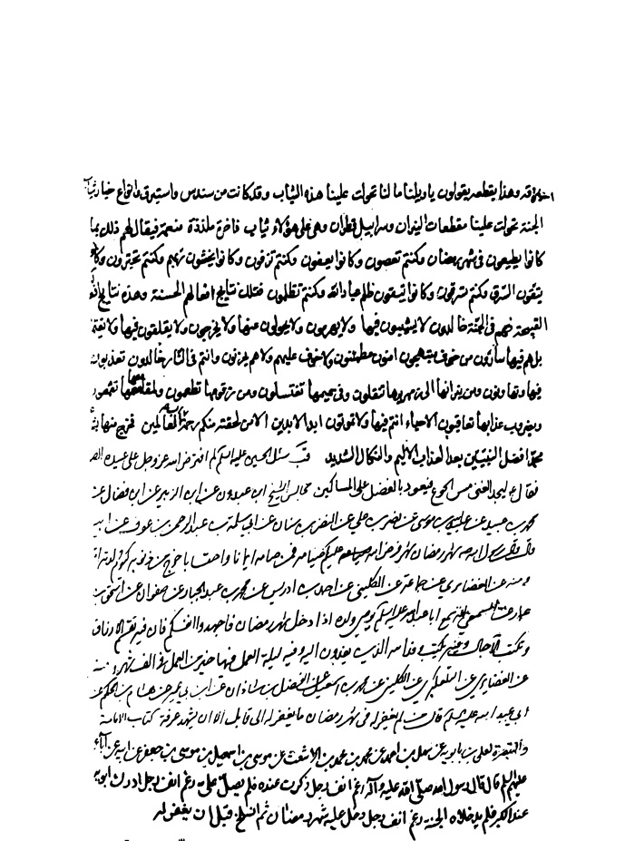
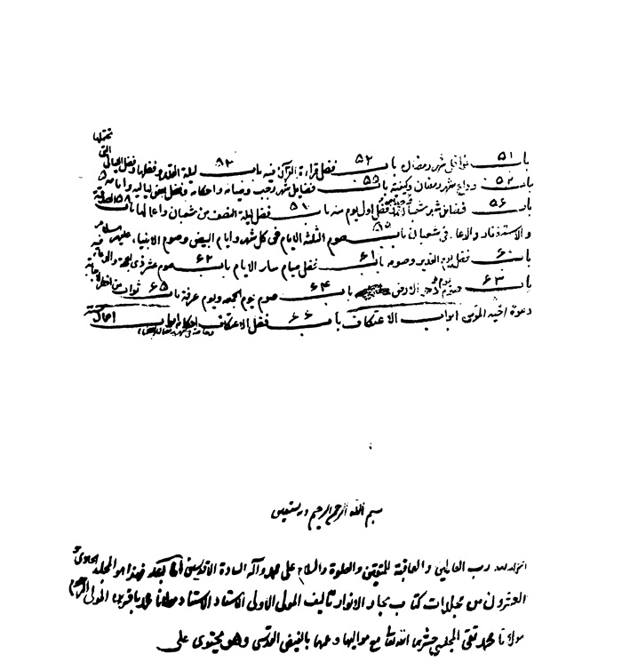
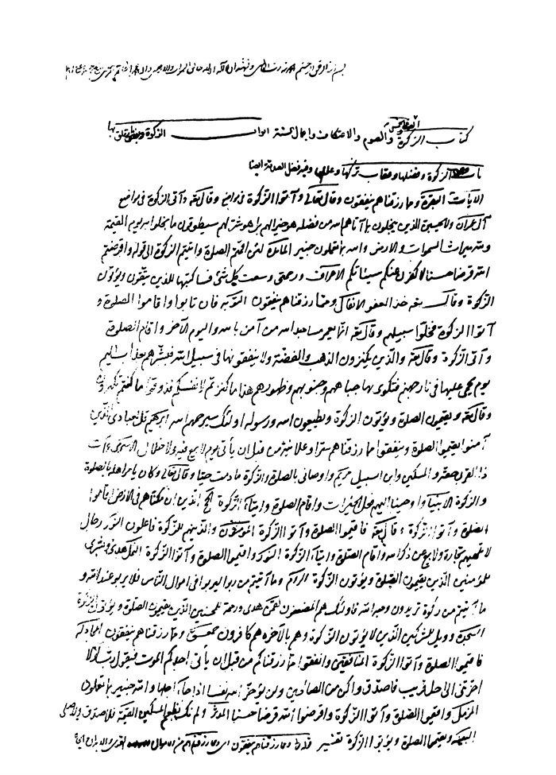

بحار الانوار الجامعة لدرر اخبار الائمة الاطهار المجلد 93

هوية الكتاب
بطاقة تعريف: مجلسي محمد باقربن محمدتقي 1037 - 1111ق.
عنوان واسم المؤلف: بحار الأنوار الجامعة لدرر أخبار الأئمة الأطهار المجلد 93: تأليف محمد باقربن محمدتقي المجلسي.
عنوان واسم المؤلف: بيروت داراحياء التراث العربي [ -13].
مظهر: ج - عينة.
ملاحظة: عربي.
ملاحظة: فهرس الكتابة على أساس المجلد الرابع والعشرين، 1403ق. [1360].
ملاحظة: المجلد108،103،94،91،92،87،67،66،65،52،24(الطبعة الثالثة: 1403ق.=1983م.=[1361]).
ملاحظة: فهرس.
محتويات: ج.24.كتاب الامامة. ج.52.تاريخ الحجة. ج67،66،65.الإيمان والكفر. ج.87.كتاب الصلاة. ج.92،91.الذكر و الدعا. ج.94.كتاب السوم. ج.103.فهرست المصادر. ج.108.الفهرست.-
عنوان: أحاديث الشيعة — قرن 11ق
ترتيب الكونجرس: BP135/م3ب31300 ي ح
تصنيف ديوي: 297/212
رقم الببليوغرافيا الوطنية: 1680946
ص: 1

كتاب الزكاة و الصدقة 

اشارة

بِسْمِ اللَّهِ الرَّحْمنِ الرَّحِیمِ الْحَمْدُ لِلَّهِ رَبِّ الْعالَمِینَ وَ الْعاقِبَةُ لِلْمُتَّقِینَ و الصلاة و السلام علی محمد و آله السادة الأقدسین أما بعد فهذا هو المجلد العشرون من مجلدات كتاب بحار الأنوار تألیف المولی الأولی الأستاد الاستناد مولانا محمد باقر ابن المولی المرحوم مولانا محمد تقی المجلسی حشرهما اللّٰه تعالی مع موالیهما و عمهما بالفیض القدسی و هو یحتوی علی (1) كتاب الزكاة و الصدقة و الخمس و الصوم و الاعتكاف و أعمال السنة. 

أبواب الزكاة و بعض ما یتعلق بها 

باب 1 وجوب الزكاة و فضلها و عقاب تركها و عللها و فیه فضل الصدقة أیضا 

الآیات:
البقرة: وَ مِمَّا رَزَقْناهُمْ یُنْفِقُونَ و قال تعالی وَ آتُوا الزَّكاةَ فی مواضع (2)
و قال تعالی: وَ آتَی الزَّكاةَ فی مواضع آل عمران وَ لا یَحْسَبَنَّ الَّذِینَ یَبْخَلُونَ بِما آتاهُمُ اللَّهُ مِنْ فَضْلِهِ هُوَ خَیْراً لَهُمْ

> **پاورقی**: 1- 1. الخطبة الی هاهنا- فی نسخة الأصل- بخط المرزا عبد اللّٰه افندی و انشائه، لفقه مع قول المصنّف- قدّس سرّه- كتاب الزكاة و الصدقة إلخ و لكن فی أعلی صفحة نسخة الأصل بخط المصنّف- ره- خطبة اخری نصها: بسم اللّٰه الرحمن الرحیم الحمد للّٰه ربّ العالمین، و نشهد أن لا إله إلّا اللّٰه خالق السموات و الأرضین و أن محمّدا خاتم المرسلین صلّی اللّٰه علیه و علی أهل بیته الطاهرین.

> **پاورقی**: 2- 2. البقرة: 2 و 43 و 83 و 110 و 177 و 277.

بَلْ هُوَ شَرٌّ لَهُمْ سَیُطَوَّقُونَ ما بَخِلُوا بِهِ یَوْمَ الْقِیامَةِ وَ لِلَّهِ مِیراثُ السَّماواتِ وَ الْأَرْضِ وَ اللَّهُ بِما تَعْمَلُونَ خَبِیرٌ(1) 
المائدة: لَئِنْ أَقَمْتُمُ الصَّلاةَ وَ آتَیْتُمُ الزَّكاةَ إلی قوله وَ أَقْرَضْتُمُ اللَّهَ قَرْضاً حَسَناً لَأُكَفِّرَنَّ عَنْكُمْ سَیِّئاتِكُمْ (2) 
الأعراف: وَ رَحْمَتِی وَسِعَتْ كُلَّ شَیْ ءٍ فَسَأَكْتُبُها لِلَّذِینَ یَتَّقُونَ وَ یُؤْتُونَ الزَّكاةَ و قال تعالی خُذِ الْعَفْوَ(3) 
الأنفال: وَ مِمَّا رَزَقْناهُمْ یُنْفِقُونَ (4) 
التوبة: فَإِنْ تابُوا وَ أَقامُوا الصَّلاةَ وَ آتَوُا الزَّكاةَ فَخَلُّوا سَبِیلَهُمْ و قال تعالی إِنَّما یَعْمُرُ مَساجِدَ اللَّهِ مَنْ آمَنَ بِاللَّهِ وَ الْیَوْمِ الْآخِرِ وَ أَقامَ الصَّلاةَ وَ آتَی الزَّكاةَ(5) 
و قال تعالی: وَ الَّذِینَ یَكْنِزُونَ الذَّهَبَ وَ الْفِضَّةَ وَ لا یُنْفِقُونَها فِی سَبِیلِ اللَّهِ فَبَشِّرْهُمْ بِعَذابٍ أَلِیمٍ یَوْمَ یُحْمی عَلَیْها فِی نارِ جَهَنَّمَ فَتُكْوی بِها جِباهُهُمْ وَ جُنُوبُهُمْ وَ ظُهُورُهُمْ هذا ما كَنَزْتُمْ لِأَنْفُسِكُمْ فَذُوقُوا ما كُنْتُمْ تَكْنِزُونَ (6) 
و قال تعالی: وَ یُقِیمُونَ الصَّلاةَ وَ یُؤْتُونَ الزَّكاةَ وَ یُطِیعُونَ اللَّهَ وَ رَسُولَهُ أُولئِكَ سَیَرْحَمُهُمُ اللَّهُ (7) 
إبراهیم: قُلْ لِعِبادِیَ الَّذِینَ آمَنُوا یُقِیمُوا الصَّلاةَ وَ یُنْفِقُوا مِمَّا رَزَقْناهُمْ سِرًّا وَ عَلانِیَةً مِنْ قَبْلِ أَنْ یَأْتِیَ یَوْمٌ لا بَیْعٌ فِیهِ وَ لا خِلالٌ (8) 
الإسراء: وَ آتِ ذَا الْقُرْبی حَقَّهُ وَ الْمِسْكِینَ وَ ابْنَ السَّبِیلِ (9)
ص: 2

> **پاورقی**: 1- 1. آل عمران: 180.

> **پاورقی**: 2- 2. المائدة: 12.

> **پاورقی**: 3- 3. الأعراف: 156.

> **پاورقی**: 4- 4. الأنفال: 3.

> **پاورقی**: 5- 5. براءة: 5.

> **پاورقی**: 6- 6. براءة: 35- 36.

> **پاورقی**: 7- 7. براءة: 71.

> **پاورقی**: 8- 8. إبراهیم: 31.

> **پاورقی**: 9- 9. أسری: 26، و مثله فی الروم: 38.

مریم: وَ أَوْصانِی بِالصَّلاةِ وَ الزَّكاةِ ما دُمْتُ حَیًّا(1) 
و قال تعالی: وَ كانَ یَأْمُرُ أَهْلَهُ بِالصَّلاةِ وَ الزَّكاةِ(2) 
الأنبیاء: وَ أَوْحَیْنا إِلَیْهِمْ فِعْلَ الْخَیْراتِ وَ إِقامَ الصَّلاةِ وَ إِیتاءَ الزَّكاةِ(3) 
الحج: الَّذِینَ إِنْ مَكَّنَّاهُمْ فِی الْأَرْضِ أَقامُوا الصَّلاةَ وَ آتَوُا الزَّكاةَ(4) 
و قال تعالی: فَأَقِیمُوا الصَّلاةَ وَ آتُوا الزَّكاةَ(5) 
المؤمنون: وَ الَّذِینَ هُمْ لِلزَّكاةِ فاعِلُونَ (6) 
النور: رِجالٌ لا تُلْهِیهِمْ تِجارَةٌ وَ لا بَیْعٌ عَنْ ذِكْرِ اللَّهِ وَ إِقامِ الصَّلاةِ وَ إِیتاءِ الزَّكاةِ و قال تعالی وَ أَقِیمُوا الصَّلاةَ وَ آتُوا الزَّكاةَ(7) 
النمل: هُدیً وَ بُشْری لِلْمُؤْمِنِینَ الَّذِینَ یُقِیمُونَ الصَّلاةَ وَ یُؤْتُونَ الزَّكاةَ(8) 
الروم: وَ ما آتَیْتُمْ مِنْ رِباً لِیَرْبُوَا فِی أَمْوالِ النَّاسِ فَلا یَرْبُوا عِنْدَ اللَّهِ وَ ما آتَیْتُمْ مِنْ زَكاةٍ تُرِیدُونَ وَجْهَ اللَّهِ فَأُولئِكَ هُمُ الْمُضْعِفُونَ (9) 
لقمان: هُدیً وَ رَحْمَةً لِلْمُحْسِنِینَ الَّذِینَ یُقِیمُونَ الصَّلاةَ وَ یُؤْتُونَ الزَّكاةَ(10) 
السجدة: وَ وَیْلٌ لِلْمُشْرِكِینَ الَّذِینَ لا یُؤْتُونَ الزَّكاةَ وَ هُمْ بِالْآخِرَةِ هُمْ كافِرُونَ (11) 
حمعسق: وَ مِمَّا رَزَقْناهُمْ یُنْفِقُونَ (12)
ص: 3

> **پاورقی**: 1- 1. مریم: 31.

> **پاورقی**: 2- 2. مریم: 55.

> **پاورقی**: 3- 3. الأنبیاء: 72.

> **پاورقی**: 4- 4. الحجّ: 41.

> **پاورقی**: 5- 5. الحجّ: 78.

> **پاورقی**: 6- 6. المؤمنون: 4.

> **پاورقی**: 7- 7. النور: 37 و 56.

> **پاورقی**: 8- 8. النمل: 3.

> **پاورقی**: 9- 9. الروم: 39.

> **پاورقی**: 10- 10. لقمان: 4.

> **پاورقی**: 11- 11. فصّلت: 7.

> **پاورقی**: 12- 12. الشوری: 38.

المجادلة: فَأَقِیمُوا الصَّلاةَ وَ آتُوا الزَّكاةَ(1) 
المنافقون: وَ أَنْفِقُوا مِنْ ما رَزَقْناكُمْ مِنْ قَبْلِ أَنْ یَأْتِیَ أَحَدَكُمُ الْمَوْتُ فَیَقُولَ رَبِّ لَوْ لا أَخَّرْتَنِی إِلی أَجَلٍ قَرِیبٍ فَأَصَّدَّقَ وَ أَكُنْ مِنَ الصَّالِحِینَ وَ لَنْ یُؤَخِّرَ اللَّهُ نَفْساً إِذا جاءَ أَجَلُها وَ اللَّهُ خَبِیرٌ بِما تَعْمَلُونَ (2) 
المزمل: وَ أَقِیمُوا الصَّلاةَ وَ آتُوا الزَّكاةَ وَ أَقْرِضُوا اللَّهَ قَرْضاً حَسَناً(3) 
المدثر: وَ لَمْ نَكُ نُطْعِمُ الْمِسْكِینَ (4) 
القیامة: فَلا صَدَّقَ وَ لا صَلَّی (5) 
البینة: وَ یُقِیمُوا الصَّلاةَ وَ یُؤْتُوا الزَّكاةَ(6) 
تفسیر: 
قوله تعالی وَ مِمَّا رَزَقْناهُمْ یُنْفِقُونَ أی وَ مِمَّا رَزَقْناهُمْ من الأموال و القوی و الأبدان و الجاه و العلم یُنْفِقُونَ یتصدقون یحتملون الكل و یؤدون الحقوق لأهالیها و یقرضون و یسعفون الحاجات و یأخذون بأیدی الضعفاء و یقودون الضرائر و ینجونهم من المهالك و یحملون عنهم المتاع و یحملون الراجلین علی دوابهم و یؤثرون من هو أفضل منهم فی الإیمان علی أنفسهم بالمال و النفس و یساوون من كان فی درجتهم فیه بهما و یعلمون العلم لأهله و یروون فضائل أهل البیت علیهم السلام لمحبیهم و لمن یرجون هدایته كذا فی تفسیر الإمام علیه السلام(7).
و قال الطبرسی ره قوله تعالی وَ مِمَّا رَزَقْناهُمْ یُنْفِقُونَ یرید و مما أعطیناهم و ملكناهم یخرجون علی وجه الطاعة و حكی عن ابن عباس أنه الزكاة المفروضة و عن ابن مسعود أنه نفقة الرجل علی أهله لأن الآیة نزلت قبل وجوب الزكاة و عن الضحاك هو التطوع بالنفقة وَ رَوَی مُحَمَّدُ بْنُ مُسْلِمٍ عَنِ 
ص: 4

> **پاورقی**: 1- 1. المجادلة: 13.

> **پاورقی**: 2- 2. المنافقون: 10.

> **پاورقی**: 3- 3. المزّمّل: 20.

> **پاورقی**: 4- 4. المدّثّر: 44.

> **پاورقی**: 5- 5. القیامة: 31.

> **پاورقی**: 6- 6. البینة: 5.

> **پاورقی**: 7- 7. تفسیر الإمام: 36.

الصَّادِقِ علیه السلام: أَنَّ مَعْنَاهُ وَ مِمَّا عَلَّمْنَاهُمْ یَبُثُّونَ. 
و الأولی حمل الآیة علی عمومها انتهی (1).
أقول: و روی ما رواه عن الصادق علیه السلام فی المعانی (2) و العیاشی (3) عنه علیه السلام و ما رجحه من الحمل علی العموم فی موقعه لكن علی الوجه الذی یستفاد مما نقلناه من تفسیر الإمام علیه السلام فإنه أشمل و لا ینافیه روایة محمد بن مسلم بل یمكن تنزیله علی العموم كما لا یخفی. 
و قال البیضاوی إدخال من التبعیضیة للكف عن الإسراف المنهی عنه قوله تعالی وَ آتُوا الزَّكاةَ قال البیضاوی الزكاة من زكا الزرع إذا نما فإن إخراجها یستجلب بركة فی المال و یثمر للنفس فضیلة الكرم أو من الزكاء بمعنی الطهارة فإنها تطهر المال من الخبث و النفس من البخل انتهی. 
و قال الطبرسی طاب ثراه الزكاة و النماء و الزیادة نظائر فی اللغة و قال صاحب العین الزكاة زكاة المال و هو تطهیره و زكا الزرع و غیره یزكو زكاء ممدودا أی نما و ازداد و هذا لا یزكو بفلان أی لا یلیق به و الزكا الشفع و الخسا الوتر و أصله تثمیر المال بالبركة التی یجعلها اللّٰه فیه انتهی (4) و لا یخفی ما بین الكلامین من المخالفة.
ثم قال الطبرسی إن قوله تعالی وَ آتُوا الزَّكاةَ أی أعطوا ما فرض اللّٰه فی أموالكم علی ما بینه الرسول صلی اللّٰه علیه و آله لكم و هذا حكم جمیع ما ورد فی القرآن مجملا فإن بیانه یكون موكولا إلی النبی صلی اللّٰه علیه و آله كما قال سبحانه وَ ما آتاكُمُ الرَّسُولُ فَخُذُوهُ وَ ما نَهاكُمْ عَنْهُ فَانْتَهُوا(5) فلذلك أمرهم بالصلاة و الزكاة علی 
ص: 5

> **پاورقی**: 1- 1. مجمع البیان ج 1 ص 39.

> **پاورقی**: 2- 2. معانی الأخبار ص 23.

> **پاورقی**: 3- 3. تفسیر العیّاشیّ ج 1 ص 26.

> **پاورقی**: 4- 4. مجمع البیان: ج 1 ص 97.

> **پاورقی**: 5- 5. الحشر: 7.

طریق الإجمال و أحال فی التفصیل علی بیانه صلی اللّٰه علیه و آله انتهی (1).
و فی تفسیر الإمام علیه السلام ما حاصله أن المراد و آتوا الزكاة من أموالكم إذا وجبت و من أبدانكم إذا لزمت و من معونتكم إذا التمست (2).
وَ فِی الْكَافِی عَنِ الْكَاظِمِ علیه السلام: أَنَّهُ سُئِلَ عَنْ صَدَقَةِ الْفِطْرَةِ أَ هِیَ مِمَّا قَالَ اللَّهُ تَعَالَی أَقِیمُوا الصَّلاةَ وَ آتُوا الزَّكاةَ فَقَالَ نَعَمْ (3). وَ الْعَیَّاشِیُّ عَنْهُ علیه السلام: مِثْلَهُ (4). وَ عَنِ الصَّادِقِ: هِیَ الْفِطْرَةُ الَّتِی افْتَرَضَ اللَّهُ عَلَی الْمُؤْمِنِینَ. وَ فِی رِوَایَةٍ: نَزَلَتِ الزَّكَاةُ وَ لَیْسَتْ لِلنَّاسِ الْأَمْوَالُ وَ إِنَّمَا كَانَتِ الْفِطْرَةُ(5).
قوله تعالی وَ آتَی الزَّكاةَ صدر الآیة لَیْسَ الْبِرَّ أَنْ تُوَلُّوا وُجُوهَكُمْ قِبَلَ الْمَشْرِقِ وَ الْمَغْرِبِ وَ لكِنَّ الْبِرَّ مَنْ آمَنَ بِاللَّهِ وَ الْیَوْمِ الْآخِرِ وَ الْمَلائِكَةِ وَ الْكِتابِ وَ النَّبِیِّینَ وَ آتَی الْمالَ عَلی حُبِّهِ ذَوِی الْقُرْبی وَ الْیَتامی وَ الْمَساكِینَ وَ ابْنَ السَّبِیلِ وَ السَّائِلِینَ وَ فِی الرِّقابِ وَ أَقامَ الصَّلاةَ وَ آتَی الزَّكاةَ(6) أكثر المفسرین علی أنها نزلت لما حولت القبلة و كثرة كثر الخوض فی نسخها و أكثروا الیهود و النصاری ذكرها و المشرق قبلة النصاری و المغرب قبلة الیهود. 
وَ فِی تَفْسِیرِ الْإِمَامِ علیه السلام عَنِ السَّجَّادِ علیه السلام: قَالَتِ الْیَهُودُ قَدْ صَلَّیْنَا إِلَی قِبْلَتِنَا هَذِهِ الصَّلَاةَ الْكَثِیرَةَ وَ فِینَا مَنْ یُحْیِی اللَّیْلَ صَلَاةً إِلَیْهَا وَ هِیَ قِبْلَةُ مُوسَی الَّتِی أَمَرَنَا بِهَا وَ قَالَتِ النَّصَارَی قَدْ صَلَّیْنَا إِلَی قِبْلَتِنَا هَذِهِ الصَّلَاةَ الْكَثِیرَةَ وَ فِینَا مَنْ یُحْیِی اللَّیْلَ صَلَاةً إِلَیْهَا وَ هِیَ قِبْلَةُ عِیسَی الَّتِی أَمَرَنَا بِهَا وَ قَالَ كُلُّ وَاحِدٍ مِنَ الْفَرِیقَیْنِ: 
ص: 6

> **پاورقی**: 1- 1. مجمع البیان: ج 1 ص 97.

> **پاورقی**: 2- 2. تفسیر الإمام: 112.

> **پاورقی**: 3- 3. لم نجده فی الكافی و تراه فی التهذیب ج 1 ص 373.

> **پاورقی**: 4- 4. تفسیر العیّاشیّ: ج 1 ص 42.

> **پاورقی**: 5- 5. تفسیر العیّاشیّ: ج 1 ص 43 و الكافی ج 4 ص 171، عن هشام بن الحكم عنه علیه السلام.

> **پاورقی**: 6- 6. البقرة: 177.

أَ تَرَی رَبَّنَا یُبْطِلُ أَعْمَالَنَا هَذِهِ الْكَثِیرَةَ وَ صَلَاتَنَا إِلَی قِبْلَتِنَا لِأَنَّا لَا نَتَّبِعُ مُحَمَّداً صلی اللّٰه علیه و آله عَلَی هَوَاهُ فِی نَفْسِهِ وَ أَخِیهِ فَأَنْزَلَ اللَّهُ تَعَالَی یَا مُحَمَّدُ قُلْ لَیْسَ الْبِرَّ وَ الطَّاعَةَ الَّتِی تَنَالُونَ بِهَا الْجِنَانَ وَ تَسْتَحِقُّونَ بِهَا الْغُفْرَانَ وَ الرِّضْوَانَ أَنْ تُوَلُّوا وُجُوهَكُمْ بِصَلَاتِكُمْ قِبَلَ الْمَشْرِقِ یَا أَیُّهَا النَّصَارَی وَ قِبَلَ الْمَغْرِبِ یَا أَیُّهَا الْیَهُودُ وَ أَنْتُمْ لِأَمْرِ اللَّهِ مُخَالِفُونَ وَ عَلَی وَلِیِّ اللَّهِ مُغْتَاظُونَ وَ لكِنَّ الْبِرَّ مَنْ آمَنَ أَیْ بِرُّ مَنْ آمَنَ أَوْ وَ لَكِنَّ الْبَارَّ أَوْ ذَا الْبِرِّ مَنْ آمَنَ بِاللَّهِ (1).
«1»- مص، [مصباح الشریعة] قَالَ الصَّادِقُ علیه السلام: عَلَی كُلِّ جُزْءٍ مِنْ أَجْزَائِكَ زَكَاةٌ وَاجِبَةٌ لِلَّهِ عَزَّ وَ جَلَّ بَلْ عَلَی كُلِّ شَعْرَةٍ بَلْ عَلَی كُلِّ لَحْظَةٍ فَزَكَاةُ الْعَیْنِ النَّظَرُ بِالْعَبْرَةِ وَ الْغَضُّ عَنِ الشَّهَوَاتِ وَ مَا یُضَاهِیهَا وَ زَكَاةُ الْأُذُنِ اسْتِمَاعُ الْعِلْمِ وَ الحِكْمَةِ وَ الْقُرْآنِ وَ فَوَائِدِ الدِّینِ مِنَ الْحِكْمَةِ وَ الْمَوْعِظَةِ وَ النَّصِیحَةِ وَ مَا فِیهِ نَجَاتُكَ بِالْإِعْرَاضِ عَمَّا هُوَ ضِدُّهُ مِنَ الْكَذِبِ وَ الْغِیبَةِ وَ أَشْبَاهِهَا وَ زَكَاةُ اللِّسَانِ النُّصْحُ لِلْمُسْلِمِینَ وَ التَّیَقُّظُ لِلْغَافِلِینَ وَ كَثْرَةُ التَّسْبِیحِ وَ الذِّكْرِ وَ غَیْرِهِ وَ زَكَاةُ الْیَدِ الْبَذْلُ وَ الْعَطَاءُ وَ السَّخَاءُ بِمَا أَنْعَمَ اللَّهُ عَلَیْكَ بِهِ وَ تَحْرِیكُهَا بِكِتْبَةِ الْعُلُومِ وَ مَنَافِعَ یَنْتَفِعُ بِهَا الْمُسْلِمُونَ فِی طَاعَةِ اللَّهِ تَعَالَی وَ الْقَبْضُ عَنِ الشُّرُورِ وَ زَكَاةُ الرِّجْلِ السَّعْیُ فِی حُقُوقِ اللَّهِ تَعَالَی مِنْ زِیَارَةِ الصَّالِحِینَ وَ مَجَالِسِ الذِّكْرِ وَ إِصْلَاحِ النَّاسِ وَ صِلَةِ الرَّحِمِ وَ الْجِهَادِ وَ مَا فِیهِ صَلَاحُ قَلْبِكَ وَ سَلَامَةُ دِینِكَ. 
هَذَا مِمَّا یَحْتَمِلُ الْقُلُوبُ فَهْمَهُ وَ النُّفُوسُ اسْتِعْمَالَهُ وَ مَا لَا یُشْرِفُ عَلَیْهِ إِلَّا عِبَادُهُ الْمُقَرَّبُونَ الْمُخْلِصُونَ أَكْثَرُ مِنْ أَنْ یُحْصَی وَ هُمْ أَرْبَابُهُ وَ هُوَ شِعَارُهُمْ دُونَ غَیْرِهِمْ (2).
بیان: قوله بكتبة العلوم یدل علی شرافة كتابة القرآن المجید و الأدعیة و كتب الأحادیث المأثورة و سائر الكتب المؤلفة فی العلوم الدینیة و بالجملة كل ما له مدخل فی علوم الدین و المراد بمجالس الذكر كل ما انعقد علی وفق 
ص: 7

> **پاورقی**: 1- 1. تفسیر الإمام: 271.

> **پاورقی**: 2- 2. مصباح الشریعة: 17- 18.

قانون الشریعة المطهرة.
«2»- شی، [تفسیر العیاشی] عَنِ ابْنِ سِنَانٍ عَنْ أَبِی عَبْدِ اللَّهِ عَنْ أَبِیهِ عَنْ آبَائِهِ علیهم السلام قَالَ قَالَ رَسُولُ اللَّهِ صلی اللّٰه علیه و آله: مَا مِنْ ذِی زَكَاةِ مَالٍ إِبِلٍ وَ لَا بَقَرٍ وَ لَا غَنَمٍ یَمْنَعُ زَكَاةَ مَالِهِ إِلَّا أُقِیمَ یَوْمَ الْقِیَامَةِ بِقَاعٍ قَفْرٍ یَنْطَحُهُ كُلُّ ذَاتِ قَرْنٍ بِقَرْنِهَا وَ یَنْهَشُهُ كُلُّ ذَاتِ نَابٍ بِأَنْیَابِهَا وَ یَطَؤُهُ كُلُّ ذَاتِ ظِلْفٍ بِظِلْفِهَا حَتَّی یَفْرُغَ اللَّهُ مِنْ حِسَابِ خَلْقِهِ وَ مَا مِنْ ذِی زَكَاةِ مَالٍ نَخْلٍ وَ لَا زَرْعٍ وَ لَا كَرْمٍ یَمْنَعُ زَكَاةَ مَالِهِ إِلَّا قُلِّدَتْ أَرْضُهُ فِی سَبْعَةِ أَرَضِینَ یُطَوَّقُ بِهَا إِلَی یَوْمِ الْقِیَامَةِ(1).
بیان: بقاع قفر قال الجوهری القاع المستوی من الأرض و ینهشه فی القاموس نهشه لسعه و عضه أو أخذه بأضراسه. 
«3»- شی، [تفسیر العیاشی] عَنْ یُوسُفَ الطَّاطَرِیِّ أَنَّهُ سَمِعَ أَبَا جَعْفَرٍ علیه السلام یَقُولُ: وَ ذَكَرَ الزَّكَاةَ فَقَالَ الَّذِی یَمْنَعُ الزَّكَاةَ یُحَوِّلُ اللَّهُ مَالَهُ یَوْمَ الْقِیَامَةِ شُجَاعاً مِنْ نَارٍ لَهُ ریمتان [زَبِیبَتَانِ](2)
فَیُطَوِّقُهُ إِیَّاهُ ثُمَّ یُقَالُ لَهُ الْزَمْهُ كَمَا لَزِمَكَ فِی الدُّنْیَا وَ هُوَ قَوْلُ اللَّهِ سَیُطَوَّقُونَ ما بَخِلُوا بِهِ الْآیَةَ(3).
وَ عَنْهُمْ علیهم السلام قَالَ: مَانِعُ الزَّكَاةِ یُطَوَّقُ بِشُجَاعٍ أَقْرَعَ یَأْكُلُ مِنْ لَحْمِهِ وَ هُوَ قَوْلُهُ سَیُطَوَّقُونَ ما بَخِلُوا بِهِ الْآیَةَ(4).
«4»- م، [تفسیر الإمام علیه السلام] قَالَ رَسُولُ اللَّهِ صلی اللّٰه علیه و آله: مَنْ أَدَّی الزَّكَاةَ إِلَی مُسْتَحِقِّهَا وَ أَقَامَ الصَّلَاةَ عَلَی حُدُودِهَا وَ لَمْ یُلْحِقْ بِهِمَا مِنَ الْمُوبِقَاتِ مَا یُبْطِلُهُمَا جَاءَ یَوْمَ الْقِیَامَةِ یَغْبِطُهُ كُلُّ مَنْ فِی تِلْكَ الْعَرَصَاتِ حَتَّی یَرْفَعُهُ نَسِیمُ الْجَنَّةِ إِلَی أَعْلَی غُرَفِهَا وَ عَالِیهَا بِحَضْرَةِ مَنْ كَانَ یُوَالِیهِ مِنْ مُحَمَّدٍ وَ آلِهِ الطَّیِّبِینَ.
ص: 8

> **پاورقی**: 1- 1. تفسیر العیّاشیّ: ج 1 ص 207.

> **پاورقی**: 2- 2. كذا فی جمیع النسخ، و هكذا نقله فی المستدرك أیضا، و الصحیح« زبیبتان» تثنیة زبیبة و هما نقطتان سوداوان فوق عینی الحیة و الكلب. یخیل للرائی أن لها أربعة أعین و إذا كانت كذلك كان عضها قتالا.

> **پاورقی**: 3- 3. آل عمران، 180.

> **پاورقی**: 4- 4. تفسیر العیّاشیّ: ج 1 ص 208.

وَ مَنْ بَخِلَ بِزَكَاتِهِ وَ أَدَّی صَلَاتَهُ كَانَتْ مَحْبُوسَةً دُوَیْنَ السَّمَاءِ إِلَی أَنْ یَجِی ءَ خَبَرُ زَكَاتِهِ فَإِنْ أَدَّاهَا جُعِلَتْ كَأَحْسَنِ الْأَفْرَاسِ مَطِیَّةً لِصَلَاتِهِ فَحَمَلَتْهَا إِلَی سَاقِ الْعَرْشِ فَیَقُولُ اللَّهُ عَزَّ وَ جَلَّ سِرْ إِلَی الْجِنَانِ فَارْكُضْ فِیهِ إِلَی یَوْمِ الْقِیَامَةِ فَمَا انْتَهَی إِلَیْهِ رَكْضُكَ فَهُوَ كُلُّهُ بِسَائِرِ مَا تَمَسُّهُ لِبَاعِثِكَ (1) فَیَرْكُضُ فِیهَا عَلَی أَنَّ كُلَّ رَكْضَةٍ مَسِیرُ سَنَةٍ فِی قَدْرِ لَمْحَةِ بَصَرِهِ مِنْ یَوْمِهِ إِلَی یَوْمِ الْقِیَامَةِ حَتَّی یَنْتَهِیَ بِهِ إِلَی یَوْمِ الْقِیَامَةِ إِلَی حَیْثُ مَا شَاءَ اللَّهُ تَعَالَی فَیَكُونُ ذَلِكَ كُلُّهُ لَهُ وَ مِثْلُهُ عَنْ یَمِینِهِ وَ شِمَالِهِ وَ أَمَامِهِ وَ خَلْفِهِ وَ فَوْقِهِ وَ تَحْتِهِ فَإِنْ بَخِلَ بِزَكَاتِهِ وَ لَمْ یُؤَدِّهَا أُمِرَ بِالصَّلَاةِ فَرُدَّتْ إِلَیْهِ وَ لُفَّتْ كَمَا یُلَفُّ الثَّوْبُ الْخَلَقُ ثُمَّ یُضْرَبُ بِهَا وَجْهُهُ وَ یُقَالُ لَهُ یَا عَبْدَ اللَّهِ مَا تَصْنَعُ بِهَذَا دُونَ هَذَا(2).
«5»- م، [تفسیر الإمام علیه السلام]: قَوْلُهُ عَزَّ وَ جَلَ وَ آتُوا الزَّكاةَ أَیْ مِنَ الْمَالِ وَ الْجَاهِ وَ قُوَّةِ الْبَدَنِ فَمِنَ الْمَالِ مُوَاسَاةُ إِخْوَانِكَ الْمُؤْمِنِینَ وَ مِنَ الْجَاهِ إِیصَالُهُمْ إِلَی مَا یَتَقَاعَسُونَ عَنْهُ لِضَعْفِهِمْ عَنْ حَوَائِجِهِمُ الْمُقَرَّرَةِ فِی صُدُورِهِمْ وَ بِالْقُوَّةِ مَعُونَةُ أَخٍ لَكَ قَدْ سَقَطَ حِمَارُهُ أَوْ جَمَلُهُ فِی صَحْرَاءَ أَوْ طَرِیقٍ وَ هُوَ یَسْتَغِیثُ فَلَا یُغَاثُ یُعِینُهُ حَتَّی یَحْمِلَ عَلَیْهِ مَتَاعَهُ وَ تُرْكِبُهُ وَ تُنْهِضُهُ حَتَّی یَلْحَقَ الْقَافِلَةَ وَ أَنْتَ فِی ذَلِكَ كُلِّهِ مُعْتَقِدٌ لِمُوَالاةِ مُحَمَّدٍ وَ آلِهِ الطَّیِّبِینَ وَ إِنَّ اللَّهَ یُزَكِّی أَعْمَالَكَ وَ یُضَاعِفُهَا بِمُوَالاتِكَ لَهُمْ وَ بَرَاءَتِكَ مِنْ أَعْدَائِهِمْ (3).
«6»- م، [تفسیر الإمام علیه السلام] قَالَ رَسُولُ اللَّهِ صلی اللّٰه علیه و آله: آتُوا الزَّكَاةَ مِنْ أَمْوَالِكُمُ الْمُسْتَحِقِّینَ لَهَا مِنَ الْفُقَرَاءِ وَ الضُّعَفَاءِ لَا تَبْخَسُوهُمْ وَ لَا تُوكِسُوهُمْ وَ لَا تَیَمَّمُوا الْخَبِیثَ أَنْ تُعْطُوهُمْ فَإِنَّ مَنْ أَعْطَی زَكَاتَهُ طَیِّبَةً بِهَا نَفْسُهُ أَعْطَاهُ اللَّهُ بِكُلِّ حَبَّةٍ مِنْهَا قَصْراً فِی الْجَنَّةِ مِنْ ذَهَبٍ وَ قَصْراً مِنْ فِضَّةٍ وَ قَصْراً مِنْ لُؤْلُؤٍ وَ قَصْراً مِنْ زَبَرْجَدٍ وَ قَصْراً مِنْ زُمُرُّدٍ وَ قَصْراً مِنْ جَوْهَرٍ وَ قَصْراً مِنْ نُورِ رَبِّ الْعَالَمِینَ وَ إِنْ قَصَّرَ فِی الزَّكَاةِ قَالَ اللَّهُ تَعَالَی: یَا عَبْدِی 
ص: 9

> **پاورقی**: 1- 1. فی المصدر: فهو كله یمینه و یساره لك.

> **پاورقی**: 2- 2. تفسیر الإمام: 36.

> **پاورقی**: 3- 3. تفسیر الإمام: 166.

أَ تُبْخِلُنِی أَمْ تَتَّهِمُنِی أَمْ تَظُنُّ أَنِّی عَاجِزٌ غَیْرُ قَادِرٍ عَلَی إِثَابَتِكَ سَوْفَ یَرِدُ عَلَیْكَ یَوْمٌ تَكُونُ أَحْوَجَ الْمُحْتَاجِینَ إِنْ أَدَّیْتَهَا كَمَا أَمَرْتُ وَ سَوْفَ یَرِدُ عَلَیْكَ إِنْ بَخِلْتَ یَوْمٌ تَكُونُ فِیهِ أَخْسَرَ الْخَاسِرِینَ قَالَ فَسَمِعَ ذَلِكَ الْمُسْلِمُونَ فَقَالُوا سَمِعْنَا وَ أَطَعْنَا یَا رَسُولَ اللَّهِ صلی اللّٰه علیه و آله (1).
«7»- شی، [تفسیر العیاشی] عَنْ سَمَاعَةَ قَالَ: سَأَلْتُهُ علیه السلام عَنْ قَوْلِ اللَّهِ الَّذِینَ یَصِلُونَ ما أَمَرَ اللَّهُ بِهِ أَنْ یُوصَلَ (2) فَقَالَ هُوَ مَا افْتَرَضَ اللَّهُ فِی الْمَالِ غَیْرَ الزَّكَاةِ وَ مَنْ أَدَّی مَا فَرَضَ اللَّهُ عَلَیْهِ فَقَدْ قَضَی مَا عَلَیْهِ (3).
«8»- شی، [تفسیر العیاشی] عَنْ سَمَاعَةَ قَالَ: إِنَّ اللَّهَ فَرَضَ لِلْفُقَرَاءِ فِی أَمْوَالِ الْأَغْنِیَاءِ فَرِیضَةً لَا یُحْمَدُونَ بِأَدَائِهَا وَ هِیَ الزَّكَاةُ بِهَا حَقَنُوا دِمَاءَهُمْ وَ بِهَا سُمُّوا مُسْلِمِینَ وَ لَكِنَّ اللَّهَ فَرَضَ فِی الْأَمْوَالِ حُقُوقاً غَیْرَ الزَّكَاةِ وَ مِمَّا فَرَضَ فِی الْمَالِ غَیْرَ الزَّكَاةِ قَوْلُهُ الَّذِینَ یَصِلُونَ ما أَمَرَ اللَّهُ بِهِ أَنْ یُوصَلَ وَ مَنْ أَدَّی مَا فَرَضَ اللَّهُ عَلَیْهِ فَقَدْ قَضَی مَا عَلَیْهِ وَ أَدَّی شُكْرَ مَا أَنْعَمَ اللَّهُ عَلَیْهِ مِنْ مَالِهِ إِذَا هُوَ حَمِدَهُ عَلَی مَا أَنْعَمَ عَلَیْهِ بِمَا فَضَّلَهُ بِهِ مِنَ السَّعَةِ عَلَی غَیْرِهِ وَ لِمَا وَفَّقَهُ لِأَدَاءِ مَا افْتَرَضَ اللَّهُ عَلَیْهِ (4).
«9»- قب، [المناقب لابن شهرآشوب]: سُئِلَ الْحَسَنُ بْنُ عَلِیٍّ علیهما السلام عَنْ بَدْوِ الزَّكَاةِ فَقَالَ إِنَّ اللَّهَ تَعَالَی أَوْحَی إِلَی آدَمَ علیه السلام أَنْ زَكِّ عَنْ نَفْسِكَ یَا آدَمُ قَالَ یَا رَبِّ وَ مَا الزَّكَاةُ قَالَ صَلِّ لِی عَشْرَ رَكَعَاتٍ فَصَلَّی ثُمَّ قَالَ رَبِّ هَذِهِ الزَّكَاةُ عَلَیَّ وَ عَلَی الْخَلْقِ قَالَ اللَّهُ هَذِهِ الزَّكَاةُ عَلَیْكَ فِی الصَّلَاةِ وَ عَلَی وُلْدِكَ فِی الْمَالِ مَنْ جَمَعَ مِنْ وُلْدِكَ مَالًا(5).
«10»- غو، [غوالی اللئالی] عَنْ أَبِی أَیُّوبَ الْأَنْصَارِیِّ عَنْ رَسُولِ اللَّهِ صلی اللّٰه علیه و آله: أَیُّمَا رَجُلٍ لَهُ مَالٌ 
ص: 10

> **پاورقی**: 1- 1. تفسیر الإمام: 240.

> **پاورقی**: 2- 2. الرعد: 21.

> **پاورقی**: 3- 3. تفسیر العیّاشیّ: ج 2 ص 209.

> **پاورقی**: 4- 4. تفسیر العیّاشیّ: ج 2 ص 210.

> **پاورقی**: 5- 5. مناقب آل أبی طالب: ج 4 ص 10.

لَمْ یُعْطِ حَقَّ اللَّهِ مِنْهُ إِلَّا جَعَلَهُ اللَّهُ عَلَی صَاحِبِهِ یَوْمَ الْقِیَامَةِ شُجَاعاً لَهُ زَبِیبَتَانِ یَنْهَشُهُ حَتَّی یَقْضِیَ بَیْنَ النَّاسِ فَیَقُولُ مَا لِی وَ مَا لَكَ فَیَقُولُ أَنَا كَنْزُكَ الَّذِی جَمَعْتَ لِهَذَا الْیَوْمِ قَالَ فَیَضَعُ یَدَهُ فِی فِیهِ فَیَقْضِمُهَا. 
وَ رَوَی أَبُو ذَرٍّ قَالَ: رَأَیْتُ رَسُولَ اللَّهِ صلی اللّٰه علیه و آله وَ هُوَ جَالِسٌ فِی ظِلِّ الْكَعْبَةِ وَ هُوَ یَقُولُ هُمُ الْأَخْسَرُونَ وَ رَبِّ الْكَعْبَةِ فَقُلْتُ مَنْ هُمْ یَا رَسُولَ اللَّهِ فَقَالَ مَا مِنْ صَاحِبِ إِبِلٍ أَوْ غَنَمٍ لَا یُؤَدِّی زَكَاتَهُ إِلَّا جَاءَتْ یَوْمَ الْقِیَامَةِ أَعْظَمَ مَا كَانَتْ وَ أَسْمَنَهُ تَنْطَحُهُ بِقُرُونِهَا وَ تَطَؤُهُ بِأَخْفَافِهَا كُلَّمَا نَفِدَ عَلَیْهِ آخِرُهَا عَادَ إِلَیْهِ أَوَّلُهَا حَتَّی یُقْضَی بَیْنَ النَّاسِ (1).
«11»- مع،(2) [معانی الأخبار] لی، [الأمالی للصدوق] عَنِ الصَّادِقِ عَنْ آبَائِهِ علیهم السلام قَالَ قَالَ رَسُولُ اللَّهِ صلی اللّٰه علیه و آله: أَسْخَی النَّاسِ مَنْ أَدَّی زَكَاةَ مَالِهِ وَ أَبْخَلُ النَّاسِ مَنْ بَخِلَ بِمَا افْتَرَضَ اللَّهُ عَلَیْهِ (3).
«12»- فس، [تفسیر القمی] قَالَ الصَّادِقُ علیه السلام: مَنْ مَنَعَ قِیرَاطاً مِنَ الزَّكَاةِ فَلَیْسَ هُوَ بِمُؤْمِنٍ وَ لَا مُسْلِمٍ وَ لَا كَرَامَةَ(4).
«13»- ب، [قرب الإسناد] ابْنُ طَرِیفٍ عَنِ ابْنِ عُلْوَانَ عَنِ الصَّادِقِ عَنْ أَبِیهِ علیهما السلام قَالَ قَالَ رَسُولُ اللَّهِ صلی اللّٰه علیه و آله: دَاوُوا مَرْضَاكُمْ بِالصَّدَقَةِ وَ ادْفَعُوا أَبْوَابَ الْبَلَاءِ بِالدُّعَاءِ وَ حَصِّنُوا أَمْوَالَكُمْ بِالزَّكَاةِ فَإِنَّهُ مَا یُصَادُ مَا تُصَیَّدُ مِنَ الطَّیْرِ إِلَّا بِتَضْیِیعِهِمُ التَّسْبِیحَ (5).
«14»- مع،(6)[معانی الأخبار] لی، [الأمالی للصدوق] ابْنُ نَاتَانَةَ عَنْ عَلِیِّ بْنِ إِبْرَاهِیمَ عَنْ جَعْفَرِ بْنِ سَلَمَةَ عَنْ إِبْرَاهِیمَ بْنِ مُحَمَّدٍ عَنْ عَلِیِّ بْنِ الْمُعَلَّی قَالَ أُنْبِئْتُ عَنِ الصَّادِقِ علیه السلام أَنَّهُ قَالَ: إِنَّ لِلَّهِ بِقَاعاً تُسَمَّی الْمُنْتَقِمَةَ فَإِذَا أَعْطَی اللَّهُ عَبْداً مَالًا لَمْ یُخْرِجْ حَقَّ اللَّهِ عَزَّ وَ جَلَّ مِنْهُ 
ص: 11

> **پاورقی**: 1- 1. أخرجه فی المستدرك: ج 1 ص 508، و فیه اختلال.

> **پاورقی**: 2- 2. معانی الأخبار: 195 فی حدیث.

> **پاورقی**: 3- 3. أمالی الصدوق: 14.

> **پاورقی**: 4- 4. تفسیر القمّیّ: 444.

> **پاورقی**: 5- 5. قرب الإسناد: 74.

> **پاورقی**: 6- 6. معانی الأخبار: 235.

سَلَّطَ اللَّهُ عَلَیْهِ بُقْعَةً مِنْ تِلْكَ الْبِقَاعِ فَأَتْلَفَ ذَلِكَ الْمَالَ فِیهَا ثُمَّ مَاتَ وَ تَرَكَهَا(1).
«15»- ل، [الخصال] ابْنُ الْوَلِیدِ عَنْ مُحَمَّدٍ الْعَطَّارِ عَنِ الْأَشْعَرِیِّ عَنْ أَبِی عَبْدِ اللَّهِ الرَّازِیِّ عَنْ عَلِیِّ بْنِ سُلَیْمَانَ بْنِ رُشَیْدٍ عَنِ الْحَسَنِ بْنِ عَلِیِّ بْنِ یَقْطِینٍ عَنْ یُونُسَ عَنْ إِسْمَاعِیلَ بْنِ كَثِیرٍ قَالَ قَالَ أَبُو عَبْدِ اللَّهِ علیه السلام: السُّرَّاقُ ثَلَاثَةٌ مَانِعُ الزَّكَاةِ وَ مُسْتَحِلُّ مُهُورِ النِّسَاءِ وَ كَذَلِكَ مَنِ اسْتَدَانَ وَ لَمْ یَنْوِ قَضَاءَهُ (2).
«16»- ل، [الخصال] أَبِی عَنْ سَعْدٍ عَنِ ابْنِ عِیسَی عَنِ ابْنِ مَعْرُوفٍ عَنِ ابْنِ هَمَّامٍ عَنِ ابْنِ غَزْوَانَ عَنِ السَّكُونِیِّ عَنِ الصَّادِقِ عَنْ آبَائِهِ علیهم السلام عَنِ النَّبِیِّ صلی اللّٰه علیه و آله قَالَ: تُكَلِّمُ النَّارُ یَوْمَ الْقِیَامَةِ ثَلَاثَةً أَمِیراً وَ قَارِئاً وَ ذَا ثَرْوَةٍ مِنَ الْمَالِ فَتَقُولُ لِلْأَمِیرِ یَا مَنْ وَهَبَ اللَّهُ لَهُ سُلْطَاناً فَلَمْ یَعْدِلْ فَتَزْدَرِدُهُ كَمَا یَزْدَرِدُ الطَّیْرُ حَبَّ السِّمْسِمِ وَ تَقُولُ لِلْقَارِی یَا مَنْ تَزَیَّنَ لِلنَّاسِ وَ بَارَزَ اللَّهَ بِالْمَعَاصِی فَتَزْدَرِدُهُ وَ تَقُولُ لِلْغَنِیِّ یَا مَنْ وَهَبَ اللَّهُ لَهُ دُنْیَا كَثِیرَةً وَاسِعَةً فَیْضاً وَ سَأَلَهُ الْحَقِیرَ الْیَسِیرَ قَرْضاً فَأَبَی إِلَّا بُخْلًا فَتَزْدَرِدُهُ (3).
«17»- ن،(4)[عیون أخبار الرضا علیه السلام] ل، [الخصال] مَاجِیلَوَیْهِ عَنْ أَبِیهِ عَنِ الْبَرْقِیِّ عَنِ السَّیَّارِیِّ عَنِ الْحَارِثِ بْنِ دِلْهَاثٍ عَنْ أَبِیهِ عَنْ أَبِی الْحَسَنِ الرِّضَا علیه السلام قَالَ: إِنَّ اللَّهَ عَزَّ وَ جَلَّ أَمَرَ بِثَلَاثَةٍ مَقْرُونٍ بِهَا ثَلَاثَةٌ أُخْرَی أَمَرَ بِالصَّلَاةِ وَ الزَّكَاةِ فَمَنْ صَلَّی وَ لَمْ یُزَكِّ لَمْ تُقْبَلْ مِنْهُ صَلَاتُهُ وَ أَمَرَ بِالشُّكْرِ لَهُ وَ لِلْوَالِدَیْنِ فَمَنْ لَمْ یَشْكُرْ وَالِدَیْهِ لَمْ یَشْكُرِ اللَّهَ وَ أَمَرَ بِاتِّقَاءِ اللَّهِ وَ صِلَةِ الرَّحِمِ فَمَنْ لَمْ یَصِلْ رَحِمَهُ لَمْ یَتَّقِ اللَّهَ عَزَّ وَ جَلَ (5).
«18»- ل، [الخصال] عَنْ أَبِی أُمَامَةَ عَنِ النَّبِیِّ صلی اللّٰه علیه و آله قَالَ: أَیُّهَا النَّاسُ إِنَّهُ لَا نَبِیَّ بَعْدِی وَ لَا أُمَّةَ بَعْدَكُمْ أَلَا فَاعْبُدُوا رَبَّكُمْ وَ صَلُّوا خَمْسَكُمْ وَ صُومُوا شَهْرَكُمْ وَ حُجُّوا 
ص: 12

> **پاورقی**: 1- 1. أمالی الصدوق: 22.

> **پاورقی**: 2- 2. الخصال: ج 1 ص 74.

> **پاورقی**: 3- 3. الخصال: ج 1 ص 55.

> **پاورقی**: 4- 4. عیون الأخبار: ج 1 ص 258.

> **پاورقی**: 5- 5. الخصال: ج 1 ص 70.

بَیْتَ رَبِّكُمْ وَ أَدُّوا زَكَاةَ أَمْوَالِكُمْ طَیِّبَةً بِهَا أَنْفُسُكُمْ وَ أَطِیعُوا وُلَاةَ أَمْرِكُمْ تَدْخُلُوا جَنَّةَ رَبِّكُمْ (1).
ل، [الخصال] جَعْفَرُ بْنُ عَلِیٍّ عَنْ جَدِّهِ الْحَسَنِ بْنِ عَلِیٍّ عَنْ عَلِیِّ بْنِ حَسَّانَ عَنْ عَمِّهِ عَبْدِ الرَّحْمَنِ عَنْ أَبِی عَبْدِ اللَّهِ علیه السلام قَالَ: إِذَا فَشَتْ أَرْبَعَةٌ ظَهَرَتْ أَرْبَعَةٌ إِذَا فَشَا الزِّنَا ظَهَرَتِ الزَّلَازِلُ وَ إِذَا أُمْسِكَتِ الزَّكَاةُ هَلَكَتِ الْمَاشِیَةُ وَ إِذَا جَارَ الْحُكَّامُ فِی الْقَضَاءِ أُمْسِكَ الْقَطْرُ مِنَ السَّمَاءِ وَ إِذَا خُفِرَتِ الذِّمَّةُ نُصِرَ الْمُشْرِكُونَ عَلَی الْمُسْلِمِینَ (2).
أقول: قد مضی فی باب دعائم الإسلام و باب حقوق المؤمن و أبواب المواعظ و باب جوامع المكارم و غیرها أخبار الزكاة فلا نعیدها و قد مضی فی كتاب الصلاة عَنْ أَبِی عَبْدِ اللَّهِ علیه السلام عَنِ النَّبِیِّ صلی اللّٰه علیه و آله أَنَّهُ قَالَ: ثَمَانِیَةٌ لَا یَقْبَلُ اللَّهُ لَهُمْ صَلَاةً وَ ذَكَرَ مِنْهُمْ مَانِعَ الزَّكَاةِ(3).
«20»- ل، [الخصال]: فِیمَا أَوْصَی بِهِ النَّبِیُّ صلی اللّٰه علیه و آله عَلِیّاً علیه السلام یَا عَلِیُّ كَفَرَ بِاللَّهِ الْعَظِیمِ مِنْ هَذِهِ الْأُمَّةِ عَشَرَةٌ الْقَتَّالُ وَ السَّاحِرُ وَ الدَّیُّوثُ وَ نَاكِحُ الْمَرْأَةِ حَرَاماً فِی دُبُرِهَا وَ نَاكِحُ الْبَهِیمَةِ وَ مَنْ نَكَحَ ذَاتَ مَحْرَمٍ مِنْهُ وَ السَّاعِی فِی الْفِتْنَةِ وَ بَائِعُ السِّلَاحِ مِنْ أَهْلِ الْحَرْبِ وَ مَانِعُ الزَّكَاةِ وَ مَنْ وَجَدَ سَعَةً فَمَاتَ وَ لَمْ یَحُجَ (4).
«21»- ل، [الخصال] الْأَرْبَعُمِائَةِ قَالَ أَمِیرُ الْمُؤْمِنِینَ علیه السلام: حَصِّنُوا أَمْوَالَكُمْ بِالزَّكَاةِ(5).
«22»- ن، [عیون أخبار الرضا علیه السلام] بِالْأَسَانِیدِ الثَّلَاثَةِ عَنِ الرِّضَا عَنْ آبَائِهِ علیهم السلام قَالَ قَالَ رَسُولُ اللَّهِ صلی اللّٰه علیه و آله: أَوَّلُ مَنْ یَدْخُلُ النَّارَ أَمِیرٌ مُتَسَلِّطٌ لَمْ یَعْدِلْ وَ ذُو ثَرْوَةٍ مِنَ الْمَالِ لَمْ یُعْطِ الْمَالَ 
ص: 13

> **پاورقی**: 1- 1. الخصال: ج 1 ص 156.

> **پاورقی**: 2- 2. الخصال: ج 1 ص 115.

> **پاورقی**: 3- 3. راجع الخصال: ج 2 ص 38.

> **پاورقی**: 4- 4. الخصال ج 2 ص 61، و فی بعض النسخ بدل« القتال»« القتات» و هو النمام الذی یتسمع أحادیث الناس من حیث لا یعلمون.

> **پاورقی**: 5- 5. الخصال: ج 2 ص 161.

حَقَّهُ وَ فَقِیرٌ فَخُورٌ(1).
«23»- ن، [عیون أخبار الرضا علیه السلام] بِهَذَا الْإِسْنَادِ قَالَ قَالَ رَسُولُ اللَّهِ صلی اللّٰه علیه و آله: لَا تَزَالُ أُمَّتِی بِخَیْرٍ مَا تَحَابُّوا وَ تَهَادَوْا وَ أَدَّوُا الْأَمَانَةَ وَ اجْتَنَبُوا الْحَرَامَ وَ قَرَوُا الضَّیْفَ وَ أَقَامُوا الصَّلَاةَ وَ آتَوُا الزَّكَاةَ فَإِذَا لَمْ یَفْعَلُوا ذَلِكَ ابْتُلُوا بِالْقَحْطِ وَ السِّنِینَ (2).
«24»- ثو، [ثواب الأعمال] أَبِی عَنْ عَلِیٍّ عَنْ أَبِیهِ عَنِ النَّوْفَلِیِّ عَنِ السَّكُونِیِّ عَنِ الصَّادِقِ عَنْ آبَائِهِ علیهم السلام قَالَ قَالَ رَسُولُ اللَّهِ صلی اللّٰه علیه و آله: لَا تَزَالُ أُمَّتِی بِخَیْرٍ مَا تَحَابُّوا وَ أَدَّوُا الْأَمَانَةَ وَ آتَوُا الزَّكَاةَ فَإِذَا لَمْ یَفْعَلُوا ذَلِكَ ابْتُلُوا بِالْقَحْطِ وَ السِّنِینَ (3).
«1»- 25- ما، [الأمالی للشیخ الطوسی]: فِیمَا أَوْصَی بِهِ أَمِیرُ الْمُؤْمِنِینَ علیه السلام عِنْدَ وَفَاتِهِ أُوصِیكَ یَا بُنَیَّ بِالصَّلَاةِ عِنْدَ وَقْتِهَا وَ الزَّكَاةِ فِی أَهْلِهَا عِنْدَ مَحَلِّهَا(4).
«26»- ما، [الأمالی للشیخ الطوسی] الْمُفِیدُ عَنِ ابْنِ قُولَوَیْهِ عَنْ أَبِیهِ عَنْ سَعْدٍ عَنِ ابْنِ عِیسَی عَنِ الْحُسَیْنِ بْنِ سَعِیدٍ عَنْ یَاسِرٍ عَنِ الرِّضَا علیه السلام قَالَ: إِذَا كَذَبَ الْوُلَاةُ حُبِسَ الْمَطَرُ وَ إِذَا جَارَ السُّلْطَانُ هَانَتِ الدَّوْلَةُ وَ إِذَا حُبِسَتِ الزَّكَاةُ مَاتَتِ الْمَوَاشِی (5).
«27»- ما، [الأمالی للشیخ الطوسی]: فِی وَصِیَّةِ الْبَاقِرِ علیه السلام لِجَابِرٍ الْجُعْفِیِّ الزَّكَاةُ تَزِیدُ فِی الرِّزْقِ (6).
«28»- ما، [الأمالی للشیخ الطوسی] قَالَ الصَّادِقُ علیه السلام: لَیْسَ السَّخِیُّ الْمُبَذِّرَ الَّذِی یُنْفِقُ مَالَهُ فِی غَیْرِ حَقِّهِ وَ لَكِنَّهُ الَّذِی یُؤَدِّی إِلَی اللَّهِ عَزَّ وَ جَلَّ مَا فَرَضَ عَلَیْهِ فِی مَالِهِ مِنَ الزَّكَاةِ وَ غَیْرِهَا وَ الْبَخِیلُ الَّذِی لَا یُؤَدِّی حَقَّ اللَّهِ عَزَّ وَ جَلَّ فِی مَالِهِ (7).
ص: 14

> **پاورقی**: 1- 1. عیون الأخبار: ج 2 ص 28.

> **پاورقی**: 2- 2. عیون الأخبار: ج 2 ص 29.

> **پاورقی**: 3- 3. ثواب الأعمال: 225، و فیه« ما لم یتخاونوا» بدل« ما تحابوا».

> **پاورقی**: 4- 4. أمالی الطوسیّ: ج 1 ص 6.

> **پاورقی**: 5- 5. أمالی الطوسیّ: ج 1 ص 77.

> **پاورقی**: 6- 6. أمالی الطوسیّ: ج 1 ص 302.

> **پاورقی**: 7- 7. أمالی الطوسیّ: ج 2 ص 89.

«29»- ما، [الأمالی للشیخ الطوسی] بِإِسْنَادِ الْمُجَاشِعِیِّ عَنِ الصَّادِقِ عَنْ آبَائِهِ علیهم السلام قَالَ قَالَ رَسُولُ اللَّهِ صلی اللّٰه علیه و آله: مَانِعُ الزَّكَاةِ یَجُرُّ قُصْبَهُ فِی النَّارِ یَعْنِی أَمْعَاءَهُ فِی النَّارِ وَ مُثِّلَ لَهُ مَالُهُ فِی النَّارِ فِی صُورَةِ شُجَاعٍ أَقْرَعَ لَهُ زَبِیبَانِ أَوْ زَبِیبَتَانِ یَفِرُّ الْإِنْسَانُ مِنْهُ وَ هُوَ یَتْبَعُهُ حَتَّی یَقْضِمَهُ كَمَا یُقْضَمُ الْفُجْلُ وَ یَقُولُ أَنَا مَالُكَ الَّذِی بَخِلْتَ بِهِ (1).
«30»- ما، [الأمالی للشیخ الطوسی] بِإِسْنَادِهِ عَنْ أَبِی عَبْدِ اللَّهِ علیه السلام عَنْ أَبِیهِ علیه السلام: أَنَّهُ سُئِلَ عَنِ الدَّنَانِیرِ وَ الدَّرَاهِمِ وَ مَا عَلَی النَّاسِ فِیهَا فَقَالَ أَبُو جَعْفَرٍ علیه السلام هِیَ خَوَاتِیمُ اللَّهِ فِی أَرْضِهِ جَعَلَهَا اللَّهُ مَصَحَّةً لِخَلْقِهِ وَ بِهَا یَسْتَقِیمُ شُئُونُهُمْ وَ مَطَالِبُهُمْ فَمَنْ أَكْثَرَ لَهُ مِنْهَا فَقَامَ بِحَقِّ اللَّهِ فِیهَا وَ أَدَّی زَكَاتَهَا فَذَاكَ الَّذِی طَابَتْ وَ خَلَصَتْ لَهُ وَ مَنْ أَكْثَرَ لَهُ مِنْهَا فَبَخِلَ بِهَا وَ لَمْ یُؤَدِّ حَقَّ اللَّهِ فِیهَا وَ اتَّخَذَ مِنْهَا الْآنِیَةَ فَذَاكَ الَّذِی حَقَّ عَلَیْهِ وَعِیدُ اللَّهِ عَزَّ وَ جَلَّ فِی كِتَابِهِ یَقُولُ اللَّهُ تَعَالَی یَوْمَ یُحْمی عَلَیْها فِی نارِ جَهَنَّمَ فَتُكْوی بِها جِباهُهُمْ وَ جُنُوبُهُمْ وَ ظُهُورُهُمْ هذا ما كَنَزْتُمْ لِأَنْفُسِكُمْ فَذُوقُوا ما كُنْتُمْ تَكْنِزُونَ (2). 
«31»- ما، [الأمالی للشیخ الطوسی] بِإِسْنَادِهِ عَنِ الصَّادِقِ عَنْ آبَائِهِ عَنْ أَمِیرِ الْمُؤْمِنِینَ علیه السلام قَالَ: عَلَیْكُمْ بِالزَّكَاةِ فَإِنِّی سَمِعْتُ نَبِیَّكُمْ صلی اللّٰه علیه و آله یَقُولُ الزَّكَاةُ قَنْطَرَةُ الْإِسْلَامِ فَمَنْ أَدَّاهَا جَازَ الْقَنْطَرَةَ وَ مَنْ مَنَعَهَا احْتُبِسَ دُونَهَا وَ هِیَ تُطْفِئُ غَضَبَ الرَّبِ (3).
«32»- ع، [علل الشرائع] ابْنُ الْمُتَوَكِّلِ عَنِ السَّعْدَآبَادِیِّ عَنِ الْبَرْقِیِّ عَنِ ابْنِ مَحْبُوبٍ عَنْ مَالِكِ بْنِ عَطِیَّةَ عَنِ الثُّمَالِیِّ عَنْ أَبِی جَعْفَرٍ علیه السلام قَالَ: فِی كِتَابِ عَلِیٍّ علیه السلام إِذَا مَنَعُوا الزَّكَاةَ مَنَعَتِ الْأَرْضُ بَرَكَتَهَا مِنَ الزَّرْعِ وَ الثِّمَارِ وَ الْمَعَادِنِ كُلَّهَا(4).
أقول: تمامه و أمثاله فی أبواب المعاصی. 
«33»- مع، [معانی الأخبار] ابْنُ الْوَلِیدِ عَنِ الصَّفَّارِ عَنِ الْبَرْقِیِّ رَفَعَهُ قَالَ: إِذَا مُنِعَتِ الزَّكَاةُ 
ص: 15

> **پاورقی**: 1- 1. أمالی الطوسیّ: ج 2 ص 133.

> **پاورقی**: 2- 2. أمالی الطوسیّ: ج 2 ص 135.

> **پاورقی**: 3- 3. أمالی الطوسیّ: ج 2 ص 136.

> **پاورقی**: 4- 4. علل الشرائع: ج 2 ص 271 فی حدیث.

سَاءَتْ حَالُ الْفَقِیرِ وَ الْغَنِیِّ قُلْتُ هَذَا الْفَقِیرُ یَسُوءُ حَالُهُ لِمَا مُنِعَ مِنْ حَقِّهِ وَ كَیْفَ یَسُوءُ حَالُ الْغَنِیِّ قَالَ الْغَنِیُّ الْمَانِعُ لِلزَّكَاةِ یَسُوءُ حَالُهُ فِی الْآخِرَةِ(1).
«34»- مع، [معانی الأخبار] مَاجِیلَوَیْهِ عَنْ عَمِّهِ عَنِ الْكُوفِیِّ عَنْ أَبِی جَمِیلَةَ عَنْ جَابِرٍ عَنْ أَبِی جَعْفَرٍ علیه السلام قَالَ قَالَ رَسُولُ اللَّهِ صلی اللّٰه علیه و آله: لَیْسَ الْبَخِیلُ مَنْ یُؤَدِّی الزَّكَاةَ الْمَفْرُوضَةَ مِنْ مَالِهِ وَ یُعْطِی النَّائِبَةَ(2)
فِی قَوْمِهِ إِنَّمَا الْبَخِیلُ حَقُّ الْبَخِیلِ الَّذِی یَمْنَعُ الزَّكَاةَ الْمَفْرُوضَةَ فِی مَالِهِ وَ لَا یُعْطِی النَّائِبَةَ فِی قَوْمِهِ وَ هُوَ فِیمَا سِوَی ذَلِكَ یَبْذُرُ(3).
«35»- مع، [معانی الأخبار] ابْنُ الْوَلِیدِ عَنِ الصَّفَّارِ عَنْ أَحْمَدَ بْنِ مُحَمَّدٍ عَنْ أَبِیهِ عَنْ حَمَّادٍ عَنْ حَرِیزٍ عَنْ زُرَارَةَ عَنْ أَبِی عَبْدِ اللَّهِ علیه السلام: إِنَّمَا الشَّحِیحُ مَنْ مَنَعَ حَقَّ اللَّهِ وَ أَنْفَقَ فِی غَیْرِ حَقِّ اللَّهِ عَزَّ وَ جَلَ (4).
«36»- مع، [معانی الأخبار] ابْنُ الْوَلِیدِ عَنِ الصَّفَّارِ عَنْ أَحْمَدَ بْنِ مُحَمَّدٍ عَنْ أَبِیهِ عَنْ أَبِی الْجَهْمِ عَنْ مُوسَی بْنِ بَكْرٍ عَنْ أَحْمَدَ بْنِ سُلَیْمَانَ عَنْ مُوسَی بْنِ جَعْفَرٍ علیهما السلام قَالَ: الْبَخِیلُ مَنْ بَخِلَ بِمَا افْتَرَضَ اللَّهُ عَلَیْهِ (5).
«37»- مع، [معانی الأخبار] أَبِی عَنْ عَلِیٍّ عَنْ أَبِیهِ عَنْ مُحَمَّدٍ الْبَرْقِیِّ عَنْ خَلَفِ بْنِ حَمَّادٍ عَنْ حَرِیزٍ قَالَ قَالَ أَبُو عَبْدِ اللَّهِ علیه السلام: مَا مِنْ ذِی مَالٍ ذَهَبٍ أَوْ فِضَّةٍ یَمْنَعُ زَكَاةَ مَالِهِ إِلَّا حَبَسَهُ اللَّهُ عَزَّ وَ جَلَّ یَوْمَ الْقِیَامَةِ بِقَاعٍ قَرْقَرٍ-(6) وَ سَلَّطَ عَلَیْهِ شُجَاعاً أَقْرَعَ یُرِیدُهُ وَ هُوَ 
ص: 16

> **پاورقی**: 1- 1. معانی الأخبار: ص 260.

> **پاورقی**: 2- 2. النائبة: النازلة و المصیبة، لانها تنوب الناس لوقت و منها تأدیة الغرامات و الدیات، و نوائب الرعیة: ما یضربه علیهم السلطان من الحوائج كاصلاح القناطر و الطرق و سد البثوق.

> **پاورقی**: 3- 3. معانی الأخبار: ص 245.

> **پاورقی**: 4- 4. معانی الأخبار: ص 246.

> **پاورقی**: 5- 5. معانی الأخبار: ص 246.

> **پاورقی**: 6- 6. القرقر: القاع الاملس، و حاد یحید: عدل عن الطریق فرارا و خوفا و القضم: كسر الشی ء بأطراف الأسنان، و الفجل معروف.

یَحِیدُ عَنْهُ فَإِذَا رَأَی أَنَّهُ لَا یَتَخَلَّصُ مِنْهُ أَمْكَنَهُ مِنْ یَدِهِ فَیَقْضِمُهَا كَمَا یُقْضَمُ الْفُجْلُ ثُمَّ یَصِیرُ طَوْقاً فِی عُنُقِهِ وَ ذَلِكَ قَوْلُهُ عَزَّ وَ جَلَ سَیُطَوَّقُونَ ما بَخِلُوا بِهِ یَوْمَ الْقِیامَةِ(1) وَ مَا مِنْ ذِی مَالٍ إِبِلٍ أَوْ بَقَرٍ أَوْ غَنَمٍ یَمْنَعُ زَكَاةَ مَالِهِ إِلَّا حَبَسَهُ اللَّهُ عَزَّ وَ جَلَّ یَوْمَ الْقِیَامَةِ بِقَاعٍ قَرْقَرٍ تَطَؤُهُ كُلُّ ذَاتِ ظِلْفٍ بِظِلْفِهَا وَ تَنْهَشُهُ كُلُّ ذَاتِ نَابٍ بِنَابِهَا وَ مَا مِنْ ذِی مَالٍ نَخْلٍ أَوْ كَرْمٍ أَوْ زَرْعٍ یَمْنَعُ زَكَاتَهَا إِلَّا طَوَّقَهُ اللَّهُ رَبْعَةَ(2) أَرْضِهِ إِلَی سَبْعِ أَرَضِینَ إِلَی یَوْمِ الْقِیَامَةِ(3).
ثو، [ثواب الأعمال] أبی عن سعد عن البرقی عن أبیه: مثله (4) سن، [المحاسن] أبی عن خلف بن حماد: مثله (5):
مع معانی الاخبار قال الأصمعی القاع المكان المستوی لیس فیه ارتفاع و لا انخفاض قال أبو عبید و هی القیعة أیضا قال اللّٰه تبارك و تعالی كَسَرابٍ بِقِیعَةٍ و جمع قیعة قاع قال اللّٰه عز و جل فَیَذَرُها قاعاً صَفْصَفاً و القرقر المستوی أیضا و یروی بقاع قفر و یروی بقاع قرق و هو مثل القرقر فی المعنی فقال الشاعر 
كأن أیدیهن بالقاع القرق***أیدی غراری (6)یتعاطین الورق و الشجاع الأقرع (7).
ص: 17

> **پاورقی**: 1- 1. آل عمران: 180.

> **پاورقی**: 2- 2. الربعة- محركة- الدار و ما حولها. و فی المصدر المطبوع« ربقة» و فی الوسائل« ریعة».

> **پاورقی**: 3- 3. معانی الأخبار: 335.

> **پاورقی**: 4- 4. ثواب الأعمال: 211.

> **پاورقی**: 5- 5. المحاسن: 87.

> **پاورقی**: 6- 6. الغراری جمع الغراء، و هی الشریفة من النسوان الحسنة الوجه البیضاء، و فی المصدر المطبوع« عذاری» و هی جمع عذراء: البكر و فی الصحاح: ایدی جوار.

> **پاورقی**: 7- 7. الشجاع الاقرع: الحیة المتمعط شعر رأسه لكثرة سمه، و الظاهر أن تفسیره سقط عن الأصل.

«38»- ع،(1)[علل الشرائع] ن، [عیون أخبار الرضا علیه السلام] فِی عِلَلِ ابْنِ سِنَانٍ عَنِ الرِّضَا علیه السلام: عِلَّةُ الزَّكَاةِ مِنْ أَجْلِ قُوتِ الْفُقَرَاءِ وَ تَحْصِیلِ أَمْوَالِ الْأَغْنِیَاءِ لِأَنَّ اللَّهَ تَبَارَكَ وَ تَعَالَی كَلَّفَ أَهْلَ الصِّحَّةِ الْقِیَامَ بِشَأْنِ أَهْلِ الزَّمَانَةِ وَ الْبَلْوَی كَمَا قَالَ عَزَّ وَ جَلَ لَتُبْلَوُنَّ فِی أَمْوالِكُمْ بِإِخْرَاجِ الزَّكَاةِ وَ فِی أَنْفُسِكُمْ (2) بِتَوْطِینِ الْأَنْفُسِ مَعَ الصَّبْرِ مَعَ مَا فِی ذَلِكَ مِنْ أَدَاءِ شُكْرِ نِعَمِ اللَّهِ عَزَّ وَ جَلَّ وَ الطَّمَعِ فِی الزِّیَادَةِ مَعَ مَا فِیهِ مِنَ الرَّحْمَةِ وَ الرَّأْفَةِ لِأَهْلِ الضَّعْفِ وَ الْعَطْفِ عَلَی أَهْلِ الْمَسْكَنَةِ وَ الْحَثِّ لَهُمْ عَلَی الْمُوَاسَاةِ وَ تَقْوِیَةِ الْفُقَرَاءِ وَ الْمَعُونَةِ لَهُمْ عَلَی أَمْرِ الدِّینِ وَ هُمْ عِظَةٌ لِأَهْلِ الْغِنَی وَ عِبْرَةٌ لَهُمْ لِیَسْتَدِلُّوا عَلَی فَقْرِ الْآخِرَةِ بِهِمْ وَ مَا لَهُمْ مِنَ الْحَثِّ فِی ذَلِكَ عَلَی الشُّكْرِ لِلَّهِ عَزَّ وَ جَلَّ لِمَا خَوَّلَهُمْ وَ أَعْطَاهُمْ وَ الدُّعَاءِ وَ التَّضَرُّعِ وَ الْخَوْفِ مِنْ أَنْ یَصِیرُوا مِثْلَهُمْ فِی أُمُورٍ كَثِیرَةٍ فِی أَدَاءِ الزَّكَاةِ وَ الصَّدَقَاتِ وَ صِلَةِ الْأَرْحَامِ وَ اصْطِنَاعِ الْمَعْرُوفِ (3).
«39»- ع، [علل الشرائع] أَبِی عَنْ سَعْدٍ عَنِ ابْنِ أَبِی الْخَطَّابِ عَنِ ابْنِ بَزِیعٍ عَنْ یُونُسَ عَنْ مُبَارَكٍ الْعَقَرْقُوفِیِّ قَالَ سَمِعْتُ أَبَا الْحَسَنِ علیه السلام یَقُولُ: إِنَّمَا وُضِعَتِ الزَّكَاةُ قُوتاً لِلْفُقَرَاءِ وَ تَوْفِیراً لِأَمْوَالِهِمْ (4).
سن، [المحاسن] أبی عن یونس: مثله (5).
«40»- ع، [علل الشرائع] ابْنُ الْوَلِیدِ عَنِ الصَّفَّارِ عَنِ ابْنِ مَعْرُوفٍ عَنْ عَلِیِّ بْنِ مَهْزِیَارَ عَنِ الْحَسَنِ بْنِ سَعِیدٍ عَنِ النَّضْرِ بْنِ سُوَیْدٍ عَنْ عَبْدِ اللَّهِ بْنِ سِنَانٍ عَنْ أَبِی عَبْدِ اللَّهِ علیه السلام قَالَ: إِنَّ اللَّهَ عَزَّ وَ جَلَّ فَرَضَ الزَّكَاةَ كَمَا فَرَضَ الصَّلَاةَ فَلَوْ أَنَّ رَجُلًا حَمَلَ الزَّكَاةَ فَأَعْطَاهَا عَلَانِیَةً لَمْ یَكُنْ عَلَیْهِ فِی ذَلِكَ عَتَبٌ وَ ذَلِكَ أَنَّ اللَّهَ عَزَّ وَ جَلَّ فَرَضَ لِلْفُقَرَاءِ فِی أَمْوَالِ الْأَغْنِیَاءِ مَا یَكْتَفُونَ بِهِ وَ لَوْ عَلِمَ أَنَّ الَّذِی فَرَضَ لَهُمْ لَمْ یَكْفِهِمْ 
ص: 18

> **پاورقی**: 1- 1. علل الشرائع: ج 2 ص 57.

> **پاورقی**: 2- 2. آل عمران: 186.

> **پاورقی**: 3- 3. عیون الأخبار: ج 2 ص 89.

> **پاورقی**: 4- 4. علل الشرائع: ج 2 ص 57. و فیه توفیرا لاموال الأغنیاء.

> **پاورقی**: 5- 5. المحاسن: 319.

لَزَادَهُمْ فَإِنَّمَا یُؤْتَی الْفُقَرَاءُ فِیمَا أُتُوا(1)
مِنْ مَنْعِ مَنْ مَنَعَهُمْ حُقُوقَهُمْ لَا مِنَ الْفَرِیضَةِ(2).
«41»- ع، [علل الشرائع] أَبِی عَنْ مُحَمَّدٍ الْعَطَّارِ عَنِ الْأَشْعَرِیِّ عَنْ إِبْرَاهِیمَ بْنِ مُحَمَّدٍ عَنْ مُحَمَّدِ بْنِ حَفْصٍ عَنْ صَبَّاحٍ الْحَذَّاءِ عَنْ قُثَمَ عَنْ أَبِی عَبْدِ اللَّهِ علیه السلام قَالَ: قُلْتُ لَهُ جُعِلْتُ فِدَاكَ أَخْبِرْنِی عَنِ الزَّكَاةِ كَیْفَ صَارَتْ مِنْ كُلِّ أَلْفٍ خَمْسَةً وَ عِشْرِینَ دِرْهَماً لَمْ یَكُنْ أَقَلَّ أَوْ أَكْثَرَ مَا وَجْهُهَا قَالَ إِنَّ اللَّهَ عَزَّ وَ جَلَّ خَلَقَ الْخَلْقَ كُلَّهُمْ فَعَلِمَ صَغِیرَهُمْ وَ كَبِیرَهُمْ وَ عَلِمَ غَنِیَّهُمْ وَ فَقِیرَهُمْ فَجَعَلَ مِنْ كُلِّ أَلْفِ إِنْسَانٍ خَمْسَةً وَ عِشْرِینَ مِسْكِیناً فَلَوْ عَلِمَ أَنَّ ذَلِكَ لَا یَسَعُهُمْ لَزَادَهُمْ لِأَنَّهُ خَالِقُهُمْ وَ هُوَ أَعْلَمُ بِهِمْ (3).
سن، [المحاسن] إبراهیم بن هاشم عن محمد بن جعفر عن صباح الحذاء: مثله (4).
«42»- ثو، [ثواب الأعمال] ابْنُ الْوَلِیدِ عَنْ مُحَمَّدٍ الْعَطَّارِ عَنِ الْأَشْعَرِیِّ عَنِ ابْنِ هَاشِمٍ عَنِ ابْنِ فَضَّالٍ عَنْ مَهْدِیٍّ رَجُلٍ مِنْ أَصْحَابِنَا عَنْ أَبِی الْحَسَنِ الْأَوَّلِ علیه السلام قَالَ: مَنْ أَخْرَجَ زَكَاةَ مَالِهِ تَامّاً فَوَضَعَهَا فِی مَوْضِعِهَا لَمْ یُسْأَلْ مِنْ أَیْنَ اكْتَسَبَ مَالَهُ (5).
«43»- ثو، [ثواب الأعمال] أَبِی عَنْ عَلِیٍّ عَنْ أَبِیهِ عَنِ النَّوْفَلِیِّ عَنِ السَّكُونِیِّ عَنِ 6 الصَّادِقِ عَنْ آبَائِهِ علیهم السلام قَالَ قَالَ رَسُولُ اللَّهِ صلی اللّٰه علیه و آله: إِذَا أَرَادَ اللَّهُ بِعَبْدٍ خَیْراً بَعَثَ إِلَیْهِ مَلَكاً مِنْ خُزَّانِ الْجَنَّةِ فَیَمْسَحُ صَدْرَهُ وَ یُسَخِّی نَفْسَهُ بِالزَّكَاةِ(6).
نوادر الراوندی، بإسناده عن موسی بن جعفر عن آبائه علیهم السلام عن النبی صلی اللّٰه علیه و آله: مثله (7).
ص: 19

> **پاورقی**: 1- 1. اتی- كعنی مجهولا- أشرف علیه العدو، و المراد أنهم عطبوا و هلكوا لان الأغنیاء منعوا حقوقهم.

> **پاورقی**: 2- 2. علل الشرائع: ج 2 ص 57. و قوله« لا من الفریضة» یعنی ضریب النصاب.

> **پاورقی**: 3- 3. علل الشرائع: ج 2 ص 58.

> **پاورقی**: 4- 4. المحاسن: 327.

> **پاورقی**: 5- 5. ثواب الأعمال: 42.

> **پاورقی**: 6- 6. ثواب الأعمال: 42.

> **پاورقی**: 7- 7. نوادر الراوندیّ: 24.

«44»- ثو، [ثواب الأعمال] قَالَ أَمِیرُ الْمُؤْمِنِینَ علیه السلام فِی وَصِیَّتِهِ: اللَّهَ اللَّهَ فِی الزَّكَاةِ فَإِنَّهَا تُطْفِئُ غَضَبَ رَبِّكُمْ (1).
«45»- ثو، [ثواب الأعمال] ابْنُ الْمُتَوَكِّلِ عَنِ السَّعْدَآبَادِیِّ عَنْ أَحْمَدَ بْنِ النَّضْرِ عَنْ عَمْرِو بْنِ شِمْرٍ قَالَ سَمِعْتُ أَبَا عَبْدِ اللَّهِ علیه السلام یَقُولُ: حَصِّنُوا أَمْوَالَكُمْ بِالزَّكَاةِ وَ دَاوُوا مَرْضَاكُمْ بِالصَّدَقَةِ وَ مَا تَلِفَ مَالٌ فِی بَرٍّ وَ لَا بَحْرٍ إِلَّا بِمَنْعِ الزَّكَاةِ(2).
«46»- ثو، [ثواب الأعمال] أَبِی عَنْ سَعْدٍ عَنِ ابْنِ یَزِیدَ عَنِ ابْنِ أَبِی عُمَیْرٍ عَنِ ابْنِ مُسْكَانَ عَنْ مُحَمَّدِ بْنِ مُسْلِمٍ قَالَ: سَأَلْتُ أَبَا جَعْفَرٍ علیه السلام عَنْ قَوْلِ اللَّهِ عَزَّ وَ جَلَ سَیُطَوَّقُونَ ما بَخِلُوا بِهِ یَوْمَ الْقِیامَةِ فَقَالَ مَا مِنْ عَبْدٍ مَنَعَ زَكَاةَ مَالِهِ شَیْئاً إِلَّا جَعَلَ اللَّهُ ذَلِكَ لَهُ یَوْمَ الْقِیَامَةِ ثُعْبَاناً مِنْ نَارٍ طَوْقاً فِی عُنُقِهِ یَنْهَشُ مِنْ لَحْمِهِ حَتَّی یَفْرُغَ مِنَ الْحِسَابِ وَ هُوَ قَوْلُهُ عَزَّ وَ جَلَ سَیُطَوَّقُونَ ما بَخِلُوا بِهِ یَوْمَ الْقِیامَةِ قَالَ مَا بَخِلُوا بِهِ مِنَ الزَّكَاةِ(3).
شی، [تفسیر العیاشی] عن محمد بن مسلم: مثله (4).
«47»- ثو، [ثواب الأعمال] مَاجِیلَوَیْهِ عَنْ عَمِّهِ عَنِ الْكُوفِیِّ عَنْ مُوسَی بْنِ سَعْدَانَ عَنْ عَبْدِ اللَّهِ بْنِ الْقَاسِمِ عَنْ مَالِكِ بْنِ عَطِیَّةَ عَنْ أَبَانِ بْنِ تَغْلِبَ قَالَ قَالَ أَبُو عَبْدِ اللَّهِ علیه السلام: دَمَانِ فِی الْإِسْلَامِ لَا یَقْضِی فِیهِمَا أَحَدٌ بِحُكْمِ اللَّهِ عَزَّ وَ جَلَّ حَتَّی یَقُومَ قَائِمُنَا الزَّانِی الْمُحْصَنُ یَرْجُمُهُ مَانِعُ الزَّكَاةِ یَضْرِبُ عُنُقَهُ. 
وَ ذَكَرَ أَنَّ فِی رِوَایَةِ أَبِی بَصِیرٍ عَنْ أَبِی عَبْدِ اللَّهِ علیه السلام: مَنْ مَنَعَ الزَّكَاةَ فِی حَیَاتِهِ طَلَبَ الْكَرَّةَ بَعْدَ مَوْتِهِ. 
وَ قَالَ علیه السلام: مَنْ مَنَعَ قِیرَاطاً مِنَ الزَّكَاةِ فَلْیَمُتْ إِنْ شَاءَ یَهُودِیّاً وَ إِنْ شَاءَ نَصْرَانِیّاً(5).
ص: 20

> **پاورقی**: 1- 1. ثواب الأعمال: 42.

> **پاورقی**: 2- 2. ثواب الأعمال: 42.

> **پاورقی**: 3- 3. ثواب الأعمال: 210.

> **پاورقی**: 4- 4. تفسیر العیّاشیّ: ج 1 ص 207.

> **پاورقی**: 5- 5. ثواب الأعمال: 211.

سن، [المحاسن] محمد بن علی عن موسی بن سعدان: إلی آخر الخبرین (1).
«48»- ثو، [ثواب الأعمال] أَبِی عَنْ سَعْدٍ عَنِ الْبَرْقِیِّ عَنْ أَبِیهِ عَنْ بَعْضِ أَصْحَابِنَا قَالَ: مَنْ مَنَعَ قِیرَاطاً مِنَ الزَّكَاةِ فَمَا هُوَ بِمُؤْمِنٍ وَ لَا مُسْلِمٍ. 
وَ قَالَ أَبُو عَبْدِ اللَّهِ علیه السلام: مَا ضَاعَ مَالٌ فِی بَرٍّ وَ لَا بَحْرٍ إِلَّا بِمَنْعِ الزَّكَاةِ. 
وَ قَالَ: إِذَا قَامَ الْقَائِمُ أَخَذَ مَانِعَ الزَّكَاةِ فَضَرَبَ عُنُقَهُ (2).
سن، [المحاسن] أبی عن بعض أصحابه: مثله (3).
«49»- ثو، [ثواب الأعمال] ابْنُ الْوَلِیدِ عَنِ الصَّفَّارِ عَنْ أَیُّوبَ بْنِ نُوحٍ عَنِ ابْنِ سِنَانٍ عَنْ أَبِی الْجَارُودِ عَنْ أَبِی جَعْفَرٍ علیه السلام قَالَ: إِنَّ اللَّهَ عَزَّ وَ جَلَّ یَبْعَثُ یَوْمَ الْقِیَامَةِ نَاساً مِنْ قُبُورِهِمْ مَشْدُودَةً أَیْدِیهِمْ إِلَی أَعْنَاقِهِمْ لَا یَسْتَطِیعُونَ أَنْ یَتَنَاوَلُوا بِهَا قِیسَ أَنْمُلَةٍ مَعَهُمْ مَلَائِكَةٌ یُعَیِّرُونَهُمْ تَعْیِیراً شَدِیداً یَقُولُونَ هَؤُلَاءِ الَّذِینَ مَنَعُوا خَیْراً قَلِیلًا مِنْ خَیْرٍ كَثِیرٍ هَؤُلَاءِ الَّذِینَ أَعْطَاهُمُ اللَّهُ عَزَّ وَ جَلَّ فَمَنَعُوا حَقَّ اللَّهِ عَزَّ وَ جَلَّ فِی أَمْوَالِهِمْ (4).
«50»- ثو، [ثواب الأعمال] أَبِی عَنْ سَعْدٍ عَنِ الْبَرْقِیِّ عَنْ أَبِیهِ عَنْ صَفْوَانَ بْنِ یَحْیَی عَنْ دَاوُدَ عَنْ أَخِیهِ عَبْدِ اللَّهِ قَالَ: بَعَثَنِی إِنْسَانٌ إِلَی أَبِی عَبْدِ اللَّهِ علیه السلام زَعَمَ أَنَّهُ یَفْزَعُ فِی مَنَامِهِ مِنِ امْرَأَةٍ تَأْتِیهِ قَالَ فَصِحْتُ حَتَّی سَمِعَ الْجِیرَانُ فَقَالَ أَبُو عَبْدِ اللَّهِ علیه السلام اذْهَبْ فَقُلْ لَهُ إِنَّكَ لَا تُؤَدِّی الزَّكَاةَ فَقَالَ بَلَی وَ اللَّهِ إِنِّی لَأُؤَدِّیهَا قَالَ فَقُلْ لَهُ إِنْ كُنْتَ تُؤَدِّیهَا فَإِنَّكَ لَا تُؤَدِّیهَا إِلَی أَهْلِهَا. 
وَ ذَكَرَ أَحْمَدُ بْنُ أَبِی عَبْدِ اللَّهِ أَنَّ فِی رِوَایَةِ أَبِی بَصِیرٍ قَالَ سَمِعْتُ أَبَا عَبْدِ اللَّهِ علیه السلام یَقُولُ: مَنْ مَنَعَ الزَّكَاةَ سَأَلَ الرَّجْعَةَ عِنْدَ الْمَوْتِ وَ هُوَ قَوْلُ اللَّهِ عَزَّ وَ جَلَ 
ص: 21

> **پاورقی**: 1- 1. المحاسن: 87- 88.

> **پاورقی**: 2- 2. ثواب الأعمال: 212- 211.

> **پاورقی**: 3- 3. المحاسن: 88.

> **پاورقی**: 4- 4. ثواب الأعمال: 210.

حَتَّی إِذا جاءَ أَحَدَهُمُ الْمَوْتُ قالَ رَبِّ ارْجِعُونِ لَعَلِّی أَعْمَلُ صالِحاً فِیما تَرَكْتُ (1). 
سن، [المحاسن] أبی عن صفوان عن داود عن أخیه: مثله (2).
«51»- وَ رَوَی بَعْضُ الْأَفَاضِلِ مِنْ جَامِعِ الْبَزَنْطِیِّ عَنْ جَمِیلٍ عَنْ رِفَاعَةَ عَنْهُ علیه السلام: مِثْلَهُ. 
وَ رَوَی بِهَذَا الْإِسْنَادِ عَنْهُ علیه السلام أَنَّهُ قَالَ: مَا فَرَضَ اللَّهُ عَلَی هَذِهِ الْأُمَّةِ شَیْئاً أَشَدَّ عَلَیْهِمْ مِنَ الزَّكَاةِ وَ فِیهَا تَهْلِكُ عَامَّتُهُمْ (3).
«52»- مَجَالِسُ الشَّیْخِ، الْحُسَیْنُ بْنُ إِبْرَاهِیمَ عَنْ مُحَمَّدِ بْنِ وَهْبَانَ عَنْ مُحَمَّدِ بْنِ أَحْمَدَ بْنِ زَكَرِیَّا عَنِ الْحَسَنِ بْنِ فَضَّالٍ عَنْ عَلِیِّ بْنِ عُقْبَةَ عَنْ أَسْبَاطٍ عَنْ أَیُّوبَ بْنِ رَاشِدٍ قَالَ سَمِعْتُ أَبَا عَبْدِ اللَّهِ علیه السلام یَقُولُ: مَانِعُ الزَّكَاةِ یُطَوَّقُ بِحَیَّةٍ قَرْعَاءَ تَأْكُلُ مِنْ دِمَاغِهِ وَ ذَلِكَ قَوْلُ اللَّهِ تَعَالَی سَیُطَوَّقُونَ ما بَخِلُوا بِهِ یَوْمَ الْقِیامَةِ(4). 
وَ مِنْهُ، بِهَذَا الْإِسْنَادِ عَنْ عَلِیِّ بْنِ عُقْبَةَ عَنْ رِفَاعَةَ بْنِ مُوسَی عَنْ أَبِی عَبْدِ اللَّهِ علیه السلام قَالَ سَمِعْتُهُ یَقُولُ: مَا فَرَضَ اللَّهُ عَزَّ ذِكْرُهُ عَلَی هَذِهِ الْأُمَّةِ أَشَدَّ عَلَیْهِمْ مِنَ الزَّكَاةِ وَ مَا تَهْلِكُ عَامَّتُهُمْ إِلَّا فِیهَا(5).
«53»- نَهْجُ الْبَلَاغَةِ، قَالَ أَمِیرُ الْمُؤْمِنِینَ علیه السلام: سُوسُوا إِیمَانَكُمْ بِالصَّدَقَةِ وَ حَصِّنُوا أَمْوَالَكُمْ بِالزَّكَاةِ وَ ادْفَعُوا أَمْوَاجَ الْبَلَاءِ بِالدُّعَاءِ(6).
وَ مِنْهُ، قَالَ علیه السلام: إِنَّ اللَّهَ سُبْحَانَهُ فَرَضَ فِی أَمْوَالِ الْأَغْنِیَاءِ أَقْوَاتَ الْفُقَرَاءِ فَمَا جَاعَ فَقِیرٌ إِلَّا بِمَا مَنَعَ غَنِیٌّ وَ اللَّهُ تَعَالَی جَدُّهُ سَائِلُهُمْ عَنْ ذَلِكَ (7).
ص: 22

> **پاورقی**: 1- 1. ثواب الأعمال: 211.

> **پاورقی**: 2- 2. المحاسن: 87.

> **پاورقی**: 3- 3. و تراه فی الكافی: ج 3 ص 497.

> **پاورقی**: 4- 4. أمالی الطوسیّ: ج 2 ص 304.

> **پاورقی**: 5- 5. أمالی الطوسیّ: ج 2 ص 305.

> **پاورقی**: 6- 6. نهج البلاغة تحت الرقم 146 من الحكم، و السیاسة: حفظ الشی ء بما یحوطه من غیره و القیام بأمره و حسن النظر إلیه.

> **پاورقی**: 7- 7. نهج البلاغة تحت الرقم 328 من قسم الحكم، و فیه: بما متع الغنی.

وَ مِنْهُ، قَالَ علیه السلام: ثُمَّ إِنَّ الزَّكَاةَ جُعِلَتْ مَعَ الصَّلَاةِ قُرْبَاناً لِأَهْلِ الْإِسْلَامِ فَمَنْ أَعْطَاهَا طَیِّبَ النَّفْسِ بِهَا فَإِنَّهَا تُجْعَلُ لَهُ كَفَّارَةً وَ مِنَ النَّارِ حِجَازاً وَ وِقَایَةً فَلَا یُتْبِعَنَّهَا أَحَدٌ نَفْسَهُ وَ لَا یُكْثِرَنَّ عَلَیْهَا لَهْفَهُ فَإِنَّ مَنْ أَعْطَاهَا غَیْرَ طَیِّبِ النَّفْسِ بِهَا یَرْجُو بِهَا مَا هُوَ أَفْضَلُ مِنْهَا فَهُوَ جَاهِلٌ بِالسُّنَّةِ مَغْبُونُ الْأَجْرِ ضَالُّ الْعَمَلِ طَوِیلُ النَّدَمِ (1).
«54»- أَعْلَامُ الدِّینِ، عَنْ أَمِیرِ الْمُؤْمِنِینَ علیه السلام قَالَ قَالَ النَّبِیُّ صلی اللّٰه علیه و آله: إِذَا أَرَدْتَ أَنْ یُثْرِیَ اللَّهُ مَالَكَ فَزَكِّهِ وَ إِذَا أَرَدْتَ أَنْ یُصِحَّ اللَّهُ بَدَنَكَ فَأَكْثِرْ مِنَ الصَّدَقَةِ الْخَبَرَ. 
«55»- كِتَابُ الْإِمَامَةِ وَ التَّبْصِرَةِ، عَنْ مُحَمَّدِ بْنِ عَبْدِ اللَّهِ عَنْ مُحَمَّدِ بْنِ جَعْفَرٍ الرَّزَّازِ عَنْ خَالِهِ عَلِیِّ بْنِ مُحَمَّدٍ عَنْ عَمْرِو بْنِ عُثْمَانَ الْخَزَّازِ عَنِ النَّوْفَلِیِّ عَنِ السَّكُونِیِّ عَنْ جَعْفَرِ بْنِ مُحَمَّدٍ عَنْ أَبِیهِ عَنْ آبَائِهِ علیهم السلام قَالَ قَالَ رَسُولُ اللَّهِ صلی اللّٰه علیه و آله: الزَّكَاةُ قَنْطَرَةُ الْإِسْلَامِ. 
«56»- دَعَائِمُ الْإِسْلَامِ، عَنِ الْحَسَنِ بْنِ عَلِیٍّ علیه السلام قَالَ: مَا نَقَصَتْ زَكَاةٌ مِنْ مَالٍ قَطُّ. 
وَ عَنْ مُحَمَّدِ بْنِ عَلِیٍّ: أَنَّهُ لَمَّا غَسَّلَ أَبَاهُ عَلِیّاً علیه السلام نَظَرُوا إِلَی مَوَاضِعِ الْمَسَاجِدِ مِنْ رُكْبَتَیْهِ وَ ظَاهِرِ قَدَمَیْهِ كَأَنَّهَا مَبَارِكُ الْبَعِیرِ وَ نَظَرُوا إِلَی عَاتِقِهِ وَ فِیهِ مِثْلُ ذَلِكَ فَقَالُوا لِمُحَمَّدٍ یَا ابْنَ رَسُولِ اللَّهِ صلی اللّٰه علیه و آله قَدْ عَرَفْنَا أَنَّ هَذَا مِنْ إِدْمَانِ السُّجُودِ فَمَا هَذَا الَّذِی تری [نَرَی] عَلَی عَاتِقِهِ قَالَ أَمَا لَوْ لَا أَنَّهُ مَاتَ مَا حَدَّثْتُكُمْ عَنْهُ كَانَ لَا یَمُرُّ بِهِ یَوْمٌ إِلَّا أَشْبَعَ فِیهِ مِسْكِیناً فَصَاعِداً مَا أَمْكَنَهُ وَ إِذَا كَانَ اللَّیْلُ نَظَرَ إِلَی مَا فَضَلَ عَنْ قُوتِ عِیَالِهِ فَجَعَلَهُ فِی جِرَابٍ فَإِذَا هَدَأَ النَّاسُ وَضَعَهُ عَلَی عَاتِقِهِ وَ تَخَلَّلَ الْمَدِینَةَ وَ قَصَدَ قَوْماً لا یَسْئَلُونَ النَّاسَ إِلْحافاً وَ فرغه [فَرَّقَهُ] فِیهِمْ مِنْ حَیْثُ لَا یَعْلَمُونَ مَنْ هُوَ وَ لَا یَعْلَمُ بِذَلِكَ أَحَدٌ مِنْ أَهْلِهِ غَیْرِی فَإِنِّی كُنْتُ اطَّلَعْتُ عَلَی ذَلِكَ مِنْهُ یَرْجُو بِذَلِكَ فَضْلَ إِعْطَاءِ الصَّدَقَةِ بِیَدِهِ وَ دَفْعِهَا سِرّاً.
ص: 23

> **پاورقی**: 1- 1. نهج البلاغة تحت الرقم 197 من قسم الخطب، و فیه« حجابا و وقایة» خ.

وَ كَانَ یَقُولُ إِنَّ صَدَقَةَ السِّرِّ تُطْفِئُ غَضَبَ الرَّبِّ كَمَا یُطْفِئُ الْمَاءُ النَّارَ فَإِذَا تَصَدَّقَ أَحَدُكُمْ فَأَعْطَی بِیَمِینِهِ فَلْیُخْفِهَا عَنْ شِمَالِهِ (1).
وَ عَنْ عَلِیٍّ علیه السلام أَنَّهُ قَالَ سَمِعْتُ رَسُولَ اللَّهِ صلی اللّٰه علیه و آله یَقُولُ: إِنَّ صَدَقَةَ الْمُؤْمِنِ لَا تَخْرُجُ مِنْ یَدِهِ حَتَّی یُفَكَّ عَنْهَا لُحِیُّ سَبْعِینَ شَیْطَاناً وَ صَدَقَةُ السِّرِّ تُطْفِئُ غَضَبَ الرَّبِّ كَمَا یُطْفِئُ الْمَاءُ النَّارَ فَإِذَا تَصَدَّقَ أَحَدُكُمْ فَأَعْطَی بِیَمِینِهِ فَلْیُخْفِهَا عَنْ شِمَالِهِ. 
وَ عَنْ جَعْفَرِ بْنِ مُحَمَّدٍ علیه السلام أَنَّهُ قَالَ: مَا كَانَ مِنَ الصَّدَقَةِ وَ الصَّلَاةِ وَ الصَّوْمِ وَ أَعْمَالِ الْبِرِّ كُلِّهَا تَطَوُّعاً فَأَفْضَلُهَا مَا كَانَ سِرّاً وَ مَا كَانَ مِنْ ذَلِكَ وَاجِباً مَفْرُوضاً فَأَفْضَلُهُ أَنْ یُعْلَنَ بِهِ. 
وَ عَنْ عَلِیٍّ علیه السلام أَنَّ رَسُولَ اللَّهِ صلی اللّٰه علیه و آله قَالَ: یُدْفَعُ بِالصَّدَقَةِ الدَّاءُ وَ الدُّبَیْلَةُ(2)
وَ الْغَرَقُ وَ الْحَرَقُ وَ الْهَدْمُ وَ الْجُنُونُ حَتَّی عَدَّ صلی اللّٰه علیه و آله سَبْعِینَ نَوْعاً مِنَ الْبَلَاءِ. 
وَ عَنْ أَبِی جَعْفَرٍ مُحَمَّدِ بْنِ عَلِیٍّ علیه السلام أَنَّهُ قَالَ: كَانَ فِی بَنِی إِسْرَائِیلَ رَجُلٌ لَهُ نِعْمَةٌ وَ لَمْ یُرْزَقْ مِنَ الْوَلَدِ غَیْرَ وَاحِدٍ وَ كَانَ لَهُ مُحِبّاً وَ عَلَیْهِ شَفِیقاً فَلَمَّا بَلَغَ مَبْلَغَ الرِّجَالِ زَوَّجَهُ ابْنَةَ عَمٍّ لَهُ فَأَتَاهُ آتٍ فِی مَنَامِهِ فَقَالَ إِنَّ ابْنَكَ هَذَا لَیْلَةَ یَدْخُلُ بِهَذِهِ الْمَرْأَةِ یَمُوتُ فَاغْتَمَّ لِذَلِكَ غَمّاً شَدِیداً وَ كَتَمَهُ وَ جَعَلَ یُسَوِّفُ بِالدُّخُولِ حَتَّی أَلَحَّتِ امْرَأَتُهُ عَلَیْهِ وَ وَلَدُهُ وَ أَهْلُ بَیْتِ الْمَرْأَةِ فَلَمَّا لَمْ یَجِدْ حِیلَةً اسْتَخَارَ اللَّهَ وَ قَالَ لَعَلَّ ذَلِكَ كَانَ مِنَ الشَّیْطَانِ فَأَدْخَلَ أَهْلَهُ عَلَیْهِ وَ بَاتَ لَیْلَةَ دُخُولِهِ قَائِماً وَ یَنْتَظِرُ مَا یَكُونُ مِنِ ابْنِهِ حَتَّی إِذَا أَصْبَحَ غَدَا عَلَیْهِ فَأَصَابَهُ عَلَی أَحْسَنِ حَالٍ فَحَمِدَ اللَّهَ وَ أَثْنَی عَلَیْهِ فَلَمَّا كَانَ اللَّیْلُ نَامَ فَأَتَاهُ ذَلِكَ الَّذِی كَانَ أَتَاهُ فِی مَنَامِهِ فَقَالَ إِنَّ اللَّهَ عَزَّ وَ جَلَّ دَفَعَ عَنِ ابْنِكَ وَ أَنْسَأَ أَجَلَهُ بِمَا صَنَعَ بِالسَّائِلِ. 
فَلَمَّا أَصْبَحَ غَدَا عَلَی ابْنِهِ فَقَالَ یَا بُنَیَّ هَلْ كَانَ لَكَ صَنِیعٌ صَنَعْتَهُ بِسَائِلٍ فِی لَیْلَةِ ابْتِنَائِكَ بِامْرَأَتِكَ قَالَ وَ مَا أَرَدْتَ مِنْ ذَلِكَ قَالَ تُخْبِرُنِی بِهِ فَاحْتَشَمَ مِنْهُ 
ص: 24

> **پاورقی**: 1- 1. ما بین العلامتین لا یوجد فی المصدر المطبوع.

> **پاورقی**: 2- 2. الدبیلة: داء فی الجوف من فساد یجتمع فیه و كأنها قرحة.

فَقَالَ لَا بُدَّ مِنْ أَنْ تُخْبِرَنِی بِالْخَبَرِ قَالَ نَعَمْ لَمَّا فَرَغْنَا مِمَّا كُنَّا فِیهِ مِنْ إِطْعَامِ النَّاسِ بَقِیَتْ لَنَا فُضُولٌ كَثِیرَةٌ مِنَ الطَّعَامِ وَ أُدْخِلَتْ إِلَیَّ الْمَرْأَةُ فَلَمَّا خَلَوْتُ بِهَا وَ دَنَوْتُ مِنْهَا وَقَفَ سَائِلٌ بِالْبَابِ فَقَالَ یَا أَهْلَ الدَّارِ وَاسُونَا مِمَّا رَزَقَكُمُ اللَّهُ فَقُمْتُ إِلَیْهِ فَأَخَذْتُ بِیَدِهِ وَ أَدْخَلْتُهُ وَ قَرَّبْتُهُ إِلَی الطَّعَامِ وَ قُلْتُ لَهُ كُلْ فَأَكَلَ حَتَّی صَدَرَ وَ قُلْتُ أَ لَكَ عِیَالٌ قَالَ نَعَمْ قُلْتُ فَاحْمِلْ إِلَیْهِمْ مَا أَرَدْتَ فَحَمَلَ مَا قَدَرَ عَلَیْهِ وَ انْصَرَفَ وَ انْصَرَفْتُ أَنَا إِلَی أَهْلِی فَحَمِدَ اللَّهَ أَبُوهُ وَ أَخْبَرَهُ بِالْخَبَرِ. 
وَ عَنْ عَلِیِّ بْنِ الْحُسَیْنِ علیه السلام: أَنَّهُ نَظَرَ إِلَی حَمَامِ مَكَّةَ فَقَالَ أَ تَدْرُونَ مَا سَبَبُ كَوْنِ هَذَا الْحَمَامِ فِی الْحَرَمِ قَالُوا مَا هُوَ یَا ابْنَ رَسُولِ اللَّهِ قَالَ كَانَ فِی أَوَّلِ الزَّمَانِ رَجُلٌ لَهُ دَارٌ فِیهَا نَخْلَةٌ قَدْ أَوَی إِلَی خَرْقٍ فِی جِذْعِهَا حَمَامٌ فَإِذَا أَفْرَخَ صَعِدَ الرَّجُلُ فَأَخَذَ فِرَاخَهُ فَذَبَحَهَا فَأَقَامَ بِذَلِكَ دَهْراً طَوِیلًا لَا یَبْقَی لَهُ نَسْلٌ فَشَكَا ذَلِكَ الْحَمَامُ إِلَی اللَّهِ مَا نَالَهُ مِنَ الرَّجُلِ فَقِیلَ لَهُ إِنَّهُ إِنْ رَقِیَ إِلَیْكَ بَعْدَ هَذَا فَأَخَذَ لَكَ فَرْخاً صُرِعَ عَنِ النَّخْلَةِ فَمَاتَ فَلَمَّا كَبِرَتْ فِرَاخُ الْحَمَامِ رَقِیَ إِلَیْهَا الرَّجُلُ وَ وَقَفَ الْحَمَامُ لِیَنْظُرَ إِلَی مَا یُصْنَعُ بِهِ فَلَمَّا تَوَسَّطَ الْجِذْعَ وَقَفَ سَائِلٌ بِالْبَابِ فَنَزَلَ فَأَعْطَاهُ شَیْئاً ثُمَّ ارْتَقَی فَأَخَذَ الْفِرَاخَ وَ نَزَلَ بِهَا فَذَبَحَهَا وَ لَمْ یُصِبْهُ شَیْ ءٌ قَالَ الْحَمَامُ مَا هَذَا یَا رَبِّ فَقِیلَ لَهُ إِنَّ الرَّجُلَ تَلَافَی نَفْسَهُ بِالصَّدَقَةِ فَدُفِعَ عَنْهُ وَ أَنْتَ فَسَوْفَ یُكْثِرُ اللَّهُ نَسْلَكَ وَ یَجْعَلُكَ وَ إِیَّاهُمْ بِمَوْضِعٍ لَا یُهَاجُ مِنْهُمْ شَیْ ءٌ إِلَی أَنْ تَقُومَ السَّاعَةُ وَ أُتِیَ بِهِ إِلَی الْحَرَمِ فَجُعِلَ فِیهِ.
وَ عَنْ رَسُولِ اللَّهِ صلی اللّٰه علیه و آله أَنَّهُ قَالَ: السَّائِلُ رَسُولُ رَبِّ الْعَالَمِینَ فَمَنْ أَعْطَاهُ فَقَدْ أَعْطَی اللَّهَ وَ مَنْ رَدَّهُ فَقَدْ رَدَّ اللَّهَ. 
وَ عَنْ عَلِیٍّ صَلَوَاتُ اللَّهِ عَلَیْهِ أَنَّهُ قَالَ: لَا تَرُدُّوا السَّائِلَ (1)
وَ لَوْ بِشِقِّ تَمْرَةٍ وَ أَعْطُوا السَّائِلَ وَ لَوْ جَاءَ عَلَی فَرَسٍ وَ لَا تَرُدُّوا سَائِلًا جَاءَكُمْ بِاللَّیْلِ فَإِنَّهُ قَدْ یَسْأَلُ مَنْ لَیْسَ مِنَ الْإِنْسِ وَ لَا مِنَ الْجِنِّ وَ لَكِنْ لِیَزِیدَكُمُ اللَّهُ بِهِ خَیْراً.
ص: 25

> **پاورقی**: 1- 1. فی المصدر المطبوع: ردوا السائل.

وَ عَنْ أَبِی جَعْفَرٍ مُحَمَّدِ بْنِ عَلِیٍّ صَلَوَاتُ اللَّهِ عَلَیْهِ: أَنَّهُ قَالَ لِجَارِیَةٍ عِنْدَهُ لَا تَرُدُّوا سَائِلًا فَقَالَ لَهُ بَعْضُ مَنْ حَضَرَهُ یَا ابْنَ رَسُولِ اللَّهِ إِنَّهُ قَدْ یَسْأَلُ مَنْ لَا یَسْتَحِقُّ فَقَالَ إِنْ رَدَدْنَا مَنْ نَرَی أَنَّهُ لَا یَسْتَحِقُّ خِفْنَا أَنْ نَمْنَعَ مَنْ یَسْتَحِقُّ فَیَحِلَّ بِنَا مَا حَلَّ بِیَعْقُوبَ النَّبِیِّ علیه السلام. 
قِیلَ لَهُ وَ مَا حَلَّ بِهِ یَا ابْنَ رَسُولِ اللَّهِ قَالَ اعْتَرَّ بِبَابِهِ (1) نَبِیٌّ مِنَ الْأَنْبِیَاءِ كَانَ كَتَمَ أَمْرَ نَفْسِهِ وَ لَا یَسْعَی فِی شَیْ ءٍ مِنْ أَمْرِ الدُّنْیَا إِلَّا لِلَّهِ إِذَا أَجْهَدَهُ الْجُوعُ وَقَفَ إِلَی أَبْوَابِ الْأَنْبِیَاءِ وَ الصَّالِحِینَ فَسَأَلَهُمْ فَإِذَا أَصَابَ مَا یُمْسِكُ رَمَقَهُ كَفَّ عَنِ الْمَسْأَلَةِ فَوَقَفَ لَیْلَةً بِبَابِ یَعْقُوبَ فَأَطَالَ الْوُقُوفَ یَسْأَلُ فَغَفَلُوا عَنْهُ فَلَا هُمْ أَعْطَوْهُ وَ لَا هُمْ صَرَفُوهُ حَتَّی أَدْرَكَهُ الْجَهْدُ وَ الضَّعْفُ فَخَرَّ إِلَی الْأَرْضِ وَ غُشِیَ عَلَیْهِ فَرَآهُ بَعْضُ مَنْ مَرَّ بِهِ فَأَحْیَاهُ بِشَیْ ءٍ وَ انْصَرَفَ فَأُتِیَ یَعْقُوبُ تِلْكَ اللَّیْلَةَ فِی مَنَامِهِ فَقِیلَ لَهُ یَا یَعْقُوبُ یَعْتَرُّ بِبَابِكَ نَبِیٌّ كَرِیمٌ عَلَی اللَّهِ فَتَعْرِضُ أَنْتَ وَ أَهْلُكَ عَنْهُ وَ عِنْدَكُمْ مِنْ فَضْلِ رَبِّكُمْ كَبِیرٌ لَیُنْزِلَنَّ اللَّهُ عَزَّ وَ جَلَّ بِكَ عُقُوبَةً تَكُونُ مِنْ أَجْلِهَا حَدِیثاً فِی الْآخِرِینَ فَأَصْبَحَ یَعْقُوبُ مَذْعُوراً وَ جَاءَهُ بَنُوهُ یَوْمَئِذٍ یَسْأَلُونَهُ مَا سَأَلُوهُ مِنْ أَمْرِ یُوسُفَ وَ كَانَ مِنْ أَحَبِّهِمْ إِلَیْهِ فَوَقَعَ فِی نَفْسِهِ أَنَّ الَّذِی تَوَاعَدَهُ اللَّهُ بِهِ یَكُونُ فِیهِ فَقَالَ لِإِخْوَتِهِ مَا قَالَ وَ ذَكَرَ علیه السلام قِصَّةَ یُوسُفَ إِلَی آخِرِهَا.
وَ عَنْ عَلِیٍّ صَلَوَاتُ اللَّهِ عَلَیْهِ أَنَّهُ قَالَ: أَتَی إِلَی رَسُولِ اللَّهِ ثَلَاثَةُ نَفَرٍ فَقَالَ أَحَدُهُمْ یَا رَسُولَ اللَّهِ صلی اللّٰه علیه و آله لِی مِائَةُ أُوقِیَّةٍ مِنْ ذَهَبٍ فَهَذِهِ عَشَرَةُ أَوَاقِیَّ مِنْهَا صَدَقَةً وَ جَاءَ بَعْدَهُ آخَرُ فَقَالَ لِی مِائَةُ دِینَارٍ فَهَذِهِ عَشَرَةُ دَنَانِیرَ مِنْهَا صَدَقَةً یَا رَسُولَ اللَّهِ وَ جَاءَ الثَّالِثُ فَقَالَ یَا رَسُولَ اللَّهِ لِی عَشَرَةُ دَنَانِیرَ فَهَذَا دِینَارٌ مِنْهَا صَدَقَةً فَقَالَ لَهُمْ رَسُولُ اللَّهِ صلی اللّٰه علیه و آله كُلُّكُمْ فِی الْأَجْرِ سَوَاءٌ كُلُّكُمْ تَصَدَّقَ بِعُشْرِ مَالِهِ. 
ص: 26

> **پاورقی**: 1- 1. اعتره و اعتر به و ببابه: اعترض للمعروف من غیر أن یسأل، و لعله كان لیعقوب علیه السلام مضیف أو دهلیز یجی ء طلاب الطعام فیقفون فیه اعترارا للطعام فیطعمون و هذا النبیّ أیضا جاء الی ذلك المكان طالبا للقری فوقف طویلا ینتظر، من دون أن یسألهم باللسان.

وَ عَنْ جَعْفَرِ بْنِ مُحَمَّدٍ علیهما السلام: أَنَّهُ سُئِلَ عَنْ قَوْلِ اللَّهِ عَزَّ وَ جَلَ یا أَیُّهَا الَّذِینَ آمَنُوا أَنْفِقُوا مِنْ طَیِّباتِ ما كَسَبْتُمْ وَ مِمَّا أَخْرَجْنا لَكُمْ مِنَ الْأَرْضِ وَ لا تَیَمَّمُوا الْخَبِیثَ مِنْهُ تُنْفِقُونَ (1) فَقَالَ علیه السلام كَانَتْ عِنْدَ النَّاسِ حِینَ أَسْلَمُوا مَكَاسِبُ مِنَ الرِّبَا وَ مِنْ أَمْوَالٍ خَبِیثَةٍ كَانَ الرَّجُلُ یَتَعَمَّدُهَا مِنْ بَیْنِ مَالِهِ فَیَتَصَدَّقُ بِهَا فَنَهَاهُمُ اللَّهُ عَنْ ذَلِكَ. 
وَ عَنِ الْحُسَیْنِ بْنِ عَلِیٍّ علیه السلام: أَنَّهُ ذُكِرَ عِنْدَهُ عَنْ رَجُلٍ مِنْ بَنِی أُمَیَّةَ أَنَّهُ تَصَدَّقَ بِمَالٍ كَثِیرٍ فَقَالَ مَثَلُهُ مَثَلُ الَّذِی سَرَقَ الْحَاجَّ وَ تَصَدَّقَ بِمَا سَرَقَ إِنَّمَا الصَّدَقَةُ صَدَقَةُ مَنْ عَرِقَ جَبِینُهُ فِیهَا وَ اغْبَرَّ فِیهَا وَجْهُهُ عَنَی عَلِیّاً علیه السلام وَ مَنْ تَصَدَّقَ بِمِثْلِ مَا تَصَدَّقَ بِهِ (2).
«57»- دَعَائِمُ الْإِسْلَامِ، رُوِّینَا عَنْ جَعْفَرِ بْنِ مُحَمَّدٍ علیهما السلام عَنْ أَبِیهِ عَنْ آبَائِهِ عَنْ عَلِیٍّ علیه السلام أَنَّ رَسُولَ اللَّهِ صلی اللّٰه علیه و آله قَالَ: إِذَا أَرَادَ اللَّهُ بِعَبْدٍ خَیْراً بَعَثَ اللَّهُ إِلَیْهِ مَلَكاً مِنْ خُزَّانِ الْجَنَّةِ فَیَمْسَحُ صَدْرَهُ فَتَسْخُو نَفْسُهُ بِالزَّكَاةِ. 
وَ عَنْ عَلِیٍّ علیه السلام قَالَ: لِلْعَابِدِ ثَلَاثُ عَلَامَاتٍ الصَّلَاةُ وَ الصَّوْمُ وَ الزَّكَاةُ. 
وَ عَنْ عَلِیٍّ صَلَوَاتُ اللَّهِ عَلَیْهِ: أَنَّهُ أَوْصَی فَقَالَ فِی وَصِیَّتِهِ وَ أُوصِی وَلَدِی وَ أَهْلِی وَ جَمِیعَ الْمُؤْمِنِینَ وَ الْمُؤْمِنَاتِ بِتَقْوَی اللَّهِ رَبِّهِمْ وَ اللَّهَ اللَّهَ فِی الزَّكَاةِ فَإِنَّهَا تُطْفِئُ غَضَبَ رَبِّكُمْ. 
وَ عَنْهُ علیه السلام عَنْ رَسُولِ اللَّهِ صلی اللّٰه علیه و آله أَنَّهُ قَالَ: فِی الزَّكَاةِ إِنَّمَا یُعْطِی أَحَدُكُمْ جُزْءاً مِمَّا أَعْطَاهُ اللَّهُ فَلْیُعْطِهِ بِطِیبِ نَفْسٍ مِنْهُ وَ مَنْ أَدَّی زَكَاةَ مَالِهِ فَقَدْ ذَهَبَ عَنْهُ شَرَهُهُ. 
وَ عَنْهُ علیه السلام أَنَّهُ قَالَ: مَا هَلَكَ مَالٌ فِی بَرٍّ وَ لَا بَحْرٍ إِلَّا لِمَنْعِ الزَّكَاةِ مِنْهُ فَحَصِّنُوا أَمْوَالَكُمْ بِالزَّكَاةِ وَ دَاوُوا مَرْضَاكُمْ بِالصَّدَقَةِ وَ اسْتَدْفِعُوا الْبَلَاءَ بِالدُّعَاءِ. 
ص: 27

> **پاورقی**: 1- 1. البقرة: 267.

> **پاورقی**: 2- 2. دعائم الإسلام: ج 1 ص 241- 244.

وَ عَنْ مُحَمَّدِ بْنِ عَلِیٍّ علیه السلام أَنَّهُ قَالَ: مَا نَقَصَتْ زَكَاةٌ مِنْ مَالٍ قَطُّ وَ لَا هَلَكَ مَالٌ فِی بَرٍّ أَوْ بَحْرٍ أُدِّیَتْ زَكَاتُهُ.
وَ عَنْ عَلِیٍّ صَلَوَاتُ اللَّهِ عَلَیْهِ عَنْ رَسُولِ اللَّهِ صلی اللّٰه علیه و آله قَالَ: مَا كَرُمَ عَبْدٌ عَلَی اللَّهِ إِلَّا ازْدَادَ عَلَیْهِ الْبَلَاءَ وَ لَا أَعْطَی رَجُلٌ زَكَاةَ مَالِهِ فَنَقَصَتْ مِنْ مَالِهِ وَ لَا حَبَسَهَا فَزَادَتْ فِیهِ وَ لَا سَرَقَ سَارِقٌ شَیْئاً إِلَّا حُبِسَ مِنْ رِزْقِهِ. 
وَ عَنِ الْحَسَنِ بْنِ عَلِیٍّ علیه السلام أَنَّهُ قَالَ: مَا نَقَصَتْ زَكَاةٌ مِنْ مَالٍ قَطُّ(1).
وَ عَنْ جَعْفَرِ بْنِ مُحَمَّدٍ عَنْ آبَائِهِ علیهم السلام أَنَّ رَسُولَ اللَّهِ صلی اللّٰه علیه و آله قَالَ: لَا تَقُومُ السَّاعَةُ حَتَّی تَكُونَ الصَّلَاةُ مَنّاً وَ الْأَمَانَةُ مَغْنَماً وَ الزَّكَاةُ مَغْرَماً الْخَبَرَ.
وَ عَنْهُ عَنْ آبَائِهِ عَنْ عَلِیٍّ صَلَوَاتُ اللَّهِ عَلَیْهِمْ قَالَ: إِنَّ اللَّهَ فَرَضَ عَلَی أَغْنِیَاءِ النَّاسِ فِی أَمْوَالِهِمْ قَدْرَ الَّذِی یَسَعُ فُقَرَاءَهُمْ فَإِنْ ضَاعَ الْفَقِیرُ أَوْ أَجْهَدَ أَوْ عَرِیَ فَبِمَا یَمْنَعُ الْغَنِیُّ وَ إِنَّ اللَّهَ عَزَّ وَ جَلَّ مُحَاسِبُ الْأَغْنِیَاءِ فِی ذَلِكَ یَوْمَ الْقِیَامَةِ وَ مُعَذِّبُهُمْ عَذَاباً أَلِیماً. 
وَ عَنْ جَعْفَرِ بْنِ مُحَمَّدٍ علیه السلام أَنَّهُ قَالَ: إِنَّ اللَّهَ فَرَضَ لِلْفُقَرَاءِ فِی أَمْوَالِ الْأَغْنِیَاءِ مَا یَكْتَفُونَ بِهِ فَلَوْ عَلِمَ أَنَّ الَّذِی فَرَضَ عَلَیْهِمْ لَا یَكْفِیهِمْ لَزَادَهُمْ وَ إِنَّمَا یُؤْتَی الْفُقَرَاءُ فِیمَا أُتُوا مِنْ مَنْعِ مَنْ مَنَعَهُمْ حُقُوقَهُمْ لَا مِنَ الْفَرِیضَةِ لَهُمْ. 
وَ عَنْ عَلِیٍّ علیه السلام: أَنَّهُ نَهَی أَنْ یُخْفِیَ الْمَرْءُ زَكَاتَهُ عَنْ إِمَامِهِ وَ قَالَ إِنَّ إِخْفَاءَ ذَلِكَ مِنَ النِّفَاقِ (2).
وَ عَنْ رَسُولِ اللَّهِ صلی اللّٰه علیه و آله قَالَ: أَوَّلُ مَنْ یَدْخُلُ النَّارَ أَمِیرٌ مُسَلَّطٌ لَمْ یَعْدِلْ وَ ذُو ثَرْوَةٍ مِنَ الْمَالِ لَا یُعْطِی حَقَّ مَالِهِ وَ مُقْتِرٌ فَاجِرٌ. 
وَ عَنْهُ صلی اللّٰه علیه و آله أَنَّهُ قَالَ: إِنَّ لِلَّهِ بِقَاعاً یُدْعَیْنَ الْمُنْتَقِمَاتِ یَنْصِبُ عَلَیْهِنَّ مَنْ مَنَعَ مَالَهُ عَنْ حَقِّهِ فَیُنْفِقُهُ فِیهِنَّ. 
وَ عَنْ جَعْفَرِ بْنِ مُحَمَّدٍ علیه السلام أَنَّهُ قَالَ: مَا فَرَضَ اللَّهُ عَلَی هَذِهِ الْأُمَّةِ شَیْئاً أَشَدَّ 
ص: 28

> **پاورقی**: 1- 1. دعائم الإسلام: ج 1 ص 240.

> **پاورقی**: 2- 2. دعائم الإسلام: ج 1 ص 245.

عَلَیْهِمْ مِنَ الزَّكَاةِ وَ فِیهَا یَهْلِكُ عَامَّتُهُمْ. 
وَ عَنْهُ صَلَوَاتُ اللَّهِ عَلَیْهِ أَنَّهُ قَالَ: فِی قَوْلِ اللَّهِ عَزَّ وَ جَلَ حَتَّی إِذا جاءَ أَحَدَهُمُ الْمَوْتُ قالَ رَبِّ ارْجِعُونِ لَعَلِّی أَعْمَلُ صالِحاً فِیما تَرَكْتُ (1) قَالَ علیه السلام یَعْنِی الزَّكَاةَ.
وَ عَنْ عَلِیٍّ علیه السلام أَنَّهُ قَالَ: مَنْ كَثُرَ مَالُهُ وَ لَمْ یُعْطِ حَقَّهُ فَإِنَّمَا مَالُهُ حَیَّاتٌ تَنْهَشُهُ یَوْمَ الْقِیَامَةِ.
وَ عَنْهُ علیه السلام أَنَّهُ قَالَ: لَا یَقْبَلُ اللَّهُ الصَّلَاةَ مِمَّنْ مَنَعَ الزَّكَاةَ. 
وَ عَنْهُ عَنْ رَسُولِ اللَّهِ صلی اللّٰه علیه و آله أَنَّهُ قَالَ: لَا تَتِمُّ صَلَاةٌ إِلَّا بِزَكَاةٍ وَ لَا تُقْبَلُ صَدَقَةٌ مِنْ غُلُولٍ وَ لَا صَلَاةَ لِمَنْ لَا زَكَاةَ لَهُ وَ لَا زَكَاةَ لِمَنْ لَا وَرَعَ لَهُ. 
وَ عَنْهُ صلی اللّٰه علیه و آله: أَنَّ رَجُلًا سَأَلَهُ فَقَالَ یَا رَسُولَ اللَّهِ قَوْلُ اللَّهِ عَزَّ وَ جَلَ وَ وَیْلٌ لِلْمُشْرِكِینَ الَّذِینَ لا یُؤْتُونَ الزَّكاةَ وَ هُمْ بِالْآخِرَةِ هُمْ كافِرُونَ (2) قَالَ لَا یُعَاتِبُ اللَّهُ الْمُشْرِكِینَ أَ مَا سَمِعْتَ قَوْلَهُ فَوَیْلٌ لِلْمُصَلِّینَ الَّذِینَ هُمْ عَنْ صَلاتِهِمْ ساهُونَ الَّذِینَ هُمْ یُراؤُنَ وَ یَمْنَعُونَ الْماعُونَ أَلَا إِنَّ الْمَاعُونَ الزَّكَاةُ ثُمَّ قَالَ وَ الَّذِی نَفْسُ مُحَمَّدٍ بِیَدِهِ مَا خَانَ اللَّهَ أَحَدٌ شَیْئاً مِنْ زَكَاةِ مَالِهِ إِلَّا مُشْرِكٌ بِاللَّهِ. 
وَ عَنْ عَلِیٍّ صَلَوَاتُ اللَّهِ عَلَیْهِ أَنَّهُ قَالَ: الْمَاعُونُ الزَّكَاةُ الْمَفْرُوضَةُ وَ مَانِعُ الزَّكَاةِ كَآكِلِ الرِّبَا وَ مَنْ لَمْ یُزَكِّ مَالَهُ فَلَیْسَ بِمُسْلِمٍ. 
وَ عَنْ رَسُولِ اللَّهِ صلی اللّٰه علیه و آله: أَنَّهُ لَعَنَ مَانِعَ الزَّكَاةِ وَ آكِلَ الرِّبَا(3).
ص: 29

> **پاورقی**: 1- 1. المؤمنون: 100.

> **پاورقی**: 2- 2. فصّلت: 6 و 7.

> **پاورقی**: 3- 3. دعائم الإسلام: 247- 248.

باب 2 من تجب علیه الزكاة و ما تجب فیه و ما تستحب فیه و شرائط الوجوب من الحول و غیره و زكاة القرض و المال الغائب 

«1»- ل، [الخصال] ابْنُ الْوَلِیدِ عَنْ مُحَمَّدٍ الْعَطَّارِ عَنِ الْأَشْعَرِیِّ عَنْ مُوسَی بْنِ عُمَرَ عَنْ مُحَمَّدِ بْنِ سِنَانٍ عَنْ أَبِی سَعِیدٍ الْقَمَّاطِ عَمَّنْ ذَكَرَهُ عَنْ أَبِی عَبْدِ اللَّهِ علیه السلام قَالَ: وَضَعَ رَسُولُ اللَّهِ صلی اللّٰه علیه و آله الزَّكَاةَ عَلَی تِسْعَةِ أَشْیَاءَ وَ عَفَا عَمَّا سِوَی ذَلِكَ الْحِنْطَةِ وَ الشَّعِیرِ وَ التَّمْرِ وَ الزَّبِیبِ وَ الذَّهَبِ وَ الْفِضَّةِ وَ الْبَقَرِ وَ الْغَنَمِ وَ الْإِبِلِ فَقَالَ السَّائِلُ فَالذُّرَةُ فَغَضِبَ ثُمَّ قَالَ كَانَ وَ اللَّهِ عَلَی عَهْدِ رَسُولِ اللَّهِ صلی اللّٰه علیه و آله السَّمَاسِمُ وَ الذُّرَةُ وَ الدُّخْنُ وَ جَمِیعُ ذَلِكَ فَقِیلَ إِنَّهُمْ یَقُولُونَ لَمْ یَكُنْ ذَلِكَ عَلَی عَهْدِ رَسُولِ اللَّهِ صلی اللّٰه علیه و آله وَ إِنَّمَا وَضَعَ عَلَی التِّسْعَةِ لِمَا لَمْ یَكُنْ بِحَضْرَتِهِ غَیْرُ ذَلِكَ فَغَضِبَ وَ قَالَ كَذَبُوا فَهَلْ یَكُونُ الْعَفْوُ إِلَّا عَنْ شَیْ ءٍ قَدْ كَانَ وَ لَا وَ اللَّهِ مَا أَعْرِفُ شَیْئاً عَلَیْهِ الزَّكَاةُ غَیْرَ هَذَا فَمَنْ شاءَ فَلْیُؤْمِنْ وَ مَنْ شاءَ فَلْیَكْفُرْ(1). 
مع، [معانی الأخبار] أبی عن محمد العطار: مثله (2).
«2»- ل، [الخصال] أَبِی عَنْ سَعْدٍ عَنِ ابْنِ عِیسَی عَنِ الْبَزَنْطِیِّ عَنْ جَمِیلٍ قَالَ: سَأَلْتُ أَبَا عَبْدِ اللَّهِ علیه السلام فِی كَمِ الزَّكَاةُ فَقَالَ فِی تِسْعَةِ أَشْیَاءَ وَضَعَهَا رَسُولُ اللَّهِ صلی اللّٰه علیه و آله وَ عَفَا عَمَّا سِوَی ذَلِكَ فَقَالَ الطَّیَّارُ إِنَّ عِنْدَنَا حَبّاً یُقَالُ لَهُ الْأَرُزُّ فَقَالَ لَهُ أَبُو عَبْدِ اللَّهِ علیه السلام وَ عِنْدَنَا أَیْضاً حَبٌّ كَثِیرٌ فَقَالَ لَهُ عَلَیْهِ شَیْ ءٌ قَالَ أَ لَمْ أَقُلْ لَكَ إِنَّ رَسُولَ اللَّهِ صلی اللّٰه علیه و آله عَفَا عَمَّا سِوَی ذَلِكَ مِنْهَا الذَّهَبُ وَ الْفِضَّةُ وَ ثَلَاثَةٌ مِنَ الْحَیَوَانِ الْإِبِلُ وَ الْغَنَمُ وَ
ص: 30

> **پاورقی**: 1- 1. الخصال ج 2 ص 46.

> **پاورقی**: 2- 2. معانی الأخبار ص 154.

الْبَقَرُ وَ مَا أَنْبَتَتِ الْأَرْضُ الْحِنْطَةُ وَ الشَّعِیرُ وَ الزَّبِیبُ وَ التَّمْرُ(1).
«3»- ب، [قرب الإسناد] الطَّیَالِسِیُّ عَنِ الْعَلَاءِ عَنْ أَبِی عَبْدِ اللَّهِ علیه السلام قَالَ: قُلْتُ لَهُ هَلْ عَلَی مَالِ الْیَتِیمِ زَكَاةٌ فَقَالَ لَا قُلْتُ فَهَلْ عَلَی الْحُلِیِّ زَكَاةٌ قَالَ لَا قُلْتُ الرَّجُلُ یَكُونُ عِنْدَهُ الْمَالُ قَرْضاً فَیَحُولُ عَلَیْهِ الْحَوْلُ عَلَیْهِ زَكَاةٌ قَالَ نَعَمْ (2).
«4»- ب، [قرب الإسناد] الطَّیَالِسِیُّ عَنِ الْعَلَاءِ قَالَ: قُلْتُ لِأَبِی عَبْدِ اللَّهِ علیه السلام إِنَّ لِی دَیْناً وَ لِی دَوَابَّ وَ أَرْحَاءً وَ رُبَّمَا أَبْطَأَ عَلَیَّ الدَّیْنُ فَمَتَی تَجِبُ عَلَیَّ فِیهِ الزَّكَاةُ إِذَا أَنَا أَخَذْتُهُ قَالَ سَنَةً وَاحِدَةً قَالَ قُلْتُ فَالدَّوَابُّ وَ الْأَرْحَاءُ فَإِنَّ عِنْدِی مِنْهَا عَلَیَّ فِیهِ شَیْ ءٌ قَالَ لَا ثُمَّ أَخَذَ بِیَدِی فَضَمَّهَا ثُمَّ قَالَ كَانَ أَبِی علیه السلام یَقُولُ إِنَّمَا الزَّكَاةُ فِی الذَّهَبِ إِذَا قَرَّ فِی یَدِكَ قُلْتُ لَهُ الْمَتَاعُ یَكُونُ عِنْدِی لَا أُصِیبُ بِهِ رَأْسَ مَالِهِ عَلَیَّ فِیهِ زَكَاةٌ قَالَ لَا(3).
«5»- ب، [قرب الإسناد] الطَّیَالِسِیُّ عَنْ إِسْمَاعِیلَ بْنِ عَبْدِ الْخَالِقِ قَالَ: سَأَلْتُ أَبَا عَبْدِ اللَّهِ علیه السلام أَ عَلَی الدَّیْنِ زَكَاةٌ قَالَ لَا إِلَّا أَنْ یَفِرَّ بِهِ (4)
فَأَمَّا إِنْ غَابَ عَنْهُ سَنَةً أَوْ أَقَلَّ أَوْ أَكْثَرَ فَلَا تُزَكِّهِ إِلَّا فِی السَّنَةِ الَّتِی تُخْرَجُ فِیهَا(5).
«6»- ب، [قرب الإسناد] عَلِیٌّ عَنْ أَخِیهِ قَالَ قَالَ: لَیْسَ عَلَی الْمَمْلُوكِ زَكَاةٌ إِلَّا بِإِذْنِ مَوَالِیهِ.
وَ قَالَ: لَیْسَ عَلَی الدَّیْنِ زَكَاةٌ إِلَّا أَنْ یَشَاءَ رَبُّ الدَّیْنِ أَنْ یُزَكِّیَهُ. 
ص: 31

> **پاورقی**: 1- 1. الخصال ج 2 ص 46.

> **پاورقی**: 2- 2. قرب الإسناد ص 23.

> **پاورقی**: 3- 3. قرب الإسناد ص 23.

> **پاورقی**: 4- 4. الفرار بالدین، بمعنی أنّه یعطی ماله دینا لیفر به من الزكاة المفروضة فیه، فانه یجب علیه الزكاة، و أمّا إذا كان أدانه لغیر هذه النیة فغاب عنه ماله و لم یحل علیه الحول فلا بأس، و للفرار من الزكاة صور اخری: كما إذا وهب ماله من أحد أصدقائه أو أقربائه و یعلم هو أنّه انما وهبها لیفر من الزكاة، فیرد علیه هبته بعد شهر أو شهرین، لیصدق علیه أنه غاب عنه ماله و لم یحل عنده علیه الحول، أو یشرط علی الموهوب له ذلك، و صورة اخری أنه یسبكه سبیكة- ثم یشتری بها مسكوكة، و سیجی ء لها ذكر.

> **پاورقی**: 5- 5. قرب الإسناد ص 79.

قَالَ: وَ سَأَلْتُهُ عَنِ الرَّجُلِ یَكُونُ عَلَیْهِ الدَّیْنُ قَالَ یُزَكِّی مَالَهُ وَ لَا یُزَكِّی مَا عَلَیْهِ مِنَ الدَّیْنِ إِنَّمَا الزَّكَاةُ عَلَی صَاحِبِ الْمَالِ. 
وَ سَأَلْتُهُ عَنِ الدَّیْنِ یَكُونُ عَلَی الْقَوْمِ الْمَیَاسِیرِ إِذَا شَاءَ قَبَضَهُ صَاحِبُهُ هَلْ عَلَیْهِ زَكَاةٌ فَقَالَ لَا حَتَّی یَقْبِضَهُ وَ یَحُولَ عَلَیْهِ الْحَوْلُ (1).
«7»- ع، [علل الشرائع] أَبِی عَنْ أَحْمَدَ بْنِ إِدْرِیسَ عَنِ الْأَشْعَرِیِّ عَنِ الْخَشَّابِ عَنْ عَلِیِّ بْنِ الْحُسَیْنِ عَنْ مُحَمَّدِ بْنِ أَبِی حَمْزَةَ عَنْ عَبْدِ اللَّهِ بْنِ سِنَانٍ قَالَ: قُلْتُ لِأَبِی عَبْدِ اللَّهِ علیه السلام مَمْلُوكٌ فِی یَدِهِ مَالٌ أَ عَلَیْهِ زَكَاةٌ قَالَ لَا قُلْتُ وَ لَا عَلَی سَیِّدِهِ قَالَ لَا إِنْ لَمْ یَصِلْ إِلَی سَیِّدِهِ وَ لَیْسَ هُوَ لِلْمُلُوكِ (2).
«8»- ن، [عیون أخبار الرضا علیه السلام]: فِیمَا كَتَبَ الرِّضَا علیه السلام لِلْمَأْمُونِ لَا تَجِبُ الزَّكَاةُ عَلَی الْمَالِ حَتَّی یَحُولَ عَلَیْهِ الْحَوْلُ (3).
«9»- ن، [عیون أخبار الرضا علیه السلام] بِإِسْنَادِ التَّمِیمِیِّ عَنِ الرِّضَا عَنْ آبَائِهِ علیهم السلام قَالَ قَالَ رَسُولُ اللَّهِ صلی اللّٰه علیه و آله: عَفَوْتُ لَكُمْ عَنْ صَدَقَةِ الْخَیْلِ وَ الرَّقِیقِ (4).
«10»- ع، [علل الشرائع] مُحَمَّدُ بْنُ مُوسَی عَنِ الْحِمْیَرِیِّ عَنْ أَحْمَدَ بْنِ مُحَمَّدٍ عَنِ ابْنِ مَحْبُوبٍ عَنْ عَبْدِ اللَّهِ بْنِ سِنَانٍ قَالَ سَمِعْتُ أَبَا عَبْدِ اللَّهِ علیه السلام یَقُولُ: بَاعَ أَبِی علیه السلام مِنْ هِشَامِ بْنِ عَبْدِ الْمَلِكِ أَرْضاً لَهُ بِكَذَا وَ كَذَا أَلْفَ دِینَارٍ وَ اشْتَرَطَ عَلَیْهِ زَكَاةَ ذَلِكَ الْمَالِ عَشْرَ سِنِینَ وَ إِنَّمَا فَعَلَ ذَلِكَ لِأَنَّ هِشَاماً كَانَ هُوَ الْوَالِیَ (5).
«11»- ل، [الخصال] فِی خَبَرِ الْأَعْمَشِ عَنِ الصَّادِقِ علیه السلام: لَا تَجِبُ عَلَی مَالٍ زَكَاةٌ حَتَّی یَحُولَ عَلَیْهِ الْحَوْلُ مِنْ یَوْمَ مَلَكَهُ صَاحِبُهُ (6).
ص: 32

> **پاورقی**: 1- 1. قرب الإسناد ص 135.

> **پاورقی**: 2- 2. علل الشرائع ج 2 ص 61.

> **پاورقی**: 3- 3. عیون الأخبار ج 2 ص 123 فی حدیث.

> **پاورقی**: 4- 4. عیون الأخبار ج 2 ص 61.

> **پاورقی**: 5- 5. علل الشرائع ج 2 ص 63.

> **پاورقی**: 6- 6. الخصال ج 2 ص 152.

أقول: سیأتی بعض الأخبار فی باب أدب المصدق. 
«12»- ع، [علل الشرائع] أَبِی عَنْ مُحَمَّدٍ الْعَطَّارِ عَنِ الْأَشْعَرِیِّ عَنْ مُحَمَّدِ بْنِ مَعْرُوفٍ عَنْ أَبِی الْفَضْلِ عَنْ عَلِیِّ بْنِ مَهْزِیَارَ عَنْ إِسْمَاعِیلَ بْنِ سَهْلٍ عَنْ حَمَّادِ بْنِ عِیسَی عَنْ حَرِیزٍ عَنْ زُرَارَةَ قَالَ: قُلْتُ لِأَبِی جَعْفَرٍ علیه السلام رَجُلٌ كَانَتْ عِنْدَهُ دَرَاهِمُ أَشْهُراً فَحَوَّلَهَا دَنَانِیرَ فَحَالَ عَلَیْهَا مُنْذُ یَوْمَ مَلَكَهَا دَرَاهِمَ حَوْلٌ أَ یُزَكِّیهَا قَالَ لَا ثُمَّ قَالَ أَ رَأَیْتَ لَوْ أَنَّ رَجُلًا دَفَعَ إِلَیْكَ مِائَةَ بَعِیرٍ وَ أَخَذَ مِنْكَ مِائَتَیْ بَقَرَةٍ فَلَبِثَتْ عِنْدَهُ أَشْهُراً وَ لَبِثَتْ عِنْدَكَ أَشْهُراً فَمَوَّتَتْ عِنْدَكَ إِبِلُهُ وَ مَوَّتَتْ عِنْدَهُ بَقَرُكَ أَ كُنْتُمَا تُزَكِّیَانِهِمَا فَقُلْتُ لَا قَالَ كَذَلِكَ الذَّهَبُ وَ الْفِضَّةُ ثُمَّ قَالَ وَ إِنْ حَوَّلْتَ بُرّاً أَوْ شَعِیراً ثُمَّ قَلَبْتَهُ ذَهَباً أَوْ فِضَّةً فَلَیْسَ عَلَیْكَ فِیهِ شَیْ ءٌ إِلَّا أَنْ یَرْجِعَ ذَلِكَ الذَّهَبُ أَوْ تِلْكَ الْفِضَّةُ بِعَیْنِهَا أَوْ عَیْنِهِ فَإِنْ رَجَعَ ذَلِكَ إِلَیْكَ فَإِنَّ عَلَیْكَ الزَّكَاةَ لِأَنَّكَ قَدْ مَلَكْتَهَا حَوْلًا قُلْتُ لَهُ فَإِنْ لَمْ یَخْرُجْ ذَلِكَ الذَّهَبُ مِنْ یَدِی یَوْماً قَالَ إِنْ خُلِطَ بِغَیْرِهِ فِیهَا فَلَا بَأْسَ وَ لَا شَیْ ءَ فِیمَا رَجَعَ إِلَیْكَ مِنْهُ ثُمَّ قَالَ إِنْ رَجَعَ إِلَیْكَ بِأَسْرِهِ بَعْدَ إِیَاسٍ مِنْهُ فَلَا شَیْ ءَ عَلَیْكَ فِیهِ إِلَّا حَوْلًا.
قَالَ فَقَالَ زُرَارَةُ عَنْ أَبِی جَعْفَرٍ علیه السلام: لَیْسَ فِی النَّیِّفِ شَیْ ءٌ حَتَّی یَبْلُغَ مَا یَجِبُ فِیهِ وَاحِداً وَ لَا فِی الصَّدَقَةِ وَ الزَّكَاةِ كُسُورٌ وَ لَا تَكُونُ شَاةٌ وَ نِصْفٌ وَ لَا بَعِیرٌ وَ نِصْفٌ وَ لَا خَمْسَةُ دَرَاهِمَ وَ نِصْفٌ وَ لَا دِینَارٌ وَ نِصْفٌ وَ لَكِنْ یُؤْخَذُ الْوَاحِدُ وَ یُطْرَحُ مَا سِوَی ذَلِكَ حَتَّی یَبْلُغَ مَا یُؤْخَذُ مِنْهُ وَاحِداً فَیُؤْخَذُ مِنْ جَمِیعِ مَالِهِ. 
قَالَ وَ قَالَ زُرَارَةُ وَ ابْنُ مُسْلِمٍ قَالَ أَبُو عَبْدِ اللَّهِ علیه السلام: أَیُّمَا رَجُلٍ كَانَ لَهُ مَالٌ وَ حَالَ عَلَیْهِ الْحَوْلُ فَإِنَّهُ یُزَكِّیهِ قُلْتُ لَهُ فَإِنْ وَهَبَهُ قَبْلَ حَوْلِهِ بِشَهْرٍ أَوْ بِیَوْمٍ قَالَ لَیْسَ عَلَیْهِ شَیْ ءٌ إِذَنْ. 
قَالَ وَ قَالَ زُرَارَةُ عَنْهُ علیه السلام إِنَّهُ قَالَ: إِنَّمَا هَذَا بِمَنْزِلَةِ رَجُلٍ أَفْطَرَ فِی شَهْرِ رَمَضَانَ یَوْماً فِی إِقَامَتِهِ ثُمَّ خَرَجَ فِی آخِرِ النَّهَارِ فِی سَفَرٍ فَأَرَادَ بِسَفَرِهِ ذَلِكَ إِبْطَالَ الْكَفَّارَةِ الَّتِی وَجَبَتْ عَلَیْهِ. 
ص: 33

وَ قَالَ إِنَّهُ حِینَ رَأَی الْهِلَالَ الثَّانِیَ عَشَرَ وَجَبَتْ عَلَیْهِ الزَّكَاةُ وَ لَكِنَّهُ لَوْ كَانَ وَهَبَهَا قَبْلَ ذَلِكَ لَجَازَ وَ لَمْ یَكُنْ عَلَیْهِ شَیْ ءٌ بِمَنْزِلَةِ مَنْ خَرَجَ ثُمَّ أَفْطَرَ إِنَّمَا لَا یَمْنَعُ الْحَالَّ عَلَیْهِ فَأَمَّا مَا لَمْ یَحُلْ عَلَیْهِ فَلَهُ مَنْعُهُ وَ لَا یَحِلُّ لَهُ مع [مَنْعُ](1) مَالِ غَیْرِهِ فِیمَا قَدْ حَالَ عَلَیْهِ قَالَ زُرَارَةُ قُلْتُ لَهُ مِائَتَا دِرْهَمٍ بَیْنَ خَمْسِ أُنَاسٍ أَوْ عَشَرَةٍ حَالَ عَلَیْهَا الْحَوْلُ وَ هِیَ عِنْدَهُمْ أَ یَجِبُ عَلَیْهِمْ زَكَاتُهَا قَالَ لَا هِیَ بِمَنْزِلَةِ تِلْكَ یَعْنِی جَوَابَهُ فِی الْحَرْثِ لَیْسَ عَلَیْهِمْ شَیْ ءٌ حَتَّی یَتِمَّ لِكُلِّ إِنْسَانٍ مِنْهُمْ مِائَتَا دِرْهَمٍ قُلْتُ وَ كَذَلِكَ فِی الشَّاةِ وَ الْإِبِلِ وَ الْبَقَرِ وَ الذَّهَبِ وَ الْفِضَّةِ وَ جَمِیعِ الْأَمْوَالِ قَالَ نَعَمْ قَالَ زُرَارَةُ وَ قُلْتُ لَهُ رَجُلٌ كَانَتْ عِنْدَهُ مِائَتَا دِرْهَمٍ فَوَهَبَهَا لِبَعْضِ إِخْوَانِهِ أَوْ وُلْدِهِ أَوْ أَهْلِهِ فِرَاراً بِهَا مِنَ الزَّكَاةِ فَعَلَ ذَلِكَ قَبْلَ حَالِهَا بِشَهْرٍ قَالَ إِذَا دَخَلَ الشَّهْرُ الثَّانِیَ عَشَرَ فَقَدْ حَالَ عَلَیْهِ الْحَوْلُ وَ وَجَبَتْ عَلَیْهِ فِیهَا الزَّكَاةُ قُلْتُ لَهُ فَإِنْ أَحْدَثَ فِیهَا قَبْلَ الْحَوْلِ قَالَ جَازَ ذَلِكَ لَهُ قُلْتُ لَهُ فَإِنَّهُ فَرَّ بِهَا مِنَ الزَّكَاةِ قَالَ مَا أَدْخَلَ عَلَی نَفْسِهِ أَعْظَمُ مِمَّا مَنَعَ مِنْ زَكَاتِهَا فَقُلْتُ لَهُ إِنَّهُ یَقْدِرُ عَلَیْهَا قَالَ فَقَالَ وَ مَا عِلْمُهُ أَنَّهُ یَقْدِرُ عَلَیْهَا وَ قَدْ خَرَجَتْ مِنْ مِلْكِهِ قُلْتُ فَإِنَّهُ دَفَعَهَا إِلَیْهِ عَلَی شَرْطٍ فَقَالَ إِنَّهُ إِذَا سَمَّاهَا هِبَةً جَازَتِ الْهِبَةُ وَ سَقَطَ الشَّرْطُ وَ ضَمِنَ الزَّكَاةَ قُلْتُ لَهُ كَیْفَ یَسْقُطُ الشَّرْطُ وَ تُمْضَی الْهِبَةُ وَ یُضَمَّنُ وَ تَجِبُ الزَّكَاةُ قَالَ هَذَا شَرْطٌ فَاسِدٌ وَ الْهِبَةُ الْمَضْمُونَةُ مَاضِیَةٌ وَ الزَّكَاةُ لَازِمَةٌ عُقُوبَةً لَهُ ثُمَّ قَالَ إِنَّمَا ذَلِكَ لَهُ إِذَا اشْتَرَی بِهَا دَاراً أَوْ أَرْضاً أَوْ مَتَاعاً قَالَ زُرَارَةُ قُلْتُ لَهُ إِنَّ أَبَاكَ قَالَ لِی مَنْ فَرَّ بِهَا مِنَ الزَّكَاةِ فَعَلَیْهِ أَنْ یُؤَدِّیَهَا فَقَالَ صَدَقَ أَبِی عَلَیْهِ أَنْ یُؤَدِّیَ مَا وَجَبَ عَلَیْهِ وَ مَا لَمْ یَجِبْ فَلَا شَیْ ءَ عَلَیْهِ فِیهِ ثُمَّ قَالَ علیه السلام أَ رَأَیْتَ لَوْ أَنَّ رَجُلًا أُغْمِیَ عَلَیْهِ 
ص: 34

> **پاورقی**: 1- 1. فی بعض النسخ« منع» و اختاره فی المطبوع، و لیس بشی ء، فان« لا یحل» من حال یحول، و معناه« و لا یحول له مع مال غیر هذا المال فیما قد دخل علیه الحال أی الحول» أی لا یختلط حسابهما. و هكذا فیما یأتی قد یذكر« الحال» و یراد« الحول» كالقال و القول.

یَوْماً ثُمَّ مَاتَ قَبْلَ أَنْ یُؤَدِّیَهَا أَ عَلَیْهِ شَیْ ءٌ قُلْتُ لَا إِنَّمَا یَكُونُ إِنْ أَفَاقَ مِنْ یَوْمِهِ ثُمَّ قَالَ لَوْ أَنَّ رَجُلًا مَرِضَ فِی شَهْرِ رَمَضَانَ ثُمَّ مَاتَ فِیهِ أَ كَانَ یُصَامُ عَنْهُ قُلْتُ لَا فَقَالَ وَ كَذَلِكَ الرَّجُلُ لَا یُؤَدِّی عَنْ مَالِهِ إِلَّا مَا حَالَ عَلَیْهِ (1).
«13»- سن، [المحاسن] أَبِی عَنْ یُونُسَ عَمَّنْ ذَكَرَهُ عَنْ أَبِی إِبْرَاهِیمَ علیه السلام قَالَ: لَا تَجِبُ الزَّكَاةُ فِیمَا سُبِكَ قُلْتُ فَإِنْ كَانَ سَبْكُهُ فِرَاراً بِهِ مِنَ الزَّكَاةِ قَالَ أَ مَا تَرَی أَنَّ الْمَنْفَعَةَ قَدْ ذَهَبَتْ مِنْهُ (2)
فَلِذَلِكَ لَا تَجِبُ عَلَیْهِ الزَّكَاةُ(3).
«14»- ضا، [فقه الرضا علیه السلام]: اعْلَمْ أَنَّ اللَّهَ تَبَارَكَ وَ تَعَالَی فَرَضَ عَلَی الْأَغْنِیَاءِ الزَّكَاةَ بِقَدَرٍ مَقْدُورٍ وَ حِسَابٍ مَحْسُوبٍ فَجَعَلَ عَدَدَ الْأَغْنِیَاءِ مِائَةً وَ خَمْسَةً وَ تِسْعِینَ وَ الْفُقَرَاءَ خَمْسَةً وَ قَسَمَ الزَّكَاةَ عَلَی هَذَا الْحِسَابِ فَجَعَلَ عَلَی كُلِّ مِائَتَیْنِ خَمْسَةً حَقّاً لِلضُّعَفَاءِ وَ تَحْصِیناً لِأَمْوَالِهِمْ لَا عُذْرَ لِصَاحِبِ الْمَالِ فِی تَرْكِ إِخْرَاجِهِ وَ قَدْ قَرَنَهَا اللَّهُ بِالصَّلَاةِ وَ أَوْجَبَهَا مَرَّةً وَاحِدَةً فِی كُلِّ سَنَةٍ وَ وَضَعَهَا رَسُولُ اللَّهِ صلی اللّٰه علیه و آله عَلَی تِسْعَةِ أَصْنَافٍ الذَّهَبِ وَ الْفِضَّةِ وَ الْحِنْطَةِ وَ الشَّعِیرِ وَ التَّمْرِ وَ الزَّبِیبِ وَ الْإِبِلِ وَ الْبَقَرِ وَ الْغَنَمِ وَ رُوِیَ عن [عَلَی] الْجَوَاهِرِ وَ الطِّیبِ وَ مَا أَشْبَهَ هَذِهِ الصُّنُوفَ مِنَ الْأَمْوَالِ وَ كُلِّ مَا دَخَلَ الْقَفِیزَ وَ الْمِیزَانَ رُبُعُ الْعُشْرِ إِذَا كَانَ سَبِیلُ هَذِهِ الْأَصْنَافِ سَبِیلَ الذَّهَبِ وَ الْفِضَّةِ فِی التَّصَرُّفِ فِیهَا وَ التِّجَارَةِ وَ إِنْ لَمْ یَكُنْ هَذِهِ سَبِیلَهَا فَلَیْسَ فِیهَا غَیْرُ الصَّدَقَةِ فِیمَا فِیهِ الصَّدَقَةُ وَ الْعُشْرُ وَ نِصْفُ الْعُشْرِ فِیمَا سِوَی ذَلِكَ فِی أَوْقَاتِهِ وَ قَدْ عَفَا اللَّهُ عَمَّا سِوَاهَا وَ لَیْسَ عَلَی الْمَالِ الْغَائِبِ زَكَاةٌ وَ لَا فِی مَالِ الْیَتِیمِ زَكَاةٌ وَ إِنْ غَابَ مَالُكَ فَلَیْسَ عَلَیْكَ الزَّكَاةُ إِلَّا أَنْ یَرْجِعَ إِلَیْكَ وَ یَحُولَ عَلَیْهِ الْحَوْلُ وَ هُوَ فِی یَدِكَ إِلَّا أَنْ یَكُونَ مَالُكَ عَلَی رَجُلٍ مَتَی مَا أَرَدْتَ أَخَذْتَ مِنْهُ فَعَلَیْكَ زَكَاتُهُ فَإِنْ لَمْ تَرْجِعْ إِلَیْكَ مَنْفَعَتُهُ 
ص: 35

> **پاورقی**: 1- 1. علل الشرائع ج 2 ص 62- 63.

> **پاورقی**: 2- 2. انما ذهبت المنفعة، لان السبیكة ارخص من المنقوشة، و لانه لا یتمكن مع السبیكة عن المعاملات الا إذا بدلها من المنقوشة.

> **پاورقی**: 3- 3. المحاسن ص 319.

لَزِمَتْكَ زَكَاتُهُ. 
فَإِنِ اسْتَقْرَضْتَ مِنْ رَجُلٍ مَالًا وَ بَقِیَ عِنْدَكَ حَتَّی حَالَ عَلَیْهِ الْحَوْلُ فَعَلَیْكَ فِیهِ الزَّكَاةُ فَإِنْ بِعْتَ شَیْئاً وَ قَبَضْتَ ثَمَنَهُ وَ اشْتَرَطْتَ عَلَی الْمُشْتَرِی زَكَاةَ سَنَةٍ أَوْ سَنَتَیْنِ أَوْ أَكْثَرَ مِنْ ذَلِكَ فَإِنَّهُ یَلْزَمُهُ دُونَكَ وَ لَیْسَ فِی مَالِ الْیَتِیمِ زَكَاةٌ إِلَّا أَنْ تَتَّجِرَ بِهِ فَإِنِ اتَّجَرْتَ بِهِ فَفِیهِ الزَّكَاةُ وَ لَیْسَ فِی سَائِرِ الْأَشْیَاءِ زَكَاةٌ مِثْلَ الْقُطْنِ وَ الزَّعْفَرَانِ وَ الْخُضَرِ وَ الثِّمَارِ وَ الْحُبُوبِ سِوَی مَا ذَكَرْتُ لَكَ إِلَّا أَنْ یُبَاعَ وَ یَحُولَ عَلَی ثَمَنِهِ الْحَوْلُ وَ زَكَاةُ الدَّیْنِ عَلَی مَنِ اسْتَقْرَضَ فَإِذَا كَانَ لَكَ عَلَی رَجُلٍ مَالٌ فَلَا زَكَاةَ عَلَیْكَ فِیهِ حَتَّی یَقْضِیَهُ وَ یَحُولَ عَلَیْهِ الْحَوْلُ فِی یَدِكَ إِلَّا أَنْ تَأْخُذَ عَلَیْهِ مَنْفَعَةً فِی التِّجَارَةِ فَإِنْ كَانَ كَذَلِكَ فَعَلَیْكَ زَكَاتُهُ. 
«15»- نَهْجُ الْبَلَاغَةِ، فِی حَدِیثِهِ علیه السلام: أَنَّ الرَّجُلَ إِذَا كَانَ لَهُ الدَّیْنُ الظَّنُونُ یَجِبُ عَلَیْهِ أَنْ یُزَكِّیَهُ لِمَا مَضَی إِذَا قَبَضَهُ (1).
قال السید رضی اللّٰه عنه فالظنون الذی لا یعلم صاحبه أ یقبضه من الذی هو علیه أم لا فكأنه الذی یظن به فمرة یرجو و مرة لا یرجو و هذا من أفصح الكلام و كذلك كل أمر تطالبه و لا تدری علی أی شی ء أنت منه فهو ظنون و علی ذلك قول الأعشی (2).
من یجعل الجد الظنون الذی***جنب صوب اللجب الماهر
مثل الفراتی إذا ما طما***یقذف بالبوصی و الماهر
و الجد البئر العادیة فی الصحراء و الظنون التی لا یعلم هل فیها ماء أم لا. 
«16»- الْبَیَانُ، لِلشَّهِیدِ قُدِّسَ سِرُّهُ فِی الْجَعْفَرِیَّاتِ عَنْ أَمِیرِ الْمُؤْمِنِینَ علیه السلام: مَنْ كَانَ لَهُ مَالٌ وَ عَلَیْهِ مَالٌ فَلْیَحْسُبْ مَا لَهُ وَ مَا عَلَیْهِ فَإِنْ كَانَ لَهُ فَضْلٌ مِائَتَا دِرْهَمٍ 
ص: 36

> **پاورقی**: 1- 1. نهج البلاغة تحت الرقم 6 من قسم غرائب الحكم.

> **پاورقی**: 2- 2. هو الاعشی الكبیر: أعشی قیس، و اسمه میمون بن قیس بن جندل بن شراحیل یكنی أبو بصیر، تری ذكره فی الأغانی ج 9 ص 108 ط دار الكتب.

فَلْیُعْطِ خَمْسَةً.
«17»- الْهِدَایَةُ،: سُئِلَ الصَّادِقُ علیه السلام عَنِ الزَّكَاةِ عَلَی كَمْ أَشْیَاءَ هِیَ فَقَالَ عَلَی الْحِنْطَةِ وَ الشَّعِیرِ وَ التَّمْرِ وَ الزَّبِیبِ وَ الْإِبِلِ وَ الْبَقَرِ وَ الْغَنَمِ وَ الذَّهَبِ وَ الْفِضَّةِ وَ عَفَا رَسُولُ اللَّهِ صلی اللّٰه علیه و آله عَمَّا سِوَی ذَلِكَ فَقَالَ لَهُ السَّائِلُ فَإِنَّ عِنْدَنَا حُبُوباً مِثْلَ الْأَرُزِّ وَ السِّمْسِمِ وَ أَشْبَاهِ ذَلِكَ فَقَالَ الصَّادِقُ علیه السلام أَقُولُ لَكَ إِنَّ رَسُولَ اللَّهِ صلی اللّٰه علیه و آله عَفَا عَمَّا سِوَی ذَلِكَ فَتَسْأَلُنِی. 
«18»- كِتَابُ زَیْدٍ النَّرْسِیِّ، عَنْ أَبِی عَبْدِ اللَّهِ علیه السلام: فِی الرَّجُلِ یَكُونُ لَهُ الْإِبِلُ وَ الْبَقَرُ وَ الْغَنَمُ أَوِ الْمَتَاعُ فَیَحُولُ عَلَیْهِ الْحَوْلُ فَتَمُوتُ الْإِبِلُ وَ الْبَقَرُ وَ یَحْتَرِقُ الْمَتَاعُ فَقَالَ إِنْ كَانَ حَالَ عَلَیْهِ الْحَوْلُ وَ تَهَاوَنَ فِی إِخْرَاجِ زَكَاتِهِ فَهُوَ ضَامِنٌ لِلزَّكَاةِ وَ عَلَیْهِ زَكَاةُ ذَلِكَ وَ إِنْ كَانَ قَبْلَ أَنْ یَحُولَ عَلَیْهِ الْحَوْلُ فَلَا شَیْ ءَ عَلَیْهِ. 

باب 3 زكاة النقدین و زكاة التجارة 

أقول: قد سبق فی باب من تجب علیه الزكاة بعض الأخبار.
«1»- ب، [قرب الإسناد] عَلِیٌّ عَنْ أَخِیهِ علیه السلام قَالَ: سَأَلْتُهُ عَنْ زَكَاةِ الْحُلِیِّ قَالَ إِذَنْ لَا یَبْقَی وَ لَا تَكُونُ زَكَاةٌ فِی أَقَلَّ مِنْ مِائَتَیْ دِرْهَمٍ وَ الذَّهَبُ عِشْرُونَ دِینَاراً فَمَا سِوَی ذَلِكَ فَلَیْسَ عَلَیْهِ زَكَاةٌ وَ سَأَلْتُهُ عَنِ الرَّجُلِ یُعْطِی زَكَاتَهُ عَنِ الدَّرَاهِمِ دَنَانِیرَ وَ عَنِ الدَّنَانِیرِ دَرَاهِمَ بِالْقِیمَةِ أَ یَحِلُّ ذَلِكَ قَالَ لَا بَأْسَ (1).
«2»- ب، [قرب الإسناد] ابْنُ أَبِی الْخَطَّابِ عَنِ الْبَزَنْطِیِّ قَالَ: سَأَلْتُ الرِّضَا علیه السلام عَنِ الرَّجُلِ یَكُونُ فِی یَدِهِ الْمَتَاعُ قَدْ بَارَ عَلَیْهِ وَ لَیْسَ یُعْطَی بِهِ إِلَّا أَقَلَّ مِنْ رَأْسِ مَالِهِ عَلَیْهِ زَكَاةٌ قَالَ لَا قُلْتُ فَإِنَّهُ مَكَثَ عِنْدَهُ عَشْرَ سِنِینَ ثُمَّ بَاعَهُ كَمْ یُزَكِّی سَنَةً قَالَ: 
ص: 37

> **پاورقی**: 1- 1. قرب الإسناد: 135.

سَنَةً وَاحِدَةً(1).
«3»- ب، [قرب الإسناد] الطَّیَالِسِیُّ عَنْ إِسْمَاعِیلَ بْنِ عَبْدِ الْخَالِقِ قَالَ: سَأَلَ سَعِیدٌ الْأَعْرَجُ السَّمَّانُ أَبَا عَبْدِ اللَّهِ علیه السلام وَ أَنَا حَاضِرٌ فَقَالَ إِنَّا نَكْبِسُ السَّمْنَ وَ الزَّیْتَ نَطْلُبُ بِهِ التِّجَارَةَ فَرُبَّمَا مَكَثَ السَّنَتَیْنِ وَ السِّنِینَ أَ عَلَیْهِ زَكَاةٌ قَالَ فَقَالَ إِنْ كُنْتَ تَرْبَحُ فِیهِ أَوْ یَجِی ءُ مِنْهُ رَأْسُ مَالِهِ فَعَلَیْكَ الزَّكَاةُ وَ إِنْ كُنْتَ إِنَّمَا تَرَبَّصُ بِهِ لِأَنَّكَ لَا تَجِدُ رَأْسَ مَالِكَ فَلَیْسَ عَلَیْكَ حَتَّی یَصِیرَ ذَهَباً أَوْ فِضَّةً فَإِذَا صَارَ ذَهَباً أَوْ فِضَّةً فَزَكِّهِ لِلسَّنَةِ الَّتِی تُخْرَجُ فِیهَا(2).
«4»- ل، [الخصال] الْقَطَّانُ عَنِ ابْنِ زَكَرِیَّا عَنِ ابْنِ حَبِیبٍ عَنِ ابْنِ بُهْلُولٍ عَنِ ابْنِ مُعَاوِیَةَ عَنْ إِسْمَاعِیلَ بْنِ مِهْرَانَ قَالَ سَمِعْتُ جَعْفَرَ بْنَ مُحَمَّدٍ علیه السلام یَقُولُ: وَ اللَّهِ مَا كَلَّفَ اللَّهُ الْعِبَادَ إِلَّا دُونَ مَا یُطِیقُونَ إِنَّمَا كَلَّفَهُمْ فِی الْیَوْمِ وَ اللَّیْلَةِ خَمْسَ صَلَوَاتٍ وَ كَلَّفَهُمْ فِی كُلِّ أَلْفِ دِرْهَمٍ خَمْسَةً وَ عِشْرِینَ دِرْهَماً وَ كَلَّفَهُمْ فِی السَّنَةِ صِیَامَ ثَلَاثِینَ یَوْماً وَ كَلَّفَهُمْ حَجَّةً وَاحِدَةً وَ هُمْ یُطِیقُونَ أَكْثَرَ مِنْ ذَلِكَ (3).
«5»- ل، [الخصال] فِی خَبَرِ الْأَعْمَشِ عَنِ الصَّادِقِ علیه السلام: الزَّكَاةُ فَرِیضَةٌ وَاجِبَةٌ عَلَی كُلِّ مِائَتَیْ دِرْهَمٍ خَمْسَةُ دَرَاهِمَ وَ لَا تَجِبُ فِیمَا دُونَ ذَلِكَ مِنَ الْفِضَّةِ وَ لَا تَجِبُ عَلَی مَالٍ زَكَاةٌ حَتَّی یَحُولَ عَلَیْهِ الْحَوْلُ مِنْ یَوْمَ مَلَكَهُ صَاحِبُهُ وَ لَا یَحِلُّ أَنْ تُدْفَعَ الزَّكَاةُ إِلَّا إِلَی أَهْلِ الْوَلَایَةِ وَ الْمَعْرِفَةِ وَ تَجِبُ عَلَی الذَّهَبِ الزَّكَاةُ إِذَا بَلَغَ عِشْرِینَ مِثْقَالًا فَیَكُونُ فِیهِ نِصْفُ دِینَارٍ(4).
«6»- ن، [عیون أخبار الرضا علیه السلام]: فِیمَا كَتَبَ الرِّضَا علیه السلام لِلْمَأْمُونِ الزَّكَاةُ الْفَرِیضَةُ فِی كُلِّ مِائَتَیْ دِرْهَمٍ خَمْسَةُ دَرَاهِمَ وَ لَا یَجِبُ فِیمَا دُونَ ذَلِكَ شَیْ ءٌ(5).
«7»- ع، [علل الشرائع] ابْنُ الْوَلِیدِ عَنِ الصَّفَّارِ عَنِ ابْنِ هَاشِمٍ عَنِ ابْنِ مَرَّارٍ عَنْ یُونُسَ 
ص: 38

> **پاورقی**: 1- 1. قرب الإسناد: 223.

> **پاورقی**: 2- 2. قرب الإسناد: 79 و ما بین العلامتین ساقط عن الكمبانیّ.

> **پاورقی**: 3- 3. الخصال: ج 2 ص 107.

> **پاورقی**: 4- 4. الخصال: ج 2 ص 152.

> **پاورقی**: 5- 5. عیون الأخبار: ج 2 ص 123.

قَالَ حَدَّثَنِی أَبُو الْحَسَنِ عَنْ أَبِی إِبْرَاهِیمَ علیه السلام قَالَ: لَا تَجِبُ الزَّكَاةُ فِیمَا سُبِكَ قُلْتُ فَإِنْ كَانَ سَبْكُهُ فِرَاراً مِنَ الزَّكَاةِ فَقَالَ أَ لَا تَرَی أَنَّ الْمَنْفَعَةَ قَدْ ذَهَبَتْ مِنْهُ لِذَلِكَ لَا تَجِبُ عَلَیْهِ الزَّكَاةُ(1).
«8»- ع، [علل الشرائع] أَبِی عَنِ الْحِمْیَرِیِّ عَنْ إِبْرَاهِیمَ بْنِ مَهْزِیَارَ عَنْ أَخِیهِ عَلِیٍّ عَنْ إِسْمَاعِیلَ بْنِ سَهْلٍ عَنْ حَمَّادِ بْنِ عِیسَی عَنْ حَرِیزٍ عَنْ هَارُونَ بْنِ خَارِجَةَ عَنْ أَبِی عَبْدِ اللَّهِ علیه السلام قَالَ: قُلْتُ لَهُ إِنَّ أَخِی یُوسُفَ وَلِیَ لِهَؤُلَاءِ أَعْمَالًا أَصَابَ فِیهَا أَمْوَالًا كَثِیرَةً وَ إِنَّهُ جَعَلَ ذَلِكَ الْمَالَ حُلِیّاً أَرَادَ أَنْ یَفِرَّ بِهِ مِنَ الزَّكَاةِ أَ عَلَیْهِ زَكَاةٌ قَالَ لَیْسَ عَلَی الْحُلِیِّ زَكَاةٌ وَ مَا أَدْخَلَ عَلَی نَفْسِهِ مِنَ النُّقْصَانِ فِی وَضْعِهِ وَ مَنْعِهِ نَفْسَهُ أَكْثَرُ مِمَّا خَافَ مِنَ الزَّكَاةِ(2).
«9»- ع، [علل الشرائع] أَبِی عَنْ سَعْدٍ عَنِ ابْنِ هَاشِمٍ عَنِ ابْنِ مَرَّارٍ عَنْ یُونُسَ عَنْ عَلِیِّ بْنِ یَقْطِینٍ عَنْ أَبِی الْحَسَنِ مُوسَی علیه السلام قَالَ: لَا تَجِبُ الزَّكَاةُ فِیمَا سُبِكَ فِرَاراً بِهِ مِنَ الزَّكَاةِ أَ لَا تَرَی أَنَّ الْمَنْفَعَةَ قَدْ ذَهَبَتْ فَلِذَلِكَ لَا تَجِبُ الزَّكَاةُ(3).
«10»- مع، [معانی الأخبار] ابْنُ الْوَلِیدِ عَنْ أَحْمَدَ بْنِ إِدْرِیسَ عَنِ الْأَشْعَرِیِّ عَنْ أَبِی عَبْدِ اللَّهِ الرَّازِیِّ عَنْ نَصْرِ بْنِ صَبَّاحٍ عَنِ الْمُفَضَّلِ بْنِ عُمَرَ قَالَ: كُنْتُ عِنْدَ أَبِی عَبْدِ اللَّهِ علیه السلام فَسَأَلَهُ رَجُلٌ فِی كَمْ تَجِبُ الزَّكَاةُ مِنَ الْمَالِ فَقَالَ لَهُ الزَّكَاةَ الظَّاهِرَةَ أَمِ الْبَاطِنَةَ تُرِیدُ قَالَ أُرِیدُهُمَا جَمِیعاً فَقَالَ أَمَّا الظَّاهِرَةُ فَفِی كُلِّ أَلْفٍ خَمْسَةٌ وَ عِشْرُونَ دِرْهَماً وَ أَمَّا الْبَاطِنَةُ فَلَا تَسْتَأْثِرْ عَلَی أَخِیكَ بِمَا هُوَ أَحْوَجُ إِلَیْهِ مِنْكَ (4).
«11»- ع، [علل الشرائع] أَبِی وَ ابْنُ الْوَلِیدِ مَعاً عَنْ سَعْدٍ وَ الْحِمْیَرِیِّ مَعاً عَنِ الْبَرْقِیِّ عَنْ سَلَمَةَ بْنِ الْخَطَّابِ عَنِ الْحُسَیْنِ بْنِ رَاشِدٍ عَنْ عَلِیِّ بْنِ إِسْمَاعِیلَ الْمِیثَمِیِّ عَنْ حَبِیبٍ الْخَثْعَمِیِّ قَالَ: كَتَبَ أَبُو جَعْفَرٍ الْخَلِیفَةُ إِلَی مُحَمَّدِ بْنِ خَالِدِ بْنِ عَبْدِ اللَّهِ الْقَسْرِیِّ وَ كَانَ
ص: 39

> **پاورقی**: 1- 1. علل الشرائع: ج 2 ص 58.

> **پاورقی**: 2- 2. علل الشرائع: ج 2 ص 58.

> **پاورقی**: 3- 3. علل الشرائع: ج 2 ص 59.

> **پاورقی**: 4- 4. معانی الأخبار: 153.

عَامِلَهُ عَلَی الْمَدِینَةِ أَنْ یَسْأَلَ أَهْلَ الْمَدِینَةِ عَنِ الْخَمْسَةِ فِی الزَّكَاةِ مِنَ الْمِائَتَیْنِ كَیْفَ صَارَتْ وَزْنَ سَبْعَةٍ وَ لَمْ یَكُنْ هَذَا عَلَی عَهْدِ رَسُولِ اللَّهِ صلی اللّٰه علیه و آله وَ أَمَرَهُ أَنْ یَسْأَلَ فِیمَنْ یَسْأَلُ عَبْدَ اللَّهِ بْنَ الْحَسَنِ وَ جَعْفَرَ بْنَ مُحَمَّدٍ علیه السلام. 
فَسَأَلَ أَهْلَ الْمَدِینَةِ فَقَالُوا أَدْرَكْنَا مَنْ كَانَ قَبْلَنَا عَلَی هَذَا فَبَعَثَ إِلَی عَبْدِ اللَّهِ وَ جَعْفَرٍ علیهما السلام فَسَأَلَ عَبْدَ اللَّهِ فَقَالَ كَمَا قَالَ الْمُسْتَفْتَوْنَ مِنْ أَهْلِ الْمَدِینَةِ قَالَ فَمَا تَقُولُ أَنْتَ یَا أَبَا عَبْدِ اللَّهِ فَقَالَ إِنَّ النَّبِیَّ صلی اللّٰه علیه و آله جَعَلَ فِی كُلِّ أَرْبَعِینَ أُوقِیَّةً أُوقِیَّةً فَإِذَا حَسَبْتَ ذَلِكَ كَانَ عَلَی وَزْنِ سَبْعَةٍ وَ قَدْ كَانَتْ وَزْنَ سِتَّةٍ كَانَتِ الدَّرَاهِمُ خَمْسَةَ دَوَانِیقَ (1)
قَالَ حَبِیبٌ فَحَسَبْنَاهُ فَوَجَدْنَاهُ كَمَا قَالَ فَأَقْبَلَ عَلَیْهِ عَبْدُ اللَّهِ بْنُ الْحَسَنِ فَقَالَ مِنْ أَیْنَ أَخَذْتَ هَذَا فَقَالَ قَرَأْتُهُ فِی كِتَابِ أُمِّكَ فَاطِمَةَ علیها السلام ثُمَّ انْصَرَفَ فَبَعَثَ إِلَیْهِ مُحَمَّدٌ ابْعَثْ إِلَیَّ بِكِتَابِ فَاطِمَةَ فَأَرْسَلَ إِلَیْهِ أَبُو عَبْدِ اللَّهِ علیه السلام أَنِّی 
ص: 40

> **پاورقی**: 1- 1. هذا الحدیث كسائر أخبار الباب مرویّ فی الكافی أیضا لكنه قدّس سرّه كان بانیا فی الأبواب الفقهیّة أن لا ینقل من الكتب الأربعة، لكونها مشهورة بأیدی الفقهاء و انما أراد أن یجمع غیر ما كان فیها خارجا عن تناول الفقهاء. و كیف كان فالحدیث مرویّ فی الكافی ج 3 ص 507 و قد شرحه المؤلّف العلامة فی كتابه مرآة العقول، و شرحه الفیض قدس سرهما فی الوافی أیضا، من أراد التفصیل فلیرجع الیهما. و قال الشهید فی الذكری: المعتبر فی الدنانیر المثقال، و هو لم یختلف فی الإسلام و قبله، و فی الدرهم ما استقر علیه فی زمن بنی أمیّة بإشارة زین العابدین علیه السلام بضم الدرهم البغلی الی الطبریّ و قسمتها نصفین، فصارت الدرهم ستة دوانیق، كل عشرة سبعة مثاقیل، و لا عبرة بالعدد فی ذلك. و قیل: إنّه كان فی زمان المنصور وزن المائتین موافقا لوزن مائتین و ثمانین فی زمان الرسول فیكون المخرج منها خمسة علی وزن سبعة، و قبل زمان المنصور كان وزن المائتین موافقا لوزن مائتین و أربعین فیكون المخرج خمسة علی وزن ستة و المخرج هو ربع العشر فلا تفاوت.

إِنَّمَا أَخْبَرْتُكَ أَنِّی قَرَأْتُهُ وَ لَمْ أُخْبِرْكَ أَنَّهُ عِنْدِی قَالَ حَبِیبٌ فَجَعَلَ مُحَمَّدٌ یَقُولُ مَا رَأَیْتُ مِثْلَ هَذَا قَطُّ(1).
«12»- ضا، [فقه الرضا علیه السلام]: لَیْسَ فِیمَا دُونَ عِشْرِینَ دِینَاراً زَكَاةٌ فَفِیهَا نِصْفُ دِینَارٍ وَ كُلَّمَا زَادَ بَعْدَ الْعِشْرِینَ إِلَی أَنْ یَبْلُغَ أَرْبَعَةَ دَنَانِیرَ فَلَا زَكَاةَ فِیهِ فَإِذَا بَلَغَ أَرْبَعَةَ دَنَانِیرَ فَفِیهِ عُشْرُ دِینَارٍ ثُمَّ عَلَی هَذَا الْحِسَابُ وَ لَیْسَ عَلَی الْمَالِ الْغَائِبِ زَكَاةٌ وَ لَا فِی مَالِ الْیَتِیمِ زَكَاةٌ وَ أَوَّلُ أَوْقَاتِ الزَّكَاةِ بَعْدَ مَا مَضَی سِتَّةُ أَشْهُرٍ مِنَ السَّنَةِ لِمَنْ أَرَادَ تَقْدِیمَ الزَّكَاةِ وَ نَرْوِی أَنَّهُ لَیْسَ عَلَی الذَّهَبِ زَكَاةٌ حَتَّی تَبْلُغَ أَرْبَعِینَ مِثْقَالًا فَإِذَا بَلَغَ أَرْبَعِینَ مِثْقَالًا فَفِیهِ مِثْقَالٌ وَ لَیْسَ فِی نَیِّفٍ شَیْ ءٌ حَتَّی تَبْلُغَ أَرْبَعِینَ وَ لَا یَجُوزُ فِی الزَّكَاةِ أَنْ یُعْطَی أَقَلُّ مِنْ نِصْفِ دِینَارٍ وَ إِنْ كَانَ مَالُكَ فِی تِجَارَةٍ وَ طُلِبَ مِنْكَ الْمَتَاعُ بِرَأْسِ مَالِكَ وَ لَمْ تَبِعْهُ تَبْتَغِی بِذَلِكَ الْفَضْلَ فعلیه [فَعَلَیْكَ] زَكَاتُهُ إِذَا جَاءَ عَلَیْكَ الْحَوْلُ وَ إِنْ لَمْ یُطْلَبْ مِنْكَ بِرَأْسِ مَالِكَ فَلَیْسَ عَلَیْكَ الزَّكَاةُ وَ لَیْسَ عَلَی الْحُلِیِّ زَكَاةٌ وَ لَكِنْ تُعِیرُهُ مُؤْمِناً إِذَا اسْتَعَارَ مِنْكَ فَهُوَ زَكَاتُهُ وَ لَیْسَ فِی السَّبَائِكِ زَكَاةٌ إِلَّا أَنْ یَكُونَ فَرَّ بِهِ مِنَ الزَّكَاةِ فَإِنْ فَرَرْتَ بِهِ مِنَ الزَّكَاةِ فَعَلَیْكَ فِیهِ زَكَاةٌ.
«13»- سر، [السرائر] مِنْ كِتَابِ مُعَاوِیَةَ بْنِ عَمَّارٍ قَالَ: قُلْتُ لِأَبِی عَبْدِ اللَّهِ علیه السلام الرَّجُلُ یَجْعَلُ الْحُلِیَّ لِأَهْلِهِ مِنَ الْمِائَةِ الدِّینَارِ وَ الْمِائَتَیْنِ الدِّینَارِ قَالَ وَ أَرَانِی قَدْ قُلْتُ لَهُ ثَلَاثَمِائَةِ دِینَارٍ أَ عَلَیْهِ زَكَاةٌ قَالَ فَقَالَ إِنْ كَانَ إِنَّمَا جَعَلَهُ لِیَفِرَّ بِهِ فَعَلَیْهِ الزَّكَاةُ وَ إِنْ كَانَ إِنَّمَا جَعَلَهُ لِیَتَجَمَّلَ بِهِ فَلَیْسَ عَلَیْهِ زَكَاةٌ(2).
«14»- دَعَائِمُ الْإِسْلَامِ، عَنْ جَعْفَرِ بْنِ مُحَمَّدٍ عَنْ آبَائِهِ علیهم السلام عَنْ عَلِیٍّ صَلَوَاتُ اللَّهِ عَلَیْهِمْ أَنَّهُ قَالَ: قَامَ فِینَا رَسُولُ اللَّهِ فَذَكَرَ الزَّكَاةَ وَ قَالَ هَاتُوا رُبُعَ الْعُشْرِ مِنْ عِشْرِینَ مِثْقَالًا نِصْفَ مِثْقَالٍ وَ لَیْسَ فِیمَا دُونَ ذَلِكَ شَیْ ءٌ یَعْنِی بِهَذَا 
ص: 41

> **پاورقی**: 1- 1. علل الشرائع: ج 2 ص 61.

> **پاورقی**: 2- 2. السرائر: 464.

الذَّهَبَ. 
وَ عَنْ جَعْفَرِ بْنِ مُحَمَّدٍ علیه السلام: أَنَّهُ سُئِلَ عَنِ الصَّدَقَاتِ فَقَالَ الذَّهَبُ إِذَا بَلَغَ عِشْرِینَ مِثْقَالًا فَفِیهِ نِصْفُ مِثْقَالٍ وَ لَیْسَ فِیمَا دُونَ الْعِشْرِینَ شَیْ ءٌ. 
وَ عَنْ عَلِیٍّ علیه السلام أَنَّهُ قَالَ: فِی عِشْرِینَ دِینَاراً نِصْفُ دِینَارٍ وَ لَا شَیْ ءَ فِیمَا دُونَ ذَلِكَ وَ فِیمَا زَادَ عَلَی الْعِشْرِینَ فَبِحِسَابِهِ یُؤْخَذُ مِنْ كُلِّ مَا زَادَ رُبُعُ الْعُشْرِ. 
وَ عَنْ عَلِیٍّ صَلَوَاتُ اللَّهِ عَلَیْهِ أَنَّهُ قَالَ: لَمَّا بَعَثَنِی رَسُولُ اللَّهِ صلی اللّٰه علیه و آله إِلَی الْیَمَنِ قَالَ لِی إِذَا لَقِیتَ الْقَوْمَ فَقُلْ لَهُمْ هَلْ لَكُمْ أَنْ تُخْرِجُوا زَكَاةَ أَمْوَالِكُمْ طُهْرَةً لَكُمْ وَ ذَكَرَ الْحَدِیثَ بِطُولِهِ وَ قَالَ فِیهِ فِی كُلِّ مِائَتَیْ دِرْهَمٍ خَمْسَةُ دَرَاهِمَ وَ لَیْسَ فِیمَا دُونَ مِائَتَیْ دِرْهَمٍ زَكَاةٌ. 
وَ عَنْ عَلِیٍّ علیه السلام أَنَّهُ قَالَ: لَیْسَ فِیمَا دُونَ مِائَتَیْ دِرْهَمٍ زَكَاةٌ وَ مَا زَادَ فَفِیهِ رُبُعُ الْعُشْرِ وَ مَنْ كَانَ عِنْدَهُ ذَهَبٌ لَا یَبْلُغُ عِشْرِینَ دِینَاراً أَوْ فِضَّةً لَا تَبْلُغُ مِائَتَیْ دِرْهَمٍ فَلَیْسَ عَلَیْهِ زَكَاةٌ وَ لَا یَجِبُ عَلَیْهِ أَنْ یَضُمَّ الذَّهَبَ إِلَی الْفِضَّةِ لِأَنَّ اللَّهَ عَزَّ وَ جَلَّ فَرَّقَ بَیْنَهُمَا وَ بَیَّنَ رَسُولُ اللَّهِ صلی اللّٰه علیه و آله أَنَّهُ لَا شَیْ ءَ فِی وَاحِدٍ مِنْهُمَا حَتَّی یَبْلُغَ الْحَدَّ الَّذِی حَدَّهُ رَسُولُ اللَّهِ صلی اللّٰه علیه و آله.
وَ عَنْ جَعْفَرِ بْنِ مُحَمَّدٍ علیه السلام أَنَّهُ قَالَ: لَا بَأْسَ أَنْ یُعْطِیَ مَنْ وَجَبَتْ عَلَیْهِ زَكَاةٌ مِنَ الذَّهَبِ وَرِقاً بِقِیمَتِهِ وَ كَذَلِكَ لَا بَأْسَ أَنْ یُعْطِیَ مَكَانَ مَا وَجَبَ عَلَیْهِ فِی الْوَرِقِ ذَهَباً بِقِیمَتِهِ. 
وَ عَنْ أَبِی جَعْفَرٍ وَ أَبِی عَبْدِ اللَّهِ صَلَوَاتُ اللَّهِ عَلَیْهِمَا أَنَّهُمَا قَالا: لَیْسَ فِی الْحُلِیِّ زَكَاةٌ یَعْنِیَانِ مَا اتُّخِذَ مِنْهُ لِلِبَاسٍ مِثْلُ حُلِیِّ النِّسَاءِ وَ السُّیُوفِ وَ أَشْبَاهِ ذَلِكَ مَا لَمْ یُرِدْ بِهِ صَاحِبُهُ فِرَاراً مِنَ الزَّكَاةِ بِأَنْ یَصُوغَ مَالَهُ حُلِیّاً أَوْ یَشْتَرِیَ بِهِ حُلِیّاً لِئَلَّا یُؤَدِّیَ زَكَاتَهُ هَذَا لَا یَنْبَغِی لِأَحَدٍ أَنْ یَفْعَلَهُ فَإِنْ فَعَلَهُ كَانَتْ عَلَیْهِ فِیهِ الزَّكَاةُ وَ كَذَلِكَ عَلَیْهِ الزَّكَاةُ فِیمَا كَانَتْ فِی یَدَیْهِ مِنْ حُلِیٍّ مَصُوغٍ یَتَصَرَّفُ بِهِ فِی الْبَیْعِ وَ الشِّرَاءِ أَوْ یَكُونُ عِنْدَهُ لِغَیْرِ اللِّبَاسِ.
وَ عَنْ جَعْفَرِ بْنِ مُحَمَّدٍ علیه السلام أَنَّهُ قَالَ: لَا تَجِبُ الزَّكَاةُ فِیمَا سُمِّیَتْ فِیهِ حَتَّی 
ص: 42

یَحُولَ عَلَیْهِ الْحَوْلُ بَعْدَ أَنْ یَكْمُلَ الْقَدْرُ الَّذِی تَجِبُ فِیهِ. 
وَ بِالْإِسْنَادِ الْمَذْكُورِ عَنْ رَسُولِ اللَّهِ صلی اللّٰه علیه و آله: أَنَّهُ أَسْقَطَ الزَّكَاةَ عَنِ الدُّرِّ وَ الْیَاقُوتِ وَ الْجَوْهَرِ كُلِّهِ مَا لَمْ یُرَدْ بِهِ التِّجَارَةُ وَ هَذَا كَالَّذِی ذَكَرْنَاهُ مِنَ الْحُلِیِّ وَ الْوَجْهُ فِیهِ مِثْلُ مَا تَقَدَّمَ فِی ذِكْرِ الْحُلِیِّ.
وَ عَنْ جَعْفَرِ بْنِ مُحَمَّدٍ علیهما السلام أَنَّهُ قَالَ: فِی اللُّؤْلُؤِ یُخْرَجُ مِنَ الْبَحْرِ وَ الْعَنْبَرِ یُؤْخَذُ فِی كُلِّ وَاحِدٍ مِنْهُمَا الْخُمُسُ ثُمَّ هُمَا كَسَائِرِ الْأَمْوَالِ. 
وَ عَنْهُ علیه السلام أَنَّهُ قَالَ: فِی الرِّكَازِ مِنَ الْمَعْدِنِ وَ الْكَنْزِ الْقَدِیمِ یُؤْخَذُ الْخُمُسُ فِی كُلِّ وَاحِدٍ مِنْهُمَا وَ بَاقِی ذَلِكَ لِمَنْ وُجِدَ فِی أَرْضِهِ أَوْ دَارِهِ وَ إِنْ كَانَ الْكَنْزُ مِنْ مَالٍ مُحْدَثٍ وَ ادَّعَاهُ أَهْلُ الدَّارِ فَهُوَ لَهُمْ. 
وَ عَنْ أَبِی جَعْفَرٍ مُحَمَّدِ بْنِ عَلِیٍّ علیه السلام: أَنَّهُ سُئِلَ عَنْ مَعَادِنِ الذَّهَبِ وَ الْفِضَّةِ وَ الْحَدِیدِ وَ الرَّصَاصِ وَ الصُّفْرِ قَالَ عَلَیْهِمْ فِیهَا جَمِیعاً الْخُمُسُ.
وَ عَنْهُ علیه السلام أَنَّهُ قَالَ: إِذَا كَانَتْ دَنَانِیرُ أَوْ ذَهَبٌ أَوْ دَرَاهِمُ أَوْ فِضَّةٌ دُونَ الْجَیِّدِ فَالزَّكَاةُ فِیهَا مِنْهَا. 
وَ عَنْهُ عَنْ عَلِیٍّ علیه السلام: أَنَّ رَسُولَ اللَّهِ صلی اللّٰه علیه و آله عَفَا عَنِ الدُّورِ وَ الْخَدَمِ وَ الْكِسْوَةِ وَ الْأَثَاثِ مَا لَمْ یُرَدْ بِشَیْ ءٍ مِنْ ذَلِكَ التِّجَارَةُ. 
وَ عَنْ جَعْفَرِ بْنِ مُحَمَّدٍ علیهما السلام أَنَّهُ قَالَ: مَا اشْتَرَی لِلتِّجَارَةِ فَأَعْطَی بِهِ رَأْسَ مَالِهِ أَوْ أَكْثَرَ فَحَالَ عَلَیْهِ الْحَوْلُ وَ لَمْ یَبِعْهُ فَفِیهِ الزَّكَاةُ وَ إِنْ بَارَ عَلَیْهِ وَ لَمْ یَجِدْ رَأْسَ مَالِهِ لَمْ یُزَكِّهِ حَتَّی یَبِیعَهُ. 
وَ عَنْهُ علیه السلام أَنَّهُ قَالَ: لَیْسَ فِی مَالِ یَتِیمٍ وَ لَا مَعْتُوهٍ (1) زَكَاةٌ إِلَّا أَنْ یُعْمَلَ بِهِ فَإِنْ عُمِلَ بِهِ فَفِیهِ الزَّكَاةُ. 
وَ عَنْهُ علیه السلام أَنَّهُ قَالَ: فِی الَّذِی یَكُونُ لِلرَّجُلِ عَلَی الرَّجُلِ إِنْ كَانَ غَیْرَ مَمْنُوعٍ مِنْهُ یَأْخُذُهُ مَتَی شَاءَ بِلَا خُصُومَةٍ وَ لَا مُدَافَعَةٍ فَهُوَ كَسَائِرِ مَا فِی یَدَیْهِ مِنْ مَالِهِ یُزَكِّیهِ وَ إِنْ كَانَ الَّذِی هُوَ عَلَیْهِ یُدَافِعُهُ وَ لَا یَصِلُ إِلَیْهِ إِلَّا بِخُصُومَةٍ فَزَكَاتُهُ عَلَی الَّذِی هُوَ فِی 
ص: 43

> **پاورقی**: 1- 1. المعتوه: الضعیف العقل، و فی الحدیث كل طلاق واقع الإطلاق المعتوه.

یَدَیْهِ وَ كَذَلِكَ مَالُ الْغَائِبِ وَ كَذَلِكَ مَهْرُ الْمَرْأَةِ عَلَی زَوْجِهَا.
وَ عَنْ عَلِیٍّ علیه السلام أَنَّهُ قَالَ: لَیْسَ فِی مَالٍ مُسْتَفَادٍ زَكَاةٌ حَتَّی یَحُولَ عَلَیْهِ الْحَوْلُ إِلَّا أَنْ یَكُونَ فِی یَدِ مَنْ هُوَ فِی یَدَیْهِ مَالٌ تَجِبُ فِیهِ الزَّكَاةُ فَإِنَّهُ یَضُمُّهُ إِلَیْهِ وَ یُزَكِّیهِ عِنْدَ رَأْسِ الْحَوْلِ الَّذِی یُزَكِّی فِیهِ مَالَهُ.
وَ عَنْ جَعْفَرِ بْنِ مُحَمَّدٍ علیه السلام أَنَّهُ قَالَ: لَیْسَ فِی مَالِ الْمُكَاتَبِ زَكَاةٌ. 
وَ عَنْ جَعْفَرِ بْنِ مُحَمَّدٍ علیه السلام أَنَّهُ قَالَ: الزَّكَاةُ مَضْمُونَةٌ حَتَّی یَضَعَهَا مَنْ وَجَبَتْ عَلَیْهِ مَوْضِعَهَا.
فعلی هذا القول یلزم علی كل من وجبت علیه زكاة و أعطاها غیر أهلها الذین أمر اللّٰه بدفعها إلیهم أعطاها ثانیة لمن أوجب دفعها إلیه و سنذكر ما تجب فی هذا فی موضعه إن شاء اللّٰه و أقل ما یلزم فی هذه الروایة من أخرج زكاة ماله فضاعت منه قبل أن یدفعها أن علیه إخراجها من ماله و لا یجزی عنه ضیاعها قبل دفعها إلی من یجب دفعها إلیه. 
وَ عَنْهُ علیه السلام أَنَّهُ قَالَ: فِی الرَّجُلِ یَجِبُ عَلَیْهِ زَكَاةٌ فِی مَالِهِ فَلَمْ یُخْرِجْهَا حَتَّی حَضَرَ الْمَوْتُ فَأَوْصَی أَنْ تُخْرَجَ عَنْهُ إِنَّهَا یخرج [تُخْرَجُ] مِنْ جَمِیعِ مَالِهِ إِلَّا أَنْ یُوصِیَ بِإِخْرَاجِهَا مِنْ ثُلُثِهِ فَهَذَا إِذَا عُلِمَ ذَلِكَ وَ إِنْ عُلِمَ مِنْهُ أَنَّهُ أَرَادَ أَنْ یُضِرَّ بِوَرَثَتِهِ وَ یُتْلِفَ مِیرَاثَهُمْ لَمْ یَجُزْ ذَلِكَ إِلَّا مِنْ ثُلُثِهِ إِلَّا أَنْ یُجِیزَهُ الْوَرَثَةُ عَلَی أَنْفُسِهِمْ (1).
«15»- الْهِدَایَةُ،: اعْلَمُوا أَنَّهُ لَیْسَ عَلَی الذَّهَبِ شَیْ ءٌ حَتَّی تبلغ [یَبْلُغَ] عِشْرِینَ دِینَاراً فَإِذَا بَلَغَ فَفِیهِ نِصْفُ دِینَارٍ إِلَی أَنْ یَبْلُغَ أَرْبَعَةً وَ عِشْرِینَ ثُمَّ فِیهِ نِصْفُ دِینَارٍ وَ عُشْرُ دِینَارٍ ثُمَّ عَلَی هَذَا الْحِسَابُ مَتَی مَا زَادَ عَلَی عِشْرِینَ أَرْبَعَةٌ أَرْبَعَةٌ فَفِی كُلِّ أَرْبَعَةٍ عُشْرٌ إِلَی أَنْ یَبْلُغَ أَرْبَعِینَ فَإِذَا بَلَغَ أَرْبَعِینَ مِثْقَالًا فَفِیهِ مِثْقَالٌ. 
وَ اعْلَمُوا أَنَّهُ لَیْسَ عَلَی الْفِضَّةِ شَیْ ءٌ حَتَّی یَبْلُغَ مِائَتَیْ دِرْهَمٍ فَإِذَا بَلَغَتْ فَفِیهَا خَمْسَةُ دَرَاهِمَ وَ مَتَی زَادَ عَلَیْهَا أَرْبَعُونَ دِرْهَماً فَفِیهَا دِرْهَمٌ. 
ص: 44

> **پاورقی**: 1- 1. دعائم الإسلام: 248- 251.

باب 4 زكاة الغلات و شرائطها و قدر ما یؤخذ منها و ما یستحب فیه الزكاة من الحبوبات 

«1»- ل، [الخصال] فِی خَبَرِ الْأَعْمَشِ عَنِ الصَّادِقِ علیه السلام قَالَ: تَجِبُ الزَّكَاةُ عَلَی الْحِنْطَةِ وَ الشَّعِیرِ وَ التَّمْرِ وَ الزَّبِیبِ إِذَا بَلَغَ خَمْسَةَ أَوْسَاقٍ الْعُشْرُ إِنْ كَانَ سُقِیَ سَیْحاً(1) وَ إِنْ كَانَ سُقِیَ بِالدَّوَالِی (2)
فَعَلَیْهِ نِصْفُ الْعُشْرِ وَ الْوَسْقُ سِتُّونَ صَاعاً وَ الصَّاعُ أَرْبَعَةُ أَمْدَادٍ(3).
«2»- ن، [عیون أخبار الرضا علیه السلام]: فِیمَا كَتَبَ الرِّضَا علیه السلام لِلْمَأْمُونِ یَجِبُ الْعُشْرُ مِنَ الْحِنْطَةِ وَ الشَّعِیرِ وَ التَّمْرِ وَ الزَّبِیبِ إِذَا بَلَغَ خَمْسَةَ أَوْسَاقٍ وَ الْوَسْقُ سِتُّونَ صَاعاً وَ الصَّاعُ أَرْبَعَةُ أَمْدَادٍ(4).
«3»- ضا، [فقه الرضا علیه السلام]: لَیْسَ فِی الْحِنْطَةِ وَ الشَّعِیرِ شَیْ ءٌ إِلَی أَنْ یَبْلُغَ خَمْسَةَ أَوْسَاقٍ وَ الْوَسْقُ سِتُّونَ صَاعاً وَ الصَّاعُ أَرْبَعَةُ أَمْدَادٍ وَ الْمُدُّ مِائَتَانِ وَ اثْنَانِ وَ تِسْعُونَ دِرْهَماً وَ نِصْفٌ فَإِذَا بَلَغَ ذَلِكَ وَ حَصَلَ بِغَیْرِ خَرَاجِ السُّلْطَانِ وَ مَئُونَةِ الْعِمَارَةِ وَ الْقَرْیَةِ أُخْرِجَ مِنْهُ الْعُشْرُ إِنْ كَانَ سُقِیَ بِمَاءِ الْمَطَرِ أَوْ كَانَ بَعْلًا(5) وَ إِنْ كَانَ سُقِیَ بِالدِّلَاءِ وَ الْغَرْبِ (6) فَفِیهِ نِصْفُ 
ص: 45

> **پاورقی**: 1- 1. السبح: الماء الجاری علی وجه الأرض.

> **پاورقی**: 2- 2. الدوالی جمع الدالیة و هی المنجنون تدیره الثور و الناعورة یدیرها الماء فیستقی بها من البئر أو البحر.

> **پاورقی**: 3- 3. الخصال: ج 2 ص 152.

> **پاورقی**: 4- 4. عیون الأخبار: ج 2 ص 123.

> **پاورقی**: 5- 5. البعل: ما سقته السماء، و نقل عن الأصمعی: أن العذی ما سقته السماء، و البعل ما شرب بعروقه من غیر سقی و لا سماء.

> **پاورقی**: 6- 6. الغرب: الدلو العظیمة.

الْعُشْرِ وَ فِی التَّمْرِ وَ الزَّبِیبِ مِثْلُ مَا فِی الْحِنْطَةِ وَ الشَّعِیرِ فَإِنْ بَقِیَ الْحِنْطَةُ وَ الشَّعِیرُ بَعْدَ مَا أُخْرِجَ الزَّكَاةُ مَا بَقِیَ وَ حولت [حَالَتْ] عَلَیْهَا السَّنَةُ لَیْسَ عَلَیْهَا زَكَاةٌ حَتَّی یُبَاعَ وَ یَحُولَ عَلَی ثَمَنِهِ حَوْلٌ. 
«4»- شی، [تفسیر العیاشی] عَنْ أَبِی بَصِیرٍ قَالَ: سَأَلْتُ أَبَا عَبْدِ اللَّهِ علیه السلام وَ مِمَّا أَخْرَجْنا لَكُمْ مِنَ الْأَرْضِ (1) قَالَ كَانَ رَسُولُ اللَّهِ صلی اللّٰه علیه و آله إِذَا أَمَرَ بِالنَّخْلِ أَنْ یُزَكَّی یَجِی ءُ قَوْمٌ بِأَلْوَانٍ مِنَ التَّمْرِ هُوَ مِنْ أَرْدَإِ التَّمْرِ یُؤَدُّونَهُ عَنْ زَكَاتِهِمْ یُقَالُ لَهُ الْجُعْرُورُ وَ الْمِعَافَأْرَةٍ(2)
قَلِیلَةُ اللِّحَاءِ عَظِیمَةُ النَّوَی فَكَانَ بَعْضُهُمْ یَجِی ءُ بِهَا عَنِ التَّمْرِ الْجَیِّدِ فَقَالَ رَسُولُ اللَّهِ صلی اللّٰه علیه و آله لَا تَخْرُصُوا هَاتَیْنِ وَ لَا تَجِیئُوا مِنْهَا بِشَیْ ءٍ وَ فِی ذَلِكَ أَنْزَلَ اللَّهُ یا أَیُّهَا الَّذِینَ آمَنُوا أَنْفِقُوا مِنْ طَیِّباتِ ما كَسَبْتُمْ إِلَی قَوْلِهِ إِلَّا أَنْ تُغْمِضُوا فِیهِ وَ الْإِغْمَاضُ أَنْ یَأْخُذَ هَاتَیْنِ التَّمْرَتَیْنِ مِنَ التَّمْرِ وَ قَالَ لَا یَصِلُ إِلَی اللَّهِ صَدَقَةٌ مِنْ كَسْبٍ حَرَامٍ (3).
«5»- شی، [تفسیر العیاشی] عَنْ رِفَاعَةَ عَنْ أَبِی عَبْدِ اللَّهِ علیه السلام: فِی قَوْلِ اللَّهِ إِلَّا أَنْ تُغْمِضُوا فِیهِ فَقَالَ رَسُولُ اللَّهِ صلی اللّٰه علیه و آله بَعَثَ عَبْدَ اللَّهِ بْنَ رَوَاحَةَ فَقَالَ لَا تَخْرُصُوا جُعْرُوراً وَ لَا مِعَافَأْرَةٍ وَ كَانَ أُنَاسٌ یَجِیئُونَ بِتَمْرِ سَوْءٍ فَأَنْزَلَ اللَّهُ جَلَّ ذِكْرُهُ وَ لَسْتُمْ بِآخِذِیهِ إِلَّا أَنْ تُغْمِضُوا فِیهِ وَ ذَكَرَ أَنَّ عَبْدَ اللَّهِ خَرَصَ عَلَیْهِمْ تَمْرَ سَوْءٍ فَقَالَ النَّبِیُّ صلی اللّٰه علیه و آله یَا عَبْدَ اللَّهِ لَا تَخْرُصْ جُعْرُوراً وَ لَا مِعَافَأْرَةٍ(4).
ص: 46

> **پاورقی**: 1- 1. البقرة: 267.

> **پاورقی**: 2- 2. الجعرور- وزان عصفور- ضرب من الدقل و هو أردأ التمر، و الجعر نجو كل ذات مخلب من السباع، و ما یبس من العذرة فی المجعر أی الدبر، فكأن التمر الردی ء الحشف البالی، شبه بالجعر، فقیل جعرور، و المعافارة أو أمعاء فارة، او معافارة، كلها بمعنی و الكلمة مركبة من المعی: أحشاء البطن و أعفاجه بعد المعدة، و الفأرة: الدویبة الفویسقة معروف فكانهم شبهوا التمر الردی ء بأمعاء الفارة.

> **پاورقی**: 3- 3. تفسیر العیّاشیّ: ج 1 ص 148.

> **پاورقی**: 4- 4. تفسیر العیّاشیّ: ج 1 ص 149.

«6»- شی، [تفسیر العیاشی] عَنْ إِسْحَاقَ بْنِ عَمَّارٍ عَنْ جَعْفَرِ بْنِ مُحَمَّدٍ علیه السلام قَالَ: كَانَ أَهْلُ الْمَدِینَةِ یَأْتُونَ بِصَدَقَةِ الْفِطْرِ إِلَی مَسْجِدِ رَسُولِ اللَّهِ صلی اللّٰه علیه و آله وَ فِیهِ عِذْقٌ (1)
یُسَمَّی الْجُعْرُورَ وَ عِذْقٌ یُسَمَّی مِعَافَأْرَةٍ كَانَا عَظِیماً نَوَاهُمَا رَقِیقاً لِحَاهُمَا فِی طَعْمِهِمَا مَرَارَةٌ فَقَالَ رَسُولُ اللَّهِ صلی اللّٰه علیه و آله لِلْخَارِصِ لَا تَخْرُصْ عَلَیْهِمْ هَذَیْنِ اللَّوْنَیْنِ لَعَلَّهُمْ یَسْتَحْیُونَ لَا یَأْتُونَ بِهِمَا فَأَنْزَلَ اللَّهُ یا أَیُّهَا الَّذِینَ آمَنُوا أَنْفِقُوا مِنْ طَیِّباتِ ما كَسَبْتُمْ إِلَی قَوْلِهِ تُنْفِقُونَ (2). 
«7»- الْهِدَایَةُ،: اعْلَمْ أَنَّهُ لَیْسَ عَلَی الْحِنْطَةِ وَ الشَّعِیرِ شَیْ ءٌ حَتَّی تَبْلُغَ خَمْسَةَ أَوْسَاقٍ وَ الْوَسْقُ سِتُّونَ صَاعاً وَ الصَّاعُ أَرْبَعَةُ أَمْدَادٍ وَ الْمُدُّ وَزْنُ مائتی [مِائَتَیْنِ] وَ اثْنَیْنِ وَ تِسْعِینَ دِرْهَماً وَ نِصْفٍ فَإِذَا بَلَغَ ذَلِكَ وَ حَصَلَ بَعْدَ خَرَاجِ السُّلْطَانِ وَ مَئُونَةِ الْقَرْیَةِ أُخْرِجَ مِنْهُ الْعُشْرُ إِنْ كَانَ سُقِیَ بِمَاءِ الْمَطَرِ أَوْ كَانَ سَیْحاً وَ إِنْ سُقِیَ بِالدِّلَاءِ وَ الْغَرْبِ فَفِیهِ نِصْفُ الْعُشْرِ وَ فِی التَّمْرِ وَ الزَّبِیبِ مِثْلُ مَا فِی الْحِنْطَةِ وَ الشَّعِیرِ وَ إِنْ بَقِیَ الْحِنْطَةُ وَ الشَّعِیرُ بَعْدَ ذَلِكَ مَا بَقِیَ فَلَیْسَ عَلَیْهِ شَیْ ءٌ حَتَّی یُبَاعَ وَ یَحُولَ عَلَیْهِ الْحَوْلُ. 

باب 5 زكاة الأنعام 

«1»- ب، [قرب الإسناد] عَلِیٌّ عَنْ أَخِیهِ علیه السلام قَالَ: سَأَلْتُهُ عَنِ الزَّكَاةِ فِی الْغَنَمِ فَقَالَ مِنْ كُلِّ أَرْبَعِینَ شَاةً شَاةٌ وَ فِی مِائَةٍ شَاةٌ وَ لَیْسَ فِی الْغَنَمِ كُسُورٌ(3).
أقول: سیأتی بعض الأخبار فی باب أدب المصَّدِّق.
«2»- مع، [معانی الأخبار] أَبِی عَنْ سَعْدٍ عَنِ ابْنِ هَاشِمٍ عَنْ حَمَّادٍ عَنْ حَرِیزٍ عَنْ 
ص: 47

> **پاورقی**: 1- 1. العذق و القنو من النخل كالعنقود من العنب.

> **پاورقی**: 2- 2. تفسیر العیّاشیّ: ج 1 ص 150، و فی ذیل الآیة روایات كثیرة بهذا المعنی.

> **پاورقی**: 3- 3. قرب الإسناد: 135.

زُرَارَةَ وَ مُحَمَّدِ بْنِ مُسْلِمٍ وَ أَبِی بَصِیرٍ وَ بُرَیْدٍ الْعِجْلِیِّ وَ الْفُضَیْلِ عَنْ أَبِی جَعْفَرٍ وَ أَبِی عَبْدِ اللَّهِ علیهما السلام قَالا: فِی صَدَقَةِ الْإِبِلِ فِی كُلِّ خَمْسٍ شَاةٌ إِلَی أَنْ تَبْلُغَ خَمْسَةً وَ عِشْرِینَ فَإِذَا بَلَغَتْ ذَلِكَ فَفِیهَا ابْنَةُ مَخَاضٍ (1) ثُمَّ لَیْسَ فِیهَا شَیْ ءٌ حَتَّی تَبْلُغَ خَمْسَةً وَ ثَلَاثِینَ
ص: 48

> **پاورقی**: 1- 1. المشهور بین الاصحاب ان فی خمسة و عشرین من الإبل خمس شیاة، فإذا زاد علیها واحدة و صارت ستة و عشرین ففیها ابنة مخاض. و فی ستة و ثلاثین بنت لبون، و فی ستة و أربعین حقة حتّی إذا زادت علی الستین ففیها جذعة و فی ستة و سبعین بنتا لبون حتّی إذا زادت علی التسعین ففیها حقتان، و إذا زادت علی مائة و عشرین ففی كل خمسین حقة و فی كل أربعین ابنة لبون. و قد وافقنا علی ذلك أهل السنة الا فی خمس و عشرین فعندهم فیها بنت مخاض كما هو نص الكتاب الذی كتبه أبو بكر لانس لما وجهه الی البحرین، رواه البخاری كما فی مشكاة المصابیح ص 158. و نقل الشیخ الحرّ العاملیّ قدس اللّٰه روحه فی الوسائل الرقم 11648: أن فی بعض النسخ الصحیحة من كتاب معانی الأخبار هكذا« فاذا بلغت خمسا و ثلاثین فان زادت واحدة ففیها بنت مخاض» و هكذا زاد فی سائر الموارد« فان زادت واحدة» فانطبق الخبر مع سائر الاخبار و یطابق فتوی الاصحاب. و الظاهر عندی أن هذه الزیادة مقتحم فی أصل الحدیث من قبل بعض الكتاب حیث رأی عدم انطباقه مع المشهور، و ذلك لان الحدیث مرویّ فی الكافی ج 3 ص 531 و هكذا نقله الشیخ فی التهذیبین، من دون الزیادة، و قد ذكر الفقهاء توجیهات لهذا الحدیث: قال الفیض رحمه اللّٰه: فی التهذیبین: قوله علیه السلام« فاذا بلغت ذلك ففیها ابنة مخاض» أراد: و زادت واحدة، و انما لم یذكر فی اللفظ لعلمه بفهم المخاطب، قال: و لو لم یحتمل ذلك لجاز لنا أن نحمله علی التقیة كما صرّح به فی روایة البجلیّ بقوله: هذا فرق بیننا و بین الناس، أقول: الأول بعید و الثانی سدید. انتهی كلام الفیض. أقول: كلام الشیخ قدّس سرّه علی محله، و لا مناص لنا الا أن نحمله علی ارادة« و زادت واحدة»: أما أولا فلان الحمل علی التقیة انما هو عند ذكر النصاب الأول أعنی« فاذا بلغت ذلك ففیها ابنة مخاض» كما عرفت أن الخلاف بین الشیعة و السنة انما هو فی هذا النصاب فقط، و أمّا سائر النصب مثل قوله« فاذا بلغت خمسة و ثلاثین ففیها ابنة لبون» فلا یحتمل التقیة. فان علماء الإسلام مجمعون علی أن نصاب ابنة اللبون انما هو إذا بلغت ستة و ثلاثین الی خمسة و أربعین، و هكذا فی سائر النصب. و قد نص علی ذلك عبد الرحمن بن الحجاج البجلیّ فی حدیثه عن أبی عبد اللّٰه علیه السلام المروی فی الكافی و التهذیبین« قال علیه السلام: فی خمس قلائص شاة .... و فی خمس و عشرین خمس و فی ستة و عشرین بنت مخاض الی خمس و ثلاثین و قال عبد الرحمن: هذا فرق بیننا و بین الناس ...» یعنی أن الفرق انما هو فی هذا النصاب لا فی غیره. و أمّا ثانیا فلان الحدیث ذكر فی نصاب الحقتین أول النصاب و آخره: قال: ثمّ لیس فیها شی ء حتّی تبلغ تسعین فإذا بلغت تسعین( أی و زادت واحدة) ففیها حقتان طروقتا الفحل ثمّ لیس فیها شی ء أكثر من ذلك حتّی تبلغ عشرین و مائة فإذا بلغت عشرین و مائة ففیها حقتان طروقتا الفحل فإذا زادت إلخ» فهذا قرینة علی أن المراد فی كل الموارد هو تقدیر النصاب إذا زادت واحدة، و انما لم یذكر لوضوح المسألة عند أمثال زرارة و محمّد بن مسلم و أبی بصیر و برید العجلیّ و فضیل الراوین لهذا الحدیث، و لعله علیه السلام ذكر فی كل النصب أول النصاب و آخره كما فی الأخیر فلخصه الراوون اعتبارا بمعرفة القارئین و یؤید هذا أن سائر فصول هذا الخبر، الذی یتعلق بنصاب البقر و الشاة هكذا یذكر أول النصاب و آخره. راجع الكافی ج 3 ص 534 و 535.

فَإِذَا بَلَغَتْ خَمْسَةً وَ ثَلَاثِینَ فَفِیهَا ابْنَةُ لَبُونٍ ثُمَّ لَیْسَ فِیهَا شَیْ ءٌ حَتَّی تَبْلُغَ خَمْسَةً وَ أَرْبَعِینَ فَإِذَا بَلَغَتْ خَمْسَةً وَ أَرْبَعِینَ فَفِیهَا حِقَّةٌ طَرُوقَةُ الْفَحْلِ ثُمَّ لَیْسَ فِیهَا شَیْ ءٌ حَتَّی تَبْلُغَ سِتِّینَ فَإِذَا بَلَغَتْ سِتِّینَ فَفِیهَا جَذَعَةٌ ثُمَّ لَیْسَ فِیهَا شَیْ ءٌ حَتَّی تَبْلُغَ خَمْسَةً وَ سَبْعِینَ فَإِذَا بَلَغَتْ خَمْسَةً وَ سَبْعِینَ فَفِیهَا بِنْتَا لَبُونٍ ثُمَّ لَیْسَ فِیهَا شَیْ ءٌ حَتَّی تَبْلُغَ تِسْعِینَ فَإِذَا بَلَغَتْ تِسْعِینَ فَفِیهَا حِقَّتَانِ طَرُوقَتَا الْفَحْلِ ثُمَّ لَیْسَ فِیهَا شَیْ ءٌ أَكْثَرُ مِنْ ذَلِكَ حَتَّی تَبْلُغَ عِشْرِینَ وَ مِائَةً فَإِذَا بَلَغَتْ عِشْرِینَ وَ مِائَةً فَفِیهَا حِقَّتَانِ طَرُوقَتَا الْفَحْلِ فَإِذَا زَادَتْ وَاحِدَةٌ عَلَی عِشْرِینَ وَ مِائَةٍ فَفِی كُلِّ خَمْسِینَ حِقَّةٌ وَ 
ص: 49

فِی كُلِّ أَرْبَعِینَ ابْنَةُ لَبُونٍ ثُمَّ تَرْجِعُ الْإِبِلُ عَلَی أَسْنَانِهَا(1)
وَ لَیْسَ عَلَی النَّیِّفِ شَیْ ءٌ وَ لَا عَلَی الْكُسُورِ شَیْ ءٌ وَ لَیْسَ عَلَی الْعَوَامِلِ شَیْ ءٌ إِنَّمَا ذَلِكَ عَلَی السَّائِمَةِ الرَّاعِیَةِ
ص: 50

> **پاورقی**: 1- 1. و نقل الفیض رحمه اللّٰه عن بعض اساتیذه أن المراد برجوع الإبل علی أسنانها استیناف النصاب الكلی و اسقاط اعتبار الأسنان السابقة كانه إذا اسقط اعتبار الأسنان و استؤنف النصاب الكلی تركت الإبل علی اسنانها و لم تعتبر، و هو و ان كان بعیدا بحسب اللفظ الا أن السیاق یقتضیه، و تعقیب ذكر أنصبة الغنم بقوله« و سقط الامر الأول» ثم تعقیبه بمثل ما عقب به نصب الإبل و البقر من نفی الوجوب عن النیف یرشد إلیه، لانه جعل اسقاط الاعتبار بالاسنان السابقة فی الغنم مقابلا لرجوع الإبل علی اسنانها واقعا موقعه، و هو یقتضی اتّحادهما فی المودی. أقول: لفظ الحدیث فی نصاب الإبل كما تری فی المتن هكذا:« ثم ترجع الإبل علی أسنانها و لیس علی النیف شی ء» و هكذا فی نصاب البقر:« ثم ترجع البقر علی أسنانها و لیس علی النیف شی ء» و فی نصاب الغنم« فاذا تمت أربعمائة كان علی كل مائة شاة و سقط الامر الأول و لیس علی ما دون المائة بعد ذلك شی ء و لیس فی النیف شی ء». فلما كان زكاة البقر و الإبل عند تكمیل كل نصاب مقدرا علی اسنانهما: ابنة مخاض و ابنة لبون و هكذا فی الإبل، تبیع و مسنة، قال فی الموردین« ثم ترجع الإبل علی أسنانها» و« ثم ترجع البقر علی أسنانها» و اما فی الشاة فلم یقل ذلك لما لم یكن التقدیر علی أسنان الشاة. و اما معنی« ترجع الإبل علی أسنانها» فهو معروف عند اللغویین قال الجوهریّ: « الرجعة: الناقة تباع و تشتری بثمنها مثلها. فالثانیة راجعة و رجعة، و قد ارتجعتها و ترجعتها و رجعتها یقال باع فلان ابله فارتجع منها رجعة صالحة- بالكسر- اذا صرف أثمانها فیما یعود علیه بالعائدة و الصالحة. و كذلك الرجعة فی الصدقة إذا وجبت علی ربّ المال أسنان فأخذ المصدق مكانها أسنان فوقها أو دونها». یعنی إذا بلغت عنده من الإبل صدقة الجذعة و لیست عنده جذعة، أدی غیرها علی وجه القیمة مثلا إذا وجبت جذعة و كانت عنده حقة أداها و أدی معها شاتین او عشرین درهما و هكذا كما هو مصرح فی الأحادیث بتصاریفها و سیجی ء الإشارة الی بعضها. و ان شئت راجع الكافی ج 3 ص 539.

قَالَ قُلْتُ مَا فِی الْبُخْتِ السَّائِمَةِ قَالَ مِثْلُ مَا فِی الْإِبِلِ الْعَرَبِیَّةِ. 
قال الصدوق وجدت مثبتا بخط سعد بن عبد اللّٰه بن أبی خلف رضی اللّٰه عنه فی أسنان الإبل (1) من أول ما تطرحه أمه إلی تمام السنة حوار فإذا دخل فی السنة الثانیة سمی ابن مخاض لأن أمه قد حملت فإذا دخل فی الثالثة سمی ابن لبون و ذلك أن أمه قد وضعت و صار لها لبن فإذا دخل فی الرابعة سمی حقا للذكر و الأنثی حقة لأنه قد استحق أن یحمل علیه فإذا دخل فی الخامسة سمی جذعا فإذا دخل فی السادسة سمی ثنیا لأنه قد ألقی ثنیته فإذا دخل فی السابعة ألقی رباعیته و سمی رباعا فإذا دخل فی الثامنة ألقی السن الذی بعد الرباعیة و سمی سدیسا فإذا دخل فی التاسعة فطر نابه سمی بازلا فإذا دخل فی العاشرة فهو مخلف و لیس له بعد هذا اسم فالأسنان التی تؤخذ فی الصدقة من ابن مخاض إلی الجذع (2).
«3»- ل، [الخصال] فِی خَبَرِ الْأَعْمَشِ عَنِ الصَّادِقِ علیه السلام: تَجِبُ عَلَی الْغَنَمِ الزَّكَاةُ إِذَا بَلَغَتْ أَرْبَعِینَ شَاةً وَ تَزِیدُ وَاحِدَةٌ فَتَكُونُ فِیهَا شَاةٌ إِلَی عِشْرِینَ وَ مِائَةٍ فَإِذَا بَلَغَتْ مِائَةً وَ عِشْرِینَ وَ تَزِیدُ وَاحِدَةٌ فَتَكُونُ فِیهَا شَاتَانِ إِلَی مِائَتَیْنِ فَإِذَا زَادَتْ وَاحِدَةٌ فَفِیهَا ثَلَاثُ شِیَاهٍ إِلَی ثَلَاثِمِائَةٍ ثُمَّ بَعْدَ ذَلِكَ یَكُونُ فِی كُلِّ مِائَةِ شَاةٍ شَاةٌ وَ تَجِبُ عَلَی الْبَقَرِ الزَّكَاةُ إِذَا بَلَغَتْ ثَلَاثِینَ بَقَرَةً تَبِیعَةً حَوْلِیَّةً فَیَكُونُ فِیهَا تَبِیعٌ حَوْلِیٌّ إِلَی أَنْ تَبْلُغَ أَرْبَعِینَ بَقَرَةً ثُمَّ یَكُونُ فِیهَا مُسِنَّةٌ إِلَی سِتِّینَ ثُمَّ یَكُونُ فِیهَا مُسِنَّتَانِ إِلَی تِسْعِینَ ثُمَّ یَكُونُ فِیهَا ثَلَاثُ تَبَایِعَ ثُمَّ بَعْدَ ذَلِكَ فِی كُلِّ ثَلَاثِینَ بَقَرَةً تَبِیعٌ وَ فِی كُلِّ أَرْبَعِینَ مُسِنَّةٌ وَ تَجِبُ عَلَی الْإِبِلِ الزَّكَاةُ إِذَا بَلَغَتْ خَمْسَةً فَتَكُونُ فِیهَا شَاةٌ فَإِذَا بَلَغَتْ عَشَرَةً فَشَاتَانِ فَإِذَا بَلَغَتْ خَمْسَةَ عَشَرَ فَثَلَاثُ شِیَاهٍ فَإِذَا بَلَغَتْ عِشْرِینَ فَأَرْبَعُ شِیَاهٍ فَإِذَا بَلَغَتْ خَمْساً وَ عِشْرِینَ فَخَمْسُ شِیَاهٍ فَإِذَا زَادَتْ وَاحِدَةٌ فَفِیهَا بِنْتُ مَخَاضٍ فَإِذَا
ص: 51

> **پاورقی**: 1- 1. و نقله الكلینی فی الكافی ج 3 ص 533 فی باب واحد، راجعه ان شئت.

> **پاورقی**: 2- 2. معانی الأخبار: 327.

بَلَغَتْ خَمْساً وَ ثَلَاثِینَ وَ زَادَتْ وَاحِدَةٌ فَفِیهَا بِنْتُ لَبُونٍ فَإِذَا بَلَغَتْ خَمْساً وَ أَرْبَعِینَ وَ زَادَتْ وَاحِدَةٌ فَفِیهَا حِقَّةٌ فَإِنْ بَلَغَتْ سِتِّینَ وَ زَادَتْ وَاحِدَةٌ فَفِیهَا جَذَعَةٌ إِلَی ثَمَانِینَ (1)
فَإِنْ زَادَتْ وَاحِدَةٌ فَفِیهَا ثَنِیٌّ إِلَی تِسْعِینَ فَإِذَا بَلَغَتْ تِسْعِینَ فَفِیهَا ابْنَةُ لَبُونٍ فَإِنْ زَادَتْ وَاحِدَةٌ إِلَی عِشْرِینَ وَ مِائَةٍ فَفِیهَا حِقَّتَانِ طَرُوقَتَا الْفَحْلِ فَإِذَا كَثُرَتِ الْإِبِلُ فَفِی كُلِّ أَرْبَعِینَ بِنْتُ لَبُونٍ وَ فِی كُلِّ خَمْسِینَ حِقَّةٌ وَ یَسْقُطُ الْغَنَمُ بَعْدَ ذَلِكَ وَ یُرْجَعُ إِلَی أَسْنَانِ الْإِبِلِ (2).
«4»- ضا، [فقه الرضا علیه السلام]: لَیْسَ عَلَی الْغَنَمِ زَكَاةٌ حَتَّی تَبْلُغَ أَرْبَعِینَ شَاةً فَإِذَا زَادَتْ عَلَی الْأَرْبَعِینَ وَاحِدَةٌ فَفِیهَا شَاةٌ إِلَی عِشْرِینَ وَ مِائَةٍ فَإِذَا زَادَتْ وَاحِدَةٌ فَفِیهَا شَاتَانِ إِلَی مِائَتَیْنِ فَإِذَا زَادَتْ وَاحِدَةٌ فَفِیهَا ثَلَاثَةٌ إِلَی ثَلَاثِمِائَةٍ فَإِذَا كَثُرَ الْغَنَمُ أُسْقِطَ هَذَا كُلُّهُ وَ یُخْرَجُ فِی كُلِّ مِائَةٍ شَاةٌ. 
وَ یَقْصِدُ الْمُصَدِّقُ الْمَوْضِعَ الَّذِی فِیهِ الْغَنَمُ فَیُنَادِی یَا مَعْشَرَ الْمُسْلِمِینَ هَلْ لِلَّهِ فِی أَمْوَالِكُمْ حَقٌّ فَإِنْ قَالُوا نَعَمْ أَمَرَ أَنْ یُخْرَجَ الْغَنَمُ وَ یُفَرِّقُهَا فِرْقَتَیْنِ وَ یُخَیِّرُ صَاحِبَ الْغَنَمِ فِی إِحْدَی الْفِرْقَتَیْنِ وَ یَأْخُذُ الْمُصَدِّقُ صَدَقَتَهَا مِنَ الْفِرْقَةِ الثَّانِیَةِ فَإِنْ أَحَبَّ صَاحِبُ الْغَنَمِ أَنْ یَتْرُكَ الْمُصَدِّقُ لَهُ هَذِهِ فَلَهُ ذَاكَ وَ یَأْخُذُ غَیْرَهَا وَ إِنْ لَمْ یُرِدْ صَاحِبُ الْغَنَمِ أَنْ یَأْخُذَهُ أَیْضاً فَلَیْسَ لَهُ ذَلِكَ وَ لَا یُفَرِّقُ الْمُصَدِّقُ بَیْنَ غَنَمٍ مُجْتَمِعَةٍ وَ لَا یجتمع [یَجْمَعُ] بَیْنَ مُتَفَرِّقَةٍ. 
وَ فِی الْبَقَرَةِ إِذَا بَلَغَتْ ثَلَاثِینَ بَقَرَةً فَفِیهَا تَبِیعٌ حَوْلِیٌّ وَ لَیْسَ فِیهَا إِذَا كَانَتْ دُونَ ثَلَاثِینَ شَیْ ءٌ فَإِذَا بَلَغَتْ أَرْبَعِینَ فَفِیهَا مُسِنَّةٌ إِلَی سِتِّینَ فَإِذَا بَلَغَتْ سِتِّینَ فَفِیهَا تَبِیعَانِ إِلَی سَبْعِینَ فَإِذَا بَلَغَتْ سَبْعِینَ فَفِیهَا تَبِیعَةٌ وَ مُسِنَّةٌ إِلَی ثَمَانِینَ فَإِذَا بَلَغَتْ ثَمَانِینَ فَفِیهَا مُسِنَّتَانِ إِلَی تِسْعِینَ فَإِذَا بَلَغَتْ تِسْعِینَ فَفِیهَا ثَلَاثُ تَبَایِعَ فَإِذَا كَثُرَتِ الْبَقَرَةُ سَقَطَ هَذَا كُلُّهُ وَ یُخْرَجُ مِنْ كُلِّ ثَلَاثِینَ بَقَرَةً تَبِیعَانِ وَ مِنْ كُلِّ أَرْبَعِینَ مُسِنَّةٌ. 
ص: 52

> **پاورقی**: 1- 1. فی سائر الأحادیث، و علیه فتوی العلماء: خمس و سبعون بدل الثمانین، و سیجی ء مثله عن فقه الرضا و كتاب الهدایة للصدوق.

> **پاورقی**: 2- 2. الخصال: ج 2 ص 152.

وَ لَیْسَ فِی الْإِبِلِ شَیْ ءٌ حَتَّی تَبْلُغَ خَمْسَةً فَإِذَا بَلَغَتْ خَمْسَةً فَفِیهَا شَاةٌ وَ فِی عَشَرَةٍ شَاتَانِ وَ فِی خَمْسَةَ عَشَرَ ثَلَاثُ شِیَاهٍ وَ فِی عِشْرِینَ أَرْبَعُ شِیَاهٍ وَ فِی خَمْسٍ وَ عِشْرِینَ خَمْسُ شِیَاهٍ فَإِذَا زَادَتْ وَاحِدَةٌ فَابْنَةُ مَخَاضٍ وَ إِنْ لَمْ یَكُنْ عِنْدَهُ ابْنَةُ مَخَاضٍ فَفِیهَا ابْنُ لَبُونٍ ذَكَرٌ إِلَی خَمْسَةٍ وَ ثَلَاثِینَ فَإِنْ زَادَتْ فِیهَا وَاحِدَةٌ فَفِیهَا ابْنَةُ لَبُونٍ فَإِنْ لَمْ یَكُنْ عِنْدَهُ وَ كَانَتْ عِنْدَهُ ابْنَةُ مَخَاضٍ أَعْطَی الْمُصَدِّقَ ابْنَةَ مَخَاضٍ وَ أَعْطَی مَعَهَا شَاةً وَ إِذَا وَجَبَتْ عَلَیْهَا ابْنَةُ مَخَاضٍ لَمْ یَكُنْ عِنْدَهُ وَ كَانَ عِنْدَهُ ابْنَةُ لَبُونٍ دَفَعَهَا وَ اسْتَرْجَعَ مِنَ الْمُصَدِّقِ شَاةً فَإِذَا بَلَغَتْ خَمْسَةً وَ أَرْبَعِینَ وَ زَادَتْ وَاحِدَةٌ فَفِیهَا حِقَّةٌ وَ سُمِّیَتْ حِقَّةً لِأَنَّهُ اسْتَحَقَّتْ أَنْ یُرْكَبَ ظُهْرُهَا إِلَی أَنْ تَبْلُغَ سِتِّینَ فَإِذَا زَادَتْ وَاحِدَةٌ فَفِیهَا جَذَعَةٌ إِلَی ثَمَانِینَ فَإِذَا زَادَتْ (1)
وَاحِدَةٌ فَفِیهَا ثَنِیٌّ.
«5»- الْمُعْتَبَرُ، رَوَی زُرَارَةُ وَ مُحَمَّدُ بْنُ مُسْلِمٍ وَ أَبُو بَصِیرٍ وَ الْفُضَیْلُ وَ بُرَیْدٌ عَنْ أَبِی جَعْفَرٍ وَ أَبِی عَبْدِ اللَّهِ علیهما السلام قَالا: فِی الْبَقَرِ فِی كُلِّ ثَلَاثِینَ تَبِیعٌ أَوْ تَبِیعَةٌ وَ لَیْسَ فِی أَقَلَّ مِنْ ذَلِكَ شَیْ ءٌ ثُمَّ لَیْسَ فِیهَا شَیْ ءٌ حَتَّی تَبْلُغَ أَرْبَعِینَ فَفِیهَا مُسِنَّةٌ ثُمَّ لَیْسَ فِیهَا شَیْ ءٌ حَتَّی تَبْلُغَ سِتِّینَ فَفِیهَا تَبِیعَانِ أَوْ تَبِیعَتَانِ ثُمَّ فِی سَبْعِینَ تَبِیعٌ أَوْ تَبِیعَةٌ وَ مُسِنَّةٌ وَ فِی ثَمَانِینَ مُسِنَّتَانِ وَ فِی تِسْعِینَ ثَلَاثُ تَبَایِعَ. 
«6»- الْهِدَایَةُ،: اعْلَمْ أَنَّهُ لَیْسَ عَلَی الْإِبِلِ شَیْ ءٌ حَتَّی تَبْلُغَ خَمْساً فَإِذَا بَلَغَتْ خَمْساً فَفِیهَا شَاةٌ وَ فِی عَشْرٍ شَاتَانِ وَ فِی خَمْسَةَ عَشَرَ ثَلَاثُ شِیَاهٍ وَ فِی عِشْرِینَ أَرْبَعُ شِیَاهٍ وَ فِی خَمْسٍ وَ عِشْرِینَ خَمْسُ شِیَاهٍ فَإِنْ زَادَتْ وَاحِدَةٌ فَفِیهَا بِنْتُ مَخَاضٍ فَإِنْ لَمْ یَكُنْ عِنْدَهُ ابْنَةُ مَخَاضٍ فَفِیهَا ابْنُ لَبُونٍ ذَكَرٌ إِلَی خَمْسٍ وَ ثَلَاثِینَ فَإِنْ زَادَتْ وَاحِدَةٌ فَفِیهَا ابْنَةُ لَبُونٍ فَإِنْ لَمْ یَكُنْ عِنْدَهُ ابْنَةُ لَبُونٍ وَ كَانَتْ عِنْدَهُ ابْنَةُ مَخَاضٍ أَعْطَی الْمُصَدِّقَ ابْنَةَ مَخَاضٍ وَ أَعْطَی مَعَهَا شَاةً فَإِذَا وَجَبَتْ عَلَیْهِ ابْنَةُ مَخَاضٍ وَ لَمْ تَكُنْ عِنْدَهُ وَ كَانَتْ عِنْدَهُ ابْنَةُ لَبُونٍ دَفَعَهَا وَ اسْتَرْجَعَ مِنَ الْمُصَدِّقِ شَاةً فَإِذَا بَلَغَتْ خَمْساً وَ أَرْبَعِینَ وَ زَادَتْ وَاحِدَةٌ فَفِیهَا حِقَّةٌ وَ سُمِّیَتْ حِقَّةً لِأَنَّهَا اسْتَحَقَّتْ أَنْ یُرْكَبَ ظَهْرُهَا إِلَی أَنْ تَبْلُغَ سِتِّینَ فَإِذَا زَادَتْ وَاحِدَةٌ فَفِیهَا جَذَعَةٌ إِلَی 
ص: 53

> **پاورقی**: 1- 1. ما بین العلامتین ساقط عن الكمبانیّ.

ثَمَانِینَ (1)
فَإِذَا زَادَتْ وَاحِدَةٌ فَفِیهَا ثَنِیٌّ إِلَی تِسْعِینَ فَإِذَا بَلَغَتْ تِسْعِینَ فَفِیهَا ابْنَتَا لَبُونٍ فَإِنْ زَادَتْ وَاحِدَةٌ إِلَی عِشْرِینَ وَ مِائَةٍ فَفِیهَا حِقَّتَانِ طَرُوقَتَا الْفَحْلِ فَإِذَا كَثُرَتِ الْإِبِلُ فَفِی كُلِّ أَرْبَعِینَ ابْنَةُ لَبُونٍ وَ فِی كُلِّ خَمْسِینَ حِقَّةٌ وَ لَا تُؤْخَذُ هَرِمَةٌ وَ لَا ذَاتُ عَوَارٍ(2) إِلَّا أَنْ یَشَاءَ الْمُصَدِّقُ وَ یَعُدُّ صَغِیرَهَا وَ كَبِیرَهَا وَ اعْلَمُوا أَنَّهُ لَیْسَ عَلَی الْبَقَرِ شَیْ ءٌ حَتَّی تَبْلُغَ ثَلَاثِینَ بَقَرَةً فَإِذَا بَلَغَتْ فَفِیهَا تَبِیعٌ حَوْلِیٌّ وَ لَیْسَ فِیمَا دُونَ ثَلَاثِینَ بَقَرَةً شَیْ ءٌ فَإِذَا بَلَغَتْ أَرْبَعِینَ فَفِیهَا مُسِنَّةٌ إِلَی سِتِّینَ فَإِذَا بَلَغَتْ سِتِّینَ فَفِیهَا تَبِیعَانِ إِلَی سَبْعِینَ ثُمَّ فِیهَا تَبِیعَةٌ وَ مُسِنَّةٌ إِلَی ثَمَانِینَ فَإِذَا بَلَغَتْ ثَمَانِینَ فَفِیهَا مُسِنَّتَانِ إِلَی تِسْعِینَ فَإِذَا بَلَغَتْ تِسْعِینَ فَفِیهَا ثَلَاثُ تَبَایِعَ فَإِذَا كَثُرَ الْبَقَرُ أُسْقِطَ هَذَا كُلُّهُ وَ یُخْرِجُ صَاحِبُ الْبَقَرِ مِنْ كُلِّ ثَلَاثِینَ بَقَرَةً تَبِیعاً وَ مِنْ كُلِّ أَرْبَعِینَ مُسِنَّةً وَ لَیْسَ عَلَی الْغَنَمِ شَیْ ءٌ حَتَّی تَبْلُغَ أَرْبَعِینَ (3)
فَإِذَا بَلَغَتْ أَرْبَعِینَ وَ زَادَتْ وَاحِدَةٌ فَفِیهَا شَاتَانِ إِلَی مِائَتَیْنِ فَإِنْ زَادَتْ وَاحِدَةٌ فَفِیهَا ثَلَاثُ شِیَاهٍ إِلَی ثَلَاثِمِائَةٍ فَإِذَا كَثُرَ الْغَنَمُ أُسْقِطَ هَذَا كُلُّهُ وَ أُخْرِجَ مِنْ كُلِّ مِائَةٍ شَاةٌ. 
«7»- كِتَابُ عَاصِمِ بْنِ حُمَیْدٍ، عَنْ أَبِی بَصِیرٍ قَالَ سَمِعْتُ أَبَا جَعْفَرٍ علیه السلام یَقُولُ: لَیْسَ فِیمَا دُونَ الْأَرْبَعِینَ مِنَ الْغَنَمِ شَیْ ءٌ فَإِذَا كَانَتْ أَرْبَعِینَ فَفِیهَا شَاةٌ إِلَی عِشْرِینَ وَ مِائَةٍ فَإِذَا زَادَتْ عَلَی عِشْرِینَ وَ مِائَةٍ وَاحِدَةٌ فَفِیهَا شَاتَانِ إِلَی مِائَتَیْنِ فَإِذَا زَادَتْ وَاحِدَةٌ عَلَی الْمِائَتَیْنِ فَفِیهَا ثَلَاثُ شِیَاهٍ إِلَی ثَلَاثِمِائَةٍ فَإِذَا كَثُرَتِ الْغَنَمُ فَفِی كُلِّ مِائَةٍ شَاةٌ وَ لَا تُؤْخَذُ هَرِمَةٌ وَ لَا ذَاتُ عَوَارٍ إِلَّا أَنْ یَشَاءَ الْمُصَدِّقُ وَ یَعُدُّ صَغِیرَهَا وَ كَبِیرَهَا
ص: 54

> **پاورقی**: 1- 1. هذا موافق لما عرفت عن الكتاب المعروف بفقه الرضا، و قد ذكرنا فی ج 51 ص 375 أن هذا الكتاب كتاب التكلیف لابن أبی العزاقر الشلمغانی و هو من مشایخ الصدوق: صاحب الهدایة.

> **پاورقی**: 2- 2. الهرمة: التی اضربها كبر السن، و قیل: التی هی كالمریضة، و عوار بضم العین: أی صاحبة عیب و نقص.

> **پاورقی**: 3- 3. سقط ذكر الشاة للاربعین.

وَ لَا یُفَرِّقُ بَیْنَ مُجْتَمِعٍ وَ لَا یَجْمَعُ بَیْنَ مُتَفَرِّقٍ (1).
وَ عَنْهُ عَنْ أَبِی بَصِیرٍ قَالَ: سَأَلْتُ أَبَا عَبْدِ اللَّهِ علیه السلام عَنِ الزَّكَاةِ فَقَالَ مِنْ كُلِّ أَرْبَعِینَ دِرْهَماً دِرْهَمٌ وَ لَیْسَ فِیمَا دُونَ الْمِائَتَیْنِ شَیْ ءٌ فَإِذَا كَانَتِ الْمِائَتَیْنِ فَفِیهَا خَمْسَةٌ فَإِذَا زَادَتْ فَعَلَی حِسَابِ ذَلِكَ. 
وَ عَنْهُ عَنْ أَبِی بَصِیرٍ قَالَ سَمِعْتُ أَبَا عَبْدِ اللَّهِ علیه السلام یَقُولُ: لَیْسَ فِیمَا دُونَ خَمْسٍ مِنَ الْإِبِلِ شَیْ ءٌ فَإِذَا كَانَتْ خَمْساً فَفِیهَا شَاةٌ إِلَی عَشْرٍ فَإِذَا كَانَتْ عَشْراً فَفِیهَا شَاتَانِ إِلَی خَمْسَ عَشْرَةَ فَإِذَا كَانَتْ خَمْسَ عَشْرَةَ فَفِیهَا ثَلَاثُ شِیَاهٍ إِلَی عِشْرِینَ فَإِذَا كَانَتْ عِشْرِینَ فَفِیهَا أَرْبَعٌ إِلَی خَمْسٍ وَ عِشْرِینَ فَإِذَا كَانَتْ خَمْساً وَ عِشْرِینَ فَفِیهَا خَمْسٌ مِنَ الْغَنَمِ فَإِذَا زَادَتْ وَاحِدَةٌ عَلَی خَمْسٍ وَ عِشْرِینَ فَفِیهَا ابْنَةُ مَخَاضٍ إِلَی خَمْسٍ وَ ثَلَاثِینَ فَإِذَا لَمْ یَكُنْ ابْنَةُ مَخَاضٍ فَابْنُ لَبُونٍ ذَكَرٌ فَإِذَا زَادَتْ عَلَی خَمْسٍ وَ ثَلَاثِینَ فَفِیهَا ابْنَةُ لَبُونٍ إِلَی خَمْسٍ وَ أَرْبَعِینَ فَإِذَا زَادَتْ وَاحِدَةٌ عَلَی خَمْسٍ وَ أَرْبَعِینَ فَفِیهَا حِقَّةٌ إِلَی سِتِّینَ فَإِذَا زَادَتْ عَلَی السِّتِّینَ فَفِیهَا جَذَعَةٌ إِلَی خَمْسٍ وَ سَبْعِینَ فَإِذَا زَادَتْ وَاحِدَةٌ عَلَی خَمْسٍ وَ سَبْعِینَ فَفِیهَا ابْنَتَا لَبُونٍ إِلَی تِسْعِینَ فَإِذَا زَادَتْ وَاحِدَةٌ عَلَی التِّسْعِینَ فَفِیهَا حِقَّتَانِ إِلَی الْعِشْرِینَ وَ مِائَةٍ فَإِذَا كَثُرَتِ الْإِبِلُ فَفِی كُلِّ خَمْسِینَ حِقَّةٌ وَ لَا تُؤْخَذُ هَرِمَةٌ وَ لَا ذَاتُ عَوَارٍ إِلَّا أَنْ یَشَاءَ الْمُصَدِّقُ وَ یَعُدُّ صِغَارَهَا وَ كِبَارَهَا. 
قَالَ وَ سَمِعْتُ أَبَا عَبْدِ اللَّهِ علیه السلام یَقُولُ: لَیْسَ فِیمَا دُونَ ثَلَاثِینَ مِنَ الْبَقَرِ شَیْ ءٌ فَإِذَا كَانَتِ الثَّلَاثِینَ فَفِیهَا تَبِیعٌ أَوْ تَبِیعَةٌ وَ إِذَا كَانَتْ أَرْبَعِینَ فَفِیهَا مُسِنَّةٌ. 
ص: 55

> **پاورقی**: 1- 1. سیجی ء فی باب أدب المصدق نقلا عن كتاب دعائم الإسلام ما یشرح هذا كله.

باب 6 أصناف مستحق الزكاة و أحكامهم 

الآیات:
البقرة: لِلْفُقَراءِ الَّذِینَ أُحْصِرُوا فِی سَبِیلِ اللَّهِ لا یَسْتَطِیعُونَ ضَرْباً فِی الْأَرْضِ یَحْسَبُهُمُ الْجاهِلُ أَغْنِیاءَ مِنَ التَّعَفُّفِ تَعْرِفُهُمْ بِسِیماهُمْ لا یَسْئَلُونَ النَّاسَ إِلْحافاً وَ ما تُنْفِقُوا مِنْ خَیْرٍ فَإِنَّ اللَّهَ بِهِ عَلِیمٌ (1) 
التوبة: إِنَّمَا الصَّدَقاتُ لِلْفُقَراءِ وَ الْمَساكِینِ وَ الْعامِلِینَ عَلَیْها وَ الْمُؤَلَّفَةِ قُلُوبُهُمْ وَ فِی الرِّقابِ وَ الْغارِمِینَ وَ فِی سَبِیلِ اللَّهِ وَ ابْنِ السَّبِیلِ فَرِیضَةً مِنَ اللَّهِ وَ اللَّهُ عَلِیمٌ حَكِیمٌ (2) 
الكهف: أَمَّا السَّفِینَةُ فَكانَتْ لِمَساكِینَ یَعْمَلُونَ فِی الْبَحْرِ(3) 
النور: وَ آتُوهُمْ مِنْ مالِ اللَّهِ الَّذِی آتاكُمْ (4).
«1»-شی، [تفسیر العیاشی] عَنْ إِسْحَاقَ بْنِ غَالِبٍ قَالَ قَالَ أَبُو عَبْدِ اللَّهِ علیه السلام: یَا إِسْحَاقُ كَمْ تَرَی أَهْلَ هَذِهِ الْآیَةِ فَإِنْ أُعْطُوا مِنْها رَضُوا وَ إِنْ لَمْ یُعْطَوْا مِنْها إِذا هُمْ یَسْخَطُونَ (5) قُلْتُ لَا أَدْرِی قَالَ هُمْ أَكْثَرُ مِنْ ثُلُثَیِ النَّاسِ (6).
«2»- شی، [تفسیر العیاشی] عَنْ سَمَاعَةَ قَالَ: سَأَلْتُهُ عَنِ الزَّكَاةِ لِمَنْ یَصْلُحُ أَنْ یَأْخُذَهَا فَقَالَ هِیَ لِلَّذِی وَ اللَّهِ فِی كِتَابِهِ لِلْفُقَراءِ وَ الْمَساكِینِ وَ الْعامِلِینَ عَلَیْها وَ الْمُؤَلَّفَةِ قُلُوبُهُمْ وَ فِی الرِّقابِ وَ الْغارِمِینَ وَ فِی سَبِیلِ اللَّهِ وَ ابْنِ السَّبِیلِ فَرِیضَةً مِنَ اللَّهِ وَ قَدْ تَحِلُّ الزَّكَاةُ لِصَاحِبِ ثَلَاثِمِائَةِ دِرْهَمٍ وَ تَحْرُمُ عَلَی صَاحِبِ خَمْسِینَ دِرْهَماً فَقُلْتُ لَهُ وَ كَیْفَ 
ص: 56

> **پاورقی**: 1- 1. البقرة: 273.

> **پاورقی**: 2- 2. براءة: 60.

> **پاورقی**: 3- 3. الكهف: 79.

> **پاورقی**: 4- 4. النور: 33.

> **پاورقی**: 5- 5. براءة: 58.

> **پاورقی**: 6- 6. تفسیر العیّاشیّ: ج 2 ص 89.

یَكُونُ هَذَا فَقَالَ إِذَا كَانَ صَاحِبُ الثَّلَاثِمِائَةِ دِرْهَمٍ لَهُ مُخْتَارٌ كَثِیرٌ(1)
فَلَوْ قَسَمَهَا بَیْنَهُمْ لَمْ یَكْفِهِمْ فلم یعفف [فَلْیُعِفَ] عَنْهَا نَفْسَهُ وَ لْیَأْخُذْهَا لِعِیَالِهِ وَ أَمَّا صَاحِبُ الْخَمْسِینَ فَإِنَّهَا تَحْرُمُ عَلَیْهِ إِذَا كَانَ وَحْدَهُ وَ هُوَ مُحْتَرِفٌ یَعْمَلُ بِهَا وَ هُوَ یُصِیبُ فِیهَا مَا یَكْفِیهِ إِنْ شَاءَ اللَّهُ (2).
«3»- شی، [تفسیر العیاشی] عَنْ مُحَمَّدِ بْنِ مُسْلِمٍ عَنْ أَبِی عَبْدِ اللَّهِ علیه السلام: عَنِ الْفَقِیرِ وَ الْمِسْكِینِ قَالَ الْفَقِیرُ الَّذِی یَسْأَلُ وَ الْمِسْكِینُ أَجْهَدُ مِنْهُ الَّذِی لَا یَسْأَلُ (3).
«4»- شی، [تفسیر العیاشی] عَنْ أَبِی بَصِیرٍ قَالَ: قُلْتُ لِأَبِی عَبْدِ اللَّهِ علیه السلام إِنَّمَا الصَّدَقاتُ لِلْفُقَراءِ وَ الْمَساكِینِ قَالَ الْفَقِیرُ الَّذِی یَسْأَلُ وَ الْمِسْكِینُ أَجْهَدُ مِنْهُ وَ الْبَائِسُ أَجْهَدُهُمَا(4).
«5»- شی، [تفسیر العیاشی] عَنْ أَبِی مَرْیَمَ عَنْ أَبِی عَبْدِ اللَّهِ علیه السلام: فِی قَوْلِ اللَّهِ تَعَالَی إِنَّمَا الصَّدَقاتُ لِلْفُقَراءِ إِلَی آخِرِ الْآیَةِ فَقَالَ إِنْ جَعَلْتَهَا فِیهِمْ جَمِیعاً وَ إِنْ جَعَلْتَهَا لِوَاحِدٍ أَجْزَأَ عَنْكَ (5).
«6»- شی، [تفسیر العیاشی] عَنْ زُرَارَةَ عَنْ أَبِی عَبْدِ اللَّهِ علیه السلام قَالَ: قُلْتُ أَ رَأَیْتَ قَوْلَهُ إِنَّمَا الصَّدَقاتُ إِلَی آخِرِ الْآیَةِ كُلُّ هَؤُلَاءِ یُعْطَی إِنْ كَانَ لَا یَعْرِفُ قَالَ إِنَّ الْإِمَامَ یُعْطِی هَؤُلَاءِ جَمِیعاً لِأَنَّهُمْ یُقِرُّونَ لَهُ بِالطَّاعَةِ قَالَ قُلْتُ لَهُ وَ إِنْ كَانُوا لَا یَعْرِفُونَ فَقَالَ یَا زُرَارَةُ لَوْ كَانَ یُعْطِی مَنْ یَعْرِفُ دُونَ مَنْ لَا یَعْرِفُ لَمْ یُوجَدْ لَهَا مَوْضِعٌ وَ إِنَّمَا كَانَ یُعْطِی مَنْ لَا یَعْرِفُ لِیَرْغَبَ فِی الدِّینِ فَیَثْبُتَ عَلَیْهِ وَ أَمَّا الْیَوْمَ فَلَا تُعْطِهَا أَنْتَ وَ أَصْحَابُكَ إِلَّا مَنْ یَعْرِفُ (6).
«7»- شی، [تفسیر العیاشی] عَنْ مُحَمَّدِ بْنِ مُسْلِمٍ عَنْ أَبِی جَعْفَرٍ علیه السلام: فِی قَوْلِهِ وَ الْعامِلِینَ عَلَیْها قَالَ هُمُ السُّعَاةُ(7).
«8»- شی، [تفسیر العیاشی] عَنْ زُرَارَةَ قَالَ: سَأَلْتُ أَبَا جَعْفَرٍ علیه السلام فِی قَوْلِهِ وَ الْمُؤَلَّفَةِ قُلُوبُهُمْ
ص: 57

> **پاورقی**: 1- 1. عیال كثیر خ ل.

> **پاورقی**: 2- 2. تفسیر العیّاشیّ: ج 2 ص 90.

> **پاورقی**: 3- 3. تفسیر العیّاشیّ: ج 2 ص 90.

> **پاورقی**: 4- 4. تفسیر العیّاشیّ: ج 2 ص 90.

> **پاورقی**: 5- 5. تفسیر العیّاشیّ: ج 2 ص 90.

> **پاورقی**: 6- 6. تفسیر العیّاشیّ: ج 2 ص 90.

> **پاورقی**: 7- 7. تفسیر العیّاشیّ: ج 2 ص 91.

قَالَ هُمْ قَوْمٌ وَحَّدُوا اللَّهَ وَ خَلَعُوا عِبَادَةَ مَنْ یَعْبُدُ مِنْ دُونِ اللَّهِ تَبَارَكَ وَ تَعَالَی وَ شَهِدُوا أَنْ لَا إِلَهَ إِلَّا اللَّهُ وَ أَنَّ مُحَمَّداً رَسُولُ اللَّهِ وَ هُمْ فِی ذَلِكَ شُكَّاكٌ مِنْ بَعْدِ مَا جَاءَ بِهِ مُحَمَّدٌ صلی اللّٰه علیه و آله فَأَمَرَ اللَّهُ نَبِیَّهُمْ أَنْ یَتَأَلَّفَهُمْ بِالْمَالِ وَ الْعَطَاءِ لِكَیْ یَحْسُنَ إِسْلَامُهُمْ وَ یَثْبُتُوا عَلَی دِینِهِمُ الَّذِی قَدْ دَخَلُوا فِیهِ وَ أَقَرُّوا بِهِ. 
وَ إِنَّ رَسُولَ اللَّهِ صلی اللّٰه علیه و آله یَوْمَ حُنَیْنٍ تَأَلَّفَ رُءُوسَهُمْ مِنْ رُءُوسِ الْعَرَبِ مِنْ قُرَیْشٍ وَ سَائِرِ مُضَرَ مِنْهُمْ أَبُو سُفْیَانَ بْنُ حَرْبٍ- وَ عُیَیْنَةُ بْنُ حُصَیْنٍ الْفَزَارِیُّ وَ أَشْبَاهُهُمْ مِنَ النَّاسِ فَغَضِبَتِ الْأَنْصَارُ فَأَجْمَعُوا إِلَی سَعْدِ بْنِ عُبَادَةَ فَانْطَلَقَ بِهِمْ إِلَی رَسُولِ اللَّهِ صلی اللّٰه علیه و آله بِالْجِعْرَانَةِ(1) فَقَالَ یَا رَسُولَ اللَّهِ صلی اللّٰه علیه و آله أَ تَأْذَنُ لِی فِی الْكَلَامِ قَالَ نَعَمْ فَقَالَ إِنْ كَانَ هَذَا الْأَمْرُ مِنْ هَذِهِ الْأَمْوَالِ الَّتِی قَسَمْتَ بَیْنَ قَوْمِكَ شَیْئاً أَمَرَكَ اللَّهُ بِهِ رَضِینَا بِهِ وَ إِنْ كَانَ غَیْرَ ذَلِكَ لَمْ نَرْضَ. 
قَالَ زُرَارَةُ فَسَمِعْتُ أَبَا جَعْفَرٍ یَقُولُ قَالَ رَسُولُ اللَّهِ صلی اللّٰه علیه و آله: یَا مَعْشَرَ الْأَنْصَارِ أَ كُلُّكُمْ عَلَی مِثْلِ قَوْلِ سَعْدٍ قَالُوا اللَّهُ سَیِّدُنَا وَ رَسُولُهُ فَأَعَادَهَا عَلَیْهِمْ ثَلَاثَ مَرَّاتٍ كُلَّ ذَلِكَ یَقُولُونَ اللَّهُ سَیِّدُنَا وَ رَسُولُهُ ثُمَّ قَالُوا بَعْدَ الثَّالِثَةِ نَحْنُ عَلَی مِثْلِ قَوْلِهِ وَ رَأْیِهِ.
قَالَ زُرَارَةُ سَمِعْتُ أَبَا جَعْفَرٍ علیه السلام یَقُولُ: فَحَطَّ اللَّهُ نُورَهُمْ وَ فَرَضَ لِلْمُؤَلَّفَةِ قُلُوبُهُمْ سَهْماً فِی الْقُرْآنِ (2).
«9»- شی، [تفسیر العیاشی] عَنْ زُرَارَةَ وَ حُمْرَانَ وَ مُحَمَّدِ بْنِ مُسْلِمٍ عَنْ أَبِی جَعْفَرٍ وَ أَبِی عَبْدِ اللَّهِ علیه السلام: وَ الْمُؤَلَّفَةِ قُلُوبُهُمْ قَالَ قَوْمٌ تَأَلَّفَهُمْ رَسُولُ اللَّهِ صلی اللّٰه علیه و آله وَ قَسَمَ فِیهِمُ الْفَیْ ءَ
ص: 58

> **پاورقی**: 1- 1. الجعرانة- بكسر الجیم و سكون العین و تشدید الراء المفتوحة أو مخففة موضع بین مكّة و الطائف علی سبعة أمیال من مكّة، و هی أحد حدود الحرم.

> **پاورقی**: 2- 2. تفسیر العیّاشیّ: ج 2 ص 91- 92، و ما أعطاهم رسول اللّٰه صلّی اللّٰه علیه و آله فی الجعرانة انما كانت من غنائم هوازن، و تفصیلها مذكور فی محله، راجع سیرة ابن هشام ج 2 ص 492- 500، و لما أنكر علیه الأنصار و وجدوا فی أنفسهم فرض اللّٰه لهم سهما من الزكاة فی كتابه. و أمّا أن رسول اللّٰه صلّی اللّٰه علیه و آله و سلّم أعطاهم بعد ذلك من الصدقات أولا فسیجی ء أنّه علیه السلام أعطاهم من زكاة الیمن.

قَالَ زُرَارَةُ قَالَ أَبُو جَعْفَرٍ علیه السلام فَلَمَّا كَانَ فِی قَابِلٍ جَاءُوا بِضِعْفِ الَّذِی أَخَذُوا وَ أَسْلَمَ مِنَ النَّاسِ كَثِیرٌ وَ قَالَ فَقَامَ رَسُولُ اللَّهِ صلی اللّٰه علیه و آله خَطِیباً فَقَالَ هَذَا خَیْرٌ أَمِ الَّذِی قُلْتُمْ قَدْ جَاءُوا مِنَ الْإِبِلِ بِكَذَا وَ كَذَا ضِعْفَ مَا أَعْطَیْتُهُمْ وَ قَدْ أَسْلَمَ لِلَّهِ عَالَمٌ وَ نَاسٌ كَثِیرٌ وَ الَّذِی نَفْسُ مُحَمَّدٍ بِیَدِهِ لَوَدِدْتُ أَنَّ عِنْدِی مَا أُعْطِی كُلَّ إِنْسَانٍ دِیَتَهُ عَلَی أَنْ یُسْلِمَ لِلَّهِ رَبِّ الْعَالَمِینَ (1).
«10»- شی، [تفسیر العیاشی] عَنْ أَبِی إِسْحَاقَ عَنْ بَعْضِ أَصْحَابِنَا عَنِ الصَّادِقِ علیه السلام قَالَ: سُئِلَ عَنْ مُكَاتَبٍ عَجَزَ عَنْ مُكَاتَبَتِهِ وَ قَدْ أَدَّی بَعْضَهَا قَالَ یُؤَدَّی مِنْ مَالِ الصَّدَقَةِ إِنَّ اللَّهَ یَقُولُ فِی كِتَابِهِ وَ فِی الرِّقابِ (2). 
«11»- شی، [تفسیر العیاشی] عَنْ زُرَارَةَ قَالَ: قُلْتُ لِأَبِی عَبْدِ اللَّهِ علیه السلام عَبْدٌ زَنَی قَالَ یُجْلَدُ نِصْفَ الْحَدِّ قَالَ قُلْتُ فَإِنَّهُ عَادَ فَقَالَ یُضْرَبُ مِثْلَ ذَلِكَ قَالَ قُلْتُ فَإِنَّهُ عَادَ قَالَ لَا یُزَادُ عَلَی نِصْفِ الْحَدِّ قَالَ قُلْتُ فَهَلْ یَجِبُ عَلَیْهِ الرَّجْمُ فِی شَیْ ءٍ مِنْ فِعْلِهِ فَقَالَ نَعَمْ یُقْتَلُ فِی الثَّامِنَةِ إِنْ فَعَلَ ذَلِكَ ثَمَانَ مَرَّاتٍ فَقُلْتُ فَمَا الْفَرْقُ بَیْنَهُ وَ بَیْنَ الْحُرِّ وَ إِنَّمَا فِعْلُهُمَا وَاحِدٌ فَقَالَ اللَّهُ تَعَالَی رَحِمَهُ أَنْ یَجْمَعَ عَلَیْهِ رِبْقَ الرِّقِّ وَ حَدَّ الْحُرِّ قَالَ ثُمَّ قَالَ وَ عَلَی إِمَامِ الْمُسْلِمِینَ أَنْ یَدْفَعَ ثَمَنَهُ إِلَی مَوْلَاهُ مِنْ سَهْمِ الرِّقَابِ (3).
«12»- شی، [تفسیر العیاشی] عَنِ الصَّبَّاحِ بْنِ سَیَابَةَ قَالَ: أَیُّمَا مُسْلِمٍ مَاتَ وَ تَرَكَ دَیْناً لَمْ یَكُنْ فِی فَسَادٍ وَ عَلَی إِسْرَافٍ فَعَلَی الْإِمَامِ أَنْ یَقْضِیَهُ فَإِنْ لَمْ یَقْضِهِ فَعَلَیْهِ إِثْمُ ذَلِكَ إِنَّ اللَّهَ یَقُولُ إِنَّمَا الصَّدَقاتُ لِلْفُقَراءِ وَ الْمَساكِینِ وَ الْعامِلِینَ عَلَیْها وَ الْمُؤَلَّفَةِ قُلُوبُهُمْ ... وَ الْغارِمِینَ فَهُوَ مِنَ الْغَارِمِینَ وَ لَهُ سَهْمٌ عِنْدَ الْإِمَامِ فَإِنْ حَبَسَهُ فَإِثْمُهُ عَلَیْهِ (4).
«13»- شی، [تفسیر العیاشی] عَنْ عَبْدِ الرَّحْمَنِ بْنِ الْحَجَّاجِ: أَنَّ مُحَمَّدَ بْنَ خَالِدٍ سَأَلَ أَبَا عَبْدِ اللَّهِ علیه السلام 
ص: 59

> **پاورقی**: 1- 1. تفسیر العیّاشیّ: ج 2 ص 92.

> **پاورقی**: 2- 2. تفسیر العیّاشیّ: ج 2 ص 93.

> **پاورقی**: 3- 3. تفسیر العیّاشیّ: ج 2 ص 93- 94 و ما بین العلامتین ساقط عن الكمبانیّ.

> **پاورقی**: 4- 4. تفسیر العیّاشیّ: ج 2 ص 94.

عَنِ الصَّدَقَاتِ قَالَ اقْسِمْهَا فِیمَنْ قَالَ اللَّهُ وَ لَا یُعْطَی مِنْ سَهْمِ الْغَارِمِینَ الَّذِینَ یُنَادُونَ نِدَاءَ الْجَاهِلِیَّةِ قُلْتُ وَ مَا نِدَاءُ الْجَاهِلِیَّةِ قَالَ الرَّجُلُ یَقُولُ یَا آلَ بَنِی فُلَانٍ فَیَقَعُ فِیهِمُ الْقَتْلُ وَ الدِّمَاءُ فَلَا یُؤَدَّی ذَلِكَ مِنْ سَهْمِ الْغَارِمِینَ وَ الَّذِینَ یُغْرَمُونَ مِنْ مُهُورِ النِّسَاءِ قَالَ وَ لَا أَعْلَمُهُ إِلَّا قَالَ وَ لَا الَّذِینَ لَا یُبَالُونَ بِمَا صَنَعُوا مِنْ أَمْوَالِ النَّاسِ (1).
«14»- شی، [تفسیر العیاشی] عَنْ مُحَمَّدٍ الْقَسْرِیِّ عَنْ أَبِی عَبْدِ اللَّهِ علیه السلام قَالَ: سَأَلْتُهُ عَنِ الصَّدَقَةِ فَقَالَ نَعَمْ ثَمَنُهَا فِیمَنْ قَالَ اللَّهُ وَ لَا یُعْطَی مِنْ سَهْمِ الْغَارِمِینَ الَّذِینَ یَغْرَمُونَ فِی مُهُورِ النِّسَاءِ وَ لَا الَّذِینَ یُنَادُونَ بِنِدَاءِ الْجَاهِلِیَّةِ قَالَ قُلْتُ وَ مَا نِدَاءُ الْجَاهِلِیَّةِ قَالَ الرَّجُلُ یَقُولُ یَا آلَ بَنِی فُلَانٍ فَیَقَعُ بَیْنَهُمُ الْقَتْلُ وَ لَا یُؤَدَّی ذَلِكَ مِنْ سَهْمِ الْغَارِمِینَ وَ الَّذِینَ لَا یُبَالُونَ مَا صَنَعُوا بِأَمْوَالِ النَّاسِ (2).
«15»- سر، [السرائر] مِنْ كِتَابِ الْمَشِیخَةِ لِابْنِ مَحْبُوبٍ عَنْ أَبِی أَیُّوبَ عَنْ سَمَاعَةَ قَالَ: سَأَلْتُ أَبَا عَبْدِ اللَّهِ علیه السلام عَنِ الرَّجُلِ تَكُونُ عِنْدَهُ الْعُدَّةُ لِلْحَرْبِ وَ هُوَ مُحْتَاجٌ أَ یَبِیعُهَا وَ یُنْفِقُهَا عَلَی عِیَالِهِ أَوْ یَأْخُذُ الصَّدَقَةَ قَالَ یَبِیعُهَا وَ یُنْفِقُهَا عَلَی عِیَالِهِ (3).
«16»- ب، [قرب الإسناد] مُحَمَّدُ بْنُ الْوَلِیدِ عَنْ یُونُسَ بْنِ یَعْقُوبَ قَالَ: قُلْتُ لِأَبِی عَبْدِ اللَّهِ علیه السلام عِیَالُ الْمُسْلِمِینَ أُعْطِیهِمْ مِنَ الزَّكَاةِ فَأَشْتَرِی لَهُمْ مِنْهَا ثِیَاباً وَ طَعَاماً وَ أَرَی أَنَّ ذَلِكَ خَیْرٌ لَهُمْ قَالَ فَقَالَ لَا بَأْسَ (4).
«17»- ب، [قرب الإسناد] أَبُو الْبَخْتَرِیِّ عَنِ الصَّادِقِ علیه السلام عَنْ أَبِیهِ عَنْ عَلِیٍّ علیه السلام قَالَ: لَا تَحِلُّ الصَّدَقَةُ لِغَنِیٍّ وَ لَا لِذِی مِرَّةٍ سَوِیٍ (5).
«18»- ب، [قرب الإسناد] عَلِیٌّ عَنْ أَخِیهِ قَالَ: سَأَلْتُهُ عَنِ الزَّكَاةِ هَلْ هِیَ لِأَهْلِ الْوَلَایَةِ قَالَ قَدْ بُیِّنَ ذَلِكَ لَكُمْ فِی طَائِفَةٍ مِنَ الْكِتَابِ (6).
ص: 60

> **پاورقی**: 1- 1. تفسیر العیّاشیّ: ج 2 ص 94 و فی المصدر بدل ثمنها اقسمها.

> **پاورقی**: 2- 2. تفسیر العیّاشیّ: ج 2 ص 94 و فی المصدر بدل ثمنها اقسمها.

> **پاورقی**: 3- 3. السرائر: 472.

> **پاورقی**: 4- 4. قرب الإسناد: 34.

> **پاورقی**: 5- 5. قرب الإسناد: 95.

> **پاورقی**: 6- 6. قرب الإسناد: 135.

«19»- ب، [قرب الإسناد] أَحْمَدُ بْنُ مُحَمَّدٍ عَنِ ابْنِ مَحْبُوبٍ عَنِ الْفَضْلِ بْنِ یُونُسَ قَالَ: سَأَلْتُ أَبَا الْحَسَنِ علیه السلام عَنْ رَجُلٍ مِنْ أَصْحَابِنَا یَمُوتُ وَ لَمْ یَتْرُكْ مَا یُكَفَّنُ بِهِ أَ فَأَشْتَرِی لَهُ كَفَنَهُ مِنَ الزَّكَاةِ قَالَ فَقَالَ أَعْطِ عِیَالَهُ مِنَ الزَّكَاةِ قَدْرَ مَا یُجَهِّزُونَهُ بِهِ فَیَكُونُونَ هُمُ الَّذِینَ یُجَهِّزُونَهُ قُلْتُ فَإِنْ لَمْ یَكُنْ لَهُ وَلَدٌ وَ لَا أَحَدٌ یَقُومُ بِأَمْرِهِ فَأُجَهِّزُهُ أَنَا مِنَ الزَّكَاةِ قَالَ فَقَالَ كَانَ أَبِی رَضِیَ اللَّهُ عَنْهُ یَقُولُ إِنَّ حُرْمَةَ عَوْرَةِ الْمُؤْمِنِ وَ حُرْمَةَ بَدَنِهِ وَ هُوَ مَیِّتٌ كَحُرْمَتِهِ وَ هُوَ حَیٌّ فَوَارِ عَوْرَتَهُ وَ بَدَنَهُ وَ جَهِّزْهُ وَ كَفِّنْهُ وَ حَنِّطْهُ وَ احْتَسِبْ ذَلِكَ مِنَ الزَّكَاةِ قُلْتُ فَإِنْ أَنْجَزَ عَلَیْهِ (1)
بَعْضُ إِخْوَانِهِ بِكَفَنٍ آخَرَ وَ كَانَ عَلَیْهِ دَیْنٌ أَ یُكَفَّنُ بِوَاحِدٍ وَ یُقْضَی بِالْآخَرِ دَیْنُهُ قَالَ فَقَالَ لَیْسَ هَذَا میراث [مِیرَاثاً] تَرَكَهُ وَ إِنَّمَا هَذَا شَیْ ءٌ صَارَ إِلَیْهِمْ بَعْدَ وَفَاتِهِ فَلْیُكَفِّنُوهُ بِالَّذِی أَنْجَزَ عَلَیْهِمْ بِهِ وَ لْیَكُنْ الَّذِی مِنَ الزَّكَاةِ یُصْلِحُونَ بِهِ شَأْنَهُمْ (2).
«20»- ب، [قرب الإسناد] ابْنُ عِیسَی عَنْ عَلِیِّ بْنِ الْحَكَمِ عَنْ مُوسَی بْنِ بَكْرٍ قَالَ: قَالَ لِی أَبُو الْحَسَنِ علیه السلام مَنْ طَلَبَ هَذَا الرِّزْقَ مِنْ حِلِّهِ لِیَعُودَ بِهِ عَلَی نَفْسِهِ وَ عِیَالِهِ كَانَ كَالْمُجَاهِدِ فِی سَبِیلِ اللَّهِ فَإِنْ غَلَبَ فَلْیَسْتَدِنْ عَلَی اللَّهِ وَ عَلَی رَسُولِهِ صلی اللّٰه علیه و آله مَا یَقُوتُ بِهِ عِیَالَهُ فَإِنْ مَاتَ وَ لَمْ یَقْضِ كَانَ عَلَی الْإِمَامِ قَضَاؤُهُ فَإِنْ لَمْ یَقْضِهِ كَانَ عَلَیْهِ وِزْرُهُ إِنَّ اللَّهَ تَبَارَكَ وَ تَعَالَی یَقُولُ إِنَّمَا الصَّدَقاتُ لِلْفُقَراءِ وَ الْمَساكِینِ ... وَ الْغارِمِینَ فَهُوَ فَقِیرٌ مِسْكِینٌ مُغْرَمٌ (3).
«21»- فس، [تفسیر القمی]: إِنَّمَا الصَّدَقاتُ لِلْفُقَراءِ وَ الْمَساكِینِ وَ الْعامِلِینَ عَلَیْها وَ الْمُؤَلَّفَةِ قُلُوبُهُمْ وَ فِی الرِّقابِ وَ الْغارِمِینَ وَ فِی سَبِیلِ اللَّهِ وَ ابْنِ السَّبِیلِ فَرِیضَةً مِنَ اللَّهِ وَ اللَّهُ عَلِیمٌ 
ص: 61

> **پاورقی**: 1- 1. فی بعض النسخ« اتجر» و هو تصحیف، و معنی أنجز: أعطی، یقال: انجز حاجته قضاها، و أنجز وعده، وفا به.

> **پاورقی**: 2- 2. قرب الإسناد: 175.

> **پاورقی**: 3- 3. قرب الإسناد: 197.

حَكِیمٌ (1) فَأَخْرَجَ اللَّهُ مِنَ الصَّدَقَاتِ جَمِیعَ النَّاسِ إِلَّا هَذِهِ الثَّمَانِیَةَ الْأَصْنَافِ الَّذِینَ سَمَّاهُمُ اللَّهُ وَ بَیَّنَ الصَّادِقُ علیه السلام مَنْ هُمْ فَقَالَ الْفُقَرَاءُ هُمُ الَّذِینَ لَا یَسْأَلُونَ وَ عَلَیْهِمْ مَئُونَاتٌ مِنْ عِیَالِهِمْ وَ الدَّلِیلُ عَلَی أَنَّهُمْ هُمُ الَّذِینَ لَا یَسْأَلُونَ قَوْلُ اللَّهِ فِی سُورَةِ الْبَقَرَةِ لِلْفُقَراءِ الَّذِینَ أُحْصِرُوا فِی سَبِیلِ اللَّهِ لا یَسْتَطِیعُونَ ضَرْباً فِی الْأَرْضِ یَحْسَبُهُمُ الْجاهِلُ أَغْنِیاءَ مِنَ التَّعَفُّفِ تَعْرِفُهُمْ بِسِیماهُمْ لا یَسْئَلُونَ النَّاسَ إِلْحافاً(2) وَ الْمَساكِینِ هُمْ أَهْلُ الزَّمَانَةِ مِنَ الْعُمْیَانِ وَ الْعُرْجَانِ (3)
وَ الْمَجْذُومِینَ وَ جَمِیعِ أَصْنَافِ الزَّمْنَی الرِّجَالِ وَ النِّسَاءِ وَ الصِّبْیَانِ وَ الْعامِلِینَ عَلَیْها هُمُ السُّعَاةُ وَ الْجُبَاةُ فِی أَخْذِهَا وَ جَمْعِهَا وَ حِفْظِهَا حَتَّی یُؤَدُّوهَا إِلَی مَنْ یَقْسِمُهَا وَ الْمُؤَلَّفَةِ قُلُوبُهُمْ قَوْمٌ وَحَّدُوا اللَّهَ وَ لَمْ تَدْخُلِ الْمَعْرِفَةُ قُلُوبَهُمْ أَنَّ مُحَمَّداً رَسُولُ اللَّهِ صلی اللّٰه علیه و آله فَكَانَ رَسُولُ اللَّهِ صلی اللّٰه علیه و آله یَتَأَلَّفُهُمْ وَ یُعَلِّمُهُمْ كَیْمَا یَعْرِفُوا فَجَعَلَ اللَّهُ لَهُمْ نَصِیباً فِی الصَّدَقَاتِ لِكَیْ یَعْرِفُوا وَ یَرْغَبُوا. 
وَ فِی رِوَایَةِ أَبِی الْجَارُودِ عَنْ أَبِی جَعْفَرٍ علیه السلام قَالَ: الْمُؤَلَّفَةِ قُلُوبُهُمْ أَبُو سُفْیَانَ بْنُ حَرْبِ بْنِ أُمَیَّةَ وَ سُهَیْلُ بْنُ عَمْرٍو وَ هُوَ مِنْ بَنِی عَامِرِ بْنِ لُوَیٍّ وَ هَمَّامُ بْنُ عَمْرٍو وَ أَخُوهُ وَ صَفْوَانُ بْنُ أُمَیَّةَ بْنِ خَلَفٍ الْقُرَشِیُّ ثُمَّ الْجُمَحِیُّ وَ الْأَقْرَعُ بْنُ حَابِسٍ التَّمِیمِیُّ ثُمَّ أَحَدُ بَنِی حَازِمٍ وَ عُیَیْنَةُ بْنُ حُصَیْنٍ الْفَزَارِیُّ وَ مَالِكُ بْنُ عَوْفٍ وَ عَلْقَمَةُ بْنُ عَلَاثَةَ بَلَغَنِی أَنَّ رَسُولَ اللَّهِ صلی اللّٰه علیه و آله كَانَ یُعْطِی الرَّجُلَ مِنْهُمْ مِائَةً مِنَ الْإِبِلِ وَ رُعَاتِهَا وَ أَكْثَرَ مِنْ ذَلِكَ وَ أَقَلَ (4).
ص: 62

> **پاورقی**: 1- 1. براءة: 60.

> **پاورقی**: 2- 2. البقرة: 273.

> **پاورقی**: 3- 3. العمیان جمع الاعمی، و العرجان جمع الأعرج.

> **پاورقی**: 4- 4. قال ابن هشام فی السیرة ج 2 ص 492: أعطی رسول اللّٰه المؤلّفة قلوبهم و كانوا أشرافا من أشراف الناس یتألفهم و یتألف بهم قومهم فأعطی ابا سفیان و ابنه معاویة و حكیم ابن حزام و نصیر بن الحارث بن كلدة و الحارث بن هشام و سهیل بن عمرو و حویطب بن عبد العزی و العلاء بن الجاریة و عیینة بن حصن و الاقرع بن حابس و مالك بن عوف و.

رَجَعَ إِلَی تَفْسِیرِ عَلِیِّ بْنِ إِبْرَاهِیمَ: فِی قَوْلِهِ وَ فِی الرِّقابِ قَوْمٌ قَدْ لَزِمَتْهُمْ كَفَّارَاتٌ فِی قَتْلِ الْخَطَاءِ وَ فِی الظِّهَارِ وَ قَتْلِ الصَّیْدِ فِی الْحَرَمِ وَ فِی الْأَیْمَانِ وَ لَیْسَ عِنْدَهُمْ مَا یُكَفِّرُونَ وَ هُمْ مُؤْمِنُونَ فَجَعَلَ اللَّهُ لَهُمْ مِنْهَا سَهْماً فِی الصَّدَقَاتِ لِیُكَفَّرَ عَنْهُمْ وَ الْغارِمِینَ قَوْمٌ قَدْ وَقَعَتْ عَلَیْهِمْ دُیُونٌ أَنْفَقُوهَا فِی طَاعَةِ اللَّهِ مِنْ غَیْرِ إِسْرَافٍ فَیَجِبُ عَلَی الْإِمَامِ أَنْ یَقْضِیَ ذَلِكَ عَنْهُمْ وَ یَفُكَّهُمْ مِنْ مَالِ الصَّدَقَاتِ وَ فِی سَبِیلِ اللَّهِ قَوْمٌ یَخْرُجُونَ فِی الْجِهَادِ وَ لَیْسَ عِنْدَهُمْ مَا یُنْفِقُونَ أَوْ قَوْمٌ مِنَ الْمُسْلِمِینَ لَیْسَ عِنْدَهُمْ مَا یَحُجُّونَ بِهِ أَوْ فِی جَمِیعِ سُبُلِ الْخَیْرِ فَعَلَی الْإِمَامِ أَنْ یُعْطِیَهُمْ مِنْ مَالِ الصَّدَقَاتِ حَتَّی یَتَقَوَّوْنَ بِهِ عَلَی الْحَجِّ وَ الْجِهَادِ وَ ابْنِ السَّبِیلِ أَبْنَاءُ الطَّرِیقِ الَّذِینَ یَكُونُونَ فِی الْأَسْفَارِ فِی طَاعَةِ اللَّهِ فَیُقْطَعُ عَلَیْهِمْ وَ یُذْهَبُ مَالُهُمْ فَعَلَی الْإِمَامِ أَنْ یَرُدَّهُمْ إِلَی أَوْطَانِهِمْ مِنْ مَالِ الصَّدَقَاتِ وَ الصَّدَقَاتُ تَتَجَزَّی ثَمَانِیَةَ أَجْزَاءٍ فَیُعْطَی كُلُّ إِنْسَانٍ مِنْ هَذِهِ الثَّمَانِیَةِ عَلَی قَدْرِ مَا یَحْتَاجُونَ إِلَیْهِ بِلَا إِسْرَافٍ وَ لَا تَقْتِیرٍ یَقُومُ فِی ذَلِكَ الْإِمَامُ یَعْمَلُ بِمَا فِیهِ الصَّلَاحُ (1).
«22»- ل، [الخصال] ابْنُ الْوَلِیدِ عَنْ مُحَمَّدٍ الْعَطَّارِ عَنِ الْأَشْعَرِیِّ عَنْ إِبْرَاهِیمَ بْنِ هَاشِمٍ عَنْ عَبْدِ اللَّهِ بْنِ الصَّلْتِ عَنْ عِدَّةٍ مِنْ أَصْحَابِنَا یَرْفَعُونَهُ إِلَی أَبِی عَبْدِ اللَّهِ علیه السلام أَنَّهُ قَالَ: 
ص: 63

> **پاورقی**: 1- 1. تفسیر القمّیّ: 274.

خَمْسَةٌ لَا یُعْطَوْنَ مِنَ الزَّكَاةِ الْوَلَدُ وَ الْوَالِدَانِ وَ الْمَرْأَةُ وَ الْمَمْلُوكُ لِأَنَّهُ یُجْبَرُ عَلَی النَّفَقَةِ عَلَیْهِمْ (1).
ع، [علل الشرائع] ماجیلویه عن محمد العطار: مثله (2).
«23»- ل، [الخصال] فِی خَبَرِ الْأَعْمَشِ عَنِ الصَّادِقِ علیه السلام قَالَ: لَا یَحِلُّ أَنْ تُدْفَعَ الزَّكَاةُ إِلَّا إِلَی أَهْلِ الْوَلَایَةِ وَ الْمَعْرِفَةِ(3).
«24»- ن، [عیون أخبار الرضا علیه السلام]: فِیمَا كَتَبَ الرِّضَا علیه السلام لِلْمَأْمُونِ لَا یَجُوزُ أَنْ یُعْطَی الزَّكَاةُ غَیْرَ أَهْلِ الْوَلَایَةِ الْمَعْرُوفِینَ (4).
«25»- ن، [عیون أخبار الرضا علیه السلام] الطَّالَقَانِیُّ عَنِ الْأَنْصَارِیِّ عَنِ الْهَرَوِیِّ عَنِ الرِّضَا علیه السلام قَالَ: مَنْ قَالَ بِالْجَبْرِ فَلَا تُعْطُوهُ مِنَ الزَّكَاةِ(5).
«26»- ع، [علل الشرائع] أَبِی عَنْ سَعْدٍ عَنْ مُعَاوِیَةَ بْنِ حُكَیْمٍ عَنْ عَلِیِّ بْنِ الْحَسَنِ بْنِ رِبَاطٍ عَنِ الْعَلَاءِ عَنْ مُحَمَّدٍ أَوْ غَیْرِهِ عَنْ أَبِی عَبْدِ اللَّهِ علیه السلام قَالَ: تَحِلُّ الزَّكَاةُ لِمَنْ لَهُ سَبْعُمِائَةِ دِرْهَمٍ إِذَا لَمْ یَكُنْ لَهُ حِرْفَةٌ وَ یُخْرِجُ زَكَاتَهَا مِنْهَا وَ یَشْتَرِی مِنْهَا بِالْبَعْضِ قُوتاً لِعِیَالِهِ وَ یُعْطِی الْبَقِیَّةَ أَصْحَابَهُ وَ لَا تَحِلُّ الزَّكَاةُ لِمَنْ لَهُ خَمْسُونَ دِرْهَماً وَ لَهُ حِرْفَةٌ یَقُوتُ بِهَا عِیَالَهُ (6).
«27»- ع، [علل الشرائع] أَبِی عَنْ سَعْدٍ عَنِ ابْنِ أَبِی الْخَطَّابِ عَنْ عُثْمَانَ بْنِ عِیسَی عَنْ أَبِی الْمَغْرَاءِ عَنْ أَبِی عَبْدِ اللَّهِ علیه السلام قَالَ: إِنَّ اللَّهَ تَبَارَكَ وَ تَعَالَی أَشْرَكَ بَیْنَ الْأَغْنِیَاءِ وَ الْفُقَرَاءِ فِی الْأَمْوَالِ فَلَیْسَ لَهُمْ أَنْ یَصْرِفُوهَا إِلَی غَیْرِ شُرَكَائِهِمْ (7).
ص: 64

> **پاورقی**: 1- 1. الخصال ج 1: 138.

> **پاورقی**: 2- 2. علل الشرائع ج 2: 59.

> **پاورقی**: 3- 3. الخصال ج 2: 152.

> **پاورقی**: 4- 4. عیون الأخبار ج 2 ص 123.

> **پاورقی**: 5- 5. عیون الأخبار ج 1 ص 143.

> **پاورقی**: 6- 6. علل الشرائع ج 2 ص 58.

> **پاورقی**: 7- 7. علل الشرائع ج 2 ص 59.

«28»- ل،(1)[الخصال] ابْنُ الْمُتَوَكِّلِ عَنْ مُحَمَّدٍ الْعَطَّارِ عَنِ الْأَشْعَرِیِّ عَنْ إِبْرَاهِیمَ بْنِ إِسْحَاقَ عَنْ مُحَمَّدِ بْنِ سُلَیْمَانَ عَنْ عَبْدِ اللَّهِ بْنِ سِنَانٍ قَالَ قَالَ أَبُو عَبْدِ اللَّهِ علیه السلام: إِنَّ صَدَقَةَ الْخُفِّ وَ الظِّلْفِ تُدْفَعُ إِلَی الْمُتَجَمِّلِینَ مِنَ الْمُسْلِمِینَ فَأَمَّا صَدَقَةُ الذَّهَبِ وَ الْفِضَّةِ وَ مَا كِیلَ بِالْقَفِیزِ مِمَّا أَخْرَجَتِ الْأَرْضُ فَإِلَی الْفُقَرَاءِ الْمُدْقَعِینَ قَالَ ابْنُ سِنَانٍ قُلْتُ فَكَیْفَ صَارَ هَذَا هَكَذَا قَالَ لِأَنَّ هَؤُلَاءِ یَتَجَمَّلُونَ یَسْتَحْیُونَ مِنَ النَّاسِ فَیُدْفَعُ إِلَیْهِمْ أَجْمَلُ الْأَمْرَیْنِ عِنْدَ النَّاسِ وَ كُلٌّ صَدَقَةٌ. 
«29»- ع، [علل الشرائع] أَبِی عَنْ سَعْدٍ عَنِ ابْنِ أَبِی الْخَطَّابِ عَنْ صَفْوَانَ بْنِ یَحْیَی عَنْ عَلِیِّ بْنِ إِسْمَاعِیلَ الدَّغْشِیِّ قَالَ: سَأَلْتُ أَبَا الْحَسَنِ علیه السلام عَنِ السَّائِلِ وَ عِنْدَهُ قُوتُ یَوْمٍ أَ یَحِلُّ لَهُ أَنْ یَسْأَلَ وَ إِنْ أُعْطِیَ شَیْئاً مِنْ قَبْلِ أَنْ یَسْأَلَ یَحِلُّ لَهُ أَنْ یَقْبَلَهُ قَالَ یَأْخُذُهُ وَ عِنْدَهُ قُوتُ شَهْرٍ وَ مَا یَكْفِیهِ لِسِتَّةِ أَشْهُرٍ مِنَ الزَّكَاةِ لِأَنَّهَا إِنَّمَا هِیَ سَنَةٌ إِلَی سَنَةٍ(2).
«30»- ع، [علل الشرائع] أَبِی عَنْ سَعْدٍ عَنْ هَارُونَ بْنِ مُسْلِمٍ عَنْ أَیُّوبَ بْنِ الْحُرِّ قَالَ: قُلْتُ لِأَبِی عَبْدِ اللَّهِ علیه السلام مَمْلُوكٌ یَعْرِفُ هَذَا الْأَمْرَ الَّذِی نَحْنُ عَلَیْهِ أَشْتَرِیهِ مِنَ الزَّكَاةِ فَأُعْتِقَهُ قَالَ فَقَالَ اشْتَرِهِ وَ أَعْتِقْهُ قُلْتُ فَإِنْ هُوَ مَاتَ وَ تَرَكَ مَالًا قَالَ فَقَالَ مِیرَاثُهُ لِأَهْلِ الزَّكَاةِ لِأَنَّهُ اشْتُرِیَ بِسَهْمِهِمْ وَ فِی حَدِیثٍ آخَرَ بِمَالِهِمْ (3).
«31»- ع، [علل الشرائع] ابْنُ الْوَلِیدِ عَنِ الصَّفَّارِ عَنِ ابْنِ مَعْرُوفٍ عَنْ عَلِیِّ بْنِ مَهْزِیَارَ عَنِ الْحُسَیْنِ بْنِ سَعِیدٍ عَنْ حَمَّادٍ عَنِ ابْنِ أُذَیْنَةَ عَنْ زُرَارَةَ وَ بُكَیْرٍ وَ فُضَیْلٍ وَ مُحَمَّدِ بْنِ مُسْلِمٍ وَ بُرَیْدِ بْنِ مُعَاوِیَةَ عَنْ أَبِی جَعْفَرٍ وَ أَبِی عَبْدِ اللَّهِ علیهما السلام أَنَّهُمَا قَالا: فِی الرَّجُلِ یَكُونُ فِی بَعْضِ هَذِهِ الْأَهْوَاءِ الْحَرُورِیَّةِ وَ الْمُرْجِئَةِ وَ الْعُثْمَانِیَّةِ وَ الْقَدَرِیَّةِ ثُمَ
ص: 65

> **پاورقی**: 1- 1. كذا فی نسخة الأصل و هكذا فی الكمبانیّ و لا یناسب كتاب الخصال، و تراه فی العلل ج 2 ص 59، و تری مثله فی المحاسن: 304.

> **پاورقی**: 2- 2. علل الشرائع ج 2 ص 60، و قوله« ما یكفیه لستة أشهر» فی بعض النسخ« ما یكفیه لسنته من الزكاة.

> **پاورقی**: 3- 3. علل الشرائع ج 2 ص 60.

یَتُوبُ وَ یَعْرِفُ هَذَا الْأَمْرَ وَ یَحْسُنُ رَأْیُهُ أَ یُعِیدُ كُلَّ صَلَاةٍ صَلَّاهَا أَوْ صَوْمٍ أَوْ زَكَاةٍ أَوْ حَجٍّ قَالَ لَیْسَ عَلَیْهِ إِعَادَةُ شَیْ ءٍ مِنْ ذَلِكَ غَیْرِ الزَّكَاةِ فَإِنَّهُ لَا بُدَّ أَنْ یُؤَدِّیَهَا لِأَنَّهُ وَضَعَ الزَّكَاةَ فِی غَیْرِ مَوْضِعِهَا وَ إِنَّمَا مَوْضِعُهَا أَهْلُ الْوَلَایَةِ(1).
«32»- مع، [معانی الأخبار] أَبِی عَنْ أَحْمَدَ بْنِ إِدْرِیسَ عَنِ الْأَشْعَرِیِّ عَنِ الْیَقْطِینِیِّ عَنِ الْحَسَنِ بْنِ رَاشِدٍ قَالَ: سَأَلْتُ أَبَا الْحَسَنِ الْعَسْكَرِیَّ علیه السلام بِالْمَدِینَةِ عَنْ رَجُلٍ أَوْصَی بِمَالٍ فِی سَبِیلِ اللَّهِ قَالَ سَبِیلُ اللَّهِ شِیعَتُنَا(2).
«33»- مع، [معانی الأخبار] أَبِی عَنْ مُحَمَّدٍ الْعَطَّارِ عَنِ الْأَشْعَرِیِّ عَنِ الْیَقْطِینِیِّ عَنْ مُحَمَّدِ بْنِ سُلَیْمَانَ عَنِ الْحُسَیْنِ بْنِ عُمَرَ قَالَ: قُلْتُ لِأَبِی عَبْدِ اللَّهِ علیه السلام إِنَّ رَجُلًا أَوْصَی إِلَیَّ فِی سَبِیلِ اللَّهِ قَالَ فَقَالَ اصْرِفْهُ فِی الْحَجِّ قَالَ قُلْتُ إِنَّهُ أَوْصَی إِلَیَّ فِی السَّبِیلِ قَالَ اصْرِفْهُ فِی الْحَجِّ فَإِنِّی لَا أَعْرِفُ سَبِیلًا مِنْ سُبُلِهِ أَفْضَلَ مِنَ الْحَجِ (3).
«34»- مع، [معانی الأخبار] أَبِی عَنْ سَعْدٍ عَنْ أَحْمَدَ بْنِ مُحَمَّدٍ عَنْ أَبِیهِ عَنْ حَمَّادٍ عَنْ حَرِیزٍ عَنْ زُرَارَةَ عَنْ أَبِی عَبْدِ اللَّهِ علیه السلام قَالَ قَالَ رَسُولُ اللَّهِ صلی اللّٰه علیه و آله: لَا تَحِلُّ الصَّدَقَةُ لِغَنِیٍّ وَ لَا لِذِی مِرَّةٍ سَوِیٍ (4)
وَ لَا لِمُحْتَرِفٍ وَ لَا لِقَوِیٍّ قُلْتُ مَا مَعْنَی هَذَا قَالَ لَا یَحِلُّ لَهُ أَنْ یَأْخُذَهَا وَ هُوَ یَقْدِرُ عَلَی أَنْ یَكُفَّ نَفْسَهُ عَنْهَا. 
وَ فِی حَدِیثٍ آخَرَ عَنِ الصَّادِقِ علیه السلام أَنَّهُ قَالَ قَدْ قَالَ رَسُولُ اللَّهِ صلی اللّٰه علیه و آله: إِنَّ الصَّدَقَةَ لَا تَحِلُّ لِغَنِیٍّ وَ لَمْ یَقُلْ وَ لَا لِذِی مِرَّةٍ سَوِیٍ (5).
«35»- ید، [التوحید] مَاجِیلَوَیْهِ عَنْ مُحَمَّدٍ الْعَطَّارِ عَنِ الْأَشْعَرِیِّ عَنْ عِمْرَانَ بْنِ مُوسَی عَنِ الْحَسَنِ بْنِ حَرِیشٍ عَنْ بَعْضِ أَصْحَابِنَا عَنْ عَلِیِّ بْنِ مُحَمَّدٍ وَ عَنْ أَبِی جَعْفَرٍ علیهما السلام أَنَّهُمَا قَالا: مَنْ قَالَ بِالْجِسْمِ فَلَا تُعْطُوهُ مِنَ الزَّكَاةِ وَ لَا تُصَلُّوا وَرَاءَهُ (6).
ص: 66

> **پاورقی**: 1- 1. علل الشرائع ج 2 ص 61.

> **پاورقی**: 2- 2. معانی الأخبار: 167.

> **پاورقی**: 3- 3. معانی الأخبار: 167.

> **پاورقی**: 4- 4. المرة: القوّة و شدة العقل، و السوی: المستوی: لا عرج به و لا شلال.

> **پاورقی**: 5- 5. معانی الأخبار: 262.

> **پاورقی**: 6- 6. التوحید: 59.

«36»- ب، [قرب الإسناد] ابْنُ عِیسَی عَنِ الْبَزَنْطِیِّ قَالَ: سَأَلْتُ الرِّضَا علیه السلام عَنِ الْقَانِعِ وَ الْمُعْتَرِّ قَالَ الْقَانِعُ الَّذِی یَقْنَعُ بِمَا أَعْطَیْتَهُ وَ الْمُعْتَرُّ الَّذِی یَعْتَرُّ بِكَ (1).
«37»- ثو، [ثواب الأعمال] أَبِی عَنْ سَعْدٍ عَنِ الْبَرْقِیِّ عَنْ عَبْدِ الْعَظِیمِ الْحَسَنِیِّ عَنِ الْحَسَنِ بْنِ عَلِیٍّ عَنْ بَعْضِ أَصْحَابِنَا عَنْ أَبِی عَبْدِ اللَّهِ علیه السلام قَالَ: تَارِكُ الزَّكَاةِ وَ قَدْ وَجَبَتْ لَهُ كَمَانِعِهَا وَ قَدْ وَجَبَتْ عَلَیْهِ (2).
سن، [المحاسن] عبد العظیم: مثله (3).
«38»- سن، [المحاسن] ابْنُ فَضَّالٍ عَنْ هَارُونَ بْنِ مُسْلِمٍ عَنِ ابْنِ بُكَیْرٍ عَنْ عُبَیْدِ بْنِ زُرَارَةَ قَالَ: سَأَلْتُ أَبَا عَبْدِ اللَّهِ علیه السلام عَنْ رَجُلٍ أَخْرَجَ زَكَاةَ مَالِهِ أَلْفَ دِرْهَمٍ فَلَمْ یَجِدْ مُؤْمِناً یَدْفَعُ ذَلِكَ إِلَیْهِ فَنَظَرَ إِلَی مَمْلُوكٍ یُبَاعُ (4) فَاشْتَرَاهُ بِتِلْكَ الْأَلْفِ الدِّرْهَمِ الَّتِی أَخْرَجَهَا مِنْ زَكَاتِهِ فَأَعْتَقَهُ هَلْ یَجُوزُ ذَلِكَ قَالَ نَعَمْ لَا بَأْسَ بِذَلِكَ قُلْتُ فَإِنَّهُ لَمَّا أُعْتِقَ وَ صَارَ حُرّاً اتَّجَرَ وَ احْتَرَفَ فَأَصَابَ مَالًا كَثِیراً ثُمَّ مَاتَ وَ لَیْسَ لَهُ وَارِثٌ فَمَنْ یَرِثُهُ إِذَا لَمْ یَكُنْ وَارِثٌ قَالَ یَرِثُهُ الْفُقَرَاءُ مِنَ الْمُؤْمِنِینَ الَّذِی یَسْتَحِقُّونَ الزَّكَاةَ لِأَنَّهُ إِنَّمَا اشْتُرِیَ بِمَالِهِمْ (5).
«39»- ضا، [فقه الرضا علیه السلام]: إِیَّاكَ أَنْ تُعْطِیَ زَكَاةَ مَالِكَ غَیْرَ أَهْلِ الْوَلَایَةِ وَ لَا تُعْطَی مِنْ أَهْلِ الْوَلَایَةِ الْأَبَوَانِ وَ الْوَلَدُ وَ الزَّوْجَةُ وَ الْمَمْلُوكُ وَ كُلُّ مَنْ هُوَ فِی نَفَقَتِكَ فَلَا تُعْطِهِ وَ إِنِ اشْتَرَی رَجُلٌ أَبَاهُ مِنْ زَكَاةِ مَالِهِ فَأَعْتَقَهُ فَهُوَ جَائِزٌ وَ إِنْ مَاتَ رَجُلٌ مُؤْمِنٌ وَ أَحْبَبْتَ أَنْ تُكَفِّنَهُ مِنْ زَكَاةِ مَالِكَ فَأَعْطِهَا وَرَثَتَهُ فَیُكَفِّنُونَهُ بِهَا وَ إِنْ لَمْ یَكُنْ لَهُ وَرَثَةٌ فَكَفِّنْهُ أَنْتَ وَ احْسُبْ بِهِ مِنْ زَكَاةِ مَالِكَ فَإِنْ أَعْطَی وَرَثَتَهُ قَوْمٌ آخَرُونَ ثَمَنَ كَفَنِهِ فَكَفِّنْهُ مِنْ مَالِكَ وَ احْسُبْهُ مِنَ الزَّكَاةِ وَ یَكُونُ مَا أَعْطَاهُمُ الْقَوْمُ لَهُمْ یُصْلِحُونَ بِهِ شَأْنَهُمْ وَ إِنْ كَانَ عَلَی الْمَیِّتِ دَیْنٌ لَمْ یَلْزَمْ وَرَثَتَهُ قَضَاهُ مِمَّا أَعْطَیْتَهُ وَ لَا مِمَّا 
ص: 67

> **پاورقی**: 1- 1. قرب الإسناد: 207.

> **پاورقی**: 2- 2. ثواب الأعمال: 212.

> **پاورقی**: 3- 3. المحاسن: 88.

> **پاورقی**: 4- 4. یباع فیمن یزید خ.

> **پاورقی**: 5- 5. المحاسن: 305.

أَعْطَاهُمُ الْقَوْمُ لِأَنَّهُ لَیْسَ بِمِیرَاثٍ وَ إِنَّمَا هُوَ شَیْ ءٌ صَارَ لِوَرَثَتِهِ بَعْدَ مَوْتِهِ وَ إِنِ اسْتَفَادَ الْمُعْتَقُ مَالًا فَمَالُهُ لِمَنْ أَعْتَقَ لِأَنَّهُ مُشْتَرًی بِمَالِهِ وَ بِاللَّهِ التَّوْفِیقُ. 
«40»- م، [تفسیر الإمام علیه السلام]: قِیلَ لِرَسُولِ اللَّهِ صلی اللّٰه علیه و آله مَنْ یَسْتَحِقُّ الزَّكَاةَ قَالَ الْمُسْتَضْعَفُونَ مِنْ شِیعَةِ مُحَمَّدٍ وَ آلِهِ الَّذِینَ لَمْ تَقْوَ بَصَائِرُهُمْ فَأَمَّا مَنْ قَوِیَتْ بَصِیرَتُهُ وَ حَسُنَتْ بِالْوَلَایَةِ لِأَوْلِیَائِهِ وَ الْبَرَاءَةِ مِنْ أَعْدَائِهِ مَعْرِفَتُهُ فَذَاكَ أَخُوكُمْ فِی الدِّینِ أَمَسُّ بِكُمْ رَحِماً مِنَ الْآبَاءِ وَ الْأُمَّهَاتِ الْمُخَالِفِینَ فَلَا تُعْطُوهُ زَكَاةً وَ لَا صَدَقَةً فَإِنَّ مَوَالِیَنَا وَ شِیعَتَنَا مِنَّا كَالْجَسَدِ الْوَاحِدِ یَحْرُمُ عَلَی جَمَاعَتِنَا الزَّكَاةُ وَ الصَّدَقَةُ وَ لْیَكُنْ مَا تُعْطُونَهُ إِخْوَانَكُمُ الْمُسْتَبْصِرِینَ الْبِرَّ وَ ارْفَعُوهُمْ عَنِ الزَّكَوَاتِ وَ الصَّدَقَاتِ وَ نَزِّهُوهُمْ عَنْ أَنْ تَصُبُّوا عَلَیْهِمْ أَوْسَاخَكُمْ أَ یُحِبُّ أَحَدُكُمْ أَنْ یَغْسِلَ وَسَخَ بَدَنِهِ ثُمَّ یَصُبَّهُ عَلَی أَخِیهِ الْمُؤْمِنِ إِنَّ وَسَخَ الذُّنُوبِ أَعْظَمُ مِنْ وَسَخِ الْبَدَنِ فَلَا تُوَسِّخُوا بِهَا إِخْوَانَكُمُ الْمُؤْمِنِینَ وَ لَا تَقْصِدُوا أَیْضاً بِصَدَقَاتِكُمْ وَ زَكَوَاتِكُمُ الْمُعَانِدِینَ لِآلِ مُحَمَّدٍ الْمُحِبِّینَ لِأَعْدَائِهِمْ عَلَیْهِمْ فَإِنَّ الْمُتَصَدِّقَ عَلَی أَعْدَائِنَا كَالسَّارِقِ فِی حَرَمِ رَبِّنَا عَزَّ وَ جَلَّ وَ حَرَمِی قِیلَ یَا رَسُولَ اللَّهِ وَ الْمُسْتَضْعَفُونَ مِنَ الْمُخَالِفِینَ الْجَاهِلِینَ لَا هُمْ فِی مُخَالَفَتِنَا مُسْتَبْصِرُونَ وَ لَا هُمْ لَنَا مُعَانِدُونَ قَالَ فَیُعْطَی الْوَاحِدُ مِنَ الدَّرَاهِمِ مَا دُونَ الدِّرْهَمِ وَ مِنَ الْخُبْزِ مَا دُونَ الرَّغِیفِ. 
قَالَ رَسُولُ اللَّهِ صلی اللّٰه علیه و آله ثُمَّ كُلُّ مَعْرُوفٍ بَعْدَ ذَلِكَ مَا وَقَیْتُمْ بِهِ أَعْرَاضَكُمْ وَ صُنْتُمُوهَا مِنْ أَلْسِنَةِ كِلَابِ النَّاسِ كَالشُّعَرَاءِ وَ الْوَقَّاعِینَ فِی الْأَعْرَاضِ تَكُفُّونَهُمْ فَهُوَ مَحْسُوبٌ لَكُمْ فِی الصَّدَقَاتِ (1).
«41»- م، [تفسیر الإمام علیه السلام]: قَوْلُهُ عَزَّ وَ جَلَ أَقِیمُوا الصَّلاةَ وَ آتُوا الزَّكاةَ قَالَ الْإِمَامُ علیه السلام آتُوا الزَّكَاةَ مُسْتَحِقَّهَا لَا تُؤْتُوهَا كَافِراً وَ لَا مُنَافِقاً قَالَ رَسُولُ اللَّهِ صلی اللّٰه علیه و آله الْمُتَصَدِّقُ عَلَی أَعْدَائِنَا كَالسَّارِقِ فِی حَرَمِ اللَّهِ (2).
ص: 68

> **پاورقی**: 1- 1. تفسیر الإمام: 38.

> **پاورقی**: 2- 2. تفسیر الإمام: 238، و فیه كافرا و لا مناصبا.

«42»- م، [تفسیر الإمام علیه السلام]: وَ آتَی الْمالَ عَلی حُبِّهِ أَعْطَی فِی اللَّهِ الْمُسْتَحِقِّینَ مِنَ الْمُؤْمِنِینَ عَلَی حُبِّهِ لِلْمَالِ وَ شِدَّةِ حَاجَتِهِ إِلَیْهِ ذَوِی الْقُرْبی أَعْطَی قَرَابَةَ النَّبِیِّ الْفُقَرَاءَ هَدِیَّةً وَ بِرّاً لَا صَدَقَةً فَإِنَّ اللَّهَ عَزَّ وَ جَلَّ قَدْ أَجَلَّهُمْ عَنِ الصَّدَقَةِ وَ آتَی قَرَابَةَ نَفْسِهِ صَدَقَةً وَ بِرّاً عَلَی أَیِّ سَبِیلٍ أَرَادَ وَ الْیَتامی وَ آتَی الْیَتَامَی مِنْ بَنِی هَاشِمٍ الْفُقَرَاءَ بِرّاً لَا صَدَقَةً وَ آتَی یَتَامَی غَیْرِهِمْ صِلَةً وَ صَدَقَةً وَ الْمَساكِینَ مِنْ مَسَاكِینِ النَّاسِ وَ ابْنَ السَّبِیلِ الْمُجْتَازُ لَا نَفَقَةَ مَعَهُ وَ السَّائِلِینَ وَ الَّذِینَ یَتَكَفَّفُونَ وَ یَسْأَلُونَ الصَّدَقَاتِ وَ فِی الرِّقابِ الْمُكَاتَبِینَ یُعِینُهُمْ لِیُؤَدُّوا فَیُعْتَقُوا قَالَ فَإِنْ لَمْ یَكُنْ لَهُ مَالٌ یَحْتَمِلُ الْمُوَاسَاةَ فَلْیُجَدِّدِ الْإِقْرَارَ بِتَوْحِیدِ اللَّهِ وَ نُبُوَّةِ مُحَمَّدٍ رَسُولِ اللَّهِ صلی اللّٰه علیه و آله وَ لْیَجْهَرْ بِتَفْضِیلِنَا عَلَی سَائِرِ آلِ النَّبِیِّینَ وَ تَفْضِیلِ مُحَمَّدٍ عَلَی سَائِرِ النَّبِیِّینَ وَ مُوَالاةِ أَوْلِیَائِنَا وَ مُعَادَاةِ أَعْدَائِنَا(1).
«43»- كش، [رجال الكشی] وَجَدْتُ بِخَطِّ جَبْرَئِیلَ بْنِ أَحْمَدَ فِی كِتَابِهِ عَنْ سَهْلٍ عَنْ مُحَمَّدِ بْنِ أَحْمَدَ بْنِ الرَّبِیعِ الْأَقْرَعِ عَنْ جَعْفَرِ بْنِ بَكْرٍ عَنْ یُوسُفَ بْنِ یَعْقُوبَ قَالَ: قُلْتُ لِأَبِی الْحَسَنِ الرِّضَا علیه السلام أُعْطِی هَؤُلَاءِ الَّذِینَ یَزْعُمُونَ أَنَّ أَبَاكَ حَیٌّ مِنَ الزَّكَاةِ شَیْئاً قَالَ لَا تُعْطِهِمْ فَإِنَّهُمْ كُفَّارٌ مُشْرِكُونَ زَنَادِقَةٌ(2).
«44»- الْهِدَایَةُ،: اعْلَمُوا رَحِمَكُمُ اللَّهُ أَنَّهُ لَا یَجُوزُ أَنْ تُدْفَعَ الزَّكَاةُ إِلَّا إِلَی أَهْلِ الْوَلَایَةِ وَ لَا یُعْطَی مِنْ أَهْلِ الْوَلَایَةِ الْأَبَوَانِ وَ الْوَلَدُ وَ لَا الزَّوْجُ وَ الزَّوْجَةُ وَ الْمَمْلُوكُ وَ كُلُّ مَنْ یُجْبَرُ الرَّجُلُ عَلَی نَفَقَتِهِ وَ قَدْ فَضَّلَ اللَّهُ بَنِی هَاشِمٍ بِتَحْرِیمِ الزَّكَاةِ عَلَیْهِمْ فَأَمَّا الْیَوْمَ فَإِنَّهَا تَحِلُّ لَهُمْ لِأَنَّهُمْ قَدْ مُنِعُوا الْخُمُسَ. 
«45»- دَعَائِمُ الْإِسْلَامِ، عَنِ الْوَلِیدِ بْنِ صَبِیحٍ قَالَ: قَالَ لِی شِهَابٌ إِنِّی أَرَی بِاللَّیْلِ أَهْوَالًا عَظِیمَةً وَ أَرَی امْرَأَةً تُفْزِعُنِی فَسَلْ لِی أَبَا عَبْدِ اللَّهِ جَعْفَرَ بْنَ مُحَمَّدٍ علیه السلام عَنْ ذَلِكَ فَسَأَلْتُهُ فَقَالَ هَذَا رَجُلٌ لَا یُؤَدِّی زَكَاةَ مَالِهِ فَأَعْلَمْتُهُ فَقَالَ بَلَی وَ اللَّهِ إِنِّی لَأُعْطِیهَا فَأَخْبَرْتُهُ بِمَا قَالَ قَالَ إِنْ كَانَ ذَلِكَ فَلَیْسَ یَضَعُهَا فِی مَوَاضِعِهَا فَقُلْتُ:
ص: 69

> **پاورقی**: 1- 1. تفسیر الإمام: 272، فی آیة البقرة: 177.

> **پاورقی**: 2- 2. رجال الكشّیّ: 388.

ذَلِكَ لِشِهَابٍ فَقَالَ صَدَقَ (1).
وَ عَنْ عَلِیٍّ علیه السلام: أَنَّهُ اسْتَعْمَلَ مِخْنَفَ بْنَ سُلَیْمٍ عَلَی صَدَقَاتِ بَكْرِ بْنِ وَائِلٍ وَ كَتَبَ لَهُ عَهْداً كَانَ فِیهِ فَمَنْ كَانَ مِنْ أَهْلِ طَاعَتِنَا مِنْ أَهْلِ الْجَزِیرَةِ وَ فِیمَا بَیْنَ الْكُوفَةِ وَ أَرْضِ الشَّامِ فَادَّعَی أَنَّهُ أَدَّی صَدَقَتَهُ إِلَی عُمَّالِ الشَّامِ وَ هُوَ فِی حَوْزَتِنَا مَمْنُوعٌ قَدْ حَمَتْهُ خَیْلُنَا وَ رِجَالُنَا فَلَا یَجُوزُ لَهُ ذَلِكَ وَ إِنْ كَانَ الْحَقُّ مَا زَعَمَ فَإِنَّهُ لَیْسَ لَهُ أَنْ یَنْزِلَ بِلَادَنَا وَ یُؤَدِّیَ صَدَقَةَ مَالِهِ إِلَی عَدُوِّنَا(2).
وَ عَنْ جَعْفَرِ بْنِ مُحَمَّدٍ علیه السلام: أَنَّهُ سُئِلَ عَنْ قَوْلِ اللَّهِ إِنَّمَا الصَّدَقاتُ لِلْفُقَراءِ وَ الْمَساكِینِ فَقَالَ الْفَقِیرُ الَّذِی لَا یَسْأَلُ وَ الْمِسْكِینُ أَجْهَدُ مِنْهُ وَ الْبَائِسُ الْفَقِیرُ أَجْهَدُ مِنْهُمَا حَالًا وَ لَا یُعْطَی الزَّكَاةُ إِلَّا أَهْلَ الْوَلَایَةِ مِنَ الْمُؤْمِنِینَ قِیلَ لَهُ فَإِذَا لَمْ یَكُنْ بِالْمَوْضِعِ وَلِیٌّ مُحْتَاجٌ إِلَیْهَا قَالَ یُبْعَثُ بِهَا إِلَی مَوْضِعٍ آخَرَ فَیُقْسَمُ فِی أَهْلِ الْوَلَایَةِ وَ لَا یُعْطَی قَوْماً إِنْ دَعَوْتَهُمْ إِلَی أَمْرِكَ لَمْ یُجِیبُوكَ وَ لَوْ كَانَ الذَّبْحُ وَ أَهْوَی بِیَدِهِ إِلَی حَلْقِهِ قِیلَ لَهُ فَإِذَا لَمْ یُوجَدْ مُؤْمِنٌ مُسْتَحِقٌّ قَالَ یُعْطَی الْمُسْتَضْعَفُونَ الَّذِینَ لَا یَنْصِبُونَ وَ یُعْطَی الْمُؤْمِنُ مِنَ الزَّكَاةِ مَا یَأْكُلُ مِنْهُ وَ یَشْرَبُ وَ یَكْتَسِی وَ یَتَزَوَّجُ وَ یَحُجُّ وَ یَتَصَدَّقُ وَ یُوفِی دَیْنَهُ. 
وَ عَنْهُ علیه السلام أَنَّهُ قَالَ: فِی قَوْلِ اللَّهِ عَزَّ وَ جَلَ وَ الْعامِلِینَ عَلَیْها قَالَ هُمُ السُّعَاةُ عَلَیْهَا یُعْطِیهِمُ الْإِمَامُ مِنَ الصَّدَقَةِ بِقَدْرِ مَا یَرَاهُ لَیْسَ فِی ذَلِكَ تَوْقِیتٌ عَلَیْهِ. 
وَ عَنْ عَلِیٍّ علیه السلام قَالَ: بُعِثَ إِلَی رَسُولِ اللَّهِ صلی اللّٰه علیه و آله مِنَ الْیَمَنِ بِذَهَبَةٍ فِی أَدِیمٍ مَقْرُوظٍ یَعْنِی مَدْبُوغٍ بِالْقَرَظِ لَمْ یَخْلُصْ مِنْ تُرَابِهَا فَقَسَمَهَا رَسُولُ اللَّهِ صلی اللّٰه علیه و آله بَیْنَ خَمْسَةِ نَفَرٍ الْأَقْرَعِ بْنِ حَابِسٍ وَ عُیَیْنَةَ بْنِ بَدْرٍ وَ زَیْدِ الْخَیْلِ وَ عَلْقَمَةَ بْنِ عَلَاثَةَ وَ عَامِرِ بْنِ الطُّفَیْلِ فَوَجَدَ فِی ذَلِكَ نَاسٌ مِنْ أَصْحَابِ رَسُولِ اللَّهِ صلی اللّٰه علیه و آله وَ قَالُوا كُنَّا نَحْنُ أَحَقَّ بِهَذَا فبلغ ذلك صلی اللّٰه علیه و آله [فَبَلَغَهُ صلی اللّٰه علیه و آله ذَلِكَ] فَقَالَ أَ لَا تَأْمَنُونَنِی وَ أَنَا أَمِینُ مَنْ فِی السَّمَاءِ یَأْتِینِی خَبَرُ السَّمَاءِ
ص: 70

> **پاورقی**: 1- 1. دعائم الإسلام: 245.

> **پاورقی**: 2- 2. دعائم الإسلام: 259.

صَبَاحاً وَ مَسَاءً.
وَ عَنْ أَبِی جَعْفَرٍ علیه السلام أَنَّهُ قَالَ: فِی قَوْلِ اللَّهِ عَزَّ وَ جَلَ وَ الْمُؤَلَّفَةِ قُلُوبُهُمْ قَالَ هُمْ قَوْمٌ یُتَأَلَّفُونَ عَلَی الْإِسْلَامِ مِنْ رُؤَسَاءِ الْقَبَائِلِ كَانَ رَسُولُ اللَّهِ صلی اللّٰه علیه و آله یُعْطِیهِمْ لِیَتَأَلَّفَهُمْ. 
وَ عَنْهُ علیه السلام أَنَّهُ قَالَ: فِی قَوْلِ اللَّهِ عَزَّ وَ جَلَ وَ فِی الرِّقابِ قَالَ إِذَا جَازَتِ الزَّكَاةُ خَمْسَمِائَةِ دِرْهَمٍ اشْتُرِیَ مِنْهَا الْعَبْدُ وَ أُعْتِقَ.
وَ عَنْ جَعْفَرِ بْنِ مُحَمَّدٍ عَنْ أَبِیهِ عَنْ آبَائِهِ علیهم السلام عَنْ رَسُولِ اللَّهِ صلی اللّٰه علیه و آله أَنَّهُ قَالَ: لَا تَحِلُّ الصَّدَقَةُ لِغَنِیٍّ إِلَّا لِخَمْسَةٍ عَامِلٍ عَلَیْهَا وَ غَارِمٍ وَ هُوَ الَّذِی عَلَیْهِ الدَّیْنُ أَوْ تَحَمَّلَ بالجمالة [بِالْحَمَالَةِ] أَوْ رَجُلٍ اشْتَرَاهَا بِمَالِهِ أَوْ رَجُلٍ أُهْدِیَتْ إِلَیْهِ. 
وَ عَنْهُ صَلَوَاتُ اللَّهِ عَلَیْهِ أَنَّهُ قَالَ: وَ فِی سَبِیلِ اللَّهِ فِی الْجِهَادِ وَ الْحَجِّ وَ غَیْرِ ذَلِكَ مِنْ سُبُلِ الْخَیْرِ وَ ابْنِ السَّبِیلِ الرَّجُلُ یَكُونُ فِی السَّفَرِ فَیُقْطَعُ بِهِ نَفَقَتُهُ أَوْ یَسْقُطُ أَوْ یَقَعُ عَلَیْهِ اللُّصُوصُ.
وَ عَنْهُ علیه السلام أَنَّهُ قَالَ: الْإِمَامُ یَرَی رَأْیَهُ بِقَدْرِ مَا أَرَاهُ اللَّهُ فَإِنْ رَأَی أَنْ تُقْسَمَ الزَّكَاةُ عَلَی السِّهَامِ الَّتِی سَمَّاهَا اللَّهُ قَسَمَهَا وَ إِنْ أَعْطَی أَهْلَ صِنْفٍ وَاحِدٍ رَآهُمْ أَحْوَجَ لِذَلِكَ فِی الْوَقْتِ أَعْطَاهُمْ وَ لَا بَأْسَ أَنْ یُعْطَی مِنَ الزَّكَاةِ مَنْ لَهُ الدَّارُ وَ الْخَادِمُ وَ الْمِائَتَا دِرْهَمٍ فَكُلْ مَا ذَكَرْنَاهُ (1).
«46»- كِتَابُ زَیْدٍ النَّرْسِیِّ، عَنْ أَبِی عَبْدِ اللَّهِ علیه السلام قَالَ: سُئِلَ إِذَا لَمْ یجد [نَجِدْ] أَهْلَ الْوَلَایَةِ یَجُوزُ لَنَا أَنْ نَصَّدَّقَ عَلَی غَیْرِهِمْ فَقَالَ إِذَا لَمْ یَجِدُوا أَهْلَ الْوَلَایَةِ فِی الْمِصْرِ تَكُونُونَ فِیهِ فَابْعَثُوا بِالزَّكَاةِ الْمَفْرُوضَةِ إِلَی أَهْلِ الْوَلَایَةِ مِنْ غَیْرِ أَهْلِ مِصْرِكُمْ فَأَمَّا مَا كَانَ فِی سِوَی الْمَفْرُوضِ مِنْ صَدَقَةٍ فَإِنْ لَمْ تَجِدُوا أَهْلَ الْوَلَایَةِ فَلَا عَلَیْكُمْ أَنْ 
ص: 71

> **پاورقی**: 1- 1. دعائم الإسلام: 260- 261، و بعده: فكل ما ذكرناه من دفع الصدقات و الزكوات الی الأئمّة و الی من اقاموه لقبضها فهو الذی یجب علی المسلمین و علی الأئمّة صرفها حیث أمرهم اللّٰه عزّ و جلّ بصرفها فیه، و قد ذكرنا وجوه ذلك و هم أعلم بها صلوات اللّٰه علیهم.

تُعْطُوهُ الصِّبْیَانَ وَ مَنْ كَانَ فِی مِثْلِ عُقُولِ الصِّبْیَانِ مِمَّنْ لَا یَنْصِبُ وَ لَا یَعْرِفُ مَا أَنْتُمْ عَلَیْهِ فَیُعَادِیَكُمْ وَ لَا یَعْرِفُ خِلَافَ مَا أَنْتُمْ عَلَیْهِ فَیَتَّبِعَهُ وَ یَدِینَ بِهِ وَ هُمُ الْمُسْتَضْعَفُونَ مِنَ الرِّجَالِ وَ النِّسَاءِ وَ الْوِلْدَانِ تُعْطُونَهُمْ دُونَ الدِّرْهَمِ وَ دُونَ الرَّغِیفِ فَأَمَّا الدِّرْهَمَ التَّامَّ فَلَا تُعْطِی إِلَّا أَهْلَ الْوَلَایَةِ قَالَ فَقُلْتُ جُعِلْتُ فِدَاكَ فَمَا تَقُولُ فِی السَّائِلِ یَسْأَلُ عَلَی الْبَابِ وَ عَلَی الطَّرِیقِ وَ نَحْنُ لَا نَعْرِفُ مَا هُوَ فَقَالَ لَا تُعْطِهِ وَ لَا كَرَامَةَ وَ لَا تُعْطِ غَیْرَ أَهْلِ الْوَلَایَةِ إِلَّا أَنْ یَرِقَّ قَلْبُكَ عَلَیْهِ فَتُعْطِیهِ الْكِسْرَةَ مِنَ الْخُبْزِ وَ الْقِطْعَةَ مِنَ الْوَرِقِ فَأَمَّا النَّاصِبَ فَلَا یَرِقَّنَّ قَلْبُكَ عَلَیْهِ وَ لَا تُطْعِمْهُ وَ لَا تَسْقِهِ وَ إِنْ مَاتَ جُوعاً أَوْ عَطَشاً وَ لَا تُغِثْهُ وَ إِنْ كَانَ غَرِقاً أَوْ حَرِقاً فَاسْتَغَاثَ فَغَطِّسْهُ وَ لَا تُغِثْهُ فَإِنَّ أَبِی نِعْمَ الْمُحَمَّدِیُّ كَانَ یَقُولُ مَنْ أَشْبَعَ نَاصِباً مَلَأَ اللَّهُ جَوْفَهُ نَاراً یَوْمَ الْقِیَامَةِ مُعَذَّباً كَانَ أَوْ مَغْفُوراً لَهُ. 

باب 7 حرمة الزكاة علی بنی هاشم 

«1»- ن،(1)[عیون أخبار الرضا علیه السلام] لی، [الأمالی للصدوق] ابْنُ شَاذَوَیْهِ وَ ابْنُ مَسْرُورٍ مَعاً عَنْ مُحَمَّدٍ الْحِمْیَرِیِّ عَنْ أَبِیهِ عَنِ الرَّیَّانِ: فِیمَا احْتَجَّ الرِّضَا علیه السلام عَلَی الْعَامَّةِ بِحَضْرَةِ الْمَأْمُونِ فِی فَضْلِ الْعِتْرَةِ الطَّاهِرَةِ قَالَ علیه السلام لَمَّا جَاءَتْ قِصَّةُ الصَّدَقَةِ نَزَّهَ نَفْسَهُ وَ نَزَّهَ رَسُولَهُ وَ نَزَّهَ أَهْلَ بَیْتِهِ فَقَالَ إِنَّمَا الصَّدَقاتُ لِلْفُقَراءِ وَ الْمَساكِینِ وَ الْعامِلِینَ عَلَیْها وَ الْمُؤَلَّفَةِ قُلُوبُهُمْ وَ فِی الرِّقابِ وَ الْغارِمِینَ وَ فِی سَبِیلِ اللَّهِ وَ ابْنِ السَّبِیلِ فَرِیضَةً مِنَ اللَّهِ (2) فَهَلْ تَجِدُ فِی شَیْ ءٍ مِنْ ذَلِكَ أَنَّهُ جَعَلَ عَزَّ وَ جَلَّ سَهْماً لِنَفْسِهِ أَوْ لِرَسُولِهِ أَوْ لِذِی الْقُرْبَی لِأَنَّهُ لَمَّا نَزَّهَ نَفْسَهُ عَنِ الصَّدَقَةِ وَ نَزَّهَ رَسُولَهُ نَزَّهَ أَهْلَ بَیْتِهِ لَا بَلْ حَرَّمَ عَلَیْهِمْ لِأَنَّ الصَّدَقَةَ مُحَرَّمَةٌ عَلَی مُحَمَّدٍ وَ آلِهِ علیهم السلام وَ هِیَ أَوْسَاخُ أَیْدِی النَّاسِ لَا تَحِلُّ لَهُمْ لِأَنَّهُمْ طُهِّرُوا مِنْ كُلِّ دَنَسٍ وَ وَسَخٍ فَلَمَّا طَهَّرَهُمُ اللَّهُ وَ اصْطَفَاهُمْ رَضِیَ لَهُمْ مَا رَضِیَ لِنَفْسِهِ وَ كَرِهَ لَهُمْ 
ص: 72

> **پاورقی**: 1- 1. عیون الأخبار ج 1 ص 238.

> **پاورقی**: 2- 2. براءة: 60.

مَا كَرِهَ لِنَفْسِهِ عَزَّ وَ جَلَ (1).
«2»- ب، [قرب الإسناد] مُحَمَّدُ بْنُ عِیسَی عَنِ ابْنِ أَبِی الْكَرَّامِ الْجَعْفَرِیِّ الشَّیْخِ فِی أَیَّامِ الْمَأْمُونِ قَالَ: خَرَجْتُ وَ خَرَجَ بَعْضُ مَوَالِینَا إِلَی بَعْضِ مُتَنَزَّهَاتِ الْمَدِینَةِ مِثْلِ الْعَقِیقِ وَ مَا أشبههما [أَشْبَهَهَا] فَدَفَعْنَا إِلَی سِقَایَةٍ لِأَبِی عَبْدِ اللَّهِ جَعْفَرِ بْنِ مُحَمَّدٍ علیه السلام وَ فِیهَا تَمْرٌ لِلصَّدَقَةِ فَتَنَاوَلْتُ تَمْرَةً فَوَضَعْتُهَا فِی فَمِی فَقَامَ إِلَیَّ الْمَوْلَی الَّذِی كَانَ مَعِی فَأَدْخَلَ إِصْبَعَهُ فِی فَمِی فَعَالَجَ إِخْرَاجَ التَّمْرَةِ مِنْ فَمِی وَ وَافَی أَبُو عَبْدِ اللَّهِ جَعْفَرُ بْنُ مُحَمَّدٍ علیه السلام وَ هُوَ یُعَالِجُ إِخْرَاجَ التَّمْرَةِ فَقَالَ لَهُ مَا لَكَ أَیْشٍ تَصْنَعُ فَقَالَ لَهُ الْمَوْلَی جُعِلْتُ فِدَاكَ هَذَا تَمْرُ الصَّدَقَةِ وَ الصَّدَقَةُ لَا تَحِلُّ لِبَنِی هَاشِمٍ قَالَ فَقَالَ أَبُو عَبْدِ اللَّهِ علیه السلام إِنَّمَا ذَاكَ مُحَرَّمٌ عَلَیْنَا مِنْ غَیْرِنَا فَأَمَّا بَعْضُنَا فِی بَعْضٍ فَلَا بَأْسَ بِذَلِكَ (2).
«3»- ب، [قرب الإسناد] ابْنُ طَرِیفٍ عَنِ ابْنِ عُلْوَانَ عَنِ الصَّادِقِ عَنْ أَبِیهِ علیه السلام: أَنَّ رَسُولَ اللَّهِ صلی اللّٰه علیه و آله قَضَی فِی بَرِیرَةَ بِشَیْئَیْنِ (3)
قَضَی فِیهَا بِأَنَّ الْوَلَایَةَ لِمَنْ أَعْتَقَ وَ قَضَی لَهَا بِالتَّخْیِیرِ حِینَ أُعْتِقَتْ وَ قَضَی أَنَّ مَا تَصَدَّقَ بِهِ عَلَیْهَا فَأَهْدَتْهُ فَهِیَ هَدِیَّةٌ لَا بَأْسَ بِأَكْلِهِ (4).
«4»- ب، [قرب الإسناد] مُحَمَّدُ بْنُ عَلِیِّ بْنِ خَلَفٍ الْعَطَّارُ عَنْ إِبْرَاهِیمَ بْنِ مُحَمَّدِ بْنِ عَبْدِ اللَّهِ الْجَعْفَرِیِّ قَالَ: كُنَّا نَمُرُّ وَ نَحْنُ صِبْیَانٌ فَنَشْرَبُ مِنْ مَاءٍ فِی الْمَسْجِدِ مِنْ مَاءِ الصَّدَقَةِ فَدَعَانَا جَعْفَرُ بْنُ مُحَمَّدٍ علیه السلام فَقَالَ یَا بُنَیَّ لَا تَشْرَبُوا مِنْ هَذَا الْمَاءِ وَ اشْرَبُوا مِنْ مَائِی (5).
«5»- ب، [قرب الإسناد] ابْنُ عِیسَی عَنِ الْبَزَنْطِیِّ قَالَ: سَأَلْتُ الرِّضَا علیه السلام عَنِ الصَّدَقَةِ تَحِلُّ لِبَنِی هَاشِمٍ فَقَالَ لَا وَ لَكِنْ صَدَقَاتُ بَعْضِهِمْ عَلَی بَعْضٍ تَحِلُّ لَهُمْ فَقُلْتُ لَهُ جُعِلْتُ فِدَاكَ إِذَا خَرَجْتَ إِلَی مَكَّةَ كَیْفَ تَصْنَعُ بِهَذِهِ الْمِیَاهِ الْمُتَّصِلَةِ بَیْنَ مَكَّةَ وَ الْمَدِینَةِ وَ 
ص: 73

> **پاورقی**: 1- 1. أمالی الصدوق: 317- 318.

> **پاورقی**: 2- 2. قرب الإسناد ص 17.

> **پاورقی**: 3- 3. بثلاث من السنن ظ.

> **پاورقی**: 4- 4. قرب الإسناد ص 61.

> **پاورقی**: 5- 5. قرب الإسناد ص 99.

عَامَّتُهَا صَدَقَاتٌ قَالَ سُمِّیَ مِنْهَا شَیْ ءٌ فَقُلْتُ مِنْهَا عَیْنُ ابْنِ بَزِیعٍ وَ غَیْرِهِ فَقَالَ وَ هَذِهِ لَهُمْ (1).
«6»- ل، [الخصال] أَبِی عَنْ أَحْمَدَ بْنِ إِدْرِیسَ عَنِ الْأَشْعَرِیِّ عَنْ یُوسُفَ بْنِ الْحَارِثِ عَنْ مُحَمَّدِ بْنِ عَبْدِ الرَّحْمَنِ الْعَرْزَمِیِّ عَنْ أَبِیهِ عَنِ الصَّادِقِ عَنْ أَبِیهِ علیهما السلام قَالَ: لَا تَحِلُّ الصَّدَقَةُ لِبَنِی هَاشِمٍ إِلَّا فِی وَجْهَیْنِ إِنْ كَانُوا عِطَاشاً وَ أَصَابُوا مَاءً شَرِبُوا وَ صَدَقَةُ بَعْضِهِمْ عَلَی بَعْضٍ (2).
«7»- ل، [الخصال] ابْنُ الْوَلِیدِ عَنِ الصَّفَّارِ عَنْ أَحْمَدَ وَ عَبْدِ اللَّهِ ابْنَیْ مُحَمَّدِ بْنِ عِیسَی عَنِ ابْنِ أَبِی عُمَیْرٍ عَنْ حَمَّادِ بْنِ عُثْمَانَ عَنْ عُبَیْدِ اللَّهِ الْحَلَبِیِّ عَنْ أَبِی عَبْدِ اللَّهِ علیه السلام: أَنَّهُ ذَكَرَ أَنَّ بَرِیرَةَ كَانَتْ عِنْدَ زَوْجٍ لَهَا وَ هِیَ مَمْلُوكَةٌ فَاشْتَرَتْهَا عَائِشَةُ فَأَعْتَقَتْهَا فَخَیَّرَهَا رَسُولُ اللَّهِ إِنْ شَاءَتْ أَنْ تَقِرَّ عِنْدَ زَوْجِهَا وَ إِنْ شَاءَتْ فَارَقَتْهُ وَ كَانَ مَوَالِیهَا الَّذِینَ بَاعُوهَا قَدِ اشْتَرَطُوا عَلَی عَائِشَةَ أَنَّ لَهُمْ وَلَاءَهَا فَقَالَ رَسُولُ اللَّهِ صلی اللّٰه علیه و آله الْوَلَاءُ لِمَنْ أَعْتَقَ وَ صُدِّقَ عَلَی بَرِیرَةَ بِلَحْمٍ فَأَهْدَتْهُ إِلَی رَسُولِ اللَّهِ صلی اللّٰه علیه و آله فَعَلَّقَتْهُ عَائِشَةُ وَ قَالَتْ إِنَّ رَسُولَ اللَّهِ صلی اللّٰه علیه و آله لَا یَأْكُلُ الصَّدَقَةَ فَجَاءَ رَسُولُ اللَّهِ صلی اللّٰه علیه و آله وَ اللَّحْمُ مُعَلَّقٌ فَقَالَ مَا شَأْنُ هَذَا اللَّحْمِ لَمْ یُطْبَخْ قَالَتْ یَا رَسُولَ اللَّهِ صلی اللّٰه علیه و آله صُدِّقَ بِهِ عَلَی بَرِیرَةَ فَأَهْدَتْهُ لَنَا وَ أَنْتَ لَا تَأْكُلُ الصَّدَقَةَ فَقَالَ هُوَ لَهَا صَدَقَةٌ وَ لَنَا هَدِیَّةٌ ثُمَّ أَمَرَ بِطَبْخِهِ فَجَرَتْ فِیهَا ثَلَاثٌ مِنَ السُّنَنِ (3).
«8»- ن، [عیون أخبار الرضا علیه السلام] بِالْأَسَانِیدِ الثَّلَاثَةِ عَنِ الرِّضَا عَنْ آبَائِهِ علیهم السلام قَالَ قَالَ رَسُولُ اللَّهِ صلی اللّٰه علیه و آله: إِنَّا أَهْلُ بَیْتٍ لَا تَحِلُّ لَنَا الصَّدَقَةُ(4).
صح، [صحیفة الرضا علیه السلام] عنه علیه السلام: مثله (5).
ص: 74

> **پاورقی**: 1- 1. قرب الإسناد: 217.

> **پاورقی**: 2- 2. الخصال ج 1 ص 32.

> **پاورقی**: 3- 3. الخصال ج 1 ص 89.

> **پاورقی**: 4- 4. عیون الأخبار ج 2 ص 29.

> **پاورقی**: 5- 5. صحیفة الرضا علیه السلام 25.

«9»- ما، [الأمالی للشیخ الطوسی] الْمُفِیدُ عَنْ عَلِیِّ بْنِ أَحْمَدَ الْقَلَانِسِیِّ عَنْ عَبْدِ اللَّهِ بْنِ مُحَمَّدٍ عَنْ عَبْدِ الرَّحْمَنِ بْنِ صَالِحٍ عَنْ مُوسَی بْنِ عِمْرَانَ الْحَضْرَمِیِّ عَنْ أَبِی إِسْحَاقَ السَّبِیعِیِّ عَنْ زَیْدِ بْنِ أَرْقَمَ قَالَ: قَالَ رَسُولُ اللَّهِ صلی اللّٰه علیه و آله بِغَدِیرِ خُمٍّ إِنَّ الصَّدَقَةَ لَا تَحِلُّ لِی وَ لَا لِأَهْلِ بَیْتِی الْخَبَرَ(1).
«10»- ما، [الأمالی للشیخ الطوسی] ابْنُ حَمَّوَیْهِ عَنْ أَبِی الْحُسَیْنِ عَنْ أَبِی خَلِیفَةَ عَنْ أَبِی الْوَلِیدِ عَنْ شُعْبَةَ عَنِ الْحَكَمِ عَنِ ابْنِ أَبِی رَافِعٍ: أَنَّ النَّبِیَّ صلی اللّٰه علیه و آله بَعَثَ رَجُلًا مِنْ بَنِی مَخْزُومٍ عَلَی الصَّدَقَةِ فَقَالَ لِأَبِی رَافِعٍ اصْحَبْنِی كَیْمَا تُصِیبَ مِنْهَا فَقَالَ حَتَّی آتِیَ النَّبِیَّ صلی اللّٰه علیه و آله فَأَسْأَلَهُ فَأَتَی النَّبِیَّ صلی اللّٰه علیه و آله فَسَأَلَهُ فَقَالَ مَوْلَی الْقَوْمِ مِنْ أَنْفُسِهِمْ وَ إِنَّا لَا تَحِلُّ لَنَا الصَّدَقَةُ(2).
«11»- شی، [تفسیر العیاشی] عَنِ الْعِیصِ بْنِ الْقَاسِمِ عَنْ أَبِی عَبْدِ اللَّهِ علیه السلام قَالَ: إِنَّ أُنَاساً مِنْ بَنِی هَاشِمٍ أَتَوْا رَسُولَ اللَّهِ صلی اللّٰه علیه و آله فَسَأَلُوهُ أَنْ یَسْتَعْمِلَهُمْ عَلَی صَدَقَةِ الْمَوَاشِی وَ النَّعَمِ فَقَالُوا یَكُونُ لَنَا هَذَا السَّهْمُ الَّذِی جَعَلَهُ اللَّهُ لِلْعَامِلِینَ عَلَیْهَا وَ الْمُؤَلَّفَةِ قُلُوبُهُمْ فَنَحْنُ أَوْلَی بِهِ فَقَالَ رَسُولُ اللَّهِ صلی اللّٰه علیه و آله یَا بَنِی عَبْدِ الْمُطَّلِبِ إِنَّ الصَّدَقَةَ لَا تَحِلُّ لِی وَ لَكُمْ وَ لَكِنْ وُعِدْتُ الشَّفَاعَةَ ثُمَّ قَالَ أَنَا أَشْهَدُ أَنَّهُ قَدْ وُعِدَهَا فَمَا ظَنُّكُمْ یَا بَنِی عَبْدِ الْمُطَّلِبِ إِذَا عدت [عُذْتُ] بِحَلْقَةِ بَابِ الْجَنَّةِ أَ تَرَوْنِی مُؤْثِراً عَلَیْكُمْ غَیْرَكُمْ (3).
«12»- نَوَادِرُ الرَّاوَنْدِیِّ، بِإِسْنَادِهِ عَنْ مُوسَی بْنِ جَعْفَرٍ عَنْ آبَائِهِ علیهم السلام قَالَ قَالَ عَلِیٌّ علیه السلام: جَرَتْ فِی بَرِیرَةَ أَرْبَعُ قَضِیَّاتٍ مِنْهَا أَنَّهُ لَمَّا كَاتَبَتْهَا عَائِشَةُ كَانَتْ تَدُورُ وَ تَسْأَلُ النَّاسَ وَ كَانَتْ تَأْوِی إِلَی عَائِشَةَ فَتُهْدِی إِلَیْهَا الْقَدِیدَ وَ الْخُبْزَ فَقَالَ النَّبِیُّ صلی اللّٰه علیه و آله هَلْ مِنْ شَیْ ءٍ آكُلُهُ فَقَالَتْ لَا إِلَّا مَا أَتَتْنَا بِهِ بَرِیرَةُ فَقَالَ صلی اللّٰه علیه و آله هَاتِیهِ هُوَ عَلَیْهَا صَدَقَةٌ وَ لَنَا هَدِیَّةٌ فَأَكَلَهُ (4).
ص: 75

> **پاورقی**: 1- 1. أمالی الطوسیّ: ج 1 ص 231.

> **پاورقی**: 2- 2. أمالی الطوسیّ: ج 2 ص 17.

> **پاورقی**: 3- 3. تفسیر العیّاشیّ: ج 2 ص 93.

> **پاورقی**: 4- 4. نوادر الراوندیّ: 54.

أقول: تمامه فی باب تزویج الإماء. 
«13»- نَهْجُ الْبَلَاغَةِ،: قَالَ أَمِیرُ الْمُؤْمِنِینَ علیه السلام فِی خُطْبَةٍ وَ أَعْجَبُ مِنْ ذَلِكَ طَارِقٌ طَرَقَنَا بِمَلْفُوفَةٍ فِی وِعَائِهَا وَ مَعْجُونَةٍ شَنِئْتُهَا كَأَنَّمَا عُجِنَتْ بِرِیقِ حَیَّةٍ أَوْ قَیْئِهَا فَقُلْتُ أَ صِلَةٌ أَمْ زَكَاةٌ أَمْ صَدَقَةٌ فَذَلِكَ كُلُّهُ مُحَرَّمٌ عَلَیْنَا أَهْلَ الْبَیْتِ إِلَی آخِرِ الْخُطْبَةِ(1).
«14»- دَعَائِمُ الْإِسْلَامِ، رُوِیَ عَنْ أَمِیرِ الْمُؤْمِنِینَ علیه السلام: أَنَّهُ نَظَرَ إِلَی الْحَسَنِ بْنِ عَلِیٍّ علیه السلام وَ هُوَ طِفْلٌ صَغِیرٌ قَدْ أَخَذَ تَمْرَةً مِنْ تَمْرِ الصَّدَقَةِ فَجَعَلَهَا فِی فِیهِ فَاسْتَخْرَجَهَا رَسُولُ اللَّهِ صلی اللّٰه علیه و آله مِنْ فِیهِ وَ إِنَّ عَلَیْهَا لُعَابَهُ فَرَمَی بِهَا فِی تَمْرِ الصَّدَقَةِ حَیْثُ كَانَتْ وَ قَالَ إِنَّا أَهْلُ بَیْتٍ لَا تَحِلُّ لَنَا الصَّدَقَةُ(2).
وَ عَنِ الْحَسَنِ بْنِ عَلِیٍّ علیه السلام قَالَ: أَخَذَ رَسُولُ اللَّهِ صلی اللّٰه علیه و آله بِیَدِی فَمَشَیْتُ مَعَهُ فَمَرَرْنَا بِتَمْرٍ مَصْبُوبٍ وَ أَنَا یَوْمَئِذٍ غُلَامٌ صَغِیرٌ فَجَمَزْتُ (3) فَتَنَاوَلْتُ تَمْرَةً فَجَعَلْتُهَا فِی فِیَّ فَبَادَرَ رَسُولُ اللَّهِ صلی اللّٰه علیه و آله فَأَدْخَلَ إِصْبَعَهُ فِی فِیَّ وَ أَخْرَجَ التَّمْرَةَ بِلُعَابِهَا وَ رَمَی بِهَا فِی التَّمْرِ وَ كَانَ مِنْ تَمْرِ الصَّدَقَةِ فَقَالَ إِنَّا أَهْلَ الْبَیْتِ لَا تَحِلُّ لَنَا الصَّدَقَةُ.
وَ عَنْ جَعْفَرِ بْنِ مُحَمَّدٍ صَلَوَاتُ اللَّهِ عَلَیْهِ قَالَ قَالَ رَسُولُ اللَّهِ صلی اللّٰه علیه و آله: لَا تَحِلُّ الصَّدَقَةُ لِی وَ لَا لِأَهْلِ بَیْتِی إِنَّ الصَّدَقَةَ أَوْسَاخُ النَّاسِ فَقِیلَ لِأَبِی عَبْدِ اللَّهِ علیه السلام الزَّكَاةُ الَّتِی یُخْرِجُهَا النَّاسُ مِنْ ذَلِكَ قَالَ نَعَمْ وَ قَدْ عَوَّضَنَا اللَّهُ مِنْ ذَلِكَ الْخُمُسَ قِیلَ لَهُ فَإِذَا مُنِعْتُمُ الْخُمُسَ هَلْ تَحِلُّ لَكُمُ الصَّدَقَةُ قَالَ لَا وَ اللَّهِ مَا یَحِلُّ لَنَا مَا حَرَّمَ اللَّهُ عَلَیْنَا بِغَصْبِ الظَّالِمِینَ حَقَّنَا وَ لَیْسَ مَنْعُهُمْ إِیَّانَا مَا أَحَلَّ اللَّهُ لَنَا بِمُحِلٍّ لَنَا مَا حَرَّمَ اللَّهُ عَلَیْنَا. 
وَ عَنْهُ علیه السلام قَالَ: لَا تَحِلُّ لَنَا زَكَاةٌ مَفْرُوضَةٌ وَ مَا أُبَالِی أَكَلْتُ مِنْ زَكَاةٍ أَوْ شَرِبْتُ مِنْ خَمْرٍ إِنَّ اللَّهَ حَرَّمَ عَلَیْنَا صَدَقَاتِ النَّاسِ أَنْ نَأْكُلَهَا أَوْ نَعْمَلَ عَلَیْهَا وَ أَحَلَّ لَنَا صَدَقَاتِ بَعْضِنَا عَلَی بَعْضٍ مِنْ غَیْرِ زَكَاةٍ(4).
ص: 76

> **پاورقی**: 1- 1. نهج البلاغة تحت الرقم 222 من قسم الخطب.

> **پاورقی**: 2- 2. دعائم الإسلام: 246.

> **پاورقی**: 3- 3. فی نسخة الكمبانیّ جزت، و الجمز: الاسراع و العدو.

> **پاورقی**: 4- 4. دعائم الإسلام: 258- 259.

باب 8 كیفیة قسمتها و آدابها و حكم ما یأخذه الجائر منها و وقت إخراجها و أقل ما یعطی الفقیر منها 

الآیات:
التوبة: خُذْ مِنْ أَمْوالِهِمْ صَدَقَةً تُطَهِّرُهُمْ وَ تُزَكِّیهِمْ بِها وَ صَلِّ عَلَیْهِمْ (1). 
«1»- ب، [قرب الإسناد] أَبُو الْبَخْتَرِیِّ عَنِ الصَّادِقِ عَنْ أَبِیهِ عَنْ عَلِیٍّ علیهم السلام قَالَ: اعْتَدَّ فِی زَكَاتِكَ بِمَا أَخَذَ الْعَشَّارُ مِنْكَ وَ أَخْفِهَا مِنْهُ مَا قَدَرْتَ (2).
«2»- ما، [الأمالی للشیخ الطوسی] الْمُفِیدُ عَنِ الْجِعَابِیِّ عَنِ ابْنِ عُقْدَةَ عَنْ عَلِیِّ بْنِ الْحُسَیْنِ عَنِ الْعَبَّاسِ بْنِ عَامِرٍ عَنْ أَحْمَدَ بْنِ رِزْقٍ عَنْ إِسْحَاقَ بْنِ عَمَّارٍ قَالَ: قَالَ لِی أَبُو عَبْدِ اللَّهِ علیه السلام یَا إِسْحَاقُ كَیْفَ تَصْنَعُ بِزَكَاةِ مَالِكَ إِذَا حَضَرَتْ قُلْتُ یَأْتُونِّی إِلَی الْمَنْزِلِ فَأُعْطِیهِمْ فَقَالَ لِی مَا أَرَاكَ یَا إِسْحَاقُ إِلَّا قَدْ ذَلَّلْتَ الْمُؤْمِنِینَ وَ إِیَّاكَ إِیَّاكَ إِنَّ اللَّهَ تَعَالَی یَقُولُ مَنْ أَذَلَّ لِی وَلِیّاً فَقَدْ أَرْصَدَ لِی بِالْمُحَارَبَةِ(3).
جا، [المجالس للمفید] الجعابی: مثله (4).
«3»- مع، [معانی الأخبار] ابْنُ الْوَلِیدِ عَنْ أَحْمَدَ بْنِ إِدْرِیسَ وَ مُحَمَّدٍ الْعَطَّارِ مَعاً عَنِ الْأَشْعَرِیِّ عَنْ عَلِیِّ بْنِ مُحَمَّدٍ عَنْ بَعْضِ أَصْحَابِنَا عَنْ بِشْرِ بْنِ بَشَّارٍ قَالَ: قُلْتُ لِلرَّجُلِ یَعْنِی أَبَا الْحَسَنِ علیه السلام مَا حَدُّ الْمُؤْمِنِ الَّذِی یُعْطَی الزَّكَاةَ قَالَ یُعْطَی الْمُؤْمِنُ ثَلَاثَةَ آلَافٍ ثُمَّ قَالَ أَوْ عَشَرَةَ آلَافٍ وَ یُعْطَی الْفَاجِرُ بِقَدَرٍ لِأَنَّ الْمُؤْمِنَ یُنْفِقُهَا فِی طَاعَةِ اللَّهِ
ص: 77

> **پاورقی**: 1- 1. براءة: 103، و الآیة ساقطة عن نسخة الكمبانیّ، موجودة فی الأصل.

> **پاورقی**: 2- 2. قرب الإسناد: 94.

> **پاورقی**: 3- 3. أمالی الطوسیّ ج 1 ص 198.

> **پاورقی**: 4- 4. مجالس المفید: 113.

عَزَّ وَ جَلَّ وَ الْفَاجِرَ فِی مَعْصِیَةِ اللَّهِ عَزَّ وَ جَلَ (1).
«4»- ج، [الإحتجاج] عَنْ عَبْدِ الْكَرِیمِ بْنِ عُتْبَةَ الْهَاشِمِیِّ: فِیمَا احْتَجَّ بِهِ الصَّادِقُ علیه السلام عَلَی عَمْرِو بْنِ عُبَیْدٍ وَ جَمَاعَةٍ مِنَ الْمُعْتَزِلَةِ قَالَ لِعَمْرٍو مَا تَقُولُ فِی الصَّدَقَةِ قَالَ فَقَرَأَ عَلَیْهِ هَذِهِ الْآیَةَ إِنَّمَا الصَّدَقاتُ لِلْفُقَراءِ وَ الْمَساكِینِ وَ الْعامِلِینَ عَلَیْها إِلَی آخِرِهَا قَالَ نَعَمْ فَكَیْفَ تَقْسِمُ بَیْنَهُمْ قَالَ أَقْسِمُهَا عَلَی ثَمَانِیَةِ أَجْزَاءٍ فَأُعْطِی كُلَّ جُزْءٍ مِنَ الثَّمَانِیَةِ جُزْءاً قَالَ علیه السلام إِنْ كَانَ صِنْفٌ مِنْهُمْ عَشَرَةَ آلَافٍ وَ صِنْفٌ رَجُلًا وَاحِداً وَ رَجُلَیْنِ وَ ثَلَاثَةً جَعَلْتَ لِهَذَا الْوَاحِدِ مِثْلَ مَا جَعَلْتَ لِلْعَشَرَةِ آلَافٍ قَالَ نَعَمْ قَالَ وَ تَجْمَعُ (2)
بَیْنَ صَدَقَاتِ أَهْلِ الْحَضَرِ وَ أَهْلِ الْبَوَادِی فَتَجْعَلُهُمْ فِیهَا سَوَاءً قَالَ نَعَمْ قَالَ فَخَالَفْتَ رَسُولَ اللَّهِ فِی كُلِّ مَا قُلْتَ فِی سِیرَتِهِ كَانَ رَسُولُ اللَّهِ صلی اللّٰه علیه و آله یَقْسِمُ صَدَقَةَ الْبَوَادِی فِی أَهْلِ الْبَوَادِی وَ صَدَقَةَ الْحَضَرِ فِی أَهْلِ الْحَضَرِ لَا یَقْسِمُهُ بَیْنَهُمْ بِالسَّوِیَّةِ إِنَّمَا یَقْسِمُ عَلَی قَدْرِ مَا یَحْضُرُهُ مِنْهُمْ وَ عَلَی مَا یَرَی وَ عَلَی قَدْرِ مَا یَحْضُرُهُ فَإِنْ كَانَ فِی نَفْسِكَ شَیْ ءٌ مِمَّا قُلْتُ فَإِنَّ فُقَهَاءَ أَهْلِ الْمَدِینَةِ وَ مَشِیخَتَهُمْ كُلَّهُمْ لَا یَخْتَلِفُونَ فِی أَنَّ رَسُولَ اللَّهِ صلی اللّٰه علیه و آله كَذَا كَانَ یَصْنَعُ (3).
«5»- ع، [علل الشرائع] مُحَمَّدُ بْنُ مُوسَی عَنِ الْحِمْیَرِیِّ عَنْ أَحْمَدَ بْنِ مُحَمَّدٍ عَنِ ابْنِ مَحْبُوبٍ عَنِ ابْنِ سِنَانٍ عَنِ الصَّادِقِ علیه السلام قَالَ: بَاعَ أَبِی علیه السلام مِنْ هِشَامِ بْنِ عَبْدِ الْمَلِكِ أَرْضاً لَهُ بِكَذَا وَ كَذَا أَلْفَ دِینَارٍ وَ اشْتَرَطَ عَلَیْهِ زَكَاةَ ذَلِكَ الْمَالِ عَشْرَ سِنِینَ وَ إِنَّمَا فَعَلَ ذَلِكَ لِأَنَّ هِشَاماً كَانَ هُوَ الْوَالِیَ (4).
«6»- سن، [المحاسن] أَبِی عَنْ مُحَمَّدِ بْنِ سُلَیْمَانَ عَنْ عَبْدِ اللَّهِ بْنِ سِنَانٍ قَالَ قَالَ أَبُو عَبْدِ اللَّهِ علیه السلام: مِنَ الْخُفِّ وَ الظِّلْفِ یُدْفَعُ إِلَی الْمُتَجَمِّلِینَ وَ أَمَّا الصَّدَقَةُ مِنَ الذَّهَبِ وَ الْفِضَّةِ وَ مَا أَخْرَجَتِ الْأَرْضُ فَلِلْفُقَرَاءِ فَقُلْتُ وَ لِمَ صَارَ هَذَا هَكَذَا قَالَ لِأَنَّ هَؤُلَاءِ یَتَجَمَّلُونَ وَ یَسْتَحْیُونَ مِنَ النَّاسِ فَیُدْفَعُ أَجْمَلُ الْأَمْرَیْنِ عِنْدَ الصَّدَقَةِ وَ كُلٌ 
ص: 78

> **پاورقی**: 1- 1. فی نسخة الأصل و طبعة الكمبانیّ رمز مع: و الحدیث لا یوجد فی المعانی، و تراه فی العلل ج 2 ص 60.

> **پاورقی**: 2- 2. فی الأصل« تصنع» و فی بعض النسخ« كذا تصنع» و الصحیح ما فی الصلب طبقا لنسخة الكافی ج 5 ص- 26.

> **پاورقی**: 3- 3. الاحتجاج: 196.

> **پاورقی**: 4- 4. علل الشرائع ج 2 ص 63.

صَدَقَةٌ(1).
«7»- سن، [المحاسن] أَبِی عَنِ ابْنِ مَحْبُوبٍ عَنْ أَبِی وَلَّادٍ قَالَ قَالَ أَبُو عَبْدِ اللَّهِ علیه السلام: لَا یُعْطَی أَحَدٌ أَقَلَّ مِنْ خَمْسَةِ دَرَاهِمَ مِنَ الزَّكَاةِ وَ هُوَ أَقَلُّ مَا فَرَضَ اللَّهُ مِنَ الزَّكَاةِ(2).
«8»- ضا، [فقه الرضا علیه السلام]: أَوَّلُ أَوْقَاتِ الزَّكَاةِ بَعْدَ مَا مَضَی سِتَّةُ أَشْهُرٍ مِنَ السَّنَةِ لِمَنْ أَرَادَ تَقْدِیمَ الزَّكَاةِ وَ لَا یَجُوزُ فِی الزَّكَاةِ أَنْ یُعْطَی أَقَلَّ مِنْ نِصْفِ دِینَارٍ وَ إِنِّی أَرْوِی عَنْ أَبِیَ الْعَالِمِ علیه السلام فِی تَقْدِیمِ الزَّكَاةِ وَ تَأْخِیرِهَا أَرْبَعَةَ أَشْهُرٍ أَوْ سِتَّةَ أَشْهُرٍ إِلَّا أَنَّ الْمَقْصُودَ مِنْهَا أَنْ تَدْفَعَهَا إِذَا وَجَبَ عَلَیْكَ وَ لَا یَجُوزُ لَكَ تَقْدِیمُهَا وَ تَأْخِیرُهَا لِأَنَّهَا مَقْرُونَةٌ بِالصَّلَاةِ وَ لَا یَجُوزُ لَكَ تَقْدِیمُ الصَّلَاةِ قَبْلَ وَقْتِهَا وَ لَا تَأْخِیرُهَا إِلَّا أَنْ یَكُونَ قَضَاءً وَ كَذَلِكَ الزَّكَاةُ وَ إِنْ أَحْبَبْتَ أَنْ تُقَدِّمَ مِنْ زَكَاةِ مَالِكَ شَیْئاً تُفَرِّجُ بِهِ عَنْ مُؤْمِنٍ فَاجْعَلْهَا دَیْناً عَلَیْهِ فَإِذَا أحلت [حَلَ] عَلَیْكَ وَقْتُ الزَّكَاةِ فَاحْسُبْهَا لَهُ زَكَاةً فَإِنَّهُ یُحْسَبُ لَكَ مِنْ زَكَاةِ مَالِكَ وَ یُكْتَبُ لَكَ أَجْرُ الْقَرْضِ وَ الزَّكَاةِ وَ إِنْ كَانَ لَكَ عَلَی رَجُلٍ مَالٌ وَ لَمْ یَتَهَیَّأْ لَكَ قَضَاؤُهُ فَاحْسُبْهَا مِنَ الزَّكَاةِ إِنْ شِئْتَ وَ قَدْ أَرْوِی عَنِ الْعَالِمِ علیه السلام أَنَّهُ قَالَ نِعْمَ الشَّیْ ءُ الْقَرْضُ إِنْ أَیْسَرَ قَضَاكَ وَ إِنْ عَسُرَ حَسَبْتَهُ مِنْ زَكَاةِ مَالِكَ. 
«11»- شی، [تفسیر العیاشی] عَنِ الْحَلَبِیِّ عَنْ أَبِی عَبْدِ اللَّهِ علیه السلام قَالَ: سَأَلْتُهُ عَنْ قَوْلِ اللَّهِ وَ إِنْ تُخْفُوها وَ تُؤْتُوهَا الْفُقَراءَ فَهُوَ خَیْرٌ لَكُمْ (3) قَالَ لَیْسَ تِلْكَ الزَّكَاةَ وَ لَكِنَّهُ الرَّجُلُ یَتَصَدَّقُ بِنَفْسِهِ الزَّكَاةَ عَلَانِیَةً لَیْسَ بِسِرٍّ(4).
«10»- دَعَائِمُ الْإِسْلَامِ، عَنْ جَعْفَرِ بْنِ مُحَمَّدٍ علیهما السلام قَالَ: لَا بَأْسَ بِتَعْجِیلِ الزَّكَاةِ قَبْلَ مَحَلِّهَا بِشَهْرٍ أَوْ نَحْوِهِ إِذَا احْتِیجَ إِلَیْهَا وَ قَدْ تَعَجَّلَ رَسُولُ اللَّهِ صلی اللّٰه علیه و آله زَكَاةَ الْعَبَّاسِ قَبْلَ مَحَلِّهَا فِی أَمْرٍ احْتَاجَ إِلَیْهَا فِیهِ (5).
ص: 79

> **پاورقی**: 1- 1. المحاسن: 304.

> **پاورقی**: 2- 2. المحاسن: 319.

> **پاورقی**: 3- 3. البقرة: 271.

> **پاورقی**: 4- 4. تفسیر العیّاشیّ: ج 1 ص 151.

> **پاورقی**: 5- 5. دعائم الإسلام ج 1 ص 259.

باب 9 أدب المصدق 

الآیات:
التوبة: خُذْ مِنْ أَمْوالِهِمْ صَدَقَةً تُطَهِّرُهُمْ وَ تُزَكِّیهِمْ بِها وَ صَلِّ عَلَیْهِمْ إِنَّ صَلاتَكَ سَكَنٌ لَهُمْ وَ اللَّهُ سَمِیعٌ عَلِیمٌ (1). 
«1»- ما، [الأمالی للشیخ الطوسی] أَبُو عَمْرٍو عَنِ ابْنِ عُقْدَةَ عَنْ أَحْمَدَ بْنِ یَحْیَی عَنْ عَبْدِ الرَّحْمَنِ عَنْ أَبِیهِ عَنْ مُحَمَّدِ بْنِ إِسْحَاقَ بْنِ عَمْرِو بْنِ شُعَیْبٍ عَنْ أَبِیهِ عَنْ جَدِّهِ عَنِ النَّبِیِّ صلی اللّٰه علیه و آله أَنَّهُ قَالَ: أَیُّمَا حِلْفٍ كَانَ فِی الْجَاهِلِیَّةِ فَإِنَّ الْإِسْلَامَ لَمْ یَرُدَّهُ (2) وَ لَا حِلْفَ فِی الْإِسْلَامِ
ص: 80

> **پاورقی**: 1- 1. براءة: 104.

> **پاورقی**: 2- 2. فی المصدر المطبوع: فان الإسلام لم یزده الا شدة، و هو الصحیح من الحدیث كما رواه أبو داود فی سننه( انظر المشكاة ص 303) قال: خطب رسول اللّٰه عام الفتح ثمّ قال: أیها الناس انه لا حلف فی الإسلام و ما كان من حلف فی الجاهلیة فان الإسلام لا یزیده الا شدة الحدیث كما فی المتن. قال فی النهایة: أصل الحلف المعاقدة فی الجاهلیة علی الفتن و القتال و الغارات فذلك الذی ورد النهی عنه فی الإسلام بقوله صلّی اللّٰه علیه و آله: لا حلف فی الإسلام. و ما كان فی الجاهلیة علی نصرة المظلوم و صلة الارحام فذلك الذی قال فیه: و ما كان من حلف فی الجاهلیة لا یزیده الإسلام الا شدة. انتهی. أقول: و الظاهر أن المراد بقوله لا حلف فی الإسلام أنّه لا ینبغی بعد الإسلام عقد حلف فان الإسلام أمر بالعدل و الاحسان و نهی عن الفحشاء و المنكر، و بعد أن كان الزعیم الكفیل فی كل ذلك هو اللّٰه تعالی عزّ و جلّ، فلا مزید علیه، مع أن الإسلام لا یرید من المسلم أن یأتی بالخیرات حمیة و هی لا تخلو عن رئاء و سمعة، و لا أن ینتهی عن المنكرات عصبیة و ذمارا و هی تنافی الإخلاص و الطاعة، بل انما یرید منهم الخیرات ما استطاعوا مخلصا و یطلب منهم الانزجار عن الفحشاء و المنكرات طوعا و رغبة لیزكیهم و یسعدهم. و اما حلف الجاهلیة فما كان علی الغارات و الظلم فالاسلام ینهی عن أصل العمل كیف و الحلف علیه، و أمّا ما كان علی نصرة المظلوم كحلف الفضول فالاسلام انما أوكده بأوامره: فأخذ علیهم أن ینصروا اخاهم ظالما أو مظلوما و جعل تتكافا دماؤهم و یجیر علیهم أدناهم .... و روی عنه صلّی اللّٰه علیه و آله فی لفظ آخر لتلك الخطبة أنّه قال: اوفوا بحلف الجاهلیة فانه لا یزیده إلا شدة و لا تحدثوا حلفا فی الإسلام رواه الترمذی و قال حسن، علی ما فی المشكاة: 347.

الْمُسْلِمُونَ یَدٌ عَلَی مَنْ سِوَاهُمْ یُجِیرُ عَلَیْهِمْ أَدْنَاهُمْ وَ یَرُدُّ عَلَیْهِمْ أَقْصَاهُمْ (1) تُرَدُّ سَرَایَاهُمْ عَلَی قُعَّدِهِمْ (2) لَا یُقْتَلُ مُؤْمِنٌ بِكَافِرٍ وَ دِیَةُ الْكَافِرِ نِصْفُ دِیَةِ الْمُؤْمِنِ وَ لَا جَلَبَ وَ لَا جَنَبَ (3) وَ لَا تُؤْخَذُ صَدَقَاتُهُمْ إِلَّا فِی دُورِهِمْ. 
ص: 81

> **پاورقی**: 1- 1. قیل فی معنی ذلك أن أقصی المسلمین و هو أبعدهم یرد الغنیمة الی أقربهم فجعله بمعنی قوله« ترد سرایاهم علی قعیدهم» و قیل: ان المسلم و ان كان قاصی الدار عن بلاد الكفر إذا عقد للكافر عقدا فی الأمان لم یكن لاحد نقضه و ان كان أقرب دارا الی ذلك الكافر. و الظاهر عندی أن المراد بقرینة ما قبله و ما بعده أن لاقصی أفراد المسلمین و أبعدهم من الجماعة أن یحضر فی شوراهم و یتكلم بما یحضره من النصیحة لهم و یرد علیهم آراءهم و یخطئهم، أو یحضر مجامعهم فإذا رأی منكرا ردّ علیهم و صرفهم الی الحق، و لو كان قاصیا و لیس لاحد النكیر علیه بقول: ما أنت و ذاك؟ و أشباهه.

> **پاورقی**: 2- 2. فی الأصل و المصدر: قعدهم، و فی المشكاة قعیدهم و كلاهما بمعنی، و« قعد» محركة جمع قاعد كخدم و خادم و المراد أن السرایا و هو جمع السریة یعنی الافواج یبعثون هاهنا و هاهنا لیغیروا علی العدو، اذا غنموا لا یقتسمون الغنیمة بینهم انفسهم، بل یردونها الی امیرهم الباعث لهم فی حوزتهم الحامیة لهم و فئتهم التی إذا انهزموا لجئوا الیهم فیكون الغنیمة بینهم سواء.

> **پاورقی**: 3- 3. الجلب و الجنب- كلاهما بالتحریك- و قد قیل فی معناهما وجوه و الذی عندی بقرینة أن الجلب و الجنب متخالفان أن المصدق لیس له أن ینزل منزلا فیأمر أصحاب الصدقة أن یجلبوا نعمهم إلیه، و إذا جلبوا إلیه من عند أنفسهم رفاهیة له أو لانفسهم لیس له أن یبعدهم و یقول لهم: اذهبوا الی مراتعكم فإذا جئتكم فاعرضوا نعمكم علی، أو یكون الجلب بمعنی جمع المتفرق و الجنب تفریق المجتمع وزان قوله صلّی اللّٰه علیه و آله فی سائر الروایات لا یجمع بین متفرق و لا یفرق بین مجتمع. و ممّا روی عنه صلی اللّٰه علیه و آله أنه قال:« لا جلب و لا جنب و لا شغار فی الإسلام» تراه فی معانی الأخبار: 274، مشكاة المصابیح 255 فالمراد بالجلب و الجنب ما هو فی الرهان و السباق كما فی بعض الروایات« لا جلب و لا جنب فی الرهان» لا فی الزكاة فالجلب أن یركب فرسه رجلا فإذا قرب من الغایة تبع فرسه فجلب علیه و صاح به لیكون هو السابق، و هو ضرب من الخدیعة و الجنب أن یجنب الرجل مع فرسه فرسا آخر لكی یتحول علیه ان خاف أن یسبق علی الأول ذكرهما الجوهریّ فی الصحاح.

قَالَ رَسُولُ اللَّهِ صلی اللّٰه علیه و آله: هَذَا الْحَدِیثُ فِی خُطْبَتِهِ یَوْمَ الْجُمُعَةِ قَالَ یَا أَیُّهَا النَّاسُ (1).
«2»- مع، [معانی الأخبار] مُحَمَّدُ بْنُ هَارُونَ الزَّنْجَانِیُّ عَنْ عَلِیِّ بْنِ عَبْدِ الْعَزِیزِ عَنْ أَبِی عُبَیْدٍ الْقَاسِمِ بْنِ سَلَّامٍ بِإِسْنَادٍ مُتَّصِلٍ إِلَی النَّبِیِّ صلی اللّٰه علیه و آله: أَنَّهُ كَتَبَ لِوَائِلِ بْنِ حُجْرٍ الْحَضْرَمِیِّ وَ لِقَوْمِهِ مِنْ مُحَمَّدٍ رَسُولِ اللَّهِ صلی اللّٰه علیه و آله إِلَی الْأَقْیَالِ الْعَبَاهِلَةِ مِنْ أَهْلِ حَضْرَمَوْتَ بِإِقَامِ الصَّلَاةِ وَ
إِیتَاءِ الزَّكَاةِ وَ عَلَی التِّیعَةِ شَاةٌ وَ التِّیمَةُ لِصَاحِبِهَا وَ فِی السُّیُوبِ الْخُمُسُ لَا خِلَاطَ وَ لَا وِرَاطَ وَ لَا شِنَاقَ وَ لَا شِغَارَ وَ مَنْ أَجْبَی فَقَدْ أَرْبَی وَ كُلُّ مُسْكِرٍ حَرَامٌ. 
قال أبو عبید الأقیال ملوك بالیمن دون الملك الأعظم واحدهم قیل یكون ملكا علی قومه و العباهلة الذین قد أقروا علی ملكهم لا یزالون عنه و كل مهمل فهو معبهل و قال تأبط شرا: 
متی تبغنی ما دمت حیا مسلما***تجدنی مع المسترعل المتعبهل
فالمسترعل الذی یخرج فی الرعیل و هی الجماعة من الخیل و غیرها و المتعبهل الذی لا یمنع من دنی (2)
قال الراجز(3) یذكر الإبل إنها قد أرسلت 
ص: 82

> **پاورقی**: 1- 1. أمالی الطوسیّ ج 1 ص 269.

> **پاورقی**: 2- 2. شی ء خ ل، و فی المصدر المطبوع: أدنی شی ء.

> **پاورقی**: 3- 3. و هو أبو وجزة كما فی ذیل الصحاح.

علی الماء ترده كیف شاءت:
عباهل عبهلها
الوراد.
یعنی الإبل أرسلت علی الماء ترده كیف شاءت و التیعة الأربعون من الغنم و التیمة یقال إنها الشاة الزائدة علی الأربعین حتی تبلغ الفریضة الأخری و یقال إنها الشاة یكون لصاحبها فی منزله یحتلبها و لیست بسائمة و هی الغنم الربائب التی یروی فیها عن إبراهیم أنه قال لیس فی الربائب صدقة قال أبو عبید و ربما احتاج صاحبها إلی لحمها فیذبحها فیقال عند ذلك قد اتأم الرجل و اتأمت المرأة(1) قال الحطیئة یمدح آل لأی: 
فما تتئم جاره آل لأی***و لكن یضمنون لها قراها
یقول لا یحتاج إلی أن یذبح تیمتها قال و السیوب الركاز و لا أراه أخذ إلا من السیب و هو العطیة تقول من سیب اللّٰه و عطائه و أما قوله لا خلاط و لا وراط فإنه یقال إن الخلاط إذا كان بین الخلیطین عشرون و مائة شاة لأحدهما ثمانون و للآخر أربعون فإذا جاء المصدق و أخذ منها شاتین رد صاحب الثمانین علی صاحب الأربعین ثلث شاة فتكون علیه شاة و ثلث شاة و علی الآخر ثلثا شاة و إن أخذ المصدق من العشرین و المائة شاة واحدة رد صاحب الثمانین علی صاحب الأربعین ثلث شاة فیكون
علیه ثلثا شاة و علی الآخر ثلث شاة(2)
فهذا قوله لا خلاط و الوراط الخدیعة و الغش و یقال إن قوله لا خلاط و لا وراط كقوله لا یجمع بین متفرق و لا یفرق بین مجتمع. 
قال الصدوق و هذا أصح و الأول لیس بشی ء. 
و قوله لا شناق فإن الشنق هو ما بین الفریضتین و هو ما زاد من الإبل من الخمس إلی العشر و ما زاد علی العشر إلی خمس عشرة یقول لا یؤخذ من ذلك 
ص: 83

> **پاورقی**: 1- 1. ضبطه فی الصحاح من باب الافتعال.

> **پاورقی**: 2- 2. ما بین العلامتین ساقط عن نسخة الكمبانیّ.

شی ء و كذلك جمیع الأشناق قال الأخطل یمدح رجلا: 
قرم تعلق أشناق الدیات به***إذ المئون أمرت حوله حملا
و أما قوله لا شغار فإنه كان الرجل فی الجاهلیة یخطب إلی الرجل ابنته أو أخته و مهرها أن یزوجه أیضا ابنته أو أخته فلا یكون مهر سوی ذلك فنهی عنه و قوله صلی اللّٰه علیه و آله و من أجبی فقد أربی. 
فالإجباء بیع الحرث قبل أن یبدو صلاحه (1).
«3»- ضا، [فقه الرضا علیه السلام]: یَقْصِدُ الْمُصَدِّقُ الْمَوْضِعَ الَّذِی فِیهِ الْغَنَمُ فَیُنَادِی یَا مَعْشَرَ الْمُسْلِمِینَ هَلْ لِلَّهِ فِی أَمْوَالِكُمْ حَقٌّ فَإِنْ قَالُوا نَعَمْ أَمَرَ أَنْ یُخْرَجَ الْغَنَمُ وَ یُفَرِّقُهَا فِرْقَتَیْنِ وَ یُخَیِّرُ صَاحِبَ الْغَنَمِ فِی إِحْدَی الْفِرْقَتَیْنِ وَ یَأْخُذُ الْمُصَدِّقُ صَدَقَتَهَا مِنَ الْفِرْقَةِ الثَّانِیَةِ فَإِنْ أَحَبَّ صَاحِبُ الْغَنَمِ أَنْ یَتْرُكَ الْمُصَدِّقُ لَهُ هَذِهِ فَلَهُ ذَاكَ وَ یَأْخُذُ غَیْرَهَا وَ إِنْ لَمْ یُرِدْ صَاحِبُ الْغَنَمِ أَنْ یَأْخُذَهُ أَیْضاً فَلَیْسَ لَهُ ذَلِكَ وَ لَا یُفَرِّقُ الْمُصَدِّقُ بَیْنَ غَنَمٍ مُجْتَمِعَةٍ وَ لَا یَجْمَعُ بَیْنَ مُتَفَرِّقَةٍ.
«4»- شی، [تفسیر العیاشی] عَنِ الْحَسَنِ بْنِ عَلِیِّ بْنِ النُّعْمَانِ عَنْ أَبِیهِ عَمَّنْ سَمِعَ أَبَا عَبْدِ اللَّهِ علیه السلام وَ هُوَ یَقُولُ: إِنَّ اللَّهَ أَدَّبَ رَسُولَهُ صلی اللّٰه علیه و آله فَقَالَ یَا مُحَمَّدُ خُذِ الْعَفْوَ وَ أْمُرْ بِالْعُرْفِ وَ أَعْرِضْ عَنِ الْجاهِلِینَ قَالَ خُذْ مِنْهُمْ مَا ظَهَرَ وَ مَا تَیَسَّرَ وَ الْعَفْوُ الْوَسَطُ(2).
«5»- شی، [تفسیر العیاشی] عَنْ عَلِیِّ بْنِ حَسَّانَ الْوَاسِطِیِّ عَنْ بَعْضِ أَصْحَابِنَا عَنْ أَبِی عَبْدِ اللَّهِ علیه السلام قَالَ: سَأَلْتُهُ عَنْ قَوْلِ اللَّهِ خُذْ مِنْ أَمْوالِهِمْ صَدَقَةً تُطَهِّرُهُمْ وَ تُزَكِّیهِمْ بِها جَارِیَةٌ هِیَ فِی الْإِمَامِ بَعْدَ رَسُولِ اللَّهِ صلی اللّٰه علیه و آله قَالَ نَعَمْ (3).
«6»- شی، [تفسیر العیاشی] عَنْ زُرَارَةَ عَنْ أَبِی عَبْدِ اللَّهِ علیه السلام قَالَ: قُلْتُ لَهُ قَوْلُهُ خُذْ مِنْ أَمْوالِهِمْ صَدَقَةً تُطَهِّرُهُمْ وَ تُزَكِّیهِمْ بِها أَ هُوَ قَوْلُهُ وَ آتُوا الزَّكاةَ قَالَ قَالَ الصَّدَقَاتُ فِی النَّبَاتِ وَ الْحَیَوَانِ وَ الزَّكَاةُ فِی الذَّهَبِ وَ الْفِضَّةِ وَ زَكَاةُ 
ص: 84

> **پاورقی**: 1- 1. معانی الأخبار» 275- 277.

> **پاورقی**: 2- 2. تفسیر العیّاشیّ ج 2 ص 42، و الآیة فی الأعراف: 199.

> **پاورقی**: 3- 3. تفسیر العیّاشیّ ج 2 ص 106 و الآیة فی سورة براءة: 104.

الصَّوْمِ (1).
«7»- دَعَائِمُ الْإِسْلَامِ، عَنْ جَعْفَرِ بْنِ مُحَمَّدٍ عَنْ آبَائِهِ عَنْ عَلِیٍّ صَلَوَاتُ اللَّهِ عَلَیْهِمْ: أَنَّ رَسُولَ اللَّهِ صلی اللّٰه علیه و آله نَهَی أَنْ یُحْلَفَ النَّاسُ عَلَی صَدَقَاتِهِمْ وَ قَالَ هُمْ فِیهَا مَأْمُونُونَ یَعْنِی أَنَّهُ مَنْ أَنْكَرَ أَنْ یَكُونَ لَهُ مَالٌ تَجِبُ فِیهِ زَكَاةٌ وَ لَمْ یُوجَدْ ظَاهِراً عِنْدَهُ لَمْ یُسْتَحْلَفْ وَ نَهَی أَنْ یُثْنَی عَلَیْهِمْ فِی عَامٍ مَرَّتَیْنِ وَ لَا یُؤْخَذُونَ بِهَا فِی عَامٍ إِلَّا مَرَّةً وَاحِدَةً وَ نَهَی أَنْ یُغْلَظَ عَلَیْهِمْ فِی أَخْذِهَا مِنْهُمْ أَوْ أَنْ یُقْهَرُوا عَلَی ذَلِكَ أَوْ یُضْرَبَ أَوْ یُشَدَّدَ عَلَیْهِمْ أَوْ یُكَلَّفُوا فَوْقَ طَاقَتِهِمْ وَ أَمَرَ أَنْ لَا یَأْخُذَ الْمُصَدِّقُ مِنْهُمْ إِلَّا مَا وَجَدَ فِی أَیْدِیهِمْ وَ أَنْ یَعْدِلَ فِیهِمْ وَ لَا یَدَعَ لَهُمْ حَقّاً یَجِبُ عَلَیْهِمْ.
وَ عَنْ عَلِیٍّ علیه السلام: أَنَّهُ أَوْصَی مِخْنَفَ بْنَ سُلَیْمٍ الْأَزْدِیَّ وَ قَدْ بَعَثَهُ عَلَی الصَّدَقَةِ بِوَصِیَّةٍ طَوِیلَةٍ أَمَرَهُ فِیهَا بِتَقْوَی اللَّهِ رَبِّهِ فِی سَرَائِرِ أُمُورِهِ وَ خَفِیَّاتِ أَعْمَالِهِ وَ أَنْ یَتَلَقَّاهُمْ بِبَسْطِ الْوَجْهِ وَ لِینِ الْجَانِبِ وَ أَمَرَهُ أَنْ یَلْزَمَ التَّوَاضُعَ وَ یَجْتَنِبَ التَّكَبُّرَ فَإِنَّ اللَّهَ یَرْفَعُ الْمُتَوَاضِعِینَ وَ یَضَعُ الْمُتَكَبِّرِینَ ثُمَّ قَالَ لَهُ یَا مِخْنَفَ بْنَ سُلَیْمٍ إِنَّ لَكَ فِی هَذِهِ الصَّدَقَةِ نَصِیباً وَ حَقّاً مَفْرُوضاً وَ لَكَ فِیهِ شُرَكَاءُ فُقَرَاءُ وَ مَسَاكِینُ وَ غَارِمُونَ وَ مُجَاهِدُونَ وَ أَبْنَاءُ سَبِیلٍ وَ مَمْلُوكُونَ وَ مُتَأَلِّفُونَ وَ إِنَّا مُوَفُّوكَ حَقَّكَ فَوَفِّهِمْ حُقُوقَهُمْ وَ إِلَّا فَإِنَّكَ مِنْ أَكْثَرِ النَّاسِ یَوْمَ الْقِیَامَةِ خَصْماً وَ بُؤْساً لِامْرِئٍ خَصْمُهُ مِثْلُ هَؤُلَاءِ. 
وَ عَنْهُ علیه السلام أَنَّهُ قَالَ: یُؤْخَذُ صَدَقَاتُ أَهْلِ الْبَادِیَةِ عَلَی مِیَاهِهِمْ وَ لَا یُسَاقُونَ یَعْنِی مِنْ مَوَاضِعِهِمُ الَّتِی هُمْ فِیهَا إِلَی غَیْرِهَا قَالَ وَ إِذَا كَانَ الْجَدْبُ أُخِّرُوا حَتَّی یُخْصِبُوا(2).
وَ عَنْهُ علیه السلام: أَنَّهُ أَمَرَ أَنْ تُؤْخَذَ الصَّدَقَةُ عَلَی وَجْهِهَا الْإِبِلُ مِنَ الْإِبِلِ وَ الْبَقَرُ مِنَ الْبَقَرِ وَ الْغَنَمُ مِنَ الْغَنَمِ وَ الْحِنْطَةُ مِنَ الْحِنْطَةِ وَ التَّمْرُ مِنَ التَّمْرِ.
ص: 85

> **پاورقی**: 1- 1. تفسیر العیّاشیّ ج 2 ص 107.

> **پاورقی**: 2- 2. دعائم الإسلام: 252.

و هذا و اللّٰه أعلم إذا لم یكن أهل الصدقات أهل تبر و لا ورق و كذلك كانوا یومئذ فأما إن كانوا یجدون الدنانیر و الدراهم فأعطوا قیمة ما وجب علیهم ثمنا فلا بأس بذلك و لعل ذلك أن یكون صلاحا لهم و لغیرهم. 
وَ قَدْ ذَكَرْنَا فِیمَا تَقَدَّمَ عَنْ جَعْفَرِ بْنِ مُحَمَّدٍ علیهما السلام أَنَّهُ قَالَ: لَا بَأْسَ أَنْ یُعْطِیَ مَنْ وَجَبَتْ عَلَیْهِ زَكَاةٌ مِنَ الذَّهَبِ وَرِقاً بِقِیمَتِهِ وَ كَذَلِكَ لَا بَأْسَ أَنْ یُعْطِیَ مَكَانَ مَا وَجَبَ عَلَیْهِ مِنَ الْوَرِقِ ذَهَباً بِقِیمَتِهِ فَهَذَا مِثْلُ مَا ذَكَرْنَاهُ فِی إِعْطَاءِ مَا وَجَبَ فِی الْمَوَاشِی وَ الْحُبُوبِ وَ سَنَذْكُرُ بَعْدَ هَذَا إِعْطَاءَ الْقِیمَةِ فِیمَا یَتَفَاضَلُ فِی أَسْنَانِ الْإِبِلِ. 
وَ عَنْهُ علیه السلام أَنَّهُ قَالَ: یُجْبِرُ الْإِمَامُ النَّاسَ عَلَی أَخْذِ الزَّكَاةِ مِنْ أَمْوَالِهِمْ لِأَنَّ اللَّهَ یَقُولُ خُذْ مِنْ أَمْوالِهِمْ صَدَقَةً تُطَهِّرُهُمْ وَ قَالَ رَسُولُ اللَّهِ صلی اللّٰه علیه و آله هَاتُوا رُبُعَ الْعُشْرِ مِنْ كُلِّ عِشْرِینَ مِثْقَالًا نِصْفَ مِثْقَالٍ وَ مِنْ كُلِّ مِائَتَیْ دِرْهَمٍ خَمْسَةَ دَرَاهِمَ. 
وَ رُوِّینَا عَنْ جَعْفَرِ بْنِ مُحَمَّدٍ عَنْ أَبِیهِ وَ عَنْ آبَائِهِ وَ عَنْ عَلِیٍّ صَلَوَاتُ اللَّهِ عَلَیْهِمْ أَنَّهُمْ قَالُوا: لَیْسَ فِی أَرْبَعٍ مِنَ الْإِبِلِ شَیْ ءٌ وَ إِذَا كَانَتْ خَمْسَةً سَائِمَةً فَفِیهَا شَاةٌ ثُمَّ لَیْسَ فِیمَا زَادَ عَلَی الْخَمْسِ شَیْ ءٌ حَتَّی تَبْلُغَ عَشْراً فَإِذَا كَانَتْ عَشْراً فَفِیهَا شَاتَانِ إِلَی خَمْسَةَ عَشَرَ فَإِذَا بَلَغَتْ خَمْسَةَ عَشَرَ فَفِیهَا ثَلَاثُ شِیَاهٍ إِلَی عِشْرِینَ فَإِذَا بَلَغَتْ عِشْرِینَ فَفِیهَا أَرْبَعٌ فَإِذَا كَانَتْ خَمْساً وَ عِشْرِینَ فَفِیهَا ابْنَةُ مَخَاضٍ (1)
فَإِنْ لَمْ تَكُنِ ابْنَةُ مَخَاضٍ فَابْنُ لَبُونٍ ذَكَرٌ إِلَی خَمْسٍ وَ ثَلَاثِینَ فَإِنْ زَادَتْ وَاحِدَةٌ فَفِیهَا ابْنَةُ لَبُونٍ إِلَی خَمْسٍ وَ أَرْبَعِینَ فَإِنْ زَادَتْ وَاحِدَةٌ فَفِیهَا حِقَّةٌ طَرُوقَةُ الْفَحْلِ إِلَی سِتِّینَ فَإِنْ زَادَتْ وَاحِدَةٌ فَفِیهَا جَذَعَةٌ إِلَی خَمْسٍ وَ سَبْعِینَ فَإِنْ زَادَتْ وَاحِدَةٌ فَفِیهَا بِنْتَا لَبُونٍ إِلَی تِسْعِینَ فَإِنْ زَادَتْ وَاحِدَةٌ فَفِیهَا حِقَّتَانِ طَرُوقَتَا الْفَحْلِ إِلَی مِائَةٍ وَ عِشْرِینَ فَإِنْ زَادَتْ فَفِی كُلِّ أَرْبَعِینَ ابْنَةُ لَبُونٍ وَ فِی كُلِّ خَمْسِینَ حِقَّةٌ. 
فابنة المخاض الذی قد استكملت حولا ثم دخلت فی الثانی كأن أمها قد 
ص: 86

> **پاورقی**: 1- 1. قد مر الاختلاف فی أصل تلك الروایة، و أن الفرض عند ذلك خمس شیاة فاذا زادت واحدة فابنة مخاض.

بدا حملها بأخری و هی فی المخاض أی فی الحوامل فإذا استكملت السنتین و دخلت فی الثالثة فهی بنت لبون كأن أمها وضعت فهی ذات لبن فإذا دخلت فی الرابعة فهی حقة أی استحقت أن یحمل علیها و یركب فإذا دخلت فی الخامسة فهی جذعة(1).
وَ عَنْ عَلِیٍّ صَلَوَاتُ اللَّهِ عَلَیْهِ أَنَّهُ قَالَ: إِذَا لَمْ یَجِدِ الْمُصَدِّقُ فِی الْإِبِلِ السِّنَّ الَّتِی تَجِبُ لَهُ مِنَ الْإِبِلِ أَخَذَ سِنّاً فَوْقَهَا وَ رَدَّ عَلَی صَاحِبِ الْإِبِلِ فَضْلَ مَا بَیْنَهُمَا أَوْ أَخَذَ دُونَهَا وَ رَدَّ صَاحِبُ الْإِبِلِ فَضْلَ مَا بَیْنَهُمَا. 
وَ عَنْهُمْ صَلَوَاتُ اللَّهِ عَلَیْهِمْ أَنَّهُمْ قَالُوا: لَیْسَ فِی الْبَقَرِ شَیْ ءٌ حَتَّی تَبْلُغَ ثَلَاثِینَ فَإِذَا بَلَغَتْ ثَلَاثِینَ وَ كَانَتْ سَائِمَةً لَیْسَتْ مِنَ الْعَوَامِلِ فَفِیهَا تَبِیعٌ أَوْ تَبِیعَةٌ حَوْلِیٌّ وَ لَیْسَ فِیهَا غَیْرُ ذَلِكَ حَتَّی تَبْلُغَ أَرْبَعِینَ فَإِذَا بَلَغَتْ أَرْبَعِینَ فَفِیهَا مُسِنَّةٌ إِلَی سِتِّینَ فَإِذَا بَلَغَتْ سِتِّینَ فَفِیهَا تَبِیعَانِ أَوْ تَبِیعَتَانِ فَإِذَا بَلَغَتْ سَبْعِینَ فَفِیهَا مُسِنَّةٌ وَ تَبِیعٌ فَإِذَا بَلَغَتْ ثَمَانِینَ فَفِیهَا مُسِنَّتَانِ إِلَی تِسْعِینَ وَ فِی تِسْعِینَ ثَلَاثُ تَبَایِعَ إِلَی مِائَةٍ فَفِیهَا مُسِنَّةٌ وَ تَبِیعَانِ إِلَی مِائَةٍ وَ عَشَرَةٍ فَفِیهَا مُسِنَّتَانِ وَ تَبِیعٌ إِلَی عِشْرِینَ وَ مِائَةٍ فَإِذَا بَلَغَتْ عِشْرِینَ وَ مِائَةً فَفِیهَا ثَلَاثُ مُسِنَّاتٍ (2) ثُمَّ كَذَلِكَ فِی كُلِّ ثَلَاثِینَ تَبِیعٌ أَوْ تَبِیعَةٌ وَ فِی كُلِّ أَرْبَعِینَ مُسِنَّةٌ وَ لَا شَیْ ءَ فِی الْأَوْقَاصِ وَ هُوَ مَا بَیْنَ الْفَرِیضَتَیْنِ وَ لَا فِی الْعَوَامِلِ مِنَ الْإِبِلِ وَ الْبَقَرِ وَ لَا شَیْ ءَ فِی الدَّوَاجِنِ مِنَ الْغَنَمِ وَ هِیَ الَّتِی تُرَبَّی فِی الْبُیُوتِ. 
وَ عَنْهُمْ علیهم السلام أَنَّهُمْ قَالُوا: لَیْسَ فِیمَا دُونَ أَرْبَعِینَ مِنَ الْغَنَمِ شَیْ ءٌ فَإِذَا بَلَغَتْ أَرْبَعِینَ وَ رَعَتْ وَ حَالَ عَلَیْهَا الْحَوْلُ فَفِیهَا شَاةٌ ثُمَّ لَیْسَ فِیمَا زَادَ عَلَی الْأَرْبَعِینَ شَیْ ءٌ حَتَّی تَبْلُغَ عِشْرِینَ وَ مِائَةً فَإِنْ زَادَتْ وَاحِدَةٌ فَمَا فَوْقَهَا فَفِیهَا شَاتَانِ حَتَّی تَنْتَهِیَ إِلَی مِائَتَیْنِ فَإِنْ زَادَتْ وَاحِدَةٌ فَفِیهَا ثَلَاثُ شِیَاهٍ حَتَّی تَبْلُغَ ثَلَاثَمِائَةٍ فَإِذَا كَثُرَتْ فَفِی كُلِّ مِائَةٍ شَاةٌ وَ إِذَا كَانَ فِی الْإِبِلِ أَوِ الْبَقَرِ وَ الْغَنَمِ مَا یَجِبُ فِیهِ الزَّكَاةُ فَهُوَ نِصَابٌ وَ مَا اسْتُقْبِلَ (3) بَعْدَ ذَلِكَ احْتُسِبَ فِیهِ بِالصَّغِیرِ وَ الْكَبِیرِ مِنْهَا وَ إِنْ لَمْ یَكُنْ ثَمَّ نِصَابٌ 
ص: 87

> **پاورقی**: 1- 1. دعائم الإسلام: 253.

> **پاورقی**: 2- 2. مسان، خ.

> **پاورقی**: 3- 3. فی المصدر: و ما استفید.

فَلَیْسَ فِی الْفُصْلَانِ وَ لَا فِی الْعَجَاجِیلِ وَ لَا فِی الْحُمْلَانِ (1)
شَیْ ءٌ حَتَّی یَحُولَ عَلَیْهَا الْحَوْلُ. وَ عَنْهُمْ عَنْ رَسُولِ اللَّهِ صلی اللّٰه علیه و آله: أَنَّهُ نَهَی أَنْ یُجْمَعَ فِی الصَّدَقَةِ بَیْنَ مُفْتَرِقٍ أَوْ یُفَرَّقَ بَیْنَ مُجْتَمِعٍ وَ ذَلِكَ أَنْ یَجْمَعَ أَهْلُ الْمَوَاشِی مَوَاشِیَهُمْ لِلْمُصَدِّقِ إِذَا أَظَلَّهُمْ لِیَأْخُذَ مِنْ كُلِّ مِائَةٍ شَاةً وَ لَكِنْ یُحْسَبُ مَا عِنْدَ كُلِّ رَجُلٍ مِنْهُمْ وَ یُؤْخَذُ مِنْهُ مُنْفَرِداً مَا یَجِبُ عَلَیْهِ لِأَنَّهُ لَوْ كَانَ ثَلَاثَةَ نَفَرٍ لِكُلِّ وَاحِدٍ مِنْهُمْ أَرْبَعُونَ شَاةً فَجَمَعُوهَا لَمْ یَجِبْ لِلْمُصَدِّقِ فِیهَا إِلَّا شَاةٌ وَاحِدَةٌ وَ هِیَ إِذَا كَانَتْ كَذَلِكَ فِی أَیْدِیهِمْ وَجَبَ فِیهَا ثَلَاثُ شِیَاهٍ عَلَی كُلِّ وَاحِدٍ شَاةٌ وَ تَفْرِیقُ الْمُجْتَمِعِ أَنْ یَكُونَ لِرَجُلٍ أَرْبَعُونَ شَاةً فَإِذَا أَظَلَّهُ الْمُصَدِّقُ فَرَّقَهَا فِرْقَتَیْنِ لِئَلَّا یَجِبَ فِیهَا الزَّكَاةُ فَهَذَا مَا یَظْلِمُ فِیهِ أَرْبَابُ الْأَمْوَالِ وَ أَمَّا مَا یَظْلِمُ فِیهِ الْمُصَدِّقُ فَأَنْ یَجْمَعَ مَا لِرَجُلَیْنِ لَا تَجِبُ عَلَی وَاحِدٍ مِنْهُمَا الزَّكَاةُ كَأَنَّ لِكُلِّ وَاحِدٍ مِنْهُمَا عِشْرِینَ شَاةً(2)
لَا تَجِبُ فِیهَا شَیْ ءٌ فَإِذَا جَمَعَ ذَلِكَ وَجَبَتْ فِیهِ شَاةٌ وَ كَذَلِكَ یُفَرِّقُ مَالَ الرَّجُلِ الْوَاحِدِ یَكُونُ لَهُ مِائَةٌ وَ عِشْرُونَ شَاةً یَجِبُ عَلَیْهِ فِیهَا شَاةٌ وَاحِدَةٌ فَیُفَرِّقُهَا أَرْبَعِینَ أَرْبَعِینَ لِیَأْخُذَ مِنْهَا ثَلَاثاً فَهَذَا لَا یَجِبُ وَ لَا یَنْبَغِی لِأَرْبَابِ الْأَمْوَالِ وَ لَا لِلسُّعَاةِ أَنْ یُفَرِّقُوا بَیْنَ مُجْتَمِعٍ وَ لَا یَجْمَعُوا بَیْنَ مُتَفَرِّقٍ (3).
وَ عَنْ جَعْفَرِ بْنِ مُحَمَّدٍ علیهما السلام أَنَّهُ قَالَ: وَ الْخُلَطَاءُ إِذَا جَمَعُوا مَوَاشِیَهُمْ وَ كَانَ الرَّاعِی وَاحِداً وَ الْفَحْلُ وَاحِداً لَمْ یُجْمَعْ أَمْوَالُهُمْ لِلصَّدَقَةِ وَ أُخِذَ مِنْ مَالِ كُلِ 
ص: 88

> **پاورقی**: 1- 1. فی المصدر:« و لا فی العجاجیل و لا فی الخرفان التی تتوالد منها شی ء و لا فیما یفاد إلیها شی ء حتّی یحول علیها الحول، و قد وجبت فیها الزكاة». فالفصلان كنعمان جمع الفصیل، و هو ولد الناقة إذا فصل عن أمه، و العجاجیل جمع عجول، كسنانیر جمع سنور، و هو ولد البقرة، و الحملان بالضم جمع حمل محركة و هو بمعنی الخرفان بالكسر جمع خروف: ولد الضأن.

> **پاورقی**: 2- 2. فی المصدر: كأن كان لكل واحد منهما عشرون شاة.

> **پاورقی**: 3- 3. دعائم الإسلام: 254- 255.

امْرِئٍ مَا یَلْزَمُهُ فَإِنْ كَانَا شَرِیكَیْنِ أُخِذَتِ الصَّدَقَةُ مِنْ جَمِیعِ الْمَالِ وَ تَرَاجَعَا بَیْنَهُمَا بِالْحِصَصِ عَلَی قَدْرِ مَا لِكُلِّ وَاحِدٍ مِنْهُمَا مِنْ رَأْسِ الْمَالِ. 
وَ عَنْ عَلِیٍّ صَلَوَاتُ اللَّهِ عَلَیْهِ أَنَّهُ قَالَ: لَا یَأْخُذُ الْمُصَدِّقُ هَرِمَةً وَ لَا ذَاتَ عَوَارٍ وَ لَا تَیْساً(1).
وَ عَنْ جَعْفَرِ بْنِ مُحَمَّدٍ علیهما السلام أَنَّهُ قَالَ: لَا یَأْخُذُ الْمُصَدِّقُ فِی الصَّدَقَةِ شَاةَ اللَّحْمِ السَّمِینَةَ وَ لَا الرُّبَّی وَ هِیَ ذَاتُ دَرٍّ الَّتِی هِیَ عَیْشُ أَهْلِهَا وَ لَا الْمَاخِضَ (2) وَ لَا فَحْلَ الْغَنَمِ الَّذِی هُوَ لِضِرَابِهَا وَ لَا ذَوَاتِ الْعَوَارِ وَ لَا الْحُمْلَانَ وَ لَا الْفُصْلَانَ وَ لَا الْعَجَاجِیلَ وَ لَا یَأْخُذُ شِرَارَهَا وَ لَا خِیَارَهَا. 
وَ عَنْ عَلِیٍّ علیه السلام أَنَّهُ قَالَ: تُفَرَّقُ الْغَنَمُ أَثْلَاثاً فَیَخْتَارُ صَاحِبُ الْغَنَمِ ثُلُثاً وَ یَخْتَارُ السَّاعِی مِنَ الثُّلُثَیْنِ. 
وَ عَنْ رَسُولِ اللَّهِ صلی اللّٰه علیه و آله: أَنَّهُ نَهَی عَنْ صَدَقَةِ الْخَیْلِ وَ الْبِغَالِ وَ الْحَمِیرِ وَ الرَّقِیقِ. 
وَ عَنْ جَعْفَرِ بْنِ مُحَمَّدٍ علیهما السلام أَنَّهُ قَالَ: الزَّكَاةُ فِی الْإِبِلِ وَ الْبَقَرِ وَ الْغَنَمِ السَّائِمَةِ یَعْنِی الرَّاعِیَةَ وَ لَیْسَ فِی شَیْ ءٍ مِنَ الْحَیَوَانِ غَیْرِ هَذِهِ الثَّلَاثَةِ الْأَصْنَافِ شَیْ ءٌ. 
وَ عَنْ عَلِیٍّ علیه السلام: أَنَّهُ أَمَرَ أَنْ تُضَاعَفَ الصَّدَقَةُ عَلَی نَصَارَی الْعَرَبِ (3).
«8»- نهج، [نهج البلاغة]: وَ مِنْ وَصِیَّةٍ لَهُ علیه السلام كَانَ یَكْتُبُهَا لِمَنْ یَسْتَعْمِلُهُ عَلَی الصَّدَقَاتِ وَ إِنَّمَا ذَكَرْنَا مِنْهَا جُمَلًا لِیُعْلَمَ بِهَا أَنَّهُ علیه السلام كَانَ یُقِیمُ عِمَادَ الْحَقِّ وَ یُشْرِعْ أَمْثِلَةَ الْعَدْلِ فِی صَغِیرِ الْأُمُورِ وَ كَبِیرِهَا وَ دَقِیقِهَا وَ جَلِیلِهَا انْطَلِقْ عَلَی تَقْوَی اللَّهِ وَحْدَهُ لَا شَرِیكَ لَهُ وَ لَا تُرَوِّعَنَّ مُسْلِماً وَ لَا تَجْتَازَنَّ عَلَیْهِ كَارِهاً وَ لَا تَأْخُذَنَّ مِنْهُ أَكْثَرَ مِنْ حَقِّ اللَّهِ فِی مَالِهِ فَإِذَا قَدِمْتَ عَلَی الْحَیِّ فَانْزِلْ بِمَائِهِمْ مِنْ غَیْرِ أَنْ تُخَالِطَ أَبْیَاتَهُمْ ثُمَّ امْضِ إِلَیْهِمْ بِالسَّكِینَةِ وَ الْوَقَارِ حَتَّی تَقُومَ
ص: 89

> **پاورقی**: 1- 1. التیس: الذكر من المعز. و لعله المعتد المتخذ للضراب.

> **پاورقی**: 2- 2. الماخض: الحامل التی قرب مخاضها.

> **پاورقی**: 3- 3. دعائم الإسلام: 256- 257.

بَیْنَهُمْ فَتُسَلِّمَ عَلَیْهِمْ وَ لَا تُخْدِجْ بِالتَّحِیَّةِ لَهُمْ (1)
ثُمَّ تَقُولُ عِبَادَ اللَّهِ أَرْسَلَنِی إِلَیْكُمْ وَلِیُّ اللَّهِ وَ خَلِیفَتُهُ لِآخُذَ مِنْكُمْ حَقَّ اللَّهِ فِی أَمْوَالِكُمْ فَهَلْ لِلَّهِ فِی أَمْوَالِكُمْ مِنْ حَقٍّ فَتُؤَدُّوهُ إِلَی وَلِیِّهِ فَإِنْ قَالَ قَائِلٌ لَا فَلَا تُرَاجِعْهُ وَ إِنْ أَنْعَمَ لَكَ مُنْعِمٌ (2)
فَانْطَلِقْ مَعَهُ مِنْ غَیْرِ أَنْ تُخِیفَهُ أَوْ تُوعِدَهُ أَوْ تَعْسِفَهُ أَوْ تُرْهِقَهُ (3) فَخُذْ مَا أَعْطَاكَ مِنْ ذَهَبٍ أَوْ فِضَّةٍ وَ إِنْ كَانَتْ لَهُ مَاشِیَةٌ أَوْ إِبِلٌ فَلَا تَدْخُلْهَا إِلَّا بِإِذْنِهِ فَإِنَّ أَكْثَرَهَا لَهُ فَإِذَا أَتَیْتَهَا فَلَا تَدْخُلْهَا دُخُولَ مُتَسَلِّطٍ عَلَیْهِ وَ لَا عَنِیفٍ بِهِ وَ لَا تُنَفِّرَنَّ بَهِیمَةً وَ لَا تُفْزِعَنَّهَا وَ لَا تَسُوءَنَّ صَاحِبَهَا فِیهَا وَ اصْدَعِ الْمَالَ صَدْعَیْنِ ثُمَّ خَیِّرْهُ فَإِذَا اخْتَارَ فَلَا تَعْرِضَنَّ لِمَا اخْتَارَ ثُمَّ اصْدَعِ الْبَاقِیَ صَدْعَیْنِ ثُمَّ خَیِّرْهُ فَإِذَا اخْتَارَ فَلَا تَعْرِضَنَّ لِمَا اخْتَارَ(4)
فَلَا تَزَالُ بِذَلِكَ حَتَّی یَبْقَی مَا فِیهِ وَفَاءٌ لِحَقِّ اللَّهِ فِی مَالِهِ فَاقْبِضْ حَقَّ اللَّهِ مِنْهُ فَإِنِ اسْتَقَالَكَ فَأَقِلْهُ ثُمَّ اخْلِطْهُمَا ثُمَّ اصْنَعْ مِثْلَ الَّذِی صَنَعْتَ أَوَّلًا حَتَّی تَأْخُذَ حَقَّ اللَّهِ فِی مَالِهِ وَ لَا تَأْخُذَنَّ عَوْداً وَ لَا هَرِمَةً وَ لَا مَكْسُورَةً وَ لَا مَهْلُوسَهً (5) وَ لَا ذَاتَ عَوَارَةٍ وَ لَا تَأْمَنَنَّ عَلَیْهَا إِلَّا مَنْ تَثِقُ بِدِینِهِ رَافِقاً بِمَالِ الْمُسْلِمِینَ حَتَّی یُوصِلَهُ إِلَی وَلِیِّهِمْ فَیَقْسِمَهُ بَیْنَهُمْ وَ لَا تُوَكِّلْ بِهَا إِلَّا نَاصِحاً شَفِیقاً وَ أَمِیناً حَفِیظاً غَیْرَ مُعْنِفٍ وَ لَا مُجْحِفٍ وَ لَا مُلْغِبٍ وَ لَا مُتْعِبٍ (6)
ثُمَّ أَحْدِرْ إِلَیْنَا مَا اجْتَمَعَ عِنْدَكَ نُصَیِّرْهُ 
ص: 90

> **پاورقی**: 1- 1. یعنی أكمل لهم التحیة وافرة، و لا تنقص.

> **پاورقی**: 2- 2. أنعم: ای قال نعم.

> **پاورقی**: 3- 3. یقال: عسف السلطان: ظلم، و فلانا: استخدمه و كلفه، و أعسف الرجل: أخذ غلامه بعمل شدید، و یقال: رهق: ركب الشر و الظلم و غشی المحارم، و كذب و عجل و یقال: لا ترهقنی لا أرهقك اللّٰه: أی لا تعسرنی و لا تحملنی ما لا اطیق.

> **پاورقی**: 4- 4. العود- بالفتح- المسن من الإبل و الشاء، و هو الذی جاوز فی السن البازل و المخلف، و المهلوسة: التی أضربها السن و أذابها، فهی تأكل و لا یری أثر ذلك فی جسمه.

> **پاورقی**: 5- 5. ما بین العلامتین، ساقط من الكمبانیّ.

> **پاورقی**: 6- 6. المعنف الذی لا رفق فی سوقه، و المجحف، الذی یسوقها سوقا شدیدا كالسیل الجحاف، و الملغب: الذی یشتد السیر بدابته أو یحملها أكثر ما تقدر علی حمله فتنصب الدابّة و تعیی أشدّ التعب. فهی لاغبة.

حَیْثُ أَمَرَ اللَّهُ بِهِ فَإِذَا أَخَذَهَا أَمِینُكَ فَأَوْعِزْ إِلَیْهِ أَنْ لَا یَحُولَ بَیْنَ نَاقَةٍ وَ بَیْنَ فَصِیلِهَا وَ لَا یَمْصُرَ(1) لَبَنَهَا فَیُضِرَّ ذَلِكَ بِوَلَدِهَا وَ لَا یَجْهَدَنَّهَا رُكُوباً وَ لْیَعْدِلْ بَیْنَ صَوَاحِبَاتِهَا فِی ذَلِكَ وَ بَیْنَهَا وَ لْیُرَفِّهْ عَلَی اللَّاغِبِ وَ لْیَسْتَأْنِ بِالنَّقِبِ وَ الظَّالِعِ (2) وَ لْیُورِدْهَا مَا تَمُرُّ بِهِ مِنَ الْغُدُرِ وَ لَا یَعْدِلْ بِهَا عَنْ نَبْتِ الْأَرْضِ إِلَی جَوَادِّ الطُّرُقِ وَ لْیُرَوِّحْهَا فِی السَّاعَاتِ وَ لْیُمْهِلْهَا عِنْدَ النِّطَافِ (3)
وَ الْأَعْشَابِ حَتَّی یَأْتِیَنَا
بِهَا بِإِذْنِ اللَّهِ بُدَّناً مُنْقِیَاتٍ غَیْرَ مُتْعَبَاتٍ وَ لَا مَجْهُودَاتٍ لِنَقْسِمَهَا عَلَی كِتَابِ اللَّهِ وَ سُنَّةِ نَبِیِّهِ صلی اللّٰه علیه و آله فَإِنَّ ذَلِكَ أَعْظَمُ لِأَجْرِكَ وَ أَقْرَبُ لِرُشْدِكَ إِنْ شَاءَ اللَّهُ (4).
كِتَابُ الْغَارَاتِ، لِإِبْرَاهِیمَ بْنِ مُحَمَّدٍ الثَّقَفِیِّ عَنْ یَحْیَی بْنِ صَالِحٍ الْجَرِیرِیِّ قَالَ أَخْبَرَنَا أَبُو الْعَبَّاسِ الْوَلِیدُ بْنُ عَمْرٍو كَانَ ثِقَةً عَنْ عَبْدِ الرَّحْمَنِ بْنِ سُلَیْمَانَ عَنْ جَعْفَرِ بْنِ مُحَمَّدٍ قَالَ: بَعَثَ عَلِیٌّ علیه السلام مُصَدِّقاً مِنَ الْكُوفَةِ إِلَی بَادِیَتِهَا فَقَالَ عَلَیْكَ یَا عَبْدَ اللَّهِ بِتَقْوَی اللَّهِ وَ سَاقَ الْحَدِیثَ نَحْوَ مَا مَرَّ بِأَدْنَی تَغْیِیرٍ.
«9»- نهج، [نهج البلاغة]: وَ مِنْ عَهْدٍ لَهُ إِلَی بَعْضِ عُمَّالِهِ وَ قَدْ بَعَثَهُ عَلَی الصَّدَقَةِ فِی مِثْلِهِ أَمَرَهُ بِتَقْوَی اللَّهِ فِی سَرَائِرِ أُمُورِهِ وَ خَفِیَّاتِ أَعْمَالِهِ حَیْثُ لَا شَهِیدَ غَیْرُهُ وَ لَا وَكِیلَ دُونَهُ وَ أَمَرَهُ أَنْ لَا یَعْمَلَ بِشَیْ ءٍ مِنْ طَاعَةِ اللَّهِ فِیمَا ظَهَرَ فَیُخَالِفَ إِلَی غَیْرِهِ فِیمَا أَسَرَّ وَ مَنْ لَمْ یَخْتَلِفْ سِرُّهُ وَ عَلَانِیَتُهُ وَ فِعْلُهُ وَ مَقَالَتُهُ فَقَدْ أَدَّی الْأَمَانَةَ وَ أَخْلَصَ الْعِبَادَةَ وَ أَمَرَهُ أَلَّا یَجْبَهَهُمْ وَ لَا یَعْضَهَهُمْ (5)
وَ لَا یَرْغَبَ عَنْهُمْ تَفَضُّلًا بِالْإِمَارَةِ 
ص: 91

> **پاورقی**: 1- 1. المصر: حلب كل ما فی الضرع.

> **پاورقی**: 2- 2. ظلع البعیر: غمز فی مشیه فهو ظالع، و فی الاساس: نقب خف البعیر: رق و تثقب- فهو نقب، و أنقی الإبل: سمنت و حصل لها نقی و هو مخ العظام.

> **پاورقی**: 3- 3. النطاف جمع نطفة: المیاه القلیلة، و الاعشاب جمع العشب: الكلا الرطب.

> **پاورقی**: 4- 4. نهج البلاغة تحت الرقم 25 من قسم الرسائل.

> **پاورقی**: 5- 5. عضه فلانا: بهته و رماه بالزور و البهتان.

عَلَیْهِمْ فَإِنَّهُمُ الْإِخْوَانُ فِی الدِّینِ وَ الْأَعْوَانُ عَلَی اسْتِخْرَاجِ الْحُقُوقِ وَ إِنَّ لَكَ فِی هَذِهِ الصَّدَقَةِ نَصِیباً مَفْرُوضاً وَ حَقّاً مَعْلُوماً وَ شُرَكَاءَ أَهْلَ مَسْكَنَةٍ وَ ضُعَفَاءَ ذَوِی فَاقَةٍ وَ إِنَّا مُوَفُّوكَ حَقَّكَ فَوَفِّهِمْ حُقُوقَهُمْ وَ إِلَّا فَإِنَّكَ مِنْ أَكْثَرِ النَّاسِ خُصُوماً یَوْمَ الْقِیَامَةِ وَ بؤسا [بُؤْسَی] لِمَنْ خَصْمُهُ عِنْدَ اللَّهِ الْفُقَرَاءُ وَ الْمَسَاكِینُ وَ السَّائِلُونَ وَ الْمَدْفُوعُونَ وَ الْغَارِمُ وَ ابْنُ السَّبِیلِ وَ مَنِ اسْتَهَانَ بِالْأَمَانَةِ وَ رَتَعَ فِی الْخِیَانَةِ وَ لَمْ یُنَزِّهْ نَفْسَهُ وَ دِینَهُ عَنْهَا فَقَدْ أَحَلَّ بِنَفْسِهِ الْخِزْیَ فِی الدُّنْیَا وَ هُوَ فِی الْآخِرَةِ أَذَلُّ وَ أَخْزَی وَ إِنَّ أَعْظَمَ الْخِیَانَةِ خِیَانَةُ الْأُمَّةِ وَ أَفْظَعَ الْغِشِّ غِشُّ الْأَئِمَّةِ وَ السَّلَامُ (1).
أقول: قد مر شرح الخبرین فی كتاب الفتن. 

باب 10 حق الحصاد و الجداد و سائر حقوق المال سوی الزكاة 

الآیات:
الأنعام: وَ آتُوا حَقَّهُ یَوْمَ حَصادِهِ وَ لا تُسْرِفُوا إِنَّهُ لا یُحِبُّ الْمُسْرِفِینَ (2) 
الذاریات: وَ فِی أَمْوالِهِمْ حَقٌّ لِلسَّائِلِ وَ الْمَحْرُومِ (3) 
القلم: إِنَّا بَلَوْناهُمْ كَما بَلَوْنا أَصْحابَ الْجَنَّةِ إِذْ أَقْسَمُوا لَیَصْرِمُنَّها مُصْبِحِینَ وَ لا یَسْتَثْنُونَ فَطافَ عَلَیْها طائِفٌ مِنْ رَبِّكَ وَ هُمْ نائِمُونَ فَأَصْبَحَتْ كَالصَّرِیمِ فَتَنادَوْا مُصْبِحِینَ أَنِ اغْدُوا عَلی حَرْثِكُمْ إِنْ كُنْتُمْ صارِمِینَ فَانْطَلَقُوا وَ هُمْ یَتَخافَتُونَ أَنْ لا یَدْخُلَنَّهَا الْیَوْمَ عَلَیْكُمْ مِسْكِینٌ وَ غَدَوْا عَلی حَرْدٍ قادِرِینَ فَلَمَّا رَأَوْها قالُوا إِنَّا لَضَالُّونَ بَلْ نَحْنُ مَحْرُومُونَ قالَ أَوْسَطُهُمْ أَ لَمْ أَقُلْ لَكُمْ 
ص: 92

> **پاورقی**: 1- 1. نهج البلاغة تحت الرقم 24 من قسم الرسائل.

> **پاورقی**: 2- 2. الأنعام: 141.

> **پاورقی**: 3- 3. الذاریات: 19.

لَوْ لا تُسَبِّحُونَ قالُوا سُبْحانَ رَبِّنا إِنَّا كُنَّا ظالِمِینَ فَأَقْبَلَ بَعْضُهُمْ عَلی بَعْضٍ یَتَلاوَمُونَ قالُوا یا وَیْلَنا إِنَّا كُنَّا طاغِینَ عَسی رَبُّنا أَنْ یُبْدِلَنا خَیْراً مِنْها إِنَّا إِلی رَبِّنا راغِبُونَ كَذلِكَ الْعَذابُ وَ لَعَذابُ الْآخِرَةِ أَكْبَرُ لَوْ كانُوا یَعْلَمُونَ (1) 
المعارج: وَ الَّذِینَ فِی أَمْوالِهِمْ حَقٌّ مَعْلُومٌ لِلسَّائِلِ وَ الْمَحْرُومِ (2). 
«1»- مَجَالِسُ الشَّیْخِ، عَنْ أَحْمَدَ بْنِ عُبْدُونٍ عَنْ عَلِیِّ بْنِ مُحَمَّدِ بْنِ الزُّبَیْرِ عَنِ ابْنِ فَضَّالٍ عَنْ مُحَمَّدِ بْنِ خَالِدٍ الْأَصَمِّ عَنْ ثَعْلَبَةَ بْنِ مَیْمُونٍ عَنْ مَعْمَرِ بْنِ یَحْیَی عَنْ أَبِی جَعْفَرٍ علیه السلام قَالَ: لَا یَسْأَلُ اللَّهُ عَبْداً عَنْ صَلَاةٍ بَعْدَ الْفَرِیضَةِ وَ لَا عَنْ صَدَقَةٍ بَعْدَ الزَّكَاةِ وَ لَا عَنْ صَوْمٍ بَعْدَ شَهْرِ رَمَضَانَ (3).
«2»- تَقْرِیبُ الْمَعَارِفِ، مِنْ تَارِیخِ الثَّقَفِیِّ بِإِسْنَادِهِ عَنْ سَهْلِ بْنِ سَعْدٍ السَّاعِدِیِّ قَالَ: كَانَ أَبُو ذَرٍّ جَالِساً عِنْدَ عُثْمَانَ وَ كُنْتُ عِنْدَهُ جَالِساً إِذْ قَالَ عُثْمَانُ أَ رَأَیْتُمْ مَنْ أَدَّی زَكَاةَ مَالِهِ هَلْ فِی مَالِهِ حَقٌّ غَیْرُهُ قَالَ كَعْبٌ لَا فَدَفَعَ أَبُو ذَرٍّ بِعَصَاهُ فِی صَدْرِ كَعْبٍ ثُمَّ قَالَ یَا ابْنَ الْیَهُودِیَّیْنِ أَنْتَ تُفَسِّرُ كِتَابَ اللَّهِ بِرَأْیِكَ لَیْسَ الْبِرَّ أَنْ تُوَلُّوا وُجُوهَكُمْ قِبَلَ الْمَشْرِقِ وَ الْمَغْرِبِ وَ لكِنَّ الْبِرَّ مَنْ آمَنَ بِاللَّهِ وَ الْیَوْمِ الْآخِرِ إِلَی قَوْلِهِ وَ آتَی الْمالَ عَلی حُبِّهِ ذَوِی الْقُرْبی وَ الْیَتامی وَ الْمَساكِینَ (4) ثُمَّ قَالَ أَ لَا تَرَی أَنَّ عَلَی الْمُصَلِّی بَعْدَ إِیتَاءِ الزَّكَاةِ حَقّاً فِی مَالِهِ الْخَبَرَ.
«3»- فس، [تفسیر القمی]: وَ آتُوا حَقَّهُ یَوْمَ حِصَادِهِ قَالَ یَوْمَ حَصادِهِ هَكَذَا نَزَلَتْ-(5)
ص: 93

> **پاورقی**: 1- 1. القلم: 15- 33.

> **پاورقی**: 2- 2. المعارج: 24.

> **پاورقی**: 3- 3. أمالی الطوسیّ ج ص.

> **پاورقی**: 4- 4. البقرة: 177.

> **پاورقی**: 5- 5. قرء أهل البصرة و الشام و عاصم« حصاده» بالفتح، و الباقون بالكسر، و المراد بالفرق أن الحصاد بالكسر مصدر باب الافعال و معنی أحصد الزرع: حان له أن یحصد، فالحصاد بالكسر أوان الحصد، و هو زمان عام لا یوم له علی الخصوص، مع أنه یمكن التقدیم و التأخیر عن أوانه أیضا، و لا یجب ذاك الحق الا یوم حصاده بالفتح و هو یوم الحصد.

قَالَ فَرَضَ اللَّهُ یَوْمَ الْحَصَادِ مِنْ كُلِّ قِطْعَةِ أَرْضٍ قَبْضَةً لِلْمَسَاكِینِ وَ كَذَا فِی جَدَادِ النَّخْلِ وَ فِی التَّمْرِ وَ كَذَا عِنْدَ الْبَذْرِ(1).
«4»- فس، [تفسیر القمی] أَحْمَدُ بْنُ إِدْرِیسَ عَنْ أَحْمَدَ بْنِ مُحَمَّدٍ عَنْ عَلِیِّ بْنِ الْحَكَمِ عَنْ أَبَانِ بْنِ عُثْمَانَ عَنْ شُعَیْبٍ الْعَقَرْقُوفِیِّ قَالَ: سَأَلْتُ أَبَا عَبْدِ اللَّهِ علیه السلام عَنْ قَوْلِهِ وَ آتُوا حَقَّهُ یَوْمَ حَصادِهِ قَالَ الضِّغْثَ مِنَ السُّنْبُلِ وَ الْكَفَّ مِنَ التَّمْرِ إِذَا خُرِصَ قَالَ وَ سَأَلْتُ هَلْ یَسْتَقِیمُ إِعْطَاؤُهُ إِذَا أَدْخَلَهُ [بَیْتَهُ] قَالَ لَا هُوَ أَسْخَی لِنَفْسِهِ قَبْلَ أَنْ یدخل [یُدْخِلَهُ] بَیْتَهُ. 
وَ عَنْهُ، عَنْ أَحْمَدَ عَنِ الْبَرْقِیِّ عَنْ سَعْدِ بْنِ سَعْدٍ عَنِ الرِّضَا صَلَوَاتُ اللَّهِ عَلَیْهِ قَالَ: قُلْتُ إِنْ لَمْ یَحْضُرِ الْمَسَاكِینُ وَ هُوَ یَحْصُدُ كَیْفَ یَصْنَعُ قَالَ لَیْسَ عَلَیْهِ شَیْ ءٌ(2).
«5»- فس، [تفسیر القمی] الْحَسَنُ بْنُ عَلِیٍّ عَنْ أَبِیهِ عَنِ الْحُسَیْنِ بْنِ سَعِیدٍ عَنْ زُرْعَةَ عَنْ سَمَاعَةَ قَالَ: سَأَلْتُهُ عَنْ قَوْلِ اللَّهِ وَ أَقْرِضُوا اللَّهَ قَرْضاً حَسَناً(3) قَالَ هُوَ غَیْرُ الزَّكَاةِ(4).
«6»- ب، [قرب الإسناد] ابْنُ عِیسَی عَنِ الْبَزَنْطِیِّ قَالَ: سَأَلْتُ الرِّضَا علیه السلام عَنْ قَوْلِ اللَّهِ عَزَّ وَ جَلَّ وَ آتُوا حَقَّهُ یَوْمَ حِصَادِهِ وَ لَا تُسْرِفُوا أَیْشٍ الْإِسْرَافُ قَالَ هَكَذَا یَقْرَأُهَا مَنْ قِبَلَكُمْ قُلْتُ نَعَمْ قَالَ افْتَحِ الْفَمَ بِالْحَاءِ قُلْتُ حَصادِهِ وَ كَانَ أَبِی علیه السلام یَقُولُ مِنَ الْإِسْرَافِ فِی الْحَصَادِ وَ الْجَدَادِ أَنْ یَصَّدَّقَ الرَّجُلُ بِكَفَّیْهِ جَمِیعاً وَ كَانَ أَبِی علیه السلام إِذَا حَضَرَ حَصْدُ شَیْ ءٍ مِنْ هَذَا فَرَأَی أَحَداً مِنْ غِلْمَانِهِ یَصَّدَّقُ بِكَفَّیْهِ صَاحَ بِهِ وَ قَالَ أَعْطِهِ بِیَدٍ وَاحِدَةٍ الْقَبْضَةَ بَعْدَ الْقَبْضَةِ وَ الضِّغْثَ بَعْدَ الضِّغْثِ مِنَ السُّنْبُلِ وَ أَنْتُمْ تُسَمُّونَهُ عِنْدَكُمُ الْأَنْدَرَ(5).
ص: 94

> **پاورقی**: 1- 1. تفسیر القمّیّ: 206.

> **پاورقی**: 2- 2. تفسیر القمّیّ: 206.

> **پاورقی**: 3- 3. المزّمّل: 20.

> **پاورقی**: 4- 4. تفسیر القمّیّ: 702.

> **پاورقی**: 5- 5. قرب الإسناد: 216. و فی بعض النسخ« من القصیل» بدل« من السنبل» و القصیل: الشعیر یجز أخضر لعلف الدوابّ، سمی به لسرعة اقتصاله من رخاصته، و من الفقهاء من یسمی الزرع قبل ادراكه قصیلا، و هو مجاز، و الاندر: البیدر و كدس القمح، و الجمع أنادر.

«7»- ع، [علل الشرائع] ابْنُ الْمُتَوَكِّلِ عَنِ الْحِمْیَرِیِّ عَنِ ابْنِ عِیسَی عَنِ ابْنِ مَحْبُوبٍ عَنِ ابْنِ مُسْكَانَ عَنْ أَبِی بَصِیرٍ قَالَ قَالَ أَبُو عَبْدِ اللَّهِ علیه السلام: لَا تَجُدَّ بِاللَّیْلِ وَ لَا تَحْصُدْ بِاللَّیْلِ قَالَ وَ تُعْطِی الْحَفْنَةَ بَعْدَ الْحَفْنَةِ وَ الْقَبْضَةَ بَعْدَ الْقَبْضَةِ إِذَا حَصَدْتَهُ وَ كَذَلِكَ عِنْدَ الصَّرَامِ وَ كَذَلِكَ الْبَذْرُ وَ لَا تَبْذُرْ بِاللَّیْلِ لِأَنَّكَ تُعْطِی فِی الْبَذْرِ كَمَا تُعْطِی فِی الْحَصَادِ(1).
«8»- مع، [معانی الأخبار] مُحَمَّدُ بْنُ هَارُونَ الزَّنْجَانِیُّ عَنْ عَلِیِّ بْنِ عَبْدِ الْعَزِیزِ عَنِ الْقَاسِمِ بْنِ سَلَّامٍ رَفَعَهُ قَالَ: نَهَی رَسُولُ اللَّهِ صلی اللّٰه علیه و آله عَنْ الْجَدَادِ بِاللَّیْلِ یَعْنِی جَدَادَ النَّخْلِ وَ الْجَدَادُ الصَّرَامُ وَ إِنَّمَا نَهَی عَنْهُ بِاللَّیْلِ لِأَنَّ الْمَسَاكِینَ لَا یَحْضُرُونَهُ (2).
«9»- شی، [تفسیر العیاشی] عَنْ أَبِی بَصِیرٍ قَالَ: قُلْتُ لِأَبِی عَبْدِ اللَّهِ علیه السلام قَوْلُهُ الَّذِینَ یُنْفِقُونَ أَمْوالَهُمْ بِاللَّیْلِ وَ النَّهارِ سِرًّا وَ عَلانِیَةً قَالَ لَیْسَ مِنَ الزَّكَاةِ(3).
«10»- شی، [تفسیر العیاشی] عَنْ مُحَمَّدِ بْنِ مَرْوَانَ عَنِ الصَّادِقِ عَنْ أَبِیهِ علیه السلام: فِی قَوْلِهِ تَعَالَی فِی أَمْوالِهِمْ حَقٌّ مَعْلُومٌ لِلسَّائِلِ وَ الْمَحْرُومِ مَا هَذَا الْحَقُّ الْمَعْلُومُ قَالَ هُوَ الشَّیْ ءُ یُخْرِجُهُ الرَّجُلُ مِنْ مَالِهِ لَیْسَ مِنَ الزَّكَاةِ فَیَكُونُ لِلنَّائِبَةِ وَ الصِّلَةِ(4).
«11»- شی، [تفسیر العیاشی] عَنِ الْحَسَنِ بْنِ عَلِیٍّ عَنِ الرِّضَا علیه السلام قَالَ: سَأَلْتُهُ عَنْ قَوْلِ اللَّهِ وَ آتُوا حَقَّهُ یَوْمَ حَصادِهِ قَالَ الضِّغْثَ وَ الِاثْنَیْنِ تُعْطِی مَنْ حَضَرَكَ وَ قَالَ نَهَی رَسُولُ اللَّهِ صلی اللّٰه علیه و آله عَنِ الْحَصَادِ بِاللَّیْلِ (5).
ص: 95

> **پاورقی**: 1- 1. علل الشرائع ج 2 ص 64.

> **پاورقی**: 2- 2. معانی الأخبار: 281.

> **پاورقی**: 3- 3. تفسیر العیّاشیّ ج 1 ص 151، فی آیة البقرة: 274.

> **پاورقی**: 4- 4. تفسیر العیّاشیّ ج 1 ص 30.

> **پاورقی**: 5- 5. تفسیر العیّاشیّ ج 1 ص 377.

«12»- شی، [تفسیر العیاشی] عَنْ هَاشِمِ بْنِ الْمُثَنَّی قَالَ: قُلْتُ لِأَبِی عَبْدِ اللَّهِ علیه السلام وَ آتُوا حَقَّهُ یَوْمَ حَصادِهِ قَالَ أَعْطِ مَنْ حَضَرَكَ مِنْ مُشْرِكٍ وَ غَیْرِهِ (1).
«13»- شی، [تفسیر العیاشی] عَنْ عَبْدِ اللَّهِ بْنِ سِنَانٍ عَنْ أَبِی عَبْدِ اللَّهِ علیه السلام قَالَ: سَأَلْتُهُ عَنْ قَوْلِهِ وَ آتُوا حَقَّهُ یَوْمَ حَصادِهِ قَالَ أَعْطِ مَنْ حَضَرَكَ مِنَ الْمُسْلِمِینَ وَ إِنْ لَمْ یَحْضُرْكَ إِلَّا مُشْرِكٌ فَأَعْطِهِ (2).
«14»- شی، [تفسیر العیاشی] عَنْ مُعَاوِیَةَ بْنِ مَیْسَرَةَ قَالَ سَمِعْتُ أَبَا عَبْدِ اللَّهِ علیه السلام یَقُولُ: إِنَّ فِی الزَّرْعِ حَقَّیْنِ حَقٌّ تُؤْخَذُ بِهِ وَ حَقٌّ تُعْطِیهِ فَأَمَّا الَّذِی تُؤْخَذُ بِهِ فَالْعُشْرُ وَ نِصْفُ الْعُشْرِ وَ أَمَّا الْحَقُّ الَّذِی تُعْطِیهِ فَإِنَّهُ یَقُولُ وَ آتُوا حَقَّهُ یَوْمَ حَصادِهِ فَالضِّغْثَ تُعْطِیهِ ثُمَّ الضِّغْثَ حَتَّی تَفْرُغَ. 
وَ فِی رِوَایَةِ عَبْدِ اللَّهِ بْنِ سِنَانٍ قَالَ: تُعْطِی مِنْهُ الْمَسَاكِینَ الَّذِینَ یَحْضُرُونَكَ وَ لَوْ لَمْ یَحْضُرْكَ إِلَّا مُشْرِكٌ (3).
«15»- شی، [تفسیر العیاشی] عَنْ زُرَارَةَ وَ حُمْرَانَ وَ مُحَمَّدِ بْنِ مُسْلِمٍ عَنْ أَبِی جَعْفَرٍ وَ أَبِی عَبْدِ اللَّهِ علیه السلام: فِی قَوْلِهِ وَ آتُوا حَقَّهُ یَوْمَ حَصادِهِ قَالا تُعْطِی مِنْهُ الضِّغْثَ تَقْبِضُ مِنَ السُّنْبُلِ قَبْضَةً وَ الْقَبْضَةَ(4).
«16»- شی، [تفسیر العیاشی] عَنْ زُرَارَةَ وَ مُحَمَّدِ بْنِ مُسْلِمٍ وَ أَبِی بَصِیرٍ عَنْ أَبِی جَعْفَرٍ علیه السلام: فِی قَوْلِ اللَّهِ وَ آتُوا حَقَّهُ یَوْمَ حَصادِهِ قَالَ هَذَا مِنْ غَیْرِ الصَّدَقَةِ تُعْطِی مِنْهُ الْمِسْكِینَ وَ الْمِسْكِینَ الْقَبْضَةَ بَعْدَ الْقَبْضَةِ وَ مِنَ الْجَدَادِ الْحَفْنَةَ ثُمَّ الْحَفْنَةَ حَتَّی تَفْرُغَ وَ یَتْرُكُ لِلْخَارِصِ أَجْراً مَعْلُوماً وَ یَتْرُكُ مِنَ النَّخْلِ مِعَافَأْرَةٍ وَ أُمَّ جُعْرُورٍ لَا یُخْرَصَانِ وَ یُتْرَكُ 
ص: 96

> **پاورقی**: 1- 1. تفسیر العیّاشیّ ج 1 ص 377 و ما بین العلامتین ساقط عن الكمبانیّ.

> **پاورقی**: 2- 2. تفسیر العیّاشیّ ج 1 ص 377 و ما بین العلامتین ساقط عن الكمبانیّ.

> **پاورقی**: 3- 3. تفسیر العیّاشیّ ج 1 ص 378.

> **پاورقی**: 4- 4. فی المصدر ج 1 ص 378: قالا: تعطی منه الضغث من السنبل[ یقبض من السنبل قبضة و القبضة] و فی الوسائل: تعطی منه الضغث بعد الضغث، و من السنبل القبضة بعد القبضة. و هو الظاهر.

لِلْحَارِسِ یَكُونُ فِی الْحَائِطِ الْعَذْقُ وَ الْعَذْقَانِ وَ الثَّلَاثَةُ لِنَظَرِهِ وَ حِفْظِهِ لَهُ (1).
«17»- شی، [تفسیر العیاشی] عَنْ مُحَمَّدِ بْنِ مُسْلِمٍ عَنْ أَبِی جَعْفَرٍ علیه السلام قَالَ: لَا یَكُونُ الْحَصَادُ وَ الْجَدَادُ بِاللَّیْلِ إِنَّ اللَّهَ یَقُولُ وَ آتُوا حَقَّهُ یَوْمَ حَصادِهِ وَ لا تُسْرِفُوا إِنَّهُ لا یُحِبُّ الْمُسْرِفِینَ قَالَ كَانَ فُلَانُ بْنُ فُلَانٍ الْأَنْصَارِیُّ سَمَّاهُ وَ كَانَ لَهُ حَرْثٌ وَ كَانَ إِذَا أجذه [جَذَّهُ] تَصَدَّقَ بِهِ وَ بَقِیَ هُوَ وَ عِیَالُهُ بِغَیْرِ شَیْ ءٍ فَجَعَلَ اللَّهُ ذَلِكَ سَرَفاً(2).
«18»- شی، [تفسیر العیاشی] عَنْ أَحْمَدَ بْنِ مُحَمَّدٍ عَنْ أَبِی الْحَسَنِ الرِّضَا علیه السلام: یَقُولُ فِی الْإِسْرَافِ فِی الْحَصَادِ وَ الْجَدَادِ أَنْ یَصَّدَّقَ الرَّجُلُ بِكَفَّیْهِ جَمِیعاً وَ كَانَ أَبِی إِذَا حَضَرَ شَیْئاً مِنْ هَذَا فَرَأَی أَحَداً مِنْ غِلْمَانِهِ تَصَدَّقَ بِكَفَّیْهِ صَاحَ بِهِ أَعْطِ بِیَدٍ وَاحِدَةٍ الْقَبْضَةَ بَعْدَ الْقَبْضَةِ وَ الضِّغْثَ بَعْدَ الضِّغْثِ مِنَ السُّنْبُلِ (3).
«19»- شی، [تفسیر العیاشی] عَنْ سَمَاعَةَ عَنْ أَبِی عَبْدِ اللَّهِ علیه السلام: فِی قَوْلِهِ وَ آتُوا حَقَّهُ یَوْمَ حَصادِهِ قَالَ حَقُّهُ یَوْمَ حَصَادِهِ عَلَیْكَ وَاجِبٌ وَ لَیْسَ مِنَ الزَّكَاةِ تَقْبِضُ مِنْهُ الْقَبْضَةَ وَ الضِّغْثَ مِنَ السُّنْبُلِ لِمَنْ یَحْضُرُكَ مِنَ السُّؤَالِ لَا یَحْصُدُ بِاللَّیْلِ وَ لَا یَجِدُ بِاللَّیْلِ إِنَّ اللَّهَ یَقُولُ یَوْمَ حَصادِهِ فَإِذَا أَنْتَ حَصَدْتَهُ بِاللَّیْلِ لَمْ یَحْضُرْكَ سُؤَّالٌ وَ لَا یُضَحَّی بِاللَّیْلِ (4).
«20»- شی، [تفسیر العیاشی] عَنْ سَمَاعَةَ عَنْ أَبِی عَبْدِ اللَّهِ عَنْ أَبِیهِ عَنِ النَّبِیِّ صلی اللّٰه علیه و آله: أَنَّهُ كَانَ یَكْرَهُ أَنْ یُصْرَمَ النَّخْلُ بِاللَّیْلِ وَ أَنْ یُحْصَدَ الزَّرْعُ بِاللَّیْلِ لِأَنَّ اللَّهَ یَقُولُ: 
ص: 97

> **پاورقی**: 1- 1. تفسیر العیّاشیّ ج 1 ص 378. و قد مر فی ص 46 معنی معافارة و الجعرور، و أم جعرور مثله.

> **پاورقی**: 2- 2. تفسیر العیّاشیّ ج 1 ص 379، و فلان بن فلان هو ثابت بن قیس بن شماس الأنصاریّ الخزرجی خطیب الأنصار، سكن المدینة و قتل یوم الیمامة، و قد كان شهد النبیّ صلّی اللّٰه علیه و آله له بالجنة، راجع الدّر المنثور ج 3 ص 49.

> **پاورقی**: 3- 3. تفسیر العیّاشیّ: ج 1 ص 379، و ما بین العلامتین ساقط عن نسخة الكمبانیّ، أضفناه من نسخة الأصل طبقا للمصدر المطبوع.

> **پاورقی**: 4- 4. تفسیر العیّاشیّ ج 1 ص 379.

وَ آتُوا حَقَّهُ یَوْمَ حَصادِهِ قِیلَ یَا نَبِیَّ اللَّهِ وَ مَا حَقُّهُ قَالَ نَاوِلْ مِنْهُ الْمِسْكِینَ وَ السَّائِلَ (1).
«21»- شی، [تفسیر العیاشی] عَنْ جَرَّاحٍ الْمَدَائِنِیِّ عَنْ أَبِی عَبْدِ اللَّهِ علیه السلام: فِی قَوْلِ اللَّهِ وَ آتُوا حَقَّهُ یَوْمَ حَصادِهِ قَالَ تُعْطِی مِنْهُ الْمَسَاكِینَ الَّذِینَ یَحْضُرُونَكَ تَأْخُذُ بِیَدِكَ الْقَبْضَةَ وَ الْقَبْضَةَ حَتَّی تَفْرُغَ (2).
«22»- شی، [تفسیر العیاشی] عَنْ مُحَمَّدِ بْنِ مُسْلِمٍ عَنْ أَبِی جَعْفَرٍ علیه السلام قَالَ: لَا یَكُونُ الْجَدَادُ وَ الْحَصَادُ بِاللَّیْلِ إِنَّ اللَّهَ یَقُولُ وَ آتُوا حَقَّهُ یَوْمَ حَصادِهِ وَ حَقُّهُ فِی شَیْ ءٍ ضِغْثٌ یَعْنِی مِنَ السُّنْبُلِ (3).
«23»- شی، [تفسیر العیاشی] عَنْ مُحَمَّدٍ الْحَلَبِیِّ عَنْ أَبِی عَبْدِ اللَّهِ علیه السلام عَنْ أَبِی جَعْفَرٍ عَنْ عَلِیِّ بْنِ الْحُسَیْنِ علیه السلام: أَنَّهُ قَالَ لِقَهْرَمَانِهِ (4)
وَ وَجَدَهُ قَدْ جَدَّ نَخْلًا لَهُ مِنْ آخِرِ اللَّیْلِ فَقَالَ لَهُ لَا تَفْعَلْ أَ لَمْ تَعْلَمْ أَنَّ رَسُولَ اللَّهِ صلی اللّٰه علیه و آله نَهَی عَنِ الْجَدَادِ وَ الْحَصَادِ بِاللَّیْلِ وَ كَانَ یَقُولُ الضِّغْثَ تُعْطِیهِ مَنْ یَسْأَلُ فَذَلِكَ حَقُّهُ یَوْمَ حَصَادِهِ (5).
«24»- شی، [تفسیر العیاشی] عَنْ أَبِی بَصِیرٍ عَنْ أَبِی عَبْدِ اللَّهِ علیه السلام: فِی قَوْلِهِ وَ آتُوا حَقَّهُ یَوْمَ حَصادِهِ كَیْفَ یُعْطَی قَالَ تَقْبِضُ بِیَدِكَ الضِّغْثَ فَسَمَّاهُ اللَّهُ حَقّاً قَالَ قُلْتُ وَ مَا حَقُّهُ یَوْمَ حَصَادِهِ قَالَ الضِّغْثُ تُنَاوِلُهُ مَنْ حَضَرَكَ مِنْ أَهْلِ الْخَاصَّةِ(6).
«25»- شی، [تفسیر العیاشی] عَنِ الْحَلَبِیِّ عَنْ أَبِی عَبْدِ اللَّهِ علیه السلام قَالَ: سَأَلْتُهُ عَنْ قَوْلِ اللَّهِ وَ آتُوا حَقَّهُ یَوْمَ حَصادِهِ كَیْفَ یُعْطَی قَالَ تَقْبِضُ بِیَدِكَ الضِّغْثَ فَتُعْطِیهِ الْمِسْكِینَ ثُمَّ الْمِسْكِینَ حَتَّی تَفْرُغَ وَ عِنْدَ الصَّرَامِ الْحَفْنَةَ ثُمَّ الْحَفْنَةَ حَتَّی تَفْرُغَ مِنْهُ (7).
«26»- شی، [تفسیر العیاشی] عَنْ أَبِی الْجَارُودِ زِیَادِ بْنِ الْمُنْذِرِ قَالَ قَالَ أَبُو جَعْفَرٍ علیه السلام: 
ص: 98

> **پاورقی**: 1- 1. تفسیر العیّاشیّ ج 1 ص 379.

> **پاورقی**: 2- 2. تفسیر العیّاشیّ ج 1 ص 379.

> **پاورقی**: 3- 3. تفسیر العیّاشیّ ج 1 ص 380.

> **پاورقی**: 4- 4. القهرمان: وكیل الدخل و الخرج، و هو بالفارسیة الیوم« پیشكار» و الكلمة دخیل.

> **پاورقی**: 5- 5. تفسیر العیّاشیّ ج 1 ص 380.

> **پاورقی**: 6- 6. تفسیر العیّاشیّ ج 1 ص 380.

> **پاورقی**: 7- 7. تفسیر العیّاشیّ ج 1 ص 380.

وَ آتُوا حَقَّهُ یَوْمَ حَصادِهِ قَالَ الضِّغْثَ مِنَ الْمَكَانِ بَعْدَ الْمَكَانِ تُعْطِی الْمِسْكِینَ (1).
«27»- الْهِدَایَةُ،: قَالَ اللَّهُ تَبَارَكَ وَ تَعَالَی وَ آتُوا حَقَّهُ یَوْمَ حَصادِهِ وَ هُوَ أَنْ تَقْبِضَ بِیَدِكَ الضِّغْثَ بَعْدَ الضِّغْثِ فَتُعْطِیَهُ الْمِسْكِینَ ثُمَّ الْمِسْكِینَ حَتَّی تَفْرُغَ مِنْهُ وَ كَذَلِكَ فِی الْبَذْرِ وَ كَذَلِكَ عِنْدَ جَدَادِ النَّخْلِ وَ لَا یَجُوزُ الْحَصَادُ وَ الْجَدَادُ وَ الْبَذْرُ بِاللَّیْلِ لِأَنَّ الْمِسْكِینَ لَا یَحْضُرُهُ وَ سُئِلَ الصَّادِقُ علیه السلام عَنْ قَوْلِ اللَّهِ عَزَّ وَ جَلَ وَ آتُوا حَقَّهُ یَوْمَ حَصادِهِ وَ لا تُسْرِفُوا إِنَّهُ لا یُحِبُّ الْمُسْرِفِینَ قَالَ الْإِسْرَافُ أَنْ یُعْطِیَ بِیَدَیْهِ جَمِیعاً. 
وَ مِنْهُ،: سُئِلَ الصَّادِقُ علیه السلام عَنْ قَوْلِ اللَّهِ عَزَّ وَ جَلَ فِی أَمْوالِهِمْ حَقٌّ مَعْلُومٌ قَالَ هَذَا شَیْ ءٌ سِوَی الزَّكَاةِ وَ هُوَ شَیْ ءٌ یَجِبُ أَنْ یَفْرِضَهُ عَلَی نَفْسِهِ كُلَّ یَوْمٍ أَوْ كُلَّ جُمُعَةٍ أَوْ كُلَّ شَهْرٍ أَوْ كُلَّ سَنَةٍ. 
وَ مِنْهُ،: سُئِلَ الصَّادِقُ علیه السلام عَنْ قَوْلِ اللَّهِ عَزَّ وَ جَلَ وَ یَمْنَعُونَ الْماعُونَ قَالَ الْقَرْضُ تُقْرِضُهُ وَ الْمَعْرُوفُ وَ مَتَاعُ الْبَیْتِ تُعِیرُهُ. 
وَ قَالَ النَّبِیُّ صلی اللّٰه علیه و آله: لَا تُمَانِعُوا قَرْضَ الْحَمِیرِ(2) وَ الْخُبْزِ فَإِنَّ مَنْعَهُمَا یُورِثَانِ الْفَقْرَ. 
«28»- دَعَائِمُ الْإِسْلَامِ، عَنْ جَعْفَرِ بْنِ مُحَمَّدٍ علیهما السلام أَنَّهُ قَالَ: فِی قَوْلِ اللَّهِ عَزَّ وَ جَلَ وَ آتُوا حَقَّهُ یَوْمَ حَصادِهِ قَالَ حَقَّهُ الْوَاجِبَ عَلَیْهِ مِنَ الزَّكَاةِ وَ یُعْطَی الْمِسْكِینُ الضِّغْثَ وَ الْقَبْضَةَ وَ مَا أَشْبَهَ ذَلِكَ وَ ذَلِكَ تَطَوُّعٌ وَ لَیْسَ بِحَقٍّ وَاجِبٍ كَالزَّكَاةِ الَّتِی أَوْجَبَهَا اللَّهُ عَزَّ وَ جَلَ (3).
وَ عَنْ جَعْفَرِ بْنِ مُحَمَّدٍ عَنْ أَبِیهِ عَنْ آبَائِهِ صَلَوَاتُ اللَّهِ عَلَیْهِمْ عَنْ رَسُولِ اللَّهِ صلی اللّٰه علیه و آله أَنَّهُ قَالَ: وَ مَا سَقَتِ السَّمَاءُ وَ الْأَنْهَارُ فَفِیهِ الْعُشْرُ. فهذا حدیث أثبته الخاص و العام عن رسول اللّٰه صلی اللّٰه علیه و آله و فیه أبین البیان علی أن الزكاة یجب علی كل ما أنبتت الأرض إذ لم یستثن (4) رسول اللّٰه صلی اللّٰه علیه و آله من ذلك شیئا دون شی ء رویناه عن أهل 
ص: 99

> **پاورقی**: 1- 1. تفسیر العیّاشیّ ج 1 ص 380.

> **پاورقی**: 2- 2. الخمیر ظ.

> **پاورقی**: 3- 3. دعائم الإسلام: 264.

> **پاورقی**: 4- 4. لم یستن خ.

البیت صلوات اللّٰه علیهم من طرق شتی و بإسناد العامة عن رسول اللّٰه صلی اللّٰه علیه و آله من وجوه كثیرة. 
وَ رُوِّینَا عَنْ جَعْفَرِ بْنِ مُحَمَّدٍ صَلَوَاتُ اللَّهِ عَلَیْهِ: أَنَّهُ سُئِلَ عَنِ السِّمْسِمِ وَ الْأَرُزِّ وَ غَیْرِ ذَلِكَ مِنَ الْحُبُوبِ هَلْ تُزَكَّی فَقَالَ نَعَمْ كَالْحِنْطَةِ وَ التَّمْرِ. 
وَ عَنِ الْقَاسِمِ بْنِ إِبْرَاهِیمَ الْعَلَوِیِّ: أَنَّهُ سُئِلَ عَنِ الْأَرُزِّ وَ الْعَدَسِ وَ الْحِمَّصِ وَ الْبَاقِلَاءِ وَ أَشْبَاهِهَا وَ التِّینِ وَ الزَّیْتُونِ وَ الْفَاكِهَةِ هَلْ فِیهَا زَكَاةٌ فَقَالَ كُلُّ مَا خَرَجَ مِنَ الْأَرْضِ مِنْ نَابِتَةٍ فَفِیهِ الزَّكَاةُ لِقَوْلِ اللَّهِ خُذْ مِنْ أَمْوالِهِمْ صَدَقَةً تُطَهِّرُهُمْ وَ تُزَكِّیهِمْ بِها(1).
وَ رُوِّینَا عَنْ عَلِیٍّ علیه السلام أَنَّهُ قَالَ: قَامَ فِینَا رَسُولُ اللَّهِ صلی اللّٰه علیه و آله فَقَالَ فِیمَا سَقَتِ السَّمَاءُ أَوْ سُقِیَ سَیْحاً(2)
الْعُشْرُ وَ فِیمَا سُقِیَ بِالْغَرْبِ نِصْفُ الْعُشْرِ. 
فقوله ما سقت السماء یعنی بالمطر و السیح الماء الجاری من الأنهار و الغرب الدلو. 
وَ عَنْ عَلِیٍّ علیه السلام أَنَّهُ قَالَ: مَا سَقَتِ السَّمَاءُ أَوْ سُقِیَ سَیْحاً فَفِیهِ الْعُشْرُ وَ مَا سُقِیَ بِالْغَرْبِ أَوِ الدَّالِیَةِ فَفِیهِ نِصْفُ الْعُشْرِ. 
فالسیح الماء الجاری علی وجه الأرض أخذ من السیاحة و الدالیة السانیة ذات الرحی التی یدور علیها الدلاء الصغار أو الكیزان. 
وَ عَنْ أَبِی جَعْفَرٍ مُحَمَّدِ بْنِ عَلِیٍّ علیه السلام أَنَّهُ قَالَ: سَنَّ رَسُولُ اللَّهِ صلی اللّٰه علیه و آله فِیمَا سَقَتِ السَّمَاءُ أَوْ سُقِیَ بِالسَّیْلِ أَوِ الْغَیْلِ أَوْ كَانَ بَعْلًا الْعُشْرَ وَ مَا سُقِیَ بِالنَّوَاضِحِ نِصْفَ الْعُشْرِ. 
فقوله فیما سقت السماء یعنی بالمطر و السیل ما سال من الأودیة عن المطر و الغیل النهر الجاری و البعل ما كان یشرب بعروقه من ماء الأرض
ص: 100

> **پاورقی**: 1- 1. براءة: 103.

> **پاورقی**: 2- 2. فی المصدر المطبوع« فتحا» و هكذا بعده عند التفسیر« و الفتح الماء الجاری من الأنهار» و هو الصحیح، یقال فتح القناة: فجرها لیجری الماء فیسقی الأرض.

و النواضح الإبل التی یستقی علیها من الآبار. 
وَ عَنْ رَسُولِ اللَّهِ صلی اللّٰه علیه و آله: أَنَّهُ أَوْجَبَ فِی الْعَسَلِ الْعُشْرَ(1).

باب 11 قصة أصحاب الجنة الذین منعوا حق اللّٰه من أموالهم 

«1»- فس، [تفسیر القمی] أَبِی عَنْ إِسْحَاقَ بْنِ الْهَیْثَمِ عَنْ عَلِیِّ بْنِ الْحُسَیْنِ الْعَبْدِیِّ عَنْ سُلَیْمَانَ الْأَعْمَشِ عَنْ سَعِیدِ بْنِ جُبَیْرٍ عَنِ ابْنِ عَبَّاسٍ: أَنَّهُ قِیلَ لَهُ إِنَّ قَوْماً مِنْ هَذِهِ الْأُمَّةِ یَزْعُمُونَ أَنَّ الْعَبْدَ قَدْ یُذْنِبُ الذَّنْبَ فَیُحْرَمُ بِهِ الرِّزْقَ فَقَالَ ابْنُ عَبَّاسٍ فَوَ الَّذِی لَا إِلَهَ غَیْرُهُ لَهَذَا أَنْوَرُ فِی كِتَابِ اللَّهِ مِنَ الشَّمْسِ الضَّاحِیَةِ ذَكَرَ اللَّهُ فِی سُورَةِ ن وَ الْقَلَمِ أَنَّهُ كَانَ شیخا [شَیْخٌ] وَ كَانَتْ لَهُ جَنَّةٌ وَ كَانَ لَا یُدْخِلُ بَیْتَهُ ثَمَرَةً مِنْهَا وَ لَا إِلَی مَنْزِلِهِ حَتَّی یُعْطِیَ كُلَّ ذِی حَقٍّ حَقَّهُ فَلَمَّا قُبِضَ الشَّیْخُ وَرِثَهُ بَنُوهُ وَ كَانَ لَهُ خَمْسٌ مِنَ الْبَنِینَ فَحَمَلَتْ جَنَّتُهُ فِی تِلْكَ السَّنَةِ الَّتِی هَلَكَ فِیهَا أَبُوهُمْ حَمْلًا لَمْ یَكُنْ حَمَلَتْ قَبْلَ ذَلِكَ فَرَاحُوا الْفِتْیَةُ إِلَی جَنَّتِهِمْ بَعْدَ صَلَاةِ الْعَصْرِ فَأَشْرَفُوا عَلَی ثَمَرَةٍ وَ رِزْقٍ فَاضِلٍ لَمْ یُعَایِنُوا مِثْلَهُ فِی حَیَاةِ أَبِیهِمْ فَلَمَّا نَظَرُوا إِلَی الْفَضْلِ طَغَوْا وَ بَغَوْا وَ قَالَ بَعْضُهُمْ لِبَعْضٍ إِنَّ أَبَانَا كَانَ شَیْخاً كَبِیراً قَدْ ذَهَبَ عَقْلُهُ وَ خَرِفَ فَهَلُمَّ فَلْنَتَعَاقَدْ عَهْداً فِیمَا بَیْنَنَا أَنْ لَا نُعْطِیَ أَحَداً مِنْ فُقَرَاءِ الْمُسْلِمِینَ فِی عَامِنَا هَذَا شَیْئاً حَتَّی نَسْتَغْنِیَ وَ تَكْثُرَ أَمْوَالُنَا ثُمَّ نَسْتَأْنِفُ الصَّنِیعَةَ فِیمَا یَسْتَقْبِلُ مِنَ السِّنِینَ الْمُقْبِلَةِ فَرَضِیَ بِذَلِكَ مِنْهُمْ أَرْبَعَةٌ وَ سَخِطَ الْخَامِسُ وَ هُوَ الَّذِی قَالَ اللَّهُ قالَ أَوْسَطُهُمْ أَ لَمْ أَقُلْ لَكُمْ لَوْ لا تُسَبِّحُونَ؟ فَقَالَ الرَّجُلُ یَا ابْنَ عَبَّاسٍ كَانَ أَوْسَطَهُمْ فِی السِّنِّ فَقَالَ لَا بَلْ كَانَ أَصْغَرَ الْقَوْمِ سِنّاً وَ كَانَ أَكْبَرَهُمْ عَقْلًا وَ أَوْسَطُ الْقَوْمِ خَیْرُ الْقَوْمِ وَ الدَّلِیلُ عَلَیْهِ فِی الْقُرْآنِ قَوْلُهُ 
ص: 101

> **پاورقی**: 1- 1. دعائم الإسلام 265- 266.

إِنَّكُمْ یَا أُمَّةَ مُحَمَّدٍ أَصْغَرُ الْقَوْمِ وَ خَیْرُ الْأُمَمِ قَالَ اللَّهُ وَ كَذلِكَ جَعَلْناكُمْ أُمَّةً وَسَطاً(1) فَقَالَ لَهُمْ أَوْسَطُهُمُ اتَّقُوا اللَّهَ وَ كُونُوا عَلَی مِنْهَاجِ أَبِیكُمْ تَسْلَمُوا وَ تَغْنَمُوا فَبَطَشُوا بِهِ وَ ضَرَبُوهُ ضَرْباً مُبَرِّحاً فَلَمَّا أَیْقَنَ الْأَخُ أَنَّهُمْ یُرِیدُونَ قَتْلَهُ دَخَلَ مَعَهُمْ فِی مَشُورَتِهِمْ كَارِهاً لِأَمْرِهِمْ غَیْرَ طَائِعٍ فَرَاحُوا إِلَی مَنَازِلِهِمْ ثُمَّ حَلَفُوا بِاللَّهِ أَنْ یَصْرِمُوا إِذَا أَصْبَحُوا وَ لَمْ یَقُولُوا إِنْ شَاءَ اللَّهُ فَابْتَلَاهُمُ اللَّهُ بِذَلِكَ الذَّنْبِ وَ حَالَ بَیْنَهُمْ وَ بَیْنَ ذَلِكَ الرِّزْقِ الَّذِی كَانُوا أَشْرَفُوا عَلَیْهِ فَأَخْبَرَ عَنْهُمْ فِی الْكِتَابِ قَالَ إِنَّا بَلَوْناهُمْ كَما بَلَوْنا أَصْحابَ الْجَنَّةِ إِذْ أَقْسَمُوا لَیَصْرِمُنَّها مُصْبِحِینَ وَ لا یَسْتَثْنُونَ فَطافَ عَلَیْها طائِفٌ مِنْ رَبِّكَ وَ هُمْ نائِمُونَ فَأَصْبَحَتْ كَالصَّرِیمِ قَالَ كَالْمُحْتَرِقِ فَقَالَ الرَّجُلُ یَا ابْنَ عَبَّاسٍ مَا الصَّرِیمُ قَالَ اللَّیْلُ الْمُظْلِمُ ثُمَّ قَالَ لَا ضَوْءَ لَهُ وَ لَا نُورَ فَلَمَّا أَصْبَحَ الْقَوْمُ فَتَنادَوْا مُصْبِحِینَ أَنِ اغْدُوا عَلی حَرْثِكُمْ إِنْ كُنْتُمْ صارِمِینَ قَالَ فَانْطَلَقُوا وَ هُمْ یَتَخافَتُونَ قَالَ وَ مَا التَّخَافُتُ یَا ابْنَ عَبَّاسٍ قَالَ یَتَشَاوَرُونَ یُشَاوِرُ بَعْضُهُمْ بَعْضاً لِكَیْ لَا یَسْمَعَ أَحَدٌ غَیْرُهُمْ فَقَالُوا لا یَدْخُلَنَّهَا الْیَوْمَ عَلَیْكُمْ مِسْكِینٌ وَ غَدَوْا عَلی حَرْدٍ قادِرِینَ وَ فِی أَنْفُسِهِمْ أَنْ یَصْرِمُوهَا وَ لَا یَعْلَمُونَ مَا قَدْ حَلَّ بِهِمْ مِنْ سَطَوَاتِ اللَّهِ وَ نَقِمَتِهِ فَلَمَّا رَأَوْها وَ عَایَنُوا مَا قَدْ حَلَّ بِهِمْ قالُوا إِنَّا لَضَالُّونَ بَلْ نَحْنُ مَحْرُومُونَ فَحَرَمَهُمُ اللَّهُ ذَلِكَ الرِّزْقَ بِذَنْبٍ كَانَ مِنْهُمْ وَ لَمْ یَظْلِمْهُمْ شَیْئاً قالَ أَوْسَطُهُمْ أَ لَمْ أَقُلْ لَكُمْ لَوْ لا تُسَبِّحُونَ قالُوا سُبْحانَ رَبِّنا إِنَّا كُنَّا ظالِمِینَ فَأَقْبَلَ بَعْضُهُمْ عَلی بَعْضٍ یَتَلاوَمُونَ قَالَ یَلُومُونَ أَنْفُسَهُمْ فِیمَا عَزَمُوا عَلَیْهِ قالُوا یا وَیْلَنا إِنَّا كُنَّا طاغِینَ عَسی رَبُّنا أَنْ یُبْدِلَنا خَیْراً مِنْها إِنَّا إِلی رَبِّنا راغِبُونَ فَقَالَ اللَّهُ كَذلِكَ الْعَذابُ وَ لَعَذابُ الْآخِرَةِ أَكْبَرُ لَوْ كانُوا یَعْلَمُونَ (2). 
ص: 102

> **پاورقی**: 1- 1. البقرة: 143.

> **پاورقی**: 2- 2. تفسیر القمّیّ: 91- 93.

«2»- شی، [تفسیر العیاشی] عَنْ زُرْعَةَ عَنْ سَمَاعَةَ قَالَ: إِنَّ اللَّهَ فَرَضَ لِلْفُقَرَاءِ فِی أَمْوَالِ الْأَغْنِیَاءِ فَرِیضَةً لَا یُحْمَدُونَ بِأَدَائِهَا وَ هِیَ الزَّكَاةُ بِهَا حَقَنُوا دِمَاءَهُمْ وَ بِهَا سُمُّوا مُسْلِمِینَ وَ لَكِنَّ اللَّهَ فَرَضَ فِی الْأَمْوَالِ حُقُوقاً غَیْرَ الزَّكَاةِ وَ قَدْ قَالَ اللَّهُ تَبَارَكَ وَ تَعَالَی وَ یُنْفِقُوا مِمَّا رَزَقْناهُمْ سِرًّا وَ عَلانِیَةً(1). 

باب 12 وجوب زكاة الفطر و فضلها 

الآیات:
الأعلی: قَدْ أَفْلَحَ مَنْ تَزَكَّی وَ ذَكَرَ اسْمَ رَبِّهِ فَصَلَّی (2).
«1»- ید،(3)[التوحید] مع،(4) [معانی الأخبار] لی، [الأمالی للصدوق] ابْنُ الْمُتَوَكِّلِ عَنِ السَّعْدَآبَادِیِّ عَنِ الْبَرْقِیِّ عَنْ أَبِیهِ عَنْ مُحَمَّدِ بْنِ زِیَادٍ الْأَزْدِیِّ عَنْ أَبَانٍ وَ غَیْرِهِ عَنِ الصَّادِقِ جَعْفَرِ بْنَ مُحَمَّدٍ علیه السلام قَالَ: مَنْ خَتَمَ صِیَامَهُ بِقَوْلٍ صَالِحٍ أَوْ عَمَلٍ صَالِحٍ تَقَبَّلَ اللَّهُ مِنْهُ صِیَامَهُ فَقِیلَ لَهُ یَا ابْنَ رَسُولِ اللَّهِ مَا الْقَوْلُ الصَّالِحُ قَالَ شَهَادَةُ أَنْ لَا إِلَهَ إِلَّا اللَّهُ وَ الْعَمَلُ الصَّالِحُ إِخْرَاجُ الْفِطْرَةِ(5).
لی، [الأمالی للصدوق] الهمدانی عن علی عن أبیه عن محمد بن زیاد: مثله (6).
«2»- فس، [تفسیر القمی] قَالَ الصَّادِقُ علیه السلام: فِی قَوْلِهِ وَ أَوْصانِی بِالصَّلاةِ وَ الزَّكاةِ(7) قَالَ زَكَاةُ الرُّءُوسِ لِأَنَّ كُلَّ النَّاسِ لَیْسَتْ لَهُمْ أَمْوَالٌ وَ إِنَّمَا الْفِطْرَةُ عَلَی الْفَقِیرِ وَ الْغَنِیِ 
ص: 103

> **پاورقی**: 1- 1. تفسیر العیّاشیّ ج 2 ص 230. و الآیة فی إبراهیم: 31.

> **پاورقی**: 2- 2. الأعلی: 14- 15.

> **پاورقی**: 3- 3. التوحید: 6.

> **پاورقی**: 4- 4. معانی الأخبار: 235.

> **پاورقی**: 5- 5. أمالی الصدوق: 34.

> **پاورقی**: 6- 6. أمالی الصدوق: 61.

> **پاورقی**: 7- 7. مریم: 31.

وَ الصَّغِیرِ وَ الْكَبِیرِ(1).
«3»- فس، [تفسیر القمی]: قَدْ أَفْلَحَ مَنْ تَزَكَّی قَالَ زَكَاةُ الْفِطْرِ فَإِذَا أَخْرَجَهَا قَبْلَ صَلَاةِ الْعِیدِ وَ ذَكَرَ اسْمَ رَبِّهِ فَصَلَّی قَالَ صَلَاةُ الْفِطْرِ وَ الْأَضْحَی (2).
«4»- ب، [قرب الإسناد] عَلِیٌّ عَنْ أَخِیهِ علیه السلام قَالَ: سَأَلْتُهُ عَنْ فِطْرَةِ شَهْرِ رَمَضَانَ عَلَی كُلِّ إِنْسَانٍ هِیَ أَوْ عَلَی مَنْ صَامَ وَ عَرَفَ الصَّلَاةَ قَالَ هِیَ عَلَی كُلِّ صَغِیرٍ وَ كَبِیرٍ مِمَّنْ یَعُولُ (3).
«5»- ع، [علل الشرائع] أَبِی عَنْ سَعْدٍ عَنِ ابْنِ عَبْدِ الْجَبَّارِ عَنْ صَفْوَانَ بْنِ یَحْیَی عَنْ إِسْحَاقَ بْنِ عَمَّارٍ عَنْ مُعَتِّبٍ عَنْ أَبِی عَبْدِ اللَّهِ علیه السلام قَالَ: اذْهَبْ فَأَعْطِ عَنْ عِیَالِیَ الْفِطْرَةَ وَ أَعْطِ عَنِ الرَّقِیقِ بِأَجْمَعِهِمْ وَ لَا تَدَعْ مِنْهُمْ أَحَداً فَإِنَّكَ إِنْ تَرَكْتَ مِنْهُمْ إِنْسَاناً تَخَوَّفْتُ عَلَیْهِ الْفَوْتَ فَقُلْتُ وَ مَا الْفَوْتُ قَالَ الْمَوْتُ (4).
«6»- شی، [تفسیر العیاشی] عَنْ إِسْحَاقَ بْنِ عَمَّارٍ قَالَ: سَأَلْتُ أَبَا عَبْدِ اللَّهِ علیه السلام عَنْ قَوْلِ اللَّهِ وَ أَقِیمُوا الصَّلاةَ وَ آتُوا الزَّكاةَ قَالَ هِیَ الْفِطْرَةُ الَّتِی افْتَرَضَ اللَّهُ عَلَی الْمُؤْمِنِینَ (5).
«7»- شی، [تفسیر العیاشی] عَنْ إِبْرَاهِیمَ بْنِ عَبْدِ الْحَمِیدِ عَنْ أَبِی الْحَسَنِ علیه السلام قَالَ: سَأَلْتُهُ عَنْ صَدَقَةِ الْفِطْرَةِ أَ وَاجِبَةٌ هِیَ بِمَنْزِلَةِ الزَّكَاةِ فَقَالَ هِیَ مِمَّا قَالَ اللَّهُ أَقِیمُوا الصَّلاةَ وَ آتُوا الزَّكاةَ هِیَ وَاجِبَةٌ(6).
«8»- شی، [تفسیر العیاشی] عَنْ هِشَامِ بْنِ الْحَكَمِ عَنْ أَبِی عَبْدِ اللَّهِ علیه السلام قَالَ: نَزَلَتِ الزَّكَاةُ وَ لَیْسَ لِلنَّاسِ الْأَمْوَالُ وَ إِنَّمَا كَانَتِ الْفِطْرَةُ(7).
ص: 104

> **پاورقی**: 1- 1. تفسیر القمّیّ: 410.

> **پاورقی**: 2- 2. تفسیر القمّیّ: 721.

> **پاورقی**: 3- 3. قرب الإسناد: 136.

> **پاورقی**: 4- 4. علل الشرائع: ج 2 ص 76.

> **پاورقی**: 5- 5. تفسیر العیّاشیّ: ج 1 ص 43.

> **پاورقی**: 6- 6. تفسیر العیّاشیّ: ج 1 ص 43.

> **پاورقی**: 7- 7. تفسیر العیّاشیّ: ج 1 ص 43.

«9»- نَوَادِرُ الرَّاوَنْدِیِّ، بِإِسْنَادِهِ عَنْ مُوسَی بْنِ جَعْفَرٍ عَنْ آبَائِهِ علیهم السلام قَالَ قَالَ رَسُولُ اللَّهِ صلی اللّٰه علیه و آله: مَنْ أَدَّی زَكَاةَ الْفِطْرِ تَمَّمَ اللَّهُ لَهُ مَا نَقَصَ مِنْ زَكَاتِهِ (1).

باب 13 قَدْرُ الْفِطْرَةِ وَ مَنْ تَجِبُ عَلَیْهِ وَ أن [مَنْ] یُؤَدِّی عَنْهُ وَ مُسْتَحِقُّ الْفِطْرَةِ 

«1»- ب، [قرب الإسناد] عَلِیٌّ عَنْ أَخِیهِ علیه السلام قَالَ: سَأَلْتُهُ عَنِ الْمُكَاتَبِ هَلْ عَلَیْهِ فِطْرَةُ شَهْرِ رَمَضَانَ أَوْ عَلَی مَنْ كَاتَبَهُ وَ هَلْ تَجُوزُ شَهَادَتُهُ قَالَ لَا تَجُوزُ شَهَادَتُهُ وَ الْفِطْرَةُ عَلَیْهِ (2).
«2»- ل، [الخصال] فِی خَبَرِ الْأَعْمَشِ عَنِ الصَّادِقِ علیه السلام قَالَ: زَكَاةُ الْفِطْرَةِ وَاجِبَةٌ عَلَی كُلِّ رَأْسٍ صَغِیرٍ أَوْ كَبِیرٍ حُرٍّ أَوْ عَبْدٍ ذَكَرٍ أَوْ أُنْثَی أَرْبَعَةُ أَمْدَادٍ مِنَ الْحِنْطَةِ وَ الشَّعِیرِ وَ التَّمْرِ وَ الزَّبِیبِ وَ هُوَ صَاعٌ تَامٌّ وَ لَا یَجُوزُ دَفْعُ ذَلِكَ إِلَّا إِلَی أَهْلِ الْوَلَایَةِ وَ الْمَعْرِفَةِ(3).
ن، [عیون أخبار الرضا علیه السلام] فیما كتب الرضا علیه السلام للمأمون: مثله (4).
«3»- ع، [علل الشرائع] أَبِی عَنْ عَلِیِّ بْنِ إِبْرَاهِیمَ عَنِ الْیَقْطِینِیِّ عَنْ یُونُسَ عَنْ إِسْحَاقَ عَنْ أَبِی إِبْرَاهِیمَ علیه السلام قَالَ: سَأَلْتُهُ عَنْ صَدَقَةِ الْفِطْرَةِ أُعْطِیهَا غَیْرَ أَهْلِ وَلَایَتِی مِنْ فُقَرَاءِ جِیرَانِی قَالَ نَعَمْ الْجِیرَانُ أَحَقُّ بِهَا لِمَكَانِ الشُّهْرَةِ(5).
«4»- ع، [علل الشرائع] ابْنُ الْوَلِیدِ عَنِ ابْنِ أَبَانٍ عَنِ الْحُسَیْنِ بْنِ سَعِیدٍ عَنْ عَلِیِّ بْنِ الْحَسَنِ بْنِ فَضَّالٍ عَنْ عَبَّادِ بْنِ یَعْقُوبَ عَنْ إِبْرَاهِیمَ بْنِ أَبِی یَحْیَی عَنْ أَبِی عَبْدِ اللَّهِ عَنْ 
ص: 105

> **پاورقی**: 1- 1. نوادر الراوندیّ: 24.

> **پاورقی**: 2- 2. قرب الإسناد: 161.

> **پاورقی**: 3- 3. الخصال ج 2 ص 152.

> **پاورقی**: 4- 4. عیون الأخبار ج 2 ص 123.

> **پاورقی**: 5- 5. علل الشرائع ج 2 ص 77.

أَبِیهِ علیهما السلام قَالَ: إِنَّ أَوَّلَ مَنْ جَعَلَ مُدَّیْنِ مِنَ الْبُرِّ عِدْلَ صَاعٍ مِنْ تَمْرٍ عُثْمَانُ (1).
«5»- ع، [علل الشرائع] ابْنُ الْوَلِیدِ عَنِ الصَّفَّارِ عَنِ ابْنِ یَزِیدَ عَنْ یَاسِرٍ الْقُمِّیِّ عَنِ الرِّضَا علیه السلام قَالَ: الْفِطْرَةُ صَاعٌ مِنْ حِنْطَةٍ أَوْ صَاعٌ مِنْ تَمْرٍ أَوْ صَاعٌ مِنْ زَبِیبٍ وَ إِنَّمَا خَفَّفَ الْحِنْطَةَ مُعَاوِیَةُ(2).
«6»- ع، [علل الشرائع] ابْنُ الْوَلِیدِ عَنِ ابْنِ أَبَانٍ عَنِ الْحُسَیْنِ بْنِ سَعِیدٍ عَنْ فَضَالَةَ عَنْ أَبِی الْمَغْرَاءِ عَنِ الْحُسَیْنِ الْحَذَّاءِ عَنْ أَبِی عَبْدِ اللَّهِ علیه السلام: أَنَّهُ ذَكَرَ صَدَقَةَ الْفِطْرَةِ أَنَّهَا عَلَی كُلِّ صَغِیرٍ وَ كَبِیرٍ مِنْ حُرٍّ أَوْ عَبْدٍ ذَكَرٍ أَوْ أُنْثَی صَاعٌ مِنْ زَبِیبٍ أَوْ صَاعٌ مِنْ شَعِیرٍ أَوْ صَاعٌ مِنْ ذُرَةٍ قَالَ فَلَمَّا كَانَ زَمَنُ مُعَاوِیَةَ وَ خَصَبَ النَّاسُ عَدَلَ النَّاسُ [عَنْ] ذَلِكَ إِلَی نِصْفِ صَاعٍ مِنْ حِنْطَةٍ(3).
«7»- ع، [علل الشرائع] ابْنُ الْوَلِیدِ عَنِ ابْنِ أَبَانٍ عَنِ الْحُسَیْنِ بْنِ سَعِیدٍ عَنْ حَمَّادِ بْنِ عِیسَی عَنْ مُعَاوِیَةَ بْنِ وَهْبٍ قَالَ سَمِعْتُ أَبَا عَبْدِ اللَّهِ علیه السلام یَقُولُ: فِی الْفِطْرَةِ جَرَتِ السُّنَّةُ بِصَاعٍ مِنْ تَمْرٍ أَوْ صَاعٍ مِنْ زَبِیبٍ أَوْ صَاعٍ مِنْ شَعِیرٍ فَلَمَّا كَانَ فِی زَمَنِ عُثْمَانَ كَثُرَتِ الْحِنْطَةُ وَ قَوَّمَهُ النَّاسُ فَقَالَ نِصْفُ صَاعٍ مِنْ بُرٍّ بِصَاعٍ مِنْ شَعِیرٍ(4).
«8»- ع، [علل الشرائع] ابْنُ الْوَلِیدِ عَنِ الصَّفَّارِ عَنِ ابْنِ هَاشِمٍ وَ أَیُّوبَ بْنِ نُوحٍ وَ مُحَمَّدِ بْنِ عَبْدِ الْجَبَّارِ وَ ابْنِ یَزِیدَ جَمِیعاً عَنِ ابْنِ أَبِی عُمَیْرٍ عَنْ هِشَامِ بْنِ الْحَكَمِ عَنْ أَبِی عَبْدِ اللَّهِ علیه السلام قَالَ: التَّمْرُ فِی الْفِطْرَةِ أَفْضَلُ مِنْ غَیْرِهِ لِأَنَّهُ أَسْرَعُ مَنْفَعَةً وَ ذَلِكَ أَنَّهُ إِذَا وَقَعَ فِی یَدِ صَاحِبِهِ أَكَلَ مِنْهُ وَ قَالَ نَزَلَتْ هَذِهِ الزَّكَاةُ وَ لَیْسَ لِلنَّاسِ أَمْوَالٌ وَ إِنَّمَا كَانَتِ الْفِطْرَةُ(5).
«9»- مع،(6)[معانی الأخبار] ن، [عیون أخبار الرضا علیه السلام] أَبِی وَ ابْنُ الْوَلِیدِ مَعاً عَنْ مُحَمَّدٍ الْعَطَّارِ وَ أَحْمَدَ بْنِ إِدْرِیسَ مَعاً عَنِ الْأَشْعَرِیِّ عَنْ جَعْفَرِ بْنِ إِبْرَاهِیمَ بْنِ مُحَمَّدٍ الْهَمْدَانِیِّ وَ كَانَ مَعَنَا حَاجّاً قَالَ: كَتَبْتُ إِلَی أَبِی الْحَسَنِ علیه السلام عَلَی یَدِ أَبِی جُعِلْتُ فِدَاكَ إِنَّ أَصْحَابَنَا اخْتَلَفُوا فِی الصَّاعِ بَعْضُهُمْ یَقُولُ الْفِطْرَةُ بِصَاعِ الْمَدِینَةِ وَ بَعْضُهُمْ یَقُولُ بِصَاعِ الْعِرَاقِ فَكَتَبَ إِلَیَّ الصَّاعُ
ص: 106

> **پاورقی**: 1- 1. علل الشرائع ج 2 ص 77.

> **پاورقی**: 2- 2. علل الشرائع ج 2 ص 77.

> **پاورقی**: 3- 3. علل الشرائع ج 2 ص 77.

> **پاورقی**: 4- 4. علل الشرائع ج 2 ص 77.

> **پاورقی**: 5- 5. علل الشرائع ج 2 ص 77.

> **پاورقی**: 6- 6. معانی الأخبار: 249.

سِتَّةُ أَرْطَالٍ بِالْمَدِینِیِّ وَ تِسْعَةُ أَرْطَالٍ بِالْعِرَاقِیِّ قَالَ وَ أَخْبَرَنِی فَقَالَ بِالْوَزْنِ یَكُونُ أَلْفاً وَ مِائَةً وَ سَبْعِینَ دِرْهَماً(1).
«10»- مع، [معانی الأخبار] بِهَذَا الْإِسْنَادِ عَنِ الْأَشْعَرِیِّ عَنْ مُحَمَّدِ بْنِ عَبْدِ الْجَبَّارِ عَنْ أَبِی الْقَاسِمِ الْكُوفِیِّ: أَنَّهُ جَاءَ بِمُدٍّ وَ ذَكَرَ أَنَّ ابْنَ أَبِی عُمَیْرٍ أَعْطَاهُ ذَلِكَ الْمُدَّ وَ قَالَ أَعْطَانِیهِ فُلَانٌ رَجُلٌ مِنْ أَصْحَابِ أَبِی عَبْدِ اللَّهِ علیه السلام وَ قَالَ أَعْطَانِیهِ أَبُو عَبْدِ اللَّهِ علیه السلام وَ قَالَ هَذَا مُدُّ النَّبِیِّ صلی اللّٰه علیه و آله فَعَیَّرْنَاهُ فَوَجَدْنَاهُ أَرْبَعَةَ أَمْدَادٍ وَ هُوَ قَفِیزٌ وَ رُبُعٌ بِقَفِیزِنَا هَذَا(2).
أقول: قد مضی بعض أخبار الصاع فی أبواب الغسل.
«11»- ضا، [فقه الرضا علیه السلام]: ادْفَعْ زَكَاةَ الْفِطْرِ عَنْ نَفْسِكَ وَ عَنْ كُلِّ مَنْ تَعُولُ مِنْ صَغِیرٍ أَوْ كَبِیرٍ حُرٍّ وَ عَبْدٍ ذَكَرٍ وَ أُنْثَی وَ اعْلَمْ أَنَّ اللَّهَ تَبَارَكَ وَ تَعَالَی فَرَضَهَا زَكَاةً لِلْفِطْرَةِ قَبْلَ أَنْ یَكْثُرَ الْأَمْوَالُ فَقَالَ أَقِیمُوا الصَّلاةَ وَ آتُوا الزَّكاةَ وَ إِخْرَاجُ الْفِطْرَةِ وَاجِبٌ عَلَی الْغَنِیِّ وَ الْفَقِیرِ وَ الْعَبْدِ وَ الْحُرِّ وَ عَلَی الذُّكْرَانِ وَ الْإِنَاثِ وَ الصَّغِیرِ وَ الْكَبِیرِ وَ الْمُنَافِقِ وَ الْمُخَالِفِ لِكُلِّ رَأْسٍ صَاعٌ مِنْ تَمْرٍ وَ هُوَ تِسْعَةُ أَرْطَالٍ بِالْعِرَاقِیِّ أَوْ صَاعٌ مِنْ حِنْطَةٍ أَوْ صَاعٌ مِنْ شَعِیرٍ أَوْ صَاعٌ مِنْ زَبِیبٍ أَوْ قِیمَةُ ذَلِكَ وَ مَنْ أَحَبَّ أَنْ یُخْرِجَ ثَمَناً فَلْیُخْرِجْ مِائَتَیْنِ وَ ثَلَاثِینَ دِرْهَماً إِلَی دِرْهَمٍ وَ الثُّلُثَانِ أَقَلُّ مَا رُوِیَ وَ الدِّرْهَمُ أَكْثَرُ مَا رُوِیَ وَ قَدْ رُوِیَ ثَمَنُ تِسْعَةِ أَرْطَالِ تَمْرٍ وَ رُوِیَ مَنْ لَمْ یَسْتَطِعْ یَدُهُ لِإِخْرَاجِ الْفِطْرَةِ أَخَذَ مِنَ النَّاسِ فِطْرَتَهُمْ وَ أَخْرَجَ مَا یَجِبُ عَلَیْهِ مِنْهَا وَ لَا بَأْسَ بِإِخْرَاجِ الْفِطْرَةِ إِذَا دَخَلَ الْعَشْرَ الْأَوَاخِرَ ثُمَّ إِلَی یَوْمِ الْفِطْرِ قَبْلَ الصَّلَاةِ فَإِنْ أَخَّرَهَا إِلَی أَنْ تَزُولَ الشَّمْسُ صَارَتْ صَدَقَةً وَ لَا یُدْفَعُ الْفِطْرَ إِلَّا إِلَی مُسْتَحِقٍّ وَ أَفْضَلُ مَا یُعْمَلُ بِهِ فِیهَا أَنْ یُخْرَجَ إِلَی الْفَقِیهِ لِیَصْرِفَهَا فِی وُجُوهِهَا بِهَذَا جَاءَتِ الرِّوَایَاتُ. 
ص: 107

> **پاورقی**: 1- 1. عیون الأخبار ج 1 ص 310.

> **پاورقی**: 2- 2. معانی الأخبار: 249.

وَ رُوِیَ الْفِطْرَةُ نِصْفُ صَاعٍ مِنْ بُرٍّ وَ سَائِرُهُ صَاعاً صَاعاً وَ لَا یَجُوزُ أَنْ یُدْفَعَ مَا یَلْزَمُهُ وَاحِدٌ إِلَی نَفْسَیْنِ فَإِنْ كَانَ لَكَ مَمْلُوكٌ مُسْلِمٌ أَوْ ذِمِّیٌّ فَادْفَعْ عَنْهُ وَ إِنْ وُلِدَ لَكَ مَوْلُودٌ یَوْمَ الْفِطْرِ قَبْلَ الزَّوَالِ فَادْفَعْ عَنْهُ الْفِطْرَةَ وَ إِنْ وُلِدَ بَعْدَ الزَّوَالِ فَلَا فِطْرَةَ عَلَیْهِ وَ كَذَلِكَ إِذَا أَسْلَمَ الرَّجُلُ قَبْلَ الزَّوَالِ أَوْ بَعْدَهُ فَعَلَی هَذَا وَ لَا بَأْسَ بِإِخْرَاجِ الْفِطْرَةِ فِی أَوَّلِ یَوْمٍ مِنْ شَهْرِ رَمَضَانَ إِلَی آخِرِهِ وَ هِیَ الزَّكَاةُ إِلَی أَنْ تُصَلَّی صَلَاةُ الْعِیدِ فَإِنْ أَخْرَجَهَا بَعْدَ الصَّلَاةِ فَهِیَ صَدَقَةٌ وَ أَفْضَلُ وَقْتِهَا آخِرُ یَوْمٍ مِنْ شَهْرِ رَمَضَانَ.
«12»- شی، [تفسیر العیاشی] عَنْ زُرَارَةَ قَالَ: سَأَلْتُ أَبَا جَعْفَرٍ علیه السلام وَ لَیْسَ عِنْدَهُ غَیْرُ ابْنِهِ جَعْفَرٍ عَنْ زَكَاةِ الْفِطْرَةِ فَقَالَ یُؤَدِّی الرَّجُلُ عَنْ نَفْسِهِ وَ عِیَالِهِ وَ عَنْ رَقِیقِهِ الذَّكَرِ مِنْهُمْ وَ الْأُنْثَی وَ الصَّغِیرِ مِنْهُمْ وَ الْكَبِیرِ صَاعاً مِنْ تَمْرٍ عَنْ كُلِّ إِنْسَانٍ أَوْ نِصْفَ صَاعٍ مِنْ حِنْطَةٍ وَ هِیَ الزَّكَاةُ الَّتِی فَرَضَهَا اللَّهُ عَلَی الْمُؤْمِنِینَ مَعَ الصَّلَاةِ عَلَی الْغَنِیِّ وَ الْفَقِیرِ مِنْهُمْ وَ هُمْ جُلُّ النَّاسِ وَ أَصْحَابُ الْأَمْوَالِ أَجَلُّ النَّاسِ (1)
قَالَ وَ قُلْتُ عَلَی الْفَقِیرِ الَّذِی یُتَصَدَّقُ عَلَیْهِمْ قَالَ نَعَمْ یُعْطِی مَا یُتَصَدَّقُ بِهِ عَلَیْهِ (2).
«13»- شی، [تفسیر العیاشی] عَنْ سَالِمِ بْنِ مُكْرَمٍ الْجَمَّالِ عَنْ أَبِی عَبْدِ اللَّهِ علیه السلام قَالَ: أَعْطِ الْفِطْرَةَ قَبْلَ الصَّلَاةِ وَ هُوَ قَوْلُ اللَّهِ وَ أَقِیمُوا الصَّلاةَ وَ آتُوا الزَّكاةَ وَ الَّذِی یَأْخُذُ الْفِطْرَةَ عَلَیْهِ أَنْ یُؤَدِّیَ عَنْ نَفْسِهِ وَ عَنْ عِیَالِهِ وَ إِنْ لَمْ یُعْطِهَا حَتَّی یَنْصَرِفَ مِنْ صَلَاتِهِ فَلَا یُعَدُّ لَهُ فِطْرَةٌ(3).
«14»- الْهِدَایَةُ، قَالَ الصَّادِقُ علیه السلام: ادْفَعْ زَكَاةَ الْفِطْرَةِ عَنْ نَفْسِكَ وَ عَنْ كُلِّ مَنْ تَعُولُ مِنْ صَغِیرٍ أَوْ كَبِیرٍ وَ حُرٍّ وَ عَبْدٍ وَ ذَكَرٍ وَ أُنْثَی صَاعاً مِنْ تَمْرٍ أَوْ صَاعاً مِنْ زَبِیبٍ أَوْ صَاعاً مِنْ بُرٍّ أَوْ صَاعاً مِنْ شَعِیرٍ وَ أَفْضَلُ ذَلِكَ التَّمْرُ وَ لَا بَأْسَ بِأَنْ تَدْفَعَ عَنْ نَفْسِكَ وَ عَنْ مَنْ تَعُولُ إِلَی أَحَدٍ وَ لَا یَجُوزُ أَنْ یَدْفَعَ وَاحِدٌ إِلَی نَفْسَیْنِ. 
وَ مِنْهُ، قَالَ الصَّادِقُ علیه السلام: لَا بَأْسَ بِإِخْرَاجِ الْفِطْرَةِ فِی أَوَّلِ یَوْمٍ مِنْ شَهْرِ رَمَضَانَ إِلَی آخِرِهِ وَ هِیَ زَكَاةٌ إِلَی أَنْ یُصَلِّیَ الْعِیدَ فَإِنْ أَخْرَجَهَا بَعْدَ الصَّلَاةِ فَهِیَ صَدَقَةٌ وَ أَفْضَلُ 
ص: 108

> **پاورقی**: 1- 1. أقل الناس ظ.

> **پاورقی**: 2- 2. تفسیر العیّاشیّ ج 1 ص 42.

> **پاورقی**: 3- 3. المصدر ص 43.

وَقْتِهَا آخِرُ یَوْمٍ مِنْ شَهْرِ رَمَضَانَ. 
وَ مِنْهُ، قَالَ الصَّادِقُ علیه السلام: إِذَا كَانَ لِلرَّجُلِ عَبْدٌ مُسْلِمٌ أَوْ ذِمِّیٌّ فَعَلَیْهِ أَنْ یَدْفَعَ عَنْهُ الْفِطْرَةَ وَ إِذَا كَانَ الْمَمْلُوكُ بَیْنَ نَفَرَیْنِ فَلَا فِطْرَةَ عَلَیْهِ إِلَّا أَنْ یَكُونَ لِرَجُلٍ وَاحِدٍ. 
وَ مِنْهُ، قَالَ الصَّادِقُ علیه السلام: لَا تُدْفَعُ الْفِطْرَةُ إِلَّا إِلَی أَهْلِ الْوَلَایَةِ. 
وَ مِنْهُ، قَالَ الصَّادِقُ علیه السلام: مَنْ حَلَّتْ لَهُ الْفِطْرَةُ لَمْ تَحِلَّ عَلَیْهِ. 
وَ مِنْهُ، قَالَ الصَّادِقُ علیه السلام: الْفِطْرَةُ وَاجِبَةٌ عَلَی كُلِّ مُسْلِمٍ فَمَنْ لَمْ یُخْرِجْهَا خِیفَ عَلَیْهِ الْفَوْتُ فَقِیلَ لَهُ وَ مَا الْفَوْتُ قَالَ الْمَوْتُ. 
وَ مِنْهُ،: سُئِلَ الصَّادِقُ علیه السلام عَنِ الْفِطْرَةِ عَلَی أَهْلِ الْبَوَادِی فَقَالَ عَلَی كُلِّ مَنِ اقْتَاتَ قُوتاً أَنْ یُؤَدِّیَ مِنْ ذَلِكَ وَ سُئِلَ عَنْ رَجُلٍ بِالْبَادِیَةِ لَا یُمْكِنُهُ الْفِطْرَةُ فَقَالَ یَصَّدَّقُ بِأَرْبَعَةِ أَرْطَالٍ مِنْ لَبَنٍ.
«15»- الْإِقْبَالُ، رَوَیْنَا بِإِسْنَادِنَا إِلَی أَبِی عَبْدِ اللَّهِ علیه السلام قَالَ: یَنْبَغِی أَنْ یُؤَدِّیَ الْفِطْرَةَ قَبْلَ أَنْ یَخْرُجَ النَّاسُ إِلَی الْجَبَّانَةِ فَإِنْ أَدَّاهَا بَعْدَ مَا یَخْرُجُ (1) فَإِنَّمَا هِیَ صَدَقَةٌ وَ لَیْسَتْ فِطْرَةً(2).
«16»- دَعَائِمُ الْإِسْلَامِ، عَنْ جَعْفَرِ بْنِ مُحَمَّدٍ صَلَوَاتُ اللَّهِ عَلَیْهِ أَنَّهُ قَالَ: فِی قَوْلِ اللَّهِ قَدْ أَفْلَحَ مَنْ تَزَكَّی قَالَ أَدَّی زَكَاةَ الْفِطْرِ وَ ذَكَرَ اسْمَ رَبِّهِ فَصَلَّی یَعْنِی صَلَاةَ الْعِیدِ فِی الْجَبَّانَةِ. 
وَ عَنْ أَبِی جَعْفَرٍ مُحَمَّدِ بْنَ عَلِیٍّ علیه السلام: أَنَّهُ سُئِلَ عَنْ زَكَاةِ الْفِطْرِ قَالَ هِیَ الزَّكَاةُ الَّتِی فَرَضَهَا اللَّهُ عَزَّ وَ جَلَّ عَلَی جَمِیعِ الْمُؤْمِنِینَ مَعَ الصَّلَاةِ بِقَوْلِهِ وَ أَقِیمُوا الصَّلاةَ وَ آتُوا الزَّكاةَ(3) عَلَی الْغَنِیِّ وَ الْفَقِیرِ وَ الْفُقَرَاءُ هُمْ أَكْثَرُ النَّاسِ وَ الْأَغْنِیَاءُ أَقَلُّهُمْ فَأَمَرَ كَافَّةَ النَّاسِ بِالصَّلَاةِ وَ الزَّكَاةِ.
وَ عَنْ عَلِیٍّ علیه السلام أَنَّ رَسُولَ اللَّهِ صلی اللّٰه علیه و آله قَالَ: تَجِبُ صَدَقَةُ الْفِطْرِ عَلَی الرَّجُلِ عَنْ كُلِّ مَنْ فِی عِیَالِهِ مِمَّنْ یَمُونُ مِنْ صَغِیرٍ أَوْ كَبِیرٍ حُرٍّ أَوْ عَبْدٍ ذَكَرٍ أَوْ أُنْثَی عَنْ 
ص: 109

> **پاورقی**: 1- 1. یرجع خ ل.

> **پاورقی**: 2- 2. كتاب الاقبال: 283.

> **پاورقی**: 3- 3. البقرة: 43 و 83 و 110 و النساء: 77 و النور: 56، المزّمّل: 20.

كُلِّ إِنْسَانٍ صَاعٌ مِنْ طَعَامٍ. 
وَ عَنْ جَعْفَرِ بْنِ مُحَمَّدٍ علیهما السلام أَنَّهُ قَالَ: یَلْزَمُ الرَّجُلَ أَنْ یُؤَدِّیَ صَدَقَةَ الْفِطْرِ عَنْ نَفْسِهِ وَ عَنْ عِیَالِهِ الذَّكَرِ مِنْهُمْ وَ الْأُنْثَی الصَّغِیرِ وَ الْكَبِیرِ الْحُرِّ وَ الْعَبْدِ وَ یُعْطِیَهَا عَنْهُمْ وَ إِنْ كَانُوا أَغْنِیَاءَ.
وَ عَنْهُ عَنْ أَبِی جَعْفَرٍ مُحَمَّدِ بْنَ عَلِیٍّ علیهم السلام: أَنَّهُ سُئِلَ هَلْ عَلَی الْفَقِیرِ الَّذِی یُتَصَدَّقُ عَلَیْهِ زَكَاةُ الْفِطْرَةِ قَالَ نَعَمْ یُعْطِی مِمَّا یُتَصَدَّقُ بِهِ عَلَیْهِ.
وَ عَنِ الْحُسَیْنِ بْنِ عَلِیٍّ علیهما السلام أَنَّهُ قَالَ: زَكَاةُ الْفِطْرِ عَلَی كُلِّ حَاضِرٍ وَ بادی [بَادٍ]. 
وَ عَنْ جَعْفَرِ بْنِ مُحَمَّدٍ علیهما السلام أَنَّهُ قَالَ: یُؤَدِّی الرَّجُلُ زَكَاةَ الْفِطْرِ عَنْ عَبْدِهِ الْیَهُودِیِّ وَ النَّصْرَانِیِّ وَ كُلِّ مَنْ أَغْلَقَ عَلَیْهِ بَابَهُ وَ عَنْ رَقِیقِ امْرَأَتِهِ إِذَا كَانُوا فِی عِیَالِهِ وَ تُؤَدِّی هِیَ عَنْهُمْ إِنْ لَمْ یَكُونُوا فِی عِیَالِ زَوْجِهَا وَ كَانُوا یَعْمَلُونَ فِی مَالِهَا دُونَهُ وَ إِنْ لَمْ یَكُنْ لَهَا زَوْجٌ أَدَّتْ عَنْ نَفْسِهَا وَ عَنْ عِیَالِهَا وَ عَبِیدِهَا وَ مَنْ یَلْزَمُهَا نَفَقَتُهُ.
وَ عَنِ الْحَسَنِ وَ الْحُسَیْنِ علیهما السلام: أَنَّهُمَا كَانَا یُؤَدِّیَانِ زَكَاةَ الْفِطْرِ عَنْ عَلِیٍّ علیه السلام حَتَّی مَاتَا وَ كَانَ عَلِیُّ بْنُ الْحُسَیْنِ علیه السلام یُؤَدِّیهَا عَنِ الْحُسَیْنِ علیه السلام حَتَّی مَاتَ وَ كَانَ أَبُو جَعْفَرٍ علیه السلام یُؤَدِّیهَا عَنْ عَلِیٍّ علیه السلام حَتَّی مَاتَ قَالَ جَعْفَرُ بْنُ مُحَمَّدٍ علیهما السلام وَ أَنَا أُؤَدِّیهَا عَنْ أَبِی علیه السلام. 
و هذا و اللّٰه أعلم من التطوع فی الصدقة عن الموتی لا علی أنه شی ء یلزم. 
وَ عَنْ عَلِیٍّ علیه السلام أَنَّهُ قَالَ: زَكَاةُ الْفِطْرِ صَاعٌ مِنْ حِنْطَةٍ أَوْ صَاعٌ مِنْ شَعِیرٍ أَوْ صَاعٌ مِنْ تَمْرٍ أَوْ صَاعٌ مِنْ زَبِیبٍ. 
وَ عَنْ جَعْفَرِ بْنِ مُحَمَّدٍ علیهما السلام أَنَّهُ قَالَ: مَنْ لَمْ یَجِدْ حِنْطَةً وَ لَا شَعِیراً وَ لَا تَمْراً وَ لَا زَبِیباً یُخْرِجُهُ مِنْ صَدَقَةِ الْفِطْرِ فَلْیُخْرِجْ عِوَضَ ذَلِكَ مِنَ الدَّرَاهِمِ.
وَ عَنْ عَلِیٍّ علیه السلام أَنَّهُ قَالَ: إِخْرَاجُ صَدَقَةِ الْفِطْرِ قَبْلَ الْفِطْرِ مِنَ السُّنَّةِ(1).
ص: 110

> **پاورقی**: 1- 1. دعائم الإسلام: 266 و 267.

أبواب الصدقة

باب 14 فضل الصدقة و أنواعها و آدابها 

الآیات:
البقرة: وَ آتَی الْمالَ عَلی حُبِّهِ ذَوِی الْقُرْبی وَ الْیَتامی وَ الْمَساكِینَ وَ ابْنَ السَّبِیلِ وَ السَّائِلِینَ وَ فِی الرِّقابِ (1) 
و قال تعالی: وَ أَنْفِقُوا فِی سَبِیلِ اللَّهِ (2) 
و قال تعالی: مَنْ ذَا الَّذِی یُقْرِضُ اللَّهَ قَرْضاً حَسَناً فَیُضاعِفَهُ لَهُ أَضْعافاً كَثِیرَةً وَ اللَّهُ یَقْبِضُ وَ یَبْصُطُ وَ إِلَیْهِ تُرْجَعُونَ (3) 
و قال تعالی: یا أَیُّهَا الَّذِینَ آمَنُوا أَنْفِقُوا مِمَّا رَزَقْناكُمْ مِنْ قَبْلِ أَنْ یَأْتِیَ یَوْمٌ لا بَیْعٌ فِیهِ وَ لا خُلَّةٌ وَ لا شَفاعَةٌ(4) 
و قال سبحانه: مَثَلُ الَّذِینَ یُنْفِقُونَ أَمْوالَهُمْ فِی سَبِیلِ اللَّهِ كَمَثَلِ حَبَّةٍ أَنْبَتَتْ 
ص: 111

> **پاورقی**: 1- 1. البقرة: 177.

> **پاورقی**: 2- 2. البقرة: 195.

> **پاورقی**: 3- 3. البقرة: 245.

> **پاورقی**: 4- 4. البقرة: 254.

سَبْعَ سَنابِلَ فِی كُلِّ سُنْبُلَةٍ مِائَةُ حَبَّةٍ وَ اللَّهُ یُضاعِفُ لِمَنْ یَشاءُ وَ اللَّهُ واسِعٌ عَلِیمٌ (1) 
و قال تعالی: وَ ما أَنْفَقْتُمْ مِنْ نَفَقَةٍ أَوْ نَذَرْتُمْ مِنْ نَذْرٍ فَإِنَّ اللَّهَ یَعْلَمُهُ وَ ما لِلظَّالِمِینَ مِنْ أَنْصارٍ(2) 
آل عمران: أُعِدَّتْ لِلْمُتَّقِینَ الَّذِینَ یُنْفِقُونَ فِی السَّرَّاءِ وَ الضَّرَّاءِ(3) 
النساء: وَ ما ذا عَلَیْهِمْ لَوْ آمَنُوا بِاللَّهِ وَ الْیَوْمِ الْآخِرِ وَ أَنْفَقُوا مِمَّا رَزَقَهُمُ اللَّهُ وَ كانَ اللَّهُ بِهِمْ عَلِیماً(4) 
التوبة: الَّذِینَ یَلْمِزُونَ الْمُطَّوِّعِینَ مِنَ الْمُؤْمِنِینَ فِی الصَّدَقاتِ وَ الَّذِینَ لا یَجِدُونَ إِلَّا جُهْدَهُمْ فَیَسْخَرُونَ مِنْهُمْ سَخِرَ اللَّهُ مِنْهُمْ وَ لَهُمْ عَذابٌ أَلِیمٌ (5) 
و قال تعالی: أَ لَمْ یَعْلَمُوا أَنَّ اللَّهَ هُوَ یَقْبَلُ التَّوْبَةَ عَنْ عِبادِهِ وَ یَأْخُذُ الصَّدَقاتِ (6) 
الرعد: وَ أَنْفَقُوا مِمَّا رَزَقْناهُمْ سِرًّا وَ عَلانِیَةً(7) 
إسراء: وَ آتِ ذَا الْقُرْبی حَقَّهُ وَ الْمِسْكِینَ وَ ابْنَ السَّبِیلِ وَ لا تُبَذِّرْ تَبْذِیراً(8) 
النور: وَ لا یَأْتَلِ أُولُوا الْفَضْلِ مِنْكُمْ وَ السَّعَةِ أَنْ یُؤْتُوا أُولِی الْقُرْبی وَ الْمَساكِینَ وَ الْمُهاجِرِینَ فِی سَبِیلِ اللَّهِ (9) 
القصص: وَ مِمَّا رَزَقْناهُمْ یُنْفِقُونَ (10) 
الروم: فَآتِ ذَا الْقُرْبی حَقَّهُ وَ الْمِسْكِینَ وَ ابْنَ السَّبِیلِ ذلِكَ خَیْرٌ لِلَّذِینَ یُرِیدُونَ وَجْهَ اللَّهِ وَ أُولئِكَ هُمُ الْمُفْلِحُونَ (11) 
التنزیل: وَ مِمَّا رَزَقْناهُمْ یُنْفِقُونَ (12)
ص: 112

> **پاورقی**: 1- 1. البقرة: 261.

> **پاورقی**: 2- 2. البقرة: 270.

> **پاورقی**: 3- 3. آل عمران: 134.

> **پاورقی**: 4- 4. النساء: 39.

> **پاورقی**: 5- 5. براءة: 79.

> **پاورقی**: 6- 6. براءة: 104.

> **پاورقی**: 7- 7. الرعد: 22.

> **پاورقی**: 8- 8. أسری: 26.

> **پاورقی**: 9- 9. النور: 22.

> **پاورقی**: 10- 10. القصص: 54.

> **پاورقی**: 11- 11. الروم: 38.

> **پاورقی**: 12- 12. السجدة: 16.

الأحزاب: وَ الْمُتَصَدِّقِینَ وَ الْمُتَصَدِّقاتِ (1) 
سبأ: قُلْ إِنَّ رَبِّی یَبْسُطُ الرِّزْقَ لِمَنْ یَشاءُ مِنْ عِبادِهِ وَ یَقْدِرُ لَهُ وَ ما أَنْفَقْتُمْ مِنْ شَیْ ءٍ فَهُوَ یُخْلِفُهُ وَ هُوَ خَیْرُ الرَّازِقِینَ (2) 
فاطر: وَ أَنْفَقُوا مِمَّا رَزَقْناهُمْ سِرًّا وَ عَلانِیَةً یَرْجُونَ تِجارَةً لَنْ تَبُورَ لِیُوَفِّیَهُمْ أُجُورَهُمْ وَ یَزِیدَهُمْ مِنْ فَضْلِهِ إِنَّهُ غَفُورٌ شَكُورٌ(3) 
یس: وَ إِذا قِیلَ لَهُمْ أَنْفِقُوا مِمَّا رَزَقَكُمُ اللَّهُ قالَ الَّذِینَ كَفَرُوا لِلَّذِینَ آمَنُوا أَ نُطْعِمُ مَنْ لَوْ یَشاءُ اللَّهُ أَطْعَمَهُ إِنْ أَنْتُمْ إِلَّا فِی ضَلالٍ مُبِینٍ (4) 
الحدید: آمِنُوا بِاللَّهِ وَ رَسُولِهِ وَ أَنْفِقُوا مِمَّا جَعَلَكُمْ مُسْتَخْلَفِینَ فِیهِ فَالَّذِینَ آمَنُوا مِنْكُمْ وَ أَنْفَقُوا لَهُمْ أَجْرٌ كَبِیرٌ(5) 
إلی قوله تعالی: وَ ما لَكُمْ أَلَّا تُنْفِقُوا فِی سَبِیلِ اللَّهِ وَ لِلَّهِ مِیراثُ السَّماواتِ وَ الْأَرْضِ لا یَسْتَوِی مِنْكُمْ مَنْ أَنْفَقَ مِنْ قَبْلِ الْفَتْحِ وَ قاتَلَ أُولئِكَ أَعْظَمُ دَرَجَةً مِنَ الَّذِینَ أَنْفَقُوا مِنْ بَعْدُ وَ قاتَلُوا وَ كُلًّا وَعَدَ اللَّهُ الْحُسْنی وَ اللَّهُ بِما تَعْمَلُونَ خَبِیرٌ مَنْ ذَا الَّذِی یُقْرِضُ اللَّهَ قَرْضاً حَسَناً فَیُضاعِفَهُ لَهُ وَ لَهُ أَجْرٌ كَرِیمٌ (6) إلی قوله تعالی إِنَّ الْمُصَّدِّقِینَ وَ الْمُصَّدِّقاتِ وَ أَقْرَضُوا اللَّهَ قَرْضاً حَسَناً یُضاعَفُ لَهُمْ وَ لَهُمْ أَجْرٌ كَرِیمٌ (7) 
التغابن: إِنْ تُقْرِضُوا اللَّهَ قَرْضاً حَسَناً یُضاعِفْهُ لَكُمْ وَ یَغْفِرْ لَكُمْ وَ اللَّهُ شَكُورٌ حَلِیمٌ (8) 
المزمل: وَ أَقْرِضُوا اللَّهَ قَرْضاً حَسَناً وَ ما تُقَدِّمُوا لِأَنْفُسِكُمْ مِنْ خَیْرٍ تَجِدُوهُ عِنْدَ اللَّهِ هُوَ خَیْراً وَ أَعْظَمَ أَجْراً وَ اسْتَغْفِرُوا اللَّهَ إِنَّ اللَّهَ غَفُورٌ رَحِیمٌ (9)
ص: 113

> **پاورقی**: 1- 1. الأحزاب: 35.

> **پاورقی**: 2- 2. سبأ: 31.

> **پاورقی**: 3- 3. فاطر: 29.

> **پاورقی**: 4- 4. یس: 47.

> **پاورقی**: 5- 5. الحدید: 7.

> **پاورقی**: 6- 6. الحدید: 9- 11.

> **پاورقی**: 7- 7. الحدید: 18.

> **پاورقی**: 8- 8. التغابن: 17.

> **پاورقی**: 9- 9. المزّمّل: 20- 21.

اللیل: وَ اللَّیْلِ إِذا یَغْشی وَ النَّهارِ إِذا تَجَلَّی وَ ما خَلَقَ الذَّكَرَ وَ الْأُنْثی إِنَّ سَعْیَكُمْ لَشَتَّی فَأَمَّا مَنْ أَعْطی وَ اتَّقی وَ صَدَّقَ بِالْحُسْنی فَسَنُیَسِّرُهُ لِلْیُسْری وَ أَمَّا مَنْ بَخِلَ وَ اسْتَغْنی وَ كَذَّبَ بِالْحُسْنی فَسَنُیَسِّرُهُ لِلْعُسْری وَ ما یُغْنِی عَنْهُ مالُهُ إِذا تَرَدَّی إِنَّ عَلَیْنا لَلْهُدی وَ إِنَّ لَنا لَلْآخِرَةَ وَ الْأُولی فَأَنْذَرْتُكُمْ ناراً تَلَظَّی لا یَصْلاها إِلَّا الْأَشْقَی الَّذِی كَذَّبَ وَ تَوَلَّی وَ سَیُجَنَّبُهَا الْأَتْقَی الَّذِی یُؤْتِی مالَهُ یَتَزَكَّی وَ ما لِأَحَدٍ عِنْدَهُ مِنْ نِعْمَةٍ تُجْزی إِلَّا ابْتِغاءَ وَجْهِ رَبِّهِ الْأَعْلی وَ لَسَوْفَ یَرْضی 
أقول: قد مضی بعض أخبار هذا الباب فی باب وجوب الزكاة و فضلها أیضا. 
«1»- لی، [الأمالی للصدوق] ابْنُ الْمُغِیرَةِ بِإِسْنَادِهِ عَنِ السَّكُونِیِّ عَنِ الصَّادِقِ عَنْ آبَائِهِ علیهم السلام قَالَ: قَالَ رَسُولُ اللَّهِ صلی اللّٰه علیه و آله لِأَصْحَابِهِ أَ لَا أُخْبِرُكُمْ بِشَیْ ءٍ إِنْ أَنْتُمْ فَعَلْتُمُوهُ تَبَاعَدَ الشَّیْطَانُ مِنْكُمْ كَمَا تَبَاعَدَ الْمَشْرِقُ مِنَ الْمَغْرِبِ قَالُوا بَلَی قَالَ الصَّوْمُ یُسَوِّدُ وَجْهَهُ وَ الصَّدَقَةُ تَكْسِرُ ظَهْرَهُ وَ الْحُبُّ فِی اللَّهِ وَ الْمُوَازَرَةُ عَلَی الْعَمَلِ الصَّالِحِ یَقْطَعَانِ دَابِرَهُ وَ الِاسْتِغْفَارُ یَقْطَعُ وَتِینَهُ وَ لِكُلِّ شَیْ ءٍ زَكَاةٌ وَ زَكَاةُ الْأَبْدَانِ الصِّیَامُ (1).
«2»- یر، [بصائر الدرجات] ابْنُ عِیسَی عَنْ مُحَمَّدٍ الْبَرْقِیِّ عَنْ إِبْرَاهِیمَ بْنِ إِسْحَاقَ عَنْ أَبِی عُثْمَانَ الْعَبْدِیِّ عَنْ جَعْفَرٍ عَنْ أَبِیهِ عَنْ عَلِیٍّ علیهم السلام قَالَ قَالَ رَسُولُ اللَّهِ صلی اللّٰه علیه و آله: قِرَاءَةُ الْقُرْآنِ فِی الصَّلَاةِ أَفْضَلُ مِنْ قِرَاءَةِ الْقُرْآنِ فِی غَیْرِ الصَّلَاةِ وَ ذِكْرُ اللَّهِ أَفْضَلُ مِنَ الصَّدَقَةِ وَ الصَّدَقَةُ أَفْضَلُ مِنَ الصَّوْمِ وَ الصَّوْمُ جُنَّةٌ(2).
«3»- لی، [الأمالی للصدوق] الْأَسْتَرْآبَادِیُّ عَنْ أَحْمَدَ بْنِ الْحَسَنِ الْحُسَیْنِیِّ عَنْ أَبِی مُحَمَّدٍ الْعَسْكَرِیِ 
ص: 114

> **پاورقی**: 1- 1. أمالی الصدوق: 37.

> **پاورقی**: 2- 2. بصائر الدرجات: 11 فی ط و 4 فی ط.

عَنْ آبَائِهِ عَنْ أَمِیرِ الْمُؤْمِنِینَ علیه السلام قَالَ: إِنَّ الْعَبْدَ إِذَا مَاتَ قَالَتِ الْمَلَائِكَةُ مَا قَدَّمَ وَ قَالَ النَّاسُ مَا أَخَّرَ فَقَدِّمُوا فَضْلًا یَكُنْ لَكُمْ وَ لَا تُؤَخِّرُوا كُلًّا یَكُنْ عَلَیْكُمْ فَإِنَّ الْمَحْرُومَ مَنْ حُرِمَ خَیْرَ مَالِهِ وَ الْمَغْبُوطَ مَنْ ثَقَّلَ بِالصَّدَقَاتِ وَ الْخَیْرَاتِ مَوَازِینَهُ وَ أَحْسَنَ فِی الْجَنَّةِ بِهَا مِهَادَهُ وَ طَیَّبَ عَلَی الصِّرَاطِ بِهَا مَسْلَكَهُ (1).
«4»- لی، [الأمالی للصدوق] عَلِیُّ بْنُ عِیسَی عَنْ عَلِیِّ بْنِ مُحَمَّدٍ مَاجِیلَوَیْهِ عَنِ الْبَرْقِیِّ عَنْ أَبِیهِ عَنِ ابْنِ عُلْوَانَ عَنْ عَمْرِو بْنِ ثَابِتٍ عَنْ زَیْدِ بْنِ عَلِیٍّ عَنْ أَبِیهِ عَنْ جَدِّهِ علیهما السلام قَالَ قَالَ أَمِیرُ الْمُؤْمِنِینَ عَلِیُّ بْنُ أَبِی طَالِبٍ علیه السلام: إِنَّ فِی الْجَنَّةِ لَشَجَرَةً یَخْرُجُ مِنْ أَعْلَاهَا الْحُلَلُ وَ مِنْ أَسْفَلِهَا خَیْلٌ بُلْقٌ مُسْرَجَةٌ مُلْجَمَةٌ ذَوَاتُ أَجْنِحَةٍ لَا تَرُوثُ وَ لَا تَبُولُ فَیَرْكَبُهَا أَوْلِیَاءُ اللَّهِ فَتَطِیرُ بِهِمْ فِی الْجَنَّةِ حَیْثُ شَاءُوا فَیَقُولُ الَّذِینَ أَسْفَلَ مِنْهُمْ یَا رَبَّنَا مَا بَلَغَ بِعِبَادِكَ هَذِهِ الْكَرَامَةَ فَیَقُولُ اللَّهُ جَلَّ جَلَالُهُ إِنَّهُمْ كَانُوا یَقُومُونَ اللَّیْلَ وَ لَا یَنَامُونَ وَ یَصُومُونَ النَّهَارَ وَ لَا یَأْكُلُونَ وَ یُجَاهِدُونَ الْعَدُوَّ وَ لَا یَجْبُنُونَ وَ یَتَصَدَّقُونَ وَ لَا یَبْخَلُونَ (2).
«5»- لی، [الأمالی للصدوق] فِی خَبَرِ الْمَنَاهِی قَالَ النَّبِیُّ صلی اللّٰه علیه و آله: أَلَا وَ مَنْ تَصَدَّقَ بِصَدَقَةٍ فَلَهُ بِوَزْنِ كُلِّ دِرْهَمٍ مِثْلُ جَبَلِ أُحُدٍ مِنْ نَعِیمِ الْجَنَّةِ(3).
«6»- لی، [الأمالی للصدوق] ابْنُ مُوسَی عَنِ الصُّوفِیِّ عَنِ الرُّمَّانِیِّ عَنْ عَبْدِ الْعَظِیمِ عَنْ أَبِی جَعْفَرٍ عَنْ آبَائِهِ علیهم السلام قَالَ قَالَ أَمِیرُ الْمُؤْمِنِینَ علیه السلام: مَنْ أَیْقَنَ بِالْخَلَفِ جَادَ بِالْعَطِیَّةِ(4).
ن، [عیون أخبار الرضا علیه السلام] الدقاق عن الصوفی: مثله (5).
«7»- لی، [الأمالی للصدوق] عَلِیُّ بْنُ عِیسَی عَنْ عَلِیِّ بْنِ مُحَمَّدٍ مَاجِیلَوَیْهِ عَنِ الْبَرْقِیِّ عَنْ أَبِیهِ عَنْ مُحَمَّدِ 
ص: 115

> **پاورقی**: 1- 1. أمالی الصدوق: 68 فی حدیث.

> **پاورقی**: 2- 2. أمالی الصدوق: 175 و بلق جمع أبلق.

> **پاورقی**: 3- 3. أمالی الصدوق: 259.

> **پاورقی**: 4- 4. أمالی الصدوق: 267.

> **پاورقی**: 5- 5. عیون الأخبار ج 2 ص 56.

بْنِ سِنَانٍ الْمُجَاوِرِ عَنْ أَحْمَدَ بْنِ نَصْرٍ الطَّحَّانِ عَنْ أَبِی بَصِیرٍ قَالَ سَمِعْتُ أَبَا عَبْدِ اللَّهِ الصَّادِقَ جَعْفَرَ بْنَ مُحَمَّدٍ علیه السلام: أَنَّ عِیسَی رُوحَ اللَّهِ مَرَّ بِقَوْمٍ مُجَلِّبِینَ فَقَالَ مَا لِهَؤُلَاءِ قِیلَ یَا رُوحَ اللَّهِ إِنَّ فُلَانَةَ بِنْتَ فُلَانٍ تُهْدَی إِلَی فُلَانِ بْنِ فُلَانٍ فِی لَیْلَتِهَا هَذِهِ قَالَ یُجَلِّبُونَ الْیَوْمَ وَ یَبْكُونَ غَداً فَقَالَ قَائِلٌ مِنْهُمْ وَ لِمَ یَا رَسُولَ اللَّهِ قَالَ لِأَنَّ صاحبهم [صَاحِبَتَهُمْ] مَیِّتَةٌ فِی لَیْلَتِهَا هَذِهِ (1)
فَقَالَ الْقَائِلُونَ بِمَقَالَتِهِ صَدَقَ اللَّهُ وَ صَدَقَ رَسُولُهُ وَ قَالَ أَهْلُ النِّفَاقِ مَا أَقْرَبَ غَداً فَلَمَّا أَصْبَحُوا جَاءُوا فَوَجَدُوهَا عَلَی حَالَةٍ لَمْ یَحْدُثْ بِهَا شَیْ ءٌ فَقَالُوا یَا رُوحَ
اللَّهِ إِنَّ الَّتِی أَخْبَرْتَنَا أَمْسِ أَنَّهَا مَیِّتَةٌ لَمْ تَمُتْ فَقَالَ عِیسَی یَفْعَلُ اللَّهُ مَا یَشَاءُ فَاذْهَبُوا بِنَا إِلَیْهَا فَذَهَبُوا یَتَسَابَقُونَ حَتَّی قَرَعُوا الْبَابَ فَخَرَجَ زَوْجُهَا فَقَالَ لَهُ عِیسَی اسْتَأْذِنْ لِی صَاحِبَتَكَ قَالَ فَدَخَلَ عَلَیْهَا فَأَخْبَرَهَا أَنَّ رُوحَ اللَّهِ وَ كَلِمَتَهُ بِالْبَابِ مَعَ عِدَّةٍ قَالَ فَتَخَدَّرَتْ فَدَخَلَ عَلَیْهَا فَقَالَ لَهَا مَا صَنَعْتِ لَیْلَتَكِ هَذِهِ قَالَتْ لَمْ أَصْنَعْ شَیْئاً إِلَّا وَ قَدْ كُنْتُ أَصْنَعُهُ فِیمَا مَضَی إِنَّهُ كَانَ یَعْتَرِینَا(2) سَائِلٌ فِی كُلِّ لَیْلَةِ جُمُعَةٍ فَنُنِیلُهُ مَا یَقُوتُهُ إِلَی مِثْلِهَا وَ إِنَّهُ جَاءَنِی فِی لَیْلَتِی هَذِهِ وَ أَنَا مَشْغُولَةٌ بِأَمْرِی وَ أَهْلِی فِی مَشَاغِیلَ فَهَتَفَ فَلَمْ یُجِبْهُ أَحَدٌ ثُمَّ هَتَفَ فَلَمْ یُجَبْ حَتَّی هَتَفَ مِرَاراً فَلَمَّا سَمِعْتُ مَقَالَتَهُ قُمْتُ مُتَنَكِّرَةً حَتَّی أَنَلْتُهُ كَمَا كُنَّا نُنِیلُهُ فَقَالَ لَهَا تَنَحَّیْ عَنْ مَجْلِسِكِ فَإِذَا تَحْتَ ثِیَابِهَا أَفْعًی مِثْلُ جِذْعَةٍ عَاضٌّ عَلَی ذَنَبِهِ فَقَالَ علیه السلام بِمَا صَنَعْتِ صُرِفَ عَنْكِ هَذَا(3).
«8»- ثو، [ثواب الأعمال] ابْنُ الْوَلِیدِ عَنِ ابْنِ أَبَانٍ عَنِ الْأَهْوَازِیِّ عَنْ فَضَالَةَ عَنْ مُعَاوِیَةَ بْنِ عَمَّارٍ عَنْ إِسْمَاعِیلَ بْنِ یَسَارٍ قَالَ سَمِعْتُ أَبَا عَبْدِ اللَّهِ علیه السلام یَقُولُ: إِیَّاكُمْ وَ الْكَسَلَ إِنَّ رَبَّكُمْ رَحِیمٌ یَشْكُرُ الْقَلِیلَ إِنَّ الرَّجُلَ لَیُصَلِّی الرَّكْعَتَیْنِ تَطَوُّعاً یُرِیدُ بِهِمَا وَجْهَ اللَّهِ عَزَّ وَ جَلَّ فَیُدْخِلُهُ بِهِ الْجَنَّةَ وَ إِنَّهُ لَیَتَصَدَّقُ بِالدِّرْهَمِ تَطَوُّعاً 
ص: 116

> **پاورقی**: 1- 1. ما بین العلامتین ساقط عن نسخة الكمبانیّ.

> **پاورقی**: 2- 2. اعتراه: غشیه طالبا معروفة، و یصحّ أن یقرأ« یعترّ بنا» من اعتر به و ببابه: اعترض للمعروف من غیر أن یسأل.

> **پاورقی**: 3- 3. أمالی الصدوق: 299- 300 و ما بین العلامتین ساقط عن نسخة الكمبانیّ.

یُرِیدُ بِهِ وَجْهَ اللَّهِ عَزَّ وَ جَلَّ فَیُدْخِلُهُ اللَّهُ بِهِ الْجَنَّةَ وَ إِنَّهُ لَیَصُومُ الْیَوْمَ تَطَوُّعاً یُرِیدُ بِهِ وَجْهَ اللَّهِ فَیُدْخِلُهُ اللَّهُ بِهِ الْجَنَّةَ(1).
«9»- فس، [تفسیر القمی] عَنْ أَمِیرِ الْمُؤْمِنِینَ علیه السلام قَالَ: طُوبَی لِمَنْ أَنْفَقَ الْفَضْلَ مِنْ مَالِهِ وَ أَمْسَكَ الْفَضْلَ مِنْ كَلَامِهِ (2).
«10»- فس، [تفسیر القمی] أَبِی عَنْ حَمَّادٍ عَنْ حَرِیزٍ عَنْ أَبِی عَبْدِ اللَّهِ علیه السلام قَالَ: إِنَّ الرَّبَّ تَبَارَكَ وَ تَعَالَی یَنْزِلُ (3) كُلَّ لَیْلَةِ جُمُعَةٍ إِلَی السَّمَاءِ الدُّنْیَا مِنْ أَوَّلِ اللَّیْلِ وَ فِی كُلِّ لَیْلَةٍ فِی الثُّلُثِ الْأَخِیرِ وَ أَمَامَهُ مَلَكَانِ یُنَادِی هَلْ مِنْ تَائِبٍ یُتَابُ عَلَیْهِ هَلْ مِنْ مُسْتَغْفِرٍ لیستغفر [فَیُغْفَرَ] لَهُ هَلْ مِنْ سَائِلٍ فَیُعْطَی سُؤْلَهُ اللَّهُمَّ أَعْطِ كُلَّ مُنْفِقٍ خَلَفاً وَ كُلَّ مُمْسِكٍ تَلَفاً فَإِذَا طَلَعَ الْفَجْرُ عَادَ الرَّبُّ إِلَی عَرْشِهِ فَقَسَمَ الْأَرْزَاقَ بَیْنَ الْعِبَادِ ثُمَّ قَالَ لِلْفُضَیْلِ بْنِ یَسَارٍ یَا فُضَیْلُ نَصِیبَكَ مِنْ ذَلِكَ وَ هُوَ قَوْلُ اللَّهِ وَ ما أَنْفَقْتُمْ مِنْ شَیْ ءٍ فَهُوَ یُخْلِفُهُ وَ هُوَ خَیْرُ الرَّازِقِینَ إِلَی قَوْلِهِ أَكْثَرُهُمْ بِهِمْ مُؤْمِنُونَ (4).
«11»- فس، [تفسیر القمی]: فَأَمَّا مَنْ أَعْطی وَ اتَّقی وَ صَدَّقَ بِالْحُسْنی فَسَنُیَسِّرُهُ لِلْیُسْری (5) قَالَ نَزَلَتْ فِی رَجُلٍ مِنَ الْأَنْصَارِ كَانَتْ لَهُ نَخْلَةٌ فِی دَارِ رَجُلٍ فَكَانَ یَدْخُلُ عَلَیْهِ بِغَیْرِ إِذْنٍ فَشَكَا ذَلِكَ إِلَی رَسُولِ اللَّهِ صلی اللّٰه علیه و آله فَقَالَ رَسُولُ اللَّهِ صلی اللّٰه علیه و آله لِصَاحِبِ النَّخْلَةِ بِعْنِی نَخْلَتَكَ هَذِهِ بِنَخْلَةٍ فِی الْجَنَّةِ فَقَالَ لَا أَفْعَلُ قَالَ فَبِعْنِیهَا بِحَدِیقَةٍ فِی الْجَنَّةِ فَقَالَ لَا أَفْعَلُ وَ انْصَرَفَ فَمَضَی إِلَیْهِ أَبُو الدَّحْدَاحِ وَ اشْتَرَاهَا مِنْهُ وَ أَتَی النَّبِیَّ صلی اللّٰه علیه و آله فَقَالَ أَبُو الدَّحْدَاحِ یَا رَسُولَ اللَّهِ خُذْهَا وَ اجْعَلْ لِی فِی الْجَنَّةِ 
ص: 117

> **پاورقی**: 1- 1. ثواب الأعمال: 36.

> **پاورقی**: 2- 2. تفسیر القمّیّ: 428.

> **پاورقی**: 3- 3. كذا فی نسخة الأصل و هكذا نقله فی كتاب التوحید( ج 3 ص 315) و تأوله من أراد فلیراجعه، و فی المصدر المطبوع:« ینزل أمره كل لیلة».

> **پاورقی**: 4- 4. تفسیر القمّیّ: 541، فی آیة سبأ: 39.

> **پاورقی**: 5- 5. اللیل: 5- 7.

الَّتِی قُلْتَ لِهَذَا فَلَمْ یَقْبَلْهُ فَقَالَ رَسُولُ اللَّهِ صلی اللّٰه علیه و آله لَكَ فِی الْجَنَّةِ حَدَائِقُ وَ حَدَائِقُ فَأَنْزَلَ فِی ذَلِكَ فَأَمَّا مَنْ أَعْطی وَ اتَّقی وَ صَدَّقَ بِالْحُسْنی یَعْنِی أَبَا الدَّحْدَاحِ فَسَنُیَسِّرُهُ لِلْیُسْری وَ أَمَّا مَنْ بَخِلَ وَ اسْتَغْنی وَ كَذَّبَ بِالْحُسْنی فَسَنُیَسِّرُهُ لِلْعُسْری وَ ما یُغْنِی عَنْهُ مالُهُ إِذا تَرَدَّی یَعْنِی إِذَا مَاتَ إِنَّ عَلَیْنا لَلْهُدی قَالَ عَلَیْنَا أَنْ نُبَیِّنُ لَهُمْ (1).
«12»- ب، [قرب الإسناد] هَارُونُ عَنِ ابْنِ صَدَقَةَ عَنِ الصَّادِقِ علیه السلام عَنْ آبَائِهِ علیهم السلام قَالَ قَالَ رَسُولُ اللَّهِ صلی اللّٰه علیه و آله: إِنَّ الْمَعْرُوفَ یَمْنَعُ مَصَارِعَ السَّوْءِ وَ إِنَّ الصَّدَقَةَ تُطْفِئُ غَضَبَ الرَّبِّ الْخَبَرَ(2).
«13»- ب، [قرب الإسناد] ابْنُ طَرِیفٍ عَنِ ابْنِ عُلْوَانَ عَنِ الصَّادِقِ عَنْ أَبِیهِ علیهما السلام قَالَ قَالَ رَسُولُ اللَّهِ صلی اللّٰه علیه و آله: دَاوُوا مَرْضَاكُمْ بِالصَّدَقَةِ الْخَبَرَ(3).
«14»- ب، [قرب الإسناد] بِهَذَا الْإِسْنَادِ قَالَ قَالَ رَسُولُ اللَّهِ صلی اللّٰه علیه و آله: اسْتَنْزِلُوا الرِّزْقَ بِالصَّدَقَةِ(4).
«15»- ب، [قرب الإسناد] بِهَذَا الْإِسْنَادِ قَالَ قَالَ رَسُولُ اللَّهِ صلی اللّٰه علیه و آله: الْخَلْقُ كُلُّهُمْ عِیَالُ اللَّهِ فَأَحَبُّهُمْ إِلَی اللَّهِ عَزَّ وَ جَلَّ أَنْفَقُهُمْ لِعِیَالِهِ (5).
«16»- ل، [الخصال] أَبِی عَنْ عَلِیٍّ عَنْ أَبِیهِ عَنِ النَّوْفَلِیِّ عَنِ السَّكُونِیِّ عَنْ جَعْفَرِ بْنِ مُحَمَّدٍ عَنْ أَبِیهِ علیهما السلام قَالَ: قَامَ أَبُو ذَرٍّ ره عِنْدَ الْكَعْبَةِ فَقَالَ أَنَا جُنْدَبُ بْنُ سَكَنٍ فَاكْتَنَفَهُ النَّاسُ فَقَالَ لَوْ أَنَّ أَحَدَكُمْ أَرَادَ سَفَراً لَاتَّخَذَ فِیهِ مِنَ الزَّادِ مَا یُصْلِحُهُ فَسَفَرُ یَوْمِ الْقِیَامَةِ أَ مَا تُرِیدُونَ فِیهِ مَا یُصْلِحُكُمْ فَقَامَ إِلَیْهِ رَجُلٌ فَقَالَ أَرْشِدْنَا فَقَالَ صُمْ یَوْماً شَدِیدَ الْحَرِّ لِلنُّشُورِ وَ حُجَّ حَجَّةً لِعَظَائِمِ الْأُمُورِ وَ صَلِّ رَكْعَتَیْنِ فِی سَوَادِ اللَّیْلِ لِوَحْشَةِ الْقُبُورِ كَلِمَةُ خَیْرٍ تَقُولُهَا وَ كَلِمَةُ شَرٍّ تَسْكُتُ عَنْهَا أَوْ صَدَقَةٌ مِنْكَ عَلَی مِسْكِینٍ لَعَلَّكَ تَنْجُو بِهَا یَا مِسْكِینُ مِنْ یَوْمٍ عَسِیرٍ.
ص: 118

> **پاورقی**: 1- 1. تفسیر القمّیّ: 728، و تراه فی الدّر المنثور ج 6 ص 358.

> **پاورقی**: 2- 2. قرب الإسناد: 51.

> **پاورقی**: 3- 3. قرب الإسناد ص 74.

> **پاورقی**: 4- 4. قرب الإسناد ص 74.

> **پاورقی**: 5- 5. قرب الإسناد ص 75.

اجْعَلِ الدُّنْیَا دِرْهَمَیْنِ دِرْهَماً أَنْفَقْتَهُ عَلَی عِیَالِكَ وَ دِرْهَماً قَدَّمْتَهُ لِآخِرَتِكَ وَ الثَّالِثُ یَضُرُّ وَ لَا یَنْفَعُ فَلَا تُرِدْهُ اجْعَلِ الدُّنْیَا كَلِمَتَیْنِ كَلِمَةً فِی طَلَبِ الْحَلَالِ وَ كَلِمَةً لِلْآخِرَةِ وَ الثَّالِثَةُ تَضُرُّ وَ لَا تَنْفَعُ لَا تُرِدْهَا ثُمَّ قَالَ قَتَلَنِی هَمُّ یَوْمٍ لَا أُدْرِكُهُ (1).
«17»- ثو، [ثواب الأعمال](2)
ل، [الخصال] ابْنُ الْوَلِیدِ عَنِ الصَّفَّارِ عَنِ الْبَرْقِیِّ عَنْ أَبِیهِ عَنْ صَفْوَانَ بْنِ یَحْیَی عَنْ إِسْحَاقَ بْنِ غَالِبٍ عَمَّنْ حَدَّثَهُ عَنْ أَبِی جَعْفَرٍ علیه السلام قَالَ: الْبِرُّ وَ الصَّدَقَةُ یَنْفِیَانِ الْفَقْرَ وَ یَزِیدَانِ فِی الْعُمُرِ وَ یَدْفَعَانِ سَبْعِینَ مِیتَةَ سَوْءٍ(3).
«18»- ل، [الخصال] الْخَلِیلُ عَنْ مُحَمَّدِ بْنِ إِبْرَاهِیمَ الدُّبَیْلِیِّ عَنْ أَبِی عَبْدِ اللَّهِ عَنْ سُفْیَانَ عَنِ الزُّهْرِیِّ عَنْ سَالِمٍ عَنْ أَبِیهِ قَالَ قَالَ رَسُولُ اللَّهِ صلی اللّٰه علیه و آله: لَا حَسَدَ إِلَّا فِی اثْنَتَیْنِ رَجُلٍ آتَاهُ اللَّهُ مَالًا فَهُوَ یُنْفِقُ مِنْهُ آنَاءَ اللَّیْلِ وَ آنَاءَ النَّهَارِ وَ رَجُلٍ آتَاهُ الْقُرْآنَ فَهُوَ یَقُومُ بِهِ آنَاءَ اللَّیْلِ وَ آنَاءَ النَّهَارِ(4).
«19»- ل، [الخصال] الْعَسْكَرِیُّ عَنْ مُحَمَّدِ بْنِ عَبْدِ الْعَزِیزِ عَنِ الْحَسَنِ بْنِ مُحَمَّدٍ الزَّعْفَرَانِیِّ عَنْ عُبَیْدَةَ بْنِ حُمَیْدٍ عَنْ أَبِی الزَّعْزَاءِ عَنْ أَبِی الْأَحْوَصِ عَنْ أَبِیهِ مَالِكِ بْنِ نَضْلَةَ قَالَ قَالَ رَسُولُ اللَّهِ صلی اللّٰه علیه و آله: الْأَیْدِی ثَلَاثَةٌ فَیَدُ اللَّهِ عَزَّ وَ جَلَّ الْعُلْیَا وَ یَدُ الْمُعْطِی الَّتِی تَلِیهَا وَ یَدُ السَّائِلِ السُّفْلَی فَأَعْطِ الْفَضْلَ وَ لَا تُعْجِزْ نَفْسَكَ (5).
أقول: قد سبق بعضها فی باب فضل الزكاة(6).
«20»- ل، [الخصال] حَمْزَةُ الْعَلَوِیُّ عَنْ عَلِیٍّ عَنْ أَبِیهِ عَنْ جَعْفَرِ بْنِ مُحَمَّدٍ الْأَشْعَرِیِّ عَنِ الْقَدَّاحِ عَنْ أَبِی عَبْدِ اللَّهِ عَنْ آبَائِهِ علیهم السلام قَالَ قَالَ رَسُولُ اللَّهِ صلی اللّٰه علیه و آله: كُلُّ مَعْرُوفٍ صَدَقَةٌ وَ الدَّالُّ عَلَی الْخَیْرِ كَفَاعِلِهِ وَ اللَّهُ یُحِبُّ إِغَاثَةَ اللَّهْفَانِ (7).
ص: 119

> **پاورقی**: 1- 1. الخصال ج 1 ص 21.

> **پاورقی**: 2- 2. ثواب الأعمال: 126- 127.

> **پاورقی**: 3- 3. الخصال ج 1 ص 25.

> **پاورقی**: 4- 4. الخصال ج 1 ص 38.

> **پاورقی**: 5- 5. الخصال ج 1 ص 66.

> **پاورقی**: 6- 6. الخصال ج 1 ص 66.

> **پاورقی**: 7- 7. الخصال ج 1 ص 106 و مثله فی المحاسن: 8.

«21»- ل، [الخصال] ابْنُ الْمُتَوَكِّلِ عَنْ مُحَمَّدٍ الْعَطَّارِ عَنِ الْأَشْعَرِیِّ عَنْ مُحَمَّدِ بْنِ الْحُسَیْنِ عَنْ مُحَمَّدِ بْنِ سِنَانٍ عَنْ مُعَاوِیَةَ بْنِ وَهْبٍ عَنْ أَبِی عَبْدِ اللَّهِ علیه السلام قَالَ: مَنْ یَضْمَنُ لِی أَرْبَعَةً بِأَرْبَعَةِ أَبْیَاتٍ فِی الْجَنَّةِ مَنْ أَنْفَقَ وَ لَمْ یَخَفْ فَقْراً وَ أَنْصَفَ النَّاسَ مِنْ نَفْسِهِ وَ أَفْشَی السَّلَامَ فِی الْعَالَمِ وَ تَرَكَ الْمِرَاءَ وَ إِنْ كَانَ مُحِقّاً(1).
«22»- ل، [الخصال] الْأَرْبَعُمِائَةِ قَالَ أَمِیرُ الْمُؤْمِنِینَ علیه السلام: دَاوُوا مَرْضَاكُمْ بِالصَّدَقَةِ. 
وَ قَالَ علیه السلام: اسْتَنْزِلُوا الرِّزْقَ بِالصَّدَقَةِ. 
وَ قَالَ علیه السلام: أَنْفِقُوا مِمَّا رَزَقَكُمُ اللَّهُ عَزَّ وَ جَلَّ فَإِنَّ الْمُنْفِقَ بِمَنْزِلَةِ الْمُجَاهِدِ فِی سَبِیلِ اللَّهِ فَمَنْ أَیْقَنَ بِالْخَلَفِ سَخَتْ نَفْسُهُ بِالنَّفَقَةِ(2).
«23»- ن، [عیون أخبار الرضا علیه السلام] الْمُفَسِّرُ عَنْ أَحْمَدَ بْنِ الْحَسَنِ الْحُسَیْنِیِّ عَنْ أَبِی مُحَمَّدٍ الْعَسْكَرِیِّ عَنْ آبَائِهِ عَنْ مُوسَی بْنِ جَعْفَرٍ علیه السلام قَالَ: كَانَ الصَّادِقُ علیه السلام فِی طَرِیقٍ وَ مَعَهُ قَوْمٌ مَعَهُمْ أَمْوَالٌ وَ ذُكِرَ لَهُمْ أَنَّ بَارِقَةً(3) فِی الطَّرِیقِ یَقْطَعُونَ عَلَی النَّاسِ فَارْتَعَدَتْ فَرَائِصُهُمْ فَقَالَ لَهُمُ الصَّادِقُ مَا لَكُمْ قَالُوا مَعَنَا أَمْوَالٌ نَخَافُ أَنْ تُؤْخَذَ مِنَّا أَ فَتَأْخُذُهَا مِنَّا فَلَعَلَّهُمْ یَنْدَفِعُونَ عَنْهَا إِذَا رَأَوْا أَنَّهَا لَكَ فَقَالَ وَ مَا یُدْرِیكُمْ لَعَلَّهُمْ لَا یَقْصِدُونَ غَیْرِی وَ لَعَلَّكُمْ تَعْرِضُونِی بِهَا لِلتَّلَفِ فَقَالُوا فَكَیْفَ نَصْنَعُ نَدْفِنُهَا قَالَ ذَاكَ أَضْیَعُ لَهَا فَلَعَلَّ طَارِئاً یَطْرَأُ عَلَیْهَا فَیَأْخُذُهَا أَوْ لَعَلَّكُمْ لَا تَهْتَدُونَ إِلَیْهَا بَعْدُ فَقَالُوا فَكَیْفَ نَصْنَعُ دُلَّنَا قَالَ أَوْدِعُوهَا مَنْ یَحْفَظُهَا وَ یَدْفَعُ عَنْهَا وَ یُرَبِّیهَا وَ یَجْعَلُ الْوَاحِدَ مِنْهَا أَعْظَمَ مِنَ الدُّنْیَا بِمَا فِیهَا ثُمَّ یَرُدُّهَا وَ یُوَفِّرُهَا عَلَیْكُمْ أَحْوَجَ مَا تَكُونُونَ إِلَیْهَا قَالُوا مَنْ ذَاكَ قَالَ ذَاكَ رَبُّ الْعَالَمِینَ قَالُوا وَ كَیْفَ نُودِعُهُ قَالَ تَتَصَدَّقُونَ بِهَا عَلَی ضُعَفَاءِ الْمُسْلِمِینَ قَالُوا وَ أَنَّی لَنَا الضُّعَفَاءُ بِحَضْرَتِنَا هَذِهِ قَالَ فَاعْزِمُوا عَلَی أَنْ تَتَصَدَّقُوا بِثُلُثِهَا لِیَدْفَعَ اللَّهُ عَنْ بَاقِیهَا 
ص: 120

> **پاورقی**: 1- 1. الخصال ج 2 ص 161.

> **پاورقی**: 2- 2. الخصال ج 2 ص 160.

> **پاورقی**: 3- 3. البارقة: السیوف لبروقها و لمعانها، و المراد: اللصوص لانهم لا یهجمون علی القافلة الا و سیوفهم شاهرة.

مَنْ تَخَافُونَ قَالُوا قَدْ عَزَمْنَا قَالَ فَأَنْتُمْ فِی أَمَانِ اللَّهِ فَامْضُوا فَمَضَوْا. 
وَ ظَهَرَتْ لَهُمُ الْبَارِقَةُ فَخَافُوا فَقَالَ الصَّادِقُ علیه السلام فَكَیْفَ تَخَافُونَ وَ أَنْتُمْ فِی أَمَانِ اللَّهِ عَزَّ وَ جَلَّ فَتَقَدَّمَ الْبَارِقَةُ وَ تَرَجَّلُوا وَ قَبَّلُوا یَدَ الصَّادِقِ علیه السلام وَ قَالُوا رَأَیْنَا الْبَارِحَةَ فِی مَنَامِنَا رَسُولَ اللَّهِ صلی اللّٰه علیه و آله یَأْمُرُنَا بِعَرْضِ أَنْفُسِنَا عَلَیْكَ فَنَحْنُ بَیْنَ یَدَیْكَ وَ نَصْحَبُكَ وَ هَؤُلَاءِ لِیَنْدَفِعَ عَنْهُمُ الْأَعْدَاءُ وَ اللُّصُوصُ فَقَالَ الصَّادِقُ علیه السلام لَا حَاجَةَ بِنَا إِلَیْكُمْ فَإِنَّ الَّذِی دَفَعَكُمْ عَنَّا یَدْفَعُهُمْ فَمَضَوْا سَالِمِینَ وَ تَصَدَّقُوا بِالثُّلُثِ وَ بُورِكَ فِی تِجَارَاتِهِمْ فَرَبِحُوا لِلدِّرْهَمِ عَشَرَةً فَقَالُوا مَا أَعْظَمَ بَرَكَةَ الصَّادِقِ علیه السلام فَقَالَ الصَّادِقُ علیه السلام قَدْ تَعَرَّفْتُمُ الْبَرَكَةَ فِی مُعَامَلَةِ اللَّهِ عَزَّ وَ جَلَّ فَدُومُوا عَلَیْهَا(1).
«24»- ن، [عیون أخبار الرضا علیه السلام] أَبِی وَ ابْنُ الْوَلِیدِ مَعاً عَنْ مُحَمَّدٍ الْعَطَّارِ عَنِ ابْنِ عِیسَی عَنِ الْبَزَنْطِیِّ قَالَ: قَرَأْتُ كِتَابَ أَبِی الْحَسَنِ الرِّضَا علیه السلام إِلَی أَبِی جَعْفَرٍ علیه السلام یَا أَبَا جَعْفَرٍ بَلَغَنِی أَنَّ الْمَوَالِیَ إِذَا رَكِبْتَ أَخْرَجُوكَ مِنَ الْبَابِ الصَّغِیرِ وَ إِنَّمَا ذَلِكَ مِنْ بُخْلٍ لَهُمْ لِئَلَّا یَنَالَ مِنْكَ أَحَدٌ خَیْراً فَأَسْأَلُكَ بِحَقِّی عَلَیْكَ لَا یَكُنْ مَدْخَلُكَ وَ مَخْرَجُكَ إِلَّا مِنَ الْبَابِ الْكَبِیرِ وَ إِذَا رَكِبْتَ فَلْیَكُنْ مَعَكَ ذَهَبٌ وَ فِضَّةٌ ثُمَّ لَا یَسْأَلُكَ أَحَدٌ إِلَّا أَعْطَیْتَهُ مَنْ سَأَلَكَ مِنْ عُمُومَتِكَ أَنْ تَبَرَّهُ فَلَا تُعْطِهِ أَقَلَّ مِنْ خَمْسِینَ دِینَاراً وَ الْكَثِیرُ إِلَیْكَ وَ مَنْ سَأَلَكَ مِنْ عَمَّاتِكَ فَلَا تُعْطِهَا أَقَلَّ مِنْ خَمْسَةٍ وَ عِشْرِینَ دِینَاراً وَ الْكَثِیرُ إِلَیْكَ إِنِّی إِنَّمَا أُرِیدُ أَنْ یَرْفَعَكَ اللَّهُ فَأَنْفِقْ وَ لَا تَخْشَ مِنْ ذِی الْعَرْشِ إِقْتَاراً(2).
«25»- ید، [التوحید](3) ن، [عیون أخبار الرضا علیه السلام] بِالْأَسَانِیدِ الثَّلَاثَةِ عَنِ الرِّضَا عَنْ آبَائِهِ علیهم السلام قَالَ قَالَ رَسُولُ اللَّهِ صلی اللّٰه علیه و آله: اسْتَنْزِلُوا الرِّزْقَ بِالصَّدَقَةِ(4).
«26»- ن، [عیون أخبار الرضا علیه السلام] بِإِسْنَادِ التَّمِیمِیِّ عَنِ الرِّضَا عَنْ آبَائِهِ علیهم السلام قَالَ قَالَ رَسُولُ اللَّهِ صلی اللّٰه علیه و آله: 
ص: 121

> **پاورقی**: 1- 1. عیون الأخبار ج 2 ص 4 و 5.

> **پاورقی**: 2- 2. عیون الأخبار ج 2 ص 8.

> **پاورقی**: 3- 3. التوحید: 33.

> **پاورقی**: 4- 4. عیون الأخبار ج 2 ص 35.

خَیْرُ مَالِ الْمَرْءِ وَ ذَخَائِرِهِ الصَّدَقَةُ(1).
«27»- ما، [الأمالی للشیخ الطوسی] الْمُفِیدُ عَنْ أَحْمَدَ بْنِ الْحُسَیْنِ بْنِ أُسَامَةَ عَنْ عُبَیْدِ اللَّهِ بْنِ مُحَمَّدٍ عَنْ مُحَمَّدِ بْنِ یَحْیَی عَنْ هَارُونَ بْنِ صَدَقَةَ عَنِ الصَّادِقِ عَنْ أَبِیهِ علیهما السلام قَالَ قَالَ النَّبِیُّ صلی اللّٰه علیه و آله: إِنَّ الصَّدَقَةَ تَزِیدُ صَاحِبَهَا كَثْرَةً فَتَصَدَّقُوا یَرْحَمْكُمُ اللَّهُ وَ إِنَّ التَّوَاضُعَ یَزِیدُ صَاحِبَهُ رِفْعَةً فَتَوَاضَعُوا یَرْفَعْكُمُ اللَّهُ وَ إِنَّ الْعَفْوَ یَزِیدُ صَاحِبَهُ عِزّاً فَاعْفُوا یُعِزَّكُمُ اللَّهُ (2).
«28»- ما، [الأمالی للشیخ الطوسی] عَنْ أَبِی قِلَابَةَ قَالَ قَالَ رَسُولُ اللَّهِ صلی اللّٰه علیه و آله: مَنْ أَعْطَی دِرْهَماً فِی سَبِیلِ اللَّهِ كَتَبَ اللَّهُ لَهُ سَبْعَمِائَةِ حَسَنَةٍ(3).
«29»- ما، [الأمالی للشیخ الطوسی] جَمَاعَةٌ عَنْ أَبِی الْمُفَضَّلِ عَنِ الْحُسَیْنِ بْنِ أَحْمَدَ الْمَالِكِیِّ عَنْ أَحْمَدَ بْنِ هُلَیْلٍ عَنْ زِیَادٍ الْقَنْدِیِّ عَنِ الْجَرَّاحِ بْنِ الْمَلِیحِ عَنْ أَبِی إِسْحَاقَ عَنِ الْحَارِثِ عَنْ عَلِیٍّ عَنِ النَّبِیِّ صلی اللّٰه علیه و آله قَالَ: كُلُّ مَعْرُوفٍ صَدَقَةٌ إِلَی غَنِیٍّ أَوْ فَقِیرٍ فَتَصَدَّقُوا وَ
لَوْ بِشِقِّ تَمْرَةٍ وَ اتَّقُوا النَّارَ وَ لَوْ بِشِقِّ التَّمْرَةِ فَإِنَّ اللَّهَ عَزَّ وَ جَلَّ یُرَبِّیهَا لِصَاحِبِهَا كَمَا یُرَبِّی أَحَدُكُمْ فَلُوَّهُ أَوْ فَصِیلَهُ حَتَّی یُوَفِّیَهُ إِیَّاهَا یَوْمَ الْقِیَامَةِ حَتَّی یَكُونَ أَعْظَمَ مِنَ الْجَبَلِ الْعَظِیمِ (4).
«30»- ما، [الأمالی للشیخ الطوسی] الْمُفِیدُ عَنِ الْمُظَفَّرِ بْنِ أَحْمَدَ عَنْ مُحَمَّدِ بْنِ هَمَّامٍ عَنْ أَحْمَدَ بْنِ مَابُنْدَادَ عَنِ الْحَسَنِ بْنِ عَلِیٍّ الْخَزَّازِ عَنْ عَلِیِّ بْنِ عُقْبَةَ عَنْ سَالِمِ بْنِ أَبِی حَفْصَةَ قَالَ: لَمَّا هَلَكَ أَبُو جَعْفَرٍ الْبَاقِرُ علیه السلام قُلْتُ لِأَصْحَابِیَ انْتَظِرُونِی حَتَّی أَدْخُلَ عَلَی أَبِی عَبْدِ اللَّهِ جَعْفَرِ بْنِ مُحَمَّدٍ فَأُعَزِّیَهُ بِهِ فَدَخَلْتُ عَلَیْهِ فَعَزَّیْتُهُ ثُمَّ قُلْتُ إِنَّا لِلَّهِ وَ إِنَّا إِلَیْهِ راجِعُونَ ذَهَبَ وَ اللَّهِ مَنْ كَانَ یَقُولُ قَالَ رَسُولُ اللَّهِ صلی اللّٰه علیه و آله فَلَا یُسْأَلُ عَمَّنْ بَیْنَهُ وَ بَیْنَ رَسُولِ اللَّهِ صلی اللّٰه علیه و آله لَا وَ اللَّهِ لَا یُرَی مِثْلُهُ أَبَداً. 
ص: 122

> **پاورقی**: 1- 1. عیون الأخبار ج 2 ص 61.

> **پاورقی**: 2- 2. أمالی الطوسیّ ج 1 ص 14.

> **پاورقی**: 3- 3. أمالی الطوسیّ ج 1 ص 186 فی حدیث.

> **پاورقی**: 4- 4. أمالی الطوسیّ: ج 2 ص 73.

قَالَ فَسَكَتَ أَبُو عَبْدِ اللَّهِ علیه السلام سَاعَةً ثُمَّ قَالَ قَالَ اللَّهُ تَعَالَی إِنَّ مِنْ عِبَادِی مَنْ یَتَصَدَّقُ بِشِقِّ تَمْرَةٍ فَأُرَبِّیهَا لَهُ كَمَا یُرَبِّی أَحَدُكُمْ فَلُوَّهُ حَتَّی أَجْعَلَهَا مِثْلَ جَبَلِ أُحُدٍ فَخَرَجْتُ إِلَی أَصْحَابِی فَقُلْتُ مَا رَأَیْتُ أَعْجَبَ مِنْ هَذَا كُنَّا نَسْتَعْظِمُ قَوْلَ أَبِی جَعْفَرٍ علیه السلام قَالَ رَسُولُ اللَّهِ صلی اللّٰه علیه و آله بِلَا وَاسِطَةٍ فَقَالَ لِی أَبُو عَبْدِ اللَّهِ علیه السلام قَالَ اللَّهُ تَعَالَی بِلَا وَاسِطَةٍ(1).
كش، [رجال الكشی] محمد بن إبراهیم عن محمد بن علی القمی عن عبد اللّٰه بن محمد بن عیسی عن ابن أبی عمیر عن هشام عن زرارة عن سالم: مثله (2).
«31»- ثو، [ثواب الأعمال] أَبِی عَنْ مُحَمَّدٍ الْعَطَّارِ عَنِ الْأَشْعَرِیِّ عَنِ اللُّؤْلُؤِیِّ رَفَعَهُ عَنْ عَمْرِو بْنِ شِمْرٍ عَنْ جَابِرٍ عَنْ أَبِی جَعْفَرٍ علیه السلام قَالَ: عَبَدَ اللَّهَ عَابِدٌ ثَمَانِینَ سَنَةً ثُمَّ أَشْرَفَ عَلَی امْرَأَةٍ فَوَقَعَتْ فِی نَفْسِهِ فَنَزَلَ إِلَیْهَا فَرَاوَدَهَا عَنْ نَفْسِهَا فَطَاوَعَتْهُ فَلَمَّا قَضَی مِنْهَا حَاجَتَهُ طَرَقَهُ مَلَكُ الْمَوْتِ فَاعْتُقِلَ لِسَانُهُ فَمَرَّ سَائِلٌ فَأَشَارَ إِلَیْهِ أَنْ خُذْ رَغِیفاً كَانَ فِی كِسَائِهِ فَأَحْبَطَ اللَّهُ عَمَلَ ثَمَانِینَ سَنَةٍ بِتِلْكَ الزِّنْیَةِ وَ غَفَرَ اللَّهُ لَهُ بِذَلِكَ الرَّغِیفِ (3).
«32»- ثو، [ثواب الأعمال] مَاجِیلَوَیْهِ عَنْ مُحَمَّدِ بْنِ أَحْمَدَ عَنِ الْحَسَنِ بْنِ الْحُسَیْنِ عَنْ مُعَاذِ بْنِ مُسْلِمٍ قَالَ: كُنْتُ عِنْدَ أَبِی عَبْدِ اللَّهِ علیه السلام فَذَكَرُوا الْوَجَعَ فَقَالَ دَاوُوا مَرْضَاكُمْ بِالصَّدَقَةِ وَ مَا عَلَی أَحَدِكُمْ أَنْ یَتَصَدَّقَ بِقُوتِ یَوْمِهِ إِنَّ مَلَكَ الْمَوْتِ یُدْفَعُ إِلَیْهِ الصَّكُّ بِقَبْضِ رُوحِ الْعَبْدِ فَیَتَصَدَّقُ فَیُقَالُ لَهُ رُدَّ عَلَیْهِ الصَّكَ (4).
«33»- ثو، [ثواب الأعمال] ابْنُ إِدْرِیسَ عَنْ أَبِیهِ عَنِ الْأَشْعَرِیِّ عَنِ ابْنِ هَاشِمٍ عَنْ مُوسَی بْنِ أَبِی الْحَسَنِ عَنِ الرِّضَا علیه السلام قَالَ: كَانَ فِی بَنِی إِسْرَائِیلَ قَحْطٌ شَدِیدٌ سِنِینَ مُتَوَاتِرَةً وَ كَانَ عِنْدَ امْرَأَةٍ لُقْمَةٌ مِنْ خُبْزٍ فَوَضَعَتْهَا فِی فِیهَا لِتَأْكُلَهَا فَنَادَی السَّائِلُ یَا أَمَةَ اللَّهِ الْجُوعُ فَقَالَتِ الْمَرْأَةُ أَتَصَدَّقُ فِی مِثْلِ هَذَا الزَّمَانِ فَأَخْرَجَتْهَا مِنْ فِیهَا 
ص: 123

> **پاورقی**: 1- 1. أمالی الطوسیّ: ج 1 ص 125.

> **پاورقی**: 2- 2. رجال الكشّیّ: 202.

> **پاورقی**: 3- 3. ثواب الأعمال: 125.

> **پاورقی**: 4- 4. ثواب الأعمال: 125.

فَدَفَعَتْهَا إِلَی السَّائِلِ وَ كَانَ لَهَا وَلَدٌ صَغِیرٌ یَحْتَطِبُ فِی الصَّحْرَاءِ فَجَاءَ الذِّئْبُ فَحَمَلَهُ فَوَقَعَتِ الصَّیْحَةُ فَعَدَتِ الْأُمُّ فِی أَثَرِ الذِّئْبِ فَبَعَثَ اللَّهُ تَبَارَكَ وَ تَعَالَی جَبْرَئِیلَ علیه السلام فَأَخْرَجَ الْغُلَامَ مِنْ فَمِ الذِّئْبِ فَدَفَعَهُ إِلَی أُمِّهِ فَقَالَ لَهَا جَبْرَئِیلُ یَا أَمَةَ اللَّهِ أَ رَضِیتِ لُقْمَةً بِلُقْمَةٍ(1).
«34»- ثو، [ثواب الأعمال] أَبِی عَنْ سَعْدٍ عَنْ أَحْمَدَ بْنِ مُحَمَّدِ بْنِ أَبِی الْخَزْرَجِ عَنْ فُضَیْلِ بْنِ عُثْمَانَ عَنْ أَبِی عَبْدِ اللَّهِ علیه السلام قَالَ: مَنْ تَصَدَّقَ فِی یَوْمٍ أَوْ لَیْلَةٍ إِنْ كَانَ یَوْمٌ فَیَوْمٌ وَ إِنْ كَانَ لَیْلٌ فَلَیْلٌ دَفَعَ اللَّهُ عَزَّ وَ جَلَّ عَنْهُ الْهَدْمَ وَ السَّبُعَ وَ مِیتَةَ السَّوْءِ(2).
«35»- ثو، [ثواب الأعمال] أَبِی عَنْ عَلِیٍّ عَنْ أَبِیهِ عَنِ النَّوْفَلِیِّ عَنِ السَّكُونِیِّ عَنِ الصَّادِقِ عَنْ آبَائِهِ علیهم السلام قَالَ قَالَ رَسُولُ اللَّهِ صلی اللّٰه علیه و آله: الصَّدَقَةُ تَمْنَعُ مِیتَةَ السَّوْءِ(3).
«36»- ثو، [ثواب الأعمال] ابْنُ الْوَلِیدِ عَنِ الصَّفَّارِ عَنِ الْبَرْقِیِّ عَنْ مُحَمَّدِ بْنِ عَلِیٍّ عَنْ مُحَمَّدِ بْنِ الْفُضَیْلِ عَنْ عَبْدِ الرَّحْمَنِ بْنِ زَیْدٍ عَنِ الصَّادِقِ عَنْ آبَائِهِ علیهم السلام قَالَ قَالَ رَسُولُ اللَّهِ صلی اللّٰه علیه و آله: أَرْضُ الْقِیَامَةِ نَارٌ مَا خَلَا ظِلَّ الْمُؤْمِنِ فَإِنَّ صَدَقَتَهُ تُظِلُّهُ (4).
«37»- ثو، [ثواب الأعمال] ابْنُ الْوَلِیدِ عَنِ الصَّفَّارِ عَنِ الْبَرْقِیِّ عَنِ الْحَسَنِ بْنِ عَلِیِّ بْنِ یَقْطِینٍ عَنْ أَخِیهِ الْحَسَنِ عَنْ أَبِیهِ عَنْ أَبِی الْحَسَنِ الْأَوَّلِ علیه السلام: فِی الرَّجُلِ یَكُونُ عِنْدَهُ الشَّیْ ءُ أَ یَتَصَدَّقُ بِهِ أَفْضَلُ أَمْ یَشْتَرِی بِهِ نَسَمَةً فَقَالَ الصَّدَقَةُ أَحَبُّ إِلَیَ (5).
«38»- ثو، [ثواب الأعمال] أَبِی عَنْ سَعْدٍ عَنْ أَحْمَدَ بْنِ مُحَمَّدٍ عَنِ ابْنِ أَبِی نَجْرَانَ عَنْ أَبِی جَمِیلَةَ عَنْ جَابِرٍ عَنْ أَبِی جَعْفَرٍ علیه السلام قَالَ قَالَ عَلِیُّ بْنُ أَبِی طَالِبٍ علیه السلام: تَصَدَّقْتُ یَوْماً بِدِینَارٍ فَقَالَ لِی رَسُولُ اللَّهِ أَ مَا عَلِمْتَ یَا عَلِیُّ أَنَّ صَدَقَةَ الْمُؤْمِنِ لَا تَخْرُجُ مِنْ یَدِهِ حَتَّی یَفُكَّ عَنْهَا مِنْ لَحْیَیْ سَبْعِینَ شَیْطَاناً كُلُّهُمْ یَأْمُرُهُ بِأَنْ لَا تَفْعَلْ وَ مَا یَقَعُ فِی یَدِ السَّائِلِ حَتَّی یَقَعَ فِی یَدِ الرَّبِّ جَلَّ جَلَالُهُ ثُمَّ تَلَا هَذِهِ الْآیَةَ أَ لَمْ یَعْلَمُوا أَنَ
ص: 124

> **پاورقی**: 1- 1. ثواب الأعمال: 126.

> **پاورقی**: 2- 2. ثواب الأعمال: 126.

> **پاورقی**: 3- 3. ثواب الأعمال: 126.

> **پاورقی**: 4- 4. ثواب الأعمال: 126.

> **پاورقی**: 5- 5. ثواب الأعمال: 126.

اللَّهَ هُوَ یَقْبَلُ التَّوْبَةَ عَنْ عِبادِهِ وَ یَأْخُذُ الصَّدَقاتِ وَ أَنَّ اللَّهَ هُوَ التَّوَّابُ الرَّحِیمُ (1). 
«39»- ثو، [ثواب الأعمال] أَبِی عَنِ السَّعْدَآبَادِیِّ عَنِ الْبَرْقِیِّ عَنْ أَبِیهِ عَنْ سَعْدَانَ بْنِ مُسْلِمٍ عَنْ مُعَلَّی بْنِ خُنَیْسٍ قَالَ: خَرَجَ أَبُو عَبْدِ اللَّهِ علیه السلام فِی لَیْلَةٍ قَدْ رَشَّتِ السَّمَاءُ وَ هُوَ یُرِیدُ ظُلَّةَ بَنِی سَاعِدَةَ فَاتَّبَعْتُهُ فَإِذَا هُوَ قَدْ سَقَطَ مِنْهُ شَیْ ءٌ فَقَالَ بِسْمِ اللَّهِ اللَّهُمَّ رُدَّهُ عَلَیْنَا قَالَ فَأَتَیْتُهُ فَسَلَّمْتُ عَلَیْهِ فَقَالَ مُعَلَّی قُلْتُ نَعَمْ جُعِلْتُ فِدَاكَ فَقَالَ لِیَ الْتَمِسْ بِیَدِكَ فَمَا وَجَدْتَ مِنْ شَیْ ءٍ فَادْفَعْهُ إِلَیَّ قَالَ فَإِذَا أَنَا بِخُبْزٍ مُنْتَثِرٍ فَجَعَلْتُ أَدْفَعُ إِلَیْهِ مَا وَجَدْتُ فَإِذَا أَنَا بِجِرَابٍ مِنْ خُبْزٍ فَقُلْتُ جُعِلْتُ فِدَاكَ احْمِلْهُ عَلَیَّ فَقَالَ لَا أَنَا أَوْلَی بِهِ مِنْكَ وَ لَكِنِ امْضِ مَعِی قَالَ فَأَتَیْنَا ظُلَّةَ بَنِی سَاعِدَةَ فَإِذَا نَحْنُ بِقَوْمٍ نِیَامٍ فَجَعَلَ یَدُسُّ الرَّغِیفَ وَ الرَّغِیفَیْنِ تَحْتَ ثَوْبِ كُلِّ وَاحِدٍ مِنْهُمْ حَتَّی أَتَی عَلَی آخِرِهِ ثُمَّ انْصَرَفْنَا. 
فَقُلْتُ جُعِلْتُ فِدَاكَ یَعْرِفُ هَؤُلَاءِ الْحَقَّ فَقَالَ علیه السلام لَوْ عَرَفُوا لَوَاسَیْنَاهُمْ بِالدُّقَّةِ(2) وَ الدُّقَّةُ هِیَ الْمِلْحُ إِنَّ اللَّهَ لَمْ یَخْلُقْ شَیْئاً إِلَّا وَ لَهُ خَازِنٌ یَخْزُنُهُ إِلَّا الصَّدَقَةَ فَإِنَّ الرَّبَّ تَبَارَكَ وَ تَعَالَی یَلِیهَا بِنَفْسِهِ وَ كَانَ أَبِی إِذَا تَصَدَّقَ بِشَیْ ءٍ وَضَعَهُ فِی یَدِ السَّائِلِ ثُمَّ ارْتَدَّهُ مِنْهُ فَقَبَّلَهُ وَ شَمَّهُ ثُمَّ رَدَّهُ فِی یَدِ السَّائِلِ وَ ذَلِكَ أَنَّهَا تَقَعُ فِی یَدِ اللَّهِ قَبْلَ أَنْ تَقَعَ فِی یَدِ السَّائِلِ فَأَحْبَبْتُ أَنْ أُنَاوِلَ مَا وَلِیَهَا اللَّهُ تَعَالَی إِنْ إِذَا نَاوَلَهَا اللَّهُ وَلِیَهَا(3) إِنَّ صَدَقَةَ اللَّیْلِ تُطْفِئُ غَضَبَ الرَّبِّ وَ تَمْحُو الذَّنْبَ الْعَظِیمَ وَ تُهَوِّنُ 
ص: 125

> **پاورقی**: 1- 1. ثواب الأعمال: 127.

> **پاورقی**: 2- 2. الدقة بالضم و تشدید القاف: الملح، أو هی الملح المبزر مع التوابل كالفلفل و الكمون و غیر ذلك ممّا یطیب الغذاء.

> **پاورقی**: 3- 3. كذا فی نسخة الأصل، و فی نسخة الكمبانیّ« لانه إذا ناولها اللّٰه ولیها»، و فی المصدر المطبوع«: انه إذا ناوله ما ولاها اللّٰه ولاها»، و الظاهر عندی أن الجملة الأخیرة بدل عن الجملة الأولی و بمعناها جمع النسّاخ بینهما،. و كان حقّ الجملة هكذا: « أن اناولها إذا اللّٰه ولیها» أو« إذا ولیها اللّٰه»، و سیجی ء نقلا عن العیّاشیّ مثل ذلك.

الْحِسَابَ وَ صَدَقَةَ النَّهَارِ تُثْمِرُ الْمَالَ وَ تَزِیدُ فِی الْعُمُرِ إِنَّ عِیسَی ابْنَ مَرْیَمَ علیه السلام لَمَّا أَنْ مَرَّ عَلَی شَاطِئِ الْبَحْرِ أَلْقَی بِقُرْصٍ مِنْ قُوتِهِ فِی الْمَاءِ فَقَالَ لَهُ بَعْضُ الْحَوَارِیِّینَ یَا رُوحَ اللَّهِ وَ كَلِمَتَهُ لِمَ فَعَلْتَ هَذَا فَإِنَّمَا هُوَ مِنْ قُوتِكَ قَالَ فَعَلْتُ هَذَا لِتَأْكُلَهُ دَابَّةٌ مِنْ دَوَابِّ الْمَاءِ وَ ثَوَابُهُ عِنْدَ اللَّهِ عَظِیمٌ (1).
«40»- ص، [قصص الأنبیاء علیهم السلام] قَالَ أَبُو عَبْدِ اللَّهِ علیه السلام: كَانَ وَرَشَانٌ یُفْرِخُ فِی شَجَرَةٍ وَ كَانَ رَجُلٌ یَأْتِیهِ إِذَا أَدْرَكَ الْفَرْخَانِ فَیَأْخُذُ الْفَرْخَیْنِ فَشَكَا ذَلِكَ الْوَرَشَانُ إِلَی اللَّهِ تَعَالَی فَقَالَ إِنِّی سَأَكْفِیكَهُ قَالَ فَأَفْرَخَ الْوَرَشَانُ وَ جَاءَ الرَّجُلُ وَ مَعَهُ رَغِیفَانِ فَصَعِدَ الشَّجَرَةَ وَ عَرَضَ لَهُ سَائِلٌ فَأَعْطَاهُ أَحَدَ الرَّغِیفَیْنِ ثُمَّ صَعِدَ فَأَخَذَ الْفَرْخَیْنِ وَ نَزَلَ بِهِمَا فَسَلَّمَهُ اللَّهُ لِمَا تَصَدَّقَ بِهِ (2).
«41»- سن، [المحاسن] أَبِی عَنْ إِبْرَاهِیمَ بْنِ إِسْحَاقَ عَنْ أَبِی عُثْمَانَ الْعَبْدِیِّ عَنْ جَعْفَرِ بْنِ مُحَمَّدِ بْنِ عَلِیٍّ عَنْ أَبِیهِ عَنْ عَلِیٍّ علیه السلام قَالَ قَالَ رَسُولُ اللَّهِ صلی اللّٰه علیه و آله: قِرَاءَةُ الْقُرْآنِ فِی الصَّلَاةِ أَفْضَلُ مِنْ قِرَاءَةِ الْقُرْآنِ فِی غَیْرِ الصَّلَاةِ وَ ذِكْرُ اللَّهِ كَثِیراً أَفْضَلُ مِنَ الصَّدَقَةِ وَ الصَّدَقَةُ أَفْضَلُ مِنَ الصَّوْمِ وَ الصَّوْمُ جُنَّةٌ مِنَ النَّارِ(3).
«42»- سن، [المحاسن] أَبِی عَنِ ابْنِ أَبِی عُمَیْرٍ عَنْ بَشِیرِ بْنِ مَسْلَمَةَ عَنْ مِسْمَعٍ كِرْدِینٍ عَنْ أَبِی عَبْدِ اللَّهِ علیه السلام قَالَ: مَنْ تَصَدَّقَ بِصَدَقَةٍ إِذَا أَصْبَحَ دَفَعَ اللَّهُ عَنْهُ نَحْسَ ذَلِكَ الْیَوْمِ (4).
«43»- شی، [تفسیر العیاشی] عَنْ مُحَمَّدٍ الْقَمَّامِ عَنْ عَلِیِّ بْنِ الْحُسَیْنِ علیه السلام عَنِ النَّبِیِّ صلی اللّٰه علیه و آله قَالَ: إِنَّ اللَّهَ لَیُرَبِّی لِأَحَدِكُمُ الصَّدَقَةَ كَمَا یُرَبِّی أَحَدُكُمْ وَلَدَهُ حَتَّی یَلْقَاهُ یَوْمَ الْقِیَامَةِ وَ هُوَ مِثْلُ أُحُدٍ(5).
ص: 126

> **پاورقی**: 1- 1. ثواب الأعمال: 129- 130.

> **پاورقی**: 2- 2. قصص الأنبیاء مخطوط، و قد مر فی ص 25 شرح ذلك عن دعائم الإسلام.

> **پاورقی**: 3- 3. المحاسن: 221.

> **پاورقی**: 4- 4. المحاسن: 349.

> **پاورقی**: 5- 5. تفسیر العیّاشیّ: ج 1 ص 153.

«44»- شی، [تفسیر العیاشی] عَنْ أَبِی حَمْزَةَ عَنْ أَبِی جَعْفَرٍ علیه السلام قَالَ: قَالَ اللَّهُ تَبَارَكَ وَ تَعَالَی أَنَا خَالِقُ كُلِّ شَیْ ءٍ وَكَّلْتُ بِالْأَشْیَاءِ غَیْرِی إِلَّا الصَّدَقَةَ فَإِنِّی أَقْبِضُهَا بِیَدِی حَتَّی أَنَّ الرَّجُلَ أَوِ الْمَرْأَةَ یَتَصَدَّقُ بِشِقَّةِ التَّمْرَةِ فَأُرَبِّیهَا لَهُ كَمَا یُرَبِّی الرَّجُلُ مِنْكُمْ فَصِیلَهُ وَ فَلُوَّهُ حَتَّی أَتْرُكَهُ یَوْمَ الْقِیَامَةِ أَعْظَمَ مِنْ أُحُدٍ(1).
«45»- شی، [تفسیر العیاشی] عَنْ عَلِیِّ بْنِ جَعْفَرٍ عَنْ أَخِیهِ مُوسَی عَنْ أَبِی عَبْدِ اللَّهِ علیه السلام قَالَ قَالَ رَسُولُ اللَّهِ صلی اللّٰه علیه و آله: إِنَّهُ لَیْسَ شَیْ ءٌ إِلَّا وَ قَدْ وُكِّلَ بِهِ مَلَكٌ غَیْرُ الصَّدَقَةِ فَإِنَّ اللَّهَ یَأْخُذُ بِیَدِهِ وَ یُرَبِّیهِ كَمَا یُرَبِّی أَحَدُكُمْ وَلَدَهُ حَتَّی یَلْقَاهُ یَوْمَ الْقِیَامَةِ وَ هِیَ مِثْلُ أُحُدٍ(2).
«46»- سر، [السرائر] مِنْ كِتَابِ الْمَسَائِلِ مِنْ مَسَائِلِ مُحَمَّدِ بْنِ عَلِیِّ بْنِ عِیسَی حَدَّثَنَا مُحَمَّدُ بْنُ أَحْمَدَ بْنِ مُحَمَّدِ بْنِ زِیَادٍ وَ مُوسَی بْنِ مُحَمَّدِ بْنِ عَلِیٍّ قَالَ: كَتَبْتُ إِلَی أَبِی الْحَسَنِ علیه السلام أَسْأَلُهُ عَنِ الْمَسَاكِینِ الَّذِینَ یَقْعُدُونَ فِی الطُّرُقَاتِ مِنَ الْجَزَائِرِ وَ السَّاسَانِیِّینَ وَ غَیْرِهِمْ هَلْ یَجُوزُ التَّصَدُّقُ عَلَیْهِمْ قَبْلَ أَنْ أَعْرِفَ مَذْهَبَهُمْ فَأَجَابَ مَنْ تَصَدَّقَ عَلَی نَاصِبٍ فَصَدَقَتُهُ عَلَیْهِ لَا لَهُ لَكِنْ عَلَی مَنْ لَا تَعْرِفُ مَذْهَبَهُ وَ حَالَهُ فَذَلِكَ أَفْضَلُ وَ أَكْثَرُ وَ مِنْ بَعْدُ فَمَنْ تَرَقَّقْتَ عَلَیْهِ وَ رَحِمْتَهُ وَ لَمْ یُمْكِنِ اسْتِعْلَامُ مَا هُوَ عَلَیْهِ لَمْ یَكُنْ بِالتَّصَدُّقِ عَلَیْهِ بَأْسٌ إِنْ شَاءَ اللَّهُ (3).
«47»- شی، [تفسیر العیاشی] عَنْ جَابِرٍ الْجُعْفِیِّ عَنْ أَبِی جَعْفَرٍ علیه السلام قَالَ قَالَ أَمِیرُ الْمُؤْمِنِینَ علیه السلام: تَصَدَّقْتُ یَوْماً بِدِینَارٍ فَقَالَ لِی رَسُولُ اللَّهِ صلی اللّٰه علیه و آله أَ مَا عَلِمْتَ أَنَّ صَدَقَةَ الْمُؤْمِنِ لَا تَخْرُجُ مِنْ یَدِهِ حَتَّی یَفُكَّ بِهَا عَنْ لَحْیَیْ سَبْعِینَ شَیْطَاناً وَ مَا یَقَعُ فِی یَدِ السَّائِلِ حَتَّی یَقَعَ فِی یَدِ الرَّبِّ تَبَارَكَ وَ تَعَالَی أَ لَمْ یَقُلْ هَذِهِ الْآیَةَ أَ لَمْ یَعْلَمُوا أَنَّ اللَّهَ هُوَ یَقْبَلُ التَّوْبَةَ عَنْ عِبادِهِ وَ یَأْخُذُ الصَّدَقاتِ إِلَی آخِرِ الْآیَةِ(4).
«48»- شی، [تفسیر العیاشی] عَنْ مُعَلَّی بْنِ خُنَیْسٍ قَالَ: خَرَجَ أَبُو عَبْدِ اللَّهِ علیه السلام فِی لَیْلَةٍ قَدْ رُشَّتْ
ص: 127

> **پاورقی**: 1- 1. تفسیر العیّاشیّ: ج 1 ص 153.

> **پاورقی**: 2- 2. تفسیر العیّاشیّ: ج 1 ص 153.

> **پاورقی**: 3- 3. السرائر: 471.

> **پاورقی**: 4- 4. تفسیر العیّاشیّ: ج 2 ص 107 فی آیة التوبة: 104.

وَ هُوَ یُرِیدُ ظُلَّةَ بَنِی سَاعِدَةَ فَاتَّبَعْتُهُ فَإِذَا هُوَ قَدْ سَقَطَ مِنْهُ شَیْ ءٌ فَقَالَ بِسْمِ اللَّهِ اللَّهُمَّ ارْدُدْ عَلَیْنَا فَأَتَیْتُهُ فَسَلَّمْتُ عَلَیْهِ فَقَالَ مُعَلَّی قُلْتُ نَعَمْ جُعِلْتُ فِدَاكَ قَالَ الْتَمِسْ بِیَدِكَ فَمَا وَجَدْتَ مِنْ شَیْ ءٍ فَادْفَعْهُ إِلَیَّ فَإِذَا أَنَا بِخُبْزٍ كَثِیرٍ مُنْتَثِرٍ فَجَعَلْتُ أَدْفَعُ إِلَیْهِ الرَّغِیفَ وَ الرَّغِیفَیْنِ وَ إِذَا مَعَهُ جِرَابٌ أَعْجَزُ مِنْ خُبْزٍ قُلْتُ جُعِلْتُ فِدَاكَ احْمِلْهُ عَلَیَّ فَقَالَ أَنَا أَوْلَی بِهِ مِنْكَ وَ لَكِنِ امْضِ مَعِی فَأَتَیْنَا ظُلَّةَ بَنِی سَاعِدَةَ فَإِذَا نَحْنُ بِقَوْمٍ نِیَامٍ فَجَعَلَ یَدُسُّ الرَّغِیفَ وَ الرَّغِیفَیْنِ حَتَّی أَتَی عَلَی آخِرِهِمْ حَتَّی إِذَا انْصَرَفْنَا قُلْتُ لَهُ یَعْرِفُ هَؤُلَاءِ هَذَا الْأَمْرَ قَالَ لَا لَوْ عَرَفُوا كَانَ الْوَاجِبُ عَلَیْنَا أَنْ نُوَاسِیَهُمْ بِالدُّقَّةِ وَ هُوَ الْمِلْحُ إِنَّ اللَّهَ لَمْ یَخْلُقْ شَیْئاً إِلَّا وَ لَهُ خَازِنٌ یَخْزُنُهُ إِلَّا الصَّدَقَةَ فَإِنَّ الرَّبَّ تَبَارَكَ وَ تَعَالَی یَلِیهَا بِنَفْسِهِ وَ كَانَ أَبِی إِذَا تَصَدَّقَ بِشَیْ ءٍ وَضَعَهُ فِی یَدِ السَّائِلِ ثُمَّ ارْتَجَعَهُ مِنْهُ فَقَبَّلَهُ وَ شَمَّهُ ثُمَّ رَدَّهُ فِی یَدِ السَّائِلِ وَ ذَلِكَ أَنَّهَا تَقَعُ فِی یَدِ اللَّهِ قَبْلَ أَنْ تَقَعَ فِی یَدِ السَّائِلِ فَأَحْبَبْتُ أَنْ أَلِیَهَا إِذَا وَلِیَهَا اللَّهُ وَ وَلِیَهَا أَبِی (1)
إِنَّ صَدَقَةَ اللَّیْلِ تُطْفِئُ غَضَبَ الرَّبِّ وَ تَمْحُو الذَّنْبَ الْعَظِیمَ وَ تُهَوِّنُ الْحِسَابَ وَ صَدَقَةَ النَّهَارِ تُنْمِی الْمَالَ وَ تَزِیدُ فِی الْعُمُرِ(2).
«49»- شی، [تفسیر العیاشی] عَنْ مُحَمَّدِ بْنِ مُسْلِمٍ عَنْ أَبِی عَبْدِ اللَّهِ علیه السلام قَالَ: مَا مِنْ شَیْ ءٍ إِلَّا وُكِّلَ بِهِ مَلَكٌ إِلَّا الصَّدَقَةِ فَإِنَّهَا تَقَعُ فِی یَدِ اللَّهِ (3).
«50»- شی، [تفسیر العیاشی] عَنْ أَبِی بَكْرٍ عَنِ السَّكُونِیِّ عَنْ جَعْفَرِ بْنِ مُحَمَّدٍ عَنْ أَبِیهِ عَنْ آبَائِهِ علیهم السلام قَالَ قَالَ رَسُولُ اللَّهِ صلی اللّٰه علیه و آله: خَصْلَتَانِ لَا أُحِبُّ أَنْ یُشَارِكَنِی فِیهِمَا أَحَدٌ وُضُوئِی فَإِنَّهُ مِنْ صَلَاتِی وَ صَدَقَتِی مِنْ یَدِی إِلَی یَدِ سَائِلٍ فَإِنَّهَا تَقَعُ فِی یَدِ الرَّحْمَنِ (4).
ص: 128

> **پاورقی**: 1- 1. فی المصدر: فأحببت أن أقبلها إذ ولیها اللّٰه و ولیها ابی، و الظاهر بقرینة ما سبق« فأحببت ان أناولها اذ ولیها اللّٰه، و ناولها أبی.

> **پاورقی**: 2- 2. تفسیر العیّاشیّ: ج 2 ص 107.

> **پاورقی**: 3- 3. تفسیر العیّاشیّ: ج 2 ص 108.

> **پاورقی**: 4- 4. تفسیر العیّاشیّ: ج 2 ص 108.

«51»- شی، [تفسیر العیاشی] عَنْ مُحَمَّدِ بْنِ مُسْلِمٍ عَنْ أَحَدِهِمَا علیهما السلام: قَالَ كَانَ عَلِیُّ بْنُ الْحُسَیْنِ علیهما السلام إِذَا أَعْطَی السَّائِلَ قَبَّلَ یَدَ السَّائِلِ فَقِیلَ لَهُ لِمَ تَفْعَلُ ذَلِكَ قَالَ لِأَنَّهَا تَقَعُ فِی یَدِ اللَّهِ قَبْلَ یَدِ الْعَبْدِ وَ قَالَ لَیْسَ مِنْ شَیْ ءٍ إِلَّا وُكِّلَ بِهِ مَلَكٌ إِلَّا الصَّدَقَةُ فَإِنَّهَا تَقَعُ فِی یَدِ اللَّهِ قَالَ الْفَضْلُ أَظُنُّهُ یُقَبِّلُ الْخُبْزَ أَوِ الدِّرْهَمَ (1).
«52»- شی، [تفسیر العیاشی] عَنْ مَالِكِ بْنِ عَطِیَّةَ عَنْ أَبِی عَبْدِ اللَّهِ علیه السلام قَالَ قَالَ عَلِیُّ بْنُ الْحُسَیْنِ علیه السلام: ضَمِنْتُ عَلَی رَبِّی أَنَّ الصَّدَقَةَ لَا تَقَعُ فِی یَدِ الْعَبْدِ حَتَّی تَقَعَ فِی یَدِ الرَّبِّ وَ هُوَ قَوْلُهُ هُوَ یَقْبَلُ التَّوْبَةَ عَنْ عِبادِهِ وَ یَأْخُذُ الصَّدَقاتِ (2). 
«53»- جا، [المجالس للمفید] الْجِعَابِیُّ عَنِ ابْنِ عُقْدَةَ عَنْ جَعْفَرِ بْنِ عَبْدِ اللَّهِ عَنْ أَخِیهِ مُحَمَّدٍ عَنْ إِسْحَاقَ بْنِ جَعْفَرٍ عَنْ مُحَمَّدِ بْنِ هِلَالٍ قَالَ: قَالَ لِی أَبُوكَ جَعْفَرُ بْنُ مُحَمَّدٍ علیه السلام تَصَدَّقْ بِشَیْ ءٍ عِنْدَ الْبُكُورِ فَإِنَّ الْبَلَاءَ لَا یَتَخَطَّی الصَّدَقَةَ(3).
«54»- نجم، [كتاب النجوم مِنْ كِتَابِ التَّجَمُّلِ] عَنِ ابْنِ أُذَیْنَةَ عَنِ ابْنِ أَبِی عُمَیْرٍ قَالَ: كُنْتُ أَبْصُرُ بِالنُّجُومِ وَ أَعْرِفُهَا وَ أَعْرِفُ الطَّالِعَ فَیَدْخُلُنِی مِنْ ذَلِكَ شَیْ ءٌ فَشَكَوْتُ ذَلِكَ إِلَی أَبِی عَبْدِ اللَّهِ علیه السلام فَقَالَ إِذَا وَقَعَ فِی نَفْسِكَ شَیْ ءٌ فَخُذْ شَیْئاً فَتَصَدَّقْ بِهِ عَلَی أَوَّلِ مِسْكِینٍ تَلْقَاهُ فَإِنَّ اللَّهَ یَدْفَعُ عَنْكَ (4).
«55»- مكا، [مكارم الأخلاق] عَنْ أَبِی عَبْدِ اللَّهِ علیه السلام قَالَ: الصَّدَقَةُ بِالْیَدِ تَقِی مِیتَةَ السَّوْءِ وَ تَدْفَعُ سَبْعِینَ نَوْعاً مِنْ أَنْوَاعِ الْبَلَاءِ وَ تُفَكُّ عَنْ لَحْیَیْ سَبْعِینَ شَیْطَاناً كُلُّهُمْ یَأْمُرُهُ 
ص: 129

> **پاورقی**: 1- 1. تفسیر العیّاشیّ ج 2 ص 108.

> **پاورقی**: 2- 2. تفسیر العیّاشیّ ج 2 ص 108.

> **پاورقی**: 3- 3. مجالس المفید: 41.

> **پاورقی**: 4- 4. فرج المهموم: 123- 124، ثمّ استدلّ به علی جواز العمل بالنجوم، و قال: لو لم یكن فی الشیعة عارف بالنجوم الا محمّد بن أبی عمیر لكان حجة فی صحتها و اباحتها لانه من خواص الأئمّة علیهم السلام و الحجج فی مذاهبها و روایاتها. أقول: انه نقل الحدیث اولا عن كتاب الفقیه( ج 2 ص 175 ط النجف) و الظاهر أن الصحیح من السند ما نقله البرقی فی المحاسن عن أبیه عن ابن أبی عمیر، عن ابن أذینة عن سفیان بن عمر، فلم یكن العارف بالنجوم هو محمّد بن أبی عمیر، و لا ابن أذینة، بل رجل مجهول.

أَنْ لَا یَفْعَلَ. 
وَ عَنِ النَّبِیِّ صلی اللّٰه علیه و آله قَالَ: صَدَقَةُ السِّرِّ تُطْفِئُ غَضَبَ الرَّبِّ. 
وَ عَنْهُ علیه السلام قَالَ قَالَ رَسُولُ اللَّهِ صلی اللّٰه علیه و آله: الصَّدَقَةُ تَمْنَعُ مِیتَةَ السَّوْءِ.
وَ قَالَ صلی اللّٰه علیه و آله: إِنَّ الصَّدَقَةَ وَ صِلَةَ الرَّحِمِ تَعْمُرَانِ الدِّیَارَ وَ تَزِیدَانِ فِی الْأَعْمَارِ. 
عَنِ الصَّادِقِ علیه السلام قَالَ: مَنْ تَصَدَّقَ فِی كُلِّ یَوْمٍ أَوْ لَیْلَةٍ إِنْ كَانَ یَوْمٌ فَیَوْمٌ وَ إِنْ كَانَ لَیْلٌ فَلَیْلٌ دُفِعَ عَنْهُ الْهَدْمُ وَ السَّبُعُ وَ مِیتَةُ السَّوْءِ.
عَنْ أَبِی جَعْفَرٍ علیه السلام قَالَ: الْبِرُّ وَ الصَّدَقَةُ یَنْفِیَانِ الْفَقْرَ وَ یَزِیدَانِ فِی الْعُمُرِ وَ یَدْفَعَانِ عَنْ سَبْعِینَ مِیتَةَ السَّوْءِ. 
عَنْ مُعَاذِ بْنِ مُسْلِمٍ قَالَ: كُنْتُ عِنْدَ أَبِی عَبْدِ اللَّهِ علیه السلام فَذَكَرُوا الْوَجَعَ فَقَالَ دَاوُوا مَرْضَاكُمْ بِالصَّدَقَةِ وَ مَا عَلَی أَحَدِكُمْ أَنْ یَتَصَدَّقَ بِقُوتِ یَوْمِهِ إِنَّ مَلَكَ الْمَوْتِ یُدْفَعُ إِلَیْهِ الصَّكُّ بِقَبْضِ رُوحِ الْعَبْدِ فَیَتَصَدَّقُ فَیُقَالُ لَهُ رُدَّ عَلَیْهِ الصَّكَّ. 
عَنْهُ علیه السلام قَالَ: دَاوُوا مَرْضَاكُمْ بِالصَّدَقَةِ وَ حَصِّنُوا أَمْوَالَكُمْ بِالزَّكَاةِ وَ أَنَا ضَامِنٌ لِكُلِّ مَا یَتْوَی (1) فِی بَرٍّ أَوْ بَحْرٍ بَعْدَ أَدَاءِ حَقِّ اللَّهِ فِیهِ مِنَ التَّلَفِ. 
عَنِ الْعَالِمِ علیه السلام قَالَ: الصَّدَقَةُ تَدْفَعُ الْقَضَاءَ الْمُبْرَمَ مِنَ السَّمَاءِ(2).
«56»- كش، [رجال الكشی] حَمْدَوَیْهِ عَنِ ابْنِ یَزِیدَ عَنْ مُحَمَّدِ بْنِ عُمَرَ عَنِ ابْنِ عُذَافِرٍ عَنْ عُمَرَ بْنِ یَزِیدَ قَالَ: سَأَلْتُ أَبَا عَبْدِ اللَّهِ علیه السلام عَنِ الصَّدَقَةِ عَلَی النَّاصِبِ وَ عَلَی الزَّیْدِیَّةِ فَقَالَ لَا تَصَدَّقْ عَلَیْهِمْ بِشَیْ ءٍ وَ لَا تَسْقِهِمْ مِنَ الْمَاءِ إِنِ اسْتَطَعْتَ وَ قَالَ لِیَ الزَّیْدِیَّةُ هُمُ النُّصَّابُ (3).
«57»- جع، [جامع الأخبار] رَوَی یَعْقُوبُ بْنُ یَزِیدَ بِإِسْنَادٍ صَحِیحٍ قَالَ سَمِعْتُ أَبَا عَبْدِ اللَّهِ علیه السلام یَقُولُ: أَنْفِقْ وَ أَیْقِنْ بِالْخَلَفِ وَ اعْلَمْ أَنَّهُ مَنْ لَمْ یُنْفِقْ فِی طَاعَةِ اللَّهِ ابْتُلِیَ بِأَنْ یُنْفِقَ فِی مَعْصِیَةِ اللَّهِ عَزَّ وَ جَلَّ وَ مَنْ لَمْ یَمْشِ فِی حَاجَةِ وَلِیِّ اللَّهِ ابْتُلِیَ بِأَنْ یَمْشِیَ فِی حَاجَةِ 
ص: 130

> **پاورقی**: 1- 1. توی المال یتوی: هلك، أو أشرف علی الهلاك.

> **پاورقی**: 2- 2. مكارم الأخلاق: 445.

> **پاورقی**: 3- 3. رجال الكشّیّ: 199.

عَدُوِّ اللَّهِ عَزَّ وَ جَلَّ. 
وَ قَالَ النَّبِیُّ صلی اللّٰه علیه و آله: مَنْ مَنَعَ مَالَهُ مِنَ الْأَخْیَارِ اخْتِیَاراً صَرَفَ اللَّهُ مَالَهُ إِلَی الْأَشْرَارِ اضْطِرَاراً(1).
«58»- ین، [كتاب حسین بن سعید] و النوادر صَفْوَانُ عَنْ إِسْحَاقَ بْنِ غَالِبٍ عَنْ أَبِیهِ عَنْ أَبِی جَعْفَرٍ علیه السلام قَالَ: الْبِرُّ وَ صَدَقَةُ السِّرِّ یَنْفِیَانِ الْفَقْرَ وَ یَزِیدَانِ فِی الْعُمُرِ وَ یَدْفَعَانِ عَنْ سَبْعِینَ مِیتَةَ سَوْءٍ. 
«59»- ین، [كتاب حسین بن سعید] و النوادر فَضَالَةُ عَنْ سَیْفٍ عَنْ أَبِی الصَّبَّاحِ عَنْ جَابِرٍ عَنِ الْوَصَّافِیِّ عَنْ أَبِی جَعْفَرٍ علیه السلام قَالَ: صَدَقَةُ السِّرِّ تُطْفِئُ غَضَبَ الرَّبِّ.
«60»- محص، [التمحیص] عَنْ صَفْوَانَ قَالَ: ذُكِرَ عِنْدَ أَبِی عَبْدِ اللَّهِ علیه السلام ضُعَفَاءُ أَصْحَابِنَا وَ مَحَاوِیجُهُمْ فَقَالَ إِنِّی لَأُحِبُّ نَفْعَهُمْ وَ أُحِبُّ مَنْ نَفَعَهُمْ. 
«61»- محص، [التمحیص] عَنِ الْمُفَضَّلِ قَالَ قَالَ أَبُو عَبْدِ اللَّهِ علیه السلام: مَیَاسِیرُ شِیعَتِنَا أُمَنَاءُ عَلَی مَحَاوِیجِهِمْ فَاحْفَظُونَا فِیهِمْ یَحْفَظْكُمُ اللَّهُ. 
«62»- نَوَادِرُ الرَّاوَنْدِیِّ، بِإِسْنَادِهِ عَنْ مُوسَی بْنِ جَعْفَرٍ عَنْ آبَائِهِ علیهم السلام قَالَ قَالَ رَسُولُ اللَّهِ صلی اللّٰه علیه و آله: مَا نَقَصَ مَالٌ مِنْ صَدَقَةٍ قَطُّ فَأَعْطُوا وَ لَا تَجْبُنُوا.
وَ بِهَذَا الْإِسْنَادِ قَالَ قَالَ رَسُولُ اللَّهِ صلی اللّٰه علیه و آله: الصَّدَقَةُ تَمْنَعُ مِیتَةَ السَّوْءِ. 
وَ قَالَ قَالَ رَسُولُ اللَّهِ صلی اللّٰه علیه و آله: اسْتَنْزِلُوا الرِّزْقَ بِالصَّدَقَةِ. 
وَ بِهَذَا الْإِسْنَادِ قَالَ قَالَ رَسُولُ اللَّهِ صلی اللّٰه علیه و آله: كُلُّكُمْ یُكَلِّمُ رَبَّهُ یَوْمَ الْقِیَامَةِ لَیْسَ بَیْنَهُ وَ بَیْنَهُ تَرْجُمَانٌ فَیَنْظُرُ أَمَامَهُ فَلَا یَجِدُ إِلَّا مَا قَدَّمَ وَ یَنْظُرُ عَنْ یَمِینِهِ فَلَا یَجِدُ إِلَّا مَا قَدَّمَ ثُمَّ یَنْظُرُ عَنْ یَسَارِهِ فَإِذَا هُوَ بِالنَّارِ فَاتَّقُوا النَّارَ وَ لَوْ بِشِقِّ تَمْرَةٍ فَإِنْ لَمْ یَجِدْ أَحَدُكُمْ فَبِكَلِمَةٍ طَیِّبَةٍ(2).
وَ بِهَذَا الْإِسْنَادِ عَنْ جَعْفَرٍ عَنْ أَبِیهِ عَنْ جَدِّهِ علیهم السلام قَالَ: كَانَتْ أَرْضٌ بَیْنِی وَ بَیْنَ رَجُلٍ فَأَرَادَ قِسْمَتَهَا وَ كَانَ الرَّجُلُ صَاحِبَ نُجُومٍ فَنَظَرَ إِلَی السَّاعَةِ الَّتِی 
ص: 131

> **پاورقی**: 1- 1. جامع الأخبار: 208.

> **پاورقی**: 2- 2. نوادر الراوندیّ: 2.

فِیهَا السُّعُودُ فَخَرَجَ فِیهَا وَ نَظَرَ إِلَی السَّاعَةِ الَّتِی فِیهَا النُّحُوسُ فَبَعَثَ إِلَی أَبِی فَلَمَّا اقْتَسَمَا الْأَرْضَ خَرَجَ خَیْرُ السَّهْمَیْنِ لِأَبِی علیه السلام فَجَعَلَ صَاحِبُ النُّجُومِ یَتَعَجَّبُ فَقَالَ لَهُ أَبِی مَا لَكَ فَأَخْبَرَهُ الْخَبَرَ فَقَالَ لَهُ أَبِی فَهَلَّا أَدُلُّكَ عَلَی خَیْرٍ مِمَّا صَنَعْتَ إِذَا أَصْبَحْتَ فَتَصَدَّقْ بِصَدَقَةٍ تُذْهِبْ عَنْكَ نَحْسَ ذَلِكَ الْیَوْمِ وَ إِذَا أَمْسَیْتَ فَتَصَدَّقْ بِصَدَقَةٍ تُذْهِبْ عَنْكَ نَحْسَ تِلْكَ اللَّیْلَةِ(1).
«63»- مَجَالِسُ الشَّیْخِ، أَحْمَدُ بْنُ عُبْدُونٍ عَنْ عَلِیِّ بْنِ مُحَمَّدِ بْنِ الزُّبَیْرِ عَنْ عَلِیِّ بْنِ الْحَسَنِ بْنِ فَضَّالٍ عَنِ الْعَبَّاسِ بْنِ عَامِرٍ عَنْ أَحْمَدَ بْنِ رِزْقٍ الْغُمْشَانِیِّ عَنْ أَبِی أُسَامَةَ عَنْ أَبِی عَبْدِ اللَّهِ علیه السلام قَالَ كَانَ عَلِیُّ بْنُ الْحُسَیْنِ علیهما السلام یَقُولُ: الصَّدَقَةُ تُطْفِئُ غَضَبَ الرَّبِّ قَالَ وَ كَانَ
یُقَبِّلُ الصَّدَقَةَ قَبْلَ أَنْ یُعْطِیَهَا السَّائِلَ قِیلَ لَهُ مَا یَحْمِلُكَ عَلَی هَذَا قَالَ فَقَالَ لَسْتُ أُقَبِّلُ یَدَ السَّائِلِ إِنَّمَا أُقَبِّلُ یَدَ رَبِّی إِنَّهَا تَقَعُ فِی یَدِ رَبِّی قَبْلَ أَنْ تَقَعَ فِی یَدِ السَّائِلِ (2).
«64»- دَعَوَاتُ الرَّاوَنْدِیِّ، قَالَ النَّبِیُّ صلی اللّٰه علیه و آله: الصَّدَقَةُ تَسُدُّ سَبْعِینَ بَاباً مِنَ الشَّرِّ. 
وَ رُوِیَ: أَنَّ سَائِلًا وَقَفَ عَلَی خَیْمَةٍ وَ فِیهَا امْرَأَةٌ وَ بَیْنَ یَدَیْهَا صَبِیٌّ فِی الْمَهْدِ وَ كَانَتْ تَأْكُلُ وَ مَا بَقِیَ إِلَّا لُقْمَةٌ فَأَعْطَتْهُ فَلَمَّا كَانَ بَعْدَ سَاعَةٍ اخْتَطَفَ الذِّئْبُ وَلَدَهَا مِنَ الْمَهْدِ فَتَبِعَتْهُ قَلِیلًا فَرَمَی بِهِ مِنْ غَیْرِ سُوءٍ وَ سَمِعَتْ هَاتِفاً یَقُولُ لُقْمَةٌ بِلُقْمَةٍ. 
«65»- نهج، [نهج البلاغة] قَالَ أَمِیرُ الْمُؤْمِنِینَ علیه السلام: الصَّدَقَةُ دَوَاءٌ مُنْجِحٌ (3).
«66»- نهج، [نهج البلاغة] قَالَ أَمِیرُ الْمُؤْمِنِینَ علیه السلام: اسْتَنْزِلُوا الرِّزْقَ بِالصَّدَقَةِ(4).
وَ قَالَ علیه السلام: مَنْ أَیْقَنَ بِالْخَلَفِ جَادَ بِالْعَطِیَّةِ(5).
وَ قَالَ علیه السلام: مَنْ یُعْطِ بِالْیَدِ الْقَصِیرَةِ یُعْطَ بِالْیَدِ الطَّوِیلَةِ. 
ص: 132

> **پاورقی**: 1- 1. نوادر الراوندیّ: 53 و مثله فی الكافی ج 4 ص 6.

> **پاورقی**: 2- 2. أمالی الطوسیّ ج 2 ص 285.

> **پاورقی**: 3- 3. نهج البلاغة تحت الرقم 6 من قسم الحكم.

> **پاورقی**: 4- 4. نهج البلاغة تحت الرقم 137- 138 من قسم الحكم.

> **پاورقی**: 5- 5. نهج البلاغة تحت الرقم 137- 138 من قسم الحكم.

قال السید رضی اللّٰه عنه و معنی ذلك أن ما ینفقه المرء من ماله فی سبیل الخیر و البر و إن كان یسیرا فإن اللّٰه تعالی یجعل الجزاء علیه عظیما كثیرا و الیدان عنا [هاهنا] عبارتان عن النعمتین ففرق علیه السلام بین نعمة العبد و نعمة الرب فجعل تلك قصیرة و هذه طویلة لأن نعم اللّٰه سبحانه أبدا تضعف علی نعم المخلوقین أضعافا كثیرة إذ كانت نعمه تعالی أصل النعم كلها فكل نعمة إلیها ترجع و منها تنزع (1).
وَ قَالَ علیه السلام: إِذَا أَمْلَقْتُمْ فَتَاجِرُوا اللَّهَ بِالصَّدَقَةِ(2).
وَ قَالَ فِی وَصِیَّتِهِ لِابْنِهِ الْحَسَنِ علیه السلام وَ اعْلَمْ أَنَّ أَمَامَكَ طَرِیقاً ذَا مَسَافَةٍ بَعِیدَةٍ وَ مَشَقَّةٍ شَدِیدَةٍ وَ أَنَّهُ لَا غِنَی بِكَ فِیهِ مِنْ حُسْنِ الِارْتِیَادِ وَ قَدْرِ بَلَاغِكَ مِنَ الزَّادِ مَعَ خِفَّةِ الظَّهْرِ فَلَا تَحْمِلَنَّ عَلَی ظَهْرِكَ فَوْقَ طَاقَتِكَ فَیَكُونَ ثِقْلُ ذَلِكَ وَبَالًا عَلَیْكَ وَ إِذَا وَجَدْتَ مِنْ أَهْلِ الْفَاقَةِ مَنْ یَحْمِلُ لَكَ زَادَكَ إِلَی یَوْمِ الْقِیَامَةِ فَیُوَافِیكَ بِهِ غَداً حَیْثُ تَحْتَاجُ إِلَیْهِ فَاغْتَنِمْهُ وَ حَمِّلْهُ إِیَّاهُ وَ أَكْثِرْ مِنْ تَزْوِیدِهِ وَ أَنْتَ قَادِرٌ عَلَیْهِ فَلَعَلَّكَ تَطْلُبُهُ فَلَا تَجِدُهُ وَ اغْتَنِمْ مَنِ اسْتَقْرَضَكَ فِی حَالِ غِنَاكَ لِیَجْعَلَ قَضَاءَهُ لَكَ فِی یَوْمِ عُسْرَتِكَ. 
إِلَی قَوْلِهِ علیه السلام إِنَّمَا لَكَ مِنْ دُنْیَاكَ مَا أَصْلَحْتَ بِهِ مَثْوَاكَ وَ إِنْ كُنْتَ جَازِعاً عَلَی مَا تَفَلَّتَ بِهِ مِنْ یَدَیْكَ فَاجْزَعْ عَلَی كُلِّ مَا لَمْ یَصِلْ إِلَیْكَ (3).
«67»- كَنْزُ الْكَرَاجُكِیِّ، عَنْ مُحَمَّدِ بْنِ أَحْمَدَ بْنِ شَاذَانَ عَنْ أَبِیهِ عَنْ مُحَمَّدِ بْنِ الْوَلِیدِ عَنِ الصَّفَّارِ عَنْ مُحَمَّدِ بْنِ زِیَادٍ عَنِ الْمُفَضَّلِ بْنِ عُمَرَ عَنْ یُونُسَ بْنِ یَعْقُوبَ عَنْ أَبِی عَبْدِ اللَّهِ علیه السلام قَالَ: مَلْعُونٌ مَلْعُونٌ مَنْ وَهَبَ اللَّهُ لَهُ مَالًا فَلَمْ یَتَصَدَّقْ مِنْهُ بِشَیْ ءٍ أَ مَا سَمِعْتَ أَنَّ النَّبِیَّ صلی اللّٰه علیه و آله قَالَ صَدَقَةُ دِرْهَمٍ أَفْضَلُ مِنْ صَلَاةِ عَشْرِ لَیَالٍ. 
«68»- عُدَّةُ الدَّاعِی، كَانَ زَیْنُ الْعَابِدِینَ علیه السلام یَقُولُ: لِلْخَادِمِ أَمْسِكْ قَلِیلًا حَتَّی یَدْعُوَ.
ص: 133

> **پاورقی**: 1- 1. نهج البلاغة تحت الرقم 232 من قسم الحكم:

> **پاورقی**: 2- 2. نهج البلاغة تحت الرقم 258 من قسم الحكم.

> **پاورقی**: 3- 3. نهج البلاغة تحت الرقم 31 من قسم الرسائل و الكتب.

وَ قَالَ: دَعْوَةُ السَّائِلِ الْفَقِیرِ لَا تُرَدُّ وَ كَانَ علیه السلام یَأْمُرُ الْخَادِمَ إِذَا أَعْطَتِ السَّائِلَ أَنْ تَأْمُرَهُ بِدَعْوَةٍ بِالْخَیْرِ. 
وَ عَنْ أَحَدِهِمَا علیهما السلام: إِذَا أَعْطَیْتُمُوهُمْ فَلَقِّنُوهُمُ الدُّعَاءَ فَإِنَّهُ یُسْتَجَابُ لَهُمْ فِیكُمْ وَ لَا یُسْتَجَابُ لَهُمْ فِی أَنْفُسِهِمْ وَ كَانَ علیه السلام یُقَبِّلُ یَدَهُ عِنْدَ الصَّدَقَةِ فَسُئِلَ عَنْ ذَلِكَ فَقَالَ إِنَّهَا تَقَعُ فِی یَدِ اللَّهِ قَبْلَ أَنْ تَقَعَ فِی یَدِ السَّائِلِ. 
وَ قَالَ أَمِیرُ الْمُؤْمِنِینَ علیه السلام: إِذَا نَاوَلْتُمُ السَّائِلَ فَلْیَرُدَّ الَّذِی یُنَاوِلُهُ یَدَهُ إِلَی فِیهِ فَیُقَبِّلَهَا فَإِنَّ اللَّهَ عَزَّ وَ جَلَّ یَأْخُذُهَا قَبْلَ أَنْ تَقَعَ فِی یَدِ السَّائِلِ فَإِنَّهُ عَزَّ وَ جَلَّ یَأْخُذُ الصَّدَقَاتِ وَ قَالَ رَسُولُ اللَّهِ صلی اللّٰه علیه و آله مَا تَقَعُ صَدَقَةُ الْمُؤْمِنِ فِی یَدِ السَّائِلِ حَتَّی تَقَعَ فِی یَدِ اللَّهِ تَعَالَی ثُمَّ تَلَا هَذِهِ الْآیَةَ أَ لَمْ یَعْلَمُوا أَنَّ اللَّهَ هُوَ یَقْبَلُ التَّوْبَةَ عَنْ عِبادِهِ وَ یَأْخُذُ الصَّدَقاتِ وَ أَنَّ اللَّهَ هُوَ التَّوَّابُ الرَّحِیمُ. 
وَ عَنْ أَبِی عَبْدِ اللَّهِ علیه السلام قَالَ: إِنَّ اللَّهَ تَبَارَكَ وَ تَعَالَی یَقُولُ مَا مِنْ شَیْ ءٍ إِلَّا وَ قَدْ وَكَّلْتُ مَنْ یَقْبِضُهُ غَیْرِی إِلَّا الصَّدَقَةَ فَإِنِّی أَتَلَقَّفُهَا بِیَدِی تَلَقُّفاً حَتَّی إِنَّ الرَّجُلَ یَتَصَدَّقُ أَوِ الْمَرْأَةَ لَتَتَصَدَّقُ بِالتَّمْرَةِ أَوْ بِشِقِّ تَمْرَةٍ فَأُرَبِّیهَا لَهُ كَمَا یُرَبِّی الرَّجُلُ فَلُوَّهُ وَ فَصِیلَهُ فَیَلْقَانِی یَوْمَ الْقِیَامَةِ وَ هِیَ مِثْلُ جَبَلِ أُحُدٍ.
وَ قَالَ الصَّادِقُ علیه السلام: اسْتَنْزِلُوا الرِّزْقَ بِالصَّدَقَةِ. 
وَ قَالَ علیه السلام: لِمُحَمَّدٍ ابْنِهِ یَا بُنَیَّ كَمْ فَضَلَ مِنْ تِلْكَ النَّفَقَةِ فَقَالَ أَرْبَعُونَ دِینَاراً قَالَ اخْرُجْ فَتَصَدَّقْ بِهَا قَالَ إِنَّهُ لَمْ یَبْقَ مَعِی غَیْرُهَا قَالَ تَصَدَّقْ بِهَا فَإِنَّ اللَّهَ عَزَّ وَ جَلَّ یُخْلِفُهَا أَ مَا عَلِمْتَ أَنَّ لِكُلِّ شَیْ ءٍ مِفْتَاحاً وَ مِفْتَاحَ الرِّزْقِ الصَّدَقَةُ فَتَصَدَّقْ بِهَا قَالَ فَفَعَلْتُ فَمَا لَبِثَ أَبُو عَبْدِ اللَّهِ علیه السلام إِلَّا عَشَرَةَ أَیَّامٍ حَتَّی جَاءَهُ مِنْ مَوْضِعٍ أَرْبَعَةُ آلَافِ دِینَارٍ. 
وَ قَالَ علیه السلام: الصَّدَقَةُ تَقْضِی الدَّیْنَ وَ تَخْلُفُ بِالْبَرَكَةِ. 
وَ قَالَ علیه السلام: إِذَا أَمْلَقْتُمْ فَتَاجِرُوا اللَّهَ بِالصَّدَقَةِ.
ص: 134

وَ قَالَ الْبَاقِرُ علیه السلام: إِنَّ الصَّدَقَةَ لَتَدْفَعُ سَبْعِینَ عِلَّةً مِنْ بَلَایَا الدُّنْیَا مَعَ مِیتَةِ السَّوْءِ إِنَّ صَاحِبَهَا لَا یَمُوتُ مِیتَةَ سَوْءٍ أَبَداً. 
وَ قِیلَ: بَیْنَا عِیسَی علیه السلام مَعَ أَصْحَابِهِ جَالِساً إِذْ مَرَّ بِهِ رَجُلٌ فَقَالَ هَذَا مَیِّتٌ أَوْ یَمُوتُ لَمْ یَلْبَثُوا أَنْ رَجَعَ إِلَیْهِمْ وَ هُوَ یَحْمِلُ حُزْمَةَ حَطَبٍ فَقَالُوا یَا رُوحَ اللَّهِ أَخْبَرْتَنَا أَنَّهُ مَیِّتٌ وَ هُوَ ذَا نَرَاهُ حَیّاً فَقَالَ علیه السلام ضَعْ حُزْمَتَكَ فَوَضَعَهَا فَفَتَحَهَا فَإِذَا فِیهِ أَسْوَدُ قَدْ أُلْقِمَ حَجَراً فَقَالَ لَهُ عِیسَی علیه السلام أَیَّ شَیْ ءٍ صَنَعْتَ الْیَوْمَ فَقَالَ یَا رُوحَ اللَّهِ وَ كَلِمَتَهُ كَانَ مَعِی رَغِیفَانِ فَمَرَّ بِی سَائِلٌ فَأَعْطَیْتُهُ وَاحِداً. 
وَ قَالَ الصَّادِقُ علیه السلام: مَا أَحْسَنَ عَبْدٌ الصَّدَقَةَ فِی الدُّنْیَا إِلَّا أَحْسَنَ اللَّهُ الْخِلَافَةَ عَلَی وُلْدِهِ مِنْ بَعْدِهِ وَ كَانَ علیه السلام بِمِنًی فَجَاءَهُ سَائِلٌ فَأَمَرَ لَهُ بِعُنْقُودٍ فَقَالَ لَا حَاجَةَ لِی فِی هَذَا إِنْ كَانَ دِرْهَمٌ فَقَالَ یَسَعُ اللَّهُ لَكَ فَذَهَبَ وَ لَمْ یُعْطِهِ شَیْئاً فَجَاءَهُ آخَرُ فَأَخَذَ أَبُو عَبْدِ اللَّهِ علیه السلام ثَلَاثَ حَبَّاتٍ مِنْ عِنَبٍ فَنَاوَلَهُ إِیَّاهَا فَأَخَذَهَا السَّائِلُ فَقَالَ الْحَمْدُ لِلَّهِ رَبِّ الْعَالَمِینَ الَّذِی رَزَقَنِی فَقَالَ علیه السلام مَكَانَكَ فَحَثَا لَهُ مِلْ ءَ كَفَّیْهِ فَنَاوَلَهُ إِیَّاهُ فَقَالَ السَّائِلُ الْحَمْدُ لِلَّهِ رَبِّ الْعَالَمِینَ فَقَالَ أَبُو عَبْدِ اللَّهِ علیه السلام مَكَانَكَ یَا غُلَامُ أَیُّ شَیْ ءٍ مَعَكَ مِنَ الدَّرَاهِمِ قَالَ فَإِذَا مَعَهُ نَحْوٌ مِنْ عِشْرِینَ دِرْهَماً فِیمَا حَرَزْنَا أَوْ نَحْوِهَا فَقَالَ نَاوِلْهَا إِیَّاهُ فَأَخَذَهَا ثُمَّ قَالَ الْحَمْدُ لِلَّهِ رَبِّ الْعَالَمِینَ هَذَا مِنْكَ وَحْدَكَ لَا شَرِیكَ لَكَ فَقَالَ علیه السلام مَكَانَكَ فَخَلَعَ قَمِیصاً كَانَ عَلَیْهِ فَقَالَ الْبَسْ هَذَا فَلَبِسَهُ ثُمَّ قَالَ الْحَمْدُ لِلَّهِ الَّذِی كَسَانِی وَ سَتَرَنِی یَا عَبْدَ اللَّهِ جَزَاكَ اللَّهُ خَیْراً لَمْ یَدْعُ لَهُ علیه السلام إِلَّا بِذَا ثُمَّ انْصَرَفَ فَذَهَبَ فَظَنَنَّا أَنَّهُ لَوْ لَمْ یَدْعُ لَهُ لَمْ یَزَلْ یُعْطِیهِ لِأَنَّهُ كَانَ كُلَّمَا حَمِدَ اللَّهَ تَعَالَی أَعْطَاهُ. 
وَ قَالَ علیه السلام: مَنْ تَصَدَّقَ بِصَدَقَةٍ ثُمَّ رُدَّتْ فَلَا یَبِعْهَا وَ لَا یَأْكُلْهَا لِأَنَّهُ لَا شَرِیكَ لَهُ فِی شَیْ ءٍ مِمَّا جُعِلَ لَهُ إِنَّمَا هِیَ بِمَنْزِلَةِ الْعَتَاقَةِ لَا یَصْلُحُ لَهُ رَدُّهَا بَعْدَ مَا یُعْتِقُ. 
وَ عَنْهُ علیه السلام: فِی الرَّجُلِ یَخْرُجُ بِالصَّدَقَةِ لِیُعْطِیَهَا السَّائِلَ فَیَجِدُهُ قَدْ ذَهَبَ قَالَ: 
ص: 135

فَلْیُعْطِهَا غَیْرَهُ وَ لَا یَرُدَّهَا فِی مَالِهِ (1).
قال ابن فهد رحمه اللّٰه الصدقة علی خمسة أقسام. 
الأول صدقة المال و قد سلفت. 
الثانی صدقة الجاه و هی الشفاعة قَالَ رَسُولُ اللَّهِ صلی اللّٰه علیه و آله: أَفْضَلُ الصَّدَقَةِ صَدَقَةُ اللِّسَانِ قِیلَ یَا رَسُولَ اللَّهِ وَ مَا صَدَقَةُ اللِّسَانِ قَالَ الشَّفَاعَةُ تَفُكُّ بِهَا الْأَسِیرَ وَ تَحْقُنُ بِهَا الدَّمَ وَ تَجُرُّ بِهَا الْمَعْرُوفَ إِلَی أَخِیكَ وَ تَدْفَعُ بِهَا الْكَرِیهَةَ.
و قیل المواساة فی الجاه و المال عوذة بقائهما. 
الثالث صدقة العقل و الرأی و هی المشورة 
وَ عَنِ النَّبِیِّ صلی اللّٰه علیه و آله قَالَ: تَصَدَّقُوا عَلَی أَخِیكُمْ بِعِلْمٍ یُرْشِدُهُ وَ رَأْیٍ یُسَدِّدُهُ. 
الرابع صدقة اللسان و هی الوساطة بین الناس و السعی فیما یكون سببا لإطفاء النائرة و إصلاح ذات البین قال تعالی لا خَیْرَ فِی كَثِیرٍ مِنْ نَجْواهُمْ إِلَّا مَنْ أَمَرَ بِصَدَقَةٍ أَوْ مَعْرُوفٍ أَوْ إِصْلاحٍ بَیْنَ النَّاسِ (2) الخامس صدقة العلم و هی بذله لأهله و نشره علی مستحقه وَ عَنِ النَّبِیِّ صلی اللّٰه علیه و آله: وَ مِنَ الصَّدَقَةِ أَنْ یَتَعَلَّمَ الرَّجُلُ الْعِلْمَ وَ یُعَلِّمَهُ النَّاسَ. وَ قَالَ علیه السلام: زَكَاةُ الْعِلْمِ تَعْلِیمُهُ مَنْ لَا یَعْلَمُهُ. 
وَ عَنِ الصَّادِقِ علیه السلام: لِكُلِّ شَیْ ءٍ زَكَاةٌ وَ زَكَاةُ الْعِلْمِ أَنْ یُعَلِّمَهُ أَهْلَهُ. وَ بَاعَ عَلِیٌّ علیه السلام حَدِیقَتَهُ الَّتِی غَرَسَهَا لَهُ النَّبِیُّ صلی اللّٰه علیه و آله وَ سَقَاهَا هُوَ بِیَدِهِ بِاثْنَیْ عَشَرَ أَلْفَ دِرْهَمٍ وَ رَاحَ إِلَی عِیَالِهِ وَ قَدْ تَصَدَّقَ بِأَجْمَعِهَا فَقَالَتْ لَهُ فَاطِمَةُ علیها السلام تَعْلَمُ أَنَّ لَنَا أَیَّاماً لَمْ نَذُقْ فِیهَا طَعَاماً وَ قَدْ بَلَغَ بِنَا الْجُوعُ وَ مَا أَظُنُّكَ إِلَّا كَأَحَدِنَا فَهَلَّا تَرَكْتَ لَنَا مِنْ ذَلِكَ قُوتاً فَقَالَ علیه السلام مَنَعَنِی مِنْ ذَلِكِ وُجُوهٌ أَشْفَقْتُ أَنْ أَرَی عَلَیْهَا ذُلَّ السُّؤَالِ (3).
«69»- أَعْلَامُ الدِّینِ، قَالَ أَمِیرُ الْمُؤْمِنِینَ علیه السلام: الْعِلَلُ زَكَاةُ الْبَدَنِ وَ الْمَعْرُوفُ 
ص: 136

> **پاورقی**: 1- 1. عدّة الداعی: 44- 46.

> **پاورقی**: 2- 2. النساء: 114.

> **پاورقی**: 3- 3. عدّة الداعی: 47.

زَكَاةُ النِّعَمِ. 
«70»- الْهِدَایَةُ،: الصَّدَقَةُ تَدْفَعُ الْبَلْوَی وَ تَزِیدُ فِی الرِّزْقِ وَ الْغِنَی وَ تَدْفَعُ مِیتَةَ السَّوْءِ وَ صَدَقَةُ السِّرِّ تُطْفِئُ غَضَبَ الرَّبِّ وَ لَا تَحِلُّ الصَّدَقَةُ إِلَّا لِمُحْتَاجٍ وَ لَا یَجُوزُ دَفْعُهَا إِلَی النُّصَّابِ. 
وَ قَالَ الصَّادِقُ علیه السلام: اقْرَأْ آیَةَ الْكُرْسِیِّ وَ احْتَجِمْ أَیَّ یَوْمٍ شِئْتَ وَ تَصَدَّقْ وَ اخْرُجْ أَیَّ یَوْمٍ شِئْتَ.
«71»- كِتَابُ الْإِمَامَةِ وَ التَّبْصِرَةِ، عَنِ الْحَسَنِ بْنِ حَمْزَةَ الْعَلَوِیِّ عَنْ عَلِیِّ بْنِ مُحَمَّدِ بْنِ أَبِی الْقَاسِمِ عَنْ أَبِیهِ عَنْ هَارُونَ بْنِ مُسْلِمٍ عَنْ مَسْعَدَةَ بْنِ صَدَقَةَ عَنِ الصَّادِقِ عَنْ أَبِیهِ عَنْ آبَائِهِ علیهم السلام قَالَ قَالَ رَسُولُ اللَّهِ صلی اللّٰه علیه و آله: الصَّدَقَةُ عَلَی مِسْكِینٍ صَدَقَةٌ وَ هِیَ عَلَی ذِی رَحِمٍ صَدَقَةٌ وَ صِلَةٌ. 
وَ مِنْهُ، بِهَذَا الْإِسْنَادِ قَالَ: الصَّدَقَةُ تَدْفَعُ الْبَلَاءَ وَ هِیَ أَنْجَحُ دَوَاءً وَ تَدْفَعُ الْقَضَاءَ وَ قَدْ أُبْرِمَ إِبْرَاماً وَ لَا یَذْهَبُ بِالْأَدْوَاءِ إِلَّا الدُّعَاءُ وَ الصَّدَقَةُ.
وَ مِنْهُ، بِهَذَا الْإِسْنَادِ قَالَ: الصَّدَقَةُ فِی السِّرِّ تُطْفِئُ غَضَبَ الرَّبِّ الْخَبَرَ. 
وَ مِنْهُ، عَنْ سَهْلِ بْنِ أَحْمَدَ عَنْ مُحَمَّدِ بْنِ مُحَمَّدِ بْنِ الْأَشْعَثِ عَنْ مُوسَی بْنِ إِسْمَاعِیلَ بْنِ مُوسَی بْنِ جَعْفَرٍ عَنْ أَبِیهِ عَنْ آبَائِهِ علیهم السلام قَالَ قَالَ رَسُولُ اللَّهِ صلی اللّٰه علیه و آله: الْعِدَةُ عَطِیَّةٌ. 
«72»- أَرْبَعِینُ الشَّهِیدِ رَحِمَهُ اللَّهُ، بِإِسْنَادِهِ إِلَی الصَّدُوقِ عَنْ مُحَمَّدِ بْنِ مُوسَی عَنْ مُحَمَّدٍ الْعَطَّارِ عَنْ أَحْمَدَ بْنِ مُحَمَّدٍ عَنْ عُثْمَانَ بْنِ عِیسَی عَنْ أَبِی أَیُّوبَ الْخَزَّازِ قَالَ سَمِعْتُ أَبَا عَبْدِ اللَّهِ علیه السلام یَقُولُ: لَمَّا نَزَلَتْ هَذِهِ الْآیَةُ عَلَی النَّبِیِّ صلی اللّٰه علیه و آله مَنْ جاءَ بِالْحَسَنَةِ فَلَهُ خَیْرٌ مِنْها(1) قَالَ رَسُولُ اللَّهِ صلی اللّٰه علیه و آله اللَّهُمَّ زِدْنِی فَأَنْزَلَ اللَّهُ عَزَّ وَ جَلَ مَنْ ذَا الَّذِی یُقْرِضُ اللَّهَ قَرْضاً حَسَناً فَیُضاعِفَهُ لَهُ أَضْعافاً كَثِیرَةً(2) فَعَلِمَ رَسُولُ اللَّهِ صلی اللّٰه علیه و آله أَنَّ الْكَثِیرَ مِنَ اللَّهِ عَزَّ وَ جَلَّ لَا یُحْصَی وَ لَیْسَ لَهُ مُنْتَهًی. 
ص: 137

> **پاورقی**: 1- 1. النمل: 89.

> **پاورقی**: 2- 2. الحدید: 11.

باب 15 آخر فی آداب الصدقة أیضا زائدا علی ما تقدم فی الباب السابق 

الآیات:
البقرة: یَسْئَلُونَكَ ما ذا یُنْفِقُونَ قُلْ ما أَنْفَقْتُمْ مِنْ خَیْرٍ فَلِلْوالِدَیْنِ وَ الْأَقْرَبِینَ وَ الْیَتامی وَ الْمَساكِینِ وَ ابْنِ السَّبِیلِ وَ ما تَفْعَلُوا مِنْ خَیْرٍ فَإِنَّ اللَّهَ بِهِ عَلِیمٌ (1) 
و قال تعالی: وَ یَسْئَلُونَكَ ما ذا یُنْفِقُونَ قُلِ الْعَفْوَ كَذلِكَ یُبَیِّنُ اللَّهُ لَكُمُ الْآیاتِ لَعَلَّكُمْ تَتَفَكَّرُونَ (2) 
و قال سبحانه: الَّذِینَ یُنْفِقُونَ أَمْوالَهُمْ فِی سَبِیلِ اللَّهِ ثُمَّ لا یُتْبِعُونَ ما أَنْفَقُوا مَنًّا وَ لا أَذیً لَهُمْ أَجْرُهُمْ عِنْدَ رَبِّهِمْ وَ لا خَوْفٌ عَلَیْهِمْ وَ لا هُمْ یَحْزَنُونَ قَوْلٌ مَعْرُوفٌ وَ مَغْفِرَةٌ خَیْرٌ مِنْ صَدَقَةٍ یَتْبَعُها أَذیً وَ اللَّهُ غَنِیٌّ حَلِیمٌ یا أَیُّهَا الَّذِینَ آمَنُوا لا تُبْطِلُوا صَدَقاتِكُمْ بِالْمَنِّ وَ الْأَذی كَالَّذِی یُنْفِقُ مالَهُ رِئاءَ النَّاسِ وَ لا یُؤْمِنُ بِاللَّهِ وَ الْیَوْمِ الْآخِرِ فَمَثَلُهُ كَمَثَلِ صَفْوانٍ عَلَیْهِ تُرابٌ فَأَصابَهُ وابِلٌ فَتَرَكَهُ صَلْداً لا یَقْدِرُونَ عَلی شَیْ ءٍ مِمَّا كَسَبُوا وَ اللَّهُ لا یَهْدِی الْقَوْمَ الْكافِرِینَ وَ مَثَلُ الَّذِینَ یُنْفِقُونَ أَمْوالَهُمُ ابْتِغاءَ مَرْضاتِ اللَّهِ وَ تَثْبِیتاً مِنْ أَنْفُسِهِمْ كَمَثَلِ جَنَّةٍ بِرَبْوَةٍ أَصابَها وابِلٌ فَآتَتْ أُكُلَها ضِعْفَیْنِ فَإِنْ لَمْ یُصِبْها وابِلٌ فَطَلٌّ وَ اللَّهُ بِما تَعْمَلُونَ بَصِیرٌ أَ یَوَدُّ أَحَدُكُمْ أَنْ تَكُونَ لَهُ جَنَّةٌ مِنْ نَخِیلٍ وَ أَعْنابٍ تَجْرِی مِنْ تَحْتِهَا الْأَنْهارُ لَهُ فِیها مِنْ كُلِّ الثَّمَراتِ وَ أَصابَهُ الْكِبَرُ وَ لَهُ ذُرِّیَّةٌ ضُعَفاءُ فَأَصابَها إِعْصارٌ فِیهِ نارٌ فَاحْتَرَقَتْ كَذلِكَ یُبَیِّنُ اللَّهُ لَكُمُ الْآیاتِ لَعَلَّكُمْ تَتَفَكَّرُونَ. 
یا أَیُّهَا الَّذِینَ آمَنُوا أَنْفِقُوا مِنْ طَیِّباتِ ما كَسَبْتُمْ وَ مِمَّا أَخْرَجْنا لَكُمْ مِنَ 
ص: 138

> **پاورقی**: 1- 1. البقرة: 215.

> **پاورقی**: 2- 2. البقرة: 219.

الْأَرْضِ وَ لا تَیَمَّمُوا الْخَبِیثَ مِنْهُ تُنْفِقُونَ وَ لَسْتُمْ بِآخِذِیهِ إِلَّا أَنْ تُغْمِضُوا فِیهِ وَ اعْلَمُوا أَنَّ اللَّهَ غَنِیٌّ حَمِیدٌ الشَّیْطانُ یَعِدُكُمُ الْفَقْرَ وَ یَأْمُرُكُمْ بِالْفَحْشاءِ وَ اللَّهُ یَعِدُكُمْ مَغْفِرَةً مِنْهُ وَ فَضْلًا وَ اللَّهُ واسِعٌ عَلِیمٌ (1) 
و قال تعالی: إِنْ تُبْدُوا الصَّدَقاتِ فَنِعِمَّا هِیَ وَ إِنْ تُخْفُوها وَ تُؤْتُوهَا الْفُقَراءَ فَهُوَ خَیْرٌ لَكُمْ وَ یُكَفِّرُ عَنْكُمْ مِنْ سَیِّئاتِكُمْ وَ اللَّهُ بِما تَعْمَلُونَ خَبِیرٌ لَیْسَ عَلَیْكَ هُداهُمْ وَ لكِنَّ اللَّهَ یَهْدِی مَنْ یَشاءُ وَ ما تُنْفِقُوا مِنْ خَیْرٍ فَلِأَنْفُسِكُمْ وَ ما تُنْفِقُونَ إِلَّا ابْتِغاءَ وَجْهِ اللَّهِ وَ ما تُنْفِقُوا مِنْ خَیْرٍ یُوَفَّ إِلَیْكُمْ وَ أَنْتُمْ لا تُظْلَمُونَ لِلْفُقَراءِ الَّذِینَ أُحْصِرُوا فِی سَبِیلِ اللَّهِ لا یَسْتَطِیعُونَ ضَرْباً فِی الْأَرْضِ یَحْسَبُهُمُ الْجاهِلُ أَغْنِیاءَ مِنَ التَّعَفُّفِ تَعْرِفُهُمْ بِسِیماهُمْ لا یَسْئَلُونَ النَّاسَ إِلْحافاً وَ ما تُنْفِقُوا مِنْ خَیْرٍ فَإِنَّ اللَّهَ بِهِ عَلِیمٌ الَّذِینَ یُنْفِقُونَ أَمْوالَهُمْ بِاللَّیْلِ وَ النَّهارِ سِرًّا وَ عَلانِیَةً فَلَهُمْ أَجْرُهُمْ عِنْدَ رَبِّهِمْ وَ لا خَوْفٌ عَلَیْهِمْ وَ لا هُمْ یَحْزَنُونَ (2) 
آل عمران: لَنْ تَنالُوا الْبِرَّ حَتَّی تُنْفِقُوا مِمَّا تُحِبُّونَ وَ ما تُنْفِقُوا مِنْ شَیْ ءٍ فَإِنَّ اللَّهَ بِهِ عَلِیمٌ (3) 
النساء: الَّذِینَ یُنْفِقُونَ أَمْوالَهُمْ رِئاءَ النَّاسِ وَ لا یُؤْمِنُونَ بِاللَّهِ وَ لا بِالْیَوْمِ الْآخِرِ وَ مَنْ یَكُنِ الشَّیْطانُ لَهُ قَرِیناً فَساءَ قَرِیناً(4) 
و قال: إِنْ تُبْدُوا خَیْراً أَوْ تُخْفُوهُ أَوْ تَعْفُوا عَنْ سُوءٍ فَإِنَّ اللَّهَ كانَ عَفُوًّا قَدِیراً(5) 
التوبة: قُلْ أَنْفِقُوا طَوْعاً أَوْ كَرْهاً لَنْ یُتَقَبَّلَ مِنْكُمْ إِنَّكُمْ كُنْتُمْ قَوْماً فاسِقِینَ وَ ما مَنَعَهُمْ أَنْ تُقْبَلَ مِنْهُمْ نَفَقاتُهُمْ إِلَّا أَنَّهُمْ كَفَرُوا بِاللَّهِ وَ بِرَسُولِهِ وَ لا یَأْتُونَ الصَّلاةَ 
ص: 139

> **پاورقی**: 1- 1. البقرة: 262- 268.

> **پاورقی**: 2- 2. البقرة: 270- 274.

> **پاورقی**: 3- 3. آل عمران: 92.

> **پاورقی**: 4- 4. النساء: 38.

> **پاورقی**: 5- 5. النساء: 149.

إِلَّا وَ هُمْ كُسالی وَ لا یُنْفِقُونَ إِلَّا وَ هُمْ كارِهُونَ (1) 
المدثر: وَ لا تَمْنُنْ تَسْتَكْثِرُ(2) 
الدهر: وَ یُطْعِمُونَ الطَّعامَ عَلی حُبِّهِ مِسْكِیناً وَ یَتِیماً وَ أَسِیراً إِنَّما نُطْعِمُكُمْ لِوَجْهِ اللَّهِ لا نُرِیدُ مِنْكُمْ جَزاءً وَ لا شُكُوراً(3). 
«1»- ل، [الخصال] الْأَرْبَعُمِائَةِ قَالَ أَمِیرُ الْمُؤْمِنِینَ علیه السلام: إِذَا نَاوَلْتُمُ السَّائِلَ الشَّیْ ءَ فَاسْأَلُوهُ أَنْ یَدْعُوَ لَكُمْ فَإِنَّهُ یُجَابُ فِیكُمْ وَ لَا یُجَابُ فِی نَفْسِهِ لِأَنَّهُمْ یَكْذِبُونَ وَ لْیَرُدَّ الَّذِی یُنَاوِلُهُ یَدَهُ إِلَی فِیهِ فَیُقَبِّلَهَا فَإِنَّ اللَّهَ عَزَّ وَ جَلَّ یَأْخُذُهَا قَبْلَ أَنْ تَقَعَ فِی یَدِ السَّائِلِ كَمَا قَالَ اللَّهُ عَزَّ وَ جَلَ أَ لَمْ یَعْلَمُوا أَنَّ اللَّهَ هُوَ یَقْبَلُ التَّوْبَةَ عَنْ عِبادِهِ وَ یَأْخُذُ الصَّدَقاتِ (4).
«2»- لی، [الأمالی للصدوق] ابْنُ الْوَلِیدِ عَنِ الصَّفَّارِ عَنِ ابْنِ عِیسَی عَنِ الْحُسَیْنِ بْنِ مُوسَی عَنْ غِیَاثِ بْنِ إِبْرَاهِیمَ عَنِ الصَّادِقِ عَنْ آبَائِهِ علیهم السلام قَالَ قَالَ رَسُولُ اللَّهِ صلی اللّٰه علیه و آله: إِنَّ اللَّهَ تَبَارَكَ وَ تَعَالَی كَرِهَ لِی سِتَّ خِصَالٍ وَ كَرِهْتُهُنَّ لِلْأَوْصِیَاءِ مِنْ وُلْدِی وَ أَتْبَاعِهِمْ مِنْ بَعْدِی الْعَبَثَ فِی الصَّلَاةِ وَ الرَّفَثَ فِی الصَّوْمِ وَ الْمَنَّ بَعْدَ الصَّدَقَةِ وَ إِتْیَانَ الْمَسَاجِدِ جُنُباً وَ التَّطَلُّعَ فِی الدُّورِ وَ الضَّحِكَ بَیْنَ الْقُبُورِ(5).
سن، [المحاسن] أبی عن محمد بن سلیمان عن أبیه عن الصادق علیه السلام: مثله (6).
أقول: قد مضی بأسانید. 
«3»- ل، [الخصال](7)
لی، [الأمالی للصدوق] فِی بَعْضِ أَخْبَارِ الْمَنَاهِی عَنِ النَّبِیِّ صلی اللّٰه علیه و آله قَالَ: إِنَّ اللَّهَ كَرِهَ 
ص: 140

> **پاورقی**: 1- 1. براءة: 53- 54.

> **پاورقی**: 2- 2. المدّثّر: 4.

> **پاورقی**: 3- 3. الدهر: 8.

> **پاورقی**: 4- 4. الخصال ج 2 ص 160 و الآیة فی براءة: 104.

> **پاورقی**: 5- 5. أمالی الصدوق: 38.

> **پاورقی**: 6- 6. المحاسن: 10.

> **پاورقی**: 7- 7. الخصال ج 2 ص 102. فی حدیث أخرج تمامه فی ج 76 ص 337- 338.

الْمَنَّ بَعْدَ الصَّدَقَةِ وَ نَهَی عَنْهُ (1).
«4»- لی، [الأمالی للصدوق] فِی خَبَرِ الْمَنَاهِی قَالَ قَالَ رَسُولُ اللَّهِ صلی اللّٰه علیه و آله: مَنِ اصْطَنَعَ إِلَی أَخِیهِ مَعْرُوفاً فَامْتَنَّ بِهِ أَحْبَطَ اللَّهُ عَمَلَهُ وَ ثَبَّتَ وِزْرَهُ وَ لَمْ یَشْكُرْ لَهُ سَعْیَهُ ثُمَّ قَالَ صلی اللّٰه علیه و آله یَقُولُ اللَّهُ عَزَّ وَ جَلَّ حَرَّمْتُ الْجَنَّةَ عَلَی الْمَنَّانِ وَ الْبَخِیلِ وَ الْقَتَّاتِ وَ هُوَ النَّمَّامُ (2).
«5»- ب، [قرب الإسناد] هَارُونُ عَنِ ابْنِ زِیَادٍ عَنِ الصَّادِقِ علیه السلام قَالَ: لَا یَدْخُلُ الْجَنَّةَ الْعَاقُّ لِوَالِدَیْهِ وَ الْمُدْمِنُ الْخَمْرِ وَ الْمَنَّانُ بِالْفَعَالِ لِلْخَیْرِ إِذَا عَمِلَهُ (3).
«6»- ل، [الخصال] الْخَلِیلُ عَنِ ابْنِ خُزَیْمَةَ عَنْ أَبِی مُوسَی عَنْ عَبْدِ الرَّحْمَنِ عَنْ سُفْیَانَ عَنِ الْأَعْمَشِ عَنْ سُلَیْمَانَ بْنِ مُسْهِرٍ عَنْ خَرَشَةَ بْنِ الْحُرِّ عَنْ أَبِی ذَرٍّ عَنِ النَّبِیِّ صلی اللّٰه علیه و آله قَالَ: ثَلَاثَةٌ لَا یُكَلِّمُهُمُ اللَّهُ عَزَّ وَ جَلَّ الْمَنَّانُ الَّذِی لَا یُعْطِی شَیْئاً إِلَّا بِمَنِّهِ وَ الْمُسْبِلُ إِزَارَهُ وَ الْمُنَفِّقُ سِلْعَتَهُ بِالْحَلْفِ الْفَاجِرِ(4).
«7»- ب، [قرب الإسناد] ابْنُ طَرِیفٍ عَنِ ابْنِ عُلْوَانَ عَنِ الصَّادِقِ علیه السلام عَنْ أَبِیهِ علیه السلام أَنَّ عَلِیّاً علیه السلام كَانَ یَقُولُ: مَنْ تَصَدَّقَ بِصَدَقَةٍ فَرُدَّتْ عَلَیْهِ فَلَا یَجُوزُ لَهُ أَكْلُهَا وَ لَا یَجُوزُ لَهُ إِلَّا إِنْفَاذُهَا إِنَّمَا مَنْزِلَتُهَا بِمَنْزِلَةِ الْعِتْقِ لِلَّهِ فَلَوْ أَنَّ رَجُلًا أَعْتَقَ عَبْداً لِلَّهِ فَرُدَّ ذَلِكَ الْعَبْدُ لَمْ یَرْجِعْ فِی الْأَمْرِ الَّذِی جَعَلَهُ لِلَّهِ فَكَذَلِكَ لَا یَرْجِعُ فِی الصَّدَقَةِ(5).
«8»- فس، [تفسیر القمی]: الَّذِینَ یُنْفِقُونَ أَمْوالَهُمْ فِی سَبِیلِ اللَّهِ ثُمَّ لا یُتْبِعُونَ ما أَنْفَقُوا مَنًّا وَ لا أَذیً (6) الْآیَةَ فَإِنَّهُ قَالَ الصَّادِقُ علیه السلام قَالَ رَسُولُ اللَّهِ صلی اللّٰه علیه و آله مَنْ أَسْدَی إِلَی 
ص: 141

> **پاورقی**: 1- 1. أمالی الصدوق: 181.

> **پاورقی**: 2- 2. أمالی الصدوق: 259 فی حدیث و قد رواه الصدوق فی الفقیه ج 4 ص 2- 11 بإسناده الی عمرو بن شعیب.

> **پاورقی**: 3- 3. قرب الإسناد: 55.

> **پاورقی**: 4- 4. الخصال ج 1 ص 86.

> **پاورقی**: 5- 5. قرب الإسناد: 59.

> **پاورقی**: 6- 6. البقرة: 262.

مُؤْمِنٍ مَعْرُوفاً ثُمَّ آذَاهُ بِالْكَلَامِ أَوْ مَنَّ عَلَیْهِ فَقَدْ أَبْطَلَ اللَّهُ صَدَقَتَهُ ثُمَّ ضَرَبَ مَثَلًا فَقَالَ كَالَّذِی یُنْفِقُ مالَهُ رِئاءَ النَّاسِ وَ لا یُؤْمِنُ بِاللَّهِ وَ الْیَوْمِ الْآخِرِ فَمَثَلُهُ كَمَثَلِ صَفْوانٍ عَلَیْهِ تُرابٌ فَأَصابَهُ وابِلٌ فَتَرَكَهُ صَلْداً لا یَقْدِرُونَ عَلی شَیْ ءٍ مِمَّا كَسَبُوا وَ اللَّهُ لا یَهْدِی الْقَوْمَ الْكافِرِینَ وَ قَالَ مَنْ كَثُرَ امْتِنَانُهُ وَ أَذَاهُ لِمَنْ تَصَدَّقَ عَلَیْهِ بَطَلَتْ صَدَقَتُهُ كَمَا یَبْطُلُ التُّرَابُ الَّذِی یَكُونُ عَلَی الصَّفْوَانِ وَ الصَّفْوَانُ الصَّخْرَةُ الْكَبِیرَةُ الَّتِی تَكُونُ فِی الْمَفَازَةِ فَیَجِی ءُ الْمَطَرُ فَیَغْسِلُ التُّرَابَ مِنْهَا وَ یَذْهَبُ بِهِ فَضَرَبَ اللَّهُ هَذَا الْمَثَلَ لِمَنِ اصْطَنَعَ مَعْرُوفاً ثُمَّ أَتْبَعَهُ بِالْمَنِّ وَ الْأَذَی. 
وَ قَالَ الصَّادِقُ علیه السلام: مَا شَیْ ءٌ أَحَبَّ إِلَیَّ مِنْ رَجُلٍ سَبَقَتْ مِنِّی إِلَیْهِ یَدٌ أُتْبِعُهَا أُخْتَهَا وَ أَحْسَنْتُ رَبَّهَا(1) لِأَنِّی رَأَیْتُ مَنْعَ الْأَوَاخِرِ یَقْطَعُ لِسَانَ شُكْرِ الْأَوَائِلِ. 
ثُمَّ ضَرَبَ مَثَلَ الْمُؤْمِنِینَ الَّذِینَ یُنْفِقُونَ أَمْوَالَهُمُ ابْتِغَاءَ مَرْضَاةِ اللَّهِ وَ تَثْبِیتاً مِنْ أَنْفُسِهِمْ عَنِ الْمَنِّ وَ الْأَذَی قَالَ وَ مَثَلُ الَّذِینَ یُنْفِقُونَ أَمْوالَهُمُ ابْتِغاءَ مَرْضاتِ اللَّهِ وَ تَثْبِیتاً مِنْ أَنْفُسِهِمْ كَمَثَلِ جَنَّةٍ بِرَبْوَةٍ أَصابَها وابِلٌ فَآتَتْ أُكُلَها ضِعْفَیْنِ فَإِنْ لَمْ یُصِبْها وابِلٌ
ص: 142

> **پاورقی**: 1- 1. فی المصدر المطبوع:« و أحسنت بها له» و هو تصحیف من المصححین، و قد روی الحدیث فی الكافی ج 4 ص 24، مرفوعا عن أبی عبد اللّٰه علیه السلام قال: ما توسل الی أحد بوسیلة و لا تذرع بذریعة أقرب له الی ما یریده منی من رجل سلف إلیه منی ید أتبعتها اختها و أحسنت ربها فانی رأیت منع الأواخر یقطع لسان شكر الاوائل، و لا سخت نفسی برد بكر الحوائج و قد قال الشاعر: و إذا بلیت ببذل وجهك سائلا***فابذله للمتكرم المفضال ان الجواد إذا حباك بموعد***أعطاكه سلسا بغیر مطال و إذا السؤال مع النوال قرنته***رجح السؤال و خف كل نوال فالرب هنا بمعنی الزیادة یقال: رب فلان نعمته علی زید: أی زادها، قال المؤلّف العلامة: و أحسنت ربها: أی تربیتها بعدم المنع بعد ذلك العطاء، فان منع النعم الأواخر یقطع لسان شكر المنعم علیه علی النعم الاوائل.

فَطَلٌّ وَ اللَّهُ بِما تَعْمَلُونَ بَصِیرٌ قَالَ مَثَلُهُمْ كَمَثَلِ جَنَّةٍ بِرَبْوَةٍ أَیْ بُسْتَانٍ فِی مَوْضِعٍ مُرْتَفِعٍ أَصابَها وابِلٌ أَیْ مَطَرٌ فَآتَتْ أُكُلَها ضِعْفَیْنِ وَ یَتَضَاعَفُ ثَمَرُهَا كَمَا یَتَضَاعَفُ أَجْرُ مَنْ أَنْفَقَ مَالَهُ ابْتِغَاءَ مَرْضَاةِ اللَّهِ وَ الطَّلُّ مَا یَقَعُ بِاللَّیْلِ عَلَی الشَّجَرِ وَ النَّبَاتِ. 
وَ قَالَ أَبُو عَبْدِ اللَّهِ علیه السلام: وَ اللَّهُ یُضَاعِفُ لِمَنْ یَشَاءُ لِمَنْ أَنْفَقَ مَالَهُ ابْتِغَاءَ مَرْضَاةِ اللَّهِ قَالَ فَمَنْ أَنْفَقَ مَالَهُ ابْتِغَاءَ مَرْضَاةِ اللَّهِ ثُمَّ امْتَنَّ عَلَی مَنْ تَصَدَّقَ عَلَیْهِ كَانَ كَمَنْ قَالَ اللَّهُ أَ یَوَدُّ أَحَدُكُمْ أَنْ تَكُونَ لَهُ جَنَّةٌ مِنْ نَخِیلٍ وَ أَعْنابٍ تَجْرِی مِنْ تَحْتِهَا الْأَنْهارُ لَهُ فِیها مِنْ كُلِّ الثَّمَراتِ وَ أَصابَهُ الْكِبَرُ وَ لَهُ ذُرِّیَّةٌ ضُعَفاءُ فَأَصابَها إِعْصارٌ فِیهِ نارٌ فَاحْتَرَقَتْ قَالَ الْإِعْصَارُ الرِّیَاحُ فَمَنِ امْتَنَّ عَلَی مَنْ تَصَدَّقَ عَلَیْهِ كَانَتْ كَمَنْ كَانَ لَهُ جَنَّةٌ كَثِیرُ الثِّمَارِ وَ هُوَ شَیْخٌ ضَعِیفٌ لَهُ أَوْلَادٌ ضُعَفَاءُ فَیَجِی ءُ رِیحٌ وَ نَارٌ فَتُحْرِقُ مَالَهُ كُلَّهُ (1).
«9»- فس، [تفسیر القمی]: یا أَیُّهَا الَّذِینَ آمَنُوا أَنْفِقُوا مِنْ طَیِّباتِ ما كَسَبْتُمْ وَ مِمَّا أَخْرَجْنا لَكُمْ مِنَ الْأَرْضِ وَ لا تَیَمَّمُوا الْخَبِیثَ مِنْهُ تُنْفِقُونَ وَ لَسْتُمْ بِآخِذِیهِ (2) فَإِنَّهُ كَانَ سَبَبُ نُزُولِهَا أَنَّ قَوْماً كَانُوا إِذَا صَرَمُوا النَّخْلَ عَمَدُوا إِلَی أَرْذَلِ تُمُورِهِمْ فَیَتَصَدَّقُونَ بِهَا فَنَهَاهُمُ اللَّهُ عَنْ ذَلِكَ فَقَالَ وَ لا تَیَمَّمُوا الْخَبِیثَ مِنْهُ تُنْفِقُونَ وَ لَسْتُمْ بِآخِذِیهِ أَیْ أَنْتُمْ لَوْ دُفِعَ ذَلِكَ إِلَیْكُمْ لَمْ تَأْخُذُوهُ (3).
«10»- ج، [الإحتجاج]: كَتَبَ الْحِمْیَرِیُّ إِلَی الْقَائِمِ علیه السلام یَسْأَلُهُ عَنِ الرَّجُلِ یَنْوِی إِخْرَاجَ شَیْ ءٍ مِنْ مَالِهِ وَ أَنْ یَدْفَعَهُ إِلَی رَجُلٍ مِنْ إِخْوَانِهِ ثُمَّ یَجِدُ فِی أَقْرِبَائِهِ مُحْتَاجاً أَ یَصْرِفُ ذَلِكَ عَمَّنْ نَوَاهُ لَهُ فِی قَرَابَتِهِ فَأَجَابَهُ علیه السلام یَصْرِفُهُ إِلَی أَدْنَاهُمَا وَ أَقْرَبِهِمَا مِنْ مَذْهَبِهِ فَإِنْ ذَهَبَ إِلَی قَوْلِ الْعَالِمِ علیه السلام لَا یَقْبَلُ اللَّهُ الصَّدَقَةَ وَ ذُو رَحِمٍ مُحْتَاجٌ فَلْیَقْسِمْ بَیْنَ الْقَرَابَةِ وَ بَیْنَ الَّذِی نَوَی حَتَّی یَكُونَ قَدْ أَخَذَ بِالْفَضْلِ كُلِّهِ (4).
ص: 143

> **پاورقی**: 1- 1. تفسیر القمّیّ: 81- 82.

> **پاورقی**: 2- 2. البقرة: 268.

> **پاورقی**: 3- 3. تفسیر القمّیّ: 83.

> **پاورقی**: 4- 4. الاحتجاج: 275.

«11»- ما، [الأمالی للشیخ الطوسی]: فِیمَا أَوْصَی بِهِ أَمِیرُ الْمُؤْمِنِینَ علیه السلام عِنْدَ وَفَاتِهِ لَا تَأْكُلَنَّ طَعَاماً حَتَّی تَصَدَّقَ مِنْهُ قَبْلَ أَكْلِهِ (1).
«12»- ل، [الخصال] ابْنُ بُنْدَارَ عَنْ جَعْفَرِ بْنِ مُحَمَّدِ بْنِ نُوحٍ عَنْ مُحَمَّدِ بْنِ عَمْرٍو عَنْ یَزِیدَ بْنِ زُرَیْعٍ عَنْ بِشْرِ بْنِ نُمَیْرٍ عَنِ الْقَاسِمِ بْنِ عَبْدِ الرَّحْمَنِ عَنْ أَبِی أُمَامَةَ قَالَ قَالَ رَسُولُ اللَّهِ صلی اللّٰه علیه و آله: أَرْبَعَةٌ لَا یَنْظُرُ اللَّهُ إِلَیْهِمْ یَوْمَ الْقِیَامَةِ عَاقٌّ وَ مَنَّانٌ وَ مُكَذِّبٌ بِالْقَدَرِ وَ مُدْمِنُ خَمْرٍ(2).
«13»- فس، [تفسیر القمی] وَ لا تَمْنُنْ تَسْتَكْثِرُ فِی رِوَایَةِ أَبِی الْجَارُودِ عَنْ أَبِی جَعْفَرٍ علیه السلام یَقُولُ: لَا تُعْطِی الْعَطِیَّةَ تَلْتَمِسُ أَكْثَرَ مِنْهَا(3).
«14»- ثو، [ثواب الأعمال] أَبِی عَنْ سَعْدٍ عَنْ أَحْمَدَ بْنِ مُحَمَّدٍ عَنِ ابْنِ فَضَّالٍ عَنْ مُثَنًّی الْحَنَّاطِ عَنْ أَبِی بَصِیرٍ عَنْ أَبِی عَبْدِ اللَّهِ علیه السلام قَالَ قَالَ عَلِیُّ بْنُ الْحُسَیْنِ علیهما السلام: مَا مِنْ رَجُلٍ تَصَدَّقَ عَلَی مِسْكِینٍ مُسْتَضْعَفٍ فَدَعَا لَهُ الْمِسْكِینُ بِشَیْ ءٍ تِلْكَ السَّاعَةَ إِلَّا اسْتُجِیبَ لَهُ (4).
«15»- ثو، [ثواب الأعمال] عَنْ أَحْمَدَ بْنِ إِدْرِیسَ عَنِ الْبَرْقِیِّ عَنْ عُثْمَانَ بْنِ عِیسَی عَنْ عَمْرِو بْنِ خَالِدٍ عَنْ زَیْدِ بْنِ عَلِیٍّ عَنْ آبَائِهِ عَنْ عَلِیٍّ علیهم السلام قَالَ: تَحْرُمُ الْجَنَّةُ عَلَی ثَلَاثَةٍ عَلَی الْمَنَّانِ وَ عَلَی الْقَتَّاتِ وَ عَلَی مُدْمِنِ الْخَمْرِ(5).
«16»- سن، [المحاسن] عَبْدُ اللَّهِ بْنُ الْمُغِیرَةِ وَ مُحَمَّدُ بْنُ سِنَانٍ عَنْ طَلْحَةَ بْنِ زَیْدٍ عَنْ أَبِی عَبْدِ اللَّهِ عَنْ أَبِیهِ علیه السلام قَالَ: مَنْ تَصَدَّقَ بِصَدَقَةٍ ثُمَّ رُدَّتْ عَلَیْهِ فَلْیُعِدْهَا وَ لَا یَأْكُلْهَا لِأَنَّهُ لَا شَرِیكَ لِلَّهِ فِی شَیْ ءٍ مِمَّا یُجْعَلُ لَهُ إِنَّمَا هِیَ بِمَنْزِلَةِ الْعَتَاقِ لَا یَصْلُحُ رَدُّهَا بَعْدَ مَا یُعْتِقُ (6).
ص: 144

> **پاورقی**: 1- 1. أمالی الطوسیّ ج 1 ص 7.

> **پاورقی**: 2- 2. الخصال ج 1 ص 94.

> **پاورقی**: 3- 3. تفسیر القمّیّ: 702، فی آیة المدّثّر: 4.

> **پاورقی**: 4- 4. ثواب الأعمال: 130.

> **پاورقی**: 5- 5. ثواب الأعمال: 241.

> **پاورقی**: 6- 6. المحاسن: 252.

«17»- شی، [تفسیر العیاشی] عَنْ أَبِی بَصِیرٍ عَنْ أَبِی جَعْفَرٍ علیه السلام: إِعْصارٌ فِیهِ نارٌ قَالَ رِیحٌ (1).
«18»- شی، [تفسیر العیاشی] عَنْ عَبْدِ اللَّهِ بْنِ سِنَانٍ عَنْ أَبِی عَبْدِ اللَّهِ علیه السلام: فِی قَوْلِ اللَّهِ یا أَیُّهَا الَّذِینَ آمَنُوا أَنْفِقُوا مِنْ طَیِّباتِ ما كَسَبْتُمْ وَ مِمَّا أَخْرَجْنا لَكُمْ مِنَ الْأَرْضِ وَ لا تَیَمَّمُوا الْخَبِیثَ مِنْهُ تُنْفِقُونَ قَالَ كُنَّا فِی أُنَاسٍ عَلَی عَهْدِ رَسُولِ اللَّهِ صلی اللّٰه علیه و آله یَتَصَدَّقُونَ بِأَشَرِّ مَا عِنْدَهُمْ مِنَ التَّمْرِ الرَّقِیقِ الْقِشْرِ الْكَبِیرِ النَّوَی یُقَالُ لَهُ الْمِعَی فَأْرَةٍ فَفِی ذَلِكَ أَنْزَلَ اللَّهُ وَ لا تَیَمَّمُوا الْخَبِیثَ مِنْهُ تُنْفِقُونَ (2). 
«19»- شی، [تفسیر العیاشی] عَنْ یُونُسَ بْنِ ظَبْیَانَ عَنْ أَبِی عَبْدِ اللَّهِ علیه السلام قَالَ: لَنْ تَنَالُوا الْبِرَّ حَتَّی تُنْفِقُوا مَا تُحِبُّونَ هَكَذَا أَقْرَأُهَا(3).
«20»- جا، [المجالس للمفید] الْحَسَنُ بْنُ حَمْزَةَ الْعَلَوِیُّ عَنِ ابْنِ الْوَلِیدِ عَنِ الصَّفَّارِ عَنِ ابْنِ عِیسَی عَنْ بَكْرِ بْنِ صَالِحٍ عَنِ الْحَسَنِ بْنِ عَلِیٍّ عَنْ عَبْدِ اللَّهِ بْنِ إِبْرَاهِیمَ عَنْ أَبِی عَبْدِ اللَّهِ عَنْ أَبِیهِ عَنْ جَدِّهِ علیهم السلام قَالَ قَالَ رَسُولُ اللَّهِ صلی اللّٰه علیه و آله: أَرْبَعَةٌ مِنْ كُنُوزِ الْبِرِّ كِتْمَانُ الْحَاجَةِ وَ كِتْمَانُ الصَّدَقَةِ وَ كِتْمَانُ الْمَرَضِ وَ كِتْمَانُ الْمُصِیبَةِ(4).
«21»- مكا، [مكارم الأخلاق]: قَالَ رَجُلٌ مِنْ أَصْحَابِ أَبِی عَبْدِ اللَّهِ علیه السلام إِنِّی لَأَجِدُ آیَتَیْنِ فِی كِتَابِ اللَّهِ أَطْلُبُهُمَا فَلَا أَجِدُهُمَا قَالَ فَقَالَ علیه السلام وَ مَا هُمَا قُلْتُ ادْعُونِی أَسْتَجِبْ لَكُمْ (5) فَنَدْعُوهُ فَلَا نَرَی إِجَابَةً قَالَ أَ فَتَرَی اللَّهَ أَخْلَفَ وَعْدَهُ قُلْتُ لَا قَالَ فَمَهْ قُلْتُ لَا أَدْرِی قَالَ لَكِنِّی أُخْبِرُكَ مَنْ أَطَاعَ اللَّهَ فِیمَا أَمَرَ بِهِ ثُمَّ دَعَاهُ مِنْ جِهَةِ الدُّعَاءِ أَجَابَهُ قُلْتُ وَ مَا جِهَةُ الدُّعَاءِ قَالَ تَبْدَأُ فَتَحْمَدُ اللَّهَ وَ تُمَجِّدُهُ وَ تَذْكُرُ نِعَمَهُ عَلَیْكَ فَتَشْكُرُهُ ثُمَّ تُصَلِّی عَلَی النَّبِیِّ وَ آلِهِ ثُمَّ تَذْكُرُ ذُنُوبَكَ فَتُقِرُّ بِهَا ثُمَّ تَسْتَغْفِرُ مِنْهَا فَهَذِهِ جِهَةُ الدُّعَاءِ. 
ص: 145

> **پاورقی**: 1- 1. تفسیر العیّاشیّ: ج 1 ص 148 فی آیة البقرة: 266.

> **پاورقی**: 2- 2. تفسیر العیّاشیّ: ج 1 ص 148 فی آیة البقرة: 266.

> **پاورقی**: 3- 3. تفسیر العیّاشیّ ج 1 ص 184 فی آیة آل عمران: 92.

> **پاورقی**: 4- 4. مجالس المفید: 12.

> **پاورقی**: 5- 5. المؤمن: 62.

ثُمَّ قَالَ وَ مَا الْآیَةُ الْأُخْرَی قُلْتُ قَوْلُهُ وَ ما أَنْفَقْتُمْ مِنْ شَیْ ءٍ فَهُوَ یُخْلِفُهُ (1) وَ أَرَانِی أُنْفِقُ وَ لَا أَرَی خَلَفاً قَالَ علیه السلام أَ فَتَرَی اللَّهَ أَخْلَفَ وَعْدَهُ قُلْتُ لَا قَالَ فَمَهْ قُلْتُ لَا أَدْرِی قَالَ لَوْ أَنَّ أَحَدَكُمُ اكْتَسَبَ الْمَالَ مِنْ حِلِّهِ وَ أَنْفَقَ فِی حَقِّهِ لَمْ یُنْفِقْ دِرْهَماً إِلَّا أَخْلَفَ اللَّهُ عَلَیْهِ (2).
تم، [فلاح السائل] ابن الولید عن الصفار عن ابن عیسی عن موسی بن القاسم عن عثمان بن عیسی عن بعض أصحابنا عن أبی عبد اللّٰه علیهم السلام: مثله (3).
«22»- ین، [كتاب حسین بن سعید] و النوادر ابْنُ أَبِی الْبِلَادِ عَنْ عُبَیْدِ اللَّهِ بْنِ الْوَلِیدِ الْوَصَّافِیِّ عَنْ أَبِی جَعْفَرٍ علیه السلام قَالَ: الْبِرُّ یَزِیدُ فِی الْعُمُرِ وَ صَدَقَةُ السِّرِّ تُطْفِئُ غَضَبَ الرَّبِّ. 
«23»- مِنْ كِتَابِ قَضَاءِ الْحُقُوقِ، لِلصُّورِیِّ عَنْ إِسْحَاقَ بْنِ أَبِی إِبْرَاهِیمَ بْنِ یَعْقُوبَ قَالَ: كُنْتُ عِنْدَ أَبِی عَبْدِ اللَّهِ علیه السلام وَ عِنْدَهُ الْمُعَلَّی بْنُ خُنَیْسٍ إِذْ دَخَلَ عَلَیْهِ رَجُلٌ مِنْ أَهْلِ خُرَاسَانَ فَقَالَ یَا ابْنَ رَسُولِ اللَّهِ صلی اللّٰه علیه و آله تَعْرِفُ مُوَالاتِی إِیَّاكُمْ أَهْلَ الْبَیْتِ وَ بَیْنِی وَ بَیْنَكُمْ شُقَّةٌ بَعِیدَةٌ وَ قَدْ قَلَّ ذَاتُ یَدِی وَ لَا أَقْدِرُ أَتَوَجَّهُ إِلَی أَهْلِی إِلَّا أَنْ تُعِینَنِی قَالَ فَنَظَرَ أَبُو عَبْدِ اللَّهِ علیه السلام یَمِیناً وَ شِمَالًا وَ قَالَ أَ لَا تَسْمَعُونَ مَا یَقُولُ أَخُوكُمْ إِنَّمَا الْمَعْرُوفُ ابْتِدَاءٌ فَأَمَّا مَا أَعْطَیْتَ بَعْدَ مَا سَأَلَ فَإِنَّمَا هُوَ مُكَافَاةٌ لِمَا بَذَلَ لَكَ مِنْ مَاءِ وَجْهِهِ ثُمَّ قَالَ فَیَبِیتُ لَیْلَتَهُ مُتَأَرِّقاً(4) مُتَمَلْمِلًا بَیْنَ الْیَأْسِ وَ الرَّجَاءِ لَا یَدْرِی أَیْنَ یَتَوَجَّهُ بِحَاجَتِهِ فَیَعْزِمُ عَلَی الْقَصْدِ إِلَیْكَ فَأَتَاكَ وَ قَلْبُهُ یَجِبُ (5) وَ فَرَائِصُهُ تَرْتَعِدُ وَ قَدْ نَزَلَ دَمُهُ فِی وَجْهِهِ وَ بَعْدَ هَذَا فَلَا یَدْرِی أَ یَنْصَرِفُ مِنْ عِنْدِكَ بِكَآبَةِ الرَّدِّ أَمْ بِسُرُورِ النُّجْحِ فَإِنْ أَعْطَیْتَهُ رَأَیْتَ أَنَّكَ قَدْ وَصَلْتَهُ وَ قَدْ قَالَ رَسُولُ اللَّهِ صلی اللّٰه علیه و آله وَ الَّذِی
ص: 146

> **پاورقی**: 1- 1. سبأ: 38.

> **پاورقی**: 2- 2. مكارم الأخلاق: 321.

> **پاورقی**: 3- 3. فلاح السائل: 38.

> **پاورقی**: 4- 4. متأرقا: ای ذاهبا نومه بالفكر و السهر.

> **پاورقی**: 5- 5. أی یضطرب و یخفق، من الوجیب: الاضطراب.

فَلَقَ الْحَبَّةَ وَ بَرَأَ النَّسَمَةَ وَ بَعَثَنِی بِالْحَقِّ نَبِیّاً لَمَا یَتَجَشَّمُ (1)
مِنْ مَسْأَلَتِهِ إِیَّاكَ أَعْظَمُ مِمَّا نَالَهُ مِنْ مَعْرُوفِكَ قَالَ فَجَمَعُوا لِلْخُرَاسَانِیِّ خَمْسَةَ آلَافِ دِرْهَمٍ وَ دَفَعُوهَا إِلَیْهِ. 
«24»- ختص، [الإختصاص] ابْنُ أَبِی نَجْرَانَ عَنْ هِشَامِ بْنِ سَالِمٍ عَنِ الْحَسَنِ بْنِ عَلِیٍّ الْحَلَالِ عَنْ جَدِّهِ قَالَ سَمِعْتُ الْحُسَیْنَ بْنَ عَلِیٍّ صَلَوَاتُ اللَّهِ عَلَیْهِمَا یَقُولُ سَمِعْتُ رَسُولَ اللَّهِ صلی اللّٰه علیه و آله یَقُولُ: ابْدَأْ بِمَنْ تَعُولُ أُمَّكَ وَ أَبَاكَ وَ أُخْتَكَ وَ أَخَاكَ ثُمَّ أَدْنَاكَ فَأَدْنَاكَ وَ قَالَ لَا صَدَقَةَ وَ ذُو رَحِمٍ مُحْتَاجٌ (2).
«25»- مِصْبَاحُ الْأَنْوَارِ، رُوِیَ عَنْ أَبِی سَعِیدٍ الْخُدْرِیِّ قَالَ: أَصْبَحَ عَلِیٌّ ذَاتَ یَوْمٍ فَقَالَ یَا فَاطِمَةُ عِنْدَكِ شَیْ ءٌ تَغَدَّیْنَاهُ قَالَتْ لَا وَ الَّذِی أَكْرَمَ أَبِی بِالنُّبُوَّةِ وَ أَكْرَمَكَ بِالْوَصِیَّةِ مَا أَصْبَحَ الْغَدَاةُ عِنْدِی شَیْ ءٌ أُغَدِّیكَاهُ وَ مَا كَانَ عِنْدِی شَیْ ءٌ مُنْذُ یَوْمَیْنِ إِلَّا شَیْئاً كُنْتُ أُوثِرُكَ بِهِ عَلَی نَفْسِی وَ عَلَی ابْنَیَّ هَذَیْنِ الْحَسَنِ وَ الْحُسَیْنِ علیهما السلام فَقَالَ عَلِیٌّ علیه السلام یَا فَاطِمَةُ أَلَّا كُنْتِ أَعْلَمْتِینِی فَأَبْغِیَكُمْ شَیْئاً فَقَالَتْ یَا أَبَا الْحَسَنِ إِنِّی لَأَسْتَحْیِی مِنْ إِلَهِی أَنْ تُكَلِّفَ نَفْسَكَ مَا لَا تَقْدِرُ فَخَرَجَ علیه السلام مِنْ عِنْدِ فَاطِمَةَ وَاثِقاً بِاللَّهِ حَسَنَ الظَّنِّ بِهِ عَزَّ وَ جَلَّ فَاسْتَقْرَضَ دِینَاراً فَأَخَذَهُ لِیَشْتَرِیَ لِعِیَالِهِ مَا یُصْلِحُهُمْ فَعَرَضَ لَهُ الْمِقْدَادُ بْنُ الْأَسْوَدِ الْكِنْدِیُّ رِضْوَانُ اللَّهِ عَلَیْهِ وَ كَانَ یَوْماً شَدِیدَ الْحَرِّ قَدْ لَوَّحَتْهُ الشَّمْسُ مِنْ فَوْقِهِ وَ آذَتْهُ مِنْ تَحْتِهِ فَلَمَّا رَآهُ أَمِیرُ الْمُؤْمِنِینَ علیه السلام أَنْكَرَ شَأْنَهُ فَقَالَ یَا مِقْدَادُ مَا أَزْعَجَكَ السَّاعَةَ مِنْ رَحْلِكَ فَقَالَ یَا أَبَا الْحَسَنِ خَلِّ سَبِیلِی وَ لَا تَسْأَلْنِی عَنْ حَالِی قَالَ یَا أَخِی لَا یَسَعُنِی أَنْ تُجَاوِزَنِی حَتَّی أَعْلَمَ عِلْمَكَ فَقَالَ یَا أَبَا الْحَسَنِ رَغِبْتُ إِلَی اللَّهِ تَعَالَی وَ إِلَیْكَ أَنْ تُخَلِّیَ سَبِیلِی وَ لَا تَكْشِفَنِی عَنْ حَالِی فَقَالَ یَا أَخِی إِنَّهُ لَا یَسَعُكَ أَنْ تَكْتُمَنِی حَالَكَ فَقَالَ یَا أَبَا الْحَسَنِ أما إِذْ أَبَیْتَ فَوَ الَّذِی أَكْرَمَ مُحَمَّداً بِالنُّبُوَّةِ وَ أَكْرَمَكَ بِالْوَصِیَّةِ مَا أَزْعَجَنِی مِنْ رَحْلِی 
ص: 147

> **پاورقی**: 1- 1. تجشمت كذا و كذا: ای فعلته علی كره و مرارة و مقاساة المشقة العظیمة.

> **پاورقی**: 2- 2. الاختصاص: 219.

إِلَّا الْجُهْدُ وَ قَدْ تَرَكْتُ عِیَالِی جِیَاعاً فَلَمَّا سَمِعْتُ بُكَاءَهُمْ لَمْ تَحْمِلْنِی الْأَرْضُ فَخَرَجْتُ مَهْمُوماً رَاكِباً رَأْسِی هَذِهِ حَالِی وَ قِصَّتِی فَانْهَمَلَتْ عَیْنَا أَمِیرِ الْمُؤْمِنِینَ علیه السلام بِالْبُكَاءِ حَتَّی بَلَّتْ دُمُوعُهُ كَرِیمَتَهُ وَ قَالَ أَحْلِفُ بِالَّذِی حَلَفَ بِهِ مَا أَزْعَجَنِی إِلَّا الَّذِی أَزْعَجَكَ وَ قَدْ اقْتَرَضْتُ دِینَاراً فَهَاكِهِ فَقَدْ آثَرْتُكَ عَلَی نَفْسِی فَدَفَعَ الدِّینَارَ إِلَیْهِ وَ رَجَعَ حَتَّی دَخَلَ الْمَسْجِدَ فَصَلَّی الظُّهْرَ وَ الْعَصْرَ وَ الْمَغْرِبَ فَلَمَّا قَضَی رَسُولُ اللَّهِ صلی اللّٰه علیه و آله صَلَاةَ الْمَغْرِبِ مَرَّ بِعَلِیٍّ وَ هُوَ فِی الصَّفِّ الْآخِرِ فَلَكَزَهُ رَسُولُ اللَّهِ بِرِجْلِهِ فَقَامَ عَلِیٌّ علیه السلام فَلَحِقَهُ فِی بَابِ الْمَسْجِدِ فَسَلَّمَ عَلَیْهِ فَرَدَّ رَسُولُ اللَّهِ صلی اللّٰه علیه و آله وَ قَالَ یَا بَا الْحَسَنِ هَلْ عِنْدَكَ شَیْ ءٌ تُعَشِّینَاهُ فَنَمِیلَ مَعَكَ فَمَكَثَ مُطْرِقاً لَا یُحِیرُ جَوَاباً حَیَاءً مِنْ رَسُولِ اللَّهِ صلی اللّٰه علیه و آله وَ قَدْ عَرَفَ مَا كَانَ مِنْ أَمْرِ الدِّینَارِ وَ مِنْ أَیْنَ أَخَذَهُ وَ أَیْنَ وَجَّهَهُ بِوَحْیٍ مِنَ اللَّهِ تَعَالَی إِلَی نَبِیِّهِ صلی اللّٰه علیه و آله وَ أُمِرَ أَنْ یَتَعَشَّی عِنْدَ عَلِیٍّ علیه السلام تِلْكَ اللَّیْلَةَ. 
فَلَمَّا نَظَرَ إِلَی سُكُوتِهِ قَالَ یَا بَا الْحَسَنِ مَا لَكَ لَا تَقُولُ لَا فَأَنْصَرِفَ أَوْ نَعَمْ فَأَمْضِیَ مَعَكَ فَقَالَ حَیَاءً وَ كَرَماً فَاذْهَبْ بِنَا فَأَخَذَ رَسُولُ اللَّهِ صلی اللّٰه علیه و آله بِیَدِ عَلِیٍّ علیه السلام فَانْطَلَقَا حَتَّی دَخَلَا عَلَی فَاطِمَةَ وَ هِیَ فِی مُصَلَّاهَا قَدْ قَضَتْ صَلَاتَهَا وَ خَلْفَهَا جَفْنَةٌ تَفُورُ دُخَاناً فَلَمَّا سَمِعَتْ كَلَامَ رَسُولِ اللَّهِ صلی اللّٰه علیه و آله خَرَجَتْ مِنْ مُصَلَّاهَا فَسَلَّمَتْ عَلَیْهِ وَ كَانَتْ أَعَزَّ النَّاسِ عَلَیْهِ فَرَدَّ السَّلَامَ وَ مَسَحَ بِیَدِهِ عَلَی كَرِیمَتِهَا وَ قَالَ لَهَا یَا بِنْتَاهْ كَیْفَ أَمْسَیْتِ رَحِمَكِ اللَّهُ قَالَتْ بِخَیْرٍ قَالَ عَشِّینَا رَحِمَكِ اللَّهُ وَ قَدْ فَعَلَ فَأَخَذَتِ الْجَفْنَةَ فَوَضَعَتْهَا بَیْنَ یَدَیْ رَسُولِ اللَّهِ صلی اللّٰه علیه و آله وَ عَلِیٍّ علیه السلام. 
فَلَمَّا نَظَرَ عَلِیٌّ إِلَی الطَّعَامِ وَ شَمَّ رِیحَهُ رَمَی فَاطِمَةَ بِبَصَرِهِ رَمْیاً شَحِیحاً قَالَتْ لَهُ فَاطِمَةُ سُبْحَانَ اللَّهِ مَا أَشَحَّ نَظَرَكَ وَ أَشَدَّهُ هَلْ أَذْنَبْتُ فِیمَا بَیْنِی وَ بَیْنَكَ ذَنْباً اسْتَوْجَبْتُ بِهِ السَّخَطَ مِنْكَ فَقَالَ أَیُّ ذَنْبٍ أَعْظَمُ مِنْ ذَنْبٍ أَصَبْتِیهِ أَ لَیْسَ عَهْدِی بِكِ الْیَوْمَ الْمَاضِیَ وَ أَنْتِ تَحْلِفِینَ بِاللَّهِ مُجْتَهِدَةً مَا طَعِمْتِ طَعَاماً مُنْذُ یَوْمَیْنِ قَالَ فَنَظَرَتْ إِلَی السَّمَاءِ وَ قَالَتْ إِلَهِی یَعْلَمُ فِی سَمَائِهِ وَ أَرْضِهِ أَنِّی لَمْ أَقُلْ إِلَّا حَقّاً فَقَالَ لَهَا یَا فَاطِمَةُ أَنَّی لَكِ هَذَا الطَّعَامُ الَّذِی لَمْ أَنْظُرْ إِلَی مِثْلِ لَوْنِهِ وَ لَمْ أَشَمَّ مِثْلَ رَائِحَتِهِ 
ص: 148

قَطُّ وَ لَمْ آكُلْ أَطْیَبَ مِنْهُ قَالَ فَوَضَعَ رَسُولُ اللَّهِ صلی اللّٰه علیه و آله كَفَّهُ الطَّیِّبَةَ الْمُبَارَكَةَ بَیْنَ كَتِفَیْ أَمِیرِ الْمُؤْمِنِینَ علیه السلام فَغَمَزَهَا ثُمَّ قَالَ یَا عَلِیُّ هَذَا بَدَلُ دِینَارِكَ هَذَا جَزَاءُ دِینَارِكَ مِنْ عِنْدِ اللَّهِ إِنَّ اللَّهَ یَرْزُقُ مَنْ یَشاءُ بِغَیْرِ حِسابٍ ثُمَّ اسْتَعْبَرَ بَاكِیاً صلی اللّٰه علیه و آله ثُمَّ قَالَ الْحَمْدُ لِلَّهِ الَّذِی أَبَی لَكُمَا أَنْ تَخْرُجَا مِنَ الدُّنْیَا حَتَّی یُجْرِیَكَ یَا عَلِیُّ مُجْرَی زَكَرِیَّا وَ یُجْرِیَ فَاطِمَةَ مُجْرَی مَرْیَمَ بِنْتِ عِمْرَانَ عِنْدَ قَوْلِهِ تَعَالَی كُلَّما دَخَلَ عَلَیْها زَكَرِیَّا الْمِحْرابَ وَجَدَ عِنْدَها رِزْقاً قالَ یا مَرْیَمُ أَنَّی لَكِ هذا قالَتْ هُوَ مِنْ عِنْدِ اللَّهِ إِنَّ اللَّهَ یَرْزُقُ مَنْ یَشاءُ بِغَیْرِ حِسابٍ (1). 

باب 16 ذم السؤال خصوصا بالكف و من المخالفین و ما یجوز فیه السؤال 
«1»- ما، [الأمالی] للشیخ الطوسی عَنِ ابْنِ عُمَرَ قَالَ قَالَ النَّبِیُّ صلی اللّٰه علیه و آله: إِنَّ اللَّهَ یُحِبُّ الْحَیِیَّ الْمُتَعَفِّفَ وَ یُبْغِضُ الْبَذِیَّ السَّائِلَ الْمُلْحِفَ (2).
ص: 149

> **پاورقی**: 1- 1. آل عمران: 37. و قد أخرج الحدیث بهذا اللفظ فی كشف الغمّة ص 141 و 142( الطبعة الحجریة) و مثله فی تفسیر العیّاشیّ ج 1 ص 171، و ذكر الزمخشریّ فی الكشّاف عند ذكر قصة زكریا و مریم علیهما السلام: و عن النبیّ صلّی اللّٰه علیه و آله أنّه جاع فی زمن قحط فاهدت له فاطمة رغیفین و بضعة لحم آثرته بها فرجع بها إلیها فقال: هلمی یا بنیة و كشفت عن الطبق فإذا هو مملوء خبزا و لحما، فبهتت و علمت أنّها نزلت من اللّٰه، فقال لها: أنی لك هذا، قالت هو من عند اللّٰه، ان اللّٰه یرزق من یشاء بغیر حساب، فقال: الحمد للّٰه الذی جعلك شبیهة سیدة نساء بنی إسرائیل ثمّ جمع رسول اللّٰه صلّی اللّٰه علیه و آله علی بن أبی طالب و الحسن و الحسین و جمیع أهل بیته حتّی شبعوا و بقی الطعام كما هو و أوسعت فاطمة علی جیرانها.

> **پاورقی**: 2- 2. أمالی الطوسیّ ج 1 ص 37.

«2»- ما، [الأمالی] للشیخ الطوسی جَمَاعَةٌ عَنْ أَبِی الْمُفَضَّلِ عَنْ مُحَمَّدِ بْنِ جَعْفَرٍ الرَّزَّازِ عَنْ جَدِّهِ مُحَمَّدِ بْنِ عِیسَی عَنْ مُحَمَّدِ بْنِ الْفُضَیْلِ عَنِ الرِّضَا عَنْ آبَائِهِ علیهم السلام قَالَ: قَالَ رَجُلٌ لِلنَّبِیِّ صلی اللّٰه علیه و آله عَلِّمْنِی عَمَلًا لَا یُحَالُ بَیْنَهُ وَ بَیْنَ الْجَنَّةِ قَالَ لَا تَغْضَبْ وَ لَا تَسْأَلِ النَّاسَ شَیْئاً وَ ارْضَ لِلنَّاسِ مَا تَرْضَی لِنَفْسِكَ (1).
«3»- ع، [علل الشرائع] الْهَمَذَانِیُّ عَنْ عَلِیٍّ عَنْ أَبِیهِ عَنِ ابْنِ مَعْبَدٍ عَنِ ابْنِ خَالِدٍ عَنِ الرِّضَا عَنْ أَبِیهِ عَنْ جَدِّهِ علیهم السلام أَنَّهُ قَالَ: اتَّخَذَ اللَّهُ عَزَّ وَ جَلَّ إِبْرَاهِیمَ خَلِیلًا لِأَنَّهُ لَمْ یَرُدَّ أَحَداً وَ لَمْ یَسْأَلْ أَحَداً غَیْرَ اللَّهِ عَزَّ وَ جَلَ (2).
«4»- ع، [علل الشرائع] أَبِی عَنْ أَحْمَدَ بْنِ إِدْرِیسَ عَنْ حَنَانٍ قَالَ سَمِعْتُ أَبَا جَعْفَرٍ علیه السلام یَقُولُ: لَا تَسْأَلُوهُمْ فَتُكَلِّفُونَا قَضَاءَ حَوَائِجِهِمْ یَوْمَ الْقِیَامَةِ(3).
«5»- ع، [علل الشرائع] بِهَذَا الْإِسْنَادِ قَالَ قَالَ أَبُو جَعْفَرٍ علیه السلام: لَا تَسْأَلُوهُمُ الْحَوَائِجَ فَتَكُونُوا لَهُمُ الْوَسِیلَةَ إِلَی رَسُولِ اللَّهِ صلی اللّٰه علیه و آله فِی الْقِیَامَةِ(4).
- 6- مع، [معانی الأخبار]: نَهَی النَّبِیُّ صلی اللّٰه علیه و آله عَنْ قِیلٍ وَ قَالٍ وَ كَثْرَةِ السُّؤَالِ وَ إِضَاعَةِ الْمَالِ أَمَّا كَثْرَةُ السُّؤَالِ فَإِنَّهُ نَهَی عَنْ مَسْأَلَةِ النَّاسِ أَمْوَالَهُمْ وَ قَدْ یَكُونُ أَیْضاً مِنَ السُّؤَالِ عَنِ الْأُمُورِ وَ كَثْرَةِ الْبَحْثِ عَنْهَا كَمَا قَالَ عَزَّ وَ جَلَ لا تَسْئَلُوا عَنْ أَشْیاءَ إِنْ تُبْدَ لَكُمْ تَسُؤْكُمْ (5). 
«7»- ل، [الخصال] ابْنُ الْوَلِیدِ عَنْ سَعْدٍ عَنِ الْحَسَنِ بْنِ عَلِیِّ بْنِ النُّعْمَانِ عَنِ ابْنِ أَسْبَاطٍ عَنْ بَعْضِ أَصْحَابِنَا عَنْ أَبِی عَبْدِ اللَّهِ علیه السلام قَالَ: مَا كَانَ فِی شِیعَتِنَا فَلَا یَكُونُ فِیهِمْ ثَلَاثَةُ أَشْیَاءَ لَا یَكُونَ فِیهِمْ مَنْ یَسْأَلُ بِكَفِّهِ وَ لَا یَكُونُ فِیهِمْ بَخِیلٌ وَ لَا یَكُونُ فِیهِمْ مَنْ یُؤْتَی فِی دُبُرِهِ (6).
ص: 150

> **پاورقی**: 1- 1. أمالی الطوسیّ ج 2 ص 121 فی حدیث.

> **پاورقی**: 2- 2. علل الشرائع ج 1 ص 32 و 33.

> **پاورقی**: 3- 3. علل الشرائع ج 2 ص 250.

> **پاورقی**: 4- 4. علل الشرائع ج 2 ص 251.

> **پاورقی**: 5- 5. معانی الأخبار: 279- 280 فی حدیث متفرقا و الآیة فی المائدة: 101.

> **پاورقی**: 6- 6. الخصال ج 1 ص 65.

«8»- ل، [الخصال]: فِی وَصِیَّةِ النَّبِیِّ صلی اللّٰه علیه و آله إِلَی عَلِیٍّ علیه السلام أَنَّهُ قَالَ لِأَبِی ذَرٍّ یَا بَا ذَرٍّ إِیَّاكَ وَ السُّؤَالَ فَإِنَّهُ ذُلٌّ حَاضِرٌ وَ فَقْرٌ تَتَعَجَّلُهُ وَ فِیهِ حِسَابٌ طَوِیلٌ یَوْمَ الْقِیَامَةِ یَا بَا ذَرٍّ لَا تَسْأَلْ بِكَفِّكَ وَ إِنْ أَتَاكَ شَیْ ءٌ فَاقْبَلْهُ (1).
«9»- ل، [الخصال] أَبِی عَنْ سَعْدٍ عَنِ الْبَرْقِیِّ عَنْ عِدَّةٍ مِنْ أَصْحَابِهِ عَنِ ابْنِ أَسْبَاطٍ عَنْ بَعْضِ أَصْحَابِهِ عَنْ أَبِی عَبْدِ اللَّهِ علیه السلام قَالَ: مَا ابْتَلَی اللَّهُ بِهِ شِیعَتَنَا فَلَنْ یَبْتَلِیَهُمْ بِأَرْبَعٍ بِأَنْ یَكُونُوا لِغَیْرِ رِشْدَةٍ أَوْ أَنْ یَسْأَلُوا بِأَكُفِّهِمْ أَوْ أَنْ یُؤْتَوْا فِی أَدْبَارِهِمْ أَوْ أَنْ یَكُونَ فِیهِمْ أَخْضَرُ أَزْرَقُ (2).
«10»- ل، [الخصال] ابْنُ الْوَلِیدِ عَنْ مُحَمَّدٍ الْعَطَّارِ عَنِ الْأَشْعَرِیِّ عَنْ أَبِی عَبْدِ اللَّهِ الرَّازِیِّ عَنِ ابْنِ أَبِی عُثْمَانَ عَنْ أَبِیهِ عَنْ أَبِی بَصِیرٍ عَنْ أَبِی عَبْدِ اللَّهِ علیه السلام قَالَ: أَرْبَعُ خِصَالٍ لَا تَكُونُ فِی مُؤْمِنٍ لَا یَكُونُ مَجْنُوناً وَ لَا یَسْأَلُ عَلَی أَبْوَابِ النَّاسِ وَ لَا یُولَدُ مِنَ الزِّنَا وَ لَا یُنْكَحُ فِی دُبُرِهِ (3).
«11»- ل، [الخصال] الْخَلِیلُ عَنِ ابْنِ صَاعِدٍ عَنْ حَمْزَةَ بْنِ الْعَبَّاسِ عَنْ یَحْیَی بْنِ نَصْرٍ عَنْ وَرْقَاءَ بْنِ عُمَرَ عَنِ الْأَعْمَشِ عَنْ أَبِی صَالِحٍ عَنْ أَبِی هُرَیْرَةَ قَالَ قَالَ رَسُولُ اللَّهِ صلی اللّٰه علیه و آله: إِنَّ اللَّهَ عَزَّ وَ جَلَّ یُبْغِضُ الْفَاحِشَ الْبَذِیَّ السَّائِلَ الْمُلْحِفَ (4).
«12»- ل، [الخصال] أَبِی عَنْ مُحَمَّدٍ الْعَطَّارِ عَنْ سَهْلٍ عَنِ السَّیَّارِیِّ عَنْ مُحَمَّدِ بْنِ یَحْیَی الْخَزَّازِ عَمَّنْ أَخْبَرَهُ عَنْ أَبِی عَبْدِ اللَّهِ علیه السلام قَالَ: إِنَّ اللَّهَ عَزَّ وَ جَلَّ أَعْفَی شِیعَتَنَا مِنْ سِتٍّ مِنَ الْجُنُونِ وَ الْجُذَامِ وَ الْبَرَصِ وَ الْأُبْنَةِ وَ أَنْ یُولَدَ لَهُ مِنْ زِنًا وَ أَنْ یَسْأَلَ النَّاسَ بِكَفِّهِ (5).
«13»- ل، [الخصال] أَبِی عَنْ سَعْدٍ عَنِ الْیَقْطِینِیِّ عَنْ زُرْعَةَ وَ مُحَمَّدِ بْنِ سِنَانٍ مَعاً عَنِ الْمُفَضَّلِ عَنِ الصَّادِقِ علیه السلام قَالَ: أَلَا إِنَّ شِیعَتَنَا قَدْ أَعَاذَهُمُ اللَّهُ عَزَّ وَ جَلَّ مِنْ سِتٍ 
ص: 151

> **پاورقی**: 1- 1. الخصال ج 1 ص 86.

> **پاورقی**: 2- 2. الخصال ج 1 ص 107.

> **پاورقی**: 3- 3. الخصال ج 1 ص 109.

> **پاورقی**: 4- 4. الخصال ج 2 ص 128.

> **پاورقی**: 5- 5. الخصال ج 1 ص 163.

مِنْ أَنْ یَطْمَعُوا طَمَعَ الْغُرَابِ أَوْ یَهِرُّوا هَرِیرَ الْكَلْبِ أَوْ أَنْ یُنْكَحُوا فِی أَدْبَارِهِمْ أَوْ یُولَدُوا مِنَ الزِّنَا أَوْ یُولَدَ لَهُمْ مِنَ الزِّنَا أَوْ یَتَصَدَّقُوا عَلَی الْأَبْوَابِ (1).
«14»- ل، [الخصال] الْأَرْبَعُمِائَةِ قَالَ أَمِیرُ الْمُؤْمِنِینَ علیه السلام: اتَّبِعُوا قَوْلَ رَسُولِ اللَّهِ صلی اللّٰه علیه و آله فَإِنَّهُ قَالَ مَنْ فَتَحَ عَلَی نَفْسِهِ بَابَ مَسْأَلَةٍ فَتَحَ اللَّهُ عَلَیْهِ بَابَ فَقْرٍ(2).
«15»- ل، [الخصال] أَبِی عَنْ سَعْدٍ عَنِ الْبَرْقِیِّ عَنْ أَبِیهِ عَنِ ابْنِ أَبِی عُمَیْرٍ عَنْ هِشَامِ بْنِ سَالِمٍ عَنْ عَبْدِ الْحَمِیدِ بْنِ عَوَّاضٍ قَالَ قَالَ أَبُو عَبْدِ اللَّهِ علیه السلام: لَا تَصْلُحُ الْمَسْأَلَةُ إِلَّا فِی ثَلَاثٍ فِی دَمٍ مُقْطَعٍ أَوْ غُرْمٍ مُثْقِلٍ أَوْ حَاجَةٍ مُدْقِعَةٍ(3).
«16»- ل، [الخصال] أَبِی عَنْ سَعْدٍ عَنِ ابْنِ هَاشِمٍ وَ سَهْلٍ مَعاً عَنِ ابْنِ مَرَّارٍ وَ عَبْدِ الْجَبَّارِ بْنِ الْمُبَارَكِ مَعاً عَنْ یُونُسَ عَمَّنْ حَدَّثَهُ عَنْ أَبِی عَبْدِ اللَّهِ علیه السلام قَالَ: إِنَّ رَجُلًا مَرَّ بِعُثْمَانَ بْنِ عَفَّانَ وَ هُوَ قَاعِدٌ عَلَی بَابِ الْمَسْجِدِ فَسَأَلَهُ فَأَمَرَ لَهُ بِخَمْسَةِ دَرَاهِمَ فَقَالَ لَهُ الرَّجُلُ أَرْشِدْنِی فَقَالَ لَهُ عُثْمَانُ دُونَكَ الْفِتْیَةَ الَّذِینَ تَرَی وَ أَوْمَأَ بِیَدِهِ إِلَی نَاحِیَةٍ مِنَ الْمَسْجِدِ فِیهَا الْحَسَنُ وَ الْحُسَیْنُ وَ عَبْدُ اللَّهِ بْنُ جَعْفَرٍ علیه السلام فَمَضَی الرَّجُلُ نَحْوَهُمْ حَتَّی سَلَّمَ عَلَیْهِمْ وَ سَأَلَهُمْ فَقَالَ لَهُ الْحَسَنُ علیه السلام یَا هَذَا إِنَّ الْمَسْأَلَةَ لَا تَحِلُّ إِلَّا فِی إِحْدَی ثَلَاثٍ دَمٍ مُفْجِعٍ أَوْ دَیْنٍ مُقْرِحٍ أَوْ فَقْرٍ مُدْقِعٍ فَفِی أَیِّهَا تَسْأَلُ فَقَالَ فِی وَجْهٍ مِنْ هَذِهِ الثَّلَاثِ فَأَمَرَ لَهُ الْحَسَنُ علیه السلام بِخَمْسِینَ دِینَاراً وَ أَمَرَ لَهُ الْحُسَیْنُ علیه السلام بِتِسْعَةٍ وَ أَرْبَعِینَ دِینَاراً وَ أَمَرَ لَهُ عَبْدُ اللَّهِ بْنُ جَعْفَرٍ بِثَمَانِیَةٍ وَ أَرْبَعِینَ دِینَاراً. 
ص: 152

> **پاورقی**: 1- 1. الخصال ج 1 ص 163.

> **پاورقی**: 2- 2. الخصال ج 2 ص 158.

> **پاورقی**: 3- 3. الخصال ج 1 ص 66، و الدم المقطع: ما لا یوجد لدیتها وفاء، مأخوذ من قولهم للغریب مقطع: إذا اقطع عن أهله، و كذلك یقال للرجل: مقطع: إذا كتب اسم نظرائه فی دیوان الاعطیة و فرض لهم فریضة و لم یكتب اسمه فی الدیوان و لا فرض له فریضة فهو مقطع عن العطاء. و الغرم: الغرامة قال الخلیل: الغرم لزوم نائبة فی المال من غیر جنایة، یعنی انه احتمل غرامة الآخرین. و المدقع: ای ملصق بالدقعاء و هو التراب.

فَانْصَرَفَ الرَّجُلُ فَمَرَّ بِعُثْمَانَ فَقَالَ لَهُ مَا صَنَعْتَ فَقَالَ مَرَرْتُ بِكَ فَسَأَلْتُكَ فَأَمَرْتَ لِی بِمَا أَمَرْتَ وَ لَمْ تَسْأَلْنِی فِیمَا أَسْأَلُ وَ إِنَّ صَاحِبَ الْوَفْرَةِ(1) لَمَّا سَأَلْتُهُ قَالَ لِی یَا هَذَا فِیمَا تَسْأَلُ فَإِنَّ الْمَسْأَلَةَ لَا تَحِلُّ إِلَّا فِی إِحْدَی ثَلَاثٍ فَأَخْبَرْتُهُ بِالْوَجْهِ الَّذِی أَسْأَلُهُ مِنَ الثَّلَاثَةِ فَأَعْطَانِی خَمْسِینَ دِینَاراً وَ أَعْطَانِی الثَّانِی تِسْعَةً وَ أَرْبَعِینَ دِینَاراً وَ أَعْطَانِی الثَّالِثُ ثَمَانِیَةً وَ أَرْبَعِینَ دِینَاراً فَقَالَ عُثْمَانُ وَ مَنْ لَكَ بِمِثْلِ هَؤُلَاءِ الْفِتْیَةِ أُولَئِكَ فَطَمُوا الْعِلْمَ فَطْماً وَ حَازُوا الْخَیْرَ وَ الْحِكْمَةَ. 
قال الصدوق ره معنی قوله فطموا العلم فطما أی قطعوه عن غیرهم قطعا و جمعوه لأنفسهم جمعا(2).
«17»- ل، [الخصال]: فِیمَا أَوْصَی بِهِ النَّبِیُّ صلی اللّٰه علیه و آله عَلِیّاً علیه السلام یَا عَلِیُّ ثَمَانِیَةٌ إِنْ أُهِینُوا فَلَا یَلُومُوا إِلَّا أَنْفُسَهُمْ الذَّاهِبُ إِلَی مَائِدَةٍ لَمْ یُدْعَ إِلَیْهَا وَ الْمُتَأَمِّرُ عَلَی رَبِّ الْبَیْتِ وَ طَالِبُ الْخَیْرِ مِنْ أَعْدَائِهِ وَ طَالِبُ الْفَضْلِ مِنَ اللِّئَامِ وَ الدَّاخِلُ بَیْنَ اثْنَیْنِ فِی سِرٍّ لَمْ یُدْخِلَاهُ فِیهِ وَ الْمُسْتَخِفُّ بِالسُّلْطَانِ وَ الْجَالِسُ فِی مَجْلِسٍ لَیْسَ لَهُ بِأَهْلٍ وَ الْمُقْبِلُ بِالْحَدِیثِ عَلَی مَنْ لَا یَسْمَعُ (3).
«18»- ثو، [ثواب الأعمال] أَبِی عَنْ أَحْمَدَ بْنِ إِدْرِیسَ عَنِ الْأَشْعَرِیِّ عَنِ ابْنِ یَزِیدَ عَنْ عَبْدِ اللَّهِ الْبَصْرِیِّ رَفَعَهُ إِلَی أَبِی عَبْدِ اللَّهِ علیه السلام قَالَ قَالَ رَسُولُ اللَّهِ صلی اللّٰه علیه و آله: یَا عَلِیُّ إِنَّ اللَّهَ جَعَلَ الْفَقْرَ أَمَانَةً عِنْدَ خَلْقِهِ فَمَنْ سَتَرَهُ كَانَ كَالصَّائِمِ الْقَائِمِ وَ مَنْ أَفْشَاهُ إِلَی مَنْ یَقْدِرُ عَلَی قَضَاءِ حَاجَتِهِ فَلَمْ یَفْعَلْهُ فَقَدْ قَتَلَهُ أَمَا إِنَّهُ مَا قَتَلَهُ بِسَیْفٍ وَ لَا رُمْحٍ وَ لَكِنْ بِمَا أَنْكَی مِنْ قَلْبِهِ (4).
«19»- ثو، [ثواب الأعمال] مَاجِیلَوَیْهِ عَنْ مُحَمَّدِ بْنِ یَحْیَی عَنِ الْأَشْعَرِیِّ عَنِ الْجَامُورَانِیِ
ص: 153

> **پاورقی**: 1- 1. الوفرة: الشعرة الی شحمة الاذن، أو ما جاوزها و یحتمل أن یكون أراد بها: الكثرة فی العطاء.

> **پاورقی**: 2- 2. الخصال ج 1 ص 66.

> **پاورقی**: 3- 3. الخصال ج 2 ص 40.

> **پاورقی**: 4- 4. ثواب الأعمال: 166.

عَنِ الْحَسَنِ بْنِ عَلِیٍّ عَنِ الْحُسَیْنِ بْنِ أَبِی الْعَلَاءِ عَنْ أَبِی عَبْدِ اللَّهِ علیه السلام قَالَ: رَحِمَ اللَّهُ عَبْداً عَفَّ وَ تَعَفَّفَ وَ كَفَّ عَنِ الْمَسْأَلَةِ فَإِنَّهُ یُعَجِّلُ الذُّلَّ فِی الدُّنْیَا وَ فِی الْآخِرَةِ وَ لَا یُغْنِی النَّاسُ عَنْهُ شَیْئاً(1).
«20»- ثو، [ثواب الأعمال] ابْنُ الْوَلِیدِ عَنِ الصَّفَّارِ عَنِ ابْنِ یَزِیدَ عَنِ ابْنِ أَبِی عُمَیْرٍ عَنْ أَبِی الْمَغْرَاءِ عَنْ عَنْبَسَةَ بْنِ مُصْعَبٍ عَنْ أَبِی عَبْدِ اللَّهِ علیه السلام قَالَ: مَنْ سَأَلَ النَّاسَ وَ عِنْدَهُ قُوتُ ثَلَاثَةِ أَیَّامٍ لَقِیَ اللَّهَ عَزَّ وَ جَلَّ یَوْمَ یَلْقَاهُ وَ لَیْسَ عَلَی وَجْهِهِ لَحْمٌ (2).
«21»- ثو، [ثواب الأعمال] أَبِی عَنْ سَعْدٍ عَنِ الْبَرْقِیِّ عَنِ ابْنِ یَزِیدَ عَنِ ابْنِ سِنَانٍ عَنْ مَالِكِ بْنِ حُصَیْنٍ السَّلُولِیِّ قَالَ قَالَ أَبُو عَبْدِ اللَّهِ علیه السلام: مَا مِنْ عَبْدٍ یَسْأَلُ مِنْ غَیْرِ حَاجَةٍ فَیَمُوتُ حَتَّی یُحْوِجَهُ اللَّهُ إِلَیْهَا وَ یُثْبِتَ لَهُ بِهَا النَّارَ(3).
«22»- یج، [الخرائج و الجرائح] رُوِیَ: أَنَّ رَجُلًا جَاءَ إِلَی النَّبِیِّ صلی اللّٰه علیه و آله فَقَالَ مَا طَعِمْتُ طَعَاماً مُنْذُ یَوْمَیْنِ فَقَالَ عَلَیْكَ بِالسُّوقِ فَلَمَّا كَانَ مِنَ الْغَدِ دَخَلَ فَقَالَ یَا رَسُولَ اللَّهِ أَتَیْتُ السُّوقَ أَمْسِ فَلَمْ أُصِبْ شَیْئاً فَبِتُّ بِغَیْرِ عَشَاءٍ قَالَ فَعَلَیْكَ بِالسُّوقِ فَأَتَی بَعْدَ ذَلِكَ أَیْضاً فَقَالَ علیه السلام عَلَیْكَ بِالسُّوقِ فَانْطَلَقَ إِلَیْهَا فَإِذَا عِیرٌ قَدْ جَاءَتْ وَ عَلَیْهَا مَتَاعٌ فَبَاعُوهُ بِفَضْلِ دِینَارٍ فَأَخَذَهُ الرَّجُلُ وَ جَاءَ إِلَی رَسُولِ اللَّهِ صلی اللّٰه علیه و آله وَ قَالَ مَا أَصَبْتُ شَیْئاً قَالَ هَلْ أَصَبْتَ مِنْ عِیرِ آلِ فُلَانٍ شَیْئاً قَالَ لَا قَالَ بَلَی ضُرِبَ لَكَ فِیهَا بِسَهْمٍ وَ خَرَجْتَ مِنْهَا بِدِینَارٍ قَالَ نَعَمْ قَالَ فَمَا حَمَلَكَ عَلَی أَنْ تَكْذِبَ قَالَ أَشْهَدُ أَنَّكَ صَادِقٌ وَ دَعَانِی إِلَی ذَلِكَ إِرَادَةُ أَنْ أَعْلَمَ أَ تَعْلَمُ مَا یَعْمَلُ النَّاسُ وَ أَنْ أَزْدَادَ خَیْراً إِلَی خَیْرٍ فَقَالَ لَهُ النَّبِیُّ صلی اللّٰه علیه و آله صَدَقْتَ مَنِ اسْتَغْنَی أَغْنَاهُ اللَّهُ وَ مَنْ فَتَحَ عَلَی نَفْسِهِ بَابَ مَسْأَلَةٍ فَتَحَ اللَّهُ عَلَیْهِ سَبْعِینَ بَاباً مِنَ الْفَقْرِ لَا یَسُدُّ أَدْنَاهَا شَیْ ءٌ فَمَا رُئِیَ سَائِلًا بَعْدَ ذَلِكَ الْیَوْمِ ثُمَّ قَالَ إِنَّ الصَّدَقَةَ لَا تَحِلُّ لِغَنِیٍّ وَ لَا لِذِی مِرَّةٍ سَوِیٍّ أَیْ لَا یَحِلُّ لَهُ أَنْ یَأْخُذَهَا وَ هُوَ یَقْدِرُ أَنْ یَكُفَّ نَفْسَهُ عَنْهَا(4).
ص: 154

> **پاورقی**: 1- 1. ثواب الأعمال: 167.

> **پاورقی**: 2- 2. ثواب الأعمال: 246.

> **پاورقی**: 3- 3. ثواب الأعمال: 246.

> **پاورقی**: 4- 4. لا یوجد فی مختار الخرائج المطبوع.

«23»- شی، [تفسیر العیاشی] عَنْ جَابِرٍ الْجُعْفِیِّ عَنْ أَبِی جَعْفَرٍ علیه السلام قَالَ: إِنَّ اللَّهَ یُبْغِضُ الْمُلْحِفَ (1).
«24»- شی، [تفسیر العیاشی] عَنْ مُحَمَّدٍ الْحَلَبِیِّ قَالَ قَالَ أَبُو عَبْدِ اللَّهِ علیه السلام: ثَلَاثَةٌ لا یَنْظُرُ اللَّهُ إِلَیْهِمْ یَوْمَ الْقِیامَةِ وَ لا یُزَكِّیهِمْ وَ لَهُمْ عَذابٌ أَلِیمٌ الدَّیُّوثُ مِنَ الرَّجُلِ وَ الْفَاحِشُ الْمُتَفَحِّشُ وَ الَّذِی یَسْأَلُ النَّاسَ وَ فِی یَدِهِ ظَهْرُ غِنًی (2).
«25»- شی، [تفسیر العیاشی] عَنْ هَارُونَ بْنِ خَارِجَةَ قَالَ قَالَ أَبُو عَبْدِ اللَّهِ علیه السلام: مَنْ سَأَلَ النَّاسَ شَیْئاً وَ عِنْدَهُ مَا یَقُوتُهُ یَوْمَهُ فَهُوَ مِنَ الْمُسْرِفِینَ (3).
«26»- سر، [السرائر] مِنْ كِتَابِ أَبِی الْقَاسِمِ بْنِ قُولَوَیْهِ عَنْ مُحَمَّدِ بْنِ مُسْلِمٍ قَالَ قَالَ أَبُو جَعْفَرٍ علیه السلام: یَا مُحَمَّدُ لَوْ یَعْلَمُ السَّائِلُ مَا فِی الْمَسْأَلَةِ مَا سَأَلَ أَحَدٌ أَحَداً وَ لَوْ یَعْلَمُ الْمُعْطِی مَا فِی الْعَطِیَّةِ مَا رَدَّ أَحَدٌ أَحَداً ثُمَّ قَالَ یَا مُحَمَّدُ إِنَّهُ مَنْ سَأَلَ بِظَهْرِ غِنًی لَقِیَ اللَّهَ مَخْمُوشاً وَجْهُهُ یَوْمَ الْقِیَامَةِ(4).
«27»- جا، [المجالس للمفید] الْحَسَنُ بْنُ حَمْزَةَ الْعَلَوِیُّ عَنِ ابْنِ الْوَلِیدِ عَنِ الصَّفَّارِ عَنِ ابْنِ عِیسَی عَنْ بَكْرِ بْنِ صَالِحٍ عَنِ الْحَسَنِ بْنِ عَلِیٍّ عَنْ عَبْدِ اللَّهِ بْنِ إِبْرَاهِیمَ عَنْ أَبِی عَبْدِ اللَّهِ عَنْ أَبِیهِ عَنْ جَدِّهِ علیهم السلام قَالَ قَالَ رَسُولُ اللَّهِ صلی اللّٰه علیه و آله: أَرْبَعَةٌ مِنْ كُنُوزِ الْبِرِّ كِتْمَانُ الْحَاجَةِ وَ كِتْمَانُ الصَّدَقَةِ وَ كِتْمَانُ الْمَرَضِ وَ كِتْمَانُ الْمُصِیبَةِ(5).
«28»- مكا، [مكارم الأخلاق] عَنْ أَمِیرِ الْمُؤْمِنِینَ علیه السلام أَنَّهُ قَالَ: اتَّبِعُوا قَوْلَ رَسُولِ اللَّهِ صلی اللّٰه علیه و آله فَإِنَّهُ قَالَ مَنْ فَتَحَ عَلَی نَفْسِهِ بَابَ مَسْأَلَةٍ فَتَحَ اللَّهُ عَلَیْهِ بَابَ فَقْرٍ. 
عَنِ الصَّادِقِ علیه السلام قَالَ: مَا مِنْ عَبْدٍ یَسْأَلُ مِنْ غَیْرِ حَاجَةٍ فَیَمُوتُ حَتَّی یُحْوِجَهُ 
ص: 155

> **پاورقی**: 1- 1. تفسیر العیّاشیّ ج 1 ص 151.

> **پاورقی**: 2- 2. تفسیر العیّاشیّ ج 1 ص 178. فی آیة آل عمران: 77.

> **پاورقی**: 3- 3. تفسیر العیّاشیّ ج 2 ص 14.

> **پاورقی**: 4- 4. السرائر: 484.

> **پاورقی**: 5- 5. مجالس المفید: 12.

اللَّهُ عَزَّ وَ جَلَّ إِلَی السُّؤَالِ وَ یُثْبِتَ لَهُ بِهَا فِی النَّارِ. 
وَ عَنْهُ علیه السلام قَالَ: قَالَ رَجُلٌ لِلنَّبِیِّ صلی اللّٰه علیه و آله یَا رَسُولَ اللَّهِ صلی اللّٰه علیه و آله عَلِّمْنِی شَیْئاً إِذَا فَعَلْتُهُ أَحَبَّنِیَ اللَّهُ مِنَ السَّمَاءِ وَ أَحَبَّنِی أَهْلُ الْأَرْضِ قَالَ ارْغَبْ فِیمَا عِنْدَ اللَّهِ یُحْبِبْكَ اللَّهُ وَ ازْهَدْ فِیمَا عِنْدَ النَّاسِ یُحْبِبْكَ النَّاسُ. 
قَالَ الْبَاقِرُ علیه السلام: لَوْ یَعْلَمُ السَّائِلُ مَا فِی الْمَسْأَلَةِ مَا سَأَلَ أَحَدٌ أَحَداً وَ لَوْ یَعْلَمُ الْمُعْطِی مَا فِی الْعَطِیَّةِ مَا رَدَّ أَحَدٌ أَحَداً(1).
«29»- جع، [جامع الأخبار] رُوِیَ عَنْ أَنَسِ بْنِ مَالِكٍ عَنِ النَّبِیِّ صلی اللّٰه علیه و آله أَنَّهُ قَالَ: مَا مِنْ عَبْدٍ فَتَحَ عَلَی نَفْسِهِ بَاباً مِنَ الْمَسْأَلَةِ إِلَّا فَتَحَ اللَّهُ عَلَیْهِ سَبْعِینَ بَاباً مِنَ الْفَقْرَ. 
قَالَ النَّبِیُّ صلی اللّٰه علیه و آله: إِنَّ الْمَسْأَلَةَ لَا تَحِلُّ إِلَّا لِفَقْرٍ مُدْقِعٍ أَوْ غُرْمٍ مُقْطَعٍ. 
وَ قَالَ النَّبِیُّ صلی اللّٰه علیه و آله: مَا فَتَحَ رَجُلٌ عَلَی نَفْسِهِ بَابَ مَسْأَلَةٍ إِلَّا فَتَحَ اللَّهُ عَلَیْهِ بَاباً مِنَ الْفَقْرِ.
وَ قَالَ علیه السلام: مَنْ سَأَلَ عَنْ ظَهْرِ غِنًی فَصُدَاعٌ فِی الرَّأْسِ وَ دَاءٌ فِی الْبَطْنِ. 
وَ قَالَ علیه السلام: مَنْ سَأَلَ النَّاسَ أَمْوَالَهُمْ تَكَثُّراً فَإِنَّمَا هِیَ جَمْرَةٌ فَلْیَسْتَقِلَّ مِنْهُ أَوْ لِیَسْتَكْثِرْ(2).
«30»- ختص، [الإختصاص] قَالَ الصَّادِقُ علیه السلام: إِنَّ اللَّهَ جَعَلَ الرَّحْمَةَ فِی قُلُوبِ رُحَمَاءِ خَلْقِهِ فَاطْلُبُوا الْحَوَائِجَ مِنْهُمْ وَ لَا تَطْلُبُوهَا مِنَ الْقَاسِیَةِ قُلُوبُهُمْ فَإِنَّ اللَّهَ تَبَارَكَ وَ تَعَالَی أَحَلَّ غَضَبَهُ بِهِمْ (3).
«31»- ین، [كتاب حسین بن سعید] و النوادر عَلِیُّ بْنُ النُّعْمَانِ عَنِ ابْنِ شِمْرٍ عَنْ جَابِرٍ عَنْ أَبِی عَبْدِ اللَّهِ علیه السلام قَالَ قَالَ رَسُولُ اللَّهِ: إِنَّ اللَّهَ یُحِبُّ الْحَیِیَّ الْحَلِیمَ الْغَنِیَّ الْمُتَعَفِّفَ أَلَا وَ إِنَّ اللَّهَ یُبْغِضُ الْفَاحِشَ الْبَذِیَّ السَّائِلَ الْمُلْحِفَ. 
«32»- ین، [كتاب حسین بن سعید] و النوادر ابْنُ عُلْوَانَ عَنْ عَمْرِو بْنِ خَالِدٍ عَنْ زَیْدِ بْنِ عَلِیٍّ عَنْ آبَائِهِ
ص: 156

> **پاورقی**: 1- 1. مكارم الأخلاق: 157.

> **پاورقی**: 2- 2. جامع الأخبار: 160.

> **پاورقی**: 3- 3. الاختصاص: 240.

عَنْ عَلِیٍّ علیهم السلام قَالَ قَالَ رَسُولُ اللَّهِ صلی اللّٰه علیه و آله: تَحْرُمُ الْجَنَّةُ عَلَی ثَلَاثَةٍ عَلَی الْمَنَّانِ وَ عَلَی الْمُغْتَابِ وَ عَلَی مُدْمِنِ الْخَمْرِ. 
«33»- نَوَادِرُ الرَّاوَنْدِیِّ، بِإِسْنَادِهِ عَنِ الْكَاظِمِ عَنْ آبَائِهِ علیهم السلام قَالَ قَالَ رَسُولُ اللَّهِ صلی اللّٰه علیه و آله: إِنَّ مَسْأَلَةَ الرَّجُلِ كَسْبُهُ بِوَجْهِهِ فَأُبْقِیَ رَجُلٌ عَلَی وَجْهِهِ و [أَوْ] تُرِكَ. 
وَ بِهَذَا الْإِسْنَادِ قَالَ قَالَ رَسُولُ اللَّهِ صلی اللّٰه علیه و آله: أَجْرُ السَّائِلِ فِی حَقٍّ لَهُ كَأَجْرِ الْمُتَصَدِّقِ عَلَیْهِ (1).
«34»- مَجَالِسُ الشَّیْخِ، الْحُسَیْنُ بْنُ إِبْرَاهِیمَ عَنْ مُحَمَّدِ بْنِ وَهْبَانَ عَنْ أَحْمَدَ بْنِ إِبْرَاهِیمَ عَنِ الْحَسَنِ بْنِ عَلِیٍّ الزَّعْفَرَانِیِّ عَنِ الْبَرْقِیِّ عَنْ أَبِیهِ عَنِ ابْنِ أَبِی عُمَیْرٍ عَنْ هِشَامِ بْنِ سَالِمٍ عَنْ مُحَمَّدِ بْنِ مُسْلِمٍ قَالَ قَالَ أَبُو جَعْفَرٍ علیه السلام: یَا مُحَمَّدُ لَوْ یَعْلَمُ السَّائِلُ مَا فِی الْمَسْأَلَةِ
مَا سَأَلَ أَحَدٌ أَحَداً وَ لَوْ یَعْلَمُ الْمُعْطِی مَا فِی الْعَطِیَّةِ مَا رَدَّ أَحَدٌ أَحَداً قَالَ ثُمَّ قَالَ لِی یَا مُحَمَّدُ إِنَّهُ مَنْ سَأَلَ وَ هُوَ بِظَهْرِ غِنًی لَقِیَ اللَّهَ مَخْمُوشاً وَجْهُهُ. 
وَ مِنْهُ، بِهَذَا الْإِسْنَادِ عَنْ هِشَامٍ عَنْ أَبِی عَبْدِ اللَّهِ علیه السلام قَالَ: إِنَّ قَوْماً أَتَوْا رَسُولَ اللَّهِ صلی اللّٰه علیه و آله فَقَالُوا یَا رَسُولَ اللَّهِ صلی اللّٰه علیه و آله اضْمَنْ لَنَا عَلَی رَبِّكَ الْجَنَّةَ قَالَ فَقَالَ عَلَی أَنْ تُعِینُونِی بِطُولِ السُّجُودِ قَالُوا نَعَمْ یَا 14 رَسُولَ اللَّهِ صلی اللّٰه علیه و آله فَضَمِنَ لَهُمُ الْجَنَّةَ قَالَ فَبَلَغَ ذَلِكَ قَوْماً مِنَ الْأَنْصَارِ قَالَ فَأَتَوْهُ فَقَالُوا یَا رَسُولَ اللَّهِ صلی اللّٰه علیه و آله اضْمَنْ لَنَا الْجَنَّةَ قَالَ عَلَی أَنْ لَا تَسْأَلُوا أَحَداً شَیْئاً قَالُوا نَعَمْ یَا رَسُولَ اللَّهِ صلی اللّٰه علیه و آله فَضَمِنَ لَهُمُ الْجَنَّةَ فَكَانَ الرَّجُلُ مِنْهُمْ یَسْقُطُ سَوْطُهُ وَ هُوَ عَلَی دَابَّتِهِ فَیَنْزِلُ حَتَّی یَتَنَاوَلَهُ كَرَاهِیَةَ أَنْ یَسْأَلَ أَحَداً شَیْئاً وَ إِنْ كَانَ الرَّجُلُ لَیَنْقَطِعُ شِسْعُهُ فَیَكْرَهُ أَنْ یَطْلُبَ مِنْ أَحَدٍ شِسْعاً(2).
«35»- الدُّرَّةُ الْبَاهِرَةُ، قَالَ الرِّضَا علیه السلام: الْمَسْأَلَةُ مِفْتَاحُ الْبُؤْسِ. 
«36»- نَهْجُ الْبَلَاغَةِ، قَالَ علیه السلام: فَوْتُ الْحَاجَةِ أَهْوَنُ مِنْ طَلَبِهَا إِلَی غَیْرِ 
ص: 157

> **پاورقی**: 1- 1. نوادر الراوندیّ: 3.

> **پاورقی**: 2- 2. أمالی الطوسیّ ج 2 ص 277.

أَهْلِهَا(1).
وَ قَالَ علیه السلام: الْعَفَافُ زِینَةُ الْفَقْرِ وَ الشُّكْرُ زِینَةُ الْغِنَی (2).
وَ قَالَ علیه السلام: وَجْهُكَ مَاءٌ جَامِدٌ یُقَطِّرُهُ السُّؤَالُ فَانْظُرْ عِنْدَ مَنْ تُقَطِّرُهُ (3).
«37»- عُدَّةُ الدَّاعِی، قَالَ الصَّادِقُ علیه السلام: مَنْ سَأَلَ مِنْ غَیْرِ فَقْرٍ فَإِنَّمَا یَأْكُلُ الْخَمْرَ. 
وَ قَالَ الْبَاقِرُ علیه السلام: أُقْسِمُ بِاللَّهِ وَ هُوَ حَقٌّ مَا فَتَحَ رَجُلٌ عَلَی نَفْسِهِ بَابَ مَسْأَلَةٍ إِلَّا فَتَحَ اللَّهُ لَهُ بَابَ فَقْرٍ. 
وَ قَالَ سَیِّدُ الْعَابِدِینَ علیه السلام: ضَمِنْتُ عَلَی رَبِّی أَنْ لَا یَسْأَلَ أَحَدٌ أَحَداً مِنْ غَیْرِ حَاجَةٍ إِلَّا اضْطَرَّتْهُ حَاجَةٌ بِالْمَسْأَلَةِ یَوْماً إِلَی أَنْ یَسْأَلَ مِنْ حَاجَةٍ.
وَ قَالَ النَّبِیُّ صلی اللّٰه علیه و آله: یَوْماً لِأَصْحَابِهِ أَ لَا تُبَایِعُونِّی فَقَالُوا قَدْ بَایَعْنَاكَ یَا رَسُولَ اللَّهِ قَالَ تُبَایِعُونِّی عَلَی أَنْ لَا تَسْأَلُوا النَّاسَ شَیْئاً فَكَانَ بَعْدَ ذَلِكَ تَقَعُ الْمِخْصَرَةُ مِنْ یَدِ أَحَدِهِمْ فَیَنْزِلُ لَهَا وَ لَا یَقُولُ لِأَحَدٍ نَاوِلْنِیهَا. 
وَ قَالَ النَّبِیُّ صلی اللّٰه علیه و آله: لَوْ أَنَّ أَحَدَكُمْ یَأْخُذُ حَبْلًا فَیَأْتِی بِحُزْمَةِ حَطَبٍ عَلَی ظَهْرِهِ فَیَبِیعُهَا فَیَكُفُّ بِهَا وَجْهَهُ خَیْرٌ لَهُ مِنْ أَنْ یَسْأَلَ. 
وَ قَالَ الصَّادِقُ علیه السلام: شِیعَتُنَا مَنْ لَا یَسْأَلُ النَّاسَ شَیْئاً وَ لَوْ مَاتَ جُوعاً. 
وَ قَالَ الْبَاقِرُ علیه السلام: طَلَبُ الْحَوَائِجِ إِلَی النَّاسِ اسْتِلَابٌ لِلْعِزَّةِ وَ مَذْهَبَةٌ لِلْحَیَاءِ وَ الْیَأْسُ مِمَّا فِی أَیْدِی النَّاسِ عِزُّ الْمُؤْمِنِینَ وَ الطَّمَعُ هُوَ الْفَقْرُ الْحَاضِرُ. 
وَ عَنِ النَّبِیِّ صلی اللّٰه علیه و آله: مَنِ اسْتَغْنَی أَغْنَاهُ اللَّهُ وَ مَنِ اسْتَعَفَّ أَعَفَّهُ اللَّهُ وَ مَنْ سَأَلَ أَعْطَاهُ اللَّهُ وَ مَنْ فَتَحَ عَلَی نَفْسِهِ بَابَ مَسْأَلَةٍ فَتَحَ اللَّهُ عَلَیْهِ سَبْعِینَ بَاباً مِنَ الْفَقْرِ لَا یَسُدُّ أَدْنَاهَا شَیْ ءٌ. 
وَ قَالَ صلی اللّٰه علیه و آله: لَا تَقْطَعُوا عَلَی السَّائِلِ مَسْأَلَتَهُ فَلَوْ لَا أَنَّ الْمَسَاكِینَ یَكْذِبُونَ 
ص: 158

> **پاورقی**: 1- 1. نهج البلاغة تحت الرقم 66 من قسم الحكم.

> **پاورقی**: 2- 2. نهج البلاغة تحت الرقم 68 و 340 من قسم الحكم.

> **پاورقی**: 3- 3. نهج البلاغة تحت الرقم 346 من قسم الحكم.

مَا أَفْلَحَ مَنْ رَدَّهُمْ.
وَ قَالَ صلی اللّٰه علیه و آله: رُدُّوا السَّائِلَ بِبَذْلٍ یَسِیرٍ أَوْ بِلِینٍ وَ رَحْمَةٍ فَإِنَّهُ یَأْتِیكُمْ مَنْ لَیْسَ بِإِنْسٍ وَ لَا جَانٍّ لِیَنْظُرَ كَیْفَ صُنْعُكُمْ فِیمَا خَوَّلَكُمُ اللَّهُ. 
وَ قَالَ بَعْضُهُمْ: كُنَّا جُلُوساً عَلَی بَابِ دَارِ أَبِی عَبْدِ اللَّهِ علیه السلام بُكْرَةً فَدَنَا سَائِلٌ إِلَی بَابِ الدَّارِ فَسَأَلَ فَرَدُّوهُ فَلَامَهُمْ لَائِمَةً شَدِیدَةً وَ قَالَ أَوَّلُ سَائِلٍ قَامَ عَلَی بَابِ الدَّارِ رَدَدْتُمُوهُ أَطْعِمُوا ثَلَاثَةً ثُمَّ أَنْتُمْ أَعْلَمُ إِنْ شِئْتُمْ أَنْ تَزْدَادُوا فَازْدَادُوا وَ إِلَّا فَقَدْ أَدَّیْتُمْ حَقَّ یَوْمِكُمْ. 
وَ قَالَ علیه السلام: أَعْطُوا الْوَاحِدَ وَ الِاثْنَیْنِ وَ الثَّلَاثَةَ ثُمَّ أَنْتُمْ بِالْخِیَارِ. 
وَ عَنِ النَّبِیِّ صلی اللّٰه علیه و آله: إِذَا طَرَقَكُمْ سَائِلٌ ذَكَرٌ بِلَیْلٍ فَلَا تَرُدُّوهُ. 
وَ عَنْهُمْ علیهم السلام: إِنَّا لَنُعْطِی غَیْرَ الْمُسْتَحِقِّ حَذَراً مِنْ رَدِّ الْمُسْتَحِقِّ. 
وَ قَالَ عَلِیُّ بْنُ الْحُسَیْنِ علیه السلام: صَدَقَةُ اللَّیْلِ تُطْفِئُ غَضَبَ الرَّبِّ. 
وَ قَالَ علیه السلام لِأَبِی حَمْزَةَ: إِذَا أَرَدْتَ أَنْ یُطَیِّبَ اللَّهُ مِیتَتَكَ وَ یَغْفِرَ لَكَ ذَنْبَكَ یَوْمَ تَلْقَاهُ فَعَلَیْكَ بِالْبِرِّ وَ صَدَقَةِ السِّرِّ وَ صِلَةِ الرَّحِمِ فَإِنَّهُنَّ یَزِدْنَ فِی الْعُمُرِ وَ یَنْفِینَ الْفَقْرَ وَ یَدْفَعْنَ عَنْ صَاحِبِهِنَّ سَبْعِینَ مِیتَةَ سَوْءٍ وَ سُئِلَ النَّبِیُّ صلی اللّٰه علیه و آله عَنْ أَیُّ الصَّدَقَةِ أَفْضَلُ فَقَالَ عَلَی ذِی الرَّحِمِ
الْكَاشِحِ وَ سُئِلَ الصَّادِقُ علیه السلام عَنِ الصَّدَقَةِ عَلَی مَنْ یَتَصَدَّقُ عَلَی الْأَبْوَابِ أَوْ یُمْسِكُ عَنْهُمْ وَ یُعْطِیهِ ذَوِی قَرَابَتِهِ قَالَ لَا یَبْعَثُ بِهَا إِلَی مَنْ بَیْنَهُ وَ بَیْنَهُ قَرَابَةٌ فَهُوَ أَعْظَمُ لِلْأَجْرِ. 
وَ قَالَ علیه السلام: مَنْ تَصَدَّقَ فِی رَمَضَانَ صَرَفَ عَنْهُ سَبْعِینَ نَوْعاً مِنَ الْبَلَاءِ. 
وَ عَنِ الْبَاقِرِ علیه السلام: إِذَا أَرَدْتَ أَنْ تَتَصَدَّقَ بِشَیْ ءٍ قَبْلَ الْجُمُعَةِ بِیَوْمٍ فَأَخِّرْهُ إِلَی یَوْمِ الْجُمُعَةِ(1).
«38»- أَعْلَامُ الدِّینِ،: قَالَ أَمِیرُ الْمُؤْمِنِینَ علیه السلام لِوَلَدِهِ الْحَسَنِ علیه السلام یَا بُنَیَ 
ص: 159

> **پاورقی**: 1- 1. عدّة الداعی: 70- 72.

إِذَا نَزَلَ بِكَ كَلَبُ الزَّمَانِ وَ قَحْطُ الدَّهْرِ فَعَلَیْكَ بِذَوِی الْأُصُولِ الثَّابِتَةِ وَ الْفُرُوعِ النَّابِتَةِ مِنْ أَهْلِ الرَّحْمَةِ وَ الْإِیثَارِ وَ الشَّفَقَةِ فَإِنَّهُمْ أَقْضَی لِلْحَاجَاتِ وَ أَمْضَی لِدَفْعِ الْمُلِمَّاتِ وَ إِیَّاكَ وَ طَلَبَ الْفَضْلِ وَ اكْتِسَابَ الطَّسَاسِیجِ وَ الْقَرَارِیطِ(1) مِنْ ذَوِی الْأَكُفِّ الْیَابِسَةِ وَ الْوُجُوهِ الْعَابِسَةِ فَإِنَّهُمْ إِنْ أَعْطَوْا مَنُّوا وَ إِنْ مَنَعُوا كَدُّوا ثُمَّ أَنْشَأَ یَقُولُ: 
وَ اسْأَلِ العُرْفَ إِنْ سَأَلْتَ كَرِیماً***لَمْ یَزَلْ یَعْرِفُ الْغِنَی وَ الْیَسَارَا
فَسُؤَالُ الْكَرِیمِ یُورِثُ عِزّاً***وَ سُؤَالُ اللَّئِیمِ یُورِثُ عَاراً
وَ إِذَا لَمْ تَجِدْ مِنَ الذُّلِّ بُدّاً***فَالْقَ بِالذُّلِّ إِنْ لَقِیتَ الْكِبَارَا
لَیْسَ إِجْلَالُكَ الْكَبِیرَ بِعَارٍ***إِنَّمَا الْعَارُ أَنْ تُجِلَّ الصِّغَارَا
وَ قَالَ النَّبِیُّ صلی اللّٰه علیه و آله: اطْلُبُوا الْمَعْرُوفَ وَ الْفَضْلَ مِنْ رُحَمَاءِ أُمَّتِی تَعِیشُوا فِی أَكْنَافِهِمْ وَ الْخَلْقُ كُلُّهُمْ عِیَالُ اللَّهِ وَ إِنَّ أَحَبَّهُمْ إِلَیْهِ أَنْفَعُهُمْ لِخَلْقِهِ وَ أَحْسَنُهُمْ صَنِیعاً إِلَی عِیَالِهِ وَ إِنَّ الْخَیْرَ كَثِیرٌ وَ قَلِیلٌ فَاعِلُهُ. 
ص: 160

> **پاورقی**: 1- 1. الطساسیج جمع طسوج- بفتح الطاء و السین المهملة المشددة- ربع دانق و هو حبتان، و القراریط جمع قیراط: نصف دانق.

باب 17 استدامة النعمة باحتمال المئونة و أن المعونة تنزل علی قدر المئونة
«1»- ب، [قرب الإسناد] هَارُونُ عَنِ ابْنِ صَدَقَةَ عَنِ الصَّادِقِ عَنْ أَبِیهِ علیهما السلام أَنَّ رَسُولَ اللَّهِ صلی اللّٰه علیه و آله قَالَ: مَنْ عَظُمَتْ عَلَیْهِ النِّعْمَةُ اشْتَدَّتْ لِذَلِكَ مَئُونَةُ النَّاسِ عَلَیْهِ فَإِنْ هُوَ قَامَ بِمَئُونَتِهِمْ اجْتَلَبَ زِیَادَةَ النِّعْمَةِ عَلَیْهِ مِنَ اللَّهِ وَ إِنْ هُوَ لَمْ یَفْعَلْ فَقَدْ عَرَضَ النِّعْمَةَ لِزَوَالِهَا(1).
«2»- ب، [قرب الإسناد] ابْنُ طَرِیفٍ عَنِ ابْنِ عُلْوَانَ عَنِ الصَّادِقِ علیه السلام قَالَ قَالَ النَّبِیُّ صلی اللّٰه علیه و آله: إِنَّ اللَّهَ تَعَالَی یُنَزِّلُ الْمَعُونَةَ عَلَی قَدْرِ الْمَئُونَةِ(2).
«3»- ما، [الأمالی للشیخ الطوسی] مُحَمَّدُ بْنُ أَحْمَدَ بْنِ أَبِی الْفَوَارِسِ عَنْ أَحْمَدَ بْنِ جَعْفَرٍ عَنِ الْحَسَنِ بْنِ عَنْبَرٍ عَنْ مُحَمَّدِ بْنِ الزُّرَیْقِ عَنْ مُحَمَّدِ بْنِ مَعْدَانَ الْعَبْدِیِّ عَنْ ثُوَیْرِ بْنِ یَزِیدَ عَنْ خَالِدِ بْنِ [مَعْدَانَ] معلان عَنْ مُعَاذِ بْنِ جَبَلٍ قَالَ قَالَ رَسُولُ اللَّهِ صلی اللّٰه علیه و آله: مَا عَظُمَتْ نِعْمَةُ اللَّهِ عَلَی عَبْدٍ إِلَّا عَظُمَتْ مَئُونَةُ النَّاسِ عَلَیْهِ فَمَنْ لَمْ یَحْتَمِلْ تِلْكَ الْمَئُونَةَ فَقَدْ عَرَضَ تِلْكَ النِّعْمَةَ لِلزَّوَالِ (3).
«4»- ن، [عیون أخبار الرضا علیه السلام] أَبِی عَنْ عَلِیِّ بْنِ إِبْرَاهِیمَ عَنِ الْیَقْطِینِیِّ عَنْ مُحَمَّدِ بْنِ عَرَفَةَ عَنِ الرِّضَا علیه السلام قَالَ: یَا ابْنَ عَرَفَةَ إِنَّ النِّعَمَ كَالْإِبِلِ الْمَعْقُولَةِ فِی عَطَنِهَا عَلَی الْقَوْمِ (4)
ص: 161

> **پاورقی**: 1- 1. قرب الإسناد: 51.

> **پاورقی**: 2- 2. قرب الإسناد: 74.

> **پاورقی**: 3- 3. أمالی الطوسیّ ج 1 ص 312.

> **پاورقی**: 4- 4. العطن: المناخ حول الورد، فأما فی مكان آخر فمراح و مأوی تقول:« الإبل تحن الی أعطانها و الرجال الی أوطانها». و فی بعض النسخ« عن العوم» و العوم: سیر الإبل فی البیداء.

مَا أَحْسَنُوا جِوَارَهَا فَإِذَا أَسَاءُوا مُعَامَلَتَهَا وَ إِنَالَتَهَا نَفَرَتْ عَنْهُمْ (1).
«5»- مع، [معانی الأخبار] مَاجِیلَوَیْهِ عَنْ عَمِّهِ عَنِ الْكُوفِیِّ عَنْ سَعْدَانَ بْنِ مُسْلِمٍ عَنْ حُسَیْنِ بْنِ نُعَیْمٍ عَنْ أَبِی عَبْدِ اللَّهِ علیه السلام قَالَ: یَا حُسَیْنُ أَكْرِمِ النِّعْمَةَ قُلْتُ جُعِلْتُ فِدَاكَ وَ أَیُّ شَیْ ءٍ كَرَامَتُهَا قَالَ اصْطِنَاعُ الْمَعْرُوفِ فِیهَا(2) یَبْقَی عَلَیْكَ (3).
«6»- ص، [قصص الأنبیاء علیهم السلام] بِهَذَا الْإِسْنَادِ(4)
عَنِ ابْنِ مَحْبُوبٍ عَنْ عَبْدِ الرَّحْمَنِ بْنِ الْحَجَّاجِ عَنْ أَبِی الْحَسَنِ مُوسَی صَلَوَاتُ اللَّهِ عَلَیْهِ قَالَ: كَانَ فِی بَنِی إِسْرَائِیلَ رَجُلٌ صَالِحٌ وَ كَانَتْ لَهُ امْرَأَةٌ صَالِحَةٌ فَرَأَی فِی النَّوْمِ أَنَّ اللَّهَ تَعَالَی قَدْ وَقَّتَ لَكَ مِنَ الْعُمُرِ كَذَا وَ كَذَا سَنَةً وَ جَعَلَ نِصْفَ عُمُرِكَ فِی سَعَةٍ وَ جَعَلَ النِّصْفَ الْآخَرَ فِی ضِیقٍ فَاخْتَرْ لِنَفْسِكَ إِمَّا النِّصْفَ الْأَوَّلَ وَ إِمَّا النِّصْفَ
الْأَخِیرَ فَقَالَ الرَّجُلُ إِنَّ لِی زَوْجَةً صَالِحَةً وَ هِیَ شَرِیكَتِی فِی الْمَعَاشِ فَأُشَاوِرُهَا فِی ذَلِكَ وَ تَعُودُ إِلَیَّ فَأُخْبِرُكَ فَلَمَّا أَصْبَحَ الرَّجُلُ قَالَ لِزَوْجَتِهِ رَأَیْتُ فِی النَّوْمِ كَذَا وَ كَذَا فَقَالَتْ یَا فُلَانُ اخْتَرِ النِّصْفَ الْأَوَّلَ وَ تَعَجَّلِ الْعَافِیَةَ لَعَلَّ اللَّهَ سَیَرْحَمُنَا وَ یُتِمُّ لَنَا النِّعْمَةَ فَلَمَّا كَانَ فِی اللَّیْلَةِ الثَّانِیَةِ أَتَی الْآتِی فَقَالَ مَا اخْتَرْتَ فَقَالَ اخْتَرْتُ النِّصْفَ الْأَوَّلَ فَقَالَ ذَلِكَ لَكَ فَأَقْبَلَتِ الدُّنْیَا عَلَیْهِ مِنْ كُلِّ وَجْهٍ وَ لَمَّا ظَهَرَتْ نِعْمَتُهُ قَالَتْ لَهُ زَوْجَتُهُ قَرَابَتُكَ وَ الْمُحْتَاجُونَ فَصِلْهُمْ وَ بِرَّهُمْ وَ جَارُكَ وَ أَخُوكَ فُلَانٌ فَهَبْهُمْ فَلَمَّا مَضَی نِصْفُ الْعُمُرِ وَ جَازَ حَدُّ الْوَقْتِ رَأَی الرَّجُلَ الَّذِی رَآهُ أَوَّلًا فِی النَّوْمِ فَقَالَ لَهُ إِنَّ اللَّهَ تَعَالَی قَدْ شَكَرَ لَكَ ذَلِكَ وَ لَكَ تَمَامَ عُمُرِكَ سَعَةٌ مِثْلُ مَا مَضَی. 
ص: 162

> **پاورقی**: 1- 1. عیون الأخبار ج 2 ص 11.

> **پاورقی**: 2- 2. فیما یبقی خ ل.

> **پاورقی**: 3- 3. معانی الأخبار: 150.

> **پاورقی**: 4- 4. یعنی بالاسناد الی الصدوق. عن أبیه، عن سعد، عن ابن عیسی، عن ابن محبوب. راجع ج 14 ص 490.

باب 18 مصارف الإنفاق و النهی عن التبذیر فیه و الصدقة بالمال الحرام 
الآیات:
الأنفال: إِنَّ الَّذِینَ كَفَرُوا یُنْفِقُونَ أَمْوالَهُمْ لِیَصُدُّوا عَنْ سَبِیلِ اللَّهِ فَسَیُنْفِقُونَها ثُمَّ تَكُونُ عَلَیْهِمْ حَسْرَةً ثُمَّ یُغْلَبُونَ وَ الَّذِینَ كَفَرُوا إِلی جَهَنَّمَ یُحْشَرُونَ لِیَمِیزَ اللَّهُ الْخَبِیثَ مِنَ الطَّیِّبِ وَ یَجْعَلَ الْخَبِیثَ بَعْضَهُ عَلی بَعْضٍ فَیَرْكُمَهُ جَمِیعاً فَیَجْعَلَهُ فِی جَهَنَّمَ أُولئِكَ هُمُ الْخاسِرُونَ (1) 
الإسراء: وَ لا تَجْعَلْ یَدَكَ مَغْلُولَةً إِلی عُنُقِكَ وَ لا تَبْسُطْها كُلَّ الْبَسْطِ فَتَقْعُدَ مَلُوماً مَحْسُوراً(2) 
الحشر: وَ الَّذِینَ تَبَوَّؤُا الدَّارَ وَ الْإِیمانَ مِنْ قَبْلِهِمْ یُحِبُّونَ مَنْ هاجَرَ إِلَیْهِمْ وَ لا یَجِدُونَ فِی صُدُورِهِمْ حاجَةً مِمَّا أُوتُوا وَ یُؤْثِرُونَ عَلی أَنْفُسِهِمْ وَ لَوْ كانَ بِهِمْ خَصاصَةٌ وَ مَنْ یُوقَ شُحَّ نَفْسِهِ فَأُولئِكَ هُمُ الْمُفْلِحُونَ (3). 
«1»- لی، [الأمالی للصدوق] مَاجِیلَوَیْهِ عَنْ أَبِیهِ عَنِ الْبَرْقِیِّ عَنِ ابْنِ مَحْبُوبٍ عَنْ أَبِی أَیُّوبَ عَنْ مُحَمَّدِ بْنِ مُسْلِمٍ وَ مِنْهَالٍ الْقَصَّابِ جَمِیعاً عَنْ أَبِی جَعْفَرٍ الْبَاقِرِ علیه السلام قَالَ: مَنْ أَصَابَ مَالًا مِنْ أَرْبَعٍ لَمْ یُقْبَلْ مِنْهُ فِی أَرْبَعٍ مَنْ أَصَابَ مَالًا مِنْ غُلُولٍ أَوْ رِیَاءٍ أَوْ خِیَانَةٍ أَوْ سَرِقَةٍ لَمْ یُقْبَلْ مِنْهُ فِی زَكَاةٍ وَ لَا فِی صَدَقَةٍ وَ لَا فِی حَجٍّ وَ لَا فِی عُمْرَةٍ. 
وَ قَالَ أَبُو جَعْفَرٍ علیه السلام: لَا یَقْبَلُ اللَّهُ عَزَّ وَ جَلَّ حَجّاً وَ لَا عُمْرَةً مِنْ مَالٍ حَرَامٍ (4).
«2»- فس، [تفسیر القمی]: وَ لا تَجْعَلْ یَدَكَ مَغْلُولَةً إِلی عُنُقِكَ وَ لا تَبْسُطْها كُلَّ الْبَسْطِ فَتَقْعُدَ 
ص: 163

> **پاورقی**: 1- 1. الأنفال: 36.

> **پاورقی**: 2- 2. أسری: 29.

> **پاورقی**: 3- 3. الحشر: 9.

> **پاورقی**: 4- 4. أمالی الصدوق: 265.

مَلُوماً مَحْسُوراً فَإِنَّهُ كَانَ سَبَبَ نُزُولِهَا أَنَّ رَسُولَ اللَّهِ صلی اللّٰه علیه و آله كَانَ لَا یَرُدُّ أَحَداً یَسْأَلُهُ شَیْئاً عِنْدَهُ فَجَاءَ رَجُلٌ فَسَأَلَهُ فَلَمْ یَحْضُرْهُ شَیْ ءٌ فَقَالَ یَكُونُ إِنْ شَاءَ اللَّهُ فَقَالَ یَا رَسُولَ اللَّهِ صلی اللّٰه علیه و آله أَعْطِنِی قَمِیصَكَ وَ كَانَ لَا یَرُدُّ أَحَداً عَمَّا عِنْدَهُ فَأَعْطَاهُ قَمِیصَهُ فَأَنْزَلَ اللَّهُ وَ لا تَجْعَلْ یَدَكَ مَغْلُولَةً إِلی عُنُقِكَ وَ لا تَبْسُطْها كُلَّ الْبَسْطِ فَنَهَاهُ أَنْ یَبْخَلَ وَ یُسْرِفَ وَ یَقْعُدَ مَحْسُوراً مِنَ الثِّیَابِ فَقَالَ الصَّادِقُ علیه السلام الْمَحْسُورُ الْعُرْیَانُ (1).
«3»- ب، [قرب الإسناد] هَارُونُ عَنِ ابْنِ زِیَادٍ عَنِ الصَّادِقِ عَنْ أَبِیهِ علیهما السلام أَنَّ رَسُولَ اللَّهِ صلی اللّٰه علیه و آله قَالَ: أَصْنَافٌ لَا یُسْتَجَابُ لَهُمْ مِنْهُمْ مَنْ أَدَانَ رَجُلًا دَیْناً إِلَی أَجَلٍ فَلَمْ یَكْتُبْ عَلَیْهِ كِتَاباً وَ لَمْ یُشْهِدْ عَلَیْهِ شُهُوداً وَ رَجُلٌ یَدْعُو عَلَی ذِی رَحِمٍ وَ رَجُلٌ تُؤْذِیهِ امْرَأَتُهُ بِكُلِّ مَا تَقْدِرُ عَلَیْهِ وَ هُوَ فِی ذَلِكَ یَدْعُو اللَّهَ عَلَیْهَا وَ یَقُولُ اللَّهُمَّ أَرِحْنِی مِنْهَا فَهَذَا یَقُولُ اللَّهُ لَهُ عَبْدِی أَ وَ مَا قَلَّدْتُكَ أَمْرَهَا فَإِنْ شِئْتَ خَلَّیْتَهَا وَ إِنْ شِئْتَ أَمْسَكْتَهَا وَ رَجُلٌ رَزَقَهُ اللَّهُ تَبَارَكَ وَ تَعَالَی مَالًا ثُمَّ أَنْفَقَهُ فِی الْبِرِّ وَ التَّقْوَی فَلَمْ یَبْقَ لَهُ مِنْهُ شَیْ ءٌ وَ هُوَ فِی ذَلِكَ یَدْعُو اللَّهَ أَنْ یَرْزُقَهُ فَهَذَا یَقُولُ لَهُ الرَّبُّ تَبَارَكَ وَ تَعَالَی أَ وَ لَمْ أَرْزُقْكَ وَ أَغْنِیكَ أَ فَلَا اقْتَصَدْتَ وَ لِمَ تُسْرِفُ إِنِّی لَا أُحِبُّ الْمُسْرِفِینَ وَ رَجُلٌ قَاعِدٌ فِی بَیْتِهِ وَ هُوَ یَدْعُو اللَّهَ أَنْ یَرْزُقَهُ لَا یَخْرُجُ وَ لَا یَطْلُبُ مِنْ فَضْلِ اللَّهِ كَمَا أَمَرَهُ اللَّهُ هَذَا یَقُولُ اللَّهُ لَهُ عَبْدِی إِنِّی لَمْ أَحْظُرْ عَلَیْكَ الدُّنْیَا وَ لَمْ أَرْمِكَ فِی جَوَارِحِكَ وَ أَرْضِی وَاسِعَةٌ أَ فَلَا تَخْرُجُ وَ تَطْلُبُ الرِّزْقَ فَإِنْ حَرَمْتُكَ عَذَرْتُكَ وَ إِنْ رَزَقْتُكَ فَهُوَ الَّذِی تُرِیدُ(2).
«4»- ما، [الأمالی للشیخ الطوسی] الْمُفِیدُ عَنْ عَلِیِّ بْنِ بِلَالٍ الْمُهَلَّبِیِّ عَنْ عَلِیِّ بْنِ عَبْدِ اللَّهِ بْنِ أَسَدٍ عَنْ إِبْرَاهِیمَ بْنِ مُحَمَّدٍ الثَّقَفِیِّ عَنْ مُحَمَّدِ بْنِ عَبْدِ اللَّهِ بْنِ عُثْمَانَ عَنْ عَلِیِّ بْنِ أَبِی سَیْفٍ عَنْ عَلِیِّ بْنِ حُبَابٍ عَنْ رَبِیعَةَ وَ عُمَارَةَ: أَنَّ طَائِفَةً مِنْ أَصْحَابِ أَمِیرِ الْمُؤْمِنِینَ عَلِیِّ بْنِ أَبِی طَالِبٍ علیه السلام مَشَوْا إِلَیْهِ عِنْدَ تَفَرُّقِ النَّاسِ عَنْهُ وَ فِرَارِ كَثِیرٍ مِنْهُمْ إِلَی مُعَاوِیَةَ طَلَباً لَمَا فِی یَدَیْهِ مِنَ الدُّنْیَا فَقَالُوا یَا أَمِیرَ الْمُؤْمِنِینَ أَعْطِ هَؤُلَاءِ الْأَمْوَالَ وَ فَضِّلْ 
ص: 164

> **پاورقی**: 1- 1. تفسیر القمّیّ: 380.

> **پاورقی**: 2- 2. قرب الإسناد: 53.

هَؤُلَاءِ الْأَشْرَافَ مِنَ الْعَرَبِ وَ قُرَیْشٍ عَلَی الْمَوَالِی وَ الْعَجَمِ وَ مَنْ تَخَافُ عَلَیْهِ مِنَ النَّاسِ وَ فِرَارُهُ إِلَی مُعَاوِیَةَ فَقَالَ لَهُمْ أَمِیرُ الْمُؤْمِنِینَ علیه السلام أَ تَأْمُرُونِّی أَنْ أَطْلُبَ النَّصْرَ بِالْجَوْرِ لَا وَ اللَّهِ مَا أَفْعَلُ مَا طَلَعَتْ شَمْسٌ وَ لَاحَ فِی السَّمَاءِ نَجْمٌ وَ اللَّهِ لَوْ كَانَ مَالُهُمْ لِی لَوَاسَیْتُ بَیْنَهُمْ وَ كَیْفَ وَ إِنَّمَا هُوَ أَمْوَالُهُمْ قَالَ ثُمَّ أَتَمَ (1) أَمِیرُ الْمُؤْمِنِینَ علیه السلام طَوِیلًا سَاكِتاً ثُمَّ قَالَ مَنْ كَانَ لَهُ مَالٌ فَإِیَّاهُ وَ الْفَسَادَ فَإِنَّ إِعْطَاءَ الْمَالِ فِی غَیْرِ حَقِّهِ تَبْذِیرٌ وَ إِسْرَافٌ وَ هُوَ وَ إِنْ كَانَ ذِكْراً لِصَاحِبِهِ فِی الدُّنْیَا فَهُوَ تَضْیِیعُهُ عِنْدَ اللَّهِ عَزَّ وَ جَلَّ وَ لَمْ یَضَعْ رَجُلٌ مَالَهُ فِی غَیْرِ حَقِّهِ وَ عِنْدَ غَیْرِ أَهْلِهِ إِلَّا حَرَمَهُ اللَّهُ شُكْرَهُمْ وَ كَانَ لِغَیْرِهِمْ وُدُّهُ فَإِنْ بَقِیَ مَعَهُ مَنْ یَوَدُّهُ وَ یُظْهِرُ لَهُ الشُّكْرَ فَإِنَّمَا هُوَ مَلَقٌ بِكَذِبٍ یُرِیدُ التَّقَرُّبَ بِهِ إِلَیْهِ لِیَنَالَ مِنْهُ مِثْلَ الَّذِی كَانَ یَأْتِی إِلَیْهِ مِنْ قَبْلُ فَإِنْ زَلَّتْ بِصَاحِبِهِ النَّعْلُ فَاحْتَاجَ إِلَی مَعُونَتِهِ أَوْ مُكَافَاتِهِ فَشَرُّ خَلِیلٍ وَ أَلْأَمُ خَدِینٍ (2) وَ مَنْ صَنَعَ الْمَعْرُوفَ فِیمَا أَتَاهُ فَلْیَصِلْ بِهِ الْقَرَابَةَ وَ لْیُحْسِنْ فِیهِ الضِّیَافَةَ وَ لْیَفُكَّ بِهِ الْعَانِیَ وَ لْیُعِنْ بِهِ الْغَارِمَ وَ ابْنَ السَّبِیلِ وَ الْفُقَرَاءَ وَ الْمُجَاهِدِینَ فِی سَبِیلِ اللَّهِ وَ لْیَصْبِرْ نَفْسَهُ عَلَی النَّوَائِبِ وَ الْحُقُوقِ فَإِنَّ الْفَوْزَ بِهَذِهِ الْخِصَالِ شَرَفُ مَكَارِمِ الدُّنْیَا وَ دَرْكُ فَضَائِلِ الْآخِرَةِ(3).
ص: 165

> **پاورقی**: 1- 1. أتم یأتم- كنصر- أتما: قطع و بالمكان: أقام، و أتم- كعلم- أتما: أبطأ و المراد أنّه علیه السلام قطع كلامه، أو بقی علی هیئته، أو أبطأ فی الكلام و هو یرید ذلك. هذا علی نسخة الأصل و الكمبانیّ، و فی المصدر المطبوع و هكذا الكافی ج 4 ص 31« أزم» یقال: أزم عن الشی ء- كضرب- أزما و أزوما: أمسك عنه، و قال أبو زید: الآزم- كفاعل- الذی ضم شفتیه، و فی الحدیث أن عمر سأل الحارث بن كلدة: ما الدواء؟ فقال: الازم: یعنی الحمیة- و كان طبیب العرب، قاله الجوهریّ و أزم- كعلم- أزما: تقبض و انضم، و المراد أنّه علیه السلام تقبض نفرة عن كلامهم، أو أنّه أمسك عن الكلام و قد ضم شفتیه لا یفتحهما. و كلاهما موجهان.

> **پاورقی**: 2- 2. الخدین: الصدیق.

> **پاورقی**: 3- 3. أمالی الطوسیّ ج 1 ص 197: و تری ذیله فی النهج تحت الرقم 124 من قسم الحكم.

جا، [المجالس للمفید] علی بن بلال: مثله (1).
«5»- ل، [الخصال] أَبِی عَنْ سَعْدٍ عَنِ ابْنِ عِیسَی عَنِ ابْنِ أَبِی عُمَیْرٍ وَ الْبَزَنْطِیِّ مَعاً عَنْ أَبَانِ بْنِ عُثْمَانَ عَنْ أَبِی عَبْدِ اللَّهِ علیه السلام قَالَ: أَرْبَعٌ لَا یَجُزْنَ فِی أَرْبَعَةٍ الْخِیَانَةُ وَ الْغُلُولُ وَ السَّرِقَةُ وَ الرِّبَا لَا تَجُوزُ فِی حَجٍّ وَ لَا عُمْرَةٍ وَ لَا جِهَادٍ وَ لَا صَدَقَةٍ(2).
«6»- ل، [الخصال] أَبِی عَنْ سَعْدٍ عَنِ ابْنِ عِیسَی عَنِ الْبَزَنْطِیِّ عَنْ عَبْدِ اللَّهِ بْنِ سِنَانٍ عَنِ الْوَلِیدِ بْنِ صَبِیحٍ عَنْ أَبِی عَبْدِ اللَّهِ علیه السلام قَالَ: كُنْتُ عِنْدَهُ وَ عِنْدَهُ جَفْنَةٌ مِنْ رُطَبٍ فَجَاءَ سَائِلٌ فَأَعْطَاهُ ثُمَّ جَاءَ سَائِلٌ آخَرُ فَأَعْطَاهُ ثُمَّ جَاءَ آخَرُ فَأَعْطَاهُ ثُمَّ جَاءَ آخَرُ فَقَالَ وَسَعَ اللَّهُ عَلَیْكَ ثُمَّ قَالَ إِنَّ رَجُلًا لَوْ كَانَ لَهُ مَالٌ یَبْلُغُ ثَلَاثِینَ أَوْ أَرْبَعِینَ أَلْفاً ثُمَّ شَاءَ أَنْ لَا یَبْقَی مِنْهُ شَیْ ءٌ إِلَّا قَسَمَهُ فِی حَقٍّ فَعَلَ فَیَبْقَی لَا مَالَ لَهُ فَیَكُونُ مِنَ الثَّلَاثَةِ الَّذِینَ یُرَدُّ دُعَاؤُهُمْ عَلَیْهِمْ قَالَ قُلْتُ جُعِلْتُ فِدَاكَ مَنْ هُمْ قَالَ رَجُلٌ رَزَقَهُ اللَّهُ مَالًا فَأَنْفَقَهُ فِی وُجُوهِهِ ثُمَّ قَالَ یَا رَبِّ ارْزُقْنِی وَ رَجُلٌ دَعَا عَلَی امْرَأَتِهِ وَ هُوَ ظَالِمٌ لَهَا فَیُقَالُ لَهُ أَ لَمْ أَجْعَلْ أَمْرَهَا بِیَدِكَ وَ رَجُلٌ جَلَسَ فِی بَیْتِهِ وَ تَرَكَ الطَّلَبَ ثُمَّ یَقُولُ یَا رَبِّ ارْزُقْنِی فَیَقُولُ عَزَّ وَ جَلَّ أَ لَمْ أَجْعَلْ لَكَ السَّبِیلَ إِلَی الطَّلَبِ لِلرِّزْقِ (3).
سر، [السرائر] البزنطی: مثله (4).
«7»- ف، [تحف العقول] عَنِ الصَّادِقِ علیه السلام: فِی بَیَانِ وُجُوهِ إِخْرَاجِ الْأَمْوَالِ وَ إِنْفَاقِهَا قَالَ وَ أَمَّا الْوُجُوهُ الَّتِی فِیهَا إِخْرَاجُ الْأَمْوَالِ فِی جَمِیعِ وُجُوهِ الْحَلَالِ الْمُفْتَرَضِ عَلَیْهِمْ وَ وُجُوهِ النَّوَافِلِ كُلِّهَا فَأَرْبَعَةٌ وَ عِشْرُونَ وَجْهاً مِنْهَا سَبْعَةُ وُجُوهٍ عَلَی خَاصَّةِ نَفْسِهِ وَ خَمْسَةُ وُجُوهٍ عَلَی مَنْ یَلْزَمُهُ نَفْسُهُ وَ ثَلَاثَةُ وُجُوهٍ مِمَّا یَلْزَمُهُ فِیهَا مِنْ وُجُوهِ الدَّیْنِ وَ خَمْسَةُ وُجُوهٍ مِمَّا یَلْزَمُهُ فِیهَا مِنْ وُجُوهِ الصِّلَاتِ وَ أَرْبَعَةُ أَوْجُهٍ مِمَّا یَلْزَمُهُ فِیهَا النَّفَقَةُ مِنْ وُجُوهِ اصْطِنَاعِ الْمَعْرُوفِ.
ص: 166

> **پاورقی**: 1- 1. مجالس المفید: 112.

> **پاورقی**: 2- 2. الخصال ج 1 ص 120.

> **پاورقی**: 3- 3. الخصال ج 1 ص 77.

> **پاورقی**: 4- 4. السرائر: 465.

فَأَمَّا الْوُجُوهُ الَّتِی یَلْزَمُهُ فِیهَا النَّفَقَةُ عَلَی خَاصَّةِ نَفْسِهِ فَهِیَ مَطْعَمُهُ وَ مَشْرَبُهُ وَ مَلْبَسُهُ وَ مَنْكَحُهُ وَ مَخْدَمُهُ وَ عَطَاؤُهُ فِیمَا یَحْتَاجُ إِلَیْهِ مِنَ الْإِجْرَاءِ عَلَی مَرَمَّةِ مَتَاعِهِ أَوْ حَمْلِهِ أَوْ حِفْظِهِ وَ مَعْنَی مَا یَحْتَاجُ إِلَیْهِ فَبَیِّنٌ نَحْوُ مَنْزِلِهِ أَوْ آلَةٍ مِنَ الْآلَاتِ یَسْتَعِینُ بِهَا عَلَی حَوَائِجِهِ وَ أَمَّا الْوُجُوهُ الْخَمْسُ الَّتِی یَجِبُ عَلَیْهِ النَّفَقَةُ لِمَنْ یَلْزَمُهُ نَفْسُهُ فَعَلَی وَلَدِهِ وَ وَالِدَیْهِ وَ امْرَأَتِهِ وَ مَمْلُوكِهِ لَازِمٌ لَهُ ذَلِكَ فِی حَالِ الْعُسْرِ وَ الْیُسْرِ وَ أَمَّا الْوُجُوهُ الثَّلَاثُ الْمَفْرُوضَةُ مِنْ وُجُوهِ الدَّیْنِ فَالزَّكَاةُ الْمَفْرُوضَةُ الْوَاجِبَةُ فِی كُلِّ عَامٍ وَ الْحَجُّ الْمَفْرُوضُ وَ الْجِهَادُ فِی إِبَّانِهِ وَ زَمَانِهِ وَ أَمَّا الْوُجُوهُ الْخَمْسُ مِنْ وُجُوهِ الصِّلَاتِ النَّوَافِلِ فَصِلَةُ مَنْ فَوْقَهُ وَ صِلَةُ الْقَرَابَةِ وَ صِلَةُ الْمُؤْمِنِینَ وَ التَّنَفُّلُ فِی وُجُوهِ الصَّدَقَةِ وَ الْبِرِّ وَ الْعِتْقُ وَ أَمَّا الْوُجُوهُ الْأَرْبَعُ فَقَضَاءُ الدَّیْنِ وَ الْعَارِیَّةُ وَ الْقَرْضُ وَ إِقْرَاءُ الضَّیْفِ وَاجِبَاتٌ فِی السُّنَّةِ(1).
«8»- سن، [المحاسن] عَبْدُ الرَّحْمَنِ بْنُ حَمَّادٍ الْكُوفِیُّ عَنْ مُیَسِّرِ بْنِ سَعِیدٍ الْجَوْهَرِیِّ عَنْ رَجُلٍ عَنْ أَبِی عَبْدِ اللَّهِ علیه السلام قَالَ: یُعْرَفُ مَنْ یَصِفُ الْحَقَّ بِثَلَاثِ خِصَالٍ یُنْظَرُ إِلَی أَصْحَابِهِ مَنْ هُمْ وَ إِلَی صَلَاتِهِ كَیْفَ هِیَ وَ فِی أَیِّ وَقْتٍ یُصَلِّیهَا فَإِنْ كَانَ ذَا مَالٍ نُظِرَ أَیْنَ یَضَعُ مَالَهُ (2).
«9»- سر، [السرائر] مُوسَی بْنُ بَكْرٍ عَنِ الْعَبْدِ الصَّالِحِ علیه السلام قَالَ قَالَ النَّبِیُّ صلی اللّٰه علیه و آله: لَا تَصْلُحُ الصَّنِیعَةُ إِلَّا عِنْدَ ذِی حَسَبٍ أَوْ دِینٍ (3).
«10»- شی، [تفسیر العیاشی] عَنْ زُرَارَةَ عَنْ أَبِی جَعْفَرٍ علیه السلام: فِی قَوْلِ اللَّهِ وَ لا تَیَمَّمُوا الْخَبِیثَ مِنْهُ تُنْفِقُونَ قَالَ كَانَتْ بَقَایَا فِی أَمْوَالِ النَّاسِ أَصَابُوهَا مِنَ الرِّبَا وَ مِنَ الْمَكَاسِبِ الْخَبِیثَةِ قَبْلَ ذَلِكَ فَكَانَ أَحَدُهُمْ یَتَیَمَّمُهَا فَیُنْفِقُهَا وَ یَتَصَدَّقُ بِهَا فَنَهَاهُمُ اللَّهُ 
ص: 167

> **پاورقی**: 1- 1. تحف العقول ص 352 و 353.

> **پاورقی**: 2- 2. المحاسن: 254.

> **پاورقی**: 3- 3. السرائر: 464.

عَنْ ذَلِكَ (1).
«11»- شی، [تفسیر العیاشی] عَنْ أَبِی الصَّبَّاحِ عَنْ أَبِی جَعْفَرٍ علیه السلام قَالَ: سَأَلْتُهُ عَنْ قَوْلِ اللَّهِ وَ لا تَیَمَّمُوا الْخَبِیثَ مِنْهُ تُنْفِقُونَ قَالَ كَانَ النَّاسُ حِینَ أَسْلَمُوا عِنْدَهُمْ مَكَاسِبُ مِنَ الرِّبَا وَ مِنْ أَمْوَالٍ خَبِیثَةٍ فَكَانَ الرَّجُلُ یَتَعَمَّدُهَا مِنْ بَیْنِ مَالِهِ فَیَتَصَدَّقُ بِهَا فَنَهَاهُمُ اللَّهُ عَنْ ذَلِكَ وَ إِنَّ الصَّدَقَةَ لَا تَصْلُحُ إِلَّا مِنْ كَسْبٍ طَیِّبٍ (2).
«12»- شی، [تفسیر العیاشی] عَنْ حَمَّادٍ اللَّحَّامِ عَنْ أَبِی عَبْدِ اللَّهِ علیه السلام قَالَ: لَوْ أَنَّ رَجُلًا أَنْفَقَ مَا فِی یَدَیْهِ فِی سَبِیلٍ مِنْ سُبُلِ اللَّهِ مَا كَانَ أَحْسَنَ وَ لَا وُفِّقَ لَهُ أَ لَیْسَ اللَّهُ یَقُولُ وَ لا تُلْقُوا بِأَیْدِیكُمْ إِلَی التَّهْلُكَةِ وَ أَحْسِنُوا إِنَّ اللَّهَ یُحِبُّ الْمُحْسِنِینَ یَعْنِی الْمُقْتَصِدِینَ (3).
«13»- شی، [تفسیر العیاشی] عَنْ حُذَیْفَةَ قَالَ: وَ لا تُلْقُوا بِأَیْدِیكُمْ إِلَی التَّهْلُكَةِ قَالَ هَذَا فِی النَّفَقَةِ(4).
«14»- م، [تفسیر الإمام علیه السلام]: قَوْلُهُ عَزَّ وَ جَلَ وَ مِمَّا رَزَقْناهُمْ یُنْفِقُونَ قَالَ الْإِمَامُ علیه السلام یَعْنِی وَ مِمَّا رَزَقْناهُمْ مِنَ الْأَمْوَالِ وَ الْقُوَی فِی الْأَبْدَانِ وَ الْجَاهِ وَ الْمِقْدَارِ یُنْفِقُونَ یُؤَدُّونَ مِنَ الْأَمْوَالِ الزَّكَوَاتِ وَ یَجُودُونَ بِالصَّدَقَاتِ وَ یَحْتَمِلُونَ الْكَلَّ وَ یُؤَدُّونَ الْحُقُوقَ اللَّازِمَاتِ كَالنَّفَقَةِ فِی الْجِهَادِ إِذَا لَزِمَ وَ إِذَا اسْتُحِبَّ وَ كَسَائِرِ النَّفَقَاتِ الْوَاجِبَاتِ عَلَی الْأَهْلِینَ وَ ذَوِی الْأَرْحَامِ الْقَرِیبَاتِ وَ الْآبَاءِ وَ الْأُمَّهَاتِ وَ كَالنَّفَقَاتِ الْمُسْتَحَبَّاتِ عَلَی مَنْ لَمْ یَكُنْ فَرْضاً عَلَیْهِمُ النَّفَقَةُ مِنْ سَائِرِ الْقَرَابَاتِ وَ كَالْمَعْرُوفِ بِالْإِسْعَافِ وَ الْقَرْضِ وَ الْأَخْذِ بِأَیْدِی الضُّعَفَاءِ وَ الضَّعِیفَاتِ. 
وَ یُؤَدُّونَ مِنْ قُوَی الْأَبْدَانِ الْمَعُونَاتِ كَالرَّجُلِ یَقُودُ ضَرِیراً وَ یُنَّجِیهِ مِنْ مَهْلَكَةٍ وَ یُعِینُ مُسَافِراً أَوْ غَیْرَ مُسَافِرٍ عَلَی حَمْلِ مَتَاعٍ عَلَی دَابَّةٍ قَدْ سَقَطَ عَنْهَا أَوْ كَدَفْعٍ عَنْ مَظْلُومٍ قَدْ قَصَدَهُ ظَالِمٌ بِالضَّرْبِ أَوْ بِالْأَذَی. 
وَ یُؤَدُّونَ الْحُقُوقَ مِنَ الْجَاهِ بَعْدَ أَنْ یَدْفَعُوا بِهِ عَنْ عِرْضِ مَنْ یُظْلَمُ بِالْوَقِیعَةِ فِیهِ
ص: 168

> **پاورقی**: 1- 1. تفسیر العیّاشیّ ج 1 ص 149 و الآیة فی البقرة: 267.

> **پاورقی**: 2- 2. تفسیر العیّاشیّ ج 1 ص 149 و الآیة فی البقرة: 267.

> **پاورقی**: 3- 3. تفسیر العیّاشیّ ج 1 ص 87 و الآیة فی البقرة: 195.

> **پاورقی**: 4- 4. تفسیر العیّاشیّ ج 1 ص 87 و الآیة فی البقرة: 195.

أَوْ یَطْلُبُوا حَاجَةً بِجَاهِهِمْ لِمَنْ قَدْ عَجَزَ عَنْهَا بِمِقْدَارِهِ فَكُلُّ هَذَا إِنْفَاقٌ مِمَّا رَزَقَهُ اللَّهُ تَعَالَی (1).
«15»- شی، [تفسیر العیاشی] عَنْ عَجْلَانَ قَالَ: كُنْتُ عِنْدَ أَبِی عَبْدِ اللَّهِ علیه السلام فَجَاءَهُ سَائِلٌ فَقَامَ إِلَی مِكْتَلٍ فِیهِ تَمْرٌ فَمَلَأَ یَدَهُ ثُمَّ نَاوَلَهُ ثُمَّ جَاءَ آخَرُ فَسَأَلَهُ فَقَامَ وَ أَخَذَ بِیَدِهِ فَنَاوَلَهُ ثُمَّ جَاءَ آخَرُ فَسَأَلَهُ فَقَالَ رَزَقَنَا اللَّهُ وَ إِیَّاكَ ثُمَّ قَالَ إِنَّ رَسُولَ اللَّهِ صلی اللّٰه علیه و آله كَانَ لَا یَسْأَلُهُ أَحَدٌ مِنَ الدُّنْیَا شَیْئاً إِلَّا أَعْطَاهُ قَالَ فَأَرْسَلَتِ امْرَأَةٌ ابْناً لَهَا فَقَالَتِ انْطَلِقْ إِلَیْهِ فَسَلْهُ فَإِنْ قَالَ لَیْسَ عِنْدَنَا شَیْ ءٌ فَقُلْ فَأَعْطِنِی قَمِیصَكَ فَأَتَاهُ الْغُلَامُ فَسَأَلَهُ فَقَالَ النَّبِیُّ صلی اللّٰه علیه و آله لَیْسَ عِنْدَنَا شَیْ ءٌ فَقَالَ فَأَعْطِنِی قَمِیصَكَ فَأَخَذَ قَمِیصَهُ فَرَمَی بِهِ فَأَدَّبَهُ اللَّهُ عَلَی الْقَصْدِ فَقَالَ وَ لا تَجْعَلْ یَدَكَ مَغْلُولَةً إِلی عُنُقِكَ وَ لا تَبْسُطْها كُلَّ الْبَسْطِ فَتَقْعُدَ مَلُوماً مَحْسُوراً(2). 
«16»- شی، [تفسیر العیاشی] عَنِ ابْنِ سِنَانٍ عَنْ أَبِی عَبْدِ اللَّهِ علیه السلام: فِی قَوْلِهِ وَ لا تَجْعَلْ یَدَكَ مَغْلُولَةً إِلی عُنُقِكَ قَالَ فَضَمَّ یَدَهُ وَ قَالَ هَكَذَا وَ لا تَبْسُطْها كُلَّ الْبَسْطِ وَ بَسَطَ رَاحَتَهُ وَ قَالَ هَكَذَا(3).
«17»- شی، [تفسیر العیاشی] عَنْ مُحَمَّدِ بْنِ یَزِیدَ عَنْ أَبِی عَبْدِ اللَّهِ علیه السلام قَالَ قَالَ رَسُولُ اللَّهِ صلی اللّٰه علیه و آله: وَ لا تَجْعَلْ یَدَكَ مَغْلُولَةً إِلی عُنُقِكَ وَ لا تَبْسُطْها كُلَّ الْبَسْطِ فَتَقْعُدَ مَلُوماً مَحْسُوراً قَالَ الْإِحْسَارُ الْإِقْتَارُ(4).
ص: 169

> **پاورقی**: 1- 1. تفسیر الإمام: 36.

> **پاورقی**: 2- 2. تفسیر العیّاشیّ ج 2 ص 289، و الآیة فی أسری: 29.

> **پاورقی**: 3- 3. تفسیر العیّاشیّ ج 2 ص 289، و الآیة فی أسری: 29.

> **پاورقی**: 4- 4. تفسیر العیّاشیّ ج 2 ص 289، و الآیة فی أسری: 29.

باب 19 كراهیة رد السائل و فضل إطعامه و سقیه و فضل صدقة الماء 
الآیات:
الإسراء: وَ إِمَّا تُعْرِضَنَّ عَنْهُمُ ابْتِغاءَ رَحْمَةٍ مِنْ رَبِّكَ تَرْجُوها فَقُلْ لَهُمْ قَوْلًا مَیْسُوراً(1). 
«1»-مكا، [مكارم الأخلاق] عَنِ الْبَاقِرِ علیه السلام: أَنَّ اللَّهَ تَبَارَكَ وَ تَعَالَی یُحِبُّ إِبْرَادَ الْكَبِدِ الحراء [الْحَرَّی] وَ مَنْ سَقَی كَبِداً حراء [حَرَّی] مِنْ بَهِیمَةٍ وَ غَیْرِهَا أَظَلَّهُ اللَّهُ فِی عَرْشِهِ یَوْمَ لَا ظِلَّ إِلَّا ظِلُّهُ. 
وَ عَنِ الصَّادِقِ علیه السلام: مَنْ سَقَی الْمَاءَ فِی مَوْضِعٍ یُوجَدُ فِیهِ الْمَاءُ كَانَ كَمَنْ أَعْتَقَ رَقَبَةً وَ مَنْ سَقَی الْمَاءَ فِی مَوْضِعٍ لَا یُوجَدُ فِیهِ الْمَاءُ كَانَ كَمَنْ أَحْیَا نَفْساً وَ مَنْ أَحْیَا نَفْساً فَكَأَنَّما أَحْیَا النَّاسَ جَمِیعاً(2). 
«2»- جع، [جامع الأخبار] قَالَ رَسُولُ اللَّهِ صلی اللّٰه علیه و آله: لِلسَّائِلِ حَقٌّ وَ إِنْ جَاءَ عَلَی الْفَرَسِ. 
وَ قَالَ صلی اللّٰه علیه و آله: لَا تَرُدُّوا السَّائِلَ وَ لَوْ بِظِلْفٍ مُحْتَرِقٍ. 
وَ قَالَ صلی اللّٰه علیه و آله: لَا تَرُدُّوا السَّائِلَ وَ لَوْ بِشِقِّ تَمْرَةٍ. 
وَ قَالَ صلی اللّٰه علیه و آله: لَوْ لَا أَنَّ السُّؤَّالَ یَكْذِبُونَ مَا قُدِّسَ مَنْ رَدَّهُمْ (3).
«3»- محص، [التمحیص] عَنْ أَبِی جَرِیرٍ عَنْ أَبِی جَعْفَرٍ علیه السلام قَالَ: الْفَقِیرُ هَدِیَّةُ اللَّهِ إِلَی الْغَنِیِّ فَإِنْ قَضَی حَاجَتَهُ فَقَدْ قَبِلَ هَدِیَّةَ اللَّهِ وَ إِنْ لَمْ یَقْضِ حَاجَتَهُ فَقَدْ رَدَّ هَدِیَّةَ اللَّهِ عَزَّ وَ جَلَّ عَلَیْهِ. 
«4»- نَوَادِرُ الرَّاوَنْدِیِّ، بِإِسْنَادِهِ إِلَی الْكَاظِمِ عَنْ آبَائِهِ علیهم السلام قَالَ: 
ص: 170

> **پاورقی**: 1- 1. أسری: 28.

> **پاورقی**: 2- 2. مكارم الأخلاق: 155.

> **پاورقی**: 3- 3. جامع الأخبار: 162، و كان فی نسخة الكمبانیّ رمز مع و التصحیح من نسخة الأصل.

قَالَ رَسُولُ اللَّهِ صلی اللّٰه علیه و آله: إِذَا طَرَقَكُمْ سَائِلٌ ذَكَرَ اللَّهَ (1)
فَلَا تَرُدُّوهُ. 
وَ قَالَ: لَا تَقْطَعُوا عَلَی السَّائِلِ مَسْأَلَتَهُ وَ دَعُوهُ یَشْكُو بَثَّهُ وَ یُخْبِرُ بِحَالِهِ. 
وَ بِهَذَا الْإِسْنَادِ قَالَ قَالَ رَسُولُ اللَّهِ صلی اللّٰه علیه و آله: لَوْ لَا أَنَّ الْمَسَاكِینَ یَكْذِبُونَ مَا أَفْلَحَ مَنْ رَدَّهُمْ.
وَ بِهَذَا الْإِسْنَادِ قَالَ قَالَ رَسُولُ اللَّهِ صلی اللّٰه علیه و آله: انْظُرُوا إِلَی السَّائِلِ فَإِنْ رَقَّتْ قُلُوبُكُمْ لَهُ فَأَعْطُوهُ فَإِنَّهُ صَادِقٌ. 
وَ بِهَذَا الْإِسْنَادِ قَالَ قَالَ عَلِیٌّ علیه السلام: لَا تَرُدُّوا السَّائِلَ وَ لَوْ بِظِلْفٍ مُحْتَرِقٍ (2).
«5»- مَجَالِسُ الشَّیْخِ، الْحُسَیْنُ بْنُ إِبْرَاهِیمَ عَنْ مُحَمَّدِ بْنِ وَهْبَانَ عَنْ مُحَمَّدِ بْنِ إِسْمَاعِیلَ بْنِ حَیَّانَ عَنْ مُحَمَّدِ بْنِ الْحُسَیْنِ بْنِ حَفْصٍ عَنْ عَبَّادِ بْنِ یَعْقُوبَ عَنْ خَلَّادٍ عَنْ رَجُلٍ قَالَ: كُنَّا جُلُوساً عِنْدَ جَعْفَرٍ علیه السلام فَجَاءَهُ سَائِلٌ فَأَعْطَاهُ دِرْهَماً ثُمَّ جَاءَ آخَرُ فَأَعْطَاهُ دِرْهَماً ثُمَّ جَاءَ آخَرُ فَأَعْطَاهُ دِرْهَماً ثُمَّ جَاءَ الرَّابِعُ فَقَالَ لَهُ یَرْزُقُكَ رَبُّكَ ثُمَّ أَقْبَلَ عَلَیْنَا فَقَالَ لَوْ أَنَّ أَحَدَكُمْ كَانَ عِنْدَهُ عِشْرُونَ أَلْفَ دِرْهَمٍ وَ أَرَادَ أَنْ یُخْرِجَهَا فِی هَذَا الْوَجْهِ لَأَخْرَجَهَا ثُمَّ بَقِیَ لَیْسَ عِنْدَهُ شَیْ ءٌ ثُمَّ كَانَ مِنَ الثَّلَاثَةِ الَّذِینَ دَعَوْا فَلَمْ یُسْتَجَبْ لَهُمْ دَعْوَةٌ رَجُلٌ آتَاهُ اللَّهُ مَالًا فَمَزَّقَهُ وَ لَمْ یَحْفَظْهُ فَدَعَا اللَّهَ أَنْ یَرْزُقَهُ فَقَالَ أَ لَمْ أَرْزُقْكَ فَلَمْ یُسْتَجَبْ لَهُ دَعْوَةٌ وَ رُدَّتْ عَلَیْهِ وَ رَجُلٌ جَلَسَ فِی بَیْتِهِ یَسْأَلُ اللَّهَ أَنْ یَرْزُقَهُ قَالَ فَلَمْ أَجْعَلْ لَكَ إِلَی طَلَبِ الرِّزْقِ سَبِیلًا أَنْ تَسِیرَ فِی الْأَرْضِ وَ تَبْتَغِیَ مِنْ فَضْلِی فَرُدَّتْ عَلَیْهِ دَعْوَتُهُ وَ رَجُلٌ دَعَا عَلَی امْرَأَتِهِ فَقَالَ أَ لَمْ أَجْعَلْ أَمْرَهَا فِی یَدِكَ فَرُدَّتْ عَلَیْهِ دَعْوَتُهُ (3).
«6»- دَعَوَاتُ الرَّاوَنْدِیِّ، عَنْ حَنَانِ بْنِ سَدِیرٍ عَنْ أَبِیهِ قَالَ قَالَ أَبُو جَعْفَرٍ علیه السلام: أَ مَا تَسْتَطِیعُ أَنْ تُعْتِقَ كُلَّ یَوْمٍ رَقَبَةً قَالَ لَا یَبْلُغُ مَالِی ذَلِكَ قَالَ تُشْبِعُ كُلَّ یَوْمٍ مُؤْمِناً فَإِنَّ إِطْعَامَ الْمُؤْمِنِ أَفْضَلُ مِنْ عِتْقِ رَقَبَةٍ. 
ص: 171

> **پاورقی**: 1- 1. سائل ذكر بلیل خ ل. و هو الظاهر الموافق لسائر الاخبار.

> **پاورقی**: 2- 2. نوادر الراوندیّ: 3 و 4 مع تقدیم و تأخیر.

> **پاورقی**: 3- 3. أمالی الطوسیّ ج 2 ص 292.

وَ عَنِ ابْنِ عَبَّاسٍ قَالَ: قَالَ لِیَ النَّبِیُّ صلی اللّٰه علیه و آله رَأَیْتُ فِیمَا یَرَی النَّائِمُ عَمِّی حَمْزَةَ بْنَ عَبْدِ الْمُطَّلِبِ وَ أَخِی جَعْفَرَ بْنَ أَبِی طَالِبٍ فَقُلْتُ لَهُمَا بِأَبِی أَنْتُمَا أَیَّ الْأَعْمَالِ وَجَدْتُمَا أَفْضَلَ قَالا فَدَیْنَاكَ بِالْآبَاءِ وَ الْأُمَّهَاتِ وَجَدْنَا أَفْضَلَ الْأَعْمَالِ الصَّلَاةَ عَلَیْكَ وَ سَقْیَ الْمَاءِ وَ حُبَّ عَلِیِّ بْنِ أَبِی طَالِبٍ علیه السلام. 
«7»- نهج، [نهج البلاغة] قَالَ علیه السلام: لَا تَسْتَحْیِ مِنْ إِعْطَاءِ الْقَلِیلِ فَإِنَّ الْحِرْمَانَ أَقَلُّ مِنْهُ (1).
وَ قَالَ علیه السلام: إِنَّ الْمِسْكِینَ رَسُولُ اللَّهِ فَمَنْ مَنَعَهُ فَقَدْ مَنَعَ اللَّهَ وَ مَنْ أَعْطَاهُ فَقَدْ أَعْطَی اللَّهَ (2).
«8»- عُدَّةُ الدَّاعِی، قَالَ الْبَاقِرُ علیه السلام: مَنْ سَقَی ظمآنا [ظَمْآنَ] مَاءً سَقَاهُ اللَّهُ مِنَ الرَّحِیقِ الْمَخْتُومِ. 
وَ قَالَ الصَّادِقُ علیه السلام: أَفْضَلُ الصَّدَقَةِ إِبْرَادُ الْكَبِدِ الْحَرَّی وَ مَنْ سَقَی كَبِداً حَرَّی مِنْ بَهِیمَةٍ أَوْ غَیْرِهَا أَظَلَّهُ اللَّهُ عَزَّ وَ جَلَّ یَوْمَ لَا ظِلَّ إِلَّا ظِلُّهُ (3).
«9»- ب، [قرب الإسناد] ابْنُ طَرِیفٍ عَنِ ابْنِ عُلْوَانَ عَنِ الصَّادِقِ عَنْ أَبِیهِ علیه السلام قَالَ قَالَ رَسُولُ اللَّهِ صلی اللّٰه علیه و آله: رُدُّوا السَّائِلَ بِبَذْلٍ یَسِیرٍ وَ بِلِینٍ وَ رَحْمَةٍ فَإِنَّهُ یَأْتِیكُمْ حَتَّی یَقِفَ عَلَی أَبْوَابِكُمْ مَنْ لَیْسَ بِإِنْسٍ وَ لَا جَانٍّ یَنْظُرُ كَیْفَ صَنِیعُكُمْ فِیمَا خَوَّلَكُمُ اللَّهُ (4).
ب، [قرب الإسناد] أبو البختری عن الصادق علیه السلام عن أبیه عن النبی صلی اللّٰه علیه و آله: مثله (5).
أقول: قد مضت الأخبار فی باب جوامع المكارم. 
«10»- مع، [معانی الأخبار] أَبِی عَنْ سَعْدٍ عَنِ الْیَقْطِینِیِّ عَنِ الدِّهْقَانِ عَنْ دُرُسْتَ عَنِ ابْنِ أُذَیْنَةَ عَنْ زُرَارَةَ عَنِ الْبَاقِرِ علیه السلام قَالَ: مَنْ صَنَعَ مِثْلَ مَا صُنِعَ إِلَیْهِ فَإِنَّمَا كَافَی وَ مَنْ أَضْعَفَ كَانَ شَاكِراً وَ مَنْ شَكَرَ كَانَ كَرِیماً وَ مَنْ عَلِمَ أَنَّ مَا صَنَعَ إِلَیْهِ إِنَّمَا 
ص: 172

> **پاورقی**: 1- 1. نهج البلاغة تحت الرقم 67 من قسم الحكم.

> **پاورقی**: 2- 2. نهج البلاغة تحت الرقم 304 من قسم الحكم.

> **پاورقی**: 3- 3. عدّة الداعی: 73.

> **پاورقی**: 4- 4. قرب الإسناد ص 62.

> **پاورقی**: 5- 5. قرب الإسناد ص 91.

یَصْنَعُ إِلَی نَفْسِهِ لَمْ یَسْتَبْطِئِ النَّاسَ فِی شُكْرِهِمْ وَ لَمْ یَسْتَزِدْهُمْ فِی مَوَدَّتِهِمْ وَ اعْلَمْ أَنَّ الطَّالِبَ إِلَیْكَ الْحَاجَةَ لَمْ یُكْرِمْ وَجْهَهُ عَنْ وَجْهِكَ فَأَكْرِمْ وَجْهَكَ عَنْ رَدِّهِ (1).
أقول: قد مضی بأسانید فی كتاب المكارم و كتاب العشرة فضل إطعام السائل و سقیه (2).
«11»- ما، [الأمالی للشیخ الطوسی] عَنْ أَبِی قِلَابَةَ عَنِ النَّبِیِّ صلی اللّٰه علیه و آله قَالَ: مَنْ أَطْعَمَ مُؤْمِناً لُقْمَةً أَطْعَمَهُ اللَّهُ مِنْ ثِمَارِ الْجَنَّةِ وَ مَنْ سَقَاهُ شَرْبَةً مِنْ مَاءٍ سَقَاهُ اللَّهُ مِنَ الرَّحِیقِ الْمَخْتُومِ (3).
«12»- ما، [الأمالی للشیخ الطوسی] ابْنُ خُشَیْشٍ عَنْ إِبْرَاهِیمَ بْنِ مُحَمَّدِ بْنِ أَحْمَدَ عَنْ عَبْدِ اللَّهِ بْنِ مُحَمَّدِ بْنِ عَبْدِ الْعَزِیزِ عَنْ یَحْیَی بْنِ عَبْدِ الْحَمِیدِ عَنْ إِسْحَاقَ بْنِ سَعِیدٍ عَنْ أَبِیهِ عَنِ ابْنِ عَبَّاسٍ قَالَ: أَتَی رَجُلٌ إِلَی النَّبِیِّ صلی اللّٰه علیه و آله فَقَالَ مَا عَمَلٌ إِنْ عَمِلْتُ بِهِ دَخَلْتُ الْجَنَّةَ قَالَ اشْتَرِ سِقَاءً جَدِیداً ثُمَّ اسْقِ فِیهَا حَتَّی تَخْرِقَهَا فَإِنَّكَ لَا تَخْرِقُهَا حَتَّی تَبْلُغَ بِهَا عَمَلَ الْجَنَّةِ(4).
«13»- ثو، [ثواب الأعمال] ابْنُ الْوَلِیدِ عَنِ الصَّفَّارِ عَنِ ابْنِ مَعْرُوفٍ عَنِ ابْنِ سِنَانٍ عَنْ طَلْحَةَ بْنِ زَیْدٍ عَنِ الصَّادِقِ عَنْ أَبِیهِ علیهما السلام قَالَ: إِنَّ أَوَّلَ مَا یُبْدَأُ بِهِ یَوْمَ الْقِیَامَةِ صَدَقَةُ الْمَاءِ(5).
«14»- ثو، [ثواب الأعمال] أَبِی عَنْ أَحْمَدَ بْنِ إِدْرِیسَ عَنِ الْأَشْعَرِیِّ عَنِ ابْنِ یَزِیدَ عَنْ عَبْدِ اللَّهِ الْبَصْرِیِّ رَفَعَهُ إِلَی أَبِی عَبْدِ اللَّهِ علیه السلام قَالَ قَالَ رَسُولُ اللَّهِ صلی اللّٰه علیه و آله: یَا عَلِیُّ إِنَّ اللَّهَ جَعَلَ الْفَقْرَ أَمَانَةً عِنْدَ خَلْقِهِ فَمَنْ سَتَرَهُ كَانَ كَالصَّائِمِ الْقَائِمِ وَ مَنْ أَفْشَاهُ إِلَی مَنْ یَقْدِرُ عَلَی قَضَاءِ حَاجَتِهِ فَلَمْ یَفْعَلْهُ فَقَدْ قَتَلَهُ أَمَا إِنَّهُ مَا قَتَلَهُ بِسَیْفٍ وَ لَا رُمْحٍ وَ لَكِنْ بِمَا أَنْكَی مِنْ قَلْبِهِ (6).
ص: 173

> **پاورقی**: 1- 1. معانی الأخبار: 141.

> **پاورقی**: 2- 2. راجع ج 74 ص 359- 388.

> **پاورقی**: 3- 3. أمالی الطوسیّ ج 1 ص 185 فی حدیث.

> **پاورقی**: 4- 4. أمالی الطوسیّ ج 1 ص 317.

> **پاورقی**: 5- 5. ثواب الأعمال: 125.

> **پاورقی**: 6- 6. ثواب الأعمال: 167.

«15»- ثو، [ثواب الأعمال] أَبِی عَنْ سَعْدٍ عَنِ الْبَرْقِیِّ عَنْ سُلَیْمَانَ بْنِ سَمَاعَةَ عَنْ عَمِّهِ عَاصِمٍ الْكُوفِیِّ عَنْ أَبِی عَبْدِ اللَّهِ عَنْ أَبِیهِ علیهما السلام قَالَ قَالَ رَسُولُ اللَّهِ صلی اللّٰه علیه و آله: إِذَا تَصَامَّتْ (1)
أُمَّتِی عَنْ سَائِلِهَا وَ مَشَتْ بِتَبَخْتُرٍ حَلَفَ رَبِّی جَلَّ وَ عَزَّ بِعِزَّتِهِ فَقَالَ وَ عِزَّتِی لَأُعَذِّبَنَّ بَعْضَهُمْ بِبَعْضٍ (2).
«16»- ص، [قصص الأنبیاء علیهم السلام] عَنْ أَبِی جَعْفَرٍ قَالَ: كَانَ فِیمَا نَاجَی اللَّهُ بِهِ مُوسَی علیه السلام أَكْرِمِ السَّائِلَ إِذَا هُوَ أَتَاكَ بِشَیْ ءٍ بِبَذْلٍ یَسِیرٍ أَوْ بِرَدٍّ جَمِیلٍ فَإِنَّهُ قَدْ أَتَاكَ مَنْ لَیْسَ بِجِنِّیٍّ وَ لَا إِنْسِیٍّ مَلَكٌ مِنْ مَلَائِكَةِ الرَّحْمَنِ لِیَبْلُوَكَ فِیمَا خَوَّلْتُكَ وَ یَسْأَلَكَ عَمَّا نَوَّلْتُكَ فَكَیْفَ أَنْتَ صَانِعٌ. 
«17»- سر، [السرائر] مِنْ كِتَابِ أَبِی الْقَاسِمِ بْنِ قُولَوَیْهِ عَنْ مُحَمَّدِ بْنِ مُسْلِمٍ قَالَ قَالَ أَبُو جَعْفَرٍ علیه السلام: یَا مُحَمَّدُ لَوْ یَعْلَمُ السَّائِلُ مَا فِی الْمَسْأَلَةِ مَا سَأَلَ أَحَدٌ أَحَداً وَ لَوْ یَعْلَمُ الْمُعْطِی مَا فِی الْعَطِیَّةِ مَا رَدَّ أَحَدٌ أَحَداً(3).
«18»- سن، [المحاسن] ابْنُ فَضَّالٍ عَنِ الْعَلَاءِ عَنْ مُحَمَّدٍ عَنْ أَبِی جَعْفَرٍ علیه السلام قَالَ: إِنَّ الصَّدَقَةَ یَوْمَ الْجُمُعَةِ تُضَاعَفُ وَ كَانَ أَبُو جَعْفَرٍ علیه السلام یَتَصَدَّقُ بِدِینَارٍ(4).
«19»- شی، [تفسیر العیاشی] عَنْ أَبِی حَمْزَةَ الثُّمَالِیِّ قَالَ: صَلَّیْتُ مَعَ عَلِیِّ بْنِ الْحُسَیْنِ علیهما السلام الْفَجْرَ بِالْمَدِینَةِ فِی یَوْمِ الْجُمُعَةِ فَدَعَا مَوْلَاةً لَهُ یُقَالُ لَهَا وَشِیكَةُ فَقَالَ لَا یَقِفَنَّ عَلَی بَابِیَ الْیَوْمَ سَائِلٌ إِلَّا أَعْطَیْتُمُوهُ فَإِنَّ الْیَوْمَ الْجُمُعَةُ فَقُلْتُ لَیْسَ كُلُّ مَنْ یَسْأَلُ مُحِقّاً جُعِلْتُ فِدَاكَ فَقَالَ یَا ثَابِتُ أَخَافُ أَنْ یَكُونَ بَعْضُ مَنْ یَسْأَلُنَا مُحِقّاً فَلَا نُطْعِمَهُ وَ نَرُدَّهُ فَیَنْزِلَ بِنَا أَهْلَ الْبَیْتِ مَا نَزَلَ بِیَعْقُوبَ وَ آلِهِ أَطْعِمُوهُمْ أَطْعِمُوهُمْ (5).
أقول: تمامه فی كتاب القصص. 
ص: 174

> **پاورقی**: 1- 1. تصام الرجل عن الحدیث: أری من نفسه أنّه أصم و لیس به صمم.

> **پاورقی**: 2- 2. ثواب الأعمال: 225.

> **پاورقی**: 3- 3. السرائر: 481.

> **پاورقی**: 4- 4. المحاسن: 59.

> **پاورقی**: 5- 5. تفسیر العیّاشیّ ج 2 ص 167.

باب 20 ثواب من دل علی صدقة أو سعی بها إلی مسكین 
«1»- ل، [الخصال] حَمْزَةُ الْعَلَوِیُّ عَنْ عَلِیٍّ عَنْ أَبِیهِ عَنْ جَعْفَرٍ الْأَشْعَرِیِّ عَنِ الْقَدَّاحِ عَنِ الصَّادِقِ عَنْ آبَائِهِ عَنِ النَّبِیِّ صلی اللّٰه علیه و آله قَالَ: الدَّالُّ عَلَی الْخَیْرِ كَفَاعِلِهِ (1).
«2»- ل، [الخصال] ابْنُ الْوَلِیدِ عَنِ الصَّفَّارِ عَنِ ابْنِ یَزِیدَ عَنْ إِبْرَاهِیمَ بْنِ أَبِی سَمَّاكٍ عَنْ عَلِیِّ بْنِ شِهَابِ بْنِ عَبْدِ رَبِّهِ عَنْ أَبِیهِ عَنْ أَبِی عَبْدِ اللَّهِ علیه السلام قَالَ: الْمُعْطُونَ ثَلَاثَةٌ اللَّهُ رَبُّ الْعَالَمِینَ وَ صَاحِبُ الْمَالِ وَ الَّذِی یَجْرِی عَلَی یَدَیْهِ (2).
«3»- ل، [الخصال] أَبِی عَنْ سَعْدٍ عَنِ الْبَرْقِیِّ عَنْ أَبِیهِ عَنْ خَلَفِ بْنِ حَمَّادٍ عَنْ عُمَرَ بْنِ أَبَانٍ عَنْ أَبِی بَصِیرٍ عَنْ أَبِی جَعْفَرٍ علیه السلام قَالَ: الْمُعْطُونَ ثَلَاثَةٌ اللَّهُ الْمُعْطِی وَ الْمُعْطِی مِنْ مَالِهِ وَ السَّاعِی فِی ذَلِكَ مُعْطٍ(3).
«4»- ل، [الخصال] فِی خَبَرِ الْمَنَاهِی قَالَ رَسُولُ اللَّهِ صلی اللّٰه علیه و آله: مَنْ مَشَی بِصَدَقَةٍ إِلَی مُحْتَاجٍ كَانَ لَهُ كَأَجْرِ صَاحِبِهَا مِنْ غَیْرِ أَنْ یَنْقُصَ مِنْ أَجْرِهِ شَیْ ءٌ(4).
«5»- ثو، [ثواب الأعمال] ابْنُ الْمُتَوَكِّلِ عَنِ السَّعْدَآبَادِیِّ عَنِ الْبَرْقِیِّ عَنْ أَبِیهِ عَنْ أَبِی نَهْشَلٍ عَمَّنْ ذَكَرَهُ عَنْ أَبِی عَبْدِ اللَّهِ علیه السلام قَالَ: لَوْ جَرَی الْمَعْرُوفُ عَلَی ثَمَانِینَ كَفّاً لَأُوجِرُوا كُلُّهُمْ مِنْ غَیْرِ أَنْ یَنْقُصَ عَنْ صَاحِبِهِ مِنْ أَجْرِهِ شَیْئاً(5).
ص: 175

> **پاورقی**: 1- 1. الخصال ج 1 ص 66 فی حدیث.

> **پاورقی**: 2- 2. الخصال ج 1 ص 66.

> **پاورقی**: 3- 3. الخصال ج 1 ص 66.

> **پاورقی**: 4- 4. أمالی الصدوق: 259 فی حدیث.

> **پاورقی**: 5- 5. ثواب الأعمال: 127.

باب 21 آخر فی أنواع الصدقة و أقسامها من صدقة اللیل و النهار و السر و الجهار و غیرها و أفضل أنواع الصدقة
«1»- لی، [الأمالی للصدوق] مَاجِیلَوَیْهِ عَنْ مُحَمَّدٍ الْعَطَّارِ عَنِ ابْنِ أَبِی الْخَطَّابِ عَنِ ابْنِ فَضَّالٍ عَنْ أَبِی جَمِیلَةَ عَنْ عَمْرِو بْنِ خَالِدٍ عَنِ الصَّادِقِ علیه السلام قَالَ: إِنَّ صَدَقَةَ النَّهَارِ تَمِیثُ الْخَطِیئَةَ كَمَا یَمِیثُ الْمَاءُ الْمِلْحَ وَ إِنَّ صَدَقَةَ اللَّیْلِ تُطْفِئُ غَضَبَ الرَّبِّ جَلَّ جَلَالُهُ (1).
ثو، [ثواب الأعمال] ابن الولید عن الصفار عن أحمد بن محمد عن ابن فضال: مثله (2).
«2»- لی، [الأمالی للصدوق] أَبِی عَنْ سَعْدٍ عَنْ أَیُّوبَ بْنِ نُوحٍ عَنِ ابْنِ أَبِی عُمَیْرٍ عَنْ بِشْرِ بْنِ مَسْلَمَةَ عَنْ مِسْمَعٍ أَبِی سَیَّارٍ عَنْ أَبِی عَبْدِ اللَّهِ علیه السلام قَالَ: مَنْ تَصَدَّقَ حِینَ یُصْبِحُ بِصَدَقَةٍ أَذْهَبَ اللَّهُ عَنْهُ نَحْسَ ذَلِكَ الْیَوْمِ (3).
«3»- ب، [قرب الإسناد] ابْنُ طَرِیفٍ عَنِ ابْنِ عُلْوَانَ عَنِ الصَّادِقِ عَنْ أَبِیهِ علیهما السلام قَالَ قَالَ رَسُولُ اللَّهِ صلی اللّٰه علیه و آله: إِذَا أَصْبَحْتَ فَتَصَدَّقْ بِصَدَقَةٍ تُذْهِبْ عَنْكَ نَحْسَ ذَلِكَ الْیَوْمِ وَ إِذَا أَمْسَیْتَ فَتَصَدَّقْ بِصَدَقَةٍ تُذْهِبْ عَنْكَ نَحْسَ تِلْكَ اللَّیْلَةِ(4).
«4»- ل، [الخصال] عَنْ أَنَسٍ قَالَ قَالَ رَسُولُ اللَّهِ صلی اللّٰه علیه و آله: أَكْثِرْ مِنْ صَدَقَةِ السِّرِّ فَإِنَّهَا تُطْفِئُ غَضَبَ الرَّبِّ جَلَّ جَلَالُهُ (5).
ص: 176

> **پاورقی**: 1- 1. أمالی الصدوق: 221.

> **پاورقی**: 2- 2. ثواب الأعمال: 129.

> **پاورقی**: 3- 3. أمالی الصدوق: 266.

> **پاورقی**: 4- 4. قرب الإسناد: 76.

> **پاورقی**: 5- 5. الخصال: ج 1 ص 85.

«5»- ل، [الخصال] عَنِ ابْنِ عَبَّاسٍ قَالَ قَالَ رَسُولُ اللَّهِ صلی اللّٰه علیه و آله: سَبْعَةٌ فِی ظِلِّ عَرْشِ اللَّهِ عَزَّ وَ جَلَّ یَوْمَ لَا ظِلَّ إِلَّا ظِلُّهُ إِمَامٌ عَادِلٌ وَ شَابٌّ نَشَأَ فِی عِبَادَةِ اللَّهِ عَزَّ وَ جَلَّ وَ رَجُلٌ تَصَدَّقَ بِیَمِینِهِ فَأَخْفَاهُ عَنْ شِمَالِهِ وَ رَجُلٌ ذَكَرَ اللَّهَ عَزَّ وَ جَلَّ خَالِیاً فَفَاضَتْ عَیْنَاهُ مِنْ خَشْیَةِ اللَّهِ وَ رَجُلٌ لَقِیَ أَخَاهُ الْمُؤْمِنَ فَقَالَ إِنِّی لَأُحِبُّكَ فِی اللَّهِ عَزَّ وَ جَلَّ وَ رَجُلٌ خَرَجَ مِنَ الْمَسْجِدِ وَ فِی نِیَّتِهِ أَنْ یَرْجِعَ إِلَیْهِ وَ رَجُلٌ دَعَتْهُ امْرَأَةٌ ذَاتَ جَمَالٍ إِلَی نَفْسِهَا فَقَالَ إِنِّی أَخافُ اللَّهَ رَبَّ الْعالَمِینَ (1).
أقول: قد مضی بأسانید. 
«6»- ل، [الخصال] الْأَرْبَعُمِائَةِ قَالَ أَمِیرُ الْمُؤْمِنِینَ علیه السلام: تَصَدَّقُوا بِاللَّیْلِ فَإِنَّ الصَّدَقَةَ بِاللَّیْلِ تُطْفِئُ غَضَبَ الرَّبِّ جَلَّ جَلَالُهُ (2).
«7»- ن، [عیون أخبار الرضا علیه السلام] بِإِسْنَادِ التَّمِیمِیِّ عَنِ الرِّضَا عَنْ آبَائِهِ علیهم السلام قَالَ قَالَ رَسُولُ اللَّهِ صلی اللّٰه علیه و آله: بَاكِرُوا بِالصَّدَقَةِ فَمَنْ بَاكَرَ بِهَا لَمْ یَتَخَطَّاهَا الْبَلَاءُ(3).
«8»- ما، [الأمالی للشیخ الطوسی] الْمُفِیدُ عَنِ الْجِعَابِیِّ عَنِ ابْنِ عُقْدَةَ عَنْ أَحْمَدَ بْنِ یَحْیَی عَنْ أَسِیدِ بْنِ زَیْدٍ عَنْ مُحَمَّدِ بْنِ مَرْوَانَ عَنِ الصَّادِقِ علیه السلام قَالَ قَالَ رَسُولُ اللَّهِ صلی اللّٰه علیه و آله: بَكِّرُوا بِالصَّدَقَةِ فَإِنَّ الْبَلَاءَ لَا یَتَخَطَّاهَا(4).
«9»- ما، [الأمالی للشیخ الطوسی] الْمُفِیدُ عَنْ أَحْمَدَ بْنِ الْوَلِیدِ عَنْ أَبِیهِ عَنِ الصَّفَّارِ عَنِ ابْنِ عِیسَی عَنِ ابْنِ مَحْبُوبٍ عَنِ الْبَطَائِنِیِّ عَنْ أَبِی بَصِیرٍ عَنِ الْبَاقِرِ علیه السلام قَالَ قَالَ أَمِیرُ الْمُؤْمِنِینَ علیه السلام: أَفْضَلُ مَا تَوَسَّلَ بِهِ الْمُتَوَسِّلُونَ الْإِیمَانُ بِاللَّهِ إِلَی أَنْ قَالَ وَ صَدَقَةُ السِّرِّ فَإِنَّهَا تُذْهِبُ الْخَطِیئَةَ وَ تُطْفِئُ غَضَبَ الرَّبِّ وَ صَنَائِعُ الْمَعْرُوفِ فَإِنَّهَا تَدْفَعُ مِیتَةَ السَّوْءِ وَ تَقِی مَصَارِعَ الْهَوَانِ (5).
أقول: قد مضی تمامه بأسانید. 
ص: 177

> **پاورقی**: 1- 1. الخصال ج 2 ص 2.

> **پاورقی**: 2- 2. الخصال ج 2 ص 160.

> **پاورقی**: 3- 3. عیون الأخبار ج 2 ص 62.

> **پاورقی**: 4- 4. أمالی الطوسیّ ج 1 ص 157.

> **پاورقی**: 5- 5. أمالی الطوسیّ ج 1 ص 220.

«10»- مع، [معانی الأخبار] ابْنُ الْوَلِیدِ عَنِ الصَّفَّارِ عَنِ ابْنِ أَبِی الْخَطَّابِ عَنِ ابْنِ أَسْبَاطٍ عَنِ الْبَطَائِنِیِّ عَنْ أَبِی بَصِیرٍ عَنْ أَبِی عَبْدِ اللَّهِ علیه السلام قَالَ قَالَ رَسُولُ اللَّهِ صلی اللّٰه علیه و آله: صِلَةُ الرَّحِمِ تَزِیدُ فِی الْعُمُرِ وَ صَدَقَةُ السِّرِّ تُطْفِئُ غَضَبَ الرَّبِ (1).
«11»- ل، [الخصال] أَبِی عَنْ عَلِیٍّ عَنْ أَبِیهِ عَنِ النَّوْفَلِیِّ عَنِ السَّكُونِیِّ عَنْ أَبِی عَبْدِ اللَّهِ علیه السلام عَنْ آبَائِهِ عَنْ عَلِیٍّ علیهم السلام قَالَ قَالَ رَسُولُ اللَّهِ صلی اللّٰه علیه و آله: خَلَّتَانِ لَا أُحِبُّ أَنْ یُشَارِكَنِی فِیهِمَا أَحَدٌ وُضُوئِی فَإِنَّهُ مِنْ صَلَاتِی وَ صَدَقَتِی فَإِنَّهَا مِنْ یَدِی إِلَی یَدِ السَّائِلِ فَإِنَّهَا تَقَعُ فِی یَدِ الرَّحْمَنِ (2).
«12»- مع، [معانی الأخبار](3)
ل، [الخصال] فِی خَبَرِ أَبِی ذَرٍّ رَحِمَهُ اللَّهُ: أَنَّهُ سَأَلَ النَّبِیَّ صلی اللّٰه علیه و آله أَیُّ الصَّدَقَةِ أَفْضَلُ قَالَ جُهْدٌ مِنْ مُقِلٍّ فِی فَقِیرٍ ذِی سِنٍ (4).
«13»- ما، [الأمالی للشیخ الطوسی] ابْنُ بُشْرَانَ عَنْ إِسْمَاعِیلَ بْنِ مُحَمَّدٍ الصَّفَّارِ عَنِ الْحَسَنِ بْنِ عَرَفَةَ عَنْ حَرِیزِ بْنِ عَبْدِ الْحَمِیدِ عَنْ عُمَارَةَ بْنِ الْقَعْقَاعِ عَنْ أَبِی زُرْعَةَ عَنْ أَبِی هُرَیْرَةَ قَالَ: سُئِلَ رَسُولُ اللَّهِ صلی اللّٰه علیه و آله أَیُّ الصَّدَقَةِ أَفْضَلُ قَالَ أَنْ تَصَدَّقَ وَ أَنْتَ صَحِیحٌ شَحِیحٌ تَأْمُلُ الْبَقَاءَ وَ تَخَافُ الْفَقْرَ وَ لَا تُمْهِلْ حَتَّی إِذَا بَلَغَتِ الْحُلْقُومَ قُلْتُ لِفُلَانٍ كَذَا وَ لِفُلَانٍ كَذَا أَلَا وَ قَدْ كَانَ لِفُلَانٍ (5).
«14»- ثو، [ثواب الأعمال] ابْنُ الْمُتَوَكِّلِ عَنِ الْحِمْیَرِیِّ عَنِ ابْنِ عِیسَی عَنِ ابْنِ مَحْبُوبٍ عَنْ مُعَاوِیَةَ بْنِ وَهْبٍ عَنْ عَبْدِ الْأَعْلَی عَنْ أَبِی عَبْدِ اللَّهِ علیه السلام قَالَ قَالَ رَسُولُ اللَّهِ صلی اللّٰه علیه و آله: أَفْضَلُ الصَّدَقَةِ صَدَقَةٌ عَنْ ظَهْرِ غِنًی (6).
«15»- ثو، [ثواب الأعمال] أَبِی عَنْ سَعْدٍ عَنِ الْبَرْقِیِّ عَنِ الْبَزَنْطِیِّ عَنْ مُحَمَّدِ بْنِ سَمَاعَةَ 
ص: 178

> **پاورقی**: 1- 1. معانی الأخبار: 264 فی حدیث.

> **پاورقی**: 2- 2. الخصال ج 1 ص 18 و 19.

> **پاورقی**: 3- 3. معانی الأخبار: 233 فی حدیث طویل، و فیه:« الی فقیر فی سر».

> **پاورقی**: 4- 4. الخصال ج 2 ص 104.

> **پاورقی**: 5- 5. أمالی الطوسیّ ج 2 ص 12.

> **پاورقی**: 6- 6. ثواب الأعمال: 127.

عَنْ أَبِی بَصِیرٍ عَنْ أَحَدِهِمَا علیهما السلام قَالَ: قُلْتُ لَهُ أَیُّ الصَّدَقَةِ أَفْضَلُ قَالَ جُهْدُ الْمُقِلِّ أَ مَا سَمِعْتَ قَوْلَ اللَّهِ عَزَّ وَ جَلَ وَ یُؤْثِرُونَ عَلی أَنْفُسِهِمْ وَ لَوْ كانَ بِهِمْ خَصاصَةٌ(1) تَرَی هَاهُنَا فَضْلًا(2).
«16»- ثو، [ثواب الأعمال] أَبِی عَنْ سَعْدٍ عَنِ الْبَرْقِیِّ عَنْ أَبِیهِ عَنِ ابْنِ أَبِی عُمَیْرٍ عَنْ عَبْدِ اللَّهِ بْنِ سِنَانٍ عَنْ أَبِی عَبْدِ اللَّهِ علیه السلام قَالَ: الصَّدَقَةُ بِالْیَدِ تَدْفَعُ مِیتَةَ السَّوْءِ وَ تَدْفَعُ سَبْعِینَ نَوْعاً مِنْ أَنْوَاعِ الْبَلَاءِ وَ تُفَكُّ عَنْ لَحْیَیْ سَبْعِینَ شَیْطَاناً كُلُّهُمْ یَأْمُرُهُ أَنْ لَا یَفْعَلَ (3).
«17»- ثو، [ثواب الأعمال] أَبِی عَنْ عَلِیٍّ عَنْ أَبِیهِ عَنِ النَّوْفَلِیِّ عَنِ السَّكُونِیِّ عَنِ الصَّادِقِ عَنْ آبَائِهِ علیهم السلام قَالَ: سُئِلَ رَسُولُ اللَّهِ صلی اللّٰه علیه و آله أَیُّ الصَّدَقَةِ أَفْضَلُ فَقَالَ عَلَی ذِی الرَّحِمِ الْكَاشِحِ (4).
«18»- ثو، [ثواب الأعمال] أَبِی عَنْ سَعْدٍ عَنِ الْیَقْطِینِیِّ عَنْ عُمَرَ بْنِ إِبْرَاهِیمَ عَنْ خَلَفِ بْنِ حَمَّادٍ عَمَّنْ ذَكَرَهُ عَنْ أَبِی عَبْدِ اللَّهِ علیه السلام قَالَ: مَنْ تَصَدَّقَ فِی شَهْرِ رَمَضَانَ بِصَدَقَةٍ صَرَفَ اللَّهُ عَنْهُ سَبْعِینَ نَوْعاً مِنَ الْبَلَاءِ(5).
«19»- ثو، [ثواب الأعمال] أَبِی عَنْ سَعْدٍ عَنْ أَحْمَدَ بْنِ مُحَمَّدٍ عَنِ ابْنِ بَزِیعٍ عَنْ مُحَمَّدِ بْنِ عُذَافِرٍ عَنْ عُمَرَ بْنِ یَزِیدَ عَنْ أَبِی عَبْدِ اللَّهِ علیه السلام قَالَ: سُئِلَ عَنِ الصَّدَقَةِ عَلَی مَنْ یَسْأَلُ عَلَی الْأَبْوَابِ أَوْ یُمْسِكُ ذَلِكَ عَنْهُمْ وَ یُعْطِیهِ ذَوِی قَرَابَتِهِ فَقَالَ لَا بَلْ یَبْعَثُ بِهَا إِلَی مَنْ بَیْنَهُ وَ بَیْنَهُ قَرَابَةٌ فَهُوَ أَعْظَمُ لِلْأَجْرِ(6).
«20»- ثو، [ثواب الأعمال] بِهَذَا الْإِسْنَادِ عَنْ عُمَرَ بْنِ یَزِیدَ عَنِ الصَّادِقِ علیه السلام قَالَ: صَدَقَةُ الْعَلَانِیَةِ تَدْفَعُ سَبْعِینَ نَوْعاً مِنَ الْبَلَاءِ وَ صَدَقَةُ السِّرِّ تُطْفِئُ غَضَبَ الرَّبِ (7).
«21»- ثو، [ثواب الأعمال] ابْنُ الْوَلِیدِ عَنِ الصَّفَّارِ عَنْ أَحْمَدَ بْنِ مُحَمَّدٍ عَنْ أَبِیهِ عَنْ صَفْوَانَ
ص: 179

> **پاورقی**: 1- 1. الحشر: 9.

> **پاورقی**: 2- 2. ثواب الأعمال: 127.

> **پاورقی**: 3- 3. ثواب الأعمال: 127.

> **پاورقی**: 4- 4. ثواب الأعمال: 128.

> **پاورقی**: 5- 5. ثواب الأعمال: 128.

> **پاورقی**: 6- 6. ثواب الأعمال: 128.

> **پاورقی**: 7- 7. ثواب الأعمال: 129.

عَنِ ابْنِ مُسْكَانَ عَنْ عَبْدِ اللَّهِ بْنِ سُلَیْمَانَ قَالَ: كَانَ أَبُو جَعْفَرٍ علیه السلام إِذَا كَانَ یَوْمُ عَرَفَةَ لَمْ یَرُدَّ سَائِلًا(1).
«22»- ثو، [ثواب الأعمال] ابْنُ الْمُتَوَكِّلِ عَنِ السَّعْدَآبَادِیِّ عَنِ الْبَرْقِیِّ عَنْ أَبِیهِ عَنْ أَحْمَدَ بْنِ النَّضْرِ عَنْ عَمْرِو بْنِ شِمْرٍ عَنْ جَابِرٍ عَنْ أَبِی جَعْفَرٍ علیه السلام قَالَ: الْخَیْرُ وَ الشَّرُّ یُضَاعَفُ یَوْمَ الْجُمُعَةِ(2).
«23»- ثو، [ثواب الأعمال] ابْنُ الْمُتَوَكِّلِ عَنِ السَّعْدَآبَادِیِّ عَنِ الْبَرْقِیِّ عَنْ أَبِیهِ عَنْ سَعْدَانَ عَنْ عَبْدِ اللَّهِ بْنِ سِنَانٍ قَالَ: أَتَی سَائِلٌ أَبَا عَبْدِ اللَّهِ علیه السلام عَشِیَّةَ الْخَمِیسِ فَسَأَلَهُ فَرَدَّهُ ثُمَّ الْتَفَتَ إِلَی جُلَسَائِهِ فَقَالَ أَمَا إِنَّ عِنْدَنَا مَا نَتَصَدَّقُ عَلَیْهِ وَ لَكِنَّ الصَّدَقَةَ یَوْمَ الْجُمُعَةِ تُضَاعَفُ أَضْعَافاً(3).
«24»- ثو، [ثواب الأعمال] أَبِی عَنْ سَعْدٍ عَنِ الْبَرْقِیِّ عَنْ أَبِیهِ عَنِ الْحُسَیْنِ بْنِ مُخَلَّدٍ عَنْ أَبَانٍ الْأَحْمَرِ عَنْ أَبِی أُسَامَةَ عَنْ أَبِی عَبْدِ اللَّهِ علیه السلام قَالَ كَانَ عَلِیُّ بْنُ الْحُسَیْنِ علیهما السلام یَقُولُ: إِنَّ صَدَقَةَ السِّرِّ تُطْفِئُ غَضَبَ الرَّبِ (4).
«25»- ثو، [ثواب الأعمال] بِهَذَا الْإِسْنَادِ عَنْ أَبِی أُسَامَةَ عَنِ الصَّادِقِ علیه السلام عَنْ عَلِیِّ بْنِ الْحُسَیْنِ علیه السلام قَالَ: صَدَقَةُ اللَّیْلِ تُطْفِئُ غَضَبَ الرَّبِ (5).
«26»- ثو، [ثواب الأعمال] حَمْزَةُ الْعَلَوِیُّ عَنْ عَلِیٍّ عَنْ أَبِیهِ عَنِ ابْنِ فَضَّالٍ عَنِ ابْنِ سِنَانٍ عَنْ أَبِی عَبْدِ اللَّهِ علیه السلام قَالَ: الصَّدَقَةُ بِاللَّیْلِ تَدْفَعُ مِیتَةَ السَّوْءِ وَ تَدْفَعُ سَبْعِینَ نَوْعاً مِنَ الْبَلَاءِ(6).
«27»- كِتَابُ النَّوَادِرِ، لِفَضْلِ اللَّهِ بْنِ عَلِیٍّ الرَّاوَنْدِیِّ عَنْ عَبْدِ الْوَاحِدِ بْنِ إِسْمَاعِیلَ عَنْ مُحَمَّدِ بْنِ الْحَسَنِ التَّمِیمِیِّ عَنْ سَهْلِ بْنِ أَحْمَدَ الدِّیبَاجِیِّ عَنْ مُحَمَّدِ بْنِ مُحَمَّدِ بْنِ الْأَشْعَثِ عَنْ مُوسَی بْنِ إِسْمَاعِیلَ بْنِ مُوسَی عَنْ أَبِیهِ عَنْ جَدِّهِ مُوسَی عَنْ أَبِیهِ الصَّادِقِ عَنْ آبَائِهِ علیهم السلام قَالَ: قَالَ رَسُولُ اللَّهِ صلی اللّٰه علیه و آله لِسُرَاقَةَ بْنِ مَالِكِ
ص: 180

> **پاورقی**: 1- 1. ثواب الأعمال: 128.

> **پاورقی**: 2- 2. ثواب الأعمال: 128.

> **پاورقی**: 3- 3. ثواب الأعمال: 128.

> **پاورقی**: 4- 4. ثواب الأعمال: 128.

> **پاورقی**: 5- 5. ثواب الأعمال: 129.

> **پاورقی**: 6- 6. ثواب الأعمال: 129.

بْنِ جُعْشُمٍ أَ لَا أَدُلُّكَ عَلَی أَفْضَلِ الصَّدَقَةِ قَالَ بَلَی بِأَبِی أَنْتَ وَ أُمِّی یَا رَسُولَ اللَّهِ فَقَالَ رَسُولُ اللَّهِ صلی اللّٰه علیه و آله أَفْضَلُ الصَّدَقَةِ عَلَی أُخْتِكَ أَوِ ابْنَتِكَ وَ هِیَ مَرْدُودَةٌ عَلَیْكَ لَیْسَ لَهَا كَاسِبٌ غَیْرَكَ. 
وَ بِهَذَا الْإِسْنَادِ عَنْ عَلِیٍّ علیه السلام قَالَ: قِیلَ لِرَسُولِ اللَّهِ صلی اللّٰه علیه و آله یَا رَسُولَ اللَّهِ أَیُّ الصَّدَقَةِ أَفْضَلُ قَالَ الصَّدَقَةُ عَلَی ذِی الرَّحِمِ الْكَاشِحِ. 
وَ بِهَذَا الْإِسْنَادِ عَنْ عَلِیٍّ علیه السلام قَالَ: قِیلَ لِرَسُولِ اللَّهِ صلی اللّٰه علیه و آله یَا رَسُولَ اللَّهِ أَیُّ الصَّدَقَةِ أَفْضَلُ قَالَ الصَّدَقَةُ عَلَی الْأَسِیرِ قَدِ اخْضَلَّتَا عَیْنَاهُ (1).
وَ بِهَذَا الْإِسْنَادِ عَنْهُ علیه السلام قَالَ: قِیلَ یَا رَسُولَ اللَّهِ صلی اللّٰه علیه و آله أَیُّ الصَّدَقَةِ أَفْضَلُ فَقَالَ جُهْدٌ مِنْ مُقِلٍّ یَسِیرُ إِلَی فَقِیرٍ. 
وَ بِهَذَا الْإِسْنَادِ قَالَ قَالَ رَسُولُ اللَّهِ صلی اللّٰه علیه و آله: الصَّدَقَةُ فِی السِّرِّ تُطْفِئُ غَضَبَ الرَّبِّ تَعَالَی (2).
«28»- ما، [الأمالی للشیخ الطوسی] جَمَاعَةٌ عَنْ أَبِی الْمُفَضَّلِ عَنْ مُحَمَّدِ بْنِ أَحْمَدَ بْنِ أَبِی الثَّلْجِ عَنْ مُحَمَّدِ بْنِ یَحْیَی الْخُنَیْسِیِّ عَنْ مُنْذِرِ بْنِ جَیْفَرٍ عَنْ عُبَیْدِ اللَّهِ الْوَصَّافِیِّ عَنْ أَبِی جَعْفَرٍ علیه السلام عَنْ أُمِّ سَلَمَةَ رَضِیَ اللَّهُ عَنْهَا قَالَتْ قَالَ رَسُولُ اللَّهِ صلی اللّٰه علیه و آله: صَنَائِعُ الْمَعْرُوفِ تَقِی مَصَارِعَ السَّوْءِ وَ الصَّدَقَةُ خَفِیّاً تُطْفِئُ غَضَبَ الرَّبِّ وَ صِلَةُ الرَّحِمِ 
ص: 181

> **پاورقی**: 1- 1. اخضلت عیناه: ای ترشش بالندی و ابتل، لداء یعرض فی قناتها السافلة السابلة الی الانف، فیسد تلك القناة و لا ینجذب ماء العین فترشش الندی، و قد یسمی بالعمش و هو سیلان الدمع، و فی نسخة الجعفریات المنقولة فی المستدرك ج 1 ص 548 المخضرتا عیناه، و الخضرة و هكذا الاخضر و الاخیضر داء فی العین و لكن الأولی أن یكون المراد بالاخضرار أو الاخضلال: سواد العین من الجوع، فان الذی یشتد جوعه یعلو عینه شی ء كالغبار فیسود فی عینه الهواء و الاجرام كما قیل فی قوله تعالی« یَوْمَ تَأْتِی السَّماءُ بِدُخانٍ مُبِینٍ» و هذا موافق لما نقله فی المستدرك عن كتاب الغایات و فیه: علی الاسیر المخضرتی عیناه من الجوع». و قولنا: اخضر اللیل و اخضل: كلاهما بمعنی اسود.

> **پاورقی**: 2- 2. نوادر الراوندیّ صدر الكتاب 1- 3.

زِیَادَةٌ فِی الْعُمُرِ وَ كُلُّ مَعْرُوفٍ صَدَقَةٌ وَ أَهْلُ الْمَعْرُوفِ فِی الدُّنْیَا أَهْلُ الْمَعْرُوفِ فِی الْآخِرَةِ وَ أَهْلُ الْمُنْكَرِ فِی الدُّنْیَا أَهْلُ الْمُنْكَرِ فِی الْآخِرَةِ وَ أَوَّلُ مَنْ یَدْخُلُ الْجَنَّةَ أَهْلُ الْمَعْرُوفِ (1).
«29»- دَعَوَاتُ الرَّاوَنْدِیِّ،: سُئِلَ الصَّادِقُ علیه السلام أَیُّ الصَّدَقَةِ أَفْضَلُ قَالَ أَنْ تَتَصَدَّقَ وَ أَنْتَ صَحِیحٌ شَحِیحٌ تَأْمُلُ الْبَقَاءَ وَ تَخَافُ الْفَقْرَ وَ لَا تُمْهِلْ حَتَّی إِذَا بَلَغَتِ الْحُلْقُومَ قُلْتَ لِفُلَانٍ كَذَا وَ لِفُلَانٍ كَذَا لا [أَلَا] وَ قَدْ كَانَ لِفُلَانٍ. 
وَ قَالَ النَّبِیُّ صلی اللّٰه علیه و آله: كُلُّ مَعْرُوفٍ صَدَقَةٌ وَ مَا وَقَی بِهِ الْمَرْءُ عِرْضَهُ كُتِبَ لَهُ بِهِ صَدَقَةٌ. 
«30»- دَعَوَاتُ الرَّاوَنْدِیِّ، رُوِیَ عَنِ النَّبِیِّ صلی اللّٰه علیه و آله أَنَّهُ قَالَ: إِنَّ عَلَی كُلِّ مُسْلِمٍ فِی كُلِّ یَوْمٍ صَدَقَةً قِیلَ مَنْ یُطِیقُ ذَلِكَ قَالَ إِمَاطَتُكَ الْأَذَی عَنِ الطَّرِیقِ صَدَقَةٌ وَ إِرْشَادُكَ الرَّجُلَ إِلَی الطَّرِیقِ صَدَقَةٌ وَ عِیَادَتُكَ الْمَرِیضَ صَدَقَةٌ وَ أَمْرُكَ بِالْمَعْرُوفِ صَدَقَةٌ وَ نَهْیُكَ عَنِ الْمُنْكَرِ صَدَقَةٌ وَ رَدُّكَ السَّلَامَ صَدَقَةٌ(2).
ص: 182

> **پاورقی**: 1- 1. أمالی الطوسیّ ج 2 ص 216.

> **پاورقی**: 2- 2. الجملة الأخیرة ساقطة عن نسخة الكمبانیّ أضفناه من نسخة الأصل.

كتاب الخمس
ص: 183

أبواب الخمس و ما یناسبه

باب 22 وجوب الخمس و عقاب تاركه و حكمه فی زمان الغیبة و حكم ما وقف علی الإمام علیه السلام 
«1»- ج، [الإحتجاج] الْكُلَیْنِیُّ عَنْ إِسْحَاقَ بْنِ یَعْقُوبَ: فِیمَا خَرَجَ إِلَیْهِ مِنَ النَّاحِیَةِ الْمُقَدَّسَةِ عَلَی یَدِ مُحَمَّدِ بْنِ عُثْمَانَ الْعَمْرِیِّ وَ أَمَّا الْمُتَلَبِّسُونَ بِأَمْوَالِنَا فَمَنِ اسْتَحَلَّ مِنْهَا شَیْئاً فَأَكَلَهُ فَإِنَّمَا یَأْكُلُ النِّیرَانَ وَ أَمَّا الْخُمُسُ فَقَدْ أُبِیحَ لِشِیعَتِنَا وَ جُعِلُوا مِنْهُ فِی حِلٍّ إِلَی وَقْتِ ظُهُورِ أَمْرِنَا لِتَطِیبَ وِلَادَتُهُمْ وَ لَا تَخْبُثَ (1).
«2»- ج، [الإحتجاج] مُحَمَّدُ بْنُ جَعْفَرٍ الْأَسَدِیُّ: فِیمَا وَرَدَ عَلَیْهِ مِنَ النَّاحِیَةِ الْمُقَدَّسَةِ عَلَی یَدِ مُحَمَّدِ بْنِ عُثْمَانَ أَمَّا مَا سَأَلْتَ عَنْهُ مِنْ أَمْرِ الْوَقْفِ عَلَی نَاحِیَتِنَا وَ مَا یُجْعَلُ لَنَا ثُمَّ یَحْتَاجُ إِلَیْهِ صَاحِبُهُ فَكُلُّ مَا لَمْ یُسَلَّمْ فَصَاحِبْهُ فِیهِ بِالْخِیَارِ وَ كُلَّمَا سَلَّمَ فَلَا خِیَارَ لِصَاحِبِهِ فِیهِ احْتَاجَ أَوْ لَمْ یَحْتَجْ افْتَقَرَ إِلَیْهِ أَوِ اسْتَغْنَی عَنْهُ وَ أَمَّا مَا سَأَلْتَ عَنْهُ مِنْ أَمْرِ مَنْ یَسْتَحِلُّ مَا فِی یَدِهِ مِنْ أَمْوَالِنَا وَ یَتَصَرَّفُ فِیهِ تَصَرُّفَهُ فِی مَالِهِ مِنْ غَیْرِ أَمْرِنَا فَمَنْ فَعَلَ ذَلِكَ فَهُوَ مَلْعُونٌ وَ نَحْنُ خُصَمَاؤُهُ یَوْمَ الْقِیَامَةِ وَ قَدْ قَالَ النَّبِیُّ صلی اللّٰه علیه و آله الْمُسْتَحِلُّ مِنْ عِتْرَتِی مَا حَرَّمَ اللَّهُ مَلْعُونٌ عَلَی لِسَانِی وَ لِسَانِ كُلِّ نَبِیٍّ مُجَابٍ فَمَنْ ظَلَمَنَا كَانَ فِی جُمْلَةِ الظَّالِمِینَ لَنَا وَ كَانَتْ لَعْنَةُ اللَّهِ عَلَیْهِ 
ص: 184

> **پاورقی**: 1- 1. الاحتجاج: 264.

لِقَوْلِهِ عَزَّ وَ جَلَ أَلا لَعْنَةُ اللَّهِ عَلَی الظَّالِمِینَ (1). 
ك، [إكمال الدین] السنانی و الدقاق و المكتب و الوراق جمیعا عن الأسدی: مثله (2).
«3»- ك، [إكمال الدین] مُحَمَّدُ بْنُ مُحَمَّدٍ الْخُزَاعِیُّ عَنْ أَبِی عَلِیِّ بْنِ أَبِی الْحُسَیْنِ الْأَسَدِیِّ عَنْ أَبِیهِ قَالَ: وَرَدَ عَلَیَّ تَوْقِیعٌ مِنَ الشَّیْخِ مُحَمَّدِ بْنِ عُثْمَانَ ابْتِدَاءً لَمْ یَتَقَدَّمْهُ سُؤَالٌ بِسْمِ اللَّهِ الرَّحْمَنِ الرَّحِیمِ لَعْنَةُ اللَّهِ وَ الْمَلَائِكَةِ وَ النَّاسِ أَجْمَعِینَ عَلَی مَنِ اسْتَحَلَّ مِنْ أَمْوَالِنَا دِرْهَماً قَالَ أَبُو الحسن [الْحُسَیْنِ] الْأَسَدِیُّ رَحِمَهُ اللَّهُ فَوَقَعَ فِی نَفْسِی أَنَّ ذَلِكَ فِیمَنِ اسْتَحَلَّ مِنْ مَالِ النَّاحِیَةِ دِرْهَماً دُونَ مَنْ أَكَلَ مِنْهُ غَیْرَ مُسْتَحِلٍّ لَهُ وَ قُلْتُ فِی نَفْسِی إِنَّ ذَلِكَ فِی جَمِیعِ مَنِ اسْتَحَلَّ مُحَرَّماً فَأَیُّ فَضْلٍ فِی ذَلِكَ لِلْحُجَّةِ علیه السلام عَلَی غَیْرِهِ قَالَ فَوَ الَّذِی بَعَثَ مُحَمَّداً بِالْحَقِّ بَشِیراً لَقَدْ نَظَرْتُ بَعْدَ ذَلِكَ فِی التَّوْقِیعِ فَوَجَدْتُهُ قَدِ انْقَلَبَ إِلَی مَا كَانَ فِی نَفْسِی بِسْمِ اللَّهِ الرَّحْمَنِ الرَّحِیمِ لَعْنَةُ اللَّهِ وَ الْمَلَائِكَةِ وَ النَّاسِ أَجْمَعِینَ عَلَی مَنْ أَكَلَ مِنْ مَالِنَا دِرْهَماً حَرَاماً(3).
ج، [الإحتجاج] الأسدی: مثله (4).
«4»- فس، [تفسیر القمی]: وَ لَمْ نَكُ نُطْعِمُ الْمِسْكِینَ قَالَ حُقُوقُ آلِ مُحَمَّدٍ صلی اللّٰه علیه و آله مِنَ الْخُمُسِ لِذَوِی الْقُرْبَی وَ الْیَتَامَی وَ الْمَسَاكِینِ وَ ابْنِ السَّبِیلِ وَ هُمْ آلُ مُحَمَّدٍ صَلَوَاتُ اللَّهِ عَلَیْهِمْ (5).
«5»- فس، [تفسیر القمی]: وَ لا تَحَاضُّونَ عَلی طَعامِ الْمِسْكِینِ أَیْ لَا تَرْعَوْنَ وَ هُمُ الَّذِینَ غَصَبُوا آلَ مُحَمَّدٍ حَقَّهُمْ وَ أَكَلُوا أَمْوَالَ أَیْتَامِهِمْ وَ فُقَرَائِهِمْ وَ أَبْنَاءِ سَبِیلِهِمْ (6).
ص: 185

> **پاورقی**: 1- 1. الاحتجاج: 267، و الآیة فی سورة هود: 18.

> **پاورقی**: 2- 2. اكمال الدین ج 2 ص 198.

> **پاورقی**: 3- 3. اكمال الدین ج 2 ص 201.

> **پاورقی**: 4- 4. الاحتجاج: 286.

> **پاورقی**: 5- 5. تفسیر القمّیّ: 702 فی سورة المدّثّر الآیة 44.

> **پاورقی**: 6- 6. تفسیر القمّیّ: 724 فی سورة الفجر الآیة: 18.

«6»- فس، [تفسیر القمی]: وَ سِیقَ الَّذِینَ اتَّقَوْا رَبَّهُمْ إِلَی الْجَنَّةِ زُمَراً(1) أَیْ جَمَاعَةً حَتَّی إِذا جاؤُها وَ فُتِحَتْ أَبْوابُها وَ قالَ لَهُمْ خَزَنَتُها سَلامٌ عَلَیْكُمْ طِبْتُمْ أَیْ طَابَ مَوَالِیدُكُمْ لِأَنَّهُ لَا یَدْخُلُ الْجَنَّةَ إِلَّا طَیِّبُ الْمَوْلِدِ فَادْخُلُوها خالِدِینَ.
قَالَ أَمِیرُ الْمُؤْمِنِینَ علیه السلام: إِنَّ فُلَاناً وَ فُلَاناً غَصَبُونَا حَقَّنَا وَ اشْتَرَوْا بِهِ الْإِمَاءَ وَ تَزَوَّجُوا بِهِ النِّسَاءَ أَلَا وَ إِنَّا قَدْ جَعَلْنَا شِیعَتَنَا مِنْ ذَلِكَ فِی حِلٍّ لِتَطِیبَ مَوَالِیدُهُمْ (2).
«7»- ع، [علل الشرائع] ابْنُ الْوَلِیدِ عَنِ الصَّفَّارِ عَنِ ابْنِ مَعْرُوفٍ عَنْ حَمَّادٍ عَنْ حَرِیزٍ عَنْ زُرَارَةَ عَنْ أَبِی جَعْفَرٍ علیه السلام أَنَّهُ قَالَ: إِنَّ أَمِیرَ الْمُؤْمِنِینَ علیه السلام حَلَّلَهُمْ مِنَ الْخُمُسِ یَعْنِی الشِّیعَةَ لِیَطِیبَ مَوْلِدُهُمْ (3).
«8»- ع، [علل الشرائع] بِهَذَا الْإِسْنَادِ عَنْ زُرَارَةَ وَ مُحَمَّدِ بْنِ مُسْلِمٍ وَ أَبِی بَصِیرٍ عَنْ أَبِی جَعْفَرٍ علیه السلام قَالَ قَالَ أَمِیرُ الْمُؤْمِنِینَ علیه السلام: هَلَكَ النَّاسُ فِی بُطُونِهِمْ وَ فُرُوجِهِمْ لِأَنَّهُمْ لَا یُؤَدُّونَ إِلَیْنَا حَقَّنَا أَلَا وَ إِنَّ شِیعَتَنَا مِنْ ذَلِكَ وَ أَبْنَاءَهُمْ فِی حِلٍ (4).
«9»- ع، [علل الشرائع] الْعَطَّارُ عَنْ أَبِیهِ عَنِ الْأَشْعَرِیِّ عَنِ النَّهْدِیِّ عَنِ السِّنْدِیِّ بْنِ مُحَمَّدٍ عَنْ یَحْیَی بْنِ عِمْرَانَ عَنْ دَاوُدَ الرَّقِّیِّ عَنْ أَبِی عَبْدِ اللَّهِ علیه السلام قَالَ: النَّاسُ كُلُّهُمْ یَعِیشُونَ فِی فَضْلِ مَظْلِمَتِنَا إِلَّا أَنَّا أَحْلَلْنَا شِیعَتَنَا مِنْ ذَلِكَ (5).
«10»- ع، [علل الشرائع] أَبِی عَنْ سَعْدٍ عَنِ ابْنِ عِیسَی عَنِ ابْنِ فَضَّالٍ عَنِ ابْنِ بُكَیْرٍ قَالَ سَمِعْتُ أَبَا عَبْدِ اللَّهِ علیه السلام یَقُولُ: إِنِّی لَآخُذُ مِنْ أَحَدِكُمُ الدِّرْهَمَ وَ إِنِّی لَمِنْ أَكْثَرِ أَهْلِ الْمَدِینَةِ مَالًا مَا أُرِیدُ بِذَلِكَ إِلَّا أَنْ تَطَهَّرُوا(6).
«11»- ك، [إكمال الدین] أَبِی وَ ابْنُ الْوَلِیدِ مَعاً عَنْ سَعْدٍ عَنِ ابْنِ عِیسَی عَنِ ابْنِ أَبِی عُمَیْرٍ عَنْ عَلِیِّ بْنِ أَبِی حَمْزَةَ عَنْ أَبِی بَصِیرٍ قَالَ: قُلْتُ لِأَبِی جَعْفَرٍ علیه السلام أَصْلَحَكَ اللَّهُ مَا أَیْسَرُ مَا یَدْخُلُ بِهِ الْعَبْدُ النَّارَ قَالَ مَنْ أَكَلَ مِنْ مَالِ الْیَتِیمِ دِرْهَماً وَ نَحْنُ الْیَتِیمُ. 
ص: 186

> **پاورقی**: 1- 1. الزمر: 73.

> **پاورقی**: 2- 2. تفسیر القمّیّ: 582.

> **پاورقی**: 3- 3. علل الشرائع ج 2 ص 65.

> **پاورقی**: 4- 4. علل الشرائع ج 2 ص 65.

> **پاورقی**: 5- 5. علل الشرائع ج 2 ص 65.

> **پاورقی**: 6- 6. علل الشرائع ج 2 ص 65.

قال الصدوق معنی الیتیم هو المنقطع القرین فی هذا الموضع فسمی النبی صلی اللّٰه علیه و آله بهذا المعنی یتیما و كذلك كل إمام بعده یتیم بهذا المعنی و الآیة فی أكل أموال الیتامی ظلما فیهم نزلت و جرت من بعد فی سائر الأنام و الدرة الیتیمة إنما سمیت یتیمة لأنها كانت منقطعة القرین (1).
«12»- ك، [إكمال الدین] ابْنُ عِصَامٍ عَنِ الْكُلَیْنِیِّ عَنْ مُحَمَّدٍ الْعَطَّارِ عَنِ الْیَقْطِینِیِّ قَالَ: كَتَبْتُ إِلَی عَلِیِّ بْنِ مُحَمَّدٍ علیه السلام رَجُلٌ جَعَلَ لَكَ جَعَلَنِیَ اللَّهُ فِدَاكَ شَیْئاً مِنْ مَالِهِ ثُمَّ احْتَاجَ إِلَیْهِ أَ یَأْخُذُهُ لِنَفْسِهِ أَوْ یَبْعَثُ إِلَیْكَ فَقَالَ هُوَ بِالْخِیَارِ فِی ذَلِكَ مَا لَمْ یُخْرِجْهُ عَنْ یَدِهِ وَ لَوْ وَصَلَ إِلَیْنَا لَرَأَیْنَا أَنْ نُوَاسِیَهُ بِهِ وَ قَدِ احْتَاجَ إِلَیْهِ (2).
«13»- غط، [الغیبة للشیخ الطوسی] عَلِیُّ بْنُ إِبْرَاهِیمَ عَنْ أَبِیهِ قَالَ: كُنْتُ عِنْدَ أَبِی جَعْفَرٍ الثَّانِی علیه السلام إِذْ دَخَلَ إِلَیْهِ صَالِحُ بْنُ مُحَمَّدِ بْنِ سَهْلٍ الْهَمَدَانِیُّ وَ كَانَ یَتَوَلَّی لَهُ فَقَالَ لَهُ جُعِلْتُ فِدَاكَ اجْعَلْنِی مِنْ عَشَرَةِ آلَافِ دِرْهَمٍ فِی حِلٍّ فَإِنِّی أَنْفَقْتُهَا فَقَالَ لَهُ أَبُو جَعْفَرٍ علیه السلام أَنْتَ فِی حِلٍّ فَلَمَّا خَرَجَ صَالِحٌ مِنْ عِنْدِهِ قَالَ أَبُو جَعْفَرٍ علیه السلام أَحَدُهُمْ یَثِبُ عَلَی مَالِ آلِ مُحَمَّدٍ وَ فُقَرَائِهِمْ وَ مَسَاكِینِهِمْ وَ أَبْنَاءِ سَبِیلِهِمْ فَیَأْخُذُهُ ثُمَّ یَقُولُ اجْعَلْنِی فِی حِلٍّ أَ تَرَاهُ ظَنَّ بِی أَنِّی أَقُولُ لَهُ لَا أَفْعَلُ وَ اللَّهِ لَیَسْأَلَنَّهُمُ اللَّهُ یَوْمَ الْقِیَامَةِ عَنْ ذَلِكَ سُؤَالًا(3).
«14»- قب، [المناقب لابن شهرآشوب] أَبُو هَاشِمٍ بِإِسْنَادِهِ عَنِ الْبَاقِرِ علیه السلام قَالَ: قَالَ اللَّهُ تَعَالَی لِمُحَمَّدٍ صلی اللّٰه علیه و آله إِنِّی اصْطَفَیْتُكَ وَ انْتَجَبْتُ عَلِیّاً وَ جَعَلْتُ مِنْكُمَا ذُرِّیَّةً طَیِّبَةً جَعَلْتُ لَهُمُ الْخُمُسَ. 
«15»- شی، [تفسیر العیاشی] عَنْ أَبِی بَصِیرٍ قَالَ: قُلْتُ لِأَبِی جَعْفَرٍ علیه السلام أَصْلَحَكَ اللَّهُ مَا أَیْسَرُ مَا یَدْخُلُ بِهِ الْعَبْدُ النَّارَ قَالَ مَنْ أَكَلَ مِنْ مَالِ الْیَتِیمِ دِرْهَماً وَ نَحْنُ الْیَتِیمُ (4).
ص: 187

> **پاورقی**: 1- 1. اكمال الدین ج 2 ص 200.

> **پاورقی**: 2- 2. اكمال الدین ج 2 ص 201.

> **پاورقی**: 3- 3. غیبة الشیخ الطوسیّ: 227، و فیه كما فی سائر مصادر الحدیث-« سؤالا حثیثا» راجع الكافی ج 2 ص 548، و فیه: كان یتولی له الوقف بقم.، التهذیب ج 1 ص 390 الاستبصار ج 2 ص 60.

> **پاورقی**: 4- 4. تفسیر العیّاشیّ ج 1 ص 225 فی سورة النساء الآیة 10.

«16»- شی، [تفسیر العیاشی] عَنْ أَبِی جَمِیلَةَ عَنْ بَعْضِ أَصْحَابِهِ عَنْ أَحَدِهِمَا علیهما السلام قَالَ: قَدْ فَرَضَ اللَّهُ فِی الْخُمُسِ نَصِیباً لِآلِ مُحَمَّدٍ فَأَبَی أَبُو بَكْرٍ أَنْ یُعْطِیَهُمْ نَصِیبَهُمْ حَسَداً وَ عَدَاوَةً وَ قَدْ قَالَ اللَّهُ وَ مَنْ لَمْ یَحْكُمْ بِما أَنْزَلَ اللَّهُ فَأُولئِكَ هُمُ الْفاسِقُونَ (1). 
«17»- شی، [تفسیر العیاشی] عَنْ سَدِیرٍ عَنْ أَبِی جَعْفَرٍ علیه السلام قَالَ قَالَ: یَا أَبَا الْفَضْلِ لَنَا حَقٌّ هی فِی كِتَابِ اللَّهِ فِی الْخُمُسِ فَلَوْ مَحَوْهُ فَقَالُوا لَیْسَ مِنَ اللَّهِ أَوْ لَمْ یَعْلَمُوا بِهِ (2) لَكَانَ سَوَاءً(3).
«18»- شی، [تفسیر العیاشی] عَنْ فَیْضِ بْنِ أَبِی شَیْبَةَ عَنْ رَجُلٍ عَنْ أَبِی عَبْدِ اللَّهِ علیه السلام قَالَ: إِنَّ أَشَدَّ مَا یَكُونُ النَّاسُ حَالًا یَوْمَ الْقِیَامَةِ إِذَا قَامَ صَاحِبُ الْخُمُسِ فَقَالَ یَا رَبِّ خُمُسِی وَ إِنَّ شِیعَتَنَا مِنْ ذَلِكَ فِی حِلٍ (4).
«19»- كنز، [كنز جامع الفوائد] و تأویل الآیات الظاهرة أَحْمَدُ بْنُ إِبْرَاهِیمَ بْنِ عَبَّادٍ بِإِسْنَادِهِ إِلَی عَبْدِ اللَّهِ بْنِ بُكَیْرٍ یَرْفَعُهُ إِلَی أَبِی عَبْدِ اللَّهِ علیه السلام: وَیْلٌ لِلْمُطَفِّفِینَ الْمُطَفِّفِینَ النَّاقِصِینَ لِخُمُسِكَ یَا مُحَمَّدُ الَّذِینَ إِذَا اكْتالُوا عَلَی النَّاسِ یَسْتَوْفُونَ أَیْ إِذَا صَارُوا إِلَی حُقُوقِهِمْ مِنَ الْغَنَائِمِ یَسْتَوْفُونَ وَ إِذا كالُوهُمْ أَوْ وَزَنُوهُمْ یُخْسِرُونَ أَیْ إِذَا سَأَلُوهُمْ خُمُسَ آلِ مُحَمَّدٍ نَقَصُوهُمْ وَ قَالَ وَیْلٌ یَوْمَئِذٍ لِلْمُكَذِّبِینَ بِوَصِیِّكَ یَا مُحَمَّدُ(5).
«20»- كِتَابُ الْإِسْتِدْرَاكِ، عَنِ التَّلَّعُكْبَرِیِّ بِإِسْنَادِهِ عَنِ الْكَاظِمِ علیه السلام قَالَ: قَالَ لِی هَارُونُ أَ تَقُولُونَ إِنَّ الْخُمُسَ لَكُمْ قُلْتُ نَعَمْ قَالَ إِنَّهُ لِكَثِیرٌ قَالَ قُلْتُ إِنَّ الَّذِی أَعْطَانَاهُ عَلِمَ أَنَّهُ لَنَا غَیْرُ كَثِیرٍ. 
«21»- كِتَابُ تَأْوِیلِ الْآیَاتِ الظَّاهِرَةِ، نَقْلًا مِنْ كِتَابِ مُحَمَّدِ بْنِ الْعَبَّاسِ بْنِ مَاهْیَارَ عَنْ مُحَمَّدِ بْنِ أَبِی بَكْرٍ عَنْ مُحَمَّدِ بْنِ إِسْمَاعِیلَ عَنْ عِیسَی بْنِ دَاوُدَ عَنْ أَبِی 
ص: 188

> **پاورقی**: 1- 1. تفسیر العیّاشیّ ج 1 ص 325 فی حدیث، و الآیة فی سورة المائدة: 45.

> **پاورقی**: 2- 2. تفسیر العیّاشیّ ج 2 ص 62 فی آیة الخمس: الآیة 41 من الأنفال.

> **پاورقی**: 3- 3. أو لم یعملوا به ظ.

> **پاورقی**: 4- 4. تفسیر العیّاشیّ ج 2 ص 62.

> **پاورقی**: 5- 5. كنز الفوائد: 373، و قد سقط رمز المصدر عن كل النسخ أضفناه طبقا لما ذكره المؤلّف فی كتاب الإمامة ج 24 ص 280.

الْحَسَنِ مُوسَی عَنْ أَبِیهِ علیهما السلام: أَنَّ رَجُلًا سَأَلَ أَبَاهُ مُحَمَّدَ بْنَ عَلِیٍّ علیهما السلام عَنْ قَوْلِ اللَّهِ عَزَّ وَ جَلَ وَ الَّذِینَ فِی أَمْوالِهِمْ حَقٌّ مَعْلُومٌ لِلسَّائِلِ وَ الْمَحْرُومِ فَقَالَ أَبِی احْفَظْ یَا هَذَا وَ انْظُرْ كَیْفَ تَرْوِی عَنِّی إِنَّ السَّائِلَ وَ الْمَحْرُومَ شَأْنُهُمَا عَظِیمٌ أَمَّا السَّائِلُ فَهُوَ رَسُولُ اللَّهِ فِی مَسْأَلَتِهِ اللَّهَ حَقَّهُ وَ الْمَحْرُومُ هُوَ مَنْ حُرِمَ الْخُمُسَ أَمِیرُ الْمُؤْمِنِینَ عَلِیُّ بْنُ أَبِی طَالِبٍ علیه السلام وَ ذُرِّیَّتُهُ الْأَئِمَّةُ صَلَوَاتُ اللَّهِ عَلَیْهِمْ هَلْ سَمِعْتَ وَ فَهِمْتَ لَیْسَ هُوَ كَمَا یَقُولُ النَّاسُ. 
وَ مِنْهُ عَنْ أَحْمَدَ بْنِ إِبْرَاهِیمَ بْنِ عَبَّادٍ بِإِسْنَادِهِ إِلَی عَبْدِ اللَّهِ بْنِ بُكَیْرٍ رَفَعَهُ إِلَی أَبِی عَبْدِ اللَّهِ علیه السلام: فِی قَوْلِهِ عَزَّ وَ جَلَ وَیْلٌ لِلْمُطَفِّفِینَ یَعْنِی لِخُمُسِكَ الَّذِینَ إِذَا اكْتالُوا عَلَی النَّاسِ یَسْتَوْفُونَ أَیْ إِذَا سَارُوا إِلَی حُقُوقِهِمْ مِنَ الْغَنَائِمِ یَسْتَوْفُونَ وَ إِذا كالُوهُمْ أَوْ وَزَنُوهُمْ یُخْسِرُونَ أَیْ إِذَا سَأَلُوهُمْ خُمُسَ آلِ مُحَمَّدٍ نَقَصُوهُمْ (1).

باب 23 ما یجب فیه الخمس و سائر أحكامه 
أقول: قد مضی بعض أخبار هذا الباب فی باب زكاة النقدین من أبواب الزكاة. 
«1»- ل، [الخصال] أَبِی عَنْ مُحَمَّدٍ الْعَطَّارِ عَنِ ابْنِ عِیسَی عَنِ ابْنِ مَحْبُوبٍ عَنْ عَمَّارِ بْنِ مَرْوَانَ قَالَ سَمِعْتُ أَبَا عَبْدِ اللَّهِ علیه السلام یَقُولُ: فِیمَا یُخْرَجُ مِنَ الْمَعَادِنِ وَ الْبَحْرِ وَ الْكُنُوزِ الْخُمُسُ (2).
«2»- ل، [الخصال] الْهَمَذَانِیُّ عَنْ عَلِیٍّ عَنْ أَبِیهِ عَنِ ابْنِ أَبِی عُمَیْرٍ عَنْ غَیْرِ وَاحِدٍ عَنْ أَبِی عَبْدِ اللَّهِ علیه السلام قَالَ: الْخُمُسُ عَلَی خَمْسَةِ أَشْیَاءَ عَلَی الْكُنُوزِ وَ الْمَعَادِنِ وَ الْغَوْصِ وَ الْغَنِیمَةِ وَ نَسِیَ ابْنُ أَبِی عُمَیْرٍ الْخَامِسَ.
قال الصدوق رحمه اللّٰه أظن الخامس الذی نسیه ابن أبی عمیر مالا یرثه الرجل 
ص: 189

> **پاورقی**: 1- 1. راجع كنز جامع الفوائد ص 419 و 373 علی الترتیب.

> **پاورقی**: 2- 2. كذا فی الخصال ج 1 ص 139. و نقله فی الوسائل هكذا: فیما یخرج من المعادن و البحر و الغنیمة و الحلال المختلط بالحرام إذا لم یعرف صاحبه و الكنوز الخمس.

و هو أن یعلم أن فیه من الحلال و الحرام و لا یعرف أصحاب الحرام فیؤدیه إلیهم و لا یعرف الحرام بعینه فیجتنبه فیخرج منه الخمس (1).
«3»- ل، [الخصال]: فِیمَا أَوْصَی بِهِ النَّبِیُّ صلی اللّٰه علیه و آله عَلِیّاً علیه السلام یَا عَلِیُّ إِنَّ عَبْدَ الْمُطَّلِبِ سَنَّ فِی الْجَاهِلِیَّةِ خَمْسَ سُنَنٍ أَجْرَاهَا اللَّهُ لَهُ فِی الْإِسْلَامِ حَرَّمَ نِسَاءَ الْآبَاءِ عَلَی الْأَبْنَاءِ فَأَنْزَلَ اللَّهُ عَزَّ وَ جَلَ وَ لا تَنْكِحُوا ما نَكَحَ آباؤُكُمْ مِنَ النِّساءِ(2) وَ وَجَدَ كَنْزاً فَأَخْرَجَ مِنْهُ الْخُمُسَ وَ تَصَدَّقَ بِهِ فَأَنْزَلَ اللَّهُ عَزَّ وَ جَلَ وَ اعْلَمُوا أَنَّما غَنِمْتُمْ مِنْ شَیْ ءٍ فَأَنَّ لِلَّهِ خُمُسَهُ (3) الْآیَةَ وَ لَمَّا حَفَرَ زَمْزَمَ سَمَّاهَا سِقَایَةَ الْحَاجِّ فَأَنْزَلَ اللَّهُ عَزَّ وَ جَلَ أَ جَعَلْتُمْ سِقایَةَ الْحاجِّ وَ عِمارَةَ الْمَسْجِدِ الْحَرامِ كَمَنْ آمَنَ بِاللَّهِ وَ الْیَوْمِ الْآخِرِ(4) الْآیَةَ وَ سَنَّ فِی الْقَتْلِ مِائَةً مِنَ الْإِبِلِ فَأَجْرَی اللَّهُ عَزَّ وَ جَلَّ ذَلِكَ فِی الْإِسْلَامِ وَ لَمْ یَكُنْ لِلطَّوَافِ عَدَدٌ عِنْدَ قُرَیْشٍ فَسَنَّ فِیهِمْ عَبْدُ الْمُطَّلِبِ سَبْعَةَ أَشْوَاطٍ فَأَجْرَی اللَّهُ ذَلِكَ فِی الْإِسْلَامِ (5).
«4»- ن، [عیون أخبار الرضا علیه السلام] الْقَطَّانُ عَنْ أَحْمَدَ الْهَمْدَانِیِّ عَنْ عَلِیِّ بْنِ الْحَسَنِ بْنِ فَضَّالٍ عَنْ أَبِیهِ عَنِ الرِّضَا علیه السلام: مِثْلَهُ (6)
وَ تَمَامُهُ فِی أَحْوَالِ عَبْدِ الْمُطَّلِبِ. 
«5»- مع، [معانی الأخبار] أَبِی عَنْ سَعْدٍ عَنِ النَّهْدِیِّ عَنِ ابْنِ عُلْوَانَ عَنْ عَمْرِو بْنِ خَالِدٍ عَنْ زَیْدِ بْنِ عَلِیٍّ عَنْ آبَائِهِ علیهم السلام قَالَ قَالَ رَسُولُ اللَّهِ صلی اللّٰه علیه و آله: الْعَجْمَاءُ جُبَارٌ وَ الْبِئْرُ جُبَارٌ وَ الْمَعْدِنُ جُبَارٌ وَ فِی الرِّكَازِ الْخُمُسُ (7).
«6»- مع، [معانی الأخبار] مُحَمَّدُ بْنُ هَارُونَ الزَّنْجَانِیُّ عَنْ عَلِیِّ بْنِ عَبْدِ الْعَزِیزِ عَنْ أَبِی عُبَیْدٍ الْقَاسِمِ بْنِ سَلَّامٍ رَفَعَهُ إِلَی النَّبِیِّ صلی اللّٰه علیه و آله قَالَ: فِی السُّیُوبِ الْخُمُسُ. 
قال أبو عبید
ص: 190

> **پاورقی**: 1- 1. الخصال ج 1 ص 140.

> **پاورقی**: 2- 2. النساء: 22.

> **پاورقی**: 3- 3. الأنفال: 41.

> **پاورقی**: 4- 4. براءة: 19.

> **پاورقی**: 5- 5. الخصال ج 1 ص 150 و مثله فی ص 29 و 30.

> **پاورقی**: 6- 6. عیون الأخبار: 21.

> **پاورقی**: 7- 7. معانی الأخبار: 303 و الجبار: الهدر لا طلب فیه و لا قود.

السیوب الركاز و لا أراه أخذ إلا من السیب و هو العطیة یقال من سیب اللّٰه و عطائه (1).
«7»- یر، [بصائر الدرجات] أَبُو مُحَمَّدٍ عَنْ عِمْرَانَ بْنِ مُوسَی عَنِ ابْنِ أَسْبَاطٍ عَنْ مُحَمَّدِ بْنِ الْفُضَیْلِ عَنِ الثُّمَالِیِّ عَنْ أَبِی جَعْفَرٍ علیه السلام قَالَ: قَرَأْتُ عَلَیْهِ آیَةَ الْخُمُسِ فَقَالَ مَا كَانَ لِلَّهِ فَهُوَ لِرَسُولِهِ وَ مَا كَانَ لِرَسُولِهِ فَهُوَ لَنَا ثُمَّ قَالَ وَ اللَّهِ لَقَدْ یَسَّرَ اللَّهُ عَلَی الْمُؤْمِنِینَ أَنَّهُ رَزَقَهُمْ خَمْسَةَ دَرَاهِمَ وَ جَعَلُوا لِرَبِّهِمْ وَاحِداً وَ أَكَلُوا أَرْبَعَةً حَلَالًا ثُمَّ قَالَ هَذَا مِنْ حَدِیثِنَا صَعْبٌ مُسْتَصْعَبٌ لَا یَعْمَلُ بِهِ وَ لَا یَصْبِرُ عَلَیْهِ إِلَّا مُمْتَحَنٌ قَلْبُهُ لِلْإِیمَانِ (2).
أقول: سیأتی بعض الأحكام فی باب الأنفال. 
«8»- سن، [المحاسن] أَبِی عَنِ النَّوْفَلِیِّ عَنِ السَّكُونِیِّ عَنْ أَبِی عَبْدِ اللَّهِ عَنْ أَبِیهِ عَنْ عَلِیٍّ علیهم السلام: أَنَّهُ أَتَاهُ رَجُلٌ فَقَالَ إِنِّی كَسَبْتُ مَالًا أَغْمَضْتُ فِی مَطَالِبِهِ حَلَالًا وَ حَرَاماً وَ قَدْ أَرَدْتُ التَّوْبَةَ وَ لَا أَدْرِی الْحَلَالَ مِنْهُ مِنَ الْحَرَامِ وَ قَدِ اخْتَلَطَ عَلَیَّ فَقَالَ عَلِیٌّ علیه السلام تَصَدَّقْ بِخُمُسِ مَالِكَ فَإِنَّ اللَّهَ قَدْ رَضِیَ مِنَ الْأَشْیَاءِ بِالْخُمُسِ وَ سَائِرُ الْمَالِ لَكَ حَلَالٌ (3).
«9»- ضا، [فقه الرضا علیه السلام]: اعْلَمْ یَرْحَمُكَ اللَّهُ إِنَّ الْأَرْضَ لِلَّهِ یُورِثُها مَنْ یَشاءُ مِنْ عِبادِهِ وَ الْعاقِبَةُ لِلْمُتَّقِینَ وَ أَرْوِی عَنِ الْعَالِمِ علیه السلام أَنَّهُ قَالَ رَكَزَ جَبْرَئِیلُ علیه السلام بِرِجْلِهِ حَتَّی جَرَتْ خَمْسَةُ أَنْهَارٍ وَ لِسَانُ الْمَاءِ یَتْبَعُهُ الْفُرَاتُ وَ دِجْلَةُ وَ النِّیلُ وَ نَهْرُ مِهْرَبَانَ وَ نَهْرُ بَلْخٍ فَمَا سَقَتْ أَوْ سُقِیَ مِنْهَا فَلِلْإِمَامِ وَ الْبَحْرُ الْمُطِیفُ بِالدُّنْیَا وَ رُوِیَ أَنَّ اللَّهَ جَلَّ وَ عَزَّ جَعَلَ مَهْرَ فَاطِمَةَ علیها السلام خُمُسَ الدُّنْیَا فَمَا كَانَ لَهَا صَارَ لِوُلْدِهَا علیهم السلام. 
وَ قِیلَ لِلْعَالِمِ علیه السلام مَا أَیْسَرُ مَا یَدْخُلُ بِهِ الْعَبْدُ النَّارَ قَالَ أَنْ یَأْكُلَ مِنْ مَالِ الْیَتِیمِ دِرْهَماً وَ نَحْنُ الْیَتِیمُ 
ص: 191

> **پاورقی**: 1- 1. معانی الأخبار: 276 و قد مر تمام الحدیث ص 82- 84.

> **پاورقی**: 2- 2. بصائر الدرجات: 29.

> **پاورقی**: 3- 3. المحاسن: 320.

وَ قَالَ جَلَّ وَ عَلَا وَ اعْلَمُوا أَنَّما غَنِمْتُمْ مِنْ شَیْ ءٍ فَأَنَّ لِلَّهِ خُمُسَهُ وَ لِلرَّسُولِ وَ لِذِی الْقُرْبی إِلَی آخِرِ الْآیَةِ فَتَطَوَّلَ عَلَیْنَا بِذَلِكَ امْتِنَاناً مِنْهُ وَ رَحْمَةً إِذْ كَانَ الْمَالِكُ لِلنُّفُوسِ وَ الْأَمْوَالِ وَ سَائِرِ الْأَشْیَاءِ الْمَلِكَ الْحَقِیقِیَّ وَ كَانَ مَا فِی أَیْدِی النَّاسِ عَوَارِیَ وَ أَنَّهُمْ مالكین [مَالِكُونَ] مَجَازاً لَا حَقِیقَةَ لَهُ وَ كُلُّ مَا أَفَادَهُ النَّاسُ فَهُوَ غَنِیمَةٌ لَا فَرْقَ بَیْنَ الْكُنُوزِ وَ الْمَعَادِنِ وَ الْغَوْصِ وَ مَالِ الْفَیْ ءِ الَّذِی لَمْ یُخْتَلَفْ فِیهِ وَ هُوَ مَا ادُّعِیَ فِیهِ الرُّخْصَةُ وَ هُوَ رِبْحُ التِّجَارَةِ وَ غَلَّةُ الصَّنِیعَةِ وَ سَائِرُ الْفَوَائِدِ مِنَ الْمَكَاسِبِ وَ الصِّنَاعَاتِ وَ الْمَوَارِیثِ وَ غَیْرِهَا لِأَنَّ الْجَمِیعَ غَنِیمَةٌ وَ فَائِدَةٌ وَ رِزْقُ اللَّهِ جَلَّ وَ عَزَّ فَإِنَّهُ رُوِیَ أَنَّ الْخُمُسَ عَلَی الْخَیَّاطِ مِنْ إِبْرَتِهِ وَ الصَّانِعِ مِنْ صِنَاعَتِهِ فَعَلَی كُلِّ مَنْ غَنِمَ مِنْ هَذِهِ الْوُجُوهِ مَالًا فَعَلَیْهِ الْخُمُسُ فَإِنْ أَخْرَجَهُ فَقَدْ أَدَّی حَقَّ اللَّهِ مَا عَلَیْهِ وَ تَعَرَّضَ لِلْمَزِیدِ وَ حَلَّ لَهُ الْبَاقِی [مِنْ] مَالِهِ وَ طَابَ وَ كَانَ اللَّهُ أَقْدَرَ عَلَی إِنْجَازِ مَا وَعَدَ الْعِبَادَ مِنَ الْمَزِیدِ وَ التَّطْهِیرِ مِنَ الْبُخْلِ عَلَی أَنْ یُغْنِیَ نَفْسَهُ مِمَّا فِی یَدَیْهِ مِنَ الْحَرَامِ الَّذِی بَخِلَ فِیهِ بَلْ قَدْ خَسِرَ الدُّنْیا وَ الْآخِرَةَ ذلِكَ هُوَ الْخُسْرانُ الْمُبِینُ فَاتَّقُوا اللَّهَ وَ أَخْرِجُوا حَقَّ اللَّهِ مِمَّا فِی أَیْدِیكُمْ یُبَارِكِ اللَّهُ لَكُمْ فِی بَاقِیهِ وَ یَزْكُو فَإِنَّ اللَّهَ جَلَّ وَ عَزَّ الْغَنِیُّ وَ نَحْنُ الْفُقَرَاءُ وَ قَدْ قَالَ اللَّهُ لَنْ یَنالَ اللَّهَ لُحُومُها وَ لا دِماؤُها وَ لكِنْ یَنالُهُ التَّقْوی مِنْكُمْ (1) فَلَا تَدَعُوا التَّقَرُّبَ إِلَی اللَّهِ جَلَّ وَ عَزَّ بِالْقَلِیلِ وَ الْكَثِیرِ عَلَی حَسَبِ الْإِمْكَانِ وَ بَادِرُوا بِذَلِكَ الْحَوَادِثَ وَ احْذَرُوا عَوَاقِبَ التَّسْوِیفِ فِیهَا فَإِنَّمَا هَلَكَ مَنْ هَلَكَ مِنَ الْأُمَمِ السَّالِفَةِ بِذَلِكَ وَ بِاللَّهِ الِاعْتِصَامُ. 
«10»- شی، [تفسیر العیاشی] عَنِ ابْنِ سِنَانٍ عَنْ أَبِی عَبْدِ اللَّهِ علیه السلام قَالَ سَمِعْتُهُ یَقُولُ: فِی الْغَنِیمَةِ یُخْرَجُ مِنْهَا الْخُمُسُ وَ یُقْسَمُ مَا بَقِیَ بَیْنَ مَنْ قَاتَلَ عَلَیْهِ وَ وَلِیَ ذَلِكَ وَ أَمَّا الْفَیْ ءُ وَ الْأَنْفَالُ فَهُوَ خَالِصٌ لِرَسُولِ اللَّهِ صلی اللّٰه علیه و آله (2).
ص: 192

> **پاورقی**: 1- 1. الحجّ: 37.

> **پاورقی**: 2- 2. تفسیر العیّاشیّ ج 2 ص 61.

«11»- شی، [تفسیر العیاشی] عَنِ الْحَلَبِیِّ عَنْ أَبِی عَبْدِ اللَّهِ علیه السلام: فِی الرَّجُلِ مِنْ أَصْحَابِنَا فِی لِوَائِهِمْ فَیَكُونُ مَعَهُمْ فَیُصِیبُ غَنِیمَةً قَالَ یُؤَدِّی خُمُسَنَا وَ یَطِیبُ لَهُ (1).
«12»- شی، [تفسیر العیاشی] عَنِ الطَّیَّارِ عَنْ أَبِی عَبْدِ اللَّهِ علیه السلام قَالَ: یُخْرَجُ خُمُسُ الْغَنِیمَةِ ثُمَّ یُقْسَمُ أَرْبَعَةَ أَخْمَاسٍ عَلَی مَنْ قَاتَلَ عَلَی ذَلِكَ وَ وَلِیَهُ (2).
«13»- شی، [تفسیر العیاشی] عَنْ إِسْحَاقَ بْنِ عَمَّارٍ قَالَ سَمِعْتُهُ یَقُولُ: لَا یَعْذِرُ عَبْداً اشْتَرَی مِنَ الْخُمُسِ شَیْئاً أَنْ یَقُولَ یَا رَبِّ اشْتَرَیْتُهُ بِمَالِی حَتَّی یَأْذَنَ لَهُ أَهْلُ الْخُمُسِ (3).
«14»- شی، [تفسیر العیاشی] عَنْ إِبْرَاهِیمَ بْنِ مُحَمَّدٍ قَالَ: كَتَبْتُ إِلَی أَبِی الْحَسَنِ الثَّالِثِ علیه السلام أَسْأَلُهُ عَمَّا یَجِبُ فِی الضِّیَاعِ فَكَتَبَ الْخُمُسُ بَعْدَ الْمَئُونَةِ قَالَ فَنَاظَرْتُ أَصْحَابَنَا فَقَالُوا الْمَئُونَةُ بَعْدَ مَا یَأْخُذُ السُّلْطَانُ وَ بَعْدَ مَئُونَةِ الرَّجُلِ فَكَتَبْتُ إِلَیْهِ أَنَّكَ قُلْتَ الْخُمُسُ بَعْدَ الْمَئُونَةِ وَ أَنَّ أَصْحَابَنَا اخْتَلَفُوا فِی الْمَئُونَةِ فَكَتَبَ الْخُمُسُ بَعْدَ مَا یَأْخُذُ السُّلْطَانُ وَ بَعْدَ مَئُونَةِ الرَّجُلِ وَ عِیَالِهِ (4).
«15»- شی، [تفسیر العیاشی] عَنْ فَیْضِ بْنِ أَبِی شَیْبَةَ عَنْ رَجُلٍ عَنْ أَبِی عَبْدِ اللَّهِ علیه السلام قَالَ: إِنَّ أَشَدَّ مَا یَكُونُ النَّاسُ حَالًا یَوْمَ الْقِیَامَةِ إِذَا قَامَ صَاحِبُ الْخُمُسِ فَقَالَ یَا رَبِّ خُمُسِی وَ إِنَّ شِیعَتَنَا مِنْ ذَلِكَ فِی حِلٍ (5).
«16»- م، [تفسیر الإمام علیه السلام]: قَالَ رَسُولُ اللَّهِ صلی اللّٰه علیه و آله ذَاتَ یَوْمٍ لِأَصْحَابِهِ أَیُّكُمْ أَدَّی زَكَاتَهُ الْیَوْمَ قَالَ عَلِیٌّ علیه السلام أَنَا فَأَسَرَّ الْمُنَافِقُونَ فِی أُخْرَیَاتِ الْمَجْلِسِ بَعْضُهُمْ إِلَی بَعْضٍ یَقُولُ وَ أَیُّ مَالٍ لِعَلِیٍّ حَتَّی یُؤَدِّیَ مِنْهُ الزَّكَاةَ فَقَالَ رَسُولُ اللَّهِ صلی اللّٰه علیه و آله مَا یُسِرُّ هَؤُلَاءِ الْمُنَافِقُونَ فِی أُخْرَیَاتِ الْمَجْلِسِ قَالَ عَلِیٌّ علیه السلام بَلَی قَدْ أَوْصَلَ اللَّهُ تَعَالَی إِلَی أُذُنِی مَقَالَتَهُمْ یَقُولُونَ وَ أَیُّ مَالٍ لِعَلِیٍّ حَتَّی یُؤَدِّیَ زَكَاتَهُ كُلُّ مَالٍ یُغْنَمُ مِنْ یَوْمِنَا هَذَا إِلَی یَوْمِ الْقِیَامَةِ فَلِی خُمُسُهُ بَعْدَ وَفَاتِكَ یَا رَسُولَ اللَّهِ وَ حُكْمِی عَلَی الَّذِی مِنْهُ لَكَ 
ص: 193

> **پاورقی**: 1- 1. تفسیر العیّاشیّ ج 2 ص 64.

> **پاورقی**: 2- 2. تفسیر العیّاشیّ ج 2 ص 62.

> **پاورقی**: 3- 3. تفسیر العیّاشیّ ج 2 ص 63.

> **پاورقی**: 4- 4. تفسیر العیّاشیّ ج 2 ص 63.

> **پاورقی**: 5- 5. تفسیر العیّاشیّ ج 2 ص 62.

فِی حَیَاتِكَ جَائِزٌ فَإِنِّی نَفْسُكَ وَ أَنْتَ نَفْسِی. 
قَالَ رَسُولُ اللَّهِ صلی اللّٰه علیه و آله كَذَلِكَ هُوَ یَا عَلِیُّ وَ لَكِنْ كَیْفَ أَدَّیْتَ زَكَاةَ ذَلِكَ فَقَالَ عَلِیٌّ علیه السلام عَلِمْتُ بِتَعْرِیفِ اللَّهِ إِیَّایَ عَلَی لِسَانِكَ أَنَّ نُبُوَّتَكَ هَذِهِ سَیَكُونُ بَعْدَهَا مُلْكٌ عَضُوضٌ وَ جَبَرِیَّةٌ فَیُسْتَوْلَی عَلَی خُمُسِی مِنَ السَّبْیِ وَ الْغَنَائِمِ فَیَبِیعُونَهُ فَلَا یَحِلُّ لِمُشْتَرِیهِ لِأَنَّ نَصِیبِی فِیهِ فَقَدْ وَهَبْتُ نَصِیبِی فِیهِ لِكُلِّ مَنْ مَلَكَ شَیْئاً مِنْ ذَلِكَ مِنْ شِیعَتِی فَیَحِلُّ لَهُمْ مَنَافِعُهُمْ مِنْ مَأْكَلٍ وَ مَشْرَبٍ وَ لِتَطِیبَ مَوَالِیدُهُمْ فَلَا یَكُونَ أَوْلَادُهُمْ أَوْلَادَ حَرَامٍ قَالَ رَسُولُ اللَّهِ صلی اللّٰه علیه و آله مَا تَصَدَّقَ أَحَدٌ أَفْضَلَ مِنْ صَدَقَتِكَ وَ قَدْ تَبِعَكَ رَسُولُ اللَّهِ فِی فِعْلِكَ أَحَلَّ لِشِیعَتِهِ كُلَّ مَا كَانَ مِنْ غَنِیمَةٍ وَ بَیْعٍ مِنْ نَصِیبِهِ عَلَی وَاحِدٍ مِنْ شِیعَتِی وَ لَا أُحِلُّهُ أَنَا وَ لَا أَنْتَ لِغَیْرِهِمْ (1).
«17»- سر، [السرائر] مُحَمَّدُ بْنُ عَلِیِّ بْنِ مَحْبُوبٍ عَنْ أَحْمَدَ بْنِ مُحَمَّدٍ عَنِ الْحُسَیْنِ بْنِ سَعِیدٍ عَنِ ابْنِ أَبِی عُمَیْرٍ عَنْ سَیْفِ بْنِ عَمِیرَةَ عَنِ الْمُعَلَّی بْنِ خُنَیْسٍ عَنْ أَبِی عَبْدِ اللَّهِ علیه السلام قَالَ: خُذْ مَالَ النَّاصِبِ حَیْثُ وَجَدْتَ وَ ابْعَثْ إِلَیْنَا بِالْخُمُسِ (2).
«18»- سر، [السرائر] مُحَمَّدُ بْنُ عَلِیٍّ عَنْ أَحْمَدَ بْنِ الْحُسَیْنِ عَنْ أَبِیهِ عَنِ ابْنِ أَبِی عُمَیْرٍ عَنْ حَفْصِ بْنِ الْبَخْتَرِیِّ عَنْ أَبِی عَبْدِ اللَّهِ علیه السلام قَالَ: خُذْ مَالَ النَّاصِبِ حَیْثُ وَجَدْتَهُ وَ ارْفَعْ إِلَیْنَا الْخُمُسَ. 
قال محمد بن إدریس رحمه اللّٰه الناصب المعنی فی هذین الخبرین أهل الحرب لأنهم ینصبون الحرب للمسلمین و إلا فلا یجوز أخذ مال مسلم و لا ذمی علی وجه من الوجوه (3).
«19»- كش، [رجال الكشی] مُحَمَّدُ بْنُ مَسْعُودٍ عَنْ إِبْرَاهِیمَ بْنِ مُحَمَّدِ بْنِ فَارِسٍ عَنِ ابْنِ یَزِیدَ عَنِ ابْنِ أَبِی عُمَیْرٍ عَنْ شِهَابِ بْنِ عَبْدِ رَبِّهِ عَنْ أَبِی بَصِیرٍ قَالَ: إِنَّ عِلْبَاءَ الْأَسَدِیَّ وُلِّیَ الْبَحْرَیْنَ فَأَفَادَ سَبْعَمِائَةِ أَلْفِ دِینَارٍ وَ دَوَابَّ وَ رَقِیقاً قَالَ فَحَمَلَ ذَلِكَ كُلَّهُ حَتَّی وَضَعَهُ بَیْنَ یَدَیْ أَبِی عَبْدِ اللَّهِ علیه السلام ثُمَّ قَالَ إِنِّی وُلِّیتُ الْبَحْرَیْنَ لِبَنِی أُمَیَّةَ وَ أَفَدْتُ
ص: 194

> **پاورقی**: 1- 1. تفسیر الإمام: 41 و ما بین العلامتین أضفناه من المصدر.

> **پاورقی**: 2- 2. السرائر: 476.

> **پاورقی**: 3- 3. السرائر: 476.

كَذَا وَ كَذَا وَ قَدْ حَمَلْتُهُ كُلَّهُ إِلَیْكَ وَ عَلِمْتُ أَنَّ اللَّهَ عَزَّ وَ جَلَّ لَمْ یَجْعَلْ لَهُمْ مِنْ ذَلِكَ شَیْئاً وَ أَنَّهُ كُلَّهُ لَكَ فَقَالَ لَهُ أَبُو عَبْدِ اللَّهِ علیه السلام هَاتِهِ قَالَ فَوَضَعَ بَیْنَ یَدَیْهِ فَقَالَ لَهُ قَدْ قَبِلْنَا مِنْكَ وَ وَهَبْنَاهُ لَكَ وَ أَحْلَلْنَاكَ مِنْهُ وَ ضَمِنَّا لَكَ عَلَی اللَّهِ الْجَنَّةَ(1).
«20»- كش، [رجال الكشی] خَلَفُ بْنُ حَمَّادٍ عَنْ سَهْلٍ عَنْ بَكْرِ بْنِ صَالِحٍ عَنْ عَبْدِ الْجَبَّارِ بْنِ الْمُبَارَكِ النَّهَاوَنْدِیِّ قَالَ: أَتَیْتُ سَیِّدِی سَنَةَ تِسْعٍ وَ مِائَتَیْنِ فَقُلْتُ لَهُ جُعِلْتُ فِدَاكَ إِنِّی رُوِّیتُ عَنْ آبَائِكَ أَنَّ كُلَّ فَتْحٍ فُتِحَ بِضَلَالٍ فَهُوَ لِلْإِمَامِ فَقَالَ نَعَمْ قُلْتُ جُعِلْتُ فِدَاكَ فَإِنَّهُ أَتَوْا بِی مِنْ بَعْضِ الْفُتُوحِ الَّتِی فُتِحَتْ عَلَی الضَّلَالِ وَ قَدْ تَخَلَّصْتُ مِنَ الَّذِینَ مَلَكُونِی بِسَبَبٍ مِنَ الْأَسْبَابِ وَ قَدْ أَتَیْتُكَ مُسْتَرَقّاً مُسْتَعْبَداً فَقَالَ قَدْ قَبِلْتُ قَالَ فَلَمَّا حَضَرَ خُرُوجِی إِلَی مَكَّةَ قُلْتُ لَهُ جُعِلْتُ فِدَاكَ إِنِّی قَدْ حَجَجْتُ وَ تَزَوَّجْتُ وَ مَكْسَبِی مِمَّا یَعْطِفُ عَلَیَّ إِخْوَانِی لَا شَیْ ءَ لِی غَیْرُهُ فَمُرْنِی بِأَمْرِكَ فَقَالَ لِیَ انْصَرِفْ إِلَی بِلَادِكَ وَ أَنْتَ مِنْ حَجِّكَ وَ تَزْوِیجِكَ وَ كَسْبِكَ فِی حِلٍّ فَلَمَّا كَانَ سَنَةُ ثَلَاثَ عَشْرَةَ وَ مِائَتَیْنِ أَتَیْتُهُ فَذَكَرْتُ لَهُ الْعُبُودِیَّةَ الَّتِی الْتَزَمْتُهَا فَقَالَ أَنْتَ حُرٌّ لِوَجْهِ اللَّهِ فَقُلْتُ لَهُ جُعِلْتُ فِدَاكَ اكْتُبْ لِی بِهِ عُهْدَةً فَقَالَ تَخْرُجُ إِلَیْكَ غَداً فَخَرَجَ إِلَیَّ مَعَ كُتُبِی كِتَابٌ فِیهِ بِسْمِ اللَّهِ الرَّحْمنِ الرَّحِیمِ هَذَا كِتَابٌ مِنْ مُحَمَّدِ بْنِ عَلِیٍّ الْهَاشِمِیِّ الْعَلَوِیِّ لِعَبْدِ اللَّهِ بْنِ الْمُبَارَكِ أَفْتَاهُ أَنِّی أَعْتَقْتُكَ لِوَجْهِ اللَّهِ وَ الدَّارِ الْآخِرَةِ لَا رَبَّ لَكَ إِلَّا اللَّهُ وَ لَیْسَ عَلَیْكَ سَبِیلٌ وَ أَنْتَ مَوْلَایَ وَ مَوْلَی عَقِبِی مِنْ بَعْدِی وَ كَتَبَ فِی الْمُحَرَّمِ سَنَةَ ثَلَاثَ عَشْرَةَ وَ مِائَتَیْنِ وَ وَقَّعَ فِیهِ مُحَمَّدُ بْنُ عَلِیٍّ بِخَطِّ یَدِهِ وَ خَتَمَهُ بِخَاتَمِهِ (2).
«21»- الْهِدَایَةُ،: كُلُّ شَیْ ءٍ یَبْلُغُ قِیمَتُهُ دِینَاراً فَفِیهِ الْخُمُسُ لِلَّهِ وَ لِرَسُولِهِ وَ لِذِی الْقُرْبَی وَ الْیَتَامَی وَ الْمَسَاكِینِ وَ ابْنِ السَّبِیلِ وَ أَمَّا الَّذِی لِلَّهِ فَهُوَ لِرَسُولِهِ وَ مَا لِرَسُولِهِ فَهُوَ لَهُ وَ ذَوِی الْقُرْبَی فَهُمْ أَقْرِبَاؤُهُ وَ الْیَتَامَی یَتَامَی أَهْلِ بَیْتِهِ وَ الْمَسَاكِینُ مَسَاكِینُهُمْ 
ص: 195

> **پاورقی**: 1- 1. رجال الكشّیّ: 175.

> **پاورقی**: 2- 2. رجال الكشّیّ: 476.

وَ ابْنُ السَّبِیلِ ابْنُ سَبِیلِهِمْ وَ أَمْرُ ذَلِكَ إِلَی الْإِمَامِ یُفَرِّقُهُ فِیهِمْ كَیْفَ شَاءَ عَلَیْهِمْ حَضَرَ كُلُّهُمْ أَوْ بَعْضُهُمْ. 

باب 24 أصناف مستحق الخمس و كیفیة القسمة علیهم
الآیات:
الأنفال: وَ اعْلَمُوا أَنَّما غَنِمْتُمْ مِنْ شَیْ ءٍ فَأَنَّ لِلَّهِ خُمُسَهُ وَ لِلرَّسُولِ وَ لِذِی الْقُرْبی وَ الْیَتامی وَ الْمَساكِینِ وَ ابْنِ السَّبِیلِ إِنْ كُنْتُمْ آمَنْتُمْ بِاللَّهِ وَ ما أَنْزَلْنا عَلی عَبْدِنا یَوْمَ الْفُرْقانِ یَوْمَ الْتَقَی الْجَمْعانِ وَ اللَّهُ عَلی كُلِّ شَیْ ءٍ قَدِیرٌ(1) 
الحشر: ما أَفاءَ اللَّهُ عَلی رَسُولِهِ مِنْ أَهْلِ الْقُری فَلِلَّهِ وَ لِلرَّسُولِ وَ لِذِی الْقُرْبی وَ الْیَتامی وَ الْمَساكِینِ وَ ابْنِ السَّبِیلِ كَیْ لا یَكُونَ دُولَةً بَیْنَ الْأَغْنِیاءِ مِنْكُمْ (2).
«1»- ب، [قرب الإسناد] ابْنُ عِیسَی عَنِ الْبَزَنْطِیِّ قَالَ: سَأَلْتُ الرِّضَا علیه السلام عَنْ قَوْلِ اللَّهِ تَبَارَكَ وَ تَعَالَی وَ اعْلَمُوا أَنَّما غَنِمْتُمْ مِنْ شَیْ ءٍ فَأَنَّ لِلَّهِ خُمُسَهُ وَ لِلرَّسُولِ وَ لِذِی الْقُرْبی وَ الْیَتامی فَقِیلَ لَهُ أَ فَرَأَیْتَ إِنْ كَانَ صِنْفٌ مِنْ هَذِهِ الْأَصْنَافِ أَكْثَرَ وَ صِنْفٌ أَقَلَّ مِنْ صِنْفٍ كَیْفَ یُصْنَعُ بِهِ قَالَ ذَلِكَ إِلَی الْإِمَامِ علیه السلام أَ رَأَیْتَ رَسُولَ اللَّهِ صلی اللّٰه علیه و آله كَیْفَ صَنَعَ أَ لَیْسَ إِنَّمَا كَانَ یَفْعَلُ مَا یَرَی هُوَ وَ كَذَلِكَ الْإِمَامُ (3).
«2»- ن، [عیون أخبار الرضا علیه السلام](4)
لی، [الأمالی للصدوق] ابْنُ شَاذَوَیْهِ وَ ابْنُ مَسْرُورٍ مَعاً عَنْ مُحَمَّدٍ الْحِمْیَرِیِّ عَنْ أَبِیهِ عَنِ الرَّیَّانِ قَالَ: احْتَجَّ الرِّضَا علیه السلام عَلَی عُلَمَاءِ الْعَامَّةِ فِی فَضْلِ الْعِتْرَةِ الطَّاهِرَةِ بِحَضْرَةِ الْمَأْمُونِ فَقَالَ علیه السلام فِیمَا قَالَ وَ أَمَّا الثَّامِنَةُ فَقَوْلُ اللَّهِ عَزَّ وَ جَلَ وَ اعْلَمُوا أَنَّما غَنِمْتُمْ مِنْ شَیْ ءٍ فَأَنَّ لِلَّهِ خُمُسَهُ وَ لِلرَّسُولِ وَ لِذِی الْقُرْبی فَقَرَنَ سَهْمَ ذِی الْقُرْبَی مَعَ سَهْمِهِ وَ سَهْمِ رَسُولِهِ فَهَذَا 
ص: 196

> **پاورقی**: 1- 1. الأنفال: 41.

> **پاورقی**: 2- 2. الحشر: 7.

> **پاورقی**: 3- 3. قرب الإسناد: 226.

> **پاورقی**: 4- 4. عیون الأخبار ج 1 ص 237 فی حدیث طویل.

فَصْلٌ أَیْضاً بَیْنَ الْآلِ وَ الْأُمَّةِ لِأَنَّ اللَّهَ جَعَلَهُمْ فِی حَیِّزٍ وَ جَعَلَ النَّاسَ فِی حَیِّزٍ دُونَ ذَلِكَ وَ رَضِیَ لَهُمْ مَا رَضِیَ لِنَفْسِهِ وَ اصْطَفَاهُمْ فِیهِ فَبَدَأَ بِنَفْسِهِ ثُمَّ بِرَسُولِهِ ثُمَّ بِذِی الْقُرْبَی بِكُلِّ مَا كَانَ مِنَ الْفَیْ ءِ وَ الْغَنِیمَةِ وَ غَیْرِ ذَلِكَ مِمَّا رَضِیَهُ جَلَّ وَ عَزَّ لِنَفْسِهِ وَ رَضِیَهُ لَهُمْ فَقَالَ وَ قَوْلُهُ الْحَقُ وَ اعْلَمُوا أَنَّما غَنِمْتُمْ مِنْ شَیْ ءٍ فَأَنَّ لِلَّهِ خُمُسَهُ وَ لِلرَّسُولِ وَ لِذِی الْقُرْبی فَهَذَا تَأْكِیدٌ مُؤَكَّدٌ وَ أَثَرٌ قَائِمٌ لَهُمْ إِلَی یَوْمِ الْقِیَامَةِ فِی كِتَابِ اللَّهِ النَّاطِقِ الَّذِی لا یَأْتِیهِ الْباطِلُ مِنْ بَیْنِ یَدَیْهِ وَ لا مِنْ خَلْفِهِ تَنْزِیلٌ مِنْ حَكِیمٍ حَمِیدٍ وَ أَمَّا قَوْلُهُ وَ الْیَتامی وَ الْمَساكِینِ فَإِنَّ الْیَتِیمَ إِذَا انْقَطَعَ یُتْمُهُ خَرَجَ مِنَ الْغَنَائِمِ وَ لَمْ یَكُنْ لَهُ فِیهَا نَصِیبٌ وَ كَذَلِكَ الْمِسْكِینُ إِذَا انْقَطَعَ مَسْكَنَتُهُ لَمْ یَكُنْ لَهُ نَصِیبٌ مِنَ الْغُنْمِ وَ لَا یَحِلُّ لَهُ أَخْذُهُ وَ سَهْمُ ذِی الْقُرْبَی إِلَی یَوْمِ الْقِیَامَةِ قَائِمٌ لَهُمْ لِلْغَنِیِّ وَ الْفَقِیرِ مِنْهُمْ لِأَنَّهُ لَا أَحَدَ أَغْنَی مِنَ اللَّهِ عَزَّ وَ جَلَّ وَ لَا مِنْ رَسُولِهِ فَجَعَلَ لِنَفْسِهِ معهما [مِنْهَا] سَهْماً وَ لِرَسُولِهِ سَهْماً فَمَا رَضِیَهُ لِنَفْسِهِ وَ لِرَسُولِهِ رَضِیَهُ لَهُمْ وَ كَذَلِكَ الْفَیْ ءُ مَا رَضِیَهُ مِنْهُ لِنَفْسِهِ وَ لِنَبِیِّهِ صلی اللّٰه علیه و آله رَضِیَهُ لِذِی الْقُرْبَی كَمَا أَجْرَاهُمْ فِی الْغَنِیمَةِ فَبَدَأَ بِنَفْسِهِ جَلَّ جَلَالُهُ ثُمَّ بِرَسُولِهِ ثُمَّ بِهِمْ وَ قَرَنَ سَهْمَهُمْ بِسَهْمِ اللَّهِ وَ سَهْمِ رَسُولِهِ وَ كَذَلِكَ فِی الطَّاعَةِ قَالَ یا أَیُّهَا الَّذِینَ آمَنُوا أَطِیعُوا اللَّهَ وَ أَطِیعُوا الرَّسُولَ وَ أُولِی الْأَمْرِ مِنْكُمْ (1) فَبَدَأَ بِنَفْسِهِ ثُمَّ بِرَسُولِهِ ثُمَّ بِأَهْلِ بَیْتِهِ وَ كَذَلِكَ آیَةُ الْوَلَایَةِ إِنَّما وَلِیُّكُمُ اللَّهُ وَ رَسُولُهُ وَ الَّذِینَ آمَنُوا(2) فَجَعَلَ وَلَایَتَهُمْ مَعَ طَاعَةِ الرَّسُولِ مَقْرُونَةً بِطَاعَتِهِ كَمَا جَعَلَ سَهْمَهُمْ مَعَ سَهْمِ الرَّسُولِ مَقْرُوناً بِسَهْمِهِ فِی الْغَنِیمَةِ وَ الْفَیْ ءِ فَتَبَارَكَ اللَّهُ وَ تَعَالَی مَا أَعْظَمَ نِعْمَتَهُ عَلَی أَهْلِ هَذَا الْبَیْتِ. 
فَلَمَّا جَاءَتْ قِصَّةُ الصَّدَقَةِ نَزَّهَ نَفْسَهُ وَ نَزَّهَ رَسُولَهُ وَ نَزَّهَ أَهْلَ بَیْتِهِ فَقَالَ إِنَّمَا الصَّدَقاتُ لِلْفُقَراءِ وَ الْمَساكِینِ وَ الْعامِلِینَ عَلَیْها وَ الْمُؤَلَّفَةِ قُلُوبُهُمْ وَ فِی الرِّقابِ وَ الْغارِمِینَ وَ فِی سَبِیلِ اللَّهِ وَ ابْنِ السَّبِیلِ فَرِیضَةً مِنَ اللَّهِ (3) فَهَلْ تَجِدُ فِی شَیْ ءٍ مِنْ ذَلِكَ
ص: 197

> **پاورقی**: 1- 1. النساء: 59.

> **پاورقی**: 2- 2. المائدة: 55.

> **پاورقی**: 3- 3. براءة: 60.

أَنَّهُ جَعَلَ عَزَّ وَ جَلَّ سَهْماً لِنَفْسِهِ أَوْ لِرَسُولِهِ أَوْ لِذِی الْقُرْبَی لِأَنَّهُ لَمَّا نَزَّهَ نَفْسَهُ عَنِ الصَّدَقَةِ وَ نَزَّهَ رَسُولَهُ نَزَّهَ أَهْلَ بَیْتِهِ لَا بَلْ حَرَّمَ عَلَیْهِمْ لِأَنَّ الصَّدَقَةَ مُحَرَّمَةٌ عَلَی مُحَمَّدٍ وَ آلِهِ وَ هِیَ أَوْسَاخُ أَیْدِی النَّاسِ لَا تَحِلُّ لَهُمْ لِأَنَّهُمْ طُهِّرُوا مِنْ كُلِّ دَنَسٍ وَ وَسَخٍ فَلَمَّا طَهَّرَهُمُ اللَّهُ وَ اصْطَفَاهُمْ رَضِیَ لَهُمْ مَا رَضِیَ لِنَفْسِهِ وَ كَرِهَ لَهُمْ مَا كَرِهَ لِنَفْسِهِ عَزَّ وَ جَلَّ فَهَذِهِ الثَّامِنَةُ(1).
«3»- فس، [تفسیر القمی]: وَ اعْلَمُوا أَنَّما غَنِمْتُمْ مِنْ شَیْ ءٍ فَأَنَّ لِلَّهِ خُمُسَهُ وَ لِلرَّسُولِ وَ لِذِی الْقُرْبی وَ هُوَ الْإِمَامُ وَ الْیَتامی وَ الْمَساكِینِ وَ ابْنِ السَّبِیلِ فَهُمْ أَیْتَامُ آلِ مُحَمَّدٍ خَاصَّةً وَ مَسَاكِینُهُمْ وَ أَبْنَاءُ سَبِیلِهِمْ خَاصَّةً فَمِنَ الْغَنِیمَةِ یُخْرَجُ الْخُمُسُ وَ یُقْسَمُ عَلَی سِتَّةِ أَسْهُمٍ سَهْمٍ لِلَّهِ وَ سَهْمٍ لِرَسُولِ اللَّهِ وَ سَهْمٍ لِلْإِمَامِ فَسَهْمَ اللَّهِ وَ سَهْمَ الرَّسُولِ یَرِثُهُ الْإِمَامُ فَیَكُونُ لِلْإِمَامِ ثَلَاثَةُ أَسْهُمٍ مِنْ سِتَّةٍ وَ الثَّلَاثَةُ الْأَسْهُمِ لِأَیْتَامِ آلِ الرَّسُولِ وَ مَسَاكِینِهِمْ وَ أَبْنَاءِ سَبِیلِهِمْ وَ إِنَّمَا صَارَتْ لِلْإِمَامِ وَحْدَهُ مِنَ الْخُمُسِ ثَلَاثَةُ أَسْهُمٍ لِأَنَّ اللَّهَ قَدْ أَلْزَمَهُ بِمَا أَلْزَمَ النَّبِیَّ صلی اللّٰه علیه و آله مِنْ تَرْبِیَةِ الْأَیْتَامِ وَ مُؤَنِ الْمُسْلِمِینَ وَ قَضَاءِ دُیُونِهِمْ وَ حَمْلِهِمْ فِی الْحَجِّ وَ الْجِهَادِ وَ ذَلِكَ قَوْلُ رَسُولِ اللَّهِ لَمَّا أَنْزَلَ اللَّهُ عَلَیْهِ النَّبِیُّ أَوْلَی بِالْمُؤْمِنِینَ مِنْ أَنْفُسِهِمْ وَ هُوَ أَبٌ لَهُمْ فَلَمَّا جَعَلَهُ اللَّهُ أَبَا الْمُؤْمِنِینَ لَزِمَهُ مَا یَلْزَمُ الْوَالِدَ لِلْوَلَدِ فَقَالَ عِنْدَ ذَلِكَ مَنْ تَرَكَ مَالًا فَلِوَرَثَتِهِ وَ مَنْ تَرَكَ دَیْناً أَوْ ضَیَاعاً فَعَلَیَّ وَ إِلَیَّ فَلَزِمَ الْإِمَامَ مَا لَزِمَ الرَّسُولَ صلی اللّٰه علیه و آله فَلِذَلِكَ صَارَ لَهُ مِنَ الْخُمُسِ ثَلَاثَةُ أَسْهُمٍ (2).
«4»- ل، [الخصال] ابْنُ الْوَلِیدِ عَنِ الصَّفَّارِ عَنْ أَحْمَدَ وَ عَبْدِ اللَّهِ ابْنَیْ مُحَمَّدِ بْنِ عِیسَی عَنِ ابْنِ أَبِی عُمَیْرٍ عَنْ حَمَّادِ بْنِ عُثْمَانَ عَنْ عُبَیْدِ اللَّهِ الْحَلَبِیِّ عَنْ أَبِی عَبْدِ اللَّهِ علیه السلام قَالَ: إِنَّ نَجْدَةَ الْحَرُورِیَّ كَتَبَ إِلَی ابْنِ عَبَّاسٍ یَسْأَلُهُ عَنْ أَرْبَعَةِ أَشْیَاءَ هَلْ كَانَ رَسُولُ اللَّهِ صلی اللّٰه علیه و آله یَغْزُو بِالنِّسَاءِ وَ كَانَ یَقْسِمُ لَهُنَّ شَیْئاً وَ عَنْ مَوْضِعِ الْخُمُسِ وَ عَنِ الْیَتِیمِ مَتَی یَنْقَطِعُ یُتْمُهُ وَ عَنْ قَتْلِ الذَّرَارِیِ؟ 
ص: 198

> **پاورقی**: 1- 1. أمالی الصدوق: 317.

> **پاورقی**: 2- 2. تفسیر القمّیّ: 254.

فَكَتَبَ إِلَیْهِ ابْنُ عَبَّاسٍ أَمَّا قَوْلُكَ فِی النِّسَاءِ فَإِنَّ رَسُولَ اللَّهِ صلی اللّٰه علیه و آله كَانَ یُحْذِیهِنَّ وَ لَا یَقْسِمُ لَهُنَّ شَیْئاً وَ أَمَّا الْخُمُسُ فَإِنَّا نَزْعُمُ أَنَّهُ لَنَا وَ زَعَمَ قَوْمٌ أَنَّهُ لَیْسَ لَنَا فَصَبَرْنَا وَ أَمَّا الْیَتِیمُ فَانْقِطَاعُ یُتْمِهِ أَشُدُّهُ وَ هُوَ الِاحْتِلَامُ إِلَّا أَنْ لَا تُؤْنِسَ مِنْهُ رُشْداً فَیَكُونَ عِنْدَكَ سَفِیهاً أَوْ ضَعِیفاً فَیُمْسِكُ عَلَیْهِ وَلِیُّهُ وَ أَمَّا الذَّرَارِیُّ فَلَمْ یَكُنِ النَّبِیُّ صلی اللّٰه علیه و آله یَقْتُلُهَا وَ كَانَ الْخَضِرُ علیه السلام یَقْتُلُ كَافِرَهُمْ وَ یَتْرُكُ مُؤْمِنَهُمْ فَإِنْ كُنْتَ تَعْلَمُ مِنْهُمْ مَا یَعْلَمُ الْخَضِرُ فَأَنْتَ أَعْلَمُ (1).
«5»- فس، [تفسیر القمی]: وَ آتِ ذَا الْقُرْبی حَقَّهُ وَ الْمِسْكِینَ وَ ابْنَ السَّبِیلِ (2) یَعْنِی قَرَابَةَ رَسُولِ اللَّهِ صلی اللّٰه علیه و آله وَ نَزَلَتْ فِی فَاطِمَةَ علیها السلام فَجَعَلَ لَهَا فَدَكَ وَ الْمِسْكِینَ مِنْ وُلْدِ فَاطِمَةَ وَ ابْنَ السَّبِیلِ مِنْ آلِ مُحَمَّدٍ وَ وُلْدِ فَاطِمَةَ(3).
«6»- ل، [الخصال] ابْنُ الْوَلِیدِ عَنِ الصَّفَّارِ عَنِ ابْنِ مَعْرُوفٍ عَنِ النَّوْفَلِیِّ عَنِ الْیَعْقُوبِیِّ عِیسَی بْنِ عَبْدِ اللَّهِ الْعَلَوِیِّ عَنْ أَبِیهِ عَنْ جَدِّهِ جَعْفَرٍ عَنْ أَبِیهِ مُحَمَّدِ بْنِ عَلِیٍّ علیهم السلام قَالَ: إِنَّ اللَّهَ الَّذِی لَا إِلَهَ إِلَّا هُوَ لَمَّا حَرَّمَ عَلَیْنَا الصَّدَقَةَ أَنْزَلَ لَنَا الْخُمُسَ فَالصَّدَقَةُ عَلَیْنَا حَرَامٌ وَ الْخُمُسُ لَنَا فَرِیضَةٌ وَ الْكَرَامَةُ لَنَا حَلَالٌ (4).
«7»- ما، [الأمالی للشیخ الطوسی] أَبُو عَمْرٍو عَنِ ابْنِ عُقْدَةَ عَنْ أَحْمَدَ بْنِ یَحْیَی عَنْ عَبْدِ الرَّحْمَنِ عَنْ أَبِیهِ عَنْ أَشْعَثَ بْنِ سَوَّارٍ عَنِ الْحَسَنِ الْبَصْرِیِّ أَنَّهُ قَالَ: الْخُمُسُ لِلَّهِ وَ لِلرَّسُولِ وَ لِذِی قَرَابَةِ رَسُولِ اللَّهِ صلی اللّٰه علیه و آله لَیْسَ كُلَّهُ وَ قَدْ كَانَ یَقْسِمُ لِمَنْ سَمَّی اللَّهُ عَزَّ وَ جَلَّ فَأَعْطَتْهُ الْخُلَفَاءُ بَعْدُ قَرَابَتَهُمْ قُلْتُ كُلُّهُمْ قَالَ نَعَمْ كُلُّهُمْ (5).
«8»- ل، [الخصال] مَاجِیلَوَیْهِ عَنْ مُحَمَّدٍ الْعَطَّارِ عَنِ الْأَشْعَرِیِّ عَنْ عَلِیِّ بْنِ إِسْمَاعِیلَ عَنْ صَفْوَانَ عَنِ ابْنِ مُسْكَانَ عَنْ أَبِی الْعَبَّاسِ عَنْ زَكَرِیَّا بْنِ مَالِكٍ الْجُعْفِیِّ عَنْ 
ص: 199

> **پاورقی**: 1- 1. الخصال ج 1 ص 112.

> **پاورقی**: 2- 2. أسری: 26.

> **پاورقی**: 3- 3. تفسیر القمّیّ: 380.

> **پاورقی**: 4- 4. الخصال ج 1 ص 139.

> **پاورقی**: 5- 5. أمالی الطوسیّ ج 1 ص 268.

أَبِی عَبْدِ اللَّهِ علیه السلام: أَنَّهُ سَأَلَهُ عَنْ قَوْلِ اللَّهِ عَزَّ وَ جَلَ وَ اعْلَمُوا أَنَّما غَنِمْتُمْ مِنْ شَیْ ءٍ فَأَنَّ لِلَّهِ خُمُسَهُ وَ لِلرَّسُولِ وَ لِذِی الْقُرْبی وَ الْیَتامی وَ الْمَساكِینِ وَ ابْنِ السَّبِیلِ قَالَ أَمَّا خُمُسُ اللَّهِ عَزَّ وَ جَلَّ فَلِلرَّسُولِ یَضَعُهُ حَیْثُ یَشَاءُ وَ أَمَّا خُمُسُ الرَّسُولِ فَلِأَقَارِبِهِ وَ خُمُسُ ذَوِی الْقُرْبَی فَهُمْ أَقْرِبَاؤُهُ وَ الْیَتَامَی یَتَامَی أَهْلِ بَیْتِهِ فَجَعَلَ هَذِهِ الْأَرْبَعَةَ الْأَسْهُمِ فِیهِمْ وَ أَمَّا الْمَسَاكِینُ وَ أَبْنَاءُ السَّبِیلِ فَقَدْ عَلِمْتَ أَنَّا لَا نَأْكُلُ الصَّدَقَةَ وَ لَا تَحِلُّ لَنَا فَهِیَ لِلْمَسَاكِینِ وَ أَبْنَاءِ السَّبِیلِ (1).
«9»- شی، [تفسیر العیاشی] عَنْ أَبِی جَعْفَرٍ الْأَحْوَلِ قَالَ قَالَ أَبُو عَبْدِ اللَّهِ علیه السلام: مَا تَقُولُ قُرَیْشٌ فِی الْخُمُسِ قَالَ قُلْتُ تَزْعُمُ أَنَّهُ لَهَا قَالَ مَا أَنْصَفُونَا وَ اللَّهِ لَوْ كَانَ مُبَاهَلَةٌ لَیُبَاهِلْنَ بِنَا وَ لَئِنْ كَانَ مُبَارَزَةٌ لَیُبَارِزْنَ بِنَا ثُمَّ نَكُونُ وَ هُمْ عَلَی سَوَاءٍ(2).
«10»- شی، [تفسیر العیاشی] عَنِ الْأَحْوَلِ عَنْ أَبِی عَبْدِ اللَّهِ علیه السلام قَالَ: قُلْتُ لَهُ شَیْئاً مِمَّا أَنْكَرَتْهُ النَّاسُ فَقَالَ قُلْ لَهُمْ إِنَّ قُرَیْشاً قَالُوا نَحْنُ أُولُو الْقُرْبَی الَّذِینَ هُمْ لَهُمُ الْغَنِیمَةُ فَقُلْ لَهُمْ كَانَ رَسُولُ اللَّهِ صلی اللّٰه علیه و آله لَمْ یَدْعُ لِلْبِرَازِ یَوْمَ بَدْرٍ غَیْرَ أَهْلِ بَیْتِهِ وَ عِنْدَ الْمُبَاهَلَةِ جَاءَ بِعَلِیٍّ وَ الْحَسَنِ وَ الْحُسَیْنِ وَ فَاطِمَةَ علیها السلام أَ فَیَكُونُ لَهُمُ الْمُرُّ وَ لَهُمْ الْحُلْوُ(3).
«11»- شی، [تفسیر العیاشی] عَنْ عَبْدِ اللَّهِ بْنِ سِنَانٍ عَنْ أَبِی عَبْدِ اللَّهِ علیه السلام قَالَ: سَمِعْتُهُ أَنَّ نَجْدَةَ الْحَرُورِیَّ كَتَبَ إِلَی ابْنِ عَبَّاسٍ یَسْأَلُهُ عَنْ مَوْضِعِ الْخُمُسِ لِمَنْ هُوَ فَكَتَبَ إِلَیْهِ أَمَّا الْخُمُسُ فَإِنَّا نَزْعُمُ أَنَّهُ لَنَا وَ یَزْعُمُ قَوْمُنَا أَنَّهُ لَیْسَ لَنَا فَصَبَرْنَا(4).
«12»- شی، [تفسیر العیاشی] عَنْ زُرَارَةَ وَ مُحَمَّدِ بْنِ مُسْلِمٍ وَ أَبِی بَصِیرٍ: أَنَّهُمْ قَالُوا لَهُ مَا حَقُّ الْإِمَامِ فِی أَمْوَالِ النَّاسِ قَالَ الْفَیْ ءُ وَ الْأَنْفَالُ وَ الْخُمُسُ وَ كُلُّ مَا دَخَلَ مِنْهُ فَیْ ءٌ أَوْ أَنْفَالٌ أَوْ خُمُسٌ أَوْ غَنِیمَةٌ فَإِنَّ لَهُمْ خُمُسَهُ فَإِنَّ اللَّهَ یَقُولُ وَ اعْلَمُوا أَنَّما غَنِمْتُمْ مِنْ شَیْ ءٍ 
ص: 200

> **پاورقی**: 1- 1. الخصال ج 1 ص 157.

> **پاورقی**: 2- 2. تفسیر العیّاشیّ ج 1 ص 176.

> **پاورقی**: 3- 3. تفسیر العیّاشیّ ج 1 ص 177.

> **پاورقی**: 4- 4. تفسیر العیّاشیّ ج 2 ص 61.

فَأَنَّ لِلَّهِ خُمُسَهُ وَ لِلرَّسُولِ وَ لِذِی الْقُرْبی وَ الْیَتامی وَ الْمَساكِینِ وَ كُلُّ شَیْ ءٍ فِی الدُّنْیَا فَإِنَّ لَهُمْ فِیهِ نَصِیباً فَمَنْ وَصَلَهُمْ بِشَیْ ءٍ فَمَا یَدَعُونَ لَهُ أَكْثَرُ مِمَّا یَأْخُذُونَ مِنْهُ (1).
«13»- شی، [تفسیر العیاشی] عَنْ سَمَاعَةَ عَنْ أَبِی عَبْدِ اللَّهِ وَ أَبِی الْحَسَنِ علیهما السلام قَالَ: سَأَلْتُ أَحَدَهُمَا عَنِ الْخُمُسِ فَقَالَ لَیْسَ الْخُمُسُ إِلَّا فِی الْغَنَائِمِ (2).
«14»- شی، [تفسیر العیاشی] عَنْ مُحَمَّدِ بْنِ مُسْلِمٍ عَنْ أَبِی جَعْفَرٍ علیه السلام: فِی قَوْلِ اللَّهِ وَ اعْلَمُوا أَنَّما غَنِمْتُمْ مِنْ شَیْ ءٍ فَأَنَّ لِلَّهِ خُمُسَهُ وَ لِلرَّسُولِ وَ لِذِی الْقُرْبی قَالَ هُمْ أَهْلُ قَرَابَةِ نَبِیِّ اللَّهِ صلی اللّٰه علیه و آله (3).
«15»- شی، [تفسیر العیاشی] عَنْ مُحَمَّدِ بْنِ الْفُضَیْلِ عَنْ أَبِی الْحَسَنِ الرِّضَا علیه السلام قَالَ: سَأَلْتُهُ عَنْ قَوْلِ اللَّهِ وَ اعْلَمُوا أَنَّما غَنِمْتُمْ مِنْ شَیْ ءٍ فَأَنَّ لِلَّهِ خُمُسَهُ وَ لِلرَّسُولِ وَ لِذِی الْقُرْبی قَالَ الْخُمُسُ لِلَّهِ وَ الرَّسُولِ وَ هُوَ لَنَا(4).
«16»- شی، [تفسیر العیاشی] عَنْ إِسْحَاقَ عَنْ رَجُلٍ عَنْ أَبِی عَبْدِ اللَّهِ علیه السلام قَالَ: سَأَلْتُهُ عَنْ سَهْمِ الصَّفْوَةِ فَقَالَ كَانَ لِرَسُولِ اللَّهِ صلی اللّٰه علیه و آله وَ أَرْبَعَةُ أَخْمَاسٍ لِلْمُجَاهِدِینَ وَ الْقُوَّامِ وَ خُمُسٌ یُقْسَمُ بَیْنَ مُقَسِّمِ رَسُولِ اللَّهِ صلی اللّٰه علیه و آله وَ نَحْنُ نَقُولُ وَ هُوَ لَنَا وَ النَّاسُ یَقُولُونَ لَیْسَ لَكُمْ وَ سَهْمٌ لِذِی الْقُرْبَی وَ هُوَ لَنَا وَ ثَلَاثَةُ أَسْهَامٍ لِلْیَتَامَی وَ الْمَسَاكِینِ وَ أَبْنَاءِ السَّبِیلِ یَقْسِمُهُ الْإِمَامُ بَیْنَهُمْ فَإِنْ أَصَابَهُمْ دِرْهَمٌ [دِرْهَمٌ] لِكُلِّ فِرْقَةٍ مِنْهُمْ نَظَرَ الْإِمَامُ بَعْدُ فَجَعَلَهَا فِی ذِی الْقُرْبَی قَالَ یَرُدُّهَا إِلَیْنَا(5).
«17»- شی، [تفسیر العیاشی] عَنِ الْمِنْهَالِ بْنِ عَمْرٍو عَنْ عَلِیِّ بْنِ الْحُسَیْنِ علیهما السلام قَالَ قَالَ: لِیَتَامَانَا وَ مَسَاكِینِنَا وَ أَبْنَاءِ سَبِیلِنَا(6).
ص: 201

> **پاورقی**: 1- 1. تفسیر العیّاشیّ ج 2 ص 61.

> **پاورقی**: 2- 2. تفسیر العیّاشیّ ج 2 ص 62.

> **پاورقی**: 3- 3. تفسیر العیّاشیّ ج 2 ص 62.

> **پاورقی**: 4- 4. تفسیر العیّاشیّ ج 2 ص 62.

> **پاورقی**: 5- 5. تفسیر العیّاشیّ ج 2 ص 63.

> **پاورقی**: 6- 6. المصدر نفسه و صدر الحدیث هكذا: قال المنهال بن عمرو سألت علیّ بن الحسین علیهما السلام عن الخمس فقال: هو لنا، فقلت: ان اللّٰه یقول:« وَ الْیَتامی وَ الْمَساكِینَ وَ ابْنَ السَّبِیلِ»*؟ فقال: یتامانا و مساكیننا و أبناء سبیلنا.

«18»- شی، [تفسیر العیاشی] عَنْ زَكَرِیَّا بْنِ مَالِكٍ الْجُعْفِیِّ عَنْ أَبِی عَبْدِ اللَّهِ علیه السلام قَالَ: سَأَلْتُهُ عَنْ قَوْلِ اللَّهِ وَ اعْلَمُوا أَنَّما غَنِمْتُمْ مِنْ شَیْ ءٍ فَأَنَّ لِلَّهِ خُمُسَهُ وَ لِلرَّسُولِ وَ لِذِی الْقُرْبی وَ الْیَتامی وَ الْمَساكِینِ وَ ابْنِ السَّبِیلِ قَالَ أَمَّا خُمُسُ اللَّهِ فَالرَّسُولُ یَضَعُهُ فِی سَبِیلِ اللَّهِ وَ لَنَا خُمُسُ الرَّسُولِ وَ لِأَقَارِبِهِ وَ خُمُسُ ذَوِی الْقُرْبَی فَهُمْ أَقْرِبَاؤُهُ وَ الْیَتَامَی یَتَامَی أَهْلِ بَیْتِهِ فَجَعَلَ هَذِهِ الْأَرْبَعَةَ الْأَسْهُمِ فِیهِمْ وَ أَمَّا الْمَسَاكِینُ وَ أَبْنَاءُ السَّبِیلِ فَقَدْ عَلِمْتَ أَنَّا لَا نَأْكُلُ الصَّدَقَةَ وَ لَا یَحِلُّ لَنَا فَهُوَ لِلْمَسَاكِینِ وَ أَبْنَاءِ السَّبِیلِ (1).
«19»- شی، [تفسیر العیاشی] عَنْ عِیسَی بْنِ عَبْدِ اللَّهِ الْعَلَوِیِّ عَنْ أَبِیهِ عَنْ جَعْفَرِ بْنِ مُحَمَّدٍ علیهما السلام قَالَ قَالَ: إِنَّ اللَّهَ لَا إِلَهَ إِلَّا هُوَ لَمَّا حَرَّمَ عَلَیْنَا الصَّدَقَةَ أَنْزَلَ لَنَا الْخُمُسَ وَ الصَّدَقَةُ عَلَیْنَا حَرَامٌ وَ الْخُمُسُ لَنَا فَرِیضَةٌ وَ الْكَرَامَةُ أَمْرٌ لَنَا حَلَالٌ (2).
«20»- فر، [تفسیر فرات بن إبراهیم] الْحُسَیْنُ بْنُ سَعِیدٍ مُعَنْعَناً عَنْ زَیْدِ بْنِ الْحَسَنِ الْأَنْمَاطِیِّ قَالَ سَمِعْتُ عَنْ أَبَانِ بْنِ تَغْلِبَ قَالَ: سَأَلْتُ عَنْ جَعْفَرِ بْنِ مُحَمَّدٍ عَنْ قَوْلِ اللَّهِ تَعَالَی یَسْئَلُونَكَ عَنِ الْأَنْفالِ قُلِ الْأَنْفالُ لِلَّهِ وَ الرَّسُولِ فِیمَنْ نَزَلَتْ قَالَ فِینَا وَ اللَّهِ نَزَلَتْ خَاصَّةً مَا شَرِكَنَا فِیهَا أَحَدٌ قُلْتُ فَإِنَّ أَبَا الْجَارُودِ رَوَی عَنْ زَیْدِ بْنِ عَلِیِّ بْنِ أَبِی طَالِبٍ علیه السلام أَنَّهُ قَالَ الْخُمُسُ لَنَا مَا احْتَجْنَا إِلَیْهِ فَإِذَا اسْتَغْنَیْنَا عَنْهُ فَلَیْسَ لَنَا أَنْ نَبْنِیَ الدُّورَ وَ الْقُصُورَ قَالَ فَهُوَ كَمَا قَالَ زَیْدٌ وَ قَالَ زَیْدٌ إِنَّمَا سَأَلْتَ عَنِ الْأَنْفَالِ فَهِیَ لَنَا خَاصَّةً(3).
«21»- فر، [تفسیر فرات بن إبراهیم] جَعْفَرُ بْنُ مُحَمَّدِ بْنِ هِشَامٍ مُعَنْعَناً عَنْ دَیْلَمِ بْنِ عَمْرٍو قَالَ: إِنَّا لَقِیَامٌ بِالشَّامِ إِذْ جِی ءَ بِسَبْیِ آلِ مُحَمَّدٍ علیهم السلام حَتَّی أُقِیمُوا عَلَی الدَّرَجِ إِذْ جَاءَ شَیْخٌ مِنْ أَهْلِ الشَّامِ فَقَالَ الْحَمْدُ لِلَّهِ الَّذِی مَثَّلَكُمْ وَ قَطَعَ قَرْنَ الْفِتْنَةِ فَقَالَ عَلِیُّ بْنُ الْحُسَیْنِ أَیُّهَا الشَّیْخُ انْصِتْ لِی فَقَدْ نَصَتُّ لَكَ حَتَّی أَبْدَیْتَ لِی عَمَّا فِی نَفْسِكَ مِنَ الْعَدَاوَةِ هَلْ قَرَأْتَ الْقُرْآنَ قَالَ نَعَمْ قَالَ هَلْ وَجَدْتَ لَنَا فِیهِ حَقّاً خَاصَّةً دُونَ الْمُسْلِمِینَ؟
ص: 202

> **پاورقی**: 1- 1. تفسیر العیّاشیّ ج 2 ص 63.

> **پاورقی**: 2- 2. تفسیر العیّاشیّ ج 2 ص 64.

> **پاورقی**: 3- 3. تفسیر فرات ابن إبراهیم ص 49.

قَالَ لَا قَالَ مَا قَرَأْتَ الْقُرْآنَ قَالَ بَلَی قَدْ قَرَأْتُ الْقُرْآنَ قَالَ فَمَا قَرَأْتَ الْأَنْفَالَ وَ اعْلَمُوا أَنَّما غَنِمْتُمْ مِنْ شَیْ ءٍ فَأَنَّ لِلَّهِ خُمُسَهُ وَ لِلرَّسُولِ وَ لِذِی الْقُرْبی أَ تَدْرُونَ مَنْ هُمْ قَالَ لَا قَالَ فَإِنَّا نَحْنُ هُمْ قَالَ إِنَّكُمْ لَأَنْتُمْ هُمْ قَالَ نَعَمْ قَالَ فَرَفَعَ الشَّیْخُ یَدَهُ ثُمَّ قَالَ اللَّهُمَّ إِنِّی أَتُوبُ إِلَیْكَ مِنْ قَتْلِ آلِ مُحَمَّدٍ وَ مِنْ عَدَاوَةِ آلِ مُحَمَّدٍ صلی اللّٰه علیه و آله (1).
أَقُولُ وَجَدْتُ فِی كِتَابِ سُلَیْمِ بْنِ قَیْسٍ الْهِلَالِیِّ أَنَّهُ قَالَ قَالَ أَمِیرُ الْمُؤْمِنِینَ علیه السلام: قَدْ عَمِلَتِ الْوُلَاةُ قَبْلِی أَعْمَالًا خَالَفُوا رَسُولَ اللَّهِ صلی اللّٰه علیه و آله مُتَعَمِّدِینَ لِخِلَافِهِ وَ لَوْ حَمَلْتُ النَّاسَ عَلَی تَرْكِهَا لِتَفَرَقُّوا عَلَیَّ وَ سَاقَ الْحَدِیثَ الطَّوِیلَ إِلَی أَنْ قَالَ وَ لَمْ أُعْطِ سَهْمَ ذِی الْقُرْبَی إِلَّا مَنْ أَمَرَ اللَّهُ بِإِعْطَائِهِ الَّذِینَ قَالَ اللَّهُ إِنْ كُنْتُمْ آمَنْتُمْ بِاللَّهِ وَ ما أَنْزَلْنا عَلی عَبْدِنا یَوْمَ الْفُرْقانِ یَوْمَ الْتَقَی الْجَمْعانِ فَنَحْنُ الَّذِینَ عَنَی اللَّهُ بِذِی الْقُرْبَی وَ الْیَتَامَی وَ الْمَسَاكِینُ وَ ابْنُ السَّبِیلِ فِینَا خَاصَّةً لِأَنَّهُ لَمْ یَجْعَلْ لَنَا فِی سَهْمِ الصَّدَقَةِ نَصِیباً أَكْرَمَ اللَّهُ نَبِیَّهُ صلی اللّٰه علیه و آله وَ أَكْرَمَنَا أَنْ یُطْعِمَنَا أَوْسَاخَ النَّاسِ (2).
أقول: و روی مثله الكلینی فی الروضة عن علی بن إبراهیم عن أبیه عن حماد بن عیسی عن إبراهیم بن عمر الیمانی عن ابن أبی عیاش عن سلیم (3) و روی الطبرسی فی الإحتجاج مثله عن مسعدة بن صدقة عنه علیه السلام:(4) و قد مرت الأخبار بطولها فی كتاب الفتن. 
ص: 203

> **پاورقی**: 1- 1. تفسیر فرات بن إبراهیم: 50.

> **پاورقی**: 2- 2. كتاب سلیم بن قیس: 144.

> **پاورقی**: 3- 3. الكافی ج 8 ص 58- 63.

> **پاورقی**: 4- 4. الاحتجاج: 141.

باب 25 الأنفال 
الآیات:
الأنفال: یَسْئَلُونَكَ عَنِ الْأَنْفالِ قُلِ الْأَنْفالُ لِلَّهِ وَ الرَّسُولِ (1) 
الحشر: وَ ما أَفاءَ اللَّهُ عَلی رَسُولِهِ مِنْهُمْ فَما أَوْجَفْتُمْ عَلَیْهِ مِنْ خَیْلٍ وَ لا رِكابٍ وَ لكِنَّ اللَّهَ یُسَلِّطُ رُسُلَهُ عَلی مَنْ یَشاءُ وَ اللَّهُ عَلی كُلِّ شَیْ ءٍ قَدِیرٌ ما أَفاءَ اللَّهُ عَلی رَسُولِهِ مِنْ أَهْلِ الْقُری فَلِلَّهِ وَ لِلرَّسُولِ وَ لِذِی الْقُرْبی وَ الْیَتامی وَ الْمَساكِینِ وَ ابْنِ السَّبِیلِ كَیْ لا یَكُونَ دُولَةً بَیْنَ الْأَغْنِیاءِ مِنْكُمْ وَ ما آتاكُمُ الرَّسُولُ فَخُذُوهُ وَ ما نَهاكُمْ عَنْهُ فَانْتَهُوا وَ اتَّقُوا اللَّهَ إِنَّ اللَّهَ شَدِیدُ الْعِقابِ لِلْفُقَراءِ الْمُهاجِرِینَ الَّذِینَ أُخْرِجُوا مِنْ دِیارِهِمْ وَ أَمْوالِهِمْ یَبْتَغُونَ فَضْلًا مِنَ اللَّهِ وَ رِضْواناً وَ یَنْصُرُونَ اللَّهَ وَ رَسُولَهُ أُولئِكَ هُمُ الصَّادِقُونَ (2). 
«1»- ف، [تحف العقول]: رِسَالَةُ الصَّادِقِ علیه السلام فِی الْغَنَائِمِ وَ وُجُوبِ الْخُمُسِ لِأَهْلِهِ فَهِمْتُ مَا ذَكَرْتَ أَنَّكَ اهْتَمَمْتَ بِهِ مِنَ الْعِلْمِ بِوُجُوهِ مَوَاضِعِ مَا لِلَّهِ فِیهِ رِضًی وَ كَیْفَ أُمْسِكُ سَهْمَ ذِی الْقُرْبَی مِنْهُ وَ مَا سَأَلْتَنِی مِنْ إِعْلَامِكَ ذَلِكَ كُلَّهُ فَاسْمَعْ بِقَلْبِكَ وَ انْظُرْ بِعَقْلِكَ ثُمَّ أَعْطِ فِی جَنْبِكَ النَّصَفَ مِنْ نَفْسِكَ فَإِنَّهُ أَسْلَمُ لَكَ غَداً عِنْدَ رَبِّكَ الْمُتَقَدِّمِ أَمْرُهُ وَ نَهْیُهُ إِلَیْكَ وَفَّقَنَا اللَّهُ وَ إِیَّاكَ اعْلَمْ أَنَّ اللَّهَ رَبِّی وَ رَبَّكَ مَا غَابَ عَنْ شَیْ ءٍ وَ ما كانَ رَبُّكَ نَسِیًّا وَ مَا فَرَّطَ فِی الْكِتَابِ مِنْ شَیْ ءٍ وَ كُلَّ شَیْ ءٍ فَصَّلَهُ تَفْصِیلًا وَ إِنَّهُ لَیْسَ مَا وَضَّحَ اللَّهُ تَبَارَكَ وَ تَعَالَی مِنْ أَخْذِ مَالِهِ بِأَوْضَحَ مِمَّا أَوْضَحَ مِنْ قِسْمَتِهِ إِیَّاهُ فِی سُبُلِهِ لِأَنَّهُ لَمْ یَفْتَرِضْ مِنْ ذَلِكَ شَیْئاً فِی شَیْ ءٍ مِنَ الْقُرْآنِ إِلَّا وَ قَدْ أَتْبَعَهُ بِسُبُلِهِ إِیَّاهُ غَیْرَ مُفَرِّقٍ بَیْنَهُ وَ بَیْنَهُ. 
یُوجِبُهُ لِمَنْ فَرَضَ لَهُ مَا لَا یَزُولُ عَنْهُ مِنَ الْقِسَمِ كَمَا یَزُولُ مَا بَقِیَ سِوَاهُ عَمَّنْ 
ص: 204

> **پاورقی**: 1- 1. الأنفال: 1.

> **پاورقی**: 2- 2. الحشر: 6- 9.

سُمِّیَ لَهُ لِأَنَّهُ یَزُولُ عَنِ الشَّیْخِ (1) بِكِبَرِهِ وَ الْمِسْكِینِ بِغِنَاهُ وَ ابْنِ السَّبِیلِ بِلُحُوقِهِ بِبَلَدِهِ وَ مَعَ تَوْكِیدِ الْحَجِّ مَعَ ذَلِكَ بِالْأَمْرِ بِهِ تَعْلِیماً وَ بِالنَّهْیِ عَمَّا رُكِبَ مِمَّنْ مَنَعَهُ تَحَرُّجاً فَقَالَ اللَّهُ جَلَّ وَ عَزَّ فِی الصَّدَقَاتِ وَ كَانَتْ أَوَّلَ مَا افْتَرَضَ اللَّهُ مِنْ سُبُلِهِ إِنَّمَا الصَّدَقاتُ لِلْفُقَراءِ وَ الْمَساكِینِ وَ الْعامِلِینَ عَلَیْها وَ الْمُؤَلَّفَةِ قُلُوبُهُمْ وَ فِی الرِّقابِ وَ الْغارِمِینَ وَ فِی سَبِیلِ اللَّهِ وَ ابْنِ السَّبِیلِ فَأَعْلَمَ نَبِیَّهُ صلی اللّٰه علیه و آله مَوْضِعَ الصَّدَقَاتِ وَ أَنَّهَا لَیْسَتْ لِغَیْرِهَا وَ لَا یَضَعُهَا إِلَّا حَیْثُ یَشَاءُ مِنْهُمْ عَلَی مَا یَشَاءُ وَ یَكُفُّ اللَّهُ جَلَّ جَلَالُهُ نَبِیَّهُ علیه السلام وَ أَقْرِبَاءَهُ عَنْ صَدَقَاتِ النَّاسِ وَ أَوْسَاخِهِمْ فَهَذَا سَبِیلُ الصَّدَقَاتِ وَ أَمَّا الْمَغَانِمُ فَإِنَّهُ لَمَّا كَانَ یَوْمُ بَدْرٍ قَالَ رَسُولُ اللَّهِ صلی اللّٰه علیه و آله مَنْ قَتَلَ قَتِیلًا فَلَهُ كَذَا وَ كَذَا وَ مَنْ أَسَرَ أَسِیراً فَلَهُ مِنْ غَنَائِمِ الْقَوْمِ كَذَا وَ كَذَا فَإِنَّ اللَّهَ قَدْ وَعَدَنِی أَنْ یَفْتَحَ عَلَیَّ وَ أَنْعَمَنِی عَسْكَرَهُمْ فَلَمَّا هَزَمَ اللَّهُ الْمُشْرِكِینَ وَ جُمِعَتْ غَنَائِمُهُمْ قَامَ رَجُلٌ مِنَ الْأَنْصَارِ فَقَالَ یَا رَسُولَ اللَّهِ إِنَّكَ أَمَرْتَنَا بِقِتَالِ الْمُشْرِكِینَ وَ حَثَثْتَنَا عَلَیْهِ وَ قُلْتَ مَنْ أَسَرَ أَسِیراً فَلَهُ كَذَا وَ كَذَا مِنْ غَنَائِمِ الْقَوْمِ وَ مَنْ قَتَلَ قَتِیلًا فَلَهُ كَذَا وَ كَذَا وَ إِنِّی قَتَلْتُ قَتِیلَیْنِ لِی بِذَلِكَ الْبَیِّنَةُ وَ أَسَرْتُ أَسِیراً فَأَعْطِنَا مَا أَوْجَبْتَ عَلَی نَفْسِكَ یَا رَسُولَ اللَّهِ ثُمَّ جَلَسَ فَقَامَ سَعْدُ بْنُ عُبَادَةَ فَقَالَ یَا رَسُولَ اللَّهِ مَا مَنَعَنَا أَنْ نُصِیبَ مِثْلَ مَا أَصَابُوا جُبْنٌ عَنِ الْعَدُوِّ وَ لَا زَهَادَةٌ فِی الْآخِرَةِ(2) وَ الْمَغْنَمِ وَ لَكِنَّا تَخَوَّفْنَا أَنْ بعدت [بَعُدَ] مَكَانُنَا مِنْكَ فَیَمِیلَ إِلَیْكَ مِنْ جُنْدِ الْمُشْرِكِینَ أَوْ یُصِیبُوا مِنْكَ ضَیْعَةً فَیَمِیلُوا إِلَیْكَ فَیُصِیبُوكَ بِمُصِیبَةٍ وَ إِنَّكَ إِنْ تُعْطِ هَؤُلَاءِ الْقَوْمَ مَا طَلَبُوا یَرْجِعْ سَائِرُ الْمُسْلِمِینَ لَیْسَ لَهُمْ مِنَ الْغَنِیمَةِ شَیْ ءٌ ثُمَّ جَلَسَ. 
فَقَامَ الْأَنْصَارِیُّ فَقَالَ مِثْلَ مَقَالَتِهِ الْأُولَی ثُمَّ جَلَسَ یَقُولُ ذَلِكَ كُلُّ وَاحِدٍ مِنْهُمَا ثَلَاثَ مَرَّاتٍ. 
ص: 205

> **پاورقی**: 1- 1. عن الیتیم ظ.

> **پاورقی**: 2- 2. فی الاجرة ظ.

فَصَدَّ النَّبِیُّ صلی اللّٰه علیه و آله بِوَجْهِهِ فَأَنْزَلَ اللَّهُ عَزَّ وَ جَلَ یَسْئَلُونَكَ عَنِ الْأَنْفالِ وَ الْأَنْفَالُ اسْمٌ جَامِعٌ لِمَا أَصَابُوا یَوْمَئِذٍ مِثْلُ قَوْلِهِ ما أَفاءَ اللَّهُ عَلی رَسُولِهِ وَ مِثْلُ قَوْلِهِ أَنَّما غَنِمْتُمْ مِنْ شَیْ ءٍ ثُمَّ قَالَ قُلِ الْأَنْفالُ لِلَّهِ وَ الرَّسُولِ فَاخْتَلَجَهَا اللَّهُ مِنْ أَیْدِیهِمْ فَجَعَلَهَا لِلَّهِ وَ لِرَسُولِهِ ثُمَّ قَالَ فَاتَّقُوا اللَّهَ وَ أَصْلِحُوا ذاتَ بَیْنِكُمْ وَ أَطِیعُوا اللَّهَ وَ رَسُولَهُ إِنْ كُنْتُمْ مُؤْمِنِینَ فَلَمَّا قَدِمَ رَسُولُ اللَّهِ الْمَدِینَةَ أَنْزَلَ اللَّهُ عَلَیْهِ وَ اعْلَمُوا أَنَّما غَنِمْتُمْ مِنْ شَیْ ءٍ فَأَنَّ لِلَّهِ خُمُسَهُ وَ لِلرَّسُولِ وَ لِذِی الْقُرْبی وَ الْیَتامی وَ الْمَساكِینِ وَ ابْنِ السَّبِیلِ إِنْ كُنْتُمْ آمَنْتُمْ بِاللَّهِ وَ ما أَنْزَلْنا عَلی عَبْدِنا یَوْمَ الْفُرْقانِ یَوْمَ الْتَقَی الْجَمْعانِ فَأَمَّا قَوْلُهُ لِلَّهِ فَكَمَا یَقُولُ الْإِنْسَانُ هُوَ لِلَّهِ وَ لَكَ وَ لَا یُقْسَمُ لِلَّهِ مِنْهُ شَیْ ءٌ فَخَمَّسَ رَسُولُ اللَّهِ الْغَنِیمَةَ الَّتِی قَبَضَ بِخَمْسَةِ أَسْهُمٍ فَقَبَضَ سَهْماً لِرَسُولِ اللَّهِ (1)
یُحْیِی بِهِ ذِكْرَهُ وَ یُورَثُ بَعْدَهُ وَ سَهْماً لِقَرَابَتِهِ مِنْ بَنِی عَبْدِ الْمُطَّلِبِ وَ أَنْفَذَ سَهْماً لِأَیْتَامِ الْمُسْلِمِینَ وَ سَهْماً لِمَسَاكِینِهِمْ وَ سَهْماً لِابْنِ السَّبِیلِ مِنَ الْمُسْلِمِینَ فِی غَیْرِ تِجَارَةٍ فَهَذَا یَوْمُ بَدْرٍ وَ هَذَا سَبِیلُ الْغَنَائِمِ الَّتِی أُخِذَتْ بِالسَّیْفِ وَ أَمَّا مَا لَمْ یُوجَفْ عَلَیْهِ بِخَیْلٍ وَ لَا رِكَابٍ فَإِنْ كَانَ الْمُهَاجِرُونَ حِینَ قَدِمُوا الْمَدِینَةَ أَعْطَتْهُمُ الْأَنْصَارُ نِصْفَ دُورِهِمْ وَ نِصْفَ أَمْوَالِهِمْ وَ الْمُهَاجِرُونَ یَوْمَئِذٍ نَحْوُ مِائَةِ رَجُلٍ فَلَمَّا ظَهَرَ رَسُولُ اللَّهِ صلی اللّٰه علیه و آله عَلَی بَنِی قُرَیْظَةَ وَ النَّضِیرِ وَ قَبَضَ أَمْوَالَهُمْ قَالَ النَّبِیُّ صلی اللّٰه علیه و آله لِلْأَنْصَارِ إِنْ شِئْتُمْ أَخْرَجْتُمُ الْمُهَاجِرِینَ مِنْ دُورِكُمْ وَ أَمْوَالِكُمْ وَ قَسَمْتُ لَهُمْ هَذِهِ الْأَمْوَالَ دُونَكُمْ وَ إِنْ شِئْتُمْ تَرَكْتُمْ (2)
أَمْوَالَكُمْ وَ دُورَكُمْ وَ أَقْسَمْتُ لَكُمْ مَعَهُمْ قَالَتِ الْأَنْصَارُ بَلِ اقْسِمْ لَهُمْ دُونَنَا وَ اتْرُكْهُمْ مَعَنَا فِی دُورِنَا وَ أَمْوَالِنَا فَأَنْزَلَ اللَّهُ تَبَارَكَ وَ تَعَالَی ما أَفاءَ اللَّهُ عَلی رَسُولِهِ مِنْهُمْ یَعْنِی یَهُودَ قُرَیْظَةَ فَما أَوْجَفْتُمْ عَلَیْهِ مِنْ خَیْلٍ وَ لا رِكابٍ لِأَنَّهُمْ كَانُوا مَعَهُمْ بِالْمَدِینَةِ أَقْرَبَ مِنْ أَنْ یُوجَفَ عَلَیْهِمْ بِخَیْلٍ وَ لَا رِكَابٍ ثُمَّ قَالَ لِلْفُقَراءِ الْمُهاجِرِینَ الَّذِینَ أُخْرِجُوا مِنْ دِیارِهِمْ وَ أَمْوالِهِمْ یَبْتَغُونَ فَضْلًا مِنَ اللَّهِ وَ رِضْواناً وَ یَنْصُرُونَ اللَّهَ وَ رَسُولَهُ أُولئِكَ هُمُ الصَّادِقُونَ فَجَعَلَهَا اللَّهُ لِمَنْ هَاجَرَ مِنْ قُرَیْشٍ مَعَ النَّبِیِّ صلی اللّٰه علیه و آله وَ صَدَقَ وَ أَخْرَجَ
ص: 206

> **پاورقی**: 1- 1. فی المصدر: فقبض سهم اللّٰه لنفسه.

> **پاورقی**: 2- 2. تركتموهم فی أموالكم ظ.

أَیْضاً عَنْهُمُ الْمُهَاجِرِینَ مَعَ رَسُولِ اللَّهِ صلی اللّٰه علیه و آله مِنَ الْعَرَبِ لِقَوْلِهِ الَّذِینَ أُخْرِجُوا مِنْ دِیارِهِمْ وَ أَمْوالِهِمْ لِأَنَّ قُرَیْشاً كَانَتْ تَأْخُذُ دِیَارَ مَنْ هَاجَرَ مِنْهَا وَ أَمْوَالَهُمْ وَ لَمْ تَكُنِ الْعَرَبُ تَفْعَلُ ذَلِكَ بِمَنْ هَاجَرَ مِنْهَا ثُمَّ أَثْنَی عَلَی الْمُهَاجِرِینَ الَّذِینَ جَعَلَ لَهُمُ الْخُمُسَ وَ بَرَّأَهُمْ مِنَ النِّفَاقِ بِتَصْدِیقِهِ إِیَّاهُمْ حِینَ قَالَ أُولئِكَ هُمُ الصَّادِقُونَ لَا الْكَاذِبُونَ ثُمَّ أَثْنَی عَلَی الْأَنْصَارِ وَ ذَكَرَ مَا صَنَعُوا وَ حُبَّهُمْ لِلْمُهَاجِرِینَ وَ إِیثَارَهُمْ إِیَّاهُمْ وَ أَنَّهُمْ لَمْ یَجِدُوا فِی أَنْفُسِهِمْ حَاجَةً یَقُولُ حَزَازَةً مِمَّا أُوتُوا یَعْنِی الْمُهَاجِرِینَ دُونَهُمْ فَأَحْسَنَ الثَّنَاءَ عَلَیْهِمْ فَقَالَ وَ الَّذِینَ تَبَوَّؤُا الدَّارَ وَ الْإِیمانَ مِنْ قَبْلِهِمْ یُحِبُّونَ مَنْ هاجَرَ إِلَیْهِمْ وَ لا یَجِدُونَ فِی صُدُورِهِمْ حاجَةً مِمَّا أُوتُوا وَ یُؤْثِرُونَ عَلی أَنْفُسِهِمْ وَ لَوْ كانَ بِهِمْ خَصاصَةٌ وَ مَنْ یُوقَ شُحَّ نَفْسِهِ فَأُولئِكَ هُمُ الْمُفْلِحُونَ وَ قَدْ كَانَ رِجَالٌ اتَّبَعُوا النَّبِیَّ صلی اللّٰه علیه و آله قَدْ وَتَرَهُمُ الْمُسْلِمُونَ فِیمَا أَخَذُوا مِنْ أَمْوَالِهِمْ فَكَانَتْ قُلُوبُهُمْ قَدِ امْتَلَأَتْ عَلَیْهِمْ فَلَمَّا حَسُنَ إِسْلَامُهُمُ اسْتَغْفَرُوا لِأَنْفُسِهِمْ مِمَّا كَانُوا عَلَیْهِ مِنَ الشِّرْكِ وَ سَأَلُوا اللَّهَ أَنْ یَذْهَبَ بِمَا فِی قُلُوبِهِمْ مِنَ الْغِلِّ لِمَنْ سَبَقَهُمْ إِلَی الْإِیمَانِ وَ اسْتَغْفَرُوا لَهُمْ حَتَّی یُحَلِّلَ مَا فِی قُلُوبِهِمْ وَ صَارُوا إِخْوَاناً لَهُمْ فَأَثْنَی اللَّهُ عَلَی الَّذِینَ قَالُوا ذَلِكَ خَاصَّةً فَقَالَ وَ الَّذِینَ جاؤُ مِنْ بَعْدِهِمْ یَقُولُونَ رَبَّنَا اغْفِرْ لَنا وَ لِإِخْوانِنَا الَّذِینَ سَبَقُونا بِالْإِیمانِ وَ لا تَجْعَلْ فِی قُلُوبِنا غِلًّا لِلَّذِینَ آمَنُوا رَبَّنا إِنَّكَ رَؤُفٌ رَحِیمٌ فَأَعْطَی رَسُولُ اللَّهِ الْمُهَاجِرِینَ عَامَّةً مِنْ قُرَیْشٍ عَلَی قَدْرِ حَاجَتِهِمْ فِیمَا یَرَی لِأَنَّهَا لَمْ تُخَمَّسْ فَتُقْسَمَ بِالسَّوِیَّةِ وَ لَمْ یُعْطِ أَحَداً مِنْهُمْ شَیْئاً إِلَّا الْمُهَاجِرِینَ مِنْ قُرَیْشٍ غَیْرَ رَجُلَیْنِ مِنَ الْأَنْصَارِ یُقَالُ لِأَحَدِهِمَا سَهْلُ بْنُ حُنَیْفٍ وَ لِلْآخَرِ سِمَاكُ بْنُ خَرَشَةَ أَبُو دُجَانَةَ فَإِنَّهُ أَعْطَاهُمَا لِشِدَّةِ حَاجَةٍ كَانَتْ بِهِمَا مِنْ حَقِّهِ وَ أَمْسَكَ النَّبِیُّ صلی اللّٰه علیه و آله مِنْ أَمْوَالِ بَنِی قُرَیْظَةَ وَ النَّضِیرِ مَا لَمْ یُوجَفْ عَلَیْهِ خَیْلٌ وَ لَا رِكَابٌ سَبْعَ حَائِطٍ لِنَفْسِهِ لِأَنَّهُ لَمْ یُوجَفْ عَلَی فَدَكَ خَیْلٌ أَیْضاً وَ لَا رِكَابٌ. 
وَ أَمَّا خَیْبَرُ فَإِنَّهَا كَانَتْ مَسِیرَةَ ثَلَاثَةِ أَیَّامٍ مِنَ الْمَدِینَةِ وَ هِیَ أَمْوَالُ الْیَهُودِ وَ لَكِنَّهُ 
ص: 207

أُوجِفَ عَلَیْهَا خَیْلٌ وَ رِكَابٌ وَ كَانَتْ فِیهَا حَرْبٌ فَقَسَمَهَا عَلَی قِسْمَةِ بَدْرٍ فَقَالَ اللَّهُ ما أَفاءَ اللَّهُ عَلی رَسُولِهِ مِنْ أَهْلِ الْقُری فَلِلَّهِ وَ لِلرَّسُولِ وَ لِذِی الْقُرْبی وَ الْیَتامی وَ الْمَساكِینِ وَ ابْنِ السَّبِیلِ كَیْ لا یَكُونَ دُولَةً بَیْنَ الْأَغْنِیاءِ مِنْكُمْ وَ ما آتاكُمُ الرَّسُولُ فَخُذُوهُ وَ ما نَهاكُمْ عَنْهُ فَانْتَهُوا فَهَذَا سَبِیلُ مَا أَفَاءَ اللَّهُ عَلَی رَسُولِهِ مِمَّا أُوجِفَ عَلَیْهِ خَیْلٌ وَ رِكَابٌ. 
وَ قَدْ قَالَ عَلِیُّ بْنُ أَبِی طَالِبٍ علیه السلام مَا زِلْنَا نَقْبِضُ سَهْمَنَا بِهَذِهِ الْآیَةِ الَّتِی أَوَّلُهَا تَعْلِیمٌ وَ آخِرُهَا تَحَرُّجٌ حَتَّی جَاءَ خُمُسُ السُّوسِ وَ جُنْدَیْسَابُورَ إِلَی عُمَرَ وَ أَنَا وَ الْمُسْلِمُونَ وَ الْعَبَّاسُ عِنْدَهُ فَقَالَ عُمَرُ لَنَا إِنَّهُ قَدْ تَتَابَعَتْ لَكُمْ مِنَ الْخُمُسِ أَمْوَالٌ فَقَبَضْتُمُوهَا حَتَّی لَا حَاجَةَ بِكُمُ الْیَوْمَ وَ بِالْمُسْلِمِینَ حَاجَةٌ وَ خَلَلٌ فَأَسْلِفُونَا حَقَّكُمْ مِنْ هَذَا الْمَالِ حَتَّی یَأْتِیَ اللَّهُ بِقَضَائِهِ مِنْ أَوَّلِ شَیْ ءٍ یَأْتِی الْمُسْلِمِینَ فَكَفَفْتُ عَنْهُ لِأَنِّی لَمْ آمَنْ حِینَ جَعَلَهُ سَلَفاً لَوْ أَلْحَحْنَا عَلَیْهِ فِیهِ أَنْ یَقُولَ فِی خُمُسِنَا مِثْلَ قَوْلِهِ فِی أَعْظَمَ مِنْهُ عَنَی مِیرَاثَ نَبِیِّنَا صلی اللّٰه علیه و آله حِینَ أَلْحَحْنَا عَلَیْهِ فَقَالَ لَهُ الْعَبَّاسُ لَا تَغْتَمِزْ فِی الَّذِی لَنَا یَا عُمَرُ فَإِنَّ اللَّهَ قَدْ أَثْبَتَهُ لَنَا بِأَثْبَتَ مِمَّا أَثْبَتَ بِهِ الْمَوَارِیثَ بَیْنَنَا فَقَالَ عُمَرُ وَ أَنْتُمْ أَحَقُّ مَنْ أَرْفَقَ الْمُسْلِمِینَ وَ شَفَّعَنِی فَقَبَضَهُ عُمَرُ ثُمَّ قَالَ لَا وَ اللَّهِ مَا أَتَاهُمْ مَا یَقْضِینَا-(1) حَتَّی لَحِقَ بِاللَّهِ ثُمَّ مَا قَدَرْنَا عَلَیْهِ بَعْدَهُ ثُمَّ قَالَ عَلِیٌّ علیه السلام إِنَّ اللَّهَ حَرَّمَ عَلَی رَسُولِهِ الصَّدَقَةَ فَعَوَّضَهُ مِنْهَا سَهْماً مِنَ الْخُمُسِ وَ حَرَّمَهَا عَلَی أَهْلِ بَیْتِهِ خَاصَّةً دُونَ قَوْمِهِمْ وَ أَسْهَمَ لِصَغِیرِهِمْ وَ كَبِیرِهِمْ وَ ذَكَرِهِمْ وَ أُنْثَاهُمْ وَ فَقِیرِهِمْ وَ شَاهِدِهِمْ وَ غَائِبِهِمْ لِأَنَّهُمْ إِنَّمَا أُعْطُوا سَهْمَهُمْ بِأَنَّهُمْ قَرَابَةُ نَبِیِّهِمُ الَّتِی لَا تَزُولُ عَنْهُمْ الْحَمْدُ لِلَّهِ الَّذِی جَعَلَهُ مِنَّا وَ جَعَلَنَا مِنْهُ فَلَمْ یُعْطِ رَسُولُ اللَّهِ صلی اللّٰه علیه و آله أَحَداً مِنَ الْخُمُسِ غَیْرَنَا وَ غَیْرَ حُلَفَائِنَا وَ مَوَالِینَا لِأَنَّهُمْ مِنَّا وَ أَعْطَی مِنْ سَهْمِهِ نَاساً لِحُرَمٍ كَانَتْ بَیْنَهُ وَ بَیْنَهُمْ مَعُونَةً فِی الَّذِی كَانَ بَیْنَهُمْ فَقَدْ أَعْلَمْتُكَ مَا أَوْضَحَ اللَّهُ مِنْ سَبِیلِ هَذِهِ الْأَنْفَالِ الْأَرْبَعَةِ وَ مَا وَعَدَ مِنْ أَمْرِهِ 
ص: 208

> **پاورقی**: 1- 1. فی النسخ: ما آتیهم ما یقبضنا، و هو تصحیف.

فِیهِمْ وَ نَوَّرَهُ بِشِفَاءٍ مِنَ الْبَیَانِ وَ ضِیَاءٍ مِنَ الْبُرْهَانِ جَاءَ بِهِ الْوَحْیُ الْمُنْزَلُ وَ عَمِلَ بِهِ النَّبِیُّ الْمُرْسَلُ فَمَنْ حَرَّفَ كَلَامَ اللَّهِ أَوْ بَدَّلَهُ بَعْدَ مَا سَمِعَهُ وَ عَقَلَهُ فَإِنَّمَا إِثْمُهُ عَلَیْهِ وَ اللَّهُ حَجِیجُهُ فِیهِ وَ السَّلَامُ عَلَیْكَ وَ رَحْمَةُ اللَّهِ وَ بَرَكَاتُهُ (1).
«2»- شی، [تفسیر العیاشی] عَنْ مُحَمَّدِ بْنِ مُسْلِمٍ قَالَ سَمِعْتُ أَبَا جَعْفَرٍ علیه السلام یَقُولُ: فِی سُورَةِ الْأَنْفَالِ جذع [جَدْعُ] الْأُنُوفِ (2).
شی، [تفسیر العیاشی] عَنْ حَرِیزٍ عَنْ أَبِی عَبْدِ اللَّهِ علیه السلام قَالَ: سَأَلْتُهُ أَوْ سُئِلَ عَنِ الْأَنْفَالِ فَقَالَ كُلُّ قَرْیَةٍ یَهْلِكُ أَهْلُهَا أَوْ یَجْلُونَ عَنْهَا فَهِیَ نَفَلٌ نِصْفُهَا یُقْسَمُ بَیْنَ النَّاسِ وَ نِصْفُهَا لِلرَّسُولِ (3).
«4»- شی، [تفسیر العیاشی] عَنْ زُرَارَةَ عَنْ أَبِی جَعْفَرٍ علیه السلام قَالَ: الْأَنْفَالُ مَا لَمْ یُوجَفْ عَلَیْهِ بِخَیْلٍ وَ لَا رِكَابٍ (4).
«5»- شی، [تفسیر العیاشی] عَنْ عَبْدِ اللَّهِ بْنِ سِنَانٍ عَنْ أَبِی عَبْدِ اللَّهِ علیه السلام قَالَ: سَأَلْتُهُ عَنِ الْأَنْفَالِ قَالَ هِیَ الْقُرَی الَّتِی قَدْ جَلَا أَهْلُهَا وَ هَلَكُوا فَخَرِبَتْ فَهِیَ لِلَّهِ وَ لِلرَّسُولِ (5).
«6»- شی، [تفسیر العیاشی] عَنْ مُحَمَّدِ بْنِ مُسْلِمٍ عَنْ أَبِی جَعْفَرٍ علیه السلام قَالَ سَمِعْتُهُ یَقُولُ: إِنَّ الْفَیْ ءَ وَ الْأَنْفَالَ مَا كَانَ مِنْ أَرْضٍ لَمْ یَكُنْ فِیهَا هِرَاقَةُ دَمٍ أَوْ قَوْمٍ صَالَحُوا أَوْ قَوْمٍ أَعْطَوْا بِأَیْدِیهِمْ وَ مَا كَانَ مِنْ أَرْضٍ خَرِبَةٍ أَوْ بُطُونِ الْأَوْدِیَةِ فَهَذَا كُلُّهُ مِنَ الْفَیْ ءِ فَهَذَا
ص: 209

> **پاورقی**: 1- 1. تحف العقول: 356- 362.

> **پاورقی**: 2- 2. تفسیر العیّاشیّ ج 2 ص 46.

> **پاورقی**: 3- 3. تفسیر العیّاشیّ ج 2 ص 47، و رواه فی التهذیب عن حریز عن محمّد بن مسلم قال: سمعت أبا عبد اللّٰه علیه السلام یقول و سئل عن الأنفال: فقال: كل قریة یهلك أهلها أو یجلون عنها فهی نقل للّٰه عزّ و جلّ نصفها یقسم بین الناس و نصفها لرسول اللّٰه، فما كان لرسول اللّٰه صلّی اللّٰه علیه و آله فهو للامام. و انما ذكرنا لفظ الحدیث من التهذیب ج 1 ص 387 لتعلم أن الصحیح من لفظ الحدیث هو الذی نقلناه، لا كما تراه فی المصدر و تفسیر البرهان و غیر ذلك.

> **پاورقی**: 4- 4. تفسیر العیّاشیّ ج 2 ص 47.

> **پاورقی**: 5- 5. تفسیر العیّاشیّ ج 2 ص 47.

لِلَّهِ وَ لِلرَّسُولِ فَمَا كَانَ لِلَّهِ فَهُوَ لِرَسُولِهِ یَضَعُهُ حَیْثُ شَاءَ وَ هُوَ لِلْإِمَامِ مِنْ بَعْدِ الرَّسُولِ صلی اللّٰه علیه و آله (1).
«7»- شی، [تفسیر العیاشی] عَنْ بَشِیرٍ الدَّهَّانِ قَالَ سَمِعْتُ أَبَا عَبْدِ اللَّهِ علیه السلام یَقُولُ: إِنَّ اللَّهَ فَرَضَ طَاعَتَنَا فِی كِتَابِهِ فَلَا یَسَعُ النَّاسَ حملنا(2)[جَهْلُنَا] لَنَا صَفْوُ الْمَالِ وَ لَنَا الْأَنْفَالُ وَ لَنَا قَرَائِنُ الْقُرْآنِ (3).
«8»- شی، [تفسیر العیاشی] عَنْ أَبِی إِبْرَاهِیمَ علیه السلام قَالَ: سَأَلْتُهُ عَنِ الْأَنْفَالِ فَقَالَ مَا كَانَ مِنْ أَرْضٍ بَادَ أَهْلُهَا فَذَلِكَ الْأَنْفَالُ فَهُوَ لَنَا(4).
«9»- شی، [تفسیر العیاشی] عَنْ أَبِی أُسَامَةَ زَیْدٍ عَنْ أَبِی عَبْدِ اللَّهِ علیه السلام قَالَ: سَأَلْتُهُ عَنِ الْأَنْفَالِ فَقَالَ كُلُّ أَرْضٍ خَرِبَةٍ وَ كُلُّ أَرْضٍ لَمْ یُوجَفْ عَلَیْهَا خَیْلٌ وَ لَا رِكَابٌ (5).
وَ زَادَ فِی رِوَایَةٍ أُخْرَی: منها علیها [عَنْهُ غَلَبَهَا] رَسُولُ اللَّهِ صلی اللّٰه علیه و آله (6).
«10»- شی، [تفسیر العیاشی] عَنْ أَبِی بَصِیرٍ قَالَ سَمِعْتُ أَبَا جَعْفَرٍ علیه السلام یَقُولُ: لَنَا الْأَنْفَالُ قُلْتُ وَ مَا الْأَنْفَالُ قَالَ مِنْهَا الْمَعَادِنُ وَ الْآجَامُ وَ كُلُّ أَرْضٍ لَا رَبَّ لَهَا وَ كُلُّ أَرْضٍ بَادَ أَهْلُهَا فَهُوَ لَنَا(7).
وَ فِی رِوَایَةٍ أُخْرَی عَنْ أَحَدِهِمَا وَ عَنْ أَبَانِ بْنِ تَغْلِبَ عَنْ أَبِی عَبْدِ اللَّهِ علیه السلام قَالَ: كُلُّ مَالٍ لَا مَوْلَی لَهُ وَ لَا وَرَثَةَ فَهُوَ مِنْ أَهْلِ هَذِهِ الْآیَةِ یَسْئَلُونَكَ عَنِ الْأَنْفالِ قُلِ الْأَنْفالُ لِلَّهِ وَ الرَّسُولِ (8). 
وَ فِی رِوَایَةِ ابْنِ سِنَانٍ قَالَ علیه السلام: هِیَ الْقَرْیَةُ قَدْ جَلَا أَهْلُهَا وَ هَلَكُوا فَخَرِبَتْ فَهِیَ 
ص: 210

> **پاورقی**: 1- 1. تفسیر العیّاشیّ ج 2 ص 47.

> **پاورقی**: 2- 2. جهلنا خ ل.

> **پاورقی**: 3- 3. المصدر نفسه، و القرائن جمع القرینة: ما یدلّ علی المراد من الشواهد التی یعضد بعضها بعضا. و فی بعض النسخ طبقا لسائر الروایات:« لنا كرائم القرآن».

> **پاورقی**: 4- 4. تفسیر العیّاشیّ ج 2 ص 47.

> **پاورقی**: 5- 5. تفسیر العیّاشیّ ج 2 ص 47.

> **پاورقی**: 6- 6. فیه تصحیف، و لعلّ الصحیح: و زاد فی روایة اخری عنه علیه السلام: نصفها لرسول اللّٰه.

> **پاورقی**: 7- 7. تفسیر العیّاشیّ ج 2 ص 48.

> **پاورقی**: 8- 8. تفسیر العیّاشیّ ج 2 ص 48.

لِلَّهِ وَ لِلرَّسُولِ (1).
وَ فِی رِوَایَةِ ابْنِ سِنَانٍ وَ مُحَمَّدٍ الْحَلَبِیِّ عَنْهُ علیه السلام قَالَ: مَنْ مَاتَ وَ لَیْسَ لَهُ مَوْلًی فَمَالُهُ مِنَ الْأَنْفَالِ (2).
وَ فِی رِوَایَةِ زُرَارَةَ عَنْهُ علیه السلام قَالَ: هِیَ كُلُّ أَرْضٍ جَلَا أَهْلُهَا مِنْ غَیْرِ أَنْ یَحْمِلَ عَلَیْهِمْ خَیْلٌ وَ لَا رِكَابٌ فَهِیَ نَفَلٌ لِلَّهِ وَ لِلرَّسُولِ (3).
«11»- شی، [تفسیر العیاشی] عَنِ الثُّمَالِیِّ عَنْ أَبِی جَعْفَرٍ علیه السلام قَالَ: سَمِعْتُهُ یَقُولُ فِی الْمُلُوكِ الَّذِینَ یَقْطَعُونَ النَّاسَ هِیَ مِنَ الْفَیْ ءِ وَ الْأَنْفَالِ وَ أَشْبَاهِ ذَلِكَ (4).
وَ فِی رِوَایَةٍ أُخْرَی عَنِ الثُّمَالِیِّ قَالَ: سَأَلْتُ أَبَا جَعْفَرٍ علیه السلام عَنْ قَوْلِ اللَّهِ تَعَالَی یَسْئَلُونَكَ عَنِ الْأَنْفالِ قَالَ یَسْئَلُونَكَ الْأَنْفَالَ قَالَ مَا كَانَ لِلْمُلُوكِ فَهُوَ لِلْإِمَامِ (5).
«12»- شی، [تفسیر العیاشی] عَنْ سَمَاعَةَ بْنِ مِهْرَانَ قَالَ: سَأَلْتُهُ علیه السلام عَنِ الْأَنْفَالِ قَالَ كُلُّ أَرْضٍ خَرِبَةٍ وَ أَشْیَاءُ كَانَتْ تَكُونُ لِلْمُلُوكِ فَذَلِكَ خَلَصَ لِلْإِمَامِ لَیْسَ لِلنَّاسِ فِیهِ سَهْمٌ قَالَ وَ مِنْهَا الْبَحْرَیْنُ لَمْ یُوجَفْ بَخِیلٍ وَ لَا رِكَابٍ (6).
«13»- شی، [تفسیر العیاشی] عَنْ بَشِیرٍ الدَّهَّانِ قَالَ: كُنَّا عِنْدَ أَبِی عَبْدِ اللَّهِ علیه السلام وَ الْبَیْتُ غَاصٌّ بِأَهْلِهِ فَقَالَ لَنَا أَحْبَبْتُمْ وَ أَبْغَضَ النَّاسُ وَ وَصَلْتُمْ وَ قَطَعَ النَّاسُ وَ عَرَفْتُمْ وَ أَنْكَرَ النَّاسُ وَ هُوَ الْحَقُّ وَ إِنَّ اللَّهَ اتَّخَذَ مُحَمَّداً عَبْداً قَبْلَ أَنْ یَتَّخِذَهُ رَسُولًا وَ إِنَّ عَلِیّاً عَبْدٌ نَصَحَ لِلَّهِ فَنَصَحَهُ وَ أَحَبَّ اللَّهَ فَأَحَبَّهُ وَ فِی كِتَابِ اللَّهِ لَنَا صَفْوُ الْمَالِ وَ لَنَا الْأَنْفَالُ وَ نَحْنُ قَوْمٌ قَدْ فَرَضَ اللَّهُ طَاعَتَنَا وَ إِنَّكُمْ لَتَأْتَمُّونَ بِمَنْ لَا یُعْذَرُ النَّاسُ بِجَهَالَتِهِ وَ قَدْ قَالَ رَسُولُ اللَّهِ صلی اللّٰه علیه و آله مَنْ مَاتَ وَ لَیْسَ لَهُ إِمَامٌ یَأْتَمُّ بِهِ فَمِیتَتُهُ مِیتَةٌ جَاهِلِیَّةٌ فَعَلَیْكُمْ بِالطَّاعَةِ فَقَدْ رَأَیْتُمْ أَصْحَابَ عَلِیٍّ علیه السلام (7).
«14»- شی، [تفسیر العیاشی] عَنِ الثُّمَالِیِّ عَنْ أَبِی جَعْفَرٍ علیه السلام: یَسْئَلُونَكَ عَنِ الْأَنْفالِ قَالَ مَا كَانَ لِلْمُلُوكِ فَهُوَ لِلْإِمَامِ قُلْتُ فَإِنَّهُمْ یُقْطِعُونَ مَا فِی أَیْدِیهِمْ أَوْلَادَهُمْ وَ نِسَاءَهُمْ 
ص: 211

> **پاورقی**: 1- 1. تفسیر العیّاشیّ ج 2 ص 48.

> **پاورقی**: 2- 2. تفسیر العیّاشیّ ج 2 ص 48.

> **پاورقی**: 3- 3. تفسیر العیّاشیّ ج 2 ص 48.

> **پاورقی**: 4- 4. تفسیر العیّاشیّ ج 2 ص 48.

> **پاورقی**: 5- 5. تفسیر العیّاشیّ ج 2 ص 48.

> **پاورقی**: 6- 6. تفسیر العیّاشیّ ج 2 ص 48.

> **پاورقی**: 7- 7. تفسیر العیّاشیّ ج 2 ص 49.

وَ ذَوِی قَرَابَتِهِمْ وَ أَشْرَافَهُمْ حَتَّی بَلَغَ ذِكْرٌ مِنَ الْخِصْیَانِ فَجَعَلْتُ لَا أَقُولُ فِی ذَلِكَ شَیْئاً إِلَّا قَالَ وَ ذَلِكَ حَتَّی قَالَ تُعْطَی مِنْهُ الدِّرْهَمَ إِلَی الْمِائَةِ [وَ] الْأَلْفِ ثُمَّ قَالَ هذا عَطاؤُنا فَامْنُنْ أَوْ أَمْسِكْ بِغَیْرِ حِسابٍ (1). 
«15»- شی، [تفسیر العیاشی] عَنْ دَاوُدَ بْنِ فَرْقَدٍ قَالَ: قُلْتُ لِأَبِی عَبْدِ اللَّهِ علیه السلام بَلَغَنَا أَنَّ رَسُولَ اللَّهِ صلی اللّٰه علیه و آله أَقْطَعَ عَلِیّاً مَا سَقَی الْفُرَاتُ قَالَ نَعَمْ قَالَ وَ مَا سَقَی الْفُرَاتُ الْأَنْفَالُ أَكْثَرُ مِمَّا سَقَی الْفُرَاتُ قُلْتُ وَ مَا الْأَنْفَالُ قَالَ بطول [بُطُونُ] الْأَوْدِیَةِ وَ رُءُوسُ الْجِبَالِ وَ الْآجَامُ وَ الْمَعَادِنُ وَ كُلُّ أَرْضٍ لَمْ یُوجَفْ عَلَیْهَا خَیْلٌ وَ لَا رِكَابٌ وَ كُلُّ أَرْضٍ مَیْتَةٍ قَدْ جَلَا أَهْلُهَا وَ قَطَائِعُ الْمُلُوكِ (2).
«16»- شی، [تفسیر العیاشی] عَنْ أَبِی مَرْیَمَ الْأَنْصَارِیِّ قَالَ: سَأَلْتُ أَبَا عَبْدِ اللَّهِ علیه السلام عَنْ قَوْلِهِ یَسْئَلُونَكَ عَنِ الْأَنْفالِ قُلِ الْأَنْفالُ لِلَّهِ وَ الرَّسُولِ قَالَ سَهْمٌ لِلَّهِ وَ سَهْمٌ لِلرَّسُولِ قَالَ قُلْتُ فَلِمَنْ سَهْمُ اللَّهِ فَقَالَ لِلْمُسْلِمِینَ (3).
«17»- فر، [تفسیر فرات بن إبراهیم] جَعْفَرُ بْنُ مُحَمَّدٍ الْفَزَارِیُّ عَنْ مُحَمَّدِ بْنِ مَرْوَانَ عَنْ مُحَمَّدِ بْنِ عَلِیٍّ عَنْ عَلِیِّ بْنِ عَبْدِ اللَّهِ عَنِ الثُّمَالِیِّ عَنْ أَبِی جَعْفَرٍ علیه السلام قَالَ: قَالَ اللَّهُ تَبَارَكَ وَ تَعَالَی ما أَفاءَ اللَّهُ عَلی رَسُولِهِ مِنْ أَهْلِ الْقُری فَلِلَّهِ وَ لِلرَّسُولِ وَ لِذِی الْقُرْبی فَمَا كَانَ لِلرَّسُولِ فَهُوَ لَنَا وَ شِیعَتِنَا حَلَّلْنَاهُ لَهُمْ وَ طَیَّبْنَاهُ لَهُمْ یَا أَبَا حَمْزَةَ وَ اللَّهِ لَا یُضْرَبُ عَلَی شَیْ ءٍ مِنَ الْأَشْیَاءِ فِی شَرْقِ الْأَرْضِ وَ لَا غَرْبِهَا إِلَّا كَانَ حَرَاماً سُحْتاً عَلَی مَنْ نَالَ مِنْهُ شَیْئاً مَا خَلَانَا وَ شِیعَتَنَا فَإِنَّا طَیَّبْنَاهُ لَكُمْ وَ جَعَلْنَاهُ لَكُمْ وَ اللَّهِ یَا أَبَا حَمْزَةَ لَقَدْ غَصَبُونَا وَ مَنَعُونَا حَقَّنَا(4).
«18»- مِصْبَاحُ الْأَنْوَارِ، رَوَی ابْنُ بَابَوَیْهِ مَرْفُوعاً إِلَی أَبِی سَعِیدٍ الْخُدْرِیِّ قَالَ: لَمَّا نَزَلَتْ وَ آتِ ذَا الْقُرْبی حَقَّهُ (5) قَالَ رَسُولُ اللَّهِ صلی اللّٰه علیه و آله لَكِ فَدَكُ. 
وَ فِی رِوَایَةٍ أُخْرَی عَنْهُ أَیْضاً: مِثْلَهُ. وَ عَنْ عَطِیَّةَ قَالَ: لَمَّا نَزَلَتْ وَ آتِ ذَا الْقُرْبی حَقَّهُ 
ص: 212

> **پاورقی**: 1- 1. تفسیر العیّاشیّ ج 2 ص 49.

> **پاورقی**: 2- 2. تفسیر العیّاشیّ ج 2 ص 49.

> **پاورقی**: 3- 3. تفسیر العیّاشیّ ج 2 ص 49.

> **پاورقی**: 4- 4. تفسیر فرات بن إبراهیم: 158 و 159.

> **پاورقی**: 5- 5. أسری: 26.

دَعَا رَسُولُ اللَّهِ صلی اللّٰه علیه و آله فَاطِمَةَ فَأَعْطَاهَا فَدَكَ. وَ عَنْ عَلِیِّ بْنِ الْحُسَیْنِ علیه السلام قَالَ: أَقْطَعَ رَسُولُ اللَّهِ صلی اللّٰه علیه و آله فَاطِمَةَ فَدَكَ. وَ عَنْ أَبَانِ بْنِ تَغْلِبَ عَنْ أَبِی عَبْدِ اللَّهِ علیه السلام قَالَ: قُلْتُ أَ كَانَ رَسُولُ اللَّهِ صلی اللّٰه علیه و آله أَعْطَی فَاطِمَةَ فَدَكَ قَالَ كَانَ رَسُولُ اللَّهِ صلی اللّٰه علیه و آله وَقَفَهَا فَأَنْزَلَ اللَّهُ وَ آتِ ذَا الْقُرْبی حَقَّهُ فَأَعْطَاهَا رَسُولُ اللَّهِ صلی اللّٰه علیه و آله حَقَّهَا قُلْتُ رَسُولُ اللَّهِ صلی اللّٰه علیه و آله أَعْطَاهَا قَالَ بَلِ اللَّهُ تَبَارَكَ وَ تَعَالَی أَعْطَاهَا. 
«19»- فس، [تفسیر القمی]: یَسْئَلُونَكَ عَنِ الْأَنْفالِ قَالَ نَزَلَتْ یَسْئَلُونَكَ الْأَنْفَالَ قُلِ الْأَنْفالُ لِلَّهِ وَ الرَّسُولِ فَاتَّقُوا اللَّهَ وَ أَصْلِحُوا ذاتَ بَیْنِكُمْ وَ أَطِیعُوا اللَّهَ وَ رَسُولَهُ إِنْ كُنْتُمْ مُؤْمِنِینَ. 
فَحَدَّثَنِی أَبِی عَنْ فَضَالَةَ بْنِ أَیُّوبَ عَنْ أَبَانِ بْنِ عُثْمَانَ عَنْ إِسْحَاقَ بْنِ عَمَّارٍ قَالَ: سَأَلْتُ أَبَا عَبْدِ اللَّهِ علیه السلام عَنِ الْأَنْفَالِ فَقَالَ هُوَ الْقُرَی الَّتِی قَدْ خَرِبَتْ وَ انْجَلَی أَهْلُهَا فَهِیَ لِلَّهِ وَ لِلرَّسُولِ وَ مَا كَانَ لِلْمُلُوكِ فَهُوَ لِلْإِمَامِ وَ مَا كَانَ مِنْ أَرْضِ الْجِزْیَةِ لَمْ یُوجَفْ عَلَیْهَا بِخَیْلٍ وَ لَا رِكَابٍ وَ كُلُّ أَرْضٍ لَا رَبَّ لَهَا وَ الْمَعَادِنُ مِنْهَا وَ مَنْ مَاتَ وَ لَیْسَ لَهُ مَوْلًی فَمَالُهُ مِنَ الْأَنْفَالِ. 
وَ قَالَ نَزَلَتْ یَوْمَ بَدْرٍ لَمَّا انْهَزَمَ النَّاسُ كَانَ أَصْحَابُ رَسُولِ اللَّهِ صلی اللّٰه علیه و آله عَلَی ثَلَاثِ فِرَقٍ فَصِنْفٌ كَانُوا عِنْدَ خَیْمَةِ النَّبِیِّ صلی اللّٰه علیه و آله وَ صِنْفٌ أَغَارُوا عَلَی النَّهْبِ وَ فِرْقَةٌ طَلَبَتِ الْعَدُوَّ وَ أَسَرُوا وَ غَنِمُوا فَلَمَّا جَمَعُوا الْغَنَائِمَ وَ الْأُسَارَی تَكَلَّمَتِ الْأَنْصَارُ فِی الْأُسَارَی فَأَنْزَلَ اللَّهُ تَبَارَكَ وَ تَعَالَی ما كانَ لِنَبِیٍّ أَنْ یَكُونَ لَهُ أَسْری حَتَّی یُثْخِنَ فِی الْأَرْضِ (1) 
فَلَمَّا أَبَاحَ اللَّهُ لَهُمُ الْأُسَارَی وَ الْغَنَائِمَ تَكَلَّمَ سَعْدُ بْنُ مُعَاذٍ وَ كَانَ مِمَّنْ أَقَامَ عِنْدَ خَیْمَةِ النَّبِیِّ صلی اللّٰه علیه و آله فَقَالَ یَا رَسُولَ اللَّهِ صلی اللّٰه علیه و آله مَا مُنِعْنَا أَنْ نَطْلُبَ الْعَدُوَّ زَهَادَةً فِی الْجِهَادِ وَ لَا جُبْناً عَنِ الْعَدُوِّ وَ لَكِنَّا خِفْنَا أَنْ نُعْرِیَ مَوْضِعَكَ فَتَمِیلَ عَلَیْكَ خَیْلُ الْمُشْرِكِینَ وَ قَدْ أَقَامَ عِنْدَ الْخَیْمَةِ وُجُوهُ الْمُهَاجِرِینَ وَ الْأَنْصَارِ وَ لَمْ یَشْكُ أَحَدٌ مِنْهُمْ فِیمَا حَسِبْتُهُ وَ النَّاسُ كَثِیرُونَ یَا رَسُولَ اللَّهِ وَ الْغَنَائِمُ قَلِیلَةٌ وَ مَتَی تعطی [تُعْطِ]
ص: 213

> **پاورقی**: 1- 1. الأنفال: 67.

هَؤُلَاءِ لَمْ تبق [یَبْقَ] لِأَصْحَابِكَ شَیْ ءٌ وَ خَافَ أَنْ یَقْسِمَ رَسُولُ اللَّهِ صلی اللّٰه علیه و آله الْغَنَائِمَ وَ أَسْلَابَ الْقَتْلَی بَیْنَ مَنْ قَاتَلَ وَ لَا یُعْطِیَ مَنْ تَخَلَّفَ عَلَی خَیْمَةِ رَسُولِ اللَّهِ صلی اللّٰه علیه و آله شَیْئاً. 
فَاخْتَلَفُوا فِیمَا بَیْنَهُمْ حَتَّی سَأَلُوا رَسُولَ اللَّهِ صلی اللّٰه علیه و آله فَقَالُوا لِمَنْ هَذِهِ الْغَنَائِمُ فَأَنْزَلَ اللَّهُ یَسْئَلُونَكَ عَنِ الْأَنْفالِ قُلِ الْأَنْفالُ لِلَّهِ وَ الرَّسُولِ فَرَجَعَ النَّاسُ وَ لَیْسَ لَهُمْ فِی الْغَنِیمَةِ شَیْ ءٌ ثُمَّ أَنْزَلَ اللَّهُ بَعْدَ ذَلِكَ وَ اعْلَمُوا أَنَّما غَنِمْتُمْ مِنْ شَیْ ءٍ فَأَنَّ لِلَّهِ خُمُسَهُ وَ لِلرَّسُولِ وَ لِذِی الْقُرْبی وَ الْیَتامی وَ الْمَساكِینِ وَ ابْنِ السَّبِیلِ فَقَسَمَهُ رَسُولُ اللَّهِ صلی اللّٰه علیه و آله بَیْنَهُمْ فَقَالَ سَعْدُ بْنُ أَبِی وَقَّاصٍ یَا رَسُولَ اللَّهِ صلی اللّٰه علیه و آله أَ تُعْطِی فَارِسَ الْقَوْمِ الَّذِی یَحْمِیهِمْ مِثْلَ مَا تُعْطِی الضَّعِیفَ فَقَالَ النَّبِیُّ صلی اللّٰه علیه و آله ثَكِلَتْكَ أُمُّكَ وَ هَلْ تُنْصَرُونَ إِلَّا بِضُعَفَائِكُمْ قَالَ فَلَمْ یُخَمِّسْ رَسُولُ اللَّهِ صلی اللّٰه علیه و آله بِبَدْرٍ وَ قَسَمَهُ بَیْنَ أَصْحَابِهِ ثُمَّ اسْتَقْبَلَ یَأْخُذُ الْخُمُسَ بَعْدَ بَدْرٍ وَ نَزَلَ قَوْلُهُ یَسْئَلُونَكَ عَنِ الْأَنْفالِ بَعْدَ انْقِضَاءِ حَرْبِ بَدْرٍ(1).
«20»- ل، [الخصال] أَبِی عَنْ سَعْدٍ عَنِ ابْنِ یَزِیدَ عَنِ ابْنِ أَبِی عُمَیْرٍ عَنْ حَفْصِ بْنِ الْبَخْتَرِیِّ عَنْ أَبِی عَبْدِ اللَّهِ علیه السلام قَالَ: إِنَّ جَبْرَئِیلَ كَرَی بِرِجْلِهِ خَمْسَةَ أَنْهَارٍ وَ لِسَانُ الْمَاءِ یَتْبَعُهُ الْفُرَاتَ وَ دِجْلَةَ وَ نِیلَ مِصْرَ وَ مِهْرَانَ وَ نَهْرَ بَلْخٍ فَمَا سَقَتْ أَوْ سُقِیَ مِنْهَا فَلِلْإِمَامِ وَ الْبَحْرُ الْمُطِیفُ بِالدُّنْیَا(2).
ص: 214

> **پاورقی**: 1- 1. تفسیر القمّیّ: 235- 236.

> **پاورقی**: 2- 2. الخصال ج 1 ص 140، و قد أخرجه المؤلّف العلامة فی ج 60 ص 43 و بعده بیان راجعه ان شئت.

باب 26 فضل صلة الإمام علیه السلام 
«1»- لی، [الأمالی للصدوق] ابْنُ إِدْرِیسَ عَنْ أَبِیهِ عَنِ الْأَشْعَرِیِّ عَنْ عُمَرَ بْنِ عَلِیِّ بْنِ عُمَرَ بْنِ یَزِیدَ عَنْ عَمِّهِ مُحَمَّدِ بْنِ عُمَرَ عَنْ أَبِیهِ عَنْ أَبِی عَبْدِ اللَّهِ عَنْ آبَائِهِ علیهم السلام قَالَ قَالَ رَسُولُ اللَّهِ صلی اللّٰه علیه و آله: مَنْ وَصَلَ أَحَداً مِنْ أَهْلِ بَیْتِی فِی دَارِ هَذِهِ الدُّنْیَا بِقِیرَاطٍ كَافَیْتُهُ یَوْمَ الْقِیَامَةِ بِقِنْطَارٍ(1).
ما، [الأمالی للشیخ الطوسی] الغضائری عن الصدوق: مثله (2).
«2»- فس، [تفسیر القمی] أَحْمَدُ بْنُ إِدْرِیسَ عَنْ أَحْمَدَ بْنِ مُحَمَّدٍ عَنْ عَلِیِّ بْنِ الْحَكَمِ عَنْ أَبِی الْمَغْرَاءِ عَنْ إِسْحَاقَ بْنِ عَمَّارٍ عَنْ أَبِی إِبْرَاهِیمَ علیه السلام قَالَ: سَأَلْتُهُ عَنْ قَوْلِ اللَّهِ مَنْ ذَا الَّذِی یُقْرِضُ اللَّهَ قَرْضاً حَسَناً فَیُضاعِفَهُ لَهُ وَ لَهُ أَجْرٌ كَرِیمٌ قَالَ نَزَلَتْ فِی صِلَةِ الْإِمَامِ علیه السلام (3).
شی، [تفسیر العیاشی] عن إسحاق: مثله (4).
«3»- ثو، [ثواب الأعمال] أَبِی عَنْ أَحْمَدَ بْنِ إِدْرِیسَ عَنْ عِمْرَانَ بْنِ مُوسَی عَنِ ابْنِ یَزِیدَ عَنِ الْبَزَنْطِیِّ عَنْ حَمَّادِ بْنِ عُثْمَانَ عَنْ إِسْحَاقَ بْنِ عَمَّارٍ قَالَ: قُلْتُ لِلصَّادِقِ علیه السلام مَا مَعْنَی قَوْلِهِ تَبَارَكَ وَ تَعَالَی مَنْ ذَا الَّذِی یُقْرِضُ اللَّهَ قَرْضاً حَسَناً فَیُضاعِفَهُ لَهُ أَضْعافاً كَثِیرَةً قَالَ صِلَةُ الْإِمَامِ (5).
ثو، [ثواب الأعمال] أبی عن محمد بن أحمد بن علی بن الصلت عن عبد اللّٰه بن الصلت عن 
ص: 215

> **پاورقی**: 1- 1. أمالی الصدوق: 240.

> **پاورقی**: 2- 2. أمالی الطوسیّ ج 2 ص 55.

> **پاورقی**: 3- 3. تفسیر القمّیّ: 665 و الآیة فی الحدید: 11.

> **پاورقی**: 4- 4. تفسیر العیّاشیّ ج 1 ص 131.

> **پاورقی**: 5- 5. ثواب الأعمال: 90 و الآیة فی سورة البقرة: 245.

یونس عن إسحاق عنه علیه السلام: مثله (1).
«4»- شی، [تفسیر العیاشی] عَنْ مُفَضَّلِ بْنِ عُمَرَ قَالَ: دَخَلْتُ عَلَی أَبِی عَبْدِ اللَّهِ علیه السلام یَوْماً وَ مَعِی شَیْ ءٌ فَوَضَعَتْهُ بَیْنَ یَدَیْهِ فَقَالَ مَا هَذَا فَقُلْتُ هَذِهِ صِلَةُ مَوَالِیكَ وَ عَبِیدِكَ قَالَ فَقَالَ لِی یَا مُفَضَّلُ إِنِّی لَأَقْبَلُ ذَلِكَ وَ مَا أَقْبَلَ مِنْ حَاجَةٍ بِی إِلَیْهِ وَ مَا أَقْبَلُهُ إِلَّا لِیَزْكُوا بِهِ ثُمَّ قَالَ سَمِعْتُ أَبِی علیه السلام یَقُولُ مَنْ مَضَتْ لَهُ سَنَةٌ لَمْ یَصِلْنَا مِنْ مَالِهِ قَلَّ أَوْ كَثُرَ لَمْ یَنْظُرِ اللَّهُ إِلَیْهِ یَوْمَ الْقِیَامَةِ إِلَّا أَنْ یَعْفُوَ اللَّهُ عَنْهُ ثُمَّ قَالَ یَا مُفَضَّلُ إِنَّهَا فَرِیضَةٌ فَرَضَهَا اللَّهُ عَلَی شِیعَتِنَا فِی كِتَابِهِ إِذْ یَقُولُ لَنْ تَنالُوا الْبِرَّ حَتَّی تُنْفِقُوا مِمَّا تُحِبُّونَ (2) فَنَحْنُ الْبِرُّ وَ التَّقْوَی وَ سَبِیلُ الْهُدَی وَ بَابُ التَّقْوَی لَا یُحْجَبُ دُعَاؤُنَا عَنِ اللَّهِ اقْتَصِرُوا عَلَی حَلَالِكُمْ وَ حَرَامِكُمْ فَسَلُوا عَنْهُ وَ إِیَّاكُمْ أَنْ تَسْأَلُوا أَحَداً مِنَ الْفُقَهَاءِ عَمَّا لَا یعینكم [یَعْنِیكُمْ] وَ عَمَّا سَتَرَ اللَّهُ عَنْكُمْ (3).
«5»- شی، [تفسیر العیاشی] عَنِ الْحَسَنِ بْنِ مُوسَی قَالَ رَوَی أَصْحَابُنَا: أَنَّهُ سُئِلَ أَبُو عَبْدِ اللَّهِ علیه السلام عَنْ قَوْلِهِ تَعَالَی الَّذِینَ یَصِلُونَ ما أَمَرَ اللَّهُ بِهِ أَنْ یُوصَلَ قَالَ هُوَ صِلَةُ الْإِمَامِ فِی كُلِّ سَنَةٍ مِمَّا قَلَّ أَوْ كَثُرَ ثُمَّ قَالَ أَبُو عَبْدِ اللَّهِ علیه السلام وَ مَا أُرِیدُ بِذَلِكَ إِلَّا تَزْكِیَتَكُمْ (4).
بشا، [بشارة المصطفی] مُحَمَّدُ بْنُ شَهْرِیَارَ الْخَازِنُ عَنْ مُحَمَّدِ بْنِ الْحَسَنِ بْنِ دَاوُدَ عَنْ مُحَمَّدِ بْنِ یَحْیَی الْعَلَوِیِّ عَنِ ابْنِ عُقْدَةَ عَنْ مُحَمَّدِ بْنِ الْفَضْلِ بْنِ إِبْرَاهِیمَ عَنْ عِمْرَانَ بْنِ مَعْقِلٍ عَنْ أَبِی عَبْدِ اللَّهِ علیه السلام قَالَ سَمِعْتُهُ یَقُولُ: لَا تَدَعُوا صِلَةَ آلِ مُحَمَّدٍ مِنْ أَمْوَالِكُمْ
ص: 216

> **پاورقی**: 1- 1. ثواب الأعمال: 90.

> **پاورقی**: 2- 2. آل عمران: 92.

> **پاورقی**: 3- 3. تفسیر العیّاشیّ ج 1 ص 184.

> **پاورقی**: 4- 4. تفسیر العیّاشیّ ج 2 ص 209، و الآیة فی سورة الرعد: 21.

مَنْ كَانَ غَنِیّاً فَعَلَی قَدْرِ غِنَاهُ وَ مَنْ كَانَ فَقِیراً فَعَلَی قَدْرِ فَقْرِهِ وَ مَنْ أَرَادَ أَنْ یَقْضِیَ اللَّهُ أَهَمَّ الْحَوَائِجِ إِلَیْهِ فَلْیَصِلْ آلَ مُحَمَّدٍ وَ شِیعَتَهُمْ بِأَحْوَجِ مَا یَكُونُ إِلَیْهِ مِنْ مَالِهِ (1).
أقول: قد مضی الأخبار فی ذلك فی كتاب الإمامة.

باب 27 مدح الذریة الطیبة و ثواب صلتهم 
الآیات:
هود: وَ نادی نُوحٌ رَبَّهُ فَقالَ رَبِّ إِنَّ ابْنِی مِنْ أَهْلِی وَ إِنَّ وَعْدَكَ الْحَقُّ وَ أَنْتَ أَحْكَمُ الْحاكِمِینَ قالَ یا نُوحُ إِنَّهُ لَیْسَ مِنْ أَهْلِكَ إِنَّهُ عَمَلٌ غَیْرُ صالِحٍ (2) 
المؤمنون: فَإِذا نُفِخَ فِی الصُّورِ فَلا أَنْسابَ بَیْنَهُمْ یَوْمَئِذٍ وَ لا یَتَساءَلُونَ (3). 
«1»- لی، [الأمالی للصدوق] ابْنُ الْمُتَوَكِّلِ عَنْ مُحَمَّدٍ الْعَطَّارِ عَنِ الْأَشْعَرِیِّ عَنْ سَلَمَةَ بْنِ الْخَطَّابِ عَنِ الْحُسَیْنِ بْنِ سَعِیدٍ الْأَزْدِیِّ عَنْ إِسْحَاقَ بْنِ إِبْرَاهِیمَ عَنْ عَبْدِ اللَّهِ بْنِ صَبَّاحٍ عَنْ أَبِی بَصِیرٍ عَنْ أَبِی عَبْدِ اللَّهِ الصَّادِقِ علیه السلام قَالَ: إِذَا كَانَ یَوْمُ الْقِیَامَةِ جَمَعَ اللَّهُ الْأَوَّلِینَ وَ الْآخِرِینَ فِی صَعِیدٍ وَاحِدٍ فَتَغْشَاهُمْ ظُلْمَةٌ فَیَضِجُّونَ إِلَی رَبِّهِمْ وَ یَقُولُونَ یَا رَبِّ اكْشِفْ عَنَّا هَذِهِ الظُّلْمَةَ قَالَ فَیُقْبِلُ قَوْمٌ یَمْشِی النُّورُ بَیْنَ أَیْدِیهِمْ قَدْ أَضَاءَ أَرْضَ الْقِیَامَةِ فَیَقُولُ أَهْلُ الْجَمْعِ هَؤُلَاءِ أَنْبِیَاءُ اللَّهِ فَیَجِیئُهُمُ النِّدَاءُ مِنْ عِنْدِ اللَّهِ مَا هَؤُلَاءِ بِأَنْبِیَاءَ فَیَقُولُ أَهْلُ الْجَمْعِ فَهَؤُلَاءِ مَلَائِكَةٌ فَیَجِیئُهُمُ النِّدَاءُ مِنْ عِنْدِ اللَّهِ مَا هَؤُلَاءِ بِمَلَائِكَةٍ فَیَقُولُ أَهْلُ الْجَمْعِ هَؤُلَاءِ شُهَدَاءُ فَیَجِیئُهُمُ النِّدَاءُ مِنْ عِنْدِ اللَّهِ مَا هَؤُلَاءِ بِشُهَدَاءَ فَیَقُولُونَ مَنْ هُمْ فَیَجِیئُهُمُ النِّدَاءُ یَا أَهْلَ الْجَمْعِ سَلُوهُمْ مَنْ أَنْتُمْ فَیَقُولُ أَهْلُ الْجَمْعِ مَنْ أَنْتُمْ فَیَقُولُونَ نَحْنُ الْعَلَوِیُّونَ نَحْنُ ذُرِّیَّةُ مُحَمَّدٍ رَسُولِ اللَّهِ صلی اللّٰه علیه و آله نَحْنُ أَوْلَادُ عَلِیٍ 
ص: 217

> **پاورقی**: 1- 1. بشارة المصطفی: 7.

> **پاورقی**: 2- 2. هود: 45- 46.

> **پاورقی**: 3- 3. المؤمنون: 101.

وَلِیِّ اللَّهِ نَحْنُ الْمَخْصُوصُونَ بِكَرَامَةِ اللَّهِ نَحْنُ الْآمِنُونَ الْمُطْمَئِنُّونَ فَیَجِیئُهُمُ النِّدَاءُ مِنْ عِنْدِ اللَّهِ عَزَّ وَ جَلَّ اشْفَعُوا فِی مُحِبِّیكُمْ وَ أَهْلِ مَوَدَّتِكُمْ وَ شِیعَتِكُمْ فَیَشْفَعُونَ فَیُشَفَّعُونَ (1).
«2»- لی، [الأمالی للصدوق] ابْنُ الْوَلِیدِ عَنِ الصَّفَّارِ عَنِ ابْنِ هَاشِمٍ عَنِ ابْنِ مَعْبَدٍ عَنِ ابْنِ خَالِدٍ عَنِ الرِّضَا علیه السلام قَالَ: النَّظَرُ إِلَی ذُرِّیَّتِنَا عِبَادَةٌ فَقِیلَ لَهُ یَا ابْنَ رَسُولِ اللَّهِ النَّظَرُ إِلَی الْأَئِمَّةِ مِنْكُمْ عِبَادَةٌ أَمِ النَّظَرُ إِلَی جَمِیعِ ذُرِّیَّةِ النَّبِیِّ صلی اللّٰه علیه و آله؟ فَقَالَ بَلِ النَّظَرُ إِلَی جَمِیعِ ذُرِّیَّةِ النَّبِیِّ صلی اللّٰه علیه و آله عِبَادَةٌ(2).
«3»- أَقُولُ رَوَی فِی ن: مِثْلَهُ وَ زَادَ فِی آخِرِهِ مَا لَمْ یُفَارِقُوا مِنْهَاجَهُ وَ لَمْ یَتَلَوَّثُوا بِالْمَعَاصِی (3).
«4»- لی، [الأمالی للصدوق] ابْنُ الْمُتَوَكِّلِ عَنْ مُحَمَّدٍ الْعَطَّارِ عَنِ ابْنِ أَبِی الْخَطَّابِ عَنِ النَّضْرِ بْنِ شُعَیْبٍ عَنِ الْقَلَانِسِیِّ عَنِ الصَّادِقِ علیه السلام عَنْ آبَائِهِ علیهم السلام قَالَ قَالَ رَسُولُ اللَّهِ صلی اللّٰه علیه و آله: إِذَا قُمْتُ الْمَقَامَ الْمَحْمُودَ تَشَفَّعْتُ فِی أَصْحَابِ الْكَبَائِرِ مِنْ أُمَّتِی فَیُشَفِّعُنِی اللَّهُ فِیهِمْ وَ اللَّهِ لَا تَشَفَّعْتُ فِیمَنْ آذَی ذُرِّیَّتِی (4).
«5»- لی، [الأمالی للصدوق] ابْنُ مُوسَی عَنِ الْأَسَدِیِّ عَنِ الْبَرْمَكِیِّ عَنْ جَعْفَرِ بْنِ أَحْمَدَ التَّمِیمِیِّ عَنْ أَبِیهِ عَنْ عَبْدِ الْمَلِكِ بْنِ عُمَیْرٍ الشَّیْبَانِیِّ عَنْ أَبِیهِ عَنْ جَدِّهِ عَنِ ابْنِ عَبَّاسٍ قَالَ قَالَ رَسُولُ اللَّهِ صلی اللّٰه علیه و آله: أَنَا سَیِّدُ الْأَنْبِیَاءِ وَ الْمُرْسَلِینَ وَ أَفْضَلُ مِنَ الْمَلَائِكَةِ الْمُقَرَّبِینَ وَ أَوْصِیَائِی سَادَةُ أَوْصِیَاءِ النَّبِیِّینَ وَ الْمُرْسَلِینَ وَ ذُرِّیَّتِی أَفْضَلُ ذُرِّیَّاتِ النَّبِیِّینَ وَ الْمُرْسَلِینَ الْخَبَرَ(5).
ص: 218

> **پاورقی**: 1- 1. أمالی الصدوق: 170 و 171، و فی نسخة الكمبانیّ رمز الخصال و هو تصحیف و التصحیح من نسخة الأصل.

> **پاورقی**: 2- 2. أمالی الصدوق: 176.

> **پاورقی**: 3- 3. عیون الأخبار ج 2 ص 51.

> **پاورقی**: 4- 4. أمالی الصدوق: 177.

> **پاورقی**: 5- 5. أمالی الصدوق: 179.

«6»- ن، [عیون أخبار الرضا علیه السلام](1) لی، [الأمالی للصدوق] أَحْمَدُ بْنُ مُحَمَّدِ بْنِ رُزْمَةَ عَنْ أَحْمَدَ بْنِ عِیسَی الْعَلَوِیِّ عَنْ عَبَّادِ بْنِ یَعْقُوبَ عَنْ حَبِیبِ بْنِ أَرْطَاةَ عَنْ مُحَمَّدِ بْنِ ذَكْوَانَ عَنْ عَمْرِو بْنِ خَالِدٍ قَالَ حَدَّثَنِی زَیْدُ بْنُ عَلِیٍّ وَ هُوَ آخِذٌ بِشَعْرِهِ قَالَ حَدَّثَنِی أَبِی عَلِیُّ بْنُ الْحُسَیْنِ علیهما السلام وَ هُوَ آخِذٌ بِشَعْرِهِ قَالَ حَدَّثَنِی الْحُسَیْنُ بْنُ عَلِیٍّ علیه السلام وَ هُوَ آخِذٌ بِشَعْرِهِ قَالَ حَدَّثَنِی عَلِیُّ بْنُ أَبِی طَالِبٍ علیه السلام وَ هُوَ آخِذٌ بِشَعْرِهِ عَنْ رَسُولِ اللَّهِ صلی اللّٰه علیه و آله وَ هُوَ آخِذٌ بِشَعْرِهِ قَالَ: مَنْ آذَی شَعْرَةً مِنِّی فَقَدْ آذَانِی وَ مَنْ آذَانِی فَقَدْ آذَی اللَّهَ عَزَّ وَ جَلَّ وَ مَنْ آذَی اللَّهَ جَلَّ وَ عَزَّ لَعَنَهُ اللَّهُ مِلْ ءَ السَّمَاءِ وَ مِلْ ءَ الْأَرْضِ (2).
«7»- كِتَابُ الْغَایَاتِ (3)،
حَدَّثَنَا مُحَمَّدُ بْنُ الْحُسَیْنِ بْنِ أَحْمَدَ الْعَلَوِیُّ وَ مُحَمَّدُ بْنُ عَلِیِّ بْنِ الْحُسَیْنِ قَالا حَدَّثَنَا أَحْمَدُ بْنُ مُحَمَّدِ بْنِ رُزْمَةَ الْقَزْوِینِیُّ: مِثْلَهُ إِلَّا أَنَّ فِیهِ فَعَلَیْهِ لَعْنَةُ اللَّهِ مَوْضِعَ لَعَنَهُ اللَّهُ.
و قال فی آخره إن الصحیح عندی هو أرطاة بن حبیب الأسدی و عبید بن ذكوان كما ذكرتهما فی بعض أسانید هذا الحدیث لا غیره لكنی ذكرته كما رُوِّیتُهُ و نقل إلی و لا قوة إلا باللّٰه (4).
«8»- ما، [الأمالی للشیخ الطوسی] جَمَاعَةٌ عَنْ أَبِی الْمُفَضَّلِ عَنْ مُحَمَّدِ بْنِ الْحُسَیْنِ بْنِ حَفْصٍ عَنْ عَبَّادِ بْنِ یَعْقُوبَ عَنْ أَرْطَاةَ بْنِ حَبِیبٍ عَنْ عُبَیْدِ بْنِ ذَكْوَانَ عَنْ عَمْرِو بْنِ خَالِدٍ: مِثْلَهُ وَ زَادَ فِی آخِرِهِ وَ تَلَا إِنَّ الَّذِینَ یُؤْذُونَ اللَّهَ وَ رَسُولَهُ لَعَنَهُمُ اللَّهُ فِی الدُّنْیا وَ الْآخِرَةِ وَ أَعَدَّ لَهُمْ عَذاباً مُهِیناً(5). 
«9»- فس، [تفسیر القمی] أَبِی عَنْ حَنَانِ بْنِ سَدِیرٍ عَنْ أَبِیهِ عَنْ أَبِی جَعْفَرٍ علیه السلام: أَنَّ صَفِیَّةَ 
ص: 219

> **پاورقی**: 1- 1. عیون الأخبار ج 1 ص 250.

> **پاورقی**: 2- 2. أمالی الصدوق: 199.

> **پاورقی**: 3- 3. فی الكمبانیّ كتاب الغارات و هو تصحیف.

> **پاورقی**: 4- 4. كتاب الغایات مخطوط، و ما ذكره من تصحیح السند تراه فی سند أمالی الطوسیّ فی الحدیث الآتی.

> **پاورقی**: 5- 5. أمالی الطوسیّ ج 2 ص 66 و 67، و الآیة فی سورة الأحزاب: 57. و فی نسخة الكمبانیّ قدم ذكر هذا الحدیث المرقم 8 من أمالی الطوسیّ الی حیث الرقم 3، و هو سهو ظاهر، و التصحیح من نسخة الأصل، مؤیدا بنص الحدیث فی المصدر.

بِنْتَ عَبْدِ الْمُطَّلِبِ مَاتَ ابْنٌ لَهَا فَأَقْبَلَتْ فَقَالَ لَهَا عُمَرُ غَطِّی قُرْطَكِ فَإِنَّ قَرَابَتَكِ مِنْ رَسُولِ اللَّهِ لَا یَنْفَعُكِ شَیْئاً فَقَالَتْ لَهُ هَلْ رَأَیْتَ لِی قُرْطاً یَا ابْنَ اللَّخْنَاءِ ثُمَّ دَخَلَتْ عَلَی رَسُولِ اللَّهِ صلی اللّٰه علیه و آله فَأَخْبَرَتْهُ بِذَلِكَ وَ بَكَتْ فَخَرَجَ رَسُولُ اللَّهِ صلی اللّٰه علیه و آله فَنَادَی الصَّلَاةَ جَامِعَةً فَاجْتَمَعَ النَّاسُ فَقَالَ مَا بَالُ أَقْوَامٍ یَزْعُمُونَ أَنَّ قَرَابَتِی لَا تَنْفَعُ لَوْ قُمْتُ الْمَقَامَ الْمَحْمُودَ لَشَفَعْتُ فِی حار وَ حكم-(1) لَا یَسْأَلُنِی الْیَوْمَ أَحَدٌ مَنْ أَبَوَاهُ إِلَّا أَخْبَرْتُهُ فَقَامَ إِلَیْهِ رَجُلٌ فَقَالَ مَنْ أَبِی یَا رَسُولَ اللَّهِ فَقَالَ أَبُوكَ غَیْرُ الَّذِی تُدْعَی لَهُ أَبُوكَ فُلَانُ بْنُ فُلَانٍ فَقَامَ آخَرُ فَقَالَ مَنْ أَبِی یَا رَسُولَ اللَّهِ قَالَ أَبُوكَ الَّذِی تُدْعَی لَهُ ثُمَّ قَالَ رَسُولُ اللَّهِ صلی اللّٰه علیه و آله مَا بَالُ الَّذِی یَزْعُمُ أَنَّ قَرَابَتِی لَا تَنْفَعُ لَا یَسْأَلُنِی عَنْ أَبِیهِ فَقَامَ إِلَیْهِ عُمَرُ فَقَالَ أَعُوذُ بِاللَّهِ یَا رَسُولَ اللَّهِ مِنْ غَضَبِ اللَّهِ وَ غَضَبِ رَسُولِهِ اعْفُ عَنِّی عَفَا اللَّهُ عَنْكَ فَأَنْزَلَ اللَّهُ یا أَیُّهَا الَّذِینَ آمَنُوا لا تَسْئَلُوا عَنْ أَشْیاءَ إِنْ تُبْدَ لَكُمْ تَسُؤْكُمْ إِلَی قَوْلِهِ ثُمَّ أَصْبَحُوا بِها كافِرِینَ (2). 
«10»- ن، [عیون أخبار الرضا علیه السلام] عَلِیُّ بْنُ عِیسَی عَنْ إِسْمَاعِیلَ بْنِ عَلِیٍّ الدِّعْبِلِیِّ عَنْ دِعْبِلِ بْنِ عَلِیٍّ عَنِ الرِّضَا عَنْ آبَائِهِ عَنْ عَلِیٍّ علیهم السلام قَالَ قَالَ رَسُولُ اللَّهِ صلی اللّٰه علیه و آله: أَرْبَعَةٌ أَنَا لَهُمْ شَفِیعٌ یَوْمَ الْقِیَامَةِ الْمُكْرِمُ لِذُرِّیَّتِی مِنْ بَعْدِی وَ الْقَاضِی لَهُمْ حَوَائِجَهُمْ وَ السَّاعِی لَهُمْ فِی أُمُورِهِمْ عِنْدَ اضْطِرَارِهِمْ وَ الْمُحِبُّ لَهُمْ بِقَلْبِهِ وَ لِسَانِهِ (3).
ما، [الأمالی للشیخ الطوسی] بالإسناد إلی أخی دعبل عن الرضا علیه السلام: مثله (4).
ن، [عیون أخبار الرضا علیه السلام] بالأسانید الثلاثة عن الرضا عن آبائه علیهم السلام عن النبی صلی اللّٰه
ص: 220

> **پاورقی**: 1- 1. كذا فی النسخ، و زاد فی نسخة الأصل« علوجكم» خ ل. و فی المصدر ص 387 حدیث بسند آخر، و فیه لو قد قمت المقام المحمود لشفعت فی أبی و أمی و أخ لی كان فی الجاهلیة و لعله كانت« جاری حكم» فتحرر.

> **پاورقی**: 2- 2. تفسیر القمّیّ: 174 و 175 و الآیة فی سورة المائدة: 101.

> **پاورقی**: 3- 3. عیون الأخبار ج 1 ص 253 و 254.

> **پاورقی**: 4- 4. أمالی الطوسیّ ج 1 ص 376.

علیه و آله: مثله (1).
«11»- ن، [عیون أخبار الرضا علیه السلام] بِإِسْنَادِ التَّمِیمِیِّ عَنِ الرِّضَا عَنْ آبَائِهِ علیهم السلام قَالَ قَالَ النَّبِیُّ صلی اللّٰه علیه و آله: بُغْضُ عَلِیٍّ كُفْرٌ وَ بُغْضُ بَنِی هَاشِمٍ نِفَاقٌ (2).
«12»- ن، [عیون أخبار الرضا علیه السلام] جَعْفَرُ بْنُ نُعَیْمٍ الشَّاذَانِیُّ عَنْ أَحْمَدَ بْنِ إِدْرِیسَ عَنِ ابْنِ هَاشِمٍ عَنْ إِبْرَاهِیمَ بْنِ مُحَمَّدٍ الثَّقَفِیِّ قَالَ سَمِعْتُ الرِّضَا علیه السلام یَقُولُ: مَنْ أَحَبَّ عَاصِیاً فَهُوَ عَاصٍ وَ مَنْ أَحَبَّ مُطِیعاً فَهُوَ مُطِیعٌ وَ مَنْ أَعَانَ ظَالِماً فَهُوَ ظَالِمٌ وَ مَنْ خَذَلَ ظَالِماً فَهُوَ عَادِلٌ إِنَّهُ لَیْسَ بَیْنَ اللَّهِ وَ بَیْنَ أَحَدٍ قَرَابَةٌ وَ لَا یَنَالُ أَحَدٌ وَلَایَةَ اللَّهِ إِلَّا بِالطَّاعَةِ وَ لَقَدْ قَالَ رَسُولُ اللَّهِ صلی اللّٰه علیه و آله لِبَنِی عَبْدِ الْمُطَّلِبِ ایتُونِی بِأَعْمَالِكُمْ لَا بِأَحْسَابِكُمْ وَ أَنْسَابِكُمْ قَالَ اللَّهُ تَبَارَكَ وَ تَعَالَی فَإِذا نُفِخَ فِی الصُّورِ فَلا أَنْسابَ بَیْنَهُمْ یَوْمَئِذٍ وَ لا یَتَساءَلُونَ فَمَنْ ثَقُلَتْ مَوازِینُهُ فَأُولئِكَ هُمُ الْمُفْلِحُونَ وَ مَنْ خَفَّتْ مَوازِینُهُ فَأُولئِكَ الَّذِینَ خَسِرُوا أَنْفُسَهُمْ فِی جَهَنَّمَ خالِدُونَ (3). 
«13»- ن، [عیون أخبار الرضا علیه السلام] تَمِیمٌ الْقُرَشِیُّ عَنْ أَبِیهِ عَنِ الْأَنْصَارِیِّ عَنِ الْهَرَوِیِّ عَنِ الرِّضَا عَنْ أَبِیهِ علیهما السلام قَالَ: إِنَّ إِسْمَاعِیلَ قَالَ لِلصَّادِقِ علیه السلام یَا أَبَتَاهْ مَا تَقُولُ فِی الْمُذْنِبِ مِنَّا وَ مِنْ غَیْرِنَا فَقَالَ علیه السلام لَیْسَ بِأَمانِیِّكُمْ وَ لا أَمانِیِّ أَهْلِ الْكِتابِ مَنْ یَعْمَلْ سُوءاً یُجْزَ بِهِ (4). 
«14»- مع، [معانی الأخبار] الْحُسَیْنُ بْنُ أَحْمَدَ الْعَلَوِیُّ وَ مُحَمَّدُ بْنُ عَلِیِّ بْنِ بَشَّارٍ مَعاً عَنِ الْمُظَفَّرِ بْنِ أَحْمَدَ الْقَزْوِینِیِّ عَنْ صَالِحِ بْنِ أَحْمَدَ عَنِ الْحَسَنِ بْنِ زِیَادٍ عَنْ صَالِحِ بْنِ أَبِی حَمَّادٍ عَنِ الْحَسَنِ بْنِ مُوسَی الْوَشَّاءِ الْبَغْدَادِیِّ قَالَ: كُنْتُ بِخُرَاسَانَ مَعَ عَلِیِّ بْنِ مُوسَی الرِّضَا علیه السلام فِی مَجْلِسِهِ وَ زَیْدُ بْنُ مُوسَی حَاضِرٌ قَدْ أَقْبَلَ عَلَی جَمَاعَةٍ فِی الْمَجْلِسِ یَفْتَخِرُ عَلَیْهِمْ وَ یَقُولُ نَحْنُ وَ نَحْنُ وَ أَبُو الْحَسَنِ علیه السلام مُقْبِلٌ عَلَی قَوْمٍ
ص: 221

> **پاورقی**: 1- 1. عیون الأخبار ج 2 ص 25.

> **پاورقی**: 2- 2. عیون الأخبار ج 2 ص 60.

> **پاورقی**: 3- 3. عیون الأخبار ج 2 ص 235 و الآیة فی سورة المؤمنون 101- 103.

> **پاورقی**: 4- 4. عیون الأخبار ج 2 ص 234، و الآیة فی سورة النساء: 123.

یُحَدِّثُهُمْ فَسَمِعَ مَقَالَةَ زَیْدٍ فَالْتَفَتَ إِلَیْهِ فَقَالَ یَا زَیْدُ أَ غَرَّكَ قَوْلُ بَقَّالِی الْكُوفَةِ إِنَّ فَاطِمَةَ أَحْصَنَتْ فَرْجَهَا فَحَرَّمَ اللَّهُ ذُرِّیَّتَهَا عَلَی النَّارِ وَ اللَّهِ مَا ذَلِكَ إِلَّا لِلْحَسَنِ وَ الْحُسَیْنِ وَ وُلْدِ بَطْنِهَا خَاصَّةً فَأَمَّا أَنْ یَكُونَ مُوسَی بْنُ جَعْفَرٍ علیه السلام یُطِیعُ اللَّهَ وَ یَصُومُ نَهَارَهُ وَ یَقُومُ لَیْلَهُ وَ تَعْصِیهِ أَنْتَ ثُمَّ تَجِیئَانِ یَوْمَ الْقِیَامَةِ سَوَاءً لَأَنْتَ أَعَزُّ عَلَی اللَّهِ عَزَّ وَ جَلَّ مِنْهُ إِنَّ عَلِیَّ بْنَ الْحُسَیْنِ علیهما السلام كَانَ یَقُولُ لِمُحْسِنِنَا كِفْلَانِ مِنَ الْأَجْرِ وَ لِمُسِیئِنَا ضِعْفَانِ مِنَ الْعَذَابِ وَ قَالَ الْحَسَنُ الْوَشَّاءُ ثُمَّ الْتَفَتَ إِلَیَّ فَقَالَ یَا حَسَنُ كَیْفَ تَقْرَءُونَ هَذِهِ الْآیَةَ قالَ یا نُوحُ إِنَّهُ لَیْسَ مِنْ أَهْلِكَ إِنَّهُ عَمَلٌ غَیْرُ صالِحٍ (1) فَقُلْتُ مِنَ النَّاسِ مَنْ یَقْرَأُ إِنَّهُ عَمَلٌ غَیْرُ صالِحٍ وَ مِنْهُمْ مَنْ یَقْرَأُ إِنَّهُ عَمِلَ غَیْرَ صَالِحٍ فَمَنْ قَرَأَ أَنَّهُ عَمَلٌ غَیْرُ صالِحٍ فَقَدْ نَفَاهُ عَنْ أَبِیهِ فَقَالَ علیه السلام كَلَّا لَقَدْ كَانَ ابْنَهُ وَ لَكِنْ لَمَّا عَصَی اللَّهَ عَزَّ وَ جَلَّ نَفَاهُ اللَّهُ عَنْ أَبِیهِ كَذَا مَنْ كَانَ مِنَّا لَمْ یُطِعِ اللَّهَ فَلَیْسَ مِنَّا وَ أَنْتَ إِذَا أَطَعْتَ اللَّهَ فَأَنْتَ مِنَّا أَهْلَ الْبَیْتِ (2).
ن، [عیون أخبار الرضا علیه السلام] السنانی عن الأسدی عن صالح بن أحمد: مثله (3).
«15»- مع، [معانی الأخبار] أَبِی عَنْ سَعْدٍ عَنِ الْبَرْقِیِّ عَنْ أَبِیهِ عَنِ ابْنِ أَبِی عُمَیْرٍ عَنْ جَمِیلِ بْنِ صَالِحٍ عَنْ مُحَمَّدِ بْنِ مَرْوَانَ قَالَ: قُلْتُ لِأَبِی عَبْدِ اللَّهِ علیه السلام هَلْ قَالَ رَسُولُ اللَّهِ صلی اللّٰه علیه و آله إِنَّ فَاطِمَةَ أَحْصَنَتْ فَرْجَهَا فَحَرَّمَ اللَّهُ ذُرِّیَّتَهَا عَلَی النَّارِ قَالَ نَعَمْ عَنَی بِذَلِكَ الْحَسَنَ وَ الْحُسَیْنَ وَ زَیْنَبَ وَ أُمَّ كُلْثُومٍ علیهم السلام (4).
ص: 222

> **پاورقی**: 1- 1. هود: 46، و قد قرء الكسائی و یعقوب و سهل« انه عمل غیر صالح» علی الفعل و نصب غیر، و الباقون« عَمَلٌ غَیْرُ صالِحٍ» برفع عمل و غیر علی الوصف.

> **پاورقی**: 2- 2. معانی الأخبار: 105 و 106.

> **پاورقی**: 3- 3. عیون الأخبار ج 2 ص 232- 233.

> **پاورقی**: 4- 4. معانی الأخبار: 106.

«16»- مع، [معانی الأخبار] ابْنُ الْوَلِیدِ عَنِ الصَّفَّارِ عَنِ ابْنِ مَعْرُوفٍ عَنِ ابْنِ مَهْزِیَارَ عَنِ الْوَشَّاءِ عَنْ مُحَمَّدِ بْنِ الْقَاسِمِ بْنِ الْمُفَضَّلِ عَنْ حَمَّادِ بْنِ عُثْمَانَ قَالَ: قُلْتُ لِأَبِی عَبْدِ اللَّهِ علیه السلام جُعِلْتُ فِدَاكَ مَا مَعْنَی قَوْلِ رَسُولِ اللَّهِ صلی اللّٰه علیه و آله إِنَّ فَاطِمَةَ أَحْصَنَتْ فَرْجَهَا فَحَرَّمَ اللَّهُ ذُرِّیَّتَهَا عَلَی النَّارِ فَقَالَ الْمُعْتَقُونَ مِنَ النَّارِ هُمْ وُلْدُ بَطْنِهَا الْحَسَنُ وَ الْحُسَیْنُ وَ أُمُّ كُلْثُومٍ (1).
«17»- ن، [عیون أخبار الرضا علیه السلام] بِإِسْنَادِ التَّمِیمِیِّ عَنِ الرِّضَا عَنْ آبَائِهِ علیهم السلام قَالَ قَالَ النَّبِیُّ صلی اللّٰه علیه و آله: إِنَّ فَاطِمَةَ أَحْصَنَتْ فَرْجَهَا فَحَرَّمَ اللَّهُ ذُرِّیَّتَهَا عَلَی النَّارِ(2).
«18»- ن، [عیون أخبار الرضا علیه السلام] مَاجِیلَوَیْهِ وَ ابْنُ الْمُتَوَكِّلِ وَ الْهَمَذَانِیُّ عَنْ عَلِیٍّ عَنْ أَبِیهِ عَنْ یَاسِرٍ قَالَ: خَرَجَ زَیْدُ بْنُ مُوسَی أَخُو أَبِی الْحَسَنِ علیه السلام بِالْمَدِینَةِ وَ أَحْرَقَ وَ قَتَلَ وَ كَانَ یُسَمَّی زَیْدَ النَّارِ فَبَعَثَ إِلَیْهِ الْمَأْمُونُ فَأُسِرَ وَ حُمِلَ إِلَی الْمَأْمُونِ فَقَالَ: الْمَأْمُونُ اذْهَبُوا بِهِ إِلَی أَبِی الْحَسَنِ علیه السلام. 
قَالَ یَاسِرٌ فَلَمَّا دَخَلَ إِلَیْهِ قَالَ لَهُ أَبُو الْحَسَنِ یَا زَیْدُ أَ غَرَّكَ قَوْلُ سَفِلَةِ أَهْلِ الْكُوفَةِ إِنَّ فَاطِمَةَ أَحْصَنَتْ فَرْجَهَا فَحَرَّمَ اللَّهُ ذُرِّیَّتَهَا عَلَی النَّارِ ذَاكَ لِلْحَسَنِ وَ الْحُسَیْنِ خَاصَّةً إِنْ كُنْتَ تَرَی أَنَّكَ تَعْصِی اللَّهَ وَ تَدْخُلُ الْجَنَّةَ وَ مُوسَی بْنُ جَعْفَرٍ علیه السلام أَطَاعَ اللَّهَ وَ دَخَلَ الْجَنَّةَ فَأَنْتَ إِذاً أَكْرَمُ عَلَی اللَّهِ عَزَّ وَ جَلَّ مِنْ مُوسَی بْنِ جَعْفَرٍ وَ اللَّهِ مَا یَنَالُ أَحَدٌ مَا عِنْدَ اللَّهِ عَزَّ وَ جَلَّ إِلَّا بِطَاعَتِهِ وَ زَعَمْتَ أَنَّكَ تَنَالُهُ بِمَعْصِیَتِهِ فَبِئْسَ مَا زَعَمْتَ. 
فَقَالَ لَهُ زَیْدٌ أَنَا أَخُوكَ وَ ابْنُ أَبِیكَ فَقَالَ لَهُ أَبُو الْحَسَنِ علیه السلام أَنْتَ أَخِی مَا أَطَعْتَ اللَّهَ عَزَّ وَ جَلَّ إِنَّ نُوحاً علیه السلام قَالَ رَبِّ إِنَّ ابْنِی مِنْ أَهْلِی وَ إِنَّ وَعْدَكَ الْحَقُّ وَ أَنْتَ أَحْكَمُ الْحاكِمِینَ (3) فَقَالَ اللَّهُ عَزَّ وَ جَلَ یا نُوحُ إِنَّهُ لَیْسَ مِنْ أَهْلِكَ 
ص: 223

> **پاورقی**: 1- 1. معانی الأخبار: 107.

> **پاورقی**: 2- 2. عیون الأخبار ج 2 ص 63.

> **پاورقی**: 3- 3. هود: 45.

إِنَّهُ عَمَلٌ غَیْرُ صالِحٍ فَأَخْرَجَهُ اللَّهُ عَزَّ وَ جَلَّ مِنْ أَنْ یَكُونَ مِنْ أَهْلِهِ بِمَعْصِیَتِهِ (1).
«19»- ن، [عیون أخبار الرضا علیه السلام] الدَّقَّاقُ عَنِ الْأَسَدِیِّ عَنْ صَالِحِ بْنِ أَبِی حَمَّادٍ عَنِ الْحَسَنِ بْنِ الْجَهْمِ قَالَ: كُنْتُ عِنْدَ الرِّضَا علیه السلام وَ عِنْدَهُ زَیْدُ بْنُ مُوسَی أَخُوهُ وَ هُوَ یَقُولُ یَا زَیْدُ اتَّقِ اللَّهَ فَإِنَّا بَلَغْنَا مَا بَلَغْنَا بِالتَّقْوَی فَمَنْ لَمْ یَتَّقِ اللَّهَ وَ لَمْ یُرَاقِبْهُ فَلَیْسَ مِنَّا وَ لَسْنَا مِنْهُ یَا زَیْدُ إِیَّاكَ أَنْ تُهِینَ مَنْ بِهِ تَصُولُ مِنْ شِیعَتِنَا فَیَذْهَبَ نُورُكَ یَا زَیْدُ إِنَّ شِیعَتَنَا إِنَّمَا أَبْغَضَهُمُ النَّاسُ وَ عَادُوهُمْ وَ اسْتَحَلُّوا دِمَاءَهُمْ وَ أَمْوَالَهُمْ لِمَحَبَّتِهِمْ لَنَا وَ اعْتِقَادِهِمْ لِوَلَایَتِنَا فَإِنْ أَنْتَ أَسَأْتَ إِلَیْهِمْ ظَلَمْتَ نَفْسَكَ وَ أَبْطَلْتَ حَقَّكَ قَالَ الْحَسَنُ بْنُ الْجَهْمِ ثُمَّ الْتَفَتَ علیه السلام إِلَیَّ فَقَالَ یَا ابْنَ الْجَهْمِ مَنْ خَالَفَ دِینَ اللَّهِ فَابْرَأْ مِنْهُ كَائِناً مَنْ كَانَ مِنْ أَیِّ قَبِیلَةٍ كَانَ وَ مَنْ عَادَی اللَّهَ فَلَا تُوَالِهِ كَائِناً مَنْ كَانَ مِنْ أَیِّ قَبِیلَةٍ كَانَ فَقُلْتُ یَا ابْنَ رَسُولِ اللَّهِ وَ مَنِ الَّذِی یُعَادِی اللَّهَ قَالَ مَنْ یَعْصِیهِ (2).
«20»- ن، [عیون أخبار الرضا علیه السلام] الْوَرَّاقُ عَنْ سَعْدٍ عَنِ الْحَسَنِ بْنِ أَبِی قَتَادَةَ عَنْ مُحَمَّدِ بْنِ سِنَانٍ قَالَ قَالَ أَبُو الْحَسَنِ الرِّضَا علیه السلام: إِنَّا أَهْلُ بَیْتِ وَجَبَ حَقُّنَا بِرَسُولِ اللَّهِ صلی اللّٰه علیه و آله فَمَنْ أَخَذَ بِرَسُولِ اللَّهِ صلی اللّٰه علیه و آله حَقّاً لَمْ یُعْطِ النَّاسَ مِنْ نَفْسِهِ مِثْلَهُ فَلَا حَقَّ لَهُ (3).
«21»- ن، [عیون أخبار الرضا علیه السلام] الْبَیْهَقِیُّ عَنِ الصَّوْلِیِّ عَنْ مُحَمَّدِ بْنِ مُوسَی بْنِ نَصْرٍ عَنْ أَبِیهِ قَالَ: قَالَ رَجُلٌ لِلرِّضَا علیه السلام وَ اللَّهِ مَا عَلَی وَجْهِ الْأَرْضِ أَشْرَفُ مِنْكَ آبَاءً فَقَالَ التَّقْوَی شَرَّفَهُمْ وَ طَاعَةُ اللَّهِ أَحْظَتْهُمْ فَقَالَ لَهُ آخَرُ أَنْتَ وَ اللَّهِ خَیْرُ النَّاسِ فَقَالَ لَهُ لَا تَحْلِفْ یَا هَذَا خَیْرٌ مِنِّی مَنْ كَانَ أَتْقَی لِلَّهِ عَزَّ وَ جَلَّ وَ أَطْوَعَ لَهُ وَ اللَّهِ مَا نَسَخَتْ هَذِهِ الْآیَةَ آیَةٌ وَ جَعَلْناكُمْ شُعُوباً وَ قَبائِلَ لِتَعارَفُوا إِنَّ أَكْرَمَكُمْ عِنْدَ اللَّهِ أَتْقاكُمْ (4).
ص: 224

> **پاورقی**: 1- 1. عیون الأخبار ج 2 ص 234.

> **پاورقی**: 2- 2. عیون الأخبار ج 2 ص 235.

> **پاورقی**: 3- 3. عیون الأخبار ج 2 ص 236.

> **پاورقی**: 4- 4. المصدر نفسه، و الآیة فی سورة الحجرات: 13.

«22»- ما، [الأمالی للشیخ الطوسی] ابْنُ الصَّلْتِ عَنِ ابْنِ عُقْدَةَ عَنْ أَحْمَدَ بْنِ یَحْیَی عَنْ إِسْمَاعِیلَ بْنِ أَبَانٍ عَنْ نُصَیْرِ بْنِ زِیَادٍ عَنْ جَابِرٍ عَنْ أَبِی جَعْفَرٍ علیه السلام أَنَّهُ قَالَ: إِنَّنَا وُلْدَ فَاطِمَةَ مَغْفُورٌ لَنَا(1).
«23»- ما، [الأمالی للشیخ الطوسی] الْحَفَّارُ عَنْ مُحَمَّدِ بْنِ أَحْمَدَ الصَّوَّافِ عَنْ إِسْحَاقَ بْنِ عَبْدِ اللَّهِ عَنْ زَیْدَانَ بْنِ عَبْدِ الْغَفَّارِ عَنْ حُسَیْنِ بْنِ مُوسَی بْنِ جَعْفَرٍ عَنْ آبَائِهِ علیهم السلام عَنْ فَاطِمَةَ عَنْ أَمِیرِ الْمُؤْمِنِینَ صَلَوَاتُ اللَّهِ عَلَیْهِمَا قَالَ قَالَ رَسُولُ اللَّهِ صلی اللّٰه علیه و آله: أَیُّمَا رَجُلٍ صَنَعَ إِلَی رَجُلٍ مِنْ وُلْدِی صَنِیعَةً فَلَمْ یُكَافِئْهُ عَلَیْهَا فَأَنَا الْمُكَافِئُ لَهُ عَلَیْهَا(2).
«24»- صح، [صحیفة الرضا علیه السلام] عَنِ الرِّضَا عَنْ آبَائِهِ علیهم السلام قَالَ قَالَ رَسُولُ اللَّهِ صلی اللّٰه علیه و آله: أَرْبَعَةٌ أَنَا لَهُمْ شَفِیعٌ یَوْمَ الْقِیَامَةِ وَ لَوْ أَتَوْا بِذُنُوبِ أَهْلِ الْأَرْضِ الْمُكْرِمُ لِذُرِّیَّتِی وَ الْقَاضِی لَهُمْ حَوَائِجَهُمْ وَ السَّاعِی لَهُمْ فِی أُمُورِهِمْ عِنْدَ مَا اضْطُرُّوا إِلَیْهِ وَ الْمُحِبُّ لَهُمْ بِقَلْبِهِ وَ لِسَانِهِ (3).
«25»- صح، [صحیفة الرضا علیه السلام] عَنِ الرِّضَا عَنْ آبَائِهِ علیهم السلام قَالَ قَالَ عَلِیُّ بْنُ أَبِی طَالِبٍ علیه السلام: مَنِ اصْطَنَعَ صَنِیعَةً إِلَی وَاحِدٍ مِنْ وُلْدِ عَبْدِ الْمُطَّلِبِ وَ لَمْ یُجَازِهِ عَلَیْهَا فِی الدُّنْیَا فَأَنَا أُجَازِیهِ غَداً إِذَا لَقِیَنِی یَوْمَ الْقِیَامَةِ(4).
«26»- غو، [غوالی اللئالی] ذكر العلامة قدس سره فی كتابه المسمی بمنهاج الیقین بسنده عمن رواه قال: وقعت فی بعض السنین ملحمة بقم و كان بها جماعة من العلویین فتفرق أهلها فی البلاد و كان فیها امرأة علویة صالحة كثیرة الصلاة و الصیام و كان زوجها من أبناء عمها أصیب فی تلك الملحمة و كان لها أربع بنات صغار من ابن عمها ذلك فخرجت مع بناتها من قم لما خرجت 
ص: 225

> **پاورقی**: 1- 1. أمالی الطوسیّ ج 1 ص 342 و 343.

> **پاورقی**: 2- 2. أمالی الطوسیّ ج 1 ص 365.

> **پاورقی**: 3- 3. صحیفة الرضا علیه السلام: 2 و تراه فی عیون الأخبار ج 1 ص 259 و الخصال ج 1 ص 91.

> **پاورقی**: 4- 4. صحیفة الرضا علیه السلام: 42، و فیه: قال: قال رسول اللّٰه صلّی اللّٰه علیه و آله.

الناس منها. 
فلم تزل ترمی بها الغربة من بلد إلی بلد حتی أتت بلخ و كان قدومها إلیها إبان الشتاء فقدمت بلخ فی یوم شدید البرد ذی غیم و ثلج فحین قدمت بلخ بقیت متحیرة لا تدری أین تذهب و لا تعرف موضعا تأوی إلیه یحفظها و بناتها من البرد و الثلج فقیل لها إن بالبلد رجلا من أكابرها معروفا بالإیمان و الصلاح یأوی إلیه الغرباء و أهل المسكنة فقصدت إلیه العلویة و حولها بناتها فلقیته جالسا علی باب داره و حوله جلساؤه و غلمانه فسلمت علیه و قالت أیها الملك إنی امرأة علویة و معی بنات علویات و نحن غرباء و قدمنا إلی هذا البلد فی هذا الوقت و لیس لنا من نأوی إلیه و لا بها من یعرفنا فنلجأ إلیه و الثلج و البرد قد أضرنا دُلِلْنَا إلیك فقصدناك لتأوینا فقال و من یعرف أنك علویة ایتینی علی ذلك بشهود فلما سمعت كلامه خرجت من عنده حزینة تبكی و دموعها تنتثر واقفة فی الطریق متحیرة لا تدری أین تذهب فمر بها سوقی فقال ما لك أیتها المرأة واقفة و الثلج یقع علیك و علی هذه الأطفال معك فقالت إنی امرأة غریبة لا أعرف موضعا آوی إلیه فقال لها امضی خلفی حتی أدلك علی الخان الذی یأوی إلیه الغرباء فمضت خلفه قال الراوی و كان بمجلس ذلك الملك رجل مجوسی فلما رأی العلویة و قد ردها الملك و تعلل علیها بطلب الشهود وقعت لها الرحمة فی قلبه فقام فی طلبها مسرعا فلحقها عن قریب فقال إلی أین تذهبین أیتها العلویة قالت خلف رجل یدلنی إلی الخان لآوی إلیه فقال لها المجوسی لا بل ارجعی معی إلی منزلی فأوی إلیه فإنه خیر لك قالت نعم فرجعت معه إلی منزله فأدخلها منزله و أفرد لها بیتا من خیار بیوته و أفرشه لها بأحسن الفرش و أسكنها فیه و جاء بها بالنار و الحطب و أشعل لها التنور و أعد لها جمیع ما 
ص: 226

تحتاج إلیه من المأكل و المشرب و حدث امرأته و بناته بقصتها مع الملك و فرح أهله بها و جاءت إلیها مع بناتها و جواریها و لم تزل تخدمها و بناتها و تأنسها حتی ذهب عنهن البرد و التعب و الجوع فلما دخل وقت الصلاة فقالت للمرأة أ لا تقوم إلی قضاء الفرض قالت لها امرأة المجوسی و ما الفرض إنا أناس لسنا علی مذهبكم إنا علی دین المجوسی و لكن زوجی لما سمع خطابك مع الملك و قولك إنی امرأة علویة وقعت محبتك فی قلبه لأجل اسم جدك و رد الملك لك مع أنه علی دین جدك فقالت العلویة اللّٰهم بحق جدی و حرمته عند اللّٰه أسأله أن یوفق زوجك لدین جدی ثم قامت العلویة إلی الصلاة و الدعاء طول لیلها بأن یهدی اللّٰه ذلك المجوسی لدین الإسلام قال الراوی فلما أخذ المجوسی مضجعه و نام مع أهله تلك اللیلة رأی فی منامه أن القیامة قد قامت و الناس فی المحشر و قد كضهم العطش و أجهدهم الحر و المجوسی فی أعظم ما یكون من ذلك فطلب الماء فقال له قائل لا یوجد الماء إلا عند النبی محمد صلی اللّٰه علیه و آله و أهل بیته فهم یسقون أولیاءهم من حوض الكوثر فقال المجوسی لأقصدنهم فلعلهم یسقونی جزاء لما فعلت مع ابنتهم و إیوائی إیاها فقصدهم فلما وصلهم وجدهم یسقون من یرد إلیهم من أولیائهم و یردون من لیس من أولیائهم و علی علیه السلام واقف علی شفیر الحوض و بیده الكأس و النبی صلی اللّٰه علیه و آله جالس و حوله الحسن و الحسین علیهما السلام و أبناؤهم. 
فجاء المجوسی حتی وقف علیهم و طلب الماء و هو لما به من العطش فقال له علی علیه السلام إنك لست علی دیننا فنسقیك فقال له النبی صلی اللّٰه علیه و آله یا علی اسقه فقال یا رسول اللّٰه صلی اللّٰه علیه و آله إنه علی دین المجوسی فقال یا علی إن له علیك یدا بینة قد آوی ابنتك فلانة و بناتها فكنهم عن البرد و أطعمهم من الجوع و ها هی الآن فی منزله مكرمة فقال علی علیه السلام ادن منی ادن منی فدنوت منه فناولنی الكأس بیده فشربت شربة وجدت بردها علی قلبی و لم أر شیئا ألذ 
ص: 227

و لا أطیب منها. 
قال الراوی و انتبه المجوسی من نومته و هو یجد بردها علی قلبه و رطوبتها علی شفتیه و لحیته فانتبه مرتاعا و جلس فزعا فقالت زوجته ما شأنك فحدثها بما رآه من أوله إلی آخره و أراها رطوبة الماء علی لحیته و شفتیه فقالت له یا هذا قد ساق إلیك خیرا بما فعلت مع هذه المرأة و الأطفال العلویین فقال نعم و اللّٰه لا أطلب أثرا بعد عین. 
قال الراوی و قام الرجل من ساعته و أسرج الشمع و خرج هو و زوجته حتی دخل علی البیت الذی تسكنه العلویة و حدثها بما رآه فقامت و سجدت لله شكرا و قالت و اللّٰه إنی لم أزل طول لیلتی أطلب إلی اللّٰه هدایتك للإسلام و الحمد لله علی استجابة دعائی فیك فقال لها اعرضی علی الإسلام فعرضته علیه فأسلم و حسن إسلامه و أسلمت زوجته و جمیع بناته و جواره [جواریه] و غلمانه و أحضرهم مع العلویة حتی أسلموا جمیعهم قال الراوی و أما ما كان من الملك فإنه فی تلك اللیلة لما أوی إلی فراشه رأی فی منامه ما رآه المجوسی و أنه قد أقبل إلی الكوثر فقال یا أمیر المؤمنین اسقنی فإنی ولی من أولیائك فقال له علی علیه السلام اطلب من رسول اللّٰه صلی اللّٰه علیه و آله فإنی لا أسقی أحدا إلا بأمره فأقبل علی رسول اللّٰه صلی اللّٰه علیه و آله فقال یا رسول اللّٰه صلی اللّٰه علیه و آله مر لی بشربة من الماء فإنی ولی من أولیائكم فقال رسول اللّٰه صلی اللّٰه علیه و آله ایتنی علی ذلك بشهود فقال یا رسول اللّٰه صلی اللّٰه علیه و آله و كیف تطلب منی الشهود دون غیری من أولیائكم فقال صلی اللّٰه علیه و آله و كیف طلبت الشهود من ابنتنا العلویة لما أتتك و بناتها تطلب منك أن تؤویها فی منزلك فقال ثم انتبه و هو حیران القلب شدید الظماء فوقع فی الحسرة و الندامة علی ما فرط منه فی حق العلویة و تأسف علی ردها فبقی ساهرا بقیة لیلته حتی أصبح و ركب وقت الصبح یطلب العلویة و یسأل عنها فلم یزل یسأل و لم یجد من یخبره عنها حتی وقع علی السوقی الذی أراد أن یدلها علی الخان 
ص: 228

فأدله أن الرجل المجوسی الذی كان معه فی مجلسه أخذها إلی بیته فعجب من ذلك. 
ثم إنه قصد إلی منزل المجوسی و طرق الباب فقیل من بالباب فقیل له الملك واقف ببابك یطلبك فعجب الرجل من مجی ء الملك إلی منزله إذ لم یكن من عادته فخرج إلیه مسرعا فلما رآه الملك وجد علیه الإسلام و نوره فقال الرجل للملك ما سبب مجیئك إلی منزلی و لم یكن لك ذلك عادة فقال من أجل هذه المرأة العلویة و قد قیل لی إنها فی منزلك و قد جئت فی طلبها و لكن أخبرنی علی حال هذه الحلیة علیك فإنی أراك قد صرت مسلما فقال نعم و الحمد لله و قد من علی ببركة هذه العلویة و دخولها منزلی بالإسلام فصرت أنا و أهلی و بناتی و جمیع أهل بیتی مسلمین علی دین محمد و أهل بیته فقال له و ما السبب فی إسلامك فحدثه بحدیثه و دعاء العلویة له و رؤیاه و قص القصة بتمامها ثم قال و أنت أیها الملك و ما السبب فی حرصك علی التفتیش عنها بعد إعراضك أولا عنها و طردك إیاها فحدثه الملك بما رآه و ما وقع له مع النبی صلی اللّٰه علیه و آله فحمد اللّٰه تعالی ذلك الرجل علی توفیق اللّٰه تعالی إیاه لذلك الأمر الذی نال به الشرف و الإسلام و زادت بصیرته ثم دخل الرجل علی العلویة فأخبرها بحال الملك فبكت و خرت ساجدة لله شكرا علی ما عرفه من حقها فاستأذنها فی إدخاله علیها فأذنت له فدخل علیها و اعتذر إلیها و حدثها بما جری له مع جدها صلوات اللّٰه علیه و سألها الانتقال إلی منزله فأبت و قالت هیهات لا و اللّٰه و لو أن الذی أنا فی منزله كره مقامی فیه لما انتقلت إلیك و علم صاحب المنزل بذلك فقال لا و اللّٰه لا تبرحی منزلی و إنی قد وهبتك هذا المنزل و ما عددت فیه من الأهبة و أنا و أهلی و بناتی و أخدامی كلنا فی خدمتك و نری ذلك قلیلا فی جنب ما أنعم اللّٰه تعالی به علینا بقدومك 
ص: 229

قال الراوی و خرج الملك و أتی منزله و أرسل إلیها ثیابا و هدایا و كیسا فیه جملة من المال فردت ذلك و لم تقبل منه شیئا. 
«27»- یقول الفقیر إلی اللّٰه سبحانه ذكر العلامة رحمه اللّٰه فی كتابه المسمی بجواهر المطالب فی فضائل مولانا أمیر المؤمنین علی بن أبی طالب علیه السلام أیضا حكایة قریبة من تلك الحكایة قال نقل ابن الجوزی و كان حنبلی المذهب فی كتابه تذكرة الخواص قال قرأت فی كتاب الملتقط و هو كتاب لجده أبی الفرج بن الجوزی (1) كان ببلخ رجل من العلویین و له زوجة و بنات فتوفی أبوهن قالت المرأة فخرجت بالبنات إلی سمرقند خوفا من شماتة الأعداء و اتفق وصولی فی شدة البرد فأدخلت البنات مسجدا و مضیت لأحتال فی القوت فرأیت الناس مجتمعین علی شیخ فسألت عنه فقالوا هذا شیخ البلد فشرحت له حالی فقال أقیمی عندی البینة عندك أنك علویة و لم یلتفت إلی فیئست منه و عدت إلی المسجد فرأیت فی طریقی شیخا جالسا علی دكة و حوله
جماعة فقلت من هذا قالوا ضامن البلد و هو مجوسی فقلت عسی أن یكون علی یده فرجی فحدثته بحدیثی و ما جری لی مع شیخ البلد(2)
فصاح بخادم له فخرج فقال له قل لسیدتك تلبس ثیابها فدخل و خرجت امرأته و معها جواری [جوار] فقال لها اذهبی مع هذه المرأة إلی المسجد الفلانی و احملی بناتها إلی الدار فجاءت معی و حملت البنات و قد أفرد لنا بیتا فی داره و أدخلنا الحمام و كسانا ثیابا فاخرة و جاءنا بألوان الأطعمة و بتنا بأطیب لیلة فلما كان نصف اللیلة رأی شیخ البلد المسلم فی منامه كأن القیامة قد قامت و اللواء علی رأس محمد صلی اللّٰه علیه و آله و إذا بقصر من الزمرد الأخضر فقال لمن هذا 
ص: 230

> **پاورقی**: 1- 1. راجع تذكرة خواص الأمة ص 207.

> **پاورقی**: 2- 2. زاد فی التذكرة: و أن بناتی فی المسجد ما لهم شی ء یقوتون به فصاح إلخ.

القصر فقیل لرجل مسلم موحد فتقدم إلی رسول اللّٰه صلی اللّٰه علیه و آله فأعرض عنه فقال یا رسول اللّٰه تعرض عنی و أنا رجل مسلم فقال له رسول اللّٰه صلی اللّٰه علیه و آله أقم البینة عندی أنك مسلم فتحیر الرجل فقال له رسول اللّٰه صلی اللّٰه علیه و آله نسیت ما قلت للعلویة و هذا القصر للشیخ الذی هی فی داره فانتبه الرجل و هو یلطم و یبكی و بث غلمانه فی البلد و خرج بنفسه یدور علی العلویة فأخبر أنها فی دار المجوسی فجاء إلیه فقال أین العلویة فقال عندی فقال أریدها فقال ما لك إلی هذا سبیل قال هذه ألف دینار خذها و سلمهن إلی قال لا و اللّٰه و لا مائة ألف دینار فلما ألح علیه قال له المنام الذی رأیته أنت رأیته أیضا أنا و القصر الذی رأیته لی خلق و أنت تَدَلُّ علی بإسلامك و اللّٰه ما نمت و لا أحد فی داری إلا و أسلمنا كلنا علی ید العلویة و عادت بركاتها علینا و رأیت رسول اللّٰه صلی اللّٰه علیه و آله و قال لی القصر لك و لأهلك بما فعلت مع العلویة(1).
قوله و أنت تَدَلُّ من الدَّلال بمعنی الغنج أی تفتخر علیّ بإسلامك. 
«28»- جا، [المجالس للمفید] عَلِیُّ بْنُ مُحَمَّدٍ الْقُرَشِیُّ عَنْ عَلِیِّ بْنِ الْحَسَنِ بْنِ فَضَّالٍ عَنِ الْحَسَنِ بْنِ نُصَیْرٍ عَنْ أَبِیهِ عَنْ عَبْدِ الْغَفَّارِ بْنِ الْقَاسِمِ عَنِ الْمِنْهَالِ بْنِ عَمْرٍو عَنْ مُحَمَّدِ بْنِ الْحَنَفِیَّةِ قَالَ قَالَ رَسُولُ اللَّهِ صلی اللّٰه علیه و آله: لَیْسَ مِنَّا مَنْ لَمْ یَرْحَمْ صَغِیرَنَا وَ یُوَقِّرْ كَبِیرَنَا وَ یَعْرِفْ حَقَّنَا(2).
«29»- أَقُولُ رَوَی ابْنُ الْجَوْزِیِّ فِی كِتَابِهِ (3) عَنْ جَدِّهِ أَبِی الْفَرَجِ بِإِسْنَادِهِ إِلَی ابْنِ الْخَصِیبِ قَالَ: كُنْتُ كَاتِباً لِلسَّیِّدَةِ أُمِّ الْمُتَوَكِّلِ فَبَیْنَا أَنَا فِی الدِّیوَانِ إِذَا بِخَادِمٍ صَغِیرٍ قَدْ خَرَجَ مِنْ عِنْدِهَا وَ مَعَهُ كِیسٌ فِیهِ أَلْفُ دِینَارٍ فَقَالَ تَقُولُ لَكَ 
ص: 231

> **پاورقی**: 1- 1. كشف الیقین فی فضائل أمیر المؤمنین علیه السلام ص 170 و زاد بعده: و أنتم من أهل الجنة خلقكم اللّٰه مؤمنین فی القدم.

> **پاورقی**: 2- 2. مجالس المفید: 17 و 18.

> **پاورقی**: 3- 3. راجع تذكرة خواص الأمة: 209.

السَّیِّدَةُ فَرِّقْ هَذَا عَلَی أَهْلِ الِاسْتِحْقَاقِ فَهُوَ مِنْ أَطْیَبِ مَالِی وَ اكْتُبْ لِی أَسْمَاءَ الَّذِینَ تُفَرِّقُهُ عَلَیْهِمْ حَتَّی إِذَا جَاءَنِی مِنْ هَذَا الْوَجْهِ شَیْ ءٌ صَرَفْتُهُ إِلَیْهِمْ قَالَ فَمَضَیْتُ إِلَی مَنْزِلِی وَ جَمَعْتُ أَصْحَابِی وَ سَأَلْتُهُمْ عَنِ الْمُسْتَحِقِّینَ فَسَمَّوْا لِی أَشْخَاصاً فَفَرَّقْتُ عَلَیْهِمْ ثَلَاثَمِائَةِ دِینَارٍ وَ بَقِیَ الْبَاقِی بَیْنَ یَدَیَّ إِلَی نِصْفِ اللَّیْلِ وَ إِذَا أَنَا بِطَارِقٍ یَطْرُقُ الْبَابَ فَسَأَلْتُهُ مَنْ أَنْتَ فَقَالَ فُلَانٌ الْعَلَوِیُّ وَ كَانَ جَارِی فَأَذِنْتُ لَهُ فَدَخَلَ فَقُلْتُ لَهُ مَا الَّذِی جَاءَ بِكَ فِی هَذِهِ السَّاعَةِ قَالَ طَرَقَنِی طَارِقٌ مِنْ وُلْدِ رَسُولِ اللَّهِ صلی اللّٰه علیه و آله وَ لَمْ یَكُنْ عِنْدِی مَا أُطْعِمُهُ فَأَعْطَیْتُهُ دِینَاراً فَأَخَذَهُ وَ شَكَرَ لِی وَ انْصَرَفَ. 
فَخَرَجَتْ زَوْجَتِی وَ هِیَ تَبْكِی وَ تَقُولُ أَ مَا تَسْتَحْیِی یَقْصِدُكَ مِثْلُ هَذَا الرَّجُلِ فَتُعْطِیهِ دِینَاراً وَ قَدْ عَرَفْتَ اسْتِحْقَاقَهُ فَأَعْطِهِ الْجَمِیعَ فَوَقَعَ كَلَامُهَا فِی قَلْبِی فَقُمْتُ خَلْفَهُ وَ نَاوَلْتُهُ الْكِیسَ فَأَخَذَهُ وَ انْصَرَفَ فَلَمَّا عُدْتُ إِلَی الدَّارِ نَدِمْتُ وَ قُلْتُ السَّاعَةَ یَصِلُ الْخَبَرُ إِلَی الْمُتَوَكِّلِ وَ هُوَ یَمْقُتُ الْعَلَوِیِّینَ فَیَقْتُلُنِی فَقَالَتْ لِی زَوْجَتِی لَا تَخَفْ وَ تَوَكَّلْ عَلَی اللَّهِ وَ عَلَی جَدِّهِمْ فَبَیْنَا نَحْنُ كَذَلِكَ إِذْ طُرِقَ الْبَابُ وَ الْمَشَاعِیلُ بِأَیْدِی الْخَدَمِ وَ هُمْ یَقُولُونَ أَجِبِ السَّیِّدَةَ فَقُمْتُ مَرْعُوباً وَ كُلَّمَا مَشَیْتُ قَلِیلًا تَوَاتَرَتِ الرُّسُلُ فَوَقَفْتُ عِنْدَ سَتْرِ السَّیِّدَةِ فَسَمِعْتُ قَائِلًا یَقُولُ یَا أَحْمَدُ جَزَاكَ اللَّهُ خَیْراً وَ جَزَی زَوْجَتَكَ كُنْتُ السَّاعَةَ نَائِمَةً فَجَاءَنِی رَسُولُ اللَّهِ صلی اللّٰه علیه و آله وَ قَالَ جَزَاكِ اللَّهُ خَیْراً وَ جَزَی زَوْجَةَ ابْنِ الْخَصِیبِ خَیْراً فَمَا مَعْنَی هَذَا. 
فَحَدَّثْتُهَا الْحَدِیثَ وَ هِیَ تَبْكِی فَأَخْرَجَتْ دَنَانِیرَ وَ كِسْوَةً وَ قَالَتْ هَذَا لِلْعَلَوِیِّ وَ هَذَا لِزَوْجَتِكَ وَ هَذَا لَكَ وَ كَانَ ذَلِكَ یُسَاوِی مِائَةَ أَلْفِ دِرْهَمٍ فَأَخَذْتُ الْمَالَ وَ جَعَلْتُ طَرِیقِی عَلَی بَابِ الْعَلَوِیِّ وَ طَرَقْتُ الْبَابَ فَقَالَ مِنْ دَاخِلِ الْمَنْزِلِ هَاتِ مَا عِنْدَكَ یَا أَحْمَدُ وَ خَرَجَ وَ هُوَ یَبْكِی فَسَأَلْتُ عَنْ بُكَائِهِ فَقَالَ لَمَّا دَخَلْتُ مَنْزِلِی قَالَتْ لِی زَوْجَتِی مَا هَذَا الَّذِی مَعَكَ فَعَرَّفْتُهَا فَقَالَتْ لِی قُمْ بِنَا نُصَلِّی وَ نَدْعُو لِلسَّیِّدَةِ وَ أَحْمَدَ وَ زَوْجَتِهِ فَصَلَّیْنَا وَ دَعَوْنَا ثُمَّ نِمْتُ فَرَأَیْتُ رَسُولَ اللَّهِ صلی اللّٰه علیه و آله فِی الْمَنَامِ وَ هُوَ 
ص: 232

یَقُولُ قَدْ شَكَرْتُهُمْ عَلَی مَا فَعَلُوا مَعَكَ السَّاعَةَ یَأْتُونَكَ بِشَیْ ءٍ فَاقْبَلْهُ مِنْهُمْ (1).
«30»- كِتَابُ صِفَاتِ الشِّیعَةِ، لِلصَّدُوقِ رَحِمَهُ اللَّهُ عَنِ الْحِمْیَرِیِّ عَنِ ابْنِ عِیسَی عَنِ ابْنِ مَحْبُوبٍ عَنِ ابْنِ رِئَابٍ عَنِ الْحَذَّاءِ قَالَ سَمِعْتُ أَبَا عَبْدِ اللَّهِ علیه السلام یَقُولُ: لَمَّا فَتَحَ رَسُولُ اللَّهِ صلی اللّٰه علیه و آله مَكَّةَ قَامَ عَلَی الصَّفَا فَقَالَ یَا بَنِی هَاشِمٍ یَا بَنِی عَبْدِ الْمُطَّلِبِ إِنِّی رَسُولُ اللَّهِ إِلَیْكُمْ وَ إِنِّی شَقِیقٌ عَلَیْكُمْ لَا تَقُولُوا إِنَّ مُحَمَّداً مِنَّا فَوَ اللَّهِ مَا أَوْلِیَائِی مِنْكُمْ وَ لَا مِنْ غَیْرِكُمْ إِلَّا الْمُتَّقُونَ فَلَا أَعْرِفُكُمْ تَأْتُونِی یَوْمَ الْقِیَامَةِ تَحْمِلُونَ الدُّنْیَا عَلَی رِقَابِكُمْ وَ یَأْتِی النَّاسُ وَ یَحْمِلُونَ الْآخِرَةَ أَلَا وَ إِنِّی قَدْ أَعْذَرْتُ فِیمَا بَیْنِی وَ بَیْنَكُمْ وَ فِیمَا بَیْنَ اللَّهِ عَزَّ وَ جَلَّ وَ بَیْنَكُمْ وَ إِنَّ لِی عَمَلِی وَ لَكُمْ عَمَلَكُمْ (2).
«31»- كِتَابُ الْمُسَلْسَلَاتِ، لِلشَّیْخِ جَعْفَرِ بْنِ أَحْمَدَ الْقُمِّیِّ رَحِمَهُ اللَّهُ حَدَّثَنَا أَبُو مُحَمَّدٍ عَبْدُ اللَّهِ بْنُ مُحَمَّدِ بْنِ أَحْمَدَ بْنِ مُحَمَّدِ بْنِ الْفَرَجِ الْقَاضِی وَ هُوَ آخِذٌ بِشَعْرِهِ قَالَ حَدَّثَنِی إِسْمَاعِیلُ بْنُ عَلِیِّ بْنِ رَزِینٍ وَ هُوَ آخِذٌ بِشَعْرِهِ قَالَ حَدَّثَنِی مُحَمَّدُ بْنُ الْحُسَیْنِ الْخَثْعَمِیُّ وَ هُوَ آخِذٌ بِشَعْرِهِ قَالَ قَالَ عَبَّادُ بْنُ یَعْقُوبَ الْأَسَدِیُّ وَ هُوَ آخِذٌ بِشَعْرِهِ قَالَ حَدَّثَنِی الْحُسَیْنُ بْنُ زَیْدٍ وَ هُوَ آخِذٌ بِشَعْرِهِ قَالَ حَدَّثَنِی جَعْفَرُ بْنُ مُحَمَّدٍ علیه السلام وَ هُوَ آخِذٌ بِشَعْرِهِ قَالَ حَدَّثَنِی أَبِی مُحَمَّدُ بْنُ عَلِیٍّ وَ هُوَ آخِذٌ بِشَعْرِهِ قَالَ حَدَّثَنِی عَلِیُّ بْنُ الْحُسَیْنِ علیهما السلام وَ هُوَ آخِذٌ بِشَعْرِهِ قَالَ حَدَّثَنِی أَبِیَ الْحُسَیْنُ بْنُ عَلِیٍّ علیه السلام وَ هُوَ آخِذٌ بِشَعْرِهِ قَالَ حَدَّثَنِی أَبِی عَلِیُّ بْنُ أَبِی طَالِبٍ علیه السلام وَ هُوَ آخِذٌ بِشَعْرِهِ قَالَ: سَمِعْتُ رَسُولَ اللَّهِ صلی اللّٰه علیه و آله یَقُولُ وَ هُوَ آخِذٌ بِشَعْرِهِ مَنْ آذَی شَعْرِی فَالْجَنَّةُ عَلَیْهِ حَرَامٌ. 
قال و حدثنا هارون بن موسی و محمد بن عبد اللّٰه الكوفی قالا حدثنا محمد بن الحسین الخثعمی بإسناده و سلسل إلی آخره.
«32»- وَ مِنْهُ، حَدَّثَنَا الْحُسَیْنُ بْنُ أَحْمَدَ وَ هُوَ آخِذٌ بِشَعْرِهِ قَالَ حَدَّثَنِی عَبْدُ الرَّحْمَنِ بْنُ مُحَمَّدٍ الْبَلْخِیُّ وَ هُوَ آخِذٌ بِشَعْرِهِ قَالَ حَدَّثَنِی مَنْصُورُ بْنُ عَبْدِ اللَّهِ 
ص: 233

> **پاورقی**: 1- 1. تراه فی كشف الیقین ص 172.

> **پاورقی**: 2- 2. صفات الشیعة تحت الرقم 8، ص 165.

بْنِ خَالِدٍ وَ هُوَ آخِذٌ بِشَعْرِهِ قَالَ حَدَّثَنِی مُحَمَّدُ بْنُ أَحْمَدَ التَّمِیمِیُّ وَ هُوَ آخِذٌ بِشَعْرِهِ قَالَ حَدَّثَنِی الْحُسَیْنُ بْنُ عَلِیِّ بْنِ عُمَرَ بْنِ عَلِیِّ بْنِ أَبِی طَالِبٍ علیه السلام وَ هُوَ آخِذٌ بِشَعْرِهِ عَنْ عُبَیْدِ بْنِ ذَكْوَانَ وَ هُوَ آخِذٌ بِشَعْرِهِ عَنْ أَبِی خَالِدٍ عَمْرِو بْنِ خَالِدٍ وَ هُوَ آخِذٌ بِشَعْرِهِ قَالَ قَالَ زَیْدُ بْنُ عَلِیٍّ علیه السلام وَ هُوَ آخِذٌ بِشَعْرِهِ قَالَ حَدَّثَنِی عَلِیُّ بْنُ الْحُسَیْنِ علیهما السلام وَ هُوَ آخِذٌ بِشَعْرِهِ عَنْ أَبِیهِ الْحُسَیْنِ بْنِ عَلِیٍّ علیه السلام وَ هُوَ آخِذٌ بِشَعْرِهِ عَنْ أَبِیهِ عَلِیِّ بْنِ أَبِی طَالِبٍ علیه السلام وَ هُوَ آخِذٌ بِشَعْرِهِ قَالَ: سَمِعْتُ رَسُولَ اللَّهِ صلی اللّٰه علیه و آله وَ هُوَ آخِذٌ بِشَعْرِهِ قَالَ مَنْ آذَی شَعْرَةً مِنِّی فَقَدْ آذَانِی وَ مَنْ آذَانِی فَقَدْ آذَی اللَّهَ وَ مَنْ آذَی اللَّهَ فَعَلَیْهِ لَعْنَةُ اللَّهِ مِلْ ءَ السَّمَاءِ وَ الْأَرْضِ قَالَ قُلْنَا لِزَیْدِ بْنِ عَلِیٍّ مَنْ یَعْنِی قَالَ یَعْنِینَا وُلْدَ فَاطِمَةَ علیها السلام لَا تَدْخُلُوا بَیْنَنَا فَتَكْفُرُوا. 
قال و حدثنا عبد اللّٰه بن إبراهیم الطلقی قال حدثنی عبد اللّٰه بن عدی الحافظ قال حدثنی الحسین بن علی العلوی بمصر عن صالح بن یحیی عن أرطاة بن حبیب عن عبید بن ذكوان بإسناده: مثله و سلسل من بعد هذا و حدثنا هارون بن موسی و محمد بن عبد اللّٰه قالا حدثنا محمد بن الحسین الأشنانی قال قال عباد بن یعقوب عن أرطاة بن حبیب عن عبید بن ذكوان بإسناده: مثله و سلسل من بعد هذا(1).
«33»- كِتَابُ الْإِمَامَةِ وَ التَّبْصِرَةِ، عَنْ سَهْلِ بْنِ أَحْمَدَ عَنْ مُحَمَّدِ بْنِ مُحَمَّدِ بْنِ الْأَشْعَثِ عَنْ مُوسَی بْنِ إِسْمَاعِیلَ بْنِ مُوسَی بْنِ جَعْفَرٍ عَنْ أَبِیهِ عَنْ آبَائِهِ علیهم السلام قَالَ قَالَ رَسُولُ اللَّهِ صلی اللّٰه علیه و آله: عِیَادَةُ بَنِی هَاشِمٍ فَرِیضَةٌ وَ زِیَارَتُهُمْ سُنَّةٌ. 
34 ذكر العلامة رحمه اللّٰه فی جواهر المطالب، أن ابن الجوزی نقل فی كتاب تذكرة الخواص أن عبد اللّٰه بن المبارك كان یحج سنة و یغزو سنة و داوم علی ذلك خمسین سنة فخرج فی بعض السنین لقصد الحج و أخذ معه خمسمائة دینار و ذهب إلی موقف الجمال بالكوفة لیشتری جمالا للحج. 
ص: 234

> **پاورقی**: 1- 1. قد مر مثل هذا بأسانید تحت الرقم 8 من هذا الباب.

فرأی امرأة علویة علی بعض المزابل تنتف ریش بطة میتة قال فتقدمت إلیها و قلت لم تفعلین هذا فقالت یا عبد اللّٰه لا تسأل عما لا یعنیك قال فوقع فی خاطری من كلامها شی ء فألححت علیها فقالت یا عبد اللّٰه قد ألجأتنی إلی كشف سری إلیك أنا امرأة علویة و لی أربع بنات یتامی مات أبوهن من قریب و هذا الیوم الرابع ما أكلنا شیئا و قد حلت لنا المیتة فأخذت هذه البطة أصلحها و أحملها إلی بناتی فیأكلنها قال فقلت فی نفسی ویحك یا ابن المبارك أین أنت عن هذه فقلت افتحی حجرك ففتحته فصببت الدنانیر فی طرف إزارها و هی مطرقة لا تلتفت إلی قال و مضیت إلی المنزل و نزع اللّٰه من قلبی شهوة الحج فی ذلك العام. 
ثم تجهزت إلی بلادی و أقمت حتی حج الناس و عادوا فخرجت أتلقی جیرانی و أصحابی فجعلت كل من أقول له قبل اللّٰه حجك و شكر سعیك یقول و أنت شكر اللّٰه سعیك و قبل حجك أ ما قد اجتمعنا بك فی مكان كذا و كذا و أكثر علی الناس فی القول فبت متفكرا فی ذلك فرأیت رسول اللّٰه صلی اللّٰه علیه و آله فی المنام و هو یقول لی یا عبد اللّٰه لا تعجب فإنك أغثت ملهوفة من ولدی فسألت اللّٰه تعالی أن یخلق علی صورتك ملكا یحج عنك كل عام إلی یوم القیامة فإن شئت تحج و إن شئت لا تحج (1) و نقل أیضا فی كتابه عن ابن أبی الدنیا أن رجلا رأی رسول اللّٰه صلی اللّٰه علیه و آله فی منامه و هو یقول امض إلی فلان المجوسی و قل له قد أجیبت الدعوة فامتنع الرجل من أداء الرسالة لئلا یظن المجوسی أنه یتعرض له و كان الرجل فی دنیا وسیعة فرأی الرجل رسول اللّٰه صلی اللّٰه علیه و آله ثانیا و ثالثا فأصبح فأتی المجوسی و قال له فی خلوة من الناس أنا رسول رسول اللّٰه صلی اللّٰه علیه و آله إلیك و هو یقول لك قد أجیبت الدعوة فقال له أ تعرفنی قال نعم قال إنی أنكر دین الإسلام و نبوة محمد 
ص: 235

> **پاورقی**: 1- 1. كشف الیقین فی فضائل أمیر المؤمنین 167، تذكرة خواص الأمة 206.

قال أنا أعرف هذا و هو الذی أرسلنی إلیك مرة و مرة و مرة فقال أنا أشهد أن لا إله إلا اللّٰه و أن محمدا رسول اللّٰه صلی اللّٰه علیه و آله. 
و دعا أهله و أصحابه فقال لهم كنت علی ضلال و قد رجعت إلی الحق فأسلموا فمن أسلم فما فی یده فهو له و من أبی فلینتزع عما لی عنده فأسلم القوم و أهله و كانت له ابنة مزوجة من ابنه ففرق بینهما ثم قال أ تدری ما الدعوة فقلت له لا و اللّٰه و أنا أرید أن أسألك الساعة عنها فقال لما زوجت ابنتی صنعت طعاما و دعوت الناس فأجابوا و كان إلی جانبنا قوم أشراف فقراء لا مال لهم فأمرت غلمانی أن یبسطوا لی حصیرا فی وسط الدار فسمعت صبیة تقول لأمها یا أماه قد آذانا هذا المجوسی برائحة طعامه فأرسلت إلیهن بطعام كثیر و كسوة و دنانیر للجمیع فلما نظرن إلی ذلك قالت الصبیة للباقیات و اللّٰه ما نأكل حتی ندعو له فرفعن أیدیهن و قلن حشرك اللّٰه مع جدنا رسول اللّٰه صلی اللّٰه علیه و آله و أمن بعضهن فتلك الدعوة التی أجیبت (1).

باب 28 تطهیر المال الحلال المختلط بالحرام 
- 1- شی، [تفسیر العیاشی] عَنْ سَمَاعَةَ قَالَ: سَأَلَ أَبَا عَبْدِ اللَّهِ علیه السلام رَجُلٌ مِنْ أَهْلِ الْجِبَالِ عَنْ رَجُلٍ أَصَابَ مَالًا مِنْ أَعْمَالِ السُّلْطَانِ فَهُوَ یَتَصَدَّقُ مِنْهُ وَ یَصِلُ قَرَابَتَهُ وَ یَحُجُّ لِیُغْفَرَ لَهُ مَا اكْتَسَبَ وَ هُوَ یَقُولُ إِنَّ الْحَسَناتِ یُذْهِبْنَ السَّیِّئاتِ (2) فَقَالَ أَبُو عَبْدِ اللَّهِ علیه السلام إِنَّ الْخَطِیئَةَ لَا تُكَفِّرُ الْخَطِیئَةَ وَ لَكِنَّ الْحَسَنَةَ تُكَفِّرُ الْخَطِیئَةَ ثُمَّ قَالَ أَبُو عَبْدِ اللَّهِ علیه السلام إِنْ كَانَ خَلَطَ الْحَرَامَ حَلَالًا فَاخْتَلَطَ جَمِیعاً فَلَمْ یَعْرِفِ الْحَلَالَ مِنَ الْحَرَامِ فَلَا بَأْسَ (3).
سر، [السرائر] من كتاب المشیخة لابن محبوب عن سماعة: مثله (4).
ص: 236

> **پاورقی**: 1- 1. تذكرة خواص الأمة: 208 و 209، كشف الیقین فی فضائل أمیر المؤمنین 169.

> **پاورقی**: 2- 2. هود: 114.

> **پاورقی**: 3- 3. تفسیر العیّاشیّ ج 2 ص 162.

> **پاورقی**: 4- 4. السرائر: 472.

«2»- شی، [تفسیر العیاشی] عَنْهُ فِی رِوَایَةِ الْمُفَضَّلِ بْنِ سُوَیْدٍ(1)
أَنَّهُ قَالَ: انْظُرْ مَا أَصَبْتَ بِهِ فَعُدْ بِهِ عَلَی إِخْوَانِكَ فَإِنَّ اللَّهَ یَقُولُ إِنَّ الْحَسَناتِ یُذْهِبْنَ السَّیِّئاتِ قَالَ الْمُفَضَّلُ كُنْتُ خَلِیفَةَ أَخِی عَلَی الدِّیوَانِ قَالَ وَ قَدْ قُلْتُ جُعِلْتُ فِدَاكَ قَدْ تَرَی مَكَانِی مِنْ هَؤُلَاءِ الْقَوْمِ وَ مَا تَرَی قَالَ لَوْ لَمْ تَكُنْ كَتَبَ (2).
«3»- شی، [تفسیر العیاشی] عَنِ الْمُفَضَّلِ بْنِ مَزْیَدٍ(3) الْكَاتِبِ قَالَ: دَخَلَ عَلَیَّ أَبُو عَبْدِ اللَّهِ علیه السلام (4) وَ قَدْ أُمِرْتُ أَنْ أُخْرِجَ لِبَنِی هَاشِمٍ جَوَائِزَ فَلَمْ أَعْلَمْ إِلَّا وَ هُوَ عَلَی رَأْسِی وَ أَنَا مُسْتَخْلٍ فَوَاثَبْتُ إِلَیْهِ وَ سَأَلَنِی عَمَّا أُمِرَ لَهُمْ فَنَاوَلْتُهُ الْكِتَابَ فَقَالَ مَا أَرَی لِإِسْمَاعِیلَ هَاهُنَا شَیْئاً فَقُلْتُ هَذَا الَّذِی خَرَجَ إِلَیْنَا ثُمَّ قُلْتُ لَهُ جُعِلْتُ فِدَاكَ قَدْ تَرَی مَكَانِی مِنْ هَؤُلَاءِ الْقَوْمِ فَقَالَ لِیَ انْظُرْ مَا أَصَبْتَ بِهِ فَعُدْ عَلَی أَصْحَابِكَ فَإِنَّ اللَّهَ یَقُولُ إِنَّ الْحَسَناتِ یُذْهِبْنَ السَّیِّئاتِ (5). 
«4»- قب، [المناقب] لابن شهرآشوب عَلِیُّ بْنُ أَبِی حَمْزَةَ قَالَ: كَانَ لِی صَدِیقٌ مِنْ كُتَّابِ بَنِی أُمَیَّةَ
ص: 237

> **پاورقی**: 1- 1. كذا فی نسخة الأصل، و الكمبانیّ، و هكذا المصدر و هو تصحیف، و الصحیح مفضل بن مزید و هو أخو شعیب الكاتب، و قد روی حدیثه هذا و هكذا الحدیث الآتی فی المجامیع الرجالیة تحت عنوانه مفضل بن مزید أخو شعیب الكاتب كما فی الكشّیّ ص 320 و 321.

> **پاورقی**: 2- 2. تفسیر العیّاشیّ ج 2 ص 163 و الجملة الأخیرة فی كل النسخ غیر محررة ففی المصدر: و لم تكن كتب، و فی البرهان« لو لم یكن كتب» و فی نسخة الكشّیّ« لو لم یكن كتبت، قیل و فی أخری مصحّحة« لو لم یكن كنت» و قد نقله المؤلّف العلامة فی ج 75 ص 376 عن الكشّیّ و فیه« لو لم یكن كیت» و هو الأظهر، و« لو» فی هذه الجملة للتمنی و المعنی لیته لم یكن الامر كذلك: فلم یكن أخوك علی الدیوان و لم تكن أنت خلیفته.

> **پاورقی**: 3- 3. كذا فی المصدر المطبوع، و هو الصحیح كما عرفت عن نسخة الكشّیّ، و فی نسخة الكمبانیّ« المفضل بن مریم».

> **پاورقی**: 4- 4. فی الكشّیّ: دخلت علی أبی عبد اللّٰه، و هو تصحیف.

> **پاورقی**: 5- 5. تفسیر العیّاشیّ ج 2 ص 163.

فَقَالَ لِیَ اسْتَأْذِنْ لِی عَلَی أَبِی عَبْدِ اللَّهِ علیه السلام فَاسْتَأْذَنْتُ لَهُ فَلَمَّا دَخَلَ سَلَّمَ وَ جَلَسَ ثُمَّ قَالَ جُعِلْتُ فِدَاكَ إِنِّی كُنْتُ فِی دِیوَانِ هَؤُلَاءِ الْقَوْمِ فَأَصَبْتُ مِنْ دُنْیَاهُمْ مَالًا كَثِیراً وَ أَغْمَضْتُ فِی مَطَالِبِهِ فَقَالَ أَبُو عَبْدِ اللَّهِ علیه السلام لَوْ لَا أَنَّ بَنِی أُمَیَّةَ وَجَدُوا مَنْ یَكْتُبُ لَهُمْ وَ یَجْبِی لَهُمُ الْفَیْ ءَ وَ یُقَاتِلُ عَنْهُمْ وَ یَشْهَدُ جَمَاعَتَهُمْ لَمَا سَلَبُونَا حَقَّنَا وَ لَوْ تَرَكَهُمُ النَّاسُ وَ مَا فِی أَیْدِیهِمْ مَا وَجَدُوا شَیْئاً إِلَّا مَا وَقَعَ فِی أَیْدِیهِمْ فَقَالَ الْفَتَی جُعِلْتُ فِدَاكَ فَهَلْ لِی مِنْ مَخْرَجٍ مِنْهُ قَالَ إِنْ قُلْتُ لَكَ تَفْعَلُ قَالَ أَفْعَلُ قَالَ اخْرُجْ مِنْ جَمِیعِ مَا كَسَبْتَ فِی دَوَاوِینِهِمْ فَمَنْ عَرَفْتَ مِنْهُمْ رَدَدْتَ عَلَیْهِ مَالَهُ وَ مَنْ لَمْ تَعْرِفْ تَصَدَّقْتَ بِهِ وَ أَنَا أَضْمَنُ لَكَ عَلَی اللَّهِ الْجَنَّةَ قَالَ فَأَطْرَقَ الْفَتَی طَوِیلًا فَقَالَ قَدْ فَعَلْتُ جُعِلْتُ فِدَاكَ قَالَ ابْنُ أَبِی حَمْزَةَ فَرَجَعَ الْفَتَی مَعَنَا إِلَی الْكُوفَةِ فَمَا تَرَكَ شَیْئاً عَلَی وَجْهِ الْأَرْضِ إِلَّا خَرَجَ مِنْهُ حَتَّی ثِیَابَهُ الَّتِی كَانَتْ عَلَی بَدَنِهِ قَالَ فَقَسَمْنَا لَهُ قِسْمَةً وَ اشْتَرَیْنَا لَهُ ثِیَاباً وَ بَعَثْنَا لَهُ بِنَفَقَةٍ قَالَ فَمَا أَتَی عَلَیْهِ أَشْهُرٌ قَلَائِلُ حَتَّی مَرِضَ فَكُنَّا نَعُودُهُ قَالَ فَدَخَلْتُ عَلَیْهِ یَوْماً وَ هُوَ فِی السِّیَاقِ-(1) فَفَتَحَ عَیْنَیْهِ ثُمَّ قَالَ یَا عَلِیُّ وَفَی لِی وَ اللَّهِ صَاحِبُكَ. 
قَالَ ثُمَّ مَاتَ فَوَلِینَا أَمْرَهُ فَخَرَجْتُ حَتَّی دَخَلْتُ عَلَی أَبِی عَبْدِ اللَّهِ علیه السلام فَلَمَّا نَظَرَ إِلَیَّ قَالَ یَا عَلِیُّ وَفَیْنَا وَ اللَّهِ لِصَاحِبِكَ قَالَ فَقُلْتُ صَدَقْتَ جُعِلْتُ فِدَاكَ هَكَذَا قَالَ لِی وَ اللَّهِ عِنْدَ مَوْتِهِ (2).
ص: 238

> **پاورقی**: 1- 1. یعنی حال الاحتضار و نزع الروح.

> **پاورقی**: 2- 2. مناقب آل أبی طالب ج 4 ص 240.

باب 29 حكم من انتسب إلی النبی صلی اللّٰه علیه و آله من جهة الأم فی الخمس و الزكاة 
«1»- ج، [الإحتجاج]: لَمَّا دَخَلَ هَارُونُ الرَّشِیدُ الْمَدِینَةَ تَوَجَّهَ لِزِیَارَةِ النَّبِیِّ صلی اللّٰه علیه و آله وَ مَعَهُ النَّاسُ فَتَقَدَّمَ إِلَی قَبْرِ النَّبِیِّ صلی اللّٰه علیه و آله فَقَالَ السَّلَامُ عَلَیْكَ یَا ابْنَ عَمِّ مُفْتَخِراً بِذَلِكَ عَلَی غَیْرِهِ فَتَقَدَّمَ أَبُو الْحَسَنِ مُوسَی بْنُ جَعْفَرٍ الْكَاظِمُ علیه السلام إِلَی الْقَبْرِ فَقَالَ السَّلَامُ عَلَیْكَ یَا رَسُولَ اللَّهِ السَّلَامُ عَلَیْكَ یَا أَبَتِ فَتَغَیَّرَ وَجْهُ الرَّشِیدِ وَ تَبَیَّنَ الْغَیْظُ فِیهِ (1).
«2»- كَنْزُ الْكَرَاجُكِیِّ،: مِثْلَهُ وَ فِی آخِرِهِ فَتَغَیَّرَ وَجْهُ الرَّشِیدِ ثُمَّ قَالَ یَا أَبَا الْحَسَنِ إِنَّ هَذَا لَهُوَ الْفَخْرُ. 
«3»- فس، [تفسیر القمی] أَبِی عَنْ ظَرِیفِ بْنِ نَاصِحٍ عَنْ عَبْدِ الصَّمَدِ بْنِ بَشِیرٍ عَنْ أَبِی الْجَارُودِ عَنْ أَبِی جَعْفَرٍ علیه السلام قَالَ: قَالَ لِی أَبُو جَعْفَرٍ علیه السلام یَا أَبَا الْجَارُودِ مَا یَقُولُونَ فِی الْحَسَنِ وَ الْحُسَیْنِ علیهما السلام قُلْتُ یُنْكِرُونَ عَلَیْنَا أَنَّهُمَا ابْنَا رَسُولِ اللَّهِ صلی اللّٰه علیه و آله قَالَ فَبِأَیِّ شَیْ ءٍ احْتَجَجْتُمْ عَلَیْهِمْ قُلْتُ بِقَوْلِ اللَّهِ عَزَّ وَ جَلَّ فِی عِیسَی ابْنِ مَرْیَمَ وَ مِنْ ذُرِّیَّتِهِ داوُدَ وَ سُلَیْمانَ إِلَی قَوْلِهِ وَ كَذلِكَ نَجْزِی الْمُحْسِنِینَ (2) وَ جَعَلَ عِیسَی مِنْ ذُرِّیَّةِ إِبْرَاهِیمَ علیه السلام فَأَیَّ شَیْ ءٍ قَالُوا لَكُمْ قُلْتُ قَالُوا قَدْ یَكُونُ وَلَدُ الِابْنَةِ مِنَ الْوَلَدِ وَ لَا یَكُونُ مِنَ الصُّلْبِ قَالَ فَبِأَیِّ شَیْ ءٍ احْتَجَجْتُمْ عَلَیْهِمْ قَالَ قُلْتُ احْتَجَجْنَا عَلَیْهِمْ بِقَوْلِ اللَّهِ تَعَالَی فَقُلْ تَعالَوْا نَدْعُ أَبْناءَنا وَ أَبْناءَكُمْ (3) الْآیَةَ قَالَ فَأَیَّ شَیْ ءٍ قَالُوا لَكُمْ قُلْتُ: 
ص: 239

> **پاورقی**: 1- 1. الاحتجاج ص 214.

> **پاورقی**: 2- 2. الأنعام: 84.

> **پاورقی**: 3- 3. آل عمران: 61.

قَالُوا قَدْ یَكُونُ فِی كَلَامِ الْعَرَبِ ابنی رجل واحد [ابْنَا رَجُلٍ وَ آخَرُ] فَیَقُولُ أَبْنَاؤُنَا وَ إِنَّمَا هُمَا ابن [ابْنَا] وَاحِدٍ. 
قَالَ فَقَالَ أَبُو جَعْفَرٍ علیه السلام وَ اللَّهِ یَا أَبَا الْجَارُودِ لَأُعْطِیَنَّكَاهَا مِنْ كِتَابِ اللَّهِ مُسَمًّی لِصُلْبِ رَسُولِ اللَّهِ صلی اللّٰه علیه و آله لَا یَرُدُّهَا إِلَّا كَافِرٌ قَالَ قُلْتُ جُعِلْتُ فِدَاكَ وَ أَیْنَ قَالَ حَیْثُ قَالَ اللَّهُ عَزَّ وَ جَلَ حُرِّمَتْ عَلَیْكُمْ أُمَّهاتُكُمْ وَ بَناتُكُمْ إِلَی أَنْ یَنْتَهِیَ إِلَی قَوْلِهِ وَ حَلائِلُ أَبْنائِكُمُ الَّذِینَ مِنْ أَصْلابِكُمْ (1) فَاسْأَلْهُمْ یَا أَبَا الْجَارُودِ هَلْ حَلَّ لِرَسُولِ اللَّهِ نِكَاحُ حَلِیلَتِهِمَا فَإِنْ قَالُوا نَعَمْ فَكَذَبُوا وَ اللَّهِ وَ فَجَرُوا وَ إِنْ قَالُوا لَا فَهُمَا وَ اللَّهِ ابْنَاهُ لِصُلْبِهِ وَ مَا حَرَّمَهَا عَلَیْهِ إِلَّا الصُّلْبُ (2).
ج، [الإحتجاج] عن أبی الجارود عن أبی جعفر علیه السلام: مثله (3).
«4»- ج، [الإحتجاج](4)
ن، [عیون أخبار الرضا علیه السلام] هَانِی بْنُ مُحَمَّدِ بْنِ مَحْمُودٍ عَنْ أَبِیهِ رَفَعَهُ إِلَی مُوسَی بْنِ جَعْفَرٍ علیهما السلام قَالَ: دَخَلْتُ عَلَی الرَّشِیدِ فَقَالَ لِی لِمَ جَوَّزْتُمْ لِلْعَامَّةِ وَ الْخَاصَّةِ أَنْ یَنْسُبُوكُمْ إِلَی رَسُولِ اللَّهِ صلی اللّٰه علیه و آله وَ یَقُولُونَ لَكُمْ یَا بَنِی رَسُولِ اللَّهِ صلی اللّٰه علیه و آله وَ أَنْتُمْ بَنُو عَلِیٍّ علیه السلام وَ إِنَّمَا یُنْسَبُ الْمَرْءُ إِلَی أَبِیهِ وَ فَاطِمَةُ إِنَّمَا هِیَ وِعَاءٌ وَ النَّبِیُّ جَدُّكُمْ مِنْ قِبَلِ أُمِّكُمْ فَقُلْتُ یَا أَمِیرَ الْمُؤْمِنِینَ لَوْ أَنَّ النَّبِیَّ صلی اللّٰه علیه و آله نُشِرَ فَخَطَبَ إِلَیْكَ كَرِیمَتَكَ هَلْ كُنْتَ تُجِیبُهُ فَقَالَ سُبْحَانَ اللَّهِ وَ لِمَ لَا أُجِیبُهُ بَلْ أَفْتَخِرُ عَلَی الْعَرَبِ وَ الْعَجَمِ وَ قُرَیْشٍ بِذَلِكَ فَقُلْتُ لَكِنَّهُ علیه السلام لَا یَخْطُبُ إِلَیَّ وَ لَا أُزَوِّجُهُ فَقَالَ وَ لِمَ فَقُلْتُ لِأَنَّهُ وَلَدَنِی وَ لَمْ یَلِدْكَ فَقَالَ أَحْسَنْتَ یَا مُوسَی ثُمَّ قَالَ كَیْفَ قُلْتُمْ إِنَّا ذُرِّیَّةُ النَّبِیِّ صلی اللّٰه علیه و آله وَ النَّبِیُّ لَمْ یُعْقِبْ وَ إِنَّمَا الْعَقِبُ لِلذَّكَرِ لَا لِلْأُنْثَی وَ أَنْتُمْ وُلْدُ الِابْنَةِ وَ لَا یَكُونُ لَهَا عَقِبٌ فَقُلْتُ أسأله [أَسْأَلُكَ](5)
بِحَقِ
ص: 240

> **پاورقی**: 1- 1. النساء: 23.

> **پاورقی**: 2- 2. الاحتجاج: 212 و 213 فی حدیث طویل.

> **پاورقی**: 3- 3. الاحتجاج: 176 و 177.

> **پاورقی**: 4- 4. تفسیر القمّیّ ص 196 و 197.

> **پاورقی**: 5- 5. فی الاحتجاج: أسألك بحق القرابة و القبر و من فیه الا أعفیتنی، و ما فی المتن ألفاظ العیون(- كما أشرنا فیما سبق أن المؤلّف العلامة قدّس سرّه حیث جمع بین رمزین أو أكثر، یختار ألفاظ الحدیث من الرمز الأخیر الملصق بالحدیث-) و انما جعل الرشید غائبا فی المخاطبة أدبا و تأدبا كما هو السیرة عند مخاطبة العظماء.

الْقَرَابَةِ وَ الْقَبْرِ وَ مَنْ فِیهِ إِلَّا مَا أَعْفَانِی عَنْ هَذِهِ الْمَسْأَلَةِ فَقَالَ لَا أَوْ تُخْبِرَنِی بِحُجَّتِكُمْ فِیهِ یَا وَلَدَ عَلِیٍّ وَ أَنْتَ یَا مُوسَی یَعْسُوبُهُمْ وَ إِمَامُ زَمَانِهِمْ كَذَا أُلْقِیَ إِلَیَّ وَ لَسْتُ أُعْفِیكَ فِی كُلِّ مَا أَسْأَلُكَ عَنْهُ حَتَّی تَأْتِیَنِی فِیهِ بِحُجَّةٍ مِنْ كِتَابِ اللَّهِ تَعَالَی فَأَنْتُمْ تَدَّعُونَ مَعْشَرَ وُلْدِ عَلِیٍّ أَنَّهُ لَا یَسْقُطُ عَنْكُمْ مِنْهُ شَیْ ءٌ أَلِفٌ وَ لَا وَاوٌ إِلَّا وَ تَأْوِیلُهُ عِنْدَكُمْ وَ احْتَجَجْتُمْ بِقَوْلِهِ عَزَّ وَ جَلَ ما فَرَّطْنا فِی الْكِتابِ مِنْ شَیْ ءٍ(1) وَ قَدِ اسْتَغْنَیْتُمْ عَنْ رَأْیِ الْعُلَمَاءِ وَ قِیَاسِهِمْ فَقُلْتُ تَأْذَنُ لِی فِی الْجَوَابِ فَقَالَ هَاتِ فَقُلْتُ أَعُوذُ بِاللَّهِ مِنَ الشَّیْطَانِ الرَّجِیمِ بِسْمِ اللَّهِ الرَّحْمنِ الرَّحِیمِ وَ مِنْ ذُرِّیَّتِهِ داوُدَ وَ سُلَیْمانَ وَ أَیُّوبَ وَ یُوسُفَ وَ مُوسی وَ هارُونَ وَ كَذلِكَ نَجْزِی الْمُحْسِنِینَ وَ زَكَرِیَّا وَ یَحْیی وَ عِیسی (2) مَنْ أَبُو عِیسَی یَا أَمِیرَ الْمُؤْمِنِینَ فَقَالَ لَیْسَ لِعِیسَی أَبٌ فَقُلْتُ إِنَّمَا أَلْحَقْنَاهُ (3) بِذَرَارِیِّ الْأَنْبِیَاءِ علیهم السلام مِنْ طَرِیقِ مَرْیَمَ علیها السلام وَ كَذَلِكَ أُلْحِقْنَا بِذَرَارِیِّ النَّبِیِّ صلی اللّٰه علیه و آله مَنْ قِبَلِ أُمِّنَا فَاطِمَةَ علیها السلام أَزِیدُكَ یَا أَمِیرَ الْمُؤْمِنِینَ قَالَ هَاتِ قُلْتُ قَوْلُ اللَّهِ عَزَّ وَ جَلَ فَمَنْ حَاجَّكَ فِیهِ مِنْ بَعْدِ ما جاءَكَ مِنَ الْعِلْمِ فَقُلْ تَعالَوْا نَدْعُ أَبْناءَنا وَ أَبْناءَكُمْ وَ نِساءَنا وَ نِساءَكُمْ وَ أَنْفُسَنا وَ أَنْفُسَكُمْ ثُمَّ نَبْتَهِلْ فَنَجْعَلْ لَعْنَتَ اللَّهِ عَلَی الْكاذِبِینَ وَ لَمْ یَدَّعِ أَحَدٌ أَنَّهُ أَدْخَلَ النَّبِیُّ صلی اللّٰه علیه و آله تَحْتَ الْكِسَاءِ عِنْدَ مُبَاهَلَةِ النَّصَارَی إِلَّا عَلِیَّ بْنَ أَبِی طَالِبٍ وَ فَاطِمَةَ وَ الْحَسَنَ وَ الْحُسَیْنَ علیهما السلام فَكَانَ تَأْوِیلُ قَوْلِهِ عَزَّ وَ جَلَ أَبْناءَنا الْحَسَنَ وَ الْحُسَیْنَ وَ نِساءَنا فَاطِمَةَ علیها السلام وَ أَنْفُسَنا عَلِیَّ بْنَ أَبِی طَالِبٍ علیه السلام (4).
ص: 241

> **پاورقی**: 1- 1. الأنعام: 38.

> **پاورقی**: 2- 2. الأنعام: 84.

> **پاورقی**: 3- 3. الحق ظ كما اختاره و صححه فی نسخة الكمبانیّ.

> **پاورقی**: 4- 4. عیون الأخبار ج 1 ص 83 و 84.

أقول: تمامه فی باب تاریخه علیه السلام (1).
«5»- لی، [الأمالی للصدوق] أَبِی وَ ابْنُ الْوَلِیدِ مَعاً عَنْ سَعْدٍ عَنِ ابْنِ عِیسَی عَنِ الْبَجَلِیِّ عَنْ جَعْفَرِ بْنِ مُحَمَّدِ بْنِ سَمَاعَةَ عَنِ ابْنِ مُسْكَانَ عَنِ الْحَكَمِ بْنِ الصَّلْتِ عَنِ الْبَاقِرِ عَنْ آبَائِهِ علیهم السلام قَالَ قَالَ رَسُولُ اللَّهِ: خُذُوا بِحُجْزَةِ هَذَا الْأَنْزَعِ یَعْنِی عَلِیّاً فَإِنَّهُ الصِّدِّیقُ الْأَكْبَرُ وَ مِنْهُ سِبْطَا أُمَّتِی الْحَسَنُ وَ الْحُسَیْنُ وَ هُمَا ابْنَایَ الْخَبَرَ(2).
«6»- ن، [عیون أخبار الرضا علیه السلام](3)
لی، [الأمالی للصدوق] ابْنُ شَاذَوَیْهِ وَ ابْنُ مَسْرُورٍ مَعاً عَنْ مُحَمَّدٍ الْحِمْیَرِیِّ عَنْ أَبِیهِ عَنِ الرَّیَّانِ عَنِ الرِّضَا علیه السلام: فِیمَا بَیَّنَ عِنْدَ الْمَأْمُونِ مِنْ فَضْلِ الْعِتْرَةِ الطَّاهِرَةِ عَلَی الْأُمَّةِ أَمَّا الْعَاشِرَةُ فَقَوْلُ اللَّهِ عَزَّ وَ جَلَّ فِی آیَةِ التَّحْرِیمِ حُرِّمَتْ عَلَیْكُمْ أُمَّهاتُكُمْ وَ بَناتُكُمْ وَ أَخَواتُكُمْ (4) الْآیَةَ إِلَی آخِرِهَا فَأَخْبِرُونِی أَ هَلْ تَصْلُحُ ابْنَتِی أَوِ ابْنَةُ ابْنِی وَ مَا تَنَاسَلُ مِنْ صُلْبِی لِرَسُولِ اللَّهِ أَنْ یَتَزَوَّجَهَا لَوْ كَانَ حَیّاً قَالُوا لَا قَالَ فَأَخْبِرُونِی هَلْ كَانَتِ ابْنَةُ أَحَدِكُمْ تَصْلُحُ لَهُ أَنْ یَتَزَوَّجَهَا لَوْ كَانَ حَیّاً قَالُوا بَلَی قَالَ فَفِی هَذَا بَیَانٌ لِأَنِّی أَنَا مِنْ آلِهِ وَ لَسْتُمْ مِنْ آلِهِ وَ لَوْ كُنْتُمْ مِنْ آلِهِ لَحَرُمَ عَلَیْهِ بَنَاتُكُمْ كَمَا حَرُمَ عَلَیْهِ بَنَاتِی لِأَنَّا مِنْ آلِهِ وَ أَنْتُمْ مِنْ أُمَّتِهِ فَهَذَا فَرْقُ مَا بَیْنَ الْآلِ وَ الْأُمَّةِ لِأَنَّ الْآلَ مِنْهُ وَ الْأُمَّةَ إِذَا لَمْ تَكُنْ مِنَ الْآلِ لَیْسَتْ مِنْهُ (5).
«7»- لی، [الأمالی للصدوق] أَبِی عَنْ مُحَمَّدِ بْنِ عَلِیٍّ عَنْ عَبْدِ اللَّهِ بْنِ الْحَسَنِ الْمُؤَدِّبِ عَنْ أَحْمَدَ بْنِ عَلِیٍّ الْأَصْبَهَانِیِّ عَنِ الثَّقَفِیِّ عَنْ عَلِیِّ بْنِ هِلَالٍ عَنْ شَرِیكٍ عَنْ عَبْدِ الْمَلِكِ بْنِ عُمَیْرٍ قَالَ: بَعَثَ الْحَجَّاجُ إِلَی یَحْیَی بْنِ یَعْمُرَ فَقَالَ لَهُ أَنْتَ الَّذِی تَزْعَمُ أَنَّ ابْنَیْ عَلِیٍّ ابْنَا رَسُولِ اللَّهِ صلی اللّٰه علیه و آله قَالَ نَعَمْ وَ أَتْلُو عَلَیْكَ بِذَلِكَ قُرْآناً قَالَ هَاتِ 
ص: 242

> **پاورقی**: 1- 1. راجع ج 48 ص 125- 129.

> **پاورقی**: 2- 2. أمالی الصدوق: 130، و مثله فی بصائر الدرجات: 53.

> **پاورقی**: 3- 3. عیون الأخبار ج 1 ص 239.

> **پاورقی**: 4- 4. النساء: 23.

> **پاورقی**: 5- 5. أمالی الصدوق: 318.

قَالَ أَعْطِنِی الْأَمَانَ قَالَ لَكَ الْأَمَانُ قَالَ أَ لَیْسَ اللَّهُ عَزَّ وَ جَلَّ یَقُولُ وَ وَهَبْنا لَهُ إِسْحاقَ وَ یَعْقُوبَ كُلًّا هَدَیْنا وَ نُوحاً هَدَیْنا مِنْ قَبْلُ وَ مِنْ ذُرِّیَّتِهِ داوُدَ وَ سُلَیْمانَ وَ أَیُّوبَ وَ یُوسُفَ وَ مُوسی وَ هارُونَ وَ كَذلِكَ نَجْزِی الْمُحْسِنِینَ ثُمَّ قَالَ وَ زَكَرِیَّا وَ یَحْیی وَ عِیسی (1) أَ فَكَانَ لِعِیسَی أَبٌ قَالَ لَا قَالَ فَقَدْ نَسَبَهُ اللَّهُ عَزَّ وَ جَلَّ فِی الْكِتَابِ إِلَی إِبْرَاهِیمَ قَالَ مَنْ حَمَلَكَ عَلَی هَذَا أَنْ تَرْوِیَ مِثْلَ هَذَا الْحَدِیثِ قَالَ مَا أَخَذَ اللَّهُ عَلَی الْعُلَمَاءِ فِی عِلْمِهِمْ أَنْ لَا یَكْتُمُوا عِلْماً عَلِمُوهُ (2).
«8»- شی، [تفسیر العیاشی] عَنْ بَشِیرٍ الدَّهَّانِ عَنْ أَبِی عَبْدِ اللَّهِ علیه السلام قَالَ: وَ اللَّهِ لَقَدْ نَسَبَ اللَّهُ عِیسَی ابْنَ مَرْیَمَ فِی الْقُرْآنِ إِلَی إِبْرَاهِیمَ علیه السلام مِنْ قِبَلِ النِّسَاءِ ثُمَّ تَلَا وَ مِنْ ذُرِّیَّتِهِ داوُدَ وَ سُلَیْمانَ إِلَی آخِرِ الْآیَتَیْنِ وَ ذَكَرَ عِیسَی علیه السلام(3).
«9»- شی، [تفسیر العیاشی] عَنْ أَبِی حَرْبِ بْنِ أَبِی الْأَسْوَدِ قَالَ: أَرْسَلَ الْحَجَّاجُ إِلَی یَحْیَی بْنِ مُعَمَّرٍ قَالَ بَلَغَنِی أَنَّكَ تَزْعُمُ أَنْ الْحَسَنَ وَ الْحُسَیْنَ مِنْ ذُرِّیَّةِ النَّبِیِّ صلی اللّٰه علیه و آله تَجِدُهُ فِی كِتَابِ اللَّهِ وَ قَدْ قَرَأْتُ كِتَابَ اللَّهِ مِنْ أَوَّلِهِ إِلَی آخِرِهِ فَلَمْ أَجِدْهُ قَالَ أَ لَیْسَ تَقْرَأُ سُورَةَ الْأَنْعَامِ وَ مِنْ ذُرِّیَّتِهِ داوُدَ وَ سُلَیْمانَ حَتَّی بَلَغَ وَ یَحْیی وَ عِیسی قَالَ أَ لَیْسَ عِیسَی مِنْ ذُرِّیَّةِ إِبْرَاهِیمَ علیه السلام وَ لَیْسَ لَهُ أَبٌ قَالَ صَدَقْتَ (4).
«10»- عم، [إعلام الوری] مِنْ كِتَابِ نَوَادِرِ الحِكْمَةِ بِإِسْنَادِهِ عَنْ عَائِذِ بْنِ نُبَاتَةَ الْأَحْمَسِیِّ قَالَ: دَخَلْتُ عَلَی أَبِی عَبْدِ اللَّهِ علیه السلام وَ أَنَا أُرِیدُ أَنْ أَسْأَلَهُ عَنْ صَلَاةِ اللَّیْلِ وَ نَسِیتُ فَقُلْتُ السَّلَامُ عَلَیْكَ یَا ابْنَ رَسُولِ اللَّهِ فَقَالَ أَجَلْ وَ اللَّهِ إِنَّا وُلْدُهُ وَ مَا نَحْنُ بِذِی قَرَابَةٍ مَنْ أَتَی اللَّهَ بِالصَّلَوَاتِ الْخَمْسِ الْمَفْرُوضَاتِ لَمْ یُسْأَلْ عَمَّا سِوَی ذَلِكَ فَاكْتَفَیْتُ بِذَلِكَ (5).
«11»- كَنْزُ الْكَرَاجُكِیِّ، قَالَ رَوَی شَیْخُنَا الْمُفِیدُ: أَنَّهُ لَمَّا سَارَ الْمَأْمُونُ إِلَی 
ص: 243

> **پاورقی**: 1- 1. الأنعام: 84.

> **پاورقی**: 2- 2. أمالی الصدوق: 375.

> **پاورقی**: 3- 3. تفسیر العیّاشیّ ج 1 ص 367.

> **پاورقی**: 4- 4. تفسیر العیّاشیّ ج 1 ص 367.

> **پاورقی**: 5- 5. إعلام الوری: 268.

خُرَاسَانَ كَانَ مَعَهُ الرِّضَا علیه السلام فَبَیْنَا هُمَا یَتَسَایَرَانِ إِذْ قَالَ لَهُ الْمَأْمُونُ یَا أَبَا الْحَسَنِ إِنِّی فَكَّرْتُ فِی شَیْ ءٍ فَنَتَجَ لِیَ الْفِكْرُ الصَّوَابُ فِیهِ فَكَّرْتُ فِی أَمْرِنَا وَ أَمْرِكُمْ وَ نَسَبِنَا وَ نَسَبِكُمْ فَوَجَدْتُ الْفَضِیلَةَ وَاحِدَةً وَ رَأَیْتُ اخْتِلَافَ شِیعَتِنَا فِی ذَلِكَ مَحْمُولَةً عَلَی الْهَوَی وَ الْعَصَبِیَّةِ. 
فَقَالَ أَبُو الْحَسَنِ الرِّضَا علیه السلام إِنَّ لِهَذَا الْكَلَامِ جَوَاباً إِنْ شِئْتَ ذَكَرْتُهُ لَكَ وَ إِنْ شِئْتَ أَمْسَكْتُ فَقَالَ لَهُ الْمَأْمُونُ لَمْ أَقُلْهُ إِلَّا لِأَعْلَمَ مَا عِنْدَكَ فِیهِ قَالَ الرِّضَا علیه السلام أَنْشُدُكَ اللَّهَ یَا أَمِیرَ الْمُؤْمِنِینَ لَوْ أَنَّ اللَّهَ تَعَالَی بَعَثَ نَبِیَّهُ مُحَمَّداً صلی اللّٰه علیه و آله فَخَرَجَ عَلَیْنَا مِنْ وَرَاءِ أَكَمَةٍ مِنْ هَذِهِ الْآكَامِ فَخَطَبَ إِلَیْكَ ابْنَتَكَ لَكُنْتَ مُزَوِّجَهُ إِیَّاهَا فَقَالَ یَا سُبْحَانَ اللَّهِ وَ هَلْ أَحَدٌ یَرْغَبُ عَنْ رَسُولِ اللَّهِ صلی اللّٰه علیه و آله فَقَالَ لَهُ الرِّضَا أَ فَتَرَاهُ كَانَ یَحِلُّ لَهُ أَنْ یَخْطُبَ إِلَیَّ قَالَ فَسَكَتَ الْمَأْمُونُ هُنَیْئَةً ثُمَّ قَالَ أَنْتُمْ وَ اللَّهِ أَمَسُّ بِرَسُولِ اللَّهِ صلی اللّٰه علیه و آله رَحِماً. 
وَ مِنْهُ، قَالَ حَدَّثَنِی الْقَاضِی السُّلَمِیُّ أَسَدُ بْنُ إِبْرَاهِیمَ عَنِ الْعَتَكِیِّ عُمَرَ بْنِ عَلِیٍّ عَنْ مُحَمَّدِ بْنِ إِسْحَاقَ الْبَغْدَادِیِّ عَنْ الْكُدَیْمِیِّ عَنْ بِشْرِ بْنِ مِهْرَانَ عَنْ شَرِیكٍ عَنْ شَبِیبٍ عَنْ عَرْفَدَةَ عَنِ الْمُسْتَطِیلِ بْنِ حُصَیْنٍ قَالَ: خَطَبَ عُمَرُ بْنُ الْخَطَّابِ إِلَی عَلِیِّ بْنِ أَبِی طَالِبٍ علیه السلام ابْنَتَهُ فَاعْتَلَّ عَلَیْهِ بِصِغَرِهَا وَ قَالَ إِنِّی أَعْدَدْتُهَا لِابْنِ أَخِی جَعْفَرٍ فَقَالَ عُمَرُ إِنِّی سَمِعْتُ رَسُولَ اللَّهِ صلی اللّٰه علیه و آله یَقُولُ كُلُّ حَسَبٍ وَ نَسَبٍ فَمُنْقَطِعٌ یَوْمَ الْقِیَامَةِ مَا خَلَا حَسَبِی وَ نَسَبِی وَ كُلُّ بَنِی أُنْثَی عَصَبَتُهُمْ لِأَبِیهِمْ مَا خَلَا بَنِی فَاطِمَةَ فَإِنِّی أَنَا أَبُوهُمْ وَ أَنَا عَصَبَتُهُمْ. 
ص: 244

**ص: 245**

كتاب الصوم

أبواب الصوم 

باب 30 فضل الصیام 
الآیات:
البقرة: یا أَیُّهَا الَّذِینَ آمَنُوا اسْتَعِینُوا بِالصَّبْرِ وَ الصَّلاةِ إِنَّ اللَّهَ مَعَ الصَّابِرِینَ (1) 
الأحزاب: وَ الصَّائِمِینَ وَ الصَّائِماتِ (2). 
«1»- لی، [الأمالی للصدوق] ابْنُ الْمُغِیرَةِ بِإِسْنَادِهِ عَنِ السَّكُونِیِّ عَنِ الصَّادِقِ عَنْ آبَائِهِ علیهم السلام قَالَ: قَالَ رَسُولُ اللَّهِ صلی اللّٰه علیه و آله لِأَصْحَابِهِ أَ لَا أُخْبِرُكُمْ بِشَیْ ءٍ إِنْ أَنْتُمْ فَعَلْتُمُوهُ تَبَاعَدَ الشَّیْطَانُ مِنْكُمْ كَمَا تَبَاعَدَ الْمَشْرِقُ مِنَ الْمَغْرِبِ قَالُوا بَلَی قَالَ الصَّوْمُ یُسَوِّدُ وَجْهَهُ وَ الصَّدَقَةُ تَكْسِرُ ظَهْرَهُ وَ الْحُبُّ فِی اللَّهِ وَ الْمُوَازَرَةُ عَلَی الْعَمَلِ الصَّالِحِ یَقْطَعَانِ دَابِرَهُ وَ الِاسْتِغْفَارُ یَقْطَعُ وَتِینَهُ وَ لِكُلِّ شَیْ ءٍ زَكَاةٌ وَ زَكَاةُ الْأَبْدَانِ الصِّیَامُ (3).
كتاب فضائل الأشهر الثلاثة، عن جعفر بن علی بن الحسن بن علی بن عبد اللّٰه بن المغیرة عن إسماعیل بن أبی زیاد عن الصادق جعفر بن محمد عن أبیه عن آبائه علیهم السلام: مثله. 
أقول: قد مضی بعض الأخبار فی باب فضل الصدقة و مضی فیه موعظة أبی 
ص: 246

> **پاورقی**: 1- 1. البقرة: 153.

> **پاورقی**: 2- 2. الأحزاب: 35.

> **پاورقی**: 3- 3. أمالی الصدوق: 37 و 38.

ذر رحمة اللّٰه علیه صم یوما شدید الحر للنشور(1).
«2»- ثو، [ثواب الأعمال](2)
لی، [الأمالی للصدوق] أَبِی عَنْ سَعْدٍ عَنِ ابْنِ أَبِی الْخَطَّابِ عَنْ عَلِیِّ بْنِ النُّعْمَانِ عَنْ عَبْدِ اللَّهِ بْنِ طَلْحَةَ عَنِ الصَّادِقِ عَنْ آبَائِهِ علیهم السلام قَالَ قَالَ رَسُولُ اللَّهِ صلی اللّٰه علیه و آله: الصَّائِمُ فِی عِبَادَةِ اللَّهِ وَ إِنْ كَانَ نَائِماً عَلَی فِرَاشِهِ مَا لَمْ یَغْتَبْ مُسْلِماً(3).
«3»- لی، [الأمالی للصدوق] ابْنُ الْوَلِیدِ عَنِ الصَّفَّارِ عَنِ ابْنِ یَزِیدَ عَنْ مُحَمَّدِ بْنِ سِنَانٍ عَنْ غِیَاثِ بْنِ إِبْرَاهِیمَ عَنِ الصَّادِقِ عَنْ آبَائِهِ علیهم السلام قَالَ قَالَ رَسُولُ اللَّهِ صلی اللّٰه علیه و آله: مَنْ صَامَ یَوْماً تَطَوُّعاً ابْتِغَاءَ ثَوَابِ اللَّهِ وَجَبَتْ لَهُ الْمَغْفِرَةُ(4).
«4»- لی، [الأمالی للصدوق] الْهَمَدَانِیُّ عَنْ عَلِیٍّ عَنْ أَبِیهِ عَنِ النَّوْفَلِیِّ عَنِ السَّكُونِیِّ عَنِ الصَّادِقِ عَنْ آبَائِهِ علیهم السلام قَالَ قَالَ رَسُولُ اللَّهِ صلی اللّٰه علیه و آله: مَا مِنْ صَائِمٍ یَحْضُرُ قَوْماً یَطْعَمُونَ إِلَّا سَبَّحَتْ أَعْضَاؤُهُ وَ كَانَتْ صَلَاةُ الْمَلَائِكَةِ عَلَیْهِ وَ كَانَتْ صَلَاتُهُمْ لَهُ اسْتِغْفَاراً(5).
ثو، [ثواب الأعمال] الهمدانی عن علی عن أبیه: مثله (6).
«5»- ثو، [ثواب الأعمال](7)
لی، [الأمالی للصدوق] مَاجِیلَوَیْهِ عَنِ الْأَشْعَرِیِّ عَنْ مُحَمَّدِ بْنِ حَسَّانَ عَنْ سَهْلٍ عَنْ بَكْرِ بْنِ صَالِحٍ عَنْ مُحَمَّدِ بْنِ سِنَانٍ عَنْ مُنْذِرِ بْنِ یَزِیدَ عَنْ یُونُسَ بْنِ ظَبْیَانَ قَالَ قَالَ أَبُو عَبْدِ اللَّهِ الصَّادِقُ علیه السلام: مَنْ صَامَ یَوْماً فِی الْحَرِّ فَأَصَابَ ظَمَأً وَكَّلَ اللَّهُ بِهِ أَلْفَ مَلَكٍ یَمْسَحُونَ وَجْهَهُ وَ یُبَشِّرُونَهُ حَتَّی إِذَا أَفْطَرَ قَالَ اللَّهُ عَزَّ وَ جَلَّ مَا أَطْیَبَ رِیحَكَ وَ رَوْحَكَ یَا مَلَائِكَتِی اشْهَدُوا أَنِّی قَدْ غَفَرْتُ لَهُ (8).
ص: 247

> **پاورقی**: 1- 1. راجع ص 112- 137 ممّا سبق فی هذا المجلد و حدیث أبی ذرّ فی الصفحة 118، راجعه.

> **پاورقی**: 2- 2. ثواب الأعمال ص 46.

> **پاورقی**: 3- 3. أمالی الصدوق ص 329.

> **پاورقی**: 4- 4. أمالی الصدوق ص 329.

> **پاورقی**: 5- 5. أمالی الصدوق ص 305.

> **پاورقی**: 6- 6. ثواب الأعمال ص 48.

> **پاورقی**: 7- 7. ثواب الأعمال ص 47.

> **پاورقی**: 8- 8. أمالی الصدوق ص 349 و 350.

«6»- ب، [قرب الإسناد] ابْنُ طَرِیفٍ عَنِ ابْنِ عُلْوَانَ عَنِ الصَّادِقِ عَنْ أَبِیهِ علیه السلام قَالَ قَالَ رَسُولُ اللَّهِ صلی اللّٰه علیه و آله: نَوْمُ الصَّائِمِ عِبَادَةٌ وَ نَفَسُهُ تَسْبِیحٌ (1).
سن، [المحاسن] عدة من أصحابنا عن هارون عن ابن صدقة عن الصادق عن أبیه علیهما السلام عن النبی صلی اللّٰه علیه و آله: مثله (2).
«7»- ل، [الخصال] مَاجِیلَوَیْهِ عَنْ عَمِّهِ عَنِ الْبَرْقِیِّ عَنِ الْحُسَیْنِ بْنِ سَعِیدٍ رَفَعَهُ إِلَی الصَّادِقِ علیه السلام قَالَ: لِلصَّائِمِ فَرْحَتَانِ فَرْحَةٌ عِنْدَ الْإِفْطَارِ وَ فَرْحَةٌ عِنْدَ لِقَاءِ اللَّهِ عَزَّ وَ جَلَ (3).
«8»- ل، [الخصال] أَبِی عَنْ عَلِیٍّ عَنْ أَبِیهِ عَنِ ابْنِ مَرَّارٍ عَنْ یُونُسَ رَفَعَهُ إِلَی أَبِی عَبْدِ اللَّهِ علیه السلام قَالَ: كَانَ فِیمَا أَوْصَی بِهِ رَسُولُ اللَّهِ صلی اللّٰه علیه و آله عَلِیّاً یَا عَلِیُّ ثَلَاثٌ فَرَحَاتٌ لِلْمُؤْمِنِ فِی الدُّنْیَا لُقَی الْإِخْوَانِ وَ الْإِفْطَارُ مِنَ الصِّیَامِ وَ التَّهَجُّدُ مِنْ آخِرِ اللَّیْلِ (4).
«9»- ما، [الأمالی للشیخ الطوسی](5)
مع، [معانی الأخبار](6) ل، [الخصال] فِی خَبَرِ أَبِی ذَرٍّ: أَنَّهُ سَأَلَ النَّبِیَّ صلی اللّٰه علیه و آله مَا الصَّوْمُ قَالَ فَرْضٌ مَجْزِیٌّ وَ عِنْدَ اللَّهِ أَضْعَافٌ كَثِیرَةٌ(7).
«10»- ما، [الأمالی للشیخ الطوسی]: فِیمَا أَوْصَی بِهِ أَمِیرُ الْمُؤْمِنِینَ علیه السلام عِنْدَ وَفَاتِهِ عَلَیْكَ بِالصَّوْمِ فَإِنَّهُ زَكَاةُ الْبَدَنِ وَ جُنَّةٌ لِأَهْلِهِ (8).
«11»- ما، [الأمالی للشیخ الطوسی] جَمَاعَةٌ عَنْ أَبِی الْمُفَضَّلِ عَنْ إِسْحَاقَ بْنِ مُحَمَّدِ بْنِ هَارُونَ عَنْ
ص: 248

> **پاورقی**: 1- 1. قرب الإسناد: 62.

> **پاورقی**: 2- 2. المحاسن: 72، و مثله فی ثواب الأعمال 46.

> **پاورقی**: 3- 3. الخصال ج 1 ص 24.

> **پاورقی**: 4- 4. الخصال ج 1 ص 62.

> **پاورقی**: 5- 5. أمالی الطوسیّ ج 2 ص 153.

> **پاورقی**: 6- 6. معانی الأخبار: 333.

> **پاورقی**: 7- 7. الخصال ج 2 ص 104.

> **پاورقی**: 8- 8. أمالی الطوسیّ ج 1 ص 7.

أَبِیهِ عَنْ أَبِی حَفْصٍ الْأَعْشَی عَنْ عَمْرِو بْنِ خَالِدٍ عَنْ زَیْدِ بْنِ عَلِیٍّ عَنْ آبَائِهِ علیهم السلام قَالَ قَالَ رَسُولُ اللَّهِ صلی اللّٰه علیه و آله: لِلصَّائِمِ فَرْحَتَانِ فَرْحَةٌ عِنْدَ فَطْرِهِ وَ فَرْحَةٌ یَوْمَ الْقِیَامَةِ وَ لَخُلُوفُ فَمِ الصَّائِمِ أَطْیَبُ عِنْدَ اللَّهِ مِنْ رِیحِ الْمِسْكِ (1).
«12»- ع، [علل الشرائع] أَبِی عَنْ سَعْدٍ عَنِ ابْنِ هَاشِمٍ عَنِ ابْنِ مَعْبَدٍ عَنِ ابْنِ خَالِدٍ عَنْ أَبِی الْحَسَنِ الْأَوَّلِ علیه السلام قَالَ: إِنَّ اللَّهَ أَتَمَّ صَلَاةَ الْفَرِیضَةِ بِصَلَاةِ النَّافِلَةِ وَ أَتَمَّ صِیَامَ الْفَرِیضَةِ بِصِیَامِ النَّافِلَةِ الْخَبَرَ(2).
«13»- لی، [الأمالی للصدوق] ابْنُ الْوَلِیدِ عَنْ أَحْمَدَ بْنِ إِدْرِیسَ عَنِ الْأَشْعَرِیِّ عَنِ النَّهَاوَنْدِیِّ عَنْ مُحَمَّدِ بْنِ سُلَیْمَانَ عَنْ أَبِیهِ عَنْ أَبِی عَبْدِ اللَّهِ علیه السلام قَالَ: الشِّتَاءُ رَبِیعُ الْمُؤْمِنِ یَطُولُ فِیهِ لَیْلُهُ فَیَسْتَعِینُ بِهِ عَلَی قِیَامِهِ وَ یَقْصُرُ فِیهِ نَهَارُهُ فَیَسْتَعِینُ بِهِ عَلَی صِیَامِهِ (3).
مع، [معانی الأخبار] ابن الولید عن محمد العطار عن الأشعری: مثله (4).
«14»- ل، [الخصال] عُبْدُوسُ بْنُ عَلِیِّ بْنِ الْعَبَّاسِ عَنْ عَبْدِ اللَّهِ بْنِ یَعْقُوبَ عَنْ مُحَمَّدِ بْنِ یُونُسَ عَنْ أَبِی عَامِرٍ عَنْ زَمْعَةَ عَنْ سَلَمَةَ عَنْ عِكْرِمَةَ عَنِ ابْنِ عَبَّاسٍ عَنِ النَّبِیِّ صلی اللّٰه علیه و آله قَالَ: قَالَ اللَّهُ تَبَارَكَ وَ تَعَالَی كُلُّ عَمَلِ ابْنِ آدَمَ هُوَ لَهُ غَیْرَ الصِّیَامِ هُوَ لِی وَ أَنَا أَجْزِی (5)
بِهِ وَ الصِّیَامُ جُنَّةُ الْعَبْدِ الْمُؤْمِنِ یَوْمَ الْقِیَامَةِ كَمَا یَقِی أَحَدَكُمْ سِلَاحُهُ 
ص: 249

> **پاورقی**: 1- 1. أمالی الطوسیّ ج 2 ص 110 و 111.

> **پاورقی**: 2- 2. علل الشرائع ج 1 ص 270.

> **پاورقی**: 3- 3. أمالی الصدوق: 143.

> **پاورقی**: 4- 4. معانی الأخبار: 228.

> **پاورقی**: 5- 5. قال الفاضل المقداد فی كتابه نضد القواعد الفقهیّة علی مذهب الإمامیّة الذی رتب فیه قواعد شیخه الشهید علی ترتیب أبواب الفقه و الأصول: قاعدة: كل الاعمال الصالحة للّٰه، فلم جاء فی الخبر« كل عمل ابن آدم له، الا الصوم فانه لی، و انا أجزی به» مع قوله صلی اللّٰه علیه و آله « أفضل أعمالكم الصلاة». و أجیب بوجوه: الأول انه اختص بترك الشهوات و الملاذ فی الفرج و البطن، و ذلك أمر عظیم یوجب التشریف، و أجیب بالمعارضة بالجهاد، فان فیه ترك الحیاة فضلا عن الشهوات و بالحج إذ فیه الاحرام و متروكاته. الثانی، أنه امر خفی لا یمكن الاطلاع علیه، فلذلك شرف بخلاف الصلاة و الجهاد و غیرهما و أجیب بأن الایمان و الإخلاص و افعال القلب و الخشیة خفیة مع تناول الحدیث ایاها. الثالث، أن عدم إملاء الجوف تشبه بصفة الصمدیة، أجیب بان طلب العلم فیه تشبه باجل صفات الربوبیة، و هو العلم الذاتی، و كذلك الاحسان الی المؤمنین و تعظیم الأولیاء و الصالحین، كل ذلك فیه التخلق تشبها بصفات اللّٰه تعالی. الرابع: أن جمیع العبادات وقع التقرب بها الی غیر اللّٰه تعالی الا الصوم، فانه لم یتقرب به الا إلی اللّٰه وحده. أجیب بان الصوم یفعله أصحاب استخدام الكواكب. الخامس: أن الصوم توجب صفاء العقل و الفكر بواسطة ضعف القوی الشهویة بسبب الجوع، و لذلك قال علیه السلام:« لا یدخل الحكمة جوفا ملئ طعاما» و صفاء العقل و الفكر یوجبان حصول المعارف الربانیة التی هی اشرف أحوال النفس الانسانیة، أجیب بان سائر العبادات اذا واظب علیها أورثت ذلك خصوصا الجهاد. قال اللّٰه تعالی:« وَ الَّذِینَ جاهَدُوا فِینا لَنَهْدِیَنَّهُمْ سُبُلَنا» و قال تعالی:« اتَّقُوا اللَّهَ وَ آمِنُوا بِرَسُولِهِ یُؤْتِكُمْ كِفْلَیْنِ مِنْ رَحْمَتِهِ وَ یَجْعَلْ لَكُمْ نُوراً تَمْشُونَ بِهِ» قال بعضهم: لم أر فیه فرقا تقربه العین و تسكن إلیه القلب. و لقائل ان یقول: هب ان كل واحد من هذه الأجوبة مدخول بما ذكر، فلم لا یكون مجموعها هو الفارق، فانه لا یجتمع هذه الأمور المذكورة لغیر الصوم، و هذا واضح. انتهی ما فی النضد. أقول: كل عبادة یعبد بها للّٰه تعالی و یرجی بها رضوان اللّٰه و ثوابه ففیه تظاهر بالعمل العبادی و لیس یخفی أمره علی الناس، فللعابد بها حسن ثناء عند الناس و شكر تقدیر و حرمة فهو و ان لم یتعبد بتلك العبادة الا للّٰه مخلصا، فكانه وصل الی بعض أجره، الا الصوم لا تظاهر فیه، فانه الكف عن المفطرات، و الكف نفی العمل، و لا یمكن الاطلاع علیه الا من قبل نفس الصائم و اظهاره سمعة. فالصائم یترك الملاذ و الشهوات و یقاسی عوارض الصوم من نحولة الجسم و عدم النشاط للّٰه عزّ و جلّ تعبدا له من دون أن یعرف الناس أنّه متعبد فیكرمونه و یفضلونه كما یعرفون ذلك من سائر العباد كالذین یصلون الصلاة و لا یفترون عنها، أو الغزاة و المجاهدین مع ما لهم من الغنیمة و الفی ء و الثناء المشهور لهم بقوله« فَضَّلَ اللَّهُ الْمُجاهِدِینَ»* و هكذا الحجاج و المعتمرون فانهم مع تركهم ما یحرم علیهم بالاحرام متظاهرون بالاحرام فی الحجّ و العمرة، یعرفون و یتعارفون. فالصائم لا یعلم أنّه متعبد للّٰه الا اللّٰه عزّ و جلّ فاللّٰه مجزیه أحسن الجزاء و اكمله، ان كان« أجزی به» بفتح الهمزة و كسر الزای- من باب المعلوم فاعله، أو یكون جزاؤه هو اللّٰه تعالی نفسه أعنی لقاءه و رضوانه- ان كان بضم الهمزة و فتح الزای- من باب المجهول فاعله. و لیس یرد علیه خفاء الایمان و الإخلاص و الخشیة من اللّٰه تعالی فانها لیست بأعمال عبادیة و هی مع ذلك شرط فی كل عبادة یعبد بها اللّٰه تعالی حاصلة فی كل حال.

فِی الدُّنْیَا وَ لَخُلُوفُ فَمِ الصَّائِمِ أَطْیَبُ عِنْدَ اللَّهِ عَزَّ وَ جَلَّ مِنْ رِیحِ الْمِسْكِ وَ الصَّائِمُ یَفْرَحُ
ص: 250

بِفَرْحَتَیْنِ حِینَ یُفْطِرُ فَیَطْعَمُ وَ یَشْرَبُ وَ حِینَ یَلْقَانِی فَأُدْخِلُهُ الْجَنَّةَ(1).
«15»- مع، [معانی الأخبار] عَلِیُّ بْنُ عَبْدِ اللَّهِ الْمُذَكِّرُ عَنْ عَلِیِّ بْنِ أَحْمَدَ الطَّبَرِیِّ عَنِ الْحَسَنِ بْنِ عَلِیِّ بْنِ زَكَرِیَّا عَنْ خِرَاشٍ مَوْلَی أَنَسٍ عَنْ أَنَسٍ قَالَ قَالَ رَسُولُ اللَّهِ صلی اللّٰه علیه و آله: الصَّوْمُ جُنَّةٌ یَعْنِی حِجَابٌ مِنَ النَّارِ.
و إنما قال ذلك لأن الصوم نسك باطن لیس فیه نزغة شیطان و لا مراءاة إنسان (2).
«16»- مع، [معانی الأخبار] بِهَذَا الْإِسْنَادِ عَنْ أَنَسٍ قَالَ قَالَ رَسُولُ اللَّهِ صلی اللّٰه علیه و آله: لِلصَّائِمِ فَرْحَتَانِ فَرْحَةٌ عِنْدَ إِفْطَارِهِ وَ فَرْحَةٌ یَوْمَ یَلْقَی رَبَّهُ. 
یعنی بفرحته عند إفطاره فرحة المسلم بتحصیل ذلك الیوم فی دیوان حسناته و فواضل أعماله لأن فرحته تلك إنما أبیح من الطعام وقته ذلك و لیس الفرح بالأكل و لحاجة البطن من شرائف ما یمدح به الصالحون و أما فرحته عند لقاء ربه عز و جل فیما یفیض لله [اللّٰه] علیه من فضل عطائه الذی لیس لأحد من أهل القیامة مثله 
ص: 251

> **پاورقی**: 1- 1. الخصال ج 1 ص 24.

> **پاورقی**: 2- 2. معانی الأخبار: 408.

إلا لمن عمل مثل عمله (1).
«17»- مع، [معانی الأخبار] بِهَذَا الْإِسْنَادِ عَنْ أَنَسٍ قَالَ قَالَ رَسُولُ اللَّهِ صلی اللّٰه علیه و آله: إِنَّ لِلْجَنَّةِ بَاباً یُدْعَی الرَّیَّانَ لَا یَدْخُلُ مِنْهُ إِلَّا الصَّائِمُونَ. 
و إنما سمی هذا الباب الریان لأن الصائم یجهده العطش أكثر مما یجهده الجوع فإذا دخل الصائم من هذا الباب تلقاه الذی لا یعطش بعده أبدا(2).
«18»- مع، [معانی الأخبار] بِهَذَا الْإِسْنَادِ عَنْ أَنَسٍ قَالَ قَالَ رَسُولُ اللَّهِ صلی اللّٰه علیه و آله: مَنْ صَامَ یَوْماً تَطَوُّعاً فَلَوْ أُعْطِیَ مِلْ ءَ الْأَرْضِ ذَهَباً مَا وُفِّیَ أَجْرَهُ دُونَ یَوْمِ الْحِسَابِ. 
یعنی أن ثواب الصوم لیس یقدر كما قدرت الحسنة بعشر أمثالها.
قَالَ رَسُولُ اللَّهِ صلی اللّٰه علیه و آله: قَالَ اللَّهُ عَزَّ وَ جَلَّ كُلُّ أَعْمَالِ بَنِی آدَمَ بِعَشَرَةِ أَضْعَافِهَا إِلَی سَبْعِمِائَةِ ضِعْفٍ إِلَّا الصَّبْرَ فَإِنَّهُ لِی وَ أَنَا أَجْزِی بِهِ فَثَوَابُ الصَّبْرِ مَخْزُونٌ فِی عِلْمِ اللَّهِ عَزَّ وَ جَلَّ وَ الصَّبْرُ الصَّوْمُ (3).
«19»- ثو، [ثواب الأعمال] ابْنُ الْوَلِیدِ عَنِ ابْنِ أَبَانٍ عَنِ الْأَهْوَازِیِّ عَنْ فَضَالَةَ عَنْ مُعَاوِیَةَ بْنِ عَمَّارٍ عَنْ إِسْمَاعِیلَ بْنِ یَسَارٍ قَالَ سَمِعْتُ أَبَا عَبْدِ اللَّهِ علیه السلام یَقُولُ: إِیَّاكُمْ وَ الْكَسَلَ إِنَّ رَبَّكُمْ رَحِیمٌ یَشْكُرُ الْقَلِیلَ إِنَّ الرَّجُلَ لَیُصَلِّی الرَّكْعَتَیْنِ تَطَوُّعاً یُرِیدُ بِهِمَا وَجْهَ اللَّهِ عَزَّ وَ جَلَّ فَیُدْخِلُهُ اللَّهُ بِهِمَا الْجَنَّةَ وَ إِنَّهُ لَیَتَصَدَّقُ بِالدِّرْهَمِ تَطَوُّعاً یُرِیدُ بِهِ وَجْهَ اللَّهِ عَزَّ وَ جَلَّ فَیُدْخِلُهُ اللَّهُ بِهِ الْجَنَّةَ وَ إِنَّهُ لَیَصُومُ الْیَوْمَ تَطَوُّعاً یُرِیدُ بِهِ وَجْهَ اللَّهِ فَیُدْخِلُهُ اللَّهُ بِهِ الْجَنَّةَ(4).
«20»- ثو، [ثواب الأعمال] ابْنُ الْوَلِیدِ عَنِ الصَّفَّارِ عَنِ ابْنِ مَعْرُوفٍ عَنِ النَّوْفَلِیِّ عَنِ الْیَعْقُوبِیِّ عَنْ مُوسَی بْنِ عِیسَی عَنِ السَّكُونِیِّ عَنِ الصَّادِقِ عَنْ آبَائِهِ علیهم السلام قَالَ قَالَ رَسُولُ اللَّهِ صلی اللّٰه علیه و آله: نَوْمُ الصَّائِمِ عِبَادَةٌ وَ نَفَسُهُ تَسْبِیحٌ (5).
ص: 252

> **پاورقی**: 1- 1. معانی الأخبار: 409.

> **پاورقی**: 2- 2. معانی الأخبار: 409.

> **پاورقی**: 3- 3. معانی الأخبار: 409.

> **پاورقی**: 4- 4. ثواب الأعمال: 36.

> **پاورقی**: 5- 5. ثواب الأعمال: 46.

«21»- ثو، [ثواب الأعمال] ابْنُ الْمُتَوَكِّلِ عَنْ مُحَمَّدٍ الْعَطَّارِ عَنِ الْأَشْعَرِیِّ عَنْ مُحَمَّدِ بْنِ حَسَّانَ عَنْ أَبِی مُحَمَّدٍ الرَّازِیِّ عَنْ إِبْرَاهِیمَ بْنِ أَبِی بَكْرِ بْنِ أَبِی سَمَّالٍ عَنِ الْحُسَیْنِ بْنِ أَحْمَدَ عَنْ أَبِیهِ عَنْ أَبِی عَبْدِ اللَّهِ علیه السلام قَالَ: نَوْمُ الصَّائِمِ عِبَادَةٌ وَ صَمْتُهُ تَسْبِیحٌ وَ عَمَلُهُ مُتَقَبَّلٌ وَ دُعَاؤُهُ مُسْتَجَابٌ (1).
«22»- ثو، [ثواب الأعمال] مَاجِیلَوَیْهِ عَنْ عَمِّهِ عَنِ الْبَرْقِیِّ عَنِ الْأَهْوَازِیِّ عَنْ فَضَالَةَ عَنْ عَبْدِ اللَّهِ بْنِ سِنَانٍ عَنِ الصَّادِقِ علیه السلام قَالَ: خُلُوفُ فَمِ الصَّائِمِ أَفْضَلُ عِنْدَ اللَّهِ مِنْ رَائِحَةِ الْمِسْكِ (2).
«23»- ثو، [ثواب الأعمال] ابْنُ الْوَلِیدِ عَنِ الصَّفَّارِ عَنِ ابْنِ مَعْرُوفٍ عَنْ مُحَمَّدِ بْنِ سِنَانٍ عَنْ طَلْحَةَ بْنِ زَیْدٍ عَنِ الصَّادِقِ عَنْ آبَائِهِ علیهم السلام قَالَ قَالَ رَسُولُ اللَّهِ صلی اللّٰه علیه و آله: مَنْ صَامَ یَوْماً تَطَوُّعاً أَدْخَلَهُ اللَّهُ عَزَّ وَ جَلَّ الْجَنَّةَ(3).
«24»- ثو، [ثواب الأعمال] مَاجِیلَوَیْهِ عَنْ عَمِّهِ عَنِ الْبَرْقِیِّ عَنْ أَبِیهِ عَنْ أَحْمَدَ بْنِ النَّضْرِ عَنْ عَمْرِو بْنِ شِمْرٍ عَنْ جَابِرٍ عَنْ أَبِی جَعْفَرٍ علیه السلام قَالَ: مَنْ خُتِمَ لَهُ بِصِیَامِ یَوْمٍ دَخَلَ الْجَنَّةَ(4).
«25»- ثو، [ثواب الأعمال] ابْنُ الْوَلِیدِ عَنِ الصَّفَّارِ عَنِ الْبَرْقِیِّ عَنْ أَبِی الْجَوْزَاءِ عَنِ ابْنِ عُلْوَانَ عَنْ عَمْرِو بْنِ خَالِدٍ عَنْ أَبِی هَاشِمٍ عَنِ ابْنِ جُبَیْرٍ عَنْ أَبِی هُرَیْرَةَ قَالَ قَالَ رَسُولُ اللَّهِ صلی اللّٰه علیه و آله: مَنْ صَامَ یَوْماً فِی سَبِیلِ اللَّهِ كَانَ كَعِدْلِ سَنَةٍ یَصُومُهَا(5).
«26»- سن، [المحاسن] قَالَ أَبُو عَبْدِ اللَّهِ علیه السلام قَالَ رَسُولُ اللَّهِ صلی اللّٰه علیه و آله: إِنَّ اللَّهَ وَكَّلَ مَلَائِكَةً بِالدُّعَاءِ لِلصَّائِمِینَ. 
وَ قَالَ قَالَ رَسُولُ اللَّهِ صلی اللّٰه علیه و آله: أَخْبَرَنِی جَبْرَئِیلُ عَنْ رَبِّی أَنَّهُ قَالَ مَا أَمَرْتُ 
ص: 253

> **پاورقی**: 1- 1. ثواب الأعمال: 46.

> **پاورقی**: 2- 2. ثواب الأعمال: 46.

> **پاورقی**: 3- 3. ثواب الأعمال: 47.

> **پاورقی**: 4- 4. ثواب الأعمال: 48.

> **پاورقی**: 5- 5. ثواب الأعمال: 47.

أَحَداً مِنْ مَلَائِكَتِی أَنْ یَسْتَغْفِرُوا لِأَحَدٍ مِنْ خَلْقِی إِلَّا اسْتَجَبْتُ لَهُمْ فِیهِ (1).
«27»- سن، [المحاسن] عَنْ أَبِی عَبْدِ اللَّهِ علیه السلام عَنْ آبَائِهِ علیهم السلام قَالَ إِنَّ رَسُولَ اللَّهِ صلی اللّٰه علیه و آله قَالَ: إِنَّ عَلَی كُلِّ شَیْ ءٍ زَكَاةً وَ زَكَاةُ الْأَجْسَادِ الصِّیَامُ (2).
«28»- مص، [مصباح الشریعة] قَالَ الصَّادِقُ علیه السلام قَالَ رَسُولُ اللَّهِ صلی اللّٰه علیه و آله: الصَّوْمُ جُنَّةٌ أَیْ سِتْرٌ مِنْ آفَاتِ الدُّنْیَا وَ حِجَابٌ مِنْ عَذَابِ الْآخِرَةِ فَإِذَا صُمْتَ فَانْوِ بِصَوْمِكَ كَفَّ النَّفْسِ مِنَ الشَّهَوَاتِ وَ قَطْعَ الْهِمَّةِ عَنْ خُطُوَاتِ الشَّیْطَانِ وَ أَنْزِلْ نَفْسَكَ مَنْزِلَةَ الْمَرْضَی لَا تَشْتَهِی طَعَاماً وَ لَا شَرَاباً مُتَوَقِّعاً فِی كُلِّ لَحْظَةٍ شِفَاكَ مِنْ مَرَضِ الذُّنُوبِ وَ طُهْرَ بَاطِنِكَ مِنْ كُلِّ كَدَرٍ وَ غَفْلَةٍ وَ ظُلْمَةٍ تَقْطَعُكَ عَنْ مَعْنَی الْإِخْلَاصِ لِوَجْهِ اللَّهِ تَعَالَی. 
قَالَ رَسُولُ اللَّهِ صلی اللّٰه علیه و آله: قَالَ اللَّهُ عَزَّ وَ جَلَّ الصَّوْمُ لِی وَ أَنَا أَجْزِی بِهِ فَالصَّوْمُ یُمِیتُ مُرَادَ النَّفْسِ وَ شَهْوَةَ الطَّبْعِ الْحَیَوَانِیِّ وَ فِیهِ صَفَاءُ الْقَلْبِ وَ طَهَارَةُ الْجَوَارِحِ وَ عِمَارَةُ الظَّاهِرِ وَ الْبَاطِنِ وَ الشُّكْرُ عَلَی النِّعَمِ وَ الْإِحْسَانُ إِلَی الْفُقَرَاءِ وَ زِیَادَةُ التَّضَرُّعِ وَ الْخُشُوعِ وَ الْبُكَاءِ وَ حَبْلُ الِالْتِجَاءِ إِلَی اللَّهِ وَ سَبَبُ انْكِسَارِ الْهِمَّةِ وَ تَخْفِیفُ السَّیِّئَاتِ وَ تَضْعِیفُ الْحَسَنَاتِ وَ فِیهِ مِنَ الْفَوَائِدِ مَا لَا یُحْصَی وَ كَفَی مَا ذَكَرْنَاهُ مِنْهُ لِمَنْ عَقَلَ وَ وُفِّقَ لِاسْتِعْمَالِهِ (3).
«29»- شی، [تفسیر العیاشی] عَنْ عَبْدِ اللَّهِ بْنِ طَلْحَةَ عَنْ أَبِی عَبْدِ اللَّهِ علیه السلام: فِی قَوْلِهِ تَعَالَی وَ اسْتَعِینُوا بِالصَّبْرِ وَ الصَّلاةِ قَالَ الصَّبْرُ هُوَ الصَّوْمُ (4).
«30»- شی، [تفسیر العیاشی] عَنْ سُلَیْمَانَ الْفَرَّاءِ عَنْ أَبِی الْحَسَنِ علیه السلام: فِی قَوْلِ اللَّهِ تَعَالَی وَ اسْتَعِینُوا بِالصَّبْرِ وَ الصَّلاةِ قَالَ الصَّبْرُ الصَّوْمُ إِذَا نَزَلَتْ بِالرَّجُلِ الشِّدَّةُ أَوِ النَّازِلَةُ فَلْیَصُمْ قَالَ علیه السلام اللَّهُ یَقُولُ اسْتَعِینُوا بِالصَّبْرِ وَ الصَّلاةِ وَ الصَّبْرُ الصَّوْمُ (5).
ص: 254

> **پاورقی**: 1- 1. المحاسن: 72.

> **پاورقی**: 2- 2. المحاسن: 72.

> **پاورقی**: 3- 3. مصباح الشریعة: 15 و 16.

> **پاورقی**: 4- 4. تفسیر العیّاشیّ ج 1 ص 43.

> **پاورقی**: 5- 5. تفسیر العیّاشیّ ج 1 ص 43.

«31»- مكا، [مكارم الأخلاق] قَالَ النَّبِیُّ صلی اللّٰه علیه و آله: قَالَ اللَّهُ تَبَارَكَ وَ تَعَالَی الصَّوْمُ لِی وَ أَنَا أَجْزِی بِهِ. 
«32»- نَوَادِرُ الرَّاوَنْدِیِّ، بِإِسْنَادِهِ عَنْ مُوسَی بْنِ جَعْفَرٍ عَنْ آبَائِهِ علیهم السلام قَالَ قَالَ رَسُولُ اللَّهِ صلی اللّٰه علیه و آله: وَكَّلَ اللَّهُ مَلَائِكَتَهُ بِالدُّعَاءِ لِلصَّائِمِینَ. 
وَ بِهَذَا الْإِسْنَادِ قَالَ قَالَ رَسُولُ اللَّهِ صلی اللّٰه علیه و آله: لِكُلِّ شَیْ ءٍ زَكَاةٌ وَ زَكَاةُ الْأَجْسَادِ الصِّیَامُ (1).
وَ بِهَذَا الْإِسْنَادِ عَنْ عَلِیٍّ علیه السلام قَالَ: قِیلَ لِرَسُولِ اللَّهِ صلی اللّٰه علیه و آله یَا رَسُولَ اللَّهِ مَا الَّذِی یُبَاعِدُ الشَّیْطَانَ مِنَّا قَالَ الصَّوْمُ یُسَوِّدُ وَجْهَهُ وَ الصَّدَقَةُ تَكْسِرُ ظَهْرَهُ وَ الْحُبُّ فِی اللَّهِ تَعَالَی وَ الْمُوَاظَبَةُ عَلَی الْعَمَلِ الصَّالِحِ یَقْطَعُ دَابِرَهُ وَ الِاسْتِغْفَارُ یَقْطَعُ وَتِینَهُ (2).
«33»- دَعَوَاتُ الرَّاوَنْدِیِّ، قَالَ أَبُو الْحَسَنِ علیه السلام: دَعْوَةُ الصَّائِمِ تُسْتَجَابُ عِنْدَ إِفْطَارِهِ. 
وَ قَالَ علیه السلام: إِنَّ لِكُلِّ صَائِمٍ دَعْوَةً. 
وَ قَالَ علیه السلام: نَوْمُ الصَّائِمِ عِبَادَةٌ وَ صَمْتُهُ تَسْبِیحٌ وَ دُعَاؤُهُ مُسْتَجَابٌ وَ عَمَلُهُ مُضَاعَفٌ. 
وَ قَالَ علیه السلام: إِنَّ لِلصَّائِمِ عِنْدَ إِفْطَارِهِ دَعْوَةً لَا تُرَدُّ. 
وَ قَالَ النَّبِیُّ صلی اللّٰه علیه و آله: صُومُوا تَصِحُّوا. 
وَ قَالَ الصَّادِقُ علیه السلام: إِنَّ الرَّجُلَ إِذَا صَامَ زَالَتْ عَیْنَاهُ وَ بَقِیَ مَكَانُهُمَا فَإِذَا أَفْطَرَ عَادَتَا إِلَی مَكَانِهِمَا. 
«34»- نَهْجُ الْبَلَاغَةِ، قَالَ أَمِیرُ الْمُؤْمِنِینَ علیه السلام: لِكُلِّ شَیْ ءٍ زَكَاةٌ وَ زَكَاةُ الْبَدَنِ الصِّیَامُ (3).
«35»- مَجَالِسُ الشَّیْخِ، عَنِ الْحُسَیْنِ بْنِ عُبَیْدِ اللَّهِ عَنْ أَحْمَدَ بْنِ مُحَمَّدِ بْنِ
ص: 255

> **پاورقی**: 1- 1. نوادر الراوندیّ: 4.

> **پاورقی**: 2- 2. نوادر الراوندیّ: 19.

> **پاورقی**: 3- 3. نهج البلاغة تحت الرقم 136 من قسم الحكم.

یَحْیَی عَنْ أَبِیهِ عَنْ أَحْمَدَ بْنِ مُحَمَّدِ بْنِ عِیسَی عَنِ ابْنِ فَضَّالٍ عَنْ ثَعْلَبَةَ عَنْ عَلِیِّ بْنِ عَبْدِ الْعَزِیزِ قَالَ: قَالَ لِی أَبُو عَبْدِ اللَّهِ علیه السلام أَ لَا أُخْبِرُكَ بِأَصْلِ الْإِسْلَامِ وَ فَرْعِهِ وَ ذِرْوَتِهِ وَ سَنَامِهِ قُلْتُ بَلَی قَالَ أَصْلُهُ الصَّلَاةُ وَ فَرْعُهُ الزَّكَاةُ وَ ذِرْوَتُهُ وَ سَنَامُهُ الْجِهَادُ فِی سَبِیلِ اللَّهِ أَ لَا أُخْبِرُكَ بِأَبْوَابِ الْخَیْرِ الصَّوْمُ جُنَّةٌ مِنَ النَّارِ(1).
وَ عَنْهُ، عَنِ ابْنِ عُبْدُونٍ عَنِ ابْنِ الزُّبَیْرِ عَنِ ابْنِ فَضَّالٍ عَنْ فَضْلِ بْنِ مُحَمَّدٍ الْأُمَوِیِّ عَنْ رِبْعِیِّ بْنِ عَبْدِ اللَّهِ عَنِ الْفُضَیْلِ بْنِ یَسَارٍ عَنْ أَبِی جَعْفَرٍ علیه السلام قَالَ قَالَ رَسُولُ اللَّهِ صلی اللّٰه علیه و آله: قَالَ اللَّهُ عَزَّ وَ جَلَّ الصَّوْمُ لِی وَ أَنَا أَجْزِی بِهِ (2).
«36»- عُدَّةُ الدَّاعِی، قَالَ النَّبِیُّ صلی اللّٰه علیه و آله: لَا تُرَدُّ دَعْوَةُ الصَّائِمِ. 
«37»- أَعْلَامُ الدِّینِ، قَالَ النَّبِیُّ صلی اللّٰه علیه و آله: إِنَّ فِی الْجَنَّةِ بَاباً یُقَالُ لَهَا الرَّیَّانُ لَا یَدْخُلُ بِهَا إِلَّا الصَّائِمُونَ فَإِذَا دَخَلَ آخِرُهُمْ أُغْلِقَ ذَلِكَ الْبَابُ.
«38»- كِتَابُ الْغَایَاتِ، قَالَ الصَّادِقُ علیه السلام: أَفْضَلُ الْجِهَادِ الصَّوْمُ فِی الْحَرِّ. 
«39»- كِتَابُ فَضَائِلِ الْأَشْهُرِ الثَّلَاثَةِ، عَنْ مُحَمَّدِ بْنِ عَلِیٍّ مَاجِیلَوَیْهِ عَنْ عَمِّهِ مُحَمَّدِ بْنِ أَبِی الْقَاسِمِ عَنْ أَحْمَدَ بْنِ أَبِی عَبْدِ اللَّهِ الْبَرْقِیِّ عَنْ أَبِیهِ عَنْ مُحَمَّدِ بْنِ سِنَانٍ عَنِ الْمُفَضَّلِ بْنِ عُمَرَ عَنْ یُونُسَ بْنِ ظَبْیَانَ قَالَ: قُلْتُ لِلصَّادِقِ جَعْفَرِ بْنِ مُحَمَّدٍ علیهما السلام یَا ابْنَ رَسُولِ اللَّهِ صلی اللّٰه علیه و آله مَا الَّذِی یُبَاعِدُ عَنَّا إِبْلِیسَ قَالَ الصَّوْمُ یُسَوِّدُ وَجْهَهُ وَ الصَّدَقَةُ تَكْسِرُ ظَهْرَهُ وَ الْحُبُّ فِی اللَّهِ وَ الْمُوَازَرَةُ عَلَی الْعَمَلِ الصَّالِحِ یَقْطَعَانِ دَابِرَهُ وَ الِاسْتِغْفَارُ یَقْطَعُ وَتِینَهُ. 
وَ مِنْهُ، عَنْ مُحَمَّدِ بْنِ الْحَسَنِ بْنِ أَحْمَدَ بْنِ الْوَلِیدِ ره عَنْ مُحَمَّدِ بْنِ الْحَسَنِ الصَّفَّارِ عَنْ مُحَمَّدِ بْنِ الْحُسَیْنِ بْنِ أَبِی الْخَطَّابِ عَنْ عَلِیِّ بْنِ النُّعْمَانِ عَنْ عَبْدِ اللَّهِ بْنِ طَلْحَةَ النَّهْدِیِّ عَنْ جَعْفَرِ بْنِ مُحَمَّدٍ عَنْ أَبِیهِ عَنْ آبَائِهِ عَنْ عَلِیٍّ علیهم السلام قَالَ قَالَ رَسُولُ اللَّهِ صلی اللّٰه علیه و آله: أَرْبَعَةٌ لَا تُرَدُّ لَهُمْ دَعْوَةٌ وَ یُفْتَحُ لَهُمْ أَبْوَابُ السَّمَاءِ وَ یَصِیرُ إِلَی الْعَرْشِ دُعَاءُ الْوَالِدِ لِوَلَدِهِ وَ الْمَظْلُومِ عَلَی مَنْ ظَلَمَهُ وَ الْمُعْتَمِرِ حَتَّی یَرْجِعَ وَ الصَّائِمِ 
ص: 256

> **پاورقی**: 1- 1. لا یوجد فی المصدر المطبوع.

> **پاورقی**: 2- 2. لا یوجد فی المصدر المطبوع.

حَتَّی یُفْطِرَ.
وَ مِنْهُ عَنْ مُحَمَّدِ بْنِ مُوسَی بْنِ الْمُتَوَكِّلِ رَحِمَهُ اللَّهُ عَنْ عَلِیِّ بْنِ الْحُسَیْنِ الْبَغْدَادِیِّ عَنْ أَحْمَدَ بْنِ أَبِی عَبْدِ اللَّهِ الْبَرْقِیِّ عَنْ أَبِیهِ عَنْ مُحَمَّدِ بْنِ سِنَانٍ عَنِ الْمُفَضَّلِ بْنِ عُمَرَ عَنِ الصَّادِقِ جَعْفَرِ بْنَ مُحَمَّدٍ علیه السلام قَالَ: بُنِیَ الْإِسْلَامُ عَلَی خَمْسِ دَعَائِمَ عَلَی الصَّلَاةِ وَ الزَّكَاةِ وَ الصَّوْمِ وَ الْحَجِّ وَ وَلَایَةِ أَمِیرِ الْمُؤْمِنِینَ وَ الْأَئِمَّةِ مِنْ وُلْدِهِ صَلَوَاتُ اللَّهِ عَلَیْهِمْ. 
وَ مِنْهُ، عَنْ مُحَمَّدِ بْنِ الْحَسَنِ بْنِ الْوَلِیدِ عَنْ مُحَمَّدِ بْنِ الْحَسَنِ الصَّفَّارِ عَنْ مُحَمَّدِ بْنِ الْحُسَیْنِ بْنِ أَبِی الْخَطَّابِ عَنِ النَّضْرِ بْنِ شُعَیْبٍ عَنْ عَبْدِ الْغَفَّارِ الْجَازِیِّ عَنْ أَبِی عَبْدِ اللَّهِ علیه السلام قَالَ: مَنْ كَانَ عَلَی أَمْرٍ لَیْسَ بِحَقٍّ لَمْ یَتُبْ مِنْهُ لَمْ یُغْفَرْ لَهُ فِی شَعْبَانَ وَ شَهْرِ رَمَضَانَ لَمْ یَزَلْ عَلَیْهِ إِلَی قَابِلٍ. 
«40»- كِتَابُ الْإِمَامَةِ وَ التَّبْصِرَةِ، عَنِ الْحَسَنِ بْنِ حَمْزَةَ الْعَلَوِیِّ عَنْ عَلِیِّ بْنِ مُحَمَّدِ بْنِ أَبِی الْقَاسِمِ عَنْ أَبِیهِ عَنْ هَارُونَ بْنِ مُسْلِمٍ عَنْ مَسْعَدَةَ بْنِ صَدَقَةَ عَنِ الصَّادِقِ عَنْ أَبِیهِ عَنْ آبَائِهِ علیهم السلام قَالَ قَالَ رَسُولُ اللَّهِ صلی اللّٰه علیه و آله: الصَّوْمُ فِی الشِّتَاءِ الْغَنِیمَةُ الْبَارِدَةُ. 
وَ مِنْهُ، بِهَذَا الْإِسْنَادِ قَالَ: الصَّوْمُ فِی الْحَرِّ جِهَادٌ. 
وَ مِنْهُ، عَنْ أَحْمَدَ بْنِ عَلِیٍّ عَنْ مُحَمَّدِ بْنِ الْحَسَنِ عَنْ مُحَمَّدِ بْنِ الْحَسَنِ الصَّفَّارِ عَنْ إِبْرَاهِیمَ بْنِ هَاشِمٍ عَنِ النَّوْفَلِیِّ عَنِ السَّكُونِیِّ عَنْ جَعْفَرِ بْنِ مُحَمَّدٍ عَنْ أَبِیهِ عَنْ آبَائِهِ علیهم السلام قَالَ قَالَ رَسُولُ اللَّهِ صلی اللّٰه علیه و آله: الْغَنِیمَةُ الْبَارِدَةُ الصَّوْمُ فِی الشِّتَاءِ. 
«41»- دَعَائِمُ الْإِسْلَامِ، عَنْ جَعْفَرِ بْنِ مُحَمَّدٍ علیهما السلام أَنَّهُ قَالَ: ثَلَاثَةٌ مِنْ رَوْحِ اللَّهِ التَّهَجُّدُ مِنَ اللَّیْلِ بِالصَّلَاةِ وَ لِقَاءُ الْإِخْوَانِ وَ الصَّوْمُ. 
وَ عَنْ رَسُولِ اللَّهِ صلی اللّٰه علیه و آله أَنَّهُ قَالَ: لِكُلِّ شَیْ ءٍ زَكَاةٌ وَ زَكَاةُ الْأَبْدَانِ الصِّیَامُ. 
وَ عَنْ عَلِیٍّ صَلَوَاتُ اللَّهِ عَلَیْهِ أَنَّهُ قَالَ: سَبْعٌ مِنْ سَوَابِقِ الْإِیمَانِ فَتَمَسَّكُوا بِهِنَّ شَهَادَةُ أَنْ لَا إِلَهَ إِلَّا اللَّهُ وَ أَنَّ مُحَمَّداً عَبْدُهُ وَ رَسُولُهُ وَ حُبُّ أَهْلِ بَیْتِ نَبِیِّ اللَّهِ حَقّاً حَقّاً مِنْ قِبَلِ الْقُلُوبِ لَا الزَّحْمِ بِالْمَنَاكِبِ وَ مُفَارَقَةِ الْقُلُوبِ وَ الْجِهَادُ فِی سَبِیلِ 
ص: 257

اللَّهِ وَ الصِّیَامُ فِی الْهَوَاجِرِ وَ إِسْبَاغُ الْوُضُوءِ فِی السَّبَرَاتِ وَ الْمُحَافَظَةُ عَلَی الصَّلَوَاتِ وَ حِجُّ الْبَیْتِ الْحَرَامِ (1).
وَ عَنْ جَعْفَرِ بْنِ مُحَمَّدٍ علیهما السلام أَنَّهُ قَالَ: أَوْصَی رَسُولُ اللَّهِ صلی اللّٰه علیه و آله أُسَامَةَ بْنَ زَیْدٍ فَقَالَ یَا أُسَامَةُ عَلَیْكَ بِطَرِیقِ الْجَنَّةِ وَ إِیَّاكَ أَنْ تُخْتَلَجَ عَنْهَا فَقَالَ أُسَامَةُ یَا رَسُولَ اللَّهِ صلی اللّٰه علیه و آله وَ مَا أَیْسَرُ مَا یُقْطَعُ بِهِ ذَلِكَ الطَّرِیقُ قَالَ الظَّمَأُ فِی الْهَوَاجِرِ وَ كَسْرُ النُّفُوسِ عَنْ لَذَّةِ الدُّنْیَا یَا أُسَامَةُ عَلَیْكَ بِالصَّوْمِ فَإِنَّهُ جُنَّةٌ مِنَ النَّارِ وَ إِنِ اسْتَطَعْتَ أَنْ یَأْتِیَكَ الْمَوْتُ وَ بَطْنُكَ جَائِعٌ فَافْعَلْ یَا أُسَامَةُ عَلَیْكَ بِالصَّوْمِ فَإِنَّهُ قُرْبَةٌ إِلَی اللَّهِ وَ ذَكَرَ الْحَدِیثَ بِطُولِهِ. 
وَ عَنْ جَعْفَرِ بْنِ مُحَمَّدٍ علیهما السلام أَنَّهُ قَالَ: وَقَفَ أَبُو ذَرٍّ رَحِمَهُ اللَّهُ عِنْدَ بَابِ الْكَعْبَةِ فَقَالَ أَیُّهَا النَّاسُ أَنَا جُنْدَبُ بْنُ السَّكَنِ الْغِفَارِیُّ إِنِّی لَكُمْ نَاصِحٍ شَفِیقٌ فَهَلُمُّوا فَاكْتَنَفَهُ النَّاسُ فَقَالَ إِنَّ أَحَدَكُمْ لَوْ أَرَادَ سَفَراً لَاتَّخَذَ مِنَ الزَّادِ مَا یُصْلِحُهُ وَ لَا بُدَّ مِنْهُ فَطَرِیقُ یَوْمِ الْقِیَامَةِ أَحَقُّ مَا تَزَوَّدْتُمْ لَهُ فَقَامَ رَجُلٌ فَقَالَ فَأَرْشِدْنَا یَا أَبَا ذَرٍّ فَقَالَ حُجَّ حِجَّةً لِعَظَائِمِ الْأُمُورِ وَ صُمْ یَوْماً لِزَجْرَةِ النُّشُورِ وَ صَلِّ رَكْعَتَیْنِ فِی سَوَادِ اللَّیْلِ لِوَحْشَةِ الْقُبُورِ وَ كَلِمَةُ حَقٍّ تَقُولُهَا أَوْ كَلِمَةُ سَوْءٍ تَسْكُتُ عَنْهَا [أَوْ] صَدَقَةٌ مِنْكَ عَلَی مِسْكِینٍ فَعَلَّكَ تَنْجُو مِنْ یَوْمٍ عَسِیرٍ اجْعَلِ الدُّنْیَا كَلِمَةً فِی طَلَبِ الْحَلَالِ وَ كَلِمَةً فِی طَلَبِ الْآخِرَةِ وَ انْظُرْ كَلِمَةً تَضُرُّ وَ لَا تَنْفَعُ فَدَعْهَا اجْعَلِ الْمَالَ دِرْهَمَیْنِ دِرْهَماً قَدَّمْتَهُ لِآخِرَتِكَ وَ دِرْهَماً أَنْفَقْتَهُ عَلَی عِیَالِكَ كُلَّ یَوْمٍ صَدَقَةً. 
وَ عَنْ رَسُولِ اللَّهِ صلی اللّٰه علیه و آله أَنَّهُ قَالَ: نَوْمُ الصَّائِمِ عِبَادَةٌ وَ نَفَسُهُ تَسْبِیحٌ. 
وَ عَنْ رَسُولِ اللَّهِ صلی اللّٰه علیه و آله أَنَّهُ قَالَ: یَقُولُ اللَّهُ عَزَّ وَ جَلَّ الصَّوْمُ لِی وَ أَنَا أَجْزِی بِهِ وَ لِلصَّائِمِ فَرْحَتَانِ فَرْحَةٌ حِینَ یُفْطِرُ وَ فَرْحَةٌ حِینَ یَلْقَی رَبَّهُ وَ الَّذِی نَفْسُ مُحَمَّدٍ بِیَدِهِ لَخُلُوفُ فَمِ الصَّائِمِ أَطْیَبُ عِنْدَ اللَّهِ مِنْ رِیحِ الْمِسْكِ. 
وَ عَنْ جَعْفَرِ بْنِ مُحَمَّدٍ علیه السلام أَنَّهُ قَالَ: مِنْ رَوْحِ اللَّهِ إِفْطَارُ الصَّائِمِ وَ لِقَاءُ الْإِخْوَانِ
ص: 258

> **پاورقی**: 1- 1. دعائم الإسلام: ج 1 ص 269.

وَ التَّهَجُّدُ بِاللَّیْلِ (1).
«42»- الْمَحَاسِنُ، عَنِ الْحَسَنِ بْنِ عَلِیِّ بْنِ فَضَّالٍ عَنْ ثَعْلَبَةَ بْنِ مَیْمُونٍ عَنْ عَلِیِّ بْنِ عَبْدِ الْعَزِیزِ قَالَ قَالَ أَبُو عَبْدِ اللَّهِ علیه السلام: أَ لَا أُخْبِرُكَ بِأَصْلِ الْإِسْلَامِ وَ فَرْعِهِ وَ ذِرْوَتِهِ وَ سَنَامِهِ قَالَ قُلْتُ بَلَی جُعِلْتُ فِدَاكَ قَالَ أَصْلُهُ الصَّلَاةُ وَ فَرْعُهُ الزَّكَاةُ وَ ذِرْوَتُهُ وَ سَنَامُهُ الْجِهَادُ فِی سَبِیلِ اللَّهِ أَ لَا أُخْبِرُكَ بِأَبْوَابِ الْخَیْرِ الصَّوْمُ جُنَّةٌ وَ الصَّدَقَةُ تَحُطُّ الْخَطِیئَةَ وَ قِیَامُ الرَّجُلِ فِی جَوْفِ اللَّیْلِ یُنَاجِی رَبَّهُ ثُمَّ قَرَأَ تَتَجافی جُنُوبُهُمْ عَنِ الْمَضاجِعِ الْآیَةَ(2).

باب 31 أنواع الصوم و أقسامه و الأیام التی یستحب فیها الصوم و الأیام التی یحرم فیها و أقسام صوم 
الإذن (3)
الآیات:
النساء: وَ إِنْ كانَ مِنْ قَوْمٍ بَیْنَكُمْ وَ بَیْنَهُمْ مِیثاقٌ فَدِیَةٌ مُسَلَّمَةٌ إِلی أَهْلِهِ وَ تَحْرِیرُ رَقَبَةٍ مُؤْمِنَةٍ فَمَنْ لَمْ یَجِدْ فَصِیامُ شَهْرَیْنِ مُتَتابِعَیْنِ تَوْبَةً مِنَ اللَّهِ (4). 
«1»- فس، [تفسیر القمی] أَبِی عَنِ الْأَصْبَهَانِیِّ عَنِ الْمِنْقَرِیِّ عَنْ سُفْیَانَ بْنِ عُیَیْنَةَ عَنِ الزُّهْرِیِّ عَنْ عَلِیِّ بْنِ الْحُسَیْنِ علیه السلام قَالَ: قَالَ لِی یَوْماً یَا زُهْرِیُّ مِنْ أَیْنَ جِئْتَ قُلْتُ مِنَ الْمَسْجِدِ قَالَ فِیمَ كُنْتُمْ قُلْتُ تَذَاكَرْنَا أَمْرَ الصَّوْمِ فَأَجْمَعَ رَأْیِی وَ رَأْیُ أَصْحَابِی عَلَی أَنَّهُ لَیْسَ مِنَ الصَّوْمِ شَیْ ءٌ وَاجِبٌ إِلَّا صَوْمُ شَهْرِ رَمَضَانَ فَقَالَ یَا زُهْرِیُّ لَیْسَ كَمَا قُلْتُمُ الصَّوْمُ عَلَی أَرْبَعِینَ وَجْهاً فَعَشَرَةُ أَوْجُهٍ مِنْهَا وَاجِبَةٌ كَوُجُوبِ شَهْرِ رَمَضَانَ وَ أَرْبَعَةَ عَشَرَ وَجْهاً صَاحِبُهَا فِیهَا بِالْخِیَارِ إِنْ شَاءَ صَامَ وَ إِنْ شَاءَ أَفْطَرَ وَ عَشَرَةُ أَوْجُهٍ مِنْهَا حَرَامٌ وَ صَوْمُ الْإِذْنِ عَلَی ثَلَاثَةِ وُجُوهٍ وَ صَوْمُ التَّأْدِیبِ 
ص: 259

> **پاورقی**: 1- 1. دعائم الإسلام ج 1: ص 270 و 271.

> **پاورقی**: 2- 2. المحاسن: 289، و الآیة فی سورة السجدة: 16، و فی المصدر نفسه حدیث آخر بهذا المضمون.

> **پاورقی**: 3- 3. كذا فی الأصل بخطه- ره- لكنه مضروب علیها بخط كتابه.

> **پاورقی**: 4- 4. النساء: 92.

وَ صَوْمُ الْإِبَاحَةِ وَ صَوْمُ السَّفَرِ وَ الْمَرَضِ. 
فَقُلْتُ فَسِّرْهُنَّ لِی جُعِلْتُ فِدَاكَ فَقَالَ أَمَّا الْوَاجِبَةُ فَصِیَامُ شَهْرِ رَمَضَانَ وَ صِیَامُ شَهْرَیْنِ مُتَتَابِعَیْنِ فِیمَنْ أَفْطَرَ یَوْماً مِنْ شَهْرِ رَمَضَانَ مُتَعَمِّداً وَاجِبٌ وَ صِیَامُ شَهْرَیْنِ مُتَتَابِعَیْنِ فِی قَتْلِ الْخَطَاءِ لِمَنْ لَمْ یَجِدِ الْعِتْقَ وَاجِبٌ قَالَ اللَّهُ تَعَالَی وَ مَنْ قَتَلَ مُؤْمِناً خَطَأً فَتَحْرِیرُ رَقَبَةٍ مُؤْمِنَةٍ وَ دِیَةٌ مُسَلَّمَةٌ إِلی أَهْلِهِ إِلَی قَوْلِهِ فَمَنْ لَمْ یَجِدْ فَصِیامُ شَهْرَیْنِ مُتَتابِعَیْنِ وَ صِیَامُ شَهْرَیْنِ مُتَتَابِعَیْنِ فِی كَفَّارَةِ الظِّهَارِ لِمَنْ لَمْ یَجِدِ الْعِتْقَ وَاجِبٌ قَالَ اللَّهُ تَعَالَی فَمَنْ لَمْ یَجِدْ فَصِیامُ شَهْرَیْنِ مُتَتابِعَیْنِ مِنْ قَبْلِ أَنْ یَتَمَاسَّا(1) وَ صِیَامُ ثَلَاثَةِ أَیَّامٍ فِی كَفَّارَةِ الْیَمِینِ وَاجِبٌ لِمَنْ لَمْ یَجِدِ الْإِطْعَامَ قَالَ اللَّهُ فَمَنْ لَمْ یَجِدْ فَصِیامُ ثَلاثَةِ أَیَّامٍ ذلِكَ كَفَّارَةُ أَیْمانِكُمْ إِذا حَلَفْتُمْ (2) كُلُّ ذَلِكَ مُتَتَابِعٌ وَ لَیْسَ بِمُتَفَرِّقٍ وَ صِیَامُ أَذَی حَلْقِ الرَّأْسِ وَاجِبٌ قَالَ اللَّهُ تَعَالَی فَمَنْ كانَ مِنْكُمْ مَرِیضاً أَوْ بِهِ أَذیً مِنْ رَأْسِهِ فَفِدْیَةٌ مِنْ صِیامٍ أَوْ صَدَقَةٍ أَوْ نُسُكٍ (3) فَصَاحِبُهَا فِیهَا بِالْخِیَارِ فَإِنْ صَامَ صَامَ ثَلَاثَةَ أَیَّامٍ وَ صَوْمُ دَمِ الْمُتْعَةِ وَاجِبٌ لِمَنْ لَمْ یَجِدِ الْهَدْیَ قَالَ اللَّهُ تَعَالَی فَمَنْ تَمَتَّعَ بِالْعُمْرَةِ إِلَی الْحَجِّ فَمَا اسْتَیْسَرَ مِنَ الْهَدْیِ فَمَنْ لَمْ یَجِدْ فَصِیامُ ثَلاثَةِ أَیَّامٍ فِی الْحَجِّ وَ سَبْعَةٍ إِذا رَجَعْتُمْ تِلْكَ عَشَرَةٌ كامِلَةٌ(4) وَ صَوْمُ جَزَاءِ الصَّیْدِ وَاجِبٌ قَالَ اللَّهُ وَ مَنْ قَتَلَهُ مِنْكُمْ مُتَعَمِّداً فَجَزاءٌ مِثْلُ ما قَتَلَ مِنَ النَّعَمِ یَحْكُمُ بِهِ ذَوا عَدْلٍ مِنْكُمْ هَدْیاً بالِغَ الْكَعْبَةِ أَوْ كَفَّارَةٌ طَعامُ مَساكِینَ أَوْ عَدْلُ ذلِكَ صِیاماً(5) أَ وَ تَدْرِی كَیْفَ یَكُونُ عَدْلُ ذَلِكَ صِیَاماً یَا زُهْرِیُّ قُلْتُ لَا أَدْرِی قَالَ یُقَوَّمُ الصَّیْدُ قِیمَةً ثُمَّ تُفَضُّ تِلْكَ الْقِیمَةُ عَلَی الْبُرِّ ثُمَّ یُكَالُ ذَلِكَ الْبُرُّ أَصْوَاعاً فَیَصُومُ لِكُلِّ نِصْفِ صَاعٍ یَوْماً وَ صَوْمُ النَّذْرِ وَاجِبٌ وَ صَوْمُ الِاعْتِكَافِ وَاجِبٌ. 
ص: 260

> **پاورقی**: 1- 1. المجادلة: 2 و 3.

> **پاورقی**: 2- 2. المائدة: 89.

> **پاورقی**: 3- 3. البقرة: 196.

> **پاورقی**: 4- 4. البقرة: 196.

> **پاورقی**: 5- 5. المائدة: 95.

وَ أَمَّا الصَّوْمُ الْحَرَامُ فَصَوْمُ یَوْمِ الْفِطْرِ وَ یَوْمِ الْأَضْحَی وَ ثَلَاثَةِ أَیَّامِ التَّشْرِیقِ وَ صَوْمُ یَوْمِ الشَّكِّ أُمِرْنَا بِهِ وَ نُهِینَا عَنْهُ أُمِرْنَا بِهِ أَنْ نَصُومَهُ مَعَ شَعْبَانَ وَ نُهِینَا عَنْهُ أَنْ یَنْفَرِدَ الرَّجُلُ بِصِیَامٍ فِی الْیَوْمِ الَّذِی یَشُكُّ فِیهِ النَّاسُ قُلْتُ فَإِنْ لَمْ یَكُنْ صَامَ مِنْ شَعْبَانَ شَیْئاً كَیْفَ یَصْنَعُ قَالَ یَنْوِی لَیْلَةَ الشَّكِّ أَنَّهُ صَائِمٌ مِنْ شَعْبَانَ فَإِنْ كَانَ مِنْ شَهْرِ رَمَضَانَ أَجْزَأَ عَنْهُ وَ إِنْ كَانَ مِنْ شَعْبَانَ لَمْ یَضُرَّهُ قُلْتُ وَ كَیْفَ یُجْزِئُ صَوْمُ التَّطَوُّعِ عَنْ فَرِیضَةٍ فَقَالَ لَوْ أَنَّ رَجُلًا صَامَ شَهْرَ رَمَضَانَ تَطَوُّعاً وَ هُوَ لَا یَعْلَمُ أَنَّهُ شَهْرُ رَمَضَانَ ثُمَّ عَلِمَ بَعْدَ ذَلِكَ أَجْزَأَ عَنْهُ لِأَنَّ الْفَرْضَ إِنَّمَا وَقَعَ عَلَی الشَّهْرِ بِعَیْنِهِ وَ صَوْمُ الْوِصَالِ حَرَامٌ (1)
وَ صَوْمُ الصَّمْتِ حَرَامٌ وَ صَوْمُ نَذْرِ الْمَعْصِیَةِ حَرَامٌ وَ صَوْمُ الدَّهْرِ حَرَامٌ-(2) وَ أَمَّا الصَّوْمُ الَّذِی صَاحِبُهُ فِیهِ بِالْخِیَارِ فَصَوْمُ یَوْمِ الْجُمُعَةِ وَ الْخَمِیسِ وَ الْإِثْنَیْنِ وَ صَوْمُ أَیَّامِ الْبِیضِ وَ صَوْمُ سِتَّةِ أَیَّامٍ مِنْ شَوَّالٍ بَعْدَ شَهْرِ رَمَضَانَ-(3) وَ صَوْمُ یَوْمِ عَرَفَةَ وَ صَوْمُ یَوْمِ عَاشُورَاءَ كُلُّ ذَلِكَ صَاحِبُهُ فِیهِ بِالْخِیَارِ إِنْ شَاءَ صَامَ وَ إِنْ شَاءَ أَفْطَرَ وَ أَمَّا صَوْمُ الْإِذْنِ فَإِنَّ الْمَرْأَةَ لَا تَصُومُ تَطَوُّعاً إِلَّا بِإِذْنِ زَوْجِهَا وَ الْعَبْدَ لَا یَصُومُ تَطَوُّعاً إِلَّا بِإِذْنِ سَیِّدِهِ وَ الضَّیْفَ لَا یَصُومُ تَطَوُّعاً إِلَّا بِإِذْنِ صَاحِبِهِ قَالَ رَسُولُ اللَّهِ صلی اللّٰه علیه و آله: مَنْ نَزَلَ عَلَی قَوْمٍ فَلَا یَصُومُ تَطَوُّعاً إِلَّا بِإِذْنِهِمْ. 
وَ أَمَّا صَوْمُ التَّأْدِیبِ فَالصَّبِیُّ یُؤْمَرُ إِذَا رَاهَقَ بِالصَّوْمِ تَأْدِیباً وَ لَیْسَ بِفَرْضٍ وَ كَذَلِكَ مَنْ أَفْطَرَ لِعِلَّةٍ مِنْ أَوَّلِ النَّهَارِ ثُمَّ عُوفِیَ بَقِیَّةَ یَوْمِهِ أُمِرَ بِالْإِمْسَاكِ بَقِیَّةَ یَوْمِهِ تَأْدِیباً وَ لَیْسَ بِفَرْضٍ وَ كَذَلِكَ الْمُسَافِرُ إِذَا أَكَلَ مِنْ أَوَّلِ النَّهَارِ ثُمَّ دَخَلَ مِصْرَهُ أُمِرَ بِالْإِمْسَاكِ بَقِیَّةَ یَوْمِهِ تَأْدِیباً وَ لَیْسَ بِفَرْضٍ وَ أَمَّا صَوْمُ الْإِبَاحَةِ فَمَنْ أَكَلَ أَوْ شَرِبَ نَاسِیاً أَوْ قَاءَ مِنْ غَیْرِ تَعَمُّدٍ فَقَدْ أَبَاحَ 
ص: 261

> **پاورقی**: 1- 1. صوم الوصال أن یصل الیوم باللیل فیفطر مرة واحدة ففطوره سحوره.

> **پاورقی**: 2- 2. یتم الوجوه عشرة باعتداد أیّام التشریق ثلاثة.

> **پاورقی**: 3- 3. انما یتم الوجوه أربعة عشر باعتداد أیّام البیض ثلاثة و ستة أیّام من شوال ستة فلا تغفل.

اللَّهُ لَهُ ذَلِكَ وَ أَجْزَأَ عَنْهُ صَوْمُهُ. 
وَ أَمَّا صَوْمُ السَّفَرِ وَ الْمَرَضِ فَإِنَّ الْعَامَّةَ اخْتَلَفَتْ فِی ذَلِكَ فَقَالَ قَوْمٌ یَصُومُ وَ قَالَ قَوْمٌ إِنْ شَاءَ صَامَ وَ إِنْ شَاءَ أَفْطَرَ وَ قَالَ قَوْمٌ لَا یَصُومُ وَ أَمَّا نَحْنُ فَنَقُولُ یُفْطِرُ فِی الْحَالَتَیْنِ جَمِیعاً فَإِنْ صَامَ فِی السَّفَرِ أَوْ فِی حَالِ الْمَرَضِ فَهُوَ عَاصٍ وَ عَلَیْهِ الْقَضَاءُ وَ ذَلِكَ لِأَنَّ اللَّهَ یَقُولُ فَمَنْ كانَ مِنْكُمْ مَرِیضاً أَوْ عَلی سَفَرٍ فَعِدَّةٌ مِنْ أَیَّامٍ أُخَرَ(1). 
ل، [الخصال] أَبِی عَنْ سَعْدٍ عَنِ الْأَصْبَهَانِیِّ: مِثْلَهُ (2) ضا، [فقه الرضا علیه السلام]: وَ اعْلَمْ أَنَّ الصَّوْمَ عَلَی أَرْبَعِینَ وَجْهاً إِلَی آخِرِ الْخَبَرِ. 
الهدایة، مرسلا عن الزهری: مثله. 
«2»- ل، [الخصال] ابْنُ الْوَلِیدِ عَنْ مُحَمَّدٍ الْعَطَّارِ عَنِ الْأَشْعَرِیِّ عَنِ ابْنِ مَعْرُوفٍ عَنِ ابْنِ أَبِی عُمَیْرٍ عَنْ أَبِی حَمْزَةَ عَنْ عُقْبَةَ بْنِ بَشِیرٍ الْأَزْدِیِّ قَالَ: جِئْتُ إِلَی أَبِی جَعْفَرٍ علیه السلام یَوْمَ الْإِثْنَیْنِ فَقَالَ كُلْ فَقُلْتُ إِنِّی صَائِمٌ فَقَالَ وَ كَیْفَ صُمْتَ قَالَ قُلْتُ لِأَنَّ رَسُولَ اللَّهِ صلی اللّٰه علیه و آله وُلِدَ فِیهِ فَقَالَ أَمَّا مَا وُلِدَ فِیهِ فَلَا تَعْلَمُونَ وَ أَمَّا مَا قُبِضَ فِیهِ فَنَعَمْ ثُمَّ قَالَ فَلَا تَصُمْ وَ لَا تُسَافِرْ فِیهِ (3).
«3»- ل، [الخصال] الْقَطَّانُ عَنِ السُّكَّرِیِّ عَنِ الْجَوْهَرِیِّ عَنِ ابْنِ عُمَارَةَ عَنْ أَبِیهِ عَنْ جَابِرٍ عَنْ أَبِی جَعْفَرٍ علیه السلام قَالَ: لَا یَجُوزُ لِلْمَرْأَةِ أَنْ تَصُومَ تَطَوُّعاً إِلَّا بِإِذْنِ زَوْجِهَا(4).
«4»- لی، [الأمالی للصدوق] ابْنُ الْوَلِیدِ عَنِ ابْنِ أَبَانٍ عَنِ الْحُسَیْنِ بْنِ سَعِیدٍ عَنِ ابْنِ أَبِی عُمَیْرٍ وَ مُحَمَّدِ بْنِ إِسْمَاعِیلَ عَنْ مَنْصُورِ بْنِ یُونُسَ عَنْ مَنْصُورِ بْنِ حَازِمٍ وَ عَلِیِّ بْنِ إِسْمَاعِیلَ الْمِیثَمِیِّ عَنْ مَنْصُورِ بْنِ حَازِمٍ عَنْ أَبِی عَبْدِ اللَّهِ الصَّادِقِ عَنْ آبَائِهِ علیهم السلام قَالَ قَالَ رَسُولُ اللَّهِ صلی اللّٰه علیه و آله: لَا رَضَاعَ بَعْدَ فِطَامٍ وَ لَا وِصَالَ فِی صِیَامٍ وَ لَا یُتْمَ بَعْدَ احْتِلَامٍ وَ لَا صَمْتَ یَوْماً إِلَی اللَّیْلِ وَ لَا تَعَرُّبَ بَعْدَ الْهِجْرَةِ وَ لَا هِجْرَةَ بَعْدَ الْفَتْحِ وَ لَا طَلَاقَ 
ص: 262

> **پاورقی**: 1- 1. تفسیر القمّیّ: 172، 174، و الآیة فی سورة البقرة: 187.

> **پاورقی**: 2- 2. الخصال ج 2 ص 109 و 110.

> **پاورقی**: 3- 3. الخصال ج 2 ص 26.

> **پاورقی**: 4- 4. الخصال ج 2 ص 142 فی حدیث.

قَبْلَ نِكَاحٍ وَ لَا عِتْقَ قَبْلَ مِلْكٍ وَ لَا یَمِینَ لِوَلَدٍ مَعَ وَالِدِهِ وَ لَا لِمَمْلُوكٍ مَعَ مَوْلَاهُ وَ لَا لِلْمَرْأَةِ مَعَ زَوْجِهَا وَ لَا نَذْرَ فِی مَعْصِیَةٍ وَ لَا یَمِینَ فِی قَطِیعَةٍ(1).
ما، [الأمالی للشیخ الطوسی] الغضائری عن الصدوق: مثله (2).
«5»- مع، [معانی الأخبار] الْوَرَّاقُ عَنِ الْأَسَدِیِّ عَنِ النَّخَعِیِّ عَنِ النَّوْفَلِیِّ عَنْ عَمْرِو بْنِ جُمَیْعٍ عَنْ جَعْفَرِ بْنِ مُحَمَّدٍ عَنْ أَبِیهِ علیهما السلام قَالَ: بَعَثَ رَسُولُ اللَّهِ صلی اللّٰه علیه و آله بُدَیْلَ بْنَ وَرْقَاءَ الْخُزَاعِیَ (3)
عَلَی جَمَلٍ أَوْرَقَ فَأَمَرَهُ أَنْ یُنَادِیَ فِی النَّاسِ أَیَّامَ مِنًی أَنْ لَا تَصُومُوا
ص: 263

> **پاورقی**: 1- 1. أمالی الصدوق: 227.

> **پاورقی**: 2- 2. أمالی الطوسیّ ج 2 ص 37.

> **پاورقی**: 3- 3. هو أبو عبد اللّٰه بدیل بن ورقاء بن عمرو بن ربیعة بن عبد العزی الخزاعیّ، أسلم یوم الفتح و كان من كبار مسلمة الفتح، و قد ذكر قصته تلك أصحاب المعاجم الرجالیة كما فی الإصابة تحت الرقم 615، و روی الشیخ فی أمالیه ج 1 ص 385 بإسناده عن عبد اللّٰه بن بدیل بن ورقاء قال: سمعت أبی بدیل بن ورقاء یقول: لما كان یوم الفتح اوقفنی العباس بین یدی رسول اللّٰه صلّی اللّٰه علیه و آله و قال: یا رسول اللّٰه! هذا یوم قد شرفت فیه قوما، فما بال خالك بدیل بن ورقاء و هو قعید حیه؟( القعید علی وزن فعیل الحافظ بمنزلة الأب، و قعید النسب: قریب الآباء من الجد، فقعید الحی زعیمهم، و هو الذی قدم علی النبیّ قبل الفتح یستنصره علی بنی بكر و حلفائهم قریش لعهد كان بینه و بین خزاعة). قال النبیّ صلّی اللّٰه علیه و آله: احسر عن حاجبیك یا بدیل! فحسرت عنهما و حدرت لثامی، فرأی سوادا بعارضی فقال: كم سنوك یا بدیل؟ فقلت: سبع و تسعون یا رسول اللّٰه فتبسم النبیّ صلّی اللّٰه علیه و آله و قال: زادك اللّٰه جمالا و سوادا، و أمتعك و ولدك، لكن رسول اللّٰه قد نیف علی الستین و قد أسرع الشیب فیه. اركب جملك هذا الاورق( كانه سقط من هنا شی ء فان ذلك كان بمنی فی عام حجة الوداع و الاورق: الذی لونه لون الرماد) و ناد فی الناس: انها أیّام أكل و شرب. و كنت جهیرا فرأیتنی بین خیامهم و أنا أقول: أنا رسول اللّٰه صلّی اللّٰه علیه و آله یقول لكم: انها أیّام أكل و شرب( بفتح الشین) و هی لغة خزاعة یعنی الاجتماع( فان من اكل و شرب صح له النكاح و البعال أیضا) و من هاهنا قرأ أبو عمرو« فَشارِبُونَ شُرْبَ الْهِیمِ». ( قرأ أهل المدینة و عاصم و حمزة شرب الهیم بالضم، و الباقون بالفتح، و كلاهما مصدر).

هَذِهِ الْأَیَّامَ فَإِنَّهَا أَیَّامُ أَكْلٍ وَ شُرْبٍ وَ بِعَالٍ وَ الْبِعَالُ النِّكَاحُ وَ مُلَاعَبَةُ الرَّجُلِ أَهْلَهُ (1).
«6»- لی، [الأمالی للصدوق] فِی مَنَاهِی النَّبِیِّ صلی اللّٰه علیه و آله: أَنَّهُ نَهَی عَنْ صِیَامِ سِتَّةِ أَیَّامٍ یَوْمِ الْفِطْرِ وَ یَوْمِ الشَّكِّ وَ یَوْمِ النَّحْرِ وَ أَیَّامِ التَّشْرِیقِ (2).
«7»- ب، [قرب الإسناد] حَمَّادُ بْنُ عِیسَی قَالَ سَمِعْتُ أَبَا عَبْدِ اللَّهِ علیه السلام یَقُولُ قَالَ أَبِی قَالَ عَلِیٌّ علیه السلام: بَعَثَ رَسُولُ اللَّهِ صلی اللّٰه علیه و آله بُدَیْلَ بْنَ وَرْقَاءَ الْخُزَاعِیَّ عَلَی جَمَلٍ أَوْرَقَ أَیَّامَ مِنًی فَقَالَ تُنَادِی فِی النَّاسِ أَلَا لَا تَصُومُوا فَإِنَّهَا أَیَّامُ أَكْلٍ وَ شُرْبٍ وَ بِعَالٍ (3).
«8»- أَرْبَعِینُ الشَّهِیدِ، بِإِسْنَادِهِ عَنِ الصَّدُوقِ عَنْ جَعْفَرِ بْنِ الْحُسَیْنِ عَنْ مُحَمَّدِ بْنِ عَبْدِ اللَّهِ بْنِ جَعْفَرٍ الْحِمْیَرِیِّ عَنْ أَبِیهِ عَنْ مُحَمَّدِ بْنِ عِیسَی الْأَشْعَرِیِّ عَنْ حَمَّادٍ: مِثْلَهُ ثُمَّ قَالَ وَ اعْلَمْ أَنَّ هَذَا النَّهْیَ یَخْتَصُّ بِالنَّاسِكِ لَا بِكُلِّ مِنْ حَضَرَ مِنًی. 
«9»- ع، [علل الشرائع] ابْنُ الْمُتَوَكِّلِ عَنِ السَّعْدَآبَادِیِّ عَنِ الْبَرْقِیِّ عَنِ السَّیَّارِیِّ عَنْ مُحَمَّدِ بْنِ عَبْدِ اللَّهِ الْكُوفِیِّ عَنْ رَجُلٍ ذَكَرَهُ قَالَ سَمِعْتُ أَبَا جَعْفَرٍ علیه السلام یَرْوِی عَنْ أَبِیهِ عَنْ رَسُولِ اللَّهِ صلی اللّٰه علیه و آله قَالَ: إِذَا دَخَلَ الرَّجُلُ بَلْدَةً فَهُوَ ضَیْفٌ عَلَی مَنْ بِهَا مِنْ أَهْلِ دِینِهِ حَتَّی یَرْحَلَ عَنْهُمْ وَ لَا یَنْبَغِی لِلضَّیْفِ أَنْ یَصُومَ إِلَّا بِإِذْنِهِمْ لِئَلَّا یَعْمَلُوا لَهُ الشَّیْ ءَ فَیَفْسُدَ عَلَیْهِمْ وَ لَا یَنْبَغِی لَهُمْ أَنْ یَصُومُوا إِلَّا بِإِذْنِ ضَیْفِهِمْ لِئَلَّا یَحْتَشِمَهُمْ فَیَشْتَهِیَ الطَّعَامَ فَیَتْرُكَهُ لِمَكَانِهِمْ (4).
ص: 264

> **پاورقی**: 1- 1. معانی الأخبار: 300.

> **پاورقی**: 2- 2. أمالی الصدوق: 255 فی حدیث.

> **پاورقی**: 3- 3. قرب الإسناد ص 15.

> **پاورقی**: 4- 4. علل الشرائع ج 2 ص 71.

ع، [علل الشرائع] علی بن بندار عن إبراهیم بن إسحاق بإسناده ذكره عن الفضیل بن یسار عن أبی جعفر علیه السلام: مثله (1).
«10»- ع، [علل الشرائع] الْحُسَیْنُ بْنُ مُحَمَّدٍ عَنْ أَحْمَدَ بْنِ مُحَمَّدٍ عَنْ مُحَمَّدِ بْنِ عَبْدِ اللَّهِ الْكَرْخِیِ (2)
عَنْ رَجُلٍ ذَكَرَهُ قَالَ: بَلَغَنِی أَنَّ بَعْضَ أَهْلِ الْمَدِینَةِ یَرْوِی حَدِیثاً عَنْ أَبِی جَعْفَرٍ علیه السلام فَأَتَیْتُهُ فَسَأَلْتُهُ عَنْهُ فَزَبَرَنِی وَ حَلَفَ لِی بِأَیْمَانٍ غَلِیظَةٍ لَا یُحَدِّثُ بِهِ أَحَداً فَقُلْتُ أُجِلُّ اللَّهَ (3)
هَلْ سَمِعَهُ مَعَكَ أَحَدٌ غَیْرُكَ قَالَ نَعَمْ سَمِعَهُ رَجُلٌ یُقَالُ لَهُ الْفَضْلُ فَقَصَدْتُهُ حَتَّی إِذَا صِرْتُ إِلَی مَنْزِلِهِ اسْتَأْذَنْتُ عَلَیْهِ وَ سَأَلْتُهُ عَنِ الْحَدِیثِ فَزَبَرَنِی وَ فَعَلَ بِی كَمَا فَعَلَ الْمَدِینِیُّ فَأَخْبَرْتُهُ بِسَفَرِی وَ مَا فَعَلَ بِیَ الْمَدِینِیُّ فَرَقَّ لِی وَ قَالَ نَعَمْ سَمِعْتُ أَبَا جَعْفَرٍ مُحَمَّدَ بْنَ عَلِیٍّ علیه السلام یَرْوِی عَنْ أَبِیهِ عَنْ رَسُولِ اللَّهِ صلی اللّٰه علیه و آله قَالَ إِذَا دَخَلَ رَجُلٌ بَلْدَةً فَهُوَ ضَیْفٌ عَلَی مَنْ بِهَا مِنْ أَهْلِ دِینِهِ حَتَّی یَرْحَلَ عَنْهُمْ وَ لَا یَنْبَغِی لِلضَّیْفِ أَنْ یَصُومَ إِلَّا بِإِذْنِهِمْ لِئَلَّا یَعْمَلُوا لَهُ الشَّیْ ءَ فَیَفْسُدَ عَلَیْهِمْ وَ لَا یَنْبَغِی لَهُمْ أَنْ یَصُومُوا إِلَّا بِإِذْنِهِ لِئَلَّا یَحْتَشِمَهُمْ فَیَتْرُكَ لِمَكَانِهِمْ ثُمَّ قَالَ لِی أَیْنَ نَزَلْتَ فَأَخْبَرْتُهُ فَلَمَّا كَانَ مِنَ الْغَدِ إِذَا هُوَ قَدْ بَكَّرَ عَلَیَّ وَ مَعَهُ خَادِمٌ لَهُ عَلَی رَأْسِهَا خِوَانٌ عَلَیْهَا مِنْ ضُرُوبِ الطَّعَامِ فَقُلْتُ مَا هَذَا رَحِمَكَ اللَّهُ فَقَالَ سُبْحَانَ اللَّهِ أَ لَمْ أَرْوِ لَكَ الْحَدِیثَ بِالْأَمْسِ عَنْ أَبِی جَعْفَرٍ علیه السلام ثُمَّ انْصَرَفَ (4).
«11»- ع، [علل الشرائع] أَبِی عَنْ أَحْمَدَ بْنِ إِدْرِیسَ عَنِ الْأَشْعَرِیِّ عَنْ أَحْمَدَ بْنِ هِلَالٍ عَنْ مَرْوَكِ بْنِ عُبَیْدٍ عَنْ نَشِیطِ بْنِ صَالِحٍ عَنْ هِشَامِ بْنِ الْحَكَمِ عَنْ أَبِی عَبْدِ اللَّهِ عَنْ أَبِیهِ علیه السلام قَالَ قَالَ رَسُولُ اللَّهِ صلی اللّٰه علیه و آله: مِنْ فِقْهِ الضَّیْفِ أَنْ لَا یَصُومَ تَطَوُّعاً إِلَّا بِإِذْنِ صَاحِبِهِ وَ مِنْ طَاعَةِ الْمَرْأَةِ لِزَوْجِهَا أَنْ لَا تَصُومَ تَطَوُّعاً إِلَّا بِإِذْنِهِ وَ أَمْرِهِ وَ مِنْ 
ص: 265

> **پاورقی**: 1- 1. علل الشرائع ج 2 ص 71.

> **پاورقی**: 2- 2. الكوفیّ خ ل.

> **پاورقی**: 3- 3. زبره: منعه و انتهره بشدة، و أجل بمعنی نعم عند التصدیق، و« اللّٰه» بالكسر مقسم علیه بحذف حرف القسم أی لا بأس علیك إذا أنت حلفت بالایمان الغلیظة أن لا تحدث به احدا فاقسمك باللّٰه هل سمعه معك أحد غیرك فترشدنی إلیه حتّی أسمع الحدیث منه.

> **پاورقی**: 4- 4. علل الشرائع ج 2 ص 72.

صَلَاحِ الْعَبْدِ وَ نُصْحِهِ لِمَوْلَاهُ أَنْ لَا یَصُومَ تَطَوُّعاً إِلَّا بِإِذْنِ مَوَالِیهِ وَ أَمْرِهِمْ وَ مِنْ بِرِّ الْوَلَدِ أَنْ لَا یَصُومَ تَطَوُّعاً وَ لَا یَحُجَّ تَطَوُّعاً وَ لَا یُصَلِّیَ تَطَوُّعاً إِلَّا بِإِذْنِ أَبَوَیْهِ وَ أَمْرِهِمَا وَ إِلَّا كَانَ الضَّیْفُ جَاهِلًا وَ الْمَرْأَةُ عَاصِیَةً وَ كَانَ الْعَبْدُ فَاسِداً عَاصِیاً غَاشّاً وَ كَانَ الْوَلَدُ عَاقّاً قَاطِعاً لِلرَّحِمِ.
قال الصدوق رحمه اللّٰه جاء هذا الخبر هكذا و لكن لیس للوالدین علی الولد طاعة فی ترك الحج تطوعا كان أو فریضة و لا فی ترك الصلاة و لا فی ترك الصوم و لا فی شی ء من ترك الطاعات (1).
«12»- صح، [صحیفة الرضا علیه السلام] عَنِ الرِّضَا عَنْ آبَائِهِ علیهم السلام قَالَ قَالَ رَسُولُ اللَّهِ صلی اللّٰه علیه و آله: مَنْ صَامَ یَوْمَ الْجُمُعَةِ صَبْراً وَ احْتِسَاباً أُعْطِیَ أَجْرَ عَشَرَةِ أَیَّامٍ غُرٍّ زُهْرٍ لَا تُشَاكِلُهُنَّ أَیَّامُ الدُّنْیَا(2).
«13»- یج، [الخرائج و الجرائح] رَوَی إِسْحَاقُ بْنُ عَبْدِ اللَّهِ الْعَلَوِیُّ الْعُرَیْضِیُّ قَالَ: رَكِبَ أَبِی وَ عُمُومَتِی إِلَی أَبِی الْحَسَنِ عَلِیِّ بْنِ مُحَمَّدٍ علیه السلام وَ قَدِ اخْتَلَفُوا فِی الْأَرْبَعَةِ أَیَّامٍ الَّتِی تُصَامُ فِی السَّنَةِ وَ هُوَ مُقِیمٌ بِصَرْیَا قَبْلَ مَصِیرِهِ إِلَی سُرَّمَنْ رَأَی فَقَالَ جِئْتُمْ تَسْأَلُونِّی عَنِ الْأَیَّامِ الَّتِی تُصَامُ فِی السَّنَةِ فَقَالُوا مَا جِئْنَا إِلَّا لِهَذَا فَقَالَ الْیَوْمُ السَّابِعَ عَشَرَ مِنْ رَبِیعٍ الْأَوَّلِ وَ هُوَ الْیَوْمُ الَّذِی وُلِدَ فِیهِ رَسُولُ اللَّهِ صلی اللّٰه علیه و آله وَ الْیَوْمُ السَّابِعُ وَ الْعِشْرُونَ مِنْ رَجَبٍ وَ هُوَ الْیَوْمُ الَّذِی بُعِثَ فِیهِ رَسُولُ اللَّهِ صلی اللّٰه علیه و آله وَ الْیَوْمُ الْخَامِسُ وَ الْعِشْرُونَ مِنْ ذِی الْقَعْدَةِ وَ هُوَ الْیَوْمُ الَّذِی دُحِیَتْ فِیهِ الْأَرْضُ وَ الْیَوْمُ الثَّامِنَ عَشَرَ مِنْ ذِی الْحِجَّةِ وَ هُوَ الْغَدِیرُ(3).
«14»- سر، [السرائر] مِنْ كِتَابِ حَرِیزٍ قَالَ قَالَ زُرَارَةُ قَالَ أَبُو جَعْفَرٍ علیه السلام: لَا قِرَانَ بَیْنَ صَوْمَیْنِ (4).
ص: 266

> **پاورقی**: 1- 1. علل الشرائع ج 2 ص 72.

> **پاورقی**: 2- 2. صحیفة الرضا علیه السلام ص 12 و مثله فی عیون الأخبار ج 2 ص 36 و 37.

> **پاورقی**: 3- 3. لا یوجد فی مختار الخرائج المطبوع.

> **پاورقی**: 4- 4. السرائر ص 472.

«15»- نی، [الغیبة للنعمانی] الْكُلَیْنِیُّ عَنْ عَلِیِّ بْنِ مُحَمَّدٍ عَنْ سَهْلٍ عَنِ ابْنِ شَمُّونٍ عَنِ الْأَصَمِّ عَنْ كَرَّامٍ قَالَ: حَلَفْتُ فِیمَا بَیْنِی وَ بَیْنَ نَفْسِی أَنْ لَا آكُلَ طَعَاماً بِنَهَارٍ حَتَّی یَقُومَ قَائِمُ آلِ مُحَمَّدٍ فَدَخَلْتُ عَلَی أَبِی عَبْدِ اللَّهِ علیه السلام فَقُلْتُ لَهُ رَجُلٌ مِنْ شِیعَتِكَ جَعَلَ لِلَّهِ عَلَیْهِ أَنْ لَا یَأْكُلَ طَعَاماً بِالنَّهَارِ أَبَداً حَتَّی یَقُومَ قَائِمُ آلِ مُحَمَّدٍ علیهم السلام فَقَالَ صُمْ یَا كَرَّامُ وَ لَا تَصُمِ الْعِیدَیْنِ وَ لَا ثَلَاثَةَ أَیَّامِ التَّشْرِیقِ وَ لَا إِذَا كُنْتَ مُسَافِراً(1).
«16»- نَوَادِرُ الرَّاوَنْدِیِّ، بِإِسْنَادِهِ عَنْ مُوسَی بْنِ جَعْفَرٍ عَنْ آبَائِهِ علیهم السلام قَالَ قَالَ عَلِیٌّ علیه السلام: یَجُوزُ لِلصَّائِمِ الْمُتَطَوِّعِ أَنْ یُفْطِرَ. 
وَ بِهَذَا الْإِسْنَادِ قَالَ قَالَ عَلِیٌّ علیه السلام: لَا وِصَالَ فِی الصِّیَامِ وَ لَا صَمْتَ مَعَ الصِّیَامِ (2).
وَ بِهَذَا الْإِسْنَادِ قَالَ قَالَ رَسُولُ اللَّهِ صلی اللّٰه علیه و آله: لَا صَمْتَ مِنْ غُدْوَةٍ إِلَی اللَّیْلِ وَ لَا وِصَالَ فِی صِیَامٍ (3).
وَ بِهَذَا الْإِسْنَادِ قَالَ: سُئِلَ عَلِیٌّ علیه السلام عَنْ رَجُلٍ قَالَ لِامْرَأَتِهِ إِنْ لَمْ أَصُمْ یَوْمَ الْأَضْحَی فَأَنْتَ طَالِقٌ فَقَالَ إِنْ صَامَ فَقَدْ أَخْطَأَ السُّنَّةَ وَ خَالَفَهَا وَ اللَّهُ وَلِیُّ عُقُوبَتِهِ وَ مَغْفِرَتِهِ وَ لَمْ تُطَلَّقِ امْرَأَتُهُ وَ یَنْبَغِی أَنْ یُؤَدِّبَهُ الْإِمَامُ بِشَیْ ءٍ مِنَ الضَّرْبِ (4).
«17»- مَجَالِسُ الشَّیْخِ، عَنِ الْحُسَیْنِ بْنِ إِبْرَاهِیمَ عَنْ مُحَمَّدِ بْنِ وَهْبَانَ عَنْ عَلِیِّ بْنِ حَبَشِیٍّ عَنِ الْعَبَّاسِ بْنِ مُحَمَّدِ بْنِ الْحُسَیْنِ عَنْ أَبِیهِ عَنْ صَفْوَانَ بْنِ یَحْیَی وَ جَعْفَرِ بْنِ عِیسَی عَنِ الْحُسَیْنِ بْنِ أَبِی غُنْدَرٍ عَنْ أَبِیهِ عَنْ أَبِی عَبْدِ اللَّهِ علیه السلام قَالَ: سَأَلْتُهُ عَنْ صَوْمِ یَوْمِ عَرَفَةَ فَقَالَ عِیدٌ مِنْ أَعْیَادِ الْمُسْلِمِینَ وَ یَوْمُ دُعَاءٍ وَ مَسْأَلَةٍ قُلْتُ فَصَوْمُ یَوْمِ عَاشُورَاءَ قَالَ ذَاكَ یَوْمٌ قُتِلَ فِیهِ الْحُسَیْنُ علیه السلام فَإِنْ كُنْتَ شَامِتاً فَصُمْ ثُمَّ قَالَ إِنَّ آلَ أُمَیَّةَ عَلَیْهِمْ لَعْنَةُ اللَّهِ وَ مَنْ أَعَانَهُمْ عَلَی قَتْلِ الْحُسَیْنِ علیه السلام 
ص: 267

> **پاورقی**: 1- 1. غیبة النعمانیّ ص 46.

> **پاورقی**: 2- 2. نوادر الراوندیّ: 37.

> **پاورقی**: 3- 3. نوادر الراوندیّ: 51.

> **پاورقی**: 4- 4. نوادر الراوندیّ: 47.

مِنْ أَهْلِ الشَّامِ نَذَرُوا نَذْراً إِنْ قُتِلَ الْحُسَیْنُ علیه السلام وَ سَلِمَ مَنْ خَرَجَ إِلَی الْحُسَیْنِ علیه السلام وَ صَارَتِ الْخِلَافَةُ فِی آلِ أَبِی سُفْیَانَ أَنْ یَتَّخِذُوا ذَلِكَ الْیَوْمَ عِیداً لَهُمْ یَصُومُونَ فِیهِ شُكْراً وَ یُفَرِّحُونَ أَوْلَادَهُمْ فَصَارَتْ فِی آلِ أَبِی سُفْیَانَ سُنَّةً إِلَی الْیَوْمِ فِی النَّاسِ وَ اقْتَدَی بِهِمُ النَّاسُ جَمِیعاً فَلِذَلِكَ یَصُومُونَهُ وَ یُدْخِلُونَ عَلَی عِیَالاتِهِمْ وَ أَهَالِیهِمُ الْفَرَحَ ذَلِكَ الْیَوْمَ ثُمَّ قَالَ إِنَّ الصَّوْمَ لَا یَكُونُ لِلْمُصِیبَةِ وَ لَا یَكُونُ إِلَّا شُكْراً لِلسَّلَامَةِ وَ إِنَّ الْحُسَیْنَ علیه السلام أُصِیبَ فَإِنْ كُنْتَ مِمَّنْ أُصِیبَ بِهِ فَلَا تَصُمْ وَ إِنْ كُنْتَ شَامِتاً مِمَّنْ تَبَرَّكَ بِسَلَامَةِ بَنِی أُمَیَّةَ فَصُمْ شُكْراً لِلَّهِ تَعَالَی (1).
وَ عَنْهُ، عَنِ ابْنِ عُبْدُونٍ عَنِ ابْنِ الزُّبَیْرِ عَنِ ابْنِ فَضَّالٍ عَنْ مُحَمَّدِ بْنِ خَالِدٍ الْأَصَمِّ عَنْ ثَعْلَبَةَ بْنِ مَیْمُونٍ عَنْ مَعْمَرِ بْنِ یَحْیَی أَنَّهُ سَمِعَ أَبَا جَعْفَرٍ علیه السلام یَقُولُ: لَا یَسْأَلُ اللَّهُ عَبْداً عَنْ صَلَاةٍ بَعْدَ الْفَرِیضَةِ وَ عَنْ صَدَقَةٍ بَعْدَ الزَّكَاةِ وَ لَا عَنْ صَوْمٍ بَعْدَ شَهْرِ رَمَضَانَ (2).
«18»- دَعَائِمُ الْإِسْلَامِ، عَنْ جَعْفَرِ بْنِ مُحَمَّدٍ علیه السلام قَالَ: أَوْفَتِ السَّفِینَةُ یَوْمَ عَاشُورَاءَ عَلَی الْجُودِیِّ فَأَمَرَ نُوحٌ مَنْ مَعَهُ مِنَ الْإِنْسِ وَ الْجِنِّ بِصَوْمِهِ وَ هُوَ الْیَوْمُ الَّذِی تَابَ اللَّهُ فِیهِ عَلَی آدَمَ وَ هُوَ الْیَوْمُ الَّذِی یَقُومُ فِیهِ قَائِمُنَا أَهْلَ الْبَیْتِ علیهم السلام (3).
«19»- دَعَائِمُ الْإِسْلَامِ، عَنْ عَلِیٍّ صَلَوَاتُ اللَّهِ عَلَیْهِ: أَنَّ رَجُلًا شَكَا إِلَیْهِ أَنَّ امْرَأَتَهُ تُكْثِرُ الصَّوْمَ فَتَمْنَعُهُ نَفْسَهَا فَقَالَ لَا صَوْمَ لَهَا إِلَّا بِإِذْنِكَ إِلَّا فِی وَاجِبٍ عَلَیْهَا أَنْ تَصُومَهُ (4).
«20»- دَعَائِمُ الْإِسْلَامِ، عَنْ جَعْفَرِ بْنِ مُحَمَّدٍ علیهما السلام قَالَ: لَا یُصَامُ یَوْمُ الْفِطْرِ وَ لَا یَوْمُ الْأَضْحَی وَ لَا ثَلَاثَةُ أَیَّامٍ بَعْدَهُ وَ هِیَ أَیَّامُ التَّشْرِیقِ فَإِنَّ رَسُولَ اللَّهِ صلی اللّٰه علیه و آله قَالَ: 
ص: 268

> **پاورقی**: 1- 1. أمالی الطوسیّ ج 2 ص 279.

> **پاورقی**: 2- 2. لا یوجد فی الأمالی المطبوع كما مر.

> **پاورقی**: 3- 3. دعائم الإسلام ج 1: 284، و فیه استوت السفینة، و فی أمالی الصدوق ص 77 ما یخالف هذا.

> **پاورقی**: 4- 4. دعائم الإسلام ج 1 ص 285.

هِیَ أَیَّامُ أَكْلٍ وَ شُرْبٍ وَ بِعَالٍ. 
وَ عَنْ رَسُولِ اللَّهِ صلی اللّٰه علیه و آله: أَنَّهُ كَرِهَ صَوْمَ الْأَبَدِ وَ كَرِهَ الْوِصَالَ فِی الصَّوْمِ وَ هُوَ أَنْ یَصِلَ یَوْمَیْنِ أَوْ أَكْثَرَ لَا یُفْطِرُ مِنَ اللَّیْلِ (1).

باب 32 أحكام الصوم 
الآیات:
البقرة: أُحِلَّ لَكُمْ لَیْلَةَ الصِّیامِ الرَّفَثُ إِلی نِسائِكُمْ هُنَّ لِباسٌ لَكُمْ وَ أَنْتُمْ لِباسٌ لَهُنَّ عَلِمَ اللَّهُ أَنَّكُمْ كُنْتُمْ تَخْتانُونَ أَنْفُسَكُمْ فَتابَ عَلَیْكُمْ وَ عَفا عَنْكُمْ فَالْآنَ بَاشِرُوهُنَّ وَ ابْتَغُوا ما كَتَبَ اللَّهُ لَكُمْ وَ كُلُوا وَ اشْرَبُوا حَتَّی یَتَبَیَّنَ لَكُمُ الْخَیْطُ الْأَبْیَضُ مِنَ الْخَیْطِ الْأَسْوَدِ مِنَ الْفَجْرِ ثُمَّ أَتِمُّوا الصِّیامَ إِلَی اللَّیْلِ وَ لا تُبَاشِرُوهُنَّ وَ أَنْتُمْ عاكِفُونَ فِی الْمَساجِدِ تِلْكَ حُدُودُ اللَّهِ فَلا تَقْرَبُوها كَذلِكَ یُبَیِّنُ اللَّهُ آیاتِهِ لِلنَّاسِ لَعَلَّهُمْ یَتَّقُونَ (2). 
«1»- دَعَائِمُ الْإِسْلَامِ، عَنْ جَعْفَرِ بْنِ مُحَمَّدٍ علیهما السلام أَنَّهُ قَالَ: مَنْ أَصْبَحَ لَا یَنْوِی الصَّوْمَ ثُمَّ بَدَا لَهُ أَنْ یَتَطَوَّعَ فَلَهُ ذَلِكَ مَا لَمْ تَزُلِ الشَّمْسُ قَالَ وَ كَذَلِكَ إِنْ أَصْبَحَ صَائِماً مُتَطَوِّعاً فَلَهُ أَنْ یُفْطِرَ مَا لَمْ تَزُلِ الشَّمْسُ (3).
«2»- شی، [تفسیر العیاشی] عَنْ سَمَاعَةَ عَنْ أَبِی عَبْدِ اللَّهِ علیه السلام قَالَ: سَأَلْتُهُ عَنْ قَوْلِ اللَّهِ تَعَالَی أُحِلَّ لَكُمْ لَیْلَةَ الصِّیامِ الرَّفَثُ إِلی نِسائِكُمْ إِلَی وَ كُلُوا وَ اشْرَبُوا قَالَ نَزَلَتْ فِی خَوَّاتِ بْنِ جُبَیْرٍ(4)
وَ كَانَ مَعَ رَسُولِ اللَّهِ صلی اللّٰه علیه و آله فِی الْخَنْدَقِ وَ هُوَ صَائِمٌ فَأَمْسَی 
ص: 269

> **پاورقی**: 1- 1. دعائم الإسلام ص 285.

> **پاورقی**: 2- 2. البقرة: 187.

> **پاورقی**: 3- 3. دعائم الإسلام ج 1 ص 285.

> **پاورقی**: 4- 4. هو خوات بن جبیر بن النعمان بن أمیّة بن امرئ القیس بن ثعلبة بن عمرو بن عوف بن مالك بن الاوس الأنصاریّ أبو عبد اللّٰه و أبو صالح، و هو أخو عبد اللّٰه بن جبیر الذی كان رسول اللّٰه و كله الی فم الشعب یوم احد، شهد المشاهد كلها مع رسول اللّٰه صلّی اللّٰه علیه و آله الا فی بدر فانه أصابه حجر فی ساقه فرد من الصفراء، و ضرب له بسهمه و أجره. و هو المعروف بصاحب ذات النحیین فی المثل السائر« أشغل من ذات النحیین» راجع لشرح المثل، مجمع الامثال للمیدانی تحت الرقم 2029. و قد اتفق فی أحادیثنا المعتبرة كما فی الكافی ج 4 ص 99، الفقیه ج 2 ص 81، التهذیب ج 4 ص 184، الرقم 512، و فی الطبعة القدیمة ج 1 ص 404، النصّ علی خوات بن جبیر أحد بنی عمرو بن عوف و هكذا فی تفسیر القمّیّ ص 56: خوات بن جبیر أخو عبد اللّٰه بن جبیر الذی كان رسول اللّٰه و كله بفم الشعب، و لكن نقله الطبرسیّ فی مجمع البیان مصحفا و قال:« مطعم بن جبیر أخو عبد اللّٰه بن جبیر الذی كان رسول اللّٰه و كله بفم الشعب» مع أنّه لیس فی الصحابة من یسمی مطعم ابن جبیر، حتی یكون اخا خوات بن جبیر، نعم فی الصحابة جبیر بن مطعم بن عدی لكنه من مسلمة الفتح، و كان قبل ذلك ملبا علی الإسلام، و سیأتی عن تفسیر النعمانیّ علی ما رآه المؤلّف العلامة من نسبة الكتاب و سنده أو رسالة المحكم و المتشابه لعلم الهدی كما رآه صاحب الوسائل الحرّ العاملیّ و نقله فی الباب 44 من أبواب ما یمسك عنه الصائم تحت الرقم 4: مطعم بن جبیر أیضا، و كل ذلك مصحف قطعا مع أن سند الكتابین و جادة.

عَلَی ذَلِكَ وَ كَانُوا مِنْ قَبْلِ أَنْ یَنْزِلَ هَذِهِ الْآیَةُ إِذَا نَامَ أَحَدُهُمْ حُرِّمَ عَلَیْهِ الطَّعَامُ فَرَجَعَ خَوَّاتٌ إِلَی أَهْلِهِ حِینَ أَمْسَی فَقَالَ عِنْدَكُمْ طَعَامٌ فَقَالُوا لَا تَنَامُ حَتَّی نَصْنَعَ لَكَ طَعَاماً فَاتَّكَأَ فَنَامَ فَقَالُوا قَدْ فَعَلْتَ قَالَ نَعَمْ فَبَاتَ عَلَی ذَلِكَ وَ أَصْبَحَ فَغَدَا إِلَی الْخَنْدَقِ فَجَعَلَ یُغْشَی عَلَیْهِ فَمَرَّ بِهِ رَسُولُ اللَّهِ صلی اللّٰه علیه و آله فَلَمَّا رَأَی الَّذِی بِهِ سَأَلَهُ فَأَخْبَرَهُ كَیْفَ كَانَ أَمْرُهُ فَنَزَلَتْ هَذِهِ الْآیَةُ أُحِلَّ لَكُمْ أَنْ تَأْكُلُوا وَ تَشْرَبُوا حَتَّی یَتَبَیَّنَ لَكُمُ الْخَیْطُ الْأَبْیَضُ مِنَ الْخَیْطِ الْأَسْوَدِ مِنَ الْفَجْرِ(1). 
«3»- شی، [تفسیر العیاشی] عَنْ سَعْدٍ عَنْ بَعْضِ أَصْحَابِهِ عَنْهُمَا: فِی رَجُلٍ تَسَحَّرَ وَ هُوَ شَاكٌّ فِی الْفَجْرِ فَقَالَ لَا بَأْسَ كُلُوا وَ اشْرَبُوا حَتَّی یَتَبَیَّنَ لَكُمُ الْخَیْطُ الْأَبْیَضُ مِنَ الْخَیْطِ الْأَسْوَدِ مِنَ الْفَجْرِ وَ أَرَی أَنْ یَسْتَظْهِرَ فِی رَمَضَانَ وَ یَتَسَحَّرَ قَبْلَ ذَلِكَ (2).
ص: 270

> **پاورقی**: 1- 1. تفسیر العیّاشیّ ج 1 ص 83.

> **پاورقی**: 2- 2. تفسیر العیّاشیّ ج 1 ص 83.

«4»- شی، [تفسیر العیاشی] عَنْ أَبِی بَصِیرٍ قَالَ: سَأَلْتُ أَبَا عَبْدِ اللَّهِ علیه السلام عَنْ رَجُلَیْنِ قَامَا فِی رَمَضَانَ فَقَالَ أَحَدُهُمَا هَذَا الْفَجْرُ وَ قَالَ الْآخَرُ مَا أَرَی شَیْئاً قَالَ لِیَأْكُلِ الَّذِی لَمْ یَسْتَیْقِنِ الْفَجْرَ وَ قَدْ حَرُمَ الْأَكْلُ عَلَی الَّذِی زَعَمَ قَدْ رَأَی إِنَّ اللَّهَ یَقُولُ وَ كُلُوا وَ اشْرَبُوا حَتَّی یَتَبَیَّنَ لَكُمُ الْخَیْطُ الْأَبْیَضُ مِنَ الْخَیْطِ الْأَسْوَدِ مِنَ الْفَجْرِ ثُمَّ أَتِمُّوا الصِّیامَ إِلَی اللَّیْلِ (1). 
«5»- شی، [تفسیر العیاشی] عَنْ عُبَیْدِ اللَّهِ الْحَلَبِیِّ عَنْ أَبِی عَبْدِ اللَّهِ علیه السلام قَالَ: سَأَلْتُهُ عَنِ الْخَیْطِ الْأَبْیَضِ وَ عَنِ الْخَیْطِ الْأَسْوَدِ فَقَالَ بَیَاضُ النَّهَارِ مِنْ سَوَادِ اللَّیْلِ (2).
«6»- فِی تَفْسِیرِ النُّعْمَانِیِّ، بِالْإِسْنَادِ الْمُتَقَدِّمِ فِی كِتَابِ الْقُرْآنِ (3)
قَالَ أَمِیرُ الْمُؤْمِنِینَ علیه السلام: أَنَّهُ لَمَّا فَرَضَ اللَّهُ الصِّیَامَ فَرَضَ أَنْ لَا یَنْكِحَ الرَّجُلُ أَهْلَهُ فِی شَهْرِ رَمَضَانَ بِاللَّیْلِ وَ لَا بِالنَّهَارِ عَلَی مَعْنَی صَوْمِ بَنِی إِسْرَائِیلَ فِی التَّوْرَاةِ فَكَانَ ذَلِكَ مُحَرَّماً عَلَی هَذِهِ الْأُمَّةِ وَ كَانَ الرَّجُلُ إِذَا نَامَ فِی أَوَّلِ اللَّیْلِ قَبْلَ أَنْ یُفْطِرَ فَقَدْ حَرُمَ عَلَیْهِ الْأَكْلُ بَعْدَ النَّوْمِ أَفْطَرَ أَوْ لَمْ یُفْطِرْ وَ كَانَ رَجُلٌ مِنْ أَصْحَابِ رَسُولِ اللَّهِ صلی اللّٰه علیه و آله یُعْرَفُ بِمُطْعِمِ بْنِ جُبَیْرٍ شَیْخاً(4)
فَكَانَ فِی الْوَقْتِ الَّذِی حُفِرَ فِیهِ الْخَنْدَقُ حَفَرَ فِی جُمْلَةِ الْمُسْلِمِینَ وَ كَانَ ذَلِكَ فِی شَهْرِ رَمَضَانَ فَلَمَّا فَرَغَ مِنَ الْحَفْرِ وَ رَاحَ إِلَی أَهْلِهِ صَلَّی الْمَغْرِبَ وَ أَبْطَأَتْ عَلَیْهِ زَوْجَتُهُ بِالطَّعَامِ فَغَلَبَ عَلَیْهِ النَّوْمُ فَلَمَّا أَحْضَرَتْ إِلَیْهِ الطَّعَامَ أَنْبَهَتْهُ فَقَالَ لَهَا اسْتَعْمِلِیهِ أَنْتِ فَإِنِّی قَدْ نِمْتُ وَ حَرُمَ عَلَیَّ وَ طَوَی إلیه [لَیْلَتَهُ] وَ أَصْبَحَ صَائِماً فَغَدَا إِلَی الْخَنْدَقِ وَ جَعَلَ یَحْفِرُ مَعَ النَّاسِ فَغُشِیَ عَلَیْهِ فَسَأَلَهُ رَسُولُ اللَّهِ صلی اللّٰه علیه و آله عَنْ حَالِهِ فَأَخْبَرَهُ وَ كَانَ مِنَ الْمُسْلِمِینَ شُبَّانٌ یَنْكِحُونَ نِسَاءَهُمْ بِاللَّیْلِ سِرّاً لِقِلَّةِ صَبْرِهِمْ فَسَأَلَ النَّبِیُّ صلی اللّٰه علیه و آله اللَّهَ سُبْحَانَهُ فِی ذَلِكَ فَأَنْزَلَ اللَّهُ عَلَیْهِ أُحِلَّ لَكُمْ لَیْلَةَ الصِّیامِ الرَّفَثُ 
ص: 271

> **پاورقی**: 1- 1. تفسیر العیّاشیّ ج 1 ص 83.

> **پاورقی**: 2- 2. تفسیر العیّاشیّ ج 1 ص 84.

> **پاورقی**: 3- 3. راجع ج 93 ص 3 من هذه الطبعة.

> **پاورقی**: 4- 4. قد مر أن الصحیح خوات بن جبیر.

إِلی نِسائِكُمْ هُنَّ لِباسٌ لَكُمْ وَ أَنْتُمْ لِباسٌ لَهُنَّ عَلِمَ اللَّهُ أَنَّكُمْ كُنْتُمْ تَخْتانُونَ أَنْفُسَكُمْ فَتابَ عَلَیْكُمْ وَ عَفا عَنْكُمْ فَالْآنَ بَاشِرُوهُنَّ وَ ابْتَغُوا ما كَتَبَ اللَّهُ لَكُمْ وَ كُلُوا وَ اشْرَبُوا حَتَّی یَتَبَیَّنَ لَكُمُ الْخَیْطُ الْأَبْیَضُ مِنَ الْخَیْطِ الْأَسْوَدِ مِنَ الْفَجْرِ ثُمَّ أَتِمُّوا الصِّیامَ إِلَی اللَّیْلِ فَنَسَخَتْ هَذِهِ الْآیَةُ مَا تَقَدَّمَهَا(1).
«7»- ب، [قرب الإسناد] ابْنُ طَرِیفٍ عَنِ ابْنِ عُلْوَانَ عَنِ الصَّادِقِ عَنْ أَبِیهِ علیهما السلام: أَنَّ عَلِیّاً علیه السلام كَانَ لَا یَرَی بِالْكُحْلِ لِلصَّائِمِ بَأْساً إِذَا لَمْ یَجِدْ طَعْمَهُ (2).
«8»- ب، [قرب الإسناد] بِهَذَا الْإِسْنَادِ قَالَ: كَانَ عَلِیٌّ علیه السلام یَسْتَاكُ وَ هُوَ صَائِمٌ فِی أَوَّلِ النَّهَارِ وَ آخِرِهِ فِی شَهْرِ رَمَضَانَ (3).
«9»- ب، [قرب الإسناد] بِهَذَا الْإِسْنَادِ قَالَ قَالَ عَلِیٌّ علیه السلام: لَا بَأْسَ بِأَنْ یَسْتَاكَ الصَّائِمُ بِالسِّوَاكِ الرَّطْبِ فِی أَوَّلِ النَّهَارِ. 
وَ قَالَ عَلِیٌّ علیه السلام: فَإِنْ قَالَ قَائِلٌ فَإِنَّهُ لَا بُدَّ مِنَ الْمَضْمَضَةِ لِسُنَّةِ الْوُضُوءِ قِیلَ لَهُ فَإِنَّهُ لَا بُدَّ مِنَ السِّوَاكِ لِلسُّنَّةِ الَّتِی جَاءَ بِهَا جَبْرَئِیلُ علیه السلام إِلَی رَسُولِ اللَّهِ صلی اللّٰه علیه و آله (4).
«10»- ب، [قرب الإسناد] عَلِیٌّ عَنْ أَخِیهِ علیه السلام قَالَ: سَأَلْتُهُ عَنِ الرَّجُلِ وَ الْمَرْأَةِ هَلْ یَصْلُحُ لَهُمَا أَنْ یَسْتَدْخِلَا الدَّوَاءَ وَ هُمَا صَائِمَانِ قَالَ لَا بَأْسَ-(5)
وَ سَأَلْتُهُ عَنِ الصَّائِمِ یَذُوقُ الطَّعَامَ وَ الشَّرَابَ یَجِدُ طَعْمَهُ فِی حَلْقِهِ قَالَ لَا یَفْعَلُ قُلْتُ فَإِنْ فَعَلَ فَمَا عَلَیْهِ قَالَ لَا شَیْ ءَ عَلَیْهِ وَ لَكِنْ لَا یَعُودُ-(6) وَ سَأَلْتُهُ عَنِ الرَّجُلِ هَلْ یَصْلُحُ لَهُ أَنْ یُقَبِّلَ وَ یَلْمِسَ وَ هُوَ یَقْضِی شَهْرَ رَمَضَانَ قَالَ لَا وَ سَأَلْتُهُ عَنِ الرَّجُلِ یَنْتِفُ إِبْطَهُ وَ هُوَ فِی شَهْرِ رَمَضَانَ وَ هُوَ صَائِمٌ قَالَ لَا بَأْسَ. 
ص: 272

> **پاورقی**: 1- 1. و تراه فی رسالة المحكم و المتشابه المنسوبة الی علم الهدی ص 13 و 14.

> **پاورقی**: 2- 2. قرب الإسناد: 59.

> **پاورقی**: 3- 3. قرب الإسناد: 59.

> **پاورقی**: 4- 4. قرب الإسناد: 59.

> **پاورقی**: 5- 5. قرب الإسناد: 135.

> **پاورقی**: 6- 6. قرب الإسناد: 136.

وَ سَأَلْتُهُ عَنِ الرَّجُلِ یَصُبُّ مِنْ فِیهِ الْمَاءَ یَغْسِلُ بِهِ الشَّیْ ءَ یَكُونُ فِی ثَوْبِهِ وَ هُوَ صَائِمٌ قَالَ لَا بَأْسَ (1).
«11»- ل، [الخصال] ابْنُ الْوَلِیدِ عَنِ الصَّفَّارِ عَنِ الْبَرْقِیِّ عَنْ أَبِیهِ رَفَعَهُ إِلَی أَبِی عَبْدِ اللَّهِ علیه السلام قَالَ: خَمْسَةُ أَشْیَاءَ تُفَطِّرُ الصَّائِمَ الْأَكْلُ وَ الشُّرْبُ وَ الْجِمَاعُ وَ الِارْتِمَاسُ فِی الْمَاءِ وَ الْكَذِبُ عَلَی اللَّهِ وَ عَلَی رَسُولِهِ وَ عَلَی الْأَئِمَّةِ علیهم السلام (2).
«12»- مع، [معانی الأخبار] أَبِی عَنْ سَعْدٍ عَنِ الْبَرْقِیِّ عَنْ أَبِیهِ عَنِ ابْنِ أَبِی عُمَیْرٍ عَنْ مَنْصُورِ بْنِ یُونُسَ عَنْ أَبِی بَصِیرٍ عَنْ أَبِی عَبْدِ اللَّهِ علیه السلام قَالَ سَمِعْتُهُ یَقُولُ: الْكَذِبَةُ تُفَطِّرُ الصَّائِمَ قَالَ فَقُلْتُ لَهُ هَلَكْنَا قَالَ لَا إِنَّمَا أَعْنِی الْكَذِبَ عَلَی اللَّهِ عَزَّ وَ جَلَّ وَ عَلَی رَسُولِهِ وَ عَلَی الْأَئِمَّةِ علیهم السلام (3).
«13»- مع، [معانی الأخبار] الْقَطَّانُ عَنِ ابْنِ زَكَرِیَّا عَنِ ابْنِ حَبِیبٍ عَنِ ابْنِ بُهْلُولٍ عَنْ أَبِی مُعَاوِیَةَ عَنْ سُلَیْمَانَ بْنِ مِهْرَانَ عَنْ عَبَایَةَ بْنِ رِبْعِیٍّ قَالَ: سَأَلْتُ ابْنَ عَبَّاسٍ عَنِ الصَّائِمِ یَجُوزُ لَهُ أَنْ یَحْتَجِمَ قَالَ نَعَمْ مَا لَمْ یَخْشَ ضَعْفاً عَلَی نَفْسِهِ قُلْتُ فَهَلْ تَنْقُضُ الْحِجَامَةُ صَوْمَهُ فَقَالَ لَا فَقُلْتُ فَمَا مَعْنَی قَوْلِ النَّبِیِّ صلی اللّٰه علیه و آله حِینَ رَأَی مَنْ یَحْتَجِمُ فِی شَهْرِ رَمَضَانَ أَفْطَرَ الْحَاجِمُ وَ الْمَحْجُومُ فَقَالَ إِنَّمَا أَفْطَرَا لِأَنَّهُمَا تَسَابَّا وَ كَذَبَا فِی سَبِّهِمَا عَلَی نَبِیِّ اللَّهِ صلی اللّٰه علیه و آله لَا لِلْحِجَامَةِ. 
قال الصدوق رحمه اللّٰه و للحدیث معنی آخر و هو أن من احتجم فقد عرض نفسه للاحتیاج إلی الإفطار لضعف لا یؤمن أن یعرض له فیحوجه إلی ذلك فقد سمعت بعض المشایخ بنیسابور یذكر فی معنی قول الصادق علیه السلام أفطر الحاجم و المحجوم أی دخلا بذلك فی فطرتی و سنتی لأن الحجامة مما أمر به فاستعمله (4).
ص: 273

> **پاورقی**: 1- 1. قرب الإسناد: 137.

> **پاورقی**: 2- 2. الخصال ج 1 ص 137.

> **پاورقی**: 3- 3. معانی الأخبار: 165.

> **پاورقی**: 4- 4. معانی الأخبار ص 319.

«14»- ن، [عیون أخبار الرضا علیه السلام] جَعْفَرُ بْنُ نُعَیْمِ بْنِ شَاذَانَ عَنْ عَمِّهِ مُحَمَّدٍ عَنِ الْفَضْلِ بْنِ شَاذَانَ قَالَ سَمِعْتُ الرِّضَا علیه السلام یُحَدِّثُ عَنْ أَبِیهِ عَنْ آبَائِهِ علیهم السلام: أَنَّ رَسُولَ اللَّهِ صلی اللّٰه علیه و آله احْتَجَمَ وَ هُوَ صَائِمٌ مُحْرِمٌ. 
قال الصدوق رحمه اللّٰه لیس هذا الخبر بخلاف الخبر الذی روی عنه علیه السلام أنه قال أفطر الحاجم و المحجوم لأن الحجامة مما أمر به علیه السلام و سنه و استعمله فمعنی قوله علیه السلام أفطر الحاجم و المحجوم هو أنهما دخلا بذلك فی سنتی و فطرتی (1).
ع، [علل الشرائع] ابْنُ الْمُتَوَكِّلِ عَنِ السَّعْدَآبَادِیِّ عَنِ الْبَرْقِیِّ عَنْ دَاوُدَ بْنِ إِسْحَاقَ عَنْ مُحَمَّدِ بْنِ الْفَیْضِ عَنِ ابْنِ رِئَابٍ قَالَ: سَمِعْتُ أَبَا عَبْدِ اللَّهِ علیه السلام یَنْهَی عَنِ النَّرْجِسِ لِلصَّائِمِ فَقُلْتُ جُعِلْتُ فِدَاكَ فَلِمَ قَالَ لِأَنَّهُ رَیْحَانُ الْأَعَاجِمِ. 
وَ ذَكَرَ مُحَمَّدُ بْنُ یَعْقُوبَ عَنْ بَعْضِ أَصْحَابِنَا: أَنَّ الْأَعَاجِمَ كَانَتْ تَشَمُّهُ إِذَا صَامُوا وَ یَقُولُونَ إِنَّهُ یُمْسِكُ مِنَ الْجُوعِ (2).
«16»- ع، [علل الشرائع] بِهَذَا الْإِسْنَادِ عَنِ الْبَرْقِیِّ عَنْ عَبْدِ اللَّهِ بْنِ الْفَضْلِ عَنِ الْحَسَنِ بْنِ رَاشِدٍ قَالَ: كَانَ أَبُو عَبْدِ اللَّهِ علیه السلام إِذَا صَامَ لَا یَشَمُّ الرَّیْحَانَ فَسَأَلْتُهُ عَنْ ذَلِكَ فَقَالَ أَكْرَهُ أَنْ أُخَلِّطَ صَوْمِی بِلَذَّةٍ(3).
«17»- ع، [علل الشرائع] بِهَذَا الْإِسْنَادِ عَنِ الْبَرْقِیِّ عَنْ بَعْضِ أَصْحَابِنَا بَلَغَ بِهِ حَرِیزاً حریز قَالَ: سَأَلْتُ أَبَا عَبْدِ اللَّهِ علیه السلام عَنِ الْمُحْرِمِ یَشَمُّ الرَّیْحَانَ قَالَ لَا قُلْتُ فَالصَّائِمُ قَالَ لَا قُلْتُ لَهُ یَشَمُّ الصَّائِمُ الْغَالِیَةَ وَ الدُّخْنَةَ(4) قَالَ نَعَمْ قُلْتُ كَیْفَ حَلَّ لَهُ یَشَمُّ الطِّیبَ وَ لَا یَشَمُّ الرَّیْحَانَ قَالَ لِأَنَّ الطِّیبَ 
ص: 274

> **پاورقی**: 1- 1. عیون الأخبار ج 2 ص 17.

> **پاورقی**: 2- 2. علل الشرائع ج 2 ص 71 و تراه فی الكافی ج 4 ص 112 و 113.

> **پاورقی**: 3- 3. علل الشرائع ج 2 ص 71.

> **پاورقی**: 4- 4. الغالیة: ضرب من الطیب تركب من مسك و زعفران و عنبر و كافور و امثال ذلك مع دهن البان، و الدخنة: ذریرة تدخن بها البیوت. و هی نوع طیب.

سُنَّةٌ وَ الرَّیْحَانَ بِدْعَةٌ لِلصَّائِمِ (1).
سن، [المحاسن] بعض أصحابنا: مثله (2).
«18»- ضا، [فقه الرضا علیه السلام]: أَدْنَی مَا یَتِمُّ بِهِ فَرْضُ الصَّوْمِ الْعَزِیمَةُ وَ هِیَ النِّیَّةُ وَ تَرْكُ الْكَذِبِ عَلَی اللَّهِ وَ عَلَی رَسُولِهِ ثُمَّ تَرْكُ الْأَكْلِ وَ الشُّرْبِ وَ النِّكَاحِ وَ الِارْتِمَاسِ فِی الْمَاءِ وَ اسْتِدْعَاءِ الْقَذْفِ (3)
فَإِذَا تَمَّ هَذِهِ الشُّرُوطُ عَلَی مَا وَصَفْنَاهُ كَانَ مُؤَدِّیاً لِفَرْضِ الصَّوْمِ مَقْبُولًا مِنْهُ بِمِنَّةِ اللَّهِ. 
«19»- ضا، [فقه الرضا علیه السلام]: اجْتَنِبُوا شَمَّ الْمِسْكِ وَ الْكَافُورِ وَ الزَّعْفَرَانِ وَ لَا تُقَرَّبْ مِنَ الْأَنْفِ وَ اجْتَنِبِ الْمَسَّ وَ الْقُبْلَةَ وَ النَّظَرَ فَإِنَّهَا سَهْمٌ مِنْ سِهَامِ إِبْلِیسَ وَ احْذَرِ السِّوَاكَ الرَّطْبَ وَ إِدْخَالَ الْمَاءِ فِی فِیكَ لِلتَّلَذُّذِ فِی غَیْرِ وُضُوءٍ فَإِنْ دَخَلَ مِنْهُ شَیْ ءٌ فِی حَلْقِكَ فَقَدْ فَطَّرَكَ وَ عَلَیْكَ الْقَضَاءُ اجْتَنِبُوا الْغِیبَةَ غِیبَةَ الْمُؤْمِنِ وَ احْذَرِ النَّمِیمَةَ فَإِنَّهُمَا یُفَطِّرَانِ الصَّائِمَ وَ لَا غِیبَةَ لِلْفَاجِرِ وَ شَارِبِ الْخَمْرِ وَ اللَّاعِبِ بِالشِّطْرَنْجِ وَ الْقِمَارِ وَ لَا بَأْسَ لِلصَّائِمِ بِالْكُحْلِ وَ الْحِجَامَةِ وَ الدُّهْنِ وَ شَمِّ الرَّیْحَانِ خَلَا النَّرْجِسِ وَ اسْتِعْمَالِ الطِّیبِ مِنَ الْبَخُورِ وَ غَیْرِهِ مَا لَمْ یَصْعَدْ فِی أَنْفِهِ فَإِنَّهُ رُوِیَ أَنَّ الْبَخُورَ تُحْفَةُ الصَّائِمِ وَ لَا بَأْسَ لِلصَّائِمِ أَنْ یَتَذَوَّقَ الْقِدْرَ بِطَرَفِ لِسَانِهِ وَ یَزُقَّ الْفَرْخَ وَ یَمْضَغَ لِلطِّفْلِ الصَّغِیرِ فَإِذَا صُمْتَ فَعَلَیْكَ أَنْ تُظْهِرَ السَّكِینَةَ وَ الْوَقَارَ وَ لْیَصُمْ سَمْعُكَ وَ بَصَرُكَ عَمَّا لَا یَحِلُّ النَّظَرُ إِلَیْهِ وَ اجْتَنِبِ الْفُحْشَ مِنَ الْكَلَامِ وَ اتَّقِ فِی صَوْمِكَ خَمْسَةَ أَشْیَاءَ تُفَطِّرُكَ الْأَكْلَ وَ الشُّرْبَ وَ الْجِمَاعَ وَ الِارْتِمَاسَ فِی الْمَاءِ وَ الْكَذِبَ عَلَی اللَّهِ وَ عَلَی رَسُولِهِ وَ عَلَی الْأَئِمَّةِ علیهم السلام وَ الخناء [الْخَنَا] مِنَ الْكَلَامِ وَ النَّظَرَ إِلَی مَا لَا یَجُوزُ وَ إِنْ نَسِیتَ فَأَكَلْتَ أَوْ شَرِبْتَ فَأَتِمَّ صَوْمَكَ وَ لَا قَضَاءَ عَلَیْكَ. 
وَ لَا بَأْسَ أَنْ یَذُوقَ الطَّبَّاخُ الْمَرَقَةَ وَ هُوَ صَائِمٌ بِطَرَفِ لِسَانِهِ مِنْ غَیْرِ أَنْ 
ص: 275

> **پاورقی**: 1- 1. علل الشرائع ج 2 ص 71.

> **پاورقی**: 2- 2. المحاسن ص 318.

> **پاورقی**: 3- 3. و استرعاء القذف خ ل، و القذف: القی ء و استدعاؤه: تعمده.

یَبْتَلِعَهُ وَ لَا بَأْسَ بِشَمِّ الطِّیبِ إِلَّا أَنْ یَكُونَ مَسْحُوقاً فَإِنَّهُ یَصْعَدُ إِلَی الدِّمَاغِ وَ لَا بَأْسَ بِالسِّوَاكِ لِلصَّائِمِ وَ الْمَضْمَضَةِ وَ الِاسْتِنْشَاقِ إِذَا لَمْ یُبْلَعْ وَ لَا یَدْخُلِ الْمَاءُ فِی حَلْقِهِ وَ لَا بَأْسَ بِالْكُحْلِ إِذَا لَمْ یَكُنْ مِسْكاً وَ قَدْ رُوِیَ رُخْصَةُ الْمِسْكِ فَإِنَّهُ یَخْرُجُ عَلَی عَكَدَةِ لِسَانِهِ وَ لَا یَجُوزُ لِلصَّائِمِ أَنْ یُقَطِّرَ فِی أُذُنِهِ شَیْئاً وَ لَا یَسْعُطَ وَ لَا یَحْتَقِنَ وَ الْمَرْأَةُ لَا تَجْلِسُ فِی الْمَاءِ فَإِنَّهَا تَحْمِلُ الْمَاءَ بِقُبُلِهَا وَ لَا بَأْسَ بِالرَّجُلِ أَنْ یَسْتَنْقِعَ فِیهِ مَا لَمْ یَرْتَمِسْ فِیهِ وَ الرُّعَافُ وَ الْقَلْسُ (1)
وَ الْقَیْ ءُ لَا یَنْقُضُ الصَّوْمَ إِلَّا أَنْ یَتَقَیَّأَ مُتَعَمِّداً. 
«20»- سر، [السرائر] مُوسَی بْنُ بَكْرٍ قَالَ: سُئِلَ الصَّادِقُ علیه السلام عَنِ السِّوَاكِ فَقَالَ إِنِّی أَسْتَاكُ بِالْمَاءِ وَ أَنَا صَائِمٌ (2).
«21»- مكا، [مكارم الأخلاق] عَنْ طِبِّ الْأَئِمَّةِ عَنْ جَعْفَرِ بْنِ مُحَمَّدٍ علیهما السلام قَالَ: یَحْتَجِمُ الصَّائِمُ فِی غَیْرِ شَهْرِ رَمَضَانَ مَتَی شَاءَ فَأَمَّا فِی شَهْرِ رَمَضَانَ فَلَا یُغَرِّرُ بِنَفْسِهِ (3) وَ لَا یُخْرِجُ الدَّمَ إِلَّا أَنْ یَتَبَیَّغَ بِهِ فَأَمَّا نَحْنُ فَحِجَامَتُنَا فِی شَهْرِ رَمَضَانَ بِاللَّیْلِ (4).
«22»- مكا، [مكارم الأخلاق] قَالَ النَّبِیُّ صلی اللّٰه علیه و آله: إِذَا صُمْتُمْ فَاسْتَاكُوا بِالْغَدَاةِ وَ لَا تَسْتَاكُوا بِالْعَشِیِّ فَإِنَّهُ لَیْسَ مِنْ صَائِمٍ یَبِسَ شَفَتَاهُ بِالْعَشِیِّ إِلَّا كَانَ نُوراً بَیْنَ عَیْنَیْهِ یَوْمَ الْقِیَامَةِ(5).
وَ قَالَ أَبُو جَعْفَرٍ علیه السلام: لَا بَأْسَ أَنْ یَسْتَاكَ الصَّائِمُ فِی شَهْرِ رَمَضَانَ أَیَّ النَّهَارِ شَاءَ(6).
«23»- ین، [كتاب حسین بن سعید] و النوادر زُرْعَةُ عَنْ سَمَاعَةَ قَالَ: سَأَلْتُهُ عَنْ رَجُلٍ كَذَبَ فِی رَمَضَانَ قَالَ أَفْطَرَ وَ عَلَیْهِ قَضَاؤُهُ فَقُلْتُ مَا كَذِبَتُهُ الَّذِی أَفْطَرَ قَالَ یَكْذِبُ عَلَی اللَّهِ وَ عَلَی رَسُولِهِ. 
ص: 276

> **پاورقی**: 1- 1. القلس خروج الطعام و الشراب من البطن الی الفم، سواء ألقاه أم أعاده و إذا غلب علیه فهو قی ء.

> **پاورقی**: 2- 2. السرائر: 464.

> **پاورقی**: 3- 3. غرر بنفسه و ماله تغریرا و تغرة: عرضها للهلكة.

> **پاورقی**: 4- 4. مكارم الأخلاق ص 81.

> **پاورقی**: 5- 5. مكارم الأخلاق ص 52.

> **پاورقی**: 6- 6. مكارم الأخلاق ص 53.

«24»- ین، [كتاب حسین بن سعید] و النوادر النَّضْرُ عَنِ الْقَاسِمِ بْنِ سُلَیْمَانَ عَنْ مُحَمَّدِ بْنِ مُسْلِمٍ قَالَ سَمِعْتُ أَبَا جَعْفَرٍ علیه السلام یَقُولُ: لَا یَضُرُّ الصَّائِمَ مَا صَنَعَ إِذَا اجْتَنَبَ ثَلَاثَ خِصَالٍ الطَّعَامَ وَ الشَّرَابَ وَ الِارْتِمَاسَ فِی الْمَاءِ وَ النِّسَاءَ وَ النَّحْسَ مِنَ الْفِعْلِ وَ الْقَوْلِ وَ الْغِیبَةُ یُفَطِّرُ الصَّائِمَ وَ عَلَیْهِ الْقَضَاءُ.
«25»- ین، [كتاب حسین بن سعید] و النوادر الْقَاسِمُ بْنُ مُحَمَّدٍ عَنْ عَلِیِّ بْنِ أَبِی حَمْزَةَ عَنْ أَبِی بَصِیرٍ عَنْ أَبِی عَبْدِ اللَّهِ علیه السلام قَالَ: مَنْ كَذَبَ عَلَی اللَّهِ وَ عَلَی رَسُولِهِ وَ هُوَ صَائِمٌ نَقَضَ صَوْمَهُ وَ وُضُوءَهُ إِذَا تَعَمَّدَهُ.
«26»- ضا، [فقه الرضا علیه السلام]: لَا بَأْسَ بِالسِّوَاكِ أَیَّ وَقْتٍ شَاءَ وَ أَرَی أَنَّهُ یُكْرَهُ السِّوَاكُ بَعْدَ الْعَصْرِ لِلصَّائِمِ لِأَنَّ خُلُوفَ فَمِ الصَّائِمِ أَطْیَبُ عِنْدَ اللَّهِ مِنْ رَائِحَةِ الْمِسْكِ. 
«27»- نَوَادِرُ الرَّاوَنْدِیِّ، بِإِسْنَادِهِ عَنْ مُوسَی بْنِ جَعْفَرٍ عَنْ آبَائِهِ علیهم السلام قَالَ: كَانَ عَلِیٌّ علیه السلام یُكْرَهُ لِلصَّائِمِ أَنْ یَحْتَجِمَ مَخَافَةَ أَنْ یَعْطِشَ فَیُفْطِرَ(1).
وَ بِهَذَا الْإِسْنَادِ قَالَ قَالَ رَسُولُ اللَّهِ صلی اللّٰه علیه و آله: ثَلَاثٌ لَا یَعْرِضُ أَحَدُكُمْ نَفْسَهُ لَهُنَّ وَ هُوَ صَائِمٌ الْحِجَامَةُ وَ الْحَمَّامُ وَ الْمَرْأَةُ الْحَسْنَاءُ(2).
وَ بِهَذَا الْإِسْنَادِ قَالَ: إِنَّ النَّبِیَّ صلی اللّٰه علیه و آله كَانَ یَمْضَغُ الطَّعَامَ لِلْحَسَنِ وَ الْحُسَیْنِ علیه السلام وَ یُطْعِمُهُمَا وَ هُوَ صَائِمٌ (3).
«28»- الْهِدَایَةُ،: قَالَ أَبِی رَحِمَهُ اللَّهُ فِی رِسَالَتِهِ إِلَیَّ اتَّقِ یَا بُنَیَّ فِی صَوْمِكَ خَمْسَةَ أَشْیَاءَ تُفَطِّرُكَ الْأَكْلَ وَ الشُّرْبَ وَ الْجِمَاعَ وَ الِارْتِمَاسَ فِی الْمَاءِ وَ الْكَذِبَ عَلَی اللَّهِ وَ رَسُولِهِ وَ عَلَی الْأَئِمَّةِ صَلَوَاتُ اللَّهِ عَلَیْهِمْ. 
وَ مِنْهُ قَالَ الصَّادِقُ علیه السلام: مُطْلَقٌ لِلرَّجُلِ أَنْ یَأْكُلَ وَ یَشْرَبَ حَتَّی یَسْتَیْقِنَ طُلُوعَ الْفَجْرِ فَإِذَا اسْتَیْقَنَ طُلُوعَ الْفَجْرِ حَرُمَ الْأَكْلُ وَ الشُّرْبُ وَ وَجَبَتِ الصَّلَاةُ.
ص: 277

> **پاورقی**: 1- 1. نوادر الراوندیّ ص 37.

> **پاورقی**: 2- 2. نوادر الراوندیّ ص 54.

> **پاورقی**: 3- 3. نوادر الراوندیّ ص 47.

«29»- كِتَابُ فَضَائِلِ الْأَشْهُرِ الثَّلَاثَةِ، عَنْ مُحَمَّدِ بْنِ عَلِیٍّ مَاجِیلَوَیْهِ عَنْ عَمِّهِ مُحَمَّدِ بْنِ أَبِی الْقَاسِمِ عَنْ أَحْمَدَ بْنِ أَبِی عَبْدِ اللَّهِ عَنْ أَبِیهِ عَنْ أَحْمَدَ بْنِ النَّضْرِ الْخَزَّازِ عَنْ عَمْرِو بْنِ شِمْرٍ عَنْ جَابِرٍ عَنْ أَبِی جَعْفَرٍ الْبَاقِرِ علیه السلام قَالَ قَالَ رَسُولُ اللَّهِ صلی اللّٰه علیه و آله: إِذَا غَابَ الْقُرْصُ أَفْطَرَ الصَّائِمُ وَ دَخَلَ وَقْتُ الصَّلَاةِ.
«30»- كِتَابُ الْعَرُوسِ، لِلشَّیْخِ جَعْفَرِ بْنِ أَحْمَدَ الْقُمِّیِّ رَحِمَهُ اللَّهُ عَنْ أَبِی مَرْیَمَ قَالَ قَالَ عَلِیٌّ علیه السلام: لَا یَدْخُلُ الصَّائِمُ الْحَمَّامَ وَ لَا یَحْتَجِمُ وَ لَا یَتَعَمَّدُ صَوْمَ یَوْمِ الْجُمُعَةِ إِلَّا أَنْ یَكُونَ مِنْ أَیَّامِ صِیَامِهِ.

باب 33 من أفطر لظن دخول اللیل 
«1»- شی، [تفسیر العیاشی] عَنْ أَبِی بَصِیرٍ قَالَ: سَأَلْتُ أَبَا عَبْدِ اللَّهِ علیه السلام عَنْ أُنَاسٍ صَامُوا فِی شَهْرِ رَمَضَانَ فَغَشِیَهُمْ سَحَابٌ أَسْوَدُ عِنْدَ مَغْرِبِ الشَّمْسِ فَظَنُّوا أَنَّهُ اللَّیْلُ فَأَفْطَرُوا أَوْ أَفْطَرَ بَعْضُهُمْ ثُمَّ إِنَّ السَّحَابَ فَصَلَ عَنِ السَّمَاءِ فَإِذَا الشَّمْسُ لَمْ تَغِبْ قَالَ عَلَی الَّذِی أَفْطَرَ قَضَاءُ ذَلِكَ الْیَوْمِ إِنَّ اللَّهَ یَقُولُ ثُمَّ أَتِمُّوا الصِّیامَ إِلَی اللَّیْلِ فَمَنْ أَكَلَ قَبْلَ أَنْ یَدْخُلَ اللَّیْلُ فَعَلَیْهِ قَضَاؤُهُ لِأَنَّهُ أَكَلَ مُتَعَمِّداً(1).
«2»- شی، [تفسیر العیاشی] عَنْ سَمَاعَةَ قَالَ: عَلَی الَّذِی أَفْطَرَ الْقَضَاءُ لِأَنَّ اللَّهَ تَعَالَی یَقُولُ ثُمَّ أَتِمُّوا الصِّیامَ إِلَی اللَّیْلِ فَمَنْ أَكَلَ قَبْلَ أَنْ یَدْخُلَ اللَّیْلُ فَعَلَیْهِ قَضَاؤُهُ لِأَنَّهُ أَكَلَ مُتَعَمِّداً(2).
ص: 278

> **پاورقی**: 1- 1. تفسیر العیّاشیّ ج 1 ص 84. و الآیة فی سورة البقرة: 187.

> **پاورقی**: 2- 2. تفسیر العیّاشیّ ج 1 ص 84. و الآیة فی سورة البقرة: 187.

باب 34 ما یوجب الكفارة و أحكامها و حكم ما یلزم فیه التتابع 
«1»- ن، [عیون أخبار الرضا علیه السلام](1)
ل، [الخصال] الْمُظَفَّرُ الْعَلَوِیُّ عَنِ ابْنِ الْعَیَّاشِیِّ عَنْ أَبِیهِ عَنْ جَعْفَرِ بْنِ أَحْمَدَ عَنْ عَلِیِّ بْنِ مُحَمَّدِ بْنِ شُجَاعٍ عَنْ مُحَمَّدِ بْنِ عُثْمَانَ عَنْ حُمَیْدِ بْنِ مُحَمَّدٍ عَنْ أَحْمَدَ بْنِ الْحَسَنِ بْنِ صَالِحٍ عَنْ أَبِیهِ عَنِ الْفَتْحِ بْنِ یَزِیدَ الْجُرْجَانِیِّ: أَنَّهُ كَتَبَ إِلَی أَبِی الحسین [الْحَسَنِ] علیه السلام یَسْأَلُهُ عَنْ رَجُلٍ وَاقَعَ امْرَأَةً فِی شَهْرِ رَمَضَانَ مِنْ حِلٍّ أَوْ حَرَامٍ فِی یَوْمٍ عَشْرَ مَرَّاتٍ قَالَ عَلَیْهِ عَشْرُ كَفَّارَاتٍ لِكُلِّ مَرَّةٍ كَفَّارَةٌ فَإِنْ أَكَلَ أَوْ شَرِبَ فَكَفَّارَةُ یَوْمٍ وَاحِدٍ(2).
«2»- مع، [معانی الأخبار] أَبِی عَنْ سَعْدٍ عَنْ مُوسَی بْنِ الْحَسَنِ عَنْ مُحَمَّدِ بْنِ عَبْدِ الْحَمِیدِ عَنِ ابْنِ عَمِیرَةَ عَنِ ابْنِ حَازِمٍ عَنْ عَبْدِ الْمُؤْمِنِ الْأَنْصَارِیِّ عَنْ أَبِی جَعْفَرٍ علیه السلام قَالَ: إِنَّ رَجُلًا أَتَی النَّبِیَّ صلی اللّٰه علیه و آله فَقَالَ هَلَكْتُ هَلَكْتُ فَقَالَ وَ مَا أَهْلَكَكَ قَالَ أَتَیْتُ امْرَأَتِی فِی شَهْرِ رَمَضَانَ وَ أَنَا صَائِمٌ فَقَالَ لَهُ النَّبِیُّ صلی اللّٰه علیه و آله أَعْتِقْ رَقَبَةً فَقَالَ لَا أَجِدُ قَالَ فَصُمْ شَهْرَیْنِ مُتَتَابِعَیْنِ فَقَالَ لَا أُطِیقُ فَقَالَ تَصَدَّقْ عَلَی سِتِّینَ مِسْكِیناً قَالَ لَا أَجِدُ قَالَ فَأُتِیَ النَّبِیُّ صلی اللّٰه علیه و آله بِعَرَقٍ أَوْ مِكْتَلٍ فِیهِ خَمْسَةَ عَشَرَ صَاعاً مِنْ تَمْرٍ فَقَالَ النَّبِیُّ صلی اللّٰه علیه و آله خُذْهَا وَ تَصَدَّقْ بِهَا فَقَالَ وَ الَّذِی بَعَثَكَ بِالْحَقِّ نَبِیّاً مَا بَیْنَ لَابَتَیْهَا(3) أَهْلُ بَیْتٍ أَحْوَجُ إِلَیْهِ مِنَّا فَقَالَ خُذْهُ وَ كُلْهُ أَنْتَ وَ أَهْلُكَ فَإِنَّهُ 
ص: 279

> **پاورقی**: 1- 1. عیون الأخبار ج 1 ص 254.

> **پاورقی**: 2- 2. الخصال ج 2 ص 61.

> **پاورقی**: 3- 3. اللابة: الحرة من الأرض و الحجارة، یقال: ما بین لابتیها مثل فلان: أصله فی المدینة و هی واقعة بین حرتین. و قد جری بعد علی أفواه الناس یقولون« ما بین لابتیها مثل فلان» و لو لم یكن الرجل فی مدینة الرسول صلی اللّٰه علیه و آله ، بل و لو لم یكن فی بلدة، فانه لا یرید بالضمیر مدینة خاصّة.

كَفَّارَةٌ لَكَ. 
قال سیف بن عمیرة و حدثنی عمرو بن شمر قال أخبرنی جابر بن یزید الجعفی عن أبی جعفر علیه السلام: مثله. 
قال الأصمعی أصل العَرَق السفیفة المنسوجة من الخوص قبل أن یجعل منها زنبیل و سمی الزنبیل عرقا لذلك و یقال له العَرَقَةُ أیضا و كذلك كل شی ء مصطف مثل الطیر إذا صفت فی السماء فهی عرقة(1).
«3»- ن، [عیون أخبار الرضا علیه السلام](2) مع، [معانی الأخبار] ابْنُ عُبْدُوسٍ عَنِ ابْنِ قُتَیْبَةَ عَنْ حَمْدَانَ بْنِ سُلَیْمَانَ عَنِ الْهَرَوِیِّ قَالَ: قُلْتُ لِلرِّضَا علیه السلام یَا ابْنَ رَسُولِ اللَّهِ صلی اللّٰه علیه و آله قَدْ رُوِیَ عَنْ آبَائِكَ علیهم السلام فِیمَنْ یُجَامِعُ فِی شَهْرِ رَمَضَانَ أَوْ أَفْطَرَ فِیهِ ثَلَاثُ كَفَّارَاتٍ وَ رُوِیَ عَنْهُمْ أَیْضاً كَفَّارَةٌ وَاحِدَةٌ فَبِأَیِّ الْخَبَرَیْنِ نَأْخُذُ قَالَ بِهِمَا جَمِیعاً مَتَی جَامَعَ الرَّجُلُ حَرَاماً أَوْ أَفْطَرَ عَلَی حَرَامٍ فِی شَهْرِ رَمَضَانَ فَعَلَیْهِ ثَلَاثُ كَفَّارَاتٍ عِتْقُ رَقَبَةٍ وَ صِیَامُ شَهْرَیْنِ مُتَتَابِعَیْنِ وَ إِطْعَامُ سِتِّینَ مِسْكِیناً وَ قَضَاءُ ذَلِكَ الْیَوْمِ وَ إِنْ كَانَ نَكَحَ حَلَالًا أَوْ أَفْطَرَ عَلَی حَلَالٍ فَعَلَیْهِ كَفَّارَةٌ وَاحِدَةٌ وَ قَضَاءُ ذَلِكَ الْیَوْمِ وَ إِنْ كَانَ نَاسِیاً فَلَا شَیْ ءَ عَلَیْهِ (3).
«4»- ج، [الإحتجاج]: قَالَ أَبُو جَعْفَرِ بْنُ بَابَوَیْهِ فِی الْخَبَرِ الَّذِی رَوَی فِیمَنْ أَفْطَرَ یَوْماً مِنْ شَهْرِ رَمَضَانَ مُتَعَمِّداً عَلَیْهِ ثَلَاثُ كَفَّارَاتٍ فَإِنِّی أُفْتِی بِهِ فِیمَنْ أَفْطَرَ بِجِمَاعٍ مُحَرَّمٍ عَلَیْهِ لِوُجُودِی ذَلِكَ فِی رِوَایَاتِ أَبِی الْحَسَنِ الْأَسَدِیِّ رَضِیَ اللَّهُ عَنْهُ فِیمَا وَرَدَ عَلَیْهِ مِنَ الشَّیْخِ أَبِی جَعْفَرٍ مُحَمَّدِ بْنِ عُثْمَانَ الْعَمْرِیِّ رَضِیَ اللَّهُ عَنْهُ (4).
«5»- ضا، [فقه الرضا علیه السلام]: مَتَی وَجَبَ عَلَی الْإِنْسَانِ صَوْمُ شَهْرَیْنِ مُتَتَابِعَیْنِ فَصَامَ شَهْراً وَ صَامَ مِنَ الشَّهْرِ الثَّانِی أَیَّاماً ثُمَّ أَفْطَرَ فَعَلَیْهِ أَنْ یَبْنِیَ عَلَیْهِ فَلَا بَأْسَ وَ إِنْ صَامَ شَهْراً أَوْ أَقَلَّ مِنْهُ وَ لَمْ یَصُمْ مِنَ الشَّهْرِ الثَّانِی شَیْئاً عَلَیْهِ أَنْ یُعِیدَ صَوْمَهُ إِلَّا أَنْ یَكُونَ قَدْ أَفْطَرَ لِمَرَضٍ فَلَهُ أَنْ یَبْنِیَ عَلَی مَا صَامَ لِأَنَّ اللَّهَ حَبَسَهُ. 
ص: 280

> **پاورقی**: 1- 1. معانی الأخبار: 336.

> **پاورقی**: 2- 2. عیون الأخبار ج 1 ص 314.

> **پاورقی**: 3- 3. معانی الأخبار: 389.

> **پاورقی**: 4- 4. الاحتجاج: 268، ذكره الصدوق فی الفقیه ج 2 ص 83.

وَ اعْلَمْ أَنَّ الْكَفَّارَاتِ عَلَی مِثْلِ الْمُوَاقَعَةِ فِی شَهْرِ رَمَضَانَ وَ الْأَكْلِ وَ الشُّرْبِ فَعَلَیْهِ لِكُلِّ یَوْمٍ عِتْقُ رَقَبَةٍ أَوْ صَوْمُ شَهْرَیْنِ مُتَتَابِعَیْنِ أَوْ إِطْعَامُ سِتِّینَ مِسْكِیناً فَإِنْ عَاوَدَ لَزِمَهُ لِكُلِّ یَوْمٍ مِثْلُ الْكَفَّارَةِ الْأُولَی وَ قَدْ رُوِیَ أَنَّ الثَّلَاثَ عَلَیْهِ وَ هَذَا الَّذِی یَخْتَارُهُ خَوَاصُّ الْفُقَهَاءِ ثُمَّ لَا یُدْرِكُ مِثْلَ ذَلِكَ الْیَوْمِ أَبَداً. 
«6»- ضا، [فقه الرضا علیه السلام]: مَنْ جَامَعَ فِی صَوْمِهِ فَعَلَیْهِ عِتْقُ رَقَبَةٍ فَإِنْ لَمْ یَجِدْ فَإِطْعَامُ سِتِّینَ مِسْكِیناً لِكُلِّ مِسْكِینٍ نِصْفُ صَاعٍ بِصَاعِ النَّبِیِّ صلی اللّٰه علیه و آله وَ قَدْ قِیلَ رُبُعُ صَاعٍ فَإِنْ لَمْ یَقْدِرْ یَتَصَدَّقُ بِمَا یُمْكِنُهُ وَ یَقْضِی یَوْماً مَكَانَهُ وَ مِنْ أَیْنَ لَهُ مِثْلُ ذَلِكَ الْیَوْمِ. 
«7»- ین، [كتاب حسین بن سعید] و النوادر عُثْمَانُ بْنُ عِیسَی عَنْ سَمَاعَةَ قَالَ: سَأَلْتُهُ عَنْ رَجُلٍ أَتَی أَهْلَهُ فِی شَهْرِ رَمَضَانَ مُتَعَمِّداً قَالَ عَلَیْهِ عِتْقُ رَقَبَةٍ وَ إِطْعَامُ سِتِّینَ مِسْكِیناً وَ صِیَامُ شَهْرَیْنِ مُتَتَابِعَیْنِ وَ قَضَاءُ ذَلِكَ الْیَوْمِ وَ مِنْ أَیْنَ لَهُ مِثْلُ ذَلِكَ الْیَوْمِ. 
«8»- ین، [كتاب حسین بن سعید] و النوادر عَنْهُ قَالَ: سَأَلْتُهُ عَنْ رَجُلٍ لَصِقَ بِأَهْلِهِ فَأَنْزَلَ قَالَ عَلَیْهِ إِطْعَامُ سِتِّینَ مِسْكِیناً لِكُلِّ مِسْكِینٍ مُدٌّ.
«9»- ین، [كتاب حسین بن سعید] و النوادر عَنْ جَمِیلِ بْنِ دَرَّاجٍ عَنْ أَبِی عَبْدِ اللَّهِ علیه السلام: أَنَّهُ سُئِلَ عَنْ رَجُلٍ أَفْطَرَ یَوْماً مِنْ شَهْرِ رَمَضَانَ مُتَعَمِّداً فَقَالَ إِنَّ رَجُلًا أَتَی النَّبِیَّ صلی اللّٰه علیه و آله فَقَالَ هَلَكْتُ یَا رَسُولَ اللَّهِ فَقَالَ وَ مَا لَكَ فَقَالَ النَّارُ یَا رَسُولَ اللَّهِ فَقَالَ وَ مَا لَكَ فَقَالَ إِنِّی وَقَعْتُ بِأَهْلِی فِی رَمَضَانَ قَالَ تَصَدَّقْ وَ اسْتَغْفِرِ اللَّهَ فَقَالَ الرَّجُلُ فَوَ الَّذِی عَظَّمَ حَقَّكَ وَ قَالَ ابْنُ أَبِی عُمَیْرٍ قَالَ فَوَ الَّذِی بَعَثَكَ بِالْحَقِّ مَا تَرَكْتُ فِی الْبَیْتِ شَیْئاً قَلِیلًا وَ لَا كَثِیراً قَالَ فَدَخَلَ رَجُلٌ مِنَ النَّاسِ بِمِكْتَلِ تَمْرٍ فِیهِ عِشْرُونَ صَاعاً یَكُونُ عَشَرَةَ أَصْوُعٍ بِصَاعِنَا هَذَا هُنَا فَقَالَ رَسُولُ اللَّهِ صلی اللّٰه علیه و آله خُذْ هَذَا التَّمْرَ فَتَصَدَّقْ فَقَالَ یَا رَسُولَ اللَّهِ عَلَی مَنْ أَتَصَدَّقُ بِهِ وَ قَدْ أَخْبَرْتُكَ أَنَّهُ لَیْسَ فِی بَیْتِی قَلِیلٌ وَ لَا كَثِیرٌ فَقَالَ خُذْهُ وَ أَطْعِمْهُ عِیَالَكَ وَ اسْتَغْفِرِ اللَّهَ. 
نَرْوِی عَنْ أَبِی عَبْدِ اللَّهِ علیه السلام: فِی رَجُلٍ یُلَاعِبُ أَهْلَهُ أَوْ جَارِیَتَهُ وَ هُوَ فِی قَضَاءِ رَمَضَانَ فَیَسْبِقُهُ الْمَاءُ وَ یُنْزِلُ قَالَ عَلَیْهِ مِنَ الْكَفَّارَةِ مِثْلُ مَا عَلَی الَّذِی یُجَامِعُ فِی رَمَضَانَ. 
«10»- ین، [كتاب حسین بن سعید] و النوادر عَنْ سَمَاعَةَ قَالَ: سَأَلْتُهُ عَنْ رَجُلٍ أُخِذَ فِی شَهْرِ رَمَضَانَ وَ قَدْ أَفْطَرَ 
ص: 281

ثَلَاثَ مَرَّاتٍ قَالَ یُدْفَعُ إِلَی الْإِمَامِ فَیُقْتَلُ فِی الثَّالِثِ. 
«11»- نَوَادِرُ الرَّاوَنْدِیِّ، بِإِسْنَادِهِ عَنْ مُوسَی بْنِ جَعْفَرٍ عَنْ آبَائِهِ علیهم السلام قَالَ: أُتِیَ عَلِیٌّ علیه السلام بِرَجُلٍ أَفْطَرَ فِی شَهْرِ رَمَضَانَ نَهَاراً مِنْ غَیْرِ عِلَّةٍ فَضَرَبَهُ تِسْعَةً وَ ثَلَاثِینَ سَوْطاً لِحَقِّ شَهْرِ رَمَضَانَ. 
وَ بِهَذَا الْإِسْنَادِ قَالَ: أُتِیَ عَلِیٌّ علیه السلام بِرَجُلٍ شَرِبَ خَمْراً فِی شَهْرِ رَمَضَانَ فَضَرَبَهُ الْحَدَّ وَ ضَرَبَهُ تِسْعَةً وَ ثَلَاثِینَ سَوْطاً لِحَقِّ شَهْرِ رَمَضَانَ (1).
«12»- الْهِدَایَةُ، قَالَ الصَّادِقُ علیه السلام: مَنْ أَفْطَرَ یَوْماً مِنْ شَهْرِ رَمَضَانَ خَرَجَ مِنْهُ رُوحُ الْإِیمَانِ وَ مَنْ أَفْطَرَ یَوْماً مِنْ شَهْرِ رَمَضَانَ أَوْ جَامَعَ فِیهِ فَعَلَیْهِ عِتْقُ رَقَبَةٍ أَوْ صِیَامُ شَهْرَیْنِ مُتَتَابِعَیْنِ أَوْ إِطْعَامُ سِتِّینَ مِسْكِیناً لِكُلِّ مِسْكِینٍ مُدٌّ مِنْ طَعَامٍ وَ عَلَیْهِ قَضَاءُ ذَلِكَ الْیَوْمِ وَ أَنَّی بِمِثْلِهِ وَ مَنْ فَعَلَ ذَلِكَ نَاسِیاً فَلَا شَیْ ءَ عَلَیْهِ.
«13»- دَعَائِمُ الْإِسْلَامِ، رُوِّینَا عَنْ عَلِیٍّ صَلَوَاتُ اللَّهِ عَلَیْهِ أَنَّهُ قَالَ: أَتَی رَجُلٌ إِلَی رَسُولِ اللَّهِ صلی اللّٰه علیه و آله فِی شَهْرِ رَمَضَانَ فَقَالَ یَا رَسُولَ اللَّهِ إِنِّی قَدْ هَلَكْتُ قَالَ وَ مَا ذَاكَ قَالَ بَاشَرْتُ أَهْلِی فَغَلَبَتْنِی شَهْوَتِی حَتَّی وَصَلْتُ قَالَ هَلْ تَجِدُ عِتْقاً قَالَ لَا وَ اللَّهِ وَ مَا مَلَكْتُ مَمْلُوكاً قَطُّ قَالَ فَصُمْ شَهْرَیْنِ قَالَ وَ اللَّهِ مَا أُطِیقُ عَلَی الصَّوْمِ-(2) قَالَ فَانْطَلِقْ فَأَطْعِمْ سِتِّینَ مِسْكِیناً قَالَ وَ اللَّهِ مَا أَقْوَی عَلَیْهِ قَالَ فَأَمَرَ لَهُ رَسُولُ اللَّهِ صلی اللّٰه علیه و آله بِخَمْسَةَ عَشَرَ صَاعاً وَ قَالَ اذْهَبْ فَأَطْعِمْ سِتِّینَ مِسْكِیناً لِكُلِّ مِسْكِینٍ مُدٌّ قَالَ یَا رَسُولَ اللَّهِ وَ الَّذِی بَعَثَكَ بِالْحَقِّ مَا بَیْنَ لَابَتَیْهَا مِنْ بَیْتٍ أَحْوَجَ مِنَّا قَالَ فَانْطَلِقْ فَكُلْهُ أَنْتَ وَ أَهْلُكَ.
وَ عَنْ جَعْفَرِ بْنِ مُحَمَّدٍ علیهما السلام أَنَّهُ قَالَ: مَنْ أَفْطَرَ فِی شَهْرِ رَمَضَانَ مُتَعَمِّداً نَهَاراً فَإِنِ اسْتَطَاعَ أَنْ یُعْتِقَ رَقَبَةً أَعْتَقَهَا وَ إِنْ لَمْ یَسْتَطِعْ صَامَ شَهْرَیْنِ مُتَتَابِعَیْنِ فَإِنْ لَمْ یَسْتَطِعْ أَطْعَمَ سِتِّینَ مِسْكِیناً فَإِنْ لَمْ یَجِدْ فَلْیَتُبْ إِلَی اللَّهِ وَ یَسْتَغْفِرُهُ فَمَتَی أَطَاقَ الْكَفَّارَةَ كَفَّرَ وَ عَلَیْهِ مَعَ الْكَفَّارَةِ قَضَاءُ یَوْمٍ مَكَانَ الْیَوْمِ الَّذِی أَفْطَرَ. 
ص: 282

> **پاورقی**: 1- 1. نوادر الراوندیّ: 37 و 38.

> **پاورقی**: 2- 2. فی المصدر المطبوع: ما أطیق الصوم.

وَ عَنْ أَبِی جَعْفَرٍ مُحَمَّدِ بْنِ عَلِیٍّ علیه السلام أَنَّهُ قَالَ: فِی الرَّجُلِ یَعْبَثُ بِأَهْلِهِ فِی نَهَارِ شَهْرِ رَمَضَانَ حَتَّی یُمْنِیَ إِنَّ عَلَیْهِ الْقَضَاءَ وَ الْكَفَّارَةَ. 
وَ عَنْ جَعْفَرِ بْنِ مُحَمَّدٍ علیهما السلام: أَنَّهُ سُئِلَ عَنِ الرَّجُلِ یُقَبِّلُ امْرَأَتَهُ وَ هُوَ صَائِمٌ فِی شَهْرِ رَمَضَانَ أَوْ یُبَاشِرُهَا فَقَالَ إِنِّی أَتَخَوَّفُ عَلَیْهِ وَ أَنْ یَتَنَزَّهَ عَنْ ذَلِكَ أَحَبُّ إِلَیَّ. 
وَ عَنْ عَلِیٍّ صَلَوَاتُ اللَّهِ عَلَیْهِ أَنَّهُ قَالَ: إِذَا جَامَعَ الرَّجُلُ امْرَأَتَهُ فِی نَهَارِ شَهْرِ رَمَضَانَ وَ هِیَ نَائِمَةٌ لَا تَدْرِی أَوْ مَجْنُونَةٌ فَعَلَیْهِ الْقَضَاءُ وَ الْكَفَّارَةُ وَ لَا شَیْ ءَ عَلَیْهَا. 
وَ عَنْهُ علیه السلام أَنَّهُ قَالَ: أَیُّمَا رَجُلٍ أَصْبَحَ صَائِماً ثُمَّ نَامَ قَبْلَ الصَّلَاةِ الْأُولَی فَأَصَابَتْهُ جَنَابَةٌ فَاسْتَیْقَظَ ثُمَّ عَاوَدَ النَّوْمَ وَ لَمْ یَقْضِ الصَّلَاةَ الْأُولَی حَتَّی یَدْخُلَ وَقْتُ الصَّلَاةِ الْأُخْرَی فَعَلَیْهِ قَضَاءُ ذَلِكَ الْیَوْمِ. 
وَ عَنْ جَعْفَرِ بْنِ مُحَمَّدٍ علیهما السلام أَنَّهُ قَالَ: فِیمَنْ وَطِئَ امْرَأَتَهُ فِی لَیْلِ شَهْرِ رَمَضَانَ یَتَطَهَّرُ قَبْلَ طُلُوعِ الْفَجْرِ فَإِنْ ضَیَّعَ الطُّهْرَ وَ نَامَ مُتَعَمِّداً حَتَّی یَطْلُعَ الْفَجْرُ فَلْیَغْتَسِلْ وَ لْیَسْتَغْفِرْ رَبَّهُ وَ یُتِمُّ صَوْمَهُ وَ عَلَیْهِ قَضَاءُ ذَلِكَ الْیَوْمِ وَ إِنْ لَمْ یَتَعَمَّدِ النَّوْمَ وَ غَلَبَتْهُ عَیْنَاهُ حَتَّی أَصْبَحَ فَلْیَغْتَسِلْ حِینَ یَقُومُ وَ یُتِمُّ صَوْمَهُ وَ لَا شَیْ ءَ عَلَیْهِ (1).
وَ عَنْ عَلِیٍّ علیه السلام أَنَّهُ قَالَ: فِی قَوْلِ اللَّهِ رَبَّنا لا تُؤاخِذْنا إِنْ نَسِینا أَوْ أَخْطَأْنا(2) قَالَ اسْتُجِیبَ لَهُمْ ذَلِكَ فِی الَّذِی یَنْسَی فَیُفْطِرُ فِی شَهْرِ رَمَضَانَ وَ قَدْ قَالَ رَسُولُ اللَّهِ صلی اللّٰه علیه و آله رَفَعَ اللَّهُ عَنْ أُمَّتِی خَطَأَهَا وَ نِسْیَانَهَا وَ مَا أُكْرِهَتْ عَلَیْهِ فَمَنْ أَكَلَ نَاسِیاً فِی شَهْرِ رَمَضَانَ فَلْیَمْضِ عَلَی صَوْمِهِ وَ لَا شَیْ ءَ عَلَیْهِ وَ إِنَّهُ أَطْعَمَهُ (3).
وَ رُوِّینَا عَنْ جَعْفَرِ بْنِ مُحَمَّدٍ علیهما السلام أَنَّهُ قَالَ: إِذَا اسْتَدْعَی الصَّائِمُ الْقَیْ ءَ فَتَقَیَّأَ مُتَعَمِّداً فَقَدِ اسْتَخَفَّ بِصَوْمِهِ وَ عَلَیْهِ قَضَاءُ ذَلِكَ الْیَوْمِ وَ إِنْ ذَرَعَهُ الْقَیْ ءُ وَ لَمْ یَمْلِكْ ذَلِكَ وَ لَا اسْتَدْعَاهُ فَلَا شَیْ ءَ عَلَیْهِ.
ص: 283

> **پاورقی**: 1- 1. دعائم الإسلام ج 1: 273.

> **پاورقی**: 2- 2. البقرة: 286.

> **پاورقی**: 3- 3. فی المطبوع من المصدر: و اللّٰه أطعمه.

وَ عَنْ عَلِیٍّ وَ أَبِی جَعْفَرٍ وَ أَبِی عَبْدِ اللَّهِ علیهم السلام أَنَّهُمْ قَالُوا: فِیمَنْ أَكَلَ أَوْ شَرِبَ أَوْ جَامَعَ فِی شَهْرِ رَمَضَانَ وَ قَدْ طَلَعَ الْفَجْرُ وَ هُوَ لَا یَعْلَمُ بِطُلُوعِهِ فَإِنْ كَانَ قَدْ نَظَرَ قَبْلَ أَنْ یَأْكُلَ إِلَی مَوْضِعِ مَطْلِعِ الْفَجْرِ فَلَمْ یَرَهُ طَلَعَ فَلَمَّا أَكَلَ نَظَرَ فَرَآهُ قَدْ طَلَعَ فَلْیَمْضِ فِی صَوْمِهِ وَ لَا شَیْ ءَ عَلَیْهِ وَ إِنْ كَانَ أَكَلَ قَبْلَ أَنْ یَنْظُرَ ثُمَّ عَلِمَ أَنَّهُ قَدْ أَكَلَ بَعْدَ طُلُوعِ الْفَجْرِ فَلْیُتِمَّ صَوْمَهُ وَ یَقْضِی یَوْماً مَكَانَهُ. 
قَالَ أَبُو عَبْدِ اللَّهِ علیه السلام: فَإِنْ قَامَ رَجُلَانِ فَقَالَ أَحَدُهُمَا هَذَا الْفَجْرُ قَدْ طَلَعَ وَ قَالَ الْآخَرُ مَا أَرَی شَیْئاً طَلَعَ یَعْنِی وَ هُمَا مَعاً مِنْ أَهْلِ الْعِلْمِ وَ الْمَعْرِفَةِ بِطُلُوعِ الْفَجْرِ وَ صِحَّةِ الْبَصَرِ قَالَ فَلِلَّذِی لَمْ یَسْتَبِنِ الْفَجْرَ لَهُ أَنْ یَأْكُلَ وَ یَشْرَبَ حَتَّی یَتَبَیَّنَهُ وَ عَلَی الَّذِی تَبَیَّنَهُ أَنْ یُمْسِكَ عَنِ الطَّعَامِ وَ الشَّرَابِ لِأَنَّ اللَّهَ یَقُولُ وَ كُلُوا وَ اشْرَبُوا حَتَّی یَتَبَیَّنَ لَكُمُ الْخَیْطُ الْأَبْیَضُ مِنَ الْخَیْطِ الْأَسْوَدِ مِنَ الْفَجْرِ(1) فَأَمَّا إِنْ كَانَ أَحَدُهُمَا أَعْلَمَ أَوْ أَحَدَّ بَصَراً مِنَ الْآخَرِ فَعَلَی الَّذِی هُوَ دُونَهُ فِی الْعِلْمِ وَ النَّظَرِ أَنْ یَقْتَدِیَ بِهِ (2).
وَ عَنْ جَعْفَرِ بْنِ مُحَمَّدٍ علیهما السلام أَنَّهُ قَالَ: مَنْ رَأَی أَنَّ الشَّمْسَ قَدْ غَرَبَتْ فَأَفْطَرَ وَ ذَلِكَ فِی شَهْرِ رَمَضَانَ ثُمَّ تَبَیَّنَ لَهُ بَعْدَ ذَلِكَ أَنَّهَا لَمْ تَغِبْ فَلَا شَیْ ءَ عَلَیْهِ. 
و هذا لأن تعجیل الفطر مندوب إلیه مرغب فیه فإذا فعل الصائم ما ندب إلیه علی ظاهر ما كلف فلا إثم علیه بل هو مأجور و إذا كان مأجورا فلا قضاء و لا شی ء علیه (3).
وَ عَنْ جَعْفَرِ بْنِ مُحَمَّدٍ علیهما السلام: أَنَّهُ رَخَّصَ فِی الْكُحْلِ لِلصَّائِمِ إِلَّا أَنْ یَجِدَ طَعْمَهُ فِی حَلْقِهِ وَ كَذَلِكَ السِّوَاكُ الرَّطْبُ وَ لَا بَأْسَ بِالْیَابِسِ. 
وَ عَنْهُ علیه السلام أَنَّهُ قَالَ: الصَّائِمُ یَمْضَغُ الْعِلْكَ وَ یَذُوقُ الْخَلَّ وَ الْمَرَقَةَ وَ الطَّعَامَ وَ یَمْضَغُهُ لِلطِّفْلِ وَ لَا شَیْ ءَ عَلَیْهِ فِی ذَلِكَ مَا لَمْ یَصِلْ فِیهِ شَیْ ءٌ إِلَی حَلْقِهِ فَأَمَّا مَا كَانَ مِنَ الْفَمِ فَمَجَّهُ وَ تَمَضْمَضَ احْتِیَاطاً مِنْ أَنْ یَصِلَ مِنْهُ شَیْ ءٌ إِلَی حَلْقِهِ فَلَا شَیْ ءَ عَلَیْهِ فِیهِ 
ص: 284

> **پاورقی**: 1- 1. البقرة: 187.

> **پاورقی**: 2- 2. دعائم الإسلام ج 1 ص 274.

> **پاورقی**: 3- 3. فی المصدر المطبوع: فلا اثم علیه و لا قضاء علیه.

لِأَنَّهُ یَتَمَضْمَضُ بِالْمَاءِ وَ إِنَّمَا یُفَطِّرُ الصَّائِمَ مَا جَازَ إِلَی حَلْقِهِ.
وَ عَنْهُ علیه السلام: أَنَّهُ سُئِلَ عَنِ الصَّائِمِ یَحْتَجِمُ فَقَالَ أَكْرَهُ لَهُ ذَلِكَ مَخَافَةَ الْغَشْیِ أَوْ أَنْ یَثُورَ بِهِ مِرَّةٌ فَیَقِی ءَ فَإِنْ لَمْ یَتَخَوَّفْ ذَلِكَ فَلَا شَیْ ءَ عَلَیْهِ وَ یَحْتَجِمُ إِنْ شَاءَ. 
وَ عَنْهُ علیه السلام: أَنَّهُ كَرِهَ لِلصَّائِمِ شَمَّ الطِّیبِ وَ الرَّیْحَانِ وَ الِارْتِمَاسَ فِی الْمَاءِ.
خوفا من أن یصل من ذلك إلی حلقه شی ء و لما یجب من توقیر الصوم و تنزیهه عن ذلك و لأن ثواب الصوم فی الجوع و الظمإ و الخشوع له و الإقبال علیه دون التلذذ بمثل هذا و من فعل ذلك و لم یصل منه إلی حلقه شی ء یجد طعمه فلا شی ء علیه و التنزه عنه أفضل. 
وَ عَنْ عَلِیٍّ علیه السلام: أَنَّهُ نَهَی الصَّائِمَ عَنِ الْحُقْنَةِ وَ قَالَ إِنِ احْتَقَنَ أَفْطَرَ. 
وَ عَنْ جَعْفَرِ بْنِ مُحَمَّدٍ علیهما السلام: أَنَّهُ سُئِلَ عَنِ الصَّائِمِ یُقَطِّرُ الدُّهْنَ فِی أُذُنِهِ فَقَالَ إِنْ لَمْ یَدْخُلْ حَلْقَهُ فَلَا بَأْسَ. 
وَ قَالَ: فِی الذُّبَابِ یَبْدُرُ فَیَدْخُلُ حَلْقَ الصَّائِمِ فَلَا یَقْدِرُ عَلَی قَذْفِهِ لَا شَیْ ءَ عَلَیْهِ.
وَ سُئِلَ علیه السلام عَنِ الصَّائِمِ یَتَوَضَّأُ لِلصَّلَاةِ فَیَتَمَضْمَضُ فَیَسْبِقُ الْمَاءُ إِلَی حَلْقِهِ قَالَ إِنْ كَانَ وُضُوؤُهُ لِلصَّلَاةِ الْمَكْتُوبَةِ فَلَا شَیْ ءَ عَلَیْهِ وَ إِنْ كَانَ لِغَیْرِ ذَلِكَ قَضَی ذَلِكَ الْیَوْمَ (1).
ص: 285

> **پاورقی**: 1- 1. دعائم الإسلام ج 1: 275.

باب 35 من جامع أو أفطر فی اللیل أو أصبح جنبا أو احتلم فی الیوم 
«1»- فس، [تفسیر القمی] أَبِی رَفَعَهُ قَالَ قَالَ الصَّادِقُ علیه السلام: كَانَ النِّكَاحُ وَ الْأَكْلُ مُحَرَّمَیْنِ فِی شَهْرِ رَمَضَانَ بِاللَّیْلِ بَعْدَ النَّوْمِ یَعْنِی كُلُّ مَنْ صَلَّی الْعِشَاءَ وَ نَامَ وَ لَمْ یُفْطِرْ ثُمَّ انْتَبَهَ حُرِّمَ عَلَیْهِ الْإِفْطَارُ وَ كَانَ النِّكَاحُ حَرَاماً بِاللَّیْلِ وَ النَّهَارِ فِی شَهْرِ رَمَضَانَ وَ كَانَ رَجُلٌ مِنْ أَصْحَابِ النَّبِیِّ صلی اللّٰه علیه و آله یُقَالُ لَهُ خَوَّاتُ بْنُ جُبَیْرٍ أَخُو عَبْدِ اللَّهِ بْنِ جُبَیْرٍ الَّذِی كَانَ رَسُولُ اللَّهِ وَكَلَهُ بِفَمِ الشِّعْبِ فِی یَوْمِ أُحُدٍ فِی خَمْسِینَ مِنَ الرُّمَاةِ فَفَارَقَهُ أَصْحَابُهُ وَ بَقِیَ فِی اثْنَیْ عَشَرَ رَجُلًا فَقُتِلَ عَلَی بَابِ الشِّعْبِ وَ كَانَ أَخُوهُ هَذَا خَوَّاتُ بْنُ جُبَیْرٍ شَیْخاً ضَعِیفاً وَ كَانَ صَائِماً فَأَبْطَأَتْ عَلَیْهِ أَهْلُهُ بِالطَّعَامِ فَنَامَ قَبْلَ أَنْ یُفْطِرَ فَلَمَّا انْتَبَهَ قَالَ لِأَهْلِهِ قَدْ حُرِّمَ عَلَیَّ الْأَكْلُ فِی هَذِهِ اللَّیْلَةِ فَلَمَّا أَصْبَحَ حَضَرَ حَفْرَ الْخَنْدَقِ فَأُغْمِیَ عَلَیْهِ فَرَآهُ رَسُولُ اللَّهِ صلی اللّٰه علیه و آله فَرَقَّ لَهُ وَ كَانَ قَوْمٌ مِنَ الشَّبَابِ یَنْكِحُونَ بِاللَّیْلِ سِرّاً فِی شَهْرِ رَمَضَانَ فَأَنْزَلَ اللَّهُ أُحِلَّ لَكُمْ لَیْلَةَ الصِّیامِ الرَّفَثُ إِلی نِسائِكُمْ هُنَّ لِباسٌ لَكُمْ وَ أَنْتُمْ لِباسٌ لَهُنَّ عَلِمَ اللَّهُ أَنَّكُمْ كُنْتُمْ تَخْتانُونَ أَنْفُسَكُمْ فَتابَ عَلَیْكُمْ وَ عَفا عَنْكُمْ فَالْآنَ بَاشِرُوهُنَّ وَ ابْتَغُوا ما كَتَبَ اللَّهُ لَكُمْ وَ كُلُوا وَ اشْرَبُوا حَتَّی یَتَبَیَّنَ لَكُمُ الْخَیْطُ الْأَبْیَضُ مِنَ الْخَیْطِ الْأَسْوَدِ مِنَ الْفَجْرِ ثُمَّ أَتِمُّوا الصِّیامَ إِلَی اللَّیْلِ (1) فَأَحَلَّ اللَّهُ تَبَارَكَ وَ تَعَالَی النِّكَاحَ بِاللَّیْلِ فِی شَهْرِ رَمَضَانَ وَ الْأَكْلَ بَعْدَ النَّوْمِ إِلَی طُلُوعِ الْفَجْرِ لِقَوْلِهِ حَتَّی یَتَبَیَّنَ لَكُمُ الْخَیْطُ الْأَبْیَضُ مِنَ الْخَیْطِ الْأَسْوَدِ مِنَ الْفَجْرِ قَالَ هُوَ بَیَاضُ النَّهَارِ مِنْ سَوَادِ اللَّیْلِ (2).
ص: 286

> **پاورقی**: 1- 1. البقرة: 187.

> **پاورقی**: 2- 2. تفسیر القمّیّ: 56 و قد مر الإشارة إلیه.

«2»- ب، [قرب الإسناد] ابْنُ رِئَابٍ قَالَ: سُئِلَ أَبُو عَبْدِ اللَّهِ علیه السلام وَ أَنَا حَاضِرٌ عَنِ الرَّجُلِ یُجْنِبُ بِاللَّیْلِ فِی شَهْرِ رَمَضَانَ فَیَنَامُ وَ لَا یَغْتَسِلُ حَتَّی یُصْبِحَ قَالَ لَا بَأْسَ یَغْتَسِلُ وَ یُصَلِّی وَ یَصُومُ (1).
«3»- ب، [قرب الإسناد] مُحَمَّدُ بْنُ الْوَلِیدِ عَنِ ابْنِ بُكَیْرٍ قَالَ: سَأَلْتُ أَبَا عَبْدِ اللَّهِ علیه السلام عَنْ رَجُلٍ أَجْنَبَ فِی شَهْرِ رَمَضَانَ بِاللَّیْلِ ثُمَّ نَامَ حَتَّی أَصْبَحَ قَالَ لَا بَأْسَ (2) قَالَ وَ سَأَلْتُهُ عَنْ رَجُلٍ أَجْنَبَ بِالنَّهَارِ فِی شَهْرِ رَمَضَانَ ثُمَّ اسْتَیْقَظَ أَ یُتِمُّ صَوْمَهُ قَالَ نَعَمْ (3).
«4»- ب، [قرب الإسناد] أَیُّوبُ بْنُ نُوحٍ عَنْ صَفْوَانَ بْنِ یَحْیَی عَنْ سُلَیْمَانَ بْنِ أَبِی زَیْنَبَةَ قَالَ: كَتَبْتُ إِلَی أَبِی الْحَسَنِ مُوسَی علیه السلام أَسْأَلُهُ عَنْ رَجُلٍ أَجْنَبَ فِی شَهْرِ رَمَضَانَ مِنْ أَوَّلِ اللَّیْلِ فَأَخَّرَ الْغُسْلَ حَتَّی یَطْلُعَ الْفَجْرُ فَكَتَبَ إِلَیَّ بِخَطِّهِ أَعْرِفُهُ مَعَ مُصَادِفٍ یَغْتَسِلُ مِنْ جَنَابَتِهِ وَ یُتِمُّ صَوْمَهُ وَ لَا شَیْ ءَ عَلَیْهِ (4).
«5»- ع، [علل الشرائع] عَلِیُّ بْنُ حَاتِمٍ عَنِ الْقَاسِمِ بْنِ مُحَمَّدٍ عَنْ حَمْدَانَ بْنِ الْحُسَیْنِ عَنِ الْحُسَیْنِ بْنِ الْوَلِیدِ عَنْ عُمَرَ بْنِ یَزِیدَ قَالَ: قُلْتُ لِأَبِی عَبْدِ اللَّهِ علیه السلام لِأَیِّ عِلَّةٍ لَا یُفَطِّرُ الِاحْتِلَامُ الصَّائِمَ وَ النِّكَاحُ یُفَطِّرُ الصَّائِمَ قَالَ لِأَنَّ النِّكَاحَ فِعْلُهُ وَ الِاحْتِلَامَ مَفْعُولٌ بِهِ (5).
«6»- ضا، [فقه الرضا علیه السلام]: إِنِ احْتَلَمْتَ نَهَاراً لَمْ یَكُنْ عَلَیْكَ قَضَاءُ ذَلِكَ الْیَوْمِ وَ إِنْ أَصَابَتْكَ جَنَابَةٌ فِی أَوَّلِ اللَّیْلِ فَلَا بَأْسَ بِأَنْ تَنَامَ مُتَعَمِّداً وَ فِی نِیَّتِكَ أَنْ تَقُومَ وَ تَغْتَسِلَ قَبْلَ الْفَجْرِ فَإِنْ غَلَبَكَ النَّوْمُ حَتَّی تُصْبِحَ فَلَیْسَ عَلَیْكَ شَیْ ءٌ إِلَّا أَنْ تَكُونَ انْتَبَهْتَ فِی بَعْضِ اللَّیْلِ ثُمَّ نِمْتَ وَ تَوَانَیْتَ وَ لَمْ تَغْتَسِلْ وَ كَسِلْتَ فَعَلَیْكَ صَوْمُ ذَلِكَ الْیَوْمِ وَ إِعَادَةُ یَوْمٍ آخَرَ مَكَانَهُ وَ إِنْ تَعَمَّدْتَ النَّوْمَ إِلَی أَنْ تُصْبِحَ فَعَلَیْكَ قَضَاءُ ذَلِكَ الْیَوْمِ وَ الْكَفَّارَةُ وَ هُوَ 
ص: 287

> **پاورقی**: 1- 1. قرب الإسناد ص 100.

> **پاورقی**: 2- 2. قرب الإسناد: 102.

> **پاورقی**: 3- 3. قرب الإسناد ص 103.

> **پاورقی**: 4- 4. قرب الإسناد ص 197.

> **پاورقی**: 5- 5. علل الشرائع ج 2 ص 67.

صَوْمُ شَهْرَیْنِ مُتَتَابِعَیْنِ أَوْ عِتْقُ رَقَبَةٍ أَوْ إِطْعَامُ سِتِّینَ مِسْكِیناً وَ مَنْ أَرَادَ أَنْ یَتَسَحَّرَ فَلَهُ ذَلِكَ إِلَی أَنْ یَطْلُعَ الْفَجْرُ وَ لَوْ أَنَّ رَجُلَیْنِ نَظَرَا فَقَالَ أَحَدُهُمَا هَذَا الْفَجْرُ قَدْ طَلَعَ وَ قَالَ الْآخَرُ مَا طَلَعَ الْفَجْرُ بَعْدُ فَحَلَّ التَّسَحُّرُ لِلَّذِی لَمْ یَرَهُ أَنَّهُ طَلَعَ وَ حَرُمَ عَلَی الَّذِی یَرَاهُ أَنَّهُ طَلَعَ وَ لَوْ أَنَّ قَوْماً مُجْتَمِعِینَ سَأَلُوا أَحَدَهُمْ أَنْ یَخْرُجَ وَ یَنْظُرَ هَلْ طَلَعَ الْفَجْرُ ثُمَّ قَالَ قَدْ طَلَعَ الْفَجْرُ وَ ظَنَّ بَعْضُهُمْ أَنَّهُ یَمْزَحُ فَأَكَلَ وَ شَرِبَ كَانَ عَلَیْهِ قَضَاءُ ذَلِكَ الْیَوْمِ.
«7»- نَوَادِرُ الرَّاوَنْدِیِّ، بِإِسْنَادِهِ عَنْ مُوسَی بْنِ جَعْفَرٍ عَنْ آبَائِهِ علیهم السلام قَالَ: سُئِلَ عَلِیٌّ علیه السلام عَنْ رَجُلٍ احْتَلَمَ أَوْ جَامَعَ وَ نَسِیَ أَنْ یَغْتَسِلَ مِنْهُ جُمْعَةً وَ هُوَ فِی شَهْرِ رَمَضَانَ فَقَالَ علیه السلام عَلَیْهِ قَضَاءُ الصَّلَاةِ وَ لَیْسَ عَلَیْهِ قَضَاءُ صِیَامِ شَهْرِ رَمَضَانَ (1).

باب 36 آداب الصائم 
الآیات:
مریم: فَقُولِی إِنِّی نَذَرْتُ لِلرَّحْمنِ صَوْماً فَلَنْ أُكَلِّمَ الْیَوْمَ إِنْسِیًّا(2). 
«1»- لی، [الأمالی للصدوق] الْفَامِیُّ عَنْ مُحَمَّدٍ الْحِمْیَرِیِّ عَنْ أَبِیهِ عَنْ بُنَانِ بْنِ مُحَمَّدٍ عَنْ أَبِیهِ عَنِ ابْنِ الْمُغِیرَةِ عَنِ السَّكُونِیِّ عَنِ الصَّادِقِ عَنْ أَبِیهِ علیهما السلام قَالَ قَالَ رَسُولُ اللَّهِ صلی اللّٰه علیه و آله: مَا مِنْ عَبْدٍ یُصْبِحُ صَائِماً فَیُشْتَمُ فَیَقُولُ إِنِّی صَائِمٌ سَلَامٌ عَلَیْكَ إِلَّا قَالَ الرَّبُّ تَبَارَكَ وَ تَعَالَی اسْتَجَارَ عَبْدِی بِالصَّوْمِ مِنْ عَبْدِی أَجِیرُوهُ مِنْ نَارِی وَ أَدْخِلُوهُ جَنَّتِی (3).
ثو، [ثواب الأعمال] أبی عن الحمیری عن بنان: مثله (4)
ص: 288

> **پاورقی**: 1- 1. نوادر الراوندیّ ص 46.

> **پاورقی**: 2- 2. مریم: 26.

> **پاورقی**: 3- 3. أمالی الصدوق ص 349.

> **پاورقی**: 4- 4. ثواب الأعمال ص 47.

سن، [المحاسن] مرسلا: مثله (1).
«2»- ل، [الخصال] أَبِی عَنِ السَّعْدَآبَادِیِّ عَنِ الْبَرْقِیِّ عَنِ الْكُوفِیِّ عَنْ مُحَمَّدِ بْنِ سِنَانٍ عَنْ عَبْدِ اللَّهِ بْنِ أَیُّوبَ عَنْ عَبْدِ السَّلَامِ الْإِسْكَافِ عَنْ عُمَیْرِ بْنِ مَأْمُونٍ وَ كَانَتِ ابْنَتُهُ تَحْتَ الْحَسَنِ عَنِ الْحَسَنِ بْنِ عَلِیٍّ علیهما السلام قَالَ: تُحْفَةُ الصَّائِمِ أَنْ یَدْهُنَ لِحْیَتَهُ وَ یُجَمِّرَ ثَوْبَهُ وَ تُحْفَةُ الْمَرْأَةِ الصَّائِمَةِ أَنْ تَمْشُطَ رَأْسَهَا وَ تُجَمِّرَ ثَوْبَهَا وَ كَانَ أَبُو عَبْدِ اللَّهِ الْحُسَیْنُ بْنُ عَلِیٍّ علیه السلام إِذَا صَامَ یَتَطَیَّبُ بِالطِّیبِ وَ یَقُولُ الطِّیبُ تُحْفَةُ الصَّائِمِ (2).
«3»- ل، [الخصال] الْعَطَّارُ عَنْ سَعْدٍ عَنِ الْخَشَّابِ عَنْ غِیَاثِ بْنِ إِبْرَاهِیمَ عَنْ إِسْحَاقَ بْنِ عَمَّارٍ عَنْ أَبِی عَبْدِ اللَّهِ علیه السلام قَالَ قَالَ رَسُولُ اللَّهِ صلی اللّٰه علیه و آله: إِنَّ اللَّهَ عَزَّ وَ جَلَّ كَرِهَ لِی سِتَّ خِصَالٍ وَ كَرِهْتُهُنَّ لِلْأَوْصِیَاءِ مِنْ وُلْدِی وَ أَتْبَاعِهِمْ مِنْ بَعْدِی الْعَبَثَ فِی الصَّلَاةِ وَ الرَّفَثَ فِی الصَّوْمِ وَ الْمَنَّ بَعْدَ الصَّدَقَةِ وَ إِتْیَانَ الْمَسَاجِدِ جُنُباً وَ التَّطَلُّعَ فِی الدُّورِ وَ الضَّحِكَ بَیْنَ الْقُبُورِ(3).
6 لی، [الأمالی للصدوق] ابن الولید عن الصفار عن ابن عیسی عن الحسین بن موسی عن غیاث بن إبراهیم عن الصادق علیه السلام: مثله (4) كتاب فضائل الأشهر الثلاثة،: مثله. 
«4»- ما، [الأمالی للشیخ الطوسی] عَنْ أَبِی هُرَیْرَةَ قَالَ قَالَ رَسُولُ اللَّهِ صلی اللّٰه علیه و آله: رُبَّ صَائِمٍ حَظُّهُ مِنْ صِیَامِهِ الْجُوعُ وَ الْعَطَشُ وَ رُبَّ قَائِمٍ حَظُّهُ مِنْ قِیَامِهِ السَّهَرُ(5).
«5»- ع، [علل الشرائع] أَبِی عَنْ سَعْدٍ عَنِ ابْنِ عِیسَی عَنِ الْحُسَیْنِ بِإِسْنَادٍ رَفَعَهُ قَالَ جَاءَ رَجُلٌ إِلَی أَمِیرِ الْمُؤْمِنِینَ علیه السلام فَقَالَ: أُقَبِّلُ وَ أَنَا صَائِمٌ فَقَالَ أَعِفَّ صَوْمَكَ فَإِنَّ بَدْوَ 
ص: 289

> **پاورقی**: 1- 1. المحاسن ص 77.

> **پاورقی**: 2- 2. الخصال ج 1 ص 32.

> **پاورقی**: 3- 3. الخصال ج 1 ص 159.

> **پاورقی**: 4- 4. أمالی الصدوق ص 38. و مثله فی المحاسن ص 10.

> **پاورقی**: 5- 5. أمالی الطوسیّ ج 1 ص 168.

الْقِتَالِ اللِّطَامُ (1).
«6»- ع، [علل الشرائع] ابْنُ الْوَلِیدِ عَنْ مُحَمَّدٍ الْعَطَّارِ عَنِ الْأَشْعَرِیِّ عَنِ السَّیَّارِیِّ عَنْ مُحَمَّدِ بْنِ عَلِیٍّ الْهَمْدَانِیِّ عَنْ حَنَانِ بْنِ سَدِیرٍ قَالَ: سَأَلْتُ أَبَا عَبْدِ اللَّهِ علیه السلام عَنِ الصَّائِمِ یَسْتَنْقِعُ فِی الْمَاءِ قَالَ لَا بَأْسَ وَ لَكِنْ لَا یَنْغَمِسُ وَ الْمَرْأَةُ لَا تَسْتَنْقِعُ فِی الْمَاءِ فَإِنَّهَا تَحْمِلُ الْمَاءَ بِقُبُلِهَا(2).
«7»- مع، [معانی الأخبار] عَلِیُّ بْنُ عَبْدِ اللَّهِ الْمُذَكِّرُ عَنْ عَلِیِّ بْنِ أَحْمَدَ الطَّبَرِیِّ عَنِ الْحَسَنِ بْنِ عَلِیٍّ الْعَدَوِیِّ عَنْ خِرَاشٍ مَوْلَی أَنَسٍ عَنْ أَنَسٍ قَالَ قَالَ رَسُولُ اللَّهِ صلی اللّٰه علیه و آله: مَنْ تَأَمَّلَ خَلْفَ امْرَأَةٍ حَتَّی یَتَبَیَّنَ لَهُ حَجْمُ عِظَامِهَا مِنْ وَرَاءِ ثِیَابِهَا وَ هُوَ صَائِمٌ فَقَدْ أَفْطَرَ. 
یعنی فقد اشترط نفسه للإفطار بما ینبعث من دواعی نفسه و نوازع همته فیكون من مواقعة الذنب علی خطر(3).
«8»- ثو، [ثواب الأعمال] الْعَطَّارُ عَنْ أَبِیهِ عَنِ الْأَشْعَرِیِّ عَنِ الْجَامُورَانِیِّ عَنْ مَنْصُورِ بْنِ الْعَبَّاسِ عَنْ عَمْرِو بْنِ سَعِیدٍ عَنِ الْحَسَنِ بْنِ صَدَقَةَ قَالَ قَالَ أَبُو الْحَسَنِ الْأَوَّلُ علیه السلام: قِیلُوا فَإِنَّ اللَّهَ یُطْعِمُ الصَّائِمَ وَ یَسْقِیهِ فِی مَنَامِهِ (4).
«9»- ثو، [ثواب الأعمال] أَبِی وَ ابْنُ الْوَلِیدِ مَعاً عَنْ مُحَمَّدٍ الْعَطَّارِ وَ أَحْمَدَ بْنِ إِدْرِیسَ مَعاً عَنِ الْأَشْعَرِیِّ عَنِ السَّیَّارِیِّ مُحَمَّدِ بْنِ أَحْمَدَ عَنْ یُونُسَ بْنِ یَعْقُوبَ عَنِ الصَّادِقِ علیه السلام قَالَ: مَنْ تَطَیَّبَ بِطِیبٍ أَوَّلَ النَّهَارِ وَ هُوَ صَائِمٌ لَمْ یَفْقِدْ عَقْلَهُ (5).
«10»- ص، [قصص الأنبیاء علیهم السلام] بِالْإِسْنَادِ إِلَی الصَّدُوقِ عَنْ أَبِیهِ عَنْ سَعْدٍ عَنِ ابْنِ عِیسَی عَنْ أَبِیهِ عَنْ دُرُسْتَ عَنْ إِبْرَاهِیمَ بْنِ عَبْدِ الْحَمِیدِ عَنْ أَبِی الْحَسَنِ علیه السلام قَالَ: قَالَ 
ص: 290

> **پاورقی**: 1- 1. علل الشرائع ج 2 ص 73.

> **پاورقی**: 2- 2. علل الشرائع ج 2 ص 74.

> **پاورقی**: 3- 3. معانی الأخبار ص 410.

> **پاورقی**: 4- 4. ثواب الأعمال ص 47.

> **پاورقی**: 5- 5. ثواب الأعمال ص 48.

لُقْمَانُ لِابْنِهِ یَا بُنَیَّ صُمْ صِیَاماً یَقْطَعُ شَهْوَتَكَ وَ لَا تَصُمْ صِیَاماً یَمْنَعُكَ مِنَ الصَّلَاةِ فَإِنَّ الصَّلَاةَ أَعْظَمُ عِنْدَ اللَّهِ مِنَ الصَّوْمِ. 
«11»- سن، [المحاسن] ابْنُ مَحْبُوبٍ عَنْ عُمَرَ بْنِ یَزِیدَ قَالَ سَمِعْتُ أَبَا عَبْدِ اللَّهِ علیه السلام یَقُولُ: إِذَا أَحْسَنَ الْمُؤْمِنُ عَمَلَهُ ضَاعَفَ اللَّهُ عَمَلَهُ لِكُلِّ حَسَنَةٍ سَبْعَمِائَةٍ وَ ذَلِكَ قَوْلُ اللَّهِ تَبَارَكَ وَ تَعَالَی وَ اللَّهُ یُضاعِفُ لِمَنْ یَشاءُ(1) فَأَحْسِنُوا أَعْمَالَكُمُ الَّتِی تَعْمَلُونَهَا لِثَوَابِ اللَّهِ فَقُلْتُ لَهُ وَ مَا الْإِحْسَانُ قَالَ فَقَالَ إِذَا صَلَّیْتَ فَأَحْسِنْ رُكُوعَكَ وَ سُجُودَكَ وَ إِذَا صُمْتَ فَتَوَقَّ كُلَّ مَا فِیهِ فَسَادُ صَوْمِكَ وَ إِذَا حَجَجْتَ فَتَوَقَّ مَا یَحْرُمُ عَلَیْكَ فِی حَجِّكَ وَ عُمْرَتِكَ قَالَ وَ كُلُّ عَمَلٍ تَعْمَلُهُ فَلْیَكُنْ نَقِیّاً مِنَ الدَّنَسِ (2).
«12»- صح، [صحیفة الرضا علیه السلام] عَنِ الرِّضَا عَنْ آبَائِهِ علیهم السلام قَالَ قَالَ عَلِیُّ بْنُ أَبِی طَالِبٍ علیه السلام: ثَلَاثَةٌ لَا یَعْرِضَنَّ أَحَدُكُمْ نَفْسَهُ عَلَیْهِنَّ وَ هُوَ صَائِمٌ الْحِجَامَةُ وَ الْحَمَّامُ وَ الْمَرْأَةُ الْحَسْنَاءُ(3).
«13»- ضا، [فقه الرضا علیه السلام]: اعْلَمْ یَرْحَمُكَ اللَّهُ أَنَّ الصَّوْمَ حِجَابٌ ضَرَبَهُ اللَّهُ جَلَّ وَ عَزَّ عَلَی الْأَلْسُنِ وَ الْأَسْمَاعِ وَ الْأَبْصَارِ وَ سَائِرِ الْجَوَارِحِ لِمَا لَهُ فِی عَادَةٍ مِنْ سِرِّهِ وَ طَهَارَةِ تِلْكَ الْحَقِیقَةِ حَتَّی یُسْتَرَ بِهِ مِنَ النَّارِ وَ قَدْ جَعَلَ اللَّهُ عَلَی كُلِّ جَارِحَةٍ حَقّاً لِلصِّیَامِ فَمَنْ أَدَّی حَقَّهَا كَانَ صَائِماً وَ مَنْ تَرَكَ شَیْئاً مِنْهَا نَقَصَ مِنْ فَضْلِ صَوْمِهِ بِحَسَبِ مَا تَرَكَ مِنْهَا وَ قَدْ رُوِیَ رُخْصَةٌ فِی قُبْلَةِ الصَّائِمِ وَ أَفْضَلُ مِنْ ذَلِكَ أَنْ یَتَنَزَّهَ عَنْ مِثْلِ هَذَا قَالَ أَمِیرُ الْمُؤْمِنِینَ علیه السلام أَ مَا یَسْتَحْیِی أَحَدُكُمْ أَنْ لَا یَصْبِرَ یَوْماً إِلَی اللَّیْلِ إِنَّهُ كَانَ یُقَالُ إِنَّ بَدْوَ الْقِتَالِ اللِّطَامُ. 
«14»- ضا، [فقه الرضا علیه السلام]: نَرْوِی عَنْ بَعْضِ آبَائِنَا أَنَّهُ قَالَ إِذَا صُمْتَ فَلْیَصُمْ سَمْعُكَ وَ بَصَرُكَ وَ جِلْدُكَ وَ شَعْرُكَ وَ اتَّقِ فِی صَوْمِكَ الْقُبْلَةَ وَ الْمُبَاشَرَةَ.
ص: 291

> **پاورقی**: 1- 1. البقرة: 261.

> **پاورقی**: 2- 2. المحاسن: 254.

> **پاورقی**: 3- 3. صحیفة الرضا علیه السلام 13.

«15»- ین، [كتاب حسین بن سعید] و النوادر النَّضْرُ عَنِ الْقَاسِمِ بْنِ سُلَیْمَانَ عَنْ مُحَمَّدِ بْنِ مُسْلِمٍ عَنْ أَبِی عَبْدِ اللَّهِ علیه السلام قَالَ قَالَ رَسُولُ اللَّهِ: إِذَا صُمْتَ فَلْیَصُمْ سَمْعُكَ وَ بَصَرُكَ وَ جِلْدُكَ وَ عَدَّدَ أَشْیَاءَ غَیْرَ ذَلِكَ ثُمَّ قَالَ فَلَا یَكُونُ یَوْمُ صَوْمِكَ مِثْلَ یَوْمِ فِطْرِكَ (1).
«16»- ین، [كتاب حسین بن سعید] و النوادر النَّضْرُ عَنِ الْقَاسِمِ عَنْ جَرَّاحٍ الْمَدَائِنِیِّ قَالَ قَالَ أَبُو عَبْدِ اللَّهِ علیه السلام: إِذَا أَصْبَحْتَ صَائِماً فَلْیَصُمْ سَمْعُكَ وَ بَصَرُكَ مِنَ الْحَرَامِ وَ جَارِحَتُكَ وَ جَمِیعُ أَعْضَائِكَ مِنَ الْقَبِیحِ وَ دَعْ عَنْكَ الْهَذْیَ وَ أَذَی الْخَادِمِ وَ لْیَكُنْ عَلَیْكَ وَقَارُ الصِّیَامِ وَ الْزَمْ مَا اسْتَطَعْتَ مِنَ الصَّمْتِ وَ السُّكُوتِ إِلَّا عَنْ ذِكْرِ اللَّهِ وَ لَا تَجْعَلْ یَوْمَ صَوْمِكَ كَیَوْمِ فِطْرِكَ وَ إِیَّاكَ وَ الْمُبَاشَرَةَ وَ الْقُبَلَ وَ الْقَهْقَهَةَ بِالضَّحِكِ فَإِنَّ اللَّهِ مَقَتَ ذَلِكَ. 
وَ عَنْهُ عَنْ أَبِی عَبْدِ اللَّهِ علیه السلام قَالَ: إِنَّ الصِّیَامَ لَیْسَ مِنَ الطَّعَامِ وَ الشَّرَابِ وَحْدَهُ إِنَّمَا لِلصَّوْمِ شَرْطٌ یُحْتَاجُ أَنْ یُحْفَظَ حَتَّی یَتِمَّ الصَّوْمُ وَ هُوَ صَمْتُ الدَّاخِلِ أَ مَا تَسْمَعُ مَا قَالَتْ مَرْیَمُ بِنْتُ عِمْرَانَ إِنِّی نَذَرْتُ لِلرَّحْمنِ صَوْماً فَلَنْ أُكَلِّمَ الْیَوْمَ إِنْسِیًّا(2) یَعْنِی صَمْتاً فَإِذَا صُمْتُمْ فَاحْفَظُوا أَلْسِنَتَكُمْ عَنِ الْكَذِبِ وَ غُضُّوا أَبْصَارَكُمْ وَ لَا تَنَازَعُوا وَ لَا تَحَاسَدُوا وَ لَا تَغْتَابُوا وَ لَا تَمَارَوْا وَ لَا تَكْذِبُوا وَ لَا تَبَاشَرُوا وَ لَا تَخَالَفُوا وَ لَا تَغَاضَبُوا وَ لَا تَسَابُّوا وَ لَا تَشَاتَمُوا وَ لَا تَفَاتَرُوا وَ لَا تَجَادَلُوا وَ لَا تَتَأَذَّوْا وَ لَا تَظْلِمُوا وَ لَا تَسَافَهُوا وَ لَا تَضَاجَرُوا وَ لَا تَغْفُلُوا عَنْ ذِكْرِ اللَّهِ وَ عَنِ الصَّلَاةِ وَ الْزَمُوا الصَّمْتَ وَ السُّكُوتَ وَ الْحِلْمَ وَ الصَّبْرَ وَ الصِّدْقَ وَ مُجَانَبَةَ أَهْلِ الشَّرِّ وَ اجْتَنِبُوا قَوْلَ الزُّورِ وَ الْكَذِبَ وَ الْفَرْیَ وَ الْخُصُومَةَ وَ ظَنَّ السَّوْءِ وَ الْغِیبَةَ وَ النَّمِیمَةَ وَ كُونُوا مُشْرِفِینَ عَلَی الْآخِرَةِ مُنْتَظِرِینَ لِأَیَّامِكُمْ مُنْتَظِرِینَ لِمَا وَعَدَكُمُ اللَّهُ مُتَزَوِّدِینَ لِلِقَاءِ اللَّهِ وَ عَلَیْكُمُ السَّكِینَةَ وَ الْوَقَارَ وَ الْخُشُوعَ وَ الْخُضُوعَ وَ ذُلَّ الْعَبِیدِ الْخُیَّفِ مِنْ مَوْلَاهُ خَیِّرِینَ خَائِفِینَ رَاجِینَ مَرْعُوبِینَ مَرْهُوبِینَ رَاغِبِینَ رَاهِبِینَ قَدْ طَهَّرْتَ الْقَلْبَ 
ص: 292

> **پاورقی**: 1- 1. أخرجه الحرّ العاملیّ فی الوسائل تحت الرقم 13134.

> **پاورقی**: 2- 2. مریم: 26.

مِنَ الْعُیُوبِ وَ تَقَدَّسَتْ سَرَائِرُكُمْ مِنَ الْخَبَثِ وَ نَظَّفْتَ الْجِسْمَ مِنَ الْقَاذُورَاتِ وَ تَبَرَّأْتَ إِلَی اللَّهِ مِنْ عَدَاهُ وَ وَالَیْتَ اللَّهَ فِی صَوْمِكَ بِالصَّمْتِ مِنْ جَمِیعِ الْجِهَاتِ مِمَّا قَدْ نَهَاكَ اللَّهُ عَنْهُ فِی السِّرِّ وَ الْعَلَانِیَةِ وَ خَشِیتَ اللَّهَ حَقَّ خَشْیَتِهِ فِی سِرِّكَ وَ عَلَانِیَتِكَ وَ وَهَبْتَ نَفْسَكَ لِلَّهِ فِی أَیَّامِ صَوْمِكَ وَ فَرَّغْتَ قَلْبَكَ لَهُ وَ نَصَبْتَ نَفْسَكَ لَهُ فِیمَا أَمَرَكَ وَ دَعَاكَ إِلَیْهِ فَإِذَا فَعَلْتَ ذَلِكَ كُلَّهُ فَأَنْتَ صَائِمٌ لِلَّهِ بِحَقِیقَةِ صَوْمِهِ صَانِعٌ لَهُ لِمَا أَمَرَكَ وَ كُلَّمَا نَقَصْتَ مِنْهَا شَیْئاً فِیمَا بَیَّنْتُ لَكَ فَقَدْ نَقَصَ مِنْ صَوْمِكَ بِمِقْدَارِ ذَلِكَ وَ إِنَّ أَبِی علیه السلام قَالَ سَمِعَ رَسُولُ اللَّهِ صلی اللّٰه علیه و آله امْرَأَةً تُسَابُّ جَارِیَةً لَهَا وَ هِیَ صَائِمَةٌ فَدَعَا رَسُولُ اللَّهِ صلی اللّٰه علیه و آله بِطَعَامٍ فَقَالَ لَهَا كُلِی فَقَالَتْ أَنَا صَائِمَةٌ یَا رَسُولَ اللَّهِ فَقَالَ كَیْفَ تَكُونِینَ صَائِمَةً وَ قَدْ سَبَبْتِ جَارِیَتَكِ إِنَّ الصَّوْمَ لَیْسَ مِنَ الطَّعَامِ وَ الشَّرَابِ وَ إِنَّمَا جَعَلَ اللَّهُ ذَلِكِ حِجَاباً عَنْ سِوَاهُمَا مِنَ الْفَوَاحِشِ مِنَ الْفِعْلِ وَ الْقَوْلِ یُفَطِّرُ الصَّائِمَ مَا أَقَلَّ الصُّوَّامَ وَ أَكْثَرَ الْجُوَّاعَ (1).
«17»- أَقُولُ قَالَ السَّیِّدُ فِی كِتَابِ سَعْدِ السُّعُودِ وَجَدْتُ فِی صُحُفِ إِدْرِیسَ: إِذَا دَخَلْتُمْ فِی الصِّیَامِ فَطَهِّرُوا نُفُوسَكُمْ مِنْ كُلِّ دَنَسٍ وَ نَجَسٍ وَ صُومُوا لِلَّهِ بِقُلُوبٍ خَالِصَةٍ صَافِیَةٍ مُنَزَّهَةٍ عَنِ الْأَفْكَارِ السَّیِّئَةِ وَ الْهَوَاجِسِ الْمُنْكَرَةِ فَإِنَّ اللَّهَ سَیَحْبِسُ الْقُلُوبَ اللَّطِخَةَ وَ النِّیَّاتِ الْمَدْخُولَةَ وَ مَعَ صِیَامِ أَفْوَاهِكُمْ مِنَ الْمَآكِلِ فَلْتَصُمْ جَوَارِحُكُمْ مِنَ الْمَآثِمِ فَإِنَّ اللَّهَ لَا یَرْضَی مِنْكُمْ أَنْ تَصُومُوا مِنَ الْمَطَاعِمِ فَقَطْ لَكِنْ مِنَ الْمَنَاكِیرِ كُلِّهَا وَ الْفَوَاحِشِ بِأَسْرِهَا. 
«18»- ختص، [الإختصاص] قَالَ رَسُولُ اللَّهِ صلی اللّٰه علیه و آله: الصَّائِمُ فِی عِبَادَةٍ وَ إِنْ كَانَ نَائِماً عَلَی فِرَاشِهِ مَا لَمْ یَغْتَبْ مُسْلِماً(2).
«19»- نَوَادِرُ الرَّاوَنْدِیِّ، بِإِسْنَادِهِ عَنْ مُوسَی بْنِ جَعْفَرٍ عَنْ آبَائِهِ علیهم السلام قَالَ قَالَ رَسُولُ اللَّهِ صلی اللّٰه علیه و آله: مَا مِنْ عَبْدٍ یُصْبِحُ صَائِماً فَیُشْتَمُ فَیَقُولُ سَلَامٌ عَلَیْكُمْ إِنِّی 
ص: 293

> **پاورقی**: 1- 1. أخرجه الحرّ العاملیّ فی الوسائل أیضا تحت الرقم 13135.

> **پاورقی**: 2- 2. الاختصاص: 234.

صَائِمٌ إِلَّا قَالَ اللَّهُ سُبْحَانَهُ اسْتَجَارَ عَبْدِی مِنْ عَبْدِی بِالصِّیَامِ فَأَدْخِلُوهُ الْجَنَّةَ(1).
«20»- دَعَوَاتُ الرَّاوَنْدِیِّ، قَالَ الصَّادِقُ علیه السلام: الْإِفْطَارُ عَلَی الْمَاءِ یَغْسِلُ ذُنُوبَ الْقَلْبِ وَ قَالَ مَنْ تَطَیَّبَ بِطِیبٍ أَوَّلَ النَّهَارِ وَ هُوَ صَائِمٌ لَمْ یَفْقِدْ عَقْلَهُ.
«21»- كِتَابُ الْغَارَاتِ، لِإِبْرَاهِیمَ بْنِ مُحَمَّدٍ الثَّقَفِیِّ بِإِسْنَادِهِ عَنِ ابْنِ نُبَاتَةَ قَالَ: قَالَ أَمِیرُ الْمُؤْمِنِینَ علیه السلام فِی بَعْضِ خُطَبِهِ الصِّیَامُ اجْتِنَابُ الْمَحَارِمِ كَمَا یَمْتَنِعُ الرَّجُلُ مِنَ الطَّعَامِ وَ الشَّرَابِ. 
«22»- نَهْجُ الْبَلَاغَةِ، قَالَ أَمِیرُ الْمُؤْمِنِینَ علیه السلام: كَمْ مِنْ صَائِمٍ لَیْسَ لَهُ مِنْ صِیَامِهِ إِلَّا الظَّمَأُ وَ كَمْ مِنْ قَائِمٍ لَیْسَ لَهُ مِنْ قِیَامِهِ إِلَّا الْعَنَاءُ حَبَّذَا نَوْمُ الْأَكْیَاسِ وَ إِفْطَارُهُمْ (2).
«23»- مَجَالِسُ الشَّیْخِ، عَنِ الْحُسَیْنِ بْنِ عُبَیْدِ اللَّهِ عَنْ أَحْمَدَ بْنِ مُحَمَّدِ بْنِ یَحْیَی عَنْ أَبِیهِ عَنْ أَحْمَدَ بْنِ مُحَمَّدِ بْنِ عِیسَی عَنْ عَلِیِّ بْنِ مَهْزِیَارَ عَنِ الْحَسَنِ بْنِ سَعِیدٍ عَنِ النَّضْرِ بْنِ سُوَیْدٍ عَنِ الْقَاسِمِ بْنِ سُلَیْمَانَ عَنْ جَرَّاحٍ الْمَدَائِنِیِّ عَنْ أَبِی عَبْدِ اللَّهِ علیه السلام قَالَ: إِنَّ الصِّیَامَ لَیْسَ مِنَ الطَّعَامِ وَ الشَّرَابِ وَحْدَهُ ثُمَّ قَالَ قَالَتْ مَرْیَمُ إِنِّی نَذَرْتُ لِلرَّحْمنِ صَوْماً أَیْ صَمْتاً فَإِذَا صُمْتُمْ فَاحْفَظُوا أَلْسِنَتَكُمْ وَ غُضُّوا أَبْصَارَكُمْ وَ لَا تَنَازَعُوا وَ لَا تَحْسُدُوا قَالَ وَ سَمِعَ رَسُولُ اللَّهِ صلی اللّٰه علیه و آله امْرَأَةً تُسَابُّ جَارِیَةً لَهَا وَ هِیَ صَائِمَةٌ فَدَعَا بِطَعَامٍ وَ قَالَ لَهَا كُلِی قَالَتْ إِنِّی صَائِمَةٌ فَقَالَ كَیْفَ تَكُونِینَ صَائِمَةً وَ قَدْ سَبَبْتِ جَارِیَتَكِ إِنَّ الصَّوْمَ لَیْسَ مِنَ الطَّعَامِ وَ الشَّرَابِ (3).
«24»- أَسْرَارُ الصَّلَاةِ، قَالَ رَسُولُ اللَّهِ صلی اللّٰه علیه و آله: كَمْ مِنْ صَائِمٍ لَیْسَ لَهُ مِنْ صِیَامِهِ إِلَّا الْجُوعُ وَ الْعَطَشُ.
«25»- دَعَائِمُ الْإِسْلَامِ، عَنْ جَعْفَرِ بْنِ مُحَمَّدٍ صَلَوَاتُ اللَّهِ عَلَیْهِ أَنَّهُ قَالَ: صَوْمُ شَهْرِ رَمَضَانَ فَرْضٌ فِی كُلِّ عَامٍ وَ أَدْنَی مَا یَتِمُّ بِهِ فَرْضُ صَوْمِهِ الْعَزِیمَةُ مِنْ قَلْبِ الْمُؤْمِنِ 
ص: 294

> **پاورقی**: 1- 1. نوادر الراوندیّ ص 19.

> **پاورقی**: 2- 2. نهج البلاغة تحت الرقم 145 من قسم الحكم.

> **پاورقی**: 3- 3. لم نجده فی المصدر المطبوع.

عَلَی صَوْمِهِ بِنِیَّةٍ صَادِقَةٍ وَ تَرْكُ الْأَكْلِ وَ الشُّرْبِ وَ النِّكَاحِ فِی نَهَارِهِ كُلِّهِ وَ أَنْ یَحْفَظَ فِی صَوْمِهِ جَمِیعَ جَوَارِحِهِ كُلِّهَا مِنْ مَحَارِمِ اللَّهِ رَبِّهِ مُتَقَرِّباً بِذَلِكَ كُلِّهِ إِلَیْهِ فَإِذَا فَعَلَ ذَلِكَ كَانَ مُؤَدِّیاً لِفَرْضِهِ. 
وَ عَنْهُ علیه السلام عَنْ آبَائِهِ عَنْ فَاطِمَةَ بِنْتِ رَسُولِ اللَّهِ صلی اللّٰه علیه و آله أَنَّهَا قَالَتْ: مَا یَصْنَعُ الصَّائِمُ بِصِیَامِهِ إِذَا لَمْ یَصُنْ لِسَانَهُ وَ سَمْعَهُ وَ بَصَرَهُ وَ جَوَارِحَهُ. 
وَ عَنْ جَعْفَرِ بْنِ مُحَمَّدٍ علیه السلام أَنَّهُ قَالَ: لَا صِیَامَ لِمَنْ عَصَی الْإِمَامَ وَ لَا صِیَامَ لِعَبْدٍ آبِقٍ حَتَّی یَرْجِعَ وَ لَا صِیَامَ لِامْرَأَةٍ نَاشِزَةٍ حَتَّی تَتُوبَ وَ لَا صِیَامَ لِوَلَدٍ عَاقٍّ حَتَّی یَبَرَّ(1).
«26»- الْهِدَایَةُ، قَالَ الصَّادِقُ علیه السلام: إِذَا صُمْتَ فَلْیَصُمْ سَمْعُكَ وَ بَصَرُكَ وَ فَرْجُكَ وَ لِسَانُكَ وَ تَغُضُّ بَصَرَكَ عَمَّا لَا یَحِلُّ النَّظَرُ إِلَیْهِ وَ السَّمْعَ عَمَّا لَا یَحِلُّ اسْتِمَاعُهُ إِلَیْهِ وَ اللِّسَانَ مِنَ الْكَذِبِ وَ الْفُحْشِ. 
وَ مِنْهُ، قَالَ الصَّادِقُ علیه السلام: لَا بَأْسَ أَنْ یَشَمَّ الصَّائِمُ الطِّیبَ إِلَّا الْمَسْحُوقَ مِنْهُ لِأَنَّهُ یَصْعَدُ إِلَی دِمَاغِهِ. 
وَ مِنْهُ، قَالَ الصَّادِقُ علیه السلام: لَا بَأْسَ أَنْ یُقَطِّرَ الصَّائِمُ فِی أُذُنِهِ الدُّهْنَ. 
وَ مِنْهُ،: سُئِلَ الصَّادِقُ علیه السلام عَنِ الصَّائِمِ هَلْ یَجُوزُ لَهُ أَنْ یَسْعُطَ أَوْ یَحْتَقِنَ فَقَالَ لَا. 
وَ مِنْهُ، قَالَ الصَّادِقُ علیه السلام: الصَّائِمُ یَسْتَاكُ أَیَّ النَّهَارِ شَاءَ. 
وَ مِنْهُ، قَالَ الصَّادِقُ علیه السلام: لَا بَأْسَ بِأَنْ یَكْتَحِلُ الصَّائِمُ بِالصَّبِرِ وَ الْحُضُضِ-(2)
وَ بِالْكُحْلِ مَا لَمْ یَكُنْ مِسْكاً. 
و قد رویت أیضا رخصة فی المسك لأنه یظهر علی عكدة لسانه (3).
وَ مِنْهُ، قَالَ الصَّادِقُ علیه السلام: لَا بَأْسَ أَنْ یَتَمَضْمَضَ الصَّائِمُ وَ یَسْتَنْشِقَ فِی شَهْرِ رَمَضَانَ وَ غَیْرِهِ فَإِنْ تَمَضْمَضَ فَلَا یَبْلَعْ رِیقَهُ حَتَّی یَبْزُقَ ثَلَاثَ مَرَّاتٍ. 
«27»- كِتَابُ الْإِمَامَةِ وَ التَّبْصِرَةِ، عَنْ سَهْلِ بْنِ أَحْمَدَ عَنْ مُحَمَّدِ بْنِ مُحَمَّدِ بْنِ الْأَشْعَثِ عَنْ مُوسَی بْنِ إِسْمَاعِیلَ بْنِ مُوسَی بْنِ جَعْفَرٍ علیهما السلام عَنْ أَبِیهِ عَنْ آبَائِهِ علیهم السلام 
ص: 295

> **پاورقی**: 1- 1. دعائم الإسلام ص 268.

> **پاورقی**: 2- 2. الحضض كعنق و زفر- صمغ من الصنوبر.

> **پاورقی**: 3- 3. عكدة اللسان: أصله.

قَالَ قَالَ رَسُولُ اللَّهِ صلی اللّٰه علیه و آله: رُبَّ قَائِمٍ حَظُّهُ مِنْ قِیَامِهِ السَّهَرُ وَ رُبَّ صَائِمٍ حَظُّهُ مِنْ صِیَامِهِ الْعَطَشُ. 
«28»- الْمَجَازَاتُ النَّبَوِیَّةُ، قَالَ علیه السلام: الصَّوْمُ جُنَّةٌ مَا لَمْ یَخْرِقْهَا. 
و هذه استعارة و ذلك أنه علیه السلام شبه الصوم الذی یجن صاحبه من لواذع العذاب و قوارع العقاب إذا أخلص له النیة و أصلح فیه السریرة فجعل علیه السلام من اعتصم فی صومه من الزلل و توقی جرائر القول و العمل كمن صان تلك الجنة و حفظها و جعل من اتبع نفسه هواها و أوردها رداها كمن خرق تلك الجنة و هتكها فصارت بحیث لا تجن من جارحة و لا تعصم من جانحة و ذلك من أحسن التمثیلات و أوقع التشبیهات (1).

باب 37 ما یثبت به الهلال و أن شهر رمضان ینقص أم لا و حكم صوم یوم الشك 
«1»- ب، [قرب الإسناد] عَلِیٌّ عَنْ أَخِیهِ علیه السلام قَالَ: سَأَلْتُهُ عَنِ الرَّجُلِ یَرَی الْهِلَالَ فِی شَهْرِ رَمَضَانَ وَحْدَهُ لَا یُبْصِرُهُ غَیْرُهُ أَ لَهُ أَنْ یَصُومَ قَالَ إِذَا لَمْ یَشُكَّ فِیهِ فَلْیَصُمْ وَ إِلَّا فَلْیَصُمْ مَعَ النَّاسِ (2).
«2»- ل، [الخصال] أَبِی عَنْ سَعْدٍ وَ الْحِمْیَرِیِّ وَ مُحَمَّدٍ الْعَطَّارِ وَ أَحْمَدَ بْنِ إِدْرِیسَ جَمِیعاً عَنِ ابْنِ عِیسَی وَ ابْنِ أَبِی الْخَطَّابِ مَعاً عَنْ مُحَمَّدِ بْنِ سِنَانٍ عَنْ حُذَیْفَةَ بْنِ مَنْصُورٍ عَنْ مُعَاذِ بْنِ كَثِیرٍ وَ یُقَالُ مُعَاذُ بْنُ مُسْلِمٍ الْهَرَّاءُ عَنْ أَبِی عَبْدِ اللَّهِ علیه السلام قَالَ: شَهْرُ رَمَضَانَ ثَلَاثُونَ یَوْماً لَا یَنْقُصُ وَ اللَّهِ أَبَداً(3).
ص: 296

> **پاورقی**: 1- 1. المجازات النبویّة: 202.

> **پاورقی**: 2- 2. قرب الإسناد: 136.

> **پاورقی**: 3- 3. الخصال ج 2 ص 106.

«3»- ل، [الخصال] مَاجِیلَوَیْهِ عَنْ عَلِیٍّ عَنْ أَبِیهِ عَنْ یَاسِرٍ الْخَادِمِ قَالَ: قُلْتُ لِلرِّضَا علیه السلام هَلْ یَكُونُ شَهْرُ رَمَضَانَ تِسْعَةً وَ عِشْرِینَ یَوْماً فَقَالَ إِنَّ شَهْرَ رَمَضَانَ لَا یَنْقُصُ عَنْ ثَلَاثِینَ یَوْماً(1).
«4»- ل، [الخصال] ابْنُ الْمُتَوَكِّلِ عَنِ الْأَسَدِیِّ عَنِ النَّخَعِیِّ عَنِ النَّوْفَلِیِّ عَنِ الْبَطَائِنِیِّ عَنْ أَبِی بَصِیرٍ قَالَ: سَأَلْتُ أَبَا عَبْدِ اللَّهِ علیه السلام عَنْ قَوْلِ اللَّهِ عَزَّ وَ جَلَ وَ لِتُكْمِلُوا الْعِدَّةَ قَالَ ثَلَاثِینَ یَوْماً(2).
«5»- ل، [الخصال] أَبِی وَ ابْنُ الْوَلِیدِ مَعاً عَنْ سَعْدٍ عَنِ ابْنِ أَبِی الْخَطَّابِ عَنِ ابْنِ بَزِیعٍ عَنْ مُحَمَّدِ بْنِ یَعْقُوبَ بْنِ شُعَیْبٍ عَنْ أَبِیهِ عَنْ أَبِی عَبْدِ اللَّهِ علیه السلام أَنَّهُ قَالَ فِی حَدِیثٍ طَوِیلٍ: شَهْرُ رَمَضَانَ ثَلَاثُونَ یَوْماً لِقَوْلِ اللَّهِ عَزَّ وَ جَلَ وَ لِتُكْمِلُوا الْعِدَّةَ(3) وَ الْكَامِلُ تَامٌ (4).
قال الصدوق مذهب خواص الشیعة و أهل الاستبصار منهم فی شهر رمضان أنه لا ینقص عن ثلاثین یوما أبدا و الأخبار فی ذلك موافقة للكتاب و مخالفة للعامة فمن ذهب من ضعفة الشیعة إلی الأخبار التی وردت للتقیة فی أنه ینقص و یصیبه ما یصیب الشهور من النقصان و التمام اتقی كما یتقی العامة و لم یكلم إلا بما یكلم به العامة و لا قوة إلا باللّٰه (5).
«6»- ل، [الخصال] الْقَطَّانُ عَنِ ابْنِ زَكَرِیَّا عَنِ ابْنِ حَبِیبٍ عَنِ ابْنِ بُهْلُولٍ عَنْ أَبِی مُعَاوِیَةَ عَنْ إِسْمَاعِیلَ بْنِ مِهْرَانَ قَالَ سَمِعْتُ جَعْفَرَ بْنَ مُحَمَّدٍ علیه السلام یَقُولُ: وَ اللَّهِ مَا كَلَّفَ اللَّهُ الْعِبَادَ إِلَّا دُونَ مَا یُطِیقُونَ إِنَّمَا كَلَّفَهُمْ فِی الْیَوْمِ وَ اللَّیْلَةِ خَمْسَ صَلَوَاتٍ وَ كَلَّفَهُمْ فِی كُلِّ أَلْفِ دِرْهَمٍ خَمْسَةً وَ عِشْرِینَ دِرْهَماً وَ كَلَّفَهُمْ فِی السَّنَةِ صِیَامَ ثَلَاثِینَ یَوْماً وَ كَلَّفَهُمْ 
ص: 297

> **پاورقی**: 1- 1. الخصال ج 2 ص 107.

> **پاورقی**: 2- 2. الخصال ج 2 ص 107.

> **پاورقی**: 3- 3. البقرة: 185.

> **پاورقی**: 4- 4. الخصال ج 2 ص 107.

> **پاورقی**: 5- 5. لیس كلام الصدوق هذا بعد الحدیث الذی نقله المؤلّف قدس سرهما، بل بعد الحدیث الآتی عن أحمد بن الحسن القطان.

حَجَّةً وَاحِدَةً وَ هُمْ یُطِیقُونَ أَكْثَرَ مِنْ ذَلِكَ (1).
«7»- ل، [الخصال] فِی خَبَرِ الْأَعْمَشِ عَنِ الصَّادِقِ علیه السلام قَالَ: صِیَامُ شَهْرِ رَمَضَانَ فَرِیضَةٌ یُصَامُ لِرُؤْیَتِهِ وَ یُفْطَرُ لِرُؤْیَتِهِ (2).
8 ن، [عیون أخبار الرضا علیه السلام]: فیما كتب الرضا علیه السلام للمأمون مثله (3).
«8»- مع، [معانی الأخبار] أَبِی عَنْ سَعْدٍ عَنِ ابْنِ أَبِی الْخَطَّابِ عَنِ ابْنِ بَزِیعٍ عَنْ مُحَمَّدِ بْنِ یَعْقُوبَ بْنِ شُعَیْبٍ عَنْ أَبِیهِ عَنْ أَبِی عَبْدِ اللَّهِ علیه السلام قَالَ: قُلْتُ لَهُ إِنَّ النَّاسَ یَرْوُونَ أَنَّ رَسُولَ اللَّهِ صلی اللّٰه علیه و آله مَا صَامَ مِنْ شَهْرِ رَمَضَانَ تِسْعَةً وَ عِشْرِینَ أَكْثَرُ مِمَّا صَامَ ثَلَاثِینَ قَالَ كَذَبُوا مَا صَامَ رَسُولُ اللَّهِ صلی اللّٰه علیه و آله إِلَّا تَامّاً وَ لَا تَكُونُ الْفَرَائِضُ نَاقِصَةً إِنَّ اللَّهَ تَبَارَكَ وَ تَعَالَی خَلَقَ السُّنَّةَ ثَلَاثَمِائَةٍ وَ سِتِّینَ یَوْماً وَ خَلَقَ السَّماواتِ وَ الْأَرْضَ فِی سِتَّةِ أَیَّامٍ فَحَجَزَهَا مِنْ ثَلَاثِمِائَةٍ وَ سِتِّینَ فَالسَّنَةُ ثَلَاثُمِائَةٍ وَ أَرْبَعَةٌ وَ خَمْسُونَ یَوْماً وَ شَهْرُ رَمَضَانَ ثَلَاثُونَ یَوْماً لِقَوْلِ اللَّهِ عَزَّ وَ جَلَ وَ لِتُكْمِلُوا الْعِدَّةَ(4) وَ الْكَامِلُ تَامٌّ وَ شَوَّالٌ تِسْعَةٌ وَ عِشْرُونَ یَوْماً وَ ذُو الْقَعْدَةِ ثَلَاثُونَ یَوْماً لِقَوْلِ اللَّهِ عَزَّ وَ جَلَ وَ واعَدْنا مُوسی ثَلاثِینَ لَیْلَةً(5) فَالشَّهْرُ هَكَذَا ثُمَّ عَلَی هَذَا شَهْرٌ تَامٌّ وَ شَهْرٌ نَاقِصٌ وَ شَهْرُ رَمَضَانَ لَا یَنْقُصُ أَبَداً وَ شَعْبَانُ لَا یَتِمُّ أَبَداً(6).
«9»- سن، [المحاسن] أَبِی عَنْ مُحَمَّدِ بْنِ سُلَیْمَانَ عَنْ أَبِیهِ عَنْ أَبِی عَبْدِ اللَّهِ علیه السلام قَالَ 
ص: 298

> **پاورقی**: 1- 1. الخصال ج 2 ص 107.

> **پاورقی**: 2- 2. الخصال ج 2 ص 152، فی حدیث.

> **پاورقی**: 3- 3. عیون الأخبار ج 2 ص 124 فی حدیث.

> **پاورقی**: 4- 4. البقرة: 185.

> **پاورقی**: 5- 5. الأعراف: 142.

> **پاورقی**: 6- 6. معانی الأخبار ص 382. و قال قدّس سرّه فی ج 58 ص 390( كتاب السماء و العالم) بعد نقل الخبر عن الفقیه: قد عرفت سابقا أن السنة القمریة تزید علی ثلاث مائة و أربعة و خمسین یوما( راجع ج 58 ص 359- 361) بثمان ساعات و ثمان و أربعین دقیقة علی ما هو المضبوط بالارصاد، فما فی الخبر مبنی علی ما تعارف من اسقاط الكسر الناقص عن النصف فی الحساب مساهلة، فان كان ثلاث مائة و ستون بلا كسر فالستة المختزلة ناقصة منها أیضا بالقدر المذكور، و الا فیحتمل تمامها.

قَالَ رَسُولُ اللَّهِ صلی اللّٰه علیه و آله: سِتَّةٌ كَرِهَهَا اللَّهُ لِی فَكَرِهْتُهَا لِلْأَئِمَّةِ مِنْ وُلْدِی وَ لْتَكْرَهْهَا الْأَئِمَّةُ لِأَتْبَاعِهِمْ الْعَبَثُ فِی الصَّلَاةِ وَ الْمَنُّ فِی الصَّدَقَةِ وَ الرَّفَثُ فِی الصِّیَامِ وَ الضَّحِكُ بَیْنَ الْقُبُورِ وَ التَّطَلُّعُ فِی الدُّورِ وَ إِتْیَانُ الْمَسَاجِدِ جُنُباً قَالَ قُلْتُ وَ مَا الرَّفَثُ فِی الصِّیَامِ قَالَ مَا كَرِهَ اللَّهُ لِمَرْیَمَ فِی قَوْلِهِ إِنِّی نَذَرْتُ لِلرَّحْمنِ صَوْماً فَلَنْ أُكَلِّمَ الْیَوْمَ إِنْسِیًّا(1) قَالَ قُلْتُ صَمْتٌ مِنْ أَیِّ شَیْ ءٍ قَالَ مِنَ الْكَذِبَ (2).
«10»- ضا، [فقه الرضا علیه السلام]: شَهْرُ رَمَضَانَ ثَلَاثُونَ یَوْماً وَ تِسْعَةُ وَ عِشْرُونَ یَوْماً یُصِیبُهُ مَا یُصِیبُ الشُّهُورَ مِنَ التَّمَامِ وَ النُّقْصَانِ وَ الْفَرْضُ تَامٌّ فِیهِ أَبَداً لَا یَنْقُصُ كَمَا رُوِیَ وَ مَعْنَی ذَلِكَ الْفَرِیضَةُ فِیهِ الْوَاجِبَةُ قَدْ تَمَّتْ وَ هُوَ شَهْرٌ قَدْ یَكُونُ ثَلَاثُونَ یَوْماً وَ تِسْعَةٌ وَ عِشْرُونَ یَوْماً وَ إِذَا شَكَكْتَ فِی یَوْمٍ لَا تَعْلَمُ أَنَّهُ مِنْ شَهْرِ رَمَضَانَ أَوْ مِنْ شَعْبَانَ فَصُمْ مِنْ شَعْبَانَ فَإِنْ كَانَ مِنْهُ لَمْ یَضُرَّكَ وَ إِنْ كَانَ مِنْ شَهْرِ رَمَضَانَ جَازَ لَكَ فِی رَمَضَانَ وَ إِلَّا فَانْظُرْ أَیَّ یَوْمٍ صُمْتَ عَامَ الْمَاضِی وَ عُدَّ مِنْهُ خَمْسَةَ أَیَّامٍ وَ صُمِ الْیَوْمَ الْخَامِسَ وَ قَدْ رُوِیَ إِذَا غَابَ الْهِلَالُ قَبْلَ الشَّفَقِ فَهُوَ مِنْ لَیْلَةٍ وَ إِذَا غَابَ بَعْدَ الشَّفَقِ فَهُوَ لِلَیْلَتَیْنِ وَ إِذَا رَأَیْتَ ظِلَّ رَأْسِكَ فِیهِ فَهُوَ لِثَلَاثِ لَیَالٍ وَ إِذَا شَكَكْتَ فِی هِلَالِ شَوَّالٍ وَ تَغَیَّمَتِ السَّمَاءُ فَصُمْ ثَلَاثِینَ یَوْماً وَ أَفْطِرْ.
«11»- شی، [تفسیر العیاشی] عَنِ ابْنِ أَبِی عُمَیْرٍ عَنْ رَجُلٍ عَنْ أَبِی عَبْدِ اللَّهِ علیه السلام قَالَ: قُلْتُ لَهُ جُعِلْتُ فِدَاكَ مَا یُتَحَدَّثُ بِهِ عِنْدَنَا أَنَّ النَّبِیَّ صلی اللّٰه علیه و آله صَامَ تِسْعَةً وَ عِشْرِینَ أَكْثَرَ مِمَّا صَامَ ثَلَاثِینَ أَ حَقٌّ هَذَا قَالَ مَا خَلَقَ اللَّهُ مِنْ هَذَا حَرْفاً مَا صَامَهُ النَّبِیُّ صلی اللّٰه علیه و آله إِلَّا ثَلَاثِینَ لِأَنَّ اللَّهَ یَقُولُ وَ لِتُكْمِلُوا الْعِدَّةَ فَكَانَ رَسُولُ اللَّهِ یَنْقُصُهُ (3).
«12»- شی، [تفسیر العیاشی] عَنِ الْقَاسِمِ بْنِ سُلَیْمَانَ عَنْ جَرَّاحٍ عَنِ الصَّادِقِ علیه السلام قَالَ: قَالَ اللَّهُ ثُمَّ أَتِمُّوا الصِّیامَ إِلَی اللَّیْلِ یَعْنِی صِیَامَ رَمَضَانَ فَمَنْ رَأَی هِلَالَ شَوَّالٍ بِالنَّهَارِ 
ص: 299

> **پاورقی**: 1- 1. مریم: 26.

> **پاورقی**: 2- 2. المحاسن ص 10، و لا یخفی أن المناسب اخراج الحدیث فی الباب السابق.

> **پاورقی**: 3- 3. تفسیر العیّاشیّ ج 1 ص 82.

فَلْیُتِمَّ صِیَامَهُ (1).
«13»- شی، [تفسیر العیاشی] عَنْ زَیْدٍ أَبِی أُسَامَةَ قَالَ: سُئِلَ أَبُو عَبْدِ اللَّهِ علیه السلام عَنِ الْأَهِلَّةِ قَالَ هِیَ الشُّهُورُ فَإِذَا رَأَیْتَ الْهِلَالَ فَصُمْ وَ إِذَا رَأَیْتَهُ فَأَفْطِرْ قُلْتُ أَ رَأَیْتَ إِنْ كَانَ الشَّهْرُ تِسْعَةً وَ عِشْرِینَ أَ یُقْضَی ذَلِكَ الْیَوْمُ قَالَ لَا إِلَّا أَنْ یَشْهَدَ ثَلَاثَةُ عُدُولٍ فَإِنَّهُمْ إِنْ شَهِدُوا أَنَّهُمْ رَأَوُا الْهِلَالَ قَبْلَ ذَلِكَ فَإِنَّهُ یُقْضَی ذَلِكَ الْیَوْمُ (2).
«14»- شی، [تفسیر العیاشی] عَنْ زِیَادِ بْنِ الْمُنْذِرِ قَالَ سَمِعْتُ أَبَا جَعْفَرٍ علیه السلام یَقُولُ: صُمْ حِینَ یَصُومُ النَّاسُ وَ أَفْطِرْ حِینَ یُفْطِرُ النَّاسُ فَإِنَّ اللَّهَ جَعَلَ الْأَهِلَّةَ مَوَاقِیتَ (3).
ص: 300

> **پاورقی**: 1- 1. تفسیر العیّاشیّ ج 1 ص 84، و الآیة فی سورة البقرة: 187.

> **پاورقی**: 2- 2. تفسیر العیّاشیّ ج 1 ص 85، و الآیة فی سورة البقرة: 189، و قال المؤلّف العلامة فی كتاب السماء و العالم ج 58 ص 391 بیان: عن الاهلة، أی المذكور فی قوله تعالی« یَسْئَلُونَكَ عَنِ الْأَهِلَّةِ» فاستدل علیه السلام بالآیة علی أن المدار فی الاحكام الشرعیة علی الرؤیة كما قال الشیخ رحمه اللّٰه فی التهذیب: المعتبر فی تعرف أوائل الشهور بالاهلة دون العدد علی ما یذهب إلیه قوم من شذاذ المسلمین، و الذی یدلّ علی ذلك قول اللّٰه عزّ و جلّ« یَسْئَلُونَكَ عَنِ الْأَهِلَّةِ قُلْ هِیَ مَواقِیتُ لِلنَّاسِ وَ الْحَجِّ» فبین اللّٰه تعالی أنّه جعل هذه الاهلة معتبرة فی تعرف هذه الأوقات، و لو كان الامر علی ما یذهب إلیه أصحاب العدد لما كانت الاهلة مراعاة فی تعرف هذه الأوقات اذ كانوا یرجعون الی العدد دون غیره، و هذا خلاف التنزیل و الهلال انما سمی هلالا لارتفاع الأصوات عند مشاهدتها بالذكر لها و الإشارة إلیها بالتكبیر أیضا و التهلیل عند رؤیتها و منه قیل« استهل الصبی» اذا ظهر صوته بالصیاح عند الولادة و سمی الشهر شهرا لاشتهاره بالهلال، فمن زعم ان العدد للایام، و الحساب للشهور و السنین یغنی فی علامات الشهور عن الاهلة أبطل معنی سمات الاهلة و الشهور الموضوعة فی لسان العرب علی ما ذكرناه. انتهی و أقول: یمكن المناقشة فی بعض ما ذكره رحمه اللّٰه و سنذكرها فی محلها ان شاء اللّٰه انتهی كلامه قدّس سرّه و لم یتسیر له ذكرها فی محلها و هی هاهنا.

> **پاورقی**: 3- 3. تفسیر العیّاشیّ ج 1 ص 86.

«15»- شی، [تفسیر العیاشی] عَنْ مُحَمَّدٍ الْحَلَبِیِّ عَنْ أَبِی عَبْدِ اللَّهِ علیه السلام: فِی قَوْلِهِ وَ واعَدْنا مُوسی ثَلاثِینَ لَیْلَةً وَ أَتْمَمْناها بِعَشْرٍ قَالَ بِعَشْرِ ذِی الْحِجَّةِ نَاقِصَةٌ حَتَّی انْتَهَی إِلَی شَعْبَانَ فَقَالَ نَاقِصٌ لَا یَتِمُ (1).
«16»- شی، [تفسیر العیاشی] عَنْ أَبِی خَالِدٍ الْوَاسِطِیِّ قَالَ: أَتَیْتُ أَبَا جَعْفَرٍ علیه السلام یَوْمَ شُكَّ فِیهِ مِنْ رَمَضَانَ فَإِذَا مَائِدَةٌ مَوْضُوعَةٌ وَ هُوَ یَأْكُلُ وَ نَحْنُ نُرِیدُ أَنْ نَسْأَلَهُ فَقَالَ ادْنُوا الغداة [الْغَدَاءَ] إِذَا كَانَ مِثْلُ هَذَا الْیَوْمِ لَمْ یَحْكُمْ فِیهِ سَبَبٌ یَرَوْنَهُ فَلَا تَصُومُوا. 
ثُمَّ قَالَ حَدَّثَنِی أَبِی عَلِیُّ بْنُ الْحُسَیْنِ عَنْ أَمِیرِ الْمُؤْمِنِینَ: أَنَّ رَسُولَ اللَّهِ صلی اللّٰه علیه و آله لَمَّا ثَقُلَ فِی مَرَضِهِ قَالَ أَیُّهَا النَّاسُ إِنَّ السَّنَةَ اثْنَا عَشَرَ شَهْراً مِنْهَا أَرْبَعَةٌ حُرُمٌ ثُمَّ قَالَ بِیَدِهِ رَجَبٌ مُفْرَدٌ وَ ذُو الْقَعْدَةِ وَ ذُو الْحِجَّةِ وَ الْمُحَرَّمُ ثَلَاثٌ مُتَوَالِیَاتٌ أَلَا وَ هَذَا الشَّهْرُ الْمَفْرُوضُ رَمَضَانُ فَصُومُوا لِرُؤْیَتِهِ وَ أَفْطِرُوا لِرُؤْیَتِهِ فَإِذَا خَفِیَ الشَّهْرُ فَأَتِمُّوا الْعِدَّةَ شَعْبَانَ ثَلَاثِینَ وَ صُومُوا الْوَاحِدَ وَ الثَّلَاثِینَ وَ قَالَ بِیَدِهِ الْوَاحِدُ وَ الاثنین [الِاثْنَانِ] وَ الثَّلَاثَةُ ثُمَّ ثَنَی إِبْهَامَهُ ثُمَّ قَالَ أَیُّهَا النَّاسُ شَهْرٌ كَذَا وَ شَهْرٌ كَذَا(2).
وَ قَالَ عَلِیٌّ علیه السلام: صُمْنَا مَعَ رَسُولِ اللَّهِ صلی اللّٰه علیه و آله تِسْعَةً وَ عِشْرِینَ وَ لَمْ نَقْضِهِ وَ رَآهُ تَمَاماً(3).
«17»- دَعَائِمُ الْإِسْلَامِ، عَنْ رَسُولِ اللَّهِ صلی اللّٰه علیه و آله أَنَّهُ قَالَ: لَا تُصَامُ الْفَرِیضَةُ إِلَّا بِاعْتِقَادٍ وَ نِیَّةٍ وَ مَنْ صَامَ عَلَی شَكٍّ فَقَدْ عَصَی. 
وَ عَنْ أَبِی جَعْفَرٍ مُحَمَّدِ بْنِ عَلِیٍّ علیه السلام أَنَّهُ قَالَ: لَأَنْ أُفْطِرَ یَوْماً مِنْ رَمَضَانَ أَحَبُّ إِلَیَّ مِنْ أَنْ أَصُومَ یَوْماً مِنْ شَعْبَانَ أَزِیدُهُ فِی رَمَضَانَ.
ص: 301

> **پاورقی**: 1- 1. تفسیر العیّاشیّ ج 2 ص 25، فی آیة الأعراف 142. و لعلّ فیه سقطا و یشبه أن یكون هكذا كما فی سائر الروایات: فذو القعدة تامّة و ذو الحجة ناقصة ثمّ الشهور علی مثل ذلك شهر تام و شهر ناقص، و شعبان لا یتم أبدا.

> **پاورقی**: 2- 2. قد یستدل بقول رسول اللّٰه صلّی اللّٰه علیه و آله« شهر كذا و شهر كذا» علی أن الشهر قد یكون ناقصا و قد یكون تاما. و لیس به، فلعله صلی اللّٰه علیه و آله أراد أن الشهور علی الترتیب هكذا( و هو الظاهر) شهر كذا یعنی تام ثلاثون یوما و شهر كذا یعنی ناقص تسعة و عشرون یوما.

> **پاورقی**: 3- 3. تفسیر العیّاشیّ ج 2 ص 88.

یعنی أن یصام ذلك الیوم و لا یعلم أنه من رمضان و ینوی أنه من رمضان فهذا لا یجب لأنه بمنزلة من زاد فی فریضة من الفرائض و هذا لا یحل الزیادة فیها و لا النقص منها و لكن ینبغی لمن شك فی أول رمضان أن یصوم الیوم الذی لا یستیقن أنه من رمضان تطوعا علی أنه من شعبان فإن علم بعد ذلك أنه من رمضان قضی یوما مكانه (1)
لأنه كان صامه تطوعا فیكون له أجران و لا یتعمد الفطر فی یوم یری أنه من شهر رمضان و لعله أن یتیقن ذلك بعد أن أفطر فیكون قد أفطر یوما من شهر رمضان. 
و هذا لمن لم یكن مع إمام فأما من كان مع إمام أو بحیث یبلغه أمر الإمام فقد حمل ذلك الإمام عنه یصوم بصوم الإمام و یفطر بفطره فالإمام ینظر فی ذلك و یعنی به كما ینبغی و ینظر فی أمور الدین كلها التی قلده اللّٰه للنظر فی أمرها و لا یصوم و لا یفطر
و لا یأمر الناس بذلك إلا علی یقین من أمره و ما یثبت عنده صلوات اللّٰه علیه و علی الأئمة أجمعین المستحفظین أمور الدنیا و الدین و الإسلام و المسلمین (2).
«18»- الْهِدَایَةُ، قَالَ الصَّادِقُ علیه السلام: الصَّوْمُ لِلرُّؤْیَةِ وَ الْفِطْرُ لِلرُّؤْیَةِ وَ لَیْسَ بِالرَّأْیِ وَ لَا التَّظَنِّی وَ لَیْسَ الرُّؤْیَةُ أَنْ یَرَاهُ وَاحِدٌ وَ لَا اثْنَانِ وَ لَا خَمْسُونَ. 
وَ قَالَ: لَیْسَ عَلَی أَهْلِ الْقِبْلَةِ إِلَّا الرُّؤْیَةُ لَیْسَ عَلَی الْمُسْلِمِینَ إِلَّا الرُّؤْیَةُ.
وَ قَالَ الصَّادِقُ علیه السلام: إِذَا صَحَّ هِلَالُ رَجَبٍ فَعُدَّ تِسْعَةً وَ خَمْسِینَ یَوْماً وَ صُمْ یَوْمَ السِّتِّینَ.
وَ رُوِیَ: أَنَّهُ إِذَا غَابَ الْهِلَالُ قَبْلَ الشَّفَقِ فَهُوَ لِلَیْلَةٍ وَ إِذَا غَابَ بَعْدَ الشَّفَقِ فَهُوَ لِلَیْلَتَیْنِ وَ إِذَا رَأَیْتَ ظِلَّ رَأْسِكَ فِیهِ فَهُوَ لِثَلَاثِ لَیَالٍ. 
وَ رُوِیَ عَنِ الصَّادِقِ علیه السلام أَنَّهُ قَالَ: إِذَا شَكَكْتَ فِی صَوْمِ شَهْرِ رَمَضَانَ فَانْظُرْ أَیَّ یَوْمٍ صُمْتَ عَامَ الْمَاضِی وَ عُدَّ مِنْهُ خَمْسَةَ أَیَّامٍ وَ صُمْ یَوْمَ الْخَامِسِ. 
وَ قَالَ الصَّادِقُ علیه السلام: لَا یُقْبَلُ فِی رُؤْیَةِ الْهِلَالِ إِلَّا شَهَادَةُ خَمْسِینَ رَجُلًا عَدَدَ الْقَسَامَةِ إِذَا كَانُوا فِی الْمِصْرِ أَوْ شَهَادَةُ عَدْلَیْنِ إِذَا كَانَ خَارِجَ الْمِصْرِ وَ لَا یُقْبَلُ شَهَادَةُ 
ص: 302

> **پاورقی**: 1- 1. هذا فتوی القاضی، نفسه، و فی الروایة أن لا یقضی، فان الفرض وقع علی الیوم بعینه.

> **پاورقی**: 2- 2. دعائم الإسلام: 272.

النِّسَاءِ فِی الطَّلَاقِ وَ لَا فِی رُؤْیَةِ الْهِلَالِ. 
«19»- كِتَابُ فَضَائِلِ الْأَشْهُرِ الثَّلَاثَةِ عَنْ عَلِیِّ بْنِ أَحْمَدَ عَنْ مُحَمَّدِ بْنِ هَارُونَ الصُّوفِیِّ عَنْ أَبِی تُرَابٍ عُبَیْدِ اللَّهِ بْنِ مُوسَی الرُّویَانِیِّ عَنْ عَبْدِ الْعَظِیمِ بْنِ عَبْدِ اللَّهِ الْحَسَنِیِّ عَنْ سَهْلِ بْنِ سَعْدٍ قَالَ سَمِعْتُ الرِّضَا عَلَیْهِ الصَّلَاةُ وَ السَّلَامُ یَقُولُ: الصَّوْمُ لِلرُّؤْیَةِ وَ الْفِطْرُ لِلرُّؤْیَةِ وَ لَیْسَ مِنَّا مَنْ صَامَ قَبْلَ الرُّؤْیَةِ لِلرُّؤْیَةِ وَ أَفْطَرَ قَبْلَ الرُّؤْیَةِ لِلرُّؤْیَةِ قَالَ فَقُلْتُ لَهُ یَا ابْنَ رَسُولِ اللَّهِ فَمَا تَرَی فِی صَوْمِ یَوْمِ الشَّكِّ فَقَالَ حَدَّثَنِی أَبِی عَنْ جَدِّی عَنْ آبَائِهِ عَلَیْهِمُ الصَّلَاةُ [وَ] السَّلَامُ قَالَ قَالَ أَمِیرُ الْمُؤْمِنِینَ عَلَیْهِ الصَّلَاةُ وَ السَّلَامُ لَأَنْ أَصُومَ یَوْماً مِنْ شَعْبَانَ أَحَبُّ إِلَیَّ مِنْ أَنْ أُفْطِرَ یَوْماً مِنْ شَهْرِ رَمَضَانَ (1).
قال مصنف هذا الكتاب هذا حدیث غریب لا أعرفه إلا بهذا الإسناد و لم أسمعه إلا من علی بن أحمد.
وَ مِنْهُ، عَنْ أَحْمَدَ بْنِ مُحَمَّدِ بْنِ یَحْیَی الْعَطَّارِ عَنْ سَعْدِ بْنِ عَبْدِ اللَّهِ عَنِ أَبِی الْجَوْزَاءِ الْمُنَبِّهِ بْنِ عَبْدِ اللَّهِ عَنِ الْحُسَیْنِ بْنِ عُلْوَانَ عَنْ عَمْرِو بْنِ ثَابِتِ بْنِ هُرْمُزَ الْحَدَّادِ عَنْ سَعْدِ بْنِ طَرِیفٍ عَنِ الْأَصْبَغِ بْنِ نُبَاتَةَ قَالَ قَالَ أَمِیرُ الْمُؤْمِنِینَ عَلِیُّ بْنُ أَبِی طَالِبٍ عَلَیْهِ الصَّلَاةُ وَ السَّلَامُ: یَأْتِی عَلَی النَّاسِ زَمَانٌ یَرْتَفِعُ فِیهِ الْفَاحِشَةُ وَ لَتُصَنَّعُ (2)
وَ یُنْتَهَكُ فِیهِ الْمَحَارِمُ وَ یُعْلَنُ فِیهِ الزِّنَا وَ یُسْتَحَلُّ فِیهِ أَمْوَالُ الْیَتَامَی وَ یُؤْكَلُ فِیهِ الرِّبَا وَ یُطَفَّفُ فِی الْمَكَایِیلِ وَ الْمَوَازِینِ وَ یُسْتَحَلُّ الْخَمْرُ بِالنَّبِیذِ وَ الرِّشْوَةُ بِالْهَدِیَّةِ وَ الْخِیَانَةُ بِالْأَمَانَةِ وَ یَتَشَبَّهُ الرِّجَالُ بِالنِّسَاءِ وَ النِّسَاءُ بِالرِّجَالِ وَ یُسْتَخَفُّ بِحُدُودِ الصَّلَاةِ وَ یُحَجُّ فِیهِ لِغَیْرِ اللَّهِ. 
ص: 303

> **پاورقی**: 1- 1. كان الراوی سها: أراد أن یقول: لان أفطر یوما من شهر رمضان أحبّ الی من ان اصوم یوما من شعبان یعنی یزیده فی رمضان، كما فی سائر الأحادیث.

> **پاورقی**: 2- 2. كذا، و لعلّ الصحیح: و تضیع فیه الأمانة.

فَإِذَا كَانَ ذَلِكَ الزَّمَانُ انْتَفَخَتِ الْأَهِلَّةُ تَارَةً حَتَّی یُرَی هِلَالُ لَیْلَتَیْنِ وَ خَفِیَتْ تَارَةً حَتَّی یُفْطَرُ شَهْرُ رَمَضَانَ فِی أَوَّلِهِ وَ یُصَامُ الْعِیدُ فِی آخِرِهِ-(1) فَالْحَذَرَ الْحَذَرَ حِینَئِذٍ مِنْ أَخْذِ اللَّهِ عَلَی غَفْلَةٍ فَإِنَّ مِنْ وَرَاءِ ذَلِكَ مَوْتَ ذَرِیعٍ یَخْتَطِفُ النَّاسَ اخْتِطَافاً حَتَّی إِنَّ الرَّجُلَ لَیُصْبِحُ سَالِماً وَ یُمْسِی دَفِیناً وَ یُمْسِی حَیّاً وَ یُصْبِحُ مَیِّتاً
ص: 304

> **پاورقی**: 1- 1. و لا بأس أن نشیر هاهنا عند ختام البحث الی بعض ما لعله ینفع فی المقام فنقول: قال اللّٰه عزّ و جلّ:« یَسْئَلُونَكَ عَنِ الْأَهِلَّةِ قُلْ هِیَ مَواقِیتُ لِلنَّاسِ وَ الْحَجِّ»: سئل عن الاهلة و هی جمع هلال( و هو القوس المنیر من القمر لأول لیلة یبدو بعد المحاق) فأجاب بأنها مواقیت ای كل هلال میقات و اجل ینذر بانتهاء الشهر الجاری. و انما قال:« لِلنَّاسِ وَ الْحَجِّ» لیشمل مصالح الدنیا و الدین: فیما خلقهم مفطورین علی الاجتماع و التمدن جعل لهم الاهلة لتقویم حقوقهم المدنیة و هو الخلاق العلیم، و بما انزل علیهم الكتاب و كلفهم العبادات و أهمها فریضة الحجّ، جعل لهم الاهلة لتقویم وظائفهم الشرعیة، ذلك تقدیر العزیز العلیم، هو الذی جعل الشمس ضیاء و القمر نورا و قدره منازل لتعلموا عدد السنین و الحساب ما خلق اللّٰه ذلك الا بالحق. فالاهلة مواقیت طبیعیة و تقویم فطری یعرفه كل بیئة و مجتمع، اذا طالعوا صفحة الافق و استهلوا لرؤیة الهلال، بخلاف تقویم المنجّمین و مواقیتهم الاعتباریة، فانها مع اختلاف أرصادهم و مبانیهم مختص بهم، لا یعرف الا من قبلهم، فلو استغنی الناس عن التقویم الإلهی الفطری بمعرفة فروردین اردیبهشت كالاعاجم، و تشرین الأول و الثانی كالروم و غیر ذلك من الشهور و السنین الاعتباریة، فلا مندوحة للمؤمنین بالدین الفطری- و هو الإسلام- عن أن یكون عبرتهم بالتقویم الفطری و هو معرفة الاهلة. لكن المسلم فی الفطرة أن المدار علی الهلال الواقعی الثابت فی الافق و أن الشهور یتحقّق بتحقّق الاهلة، لا بتحقّق الرؤیة، و لذلك تری الناس یستهلون فی اللیلة التی یشك فیها: و هی لیلة الثلاثین. و لا یستهلون فی لیلة التاسعة و العشرین قبلها و لا فی لیلة الحادیة و الثلاثین بعدها، فان المعلوم من سنة اللّٰه و تقدیر منازل القمر، أنه لا یكون شهر أقل من تسعة و عشرین و لا أزید من ثلاثین. و لیس ذلك الا لان المدار علی ثبوت الهلال واقعا فلیلة الثلاثین یشك فی ثبوت الهلال، و لذلك یستهلون حتّی یعلموا ذلك بأسهل الوسائل و الطرق الفطریة و هی الرؤیة، و اما لیلة التاسعة و العشرین فمعلوم عدمه واقعا، و لیلة الحادیة و الثلاثین معلوم وجوده قطعا. فالاستهلال و مطالعة الافق لیلة الثلاثین استعلام بأنّه هل ثبت و خلق فیه الهلال أولا؟ و كأنّ المستهلین یطالعون صفحة التقویم الفطری: هل كتب فیها أن هذه اللیلة غرة الشهر القادم أولا؟ و هذا الاستهلال واجب عقلا قضاء لحق الفطرة، و كل تكلیف أزید من هذا حتّی الاستخبار من سائر الامصار ساقط عنهم كیف بنصب الارصاد و معرفة منازل القمر الهیویة و دورانه و تعیین عام الكبیسة علی ما قیل. فانها كلها خارجة عن تناول المجتمع فطرة، و انما تنال بالقسر و التكلف و لا یتأتی الا من قبل الخواص، نعم إذا شهد أهل بلد آخر فلا بأس بقضاء ذلك الیوم بعد ذلك فانه الاخذ بالاحتیاط. فاذا استهلوا و رأوا الهلال فقد ثبت بذلك عندهم حلول الشهر القادم بالفطرة، و ان لم یروا كانوا علی المیقات الأول. و من الممكن أن یراه جیل فی صقع و لا یراه آخرون فی صقع آخر، فیكون لكل من الصقعین و الجیلین حكم نفسه حتّی إذا شملهم لواء الحجّ ببیت اللّٰه الحرام شملهم حكم ذلك الصقع مجتمعا. هذا ما قضی به الفطرة، و تشهد به روایات كثیرة من طرق الفریقین بین طائفة تقول صم للرؤیة و أفطر للرؤیة، و طائفة تقول بأن یوم الشك یصام من شعبان فإذا شهد أهل بلد آخر فاقضه، و طائفة ترد علی أهل الحساب من المنجّمین كما ستعرف الوجه فی ذلك. و هناك أخبار أخر مبناها علی الحساب و العدد- ما بین صحاح و ضعاف: طائفة تحكم بأن شهر رمضان تام ابدا و شوال ناقص ابدا و هكذا كل الشهور شهر تام و شهر ناقص، و طائفة بأن الیوم المتمم للستین من هلال رجب اول شهر رمضان، و طائفة ان الیوم الخامس من أول شهر رمضان الماضی یومه الأول فی العام الجاری، و غیر ذلك ممّا هی مبتنیة علی أن السنة 354 یوما تاما كما أن بعضها تصرح بذلك. و هذه الأخبار مدارها الحكومة علی دلیل الرؤیة، فان الرؤیة انما هو طریق فطری لثبوت الهلال، لكن عدم الرؤیة لا یدلّ علی عدم الهلال واقعا، و حینما لم تقع الرؤیة تحكم هذه الروایات بثبوت الهلال فی الافق و أنّه قد خرج من المحاق، كما إذا ظهر امام المسلمین و أخبر بأن الهلال فی القطر الفلانی لیلة الخمیس مثلا قابل للرؤیة و أنّها غرة شهر رمضان كان قوله ذلك حاكما علی دلیل الرؤیة، و لا منافاة بین الدلیلین: الحاكم و المحكوم. و قد یورد علیها بأن السنة القمریة تزید علی 354 یوما بثمان ساعات و ثمان و أربعین دقیقة( لكل شهر 29 یوما و 12 ساعة و 44 دقیقة) كما بین بالارصاد، و قد كان المعول و المصرح فی تلك الروایات أن السنة 354 یوما تاما( لكل شهر 29 یوما و 12 ساعة تماما). لكنه غیر وارد حیث ان تلك الزیادة لیس باعتبار الهلال و خروجه عن المحاق 12 مرة، بل هو باعتبار وضع القمر بالنسبة الی الشمس الی حصول مثل ذلك الوضع، فالسنة المذكورة فی الروایات هلالیة واقعیة، و سنتهم نجومیة اعتباریة، و بینهما بون بعید. و قد رأیت فی بعض الكتب أن السنة الهلالیة تزید علی 354 یوما بساعتین و 48 دقیقة( لكل شهر 29 یوما و 12 ساعة و 14 دقیقة) فقط، و فی بعض آخر كدائرة الوجدی أن دورانه من هلال الی هلال یتم فی 29 یوما و نصف یوم فیكون السنة 354 یوما تماما كما هو مفاد تلك الاخبار. فان صح أن السنة 354 یوما كملا، و أن سیر القمر من هلال الی هلال یتم فی 29 یوما و 12 ساعة، انقسم كرة الأرض بحسب التوهم الی قطرین: قطر اللیل و قطر النهار و فی كل قطر منها: شهر تام و شهر ناقص أبدا، الا ان كل شهر كان فی أحد القطرین ناقصا هو بعینه فی القطر الآخر تام. و لا بد علی ذلك من ارصاد جدید بالمراصد الجدیدة المتقنة فیعین أن الهلال اول ما یخرج من المحاق بالنسبة الی كرة الأرض فی أی مكان قابل للرؤیة لأول ساعة، فإذا عین ذلك المكان- و نسمیه- كان ذاك الهلال الطالع غرة للشهر الجاری لهم و هكذا لمن بعدهم سواء الا أنهم كلما دخلوا فی ظلمة اللیل علی التدریج یرون الهلال أضوأ ثمّ أضوأ، حتی أن الذین یرونه بعد 23 ساعة من طلوعه مثلا یرونه بارزا كأنّه للیلتین و لیس به، بل هو للیلة كما لا یخفی. فاذا مضی من طلوع الهلال الأول 29 یوما و نصف یوم، طلع الهلال- ثانیا من المحاق لكن المكان الذی عین فی الهلال الأول و رئی فیه لأول ساعة و سمیناه دار الی حیث یدخل فی ضوء الصباح، و المكان الذی كان فی الدور الأول مقابلا له و نسمیه عاد الی مكان و یری الهلال فیه، فیكون أول لیلتهم للشهر القادم. فمع أن المكان كان فی اول الشهر تابعا لمكان، فی الدور الثانی هذا یتقدم فی رؤیة الهلال و یكون تابعا له و بینما یتم المكان یومه الثلاثین للشهر الأول، رمضان مثلا دخل مكان فی شهر شوال فكان شهر رمضان لمكان و ما بعده الی نصف القطر ثلاثین یوما و للمكان و ما بعده الی نصف القطر 29 یوما، ثمّ ینعكس الامر علی هذا النمط أبدا. و هذا المبنی یتوقف علی كون الهلال و رؤیته معتبرة لكل الأرض بمعنی أن الهلال اذا رئی فی المكان أو كانت الامكنة الموازیة لها من حیث الدخول فی الظلام كلها تابعة لهلالهما، رئیت فیها الهلال أو لم یر لحاجب أو غیم. و یمكن بیان ذلك بأنّه لما خلق اللّٰه الهلال مشرفا علی الأرض برها و بحرها، فهو یتعلق بمصالح عامتهم، فكما أن لیلة القدر- التی هی خیر من ألف شهر تنزل الملائكة و الروح فیها باذن ربهم من كل أمر و فیها یفرق كل امر حكیم امرا من عندنا- لا یشذ عن لیلة واحدة یتدرج فی 24 ساعة و یغشی عامة أهل الأرض، فكذلك غرة شهر رمضان مثلا لا تشذ عن لیلة واحدة تستوعب جمیع أهل الأرض فی 24 ساعة علی التدریج. هذا إذا ثبت بالمراصد الدقیقة ان دور الهلال من طلوع الی طلوع 29 یوما و نصف یوم علی التمام، و أمّا إذا زاد علیه و لو 14 دقیقة انخرم تلك القاعدة، حیث ان التام و الناقص من الشهور یدوران علی الآفاق، و لا بدّ لكل شهر من رصد و محاسبة. و لا ینفع فی ذلك ما ورد فی مكاتبة محمّد بن الفرج الرخجی من وضع الكبیسة فی كل خمسة اعوام و ان كان یؤید أن الزیادة هی 14 دقیقة، فانها فی كل خمسة اعوام تكون نصف یوم. و ذلك فان الكبیسة لیس لها حقیقة خارجیة، بل هو اعتبار محض لعلماء النجوم لحفظ المحاسبات، و هو الغاء الكسور عند محاسبة الشهور حتّی یجتمع قدر نصف یوم، فإذا بلغ النصف زید فی أحد الشهور الناقصة( و قد یزیدونها فی الشهور التامة فیكون أحدا و ثلاثین، و لا بدع فانها اعتباریة) فیتم ثلاثین یوما بعد ما كان فی العام الماضی ناقصا. و أمّا فی افق الأرض و حساب الطبیعة، و هو مدار الاحكام الفطریة، فالكسور یتحقّق تدریجا و ینصرم، و لا یجتمع هناك حتّی نحسبها حیث شئنا، و لو أردنا أن نحسبها مجتمعة و نعمل كبیسة، لا نجد مخصصا لابتداء أحد الاعوام بالكبیسة، الا اعتبارا، فهی اعتبار فی اعتبار و لا محل لها فی حساب الطبیعة و الفطرة. علی أنا لو عملنا الكبیسة- علی بطلانها- تهافتت الروایات الحاكمة بالعدد و تناقضت و انهار بنیانها فی نفسها: أما أولا فان السنة تكون فی عام الكبیسة 355 یوما و قد حكم فیها بأن السنة 354 یوما. و أمّا ثانیا، فلان أحد الشهور الناقصة فی عام الكبیسة تام كامل فإذا جعلنا أول السنة محرم كان ذو الحجة 30 یوما و ان جعلنا اول السنة شهر رمضان كان شعبان تاما، و قد حكم فیها بأن ذا الحجة و شعبان لا یتمان ابدا.

فَإِذَا كَانَ ذَلِكَ الزَّمَانُ وَجَبَ التَّقَدُّمُ فِی الْوَصِیَّةِ قَبْلَ نُزُولِ الْبَلِیَّةِ وَ وَجَبَ تَقْدِیمُ الصَّلَاةِ فِی أَوَّلِ وَقْتِهَا خَشْیَةَ فَوْتِهَا فِی آخِرِ وَقْتِهَا فَمَنْ بَلَغَ مِنْكُمْ ذَلِكَ الزَّمَانَ فَلَا یَبِیتَنَّ لَیْلَةً إِلَّا عَلَی طُهْرٍ وَ إِنْ قَدَرَ أَنْ لَا یَكُونَ فِی جَمِیعِ أَحْوَالِهِ إِلَّا طَاهِراً فَلْیَفْعَلْ 
ص: 305

فَإِنَّهُ عَلَی وَجَلٍ لَا یَدْرِی مَتَی یَأْتِیهِ رَسُولُ اللَّهِ لِقَبْضِ رُوحِهِ وَ قَدْ حَذَّرْتُكُمْ إِنْ حَذَرْتُمْ وَ عَرَّفْتُكُمْ إِنْ عَرَفْتُمْ وَ وَعَظْتُكُمْ إِنِ اتَّعَظْتُمْ فَاتَّقُوا اللَّهَ فِی سَرَائِرِكُمْ وَ عَلَانِیَتِكُمْ وَ لا تَمُوتُنَّ إِلَّا وَ أَنْتُمْ مُسْلِمُونَ وَ مَنْ یَبْتَغِ غَیْرَ الْإِسْلامِ دِیناً فَلَنْ یُقْبَلَ مِنْهُ 
ص: 306

وَ هُوَ فِی الْآخِرَةِ مِنَ الْخاسِرِینَ. 
وَ مِنْهُ عَنْ أَبِیهِ عَنْ مُحَمَّدِ بْنِ یَحْیَی الْعَطَّارِ عَنْ مُحَمَّدِ بْنِ أَحْمَدَ عَنْ إِبْرَاهِیمَ 
ص: 307

ابْنِ هَاشِمٍ عَنْ حَمْزَةَ بْنِ یَعْلَی عَنْ مُحَمَّدِ بْنِ الْحُسَیْنِ بْنِ أَبِی خَالِدٍ رَفَعَهُ إِلَی أَبِی عَبْدِ اللَّهِ علیه السلام قَالَ: إِذَا صَحَّ هِلَالُ رَجَبٍ فَعُدَّ تِسْعَةً وَ خَمْسِینَ یَوْماً وَ صُمْ یَوْمَ السِّتِّینَ.
ص: 308

باب 38 أدعیة الإفطار و السحور و آدابهما 
أقول: قد مضی ما یناسب ذلك فی كتاب الدعاء فی أبواب أدعیة شهر رمضان فتذكر(1) و سیجی ء بوجه أبسط فی أبواب أدعیة شهر رمضان. 
«1»- جم، [جمال الأسبوع] بِإِسْنَادِی إِلَی جَدِّیَ السَّعِیدِ أَبِی جَعْفَرٍ الطُّوسِیِّ قَالَ: وَ یُسْتَحَبُّ لِمَنْ صَامَ أَنْ یَدْعُوَ بِهَذَا الدُّعَاءِ قَبْلَ إِفْطَارِهِ سَبْعَ مَرَّاتٍ.
أَقُولُ وَ رَأَیْتُ فِی كُتُبِ الدَّعَوَاتِ: مَا مِنْ صَائِمٍ یَدْعُو بِهَذِهِ الدَّعَوَاتِ قَبْلَ إِفْطَارِهِ سَبْعَ مَرَّاتٍ إِلَّا غَفَرَ اللَّهُ لَهُ ذَنْبَهُ وَ فَرَّجَ بِهِ هَمَّهُ وَ نَفَّسَ كَرْبَهُ وَ قَضَی حَاجَتَهُ وَ أَنْجَحَ طَلِبَتَهُ وَ رَفَعَ عَمَلَهُ مَعَ أَعْمَالِ النَّبِیِّینَ وَ الصِّدِّیقِینَ وَ جَاءَ یَوْمَ الْقِیَامَةِ وَ وَجْهُهُ أَضْوَأُ مِنَ الْقَمَرِ لَیْلَةَ الْبَدْرِ اللَّهُمَّ رَبَّ النُّورِ الْعَظِیمِ وَ رَبَّ الْكُرْسِیِّ الرَّفِیعِ وَ رَبَّ الْعَرْشِ الْعَظِیمِ وَ رَبَّ الْبَحْرِ الْمَسْجُورِ وَ رَبَّ الشَّفْعِ وَ الْوَتْرِ وَ رَبَّ التَّوْرَاةِ وَ الْإِنْجِیلِ وَ رَبَّ الظُّلُمَاتِ وَ النُّورِ وَ رَبَّ الظِّلِّ وَ الْحَرُورِ وَ رَبَّ الْقُرْآنِ الْعَظِیمِ أَنْتَ إِلَهُ مَنْ فِی السَّمَاوَاتِ وَ إِلَهُ مَنْ فِی الْأَرْضِ لَا إِلَهَ فِیهِمَا غَیْرُكَ وَ أَنْتَ جَبَّارُ مَنْ فِی السَّمَاوَاتِ وَ جَبَّارُ مَنْ فِی الْأَرْضِ لَا جَبَّارَ فِیهَا غَیْرُكَ وَ أَنْتَ خَالِقُ مَنْ فِی السَّمَاوَاتِ وَ خَالِقُ مَنْ فِی الْأَرْضِ لَا خَالِقَ فِیهِمَا غَیْرُكَ وَ أَنْتَ مَلِكُ مَنْ فِی السَّمَاءِ وَ مَلِكُ مَنْ فِی الْأَرْضِ 
ص: 309

> **پاورقی**: 1- 1. فی نسخة الأصل كتب عنوان الباب بخط ید المؤلّف قدّس سرّه و هكذا صدر الحدیث و اما قوله« أقول قد مضی» الخ بخط كتابه، زید بعد ذلك. و لیس فیما عندنا من كتاب الدعاء عقد أبواب لأدعیة شهر رمضان و لا كان مناسبا أن تعقد. فان محلها المناسب هو كتاب أعمال السنة كما سیجی ء، نعم مر فی ج 95 ص 346- 343 باب الدعاء لرؤیة الهلال، و فی صدر الباب:« أقول: سیجی ء فی أبواب اعمال السنة من كتاب الصیام أیضا أخبار هذا الباب فلا تغفل».

لَا مَلِكَ فِیهِمَا غَیْرُكَ أَسْأَلُكَ بِاسْمِكَ الْكَبِیرِ وَ نُورِ وَجْهِكَ الْمُنِیرِ وَ مُلْكِكَ الْقَدِیمِ إِنَّكَ عَلی كُلِّ شَیْ ءٍ قَدِیرٌ وَ بِاسْمِكَ الَّذِی أَشْرَقَتْ لَهُ نُورُ حُجُبِكَ وَ بِاسْمِكَ الَّذِی صَلَحَ بِهِ الْأَوَّلُونَ وَ بِهِ یَصْلُحُ الْآخِرُونَ. 
یَا حَیُّ قَبْلَ كُلِّ حَیٍّ یَا حَیُّ بَعْدَ كُلِّ حَیٍّ وَ یَا حَیُّ مُحْیِیَ الْمَوْتَی یَا حَیُّ لَا إِلَهَ إِلَّا أَنْتَ صَلِّ عَلَی مُحَمَّدٍ وَ آلِ مُحَمَّدٍ وَ اغْفِرْ لَنَا ذُنُوبَنَا وَ اقْضِ لَنَا حَوَائِجَنَا وَ اكْفِنَا مَا أَهَمَّنَا مِنْ أَمْرِ الدُّنْیَا وَ الْآخِرَةِ وَ اجْعَلْ لَنَا مِنْ أَمْرِنَا یُسْراً وَ ثَبِّتْنَا عَلَی هُدَی مُحَمَّدٍ وَ اجْعَلْ لَنَا مِنْ كُلِّ غَمٍّ وَ هَمٍّ وَ ضِیقٍ فَرَجاً وَ مَخْرَجاً وَ اجْعَلْ دُعَاءَنَا عِنْدَكَ فِی الْمَرْفُوعِ الْمُتَقَبَّلِ الْمَرْحُومِ وَ هَبْ لَنَا مَا وَهَبْتَ لِأَهْلِ طَاعَتِكَ مِنْ خَلْقِكَ فَإِنَّا مُؤْمِنُونَ بِكَ مُنِیبُونَ إِلَیْكَ مُتَوَكِّلُونَ عَلَیْكَ وَ مَصِیرُنَا إِلَیْكَ. 
اللَّهُمَّ اجْمَعْ لَنَا الْخَیْرَ كُلَّهُ وَ اصْرِفْ عَنَّا الشَّرَّ كُلَّهُ إِنَّكَ أَنْتَ الْحَنَّانُ الْمَنَّانُ بَدِیعُ السَّمَاوَاتِ وَ الْأَرْضِ تُعْطِی الْخَیْرَ مَنْ تَشَاءُ وَ تَصْرِفُهُ عَمَّنْ تَشَاءُ اللَّهُمَّ أَعْطِنَا مِنْهُ وَ امْنُنْ عَلَیْنَا بِهِ یَا أَرْحَمَ الرَّاحِمِینَ یَا اللَّهُ یَا رَحْمَانُ یَا رَحِیمُ یَا ذَا الْجَلَالِ وَ الْإِكْرَامِ یَا اللَّهُ أَنْتَ الَّذِی لَیْسَ كَمِثْلِهِ شَیْ ءٌ یَا أَجْوَدَ مَنْ سُئِلَ یَا أَكْرَمَ مَنْ أَعْطَی یَا أَرْحَمَ مَنِ اسْتُرْحِمَ صَلِّ عَلَی مُحَمَّدٍ وَ آلِهِ وَ ارْحَمْ ضَعْفِی وَ قِلَّةَ حِیلَتِی إِنَّكَ ثِقَتِی وَ رَجَائِی وَ امْنُنْ عَلَیَّ بِالْجَنَّةِ وَ عَافِنِی مِنَ النَّارِ بِرَحْمَتِكَ یَا أَرْحَمَ الرَّاحِمِینَ (1).
«2»- نَوَادِرُ الرَّاوَنْدِیِّ، بِإِسْنَادِهِ عَنْ مُوسَی بْنِ جَعْفَرٍ علیه السلام عَنْ آبَائِهِ علیهم السلام قَالَ قَالَ رَسُولُ اللَّهِ صلی اللّٰه علیه و آله: السَّحُورُ بَرَكَةٌ(2).
«3»- مَجَالِسُ الشَّیْخِ، عَنْ هِلَالِ بْنِ مُحَمَّدٍ الْحَفَّارِ عَنْ إِسْمَاعِیلَ بْنِ عَلِیٍّ الدِّعْبِلِیِّ عَنْ أَبِیهِ عَنِ الرِّضَا عَنْ آبَائِهِ علیهم السلام قَالَ قَالَ أَمِیرُ الْمُؤْمِنِینَ صَلَوَاتُ اللَّهِ عَلَیْهِ: مِنْ أَفْضَلِ سَحُورِ الصَّائِمِ السَّوِیقُ بِالتَّمْرِ(3).
«4»- دَعَائِمُ الْإِسْلَامِ، عَنْ عَلِیٍّ علیه السلام عَنْ رَسُولِ اللَّهِ صلی اللّٰه علیه و آله أَنَّهُ قَالَ: تَسَحَّرُوا 
ص: 310

> **پاورقی**: 1- 1. جمال الأسبوع: 186- 189.

> **پاورقی**: 2- 2. نوادر الراوندیّ: 35.

> **پاورقی**: 3- 3. أمالی الطوسیّ ج 1 ص 376.

وَ لَوْ عَلَی شَرْبَةِ مَاءٍ وَ أَفْطِرُوا وَ لَوْ عَلَی شِقِّ تَمْرَةٍ یَعْنِی إِذَا حَلَّ الْفِطْرُ. 
وَ قَالَ السَّحُورُ بَرَكَةٌ وَ لِلَّهِ مَلَائِكَةٌ یُصَلُّونَ عَلَی الْمُسْتَغْفِرِینَ بِالْأَسْحارِ وَ عَلَی الْمُتَسَحِّرِینَ وَ أُكْلَةُ السَّحُورِ فَرْقُ مَا بَیْنَنَا وَ بَیْنَ أَهْلِ الْمِلَلِ. 
وَ عَنْهُ علیه السلام أَنَّهُ قَالَ: لَمَّا أَنْزَلَ اللَّهُ وَ كُلُوا وَ اشْرَبُوا حَتَّی یَتَبَیَّنَ لَكُمُ الْخَیْطُ الْأَبْیَضُ مِنَ الْخَیْطِ الْأَسْوَدِ جَعَلَ النَّاسُ یَأْخُذُونَ خَیْطَیْنِ أَبْیَضَ وَ أَسْوَدَ فَیَنْظُرُونَ إِلَیْهِمَا وَ لَا یَزَالُونَ یَأْكُلُونَ وَ یَشْرَبُونَ حَتَّی یَتَبَیَّنَ لَهُمُ الْخَیْطُ الْأَبْیَضُ مِنَ الْخَیْطِ الْأَسْوَدِ فَبَیَّنَ اللَّهُ مَا أَرَادَ بِذَلِكَ فَقَالَ مِنَ الْفَجْرِ.
وَ عَنْ أَبِی عَبْدِ اللَّهِ جَعْفَرِ بْنِ مُحَمَّدٍ علیه السلام أَنَّهُ قَالَ: الْفَجْرُ هُوَ الْبَیَاضُ الْمُعْتَرِضُ یَعْنِی الَّذِی یَكُونُ عِنْدَ الْفَجْرِ فِی أُفُقِ الْمَشْرِقِ-(1)
وَ الْفَجْرُ فَجْرَانِ فَالْفَجْرُ الْأَوَّلُ مِنْهُمَا ذَنَبُ السِّرْحَانِ وَ هُوَ ضَوْءٌ یَسِیرٌ دَقِیقٌ صَاعِدٌ مِنْ أُفُقِ الْمَشْرِقِ كَضَوْءِ الْمِصْبَاحِ فِی غَیْرِ اعْتِرَاضٍ فَذَلِكَ لَا یُحَرِّمُ شَیْئاً حَتَّی یَعْتَرِضَ ذَلِكَ الضَّوْءُ فِی الْأُفُقِ یَمِیناً وَ شِمَالًا فَذَلِكَ هُوَ الْفَجْرُ الصَّادِقُ الْمُعْتَرِضُ وَ بِهِ یَحْرُمُ الطَّعَامُ وَ مَا یَحْرُمُ عَلَی الصَّائِمِ (2).
«5»- الْهِدَایَةُ، قَالَ الصَّادِقُ علیه السلام: إِذَا غَابَتِ الشَّمْسُ فَقَدْ وَجَبَتِ الصَّلَاةُ وَ حَلَّ الْإِفْطَارُ.
وَ مِنْهُ قَالَ الصَّادِقُ علیه السلام: إِذَا أَفْطَرْتَ كُلَّ لَیْلَةٍ مِنْ شَهْرِ رَمَضَانَ فَقُلِ الْحَمْدُ لِلَّهِ الَّذِی أَعَانَنَا فَصُمْنَا وَ رَزَقَنَا فَأَفْطَرْنَا اللَّهُمَّ تَقَبَّلْهُ مِنَّا وَ أَعِنَّا عَلَیْهِ وَ سَلِّمْنَا فِیهِ وَ سَلِّمْهُ مِنَّا فِی یُسْرٍ مِنْكَ وَ عَافِیَةٍ الْحَمْدُ لِلَّهِ الَّذِی قَضَی عَنَّا یَوْماً مِنْ شَهْرِ رَمَضَانَ.
قَالَ الصَّادِقُ علیه السلام: تَقُولُ فِی كُلِّ لَیْلَةٍ مِنْ شَهْرِ رَمَضَانَ اللَّهُمَّ رَبَّ شَهْرِ رَمَضَانَ الَّذِی أَنْزَلْتَ فِیهِ الْقُرْآنَ وَ افْتَرَضْتَ عَلَی عِبَادِكَ فِیهِ الصِّیَامَ صَلِّ عَلَی مُحَمَّدٍ وَ آلِ مُحَمَّدٍ وَ ارْزُقْنِی حَجَّ بَیْتِكَ الْحَرَامِ فِی عَامِی هَذَا وَ فِی كُلِّ عَامٍ وَ اغْفِرْ لِی تِلْكَ الذُّنُوبَ الْعِظَامَ فَإِنَّهُ لَا یَغْفِرُهَا غَیْرُكَ یَا رَحْمَانُ فَإِنَّهُ مَنْ قَالَ ذَلِكَ غُفِرَتْ لَهُ ذُنُوبُ 
ص: 311

> **پاورقی**: 1- 1. فی المصدر المطبوع: یعنی الذی یأتی من أفق المشرق.

> **پاورقی**: 2- 2. دعائم الإسلام ج 1 ص 271.

أَرْبَعِینَ سَنَةً. 
وَ مِنْهُ قَالَ الصَّادِقُ علیه السلام: لَوْ أَنَّ النَّاسَ تَسَحَّرُوا ثُمَّ لَمْ یُفْطِرُوا إِلَّا عَلَی الْمَاءِ لَقَدَرُوا عَلَی أَنْ یَصُومُوا الدَّهْرَ. 
وَ قَالَ: تَسَحَّرُوا وَ لَوْ بِشَرْبَةٍ مِنْ مَاءٍ وَ أَفْضَلُ السَّحُورِ السَّوِیقُ وَ التَّمْرُ. 
وَ قَالَ: إِنَّ اللَّهَ وَ مَلَائِكَتَهُ یُصَلُّونَ عَلَی الْمُتَسَحِّرِینَ وَ الْمُسْتَغْفِرِینَ بِالْأَسْحَارِ.
«6»- كِتَابُ فَضَائِلِ الْأَشْهُرِ الثَّلَاثَةِ، عَنْ مُحَمَّدِ بْنِ مُوسَی بْنِ الْمُتَوَكِّلِ عَنْ مُحَمَّدِ بْنِ یَحْیَی الْعَطَّارِ عَنْ مُحَمَّدِ بْنِ أَحْمَدَ بْنِ یَحْیَی بْنِ عِمْرَانَ الْأَشْعَرِیِّ عَنْ أَبِی عَبْدِ اللَّهِ الرَّازِیِّ عَنِ الْحَسَنِ بْنِ عَلِیِّ بْنِ أَبِی حَمْزَةَ عَنْ رِفَاعَةَ عَنْ أَبِی عَبْدِ اللَّهِ علیه السلام قَالَ قَالَ رَسُولُ اللَّهِ صلی اللّٰه علیه و آله: تَعَاوَنُوا بِأَكْلِ السَّحَرِ عَلَی صِیَامِ النَّهَارِ وَ بِالنَّوْمِ عَلَی الصَّلَاةِ فِی اللَّیْلِ. 
وَ مِنْهُ عَنْ مُحَمَّدِ بْنِ إِبْرَاهِیمَ بْنِ إِسْحَاقَ عَنْ أَحْمَدَ بْنِ مُحَمَّدٍ الْهَمْدَانِیِّ عَنْ عَلِیِّ بْنِ الْحَسَنِ بْنِ عَلِیِّ بْنِ فَضَّالٍ عَنْ أَبِیهِ عَنْ أَبِی الْحَسَنِ عَلِیِّ بْنِ مُوسَی الرِّضَا علیه السلام: مَنْ قَالَ عِنْدَ إِفْطَارِهِ اللَّهُمَّ لَكَ صُمْنَا بِتَوْفِیقِكَ وَ عَلَی رِزْقِكَ أَفْطَرْنَا بِأَمْرِكَ فَتَقَبَّلْهُ مِنَّا وَ اغْفِرْ لَنَا إِنَّكَ أَنْتَ الْغَفُورُ الرَّحِیمُ غَفَرَ اللَّهُ مَا أَدْخَلَ عَلَی صَوْمِهِ مِنَ النُّقْصَانِ بِذُنُوبِهِ. 
«7»- كِتَابُ الْإِمَامَةِ وَ التَّبْصِرَةِ، عَنْ أَحْمَدَ بْنِ عَلِیٍّ عَنْ مُحَمَّدِ بْنِ الْحَسَنِ عَنْ مُحَمَّدِ بْنِ الْحَسَنِ الصَّفَّارِ عَنْ إِبْرَاهِیمَ بْنِ هَاشِمٍ عَنِ النَّوْفَلِیِّ عَنِ السَّكُونِیِّ عَنْ جَعْفَرِ بْنِ مُحَمَّدٍ عَنْ أَبِیهِ عَنْ آبَائِهِ علیهم السلام قَالَ قَالَ رَسُولُ اللَّهِ صلی اللّٰه علیه و آله: السَّحُورُ بَرَكَةٌ.
عَنِ الْقَاسِمِ بْنِ عَلِیٍّ الْعَلَوِیِّ عَنْ مُحَمَّدِ بْنِ أَبِی عَبْدِ اللَّهِ عَنْ سَهْلِ بْنِ زِیَادٍ عَنِ النَّوْفَلِیِّ عَنِ السَّكُونِیِّ عَنْ جَعْفَرِ بْنِ مُحَمَّدٍ عَنْ أَبِیهِ عَنْ آبَائِهِ علیهم السلام قَالَ قَالَ رَسُولُ اللَّهِ صلی اللّٰه علیه و آله: الطَّاعِمُ الشَّاكِرُ لَهُ مِنَ الْأَجْرِ كَأَجْرِ الصَّائِمِ الْمُتَسَحِّرِ(1).
ص: 312

> **پاورقی**: 1- 1. فی نسخة الكمبانیّ هنا حدیث لا یناسب موضوع الباب نقلا عن كتاب فضائل الأشهر الثلاثة، ثمّ تكرر ذكره فی بابه المناسب الباب 39 كما تراه فی ص 318 تحت الرقم 10، و انما أسقطناه تبعا لنسخة الأصل، فالحدیث لا یوجد فیه الا مرة واحدة قد كتب فی ورق علی حدة و جعل فی هذا الموضع اشتباها عند صحافة الكراس، عرفنا ذلك من ملاحظة ذیل الصفحات.

«8»- ید، [التوحید](1) مع، [معانی الأخبار](2)
لی، [الأمالی للصدوق] ابْنُ الْمُتَوَكِّلِ عَنِ السَّعْدَآبَادِیِّ عَنِ الْبَرْقِیِّ عَنْ أَبِیهِ عَنْ مُحَمَّدِ بْنِ زِیَادٍ الْأَزْدِیِّ عَنْ أَبَانٍ وَ غَیْرِهِ عَنِ الصَّادِقِ جَعْفَرِ بْنِ مُحَمَّدٍ علیهما السلام قَالَ: مَنْ خَتَمَ صِیَامَهُ بِقَوْلٍ صَالِحٍ وَ عَمَلٍ صَالِحٍ تَقَبَّلَ اللَّهُ مِنْهُ صِیَامَهُ فَقِیلَ لَهُ یَا ابْنَ رَسُولِ اللَّهِ مَا الْقَوْلُ الصَّالِحُ قَالَ شَهَادَةُ أَنْ لَا إِلَهَ إِلَّا اللَّهُ وَ الْعَمَلُ الصَّالِحُ إِخْرَاجُ الْفِطْرَةِ(3).
لی، [الأمالی للصدوق] الهمدانی عن علی عن أبیه عن محمد بن زیاد: مثله (4).
«9»- ب، [قرب الإسناد] مُحَمَّدُ بْنُ الْحُسَیْنِ عَنْ أَحْمَدَ بْنِ الْمِیثَمِ عَنِ الْحُسَیْنِ بْنِ أَبِی القرندس [الْعَرَنْدَسِ] قَالَ: رَأَیْتُ أَبَا الْحَسَنِ مُوسَی علیه السلام فِی الْمَسْجِدِ الْحَرَامِ فِی شَهْرِ رَمَضَانَ وَ قَدْ أَتَاهُ غُلَامٌ لَهُ أَسْوَدُ بَیْنَ ثَوْبَیْنِ أَبْیَضَیْنِ وَ مَعَهُ قُلَّةٌ وَ قَدَحٌ فَحِینَ قَالَ الْمُؤَذِّنُ اللَّهُ أَكْبَرُ صَبَّ لَهُ فَنَاوَلَهُ وَ شَرِبَ (5).
«10»- ما، [الأمالی للشیخ الطوسی] جَمَاعَةٌ عَنْ أَبِی الْمُفَضَّلِ عَنِ الْحُسَیْنِ بْنِ أَحْمَدَ بْنِ عَبْدِ اللَّهِ عَنِ الْیَقْطِینِیِّ عَنِ ابْنِ الْبَطَائِنِیِّ عَنْ رِفَاعَةَ عَنِ الصَّادِقِ عَنْ آبَائِهِ علیهم السلام قَالَ قَالَ رَسُولُ اللَّهِ صلی اللّٰه علیه و آله: تَعَاوَنُوا بِأُكْلَةِ السَّحَرِ عَلَی صِیَامِ النَّهَارِ وَ بِالْقَائِلَةِ عَلَی قِیَامِ اللَّیْلِ (6).
«11»- ما، [الأمالی] للشیخ الطوسی جَمَاعَةٌ عَنْ أَبِی الْمُفَضَّلِ عَنِ الْحَسَنِ بْنِ عَلِیٍّ الْعَاقُولِیِّ عَنْ مُحَمَّدِ بْنِ مُعَاذِ بْنِ ثَابِتٍ عَنْ أَبِیهِ عَنْ عَمْرِو بْنِ جُمَیْعٍ عَنِ الصَّادِقِ عَنْ آبَائِهِ علیهم السلام قَالَ قَالَ رَسُولُ اللَّهِ صلی اللّٰه علیه و آله: إِنَّ اللَّهَ وَ مَلَائِكَتَهُ یُصَلُّونَ عَلَی الْمُسْتَغْفِرِینَ الْمُتَسَحِّرِینَ بِالْأَسْحَارِ فَتَسَحَّرُوا وَ لَوْ بِجُرَعِ الْمَاءِ(7).
ص: 313

> **پاورقی**: 1- 1. كتاب التوحید: 22 ط مكتبة الصدوق.

> **پاورقی**: 2- 2. معانی الأخبار: 235. ط مكتبة الصدوق.

> **پاورقی**: 3- 3. أمالی الصدوق: 34.

> **پاورقی**: 4- 4. أمالی الصدوق: 61.

> **پاورقی**: 5- 5. قرب الإسناد: 173 و فی ط 128 و فی بعض النسخ« أبی العرندس».

> **پاورقی**: 6- 6. أمالی الطوسیّ ج 2 ص 111.

> **پاورقی**: 7- 7. أمالی الطوسیّ ج 2 ص 111.

«12»- ن، [عیون أخبار الرضا علیه السلام] تَمِیمٌ الْقُرَشِیُّ عَنْ أَبِیهِ عَنِ الْأَنْصَارِیِّ عَنْ رَجَاءِ بْنِ أَبِی الضَّحَّاكِ قَالَ: كَانَ الرِّضَا علیه السلام فِی طَرِیقِ خُرَاسَانَ إِذَا أَقَامَ فِی بَلْدَةٍ عَشَرَةَ أَیَّامٍ صَائِماً لَا یُفْطِرُ فَإِذَا جَنَّ اللَّیْلُ بَدَأَ بِالصَّلَاةِ قَبْلَ الْإِفْطَارِ(1).
«13»- ثو، [ثواب الأعمال] أَبِی عَنْ مُحَمَّدٍ الْعَطَّارِ عَنِ الْأَشْعَرِیِّ عَنْ أَحْمَدَ بْنِ مُحَمَّدٍ عَنْ صَالِحِ بْنِ السِّنْدِیِّ عَنِ ابْنِ سِنَانٍ عَنْ رَجُلٍ عَنْ أَبِی عَبْدِ اللَّهِ علیه السلام قَالَ: الْإِفْطَارُ عَلَی الْمَاءِ یَغْسِلُ ذُنُوبَ الْقَلْبِ (2).
«14»- ضا، [فقه الرضا علیه السلام]: أَوَّلُ أَوْقَاتِ الصِّیَامِ وَقْتُ الْفَجْرِ وَ آخِرُهُ هُوَ اللَّیْلُ طُلُوعُ ثَلَاثِ كَوَاكِبَ لَا تُرَی مَعَ الشَّمْسِ وَ ذَهَابُ الْحُمْرَةِ مِنَ الْمَشْرِقِ وَ فِی وُجُودِ سَوَادِ الْمَحَاجِنِ-(3) وَ یُسْتَحَبُّ أَنْ یُتَسَحَّرَ فِی شَهْرِ رَمَضَانَ وَ لَوْ بِشَرْبَةٍ مِنْ مَاءٍ وَ أَفْضَلُ السَّحُورِ السَّوِیقُ وَ التَّمْرُ وَ مُطْلَقٌ لَكَ الطَّعَامُ وَ الشَّرَابُ إِلَی أَنْ تَسْتَیْقِنَ طُلُوعَ الْفَجْرِ وَ أَحَلَّ لَكَ الْإِفْطَارُ إِذَا بَدَتْ ثَلَاثَةُ أَنْجُمٍ وَ هِیَ تَطْلُعُ مَعَ غُرُوبِ الشَّمْسِ. 
«15»- سن، [المحاسن] جَعْفَرُ بْنُ مُحَمَّدٍ الْأَشْعَرِیُّ عَنِ ابْنِ الْقَدَّاحِ عَنْ أَبِی عَبْدِ اللَّهِ علیه السلام قَالَ: كَانَ رَسُولُ اللَّهِ صلی اللّٰه علیه و آله أَوَّلُ مَا یُفْطِرُ عَلَیْهِ فِی زَمَنِ الرُّطَبِ الرُّطَبُ وَ فِی زَمَنِ التَّمْرِ التَّمْرُ(4).
سن، [المحاسن] أبی عن ابن أبی عمیر عن إبراهیم بن مهزم عن طلحة بن زید عن أبی عبد اللّٰه علیهم السلام: مثله (5).
«16»- سر، [السرائر] السَّیَّارِیُّ عَنْ مُحَمَّدِ بْنِ سِنَانٍ عَنْ رَجُلٍ سَمَّاهُ عَنْ أَبِی عَبْدِ اللَّهِ علیه السلام: فِی قَوْلِهِ تَعَالَی ثُمَّ أَتِمُّوا الصِّیامَ إِلَی اللَّیْلِ قَالَ سُقُوطُ الشَّفَقِ (6).
ص: 314

> **پاورقی**: 1- 1. عیون الأخبار ج 2 ص 182 فی حدیث.

> **پاورقی**: 2- 2. ثواب الأعمال: 72.

> **پاورقی**: 3- 3. المحاجن جمع محجن، و قد یطلق علی منقار الطائر، فالمعنی یعرف النهار من اللیل بوجود سواد منقار الطائر، فتحرر.

> **پاورقی**: 4- 4. المحاسن: 531.

> **پاورقی**: 5- 5. المحاسن: 531.

> **پاورقی**: 6- 6. السرائر: 468.

«17»- مكا، [مكارم الأخلاق] مِنْ مَجْمُوعِ أَبِی عَنِ الصَّادِقِ عَنْ آبَائِهِ علیهم السلام: أَنَّ رَسُولَ اللَّهِ صلی اللّٰه علیه و آله كَانَ إِذَا أَفْطَرَ قَالَ اللَّهُمَّ لَكَ صُمْنَا وَ عَلَی رِزْقِكَ أَفْطَرْنَا فَتَقَبَّلْهُ مِنَّا ذَهَبَ الظَّمَأُ وَ ابْتَلَّتِ الْعُرُوقُ وَ بَقِیَ الْأَجْرُ قَالَ وَ كَانَ رَسُولُ اللَّهِ صلی اللّٰه علیه و آله إِذَا أَكَلَ عِنْدَ قَوْمٍ قَالَ أَفْطَرَ عِنْدَكُمُ الصَّائِمُونَ وَ أَكَلَ طَعَامَكُمُ الْأَبْرَارُ.
وَ قَالَ: دَعْوَةُ الصَّائِمِ تُسْتَجَابُ عِنْدَ إِفْطَارِهِ. 
فَقَدْ جَاءَتِ الرِّوَایَةُ: أَنَّ النَّبِیَّ صلی اللّٰه علیه و آله كَانَ یُفْطِرُ عَلَی التَّمْرِ وَ كَانَ إِذَا وَجَدَ السُّكَّرَ أَفْطَرَ عَلَیْهِ.
عَنِ الصَّادِقِ علیه السلام: أَنَّ النَّبِیَّ صلی اللّٰه علیه و آله كَانَ یُفْطِرُ عَلَی الْحُلْوِ فَإِذَا لَمْ یَجِدْ یُفْطِرُ عَلَی الْمَاءِ الْفَاتِرِ وَ كَانَ یَقُولُ إِنَّهُ یُنَقِّی الْكَبِدَ وَ الْمَعِدَةَ وَ یُطَیِّبُ النَّكْهَةَ وَ الْفَمَ وَ یُقَوِّی الْأَضْرَاسَ وَ الْحَدَقَ وَ یُحَدِّدُ النَّاظِرَ وَ یَغْسِلُ الذُّنُوبَ غَسْلًا وَ یُسَكِّنُ الْعُرُوقَ الْهَائِجَةَ وَ الْمِرَّةَ الْغَالِبَةَ وَ یَقْطَعُ الْبَلْغَمَ وَ یُطْفِئُ الْحَرَارَةَ عَنِ الْمَعِدَةِ وَ یَذْهَبُ بِالصُّدَاعِ-(1)
وَ كَانَ صلی اللّٰه علیه و آله إِذَا كَانَ صَائِماً یُفْطِرُ عَلَی الرُّطَبِ فِی زَمَانِهِ (2).
أَنَسُ بْنُ مَالِكٍ: كَانَتْ لِرَسُولِ اللَّهِ صلی اللّٰه علیه و آله شَرْبَةٌ یُفْطِرُ عَلَیْهَا وَ شَرْبَةٌ لِلسَّحَرِ وَ رُبَّمَا كَانَتْ وَاحِدَةً وَ رُبَّمَا كَانَتْ لَبَناً وَ رُبَّمَا كَانَتِ الشَّرْبَةُ خُبْزاً یُمَاثُ (3).
ص: 315

> **پاورقی**: 1- 1. مكارم الأخلاق ص 28 و 27.

> **پاورقی**: 2- 2. مكارم الأخلاق ص 29.

> **پاورقی**: 3- 3. مكارم الأخلاق ص 33.

باب 39 ثواب من فطر مؤمنا أو تصدق فی شهر رمضان 
أقول: قد مضت الأخبار فی باب فضل شهر رمضان. 
«1»- ثو، [ثواب الأعمال] ابْنُ الْمُتَوَكِّلِ عَنِ السَّعْدَآبَادِیِّ عَنِ الْبَرْقِیِّ عَنِ ابْنِ مَحْبُوبٍ عَنْ هِشَامِ بْنِ سَالِمٍ عَنْ أَبِی بَصِیرٍ عَنْ أَبِی عَبْدِ اللَّهِ علیه السلام قَالَ: أَیُّمَا مُؤْمِنٍ أَطْعَمَ مُؤْمِناً لَیْلَةً مِنْ شَهْرِ رَمَضَانَ كَتَبَ اللَّهُ لَهُ بِذَلِكَ مِثْلَ أَجْرِ مَنْ أَعْتَقَ ثَلَاثِینَ نَسَمَةً مُؤْمِنَةً وَ كَانَ لَهُ بِذَلِكَ عِنْدَ اللَّهِ عَزَّ وَ جَلَّ دَعْوَةٌ مُسْتَجَابَةٌ(1).
سن، [المحاسن] ابن محبوب: مثله (2).
«2»- ثو، [ثواب الأعمال] أَبِی عَنْ سَعْدٍ عَنِ الْیَقْطِینِیِّ عَنْ عُمَرَ بْنِ إِبْرَاهِیمَ عَنْ خَلَفِ بْنِ حَمَّادٍ عَمَّنْ ذَكَرَهُ عَنْ أَبِی عَبْدِ اللَّهِ علیه السلام قَالَ: مَنْ تَصَدَّقَ فِی شَهْرِ رَمَضَانَ بِصَدَقَةٍ صَرَفَ اللَّهُ عَنْهُ سَبْعِینَ نَوْعاً مِنَ الْبَلَاءِ(3).
«3»- سن، [المحاسن] ابْنُ فَضَّالٍ عَنْ هَارُونَ بْنِ مُسْلِمٍ عَنْ أَیُّوبَ بْنِ الْحُرِّ عَنِ السَّمَیْدَعِ عَنْ مَالِكِ بْنِ أَعْیَنَ الْجُهَنِیِّ عَنْ أَبِی جَعْفَرٍ علیه السلام قَالَ: لَأَنْ أُفَطِّرَ رَجُلًا مُؤْمِناً فِی بَیْتِی أَحَبُّ إِلَیَّ مِنْ عِتْقِ كَذَا وَ كَذَا نَسَمَةً مِنْ وُلْدِ إِسْمَاعِیلَ (4).
«4»- سن، [المحاسن] ابْنُ مَحْبُوبٍ عَنْ أَبِی أَیُّوبَ عَنْ أَبِی جَعْفَرٍ علیه السلام قَالَ قَالَ رَسُولُ اللَّهِ صلی اللّٰه علیه و آله: مَنْ فَطَّرَ مُؤْمِناً فِی شَهْرِ رَمَضَانَ كَانَ لَهُ بِذَلِكَ عِتْقُ رَقَبَةٍ وَ مَغْفِرَةٌ لِذُنُوبِهِ فِیمَا مَضَی فَإِنْ لَمْ یَقْدِرْ إِلَّا عَلَی مَذْقَةِ لَبَنِ فَفَطَّرَ بِهَا صَائِماً أَوْ شَرْبَةٍ مِنْ مَاءٍ عَذْبٍ
ص: 316

> **پاورقی**: 1- 1. ثواب الأعمال: 122.

> **پاورقی**: 2- 2. المحاسن ص 396.

> **پاورقی**: 3- 3. ثواب الأعمال: 128.

> **پاورقی**: 4- 4. المحاسن ص 395.

وَ تَمْرٍ لَا یَقْدِرُ عَلَی أَكْثَرَ مِنْ ذَلِكَ أَعْطَاهُ اللَّهُ هَذَا الثَّوَابَ (1).
«5»- سن، [المحاسن] أَبِی عَنْ سَعْدَانَ عَنْ مُوسَی بْنِ بَكْرٍ عَنْ أَبِی الْحَسَنِ مُوسَی علیه السلام قَالَ: فِطْرُكَ أَخَاكَ الصَّائِمَ أَفْضَلُ مِنْ صِیَامِكَ (2).
«6»- سن، [المحاسن] مُحَمَّدُ بْنُ عَلِیٍّ عَنْ عَلِیِّ بْنِ أَسْبَاطٍ عَنْ سَیَابَةَ بْنِ ضُرَیْسٍ عَنْ حَمْزَةَ بْنِ حُمْرَانَ عَنْ أَبِی عَبْدِ اللَّهِ علیه السلام قَالَ: كَانَ عَلِیُّ بْنُ الْحُسَیْنِ علیهما السلام إِذَا كَانَ الْیَوْمُ الَّذِی یَصُومُ فِیهِ یَأْمُرُ بِشَاةٍ فَتُذْبَحُ وَ تُقَطَّعُ أَعْضَاؤُهُ وَ تُطْبَخُ وَ إِذَا كَانَ عِنْدَ الْمَسَاءِ أَكَبَّ عَلَی الْقُدُورِ حَتَّی یَجِدَ رِیحَ الْمَرَقِ وَ هُوَ صَائِمٌ ثُمَّ یَقُولُ هَاتِ الْقِصَاعَ اغْرِفُوا لِآلِ فُلَانٍ وَ اغْرِفُوا لِآلِ فُلَانٍ حَتَّی یَأْتِیَ عَلَی آخِرِ الْقُدُورِ ثُمَّ یُؤْتَی بِخُبْزٍ وَ تَمْرٍ فَیَكُونُ ذَلِكَ عَشَاءَهُ (3).
«7»- ضا، [فقه الرضا علیه السلام]: أَحْسِنُوا فِی شَهْرِ رَمَضَانَ إِلَی عِیَالِكُمْ وَ وَسِّعُوا عَلَیْهِمْ فَقَدْ أَرْوِی عَنِ الْعَالِمِ علیه السلام أَنَّهُ قَالَ إِنَّ اللَّهَ لَا یُحَاسِبُ الصَّائِمَ عَلَی مَا أَنْفَقَهُ فِی مَطْعَمٍ وَ لَا مَشْرَبٍ وَ إِنَّهُ لَا إِسْرَافَ فِی ذَلِكَ.
«8»- مكا، [مكارم الأخلاق] عَنِ الرِّضَا علیه السلام قَالَ: تَفْطِیرُكَ أَخَاكَ الصَّائِمَ أَفْضَلُ مِنْ صِیَامِكَ (4).
«9»- الْعُیُونُ، بِإِسْنَادٍ سَیَأْتِی عَنِ الرِّضَا علیه السلام قَالَ: قَالَ رَسُولُ اللَّهِ صلی اللّٰه علیه و آله فِی خُطْبَتِهِ فِی فَضْلِ شَهْرِ رَمَضَانَ أَیُّهَا النَّاسُ مَنْ فَطَّرَ مِنْكُمْ صَائِماً مُؤْمِناً فِی هَذَا الشَّهْرِ كَانَ لَهُ بِذَلِكَ عِنْدَ اللَّهِ عِتْقُ رَقَبَةٍ وَ مَغْفِرَةٌ لِمَا مَضَی مِنْ ذُنُوبِهِ قِیلَ یَا رَسُولَ اللَّهِ صلی اللّٰه علیه و آله وَ لَیْسَ كُلُّنَا یَقْدِرُ عَلَی ذَلِكَ فَقَالَ صلی اللّٰه علیه و آله اتَّقُوا النَّارَ وَ لَوْ بِشِقِّ تَمْرَةٍ اتَّقُوا النَّارَ وَ لَوْ بِشَرْبَةٍ مِنْ مَاءٍ(5).
بیان: أقول فی أخبار العامة زیادة فی الخبر أشكل علی المحدثین فهمها قال فی النهایة فیه اتقوا النار و لو بشق تمرة فإنها تقع من الجائع موقعها من الشبعان. 
ص: 317

> **پاورقی**: 1- 1. المحاسن ص 396.

> **پاورقی**: 2- 2. المحاسن ص 396.

> **پاورقی**: 3- 3. المحاسن ص 396.

> **پاورقی**: 4- 4. مكارم الأخلاق: 158.

> **پاورقی**: 5- 5. عیون الأخبار ج 1 ص 296، أمالی الصدوق 58، فی حدیث طویل یأتی.

قیل أراد أن شق التمرة لا یتبین له كبیر موقع من الجائع إذا تناوله كما لا یتبین علی شبع الشبعان إذا أكله فلا تعجزوا أن تتصدقوا به و قیل لأنه یسأل هذا شق تمرة و ذا شق تمرة و ثالثا و رابعا فیجتمع له ما یسد به جوعته انتهی.
أقول: یحتمل أن یكون المراد بالجائع و الشبعان الغنی و الفقیر فهما إما لتعمیم حال المعطی أو حال السائل فعلی الأول المعنی أن شق التمرة لا یضر إعطاؤها الفقیر كما لا یضر الغنی و علی الثانی المعنی أنهما ینتفعان بها أو المعنی أنها تنفع الجائع حتی كأنه شبعان لكسر سورة جوعه. 
و یخطر بالبال وجه آخر و هو أن یكون ضمیر أنها راجعا إلی النار أی كما أنه یحتمل أن یدخل الغنی النار یحتمل أن یدخل الفقیر النار و كما یتضرر الغنی بها یتضرر الفقیر بها فلا بد للفقیر أیضا من اكتساب عمل ینجو به من النار و لما لم یمكنه إلا شق التمرة فلا بد من أن یتصدق بها للنجاة منها و لعله أظهر الوجوه. 
«10»- كِتَابُ فَضَائِلِ الْأَشْهُرِ الثَّلَاثَةِ، عَنْ مُحَمَّدِ بْنِ إِبْرَاهِیمَ بْنِ إِسْحَاقَ عَنْ أَحْمَدَ بْنِ مُحَمَّدٍ الْهَمْدَانِیِّ عَنْ عَلِیِّ بْنِ الْحَسَنِ بْنِ عَلِیِّ بْنِ فَضَّالٍ عَنْ أَبِیهِ عَنْ أَبِی الْحَسَنِ عَلِیِّ بْنِ مُوسَی الرِّضَا علیه السلام قَالَ: مَنْ تَصَدَّقَ وَقْتَ إِفْطَارِهِ عَلَی مِسْكِینٍ بِرَغِیفٍ غَفَرَ اللَّهُ ذَنْبَهُ وَ كَتَبَ لَهُ ثَوَابَ عِتْقِ رَقَبَةٍ مِنَ النَّارِ [كَذَا] مِنْ وُلْدِ إِسْمَاعِیلَ. 
ص: 318

باب 40 وقت ما یجبر الصبی علی الصوم 
«1»- ل، [الخصال] ابْنُ الْمُغِیرَةِ عَنْ جَدِّهِ عَنْ جَدِّهِ عَنِ الْعَبَّاسِ بْنِ عَامِرٍ عَمَّنْ ذَكَرَهُ عَنْ أَبِی عَبْدِ اللَّهِ علیه السلام قَالَ: یُؤَدَّبُ الصَّبِیُّ عَلَی الصَّوْمِ مَا بَیْنَ خَمْسَ عَشْرَةَ سَنَةً إِلَی سِتَّ عَشْرَةَ سَنَةً(1).
«2»- ضا، [فقه الرضا علیه السلام]: اعْلَمْ أَنَّ الْغُلَامَ یُؤْخَذُ بِالصِّیَامِ إِذَا بَلَغَ تِسْعَ سِنِینَ عَلَی قَدْرِ مَا یُطِیقُهُ فَإِنْ أَطَاقَ إِلَی الظُّهْرِ أَوْ بَعْدَهُ صَامَ إِلَی ذَلِكَ الْوَقْتِ فَإِذَا غَلَبَ عَلَیْهِ الْجُوعُ وَ الْعَطَشُ أَفْطَرَ وَ إِذَا صَامَ صَامَ ثَلَاثَةَ أَیَّامٍ وَ لَا تَأْخُذُهُ بِصِیَامِ الشَّهْرِ كُلِّهِ. 
«3»- نَوَادِرُ الرَّاوَنْدِیِّ، بِإِسْنَادِهِ عَنْ مُوسَی بْنِ جَعْفَرٍ عَنْ آبَائِهِ علیهم السلام قَالَ قَالَ عَلِیٌّ علیه السلام: تَجِبُ الصَّلَاةُ عَلَی الصَّبِیِّ إِذَا عَقَلَ وَ الصَّوْمُ إِذَا أَطَاقَ (2).

باب 41 الحامل و المرضعة و ذی العطاش و الشیخ و الشیخة 
أقول: یأتی الآیات المتعلقة بهذا الباب فی باب وجوب صوم شهر رمضان و فضله إن شاء اللّٰه تعالی. 
«1»- ب، [قرب الإسناد] ابْنُ طَرِیفٍ عَنِ ابْنِ عُلْوَانَ عَنِ الصَّادِقِ عَنْ أَبِیهِ علیهما السلام: أَنَّهُ كَانَتْ لَهُ أُمُّ وَلَدٍ فَأَصَابَهَا عُطَاشٌ فِی شَهْرِ رَمَضَانَ وَ هِیَ حَامِلٌ فَسُئِلَ ابْنُ عُمَرَ عَنْ ذَلِكَ فَقَالَ مُرُوهَا فَلْتُفْطِرْ وَ تَصَدَّقُ مَكَانَ كُلِّ یَوْمٍ بِمُدٍّ مِنْ طَعَامٍ (3).
ص: 319

> **پاورقی**: 1- 1. الخصال ج 2 ص 92.

> **پاورقی**: 2- 2. نوادر الراوندیّ:

> **پاورقی**: 3- 3. قرب الإسناد: 59.

«2»- ضا، [فقه الرضا علیه السلام]: إِذَا لَمْ یَتَهَیَّأْ لِلشَّیْخِ أَوِ الشَّابِّ الْمَعْلُولِ أَوِ الْمَرْأَةِ الْحَامِلِ أَنْ یَصُومَ مِنَ الْعَطَشِ وَ الْجُوعِ أَوْ خَافَتْ أَنْ یُضِرَّ بِوَلَدِهَا فَعَلَیْهِمْ جَمِیعاً الْإِفْطَارُ وَ یُتَصَدَّقُ عَنْ كُلِّ وَاحِدٍ لِكُلِّ یَوْمٍ بِمُدَّیْنِ مِنْ طَعَامٍ وَ لَیْسَ عَلَیْهِ الْقَضَاءُ. 
«3»- شی، [تفسیر العیاشی] عَنْ مُحَمَّدِ بْنِ مُسْلِمٍ عَنْ أَبِی جَعْفَرٍ علیه السلام: فِی قَوْلِهِ وَ عَلَی الَّذِینَ یُطِیقُونَهُ فِدْیَةٌ طَعامُ مِسْكِینٍ قَالَ الشَّیْخُ الْكَبِیرُ وَ الَّذِی یَأْخُذُهُ الْعُطَاشُ (1).
«4»- شی، [تفسیر العیاشی] عَنْ سَمَاعَةَ عَنْ أَبِی بَصِیرٍ قَالَ: سَأَلْتُهُ عَنْ قَوْلِ اللَّهِ وَ عَلَی الَّذِینَ یُطِیقُونَهُ فِدْیَةٌ طَعامُ مِسْكِینٍ قَالَ هُوَ الشَّیْخُ الْكَبِیرُ الَّذِی لَا یَسْتَطِیعُ وَ الْمَرِیضُ (2).
«5»- شی، [تفسیر العیاشی] عَنِ الْعَلَاءِ عَنْ مُحَمَّدٍ عَنْ أَبِی جَعْفَرٍ علیه السلام قَالَ: سَأَلْتُهُ عَنْ قَوْلِ اللَّهِ وَ عَلَی الَّذِینَ یُطِیقُونَهُ فِدْیَةٌ طَعامُ مِسْكِینٍ قَالَ الشَّیْخُ الْكَبِیرُ وَ الَّذِی یَأْخُذُهُ الْعُطَاشُ (3).
«6»- شی، [تفسیر العیاشی] عَنْ رِفَاعَةَ عَنْ أَبِی عَبْدِ اللَّهِ علیه السلام: فِی قَوْلِهِ وَ عَلَی الَّذِینَ یُطِیقُونَهُ فِدْیَةٌ طَعامُ مِسْكِینٍ قَالَ الْمَرْأَةُ تَخَافُ عَلَی وَلَدِهَا وَ الشَّیْخُ الْكَبِیرُ(4).
«7»- شی، [تفسیر العیاشی] عَنْ مُحَمَّدِ بْنِ مُسْلِمٍ قَالَ سَمِعْتُ أَبَا جَعْفَرٍ علیه السلام یَقُولُ: الشَّیْخُ الْكَبِیرُ وَ الَّذِی بِهِ الْعُطَاشُ لَا حَرَجَ عَلَیْهِمَا أَنْ یُفْطِرَا فِی رَمَضَانَ وَ تَصَدَّقَ كُلُّ وَاحِدٍ مِنْهُمَا فِی كُلِّ یَوْمٍ بِمُدَّیْنِ [مِنْ] طَعَامٍ وَ لَا قَضَاءَ عَلَیْهِمَا وَ إِنْ لَمْ یَقْدِرَا فَلَا شَیْ ءَ عَلَیْهِمَا(5).
«8»- سر، [السرائر] مِنْ كِتَابِ الْمَسَائِلِ عَنْ عَلِیِّ بْنِ مَهْزِیَارَ قَالَ: كَتَبْتُ إِلَی أَبِی الْحَسَنِ علیه السلام أَسْأَلُهُ عَنِ امْرَأَةٍ تُرْضِعُ وَلَدَهَا أَوْ غَیْرَ وَلَدِهَا فِی شَهْرِ رَمَضَانَ فَتَشْتَدُّ عَلَیْهَا الصَّوْمُ وَ هِیَ تُرْضِعُ حَتَّی یُغْشَی عَلَیْهَا وَ لَا تَقْدِرُ عَلَی الصِّیَامِ أَ تُرْضِعُ وَ تُفْطِرُ وَ تَقْضِی صِیَامَهَا إِذَا أَمْكَنَهَا أَوْ تَدَعُ الرَّضَاعَ فَإِنْ كَانَتْ مِمَّا لَا یُمْكِنُهَا اتِّخَاذُ مَنْ تُرْضِعُ فَكَیْفَ تَصْنَعُ فَكَتَبَ إِنْ كَانَتْ یُمْكِنُهَا اتِّخَاذُ ظِئْرٍ اسْتَرْضَعَتْ لولده [لِوَلَدِهَا] وَ أَتَمَّتْ صِیَامَهَا وَ إِنْ كَانَ ذَلِكَ لَا یُمْكِنُهَا أَفْطَرَتْ وَ أَرْضَعَتْ وَلَدَهَا وَ قَضَتْ صِیَامَهَا مَتَی أَمْكَنَهَا(6).
ص: 320

> **پاورقی**: 1- 1. تفسیر العیّاشیّ ج 1 ص 78. و الآیة فی البقرة: 184.

> **پاورقی**: 2- 2. تفسیر العیّاشیّ ج 1 ص 78. و الآیة فی البقرة: 184.

> **پاورقی**: 3- 3. تفسیر العیّاشیّ ج 1 ص 79.

> **پاورقی**: 4- 4. تفسیر العیّاشیّ ج 1 ص 79.

> **پاورقی**: 5- 5. تفسیر العیّاشیّ ج 1 ص 79.

> **پاورقی**: 6- 6. السرائر ص 471.

«9»- ین، [كتاب حسین بن سعید] و النوادر ابْنُ أَبِی عُمَیْرٍ عَنْ حَمَّادٍ عَنِ الْحَلَبِیِّ عَنْ أَبِی عَبْدِ اللَّهِ علیه السلام قَالَ: سَأَلْتُهُ عَنْ رَجُلٍ كَبِیرٍ یَضْعُفُ عَنْ صَوْمِ شَهْرِ رَمَضَانَ قَالَ یَتَصَدَّقُ بِمَا یُجْزِئُ عَنْهُ طَعَامٍ لِكُلِّ یَوْمٍ لِلْمَسَاكِینِ. 
«10»- ین، [كتاب حسین بن سعید] و النوادر الْقَاسِمُ بْنُ مُحَمَّدٍ عَنْ عَلِیٍّ عَنْ أَبِی بَصِیرٍ قَالَ قَالَ أَبُو عَبْدِ اللَّهِ علیه السلام: أَیُّمَا رَجُلٍ كَانَ كَبِیراً لَا یَسْتَطِیعُ الصِّیَامَ أَوْ مَرِضَ مِنْ رَمَضَانَ إِلَی رَمَضَانَ ثُمَّ صَحَّ فَإِنَّمَا عَلَیْهِ لِكُلِّ یَوْمٍ أَفْطَرَ فِدْیَةٌ طَعَامٌ وَ هُوَ مُدٌّ لِكُلِّ مِسْكِینٍ. 
«11»- ین، [كتاب حسین بن سعید] و النوادر فَضَالَةُ عَنْ دَاوُدَ بْنِ فَرْقَدٍ عَنْ أَخِیهِ قَالَ: كَتَبَ إِلَیَّ حَفْصٌ الْأَعْوَرُ سَلْ أَبَا عَبْدِ اللَّهِ علیه السلام عَنْ ثَلَاثِ مَسَائِلَ فَقَالَ أَبُو عَبْدِ اللَّهِ علیه السلام مَا هِیَ فَقَالَ مِنْ بَدَلِ الصِّیَامِ ثَلَاثَةِ أَیَّامٍ مِنْ كُلِّ شَهْرٍ فَقَالَ أَبُو عَبْدِ اللَّهِ علیه السلام مِنْ مَرَضٍ أَوْ كِبَرٍ أَوْ عَطَشٍ فَقَالَ مَا سُمِّیَ شَیْ ءٌ فَقَالَ إِنْ كَانَ مِنْ مَرَضٍ فَإِذَا بَرَأَ فَلْیَصُمْهُ وَ إِنْ كَانَ فِی كِبَرٍ أَوْ عَطَشٍ فَبَدَلُ كُلِّ یَوْمٍ مُدّاً.

باب 42 حكم الصوم فی السفر و المرض و حكم السفر فی شهر رمضان 
أقول: یأتی الآیات المتعلقة بهذا الباب فی باب وجوب صوم شهر رمضان و فضله إن شاء اللّٰه تعالی. 
«1»- ب، [قرب الإسناد] ابْنُ عِیسَی عَنْ مُحَمَّدِ بْنِ عِیسَی عَنْ مُحَمَّدِ بْنِ سَهْلِ بْنِ الْیَسَعِ عَنْ أَبِیهِ قَالَ: سَأَلْتُ أَبَا الْحَسَنِ الْأَوَّلَ علیه السلام عَنْ رَجُلٍ أَتَی أَهْلَهُ فِی شَهْرِ رَمَضَانَ وَ هُوَ مُسَافِرٌ قَالَ لَا بَأْسَ بِهِ (1).
«2»- ل، [الخصال] فِی خَبَرِ الْأَعْمَشِ عَنِ الصَّادِقِ علیه السلام: التَّقْصِیرُ فِی ثَمَانِیَةِ فَرَاسِخَ 
ص: 321

> **پاورقی**: 1- 1. قرب الإسناد: 197 و 198.

وَ هُوَ بَرِیدَانِ وَ إِذَا قَصَّرْتَ أَفْطَرْتَ (1).
«3»- ل، [الخصال] الْأَرْبَعُمِائَةِ قَالَ قَالَ أَمِیرُ الْمُؤْمِنِینَ علیه السلام: لَیْسَ لِلْعَبْدِ أَنْ یَخْرُجَ فِی سَفَرٍ إِذَا حَضَرَ شَهْرُ رَمَضَانَ لِقَوْلِ اللَّهِ عَزَّ وَ جَلَ فَمَنْ شَهِدَ مِنْكُمُ الشَّهْرَ فَلْیَصُمْهُ (2). 
«4»- ن، [عیون أخبار الرضا علیه السلام] تَمِیمٌ الْقُرَشِیُّ عَنْ أَبِیهِ عَنِ الْأَنْصَارِیِّ عَنْ رَجَاءِ بْنِ أَبِی الضَّحَّاكِ: قَالَ كَانَ الرِّضَا علیه السلام لَا یَصُومُ فِی السَّفَرِ شَیْئاً(3).
«5»- ب، [قرب الإسناد] عَلِیٌّ عَنْ أَخِیهِ علیه السلام قَالَ: سَأَلْتُهُ عَنِ الرَّجُلِ یَتْرُكُ شَهْرَ رَمَضَانَ فِی السَّفَرِ فَیُقِیمُ الْأَیَّامَ فِی الْمَكَانِ هَلْ عَلَیْهِ صَوْمٌ قَالَ لَا حَتَّی یُجْمِعَ عَلَی مُقَامِ عَشَرَةِ أَیَّامٍ فَإِذَا أَجْمَعَ عَلَی مُقَامِ عَشَرَةِ أَیَّامٍ صَامَ وَ أَتَمَّ الصَّلَاةَ وَ سَأَلْتُهُ عَنِ الرَّجُلِ یَكُونُ عَلَیْهِ الْأَیَّامُ مِنْ شَهْرِ رَمَضَانَ وَ هُوَ مُسَافِرٌ هَلْ یَقْضِی إِذَا أَقَامَ الْأَیَّامَ فِی الْمَكَانِ قَالَ لَا حَتَّی یُجْمِعَ عَلَی مُقَامِ عَشَرَةِ أَیَّامٍ (4).
«6»- ل، [الخصال] أَبِی عَنْ عَلِیٍّ عَنْ أَبِیهِ عَنِ النَّوْفَلِیِّ عَنِ السَّكُونِیِّ عَنْ جَعْفَرِ بْنِ مُحَمَّدٍ عَنْ أَبِیهِ علیهما السلام قَالَ قَالَ رَسُولُ اللَّهِ صلی اللّٰه علیه و آله: إِنَّ اللَّهَ تَبَارَكَ وَ تَعَالَی أَهْدَی إِلَیَّ وَ إِلَی أُمَّتِی هَدِیَّةً لَمْ یُهْدِهَا إِلَی أَحَدٍ مِنَ الْأُمَمِ كَرَامَةً مِنَ اللَّهِ لَنَا قَالُوا وَ مَا ذَلِكَ یَا رَسُولَ اللَّهِ قَالَ الْإِفْطَارُ فِی السَّفَرِ وَ التَّقْصِیرُ فِی الصَّلَاةِ فَمَنْ لَمْ یَفْعَلْ ذَلِكَ فَقَدْ رَدَّ عَلَی اللَّهِ عَزَّ وَ جَلَّ هَدِیَّتَهُ (5).
ع، [علل الشرائع] أبی عن سعد عن ابن هاشم عن النوفلی: مثله (6).
«7»- ع، [علل الشرائع] ابْنُ الْوَلِیدِ عَنِ ابْنِ أَبَانٍ عَنِ الْحُسَیْنِ بْنِ سَعِیدٍ عَنْ سُلَیْمَانَ بْنِ عُمَرَ عَنْ أَبِی عَبْدِ اللَّهِ علیه السلام قَالَ: اشْتَكَتْ أُمُّ سَلَمَةَ عَیْنَهَا فِی شَهْرِ رَمَضَانَ فَأَمَرَهَا 
ص: 322

> **پاورقی**: 1- 1. الخصال ج 2 ص 151 فی حدیث طویل.

> **پاورقی**: 2- 2. الخصال ج 2 ص 157 فی حدیث طویل.

> **پاورقی**: 3- 3. عیون الأخبار ج 2 ص 182 فی حدیث طویل.

> **پاورقی**: 4- 4. قرب الإسناد: 136.

> **پاورقی**: 5- 5. الخصال ج 1 ص 10.

> **پاورقی**: 6- 6. علل الشرائع ج 2 ص 69.

رَسُولُ اللَّهِ صلی اللّٰه علیه و آله أَنْ تُفْطِرَ وَ قَالَ عَشَاءُ اللَّیْلِ لِعَیْنِكِ رَدِیٌ (1).
«8»- ع، [علل الشرائع] الْحُسَیْنُ بْنُ أَحْمَدَ عَنْ أَبِیهِ عَنِ ابْنِ عِیسَی عَنْ عَلِیِّ بْنِ الْحَكَمِ عَنْ عَبْدِ الْمَلِكِ بْنِ عُتْبَةَ عَنْ إِسْحَاقَ بْنِ عَمَّارٍ عَنْ یَحْیَی بْنِ أَبِی الْعَلَاءِ عَنْ أَبِی عَبْدِ اللَّهِ علیه السلام قَالَ: إِنَّ رَجُلًا أَتَی رَسُولَ اللَّهِ صلی اللّٰه علیه و آله فَقَالَ یَا رَسُولَ اللَّهِ أَصُومُ شَهْرَ رَمَضَانَ فِی السَّفَرِ فَقَالَ لَا قَالَ یَا رَسُولَ اللَّهِ إِنَّهُ عَلَیَّ یَسِیرٌ فَقَالَ رَسُولُ اللَّهِ صلی اللّٰه علیه و آله إِنَّ اللَّهَ عَزَّ وَ جَلَّ تَصَدَّقَ عَلَی مَرْضَی أُمَّتِی وَ مُسَافِرِیهَا بِالْإِفْطَارِ فِی شَهْرِ رَمَضَانَ أَ یُعْجِبُ أَحَدَكُمْ إِذَا تَصَدَّقَ بِصَدَقَةٍ أَنْ تُرَدَّ عَلَیْهِ صَدَقَتُهُ (2).
«9»- ین، [كتاب حسین بن سعید] و النوادر عَلَاءٌ عَنْ مُحَمَّدٍ أَبِی جَعْفَرٍ علیه السلام قَالَ: سَأَلْتُهُ عَنْ رَجُلٍ جَعَلَ عَلَی نَفْسِهِ أَنْ یَصُومَ إِلَی أَنْ یَقُومَ قَائِمُكُمْ قَالَ شَیْ ءٌ عَلَیْهِ (3) أَوْ جَعَلَهُ لِلَّهِ قُلْتُ بَلْ جَعَلَهُ لِلَّهِ قَالَ كَانَ عَارِفاً أَوْ غَیْرَ عَارِفٍ قُلْتُ بَلْ عَارِفٌ قَالَ إِنْ كَانَ عَارِفاً أَتَمَّ الصَّوْمَ وَ لَا یَصُومُ فِی السَّفَرِ وَ الْمَرَضِ وَ أَیَّامِ التَّشْرِیقِ.
«10»- ع، [علل الشرائع] أَبِی عَنْ سَعْدٍ عَنِ ابْنِ أَبِی الْخَطَّابِ عَنْ مُحَمَّدِ بْنِ عَبْدِ اللَّهِ بْنِ هِلَالٍ عَنِ الْعَلَاءِ عَنْ مُحَمَّدٍ عَنْ أَبِی عَبْدِ اللَّهِ علیه السلام قَالَ: إِذَا سَافَرَ الرَّجُلُ فِی شَهْرِ رَمَضَانَ فَلَا یَقْرَبِ النِّسَاءَ بِالنَّهَارِ فَإِنَّ ذَلِكَ مُحَرَّمٌ عَلَیْهِ (4).
أقول: قد مضت الأخبار فی باب تقصیر الصلاة. 
«11»- ثو، [ثواب الأعمال] ابْنُ الْوَلِیدِ عَنْ أَحْمَدَ بْنِ إِدْرِیسَ عَنِ الْأَشْعَرِیِّ عَنْ أَحْمَدَ بْنِ هِلَالٍ عَنْ عِیسَی بْنِ عَبْدِ اللَّهِ عَنْ أَبِیهِ عَنْ جَدِّهِ عَنْ عَلِیِّ بْنِ أَبِی طَالِبٍ علیه السلام قَالَ قَالَ رَسُولُ اللَّهِ صلی اللّٰه علیه و آله: خِیَارُكُمُ الَّذِینَ إِذَا سَافَرُوا قَصَرُوا وَ أَفْطَرُوا(5).
«12»- ضا، [فقه الرضا علیه السلام]: رُوِیَ أَنَّ مَنْ صَامَ فِی مَرَضِهِ أَوْ سَفَرِهِ أَوْ أَتَمَّ الصَّلَاةَ فَعَلَیْهِ الْقَضَاءُ
ص: 323

> **پاورقی**: 1- 1. علل الشرائع ج 2 ص 69.

> **پاورقی**: 2- 2. علل الشرائع ج 2 ص 70.

> **پاورقی**: 3- 3. أی علیه نذر؟.

> **پاورقی**: 4- 4. علل الشرائع ج 2 ص 74.

> **پاورقی**: 5- 5. ثواب الأعمال: 34.

إِلَّا أَنْ یَكُونَ جَاهِلًا فِیهِ فَلَیْسَ عَلَیْهِ شَیْ ءٌ. 
«13»- ضا، [فقه الرضا علیه السلام]: لَا یَجُوزُ لِلْمَرِیضِ وَ الْمُسَافِرِ الصِّیَامُ فَإِنْ صَامَا كَانَا عَاصِیَیْنِ وَ عَلَیْهِمَا الْقَضَاءُ وَ یَصُومُ الْعَلِیلُ إِذَا وَجَدَ مِنْ نَفْسِهِ خِفَّةً وَ عَلِمَ أَنَّهُ قَادِرٌ عَلَی الصَّوْمِ وَ هُوَ أَبْصَرُ بِنَفْسِهِ وَ لَا یَجُوزُ لِلْمُسَافِرِ عَلَی حَالٍ مِنَ الْأَحْوَالِ إِلَّا عَادِیاً أَوْ بَاغِیاً وَ الْعَادِی اللِّصُّ وَ الْبَاغِی الَّذِی یَبْغِی الصَّیْدَ فَإِذَا قَدِمْتَ مِنَ السَّفَرِ وَ عَلَیْكَ بَقِیَّةُ یَوْمٍ فَأَمْسِكْ مِنَ الطَّعَامِ وَ الشَّرَابِ إِلَی اللَّیْلِ فَإِنْ خَرَجْتَ فِی سَفَرٍ وَ عَلَیْكَ بَقِیَّةُ یَوْمٍ فَأَفْطِرْ وَ كُلُّ مَنْ وَجَبَ عَلَیْهِ التَّقْصِیرُ فِی السَّفَرِ فَعَلَیْهِ الْإِفْطَارُ وَ كُلُّ مَنْ وَجَبَ عَلَیْهِ التَّمَامُ فِی الصَّلَاةِ فَعَلَیْهِ الصِّیَامُ مَتَی مَا أَتَمَّ صَامَ وَ مَتَی مَا قَصَّرَ أَفْطَرَ وَ الَّذِی یَلْزَمُهُ التَّمَامُ لِلصَّلَاةِ وَ الصَّوْمِ فِی السَّفَرِ الْمُكَارِی وَ الْبَرِیدُ وَ الرَّاعِی وَ الْمَلَّاحُ وَ الرَّائِحُ لِأَنَّهُ عَمَلُهُمْ وَ صَاحِبُ الصَّیْدِ إِذَا كَانَ صَیْدُهُ بَطَراً فَعَلَیْهِ التَّمَامُ فِی الصَّلَاةِ وَ الصَّوْمِ وَ إِنْ كَانَ صَیْدُهُ لِلتِّجَارَةِ فَعَلَیْهِ التَّمَامُ فِی الصَّوْمِ وَ الصَّلَاةِ وَ رُوِیَ أَنَّهُ عَلَیْهِ الْإِفْطَارُ فِی الصَّوْمِ وَ إِذَا كَانَ صَیْدُهُ مِمَّا یَعُودُ عَلَی عِیَالِهِ فَعَلَیْهِ التَّقْصِیرُ فِی الصَّلَاةِ وَ الصَّوْمِ لِقَوْلِ النَّبِیِّ صلی اللّٰه علیه و آله الْكَادُّ عَلَی عِیَالِهِ كَالْمُجَاهِدِ فِی سَبِیلِ اللَّهِ. 
وَ إِنْ أَصَابَكَ رَمَدٌ فَلَا بَأْسَ أَنْ تُفْطِرَ تُعَالِجُ عَیْنَیْكَ وَ لَا تَصُومُ فِی السَّفَرِ شَیْئاً مِنْ صَوْمِ الْفَرْضِ وَ لَا السُّنَّةِ وَ لَا التَّطَوُّعِ إِلَّا صَوْمَ كَفَّارَةِ صَیْدِ الْحَرَمِ وَ صَوْمَ كَفَّارَةِ الْإِحْلَالِ فِی الْإِحْرَامِ إِنْ كَانَ بِهِ أَذًی مِنْ رَأْسِهِ وَ صَوْمَ ثَلَاثَةِ أَیَّامٍ لِطَلَبِ حَاجَةٍ عِنْدَ قَبْرِ النَّبِیِّ صلی اللّٰه علیه و آله وَ هُوَ یَوْمُ الْأَرْبِعَاءِ وَ الْخَمِیسِ وَ الْجُمُعَةِ وَ صَوْمَ الِاعْتِكَافِ فِی الْمَسْجِدِ الْحَرَامِ وَ مَسْجِدِ رَسُولِ اللَّهِ صلی اللّٰه علیه و آله وَ مَسْجِدِ الْكُوفَةِ وَ مَسْجِدِ الْمَدَائِنِ.
«14»- شی، [تفسیر العیاشی] عَنِ الصَّبَّاحِ بْنِ سَیَابَةَ قَالَ: قُلْتُ لِأَبِی عَبْدِ اللَّهِ علیه السلام إِنَّ ابْنَ أَبِی یَعْفُورٍ أَمَرَنِی أَنْ أَسْأَلَكَ عَنْ مَسَائِلَ فَقَالَ وَ مَا هِیَ قَالَ یَقُولُ لَكَ إِذَا دَخَلَ شَهْرُ رَمَضَانَ وَ أَنَا فِی مَنْزِلِی إِلَی أَنْ أُسَافِرَ قَالَ إِنَّ اللَّهَ یَقُولُ فَمَنْ شَهِدَ مِنْكُمُ الشَّهْرَ فَلْیَصُمْهُ فَمَنْ دَخَلَ عَلَیْهِ شَهْرُ رَمَضَانَ وَ هُوَ فِی أَهْلِهِ فَلَیْسَ لَهُ أَنْ یُسَافِرَ إِلَّا لِحَجٍّ أَوْ عُمْرَةٍ أَوْ فِی طَلَبِ مَالٍ یَخَافُ تَلَفَهُ (1).
ص: 324

> **پاورقی**: 1- 1. تفسیر العیّاشیّ ج 1 ص 80.

«15»- شی، [تفسیر العیاشی] عَنْ زُرَارَةَ عَنْ أَبِی جَعْفَرٍ علیه السلام: فِی قَوْلِهِ فَمَنْ شَهِدَ مِنْكُمُ الشَّهْرَ فَلْیَصُمْهُ قَالَ فَقَالَ مَا أُبَیِّنُهَا لِمَنْ عَقَلَهَا قَالَ مَنْ شَهِدَ رَمَضَانَ فَلْیَصُمْهُ وَ مَنْ سَافَرَ فِیهِ فَلْیُفْطِرْ.
وَ قَالَ أَبُو عَبْدِ اللَّهِ علیه السلام: فَلْیَصُمْهُ قَالَ الصَّوْمَ فُوهُ لَا یَتَكَلَّمُ إِلَّا بِالْخَیْرِ(1).
«16»- شی، [تفسیر العیاشی] عَنْ أَبِی بَصِیرٍ قَالَ: سَأَلْتُ أَبَا عَبْدِ اللَّهِ علیه السلام عَنْ حَدِّ الْمَرَضِ الَّذِی یَجِبُ عَلَی صَاحِبِهِ فِیهِ الْإِفْطَارُ كَمَا یَجِبُ عَلَیْهِ فِی السَّفَرِ فِی قَوْلِهِ وَ مَنْ كانَ مَرِیضاً أَوْ عَلی سَفَرٍ قَالَ هُوَ مُؤْتَمَنٌ عَلَیْهِ مُفَوَّضٌ إِلَیْهِ فَإِنْ وَجَدَ ضَعْفاً فَلْیُفْطِرْ وَ إِنْ وَجَدَ قُوَّةً فَلْیَصُمْ كَانَ الْمَرِیضُ عَلَی مَا كَانَ (2).
«17»- شی، [تفسیر العیاشی] عَنْ مُحَمَّدِ بْنِ مُسْلِمٍ عَنْ أَبِی عَبْدِ اللَّهِ علیه السلام قَالَ: لَمْ یَكُنْ رَسُولُ اللَّهِ صلی اللّٰه علیه و آله یَصُومُ فِی السَّفَرِ تَطَوُّعاً وَ لَا فَرِیضَةً یَكْذِبُونَ عَلَی رَسُولِ اللَّهِ صلی اللّٰه علیه و آله نَزَلَتْ هَذِهِ الْآیَةُ وَ رَسُولُ اللَّهِ صلی اللّٰه علیه و آله بِكُرَاعِ الْغَمِیمِ عِنْدَ صَلَاةِ الْفَجْرِ فَدَعَا رَسُولُ اللَّهِ صلی اللّٰه علیه و آله بِإِنَاءٍ فَشَرِبَ وَ أَمَرَ النَّاسَ أَنْ یُفْطِرُوا فَقَالَ قَوْمٌ قَدْ تَوَجَّهَ النَّهَارُ وَ لَوْ صُمْنَا یَوْمَنَا هَذَا فَسَمَّاهُمْ رَسُولُ اللَّهِ صلی اللّٰه علیه و آله الْعُصَاةَ فَلَمْ یَزَالُوا یُسَمَّوْنَ بِذَلِكَ الِاسْمِ حَتَّی قُبِضَ رَسُولُ اللَّهِ صلی اللّٰه علیه و آله (3).
«18»- شی، [تفسیر العیاشی] الزُّهْرِیُّ عَنْ عَلِیِّ بْنِ الْحُسَیْنِ علیه السلام قَالَ: صَوْمُ السَّفَرِ وَ الْمَرَضِ إِنَّ الْعَامَّةَ اخْتَلَفَتْ فِی ذَلِكَ فَقَالَ قَوْمٌ یَصُومُ وَ قَالَ قَوْمٌ لَا یَصُومُ وَ قَالَ قَوْمٌ إِنْ شَاءَ صَامَ وَ إِنْ شَاءَ أَفْطَرَ وَ أَمَّا نَحْنُ فَنَقُولُ یُفْطِرُ فِی الْحَالَیْنِ جَمِیعاً فَإِنْ صَامَ فِی السَّفَرِ أَوْ حَالِ الْمَرَضِ فَعَلَیْهِ الْقَضَاءُ ذَلِكَ بِأَنَّ اللَّهَ یَقُولُ فَمَنْ كانَ مِنْكُمْ مَرِیضاً أَوْ عَلی سَفَرٍ فَعِدَّةٌ مِنْ أَیَّامٍ أُخَرَ إِلَی قَوْلِهِ یُرِیدُ اللَّهُ بِكُمُ الْیُسْرَ وَ لا یُرِیدُ بِكُمُ الْعُسْرَ(4). 
«19»- سر، [السرائر] فِی كِتَابِ الْمَسَائِلِ عَنْ دَاوُدَ الصَّرْمِیِّ قَالَ: سَأَلْتُهُ عَنْ زِیَارَةِ الْحُسَیْنِ وَ زِیَارَةِ آبَائِهِ علیهم السلام فِی شَهْرِ رَمَضَانَ نُسَافِرُ وَ نَزُورُهُ فَقَالَ لِرَمَضَانَ مِنَ الْفَضْلِ وَ عِظَمِ الْأَجْرِ مَا
ص: 325

> **پاورقی**: 1- 1. تفسیر العیّاشیّ ج 1 ص 81.

> **پاورقی**: 2- 2. تفسیر العیّاشیّ ج 1 ص 81.

> **پاورقی**: 3- 3. تفسیر العیّاشیّ ج 1 ص 81.

> **پاورقی**: 4- 4. تفسیر العیّاشیّ ج 1 ص 82.

لَیْسَ لِغَیْرِهِ مِنَ الشُّهُورِ فَإِذَا دَخَلَ فَهُوَ الْمَأْثُورُ وَ الصِّیَامُ فِیهِ أَفْضَلُ مِنْ قَضَائِهِ وَ إِذَا حَضَرَ رَمَضَانُ فَهُوَ مَأْثُورٌ یَنْبَغِی أَنْ یَكُونَ مَأْثُوراً(1).
«20»- كِتَابُ الصِّفِّینِ، لِنَصْرِ بْنِ مُزَاحِمٍ عَنْ عَمْرِو بْنِ خَالِدٍ عَنْ زَیْدِ بْنِ عَلِیٍّ عَنْ آبَائِهِ علیهم السلام قَالَ: خَرَجَ عَلِیٌّ علیه السلام وَ هُوَ یُرِیدُ صِفِّینَ حَتَّی إِذَا قَطَعَ النَّهْرَ أَمَرَ مُنَادِیَهُ فَنَادَی بِالصَّلَاةِ قَالَ فَتَقَدَّمَ فَصَلَّی رَكْعَتَیْنِ حَتَّی إِذَا قَضَی الصَّلَاةَ أَقْبَلَ عَلَیْنَا فَقَالَ یَا أَیُّهَا النَّاسُ أَلَا مَنْ كَانَ مُشَیِّعاً أَوْ مُقِیماً فَلْیُتِمَّ فَإِنَّا قَوْمٌ عَلَی سَفَرٍ وَ مَنْ صَحِبَنَا فَلَا یَصُمِ الْمَفْرُوضَ وَ الصَّلَاةُ رَكْعَتَانِ. 
«21»- مَجْمَعُ الْبَیَانِ، رَوَی الْعَیَّاشِیُّ بِإِسْنَادِهِ عَنْ زُرَارَةَ قَالَ: سَأَلْتُ أَبَا عَبْدِ اللَّهِ علیه السلام مَا حَدُّ الْمَرَضِ الَّذِی یُفْطِرُ صَاحِبُهُ قَالَ بَلِ الْإِنْسانُ عَلی نَفْسِهِ بَصِیرَةٌ هُوَ أَعْلَمُ بِمَا یُطِیقُ. 
وَ فِی رِوَایَةٍ أُخْرَی: هُوَ أَعْلَمُ بِنَفْسِهِ ذَاكَ إِلَیْهِ (2).
«22»- كِتَابُ فَضَائِلِ الْأَشْهُرِ الثَّلَاثَةِ، عَنْ أَبِیهِ عَنْ سَعْدِ بْنِ عَبْدِ اللَّهِ عَنْ أَحْمَدَ بْنِ مُحَمَّدِ بْنِ عِیسَی عَنْ عَلِیِّ بْنِ عَبْدِ الْمَلِكِ عَنْ إِسْحَاقَ بْنِ عَمَّارٍ عَنْ یَحْیَی بْنِ الْعَلَاءِ عَنْ أَبِی عَبْدِ اللَّهِ علیه السلام قَالَ: الصَّائِمُ فِی شَهْرِ رَمَضَانَ فِی السَّفَرِ كَالْمُفْطِرِ فِیهِ فِی الْحَضَرِ. 
«23»- دَعَائِمُ الْإِسْلَامِ، عَنْ جَعْفَرِ بْنِ مُحَمَّدٍ علیهما السلام قَالَ: حَدُّ الْمَرَضِ الَّذِی یَجِبُ عَلَی صَاحِبِهِ فِیهِ عِدَّةٌ مِنْ أَیَّامٍ أُخَرَ كَمَا یَجِبُ فِی السَّفَرِ لِقَوْلِ اللَّهِ عَزَّ وَ جَلَ فَمَنْ كانَ مِنْكُمْ مَرِیضاً أَوْ عَلی سَفَرٍ فَعِدَّةٌ مِنْ أَیَّامٍ أُخَرَ(3) أَنْ یَكُونَ الْعَلِیلُ لَا یَسْتَطِیعُ أَنْ یَصُومَ أَوْ یَكُونَ إِنِ اسْتَطَاعَ الصَّوْمَ زَادَ فِی عِلَّتِهِ وَ خَافَ عَلَی نَفْسِهِ وَ هُوَ مُؤْتَمَنٌ عَلَی ذَلِكَ مُفَوَّضٌ إِلَیْهِ فِیهِ فَإِنْ أَحَسَّ ضَعْفاً فَلْیُفْطِرْ وَ إِنْ وَجَدَ قُوَّةً عَلَی الصَّوْمِ فَلْیَصُمْ كَانَ الْمَرَضُ مَا كَانَ. 
فإذا أفاق العلیل من علته و استطاع الصوم صام كما قال اللّٰه عز و جل: 
ص: 326

> **پاورقی**: 1- 1. السرائر: 471 و المأثور: المختار.

> **پاورقی**: 2- 2. مجمع البیان ج 10 ص 396. و الآیة فی سورة القیامة 13 و 14.

> **پاورقی**: 3- 3. البقرة: 184 و 185.

فَعِدَّةٌ مِنْ أَیَّامٍ أُخَرَ بعدد ما كان علیلا لا یقدر علی الصوم أفطر فی علته أو صام (1).
فَإِنْ كَانَتْ عِلَّتُهُ عِلَّةً مُزْمِنَةً لَا یُرْجَی إِفَاقَةٌ أَوْ تَمَادَتْ بِهِ إِلَی أَنْ أُهِلَّ عَلَیْهِ شَهْرُ رَمَضَانٍ آخَرَ فَلْیُطْعِمْ عَنْ كُلِّ یَوْمٍ مَضَی لَهُ مِنْ شَهْرِ رَمَضَانَ-(2) وَ هُوَ مَرِیضٌ مِسْكِیناً وَاحِداً نِصْفَ صَاعٍ مِنْ طَعَامٍ كَذَلِكَ رُوِّینَاهُ عَنْ عَلِیٍّ علیه السلام. 
وَ عَنْ عَلِیٍّ علیه السلام أَنَّهُ قَالَ: لَمَّا أَنْزَلَ اللَّهُ عَزَّ وَ جَلَّ فَرِیضَةَ شَهْرِ رَمَضَانَ وَ أَنْزَلَ وَ عَلَی الَّذِینَ یُطِیقُونَهُ فِدْیَةٌ طَعامُ مِسْكِینٍ أَتَی إِلَی رَسُولِ اللَّهِ صلی اللّٰه علیه و آله شَیْخٌ كَبِیرٌ یَتَوَكَّأُ بَیْنَ رَجُلَیْنِ فَقَالَ یَا رَسُولَ اللَّهِ هَذَا شَهْرٌ مَفْرُوضٌ وَ لَا أُطِیقُ الصِّیَامَ قَالَ اذْهَبْ فَكُلْ وَ أَطْعِمْ عَنْ كُلِّ یَوْمٍ نِصْفَ صَاعٍ وَ إِنْ قَدَرْتَ أَنْ تَصُومَ الْیَوْمَ وَ الْیَوْمَیْنِ وَ مَا قَدَرْتَ فَصُمْ وَ أَتَتْهُ امْرَأَةٌ فَقَالَتْ یَا رَسُولَ اللَّهِ صلی اللّٰه علیه و آله إِنِّی امْرَأَةٌ حُبْلَی وَ هَذَا شَهْرُ رَمَضَانَ مَفْرُوضٌ وَ أَنَا أَخَافُ عَلَی مَا فِی بَطْنِی إِنْ صُمْتُ فَقَالَ لَهَا انْطَلِقِی فَأَفْطِرِی وَ إِنْ أَطَقْتِ فَصُومِی وَ أَتَتْهُ امْرَأَةٌ تُرْضِعُ فَقَالَتْ یَا رَسُولَ اللَّهِ صلی اللّٰه علیه و آله هَذَا شَهْرٌ مَفْرُوضٌ صِیَامُهُ وَ إِنْ صُمْتُ خِفْتُ أَنْ یَنْقَطِعَ لَبَنِی فَیَهْلِكَ وَلَدِی فَقَالَ انْطَلِقِی فَأَفْطِرِی فَإِذَا أَطَقْتِ فَصُومِی وَ أَتَاهُ صَاحِبُ عَطَشٍ فَقَالَ یَا رَسُولَ اللَّهِ هَذَا شَهْرٌ مَفْرُوضٌ وَ لَا أَصْبِرُ عَنِ الْمَاءِ سَاعَةً إِلَّا تَخَوَّفْتُ الْهَلَاكَ قَالَ انْطَلِقْ فَأَفْطِرْ فَإِذَا أَطَقْتَ فَصُمْ. 
و كان الشیخ الفانی بمنزلة العلیل بالعلة المزمنة التی لا یرجی برؤها فیقضی صاحبها ما أفطر فعلیه أن یطعم-(3)
و الحامل و المرضع بمنزلة العلیل الذی یخاف علی نفسه یفطران و یقضیان إذا أمكنهما القضاء و صاحب العطش علیل. 
ص: 327

> **پاورقی**: 1- 1. فی المصدر المطبوع: أفطر فی ذلك أو أمسك عن الطعام، علی ما ذكرناه فی باب السفر.

> **پاورقی**: 2- 2. ما بین العلامتین أضفناه من المصدر.

> **پاورقی**: 3- 3. زاد فی المصدر: و كذلك العجوز الكبیرة التی لا تستطیع الصوم و الحامل إلخ.

وَ عَنْ عَلِیٍّ علیه السلام أَنَّهُ قَالَ: مَنْ مَرِضَ فِی شَهْرِ رَمَضَانَ فَلَمْ یَصِحَّ حَتَّی مَاتَ فَقَدْ حِیلَ بَیْنَهُ وَ بَیْنَ الْقَضَاءِ وَ مَنْ مَرِضَ ثُمَّ صَحَّ فَلَمْ یَقْضِ حَتَّی مَاتَ فَیُسْتَحَبُّ لِوَلِیِّهِ أَنْ یَقْضِیَ عَنْهُ مَا مَرِضَ فِیهِ وَ لَا تَقْضِی امْرَأَةٌ عَنْ رَجُلٍ (1).
وَ عَنْهُ علیه السلام أَنَّهُ قَالَ: یَقْضِی شَهْرَ رَمَضَانَ مَنْ كَانَ فِیهِ عَلِیلًا أَوْ مُسَافِراً عِدَّةَ مَا اعْتَلَّ وَ سَافَرَ فِیهِ إِنْ شَاءَ مُتَّصِلًا وَ إِنْ شَاءَ مُتَفَرِّقاً إِنَّمَا قَالَ اللَّهُ فَعِدَّةٌ مِنْ أَیَّامٍ أُخَرَ وَ إِذَا أَتَی بِالْعِدَّةِ فَقَدْ أَتَی بِمَا یَجِبُ عَلَیْهِ. 
وَ عَنْهُ علیه السلام: أَنَّهُ كَرِهَ أَنْ یُقْضَی شَهْرُ رَمَضَانَ فِی ذِی الْحِجَّةِ وَ قَالَ إِنَّهُ شَهْرُ نُسُكٍ (2).
«24»- دَعَائِمُ الْإِسْلَامِ، عَنْ جَعْفَرِ بْنِ مُحَمَّدٍ عَنْ آبَائِهِ علیهم السلام: أَنَّ رَسُولَ اللَّهِ صلی اللّٰه علیه و آله سَافَرَ فِی شَهْرِ رَمَضَانَ فَأَفْطَرَ وَ أَمَرَ مَنْ مَعَهُ أَنْ یُفْطِرُوا فَتَوَقَّفَ بَعْضُهُمْ عَنِ الْفِطْرِ فَسَمَّاهُمُ الْعُصَاةَ وَ ذَلِكَ لِأَنَّهُ أَمَرَهُمْ صلی اللّٰه علیه و آله فَلَمْ یَأْتَمِرُوا لِأَمْرِهِ وَ فِی ذَلِكَ خِلَافٌ عَلَی اللَّهِ وَ عَلَی رَسُولِهِ وَ إِنَّمَا أَمَرَهُمْ بِالْفِطْرِ وَ أَفْطَرَ لِیَعْلَمُوا وَجْهَ الْأَمْرِ فِی ذَلِكَ وَ أَنَّ صَوْمَهُمْ فِی السَّفَرِ غَیْرُ مُجْزٍ عَنْهُمْ عَلَی ظَاهِرِ كِتَابِ اللَّهِ فَأَمَّا إِنْ صَامَ الْمُسَافِرُ فِی شَهْرِ رَمَضَانَ غَیْرَ مُعْتَدٍّ بِذَلِكَ الصَّوْمِ أَنَّهُ یُجْزِیهِ فَلَا شَیْ ءَ عَلَیْهِ إِذَا قَضَاهُ فِی الْحَضَرِ وَ هُوَ كَمَنْ أَمْسَكَ عَنِ الطَّعَامِ وَ الشَّرَابِ وَ لَیْسَ بِصَائِمٍ فِی حَقِیقَةِ الْأَمْرِ.
وَ قَدْ رُوِّینَا عَنْ عَلِیٍّ صَلَوَاتُ اللَّهِ عَلَیْهِ أَنَّهُ قَالَ: صَامَ رَسُولُ اللَّهِ صلی اللّٰه علیه و آله فِی السَّفَرِ فِی شَهْرِ رَمَضَانَ وَ أَفْطَرَ فِی السَّفَرِ فِیهِ وَ أَنَّهُ قَالَ صلی اللّٰه علیه و آله مَنْ صَامَ فِی السَّفَرِ یَعْنِی فِی شَهْرِ رَمَضَانَ فَلْیُعِدْ صَوْماً آخَرَ فِی الْحَضَرِ إِنَّ اللَّهَ یَقُولُ فَعِدَّةٌ مِنْ أَیَّامٍ أُخَرَ. 
وَ رُوِّینَا عَنْ جَعْفَرِ بْنِ مُحَمَّدٍ علیهما السلام: أَنَّهُ كَرِهَ لِمَنْ أَهَلَّ فِی شَهْرِ رَمَضَانَ وَ هُوَ حَاضِرٌ أَنْ یُسَافِرَ فِیهِ إِلَّا لِمَا لَا بُدَّ مِنْهُ وَ لَا بَأْسَ أَنْ یَرْجِعَ إِلَی بَیْتِهِ مَنْ كَانَ 
ص: 328

> **پاورقی**: 1- 1. فی المصدر المطبوع: و قال جعفر بن محمّد صلی اللّٰه علیه و آله یقضی عنه ان شاء أولی أولیائه به من الرجال، و لا تصوم المرأة عن الرجل.

> **پاورقی**: 2- 2. دعائم الإسلام ج 1 ص 278 و 279.

مُسَافِراً فِیهِ. 
وَ عَنْ جَعْفَرِ بْنِ مُحَمَّدٍ علیهما السلام أَنَّهُ قَالَ: أَدْنَی السَّفَرِ الَّذِی یَقْصُرُ فِیهِ الصَّلَاةُ وَ یُفْطِرُ فِیهِ الصَّائِمُ بَرِیدَانِ وَ الْبَرِیدُ اثْنَا عَشَرَ مِیلًا وَ مَنْ خَرَجَ إِلَی مَسَافَةِ بَرِیدٍ وَاحِدٍ یُرِیدُ الذَّهَابَ وَ الرُّجُوعَ قَصَرَ وَ أَفْطَرَ.
وَ عَنْهُ علیه السلام أَنَّهُ قَالَ: مَنْ خَرَجَ مُسَافِراً فِی شَهْرِ رَمَضَانَ قَبْلَ الزَّوَالِ أَفْطَرَ ذَلِكَ الْیَوْمَ وَ إِنْ خَرَجَ بَعْدَ الزَّوَالِ أَتَمَّ صَوْمَهُ وَ لَا قَضَاءَ عَلَیْهِ وَ إِنْ قَدِمَ مِنْ سَفَرِهِ فَوَصَلَ إِلَی أَهْلِهِ قَبْلَ الزَّوَالِ وَ لَمْ یَكُنْ أَفْطَرَ ذَلِكَ الْیَوْمَ وَ بَیَّتَ صِیَامَهُ وَ نَوَاهُ اعْتَدَّ بِهِ وَ لَمْ یَقْضِهِ وَ إِنْ لَمْ یَنْوِهِ أَوْ دَخَلَ بَعْدَ الزَّوَالِ قَضَاهُ. 
وَ عَنْ جَعْفَرِ بْنِ مُحَمَّدٍ علیهما السلام أَنَّهُ قَالَ: إِذَا دَخَلَ الْمُسَافِرُ أَرْضاً یَنْوِی فِیهَا الْمُقَامَ فِی شَهْرِ رَمَضَانَ قَبْلَ طُلُوعِ الْفَجْرِ فَعَلَیْهِ صِیَامُ ذَلِكَ الْیَوْمِ. 
وَ عَنْ جَعْفَرِ بْنِ مُحَمَّدٍ علیهما السلام أَنَّهُ قَالَ: حَدُّ الْإِقَامَةِ فِی السَّفَرِ عَشَرَةُ أَیَّامٍ فَمَنْ نَزَلَ مَنْزِلًا فِی سَفَرِهِ فِی شَهْرِ رَمَضَانَ یَنْوِی فِیهِ مُقَامَ عَشَرَةِ أَیَّاٍم صَامَ وَ صَلَّی وَ إِنْ لَمْ یَنْوِ فِی ذَلِكَ وَ نَزَلَ وَ هُوَ یَقُولُ أَخْرُجُ الْیَوْمَ أَخْرُجُ غَدّاً لَمْ یَعْتَدَّ بِالصَّوْمِ مَا بَیْنَهُ وَ بَیْنَ شَهْرٍ وَ عَلَیْهِ أَنْ یَقْضِیَ مَا كَانَ مُقِیماً فِی ذَلِكَ صَامَهُ أَوْ أَفْطَرَهُ لِأَنَّهُ فِی حَالِ الْمُسَافِرِ وَ إِنَّمَا یَكُونُ ذَلِكَ إِذَا كَانَ مُجِدّاً فِی السَّفَرِ وَ كَانَ نُزُولُهُ فِی مَنْهَلٍ لا أَهْلَ لَهُ فِیهِ فَأَمَّا إِنْ نَزَلَ عَلَی أَهْلٍ لَهُ حَیْثُ كَانُوا فَهُوَ بِمَنْزِلَةِ الْمُقِیمِ یَصُومُ وَ لَا قَضَاءَ عَلَیْهِ مَا قَامَ فِیهِمْ حَتَّی یَرْتَحِلَ (1).
ص: 329

> **پاورقی**: 1- 1. دعائم الإسلام ج 1 ص 276- 277.

باب 43 أحكام القضاء لنفسه و لغیره و حكم الحائض و المستحاضة و النفساء 
«1»- ن، [عیون أخبار الرضا علیه السلام](1) ع، [علل الشرائع] فِی عِلَلِ الْفَضْلِ عَنِ الرِّضَا علیه السلام قَالَ: فَإِنْ قَالَ فَلِمَ إِذَا حَاضَتِ الْمَرْأَةُ لَا تُصَلِّی وَ لَا تَصُومُ قِیلَ لِأَنَّهَا فِی حَدِّ النَّجَاسَةِ فَأَحَبَّ أَنْ لَا تَعْبُدَ إِلَّا طَاهِراً وَ لِأَنَّهُ لَا صَوْمَ لِمَنْ لَا صَلَاةَ لَهُ فَإِنْ قَالَ فَلِمَ صَارَتْ
تَقْضِی الصِّیَامَ وَ لَا تَقْضِی الصَّلَاةَ قِیلَ لِعِلَلٍ شَتَّی فَمِنْهَا أَنَّ الصِّیَامَ لَا یَمْنَعُهَا مِنْ خِدْمَةِ نَفْسِهَا وَ خِدْمَةِ زَوْجِهَا وَ إِصْلَاحِ بَیْتِهَا وَ الْقِیَامِ بِأُمُورِهَا وَ الِاشْتِغَالِ بِمَرَمَّةِ مَعِیشَتِهَا وَ الصَّلَاةُ تَمْنَعُهَا مِنْ ذَلِكَ كُلِّهِ لِأَنَّ الصَّلَاةَ تَكُونُ فِی الْیَوْمِ وَ اللَّیْلَةِ مِرَاراً فَلَا تَقْوَی عَلَی ذَلِكَ وَ الصَّوْمُ لَیْسَ كَذَلِكَ وَ مِنْهَا أَنَّ الصَّلَاةَ فِیهَا عَنَاءٌ وَ تَعَبٌ وَ اشْتِغَالُ الْأَرْكَانِ وَ لَیْسَ فِی الصَّوْمِ شَیْ ءٌ مِنْ ذَلِكَ وَ إِنَّمَا هُوَ الْإِمْسَاكُ عَنِ الطَّعَامِ وَ الشَّرَابِ وَ لَیْسَ فِیهِ اشْتِغَالُ الْأَرْكَانِ وَ مِنْهَا أَنَّهُ لَیْسَ مِنْ وَقْتٍ یَجِی ءُ إِلَّا تَجِبُ عَلَیْهَا فِیهِ صَلَاةٌ جَدِیدَةٌ فِی یَوْمِهَا وَ لَیْلَتِهَا وَ لَیْسَ الصَّوْمُ كَذَلِكَ لِأَنَّهُ لَیْسَ كُلَّمَا حَدَثَ یَوْمٌ وَجَبَ عَلَیْهَا الصَّوْمُ وَ كُلَّمَا حَدَثَ وَقْتُ الصَّلَاةِ وَجَبَ عَلَیْهَا الصَّلَاةُ فَإِنْ قَالَ فَلِمَ إِذَا مَرِضَ الرَّجُلُ أَوْ سَافَرَ فِی شَهْرِ رَمَضَانَ فَلَمْ یَخْرُجْ مِنْ سَفَرِهِ أَوْ لَمْ یُفِقْ مِنْ مَرَضِهِ حَتَّی یَدْخُلَ عَلَیْهِ شَهْرُ رَمَضَانٍ آخَرُ وَجَبَ عَلَیْهِ الْفِدَاءُ لِلْأَوَّلِ وَ سَقَطَ الْقَضَاءُ فَإِذَا أَفَاقَ بَیْنَهُمَا أَوْ أَقَامَ وَ لَمْ یَقْضِهِ وَجَبَ عَلَیْهِ الْقَضَاءُ وَ الْفِدَاءُ قِیلَ لِأَنَّ ذَلِكَ الصَّوْمَ إِنَّمَا وَجَبَ عَلَیْهِ فِی تِلْكَ السَّنَةِ فِی ذَلِكَ الشَّهْرِ فَأَمَّا الَّذِی لَمْ یُفِقْ فَإِنَّهُ لَمَّا أَنْ مَرَّ عَلَیْهِ السَّنَةُ كُلُّهَا وَ قَدْ غَلَبَ اللَّهُ عَلَیْهِ فَلَمْ یَجْعَلْ لَهُ السَّبِیلَ إِلَی أَدَائِهِ سَقَطَ عَنْهُ وَ كَذَلِكَ كُلَّمَا غَلَبَ اللَّهُ تَعَالَی عَلَیْهِ مِثْلَ الْمُغْمَی عَلَیْهِ الَّذِی یُغْمَی عَلَیْهِ
ص: 330

> **پاورقی**: 1- 1. عیون الأخبار ج 2 ص 117 و 118.

یَوْماً وَ لَیْلَةً فَلَا یَجِبُ عَلَیْهِ قَضَاءُ الصَّلَاةِ كَمَا قَالَ الصَّادِقُ علیه السلام كُلَّمَا غَلَبَ اللَّهُ عَلَیْهِ الْعَبْدِ فَهُوَ أَعْذَرُ لَهُ لِأَنَّهُ دَخَلَ الشَّهْرَ وَ هُوَ مَرِیضٌ فَلَمْ یَجِبْ عَلَیْهِ الصَّوْمُ فِی شَهْرِهِ وَ لَا سَنَتِهِ لِلْمَرَضِ الَّذِی كَانَ فِیهِ وَ وَجَبَ عَلَیْهِ الْفِدَاءُ لِأَنَّهُ بِمَنْزِلَةِ مَنْ وَجَبَ عَلَیْهِ صَوْمٌ فَلَمْ یَسْتَطِعْ أَدَاءَهُ وَجَبَ عَلَیْهِ الْفِدَاءُ كَمَا قَالَ اللَّهُ عَزَّ وَ جَلَ فَصِیامُ شَهْرَیْنِ مُتَتابِعَیْنِ ... فَمَنْ لَمْ یَسْتَطِعْ فَإِطْعامُ سِتِّینَ مِسْكِیناً(1) وَ كَمَا قَالَ اللَّهُ عَزَّ وَ جَلَ فَفِدْیَةٌ مِنْ صِیامٍ أَوْ صَدَقَةٍ أَوْ نُسُكٍ (2) فَأَقَامَ الصَّدَقَةَ مُقَامَ الصِّیَامِ إِذَا عَسُرَ عَلَیْهِ فَإِنْ قَالَ فَإِنْ لَمْ یَسْتَطِعْ إِذْ ذَاكَ فَهُوَ الْآنَ یَسْتَطِیعُ قِیلَ لِأَنَّهُ لَمَّا أَنْ دَخَلَ عَلَیْهِ شَهْرُ رَمَضَانٍ آخَرُ وَجَبَ عَلَیْهِ الْفِدَاءُ لِلْمَاضِی لِأَنَّهُ كَانَ بِمَنْزِلَةِ مَنْ وَجَبَ عَلَیْهِ صَوْمٌ فِی كَفَّارَةٍ فَلَمْ یَسْتَطِعْهُ فَوَجَبَ عَلَیْهِ الْفِدَاءُ وَ إِذَا وَجَبَ الْفِدَاءُ سَقَطَ الصَّوْمُ وَ الصَّوْمُ سَاقِطٌ وَ الْفِدَاءُ لَازِمٌ فَإِنْ أَفَاقَ فِیمَا بَیْنَهُمَا وَ لَمْ یَصُمْهُ وَجَبَ عَلَیْهِ الْفِدَاءُ لِتَضْیِیعِهِ وَ الصَّوْمُ لِاسْتِطَاعَتِهِ (3).
«2»- ب، [قرب الإسناد] عَلِیٌّ عَنْ أَخِیهِ علیه السلام قَالَ: سَأَلْتُهُ عَمَّنْ كَانَ عَلَیْهِ یَوْمَانِ مِنْ شَهْرِ رَمَضَانَ كَیْفَ یَقْضِیهِمَا قَالَ یَفْصِلُ بَیْنَهُمَا بِیَوْمٍ فَإِنْ كَانَ أَكْثَرَ مِنْ ذَلِكَ فَلْیَقْضِهَا مُتَوَالِیَةً-(4)
وَ سَأَلْتُهُ عَنْ رَجُلٍ تَتَابَعَ عَلَیْهِ رَمَضَانَانِ لَمْ یَصِحَّ فِیهِمَا ثُمَّ صَحَّ بَعْدَ ذَلِكَ كَیْفَ یَصْنَعُ قَالَ یَصُومُ الْأَخِیرَ وَ یَتَصَدَّقُ عَنِ الْأَوَّلِ بِصَدَقَةٍ كُلَّ یَوْمٍ مُدٍّ مِنْ طَعَامٍ لِكُلِّ مِسْكِینٍ وَ سَأَلْتُهُ عَنْ رَجُلٍ مَرِضَ فِی شَهْرِ رَمَضَانَ فَلَمْ یَزَلْ مَرِیضاً حَتَّی أَدْرَكَهُ شَهْرُ رَمَضَانٍ آخَرَ فَیَبْرَأُ فِیهِ كَیْفَ یَصْنَعُ قَالَ یَصُومُ الَّذِی بَرَأَ فِیهِ وَ یَتَصَدَّقُ عَنِ الْأَوَّلِ كُلَّ یَوْمٍ مُدّاً مِنْ طَعَامٍ (5).
ص: 331

> **پاورقی**: 1- 1. المجادلة: 4.

> **پاورقی**: 2- 2. البقرة: 196.

> **پاورقی**: 3- 3. علل الشرائع ج 1 ص 257- 258.

> **پاورقی**: 4- 4. قرب الإسناد: 136.

> **پاورقی**: 5- 5. قرب الإسناد: 137.

«3»- ل، [الخصال] فِی خَبَرِ الْأَعْمَشِ عَنِ الصَّادِقِ علیه السلام قَالَ: الْحَائِضُ تَتْرُكُ الصَّلَاةَ وَ لَا تَقْضِی وَ تَتْرُكُ الصَّوْمَ وَ تَقْضِی (1).
أقول: قد مر مثله كثیرا فی أبواب الحیض. 
«4»- ع، [علل الشرائع] ابْنُ إِدْرِیسَ عَنْ أَبِیهِ عَنِ ابْنِ عِیسَی عَنْ عَلِیِّ بْنِ الْحَكَمِ عَنْ مُحَمَّدِ بْنِ یَحْیَی عَنْ أَبِی بَصِیرٍ عَنْ أَبِی عَبْدِ اللَّهِ علیه السلام قَالَ: سَأَلْتُهُ عَنِ امْرَأَةٍ مَرِضَتْ فِی شَهْرِ رَمَضَانَ وَ مَاتَتْ فِی شَوَّالٍ فَأَوْصَتْنِی أَنْ أَقْضِیَ عَنْهَا قَالَ هَلْ بَرَأَتْ مِنْ مَرَضِهَا قُلْتُ لَا مَاتَتْ فِیهِ قَالَ فَلَا تَقْضِ عَنْهَا فَإِنَّ اللَّهَ عَزَّ وَ جَلَّ لَمْ یَجْعَلْهُ عَلَیْهَا قُلْتُ فَإِنِّی أَشْتَهِی أَنْ أَقْضِیَهُ قَالَ فَإِنِ اشْتَهَیْتَ أَنْ تَصُومَ لِنَفْسِكَ فَصُمْ (2).
«5»- ضا، [فقه الرضا علیه السلام]: إِذَا طَهُرَتِ الْمَرْأَةُ مِنْ حَیْضِهَا وَ قَدْ بَقِیَ عَلَیْهَا بَقِیَّةُ یَوْمٍ صَامَتْ ذَلِكَ الْیَوْمَ تَأْدِیباً وَ عَلَیْهَا قَضَاءُ ذَلِكَ الْیَوْمِ وَ إِنْ حَاضَتْ وَ قَدْ بَقِیَ عَلَیْهَا بَقِیَّةُ یَوْمٍ أَفْطَرَتْ وَ عَلَیْهَا الْقَضَاءُ وَ إِذَا مَرِضَ الرَّجُلُ وَ فَاتَهُ صَوْمُ شَهْرِ رَمَضَانَ كُلِّهِ وَ لَمْ یَصُمْهُ إِلَی أَنْ یَدْخُلَ عَلَیْهِ شَهْرُ رَمَضَانَ مِنْ قَابِلٍ فَعَلَیْهِ أَنْ یَصُومَ هَذَا الَّذِی قَدْ دَخَلَ عَلَیْهِ وَ یَتَصَدَّقَ عَنِ الْأَوَّلِ لِكُلِّ یَوْمٍ بِمُدِّ طَعَامٍ وَ لَیْسَ عَلَیْهِ الْقَضَاءُ إِلَّا أَنْ یَكُونَ قَدْ صَحَّ فِیمَا بَیْنَ شَهْرَیْنِ رَمَضَانَیْنِ فَإِذَا كَانَ كَذَلِكَ وَ لَمْ یَصُمْ فَعَلَیْهِ أَنْ یَتَصَدَّقَ عَنِ الْأَوَّلِ لِكُلِّ یَوْمٍ مُدّاً مِنْ طَعَامٍ وَ یَصُومَ الثَّانِیَ فَإِذَا صَامَ الثَّانِیَ قَضَی الْأَوَّلَ بَعْدَهُ فَإِنْ فَاتَهُ شَهْرَانِ رَمَضَانَانِ حَتَّی دَخَلَ الشَّهْرُ الثَّالِثُ وَ هُوَ مَرِیضٌ فَعَلَیْهِ أَنْ یَصُومَ الَّذِی دَخَلَهُ وَ یَتَصَدَّقَ عَنِ الْأَوَّلِ لِكُلِّ یَوْمٍ بِمُدٍّ مِنْ طَعَامٍ وَ یَقْضِیَ الثَّانِیَ فَإِنْ أَرَدْتَ سَفَراً وَ أَرَدْتَ أَنْ تُقَدِّمَ مِنْ صَوْمِ السَّنَةِ شَیْئاً فَصُمْ ثَلَاثَةَ أَیَّامٍ لِلشَّهْرِ الَّذِی تُرِیدُ الْخُرُوجَ فِیهِ وَ إِنْ أَرَدْتَ قَضَاءَ شَهْرِ رَمَضَانَ فَأَنْتَ بِالْخِیَارِ إِنْ شِئْتَ قَضَیْتَهَا مُتَتَابِعاً وَ إِنْ شِئْتَ مُتَفَرِّقاً وَ قَدْ رُوِیَ عَنْ أَبِی عَبْدِ اللَّهِ علیه السلام أَنَّهُ قَالَ یَصُومُ ثَلَاثَةَ أَیَّامٍ ثُمَّ یُفْطِرُ. 
وَ إِذَا مَاتَ الرَّجُلُ وَ عَلَیْهِ مِنْ صَوْمِ شَهْرِ رَمَضَانَ فَعَلَی وَلِیِّهِ أَنْ یَقْضِیَ عَنْهُ 
ص: 332

> **پاورقی**: 1- 1. الخصال ج 2 ص 152 فی حدیث طویل.

> **پاورقی**: 2- 2. علل الشرائع ج 2 ص 70.

وَ كَذَلِكَ إِذَا فَاتَهُ فِی السَّفَرِ إِلَّا أَنْ یَكُونَ مَاتَ فِی مَرَضِهِ مِنْ قَبْلِ أَنْ یَصِحَّ فَلَا قَضَاءَ عَلَیْهِ وَ إِذَا كَانَ لِلْمَیِّتِ وَلِیَّانِ فَعَلَی أَكْبَرِهِمَا مِنَ الرِّجَالِ أَنْ یَقْضِیَ عَنْهُ فَإِنْ لَمْ یَكُنْ لَهُ وَلِیٌّ مِنَ الرِّجَالِ قَضَی عَنْهُ وَلِیُّهُ مِنَ النِّسَاءِ. 
«6»- ضا، [فقه الرضا علیه السلام]: إِذَا قَضَیْتَ صَوْمَ شَهْرٍ أَوِ النَّذْرِ كُنْتَ بِالْخِیَارِ فِی الْإِفْطَارِ إِلَی زَوَالِ الشَّمْسِ فَإِنْ أَفْطَرْتَ بَعْدَ الزَّوَالِ فَعَلَیْكَ كَفَّارَةٌ مِثْلُ مَنْ أَفْطَرَ یَوْماً مِنْ شَهْرِ رَمَضَانَ وَ قَدْ رُوِیَ أَنَّ عَلَیْهِ إِذَا أَفْطَرَ بَعْدَ الزَّوَالِ إِطْعَامَ عَشَرَةِ مَسَاكِینَ لِكُلِّ مِسْكِینٍ مُدٌّ مِنْ طَعَامٍ فَإِنْ لَمْ یَقْدِرْ عَلَیْهِ صَامَ یَوْماً بَدَلَ یَوْمٍ وَ صَامَ ثَلَاثَةَ أَیَّامٍ كَفَّارَةً لِمَا فَعَلَ.
«7»- شی، [تفسیر العیاشی] عَنْ أَبِی بَصِیرٍ قَالَ: سَأَلْتُهُ عَنْ رَجُلٍ مَرِضَ مِنْ رَمَضَانَ إِلَی رَمَضَانٍ قَابِلٍ وَ لَمْ یَصِحَّ بَیْنَهُمَا وَ لَمْ یُطِقِ الصَّوْمَ قَالَ تَصَدَّقَ مَكَانَ كُلِّ یَوْمٍ أَفْطَرَ عَلَی مِسْكِینٍ مُدّاً مِنْ طَعَامٍ وَ إِنْ لَمْ یَكُنْ حِنْطَةٌ فَمُدٌّ مِنْ تَمْرٍ وَ هُوَ قَوْلُ اللَّهِ فِدْیَةٌ طَعامُ مِسْكِینٍ فَإِنِ اسْتَطَاعَ أَنْ یَصُومَ الرَّمَضَانَ الَّذِی یَسْتَقْبِلُ وَ إِلَّا فَلْیَتَرَبَّصْ إِلَی رَمَضَانٍ قَابِلٍ فَیَقْضِیهِ فَإِنْ لَمْ یَصِحَّ حَتَّی جَاءَ رَمَضَانٌ قَابِلٌ فَلْیَتَصَدَّقْ كَمَا تَصَدَّقَ مَكَانَ كُلِّ یَوْمٍ أَفْطَرَ مُدّاً مُدّاً وَ إِنْ صَحَّ فِیمَا بَیْنَ الرَّمَضَانَیْنِ فَتَوَانَی أَنْ یَقْضِیَهُ حَتَّی جَاءَ الرَّمَضَانُ الْآخَرُ فَإِنَّ عَلَیْهِ الصَّوْمَ وَ الصَّدَقَةَ جَمِیعاً یَقْضِی الصَّوْمَ وَ یَتَصَدَّقُ مِنْ أَجْلِ أَنَّهُ ضَیَّعَ ذَلِكَ الصِّیَامَ (1).
«8»- ین، [كتاب حسین بن سعید] و النوادر الْقَاسِمُ بْنُ مُحَمَّدٍ عَنْ عَلِیٍّ عَنْ أَبِی بَصِیرٍ قَالَ قَالَ أَبُو عَبْدِ اللَّهِ علیه السلام: أَیُّمَا رَجُلٍ كَانَ كَبِیراً لَا یَسْتَطِیعُ الصِّیَامَ أَوْ مَرِضَ مِنْ رَمَضَانَ إِلَی رَمَضَانَ ثُمَّ صَحَّ فَإِنَّمَا عَلَیْهِ لِكُلِّ یَوْمٍ أَفْطَرَ فِدْیَةٌ طَعَامٌ وَ هُوَ مُدٌّ لِكُلِّ مِسْكِینٍ. 
«9»- نَوَادِرُ الرَّاوَنْدِیِّ، بِإِسْنَادِهِ عَنْ مُوسَی بْنِ جَعْفَرٍ عَنْ آبَائِهِ علیهم السلام قَالَ قَالَ عَلِیٌّ علیه السلام: یَجُوزُ قَضَاءُ شَهْرِ رَمَضَانَ مُتَفَرِّقاً وَ رَوَاهُ عَنْ رَسُولِ اللَّهِ صلی اللّٰه علیه و آله (2).
«10»- دَعَائِمُ الْإِسْلَامِ، عَنْ عَلِیِّ بْنِ أَبِی طَالِبٍ صَلَوَاتُ اللَّهِ عَلَیْهِ أَنَّهُ قَالَ: 
ص: 333

> **پاورقی**: 1- 1. تفسیر العیّاشیّ ج 1 ص 79 فی آیة البقرة 184.

> **پاورقی**: 2- 2. نوادر الراوندیّ ص 37.

لَا یُقْبَلُ مِمَّنْ كَانَ عَلَیْهِ صِیَامُ الْفَرِیضَةِ صِیَامُ النَّافِلَةِ حَتَّی یَقْضِیَ الْفَرِیضَةَ. 
وَ سُئِلَ جَعْفَرُ بْنُ مُحَمَّدٍ علیه السلام عَنْ رَجُلٍ عَلَیْهِ مِنْ شَهْرِ رَمَضَانَ طَائِفَةٌ أَ یَتَطَوَّعُ بِالصَّوْمِ قَالَ لَا حَتَّی یَقْضِیَ مَا عَلَیْهِ ثُمَّ یَصُومُ إِنْ شَاءَ مَا بَدَا لَهُ تَطَوُّعاً(1).

باب 44 المسافر یقدم و الحائض تطهر 
«1»- نَوَادِرُ الرَّاوَنْدِیِّ، بِإِسْنَادِهِ عَنْ مُوسَی بْنِ جَعْفَرٍ عَنْ آبَائِهِ علیهم السلام قَالَ قَالَ عَلِیٌّ علیه السلام: إِذَا قَدِمَ مُسَافِرٌ مُفْطِراً بَلَدَهُ نَهَاراً یَكُفُّ عَنِ الطَّعَامِ أَحَبُّ إِلَیَّ وَ كَذَلِكَ قَالَ فِی الْحَائِضِ إِذَا طَهُرَتْ نَهَاراً(2).

باب 45 أحكام صوم الكفارات و النذر 
«1»- ب، [قرب الإسناد] عَلِیٌّ عَنْ أَخِیهِ علیه السلام قَالَ: سَأَلْتُهُ عَنْ رَجُلٍ صَامَ مِنَ الظِّهَارِ ثُمَّ أَفْطَرَ وَ قَدْ بَقِیَ عَلَیْهِ یَوْمَانِ أَوْ ثَلَاثَةٌ مِنْ صَوْمِهِ قَالَ إِذَا صَامَ شَهْراً ثُمَّ دَخَلَ فِی الثَّانِی أَجْزَأَهُ الصَّوْمُ فَلْیُتِمَّ صَوْمَهُ وَ لَا عِتْقَ عَلَیْهِ-(3) وَ سَأَلْتُهُ عَنْ رَجُلٍ قَتَلَ مَمْلُوكاً مَا عَلَیْهِ قَالَ
یُعْتِقُ رَقَبَةً وَ یَصُومُ شَهْرَیْنِ مُتَتَابِعَیْنِ وَ یُطْعِمُ سِتِّینَ مِسْكِیناً-(4)
وَ سَأَلْتُهُ عَنْ رَجُلٍ جَعَلَ عَلَی نَفْسِهِ أَنْ یَصُومَ بِالْكُوفَةِ أَوْ بِالْمَدِینَةِ أَوْ بِمَكَّةَ 
ص: 334

> **پاورقی**: 1- 1. دعائم الإسلام ج 1 ص 285.

> **پاورقی**: 2- 2. نوادر الراوندیّ ص 37.

> **پاورقی**: 3- 3. قرب الإسناد ص 148.

> **پاورقی**: 4- 4. قرب الإسناد ص 149.

شَهْراً فَصَامَ أَرْبَعَةَ عَشَرَ یَوْماً بِمَكَّةَ لَهُ أَنْ یَرْجِعَ إِلَی أَهْلِهِ فَیَصُومَ مَا عَلَیْهِ بِالْكُوفَةِ قَالَ نَعَمْ (1).
«2»- ب، [قرب الإسناد] الْیَقْطِینِیُّ عَنْ سَعْدَانَ بْنِ مُسْلِمٍ قَالَ: كَتَبْتُ إِلَی أَبِی الْحَسَنِ مُوسَی بْنِ جَعْفَرٍ علیهما السلام أَنِّی جَعَلْتُ عَلَیَّ صِیَامَ شَهْرٍ بِمَكَّةَ وَ شَهْرٍ بِالْمَدِینَةِ وَ شَهْرٍ بِالْكُوفَةِ فَصُمْتُ ثَمَانِیَةَ عَشَرَ یَوْماً بِالْمَدِینَةِ وَ بَقِیَ عَلَیَّ شَهْرٌ بِمَكَّةَ وَ شَهْرٌ بِالْكُوفَةِ وَ تَمَامُ شَهْرٍ بِالْمَدِینَةِ فَكَتَبَ لَیْسَ عَلَیْكَ شَیْ ءٌ صُمْ فِی بِلَادِكَ حَتَّی تُتِمَّهُ (2).
«3»- ن، [عیون أخبار الرضا علیه السلام](3)
ع، [علل الشرائع] فِی عِلَلِ الْفَضْلِ عَنِ الرِّضَا علیه السلام: فَإِنْ قَالَ فَلِمَ وَجَبَ فِی الْكَفَّارَةِ عَلَی مَنْ لَمْ یَجِدْ تَحْرِیرَ رَقَبَةٍ الصِّیَامُ دُونَ الْحَجِّ وَ الصَّلَاةِ وَ غَیْرِهِمَا قِیلَ لِأَنَّ الصَّلَاةَ وَ الْحَجَّ وَ سَائِرَ الْفَرَائِضِ مَانِعَةٌ لِلْإِنْسَانِ مِنَ التَّقَلُّبِ فِی أَمْرِ دُنْیَاهُ وَ مَصْلَحَةِ مَعِیشَتِهِ مَعَ تِلْكَ الْعِلَلِ الَّتِی ذَكَرْنَاهَا فِی الْحَائِضِ الَّتِی تَقْضِی الصِّیَامَ وَ لَا تَقْضِی الصَّلَاةَ فَإِنْ قَالَ فَلِمَ وَجَبَ عَلَیْهِ صَوْمُ شَهْرَیْنِ مُتَتَابِعَیْنِ دُونَ أَنْ یَجِبَ عَلَیْهِ شَهْرٌ وَاحِدٌ أَوْ ثَلَاثَةُ أَشْهُرٍ قِیلَ لِأَنَّ الْفَرْضَ الَّذِی فَرَضَهُ اللَّهُ عَزَّ وَ جَلَّ عَلَی الْخَلْقِ هُوَ شَهْرٌ وَاحِدٌ فَضُوعِفَ هَذَا الشَّهْرُ فِی الْكَفَّارَةِ تَوْكِیداً وَ تَغْلِیظاً عَلَیْهِ فَإِنْ قَالَ فَلِمَ جُعِلَتْ مُتَتَابِعَیْنِ قِیلَ لِئَلَّا یَهُونَ عَلَیْهِ الْأَدَاءُ فَیَسْتَخِفَّ بِهِ لِأَنَّهُ إِذَا قَضَاهُ مُتَفَرِّقاً هَانَ عَلَیْهِ الْقَضَاءُ(4).
«4»- ع، [علل الشرائع] أَبِی عَنْ سَعْدٍ عَنِ ابْنِ هَاشِمٍ عَنِ النَّوْفَلِیِّ عَنِ السَّكُونِیِّ عَنْ جَعْفَرِ بْنِ مُحَمَّدٍ عَنْ أَبِیهِ علیهم السلام أَنَّ عَلِیّاً علیه السلام قَالَ: رَجُلٌ نَذَرَ أَنْ یَصُومَ زَمَاناً قَالَ الزَّمَانُ خَمْسَةُ أَشْهُرٍ وَ الْحِینُ سِتَّةُ أَشْهُرٍ فَإِنَّ اللَّهَ عَزَّ وَ جَلَّ یَقُولُ تُؤْتِی 
ص: 335

> **پاورقی**: 1- 1. قرب الإسناد: 136.

> **پاورقی**: 2- 2. قرب الإسناد: 198.

> **پاورقی**: 3- 3. عیون الأخبار ج 2 ص 119.

> **پاورقی**: 4- 4. علل الشرائع ج 1 ص 258.

أُكُلَها كُلَّ حِینٍ بِإِذْنِ رَبِّها(1).
«5»- ضا، [فقه الرضا علیه السلام]: مَتَی وَجَبَ عَلَی الْإِنْسَانِ صَوْمُ شَهْرَیْنِ مُتَتَابِعَیْنِ فَصَامَ شَهْراً وَ صَامَ مِنَ الشَّهْرِ الثَّانِی أَیَّاماً ثُمَّ أَفْطَرَ فَعَلَیْهِ أَنْ یَبْنِیَ عَلَیْهِ فَلَا بَأْسَ وَ إِنْ صَامَ شَهْراً أَوْ أَقَلَّ مِنْهُ وَ لَمْ یَصُمْ مِنَ الشَّهْرِ الثَّانِی شَیْئاً عَلَیْهِ أَنْ یُعِیدَ صَوْمَهُ إِلَّا أَنْ یَكُونَ قَدْ أَفْطَرَ لِمَرَضٍ فَلَهُ أَنْ یَبْنِیَ عَلَی مَا صَامَ لِأَنَّ اللَّهَ حَبَسَهُ وَ إِذَا قَضَیْتَ صَوْمَ شَهْرٍ أَوِ النَّذْرِ كُنْتَ بِالْخِیَارِ فِی الْإِفْطَارِ إِلَی زَوَالِ الشَّمْسِ فَإِنْ أَفْطَرْتَ بَعْدَ الزَّوَالِ فَعَلَیْكَ كَفَّارَةٌ مِثْلُ مَنْ أَفْطَرَ یَوْماً مِنْ شَهْرِ رَمَضَانَ وَ قَدْ رُوِیَ أَنَّ عَلَیْهِ إِذَا أَفْطَرَ بَعْدَ الزَّوَالِ إِطْعَامَ عَشَرَةِ مَسَاكِینَ لِكُلِّ مِسْكِینٍ مُدٌّ مِنْ طَعَامٍ فَإِنْ لَمْ یَقْدِرْ عَلَیْهِ صَامَ یَوْماً بَدَلَ یَوْمٍ وَ صَامَ ثَلَاثَةَ أَیَّامٍ كَفَّارَةً لِمَا فَعَلَ. 
«6»- شی، [تفسیر العیاشی] عَنْ حَرِیزٍ عَمَّنْ رَوَاهُ عَنْ أَبِی عَبْدِ اللَّهِ علیه السلام قَالَ: كُلُّ شَیْ ءٍ فِی الْقُرْآنِ أَوْ فَصَاحِبُهُ بِالْخِیَارِ یَخْتَارُ مَا شَاءَ وَ كُلُّ شَیْ ءٍ فِی الْقُرْآنِ فَإِنْ لَمْ یَجِدْ فَعَلَیْهِ ذَلِكَ (2).
«7»- ین، [كتاب حسین بن سعید] و النوادر عَنْ رِفَاعَةَ قَالَ: سَأَلْتُ أَبَا عَبْدِ اللَّهِ علیه السلام عَنْ رَجُلٍ عَلَیْهِ صَوْمُ شَهْرَیْنِ مُتَتَابِعَیْنِ فَیَصُومُ ثُمَّ یَمْرَضُ هَلْ یَعْتَدُّ بِهِ قَالَ نَعَمْ أَمْرُ اللَّهِ حَبَسَهُ قُلْتُ امْرَأَةٌ نَذَرَتْ صَوْمَ شَهْرَیْنِ مُتَتَابِعَیْنِ قَالَ تَصُومُهُ وَ تَسْتَأْنِفُ أَیَّامَهَا الَّتِی قَعَدَتْ حَتَّی تَسْتَتِمَّ الشَّهْرَیْنِ قُلْتُ أَ رَأَیْتَ إِنْ هِیَ یَئِسَتْ مِنَ الْمَحِیضِ هَلْ تَقْضِیهِ قَالَ لَا یُجْزِیهَا الْأَوَّلُ. 
«8»- ین، [كتاب حسین بن سعید] و النوادر مُحَمَّدُ بْنُ مُسْلِمٍ قَالَ: سَأَلْتُ أَبَا جَعْفَرٍ علیه السلام عَنِ امْرَأَةٍ جَعَلَتْ عَلَیْهَا صَوْمَ شَهْرَیْنِ مُتَتَابِعَیْنِ فَتَحِیضُ قَالَ تَصُومُ مَا حَاضَتْ فَهُوَ یُجْزِیهَا. 
«9»- نَوَادِرُ الرَّاوَنْدِیِّ، بِإِسْنَادِهِ عَنْ مُوسَی بْنِ جَعْفَرٍ عَنْ آبَائِهِ علیهم السلام قَالَ قَالَ عَلِیٌّ علیه السلام: مَنْ نَذَرَ الصَّوْمَ زَمَاناً فَالزَّمَانُ خَمْسَةُ أَشْهُرٍ. 
وَ سُئِلَ علیه السلام عَنْ رَجُلٍ حَلَفَ فَقَالَ امْرَأَتُهُ طَالِقٌ ثَلَاثاً إِنْ لَمْ یَطَأْهَا فِی صَوْمِ شَهْرِ رَمَضَانَ نَهَاراً فَقَالَ یُسَافِرُ بِهَا ثُمَّ یُجَامِعُهَا نَهَاراً(3).
ص: 336

> **پاورقی**: 1- 1. علل الشرائع ج 2 ص 74.

> **پاورقی**: 2- 2. تفسیر العیّاشیّ ج 1 ص 90.

> **پاورقی**: 3- 3. نوادر الراوندیّ ص 37.

أبواب صوم شهر رمضان و ما یتعلق بذلك و یناسبه 

اشارة
أقول: قد مضی كثیر من أخبار هذه الأبواب فی كتاب الدعاء فلا تغفل و سیجی ء فی أبواب عمل السنة أیضا أكثر الروایات المناسبة لهذه الأبواب فانتظره. 

باب 46 وجوب صوم شهر رمضان و فضله 
الآیات:
البقرة: یا أَیُّهَا الَّذِینَ آمَنُوا كُتِبَ عَلَیْكُمُ الصِّیامُ كَما كُتِبَ عَلَی الَّذِینَ مِنْ قَبْلِكُمْ لَعَلَّكُمْ تَتَّقُونَ أَیَّاماً مَعْدُوداتٍ فَمَنْ كانَ مِنْكُمْ مَرِیضاً أَوْ عَلی سَفَرٍ فَعِدَّةٌ مِنْ أَیَّامٍ أُخَرَ وَ عَلَی الَّذِینَ یُطِیقُونَهُ فِدْیَةٌ طَعامُ مِسْكِینٍ فَمَنْ تَطَوَّعَ خَیْراً فَهُوَ خَیْرٌ لَهُ وَ أَنْ تَصُومُوا خَیْرٌ لَكُمْ إِنْ كُنْتُمْ تَعْلَمُونَ شَهْرُ رَمَضانَ الَّذِی أُنْزِلَ فِیهِ الْقُرْآنُ هُدیً لِلنَّاسِ وَ بَیِّناتٍ مِنَ الْهُدی وَ الْفُرْقانِ فَمَنْ شَهِدَ مِنْكُمُ الشَّهْرَ فَلْیَصُمْهُ وَ مَنْ كانَ مَرِیضاً أَوْ عَلی سَفَرٍ فَعِدَّةٌ مِنْ أَیَّامٍ أُخَرَ یُرِیدُ اللَّهُ بِكُمُ الْیُسْرَ وَ لا یُرِیدُ بِكُمُ الْعُسْرَ وَ لِتُكْمِلُوا الْعِدَّةَ وَ لِتُكَبِّرُوا اللَّهَ عَلی ما هَداكُمْ وَ لَعَلَّكُمْ تَشْكُرُونَ (1). 
«1»- جا، [المجالس للمفید] الْحُسَیْنُ بْنُ مُحَمَّدٍ التَّمَّارُ عَنْ جَعْفَرِ بْنِ أَحْمَدَ عَنْ أَحْمَدَ بْنِ مُحَمَّدِ بْنِ أَبِی مُسْلِمٍ عَنْ أَحْمَدَ بْنِ حُلَیْسٍ عَنِ الْقَاسِمِ بْنِ الْحَكَمِ عَنْ هِشَامِ بْنِ الْوَلِیدِ عَنْ حَمَّادِ بْنِ سُلَیْمَانَ عَنْ عَلِیِّ بْنِ مُحَمَّدٍ السَّیْرَافِیِّ عَنِ الضَّحَّاكِ بْنِ مُزَاحِمٍ عَنْ عَبْدِ اللَّهِ بْنِ 
ص: 337

> **پاورقی**: 1- 1. البقرة: 184- 185.

الْعَبَّاسِ بْنِ عَبْدِ الْمُطَّلِبِ أَنَّهُ سَمِعَ النَّبِیَّ صلی اللّٰه علیه و آله یَقُولُ: إِنَّ الْجَنَّةَ لَتُنَجَّدُ وَ تُزَیَّنُ (1) مِنَ الْحَوْلِ إِلَی الْحَوْلِ لِدُخُولِ شَهْرِ رَمَضَانَ فَإِذَا كَانَ أَوَّلُ لَیْلَةٍ مِنْهُ هَبَّتْ رِیحٌ مِنْ تَحْتِ الْعَرْشِ یُقَالُ لَهَا الْمُثِیرَةُ تَصْفِقُ وَرَقَ أَشْجَارِ الْجِنَانِ وَ حَلَقَ الْمَصَارِیعِ (2)
فَیُسْمَعُ لِذَلِكَ طَنِینٌ لَمْ یَسْمَعِ السَّامِعُونَ أَحْسَنَ مِنْهُ وَ یَبْرُزْنَ الْحُورُ الْعِینُ حَتَّی یَقِفْنَ بَیْنَ شُرَفِ الْجَنَّةِ فَیُنَادِینَ هَلْ مِنْ خَاطِبٍ إِلَی اللَّهِ فَیُزَوِّجَهُ ثُمَّ یَقُلْنَ یَا رِضْوَانُ مَا هَذِهِ اللَّیْلَةُ فَیُجِیبُهُنَّ بِالتَّلْبِیَةِ ثُمَّ یَقُولُ یَا خَیْرَاتُ حِسَانٌ هَذِهِ أَوَّلُ لَیْلَةٍ مِنْ شَهْرِ رَمَضَانَ قَدْ فُتِّحَتْ أَبْوَابُ الْجِنَانِ لِلصَّائِمِینَ مِنْ أُمَّةِ مُحَمَّدٍ صلی اللّٰه علیه و آله وَ یَقُولُ لَهُ عَزَّ وَ جَلَّ یَا رِضْوَانُ افْتَحْ أَبْوَابَ الْجِنَانِ یَا مَالِكُ أَغْلِقْ أَبْوَابَ جَهَنَّمَ عَنِ الصَّائِمِینَ مِنْ أُمَّةِ مُحَمَّدٍ صلی اللّٰه علیه و آله یَا جَبْرَئِیلُ اهْبِطْ إِلَی الْأَرْضِ فَصَفِّدْ مَرَدَةَ الشَّیَاطِینِ وَ غُلَّهُمْ بِالْأَغْلَالِ ثُمَّ اقْذِفْ بِهِمْ فِی لُجَجِ الْبِحَارِ حَتَّی لَا یُفْسِدُوا عَلَی أُمَّةِ حَبِیبِی صِیَامَهُمْ قَالَ وَ یَقُولُ اللَّهُ تَبَارَكَ وَ تَعَالَی فِی كُلِّ لَیْلَةٍ مِنْ شَهْرِ رَمَضَانَ ثَلَاثَ مَرَّاتٍ هَلْ مِنْ سَائِلٍ فَأُعْطِیَهُ سُؤْلَهُ هَلْ مِنْ تَائِبٍ فَأَتُوبَ عَلَیْهِ هَلْ مِنْ مُسْتَغْفِرٍ فَأَغْفِرَ لَهُ مَنْ یُقْرِضُ الْمَلِی ءَ غَیْرَ الْمُعْدِمِ الْوَفِیَّ غَیْرَ الظَّالِمِ قَالَ وَ إِنَّ لِلَّهِ تَعَالَی فِی آخِرِ كُلِّ یَوْمٍ مِنْ شَهْرِ رَمَضَانَ عِنْدَ الْإِفْطَارِ أَلْفَ أَلْفِ عَتِیقٍ مِنَ النَّارِ فَإِذَا كَانَتْ لَیْلَةُ الْجُمُعَةِ وَ یَوْمُ الْجُمُعَةِ أَعْتَقَ فِی كُلِّ سَاعَةٍ مِنْهَا أَلْفَ أَلْفِ عَتِیقٍ مِنَ النَّارِ وَ كُلُّهُمْ قَدِ اسْتَوْجَبَ الْعَذَابَ فَإِذَا كَانَ فِی آخِرِ شَهْرِ رَمَضَانَ أَعْتَقَ اللَّهُ فِی ذَلِكَ الْیَوْمِ بِعَدَدِ مَا أَعْتَقَ مِنْ أَوَّلِ الشَّهْرِ إِلَی آخِرِهِ. 
فَإِذَا كَانَتْ لَیْلَةُ الْقَدْرِ أَمَرَ اللَّهُ عَزَّ وَ جَلَّ جَبْرَئِیلَ فَهَبَطَ فِی كَتِیبَةٍ مِنَ الْمَلَائِكَةِ إِلَی الْأَرْضِ وَ مَعَهُ لِوَاءٌ أَخْضَرُ فَیَرْكُزُ اللِّوَاءَ عَلَی ظَهْرِ الْكَعْبَةِ وَ لَهُ سِتُّمِائَةِ جَنَاحٍ مِنْهَا جَنَاحَانِ لَا یَنْشُرُهُمَا إِلَّا فِی لَیْلَةِ الْقَدْرِ فَیَنْشُرُهُمَا تِلْكَ اللَّیْلَةَ فَیُجَاوِزَانِ الْمَشْرِقَ وَ الْمَغْرِبَ وَ یَبُثُّ جَبْرَئِیلُ الْمَلَائِكَةَ فِی هَذِهِ اللَّیْلَةِ فَیُسَلِّمُونَ عَلَی كُلِّ قَائِمٍ وَ قَاعِدٍ 
ص: 338

> **پاورقی**: 1- 1. التنجید هو التزیین.

> **پاورقی**: 2- 2. المصاریع: جمع مصراع، و المراد مصراع الباب.

مُصَلٍّ وَ ذَاكِرٍ وَ یُصَافِحُونَهُمْ وَ یُؤَمِّنُونَ عَلَی دُعَائِهِمْ حَتَّی یَطْلُعَ الْفَجْرُ. 
فَإِذَا طَلَعَ الْفَجْرُ نَادَی جَبْرَئِیلُ یَا مَعْشَرَ الْمَلَائِكَةِ الرَّحِیلَ الرَّحِیلَ فَیَقُولُونَ یَا جَبْرَئِیلُ فَمَا صَنَعَ اللَّهُ تَعَالَی فِی حَوَائِجِ الْمُؤْمِنِینَ مِنْ أُمَّةِ مُحَمَّدٍ صلی اللّٰه علیه و آله فَیَقُولُ إِنَّ اللَّهَ تَعَالَی نَظَرَ إِلَیْهِمْ فِی هَذِهِ اللَّیْلَةِ فَعَفَا عَنْهُمْ وَ غَفَرَ لَهُمْ إِلَّا أَرْبَعَةً قَالَ فَقَالَ رَسُولُ اللَّهِ صلی اللّٰه علیه و آله وَ هَؤُلَاءِ الْأَرْبَعَةُ مُدْمِنُ الْخَمْرِ وَ الْعَاقُّ لِوَالِدَیْهِ وَ الْقَاطِعُ الرَّحِمِ وَ الْمُشَاحِنُ (1) فَإِذَا كَانَتْ لَیْلَةُ الْفِطْرِ وَ هِیَ تُسَمَّی لَیْلَةَ الْجَوَائِزِ أَعْطَی اللَّهُ تَعَالَی الْعَامِلِینَ أَجْرَهُمْ بِغَیْرِ حِسَابٍ فَإِذَا كَانَتْ غَدَاةُ یَوْمِ الْفِطْرِ بَعَثَ اللَّهُ الْمَلَائِكَةَ فِی كُلِّ الْبِلَادِ فَیَهْبِطُونَ إِلَی الْأَرْضِ وَ یَقِفُونَ عَلَی أَفْوَاهِ السِّكَكِ فَیَقُولُونَ یَا أُمَّةَ مُحَمَّدٍ صلی اللّٰه علیه و آله اخْرُجُوا إِلَی رَبٍّ كَرِیمٍ یُعْطِی الْجَزِیلَ وَ یَغْفِرُ الْعَظِیمَ فَإِذَا بَرَزُوا إِلَی مُصَلَّاهُمْ قَالَ اللَّهُ عَزَّ وَ جَلَّ لِلْمَلَائِكَةِ مَلَائِكَتِی مَا جَزَاءُ الْأَجِیرِ إِذَا عَمِلَ عَمَلَهُ قَالَ فَیَقُولُ الْمَلَائِكَةُ إِلَهَنَا وَ سَیِّدَنَا جَزَاهُ أَنْ تُوَفِّیَ أَجْرَهُ قَالَ فَیَقُولُ اللَّهُ عَزَّ وَ جَلَّ فَإِنِّی أُشْهِدُكُمْ مَلَائِكَتِی أَنِّی قَدْ جَعَلْتُ ثَوَابَهُمْ مِنْ صِیَامِ شَهْرِ رَمَضَانَ وَ قِیَامِهِمْ فِیهِ رِضَایَ وَ مَغْفِرَتِی وَ یَقُولُ یَا عِبَادِی سَلُونِی فَوَ عِزَّتِی وَ جَلَالِی لَا تَسْأَلُونِّی الْیَوْمَ فِی جَمْعِكُمْ لِآخِرَتِكُمْ وَ دُنْیَاكُمْ إِلَّا أَعْطَیْتُكُمْ وَ عِزَّتِی لَأَسْتُرَنَّ عَلَیْكُمْ عَوْرَاتِكُمْ مَا رَاقَبْتُمُونِی وَ عِزَّتِی لَأُجِیرَنَّكُمْ وَ لَا أَفْضَحُكُمْ بَیْنَ یَدَیْ أَصْحَابِ الْحُدُودِ انْصَرِفُوا مَغْفُوراً لَكُمْ قَدْ أَرْضَیْتُمُونِی وَ رَضِیتُ عَنْكُمْ قَالَ فَتَفْرَحُ الْمَلَائِكَةُ وَ تَسْتَبْشِرُ وَ یُهَنِّئُ بَعْضُهَا بَعْضاً بِمَا یُعْطِی هَذِهِ الْأُمَّةَ إِذَا أَفْطَرُوا(2).
«2»- كشف، [كشف الغمة] رَوَی الْحَافِظُ عَبْدُ الْعَزِیزِ عَنْ رِجَالِهِ قَالَ الْقَاضِی أَبُو عَبْدِ اللَّهِ الْحُسَیْنُ بْنُ عَلِیِّ بْنِ هَارُونَ الضَّبِّیُّ إِمْلَاءً قَالَ وَجَدْتُ فِی كِتَابِ وَالِدِی حَدَّثَنَا جَعْفَرُ بْنُ مُحَمَّدِ بْنِ حَمْزَةَ الْعَلَوِیُّ قَالَ: كَتَبْتُ إِلَی أَبِی مُحَمَّدٍ الْحَسَنِ بْنِ عَلِیِّ بْنِ مُحَمَّدِ بْنِ الرِّضَا علیهم السلام أَسْأَلُهُ لِمَ فَرَضَ اللَّهُ الصَّوْمَ فَكَتَبَ إِلَیَّ فَرَضَ اللَّهُ تَعَالَی الصَّوْمَ لِیَجِدَ الْغَنِیُّ مَسَّ الْجُوعِ 
ص: 339

> **پاورقی**: 1- 1. المشاحن: المباغض الممتلئ عداوة.

> **پاورقی**: 2- 2. أمالی المفید ص 144.

لِیَحْنُوَ عَلَی الْفَقِیرِ(1).
«3»- مَجَالِسُ الشَّیْخِ، أَخْبَرَنَا الْحُسَیْنُ بْنُ عُبَیْدِ اللَّهِ عَنْ أَحْمَدَ بْنِ مُحَمَّدِ بْنِ یَحْیَی عَنْ أَبِیهِ عَنْ أَحْمَدَ بْنِ مُحَمَّدِ بْنِ عِیسَی عَنِ الْحُسَیْنِ بْنِ سَعِیدٍ عَنِ ابْنِ أَبِی عُمَیْرٍ عَنْ مُحَمَّدِ بْنِ الْحَكَمِ أَخِی هِشَامٍ عَنْ عُمَرَ بْنِ یَزِیدَ عَنْ أَبِی عَبْدِ اللَّهِ علیه السلام قَالَ: إِنَّ لِلَّهِ فِی كُلِّ لَیْلَةٍ مِنْ شَهْرِ رَمَضَانَ عُتَقَاءَ مِنَ النَّارِ إِلَّا مَنْ أَفْطَرَ عَلَی مُسْكِرٍ أَوْ مشاحن [مُشَاحِناً] أَوْ صَاحِبَ شَاهَیْنِ قَالَ قُلْتُ وَ أَیُّ شَیْ ءٍ صَاحِبُ شَاهَیْنِ قَالَ الشِّطْرَنْجُ (2).
«4»- دَعَوَاتُ الرَّاوَنْدِیِّ، عَنْ كَعْبٍ: أَنَّ اللَّهَ تَعَالَی اخْتَارَ مِنَ اللَّیَالِی لَیْلَةَ الْقَدْرِ وَ مِنَ الشُّهُورِ شَهْرَ رَمَضَانَ فَشَهْرُ رَمَضَانَ یُكَفِّرُ مَا بَیْنَهُ وَ بَیْنَ شَهْرِ رَمَضَانَ الْخَبَرَ.
«5»- كِتَابُ فَضَائِلِ الْأَشْهُرِ الثَّلَاثَةِ، عَنْ مُحَمَّدِ بْنِ الْحَسَنِ عَنْ أَحْمَدَ بْنِ إِدْرِیسَ عَنْ مُحَمَّدِ بْنِ أَحْمَدَ بْنِ یَحْیَی بْنِ عِمْرَانَ الْأَشْعَرِیِّ عَنْ إِبْرَاهِیمَ بْنِ هَاشِمٍ عَنْ مُوسَی بْنِ عِمْرَانَ الْهَمْدَانِیِّ عَنْ یُونُسَ بْنِ عَبْدِ الرَّحْمَنِ عَنْ یُونُسَ بْنِ عَمَّارٍ قَالَ سَمِعْتُ أَبَا عَبْدِ اللَّهِ علیه السلام یَقُولُ: مَنْ أَفْطَرَ یَوْماً مِنْ شَهْرِ رَمَضَانَ خَرَجَ الْإِیمَانُ مِنْهُ. 
وَ مِنْهُ، عَنْ مُحَمَّدِ بْنِ عَلِیٍّ مَاجِیلَوَیْهِ عَنْ عَلِیِّ بْنِ إِبْرَاهِیمَ بْنِ هَاشِمٍ عَنْ أَبِیهِ عَنْ مُحَمَّدِ بْنِ أَبِی عُمَیْرٍ عَنْ غَیْرِ وَاحِدٍ عَنْ أَبِی عَبْدِ اللَّهِ علیه السلام قَالَ قَالَ رَسُولُ اللَّهِ صلی اللّٰه علیه و آله: شَهْرُ رَمَضَانَ شَهْرُ اللَّهِ عَزَّ وَ جَلَّ وَ هُوَ شَهْرٌ یُضَاعِفُ اللَّهُ فِیهِ الْحَسَنَاتِ وَ یَمْحُو فِیهِ السَّیِّئَاتِ وَ هُوَ شَهْرُ الْبَرَكَةِ وَ هُوَ شَهْرُ الْإِنَابَةِ وَ هُوَ شَهْرُ التَّوْبَةِ وَ هُوَ شَهْرُ الْمَغْفِرَةِ وَ هُوَ شَهْرُ الْعِتْقِ مِنَ النَّارِ وَ الْفَوْزِ بِالْجَنَّةِ أَلَا فَاجْتَنِبُوا فِیهِ كُلَّ حَرَامٍ وَ أَكْثِرُوا فِیهِ مِنْ تِلَاوَةِ الْقُرْآنِ وَ سَلُوا فِیهِ حَوَائِجَكُمْ وَ اشْتَغِلُوا فِیهِ بِذِكْرِ رَبِّكُمْ وَ لَا یَكُونَنَّ شَهْرُ رَمَضَانَ عِنْدَكُمْ كَغَیْرِهِ مِنَ الشُّهُورِ فَإِنَّ لَهُ عِنْدَ اللَّهِ حُرْمَةً وَ فَضْلًا عَلَی سَائِرِ الشُّهُورِ وَ لَا یَكُونَنَّ شَهْرَ رَمَضَانَ یَوْمُ صَوْمِكُمْ كَیَوْمِ فِطْرِكُمْ. 
ص: 340

> **پاورقی**: 1- 1. كشف الغمّة ج 3 ص 273.

> **پاورقی**: 2- 2. أمالی الطوسیّ ج 2 ص 302.

وَ مِنْهُ، عَنْ مُحَمَّدِ بْنِ إِبْرَاهِیمَ بْنِ إِسْحَاقَ عَنْ أَحْمَدَ بْنِ مُحَمَّدٍ الْهَمْدَانِیِّ عَنْ عَلِیِّ بْنِ الْحَسَنِ بْنِ عَلِیِّ بْنِ فَضَّالٍ عَنْ أَبِیهِ عَنْ أَبِی الْحَسَنِ عَلِیِّ بْنِ مُوسَی الرِّضَا علیه السلام قَالَ: الْحَسَنَاتُ فِی شَهْرِ رَمَضَانَ مَقْبُولَةٌ وَ السَّیِّئَاتُ فِیهِ مَغْفُورَةٌ مَنْ قَرَأَ فِی شَهْرِ رَمَضَانَ آیَةً مِنْ كِتَابِ اللَّهِ عَزَّ وَ جَلَّ كَانَ كَمَنْ خَتَمَ الْقُرْآنَ فِی غَیْرِهِ مِنَ الشُّهُورِ وَ مَنْ ضَحِكَ فِیهِ فِی وَجْهِ أَخِیهِ الْمُؤْمِنِ لَمْ یَلْقَهُ یَوْمَ الْقِیَامَةِ إِلَّا ضَحِكَ فِی وَجْهِهِ وَ بَشَّرَهُ بِالْجَنَّةِ وَ مَنْ أَعَانَ فِیهِ مُؤْمِناً أَعَانَهُ اللَّهُ تَعَالَی عَلَی الْجَوَازِ عَلَی الصِّرَاطِ یَوْمَ تَزِلُّ فِیهِ الْأَقْدَامُ وَ مَنْ كَفَّ فِیهِ غَضَبَهُ كَفَّ اللَّهُ عَنْهُ غَضَبَهُ یَوْمَ الْقِیَامَةِ وَ مَنْ أَغَاثَ فِیهِ مَلْهُوفاً آمَنَهُ اللَّهُ مِنَ الْفَزَعِ الْأَكْبَرِ یَوْمَ الْقِیَامَةِ وَ مَنْ نَصَرَ فِیهِ مَظْلُوماً نَصَرَهُ اللَّهُ عَلَی كُلِّ مَنْ عَادَاهُ فِی الدُّنْیَا وَ نَصَرَهُ یَوْمَ الْقِیَامَةِ عِنْدَ الْحِسَابِ وَ الْمِیزَانِ شَهْرُ رَمَضَانَ شَهْرُ الْبَرَكَةِ وَ شَهْرُ الرَّحْمَةِ وَ شَهْرُ الْمَغْفِرَةِ وَ شَهْرُ التَّوْبَةِ وَ شَهْرُ الْإِنَابَةِ مَنْ لَمْ یُغْفَرْ لَهُ فِی شَهْرِ رَمَضَانَ فَفِی أَیِّ شَهْرٍ یُغْفَرُ لَهُ فَسَلُوا اللَّهَ أَنْ یَتَقَبَّلَ مِنْكُمْ فِیهِ الصِّیَامَ وَ لَا یَجْعَلَهُ آخِرَ الْعَهْدِ مِنْكُمْ وَ أَنْ یُوَفِّقَكُمْ فِیهِ لِطَاعَتِهِ وَ یَعْصِمَكُمْ مِنْ مَعْصِیَتِهِ إِنَّهُ خَیْرُ مَسْئُولٍ. 
وَ مِنْهُ، عَنْ مُحَمَّدِ بْنِ الْحَسَنِ بْنِ أَحْمَدَ بْنِ الْوَلِیدِ عَنْ مُحَمَّدِ بْنِ الْحَسَنِ الصَّفَّارِ عَنْ أَحْمَدَ بْنِ مُحَمَّدِ بْنِ عِیسَی عَنْ مُحَمَّدِ بْنِ أَبِی عُمَیْرٍ عَنْ حَمَّادِ بْنِ عُثْمَانَ عَنِ الْحَلَبِیِّ عَنْ أَبِی عَبْدِ اللَّهِ علیه السلام قَالَ قَالَ أَمِیرُ الْمُؤْمِنِینَ علیه السلام: صِیَامُ شَهْرِ الصَّبْرِ وَ صِیَامُ ثَلَاثَةِ أَیَّامٍ فِی كُلِّ شَهْرٍ یُذْهِبُ بَلَابِلَ الصَّدْرِ. 
وَ رُوِیَ: صِیَامُ ثَلَاثَةِ أَیَّامٍ فِی كُلِّ شَهْرٍ صِیَامُ الدَّهْرِ إِنَّ اللَّهَ عَزَّ وَ جَلَّ یَقُولُ مَنْ جاءَ بِالْحَسَنَةِ فَلَهُ عَشْرُ أَمْثالِها(1). 
«6»- دَعَائِمُ الْإِسْلَامِ، عَنْ جَعْفَرِ بْنِ مُحَمَّدٍ علیهما السلام: أَنَّهُ كَانَ یَقُولُ لِبَنِیهِ إِذَا دَخَلَ شَهْرُ رَمَضَانَ فَأَجْهِدُوا أَنْفُسَكُمْ فِیهِ فَإِنَّ فِیهِ تُقَسَّمُ الْأَرْزَاقُ وَ تُوَقَّتُ الْآجَالُ وَ یُكْتَبُ وَفْدُ اللَّهِ الَّذِینَ یَفِدُونَ عَلَیْهِ وَ فِیهِ لَیْلَةُ الْقَدْرِ الَّتِی الْعَمَلُ فِیهَا خَیْرٌ مِنَ الْعَمَلِ فِی أَلْفِ شَهْرٍ. 
ص: 341

> **پاورقی**: 1- 1. الأنعام: 160 و كتاب فضائل الأشهر الثلاثة مخطوط.

وَ عَنْ رَسُولِ اللَّهِ صلی اللّٰه علیه و آله: أَنَّهُ خَطَبَ النَّاسَ آخِرَ یَوْمٍ مِنْ شَعْبَانَ فَقَالَ أَیُّهَا النَّاسُ قَدْ أَظَلَّكُمْ شَهْرٌ عَظِیمٌ شَهْرٌ مُبَارَكٌ شَهْرٌ فِیهِ لَیْلَةٌ الْعَمَلُ فِیهَا خَیْرٌ مِنَ الْعَمَلِ فِی أَلْفِ شَهْرٍ مَنْ تَقَرَّبَ فِیهِ بِخَصْلَةٍ مِنْ خِصَالِ الْخَیْرِ كَانَ كَمَنْ أَدَّی فَرِیضَةً فِیمَا سِوَاهُ وَ مَنْ أَدَّی فَرِیضَةً فِیهِ كَانَ كَمَنْ أَدَّی سَبْعِینَ فَرِیضَةً فِیمَا سِوَاهُ وَ هُوَ شَهْرُ الصَّبْرِ وَ الصَّبْرُ ثَوَابُهُ الْجَنَّةُ وَ شَهْرُ الْمُوَاسَاةِ شَهْرٌ یُزَادُ فِیهِ فِی رِزْقِ الْمُؤْمِنِ مَنْ فَطَّرَ فِیهِ صَائِماً كَانَ لَهُ مَغْفِرَةٌ لِذُنُوبِهِ وَ عِتْقُ رَقَبَةٍ مِنَ النَّارِ وَ كَانَ لَهُ مِثْلُ أَجْرِهِ مِنْ غَیْرِ أَنْ یُنْقَصَ مِنْ أَجْرِهِ شَیْ ءٌ فَقَالَ بَعْضُ الْقَوْمِ یَا رَسُولَ اللَّهِ صلی اللّٰه علیه و آله لَیْسَ كُلُّنَا یَجِدُ مَا یُفَطِّرُ الصَّائِمَ فَقَالَ صلی اللّٰه علیه و آله یُعْطِی اللَّهُ هَذَا الثَّوَابَ مَنْ فَطَّرَ صَائِماً عَلَی مَذْقَةِ لَبَنٍ أَوْ تَمْرٍ أَوْ شَرْبَةِ مَاءٍ وَ مَنْ أَشْبَعَ صَائِماً سَقَاهُ اللَّهُ مِنْ حَوْضِی شَرْبَةً لَا یَظْمَأُ بَعْدَهَا وَ هُوَ شَهْرٌ أَوَّلُهُ رَحْمَةٌ وَ أَوْسَطُهُ مَغْفِرَةٌ وَ آخِرُهُ عِتْقٌ مِنَ النَّارِ وَ مَنْ خَفَّفَ عَنْ مَمْلُوكِهِ فِیهِ غَفَرَ اللَّهُ لَهُ وَ أَعْتَقَهُ مِنَ النَّارِ وَ اسْتَكْثِرُوا فِیهِ مِنْ أَرْبَعِ خِصَالٍ خَصْلَتَانِ تُرْضُونَ بِهِمَا رَبَّكُمْ وَ خَصْلَتَانِ لَا غِنَی بِكُمْ عَنْهُمَا فَأَمَّا الْخَصْلَتَانِ اللَّتَانِ تُرْضُونَ بِهِمَا رَبَّكُمْ فَشَهَادَةُ أَنْ لَا إِلَهَ إِلَّا اللَّهُ وَ تَسْتَغْفِرُونَهُ وَ أَمَّا اللَّتَانِ لَا غِنَی بِكُمْ عَنْهُمَا فَتَسْأَلُونَ اللَّهَ الْجَنَّةَ وَ تَعُوذُونَ بِهِ مِنَ النَّارِ. 
وَ عَنْهُ صلی اللّٰه علیه و آله: أَنَّهُ صَعِدَ الْمِنْبَرَ فَقَالَ آمِینَ ثُمَّ قَالَ أَیُّهَا النَّاسُ إِنَّ جَبْرَئِیلَ اسْتَقْبَلَنِی فَقَالَ یَا مُحَمَّدُ مَنْ أَدْرَكَ شَهْرَ رَمَضَانَ فَلَمْ یُغْفَرْ لَهُ فِیهِ فَمَاتَ فَأَبْعَدَهُ اللَّهُ قُلْ آمِینَ فَقُلْتُ آمِینَ. 
وَ عَنْ جَعْفَرِ بْنِ مُحَمَّدٍ علیهما السلام أَنَّهُ قَالَ: مَنْ لَمْ یُغْفَرْ لَهُ فِی شَهْرِ رَمَضَانَ لَمْ یُغْفَرْ لَهُ إِلَی مِثْلِهِ مِنْ قَابِلٍ إِلَّا أَنْ یَشْهَدَ عَرَفَةَ. 
وَ عَنْ عَلِیٍّ علیه السلام أَنَّهُ قَالَ: صَوْمُ شَهْرِ رَمَضَانَ جُنَّةٌ مِنَ النَّارِ(1).
ص: 342

> **پاورقی**: 1- 1. دعائم الإسلام ج 1 ص 268 و 269. و فی المجازات النبویّة ص 119: و من ذلك قوله صلی اللّٰه علیه و آله « الصوم جنة، و الصدقة تطفئ الخطیئة» و هاتان استعارتان: أحدهما قوله علیه السلام « الصوم جنة» و المراد ان الصائم الذی یخلص فی صومه، كأنّه قد لبس جنة من العقاب و أخذ أمانا من النار، و للصوم مزیة علی سائر العبادات فی هذا المعنی، و ان كانت أدیت علی شروطها بهذه الصفة، و ذلك أن الصیام لا یظهر أثره بقول اللسان و لا فعل الاركان، و انما هو نیة فی القلوب و امساك عن حركات المطعم و المشرب، فهو یقع بین الإنسان و بین اللّٰه خالصا من غیر ریاء و لا نفاق، و سائر العبادات و ضروب القرب و الطاعات قد یجوز أن یفعل علی وجه الریاء و السمعة دون حقائق الإخلاص و الطاعة. و قال لی أبو عبد اللّٰه محمّد بن یحیی الجرجانی الفقیه عند أصحابنا: ان الصلاة أفضل من الصیام، لانها تتضمن ما فی الصیام من الامساك، و فیها مع ذلك الخشوع و تلاوة القرآن. و قال النبیّ صلّی اللّٰه علیه و آله: لا یزال العبد فی جهاد الشیطان ما دام فی صلاته فجعل الصلاة أیضا تتضمن معنی الجهاد فاما ما روی فی الخبر من أنّه علیه السلام قال حاكیا عن اللّٰه تعالی:« كل عمل ابن آدم له الا الصوم فانه لی و أنا أجزی به» فلیس ما فیه من تفضیل الصوم بدال علی أن غیره من العبادات لیس بأفضل منه و انما وجه اختصاصه بالذكر من بین العبادات علی التعظیم له لاجل ما قدمنا ذكره من انه لا یفعل الأعلی محض الإخلاص، و لا یتأتی فی حقیقته شی ء من الریاء و النفاق. و قد جاء عنه علیه السلام أنّه قال: لیس فی الصوم رئاء. و هذا بیان للمعنی الذی تكلمنا علیه. و حكی عن سفیان بن عیینة فی تفسیر هذا الخبر انه قال: الصوم هو الصبر، لان الإنسان یصبر عن المطعم و المشرب و المنكح، و قد قال تعالی:« إِنَّما یُوَفَّی الصَّابِرُونَ أَجْرَهُمْ بِغَیْرِ حِسابٍ» یقول فثواب الصوم لیس له حساب یعلم من كثرته علی قدر كلفته و مشقته.

«7»- كِتَابُ النَّوَادِرِ، لِفَضْلِ اللَّهِ بْنِ عَلِیٍّ الْحُسَیْنِیِّ الرَّاوَنْدِیِ (1) قَالَ أَخْبَرَنِی أَبُو الْفَتْحِ رُسْتُمُ بْنُ مَسْعُودٍ عَنْ أَحْمَدَ بْنِ إِبْرَاهِیمَ الْمَعْرُوفِ بِالْأَخْبَارِیِّ عَنْ عَلِیِّ بْنِ أَبِی خَلَفٍ الطَّبَرِیِّ عَنْ عَبْدِ اللَّهِ بْنِ جَعْفَرٍ الْحَافِظِ عَنْ مُحَمَّدِ بْنِ الْعَبَّاسِ الْأَخْبَارِیِّ وَ إِبْرَاهِیمَ بْنِ عِیسَی
الْمُقْرِی عَنِ الْحَسَنِ بْنِ مُحَمَّدٍ الرُّویَانِیِّ عَنِ الْحَسَنِ بْنِ الْبَزَّارِ الْبَغْدَادِیِّ عَنْ عَبْدِ الْمُنْعِمِ بْنِ إِدْرِیسَ عَنْ وَهْبِ بْنِ مُنَبِّهٍ عَنْ عَبْدِ اللَّهِ بْنِ عَبَّاسٍ عَنِ النَّبِیِّ صلی اللّٰه علیه و آله قَالَ: إِذَا كَانَ أَوَّلُ لَیْلَةٍ مِنْ شَهْرِ رَمَضَانَ 
ص: 343

> **پاورقی**: 1- 1. هذه الأحادیث لا توجد فی النوادر المطبوع.

أَمَرَ اللَّهُ تَبَارَكَ وَ تَعَالَی سَبْعَةً مِنَ الْمَلَائِكَةِ جَبْرَئِیلَ وَ مِیكَائِیلَ وَ إِسْرَافِیلَ وَ كوكیائیل وَ شَمْشَائِیلَ وَ إِسْمَاعِیلَ وَ دردیائیل علیهم السلام مَعَ كُلِّ مَلَكٍ مِنْهُمْ لِوَاءٌ مِنْ نُورٍ وَ سَبْعُونَ أَلْفاً مِنَ الْمَلَائِكَةِ مَعَ جَبْرَئِیلَ لِوَاءٌ مِنْ نُورٍ یُضْرَبُ فِی السَّمَاءِ السَّابِعَةِ مَكْتُوبٌ عَلَی ذَلِكَ اللِّوَاءِ لَا إِلَهَ إِلَّا اللَّهُ مُحَمَّدٌ رَسُولُ اللَّهِ صلی اللّٰه علیه و آله طُوبَی لِأُمَّةِ مُحَمَّدٍ یُنَادُونَ بِالْأَسْحَارِ بِالْبُكَاءِ وَ التَّضَرُّعِ أُولَئِكَ هُمُ الْآمِنُونَ یَوْمَ الْقِیَامَةِ-(1) وَ فِی یَدِ كوكیائیل لِوَاءٌ مِنْ نُورٍ یُضْرَبُ فِی السَّمَاءِ الرَّابِعَةِ مَكْتُوبٌ عَلَیْهِ لَا إِلَهَ إِلَّا اللَّهُ مُحَمَّدٌ رَسُولُ اللَّهِ طُوبَی لِأُمَّةِ مُحَمَّدٍ صلی اللّٰه علیه و آله یَتَصَدَّقُونَ بِالنَّهَارِ وَ یَقُومُونَ فِی اللَّیْلِ بِالدُّعَاءِ وَ الِاسْتِغْفَارِ یَنْظُرُ اللَّهُ إِلَیْهِمْ وَ یَرْضَی عَنْهُمْ وَ فِی یَدِ شَمْشَائِیلَ لِوَاءٌ مِنْ نُورٍ یُضْرَبُ فِی السَّمَاءِ الثَّالِثَةِ مَكْتُوبٌ عَلَیْهِ لَا إِلَهَ إِلَّا اللَّهُ مُحَمَّدٌ رَسُولُ اللَّهِ طُوبَی لِأُمَّةِ مُحَمَّدٍ رَسُولِ اللَّهِ صلی اللّٰه علیه و آله صِیَامُهُمْ جُنَّةٌ مِنَ النَّارِ وَ فِی یَدِ إِسْمَاعِیلَ لِوَاءٌ مِنْ نُورٍ یُضْرَبُ فِی السَّمَاءِ الثَّانِیَةِ مَكْتُوبٌ عَلَیْهِ لَا إِلَهَ إِلَّا اللَّهُ مُحَمَّدٌ رَسُولُ اللَّهِ یَجُوزُونَ الصِّرَاطَ یَوْمَ الْقِیَامَةِ كَالْبَرْقِ الْخَاطِفِ وَ فِی یَدِ دردیائیل لِوَاءٌ مِنْ نُورٍ یُضْرَبُ فِی السَّمَاءِ الدُّنْیَا مَكْتُوبٌ عَلَیْهِ لَا إِلَهَ إِلَّا اللَّهُ مُحَمَّدٌ رَسُولُ اللَّهِ السَّلَامُ عَلَیْكُمْ یَا أُمَّةَ مُحَمَّدٍ أَبْشِرُوا بِالنَّعِیمِ الدَّائِمِ وَ جِوَارِ الرَّحْمَنِ وَ جِوَارِ مُحَمَّدٍ علیه السلام وَ جِوَارِ الْمَلَائِكَةِ. 
«8»- وَ مِنْهُ، عَنْ عَلِیِّ بْنِ أَبِی خَلَفٍ الطَّبَرِیِّ عَنْ مُحَمَّدِ بْنِ إِسْحَاقَ الْمَرْوَزِیِّ عَنْ إِسْحَاقَ بْنِ مُحَمَّدٍ عَنْ مُحَمَّدِ بْنِ شُعَیْبٍ النازی عَنْ مُحَمَّدِ بْنِ جَمْشِیدَ عَنْ جَرِیرٍ عَنْ لَیْثِ بْنِ أَبِی سُلَیْمٍ عَنْ مُجَاهِدٍ عَنْ أَبِی سَعِیدٍ الْخُدْرِیِّ قَالَ قَالَ رَسُولُ اللَّهِ صلی اللّٰه علیه و آله: إِنَّ أَبْوَابَ السَّمَاءِ تُفَتَّحُ فِی أَوَّلِ لَیْلَةٍ مِنْ شَهْرِ رَمَضَانَ وَ لَا تُغْلَقُ إِلَی آخِرِ لَیْلَةٍ مِنْهُ فَلَیْسَ مِنْ عَبْدٍ یُصَلِّی فِی لَیْلَةٍ مِنْهُ إِلَّا كَتَبَ اللَّهُ عَزَّ وَ جَلَّ لَهُ بِكُلِّ سَجْدَةٍ أَلْفَ وَ خَمْسَمِائَةِ حَسَنَةٍ وَ بَنَی لَهُ بَیْتاً فِی الْجَنَّةِ مِنْ یَاقُوتَةٍ حَمْرَاءَ لَهَا سَبْعُونَ أَلْفَ بَابٍ لِكُلِّ بَابٍ مِنْهَا قَصْرٌ مِنْ ذَهَبٍ مُوَشَّحٌ بِیَاقُوتَةٍ حَمْرَاءَ وَ كَانَ لَهُ بِكُلِّ سَجْدَةٍ سَجَدَهَا 
ص: 344

> **پاورقی**: 1- 1. قد سقط ذكر میكائیل و اسرافیل و لوائهما.

مِنْ لَیْلٍ أَوْ نَهَارٍ شَجَرَةٌ یَسِیرُ الرَّاكِبُ فِیهَا مِائَةَ عَامٍ فَإِذَا صَامَ أَوَّلَ یَوْمٍ مِنْ شَهْرِ رَمَضَانَ غَفَرَ لَهُ كُلَّ ذَنْبٍ تَقَدَّمَ إِلَی ذَلِكَ الْیَوْمِ مِنْ شَهْرِ رَمَضَانَ وَ كَانَ كَفَّارَةً إِلَی مِثْلِهَا مِنَ الْحَوْلِ وَ كَانَ لَهُ بِكُلِّ یَوْمٍ یَصُومُهُ مِنْ شَهْرِ رَمَضَانَ قَصْرٌ لَهُ أَلْفُ بَابٍ مِنْ ذَهَبٍ وَ اسْتَغْفَرَ لَهُ سَبْعُونَ أَلْفَ أَلْفِ مَلَكٍ تَأْتِی غُدْوَةً إِلَی أَنْ تُوَارِیَ بِالْحِجَابِ. 
«9»- وَ مِنْهُ، عَنْ عَلِیٍّ عَنْ عَبْدِ اللَّهِ بْنِ جَعْفَرٍ الْحَافِظِ عَنْ عِمْرَانَ بْنِ أَحْمَدَ عَنْ أَبِی مُحَمَّدٍ سَعِیدٍ عَنْ أَحْمَدَ بْنِ مُوسَی عَنْ حَمَّادِ بْنِ عَمْرٍو عَنْ یَزِیدَ بْنِ رَفِیعٍ عَنْ أَبِی عَالِیَةَ عَنْ عَبْدِ اللَّهِ بْنِ مَسْعُودٍ قَالَ سَمِعْتُ رَسُولَ اللَّهِ صلی اللّٰه علیه و آله یَقُولُ: مَنْ صَامَ رَمَضَانَ ثُمَّ حَدَّثَ نَفْسَهُ أَنْ یَصُومَ إِنْ عَاشَ فَإِنْ مَاتَ بَیْنَ ذَلِكَ دَخَلَ الْجَنَّةَ وَ مَا نَفَقَةٌ إِلَّا وَ یُسْأَلُ الْعَبْدُ عَنْهَا إِلَّا النَّفَقَةُ فِی شَهْرِ رَمَضَانَ صِلَةً لِلْعِبَادِ وَ كَانَ كَفَّارَةً لِذُنُوبِهِمْ وَ مَنْ تَصَدَّقَ فِی شَهْرِ رَمَضَانَ بِصَدَقَةٍ مِثْقَالَ ذَرَّةٍ فَمَا فَوْقَهَا إِذَا كَانَ أَثْقَلَ عِنْدَ اللَّهِ عَزَّ وَ جَلَّ مِنْ جِبَالِ الْأَرْضِ ذَهَباً تَصَدَّقَ بِهَا فِی غَیْرِ رَمَضَانَ وَ مَنْ قَرَأَ آیَةً فِی رَمَضَانَ أَوْ سَبَّحَ كَانَ لَهُ مِنَ الْفَضْلِ عَلَی غَیْرِهِ كَفَضْلِی عَلَی أُمَّتِی فَطُوبَی لِمَنْ أَدْرَكَ رَمَضَانَ ثُمَّ طُوبَی لَهُ. 
فَقَالُوا یَا رَسُولَ اللَّهِ صلی اللّٰه علیه و آله وَ مَا طُوبَی قَالَ علیه السلام أَخْبَرَنِی جَبْرَئِیلُ علیه السلام أَنَّهَا شَجَرَةٌ غَرَسَهَا اللَّهُ بِیَدِهِ تَحْمِلُ كُلَّ نَعِیمٍ خَلَقَهَا اللَّهُ عَزَّ وَ جَلَّ لِأَهْلِ الْجَنَّةِ وَ إِنَّ عَلَیْهَا ثِمَاراً بِعَدَدِ النُّجُومِ كُلُّ ثَمَرَةٍ مِثْلُ ثَدْیِ النِّسَاءِ تَخْرُجُ فِی كُلِّ ثَمَرَةٍ مِنْهَا أَرْبَعَةُ أَنْهَارٍ مَاءٌ وَ خَمْرٌ وَ عَسَلٌ وَ لَبَنٌ وَ سَعَةُ كُلِّ نَهَرٍ مَا بَیْنَ الْمَشْرِقِ وَ الْمَغْرِبِ وَ عَرْضُهُ مَا بَیْنَ السَّمَاءِ إِلَی الْأَرْضِ وَ مَنْ صَلَّی رَكْعَتَیْنِ فِی رَمَضَانَ یُحْسَبُ لَهُ ذَاكَ بِسَبْعِ مِائَةِ أَلْفِ رَكْعَةٍ فِی غَیْرِ رَمَضَانَ فَإِنَّ الْعَمَلَ یُضَاعَفُ فِی شَهْرِ رَمَضَانَ فَقِیلَ یَا رَسُولَ اللَّهِ صلی اللّٰه علیه و آله كَمْ یُضَاعَفُ قَالَ أَخْبَرَنِی جَبْرَئِیلُ علیه السلام قَالَ تُضَاعَفُ الْحَسَنَاتُ بِأَلْفِ أَلْفٍ كُلُّ حَسَنَةٍ مِنْهَا أَفْضَلُ مِنْ جَبَلِ أُحُدٍ وَ هُوَ قَوْلُهُ تَعَالَی وَ اللَّهُ یُضاعِفُ لِمَنْ یَشاءُ(1). 
قَالَ الرَّاوَنْدِیُّ قَوْلُهُ صلی اللّٰه علیه و آله فِی هَذَا الْحَدِیثِ: إِنَّهَا شَجَرَةٌ غَرَسَهَا اللَّهُ بِیَدِهِ. 
ص: 345

> **پاورقی**: 1- 1. البقرة: 261.

أراد به و اللّٰه أعلم أحدثها بقوته كما قال اللّٰه تعالی وَ السَّماءَ بَنَیْناها بِأَیْدٍ(1) أی أحدثناها بقوة و القوة هی القدرة. 
«10»- وَ مِنْهُ، عَنْ عَبْدِ الرَّحِیمِ بْنِ مُحَمَّدٍ عَنْ مُحَمَّدِ بْنِ عَلِیٍّ عَنْ أَبِی الْقَاسِمِ بْنِ مُحَمَّدٍ عَنْ أَبِی عَبْدِ الرَّحْمَنِ عَنْ إِسْحَاقَ بْنِ وَهْبٍ عَنْ عَبْدِ الْمَلِكِ بْنِ یَزِیدَ عَنْ أَبِی إِسْمَاعِیلَ بْنِ خَالِدٍ عَنْ جَعْفَرِ بْنِ مُحَمَّدٍ عَنْ أَبِیهِ عَنْ جَدِّهِ عَلِیِّ بْنِ أَبِی طَالِبٍ علیه السلام قَالَ قَالَ رَسُولُ اللَّهِ صلی اللّٰه علیه و آله: مَنْ صَامَ شَهْرَ رَمَضَانَ فَاجْتَنَبَ فِیهِ الْحَرَامَ وَ الْبُهْتَانَ رَضِیَ اللَّهُ عَنْهُ وَ أَوْجَبَ لَهُ الْجِنَانَ. 
«11»- وَ مِنْهُ عَنْ أَحْمَدَ بْنِ مُحَمَّدٍ عَنْ أَحْمَدَ بْنِ مُحَمَّدٍ [كَذَا] عَنْ مُحَمَّدِ بْنِ عَبْدِ الرَّحْمَنِ عَنْ أَبِی بَكْرٍ مُحَمَّدٍ عَنْ مُحَمَّدِ بْنِ عَمْرِو بْنِ مَذْعُورَةَ عَنْ أَبِی هُرَیْرَةَ عَنْ رَسُولِ اللَّهِ صلی اللّٰه علیه و آله قَالَ: مَنْ صَلَّی فِی شَهْرِ رَمَضَانَ فِی كُلِّ لَیْلَةٍ رَكْعَتَیْنِ یَقْرَأُ فِی كُلِّ رَكْعَةٍ بِفَاتِحَةِ الْكِتَابِ مَرَّةً وَ قُلْ هُوَ اللَّهُ أَحَدٌ ثَلَاثَ مَرَّاتٍ إِنْ شَاءَ صَلَّاهُمَا فِی أَوَّلِ لَیْلٍ وَ إِنْ شَاءَ فِی آخِرِ لَیْلٍ وَ الَّذِی بَعَثَنِی بِالْحَقِّ نَبِیّاً إِنَّ اللَّهَ عَزَّ وَ جَلَّ یَبْعَثُ بِكُلِّ رَكْعَةٍ مِائَةَ أَلْفِ مَلَكٍ یَكْتُبُونَ لَهُ الْحَسَنَاتِ وَ یَمْحَوْنَ عَنْهُ السَّیِّئَاتِ وَ یَرْفَعُونَ لَهُ الدَّرَجَاتِ وَ أَعْطَاهُ ثَوَابَ مَنْ أَعْتَقَ سَبْعِینَ رَقَبَةً. 
«12»- وَ مِنْهُ، عَنْ أَبِی الْحَسَنِ عَلِیٍّ عَنْ عَبْدِ اللَّهِ بْنِ جَعْفَرٍ عَنْ أَحْمَدَ بْنِ مُحَمَّدٍ عَنْ أَحْمَدَ بْنِ جَعْفَرٍ عَنِ الْحُسَیْنِ بْنِ إِسْمَاعِیلَ عَنْ یُوسُفَ بْنِ سَعْدٍ عَنْ زَائِدٍ الْقُمِّیِّ عَنْ مُرَّةَ الْهَمْدَانِیِّ عَنْ أَبِی مَسْعُودٍ الْأَنْصَارِیِّ عَنِ النَّبِیِّ صلی اللّٰه علیه و آله: أَنَّهُ قَالَ وَ قَدْ دَنَا رَمَضَانُ لَوْ یَعْلَمُ الْعَبْدُ مَا فِی رَمَضَانَ لَوَدَّ أَنْ یَكُونَ رَمَضَانُ السَّنَةَ فَقَالَ رَجُلٌ مِنْ خُزَاعَةَ یَا رَسُولَ اللَّهِ وَ مَا فِیهِ فَقَالَ صلی اللّٰه علیه و آله إِنَّ الْجَنَّةَ لَتُزَیَّنُ لِرَمَضَانَ مِنَ الْحَوْلِ إِلَی الْحَوْلِ فَإِذَا كَانَ أَوَّلُ لَیْلَةٍ مِنْ رَمَضَانَ هَبَّتِ الرِّیحُ مِنْ تَحْتِ الْعَرْشِ فَصَفَقَتْ وَرَقَ الْجَنَّةِ فَتَنْظُرُ حُورُ الْعِینِ إِلَی ذَلِكَ فَیَقُلْنَ
یَا رَبِّ اجْعَلْ لَنَا مِنْ عِبَادِكَ فِی هَذَا الشَّهْرِ أَزْوَاجاً تَقَرُّ بِهِمْ أَعْیُنُنَا وَ تَقَرُّ أَعْیُنُهُمْ بِنَا فَمَا مِنْ عَبْدٍ صَامَ رَمَضَانَ إِلَّا زَوَّجَهُ اللَّهُ تَعَالَی مِنْ حُورِ الْعَیْنِ فِی خَیْمَةٍ مِنْ 
ص: 346

> **پاورقی**: 1- 1. الذاریات: 47.

دُرَّةٍ مُجَوَّفَةٍ كَمَا نَعَتَ اللَّهُ سُبْحَانَهُ فِی كِتَابِهِ حُورٌ مَقْصُوراتٌ فِی الْخِیامِ (1) عَلَی كُلِّ وَاحِدَةٍ مِنْهُنَّ سَبْعُونَ أَلْفَ حُلَّةٍ لَیْسَتْ وَاحِدَةٌ مِنْهَا عَلَی لَوْنِ الْأُخْرَی وَ یُعْطَی سَبْعِینَ أَلْفاً مِنَ الطِّیبِ لَیْسَ مِنْهَا طِیبٌ عَلَی لَوْنِ آخَرَ وَ كُلُّ امْرَأَةٍ مِنْهُنَّ عَلَی سَرِیرٍ مِنْ یَاقُوتَةٍ حَمْرَاءَ مُتَوَشِّحَةٍ مِنْ دُرٍّ عَلَیْهَا سَبْعُونَ فِرَاشاً بَطَائِنُهَا مِنْ إِسْتَبْرَقٍ وَ فَوْقَ سَبْعِینَ سَبْعُونَ أَرِیكَةً لِكُلِّ امْرَأَةٍ مِنْهُنَّ سَبْعُونَ أَلْفَ وَصِیفَةٍ بِیَدِ كُلِّ وَصِیفَةٍ مِنْهُنَّ صَفْحَةٌ مِنْ ذَهَبٍ فِیهَا لَوْنٌ مِنْ طَعَامٍ هَذَا لِكُلِّ یَوْمٍ صَامَهُ مِنْ رَمَضَانَ سِوَی مَا عَمِلَ مِنْ حَسَنَاتٍ. 
«13»- وَ مِنْهُ، عَنْ عَبْدِ الْجَبَّارِ بْنِ أَحْمَدَ بْنِ مُحَمَّدٍ الرُّویَانِیِّ عَنْ عَبْدِ الْوَاحِدِ بْنِ مُحَمَّدِ بْنِ سَلَّامٍ عَنْ إِسْمَاعِیلَ بْنِ الزَّاهِدِ عَنْ مُحَمَّدِ بْنِ أَحْمَدَ عَنْ أَحْمَدَ بْنِ مُحَمَّدِ بْنِ عِیسَی عَنْ مُسْلِمِ بْنِ إِبْرَاهِیمَ عَنْ عَمْرِو بْنِ حَمْزَةَ عَنْ أَبِی الرَّبِیعِ عَنْ أَنَسِ بْنِ مَالِكٍ قَالَ: لَمَّا حَضَرَ شَهْرُ رَمَضَانَ قَالَ النَّبِیُّ صلی اللّٰه علیه و آله سُبْحَانَ اللَّهِ مَا ذَا تَسْتَقْبِلُونَ وَ مَا ذَا یَسْتَقْبِلُكُمْ قَالَهَا ثَلَاثَ مَرَّاتٍ فَقَالَ عُمَرُ وَحْیٌ نَزَلَ أَوْ عَدُوٌّ حَضَرَ قَالَ لَا وَ لَكِنَّ اللَّهَ تَعَالَی یَغْفِرُ فِی أَوَّلِ رَمَضَانَ لِكُلِّ أَهْلِ هَذِهِ الْقِبْلَةِ قَالَ وَ رَجُلٌ فِی نَاحِیَةِ الْقَوْمِ یَهُزُّ رَأْسَهُ وَ یَقُولُ بَخْ بَخْ فَقَالَ النَّبِیُّ صلی اللّٰه علیه و آله كَأَنَّكَ ضَاقَ صَدْرُكَ مِمَّا سَمِعْتَ فَقَالَ لَا وَ اللَّهِ یَا رَسُولَ اللَّهِ صلی اللّٰه علیه و آله وَ لَكِنْ ذَكَرْتُ الْمُنَافِقِینَ فَقَالَ النَّبِیُّ صلی اللّٰه علیه و آله الْمُنَافِقُ كَافِرٌ وَ لَیْسَ لِكَافِرٍ فِی ذَا شَیْ ءٌ. 
وَ بِهَذَا الْإِسْنَادِ عَنْ مُحَمَّدِ بْنِ أَحْمَدَ عَنْ إِسْمَاعِیلَ بْنِ إِسْحَاقَ عَنْ عَبْدِ اللَّهِ بْنِ مَسْلَمَةَ عَنْ سَلَمَةَ بْنِ وَرْدَانَ قَالَ سَمِعْتُ أَنَسَ بْنَ مَالِكٍ یَقُولُ: ارْتَقَی رَسُولُ اللَّهِ صلی اللّٰه علیه و آله عَلَی الْمِنْبَرِ دَرَجَةً فَقَالَ آمِینَ ثُمَّ ارْتَقَی الثَّانِیَةَ فَقَالَ آمِینَ ثُمَّ ارْتَقَی الثَّالِثَةَ فَقَالَ آمِینَ ثُمَّ اسْتَوَی فَجَلَسَ فَقَالَ أَصْحَابُهُ عَلَی مَا أَمَّنْتَ فَقَالَ أَتَانِی جَبْرَئِیلُ فَقَالَ رَغِمَ أَنْفُ امْرِئٍ ذُكِرْتَ عِنْدَهُ فَلَمْ یُصَلِّ عَلَیْكَ فَقُلْتُ آمِینَ فَقَالَ رَغِمَ أَنْفُ امْرِئٍ أَدْرَكَ أَبَوَیْهِ فَلَمْ یَدْخُلِ الْجَنَّةَ فَقُلْتُ آمِینَ فَقَالَ رَغِمَ أَنْفُ امْرِئٍ أَدْرَكَ رَمَضَانَ فَلَمْ یُغْفَرْ لَهُ فَقُلْتُ آمِینَ. 
ص: 347

> **پاورقی**: 1- 1. الرحمن: 72.

«14»- وَ مِنْهُ، عَنْ عَبْدِ الْجَبَّارِ بْنِ أَحْمَدَ عَنِ الْحَاكِمِ أَبِی الْفَضْلِ التِّرْمِذِیِّ عَنْ عَبْدِ اللَّهِ بْنِ صَالِحٍ عَنْ مُحَمَّدِ بْنِ أَحْمَدَ عَنْ إِسْمَاعِیلَ بْنِ إِسْحَاقَ عَنْ إِبْرَاهِیمَ بْنِ حَمْزَةَ عَنْ عَبْدِ الْعَزِیزِ بْنِ مُحَمَّدٍ عَنْ سُهَیْلِ بْنِ مَالِكٍ عَنْ أَبِیهِ عَنْ أَبِی هُرَیْرَةَ قَالَ قَالَ رَسُولُ اللَّهِ صلی اللّٰه علیه و آله: إِذَا اسْتَهَلَّ رَمَضَانُ غُلِّقَتْ أَبْوَابُ النَّارِ وَ فُتِّحَتْ أَبْوَابُ الْجِنَانِ وَ صُفِّدَتِ الشَّیَاطِینُ.
«15»- وَ مِنْهُ، عَنْ عَبْدِ الْوَاحِدِ بْنِ عَلِیِّ بْنِ الْحُسَیْنِ عَنْ عَبْدِ الْوَاحِدِ بْنِ مُحَمَّدٍ عَنِ الْحُسَیْنِ بْنِ مُحَمَّدٍ عَنْ أَحْمَدَ بْنِ عِمْرَانَ بْنِ مُوسَی عَنْ أَحْمَدَ بْنِ هِشَامٍ عَنْ مُحَمَّدِ بْنِ نَصْرٍ عَنْ عَلِیِّ بْنِ الْهَیْثَمِ عَنْ عَمْرِو بْنِ الْأَزْهَرِ عَنْ أَبَانِ بْنِ أَبِی عَیَّاشٍ عَنْ أَنَسِ بْنِ مَالِكٍ قَالَ قَالَ رَسُولُ اللَّهِ صلی اللّٰه علیه و آله: إِذَا كَانَ أَوَّلُ لَیْلَةٍ مِنْ شَهْرِ رَمَضَانَ نَادَی الْجَلِیلُ تَبَارَكَ وَ تَعَالَی رِضْوَانَ خَازِنَ الْجَنَّةِ فَیَقُولُ یَا رِضْوَانُ فَیَقُولُ: لَبَّیْكَ رَبِّی وَ سَعْدَیْكَ فَیَقُولُ نَجِّدْ جَنَّتِی وَ زَیِّنْهَا لِلصَّائِمِینَ مِنْ أُمَّةِ مُحَمَّدٍ صلی اللّٰه علیه و آله وَ لَا تُغْلِقْهَا عَنْهُمْ حَتَّی یَنْقَضِیَ شَهْرُهُمْ قَالَ ثُمَّ یَقُولُ یَا مَالِكُ فَیَقُولُ لَبَّیْكَ رَبِّی وَ سَعْدَیْكَ فَیَقُولُ أَغْلِقِ الْجَحِیمَ عَنِ الصَّائِمِینَ مِنْ أُمَّةِ مُحَمَّدٍ صلی اللّٰه علیه و آله وَ لَا تَفْتَحْهَا عَلَیْهِمْ حَتَّی یَنْقَضِیَ شَهْرُهُمْ ثُمَّ یَقُولُ لِجَبْرَئِیلَ یَا جَبْرَئِیلُ فَیَقُولُ لَبَّیْكَ رَبِّی وَ سَعْدَیْكَ فَیَقُولُ انْزِلْ عَلَی الْأَرْضِ فَغُلَّ فِیهَا مَرَدَةَ الشَّیَاطِینِ حَتَّی لَا یُفْسِدُوا عَلَی عِبَادِی صَوْمَهُمْ وَ لِلَّهِ تَعَالَی مَلَكٌ فِی السَّمَاءِ الدُّنْیَا یُقَالُ لَهُ دردریا [دردیائیل] فَرَائِصُهُ تَحْتَ الْعَرْشِ وَ لَهُ جَنَاحَانِ جَنَاحٌ مُكَلَّلٌ بِالْیَاقُوتِ وَ الْآخَرُ بِالدُّرِّ قَدْ جَاوَزَ الْمَشْرِقَ وَ الْمَغْرِبَ یُنَادِی الشَّهْرَ كُلَّهُ یَا بَاغِیَ الْخَیْرِ هَلُمَّ وَ یَا بَاغِیَ الشَّرِّ أَقْصِرْ هَلْ مِنْ سَائِلٍ فَیُعْطَی سُؤْلَهُ وَ هَلْ مِنْ دَاعٍ فَیُسْتَجَابَ دَعْوَتُهُ هَلْ مِنْ تَائِبٍ فَیُتَابَ عَلَیْهِ وَ اللَّهُ تَعَالَی یَقُولُ الشَّهْرَ كُلَّهُ هَلْ مِنْ تَائِبٍ فَیُتَابَ عَلَیْهِ هَلْ مِنْ مُسْتَغْفِرٍ فَیُغْفَرَ لَهُ وَ یَقُولُ جَلَّ وَ عَزَّ عِبَادِی اصْبِرُوا وَ أَبْشِرُوا فَتُوشِكُوا أَنْ تَنْقَلِبُوا إِلَی رَحْمَتِی وَ كَرَامَتِی قَالَ فَلِلَّهِ عَزَّ وَ جَلَّ عُتَقَاءُ عِنْدَ كُلِّ فِطْرٍ رِجَالٌ وَ نِسَاءٌ. 
وَ بِهَذَا الْإِسْنَادِ عَنْ أَحْمَدَ بْنِ عِمْرَانَ بْنِ مُوسَی عَنْ أَحْمَدَ بْنِ هَاشِمٍ عَنْ أَحْمَدَ بْنِ عَبْدِ اللَّهِ بْنِ أَبِی نَصْرٍ عَنْ یَزِیدَ بْنِ هَارُونَ عَنْ هِشَامِ بْنِ أَبِی هِشَامٍ عَنْ مُحَمَّدِ 
ص: 348

بْنِ مُحَمَّدٍ عَنْ أَبِی سَلَمَةَ عَنْ أَبِی هُرَیْرَةَ قَالَ قَالَ رَسُولُ اللَّهِ صلی اللّٰه علیه و آله: أُعْطِیَتْ أُمَّتِی فِی شَهْرِ رَمَضَانَ خَمْسَ خِصَالٍ لَمْ یُعْطَهَا أَحَدٌ قَبْلَهُنَّ خُلُوفُ فَمِ الصَّائِمِ أَطْیَبُ عِنْدَ اللَّهِ مِنْ رِیحِ الْمِسْكِ وَ تَسْتَغْفِرُ لَهُ الْمَلَائِكَةُ حَتَّی یُفْطِرَ وَ تُصَفَّدُ فِیهِ مَرَدَةُ الشَّیَاطِینِ فَلَا یَصِلُوا فِیهِ إِلَی مَا كَانُوا یَصِلُونَ فِی غَیْرِهِ وَ یُزَیِّنُ اللَّهُ عَزَّ وَ جَلَّ فِیهِ كُلَّ یَوْمٍ جَنَّتَهُ وَ یَقُولُ یُوشِكُ عِبَادِیَ الصَّالِحُونَ أَنْ یُلْقُوا عَنْهُمُ الْمَئُونَةَ وَ الْأَذَی وَ یَصِیرُوا إِلَیْكِ وَ یَغْفِرُ لَهُمْ فِی آخِرِ لَیْلَةٍ مِنْهُ قِیلَ یَا رَسُولَ اللَّهِ أی [أَ هِیَ] لَیْلَةُ الْقَدْرِ قَالَ لَا وَ لَكِنَّ الْعَامِلَ إِنَّمَا یُوَفَّی أَجْرَهُ إِذَا انْقَضَی عَمَلُهُ. 
«16»- وَ مِنْهُ، عَنْ أَحْمَدَ بْنِ مُحَمَّدٍ عَنْ أَحْمَدَ بْنِ مُحَمَّدٍ [كَذَا] عَنْ أَحْمَدَ بْنِ یُونُسَ عَنْ أَبِی عَبْدِ اللَّهِ عَنْ جَعْفَرِ بْنِ مُحَمَّدٍ عَنْ مُحَمَّدِ بْنِ یَحْیَی بْنِ أَبِی عُمَرَ عَنْ عَبْدِ الرَّحِیمِ بْنِ زَیْدِ بْنِ أَسْلَمَ عَنْ أَبِیهِ عَنْ سَعِیدِ بْنِ جُبَیْرٍ عَنْ أَبِی عَیَّاشٍ قَالَ قَالَ رَسُولُ اللَّهِ صلی اللّٰه علیه و آله: مَنْ أَدْرَكَ شَهْرَ رَمَضَانَ بِمَكَّةَ مِنْ أَوَّلِهِ إِلَی آخِرِهِ صِیَامَهُ وَ قِیَامَهُ كَتَبَ اللَّهُ لَهُ مِائَةَ أَلْفِ شَهْرِ رَمَضَانَ فِی غَیْرِ مَكَّةَ وَ كَانَ لَهُ بِكُلِّ یَوْمٍ مَغْفِرَةٌ وَ شَفَاعَةٌ وَ بِكُلِّ لَیْلَةٍ مَغْفِرَةٌ وَ شَفَاعَةٌ وَ كُلِّ یَوْمٍ حُمْلَانُ فَرَسٍ فِی سَبِیلِ اللَّهِ وَ بِكُلِّ یَوْمٍ دَعْوَةٌ مُسْتَجَابَةٌ وَ كَتَبَ لَهُ بِكُلِّ یَوْمٍ عِتْقَ رَقَبَةٍ وَ كُلِّ لَیْلَةٍ عِتْقَ رَقَبَةٍ وَ كُلِّ یَوْمٍ حَسَنَةً وَ كُلِّ لَیْلٍ حَسَنَةً وَ كُلِّ یَوْمٍ دَرَجَةً وَ كُلِّ لَیْلَةٍ دَرَجَةً. 
«17»- وَ مِنْهُ، عَنْ عَلِیِّ بْنِ الْحُسَیْنِ الْوَرَّاقِ عَنْ عَبْدِ اللَّهِ بْنِ جَعْفَرٍ عَنْ مُحَمَّدِ بْنِ أَبِی نُعَیْمِ بْنِ عَلِیٍّ وَ أَبِی إِسْحَاقَ بْنِ عِیسَی عَنْ مُحَمَّدِ بْنِ الْفَضْلِ بْنِ حَاتِمٍ عَنْ إِسْحَاقَ بْنِ رَاهَوَیْهِ عَنِ النَّضْرِ بْنِ شُمَیْلٍ عَنِ الْقَاسِمِ بْنِ الْفَضْلِ عَنِ النَّضْرِ بْنِ شیبا [شَیْبَانَ] عَنْ أَبِی سَلَمَةَ عَنْ عَبْدِ الرَّحْمَنِ عَنْ أَبِیهِ قَالَ قَالَ رَسُولُ اللَّهِ صلی اللّٰه علیه و آله: وَ ذَكَرَ رَمَضَانَ فَفَضَّلَهُ بِمَا فَضَّلَ اللَّهُ عَزَّ وَ جَلَّ عَلَی سَائِرِ الشُّهُورِ قَالَ شَهْرٌ فَرَضَ اللَّهُ عَزَّ وَ جَلَّ صِیَامَهُ وَ سَنَّ قِیَامَهُ فَمَنْ صَامَهُ وَ قَامَهُ إِیمَاناً وَ احْتِسَاباً خَرَجَ مِنْ ذُنُوبِهِ كَیَوْمَ وَلَدَتْهُ أُمُّهُ. 
«18»- وَ مِنْهُ، عَنْ أَبِی الْقَاسِمِ الْوَرَّاقِ عَنْ أَبِی مُحَمَّدٍ عَنْ عُمَرَ بْنِ أَحْمَدَ عَنْ أَبِیهِ عَنْ مُحَمَّدِ بْنِ سَعِیدٍ عَنْ هَدِیَّةَ عَنْ هَمَّامِ بْنِ یَحْیَی عَنْ عَلِیِّ بْنِ زَیْدِ بْنِ جُذْعَانَ
ص: 349

عَنْ سَعِیدِ بْنِ مُسَیَّبٍ عَنْ سَلْمَانَ رَضِیَ اللَّهُ عَنْهُ قَالَ: خَطَبَنَا رَسُولُ اللَّهِ صلی اللّٰه علیه و آله فِی آخِرِ یَوْمٍ مِنْ شَعْبَانَ فَقَالَ قَدْ أَظَلَّكُمْ شَهْرُ رَمَضَانَ شَهْرٌ مُبَارَكٌ شَهْرٌ فِیهِ لَیْلَةٌ خَیْرٌ مِنْ أَلْفِ شَهْرٍ جَعَلَ اللَّهُ تَعَالَی صِیَامَهُ فَرِیضَةً وَ قِیَامَهُ لِلَّهِ عَزَّ وَ جَلَّ طَوْعاً مَنْ تَقَرَّبَ فِیهِ بِخَصْلَةٍ مِنْ خَیْرٍ كَانَ كَمَنْ أَدَّی فَرِیضَةً فِیمَا سِوَاهُ وَ مَنْ أَدَّی فِیهِ فَرِیضَةً كَانَ كَمَنْ أَدَّی سَبْعِینَ فَرِیضَةً فِیمَا سِوَاهُ وَ هُوَ شَهْرُ الصَّبْرِ وَ الصَّبْرُ ثَوَابُهُ الْجَنَّةُ وَ شَهْرُ الْمُوَاسَاةِ شَهْرٌ أَوَّلُهُ رَحْمَةٌ وَ أَوْسَطُهُ مَغْفِرَةٌ وَ آخِرُهُ عِتْقٌ مِنَ النَّارِ. 
وَ قَالَ رَسُولُ اللَّهِ صلی اللّٰه علیه و آله: إِذَا كَانَ أَوَّلُ لَیْلَةٍ مِنْ شَهْرِ رَمَضَانَ نَادَی الْجَلِیلُ جَلَّ جَلَالُهُ رِضْوَانَ خَازِنَ الْجَنَّةِ فَیَقُولُ لَبَّیْكَ وَ سَعْدَیْكَ فَیَقُولُ نَجِّدْ جَنَّتِی وَ زَیِّنْهَا لِلصَّائِمِینَ مِنْ أُمَّةِ مُحَمَّدٍ صلی اللّٰه علیه و آله وَ لَا تُغْلِقْهَا عَلَیْهِمْ حَتَّی یَنْقَضِیَ شَهْرُهُمْ ثُمَّ یُنَادِی مَالِكاً خَازِنَ النَّارِ یَا مَالِكُ فَیَقُولُ لَبَّیْكَ وَ سَعْدَیْكَ فَیَقُولُ أَغْلِقْ أَبْوَابَ جَهَنَّمَ عَنِ الصَّائِمِینَ مِنْ أُمَّةِ مُحَمَّدٍ صلی اللّٰه علیه و آله ثُمَّ لَا تَفْتَحُهَا حَتَّی یَنْقَضِیَ شَهْرُهُمْ ثُمَّ یُنَادِی یَا جَبْرَئِیلُ فَیَقُولُ لَبَّیْكَ وَ سَعْدَیْكَ فَیَقُولُ انْزِلْ عَلَی الْأَرْضِ فَغُلَّ مَرَدَةَ الشَّیَاطِینِ عَنْ أُمَّةِ مُحَمَّدٍ صلی اللّٰه علیه و آله لَا یُفْسِدُوا عَلَیْهِمْ صِیَامَهُمْ وَ إِیمَانَهُمْ. 
«19»- وَ مِنْهُ، عَنِ الْوَرَّاقِ عَنْ أَبِی مُحَمَّدٍ عَنْ إِسْحَاقَ بْنِ عِیسَی عَنِ الْحُسَیْنِ بْنِ عَلِیٍّ [عَنِ الْحُسَیْنِ بْنِ عَلِیٍّ كَذَا] عَنْ إِسْمَاعِیلَ بْنِ سَعِیدٍ عَنْ یَزِیدَ بْنِ هَارُونَ عَنِ الْمَسْعُودِیِّ یَقُولُ: مَنْ قَرَأَ أَوَّلَ لَیْلَةٍ مِنْ شَهْرِ رَمَضَانَ إِنَّا فَتَحْنا لَكَ فَتْحاً مُبِیناً حُفِظَ إِلَی مِثْلِهَا مِنْ قَابِلٍ. 
«20»- وَ مِنْهُ، عَنِ الْوَرَّاقِ عَنْ أَبِی مُحَمَّدٍ عَنْ عِمَادِ بْنِ أَحْمَدَ عَنِ الْحُسَیْنِ بْنِ عَلِیٍّ عَنْ مُحَمَّدِ بْنِ الْعَلَاءِ عَنْ أَبِی بَكْرِ بْنِ عَیَّاشٍ عَنِ الْأَعْمَشِ عَنْ أَبِی صَالِحٍ عَنْ أَبِی هُرَیْرَةَ عَنِ النَّبِیِّ صلی اللّٰه علیه و آله قَالَ: إِذَا كَانَ أَوَّلُ لَیْلَةٍ مِنْ رَمَضَانَ صُفِّدَتِ الشَّیَاطِینُ وَ مَرَدَةُ الْجِنِّ وَ غُلِّقَتْ أَبْوَابُ النَّارِ فَلَمْ یُفْتَحْ مِنْهَا بَابٌ وَ فُتِّحَتْ أَبْوَابُ السَّمَاءِ فَلَمْ یُغْلَقْ مِنْهَا بَابٌ وَ یُنَادِی مُنَادٍ یَا بَاغِیَ الْخَیْرِ أَقْبِلْ وَ یَا بَاغِیَ الشَّرِّ أَقْصِرْ وَ لِلَّهِ عَزَّ وَ جَلَّ عُتَقَاءُ مِنَ النَّارِ وَ ذَلِكَ كُلَّ لَیْلَةٍ. 
«21»- وَ مِنْهُ، عَنِ الْوَرَّاقِ عَنْ أَبِی مُحَمَّدٍ عَنْ أَحْمَدَ بْنِ مُحَمَّدٍ عَنْ مُحَمَّدِ بْنِ عَبْدِ اللَّهِ
ص: 350

عَنْ أَبِی بَكْرٍ عَنِ السَّرِیِّ السَّقْطِیِّ یَقُولُ: السَّنَةُ شَجَرَةٌ وَ الشُّهُورُ فُرُوعُهَا وَ الْأَیَّامُ أَغْصَانُهَا وَ السَّاعَاتُ أَوْرَاقُهَا وَ أَنْفَاسُ الْعِبَادِ ثَمَرَتُهَا فَشَعْبَانُ أَیَّامُ ثَمَرَتِهَا وَ رَمَضَانُ أَیَّامُ قِطَافِهَا وَ الْمُؤْمِنُونَ قُطَّافُهَا. 
«22»- وَ مِنْهُ، عَنْ عَلِیٍّ عَنْ أَبِی مُحَمَّدِ بْنِ عَبْدِ اللَّهِ عَنْ أَبِی عَلِیِّ بْنِ بَشَّارٍ عَنْ عَلِیِّ بْنِ مُحَمَّدٍ عَنْ هَارُونَ عَنْ أَبِی الْقَاسِمِ بْنِ الْحَكَمِ عَنْ هَاشِمِ بْنِ الْوَلِیدِ عَنْ حَمَّادِ بْنِ سُلَیْمَانَ عَنْ شَیْخٍ یُكَنَّی أَبَا الْحُسَیْنِ عَنِ الضَّحَّاكِ عَنِ ابْنِ عَبَّاسٍ قَالَ قَالَ رَسُولُ اللَّهِ صلی اللّٰه علیه و آله: إِذَا كَانَتْ لَیْلَةُ الْقَدْرِ یَأْمُرُ اللَّهُ جَبْرَئِیلَ فَیَهْبِطُ إِلَی الْأَرْضِ فِی كَبْكَبَةٍ مِنَ الْمَلَائِكَةِ وَ مَعَهُ لِوَاءُ الْحَمْدِ أَخْضَرَ فَیَرْكُزُ اللِّوَاءَ عَلَی ظَهْرِ الْكَعْبَةِ وَ لَهُ سِتُّمِائَةِ جَنَاحٍ مِنْهَا جَنَاحَانِ لَا یَنْشُرُهُمَا إِلَّا فِی لَیْلَةِ الْقَدْرِ فَیَنْشُرُهُمَا تِلْكَ اللَّیْلَةَ فَیُجَاوِزَانِ الْمَشْرِقَ وَ الْمَغْرِبَ وَ یَبُثُّ جَبْرَئِیلُ الْمَلَائِكَةَ فِی هَذِهِ اللَّیْلَةِ فَیُسَلِّمُونَ عَلَی كُلِّ قَاعِدٍ وَ قَائِمٍ وَ ذَاكِرٍ وَ مُصَلٍّ وَ یُصَافِحُونَهُمْ وَ یُؤَمِّنُونَ عَلَی دُعَائِهِمْ حَتَّی یَطْلُعَ الْفَجْرُ.
«23»- ثو، [ثواب الأعمال](1)
لی، [الأمالی للصدوق] مُحَمَّدُ بْنُ إِبْرَاهِیمَ الْمُعَاذِیُّ عَنْ أَحْمَدَ بْنِ حَیَّوَیْهِ الْجُرْجَانِیِّ عَنْ إِبْرَاهِیمَ بْنِ بِلَالٍ عَنْ أَبِی مُحَمَّدٍ عَنْ مُحَمَّدِ بْنِ كَرَّامٍ عَنْ أَحْمَدَ بْنِ عَبْدِ اللَّهِ عَنْ سُفْیَانَ بْنِ عُیَیْنَةَ عَنْ مُعَاوِیَةَ بْنِ أَبِی إِسْحَاقَ عَنْ سَعِیدِ بْنِ جُبَیْرٍ قَالَ: سَأَلْتُ ابْنَ عَبَّاسٍ مَا لِمَنْ صَامَ شَهْرَ رَمَضَانَ وَ عَرَفَ حَقَّهُ قَالَ تَهَیَّأْ یَا ابْنَ جُبَیْرٍ حَتَّی أُحَدِّثَكَ بِمَا لَمْ تَسْمَعْ أُذُنَاكَ وَ لَمْ یَمُرَّ عَلَی قَلْبِكَ وَ فَرِّغْ نَفْسَكَ لِمَا سَأَلْتَنِی عَنْهُ فَمَا أَرَدْتَهُ فَهُوَ عِلْمُ الْأَوَّلِینَ وَ الْآخِرِینَ قَالَ سَعِیدُ بْنُ جُبَیْرٍ فَخَرَجْتُ مِنْ عِنْدِهِ فَتَهَیَّأْتُ لَهُ مِنَ الْغَدِ فَبَكَّرْتُ إِلَیْهِ مَعَ طُلُوعِ الْفَجْرِ فَصَلَّیْتُ الْفَجْرَ ثُمَّ ذَكَرْتُ الْحَدِیثَ فَحَوَّلَ وَجْهَهُ إِلَیَّ فَقَالَ اسْمَعْ مِنِّی مَا أَقُولُ سَمِعْتُ رَسُولَ اللَّهِ صلی اللّٰه علیه و آله یَقُولُ لَوْ عَلِمْتُمْ مَا لَكُمْ فِی رَمَضَانَ لَزِدْتُمْ لِلَّهِ تَبَارَكَ وَ تَعَالَی شُكْراً إِذَا كَانَ أَوَّلُ لَیْلَةٍ مِنْهُ غَفَرَ اللَّهُ عَزَّ وَ جَلَّ لِأُمَّتِیَ الذُّنُوبَ كُلَّهَا سِرَّهَا 
ص: 351

> **پاورقی**: 1- 1. ثواب الأعمال ص 62- 65.

وَ عَلَانِیَتَهَا وَ رَفَعَ لَكُمْ أَلْفَیْ أَلْفِ دَرَجَةٍ وَ بَنَی لَكُمْ خَمْسِینَ مَدِینَةً وَ كَتَبَ اللَّهُ عَزَّ وَ جَلَّ لَكُمْ یَوْمَ الثَّانِی بِكُلِّ خُطْوَةٍ تَخْطُونَهَا فِی ذَلِكَ الْیَوْمِ عِبَادَةَ سَنَةٍ وَ ثَوَابَ نَبِیٍّ وَ كَتَبَ لَكُمْ صَوْمَ سَنَةٍ وَ أَعْطَاكُمُ اللَّهُ عَزَّ وَ جَلَّ یَوْمَ الثَّالِثِ بِكُلِّ شَعْرَةٍ عَلَی أَبْدَانِكُمْ قُبَّةً فِی الْفِرْدَوْسِ مِنْ دُرَّةٍ بَیْضَاءَ فِی أَعْلَاهَا اثْنَا عَشَرَ أَلْفَ بَیْتٍ مِنَ النُّورِ وَ فِی أَسْفَلِهَا اثْنَا عَشَرَ أَلْفَ بَیْتٍ فِی كُلِّ بَیْتٍ أَلْفُ سَرِیرٍ عَلَی كُلِّ سَرِیرٍ حَوْرَاءُ یَدْخُلُ عَلَیْكُمْ كُلَّ یَوْمٍ أَلْفُ مَلَكٍ مَعَ كُلِّ مَلَكٍ هَدِیَّةٌ وَ أَعْطَاكُمُ اللَّهُ عَزَّ وَ جَلَّ یَوْمَ الرَّابِعِ فِی جَنَّةِ الْخُلْدِ سَبْعِینَ أَلْفَ قَصْرٍ فِی كُلِّ قَصْرٍ سَبْعُونَ أَلْفَ بَیْتٍ فِی كُلِّ بَیْتِ خَمْسُونَ أَلْفَ سَرِیرٍ عَلَی كُلِّ سَرِیرٍ حَوْرَاءُ بَیْنَ یَدَیْ كُلِّ حَوْرَاءَ أَلْفُ وَصِیفَةٍ خِمَارُ إِحْدَاهُنَّ خَیْرٌ مِنَ الدُّنْیَا وَ مَا فِیهَا وَ أَعْطَاكُمُ اللَّهُ یَوْمَ الْخَامِسِ فِی جَنَّةِ الْمَأْوَی أَلْفَ أَلْفِ مَدِینَةٍ فِی كُلِّ مَدِینَةٍ سَبْعُونَ أَلْفَ بَیْتٍ وَ فِی كُلِّ بَیْتٍ سَبْعُونَ أَلْفَ مَائِدَةٍ عَلَی كُلِّ مَائِدَةٍ سَبْعُونَ أَلْفَ قَصْعَةٍ فِی كُلِّ قَصْعَةٍ سِتُّونَ أَلْفَ لَوْنٍ مِنَ الطَّعَامِ لَا یُشْبِهُ بَعْضُهَا بَعْضاً وَ أَعْطَاكُمُ اللَّهُ عَزَّ وَ جَلَّ یَوْمَ السَّادِسِ فِی دَارِ السَّلَامِ مِائَةَ أَلْفِ مَدِینَةٍ فِی كُلِّ مَدِینَةٍ مِائَةُ أَلْفِ دَارٍ فِی كُلِّ دَارٍ مِائَةُ أَلْفِ بَیْتٍ فِی كُلِّ بَیْتٍ مِائَةُ أَلْفِ سَرِیرٍ مِنْ ذَهَبٍ طُولُ كُلِّ سَرِیرٍ أَلْفُ ذِرَاعٍ عَلَی كُلِّ سَرِیرٍ زَوْجَةٌ مِنَ الْحُورِ الْعِینِ عَلَیْهَا ثَلَاثُونَ أَلْفَ ذُؤَابَةٍ مَنْسُوجَةٍ بِالدُّرِّ وَ الْیَاقُوتِ تَحْمِلُ كُلَّ ذُؤَابَةٍ مِائَةُ جَارِیَةٍ وَ أَعْطَاكُمُ اللَّهُ عَزَّ وَ جَلَّ یَوْمَ السَّابِعِ فِی جَنَّةِ النَّعِیمِ ثَوَابَ أَرْبَعِینَ أَلْفَ شَهِیدٍ وَ أَرْبَعِینَ أَلْفَ صِدِّیقٍ وَ أَعْطَاكُمُ اللَّهُ عَزَّ وَ جَلَّ یَوْمَ الثَّامِنِ عَمَلَ سِتِّینَ أَلْفَ عَابِدٍ وَ سِتِّینَ أَلْفَ زَاهِدٍ وَ أَعْطَاكُمُ اللَّهُ عَزَّ وَ جَلَّ یَوْمَ التَّاسِعِ مَا یُعْطِی أَلْفَ عَالِمٍ وَ أَلْفَ مُعْتَكِفٍ وَ أَلْفَ مُرَابِطٍ 
ص: 352

وَ أَعْطَاكُمُ اللَّهُ عَزَّ وَ جَلَّ یَوْمَ الْعَاشِرِ قَضَاءَ سَبْعِینَ أَلْفَ حَاجَةٍ وَ یَسْتَغْفِرُ لَكُمُ الشَّمْسُ وَ الْقَمَرُ وَ النُّجُومُ وَ الدَّوَابُّ وَ الطَّیْرُ وَ السِّبَاعُ وَ كُلُّ حَجَرٍ وَ مَدَرٍ وَ كُلُّ رَطْبٍ وَ یَابِسٍ وَ الْحِیتَانُ فِی الْبِحَارِ وَ الْأَوْرَاقُ فِی الْأَشْجَارِ وَ كَتَبَ اللَّهُ عَزَّ وَ جَلَّ لَكُمْ یَوْمَ أَحَدَ عَشَرَ ثَوَابَ أَرْبَعِ حَجَّاتٍ وَ عُمُرَاتٍ كُلُّ حَجَّةٍ مَعَ نَبِیٍّ مِنَ الْأَنْبِیَاءِ وَ كُلُّ عُمْرَةٍ مَعَ صِدِّیقٍ أَوْ شَهِیدٍ وَ جَعَلَ اللَّهُ عَزَّ وَ جَلَّ لَكُمْ یَوْمَ اثْنَیْ عَشَرَ أَنْ یُبَدِّلَ اللَّهُ سَیِّئَاتِكُمْ حَسَنَاتٍ وَ یَجْعَلَ حَسَنَاتِكُمْ أَضْعَافاً وَ یَكْتُبَ لَكُمْ بِكُلِّ حَسَنَةٍ أَلْفَ أَلْفِ حَسَنَةٍ وَ كَتَبَ اللَّهُ عَزَّ وَ جَلَّ لَكُمْ یَوْمَ ثَلَاثَةَ عَشَرَ مِثْلَ عِبَادَةِ أَهْلِ مَكَّةَ وَ الْمَدِینَةِ وَ أَعْطَاكُمُ اللَّهُ بِكُلِّ حَجَرٍ وَ مَدَرٍ مَا بَیْنَ مَكَّةَ وَ الْمَدِینَةِ شَفَاعَةً وَ یَوْمُ أَرْبَعَةَ عَشَرَ فَكَأَنَّمَا لَقِیتُمْ آدَمَ وَ نُوحاً وَ بَعْدَهُمَا إِبْرَاهِیمَ وَ مُوسَی وَ بَعْدَهُ دَاوُدَ وَ سُلَیْمَانَ وَ كَأَنَّمَا عَبَدْتُمُ اللَّهَ عَزَّ وَ جَلَّ مَعَ كُلِّ نَبِیٍّ مِائَتَیْ سَنَةٍ وَ قَضَی لَكُمْ عَزَّ وَ جَلَّ یَوْم خَمْسَةَ عَشَرَ حَوَائِجَ مِنْ حَوَائِجِ الدُّنْیَا وَ الْآخِرَةِ وَ أَعْطَاكُمُ اللَّهُ مَا یُعْطِی أَیُّوبَ وَ اسْتَغْفَرَ لَكُمْ حَمَلَةُ الْعَرْشِ وَ أَعْطَاكُمُ اللَّهُ عَزَّ وَ جَلَّ یَوْمَ الْقِیَامَةِ أَرْبَعِینَ نُوراً عَشَرَةً عَنْ یَمِینِكُمْ وَ عَشَرَةً عَنْ یَسَارِكُمْ وَ عَشَرَةً أَمَامَكُمْ وَ عَشَرَةً خَلْفَكُمْ وَ أَعْطَاكُمُ اللَّهُ عَزَّ وَ جَلَّ یَوْمَ سِتَّةَ عَشَرَ إِذَا خَرَجْتُمْ مِنَ الْقَبْرِ سِتِّینَ حُلَّةً تَلْبَسُونَهَا وَ نَاقَةً تَرْكَبُونَهَا وَ بَعَثَ اللَّهُ إِلَیْكُمْ غَمَامَةً تُظِلُّكُمْ مِنْ حَرِّ ذَلِكَ الْیَوْمِ وَ یَوْمَ سَبْعَةَ عَشَرَ یَقُولُ اللَّهُ عَزَّ وَ جَلَّ إِنِّی قَدْ غَفَرْتُ لَهُمْ وَ لِآبَائِهِمْ وَ رَفَعْتُ عَنْهُمْ شَدَائِدَ یَوْمِ الْقِیَامَةِ وَ إِذَا كَانَ یَوْمُ ثَمَانِیَةَ عَشَرَ أَمَرَ اللَّهُ تَبَارَكَ وَ تَعَالَی جَبْرَئِیلَ وَ مِیكَائِیلَ وَ إِسْرَافِیلَ وَ حَمَلَةَ الْعَرْشِ وَ الْكَرُوبِیِّینَ أَنْ یَسْتَغْفِرُوا لِأُمَّةِ مُحَمَّدٍ صلی اللّٰه علیه و آله إِلَی السَّنَةِ الْقَابِلَةِ وَ أَعْطَاكُمُ اللَّهُ عَزَّ وَ جَلَّ یَوْمَ الْقِیَامَةِ ثَوَابَ الْبَدْرِیِّینَ فَإِذَا كَانَ یَوْمُ التَّاسِعَ عَشَرَ لَمْ یَبْقَ مَلَكٌ فِی السَّمَاوَاتِ وَ الْأَرْضِ إِلَّا اسْتَأْذَنُوا رَبَّهُمْ فِی زِیَارَةِ قُبُورِكُمْ كُلَّ یَوْم وَ مَعَ كُلِّ مَلَكٍ هَدِیَّةٌ وَ شَرَابٌ. 
ص: 353

فَإِذَا تَمَّ لَكُمْ عِشْرُونَ یَوْماً بَعَثَ اللَّهُ عَزَّ وَ جَلَّ إِلَیْكُمْ سَبْعِینَ أَلْفَ مَلَكٍ یَحْفَظُونَكُمْ مِنْ كُلِّ شَیْطَانٍ رَجِیمٍ وَ كَتَبَ اللَّهُ لَكُمْ بِكُلِّ یَوْمٍ صُمْتُمْ صَوْمَ مِائَةِ سَنَةٍ وَ جَعَلَ بَیْنَكُمْ وَ بَیْنَ النَّارِ خَنْدَقاً وَ أَعْطَاكُمْ ثَوَابَ مَنْ قَرَأَ التَّوْرَاةَ وَ الْإِنْجِیلَ وَ الزَّبُورَ وَ الْفُرْقَانَ وَ كَتَبَ اللَّهُ عَزَّ وَ جَلَّ لَكُمْ بِكُلِّ رِیشَةٍ عَلَی جَبْرَئِیلَ عِبَادَةَ سَنَةٍ وَ أَعْطَاكُمْ ثَوَابَ تَسْبِیحِ الْعَرْشِ وَ الْكُرْسِیِّ وَ زَوَّجَكُمْ بِكُلِّ آیَةٍ فِی الْقُرْآنِ أَلْفَ حَوْرَاءَ وَ یَوْمُ أَحَدٍ وَ عِشْرِینَ یُوَسِّعُ اللَّهُ عَلَیْكُمُ الْقَبْرَ أَلْفَ فَرْسَخٍ وَ یَرْفَعُ عَنْكُمُ الظُّلْمَةَ وَ الْوَحْشَةَ وَ یَجْعَلُ قُبُورَكُمْ كَقُبُورِ الشُّهَدَاءِ وَ یَجْعَلُ وُجُوهَكُمْ كَوَجْهِ یُوسُفَ بْنِ یَعْقُوبَ علیهما السلام. 
وَ یَوْمُ اثْنَیْنِ وَ عِشْرِینَ یَبْعَثُ اللَّهُ عَزَّ وَ جَلَّ إِلَیْكُمْ مَلَكَ الْمَوْتِ كَمَا یَبْعَثُ إِلَی الْأَنْبِیَاءِ علیهم السلام وَ یَدْفَعُ عَنْكُمْ هَوْلَ مُنْكَرٍ وَ نَكِیرٍ وَ یَدْفَعُ عَنْكُمْ هَمَّ الدُّنْیَا وَ عَذَابَ الْآخِرَةِ وَ یَوْمُ ثَلَاثَةٍ وَ عِشْرِینَ تَمُرُّونَ عَلَی الصِّرَاطِ مَعَ النَّبِیِّینَ وَ الصِّدِّیقِینَ وَ الشُّهَدَاءِ وَ كَأَنَّمَا أَشْبَعْتُمْ كُلَّ یَتِیمٍ مِنْ أُمَّتِی وَ كَسَوْتُمْ كُلَّ عُرْیَانٍ مِنْ أُمَّتِی وَ یَوْمُ أَرْبَعَةٍ وَ عِشْرِینَ لَا تَخْرُجُونَ مِنَ الدُّنْیَا حَتَّی یَرَی كُلُّ وَاحِدٍ مِنْكُمْ مَكَانَهُ مِنَ الْجَنَّةِ وَ یُعْطِی كُلَّ وَاحِدٍ ثَوَابَ أَلْفِ مَرِیضٍ وَ أَلْفِ غَرِیبٍ خَرَجُوا فِی طَاعَةِ اللَّهِ عَزَّ وَ جَلَّ وَ أَعْطَاكُمْ ثَوَابَ عِتْقِ أَلْفِ رَقَبَةٍ مِنْ وُلْدِ إِسْمَاعِیلَ وَ یَوْمُ خَمْسَةٍ وَ عِشْرِینَ بَنَی اللَّهُ عَزَّ وَ جَلَّ لَكُمْ تَحْتَ الْعَرْشِ أَلْفَ قُبَّةٍ خَضْرَاءَ عَلَی رَأْسِ كُلِّ قُبَّةٍ خَیْمَةٌ مِنْ نُورٍ یَقُولُ اللَّهُ تَبَارَكَ وَ تَعَالَی یَا أُمَّةَ أَحْمَدَ أَنَا رَبُّكُمْ وَ أَنْتُمْ عَبِیدِی وَ إِمَائِی اسْتَظِلُّوا بِظِلِّ عَرْشِی فِی هَذِهِ الْقِبَابِ وَ كُلُوا وَ اشْرَبُوا هَنِیئاً فَ لا خَوْفٌ عَلَیْكُمْ وَ لا أَنْتُمْ تَحْزَنُونَ یَا أُمَّةَ مُحَمَّدٍ وَ عِزَّتِی وَ جَلَالِی لَأَبْعَثَنَّكُمْ إِلَی الْجَنَّةِ یَتَعَجَّبُ مِنْكُمُ الْأَوَّلُونَ وَ الْآخِرُونَ وَ لَأُتَوِّجَنَّ كُلَّ وَاحِدٍ بِأَلْفِ تَاجٍ مِنْ نُورٍ وَ لَأُرْكِبَنَّ كُلَّ وَاحِدٍ مِنْكُمْ عَلَی نَاقَةٍ خُلِقَتْ مِنْ نُورٍ زِمَامُهَا مِنْ نُورٍ وَ فِی ذَلِكَ الزِّمَامِ أَلْفُ حَلْقَةٍ مِنْ ذَهَبٍ فِی كُلِّ حَلْقَةٍ مَلَكٌ قَائِمٌ عَلَیْهَا مِنَ الْمَلَائِكَةِ بِیَدِ كُلِّ مَلَكٍ عَمُودٌ مِنْ نُورٍ حَتَّی یَدْخُلَ الْجَنَّةَ بِغَیْرِ حِسَابٍ. 
ص: 354

وَ إِذَا كَانَ یَوْمُ سِتَّةٍ وَ عِشْرِینَ یَنْظُرُ اللَّهُ إِلَیْكُمْ بِالرَّحْمَةِ فَیَغْفِرُ اللَّهُ لَكُمُ الذُّنُوبَ كُلَّهَا إِلَّا الدِّمَاءَ وَ الْأَمْوَالَ وَ قَدَّسَ بَیْتَكُمْ كُلَّ یَوْمٍ سَبْعِینَ مَرَّةً مِنَ الْغِیبَةِ وَ الْكَذِبِ وَ الْبُهْتَانِ وَ یَوْمُ سَبْعَةٍ وَ عِشْرِینَ فَكَأَنَّمَا نَصَرْتُمْ كُلَّ مُؤْمِنٍ وَ مُؤْمِنَةٍ وَ كَسَوْتُمْ سَبْعِینَ أَلْفَ عَارٍ وَ خَدَمْتُمْ أَلْفَ مُرَابِطٍ وَ كَأَنَّمَا قَرَأْتُمْ كُلَّ كِتَابٍ أَنْزَلَهُ اللَّهُ عَزَّ وَ جَلَّ عَلَی أَنْبِیَائِهِ وَ یَوْمُ ثَمَانِیَةٍ وَ عِشْرِینَ جَعَلَ اللَّهُ لَكُمْ فِی جَنَّةِ الْخُلْدِ مِائَةَ أَلْفِ مَدِینَةٍ مِنْ نُورٍ وَ أَعْطَاكُمُ اللَّهُ عَزَّ وَ جَلَّ فِی جَنَّةِ الْمَأْوَی مِائَةَ أَلْفِ قَصْرٍ مِنْ فِضَّةٍ وَ أَعْطَاكُمُ اللَّهُ عَزَّ وَ جَلَّ فِی جَنَّةِ الْفِرْدَوْسِ مِائَةَ أَلْفِ مَدِینَةٍ فِی كُلِّ مَدِینَةٍ أَلْفُ حُجْرَةٍ وَ أَعْطَاكُمُ اللَّهُ عَزَّ وَ جَلَّ فِی جَنَّةِ الْجَلَالِ مِائَةَ أَلْفِ مِنْبَرٍ مِنْ مِسْكٍ فِی جَوْفِ
كُلِّ مِنْبَرٍ أَلْفُ بَیْتٍ مِنْ زَعْفَرَانٍ فِی كُلِّ بَیْتٍ أَلْفُ سَرِیرٍ مِنْ دُرٍّ وَ یَاقُوتٍ عَلَی كُلِّ سَرِیرٍ زَوْجَةٌ مِنَ الْحُورِ الْعِینِ فَإِذَا كَانَ یَوْمُ تِسْعَةٍ وَ عِشْرِینَ أَعْطَاكُمُ اللَّهُ عَزَّ وَ جَلَّ أَلْفَ أَلْفِ مَحَلَّةٍ فِی جَوْفِ كُلِّ مَحَلَّةٍ قُبَّةٌ بَیْضَاءُ فِی كُلِّ قُبَّةٍ سَرِیرٌ مِنْ كَافُورٍ أَبْیَضَ عَلَی ذَلِكَ السَّرِیرِ أَلْفُ فِرَاشٍ مِنَ السُّنْدُسِ الْأَخْضَرِ فَوْقَ كُلِّ فِرَاشٍ حَوْرَاءُ عَلَیْهَا سَبْعُونَ أَلْفَ حُلَّةٍ وَ عَلَی رَأْسِهَا ثَمَانُونَ أَلْفَ ذُؤَابَةٍ كُلُّ ذُؤَابَةٍ مُكَلَّلَةٌ بِالدُّرِّ وَ الْیَاقُوتِ فَإِذَا تَمَّ ثَلَاثُونَ یَوْماً كَتَبَ اللَّهُ عَزَّ وَ جَلَّ لَكُمْ بِكُلِّ یَوْمٍ مَرَّ عَلَیْكُمْ ثَوَابَ أَلْفِ شَهِیدٍ وَ أَلْفِ صِدِّیقٍ وَ كَتَبَ اللَّهُ عَزَّ وَ جَلَّ لَكُمْ عِبَادَةَ خَمْسِینَ سَنَةً وَ كَتَبَ اللَّهُ عَزَّ وَ جَلَّ لَكُمْ بِكُلِّ یَوْمٍ صَوْمَ أَلْفَیْ یَوْمٍ وَ رَفَعَ لَكُمْ بِعَدَدِ مَا أَنْبَتَ النِّیلُ دَرَجَاتٍ وَ كَتَبَ عَزَّ وَ جَلَّ لَكُمْ بَرَاءَةً مِنَ النَّارِ وَ جَوَازاً عَلَی الصِّرَاطِ وَ أَمَاناً مِنَ الْعَذَابِ وَ لِلْجَنَّةِ بَابٌ یُقَالُ لَهُ الرَّیَّانُ لَا یُفْتَحُ ذَلِكَ إِلَی یَوْمِ الْقِیَامَةِ ثُمَّ یُفْتَحُ لِلصَّائِمِینَ وَ الصَّائِمَاتِ مِنْ أُمَّةِ مُحَمَّدٍ صلی اللّٰه علیه و آله ثُمَّ یُنَادِی رِضْوَانُ خَازِنُ الْجَنَّةِ یَا أُمَّةَ مُحَمَّدٍ هَلُمُّوا إِلَی الرَّیَّانِ فَیَدْخُلُ أُمَّتِی فِی ذَلِكَ الْبَابِ إِلَی الْجَنَّةِ فَمَنْ لَمْ یُغْفَرْ لَهُ فِی رَمَضَانَ فَفِی 
ص: 355

أَیِّ شَهْرٍ یُغْفَرُ لَهُ وَ لَا حَوْلَ وَ لَا قُوَّةَ إِلَّا بِاللَّهِ حَسْبُنَا اللَّهُ وَ نِعْمَ الْوَكِیلُ (1). 
كتاب فضائل الأشهر الثلاثة،: مثله. 
«24»- لی، [الأمالی للصدوق] أَبِی عَنْ مُحَمَّدِ بْنِ أَبِی الْقَاسِمِ عَنْ مُحَمَّدِ بْنِ عَلِیٍّ الْكُوفِیِّ عَنْ نَصْرِ بْنِ مُزَاحِمٍ عَنْ أَبِی عَبْدِ الرَّحْمَنِ الْمَسْعُودِیِّ عَنِ الْعَلَاءِ بْنِ یَزِیدَ الْقُرَشِیِّ قَالَ قَالَ الصَّادِقُ جَعْفَرُ بْنُ مُحَمَّدٍ علیه السلام حَدَّثَنِی أَبِی عَنْ أَبِیهِ عَنْ جَدِّهِ قَالَ قَالَ رَسُولُ اللَّهِ صلی اللّٰه علیه و آله: شَعْبَانُ شَهْرِی وَ شَهْرُ رَمَضَانَ شَهْرُ اللَّهِ عَزَّ وَ جَلَّ فَمَنْ صَامَ یَوْماً مِنْ شَهْرِی كُنْتُ شَفِیعَهُ یَوْمَ الْقِیَامَةِ وَ مَنْ صَامَ یَوْمَیْنِ مِنْ شَهْرِی غُفِرَ لَهُ مَا تَقَدَّمَ مِنْ ذَنْبِهِ وَ مَنْ صَامَ ثَلَاثَةَ أَیَّامٍ مِنْ شَهْرِی قِیلَ لَهُ اسْتَأْنِفِ الْعَمَلَ وَ مَنْ صَامَ شَهْرَ رَمَضَانَ فَحَفِظَ فَرْجَهُ وَ لِسَانَهُ وَ كَفَّ أَذَاهُ عَنِ النَّاسِ غَفَرَ اللَّهُ لَهُ ذُنُوبَهُ مَا تَقَدَّمَ مِنْهَا وَ مَا تَأَخَّرَ وَ أَعْتَقَهُ مِنَ النَّارِ وَ أَحَلَّهُ دَارَ الْقَرَارِ وَ قَبِلَ شَفَاعَتَهُ فِی عَدَدِ رَمْلِ عَالِجٍ مِنْ مُذْنِبِی أَهْلِ التَّوْحِیدِ(2).
«25»- ن، [عیون أخبار الرضا علیه السلام] النَّقَّاشُ وَ الْقَطَّانُ وَ الْمُعَاذِیُّ وَ الطَّالَقَانِیُّ جَمِیعاً عَنْ أَحْمَدَ الْهَمْدَانِیِّ عَنْ عَلِیِّ بْنِ الْحَسَنِ بْنِ فَضَّالٍ عَنْ أَبِیهِ عَنْ أَبِی الْحَسَنِ الرِّضَا عَنْ أَبِیهِ عَنْ آبَائِهِ عَنْ أَمِیرِ الْمُؤْمِنِینَ علیهم السلام قَالَ: إِنَّ رَسُولَ اللَّهِ صلی اللّٰه علیه و آله خَطَبَنَا ذَاتَ یَوْمٍ فَقَالَ أَیُّهَا النَّاسُ إِنَّهُ قَدْ أَقْبَلَ إِلَیْكُمْ شَهْرُ اللَّهِ بِالْبَرَكَةِ وَ الرَّحْمَةِ وَ الْمَغْفِرَةِ شَهْرٌ هُوَ عِنْدَ اللَّهِ أَفْضَلُ الشُّهُورِ وَ أَیَّامُهُ أَفْضَلُ الْأَیَّامِ وَ لَیَالِیهِ أَفْضَلُ اللَّیَالِی وَ سَاعَاتُهُ أَفْضَلُ السَّاعَاتِ هُوَ شَهْرٌ دُعِیتُمْ فِیهِ إِلَی ضِیَافَةِ اللَّهِ وَ جُعِلْتُمْ فِیهِ مِنْ أَهْلِ كَرَامَةِ اللَّهِ أَنْفَاسُكُمْ فِیهِ تَسْبِیحٌ وَ نَوْمُكُمْ فِیهِ عِبَادَةٌ وَ عَمَلُكُمْ فِیهِ مَقْبُولٌ وَ دُعَاؤُكُمْ فِیهِ مُسْتَجَابٌ. 
فَسَلُوا اللَّهَ رَبَّكُمْ بِنِیَّاتٍ صَادِقَةٍ وَ قُلُوبٍ طَاهِرَةٍ أَنْ یُوَفِّقَكُمْ لِصِیَامِهِ وَ تِلَاوَةِ كِتَابِهِ فَإِنَّ الشَّقِیَّ مَنْ حُرِمَ غُفْرَانَ اللَّهِ فِی هَذَا الشَّهْرِ الْعَظِیمِ وَ اذْكُرُوا بِجُوعِكُمْ وَ عَطَشِكُمْ فِیهِ جُوعَ یَوْمِ الْقِیَامَةِ وَ عَطَشَهُ وَ تَصَدَّقُوا عَلَی فُقَرَائِكُمْ وَ مَسَاكِینِكُمْ وَ
ص: 356

> **پاورقی**: 1- 1. أمالی الصدوق ص 29- 32.

> **پاورقی**: 2- 2. أمالی الصدوق ص 13.

وَقِّرُوا كِبَارَكُمْ وَ ارْحَمُوا صِغَارَكُمْ وَ صِلُوا أَرْحَامَكُمْ وَ احْفَظُوا أَلْسِنَتَكُمْ وَ غُضُّوا عَمَّا لَا یَحِلُّ النَّظَرُ إِلَیْهِ أَبْصَارَكُمْ وَ عَمَّا لَا یَحِلُّ الِاسْتِمَاعُ إِلَیْهِ أَسْمَاعَكُمْ وَ تَحَنَّنُوا عَلَی أَیْتَامِ النَّاسِ یُتَحَنَّنْ عَلَی أَیْتَامِكُمْ وَ تُوبُوا إِلَی اللَّهِ مِنْ ذُنُوبِكُمْ وَ ارْفَعُوا إِلَیْهِ أَیْدِیَكُمْ بِالدُّعَاءِ فِی أَوْقَاتِ صَلَوَاتِكُمْ فَإِنَّهَا أَفْضَلُ السَّاعَاتِ یَنْظُرُ اللَّهُ عَزَّ وَ جَلَّ فِیهَا بِالرَّحْمَةِ إِلَی عِبَادِهِ یُجِیبُهُمْ إِذَا نَاجَوْهُ وَ یُلَبِّیهِمْ إِذَا نَادَوْهُ وَ یَسْتَجِیبُ لَهُمْ إِذَا دَعَوْهُ أَیُّهَا النَّاسُ إِنَّ أَنْفُسَكُمْ مَرْهُونَةٌ بِأَعْمَالِكُمْ فَفُكُّوهَا بِاسْتِغْفَارِكُمْ وَ ظُهُورُكُمْ ثَقِیلَةٌ مِنْ أَوْزَارِكُمْ فَخَفِّفُوا عَنْهَا بِطُولِ سُجُودِكُمْ وَ اعْلَمُوا أَنَّ اللَّهَ تَعَالَی ذِكْرُهُ أَقْسَمَ بِعِزَّتِهِ أَنْ لَا یُعَذِّبَ الْمُصَلِّینَ وَ السَّاجِدِینَ وَ أَنْ لَا یُرَوِّعَهُمْ بِالنَّارِ یَوْمَ یَقُومُ النَّاسُ لِرَبِّ الْعالَمِینَ أَیُّهَا النَّاسُ مَنْ فَطَّرَ مِنْكُمْ صَائِماً مُؤْمِناً فِی هَذَا الشَّهْرِ كَانَ لَهُ بِذَلِكَ عِنْدَ اللَّهِ عِتْقُ رَقَبَةٍ وَ مَغْفِرَةٌ لِمَا مَضَی مِنْ ذُنُوبِهِ قِیلَ یَا رَسُولَ اللَّهِ وَ لَیْسَ كُلُّنَا یَقْدِرُ عَلَی ذَلِكَ فَقَالَ علیه السلام اتَّقُوا النَّارَ وَ لَوْ بِشِقِّ تَمْرَةٍ اتَّقُوا النَّارَ وَ لَوْ بِشَرْبَةٍ مِنْ مَاءٍ أَیُّهَا النَّاسُ مَنْ حَسُنَ مِنْكُمْ فِی هَذَا الشَّهْرِ خُلُقُهُ كَانَ لَهُ جَوَازاً عَلَی الصِّرَاطِ یَوْمَ تَزِلُّ فِیهِ الْأَقْدَامُ وَ مَنْ خَفَّفَ فِی هَذَا الشَّهْرِ عَمَّا مَلَكَتْ یَمِینُهُ خَفَّفَ اللَّهُ عَلَیْهِ حِسَابَهُ وَ مَنْ كَفَّ فِیهِ شَرَّهُ كَفَّ اللَّهُ عَنْهُ غَضَبَهُ یَوْمَ یَلْقَاهُ وَ مَنْ أَكْرَمَ فِیهِ یَتِیماً أَكْرَمَهُ اللَّهُ یَوْمَ یَلْقَاهُ وَ مَنْ وَصَلَ فِیهِ رَحِمَهُ وَصَلَهُ اللَّهُ بِرَحْمَتِهِ یَوْمَ یَلْقَاهُ وَ مَنْ قَطَعَ فِیهِ رَحِمَهُ قَطَعَ اللَّهُ عَنْهُ رَحْمَتَهُ یَوْمَ یَلْقَاهُ وَ مَنْ تَطَوَّعَ فِیهِ بِصَلَاةٍ كَتَبَ اللَّهُ لَهُ بَرَاءَةً مِنَ النَّارِ وَ مَنْ أَدَّی فِیهِ فَرْضاً كَانَ لَهُ ثَوَابُ مَنْ أَدَّی سَبْعِینَ فَرِیضَةً فِیمَا سِوَاهُ مِنَ الشُّهُورِ وَ مَنْ أَكْثَرَ فِیهِ مِنَ الصَّلَاةِ عَلَیَّ ثَقَّلَ اللَّهُ مِیزَانَهُ یَوْمَ تَخِفُّ الْمَوَازِینُ وَ مَنْ تَلَا فِیهِ آیَةً مِنَ الْقُرْآنِ كَانَ لَهُ مِثْلُ أَجْرِ مَنْ خَتَمَ الْقُرْآنَ فِی غَیْرِهِ مِنَ الشُّهُورِ أَیُّهَا النَّاسُ إِنَّ أَبْوَابَ الْجِنَانِ فِی هَذَا الشَّهْرِ مُفَتَّحَةٌ فَسَلُوا رَبَّكُمْ أَنْ لَا 
ص: 357

یُغَلِّقَهَا عَلَیْكُمْ وَ أَبْوَابَ النِّیرَانِ مُغَلَّقَةٌ فَسَلُوا رَبَّكُمْ أَنْ لَا یُفَتِّحَهَا عَلَیْكُمْ وَ الشَّیَاطِینَ مَغْلُولَةٌ فَسَلُوا رَبَّكُمْ أَنْ لَا یُسَلِّطَهَا عَلَیْكُمْ. 
قَالَ أَمِیرُ الْمُؤْمِنِینَ علیه السلام فَقُمْتُ فَقُلْتُ یَا رَسُولَ اللَّهِ مَا أَفْضَلُ الْأَعْمَالِ فِی هَذَا الشَّهْرِ فَقَالَ یَا أَبَا الْحَسَنِ أَفْضَلُ الْأَعْمَالِ فِی هَذَا الشَّهْرِ الْوَرَعُ عَنْ مَحَارِمِ اللَّهِ عَزَّ وَ جَلَّ ثُمَّ بَكَی فَقُلْتُ یَا رَسُولَ اللَّهِ مَا یُبْكِیكَ فَقَالَ یَا عَلِیُّ أَبْكِی لِمَا یُسْتَحَلُّ مِنْكَ فِی هَذَا الشَّهْرِ كَأَنِّی بِكَ وَ أَنْتَ تُصَلِّی لِرَبِّكَ وَ قَدِ انْبَعَثَ أَشْقَی الْأَوَّلِینَ شَقِیقُ عَاقِرِ نَاقَةِ ثَمُودَ فَضَرَبَكَ ضَرْبَةً عَلَی قَرْنِكَ فَخَضَبَ مِنْهَا لِحْیَتَكَ قَالَ أَمِیرُ الْمُؤْمِنِینَ علیه السلام فَقُلْتُ یَا رَسُولَ اللَّهِ وَ ذَلِكَ فِی سَلَامَةٍ مِنْ دِینِی فَقَالَ علیه السلام فِی سَلَامَةٍ مِنْ دِینِكَ ثُمَّ قَالَ یَا عَلِیُّ مَنْ قَتَلَكَ فَقَدْ قَتَلَنِی وَ مَنْ أَبْغَضَكَ فَقَدْ أَبْغَضَنِی وَ مَنْ سَبَّكَ فَقَدْ سَبَّنِی لِأَنَّكَ مِنِّی كَنَفْسِی رُوحُكَ مِنْ رُوحِی وَ طِینَتُكَ مِنْ طِینَتِی إِنَّ اللَّهَ تَبَارَكَ وَ تَعَالَی خَلَقَنِی وَ إِیَّاكَ وَ اصْطَفَانِی وَ إِیَّاكَ وَ اخْتَارَنِی لِلنُّبُوَّةِ وَ اخْتَارَكَ لِلْإِمَامَةِ وَ مَنْ أَنْكَرَ إِمَامَتَكَ فَقَدْ أَنْكَرَ نُبُوَّتِی یَا عَلِیُّ أَنْتَ وَصِیِّی وَ أَبُو وُلْدِی وَ زَوْجُ ابْنَتِی وَ خَلِیفَتِی عَلَی أُمَّتِی فِی حَیَاتِی وَ بَعْدَ مَوْتِی أَمْرُكَ أَمْرِی وَ نَهْیُكَ نَهْیِی أُقْسِمُ بِالَّذِی بَعَثَنِی بِالنُّبُوَّةِ وَ جَعَلَنِی خَیْرَ الْبَرِیَّةِ إِنَّكَ لَحُجَّةُ اللَّهِ عَلَی خَلْقِهِ وَ أَمِینُهُ عَلَی سِرِّهِ وَ خَلِیفَتُهُ عَلَی عِبَادِهِ (1).
لی، [الأمالی للصدوق] الطَّالَقَانِیُّ عَنْ أَحْمَدَ الْهَمْدَانِیِّ: مِثْلَهُ (2).
كِتَابُ فَضَائِلِ الْأَشْهُرِ الثَّلَاثَةِ، عَنْ مُحَمَّدِ بْنِ إِبْرَاهِیمَ بْنِ إِسْحَاقَ عَنْ أَحْمَدَ بْنِ مُحَمَّدٍ الْهَمْدَانِیِّ عَنْ عَلِیِّ بْنِ الْحَسَنِ بْنِ عَلِیِّ بْنِ فَضَّالٍ عَنْ أَبِیهِ عَنْ أَبِی الْحَسَنِ عَلِیِّ بْنِ مُوسَی الرِّضَا عَنْ أَبِیهِ مُوسَی بْنِ جَعْفَرٍ عَنْ أَبِیهِ الصَّادِقِ جَعْفَرِ بْنِ مُحَمَّدٍ عَنْ أَبِیهِ الْبَاقِرِ عَنْ أَبِیهِ زَیْنِ الْعَابِدِینَ عَنْ أَبِیهِ سَیِّدِ الشُّهَدَاءِ الْحُسَیْنِ بْنِ عَلِیٍّ عَنْ أَبِیهِ سَیِّدِ الْوَصِیِّینَ أَمِیرِ الْمُؤْمِنِینَ عَلِیِّ بْنِ أَبِی طَالِبٍ علیهم السلام قَالَ: إِنَّ رَسُولَ اللَّهِ صلی اللّٰه علیه و آله خَطَبَنَا 
ص: 358

> **پاورقی**: 1- 1. عیون الأخبار ج 1 ص 295- 297.

> **پاورقی**: 2- 2. أمالی الصدوق ص 57 و 58.

ذَاتَ یَوْمٍ وَ ذَكَرَ نَحْوَهُ. 
«26»- لی، [الأمالی للصدوق] أَبِی عَنْ مُحَمَّدٍ الْعَطَّارِ عَنِ ابْنِ عِیسَی عَنِ ابْنِ مَحْبُوبٍ عَنْ أَبِی أَیُّوبَ عَنْ أَبِی الْوَرْدِ عَنْ أَبِی جَعْفَرٍ علیه السلام قَالَ: خَطَبَ رَسُولُ اللَّهِ صلی اللّٰه علیه و آله النَّاسَ فِی آخِرِ جُمُعَةٍ مِنْ شَعْبَانَ فَحَمِدَ اللَّهَ وَ أَثْنَی عَلَیْهِ ثُمَّ قَالَ أَیُّهَا النَّاسُ إِنَّهُ قَدْ أَظَلَّكُمْ شَهْرٌ فِیهِ لَیْلَةٌ خَیْرٌ مِنْ أَلْفِ شَهْرٍ وَ هُوَ شَهْرُ رَمَضَانَ فَرَضَ اللَّهُ صِیَامَهُ وَ جَعَلَ قِیَامَ لَیْلَةٍ فِیهِ بِتَطَوُّعِ صَلَاةٍ كَمَنْ تَطَوَّعَ بِصَلَاةِ سَبْعِینَ لَیْلَةً فِیمَا سِوَاهُ مِنَ الشُّهُورِ وَ جَعَلَ لِمَنْ تَطَوَّعَ فِیهِ بِخَصْلَةٍ مِنْ خِصَالِ الْخَیْرِ وَ الْبِرِّ كَأَجْرِ مَنْ أَدَّی فَرِیضَةً مِنْ فَرَائِضِ اللَّهِ وَ مَنْ أَدَّی فِیهِ فَرِیضَةً مِنْ فَرَائِضِ اللَّهِ كَانَ كَمَنْ أَدَّی سَبْعِینَ فَرِیضَةً فِیمَا سِوَاهُ مِنَ الشُّهُورِ وَ هُوَ شَهْرُ الصَّبْرِ وَ إِنَّ الصَّبْرَ ثَوَابُهُ الْجَنَّةُ وَ هُوَ شَهْرُ الْمُوَاسَاةِ وَ هُوَ شَهْرٌ یَزِیدُ اللَّهُ فِیهِ فِی رِزْقِ الْمُؤْمِنِ وَ مَنْ فَطَّرَ فِیهِ مُؤْمِناً صَائِماً كَانَ لَهُ بِذَلِكَ عِنْدَ اللَّهِ عَزَّ وَ جَلَّ عِتْقُ رَقَبَةٍ وَ مَغْفِرَةٌ لِذُنُوبِهِ فِیمَا مَضَی فَقِیلَ لَهُ یَا رَسُولَ اللَّهِ لَیْسَ كُلُّنَا یَقْدِرُ عَلَی أَنْ یُفَطِّرَ صَائِماً فَقَالَ إِنَّ اللَّهَ تَبَارَكَ وَ تَعَالَی كَرِیمٌ یُعْطِی هَذَا الثَّوَابَ مِنْكُمْ مَنْ لَمْ یَقْدِرْ إِلَّا عَلَی مَذْقَةٍ مِنْ لَبَنٍ فَفَطَّرَ بِهَا صَائِماً أَوْ شَرْبَةٍ مِنْ مَاءِ عَذْبٍ أَوْ تُمَیْرَاتٍ لَا یَقْدِرُ عَلَی أَكْثَرَ مِنْ ذَلِكَ وَ مَنْ خَفَّفَ فِیهِ عَنْ مَمْلُوكِهِ خَفَّفَ اللَّهُ عَنْهُ حِسَابَهُ وَ هُوَ شَهْرٌ أَوَّلُهُ رَحْمَةٌ وَ أَوْسَطُهُ مَغْفِرَةٌ وَ آخِرُهُ إِجَابَةٌ وَ الْعِتْقُ مِنَ النَّارِ وَ لَا غِنَی بِكُمْ فِیهِ عَنْ أَرْبَعِ خِصَالٍ خَصْلَتَیْنِ تُرْضُونَ اللَّهَ بِهِمَا وَ خَصْلَتَیْنِ لَا غِنَی بِكُمْ عَنْهُمَا أَمَّا اللَّتَانِ تُرْضُونَ اللَّهَ بِهِمَا فَشَهَادَةُ أَنْ لَا إِلَهَ إِلَّا اللَّهُ وَ أَنِّی رَسُولُ اللَّهِ وَ أَمَّا اللَّتَانِ لَا غِنَی بِكُمْ عَنْهُمَا فَتَسْأَلُونَ اللَّهَ حَوَائِجَكُمْ وَ تَسْأَلُونَ اللَّهَ فِیهِ الْعَافِیَةَ وَ تَتَعَوَّذُونَ بِهِ مِنَ النَّارِ(1).
كتاب فضائل الأشهر الثلاثة،: مثله 
ص: 359

> **پاورقی**: 1- 1. أمالی الصدوق: 26.

ل، [الخصال] أبی عن سعد عن ابن عیسی: مثله (1) ثو، [ثواب الأعمال] ابن المتوكل عن الحمیری عن ابن عیسی: مثله (2) مجالس الشیخ، عن أحمد بن عبدون عن علی بن محمد عن علی بن الحسن عن عمرو بن عثمان عن الحسن بن محبوب: مثله (3).
«27»- ثو، [ثواب الأعمال](4)
لی، [الأمالی للصدوق] ابْنُ الْوَلِیدِ عَنِ ابْنِ أَبَانٍ عَنِ الْحُسَیْنِ بْنِ سَعِیدٍ عَنِ الْحُسَیْنِ بْنِ عُلْوَانَ عَنْ عَمْرِو بْنِ شِمْرٍ عَنْ جَابِرٍ عَنْ أَبِی جَعْفَرٍ الْبَاقِرِ علیه السلام قَالَ: كَانَ رَسُولُ اللَّهِ صلی اللّٰه علیه و آله إِذَا نَظَرَ إِلَی هِلَالِ شَهْرِ رَمَضَانَ اسْتَقْبَلَ الْقِبْلَةَ بِوَجْهِهِ ثُمَّ قَالَ اللَّهُمَّ أَهِلَّهُ عَلَیْنَا بِالْأَمْنِ وَ الْإِیمَانِ وَ السَّلَامَةِ وَ الْإِسْلَامِ وَ الْعَافِیَةِ الْمُجَلِّلَةِ وَ الرِّزْقِ الْوَاسِعِ وَ دَفْعِ الْأَسْقَامِ وَ تِلَاوَةِ الْقُرْآنِ وَ الْعَوْنِ عَلَی الصَّلَاةِ وَ الصِّیَامِ اللَّهُمَّ سَلِّمْنَا لِشَهْرِ رَمَضَانَ وَ سَلِّمْهُ لَنَا وَ تَسَلَّمْهُ مِنَّا حَتَّی یَنْقَضِیَ شَهْرُ رَمَضَانَ وَ قَدْ غَفَرْتَ لَنَا ثُمَّ یُقْبِلُ بِوَجْهِهِ عَلَی النَّاسِ فَیَقُولُ یَا مَعْشَرَ الْمُسْلِمِینَ إِذَا طَلَعَ هِلَالُ شَهْرِ رَمَضَانَ غُلَّتْ مَرَدَةُ الشَّیَاطِینِ وَ فُتِّحَتْ أَبْوَابُ السَّمَاءِ وَ أَبْوَابُ الْجِنَانِ وَ أَبْوَابُ الرَّحْمَةِ وَ غُلِّقَتْ أَبْوَابُ النَّارِ وَ اسْتُجِیبَ الدُّعَاءُ وَ كَانَ لِلَّهِ عَزَّ وَ جَلَّ عِنْدَ كُلِّ فِطْرٍ عُتَقَاءُ یُعْتِقُهُمْ مِنَ النَّارِ وَ نَادَی مُنَادٍ كُلَّ لَیْلَةٍ هَلْ مِنْ سَائِلٍ هَلْ مِنْ مُسْتَغْفِرٍ اللَّهُمَّ أَعْطِ كُلَّ مُنْفِقٍ خَلَفاً وَ أَعْطِ كُلَّ مُمْسِكٍ تَلَفاً حَتَّی إِذَا طَلَعَ هِلَالُ شَوَّالٍ نُودِیَ الْمُؤْمِنُونَ أَنِ اغْدُوا إِلَی جَوَائِزِكُمْ فَهُوَ یَوْمُ الْجَائِزَةِ. 
ثُمَّ قَالَ أَبُو جَعْفَرٍ علیه السلام أَمَا وَ الَّذِی نَفْسِی بِیَدِهِ مَا هِیَ بِجَائِزَةِ الدَّنَانِیرِ وَ الدَّرَاهِمِ (5).
ص: 360

> **پاورقی**: 1- 1. الخصال ج 1 ص 124.

> **پاورقی**: 2- 2. ثواب الأعمال ص 60.

> **پاورقی**: 3- 3. تراه فی التهذیب ج 1 ص 262، و لا یوجد فی أمالیه المطبوع.

> **پاورقی**: 4- 4. ثواب الأعمال ص 58.

> **پاورقی**: 5- 5. أمالی الصدوق: 29.

كِتَابُ فَضَائِلِ الْأَشْهُرِ الثَّلَاثَةِ،: مِثْلَهُ. 
مَجَالِسُ الشَّیْخِ، عَنِ الْغَضَائِرِیِّ عَنِ الْبَزَوْفَرِیِّ عَنْ أَحْمَدَ بْنِ إِدْرِیسَ عَنْ أَحْمَدَ بْنِ مُحَمَّدٍ عَنِ الْحُسَیْنِ بْنِ سَعِیدٍ عَنِ ابْنِ عُلْوَانَ عَنِ ابْنِ شِمْرٍ عَنْ جَابِرٍ عَنْ أَبِی جَعْفَرٍ علیه السلام قَالَ: كَانَ رَسُولُ اللَّهِ صلی اللّٰه علیه و آله یُقْبِلُ بِوَجْهِهِ إِلَی النَّاسِ إِلَی آخِرِ الْخَبَرِ(1).
«28»- لی، [الأمالی للصدوق] أَبِی عَنْ سَعْدٍ عَنْ أَحْمَدَ بْنِ الْحُسَیْنِ عَنْ مُحَمَّدِ بْنِ جُمْهُورٍ عَنْ مُحَمَّدِ بْنِ زِیَادٍ عَمَّنْ سَمِعَ مُحَمَّدَ بْنَ مُسْلِمٍ الثَّقَفِیَّ یَقُولُ سَمِعْتُ أَبَا جَعْفَرٍ مُحَمَّدَ بْنَ عَلِیٍّ الْبَاقِرَ علیه السلام یَقُولُ: إِنَّ لِلَّهِ تَبَارَكَ وَ تَعَالَی مَلَائِكَةً مُوَكَّلِینَ بِالصَّائِمِینَ یَسْتَغْفِرُونَ لَهُمْ فِی كُلِّ یَوْمٍ مِنْ شَهْرِ رَمَضَانَ إِلَی آخِرِهِ وَ یُنَادُونَ الصَّائِمِینَ كُلَّ لَیْلَةٍ عِنْدَ إِفْطَارِهِمْ أَبْشِرُوا عِبَادَ اللَّهِ فَقَدْ جُعْتُمْ قَلِیلًا وَ سَتَشْبَعُونَ كَثِیراً بُورِكْتُمْ وَ بُورِكَ فِیكُمْ حَتَّی إِذَا كَانَ آخِرُ لَیْلَةٍ مِنْ شَهْرِ رَمَضَانَ نَادَوْهُمْ أَبْشِرُوا عِبَادَ اللَّهِ فَقَدْ غَفَرَ اللَّهُ لَكُمْ ذُنُوبَكُمْ وَ قَبِلَ تَوْبَتَكُمْ فَانْظُرُوا كَیْفَ تَكُونُونَ فِیمَا تَسْتَأْنِفُونَ (2).
كتاب فضائل الأشهر الثلاثة،: مثله. 
«29»- لی، [الأمالی للصدوق] الطَّالَقَانِیُّ عَنْ أَحْمَدَ الْهَمْدَانِیِّ عَنْ عَلِیِّ بْنِ الْحَسَنِ بْنِ فَضَّالٍ عَنْ أَبِیهِ عَنِ الرِّضَا عَنْ آبَائِهِ علیهم السلام قَالَ قَالَ رَسُولُ اللَّهِ صلی اللّٰه علیه و آله: إِنَّ شَهْرَ رَمَضَانَ شَهْرٌ عَظِیمٌ یُضَاعِفُ اللَّهُ فِیهِ الْحَسَنَاتِ وَ یَمْحُو فِیهِ السَّیِّئَاتِ وَ یَرْفَعُ فِیهِ الدَّرَجَاتِ مَنْ تَصَدَّقَ فِی هَذَا الشَّهْرِ بِصَدَقَةٍ غَفَرَ اللَّهُ لَهُ وَ مَنْ أَحْسَنَ فِیهِ إِلَی مَا مَلَكَتْ یَمِینُهُ غَفَرَ اللَّهُ لَهُ وَ مَنْ حَسُنَ فِیهِ خُلُقُهُ غَفَرَ اللَّهُ لَهُ وَ مَنْ كَظَمَ فِیهِ غَیْظَهُ غَفَرَ اللَّهُ لَهُ وَ مَنْ وَصَلَ فِیهِ رَحِمَهُ غَفَرَ اللَّهُ لَهُ. 
ثُمَّ قَالَ علیه السلام إِنَّ شَهْرَكُمْ هَذَا لَیْسَ كَالشُّهُورِ إِنَّهُ إِذَا أَقْبَلَ إِلَیْكُمْ أَقْبَلَ بِالْبَرَكَةِ وَ الرَّحْمَةِ وَ إِذَا أَدْبَرَ عَنْكُمْ أَدْبَرَ بِغُفْرَانِ الذُّنُوبِ هَذَا شَهْرٌ الْحَسَنَاتُ فِیهِ مُضَاعَفَةٌ وَ أَعْمَالُ الْخَیْرِ فِیهِ مَقْبُولَةٌ مَنْ صَلَّی مِنْكُمْ فِی هَذَا الشَّهْرِ لِلَّهِ عَزَّ وَ جَلَ 
ص: 361

> **پاورقی**: 1- 1. تراه فی التهذیب ج 1 ص 407، و لا یوجد فی الأمالی المطبوع.

> **پاورقی**: 2- 2. أمالی الصدوق ص 33.

رَكْعَتَیْنِ یَتَطَوَّعُ بِهِمَا غَفَرَ اللَّهُ لَهُ. 
ثُمَّ قَالَ علیه السلام إِنَّ الشَّقِیَّ حَقَّ الشَّقِیِّ مَنْ خَرَجَ عَنْهُ هَذَا الشَّهْرُ وَ لَمْ یُغْفَرْ ذُنُوبُهُ فَحِینَئِذٍ یَخْسَرُ حِینَ یَفُوزُ الْمُحْسِنُونَ بِجَوَائِزِ الرَّبِّ الْكَرِیمِ (1).
ن، [عیون أخبار الرضا علیه السلام] النقاش و الطالقانی عن أحمد الهمدانی: مثله (2) كتاب فضائل الأشهر الثلاثة، عن محمد بن إبراهیم بن إسحاق عن أحمد بن محمد الكوفی عن علی بن الحسن بن علی بن فضال: مثله. 
«30»- لی، [الأمالی للصدوق] ابْنُ الْوَلِیدِ عَنِ ابْنِ أَبَانٍ عَنِ الْحُسَیْنِ بْنِ سَعِیدٍ عَنِ ابْنِ أَبِی عُمَیْرٍ عَنْ جَمِیلِ بْنِ صَالِحٍ عَنْ مُحَمَّدِ بْنِ مَرْوَانَ قَالَ سَمِعْتُ الصَّادِقَ جَعْفَرَ بْنَ مُحَمَّدٍ علیهما السلام یَقُولُ: إِنَّ لِلَّهِ تَبَارَكَ وَ تَعَالَی فِی كُلِّ لَیْلَةٍ مِنْ شَهْرِ رَمَضَانَ عُتَقَاءَ وَ طُلَقَاءَ مِنَ النَّارِ إِلَّا مَنْ أَفْطَرَ عَلَی مُسْكِرٍ فَإِذَا كَانَ آخِرُ لَیْلَةٍ مِنْهُ عتق [أَعْتَقَ] فِیهَا مِثْلَ مَا أَعْتَقَ فِی جَمِیعِهِ (3).
ثو، [ثواب الأعمال] أبی عن سعد عن ابن عیسی عن الحسین: مثله (4) ما، [الأمالی للشیخ الطوسی] جماعة عن أبی المفضل عن رجاء بن یحیی عن أحمد بن هلال عن ابن أبی عمیر: مثله (5) مجالس الشیخ، عن الحسین بن عبید اللّٰه عن الحسن بن حمزة العلوی عن علی بن إبراهیم عن أبیه عن ابن أبی عمیر: مثله (6) كتاب فضائل الأشهر الثلاثة،: مثله.
«31»- ثو، [ثواب الأعمال](7)
لی، [الأمالی للصدوق] أَبِی عَنْ سَعْدٍ عَنِ ابْنِ عِیسَی عَنِ الْحُسَیْنِ بْنِ سَعِیدٍ عَنْ 
ص: 362

> **پاورقی**: 1- 1. أمالی الصدوق ص 33.

> **پاورقی**: 2- 2. عیون الأخبار ج 1 ص 293.

> **پاورقی**: 3- 3. أمالی الصدوق ص 35.

> **پاورقی**: 4- 4. ثواب الأعمال ص 61.

> **پاورقی**: 5- 5. أمالی الطوسیّ ج 2 ص 111.

> **پاورقی**: 6- 6. لا یوجد فی أمالیه المطبوع، و تراه فی التهذیب ج 1 ص 407.

> **پاورقی**: 7- 7. ثواب الأعمال ص 59.

فَضَالَةَ عَنْ سَیْفِ بْنِ عَمِیرَةَ عَنْ عُبَیْدِ اللَّهِ بْنِ عَبْدِ اللَّهِ عَمَّنْ سَمِعَ أَبَا جَعْفَرٍ الْبَاقِرَ علیه السلام یَقُولُ قَالَ رَسُولُ اللَّهِ صلی اللّٰه علیه و آله: لَمَّا حَضَرَ شَهْرُ رَمَضَانَ وَ ذَلِكَ لِثَلَاثٍ بَقِینَ مِنْ شَعْبَانَ قَالَ لِبِلَالٍ نَادِ فِی النَّاسِ فَجَمَعَ النَّاسَ ثُمَّ صَعِدَ الْمِنْبَرَ فَحَمِدَ اللَّهَ وَ أَثْنَی عَلَیْهِ ثُمَّ قَالَ أَیُّهَا النَّاسُ إِنَّ هَذَا الشَّهْرَ قَدْ حَضَرَكُمْ-(1) وَ هُوَ سَیِّدُ الشُّهُورِ فِیهِ لَیْلَةٌ خَیْرٌ مِنْ أَلْفِ شَهْرٍ تُغَلَّقُ فِیهِ أَبْوَابُ النِّیرَانِ وَ تُفَتَّحُ فِیهِ أَبْوَابُ الْجِنَانِ فَمَنْ أَدْرَكَهُ فَلَمْ یُغْفَرْ لَهُ فَأَبْعَدَهُ اللَّهُ وَ مَنْ أَدْرَكَ وَالِدَیْهِ فَلَمْ یُغْفَرْ لَهُ فَأَبْعَدَهُ اللَّهُ وَ مَنْ ذُكِرْتُ عِنْدَهُ فَلَمْ یُصَلِّ عَلَیَّ فَلَمْ یُغْفَرْ لَهُ فَأَبْعَدَهُ اللَّهُ (2).
مجالس الشیخ، الغضائری عن جماعة عن الكلینی عن عدة من أصحابه عن أحمد بن محمد عن الحسین بن سعید: مثله (3) كتاب فضائل الأشهر الثلاثة، عن أبیه عن سعد بن عبد اللّٰه عن أحمد بن محمد بن عیسی عن الحسن بن علی بن فضال عن سیف بن عمیرة: مثله. 
«32»- ثو، [ثواب الأعمال](4)
لی، [الأمالی للصدوق] مُحَمَّدُ بْنُ إِبْرَاهِیمَ عَنْ عَلِیِّ بْنِ سَعِیدٍ الْعَسْكَرِیِّ عَنِ الْحُسَیْنِ بْنِ عَلِیِّ بْنِ الْأَسْوَدِ الْعِجْلِیِّ عَنْ عَبْدِ الْحَمِیدِ بْنِ یَحْیَی الْحِمَّانِیِّ عَنْ أَبِی بَكْرٍ الْهُذَلِیِّ عَنِ الزُّهْرِیِّ عَنْ عُبَیْدِ اللَّهِ بْنِ عَبْدِ اللَّهِ عَنِ ابْنِ عَبَّاسٍ قَالَ: كَانَ رَسُولُ اللَّهِ صلی اللّٰه علیه و آله إِذَا دَخَلَ شَهْرُ رَمَضَانَ أَطْلَقَ كُلَّ أَسِیرٍ وَ أَعْطَی كُلَّ سَائِلٍ (5).
كتاب فضائل الأشهر الثلاثة، عن محمد بن إبراهیم عن علی بن سعید العسكری عن أبی بكر الهذلی: مثله. 
«33»- لی، [الأمالی للصدوق] الدَّقَّاقُ عَنِ الْأَسَدِیِّ عَنْ سَهْلٍ عَنْ عَبْدِ الْعَظِیمِ الْحَسَنِیِّ عَنْ أَبِی الْحَسَنِ الْعَسْكَرِیِّ علیه السلام قَالَ: لَمَّا كَلَّمَ اللَّهُ عَزَّ وَ جَلَّ مُوسَی بْنَ عِمْرَانَ علیه السلام قَالَ مُوسَی 
ص: 363

> **پاورقی**: 1- 1. فی المجالس: قد خصكم اللّٰه به.

> **پاورقی**: 2- 2. أمالی الصدوق ص 35.

> **پاورقی**: 3- 3. تراه فی التهذیب ج 1 ص 406، و لا یوجد فی الأمالی.

> **پاورقی**: 4- 4. ثواب الأعمال ص 65.

> **پاورقی**: 5- 5. أمالی الصدوق ص 36.

إِلَهِی مَا جَزَاءُ مَنْ صَامَ شَهْرَ رَمَضَانَ لَكَ مُحْتَسِباً قَالَ یَا مُوسَی أُقِیمُهُ یَوْمَ الْقِیَامَةِ مَقَاماً لَا یَخَافُ فِیهِ قَالَ إِلَهِی فَمَا جَزَاءُ مَنْ صَامَ شَهْرَ رَمَضَانَ یُرِیدُ بِهِ النَّاسَ قَالَ یَا مُوسَی ثَوَابُهُ كَثَوَابِ مَنْ لَمْ یَصُمْهُ الْخَبَرَ(1).
«34»- كِتَابُ فَضَائِلِ الْأَشْهُرِ الثَّلَاثَةِ، عَنْ مُحَمَّدِ بْنِ عَلِیٍّ مَاجِیلَوَیْهِ عَنْ عَمِّهِ مُحَمَّدِ بْنِ أَبِی الْقَاسِمِ عَنْ أَحْمَدَ بْنِ أَبِی عَبْدِ اللَّهِ الْبَرْقِیِّ عَنْ مُحَمَّدِ بْنِ عَلِیٍّ الْقُرَشِیِّ عَنْ مُحَمَّدِ بْنِ سِنَانٍ عَنْ زِیَادِ بْنِ مُنْذِرٍ عَنْ أَبِی جَعْفَرٍ مُحَمَّدِ بْنِ عَلِیٍّ الْبَاقِرِ علیه السلام قَالَ: لَمَّا كَلَّمَ اللَّهُ مُوسَی بْنَ عِمْرَانَ وَ ذَكَرَ نَحْوَهُ وَ زَادَ فِی آخِرِهِ قَالَ إِلَهِی فَمَا جَزَاءُ مَنْ صَامَ فِی بَیَاضِ النَّهَارِ یَلْتَمِسُ بِذَلِكَ رِضَاكَ قَالَ یَا مُوسَی لَهُ جَنَّتِی وَ لَهُ الْأَمَانُ مِنْ كُلِّ هَوْلٍ یَوْمَ الْقِیَامَةِ وَ الْعِتْقُ مِنَ النَّارِ. 
«35»- لی، [الأمالی للصدوق] الطَّالَقَانِیُّ عَنْ أَحْمَدَ الْهَمْدَانِیِّ عَنْ عَلِیِّ بْنِ الْحَسَنِ بْنِ فَضَّالٍ عَنْ أَبِیهِ عَنْ مَرْوَانَ بْنِ مُسْلِمٍ عَنِ الصَّادِقِ عَنْ آبَائِهِ علیهم السلام قَالَ قَالَ رَسُولُ اللَّهِ صلی اللّٰه علیه و آله: شَعْبَانُ شَهْرِی وَ رَمَضَانُ شَهْرُ اللَّهِ عَزَّ وَ جَلَّ فَمَنْ صَامَ مِنْ شَهْرِی یَوْماً كُنْتُ شَفِیعَهُ یَوْمَ الْقِیَامَةِ وَ مَنْ صَامَ شَهْرَ رَمَضَانَ أُعْتِقَ مِنَ النَّارِ(2).
«36»- ل، [الخصال] مُحَمَّدُ بْنُ عَمْرٍو الْبَصْرِیُّ عَنْ أَحْمَدَ بْنِ مُحَمَّدِ بْنِ حُمْدُونٍ النَّسَائِیِّ عَنْ مُحَمَّدِ بْنِ عَبْدِ اللَّهِ الْأَزْدِیِّ وَ كَانَ ثِقَةً عَنِ الْحَسَنِ بْنِ عَبْدِ الْوَهَّابِ عَنِ الْهَیْثَمِ بْنِ الْجُوَیْرِیِّ عَنْ زَیْدٍ الْعَمِّیِّ عَنْ أَبِی نُصْرَةَ عَنْ جَابِرِ بْنِ عَبْدِ اللَّهِ عَنِ النَّبِیِّ صلی اللّٰه علیه و آله قَالَ: أُعْطِیَتْ أُمَّتِی فِی شَهْرِ رَمَضَانَ خَمْساً لَمْ یُعْطَهُنَّ أُمَّةُ نَبِیٍّ قَبْلِی أَمَّا وَاحِدَةٌ فَإِذَا كَانَ أَوَّلُ لَیْلَةٍ مِنْ شَهْرِ رَمَضَانَ نَظَرَ اللَّهُ عَزَّ وَ جَلَّ إِلَیْهِمْ وَ مَنْ نَظَرَ اللَّهُ إِلَیْهِ لَمْ یُعَذِّبْهُ أَبَداً وَ أَمَّا الثَّانِیَةُ فَإِنَّ خُلُوفَ أَفْوَاهِهِمْ حِینَ یُمْسُونَ عِنْدَ اللَّهِ عَزَّ وَ جَلَّ أَطْیَبُ مِنْ 
ص: 364

> **پاورقی**: 1- 1. أمالی الصدوق ص 126، و هو ذیل الحدیث، أخرج تمامه فی ج 69 ص 383- 384 من كتاب الإیمان و الكفر الباب 38 جوامع مكارم الأخلاق تحت الرقم 45، و عن كتاب فضائل الأشهر الثلاثة تحت الرقم 131.

> **پاورقی**: 2- 2. أمالی الصدوق ص 373.

رِیحِ الْمِسْكِ وَ أَمَّا الثَّالِثَةُ فَإِنَّ الْمَلَائِكَةَ یَسْتَغْفِرُونَ لَهُمْ فِی لَیْلِهِمْ وَ نَهَارِهِمْ وَ أَمَّا الرَّابِعَةُ فَإِنَّ اللَّهَ عَزَّ وَ جَلَّ یَأْمُرُ جَنَّتَهُ أَنِ اسْتَغْفِرِی وَ تَزَیَّنِی لِعِبَادِی فَیُوشِكُ أَنْ یَذْهَبَ بِهِمْ نَصَبُ الدُّنْیَا وَ أَذَاهَا وَ یَصِیرُوا إِلَی جَنَّتِی وَ كَرَامَتِی وَ أَمَّا الْخَامِسَةُ فَإِذَا كَانَ آخِرُ لَیْلَةٍ غَفَرَ لَهُمْ جَمِیعاً فَقَالَ رَجُلٌ فِی لَیْلَةِ الْقَدْرِ یَا رَسُولَ اللَّهِ صلی اللّٰه علیه و آله فَقَالَ أَ لَمْ تَرَ إِلَی الْعُمَّالِ إِذَا فَرَغُوا مِنْ أَعْمَالِهِمْ وُفُّوا(1).
«37»- كِتَابُ فَضَائِلِ الْأَشْهُرِ الثَّلَاثَةِ، عَنْ أَحْمَدَ بْنِ زِیَادِ بْنِ جَعْفَرٍ الْهَمَذَانِیِّ رَضِیَ اللَّهُ عَنْهُ عَنْ عَلِیِّ بْنِ إِبْرَاهِیمَ بْنِ هَاشِمٍ عَنْ أَبِیهِ عَنْ مُحَمَّدِ بْنِ أَبِی عُمَیْرٍ عَنِ الْمُفَضَّلِ بْنِ عُمَرَ عَنْ جَابِرِ بْنِ یَزِیدَ الْجُعْفِیِّ عَنْ أَبِی حَمْزَةَ عَنْ جَابِرِ بْنِ عَبْدِ اللَّهِ الْأَنْصَارِیِّ قَالَ قَالَ رَسُولُ اللَّهِ صلی اللّٰه علیه و آله: أُعْطِیَتْ أُمَّتِی خَمْسَ خِصَالٍ الْخَبَرَ وَ فِی آخِرِهِ هَكَذَا فَقَالَ رَجُلٌ یَا رَسُولَ اللَّهِ هِیَ لَیْلَةُ الْقَدْرِ قَالَ لَا أَ مَا تَرَوْنَ الْعُمَّالَ إِذَا عَمِلُوا كَیْفَ یُؤْتَوْنَ أُجُورَهُمْ.
«38»- ل، [الخصال] أَبِی عَنْ مُحَمَّدٍ الْعَطَّارِ عَنِ الْأَشْعَرِیِّ عَنْ سَهْلٍ عَنْ مُحَمَّدِ بْنِ سِنَانٍ عَنِ الْمُفَضَّلِ عَنِ ابْنِ ظَبْیَانَ قَالَ قَالَ أَبُو عَبْدِ اللَّهِ علیه السلام: الْمُحَمَّدِیَّةُ السَّمْحَةُ إِقَامُ الصَّلَاةِ وَ إِیتَاءُ الزَّكَاةِ وَ صِیَامُ شَهْرِ رَمَضَانَ وَ حِجُّ الْبَیْتِ وَ الطَّاعَةُ لِلْإِمَامِ وَ أَدَاءُ حُقُوقِ الْمُؤْمِنِ الْخَبَرَ(2).
«39»- ل، [الخصال] أَبُو الْحَسَنِ عَلِیُّ بْنُ الْحَسَنِ بْنِ أَبِی الْفَرَجِ الْمُؤَذِّنُ عَنْ مُحَمَّدِ بْنِ الْحَسَنِ الْكَرْخِیِّ قَالَ: سَمِعْتُ الْحَسَنَ بْنَ عَلِیٍّ علیهما السلام یَقُولُ لِرَجُلٍ فِی دَارِهِ یَا أَبَا هَارُونَ مَنْ صَامَ عَشَرَةَ أَشْهُرِ رَمَضَانَ مُتَوَالِیَاتٍ دَخَلَ الْجَنَّةَ(3).
ص: 365

> **پاورقی**: 1- 1. الخصال ج 1 ص 153.

> **پاورقی**: 2- 2. الخصال ج 1 ص 159، و بعده: فان من حبس حقّ المؤمن أقامه اللّٰه یوم القیامة خمسمائة علی رجلیه حتّی یسیل من عرقه أودیة ثمّ ینادی مناد من عند اللّٰه جلّ جلاله: هذا الظالم الذی حبس اللّٰه عن حقه قال: فیوبخ أربعین عاما ثمّ یؤمر به الی نار جهنم.

> **پاورقی**: 3- 3. الخصال ج 2 ص 58.

«40»- ن، [عیون أخبار الرضا علیه السلام] بِالْإِسْنَادِ إِلَی دَارِمٍ عَنِ الرِّضَا عَنْ آبَائِهِ علیهم السلام قَالَ قَالَ رَسُولُ اللَّهِ صلی اللّٰه علیه و آله: رَجَبٌ شَهْرُ اللَّهِ الْأَصَمُّ یَصُبُّ اللَّهُ فِیهِ الرَّحْمَةَ عَلَی عِبَادِهِ وَ شَهْرُ شَعْبَانَ تُشْعَبُ فِیهِ الْخَیْرَاتُ وَ فِی أَوَّلِ لَیْلَةٍ مِنْ شَهْرِ رَمَضَانَ یَغُلُّ الْمَرَدَةَ مِنَ الشَّیَاطِینِ وَ یَغْفِرُ فِی كُلِّ لَیْلَةٍ سَبْعِینَ أَلْفاً فَإِذَا كَانَ فِی لَیْلَةِ الْقَدْرِ غَفَرَ اللَّهُ لَهُ بِمِثْلِ مَا غَفَرَ فِی رَجَبٍ وَ شَعْبَانَ وَ شَهْرِ رَمَضَانَ إِلَی ذَلِكَ الْیَوْمِ إِلَّا رَجُلٌ بَیْنَهُ وَ بَیْنَ أَخِیهِ شَحْنَاءُ فَیَقُولُ اللَّهُ عَزَّ وَ جَلَّ انْظُرُوا هَؤُلَاءِ حَتَّی یَصْطَلِحُوا(1).
«41»- جا، [المجالس للمفید](2)
ما، [الأمالی للشیخ الطوسی] الْمُفِیدُ عَنِ الْجِعَابِیِّ عَنْ مُحَمَّدِ بْنِ یَحْیَی بْنِ سُلَیْمَانَ الْمَرْوَزِیِّ عَنْ عُبَیْدِ اللَّهِ بْنِ مُحَمَّدٍ الْعَبْسِیِّ عَنْ حَمَّادِ بْنِ سَلَمَةَ عَنْ أَیُّوبَ عَنْ أَبِی قِلَابَةَ عَنْ أَبِی هُرَیْرَةَ قَالَ قَالَ رَسُولُ اللَّهِ صلی اللّٰه علیه و آله: هَذَا شَهْرُ رَمَضَانَ شَهْرٌ مُبَارَكٌ افْتَرَضَ اللَّهُ صِیَامَهُ تُفَتَّحُ فِیهِ أَبْوَابُ الْجِنَانِ وَ تُصَفَّدُ فِیهِ الشَّیَاطِینُ وَ فِیهِ لَیْلَةٌ خَیْرٌ مِنْ أَلْفِ شَهْرٍ فَمَنْ حُرِمَهَا حُرِمَ یُرَدِّدُ ذَلِكَ صلی اللّٰه علیه و آله ثَلَاثَ مَرَّاتٍ (3).
مجالس الشیخ، عن أحمد بن عبدون عن علی بن محمد عن علی بن فضال عن محمد بن عبید عن الفضل بن دكین عن عبد السلام بن حرب عن أیوب السجستانی عن أبی قلابة: مثله (4).
«42»- ما، [الأمالی للشیخ الطوسی] بِالْإِسْنَادِ الْمُتَقَدِّمِ إِلَی حَمَّادِ بْنِ سَلَمَةَ عَنْ مُحَمَّدِ بْنِ عُمَرَ عَنْ أَبِی سَلَمَةَ عَنْ أَبِی هُرَیْرَةَ قَالَ قَالَ رَسُولُ اللَّهِ صلی اللّٰه علیه و آله: مَنْ صَامَ شَهْرَ رَمَضَانَ إِیمَاناً وَ احْتِسَاباً غَفَرَ اللَّهُ لَهُ مَا تَقَدَّمَ مِنْ ذَنْبِهِ وَ مَنْ صَلَّی لَیْلَةَ الْقَدْرِ إِیمَاناً وَ احْتِسَاباً غَفَرَ اللَّهُ مَا تَقَدَّمَ مِنْ ذَنْبِهِ (5).
«43»- ما، [الأمالی للشیخ الطوسی] الْمُفِیدُ عَنْ أَحْمَدَ بْنِ الْوَلِیدِ عَنْ أَبِیهِ عَنِ الصَّفَّارِ عَنِ ابْنِ عِیسَی 
ص: 366

> **پاورقی**: 1- 1. عیون الأخبار ج 2 ص 71.

> **پاورقی**: 2- 2. مجالس المفید ص 72.

> **پاورقی**: 3- 3. أمالی الطوسیّ ج 1 ص 71 و تكرر فی ص 149 من المصدر بالاسناد.

> **پاورقی**: 4- 4. لا یوجد فی الأمالی المطبوع.

> **پاورقی**: 5- 5. أمالی الطوسیّ ج 1 ص 149.

عَنِ ابْنِ مَحْبُوبٍ عَنْ عَلِیِّ بْنِ أَبِی حَمْزَةَ عَنْ أَبِی بَصِیرٍ عَنْ أَبِی جَعْفَرٍ علیه السلام قَالَ قَالَ أَمِیرُ الْمُؤْمِنِینَ علیه السلام: أَفْضَلُ مَا تَوَسَّلَ بِهِ الْمُتَوَسِّلُونَ الْإِیمَانُ بِاللَّهِ وَ رَسُولِهِ إِلَی أَنْ قَالَ وَ صَوْمُ شَهْرِ رَمَضَانَ فَإِنَّهُ جُنَّةٌ مِنْ عَذَابِ اللَّهِ (1).
ع، [علل الشرائع] أبی عن سعد عن إبراهیم بن مهزیار عن أخیه عن حماد بن عیسی عن إبراهیم بن عمر بإسناده رفعه إلی علی علیه السلام: مثله (2).
«44»- ما، [الأمالی للشیخ الطوسی] جَمَاعَةٌ عَنْ أَبِی الْمُفَضَّلِ عَنْ مُحَمَّدِ بْنِ مَرْوَانَ عَنْ أَبِیهِ عَنْ یَحْیَی بْنِ سَالِمٍ الْفَرَّاءِ عَنْ حَمَّادِ بْنِ عُثْمَانَ عَنِ الصَّادِقِ عَنْ آبَائِهِ علیهم السلام قَالَ قَالَ رَسُولُ اللَّهِ صلی اللّٰه علیه و آله: لَمَّا أُسْرِیَ بِی إِلَی السَّمَاءِ دَخَلْتُ الْجَنَّةَ فَرَأَیْتُ فِیهَا قَصْراً مِنْ یَاقُوتٍ أَحْمَرَ یُرَی بَاطِنُهُ مِنْ ظَاهِرِهِ لِضِیَائِهِ وَ نُورِهِ وَ فِیهِ قُبَّتَانِ مِنْ دُرٍّ وَ زَبَرْجَدٍ فَقُلْتُ یَا جَبْرَئِیلُ لِمَنْ هَذَا الْقَصْرُ قَالَ هُوَ لِمَنْ أَطَابَ الْكَلَامَ وَ أَدَامَ الصِّیَامَ وَ أَطْعَمَ الطَّعَامَ وَ تَهَجَّدَ بِاللَّیْلِ وَ النَّاسُ نِیَامٌ قَالَ عَلِیٌّ علیه السلام فَقُلْتُ یَا رَسُولَ اللَّهِ وَ فِی أُمَّتِكَ مَنْ یُطِیقُ هَذَا فَقَالَ صلی اللّٰه علیه و آله أَ تَدْرِی مَا إِطَابَةُ الْكَلَامِ فَقُلْتُ اللَّهُ وَ رَسُولُهُ أَعْلَمُ قَالَ مَنْ قَالَ سُبْحَانَ اللَّهِ وَ الْحَمْدُ لِلَّهِ وَ لَا إِلَهَ إِلَّا اللَّهُ وَ اللَّهُ أَكْبَرُ أَ تَدْرِی مَا إِدَامَةُ الصِّیَامِ قُلْتُ اللَّهُ وَ رَسُولُهُ أَعْلَمُ قَالَ مَنْ صَامَ شَهْرَ الصَّبْرِ شَهْرَ رَمَضَانَ وَ لَمْ یُفْطِرْ مِنْهُ یَوْماً أَ تَدْرِی مَا إِطْعَامُ الطَّعَامِ قُلْتُ اللَّهُ وَ رَسُولُهُ أَعْلَمُ قَالَ مَنْ طَلَبَ لِعِیَالِهِ مَا یَكُفُّ بِهِ وُجُوهَهُمْ عَنِ النَّاسِ أَ تَدْرِی مَا التَّهَجُّدُ بِاللَّیْلِ وَ النَّاسُ نِیَامٌ قُلْتُ اللَّهُ وَ رَسُولُهُ أَعْلَمُ قَالَ مَنْ لَمْ یَنَمْ حَتَّی یُصَلِّیَ الْعِشَاءَ الْآخِرَةَ وَ النَّاسُ مِنَ الْیَهُودِ وَ النَّصَارَی وَ غَیْرِهِمْ مِنَ الْمُشْرِكِینَ نِیَامٌ بَیْنَهُمَا(3).
«45»- ما، [الأمالی للشیخ الطوسی] جَمَاعَةٌ عَنْ أَبِی الْمُفَضَّلِ عَنْ عَلِیِّ بْنِ أَحْمَدَ بْنِ سَیَابَةَ عَنْ عُمَرَ 
ص: 367

> **پاورقی**: 1- 1. أمالی الطوسیّ ج 1 ص 220 و للحدیث ذیل تركه المصنّف، و قد أخرجه فی ج 69 ص 386 باب جوامع المكارم.

> **پاورقی**: 2- 2. علل الشرائع ج 1 ص 236، و تراه فی المحاسن 289.

> **پاورقی**: 3- 3. أمالی الطوسیّ ج 2 ص 73.

بْنِ عَبْدِ الْجَبَّارِ بْنِ عُمَرَ عَنْ أَبِیهِ عَنْ عَلِیِّ بْنِ جَعْفَرِ بْنِ مُحَمَّدِ بْنِ عَلِیٍّ علیهم السلام عَنْ أَبِیهِ عَنْ جَدِّهِ عَنْ جَابِرِ بْنِ عَبْدِ اللَّهِ قَالَ قَالَ رَسُولُ اللَّهِ صلی اللّٰه علیه و آله: أُعْطِیَتْ أُمَّتِی فِی شَهْرِ رَمَضَانَ خَمْساً لَمْ تُعْطَهَا أُمَّةُ نَبِیٍّ قَبْلِی إِذَا كَانَ أَوَّلُ یَوْمٍ مِنْهُ نَظَرَ اللَّهُ عَزَّ وَ جَلَّ إِلَیْهِمْ فَإِذَا نَظَرَ اللَّهُ عَزَّ وَ جَلَّ إِلَیْهِمْ لَمْ یُعَذِّبْهُمْ بَعْدَهَا وَ خُلُوفُ أَفْوَاهِهِمْ حِینَ یُمْسُونَ أَطْیَبُ عِنْدَ اللَّهِ مِنْ رِیحِ الْمِسْكِ وَ تَسْتَغْفِرُ لَهُمُ الْمَلَائِكَةُ فِی كُلِّ یَوْمٍ وَ لَیْلَةٍ مِنْهُ وَ یَأْمُرُ اللَّهُ عَزَّ وَ جَلَّ جَنَّتَهُ فَیَقُولُ تَزَیَّنِی لِعِبَادِیَ الْمُؤْمِنِینَ یُوشِكُ أَنْ یَسْتَرِیحُوا مِنْ نَصَبِ الدُّنْیَا وَ أَذَاهَا إِلَی جَنَّتِی وَ كَرَامَتِی فَإِذَا كَانَ آخِرُ لَیْلَةٍ مِنْهُ غَفَرَ اللَّهُ عَزَّ وَ جَلَّ لَهُمْ جَمِیعاً(1).
«46»- ما، [الأمالی للشیخ الطوسی] بِإِسْنَادِ الْمُجَاشِعِیِّ عَنْ عَلِیٍّ علیه السلام قَالَ: عَلَیْكُمْ بِصِیَامِ شَهْرِ رَمَضَانَ فَإِنَّ صِیَامَهُ جُنَّةٌ حَصِینَةٌ مِنَ النَّارِ الْخَبَرَ(2).
«47»- ج، [الإحتجاج](3)
ع، [علل الشرائع]: فِی خُطْبَةِ فَاطِمَةَ صَلَوَاتُ اللَّهِ عَلَیْهَا فِی أَمْرِ فَدَكَ فَرَضَ اللَّهُ الصِّیَامَ تَثْبِیتاً لِلْإِخْلَاصِ (4).
«48»- ع، [علل الشرائع] عَنْ أَنَسٍ قَالَ قَالَ رَسُولُ اللَّهِ صلی اللّٰه علیه و آله: جَاءَنِی جَبْرَئِیلُ فَقَالَ لِی الْإِسْلَامُ عَشَرَةُ أَسْهُمٍ إِلَی أَنْ قَالَ الرَّابِعَةُ الصَّوْمُ وَ هِیَ الْجُنَّةُ(5).
أقول: قد أوردنا بعض الأخبار فی باب لیلة القدر و بعضها فی باب فضل شهر رجب. 
«49»- ل، [الخصال](6)
لی، [الأمالی للصدوق](7) ع، [علل الشرائع] مَاجِیلَوَیْهِ عَنْ عَمِّهِ عَنِ الْبَرْقِیِّ عَنْ عَلِیِّ بْنِ 
ص: 368

> **پاورقی**: 1- 1. أمالی الطوسیّ ج 2 ص 110.

> **پاورقی**: 2- 2. أمالی الطوسیّ ج 2 ص 136.

> **پاورقی**: 3- 3. الاحتجاج ص 62.

> **پاورقی**: 4- 4. علل الشرائع ج 1 ص 236.

> **پاورقی**: 5- 5. علل الشرائع ج 1 ص 237.

> **پاورقی**: 6- 6. الخصال ج 2 ص 107.

> **پاورقی**: 7- 7. أمالی الصدوق ص 116 فی حدیث.

الْحُسَیْنِ الْبَرْقِیِّ عَنْ عَبْدِ اللَّهِ بْنِ جَبَلَةَ عَنْ مُعَاوِیَةَ بْنِ عَمَّارٍ عَنِ الْحَسَنِ بْنِ عَبْدِ اللَّهِ عَنْ آبَائِهِ عَنْ جَدِّهِ الْحَسَنِ بْنِ عَلِیِّ بْنِ أَبِی طَالِبٍ علیهم السلام قَالَ: جَاءَ نَفَرٌ مِنَ الْیَهُودِ إِلَی رَسُولِ اللَّهِ صلی اللّٰه علیه و آله فَسَأَلَهُ أَعْلَمُهُمْ عَنْ مَسَائِلَ فَكَانَ فِیمَا سَأَلَهُ أَنْ قَالَ لِأَیِّ شَیْ ءٍ فَرَضَ اللَّهُ عَزَّ وَ جَلَّ الصَّوْمَ عَلَی أُمَّتِكَ بِالنَّهَارِ ثَلَاثِینَ یَوْماً وَ فَرَضَ عَلَی الْأُمَمِ السَّالِفَةِ أَكْثَرَ مِنْ ذَلِكَ فَقَالَ النَّبِیُّ صلی اللّٰه علیه و آله إِنَّ آدَمَ لَمَّا أَكَلَ مِنَ الشَّجَرَةِ بَقِیَ فِی بَطْنِهِ ثَلَاثِینَ یَوْماً فَفَرَضَ اللَّهُ عَلَی ذُرِّیَّتِهِ ثَلَاثِینَ یَوْماً الْجُوعَ وَ الْعَطَشَ وَ الَّذِی یَأْكُلُونَهُ تَفَضُّلٌ مِنَ اللَّهِ عَزَّ وَ جَلَّ عَلَیْهِمْ وَ
كَذَلِكَ كَانَ عَلَی آدَمَ فَفَرَضَ اللَّهُ ذَلِكَ عَلَی أُمَّتِی ثُمَّ تَلَا رَسُولُ اللَّهِ صلی اللّٰه علیه و آله هَذِهِ الْآیَةَ كُتِبَ عَلَیْكُمُ الصِّیامُ كَما كُتِبَ عَلَی الَّذِینَ مِنْ قَبْلِكُمْ لَعَلَّكُمْ تَتَّقُونَ أَیَّاماً مَعْدُوداتٍ (1) قَالَ الْیَهُودِیُّ صَدَقْتَ یَا مُحَمَّدُ فَمَا جَزَاءُ مَنْ صَامَهَا فَقَالَ النَّبِیُّ صلی اللّٰه علیه و آله مَا مِنْ مُؤْمِنٍ یَصُومُ شَهْرَ رَمَضَانَ احْتِسَاباً إِلَّا أَوْجَبَ اللَّهُ لَهُ سَبْعَ خِصَالٍ أَوَّلُهَا یَذُوبُ الْحَرَامَ مِنْ جَسَدِهِ وَ الثَّانِیَةُ یَقْرُبُ مِنْ رَحْمَةِ اللَّهِ وَ الثَّالِثَةُ یَكُونُ قَدْ كَفَّرَ خَطِیئَةَ أَبِیهِ آدَمَ وَ الرَّابِعَةُ یُهَوِّنُ اللَّهُ عَلَیْهِ سَكَرَاتِ الْمَوْتِ وَ الْخَامِسَةُ أَمَانٌ مِنَ الْجُوعِ وَ الْعَطَشِ یَوْمَ الْقِیَامَةِ وَ السَّادِسَةُ یُعْطِیهِ اللَّهُ بَرَاءَةً مِنَ النَّارِ وَ السَّابِعَةُ یُطْعِمُهُ اللَّهُ مِنْ طَیِّبَاتِ الْجَنَّةِ قَالَ صَدَقْتَ یَا مُحَمَّدُ(2).
«50»- لی، [الأمالی للصدوق] ابْنُ الْمُتَوَكِّلِ عَنِ الْأَسَدِیِّ عَنْ إِسْحَاقَ بْنِ مُحَمَّدٍ عَنْ حَمْزَةَ بْنِ مُحَمَّدٍ قَالَ: كَتَبْتُ إِلَی أَبِی مُحَمَّدٍ الْعَسْكَرِیِّ علیه السلام لِمَ فَرَضَ اللَّهُ عَزَّ وَ جَلَّ الصَّوْمَ فَوَرَدَ فِی الْجَوَابِ لِیَجِدَ الْغَنِیُّ مَسَّ الْجُوعِ فَیَمُنَّ عَلَی الْفَقِیرِ(3).
«51»- ع، [علل الشرائع](4)
ن، [عیون أخبار الرضا علیه السلام] فِی عِلَلِ الْفَضْلِ بْنِ شَاذَانَ عَنِ الرِّضَا علیه السلام: فَإِنْ قَالَ فَلِمَ أُمِرُوا بِالصَّوْمِ قِیلَ لِكَیْ یَعْرِفُوا أَلَمَ الْجُوعِ وَ الْعَطَشِ فَیَسْتَدِلُّوا عَلَی فَقْرِ 
ص: 369

> **پاورقی**: 1- 1. البقرة: 183.

> **پاورقی**: 2- 2. علل الشرائع ج 2 ص 66.

> **پاورقی**: 3- 3. أمالی الصدوق ص 26.

> **پاورقی**: 4- 4. علل الشرائع ج 1 ص 256- 257.

الْآخِرَةِ وَ لِیَكُونَ الصَّائِمُ خَاشِعاً ذَلِیلًا مُسْتَكِیناً مَأْجُوراً مُحْتَسِباً عَارِفاً صَابِراً لِمَا أَصَابَهُ مِنَ الْجُوعِ وَ الْعَطَشِ فَیَسْتَوْجِبَ الثَّوَابَ مَعَ مَا فِیهِ مِنَ الِانْكِسَارِ عَنِ الشَّهَوَاتِ وَ لِیَكُونَ ذَلِكَ وَاعِظاً لَهُمْ فِی الْعَاجِلِ وَ رَائِضاً لَهُمْ عَلَی أَدَاءِ مَا كَلَّفَهُمْ وَ دَلِیلًا فِی الْآجِلِ وَ لِیَعْرِفُوا شِدَّةَ مَبْلَغِ ذَلِكَ عَلَی أَهْلِ الْفَقْرِ وَ الْمَسْكَنَةِ فِی الدُّنْیَا فَیُؤَدُّوا إِلَیْهِمْ مَا افْتَرَضَ اللَّهُ تَعَالَی لَهُمْ فِی أَمْوَالِهِمْ. 
فَإِنْ قَالَ فَلِمَ جُعِلَ الصَّوْمُ فِی شَهْرِ رَمَضَانَ خَاصَّةً دُونَ سَائِرِ الشُّهُورِ قِیلَ لِأَنَّ شَهْرَ رَمَضَانَ هُوَ الشَّهْرُ الَّذِی أَنْزَلَ اللَّهُ تَعَالَی فِیهِ الْقُرْآنَ وَ فِیهِ فَرَقَ بَیْنَ الْحَقِّ وَ الْبَاطِلِ كَمَا قَالَ اللَّهُ تَعَالَی شَهْرُ رَمَضانَ الَّذِی أُنْزِلَ فِیهِ الْقُرْآنُ هُدیً لِلنَّاسِ وَ بَیِّناتٍ مِنَ الْهُدی وَ الْفُرْقانِ (1) وَ فِیهِ نُبِّئَ مُحَمَّدٌ صلی اللّٰه علیه و آله وَ فِیهِ لَیْلَةُ الْقَدْرِ الَّتِی هِیَ خَیْرٌ مِنْ أَلْفِ شَهْرٍ وَ فِیها یُفْرَقُ كُلُّ أَمْرٍ حَكِیمٍ وَ هِیَ رَأْسُ السَّنَةِ یُقَدَّرُ فِیهَا مَا یَكُونُ فِی السَّنَةِ مِنْ خَیْرٍ أَوْ شَرٍّ أَوْ مَضَرَّةٍ أَوْ مَنْفَعَةٍ أَوْ رِزْقٍ أَوْ أَجَلٍ وَ لِذَلِكَ سُمِّیَتْ لَیْلَةَ الْقَدْرِ.
فَإِنْ قَالَ فَلِمَ أُمِرُوا بِصَوْمِ شَهْرِ رَمَضَانَ لَا أَقَلَّ مِنْ ذَلِكَ وَ لَا أَكْثَرَ قِیلَ لِأَنَّهُ قُوَّةُ الْعِبَادِ الَّذِی یُعَمُّ فِیهِ الْقَوِیُّ وَ الضَّعِیفُّ وَ إِنَّمَا أَوْجَبَ اللَّهُ تَعَالَی الْفَرَائِضَ عَلَی أَغْلَبِ الْأَشْیَاءِ وَ أَعَمِّ الْقُوَی ثُمَّ رَخَّصَ لِأَهْلِ الضَّعْفِ وَ رَغَّبَ أَهْلَ الْقُوَّةِ فِی الْفَضْلِ وَ لَوْ كَانُوا یُصْلَحُونَ عَلَی أَقَلَّ مِنْ ذَلِكَ لَنَقَصَهُمْ وَ لَوِ احْتَاجُوا إِلَی أَكْثَرَ مِنْ ذَلِكَ لَزَادَهُمْ (2).
«52»- ع، [علل الشرائع] فِی عِلَلِ ابْنِ سِنَانٍ عَنِ الرِّضَا علیه السلام: عِلَّةُ الصَّوْمِ لِعِرْفَانِ مَسِّ الْجُوعِ وَ الْعَطَشِ لِیَكُونَ الْعَبْدُ ذَلِیلًا مُسْتَكِیناً مَأْجُوراً مُحْتَسِباً صَابِراً فَیَكُونَ ذَلِكَ دَلِیلًا عَلَی شَدَائِدِ الْآخِرَةِ مَعَ مَا فِیهِ مِنَ الِانْكِسَارِ لَهُ عَنِ الشَّهَوَاتِ وَاعِظاً لَهُ فِی الْعَاجِلِ دَلِیلًا عَلَی الْآجِلِ لِیَعْلَمَ شِدَّةَ مَبْلَغِ ذَلِكَ مِنْ أَهْلِ الْفَقْرِ وَ الْمَسْكَنَةِ فِی 
ص: 370

> **پاورقی**: 1- 1. البقرة: 185.

> **پاورقی**: 2- 2. عیون الأخبار ج 2 ص 116- 117.

الدُّنْیَا وَ الْآخِرَةِ(1).
«53»- ع، [علل الشرائع] عَلِیُّ بْنُ أَحْمَدَ عَنِ الْأَسَدِیِّ عَنِ الْبَرْمَكِیِّ عَنْ عَلِیِّ بْنِ الْعَبَّاسِ عَنْ عُمَرَ بْنِ عَبْدِ الْعَزِیزِ عَنْ هِشَامِ بْنِ الْحَكَمِ قَالَ: سَأَلْتُ أَبَا عَبْدِ اللَّهِ علیه السلام عَنْ عِلَّةِ الصِّیَامِ قَالَ أَمَّا الْعِلَّةُ فِی الصِّیَامِ لِیَسْتَوِیَ بِهِ الْغَنِیُّ وَ الْفَقِیرُ وَ ذَلِكَ لِأَنَّ الْغَنِیَّ لَمْ یَكُنْ لِیَجِدَ مَسَّ الْجُوعِ فَیَرْحَمَ الْفَقِیرَ لِأَنَّ الْغَنِیَّ كُلَّمَا أَرَادَ شَیْئاً قَدَرَ عَلَیْهِ فَأَرَادَ اللَّهُ عَزَّ وَ جَلَّ أَنْ یُسَوِّیَ بَیْنَ خَلْقِهِ وَ أَنْ یُذِیقَ الْغَنِیَّ مَسَّ الْجُوعِ وَ الْأَلَمِ لِیَرِقَّ عَلَی الضَّعِیفِ وَ یَرْحَمَ الْجَائِعَ (2).
«54»- ثو، [ثواب الأعمال] أَبِی عَنْ سَعْدٍ عَنْ أَحْمَدَ بْنِ مُحَمَّدٍ عَنِ الْأَهْوَازِیِّ عَنِ ابْنِ أَبِی عُمَیْرٍ عَنْ أَحْمَدَ بْنِ النَّضْرِ عَنْ عَمْرِو بْنِ شِمْرٍ عَنْ جَابِرٍ عَنْ أَبِی جَعْفَرٍ علیه السلام قَالَ قَالَ: یَا جَابِرُ مَنْ دَخَلَ عَلَیْهِ شَهْرُ رَمَضَانَ فَصَامَ نَهَارَهُ وَ قَامَ وِرْداً مِنْ لَیْلَتِهِ وَ حَفِظَ فَرْجَهُ وَ لِسَانَهُ وَ غَضَّ بَصَرَهُ وَ كَفَّ أَذَاهُ خَرَجَ مِنَ الذُّنُوبِ كَیَوْمَ وَلَدَتْهُ أُمُّهُ قَالَ قُلْتُ لَهُ جُعِلْتُ فِدَاكَ مَا أَحْسَنَ هَذَا مِنْ حَدِیثٍ قَالَ مَا أَشَدَّ هَذَا مِنْ شَرْطٍ(3).
كتاب الغایات، عن جابر عن أبی جعفر علیه السلام: و ذكر نحوه. 
«55»- مَجَالِسُ الشَّیْخِ، عَنِ الْمُفِیدِ عَنِ ابْنِ قُولَوَیْهِ عَنِ الْكُلَیْنِیِّ عَنْ عَلِیِّ بْنِ إِبْرَاهِیمَ عَنْ أَبِیهِ عَنْ أَحْمَدَ بْنِ النَّضْرِ عَنْ عَمْرِو بْنِ شِمْرٍ عَنْ جَابِرٍ عَنْ أَبِی جَعْفَرٍ علیه السلام قَالَ: قَالَ رَسُولُ اللَّهِ صلی اللّٰه علیه و آله لِجَابِرِ بْنِ عَبْدِ اللَّهِ یَا جَابِرُ هَذَا شَهْرُ رَمَضَانَ مَنْ صَامَ نَهَارَهُ وَ قَامَ وِرْداً مِنْ لَیْلِهِ وَ عَفَّ بَطْنَهُ وَ فَرْجَهُ وَ كَفَّ لِسَانَهُ خَرَجَ مِنْ ذُنُوبِهِ كَخُرُوجِهِ مِنَ الشَّهْرِ فَقَالَ جَابِرٌ یَا رَسُولَ اللَّهِ مَا أَحْسَنَ هَذَا الْحَدِیثَ فَقَالَ رَسُولُ اللَّهِ صلی اللّٰه علیه و آله یَا جَابِرُ وَ مَا أَشَدَّ هَذِهِ الشُّرُوطَ(4).
«56»- ثو، [ثواب الأعمال] أَبِی عَنْ سَعْدٍ عَنِ ابْنِ عِیسَی عَنِ الْأَهْوَازِیِّ عَنِ ابْنِ عُلْوَانَ
ص: 371

> **پاورقی**: 1- 1. علل الشرائع ج 2 ص 66.

> **پاورقی**: 2- 2. علل الشرائع ج 2 ص 66.

> **پاورقی**: 3- 3. ثواب الأعمال ص 58.

> **پاورقی**: 4- 4. لم نجده فی المصدر المطبوع.

عَنْ عَمْرِو بْنِ خَالِدٍ عَنْ زَیْدِ بْنِ عَلِیٍّ عَنْ أَبِیهِ عَنْ جَدِّهِ عَنْ عَلِیٍّ علیهم السلام قَالَ: لَمَّا حَضَرَ شَهْرُ رَمَضَانَ قَامَ رَسُولُ اللَّهِ صلی اللّٰه علیه و آله فَحَمِدَ اللَّهَ وَ أَثْنَی عَلَیْهِ ثُمَّ قَالَ أَیُّهَا النَّاسُ كَفَاكُمُ اللَّهُ عَدُوَّكُمْ مِنَ الْجِنِّ وَ قَالَ ادْعُونِی أَسْتَجِبْ لَكُمْ (1) وَ وَعَدَكُمُ الْإِجَابَةَ أَلَا وَ قَدْ وَكَّلَ اللَّهُ بِكُلِّ شَیْطَانٍ مَرِیدٍ سَبْعَةً مِنَ الْمَلَائِكَةِ فَلَیْسَ بِمَحْلُولٍ حَتَّی یَنْقَضِیَ شَهْرُكُمْ هَذَا أَلَا وَ أَبْوَابُ السَّمَاءِ مُفَتَّحَةٌ مِنْ أَوَّلِ لَیْلَةٍ مِنْهُ أَلَا وَ الدُّعَاءُ فِیهِ مَقْبُولٌ (2).
«57»- ثو، [ثواب الأعمال] أَبِی عَنْ سَعْدٍ عَنْ إِبْرَاهِیمَ بْنِ مَهْزِیَارَ عَنْ أَخِیهِ عَلِیٍّ عَنِ الْأَهْوَازِیِّ عَنِ الْقَاسِمِ بْنِ مُحَمَّدٍ عَنْ عَلِیِّ بْنِ أَبِی حَمْزَةَ عَنْ أَبِی عَبْدِ اللَّهِ علیه السلام فِی حَدِیثٍ طَوِیلٍ یَقُولُ فِی آخِرِهِ: إِنَّ أَبْوَابَ السَّمَاءِ تُفَتَّحُ فِی شَهْرِ رَمَضَانَ وَ تُصَفَّدُ الشَّیَاطِینُ وَ تُقْبَلُ أَعْمَالُ الْمُؤْمِنِینَ نِعْمَ الشَّهْرُ شَهْرُ رَمَضَانَ كَانَ یُسَمَّی عَلَی عَهْدِ رَسُولِ اللَّهِ صلی اللّٰه علیه و آله الْمَرْزُوقَ (3).
«58»- ثو، [ثواب الأعمال] أَبِی عَنْ سَعْدٍ عَنِ ابْنِ عِیسَی عَنِ الْأَهْوَازِیِّ عَنِ ابْنِ أَبِی عُمَیْرٍ عَنْ مُحَمَّدِ بْنِ الْحَكَمِ أَخِی هِشَامٍ عَنْ عُمَرَ بْنِ یَزِیدَ عَنْ أَبِی عَبْدِ اللَّهِ علیه السلام قَالَ: إِنَّ لِلَّهِ فِی كُلِّ لَیْلَةٍ مِنْ شَهْرِ رَمَضَانَ عُتَقَاءَ مِنَ النَّارِ إِلَّا مَنْ أَفْطَرَ عَلَی مُسْكِرٍ أَوْ مشاحن [مُشَاحِناً] أَوْ صَاحِبَ شَاهَیْنِ قَالَ قُلْتُ وَ أَیُّ شَیْ ءٍ صَاحِبُ الشَّاهَیْنِ قَالَ الشِّطْرَنْجُ (4).
«59»- ثو، [ثواب الأعمال] أَبِی عَنْ مُحَمَّدٍ الْعَطَّارِ عَنِ الْأَشْعَرِیِّ عَنِ ابْنِ هَاشِمٍ عَنْ یَحْیَی بْنِ أَبِی عِمْرَانَ الْهَمْدَانِیِّ عَنْ یُونُسَ عَنْ حَمَّادٍ الرَّازِیِّ قَالَ سَمِعْتُ أَبَا عَبْدِ اللَّهِ علیه السلام یَقُولُ: مَنْ أَفْطَرَ یَوْماً مِنْ شَهْرِ رَمَضَانَ خَرَجَ رُوحُ الْإِیمَانِ مِنْهُ (5).
«60»- ضا، [فقه الرضا علیه السلام]: أَرْوِی عَنِ الْعَالِمِ علیه السلام أَنَّهُ قَالَ إِنَّ اللَّهَ جَلَّ وَ عَلَا یُعْتِقُ فِی 
ص: 372

> **پاورقی**: 1- 1. المؤمن: 60.

> **پاورقی**: 2- 2. ثواب الأعمال ص 59.

> **پاورقی**: 3- 3. ثواب الأعمال ص 61.

> **پاورقی**: 4- 4. ثواب الأعمال ص 61.

> **پاورقی**: 5- 5. ثواب الأعمال ص 212.

أَوَّلِ لَیْلَةٍ مِنْ شَهْرِ رَمَضَانَ سِتَّمِائَةِ أَلْفِ عَتِیقٍ مِنَ النَّارِ فَإِذَا كَانَ الْعَشْرُ الْأَوَاخِرُ عتق [أَعْتَقَ] كُلَّ لَیْلَةٍ مِنْهُ مِثْلَ مَا عتق [أَعْتَقَ] فِی الْعِشْرِینَ الْمَاضِیَةِ فَإِذَا كَانَ لَیْلَةُ الْفِطْرِ أَعْتَقَ مِنَ النَّارِ مِثْلَ مَا أَعْتَقَ فِی سَائِرِ الشُّهُورِ. 
«61»- م، [تفسیر الإمام علیه السلام] قَالَ رَسُولُ اللَّهِ صلی اللّٰه علیه و آله: إِنَّ لِلَّهِ خِیَاراً مِنْ كُلِّ مَا خَلَقَهُ فَلَهُ مِنَ الْبِقَاعِ خِیَارٌ وَ لَهُ مِنَ اللَّیَالِی وَ الْأَیَّامِ خِیَارٌ وَ لَهُ مِنَ الشُّهُورِ خِیَارٌ وَ لَهُ مِنْ عِبَادِهِ خِیَارٌ وَ لَهُ مِنْ خِیَارِهِمْ خِیَارٌ فَأَمَّا خِیَارُهُ مِنَ الْبِقَاعِ فَمَكَّةُ وَ الْمَدِینَةُ وَ بَیْتُ الْمَقْدِسِ وَ
أَمَّا خِیَارُهُ مِنَ اللَّیَالِی فَلَیَالِی الْجُمَعِ وَ لَیْلَةُ النِّصْفِ مِنْ شَعْبَانَ وَ لَیْلَةُ الْقَدْرِ وَ لَیْلَتَا الْعِیدَیْنِ وَ أَمَّا خِیَارُهُ مِنَ الْأَیَّامِ فَأَیَّامُ الْجُمَعِ وَ الْأَعْیَادِ وَ أَمَّا خِیَارُهُ مِنَ الشُّهُورِ فَرَجَبٌ وَ شَعْبَانُ وَ شَهْرُ رَمَضَانَ وَ أَمَّا خِیَارُهُ مِنْ عِبَادِهِ فَوُلْدُ آدَمَ وَ خِیَارُهُ مِنْ وُلْدِ آدَمَ مَنِ اخْتَارَهُمْ عَلَی عِلْمٍ بِهِمْ فَإِنَّ اللَّهَ عَزَّ وَ جَلَّ لَمَّا اخْتَارَ خَلْقَهُ اخْتَارَ وُلْدَ آدَمَ ثُمَّ اخْتَارَ مِنْ وُلْدِ آدَمَ الْعَرَبَ ثُمَّ اخْتَارَ مِنَ الْعَرَبِ مُضَرَ ثُمَّ اخْتَارَ مِنْ مُضَرَ قُرَیْشاً ثُمَّ اخْتَارَ مِنْ قُرَیْشٍ هَاشِماً ثُمَّ اخْتَارَ مِنْ هَاشِمٍ أَنَا وَ أَهْلَ بَیْتِی كَذَلِكَ فَمَنْ أَحَبَّ الْعَرَبَ فَبِحُبِّی أَحَبَّهُمْ وَ مَنْ أَبْغَضَ الْعَرَبَ فَبِبُغْضِی أَبْغَضَهُمْ وَ إِنَّ اللَّهَ عَزَّ وَ جَلَّ اخْتَارَ مِنَ الشُّهُورِ شَهْرَ رَجَبٍ وَ شَعْبَانَ وَ شَهْرَ رَمَضَانَ فَشَعْبَانُ أَفْضَلُ الشُّهُورِ إِلَّا مِمَّا كَانَ مِنْ شَهْرِ رَمَضَانَ فَإِنَّهُ أَفْضَلُ مِنْهُ وَ إِنَّ اللَّهَ عَزَّ وَ جَلَّ یُنْزِلُ فِی شَهْرِ رَمَضَانَ مِنَ الرَّحْمَةِ أَلْفَ ضِعْفِ مَا یُنْزِلُ فِی سَائِرِ الشُّهُورِ وَ یَحْشُرُ شَهْرَ رَمَضَانَ فِی أَحْسَنِ صُورَةٍ فَیُقِیمُهُ عَلَی تَلْعَةٍ لَا یَخْفَی وَ هُوَ عَلَیْهَا عَلَی أَحَدٍ مِمَّنْ ضَمَّهُ ذَلِكَ الْمَحْشَرُ ثُمَّ یَأْمُرُ وَ یَخْلَعُ عَلَیْهِ مِنْ كِسْوَةِ الْجَنَّةِ وَ خِلَعِهَا وَ أَنْوَاعِ سُنْدُسِهَا وَ ثِیَابِهَا حَتَّی یَصِیرَ فِی الْعِظَمِ بِحَیْثُ لَا یَنْفَدُهُ بَصَرٌ وَ لَا یغنی [یَعِی] عِلْمَ مِقْدَارِهِ أُذُنٌ وَ لَا یَفْهَمُ كُنْهَهُ قَلْبٌ ثُمَّ یُقَالُ لِمُنَادٍ مِنْ بُطْنَانِ الْعَرْشِ نَادِ فَیُنَادِی یَا مَعْشَرَ الْخَلَائِقِ أَ مَا تَعْرِفُونَ هَذَا فَیُجِیبُ الْخَلَائِقُ یَقُولُونَ بَلَی لَبَّیْكَ دَاعِیَ رَبِّنَا وَ سَعْدَیْكَ أَمَا إِنَّنَا لَا نَعْرِفُهُ یَقُولُ مُنَادِی رَبِّنَا هَذَا شَهْرُ رَمَضَانَ مَا أَكْثَرَ مَنْ سَعِدَ بِهِ وَ مَا أَكْثَرَ مَنْ شَقِیَ بِهِ؟ 
ص: 373

أَلَا فَلْیَأْتِهِ كُلُّ مُؤْمِنٍ لَهُ مُعَظِّمٍ بِطَاعَةِ اللَّهِ فِیهِ فَلْیَأْخُذْ حَظَّهُ مِنْ هَذِهِ الْخِلَعِ فَتَقَاسَمُوهَا بَیْنَكُمْ عَلَی قَدْرِ طَاعَتِكُمْ لِلَّهِ وَ جِدِّكُمْ قَالَ فَیَأْتِیهِ الْمُؤْمِنُونَ الَّذِینَ كَانُوا لِلَّهِ فِیهِ مُطِیعِینَ فَیَأْخُذُونَ مِنْ تِلْكَ الْخِلَعِ عَلَی مَقَادِیرِ طَاعَتِهِمْ كَانَتْ فِی الدُّنْیَا فَمِنْهُمْ مَنْ یَأْخُذُ أَلْفَ خِلْعَةٍ وَ مِنْهُمْ مَنْ یَأْخُذُ عَشَرَةَ آلَافٍ وَ مِنْهُمْ مَنْ یَأْخُذُ أَكْثَرَ مِنْ ذَلِكَ وَ أَقَلَّ فَیُشَرِّفُهُمُ اللَّهُ بِكَرَامَاتِهِ أَلَا وَ إِنَّ أَقْوَاماً یَتَعَاطَوْنَ تَنَاوُلَ تِلْكَ الْخِلَعِ یَقُولُونَ فِی أَنْفُسِهِمْ لَقَدْ كُنَّا بِاللَّهِ مُؤْمِنِینَ وَ لَهُ مُوَحِّدِینَ وَ بِفَضْلِ هَذَا الشَّهْرِ مُعْتَرِفِینَ فَیَأْخُذُونَهَا وَ یَلْبَسُونَهَا فَتَتَقَلَّبُ عَلَی أَبْدَانِهِمْ مُقَطَّعَاتِ نِیرَانٍ وَ سَرَابِیلَ قَطِرَانٍ یَخْرُجُ عَلَی كُلِّ وَاحِدٍ مِنْهُمْ بِعَدَدِ كُلِّ سِلْكَةٍ مِنْ تِلْكَ الثِّیَابِ أَفْعًی وَ عَقْرَبٌ وَ قَدْ تَنَاوَلُوا مِنْ تِلْكَ الثِّیَابِ أَعْدَاداً مُخْتَلِفَةً عَلَی قَدْرِ أَجْرَامِهِمْ كُلُّ مَنْ كَانَ جُرْمُهُ أَعْظَمَ فَعَدَدُ ثِیَابِهِ أَكْثَرُ فَمِنْهُمُ الْآخِذُ أَلْفَ ثَوْبٍ وَ مِنْهُمُ الْآخِذُ عَشَرَةَ آلَافِ ثَوْبٍ وَ مِنْهُمْ مَنْ یَأْخُذُ أَكْثَرَ مِنْ ذَلِكَ وَ إِنَّهَا لَأَثْقَلُ عَلَی أَبْدَانِهِمْ مِنَ الْجِبَالِ الرَّوَاسِی عَلَی الضَّعِیفِ مِنَ الرِّجَالِ وَ لَوْ لَا مَا حَكَمَ اللَّهُ تَعَالَی بِأَنَّهُمْ لَا یَمُوتُونَ لَمَاتُوا مِنْ أَقَلِّ قَلِیلِ ذَلِكَ الثِّقْلِ وَ الْعَذَابِ ثُمَّ یَخْرُجُ عَلَیْهِمْ بِعَدَدِ كُلِّ سِلْكَةٍ فِی تِلْكَ السَّرَابِیلِ مِنَ الْقَطِرَانِ وَ مُقَطَّعَاتِ النِّیرَانِ أَفْعًی وَ حَیَّةٌ وَ عَقْرَبٌ وَ أَسَدٌ وَ نَمِرٌ وَ كَلْبٌ مِنْ سِبَاعِ النَّارِ فَهَذِهِ تَنْهَشُهُ وَ هَذِهِ تَلْدَغُهُ وَ هَذَا یَفْرِسُهُ وَ هَذَا یَمْزِقُهُ وَ هَذَا یَقْطَعُهُ یَقُولُونَ یَا وَلِیَّنَا مَا لَنَا تَحَوَّلَتْ عَلَیْنَا هَذِهِ الثِّیَابُ وَ قَدْ كَانَتْ مِنْ سُنْدُسٍ وَ إِسْتَبْرَقٍ وَ أَنْوَاعِ خِیَارِ أَثْوَابِ الْجَنَّةِ تَحَوَّلَتْ عَلَیْنَا مُقَطَّعَاتِ النِّیرَانِ وَ سَرَابِیلَ قَطِرَانٍ وَ هِیَ عَلَی هَؤُلَاءِ ثِیَابٌ فَاخِرَةٌ مُلَذِّذَةٌ مُنَعَّمَةٌ فَیُقَالُ لَهُمْ ذَلِكَ بِمَا كَانُوا یُطِیعُونَ فِی شَهْرِ رَمَضَانَ وَ كُنْتُمْ تَعْصُونَ وَ كَانُوا یَعِفُّونَ وَ كُنْتُمْ تَزْنُونَ وَ كَانُوا یَخْشَوْنَ رَبَّهُمْ وَ كُنْتُمْ تَجْتَرِءُونَ وَ كَانُوا یَتَّقُونَ السَّرِقَ وَ كُنْتُمْ تَسْرِقُونَ وَ كَانُوا یَتَّقُونَ ظُلْمَ عِبَادِ اللَّهِ وَ كُنْتُمْ تَظْلِمُونَ فَتِلْكَ نَتَائِجُ أَفْعَالِهِمُ الْحَسَنَةِ وَ هَذِهِ نَتَائِجُ أَفْعَالِكُمُ الْقَبِیحَةِ. 
فَهُمْ فِی الْجَنَّةِ خَالِدُونَ لَا یَشِیبُونَ فِیهَا وَ لَا یَهْرَمُونَ وَ لَا یُحَوَّلُونَ عَنْهَا وَ لَا 
ص: 374

یَخْرُجُونَ وَ لَا یَقْلَقُون فِیهَا وَ لَا یَغْتَمُّونَ بَلْ هُمْ فِیهَا سَارُّونَ مِنْ خَوْفٍ مُبْتَهِجُونَ آمِنُونَ مُطْمَئِنُّونَ وَ لا خَوْفٌ عَلَیْهِمْ وَ لا هُمْ یَحْزَنُونَ وَ أَنْتُمْ فِی النَّارِ خَالِدُونَ تُعَذَّبُونَ فِیهَا وَ تُهَانُونَ وَ مِنْ نِیرَانِهَا إِلَی زَمْهَرِیرِهَا تَنْقَلِبُونَ وَ فِی حَمِیمِهَا تَغْتَسِلُونَ وَ مِنْ زَقُّومِهَا تُطْعَمُونَ وَ
لمقامعها [بِمَقَامِعِهَا] تُقْمَعُونَ وَ بِضُرُوبِ عَذَابِهَا تُعَاقَبُونَ أَحْیَاءٌ أَنْتُمْ فِیهَا وَ لَا تَمُوتُونَ أَبَدَ الْآبِدِینَ إِلَّا مَنْ لَحِقَتْهُ مِنْكُمْ رَحْمَةُ رَبِّ الْعَالَمِینَ فَخَرَجَ مِنْهَا بِشَفَاعَةِ مُحَمَّدٍ أَفْضَلِ النَّبِیِّینَ بَعْدَ الْعَذَابِ الْأَلِیمِ وَ النَّكَالِ الشَّدِیدِ(1).
«62»- قب، [المناقب لابن شهرآشوب]: سُئِلَ الْحُسَیْنُ علیه السلام لِمَ افْتَرَضَ اللَّهُ عَزَّ وَ جَلَّ عَلَی عَبْدِهِ الصَّوْمَ فَقَالَ علیه السلام لِیَجِدَ الْغَنِیُّ مَسَّ الْجُوعِ فَیَعُودَ بِالْفَضْلِ عَلَی الْمَسَاكِینِ (2).
«63»- مَجَالِسُ الشَّیْخِ، ابْنِ عُبْدُونٍ عَنِ ابْنِ الزُّبَیْرِ عَنِ ابْنِ فَضَّالٍ عَنْ مُحَمَّدِ بْنِ عُبَیْدٍ عَنْ عُبَیْدِ اللَّهِ بْنِ مُوسَی عَنْ نَصْرِ بْنِ عَلِیٍّ عَنِ النَّضْرِ بْنِ سِنَانٍ عَنْ أَبِی سَلَمَةَ بْنِ عَبْدِ الرَّحْمَنِ بْنِ عَوْفٍ عَنْ أَبِیهِ قَالَ قَالَ رَسُولُ اللَّهِ صلی اللّٰه علیه و آله: شَهْرُ رَمَضَانَ شَهْرٌ فَرَضَ اللَّهُ عَلَیْكُمْ صِیَامَهُ فَمَنْ صَامَهُ إِیمَاناً وَ احْتِسَاباً خَرَجَ مِنْ ذُنُوبِهِ كَیَوْمَ وَلَدَتْهُ أُمُّهُ (3).
وَ مِنْهُ، عَنِ الْغَضَائِرِیِّ عَنْ جَمَاعَةٍ عَنِ الْكُلَیْنِیِّ عَنْ أَحْمَدَ بْنِ إِدْرِیسَ عَنْ مُحَمَّدِ بْنِ عَبْدِ الْجَبَّارِ عَنْ صَفْوَانَ عَنْ إِسْحَاقَ بْنِ عَمَّارٍ عَنِ الْمِسْمَعِیِّ: أَنَّهُ سَمِعَ أَبَا عَبْدِ اللَّهِ علیه السلام یُوصِی وُلْدَهُ إِذَا دَخَلَ شَهْرُ رَمَضَانَ فَأَجْهِدُوا أَنْفُسَكُمْ فَإِنَّ فِیهِ تُقَسَّمُ الْأَرْزَاقُ وَ تُكْتَبُ الْآجَالُ وَ فِیهِ یُكْتَبُ وَفْدُ اللَّهِ الَّذِینَ یَفِدُونَ إِلَیْهِ وَ فِیهِ لَیْلَةٌ الْعَمَلُ فِیهَا خَیْرٌ مِنَ الْعَمَلِ فِی أَلْفِ شَهْرٍ(4).
وَ مِنْهُ، عَنِ الْغَضَائِرِیِّ عَنِ التَّلَّعُكْبَرِیِّ عَنِ الْكُلَیْنِیِّ عَنْ مُحَمَّدِ بْنِ إِسْمَاعِیلَ عَنِ الْفَضْلِ بْنِ شَاذَانَ عَنِ ابْنِ أَبِی عُمَیْرٍ عَنْ هِشَامِ بْنِ الْحَكَمِ عَنْ أَبِی عَبْدِ اللَّهِ علیه السلام قَالَ: مَنْ لَمْ یُغْفَرْ لَهُ فِی شَهْرِ رَمَضَانَ مَا یُغْفَرُ لَهُ إِلَی قَابِلٍ إِلَّا أَنْ یَشْهَدَ عَرَفَةَ(5).
ص: 375

> **پاورقی**: 1- 1. تفسیر الإمام ص 300- 302.

> **پاورقی**: 2- 2. مناقب آل أبی طالب ج 4 ص 68.

> **پاورقی**: 3- 3. قد مرت الإشارة الی أنّها لا توجد فی المصدر المطبوع.

> **پاورقی**: 4- 4. قد مرت الإشارة الی أنّها لا توجد فی المصدر المطبوع.

> **پاورقی**: 5- 5. قد مرت الإشارة الی أنّها لا توجد فی المصدر المطبوع.

«64»- كِتَابُ الْإِمَامَةِ وَ التَّبْصِرَةِ، لِعَلِیِّ بْنِ بَابَوَیْهِ عَنْ سَهْلِ بْنِ أَحْمَدَ عَنْ مُحَمَّدِ بْنِ مُحَمَّدِ بْنِ الْأَشْعَثِ عَنْ مُوسَی بْنِ إِسْمَاعِیلَ بْنِ مُوسَی بْنِ جَعْفَرٍ عَنْ أَبِیهِ عَنْ آبَائِهِ علیهم السلام قَالَ قَالَ رَسُولُ اللَّهِ صلی اللّٰه علیه و آله: رَغِمَ أَنْفُ رَجُلٍ ذُكِرْتُ عِنْدَهُ فَلَمْ یُصَلِّ عَلَیَّ رَغِمَ أَنْفُ رَجُلٍ أَدْرَكَ أَبَوَیْهِ عِنْدَ الْكِبَرِ فَلَمْ یُدْخِلَاهُ الْجَنَّةَ رَغِمَ أَنْفُ رَجُلٍ دَخَلَ عَلَیْهِ شَهْرُ رَمَضَانَ ثُمَّ انْسَلَخَ قَبْلَ أَنْ یُغْفَرَ لَهُ. 

باب 47 فضل جُمَعِ شهر رمضان 
«1»- ثو، [ثواب الأعمال] أَبِی عَنْ سَعْدٍ عَنِ الْبَرْقِیِّ عَنْ أَبِیهِ عَنْ أَحْمَدَ بْنِ النَّضْرِ عَنْ عَمْرِو بْنِ شِمْرٍ عَنْ جَابِرٍ قَالَ قَالَ أَبُو جَعْفَرٍ علیه السلام: إِنَّ لِجُمَعِ شَهْرِ رَمَضَانَ لَفَضْلًا عَلَی جُمَعِ سَائِرِ الشُّهُورِ كَفَضْلِ رَسُولِ اللَّهِ صلی اللّٰه علیه و آله عَلَی سَائِرِ الرُّسُلِ (1).

باب 48 أنه لم سمی هذا الشهر برمضان 
«1»- مع، [معانی الأخبار] أَبِی عَنْ سَعْدٍ عَنِ ابْنِ عِیسَی عَنِ الْبَزَنْطِیِّ عَنْ هِشَامِ بْنِ سَالِمٍ عَنْ سَعْدٍ عَنْ أَبِی جَعْفَرٍ علیه السلام قَالَ: كُنَّا عِنْدَهُ ثَمَانِیَةَ رِجَالٍ فَذَكَرْنَا رَمَضَانَ فَقَالَ لَا تَقُولُوا هَذَا رَمَضَانُ وَ لَا ذَهَبَ رَمَضَانُ وَ لَا جَاءَ رَمَضَانُ فَإِنَّ رَمَضَانَ اسْمٌ مِنْ أَسْمَاءِ اللَّهِ عَزَّ وَ جَلَّ لَا یَجِی ءُ وَ لَا یَذْهَبُ وَ إِنَّمَا یَجِی ءُ وَ یَذْهَبُ الزَّائِلُ وَ لَكِنْ قُولُوا شَهْرُ رَمَضَانَ فَالشَّهْرُ الْمُضَافُ إِلَی الِاسْمِ وَ الِاسْمُ اسْمُ اللَّهِ وَ هُوَ الشَّهْرُ الَّذِی أُنْزِلَ فِیهِ الْقُرْآنُ جَعَلَهُ اللَّهُ تَعَالَی مَثَلًا وَ عِیداً(2).
ص: 376

> **پاورقی**: 1- 1. كفضل شهر رمضان علی سائر الشهور خ ل، راجع ثواب الأعمال ص 36.

> **پاورقی**: 2- 2. معانی الأخبار ص 315، و المثل: الآیة و الحجة كقوله تعالی فی عیسی بن مریم علیهما السلام:« وَ جَعَلْناهُ مَثَلًا لِبَنِی إِسْرائِیلَ».

یر، [بصائر الدرجات] ابن عیسی: مثله (1).
«2»- مع، [معانی الأخبار] أَبِی عَنْ مُحَمَّدٍ الْعَطَّارِ عَنْ أَحْمَدَ بْنِ مُحَمَّدٍ وَ مُحَمَّدِ بْنِ الْحُسَیْنِ عَنْ مُحَمَّدِ بْنِ یَحْیَی الْخَثْعَمِیِّ عَنْ غِیَاثِ بْنِ إِبْرَاهِیمَ عَنِ الصَّادِقِ عَنْ آبَائِهِ علیهم السلام قَالَ قَالَ عَلِیٌّ صَلَوَاتُ اللَّهِ [عَلَیْهِ]: لَا تَقُولُوا رَمَضَانَ وَ لَكِنْ قُولُوا شَهْرَ رَمَضَانَ فَإِنَّكُمْ لَا تَدْرُونَ مَا رَمَضَانُ (2).
«3»- نَوَادِرُ الرَّاوَنْدِیِّ، بِإِسْنَادِهِ عَنْ مُوسَی بْنِ جَعْفَرٍ عَنْ آبَائِهِ علیهم السلام قَالَ قَالَ عَلِیٌّ علیه السلام: لَا تَقُولُوا رَمَضَانَ فَإِنَّكُمْ لَا تَدْرُونَ مَا رَمَضَانُ فَمَنْ قَالَهُ فَلْیَتَصَدَّقْ وَ لْیَصُمْ كَفَّارَةً لِقَوْلِهِ وَ لَكِنْ قُولُوا كَمَا قَالَ اللَّهُ تَعَالَی شَهْرَ رَمَضَانَ (3).
«4»- كِتَابُ فَضَائِلِ الْأَشْهُرِ الثَّلَاثَةِ، عَنْ أَبِیهِ عَنْ سَعْدِ بْنِ عَبْدِ اللَّهِ عَنْ مُحَمَّدِ بْنِ الْحَسَنِ عَنْ مُحَمَّدِ بْنِ الْحُسَیْنِ بْنِ أَبِی الْخَطَّابِ عَنْ مُحَمَّدِ بْنِ یَحْیَی الْخَزَّازِ عَنْ طَلْحَةَ بْنِ زَیْدٍ عَنِ الصَّادِقِ جَعْفَرِ بْنِ مُحَمَّدٍ عَنْ أَبِیهِ عَنْ آبَائِهِ علیهم السلام قَالَ: لَا تَقُولُوا رَمَضَانَ وَ لَا جَاءَ رَمَضَانُ وَ لَكِنْ قُولُوا شَهْرَ رَمَضَانَ فَإِنَّكُمْ لَا تَدْرُونَ مَا رَمَضَانُ؟ 
ص: 377

> **پاورقی**: 1- 1. لم نجده فی بصائر الدرجات المطبوع و أخرجه فی الوسائل تحت الرقم 13509 عن مختصر البصائر لسعد بن عبد اللّٰه عن ابن عیسی عن البزنطی و أخرجه فی المستدرك ج 1 ص 578 و لكن صدر السند محمّد بن یحیی العطّار عن ابن عیسی.

> **پاورقی**: 2- 2. معانی الأخبار ص 315.

> **پاورقی**: 3- 3. نوادر الراوندیّ ص 47.

باب 49 الدعاء عند رؤیة هلال شهر رمضان و ما یقرأ فی لیالیه و أیامه و ما ینبغی أن یراعی فیه من الآداب
أقول: سیجی ء إن شاء اللّٰه أكثر أخبار هذا الباب فی أبواب عمل شهر رمضان و قد سبق فی أدعیة شهر رمضان من كتاب الدعاء أیضا فتذكر(1).
«1»- ثو، [ثواب الأعمال](2)
لی، [الأمالی للصدوق] ابْنُ الْوَلِیدِ عَنِ ابْنِ أَبَانٍ عَنِ الْحُسَیْنِ بْنِ سَعِیدٍ عَنِ ابْنِ عُلْوَانَ عَنْ عَمْرِو بْنِ شِمْرٍ عَنْ جَابِرٍ عَنْ أَبِی جَعْفَرٍ الْبَاقِرِ علیه السلام قَالَ: كَانَ رَسُولُ اللَّهِ صلی اللّٰه علیه و آله إِذَا نَظَرَ إِلَی هِلَالِ شَهْرِ رَمَضَانَ اسْتَقْبَلَ الْقِبْلَةَ بِوَجْهِهِ ثُمَّ قَالَ اللَّهُمَّ أَهِلَّهُ عَلَیْنَا بِالْأَمْنِ وَ الْإِیمَانِ وَ السَّلَامَةِ وَ الْإِسْلَامِ وَ الْعَافِیَةِ الْمُجَلِّلَةِ وَ الرِّزْقِ الْوَاسِعِ وَ دَفْعِ الْأَسْقَامِ وَ تِلَاوَةِ الْقُرْآنِ وَ الْعَوْنِ عَلَی الصَّلَاةِ وَ الصِّیَامِ اللَّهُمَّ سَلِّمْنَا لِشَهْرِ رَمَضَانَ وَ سَلِّمْهُ لَنَا وَ تَسَلَّمْهُ مِنَّا حَتَّی یَنْقَضِیَ شَهْرُ رَمَضَانَ وَ قَدْ غَفَرْتَ لَنَا(3).
أقول: قد مر تمامه (4).
«2»- لی، [الأمالی للصدوق] أَبِی عَنْ عَلِیِّ بْنِ مُوسَی عَنِ ابْنِ عِیسَی عَنْ عَلِیِّ بْنِ الْحَسَنِ عَنْ مُحَمَّدِ بْنِ عُبَیْدٍ عَنْ عُبَیْدِ بْنِ هَارُونَ عَنْ أَبِی یَزِیدَ عَنْ حُصَیْنٍ عَنِ الصَّادِقِ عَنْ آبَائِهِ علیهم السلام قَالَ قَالَ أَمِیرُ الْمُؤْمِنِینَ علیه السلام: عَلَیْكُمْ فِی شَهْرِ رَمَضَانَ بِكَثْرَةِ 
ص: 378

> **پاورقی**: 1- 1. قد عرفت انه لم یعقد فی كتاب الدعاء باب لذلك.

> **پاورقی**: 2- 2. ثواب الأعمال ص 58.

> **پاورقی**: 3- 3. أمالی الصدوق ص 29.

> **پاورقی**: 4- 4. راجع ص 360 فیما سبق.

الِاسْتِغْفَارِ وَ الدُّعَاءِ فَأَمَّا الدُّعَاءُ فَیُدْفَعُ عَنْكُمْ بِهِ الْبَلَاءُ وَ أَمَّا الِاسْتِغْفَارُ فَتُمْحَی بِهِ ذُنُوبُكُمْ (1).
كتاب فضائل الأشهر الثلاثة،: مثله. 
«3»- لی، [الأمالی للصدوق] عَنِ الصَّادِقِ علیه السلام قَالَ: إِذَا أَتَی شَهْرُ رَمَضَانَ فَاقْرَأْ كُلَّ لَیْلَةٍ إِنَّا أَنْزَلْناهُ أَلْفَ مَرَّةٍ فَإِذَا أَتَتْ لَیْلَةُ ثَلَاثَةٍ وَ عِشْرِینَ فَاشْدُدْ قَلْبَكَ وَ افْتَحْ أُذُنَیْكَ لِسَمَاعِ الْعَجَائِبِ مِمَّا تَرَی قَالَ وَ قَالَ رَجُلٌ لِأَبِی جَعْفَرٍ علیه السلام یَا ابْنَ رَسُولِ اللَّهِ كَیْفَ أَعْرِفُ أَنَّ لَیْلَةَ الْقَدْرِ تَكُونُ فِی كُلِّ سَنَةٍ قَالَ إِذَا أَتَی شَهْرُ رَمَضَانَ فَاقْرَأْ سُورَةَ الدُّخَانِ فِی كُلِّ لَیْلَةٍ مَرَّةً وَ إِذَا أَتَتْ لَیْلَةُ ثَلَاثَةٍ وَ عِشْرِینَ فَإِنَّكَ نَاظِرٌ إِلَی تَصْدِیقِ الَّذِی عَنْهُ سَأَلْتَ (2).
«4»- ما، [الأمالی للشیخ الطوسی] جَمَاعَةٌ عَنْ أَبِی الْمُفَضَّلِ عَنْ أَحْمَدَ بْنِ مُحَمَّدِ بْنِ الْحُسَیْنِ بْنِ إِسْحَاقَ بْنِ جَعْفَرٍ عَنْ جَدِّهِ الْحُسَیْنِ عَنْ أَبِیهِ إِسْحَاقَ بْنِ جَعْفَرٍ عَنْ أَخِیهِ مُوسَی بْنِ جَعْفَرٍ عَنْ أَبِیهِ جَعْفَرِ بْنِ مُحَمَّدٍ عَنْ أَبِیهِ مُحَمَّدِ بْنِ عَلِیٍّ علیهم السلام قَالَ: بَیْنَا أَنَا مَعَ عَلِیِّ بْنِ الْحُسَیْنِ علیهما السلام فِی طَرِیقٍ أَوْ مَسِیرٍ إِذْ نَظَرَ إِلَی هِلَالِ شَهْرِ رَمَضَانَ فَوَقَفَ ثُمَّ قَالَ أَیُّهَا الْخَلْقُ الْمُطِیعُ الدَّائِبُ السَّرِیعُ الْمُتَرَدِّدُ فِی مَنَازِلِ التَّقْدِیرِ الْمُتَصَرِّفُ فِی فَلَكِ التَّدْبِیرِ آمَنْتُ بِمَنْ نَوَّرَ بِكَ الظُّلَمَ وَ أَوْضَحَ بِكَ الْبُهَمَ وَ جَعَلَكَ آیَةً مِنْ آیَاتِ مُلْكِهِ وَ عَلَامَةً مِنْ عَلَامَاتِ سُلْطَانِهِ فَحَدَّ بِكَ الزَّمَانَ وَ امْتَهَنَكَ بِالْكَمَالِ وَ النُّقْصَانِ وَ الطُّلُوعِ وَ الْأُفُولِ وَ الْإِنَارَةِ وَ الْكُسُوفِ فِی كُلِّ ذَلِكَ أَنْتَ لَهُ مُطِیعٌ وَ إِلَی
إِرَادَتِهِ سَرِیعٌ سُبْحَانَهُ مَا أَعْجَبَ مَا دَبَّرَ أَمْرَكَ وَ أَلْطَفَ مَا صَنَعَ فِی شَأْنِكَ جَعَلَكَ مِفْتَاحَ شَهْرٍ لِحَادِثِ أَمْرٍ جَعَلَكَ اللَّهُ هِلَالَ بَرَكَةٍ لَا تَمْحَقُهَا الْأَیَّامُ وَ طَهَارَةٍ لَا تُدَنِّسُهَا الْآثَامُ 
ص: 379

> **پاورقی**: 1- 1. أمالی الصدوق ص 37.

> **پاورقی**: 2- 2. أمالی الصدوق ص 388، و هو شطر من حدیث طویل فی شأن انا أنزلناه فی لیلة القدر بروایة العباس بن حریش تراه فی الكافی ج 1 ص 252.

هِلَالَ أَمَنَةٍ مِنَ الْآفَاتِ وَ سَلَامَةٍ مِنَ السَّیِّئَاتِ هِلَالَ سَعْدٍ لَا نَحْسَ فِیهِ وَ یُمْنٍ لَا نَكَدَ فِیهِ وَ یُسْرٍ لَا یُمَازِجُهُ عُسْرٌ وَ خَیْرٍ لَا یَشُوبُهُ شَرٌّ هِلَالَ أَمْنٍ وَ إِیمَانٍ وَ نِعْمَةٍ وَ إِحْسَانٍ اللَّهُمَّ اجْعَلْنَا مِنْ أَرْضَی مَنْ طَلَعَ عَلَیْهِ وَ أَزْكَی مَنْ نَظَرَ إِلَیْهِ وَ أَسْعَدَ مَنْ تَعَبَّدَ لَكَ فِیهِ وَ وَفِّقْنَا اللَّهُمَّ فِیهِ لِلطَّاعَةِ وَ التَّوْبَةِ وَ اعْصِمْنَا مِنَ الْآثَامِ وَ الْحَوْبَةِ وَ أَوْزِعْنَا شُكْرَ النِّعْمَةِ وَ اجْعَلْ لَنَا فِیهِ عَوْناً مِنْكَ عَلَی مَا تَدَنَّیْنَا إِلَیْهِ مِنْ مُفْتَرَضِ طَاعَتِكَ وَ نَفْلِهَا إِنَّكَ الْأَكْرَمُ مِنْ كُلِّ كَرِیمٍ وَ الْأَرْحَمُ مِنْ كُلِّ رَحِیمٍ آمِینَ آمِینَ رَبَّ الْعَالَمِینَ (1).
أقول: قد مرت أدعیة الهلال فی كتاب الدعاء(2)
و یأتی فی أبواب أعمال السنة أیضا. 
«5»- ضا، [فقه الرضا علیه السلام]: اعْلَمْ یَرْحَمُكَ اللَّهُ أَنَّ لِشَهْرِ رَمَضَانَ حُرْمَةً لَیْسَتْ كَحُرْمَةِ سَائِرِ الشُّهُورِ لِمَا خَصَّهُ اللَّهُ بِهِ وَ فَضَّلَهُ وَ جَعَلَ فِیهِ لَیْلَةَ الْقَدْرِ الْعَمَلُ فِیهَا خَیْرٌ مِنَ الْعَمَلِ فِی أَلْفِ شَهْرٍ لَیْسَ فِیهَا لَیْلَةُ الْقَدْرِ فَعَلَیْكُمْ بِغَضِّ الطَّرْفِ وَ كَفِّ الْجَوَارِحِ عَمَّا نَهَی اللَّهُ عَنْهُ وَ تِلَاوَةِ الْقُرْآنِ وَ التَّسْبِیحِ وَ التَّهْلِیلِ وَ الْإِكْثَارِ مِنْ ذِكْرِ اللَّهِ وَ الصَّلَاةِ عَلَی رَسُولِ اللَّهِ صلی اللّٰه علیه و آله فِی اللَّیْلِ وَ النَّهَارِ مَا اسْتَطَعْتُمْ وَ لَا تَجْعَلُوا یَوْمَ صَوْمِكُمْ كَیَوْمِ فِطْرِكُمْ وَ إِنَّ الصَّوْمَ جُنَّةٌ مِنَ النَّارِ. 
وَ قَدْ رُوِیَ عَنِ النَّبِیِّ صلی اللّٰه علیه و آله أَنَّهُ قَالَ: مَنْ دَخَلَ عَلَیْهِ شَهْرُ رَمَضَانَ فَصَامَ نَهَارَهُ وَ أَقَامَ وِرْداً فِی لَیْلَتِهِ وَ حَفِظَ فَرْجَهُ وَ لِسَانَهُ وَ غَضَّ بَصَرَهُ وَ كَفَّ أَذَاهُ خَرَجَ مِنْ ذُنُوبِهِ كَهَیْئَةِ یَوْمَ وَلَدَتْهُ أُمُّهُ فَقِیلَ لَهُ مَا أَحْسَنَ هَذَا مِنْ حَدِیثٍ فَقَالَ مَا أَصْعَبَ هَذَا مِنْ شَرْطٍ. 
وَ رُوِیَ عَنِ النَّبِیِّ صلی اللّٰه علیه و آله أَنَّهُ قَالَ: نَوْمُ الصَّائِمِ عِبَادَةٌ وَ نَفَسُهُ تَسْبِیحٌ. 
وَ قِیلَ: لِلصَّائِمِ فَرْحَتَانِ فَرْحَةٌ عِنْدَ إِفْطَارِهِ وَ فَرْحَةٌ عِنْدَ لِقَاءِ رَبِّهِ اتَّبِعُوا سُنَّةَ 
ص: 380

> **پاورقی**: 1- 1. أمالی الطوسیّ ج 2 ص 110.

> **پاورقی**: 2- 2. راجع ج 95 ص 343- 346.

الصَّالِحِینَ فِیمَا أَمَرُوا بِهِ وَ نَهَوْا عَنْهُ وَ إِذَا رَأَیْتَ هِلَالَ شَهْرِ رَمَضَانَ فَلَا تُشِرْ إِلَیْهِ وَ لَكِنِ اسْتَقْبِلِ الْقِبْلَةَ وَ ارْفَعْ یَدَیْكَ إِلَی اللَّهِ وَ خَاطِبِ الْهِلَالَ وَ كَبِّرْ فِی وَجْهِهِ ثُمَّ تَقُولُ رَبِّی وَ رَبُّكَ اللَّهُ رَبُّ الْعَالَمِینَ اللَّهُمَّ أَهِلَّهُ عَلَیْنَا بِالْأَمْنِ وَ الْأَمَانَةِ وَ الْإِیمَانِ وَ السَّلَامَةِ وَ الْإِسْلَامِ وَ الْمُسَارَعَةِ فِیمَا تُحِبُّ وَ تَرْضَی اللَّهُمَّ بَارِكْ لَنَا فِی شَهْرِنَا هَذَا وَ ارْزُقْنَا عَوْنَهُ وَ خَیْرَهُ وَ اصْرِفْ عَنَّا شَرَّهُ وَ ضَرَّهُ وَ بَلَاءَهُ وَ فِتْنَتَهُ وَ أَكْثِرْ فِی هَذَا الشَّهْرِ الْمُبَارَكِ مِنْ قِرَاءَةِ الْقُرْآنِ وَ الصَّلَاةِ عَلَی رَسُولِ اللَّهِ صلی اللّٰه علیه و آله وَ كَثْرَةِ الصَّدَقَةِ وَ ذِكْرِ اللَّهِ فِی آنَاءِ اللَّیْلِ وَ النَّهَارِ وَ بِرِّ الْإِخْوَانِ وَ إِفْطَارِهِمْ مَعَكَ بِمَا یُمْكِنُكَ فَإِنَّ فِی ذَلِكَ ثَوَاباً عَظِیماً وَ أَجْراً كَبِیراً. 
«6»- ین، [كتاب حسین بن سعید] و النوادر فَضَالَةُ عَنْ إِسْمَاعِیلَ بْنِ أَبِی زِیَادٍ عَنْ أَبِی عَبْدِ اللَّهِ علیه السلام قَالَ قَالَ رَسُولُ اللَّهِ صلی اللّٰه علیه و آله: رَمَضَانُ شَهْرُ اللَّهِ تَبَارَكَ وَ تَعَالَی اسْتَكْثِرُوا فِیهِ مِنَ التَّهْلِیلِ وَ التَّكْبِیرِ وَ التَّحْمِیدِ وَ التَّمْجِیدِ وَ التَّسْبِیحِ وَ هُوَ رَبِیعُ الْفُقَرَاءِ وَ إِنَّمَا جُعِلَ فِیهِ الْأَضْحَی لِتَشْبَعَ الْمَسَاكِینُ مِنَ اللَّحْمِ فَأَظْهِرُوا مِنْ فَضْلِ مَا أَنْعَمَ اللَّهُ بِهِ عَلَیْكُمْ عَلَی عِیَالاتِكُمْ وَ جِیرَانِكُمْ وَ أَحْسِنُوا جِوَارَ نِعَمِ اللَّهِ عَلَیْكُمْ وَ تَوَاصَلُوا إِخْوَانَكُمْ وَ أَطْعِمُوا الْفُقَرَاءَ وَ الْمَسَاكِینَ مِنْ إِخْوَانِكُمْ فَإِنَّهُ مَنْ فَطَّرَ صَائِماً فَلَهُ مِثْلُ أَجْرِهِ مِنْ غَیْرِ أَنْ یُنْقَصَ مِنْ أَجْرِهِ شَیْئاً وَ سُمِّیَ شَهْرُ رَمَضَانَ شَهْرَ الْعِتْقِ لِأَنَّ لِلَّهِ فِی كُلِّ یَوْمٍ وَ لَیْلَةٍ سِتَّمِائَةِ عَتِیقٍ وَ فِی آخِرِهِ مِثْلَ مَا أَعْتَقَ فِیمَا مَضَی. 
«6»- ضا، [فقه الرضا علیه السلام]: اعْلَمْ أَنَّ شَهْرَ رَمَضَانَ شَهْرٌ لَهُ حُرْمَةٌ وَ فَضْلٌ عِنْدَ اللَّهِ جَلَّ وَ عَزَّ فَعَلَیْكَ مَا اسْتَطَعْتَ فِیهِ بِحِفْظِ الْجَوَارِحِ كُلِّهَا وَ اجْتِنَابِ مَا نَهَاكَ عَنْهُ فِی السِّرِّ وَ الْعَلَانِیَةِ فَإِنَّ الصَّوْمَ فِیهِ سِرٌّ بَیْنَهُ وَ بَیْنَ الْعَبْدِ فَمَنْ رَدَّهَا عَلَی مَا أَمَرَهُ اللَّهُ فَقَدْ عَظُمَ أَجْرُهُ وَ ثَوَابُهُ وَ مَنْ تَهَاوَنَ فِیهِ فَقَدْ وَجَبَ السَّخَطُ مِنْهُ وَ اتَّقُوهُ حَقَّ تُقَاتِهِ فَ إِنَّ اللَّهَ مَعَ الَّذِینَ اتَّقَوْا وَ الَّذِینَ هُمْ مُحْسِنُونَ. 
«7»- أَعْلَامُ الدِّینِ، عَنْ أَمِیرِ الْمُؤْمِنِینَ علیه السلام قَالَ قَالَ رَسُولُ اللَّهِ صلی اللّٰه علیه و آله: مَنْ قَرَأَ فِی رَجَبٍ وَ شَعْبَانَ وَ شَهْرِ رَمَضَانَ كُلَّ یَوْمٍ وَ لَیْلَةٍ فَاتِحَةَ الْكِتَابِ وَ آیَةَ 
ص: 381

الْكُرْسِیِّ وَ قُلْ یا أَیُّهَا الْكافِرُونَ وَ قُلْ هُوَ اللَّهُ أَحَدٌ وَ قُلْ أَعُوذُ بِرَبِّ النَّاسِ وَ قُلْ أَعُوذُ بِرَبِّ الْفَلَقِ ثَلَاثَ مَرَّاتٍ وَ یَقُولُ سُبْحَانَ اللَّهِ وَ الْحَمْدُ لِلَّهِ وَ لَا إِلَهَ إِلَّا اللَّهُ وَ اللَّهُ أَكْبَرُ وَ لَا حَوْلَ وَ لَا قُوَّةَ إِلَّا بِاللَّهِ الْعَلِیِّ الْعَظِیمِ ثَلَاثَ مَرَّاتٍ ثُمَّ یُصَلِّی عَلَی النَّبِیِّ وَ آلِهِ ثَلَاثَ مَرَّاتٍ وَ یَقُولُ اللَّهُمَّ صَلِّ عَلَی مُحَمَّدٍ وَ آلِ مُحَمَّدٍ وَ عَلَی كُلِّ مَلَكٍ وَ نَبِیٍّ ثَلَاثَ مَرَّاتٍ-(1) ثُمَّ یَقُولُ اللَّهُمَّ اغْفِرْ لِلْمُؤْمِنِینَ وَ الْمُؤْمِنَاتِ ثَلَاثَ مَرَّاتٍ ثُمَّ یَقُولُ أَسْتَغْفِرُ اللَّهَ وَ أَتُوبُ إِلَیْهِ أَرْبَعَمِائَةِ مَرَّةٍ. 
ثُمَّ قَالَ النَّبِیُّ صلی اللّٰه علیه و آله وَ الَّذِی نَفْسِی بِیَدِهِ مَنْ قَرَأَ هَذِهِ السُّوَرَ وَ فَعَلَ ذَلِكَ كُلَّهُ فِی الشُّهُورِ الثَّلَاثَةِ وَ لَیَالِیهَا لَا یَفُوتُهُ شَیْ ءٌ لَوْ كَانَتْ ذُنُوبُهُ عَدَدَ قَطْرِ الْمَطَرِ وَ وَرَقِ الشَّجَرِ وَ زَبَدِ الْبَحْرِ غَفَرَهَا اللَّهُ لَهُ وَ إِنَّهُ یُنَادِی مُنَادٍ یَوْمَ الْفِطْرِ یَقُولُ یَا عَبْدِی أَنْتَ وَلِیِّی حَقّاً حَقّاً وَ لَكَ عِنْدِی بِكُلِّ حَرْفٍ قَرَأْتَهُ شَفَاعَةٌ فِی الْإِخْوَانِ وَ الْأَخَوَاتِ بِكَرَامَتِكَ عَلَیَّ. 
ثُمَّ قَالَ رَسُولُ اللَّهِ صلی اللّٰه علیه و آله وَ الَّذِی بَعَثَنِی بِالْحَقِّ نَبِیّاً إِنَّ مَنْ قَرَأَ هَذِهِ السُّوَرَ وَ فَعَلَ ذَلِكَ فِی هَذِهِ الشُّهُورِ الثَّلَاثَةِ وَ لَیَالِیهَا وَ لَوْ فِی عُمُرِهِ مَرَّةً وَاحِدَةً أَعْطَاهُ اللَّهُ بِكُلِّ حَرْفٍ سَبْعِینَ أَلْفَ حَسَنَةٍ كُلُّ حَسَنَةٍ أَثْقَلُ عِنْدَ اللَّهِ مِنْ جِبَالِ الدُّنْیَا وَ یَقْضِی اللَّهُ لَهُ سَبْعَمِائَةِ حَاجَةٍ عِنْدَ نَزْعِهِ وَ سَبْعَمِائَةِ حَاجَةٍ فِی الْقَبْرِ وَ سَبْعَمِائَةٍ عِنْدَ خُرُوجِهِ مِنْ قَبْرِهِ وَ مِثْلَ ذَلِكَ عِنْدَ تَطَایُرِ الصُّحُفِ وَ مِثْلَهُ عِنْدَ الْمِیزَانِ وَ مِثْلَهُ عِنْدَ
الصِّرَاطِ وَ یُظِلُّهُ اللَّهُ تَعَالَی تَحْتَ ظِلِّ عَرْشِهِ وَ یُحَاسِبُهُ حِسَاباً یَسِیراً وَ یُشَیِّعُهُ سَبْعُونَ أَلْفَ مَلَكٍ إِلَی الْجَنَّةِ وَ یَقُولُ اللَّهُ تَعَالَی خُذْهَا لَكَ فِی هَذِهِ الْأَشْهُرِ وَ یَذْهَبُ بِهِ إِلَی الْجَنَّةِ وَ قَدْ أَعَدَّ لَهُ مَا لَا عَیْنٌ رَأَتْ وَ لَا أُذُنٌ سَمِعْتُ. 
«8»- دَعَائِمُ الْإِسْلَامِ، رُوِّینَا عَنْ عَلِیٍّ علیه السلام: أَنَّهُ كَانَ إِذَا رَأَی الْهِلَالَ قَالَ اللَّهُ أَكْبَرُ اللَّهُمَّ إِنِّی أَسْأَلُكَ خَیْرَ هَذَا الشَّهْرِ وَ فَتْحَهُ وَ نَصْرَهُ وَ نُورَهُ وَ رِزْقَهُ وَ أَعُوذُ بِكَ 
ص: 382

> **پاورقی**: 1- 1. فی نسخة الأصل بخط یده قدّس سرّه- و تبعه الكمبانیّ-« ثلاث مرّات و علی كل شی ء»[ كذا] و لم یوفق رحمه اللّٰه لتصحیحه، و قد صححناه بعرضه علی روایة تأتی فی أواخر الباب 55 نقلا عن كتاب النوادر للراوندی.

مِنْ شَرِّهِ وَ شَرِّ مَا بَعْدَهُ (1).
«9»- الْهِدَایَةُ، قَالَ الصَّادِقُ علیه السلام: إِذَا رَأَیْتَ هِلَالَ شَهْرِ رَمَضَانَ فَلَا تُشِرْ إِلَیْهِ بِالْأَصَابِعِ وَ لَكِنِ اسْتَقْبِلِ الْقِبْلَةَ وَ ارْفَعْ یَدَیْكَ إِلَی السَّمَاءِ وَ خَاطِبِ الْهِلَالَ تَقُولُ رَبِّی وَ رَبُّكَ اللَّهُ رَبُّ الْعَالَمِینَ اللَّهُمَّ أَهِلَّهُ عَلَیْنَا بِالْأَمْنِ وَ الْإِیمَانِ وَ السَّلَامَةِ وَ الْإِسْلَامِ وَ الْمُسَارَعَةِ إِلَی مَا تُحِبُّ وَ تَرْضَی اللَّهُمَّ بَارِكْ لَنَا فِی شَهْرِنَا هَذَا وَ ارْزُقْنَا عَوْنَهُ وَ خَیْرَهُ وَ اصْرِفْ عَنَّا ضَرَّهُ وَ شَرَّهُ وَ بَلَاءَهُ وَ فِتْنَتَهُ. 

باب 50 الدعاء فی مفتتح هذا الشهر و فی أول لیلة منه 
أقول: سیجی ء إن شاء اللّٰه فی أبواب أعمال السنة أكثر أخبار هذا الباب و قد سبق ما یناسبه فی كتاب الدعاء أیضا. 
«1»- شی، [تفسیر العیاشی] عَنِ الْحَارِثِ النَّضْرِیِّ عَنْ أَبِی عَبْدِ اللَّهِ علیه السلام قَالَ: قَالَ فِی آخِرِ شَعْبَانَ إِنَّ هَذَا الشَّهْرَ الْمُبَارَكَ الَّذِی أَنْزَلْتَ فِیهِ الْقُرْآنَ وَ جَعَلْتَهُ هُدًی لِلنَّاسِ وَ بَیِّنَاتٍ مِنَ الْهُدَی وَ الْفُرْقَانِ قَدْ حَضَرَ سَلِّمْنَا فِیهِ وَ سَلِّمْنَا لَهُ وَ سَلِّمْهُ مِنَّا فِی یُسْرٍ مِنْكَ وَ عَافِیَةٍ(2).
«2»- شی، [تفسیر العیاشی] عَنْ عُبْدُوسٍ الْعَطَّارِ عَنْ أَبِی بَصِیرٍ عَنْ أَبِی عَبْدِ اللَّهِ علیه السلام قَالَ: إِذَا حَضَرَ شَهْرُ رَمَضَانَ فَقُلِ اللَّهُمَّ قَدْ حَضَرَ شَهْرُ رَمَضَانَ وَ قَدِ افْتَرَضْتَ عَلَیْنَا صِیَامَهُ وَ أَنْزَلْتَ فِیهِ الْقُرْآنَ هُدیً لِلنَّاسِ وَ بَیِّناتٍ مِنَ الْهُدی وَ الْفُرْقانِ اللَّهُمَّ أَعِنَّا عَلَی صِیَامِهِ وَ تَقَبَّلْهُ مِنَّا وَ سَلِّمْنَا فِیهِ وَ سَلِّمْهُ مِنَّا وَ سَلِّمْنَا لَهُ فِی یُسْرٍ مِنْكَ وَ عَافِیَةٍ إِنَّكَ عَلی كُلِّ شَیْ ءٍ قَدِیرٌ یَا أَرْحَمَ الرَّاحِمِینَ (3).
ص: 383

> **پاورقی**: 1- 1. دعائم الإسلام ج 1 ص 271.

> **پاورقی**: 2- 2. تفسیر العیّاشیّ ج 1 ص 80.

> **پاورقی**: 3- 3. تفسیر العیّاشیّ ج 1 ص 80.

باب 51 نوافل شهر رمضان
أقول: سیجی ء إن شاء اللّٰه فی أبواب أعمال شهر رمضان فی أبواب عمل السنة كثیر من أخبار هذا الباب فلا تغفل.
«1»- كا، [الكافی] عَلِیٌّ عَنْ أَبِیهِ عَنْ حَمَّادِ بْنِ عِیسَی عَنْ إِبْرَاهِیمَ بْنِ عُمَرَ عَنِ ابْنِ أَبِی عَیَّاشٍ عَنْ سُلَیْمِ بْنِ قَیْسٍ الْهِلَالِیِّ قَالَ قَالَ أَمِیرُ الْمُؤْمِنِینَ علیه السلام: قَدْ عَمِلَتِ الْوُلَاةُ قَبْلِی أَعْمَالًا خَالَفُوا فِیهَا رَسُولَ اللَّهِ صلی اللّٰه علیه و آله مُتَعَمِّدِینَ لِخِلَافِهِ وَ لَوْ حَمَلْتُ النَّاسَ عَلَی تَرْكِهَا لَتَفَرَّقُوا عَنِّی وَ سَاقَ الْخُطْبَةَ الطَّوِیلَةَ إِلَی أَنْ قَالَ وَ اللَّهِ لَقَدْ أَمَرْتُ النَّاسَ أَنْ لَا یَجْتَمِعُوا فِی شَهْرِ رَمَضَانَ إِلَّا فِی فَرِیضَةٍ وَ أَعْلَمْتُهُمْ أَنَّ اجْتِمَاعَهُمْ فِی النَّوَافِلِ بِدْعَةٌ فَتَنَادَی بَعْضُ أَهْلِ عَسْكَرِی مِمَّنْ یُقَاتِلُ مَعِی یَا أَهْلَ الْإِسْلَامِ غُیِّرَتْ سُنَّةُ عُمَرَ یَنْهَانَا عَنِ الصَّلَاةِ فِی شَهْرِ رَمَضَانَ تَطَوُّعاً وَ لَقَدْ خِفْتُ أَنْ یَثُورُوا فِی نَاحِیَةِ جَانِبِ عَسْكَرِی مَا لَقِیتُ مِنْ هَذِهِ الْأُمَّةِ مِنَ الْفُرْقَةِ وَ طَاعَةِ أَئِمَّةِ الضَّلَالِ وَ الدُّعَاةِ إِلَی النَّارِ الْخَبَرَ(1).
ج، [الإحتجاج] عن مسعدة بن صدقة عن جعفر بن محمد عن أمیر المؤمنین علیه السلام: مثله (2) أقول وجدت فی أصل كتاب سلیم: مثله (3).
«2»- ب، [قرب الإسناد] ابْنُ عِیسَی عَنِ الْبَزَنْطِیِّ عَنِ الرِّضَا علیه السلام قَالَ: كَانَ أَبِی علیه السلام یَزِیدَ فِی الْعَشْرِ الْأَوَاخِرِ مِنْ شَهْرِ رَمَضَانَ فِی كُلِّ لَیْلَةٍ عِشْرِینَ رَكْعَةً(4).
«3»- ضا، [فقه الرضا علیه السلام] قَالَ الْعَالِمُ علیه السلام: قِیَامُ شَهْرِ رَمَضَانَ بِدْعَةٌ وَ صِیَامُهُ مَفْرُوضٌ فَقُلْتُ:
ص: 384

> **پاورقی**: 1- 1. الكافی ج 8 ص 58- 63، و موضع النصّ فی ص 62.

> **پاورقی**: 2- 2. الاحتجاج: 141.

> **پاورقی**: 3- 3. كتاب سلیم بن قیس: 143.

> **پاورقی**: 4- 4. قرب الإسناد ص 207.

كَیْفَ أُصَلِّی فِی شَهْرِ رَمَضَانَ فَقَالَ عَشْرُ رَكَعَاتٍ وَ الْوَتْرُ وَ الرَّكْعَتَانِ قَبْلَ الْفَجْرِ كَذَلِكَ كَانَ یُصَلِّی رَسُولُ اللَّهِ صلی اللّٰه علیه و آله وَ لَوْ كَانَ خَیْراً لَمْ یَتْرُكْهُ وَ أَرْوِی عَنْهُ أَنَّ النَّبِیَّ صلی اللّٰه علیه و آله كَانَ یَخْرُجُ فَیُصَلِّی وَحْدَهُ فِی شَهْرِ رَمَضَانَ فَإِذَا كَثُرَ النَّاسُ خَلْفَهُ دَخَلَ الْبَیْتَ.
«4»- ضا، [فقه الرضا علیه السلام]: اتَّبِعُوا سُنَّةَ الصَّالِحِینَ فِیمَا أَمَرُوا بِهِ وَ نَهَوْا عَنْهُ وَ صَلُّوا فِی شَهْرِ رَمَضَانَ أَوَّلَ لَیْلَةٍ مِنْهُ إِلَی عِشْرِینَ یَمْضِی مِنْهُ مِنَ الزِّیَادَةِ عَلَی نَوَافِلِكُمْ فِی غَیْرِهِ فِی كُلِّ لَیْلَةٍ عِشْرِینَ رَكْعَةً ثَمَانِیَةً مِنْهَا بَعْدَ صَلَاةِ الْمَغْرِبِ وَ اثْنَیْ عَشَرَ بَعْدَ الْعِشَاءِ الْآخِرَةِ وَ فِی الْعَشْرِ الْأَوَاخِرِ فِی كُلِّ لَیْلَةٍ ثَلَاثُونَ رَكْعَةً اثْنَانِ وَ عِشْرُونَ بَعْدَ الْعِشَاءِ الْآخِرَةِ. 
وَ رُوِیَ: أَنَّ الثَّمَانَ مُثْبَتٌ بَعْدَ الْمَغْرِبِ لَا یَزْدَادُ وَ اثنی [اثْنَیْنِ] وَ عِشْرِینَ بَعْدَ الْعِشَاءِ الْآخِرَةِ وَ قِیلَ اثْنَتَیْ عَشْرَةَ رَكْعَةً مِنْهَا بَعْدَ الْمَغْرِبِ وَ ثَمَانَ عَشْرَةَ رَكْعَةً بَعْدَ الْعِشَاءِ الْآخِرَةِ وَ صَلُّوا فِی لَیْلَةِ إِحْدَی وَ عِشْرِینَ وَ ثَلَاثٍ وَ عِشْرِینَ مِائَةَ رَكْعَةٍ یقرءون [تَقْرَءُونَ] فِی كُلِّ رَكْعَةٍ فَاتِحَةَ الْكِتَابِ مَرَّةً وَاحِدَةً وَ قُلْ هُوَ اللَّهُ أَحَدٌ عَشْرَ مَرَّاتٍ وَ احْسُبُوا الثَّلَاثِینَ الرَّكْعَةَ مِنَ الْمِائَةِ فَإِنْ لَمْ تُطِقْ ذَلِكَ مِنْ قِیَامٍ
صَلَّیْتَ وَ أَنْتَ جَالِسٌ وَ إِنْ شِئْتَ قَرَأْتَ فِی كُلِّ رَكْعَةٍ مَرَّةً مَرَّةً قُلْ هُوَ اللَّهُ أَحَدٌ وَ إِنِ اسْتَطَعْتَ أَنْ تُحْیِیَ هَاتَیْنِ اللَّیْلَتَیْنِ إِلَی الصُّبْحِ فَافْعَلْ. 
«5»- شی، [تفسیر العیاشی] عَنْ حَرِیزٍ عَنْ بَعْضِ أَصْحَابِنَا عَنْ أَحَدِهِمَا علیهما السلام قَالَ: لَمَّا كَانَ أَمِیرُ الْمُؤْمِنِینَ علیه السلام فِی الْكُوفَةِ أَتَاهُ النَّاسُ فَقَالُوا اجْعَلْ لَنَا إِمَاماً مِنَّا فِی رَمَضَانَ فَقَالَ لَا وَ نَهَاهُمْ أَنْ یَجْتَمِعُوا فِیهِ فَلَمَّا أَمْسَوْا جَعَلُوا یَقُولُونَ ابْكُوا فِی رَمَضَانَ وَا رَمَضَانَاهْ فَأَتَاهُ الْحَارِثُ الْأَعْوَرُ فِی أُنَاسٍ فَقَالَ یَا أَمِیرَ الْمُؤْمِنِینَ ضَجَّ النَّاسُ وَ كَرِهُوا قَوْلَكَ فَقَالَ عِنْدَ ذَلِكَ دَعُوهُمْ وَ مَا یُرِیدُونَ لِیُصَلِّیَ بِهِمْ مَنْ شَاءُوا ثُمَّ قَالَ فَمَنْ یَتَّبِعْ غَیْرَ سَبِیلِ الْمُؤْمِنِینَ نُوَلِّهِ ما تَوَلَّی وَ نُصْلِهِ جَهَنَّمَ وَ ساءَتْ مَصِیراً(1). 
سر، [السرائر] من كتاب ابن قولویه عن أبی جعفر و أبی عبد اللّٰه علیهما السلام: مثله (2).
ص: 385

> **پاورقی**: 1- 1. تفسیر العیّاشیّ ج 1 ص 275 و الآیة فی سورة النساء 115.

> **پاورقی**: 2- 2. السرائر: 284.

باب 52 فضل قراءة القرآن فیه 
«1»- مع، [معانی الأخبار](1)
لی، [الأمالی للصدوق] ابْنُ الْمُتَوَكِّلِ عَنِ السَّعْدَآبَادِیِّ عَنِ الْبَرْقِیِّ عَنْ مُحَمَّدِ بْنِ سَالِمٍ عَنْ أَحْمَدَ بْنِ النَّضْرِ عَنْ عَمْرِو بْنِ شِمْرٍ عَنْ جَابِرٍ عَنْ أَبِی جَعْفَرٍ علیه السلام أَنَّهُ قَالَ: لِكُلِّ شَیْ ءٍ رَبِیعٌ وَ رَبِیعُ الْقُرْآنِ شَهْرُ رَمَضَانَ (2).
«2»- ثو، [ثواب الأعمال] أَبِی عَنِ السَّعْدَآبَادِیِّ: مِثْلَهُ (3).
أقول: أوردنا بعض الأخبار فی باب لیلة القدر. 
«3»- مَجَالِسُ الشَّیْخِ، عَنِ الْغَضَائِرِیِّ عَنِ التَّلَّعُكْبَرِیِّ عَنِ الْكُلَیْنِیِّ عَنْ عَلِیِّ بْنِ إِبْرَاهِیمَ عَنْ أَبِیهِ عَنْ عَبْدِ اللَّهِ بْنِ الْمُغِیرَةِ عَنْ عَمْرٍو الشَّامِیِّ عَنْ أَبِی عَبْدِ اللَّهِ علیه السلام قَالَ: إِنَّ الشُّهُورَ عِنْدَ اللَّهِ اثْنا عَشَرَ شَهْراً فِی كِتابِ اللَّهِ یَوْمَ خَلَقَ السَّماواتِ وَ الْأَرْضَ فَغُرَّةُ الشُّهُورِ شَهْرُ اللَّهِ شَهْرُ رَمَضَانَ وَ قَلْبُ شَهْرِ رَمَضَانَ لَیْلَةُ الْقَدْرِ وَ نَزَلَ الْقُرْآنُ فِی أَوَّلِ لَیْلَةٍ مِنْ شَهْرِ رَمَضَانَ فَاسْتَقْبِلِ الشَّهْرَ بِالْقُرْآنِ (4).
كتاب فضائل الأشهر الثلاثة، عن أحمد بن علی بن إبراهیم عن أبیه علی بن إبراهیم: مثله. 
ص: 386

> **پاورقی**: 1- 1. معانی الأخبار ص 228.

> **پاورقی**: 2- 2. أمالی الصدوق ص 36.

> **پاورقی**: 3- 3. ثواب الأعمال ص 93.

> **پاورقی**: 4- 4. الحدیث لا یوجد فی الأمالی المطبوع و رواه الشیخ فی التهذیب ج 1 ص 406 و رواه الصدوق فی الأمالی ص 35.

كلمة المصحّح 
بسم اللّٰه الرّحمن الرّحیم 
الحمد للّٰه و الصلاة و السلام علی رسول اللّٰه و علی آله أمناء اللّٰه. 
و بعد: فقد تفضّل اللّٰه علینا و له الفضل و المنّ حیث اختارنا لخدمة الدین و أهله و قیّضنا لتصحیح هذه الموسوعة الكبری و هی الباحثة عن المعارف الإسلامیّة الدائرة بین المسلمین: أعنی بحار الأنوار الجامعة لدرر أخبار الأئمّة الأطهار علیهم الصلوات و السلام. 
و هذا الجزء الذی نخرجه إلی القرّاء الكرام، هو أوّل أجزاء المجلّد العشرین (كتاب الزكاة و الصدقة و الخمس و الصوم) و قد قابلناه علی نسخة الكمبانیّ ثمّ علی نسخة الأصل التی هی بخطّ ید المؤلّف العلّامة رضوان اللّٰه علیه و هی محفوظة عن الفاضل البحّاث الوجیه المؤفّق المكرّم المیرزا فخر الدین النصیریّ الأمینیّ وفّقه اللّٰه لحفظ كتب السلف عن الضیاع و التلف فی مكتبته الشخصیّة فقد تفضّل سماحته علینا بهذه النسخة الشریفة أمانة و أودعها للعرض و المقابلة خدمة للدین و أهله فجزاه اللّٰه عنّا خیر جزاء المحسنین و إلیكم فیما یلی ثلاث صور فتوغرافیّة من هذه النسخة الشریفة. 
و معذلك قابلناه علی نصّ المصادر أو علی الأخبار الأخر المشابهة للنصّ فی سائر الكتب، فسددنا ما كان فی النسخة من خلل و بیاض و سقط و تصحیف فإنّ المجلّد العشرین أیضا من مسوّدات قلمه الشریف رحمة اللّٰه علیه و لم یخرج فی حیاته إلی البیاض. 
محمد الباقر البهبودیّ 
ص: 387

تصویر

صورة فتوغرافیة من نسخة الأصل و فیها خطّ المؤلّف العلّامة
ص: 388

تصویر

صورة فتوغرافیّة للصفحة الأولی من نسخة الأصل و فیها خطّ المتضلّع الخبیر المرزا عبد اللّٰه أفندیّ صاحب ریاض العلماء ره أنشأ خطبة الكتاب بخطّ یده و صدّره بها و الصورة التی تلیها أوّل صفحة من نسخة الأصل تری فیها خطّ المؤلّف العلّامة قدّس سرّه و فی أعلاها خطبة الكتاب بإنشائه لم یضرب علیها بعد و هذه النسخة لخزانة كتب الفاضل الخبیر المرزا فخر الدین النصیریّ. 
ص: 389

تصویر

ص: 390

بسمه تعالی 
إلی هنا انتهی الجزء الأول من المجلّد العشرین من كتاب بحار الأنوار و هو الجزء الثالث و التسعون حسب تجزئتنا یحتوی علی إثنین و خمسین بابا من أبواب كتاب الزكاة و الصدقة و الخمس و الصوم كما تراه فی الفهرس و یلیه فی الجزء السابع و التسعین باقی أبواب الصوم و كتاب الإعتكاف و شطر من أعمال السنة بحول اللّٰه و قوّته. 
و لقد بذلنا جهدنا فی تصحیحه و مقابلته فخرج بعون اللّٰه و مشیئته نقیّا من الأغلاط إلّا نزراً زهیداً زاغ عنه البصر و كلّ عنه النظر لا یكاد یخفی علی القراء الكرام و من اللّٰه نسأل العصمة و الإعتصام. 
السیّد إبراهیم المیانجی محمّد الباقر البهبودی
ص: 391

فهرس ما فی هذا الجزء من الأبواب 
عناوین الأبواب/ رقم الصفحة 
أبواب [كتاب] الزكاة و بعض ما یتعلّق بها 
«1»- باب وجوب الزكاة و فضلها و عقاب تركها و عللها و فیه فضل الصدقة أیضا 29- 1 
«2»- باب من تجب علیه الزكاة و ما تجب فیه و ما تستحبّ فیه و شرائط الوجوب من الحول و غیره و زكاة القرض و المال الغائب 37- 30 
«3»- باب زكاة النقدین و زكاة التجارة 44- 37 
«4»- باب زكاة الغلات و شرائطها و قدر ما یؤخذ منها و ما یستحبّ فیه الزكاة من الحبوبات 47- 45 
«5»- باب زكاة الأنعام 55- 47 
«6»- باب أصناف مستحقّ الزكاة و أحكامهم 72- 56 
«7»- باب حرمة الزكاة علی بنی هاشم 76- 72 
«8»- باب كیفیة قسمتها و آدابها و حكم ما یأخذه الجائر منها و وقت إخراجها و أقل ما یعطی الفقیر منها 79- 77
«9»- باب أدب المصدّق 92- 80 
ص: 392

«10»- باب حقّ الحصاد و الجداد و سائر حقوق المال سوی الزكاة 101- 92 
«11»- باب قصّة أصحاب الجنة الذین منعوا حقّ اللّٰه من أموالهم 103- 101 
«12»- باب وجوب زكاة الفطر و فضلها 105- 103 
«13»- باب قدر الفطرة و من تجب علیه و أن من یؤدِّی عنه و مستحقُّ الفطرة 110- 105 
أبواب الصدقة 
«14»- باب فضل الصدقة و أنواعها و آدابها 137- 111
«15»- باب آخر فی آداب الصدقة أیضا زائدا علی ما تقدّم فی الباب السابق 149- 138 
«16»- باب ذمّ السؤال خصوصا بالكفّ و من المخالفین و ما یجوز فیه السؤال 160- 149 
«17»- باب استدامة النعمة باحتمال المئونة و أن المعونة تنزل علی قدر المئونة 162- 161 
«18»- باب مصارف الإنفاق و النهی عن التبذیر فیه و الصدقة بالمال الحرام 169- 163 
«19»- باب كراهیة رد السائل و فضل إطعامه و سقیه و فضل صدقة الماء 174- 170 
«20»- باب ثواب من دل علی صدقة أو سعی بها إلی مسكین 175 
«21»- باب آخر فی أنواع الصدقة و أقسامها من صدقة اللیل و النهار و السرّ و الجهار و غیرها و أفضل أنواع الصدقة 176 
ص: 393

أبواب [كتاب] الخمس و ما یناسبه 
«22»- باب وجوب الخمس و عقاب تاركه و حكمه فی زمان الغیبة و حكم ما وقف علی الإمام علیه السلام 189- 184 
«23»- باب ما یجب فیه الخمس و سائر أحكامه 196- 189
«24»- باب أصناف مستحق الخمس و كیفیة القسمة علیهم 203- 196 
«25»- باب الأنفال 214- 204 
«26»- باب فضل صلة الإمام علیه السلام 217- 215 
«27»- باب مدح الذریة الطیبة و ثواب صلتهم 236- 217
«28»- باب تطهیر المال الحلال المختلط بالحرام 238- 236 
«29»- باب حكم من انتسب إلی النبی صّلی الّله علیه و آله من جهة الأمّ فی الخمس و الزكاة 245- 239 
أبواب [كتاب] الصوم 
«30»- باب فضل الصیام 259- 246 
«31»- باب أنواع الصوم [و أقسامه و الأیّام التی یستحبّ فیها الصوم و الأیّام التی یحرم فیها و أقسام صوم الإذن] 269- 259 
«32»- باب أحكام الصوم 278- 269 
«33»- باب من أفطر لظنّ دخول اللیل 278 
«34»- باب ما یوجب الكفارة و أحكامها و حكم ما یلزم فیه التتابع 285- 279 
«35»- باب من جامع أو أفطر فی اللیل أو أصبح جنبا أو احتلم فی الیوم 288- 286 
«36»- باب آداب الصائم 296- 288 
ص: 394

«37»- باب ما یثبت به الهلال و أن شهر رمضان ینقص أم لا و حكم صوم یوم الشك 307- 296 
«38»- باب أدعیة الإفطار و السحور و آدابهما 315- 309
«39»- باب ثواب من فطر مؤمنا أو تصدق فی شهر رمضان 318- 316 
«40»- باب وقت ما یجبر الصبی علی الصوم 319
«41»- باب الحامل و المرضعة و ذی العطاش و الشیخ و الشیخة 321- 319 
«42»- باب حكم الصوم فی السفر و المرض و حكم السفر فی شهر رمضان 329- 321 
«43»- باب أحكام القضاء لنفسه و لغیره و حكم الحائض و المستحاضة و النفساء 334- 330 
«44»- باب المسافر یقدم و الحائض تطهر 334 
«45»- باب أحكام صوم الكفارات و النذر 336- 334 
أبواب صوم شهر رمضان و ما یتعلق بذلك و یناسبه
«46»- باب وجوب صوم شهر رمضان و فضله 376- 337 
«47»- باب فضل جُمَعِ شهر رمضان 376 
«48»- باب أنه لم سمی هذا الشهر برمضان 377- 376 
«49»- باب الدعاء عند رؤیة هلال شهر رمضان و ما یقرأ فی لیالیه و أیّامه و ما ینبغی أن یراعی فیه من الآداب 383- 378 
«50»- باب الدعاء فی مفتتح هذا الشهر و فی أول لیلة منه 383 
«51»- باب نوافل شهر رمضان 385- 384 
«52»- باب فضل قراءة القرآن فیه 386 
ص: 395

رموز الكتاب
ب: لقرب الإسناد. 
بشا: لبشارة المصطفی. 
تم: لفلاح السائل. 
ثو: لثواب الأعمال.
ج: للإحتجاج. 
جا: لمجالس المفید. 
جش: لفهرست النجاشیّ. 
جع: لجامع الأخبار. 
جم: لجمال الأسبوع. 
جُنة: للجُنة. 
حة: لفرحة الغریّ. 
ختص: لكتاب الإختصاص. 
خص: لمنتخب البصائر. 
د: للعَدَد. 
سر: للسرائر. 
سن: للمحاسن. 
شا: للإرشاد. 
شف: لكشف الیقین. 
شی: لتفسیر العیاشیّ 
ص: لقصص الأنبیاء. 
صا: للإستبصار. 
صبا: لمصباح الزائر. 
صح: لصحیفة الرضا علیه السلام .
ضا: لفقه الرضا علیه السلام . 
ضوء: لضوء الشهاب. 
ضه: لروضة الواعظین. 
ط: للصراط المستقیم. 
طا: لأمان الأخطار. 
طب: لطبّ الأئمة. 
ع: لعلل الشرائع. 
عا: لدعائم الإسلام. 
عد: للعقائد. 
عدة: للعُدة. 
عم: لإعلام الوری. 
عین: للعیون و المحاسن. 
غر: للغرر و الدرر. 
غط: لغیبة الشیخ. 
غو: لغوالی اللئالی. 
ف: لتحف العقول. 
فتح: لفتح الأبواب. 
فر: لتفسیر فرات بن إبراهیم. 
فس: لتفسیر علیّ بن إبراهیم.
فض: لكتاب الروضة. 
ق: للكتاب العتیق الغرویّ 
قب: لمناقب ابن شهر آشوب. 
قبس: لقبس المصباح. 
قضا: لقضاء الحقوق. 
قل: لإقبال الأعمال. 
قیة: للدُروع. 
ك: لإكمال الدین. 
كا: للكافی. 
كش: لرجال الكشیّ. 
كشف: لكشف الغمّة. 
كف: لمصباح الكفعمیّ. 
كنز: لكنز جامع الفوائد و تأویل الآیات الظاهرة معا. 
ل: للخصال. 
لد: للبلد الأمین. 
لی: لأمالی الصدوق. 
م: لتفسیر الإمام العسكریّ علیه السلام . 
ما: لأمالی الطوسیّ. 
محص: للتمحیص.
مد: للعُمدة. 
مص: لمصباح الشریعة. 
مصبا: للمصباحین. 
مع: لمعانی الأخبار. 
مكا: لمكارم الأخلاق. 
مل: لكامل الزیارة. 
منها: للمنهاج. 
مهج: لمهج الدعوات. 
ن: لعیون أخبار الرضا علیه السلام . 
نبه: لتنبیه الخاطر. 
نجم: لكتاب النجوم. 
نص: للكفایة. 
نهج: لنهج البلاغة. 
نی: لغیبة النعمانیّ. 
هد: للهدایة. 
یب: للتهذیب. 
یج: للخرائج. 
ید: للتوحید. 
یر: لبصائر الدرجات.
یف: للطرائف. 
یل: للفضائل. 
ین: لكتابی الحسین بن سعید او لكتابه و النوادر.
یه: لمن لا یحضره الفقیه.
ص: 396