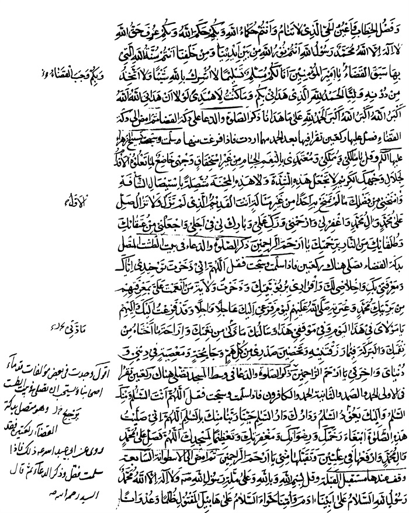
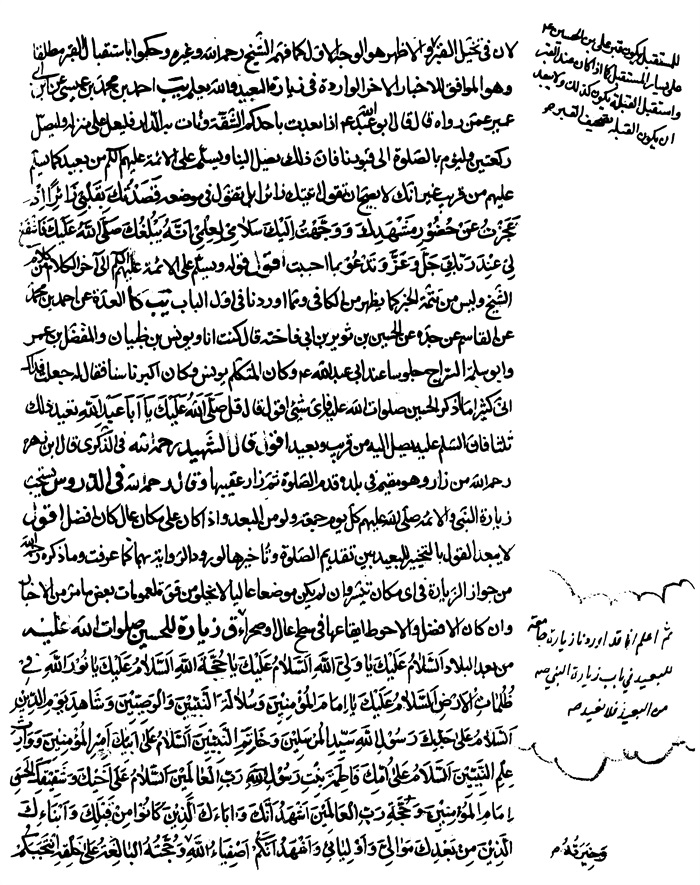
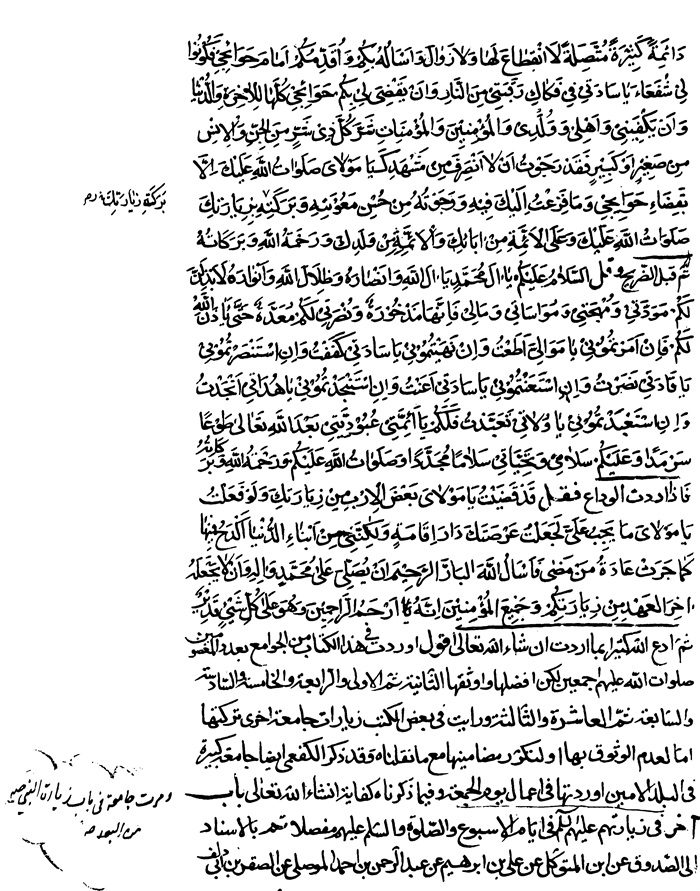

بحار الانوار الجامعة لدرر اخبار الائمة الاطهار المجلد 99

هوية الكتاب
بطاقة تعريف: مجلسي محمد باقربن محمدتقي 1037 - 1111ق.
عنوان واسم المؤلف: بحار الأنوار الجامعة لدرر أخبار الأئمة الأطهار المجلد 99: تأليف محمد باقربن محمدتقي المجلسي.
عنوان واسم المؤلف: بيروت داراحياء التراث العربي [ -13].
مظهر: ج - عينة.
ملاحظة: عربي.
ملاحظة: فهرس الكتابة على أساس المجلد الرابع والعشرين، 1403ق. [1360].
ملاحظة: المجلد108،103،94،91،92،87،67،66،65،52،24(الطبعة الثالثة: 1403ق.=1983م.=[1361]).
ملاحظة: فهرس.
محتويات: ج.24.كتاب الامامة. ج.52.تاريخ الحجة. ج67،66،65.الإيمان والكفر. ج.87.كتاب الصلاة. ج.92،91.الذكر و الدعا. ج.94.كتاب السوم. ج.103.فهرست المصادر. ج.108.الفهرست.-
عنوان: أحاديث الشيعة — قرن 11ق
ترتيب الكونجرس: BP135/م3ب31300 ي ح
تصنيف ديوي: 297/212
رقم الببليوغرافيا الوطنية: 1680946
ص: 1

تتمة كتاب المزار 

[أبواب زیارت الأئمة و رسول اللّٰه صلوات اللّٰه علیهم أجمعین] 

باب 1 فضل زیارة الإمامین الطاهرین المعصومین أبی الحسن موسی بن جعفر و أبی جعفر محمد بن علی صلوات اللّٰه علیهم ببغداد و فضل مشهدهما
«1»- قب، [المناقب] لابن شهرآشوب الْخَطِیبُ فِی تَارِیخِهِ بِإِسْنَادِهِ عَنْ عَلِیِّ بْنِ الْخَلَّالِ قَالَ: مَا هَمَّنِی أَمْرٌ فَقَصَدْتُ قَبْرَ مُوسَی بْنِ جَعْفَرٍ علیه السلام وَ تَوَسَّلْتُ بِهِ إِلَّا سَهَّلَ اللَّهُ لِی مَا أُحِبُ (1).
«2»-: وَ رُئِیَ فِی بَغْدَادَ امْرَأَةٌ تُهَرْوِلُ فَقِیلَ إِلَی أَیْنَ قَالَتْ إِلَی مُوسَی بْنِ جَعْفَرٍ فَإِنَّهُ حُبِسَ ابْنِی فَقَالَ لَهَا حَنْبَلِیٌّ إِنَّهُ قَدْ مَاتَ فِی الْحَبْسِ فَقَالَتْ بِحَقِّ الْمَقْتُولِ فِی الْحَبْسِ أَنْ تُرِیَنِی الْقُدْرَةَ فَإِذاً بِابْنِهَا قَدْ أُطْلِقَ وَ أُخِذَ ابْنُ الْمُسْتَهْزِئِ بِجِنَایَتِهِ (2).
«3»- قب، [المناقب] لابن شهرآشوب ابْنُ سِنَانٍ: قُلْتُ لِلرِّضَا علیه السلام مَا لِمَنْ زَارَ أَبَاكَ قَالَ لَهُ

> **پاورقی**: 1- 1. تاریخ بغداد: ج 1 ص 120.

> **پاورقی**: 2- 2. مناقب ابن شهرآشوب ص 422 طبع النجف الأشرف.

الْجَنَّةُ فَزُرْهُ (1).
«4»- زَكَرِیَّا بْنُ آدَمَ عَنِ الرِّضَا علیه السلام: أَنَّ اللَّهَ نَجَّی بَغْدَادَ بِمَكَانِ قَبْرِ أَبِی الْحَسَنِ علیه السلام وَ قَالَ علیه السلام: 
وَ قَبْرٌ بِبَغْدَادَ لِنَفْسٍ زَكِیَّةٍ***تَضَمَّنَهَا الرَّحْمَنُ فِی الْغُرُفَاتِ
وَ قَبْرٌ بِطُوسٍ یَا لَهَا مِنْ مُصِیبَةٍ***أَلَحَّتْ عَلَی الْأَحْشَاءِ بِالزَّفَرَاتِ (2).
«5»- یب، [تهذیب الأحكام] مُحَمَّدُ بْنُ أَحْمَدَ بْنِ دَاوُدَ عَنِ الْحُسَیْنِ بْنِ أَحْمَدَ بْنِ إِدْرِیسَ عَنْ أَبِیهِ عَنْ سَلَمَةَ بْنِ الْخَطَّابِ عَنْ عَلِیِّ بْنِ مُیَسِّرٍ عَنِ ابْنِ سِنَانٍ قَالَ: قُلْتُ لِلرِّضَا علیه السلام مَا لِمَنْ زَارَ أَبَاكَ قَالَ الْجَنَّةُ فَزُرْهُ (3).
«6»- یب، [تهذیب الأحكام] مُحَمَّدُ بْنُ أَحْمَدَ بْنِ دَاوُدَ عَنْ مُحَمَّدِ بْنِ هَمَّامٍ عَنْ أَبِی جَعْفَرٍ أَحْمَدَ بْنِ مَابُنْدَارَ عَنْ مَنْصُورِ بْنِ الْعَبَّاسِ عَنْ جَعْفَرٍ الْجَوْهَرِیِّ عَنْ زَكَرِیَّا بْنِ آدَمَ الْقُمِّیِّ عَنِ الرِّضَا علیه السلام قَالَ: إِنَّ اللَّهَ نَجَّی بَغْدَادَ لِمَكَانِ قبور [قَبْرِ] الْحُسَیْنِیَّیْنِ فِیهَا(4).
«7»- ن، [عیون أخبار الرضا علیه السلام] مَاجِیلَوَیْهِ عَنْ مُحَمَّدٍ الْعَطَّارِ عَنْ حَمْدَانَ بْنِ سُلَیْمَانَ عَنْ عَلِیِّ بْنِ مُحَمَّدٍ الْحُصَیْنِیِّ عَنْ عَلِیِّ بْنِ مُحَمَّدِ بْنِ مَرْوَانَ عَنْ إِبْرَاهِیمَ بْنِ عُقْبَةَ قَالَ: كَتَبْتُ إِلَی أَبِی الْحَسَنِ الثَّالِثِ علیه السلام أَسْأَلُهُ عَنْ زِیَارَةِ أَبِی عَبْدِ اللَّهِ الْحُسَیْنِ علیه السلام وَ عَنْ زِیَارَةِ أَبِی الْحَسَنِ وَ أَبِی جَعْفَرٍ علیهما السلام فَكَتَبَ إِلَیَّ أَبُو عَبْدِ اللَّهِ علیه السلام الْمُقَدَّمُ وَ هَذَا أَجْمَعُ وَ أَعْظَمُ أَجْراً(5).
«8»- مل، [كامل الزیارات] الْكُلَیْنِیُّ عَنْ مُحَمَّدِ بْنِ یَحْیَی عَنْ حَمْدَانَ الْقَلَانِسِیِّ: مِثْلَهُ (6) 
«9»- كا، [الكافی] یب مُحَمَّدُ بْنُ یَحْیَی عَنْ حَمْدَانَ الْقَلَانِسِیِّ عَنْ عَلِیِّ بْنِ مُحَمَّدٍ الْحُصَیْنِیِّ عَنْ عَلِیِّ بْنِ عَبْدِ اللَّهِ بْنِ مَرْوَانَ عَنْ إِبْرَاهِیمَ: مِثْلَهُ (7)
ص: 2

> **پاورقی**: 1- 1. المناقب ج 3 ص 442.

> **پاورقی**: 2- 2. المناقب ج 3 ص 442.

> **پاورقی**: 3- 3. التهذیب ج 6 ص 82.

> **پاورقی**: 4- 4. التهذیب ج 6 ص 81.

> **پاورقی**: 5- 5. عیون أخبار الرضا علیه السلام ج 2 ص 261.

> **پاورقی**: 6- 6. كامل الزیارات ص 300.

> **پاورقی**: 7- 7. الكافی ج 4 ص 583 و التهذیب ج 6 ص 82.

بیان: قوله علیه السلام أبو عبد اللّٰه علیه السلام المقدم أی الحسین علیه السلام أقدم و أفضل و زیارته فقط أفضل من زیارة كل من المعصومین و مجموع زیارتیهما أجمع و أفضل أو المراد أن زیارة الحسین علیه السلام أولی بالتقدیم ثم إن أضیفت إلی زیارته زیارة الإمامین علیهما السلام كان أجمع و أعظم أجرا. 
أو المعنی أن زیارتهما أجمع من زیارته علیه السلام وحدها لأن الاعتقاد بإمامتهما یستلزم الاعتقاد بإمامته دون العكس فكان زیارتهما تشتمل علی زیارته و لأن زیارتهما مختصة بالخواص من الشیعة كما سیأتی فی زیارة الرضا علیه السلام و لا یخفی بعد الوجه الأخیر. 
«10»- ثو، [ثواب الأعمال] أَبِی عَنْ سَعْدٍ عَنِ الْبَرْقِیِّ عَنِ الْوَشَّاءِ قَالَ: قُلْتُ لِلرِّضَا علیه السلام مَا لِمَنْ زَارَ قَبْرَ أَبِی الْحَسَنِ علیه السلام قَالَ لَهُ مِثْلُ مَا لِمَنْ زَارَ قَبْرَ أَبِی عَبْدِ اللَّهِ علیه السلام (1).
مل، [كامل الزیارات] عَلِیُّ بْنُ الْحُسَیْنِ: مِثْلَهُ (2).
«12»- مل، [كامل الزیارات] عَلِیُّ بْنُ الْحُسَیْنِ عَنْ سَعْدٍ عَنِ ابْنِ عِیسَی عَنِ الْوَشَّاءِ قَالَ: سَأَلْتُ الرِّضَا علیه السلام عَنْ زِیَارَةِ قَبْرِ أَبِی الْحَسَنِ علیه السلام مِثْلُ زِیَارَةِ قَبْرِ الْحُسَیْنِ علیه السلام قَالَ نَعَمْ (3).
مل، [كامل الزیارات] الْكُلَیْنِیُّ عَنْ مُحَمَّدِ بْنِ یَحْیَی عَنِ ابْنِ عِیسَی: مِثْلَهُ (4) یب، [تهذیب الأحكام] مُحَمَّدُ بْنُ أَحْمَدَ بْنِ دَاوُدَ عَنْ سَلَامَةَ بْنِ مُحَمَّدٍ عَنْ أَحْمَدَ بْنِ عَلِیِّ بْنِ أَبَانٍ الْقُمِّیِّ عَنِ ابْنِ عِیسَی: مِثْلَهُ (5).
«15»- مل، [كامل الزیارات] أَبِی عَنْ سَعْدٍ عَنِ ابْنِ عِیسَی عَنْ أَبِی عَلِیٍّ الْوَشَّاءِ عَنِ الْحُسَیْنِ بْنِ یَسَارٍ الْوَاسِطِیِّ قَالَ: قُلْتُ لِلرِّضَا علیه السلام أَزُورُ قَبْرَ أَبِی الْحَسَنِ علیه السلام بِبَغْدَادَ فَقَالَ: 
ص: 3

> **پاورقی**: 1- 1. ثواب الأعمال ص 89 ذیل حدیث.

> **پاورقی**: 2- 2. كامل الزیارات ص 299.

> **پاورقی**: 3- 3. كامل الزیارات ص 298.

> **پاورقی**: 4- 4. كامل الزیارات ص 299.

> **پاورقی**: 5- 5. التهذیب ج 6 ص 91.

إِنْ كَانَ لَا بُدَّ مِنْهُ فَمِنْ وَرَاءِ الْحِجَابِ (1).
بیان: الأمر بالزیارة خارج الجدار و من وراء الحجاب للتقیة من المخالفین. 
«16»- مل، [كامل الزیارات] مُحَمَّدُ بْنُ الْحِمْیَرِیِّ عَنْ أَبِیهِ عَنْ هَارُونَ بْنِ مُسْلِمٍ عَنْ عَلِیِّ بْنِ حَسَّانَ الْوَاسِطِیِّ عَنْ بَعْضِ أَصْحَابِنَا عَنِ الرِّضَا علیه السلام: فِی إِتْیَانِ قَبْرِ أَبِی الْحَسَنِ علیه السلام قَالَ صَلُّوا فِی الْمَسَاجِدِ حَوْلَهُ (2).
«17»- مل، [كامل الزیارات] أَبِی وَ عَلِیُّ بْنُ الْحُسَیْنِ وَ ابْنُ الْوَلِیدِ جَمِیعاً عَنْ سَعْدٍ عَنِ ابْنِ یَزِیدَ عَنِ الْحُسَیْنِ بْنِ یَسَارٍ الْوَاسِطِیِّ قَالَ: سَأَلْتُ أَبَا الْحَسَنِ الرِّضَا علیه السلام مَا لِمَنْ زَارَ قَبْرَ أَبِیكَ صَلَّی اللَّهُ عَلَیْهِ وَ آلِهِ قَالَ فَقَالَ زُورُوهُ قَالَ قُلْتُ وَ أَیُّ شَیْ ءٍ فِیهِ مِنَ الْفَضْلِ قَالَ فَقَالَ فِیهِ مِنَ الْفَضْلِ كَفَضْلِ مَنْ زَارَ وَالِدَهُ یَعْنِی رَسُولَ اللَّهِ صلی اللّٰه علیه و آله قُلْتُ فَإِنْ خِفْتُ وَ لَمْ یُمْكِنِّی الدُّخُولُ دَاخِلًا قَالَ سَلِّمْ مِنْ وَرَاءِ الْجِدَارِ(3).
یب، [تهذیب الأحكام] مُحَمَّدُ بْنُ أَحْمَدَ بْنِ دَاوُدَ عَنْ أَبِیهِ عَنْ أَحْمَدَ بْنِ دَاوُدَ عَنْ أَحْمَدَ بْنِ جَعْفَرٍ الْمُؤَدِّبِ عَنْ مُحَمَّدِ بْنِ أَحْمَدَ بْنِ یَحْیَی عَنِ ابْنِ یَزِیدَ: مِثْلَهُ إِلَّا أَنَّ فِیهِ مِنْ وَرَاءِ الْجِسْرِ(4).
«19»- مل، [كامل الزیارات] مُحَمَّدُ بْنُ جَعْفَرٍ عَنِ ابْنِ أَبِی الْخَطَّابِ عَنِ ابْنِ بَزِیعٍ عَنِ الْخَیْبَرِیِّ عَنِ الْحُسَیْنِ بْنِ مُحَمَّدٍ الْأَشْعَرِیِّ قَالَ: قَالَ الرِّضَا علیه السلام مَنْ زَارَ قَبْرَ أَبِی بِبَغْدَادَ كَانَ كَمَنْ زَارَ رَسُولَ اللَّهِ صلی اللّٰه علیه و آله وَ قَبْرَ أَمِیرِ الْمُؤْمِنِینَ علیه السلام إِلَّا أَنَّ لِرَسُولِ اللَّهِ صلی اللّٰه علیه و آله وَ أَمِیرِ الْمُؤْمِنِینَ علیه السلام فَضْلَهُمَا(5).
مل، [كامل الزیارات] الْكُلَیْنِیُّ عَنْ مُحَمَّدِ بْنِ یَحْیَی عَنِ ابْنِ أَبِی الْخَطَّابِ: مِثْلَهُ (6)
ص: 4

> **پاورقی**: 1- 1. كامل الزیارات ص 298.

> **پاورقی**: 2- 2. كامل الزیارات ص 299.

> **پاورقی**: 3- 3. كامل الزیارات ص 299.

> **پاورقی**: 4- 4. التهذیب ج 6 ص 82.

> **پاورقی**: 5- 5. كامل الزیارات ص 299.

> **پاورقی**: 6- 6. كامل الزیارات ص 299.

بیان: یعنی كونهما أفضل من موسی علیه السلام لا ینافی مساواتهم فی فضل الزیارة و یحتمل أن یكون المعنی أنهم مشتركون فی أن لزیارتهم فضلا عظیما لكن زیارتهما أفضل لفضلهما و الأول أظهر أَقُولُ وَ رَوَاهُ فِی التَّهْذِیبِ، عَنْ مُحَمَّدِ بْنِ أَحْمَدَ بْنِ دَاوُدَ عَنْ عَلِیِّ بْنِ حَبَشِیِّ بْنِ قُونِیٍّ عَنْ عَلِیِّ بْنِ سُلَیْمَانَ الرَّازِیِّ عَنِ ابْنِ أَبِی الْخَطَّابِ: مِثْلَهُ (1).
«22»- مل، [كامل الزیارات] أَبِی عَنْ سَعْدٍ عَنِ ابْنِ عِیسَی عَنِ ابْنِ أَبِی نَجْرَانَ قَالَ: سَأَلْتُ أَبَا جَعْفَرٍ علیه السلام عَمَّنْ زَارَ رَسُولَ اللَّهِ صلی اللّٰه علیه و آله قَاصِداً قَالَ لَهُ الْجَنَّةُ وَ مَنْ زَارَ قَبْرَ أَبِی الْحَسَنِ علیه السلام فَلَهُ الْجَنَّةُ(2).
مل، [كامل الزیارات] عَلِیُّ بْنُ الْحُسَیْنِ عَنْ سَعْدٍ: مِثْلَهُ (3).
«24»- مل، [كامل الزیارات] ابْنُ الْوَلِیدِ عَنْ سَعْدٍ عَنِ ابْنِ عِیسَی عَنِ الْوَشَّاءِ عَنِ الرِّضَا علیه السلام قَالَ: زِیَارَةُ قَبْرِ أَبِی مِثْلُ زِیَارَةِ قَبْرِ الْحُسَیْنِ علیه السلام (4).
«25»- مل، [كامل الزیارات] ابْنُ الْوَلِیدِ عَنْ سَعْدٍ عَنِ ابْنِ عِیسَی عَنْ أَحْمَدَ بْنِ عُبْدُوسٍ عَنْ أَبِیهِ رَحِیمٍ قَالَ: قُلْتُ لِلرِّضَا علیه السلام جُعِلْتُ فِدَاكَ إِنَّ زِیَارَةَ قَبْرِ أَبِی الْحَسَنِ علیه السلام بِبَغْدَادَ فِیهَا مَشَقَّةٌ وَ إِنَّمَا نَأْتِیهِ فَنُسَلِّمُ عَلَیْهِ مِنْ وَرَاءِ الْحِیطَانِ فَمَا لِمَنْ زَارَهُ مِنَ الثَّوَابِ قَالَ فَقَالَ لَهُ وَ اللَّهِ مِثْلُ مَا لِمَنْ أَتَی قَبْرَ رَسُولِ اللَّهِ صلی اللّٰه علیه و آله (5).
«26»- مل، [كامل الزیارات] ابْنُ الْوَلِیدِ عَنِ الصَّفَّارِ عَنِ ابْنِ عِیسَی عَنْ عَلِیِّ بْنِ الْحَكَمِ عَنْ رَحِیمٍ قَالَ: قُلْتُ لِلرِّضَا علیه السلام إِنَّ زِیَارَةَ قَبْرِ أَبِی الْحَسَنِ علیه السلام بِبَغْدَادَ عَلَیْنَا فِیهَا مَشَقَّةٌ فَمَا لِمَنْ زَارَهُ فَقَالَ لَهُ مِثْلُ مَا لِمَنْ أَتَی قَبْرَ الْحُسَیْنِ علیه السلام مِنَ الثَّوَابِ قَالَ وَ دَخَلَ رَجُلٌ فَسَلَّمَ عَلَیْهِ وَ جَلَسَ وَ ذَكَرَ بَغْدَادَ وَ رَدَاءَةَ أَهْلِهَا وَ مَا یَتَوَقَّعُ أَنْ یَنْزِلَ بِهِمْ مِنَ الْخَسْفِ وَ الصَّیْحَةِ وَ الصَّوَاعِقِ وَ عَدَّدَ مِنْ ذَلِكَ أَشْیَاءَ قَالَ فَقُمْتُ لِأَخْرُجَ فَسَمِعْتُ أَبَا الْحَسَنِ علیه السلام وَ هُوَ یَقُولُ أَمَّا أَبُو الْحَسَنِ علیه السلام فَلَا(6).
ص: 5

> **پاورقی**: 1- 1. التهذیب ج 6 ص 81.

> **پاورقی**: 2- 2. كامل الزیارات ص 299.

> **پاورقی**: 3- 3. نفس المصدر ص 301.

> **پاورقی**: 4- 4. كامل الزیارات ص 300.

> **پاورقی**: 5- 5. كامل الزیارات ص 300.

> **پاورقی**: 6- 6. كامل الزیارات ص 300.

بیان: أی لا یصیب قبره الشریف مثل هذه الأمور أو لا یدع أن یصیب أهل بغداد شی ء من ذلك فهم ببركة قبره محروسون و الأول أظهر لفظا و الثانی معنی. 
«27»- ق، [الكتاب العتیق الغرویّ] أَبُو عَلِیِّ بْنُ هَمَّامٍ عَنِ الْحَسَنِ بْنِ مُحَمَّدِ بْنِ جُمْهُورٍ الْعَمِّیِّ قَالَ: رَأَیْتُ فِی سَنَةِ سِتَّةٍ وَ تِسْعِینَ وَ مِائَتَیْنِ وَ هِیَ السَّنَةُ الَّتِی تَقَلَّدَ فِیهَا عَلِیُّ بْنُ مُحَمَّدِ بْنِ مُوسَی بْنِ الْفُرَاتِ وِزَارَةَ الْمُقْتَدِرِ أَحْمَدَ بْنَ رَبِیعَةَ الْأَنْبَارِیَّ الْكَاتِبَ وَ قَدِ اعْتَلَّتْ یَدُهُ الْعِلَّةَ الْخَبِیثَةَ وَ عَظُمَ أَمْرُهَا حَتَّی رَاحَتْ وَ اسْوَدَّتْ وَ أَشَارَ یَزِیدُ الْمُتَطَبِّبُ بِقَطْعِهَا وَ لَمْ یَشُكَّ أَحَدٌ مِمَّا رَآهُ فِی تَلَفِهِ فَرَأَی فِی مَنَامِهِ مَوْلَانَا أَمِیرَ الْمُؤْمِنِینَ صَلَوَاتُ اللَّهِ عَلَیْهِ فَقَالَ لَهُ یَا أَمِیرَ الْمُؤْمِنِینَ أَ مَا تَسْتَوْهِبُ لِی یَدِی فَقَالَ أَنَا مَشْغُولٌ عَنْكَ وَ لَكِنِ امْضِ إِلَی مُوسَی بْنِ جَعْفَرٍ فَإِنَّهُ یَسْتَوْهِبُهَا لَكَ فَأَصْبَحَ فَقَالَ ائْتُونِی بِمَحْمِلٍ وَ وَطِّئُوا تَحْتِی وَ احْمِلُونِی إِلَی مَقَابِرِ قُرَیْشٍ فَفَعَلُوا بِهِ ذَلِكَ بَعْدَ أَنْ غَسَّلُوهُ وَ طَیَّبُوهُ وَ طَرَحُوا عَلَیْهِ ثَوْباً وَ حَمَلُوهُ إِلَی قَبْرِ مُوسَی بْنِ جَعْفَرٍ صَلَوَاتُ اللَّهِ عَلَیْهِ فَلَاذَ بِهِ وَ دَعَا وَ أَخَذَ مِنْ تُرْبَتِهِ وَ طَلَی بِهِ یَدَهُ إِلَی الْكَتِفِ وَ شَدَّهَا فَلَمَّا كَانَ مِنَ الْغَدِ حَلَّهَا وَ قَدْ سَقَطَ كُلُّ لَحْمٍ وَ جِلْدٍ عَلَیْهَا حَتَّی بَقِیَتْ عِظَاماً وَ عُرُوقاً وَ أَعْصَاباً مُشَبَّكَةً وَ انْقَطَعَتِ الرَّائِحَةُ وَ بَلَغَ خَبَرُهُ الْوَزِیرَ فَحُمِلَ إِلَیْهِ حَتَّی نَظَرَ إِلَیْهِ ثُمَّ عُولِجَ فَرَجَعَ إِلَی الدِّیوَانِ وَ كَتَبَ بِهَا كَمَا كَانَ فَفِیهِ یَقُولُ صَالِحٌ الدَّیْلَمِیُ: 
وَ مُوسَی قَدْ شَفَی الْكَفَ***مِنَ الْكَاتِبِ إِذْ زَارَا
قبس، [قبس المصباح] أَخْبَرَنَا الشَّیْخُ أَبُو الْحَسَنِ أَحْمَدُ بْنُ مُحَمَّدِ بْنِ مُوسَی بْنِ جُنْدِیٍّ عَنْ أَبِی عَلِیٍّ مُحَمَّدِ بْنِ هَمَّامٍ: مِثْلَهُ. 
ص: 6

باب 2 كیفیة زیارتهما صلی اللّٰه علیهما 
«1»- مل، [كامل الزیارات] مُحَمَّدُ بْنُ جَعْفَرٍ الرَّزَّازُ عَنْ مُحَمَّدِ بْنِ عِیسَی بْنِ عُبَیْدٍ عَمَّنْ ذَكَرَهُ عَنْ أَبِی الْحَسَنِ علیه السلام قَالَ: تَقُولُ بِبَغْدَادَ السَّلَامُ عَلَیْكَ یَا وَلِیَّ اللَّهِ السَّلَامُ عَلَیْكَ یَا حُجَّةَ اللَّهِ السَّلَامُ عَلَیْكَ یَا نُورَ اللَّهِ فِی ظُلُمَاتِ الْأَرْضِ السَّلَامُ عَلَیْكَ یَا مَنْ بَدَا لِلَّهِ فِی شَأْنِهِ أَتَیْتُكَ زَائِراً عَارِفاً بِحَقِّكَ مُعَادِیاً لِأَعْدَائِكَ فَاشْفَعْ لِی عِنْدَ رَبِّكَ یَا مَوْلَایَ قَالَ وَ ادْعُ اللَّهَ وَ اسْأَلْ حَاجَتَكَ قَالَ وَ سَلِّمْ بِهَذَا عَلَی أَبِی جَعْفَرٍ مُحَمَّدِ بْنِ عَلِیٍّ وَ قَالَ قُلْ إِذَا أَرَدْتَ زِیَارَةَ مُوسَی بْنِ جَعْفَرٍ وَ مُحَمَّدِ بْنِ عَلِیٍّ علیهما السلام فَاغْتَسِلْ وَ تَنَظَّفْ وَ الْبَسْ ثَوْبَیْكَ الطَّاهِرَیْنِ وَ زُرْ قَبْرَ أَبِی الْحَسَنِ مُوسَی بْنِ جَعْفَرٍ علیهما السلام وَ مُحَمَّدِ بْنِ عَلِیِّ بْنِ مُوسَی علیهم السلام وَ قُلْ حِینَ تَصِیرُ عِنْدَ قَبْرِ أَبِی الْحَسَنِ مُوسَی بْنِ جَعْفَرٍ علیهما السلام السَّلَامُ عَلَیْكَ یَا وَلِیَّ اللَّهِ السَّلَامُ عَلَیْكَ یَا حُجَّةَ اللَّهِ السَّلَامُ عَلَیْكَ یَا نُورَ اللَّهِ فِی ظُلُمَاتِ الْأَرْضِ السَّلَامُ عَلَیْكَ یَا مَنْ بَدَا لِلَّهِ فِی شَأْنِهِ أَتَیْتُكَ زَائِراً عَارِفاً بِحَقِّكَ مُعَادِیاً لِأَعْدَائِكَ مُوَالِیاً لِأَوْلِیَائِكَ اشْفَعْ لِی عِنْدَ رَبِّكَ یَا مَوْلَایَ ثُمَّ سَلْ حَاجَتَكَ ثُمَّ سَلِّمْ عَلَی أَبِی جَعْفَرٍ مُحَمَّدِ بْنِ عَلِیٍّ علیهما السلام بِهَذِهِ الْأَحْرُفِ وَ ابْدَأْ بِالْغُسْلِ وَ قُلِ اللَّهُمَّ صَلِّ عَلَی مُحَمَّدِ بْنِ عَلِیٍّ الْإِمَامِ الْبَرِّ التَّقِیِّ الرَّضِیِّ الْمَرْضِیِّ وَ حُجَّتِكَ عَلَی مَنْ فَوْقَ الْأَرَضِینَ وَ مَنْ تَحْتَ الثَّرَی صَلَاةً كَثِیرَةً نَامِیَةً زَاكِیَةً مُبَارَكَةً مُتَوَاصِلَةً مُتَرَادِفَةً كَأَفْضَلِ مَا صَلَّیْتَ عَلَی أَحَدٍ مِنْ أَوْلِیَائِكَ السَّلَامُ عَلَیْكَ یَا وَلِیَّ اللَّهِ السَّلَامُ عَلَیْكَ یَا نُورَ اللَّهِ السَّلَامُ عَلَیْكَ یَا حُجَّةَ اللَّهِ السَّلَامُ عَلَیْكَ یَا إِمَامَ الْمُؤْمِنِینَ وَ وَارِثَ النَّبِیِّینَ وَ سُلَالَةَ الْوَصِیِّینَ السَّلَامُ عَلَیْكَ یَا نُورَ اللَّهِ فِی ظُلُمَاتِ الْأَرْضِ أَتَیْتُكَ زَائِراً عَارِفاً بِحَقِّكَ مُعَادِیاً لِأَعْدَائِكَ مُوَالِیاً لِأَوْلِیَائِكَ فَاشْفَعْ لِی عِنْدَ رَبِّكَ یَا مَوْلَایَ. 
ص: 7

ثُمَّ سَلْ حَاجَتَكَ تُقْضَی إِنْ شَاءَ اللَّهُ تَعَالَی. 
قَالَ وَ تَقُولُ عِنْدَ قَبْرِ أَبِی الْحَسَنِ علیه السلام بِبَغْدَادَ وَ یُجْزِی فِی الْمَوَاطِنِ كُلِّهَا أَنْ تَقُولَ السَّلَامُ عَلَی أَوْلِیَاءِ اللَّهِ وَ أَصْفِیَائِهِ السَّلَامُ عَلَی أُمَنَاءِ اللَّهِ وَ أَحِبَّائِهِ السَّلَامُ عَلَی أَنْصَارِ اللَّهِ وَ خُلَفَائِهِ السَّلَامُ عَلَی مَحَالِّ مَعْرِفَةِ اللَّهِ السَّلَامُ عَلَی مَسَاكِنِ ذِكْرِ اللَّهِ السَّلَامُ عَلَی مَظَاهِرِ أَمْرِ اللَّهِ وَ نَهْیِهِ السَّلَامُ عَلَی الدُّعَاةِ إِلَی اللَّهِ السَّلَامُ عَلَی الْمُسْتَقِرِّینَ فِی مَرْضَاةِ اللَّهِ السَّلَامُ عَلَی الْمُمَحَّصِینَ فِی طَاعَةِ اللَّهِ السَّلَامُ عَلَی الْأَدِلَّاءِ عَلَی اللَّهِ السَّلَامُ عَلَی الَّذِینَ مَنْ وَالاهُمْ فَقَدْ وَالَی اللَّهَ وَ مَنْ عَادَاهُمْ فَقَدْ عَادَی اللَّهَ وَ مَنْ عَرَفَهُمْ فَقَدْ عَرَفَ اللَّهَ وَ مَنْ جَهِلَهُمْ فَقَدْ جَهِلَ اللَّهَ وَ مَنِ اعْتَصَمَ بِهِمْ فَقَدِ اعْتَصَمَ بِاللَّهِ وَ مَنْ تَخَلَّی مِنْهُمْ فَقَدْ تَخَلَّی مِنَ اللَّهِ أُشْهِدُ اللَّهَ أَنِّی سِلْمٌ لِمَنْ سَالَمَكُمْ وَ حَرْبٌ لِمَنْ حَارَبَكُمْ مُؤْمِنٌ بِسِرِّكُمْ وَ عَلَانِیَتِكُمْ مُفَوِّضٌ فِی ذَلِكَ كُلِّهِ إِلَیْكُمْ لَعَنَ اللَّهُ عَدُوَّ آلِ مُحَمَّدٍ مِنَ الْجِنِّ وَ الْإِنْسِ وَ أَبْرَأُ إِلَی اللَّهِ مِنْهُمْ وَ صَلَّی اللَّهُ عَلَی مُحَمَّدٍ وَ آلِهِ وَ هَذَا یُجْزِی فِی الزِّیَارَاتِ [الْمَشَاهِدِ] كُلِّهَا وَ تُكْثِرُ مِنَ الصَّلَاةِ عَلَی مُحَمَّدٍ وَ آلِهِ وَ تُسَمِّی وَاحِداً وَاحِداً بِأَسْمَائِهِمْ وَ تَبْرَأُ إِلَی اللَّهِ مِنْ أَعَادِیهِمْ وَ تَخَیَّرُ لِنَفْسِكَ مِنَ الدُّعَاءِ وَ لِلْمُؤْمِنِینَ وَ الْمُؤْمِنَاتِ (1).
«2»- بَیَانٌ رُوِیَ فِی الْكَافِی، عَنْ مُحَمَّدِ بْنِ جَعْفَرٍ الرَّزَّازِ بِهَذَا الْإِسْنَادِ: إِلَی قَوْلِهِ وَ تُسَلِّمُ بِهَذَا عَلَی أَبِی جَعْفَرٍ علیه السلام.
ثُمَّ قَالَ مُحَمَّدُ بْنُ یَحْیَی عَنْ مُحَمَّدِ بْنِ أَحْمَدَ عَنْ هَارُونَ بْنِ مُسْلِمٍ عَنْ عَلِیِّ بْنِ حَسَّانَ عَنِ الرِّضَا علیه السلام قَالَ: سُئِلَ أَبِی عَنْ إِتْیَانِ قَبْرِ الْحُسَیْنِ علیه السلام قَالَ صَلُّوا فِی الْمَسَاجِدِ حَوْلَهُ وَ یُجْزِی فِی الْمَوَاضِعِ كُلِّهَا أَنْ تَقُولَ السَّلَامُ عَلَی أَوْلِیَاءِ اللَّهِ وَ أَصْفِیَائِهِ إِلَی آخِرِ مَا مَرَّ(2).
«3»- وَ رَوَاهُ الشَّیْخُ فِی التَّهْذِیبِ، عَنْ مُحَمَّدِ بْنِ یَعْقُوبَ عَنْ مُحَمَّدِ بْنِ یَحْیَی عَنْ مُحَمَّدِ بْنِ أَحْمَدَ بْنِ یَحْیَی عَنْ هَارُونَ بْنِ مُسْلِمٍ عَنْ عَلِیِّ بْنِ حَسَّانَ قَالَ:
ص: 8

> **پاورقی**: 1- 1. كامل الزیارات ص 301.

> **پاورقی**: 2- 2. الكافی ج 4 ص 578.

سُئِلَ الرِّضَا علیه السلام عَنْ إِتْیَانِ قَبْرِ أَبِی الْحَسَنِ علیه السلام فَقَالَ صَلُّوا فِی الْمَسَاجِدِ حَوْلَهُ وَ ذَكَرَ نَحْوَهُ (1).
أقول: لعل التكرار فی كلام ابن قولویه من جهة اختلاف الأسانید قوله علیه السلام یا من بدا لله یمكن أن یكون إشارة إلی ما ورد فی بعض الأخبار أنه كان قدر له علیه السلام أنه القائم بالسیف ثم بدا لله فیه و أن یكون إشارة إلی البداء الذی وقع فی إسماعیل فإن البداء فی إسماعیل یستلزم البداء فیه علیه السلام كما لا یخفی.
لكن إجراؤه فی أبی جعفر علیه السلام یحتاج إلی تكلف آخر بأن یقال إنه لما تولد بعد یأس الناس منه فكأنما بدا لله فیه أو للوجه الأول الذی تقدم و فی بعض النسخ یا مرید اللّٰه فی شأنه من الإرادة و فی بعضها بدأ لله بالهمز أی أراد اللّٰه إمامته أو بدأ بها قبل خلقه. 
«4»- أَقُولُ وَ ذَكَرَ الشَّیْخُ فِی التَّهْذِیبِ، فِی وَدَاعِ أَبِی الْحَسَنِ مُوسَی علیه السلام: تَقِفُ عَلَی الْقَبْرِ كَوُقُوفِكَ أَوَّلَ مَرَّةٍ لِلزِّیَارَةِ وَ تَقُولُ السَّلَامُ عَلَیْكَ یَا مَوْلَایَ یَا أَبَا الْحَسَنِ وَ رَحْمَةُ اللَّهِ وَ بَرَكَاتُهُ أَسْتَوْدِعُكَ اللَّهَ وَ أَقْرَأُ عَلَیْكَ السَّلَامَ آمَنَّا بِاللَّهِ وَ بِالرَّسُولِ وَ بِمَا جِئْتَ بِهِ وَ دَلَلْتَ عَلَیْهِ اللَّهُمَ فَاكْتُبْنا مَعَ الشَّاهِدِینَ (2). 
وَ قَالَ فِی وَدَاعِ أَبِی جَعْفَرٍ علیه السلام: تَقِفُ عَلَیْهِ كَوُقُوفِكَ عَلَیْهِ حِینَ بَدَأْتَ بِزِیَارَتِهِ وَ تَقُولُ السَّلَامُ عَلَیْكَ یَا مَوْلَایَ یَا ابْنَ رَسُولِ اللَّهِ وَ رَحْمَةُ اللَّهِ وَ بَرَكَاتُهُ أَسْتَوْدِعُكَ اللَّهَ وَ أَقْرَأُ عَلَیْكَ السَّلَامَ آمَنَّا بِاللَّهِ وَ بِرَسُولِهِ وَ بِمَا جِئْتَ بِهِ وَ دَلَلْتَ عَلَیْهِ اللَّهُمَّ اكْتُبْنَا مَعَ الشَّاهِدِینَ ثُمَّ تَسْأَلُهُ أَنْ لَا یَجْعَلَهُ آخِرَ الْعَهْدِ مِنْكَ وَ ادْعُ بِمَا شِئْتَ وَ قَبِّلِ الْقَبْرَ وَ ضَعْ خَدَّیْكَ عَلَیْهِ إِنْ شَاءَ اللَّهُ (3).
«5»- أَقُولُ وَ قَالَ الصَّدُوقُ رَحِمَهُ اللَّهُ فِی الْفَقِیهِ،: إِذَا وَرَدْتَ بَغْدَادَ إِنْ شَاءَ اللَّهُ فَاغْتَسِلْ وَ تَنَظَّفْ وَ الْبَسْ ثَوْبَیْكَ الطَّاهِرَیْنِ وَ زُرْ قَبْرَیْهِمَا وَ قُلْ حِینَ تَصِیرُ إِلَی قَبْرِ مُوسَی بْنِ جَعْفَرٍ علیهما السلام السَّلَامُ عَلَیْكَ یَا وَلِیَّ اللَّهِ إِلَی آخِرِ مَا مَرَّ 
ص: 9

> **پاورقی**: 1- 1. التهذیب ج 6 ص 82.

> **پاورقی**: 2- 2. التهذیب ج 6 ص 83.

> **پاورقی**: 3- 3. التهذیب ج 6 ص 91.

فِی كَلَامِ ابْنِ قُولَوَیْهِ مِنْ زِیَارَةِ الْإِمَامَیْنِ علیهما السلام ثُمَّ قَالَ ثُمَّ صَلِّ فِی الْقُبَّةِ الَّتِی فِیهَا مُحَمَّدُ بْنُ عَلِیٍّ علیهما السلام أَرْبَعَ رَكَعَاتٍ رَكْعَتَیْنِ لِزِیَارَةِ مُوسَی علیه السلام وَ رَكْعَتَیْنِ لِزِیَارَةِ مُحَمَّدِ بْنِ عَلِیٍّ علیهما السلام وَ لَا تُصَلِّ عِنْدَ رَأْسِ مُوسَی علیه السلام فَإِنَّهُ یُقَابِلُ قُبُورَ قُرَیْشٍ وَ لَا یَجُوزُ اتِّخَاذُهَا قِبْلَةً(1).
«6»- أَقُولُ وَ رَوَی مُؤَلِّفُ الْمَزَارِ الْكَبِیرِ عَنْ مُحَمَّدِ بْنِ جَعْفَرٍ الرَّزَّازِ بِالْإِسْنَادِ الْمُتَقَدِّمِ: إِلَی قَوْلِهِ وَ سَلِّمْ بِهَذَا عَلَی أَبِی جَعْفَرٍ علیه السلام ثُمَّ قَالَ ثُمَّ تُصَلِّی صَلَاةَ الزِّیَارَةِ فَإِذَا فَرَغْتَ مِنْهَا سَبَّحْتَ تَسْبِیحَ الزَّهْرَاءِ علیها السلام وَ تَقُولُ اللَّهُمَّ إِلَیْكَ نَصَبْتُ یَدِی وَ فِیمَا عِنْدَكَ عَظُمَتْ رَغْبَتِی فَاقْبَلْ یَا سَیِّدِی تَوْبَتِی وَ اغْفِرْ لِی وَ ارْحَمْنِی وَ اجْعَلْ لِی فِی كُلِّ خَیْرٍ نَصِیباً وَ إِلَی كُلِّ خَیْرٍ سَبِیلًا اللَّهُمَّ صَلِّ عَلَی مُحَمَّدٍ وَ آلِ مُحَمَّدٍ وَ اسْمَعْ دُعَائِی وَ ارْحَمْ تَضَرُّعِی وَ تَذَلُّلِی وَ اسْتِكَانَتِی وَ تَوَكُّلِی عَلَیْكَ فَأَنَا لَكَ سِلْمٌ لَا أَرْجُو نَجَاحاً وَ لَا مُعَافَاةً وَ لَا تَشْرِیفاً إِلَّا بِكَ وَ مِنْكَ فَامْنُنْ عَلَیَّ بِتَبْلِیغِی هَذَا الْمَكَانَ الشَّرِیفَ مِنْ قَابِلٍ وَ أَنَا مُعَافًی مِنْ كُلِّ مَكْرُوهٍ وَ مَحْذُورٍ وَ أَعِنِّی عَلَی طَاعَتِكَ وَ طَاعَةِ أَوْلِیَائِكَ الَّذِینَ اصْطَفَیْتَهُمْ مِنْ خَلْقِكَ. 
اللَّهُمَّ صَلِّ عَلَی مُحَمَّدٍ وَ عَلَی آلِ مُحَمَّدٍ وَ سَلِّمْنِی فِی دِینِی وَ امْدُدْ لِی فِی أَجَلِی وَ أَصْلِحْ لِی جِسْمِی یَا مَنْ رَحِمَنِی وَ أَعْطَانِی وَ بِفَضْلِهِ أَغْنَانِی اغْفِرْ لِی ذَنْبِی وَ أَتْمِمْ لِی نِعْمَتَكَ فِیمَا بَقِیَ مِنْ عُمُرِی حَتَّی تَوَفَّانِی وَ أَنْتَ عَنِّی رَاضٍ اللَّهُمَّ صَلِّ عَلَی مُحَمَّدٍ وَ آلِ مُحَمَّدٍ وَ لَا تُخْرِجْنِی مِنْ مِلَّةِ الْإِسْلَامِ فَإِنِّی اعْتَصَمْتُ بِحَبْلِكَ فَلَا تَكِلْنِی إِلَی غَیْرِكَ اللَّهُمَّ صَلِّ عَلَی مُحَمَّدٍ وَ آلِ مُحَمَّدٍ وَ عَلِّمْنِی مَا یَنْفَعُنِی وَ انْفَعْنِی بِمَا عَلَّمْتَنِی وَ امْلَأْ قَلْبِی عِلْماً وَ خَوْفاً مِنْ سَطَوَاتِكَ وَ نَقِمَاتِكَ اللَّهُمَّ إِنِّی أَسْأَلُكَ مَسْأَلَةَ الْمُضْطَرِّ إِلَیْكَ الْمُشْفِقِ مِنْ عَذَابِكَ الْخَائِفِ مِنْ عُقُوبَتِكَ أَنْ تَغْفِرَ لِی وَ تَغَمَّدَنِی وَ تَحَنَّنَ عَلَیَّ بِرَحْمَتِكَ وَ تَعُودَ عَلَیَّ بِمَغْفِرَتِكَ وَ تُؤَدِّیَ عَنِّی فَرِیضَتَكَ وَ تُغْنِیَنِی بِفَضْلِكَ عَنْ سُؤَالِ 
ص: 10

> **پاورقی**: 1- 1. الفقیه ج 2 ص 363.

أَحَدٍ مِنْ خَلْقِكَ وَ تُجِیرَنِی مِنَ النَّارِ بِرَحْمَتِكَ. 
اللَّهُمَّ صَلِّ عَلَی مُحَمَّدٍ وَ آلِ مُحَمَّدٍ وَ عَجِّلْ فَرَجَ وَلِیِّكَ وَ ابْنِ وَلِیِّكَ وَ افْتَحْ لَهُ فَتْحاً یَسِیراً وَ انْصُرْهُ نَصْراً عَزِیزاً اللَّهُمَّ صَلِّ عَلَی مُحَمَّدٍ وَ آلِ مُحَمَّدٍ وَ أَظْهِرْ حُجَّتَهُ بِوَلِیِّكَ وَ أَحْیِ سُنَّتَهُ بِظُهُورِهِ حَتَّی یَسْتَقِیمَ بِظُهُورِهِ جَمِیعُ عِبَادِكَ وَ بِلَادِكَ وَ لَا یَسْتَخْفِیَ أَحَدٌ بِشَیْ ءٍ مِنَ الْحَقِّ اللَّهُمَّ إِنِّی أَرْغَبُ إِلَیْهِ فِی دَوْلَتِهِ الشَّرِیفَةِ الْكَرِیمَةِ الَّتِی تُعِزُّ بِهَا الْإِسْلَامَ وَ أَهْلَهُ وَ تُذِلُّ بِهَا النِّفَاقَ وَ أَهْلَهُ اللَّهُمَّ صَلِّ عَلَی مُحَمَّدٍ وَ آلِ مُحَمَّدٍ وَ اجْعَلْنَا فِیهَا مِنَ الدَّاعِینَ إِلَی طَاعَتِكَ وَ الْفَائِزِینَ فِی سَبِیلِكَ وَ ارْزُقْنَا كَرَامَةَ الدُّنْیَا وَ الْآخِرَةِ اللَّهُمَّ مَا أَنْكَرْنَا مِنَ الْحَقِّ فَعَرِّفْنَاهُ وَ مَا قَصُرْنَا عَنْهُ فَبَلِّغْنَاهُ اللَّهُمَّ صَلِّ عَلَی مُحَمَّدٍ وَ آلِ مُحَمَّدٍ وَ اسْتَجِبْ لَنَا جَمِیعَ مَا دَعَوْنَاكَ وَ أَعْطِنَا جَمِیعَ مَا سَأَلْنَاكَ وَ اجْعَلْنَا لِأَنْعُمِكَ مِنَ الشَّاكِرِینَ وَ لِآلَائِكَ مِنَ الذَّاكِرِینَ وَ اغْفِرْ لَنَا یَا خَیْرَ الْغَافِرِینَ وَ افْعَلْ بِنَا وَ بِالْمُؤْمِنِینَ مَا أَنْتَ أَهْلُهُ یَا أَرْحَمَ الرَّاحِمِینَ ثُمَّ اسْجُدْ وَ عَفِّرْ خَدَّیْكَ وَ امْضِ فِی دَعَةِ اللَّهِ (1).
«7»- أَقُولُ قَالَ الْمُفِیدُ وَ الشَّهِیدُ وَ مُؤَلِّفُ الْمَزَارِ الْكَبِیرِ قَدَّسَ اللَّهُ أَرْوَاحَهُمْ: إِذَا وَرَدْتَ إِنْ شَاءَ اللَّهُ تَعَالَی بِبَغْدَادَ فَاغْتَسِلْ لِلزِّیَارَةِ وَ اقْصِدِ الْمَشْهَدَ وَ قِفْ عَلَی الْبَابِ الشَّرِیفِ وَ اسْتَأْذِنْ ثُمَّ ادْخُلْ وَ أَنْتَ تَقُولُ بِسْمِ اللَّهِ وَ بِاللَّهِ وَ فِی سَبِیلِ اللَّهِ وَ عَلَی مِلَّةِ رَسُولِ اللَّهِ وَ السَّلَامُ عَلَی أَوْلِیَاءِ اللَّهِ ثُمَّ امْضِ حَتَّی تَتَقَبَّلَ قَبْرَ مُوسَی بْنِ جَعْفَرٍ علیهما السلام فَإِذَا وَقَفْتَ عَلَیْهِ فَقُلْ السَّلَامُ عَلَیْكَ یَا نُورَ اللَّهِ فِی ظُلُمَاتِ الْأَرْضِ السَّلَامُ عَلَیْكَ یَا وَلِیَّ اللَّهِ السَّلَامُ عَلَیْكَ یَا حُجَّةَ اللَّهِ السَّلَامُ عَلَیْكَ یَا بَابَ اللَّهِ أَشْهَدُ أَنَّكَ أَقَمْتَ الصَّلَاةَ وَ آتَیْتَ الزَّكَاةَ وَ أَمَرْتَ بِالْمَعْرُوفِ وَ نَهَیْتَ عَنِ الْمُنْكَرِ وَ تَلَوْتَ الْكِتَابَ حَقَّ تِلَاوَتِهِ وَ جَاهَدْتَ فِی اللَّهِ حَقَّ جِهَادِهِ وَ صَبَرْتَ عَلَی الْأَذَی فِی جَنْبِهِ مُحْتَسِباً وَ عَبَدْتَهُ مُخْلِصاً حَتَّی أَتَاكَ الْیَقِینُ. 
أَشْهَدُ أَنَّكَ أَوْلَی بِاللَّهِ وَ بِرَسُولِهِ وَ أَنَّكَ ابْنُ رَسُولِ اللَّهِ حَقّاً أَبْرَأُ إِلَی اللَّهِ مِنْ أَعْدَائِكَ وَ أَتَقَرَّبُ إِلَی اللَّهِ بِمُوَالاتِكَ أَتَیْتُكَ یَا مَوْلَایَ عَارِفاً بِحَقِّكَ مُوَالِیاً
ص: 11

> **پاورقی**: 1- 1. المزار الكبیر ص 179.

لِأَوْلِیَائِكَ مُعَادِیاً لِأَعْدَائِكَ فَاشْفَعْ لِی عِنْدَ رَبِّكَ. 
ثُمَّ انْكَبَّ عَلَی الْقَبْرِ وَ قَبِّلْهُ وَ ضَعْ خَدَّیْكَ وَ تَحَوَّلْ إِلَی عِنْدِ الرَّأْسِ وَ قِفْ وَ قُلِ السَّلَامُ عَلَیْكَ یَا ابْنَ رَسُولِ اللَّهِ أَشْهَدُ أَنَّكَ صَادِقٌ أَدَّیْتَ نَاصِحاً وَ قُلْتَ أَمِیناً وَ مَضَیْتَ شَهِیداً لَمْ تُؤْثِرْ عَمًی عَلَی الْهُدَی وَ لَمْ تَمِلْ مِنْ حَقٍّ إِلَی بَاطِلٍ صَلَّی اللَّهُ عَلَیْكَ وَ عَلَی آبَائِكَ وَ أَبْنَائِكَ الطَّاهِرِینَ ثُمَّ قَبِّلِ الْقَبْرَ وَ صَلِّ رَكْعَتَیْنِ وَ صَلِّ بَعْدَهُمَا مَا أَحْبَبْتَ وَ اسْجُدْ وَ قُلِ اللَّهُمَّ إِلَیْكَ اعْتَمَدْتُ وَ إِلَیْكَ قَصَدْتُ وَ لِفَضْلِكَ رَجَوْتُ وَ قَبْرَ إِمَامِیَ الَّذِی أَوْجَبْتَ عَلَیَّ طَاعَتَهُ زُرْتُ وَ بِهِ إِلَیْكَ تَوَسَّلْتُ فَبِحَقِّهِمُ الَّذِی أَوْجَبْتَ عَلَی نَفْسِكَ اغْفِرْ لِی وَ لِوالِدَیَّ وَ لِلْمُؤْمِنِینَ یَا كَرِیمُ ثُمَّ اقْلِبْ خَدَّكَ الْأَیْمَنَ وَ قُلِ اللَّهُمَّ قَدْ عَلِمْتَ حَوَائِجِی فَصَلِّ عَلَی مُحَمَّدٍ وَ آلِ مُحَمَّدٍ وَ اقْضِهَا ثُمَّ اقْلِبْ خَدَّكَ الْأَیْسَرَ وَ قُلِ اللَّهُمَّ قَدْ أَحْصَیْتَ ذُنُوبِی فَبِحَقِّ مُحَمَّدٍ وَ آلِ مُحَمَّدٍ صَلِّ عَلَی مُحَمَّدٍ وَ آلِ مُحَمَّدٍ وَ اغْفِرْهَا وَ تَصَدَّقْ عَلَیَّ بِمَا أَنْتَ أَهْلُهُ ثُمَّ عُدْ إِلَی السُّجُودِ وَ قُلْ شُكْراً شُكْراً مِائَةَ مَرَّةٍ ثُمَّ ارْفَعْ رَأْسَكَ وَ ادْعُ بِمَا شِئْتَ لِمَنْ شِئْتَ وَ أَحْبَبْتَ. 
ثُمَّ تَوَجَّهْ نَحْوَ قَبْرِ أَبِی جَعْفَرٍ مُحَمَّدِ بْنِ عَلِیٍّ الْجَوَادِ وَ هُوَ بِظَهْرِ جَدِّهِ علیهم السلام فَإِذَا وَقَفْتَ عَلَیْهِ فَقُلْ السَّلَامُ عَلَیْكَ یَا وَلِیَّ اللَّهِ السَّلَامُ عَلَیْكَ یَا حُجَّةَ اللَّهِ السَّلَامُ عَلَیْكَ یَا نُورَ اللَّهِ فِی ظُلُمَاتِ الْأَرْضِ السَّلَامُ عَلَیْكَ یَا ابْنَ رَسُولِ اللَّهِ السَّلَامُ عَلَیْكَ وَ عَلَی آبَائِكَ السَّلَامُ عَلَیْكَ وَ عَلَی أَبْنَائِكَ السَّلَامُ عَلَیْكَ وَ عَلَی أَوْلِیَائِكَ أَشْهَدُ أَنَّكَ قَدْ أَقَمْتَ الصَّلَاةَ وَ آتَیْتَ الزَّكَاةَ وَ أَمَرْتَ بِالْمَعْرُوفِ وَ نَهَیْتَ عَنِ الْمُنْكَرِ وَ تَلَوْتَ الْكِتَابَ حَقَّ تِلَاوَتِهِ وَ جَاهَدْتَ فِی اللَّهِ حَقَّ جِهَادِهِ وَ صَبَرْتَ عَلَی الْأَذَی فِی جَنْبِهِ حَتَّی أَتَاكَ الْیَقِینُ أَتَیْتُكَ زَائِراً عَارِفاً بِحَقِّكَ مُوَالِیاً لِأَوْلِیَائِكَ مُعَادِیاً لِأَعْدَائِكَ فَاشْفَعْ لِی عِنْدَ رَبِّكَ. 
ثُمَّ قَبِّلِ الْقَبْرَ وَ ضَعْ خَدَّیْكَ عَلَیْهِ ثُمَّ صَلِّ رَكْعَتَیْنِ لِلزِّیَارَةِ وَ صَلِّ بَعْدَهُمَا مَا شِئْتَ 
ص: 12

ثُمَّ اسْجُدْ وَ قُلْ ارْحَمْ مَنْ أَسَاءَ وَ اقْتَرَفَ وَ اسْتَكَانَ وَ اعْتَرَفَ. 
ثُمَّ اقْلِبْ خَدَّكَ الْأَیْمَنَ وَ قُلْ إِنْ كُنْتُ بِئْسَ الْعَبْدُ فَأَنْتَ نِعْمَ الرَّبُّ ثُمَّ اقْلِبْ خَدَّكَ الْأَیْسَرَ وَ قُلْ عَظُمَ الذَّنْبُ مِنْ عَبْدِكَ فَلْیَحْسُنِ الْعَفْوُ مِنْ عِنْدِكَ یَا كَرِیمُ ثُمَّ عُدْ إِلَی السُّجُودِ وَ قُلْ شُكْراً شُكْراً مِائَةَ مَرَّةٍ ثُمَّ انْصَرِفْ إِنْ شَاءَ اللَّهُ (1).
«8»- ثُمَّ قَالُوا: زِیَارَةٌ أُخْرَی لَهُمَا علیهما السلام جَمِیعاً قُلِ السَّلَامُ عَلَیْكُمَا یَا وَلِیَّیِ اللَّهِ السَّلَامُ عَلَیْكُمَا یَا حُجَّتَیِ اللَّهِ السَّلَامُ عَلَیْكُمَا یَا نُورَیِ اللَّهِ فِی ظُلُمَاتِ الْأَرْضِ أَشْهَدُ أَنَّكُمَا قَدْ بَلَّغْتُمَا عَنِ اللَّهِ مَا حَمَّلَكُمَا وَ حَفِظْتُمَا مَا اسْتُودِعْتُمَا وَ حَلَّلْتُمَا حَلَالَ اللَّهِ وَ حَرَّمْتُمَا حَرَامَ اللَّهِ وَ أَقَمْتُمَا حُدُودَ اللَّهِ وَ تَلَوْتُمَا كِتَابَ اللَّهِ وَ صَبَرْتُمَا عَلَی الْأَذَی فِی جَنْبِ اللَّهِ مُحْتَسِبَیْنِ حَتَّی أَتَاكُمَا الْیَقِینُ أَبْرَأُ إِلَی اللَّهِ مِنْ أَعْدَائِكُمَا وَ أَتَقَرَّبُ إِلَی اللَّهِ بِوَلَایَتِكُمَا أَتَیْتُكُمَا زَائِراً عَارِفاً بِحَقِّكُمَا مُوَالِیاً لِأَوْلِیَائِكُمَا مُعَادِیاً لِأَعْدَائِكُمَا مُسْتَبْصِراً بِالْهُدَی الَّذِی أَنْتُمَا عَلَیْهِ عَارِفاً بِضَلَالَةِ مَنْ خَالَفَكُمَا فَاشْفَعَا لِی عِنْدَ رَبِّكُمَا فَإِنَّ لَكُمَا عِنْدَ اللَّهِ جَاهاً عَظِیماً وَ مَقَاماً مَحْمُوداً ثُمَّ قَبِّلِ التُّرْبَةَ وَ ضَعْ خَدَّكَ الْأَیْمَنَ عَلَیْهَا وَ تَحَوَّلْ إِلَی عِنْدِ الرَّأْسِ فَقُلْ السَّلَامُ عَلَیْكُمَا یَا حُجَّتَیِ اللَّهِ فِی أَرْضِهِ وَ سَمَائِهِ عَبْدُكُمَا وَ وَلِیُّكُمَا زَائِرُكُمَا مُتَقَرِّباً إِلَی اللَّهِ بِزِیَارَتِكُمَا اللَّهُمَ اجْعَلْ لِی لِسانَ صِدْقٍ فِی أَوْلِیَائِكَ الْمُصْطَفَیْنَ وَ حَبِّبْ إِلَیَّ مَشَاهِدَهُمْ وَ اجْعَلْنِی مَعَهُمْ فِی الدُّنْیَا وَ الْآخِرَةِ یَا أَرْحَمَ الرَّاحِمِینَ ثُمَّ صَلِّ لِكُلِّ إِمَامٍ رَكْعَتَیْنِ لِلزِّیَارَةِ وَ ادْعُ بِمَا أَحْبَبْتَ فَإِذَا أَرَدْتَ الِانْصِرَافَ فَوَدِّعْهُمَا علیهما السلام وَ قُلْ بَعْدَ أَنْ وَقَفْتَ مِثْلَ مَا وَقَفْتَ أَوَّلًا: 
السَّلَامُ عَلَیْكُمَا یَا وَلِیَّیِ اللَّهِ أَسْتَوْدِعُكُمَا اللَّهَ وَ أَقْرَأُ عَلَیْكُمَا السَّلَامَ آمَنَّا بِاللَّهِ وَ بِالرَّسُولِ وَ بِمَا جِئْتُمَا بِهِ وَ دَلَلْتُمَا عَلَیْهِ اللَّهُمَّ اكْتُبْنَا مَعَ الشَّاهِدِینَ اللَّهُمَّ لَا تَجْعَلْهُ آخِرَ الْعَهْدِ مِنْ زِیَارَتِی إِیَّاهُمَا وَ ارْزُقْنِی مُرَافَقَتَهُمَا وَ احْشُرْنِی مَعَهُمَا 
ص: 13

> **پاورقی**: 1- 1. المزار الكبیر ص 177 و مزار الشهید ص 58.

وَ انْفَعْنِی بِحُبِّهِمَا وَ السَّلَامُ عَلَیْكُمَا وَ رَحْمَةُ اللَّهِ وَ بَرَكَاتُهُ (1).
«9»- وَ قَالَ السَّیِّدُ رَضِیَ اللَّهُ عَنْهُ: إِذَا أَرَدْتَ زِیَارَةَ الْإِمَامِ مُوسَی بْنِ جَعْفَرٍ علیهما السلام فَیَنْبَغِی أَنْ تَغْتَسِلَ ثُمَّ تَأْتِیَ الْمَشْهَدَ الْمُقَدَّسَ وَ عَلَیْكَ السَّكِینَةُ وَ الْوَقَارُ فَإِذَا أَتَیْتَهُ فَقِفْ عَلَی بَابِهِ وَ قُلِ اللَّهُ أَكْبَرُ اللَّهُ أَكْبَرُ لَا إِلَهَ إِلَّا اللَّهُ وَ اللَّهُ أَكْبَرُ الْحَمْدُ لِلَّهِ عَلَی هِدَایَتِهِ لِدِینِهِ وَ التَّوْفِیقِ لِمَا دَعَا إِلَیْهِ مِنْ سَبِیلِهِ اللَّهُمَّ إِنَّكَ أَكْرَمُ مَقْصُودٍ وَ أَكْرَمُ مَأْتِیٍّ وَ قَدْ أَتَیْتُكَ مُتَقَرِّباً إِلَیْكَ بِابْنِ بِنْتِ نَبِیِّكَ صَلَوَاتُكَ عَلَیْهِ وَ عَلَی آبَائِهِ الطَّاهِرِینَ وَ أَبْنَائِهِ الطَّیِّبِینَ اللَّهُمَّ صَلِّ عَلَی مُحَمَّدٍ وَ آلِ مُحَمَّدٍ وَ لَا تُخَیِّبْ سَعْیِی وَ لَا تَقْطَعْ رَجَائِی وَ اجْعَلْنِی بِهِمْ عِنْدَكَ وَجِیهاً فِی الدُّنْیا وَ الْآخِرَةِ وَ مِنَ الْمُقَرَّبِینَ ثُمَّ تُقَدِّمُ رِجْلَكَ الْیُمْنَی عِنْدَ الدُّخُولِ وَ تَقُولُ بِسْمِ اللَّهِ وَ بِاللَّهِ وَ فِی سَبِیلِ اللَّهِ وَ عَلَی مِلَّةِ رَسُولِ اللَّهِ صَلَّی اللَّهُ عَلَیْهِ وَ آلِهِ اللَّهُمَ اغْفِرْ لِی وَ لِوالِدَیَ وَ لِجَمِیعِ الْمُؤْمِنِینَ وَ الْمُؤْمِنَاتِ. 
فَإِذَا وَصَلْتَ إِلَی بَابِ الْقُبَّةِ فَقِفْ عَلَیْهِ وَ اسْتَأْذِنْ تَقُولُ أَ أَدْخُلُ یَا رَسُولَ اللَّهِ أَ أَدْخُلُ یَا نَبِیَّ اللَّهِ أَ أَدْخُلُ یَا مُحَمَّدَ بْنَ عَبْدِ اللَّهِ أَ أَدْخُلُ یَا أَمِیرَ الْمُؤْمِنِینَ أَ أَدْخُلُ یَا أَبَا مُحَمَّدٍ الْحَسَنَ أَ أَدْخُلُ یَا أَبَا عَبْدِ اللَّهِ الْحُسَیْنَ أَ أَدْخُلُ یَا أَبَا مُحَمَّدٍ عَلِیَّ بْنَ الْحُسَیْنِ أَ أَدْخُلُ یَا أَبَا جَعْفَرٍ مُحَمَّدَ بْنَ عَلِیٍّ أَ أَدْخُلُ یَا أَبَا عَبْدِ اللَّهِ جَعْفَرَ بْنَ مُحَمَّدٍ أَ أَدْخُلُ یَا مَوْلَایَ یَا أَبَا الْحَسَنِ مُوسَی بْنَ جَعْفَرٍ أَ أَدْخُلُ یَا مَوْلَایَ یَا أَبَا جَعْفَرٍ أَ أَدْخُلُ یَا مَوْلَایَ یَا مُحَمَّدَ بْنَ عَلِیٍّ. 
فَإِذَا دَخَلْتَ فَكَبِّرِ اللَّهَ أَرْبَعاً ثُمَّ تَقِفُ مُسْتَقْبِلَ الْقَبْرِ بِوَجْهِكَ وَ الْقِبْلَةُ بَیْنَ كَتِفَیْكَ وَ تَقُولُ السَّلَامُ عَلَیْكَ یَا وَلِیَّ اللَّهِ وَ ابْنَ وَلِیِّهِ السَّلَامُ عَلَیْكَ یَا حُجَّةَ اللَّهِ وَ ابْنَ حُجَّتِهِ السَّلَامُ عَلَیْكَ یَا صَفِیَّ اللَّهِ وَ ابْنَ صَفِیِّهِ السَّلَامُ عَلَیْكَ یَا أَمِینَ اللَّهِ وَ ابْنَ أَمِینِهِ السَّلَامُ عَلَیْكَ یَا نُورَ اللَّهِ فِی ظُلُمَاتِ الْأَرْضِ السَّلَامُ عَلَیْكَ یَا إِمَامَ الْهُدَی السَّلَامُ عَلَیْكَ یَا عَلَمَ الدِّینِ وَ التُّقَی السَّلَامُ عَلَیْكَ یَا خَازِنَ عِلْمِ النَّبِیِّینَ السَّلَامُ 
ص: 14

> **پاورقی**: 1- 1. المزار الكبیر ص 178 و مزار الشهید ص 59.

عَلَیْكَ یَا خَازِنَ عِلْمِ الْمُرْسَلِینَ السَّلَامُ عَلَیْكَ یَا نَائِبَ الْأَوْصِیَاءِ السَّابِقِینَ السَّلَامُ عَلَیْكَ یَا مَعْدِنَ الْوَحْیِ الْمُبِینِ السَّلَامُ عَلَیْكَ یَا صَاحِبَ الْعِلْمِ الْیَقِینِ السَّلَامُ عَلَیْكَ یَا عَیْبَةَ عِلْمِ الْمُرْسَلِینَ السَّلَامُ عَلَیْكَ أَیُّهَا الْإِمَامُ الصَّالِحُ السَّلَامُ عَلَیْكَ أَیُّهَا الْإِمَامُ الزَّاهِدُ السَّلَامُ عَلَیْكَ أَیُّهَا الْإِمَامُ الْعَابِدُ السَّلَامُ عَلَیْكَ أَیُّهَا الْإِمَامُ السَّیِّدُ الرَّشِیدُ السَّلَامُ عَلَیْكَ أَیُّهَا الْإِمَامُ الْمَقْتُولُ الشَّهِیدُ السَّلَامُ عَلَیْكَ یَا ابْنَ رَسُولِ اللَّهِ وَ ابْنَ وَصِیِّهِ السَّلَامُ عَلَیْكَ یَا مَوْلَایَ یَا مُوسَی بْنَ جَعْفَرٍ وَ رَحْمَةُ اللَّهِ وَ بَرَكَاتُهُ أَشْهَدُ أَنَّكَ قَدْ بَلَّغْتَ عَنِ اللَّهِ مَا حَمَّلَكَ وَ حَفِظْتَ مَا اسْتَوْدَعَكَ وَ حَلَّلْتَ حَلَالَ اللَّهِ وَ حَرَّمْتَ حَرَامَ اللَّهِ وَ أَقَمْتَ أَحْكَامَ اللَّهِ وَ تَلَوْتَ كِتَابَ اللَّهِ وَ صَبَرْتَ عَلَی الْأَذَی فِی جَنْبِ اللَّهِ وَ جَاهَدْتَ فِی اللَّهِ حَقَّ جِهَادِهِ حَتَّی أَتَاكَ الْیَقِینُ. 
وَ أَشْهَدُ أَنَّكَ مَضَیْتَ عَلَی مَا مَضَی عَلَیْهِ آبَاؤُكَ الطَّاهِرُونَ وَ أَجْدَادُكَ الطَّیِّبُونَ وَ الْأَوْصِیَاءُ الْهَادُونَ الْأَئِمَّةُ الْمَهْدِیُّونَ لَمْ تُؤْثِرْ عَمًی عَلَی هُدًی وَ لَمْ تَمِلْ مِنْ حَقٍّ إِلَی بَاطِلٍ وَ أَشْهَدُ أَنَّكَ نَصَحْتَ لِلَّهِ وَ لِرَسُولِهِ وَ لِأَمِیرِ الْمُؤْمِنِینَ وَ أَنَّكَ أَدَّیْتَ الْأَمَانَةَ وَ اجْتَنَبْتَ الْخِیَانَةَ وَ أَقَمْتَ الصَّلَاةَ وَ آتَیْتَ الزَّكَاةَ وَ أَمَرْتَ بِالْمَعْرُوفِ وَ نَهَیْتَ عَنِ الْمُنْكَرِ وَ عَبَدْتَ اللَّهَ مُخْلِصاً مُجْتَهِداً مُحْتَسِباً حَتَّی أَتَاكَ الْیَقِینُ فَجَزَاكَ اللَّهُ عَنِ الْإِسْلَامِ وَ أَهْلِهِ أَفْضَلَ الْجَزَاءِ وَ أَشْرَفَ الْجَزَاءِ. 
أَتَیْتُكَ یَا ابْنَ رَسُولِ اللَّهِ زَائِراً عَارِفاً بِحَقِّكَ مُقِرّاً بِفَضْلِكَ مُحْتَمِلًا لِعِلْمِكَ مُحْتَجِباً بِذِمَّتِكَ عَائِذاً بِقَبْرِكَ لَائِذاً بِضَرِیحِكَ مُسْتَشْفِعاً بِكَ إِلَی اللَّهِ مُوَالِیاً لِأَوْلِیَائِكَ مُعَادِیاً لِأَعْدَائِكَ مُسْتَبْصِراً بِشَأْنِكَ وَ بِالْهُدَی الَّذِی أَنْتَ عَلَیْهِ عَالِماً بِضَلَالَةِ مَنْ خَالَفَكَ وَ بِالْعَمَی الَّذِی هُمْ عَلَیْهِ بِأَبِی أَنْتَ وَ أُمِّی وَ نَفْسِی وَ أَهْلِی وَ مَالِی وَ وُلْدِی یَا ابْنَ رَسُولِ اللَّهِ أَتَیْتُكَ مُتَقَرِّباً بِزِیَارَتِكَ إِلَی اللَّهِ تَعَالَی وَ مُسْتَشْفِعاً بِكَ إِلَیْهِ فَاشْفَعْ لِی عِنْدَ رَبِّكَ لِیَغْفِرَ لِی ذُنُوبِی وَ یَعْفُوَ عَنْ جُرْمِی وَ یَتَجَاوَزَ عَنْ سَیِّئَاتِی وَ یَمْحُوَ عَنِّی خَطِیئَاتِی وَ یُدْخِلَنِی الْجَنَّةَ وَ یَتَفَضَّلَ عَلَیَّ بِمَا هُوَ أَهْلُهُ وَ یَغْفِرَ لِی وَ لِآبَائِی وَ لِإِخْوَانِی وَ لِجَمِیعِ الْمُؤْمِنِینَ وَ الْمُؤْمِنَاتِ فِی مَشَارِقِ الْأَرْضِ وَ مَغَارِبِهَا بِفَضْلِهِ وَ جُودِهِ وَ مَنِّهِ. 
ص: 15

ثُمَّ تَنْكَبُّ عَلَی الْقَبْرِ وَ تُقَبِّلُهُ وَ تُعَفِّرُ خَدَّیْكَ عَلَیْهِ وَ تَدْعُو بِمَا تُرِیدُ ثُمَّ تَتَحَوَّلُ إِلَی الرَّأْسِ تَقُولُ: 
السَّلَامُ عَلَیْكَ یَا مَوْلَایَ یَا مُوسَی بْنَ جَعْفَرٍ وَ رَحْمَةُ اللَّهِ وَ بَرَكَاتُهُ أَشْهَدُ أَنَّكَ الْإِمَامُ الْهَادِی وَ الْوَلِیُّ الْمُرْشِدُ وَ أَنَّكَ مَعْدِنُ التَّنْزِیلِ وَ صَاحِبُ التَّأْوِیلِ وَ حَامِلُ التَّوْرَاةِ وَ الْإِنْجِیلِ وَ الْعَالِمُ الْعَادِلُ وَ الصَّادِقُ الْعَامِلُ یَا مَوْلَایَ أَنَا أَبْرَأُ إِلَی اللَّهِ مِنْ أَعْدَائِكَ وَ أَتَقَرَّبُ إِلَی اللَّهِ بِمُوَالاتِكَ فَصَلَّی اللَّهُ عَلَیْكَ وَ عَلَی آبَائِكَ وَ أَجْدَادِكَ وَ أَبْنَائِكَ وَ شِیعَتِكَ وَ مُحِبِّیكَ وَ رَحْمَةُ اللَّهِ وَ بَرَكَاتُهُ ثُمَّ تُصَلِّی رَكْعَتَیْنِ لِلزِّیَارَةِ تَقْرَأُ فِیهِمَا سُورَةَ یس وَ الرَّحْمَنِ أَوْ مَا تَیَسَّرَ مِنَ الْقُرْآنِ ثُمَّ تَدْعُو بِمَا تُرِیدُ(1).
«10»- زِیَارَةٌ أُخْرَی لِمَوْلَانَا أَبِی إِبْرَاهِیمَ مُوسَی بْنِ جَعْفَرٍ علیه السلام: تَسْتَأْذِنُ بِمَا تَقَدَّمَ ثُمَّ تَدْخُلُ مُقَدِّماً رِجْلَكَ الْیُمْنَی فَإِذَا دَخَلْتَ فَكَبِّرِ اللَّهَ تَعَالَی مِائَةَ تَكْبِیرَةٍ وَ تَقِفُ مُسْتَقْبِلَ الضَّرِیحِ وَ تَقُولُ السَّلَامُ عَلَیْكَ أَیُّهَا الْعَبْدُ الصَّالِحُ السَّلَامُ عَلَیْكَ أَیُّهَا النُّورُ السَّاطِعُ السَّلَامُ عَلَیْكَ أَیُّهَا الْقَمَرُ الطَّالِعُ السَّلَامُ عَلَیْكَ أَیُّهَا الْغَیْثُ النَّافِعُ السَّلَامُ عَلَیْكَ أَیُّهَا الْإِمَامُ الْكَاظِمُ السَّلَامُ عَلَیْكَ یَا وَلِیَّ اللَّهِ وَ حُجَّتَهُ السَّلَامُ عَلَیْكَ یَا نُورَ اللَّهِ فِی الظُّلُمَاتِ السَّلَامُ عَلَیْكَ یَا آلَ اللَّهِ السَّلَامُ عَلَیْكَ یَا بَابَ اللَّهِ السَّلَامُ عَلَیْكَ یَا صَفْوَةَ اللَّهِ السَّلَامُ عَلَیْكَ یَا خَاصَّةَ اللَّهِ السَّلَامُ عَلَیْكَ یَا سِرَّ اللَّهِ الْمُسْتَوْدَعَ السَّلَامُ عَلَیْكَ یَا صِرَاطَ اللَّهِ السَّلَامُ عَلَیْكَ یَا زَیْنَ الْأَبْرَارِ السَّلَامُ عَلَیْكَ یَا سَلِیلَ الْأَطْهَارِ السَّلَامُ عَلَیْكَ یَا عُنْصُرَ الْأَخْیَارِ السَّلَامُ عَلَیْكَ یَا مِحْنَةَ الْخَلْقِ السَّلَامُ عَلَیْكَ یَا مَنْ بَدَا لِلَّهِ فِی شَأْنِهِ السَّلَامُ عَلَیْكَ یَا وَارِثَ عِلْمِ النَّبِیِّینَ وَ سُلَالَةَ الْوَصِیِّینَ وَ شَاهِدَ یَوْمِ الدِّینِ أَشْهَدُ أَنَّكَ وَ آبَاءَكَ الَّذِینَ كَانُوا مِنْ قَبْلِكَ وَ أَبْنَاءَكَ الَّذِینَ مِنْ بَعْدِكَ مَوَالِیَّ وَ أَوْلِیَائِی وَ أَئِمَّتِی أَشْهَدُ أَنَّكُمْ أَصْفِیَاءُ اللَّهِ وَ خِیَرَتُهُ وَ حُجَّتُهُ الْبَالِغَةُ انْتَجَبَكُمْ بِعِلْمِهِ وَ جَعَلَكُمُ أَنْصَاراً لِدِینِهِ وَ قُوَّاماً بِأَمْرِهِ وَ خُزَّاناً لِحُكْمِهِ وَ حَفَظَةً لِسِرِّهِ وَ أَرْكَاناً لِتَوْحِیدِهِ وَ مَعَادِنَ لِكَلِمَاتِهِ وَ تَرَاجِمَةً لِوَحْیِهِ وَ شُهُوداً عَلَی عِبَادِهِ اسْتَرْعَاكُمْ
ص: 16

> **پاورقی**: 1- 1. مصباح الزائر ص 198- 200.

خَلْقَهُ وَ آتَاكُمْ كِتَابَهُ وَ خَصَّكُمْ بِكَرَائِمِ التَّنْزِیلِ وَ أَعْطَاكُمْ فَضَائِلَ التَّأْوِیلِ وَ جَعَلَكُمْ تَابُوتَ حِكْمَتِهِ وَ عَصَا عِزِّهِ وَ مَنَاراً فِی بِلَادِهِ وَ أَعْلَاماً لِعِبَادِهِ وَ أَجْرَی فِیكُمْ مِنْ رَوْحِهِ وَ عَصَمَكُمْ مِنَ الزَّلَلِ وَ طَهَّرَكُمْ مِنَ الدَّنَسِ وَ أَذْهَبَ عَنْكُمُ الرِّجْسَ وَ آمَنَكُمْ مِنَ الْفِتَنِ بِكُمْ تَمَّتِ النِّعْمَةُ وَ اجْتَمَعَتِ الْفُرْقَةُ وَ ائْتَلَفَتِ الْكَلِمَةُ وَ لَكُمُ الطَّاعَةُ الْمُفْتَرَضَةُ وَ الْمَوَدَّةُ الْوَاجِبَةُ وَ أَنْتُمْ أَوْلِیَاءُ اللَّهِ النُّجَبَاءُ وَ عِبَادُهُ الْمُكْرَمُونَ أَتَیْتُكَ یَا ابْنَ رَسُولِ اللَّهِ عَارِفاً بِحَقِّكَ مُسْتَبْصِراً بِشَأْنِكَ مُوَالِیاً لِأَوْلِیَائِكَ مُعَادِیاً لِأَعْدَائِكَ بِأَبِی أَنْتَ وَ أُمِّی صَلَّی اللَّهُ عَلَیْكَ وَ سَلَّمَ تَسْلِیماً(1) الصَّلَاةُ عَلَیْهِ صَلَّی اللَّهُ عَلَیْهِ اللَّهُمَّ صَلِّ عَلَی مُحَمَّدٍ وَ أَهْلِ بَیْتِهِ وَ صَلِّ عَلَی مُوسَی بْنِ جَعْفَرٍ وَصِیِّ الْأَبْرَارِ وَ إِمَامِ الْأَخْیَارِ وَ عَیْبَةِ الْأَنْوَارِ وَ وَارِثِ السَّكِینَةِ وَ الْوَقَارِ وَ الْحِكَمِ وَ الْآثَارِ الَّذِی كَانَ یُحْیِی اللَّیْلَ بِالسَّهَرِ إِلَی السَّحَرِ بِمُوَاصَلَةِ الِاسْتِغْفَارِ حَلِیفِ السَّجْدَةِ الطَّوِیلَةِ وَ الدُّمُوعِ الْغَزِیرَةِ وَ الْمُنَاجَاةِ الْكَثِیرَةِ وَ الضَّرَاعَاتِ الْمُتَّصِلَةِ الْجَمِیلَةِ وَ مَقَرِّ النُّهَی وَ الْعَدْلِ وَ الْخَیْرِ وَ الْفَضْلِ وَ النَّدَی وَ الْبَذْلِ وَ مَأْلَفِ الْبَلْوَی وَ الصَّبْرِ وَ الْمُضْطَهَدِ بِالظُّلْمِ وَ الْمَقْبُورِ بِالْجَوْرِ وَ الْمُعَذَّبِ فِی قَعْرِ السُّجُونِ وَ ظُلَمِ الْمَطَامِیرِ ذِی السَّاقِ الْمَرْضُوضِ بِحَلَقِ الْقُیُودِ وَ الْجَنَازَةِ الْمُنَادَی عَلَیْهَا بِذُلِّ الِاسْتِخْفَافِ وَ الْوَارِدِ عَلَی جَدِّهِ الْمُصْطَفَی وَ أَبِیهِ الْمُرْتَضَی وَ أُمِّهِ سَیِّدَةِ النِّسَاءِ بِإِرْثٍ مَغْصُوبٍ وَ وَلَاءٍ مَسْلُوبٍ وَ أَمْرٍ مَغْلُوبٍ وَ دَمٍ مَطْلُوبٍ وَ سَمٍّ مَشْرُوبٍ. 
اللَّهُمَّ وَ كَمَا صَبَرَ عَلَی غَیْظِ الْمِحَنِ وَ تَجَرَّعَ فِیكَ غُصَصَ الْكُرَبِ وَ اسْتَسْلَمَ لِرِضَاكَ وَ أَخْلَصَ الطَّاعَةَ لَكَ وَ مَحَضَ الْخُشُوعَ وَ اسْتَشْعَرَ الْخُضُوعَ وَ عَادَی الْبِدْعَةَ وَ أَهْلَهَا وَ لَمْ یَلْحَقْهُ فِی شَیْ ءٍ مِنْ أَوَامِرِكَ وَ نَوَاهِیكَ لَوْمَةُ لَائِمٍ صَلِّ عَلَیْهِ صَلَاةً نَامِیَةً مُنِیفَةً زَاكِیَةً تُوجِبُ لَهُ بِهَا شَفَاعَةَ أُمَمٍ مِنْ خَلْقِكَ وَ قُرُونٍ مِنْ بَرَایَاكَ وَ بَلِّغْهُ عَنَّا تَحِیَّةً وَ سَلَاماً وَ آتِنَا مِنْ لَدُنْكَ فِی مُوَالاتِهِ فَضْلًا وَ إِحْسَاناً وَ مَغْفِرَةً وَ 
ص: 17

> **پاورقی**: 1- 1. مصباح الزائر ص 200.

رِضْوَاناً إِنَّكَ ذُو الْفَضْلِ الْعَمِیمِ وَ التَّجَاوُزِ الْعَظِیمِ بِرَحْمَتِكَ یَا أَرْحَمَ الرَّاحِمِینَ ثُمَّ تُصَلِّی رَكْعَتَیِ الزِّیَارَةِ وَ تَقُولُ عَقِیبَهُمَا وَ أَنْتَ قَائِمٌ اللَّهُمَّ إِنِّی أَسْأَلُكَ بِحُرْمَةِ مَنْ عَاذَ بِكَ مِنْكَ وَ لَجَأَ إِلَی عِزِّكَ وَ اسْتَظَلَّ بِفَیْئِكَ وَ اعْتَصَمَ بِحَبْلِكَ وَ لَمْ یَثِقْ إِلَّا بِكَ یَا جَزِیلَ الْعَطَایَا یَا فَكَّاكَ الْأُسَارَی یَا مَنْ سَمَّی نَفْسَهُ مِنْ جُودِهِ وَهَّاباً أَنْ تُصَلِّیَ عَلَی مُحَمَّدٍ وَ آلِ مُحَمَّدٍ وَ لَا تَرُدَّنِی مِنْ هَذَا الْمَقَامِ خَائِباً فَإِنَّ هَذَا مَقَامٌ تُغْفَرُ فِیهِ الذُّنُوبُ الْعِظَامُ وَ تُرْجَی فِیهِ الرَّحْمَةُ مِنَ الْكَرِیمِ الْعَلَّامِ مَقَامٌ لَا یَخِیبُ فِیهِ السَّائِلُونَ وَ لَا یُجْبَهُ فِیهِ بِالرَّدِّ الرَّاغِبُونَ مَقَامُ مَنْ لَاذَ بِمَوْلَاهُ رَغْبَةً وَ تَبَتَّلَ إِلَیْهِ رَهْبَةً مَقَامُ الْخَائِفِ مِنْ یَوْمٍ یَقُومُ فِیهِ النَّاسُ لِرَبِّ الْعالَمِینَ وَ لَا تَنْفَعُ فِیهِ شَفاعَةُ الشَّافِعِینَ إِلَّا مَنْ أَذِنَ لَهُ الرَّحْمنُ وَ كَانَ مِنَ الْفَائِزِینَ ذَلِكَ یَوْمٌ لا یَنْفَعُ فِیهِ مالٌ وَ لا بَنُونَ إِلَّا مَنْ أَتَی اللَّهَ بِقَلْبٍ سَلِیمٍ وَ أُزْلِفَتِ الْجَنَّةُ لِلْمُتَّقِینَ وَ قِیلَ لَهُمْ هذا ما كُنْتُمْ تُوعَدُونَ لِكُلِّ أَوَّابٍ حَفِیظٍ مَنْ خَشِیَ الرَّحْمنَ بِالْغَیْبِ وَ جاءَ بِقَلْبٍ مُنِیبٍ ادْخُلُوها بِسَلامٍ ذلِكَ یَوْمُ الْخُلُودِ اللَّهُمَّ فَاجْعَلْنِی مِنَ الْمُخْلَصِینَ الْفَائِزِینَ وَ اجْعَلْنِی مِنْ وَرَثَةِ جَنَّةِ النَّعِیمِ وَ اغْفِرْ لِی وَ لِوَالِدَیَّ وَ لِوُلْدِی یَوْمَ الدِّینِ وَ أَلْحِقْنِی بِالصَّالِحِینَ وَ اخْلُفْ عَلَی أَهْلِی وَ وُلْدِی فِی الْغَابِرِینَ وَ اجْمَعْ بَیْنَنَا جَمِیعاً فِی مُسْتَقَرِّ رَحْمَتِكَ یَا أَرْحَمَ الرَّاحِمِینَ وَ سَلِّمْنِی مِنْ أَهْوَالِ مَا بَیْنِی وَ بَیْنَ لِقَائِكَ حَتَّی تُبْلِغَنِی الدَّرَجَةَ الَّتِی فِیهَا مُرَافَقَةُ أَحِبَّائِكَ الَّذِینَ عَلَیْهِمْ دَلَلْتَ وَ بِالاقْتِدَاءِ بِهِمْ أَمَرْتَ وَ اسْقِنِی مِنْ حَوْضِهِمْ مَشْرَباً رَوِیّاً سَائِغاً هَنِیئاً لَا أَظْمَأُ بَعْدَهُ وَ لَا أَحْلَا عَنْهُ أَبَداً وَ احْشُرْنِی فِی زُمْرَتِهِمْ وَ تَوَفَّنِی عَلَی مِلَّتِهِمْ وَ اجْعَلْنِی فِی حِزْبِهِمْ وَ عَرِّفْنِی وُجُوهَهُمْ فِی رِضْوَانِكَ وَ الْجَنَّةَ فَإِنِّی رَضِیتُ بِهِمْ أَئِمَّةً وَ هُدَاةً وَ وُلَاةً فَاجْعَلْهُمْ أَئِمَّتِی وَ هُدَاتِی وَ وُلَاتِی فِی الدُّنْیَا وَ الْآخِرَةِ وَ لَا تُفَرِّقْ بَیْنِی وَ بَیْنَهُمْ طَرْفَةَ عَیْنٍ یَا أَرْحَمَ الرَّاحِمِینَ آمِینَ یَا رَبَّ الْعَالَمِینَ وَ صَلِّ مَا تَخْتَارُ وَ ادْعُ بِمَا تُرِیدُ(1).
«11»- زِیَارَةٌ أُخْرَی یُزَارُ بِهَا صَلَوَاتُ اللَّهِ عَلَیْهِ: تَسْتَأْذِنُ بِمَا تَقَدَّمَ وَ تَقِفُ 
ص: 18

> **پاورقی**: 1- 1. مصباح الزائر ص 201- 202.

عَلَی ضَرِیحِهِ وَ تَقُولُ: 
السَّلَامُ عَلَیْكَ یَا وَلِیَّ اللَّهِ السَّلَامُ عَلَیْكَ یَا صَفْوَةَ اللَّهِ السَّلَامُ عَلَیْكَ یَا حُجَّةَ اللَّهِ السَّلَامُ عَلَیْكَ یَا نُورَ اللَّهِ فِی ظُلُمَاتِ الْأَرْضِ السَّلَامُ عَلَیْكَ یَا إِمَامَ الْمُتَّقِینَ وَ وَارِثَ عِلْمِ الْأَوَّلِینَ وَ الْآخِرِینَ السَّلَامُ عَلَیْكَ یَا سُلَالَةَ الْوَصِیِّینَ السَّلَامُ عَلَیْكَ یَا شَاهِدَ یَوْمِ الدِّینِ أَشْهَدُ أَنَّكَ وَ آبَاءَكَ الَّذِینَ كَانُوا مِنْ قَبْلِكَ وَ أَبْنَاءَكَ الَّذِینَ یَكُونُونَ مِنْ بَعْدِكَ مَوَالِیَّ وَ أَوْلِیَائِی وَ أَئِمَّتِی وَ قَادَتِی فِی الدُّنْیَا وَ الْآخِرَةِ. 
وَ أَشْهَدُ أَنَّكُمْ أَصْفِیَاءُ اللَّهِ وَ خِیَرَتُهُ مِنْ خَلْقِهِ وَ حُجَّتُهُ الْبَالِغَةُ انْتَجَبَكُمْ لِعِلْمِهِ وَ جَعَلَكُمْ خَزَنَةً لِسِرِّهِ وَ أَرْكَاناً لِتَوْحِیدِهِ وَ تَرَاجِمَةً لِوَحْیِهِ وَ مَعَادِنَ لِكَلِمَاتِهِ وَ شُهُوداً لَهُ عَلَی عِبَادِهِ وَ اسْتَرْعَاكُمْ أَمْرَ خَلْقِهِ وَ خَصَّكُمْ بِكَرَائِمِ التَّنْزِیلِ وَ أَعْطَاكُمُ التَّأْوِیلَ وَ جَعَلَكُمْ أَبْوَاباً لِحِكْمَتِهِ وَ مَنَاراً فِی بِلَادِهِ وَ أَعْلَاماً لِعِبَادِهِ وَ ضَرَبَ لَكُمْ مَثَلًا مِنْ نُورِهِ وَ عَصَمَكُمْ مِنَ الزَّلَلِ وَ طَهَّرَكُمْ مِنَ الدَّنَسِ وَ آمَنَكُمْ مِنَ الْفِتَنِ فَبِكُمْ تَمَّتِ النِّعْمَةُ وَ اجْتَمَعَتْ بِكُمُ الْفُرْقَةُ وَ بِكُمُ انْتَظَمَتِ الْكَلِمَةُ وَ لَكُمُ الطَّاعَةُ الْمُفْتَرَضَةُ وَ الْمَوَدَّةُ الْوَاجِبَةُ الْمُوَظَّفَةُ وَ أَنْتُمْ أَوْلِیَاءُ اللَّهِ النُّجَبَاءُ أَحْیَا بِكُمُ الصِّدْقَ فَنَصَحْتُمْ لِعِبَادِهِ وَ دَعَوْتُمْ إِلَی كِتَابِ اللَّهِ وَ طَاعَتِهِ وَ نَهَیْتُمْ عَنْ مَعَاصِی اللَّهِ وَ ذَبَبْتُمْ عَنْ دِینِ اللَّهِ أَتَیْتُكَ یَا مَوْلَایَ یَا أَبَا إِبْرَاهِیمَ مُوسَی بْنَ جَعْفَرٍ یَا ابْنَ خَاتَمِ النَّبِیِّینَ وَ ابْنَ سَیِّدِ الْوَصِیِّینَ وَ ابْنَ سَیِّدَةِ نِسَاءِ الْعَالَمِینَ عَارِفاً بِحَقِّكَ مُسْتَبْصِراً بِشَأْنِكَ مُصَدِّقاً بِوَعْدِكَ مُوَالِیاً لِأَوْلِیَائِكَ مُعَادِیاً لِأَعْدَائِكَ فَعَلَیْكَ یَا مَوْلَایَ مِنِّی أَفْضَلُ التَّحِیَّةِ وَ السَّلَامِ ثُمَّ تَقُولُ اللَّهُمَّ صَلِّ عَلَی حُجَّتِكَ مِنْ خَلْقِكَ وَ أَمِینِكَ فِی بِلَادِكَ وَ خَلِیفَتِكَ فِی عِبَادِكَ وَ لِسَانِ حِكْمَتِكَ وَ مَنْهَجِ حَقِّكَ وَ مَقْصَدِ سَبِیلِكَ وَ السَّبَبِ إِلَی طَاعَتِكَ وَ صِرَاطِكَ الْمُسْتَقِیمِ وَ خَازِنِكَ وَ الطَّرِیقِ إِلَیْكَ مُوسَی بْنِ جَعْفَرٍ فَرَطِ أَنْبِیَائِكَ وَ سُلَالَةِ أَصْفِیَائِكَ دَاعِی الْحِكْمَةِ وَ خَازِنِ الْحِلْمِ وَ كَاظِمِ الْغَیْظِ وَ صَائِمِ الْقَیْظِ وَ إِمَامِ الْمُؤْمِنِینَ وَ زَیْنِ الْمُهْتَدِینَ الْحَاكِمِ الرَّضِیِّ وَ الْإِمَامِ الزَّكِیِ 
ص: 19

الْوَفِیِّ الْوَصِیِّ. 
اللَّهُمَّ صَلِّ عَلَیْهِ وَ عَلَی الْأَئِمَّةِ مِنْ آبَائِهِ وَ وُلْدِهِ وَ احْشُرْنِی فِی زُمْرَتِهِ وَ اجْعَلْنِی فِی حِزْبِهِ وَ لَا تَحْرِمْنِی مُشَاهَدَتَهُ اللَّهُمَّ فَكَمَا مَنَنْتَ عَلَیَّ بِوَلَایَتِهِ وَ بَصَّرْتَنِی طَاعَتَهُ وَ هَدَیْتَنِی لِمَوَدَّتِهِ وَ رَزَقْتَنِی الْبَرَاءَةَ مِنْ عَدُوِّهِ فَأَسْأَلُكَ أَنْ تَجْعَلَنِی مَعَهُ وَ مَعَ الْأَئِمَّةِ مِنْ آبَائِهِ وَ وُلْدِهِ بِرَحْمَتِكَ وَ مَعَ مَنِ ارْتَضَیْتَ مِنَ الْمُؤْمِنِینَ بِوَلَایَتِهِ یَا رَبَّ الْعَالَمِینَ وَ خَیْرَ النَّاصِرِینَ. 
ثُمَّ تُصَلِّی عَلَیْهِ بِمَا تَقَدَّمَ فِی الزِّیَارَةِ الثَّانِیَةِ وَ تُصَلِّی صَلَاةَ الزِّیَارَةِ وَ تَدْعُو بَعْدَهَا بِالدُّعَاءِ الَّذِی تَقَدَّمَ عَقِیبَ صَلَاةِ تِلْكَ الزِّیَارَةِ ثُمَّ تَمْضِی فَتَقِفُ عِنْدَ رِجْلَیْهِ علیه السلام وَ تَقُولُ: 
اللَّهُمَّ عَظُمَ الْبَلَاءُ وَ بَرِحَ الْخَفَاءُ وَ انْكَشَفَ الْغِطَاءُ وَ ضَاقَتِ الْأَرْضُ وَ مَنَعَتِ السَّمَاءُ وَ أَنْتَ یَا رَبِّ الْمُسْتَعَانُ وَ إِلَیْكَ یَا رَبِّ الْمُشْتَكَی اللَّهُمَّ صَلِّ عَلَی مُحَمَّدٍ وَ آلِهِ الَّذِینَ فَرَضْتَ طَاعَتَهُمْ وَ عَرَّفْتَنَا بِذَلِكَ مَنْزِلَتَهُمْ وَ فَرِّجْ عَنَّا كَرْبَنَا قَرِیباً كَلَمْحِ الْبَصَرِ أَوْ هُوَ أَقْرَبُ یَا أَبْصَرَ النَّاظِرِینَ وَ یَا أَسْمَعَ السَّامِعِینَ وَ یَا أَسْرَعَ الْحَاسِبِینَ وَ یَا أَحْكَمَ الْحَاكِمِینَ یَا مُحَمَّدُ یَا عَلِیُّ یَا عَلِیُّ یَا مُحَمَّدُ یَا مُصْطَفَی یَا مُرْتَضَی یَا مُرْتَضَی یَا مُصْطَفَی انْصُرَانِی فَإِنَّكُمَا نَاصِرَایَ وَ اكْفِیَانِی فَإِنَّكُمَا كَافِیَایَ یَا صَاحِبَ الزَّمَانِ الْغَوْثَ الْغَوْثَ الْغَوْثَ أَدْرِكْنِی أَدْرِكْنِی أَدْرِكْنِی تَقُولُ ذَلِكَ حَتَّی یَنْقَطِعَ النَّفَسُ ثُمَّ تَسْأَلُ حَاجَتَكَ فَإِنَّهَا تُقْضَی بِإِذْنِ اللَّهِ (1)
ثُمَّ تَقِفُ عَلَی قَبْرِ الْجَوَادِ صَلَوَاتُ اللَّهِ عَلَیْهِ وَ تُقَبِّلُهُ وَ تَقُولُ السَّلَامُ عَلَیْكَ یَا أَبَا جَعْفَرٍ مُحَمَّدَ بْنَ عَلِیٍّ الْبَرَّ التَّقِیَّ الْإِمَامَ الْوَفِیَّ السَّلَامُ عَلَیْكَ أَیُّهَا الرَّضِیُّ الزَّكِیُّ السَّلَامُ عَلَیْكَ یَا وَلِیَّ اللَّهِ السَّلَامُ عَلَیْكَ یَا نَجِیَّ اللَّهِ السَّلَامُ عَلَیْكَ یَا سَفِیرَ اللَّهِ السَّلَامُ عَلَیْكَ یَا سِرَّ اللَّهِ السَّلَامُ عَلَیْكَ یَا ضِیَاءَ اللَّهِ السَّلَامُ عَلَیْكَ یَا سَنَاءَ اللَّهِ السَّلَامُ عَلَیْكَ یَا كَلِمَةَ اللَّهِ السَّلَامُ عَلَیْكَ یَا رَحْمَةَ اللَّهِ السَّلَامُ عَلَیْكَ أَیُّهَا النُّورُ السَّاطِعُ السَّلَامُ عَلَیْكَ أَیُّهَا الْبَدْرُ الطَّالِعُ السَّلَامُ 
ص: 20

> **پاورقی**: 1- 1. مصباح الزائر ص 202- 203.

عَلَیْكَ أَیُّهَا الطَّیِّبُ مِنَ الطَّیِّبِینَ السَّلَامُ عَلَیْكَ أَیُّهَا الطَّاهِرُ مِنَ الْمُطَهَّرِینَ السَّلَامُ عَلَیْكَ أَیُّهَا الْآیَةُ الْعُظْمَی السَّلَامُ عَلَیْكَ أَیُّهَا الْحُجَّةُ الْكُبْرَی السَّلَامُ عَلَیْكَ أَیُّهَا الْمُطَهَّرُ مِنَ الزَّلَّاتِ السَّلَامُ عَلَیْكَ أَیُّهَا الْمُنَزَّهُ عَنِ الْمُعْضِلَاتِ السَّلَامُ عَلَیْكَ أَیُّهَا الْعَلِیُّ عَنْ نَقْصِ الْأَوْصَافِ السَّلَامُ عَلَیْكَ أَیُّهَا الرَّضِیُّ عِنْدَ الْأَشْرَافِ السَّلَامُ عَلَیْكَ یَا عَمُودَ الدِّینِ أَشْهَدُ أَنَّكَ وَلِیُّ اللَّهِ وَ حُجَّتُهُ فِی أَرْضِهِ وَ أَنَّكَ جَنْبُ اللَّهِ وَ خِیَرَةُ اللَّهِ وَ مُسْتَوْدَعُ عِلْمِ اللَّهِ وَ عِلْمِ الْأَنْبِیَاءِ وَ رُكْنُ الْإِیمَانِ وَ تَرْجُمَانُ الْقُرْآنِ وَ أَشْهَدُ أَنَّ مَنِ اتَّبَعَكَ عَلَی الْحَقِّ وَ الْهُدَی وَ أَنَّ مَنْ أَنْكَرَكَ وَ نَصَبَ لَكَ الْعَدَاوَةَ عَلَی الضَّلَالَةِ وَ الرَّدَی أَبْرَأُ إِلَی اللَّهِ وَ إِلَیْكَ مِنْهُمْ فِی الدُّنْیَا وَ الْآخِرَةِ وَ السَّلَامُ عَلَیْكَ مَا بَقِیتُ وَ بَقِیَ اللَّیْلُ وَ النَّهَارُ(1)
الصَّلَاةُ عَلَیْهِ صَلَّی اللَّهُ عَلَیْهِ وَ آلِهِ وَ سَلَّمَ اللَّهُمَّ صَلِّ عَلَی مُحَمَّدٍ وَ أَهْلِ بَیْتِهِ وَ صَلِّ عَلَی مُحَمَّدِ بْنِ عَلِیٍّ الزَّكِیِّ التَّقِیِّ وَ الْبَرِّ الْوَفِیِّ وَ الْمُهَذَّبِ الصَّفِیِّ هَادِی الْأُمَّةِ وَ وَارِثِ الْأَئِمَّةِ وَ خَازِنِ الرَّحْمَةِ وَ یَنْبُوعِ الْحِكْمَةِ وَ قَائِدِ الْبَرَكَةِ وَ عَدِیلِ الْقُرْآنِ فِی الطَّاعَةِ وَ وَاحِدِ الْأَوْصِیَاءِ فِی الْإِخْلَاصِ وَ الْعِبَادَةِ وَ حُجَّتِكَ الْعُلْیَا وَ مَثَلِكَ الْأَعْلَی وَ كَلِمَتِكَ الْحُسْنَی الدَّاعِی إِلَیْكَ وَ الدَّالِّ عَلَیْكَ الَّذِی نَصَبْتَهُ عَلَماً لِعِبَادِكَ وَ مُتَرْجِماً لِكِتَابِكَ وَ صَادِعاً بِأَمْرِكَ وَ نَاصِراً لِدِینِكَ وَ حُجَّةً عَلَی خَلْقِكَ وَ نُوراً تُخْرَقُ بِهِ الظُّلَمُ وَ قُدْوَةً تُدْرَكُ بِهِ الْهِدَایَةُ وَ شَفِیعاً تُنَالُ بِهِ الْجَنَّةُ اللَّهُمَّ وَ كَمَا أَخَذَ فِی خُشُوعِهِ لَكَ حَقَّهُ وَ اسْتَوْفَی مِنْ خَشْیَتِكَ نَصِیبَهُ فَصَلِّ عَلَیْهِ أَضْعَافَ مَا صَلَّیْتَ عَلَی وَلِیٍّ ارْتَضَیْتَ طَاعَتَهُ وَ قَبِلْتَ خِدْمَتَهُ وَ بَلِّغْهُ مِنَّا تَحِیَّةً وَ سَلَاماً وَ آتِنَا فِی مُوَالاتِهِ مِنْ لَدُنْكَ فَضْلًا وَ إِحْسَاناً وَ مَغْفِرَةً وَ رِضْوَاناً إِنَّكَ ذُو الْمَنِّ الْقَدِیمِ وَ الصَّفْحِ الْجَمِیلِ. 
ثُمَّ صَلِّ صَلَاةَ الزِّیَارَةِ فَإِذَا سَلَّمْتَ فَقُلْ: اللَّهُمَّ أَنْتَ الرَّبُّ وَ أَنَا الْمَرْبُوبُ وَ أَنْتَ الْخَالِقُ وَ أَنَا الْمَخْلُوقُ وَ أَنْتَ الْمَالِكُ 
ص: 21

> **پاورقی**: 1- 1. مصباح الزائر ص 206.

وَ أَنَا الْمَمْلُوكُ وَ أَنْتَ الْمُعْطِی وَ أَنَا السَّائِلُ وَ أَنْتَ الرَّازِقُ وَ أَنَا الْمَرْزُوقُ وَ أَنْتَ الْقَادِرُ وَ أَنَا الْعَاجِزُ وَ أَنْتَ الْقَوِیُّ وَ أَنَا الضَّعِیفُ وَ أَنْتَ الْمُغِیثُ وَ أَنَا الْمُسْتَغِیثُ وَ أَنْتَ الدَّائِمُ وَ أَنَا الزَّائِلُ وَ أَنْتَ الْكَبِیرُ وَ أَنَا الْحَقِیرُ وَ أَنْتَ الْعَظِیمُ وَ أَنَا الصَّغِیرُ وَ أَنْتَ الْمَوْلَی وَ أَنَا الْعَبْدُ وَ أَنْتَ الْعَزِیزُ وَ أَنَا الذَّلِیلُ وَ أَنْتَ الرَّفِیعُ وَ أَنَا الْوَضِیعُ وَ أَنْتَ الْمُدَبِّرُ وَ أَنَا الْمُدَبَّرُ وَ أَنْتَ الْبَاقِی وَ أَنَا الْفَانِی وَ أَنْتَ الدَّیَّانُ وَ أَنَا الْمُدَانُ وَ أَنْتَ الْبَاعِثُ وَ أَنَا الْمَبْعُوثُ وَ أَنْتَ الْغَنِیُّ وَ أَنَا الْفَقِیرُ وَ أَنْتَ الْحَیُّ وَ أَنَا الْمَیِّتُ تَجِدُ مَنْ تُعَذِّبُ یَا رَبِّ غَیْرِی وَ لَا أَجِدُ مَنْ یَرْحَمُنِی غَیْرَكَ اللَّهُمَّ صَلِّ عَلَی مُحَمَّدٍ وَ آلِ مُحَمَّدٍ وَ قَرِّبْ فَرَجَهُمْ وَ ارْحَمْ ذُلِّی بَیْنَ یَدَیْكَ وَ تَضَرُّعِی إِلَیْكَ وَ وَحْشَتِی مِنَ النَّاسِ وَ أُنْسِی بِكَ یَا كَرِیمُ ثُمَّ تَصَدَّقْ عَلَیَّ فِی هَذِهِ السَّاعَةِ بِرَحْمَةٍ مِنْ عِنْدِكَ تُهْدِی ءُ بِهَا قَلْبِی وَ تَجْمَعُ بِهَا أَمْرِی وَ تَلُمُّ بِهَا شَعَثِی وَ تُبَیِّضُ بِهَا وَجْهِی وَ تُكْرِمُ بِهَا مَقَامِی وَ تَحُطُّ بِهَا عَنِّی وِزْرِی وَ تَغْفِرُ بِهَا مَا مَضَی مِنْ ذُنُوبِی وَ تَعْصِمُنِی فِیمَا بَقِیَ مِنْ عُمُرِی وَ تَسْتَعْمِلُنِی فِی ذَلِكَ كُلِّهِ بِطَاعَتِكَ وَ مَا یُرْضِیكَ عَنِّی وَ تَخْتِمُ عَمَلِی بِأَحْسَنِهِ وَ تَجْعَلُ لِی ثَوَابَهُ الْجَنَّةَ وَ تَسْلُكُ بِی سَبِیلَ الصَّالِحِینَ وَ تُعِینُنِی عَلَی صَالِحِ مَا أَعْطَیْتَنِی كَمَا أَعَنْتَ الصَّالِحِینَ عَلَی صَالِحِ مَا أَعْطَیْتَهُمْ وَ لَا تَنْزِعْ مِنِّی صَالِحاً أَعْطَیْتَنِیهِ أَبَداً وَ لَا تَرُدَّنِی فِی سُوءٍ اسْتَنْقَذْتَنِی مِنْهُ أَبَداً وَ لَا تُشْمِتْ بِی عَدُوّاً وَ لَا حَاسِداً أَبَداً وَ لَا تَكِلْنِی إِلَی نَفْسِی طَرْفَةَ عَیْنٍ أَبَداً وَ لَا أَقَلَّ مِنْ ذَلِكَ وَ لَا أَكْثَرَ یَا رَبَّ الْعَالَمِینَ اللَّهُمَّ صَلِّ عَلَی مُحَمَّدٍ وَ آلِ مُحَمَّدٍ وَ أَرِنِی الْحَقَّ حَقّاً فَأَتَّبِعَهُ وَ الْبَاطِلَ بَاطِلًا فَأَجْتَنِبَهُ وَ لَا تَجْعَلْهُ عَلَیَّ مُتَشَابِهاً فَأَتَّبِعَ هَوَایَ بِغَیْرِ هُدًی مِنْكَ وَ اجْعَلْ هَوَایَ تَبَعاً لِطَاعَتِكَ وَ خُذْ رِضَا نَفْسِكَ مِنْ نَفْسِی وَ اهْدِنِی لِمَا اخْتُلِفَ فِیهِ مِنَ الْحَقِّ بِإِذْنِكَ إِنَّكَ تَهْدِی مَنْ تَشَاءُ إِلَی صِرَاطٍ مُسْتَقِیمٍ ثُمَّ ادْعُ بِمَا أَحْبَبْتَ (1).
«12»- زِیَارَةٌ أُخْرَی لَهُ علیه السلام: السَّلَامُ عَلَی الْبَابِ الْأَقْصَدِ وَ الطَّرِیقِ الْأَرْشَدِ وَ الْعَالِمِ الْمُؤَیَّدِ یَنْبُوعِ الْحِكَمِ وَ مِصْبَاحِ الظُّلَمِ سَیِّدِ الْعَرَبِ وَ الْعَجَمِ الْهَادِی إِلَی الرَّشَادِ الْمُوَفَّقِ بِالتَّأْیِیدِ وَ السَّدَادِ مَوْلَایَ أَبِی جَعْفَرٍ مُحَمَّدِ بْنِ عَلِیٍّ الْجَوَادِ أَشْهَدُ یَا وَلِیَّ اللَّهِ أَنَّكَ أَقَمْتَ 
ص: 22

> **پاورقی**: 1- 1. مصباح الزائر ص 207- 208.

الصَّلَاةَ وَ آتَیْتَ الزَّكَاةَ وَ أَمَرْتَ بِالْمَعْرُوفِ وَ نَهَیْتَ عَنِ الْمُنْكَرِ وَ جَاهَدْتَ فِی سَبِیلِ اللَّهِ حَقَّ جِهَادِهِ وَ عَبَدْتَ اللَّهَ مُخْلِصاً حَتَّی أَتَاكَ الْیَقِینُ فَعِشْتَ سَعِیداً وَ مَضَیْتَ شَهِیداً یَا لَیْتَنِی كُنْتُ مَعَكُمْ فَأَفُوزَ فَوْزاً عَظِیماً وَ رَحْمَةُ اللَّهِ وَ بَرَكَاتُهُ. 
ثُمَّ قَبِّلِ التُّرْبَةَ وَ ضَعْ خَدَّكَ الْأَیْمَنَ عَلَیْهَا وَ صَلِّ رَكْعَتَیْنِ لِلزِّیَارَةِ وَ ادْعُ بَعْدَهُمَا بِمَا تَشَاءُ(1).
«13»- زِیَارَةٌ أُخْرَی لَهُ صَلَوَاتُ اللَّهِ عَلَیْهِ: تَقِفُ عَلَیْهِ وَ أَنْتَ مُسْتَقْبِلُهُ بِوَجْهِكَ وَ تَقُولُ السَّلَامُ عَلَیْكَ یَا صَفِیَّ اللَّهِ السَّلَامُ عَلَیْكَ یَا حَبِیبَ اللَّهِ السَّلَامُ عَلَیْكَ یَا وَلِیَّ اللَّهِ السَّلَامُ عَلَیْكَ یَا حُجَّةَ اللَّهِ السَّلَامُ عَلَیْكَ یَا نُورَ اللَّهِ السَّلَامُ عَلَیْكَ یَا خِیَرَةَ اللَّهِ السَّلَامُ عَلَیْكَ أَیُّهَا الْإِمَامُ ابْنُ الْإِمَامِ السَّلَامُ عَلَیْكَ یَا ابْنَ سَیِّدِ جَمِیعِ الْأَنَامِ السَّلَامُ عَلَیْكَ أَیُّهَا الْمُبَرَّأُ مِنَ الْآثَامِ السَّلَامُ عَلَیْكَ أَیُّهَا الدَّاعِی إِلَی الْحَقِّ وَ الْهُدَی السَّلَامُ عَلَیْكَ أَیُّهَا الْمُزِیلُ لِلشَّكِّ وَ الْعَمَی وَ الرَّدَی السَّلَامُ عَلَیْكَ أَیُّهَا الدَّاعِی إِلَی الْخَیْرِ وَ السَّدَادِ السَّلَامُ عَلَیْكَ أَیُّهَا الْإِمَامُ الْمَعْرُوفُ بِأَبِی جَعْفَرٍ مُحَمَّدِ بْنِ عَلِیٍّ الْجَوَادِ السَّلَامُ عَلَیْكَ یَا ابْنَ خَیْرِ الْأَنَامِ السَّلَامُ عَلَیْكَ یَا ابْنَ الْأَئِمَّةِ الْكِرَامِ السَّلَامُ عَلَیْكَ یَا خَازِنَ الْعِلْمِ وَ مَعْدِنَ الْحِكْمَةِ السَّلَامُ عَلَیْكَ أَیُّهَا الْمُؤَیَّدُ بِالْعِصْمَةِ السَّلَامُ عَلَیْكَ یَا مَوْلَایَ یَا أَبَا جَعْفَرٍ مُحَمَّدَ بْنَ عَلِیٍّ وَ رَحْمَةُ اللَّهِ وَ بَرَكَاتُهُ. 
أَشْهَدُ أَنَّكَ یَا مَوْلَایَ أَقَمْتَ الصَّلَاةَ وَ آتَیْتَ الزَّكَاةَ وَ أَمَرْتَ بِالْمَعْرُوفِ وَ نَهَیْتَ عَنِ الْمُنْكَرِ وَ تَلَوْتَ الْكِتَابَ حَقَّ تِلَاوَتِهِ وَ جَاهَدْتَ فِی اللَّهِ حَقَّ جِهَادِهِ وَ صَبَرْتَ عَلَی الْأَذَی فِی جَنْبِهِ وَ عَبَدْتَ اللَّهَ مُخْلِصاً حَتَّی أَتَاكَ الْیَقِینُ أَنَا أَبْرَأُ إِلَی اللَّهِ مِنْ أَعْدَائِكَ وَ أَتَقَرَّبُ إِلَی اللَّهِ بِمُوَالاتِكَ أَتَیْتُكَ یَا ابْنَ رَسُولِ اللَّهِ زَائِراً عَارِفاً بِحَقِّكَ عَائِذاً بِقَبْرِكَ مُقِرّاً بِفَضْلِكَ مُوَالِیاً لِمَنْ وَالَیْتَ مُعَادِیاً لِمَنْ عَادَیْتَ مُسْتَبْصِراً بِشَأْنِكَ وَ بِضَلَالَةِ مَنْ خَالَفَكَ مُسْتَشْفِعاً بِكَ إِلَی اللَّهِ لِیَغْفِرَ بِكَ ذُنُوبِی وَ یَتَجَاوَزَ عَنْ سَیِّئَاتِی فَاشْفَعْ لِی عِنْدَ رَبِّكَ. 
ص: 23

> **پاورقی**: 1- 1. مصباح الزائر ص 208.

ثُمَّ تَنْكَبُّ عَلَی الْقَبْرِ وَ تُقَبِّلُهُ وَ تَدْعُو بِمَا تُرِیدُ(1)
ذِكْرُ وَدَاعٍ لَهُ وَ لِلْكَاظِمِ علیهما السلام تَقِفُ عَلَی قَبْرِ مُحَمَّدِ بْنِ عَلِیٍّ علیه السلام وَ تَقُولُ السَّلَامُ عَلَیْكَ یَا وَلِیَّ اللَّهِ وَ ابْنَ وَلِیِّهِ السَّلَامُ عَلَیْكَ یَا حُجَّةَ اللَّهِ وَ ابْنَ حُجَّتِهِ السَّلَامُ عَلَیْكَ یَا ابْنَ رَسُولِ اللَّهِ السَّلَامُ عَلَیْكَ یَا ابْنَ أَمِیرِ الْمُؤْمِنِینَ السَّلَامُ عَلَیْكَ یَا ابْنَ فَاطِمَةَ الزَّهْرَاءِ السَّلَامُ عَلَیْكَ یَا ابْنَ الْحَسَنِ وَ الْحُسَیْنِ السَّلَامُ عَلَیْكَ یَا ابْنَ الْأَئِمَّةِ الطَّاهِرِینَ السَّلَامُ عَلَیْكَ وَ عَلَی آبَائِكَ الْمُطَهَّرِینَ وَ عَلَی أَبْنَائِكَ الطَّیِّبِینَ السَّلَامُ عَلَیْكَ یَا مَوْلَایَ یَا أَبَا جَعْفَرٍ وَ رَحْمَةُ اللَّهِ وَ بَرَكَاتُهُ السَّلَامُ عَلَیْكَ سَلَامَ مُوَدِّعٍ لَا سَئِمٍ وَ لَا قَالٍ وَ رَحْمَةُ اللَّهِ وَ بَرَكَاتُهُ أَسْتَوْدِعُكَ اللَّهَ یَا مَوْلَایَ وَ أَسْتَرْعِیكَ وَ أَقْرَأُ عَلَیْكَ السَّلَامَ آمَنْتُ بِاللَّهِ وَ بِالرَّسُولِ وَ بِمَا جَاءَ بِهِ مِنْ عِنْدِ اللَّهِ اللَّهُمَّ صَلِّ عَلَی مُحَمَّدٍ وَ آلِ مُحَمَّدٍ وَ اكْتُبْنَا مَعَ الشَّاهِدِینَ اللَّهُمَّ لَا تَجْعَلْهُ آخِرَ الْعَهْدِ مِنْ زِیَارَتِی إِیَّاهُ وَ ارْزُقْنِی زِیَارَتَهُ أَبَداً مَا أَبْقَیْتَنِی فَإِنْ تَوَفَّیْتَنِی فَاحْشُرْنِی مَعَهُ وَ فِی زُمْرَتِهِ وَ زُمْرَةِ آبَائِهِ الطَّیِّبِینَ الطَّاهِرِینَ اللَّهُمَّ لَا تُفَرِّقْ بَیْنِی وَ بَیْنَهُ أَبَداً وَ لَا تُخْرِجْنِی مِنْ هَذِهِ الْقُبَّةِ الشَّرِیفَةِ إِلَّا مَغْفُوراً ذَنْبِی مَشْكُوراً سَعْیِی مَقْبُولًا عَمَلِی مَبْرُوراً زِیَارَتِی مَقْضِیّاً حَوَائِجِی قَدْ كَشَفْتَ جَمِیعَ الْبَلَاءِ عَنِّی اللَّهُمَّ صَلِّ عَلَی مُحَمَّدٍ وَ آلِ مُحَمَّدٍ وَ اجْعَلْنِی مِمَّنْ یَنْقَلِبُ مُفْلِحاً مُنْجِحاً سَالِماً غَانِماً بِأَفْضَلِ مَا یَنْقَلِبُ بِهِ أَحَدٌ مِنْ زُوَّارِهِ وَ مَوَالِیهِ وَ مُحِبِّیهِ بِأَبِی أَنْتَ وَ أُمِّی وَ نَفْسِی وَ أَهْلِی وَ مَالِی یَا مُوسَی بْنَ جَعْفَرٍ وَ یَا مُحَمَّدَ بْنَ عَلِیٍّ اجْعَلَانِی فِی هَمِّكُمَا وَ صَیِّرَانِی فِی حِزْبِكُمَا وَ أَدْخِلَانِی فِی شَفَاعَتِكُمَا وَ اذْكُرَانِی عِنْدَ رَبِّكُمَا صَلَّی اللَّهُ عَلَیْكُمَا وَ عَلَی أَهْلِكُمَا وَ لَا فَرَّقَ اللَّهُ بَیْنِی وَ بَیْنَكُمَا وَ لَا قَطَعَ عَنِّی بَرَكَتَكُمَا وَ غَفَرَ لِی وَ لِوَالِدَیَّ وَ لِجَمِیعِ الْمُؤْمِنِینَ وَ الْمُؤْمِنَاتِ إِنَّهُ حَمِیدٌ مَجِیدٌ. 
ثُمَّ تَدْعُو بِمَا تُحِبُّ ثُمَّ تَخْرُجُ وَ لَا تَجْعَلْ ظَهْرَكَ إِلَی الضَّرِیحِ وَ امْضِ كَذَلِكَ حَتَّی تَغِیبَ عَنْ مُعَایَنَتِكَ. 
ص: 24

> **پاورقی**: 1- 1. مصباح الزائر ص 208- 209.

إلی هذا انتهی ما أورده السید ره من زیارة الإمامین صلوات اللّٰه علیهما(1).
توضیح: المطامیر جمع المطمورة و هی الحفیرة تحت الأرض قوله فی الغابرین الغابر الماضی و الباقی و المراد به هنا الثانی أی حال كونهم فی الباقین بعدی أو فی أمر الباقین بأن تكف عن أهلی أذاهم و تجعلهم مشفقین علیهم و یقال برح الخفاء كسمع إذا وضح الأمر و السفیر الرسول المصلح بین القوم قوله یا سر اللّٰه أی صاحب سره أو الذی ستر اللّٰه جلالته و منزلته عن الناس. 
أقول: زیارتهما علیهما السلام فی الأیام الشریفة و الأوقات المختصة بهما آكد و أنسب كیوم ولادة الكاظم علیه السلام و هو سابع صفر و یوم وفاته علیه السلام و هو الخامس و العشرون من رجب أو سادسه و قیل خامسه و یوم إمامته و هو منتصف رجب أو شوال و یوم ولادة الجواد علیه السلام و هو عاشر رجب بروایة ابن عیاش أو سابع عشر شهر رمضان أو منتصفه و یوم وفاته و هو آخر ذی القعدة أو الحادی عشر منه و یوم إمامته و هو شهادة أبیه علیهما السلام كما سیأتی. 
ص: 25

> **پاورقی**: 1- 1. مصباح الزائر ص 209.

باب 3 فضل مسجد براثا و العمل فیه 
«1»- شف، [كشف الیقین] وَجَدْتُ بِخَطِّ الْمُحَدِّثِ الْأَخْبَارِیِّ مُحَمَّدِ بْنِ الْمَشْهَدِیِّ بِإِسْنَادِهِ عَنْ مُحَمَّدِ بْنِ الْقَاسِمِ عَنْ أَحْمَدَ بْنِ مُحَمَّدٍ عَنْ مَشَایِخِهِ عَنْ سُلَیْمَانَ الْأَعْمَشِ عَنْ جَابِرِ بْنِ عَبْدِ اللَّهِ الْأَنْصَارِیِّ قَالَ حَدَّثَنَا أَنَسُ بْنُ مَالِكٍ وَ كَانَ خَادِمَ رَسُولِ اللَّهِ صلی اللّٰه علیه و آله قَالَ: لَمَّا رَجَعَ أَمِیرُ الْمُؤْمِنِینَ عَلِیُّ بْنُ أَبِی طَالِبٍ علیه السلام مِنْ قِتَالِ أَهْلِ النَّهْرَوَانِ نَزَلَ بَرَاثَا وَ كَانَ بِهَا رَاهِبٌ فِی قَلَّایَتِهِ وَ كَانَ اسْمُهُ الْحُبَابَ فَلَمَّا سَمِعَ الرَّاهِبُ الصَّیْحَةَ وَ الْعَسْكَرَ أَشْرَفَ مِنْ قَلَّایَتِهِ إِلَی الْأَرْضِ فَنَظَرَ إِلَی عَسْكَرِ أَمِیرِ الْمُؤْمِنِینَ علیه السلام فَاسْتَفْظَعَ ذَلِكَ فَنَزَلَ مُبَادِراً فَقَالَ مَنْ هَذَا وَ مَنْ رَئِیسُ هَذَا الْعَسْكَرِ فَقِیلَ لَهُ هَذَا أَمِیرُ الْمُؤْمِنِینَ وَ قَدْ رَجَعَ مِنْ قِتَالِ أَهْلِ النَّهْرَوَانِ فَجَاءَ الْحَبُابُ مُبَادِراً یَتَخَطَّی النَّاسَ حَتَّی وَقَفَ عَلَی أَمِیرِ الْمُؤْمِنِینَ علیه السلام فَقَالَ السَّلَامُ عَلَیْكَ یَا أَمِیرَ الْمُؤْمِنِینَ حَقّاً حَقّاً فَقَالَ وَ مَا عِلْمُكَ بِأَنِّی أَمِیرُ الْمُؤْمِنِینَ حَقّاً حَقّاً قَالَ لَهُ بِذَلِكَ أَخْبَرَنَا عُلَمَاؤُنَا وَ أَحْبَارُنَا فَقَالَ لَهُ یَا حُبَابُ فَقَالَ لَهُ الرَّاهِبُ وَ مَا عِلْمُكَ بِاسْمِی فَقَالَ أَعْلَمَنِی بِذَلِكَ حَبِیبِی رَسُولُ اللَّهِ صلی اللّٰه علیه و آله فَقَالَ لَهُ الْحُبَابُ مُدَّ یَدَكَ فَأَنَا أَشْهَدُ أَنْ لَا إِلَهَ إِلَّا اللَّهُ وَ أَنَّ مُحَمَّداً رَسُولُ اللَّهِ صلی اللّٰه علیه و آله وَ أَنَّكَ عَلِیُّ بْنُ أَبِی طَالِبٍ وَصِیُّهُ فَقَالَ أَمِیرُ الْمُؤْمِنِینَ علیه السلام وَ أَیْنَ تَأْوِی فَقَالَ أَكُونُ فِی قَلَّایَةٍ لِی هَاهُنَا فَقَالَ لَهُ أَمِیرُ الْمُؤْمِنِینَ بَعْدَ یَوْمِكَ هَذَا لَا تَسْكُنْ فِیهَا وَ لَكِنِ ابْنِ هَاهُنَا مَسْجِداً وَ سَمِّهِ بِاسْمِ بَانِیهِ فَبَنَاهُ رَجُلٌ اسْمُهُ بَرَاثَا فَسُمِّیَ الْمَسْجِدُ بَرَاثَا بِاسْمِ الْبَانِی لَهُ ثُمَّ قَالَ وَ مِنْ أَیْنَ تَشْرَبُ یَا حُبَابُ فَقَالَ یَا أَمِیرَ الْمُؤْمِنِینَ مِنْ دِجْلَةَ هَاهُنَا قَالَ فَلِمَ لَا تَحْفِرُ هَاهُنَا عَیْناً أَوْ بِئْراً فَقَالَ لَهُ یَا أَمِیرَ الْمُؤْمِنِینَ كُلَّمَا حَفَرْنَا بِئْراً وَجَدْنَاهَا مَالِحَةً غَیْرَ عَذْبَةٍ فَقَالَ لَهُ أَمِیرُ الْمُؤْمِنِینَ علیه السلام احْفِرْ هَاهُنَا بِئْراً فَحَفَرَ فَخَرَجَتْ عَلَیْهِمْ صَخْرَةٌ لَمْ یَسْتَطِیعُوا قَلْعَهَا فَقَلَعَهَا أَمِیرُ الْمُؤْمِنِینَ علیه السلام فَانْقَلَعَتْ عَنْ عَیْنٍ 
ص: 26

أَحْلَی مِنَ الشَّهْدِ وَ أَلَذَّ مِنَ الزُّبْدِ فَقَالَ لَهُ یَا حُبَابُ یَكُونُ شُرْبُكَ مِنْ هَذِهِ الْعَیْنِ أَمَا إِنَّهُ یَا حُبَابُ سَتُبْنَی إِلَی جَنْبِ مَسْجِدِكَ هَذَا مَدِینَةٌ وَ تَكْثُرُ الْجَبَابِرَةُ فِیهَا وَ یَعْظُمُ الْبَلَاءُ حَتَّی إِنَّهُ لَیُرْكَبُ فِیهَا كُلَّ لَیْلَةِ جُمُعَةٍ سَبْعُونَ أَلْفَ فَرْجٍ حَرَامٍ (1).
بیان: قال فی النهایة(2)
القلایة معرب كلادة من بیوت عبادة النصاری. 
أقول: قد مر الحدیث بطوله فی كتاب أحوال أمیر المؤمنین علیه السلام.
«2»- ما، [الأمالی] للشیخ الطوسی الْمُفِیدُ عَنْ عَلِیِّ بْنِ بِلَالٍ عَنْ إِسْمَاعِیلَ بْنِ عَلِیِّ بْنِ عَبْدِ الرَّحْمَنِ عَنْ أَبِیهِ عَنْ عِیسَی بْنِ حُمَیْدٍ عَنْ أَبِیهِ حُمَیْدِ بْنِ قَیْسٍ عَنْ عَلِیِّ بْنِ الْحُسَیْنِ بْنِ عَلِیِّ بْنِ الْحُسَیْنِ عَنْ أَبِیهِ قَالَ سَمِعْتُ أَبَا جَعْفَرٍ علیه السلام یَقُولُ: إِنَّ أَمِیرَ الْمُؤْمِنِینَ علیه السلام لَمَّا رَجَعَ مِنْ وَقْعَةِ الْخَوَارِجِ اجْتَازَ بِالزَّوْرَاءِ فَقَالَ لِلنَّاسِ إِنَّهَا الزَّوْرَاءُ فَسِیرُوا وَ جَنِّبُوا عَنْهَا فَإِنَّ الْخَسْفَ أَسْرَعُ إِلَیْهَا مِنَ الْوَتِدِ فِی النُّخَالَةِ فَلَمَّا أَتَی مَوْضِعاً مِنْ أَرْضِهَا قَالَ مَا هَذِهِ الْأَرْضُ قِیلَ أَرْضُ نَجْرَا فَقَالَ أَرْضُ سِبَاخٍ جَنِّبُوا وَ یَمِّنُوا فَلَمَّا أَتَی یَمْنَةَ السَّوَادِ إِذَا هُوَ بِرَاهِبٍ فِی صَوْمَعَةٍ فَقَالَ لَهُ یَا رَاهِبُ أَنْزِلُ هَاهُنَا فَقَالَ لَهُ الرَّاهِبُ لَا تَنْزِلْ هَذِهِ الْأَرْضَ بِجَیْشِكَ قَالَ وَ لِمَ قَالَ لِأَنَّهُ لَا یَنْزِلُهَا إِلَّا نَبِیٌّ أَوْ وَصِیُّ نَبِیٍّ بِجَیْشِهِ یُقَاتِلُ فِی سَبِیلِ اللَّهِ عَزَّ وَ جَلَّ هَكَذَا نَجِدُ فِی كُتُبِنَا فَقَالَ لَهُ أَمِیرُ الْمُؤْمِنِینَ علیه السلام أَنَا ذَلِكَ فَنَزَلَ الرَّاهِبُ إِلَیْهِ فَقَالَ خُذْ عَلَیَّ شَرَائِعَ الْإِسْلَامِ إِنِّی وَجَدْتُ فِی الْإِنْجِیلِ نَعْتَكَ وَ أَنَّكَ تَنْزِلُ أَرْضَ بَرَاثَا بَیْتَ مَرْیَمَ وَ أَرْضَ عِیسَی علیهما السلام فَقَالَ أَمِیرُ الْمُؤْمِنِینَ قِفْ وَ لَا تُخْبِرْنَا بِشَیْ ءٍ ثُمَّ أَتَی مَوْضِعاً فَقَالَ الْكُزُوا هَذَا فَلَكَزَهُ بِرِجْلِهِ علیه السلام فَانْبَجَسَتْ عَیْنٌ خَرَّارَةٌ فَقَالَ هَذِهِ عَیْنُ مَرْیَمَ الَّتِی أُنْبِعَتْ لَهَا ثُمَّ قَالَ اكْشِفُوا هَاهُنَا عَلَی سَبْعَةَ عَشَرَ ذِرَاعاً فَكُشِفَ فَإِذَا بِصَخْرَةٍ بَیْضَاءَ فَقَالَ علیه السلام عَلَی هَذِهِ وَضَعَتْ مَرْیَمُ عِیسَی مِنْ عَاتِقِهَا وَ صَلَّتْ هَاهُنَا فَنَصَبَ أَمِیرُ الْمُؤْمِنِینَ علیه السلام الصَّخْرَةَ وَ صَلَّی إِلَیْهَا وَ أَقَامَ هُنَاكَ أَرْبَعَةَ أَیَّامٍ یُتِمُّ الصَّلَاةَ وَ جَعَلَ الْحَرَمَ 
ص: 27

> **پاورقی**: 1- 1. كشف الیقین ص 156- 157 للسیّد بن طاوس طبع النجف.

> **پاورقی**: 2- 2. النهایة ج 3 ص 309.

فِی خَیْمَةٍ مِنَ الْمَوْضِعِ عَلَی دَعْوَةٍ ثُمَّ قَالَ أَرْضُ بَرَاثَا هَذَا بَیْتُ مَرْیَمَ علیها السلام هَذَا الْمَوْضِعُ الْمُقَدَّسُ صَلَّی فِیهَا الْأَنْبِیَاءُ قَالَ أَبُو جَعْفَرٍ مُحَمَّدُ بْنُ عَلِیٍّ علیهما السلام وَ لَقَدْ وَجَدْنَا أَنَّهُ صَلَّی فِیهِ إِبْرَاهِیمُ قَبْلَ عِیسَی علیهما السلام (1).
«3»- یج، [الخرائج و الجرائح] مُرْسَلًا عَنْهُ علیه السلام: مِثْلَهُ (2) 
بیان اللكز الدفع بالكف و الخریر صوت الماء قوله علی دعوة أی كان البعد بینهما قدر مد صوت داع ینادی ثم اعلم أنه یستفاد من هذا الخبر أن هذا الموضع أیضا من المواضع التی یجوز للمسافر إتمام الصلاة فیها و لم یقل به أحد. 
«4»- قب، [المناقب] لابن شهرآشوب الْحَارِثُ الْأَعْوَرُ وَ عَمْرُو بْنُ حُرَیْثٍ وَ أَبُو أَیُّوبَ عَنْ أَمِیرِ الْمُؤْمِنِینَ علیه السلام: أَنَّهُ لَمَّا رَجَعَ مِنْ وَقْعَةِ الْخَوَارِجِ نَزَلَ یُمْنَی السَّوَادِ فَقَالَ لَهُ رَاهِبٌ لَا یَنْزِلُ هَاهُنَا إِلَّا وَصِیُّ نَبِیٍّ یُقَاتِلُ فِی سَبِیلِ اللَّهِ فَقَالَ عَلِیٌّ فَأَنَا سَیِّدُ الْأَوْصِیَاءِ وَصِیُّ سَیِّدِ الْأَنْبِیَاءِ قَالَ فَإِذاً أَنْتَ أَصْلَعُ قُرَیْشٍ وَصِیُّ مُحَمَّدٍ خُذْ عَلَیَّ الْإِسْلَامَ إِنِّی وَجَدْتُ فِی الْإِنْجِیلِ نَعْتَكَ وَ أَنْتَ تَنْزِلُ مَسْجِدَ بَرَاثَا بَیْتَ مَرْیَمَ وَ أَرْضَ عِیسَی قَالَ أَمِیرُ الْمُؤْمِنِینَ فَاجْلِسْ یَا حُبَابُ قَالَ وَ هَذِهِ دَلَالَةٌ أُخْرَی ثُمَّ قَالَ فَانْزِلْ یَا حُبَابُ مِنْ هَذِهِ الصَّوْمَعَةِ وَ ابْنِ هَذَا الدَّیْرَ مَسْجِداً فَبَنَی حُبَابٌ الدَّیْرَ مَسْجِداً وَ لَحِقَ أَمِیرُ الْمُؤْمِنِینَ إِلَی الْكُوفَةِ فَلَمْ یَزَلْ بِهَا مُقِیماً حَتَّی قُتِلَ أَمِیرُ الْمُؤْمِنِینَ علیه السلام فَعَادَ حُبَابٌ إِلَی مَسْجِدِهِ بِبَرَاثَا(3).
«5»- وَ فِی رِوَایَةٍ: أَنَّ الرَّاهِبَ قَالَ قَرَأْتُ أَنَّهُ یُصَلِّی فِی هَذَا الْمَوْضِعِ إِیلِیَا وَصِیُّ الْبَارِقْلِیطَا مُحَمَّدٍ نَبِیِّ الْأُمِّیِّینَ الْخَاتِمِ لِمَنْ سَبَقَهُ مِنْ أَنْبِیَاءِ اللَّهِ وَ رُسُلِهِ فِی كَلَامِ كَثِیرٍ فَمَنْ أَدْرَكَهُ فَلْیَتَّبِعِ النُّورَ الَّذِی جَاءَ بِهِ أَلَا وَ إِنَّهُ یُغْرَسُ فِی آخِرِ الْأَیَّامِ بِهَذِهِ الْبُقْعَةِ شَجَرَةٌ لَا یَفْسُدُ ثَمَرَتُهَا(4).
ص: 28

> **پاورقی**: 1- 1. أمالی الطوسیّ ج 1 ص 202 طبع النجف الأشرف.

> **پاورقی**: 2- 2. الخرائج لم أعثر علیه فی مظانه.

> **پاورقی**: 3- 3. مناقب ابن شهرآشوب ج 2 ص 100 طبع النجف الأشرف.

> **پاورقی**: 4- 4. مناقب ابن شهرآشوب ج 2 ص 100 طبع النجف الأشرف.

«6»- وَ فِی رِوَایَةِ زَاذَانَ قَالَ أَمِیرُ الْمُؤْمِنِینَ علیه السلام: وَ مِنْ أَیْنَ شُرْبُكَ قَالَ مِنْ دِجْلَةَ قَالَ وَ لِمَ لَمْ تَحْفِرْ عَیْناً تَشْرَبُ مِنْهَا قَالَ قَدْ حَفَرْتُهَا فَخَرَجَتْ مَالِحَةً قَالَ فَاحْتَفِرِ الْآنَ بِئْراً أُخْرَی فَاحْتَفَرَ فَخَرَجَ مَاؤُهَا عَذْباً فَقَالَ یَا حُبَابُ لِیَكُنْ شُرْبُكَ مِنْ هَاهُنَا وَ لَا یَزَالُ هَذَا الْمَسْجِدُ مَعْمُوراً فَإِذَا خَرَّبُوهُ وَ قَطَعُوا نَخْلَهُ حَلَّتْ بِهِمْ أَوْ قَالَ بِالنَّاسِ دَاهِیَةٌ(1).
«7»- وَ فِی رِوَایَةِ مُحَمَّدِ بْنِ الْقَیْسِ: فَأَتَی أَمِیرُ الْمُؤْمِنِینَ علیه السلام مَوْضِعاً مِنْ تِلْكَ الْمُلَیِّنَةِ فَرَكَلَهَا بِرِجْلِهِ فَانْبَجَسَتْ عَیْنٌ خَرَّارَةٌ فَقَالَ هَذِهِ عَیْنُ مَرْیَمَ ثُمَّ قَالَ احْتَفِرُوا هَاهُنَا سَبْعَةَ عَشَرَ ذِرَاعاً فَاحْتَفَرُوا فَإِذَا صَخْرَةٌ بَیْضَاءُ فَقَالَ هَاهُنَا وَضَعَتْ مَرْیَمُ عِیسَی مِنْ عَاتِقِهَا وَ صَلَّتْ هَاهُنَا فَنَصَبَ أَمِیرُ الْمُؤْمِنِینَ علیه السلام الصَّخْرَةَ وَ صَلَّی إِلَیْهَا وَ أَقَامَ هُنَاكَ أَرْبَعَةَ أَیَّامٍ (2).
«8»- وَ فِی رِوَایَةِ الْبَاقِرِ علیه السلام قَالَ: هَذِهِ عَیْنُ مَرْیَمَ الَّتِی أُنْبِعَتْ لَهَا وَ اكْشِفُوا هَاهُنَا سَبْعَةَ عَشَرَ ذِرَاعاً فَكُشِفَ فَإِذَا صَخْرَةٌ بَیْضَاءُ الْخَبَرَ(3).
«9»- وَ فِی رِوَایَةٍ: هَذَا الْمَوْضِعُ الْمُقَدَّسُ صَلَّی فِیهِ الْأَنْبِیَاءُ وَ قَالَ أَبُو جَعْفَرٍ علیه السلام وَ لَقَدْ وَجَدْنَا أَنَّهُ صَلَّی فِیهِ قَبْلِی عِیسَی (4).
«10»- وَ فِی رِوَایَةٍ أُخْرَی: صَلَّی فِیهِ الْخَلِیلُ علیه السلام (5).
«11»- وَ رُوِیَ: أَنَّ أَمِیرَ الْمُؤْمِنِینَ علیه السلام صَاحَ فَقَالَ یَا بِئْرُ بِالْعِبْرَانِیِّ اقْرُبْ إِلَیَّ فَلَمَّا عَبَرَ إِلَی الْمَسْجِدِ وَ كَانَ فِیهِ عَوْسَجٌ وَ شَوْكٌ عَظِیمٌ فَانْتَضَی سَیْفَهُ وَ كَسَحَ ذَلِكَ كُلَّهُ وَ قَالَ إِنَّ هَاهُنَا قَبْرَ نَبِیٍّ مِنْ أَنْبِیَاءِ اللَّهِ وَ أَمَرَ الشَّمْسَ أَنِ ارْجِعِی فَرَجَعَتْ وَ كَانَ مَعَهُ ثَلَاثَةَ عَشَرَ رَجُلًا مِنْ أَصْحَابِهِ فَأَقَامَ الْقِبْلَةَ بِخَطِّ الْإِسْتِوَاءِ وَ صَلَّی إِلَیْهَا(6).
بیان: هذا المسجد الآن موجود و هو قریب من وسط الطریق من بغداد إلی مشهد الكاظمین علیهما السلام و یستحب الصلاة و طلب الحوائج فیه و ذكر بعض الأصحاب أنه یستحب الصلاة فی مسجد شمس خارج الحلة و هو المسجد الذی
ص: 29

> **پاورقی**: 1- 1. نفس المصدر ج 2 ص 101.

> **پاورقی**: 2- 2. نفس المصدر ج 2 ص 101.

> **پاورقی**: 3- 3. نفس المصدر ج 2 ص 101.

> **پاورقی**: 4- 4. نفس المصدر ج 2 ص 101.

> **پاورقی**: 5- 5. نفس المصدر ج 2 ص 101.

> **پاورقی**: 6- 6. نفس المصدر ج 2 ص 101.

رد فیه الشمس علی أمیر المؤمنین صلوات اللّٰه علیه بعد وفاة النبی صلی اللّٰه علیه و آله و هو أیضا الآن معمور و معروف (1).
و قال الشهید رحمه اللّٰه فی الذكری (2)
و من المساجد الشریفة مسجد براثا فی غربی بغداد و هو باق إلی الآن رأیته و صلیت فیه.
رَوَی الْجَمَاعَةُ عَنْ جَابِرٍ الْأَنْصَارِیِّ قَالَ: صَلَّی بِنَا عَلِیٌّ علیه السلام بِبَرَاثَا بَعْدَ رُجُوعِهِ مِنْ قِتَالِ الشُّرَاةِ وَ نَحْنُ زُهَاءُ مِائَةِ أَلْفِ رَجُلٍ فَنَزَلَ نَصْرَانِیٌّ مِنْ صَوْمَعَتِهِ فَقَالَ أَیْنَ عَمِیدُ هَذَا الْجَیْشِ فَقُلْنَا هَذَا فَأَقْبَلَ إِلَیْهِ وَ سَلَّمَ عَلَیْهِ ثُمَّ قَالَ یَا سَیِّدِی أَنْتَ نَبِیٌّ قَالَ لَا النَّبِیُّ سَیِّدِی قَدْ مَاتَ قَالَ أَ فَأَنْتَ وَصِیُّ نَبِیٍّ قَالَ نَعَمْ فَقَالَ إِنَّمَا بَنَیْتُ الصَّوْمَعَةَ مِنْ أَجْلِ هَذَا الْمَوْضِعِ وَ هُوَ بِبَرَاثَا وَ قَرَأْتُ فِی الْكُتُبِ الْمُنْزَلَةِ أَنَّهُ لَا یُصَلِّی فِی هَذَا الْمَوْضِعِ بِذَا الْجَمْعِ إِلَّا نَبِیٌّ أَوْ وَصِیُّ نَبِیٍّ ثُمَّ أَسْلَمَ فَقَالَ لَهُ عَلِیٌّ علیه السلام مَنْ صَلَّی هَاهُنَا قَالَ عِیسَی ابْنُ مَرْیَمَ وَ أُمُّهُ فَقَالَ لَهُ عَلِیٌّ علیه السلام وَ الْخَلِیلُ علیه السلام.
ص: 30

> **پاورقی**: 1- 1. لا یزال هذا المسجد الشریف فی الحلّة علی یسار الخارج منها الی كربلا متبركا و مقصدا لما وقع فیه من الكرامة المشار إلیها.

> **پاورقی**: 2- 2. الذكری ص 155 طبع ایران ص 1271.

باب 4 فضل زیارة إمام الإنس و الجن أبی الحسن علی بن موسی الرضا صلوات اللّٰه علیه و فضل مشهده 
«1»- ن، [عیون أخبار الرضا علیه السلام] لی، [الأمالی] للصدوق الطَّالَقَانِیُّ عَنِ الْجَلُودِیِّ عَنِ الْجَوْهَرِیِّ عَنْ جَعْفَرِ بْنِ مُحَمَّدِ بْنِ عُمَارَةَ عَنْ أَبِیهِ عَنِ الصَّادِقِ عَنْ آبَائِهِ علیهم السلام قَالَ قَالَ رَسُولُ اللَّهِ صلی اللّٰه علیه و آله: سَتُدْفَنُ بَضْعَةٌ مِنِّی بِأَرْضِ خُرَاسَانَ لَا یَزُورُهَا مُؤْمِنٌ إِلَّا أَوْجَبَ اللَّهُ عَزَّ وَ جَلَّ لَهُ الْجَنَّةَ وَ حَرَّمَ جَسَدَهُ عَلَی النَّارِ(1).
«2»- لی، [الأمالی] للصدوق الطَّالَقَانِیُّ عَنْ أَحْمَدَ الْهَمْدَانِیِّ عَنْ عَلِیِّ بْنِ الْحَسَنِ بْنِ فَضَّالٍ عَنْ أَبِیهِ عَنْ أَبِی الْحَسَنِ 8 الرِّضَا علیه السلام أَنَّهُ قَالَ: إِنَّ بِخُرَاسَانَ لَبُقْعَةً یَأْتِی عَلَیْهَا زَمَانٌ تَصِیرُ مُخْتَلَفَ الْمَلَائِكَةِ فَلَا یَزَالُ فَوْجٌ یَنْزِلُ مِنَ السَّمَاءِ وَ فَوْجٌ یَصْعَدُ إِلَی أَنْ یُنْفَخَ فِی الصُّورِ فَقِیلَ لَهُ یَا ابْنَ رَسُولِ اللَّهِ وَ أَیَّةُ بُقْعَةٍ هَذِهِ قَالَ هِیَ بِأَرْضِ طُوسَ وَ هُوَ وَ اللَّهِ رَوْضَةٌ مِنْ رِیَاضِ الْجَنَّةِ مَنْ زَارَنِی فِی تِلْكَ الْبُقْعَةِ كَانَ كَمَنْ زَارَ رَسُولَ اللَّهِ صلی اللّٰه علیه و آله وَ كَتَبَ اللَّهُ تَبَارَكَ وَ تَعَالَی لَهُ بِذَلِكَ ثَوَابَ أَلْفِ حَجَّةٍ مَبْرُورَةٍ وَ أَلْفِ عُمْرَةٍ مَقْبُولَةٍ وَ كُنْتُ أَنَا وَ آبَائِی شُفَعَاءَهُ یَوْمَ الْقِیَامَةِ. 
ن، [عیون أخبار الرضا علیه السلام] القطان و الطالقانی و النقاش جمیعا عن أحمد الهمدانی: مثله (2).
ص: 31

> **پاورقی**: 1- 1. عیون أخبار الرضا علیه السلام ج 2 ص 255 طبع قم و أمالی الصدوق ص 62 طبع الإسلامیة.

> **پاورقی**: 2- 2. زیادة من نسخة مخطوطة اشرف علیها المؤلّف العلامة مطالعة و علیها بعض الاستدراك و البیانات بخط یده قدّس سرّه لخزانة كتب الفاضل الخبیر البحاث المیرزا فخر الدین النصیری الامینی حفظه اللّٰه، و قد قابلنا المطبوعة هذه و صححناه عند الطباعة علی تلك النسخة الشریفة.

«3»- ن، [عیون أخبار الرضا علیه السلام] لی، [الأمالی] للصدوق ابْنُ الْمُتَوَكِّلِ عَنْ عَلِیٍّ عَنْ أَبِیهِ عَنِ الْهَرَوِیِّ قَالَ سَمِعْتُ الرِّضَا علیه السلام یَقُولُ: وَ اللَّهِ مَا مِنَّا إِلَّا مَقْتُولٌ شَهِیدٌ فَقِیلَ لَهُ فَمَنْ یَقْتُلُكَ یَا ابْنَ رَسُولِ اللَّهِ قَالَ شَرُّ خَلْقِ اللَّهِ فِی زَمَانِی یَقْتُلُنِی بِالسَّمِّ ثُمَّ یَدْفِنُنِی فِی دَارِ مَضِیعَةٍ وَ بِلَادِ غُرْبَةٍ أَلَا فَمَنْ زَارَنِی فِی غُرْبَتِی كَتَبَ اللَّهُ عَزَّ وَ جَلَّ لَهُ أَجْرَ مِائَةِ أَلْفِ شَهِیدٍ وَ مِائَةِ أَلْفِ صِدِّیقٍ وَ مِائَةِ أَلْفِ حَاجٍّ وَ مُعْتَمِرٍ وَ مِائَةِ أَلْفِ مُجَاهِدٍ وَ حُشِرَ فِی زُمْرَتِنَا وَ جُعِلَ فِی الدَّرَجَاتِ الْعُلَی مِنَ الْجَنَّةِ رَفِیقَنَا(1).
بیان: قال فی النهایة(2)
فی حدیث كعب بن مالك و لم یجعلك اللّٰه بدار هوان و لا مضیعة المضیعة بكسر الضاد مفعلة من الضیاع الاطراح و الهوان كأنه فیه ضائع فلما كانت عین الكلمة یاء و هی مكسورة نقلت حركتها إلی الضاد فسكنت الیاء فصارت بوزن معیشة و التقدیر فیهما سواء. 
«4»- ن، [عیون أخبار الرضا علیه السلام] لی، [الأمالی] للصدوق الطَّالَقَانِیُّ عَنْ أَحْمَدَ الْهَمْدَانِیِّ عَنْ عَلِیِّ بْنِ الْحَسَنِ بْنِ فَضَّالٍ عَنْ أَبِیهِ عَنِ الرِّضَا علیه السلام: أَنَّهُ قَالَ لَهُ رَجُلٌ مِنْ أَهْلِ خُرَاسَانَ یَا ابْنَ رَسُولِ اللَّهِ رَأَیْتُ رَسُولَ اللَّهِ صلی اللّٰه علیه و آله فِی الْمَنَامِ كَأَنَّهُ یَقُولُ لِی كَیْفَ أَنْتُمْ إِذَا دُفِنَ فِی أَرْضِكُمْ بَعْضِی فَاسْتُحْفِظْتُمْ وَدِیعَتِی وَ غُیِّبَ فِی ثَرَاكُمْ نَجْمِی فَقَالَ لَهُ الرِّضَا علیه السلام أَنَا الْمَدْفُونُ فِی أَرْضِكُمْ وَ أَنَا بَضْعَةٌ مِنْ نَبِیِّكُمْ وَ أَنَا الْوَدِیعَةُ وَ النَّجْمُ أَلَا فَمَنْ زَارَنِی وَ هُوَ یَعْرِفُ مَا أَوْجَبَ اللَّهُ تَبَارَكَ وَ تَعَالَی مِنْ حَقِّی وَ طَاعَتِی فَأَنَا وَ آبَائِی شُفَعَاؤُهُ یَوْمَ الْقِیَامَةِ وَ مَنْ كُنَّا شُفَعَاءَهُ یَوْمَ الْقِیَامَةِ نَجَا وَ لَوْ كَانَ عَلَیْهِ مِثْلُ وِزْرِ الثَّقَلَیْنِ الْجِنِّ وَ الْإِنْسِ وَ لَقَدْ حَدَّثَنِی أَبِی عَنْ جَدِّی عَنْ أَبِیهِ عَنْ آبَائِهِ علیهم السلام أَنَّ رَسُولَ اللَّهِ صلی اللّٰه علیه و آله قَالَ مَنْ رَآنِی فِی مَنَامِهِ فَقَدْ رَآنِی لِأَنَّ الشَّیْطَانَ لَا یَتَمَثَّلُ فِی صُورَتِی وَ لَا فِی صُورَةِ أَحَدٍ مِنْ أَوْصِیَائِی وَ لَا فِی صُورَةِ أَحَدٍ مِنْ شِیعَتِهِمْ وَ إِنَّ الرُّؤْیَا الصَّادِقَةَ جُزْءٌ مِنْ سَبْعِینَ جُزْءاً مِنَ النُّبُوَّةِ(3).
ص: 32

> **پاورقی**: 1- 1. عیون أخبار الرضا علیه السلام ج 2 ص 256 و أمالی الصدوق ص 63.

> **پاورقی**: 2- 2. النهایة فی غریب الحدیث ج 3 ص 32.

> **پاورقی**: 3- 3. عیون الأخبار ج 2 ص 257 و الأمالی ص 64.

«5»- ثو، [ثواب الأعمال] ن، [عیون أخبار الرضا علیه السلام] لی، [الأمالی] للصدوق مل، [كامل الزیارات] ابْنُ الْوَلِیدِ عَنِ الصَّفَّارِ عَنِ ابْنِ عِیسَی عَنِ الْبَزَنْطِیِّ قَالَ: قَرَأْتُ كِتَابَ أَبِی الْحَسَنِ الرِّضَا علیه السلام أَبْلِغْ شِیعَتِی أَنَّ زِیَارَتِی تَعْدِلُ عِنْدَ اللَّهِ عَزَّ وَ جَلَّ أَلْفَ حَجَّةٍ قَالَ فَقُلْتُ لِأَبِی جَعْفَرٍ علیه السلام أَلْفَ حَجَّةٍ قَالَ علیه السلام إِی وَ اللَّهِ أَلْفَ أَلْفِ حَجَّةٍ لِمَنْ زَارَهُ عَارِفاً بِحَقِّهِ (1).
بشا، [بشارة المصطفی] الْحَسَنُ بْنُ الْحُسَیْنِ بْنِ بَابَوَیْهِ عَنْ عَمِّهِ مُحَمَّدِ بْنِ الْحَسَنِ عَنْ أَبِیهِ الْحَسَنِ بْنِ الْحُسَیْنِ عَنْ عَمِّهِ أَبِی جَعْفَرِ بْنِ بَابَوَیْهِ عَنْ مُحَمَّدِ بْنِ الْحَسَنِ بْنِ الْوَلِیدِ: مِثْلَهُ (2)
لی، [الأمالی] للصدوق أَبِی عَنْ سَعْدٍ عَنِ ابْنِ أَبِی الْخَطَّابِ عَنِ الْبَزَنْطِیِّ: مِثْلَهُ وَ فِیهِ قَالَ فَقُلْتُ لِأَبِی جَعْفَرٍ ابْنِهِ علیهما السلام (3).
«8»- لی، [الأمالی] للصدوق بِهَذَا الْإِسْنَادِ عَنِ الْبَزَنْطِیِّ قَالَ سَمِعْتُ الرِّضَا علیه السلام یَقُولُ: مَا زَارَنِی أَحَدٌ مِنْ أَوْلِیَائِی عَارِفاً بِحَقِّی إِلَّا تَشَفَّعْتُ فِیهِ یَوْمَ الْقِیَامَةِ(4).
ن، [عیون أخبار الرضا علیه السلام] أَبِی وَ ابْنُ الْوَلِیدِ مَعاً عَنْ سَعْدٍ عَنِ ابْنِ أَبِی الْخَطَّابِ عَنِ الْبَزَنْطِیِّ: مِثْلَهُ (5).
«10»- ن، [عیون أخبار الرضا علیه السلام] لی، [الأمالی] للصدوق مَاجِیلَوَیْهِ عَنْ عَلِیٍّ عَنْ أَبِیهِ عَنْ عَبْدِ الرَّحْمَنِ بْنِ حَمَّادٍ عَنْ عَبْدِ اللَّهِ بْنِ إِبْرَاهِیمَ عَنْ أَبِیهِ عَنْ حُسَیْنِ بْنِ زَیْدٍ عَنِ الصَّادِقِ علیه السلام قَالَ سَمِعْتُهُ یَقُولُ: یَخْرُجُ رَجُلٌ مِنْ وُلْدِ ابْنِی مُوسَی اسْمُهُ اسْمُ أَمِیرِ الْمُؤْمِنِینَ صَلَوَاتُ اللَّهِ عَلَیْهِ فَیُدْفَنُ فِی أَرْضِ طُوسَ وَ هِیَ بِخُرَاسَانَ یُقْتَلُ فِیهَا بِالسَّمِّ فَیُدْفَنُ فِیهَا غَرِیباً مَنْ زَارَهُ عَارِفاً بِحَقِّهِ أَعْطَاهُ اللَّهُ عَزَّ وَ جَلَّ أَجْرَ مَنْ أَنْفَقَ قَبْلَ الْفَتْحِ وَ قَاتَلَ (6).
«11»- ن، [عیون أخبار الرضا علیه السلام] لی، [الأمالی] للصدوق الْهَمْدَانِیُّ عَنْ عَلِیِّ بْنِ إِبْرَاهِیمَ عَنْ الْیَقْطِینِیِّ عَنْ مُحَمَّدِ بْنِ سُلَیْمَانَ 
ص: 33

> **پاورقی**: 1- 1. ثواب الأعمال ص 89 طبع بغداد و عیون الأخبار ج 2 ص 257 و أمالی الصدوق ص 64 و كامل الزیارات ص 306.

> **پاورقی**: 2- 2. بشارة المصطفی ص 24 طبع النجف الأشرف الطبعة الثانیة سنة 1383.

> **پاورقی**: 3- 3. أمالی الصدوق ص 119.

> **پاورقی**: 4- 4. أمالی الصدوق ص 119.

> **پاورقی**: 5- 5. عیون الأخبار ج 2 ص 258.

> **پاورقی**: 6- 6. عیون الأخبار ج 2 ص 255 و أمالی الصدوق ص 118.

الْمِصْرِیِّ عَنْ أَبِیهِ عَنْ إِبْرَاهِیمَ بْنِ أَبِی حُجْرٍ عَنْ قَبِیصَةَ عَنْ جَابِرٍ الْجُعْفِیِّ عَنْ أَبِی جَعْفَرٍ علیه السلام عَنْ أَبِیهِ عَنْ جَدِّهِ عَنْ أَمِیرِ الْمُؤْمِنِینَ صَلَوَاتُ اللَّهِ عَلَیْهِمْ قَالَ قَالَ رَسُولُ اللَّهِ صلی اللّٰه علیه و آله: سَتُدْفَنُ بَضْعَةٌ مِنِّی بِخُرَاسَانَ مَا زَارَهَا مَكْرُوبٌ إِلَّا نَفَّسَ اللَّهُ كُرْبَتَهُ وَ لَا مُذْنِبٌ إِلَّا غَفَرَ اللَّهُ ذُنُوبَهُ (1).
«12»- ن، [عیون أخبار الرضا علیه السلام] لی، [الأمالی] للصدوق الْوَرَّاقُ عَنْ سَعْدٍ عَنْ عِمْرَانَ بْنِ مُوسَی عَنِ الْحَسَنِ بْنِ عَلِیِّ بْنِ النُّعْمَانِ عَنْ مُحَمَّدِ بْنِ فُضَیْلٍ عَنْ غَزْوَانَ الضَّبِّیِّ عَنْ عَبْدِ الرَّحْمَنِ بْنِ إِسْحَاقَ عَنِ النُّعْمَانِ بْنِ سَعْدٍ قَالَ قَالَ أَمِیرُ الْمُؤْمِنِینَ علیه السلام: سَیُقْتَلُ رَجُلٌ مِنْ وُلْدِی بِأَرْضِ خُرَاسَانَ بِالسَّمِّ ظُلْماً اسْمُهُ اسْمِی وَ اسْمُ أَبِیهِ اسْمُ ابْنِ عِمْرَانَ مُوسَی علیه السلام أَلَا فَمَنْ زَارَهُ فِی غُرْبَتِهِ غَفَرَ اللَّهُ ذُنُوبَهُ مَا تَقَدَّمَ مِنْهَا وَ مَا تَأَخَّرَ وَ لَوْ كَانَتْ مِثْلَ عَدَدِ النُّجُومِ وَ قَطْرِ الْأَمْطَارِ وَ وَرَقِ الْأَشْجَارِ(2).
«13»- ن، [عیون أخبار الرضا علیه السلام] لی، [الأمالی] للصدوق الْعَطَّارُ عَنْ سَعْدٍ عَنْ أَیُّوبَ بْنِ نُوحٍ عَنْ أَبِی جَعْفَرٍ الثَّانِی علیه السلام قَالَ: مَنْ زَارَ قَبْرَ أَبِی علیه السلام بِطُوسَ غَفَرَ اللَّهُ لَهُ مَا تَقَدَّمَ مِنْ ذَنْبِهِ وَ مَا تَأَخَّرَ فَإِذَا كَانَ یَوْمُ الْقِیَامَةِ نُصِبَ لَهُ مِنْبَرٌ بِحِذَاءِ مِنْبَرِ رَسُولِ اللَّهِ صلی اللّٰه علیه و آله حَتَّی یَفْرُغَ اللَّهُ مِنْ حِسَابِ عِبَادِهِ (3).
«14»- ل، [الخصال] لی، [الأمالی] للصدوق ابْنُ مُوسَی عَنِ الْأَسَدِیِّ عَنْ أَحْمَدَ بْنِ مُحَمَّدِ بْنِ صَالِحٍ عَنْ حَمْدَانَ الدِّیوَانِیِّ قَالَ قَالَ الرِّضَا علیه السلام: مَنْ زَارَنِی عَلَی بُعْدِ دَارِی أَتَیْتُهُ یَوْمَ الْقِیَامَةِ فِی ثَلَاثَةِ مَوَاطِنَ حَتَّی أُخَلِّصَهُ مِنْ أَهْوَالِهَا إِذَا تَطَایَرَتِ الْكُتُبُ یَمِیناً وَ شِمَالًا وَ عِنْدَ الصِّرَاطِ وَ عِنْدَ الْمِیزَانِ (4).
ن، [عیون أخبار الرضا علیه السلام] الدَّقَّاقُ وَ السِّنَانِیُّ وَ الْوَرَّاقُ وَ الْمُكَتِّبُ جَمِیعاً عَنِ الْأَسَدِیِّ: مِثْلَهُ (5).
«16»- ن، [عیون أخبار الرضا علیه السلام] لی، [الأمالی] للصدوق الطَّالَقَانِیُّ عَنِ ابْنِ عُقْدَةَ عَنْ عَلِیِّ بْنِ الْحَسَنِ بْنِ فَضَّالٍ عَنْ أَبِیهِ قَالَ سَمِعْتُ الرِّضَا علیه السلام یَقُولُ: إِنِّی مَقْتُولٌ وَ مَسْمُومٌ وَ مَدْفُونٌ بِأَرْضِ غُرْبَةٍ أَعْلَمُ ذَلِكَ بِعَهْدٍ 
ص: 34

> **پاورقی**: 1- 1. عیون الأخبار ج 2 ص 257 و أمالی الصدوق ص 119.

> **پاورقی**: 2- 2. عیون الأخبار ج 2 ص 258 و أمالی الصدوق ص 119.

> **پاورقی**: 3- 3. عیون الأخبار ج 2 ص 259 و الأمالی ص 120.

> **پاورقی**: 4- 4. الخصال ج 1 ص 109 طبع الإسلامیة و أمالی الصدوق ص 121.

> **پاورقی**: 5- 5. عیون الأخبار ج 2 ص 255.

عَهِدَهُ إِلَیَّ أَبِی عَنْ أَبِیهِ عَنْ آبَائِهِ عَنْ رَسُولِ اللَّهِ صلی اللّٰه علیه و آله أَلَا فَمَنْ زَارَنِی فِی غُرْبَتِی كُنْتُ أَنَا وَ آبَائِی شُفَعَاءَهُ یَوْمَ الْقِیَامَةِ وَ مَنْ كُنَّا شُفَعَاءَهُ نَجَا وَ لَوْ كَانَ عَلَیْهِ مِثْلُ وِزْرِ الثَّقَلَیْنِ (1).
«17»- ن، [عیون أخبار الرضا علیه السلام] لی، [الأمالی] للصدوق ابْنُ مَسْرُورٍ عَنِ ابْنِ عَامِرٍ عَنْ عَمِّهِ عَنْ سُلَیْمَانَ بْنِ حَفْصٍ قَالَ سَمِعْتُ مُوسَی بْنَ جَعْفَرٍ علیهما السلام یَقُولُ: مَنْ زَارَ قَبْرَ وَلَدِی عَلِیٍّ كَانَ لَهُ عِنْدَ اللَّهِ عَزَّ وَ جَلَّ سَبْعُونَ حَجَّةً مَبْرُورَةً قُلْتُ سَبْعِینَ حَجَّةً مَبْرُورَةً قَالَ نَعَمْ سَبْعِینَ أَلْفَ حَجَّةٍ قُلْتُ سَبْعِینَ أَلْفَ حَجَّةٍ قَالَ فَقَالَ رُبَّ حَجَّةٍ لَا تُقْبَلُ مَنْ زَارَهُ أَوْ بَاتَ عِنْدَهُ لَیْلَةً كَانَ كَمَنْ زَارَ اللَّهَ فِی عَرْشِهِ قُلْتُ كَمَنْ زَارَ اللَّهَ فِی عَرْشِهِ قَالَ نَعَمْ إِذَا كَانَ یَوْمُ الْقِیَامَةِ كَانَ عَلَی عَرْشِ اللَّهِ عَزَّ وَ جَلَّ أَرْبَعَةٌ مِنَ الْأَوَّلِینَ وَ أَرْبَعَةٌ مِنَ الْآخِرِینَ فَأَمَّا الْأَوَّلُونَ فَنُوحٌ وَ إِبْرَاهِیمُ وَ مُوسَی وَ عِیسَی وَ أَمَّا الْأَرْبَعَةُ الْآخِرُونَ فَمُحَمَّدٌ وَ عَلِیٌّ وَ الْحَسَنُ وَ الْحُسَیْنُ ثُمَّ یُمَدُّ الْمِطْمَرُ فَیَقْعُدُ مَعَنَا زُوَّارُ قُبُورِ الْأَئِمَّةِ أَلَا إِنَّ أَعْلَاهَا دَرَجَةً وَ أَقْرَبَهُمْ حَبْوَةً زُوَّارُ قَبْرِ وَلَدِی عَلِیٍّ علیه السلام (2).
«18»- لی، [الأمالی] للصدوق ابْنُ نَاتَانَةَ عَنْ عَلِیٍّ عَنْ أَبِیهِ عَنِ ابْنِ أَبِی عُمَیْرٍ عَنْ حَمْزَةَ بْنِ حُمْرَانَ قَالَ قَالَ أَبُو عَبْدِ اللَّهِ علیه السلام: یُقْتَلُ حَفَدَتِی بِأَرْضِ خُرَاسَانَ فِی مَدِینَةٍ یُقَالُ لَهَا طُوسُ مَنْ زَارَهُ إِلَیْهَا عَارِفاً بِحَقِّهِ أَخَذْتُهُ بِیَدِی یَوْمَ الْقِیَامَةِ وَ أَدْخَلْتُهُ الْجَنَّةَ وَ إِنْ كَانَ مِنْ
أَهْلِ الْكَبَائِرِ قُلْتُ جُعِلْتُ فِدَاكَ وَ مَا عِرْفَانُ حَقِّهِ قَالَ یَعْلَمُ أَنَّهُ مُفْتَرَضُ الطَّاعَةِ غَرِیبٌ شَهِیدٌ مَنْ زَارَهُ عَارِفاً بِحَقِّهِ أَعْطَاهُ اللَّهُ عَزَّ وَ جَلَّ أَجْرَ سَبْعِینَ شَهِیداً مِمَّنِ اسْتُشْهِدَ بَیْنَ یَدَیْ رَسُولِ اللَّهِ صلی اللّٰه علیه و آله عَلَی حَقِیقَةٍ(3).
ن، [عیون أخبار الرضا علیه السلام] ابْنُ نَاتَانَةَ وَ الْمُكَتِّبُ وَ مَاجِیلَوَیْهِ وَ ابْنُ الْمُتَوَكِّلِ وَ أَحْمَدُ بْنُ عَلِیِّ بْنِ إِبْرَاهِیمَ وَ عَلِیُّ بْنُ هِبَةِ اللَّهِ الْوَرَّاقُ جَمِیعاً عَنْ عَلِیٍّ: مِثْلَهُ (4).
«20»- وَ فِی حَدِیثٍ آخَرَ قَالَ قَالَ الصَّادِقُ علیه السلام: یُقْتَلُ لِهَذَا وَ أَوْمَأَ بِیَدِهِ إِلَی مَوْلَانَا مُوسَی علیه السلام وَلَدٌ بِطُوسَ لَا یَزُورُهُ مِنْ شِیعَتِنَا إِلَّا الْأَنْدَرُ فَالْأَنْدَرُ(5).
بیان: قوله علی حقیقة أی كائنا علی حقیقة الإیمان أو شهادة حقیقیة. 
ص: 35

> **پاورقی**: 1- 1. عیون الأخبار: ج 2 ص 263 و الأمالی ص 611.

> **پاورقی**: 2- 2. عیون الأخبار ج 2 ص 295 و أمالی الصدوق ص 120.

> **پاورقی**: 3- 3. أمالی الصدوق ص 121.

> **پاورقی**: 4- 4. عیون الأخبار ج 2 ص 259.

> **پاورقی**: 5- 5. عیون الأخبار ج 2 ص 259.

«21»- لی، [الأمالی] للصدوق ابْنُ مُوسَی عَنِ الْأَسَدِیِّ عَنْ سَهْلٍ عَنْ عَبْدِ الْعَظِیمِ الْحَسَنِیِّ قَالَ سَمِعْتُ أَبَا جَعْفَرٍ الثَّانِیَ علیه السلام یَقُولُ: مَا زَارَ أَبِی علیه السلام أَحَدٌ فَأَصَابَهُ أَذًی مِنْ مَطَرٍ أَوْ بَرْدٍ أَوْ حَرٍّ إِلَّا حَرَّمَ اللَّهُ جَسَدَهُ عَلَی النَّارِ(1).
«22»- ن، [عیون أخبار الرضا علیه السلام] ل، [الخصال] الْهَمْدَانِیُّ عَنْ عَلِیٍّ عَنْ أَبِیهِ عَنْ یَاسِرٍ الْخَادِمِ قَالَ قَالَ الرِّضَا علیه السلام: لَا تُشَدُّ الرِّحَالُ إِلَی شَیْ ءٍ مِنَ الْقُبُورِ إِلَّا إِلَی قُبُورِنَا أَلَا وَ إِنِّی مَقْتُولٌ بِالسَّمِّ ظُلْماً وَ مَدْفُونٌ فِی مَوْضِعِ غُرْبَةٍ فَمَنْ شَدَّ رَحْلَهُ إِلَی زِیَارَتِی اسْتُجِیبَ دُعَاؤُهُ وَ غُفِرَ لَهُ ذَنْبُهُ (2).
«23»- ن، [عیون أخبار الرضا علیه السلام] تَمِیمٌ الْقُرَشِیُّ عَنْ أَبِیهِ عَنِ الْأَنْصَارِیِّ عَنِ الْهَرَوِیِّ قَالَ: دَخَلَ الرِّضَا علیه السلام الْقُبَّةَ الَّتِی فِیهَا قَبْرُ هَارُونَ الرَّشِیدِ ثُمَّ خَطَّ بِیَدِهِ إِلَی جَانِبِهِ ثُمَّ قَالَ هَذِهِ تُرْبَتِی وَ فِیهَا أُدْفَنُ وَ سَیَجْعَلُ اللَّهُ هَذَا الْمَكَانَ مُخْتَلَفَ شِیعَتِی وَ أَهْلِ مَحَبَّتِی وَ اللَّهِ مَا یَزُورُنِی مِنْهُمْ زَائِرٌ وَ لَا یُسَلِّمُ عَلَیَّ مِنْهُمْ مُسَلِّمٌ إِلَّا وَجَبَ لَهُ غُفْرَانُ اللَّهِ وَ رَحْمَتُهُ بِشَفَاعَتِنَا أَهْلَ الْبَیْتِ تَمَامَ الْخَبَرِ(3).
«24»- ن، [عیون أخبار الرضا علیه السلام] مَاجِیلَوَیْهِ عَنْ عَلِیٍّ عَنْ أَبِیهِ عَنِ الْهَرَوِیِّ قَالَ سَمِعْتُ الرِّضَا علیه السلام یَقُولُ: إِنِّی سَأُقْتَلُ بِالسَّمِّ مَسْمُوماً وَ مَظْلُوماً وَ أُقْبَرُ إِلَی جَنْبِ هَارُونَ وَ یَجْعَلُ اللَّهُ عَزَّ وَ جَلَّ تُرْبَتِی مُخْتَلَفَ شِیعَتِی وَ أَهْلِ بَیْتِی فَمَنْ زَارَنِی فِی غُرْبَتِی وَجَبَتْ لَهُ زِیَارَتِی یَوْمَ الْقِیَامَةِ وَ الَّذِی أَكْرَمَ مُحَمَّداً صلی اللّٰه علیه و آله بِالنُّبُوَّةِ وَ اصْطَفَاهُ عَلَی جَمِیعِ الْخَلِیقَةِ لَا یُصَلِّی أَحَدٌ مِنْكُمْ عِنْدَ قَبْرِی رَكْعَتَیْنِ إِلَّا اسْتَحَقَّ الْمَغْفِرَةَ مِنَ اللَّهِ عَزَّ وَ جَلَّ یَوْمَ یَلْقَاهُ وَ الَّذِی أَكْرَمَنَا بَعْدَ مُحَمَّدٍ صلی اللّٰه علیه و آله بِالْإِمَامَةِ وَ خَصَّنَا بِالْوَصِیَّةِ إِنَّ زُوَّارَ قَبْرِی لَأَكْرَمُ الْوُفُودِ عَلَی اللَّهِ یَوْمَ الْقِیَامَةِ وَ مَا مِنْ مُؤْمِنٍ یَزُورُنِی فَتُصِیبُ وَجْهَهُ قَطْرَةٌ مِنَ السَّمَاءِ 
ص: 36

> **پاورقی**: 1- 1. الأمالی للصدوق ص 654.

> **پاورقی**: 2- 2. عیون الأخبار ج 2 ص 254 و الخصال ج 1 ص 94 طبع الإسلامیة و كان الرمز فی المتن( لی) علامة الأمالی و لم یوجد فیها و هو فی الخصال لذلك صححنا الرمز تبعا لصاحب الوسائل حیث روی الحدیث عن الخصال و العیون.

> **پاورقی**: 3- 3. عیون الأخبار ج 2 ص 136 ضمن حدیث.

إِلَّا حَرَّمَ اللَّهُ عَزَّ وَ جَلَّ جَسَدَهُ عَلَی النَّارِ(1).
«25»- ن، [عیون أخبار الرضا علیه السلام] ابْنُ الْمُتَوَكِّلِ عَنْ عَلِیِّ بْنِ إِبْرَاهِیمَ عَنْ أَبِیهِ عَنْ أَبِی هَاشِمٍ الْجَعْفَرِیِّ قَالَ سَمِعْتُ أَبَا جَعْفَرٍ علیه السلام یَقُولُ: إِنَّ بَیْنَ جَبَلَیْ طُوسَ قَبْضَةً قُبِضَتْ مِنَ الْجَنَّةِ مَنْ دَخَلَهَا كَانَ آمِناً یَوْمَ الْقِیَامَةِ مِنَ النَّارِ(2).
«26»- ن، [عیون أخبار الرضا علیه السلام] مَاجِیلَوَیْهِ عَنْ عَلِیٍّ عَنْ أَبِیهِ عَنْ عَبْدِ الْعَظِیمِ الْحَسَنِیِّ عَنْ أَبِی جَعْفَرٍ علیه السلام قَالَ: حُتِمَتْ لِمَنْ زَارَ أَبِی علیه السلام بِطُوسَ عَارِفاً بِحَقِّهِ الْجَنَّةُ عَلَی اللَّهِ تَعَالَی (3).
«27»- ن، [عیون أخبار الرضا علیه السلام] بِهَذَا الْإِسْنَادِ عَنْ عَبْدِ الْعَظِیمِ قَالَ: قُلْتُ لِأَبِی جَعْفَرٍ علیه السلام قَدْ تَحَیَّرْتُ بَیْنَ زِیَارَةِ قَبْرِ أَبِی عَبْدِ اللَّهِ علیه السلام وَ بَیْنَ قَبْرِ أَبِیكَ علیه السلام بِطُوسَ فَمَا تَرَی فَقَالَ لِی مَكَانَكَ ثُمَّ دَخَلَ وَ خَرَجَ وَ دُمُوعُهُ تَسِیلُ عَلَی خَدَّیْهِ فَقَالَ زُوَّارُ قَبْرِ أَبِی عَبْدِ اللَّهِ علیه السلام كَثِیرُونَ وَ زُوَّارُ قَبْرِ أَبِی علیه السلام بِطُوسَ قَلِیلٌ (4).
«28»- ن، [عیون أخبار الرضا علیه السلام] أَبِی عَنْ سَعْدٍ عَنِ ابْنِ عِیسَی عَنِ ابْنِ أَبِی نَجْرَانَ قَالَ: سَأَلْتُ أَبَا جَعْفَرٍ علیه السلام مَا تَقُولُ لِمَنْ زَارَ أَبَاكَ قَالَ الْجَنَّةُ وَ اللَّهِ (5).
«29»- ن، [عیون أخبار الرضا علیه السلام] ابْنُ الْوَلِیدِ عَنِ الصَّفَّارِ عَنِ ابْنِ أَبِی الْخَطَّابِ عَنِ ابْنِ أَسْبَاطٍ قَالَ: سَأَلْتُ أَبَا جَعْفَرٍ علیه السلام مَا لِمَنْ زَارَ وَالِدَكَ بِخُرَاسَانَ قَالَ الْجَنَّةُ وَ اللَّهِ الْجَنَّةُ وَ اللَّهِ (6).
«30»- ن، [عیون أخبار الرضا علیه السلام] ابْنُ الْمُغِیرَةِ عَنْ جَدِّهِ الْحَسَنِ عَنِ الْحُسَیْنِ بْنِ سَیْفٍ عَنْ مُحَمَّدِ بْنِ أَسْلَمَ عَنْ مُحَمَّدِ بْنِ سُلَیْمَانَ قَالَ: سَأَلْتُ أَبَا جَعْفَرٍ علیه السلام عَنْ رَجُلٍ حَجَّ حَجَّةَ الْإِسْلَامِ فَدَخَلَ مُتَمَتِّعاً بِالْعُمْرَةِ إِلَی الْحَجِّ فَأَعَانَهُ اللَّهُ تَعَالَی عَلَی حَجَّةٍ وَ عُمْرَةٍ ثُمَّ أَتَی الْمَدِینَةَ فَسَلَّمَ عَلَی النَّبِیِّ صلی اللّٰه علیه و آله ثُمَّ أَتَی أَبَاكَ أَمِیرَ الْمُؤْمِنِینَ علیه السلام عَارِفاً بِحَقِّهِ یَعْلَمُ أَنَّهُ حُجَّةُ اللَّهِ عَلَی خَلْقِهِ وَ بَابُهُ الَّذِی یُؤْتَی مِنْهُ فَسَلَّمَ عَلَیْهِ ثُمَّ أَتَی أَبَا عَبْدِ اللَّهِ علیه السلام فَسَلَّمَ عَلَیْهِ ثُمَّ أَتَی بَغْدَادَ فَسَلَّمَ عَلَی أَبِی الْحَسَنِ مُوسَی علیه السلام ثُمَّ انْصَرَفَ إِلَی بِلَادِهِ. 
فَلَمَّا كَانَ فِی هَذَا الْوَقْتِ رَزَقَهُ اللَّهُ تَعَالَی مَا یَحُجُّ بِهِ فَأَیُّهُمَا أَفْضَلُ هَذَا الَّذِی 
ص: 37

> **پاورقی**: 1- 1. عیون الأخبار ج 2 ص 256 و فی الثالث ضمنت بدل حتمت.

> **پاورقی**: 2- 2. عیون الأخبار ج 2 ص 256 و فی الثالث ضمنت بدل حتمت.

> **پاورقی**: 3- 3. عیون الأخبار ج 2 ص 256 و فی الثالث ضمنت بدل حتمت.

> **پاورقی**: 4- 4. عیون الأخبار ج 2 ص 256 و فی الثالث ضمنت بدل حتمت.

> **پاورقی**: 5- 5. نفس المصدر ج 2 ص 257.

> **پاورقی**: 6- 6. نفس المصدر ج 2 ص 257.

حَجَّ حَجَّةَ الْإِسْلَامِ یَرْجِعُ أَیْضاً فَیَحُجُّ أَوْ یَخْرُجُ إِلَی خُرَاسَانَ إِلَی أَبِیكَ عَلِیِّ بْنِ مُوسَی الرِّضَا علیه السلام فَیُسَلِّمُ عَلَیْهِ قَالَ بَلْ یَأْتِی خُرَاسَانَ فَیُسَلِّمُ عَلَی أَبِی علیه السلام أَفْضَلُ وَ لْیَكُنْ ذَلِكَ فِی رَجَبٍ وَ لَا یَنْبَغِی أَنْ تَفْعَلُوا هَذَا الْیَوْمَ فَإِنَّ عَلَیْنَا وَ عَلَیْكُمْ مِنَ السُّلْطَانِ شُنْعَةً(1).
مل، [كامل الزیارات] أَبِی وَ مُحَمَّدُ بْنُ الْحَسَنِ وَ عَلِیُّ بْنُ الْحَسَنِ جَمِیعاً عَنْ سَعْدٍ عَنِ الْحَسَنِ بْنِ عَلِیِّ بْنِ عَبْدِ اللَّهِ بْنِ الْمُغِیرَةِ عَنِ الْحُسَیْنِ بْنِ سَیْفٍ: مِثْلَهُ (2).
«32»- ن، [عیون أخبار الرضا علیه السلام] السِّنَانِیُّ عَنِ الْأَسَدِیِّ عَنْ سَهْلٍ عَنْ عَبْدِ الْعَظِیمِ الْحَسَنِیِّ قَالَ سَمِعْتُ عَلِیَّ بْنَ مُحَمَّدٍ الْعَسْكَرِیَّ علیهما السلام یَقُولُ: أَهْلُ قُمَّ وَ أَهْلُ آبَةَ الْمَغْفُورُ لَهُمْ لِزِیَارَتِهِمْ لِجَدِّی عَلِیِّ بْنِ مُوسَی الرِّضَا علیه السلام بِطُوسَ أَلَا وَ مَنْ زَارَهُ فَأَصَابَهُ فِی طَرِیقِهِ قَطْرَةٌ مِنَ السَّمَاءِ حَرَّمَ اللَّهُ جَسَدَهُ عَلَی النَّارِ(3).
«33»- ن، [عیون أخبار الرضا علیه السلام] الْفَامِیُّ عَنِ ابْنِ بُطَّةَ عَنْ مُحَمَّدِ بْنِ عَلِیِّ بْنِ مَحْبُوبٍ عَنْ إِبْرَاهِیمَ بْنِ هَاشِمٍ عَنْ سُلَیْمَانَ بْنِ حَفْصٍ قَالَ سَمِعْتُ أَبَا الْحَسَنِ مُوسَی بْنَ جَعْفَرٍ علیهما السلام یَقُولُ: إِنَّ ابْنِی عَلِیّاً مَقْتُولٌ بِالسَّمِّ ظُلْماً وَ مَدْفُونٌ إِلَی جَانِبِ هَارُونَ بِطُوسَ مَنْ زَارَهُ كَمَنْ زَارَ رَسُولَ اللَّهِ صلی اللّٰه علیه و آله (4).
«34»- ن، [عیون أخبار الرضا علیه السلام] ابْنُ الْوَلِیدِ عَنِ الصَّفَّارِ عَنِ ابْنِ عِیسَی عَنِ الْوَشَّاءِ قَالَ قَالَ الرِّضَا علیه السلام: إِنِّی سَأُقْتَلُ بِالسَّمِّ مَظْلُوماً فَمَنْ زَارَنِی عَارِفاً بِحَقِّی غَفَرَ اللَّهُ مَا تَقَدَّمَ مِنْ ذَنْبِهِ وَ مَا تَأَخَّرَ(5).
«35»- ن، [عیون أخبار الرضا علیه السلام] ابْنُ الْمُتَوَكِّلِ عَنْ عَلِیٍّ عَنْ أَبِیهِ عَنِ ابْنِ مَعْرُوفٍ عَنِ ابْنِ مَهْزِیَارَ قَالَ: قُلْتُ لِأَبِی جَعْفَرٍ علیه السلام جُعِلْتُ فِدَاكَ زِیَارَةُ الرِّضَا علیه السلام أَفْضَلُ أَمْ زِیَارَةُ أَبِی عَبْدِ اللَّهِ علیه السلام فَقَالَ زِیَارَةُ أَبِی علیه السلام أَفْضَلُ وَ ذَلِكَ أَنَّ أَبَا عَبْدِ اللَّهِ علیه السلام
ص: 38

> **پاورقی**: 1- 1. عیون الأخبار ج 2 ص 258.

> **پاورقی**: 2- 2. كامل الزیارات ص 305.

> **پاورقی**: 3- 3. عیون الأخبار ج 2 ص 260.

> **پاورقی**: 4- 4. عیون الأخبار ج 2 ص 260.

> **پاورقی**: 5- 5. عیون الأخبار ج 2 ص 261.

یَزُورُهُ كُلُّ النَّاسِ وَ أَبِی علیه السلام لَا یَزُورُهُ إِلَّا الْخَوَاصُّ مِنَ الشِّیعَةِ(1).
مل، [كامل الزیارات] الْكُلَیْنِیُّ وَ عَلِیُّ بْنُ الْحُسَیْنِ وَ غَیْرُهُمَا عَنْ عَلِیٍّ عَنْ أَبِیهِ عَنِ ابْنِ مَهْزِیَارَ: مِثْلَهُ (2) بیان لعل هذا مختص بهذا الزمان فإن الشیعة كانوا لا یرغبون فی زیارته إلا الخواص منهم الذین یعرفون فضل زیارته فعلی هذا التعلیل یكون فی كل زمان یكون إمام من الأئمة أقل زائرا یكون ثواب زیارته أكثر أو المعنی أن المخالفین أیضا یزورون الحسین علیه السلام و لا یزور الرضا إلا الخواص و هم الشیعة فیكون من بیانیة أو المعنی أن من فرق الشیعة لا یزوره إلا من كان قائلا بإمامة جمیع الأئمة فإن من قال بالرضا علیه السلام لا یتوقف فیمن بعده و المذاهب النادرة التی حدثت بعده زالت بأسرع زمان و لم یبق لها أثر. 
«37»- ن، [عیون أخبار الرضا علیه السلام] الْمُكَتِّبُ وَ الْوَرَّاقُ مَعاً عَنْ عَلِیٍّ عَنْ أَبِیهِ عَنِ الْهَرَوِیِّ عَنِ الرِّضَا علیه السلام فِی خَبَرِ دِعْبِلٍ قَالَ علیه السلام: لَا تَنْقَضِی الْأَیَّامُ وَ اللَّیَالِی حَتَّی تَصِیرَ طُوسُ مُخْتَلَفَ شِیعَتِی وَ زُوَّارِی أَلَا فَمَنْ زَارَنِی فِی غُرْبَتِی بِطُوسَ كَانَ مَعِی فِی دَرَجَتِی یَوْمَ الْقِیَامَةِ مَغْفُوراً لَهُ الْخَبَرَ(3).
«38»- مل، [كامل الزیارات] ثو، [ثواب الأعمال] ابْنُ الْوَلِیدِ عَنِ الصَّفَّارِ عَنِ ابْنِ مَعْرُوفٍ عَنْ عَلِیِّ بْنِ مَهْزِیَارَ قَالَ: قُلْتُ لِأَبِی جَعْفَرٍ علیه السلام مَا لِمَنْ أَتَی قَبْرَ الرِّضَا علیه السلام قَالَ الْجَنَّةُ وَ اللَّهِ (4).
«39»- حة، [فرحة الغری] نَصِیرُ الدِّینِ الطُّوسِیُّ عَنْ وَالِدِهِ عَنِ الْقُطْبِ الرَّاوَنْدِیِّ عَنِ الشَّیْخِ الْمُفِیدِ عَنْ مُحَمَّدِ بْنِ أَحْمَدَ بْنِ دَاوُدَ عَنْ مُحَمَّدِ بْنِ جَعْفَرٍ عَنْ مُحَمَّدِ بْنِ أَحْمَدَ بْنِ عَلِیٍّ الْجَعْفَرِیِّ عَنْ مُحَمَّدِ بْنِ مُحَمَّدِ بْنِ الْفَضْلِ ابْنِ بِنْتِ دَاوُدَ الرَّقِّیِّ قَالَ: قَالَ
ص: 39

> **پاورقی**: 1- 1. عیون الأخبار ج 2 ص 261.

> **پاورقی**: 2- 2. كامل الزیارات ص 306.

> **پاورقی**: 3- 3. عیون الأخبار ج 2 ص 264.

> **پاورقی**: 4- 4. ثواب الأعمال ص 89 و كامل الزیارات ص 306.

الصَّادِقُ علیه السلام: أَرْبَعُ بِقَاعٍ ضَجَّتْ إِلَی اللَّهِ أَیَّامَ الطُّوفَانِ الْبَیْتُ الْمَعْمُورُ فَرَفَعَهُ اللَّهُ وَ الْغَرِیُّ وَ كَرْبَلَاءُ وَ طُوسُ (1).
«40»- مل، [كامل الزیارات] جَمَاعَةُ مَشَایِخِی عَنْ سَعْدٍ عَنِ ابْنِ عِیسَی عَنْ دَاوُدَ الصَّرْمِیِّ عَنْ أَبِی جَعْفَرٍ علیه السلام قَالَ سَمِعْتُهُ یَقُولُ: مَنْ زَارَ قَبْرَ أَبِی فَلَهُ الْجَنَّةُ(2).
مل، [كامل الزیارات] الْحَسَنُ بْنُ عَبْدِ اللَّهِ بْنِ مُحَمَّدِ بْنِ عِیسَی عَنْ أَبِیهِ عَنِ الصَّرْمِیِّ: مِثْلَهُ (3).
«42»- مل، [كامل الزیارات] أَبِی عَنْ سَعْدٍ عَنْ عَلِیِّ بْنِ إِبْرَاهِیمَ الْجَعْفَرِیِّ عَنْ حَمْدَانَ الدسوائی [الدَّسْتُوَائِیِ] قَالَ: دَخَلْتُ عَلَی أَبِی جَعْفَرٍ الثَّانِی علیه السلام فَقُلْتُ لَهُ مَا لِمَنْ زَارَ أَبَاكَ بِطُوسَ فَقَالَ علیه السلام مَنْ زَارَ قَبْرَ أَبِی بِطُوسَ غَفَرَ اللَّهُ لَهُ مَا تَقَدَّمَ مِنْ ذَنْبِهِ وَ مَا تَأَخَّرَ قَالَ حَمْدَانُ فَلَقِیتُ بَعْدَ ذَلِكَ أَیُّوبَ بْنَ نُوحِ بْنِ دَرَّاجٍ فَقُلْتُ لَهُ یَا أَبَا الْحُسَیْنِ إِنِّی سَمِعْتُ مَوْلَایَ أَبَا جَعْفَرٍ علیه السلام یَقُولُ مَنْ زَارَ قَبْرَ أَبِی بِطُوسَ غَفَرَ اللَّهُ لَهُ مَا تَقَدَّمَ مِنْ ذَنْبِهِ وَ مَا تَأَخَّرَ فَقَالَ أَیُّوبُ وَ أَزِیدُكَ فِیهِ قُلْتُ نَعَمْ فَقَالَ سَمِعْتُهُ یَقُولُ یَعْنِی أَبَا جَعْفَرٍ علیه السلام مَنْ زَارَ قَبْرَ أَبِی بِطُوسَ غُفِرَ لَهُ مَا تَقَدَّمَ مِنْ ذَنْبِهِ وَ مَا تَأَخَّرَ فَإِذَا كَانَ یَوْمُ الْقِیَامَةِ نُصِبَ لَهُ مِنْبَرٌ بِحِذَاءِ مِنْبَرِ رَسُولِ اللَّهِ صلی اللّٰه علیه و آله حَتَّی یَفْرُغَ اللَّهُ مِنْ حِسَابِ الْخَلَائِقِ (4).
«43»- مل، [كامل الزیارات] أَبِی عَنْ سَعْدٍ عَنْ عَلِیِّ بْنِ الْحُسَیْنِ النَّیْسَابُورِیِّ عَنْ شُعَیْبِ بْنِ عِیسَی عَنْ صَالِحِ بْنِ مُحَمَّدٍ الْهَمْدَانِیِّ عَنْ إِبْرَاهِیمَ بْنِ إِسْحَاقَ النَّهَاوَنْدِیِّ قَالَ قَالَ أَبُو الْحَسَنِ الرِّضَا علیه السلام: مَنْ زَارَنِی عَلَی بُعْدِ دَارِی وَ شُطُونِ مَزَارِی أَتَیْتُهُ یَوْمَ الْقِیَامَةِ فِی ثَلَاثَةِ مَوَاطِنَ حَتَّی أُخَلِّصَهُ مِنْ أَهْوَالِهَا إِذَا تَطَایَرَتِ الْكُتُبُ یَمِیناً وَ شِمَالًا وَ عِنْدَ الصِّرَاطِ وَ عِنْدَ الْمِیزَانِ قَالَ سَعْدٌ وَ سَمِعْتُهُ بَعْدَ ذَلِكَ مِنْ صَالِحِ بْنِ مُحَمَّدٍ الْهَمْدَانِیِ (5).
ص: 40

> **پاورقی**: 1- 1. فرحة الغریّ ص 70 طبع النجف الأشرف( الطبعة الثانیة).

> **پاورقی**: 2- 2. كامل الزیارات ص 303.

> **پاورقی**: 3- 3. كامل الزیارات ص 303.

> **پاورقی**: 4- 4. كامل الزیارات ص 304.

> **پاورقی**: 5- 5. كامل الزیارات ص 304.

بیان: قال الجوهری (1)
شطن عنه بعد و بئر شطون بعیدة القعر. 
«44»- مل، [كامل الزیارات] أَبِی عَنْ سَعْدٍ عَنْ إِبْرَاهِیمَ بْنِ الزَّیَّاتِ عَنْ یَحْیَی عَنِ الْحَسَنِ الْحُسَیْنِیِّ عَنْ عَلِیِّ بْنِ عَبْدِ اللَّهِ بْنِ قُطْرُبٍ عَنْ أَبِی الْحَسَنِ مُوسَی بْنِ جَعْفَرٍ علیهما السلام قَالَ: مَرَّ بِهِ ابْنُهُ وَ هُوَ شَابٌّ حَدَثٌ وَ بَنُوهُ مُجْتَمِعُونَ عِنْدَهُ فَقَالَ إِنَّ ابْنِی هَذَا یَمُوتُ فِی أَرْضِ غُرْبَةٍ فَمَنْ زَارَهُ مُسَلِّماً لِأَمْرِهِ عَارِفاً بِحَقِّهِ كَانَ عِنْدَ اللَّهِ جَلَّ وَ عَزَّ كَشُهَدَاءِ بَدْرٍ(2).
«45»- مل، [كامل الزیارات] أَبِی وَ الْكُلَیْنِیُّ مَعاً عَنْ عَلِیِّ بْنِ إِبْرَاهِیمَ عَنْ حَمْدَانَ بْنِ إِسْحَاقَ قَالَ سَمِعْتُ أَبَا جَعْفَرٍ علیه السلام أَوْ حُكِیَ لِی عَنْ رَجُلٍ عَنْ أَبِی جَعْفَرٍ علیه السلام الشَّكُّ مِنْ عَلِیِّ بْنِ إِبْرَاهِیمَ قَالَ قَالَ أَبُو جَعْفَرٍ علیه السلام: مَنْ زَارَ قَبْرَ أَبِی بِطُوسَ غَفَرَ اللَّهُ لَهُ مَا تَقَدَّمَ مِنْ ذَنْبِهِ وَ مَا تَأَخَّرَ قَالَ فَحَجَجْتُ بَعْدَ الزِّیَارَةِ فَلَقِیتُ أَیُّوبَ بْنَ نُوحٍ فَقَالَ لِی قَالَ أَبُو جَعْفَرٍ علیه السلام مَنْ زَارَ قَبْرَ أَبِی بِطُوسَ غَفَرَ اللَّهُ لَهُ مَا تَقَدَّمَ مِنْ ذَنْبِهِ وَ مَا تَأَخَّرَ وَ بَنَی لَهُ مِنْبَراً حِذَاءَ مِنْبَرِ رَسُولِ اللَّهِ وَ عَلِیٍّ علیهما السلام حَتَّی یَفْرُغَ اللَّهُ مِنْ حِسَابِ الْخَلَائِقِ فَرَأَیْتُ بَعْدَ [ذَلِكَ] أَیُّوبَ بْنَ نُوحٍ وَ قَدْ زَارَ فَقَالَ جِئْتُ أَطْلُبُ الْمِنْبَرَ(3).
«46»- مل، [كامل الزیارات] أَبِی وَ أَخِی وَ عَلِیُّ بْنُ الْحُسَیْنِ جَمِیعاً عَنْ عَلِیِّ بْنِ إِبْرَاهِیمَ عَنْ أَبِیهِ عَنِ ابْنِ أَبِی عُمَیْرٍ عَنْ زَیْدٍ النَّرْسِیِّ عَنْ أَبِی الْحَسَنِ مُوسَی علیه السلام قَالَ: مَنْ زَارَ ابْنِی هَذَا وَ أَوْمَأَ بِیَدِهِ إِلَی أَبِی الْحَسَنِ الرِّضَا علیه السلام فَلَهُ الْجَنَّةُ(4).
«47»- مل، [كامل الزیارات] الْكُلَیْنِیُّ عَنْ مُحَمَّدٍ الْعَطَّارِ عَنْ عَلِیِّ بْنِ الْحُسَیْنِ النَّیْسَابُورِیِّ عَنْ إِبْرَاهِیمَ بْنِ مُحَمَّدٍ عَنْ عَبْدِ الرَّحْمَنِ بْنِ سَعْدٍ الْمَكِّیِّ عَنْ یَحْیَی بْنِ سُلَیْمَانَ الْمَازِنِیِّ عَنْ أَبِی الْحَسَنِ مُوسَی بْنِ جَعْفَرٍ علیهما السلام قَالَ: مَنْ زَارَ قَبْرَ وَلَدِی كَانَ لَهُ عِنْدَ اللَّهِ كَسَبْعِینَ 
ص: 41

> **پاورقی**: 1- 1. صحاح الجوهریّ ج 5 ص 2144.

> **پاورقی**: 2- 2. كامل الزیارات ص 304 و فی المصدر إبراهیم بن ریان بدل( الزیات).

> **پاورقی**: 3- 3. كامل الزیارات ص 305.

> **پاورقی**: 4- 4. كامل الزیارات ص 306 و لیس فی السند( أخی).

حَجَّةً مَبْرُورَةً قَالَ قُلْتُ سَبْعِینَ حَجَّةً قَالَ نَعَمْ وَ سَبْعِمِائَةِ حَجَّةٍ قُلْتُ وَ سَبْعِمِائَةِ حَجَّةٍ قَالَ نَعَمْ وَ سَبْعِینَ أَلْفَ حَجَّةٍ قُلْتُ وَ سَبْعِینَ أَلْفَ حَجَّةٍ قَالَ رُبَّ حَجَّةٍ لَا تُقْبَلُ مَنْ زَارَهُ وَ بَاتَ عِنْدَهُ لَیْلَةً كَانَ كَمَنْ زَارَ اللَّهَ فِی عَرْشِهِ قُلْتُ كَمَنْ زَارَ اللَّهَ فِی عَرْشِهِ قَالَ نَعَمْ إِذَا كَانَ یَوْمُ الْقِیَامَةِ كَانَ عَلَی عَرْشِ اللَّهِ أَرْبَعَةٌ مِنَ الْأَوَّلِینَ وَ أَرْبَعَةٌ مِنَ الْآخِرِینَ فَأَمَّا الْأَرْبَعَةُ الَّذِینَ هُمْ مِنَ الْأَوَّلِینَ فَنُوحٌ وَ إِبْرَاهِیمُ وَ مُوسَی وَ عِیسَی وَ أَمَّا الْأَرْبَعَةُ الَّذِینَ هُمْ مِنَ الْآخِرِینَ فَمُحَمَّدٌ وَ عَلِیٌّ وَ الْحَسَنُ وَ الْحُسَیْنُ علیهما السلام ثُمَّ یُمَدُّ الْمِطْمَارُ فَیَقْعُدُ مَعَنَا مَنْ زَارَ قُبُورَ الْأَئِمَّةِ علیهم السلام أَلَا إِنَّ أَعْلَاهُمْ دَرَجَةً وَ أَقْرَبَهُمْ حَبْوَةً زُوَّارُ قَبْرِ وَلَدِی عَلِیٍّ علیه السلام (1).
مل، [كامل الزیارات] أَبِی عَنْ سَعْدٍ عَنْ عَلِیِّ بْنِ الْحُسَیْنِ النَّیْشَابُورِیِّ بِهَذَا الْإِسْنَادِ: مِثْلَهُ (2)
بیان: قوله ثم یمد المضمار المضمار میدان السباق و الذی یضمر فیه الخیل و لعله كنایة عن المجلس عبر به عنه لسعته و فی بعض النسخ المطمار و المطمار و المطمر خیط للبناء یقدر به و یؤیده ما مر سابقا و لعل مده لیدخل فیه من كان من أولیائهم و یخرج عنه مخالفوهم و فی بعض نسخ الكافی ثم یمد الطعام. 
و الحبوة العطیة و الحبوة أیضا الاحتباء بالثوب بأن یجمع بین ظهره و ساقیه بعمامة و نحوها و هنا یحتمل المعنیین. 
«49»- لی، [الأمالی] للصدوق الطَّالَقَانِیُّ عَنْ أَحْمَدَ الْهَمْدَانِیِّ عَنِ الْمُنْذِرِ بْنِ مُحَمَّدٍ عَنْ جَعْفَرِ بْنِ سُلَیْمَانَ عَنْ عَبْدِ اللَّهِ بْنِ الْفَضْلِ قَالَ: كُنْتُ عِنْدَ أَبِی عَبْدِ اللَّهِ علیه السلام فَدَخَلَ عَلَیْهِ رَجُلٌ مِنْ أَهْلِ طُوسَ فَقَالَ لَهُ یَا ابْنَ رَسُولِ اللَّهِ مَا لِمَنْ زَارَ قَبْرَ أَبِی عَبْدِ اللَّهِ الْحُسَیْنِ بْنِ عَلِیٍّ علیه السلام فَقَالَ لَهُ یَا طُوسِیُّ مَنْ زَارَ قَبْرَ أَبِی عَبْدِ اللَّهِ الْحُسَیْنِ بْنِ عَلِیٍّ علیه السلام وَ هُوَ یَعْلَمُ أَنَّهُ إِمَامٌ مِنَ اللَّهِ مُفْتَرَضُ الطَّاعَةِ عَلَی الْعِبَادِ غَفَرَ اللَّهُ لَهُ مَا تَقَدَّمَ مِنْ ذَنْبِهِ وَ مَا تَأَخَّرَ وَ قَبِلَ شَفَاعَتَهُ فِی سَبْعِینَ مُذْنِباً وَ لَمْ یَسْأَلِ اللَّهَ جَلَّ وَ عَزَّ عِنْدَ قَبْرِهِ حَاجَةً إِلَّا
ص: 42

> **پاورقی**: 1- 1. كامل الزیارات ص 307 و فیه( ثم یمد المضمار).

> **پاورقی**: 2- 2. كامل الزیارات ص 308.

قَضَاهَا لَهُ. 
قَالَ فَدَخَلَ مُوسَی بْنُ جَعْفَرٍ علیه السلام فَأَجْلَسَهُ عَلَی فَخِذِهِ وَ أَقْبَلَ یُقَبِّلُ مَا بَیْنَ عَیْنَیْهِ ثُمَّ الْتَفَتَ إِلَیْهِ فَقَالَ لَهُ یَا طُوسِیُّ إِنَّهُ الْإِمَامُ وَ الْخَلِیفَةُ وَ الْحُجَّةُ بَعْدِی وَ إِنَّهُ سَیَخْرُجُ مِنْ صُلْبِهِ رَجُلٌ یَكُونُ رِضًی لِلَّهِ عَزَّ وَ جَلَّ فِی سَمَائِهِ وَ لِعِبَادِهِ فِی أَرْضِهِ یُقْتَلُ فِی أَرْضِكُمْ بِالسَّمِّ ظُلْماً وَ عُدْوَاناً وَ یُدْفَنُ بِهَا غَرِیباً أَلَا فَمَنْ زَارَهُ فِی غُرْبَتِهِ وَ هُوَ یَعْلَمُ أَنَّهُ إِمَامٌ بَعْدَ أَبِیهِ مُفْتَرَضُ الطَّاعَةِ مِنَ اللَّهِ عَزَّ وَ جَلَّ كَانَ كَمَنْ زَارَ رَسُولَ اللَّهِ صلی اللّٰه علیه و آله (1).
أقول: قد مضی بعض أخبار فضل زیارته علیه السلام فی أبواب فضل زیارة الحسین علیه السلام و سیأتی بعضها فی الباب الآتی ثم اعلم أن زیارته علیه السلام فی الأیام الفاضلة و الأوقات الشریفة أفضل لا سیما الأیام التی لها اختصاص به علیه السلام كیوم ولادته و هو حادی عشر ذی القعدة و یوم وفاته و هو آخر شهر صفر أو السابع عشر منه أو الرابع و العشرون من شهر رمضان و یوم بویع بالخلافة و هو أول شهر رمضان أو السادس منه. 
«50»- وَ قَالَ السَّیِّدُ ابْنُ طَاوُسٍ فِی كِتَابِ الْإِقْبَالِ رُوِیَ: أَنَّهُ یُصَلَّی یَوْمَ السَّادِسِ مِنْ شَهْرِ رَمَضَانَ رَكْعَتَانِ كُلُّ رَكْعَةٍ بِالْحَمْدِ مَرَّةً وَ بِسُورَةِ الْإِخْلَاصِ خَمْساً وَ عِشْرِینَ مَرَّةً لِأَجْلِ مَا ظَهَرَ مِنْ حُقُوقِ مَوْلَانَا الرِّضَا علیه السلام فِیهِ (2).
أقول: فیناسب إیقاع هذه الصلاة فی روضته المقدسة بعد زیارته علیه السلام.
«51»- وَ قَالَ السَّیِّدُ أَیْضاً فِی كِتَابِ الْإِقْبَالِ رَأَیْتُ فِی بَعْضِ تَصَانِیفِ أَصْحَابِنَا الْعَجَمِ رِضْوَانُ اللَّهِ عَلَیْهِمْ: أَنَّهُ یُسْتَحَبُّ أَنْ یُزَارَ مَوْلَانَا الرِّضَا علیه السلام یَوْمَ الثَّالِثِ وَ الْعِشْرِینَ مِنْ ذِی الْقَعْدَةِ مِنْ قُرْبٍ أَوْ بُعْدٍ بِبَعْضِ زِیَارَاتِهِ الْمَعْرُوفَةِ أَوْ بِمَا یَكُونُ
ص: 43

> **پاورقی**: 1- 1. أمالی الصدوق ص 587.

> **پاورقی**: 2- 2. الإقبال ص 373.

كَالزِّیَارَةِ مِنَ الرِّوَایَةِ بِذَلِكَ انْتَهَی (1).
أقول: و قد مر استحباب كونها فی رجب. 
«52»- وَ رَأَیْتُ فِی بَعْضِ مُؤَلَّفَاتِ أَصْحَابِنَا قَالَ ذُكِرَ فِی كِتَابِ فَصْلِ الْخِطَابِ عَنِ الرِّضَا علیه السلام أَنَّهُ قَالَ: مَنْ شَدَّ رَحْلَهُ إِلَی زِیَارَتِی اسْتُجِیبَ دُعَاؤُهُ وَ غُفِرَتْ لَهُ ذُنُوبُهُ فَمَنْ زَارَنِی فِی تِلْكَ الْبُقْعَةِ كَانَ كَمَنْ زَارَ رَسُولَ اللَّهِ صلی اللّٰه علیه و آله وَ كَتَبَ اللَّهُ لَهُ ثَوَابَ أَلْفِ حَجَّةٍ مَبْرُورَةٍ وَ أَلْفِ عُمْرَةٍ مَقْبُولَةٍ وَ كُنْتُ أَنَا وَ آبَائِی شُفَعَاءَهُ یَوْمَ الْقِیَامَةِ وَ هَذِهِ الْبُقْعَةُ رَوْضَةٌ مِنْ رِیَاضِ الْجَنَّةِ وَ مُخْتَلَفُ الْمَلَائِكَةِ لَا یَزَالُ فَوْجٌ یَنْزِلُ مِنَ السَّمَاءِ وَ فَوْجٌ یَصْعَدُ إِلَی أَنْ یُنْفَخَ فِی الصُّورِ. 

باب 5 كیفیة زیارته صلوات اللّٰه علیه 
«1»- ن، [عیون أخبار الرضا علیه السلام] ذَكَرَ شَیْخُنَا مُحَمَّدُ بْنُ الْحَسَنِ فِی جَامِعِهِ فَقَالَ: إِذَا أَرَدْتَ زِیَارَةَ الرِّضَا علیه السلام بِطُوسَ فَاغْتَسِلْ عِنْدَ خُرُوجِكَ مِنْ مَنْزِلِكَ وَ قُلْ حِینَ تَغْتَسِلُ اللَّهُمَّ طَهِّرْنِی وَ طَهِّرْ لِی قَلْبِی وَ اشْرَحْ لِی صَدْرِی وَ أَجْرِ عَلَی لِسَانِی مِدْحَتَكَ وَ الثَّنَاءَ عَلَیْكَ فَإِنَّهُ لَا قُوَّةَ إِلَّا بِكَ اللَّهُمَّ اجْعَلْهُ لِی طَهُوراً وَ شِفَاءً وَ تَقُولُ حِینَ تَخْرُجُ بِسْمِ اللَّهِ وَ بِاللَّهِ وَ إِلَی اللَّهِ وَ إِلَی ابْنِ رَسُولِ اللَّهِ حَسْبِیَ اللَّهُ تَوَكَّلْتُ عَلَی اللَّهِ اللَّهُمَّ إِلَیْكَ تَوَجَّهْتُ وَ إِلَیْكَ قَصَدْتُ وَ مَا عِنْدَكَ أَرَدْتُ فَإِذَا خَرَجْتَ فَقِفْ عَلَی بَابِ دَارِكَ وَ قُلِ اللَّهُمَّ إِلَیْكَ وَجَّهْتُ وَجْهِی وَ عَلَیْكَ خَلَّفْتُ أَهْلِی وَ مَالِی وَ مَا خَوَّلْتَنِی وَ بِكَ وَثِقْتُ فَلَا تُخَیِّبْنِی یَا مَنْ لَا یُخَیِّبُ مَنْ أَرَادَهُ وَ لَا یُضَیِّعُ مَنْ حَفِظَهُ صَلِّ عَلَی مُحَمَّدٍ وَ آلِ مُحَمَّدٍ وَ احْفَظْنِی بِحِفْظِكَ فَإِنَّهُ لَا یَضِیعُ مَنْ حَفِظْتَ فَإِذَا وَافَیْتَ سَالِماً فَاغْتَسِلْ وَ قُلْ حِینَ تَغْتَسِلُ اللَّهُمَّ طَهِّرْنِی وَ طَهِّرْ قَلْبِی وَ اشْرَحْ 
ص: 44

> **پاورقی**: 1- 1. الإقبال ص 525.

لِی صَدْرِی وَ أَجْرِ عَلَی لِسَانِی مِدْحَتَكَ وَ مَحَبَّتَكَ وَ الثَّنَاءَ عَلَیْكَ فَإِنَّهُ لَا قُوَّةَ إِلَّا بِكَ وَ قَدْ عَلِمْتُ أَنَّ قُوَّةَ دِینِی التَّسْلِیمُ لِأَمْرِكَ وَ الِاتِّبَاعُ لِسُنَّةِ نَبِیِّكَ وَ الشَّهَادَةُ عَلَی جَمِیعِ خَلْقِكَ اللَّهُمَّ اجْعَلْهُ لِی شِفَاءً وَ نُوراً إِنَّكَ عَلی كُلِّ شَیْ ءٍ قَدِیرٌ وَ الْبَسْ أَطْهَرَ ثِیَابِكَ وَ امْشِ حَافِیاً وَ عَلَیْكَ السَّكِینَةُ وَ الْوَقَارُ بِالتَّكْبِیرِ وَ التَّهْلِیلِ وَ التَّسْبِیحِ وَ التَّمْجِیدِ وَ قَصِّرْ خُطَاكَ. 
وَ قُلْ حِینَ تَدْخُلُ بِسْمِ اللَّهِ وَ بِاللَّهِ وَ عَلَی مِلَّةِ رَسُولِ اللَّهِ صلی اللّٰه علیه و آله أَشْهَدُ أَنْ لَا إِلَهَ إِلَّا اللَّهُ وَحْدَهُ لَا شَرِیكَ لَهُ وَ أَشْهَدُ أَنَّ مُحَمَّداً عَبْدُهُ وَ رَسُولُهُ وَ أَشْهَدُ أَنَّ عَلِیّاً وَلِیُّ اللَّهِ وَ سِرْ حَتَّی تَقِفَ عَلَی قَبْرِهِ وَ تَسْتَقْبِلَ وَجْهَهُ بِوَجْهِكَ وَ اجْعَلِ الْقِبْلَةَ بَیْنَ كَتِفَیْكَ وَ قُلْ أَشْهَدُ أَنْ لَا إِلَهَ إِلَّا اللَّهُ وَحْدَهُ لَا شَرِیكَ لَهُ وَ أَشْهَدُ أَنَّ مُحَمَّداً عَبْدُهُ وَ رَسُولُهُ وَ أَنَّهُ سَیِّدُ الْأَوَّلِینَ وَ الْآخِرِینَ وَ أَنَّهُ سَیِّدُ الْأَنْبِیَاءِ وَ الْمُرْسَلِینَ اللَّهُمَّ صَلِّ عَلَی مُحَمَّدٍ عَبْدِكَ وَ رَسُولِكَ وَ نَبِیِّكَ وَ سَیِّدِ خَلْقِكَ أَجْمَعِینَ صَلَاةً لَا یَقْوَی عَلَی إِحْصَائِهَا غَیْرُكَ اللَّهُمَّ صَلِّ عَلَی أَمِیرِ الْمُؤْمِنِینَ عَلِیِّ بْنِ أَبِی طَالِبٍ عَبْدِكَ وَ أَخِی رَسُولِكَ الَّذِی انْتَجَبْتَهُ بِعِلْمِكَ وَ جَعَلْتَهُ هَادِیاً لِمَنْ شِئْتَ مِنْ خَلْقِكَ وَ الدَّلِیلَ عَلَی مَنْ بَعَثْتَهُ بِرِسَالَتِكَ وَ دَیَّانَ الدِّینِ بِعَدْلِكَ وَ فَصْلَ قَضَائِكَ بَیْنَ خَلْقِكَ وَ الْمُهَیْمِنَ عَلَی ذَلِكَ كُلِّهِ وَ السَّلَامُ عَلَیْهِ وَ رَحْمَةُ اللَّهِ وَ بَرَكَاتُهُ اللَّهُمَّ صَلِّ عَلَی فَاطِمَةَ بِنْتِ نَبِیِّكَ وَ زَوْجَةِ وَلِیِّكَ وَ أُمِّ السِّبْطَیْنِ الْحَسَنِ وَ الْحُسَیْنِ سَیِّدَیْ شَبَابِ أَهْلِ الْجَنَّةِ الطُّهْرِ الطَّاهِرَةِ الْمُطَهَّرَةِ التَّقِیَّةِ النَّقِیَّةِ الرَّضِیَّةِ الزَّكِیَّةِ سَیِّدَةِ نِسَاءِ الْعَالَمِینَ وَ أَهْلِ الْجَنَّةِ أَجْمَعِینَ صَلَاةً لَا یَقْوَی عَلَی إِحْصَائِهَا غَیْرُكَ اللَّهُمَّ صَلِّ عَلَی الْحَسَنِ وَ الْحُسَیْنِ سِبْطَیْ نَبِیِّكَ وَ سَیِّدَیْ شَبَابِ أَهْلِ الْجَنَّةِ الْقَائِمَیْنِ فِی خَلْقِكَ وَ الدَّلِیلَیْنِ عَلَی مَنْ بَعَثْتَ بِرِسَالَتِكَ وَ دَیَّانَیِ الدِّینِ بِعَدْلِكَ وَ فَصْلَیْ قَضَائِكَ بَیْنَ خَلْقِكَ. 
اللَّهُمَّ صَلِّ عَلَی عَلِیِّ بْنِ الْحُسَیْنِ عَبْدِكَ الْقَائِمِ فِی خَلْقِكَ وَ الدَّلِیلِ عَلَی مَنْ بَعَثْتَ بِرِسَالَتِكَ وَ دَیَّانِ الدِّینِ بِعَدْلِكَ وَ فَصْلِ قَضَائِكَ بَیْنَ خَلْقِكَ 
ص: 45

سَیِّدِ الْعَابِدِینَ. 
اللَّهُمَّ صَلِّ عَلَی مُحَمَّدِ بْنِ عَلِیٍّ عَبْدِكَ وَ خَلِیفَتِكَ فِی أَرْضِكَ بَاقِرِ عِلْمِ النَّبِیِّینَ اللَّهُمَّ صَلِّ عَلَی جَعْفَرِ بْنِ مُحَمَّدٍ الصَّادِقِ عَبْدِكَ وَ وَلِیِّ دِینِكَ وَ حُجَّتِكَ عَلَی خَلْقِكَ أَجْمَعِینَ الصَّادِقِ الْبَارِّ اللَّهُمَّ صَلِّ عَلَی مُوسَی بْنِ جَعْفَرٍ عَبْدِكَ الصَّالِحِ وَ لِسَانِكَ فِی خَلْقِكَ النَّاطِقِ بِعِلْمِكَ وَ الْحُجَّةِ عَلَی بَرِیَّتِكَ اللَّهُمَّ صَلِّ عَلَی عَلِیِّ بْنِ مُوسَی الرِّضَا الْمُرْتَضَی عَبْدِكَ وَ وَلِیِّ دِینِكَ الْقَائِمِ بِعَدْلِكَ وَ الدَّاعِی إِلَی دِینِكَ وَ دِینِ آبَائِهِ الصَّادِقِینَ صَلَاةً لَا یَقْوَی عَلَی إِحْصَائِهَا غَیْرُكَ اللَّهُمَّ صَلِّ عَلَی مُحَمَّدِ بْنِ عَلِیٍّ عَبْدِكَ وَ وَلِیِّكَ الْقَائِمِ بِأَمْرِكَ وَ الدَّاعِی إِلَی سَبِیلِكَ اللَّهُمَّ صَلِّ عَلَی عَلِیِّ بْنِ مُحَمَّدٍ عَبْدِكَ وَ وَلِیِّ دِینِكَ وَ حُجَّتِكَ عَلَی خَلْقِكَ أَجْمَعِینَ اللَّهُمَّ صَلِّ عَلَی الْحَسَنِ بْنِ عَلِیٍّ الْعَامِلِ بِأَمْرِكَ الْقَائِمِ فِی خَلْقِكَ وَ حُجَّتِكَ الْمُؤَدِّی عَنْ نَبِیِّكَ وَ شَاهِدِكَ عَلَی خَلْقِكَ الْمَخْصُوصِ بِكَرَامَتِكَ الدَّاعِی إِلَی طَاعَتِكَ وَ طَاعَةِ رَسُولِكَ صَلَوَاتُكَ عَلَیْهِمْ أَجْمَعِینَ اللَّهُمَّ صَلِّ عَلَی حُجَّتِكَ وَ وَلِیِّكَ الْقَائِمِ فِی خَلْقِكَ صَلَاةً تَامَّةً نَامِیَةً بَاقِیَةً تُعَجِّلُ بِهَا فَرَجَهُ وَ تَنْصُرُهُ بِهَا وَ تَجْعَلُنَا مَعَهُ فِی الدُّنْیَا وَ الْآخِرَةِ اللَّهُمَّ إِنِّی أَتَقَرَّبُ إِلَیْكَ بِحُبِّهِمْ وَ أُوَالِی وَلِیَّهُمْ وَ أُعَادِی عَدُوَّهُمْ فَارْزُقْنِی بِهِمْ خَیْرَ الدُّنْیَا وَ الْآخِرَةِ وَ اصْرِفْ عَنِّی بِهِمْ شَرَّ الدُّنْیَا وَ الْآخِرَةِ وَ أَهْوَالَ یَوْمِ الْقِیَامَةِ ثُمَّ تَجْلِسُ عِنْدَ رَأْسِهِ وَ تَقُولُ السَّلَامُ عَلَیْكَ یَا وَلِیَّ اللَّهِ السَّلَامُ عَلَیْكَ یَا حُجَّةَ اللَّهِ السَّلَامُ عَلَیْكَ یَا نُورَ اللَّهِ فِی ظُلُمَاتِ الْأَرْضِ السَّلَامُ عَلَیْكَ یَا عَمُودَ الدِّینِ السَّلَامُ عَلَیْكَ یَا وَارِثَ آدَمَ صَفِیِّ اللَّهِ السَّلَامُ عَلَیْكَ یَا وَارِثَ نُوحٍ نَبِیِّ اللَّهِ السَّلَامُ عَلَیْكَ یَا وَارِثَ إِبْرَاهِیمَ خَلِیلِ اللَّهِ السَّلَامُ عَلَیْكَ یَا وَارِثَ إِسْمَاعِیلَ ذَبِیحِ اللَّهِ السَّلَامُ عَلَیْكَ یَا وَارِثَ مُوسَی كَلِیمِ اللَّهِ السَّلَامُ عَلَیْكَ یَا وَارِثَ عِیسَی رُوحِ اللَّهِ السَّلَامُ عَلَیْكَ یَا وَارِثَ مُحَمَّدِ بْنِ عَبْدِ اللَّهِ خَاتَمِ النَّبِیِّینَ وَ حَبِیبِ رَبِّ الْعَالَمِینَ رَسُولِ اللَّهِ السَّلَامُ عَلَیْكَ 
ص: 46

یَا وَارِثَ عَلِیِّ بْنِ أَبِی طَالِبٍ أَمِیرِ الْمُؤْمِنِینَ وَلِیِّ اللَّهِ السَّلَامُ عَلَیْكَ یَا وَارِثَ فَاطِمَةَ الزَّهْرَاءِ سَیِّدَةِ نِسَاءِ الْعَالَمِینَ السَّلَامُ عَلَیْكَ یَا وَارِثَ أَبِی مُحَمَّدٍ الْحَسَنِ السَّلَامُ عَلَیْكَ یَا وَارِثَ أَبِی عَبْدِ اللَّهِ الْحُسَیْنِ السَّلَامُ عَلَیْكَ یَا وَارِثَ عَلِیِّ بْنِ الْحُسَیْنِ سَیِّدِ الْعَابِدِینَ السَّلَامُ عَلَیْكَ یَا وَارِثَ مُحَمَّدِ بْنِ عَلِیٍّ بَاقِرِ عِلْمِ الْأَوَّلِینَ وَ الْآخِرِینَ السَّلَامُ عَلَیْكَ یَا وَارِثَ جَعْفَرِ بْنِ مُحَمَّدٍ الصَّادِقِ الْبَارِّ الْأَمِینِ السَّلَامُ عَلَیْكَ یَا وَارِثَ أَبِی الْحَسَنِ مُوسَی بْنِ جَعْفَرٍ الْكَاظِمِ الْحَلِیمِ السَّلَامُ عَلَیْكَ أَیُّهَا الشَّهِیدُ السَّعِیدُ الْمَظْلُومُ الْمَقْتُولُ السَّلَامُ عَلَیْكَ أَیُّهَا الصِّدِّیقُ الْوَصِیُّ الْبَارُّ التَّقِیُّ أَشْهَدُ أَنَّكَ قَدْ أَقَمْتَ الصَّلَاةَ وَ آتَیْتَ الزَّكَاةَ وَ أَمَرْتَ بِالْمَعْرُوفِ وَ نَهَیْتَ عَنِ الْمُنْكَرِ وَ عَبَدْتَ اللَّهَ مُخْلِصاً حَتَّی أَتَاكَ الْیَقِینُ السَّلَامُ عَلَیْكَ یَا أَبَا الْحَسَنِ وَ رَحْمَةُ اللَّهِ وَ بَرَكَاتُهُ إِنَّهُ حَمِیدٌ مَجِیدٌ لَعَنَ اللَّهُ أُمَّةً قَتَلَتْكَ لَعَنَ اللَّهُ أُمَّةً ظَلَمَتْكَ لَعَنَ اللَّهُ أُمَّةً أَسَّسَتْ أَسَاسَ الظُّلْمِ وَ الْجَوْرِ وَ الْبِدْعَةِ عَلَیْكُمْ أَهْلَ الْبَیْتِ ثُمَّ تَنْكَبُّ عَلَی الْقَبْرِ وَ تَقُولُ اللَّهُمَّ إِلَیْكَ صَمَدْتُ مِنْ أَرْضِی وَ قَطَعْتُ الْبِلَادَ رَجَاءَ رَحْمَتِكَ فَلَا تُخَیِّبْنِی وَ لَا تَرُدَّنِی بِغَیْرِ قَضَاءِ حَوَائِجِی وَ ارْحَمْ تَقَلُّبِی عَلَی قَبْرِ ابْنِ أَخِی رَسُولِكَ صَلَوَاتُكَ عَلَیْهِ وَ آلِهِ بِأَبِی أَنْتَ وَ أُمِّی أَتَیْتُكَ زَائِراً وَافِداً عَائِذاً مِمَّا جَنَیْتُ عَلَی نَفْسِی وَ احْتَطَبْتُ عَلَی ظَهْرِی فَكُنْ لِی شَافِعاً إِلَی اللَّهِ تَعَالَی یَوْمَ حَاجَتِی وَ فَقْرِی وَ فَاقَتِی فَلَكَ عِنْدَ اللَّهِ مَقَامٌ مَحْمُودٌ وَ أَنْتَ عِنْدَ اللَّهِ وَجِیهٌ ثُمَّ تَرْفَعُ یَدَكَ الْیُمْنَی وَ تَبْسُطُ الْیُسْرَی عَلَی الْقَبْرِ وَ تَقُولُ اللَّهُمَّ إِنِّی أَتَقَرَّبُ إِلَیْكَ بِحُبِّهِمْ وَ وَلَایَتِهِمْ أَتَوَلَّی آخِرَهُمْ بِمَا تَوَلَّیْتُ بِهِ أَوَّلَهُمْ وَ أَبْرَأُ مِنْ كُلِّ وَلِیجَةٍ دُونَهُمْ اللَّهُمَّ الْعَنِ الَّذِینَ بَدَّلُوا نِعْمَتَكَ وَ اتَّهَمُوا نَبِیَّكَ وَ جَحَدُوا آیَاتِكَ وَ سَخِرُوا بِإِمَامِكَ وَ حَمَلُوا النَّاسَ عَلَی أَكْتَافِ آلِ مُحَمَّدٍ اللَّهُمَّ إِنِّی أَتَقَرَّبُ إِلَیْكَ بِاللَّعْنَةِ عَلَیْهِمْ وَ الْبَرَاءَةِ مِنْهُمْ فِی الدُّنْیَا وَ الْآخِرَةِ یَا رَحْمَانُ. 
ثُمَّ تَحَوَّلْ عِنْدَ رِجْلَیْهِ وَ تَقُولُ صَلَّی اللَّهُ عَلَیْكَ یَا أَبَا الْحَسَنِ صَلَّی اللَّهُ عَلَیْكَ وَ عَلَی رُوحِكَ وَ بَدَنِكَ صَبَرْتَ عَلَی الْأَذَی وَ أَنْتَ الصَّادِقُ الْمُصَدَّقُ قَتَلَ اللَّهُ مَنْ قَتَلَكَ بِالْأَیْدِی وَ الْأَلْسُنِ ثُمَّ ابْتَهِلْ فِی اللَّعْنَةِ عَلَی قَاتِلِ أَمِیرِ الْمُؤْمِنِینَ وَ عَلَی قَتَلَةِ الْحَسَنِ 
ص: 47

وَ الْحُسَیْنِ وَ عَلَی جَمِیعِ قَتَلَةِ أَهْلِ بَیْتِ رَسُولِ اللَّهِ صلی اللّٰه علیه و آله ثُمَّ تَحَوَّلْ عِنْدَ رَأْسِهِ مِنْ خَلْفِهِ وَ صَلِّ رَكْعَتَیْنِ تَقْرَأُ فِی إِحْدَاهُمَا یس وَ فِی الْأُخْرَی الرَّحْمَنَ وَ تَجْتَهِدُ فِی الدُّعَاءِ وَ التَّضَرُّعِ وَ أَكْثِرْ مِنَ الدُّعَاءِ لِنَفْسِكَ وَ لِوَالِدَیْكَ وَ لِجَمِیعِ إِخْوَانِكَ وَ أَقِمْ عِنْدَ رَأْسِهِ مَا شِئْتَ وَ لْتَكُنْ صَلَاتُكَ عِنْدَ الْقَبْرِ(1).
مل، [كامل الزیارات] رُوِیَ عَنْ بَعْضِهِمْ قَالَ: إِذَا أَتَیْتَ قَبْرَ عَلِیِّ بْنِ مُوسَی علیه السلام بِطُوسَ فَاغْتَسِلْ عِنْدَ خُرُوجِكَ إِلَی آخِرِ الزِّیَارَةِ(2).
«3»- ن، [عیون أخبار الرضا علیه السلام]: الْوَدَاعُ فَإِذَا أَرَدْتَ أَنْ تُوَدِّعَهُ فَقُلِ السَّلَامُ عَلَیْكَ یَا مَوْلَایَ وَ ابْنَ مَوْلَایَ وَ رَحْمَةُ اللَّهِ وَ بَرَكَاتُهُ أَنْتَ لَنَا جُنَّةٌ مِنَ الْعَذَابِ وَ هَذَا أَوَانُ انْصِرَافِی عَنْكَ إِنْ كُنْتَ أَذِنْتَ لِی غَیْرَ رَاغِبٍ عَنْكَ وَ لَا مُسْتَبْدِلٍ بِكَ وَ لَا مُؤْثِرٍ عَلَیْكَ وَ لَا زَاهِدٍ فِی قُرْبِكَ وَ قَدْ جُدْتُ بِنَفْسِی لِلْحَدَثَانِ وَ تَرَكْتُ الْأَهْلَ وَ الْأَوْلَادَ وَ الْأَوْطَانَ فَكُنْ لِی شَافِعاً یَوْمَ حَاجَتِی وَ فَقْرِی وَ فَاقَتِی یَوْمَ لَا یُغْنِی عَنِّی حَمِیمِی وَ لَا قَرِیبِی یَوْمَ لَا یُغْنِی عَنِّی وَالِدِی وَ لَا وَلَدِی أَسْأَلُ اللَّهَ الَّذِی قَدَّرَ عَلَیَّ رِحْلَتِی إِلَیْكَ أَنْ یُنَفِّسَ بِكَ كُرْبَتِی وَ أَسْأَلُ اللَّهَ الَّذِی قَدَّرَ عَلَیَّ فِرَاقَ مَكَانِكَ أَنْ لَا یَجْعَلَهُ آخِرَ الْعَهْدِ مِنْ رُجُوعِی إِلَیْكَ وَ أَسْأَلُ اللَّهَ الَّذِی أَبْكَی عَلَیْكَ عَیْنَیَّ أَنْ یَجْعَلَهُ لِی سَبَباً وَ ذُخْراً وَ أَسْأَلُ اللَّهَ الَّذِی أَرَانِی مَكَانَكَ وَ هَدَانِی لِلتَّسْلِیمِ عَلَیْكَ وَ زِیَارَتِی إِیَّاكَ أَنْ یُورِدَنِی حَوْضَكُمْ وَ یَرْزُقَنِی مُرَافَقَتَكُمْ فِی الْجِنَانِ. 
السَّلَامُ عَلَیْكَ یَا صَفْوَةَ اللَّهِ السَّلَامُ عَلَی أَمِیرِ الْمُؤْمِنِینَ وَ وَصِیِّ رَسُولِ رَبِّ الْعَالَمِینَ وَ قَائِدِ الْغُرِّ الْمُحَجَّلِینَ السَّلَامُ عَلَی الْحَسَنِ وَ الْحُسَیْنِ سَیِّدَیْ شَبَابِ أَهْلِ الْجَنَّةِ السَّلَامُ عَلَی الْأَئِمَّةِ وَ تُسَمِّیهِمْ وَاحِداً وَاحِداً وَ رَحْمَةُ اللَّهِ وَ بَرَكَاتُهُ السَّلَامُ عَلَی مَلَائِكَةِ اللَّهِ الْبَاقِینَ السَّلَامُ عَلَی الْمَلَائِكَةِ الْمُقِیمِینَ الْمُسَبِّحِینَ الَّذِینَ بِأَمْرِهِ یَعْمَلُونَ السَّلَامُ عَلَیْنَا وَ عَلَی عِبَادِ اللَّهِ الصَّالِحِینَ. 
اللَّهُمَّ لَا تَجْعَلْهُ آخِرَ الْعَهْدِ مِنْ زِیَارَتِی إِیَّاهُ فَإِنْ جَعَلْتَهُ فَاحْشُرْنِی مَعَهُ وَ مَعَ 
ص: 48

> **پاورقی**: 1- 1. عیون الأخبار ج 2 ص 267- 270 و أخرج الزیارة بتفاوت یسیر صاحب المزار الكبیر فیه ص 181- 182.

> **پاورقی**: 2- 2. كامل الزیارات ص 309.

آبَائِهِ الْمَاضِینَ وَ إِنْ أَبْقَیْتَنِی یَا رَبِّ فَارْزُقْنِی زِیَارَتَهُ أَبَداً مَا أَبْقَیْتَنِی إِنَّكَ عَلی كُلِّ شَیْ ءٍ قَدِیرٌ.
وَ تَقُولُ أَسْتَوْدِعُكَ اللَّهَ وَ أَسْتَرْعِیكَ وَ أَقْرَأُ عَلَیْكَ السَّلَامَ آمَنَّا بِاللَّهِ وَ بِمَا دَعَوْتَ إِلَیْهِ فَاكْتُبْنا مَعَ الشَّاهِدِینَ اللَّهُمَّ فَارْزُقْنِی حُبَّهُمْ وَ مَوَدَّتَهُمْ أَبَداً مَا أَبْقَیْتَنِی السَّلَامُ مِنِّی أَبَداً مَا بَقِیتُ وَ دَائِماً إِذَا فَنِیتُ السَّلَامُ عَلَیْنَا وَ عَلَی عِبَادِ اللَّهِ الصَّالِحِینَ وَ إِذَا خَرَجْتَ مِنَ الْقُبَّةِ فَلَا تُوَلِّ وَجْهَكَ عَنْهُ حَتَّی یَغِیبَ عَنْ بَصَرِكَ إِنْ شَاءَ اللَّهُ تَعَالَی (1).
بیان: قوله اللّٰهم طهرنی أی من الذنوب و طهر لی قلبی أی من مدانس الأخلاق الذمیمة قوله و محبتك أی ما یوجب محبتك إیای أو محبتی لك أو ما تحبه قوله و الشهادة علی جمیع خلقك أی بأنهم عباد اللّٰه و مخلوقاته أو بما لهم من الأوصاف و بما یستحقونه من المدح و الذم قوله و احتطبت الاحتطاب جمع الحطب و هنا استعیر لما یوجب النار من الذنوب و الآثام.
«4»- ن، [عیون أخبار الرضا علیه السلام] الْمُكَتِّبُ وَ مَاجِیلَوَیْهِ وَ أَحْمَدُ بْنُ عَلِیِّ بْنِ إِبْرَاهِیمَ وَ ابْنُ نَاتَانَةَ وَ الْوَرَّاقُ جَمِیعاً عَنْ عَلِیِّ بْنِ إِبْرَاهِیمَ عَنْ أَبِیهِ عَنِ الصَّقْرِ بْنِ دُلَفَ قَالَ سَمِعْتُ سَیِّدِی عَلِیَّ بْنَ مُحَمَّدِ بْنِ عَلِیٍّ الرِّضَا علیهم السلام یَقُولُ: مَنْ كَانَتْ لَهُ إِلَی اللَّهِ عَزَّ وَ جَلَّ حَاجَةٌ فَلْیَزُرْ قَبْرَ جَدِّیَ الرِّضَا علیه السلام بِطُوسَ وَ هُوَ عَلَی غُسْلٍ وَ لْیُصَلِّ عِنْدَ رَأْسِهِ رَكْعَتَیْنِ وَ لْیَسْأَلِ اللَّهَ تَعَالَی حَاجَتَهُ فِی قُنُوتِهِ فَإِنَّهُ یَسْتَجِیبُ لَهُ مَا لَمْ یَسْأَلْ فِی مَأْثَمٍ أَوْ قَطِیعَةِ رَحِمٍ فَإِنَّ مَوْضِعَ قَبْرِهِ لَبُقْعَةٌ مِنْ بِقَاعِ الْجَنَّةِ لَا یَزُورُهَا مُؤْمِنٌ إِلَّا أَعْتَقَهُ اللَّهُ تَعَالَی مِنَ النَّارِ وَ أَدْخَلَهُ دَارَ الْقَرَارِ(2).
لی، [الأمالی] للصدوق أَحْمَدُ بْنُ عَلِیِّ بْنِ إِبْرَاهِیمَ عَنْ أَبِیهِ عَنْ جَدِّهِ عَنِ الصَّقْرِ: مِثْلَهُ (3).
«6»- ن، [عیون أخبار الرضا علیه السلام] تَمِیمٌ الْقُرَشِیُّ عَنْ أَبِیهِ عَنْ أَحْمَدَ الْأَنْصَارِیِّ عَنِ الْهَرَوِیِّ قَالَ: 
ص: 49

> **پاورقی**: 1- 1. عیون الأخبار ج 2 ص 270- 271.

> **پاورقی**: 2- 2. نفس المصدر ج 2 ص 262.

> **پاورقی**: 3- 3. أمالی الصدوق ص 588.

كُنْتُ عِنْدَ الرِّضَا علیه السلام فَدَخَلَ عَلَیْهِ قَوْمٌ مِنْ أَهْلِ قُمَّ فَسَلَّمُوا عَلَیْهِ فَرَدَّ عَلَیْهِمْ وَ قَرَّبَهُمْ ثُمَّ قَالَ لَهُمْ مَرْحَباً بِكُمْ وَ أَهْلًا فَأَنْتُمْ شِیعَتُنَا حَقّاً وَ سَیَأْتِی عَلَیْكُمْ یَوْمٌ تَزُورُونَ فِیهِ تُرْبَتِی بِطُوسَ أَلَا فَمَنْ زَارَنِی وَ هُوَ عَلَی غُسْلٍ خَرَجَ مِنْ ذُنُوبِهِ كَیَوْمَ وَلَدَتْهُ أُمُّهُ (1).
«7»- مل، [كامل الزیارات] حَكِیمُ بْنُ دَاوُدَ عَنْ سَلَمَةَ عَنْ عَبْدِ اللَّهِ بْنِ أَحْمَدَ عَنْ بَكْرِ بْنِ صَالِحٍ عَنْ عَمْرِو بْنِ هِشَامٍ عَنْ رَجُلٍ مِنْ أَصْحَابِنَا عَنْهُ قَالَ: إِذَا أَتَیْتَ الرِّضَا علیه السلام عَلِیَّ بْنَ مُوسَی فَقُلْ اللَّهُمَّ صَلِّ عَلَی عَلِیِّ بْنِ مُوسَی الرِّضَا الْمُرْتَضَی الْإِمَامِ التَّقِیِّ النَّقِیِّ وَ حُجَّتِكَ عَلَی مَنْ فَوْقَ الْأَرْضِ وَ مَنْ تَحْتَ الثَّرَی الصِّدِّیقِ الشَّهِیدِ صَلَاةً كَثِیرَةً تَامَّةً زَاكِیَةً مُتَوَاصِلَةً مُتَوَاتِرَةً مُتَرَادِفَةً كَأَفْضَلِ مَا صَلَّیْتَ عَلَی أَحَدٍ مِنْ أَوْلِیَائِكَ (2).
«8»- لد، [بلد الأمین]: قُلْ بَعْدَ الِاسْتِئْذَانِ إِنْ كَانَتِ الزِّیَارَةُ مِنْ قُرْبٍ وَ أَنْتَ عَلَی غُسْلٍ اللَّهُمَّ صَلِّ إِلَی آخِرِ مَا مَرَّ ثُمَّ قَالَ ثُمَّ صَلِّ رَكْعَتَیْنِ وَ قُلْ فِی وَدَاعِهِ مَا رُوِیَ عَنِ الصَّادِقِ علیه السلام فِی وَدَاعِ النَّبِیِّ صلی اللّٰه علیه و آله قَالَ قُلْ لَا جَعَلَهُ اللَّهُ آخِرَ تَسْلِیمِی عَلَیْكَ وَ إِنْ شِئْتَ قُلْتَ السَّلَامُ عَلَیْكَ یَا وَلِیَّ اللَّهِ وَ رَحْمَةُ اللَّهِ وَ بَرَكَاتُهُ اللَّهُمَّ لَا تَجْعَلْهُ آخِرَ الْعَهْدِ مِنْ زِیَارَتِی ابْنَ نَبِیِّكَ وَ حُجَّتَكَ عَلَی خَلْقِكَ وَ اجْمَعْنِی وَ إِیَّاهُ فِی جَنَّتِكَ وَ احْشُرْنِی مَعَهُ وَ فِی حِزْبِهِ مَعَ الشُّهَداءِ وَ الصَّالِحِینَ وَ حَسُنَ أُولئِكَ رَفِیقاً وَ أَسْتَوْدِعُكَ اللَّهَ وَ أَسْتَرْعِیكَ وَ أَقْرَأُ عَلَیْكَ السَّلَامَ آمَنَّا بِاللَّهِ وَ بِالرَّسُولِ وَ بِمَا جِئْتَ بِهِ وَ دَلَلْتَ عَلَیْهِ فَاكْتُبْنا مَعَ الشَّاهِدِینَ (3).
«9»- ق، كتاب العتیق الغروی: إِذَا خَرَجْتَ مِنْ مَنْزِلِكَ تُرِیدُ زِیَارَةَ أَبِی الْحَسَنِ الرِّضَا علیه السلام فَقُلْ مَا تَقَدَّمَ ذِكْرُهُ عِنْدَ التَّوَجُّهِ لِزِیَارَةِ صَاحِبِ الْغَرِیِّ علیه السلام فَإِذَا وَصَلْتَ إِلَی قَبْرِهِ فَقُلْ السَّلَامُ عَلَیْكَ أَیُّهَا الْعَلَمُ الْهَادِی السَّلَامُ عَلَیْكَ أَیُّهَا الْوَصِیُّ الزَّكِیُ 
ص: 50

> **پاورقی**: 1- 1. عیون الأخبار ج 2 ص 260.

> **پاورقی**: 2- 2. كامل الزیارات ص 308.

> **پاورقی**: 3- 3. البلد الأمین ص 283.

السَّلَامُ عَلَیْكَ أَیُّهَا الْإِمَامُ الْبَرُّ التَّقِیُّ السَّلَامُ عَلَیْكَ أَیُّهَا الْعَلَمُ الْمُطَهَّرُ مِنَ الذُّنُوبِ السَّلَامُ عَلَیْكَ یَا وِعَاءَ حُكْمِ اللَّهِ السَّلَامُ عَلَیْكَ یَا عَیْبَةَ سِرِّ اللَّهِ السَّلَامُ عَلَیْكَ أَیُّهَا الْحَافِظُ لِوَحْیِ اللَّهِ السَّلَامُ عَلَیْكَ أَیُّهَا الْمُسْتَوْفِی فِی طَاعَةِ اللَّهِ السَّلَامُ عَلَیْكَ أَیُّهَا الْمُتَرْجِمُ لِكِتَابِ اللَّهِ السَّلَامُ عَلَیْكَ أَیُّهَا الدَّاعِی إِلَی تَوْحِیدِ اللَّهِ السَّلَامُ عَلَیْكَ أَیُّهَا الْمُعَبِّرُ لِمُرَادِ اللَّهِ السَّلَامُ عَلَیْكَ أَیُّهَا الْمُحَلِّلُ لِحَلَالِ اللَّهِ وَ الْمُحَرِّمُ لِحَرَامِ اللَّهِ وَ الدَّاعِی إِلَی دِینِ اللَّهِ وَ الْمُعْلِنُ لِأَحْكَامِ اللَّهِ وَ الْفَاحِصُ عَنْ مَعْرِفَةِ اللَّهِ السَّلَامُ عَلَیْكَ یَا أَبَا الْحَسَنِ أَشْهَدُ یَا مَوْلَایَ أَنَّكَ حُجَّةُ اللَّهِ وَ أَمِینُهُ وَ صَفْوَةُ اللَّهِ وَ حَبِیبُهُ وَ خِیَرَةُ اللَّهِ مِنْ خَلْقِهِ وَ حُجَّتُهُ عَلَی عِبَادِهِ أَشْهَدُ أَنَّهُ مَنْ وَالاكَ فَقَدْ وَالَی اللَّهَ وَ مَنْ عَادَاكَ فَقَدْ عَادَی اللَّهَ وَ مَنِ اسْتَمْسَكَ بِكَ وَ بِالْأَئِمَّةِ مِنْ آبَائِكَ وَ وُلْدِكَ فَقَدِ اسْتَمْسَكَ بِالْعُرْوَةِ الْوُثْقی وَ أَشْهَدُ أَنَّكُمْ كَلِمَةُ التَّقْوَی وَ أَعْلَامُ الْهُدَی وَ نُورٌ لِسَائِرِ الْوَرَی ثُمَّ تَنْكَبُّ عَلَی قَبْرِهِ وَ تُقَبِّلُهُ وَ تَقُولُ بِأَبِی أَنْتَ وَ أُمِّی أَیُّهَا الصِّدِّیقُ الشَّهِیدُ بِأَبِی أَنْتَ وَ أُمِّی یَا ابْنَ أَمِیرِ الْمُؤْمِنِینَ وَ سَیِّدِ الْوَصِیِّینَ وَ إِمَامِ الْمُسْلِمِینَ وَ حُجَّةِ اللَّهِ عَلَی الْخَلْقِ أَجْمَعِینَ وَ تُصَلِّی عِنْدَهُ رَكْعَتَیْنِ فَإِذَا فَرَغْتَ وَ أَرَدْتَ الْوَدَاعَ فَقُلْ یَا مَوْلَایَ یَا أَبَا الْحَسَنِ یَا مَوْلَایَ أَیُّهَا الرِّضَا أَتَیْتُكَ زَائِراً وَ أَشْهَدُ أَنَّكَ خَیْرُ مَزُورٍ بَعْدَ آبَائِكَ وَ أَفْضَلُ مَقْصُودٍ وَ أَشْهَدُ أَنَّ مَنْ زَارَكَ فَقَدْ وَصَلَ رَسُولَ اللَّهِ صلی اللّٰه علیه و آله وَ أَبْهَجَ فَاطِمَةَ سَیِّدَةَ نِسَاءِ الْعَالَمِینَ علیها السلام وَ نَالَ مِنَ اللَّهِ الْفَوْزَ الْعَظِیمَ فَلَا جَعَلَهُ اللَّهُ آخِرَ الْعَهْدِ مِنْ زِیَارَتِكَ وَ إِتْیَانِ مَشْهَدِكَ وَ رَزَقَنِیَ الْعَوْدَ ثُمَّ الْعَوْدَ إِلَیْكَ آمِینَ رَبَّ الْعَالَمِینَ. 
«10»- قَالَ مُؤَلِّفُ الْمَزَارِ الْكَبِیرِ بَعْدَ إِیرَادِ الزِّیَارَةِ الْأُولَی: زِیَارَةٌ أُخْرَی لَهُ صَلَوَاتُ اللَّهِ عَلَیْهِ تَغْتَسِلُ وَ تَقِفُ عَلَی قَبْرِهِ عَلَیْهِ السَّلَامُ وَ تَقُولُ السَّلَامُ عَلَیْكَ یَا وَلِیَّ اللَّهِ وَ ابْنَ وَلِیِّهِ السَّلَامُ عَلَیْكَ یَا حُجَّةَ اللَّهِ وَ ابْنَ حُجَّتِهِ وَ أَبَا حُجَجِهِ السَّلَامُ عَلَیْكَ یَا إِمَامَ الْهُدَی وَ الْعُرْوَةَ الْوُثْقَی وَ رَحْمَةُ اللَّهِ وَ بَرَكَاتُهُ أَشْهَدُ أَنَّكَ مَضَیْتَ عَلَی مَا مَضَی عَلَیْهِ آبَاؤُكَ الطَّاهِرُونَ علیهم السلام لَمْ تُؤْثِرْ عَمًی عَلَی هُدًی وَ لَمْ تَمِلْ مِنْ حَقٍّ إِلَی 
ص: 51

بَاطِلٍ وَ أَنَّكَ قَدْ نَصَحْتَ لِلَّهِ وَ لِرَسُولِهِ وَ أَدَّیْتَ الْأَمَانَةَ فَجَزَاكَ اللَّهُ عَنِ الْإِسْلَامِ وَ أَهْلِهِ خَیْرَ الْجَزَاءِ أَتَیْتُكَ بِأَبِی وَ أُمِّی زَائِراً عَارِفاً بِحَقِّكَ مُوَالِیاً لِأَوْلِیَائِكَ مُعَادِیاً لِأَعْدَائِكَ فَاشْفَعْ لِی عِنْدَ رَبِّكَ جَلَّ وَ عَزَّ(1).
«11»- أقول وجدت فی بعض مؤلفات قدماء أصحابنا زیارة له علیه السلام و كانت النسخة قدیمة كان تاریخ كتابتها سنة ست و أربعین و سبعمائة فأوردتها كما وجدتها قَالَ زِیَارَةُ مَوْلَانَا وَ سَیِّدِنَا أَبِی الْحَسَنِ الرِّضَا عَلَیْهِ وَ عَلَی آبَائِهِ وَ أَبْنَائِهِ الصَّلَاةُ وَ السَّلَامُ كُلُّ الْأَوْقَاتِ صَالِحَةٌ لِزِیَارَتِهِ وَ أَفْضَلُهَا فِی شَهْرِ رَجَبٍ رُوِیَ ذَلِكَ عَنْ وَلَدِهِ أَبِی جَعْفَرٍ الْجَوَادِ صَلَوَاتُ اللَّهِ عَلَیْهِ وَ سَلَامُهُ وَ هِیَ: السَّلَامُ عَلَیْكَ یَا وَلِیَّ اللَّهِ السَّلَامُ عَلَیْكَ یَا حُجَّةَ اللَّهِ السَّلَامُ عَلَیْكَ یَا نُورَ اللَّهِ فِی ظُلُمَاتِ الْأَرْضِ السَّلَامُ عَلَیْكَ یَا عَمُودَ الدِّینِ السَّلَامُ عَلَیْكَ یَا وَارِثَ آدَمَ صَفْوَةِ اللَّهِ السَّلَامُ عَلَیْكَ یَا وَارِثَ إِبْرَاهِیمَ خَلِیلِ اللَّهِ السَّلَامُ عَلَیْكَ یَا وَارِثَ مُوسَی كَلِیمِ اللَّهِ
ص: 52

> **پاورقی**: 1- 1. المزار الكبیر ص 182 و فی آخر الزیارة زیادة لم یذكرها المؤلّف رحمه اللّٰه و هی: ( ثم انكب علی القبر فقبله وضع خدیك علیه و تحول الی الرأس فقل: السلام علیك یا مولای یا ابن رسول اللّٰه، و رحمة اللّٰه و بركاته، أشهد أنك الامام الهادی و المولی الراشد، و الولی المجاهد، أبرأ إلی اللّٰه تعالی من أعدائك، و أتقرب الی اللّٰه عزّ و جلّ بموالاتك، صلّی اللّٰه علیك و رحمة اللّٰه و بركاته. ثمّ صل ركعتین و صلّ بعدهما ما أحببت، و تحول الی عند الرجلین و ادع بما شئت و انصرف. فاذا أردت وداعه عند الانصراف فقل: السلام علیك یا مولای یا أبا الحسن، السلام علیك یا ابن رسول اللّٰه، و رحمة اللّٰه و بركاته، استودعك اللّٰه و أقرأ علیك السلام. آمنا باللّٰه و بما جئت به و دللت علیه، اللّٰهمّ اكتبنا مع الشاهدین. ثمّ انكب علی القبر فقبله وضع خدیك علیه، و ادع بما شئت لك و للمؤمنین، و انصرف راشدا ان شاء اللّٰه).

السَّلَامُ عَلَیْكَ یَا وَارِثَ عِیسَی رُوحِ اللَّهِ السَّلَامُ عَلَیْكَ یَا وَارِثَ مُحَمَّدٍ رَسُولِ اللَّهِ السَّلَامُ عَلَیْكَ یَا وَارِثَ أَمِیرِ الْمُؤْمِنِینَ عَلِیِّ بْنِ أَبِی طَالِبٍ السَّلَامُ عَلَیْكَ یَا وَارِثَ الْحَسَنِ وَ الْحُسَیْنِ سَیِّدَیْ شَبَابِ أَهْلِ الْجَنَّةِ السَّلَامُ عَلَیْكَ یَا وَارِثَ عَلِیِّ بْنِ الْحُسَیْنِ سَیِّدِ الْعَابِدِینَ السَّلَامُ عَلَیْكَ یَا وَارِثَ مُحَمَّدِ بْنِ عَلِیٍّ بَاقِرِ عِلْمِ الْأَوَّلِینَ وَ الْآخِرِینَ السَّلَامُ عَلَیْكَ یَا وَارِثَ جَعْفَرِ بْنِ مُحَمَّدٍ الصَّادِقِ الْبَرِّ التَّقِیِّ السَّلَامُ عَلَیْكَ یَا وَارِثَ مُوسَی بْنِ جَعْفَرٍ الْعَالِمِ الْحَفِیِّ. 
السَّلَامُ عَلَیْكَ أَیُّهَا الصِّدِّیقُ الشَّهِیدُ السَّلَامُ عَلَیْكَ أَیُّهَا الْوَصِیُّ الْبَرُّ التَّقِیُّ أَشْهَدُ أَنَّكَ قَدْ أَقَمْتَ الصَّلَاةَ وَ آتَیْتَ الزَّكَاةَ وَ أَمَرْتَ بِالْمَعْرُوفِ وَ نَهَیْتَ عَنِ الْمُنْكَرِ وَ عَبَدْتَ اللَّهَ حَتَّی أَتَاكَ الْیَقِینُ السَّلَامُ عَلَیْكَ مِنْ إِمَامٍ عَصِیبٍ وَ إِمَامٍ نَجِیبٍ وَ بَعِیدٍ قَرِیبٍ وَ مَسْمُومٍ غَرِیبٍ السَّلَامُ عَلَیْكَ أَیُّهَا الْعَالِمُ النَّبِیهُ وَ الْقَدْرُ الْوَجِیهُ النَّازِحُ عَنْ تُرْبَةِ جَدِّهِ وَ أَبِیهِ السَّلَامُ عَلَی مَنْ أَمَرَ أَوْلَادَهُ وَ عِیَالَهُ بِالنِّیَاحَةِ عَلَیْهِ قَبْلَ وُصُولِ الْقَتْلِ إِلَیْهِ السَّلَامُ عَلَی دِیَارِكُمُ الْمُوحِشَاتِ كَمَا اسْتَوْحَشَتْ مِنْكُمْ مِنًی وَ عَرَفَاتٌ السَّلَامُ عَلَی سَادَاتِ الْعَبِیدِ وَ عُدَّةِ الْوَعِیدِ وَ الْبِئْرِ الْمُعَطَّلَةِ وَ الْقَصْرِ الْمَشِیدِ السَّلَامُ عَلَی غَوْثِ اللَّهْفَانِ وَ مَنْ صَارَتْ بِهِ أَرْضُ خُرَاسَانَ خُرَاسَانَ السَّلَامُ عَلَی قَلِیلِ الزَّائِرِینَ وَ قُرَّةِ عَیْنِ فَاطِمَةَ سَیِّدَةِ نِسَاءِ الْعَالَمِینَ السَّلَامُ عَلَی الْبَهْجَةِ الرَّضَوِیَّةِ وَ الْأَخْلَاقِ الرَّضِیَّةِ وَ الْغُصُونِ الْمُتَفَرِّعَةِ عَنِ الشَّجَرَةِ الْأَحْمَدِیَّةِ السَّلَامُ عَلَی مَنِ انْتَهَی إِلَیْهِ رِئَاسَةُ الْمُلْكِ الْأَعْظَمِ وَ عِلْمُ كُلِّ شَیْ ءٍ لِتَمَامِ الْأَمْرِ الْمُحْكَمِ السَّلَامُ عَلَی مَنْ أَسْمَاؤُهُمْ وَسِیلَةُ السَّائِلِینَ وَ هَیَاكِلُهُمْ أَمَانُ الْمَخْلُوقِینَ وَ حُجَجُهُمْ إِبْطَالُ شُبَهِ الْمُلْحِدِینَ السَّلَامُ عَلَی مَنْ كُسِرَتْ لَهُ وِسَادَةُ وَالِدِهِ أَمِیرِ الْمُؤْمِنِینَ حَتَّی خَصَمَ أَهْلَ الْكُتُبِ وَ ثَبَّتَ قَوَاعِدَ الدِّینِ السَّلَامُ عَلَی عَلَمِ الْأَعْلَامِ وَ مَنْ كُسِرَ قُلُوبُ شِیعَتِهِ بِغُرْبَتِهِ إِلَی یَوْمِ الْقِیَامَةِ السَّلَامُ عَلَی السِّرَاجِ الْوَهَّاجِ وَ الْبَحْرِ الْعَجَّاجِ الَّذِی صَارَتْ تُرْبَتُهُ مَهْبِطَ الْأَمْلَاكِ وَ الْمِعْرَاجِ السَّلَامُ عَلَی أُمَرَاءِ الْإِسْلَامِ وَ مُلُوكِ الْأَدْیَانِ وَ طَاهِرِی الْوِلَادَةِ وَ مَنْ أَطْلَعَهُمُ اللَّهُ عَلَی عِلْمِ الْغَیْبِ وَ الشَّهَادَةِ وَ جَعَلَهُمْ أَهْلَ السَّادَةِ [السَّعَادَةَ] السَّلَامُ عَلَی كُهُوفِ الْكَائِنَاتِ وَ ظِلِّهَا وَ مَنِ ابْتَهَجَتْ بِهِ مَعَالِمُ طُوسَ 
ص: 53

حَیْثُ حَلَّ بِرَبْعِهَا. 
شِعْرٌ
یَا قَبْرَ طُوسَ سَقَاكَ اللَّهُ رَحْمَتَهُ***مَا ذَا ضَمِنْتَ مِنَ الْخَیْرَاتِ یَا طُوسُ
طَابَتْ بِقَاعُكَ فِی الدُّنْیَا وَ طَابَ بِهَا***شَخْصٌ ثَوَی بِسَنَاآبَادَ مَرْمُوسٌ
شَخْصٌ عَزِیزٌ عَلَی الْإِسْلَامِ مَصْرَعُهُ***فِی رَحْمَةِ اللَّهِ مَغْمُورٌ وَ مَغْمُوسٌ
یَا قَبْرَهُ أَنْتَ قَبْرٌ قَدْ تَضَمَّنَهُ***حِلْمٌ وَ عِلْمٌ وَ تَطْهِیرٌ وَ تَقْدِیسٌ
فَخْراً بِأَنَّكَ مَغْبُوطٌ بِجُثَّتِهِ***وَ بِالْمَلَائِكَةِ الْأَطْهَارِ مَحْرُوسٌ
فِی كُلِّ عَصْرٍ لَنَا مِنْكُمْ إِمَامُ هُدًی***فَرَبْعُهُ آهِلٌ مِنْكُمْ وَ مَأْنُوسٌ
أَمْسَتْ نُجُومُ سَمَاءِ الدِّینِ آفِلَةً***وَ ظَلَّ أُسْدُ الشری [الثَّرَی] قَدْ ضَمَّهَا الْخِیسُ
غَابَتْ ثَمَانِیَةٌ مِنْكُمْ وَ أَرْبَعَةٌ***تُرْجَی مَطَالِعُهَا مَا حَنَّتِ الْعِیسُ
حَتَّی مَتَی یَزْهَرُ الْحَقُّ الْمُنِیرُ بِكُمْ***فَالْحَقُّ فِی غَیْرِكُمْ دَاجٍ وَ مَطْمُوسٌ (1)
السَّلَامُ عَلَی مُفْتَخَرِ الْأَبْرَارِ وَ نَائِی الْمَزَارِ وَ شَرْطِ دُخُولِ الْجَنَّةِ أَوِ النَّارِ السَّلَامُ عَلَی مَنْ لَمْ یَقْطَعِ اللَّهُ عَنْهُمْ صَلَوَاتِهِ فِی آنَاءِ السَّاعَاتِ وَ بِهِمْ سَكَنَتِ السَّوَاكِنُ وَ تَحَرَّكَتِ الْمُتَحَرِّكَاتُ السَّلَامُ عَلَی مَنْ جَعَلَ اللَّهُ إِمَامَتَهُمْ مُمَیِّزَةً بَیْنَ الْفَرِیقَیْنِ كَمَا تَعَبَّدَ بِوَلَایَتِهِمْ أَهْلَ الْخَافِقَیْنِ السَّلَامُ عَلَی مَنْ أَحْیَا اللَّهُ بِهِ دَارِسَ حُكْمِ النَّبِیِّینَ وَ تَعَبَّدَهُمْ بِوَلَایَتِهِ لِتَمَامِ كَلِمَةِ اللَّهِ رَبِّ الْعَالَمِینَ السَّلَامُ عَلَی شُهُورِ الْحَوْلِ وَ عَدَدِ السَّاعَاتِ وَ حُرُوفِ لَا إِلَهَ إِلَّا اللَّهُ فِی الرُّقُومِ الْمُسَطَّرَاتِ السَّلَامُ عَلَی إِقْبَالِ الدُّنْیَا وَ سُعُودِهَا وَ مَنْ سُئِلُوا عَنْ كَلِمَةِ التَّوْحِیدِ فَقَالُوا نَحْنُ وَ اللَّهِ مِنْ شُرُوطِهَا السَّلَامُ عَلَی مَنْ یُعَلَّلُ وُجُودُ كُلِّ مَخْلُوقٍ بِلَوْلَاهُمْ وَ مَنْ خَطَبَتْ لَهُمُ الْخُطَبَاءُ: 
بِسَبْعَةِ آبَاءٍ هُمْ مَا هُمْ***هُمْ أَفْضَلُ مَنْ یَشْرَبُ صَوْبَ الْغَمَامِ (2)
ص: 54

> **پاورقی**: 1- 1. هذه الأبیات رویت فی المناقب ج 3 ص 468- 469 منسوبة لعلی بن أحمد الخوافی، و رویت الخمسة الأولی فی عیون الأخبار ج 2 ص 251 و نسبت الی علی بن أبی عبد اللّٰه الخوافی و الظاهر أنّه هو السابق.

> **پاورقی**: 2- 2. هذا البیت أنشده عبد الجبار بن سعید علی منبر النبیّ صلّی اللّٰه علیه و آله فی المدینة المنورة حین خطب و دعا للمأمون و لولی عهده الإمام علیّ بن موسی بن جعفر بن محمّد بن علی ابن الحسین بن علیّ بن أبی طالب علیهم السلام ثمّ أنشد البیت المذكور و ذلك فی سنة اخذ البیعة بولایة العهد راجع المناقب ج 3 ص 473 طبع النجف الأشرف.

السَّلَامُ عَلَی عَلِیِّ مَجْدِهِمْ وَ بِنَائِهِمْ وَ مَنْ أُنْشِدَ فِی فَخْرِهِمْ وَ عَلَائِهِمْ بِوُجُوبِ الصَّلَاةِ عَلَیْهِمْ وَ طَهَارَةِ ثِیَابِهِمْ السَّلَامُ عَلَی قَمَرِ الْأَقْمَارِ الْمُتَكَلِّمِ مَعَ كُلِّ لُغَةٍ بِلِسَانِهِمْ الْقَائِلِ لِشِیعَتِهِ مَا كَانَ اللَّهُ لِیُوَلِّی إِمَاماً عَلَی أُمَّةٍ حَتَّی یُعَرِّفَهُ بِلُغَاتِهِمْ السَّلَامُ عَلَی فَرْحَةِ الْقُلُوبِ وَ فَرَجِ الْمَكْرُوبِ وَ شَرِیفِ الْأَشْرَافِ وَ مَفْخَرِ عَبْدِ مَنَافٍ یَا لَیْتَنِی مِنَ الطَّائِفِینَ بِعَرْصَتِهِ وَ حَضْرَتِهِ مُسْتَشْهِداً لِبَهْجَةِ مُؤَانَسَتِهِ:
أَطُوفُ بِبَابِكُمْ فِی كُلِّ حِینٍ***كَأَنَّ بِبَابِكُمْ جُعِلَ الطَّوَافُ
السَّلَامُ عَلَی الْإِمَامِ الرَّءُوفِ الَّذِی هَیَّجَ أَحْزَانَ یَوْمِ الطُّفُوفِ بِاللَّهِ أُقْسِمُ وَ بِآبَائِكَ الْأَطْهَارِ وَ بِأَبْنَائِكَ الْمُنْتَجَبِینَ الْأَبْرَارِ لَوْ لَا بُعْدُ الشُّقَّةِ حَیْثُ شَطَّتْ بِكُمُ الدَّارُ لَقَضَیْتُ بَعْضَ وَاجِبِكُمْ بِتَكْرَارِ الْمَزَارِ وَ السَّلَامُ عَلَیْكُمْ یَا حُمَاةَ الدِّینِ وَ أَوْلَادَ النَّبِیِّینَ وَ سَادَةَ الْمَخْلُوقِینَ وَ رَحْمَةُ اللَّهِ وَ بَرَكَاتُهُ ثُمَّ صَلِّ صَلَاةَ الزِّیَارَةِ وَ سَبِّحْ وَ أَهْدِهَا إِلَیْهِ صَلَوَاتُ اللَّهِ عَلَیْهِ ثُمَّ قُلِ اللَّهُمَّ إِنِّی أَسْأَلُكَ یَا اللَّهُ الدَّائِمُ فِی مُلْكِهِ الْقَائِمُ فِی عِزِّهِ الْمُطَاعُ فِی سُلْطَانِهِ الْمُتَفَرِّدُ فِی كِبْرِیَائِهِ الْمُتَوَحِّدُ فِی دَیْمُومِیَّةِ بَقَائِهِ الْعَادِلُ فِی بَرِیَّتِهِ الْعَالِمُ فِی قَضِیَّتِهِ الْكَرِیمُ فِی تَأْخِیرِ عُقُوبَتِهِ إِلَهِی حَاجَاتِی مَصْرُوفَةٌ إِلَیْكَ وَ آمَالِی مَوْقُوفَةٌ لَدَیْكَ وَ كُلَّمَا وَفَّقْتَنِی بِخَیْرٍ فَأَنْتَ دَلِیلِی عَلَیْهِ وَ طَرِیقِی إِلَیْهِ یَا قَدِیراً لَا تَئُودُهُ الْمَطَالِبُ یَا مَلِیّاً یَلْجَأُ إِلَیْهِ كُلُّ رَاغِبٍ مَا زِلْتُ مَصْحُوباً مِنْكَ بِالنِّعَمِ جَارِیاً عَلَی عَادَاتِ الْإِحْسَانِ وَ الْكَرَمِ. 
أَسْأَلُكَ بِالْقُدْرَةِ النَّافِذَةِ فِی جَمِیعِ الْأَشْیَاءِ وَ قَضَائِكَ الْمُبْرَمِ الَّذِی تَحْجُبُهُ بِأَیْسَرِ الدُّعَاءِ وَ بِالنَّظْرَةِ الَّتِی نَظَرْتَ بِهَا إِلَی الْجِبَالِ فَتَشَامَخَتْ وَ إِلَی الْأَرَضِینَ فَتَسَطَّحَتْ وَ إِلَی السَّمَاوَاتِ فَارْتَفَعَتْ وَ إِلَی الْبِحَارِ فَتَفَجَّرَتْ یَا مَنْ جَلَّ عَنْ أَدَوَاتِ لَحَظَاتِ الْبَشَرِ وَ لَطُفَ عَنْ دَقَائِقِ خَطَرَاتِ الْفِكَرِ لَا تُحْمَدُ یَا سَیِّدِی إِلَّا بِتَوْفِیقٍ مِنْكَ یَقْتَضِی حَمْداً وَ لَا تُشْكَرُ عَلَی أَصْغَرِ مِنَّةٍ إِلَّا اسْتَوْجَبْتَ بِهَا شُكْراً 
ص: 55

فَمَتَی تُحْصَی نَعْمَاؤُكَ یَا إِلَهِی وَ تُجَازَی آلَاؤُكَ یَا مَوْلَایَ وَ تُكَافَی صَنَائِعُكَ یَا سَیِّدِی وَ مِنْ نِعَمِكَ یَحْمَدُ الْحَامِدُونَ وَ مِنْ شُكْرِكَ یَشْكُرُ الشَّاكِرُونَ وَ أَنْتَ الْمُعْتَمَدُ لِلذُّنُوبِ فِی عَفْوِكَ وَ النَّاشِرُ عَلَی الْخَاطِئِینَ جَنَاحَ سِتْرِكَ وَ أَنْتَ الْكَاشِفُ لِلضُّرِّ بِیَدِكَ فَكَمْ مِنْ سَیِّئَةٍ أَخْفَاهَا حِلْمُكَ حَتَّی دَخِلَتْ وَ حَسَنَةٍ ضَاعَفَهَا فَضْلُكَ حَتَّی عَظُمَتْ عَلَیْهَا مُجَازَاتُكَ جَلَلْتَ أَنْ یُخَافَ مِنْكَ إِلَّا الْعَدْلُ وَ أَنْ یُرْجَی مِنْكَ إِلَّا الْإِحْسَانُ وَ الْفَضْلُ فَامْنُنْ عَلَیَّ بِمَا أَوْجَبَهُ فَضْلُكَ وَ لَا تَخْذُلْنِی بِمَا یَحْكُمُ بِهِ عَدْلُكَ. 
سَیِّدِی لَوْ عَلِمَتِ الْأَرْضُ بِذُنُوبِی لَسَاخَتْ بِی أَوِ الْجِبَالُ لَهَدَّتْنِی أَوِ السَّمَاوَاتُ لَاخْتَطَفَتْنِی أَوِ الْبِحَارُ لَأَغْرَقَتْنِی سَیِّدِی سَیِّدِی سَیِّدِی مَوْلَایَ مَوْلَایَ مَوْلَایَ قَدْ تَكَرَّرَ وُقُوفِی لِضِیَافَتِكَ فَلَا تَحْرِمْنِی مَا وَعَدْتَ الْمُتَعَرِّضِینَ لِمَسْأَلَتِكَ یَا مَعْرُوفَ الْعَارِفِینَ یَا مَعْبُودَ الْعَابِدِینَ یَا مَشْكُورَ الشَّاكِرِینَ یَا جَلِیسَ الذَّاكِرِینَ یَا مَحْمُودَ مَنْ حَمِدَهُ یَا مَوْجُودَ مَنْ طَلَبَهُ یَا مَوْصُوفَ مَنْ وَحَّدَهُ یَا مَحْبُوبَ مَنْ أَحَبَّهُ یَا غَوْثَ مَنْ أَرَادَهُ یَا مَقْصُودَ مَنْ أَنَابَ إِلَیْهِ یَا مَنْ لَا یَعْلَمُ الْغَیْبَ إِلَّا هُوَ یَا مَنْ لَا یَصْرِفُ السُّوءَ إِلَّا هُوَ یَا مَنْ لَا یُدَبِّرُ الْأَمْرَ إِلَّا هُوَ یَا مَنْ لَا یَغْفِرُ الذَّنْبَ إِلَّا هُوَ یَا مَنْ لَا یَخْلُقُ الْخَلْقَ إِلَّا هُوَ یَا مَنْ لَا یُنَزِّلُ الْغَیْثَ إِلَّا هُوَ صَلِّ عَلَی مُحَمَّدٍ وَ آلِ مُحَمَّدٍ وَ اغْفِرْ لِی یَا خَیْرَ الْغَافِرِینَ. 
رَبِّ إِنِّی أَسْتَغْفِرُكَ اسْتِغْفَارَ حَیَاءٍ وَ أَسْتَغْفِرُكَ اسْتِغْفَارَ رَجَاءٍ وَ أَسْتَغْفِرُكَ اسْتِغْفَارَ إِنَابَةٍ وَ أَسْتَغْفِرُكَ اسْتِغْفَارَ رَغْبَةٍ وَ أَسْتَغْفِرُكَ اسْتِغْفَارَ رَهْبَةٍ وَ أَسْتَغْفِرُكَ اسْتِغْفَارَ طَاعَةٍ وَ أَسْتَغْفِرُكَ اسْتِغْفَارَ إِیمَانٍ وَ أَسْتَغْفِرُكَ اسْتِغْفَارَ إِقْرَارٍ وَ أَسْتَغْفِرُكَ اسْتِغْفَارَ إِخْلَاصٍ وَ أَسْتَغْفِرُكَ اسْتِغْفَارَ تَقْوَی وَ أَسْتَغْفِرُكَ اسْتِغْفَارَ تَوَكُّلٍ وَ أَسْتَغْفِرُكَ اسْتِغْفَارَ ذِلَّةٍ وَ أَسْتَغْفِرُكَ اسْتِغْفَارَ عَامِلٍ لَكَ هَارِبٍ مِنْكَ إِلَیْكَ فَصَلِّ عَلَی مُحَمَّدٍ وَ آلِ مُحَمَّدٍ وَ تُبْ عَلَیَّ وَ عَلَی وَالِدَیَّ بِمَا تُبْتَ وَ تَتُوبُ عَلَی جَمِیعِ خَلْقِكَ یَا أَرْحَمَ الرَّاحِمِینَ یَا مَنْ تُسَمَّی بِالْغَفُورِ الرَّحِیمِ یَا مَنْ تُسَمَّی بِالْغَفُورِ الرَّحِیمِ یَا مَنْ تُسَمَّی بِالْغَفُورِ الرَّحِیمِ صَلِّ عَلَی مُحَمَّدٍ وَ آلِ مُحَمَّدٍ وَ اقْبَلْ تَوْبَتِی وَ زَكِّ عَمَلِی وَ 
ص: 56

اشْكُرْ سَعْیِی وَ ارْحَمْ ضَرَاعَتِی وَ لَا تَحْجُبْ صَوْتِی وَ لَا تُخَیِّبْ مَسْأَلَتِی یَا غَوْثَ الْمُسْتَغِیثِینَ وَ أَبْلِغْ أَئِمَّتِی سَلَامِی وَ دُعَائِی وَ شَفِّعْهُمْ فِی جَمِیعِ مَا سَأَلْتُكَ وَ أَوْصِلْ هَدِیَّتِی إِلَیْهِمْ كَمَا یَنْبَغِی لَهُمْ وَ زِدْهُمْ مِنْ ذَلِكَ مَا یَنْبَغِی لَكَ بِأَضْعَافٍ لَا یُحْصِیهَا غَیْرُكَ وَ لَا حَوْلَ وَ لَا قُوَّةَ إِلَّا بِاللَّهِ الْعَلِیِّ الْعَظِیمِ وَ صَلَّی اللَّهُ عَلَی طَیِّبِ الْمُرْسَلِینَ مُحَمَّدٍ وَ آلِهِ الطَّاهِرِینَ.
بیان: روی عن الشیخ المفید قدس اللّٰه روحه: أنه یستحب أن یدعو بعد زیارة الرضا علیه السلام بهذا الدعاء اللّٰهم إنی أسألك یا اللّٰه الدائم فی ملكه إلی آخر الدعاء. 
قوله الحفی هو العالم یتعلم باستقصاء و النبیه الشریف و القدر بالفتح الغنی و الیسار و القوة و هنا المضاف محذوف أو ساقط من النساخ أی ذو القدر و النازح البعید قوله علیه السلام و عدة الوعید أی عدة رفع ما أوعد اللّٰه من العقاب. 
قوله و البئر المعطلة إشارة إلی ما مر فی أخبار كثیرة أن البئر المعطلة الإمام الغائب و القصر المشید الإمام الحاضر قوله علیه السلام أرض خراسان خراسان أی بسبب مرقده الشریف اشتهرت من بین طوائف العالم و صارت مقصودة لأصناف الأمم قوله علی البهجة أی صاحبها. 
قوله و الغصون أی هو و سائر الأئمة علیهم السلام أو صاحب الغصون بأن یكون المراد بالغصون الأخلاق الكریمة و الفضائل العظیمة و العجاج الصیاح كنایة عن كثرة مائه و شدة تلاطم أمواجه و الثری كعلی طریق فی سلمی كثیرة الأسد و الخیس بالكسر الشجر الملتف و موضع الأسد و العیس بالكسر الإبل البیض یخالط بیاضها شقرة و الطموس الدروس و الامحاء و الخافقان المشرق و المغرب أو أفقاهما لأن اللیل و النهار یختلفان فیهما أو طرفا السماء و الأرض أو منتهاهما كذا ذكره الفیروزآبادی (1).
قوله علیه السلام و تعبدهم أی الأنبیاء أو الناس و الأول أظهر و كلمة اللّٰه 
ص: 57

> **پاورقی**: 1- 1. القاموس ج 3 ص 228.

وعده أو حكمته أو دینه أو شریعته قوله السلام علی شهور الحول أی عددهم علیهم السلام مطابق لعدد شهور الحول و عدد ساعات كل من اللیل و النهار و حروف لا إله إلا اللّٰه و قد یعبر عنهم بكل منها لذلك. 
قوله بسبعة آباء هم قد مضی شرحه فی أبواب تاریخ الرضا علیه السلام قوله و من أنشد أی نظم فی الشعر ما یدل علی وجوب الصلاة علیهم و طهارة ثیابهم من لوث الذنوب و لعله تصحیف أرشد فیكون إشارة إلی ما بین علیه السلام للمأمون من فضل الآل و العترة و عصمتهم و وجوب الصلاة علیهم و شطت الدار بالتشدید بعدت قوله لا تئوده أی تثقل علیه قوله حتی دخلت أی غابت و ذهبت
فلم یطلع علیها أحد أو غفرت و لم یبق لها أثر أو بكسر الخاء من قولهم دخل أمره كفرح أی فسد داخله أو بالحاء المهملة من قولهم دحل عنی كمنع أی تباعد و فر و استتر. 
و اعلم أن ظاهر العبارة یدل علی أن هذه الزیارة مرویة عن الجواد علیه السلام و یحتمل أن یكون الإشارة فی قوله روی ذلك راجعة إلی كون أفضلها فی شهر رجب و فی بعض عبارتها ما یوهم كونها غیر مرویة و اللّٰه یعلم. 
أقول: قد مضی بعض ما یناسب هذا الباب فی الباب السابق.
ص: 58

باب 6 فضل زیارة الإمامین الهمامین أبی الحسن علی بن محمد النقی الهادی و أبی محمد الحسن بن علی الزكی العسكری و آداب زیارتهما و الدعاء فی مشهدهما صلوات اللّٰه علیهما 
«1»- یب، [تهذیب الأحكام] مُحَمَّدُ بْنُ هَمَّامٍ عَنِ الْحَسَنِ بْنِ مُحَمَّدِ بْنِ جُمْهُورٍ عَنِ الْحُسَیْنِ بْنِ رَوْحٍ رَضِیَ اللَّهُ عَنْهُ عَنْ مُحَمَّدِ بْنِ زِیَادٍ عَنِ ابْنِ هَاشِمٍ الْجَعْفَرِیِّ قَالَ: قَالَ لِی أَبُو مُحَمَّدٍ الْحَسَنُ بْنُ عَلِیٍّ علیهما السلام قَبْرِی بِسُرَّمَنْ رَأَی أَمَانٌ لِأَهْلِ الْجَانِبَیْنِ (1).
أقول: قد مرت أخبار فضل زیارتهما فی أول الكتاب.
«2»- ما، [الأمالی] للشیخ الطوسی الْفَحَّامُ عَنِ الْمَنْصُورِیِّ عَنْ عَمِّ أَبِیهِ قَالَ: قُلْتُ لِلْإِمَامِ عَلِیِّ بْنِ مُحَمَّدٍ علیهما السلام عَلِّمْنِی یَا سَیِّدِی دُعَاءً أَتَقَرَّبُ إِلَی اللَّهِ عَزَّ وَ جَلَّ بِهِ فَقَالَ لِی هَذَا دُعَاءٌ كَثِیراً مَا أَدْعُو بِهِ وَ قَدْ سَأَلْتُ اللَّهَ عَزَّ وَ جَلَّ أَنْ لَا یُخَیِّبَ مَنْ دَعَا بِهِ فِی مَشْهَدِی وَ هُوَ یَا عُدَّتِی عِنْدَ الْعُدَدِ وَ یَا رَجَائِی وَ الْمُعْتَمَدُ وَ یَا كَهْفِی وَ السَّنَدُ وَ یَا وَاحِدُ یَا أَحَدُ وَ یَا قُلْ هُوَ اللَّهُ أَحَدٌ أَسْأَلُكَ اللَّهُمَّ بِحَقِّ مَنْ خَلَقْتَهُ مِنْ خَلْقِكَ وَ لَمْ تَجْعَلْ فِی خَلْقِكَ مِثْلَهُمْ أَحَداً صَلِّ عَلَی جَمَاعَتِهِمْ وَ افْعَلْ بِی كَذَا وَ كَذَا(2).
«3»- عُدَّةُ الدَّاعِی، رُوِیَ: أَنَّ رَجُلًا كَانَ لَهُ شَیْ ءٌ مُوَظَّفٌ عَلَی الْخَلِیفَةِ كُلَّ سَنَةٍ فَغَضِبَ عَلَیْهِ وَ قَطَعَهُ عِدَّةَ سَنَوَاتٍ فَدَخَلَ الرَّجُلُ عَلَی مَوْلَانَا أَبِی الْحَسَنِ الْهَادِی علیه السلام فَحَكَی لَهُ صُدُودَهُ عَنْهُ وَ طَلَبَ مِنْهُ أَنَّهُ علیه السلام إِذَا اجْتَمَعَ بِهِ أَنْ یَذْكُرَهُ عِنْدَهُ وَ یَشْفَعَ لَهُ بِرَدِّ جَائِزَتِهِ ثُمَّ خَرَجَ الرَّجُلُ فَلَمَّا كَانَ اللَّیْلُ بَعَثَ إِلَیْهِ الْخَلِیفَةُ یَسْتَدْعِیهِ فَتَأَهَّبَ الرَّجُلُ وَ خَرَجَ إِلَی مَنْزِلِ الْخَلِیفَةِ فَلَمْ یَصِلْ حَتَّی وَافَاهُ 
ص: 59

> **پاورقی**: 1- 1. التهذیب ج 6 ص 93.

> **پاورقی**: 2- 2. أمالی الطوسیّ ج 1 ص 286.

عِدَّةُ رُسُلٍ كُلٌّ یَقُولُ أَجِبْ أَمِیرَ الْمُؤْمِنِینَ فَلَمَّا وَصَلَ إِلَی الْبَوَّابِ قَالَ لَهُ جَاءَ عَلِیُّ بْنُ مُحَمَّدٍ هُنَا قَالَ الْبَوَّابُ لَا. 
فَلَمَّا دَخَلَ عَلَی الْخَلِیفَةِ قَرَّبَهُ وَ أَدْنَاهُ وَ أَمَرَ لَهُ بِكُلِّ مَا انْقَطَعَ عَنْ جَائِزَتِهِ فَلَمَّا خَرَجَ قَالَ لَهُ الْبَوَّابُ وَ یُسَمَّی الْفَتْحَ قُلْ لَهُ یُعَلِّمُنِی الدُّعَاءَ الَّذِی دَعَا لَكَ بِهِ ثُمَّ فِیمَا بَعْدُ دَخَلَ الرَّجُلُ عَلَی أَبِی الْحَسَنِ علیه السلام فَلَمَّا بَصُرَ بِهِ قَالَ هَذَا وَجْهُ الرِّضَا قَالَ نَعَمْ وَ لَكِنْ قَالُوا إِنَّكَ مَا جِئْتَ إِلَیْهِ. 
فَقَالَ أَبُو الْحَسَنِ علیه السلام إِنَّ اللَّهَ عَوَّدَنَا أَنْ لَا نَلْجَأَ فِی الْمُهِمَّاتِ إِلَّا إِلَیْهِ وَ لَا نَسْأَلَ سِوَاهُ فَخِفْتُ أَنْ أُغَیِّرَ فَیُغَیِّرَ مَا بِی فَقَالَ یَا سَیِّدِی الْفَتْحُ یَقُولُ یُعَلِّمُنِی الدُّعَاءَ الَّذِی دَعَا لَكَ بِهِ فَقَالَ إِنَّ الْفَتْحَ یُوَالِینَا بِظَاهِرِهِ دُونَ بَاطِنِهِ الدُّعَاءُ لِمَنْ دَعَا بِهِ بِشَرْطِ أَنْ یُوَالِیَنَا أَهْلَ الْبَیْتِ لَكِنَّ هَذَا الدُّعَاءَ كَثِیراً مَا یَدْعُو بِهِ عِنْدَ الْحَوَائِجِ فَتُقْضَی وَ قَدْ سَأَلْتُ اللَّهَ عَزَّ وَ جَلَّ أَنْ لَا یَدْعُوَ بِهِ بَعْدِی أَحَدٌ عِنْدَ قَبْرِی إِلَّا اسْتُجِیبَ لَهُ ثُمَّ ذَكَرَ الدُّعَاءَ كَمَا مَرَّ(1).
«4»- ما، [الأمالی] للشیخ الطوسی الْفَحَّامُ قَالَ حَدَّثَنِی أَبُو الطَّیِّبِ أَحْمَدُ بْنُ مُحَمَّدِ بْنِ بُطَّةَ: وَ كَانَ لَا یَدْخُلُ الْمَشْهَدَ وَ یَزُورُ مِنْ وَرَاءِ الشُّبَّاكِ فَقَالَ لِی جِئْتُ یَوْمَ عَاشُورَاءَ نِصْفَ نَهَارِ ظَهِیرٍ وَ الشَّمْسُ تَغْلِی وَ الطَّرِیقُ خَالٍ مِنْ أَحَدٍ وَ أَنَا فَزِعٌ مِنَ الدُّعَاةِ وَ مِنْ أَهْلِ الْبَلَدِ الْجُفَاةِ إِلَی أَنْ بَلَغْتُ الْحَائِطَ الَّذِی أَمْضِی مِنْهُ إِلَی الشُّبَّاكِ فَمَدَدْتُ عَیْنِی وَ إِذَا بِرَجُلٍ جَالِسٍ عَلَی الْبَابِ ظَهْرُهُ إِلَیَّ كَأَنَّهُ یَنْظُرُ فِی دَفْتَرٍ فَقَالَ لِی إِلَی أَیْنَ یَا أَبَا الطَّیِّبِ بِصَوْتٍ یُشْبِهُ صَوْتَ حُسَیْنِ بْنِ عَلِیِّ بْنِ أَبِی جَعْفَرِ بْنِ الرِّضَا فَقُلْتُ هَذَا حُسَیْنٌ قَدْ جَاءَ یَزُورُ أَخَاهُ قُلْتُ یَا سَیِّدِی أَمْضِی أَزُورُ مِنَ الشُّبَّاكِ وَ أَجِیئُكَ فَأَقْضِی حَقَّكَ قَالَ وَ لِمَ لَا تَدْخُلُ یَا أَبَا الطَّیِّبِ فَقُلْتُ لَهُ الدَّارُ لَهَا مَالِكٌ لَا أَدْخُلُهَا مِنْ غَیْرِ إِذْنِهِ. 
فَقَالَ یَا أَبَا الطَّیِّبِ تَكُونُ مَوْلَانَا رِقّاً وَ تُوَالِینَا حَقّاً وَ نَمْنَعُكَ تَدْخُلُ الدَّارَ 
ص: 60

> **پاورقی**: 1- 1. عدّة الداعی ص 41- 42 و لم یوجد هذا فی مطبوعة المزار الأخری المطبوعة بتبریز.

ادْخُلْ یَا أَبَا الطَّیِّبِ فَقُلْتُ أَمْضِی أُسَلِّمُ إِلَیْهِ وَ لَا أَقْبَلُ مِنْهُ فَجِئْتُ إِلَی الْبَابِ وَ لَیْسَ عَلَیْهِ أَحَدٌ فَتَعَسَّرَ بِی فَبَادَرْتُ إِلَی عِنْدِ الْبَصْرِیِّ خَادِمِ الْمَوْضِعِ فَفَتَحَ لِیَ الْبَابَ فَدَخَلْتُ فَكُنَّا نَقُولُ أَ لَیْسَ كُنْتَ لَا تَدْخُلُ الدَّارَ فَقَالَ أَمَّا أَنَا فَقَدْ أَذِنُوا لِی وَ بَقِیتُمْ أَنْتُمْ (1).
«5»- مل، [كامل الزیارات] رُوِیَ عَنْ بَعْضِهِمْ صَلَوَاتُ اللَّهِ عَلَیْهِمْ أَنَّهُ قَالَ: إِذَا أَرَدْتَ زِیَارَةَ قَبْرِ أَبِی الْحَسَنِ عَلِیِّ بْنِ مُحَمَّدٍ وَ أَبِی مُحَمَّدٍ الْحَسَنِ بْنِ عَلِیٍّ علیهم السلام تَقُولُ بَعْدَ الْغُسْلِ إِنْ وَصَلْتَ إِلَی قَبْرَیْهِمَا وَ إِلَّا أَوْمَأْتَ بِالسَّلَامِ مِنْ عِنْدِ الْبَابِ الَّذِی عَلَی الشَّارِعِ الشُّبَّاكِ تَقُولُ السَّلَامُ عَلَیْكُمَا یَا وَلِیَّیِ اللَّهِ السَّلَامُ عَلَیْكُمَا یَا حُجَّتَیِ اللَّهِ السَّلَامُ عَلَیْكُمَا یَا نُورَیِ اللَّهِ فِی ظُلُمَاتِ الْأَرْضِ السَّلَامُ عَلَیْكُمَا یَا مَنْ بَدَا لِلَّهِ فِی شَأْنِكُمَا أَتَیْتُكُمَا زَائِراً عَارِفاً بِحَقِّكُمَا مُعَادِیاً لِأَعْدَائِكُمَا مُوَالِیاً لِأَوْلِیَائِكُمَا مُؤْمِناً بِمَا آمَنْتُمَا بِهِ كَافِراً بِمَا كَفَرْتُمَا بِهِ مُحَقِّقاً لِمَا حَقَّقْتُمَا مُبْطِلًا لِمَا أَبْطَلْتُمَا أَسْأَلُ اللَّهَ رَبِّی وَ رَبَّكُمَا أَنْ یَجْعَلَ حَظِّی مِنْ زِیَارَتِكُمَا الصَّلَاةَ عَلَی مُحَمَّدٍ وَ آلِهِ وَ أَنْ یَرْزُقَنِی مُرَافَقَتَكُمَا فِی الْجِنَانِ مَعَ آبَائِكُمَا الصَّالِحِینَ وَ أَسْأَلُهُ أَنْ یُعْتِقَ رَقَبَتِی مِنَ النَّارِ وَ یَرْزُقَنِی شَفَاعَتَكُمَا وَ مُصَاحَبَتَكُمَا وَ یُعَرِّفَ بَیْنِی وَ بَیْنَكُمَا وَ لَا یَسْلُبَنِی حُبَّكُمَا وَ حُبَّ آبَائِكُمَا الصَّالِحِینَ وَ أَنْ لَا یَجْعَلَهُ آخِرَ الْعَهْدِ مِنْ زِیَارَتِكُمَا وَ یَحْشُرَنِی مَعَكُمَا فِی الْجَنَّةِ بِرَحْمَتِهِ. 
اللَّهُمَّ ارْزُقْنِی حُبَّهُمَا وَ تَوَفَّنِی عَلَی مِلَّتِهِمَا اللَّهُمَّ الْعَنْ ظَالِمِی آلِ مُحَمَّدٍ حَقَّهُمْ وَ انْتَقِمْ مِنْهُمْ اللَّهُمَّ الْعَنِ الْأَوَّلِینَ مِنْهُمْ وَ الْآخِرِینَ وَ ضَاعِفْ عَلَیْهِمُ الْعَذَابَ وَ أَبْلِغْ بِهِمْ وَ بِأَشْیَاعِهِمْ وَ مُحِبِّیهِمْ وَ مُتَّبِعِیهِمْ أَسْفَلَ دَرْكٍ مِنَ الْجَحِیمِ إِنَّكَ عَلی كُلِّ شَیْ ءٍ قَدِیرٌ اللَّهُمَّ عَجِّلْ فَرَجَ وَلِیِّكَ وَ ابْنِ وَلِیِّكَ وَ اجْعَلْ فَرَجَنَا مَعَ فَرَجِهِمْ یَا أَرْحَمَ الرَّاحِمِینَ وَ تَجْتَهِدُ فِی الدُّعَاءِ لِنَفْسِكَ وَ لِوَالِدَیْكَ وَ تَخَیَّرْ مِنَ الدُّعَاءِ فَإِنْ وَصَلْتَ إِلَیْهِمَا صَلَوَاتُ اللَّهِ عَلَیْهِمَا فَصَلِّ عِنْدَ قَبْرَیْهِمَا رَكْعَتَیْنِ وَ إِذَا
ص: 61

> **پاورقی**: 1- 1. أمالی الطوسیّ ج 1 ص 294.

دَخَلْتَ الْمَسْجِدَ وَ صَلَّیْتَ دَعَوْتَ اللَّهَ بِمَا أَحْبَبْتَ إِنَّهُ قَرِیبٌ مُجِیبٌ وَ هَذَا الْمَسْجِدُ إِلَی جَانِبِ الدَّارِ وَ فِیهِ كان [كَانَا] یُصَلِّیَانِ علیهما السلام (1).
«6»- بیان: 
ذكر الصدوق رحمه اللّٰه هذه الزیارة بعینها فی الفقیه:(2) إلا أنه أسقط قوله السلام علیكما یا من بدا لله فی شأنكما ثم قال و تجتهد فی الدعاء لنفسك و لوالدیك و صل عندهما لكل زیارة ركعتین ركعتین و إن لم تصل إلیهما دخلت بعض المساجد و صلیت لكل إمام لزیارته ركعتین و ادع اللّٰه بما أحببت إن اللّٰه قَرِیبٌ مُجِیبٌ. 
«7»- و قال الشیخ المفید قدس اللّٰه روحه علی ما ینسب إلیه من كتاب المزار: إذا وردت مشهدهما صلی اللّٰه علیهما فاغتسل للزیارة ثم امض حتی تقف علی باب القبة و استأذن و ادخل مقدما رجلك الیمنی و قف علی قبریهما و قل ثم ذكر الزیارة بعینها إلا أنه بدل قوله یا من بدا لله فی شأنكما بقوله یا أمینی اللّٰه ثم ذكر الوداع كما سننقله من التهذیب ثم قال ثم اخرج و وجهك إلی القبرین علی أعقابك (3).
«8»- و قال الشیخ نور اللّٰه مرقده فی التهذیب، قال الشیخ رحمه اللّٰه: إذا أتیت سرمن رأی فاغتسل قبل أن تأتی المشهد علی ساكنه السلام فإذا أتیته فقف بظاهر الشباك و اجعل وجهك تلقاء القبلة و قل: 
هذا الذی ذكره من المنع من دخول الدار هو الأحوط و الأولی لأن الدار قد ثبت أنها ملك للغیر و لا یجوز لنا أن نتصرف فیها بالدخول فیها و لا غیره إلا بإذن صاحبها و لم ینقطع العذر لنا بإذنهم علیهم السلام فی ذلك فینبغی التوقف فی ذلك و الامتناع منه و لو أن أحدا یدخلها لم یكن مأثوما خاصة إذا تأول فی ذلك ما روی عنهم علیهم السلام من أنهم جعلوا شیعتهم فی حل من مالهم و ذلك علی عمومه و قد روی فی ذلك أكثر من أن یحصی و قد أوردنا طرفا منه فیما تقدم فی باب الأخماس فی 
ص: 62

> **پاورقی**: 1- 1. كامل الزیارات ص 313.

> **پاورقی**: 2- 2. الفقیه ج 2 ص 368.

> **پاورقی**: 3- 3. المزار الكبیر ص 182- 183 بتفاوت.

هذا الكتاب إلا أن الأحوط ما قدمناه. 
و ذكر محمد بن الحسن بن الولید هذه الزیارة قال إذا أردت زیارة قبریهما تغتسل و تتنظف و البس ثوبیك الطاهرین فإن وصلت إلیهما و إلا أومأت من الباب الذی علی الشارع و تقول أقول ثم ذكر الزیارة بعینها ثم قال و تجتهد أن تصلی عند قبریهما ركعتین و إلا دخلت بعض المساجد و صلیت و دعوت بما أحببت أن اللّٰه قریب مجیب ثم قال فی وداعیهما علیهما السلام تقف كوقوفك فی أول دخولك و تقول السلام علیكما یا ولیی اللّٰه أستودعكما اللّٰه و أقرأ علیكما السلام آمنا باللّٰه و بالرسول و بما جئتما به و دللتما علیه اللّٰهم اكتبنا مع الشاهدین ثم اسأل اللّٰه العود إلیهما و ادع بما أحببت إن شاء اللّٰه (1).
أقول: أما البداء فی أبی محمد الحسن علیه السلام فقد مضی فی باب النص علیه أخبار كثیرة بأن البداء قد وقع فیه و فی أخیه الذی كان أكبر منه و مات قبله كما كان فی موسی و إسماعیل و أما فی أبیه علیه السلام فلم نر فیه شیئا یدل علی البداء فلعله وقع فیه أیضا شی ء من هذا القبیل أو من القیام بالسیف أو غیرهما أو نسب هذا البداء إلی الأب أیضا لأن التنصیص علی الإمامة یتعلق به و أما الدخول فی الدار للزیارة فالأظهر جوازه لما ذكره الشیخ رحمه اللّٰه و للتعلیل الذی سبق فی خبر أبی الطیب الدال علی عموم الحكم و لروایة ابن قولویه هذه و لما سیأتی فی الزیارات الجامعة من الوقوف عند القبر و اللصوق به و الانكباب علیه و لعمل قدماء الأصحاب و أرباب النصوص منهم و تجویزهم ذلك و اللّٰه یعلم. 
وَ قَالَ السَّیِّدُ ابْنُ طَاوُسٍ نَوَّرَ اللَّهُ مَرْقَدَهُ: إِذَا وَصَلْتَ إِلَی مَحَلَّةِ الشَّرِیفِ بِسُرَّمَنْ رَأَی فَاغْتَسِلْ عِنْدَ وُصُولِكَ غُسْلَ الزِّیَارَةِ وَ الْبَسْ أَطْهَرَ ثِیَابِكَ وَ امْشِ عَلَی سَكِینَةٍ وَ وَقَارٍ إِلَی أَنْ تَصِلَ الْبَابَ الشَّرِیفَ فَإِذَا بَلَغْتَهُ فَاسْتَأْذِنْ وَ قُلْ أَ أَدْخُلُ یَا نَبِیَّ اللَّهِ أَ أَدْخُلُ یَا أَمِیرَ الْمُؤْمِنِینَ أَ أَدْخُلُ یَا فَاطِمَةُ الزَّهْرَاءُ سَیِّدَةَ نِسَاءِ الْعَالَمِینَ أَ أَدْخُلُ یَا مَوْلَایَ
ص: 63

> **پاورقی**: 1- 1. التهذیب ج 6 ص 94.

الْحَسَنَ بْنَ عَلِیٍّ أَ أَدْخُلُ یَا مَوْلَایَ الْحُسَیْنَ بْنَ عَلِیٍّ أَ أَدْخُلُ یَا مَوْلَایَ عَلِیَّ بْنَ الْحُسَیْنِ أَ أَدْخُلُ یَا مَوْلَایَ مُحَمَّدَ بْنَ عَلِیٍّ أَ أَدْخُلُ یَا مَوْلَایَ جَعْفَرَ بْنَ مُحَمَّدٍ أَ أَدْخُلُ یَا مَوْلَایَ مُوسَی بْنَ جَعْفَرٍ أَ أَدْخُلُ یَا مَوْلَایَ عَلِیَّ بْنَ مُوسَی أَ أَدْخُلُ یَا مَوْلَایَ مُحَمَّدَ بْنَ عَلِیٍّ أَ أَدْخُلُ یَا مَوْلَایَ یَا أَبَا الْحَسَنِ عَلِیَّ بْنَ مُحَمَّدٍ أَ أَدْخُلُ یَا مَوْلَایَ یَا أَبَا مُحَمَّدٍ الْحَسَنَ بْنَ عَلِیٍّ أَ أَدْخُلُ یَا مَلَائِكَةَ اللَّهِ الْمُوَكَّلِینَ بِهَذَا الْحَرَمِ الشَّرِیفِ ثُمَّ تَدْخُلُ مُقَدِّماً رِجْلَكَ الْیُمْنَی وَ تَقِفُ عَلَی ضَرِیحِ الْإِمَامِ أَبِی الْحَسَنِ الْهَادِی علیه السلام مُسْتَقْبِلَ الْقَبْرِ وَ مُسْتَدْبِرَ الْقِبْلَةِ وَ تُكَبِّرُ اللَّهَ مِائَةَ تَكْبِیرَةٍ(1)
وَ تَقُولُ السَّلَامُ عَلَیْكَ یَا أَبَا الْحَسَنِ عَلِیَّ بْنَ مُحَمَّدٍ الزَّكِیَّ الرَّاشِدَ النُّورَ الثَّاقِبَ وَ رَحْمَةُ اللَّهِ وَ بَرَكَاتُهُ السَّلَامُ عَلَیْكَ یَا صَفِیَّ اللَّهِ السَّلَامُ عَلَیْكَ یَا سِرَّ اللَّهِ السَّلَامُ عَلَیْكَ یَا أَمِینَ اللَّهِ السَّلَامُ عَلَیْكَ یَا حَبْلَ اللَّهِ السَّلَامُ عَلَیْكَ یَا آلَ اللَّهِ السَّلَامُ عَلَیْكَ یَا خِیَرَةَ اللَّهِ السَّلَامُ عَلَیْكَ یَا صَفْوَةَ اللَّهِ السَّلَامُ عَلَیْكَ یَا حَقَّ اللَّهِ السَّلَامُ عَلَیْكَ یَا حَبِیبَ اللَّهِ السَّلَامُ عَلَیْكَ یَا نُورَ الْأَنْوَارِ السَّلَامُ عَلَیْكَ یَا زَیْنَ الْأَبْرَارِ السَّلَامُ عَلَیْكَ یَا سَلِیلَ الْأَخْیَارِ السَّلَامُ عَلَیْكَ یَا عُنْصُرَ الْأَطْهَارِ السَّلَامُ عَلَیْكَ یَا حُجَّةَ الرَّحْمَنِ السَّلَامُ عَلَیْكَ یَا رُكْنَ الْإِیمَانِ السَّلَامُ عَلَیْكَ یَا مَوْلَی الْمُؤْمِنِینَ السَّلَامُ عَلَیْكَ یَا وَلِیَّ الصَّالِحِینَ السَّلَامُ عَلَیْكَ یَا عَلَمَ الْهُدَی السَّلَامُ عَلَیْكَ یَا حَلِیفَ التُّقَی السَّلَامُ عَلَیْكَ یَا عَمُودَ الدِّینِ. 
السَّلَامُ عَلَیْكَ یَا ابْنَ خَاتِمِ النَّبِیِّینَ السَّلَامُ عَلَیْكَ یَا ابْنَ سَیِّدِ الْوَصِیِّینَ السَّلَامُ عَلَیْكَ یَا ابْنَ فَاطِمَةَ سَیِّدَةِ نِسَاءِ الْعَالَمِینَ السَّلَامُ عَلَیْكَ أَیُّهَا الْأَمِینُ الْوَفِیُّ السَّلَامُ عَلَیْكَ أَیُّهَا الْعَلَمُ الرَّضِیُّ السَّلَامُ عَلَیْكَ أَیُّهَا الزَّاهِدُ التَّقِیُّ السَّلَامُ عَلَیْكَ أَیُّهَا الْحُجَّةُ عَلَی الْخَلْقِ أَجْمَعِینَ السَّلَامُ عَلَیْكَ أَیُّهَا التَّالِی لِلْقُرْآنِ السَّلَامُ عَلَیْكَ أَیُّهَا الْمُبَیِّنُ لِلْحَلَالِ مِنَ الْحَرَامِ السَّلَامُ عَلَیْكَ أَیُّهَا الْوَلِیُّ النَّاصِحُ السَّلَامُ عَلَیْكَ أَیُّهَا الطَّرِیقُ الْوَاضِحُ السَّلَامُ عَلَیْكَ أَیُّهَا النَّجْمُ اللَّائِحُ. 
أَشْهَدُ یَا مَوْلَایَ یَا أَبَا الْحَسَنِ أَنَّكَ حُجَّةُ اللَّهِ عَلَی خَلْقِهِ وَ خَلِیفَتُهُ فِی بَرِیَّتِهِ 
ص: 64

> **پاورقی**: 1- 1. مصباح الزائر ص 210.

وَ أَمِینُهُ فِی بِلَادِهِ وَ شَاهِدُهُ عَلَی عِبَادِهِ وَ أَشْهَدُ أَنَّكَ كَلِمَةُ التَّقْوَی وَ بَابُ الْهُدَی وَ الْعُرْوَةُ الْوُثْقَی وَ الْحُجَّةُ عَلَی مَنْ فَوْقَ الْأَرْضِ وَ مَنْ تَحْتَ الثَّرَی وَ أَشْهَدُ أَنَّكَ الْمُطَهَّرُ مِنَ الذُّنُوبِ الْمُبَرَّأُ مِنَ الْعُیُوبِ وَ الْمُخْتَصُّ بِكَرَامَةِ اللَّهِ وَ الْمَحْبُوُّ بِحُجَّةِ اللَّهِ وَ الْمَوْهُوبُ لَهُ كَلِمَةُ اللَّهِ وَ الرُّكْنُ الَّذِی یَلْجَأُ إِلَیْهِ الْعِبَادُ وَ تَحْیَا بِهِ الْبِلَادُ أَشْهَدُ یَا مَوْلَایَ أَنِّی بِكَ وَ بِآبَائِكَ وَ أَبْنَائِكَ مُوقِنٌ مُقِرٌّ وَ لَكُمْ تَابِعٌ فِی ذَاتِ نَفْسِی وَ شَرَائِعِ دِینِی وَ خَاتِمَةِ عَمَلِی وَ مُنْقَلَبِی وَ مَثْوَایَ وَ أَنِّی وَلِیٌّ لِمَنْ وَالاكُمْ عَدُوٌّ لِمَنْ عَادَاكُمْ مُؤْمِنٌ بِسِرِّكُمْ وَ عَلَانِیَتِكُمْ وَ أَوَّلِكُمْ وَ آخِرِكُمْ بِأَبِی أَنْتَ وَ أُمِّی وَ السَّلَامُ عَلَیْكَ وَ رَحْمَةُ اللَّهِ وَ بَرَكَاتُهُ (1) 
ثُمَّ قَبِّلْ ضَرِیحَهُ وَ ضَعْ خَدَّكَ الْأَیْمَنَ عَلَیْهِ ثُمَّ الْأَیْسَرَ وَ قُلِ اللَّهُمَّ صَلِّ عَلَی مُحَمَّدٍ وَ آلِ مُحَمَّدٍ وَ صَلِّ عَلَی حُجَّتِكَ الْوَفِیِّ وَ وَلِیِّكَ الزَّكِیِّ وَ أَمِینِكَ الْمُرْتَضَی وَ صَفِیِّكَ الْهَادِی وَ صِرَاطِكَ الْمُسْتَقِیمِ وَ الْجَادَّةِ الْعُظْمَی وَ الطَّرِیقَةِ الْوُسْطَی وَ نُورِ قُلُوبِ الْمُؤْمِنِینَ وَ وَلِیِّ الْمُتَّقِینَ وَ صَاحِبِ الْمُخْلِصِینَ. 
اللَّهُمَّ صَلِّ عَلَی سَیِّدِنَا مُحَمَّدٍ وَ أَهْلِ بَیْتِهِ وَ صَلِّ عَلَی عَلِیِّ بْنِ مُحَمَّدٍ الرَّاشِدِ الْمَعْصُومِ مِنَ الزَّلَلِ وَ الطَّاهِرِ مِنَ الْخَلَلِ وَ الْمُنْقَطِعِ إِلَیْكَ بِالْأَمَلِ الْمَبْلُوِّ بِالْفِتَنِ وَ الْمُخْتَبَرِ بِالْمِحَنِ وَ الْمُمْتَحَنِ بِحُسْنِ الْبَلْوَی وَ صَبْرِ الشَّكْوَی مُرْشِدِ عِبَادِكَ وَ بَرَكَةِ بِلَادِكَ وَ مَحَلِّ رَحْمَتِكَ وَ مُسْتَوْدَعِ حِكْمَتِكَ وَ الْقَائِدِ إِلَی جَنَّتِكَ الْعَالِمِ فِی بَرِیَّتِكَ وَ الْهَادِی فِی خَلِیقَتِكَ الَّذِی ارْتَضَیْتَهُ وَ انْتَجَبْتَهُ وَ اخْتَرْتَهُ لِمَقَامِ رَسُولِكَ فِی أُمَّتِهِ وَ أَلْزَمْتَهُ حِفْظَ شَرِیعَتِهِ فَاسْتَقَلَّ بِأَعْبَاءِ الْوَصِیَّةِ نَاهِضاً بِهَا وَ مُضْطَلِعاً بِحَمْلِهَا لَمْ یَعْثُرْ فِی مُشْكِلٍ وَ لَا هَفَا فِی مُعْضِلٍ بَلْ كَشَفَ الْغُمَّةَ وَ سَدَّ الْفُرْجَةَ وَ أَدَّی الْمُفْتَرَضَ. 
اللَّهُمَّ فَكَمَا أَقْرَرْتَ نَاظِرَ نَبِیِّكَ بِهِ فَرَقِّهِ دَرَجَتَهُ وَ أَجْزِلْ لَدَیْكَ مَثُوبَتَهُ وَ صَلِّ عَلَیْهِ وَ بَلِّغْهُ مِنَّا تَحِیَّةً وَ سَلَاماً وَ آتِنَا مِنْ لَدُنْكَ فِی مُوَالاتِهِ فَضْلًا وَ إِحْسَاناً وَ مَغْفِرَةً وَ رِضْوَاناً إِنَّكَ ذُو الْفَضْلِ الْعَظِیمِ. 
ص: 65

> **پاورقی**: 1- 1. مصباح الزائر ص 210- 211.

ثُمَّ تُصَلِّی صَلَاةَ الزِّیَارَةِ فَإِذَا سَلَّمْتَ فَقُلْ اللَّهُمَّ یَا ذَا الْقُدْرَةِ الْجَامِعَةِ وَ الرَّحْمَةِ الْوَاسِعَةِ وَ الْمِنَنِ الْمُتَتَابِعَةِ وَ الْآلَاءِ الْمُتَوَاتِرَةِ وَ الْأَیَادِی الْجَلِیلَةِ وَ الْمَوَاهِبِ الْجَزِیلَةِ صَلِّ عَلَی مُحَمَّدٍ وَ آلِ مُحَمَّدٍ الصَّادِقِینَ وَ أَعْطِنِی سُؤْلِی اجْمَعْ شَمْلِی وَ لُمَّ شَعَثِی وَ زَكِّ عَمَلِی وَ لَا تُزِغْ قَلْبِی بَعْدَ إِذْ هَدَیْتَنِی وَ لَا تُزِلَّ قَدَمِی وَ لَا تَكِلْنِی إِلَی نَفْسِی طَرْفَةَ عَیْنٍ أَبَداً وَ لَا تُخَیِّبْ طَمَعِی وَ لَا تُبْدِ عَوْرَتِی وَ لَا تَهْتِكْ سِتْرِی وَ لَا تُوحِشْنِی وَ لَا تُؤْیِسْنِی وَ كُنْ لِی رَءُوفاً رَحِیماً وَ اهْدِنِی وَ زَكِّنِی وَ طَهِّرْنِی وَ صَفِّنِی وَ اصْطَفِنِی وَ خَلِّصْنِی وَ اسْتَخْلِصْنِی وَ اصْنَعْنِی وَ اصْطَنِعْنِی وَ قَرِّبْنِی إِلَیْكَ وَ لَا تُبَاعِدْنِی مِنْكَ وَ الْطُفْ بِی وَ لَا تَجْفُنِی وَ أَكْرِمْنِی وَ لَا تُهِنِّی وَ مَا أَسْأَلُكَ فَلَا تَحْرِمْنِی وَ مَا لَا أَسْأَلُكَ
فَاجْمَعْهُ لِی بِرَحْمَتِكَ یَا أَرْحَمَ الرَّاحِمِینَ. 
وَ أَسْأَلُكَ بِحُرْمَةِ وَجْهِكَ الْكَرِیمِ وَ بِحُرْمَةِ نَبِیِّكَ مُحَمَّدٍ صَلَوَاتُكَ عَلَیْهِ وَ آلِهِ وَ بِحُرْمَةِ أَهْلِ بَیْتِ رَسُولِكَ أَمِیرِ الْمُؤْمِنِینَ عَلِیٍّ وَ الْحَسَنِ وَ الْحُسَیْنِ وَ عَلِیٍّ وَ مُحَمَّدٍ وَ جَعْفَرٍ وَ مُوسَی وَ عَلِیٍّ وَ مُحَمَّدٍ وَ عَلِیٍّ وَ الْحَسَنِ وَ الْخَلَفِ الْبَاقِی صَلَوَاتُكَ وَ بَرَكَاتُكَ عَلَیْهِمْ أَنْ تُصَلِّیَ عَلَیْهِمْ أَجْمَعِینَ وَ تُعَجِّلَ فَرَجَ قَائِمِهِمْ بِأَمْرِكَ وَ تَنْصُرَهُ وَ تَنْتَصِرَ بِهِ لِدِینِكَ وَ تَجْعَلَنِی فِی جُمْلَةِ النَّاجِینَ بِهِ وَ الْمُخْلِصِینَ فِی طَاعَتِهِ وَ أَسْأَلُكَ بِحَقِّهِمْ لَمَّا اسْتَجَبْتَ لِی دَعْوَتِی وَ قَضَیْتَ حَاجَتِی وَ أَعْطَیْتَنِی سُؤْلِی وَ أُمْنِیَّتِی وَ كَفَیْتَنِی مَا أَهَمَّنِی مِنْ أَمْرِ دُنْیَایَ وَ آخِرَتِی یَا أَرْحَمَ الرَّاحِمِینَ یَا نُورُ یَا بُرْهَانُ یَا مُنِیرُ یَا مُبِینُ یَا رَبِّ اكْفِنِی شَرَّ الشُّرُورِ وَ آفَاتِ الدُّهُورِ وَ أَسْأَلُكَ النَّجَاةَ یَوْمَ یُنْفَخُ فِی الصُّورِ(1)
و ادع بما شئت و أكثر من قولك یا عدتی عند العدد و یا رجائی و المعتمد و یا كهفی و السند یا واحد یا أحد و یا قل هو اللّٰه أحد أسألك اللّٰهم بحق من خلقت من خلقك و لم تجعل فی خلقك مثلهم أحدا صل علی جماعتهم و افعل بی كذا و كذا. 
فَقَدْ رُوِیَ عَنْهُ صَلَوَاتُ اللَّهِ عَلَیْهِ أَنَّهُ قَالَ: إِنَّنِی دَعَوْتُ اللَّهَ عَزَّ وَ جَلَّ أَلَّا یُخَیِّبَ
ص: 66

> **پاورقی**: 1- 1. نفس المصدر ص 211- 212.

مَنْ دَعَا بِهِ فِی مَشْهَدِی بَعْدِی (1).
ثم قال رضی اللّٰه عنه: فإذا أردت زیارة أبی محمد الحسن العسكری صلوات اللّٰه علیه فلیكن بعد عمل جمیع ما قدمناه فی زیارة أبیه الهادی علیه السلام ثم قف علی ضریحه علیه السلام و قل: 
السَّلَامُ عَلَیْكَ یَا مَوْلَایَ یَا أَبَا مُحَمَّدٍ الْحَسَنَ الْعَسْكَرِیَّ ابْنَ عَلِیٍّ الْهَادِی الْمُهْتَدِی وَ رَحْمَةُ اللَّهِ وَ بَرَكَاتُهُ السَّلَامُ عَلَیْكَ یَا وَلِیَّ اللَّهِ وَ ابْنَ أَوْلِیَائِهِ السَّلَامُ عَلَیْكَ یَا حُجَّةَ اللَّهِ وَ ابْنَ حُجَجِهِ السَّلَامُ عَلَیْكَ یَا صَفِیَّ اللَّهِ وَ ابْنَ أَصْفِیَائِهِ السَّلَامُ عَلَیْكَ یَا خَلِیفَةَ اللَّهِ وَ ابْنَ خُلَفَائِهِ وَ أَبَا خَلِیفَتِهِ السَّلَامُ عَلَیْكَ یَا ابْنَ خَاتَمِ النَّبِیِّینَ السَّلَامُ عَلَیْكَ یَا ابْنَ خَاتَمِ الْوَصِیِّینَ السَّلَامُ عَلَیْكَ یَا ابْنَ سَیِّدِ الْمُرْسَلِینَ السَّلَامُ عَلَیْكَ یَا ابْنَ أَمِیرِ الْمُؤْمِنِینَ السَّلَامُ عَلَیْكَ یَا ابْنَ سَیِّدِ الْوَصِیِّینَ السَّلَامُ عَلَیْكَ یَا ابْنَ سَیِّدَةِ نِسَاءِ الْعَالَمِینَ السَّلَامُ عَلَیْكَ یَا ابْنَ الْأَئِمَّةِ الْهَادِینَ السَّلَامُ عَلَیْكَ یَا ابْنَ الْأَوْصِیَاءِ الرَّاشِدِینَ السَّلَامُ عَلَیْكَ یَا عِصْمَةَ الْمُتَّقِینَ السَّلَامُ عَلَیْكَ یَا إِمَامَ الْفَائِزِینَ السلَامُ عَلَیْكَ یَا رُكْنَ الْمُؤْمِنِینَ السَّلَامُ عَلَیْكَ یَا فَرَجَ الْمَلْهُوفِینَ السَّلَامُ عَلَیْكَ یَا وَارِثَ الْأَنْبِیَاءِ الْمُنْتَجَبِینَ السَّلَامُ عَلَیْكَ یَا خَازِنَ عِلْمِ وَصِیِّ رَسُولِ اللَّهِ السَّلَامُ عَلَیْكَ أَیُّهَا الدَّاعِی بِحُكْمِ اللَّهِ السَّلَامُ عَلَیْكَ أَیُّهَا النَّاطِقُ بِكِتَابِ اللَّهِ السَّلَامُ عَلَیْكَ یَا حُجَّةَ الْحُجَجِ السَّلَامُ عَلَیْكَ یَا هَادِیَ الْأُمَمِ السَّلَامُ عَلَیْكَ یَا وَلِیَّ النِّعَمِ السَّلَامُ عَلَیْكَ یَا عَیْبَةَ الْعِلْمِ السَّلَامُ عَلَیْكَ یَا سَفِینَةَ الْحِلْمِ السَّلَامُ عَلَیْكَ یَا أَبَا الْإِمَامِ الْمُنْتَظَرِ الظَّاهِرَةِ لِلْعَاقِلِ حُجَّتُهُ وَ الثَّابِتَةِ فِی الْیَقِینِ مَعْرِفَتُهُ الْمُحْتَجَبِ عَنْ أَعْیُنِ الظَّالِمِینَ وَ الْمُغَیَّبِ عَنْ دَوْلَةِ الْفَاسِقِینَ وَ الْمُعِیدِ رَبُّنَا بِهِ الْإِسْلَامَ جَدِیداً بَعْدَ الِانْطِمَاسِ وَ الْقُرْآنَ غَضّاً بَعْدَ الِانْدِرَاسِ. 
أَشْهَدُ یَا مَوْلَایَ أَنَّكَ أَقَمْتَ الصَّلَاةَ وَ آتَیْتَ الزَّكَاةَ وَ أَمَرْتَ بِالْمَعْرُوفِ وَ نَهَیْتَ عَنِ الْمُنْكَرِ وَ دَعَوْتَ إِلی سَبِیلِ رَبِّكَ بِالْحِكْمَةِ وَ الْمَوْعِظَةِ الْحَسَنَةِ وَ عَبَدْتَ اللَّهَ مُخْلِصاً حَتَّی أَتَاكَ الْیَقِینُ أَسْأَلُ اللَّهَ بِالشَّأْنِ الَّذِی لَكُمْ عِنْدَهُ أَنْ یَتَقَبَّلَ زِیَارَتِی
ص: 67

> **پاورقی**: 1- 1. مصباح الزائر ص 212.

لَكُمْ وَ یَشْكُرَ سَعْیِی إِلَیْكُمْ وَ یَسْتَجِیبَ دُعَائِی بِكُمْ وَ یَجْعَلَنِی مِنْ أَنْصَارِ الْحَقِّ وَ أَتْبَاعِهِ وَ أَشْیَاعِهِ وَ مَوَالِیهِ وَ مُحِبِّیهِ وَ السَّلَامُ عَلَیْكَ وَ رَحْمَةُ اللَّهِ وَ بَرَكَاتُهُ (1)
ثُمَّ قَبِّلْ ضَرِیحَهُ وَ ضَعْ خَدَّكَ الْأَیْمَنَ عَلَیْهِ ثُمَّ الْأَیْسَرَ وَ قُلِ اللَّهُمَّ صَلِّ عَلَی سَیِّدِنَا مُحَمَّدٍ وَ أَهْلِ بَیْتِهِ وَ صَلِّ عَلَی الْحَسَنِ بْنِ عَلِیٍّ الْهَادِی إِلَی دِینِكَ وَ الدَّاعِی إِلَی سَبِیلِكَ عَلَمِ الْهُدَی وَ مَنَارِ الْتُّقَی وَ مَعْدِنِ الْحِجَی وَ مَأْوَی النُّهَی وَ غَیْثِ الْوَرَی وَ سَحَابِ الْحِكْمَةِ وَ بَحْرِ الْمَوْعِظَةِ وَ وَارِثِ الْأَئِمَّةِ وَ الشَّهِیدِ عَلَی الْأُمَّةِ الْمَعْصُومِ الْمُهَذَّبِ وَ الْفَاضِلِ الْمُقَرَّبِ وَ الْمُطَهَّرِ مِنَ الرِّجْسِ الَّذِی وَرَّثْتَهُ عِلْمَ الْكِتَابِ وَ أَلْهَمْتَهُ فَصْلَ الْخِطَابِ وَ نَصَبْتَهُ عَلَماً لِأَهْلِ قِبْلَتِكَ وَ قَرَنْتَ طَاعَتَهُ بِطَاعَتِكَ وَ فَرَضْتَ مَوَدَّتَهُ عَلَی جَمِیعِ خَلِیقَتِكَ اللَّهُمَّ فَكَمَا أَنَابَ بِحُسْنِ الْإِخْلَاصِ فِی تَوْحِیدِكَ وَ أَرْدَی مَنْ خَاضَ فِی تَشْبِیهِكَ وَ حَامَی عَنْ أَهْلِ الْإِیمَانِ بِكَ فَصَلِّ یَا رَبِّ عَلَیْهِ صَلَاةً یَلْحَقُ بِهَا مَحَلَّ الْخَاشِعِینَ وَ یَعْلُو فِی الْجَنَّةِ بِدَرَجَةِ جَدِّهِ خَاتَمِ النَّبِیِّینَ وَ بَلِّغْهُ مِنَّا تَحِیَّةً وَ سَلَاماً وَ آتِنَا مِنْ لَدُنْكَ فِی مُوَالاتِهِ فَضْلًا وَ إِحْسَاناً وَ مَغْفِرَةً وَ رِضْوَاناً إِنَّكَ ذُو فَضْلٍ عَظِیمٍ وَ مَنٍّ جَسِیمٍ ثُمَّ تُصَلِّی صَلَاةَ الزِّیَارَةِ فَإِذَا فَرَغْتَ فَقُلْ یَا دَائِمُ یَا دَیْمُومُ یَا حَیُّ یَا قَیُّومُ یَا كَاشِفَ الْكَرْبِ وَ الْهَمِّ وَ یَا فَارِجَ الْغَمِّ وَ یَا بَاعِثَ الرُّسُلِ وَ یَا صَادِقَ الْوَعْدِ وَ یَا حَیُّ لَا إِلَهَ إِلَّا أَنْتَ أَتَوَسَّلُ إِلَیْكَ بِحَبِیبِكَ مُحَمَّدٍ وَ وَصِیِّهِ عَلِیٍّ ابْنِ عَمِّهِ وَ صِهْرِهِ عَلَی ابْنَتِهِ الَّذِی خَتَمْتَ بِهِمَا الشَّرَائِعَ وَ فَتَحْتَ التَّأْوِیلَ وَ الطَّلَائِعَ فَصَلِّ عَلَیْهِمَا صَلَاةً یَشْهَدُ بِهَا الْأَوَّلُونَ وَ الْآخِرُونَ وَ یَنْجُو بِهَا الْأَوْلِیَاءُ وَ الصَّالِحُونَ وَ أَتَوَسَّلُ إِلَیْكَ بِفَاطِمَةَ الزَّهْرَاءِ وَالِدَةِ الْأَئِمَّةِ الْمَهْدِیِّینَ وَ سَیِّدَةِ نِسَاءِ الْعَالَمِینَ الْمُشَفَّعَةِ فِی شِیعَةِ أَوْلَادِهَا الطَّیِّبِینَ فَصَلِّ عَلَیْهَا صَلَاةً دَائِمَةً أَبَدَ الْآبِدِینَ وَ دَهْرَ الدَّاهِرِینَ وَ أَتَوَسَّلُ إِلَیْكَ بِالْحَسَنِ الرَّضِیِّ الطَّاهِرِ الزَّكِیِّ وَ الْحُسَیْنِ الْمَظْلُومِ الْمَرْضِیِّ الْبَرِّ التَّقِیِّ سَیِّدَیْ شَبَابِ أَهْلِ الْجَنَّةِ الْإِمَامَیْنِ الْخَیِّرَیْنِ الطَّیِّبَیْنِ التَّقِیَّیْنِ النَّقِیَّیْنِ الطَّاهِرَیْنِ 
ص: 68

> **پاورقی**: 1- 1. مصباح الزائر ص 212.

الشَّهِیدَیْنِ الْمَظْلُومَیْنِ الْمَقْتُولَیْنِ فَصَلِّ عَلَیْهِمَا مَا طَلَعَتْ شَمْسٌ وَ مَا غَرَبَتْ صَلَاةً مُتَوَالِیَةً مُتَتَالِیَةً. 
وَ أَتَوَسَّلُ إِلَیْكَ بِعَلِیِّ بْنِ الْحُسَیْنِ سَیِّدِ الْعَابِدِینَ الْمَحْجُوبِ مِنْ خَوْفِ الظَّالِمِینَ وَ بِمُحَمَّدِ بْنِ عَلِیٍّ الْبَاقِرِ الطَّاهِرِ النُّورِ الزَّاهِرِ الْإِمَامَیْنِ السَّیِّدَیْنِ مِفْتَاحَیِ الْبَرَكَاتِ وَ مِصْبَاحَیِ الظُّلُمَاتِ فَصَلِّ عَلَیْهِمَا مَا سَرَی لَیْلٌ وَ مَا أَضَاءَ نَهَارٌ صَلَاةً تَغْدُو وَ تَرُوحُ وَ أَتَوَسَّلُ إِلَیْكَ بِجَعْفَرِ بْنِ مُحَمَّدٍ الصَّادِقِ عَنِ اللَّهِ وَ النَّاطِقِ فِی عِلْمِ اللَّهِ وَ بِمُوسَی بْنِ جَعْفَرٍ الْعَبْدِ الصَّالِحِ فِی نَفْسِهِ وَ الْوَصِیِّ النَّاصِحِ الْإِمَامَیْنِ الْهَادِیَیْنِ الْمَهْدِیَّیْنِ الْوَافِیَیْنِ الْكَافِیَیْنِ فَصَلِّ عَلَیْهِمَا مَا سَبَّحَ لَكَ مَلَكٌ وَ تَحَرَّكَ لَكَ فَلَكٌ صَلَاةً تَنْمِی وَ تَزِیدُ وَ لَا تَفْنَی وَ لَا تَبِیدُ وَ أَتَوَسَّلُ إِلَیْكَ بِعَلِیِّ بْنِ مُوسَی الرِّضَا وَ بِمُحَمَّدِ بْنِ عَلِیٍّ الْمُرْتَضَی الْإِمَامَیْنِ الْمُطَهَّرَیْنِ الْمُنْتَجَبَیْنِ فَصَلِّ عَلَیْهِمَا مَا أَضَاءَ صُبْحٌ وَ دَامَ صَلَاةً تُرَقِّیهِمَا إِلَی رِضْوَانِكَ فِی الْعِلِّیِّینَ مِنْ جِنَانِكَ. 
وَ أَتَوَسَّلُ إِلَیْكَ بِعَلِیِّ بْنِ مُحَمَّدٍ الرَّاشِدِ وَ الْحَسَنِ بْنِ عَلِیٍّ الْهَادِی الْقَائِمَیْنِ بِأَمْرِ عِبَادِكَ الْمُخْتَبَرَیْنِ بِالْمِحَنِ الْهَائِلَةِ وَ الصَّابِرَیْنِ فِی الْإِحَنِ الْمَائِلَةِ فَصَلِّ عَلَیْهِمَا كِفَاءَ أَجْرِ الصَّابِرِینَ وَ إِزَاءَ ثَوَابِ الْفَائِزِینَ صَلَاةً تُمَهِّدُ لَهُمَا الرِّفْعَةَ وَ أَتَوَسَّلُ إِلَیْكَ یَا رَبِّ بِإِمَامِنَا وَ مُحَقِّقِ زَمَانِنَا الْیَوْمِ الْمَوْعُودِ وَ الشَّاهِدِ الْمَشْهُودِ وَ النُّورِ الْأَزْهَرِ وَ الضِّیَاءِ الْأَنْوَرِ وَ الْمَنْصُورِ بِالرُّعْبِ وَ الْمُظَفَّرِ بِالسَّعَادَةِ فَصَلِّ عَلَیْهِ عَدَدَ الثَّمَرِ وَ أَوْرَاقِ الشَّجَرِ وَ أَجْزَاءِ الْمَدَرِ وَ عَدَدَ الشَّعْرِ وَ الْوَبَرِ وَ عَدَدَ مَا أَحَاطَ بِهِ عِلْمُكَ وَ أَحْصَاهُ كِتَابُكَ صَلَاةً یَغْبِطُهُ بِهَا الْأَوَّلُونَ وَ الْآخِرُونَ. 
اللَّهُمَّ وَ احْشُرْنَا فِی زُمْرَتِهِ وَ احْفَظْنَا عَلَی طَاعَتِهِ وَ احْرُسْنَا بِدَوْلَتِهِ وَ أَتْحِفْنَا بِوَلَایَتِهِ وَ انْصُرْنَا عَلَی أَعْدَائِنَا بِعِزَّتِهِ وَ اجْعَلْنَا یَا رَبِّ مِنَ التَّوَّابِینَ یَا أَرْحَمَ الرَّاحِمِینَ. 
ص: 69

اللَّهُمَّ وَ إِنَّ إِبْلِیسَ الْمُتَمَرِّدَ اللَّعِینَ قَدِ اسْتَنْظَرَكَ لِإِغْوَاءِ خَلْقِكَ فَأَنْظَرْتَهُ وَ اسْتَمْهَلَكَ لِإِضْلَالِ عَبِیدِكَ فَأَمْهَلْتَهُ بِسَابِقِ عِلْمِكَ فِیهِ وَ قَدْ عَشَّشَ وَ كَثُرَتْ جُنُودُهُ وَ ازْدَحَمَتْ جُیُوشُهُ وَ انْتَشَرَتْ دُعَاتُهُ فِی أَقْطَارِ الْأَرْضِ فَأَضَلُّوا عِبَادَكَ وَ أَفْسَدُوا دِینَكَ وَ حَرَّفُوا الْكَلِمَ عَنْ مَوَاضِعِهِ وَ جَعَلُوا عِبَادَكَ شِیَعاً مُتَفَرِّقِینَ وَ أَحْزَاباً مُتَمَرِّدِینَ وَ قَدْ وَعَدْتَ نُقُوضَ بُنْیَانِهِ وَ تَمْزِیقَ شَأْنِهِ فَأَهْلِكْ أَوْلَادَهُ وَ جُیُوشَهُ وَ طَهِّرْ بِلَادَكَ مِنِ اخْتِرَاعَاتِهِ وَ اخْتِلَافَاتِهِ وَ أَرِحْ عِبَادَكَ مِنْ مَذَاهِبِهِ وَ قِیَاسَاتِهِ وَ اجْعَلْ دَائِرَةَ السَّوْءِ عَلَیْهِمْ وَ ابْسُطْ عَدْلَكَ وَ أَظْهِرْ دِینَكَ وَ قَوِّ أَوْلِیَاءَكَ وَ أَوْهِنْ أَعْدَاءَكَ وَ أَوْرِثْ دِیَارَ إِبْلِیسَ وَ دِیَارَ أَوْلِیَائِهِ أَوْلِیَاءَكَ وَ خَلِّدْهُمْ فِی الْجَحِیمِ وَ أَذِقْهُمْ مِنَ الْعَذَابِ الْأَلِیمِ وَ اجْعَلْ لَعَائِنَكَ الْمُسْتَوْدَعَةَ فِی مَنَاحِسِ الْخِلْقَةِ وَ مَشَاوِیهِ الْفِطْرَةِ دَائِرَةً عَلَیْهِمْ وَ مُوَكَّلَةً بِهِمْ وَ جَارِیَةً فِیهِمْ كُلَّ مَسَاءٍ وَ صَبَاحٍ وَ غُدُوٍّ وَ رَوَاحٍ رَبَّنا آتِنا فِی الدُّنْیا حَسَنَةً وَ فِی الْآخِرَةِ حَسَنَةً وَ قِنا بِرَحْمَتِكَ عَذابَ النَّارِ یَا أَرْحَمَ الرَّاحِمِینَ. 
ثم ادع بما تحب لنفسك و لإخوانك (1) 
ثُمَّ تَزُورُ أُمَّ الْقَائِمِ علیهما السلام وَ قَبْرُهَا خَلْفَ ضَرِیحِ مَوْلَانَا الْحَسَنِ الْعَسْكَرِیِّ علیه السلام فَتَقُولُ السَّلَامُ عَلَی رَسُولِ اللَّهِ صلی اللّٰه علیه و آله الصَّادِقِ الْأَمِینِ السَّلَامُ عَلَی مَوْلَانَا أَمِیرِ الْمُؤْمِنِینَ السَّلَامُ عَلَی الْأَئِمَّةِ الطَّاهِرِینَ الْحُجَجِ الْمَیَامِینِ السَّلَامُ عَلَی وَالِدَةِ الْإِمَامِ وَ الْمُودَعَةِ أَسْرَارَ الْمَلِكِ الْعَلَّامِ وَ الْحَامِلَةِ لِأَشْرَفِ الْأَنَامِ السَّلَامُ عَلَیْكِ أَیَّتُهَا الصِّدِّیقَةُ الْمَرْضِیَّةُ السَّلَامُ عَلَیْكِ یَا شَبِیهَةَ أُمِّ مُوسَی وَ ابْنَةَ حَوَارِیِّ عِیسَی السَّلَامُ عَلَیْكِ أَیَّتُهَا التَّقِیَّةُ النَّقِیَّةُ السَّلَامُ عَلَیْكِ أَیَّتُهَا الرَّضِیَّةُ الْمَرْضِیَّةُ السَّلَامُ عَلَیْكِ أَیَّتُهَا الْمَنْعُوتَةُ فِی الْإِنْجِیلِ الْمَخْطُوبَةُ مِنْ رُوحِ اللَّهِ الْأَمِینِ وَ مَنْ رَغِبَ فِی وُصْلَتِهَا مُحَمَّدٌ سَیِّدُ الْمُرْسَلِینَ وَ الْمُسْتَوْدَعَةُ أَسْرَارَ رَبِّ الْعَالَمِینَ السَّلَامُ عَلَیْكِ وَ عَلَی آبَائِكِ الْحَوَارِیِّینَ السَّلَامُ عَلَیْكِ وَ عَلَی بَعْلِكِ وَ وُلْدِكِ السَّلَامُ عَلَیْكِ وَ عَلَی رُوحِكِ وَ بَدَنِكِ الطَّاهِرِ أَشْهَدُ أَنَّكِ أَحْسَنْتِ الْكَفَالَةَ وَ أَدَّیْتِ الْأَمَانَةَ وَ اجْتَهَدْتِ فِی 
ص: 70

> **پاورقی**: 1- 1. مصباح الزائر ص 213- 214.

مَرْضَاةِ اللَّهِ وَ صَبَرْتِ فِی ذَاتِ اللَّهِ وَ حَفِظْتِ سِرَّ اللَّهِ وَ حَمَلْتِ وَلِیَّ اللَّهِ وَ بَالَغْتِ فِی حِفْظِ حُجَّةِ اللَّهِ وَ رَغِبْتِ فِی وُصْلَةِ أَبْنَاءِ رَسُولِ اللَّهِ عارفا [عَارِفَةً] بِحَقِّهِمْ مُؤْمِنَةً بِصِدْقِهِمْ مُعْتَرِفَةً بِمَنْزِلَتِهِمْ مُسْتَبْصِرَةً بِأَمْرِهِمْ مُشْفِقَةً عَلَیْهِمْ مُؤْثِرَةً هَوَاهُمْ وَ أَشْهَدُ أَنَّكِ مَضَیْتِ عَلَی بَصِیرَةٍ مِنْ أَمْرِكِ مُقْتَدِیَةً بِالصَّالِحِینَ رَاضِیَةً مَرْضِیَّةً تَقِیَّةً نَقِیَّةً زَكِیَّةً فَرَضِیَ اللَّهُ عَنْكِ وَ أَرْضَاكِ وَ جَعَلَ الْجَنَّةَ مَنْزِلَكِ وَ مَأْوَاكِ فَلَقَدْ أَوْلَاكِ مِنَ الْخَیْرَاتِ مَا أَوْلَاكِ وَ أَعْطَاكِ مِنَ الشَّرَفِ مَا بِهِ أَغْنَاكِ فَهَنَّاكِ اللَّهُ بِمَا مَنَحَكِ مِنَ الْكَرَامَةِ وَ أَمْرَاكِ. 
ثُمَّ تَرْفَعُ رَأْسَكَ وَ تَقُولُ اللَّهُمَّ إِیَّاكَ اعْتَمَدْتُ وَ لِرِضَاكَ طَلَبْتُ وَ بِأَوْلِیَائِكَ إِلَیْكَ تَوَسَّلْتُ وَ عَلَی غُفْرَانِكَ وَ حِلْمِكَ اتَّكَلْتُ وَ بِكَ اعْتَصَمْتُ وَ بِقَبْرِ أُمِّ وَلِیِّكَ لُذْتُ فَصَلِّ عَلَی مُحَمَّدٍ وَ آلِ مُحَمَّدٍ وَ انْفَعْنِی بِزِیَارَتِهَا وَ ثَبِّتْنِی عَلَی مَحَبَّتِهَا وَ لَا تَحْرِمْنِی شَفَاعَتَهَا وَ شَفَاعَةَ وَلَدِهَا وَ ارْزُقْنِی مُرَافَقَتَهَا وَ احْشُرْنِی مَعَهَا وَ مَعَ وَلَدِهَا كَمَا وَفَّقْتَنِی لِزِیَارَةِ وُلْدِهَا وَ زِیَارَتِهَا اللَّهُمَّ إِنِّی أَتَوَجَّهُ إِلَیْكَ بِالْأَئِمَّةِ الطَّاهِرِینَ وَ أَتَوَسَّلُ إِلَیْكَ بِالْحُجَجِ الْمَیَامِینِ مِنْ آلِ طه وَ یس أَنْ تُصَلِّیَ عَلَی مُحَمَّدٍ وَ آلِ مُحَمَّدٍ الطَّیِّبِینَ وَ أَنْ تَجْعَلَنِی مِنَ الْمُطْمَئِنِّینَ الْفَائِزِینَ الْفَرِحِینَ الْمُسْتَبْشِرِینَ الَّذِینَ لا خَوْفٌ عَلَیْهِمْ وَ لا هُمْ یَحْزَنُونَ وَ اجْعَلْنِی مِمَّنْ قَبِلْتَ سَعْیَهُ وَ یَسَّرْتَ أَمْرَهُ وَ كَشَفْتَ ضُرَّهُ وَ آمَنْتَ خَوْفَهُ اللَّهُمَّ بِحَقِّ مُحَمَّدٍ وَ آلِ مُحَمَّدٍ صَلِّ عَلَی مُحَمَّدٍ وَ آلِ مُحَمَّدٍ وَ عَجِّلْ لَهُمْ بِانْتِقَامِكَ وَ لَا تَجْعَلْهُ آخِرَ الْعَهْدِ مِنْ زِیَارَتِی إِیَّاهَا وَ ارْزُقْنِی الْعَوْدَ إِلَیْهَا أَبَداً مَا أَبْقَیْتَنِی وَ إِذَا تَوَفَّیْتَنِی فَاحْشُرْنِی فِی زُمْرَتِهَا وَ أَدْخِلْنِی فِی شَفَاعَةِ وَلَدِهَا وَ شَفَاعَتِهَا وَ اغْفِرْ لِی وَ لِوالِدَیَ وَ لِلْمُؤْمِنِینَ وَ الْمُؤْمِناتِ وَ آتِنا فِی الدُّنْیا حَسَنَةً وَ فِی الْآخِرَةِ حَسَنَةً وَ قِنا بِرَحْمَتِكَ عَذابَ النَّارِ وَ السَّلَامُ عَلَیْكُمْ یَا سَادَاتِی وَ رَحْمَةُ اللَّهِ وَ بَرَكَاتُهُ. 
و قد تقدم فی ذكر زیارة فاطمة بنت أسد رضوان اللّٰه علیها أكثر هذه الألفاظ و إنما نقلنا ما وجدناه و اللّٰه الموفق لما یرضاه (1).
ص: 71

> **پاورقی**: 1- 1. مصباح الزائر ص 214- 215.

أقول: ذكر المفید و الشهید(1) و غیرهما فی كتبهم زیارة أم القائم علیهما السلام هكذا و قال مؤلف المزار الكبیر أملاها علی رجل من البحرین سمعته یزور بها ثم ذكر هذه الزیارة بعینها(2).
ثُمَّ قَالَ السَّیِّدُ رَحِمَهُ اللَّهُ فِی ذِكْرِ وَدَاعِ الْإِمَامَیْنِ الْعَسْكَرِیَّیْنِ صَلَوَاتُ اللَّهِ عَلَیْهِمَا: فَإِذَا فَرَغْتَ مِنْ زِیَارَةِ أُمِّ الْقَائِمِ علیه السلام وَ أَرَدْتَ وَدَاعَ الْعَسْكَرِیَّیْنِ صَلَوَاتُ اللَّهِ عَلَیْهِمَا فَقِفْ عَلَی ضَرِیحِهِمَا وَ قُلِ السَّلَامُ عَلَیْكُمَا یَا وَلِیَّیِ اللَّهِ السَّلَامُ عَلَیْكُمَا یَا حُجَّتَیِ اللَّهِ السَّلَامُ عَلَیْكُمَا یَا نُورَیِ اللَّهِ السَّلَامُ عَلَیْكُمَا وَ عَلَی آبَائِكُمَا وَ عَلَی أَجْدَادِكُمَا وَ أَوْلَادِكُمَا السَّلَامُ عَلَیْكُمَا وَ عَلَی أَرْوَاحِكُمَا وَ أَجْسَادِكُمَا السَّلَامُ عَلَیْكُمَا سَلَامَ مُوَدِّعٍ لَا سَئِمٍ وَ لَا قَالٍ وَ لَا مَالٍّ وَ رَحْمَةُ اللَّهِ وَ بَرَكَاتُهُ السَّلَامُ عَلَیْكُمَا سَلَامَ وَلِیٍّ غَیْرِ رَاغِبٍ عَنْكُمَا وَ لَا مُسْتَبْدِلٍ بِكُمَا غَیْرَكُمَا وَ لَا مُؤْثِرٍ عَلَیْكُمَا یَا ابْنَیْ رَسُولِ اللَّهِ صلی اللّٰه علیه و آله أَسْتَوْدِعُكُمَا اللَّهَ وَ أَسْتَرْعِیكُمَا وَ أَقْرَأُ عَلَیْكُمَا السَّلَامَ آمَنْتُ بِاللَّهِ وَ بِالرَّسُولِ وَ بِمَا جَاءَ بِهِ مِنْ عِنْدِ اللَّهِ اللَّهُمَّ صَلِّ عَلَی مُحَمَّدٍ وَ آلِ مُحَمَّدٍ وَ اكْتُبْنَا مَعَ الشَّاهِدِینَ اللَّهُمَّ لَا تَجْعَلْهُ آخِرَ الْعَهْدِ مِنِّی وَ ارْدُدْنِی إِلَیْهِمَا وَ ارْزُقْنِی الْعَوْدَ ثُمَّ الْعَوْدَ إِلَیْهِمَا مَا أَبْقَیْتَنِی فَإِنْ تَوَفَّیْتَنِی فَاحْشُرْنِی مَعَهُمَا وَ مَعَ آبَائِهِمَا الْأَئِمَّةِ الرَّاشِدِینَ اللَّهُمَّ صَلِّ عَلَی مُحَمَّدٍ وَ آلِ مُحَمَّدٍ وَ تَقَبَّلْ عَمَلِی وَ اشْكُرْ سَعْیِی وَ عَرِّفْنِی الْإِجَابَةَ فِی دُعَائِی وَ لَا تُخَیِّبْ سَعْیِی وَ لَا تَجْعَلْهُ آخِرَ الْعَهْدِ مِنِّی وَ ارْدُدْنِی إِلَیْهِمَا بِبِرٍّ وَ تَقْوَی وَ عَرِّفْنِی بَرَكَةَ زِیَارَتِهِمَا فِی الدُّنْیَا وَ الْآخِرَةِ اللَّهُمَّ صَلِّ عَلَی مُحَمَّدٍ وَ آلِ مُحَمَّدٍ وَ لَا تَرُدَّنِی خَائِباً وَ لَا خَاسِراً وَ ارْدُدْنِی مُفْلِحاً مُنْجِحاً مُسْتَجَاباً دُعَائِی مَرْحُوماً صَوْتِی مَقْضِیّاً حَوَائِجِی وَ احْفَظْنِی مِنْ بَیْنِ یَدَیَّ وَ مِنْ خَلْفِی وَ عَنْ یَمِینِی وَ عَنْ شِمَالِی وَ اصْرِفْ عَنِّی شَرَّ كُلِّ ذِی شَرٍّ وَ شَرَّ كُلِّ دَابَّةٍ أَنْتَ آخِذٌ بِناصِیَتِها إِنَّ رَبِّی عَلی صِراطٍ مُسْتَقِیمٍ ثُمَّ انْصَرِفْ مَرْحُوماً إِنْ شَاءَ اللَّهُ (3).
ص: 72

> **پاورقی**: 1- 1. مزار الشهید ص 65.

> **پاورقی**: 2- 2. المزار الكبیر ص 217.

> **پاورقی**: 3- 3. مصباح الزائر ص 216.

«9»- ثُمَّ قَالَ السَّیِّدُ رَحِمَهُ اللَّهُ زِیَارَةٌ أُخْرَی لَهُمَا مَعاً صَلَوَاتُ اللَّهِ عَلَیْهِمَا: إِذَا أَرَدْتَ ذَلِكَ فَتَسْتَأْذِنُ بِمَا تَقَدَّمَ ثُمَّ تَدْخُلُ مُقَدِّماً رِجْلَكَ الْیُمْنَی فَإِذَا وَقَفْتَ عَلَی قَبْرَیْهِمَا صَلَوَاتُ اللَّهِ عَلَیْهِمَا فَقِفْ عِنْدَهُمَا وَ اجْعَلِ الْقِبْلَةَ بَیْنَ كَتِفَیْكَ وَ كَبِّرِ اللَّهَ مِائَةَ تَكْبِیرَةٍ وَ قُلِ السَّلَامُ عَلَیْكُمَا یَا وَلِیَّیِ اللَّهِ السَّلَامُ عَلَیْكُمَا یَا حَبِیبَیِ اللَّهِ السَّلَامُ عَلَیْكُمَا یَا حُجَّتَیِ اللَّهِ السَّلَامُ عَلَیْكُمَا یَا نُورَیِ اللَّهِ فِی ظُلُمَاتِ الْأَرْضِ السَّلَامُ عَلَیْكُمَا یَا أَمِینَیِ اللَّهِ السَّلَامُ عَلَیْكُمَا یَا سَیِّدَیِ الْأُمَّةِ السَّلَامُ عَلَیْكُمَا یَا حَافِظَیِ الشَّرِیعَةِ السَّلَامُ عَلَیْكُمَا یَا تَالِیَیْ كِتَابِ اللَّهِ السَّلَامُ عَلَیْكُمَا یَا وَارِثَیِ الْأَنْبِیَاءِ السَّلَامُ عَلَیْكُمَا یَا خَازِنَیْ عِلْمِ الْأَوْصِیَاءِ السَّلَامُ عَلَیْكُمَا یَا عَلَمَیِ الْهُدَی السَّلَامُ عَلَیْكُمَا یَا مَنَارَیِ التُّقَی السَّلَامُ عَلَیْكُمَا یَا عُرْوَتَیِ اللَّهِ الْوُثْقَی السَّلَامُ عَلَیْكُمَا یَا مَحَلَّیْ مَعْرِفَةِ اللَّهِ السَّلَامُ عَلَیْكُمَا یَا مَسْكَنَیْ ذِكْرِ اللَّهِ السَّلَامُ عَلَیْكُمَا یَا حَامِلَیْ سِرِّ اللَّهِ السَّلَامُ عَلَیْكُمَا یَا مَعْدِنَیْ كَلِمَةِ اللَّهِ السَّلَامُ عَلَیْكُمَا یَا ابْنَیْ رَسُولِ اللَّهِ السَّلَامُ عَلَیْكُمَا یَا ابْنَیْ وَصِیِّ رَسُولِ اللَّهِ السَّلَامُ عَلَیْكُمَا یَا قُرَّتَیْ عَیْنِ فَاطِمَةَ سَیِّدَةِ النِّسَاءِ السَّلَامُ عَلَیْكُمَا یَا ابْنَیْ الْأَئِمَّةِ الْمَعْصُومِینَ السَّلَامُ عَلَیْكُمَا وَ عَلَی آبَائِكُمَا الطَّاهِرِینَ السَّلَامُ عَلَیْكُمَا وَ عَلَی وَلَدِكُمَا الْحُجَّةِ عَلَی الْخَلْقِ أَجْمَعِینَ السَّلَامُ عَلَیْكُمَا وَ عَلَی أَرْوَاحِكُمَا وَ أَجْسَادِكُمَا وَ أَبْدَانِكُمَا وَ رَحْمَةُ اللَّهِ وَ بَرَكَاتُهُ.
بِأَبِی أَنْتُمَا وَ أُمِّی وَ أَهْلِی وَ مَالِی وَ وُلْدِی یَا ابْنَیْ رَسُولِ اللَّهِ صلی اللّٰه علیه و آله أَتَیْتُكُمَا زَائِراً لَكُمَا عَارِفاً بِحَقِّكُمَا مُؤْمِناً بِمَا آمَنْتُمَا بِهِ كَافِراً بِمَا كَفَرْتُمَا بِهِ مُحَقِّقاً لِمَا حَقَّقْتُمَا مُبْطِلًا لِمَا أَبْطَلْتُمَا مُوَالِیاً لَكُمَا مُعَادِیاً لِأَعْدَائِكُمَا وَ مُبْغِضاً لَهُمْ سِلْماً لِمَنْ سَالَمْتُمَا مُحَارِباً لِمَنْ حَارَبْتُمَا عَارِفاً بِفَضْلِكُمَا مُحْتَمِلًا لِعِلْمِكُمَا مُحْتَجِباً بِذِمَّتِكُمَا مُؤْمِناً بِإِیَابِكُمَا مُصَدِّقاً بِدَوْلَتِكُمَا مُرْتَقِباً لِأَمْرِكُمَا مُعْتَرِفاً بِشَأْنِكُمَا وَ بِالْهُدَی الَّذِی أَنْتُمَا عَلَیْهِ مُسْتَبْصِراً بِضَلَالَةِ مَنْ خَالَفَكُمَا وَ بِالْعَمَی الَّذِی هُمْ عَلَیْهِ أَسْأَلُ اللَّهَ رَبِّی وَ رَبَّكُمَا أَنْ یَجْعَلَ حَظِّی مِنْ زِیَارَتِی إِیَّاكُمَا الصَّلَاةَ عَلَی مُحَمَّدٍ وَ آلِهِ وَ أَنْ یَرْزُقَنِی شَفَاعَتَكُمَا وَ لَا یُفَرِّقَ بَیْنِی وَ بَیْنَكُمَا وَ لَا یَسْلُبَنِی حُبَّكُمَا وَ حُبَّ آبَائِكُمَا الصَّالِحِینَ وَ أَنْ یَحْشُرَنِی مَعَكُمَا وَ یَجْمَعَ بَیْنِی وَ بَیْنَكُمَا
ص: 73

فِی جَنَّتِهِ بِرَحْمَتِهِ وَ فَضْلِهِ. 
ثُمَّ تَنْكَبُّ عَلَی قَبْرِ كُلِّ وَاحِدٍ مِنْهُمَا فَتُقَبِّلُهُ وَ تَضَعُ خَدَّكَ الْأَیْمَنَ عَلَیْهِ وَ الْأَیْسَرَ ثُمَّ تَرْفَعُ رَأْسَكَ وَ تَقُولُ اللَّهُمَّ ارْزُقْنِی حُبَّهُمْ وَ تَوَفَّنِی عَلَی وَلَایَتِهِمْ اللَّهُمَّ الْعَنْ ظَالِمِی آلِ مُحَمَّدٍ حَقَّهُمْ وَ انْتَقِمْ مِنْهُمْ اللَّهُمَّ الْعَنِ الْأَوَّلِینَ وَ الْآخِرِینَ مِنْهُمْ وَ ضَاعِفْ عَلَیْهِمُ الْعَذَابَ الْأَلِیمَ إِنَّكَ عَلی كُلِّ شَیْ ءٍ قَدِیرٌ اللَّهُمَّ عَجِّلْ فَرَجَ وَلِیِّكَ وَ ابْنِ نَبِیِّكَ وَ اجْعَلْ فَرَجَنَا مَقْرُوناً بِفَرَجِهِمْ یَا أَرْحَمَ الرَّاحِمِینَ اللَّهُمَّ إِنِّی قَدْ أَتَیْتُ لِزِیَارَةِ هَؤُلَاءِ الْأَئِمَّةِ الْمَعْصُومِینَ رَجَاءً لِجَزِیلِ الثَّوَابِ وَ فِرَاراً مِنْ سُوءِ الْحِسَابِ. 
اللَّهُمَّ إِنِّی أَتَوَجَّهُ إِلَیْكَ بِأَوْلِیَائِكَ الدَّالِّینَ عَلَیْكَ فِی غُفْرَانِ ذُنُوبِی وَ حَطِّ سَیِّئَاتِی وَ أَتَوَسَّلُ إِلَیْكَ فِی هَذِهِ السَّاعَةِ عِنْدَ أَهْلِ بَیْتِ نَبِیِّكَ فِی هَذِهِ الْبُقْعَةِ الْمُبَارَكَةِ الشَّرِیفَةِ اللَّهُمَّ فَتَقَبَّلْ مِنِّی وَ جَازِنِی عَلَی حُسْنِ نِیَّتِی وَ صَالِحِ عَقِیدَتِی وَ صِحَّةِ مُوَالاتِی أَفْضَلَ مَا جَازَیْتَ أَحَداً مِنْ عَبِیدِكَ الْمُؤْمِنِینَ وَ أَدِمْ لِی مَا خَوَّلْتَنِی وَ اسْتَعْمَلَنِی صَالِحاً فِیمَا آتَیْتَنِی وَ لَا تَجْعَلْنِی أَخْسَرَ وَارِدٍ إِلَیْهِمْ وَ أَعْتِقْ رَقَبَتِی مِنَ النَّارِ وَ أَوْسِعْ عَلَیَّ مِنْ رِزْقِكَ الْحَلَالِ الطَّیِّبِ وَ اجْعَلْنِی مِنْ رُفَقَاءِ مُحَمَّدٍ وَ آلِ مُحَمَّدٍ وَ حُلْ بَیْنِی وَ بَیْنَ مَعَاصِیكَ حَتَّی لَا أَعْصِیَكَ وَ أَعِنِّی عَلَی طَاعَتِكَ وَ طَاعَةِ أَوْلِیَائِكَ حَتَّی لَا تَفْقِدَنِی حَیْثُ أَمَرْتَنِی وَ لَا تَرَانِی حَیْثُ نَهَیْتَنِی. 
اللَّهُمَّ صَلِّ عَلَی مُحَمَّدٍ وَ آلِ مُحَمَّدٍ وَ اغْفِرْ لِی وَ ارْحَمْنِی وَ اعْفُ عَنِّی وَ عَنْ جَمِیعِ الْمُؤْمِنِینَ وَ الْمُؤْمِنَاتِ اللَّهُمَّ صَلِّ عَلَی مُحَمَّدٍ وَ آلِ مُحَمَّدٍ وَ أَعِذْنِی مِنْ هَوْلِ الْمُطَّلَعِ وَ مِنْ فَزَعِ یَوْمِ الْقِیَامَةِ وَ مِنْ شَرِّ الْمُنْقَلَبِ وَ مِنْ ظُلْمَةِ الْقَبْرِ وَ وَحْشَتِهِ وَ مِنْ مَوَاقِفِ الْخِزْیِ فِی الدُّنْیَا وَ الْآخِرَةِ اللَّهُمَّ صَلِّ عَلَی مُحَمَّدٍ وَ آلِ مُحَمَّدٍ وَ اجْعَلْ جَائِزَتِی فِی مَوْقِفِی هَذَا غُفْرَانَكَ وَ تُحْفَتَكَ فِی مَقَامِی هَذَا عِنْدَ أَئِمَّتِی وَ مَوَالِیَّ صَلَوَاتُ اللَّهِ عَلَیْهِمْ أَنْ تُقِیلَ عَثْرَتِی وَ تَقْبَلَ مَعْذِرَتِی وَ تَتَجَاوَزَ عَنْ خَطِیئَتِی وَ تَجْعَلَ التَّقْوَی زَادِی وَ مَا عِنْدَكَ خَیْراً لِی فِی مَعَادِی وَ تَحْشُرَنِی فِی زُمْرَةِ مُحَمَّدٍ صلی اللّٰه علیه و آله وَ تَغْفِرَ لِی وَ لِوَالِدَیَ 
ص: 74

فَإِنَّكَ خَیْرُ مَرْغُوبٍ إِلَیْهِ وَ أَكْرَمُ مَسْئُولٍ اعْتُمِدَ عَلَیْهِ وَ لِكُلِّ وَافِدٍ كَرَامَةٌ وَ لِكُلِّ زَائِرٍ جَائِزَةٌ فَاجْعَلْ جَائِزَتِی فِی مَوْقِفِی هَذَا غُفْرَانَكَ وَ الْجَنَّةَ لِی وَ لِجَمِیعِ الْمُؤْمِنِینَ وَ الْمُؤْمِنَاتِ. 
اللَّهُمَّ وَ أَنَا عَبْدُكَ الْخَاطِئُ الْمُذْنِبُ الْمُقِرُّ بِذَنْبِهِ فَأَسْأَلُكَ یَا اللَّهُ یَا كَرِیمُ بِحَقِّ مُحَمَّدٍ وَ آلِ مُحَمَّدٍ لَا تَحْرِمْنِی الْأَجْرَ وَ الثَّوَابَ مِنْ فَضْلِ عَطَائِكَ وَ كَرِیمِ تَفَضُّلِكَ یَا مَوْلَایَ یَا أَبَا الْحَسَنِ عَلِیَّ بْنَ مُحَمَّدٍ وَ یَا مَوْلَایَ یَا أَبَا مُحَمَّدٍ الْحَسَنَ بْنَ عَلِیٍّ أَتَیْتُكُمَا زَائِراً لَكُمَا أَتَقَرَّبُ إِلَی اللَّهِ عَزَّ وَ جَلَّ وَ إِلَی رَسُولِهِ وَ إِلَیْكُمَا وَ إِلَی أَبِیكُمَا وَ إِلَی أُمِّكُمَا بِذَلِكَ أَرْجُو بِزِیَارَتِكُمَا فَكَاكَ رَقَبَتِی مِنَ النَّارِ فَاشْفَعَا لِی عِنْدَ رَبِّكُمَا فِی إِجَابَةِ دُعَائِی وَ غُفْرَانِ ذُنُوبِی وَ ذُنُوبِ وَالِدَیَّ وَ إِخْوَانِیَ الْمُؤْمِنِینَ وَ أَخَوَاتِیَ الْمُؤْمِنَاتِ یَا اللَّهُ یَا اللَّهُ یَا اللَّهُ یَا اللَّهُ یَا اللَّهُ یَا رَحْمَانُ یَا رَحْمَانُ یَا رَحْمَانُ یَا رَحْمَانُ یَا رَحْمَانُ لَا إِلَهَ إِلَّا أَنْتَ صَلِّ عَلَی مُحَمَّدٍ وَ آلِ مُحَمَّدٍ وَ اسْتَجِبْ دُعَائِی فِیمَا سَأَلْتُكَ وَ صِلْ بِذَلِكَ مَنْ بِمَشَارِقِ الْأَرْضِ وَ مَغَارِبِهَا یَا اللَّهُ یَا كَرِیمُ لَا إِلَهَ إِلَّا أَنْتَ الْحَلِیمُ الْكَرِیمُ لَا إِلَهَ إِلَّا أَنْتَ الْعَلِیُّ الْعَظِیمُ سُبْحَانَ اللَّهِ رَبِّ السَّمَاوَاتِ السَّبْعِ وَ رَبِّ الْأَرَضِینَ السَّبْعِ وَ مَا فِیهِنَّ وَ مَا بَیْنَهُنَّ وَ مَا تَحْتَهُنَّ وَ رَبِّ الْعَرْشِ الْعَظِیمِ وَ سَلامٌ عَلَی الْمُرْسَلِینَ وَ الْحَمْدُ لِلَّهِ رَبِّ الْعالَمِینَ وَ الصَّلَاةُ عَلَی مُحَمَّدٍ النَّبِیِّ وَ آلِهِ الطَّاهِرِینَ وَ سَلَّمَ تَسْلِیماً كَثِیراً. 
ثُمَّ تُصَلِّی عِنْدَ الضَّرِیحِ أَرْبَعَ رَكَعَاتٍ صَلَاةَ الزِّیَارَةِ فَإِذَا فَرَغْتَ رَفَعْتَ یَدَیْكَ إِلَی السَّمَاءِ وَ دَعَوْتَ بِمَا قَدَّمْنَا ذِكْرَهُ عَقِیبَ زِیَارَةِ الْجَوَادِ علیه السلام وَ هُوَ قَوْلُهُ اللَّهُمَّ أَنْتَ الرَّبُّ وَ أَنَا الْمَرْبُوبُ (1) بِتَمَامِهِ وَ وَدَاعُ هَذِهِ الزِّیَارَةِ قَدْ تَقَدَّمَ فِی الزِّیَارَةِ السَّابِقَةِ.
«10»- أَقُولُ وَجَدْتُ فِی بَعْضِ مُؤَلَّفَاتِ أَصْحَابِنَا الدُّعَاءَ الَّذِی أَحَالَهُ عَلَی مَا سَبَقَ بِوَجْهٍ یُخَالِفُهُ فَأَحْبَبْتُ إِیرَادَهُ وَ هُوَ هَذَا: اللَّهُمَّ أَنْتَ الرَّبُّ وَ أَنَا الْمَرْبُوبُ وَ أَنْتَ الْخَالِقُ وَ أَنَا الْمَخْلُوقُ وَ أَنْتَ الْمَالِكُ وَ أَنَا الْمَمْلُوكُ وَ أَنْتَ الْمُعْطِی وَ أَنَا السَّائِلُ وَ أَنْتَ الرَّازِقُ وَ أَنَا الْمَرْزُوقُ وَ أَنْتَ الْقَادِرُ وَ أَنَا الْعَاجِزُ وَ أَنْتَ الْقَوِیُ 
ص: 75

> **پاورقی**: 1- 1. مصباح الزائر ص 257.

وَ أَنَا الضَّعِیفُ وَ أَنْتَ الْمُغِیثُ وَ أَنَا الْمُسْتَغِیثُ وَ أَنْتَ الدَّائِمُ وَ أَنَا الزَّائِلُ وَ أَنْتَ الْكَبِیرُ وَ أَنَا الْحَقِیرُ وَ أَنْتَ الْعَظِیمُ وَ أَنَا الصَّغِیرُ وَ أَنْتَ الْعَزِیزُ وَ أَنَا الذَّلِیلُ وَ أَنْتَ الرَّفِیعُ وَ أَنَا الْوَضِیعُ وَ أَنْتَ الْمُدَبِّرُ وَ أَنَا الْمُدَبَّرُ وَ أَنْتَ الْبَاقِی وَ أَنَا الْفَانِی وَ أَنْتَ الدَّیَّانُ وَ أَنَا الْمُدَانُ وَ أَنْتَ الْبَاعِثُ وَ أَنَا الْمَبْعُوثُ وَ أَنْتَ الْغَنِیُّ وَ أَنَا الْفَقِیرُ وَ أَنْتَ الْحَیُّ وَ أَنَا الْمَیِّتُ تَجِدُ مَنْ تُعَذِّبُ یَا رَبِّ غَیْرِی وَ لَا أَجِدُ مَنْ یَرْحَمُنِی غَیْرَكَ. 
اللَّهُمَّ إِنِّی أَسْأَلُكَ بِحُرْمَةِ مَنْ عَاذَ بِذِمَّتِكَ وَ لَجَأَ إِلَی عِزِّكَ وَ اسْتَظَلَّ بِفَیْئِكَ وَ اعْتَصَمَ بِحَبْلِكَ وَ لَمْ یَثِقْ إِلَّا بِكَ یَا جَزِیلَ الْعَطَایَا یَا فَكَّاكَ الْأُسَارَی یَا مَنْ سَمَّی نَفْسَهُ مِنْ جُودِهِ الْوَهَّابَ أَسْأَلُكَ أَنْ تُصَلِّیَ عَلَی مُحَمَّدٍ وَ آلِ مُحَمَّدٍ وَ لَا تَرُدَّنِی مِنْ هَذَا الْمَقَامِ خَائِباً فَإِنَّ هَذَا مَقَامٌ تُغْفَرُ فِیهِ الذُّنُوبُ الْعِظَامُ وَ تُرْجَی فِیهِ الرَّحْمَةُ مِنَ الْكَرِیمِ الْعَلَّامِ مَقَامٌ لَا یُخَیَّبُ فِیهِ السَّائِلُونَ وَ لَا یُرَدُّ فِیهِ الرَّاغِبُونَ مَقَامُ مَنْ لَاذَ بِمَوْلَاهُ رَغْبَةً وَ تَبَتَّلَ إِلَیْهِ رَهْبَةً مَقَامُ الْخَائِفِ مِنْ یَوْمٍ یَقُومُ فِیهِ النَّاسُ لِرَبِّ الْعالَمِینَ وَ لَا تَنْفَعُ فِیهِ شَفاعَةُ الشَّافِعِینَ إِلَّا مَنْ أَذِنَ لَهُ الرَّحْمنُ وَ كَانَ مِنَ الْفَائِزِینَ ذَلِكَ یَوْمٌ لا یَنْفَعُ فِیهِ مالٌ وَ لا بَنُونَ إِلَّا مَنْ أَتَی اللَّهَ بِقَلْبٍ سَلِیمٍ وَ أُزْلِفَتِ الْجَنَّةُ لِلْمُتَّقِینَ وَ قِیلَ لَهُمْ هذا ما كُنْتُمْ تُوعَدُونَ لِكُلِّ أَوَّابٍ حَفِیظٍ مَنْ خَشِیَ الرَّحْمنَ بِالْغَیْبِ وَ جاءَ بِقَلْبٍ مُنِیبٍ. 
اللَّهُمَّ فَاجْعَلْنِی مِنَ الْمُخْلَصِینَ الْفَائِزِینَ وَ اجْعَلْنِی مِنْ وَرَثَةِ جَنَّةِ النَّعِیمِ وَ اغْفِرْ لِی وَ لِوالِدَیَّ وَ لِلْمُؤْمِنِینَ یَوْمَ الدِّینِ وَ أَلْحِقْنِی بِالصَّالِحِینَ وَ اخْلُفْ عَلَی أَهْلِی وَ وُلْدِی فِی الْغَابِرِینَ وَ اجْمَعْ بَیْنَنَا جَمِیعاً فِی مُسْتَقَرٍّ مِنْ رَحْمَتِكَ یَا أَرْحَمَ الرَّاحِمِینَ وَ سَلِّمْنِی مِنْ أَهْوَالِ مَا بَیْنِی وَ بَیْنَ لِقَائِكَ حَتَّی تُبْلِغَنِی الدَّرَجَةَ الَّتِی فِیهَا مُرَافَقَةُ أَوْلِیَائِكَ وَ أَحِبَّائِكَ الَّذِینَ عَلَیْهِمْ دَلَلْتَ وَ بِالاقْتِدَاءِ بِهِمْ أَمَرْتَ وَ اسْقِنِی مِنْ حَوْضِهِمْ مَشْرَباً رَوِیّاً لَا ظَمَأَ بَعْدَهُ أَبَداً وَ احْشُرْنِی فِی زُمْرَتِهِمْ وَ تَوَفَّنِی عَلَی مِلَّتِهِمْ وَ اجْعَلْنِی فِی حِزْبِهِمْ وَ عَرِّفْنِی وُجُوهَهُمْ فِی رِضْوَانِكَ وَ الْجَنَّةِ فَإِنِّی رَضِیتُ بِهِمْ أَئِمَّةً وَ هُدَاةً وَ وُلَاةً فَاجْعَلْهُمْ أَئِمَّتِی وَ هُدَاتِی فِی الدُّنْیَا وَ الْآخِرَةِ وَ لَا تُفَرِّقْ بَیْنِی وَ بَیْنَهُمْ طَرْفَةَ عَیْنٍ أَبَداً
ص: 76

یَا أَرْحَمَ الرَّاحِمِینَ. 
اللَّهُمَّ صَلِّ عَلَی مُحَمَّدٍ وَ آلِ مُحَمَّدٍ وَ ارْحَمْ ذُلِّی بَیْنَ یَدَیْكَ وَ تَضَرُّعِی إِلَیْكَ وَ وَحْشَتِی مِنَ النَّاسِ وَ أُنْسِی بِكَ یَا كَرِیمُ تَصَدَّقْ عَلَیَّ فِی هَذِهِ السَّاعَةِ بِرَحْمَةٍ مِنْ عِنْدِكَ تَهْدِی بِهَا قَلْبِی وَ تَجْمَعُ بِهَا أَمْرِی وَ تَلُمُّ بِهَا شَعَثِی وَ تُبَیِّضُ بِهَا وَجْهِی وَ تُكْرِمُ بِهَا مَقَامِی وَ تَحُطُّ بِهَا عَنِّی وِزْرِی وَ تَغْفِرُ بِهَا مَا مَضَی مِنْ ذُنُوبِی وَ تَعْصِمُنِی بِهَا فِیمَا بَقِیَ مِنْ عُمُرِی وَ تُوَسِّعُ لِی بِهَا فِی رِزْقِی وَ تَمُدُّ بِهَا فِی أَجَلِی وَ تَسْتَعْمِلُنِی فِی ذَلِكَ كُلِّهِ بِطَاعَتِكَ وَ مَا یُرْضِیكَ عَنِّی وَ تَخْتِمُ لِی عَمَلِی بِأَحْسَنِهِ وَ تَجْعَلُ لِی ثَوَابَهُ الْجَنَّةَ وَ تَسْلُكُ بِی سَبِیلَ الصَّالِحِینَ وَ تُعِینُنِی عَلَی صَالِحِ مَا أَعْطَیْتَنِی كَمَا أَعَنْتَ الصَّالِحِینَ عَلَی صَالِحِ مَا أَعْطَیْتَهُمْ وَ لَا تَنْزِعْ مِنِّی صَالِحَ مَا أَعْطَیْتَنِیهِ أَبَداً وَ لَا تَرُدَّنِی فِی سُوءٍ اسْتَنْقَذْتَنِی مِنْهُ أَبَداً وَ لَا تَكِلْنِی إِلَی نَفْسِی طَرْفَةَ عَیْنٍ أَبَداً وَ لَا أَقَلَّ مِنْ ذَلِكَ وَ لَا أَكْثَرَ یَا أَرْحَمَ الرَّاحِمِینَ اللَّهُمَّ صَلِّ عَلَی مُحَمَّدٍ وَ آلِ مُحَمَّدٍ وَ أَرِنِی الْحَقَّ حَقّاً فَأَتْبَعَهُ وَ الْبَاطِلَ بَاطِلًا فَأَجْتَنِبَهُ وَ لَا تَجْعَلْهُ عَلَیَّ مُتَشَابِهاً فَأَتَّبِعَ هَوَایَ بِغَیْرِ هُدًی مِنْكَ وَ اجْعَلْ هَوَایَ مُتَّبِعاً لِرِضَاكَ وَ طَاعَتِكَ وَ خُذْ رِضَا نَفْسِكَ مِنْ نَفْسِی وَ اهْدِنِی لِمَا اخْتُلِفَ فِیهِ مِنَ الْحَقِّ بِإِذْنِكَ إِنَّكَ تَهْدِی مَنْ تَشَاءُ إِلَی صِرَاطٍ مُسْتَقِیمٍ. 
«11»- ثُمَّ قَالَ السَّیِّدُ رَحِمَهُ اللَّهُ زِیَارَةٌ أُخْرَی لَهُمَا علیهما السلام عَلَی صِفَةِ مَا تَقَدَّمَ: تَقِفُ عَلَیْهِمَا وَ أَنْتَ عَلَی غُسْلٍ وَ تَقُولُ السَّلَامُ عَلَی رَسُولِ اللَّهِ السَّلَامُ عَلَی مُحَمَّدِ بْنِ عَبْدِ اللَّهِ السَّلَامُ عَلَی أَمِیرِ الْمُؤْمِنِینَ عَلِیِّ بْنِ أَبِی طَالِبٍ السَّلَامُ عَلَی الْأَئِمَّةِ الْمَعْصُومِینَ مِنْ وُلْدِهِ الْمَهْدِیِّینَ الَّذِینَ أَمَرُوا بِطَاعَةِ اللَّهِ وَ قَرَّبُوا أَوْلِیَاءَ اللَّهِ وَ اجْتَنَبُوا مَعْصِیَةَ اللَّهِ وَ جَاهَدُوا أَعْدَاءَهُ وَ دَحَضُوا حِزْبَ الشَّیْطَانِ الرَّجِیمِ وَ هُدُوا إِلَی الصِّرَاطِ الْمُسْتَقِیمِ. 
السَّلَامُ عَلَیْكُمَا أَیُّهَا الْإِمَامَانِ الطَّاهِرَانِ الصِّدِّیقَانِ اللَّذَانِ اسْتَنْقَذَا الْمُؤْمِنِینَ مِنْ مُخَالَطَةِ الْفَاسِقِینَ وَ حَقَنَا دِمَاءَ الْمُحِبِّینَ بِمُدَارَاةِ الْمُبْغِضِینَ أَشْهَدُ أَنَّكُمَا حُجَّتَا اللَّهِ عَلَی عِبَادِهِ وَ سِرَاجَا أَرْضِهِ وَ بِلَادِهِ وَ تَجَرَّعْتُمَا فِی رَبِّكُمَا غَیْظَ الظَّالِمِینَ
ص: 77

وَ صَبَرْتُمَا فِی مَرْضَاتِهِ عَلَی عِنَادِ الْمُعَانِدِینَ حَتَّی أَقَمْتُمَا مَنَارَ الدِّینِ وَ أَبَنْتُمَا الشَّكَّ مِنَ الْیَقِینِ فَلَعَنَ اللَّهُ مَانِعَكُمَا الْحَقَّ وَ الْبَاغِیَ عَلَیْكُمَا مِنَ الْخَلْقِ. 
ثُمَّ ضَعْ خَدَّكَ الْأَیْمَنَ عَلَی الْقَبْرِ وَ قُلِ اللَّهُمَّ إِنَّ هَذَیْنِ الْإِمَامَیْنِ قَائِدَایَ وَ بِهِمَا وَ بِآبَائِهِمَا أَرْجُو الزُّلْفَةَ لَدَیْكَ یَوْمَ قُدُومِی عَلَیْكَ اللَّهُمَّ إِنِّی أُشْهِدُكَ وَ مَنْ حَضَرَ مِنْ مَلَائِكَتِكَ أَنَّهُمَا عَبْدَانِ لَكَ اصْطَفَیْتَهُمَا وَ فَضَّلْتَهُمَا وَ تَعَبَّدْتَ خَلْقَكَ بِمُوَالاتِهِمَا وَ أَذَقْتَهُمَا الْمَنِیَّةَ الَّتِی كَتَبْتَ عَلَیْهِمَا وَ مَا ذَاقَا فِیكَ أَعْظَمُ مِمَّا ذَاقَا مِنْكَ وَ جَمَعْتَنِی وَ إِیَّاهُمَا فِی الدُّنْیَا عَلَی صِحَّةِ الِاعْتِقَادِ فِی طَاعَتِكَ فَاجْمَعْنِی وَ إِیَّاهُمَا فِی جَنَّتِكَ یَا مَنْ حَفِظَ الْكَنْزَ بِإِقَامَةِ الْجِدَارِ وَ حَرَسَ مُحَمَّداً صلی اللّٰه علیه و آله بِالْغَارِ وَ نَجَّی إِبْرَاهِیمَ علیه السلام مِنَ النَّارِ. 
اللَّهُمَّ إِنِّی أَبْرَأُ إِلَیْكَ مِمَّنِ اعْتَقَدَ فِیهِمَا اللَّاهُوتَ وَ قَدَّمَ عَلَیْهِمَا الطَّاغُوتَ اللَّهُمَّ الْعَنِ النَّاصِبَةَ الْجَاحِدِینَ وَ الْمُسْرِفِینَ الْغَالِینَ وَ الشَّاكِّینَ الْمُقَصِّرِینَ وَ الْمُفَوِّضِینَ اللَّهُمَّ إِنَّكَ تَسْمَعُ كَلَامِی وَ تَرَی مَقَامِی وَ عِلْمُكَ مُحِیطٌ بِمَا خَلْفِی وَ أَمَامِی فَأَجِرْنِی مِنْ كُلِّ سُوءٍ یُخْرِجُ دِینِی وَ اكْفِنِی كُلَّ شُبْهَةٍ تُشَكِّكُ یَقِینِی وَ أَشْرِكْ فِی دُعَائِی إِخْوَانِی وَ مَنْ أَمْرُهُ یَعْنِینِی اللَّهُمَّ إِنَّ هَذَا مَوْقِفٌ خُضْتُ إِلَیْهِ الْمَتَالِفَ وَ قَطَعْتُ دُونَهُ الْمَخَاوِفَ طَلَباً أَنْ تَسْتَجِیبَ فِیهِ دُعَائِی وَ أَنْ تُضَاعِفَ فِیهِ حَسَنَاتِی وَ أَنْ تَمْحُوَ فِیهِ سَیِّئَاتِی اللَّهُمَّ وَ أَعْطِنِی فِیهِ وَ إِخْوَانِی مِنْ آلِ مُحَمَّدٍ وَ شِیعَتِهِمْ وَ أَهْلَ حُزَانَتِی وَ أَوْلَادِی وَ قَرَابَاتِی مِنْ كُلِّ خَیْرٍ مُزْلِفٍ فِی الدُّنْیَا وَ مُحْظٍ فِی الْآخِرَةِ وَ اصْرِفْ عَنْ جَمْعِنَا كُلَّ شَرٍّ یُورِثُ فِی الدُّنْیَا عُدْماً وَ یَحْجُبُ غَیْثَ السَّمَاءِ وَ یُعْقِبُ فِی الْآخِرَةِ نَدَماً اللَّهُمَّ صَلِّ عَلَی مُحَمَّدٍ وَ آلِ مُحَمَّدٍ وَ اسْتَجِبْ وَ صَلِّ عَلَی مُحَمَّدٍ وَ آلِهِ أَجْمَعِینَ ثُمَّ تَخْرُجُ عَنْهُمَا وَ لَا تُوَلِّ ظَهْرَكَ إِلَیْهِمَا وَ امْضِ إِلَی السِّرْدَابِ فَزُرْ صَاحِبَ الْأَمْرِ صَلَوَاتُ اللَّهِ عَلَیْهِ بِمَا سَیَأْتِی. 
بیان: اعلم أن زیارتهما صلوات اللّٰه علیهما فی الأوقات و الأیام الشریفة و الأزمان المختصة بهما أفضل و أنسب. 
ص: 78

كیوم ولادة الهادی و هو النصف من ذی الحجة و بروایة ابن عیاش ثانی رجب أو خامسه و بروایة إبراهیم بن هاشم ثالث عشر رجب و الأول أشهر و لكن كونه فی رجب قد ورد به الخبر و یوم وفاته و هو ثالث رجب بروایة إبراهیم بن هاشم و غیره أو ثانیه و خامسه علی بعض الأقوال أو لأربع بقین من جمادی الآخرة بروایة الكلینی (1)
و یوم إمامته و هو آخر ذی القعدة أو الحادی عشر منه. 
و یوم ولادة العسكری علیه السلام و هو عاشر ربیع الثانی علی قول المفید(2) و الشیخ (3)
أو ثامنه علی قول الطبرسی (4) أو رابعه علی قول الشهید و یوم وفاته و هو ثامن ربیع الأول علی قول الكلینی و الشیخ فی التهذیب (5)
و الطبرسی (6) و الشهید رحمهم اللّٰه أو أوله علی قول الشیخ فی المصباح (7) و یوم انتقال الخلافة إلیه و هو یوم وفاة والده صلوات اللّٰه علیهما. 
ثم اعلم أن فی القبة الشریفة قبرا منسوبا إلی النجیبة الكریمة العالمة الفاضلة التقیة الرضیة حكیمة بنت أبی جعفر الجواد علیه السلام و لا أدری لم لم یتعرضوا لزیارتها مع ظهور فضلها و جلالتها و أنها كانت مخصوصة بالأئمة علیهم السلام و مودعة أسرارهم و كانت أم القائم عندها و كانت حاضرة عند ولادته علیه السلام و كانت تراه حینا بعد حین فی حیاة أبی محمد العسكری و كانت من السفراء و الأبواب بعد وفاته فینبغی زیارتها بما أجری اللّٰه علی اللسان مما یناسب فضلها و شأنها 
ص: 79

> **پاورقی**: 1- 1. الكافی ج 1 ص 497.

> **پاورقی**: 2- 2. مسار الشیعة ص 24 طبع سنة 1315.

> **پاورقی**: 3- 3. مصباح المتهجد ص 554.

> **پاورقی**: 4- 4. إعلام الوری ص 349.

> **پاورقی**: 5- 5. التهذیب ج 6 ص 92.

> **پاورقی**: 6- 6. إعلام الوری ص 349.

> **پاورقی**: 7- 7. مصباح المتهجد ص 553.

و اللّٰه الموفق. و لنوضح بعض ما یحتاج إلی التوضیح و البیان فی تلك الزیارات السالفة قوله و لا هفا هفا الرجل زل قوله و اصنعنی أی حسن أخلاقی و أعمالی كأنك صنعتنی مرة أخری أو من قولهم صنع الفرس إذا أحسن القیام علیها و سمنها و اصطنعتك لنفسی أی اخترتك لخاصة أمر أستكفیكه و الاصطناع افتعال من الصنیعة و هی العطیة و الكرامة و الإحسان و الغض الطری الذی لم یتغیر و الإحن كعنب جمع الإحنة بالكسر و هی الحقد و الغضب.
قوله المائلة أی التی تمیل إلی الانتقام و الخروج عن الصبر قوله كفاء أجر الصابرین أی ما یكون مكافئا له قوله و إزاء ثواب الفائزین أی ما یكون موازیا له قوله مناحس الخلقة أی مشائمها أی اللعائن التی قررتها للذین فی خلقتهم و طینتهم نحوسة و رداءة و كذا مشاویه الفطرة من الشوه بمعنی القبح و العیب. 
قوله من هول المطلع قال الجزری (1)
یرید به الموقف یوم القیامة أو ما یشرف علیه من أمر الآخرة عقیب الموت فشبه بالمطلع الذی یشرف علیه من موضع عال قوله و من أمره یعنینی أی یهمنی و أعتنی بشأنه و حزانتك بالضم عیالك الذی تتحزن لأمرهم و قوله مزلف من الزلفی و هو القرب و قوله محظ من الحظوة و هی المكانة و المنزلة. 
ص: 80

> **پاورقی**: 1- 1. النهایة ج 3 ص 49.

باب 7 زیارة الإمام المستتر عن الأبصار الحاضر فی قلوب الأخیار المنتظر فی اللیل و النهار الحجة بن الحسن صلوات اللّٰه علیهما فی السرداب و غیره 
«1»- ج، [الإحتجاج]: خَرَجَ مِنَ النَّاحِیَةِ الْمُقَدَّسَةِ إِلَی مُحَمَّدٍ الْحِمْیَرِیِّ بَعْدَ الْجَوَابِ عَنِ الْمَسَائِلِ الَّتِی سَأَلَهَا بِسْمِ اللَّهِ الرَّحْمنِ الرَّحِیمِ لَا لِأَمْرِهِ تَعْقِلُونَ وَ لَا مِنْ أَوْلِیَائِهِ تَقْبَلُونَ حِكْمَةٌ بالِغَةٌ فَما تُغْنِ النُّذُرُ عَنْ قَوْمٍ لَا یُؤْمِنُونَ السَّلَامُ عَلَیْنَا وَ عَلَی عِبَادِ اللَّهِ الصَّالِحِینَ إِذَا أَرَدْتُمُ التَّوَجُّهَ بِنَا إِلَی اللَّهِ تَعَالَی وَ إِلَیْنَا فَقُولُوا كَمَا قَالَ اللَّهُ تَعَالَی سَلَامٌ عَلَی آلِ یَاسِینَ السَّلَامُ عَلَیْكَ یَا دَاعِیَ اللَّهِ وَ رَبَّانِیَّ آیَاتِهِ السَّلَامُ عَلَیْكَ یَا بَابَ اللَّهِ وَ دَیَّانَ دِینِهِ السَّلَامُ عَلَیْكَ یَا خَلِیفَةَ اللَّهِ وَ نَاصِرَ حَقِّهِ السَّلَامُ عَلَیْكَ یَا حُجَّةَ اللَّهِ وَ دَلِیلَ إِرَادَتِهِ السَّلَامُ عَلَیْكَ یَا تَالِیَ كِتَابِ اللَّهِ وَ تَرْجُمَانَهُ السَّلَامُ عَلَیْكَ فِی آنَاءِ لَیْلِكَ وَ أَطْرَافِ نَهَارِكَ السَّلَامُ عَلَیْكَ یَا بَقِیَّةَ اللَّهِ فِی أَرْضِهِ السَّلَامُ عَلَیْكَ یَا مِیثَاقَ اللَّهِ الَّذِی أَخَذَهُ وَ وَكَّدَهُ السَّلَامُ عَلَیْكَ یَا وَعْدَ اللَّهِ الَّذِی ضَمِنَهُ السَّلَامُ عَلَیْكَ أَیُّهَا الْعَلَمُ الْمَنْصُوبُ وَ الْعِلْمُ الْمَصْبُوبُ وَ الْغَوْثُ وَ الرَّحْمَةُ الْوَاسِعَةُ وَعْداً غَیْرَ مَكْذُوبٍ السَّلَامُ عَلَیْكَ حِینَ تَقُومُ السَّلَامُ عَلَیْكَ حِینَ تَقْعُدُ السَّلَامُ عَلَیْكَ حِینَ تَقْرَأُ وَ تُبَیِّنُ السَّلَامُ عَلَیْكَ حِینَ تُصَلِّی وَ تَقْنُتُ السَّلَامُ عَلَیْكَ حِینَ تَرْكَعُ وَ تَسْجُدُ السَّلَامُ عَلَیْكَ حِینَ تُهَلِّلُ وَ تُكَبِّرُ السَّلَامُ عَلَیْكَ حِینَ تُحَمِّدُ وَ تَسْتَغْفِرُ السَّلَامُ عَلَیْكَ حِینَ تُصْبِحُ وَ تُمْسِی السَّلَامُ عَلَیْكَ فِی اللَّیْلِ إِذا یَغْشی وَ النَّهارِ إِذا تَجَلَّی السَّلَامُ عَلَیْكَ أَیُّهَا الْإِمَامُ الْمَأْمُونُ السَّلَامُ عَلَیْكَ أَیُّهَا الْمُقَدَّمُ الْمَأْمُولُ السَّلَامُ عَلَیْكَ بِجَوَامِعِ السَّلَامِ أُشْهِدُكَ یَا مَوْلَایَ أَنِّی أَشْهَدُ أَنْ لَا إِلَهَ إِلَّا اللَّهُ وَحْدَهُ لَا شَرِیكَ لَهُ وَ أَنَّ مُحَمَّداً 
ص: 81

عَبْدُهُ وَ رَسُولُهُ لَا حَبِیبَ إِلَّا هُوَ وَ أَهْلُهُ وَ أُشْهِدُكَ یَا مَوْلَایَ أَنَّ عَلِیّاً أَمِیرَ الْمُؤْمِنِینَ حُجَّتُهُ وَ الْحَسَنَ حُجَّتُهُ وَ الْحُسَیْنَ حُجَّتُهُ وَ عَلِیَّ بْنَ الْحُسَیْنِ حُجَّتُهُ وَ مُحَمَّدَ بْنَ عَلِیٍّ حُجَّتُهُ وَ جَعْفَرَ بْنَ مُحَمَّدٍ حُجَّتُهُ وَ مُوسَی بْنَ جَعْفَرٍ حُجَّتُهُ وَ عَلِیَّ بْنَ مُوسَی حُجَّتُهُ وَ مُحَمَّدَ بْنَ عَلِیٍّ حُجَّتُهُ وَ عَلِیَّ بْنَ مُحَمَّدٍ حُجَّتُهُ وَ الْحَسَنَ بْنَ عَلِیٍّ حُجَّتُهُ وَ أَشْهَدُ أَنَّكَ حُجَّةُ اللَّهِ أَنْتُمُ الْأَوَّلُ وَ الْآخِرُ وَ أَنَّ رَجْعَتَكُمْ حَقٌّ لَا رَیْبَ فِیهَا یَوْمَ لا یَنْفَعُ نَفْساً إِیمانُها لَمْ تَكُنْ آمَنَتْ مِنْ قَبْلُ أَوْ كَسَبَتْ فِی إِیمانِها خَیْراً وَ أَنَّ الْمَوْتَ حَقٌّ وَ أَنَّ نَاكِراً وَ نَكِیراً حَقٌّ وَ أَشْهَدُ أَنَّ النَّشْرَ وَ الْبَعْثَ حَقٌّ وَ أَنَّ الصِّرَاطَ حَقٌّ وَ الْمِرْصَادَ حَقٌّ وَ الْمِیزَانَ حَقٌّ وَ الْحَشْرَ حَقٌّ وَ الْحِسَابَ حَقٌّ وَ الْجَنَّةَ وَ النَّارَ حَقٌّ وَ الْوَعْدَ وَ الْوَعِیدَ بِهِمَا حَقٌّ یَا مَوْلَایَ شَقِیَ مَنْ خَالَفَكُمْ وَ سَعِدَ مَنْ أَطَاعَكُمْ فَاشْهَدْ عَلَی مَا أَشْهَدْتُكَ عَلَیْهِ وَ أَنَا وَلِیٌّ لَكَ بَرِی ءٌ مِنْ عَدُوِّكَ فَالْحَقُّ مَا رَضِیتُمُوهُ وَ الْبَاطِلُ مَا سَخِطْتُمُوهُ وَ الْمَعْرُوفُ مَا أَمَرْتُمْ بِهِ وَ الْمُنْكَرُ مَا نَهَیْتُمْ عَنْهُ فَنَفْسِی مُؤْمِنَةٌ بِاللَّهِ وَحْدَهُ لَا شَرِیكَ لَهُ وَ بِرَسُولِهِ وَ بِأَمِیرِ الْمُؤْمِنِینَ وَ بِكُمْ یَا مَوْلَایَ أَوَّلِكُمْ وَ آخِرِكُمْ وَ نُصْرَتِی مُعَدَّةٌ لَكُمْ وَ مَوَدَّتِی خَالِصَةٌ لَكُمْ آمِینَ آمِینَ الدُّعَاءُ عَقِیبَ هَذَا الْقَوْلِ اللَّهُمَّ إِنِّی أَسْأَلُكَ أَنْ تُصَلِّیَ عَلَی مُحَمَّدٍ نَبِیِّ رَحْمَتِكَ وَ كَلِمَةِ نُورِكَ وَ أَنْ تَمْلَأَ قَلْبِی نُورَ الْیَقِینِ وَ صَدْرِی نُورَ الْإِیمَانِ وَ فِكْرِی نُورَ النِّیَّاتِ وَ عَزْمِی نُورَ الْعِلْمِ وَ قُوَّتِی نُورَ الْعَمَلِ وَ لِسَانِی نُورَ الصِّدْقِ وَ دِینِی نُورَ الْبَصَائِرِ مِنْ عِنْدِكَ وَ بَصَرِی نُورَ الضِّیَاءِ وَ سَمْعِی نُورَ الْحِكْمَةِ وَ مَوَدَّتِی نُورَ الْمُوَالاةِ لِمُحَمَّدٍ وَ آلِهِ علیهم السلام حَتَّی أَلْقَاكَ وَ قَدْ وَفَیْتُ بِعَهْدِكَ وَ مِیثَاقِكَ فَتُغَشِّیَنِی رَحْمَتُكَ یَا وَلِیُّ یَا حَمِیدُ اللَّهُمَّ صَلِّ عَلَی مُحَمَّدٍ حُجَّتِكَ فِی أَرْضِكَ وَ خَلِیفَتِكَ فِی بِلَادِكَ وَ الدَّاعِی إِلَی سَبِیلِكَ وَ الْقَائِمِ بِقِسْطِكَ وَ الثَّائِرِ بِأَمْرِكَ وَلِیِّ الْمُؤْمِنِینَ وَ بَوَارِ الْكَافِرِینَ وَ مُجَلِّی الظُلْمَةِ وَ مُنِیرِ الْحَقِّ. 
وَ النَّاطِقِ بِالْحِكْمَةِ وَ الصِّدْقِ وَ كَلِمَتِكَ التَّامَّةِ فِی أَرْضِكَ الْمُرْتَقِبِ الْخَائِفِ
ص: 82

وَ الْوَلِیِّ النَّاصِحِ سَفِینَةِ النَّجَاةِ وَ عَلَمِ الْهُدَی وَ نُورِ أَبْصَارِ الْوَرَی وَ خَیْرِ مَنْ تَقَمَّصَ وَ ارْتَدَی وَ مُجَلِّی الْعَمَی الَّذِی یَمْلَأُ الْأَرْضَ عَدْلًا وَ قِسْطاً كَمَا مُلِئَتْ ظُلْماً وَ جَوْراً إِنَّكَ عَلی كُلِّ شَیْ ءٍ قَدِیرٌ. 
اللَّهُمَّ صَلِّ عَلَی وَلِیِّكَ وَ ابْنِ أَوْلِیَائِكَ الَّذِینَ فَرَضْتَ طَاعَتَهُمْ وَ أَوْجَبْتَ حَقَّهُمْ وَ أَذْهَبْتَ عَنْهُمُ الرِّجْسَ وَ طَهَّرْتَهُمْ تَطْهِیراً اللَّهُمَّ انْصُرْهُ وَ انْتَصِرْ بِهِ لِدِینِكَ وَ انْصُرْ بِهِ أَوْلِیَاءَكَ وَ أَوْلِیَاءَهُ وَ شِیعَتَهُ وَ أَنْصَارَهُ وَ اجْعَلْنَا مِنْهُمْ اللَّهُمَّ أَعِذْهُ مِنْ شَرِّ كُلِّ بَاغٍ وَ طَاغٍ وَ مِنْ شَرِّ جَمِیعِ خَلْقِكَ وَ احْفَظْهُ مِنْ بَیْنِ یَدَیْهِ وَ مِنْ خَلْفِهِ وَ عَنْ یَمِینِهِ وَ عَنْ شِمَالِهِ وَ احْرُسْهُ وَ امْنَعْهُ مِنْ أَنْ یُوصَلَ إِلَیْهِ بِسُوءٍ وَ احْفَظْ فِیهِ رَسُولَكَ وَ آلَ رَسُولِكَ وَ أَظْهِرْ بِهِ الْعَدْلَ وَ أَیِّدْهُ بِالنَّصْرِ وَ انْصُرْ نَاصِرِیهِ وَ اخْذُلْ خَاذِلِیهِ وَ اقْصِمْ قَاصِمِیهِ وَ اقْصِمْ بِهِ جَبَابِرَةَ الْكُفْرِ وَ اقْتُلْ بِهِ الْكُفَّارَ وَ الْمُنَافِقِینَ وَ جَمِیعَ الْمُلْحِدِینَ حَیْثُ كَانُوا مِنْ مَشَارِقِ الْأَرْضِ وَ مَغَارِبِهَا بَرِّهَا وَ بَحْرِهَا وَ امْلَأْ بِهِ الْأَرْضَ عَدْلًا وَ أَظْهِرْ بِهِ دِینَ نَبِیِّكَ صلی اللّٰه علیه و آله. 
وَ اجْعَلْنِی اللَّهُمَّ مِنْ أَنْصَارِهِ وَ أَعْوَانِهِ وَ أَتْبَاعِهِ وَ شِیعَتِهِ وَ أَرِنِی فِی آلِ مُحَمَّدٍ علیهم السلام مَا یَأْمُلُونَ وَ فِی عَدُوِّهِمْ مَا یَحْذَرُونَ إِلَهَ الْحَقِّ آمِینَ یَا ذَا الْجَلَالِ وَ الْإِكْرَامِ یَا أَرْحَمَ الرَّاحِمِینَ (1).
«2»- قَالَ السَّیِّدُ عَلِیُّ بْنُ طَاوُسٍ نَوَّرَ اللَّهُ مَرْقَدَهُ: إِذَا فَرَغْتَ مِنْ زِیَارَةِ الْعَسْكَرِیَّیْنِ علیهما السلام فَامْضِ إِلَی السِّرْدَابِ الْمُقَدَّسِ وَ قِفْ عَلَی بَابِهِ وَ قُلْ إِلَهِی إِنِّی قَدْ وَقَفْتُ عَلَی بَابِ بَیْتٍ مِنْ بُیُوتِ نَبِیِّكَ مُحَمَّدٍ صَلَوَاتُكَ عَلَیْهِ وَ آلِهِ وَ قَدْ مَنَعْتَ النَّاسَ مِنَ الدُّخُولِ إِلَی بُیُوتِهِ إِلَّا بِإِذْنِهِ فَقُلْتَ یا أَیُّهَا الَّذِینَ آمَنُوا لا تَدْخُلُوا بُیُوتَ النَّبِیِّ إِلَّا أَنْ یُؤْذَنَ لَكُمْ اللَّهُمَّ وَ إِنِّی أَعْتَقِدُ حُرْمَةَ نَبِیِّكَ فِی غَیْبَتِهِ كَمَا أَعْتَقِدُهَا فِی حَضْرَتِهِ وَ أَعْلَمُ أَنَّ رُسُلَكَ وَ خُلَفَاءَكَ أَحْیَاءٌ عِنْدَكَ یُرْزَقُونَ فَرِحِینَ یَرَوْنَ مَكَانِی وَ یَسْمَعُونَ كَلَامِی وَ یَرُدُّونَ سَلَامِی عَلَیَّ وَ أَنَّكَ حَجَبْتَ عَنْ سَمْعِی كَلَامَهُمْ وَ فَتَحْتَ بَابَ فَهْمِی بِلَذِیذِ مُنَاجَاتِهِمْ فَإِنِّی أَسْتَأْذِنُكَ یَا رَبِّ أَوَّلًا وَ أَسْتَأْذِنُ رَسُولَكَ 
ص: 83

> **پاورقی**: 1- 1. الاحتجاج ج 2 ص 316- 318 طبع النجف الأشرف.

صَلَوَاتُكَ عَلَیْهِ وَ آلِهِ ثَانِیاً وَ أَسْتَأْذِنُ خَلِیفَتَكَ الْإِمَامَ الْمُفْتَرَضَ عَلَیَّ طَاعَتُهُ فِی الدُّخُولِ فِی سَاعَتِی هَذِهِ إِلَی بَیْتِهِ وَ أَسْتَأْذِنُ مَلَائِكَتَكَ الْمُوَكَّلِینَ بِهَذِهِ الْبُقْعَةِ الْمُبَارَكَةِ الْمُطِیعَةِ لَكَ السَّامِعَةِ السَّلَامُ عَلَیْكُمْ أَیَّتُهَا الْمَلَائِكَةُ الْمُوَكَّلُونَ بِهَذَا الْمَشْهَدِ الشَّرِیفِ الْمُبَارَكِ وَ رَحْمَةُ اللَّهِ وَ بَرَكَاتُهُ. 
بِإِذْنِ اللَّهِ وَ إِذْنِ رَسُولِهِ وَ إِذْنِ خُلَفَائِهِ وَ إِذْنِ هَذَا الْإِمَامِ وَ بِإِذْنِكُمْ صَلَوَاتُ اللَّهِ عَلَیْكُمْ أَجْمَعِینَ أَدْخُلُ هَذَا الْبَیْتَ مُتَقَرِّباً إِلَی اللَّهِ بِاللَّهِ وَ رَسُولِهِ مُحَمَّدٍ وَ آلِهِ الطَّاهِرِینَ فَكُونُوا مَلَائِكَةَ اللَّهِ أَعْوَانِی وَ كُونُوا أَنْصَارِی حَتَّی أَدْخُلَ هَذَا الْبَیْتَ وَ أَدْعُوَ اللَّهَ بِفُنُونِ الدَّعَوَاتِ وَ أَعْتَرِفَ لِلَّهِ بِالْعُبُودِیَّةِ وَ لِهَذَا الْإِمَامِ وَ آبَائِهِ صَلَوَاتُ اللَّهِ عَلَیْهِمْ بِالطَّاعَةِ(1)
ثُمَّ تَنْزِلُ مُقَدِّماً رِجْلَكَ الْیُمْنَی وَ تَقُولُ بِسْمِ اللَّهِ وَ بِاللَّهِ وَ فِی سَبِیلِ اللَّهِ وَ عَلَی مِلَّةِ رَسُولِ اللَّهِ أَشْهَدُ أَنْ لَا إِلَهَ إِلَّا اللَّهُ وَحْدَهُ لَا شَرِیكَ لَهُ وَ أَشْهَدُ أَنَّ مُحَمَّداً عَبْدُهُ وَ رَسُولُهُ وَ كَبِّرِ اللَّهَ وَ احْمَدْهُ وَ سَبِّحْهُ وَ هَلِّلْهُ فَإِذَا اسْتَقْرَرْتَ فِیهِ فَقِفْ مُسْتَقْبِلَ الْقِبْلَةِ وَ قُلْ سَلَامُ اللَّهِ وَ بَرَكَاتُهُ وَ تَحِیَّاتُهُ وَ صَلَوَاتُهُ عَلَی مَوْلَایَ صَاحِبِ الزَّمَانِ صَاحِبِ الضِّیَاءِ وَ النُّورِ وَ الدِّینِ الْمَأْثُورِ وَ اللِّوَاءِ الْمَشْهُورِ وَ الْكِتَابِ الْمَنْشُورِ وَ صَاحِبِ الدُّهُورِ وَ الْعُصُورِ وَ خَلَفِ الْحَسَنِ الْإِمَامِ الْمُؤْتَمَنِ وَ الْقَائِمِ الْمُعْتَمَدِ وَ الْمَنْصُورِ الْمُؤَیَّدِ وَ الْكَهْفِ وَ الْعَضُدِ وَ عِمَادِ الْإِسْلَامِ وَ رُكْنِ الْأَنَامِ وَ مِفْتَاحِ الْكَلَامِ وَ وَلِیِّ الْأَحْكَامِ وَ شَمْسِ الظَّلَامِ وَ بَدْرِ التَّمَامِ وَ نَضْرَةِ الْأَیَّامِ وَ صَاحِبِ الصَّمْصَامِ وَ فَلَّاقِ الْهَامِ وَ الْبَحْرِ الْقَمْقَامِ وَ السَّیِّدِ الْهُمَامِ وَ حُجَّةِ الْخِصَامِ وَ بَابِ الْمَقَامِ لِیَوْمِ الْقِیَامِ وَ السَّلَامُ عَلَی مُفَرِّجِ الْكُرُبَاتِ وَ خَوَّاضِ الْغَمَرَاتِ وَ مُنَفِّسِ الْحَسَرَاتِ وَ بَقِیَّةِ اللَّهِ فِی أَرْضِهِ وَ صَاحِبِ فَرْضِهِ وَ حُجَّتِهِ عَلَی خَلْقِهِ وَ عَیْبَةِ عِلْمِهِ وَ مَوْضِعِ صِدْقِهِ وَ الْمُنْتَهَی إِلَیْهِ مَوَارِیثُ الْأَنْبِیَاءِ وَ لَدَیْهِ مَوْجُودٌ آثَارُ الْأَوْصِیَاءِ وَ حُجَّةِ اللَّهِ وَ ابْنِ رَسُولِهِ وَ الْقَیِّمِ مَقَامَهُ وَ وَلِیِّ أَمْرِ اللَّهِ 
ص: 84

> **پاورقی**: 1- 1. مصباح الزائر ص 216.

وَ رَحْمَةُ اللَّهِ وَ بَرَكَاتُهُ. 
اللَّهُمَّ كَمَا انْتَجَبْتَهُ لِعِلْمِكَ وَ اصْطَفَیْتَهُ لِحُكْمِكَ وَ خَصَصْتَهُ بِمَعْرِفَتِكَ وَ جَلَّلْتَهُ بِكَرَامَتِكَ وَ غَشَّیْتَهُ بِرَحْمَتِكَ وَ رَبَّیْتَهُ بِنِعْمَتِكَ وَ غَذَّیْتَهُ بِحِكْمَتِكَ وَ اخْتَرْتَهُ لِنَفْسِكَ وَ اجْتَبَیْتَهُ لِبَأْسِكَ وَ ارْتَضَیْتَهُ لِقُدْسِكَ وَ جَعَلْتَهُ هَادِیاً لِمَنْ شِئْتَ مِنْ خَلْقِكَ وَ دَیَّانَ الدِّینِ بِعَدْلِكَ وَ فَصْلَ الْقَضَایَا بَیْنَ عِبَادِكَ وَ وَعَدْتَهُ أَنْ تَجْمَعَ بِهِ الْكَلِمَ وَ تُفَرِّجَ بِهِ عَنِ الْأُمَمِ وَ تُنِیرَ بِعَدْلِهِ الظُّلَمَ وَ تُطْفِئَ بِهِ نِیرَانَ الظُّلَمِ وَ تَقْمَعَ بِهِ حَرَّ الْكُفْرِ وَ آثَارَهُ وَ تُطَهِّرَ بِهِ بِلَادَكَ وَ تَشْفِیَ بِهِ صُدُورَ عِبَادِكَ وَ تَجْمَعَ بِهِ الْمَمَالِكَ كُلَّهَا قَرِیبَهَا وَ بَعِیدَهَا عَزِیزَهَا وَ ذَلِیلَهَا شَرْقَهَا وَ غَرْبَهَا سَهْلَهَا وَ جَبَلَهَا صَبَاهَا وَ دَبُورَهَا شَمَالَهَا وَ جَنُوبَهَا بَرَّهَا وَ بَحْرَهَا حُزُونَهَا وَ وُعُورَهَا یَمْلَأُهَا قِسْطاً وَ عَدْلًا كَمَا مُلِئَتْ ظُلْماً وَ جَوْراً وَ تُمَكِّنَ لَهُ فِیهَا وَ تُنْجِزَ بِهِ وَعْدَ الْمُؤْمِنِینَ حَتَّی لَا یُشْرِكَ بِكَ شَیْئاً وَ حَتَّی لَا یَبْقَی حَقٌّ إِلَّا ظَهَرَ وَ لَا عَدْلٌ إِلَّا زَهَرَ وَ حَتَّی لَا یَسْتَخْفِیَ بِشَیْ ءٍ مِنَ الْحَقِّ مَخَافَةَ أَحَدٍ مِنَ الْخَلْقِ اللَّهُمَّ صَلِّ عَلَیْهِ صَلَاةً تُظْهِرُ بِهَا حُجَّتَهُ وَ تُوضِحُ بِهَا بَهْجَتَهُ وَ تَرْفَعُ بِهَا دَرَجَتَهُ وَ تُؤَیِّدُ بِهَا سُلْطَانَهُ وَ تُعَظِّمُ بِهَا بُرْهَانَهُ وَ تُشَرِّفُ بِهَا مَكَانَهُ وَ تُعَلِّی بِهَا بُنْیَانَهُ وَ تُعِزُّ بِهَا نَصْرَهُ وَ تَرْفَعُ بِهَا قَدْرَهُ وَ تُسْمِی بِهَا ذِكْرَهُ وَ تُظْهِرُ بِهَا كَلِمَتَهُ وَ تُكْثِرُ بِهَا نُصْرَتَهُ وَ تُعِزُّ بِهَا دَعْوَتَهُ وَ تَزِیدُهُ بِهَا إِكْرَاماً وَ تَجْعَلُهُ لِلْمُتَّقِینَ إِمَاماً وَ تُبَلِّغُهُ فِی هَذَا الْمَكَانِ مِثْلَ هَذَا الْأَوَانِ وَ فِی كُلِّ مَكَانٍ وَ أَوَانٍ مِنَّا تَحِیَّةً وَ سَلَاماً لَا یَبْلَی جَدِیدُهُ وَ لَا یَفْنَی عَدِیدُهُ. 
السَّلَامُ عَلَیْكَ یَا بَقِیَّةَ اللَّهِ فِی أَرْضِهِ وَ بِلَادِهِ وَ حُجَّتَهُ عَلَی عِبَادِهِ السَّلَامُ عَلَیْكَ یَا خَلَفَ السَّلَفِ السَّلَامُ عَلَیْكَ یَا صَاحِبَ الشَّرَفِ السَّلَامُ عَلَیْكَ یَا حُجَّةَ الْمَعْبُودِ السَّلَامُ عَلَیْكَ یَا كَلِمَةَ الْمَحْمُودِ السَّلَامُ عَلَیْكَ یَا شَمْسَ الشُّمُوسِ السَّلَامُ عَلَیْكَ یَا مَهْدِیَّ الْأَرْضِ وَ مُبِیِّنَ عَیْنِ الْفَرْضِ السَّلَامُ عَلَیْكَ یَا مَوْلَایَ یَا صَاحِبَ الزَّمَانِ وَ الْعَالِیَ الشَّأْنِ السَّلَامُ عَلَیْكَ یَا خَاتَمَ الْأَوْصِیَاءِ وَ ابْنَ خَاتَمِ الْأَنْبِیَاءِ السَّلَامُ عَلَیْكَ یَا مُعِزَّ الْأَوْلِیَاءِ وَ مُذِلَّ الْأَعْدَاءِ السَّلَامُ عَلَیْكَ أَیُّهَا الْإِمَامُ الْوَحِیدُ وَ الْقَائِمُ الرَّشِیدُ 
ص: 85

السَّلَامُ عَلَیْكَ أَیُّهَا الْإِمَامُ الْفَرِیدُ السَّلَامُ عَلَیْكَ أَیُّهَا الْإِمَامُ الْمُنْتَظَرُ وَ الْحَقُّ الْمُشْتَهَرُ السَّلَامُ عَلَیْكَ أَیُّهَا الْإِمَامُ الْوَلِیُّ الْمُجْتَبَی وَ الْحَقُّ الْمُنْتَهَی السَّلَامُ عَلَیْكَ أَیُّهَا الْإِمَامُ الْمُرْتَجَی لِإِزَالَةِ الْجَوْرِ وَ الْعُدْوَانِ السَّلَامُ عَلَیْكَ أَیُّهَا الْإِمَامُ الْمُبِیدُ لِأَهْلِ الْفُسُوقِ وَ الطُّغْیَانِ السَّلَامُ عَلَیْكَ أَیُّهَا الْإِمَامُ الْهَادِمُ لِبُنْیَانِ الشِّرْكِ وَ النِّفَاقِ وَ الْحَاصِدُ فُرُوعَ الْغَیِّ وَ الشِّقَاقِ السَّلَامُ عَلَیْكَ أَیُّهَا الْمُدَّخَرُ لِتَجْدِیدِ الْفَرَائِضِ وَ السُّنَنِ السَّلَامُ عَلَیْكَ یَا طَامِسَ آثَارِ الزَّیْغِ وَ الْأَهْوَاءِ وَ قَاطِعَ حَبَائِلِ الْكَذِبِ وَ الْفِتَنِ وَ الِامْتِرَاءِ السَّلَامُ عَلَیْكَ أَیُّهَا الْمُؤَمَّلُ لِإِحْیَاءِ الدَّوْلَةِ الشَّرِیفَةِ السَّلَامُ عَلَیْكَ یَا جَامِعَ الْكَلِمَةِ عَلَی التَّقْوَی السَّلَامُ عَلَیْكَ یَا بَابَ اللَّهِ السَّلَامُ عَلَیْكَ یَا ثَارَ اللَّهِ السَّلَامُ عَلَیْكَ یَا مُحْیِیَ مَعَالِمِ الدِّینِ وَ أَهْلِهِ السَّلَامُ عَلَیْكَ یَا قَاصِمَ شَوْكَةِ الْمُعْتَدِینَ السَّلَامُ عَلَیْكَ یَا وَجْهَ اللَّهِ الَّذِی لَا یَهْلِكُ وَ لَا یَبْلَی إِلَی یَوْمِ الدِّینِ السَّلَامُ عَلَیْكَ یَا رُكْنَ الْإِیمَانِ السَّلَامُ عَلَیْكَ أَیُّهَا السَّبَبُ الْمُتَّصِلُ بَیْنَ الْأَرْضِ وَ السَّمَاءِ السَّلَامُ عَلَیْكَ یَا صَاحِبَ الْفَتْحِ وَ نَاشِرَ رَایَةِ الْهُدَی السَّلَامُ عَلَیْكَ یَا مُؤَلِّفَ شَمْلِ الصَّلَاحِ وَ الرِّضَا السَّلَامُ عَلَیْكَ یَا طَالِبَ ثَارِ الْأَنْبِیَاءِ وَ أَبْنَاءِ الْأَنْبِیَاءِ وَ الثَّائِرَ بِدَمِ الْمَقْتُولِ بِكَرْبَلَاءَ السَّلَامُ عَلَیْكَ أَیُّهَا الْمَنْصُورُ عَلَی مَنِ اعْتَدَی السَّلَامُ عَلَیْكَ أَیُّهَا الْمُنْتَظَرُ(1) الْمُجَابُ إِذَا دَعَا السَّلَامُ عَلَیْكَ یَا بَقِیَّةَ الْخَلَائِفِ الْبَرَّ التَّقِیَّ الْبَاقِیَ لِإِزَالَةِ الْجَوْرِ وَ الْعُدْوَانِ. 
السَّلَامُ عَلَیْكَ یَا ابْنَ النَّبِیِّ الْمُصْطَفَی السَّلَامُ عَلَیْكَ یَا ابْنَ عَلِیٍّ الْمُرْتَضَی السَّلَامُ عَلَیْكَ یَا ابْنَ فَاطِمَةَ الزَّهْرَاءِ السَّلَامُ عَلَیْكَ یَا ابْنَ خَدِیجَةَ الْكُبْرَی وَ ابْنَ السَّادَةِ الْمُقَرَّبِینَ وَ الْقَادَةِ الْمُتَّقِینَ السَّلَامُ عَلَیْكَ یَا ابْنَ النُّجَبَاءِ الْأَكْرَمِینَ السَّلَامُ عَلَیْكَ یَا ابْنَ الْأَصْفِیَاءِ الْمُهْتَدِینَ السَّلَامُ عَلَیْكَ یَا ابْنَ الْهُدَاةِ الْمَهْدِیِّینَ السَّلَامُ عَلَیْكَ یَا ابْنَ خِیَرَةِ الْخِیَرِ السَّلَامُ عَلَیْكَ یَا ابْنَ سَادَةِ الْبَشَرِ السَّلَامُ عَلَیْكَ یَا ابْنَ الْغَطَارِفَةِ الْأَكْرَمِینَ وَ الْأَطَایِبِ الْمُطَهَّرِینَ السَّلَامُ عَلَیْكَ یَا ابْنَ الْبَرَرَةِ الْمُنْتَجَبِینَ وَ الْخَضَارِمَةِ الْأَنْجَبِینَ السَّلَامُ عَلَیْكَ یَا ابْنَ الْحُجَجِ الْمُنِیرَةِ وَ السُّرُجِ الْمُضِیئَةِ السَّلَامُ عَلَیْكَ یَا ابْنَ الشُّهُبِ 
ص: 86

> **پاورقی**: 1- 1. المضطرّ خ ل.

الثَّاقِبَةِ السَّلَامُ عَلَیْكَ یَا ابْنَ قَوَاعِدِ الْعِلْمِ السَّلَامُ عَلَیْكَ یَا ابْنَ مَعَادِنِ الْحِلْمِ السَّلَامُ عَلَیْكَ یَا ابْنَ الْكَوَاكِبِ الزَّاهِرَةِ وَ النُّجُومِ الْبَاهِرَةِ السَّلَامُ عَلَیْكَ یَا ابْنَ الشُّمُوسِ الطَّالِعَةِ السَّلَامُ عَلَیْكَ یَا ابْنَ الْأَقْمَارِ السَّاطِعَةِ السَّلَامُ عَلَیْكَ یَا ابْنَ السُّبُلِ الْوَاضِحَةِ وَ الْأَعْلَامِ اللَّائِحَةِ السَّلَامُ عَلَیْكَ یَا ابْنَ السُّنَنِ الْمَشْهُورَةِ السَّلَامُ عَلَیْكَ یَا ابْنَ الْمَعَالِمِ الْمَأْثُورَةِ السَّلَامُ عَلَیْكَ یَا ابْنَ الشَّوَاهِدِ الْمَشْهُودَةِ وَ الْمُعْجِزَاتِ الْمَوْجُودَةِ السَّلَامُ عَلَیْكَ یَا ابْنَ الصِّرَاطِ الْمُسْتَقِیمِ وَ النَّبَإِ الْعَظِیمِ السَّلَامُ عَلَیْكَ یَا ابْنَ الْآیَاتِ الْبَیِّنَاتِ وَ الدَّلَائِلِ الظَّاهِرَاتِ السَّلَامُ عَلَیْكَ یَا ابْنَ الْبَرَاهِینِ الْوَاضِحَاتِ السَّلَامُ عَلَیْكَ یَا ابْنَ الْحُجَجِ الْبَالِغَاتِ وَ النِّعَمِ السَّابِغَاتِ السَّلَامُ عَلَیْكَ یَا ابْنَ طَهَ وَ الْمُحْكَمَاتِ وَ یَاسِینَ وَ الذَّارِیَاتِ وَ الطُّورِ وَ الْعَادِیَاتِ. 
السَّلَامُ عَلَیْكَ یَا ابْنَ مَنْ دَنا فَتَدَلَّی فَكانَ قابَ قَوْسَیْنِ أَوْ أَدْنی وَ اقْتَرَبَ مِنَ الْعَلِیِّ الْأَعْلَی لَیْتَ شِعْرِی أَیْنَ اسْتَقَرَّتْ بِكَ النَّوَی أَمْ أَنْتَ بِوَادِی طُوًی عَزِیزٌ عَلَیَّ أَنْ تَرَی الْخَلْقَ وَ لَا تُرَی وَ لَا یُسْمَعُ لَكَ حَسِیسٌ وَ لَا نَجْوَی عَزِیزٌ عَلَیَّ أَنْ تَرَی الْخَلْقَ وَ لَا تُرَی عَزِیزٌ عَلَیَّ أَنْ تُحِیطَ بِكَ الْأَعْدَاءُ بِنَفْسِی أَنْتَ مِنْ مُغَیَّبٍ مَا غَابَ عَنَّا بِنَفْسِی أَنْتَ مِنْ نَازِحٍ مَا نَزَحَ عَنَّا وَ نَحْنُ نَقُولُ الْحَمْدُ لِلَّهِ رَبِّ الْعالَمِینَ وَ صَلَّی اللَّهُ عَلَی مُحَمَّدٍ وَ آلِهِ أَجْمَعِینَ (1) 
ثُمَّ تَرْفَعُ یَدَیْكَ وَ تَقُولُ اللَّهُمَّ أَنْتَ كَاشِفُ الْكُرَبِ وَ الْبَلْوَی وَ إِلَیْكَ نَشْكُو فَقْدَ نَبِیِّنَا وَ غَیْبَةَ إِمَامِنَا وَ ابْنِ بِنْتِ نَبِیِّنَا اللَّهُمَّ وَ امْلَأْ بِهِ الْأَرْضَ قِسْطاً وَ عَدْلًا كَمَا مُلِئَتْ ظُلْماً وَ جَوْراً اللَّهُمَّ صَلِّ عَلَی مُحَمَّدٍ وَ أَهْلِ بَیْتِهِ- وَ أَرِنَا سَیِّدَنَا وَ صَاحِبَنَا وَ إِمَامَنَا وَ مَوْلَانَا صَاحِبَ الزَّمَانِ وَ مَلْجَأَ أَهْلِ عَصْرِنَا وَ مَنْجَی أَهْلِ دَهْرِنَا ظَاهِرَ الْمَقَالَةِ وَاضِحَ الدَّلَالَةِ هَادِیاً مِنَ الضَّلَالَةِ مُنْقِذاً مِنَ الْجَهَالَةِ وَ أَظْهِرْ مَعَالِمَهُ وَ ثَبِّتْ قَوَاعِدَهُ وَ أَعِزَّ نَصْرَهُ وَ أَطِلْ عُمُرَهُ وَ ابْسُطْ جَاهَهُ وَ أَحْیِ أَمْرَهُ وَ أَظْهِرْ نُورَهُ وَ قَرِّبْ بُعْدَهُ وَ أَنْجِزْ وَعْدَهُ وَ أَوْفِ عَهْدَهُ وَ زَیِّنِ الْأَرْضَ بِطُولِ بَقَائِهِ وَ دَوَامِ مُلْكِهِ وَ عُلُوِّ ارْتِقَائِهِ وَ ارْتِفَاعِهِ وَ أَنِرْ مَشَاهِدَهُ وَ ثَبِّتْ قَوَاعِدَهُ وَ عَظِّمْ 
ص: 87

> **پاورقی**: 1- 1. مصباح الزائر ص 217- 219.

بُرْهَانَهُ وَ أَمِدَّ سُلْطَانَهُ وَ أَعْلِ مَكَانَهُ وَ قَوِّ أَرْكَانَهُ وَ أَرِنَا وَجْهَهُ وَ أَوْضِحْ بَهْجَتَهُ وَ ارْفَعْ دَرَجَتَهُ وَ أَظْهِرْ كَلِمَتَهُ وَ أَعِزَّ دَعْوَتَهُ وَ أَعْطِهِ سُؤْلَهُ وَ بَلِّغْهُ یَا رَبِّ مَأْمُولَهُ وَ شَرِّفْ مَقَامَهُ (1) وَ عَظِّمْ إِكْرَامَهُ وَ أَعِزَّ بِهِ الْمُؤْمِنِینَ وَ أَحْیِ بِهِ سُنَنَ الْمُرْسَلِینَ وَ أَذِلَّ بِهِ الْمُنَافِقِینَ وَ أَهْلِكْ بِهِ الْجَبَّارِینَ وَ اكْفِهِ بَغْیَ الْحَاسِدِینَ وَ أَعِذْهُ مِنْ شَرِّ الْكَائِدِینَ وَ ازْجُرْ عَنْهُ إِرَادَةَ الظَّالِمِینَ وَ أَیِّدْهُ بِجُنُودٍ مِنَ الْمَلَائِكَةِ مُسَوِّمِینَ وَ سَلِّطْهُ عَلَی أَعْدَاءِ دِینِكَ أَجْمَعِینَ وَ اقْصِمْ بِهِ كُلَّ جَبَّارٍ عَنِیدٍ وَ أَخْمِدْ بِسَیْفِهِ كُلَّ نَارٍ وَقِیدٍ وَ أَنْفِذْ حُكْمَهُ فِی كُلِّ مَكَانٍ وَ أَقِمْ بِسُلْطَانِهِ كُلَّ سُلْطَانٍ وَ اقْمَعْ بِهِ عَبَدَةَ الْأَوْثَانِ وَ شَرِّفْ بِهِ أَهْلَ الْقُرْآنِ وَ الْإِیمَانِ وَ أَظْهِرْهُ عَلَی كُلِّ الْأَدْیَانِ وَ اكْبِتْ مَنْ عَادَاهُ وَ أَذِلَّ مَنْ نَاوَاهُ وَ اسْتَأْصِلْ مَنْ جَحَدَ حَقَّهُ وَ أَنْكَرَ صِدْقَهُ وَ اسْتَهَانَ بِأَمْرِهِ وَ أَرَادَ إِخْمَادَ ذِكْرِهِ وَ سَعَی فِی إِطْفَاءِ نُورِهِ اللَّهُمَّ نَوِّرْ بِنُورِهِ كُلَّ ظُلْمَةٍ وَ اكْشِفْ بِهِ كُلَّ غُمَّةٍ وَ قَدِّمْ أَمَامَهُ الرُّعْبَ وَ ثَبِّتْ بِهِ الْقَلْبَ وَ أَقِمْ بِهِ نُصْرَةَ الْحَرْبِ وَ اجْعَلْهُ الْقَائِمَ الْمُؤَمَّلَ وَ الْوَصِیَّ الْمُفَضَّلَ وَ الْإِمَامَ الْمُنْتَظَرَ وَ الْعَدْلَ الْمُخْتَبَرَ وَ امْلَأْ بِهِ الْأَرْضَ عَدْلًا وَ قِسْطاً كَمَا مُلِئَتْ جَوْراً وَ ظُلْماً وَ أَعِنْهُ عَلَی مَا وَلَّیْتَهُ وَ اسْتَخْلَفْتَهُ وَ اسْتَرْعَیْتَهُ حَتَّی یَجْرِیَ حُكْمُهُ عَلَی كُلِّ حُكْمٍ وَ یَهْدِیَ بِحَقِّهِ كُلَّ ضَلَالَةٍ. 
وَ احْرُسْهُ اللَّهُمَّ بِعَیْنِكَ الَّتِی لَا تَنَامُ وَ اكْنُفْهُ بِرُكْنِكَ الَّذِی لَا یُرَامُ وَ أَعِزَّهُ بِعِزِّكَ الَّذِی لَا یُضَامُ وَ اجْعَلْنِی یَا إِلَهِی مِنْ عَدَدِهِ وَ مَدَدِهِ وَ أَنْصَارِهِ وَ أَعْوَانِهِ وَ أَرْكَانِهِ وَ أَشْیَاعِهِ وَ أَتْبَاعِهِ وَ أَذِقْنِی طَعْمَ فَرْحَتِهِ وَ أَلْبِسْنِی ثَوْبَ بَهْجَتِهِ وَ أَحْضِرْنِی مَعَهُ لِبَیْعَتِهِ وَ تَأْكِیدِ عَقْدِهِ بَیْنَ الرُّكْنِ وَ الْمَقَامِ عِنْدَ بَیْتِكَ الْحَرَامِ وَ وَفِّقْنِی یَا رَبِّ لِلْقِیَامِ بِطَاعَتِهِ وَ الْمَثْوَی فِی خِدْمَتِهِ وَ الْمَكْثِ فِی دَوْلَتِهِ وَ اجْتِنَابِ مَعْصِیَتِهِ فَإِنْ تَوَفَّیْتَنِی اللَّهُمَّ قَبْلَ ذَلِكَ فَاجْعَلْنِی یَا رَبِّ فِیمَنْ یَكُرُّ فِی رَجْعَتِهِ وَ یُمَلَّكُ فِی دَوْلَتِهِ وَ یَتَمَكَّنُ فِی أَیَّامِهِ وَ یَسْتَظِلُّ تَحْتَ أَعْلَامِهِ وَ یُحْشَرُ فِی زُمْرَتِهِ وَ تَقَرُّ عَیْنُهُ بِرُؤْیَتِهِ بِفَضْلِكَ وَ إِحْسَانِكَ وَ كَرَمِكَ وَ امْتِنَانِكَ إِنَّكَ ذُو الْفَضْلِ الْعَظِیمِ 
ص: 88

> **پاورقی**: 1- 1. ما بین العلامتین زیادة من النسخة المخطوطة التی اوعزنا إلیه ص 31.

وَ الْمَنِّ الْقَدِیمِ وَ الْإِحْسَانِ الْكَرِیمِ (1) 
ثُمَّ صَلِّ فِی مَكَانِكَ اثْنَتَیْ عَشْرَةَ رَكْعَةً وَ اقْرَأْ فِیهَا مَا شِئْتَ وَ أَهْدِهَا لَهُ علیه السلام فَإِذَا سَلَّمْتَ فِی كُلِّ رَكْعَتَیْنِ فَسَبِّحْ تَسْبِیحَ الزَّهْرَاءِ علیها السلام وَ قُلِ اللَّهُمَّ أَنْتَ السَّلَامُ وَ مِنْكَ السَّلَامُ وَ إِلَیْكَ یَعُودُ السَّلَامُ حَیِّنَا رَبَّنَا مِنْكَ بِالسَّلَامِ اللَّهُمَّ إِنَّ هَذِهِ الرَّكَعَاتِ هَدِیَّةٌ مِنِّی إِلَی وَلِیِّكَ وَ ابْنِ وَلِیِّكَ وَ ابْنِ أَوْلِیَائِكَ الْإِمَامِ ابْنِ الْأَئِمَّةِ الْخَلَفِ الصَّالِحِ الْحُجَّةِ صَاحِبِ الزَّمَانِ فَصَلِّ عَلَی مُحَمَّدٍ وَ آلِ مُحَمَّدٍ وَ بَلِّغْهُ إِیَّاهَا وَ أَعْطِنِی أَفْضَلَ أَمَلِی وَ رَجَائِی فِیكَ وَ فِی رَسُولِكَ صَلَوَاتُكَ عَلَیْهِ وَ عَلَی آلِهِ أَجْمَعِینَ فَإِذَا فَرَغْتَ مِنَ الصَّلَاةِ فَادْعُ بِهَذَا الدُّعَاءِ وَ هُوَ دُعَاءٌ مَشْهُورٌ یُدْعَی بِهِ فِی غَیْبَةِ الْقَائِمِ علیه السلام وَ هُوَ اللَّهُمَّ عَرِّفْنِی نَفْسَكَ فَإِنَّكَ إِنْ لَمْ تُعَرِّفْنِی نَفْسَكَ لَمْ أَعْرِفْ رَسُولَكَ اللَّهُمَّ عَرِّفْنِی رَسُولَكَ فَإِنَّكَ إِنْ لَمْ تُعَرِّفْنِی رَسُولَكَ لَمْ أَعْرِفْ حُجَّتَكَ اللَّهُمَّ عَرِّفْنِی حُجَّتَكَ فَإِنَّكَ إِنْ لَمْ تُعَرِّفْنِی حُجَّتَكَ ضَلَلْتُ عَنْ دِینِی اللَّهُمَّ لَا تُمِتْنِی مِیتَةً جَاهِلِیَّةً وَ لَا تُزِغْ قَلْبِی بَعْدَ إِذْ هَدَیْتَنِی اللَّهُمَّ فَكَمَا هَدَیْتَنِی بِوَلَایَةِ مَنْ فَرَضْتَ عَلَیَّ طَاعَتَهُ مِنْ وُلَاةِ أَمْرِكَ بَعْدَ رَسُولِكَ صَلَوَاتُكَ عَلَیْهِ وَ آلِهِ حَتَّی وَالَیْتُ وُلَاةَ أَمْرِكَ أَمِیرَ الْمُؤْمِنِینَ عَلِیَّ بْنَ أَبِی طَالِبٍ وَ الْحَسَنَ وَ الْحُسَیْنَ وَ عَلِیّاً وَ مُحَمَّداً وَ جَعْفَراً وَ مُوسَی وَ عَلِیّاً وَ مُحَمَّداً وَ عَلِیّاً وَ الْحَسَنَ وَ الْحُجَّةَ الْقَائِمَ الْمَهْدِیَّ صَلَوَاتُكَ عَلَیْهِمْ أَجْمَعِینَ اللَّهُمَّ فَثَبِّتْنِی عَلَی دِینِكَ وَ اسْتَعْمِلْنِی بِطَاعَتِكَ وَ لَیِّنْ قَلْبِی لِوَلِیِّ أَمْرِكَ وَ عَافِنِی مِمَّا امْتَحَنْتَ بِهِ خَلْقَكَ وَ ثَبِّتْنِی عَلَی طَاعَةِ وَلِیِّ أَمْرِكَ الَّذِی سَتَرْتَهُ عَنْ خَلْقِكَ وَ بِإِذْنِكَ غَابَ عَنْ بَرِیَّتِكَ وَ أَمْرَكَ یَنْتَظِرُ وَ أَنْتَ الْعَالِمُ غَیْرُ الْمُعَلَّمِ بِالْوَقْتِ الَّذِی فِیهِ صَلَاحُ أَمْرِ وَلِیِّكَ فِی الْإِذْنِ لَهُ بِإِظْهَارِ أَمْرِهِ وَ كَشْفِ سِرِّهِ فَصَبِّرْنِی عَلَی ذَلِكَ حَتَّی لَا أُحِبَّ تَعْجِیلَ مَا أَخَّرْتَ وَ لَا تَأْخِیرَ مَا عَجَّلْتَ وَ لَا كَشْفَ مَا سَتَرْتَ وَ لَا الْبَحْثَ عَمَّا كَتَمْتَ وَ لَا أُنَازِعَكَ فِی تَدْبِیرِكَ وَ لَا أَقُولَ لِمَ وَ كَیْفَ وَ لَا مَا بَالُ وَلِیِّ الْأَمْرِ لَا یَظْهَرُ وَ قَدِ امْتَلَأَتِ الْأَرْضُ مِنَ الْجَوْرِ وَ أُفَوِّضُ أُمُورِی 
ص: 89

> **پاورقی**: 1- 1. مصباح الزائر ص 218- 220.

كُلَّهَا إِلَیْكَ. 
اللَّهُمَّ إِنِّی أَسْأَلُكَ أَنْ تُرِیَنِی وَلِیَّ أَمْرِكَ ظَاهِراً نَافِذَ الْأَمْرِ مَعَ عِلْمِی بِأَنَّ لَكَ السُّلْطَانَ وَ الْقُدْرَةَ وَ الْبُرْهَانَ وَ الْحُجَّةَ وَ الْمَشِیَّةَ وَ الْحَوْلَ وَ الْقُوَّةَ فَافْعَلْ بِی ذَلِكَ وَ بِجَمِیعِ الْمُؤْمِنِینَ حَتَّی نَنْظُرَ إِلَی وَلِیِّ أَمْرِكَ صَلَوَاتُكَ عَلَیْكَ وَ آلِهِ ظَاهِرَ الْمَقَالَةِ وَاضِحَ الدَّلَالَةِ هَادِیاً مِنَ الضَّلَالَةِ شَافِیاً مِنَ الْجَهَالَةِ أَبْرِزْ یَا رَبِّ مَشَاهِدَهُ وَ ثَبِّتْ قَوَاعِدَهُ وَ اجْعَلْنَا مِمَّنْ تُقِرُّ عَیْنَهُ بِرُؤْیَتِهِ وَ أَقِمْنَا بِخِدْمَتِهِ وَ تَوَفَّنَا عَلَی مِلَّتِهِ وَ احْشُرْنَا فِی زُمْرَتِهِ.
اللَّهُمَّ أَعِذْهُ مِنْ شَرِّ جَمِیعِ مَا خَلَقْتَ وَ ذَرَأْتَ وَ بَرَأْتَ وَ أَنْشَأْتَ وَ صَوَّرْتَ وَ احْفَظْهُ مِنْ بَیْنِ یَدَیْهِ وَ مِنْ خَلْفِهِ وَ عَنْ یَمِینِهِ وَ عَنْ شِمَالِهِ بِحِفْظِكَ الَّذِی لَا یَضِیعُ مَنْ حَفِظْتَهُ بِهِ وَ احْفَظْ فِیهِ رَسُولَكَ وَ وَصِیَّ رَسُولِكَ عَلَیْهِ وَ آلِهِ السَّلَامُ وَ مُدَّ عُمُرَهُ وَ زِدْ فِی أَجَلِهِ وَ أَعِنْهُ عَلَی مَا وَلَّیْتَهُ وَ اسْتَرْعَیْتَهُ وَ زِدْ فِی كَرَامَتِكَ لَهُ فَإِنَّهُ الْهَادِی الْمَهْدِیُّ وَ الْقَائِمُ الْمُهْتَدِی وَ الطَّاهِرُ التَّقِیُّ الزَّكِیُّ النَّقِیُّ الرَّضِیُّ الْمَرْضِیُّ الصَّابِرُ الشَّكُورُ الْمُجْتَهِدُ.
اللَّهُمَّ وَ لَا تَسْلُبْنَا الْیَقِینَ لِطُولِ الْأَمَدِ فِی غَیْبَتِهِ وَ انْقِطَاعِ خَبَرِهِ عَنَّا وَ لَا تُنْسِنَا ذِكْرَهُ وَ انْتِظَارَهُ وَ الْإِیمَانَ بِهِ وَ قُوَّةَ الْیَقِینِ فِی ظُهُورِهِ وَ الدُّعَاءَ لَهُ وَ الصَّلَاةَ عَلَیْهِ حَتَّی لَا تُقَنِّطَنَا غَیْبَتُهُ مِنْ قِیَامِهِ وَ یَكُونَ یَقِینُنَا فِی ذَلِكَ كَیَقِینِنَا فِی قِیَامِ رَسُولِكَ صَلَوَاتُكَ عَلَیْهِ وَ آلِهِ وَ مَا جَاءَ بِهِ مِنْ وَحْیِكَ وَ تَنْزِیلِكَ فَقَوِّ قُلُوبَنَا عَلَی الْإِیمَانِ بِهِ حَتَّی تَسْلُكَ بِنَا عَلَی یَدَیْهِ مِنْهَاجَ الْهُدَی وَ الْمَحَجَّةَ الْعُظْمَی وَ الطَّرِیقَةَ الْوُسْطَی وَ قَوِّنَا عَلَی طَاعَتِهِ وَ ثَبِّتْنَا عَلَی مُتَابَعَتِهِ وَ اجْعَلْنَا فِی حِزْبِهِ وَ أَعْوَانِهِ وَ أَنْصَارِهِ وَ الرَّاضِینَ بِفِعْلِهِ وَ لَا تَسْلُبْنَا ذَلِكَ فِی حَیَاتِنَا وَ لَا عِنْدَ وَفَاتِنَا حَتَّی تَتَوَفَّانَا وَ نَحْنُ عَلَی ذَلِكَ لَا شَاكِّینَ وَ لَا نَاكِثِینَ وَ لَا مُرْتَابِینَ وَ لَا مُكَذِّبِینَ. 
اللَّهُمَّ عَجِّلْ فَرَجَهُ وَ أَیِّدْهُ بِالنَّصْرِ وَ انْصُرْ نَاصِرِیهِ وَ اخْذُلْ خَاذِلِیهِ وَ دَمْدِمْ عَلَی مَنْ نَصَبَ لَهُ وَ كَذَّبَ بِهِ وَ أَظْهِرْ بِهِ الْحَقَّ وَ أَمِتْ بِهِ الْجَوْرَ وَ اسْتَنْقِذْ بِهِ عِبَادَكَ الْمُؤْمِنِینَ مِنَ الذُّلِّ وَ انْعَشْ بِهِ الْبِلَادَ وَ اقْتُلْ بِهِ الْجَبَابِرَةَ وَ الْكَفَرَةَ وَ اقْصِمْ بِهِ 
ص: 90

رُءُوسَ الضَّلَالَةِ وَ ذَلِّلْ بِهِ الْجَبَّارِینَ وَ الْكَافِرِینَ وَ أَبِرْ بِهِ الْمُنَافِقِینَ وَ النَّاكِثِینَ وَ جَمِیعَ الْمُخَالِفِینَ وَ الْمُلْحِدِینَ فِی مَشَارِقِ الْأَرْضِ وَ مَغَارِبِهَا وَ بَرِّهَا وَ سَهْلِهَا وَ جَبَلِهَا حَتَّی لَا تَدَعَ مِنْهُمْ دَیَّاراً وَ لَا تُبْقِیَ لَهُمْ آثَاراً طَهِّرْ مِنْهُمْ بِلَادَكَ وَ اشْفِ مِنْهُمْ صُدُورَ عِبَادِكَ وَ جَدِّدْ بِهِ مَا امْتَحَی مِنْ دِینِكَ وَ أَصْلِحْ بِهِ مَا بُدِّلَ مِنْ حُكْمِكَ وَ غُیِّرَ مِنْ سُنَّتِكَ حَتَّی یَعُودَ دِینُكَ بِهِ وَ عَلَی یَدَیْهِ غَضّاً جَدِیداً صَحِیحاً لَا عِوَجَ فِیهِ وَ لَا بِدْعَةَ مَعَهُ حَتَّی تُطْفِئَ بِعَدْلِهِ نِیرَانَ الْكَافِرِینَ فَإِنَّهُ عَبْدُكَ الَّذِی اسْتَخْلَصْتَهُ لِنَفْسِكَ وَ ارْتَضَیْتَهُ لِنَصْرِ دِینِكَ وَ اصْطَفَیْتَهُ بِعِلْمِكَ وَ عَصَمْتَهُ مِنَ الذُّنُوبِ وَ بَرَّأْتَهُ مِنَ الْعُیُوبِ وَ أَطْلَعْتَهُ عَلَی الْغُیُوبِ وَ أَنْعَمْتَ عَلَیْهِ وَ طَهَّرْتَهُ مِنَ الرِّجْسِ وَ نَقَّیْتَهُ مِنَ الدَّنَسِ. 
اللَّهُمَّ فَصَلِّ عَلَیْهِ وَ عَلَی آبَائِهِ الْأَئِمَّةِ الطَّاهِرِینَ وَ عَلَی شِیعَتِهِ الْمُنْتَجَبِینَ وَ بَلِّغْهُمْ مِنْ أَیَّامِهِمْ مَا یَأْمُلُونَ وَ اجْعَلْ ذَلِكَ مِنَّا خَالِصاً مِنْ كُلِّ شَكٍّ وَ شُبْهَةٍ وَ رِیَاءٍ وَ سُمْعَةٍ حَتَّی لَا نُرِیدَ بِهِ غَیْرَكَ وَ لَا نَطْلُبَ بِهِ إِلَّا وَجْهَكَ اللَّهُمَّ إِنَّا نَشْكُو إِلَیْكَ فَقْدَ نَبِیِّنَا وَ غَیْبَةَ إِمَامِنَا وَ شِدَّةَ الزَّمَانِ عَلَیْنَا وَ وُقُوعَ الْفِتَنِ بِنَا وَ تَظَاهُرَ الْأَعْدَاءِ وَ كَثْرَةَ عَدُوِّنَا وَ قِلَّةَ عَدَدِنَا اللَّهُمَّ فَافْرِجْ ذَلِكَ عَنَّا بِفَتْحٍ مِنْكَ تُعَجِّلُهُ وَ نَصْرٍ مِنْكَ تُعِزُّهُ وَ إِمَامِ عَدْلٍ تُظْهِرُهُ إِلَهَ الْحَقِّ آمِینَ اللَّهُمَّ إِنَّا نَسْأَلُكَ أَنْ تَأْذَنَ لِوَلِیِّكَ فِی إِظْهَارِ عَدْلِكَ فِی عِبَادِكَ وَ قَتْلِ أَعْدَائِكَ فِی بِلَادِكَ حَتَّی لَا تَدَعَ لِلْجَوْرِ یَا رَبِّ دِعَامَةً إِلَّا قَصَمْتَهَا وَ لَا بَقِیَّةً إِلَّا أَفْنَیْتَهَا وَ لَا قُوَّةً إِلَّا أَوْهَنْتَهَا وَ لَا رُكْناً إِلَّا هَدَمْتَهُ وَ لَا حَدّاً إِلَّا فَلَلْتَهُ وَ لَا سِلَاحاً إِلَّا أَذْلَلْتَهُ وَ لَا رَایَةً إِلَّا نَكَّسْتَهُ وَ لَا شُجَاعاً إِلَّا قَتَلْتَهُ وَ لَا جَیْشاً إِلَّا خَذَلْتَهُ وَ ارْمِهِمْ یَا رَبِّ بِحَجَرِكَ الدَّامِغِ وَ اضْرِبْهُمْ بِسَیْفِكَ الْقَاطِعِ وَ بَأْسِكَ الَّذِی لَا تَرُدُّ عَنِ الْقَوْمِ الْمُجْرِمِینَ وَ عَذِّبْ أَعْدَاءَكَ وَ أَعْدَاءَ وَلِیِّكَ وَ أَعْدَاءَ رَسُولِكَ صَلَوَاتُكَ عَلَیْهِ وَ آلِهِ بِیَدِ وَلِیِّكَ وَ أَیْدِی عِبَادِكَ الْمُؤْمِنِینَ اللَّهُمَّ اكْفِ وَلِیَّكَ وَ حُجَّتَكَ فِی أَرْضِكَ هَوْلَ عَدُوِّهِ وَ كَیْدَ مَنْ أَرَادَهُ وَ امْكُرْ بِمَنْ مَكَرَ بِهِ وَ اجْعَلْ دَائِرَةَ السَّوْءِ عَلَی مَنْ أَرَادَ بِهِ سُوءاً وَ اقْطَعْ عَنْهُ مَادَّتَهُمْ
ص: 91

وَ أَرْعِبْ لَهُ قُلُوبَهُمْ وَ زَلْزِلْ أَقْدَامَهُمْ وَ خُذْهُمْ جَهْرَةً وَ بَغْتَةً وَ شَدِّدْ عَلَیْهِمْ عَذَابَكَ وَ أَخْزِهِمْ فِی عِبَادِكَ وَ الْعَنْهُمْ فِی بِلَادِكَ وَ أَسْكِنْهُمْ أَسْفَلَ نَارِكَ وَ أَحِطْ بِهِمْ أَشَدَّ عَذَابِكَ وَ أَصْلِهِمْ نَاراً وَ احْشُ قُبُورَ مَوْتَاهُمْ نَاراً وَ أَصْلِهِمْ حَرَّ نَارِكَ فَإِنَّهُمْ أَضاعُوا الصَّلاةَ وَ اتَّبَعُوا الشَّهَواتِ وَ أَضَلُّوا عِبَادَكَ وَ أَخْرَبُوا بِلَادَكَ اللَّهُمَّ وَ أَحْیِ بِوَلِیِّكَ الْقُرْآنَ وَ أَرِنَا نُورَهُ سَرْمَداً لَا لَیْلَ فِیهِ وَ أَحْیِ بِهِ الْقُلُوبَ الْمَیْتَةَ وَ اشْفِ بِهِ الصُّدُورَ الْوَغِرَةَ وَ اجْمَعْ بِهِ الْأَهْوَاءَ الْمُخْتَلِفَةَ عَلَی الْحَقِّ وَ أَقِمْ بِهِ الْحُدُودَ الْمُعَطَّلَةَ وَ الْأَحْكَامَ الْمُهْمَلَةَ حَتَّی لَا یَبْقَی حَقٌّ إِلَّا ظَهَرَ وَ لَا عَدْلٌ إِلَّا زَهَرَ وَ اجْعَلْنَا یَا رَبِّ مِنْ أَعْوَانِهِ وَ مُقَوِّیَةِ سُلْطَانِهِ وَ الْمُؤْتَمِرِینَ لِأَمْرِهِ وَ الرَّاضِینَ بِفِعْلِهِ وَ الْمُسَلِّمِینَ لِأَحْكَامِهِ وَ مِمَّنْ لَا حَاجَةَ بِهِ إِلَی التَّقِیَّةِ مِنْ خَلْقِكَ وَ أَنْتَ یَا رَبِّ الَّذِی تَكْشِفُ الضُّرَّ وَ تُجِیبُ الْمُضْطَرَّ إِذَا دَعَاكَ وَ تُنَجِّی مِنَ الْكَرْبِ الْعَظِیمِ فَاكْشِفِ الضُّرَّ عَنْ وَلِیِّكَ وَ اجْعَلْهُ خَلِیفَةً فِی أَرْضِكَ كَمَا ضَمِنْتَ لَهُ. 
اللَّهُمَّ لَا تَجْعَلْنِی مِنْ خُصَمَاءِ آلِ مُحَمَّدٍ علیهم السلام وَ لَا تَجْعَلْنِی مِنْ أَعْدَاءِ آلِ مُحَمَّدٍ علیهم السلام وَ لَا تَجْعَلْنِی مِنْ أَهْلِ الْحَنَقِ وَ الْغَیْظِ عَلَی مُحَمَّدٍ وَ آلِ مُحَمَّدٍ علیهم السلام فَإِنِّی أَعُوذُ بِكَ مِنْ ذَلِكَ فَأَعِذْنِی وَ أَسْتَجِیرُ بِكَ فَأَجِرْنِی اللَّهُمَّ صَلِّ عَلَی مُحَمَّدٍ وَ آلِ مُحَمَّدٍ وَ اجْعَلْنِی بِهِمْ عِنْدَكَ فَائِزاً فِی الدُّنْیَا وَ الْآخِرَةِ وَ مِنَ الْمُقَرَّبِینَ آمِینَ یَا رَبَّ الْعَالَمِینَ (1).
زِیَارَةٌ أُخْرَی لَهُ صَلَوَاتُ اللَّهِ عَلَیْهِ وَ هِیَ الْمَعْرُوفَةُ بِالنُّدْبَةِ خَرَجَتْ مِنَ النَّاحِیَةِ الْمَحْفُوفَةِ بِالْقُدْسِ إِلَی أَبِی جَعْفَرٍ مُحَمَّدِ بْنِ عَبْدِ اللَّهِ الْحِمْیَرِیِّ رَحِمَهُ اللَّهُ وَ أَمَرَ أَنْ تُتْلَی فِی السِّرْدَابِ الْمُقَدَّسِ وَ هِیَ: 
بِسْمِ اللَّهِ الرَّحْمنِ الرَّحِیمِ لَا لِأَمْرِ اللَّهِ تَعْقِلُونَ وَ لَا مِنْ أَوْلِیَائِهِ تَقْبَلُونَ حِكْمَةٌ بالِغَةٌ فَما تُغْنِ الْآیاتُ وَ النُّذُرُ عَنْ قَوْمٍ لا یُؤْمِنُونَ السَّلَامُ عَلَیْنَا وَ عَلَی عِبَادِ اللَّهِ الصَّالِحِینَ سَلَامٌ عَلَی آلِ یَاسِینَ ذَلِكَ هُوَ الْفَضْلُ الْمُبِینُ وَ اللَّهُ ذُو الْفَضْلِ الْعَظِیمِ لِمَنْ یَهْدِیهِ صِرَاطَهُ الْمُسْتَقِیمَ قَدْ آتَاكُمُ اللَّهُ یَا آلَ یَاسِینَ خِلَافَتَهُ وَ عِلْمَ مَجَارِی 
ص: 92

> **پاورقی**: 1- 1. مصباح الزائر ص 220- 223.

أَمْرِهِ فِیمَا قَضَاهُ وَ دَبَّرَهُ وَ رَتَّبَهُ وَ أَرَادَهُ فِی مَلَكُوتِهِ فَكَشَفَ لَكُمُ الْغِطَاءَ وَ أَنْتُمْ خَزَنَتُهُ وَ شُهَدَاؤُهُ وَ عُلَمَاؤُهُ وَ أُمَنَاؤُهُ وَ سَاسَةُ الْعِبَادِ وَ أَرْكَانُ الْبِلَادِ وَ قُضَاةُ الْأَحْكَامِ وَ أَبْوَابُ الْإِیمَانِ وَ سُلَالَةُ النَّبِیِّینَ وَ صَفْوَةُ الْمُرْسَلِینَ وَ عِتْرَةُ خِیَرَةِ رَبِّ الْعَالَمِینَ وَ مِنْ تَقْدِیرِهِ مَنَائِحَ الْعَطَاءِ بِكُمْ إِنْفَاذُهُ مَحْتُوماً مَقْرُوناً فَمَا شَیْ ءٌ مِنَّا إِلَّا وَ أَنْتُمْ لَهُ السَّبَبُ وَ إِلَیْهِ السَّبِیلُ خِیَارُهُ لِوَلِیِّكُمْ نِعْمَةٌ وَ انْتِقَامُهُ مِنْ عَدُوِّكُمْ سَخْطَةٌ فَلَا نَجَاةَ وَ لَا مَفْزَعَ إِلَّا أَنْتُمْ وَ لَا مَذْهَبَ عَنْكُمْ یَا أَعْیُنَ اللَّهِ النَّاظِرَةَ وَ حَمَلَةَ مَعْرِفَتِهِ وَ مَسَاكِنَ تَوْحِیدِهِ فِی أَرْضِهِ وَ سَمَائِهِ وَ أَنْتَ یَا مَوْلَایَ وَ یَا حُجَّةَ اللَّهِ وَ بَقِیَّتَهُ كَمَالَ نِعْمَتِهِ وَ وَارِثَ أَنْبِیَائِهِ وَ خُلَفَائِهِ مَا بَلَغْنَاهُ مِنْ دَهْرِنَا وَ صَاحِبُ الرَّجْعَةِ لِوَعْدِ رَبِّنَا الَّتِی فِیهَا دَوْلَةُ الْحَقِّ وَ فَرَجُنَا وَ نَصْرُ اللَّهِ لَنَا وَ عِزُّنَا. 
السَّلَامُ عَلَیْكَ أَیُّهَا الْعَلَمُ الْمَنْصُوبُ وَ الْعِلْمُ الْمَصْبُوبُ وَ الْغَوْثُ وَ الرَّحْمَةُ الْوَاسِعَةُ وَعْداً غَیْرَ مَكْذُوبٍ السَّلَامُ عَلَیْكَ یَا صَاحِبَ الْمَرْأَی وَ الْمَسْمَعِ الَّذِی بِعَیْنِ اللَّهِ مَوَاثِیقُهُ وَ بِیَدِ اللَّهِ عُهُودُهُ وَ بِقُدْرَةِ اللَّهِ سُلْطَانُهُ أَنْتَ الْحَكِیمُ الَّذِی لَا تُعَجِّلُهُ الْغَضْبَةُ وَ الْكَرِیمُ الَّذِی لَا تُبَخِّلُهُ الْحَفِیظَةُ وَ الْعَالِمُ الَّذِی لَا تُجَهِّلُهُ الْحَمِیَّةُ مُجَاهَدَتُكَ فِی اللَّهِ ذَاتُ مَشِیَّةِ اللَّهِ وَ مُقَارَعَتُكَ فِی اللَّهِ ذَاتُ انْتِقَامِ اللَّهِ وَ صَبْرُكَ فِی اللَّهِ ذُو أَنَاةِ اللَّهِ وَ شُكْرُكَ لِلَّهِ ذُو مَزِیدِ اللَّهِ وَ رَحْمَتِهِ. 
السَّلَامُ عَلَیْكَ یَا مَحْفُوظاً بِاللَّهِ اللَّهُ نُورُ أَمَامِهِ وَ وَرَاءِهِ وَ یَمِینِهِ وَ شِمَالِهِ وَ فَوْقِهِ وَ تَحْتِهِ السَّلَامُ عَلَیْكَ یَا مَخْزُوناً فِی قُدْرَةِ اللَّهِ نُورُ سَمْعِهِ وَ بَصَرِهِ السَّلَامُ عَلَیْكَ یَا وَعْدَ اللَّهِ الَّذِی ضَمِنَهُ وَ یَا مِیثَاقَ اللَّهِ الَّذِی أَخَذَهُ وَ وَكَّدَهُ السَّلَامُ عَلَیْكَ یَا دَاعِیَ اللَّهِ وَ دَیَّانَ دِینِهِ السَّلَامُ عَلَیْكَ یَا خَلِیفَةَ اللَّهِ وَ نَاصِرَ حَقِّهِ السَّلَامُ عَلَیْكَ یَا حُجَّةَ اللَّهِ وَ دَلِیلَ إِرَادَتِهِ السَّلَامُ عَلَیْكَ یَا تَالِیَ كِتَابِ اللَّهِ وَ تَرْجُمَانَهُ السَّلَامُ عَلَیْكَ فِی آنَاءِ اللَّیْلِ وَ النَّهَارِ السَّلَامُ عَلَیْكَ یَا بَقِیَّةَ اللَّهِ فِی أَرْضِهِ السَّلَامُ عَلَیْكَ حِینَ تَقُومُ السَّلَامُ عَلَیْكَ حِینَ تَقْعُدُ السَّلَامُ عَلَیْكَ حِینَ تَقْرَأُ وَ تُبَیِّنُ السَّلَامُ عَلَیْكَ حِینَ تُصَلِّی وَ تَقْنُتُ السَّلَامُ عَلَیْكَ حِینَ تَرْكَعُ وَ تَسْجُدُ السَّلَامُ عَلَیْكَ حِینَ تَعَوَّذُ وَ تُسَبِّحُ السَّلَامُ عَلَیْكَ حِینَ تُهَلِّلُ وَ تُكَبِّرُ السَّلَامُ عَلَیْكَ حِینَ تَحْمَدُ وَ تَسْتَغْفِرُ 
ص: 93

السَّلَامُ عَلَیْكَ حِینَ تُمَجِّدُ وَ تَمْدَحُ السَّلَامُ عَلَیْكَ حِینَ تُمْسِی وَ تُصْبِحُ. 
السَّلَامُ عَلَیْكَ فِی اللَّیْلِ إِذا یَغْشی وَ فِی النَّهارِ إِذا تَجَلَّی السَّلَامُ عَلَیْكَ فِی الْآخِرَةِ وَ الْأُولَی السَّلَامُ عَلَیْكُمْ یَا حُجَجَ اللَّهِ وَ دُعَاتَنَا وَ هُدَاتَنَا وَ رُعَاتَنَا وَ قَادَتَنَا وَ أَئِمَّتَنَا وَ سَادَتَنَا وَ مَوَالِیَنَا السَّلَامُ عَلَیْكُمْ أَنْتُمْ نُورُنَا وَ أَنْتُمْ جَاهُنَا أَوْقَاتَ صَلَوَاتِنَا وَ عِصْمَتُنَا بِكُمْ لِدُعَائِنَا وَ صَلَاتِنَا وَ صِیَامِنَا وَ اسْتِغْفَارِنَا وَ سَائِرِ أَعْمَالِنَا السَّلَامُ عَلَیْكَ أَیُّهَا الْإِمَامُ الْمَأْمُونُ السَّلَامُ عَلَیْكَ أَیُّهَا الْإِمَامُ الْمَأْمُولُ السَّلَامُ عَلَیْكَ بِجَوَامِعِ السَّلَامِ. 
اشْهَدْ یَا مَوْلَایَ أَنِّی أَشْهَدُ أَنْ لَا إِلَهَ إِلَّا اللَّهُ وَحْدَهُ لَا شَرِیكَ لَهُ وَ أَنَّ مُحَمَّداً عَبْدُهُ وَ رَسُولُهُ لَا حَبِیبَ إِلَّا هُوَ وَ أَهْلُهُ وَ أَنَّ أَمِیرَ الْمُؤْمِنِینَ حُجَّتُهُ وَ أَنَّ الْحَسَنَ حُجَّتُهُ وَ أَنَّ الْحُسَیْنَ حُجَّتُهُ وَ أَنَّ عَلِیَّ بْنَ الْحُسَیْنِ حُجَّتُهُ وَ أَنَّ مُحَمَّدَ بْنَ عَلِیٍّ حُجَّتُهُ وَ أَنَّ جَعْفَرَ بْنَ مُحَمَّدٍ حُجَّتُهُ وَ أَنَّ مُوسَی بْنَ جَعْفَرٍ حُجَّتُهُ وَ أَنَّ عَلِیَّ بْنَ مُوسَی حُجَّتُهُ وَ أَنَّ مُحَمَّدَ بْنَ عَلِیٍّ حُجَّتُهُ وَ أَنَّ عَلِیَّ بْنَ مُحَمَّدٍ حُجَّتُهُ وَ أَنَّ الْحَسَنَ بْنَ عَلِیٍّ حُجَّتُهُ وَ أَنْتَ حُجَّتُهُ وَ أَنَّ الْأَنْبِیَاءَ دُعَاةٌ وَ هُدَاةُ رُشْدِكُمْ أَنْتُمُ الْأَوَّلُ وَ الْآخِرُ وَ خَاتِمَتُهُ وَ أَنَّ رَجْعَتَكُمْ حَقٌّ لَا شَكَّ فِیهَا وَ لا یَنْفَعُ نَفْساً إِیمانُها لَمْ تَكُنْ آمَنَتْ مِنْ قَبْلُ أَوْ كَسَبَتْ فِی إِیمانِها خَیْراً وَ أَنَّ الْمَوْتَ حَقٌّ وَ أَنَّ مُنْكَراً وَ نَكِیراً حَقٌّ وَ أَنَّ النَّشْرَ حَقٌّ وَ الْبَعْثَ حَقٌّ وَ أَنَّ الصِّرَاطَ حَقٌّ وَ أَنَّ الْمِرْصَادَ حَقٌّ وَ أَنَّ الْمِیزَانَ حَقٌّ وَ الْحِسَابَ حَقٌّ وَ أَنَّ الْجَنَّةَ حَقٌّ وَ النَّارَ حَقٌّ وَ الْجَزَاءَ بِهِمَا لِلْوَعْدِ وَ الْوَعِیدِ حَقٌّ وَ أَنَّكُمْ لِلشَّفَاعَةِ حَقٌّ لَا تُرَدُّونَ وَ لَا تُسْبَقُونَ بِمَشِیَّةِ اللَّهِ وَ بِأَمْرِهِ تَعْمَلُونَ وَ لِلَّهِ الرَّحْمَةُ وَ الْكَلِمَةُ الْعُلْیَا وَ بِیَدِهِ الْحُسْنَی وَ حُجَّةُ اللَّهِ النُّعْمَی خَلَقَ الْجِنَّ وَ الْإِنْسَ لِعِبَادَتِهِ أَرَادَ مِنْ عِبَادِهِ عِبَادَتَهُ فَشَقِیٌّ وَ سَعِیدٌ قَدْ شَقِیَ مَنْ خَالَفَكُمْ وَ سَعِدَ مَنْ أَطَاعَكُمْ. 
وَ أَنْتَ یَا مَوْلَایَ فَاشْهَدْ بِمَا أَشْهَدْتُكَ عَلَیْهِ تَخْزُنُهُ وَ تَحْفَظُهُ لِی عِنْدَكَ أَمُوتُ عَلَیْهِ وَ أُنْشَرُ عَلَیْهِ وَ أَقِفُ بِهِ وَلِیّاً لَكَ بَرِیئاً مِنْ عَدُوِّكَ مَاقِتاً لِمَنْ أَبْغَضَكُمْ وَادّاً لِمَنْ أَحْبَبْتُمْ فَالْحَقُّ مَا رَضِیتُمُوهُ وَ الْبَاطِلُ مَا سَخِطْتُمُوهُ وَ الْمَعْرُوفُ مَا أَمَرْتُمْ بِهِ وَ الْمُنْكَرُ مَا نَهَیْتُمْ عَنْهُ وَ الْقَضَاءُ الْمُثْبَتُ مَا اسْتَأْثَرَتْ بِهِ مَشِیَّتُكُمْ وَ الْمَمْحُوُّ 
ص: 94

مَا لَا اسْتَأْثَرَتْ بِهِ سُنَّتُكُمْ. 
فَلَا إِلَهَ إِلَّا اللَّهُ وَحْدَهُ لَا شَرِیكَ لَهُ وَ مُحَمَّدٌ عَبْدُهُ وَ رَسُولُهُ عَلِیٌّ أَمِیرُ الْمُؤْمِنِینَ وَ حُجَّةٌ الْحَسَنُ حُجَّتُهُ الْحُسَیْنُ حُجَّتُهُ عَلِیٌّ حُجَّتُهُ مُحَمَّدٌ حُجَّتُهُ جَعْفَرٌ حُجَّتُهُ مُوسَی حُجَّتُهُ عَلِیٌّ حُجَّتُهُ مُحَمَّدٌ حُجَّتُهُ عَلِیٌّ حُجَّتُهُ الْحَسَنُ حُجَّتُهُ وَ أَنْتَ حُجَّتُهُ وَ أَنْتُمْ حُجَجُهُ وَ بَرَاهِینُهُ أَنَا یَا مَوْلَایَ مُسْتَبْشِرٌ بِالْبَیْعَةِ الَّتِی أَخَذَ اللَّهُ عَلَیَّ شَرْطَهُ قِتَالًا فِی سَبِیلِهِ اشْتَرَی بِهِ أَنْفُسَ الْمُؤْمِنِینَ فَنَفْسِی مُؤْمِنَةٌ بِاللَّهِ وَحْدَهُ لَا شَرِیكَ لَهُ وَ بِرَسُولِهِ وَ بِأَمِیرِ الْمُؤْمِنِینَ وَ بِكُمْ یَا مَوَالِیَّ أَوَّلِكُمْ وَ آخِرِكُمْ وَ نُصْرَتِی لَكُمْ مُعَدَّةٌ وَ مَوَدَّتِی خَالِصَةٌ لَكُمْ وَ بَرَاءَتِی مِنْ أَعْدَائِكُمْ أَهْلِ الْحَرْدَةِ وَ الْجِدَالِ ثَابِتَةٌ لِثَارِكُمْ أَنَا وَلِیٌّ وَحِیدٌ وَ اللَّهُ إِلَهُ الْحَقِّ جَعَلَنِی بِذَلِكَ آمِینَ آمِینَ مَنْ لِی إِلَّا أَنْتَ فِیمَا دِنْتُ وَ اعْتَصَمْتُ بِكَ فِیهِ تَحْرُسُنِی فِیمَا تَقَرَّبْتُ بِهِ إِلَیْكَ یَا وِقَایَةَ اللَّهِ وَ سِتْرَهُ وَ بَرَكَتَهُ أَغْنِنِی أَدْنِنِی أَدْرِكْنِی صِلْنِی بِكَ وَ لَا تَقْطَعْنِی اللَّهُمَّ بِهِمْ إِلَیْكَ تَوَسُّلِی وَ تَقَرُّبِی اللَّهُمَّ صَلِّ عَلَی مُحَمَّدٍ وَ آلِ مُحَمَّدٍ وَ صِلْنِی بِهِمْ وَ لَا تَقْطَعْنِی بِحُجَّتِكَ اعْصِمْنِی وَ سَلَامُكَ عَلَی آلِ یَاسِینَ مَوْلَایَ أَنْتَ الْجَاهُ عِنْدَ اللَّهِ رَبِّكَ وَ رَبِّی إِنَّهُ حَمِیدٌ مَجِیدٌ اللَّهُمَّ إِنِّی أَسْأَلُكَ بِاسْمِكَ الَّذِی خَلَقْتَهُ مِنْ ذَلِكَ وَ اسْتَقَرَّ فِیكَ فَلَا یَخْرُجُ مِنْكَ إِلَی شَیْ ءٍ أَبَداً أَیَا كَیْنُونُ أَیَا مُكَوِّنُ أَیَا مُتَعَالِ أَیَا مُتَقَدِّسُ أَیَا مُتَرَحِّمُ أَیَا مُتَرَئِّفُ أَیَا مُتَحَنِّنُ أَسْأَلُكَ كَمَا خَلَقْتَهُ غَضّاً أَنْ تُصَلِّیَ عَلَی مُحَمَّدٍ نَبِیِّ رَحْمَتِكَ وَ كَلِمَةِ نُورِكَ وَ وَالِدِ هُدَاةِ رَحْمَتِكَ وَ امْلَأْ قَلْبِی نُورَ الْیَقِینِ وَ صَدْرِی نُورَ الْإِیمَانِ وَ فِكْرِی نُورَ الثَّبَاتِ وَ عَزْمِی نُورَ التَّوْفِیقِ وَ ذَكَائِی نُورَ الْعِلْمِ وَ قُوَّتِی نُورَ الْعَمَلِ وَ لِسَانِی نُورَ الصِّدْقِ وَ دِینِی نُورَ الْبَصَائِرِ مِنْ عِنْدِكَ وَ بَصَرِی نُورَ الضِّیَاءِ وَ سَمْعِی نُورَ وَعْیِ الْحِكْمَةِ وَ مَوَدَّتِی نُورَ الْمُوَالاةِ لِمُحَمَّدٍ وَ آلِهِ علیهم السلام وَ نَفْسِی نُورَ قُوَّةِ الْبَرَاءَةِ مِنْ أَعْدَاءِ مُحَمَّدٍ وَ أَعْدَاءِ آلِ مُحَمَّدٍ حَتَّی أَلْقَاكَ وَ قَدْ وَفَیْتُ بِعَهْدِكَ وَ مِیثَاقِكَ فَلْتَسَعْنِی رَحْمَتُكَ یَا وَلِیُّ یَا حَمِیدُ بِمَرْأَی آلِ مُحَمَّدٍ وَ مَسْمَعِكَ یَا حُجَّةَ اللَّهِ دُعَائِی فَوَفِّنِی مُنْجِزَاتِ إِجَابَتِی أَعْتَصِمُ بِكَ مَعَكَ 
ص: 95

مَعَكَ مَعَكَ سَمْعِی وَ رِضَایَ یَا كَرِیمُ (1).
أَقُولُ قَالَ مُؤَلِّفُ الْمَزَارِ الْكَبِیرِ حَدَّثَنَا الشَّیْخُ الْفَقِیهُ أَبُو مُحَمَّدٍ عَرَبِیُّ بْنُ مُسَافِرٍ رَضِیَ اللَّهُ عَنْهُ بِدَارِهِ بِالْحِلَّةِ فِی شَهْرِ رَبِیعٍ الْأَوَّلِ سَنَةَ ثَلَاثٍ وَ سَبْعِینَ وَ خَمْسِمِائَةٍ وَ حَدَّثَنِی الشَّیْخُ أَبُو الْبَقَاءِ هِبَةُ اللَّهِ بْنُ نَمَاءِ بْنِ عَلِیِّ بْنِ حُمْدُونٍ قَالا جَمِیعاً حَدَّثَنَا الشَّیْخُ الْأَمِینُ الْحُسَیْنُ بْنُ أَحْمَدَ بْنِ مُحَمَّدِ بْنِ عَلِیِّ بْنِ طَحَّالٍ الْبَغْدَادِیُّ ره بِمَشْهَدِ مَوْلَانَا أَمِیرِ الْمُؤْمِنِینَ عَلِیِّ بْنِ أَبِی طَالِبٍ صَلَوَاتُ اللَّهِ عَلَیْهِ قَالَ حَدَّثَنَا الشَّیْخُ الْمُفِیدُ أَبُو عَلِیٍّ الْحَسَنُ بْنُ مُحَمَّدٍ الطُّوسِیُّ رَضِیَ اللَّهُ عَنْهُ بِالْمَشْهَدِ الْمَذْكُورِ عَنْ وَالِدِهِ أَبِی جَعْفَرٍ الطُّوسِیِّ رَضِیَ اللَّهُ عَنْهُ عَنْ مُحَمَّدِ بْنِ إِسْمَاعِیلَ عَنْ مُحَمَّدِ بْنِ أَشْنَاسَ الْبَزَّازِ عَنْ مُحَمَّدِ بْنِ أَحْمَدَ بْنِ یَحْیَی الْقُمِّیِّ عَنْ مُحَمَّدِ بْنِ عَلِیِّ بْنِ زَنْجَوَیْهِ الْقُمِّیِّ عَنْ مُحَمَّدِ بْنِ عَبْدِ اللَّهِ بْنِ جَعْفَرٍ الْحِمْیَرِیِّ. 
قَالَ قَالَ أَبُو عَلِیٍّ الْحَسَنُ بْنُ أَشْنَاسَ وَ أَخْبَرَنَا أَبُو الْمُفَضَّلِ مُحَمَّدُ بْنُ عُبَیْدِ اللَّهِ الشَّیْبَانِیُّ أَنَّ أَبَا جَعْفَرٍ مُحَمَّدَ بْنَ عَبْدِ اللَّهِ بْنِ جَعْفَرٍ الْحِمْیَرِیَّ أَخْبَرَهُ وَ أَجَازَ لَهُ جَمِیعَ مَا رَوَاهُ: أَنَّهُ خَرَجَ إِلَیْهِ مِنَ النَّاحِیَةِ الْمُقَدَّسَةِ حَرَسَهَا اللَّهُ بَعْدَ الْمَسَائِلِ وَ الصَّلَاةِ وَ التَّوَجُّهِ أَوَّلُهُ: 
بِسْمِ اللَّهِ الرَّحْمنِ الرَّحِیمِ لَا لِأَمْرِ اللَّهِ تَعْقِلُونَ وَ لَا مِنْ أَوْلِیَائِهِ تَقْبَلُونَ حِكْمَةٌ بالِغَةٌ عَنْ قَوْمٍ لا یُؤْمِنُونَ وَ السَّلَامُ عَلَیْنَا وَ عَلَی عِبَادِ اللَّهِ الصَّالِحِینَ فَإِذَا أَرَدْتُمُ التَّوَجُّهَ بِنَا إِلَی اللَّهِ تَعَالَی وَ إِلَیْنَا فَقُولُوا كَمَا قَالَ اللَّهُ تَعَالَی سَلَامٌ عَلَی آلِ یَاسِینَ ذَلِكَ هُوَ الْفَضْلُ الْمُبِینُ وَ اللَّهُ ذُو الْفَضْلِ الْعَظِیمِ مَنْ یَهْدِیهِ صِرَاطَهُ الْمُسْتَقِیمَ. 
التَّوَجُّهَ: قَدْ آتَاكُمُ اللَّهُ یَا آلَ یَاسِینَ خِلَافَتَهُ وَ مَجَارِیَ أَمْرِهِ. 
أقول: و ساق الدعاء إلی آخر ما مر ثم قال ره فی المزار الكبیر ذكر التوجه إلی الحجة صاحب الزمان صلوات اللّٰه علیه بالزیارة بعد صلاة اثنتی عشرة ركعة(2).
ص: 96

> **پاورقی**: 1- 1. مصباح الزائر ص 223- 225.

> **پاورقی**: 2- 2. المزار الكبیر ص 188.

قَالَ أَبُو عَلِیٍّ الْحَسَنُ بْنُ أَشْنَاسَ وَ أَخْبَرَنَا أَبُو مُحَمَّدٍ عَبْدُ اللَّهِ بْنُ مُحَمَّدٍ الدَّعْجَلِیُّ قَالَ أَخْبَرَنَا أَبُو الْحُسَیْنِ حَمْزَةُ بْنُ مُحَمَّدِ بْنِ الْحَسَنِ بْنِ شَبِیبٍ قَالَ عَرَّفَنَا أَبُو عَبْدِ اللَّهِ أَحْمَدُ بْنُ إِبْرَاهِیمَ قَالَ: شَكَوْتُ إِلَی أَبِی جَعْفَرٍ مُحَمَّدِ بْنِ عُثْمَانَ شَوْقِی إِلَی رُؤْیَةِ مَوْلَانَا علیه السلام فَقَالَ لِی مَعَ الشَّوْقِ تَشْتَهِی أَنْ تَرَاهُ فَقُلْتُ لَهُ نَعَمْ فَقَالَ لِی شَكَرَ اللَّهُ لَكَ شَوْقَكَ وَ أَرَاكَ وَجْهَهُ فِی یُسْرٍ وَ عَافِیَةٍ لَا تَلْتَمِسْ یَا أَبَا عَبْدِ اللَّهِ أَنْ تَرَاهُ فَإِنَّ أَیَّامَ الْغَیْبَةِ تَشْتَاقُ إِلَیْهِ وَ لَا تَسْأَلِ الِاجْتِمَاعَ مَعَهُ إِنَّهَا عَزَائِمُ اللَّهِ وَ التَّسْلِیمُ لَهَا أَوْلَی وَ لَكِنْ تَوَجَّهْ إِلَیْهِ بِالزِّیَارَةِ وَ أَمَّا كَیْفَ یَعْمَلُ وَ مَا أَمْلَاهُ عِنْدَ مُحَمَّدِ بْنِ عَلِیٍّ فَانْسَخُوهُ مِنْ عِنْدِهِ وَ هُوَ التَّوَجُّهُ إِلَی الصَّاحِبِ بِالزِّیَارَةِ بَعْدَ صَلَاةِ اثْنَتَیْ عَشْرَةَ رَكْعَةً تَقْرَأُ قُلْ هُوَ اللَّهُ أَحَدٌ فِی جَمِیعِهَا رَكْعَتَیْنِ رَكْعَتَیْنِ ثُمَّ تُصَلِّی عَلَی مُحَمَّدٍ وَ آلِهِ وَ تَقُولُ قَوْلَ اللَّهِ جَلَّ اسْمُهُ- سَلَامٌ عَلَی آلِ یَاسِینَ ذَلِكَ هُوَ الْفَضْلُ الْمُبِینُ مِنْ عِنْدِ اللَّهِ وَ اللَّهُ ذُو الْفَضْلِ الْعَظِیمِ إِمَامُهُ مَنْ یَهْدِیهِ صِرَاطَهُ الْمُسْتَقِیمَ وَ قَدْ آتَاكُمُ اللَّهُ خِلَافَتَهُ یَا آلَ یَاسِینَ وَ ذَكَرْنَا فِی الزِّیَارَةِ وَ صَلَّی اللَّهُ عَلَی سَیِّدِنَا مُحَمَّدٍ النَّبِیِّ وَ آلِهِ الطَّاهِرِینَ (1).
أقول: و لعله أشار بقوله و ذكرنا فی الزیارة إلی أنه یتلو بعد ذلك زیارة الندبة كما مر فظهر من هذا الخبر أن الصلاة قبل الزیارة و أنها اثنتا عشرة ركعة. 
ثُمَّ قَالَ السَّیِّدُ رَحِمَهُ اللَّهُ زِیَارَةٌ أُخْرَی لَهُ صَلَوَاتُ اللَّهِ عَلَیْهِ: تُصَلِّی رَكْعَتَیْنِ وَ تَقُولُ بَعْدَهُمَا سَلَامُ اللَّهِ الْكَامِلُ التَّامُّ الشَّامِلُ الْعَامُّ وَ صَلَوَاتُهُ وَ بَرَكَاتُهُ الدَّائِمَةُ عَلَی حُجَّةِ اللَّهِ وَ وَلِیِّهِ فِی أَرْضِهِ وَ بِلَادِهِ وَ خَلِیفَتِهِ فِی خَلْقِهِ وَ عِبَادِهِ وَ سُلَالَةِ النُّبُوَّةِ وَ بَقِیَّةِ الْعِتْرَةِ وَ الصَّفْوَةِ صَاحِبِ الزَّمَانِ وَ مُظْهِرِ الْإِیمَانِ وَ مُعْلِنِ أَحْكَامِ الْقُرْآنِ وَ مُطَهِّرِ الْأَرْضِ وَ نَاشِرِ الْعَدْلِ فِی الطُّولِ وَ الْعَرْضِ وَ الْحُجَّةِ الْقَائِمِ الْمَهْدِیِّ الْإِمَامِ الْمُنْتَظَرِ الْمَرْضِیِّ الطَّاهِرِ ابْنِ الْأَئِمَّةِ الْمَعْصُومِینَ السَّلَامُ عَلَیْكَ یَا وَارِثَ عِلْمِ النَّبِیِّینَ وَ مُسْتَوْدَعَ حُكْمِ الْوَصِیِّینَ السَّلَامُ عَلَیْكَ یَا عِصْمَةَ الدِّینِ السَّلَامُ عَلَیْكَ یَا مُعِزَّ الْمُؤْمِنِینَ الْمُسْتَضْعَفِینَ السَّلَامُ عَلَیْكَ 
ص: 97

> **پاورقی**: 1- 1. المزار الكبیر ص 194.

یَا مُذِلَّ الْكَافِرِینَ الْمُتَكَبِّرِینَ. 
السَّلَامُ عَلَیْكَ یَا مَوْلَایَ صَاحِبَ الزَّمَانِ یَا ابْنَ رَسُولِ اللَّهِ السَّلَامُ عَلَیْكَ یَا ابْنَ أَمِیرِ الْمُؤْمِنِینَ السَّلَامُ عَلَیْكَ یَا ابْنَ فَاطِمَةَ الزَّهْرَاءِ سَیِّدَةِ نِسَاءِ الْعَالَمِینَ السَّلَامُ عَلَیْكَ یَا ابْنَ الْأَئِمَّةِ الْحُجَجِ عَلَی الْخَلْقِ أَجْمَعِینَ السَّلَامُ عَلَیْكَ یَا مَوْلَایَ سَلَامَ مُخْلِصٍ لَكَ فِی الْوَلَاءِ أَشْهَدُ أَنَّكَ الْإِمَامُ الْمَهْدِیُّ قَوْلًا وَ فِعْلًا وَ أَنَّكَ الَّذِی تَمْلَأُ الْأَرْضَ قِسْطاً وَ عَدْلًا عَجَّلَ اللَّهُ فَرَجَكَ وَ سَهَّلَ مَخْرَجَكَ وَ قَرَّبَ زَمَانَكَ وَ كَثَّرَ أَنْصَارَكَ وَ أَعْوَانَكَ وَ أَنْجَزَ لَكَ وَعْدَكَ فَهُوَ أَصْدَقُ الْقَائِلِینَ وَ نُرِیدُ أَنْ نَمُنَّ عَلَی الَّذِینَ اسْتُضْعِفُوا فِی الْأَرْضِ وَ نَجْعَلَهُمْ أَئِمَّةً وَ نَجْعَلَهُمُ الْوارِثِینَ یَا مَوْلَایَ حَاجَتِی كَذَا وَ كَذَا فَاشْفَعْ لِی إِلَی رَبِّكَ فِی نَجَاحِهَا وَ ادْعُ بِمَا أَحْبَبْتَ وَ تَنْصَرِفُ وَ لَا تُحَوِّلْ وَجْهَكَ حَتَّی تَخْرُجَ مِنَ الْبَابِ (1).
أقول: سیأتی سند هذه الزیارة فی باب رقاع الحوائج و فیه أنه یقرأ فی الركعة الأولی بعد الفاتحة سورة إنا فتحنا و فی الثانیة إذا جاء نصر اللّٰه. 
زِیَارَةٌ أُخْرَی لَهُ علیه السلام قَدْ تَقَدَّمَ ذِكْرُ الِاسْتِئْذَانِ فِی أَوَّلِ زِیَارَتِهِ علیه السلام فَأَغْنَی ذَلِكَ عَنِ الْإِعَادَةِ فِی كُلِّ زِیَارَةٍ: فَإِذَا دَخَلْتَ بَعْدَ الْإِذْنِ فَقُلِ السَّلَامُ عَلَیْكَ یَا خَلِیفَةَ اللَّهِ فِی أَرْضِهِ وَ خَلِیفَةَ رَسُولِهِ وَ آبَائِهِ الْأَئِمَّةِ الْمَعْصُومِینَ الْمَهْدِیِّینَ السَّلَامُ عَلَیْكَ یَا حَافِظَ أَسْرَارِ رَبِّ الْعَالَمِینَ السَّلَامُ عَلَیْكَ یَا وَارِثَ عِلْمِ الْمُرْسَلِینَ السَّلَامُ عَلَیْكَ یَا بَقِیَّةَ اللَّهِ مِنَ الصَّفْوَةِ الْمُنْتَجَبِینَ السَّلَامُ عَلَیْكَ یَا ابْنَ الْأَنْوَارِ الزَّاهِرَةِ السَّلَامُ عَلَیْكَ یَا ابْنَ الْأَشْبَاحِ الْبَاهِرَةِ السَّلَامُ عَلَیْكَ یَا ابْنَ الصُّوَرِ النَّیِّرَةِ الطَّاهِرَةِ السَّلَامُ عَلَیْكَ یَا وَارِثَ كَنْزِ الْعُلُومِ الْإِلَهِیَّةِ السَّلَامُ عَلَیْكَ یَا حَافِظَ مَكْنُونِ الْأَسْرَارِ الرَّبَّانِیَّةِ السَّلَامُ عَلَیْكَ یَا مَنْ خَضَعَتْ لَهُ الْأَنْوَارُ الْمَجْدِیَّةُ السَّلَامُ عَلَیْكَ یَا بَابَ اللَّهِ الَّذِی لَا یُؤْتَی إِلَّا مِنْهُ السَّلَامُ عَلَیْكَ یَا سَبِیلَ اللَّهِ الَّذِی مَنْ سَلَكَ غَیْرَهُ هَلَكَ السَّلَامُ عَلَیْكَ یَا حِجَابَ اللَّهِ الْأَزَلِیِّ الْقَدِیمِ السَّلَامُ عَلَیْكَ یَا ابْنَ شَجَرَةِ طُوبَی وَ سِدْرَةِ الْمُنْتَهَی السَّلَامُ عَلَیْكَ یَا نُورَ اللَّهِ الَّذِی لَا یُطْفَی السَّلَامُ عَلَیْكَ یَا حُجَّةَ اللَّهِ الَّتِی 
ص: 98

> **پاورقی**: 1- 1. مصباح الزائر ص 225- 226.

لَا تَخْفَی السَّلَامُ عَلَیْكَ یَا لِسَانَ اللَّهِ الْمُعَبِّرَ عَنْهُ السَّلَامُ عَلَیْكَ یَا وَجْهَ اللَّهِ الْمُتَقَلِّبَ بَیْنَ أَظْهُرِ عِبَادِهِ سَلَامَ مَنْ عَرَفَكَ بِمَا تَعَرَّفْتَ بِهِ إِلَیْهِ وَ نَعَتَكَ بِبَعْضِ نُعُوتِكَ الَّتِی أَنْتَ أَهْلُهَا وَ فَوْقُهَا. 
أَشْهَدُ أَنَّكَ الْحُجَّةُ عَلَی مَنْ مَضَی وَ مَنْ بَقِیَ وَ أَنَّ حِزْبَكَ هُمُ الْغَالِبُونَ وَ أَوْلِیَاءَكَ هُمُ الْفَائِزُونَ وَ أَعْدَاءَكَ هُمُ الْخَاسِرُونَ وَ أَنَّكَ حَائِزُ كُلِّ عِلْمٍ وَ فَاتِقُ كُلِّ رَتْقٍ وَ مُحَقِّقُ كُلِّ حَقٍّ وَ مُبْطِلُ كُلِّ بَاطِلٍ وَ سَابِقٌ لَا یُلْحَقُ رَضِیتُ بِكَ یَا مَوْلَایَ إِمَاماً وَ هَادِیاً وَ وَلِیّاً وَ مُرْشِداً لَا أَبْتَغِی بِكَ بَدَلًا وَ لَا أَتَّخِذُ مِنْ دُونِكَ وَلِیّاً وَ أَنَّكَ الْحَقُّ الثَّابِتُ الَّذِی لَا رَیْبَ فِیهِ لَا أَرْتَابُ وَ لَا أَغْتَابُ لِأَمَدِ الْغَیْبَةِ وَ لَا أَتَحَیَّرُ لِطُولِ الْمُدَّةِ وَ أَنَّ وَعْدَ اللَّهِ بِكَ حَقٌّ وَ نُصْرَتَهُ لِدِینِهِ بِكَ صِدْقٌ طُوبَی لِمَنْ سَعِدَ بِوَلَایَتِكَ وَ وَیْلٌ لِمَنْ شَقِیَ بِجُحُودِكَ وَ أَنْتَ الشَّافِعُ الْمُطَاعُ الَّذِی لَا یُدَافَعُ ذَخَرَكَ اللَّهُ سُبْحَانَهُ لِنُصْرَةِ الدِّینِ وَ إِعْزَازِ الْمُؤْمِنِینَ وَ الِانْتِقَامِ مِنَ الْجَاحِدِینَ الْأَعْمَالُ مَوْقُوفَةٌ عَلَی وَلَایَتِكَ وَ الْأَقْوَالُ مُعْتَبَرَةٌ بِإِمَامَتِكَ مَنْ جَاءَ بِوَلَایَتِكَ وَ اعْتَرَفَ بِإِمَامَتِكَ قُبِلَتْ أَعْمَالُهُ وَ صُدِّقَتْ أَقْوَالُهُ وَ تُضَاعَفُ لَهُ الْحَسَنَاتُ وَ تُمْحَی عَنْهُ السَّیِّئَاتُ وَ مَنْ زَلَّ عَنْ مَعْرِفَتِكَ وَ اسْتَبْدَلَ بِكَ غَیْرَكَ أَكَبَّهُ اللَّهُ عَلَی مَنْخِرَیْهِ فِی النَّارِ وَ لَمْ یَقْبَلْ لَهُ عَمَلًا وَ لَمْ یُقِمْ لَهُ یَوْمَ الْقِیَامَةِ وَزْناً. 
أَشْهَدُ یَا مَوْلَایَ أَنَّ مَقَالِی ظَاهِرُهُ كَبَاطِنِهِ وَ سِرُّهُ كَعَلَانِیَتِهِ وَ أَنْتَ الشَّاهِدُ عَلَیَّ بِذَلِكَ وَ هُوَ عَهْدِی إِلَیْكَ وَ مِیثَاقِی الْمَعْهُودُ لَدَیْكَ إِذْ أَنْتَ نِظَامُ الدِّینِ وَ عِزُّ الْمُوَحِّدِینَ وَ یَعْسُوبُ الْمُتَّقِینَ وَ بِذَلِكَ أَمَرَنِی فِیكَ رَبُّ الْعَالَمِینَ. 
فَلَوْ تَطَاوَلَتِ الدُّهُورُ وَ تَمَادَتِ الْأَعْصَارُ لَمْ أَزْدَدْ بِكَ إِلَّا یَقِیناً وَ لَكَ إِلَّا حُبّاً وَ عَلَیْكَ إِلَّا اعْتِمَاداً وَ لِظُهُورِكَ إِلَّا تَوَقُّعاً وَ مُرَابَطَةً بِنَفْسِی وَ مَالِی وَ جَمِیعِ مَا أَنْعَمَ بِهِ عَلَیَّ رَبِّی فَإِنْ أَدْرَكْتُ أَیَّامَكَ الزَّاهِرَةَ وَ أَعْلَامَكَ الظَّاهِرَةَ وَ دَوْلَتَكَ الْقَاهِرَةَ فَعَبْدٌ مِنْ عَبِیدِكَ مُعْتَرِفٌ بِحَقِّكَ مُتَصَرِّفٌ بَیْنَ أَمْرِكَ وَ نَهْیِكَ أَرْجُو
ص: 99

بِطَاعَتِكَ الشَّهَادَةَ بَیْنَ یَدَیْكَ وَ بِوَلَایَتِكَ السَّعَادَةَ فِیمَا لَدَیْكَ وَ إِنْ أَدْرَكَنِیَ الْمَوْتُ قَبْلَ ظُهُورِكَ فَأَتَوَسَّلُ بِكَ إِلَی اللَّهِ سُبْحَانَهُ أَنْ یُصَلِّیَ عَلَی مُحَمَّدٍ وَ آلِ مُحَمَّدٍ وَ أَنْ یَجْعَلَ لِی كَرَّةً فِی ظُهُورِكَ وَ رَجْعَةً فِی أَیَّامِكَ لِأَبْلُغَ مِنْ طَاعَتِكَ مُرَادِی وَ أَشْفِیَ مِنْ أَعْدَائِكَ فُؤَادِی یَا مَوْلَایَ وَقَفْتُ فِی زِیَارَتِی إِیَّاكَ مَوْقِفَ الْخَاطِئِینَ الْمُسْتَغْفِرِینَ النَّادِمِینَ أَقُولُ عَمِلْتُ سُوءاً وَ ظَلَمْتُ نَفْسِی وَ عَلَی شَفَاعَتِكَ یَا مَوْلَایَ مُتَّكَلِی وَ مُعَوَّلِی وَ أَنْتَ رُكْنِی وَ ثِقَتِی وَ وَسِیلَتِی إِلَی رَبِّی وَ حَسْبِی بِكَ وَلِیّاً وَ مَوْلًی وَ شَفِیعاً وَ الْحَمْدُ لِلَّهِ الَّذِی هَدَانِی لِوَلَایَتِكَ وَ مَا كُنْتُ لِأَهْتَدِیَ لَوْ لَا أَنْ هَدَانِیَ اللَّهُ حَمْداً یَقْتَضِی ثَبَاتَ النِّعْمَةِ وَ شُكْراً یُوجِبُ الْمَزِیدَ مِنْ فَضْلِهِ وَ السَّلَامُ عَلَیْكَ یَا مَوْلَایَ وَ عَلَی آبَائِكَ مَوَالِیَّ الْأَئِمَّةِ الْمُهْتَدِینَ وَ رَحْمَةُ اللَّهِ وَ بَرَكَاتُهُ وَ عَلَیَّ مِنْكُمُ السَّلَامُ. 
ثُمَّ صَلِّ صَلَاةَ الزِّیَارَةِ وَ قَدْ تَقَدَّمَ بَیَانُهَا فِی الزِّیَارَةِ الْأُولَی فَإِذَا فَرَغْتَ مِنْهَا فَقُلِ اللَّهُمَّ صَلِّ عَلَی مُحَمَّدٍ وَ أَهْلِ بَیْتِهِ الْهَادِینَ الْمَهْدِیِّینَ الْعُلَمَاءِ الصَّادِقِینَ الْأَوْصِیَاءِ الْمَرْضِیِّینَ دَعَائِمِ دِینِكَ وَ أَرْكَانِ تَوْحِیدِكَ وَ تَرَاجِمَةِ وَحْیِكَ وَ حُجَجِكَ عَلَی خَلْقِكَ وَ خُلَفَائِكَ فِی أَرْضِكَ فَهُمُ الَّذِینَ اخْتَرْتَهُمْ لِنَفْسِكَ وَ اصْطَفَیْتَهُمْ عَلَی عِبَادِكَ وَ ارْتَضَیْتَهُمْ لِدِینِكَ وَ خَصَصْتَهُمْ بِمَعْرِفَتِكَ وَ جَلَّلْتَهُمْ بِكَرَامَتِكَ وَ غَذَّیْتَهُمْ بِحِكْمَتِكَ وَ غَشَّیْتَهُمْ بِرَحْمَتِكَ وَ زَیَّنْتَهُمْ بِنِعْمَتِكَ وَ أَلْبَسْتَهُمْ مِنْ نُورِكَ وَ رَفَعْتَهُمْ فِی مَلَكُوتِكَ وَ حَفَفْتَهُمْ بِمَلَائِكَتِكَ وَ شَرَّفْتَهُمْ بِنَبِیِّكَ اللَّهُمَّ صَلِّ عَلَی مُحَمَّدٍ وَ عَلَیْهِمْ صَلَاةً زَاكِیَةً نَامِیَةً كَثِیرَةً طَیِّبَةً دَائِمَةً لَا یُحِیطُ بِهَا إِلَّا أَنْتَ وَ لَا یَسَعُهَا إِلَّا عِلْمُكَ وَ لَا یُحْصِیهَا أَحَدٌ غَیْرُكَ اللَّهُمَّ صَلِّ عَلَی وَلِیِّكَ الْمُحْیِی لِسُنَّتِكَ الْقَائِمِ بِأَمْرِكَ الدَّاعِی إِلَیْكَ الدَّلِیلِ عَلَیْكَ وَ حُجَّتِكَ عَلَی خَلْقِكَ وَ خَلِیفَتِكَ فِی أَرْضِكَ وَ شَاهِدِكَ عَلَی عِبَادِكَ. 
اللَّهُمَّ أَعِزَّ نَصْرَهُ وَ امْدُدْ فِی عُمُرِهِ وَ زَیِّنِ الْأَرْضَ بِطُولِ بَقَائِهِ اللَّهُمَّ اكْفِهِ بَغْیَ الْحَاسِدِینَ وَ أَعِذْهُ مِنْ شَرِّ الْكَائِدِینَ وَ ازْجُرْ عَنْهُ إِرَادَةَ الظَّالِمِینَ وَ خَلِّصْهُ مِنْ أَیْدِی الْجَبَّارِینَ اللَّهُمَّ أَعْطِهِ فِی نَفْسِهِ وَ ذُرِّیَّتِهِ وَ شِیعَتِهِ وَ رَعِیَّتِهِ وَ 
ص: 100

خَاصَّتِهِ وَ عَامَّتِهِ وَ مِنْ جَمِیعِ أَهْلِ الدُّنْیَا مَا تُقِرُّ بِهِ عَیْنَهُ وَ تَسُرُّ بِهِ نَفْسَهُ وَ بَلِّغْهُ أَفْضَلَ أَمَلِهِ فِی الدُّنْیَا وَ الْآخِرَةِ إِنَّكَ عَلی كُلِّ شَیْ ءٍ قَدِیرٌ ثُمَّ ادْعُ اللَّهَ بِمَا أَحْبَبْتَ (1).
زِیَارَةٌ أُخْرَی مُسْتَحْسَنَةٌ یُزَارُ بِهَا صَلَوَاتُ اللَّهِ عَلَیْهِ وَ سَلَامُهُ تَقُولُ: السَّلَامُ عَلَی الْحَقِّ الْجَدِیدِ وَ الْعَالِمِ الَّذِی عِلْمُهُ لَا یَبِیدُ السَّلَامُ عَلَی مُحْیِی الْمُؤْمِنِینَ وَ مُبِیرِ الْكَافِرِینَ السَّلَامُ عَلَی مَهْدِیِّ الْأُمَمِ وَ جَامِعِ الْكَلِمِ السَّلَامُ عَلَی خَلَفِ السَّلَفِ وَ صَاحِبِ الشَّرَفِ السَّلَامُ عَلَی حُجَّةِ الْمَعْبُودِ وَ كَلِمَةِ الْمَحْمُودِ السَّلَامُ عَلَی مُعِزِّ الْأَوْلِیَاءِ وَ مُذِلِّ الْأَعْدَاءِ السَّلَامُ عَلَی وَارِثِ الْأَنْبِیَاءِ وَ خَاتَمِ الْأَوْصِیَاءِ السَّلَامُ عَلَی الْقَائِمِ الْمُنْتَظَرِ وَ الْعَدْلِ الْمُشْتَهَرِ السَّلَامُ عَلَی السَّیْفِ الشَّاهِرِ وَ الْقَمَرِ الزَّاهِرِ وَ النُّورِ الْبَاهِرِ السَّلَامُ عَلَی شَمْسِ الظَّلَامِ وَ بَدْرِ التَّمَامِ السَّلَامُ عَلَی رَبِیعِ الْأَنَامِ وَ نَضْرَةِ الْأَیَّامِ السَّلَامُ عَلَی صَاحِبِ الصَّمْصَامِ وَ فَلَّاقِ الْهَامِ السَّلَامُ عَلَی صَاحِبِ الدِّینِ الْمَأْثُورِ وَ الْكِتَابِ الْمَسْطُورِ السَّلَامُ عَلَی بَقِیَّةِ اللَّهِ فِی بِلَادِهِ وَ حُجَّتِهِ عَلَی عِبَادِهِ الْمُنْتَهَی إِلَیْهِ مَوَارِیثُ الْأَنْبِیَاءِ وَ لَدَیْهِ مَوْجُودٌ آثَارُ الْأَصْفِیَاءِ الْمُؤْتَمَنِ عَلَی السِّرِّ وَ الْوَلِیِّ لِلْأَمْر.ِ
السَّلَامُ عَلَی الْمَهْدِیِّ الَّذِی وَعَدَ اللَّهُ عَزَّ وَ جَلَّ بِهِ الْأُمَمَ أَنْ یَجْمَعَ بِهِ الْكَلِمَ وَ یَلُمَّ بِهِ الشَّعَثَ وَ یَمْلَأَ بِهِ الْأَرْضَ قِسْطاً وَ عَدْلًا وَ یُمَكِّنَ لَهُ وَ یُنْجِزَ بِهِ وَعْدَ الْمُؤْمِنِینَ أَشْهَدُ یَا مَوْلَایَ أَنَّكَ وَ الْأَئِمَّةَ مِنْ آبَائِكَ أَئِمَّتِی وَ مَوَالِیَّ فِی الْحَیَاةِ الدُّنْیَا وَ یَوْمَ یَقُومُ الْأَشْهَادُ أَسْأَلُكَ یَا مَوْلَایَ أَنْ تَسْأَلَ اللَّهَ تَبَارَكَ وَ تَعَالَی فِی صَلَاحِ شَأْنِی وَ قَضَاءِ حَوَائِجِی وَ غُفْرَانِ ذُنُوبِی وَ الْأَخْذِ بِیَدِی فِی دِینِی وَ دُنْیَایَ وَ آخِرَتِی لِی وَ لِإِخْوَانِی وَ أَخَوَاتِیَ الْمُؤْمِنِینَ وَ الْمُؤْمِنَاتِ كَافَّةً إِنَّهُ غَفُورٌ رَحِیمٌ. 
ثُمَّ صَلِّ صَلَاةَ الزِّیَارَةِ بِمَا قَدَّمْنَاهُ فَإِذَا فَرَغْتَ فَقُلِ اللَّهُمَّ صَلِّ عَلَی حُجَّتِكَ فِی أَرْضِكَ وَ خَلِیفَتِكَ فِی بِلَادِكَ الدَّاعِی إِلَی سَبِیلِكَ وَ الْقَائِمِ بِقِسْطِكَ وَ الْفَائِزِ بِأَمْرِكَ وَلِیِّ الْمُؤْمِنِینَ وَ مُبِیرِ الْكَافِرِینَ وَ مُجَلِّی الظُلْمَةِ وَ مُنِیرِ الْحَقِ 
ص: 101

> **پاورقی**: 1- 1. مصباح الزائر ص 226- 228.

وَ الصَّادِعِ بِالْحِكْمَةِ وَ الْمَوْعِظَةِ الْحَسَنَةِ وَ الصِّدْقِ وَ كَلِمَتِكَ وَ عَیْبَتِكَ وَ عَیْنِكَ فِی أَرْضِكَ الْمُتَرَقِّبِ الْخَائِفِ الْوَلِیِّ النَّاصِحِ سَفِینَةِ النَّجَاةِ وَ عَلَمِ الْهُدَی وَ نُورِ أَبْصَارِ الْوَرَی وَ خَیْرِ مَنْ تَقَمَّصَ وَ ارْتَدَی وَ الْوِتْرِ الْمَوْتُورِ وَ مُفَرِّجِ الْكَرْبِ وَ مُزِیلِ الْهَمِّ وَ كَاشِفِ الْبَلْوَی صَلَوَاتُ اللَّهِ عَلَیْهِ وَ عَلَی آبَائِهِ الْأَئِمَّةِ الْهَادِینَ وَ الْقَادَةِ الْمَیَامِینِ مَا طَلَعَتْ كَوَاكِبُ الْأَسْحَارِ وَ أَوْرَقَتِ الْأَشْجَارُ وَ أَیْنَعَتِ الْأَثْمَارُ وَ اخْتَلَفَ اللَّیْلُ وَ النَّهَارُ وَ غَرَّدَتِ الْأَطْیَارُ. 
اللَّهُمَّ انْفَعْنَا بِحُبِّهِ وَ احْشُرْنَا فِی زُمْرَتِهِ وَ تَحْتَ لِوَائِهِ إِلَهَ الْحَقِّ آمِینَ رَبَّ الْعَالَمِینَ. 
الصَّلَاةُ عَلَیْهِ صَلَّی اللَّهُ عَلَیْهِ اللَّهُمَّ صَلِّ عَلَی مُحَمَّدٍ وَ أَهْلِ بَیْتِهِ وَ صَلِّ عَلَی وَلِیِّ الْحَسَنِ وَ وَصِیِّهِ وَ وَارِثِهِ الْقَائِمِ بِأَمْرِكَ وَ الْغَائِبِ فِی خَلْقِكَ وَ الْمُنْتَظِرِ لِإِذْنِكَ. 
اللَّهُمَّ صَلِّ عَلَیْهِ وَ قَرِّبْ بُعْدَهُ وَ أَنْجِزْ وَعْدَهُ وَ أَوْفِ عَهْدَهُ وَ اكْشِفْ عَنْ بَأْسِهِ حِجَابَ الْغَیْبَةِ وَ أَظْهِرْ بِظُهُورِهِ صَحَائِفَ الْمِحْنَةِ وَ قَدِّمْ أَمَامَهُ الرُّعْبَ وَ ثَبِّتْ بِهِ الْقَلْبَ وَ أَقِمْ بِهِ الْحَرْبَ وَ أَیِّدْهُ بِجُنْدٍ مِنَ الْمَلائِكَةِ مُسَوِّمِینَ وَ سَلِّطْهُ عَلَی أَعْدَاءِ دِینِكَ أَجْمَعِینَ وَ أَلْهِمْهُ أَنْ لَا یَدَعَ مِنْهُمْ رُكْناً إِلَّا هَدَّهُ وَ لَا هَاماً إِلَّا قَدَّهُ وَ لَا كَیْداً إِلَّا رَدَّهُ وَ لَا فَاسِقاً إِلَّا حَدَّهُ وَ لَا فِرْعَوْنَ إِلَّا أَهْلَكَهُ وَ لَا سِتْراً إِلَّا هَتَكَهُ وَ لَا عَلَماً إِلَّا نَكَّسَهُ وَ لَا سُلْطَاناً إِلَّا كَبَسَهُ وَ لَا رُمْحاً إِلَّا قَصَفَهُ وَ لَا مِطْرَداً إِلَّا خَرَقَهُ وَ لَا جُنْداً إِلَّا فَرَّقَهُ وَ لَا مِنْبَراً إِلَّا أَحْرَقَهُ وَ لَا سَیْفاً إِلَّا كَسَرَهُ وَ لَا صَنَماً إِلَّا رَضَّهُ وَ لَا دَماً إِلَّا أَرَاقَهُ وَ لَا جَوْراً إِلَّا أَبَادَهُ وَ لَا حِصْناً إِلَّا هَدَمَهُ وَ لَا بَاباً إِلَّا رَدَمَهُ وَ لَا قَصْراً إِلَّا أَخْرَبَهُ وَ لَا مَسْكَناً إِلَّا فَتَّشَهُ وَ لَا سَهْلًا إِلَّا أَوْطَنَهُ وَ لَا جَبَلًا إِلَّا صَعِدَهُ وَ لَا كَنْزاً إِلَّا أَخْرَجَهُ بِرَحْمَتِكَ یَا أَرْحَمَ الرَّاحِمِینَ (1).
زِیَارَةٌ أُخْرَی یُزَارُ بِهَا مَوْلَانَا صَاحِبُ الْأَمْرِ صَلَوَاتُ اللَّهِ عَلَیْهِ: إِذَا زُرْتَ الْعَسْكَرِیَّیْنِ
ص: 102

> **پاورقی**: 1- 1. مصباح الزائر ص 228- 229.

صَلَوَاتُ اللَّهِ عَلَیْهِمَا فَأْتِ إِلَی السِّرْدَابِ وَ قِفْ مَاسِكاً جَانِبَ الْبَابِ كَالْمُسْتَأْذِنِ وَ سَمِّ وَ انْزِلْ وَ إلیك [عَلَیْكَ] السَّكِینَةَ وَ الْوَقَارَ وَ صَلِّ رَكْعَتَیْنِ فِی عَرْصَةِ السِّرْدَابِ وَ قُلِ: 
اللَّهُ أَكْبَرُ اللَّهُ أَكْبَرُ لَا إِلَهَ إِلَّا اللَّهُ وَ اللَّهُ أَكْبَرُ وَ لِلَّهِ الْحَمْدُ الْحَمْدُ لِلَّهِ الَّذِی هَدانا لِهذا وَ عَرَّفَنَا أَوْلِیَاءَهُ وَ أَعْدَاءَهُ وَ وَفَّقَنَا لِزِیَارَةِ أَئِمَّتِنَا وَ لَمْ یَجْعَلْنَا مِنَ الْمُعَانِدِینَ النَّاصِبِینَ وَ لَا مِنَ الْغُلَاةِ الْمُفَوِّضِینَ وَ لَا مِنَ الْمُرْتَابِینَ الْمُقَصِّرِینَ السَّلَامُ عَلَی وَلِیِّ اللَّهِ وَ ابْنِ أَوْلِیَائِهِ السَّلَامُ عَلَی الْمُدَّخَرِ لِكَرَامَةِ أَوْلِیَاءِ اللَّهِ وَ بَوَارِ أَعْدَائِهِ السَّلَامُ عَلَی النُّورِ الَّذِی أَرَادَ أَهْلُ الْكُفْرِ إِطْفَاءَهُ فَأَبَی اللَّهُ إِلَّا أَنْ یُتِمَّ نُورَهُ بِكُرْهِهِمْ وَ أَیَّدَهُ بِالْحَیَاةِ حَتَّی یُظْهِرَ عَلَی یَدِهِ الْحَقَّ بِرَغْمِهِمْ أَشْهَدُ أَنَّ اللَّهَ اصْطَفَاكَ صَغِیراً وَ أَكْمَلَ لَكَ عُلُومَهُ كَبِیراً وَ أَنَّكَ حَیٌّ لَا تَمُوتُ حَتَّی تُبْطِلَ الْجِبْتَ وَ الطَّاغُوتَ اللَّهُمَّ صَلِّ عَلَیْهِ وَ عَلَی خُدَّامِهِ وَ أَعْوَانِهِ عَلَی غَیْبَتِهِ وَ نَأْیِهِ وَ اسْتُرْهُ سَتْراً عَزِیزاً وَ اجْعَلْ لَهُ مَعْقِلًا حَرِیزاً وَ اشْدُدِ اللَّهُمَّ وَطْأَتَكَ عَلَی مُعَانِدِیهِ وَ احْرُسْ مَوَالِیَهُ وَ زَائِرِیهِ اللَّهُمَّ كَمَا جَعَلْتَ قَلْبِی بِذِكْرِهِ مَعْمُوراً فَاجْعَلْ سِلَاحِی بِنُصْرَتِهِ مَشْهُوراً وَ إِنْ حَالَ بَیْنِی وَ بَیْنَ لِقَائِهِ الْمَوْتُ الَّذِی جَعَلْتَهُ عَلَی عِبَادِكَ حَتْماً وَ أَقْدَرْتَ بِهِ عَلَی خَلِیقَتِكَ رَغْماً فَابْعَثْنِی عِنْدَ خُرُوجِهِ ظَاهِراً مِنْ حُفْرَتِی مُؤْتَزِراً كَفَنِی حَتَّی أُجَاهِدَ بَیْنَ یَدَیْهِ فِی الصَّفِّ الَّذِی أَثْنَیْتَ عَلَی أَهْلِهِ فِی كِتَابِكَ فَقُلْتَ كَأَنَّهُمْ بُنْیانٌ مَرْصُوصٌ. 
اللَّهُمَّ طَالَ الِانْتِظَارُ وَ شَمِتَ بِنَا الْفُجَّارُ وَ صَعُبَ عَلَیْنَا الِانْتِصَارُ اللَّهُمَّ أَرِنَا وَجْهَ وَلِیِّكَ الْمَیْمُونِ فِی حَیَاتِنَا وَ بَعْدَ الْمَنُونِ اللَّهُمَّ إِنِّی أَدِینُ لَكَ بِالرَّجْعَةِ بَیْنَ یَدَیْ صَاحِبِ هَذِهِ الْبُقْعَةِ الْغَوْثَ الْغَوْثَ الْغَوْثَ یَا صَاحِبَ الزَّمَانِ قَطَعْتُ فِی وُصْلَتِكَ الْخُلَّانَ وَ هَجَرْتُ لِزِیَارَتِكَ الْأَوْطَانَ وَ أَخْفَیْتُ أَمْرِی عَنْ أَهْلِ الْبُلْدَانِ لِتَكُونَ شَفِیعاً عِنْدَ رَبِّكَ وَ رَبِّی وَ إِلَی آبَائِكَ وَ مَوَالِیَّ فِی حُسْنِ التَّوْفِیقِ لِی وَ إِسْبَاغِ النِّعْمَةِ عَلَیَّ وَ سَوْقِ الْإِحْسَانِ إِلَیَّ. 
اللَّهُمَّ صَلِّ عَلَی مُحَمَّدٍ وَ آلِ مُحَمَّدٍ أَصْحَابِ الْحَقِّ وَ قَادَةِ الْخَلْقِ وَ اسْتَجِبْ مِنِّی مَا دَعَوْتُكَ وَ أَعْطِنِی مَا لَمْ أَنْطِقْ بِهِ فِی دُعَائِی مِنْ صَلَاحِ دِینِی وَ دُنْیَایَ إِنَّكَ
ص: 103

حَمِیدٌ مَجِیدٌ وَ صَلَّی اللَّهُ عَلَی مُحَمَّدٍ وَ آلِهِ الطَّاهِرِینَ.
ثُمَّ ادْخُلِ الصُّفَةَ فَصَلِّ رَكْعَتَیْنِ وَ قُلِ اللَّهُمَّ عَبْدُكَ الزَّائِرُ فِی فِنَاءِ وَلِیِّكَ الْمَزُورِ الَّذِی فَرَضْتَ طَاعَتَهُ عَلَی الْعَبِیدِ وَ الْأَحْرَارِ وَ أَنْقَذْتَ بِهِ أَوْلِیَاءَكَ مِنْ عَذَابِ النَّارِ اللَّهُمَّ اجْعَلْهَا زِیَارَةً مَقْبُولَةً ذَاتَ دُعَاءٍ مُسْتَجَابٍ مِنْ مُصَدِّقٍ بِوَلِیِّكَ غَیْرِ مُرْتَابٍ اللَّهُمَّ لَا تَجْعَلْهُ آخِرَ الْعَهْدِ بِهِ وَ لَا بِزِیَارَتِهِ وَ لَا تَقْطَعْ أَثَرِی مِنْ مَشْهَدِهِ وَ زِیَارَةِ أَبِیهِ وَ جَدِّهِ اللَّهُمَّ أَخْلِفْ عَلَیَّ نَفَقَتِی وَ انْفَعْنِی بِمَا رَزَقْتَنِی فِی دُنْیَایَ وَ آخِرَتِی لِی وَ لِإِخْوَانِی وَ أَبَوَیَّ وَ جَمِیعِ عِتْرَتِی أَسْتَوْدِعُكَ اللَّهَ أَیُّهَا الْإِمَامُ الَّذِی تَفُوزُ بِهِ الْمُؤْمِنُونَ وَ یَهْلِكُ عَلَی یَدَیْهِ الْكَافِرُونَ الْمُكَذِّبُونَ .0یَا مَوْلَایَ یَا ابْنَ الْحَسَنِ بْنِ عَلِیٍّ جِئْتُكَ زَائِراً لَكَ وَ لِأَبِیكَ وَ جَدِّكَ مُتَیَقِّناً الْفَوْزَ بِكُمْ مُعْتَقِداً إِمَامَتَكُمْ اللَّهُمَّ اكْتُبْ هَذِهِ الشَّهَادَةَ وَ الزِّیَارَةَ لِی عِنْدَكَ فِی عِلِّیِّینَ وَ بَلِّغْنِی بَلَاغَ الصَّالِحِینَ وَ انْفَعْنِی بِحُبِّهِمْ یَا رَبَّ الْعَالَمِینَ (1).
أقول: أورد محمد بن المشهدی هذه الزیارة فی المزار الكبیر: مثلها سواء(2).
ثُمَّ قَالَ السَّیِّدُ رَضِیَ اللَّهُ عَنْهُ ذَكَرَ بَعْضُ أَصْحَابِنَا قَالَ قَالَ مُحَمَّدُ بْنُ عَلِیِّ بْنِ أَبِی قُرَّةَ نَقَلْتُ مِنْ كِتَابِ مُحَمَّدِ بْنِ الْحُسَیْنِ بْنِ سُفْیَانَ الْبَزَوْفَرِیِّ رَضِیَ اللَّهُ عَنْهُ دُعَاءَ النُّدْبَةِ وَ ذَكَرَ أَنَّهُ الدُّعَاءُ لِصَاحِبِ الزَّمَانِ صَلَوَاتُ اللَّهِ عَلَیْهِ وَ یُسْتَحَبُّ أَنْ یُدْعَی بِهِ فِی الْأَعْیَادِ الْأَرْبَعَةِ وَ هُوَ: الْحَمْدُ لِلَّهِ رَبِّ الْعالَمِینَ وَ صَلَّی اللَّهُ عَلَی سَیِّدِنَا مُحَمَّدٍ نَبِیِّهِ وَ آلِهِ وَ سَلَّمَ تَسْلِیماً اللَّهُمَّ لَكَ الْحَمْدُ عَلَی مَا جَرَی بِهِ قَضَاؤُكَ فِی أَوْلِیَائِكَ الَّذِینَ اسْتَخْلَصْتَهُمْ لِنَفْسِكَ وَ دِینِكَ إِذِ اخْتَرْتَ لَهُمْ جَزِیلَ مَا عِنْدَكَ مِنَ النَّعِیمِ الْمُقِیمِ الَّذِی لَا زَوَالَ لَهُ وَ لَا اضْمِحْلَالَ بَعْدَ أَنْ شَرَطْتَ عَلَیْهِمُ الزُّهْدَ فِی دَرَجَاتِ هَذِهِ الدُّنْیَا الدَّنِیَّةِ وَ زُخْرُفِهَا وَ زِبْرِجِهَا فَشَرَطُوا لَكَ ذَلِكَ وَ عَلِمْتَ مِنْهُمُ الْوَفَاءَ بِهِ فَقَبِلْتَهُمْ وَ قَرَّبْتَهُمْ وَ قَدَّمْتَ لَهُمُ الذِّكْرَ الْعَلِیَّ وَ الثَّنَاءَ الْجَلِیَّ وَ أَهْبَطْتَ عَلَیْهِمْ مَلَائِكَتَكَ وَ كَرَّمْتَهُمْ بِوَحْیِكَ وَ رَفَدْتَهُمْ
ص: 104

> **پاورقی**: 1- 1. مصباح الزائر ص 229- 230.

> **پاورقی**: 2- 2. المزار الكبیر ص 216- 217.

بِعِلْمِكَ وَ جَعَلْتَهُمُ الذَّرَائِعَ إِلَیْكَ وَ الْوَسِیلَةَ إِلَی رِضْوَانِكَ. 
فَبَعْضٌ أَسْكَنْتَهُ جَنَّتَكَ إِلَی أَنْ أَخْرَجْتَهُ مِنْهَا وَ بَعْضُهُمْ حَمَلْتَهُ فِی فُلْكِكَ وَ نَجَّیْتَهُ مَعَ مَنْ آمَنَ مَعَهُ مِنَ الْهَلَكَةِ بِرَحْمَتِكَ وَ بَعْضٌ اتَّخَذْتَهُ لِنَفْسِكَ خَلِیلًا وَ سَأَلَكَ لِسَانَ صِدْقٍ فِی الْآخِرَةِ فَأَجَبْتَهُ وَ جَعَلْتَ ذَلِكَ عَلِیّاً وَ بَعْضٌ كَلَّمْتَهُ مِنْ شَجَرَةٍ تَكْلِیماً وَ جَعَلْتَ لَهُ مِنْ أَخِیهِ رِدْءاً وَ وَزِیراً وَ بَعْضٌ أَوْلَدْتَهُ مِنْ غَیْرِ أَبٍ وَ آتَیْتَهُ الْبَیِّنَاتِ وَ أَیَّدْتَهُ بِرُوحِ الْقُدُسِ وَ كُلٌّ شَرَعْتَ لَهُ شَرِیعَةً وَ نَهَجْتَ لَهُ مِنْهَاجاً وَ تَخَیَّرْتَ لَهُ أَوْصِیَاءَ مُسْتَحْفِظاً بَعْدَ مُسْتَحْفِظٍ مِنْ مُدَّةٍ إِلَی مُدَّةٍ إِقَامَةً لِدِینِكَ وَ حُجَّةً عَلَی عِبَادِكَ وَ لِئَلَّا یَزُولَ الْحَقُّ عَنْ مَقَرِّهِ وَ یَغْلِبَ الْبَاطِلُ عَلَی أَهْلِهِ وَ لِئَلَّا یَقُولَ أَحَدٌ لَوْ لا أَرْسَلْتَ إِلَیْنا رَسُولًا مُنْذِراً وَ أَقَمْتَ لَنَا عَلَماً هَادِیاً فَنَتَّبِعَ آیاتِكَ مِنْ قَبْلِ أَنْ نَذِلَّ وَ نَخْزی. 
إِلَی أَنِ انْتَهَیْتَ بِالْأَمْرِ إِلَی حَبِیبِكَ وَ نَجِیبِكَ مُحَمَّدٍ صلی اللّٰه علیه و آله فَكَانَ كَمَا انْتَجَبْتَهُ سَیِّدَ مَنْ خَلَقْتَهُ وَ صَفْوَةَ مَنِ اصْطَفَیْتَهُ وَ أَفْضَلَ مَنِ اجْتَبَیْتَهُ وَ أَكْرَمَ مَنِ اعْتَمَدْتَهُ قَدَّمْتَهُ عَلَی أَنْبِیَائِكَ وَ بَعَثْتَهُ إِلَی الثَّقَلَیْنِ مِنْ عِبَادِكَ وَ أَوْطَأْتَهُ مَشَارِقَكَ وَ مَغَارِبَكَ وَ سَخَّرْتَ لَهُ الْبُرَاقَ وَ عَرَجْتَ بِرُوحِهِ إِلَی سَمَائِكَ وَ أَوْدَعْتَهُ عِلْمَ مَا كَانَ وَ مَا یَكُونُ إِلَی انْقِضَاءِ خَلْقِكَ ثُمَّ نَصَرْتَهُ بِالرُّعْبِ وَ حَفَفْتَهُ بِجَبْرَئِیلَ وَ مِیكَائِیلَ وَ الْمُسَوِّمِینَ مِنْ مَلَائِكَتِكَ وَ وَعَدْتَهُ أَنْ تُظْهِرَ دِینَهُ عَلَی الدِّینِ كُلِّهِ وَ لَوْ كَرِهَ الْمُشْرِكُونَ وَ ذَلِكَ بَعْدَ أَنْ بَوَّأْتَهُ مُبَوَّأَ صِدْقٍ مِنْ أَهْلِهِ وَ جَعَلْتَ لَهُ وَ لَهُمْ أَوَّلَ بَیْتٍ وُضِعَ لِلنَّاسِ لَلَّذِی بِبَكَّةَ مُبارَكاً وَ هُدیً لِلْعالَمِینَ فِیهِ آیاتٌ بَیِّناتٌ مَقامُ إِبْراهِیمَ وَ مَنْ دَخَلَهُ كانَ آمِناً وَ قُلْتَ إِنَّما یُرِیدُ اللَّهُ لِیُذْهِبَ عَنْكُمُ الرِّجْسَ أَهْلَ الْبَیْتِ وَ یُطَهِّرَكُمْ تَطْهِیراً. 
ثُمَّ جَعَلْتَ أَجْرَ مُحَمَّدٍ صَلَوَاتُكَ عَلَیْهِ وَ آلِهِ مَوَدَّتَهُمْ فِی كِتَابِكَ فَقُلْتَ لا أَسْئَلُكُمْ عَلَیْهِ أَجْراً إِلَّا الْمَوَدَّةَ فِی الْقُرْبی وَ قُلْتَ ما سَأَلْتُكُمْ مِنْ أَجْرٍ فَهُوَ لَكُمْ وَ قُلْتَ ما أَسْئَلُكُمْ عَلَیْهِ مِنْ أَجْرٍ إِلَّا مَنْ شاءَ أَنْ یَتَّخِذَ إِلی رَبِّهِ سَبِیلًا فَكَانُوا هُمُ السَّبِیلَ إِلَیْكَ وَ الْمَسْلَكَ إِلَی رِضْوَانِكَ.
ص: 105

فَلَمَّا انْقَضَتْ أَیَّامُهُ أَقَامَ وَلِیَّهُ عَلِیَّ بْنَ أَبِی طَالِبٍ صَلَوَاتُ اللَّهِ عَلَیْهِمَا وَ عَلَی آلِهِمَا هَادِیاً إِذْ كَانَ هُوَ الْمُنْذِرَ وَ لِكُلِّ قَوْمٍ هادٍ فَقَالَ وَ الْمَلَأُ أَمَامَهُ مَنْ كُنْتُ مَوْلَاهُ فَعَلِیٌّ مَوْلَاهُ اللَّهُمَّ وَالِ مَنْ وَالاهُ وَ عَادِ مَنْ عَادَاهُ وَ انْصُرْ مَنْ نَصَرَهُ وَ اخْذُلْ مَنْ خَذَلَهُ وَ قَالَ مَنْ كُنْتُ نَبِیَّهُ فَعَلِیٌّ أَمِیرُهُ وَ قَالَ أَنَا وَ عَلِیٌّ مِنْ شَجَرَةٍ وَاحِدَةٍ وَ سَائِرُ النَّاسِ مِنْ شَجَرٍ شَتَّی وَ أَحَلَّهُ مَحَلَّ هَارُونَ مِنْ مُوسَی فَقَالَ أَنْتَ مِنِّی بِمَنْزِلَةِ هَارُونَ مِنْ مُوسَی إِلَّا أَنَّهُ لَا نَبِیَّ بَعْدِی وَ زَوَّجَهُ ابْنَتَهُ سَیِّدَةَ نِسَاءِ الْعَالَمِینَ وَ أَحَلَّ لَهُ مِنْ مَسْجِدِهِ مَا حَلَّ لَهُ وَ سَدَّ الْأَبْوَابَ إِلَّا بَابَهُ ثُمَّ أَوْدَعَهُ عِلْمَهُ وَ حِكْمَتَهُ فَقَالَ أَنَا مَدِینَةُ الْعِلْمِ وَ عَلِیٌّ بَابُهَا فَمَنْ أَرَادَ الْحِكْمَةَ فَلْیَأْتِهَا مِنْ بَابِهَا ثُمَّ قَالَ أَنْتَ أَخِی وَ وَصِیِّی وَ وَارِثِی لَحْمُكَ لَحْمِی وَ دَمُكَ دَمِی وَ سِلْمُكَ سِلْمِی وَ حَرْبُكَ حَرْبِی وَ الْإِیمَانُ مُخَالِطٌ لَحْمَكَ وَ دَمَكَ كَمَا خَالَطَ لَحْمِی وَ دَمِی وَ أَنْتَ غَداً عَلَی الْحَوْضِ خَلِیفَتِی وَ أَنْتَ تَقْضِی دَیْنِی وَ تُنْجِزُ عِدَاتِی وَ شِیعَتُكَ عَلَی مَنَابِرَ مِنْ نُورٍ مُبْیَضَّةً وُجُوهُهُمْ حَوْلِی فِی الْجَنَّةِ وَ هُمْ جِیرَانِی وَ لَوْ لَا أَنْتَ یَا عَلِیُّ لَمْ یُعْرَفِ الْمُؤْمِنُونَ بَعْدِی وَ كَانَ بَعْدَهُ هُدًی مِنَ الضَّلَالِ وَ نُوراً مِنَ الْعَمَی وَ حَبْلَ اللَّهِ الْمَتِینَ وَ صِرَاطَهُ الْمُسْتَقِیمَ لَا یُسْبَقُ بِقَرَابَةٍ فِی رَحِمٍ وَ لَا بِسَابِقَةٍ فِی دِینٍ وَ لَا یُلْحَقُ فِی مَنْقَبَةٍ یَحْذُو حَذْوَ الرَّسُولِ صَلَّی اللَّهُ عَلَیْهِمَا وَ آلِهِمَا وَ یُقَاتِلُ عَلَی التَّأْوِیلِ وَ لَا تَأْخُذُهُ فِی اللَّهِ لَوْمَةُ لَائِمٍ قَدْ وَتَرَ فِیهِ صَنَادِیدَ الْعَرَبِ وَ قَتَلَ أَبْطَالَهُمْ وَ نَاهَشَ ذُؤْبَانَهُمْ فَأَوْدَعَ قُلُوبَهُمْ أَحْقَاداً بَدْرِیَّةً وَ خَیْبَرِیَّةً وَ حُنَیْنِیَّةً وَ غَیْرَهُنَّ فَأَضَبَّتْ عَلَی عَدَاوَتِهِ وَ أَكَبَّتْ عَلَی مُنَابَذَتِهِ حَتَّی قَتَلَ النَّاكِثِینَ وَ الْقَاسِطِینَ وَ الْمَارِقِینَ. 
وَ لَمَّا قَضَی نَحْبَهُ وَ قَتَلَهُ أَشْقَی الْآخِرِینَ یَتْبَعُ أَشْقَی الْأَوَّلِینَ لَمْ یُمْتَثَلْ أَمْرُ رَسُولِ اللَّهِ صلی اللّٰه علیه و آله فِی الْهَادِینَ بَعْدَ الْهَادِینَ وَ الْأُمَّةُ مُصِرَّةٌ عَلَی مَقْتِهِ مُجْتَمِعَةٌ عَلَی قَطِیعَةِ رَحِمِهِ وَ إِقْصَاءِ وُلْدِهِ إِلَّا الْقَلِیلَ مِمَّنْ وَفَی لِرِعَایَةِ الْحَقِّ فِیهِمْ فَقُتِلَ مَنْ قُتِلَ وَ سُبِیَ مَنْ سُبِیَ وَ أُقْصِیَ مَنْ أُقْصِیَ وَ جَرَی الْقَضَاءُ لَهُمْ بِمَا یُرْجَی لَهُ حُسْنُ الْمَثُوبَةِ وَ كَانَتِ الْأَرْضُ لِلَّهِ یُورِثُها مَنْ یَشاءُ مِنْ عِبادِهِ وَ الْعاقِبَةُ لِلْمُتَّقِینَ 
ص: 106

وَ سُبْحانَ رَبِّنا إِنْ كانَ وَعْدُ رَبِّنا لَمَفْعُولًا وَ لَنْ یُخْلِفَ اللَّهُ وَعْدَهُ وَ هُوَ الْعَزِیزُ الْحَكِیمُ. 
فَعَلَی الْأَطَائِبِ مِنْ أَهْلِ بَیْتِ مُحَمَّدٍ وَ عَلِیٍّ صَلَّی اللَّهُ عَلَیْهِمَا وَ آلِهِمَا فَلْیَبْكِ الْبَاكُونَ وَ إِیَّاهُمْ فَلْیَنْدُبِ النَّادِبُونَ وَ لِمِثْلِهِمْ فَلْتَدُرَّ الدُّمُوعُ وَ لْیَصْرُخِ الصَّارِخُونَ وَ یَعِجَّ الْعَاجُّونَ أَیْنَ الْحَسَنُ أَیْنَ الْحُسَیْنُ أَیْنَ أَبْنَاءُ الْحُسَیْنِ صَالِحٌ بَعْدَ صَالِحٍ وَ صَادِقٌ بَعْدَ صَادِقٍ أَیْنَ السَّبِیلُ بَعْدَ السَّبِیلِ أَیْنَ الْخِیَرَةُ بَعْدَ الْخِیَرَةِ أَیْنَ الشُّمُوسُ الطَّالِعَةُ أَیْنَ الْأَقْمَارُ الْمُنِیرَةُ أَیْنَ الْأَنْجُمُ الزَّاهِرَةُ أَیْنَ أَعْلَامُ الدِّینِ وَ قَوَاعِدُ الْعِلْمِ. 
أَیْنَ بَقِیَّةُ اللَّهِ الَّتِی لَا تَخْلُو مِنَ الْعِتْرَةِ الْهَادِیَةِ أَیْنَ الْمُعَدُّ لِقَطْعِ دَابِرِ الظَّلَمَةِ أَیْنَ الْمُنْتَظَرُ لِإِقَامَةِ الْأَمْتِ وَ الْعِوَجِ أَیْنَ الْمُرْتَجَی لِإِزَالَةِ الْجَوْرِ وَ الْعُدْوَانِ أَیْنَ الْمُدَّخَرُ لِتَجْدِیدِ الْفَرَائِضِ وَ السُّنَنِ أَیْنَ الْمُتَخَیَّرُ لِإِعَادَةِ الْمِلَّةِ وَ الشَّرِیعَةِ أَیْنَ الْمُؤَمَّلُ لِإِحْیَاءِ الْكِتَابِ وَ حُدُودِهِ أَیْنَ مُحْیِی مَعَالِمِ الدِّینِ وَ أَهْلِهِ أَیْنَ قَاصِمُ شَوْكَةِ الْمُعْتَدِینَ أَیْنَ هَادِمُ أَبْنِیَةِ الشِّرْكِ وَ النِّفَاقِ أَیْنَ مُبِیدُ أَهْلِ الْفُسُوقِ وَ الْعِصْیَانِ وَ الطُّغْیَانِ أَیْنَ حَاصِدُ فُرُوعِ الْغَیِّ وَ النِّفَاقِ أَیْنَ طَامِسُ آثَارِ الزَّیْغِ وَ الْأَهْوَاءِ أَیْنَ قَاطِعُ حَبَائِلِ الْكَذِبِ وَ الِافْتِرَاءِ أَیْنَ مُبِیدُ الْعُتَاةِ وَ الْمَرَدَةِ أَیْنَ مُسْتَأْصِلُ أَهْلِ الْعِنَادِ وَ التَّظْلِیلِ وَ الْإِلْحَادِ أَیْنَ مُعِزُّ الْأَوْلِیَاءِ وَ مُذِلُّ الْأَعْدَاءِ أَیْنَ جَامِعُ الْكَلِمِ عَلَی التَّقْوَی أَیْنَ بَابُ اللَّهِ الَّذِی مِنْهُ یُؤْتَی أَیْنَ وَجْهُ اللَّهِ الَّذِی یَتَوَجَّهُ إِلَیْهِ الْأَوْلِیَاءُ أَیْنَ السَّبَبُ الْمُتَّصِلُ بَیْنَ الْأَرْضِ وَ السَّمَاءِ أَیْنَ صَاحِبُ یَوْمِ الْفَتْحِ وَ نَاشِرُ رَایَةِ الْهُدَی أَیْنَ مُؤَلِّفُ شَمْلِ الصَّلَاحِ وَ الرِّضَا أَیْنَ الطَّالِبُ بِذُحُولِ الْأَنْبِیَاءِ أَیْنَ الْمُطَالِبُ بِكَرْبَلَاءَ أَیْنَ الْمَنْصُورُ عَلَی مَنِ اعْتَدَی عَلَیْهِ وَ افْتَرَی أَیْنَ الْمُضْطَرُّ الَّذِی یُجَابُ إِذَا دَعَا أَیْنَ صَدْرُ الْخَلَائِفِ ذُو الْبِرِّ وَ التَّقْوَی. 
أَیْنَ ابْنُ النَّبِیِّ الْمُصْطَفَی وَ ابْنُ عَلِیٍّ الْمُرْتَضَی وَ ابْنُ خَدِیجَةَ الْغَرَّاءِ وَ ابْنُ فَاطِمَةَ الْكُبْرَی بِأَبِی أَنْتَ وَ أُمِّی وَ نَفْسِی لَكَ الْوِقَاءُ وَ الْحِمَی یَا ابْنَ السَّادَةِ الْمُقَرَّبِینَ یَا ابْنَ النُّجَبَاءِ الْأَكْرَمِینَ یَا ابْنَ الْهُدَاةِ الْمَهْدِیِّینَ یَا ابْنَ الْغَطَارِفَةِ الْأَنْجَبِینَ
ص: 107

یَا ابْنَ الْأَطَایِبِ الْمُسْتَظْهَرِینَ یَا ابْنَ الْخَضَارِمَةِ الْمُنْتَجَبِینَ یَا ابْنَ الْقَمَاقِمَةِ الْأَكْبَرِینَ یَا ابْنَ الْبُدُورِ الْمُنِیرَةِ یَا ابْنَ السُّرُجِ الْمُضِیئَةِ یَا ابْنَ الشُّهُبِ الثَّاقِبَةِ یَا ابْنَ الْأَنْجُمِ الزَّاهِرَةِ یَا ابْنَ السُّبُلِ الْوَاضِحَةِ یَا ابْنَ الْأَعْلَامِ اللَّائِحَةِ یَا ابْنَ الْعُلُومِ الْكَامِلَةِ یَا ابْنَ السُّنَنِ الْمَشْهُورَةِ یَا ابْنَ الْمَعَالِمِ الْمَأْثُورَةِ یَا ابْنَ الْمُعْجِزَاتِ الْمَوْجُودَةِ یَا ابْنَ الدَّلَائِلِ الْمَشْهُودَةِ یَا ابْنَ الصِّرَاطِ الْمُسْتَقِیمِ یَا ابْنَ النَّبَإِ الْعَظِیمِ یَا ابْنَ مَنْ هُوَ فِی أُمِّ الْكِتَابِ لَدَی اللَّهِ عَلِیٌّ حَكِیمٌ. 
یَا ابْنَ الْآیَاتِ وَ الْبَیِّنَاتِ یَا ابْنَ الدَّلَائِلِ الظَّاهِرَاتِ یَا ابْنَ الْبَرَاهِینِ الْبَاهِرَاتِ یَا ابْنَ الْحُجَجِ الْبَالِغَاتِ یَا ابْنَ النِّعَمِ السَّابِغَاتِ یَا ابْنَ طَهَ وَ الْمُحْكَمَاتِ یَا ابْنَ یس وَ الذَّارِیَاتِ یَا ابْنَ الطُّورِ وَ الْعَادِیَاتِ یَا ابْنَ مَنْ دَنا فَتَدَلَّی فَكانَ قابَ قَوْسَیْنِ أَوْ أَدْنی دُنُوّاً وَ اقْتِرَاباً مِنَ الْعَلِیِّ الْأَعْلَی لَیْتَ شِعْرِی أَیْنَ اسْتَقَرَّتْ بِكَ النَّوَی بَلْ أَیُّ أَرْضٍ تُقِلُّكَ أَوْ ثَرَی أَ بِرَضْوَی أَمْ غَیْرِهَا أَمْ ذِی طُوًی عَزِیزٌ عَلَیَّ أَنْ أَرَی الْخَلْقَ وَ لَا تُرَی وَ لَا أَسْمَعَ لَكَ حَسِیساً وَ لَا نَجْوَی عَزِیزٌ عَلَیَّ أَنْ تُحِیطَ بِكَ دُونِیَ الْبَلْوَی وَ لَا یَنَالَكَ مِنِّی ضَجِیجٌ وَ لَا شَكْوَی. 
بِنَفْسِی أَنْتَ مِنْ مُغَیَّبٍ لَمْ یَخْلُ مِنَّا بِنَفْسِی أَنْتَ مِنْ نَازِحٍ مَا نَزَحَ عَنَّا بِنَفْسِی أَنْتَ أُمْنِیَّةُ شَائِقٍ یَتَمَنَّی مِنْ مُؤْمِنٍ وَ مُؤْمِنَةٍ ذَكَرَا فَحَنَّا بِنَفْسِی أَنْتَ مِنْ عَقِیدِ عِزٍّ لَا یُسَامَی بِنَفْسِی أَنْتَ مِنْ أَثِیلِ مَجْدٍ لَا یُجَازَی بِنَفْسِی أَنْتَ مِنْ تِلَادِ نِعَمٍ لَا تُضَاهَی بِنَفْسِی أَنْتَ مِنْ نَصِیفِ شَرَفٍ لَا یُسَاوَی إِلَی مَتَی أَحَارُ فِیكَ یَا مَوْلَایَ وَ إِلَی مَتَی وَ أَیَّ خِطَابٍ أَصِفُ فِیكَ وَ أَیَّ نَجْوَی عَزِیزٌ عَلَیَّ أَنْ أُجَابَ دُونَكَ وَ أُنَاغَی عَزِیزٌ عَلَیَّ أَنْ أَبْكِیَكَ وَ یَخْذُلَكَ الْوَرَی عَزِیزٌ عَلَیَّ أَنْ یَجْرِیَ عَلَیْكَ دُونَهُمْ مَا جَرَی هَلْ مِنْ مُعِینٍ فَأُطِیلَ مَعَهُ الْعَوِیلَ وَ الْبُكَاءَ هَلْ مِنْ جَزُوعٍ فَأُسَاعِدَ جَزَعَهُ إِذَا خَلَا هَلْ قَذِیَتْ عَیْنٌ فَسَاعَدَتْهَا عَیْنِی عَلَی الْقَذَی هَلْ إِلَیْكَ یَا ابْنَ أَحْمَدَ سَبِیلٌ فَتُلْقَی هَلْ یَتَّصِلُ یَوْمُنَا مِنْكَ بِغَدِهِ فَنَحْظَی مَتَی نَرِدُ مَنَاهِلَكَ الرَّوِیَّةَ فَنَرْوَی مَتَی نَنْتَفِعُ 
ص: 108

مِنْ عَذْبِ مَائِكَ فَقَدْ طَالَ الصَّدَی مَتَی نُغَادِیكَ وَ نُرَاوِحُكَ فَنُقِرَّ مِنْهَا عَیْناً مَتَی تَرَانَا وَ نَرَاكَ وَ قَدْ نَشَرْتَ لِوَاءَ النَّصْرِ تُرَی أَ تَرَانَا نَحُفُّ بِكَ وَ أَنْتَ تَؤُمُّ الْمَلَأَ وَ قَدْ مَلَأْتَ الْأَرْضَ عَدْلًا وَ أَذَقْتَ أَعْدَاءَكَ هَوَاناً وَ عِقَاباً وَ أَبَرْتَ الْعُتَاةَ وَ جَحَدَةَ الْحَقِّ وَ قَطَعْتَ دَابِرَ الْمُتَكَبِّرِینَ وَ اجْتَثَثْتَ أُصُولَ الظَّالِمِینَ وَ نَحْنُ نَقُولُ الْحَمْدُ لِلَّهِ رَبِّ الْعَالَمِینَ. 
اللَّهُمَّ أَنْتَ كَشَّافُ الْكُرَبِ وَ الْبَلْوَی وَ إِلَیْكَ أَسْتَعْدِی فَعِنْدَكَ الْعَدْوَی وَ أَنْتَ رَبُّ الْآخِرَةِ وَ الْأُولَی فَأَغِثْ یَا غِیَاثَ الْمُسْتَغِیثِینَ عُبَیْدَكَ الْمُبْتَلَی وَ أَرِهِ سَیِّدَهُ یَا شَدِیدَ الْقُوَی وَ أَزِلْ عَنْهُ بِهِ الْأَسَی وَ الْجَوَی وَ بَرِّدْ غَلِیلَهُ یَا مَنْ عَلَی الْعَرْشِ اسْتَوی وَ مَنْ إِلَیْهِ الرُّجْعَی وَ الْمُنْتَهَی اللَّهُمَّ وَ نَحْنُ عَبِیدُكَ الشَّائِقُونَ إِلَی وَلِیِّكَ الْمُذَكِّرِ بِكَ وَ بِنَبِیِّكَ خَلَقْتَهُ لَنَا عِصْمَةً وَ مَلَاذاً وَ أَقَمْتَهُ لَنَا قِوَاماً وَ مَعَاذاً وَ جَعَلْتَهُ لِلْمُؤْمِنِینَ مِنَّا إِمَاماً فَبَلِّغْهُ مِنَّا تَحِیَّةً وَ سَلَاماً وَ زِدْنَا بِذَلِكَ یَا رَبِّ إِكْرَاماً وَ اجْعَلْ مُسْتَقَرَّهُ لَنَا مُسْتَقَرّاً وَ مُقَاماً وَ أَتْمِمْ نِعْمَتَكَ بِتَقْدِیمِكَ إِیَّاهُ أَمَامَنَا حَتَّی تُورِدَنَا جِنَانَكَ وَ مُرَافَقَةَ الشُّهَدَاءِ مِنْ خُلَصَائِكَ اللَّهُمَّ صَلِّ عَلَی مُحَمَّدٍ وَ آلِ مُحَمَّدٍ وَ صَلِّ عَلَی مُحَمَّدٍ جَدِّهِ وَ رَسُولِكَ السَّیِّدِ الْأَكْبَرِ وَ عَلَی أَبِیهِ السَّیِّدِ الْأَصْغَرِ وَ جَدَّتِهِ الصِّدِّیقَةِ الْكُبْرَی فَاطِمَةَ بِنْتِ مُحَمَّدٍ وَ عَلَی مَنِ اصْطَفَیْتَ مِنْ آبَائِهِ الْبَرَرَةِ وَ عَلَیْهِ أَفْضَلَ وَ أَكْمَلَ وَ أَتَمَّ وَ أَدْوَمَ وَ أَكْبَرَ وَ أَوْفَرَ مَا صَلَّیْتَ عَلَی أَحَدٍ مِنْ أَصْفِیَائِكَ وَ خِیَرَتِكَ مِنْ خَلْقِكَ وَ صَلِّ عَلَیْهِ صَلَاةً لَا غَایَةَ لِعَدَدِهَا وَ لَا نِهَایَةَ لِمَدَدِهَا وَ لَا نَفَادَ لِأَمَدِهَا اللَّهُمَّ وَ أَقِمْ بِهِ الْحَقَّ وَ أَدْحِضْ بِهِ الْبَاطِلَ وَ أَدِلْ بِهِ أَوْلِیَاءَكَ وَ أَذْلِلْ بِهِ أَعْدَاءَكَ وَ صِلِ اللَّهُمَّ بَیْنَنَا وَ بَیْنَهُ وُصْلَةً تُؤَدِّی إِلَی مُرَافَقَةِ سَلَفِهِ وَ اجْعَلْنَا مِمَّنْ یَأْخُذُ بِحُجْزَتِهِمْ وَ یَمْكُثُ فِی ظِلِّهِمْ وَ أَعِنَّا عَلَی تَأْدِیَةِ حُقُوقِهِ إِلَیْهِ وَ الِاجْتِهَادِ فِی طَاعَتِهِ وَ الِاجْتِنَابِ عَنْ مَعْصِیَتِهِ وَ امْنُنْ عَلَیْنَا بِرِضَاهُ وَ هَبْ لَنَا رَأْفَتَهُ وَ رَحْمَتَهُ وَ دُعَاءَهُ وَ خَیْرَهُ مَا نَنَالُ 
ص: 109

بِهِ سَعَةً مِنْ رَحْمَتِكَ وَ فَوْزاً عِنْدَكَ وَ اجْعَلْ صَلَاتَنَا بِهِ مَقْبُولَةً وَ ذُنُوبَنَا بِهِ مَغْفُورَةً وَ دُعَاءَنَا بِهِ مُسْتَجَاباً وَ اجْعَلْ أَرْزَاقَنَا بِهِ مَبْسُوطَةً وَ هُمُومَنَا بِهِ مَكْفِیَّةً وَ حَوَائِجَنَا بِهِ مَقْضِیَّةً وَ أَقْبِلْ إِلَیْنَا بِوَجْهِكَ الْكَرِیمِ وَ اقْبَلْ تَقَرُّبَنَا إِلَیْكَ وَ انْظُرْ إِلَیْنَا نَظْرَةً رَحِیمَةً نَسْتَكْمِلُ بِهَا الْكَرَامَةَ عِنْدَكَ ثُمَّ لَا تَصْرِفْهَا عَنَّا بِجُودِكَ وَ اسْقِنَا مِنْ حَوْضِ جَدِّهِ صلی اللّٰه علیه و آله ِكَأْسِهِ وَ بِیَدِهِ رَیّاً رَوِیّاً هَنِیئاً سَائِغاً لَا ظَمَأَ بَعْدَهُ یَا أَرْحَمَ الرَّاحِمِینَ ثم صل صلاة الزیارة و قد تقدم وصفها ثم تدعو بما أحببت فإنك تجاب إن شاء اللّٰه تعالی (1).
أقول: قال محمد بن المشهدی فی المزار الكبیر قال محمد بن علی بن أبی قرة نقلت من كتاب أبی جعفر محمد بن الحسین بن سفیان البزوفری. 
أقول: و ذكر مثل ما ذكره السید سواء و أظن أن السید أخذه منه إلا أنه لم یذكر الصلاة فی آخره (2).
ثُمَّ قَالَ السَّیِّدُ رَحِمَهُ اللَّهُ ذِكْرُ مَا یُزَارُ بِهِ مَوْلَانَا صَاحِبُ الزَّمَانِ صَلَوَاتُ اللَّهِ عَلَیْهِ كُلَّ یَوْمٍ بَعْدَ صَلَاةِ الْفَجْرِ: اللَّهُمَّ بَلِّغْ مَوْلَایَ صَاحِبَ الزَّمَانِ صَلَوَاتُ اللَّهِ عَلَیْهِ عَنْ جَمِیعِ الْمُؤْمِنِینَ وَ الْمُؤْمِنَاتِ فِی مَشَارِقِ الْأَرْضِ وَ مَغَارِبِهَا وَ بَرِّهَا وَ بَحْرِهَا وَ سَهْلِهَا وَ جَبَلِهَا حَیِّهِمْ وَ مَیِّتِهِمْ وَ عَنْ وَالِدَیَّ وَ وُلْدِی وَ عَنِّی مِنَ الصَّلَوَاتِ وَ التَّحِیَّاتِ زِنَةَ عَرْشِ اللَّهِ وَ مِدَادَ كَلِمَاتِهِ وَ مُنْتَهَی رِضَاهُ وَ عَدَدَ مَا أَحْصَاهُ كِتَابُهُ وَ أَحَاطَ بِهِ عِلْمُهُ بِهِ اللَّهُمَّ أُجَدِّدُ لَهُ فِی هَذَا الْیَوْمِ وَ فِی كُلِّ یَوْمٍ عَهْداً وَ عَقْداً وَ بَیْعَةً لَهُ فِی رَقَبَتِی اللَّهُمَّ فَكَمَا شَرَّفْتَنِی بِهَذَا التَّشْرِیفِ وَ فَضَّلْتَنِی بِهَذِهِ الْفَضِیلَةِ وَ خَصَصْتَنِی بِهَذِهِ النِّعْمَةِ فَصَلِّ عَلَی مَوْلَایَ وَ سَیِّدِی صَاحِبِ الزَّمَانِ وَ اجْعَلْنِی مِنْ أَنْصَارِهِ وَ أَشْیَاعِهِ وَ الذَّابِّینَ عَنْهُ وَ اجْعَلْنِی مِنَ الْمُسْتَشْهَدِینَ بَیْنَ یَدَیْهِ طَائِعاً غَیْرَ مُكْرَهٍ فِی الصَّفِّ الَّذِی نَعَتَّ أَهْلَهُ فِی كِتَابِكَ فَقُلْتَ صَفًّا كَأَنَّهُمْ بُنْیانٌ مَرْصُوصٌ عَلَی طَاعَتِكَ وَ طَاعَةِ 
ص: 110

> **پاورقی**: 1- 1. مصباح الزائر ص 230- 234.

> **پاورقی**: 2- 2. المزار الكبیر ص 190- 194.

رَسُولِهِ وَ آلِهِ علیهم السلام اللَّهُمَّ هَذِهِ بَیْعَةٌ لَهُ فِی عُنُقِی إِلَی یَوْمِ الْقِیَامَةِ(1).
أقول: وجدت فی بعض الكتب القدیمة بعد ذلك و یصفق بیده الیمنی علی الیسری. 
ثُمَّ قَالَ السَّیِّدُ رَضِیَ اللَّهُ عَنْهُ ذِكْرُ الْعَهْدِ الْمَأْمُورِ بِهِ فِی زَمَانِ الْغَیْبَةِ رُوِیَ عَنْ جَعْفَرِ بْنِ مُحَمَّدٍ الصَّادِقِ علیه السلام أَنَّهُ قَالَ: مَنْ دَعَا إِلَی اللَّهِ تَعَالَی أَرْبَعِینَ صَبَاحاً بِهَذَا الْعَهْدِ كَانَ مِنْ أَنْصَارِ قَائِمِنَا فَإِنْ مَاتَ قَبْلَهُ أَخْرَجَهُ اللَّهُ تَعَالَی مِنْ قَبْرِهِ وَ أَعْطَاهُ بِكُلِّ كَلِمَةٍ أَلْفَ حَسَنَةٍ وَ مَحَا عَنْهُ أَلْفَ سَیِّئَةٍ وَ هُوَ هَذَا اللَّهُمَّ رَبَّ النُّورِ الْعَظِیمِ وَ رَبَّ الْكُرْسِیِّ الرَّفِیعِ وَ رَبَ الْبَحْرِ الْمَسْجُورِ وَ مُنْزِلَ التَّوْرَاةِ وَ الْإِنْجِیلِ وَ الزَّبُورِ وَ رَبَّ الظِّلِّ وَ الْحَرُورِ وَ مُنْزِلَ الْقُرْآنِ الْعَظِیمِ وَ رَبَّ الْمَلَائِكَةِ الْمُقَرَّبِینَ وَ الْأَنْبِیَاءِ الْمُرْسَلِینَ اللَّهُمَّ إِنِّی أَسْأَلُكَ بِوَجْهِكَ الْكَرِیمِ وَ بِنُورِ وَجْهِكَ الْمُنِیرِ وَ مُلْكِكَ الْقَدِیرِ یَا حَیُّ یَا قَیُّومُ أَسْأَلُكَ بِاسْمِكَ الَّذِی أَشْرَقَتْ بِهِ السَّمَاوَاتُ وَ الْأَرَضُونَ وَ بِاسْمِكَ الَّذِی یَصْلُحُ بِهِ
الْأَوَّلُونَ وَ الْآخِرُونَ یَا حَیُّ قَبْلَ كُلِّ حَیٍّ یَا حَیُّ بَعْدَ كُلِّ حَیٍّ حِینَ لَا حَیَّ یَا مُحْیِیَ الْمَوْتَی وَ مُمِیتَ الْأَحْیَاءِ یَا حَیُّ لَا إِلَهَ إِلَّا أَنْتَ اللَّهُمَّ بَلِّغْ مَوْلَانَا الْإِمَامَ الْهَادِیَ الْمَهْدِیَّ الْقَائِمَ بِأَمْرِكَ صَلَوَاتُ اللَّهِ عَلَیْهِ وَ عَلَی آبَائِهِ الطَّاهِرِینَ عَنْ جَمِیعِ الْمُؤْمِنِینَ وَ الْمُؤْمِنَاتِ فِی مَشَارِقِ الْأَرْضِ وَ مَغَارِبِهَا سَهْلِهَا وَ جَبَلِهَا وَ بَرِّهَا وَ بَحْرِهَا وَ عَنِّی وَ عَنْ وَالِدَیَّ مِنَ الصَّلَوَاتِ زِنَةَ عَرْشِ اللَّهِ وَ مِدَادَ كَلِمَاتِهِ وَ مَا أَحْصَاهُ عِلْمُهُ وَ أَحَاطَ بِهِ كِتَابُهُ اللَّهُمَّ إِنِّی أُجَدِّدُ لَهُ فِی صَبِیحَةِ یَوْمِی هَذَا وَ مَا عِشْتُ مِنْ أَیَّامِی عَهْداً وَ عَقْداً وَ بَیْعَةً لَهُ فِی عُنُقِی لَا أَحُولُ عَنْهَا وَ لَا أَزُولُ أَبَداً اللَّهُمَّ اجْعَلْنِی مِنْ أَنْصَارِهِ وَ أَعْوَانِهِ وَ الذَّابِّینَ عَنْهُ وَ الْمُسَارِعِینَ إِلَیْهِ فِی قَضَاءِ حَوَائِجِهِ وَ الْمُحَامِینَ عَنْهُ وَ السَّابِقِینَ إِلَی إِرَادَتِهِ وَ الْمُسْتَشْهَدِینَ بَیْنَ یَدَیْهِ اللَّهُمَّ إِنْ حَالَ بَیْنِی وَ بَیْنَهُ الْمَوْتُ الَّذِی جَعَلْتَهُ عَلَی عِبَادِكَ حَتْماً مَقْضِیّاً فَأَخْرِجْنِی مِنْ قَبْرِی مُؤْتَزِراً كَفَنِی شَاهِراً سَیْفِی مُجَرِّداً قَنَاتِی مُلَبِّیاً دَعْوَةَ الدَّاعِی فِی الْحَاضِرِ وَ الْبَادِی. 
اللَّهُمَّ أَرِنِی الطَّلْعَةَ الرَّشِیدَةَ وَ الْغُرَّةَ الْحَمِیدَةَ وَ اكْحُلْ نَاظِرِی بِنَظْرَةٍ 
ص: 111

> **پاورقی**: 1- 1. مصباح الزائر ص 234.

مِنِّی إِلَیْهِ وَ عَجِّلْ فَرَجَهُ وَ سَهِّلْ مَخْرَجَهُ وَ أَوْسِعْ مَنْهَجَهُ وَ اسْلُكْ بِی مَحَجَّتَهُ وَ أَنْفِذْ أَمْرَهُ وَ اشْدُدْ أَزْرَهُ وَ اعْمُرِ اللَّهُمَّ بِهِ بِلَادَكَ وَ أَحْیِ بِهِ عِبَادَكَ فَإِنَّكَ قُلْتَ وَ قَوْلُكَ الْحَقُ ظَهَرَ الْفَسادُ فِی الْبَرِّ وَ الْبَحْرِ بِما كَسَبَتْ أَیْدِی النَّاسِ فَأَظْهِرِ اللَّهُمَّ لَنَا وَلِیَّكَ وَ ابْنَ بِنْتِ نَبِیِّكَ الْمُسَمَّی بِاسْمِ رَسُولِكَ حَتَّی لَا یَظْفَرَ بِشَیْ ءٍ مِنَ الْبَاطِلِ إِلَّا مَزَّقَهُ وَ یُحِقَّ الْحَقَّ وَ یُحَقِّقَهُ وَ اجْعَلْهُ اللَّهُمَّ مَفْزَعاً لِمَظْلُومِ عِبَادِكَ وَ نَاصِراً لِمَنْ لَا یَجِدُ لَهُ نَاصِراً غَیْرَكَ وَ مُجَدِّداً لِمَا عُطِّلَ مِنْ أَحْكَامِ كِتَابِكَ وَ مُشَیِّداً لِمَا وَرَدَ مِنْ أَعْلَامِ دِینِكَ وَ سُنَنِ نَبِیِّكَ صلی اللّٰه علیه و آله وَ اجْعَلْهُ اللَّهُمَّ مِمَّنْ حَصَّنْتَهُ مِنْ بَأْسِ الْمُعْتَدِینَ اللَّهُمَّ وَ سُرَّ نَبِیَّكَ مُحَمَّداً صلی اللّٰه علیه و آله بِرُؤْیَتِهِ وَ مَنْ تَبِعَهُ عَلَی دَعْوَتِهِ وَ ارْحَمِ اسْتِكَانَتَنَا بَعْدَهُ اللَّهُمَّ اكْشِفْ هَذِهِ الْغُمَّةَ عَنْ هَذِهِ الْأُمَّةِ بِحُضُورِهِ وَ عَجِّلْ لَنَا ظُهُورَهُ إِنَّهُمْ یَرَوْنَهُ بَعِیداً وَ نَرَاهُ قَرِیباً بِرَحْمَتِكَ یَا أَرْحَمَ الرَّاحِمِینَ ثُمَّ تَضْرِبُ عَلَی فَخِذِكَ الْأَیْمَنِ بِیَدِكَ ثَلَاثَ مَرَّاتٍ وَ تَقُولُ الْعَجَلَ یَا مَوْلَایَ یَا صَاحِبَ الزَّمَانِ ثَلَاثاً(1).
ق، [الكتاب العتیق الغرویّ] أخبرنی السید عبد الحمید بن فخار بن معد الحسینی قراءة علیه و هو یعارضنی بأصل سماعه الذی بخط والده قال أخبرنی والدی عن الحسن بن علی بن الدربی عن محمد بن عبد اللّٰه الشیبانی عن أبی محمد الحسن بن علی عن علی بن إسماعیل عن زكریا بن یحیی بن كثیر عن محمد بن علی القرشی عن أحمد بن سعید عن علی بن الحكم عن الربیع بن محمد عن ابن سلیم عن أبی عبد اللّٰه علیه السلام: مثله. 
ثُمَّ قَالَ السَّیِّدُ رَحِمَهُ اللَّهُ: فَإِذَا أَرَدْتَ الِانْصِرَافَ مِنْ حَرَمِهِ الشَّرِیفِ فَعُدْ إِلَی السِّرْدَابِ الْمُنِیفِ وَ صَلِّ فِیهِ مَا شِئْتَ ثُمَّ قُمْ مُسْتَقْبِلَ الْقِبْلَةِ وَ قُلِ اللَّهُمَّ ادْفَعْ عَنْ وَلِیِّكَ وَ خَلِیفَتِكَ وَ حُجَّتِكَ عَلَی خَلْقِكَ وَ لِسَانِكَ الْمُعَبِّرِ عَنْكَ وَ النَّاطِقِ بِحِكْمَتِكَ وَ عَیْنِكَ النَّاظِرَةِ بِإِذْنِكَ وَ شَاهِدِكَ عَلَی عِبَادِكَ الْجَحْجَاحِ الْمُجَاهِدِ الْعَائِذِ بِكَ الْعَائِدِ عِنْدَكَ وَ أَعِذْهُ مِنْ شَرِّ جَمِیعِ مَا خَلَقْتَ وَ بَرَأْتَ وَ أَنْشَأْتَ وَ صَوَّرْتَ وَ احْفَظْهُ
ص: 112

> **پاورقی**: 1- 1. مصباح الزائر ص 235- 236.

مِنْ بَیْنِ یَدَیْهِ وَ مِنْ خَلْفِهِ وَ عَنْ یَمِینِهِ وَ عَنْ شِمَالِهِ وَ مِنْ فَوْقِهِ وَ مِنْ تَحْتِهِ بِحِفْظِكَ الَّذِی لَا یَضِیعُ مَنْ حَفِظْتَهُ بِهِ وَ احْفَظْ فِیهِ رَسُولَكَ وَ آبَاءَهُ السَّادَةَ أَئِمَّتَكَ وَ دَعَائِمَ دِینِكَ. 
وَ اجْعَلْهُ فِی وَدِیعَتِكَ الَّتِی لَا تَضِیعُ وَ فِی جِوَارِكَ الَّذِی لَا یُخْفَرُ وَ فِی مَنْعِكَ وَ عِزِّكَ الَّذِی لَا یُقْهَرُ وَ آمِنْهُ بِأَمَانِكَ الْوَثِیقِ الَّذِی لَا یُخْذَلُ مَنْ آمَنْتَهُ بِهِ وَ اجْعَلْهُ فِی كَنَفِكَ الَّذِی لَا یُرَامُ مَنْ كَانَ فِیهِ وَ انْصُرْهُ بِنَصْرِكَ الْعَزِیزِ وَ أَیِّدْهُ بِجُنْدِكَ الْغَالِبِ وَ قَوِّهِ بِقُوَّتِكَ وَ أَرْدِفْهُ بِمَلَائِكَتِكَ وَ وَالِ مَنْ وَالاهُ وَ عَادِ مَنْ عَادَاهُ وَ أَلْبِسْهُ دِرْعَكَ الْحَصِینَةَ وَ حُفَّهُ بِالْمَلَائِكَةِ حَفّاً اللَّهُمَّ اشْعَبْ بِهِ الصَّدْعَ وَ ارْتُقْ بِهِ الْفَتْقَ وَ أَمِتْ بِهِ الْجَوْرَ وَ أَظْهِرْ بِهِ الْعَدْلَ وَ زَیِّنْ بِطُولِ بَقَائِهِ الْأَرْضَ وَ أَیِّدْهُ بِالنَّصْرِ وَ انْصُرْهُ بِالرُّعْبِ وَ قَوِّ نَاصِرِیهِ وَ اخْذُلْ خَاذِلِیهِ وَ دَمْدِمْ عَلَی مَنْ نَصَبَ لَهُ وَ دَمِّرْ عَلَی مَنْ غَشَّهُ وَ اقْتُلْ بِهِ جَبَابِرَةَ الْكُفْرِ وَ عُمُدَهُ وَ دَعَائِمَهُ وَ اقْصِمْ بِهِ رُءُوسَ الضَّلَالَةِ وَ شَارِعَةَ الْبِدَعِ وَ مُمِیتَةَ السُّنَّةِ وَ مُقَوِّیَةَ الْبَاطِلِ وَ ذَلِّلْ بِهِ الْجَبَّارِینَ وَ أَبِرْ بِهِ الْكَافِرِینَ وَ جَمِیعَ الْمُلْحِدِینَ فِی مَشَارِقِ الْأَرْضِ وَ مَغَارِبِهَا وَ بَرِّهَا وَ بَحْرِهَا وَ سَهْلِهَا وَ جَبَلِهَا حَتَّی لَا تَدَعَ مِنْهُمْ دَیَّاراً وَ لَا تُبْقِیَ لَهُمْ آثَاراً اللَّهُمَّ طَهِّرْ بِهِ بِلَادَكَ وَ اشْفِ مِنْهُمْ صُدُورَ عِبَادِكَ وَ أَعِزَّ بِهِ الْمُؤْمِنِینَ وَ أَحْیِ بِهِ سُنَنَ الْمُرْسَلِینَ وَ دَارِسَ حُكْمِ النَّبِیِّینَ وَ جَدِّدْ بِهِ مَا امْتَحَی مِنْ دِینِكَ وَ بُدِّلَ مِنْ حُكْمِكَ حَتَّی تُعِیدَ دِینَكَ بِهِ وَ عَلَی یَدَیْهِ جَدِیداً غَضّاً مَحْضاً صَحِیحاً لَا عِوَجَ فِیهِ وَ لَا بِدْعَةَ مَعَهُ وَ حَتَّی تُنِیرَ بِعَدْلِهِ ظُلَمَ الْجَوْرِ وَ تُطْفِئَ بِهِ نِیرَانَ الْكُفْرِ وَ تُوضِحَ بِهِ مَعَاقِدَ الْحَقِّ وَ مَجْهُولَ الْعَدْلِ فَإِنَّهُ عَبْدُكَ الَّذِی اسْتَخْلَصْتَهُ لِنَفْسِكَ وَ اصْطَفَیْتَهُ عَلَی غَیْبِكَ وَ عَصَمْتَهُ مِنَ الذُّنُوبِ وَ بَرَّأْتَهُ مِنَ الْعُیُوبِ وَ طَهَّرْتَهُ مِنَ الرِّجْسِ وَ سَلَّمْتَهُ مِنَ الدَّنَسِ. 
اللَّهُمَّ فَإِنَّا نَشْهَدُ لَهُ یَوْمَ الْقِیَامَةِ وَ یَوْمَ حُلُولِ الطَّامَّةِ أَنَّهُ لَمْ یُذْنِبْ ذَنْباً وَ لَا أَتَی حُوباً وَ لَمْ یَرْتَكِبْ مَعْصِیَةً وَ لَمْ یُضَیِّعْ لَكَ طَاعَةً وَ لَمْ یَهْتِكْ لَكَ حُرْمَةً وَ لَمْ یُبَدِّلْ لَكَ فَرِیضَةً وَ لَمْ یُغَیِّرْ لَكَ شَرِیعَةً وَ أَنَّهُ الْهَادِی الْمُهْتَدِی الطَّاهِرُ 
ص: 113

التَّقِیُّ النَّقِیُّ الرَّضِیُّ الْمَرْضِیُّ الزَّكِیُّ اللَّهُمَّ أَعْطِهِ فِی نَفْسِهِ وَ أَهْلِهِ وَ ذُرِّیَّتِهِ وَ أُمَّتِهِ وَ جَمِیعِ رَعِیَّتِهِ مَا تُقِرُّ بِهِ عَیْنَهُ وَ تَسُرُّ بِهِ نَفْسَهُ وَ تَجْمَعُ لَهُ مُلْكَ الْمَمَالِكِ قَرِیبِهَا وَ بَعِیدِهَا وَ عَزِیزِهَا وَ ذَلِیلِهَا حَتَّی یَجْرِیَ حُكْمُهُ عَلَی كُلِّ حُكْمٍ وَ یَغْلِبَ بِحَقِّهِ عَلَی كُلِّ بَاطِلٍ. 
اللَّهُمَّ اسْلُكْ بِنَا عَلَی یَدَیْهِ مِنْهَاجَ الْهُدَی وَ الْمَحَجَّةَ الْعُظْمَی وَ الطَّرِیقَةَ الْوُسْطَی الَّتِی یَرْجِعُ إِلَیْهَا الْغَالِی وَ یَلْحَقُ بِهَا التَّالِی وَ قَوِّنَا عَلَی طَاعَتِهِ ثَبِّتْنَا عَلَی مُتَابَعَتِهِ وَ امْنُنْ عَلَیْنَا بِمُبَایَعَتِهِ وَ اجْعَلْنَا فِی حِزْبِهِ الْقَوَّامِینَ بِأَمْرِهِ الصَّابِرِینَ مَعَهُ الطَّالِبِینَ رِضَاكَ بِمُنَاصَحَتِهِ حَتَّی تَحْشُرَنَا یَوْمَ الْقِیَامَةِ فِی أَنْصَارِهِ وَ أَعْوَانِهِ وَ مُقَوِّیَةِ سُلْطَانِهِ وَ اجْعَلْ ذَلِكَ خَالِصاً مِنْ كُلِّ شَكٍّ وَ شُبْهَةٍ وَ رِیَاءٍ وَ سُمْعَةٍ حَتَّی لَا نَعْتَمِدَ بِهِ غَیْرَكَ وَ لَا نَطْلُبَ بِهِ إِلَّا وَجْهَكَ وَ حَتَّی تُحِلَّنَا مَحَلَّهُ وَ تَجْعَلَنَا فِی الْجَنَّةِ مَعَهُ وَ أَعِذْنَا مِنَ السَّأْمَةِ وَ الْكَسَلِ وَ الْفَتْرَةِ وَ اجْعَلْنَا مِمَّنْ تَنْتَصِرُ بِهِ لِدِینِكَ وَ تُعِزُّ بِهِ نَصْرَ وَلِیِّكَ وَ لَا تَسْتَبْدِلْ بِنَا غَیْرَنَا فَإِنَّ اسْتِبْدَالَكَ بِنَا غَیْرَنَا عَلَیْكَ یَسِیرٌ وَ هُوَ عَلَیْنَا كَبِیرٌ. 
اللَّهُمَّ نَوِّرْ بِهِ كُلَّ ظُلْمَةٍ وَ هُدَّ بِرُكْنِهِ كُلَّ بِدْعَةٍ وَ اهْدِمْ بِعِزِّهِ كُلَّ ضَلَالَةٍ وَ اقْصِمْ بِهِ كُلَّ جَبَّارٍ وَ أَخْمِدْ بِسَیْفِهِ كُلَّ نَارٍ وَ أَهْلِكْ بِعَدْلِهِ جَوْرَ كُلِّ جَائِرٍ وَ أَجْرِ حُكْمَهُ عَلَی كُلِّ حَاكِمٍ وَ أَذِلَّ بِسُلْطَانِهِ كُلَّ سُلْطَانٍ اللَّهُمَّ أَذِلَّ كُلَّ مَنْ نَاوَاهُ وَ أَهْلِكْ كُلَّ مَنْ عَادَاهُ وَ امْكُرْ بِمَنْ كَادَهُ وَ اسْتَأْصِلْ مَنْ جَحَدَ حَقَّهُ وَ اسْتَهَانَ بِأَمْرِهِ وَ سَعَی فِی إِطْفَاءِ نُورِهِ وَ أَرَادَ إِخْمَادَ ذِكْرِهِ اللَّهُمَّ صَلِّ عَلَی مُحَمَّدٍ الْمُصْطَفَی وَ عَلِیٍّ الْمُرْتَضَی وَ فَاطِمَةَ الزَّهْرَاءِ(1) وَ الْحَسَنِ الرَّضِیِّ وَ الْحُسَیْنِ الْمُصَفَّی وَ جَمِیعِ أَوْصِیَاءِ مَصَابِیحِ الدُّجَی وَ أَعْلَامِ الْهُدَی وَ مَنَارِ الْتُّقَی وَ الْعُرْوَةِ الْوُثْقَی وَ الْحَبْلِ الْمَتِینِ وَ الصِّرَاطِ الْمُسْتَقِیمِ وَ صَلِّ عَلَی وَلِیِّكَ وَ وُلَاةِ عَهْدِكَ وَ الْأَئِمَّةِ مِنْ وُلْدِهِ وَ مُدَّ فِی أَعْمَارِهِمْ وَ زِدْ فِی آجَالِهِمْ وَ بَلِّغْهُمْ أَقْصَی آمَالِهِمْ دِیناً وَ دُنْیَا وَ آخِرَةً إِنَّكَ عَلی كُلِّ شَیْ ءٍ قَدِیرٌ. 
ص: 114

> **پاورقی**: 1- 1. و خدیجة الكبری خ.

ثُمَّ ادْعُ اللَّهَ كَثِیراً وَ انْصَرِفْ مَسْعُوداً إِنْ شَاءَ اللَّهُ تَعَالَی (1).
أقول: إلی هذا انتهی ما نقلناه و أخرجناه من كتاب مصباح الزائر. 
وَ قَالَ الْكَفْعَمِیُّ رَحِمَهُ اللَّهُ فِی مِصْبَاحِهِ رَوَی یُونُسُ بْنُ عَبْدِ الرَّحْمَنِ عَنِ الرِّضَا عَلَیْهِ السَّلَامُ: أَنَّهُ كَانَ یَأْمُرُ بِالدُّعَاءِ لِصَاحِبِ الْأَمْرِ علیه السلام بِهَذَا الدُّعَاءِ اللَّهُمَّ ادْفَعْ عَنْ وَلِیِّكَ وَ خَلِیفَتِكَ وَ سَاقَ الدُّعَاءَ مِثْلَ مَا مَرَّ إِلَی قَوْلِهِ وَ هُوَ عَلَیْنَا كَبِیرٌ ثُمَّ أَوْرَدَ بَعْدَهُ هَذِهِ الزِّیَارَةَ اللَّهُمَّ صَلِّ عَلَی وُلَاةِ عَهْدِهِ وَ الْأَئِمَّةِ مِنْ بَعْدِهِ وَ بَلِّغْهُمْ آمَالَهُمْ وَ زِدْ فِی آجَالِهِمْ وَ أَعِزَّ نَصْرَهُمْ وَ تَمِّمْ لَهُمْ مَا أَسْنَدْتَ إِلَیْهِمْ مِنْ أَمْرِكَ لَهُمْ وَ ثَبِّتْ دَعَائِمَهُمْ وَ اجْعَلْنَا لَهُمْ أَعْوَاناً وَ عَلَی دِینِكَ أَنْصَاراً فَإِنَّهُمْ مَعَادِنُ كَلِمَاتِكَ وَ خُزَّانُ عِلْمِكَ وَ أَرْكَانُ تَوْحِیدِكَ وَ دَعَائِمُ دِینِكَ وَ وُلَاةُ أَمْرِكَ وَ خَالِصَتُكَ مِنْ عِبَادِكَ وَ صَفْوَتُكَ مِنْ خَلْقِكَ وَ أَوْلِیَاؤُكَ وَ سَلَائِلُ أَوْلِیَائِكَ وَ صَفْوَةُ أَوْلَادِ نَبِیِّكَ وَ السَّلَامُ عَلَیْهِمْ وَ رَحْمَةُ اللَّهِ وَ بَرَكَاتُهُ (2).
وَ أَقُولُ وَجَدْتُ فِی نُسْخَةٍ قَدِیمَةٍ مِنْ مُؤَلَّفَاتِ أَصْحَابِنَا مَا هَذَا لَفْظُهُ: اسْتِئْذَانٌ عَلَی السِّرْدَابِ الْمُقَدَّسِ وَ الْأَئِمَّةِ علیهم السلام اللَّهُمَّ إِنَّ هَذِهِ بُقْعَةٌ طَهَّرْتَهَا وَ عَقْوَةٌ شَرَّفْتَهَا وَ مَعَالِمُ زَكَّیْتَهَا حَیْثُ أَظْهَرْتَ فِیهَا أَدِلَّةَ التَّوْحِیدِ وَ أَشْبَاحَ الْعَرْشِ الْمَجِیدِ الَّذِینَ اصْطَفَیْتَهُمْ مُلُوكاً لِحِفْظِ النِّظَامِ وَ اخْتَرْتَهُمْ رُؤَسَاءَ لِجَمِیعِ الْأَنَامِ وَ بَعَثْتَهُمْ لِقِیَامِ الْقِسْطِ فِی ابْتِدَاءِ الْوُجُودِ إِلَی یَوْمِ الْقِیَامَةِ ثُمَّ مَنَنْتَ عَلَیْهِمْ بِاسْتِنَابَةِ أَنْبِیَائِكَ لِحِفْظِ شَرَائِعِكَ وَ أَحْكَامِكَ فَأَكْمَلْتَ بِاسْتِخْلَافِهِمْ رِسَالَةَ الْمُنْذِرِینَ كَمَا أَوْجَبْتَ رِئَاسَتَهُمْ فِی فِطَرِ الْمُكَلَّفِینَ فَسُبْحَانَكَ مِنْ إِلَهٍ مَا أَرْأَفَكَ وَ لَا إِلَهَ إِلَّا أَنْتَ مِنْ مَلِكٍ مَا أَعْدَلَكَ حَیْثُ طَابَقَ صُنْعُكَ مَا فَطَرْتَ عَلَیْهِ الْعُقُولَ وَ وَافَقَ حُكْمُكَ مَا قَرَّرْتَهُ فِی الْمَعْقُولِ وَ الْمَنْقُولِ فَلَكَ الْحَمْدُ عَلَی تَقْدِیرِكَ الْحَسَنَ الْجَمِیلَ وَ لَكَ الشُّكْرُ عَلَی قَضَائِكَ الْمُعَلَّلِ بِأَكْمَلِ التَّعْلِیلِ فَسُبْحَانَ مَنْ لَا یُسْأَلُ عَنْ فِعْلِهِ وَ لَا یُنَازَعُ فِی أَمْرِهِ وَ سُبْحَانَ مَنْ كَتَبَ عَلی
ص: 115

> **پاورقی**: 1- 1. مصباح الزائر ص 236- 237.

> **پاورقی**: 2- 2. مصباح الكفعمیّ ص 548.

نَفْسِهِ الرَّحْمَةَ قَبْلَ ابْتِدَاءِ خَلْقِهِ وَ الْحَمْدُ لِلَّهِ الَّذِی مَنَّ عَلَیْنَا بِحُكَّامٍ یَقُومُونَ مَقَامَهُ لَوْ كَانَ حَاضِراً فِی الْمَكَانِ وَ لَا إِلَهَ إِلَّا اللَّهُ الَّذِی شَرَّفَنَا بِأَوْصِیَاءَ یَحْفَظُونَ الشَّرَائِعَ فِی كُلِّ الْأَزْمَانِ وَ اللَّهُ أَكْبَرُ الَّذِی أَظْهَرَهُمْ لَنَا بِمُعْجِزَاتٍ یَعْجِزُ عَنْهَا الثَّقَلَانِ وَ لَا حَوْلَ وَ لَا قُوَّةَ إِلَّا بِاللَّهِ الْعَلِیِّ الْعَظِیمِ الَّذِی أَجْرَانَا عَلَی عَوَائِدِهِ الْجَمِیلَةِ فِی الْأُمَمِ السَّالِفِینَ. 
اللَّهُمَّ فَلَكَ الْحَمْدُ وَ الثَّنَاءُ الْعَلِیُّ كَمَا وَجَبَ لِوَجْهِكَ الْبَقَاءُ السَّرْمَدِیُّ وَ كَمَا جَعَلْتَ نَبِیَّنَا خَیْرَ النَّبِیِّینَ وَ مُلُوكَنَا أَفْضَلَ الْمَخْلُوقِینَ وَ اخْتَرْتَهُمْ عَلی عِلْمٍ عَلَی الْعالَمِینَ وَفِّقْنَا لِلسَّعْیِ إِلَی أَبْوَابِهِمُ الْعَامِرَةِ إِلَی یَوْمِ الدِّینِ وَ اجْعَلْ أَرْوَاحَنَا تَحِنُّ إِلَی مَوْطِنِ أَقْدَامِهِمْ وَ نُفُوسَنَا تَهْوَی النَّظَرَ إِلَی مَجَالِسِهِمْ وَ عَرَصَاتِهِمْ حَتَّی كَأَنَّنَا نُخَاطِبُهُمْ فِی حُضُورِ أَشْخَاصِهِمْ. 
فَصَلَّی اللَّهُ عَلَیْهِمْ مِنْ سَادَةٍ غَائِبِینَ وَ مِنْ سُلَالَةٍ طَاهِرِینِ وَ مِنْ أَئِمَّةٍ مَعْصُومِینَ اللَّهُمَّ فَأْذَنْ لَنَا بِدُخُولِ هَذِهِ الْعَرَصَاتِ الَّتِی اسْتَعْبَدْتَ بِزِیَارَتِهَا أَهْلَ الْأَرَضِینَ وَ السَّمَاوَاتِ وَ أَرْسِلْ دُمُوعَنَا بِخُشُوعِ الْمَهَابَةِ وَ ذَلِّلْ جَوَارِحَنَا بِذُلِّ الْعُبُودِیَّةِ وَ فَرْضِ الطَّاعَةِ حَتَّی نُقِرَّ بِمَا یَجِبُ لَهُمْ مِنَ الْأَوْصَافِ وَ نَعْتَرِفَ بِأَنَّهُمْ شُفَعَاءُ الْخَلَائِقِ إِذَا نُصِبَتِ الْمَوَازِینُ فِی یَوْمِ الْأَعْرَافِ وَ الْحَمْدُ لِلَّهِ وَ سَلامٌ عَلی عِبادِهِ الَّذِینَ اصْطَفی مُحَمَّدٍ وَ آلِهِ الطَّاهِرِینَ ثُمَّ قَبِّلِ الْعَتَبَةَ وَ ادْخُلْ خَاشِعاً بَاكِیاً فَإِنَّهُ الْإِذْنُ مِنْهُمْ صَلَوَاتُ اللَّهِ عَلَیْهِمْ أَجْمَعِینَ. 
وَ قَالَ الشَّیْخُ الْمُفِیدُ وَ الشَّهِیدُ(1)
وَ مُؤَلِّفُ الْمَزَارِ الْكَبِیرِ رَحِمَهُمُ اللَّهُ فِی وَصْفِ زِیَارَتِهِ علیه السلام: فَإِذَا فَرَغْتَ مِنْ زِیَارَةِ جَدِّهِ وَ أَبِیهِ فَقِفْ عَلَی بَابِ حَرَمِهِ فَقُلِ السَّلَامُ عَلَیْكَ یَا خَلِیفَةَ اللَّهِ وَ خَلِیفَةَ آبَائِهِ الْمَهْدِیِّینَ السَّلَامُ عَلَیْكَ یَا وَصِیَّ الْأَوْصِیَاءِ الْمَاضِینَ السَّلَامُ عَلَیْكَ یَا حَافِظَ أَسْرَارِ رَبِّ الْعَالَمِینَ السَّلَامُ عَلَیْكَ یَا 
ص: 116

> **پاورقی**: 1- 1. مزار الشهید ص 62- 65.

بَقِیَّةَ اللَّهِ مِنَ الصَّفْوَةِ الْمُنْتَجَبِینَ السَّلَامُ عَلَیْكَ یَا ابْنَ الْأَنْوَارِ الزَّاهِرَةِ السَّلَامُ عَلَیْكَ یَا ابْنَ الْأَعْلَامِ الْبَاهِرَةِ السَّلَامُ عَلَیْكَ یَا ابْنَ الْعِتْرَةِ الطَّاهِرَةِ السَّلَامُ عَلَیْكَ یَا مَعْدِنَ الْعُلُومِ النَّبَوِیَّةِ السَّلَامُ عَلَیْكَ یَا بَابَ اللَّهِ الَّذِی لَا یُؤْتَی إِلَّا مِنْهُ السَّلَامُ عَلَیْكَ یَا سَبِیلَ اللَّهِ الَّذِی مَنْ سَلَكَ غَیْرَهُ هَلَكَ السَّلَامُ عَلَیْكَ یَا نَاظِرَ شَجَرَةِ طُوبَی وَ سِدْرَةِ الْمُنْتَهَی السَّلَامُ عَلَیْكَ یَا نُورَ اللَّهِ الَّذِی لَا یُطْفَی السَّلَامُ عَلَیْكَ یَا حُجَّةَ اللَّهِ الَّتِی لَا تَخْفَی السَّلَامُ عَلَیْكَ یَا حُجَّةَ اللَّهِ عَلَی مَنْ فِی الْأَرْضِ وَ السَّمَاءِ السَّلَامُ عَلَیْكَ سَلَامَ مَنْ عَرَفَكَ بِمَا عَرَّفَكَ بِهِ اللَّهُ وَ نَعَتَكَ بِبَعْضِ نُعُوتِكَ الَّتِی أَنْتَ أَهْلُهَا وَ فَوْقَهَا أَشْهَدُ أَنَّكَ الْحُجَّةُ عَلَی مَنْ مَضَی وَ مَنْ بَقِیَ وَ أَنَّ حِزْبَكَ هُمُ الْغَالِبُونَ وَ أَوْلِیَاءَكَ هُمُ الْفَائِزُونَ وَ أَعْدَاءَكَ هُمُ الْخَاسِرُونَ وَ أَنَّكَ خَازِنُ كُلِّ عِلْمٍ وَ فَاتِقُ كُلِّ رَتْقٍ وَ مُحَقِّقُ كُلِّ حَقٍّ وَ مُبْطِلُ كُلِّ بَاطِلٍ رَضِیتُكَ یَا مَوْلَایَ إِمَاماً وَ هَادِیاً وَ وَلِیّاً وَ مُرْشِداً لَا أَبْتَغِی بِكَ بَدَلًا وَ لَا أَتَّخِذُ مِنْ دُونِكَ وَلِیّاً أَشْهَدُ أَنَّكَ الْحَقُّ الثَّابِتُ الَّذِی لَا عَیْبَ فِیهِ وَ أَنَّ وَعْدَ اللَّهِ فِیكَ حَقٌّ لَا أَرْتَابُ لِطُولِ الْغَیْبَةِ وَ بُعْدِ الْأَمَدِ وَ لَا أَتَحَیَّرُ مَعَ مَنْ جَهِلَكَ وَ جَهِلَ بِكَ مُنْتَظِرٌ مُتَوَقِّعٌ لِأَیَّامِكَ وَ أَنْتَ الشَّافِعُ الَّذِی لَا تُنَازَعُ وَ الْوَلِیُّ الَّذِی لَا تُدَافَعُ ذَخَرَكَ اللَّهُ لِنُصْرَةِ الدِّینِ وَ إِعْزَازِ الْمُؤْمِنِینَ وَ الِانْتِقَامِ مِنَ الْجَاحِدِینَ الْمَارِقِینَ أَشْهَدُ أَنَّ بِوَلَایَتِكَ تُقْبَلُ الْأَعْمَالُ وَ تُزَكَّی الْأَفْعَالُ وَ تُضَاعَفُ الْحَسَنَاتُ وَ تُمْحَی السَّیِّئَاتُ فَمَنْ جَاءَ بِوَلَایَتِكَ وَ اعْتَرَفَ بِإِمَامَتِكَ قُبِلَتْ أَعْمَالُهُ وَ صُدِّقَتْ أَقْوَالُهُ وَ تَضَاعَفَتْ حَسَنَاتُهُ وَ مُحِیَتْ سَیِّئَاتُهُ وَ مَنْ عَدَلَ عَنْ وَلَایَتِكَ وَ جَهِلَ مَعْرِفَتَكَ وَ اسْتَبْدَلَ بِكَ غَیْرَكَ كَبَّهُ اللَّهُ عَلَی مَنْخِرِهِ فِی النَّارِ وَ لَمْ یَقْبَلِ اللَّهُ لَهُ عَمَلًا وَ لَمْ یُقِمْ لَهُ یَوْمَ الْقِیَامَةِ وَزْناً. 
أُشْهِدُ اللَّهَ وَ أُشْهِدُ مَلَائِكَتَهُ وَ أُشْهِدُكَ یَا مَوْلَایَ بِهَذَا ظَاهِرُهُ كَبَاطِنِهِ وَ سِرُّهُ كَعَلَانِیَتِهِ وَ أَنْتَ الشَّاهِدُ عَلَی ذَلِكَ وَ هُوَ عَهْدِی إِلَیْكَ وَ مِیثَاقِی لَدَیْكَ إِذْ أَنْتَ نِظَامُ الدِّینِ وَ یَعْسُوبُ الْمُتَّقِینَ وَ عِزُّ الْمُوَحِّدِینَ وَ بِذَلِكَ أَمَرَنِی رَبُّ الْعَالَمِینَ فَلَوْ تَطَاوَلَتِ الدُّهُورُ وَ تَمَادَتِ الْأَعْمَارُ لَمْ أَزْدَدْ فِیكَ إِلَّا یَقِیناً وَ لَكَ إِلَّا حُبّاً وَ
ص: 117

عَلَیْكَ إِلَّا مُتَّكَلًا وَ مُعْتَمَداً وَ لِظُهُورِكَ إِلَّا مُتَوَقَّعاً وَ مُنْتَظَراً وَ لِجِهَادِی بَیْنَ یَدَیْكَ مُتَرَقَّباً فَأَبْذُلَ نَفْسِی وَ مَالِی وَ وُلْدِی وَ أَهْلِی وَ جَمِیعَ مَا خَوَّلَنِی رَبِّی بَیْنَ یَدَیْكَ وَ التَّصَرُّفَ بَیْنَ أَمْرِكَ وَ نَهْیِكَ مَوْلَایَ فَإِنْ أَدْرَكْتُ أَیَّامَكَ الزَّاهِرَةَ وَ أَعْلَامَكَ الْبَاهِرَةَ فَهَا أَنَا ذَا عَبْدُكَ الْمُتَصَرِّفُ بَیْنَ أَمْرِكَ وَ نَهْیِكَ أَرْجُو بِهِ الشَّهَادَةَ بَیْنَ یَدَیْكَ وَ الْفَوْزَ لَدَیْكَ مَوْلَایَ فَإِنْ أَدْرَكَنِیَ الْمَوْتُ قَبْلَ ظُهُورِكَ فَإِنِّی أَتَوَسَّلُ بِكَ وَ بِآبَائِكَ الطَّاهِرِینَ إِلَی اللَّهِ تَعَالَی وَ أَسْأَلُهُ أَنْ یُصَلِّیَ عَلَی مُحَمَّدٍ وَ آلِ مُحَمَّدٍ وَ أَنْ یَجْعَلَ لِی كَرَّةً فِی ظُهُورِكَ وَ رَجْعَةً فِی أَیَّامِكَ لِأَبْلُغَ مِنْ طَاعَتِكَ مُرَادِی وَ أَشْفِیَ مِنْ أَعْدَائِكَ فُؤَادِی مَوْلَایَ وَقَفْتُ فِی زِیَارَتِكَ مَوْقِفَ الْخَاطِئِینَ النَّادِمِینَ الْخَائِفِینَ مِنْ عِقَابِ رَبِّ الْعَالَمِینَ وَ قَدِ اتَّكَلْتُ عَلَی شَفَاعَتِكَ وَ رَجَوْتُ بِمُوَالاتِكَ وَ شَفَاعَتِكَ مَحْوَ ذُنُوبِی وَ سَتْرَ عُیُوبِی وَ مَغْفِرَةَ زَلَلِی فَكُنْ لِوَلِیِّكَ یَا مَوْلَایَ عِنْدَ تَحْقِیقِ أَمَلِهِ وَ اسْأَلِ اللَّهَ غُفْرَانَ زَلَلِهِ فَقَدْ تَعَلَّقَ بِحَبْلِكَ وَ تَمَسَّكَ بِوَلَایَتِكَ وَ تَبَرَّأَ مِنْ أَعْدَائِكَ. 
اللَّهُمَّ صَلِّ عَلَی مُحَمَّدٍ وَ آلِهِ وَ أَنْجِزْ لِوَلِیِّكَ مَا وَعَدْتَهُ اللَّهُمَّ أَظْهِرْ كَلِمَتَهُ وَ أَعْلِ دَعْوَتَهُ وَ انْصُرْهُ عَلَی عَدُوِّهِ وَ عَدُوِّكَ یَا رَبَّ الْعَالَمِینَ اللَّهُمَّ صَلِّ عَلَی مُحَمَّدٍ وَ آلِ مُحَمَّدٍ وَ أَظْهِرْ كَلِمَتَكَ التَّامَّةَ وَ مُغَیَّبَكَ فِی أَرْضِكَ الْخَائِفَ الْمُتَرَقِّبَ اللَّهُمَّ انْصُرْهُ نَصْراً عَزِیزاً وَ افْتَحْ لَهُ فَتْحاً قَرِیباً یَسِیراً اللَّهُمَّ وَ أَعِزَّ بِهِ الدِّینَ بَعْدَ الْخُمُولِ وَ أَطْلِعْ بِهِ الْحَقَّ بَعْدَ الْأُفُولِ وَ اجْلُ بِهِ الظُّلْمَةَ وَ اكْشِفْ بِهِ الْغُمَّةَ اللَّهُمَّ وَ آمِنْ بِهِ الْبِلَادَ وَ اهْدِ بِهِ الْعِبَادَ اللَّهُمَّ امْلَأْ بِهِ الْأَرْضَ عَدْلًا وَ قِسْطاً كَمَا مُلِئَتْ ظُلْماً وَ جَوْراً إِنَّكَ سَمِیعٌ مُجِیبٌ السَّلَامُ عَلَیْكَ یَا وَلِیَّ اللَّهِ ائْذَنْ لِوَلِیِّكَ فِی الدُّخُولِ إِلَی حَرَمِكَ صَلَوَاتُ اللَّهِ عَلَیْكَ وَ عَلَی آبَائِكَ الطَّاهِرِینَ وَ رَحْمَةُ اللَّهِ وَ بَرَكَاتُهُ (1)
ثُمَّ ائْتِ سِرْدَابَ الْغَیْبَةِ وَ قِفْ بَیْنَ الْبَابَیْنِ مَاسِكاً جَانِبَ الْبَابِ بِیَدِكَ ثُمَّ تَنَحْنَحْ كَالْمُسْتَأْذِنِ وَ سَمِّ وَ انْزِلْ وَ عَلَیْكَ السَّكِینَةُ وَ الْوَقَارُ وَ صَلِّ رَكْعَتَیْنِ فِی عَرْصَةِ 
ص: 118

> **پاورقی**: 1- 1. المزار الكبیر ص 194- 196 و مزار الشهید ص 62- 64.

السِّرْدَابِ وَ قُلِ اللَّهُ أَكْبَرُ اللَّهُ أَكْبَرُ وَ لِلَّهِ الْحَمْدُ الْحَمْدُ لِلَّهِ الَّذِی هَدانا لِهذا. 
أقول: و ساقوا الزیارة و الصلاة و الدعاء مثل ما أوردناه سابقا بروایة السید إلی قوله و انفعنی بحبهم یا رب العالمین. 
ثُمَّ قَالُوا قَدَّسَ اللَّهُ أَرْوَاحَهُمْ وَ رُوِیَ بِطَرِیقٍ آخَرَ أَنْ تَقُولَ عِنْدَ نُزُولِ السِّرْدَابِ: السَّلَامُ عَلَی الْحَقِّ الْجَدِیدِ وَ سَاقُوا مِثْلَ مَا مَرَّ إِلَی قَوْلِهِ وَ الْأَخْذَ بِیَدِی فِی دِینِی وَ دُنْیَایَ وَ آخِرَتِی لِی وَ لِكَافَّةِ إِخْوَانِیَ الْمُؤْمِنِینَ وَ الْمُؤْمِنَاتِ إِنَّهُ غَفُورٌ رَحِیمٌ وَ صَلَّی اللَّهُ عَلَی سَیِّدِنَا مُحَمَّدٍ رَسُولِ اللَّهِ وَ آلِهِ الطَّاهِرِینَ ثُمَّ تُصَلِّی صَلَاةَ الزِّیَارَةِ اثْنَتَیْ عَشْرَةَ رَكْعَةً كُلَّ رَكْعَتَیْنِ بِتَسْلِیمَةٍ ثُمَّ تَدْعُو بَعْدَهَا بِالدُّعَاءِ الْمَرْوِیِّ عَنْهُ علیه السلام وَ هُوَ اللَّهُمَّ عَظُمَ الْبَلَاءُ وَ بَرِحَ الْخَفَاءُ وَ انْكَشَفَ الْغِطَاءُ وَ ضَاقَتِ الْأَرْضُ وَ مَنَعَتِ السَّمَاءُ وَ إِلَیْكَ یَا رَبِّ الْمُشْتَكَی وَ عَلَیْكَ الْمُعَوَّلُ فِی الشِّدَّةِ وَ الرَّخَاءِ اللَّهُمَّ صَلِّ عَلَی مُحَمَّدٍ وَ آلِهِ الَّذِینَ فَرَضْتَ عَلَیْنَا طَاعَتَهُمْ فَعَرَّفْتَنَا بِذَلِكَ مَنْزِلَتَهُمْ فَرِّجْ عَنَّا بِحَقِّهِمْ فَرَجاً عَاجِلًا كَلَمْحِ الْبَصَرِ أَوْ هُوَ أَقْرَبُ مِنْ ذَلِكَ یَا مُحَمَّدُ یَا عَلِیُّ یَا عَلِیُّ یَا مُحَمَّدُ انْصُرَانِی فَإِنَّكُمَا نَاصِرَایَ وَ اكْفِیَانِی فَإِنَّكُمَا كَافِیَایَ یَا مَوْلَایَ یَا صَاحِبَ الزَّمَانِ الْغَوْثَ الْغَوْثَ الْغَوْثَ أَدْرِكْنِی أَدْرِكْنِی أَدْرِكْنِی (1).
ثم قال المفید و الشهید رحمهما اللّٰه ثم عد إلی العسكریین صلوات اللّٰه علیهما فزر أم الحجة و ذكراها مثل ما تقدم (2)
ثم اعلم أنه یستحب زیارته صلوات اللّٰه علیه فی كل مكان و زمان و فی السرداب المقدس و عند قبور أجداده الطاهرین صلوات اللّٰه علیهم أجمعین أفضل و فی الأزمنة الشریفة لا سیما لیلة میلاده و هی النصف من شعبان علی الأصح و لیلة القدر التی تنزل علیه فیها الملائكة و الروح أنسب و قد مر الخبر فی زیارة الإمام الموجود فی باب زیارة الحسین علیه السلام من البعید فلا تغفل 
ص: 119

> **پاورقی**: 1- 1. المزار الكبیر ص 196 و مزار الشهید ص 64- 65.

> **پاورقی**: 2- 2. مزار الشهید ص 65.

«16»- ق، [الكتاب العتیق الغرویّ] زِیَارَةُ مَوْلَانَا الْخَلَفِ الصَّالِحِ صَاحِبِ الزَّمَانِ علیه السلام: السَّلَامُ عَلَیْكَ یَا خَلِیفَةَ اللَّهِ وَ سَاقَ الزِّیَارَةَ نَحْواً مِمَّا مَرَّ إِلَی قَوْلِهِ وَ رَحْمَةُ اللَّهِ وَ بَرَكَاتُهُ. 
و لنوضح بعض ما یحتاج من الزیارات و الأدعیة السابقة إلی البیان و اللّٰه المستعان. 
قوله بدر التمام كذا فی النسخ بدون اللام من قبیل إضافة الموصوف إلی الصفة بتقدیر أی بدر النور التمام یقال قمر تمام بكسر التاء و فتحها و الكسر أفصح إذا لم یكن فیه نقص و الصمصام السیف القاطع الذی لا ینثنی و الهام جمع الهامة و هی الرأس. 
و القمقام بالفتح و قد یضم السید و البحر و العدد الكثیر و الهمام كغراب الملك العظیم الهمة و السید الشجاع السخی و خاض الغمرات أی اقتحمها و دخلها مبادرا و غمرة الشی ء شدته و مزدحمه و من الناس جماعتهم أی الدخال بین الجماعات الكثیرة للقتال من غیر مبالاة أو فی الشدائد و عظائم الأمور و الحزون جمع الحزن كالوعور جمع الوعر و هما ما غلظ من الأرض فیهما لیسا علی سیاق ما سبق قوله حتی لا یشرك لعل فاعله محذوف أی أحد. 
و الغطارفة بالغین المعجمة و الطاء المهملة جمع الغطریف بالكسر و هو السید الشریف و الخضارمة بالخاء و الضاد المعجمتین جمع خضرم بكسر الخاء و الراء و هو البئر الكثیرة الماء و البحر الغطمطم و الكثیر من كل شی ء و الواسع و الجواد المعطاء و السید الحمول و الثاقبة المضیئة و النوی الدار و التحول من مكان إلی آخر. 
و رضوی كسكری جبل بالمدینة یروی أنه علیه السلام قد یكون هناك و طوی بالضم و الكسر و قد ینون واد بالشام و ذو طوی مثلثة الطاء و قد ینون أیضا موضع قرب مكة و الحسیس الصوت الخفی و الوقید المتوقد المشتعل و دوائر الدهر صروفه التی تدور و تحیط بالإنسان و دائرة السوء ما یدور علیه و یسوؤه و البغتة المفاجأة و الجهرة العلانیة و الوغر بالغین المعجمة الحقد و الضغن و العداوة و التوقد من الغیظ. 
ص: 120

قوله لا لأمر اللّٰه تعقلون یتوهم من كلامه أن هذه الفقرات من أجزاء الزیارة لا سیما و قد سقط من النسخ ما مر فی
«16»- روایة الإحتجاج من قوله علیه السلام: إذا أردتم التوجه بنا إلی اللّٰه تعالی و إلینا فقولوا كما قال اللّٰه تعالی سلام علی آل یاسین. 
فقوله سلام علی آل یاسین أول الزیارة أو ما بعده فیكون ذكر الآیة للاستشهاد لا لأن تذكر فی الزیارة و إنما أعدنا هاهنا للاختلاف الكثیر بینهما. 
قوله علیه السلام و من تقدیره منائح العطاء المنائح جمع المنیحة و هی العطیة و تطلق غالبا فی منحة اللبن كالناقة أو الشاة تعطیها غیرك یحتلبها ثم یردها علیك فیكون المراد بها الفوائد الدنیویة لكونها عاریة و التعمیم أظهر.
و قوله منائح إما منصوب بمفعولیة التقدیر فقوله إنفاذه مبتدأ و من تقدیره خبره و بكم متعلق بإنفاذه و المعنی أن من جملة ما قدر اللّٰه تعالی فی عطایاه أن جعل إنفاذها محتوما مقرونا بالحصول أو بعضها ببعض ببركتكم و وسیلتكم فما شی ء منه إلا أنتم سببه و إفراد ضمیر إنفاذه لرجوعه إلی العطاء أو مرفوع فیحتمل وجوها. 
الأول أن یكون منائح العطاء مبتدأ و من تقدیره خبره و قوله بكم إنفاذه جملة مستأنفة فكان سائلا سأل كیف قدره فقال بكم إنفاذه. 
الثانی أن یكون إنفاذه بدل اشتمال لقوله منائح العطاء و المعنی من تقدیره إنفاذ منائح العطاء بكم. 
الثالث أن یكون قوله منائح العطاء مبتدأ و قوله بكم إنفاذه خبره و یكون الجملة مع الظرف المتقدم جملة أی من تقدیره هذا الحكم و هذه القضیة قوله خیاره لولیكم نعمة أی كل ما اختاره لولیكم من الراحة و البلایا و المصائب فهو نعمة له بخلاف المصائب التی ترد علی أعدائكم فإنها انتقام و سخط قوله علیه السلام یا صاحب المرأی و المسمع أی الذی یری الخلائق و یسمع كلامهم من غیر أن یروه قوله بعین اللّٰه أی بعلمه أو بحفظه و حراسته قال 
ص: 121

الفیروزآبادی (1)
أنت علی عینی أی فی الإكرام و الحفظ جمیعا و صنع ذلك علی عین و عینین و عمد عینین أی تعمده بجد و یقین و ها هو عرض عین أی قریب و قال (2)
الحفیظة الحمیة و الغضب و الذب عن المحارم. 
قوله علیه السلام و خاتمته أی خاتمة الآخر أو خاتمة أمر الإمامة و الخلافة. 
قوله علیه السلام ما استأثرت به مشیتكم أی اختارته یقال استأثر بالشی ء أی استبد به و خص به نفسه و فی بعض النسخ المصححة القدیمة و الممحو ما استأثرت به سنتكم بدون حرف النفی فالمعنی أن قدركم فی الواقع بلغ إلی درجة یجری القضاء علی وفق مشیتكم و جهل قدركم فی الناس بحیث یمحون و یتركون ما جرت به سنتكم.
و الحرد القصد و حرد یحرد حرودا أی تنحی عن قومه و نزل منفردا و لم یخالطهم و الحرد أیضا الغضب قوله علیه السلام فیما دنت أی اعتقدت و جعلته دینی أو عبدت اللّٰه به قوله علیه السلام أنت الجاه أی ذو الجاه و القدر و المنزلة. 
قوله علیه السلام أسألك باسمك الذی خلقته أی القائم علیه السلام و هو الاسم الذی استأثر به و لم یخبر به أحدا من خلقه كما مر فی باب الأسماء من كتاب التوحید و لا یبعد أن یكون فی الأصل من ذاتك فیكون الضمیر راجعا إلی الاسم أو یكون خلقت بدون الضمیر أی خلقت الأشیاء من ذلك الاسم. 
قوله یا ابن شجرة طوبی و سدرة المنتهی قال الكفعمی رحمه اللّٰه قلت یرید أنه علیه السلام صاحبهما و العالم بهما و المرتقی فضله علیهما و من سنة العرب إضافة العظیم إلی العظیم إذا أرادوا المدح فیقولون الكعبة بیت اللّٰه و الحجاج وفد اللّٰه و أهل القرآن هم أهل اللّٰه و السلطان ظل اللّٰه فی الأرض و یقولون للرجل الجلد ابن الأیام و للسید ابن جلا و ابن أقوال هو المنطیق المقتدر علی الكلام
ص: 122

> **پاورقی**: 1- 1. القاموس ج 4 ص 252.

> **پاورقی**: 2- 2. القاموس ج 2 ص 395.

و ابن مدینتها و ابن بلدتها و ابن نجدتها العالم بها انتهی كلامه رحمه اللّٰه (1)
و أینع الثمر حان قطافه و نضج و غرد الطائر كفرح و غرد تغریدا و أغرد و تغرد رفع صوته و طرب به و الهد الهدم الشدید و الكسر و القد القطع المستأصل أو المستطیل أو الشق طولا و القصف الكسر و المطرد كمنبر رمح صغیر و التخریق لا یناسبه و لعل فیه تصحیفا و قال الجزری (2) الوطء فی الأصل الدوس بالقدم فسمی به الغزو و القتل لأن من یطأ علی الشی ء برجله فقد استقصی فی هلاكه و إهانته و منه الحدیث اللّٰهم اشدد وطأتك علی مضر أی خذهم أخذا شدیدا انتهی و المنون الموت و زخرف الدنیا زینتها و أصله الذهب ثم أطلق علی كل مزین و الزبرج بالكسر الزینة من وشی أو جوهر و الذهب و الردء بالكسر العون و الصنادید جمع الصندید بالكسر و هو السید الشجاع و الأبطال جمع البطل بالتحریك و هو الشجاع. 
قوله علیه السلام و ناهش ذؤبانهم فی بعض النسخ ناوش یقال نهشه أی عضه أو أخذه بأضراسه و المناوشة المناولة فی القتال و الذؤبان بالهمز جمع الذئب و ذؤبان العرب صعالیكهم و لصوصهم قوله علیه السلام فأضبت علی عداوته یقال أضب علی الشی ء إذا أمسكه و فی بعض النسخ بالصاد المهملة و النون یقال أصن علی الأمر إذا أصر فیه و أكب علی الأمر أقبل و لزم و المنابذة المحاربة و القصاة أبعده و ندب المیت كنصر بكاه و عدد محاسنه. 
قوله فلتدر الدموع الدر السیلان و فی كثیر من النسخ فلتذرف من قولهم ذرف الدمع أی سال و العج رفع الصوت و الأمت الانخفاض و الارتفاع و الاختلاف فی الشی ء و الذحل طلب المكافاة بالجنایة قوله علیه السلام و افتری فی بعض النسخ القدیمة علی من اعتدی و انتزی و الانتزاء الوثوب إلی الشر قوله من عقید عز أی الذی عقد و شد علیه العز فلا یدقه أو عز معقود و منه ما ورد 
ص: 123

> **پاورقی**: 1- 1. مصباح الكفعمیّ ص 495.

> **پاورقی**: 2- 2. النهایة ج 4 ص 231.

فی الدعاء أسألك بمعاقد العز من عرشك أو المعنی حلیف العز و معاهده كما یقال فلان عقید الكرم أی لا یفارقه كأنه وقعت المعاقدة بینهما و الأثیل المتأصل أی ذو مجد أصیل و المساماة المفاخرة و المغالبة فی السمو و الرفعة. 
قوله لا یجازی كذا فی النسخ و الأظهر لا یحاذی بالحاء المهملة و الذال المعجمة أی لا یحاذیه و یماثله مجدا أو بالجیم و الراء المهملة من المجاراة فی الكلام و المسابقة و لعله أظهر و التلاد القدیم و المضاهاة المشابهة قوله علیه السلام من نصیف شرف أی سهیم شرف مأخوذ من النصف كأنه أخذ نصف الشرف و سائر الخلق نصفه و النصیف أیضا العمامة فیمكن أن یكون علی الاستعارة أی أنه مزین الشرف و قال الجوهری (1) المناغاة المغازلة و المرأة تناغی الصبی أی تكلمه بما یعجبه و یسره و قال (2)
القذی فی العین و الشراب ما یسقط فیه و قذیت عینه تقذی إذا سقطت فی عینه قذاة. 
قوله علیه السلام هل یتصل یومنا منك بغده أی نراك یوما بعد یوم أو المراد بالیوم أیام الفراق و بالغد أیام الوصال و قوله فنحظی من الحظوة و هی القدر و المنزلة من باب علم و نقع بالماء كمنع روی و أنقعه الماء أرواه و الصدی بالتحریك العطش قوله دابر المتكبرین أی آخر من یبقی منهم كنایة عن استیصالهم و الجث القطع و انتزاع الشجر من أصله و یقال استعداه أی استعانه و استنصره و العدوی النصرة و الأسی بالفتح مقصورا الحزن و الجوی كذلك المرض و داء الجوف إذا تطاول و الغلیل شدة العطش و حرارة الجوف. 
قوله و التائقون أی المشتاقون و أدحضه أبطله و الإدالة الغلبة و قال فی النهایة(3) فی الحدیث إن الرحم أخذت بحجزة الرحمن أی اعتصمت 
ص: 124

> **پاورقی**: 1- 1. الصحاح ج 6 ص 2513.

> **پاورقی**: 2- 2. الصحاح ج 6 ص 2460.

> **پاورقی**: 3- 3. النهایة ج 1 ص 236 و فیه و النبیّ آخذ بحجزة اللّٰه بدل یا لیتنی.

به و التجأت إلیه مستجیرة و أصل الحجزة موضع شد الإزار ثم قیل للإزار حجزة للمجاورة فاستعاره للاعتصام و الالتجاء و التمسك بالشی ء و التعلق به و منه الحدیث الآخر یا لیتنی آخذ بحجزة اللّٰه أی بسبب منه. 
قوله علیه السلام و الغرة الحمیدة قال الكفعمی (1)
أی البیضاء المحمودة و الأغر الأبیض المشرق و منه سمی النجم بالغرار لبیاضه و إشراقه و الغرة ابیضاض فی جبهة الفرس و الغرة الحسن. 
قوله علیه السلام و اكحل ناظری فی بعض النسخ و اكحل مرهی یقال مرهت العین مرها إذا فسدت لترك الكحل فإسناد الإكحال إلیه مجاز و الأزر الشدة و القوة و الظهر و دمدم القوم طحنهم فأهلكهم و التدمیر الإهلاك و الحوب بالضم و الفتح الإثم.
قوله و الأئمة من بعده قال الكفعمی فی الحاشیة(2)
أی صل علیه أولا ثم صل علیهم ثانیا من بعد أن تصلی علیه و یرید بالأئمة من بعده أولاده لأنهم علماء أشراف و العالم إمام من اقتدی به و یدل علیه قوله و الأئمة من ولده فی الدعاء المروی عن المهدی علیه السلام انتهی. 
أقول: علی المعنی الذی ذكره لقوله من بعده یحتمل أن یكون المراد بالأئمة آباءه الطاهرین أی بعد أن صلیت علیه صل علی آباء الطاهرین و یحتمل أن یكون المراد بالأئمة بعده الأئمة الذین یرجعون إلی الدنیا بعد ظهوره و كثیر من الأخبار یدل علی وجودهم بعده أیضا و قد سبق القول فیه فی كتاب الغیبة. 
ص: 125

> **پاورقی**: 1- 1. مصباح الكفعمیّ ص 551.

> **پاورقی**: 2- 2. مصباح الكفعمیّ ص 550.

باب 8 الزیارات الجامعة التی یزار بها كل إمام صلوات اللّٰه علیهم و فیه عدة زیارات 
«1»- ن، [عیون أخبار الرضا علیه السلام] الزِّیَارَةُ الْأُولَی ابْنُ الْوَلِیدِ عَنِ الصَّفَّارِ عَنْ عَلِیِّ بْنِ حَسَّانَ قَالَ: سُئِلَ الرِّضَا علیه السلام عَنْ إِتْیَانِ أَبِی الْحَسَنِ مُوسَی علیه السلام فَقَالَ صَلُّوا فِی الْمَسَاجِدِ حَوْلَهُ وَ یُجْزِی فِی الْمَوَاضِعِ كُلِّهَا أَنْ تَقُولَ السَّلَامُ عَلَی أَوْلِیَاءِ اللَّهِ وَ أَصْفِیَائِهِ السَّلَامُ عَلَی أُمَنَاءِ اللَّهِ وَ أَحِبَّائِهِ السَّلَامُ عَلَی أَنْصَارِ اللَّهِ وَ خُلَفَائِهِ السَّلَامُ عَلَی مَحَالِّ مَعْرِفَةِ اللَّهِ السَّلَامُ عَلَی مَسَاكِنِ ذِكْرِ اللَّهِ السَّلَامُ عَلَی مُظْهِرِی أَمْرِ اللَّهِ وَ نَهْیِهِ السَّلَامُ عَلَی الدُّعَاةِ إِلَی اللَّهِ السَّلَامُ عَلَی الْمُسْتَقِرِّینَ فِی مَرْضَاةِ اللَّهِ السَّلَامُ عَلَی الْمُمَحَّصِینَ فِی طَاعَةِ اللَّهِ السَّلَامُ عَلَی الْأَدِلَّاءِ عَلَی اللَّهِ السَّلَامُ عَلَی الَّذِینَ مَنْ وَالاهُمْ فَقَدْ وَالَی اللَّهَ وَ مَنْ عَادَاهُمْ فَقَدْ عَادَی اللَّهَ وَ مَنْ عَرَفَهُمْ فَقَدْ عَرَفَ اللَّهَ وَ مَنْ جَهِلَهُمْ فَقَدْ جَهِلَ اللَّهَ وَ مَنِ اعْتَصَمَ بِهِمْ فَقَدِ اعْتَصَمَ بِاللَّهِ وَ مَنْ تَخَلَّی مِنْهُمْ فَقَدْ تَخَلَّی مِنَ اللَّهِ أُشْهِدُ اللَّهَ أَنِّی سِلْمٌ لِمَنْ سَالَمَكُمْ وَ حَرْبٌ لِمَنْ حَارَبَكُمْ مُؤْمِنٌ بِسِرِّكُمْ وَ عَلَانِیَتِكُمْ مُفَوِّضٌ فِی ذَلِكَ كُلِّهِ إِلَیْكُمْ لَعَنَ اللَّهُ عَدُوَّ آلِ مُحَمَّدٍ مِنَ الْجِنِّ وَ الْإِنْسِ مِنَ الْأَوَّلِینَ وَ الْآخِرِینَ وَ أَبْرَأُ إِلَی اللَّهِ مِنْهُمْ وَ صَلَّی اللَّهُ عَلَی مُحَمَّدٍ وَ آلِهِ الطَّاهِرِینَ هَذَا یُجْزِی فِی الزِّیَارَاتِ كُلِّهَا وَ تُكْثِرُ مِنَ الصَّلَاةِ عَلَی مُحَمَّدٍ وَ آلِهِ تُسَمِّی وَاحِداً وَاحِداً بِأَسْمَائِهِمْ وَ تَبْرَأُ مِنْ أَعْدَائِهِمْ وَ تَخَیَّرُ مَا شِئْتَ مِنَ الدُّعَاءِ لِنَفْسِكَ وَ الْمُؤْمِنِینَ وَ الْمُؤْمِنَاتِ (1).
«2»- مل، [كامل الزیارات] مُحَمَّدُ بْنُ الْحُسَیْنِ بْنِ مَتٍّ الْجَوْهَرِیُّ عَنِ الْأَشْعَرِیِّ عَنْ هَارُونَ بْنِ 
ص: 126

> **پاورقی**: 1- 1. عیون الأخبار ج 2 ص 271.

مُسْلِمٍ عَنْ عَلِیِّ بْنِ حَسَّانَ: مِثْلَهُ (1)
«3»- كا، [الكافی] مُحَمَّدُ بْنُ یَحْیَی عَنِ الْأَشْعَرِیِّ: مِثْلَهُ (2) 
بیان قوله علی الممحصین بالحاء المشددة المفتوحة من التمحیص و هو تخلیص الذهب و غیره عما یشوبه و یستعمل بمعنی الاختبار و الامتحان أی الذین صفاهم اللّٰه من الریاء و الشرك و مدانس الأخلاق و الأفعال بسبب طاعته و یمكن أن یقرأ بصیغة اسم الفاعل أیضا و قرأ الكفعمی (3) رحمه اللّٰه بالضاد المعجمة و قال أی المخلصین فی طاعة اللّٰه فلا یعتریهم فیها ریاء و لا سمعة و المحض الشی ء الخالص من لبن أو ود أو نسب انتهی و الأول هو الموافق للنسخ المعتبرة و فی بعض النسخ المخلصین بفتح اللام و كسرها. 
«4»- ن، [عیون أخبار الرضا علیه السلام] الزِّیَارَةُ الثَّانِیَةُ الدَّقَّاقُ وَ السِّنَانِیُّ وَ الْوَرَّاقُ وَ الْمُكَتِّبُ جَمِیعاً عَنِ الْأَسَدِیِّ عَنِ الْبَرْمَكِیِّ عَنِ النَّخَعِیِّ قَالَ: قُلْتُ لِعَلِیِّ بْنِ مُحَمَّدِ بْنِ عَلِیِّ بْنِ مُوسَی بْنِ جَعْفَرِ بْنِ مُحَمَّدِ بْنِ عَلِیِّ بْنِ الْحُسَیْنِ بْنِ عَلِیِّ بْنِ أَبِی طَالِبٍ صَلَوَاتُ اللَّهِ وَ سَلَامُهُ عَلَیْهِمْ عَلِّمْنِی یَا ابْنَ رَسُولِ اللَّهِ قَوْلًا أَقُولُهُ بَلِیغاً كَامِلًا إِذَا زُرْتُ وَاحِداً مِنْكُمْ فَقَالَ إِذَا صِرْتَ إِلَی الْبَابِ فَقِفْ وَ اشْهَدِ الشَّهَادَتَیْنِ وَ أَنْتَ عَلَی غُسْلٍ فَإِذَا دَخَلْتَ وَ رَأَیْتَ الْقَبْرَ فَقِفْ وَ قُلِ اللَّهُ أَكْبَرُ اللَّهُ أَكْبَرُ ثَلَاثِینَ مَرَّةً ثُمَّ امْشِ قَلِیلًا وَ عَلَیْكَ السَّكِینَةُ وَ الْوَقَارُ وَ قَارِبْ بَیْنَ خُطَاكَ ثُمَّ قِفْ وَ كَبِّرِ اللَّهَ عَزَّ وَ جَلَّ ثَلَاثِینَ مَرَّةً ثُمَّ ادْنُ مِنَ الْقَبْرِ وَ كَبِّرِ اللَّهَ أَرْبَعِینَ مَرَّةً تَمَامَ مِائَةِ تَكْبِیرَةٍ ثُمَّ قُلِ السَّلَامُ عَلَیْكُمْ یَا أَهْلَ بَیْتِ النُّبُوَّةِ وَ مَوْضِعَ الرِّسَالَةِ وَ مُخْتَلَفَ الْمَلَائِكَةِ وَ مَهْبِطَ الْوَحْیِ وَ مَعْدِنَ الرَّحْمَةِ وَ خُزَّانَ الْعِلْمِ وَ مُنْتَهَی الْحِلْمِ وَ أُصُولَ الْكَرَمِ وَ قَادَةَ الْأُمَمِ وَ أَوْلِیَاءَ النِّعَمِ وَ عَنَاصِرَ الْأَبْرَارِ وَ دَعَائِمَ الْأَخْیَارِ وَ سَاسَةَ الْعِبَادِ 
ص: 127

> **پاورقی**: 1- 1. كامل الزیارات ص 315.

> **پاورقی**: 2- 2. الكافی ج 4 ص 578- 579.

> **پاورقی**: 3- 3. مصباح الكفعمیّ س 505.

وَ أَرْكَانَ الْبِلَادِ وَ أَبْوَابَ الْإِیمَانِ وَ أُمَنَاءَ الرَّحْمَنِ وَ سُلَالَةَ النَّبِیِّینَ وَ صَفْوَةَ الْمُرْسَلِینَ وَ عِتْرَةَ خِیَرَةِ رَبِّ الْعَالَمِینَ وَ رَحْمَةُ اللَّهِ وَ بَرَكَاتُهُ السَّلَامُ عَلَی أَئِمَّةِ الْهُدَی وَ مَصَابِیحِ الدُّجَی وَ أَعْلَامِ التُّقَی وَ ذَوِی النُّهَی وَ أُولِی الْحِجَی وَ كَهْفِ الْوَرَی وَ وَرَثَةِ الْأَنْبِیَاءِ وَ الْمَثَلِ الْأَعْلَی وَ الدَّعْوَةِ الْحُسْنَی وَ حُجَجِ اللَّهِ عَلَی أَهْلِ الدُّنْیَا وَ الْآخِرَةِ وَ الْأُولَی وَ رَحْمَةُ اللَّهِ وَ بَرَكَاتُهُ السَّلَامُ عَلَی مَحَالِّ مَعْرِفَةِ اللَّهِ وَ مَسَاكِنِ بَرَكَةِ اللَّهِ وَ مَعَادِنِ حِكْمَةِ اللَّهِ وَ حَفَظَةِ سِرِّ اللَّهِ وَ حَمَلَةِ كِتَابِ اللَّهِ وَ أَوْصِیَاءِ نَبِیِّ اللَّهِ وَ ذُرِّیَّةِ رَسُولِ اللَّهِ صَلَّی اللَّهُ عَلَیْهِ وَ آلِهِ وَ رَحْمَةُ اللَّهِ وَ بَرَكَاتُهُ السَّلَامُ عَلَی الدُّعَاةِ إِلَی اللَّهِ وَ الْأَدِلَّاءِ عَلَی مَرْضَاةِ اللَّهِ وَ الْمُسْتَوْفِرِینَ فِی أَمْرِ اللَّهِ وَ التَّامِّینَ فِی مَحَبَّةِ اللَّهِ وَ الْمُخْلِصِینَ فِی تَوْحِیدِ اللَّهِ وَ الْمُظْهِرِینَ لِأَمْرِ اللَّهِ وَ نَهْیِهِ وَ عِبَادِهِ الْمُكْرَمِینَ الَّذِینَ لا یَسْبِقُونَهُ بِالْقَوْلِ وَ هُمْ بِأَمْرِهِ یَعْمَلُونَ وَ رَحْمَةُ اللَّهِ وَ بَرَكَاتُهُ السَّلَامُ عَلَی الْأَئِمَّةِ الدُّعَاةِ وَ الْقَادَةِ الْهُدَاةِ وَ السَّادَةِ الْوُلَاةِ وَ الذَّادَةِ الْحُمَاةِ وَ أَهْلِ الذِّكْرِ وَ أُولِی الْأَمْرِ وَ بَقِیَّةِ اللَّهِ وَ خِیَرَتِهِ وَ حِزْبِهِ وَ عَیْبَةِ عِلْمِهِ وَ حُجَّتِهِ وَ صِرَاطِهِ وَ نُورِهِ وَ بُرْهَانِهِ وَ رَحْمَةُ اللَّهِ وَ بَرَكَاتُهُ أَشْهَدُ أَنْ لَا إِلَهَ إِلَّا اللَّهُ وَحْدَهُ لَا شَرِیكَ لَهُ كَمَا شَهِدَ اللَّهُ لِنَفْسِهِ وَ شَهِدَتْ لَهُ مَلَائِكَتُهُ وَ أُولُو الْعِلْمِ مِنْ خَلْقِهِ لا إِلهَ إِلَّا هُوَ الْعَزِیزُ الْحَكِیمُ وَ أَشْهَدُ أَنَّ مُحَمَّداً عَبْدُهُ الْمُنْتَجَبُ وَ رَسُولُهُ الْمُرْتَضَی أَرْسَلَهُ بِالْهُدی وَ دِینِ الْحَقِّ لِیُظْهِرَهُ عَلَی الدِّینِ كُلِّهِ وَ لَوْ كَرِهَ الْمُشْرِكُونَ وَ أَشْهَدُ أَنَّكُمُ الْأَئِمَّةُ الرَّاشِدُونَ الْمَهْدِیُّونَ الْمَعْصُومُونَ الْمُكَرَّمُونَ الْمُقَرَّبُونَ الْمُتَّقُونَ الصَّادِقُونَ الْمُصْطَفَوْنَ الْمُطِیعُونَ لِلَّهِ الْقَوَّامُونَ بِأَمْرِهِ الْعَامِلُونَ بِإِرَادَتِهِ الْفَائِزُونَ بِكَرَامَتِهِ اصْطَفَاكُمْ بِعِلْمِهِ وَ ارْتَضَاكُمْ لِغَیْبِهِ 
ص: 128

وَ اخْتَارَكُمْ لِسِرِّهِ وَ اجْتَبَاكُمْ بِقُدْرَتِهِ وَ أَعَزَّكُمْ بِهُدَاهُ وَ خَصَّكُمْ بِبُرْهَانِهِ وَ انْتَجَبَكُمْ لِنُورِهِ وَ أَیَّدَكُمْ بِرُوحِهِ وَ رَضِیَكُمْ خُلَفَاءَ فِی أَرْضِهِ وَ حُجَجاً عَلَی بَرِیَّتِهِ وَ أَنْصَاراً لِدِینِهِ وَ حَفَظَةً لِسِرِّهِ وَ خَزَنَةً لِعِلْمِهِ وَ مُسْتَوْدَعاً لِحِكْمَتِهِ وَ تَرَاجِمَةً لِوَحْیِهِ وَ أَرْكَاناً لِتَوْحِیدِهِ وَ شُهَدَاءَ عَلَی خَلْقِهِ وَ أَعْلَاماً لِعِبَادِهِ وَ مَنَاراً فِی بِلَادِهِ وَ أَدِلَّاءَ عَلَی صِرَاطِهِ عَصَمَكُمُ اللَّهُ مِنَ الزَّلَلِ وَ آمَنَكُمْ مِنَ الْفِتَنِ وَ طَهَّرَكُمْ مِنَ الدَّنَسِ وَ أَذْهَبَ عَنْكُمُ الرِّجْسَ وَ طَهَّرَكُمْ تَطْهِیراً فَعَظَّمْتُمْ جَلَالَهُ وَ أَكْبَرْتُمْ شَأْنَهُ وَ مَجَّدْتُمْ كَرَمَهُ وَ أَدَمْتُمْ ذِكْرَهُ وَ وَكَّدْتُمْ مِیثَاقَهُ وَ أَحْكَمْتُمْ عَقْدَ طَاعَتِهِ وَ نَصَحْتُمْ لَهُ فِی السِّرِّ وَ الْعَلَانِیَةِ وَ دَعَوْتُمْ إِلَی سَبِیلِهِ بِالْحِكْمَةِ وَ الْمَوْعِظَةِ الْحَسَنَةِ وَ بَذَلْتُمْ أَنْفُسَكُمْ فِی مَرْضَاتِهِ وَ صَبَرْتُمْ عَلَی مَا أَصَابَكُمْ فِی جَنْبِهِ وَ أَقَمْتُمُ الصَّلَاةَ وَ آتَیْتُمُ الزَّكَاةَ وَ أَمَرْتُمْ بِالْمَعْرُوفِ وَ نَهَیْتُمْ عَنِ الْمُنْكَرِ وَ جَاهَدْتُمْ فِی اللَّهِ حَقَّ جِهَادِهِ حَتَّی أَعْلَنْتُمْ دَعْوَتَهُ وَ بَیَّنْتُمْ فَرَائِضَهُ وَ أَقَمْتُمْ حُدُودَهُ وَ نَشَرْتُمْ (1) شَرَائِعَ أَحْكَامِهِ وَ سَنَنْتُمْ سُنَّتَهُ وَ صِرْتُمْ فِی ذَلِكَ مِنْهُ إِلَی الرِّضَا وَ سَلَّمْتُمْ لَهُ الْقَضَاءَ وَ صَدَّقْتُمْ مِنْ رُسُلِهِ مَنْ مَضَی فَالرَّاغِبُ عَنْكُمْ مَارِقٌ وَ اللَّازِمُ لَكُمْ لَاحِقٌ وَ الْمُقَصِّرُ فِی حَقِّكُمْ زَاهِقٌ وَ الْحَقُّ مَعَكُمْ وَ فِیكُمْ وَ مِنْكُمْ وَ إِلَیْكُمْ وَ أَنْتُمْ أَهْلُهُ وَ مَعْدِنُهُ وَ مِیرَاثُ النُّبُوَّةِ عِنْدَكُمْ وَ إِیَابُ الْخَلْقِ إِلَیْكُمْ وَ حِسَابُهُمْ عَلَیْكُمْ وَ فَصْلُ الْخِطَابِ عِنْدَكُمْ وَ آیَاتُ اللَّهِ لَدَیْكُمْ وَ عَزَائِمُهُ فِیكُمْ وَ نُورُهُ وَ بُرْهَانُهُ عِنْدَكُمْ وَ أَمْرُهُ إِلَیْكُمْ مَنْ وَالاكُمْ فَقَدْ وَالَی اللَّهَ وَ مَنْ عَادَاكُمْ فَقَدْ عَادَی اللَّهَ وَ مَنْ أَحَبَّكُمْ فَقَدْ أَحَبَّ اللَّهَ وَ مَنْ أَبْغَضَكُمْ فَقَدْ أَبْغَضَ اللَّهَ وَ مَنِ اعْتَصَمَ بِكُمْ فَقَدِ اعْتَصَمَ بِاللَّهِ أَنْتُمْ السَّبِیلُ الْأَعْظَمُ وَ الصِّرَاطُ الْأَقْوَمُ وَ شُهَدَاءُ دَارِ الْفَنَاءِ وَ شُفَعَاءُ دَارِ الْبَقَاءِ وَ الرَّحْمَةُ الْمَوْصُولَةُ وَ الْآیَةُ الْمَخْزُونَةُ وَ الْأَمَانَةُ الْمَحْفُوظَةُ وَ الْبَابُ الْمُبْتَلَی بِهِ النَّاسُ. 
مَنْ أَتَاكُمْ فَقَدْ نَجَا وَ مَنْ لَمْ یَأْتِكُمْ فَقَدْ هَلَكَ إِلَی اللَّهِ تَدْعُونَ وَ عَلَیْهِ 
ص: 129

> **پاورقی**: 1- 1. فسرتم خ ل.

تَدُلُّونَ وَ بِهِ تُؤْمِنُونَ وَ لَهُ تُسَلِّمُونَ وَ بِأَمْرِهِ تَعْمَلُونَ وَ إِلَی سَبِیلِهِ تُرْشِدُونَ وَ بِقَوْلِهِ تَحْكُمُونَ سَعِدَ وَ اللَّهِ مَنْ وَالاكُمْ وَ هَلَكَ مَنْ عَادَاكُمْ وَ خَابَ مَنْ جَحَدَكُمْ وَ ذَلَّ مَنْ فَارَقَكُمْ وَ فَازَ مَنْ تَمَسَّكَ بِكُمْ وَ أَمِنَ مَنْ لَجَأَ إِلَیْكُمْ وَ سَلِمَ مَنْ صَدَّقَكُمْ وَ هُدِیَ مَنِ اعْتَصَمَ بِكُمْ مَنِ اتَّبَعَكُمْ فَالْجَنَّةُ مَأْوَاهُ وَ مَنْ خَالَفَكُمْ فَالنَّارُ مَثْوَاهُ وَ مَنْ جَحَدَكُمْ كَافِرٌ وَ مَنْ حَارَبَكُمْ مُشْرِكٌ وَ مَنْ رَدَّ عَلَیْكُمْ فِی أَسْفَلِ دَرْكٍ مِنَ الْجَحِیمِ أَشْهَدُ أَنَّ هَذَا سَابِقٌ لَكُمْ فِیمَا مَضَی وَ جَارٍ لَكُمْ فِیمَا بَقِیَ وَ أَنَّ أَرْوَاحَكُمْ وَ نُورَكُمْ وَ طِینَتَكُمْ وَاحِدَةٌ طَابَتْ وَ طَهُرَتْ بَعْضُهَا مِنْ بَعْضٍ خَلَقَكُمُ اللَّهُ أَنْوَاراً فَجَعَلَكُمْ بِعَرْشِهِ مُحْدِقِینَ حَتَّی مَنَّ عَلَیْنَا بِكُمْ فَجَعَلَكُمْ فِی بُیُوتٍ أَذِنَ اللَّهُ أَنْ تُرْفَعَ وَ یُذْكَرَ فِیهَا اسْمُهُ وَ جَعَلَ صَلَوَاتِنَا(1)
عَلَیْكُمْ وَ مَا خَصَّنَا بِهِ مِنْ وَلَایَتِكُمْ طِیباً لِخَلْقِنَا وَ طَهَارَةً لِأَنْفُسِنَا وَ تَزْكِیَةً لَنَا وَ كَفَّارَةً لِذُنُوبِنَا فَكُنَّا عِنْدَهُ مُسَلِّمِینَ (2) بِفَضْلِكُمْ وَ مَعْرُوفِینَ بِتَصْدِیقِنَا إِیَّاكُمْ فَبَلَغَ اللَّهُ بِكُمْ أَشْرَفَ مَحَلِّ الْمُكَرَّمِینَ وَ أَعْلَی مَنَازِلِ الْمُقَرَّبِینَ وَ أَرْفَعَ دَرَجَاتِ الْمُرْسَلِینَ حَیْثُ لَا یَلْحَقُهُ لَاحِقٌ وَ لَا یَفُوقُهُ فَائِقٌ وَ لَا یَسْبِقُهُ سَابِقٌ وَ لَا یَطْمَعُ فِی إِدْرَاكِهِ طَامِعٌ حَتَّی لَا یَبْقَی مَلَكٌ مُقَرَّبٌ وَ لَا نَبِیٌّ مُرْسَلٌ وَ لَا صِدِّیقٌ وَ لَا شَهِیدٌ وَ لَا عَالِمٌ وَ لَا جَاهِلٌ وَ لَا دَنِیٌّ وَ لَا فَاضِلٌ وَ لَا مُؤْمِنٌ صَالِحٌ وَ لَا فَاجِرٌ طَالِحٌ وَ لَا جَبَّارٌ عَنِیدٌ وَ لَا شَیْطَانٌ مَرِیدٌ وَ لَا خَلْقٌ فِیمَا بَیْنَ ذَلِكَ شَهِیدٌ إِلَّا عَرَّفَهُمْ جَلَالَةَ أَمْرِكُمْ وَ عِظَمَ خَطَرِكُمْ وَ كِبَرَ شَأْنِكُمْ وَ تَمَامَ نُورِكُمْ وَ صِدْقَ مَقَاعِدِكُمْ وَ ثَبَاتَ مَقَامِكُمْ وَ شَرَفَ
مَحَلِّكُمْ وَ مَنْزِلَتِكُمْ عِنْدَهُ وَ كَرَامَتَكُمْ عَلَیْهِ وَ خَاصَّتَكُمْ لَدَیْهِ وَ قُرْبَ مَنْزِلَتِكُمْ مِنْهُ بِأَبِی أَنْتُمْ وَ أُمِّی وَ أَهْلِی وَ مَالِی وَ أُسْرَتِی أُشْهِدُ اللَّهَ وَ أُشْهِدُكُمْ أَنِّی مُؤْمِنٌ بِكُمْ وَ بِمَا آمَنْتُمْ بِهِ كَافِرٌ بِعَدُوِّكُمْ وَ بِمَا كَفَرْتُمْ بِهِ مُسْتَبْصِرٌ بِشَأْنِكُمْ وَ بِضَلَالَةِ 
ص: 130

> **پاورقی**: 1- 1. صلاتنا خ ل.

> **پاورقی**: 2- 2. مسمین خ ل.

مَنْ خَالَفَكُمْ مُوَالٍ لَكُمْ وَ لِأَوْلِیَائِكُمْ مُبْغِضٌ لِأَعْدَائِكُمْ وَ مُعَادٍ لَهُمْ سِلْمٌ لِمَنْ سَالَمَكُمْ وَ حَرْبٌ لِمَنْ حَارَبَكُمْ مُحَقِّقٌ لِمَا حَقَّقْتُمْ مُبْطِلٌ لِمَا أَبْطَلْتُمْ مُطِیعٌ لَكُمْ عَارِفٌ بِحَقِّكُمْ مُقِرٌّ بِفَضْلِكُمْ مُحْتَمِلٌ لِعِلْمِكُمْ مُحْتَجِبٌ بِذِمَّتِكُمْ مُعْتَرِفٌ بِكُمْ مُؤْمِنٌ بِإِیَابِكُمْ مُصَدِّقٌ بِرَجْعَتِكُمْ مُنْتَظِرٌ لِأَمْرِكُمْ مُرْتَقِبٌ لِدَوْلَتِكُمْ آخِذٌ بِقَوْلِكُمْ عَامِلٌ بِأَمْرِكُمْ مُسْتَجِیرٌ بِكُمْ زَائِرٌ لَكُمْ عَائِذٌ بِكُمْ لَائِذٌ بِقُبُورِكُمْ مُسْتَشْفِعٌ إِلَی اللَّهِ عَزَّ وَ جَلَّ بِكُمْ وَ مُتَقَرِّبٌ بِكُمْ إِلَیْهِ وَ مُقَدِّمُكُمْ أَمَامَ طَلِبَتِی وَ حَوَائِجِی وَ إِرَادَتِی فِی كُلِّ أَحْوَالِی وَ أُمُورِی مُؤْمِنٌ بِسِرِّكُمْ وَ عَلَانِیَتِكُمْ وَ شَاهِدِكُمْ وَ غَائِبِكُمْ وَ أَوَّلِكُمْ وَ آخِرِكُمْ وَ مُفَوِّضٌ فِی ذَلِكَ كُلِّهِ إِلَیْكُمْ وَ مُسَلِّمٌ فِیهِ مَعَكُمْ وَ قَلْبِی لَكُمْ مُسَلِّمٌ وَ رَأْیِی لَكُمْ تَبَعٌ وَ نُصْرَتِی لَكُمْ مُعَدَّةٌ حَتَّی یُحْیِیَ اللَّهُ تَعَالَی دِینَهُ بِكُمْ وَ یَرُدَّكُمْ فِی أَیَّامِهِ وَ یُظْهِرَكُمْ لِعَدْلِهِ وَ یُمَكِّنَكُمْ فِی أَرْضِهِ فَمَعَكُمْ مَعَكُمْ لَا مَعَ عَدُوِّكُمْ آمَنْتُ بِكُمْ وَ تَوَلَّیْتُ آخِرَكُمْ بِمَا تَوَلَّیْتُ بِهِ أَوَّلَكُمْ وَ بَرِئْتُ إِلَی اللَّهِ عَزَّ وَ جَلَّ مِنْ أَعْدَائِكُمْ وَ مِنَ الْجِبْتِ وَ الطَّاغُوتِ وَ الشَّیَاطِینِ وَ حِزْبِهِمُ الظَّالِمِینَ لَكُمْ وَ الْجَاحِدِینَ لِحَقِّكُمْ وَ الْمَارِقِینَ مِنْ وَلَایَتِكُمْ وَ الْغَاصِبِینَ لِإِرْثِكُمْ وَ الشَّاكِّینَ فِیكُمْ وَ الْمُنْحَرِفِینَ عَنْكُمْ وَ مِنْ كُلِّ وَلِیجَةٍ دُونَكُمْ وَ كُلِّ مُطَاعٍ سِوَاكُمْ وَ مِنَ الْأَئِمَّةِ الَّذِینَ یَدْعُونَ إِلَی النَّارِ. 
فَثَبَّتَنِیَ اللَّهُ أَبَداً مَا حَیِیتُ عَلَی مُوَالاتِكُمْ وَ مَحَبَّتِكُمْ وَ دِینِكُمْ وَ وَفَّقَنِی لِطَاعَتِكُمْ وَ رَزَقَنِی شَفَاعَتَكُمْ وَ جَعَلَنِی مِنْ خِیَارِ مَوَالِیكُمُ التَّابِعِینَ لِمَا دَعَوْتُمْ إِلَیْهِ وَ جَعَلَنِی مِمَّنْ یَقْتَصُّ آثَارَكُمْ وَ یَسْلُكُ سَبِیلَكُمْ وَ یَهْتَدِی بِهُدَاكُمْ وَ یُحْشَرُ فِی زُمْرَتِكُمْ وَ یَكُرُّ فِی رَجْعَتِكُمْ وَ یُمَلَّكُ فِی دَوْلَتِكُمْ وَ یُشَرَّفُ فِی عَافِیَتِكُمْ وَ یُمَكَّنُ فِی أَیَّامِكُمْ وَ تَقَرُّ عَیْنُهُ غَداً بِرُؤْیَتِكُمْ. 
بِأَبِی أَنْتُمْ وَ أُمِّی وَ نَفْسِی وَ أَهْلِی وَ مَالِی مَنْ أَرَادَ اللَّهَ بَدَأَ بِكُمْ وَ مَنْ وَحَّدَهُ قَبِلَ عَنْكُمْ وَ مَنْ قَصَدَهُ تَوَجَّهَ بِكُمْ مَوَالِیَّ لَا أُحْصِی ثَنَاءَكُمْ وَ لَا أَبْلُغُ مِنَ الْمَدْحِ كُنْهَكُمْ وَ مِنَ الْوَصْفِ قَدْرَكُمْ وَ أَنْتُمْ نُورُ الْأَخْیَارِ وَ هُدَاةُ الْأَبْرَارِ وَ حُجَجُ الْجَبَّارِ بِكُمْ فَتَحَ اللَّهُ وَ بِكُمْ یَخْتِمُ وَ بِكُمْ یُنَزِّلُ الْغَیْثَ وَ بِكُمْ یُمْسِكُ السَّماءَ أَنْ
ص: 131

تَقَعَ عَلَی الْأَرْضِ إِلَّا بِإِذْنِهِ وَ بِكُمْ یُنَفِّسُ الْهَمَّ وَ بِكُمْ یَكْشِفُ الضُّرَّ وَ عِنْدَكُمْ مَا نَزَلَتْ بِهِ رُسُلُهُ وَ هَبَطَتْ بِهِ مَلَائِكَتُهُ وَ إِلَی جَدِّكُمْ بُعِثَ الرُّوحُ الْأَمِینُ وَ إِنْ كَانَتِ الزِّیَارَةُ لِأَمِیرِ الْمُؤْمِنِینَ فَقُلْ وَ إِلَی أَخِیكَ بُعِثَ الرُّوحُ الْأَمِینُ آتَاكُمُ اللَّهُ مَا لَمْ یُؤْتِ أَحَداً مِنَ الْعَالَمِینَ طَأْطَأَ كُلُّ شَرِیفٍ لِشَرَفِكُمْ وَ بَخَعَ (1)
كُلُّ مُتَكَبِّرٍ لِطَاعَتِكُمْ وَ خَضَعَ كُلُّ جَبَّارٍ لِفَضْلِكُمْ وَ ذَلَّ كُلُّ شَیْ ءٍ لَكُمْ وَ أَشْرَقَتِ الْأَرْضُ بِنُورِكُمْ وَ فَازَ الْفَائِزُونَ بِوَلَایَتِكُمْ بِكُمْ یُسْلَكُ إِلَی الرِّضْوَانِ وَ عَلَی مَنْ جَحَدَ وَلَایَتَكُمْ غَضَبُ الرَّحْمَنِ بِأَبِی أَنْتُمْ وَ أُمِّی وَ نَفْسِی وَ أَهْلِی وَ مَالِی ذِكْرُكُمْ فِی الذَّاكِرِینَ وَ أَسْمَاؤُكُمْ فِی الْأَسْمَاءِ وَ أَجْسَادُكُمْ فِی الْأَجْسَادِ وَ أَرْوَاحُكُمْ فِی الْأَرْوَاحِ وَ أَنْفُسُكُمْ فِی النُّفُوسِ وَ آثَارُكُمْ فِی الْآثَارِ وَ قُبُورُكُمْ فِی الْقُبُورِ فَمَا أَحْلَی أَسْمَاءَكُمْ وَ أَكْرَمَ أَنْفُسَكُمْ وَ أَعْظَمَ شَأْنَكُمْ وَ أَجَلَّ خَطَرَكُمْ وَ أَوْفَی عَهْدَكُمْ وَ أَصْدَقَ وَعْدَكُمْ كَلَامُكُمْ نُورٌ وَ أَمْرُكُمْ رُشْدٌ وَ وَصِیَّتُكُمُ التَّقْوَی وَ فِعْلُكُمُ الْخَیْرُ وَ عَادَتُكُمُ الْإِحْسَانُ وَ سَجِیَّتُكُمُ الْكَرَمُ وَ شَأْنُكُمُ الْحَقُّ وَ الصِّدْقُ وَ الرِّفْقُ وَ قَوْلُكُمْ حُكْمٌ وَ حَتْمٌ وَ رَأْیُكُمْ عِلْمٌ وَ حِلْمٌ وَ حَزْمٌ إِنْ ذُكِرَ الْخَیْرُ كُنْتُمْ أَوَّلَهُ وَ أَصْلَهُ وَ فَرْعَهُ وَ مَعْدِنَهُ وَ مَأْوَاهُ وَ مُنْتَهَاهُ. 
بِأَبِی أَنْتُمْ وَ أُمِّی وَ نَفْسِی كَیْفَ أَصِفُ حُسْنَ ثَنَائِكُمْ وَ أُحْصِی جَمِیلَ بَلَائِكُمْ وَ بِكُمْ أَخْرَجَنَا اللَّهُ مِنَ الذُّلِّ وَ فَرَّجَ عَنَّا غَمَرَاتِ الْكُرُوبِ وَ أَنْقَذَنَا بِكُمْ مِنْ شَفَا جُرُفِ الْهَلَكَاتِ وَ مِنَ النَّارِ. 
بِأَبِی أَنْتُمْ وَ أُمِّی وَ نَفْسِی بِمُوَالاتِكُمْ عَلَّمَنَا اللَّهُ مَعَالِمَ دِینِنَا وَ أَصْلَحَ مَا كَانَ فَسَدَ مِنْ دُنْیَانَا وَ بِمُوَالاتِكُمْ تَمَّتِ الْكَلِمَةُ وَ عَظُمَتِ النِّعْمَةُ وَ ائْتَلَفَتِ الْفُرْقَةُ وَ بِمُوَالاتِكُمْ تُقْبَلُ الطَّاعَةُ الْمُفْتَرَضَةُ وَ لَكُمُ الْمَوَدَّةُ الْوَاجِبَةُ وَ الدَّرَجَاتُ الرَّفِیعَةُ وَ الْمَقَامُ الْمَحْمُودُ وَ الْمَكَانُ الْمَعْلُومُ عِنْدَ اللَّهِ عَزَّ وَ جَلَّ وَ الْجَاهُ الْعَظِیمُ وَ الشَّأْنُ الْكَبِیرُ وَ الشَّفَاعَةُ الْمَقْبُولَةُ. 
ص: 132

> **پاورقی**: 1- 1. نخع خ ل نجع خ ل.

رَبَّنا آمَنَّا بِما أَنْزَلْتَ وَ اتَّبَعْنَا الرَّسُولَ فَاكْتُبْنا مَعَ الشَّاهِدِینَ رَبَّنا لا تُزِغْ قُلُوبَنا بَعْدَ إِذْ هَدَیْتَنا وَ هَبْ لَنا مِنْ لَدُنْكَ رَحْمَةً إِنَّكَ أَنْتَ الْوَهَّابُ سُبْحانَ رَبِّنا إِنْ كانَ وَعْدُ رَبِّنا لَمَفْعُولًا یَا وَلِیَّ اللَّهِ إِنَّ بَیْنِی وَ بَیْنَ اللَّهِ عَزَّ وَ جَلَّ ذُنُوباً لَا یَأْتِی عَلَیْهَا إِلَّا(1)
رِضَاكُمْ فَبِحَقِّ مَنِ ائْتَمَنَكُمْ عَلَی سِرِّهِ وَ اسْتَرْعَاكُمْ أَمْرَ خَلْقِهِ وَ قَرَنَ طَاعَتَكُمْ بِطَاعَتِهِ لَمَّا اسْتَوْهَبْتُمْ ذُنُوبِی وَ كُنْتُمْ شُفَعَائِی فَإِنِّی لَكُمْ مُطِیعٌ مَنْ أَطَاعَكُمْ فَقَدْ أَطَاعَ اللَّهَ وَ مَنْ عَصَاكُمْ فَقَدْ عَصَی اللَّهَ وَ مَنْ أَحَبَّكُمْ فَقَدْ أَحَبَّ اللَّهَ وَ مَنْ أَبْغَضَكُمْ فَقَدْ أَبْغَضَ اللَّهَ اللَّهُمَّ إِنِّی لَوْ وَجَدْتُ شُفَعَاءَ أَقْرَبَ إِلَیْكَ مِنْ مُحَمَّدٍ وَ أَهْلِ بَیْتِهِ الْأَخْیَارِ الْأَئِمَّةِ الْأَبْرَارِ لَجَعَلْتُهُمْ شُفَعَائِی فَبِحَقِّهِمُ الَّذِی أَوْجَبْتَ لَهُمْ عَلَیْكَ أَسْأَلُكَ أَنْ تُدْخِلَنِی فِی جُمْلَةِ الْعَارِفِینَ بِهِمْ وَ بِحَقِّهِمْ وَ فِی زُمْرَةِ الْمَرْحُومِینَ بِشَفَاعَتِهِمْ إِنَّكَ أَرْحَمُ الرَّاحِمِینَ وَ صَلَّی اللَّهُ عَلَی مُحَمَّدٍ وَ آلِهِ الطَّاهِرِینَ وَ سَلَّمَ تَسْلِیماً كَثِیراً وَ حَسْبُنَا اللَّهُ وَ نِعْمَ الْوَكِیلُ (2) الْوَدَاعُ إِذَا أَرَدْتَ الِانْصِرَافَ فَقُلِ السَّلَامُ عَلَیْكُمْ سَلَامَ مُوَدِّعٍ لَا سَئِمٍ وَ لَا قَالٍ وَ لَا مَالٍّ وَ رَحْمَةُ اللَّهِ وَ بَرَكَاتُهُ عَلَیْكُمْ یَا أَهْلَ بَیْتِ النُّبُوَّةِ إِنَّهُ حَمِیدٌ مَجِیدٌ سَلَامَ وَلِیٍّ غَیْرِ رَاغِبٍ عَنْكُمْ وَ لَا مُسْتَبْدِلٍ بِكُمْ وَ لَا مُؤْثِرٍ عَلَیْكُمْ وَ لَا مُنْحَرِفٍ عَنْكُمْ وَ لَا زَاهِدٍ فِی قُرْبِكُمْ لَا جَعَلَهُ اللَّهُ آخِرَ الْعَهْدِ مِنْ زِیَارَةِ قُبُورِكُمْ وَ إِتْیَانِ مَشَاهِدِكُمْ وَ السَّلَامُ عَلَیْكُمْ وَ حَشَرَنِی اللَّهُ فِی زُمْرَتِكُمْ وَ أَوْرَدَنِی حَوْضَكُمْ وَ جَعَلَنِی مِنْ حِزْبِكُمْ وَ أَرْضَاكُمْ عَنِّی وَ مَكَّنَنِی مِنْ دَوْلَتِكُمْ وَ أَحْیَانِی فِی رَجْعَتِكُمْ وَ مَلَّكَنِی فِی أَیَّامِكُمْ وَ شَكَرَ سَعْیِی بِكُمْ وَ غَفَرَ ذَنْبِی بِشَفَاعَتِكُمْ وَ أَقَالَ عَثْرَتِی بِمَحَبَّتِكُمْ (3) وَ أَعْلَی كَعْبِی بِمُوَالاتِكُمْ وَ شَرَّفَنِی بِطَاعَتِكُمْ وَ أَعَزَّنِی بِهُدَاكُمْ وَ جَعَلَنِی مِمَّنِ انْقَلَبَ مُفْلِحاً مُنْجِحاً غَانِماً سَالِماً مُعَافًی غَنِیّاً فَائِزاً بِرِضْوَانِ اللَّهِ وَ فَضْلِهِ وَ كِفَایَتِهِ بِأَفْضَلِ مَا 
ص: 133

> **پاورقی**: 1- 1. الا رضی اللّٰه و رضاكم خ.

> **پاورقی**: 2- 2. عیون الأخبار ج 2 ص 272- 277.

> **پاورقی**: 3- 3. بحبكم خ ل.

یَنْقَلِبُ بِهِ أَحَدٌ مِنْ زُوَّارِكُمْ وَ مَوَالِیكُمْ وَ مُحِبِّیكُمْ وَ شِیعَتِكُمْ وَ رَزَقَنِیَ اللَّهُ الْعَوْدَ ثُمَّ الْعَوْدَ أَبَداً مَا أَبْقَانِی رَبِّی بِنِیَّةٍ صَادِقَةٍ وَ إِیمَانٍ وَ تَقْوَی وَ إِخْبَاتٍ وَ رِزْقٍ وَاسِعٍ حَلَالٍ طَیِّبٍ.
اللَّهُمَّ لَا تَجْعَلْهُ آخِرَ الْعَهْدِ مِنْ زِیَارَتِهِمْ وَ ذِكْرِهِمْ وَ الصَّلَاةِ عَلَیْهِمْ وَ أَوْجِبْ لِیَ الْمَغْفِرَةَ وَ الرَّحْمَةَ وَ الْخَیْرَ وَ الْبَرَكَةِ وَ التَّقْوَی وَ الْفَوْزَ وَ النُّورَ وَ الْإِیمَانَ وَ حُسْنَ الْإِجَابَةِ كَمَا أَوْجَبْتَ لِأَوْلِیَائِكَ الْعَارِفِینَ بِحَقِّهِمْ الْمُوجِبِینَ طَاعَتَهُمْ وَ الرَّاغِبِینَ فِی زِیَارَتِهِمُ الْمُتَقَرِّبِینَ إِلَیْكَ وَ إِلَیْهِمْ بِأَبِی أَنْتُمْ وَ أُمِّی وَ نَفْسِی وَ أَهْلِی وَ مَالِی اجْعَلُونِی فِی هَمِّكُمْ وَ صَیِّرُونِی فِی حِزْبِكُمْ وَ أَدْخِلُونِی فِی شَفَاعَتِكُمْ وَ اذْكُرُونِی عِنْدَ رَبِّكُمْ اللَّهُمَّ صَلِّ عَلَی مُحَمَّدٍ وَ آلِ مُحَمَّدٍ وَ أَبْلِغْ أَرْوَاحَهُمْ وَ أَجْسَادَهُمْ مِنِّی السَّلَامَ وَ السَّلَامُ عَلَیْهِ وَ عَلَیْهِمْ وَ رَحْمَةُ اللَّهِ وَ بَرَكَاتُهُ وَ صَلَّی اللَّهُ عَلَی مُحَمَّدٍ وَ آلِهِ وَ سَلَّمَ كَثِیراً وَ حَسْبُنَا اللَّهُ وَ نِعْمَ الْوَكِیلُ (1). 
بیان: قوله علیه السلام و علیك السكینة أی اطمینان القلب بذكر اللّٰه و تذكر عظمته و عظمة أولیائه و الوقار اطمینان البدن و قیل بالعكس و مقاربة الخطا إما لكثرة الثواب أو للوقار و موضع الرسالة أی مخزن علم جمیع رسل اللّٰه علیهم الصلاة و السلام أو القوم الذین جعل اللّٰه الرسول منهم و الأول أظهر. 
و مختلف الملائكة أی محل نزولهم و عروجهم و مهبط الوحی بفتح الباء و كسرها إما باعتبار هبوطه علی الرسول صلی اللّٰه علیه و آله فی بیوتهم أو علیهم لغیر الشرائع و الأحكام كالمغیبات أو الأعم فی لیلة القدر و غیرها فیكون فی الشرائع للتأكید و التبیین و قد مر القول فیه فی كتاب الإمامة و معدن الرحمة بكسر الدال لأن الرحمات الخاصة و العامة إنما تنزل علی القوابل بسببهم كما مر تحقیقه. 
و خزان العلم فإن جمیع العلوم التی نزلت من السماء فی الكتب الإلهیة 
ص: 134

> **پاورقی**: 1- 1. عیون الأخبار ج 2 ص 277- 278.

أو جرت علی ألسنة الأنبیاء مخزونة عندهم مع ما نزلت أو تنزل علیهم فی لیلة القدر و غیرها كما سبق بیانه و منتهی الحلم أی محل نهایة الحلم أو ذا نهایته أو نهایته مبالغة و الحلم إما بمعنی الأناة و كظم الغیظ أو العقل و الأول أظهر. 
و أصول الكرم الكریم الجواد المعطی أو الجامع لأنواع الخیر و الشرف و الفضائل و المعنیان و كمالهما فیهم ظاهران أو المراد أنهم أسباب كرم اللّٰه تعالی علی العباد فی الدنیا و الآخرة. 
و قادة الأمم أی طوائف هذه الأمة إلی معرفة اللّٰه و طاعته فی الدنیا بالهدایة و إلی درجات الجنان فی الآخرة بالشفاعة أو قادة مؤمنی جمیع الأمم فی الآخرة فإن لهم الشفاعة الكبری بل فی الدنیا أیضا لأن بالتوسل إلی أنوارهم المقدسة اهتدی الأنبیاء و أممهم. 
و أولیاء النعم أی النعم الظاهرة و الباطنة فإن بهم تنزل البركات و بهم یفوز الخلق بالسعادات و عناصر الأبرار بكسر الصاد جمع عنصر بضمتین و قد یفتح الصاد و هو الأصل و الحسب أی هم أصول الأبرار لانتسابهم إلیهم و اهتدائهم بهم أو لأنهم إنما وجدوا ببركتهم أو لأنه خلف كل منهم خلفا و هو سید الأبرار.
و دعائم الأخیار جمع دعامة بكسر الدال و هی عماد البیت و هم سادة الأخیار و بهم استنادهم و علیهم اعتمادهم و ساسة العباد جمع السائس أی ملوك العباد و خلفاء اللّٰه علیهم.
و أركان البلاد فإن نظام العالم بوجود الإمام و أبواب الإیمان أی لا یعرف الإیمان إلا منهم أو لا یحصل بدون ولایتهم و السلالة بالضم ما انسل من الشی ء و الولد و الصفوة مثلثة الفاء الخلاصة و النقاوة و الخیرة بكسر الخاء و سكون الیاء و فتحها المختار علی أئمة الهدی أی الهدی یلزمهم و یتبعهم فهم أئمته أو هم أئمة الناس فی الهدایة و هذا أظهر و الدجی جمع الدجیة 
ص: 135

بالضم فیهما و هی الظلمة.
و أعلام التقی الأعلام جمع علم و هو العلامة و المنار و الجبل أی أنهم معروفون عند كل أحد بالتقوی و لا یعرف التقوی إلا منهم و النهی بالضم العقل و جمع نهیة أیضا و هی العقل و الحجی كإلی العقل و الفطنة و كهف الوری أی ملجأ الخلائق فی الدین و الآخرة و الدنیا و ورثة الأنبیاء أی ورثوا علوم الأنبیاء و آثارهم كالتابوت و العصا و خاتم سلیمان و عمامة هارون و غیرها كما مر فی كتاب الإمامة. 
و المثل الأعلی أی مثل اللّٰه نوره تعالی بهم فی آیة النور و الإفراد لأنه مثل بجمیعهم مع أن نورهم واحد و المثل أیضا یكون بمعنی الحجة و الصفة فهم حجج اللّٰه و المتصفون بصفاته كأنهم صفاته علی المبالغة و الدعوة الحسنی الحمل علی المبالغة أی أهل الدعوة الحسنی فإنهم یدعون الناس إلی طریق النجاة أو المراد أنهم الذین فیهم الدعوة الحسنی من إبراهیم علیه السلام حیث قال فَاجْعَلْ أَفْئِدَةً مِنَ النَّاسِ تَهْوِی إِلَیْهِمْ (1) و قال وَ مِنْ ذُرِّیَّتِی (2) كما قال النبی صلی اللّٰه علیه و آله أنا دعوة أبی إبراهیم و الآخرة و الأولی الأولی تأكید للدنیا أو المراد بأهل الآخرة أهل الملة الآخرة و كذا الأولی. 
و حملة كتاب اللّٰه أی عندهم تمام الكتاب علی ما نزل من غیر نقص و تغییر و معناه و تأویله و بطونه و ذریة رسول اللّٰه صلی اللّٰه علیه و آله شمل أمیر المؤمنین علیه السلام تغلیبا أو هذه الفقرة مختصة بغیره علیه السلام و سیأتی فی الجامعة الكبیرة و ورثة رسول اللّٰه صلی اللّٰه علیه و آله فلا یحتاج إلی تكلف و المستقرین فی أمر اللّٰه أی فی أمره عاملین بها أو فی أمر الخلافة. 
و فی بعض النسخ المستوفرین أی الذین یعملون بأوامر اللّٰه أكثر من سائر الخلق و التامین فی محبة اللّٰه فی بعض النسخ القدیمة و النامین بالنون من 
ص: 136

> **پاورقی**: 1- 1. إبراهیم: 37.

> **پاورقی**: 2- 2. البقرة: 124.

النمو أی نشئوا فی بدو سنهم فی محبته أو فی كل آن و زمان یزدادون فی حبه و الذادة الحماة الذود الطرد و الدفع أی یدفعون عن دین اللّٰه ما یبطله و یحمون عباد اللّٰه عما یهلكهم و یظلهم.
و بقیة اللّٰه أی بقیة خلفاء اللّٰه فی الأرض من الأنبیاء و الأوصیاء إشارة إلی قوله تعالی بَقِیَّتُ اللَّهِ خَیْرٌ لَكُمْ إِنْ كُنْتُمْ مُؤْمِنِینَ أو الذین بهم أبقی اللّٰه علی العباد و رحمهم فالحمل للمبالغة فیكون إشارة إلی قوله تعالی أُولُوا بَقِیَّةٍ(1) و الأول أظهر.
و العیبة الصندوق و نوره أی الذین نوروا العلم بعلم اللّٰه و هدایته أو بنور الوجود أیضا لأنهم علل غائیة له و العزیز الغالب القاهر الذی لا یصل أحد إلی كبریائه و الحكیم المحكم لأفعاله العالم بالحكم و المصالح القوامون بأمره أی الإمامة أو الأعم أو المقیمون لغیرهم علی الطاعة بأمره. 
اصطفاكم بعلمه أی عالما بأنكم مستأهلون لذلك الاصطفاء أو لأن یجعلكم خزان علمه أو بأن جعلكم كذلك. 
و ارتضاكم لغیبه إشارة إلی قوله تعالی فَلا یُظْهِرُ عَلی غَیْبِهِ أَحَداً إِلَّا مَنِ ارْتَضی مِنْ رَسُولٍ (2) إما بكون الرسول فی الآیة شاملا لهم علی التغلیب أو بكون المراد به معنی آخر أعم من المعنی المصطلح و یحتمل أن لا یكون إشارة إلیها و یكون المقصود فی الآیة حصر علم الغیب بلا واسطة فی الرسل و أما علمهم علیهم السلام فإنما هو بتوسط الرسول صلی اللّٰه علیه و آله و یظهر من كثیر من الروایات أن لفظة من فی الآیة لیست بیانیة و أن المراد بالموصول أمیر المؤمنین أو مع سائر الأئمة علیهم السلام فإنهم المرتضی من الرسول أی ارتضاهم بأمر اللّٰه للوصایة و الخلافة فلا یحتاج إلی تكلف. 
و اجتباكم بقدرته إشارة إلی علو مرتبة اجتبائهم حیث نسبه إلی قدرته مومیا إلی أن مثل ذلك من غرائب قدرته أو لإظهار قدرته و یحتمل أن یكون المراد أعطاكم قدرته و أظهر منكم الأمور التی هی فوق طاقة البشر بقدرته 
ص: 137

> **پاورقی**: 1- 1. هود: 86 و 116.

> **پاورقی**: 2- 2. الجن: 27.

كَمَا قَالَ أَمِیرُ الْمُؤْمِنِینَ صَلَوَاتُ اللَّهِ عَلَیْهِ: مَا قَلَعْتُ بَابَ خَیْبَرَ بِقُوَّةٍ جِسْمَانِیَّةٍ بَلْ بِقُوَّةٍ رَبَّانِیَّةٍ. 
و خصكم ببرهانه أی بالحجج و الدلائل أو المعجزات أو القرآن أو الأعم من الجمیع و هو أظهر. 
و أیدكم بروحه أی الروح الذی اختاره و هو روح القدس الذی هو معهم یسددهم كما مر و تراجمة لوحیه التراجمة بكسر الجیم جمع الترجمان بالضم و الفتح و هو الذی یفسر الكلام بلسان آخر و المراد هنا مفسر القرآن و سائر ما أوحی إلی نبینا و سائر الأنبیاء صلوات اللّٰه علیه و علیهم. 
و أركانا لتوحیده أی لا یقبل التوحید من أحد إلا إذا كان مقرونا بالاعتقاد بولایتهم كما ورد فی أخبار كثیرة أن مخالفیهم مشركون و أن كلمة التوحید فی القیامة تسلب من غیر الشیعة أو أنهم لو لم یكونوا لم یتبین توحیده فهم أركانه أو المعنی أن اللّٰه جعلهم أركان الأرض لیوحده الناس و فیه بعد.
و شهداء علی خلقه كما قال تعالی لِتَكُونُوا شُهَداءَ عَلَی النَّاسِ و قد سبق فی الأخبار الكثیرة أن أعمال العباد تعرض علیهم و منارا فی بلاده أی یهتدی بهم أهل البلاد و دلاء علی صراطه أی دینه القویم فی الدنیا و الصراط المعروف فی الآخرة. 
و آمنكم من الفتن أی فی الدین و أذهب عنكم الرجس أی الشرك و الشك و المعاصی كلها و وكدتم میثاقه أی المیثاق المأخوذ علی الأرواح أو الأعم منه و مما أخذ النبی صلی اللّٰه علیه و آله من الخلق علی ما أصابكم فی جنبه أی فی طاعته و حقه أو قربه و جواره كما قالوا فی قوله تعالی عَلی ما فَرَّطْتُ فِی جَنْبِ اللَّهِ و صرتم فی ذلك أی فی الجهاد أو فی كل من الأمور المتقدمة و كلمة فی تحتمل السببیة منه إلی الرضا أی رضا اللّٰه عنكم أو رضاكم عن اللّٰه. 
فالراغب عنكم مارق أی خارج من الدین و اللازم لكم لاحق أی بكم أو بالدرجات العالیة و یقال زَهَقَ الْباطِلُ أی اضمحل و زهق السهم إذا جاوز 
ص: 138

الهدف و إلیكم أی كل حق یرجع إلیكم بآخره فإنكم الباعث لوصوله إلی الخلق أو فی القیامة یرجع إلیكم فإن حسابهم علیكم و إیاب الخلق إلیكم الإیاب بالكسر الرجوع أی رجوع الخلق فی الدنیا لجمیع أمورهم إلیهم و إلی كلامهم و إلی مشاهدهم أو فی القیامة للحساب و هو أظهر فالمراد بقوله تعالی إِنَّ إِلَیْنا إِیابَهُمْ أی إلی أولیائنا كما دلت علیه أخبار كثیرة. 
و فصل الخطاب عندكم أی الخطاب الفاصل بین الحق و الباطل و آیات اللّٰه لدیكم أی آیات القرآن أو معجزات الأنبیاء. 
و عزائمه فیكم أی الجد و الاهتمام فی التبلیغ و الصبر علی المكاره و الصدع بالحق فیكم وردت و علیكم وجبت أو الواجبات اللازمة التی لم یرخص فی تركها إنما وجب علی العباد لكم كوجوب متابعتكم و الاعتقاد بإمامتكم و جلالتكم و عصمتكم أو ما أقسم اللّٰه به فی القرآن كالشمس و القمر و الضحی أنتم المقصودون بها أو القسم بها إنما هو لكم و قیل أی كنتم آخذین بالعزائم دون الرخص أو السور العزائم أو سائر الآیات نزلت فیكم أو قبول الواجبات اللازمة إنما هو بمتابعتكم أو الوفاء بالمواثیق و العهود الإلهیة فی متابعتكم. 
و أمره إلیكم أی أمر الإمامة و ظاهره یومئ إلی التفویض (1) و الرحمة
ص: 139

> **پاورقی**: 1- 1. كان الانسب من شیخنا المؤلّف رحمه اللّٰه التعبیر بیوهم بدل یومی فان قوله علیه السلام فی الزیارة: و أمره الیكم لا یومی الی التفویض بعد أن كان التفویض ممّا نبرأ منه تبعا لائمتنا علیهم السلام و قد أمرونا فی كثیر من الأحادیث بلعن المفوضة و حتّی قرنوهم بالغلاة و نعتوهم بالكفر و الشرك. و قد سبق من شیخنا المؤلّف رحمه اللّٰه فی الجزء السابع ص 259 ط( كمبانیّ) نقلا عن عیون أخبار الرضا علیه السلام روایة حدیث أبی هاشم الجعفری حین سأل الإمام الرضا علیه السلام عن الغلاة و المفوضة فقال: الغلاة كفّار و المفوضة مشركون، من جالسهم أو خالطهم أو واكلهم أو شاربهم أو واصلهم أو زوجهم أو تزوج الیهم أو أمنهم أو ائتمنهم. علی أمانة أو صدق حدیثهم أو أعانهم بشطر كلمة خرج من ولایة اللّٰه عزّ و جلّ و ولایة رسول اللّٰه صلّی اللّٰه علیه و آله و ولایتنا أهل البیت. و كذلك خبر یزید بن عمیر المروی فی العیون أیضا و قال فیه: دخلت علی علی ابن موسی الرضا علیه السلام بمرو فقلت له یا ابن رسول اللّٰه روی لنا عن الصادق جعفر بن محمّد علیه السلام أنّه قال: لا جبر و لا تفویض أمر بین أمرین فما معناه؟ فقال: من زعم أن اللّٰه عزّ و جلّ فوض أمر الخلق و الرزق الی حججه علیه السلام فقد قال بالتفویض، و القائل بالجبر كافر و القائل بالتفویض مشرك. و نحو هذین الخبرین ممّا أوضح معنی تفویض أمر الخلق الی الأئمّة و أبطل قول المفوضة و أوجب لعنهم و مقاطعتهم. فكل ما ورد فی هذه الزیارة الجامعة- و غیرها مما یوهم ظاهره التفویض و لا یومی الی ذلك، فانما هو محمول علی رعایتهم علیهم السلام لامر خلقه عزّ و جلّ و قیامهم بینهم باعلاء دینه اذ أنهم علیه السلام حججه علی خلقه و أنهم عباد مكرمون لا یسبقونه بالقول و هم بأمره یعملون. و یزید ما قلناه ایضاحا ما جاء فی آخر الزیارة المذكورة من قوله علیه السلام و استرعاكم أمر خلقه أی جعلكم رعاة لامرهم و ولاة علیهم و أین هذا من التفویض المنهی عنه و الملعون قائله؟.

الموصولة أی الغیر المنقطعة فإن كل إمام بعده إمام كما فسر قوله تعالی وَ لَقَدْ وَصَّلْنا لَهُمُ الْقَوْلَ لَعَلَّهُمْ یَتَذَكَّرُونَ بذلك فی بعض الأخبار أو الموصولة بین اللّٰه و بین خلقه. 
و الآیة المخزونة أی هم علامة قدرة اللّٰه تعالی و عظمته لكن معرفة ذلك كما ینبغی مخزونة إلا عن خواص أولیائهم و فیه إشارة إلی أن الآیات فی بطون الآیات هم الأئمة علیهم السلام كما مر فی الأخبار وَ قَدْ قَالَ أَمِیرُ الْمُؤْمِنِینَ صَلَوَاتُ اللَّهِ عَلَیْهِ: مَا لِلَّهِ آیَةٌ أَكْبَرُ مِنِّی. 
و الأمانة المحفوظة أی یجب علی العالمین حفظهم و بذل أنفسهم و أموالهم فی حراستهم أو المراد ذو الأمانة بمعنی أن ولایتهم الأمانة المحفوظة المعروضة 
ص: 140

علی السماوات و الأرض و قد مر أخبار كثیرة فی أن الأمانة المعروضة هی الولایة و لا یبعد أن یكون فی الأصل المعروضة. 
و الباب المبتلی به الناس إشارة إلی قَوْلِ النَّبِیِّ صلی اللّٰه علیه و آله: مَثَلُ أَهْلِ بَیْتِی مَثَلُ بَابِ حِطَّةٍ. 
أشهد أن هذا اسم الإشارة راجع إلی وجوب المتابعة أو إلی كل من المذكورات سابق لكم فیما مضی أی جار لكم فیما مضی من الأئمة و یحتمل الأزمنة السالفة و الكتب المتقدمة و الأول أظهر فجعلكم بعرشه محدقین أی مطیفین. فجعلكم فی بیوت إشارة إلی أن الآیات التی بعد آیة النور أیضا نزلت فیهم كما أن الآیات التی بعدها نزلت فی أعدائهم و قد تقدمت الأخبار الكثیرة فی ذلك فالمراد بالبیوت إما البیوت المعنویة التی هی بیوت العلم و الحكمة و غیرهما من الكمالات و الذكر فیها كنایة عن استفاضة تلك الأنوار منهم أو البیوت الصوریة التی هی بیوت النبی و الأئمة صلوات اللّٰه علیه و علیهم فی حیاتهم و مشاهدهم بعد وفاتهم
طیبا لخلقنا بالفتح إشارة إلی ما مر فی الروایات أن ولایتهم و حبهم علامة طیب الولادة أو بالضم أی جعل صلاتنا علیكم و ولایتنا لكم سببا لتزكیة أخلاقنا و اتصافنا بالأخلاق الحسنة. 
و كنا عنده مسلمین بفضلكم إشارة إلی ما ورد فی أخبار الطینة و الأخبار الدالة علی أن عندهم كتابا فیه أسماء شیعتهم و أسماء آبائهم و فی بعض النسخ مسمین و لعله أظهر و لا خلق فیما بین ذلك شهید أی عالم أو حاضر و خطر الرجل بالتحریك قدره و منزلته و الشأن بالهمز الأمر و الحال و قال البیضاوی (1) فی قوله تعالی فِی مَقْعَدِ صِدْقٍ أی مقام مرضی و ثبات مقامكم أی قیامكم فی طاعة اللّٰه و مرضاته و معرفته و الأسرة بالضم من الرجل الرهط الأدنون و السلم بالكسر المصالحة و الانقیاد محتمل لعلمكم أی لا أرد ما ورد عنكم و إن لم یبلغ إلیه فهمی محتجب بذمتكم أی 
ص: 141

> **پاورقی**: 1- 1. تفسیر البیضاوی ص 705 طبع إسلامبول سنة 1305 بهامش القرآن الكریم.

مستتر عن المهالك بدخولی فی ذمتكم و أمانكم. 
مؤمن بإیابكم أی برجعتكم فی الدنیا لإعلاء الدین و الانتقام من الكافرین و المنافقین قبل القیامة و الفقرة التالیة مفسرة لها و هما تدلان علی رجعة جمیع الأئمة و قد مر بیانها فی كتاب الغیبة و الارتقاب الانتظار و یقال لاذ به إذا التجأ به و استغاث مؤمن بسركم و علانیتكم أی بالإمام المختفی و الظاهر منكم أو بما ظهر من كمالاتكم و بما استتر عن أكثر الخلق من غرائب أحوالكم و هذا أظهر. 
و مفوض فی ذلك كله إلیكم أی لا أعترض علیكم فی شی ء من أموركم و أعلم أن كل ما تأتون به فهو بأمره تعالی أو أسلم جمیع أموری إلیكم لكی تصلحوا خللها حیا و میتا و الأول أظهر و مسلم فیه أی لا أعترض علی اللّٰه تعالی فی عدم استیلائكم و غیبتكم و غیر ذلك بل أسلم و أرضی بقضائه معكم أی كما سلمتم و رضیتم و قلبی لكم مسلم أی منقاد لا یختلج فیه شی ء لشی ء من أفعالكم و أقوالكم و أحوالكم و رأیی لكم تبع أی تابع لرأیكم. 
و یردكم فی أیامه إشارة إلی الرجعة و إلی ما ورد فی الأخبار أن المراد بالأیام فی قوله تعالی وَ ذَكِّرْهُمْ بِأَیَّامِ اللَّهِ هی أیام قیام القائم علیه السلام و من الجبت و الطاغوت أی الأول و الثانی و الشیاطین سائر خلفاء الجور. 
و الولیجة الدخیلة و خاصتك من الرجال أو من تتخذه معتمدا علیه من غیر أهلك و الرجل یكون فی القوم و لیس منهم أی لا أتخذ من غیرهم من أعتمد علیه فی دینی و سائر أموری أو أبرأ من كل من أدخلوه معكم فی الإمامة و الخلافة و لیس منكم و فیه إشارة إلی أن المؤمنین فی قوله تعالی وَ لَمْ یَتَّخِذُوا مِنْ دُونِ اللَّهِ وَ لا رَسُولِهِ وَ لَا الْمُؤْمِنِینَ وَلِیجَةً هم الأئمة علیهم السلام و قال بعض المفسرین فیها أی دخلا و بطانة من المشركین یخالطونهم و یودونهم و اقتص أثره أی تتبعه. 
و الزمرة بالضم الفوج و الجماعة و یكر فی رجعتكم الكر الرجوع
ص: 142

یقال كره و كر بنفسه یتعدی و لا یتعدی ذكره الجوهری (1) و هذا یدل علی رجوع خواص الشیعة أیضا فی رجعتهم من أراد اللّٰه بدأ بكم أی من لم یبدأ بكم فلم یرد اللّٰه بل أراد الشیطان و من وحده قبل عنكم أی من لم یقبل عنكم فلیس بموحد بل هو مشرك و إن أظهر التوحید.
بكم فتح اللّٰه أی فی الوجود أو الخلافة أو جمیع الخیرات و الباء تحتمل السببیة و الصلة و بكم یختم أی دولتكم آخر الدول و الدولة فی الآخرة أیضا لكم إلا بإذنه أی عند قیام الساعة أو فی كل وقت یرید و یقال طأطأ رأسه أی طأمنه و خفضه و بخع كل متكبر لطاعتكم بخع بالحق بخوعا أقر به و خضع به كنجع بالكسر نجاعة و فی بعض النسخ بالنون یقال نخع لی بحقی كمنع أی أقر. 
ذكركم فی الذاكرین أی و إن كان ذكركم فی الظاهر مذكورا من بین الذاكرین و لكن لا نسبة بین ذكركم و ذكر غیركم فما أحلی أسماءكم و كذا البواقی و یمكن تطبیق الفقرات بأدنی تكلف مع أنه لا حاجة إلیه إذ مجموع تلك الفقرات فی مقابلة مجموع الفقرات الأخر و منتهاه أی كل خیر یرجع بالآخرة إلیكم لأنكم سببه أو الخیرات الكاملة النازلة من اللّٰه ینتهی إلیكم و ینزل علیكم جمیل بلائكم أی نعمتكم و البلاء تكون منحة و محنة و غمرة الشی ء شدته و مزدحمه من شفا جرف الهلكات شفا كل شی ء حرفه و جانبه و الجرف بالضم و بضمتین ما تجرفته السیول و أكلته من الأرض قاله الجوهری (2).
و بموالاتكم تمت الكلمة أی كلمة التوحید أو الإیمان إشارة إلی قوله تعالی الْیَوْمَ أَكْمَلْتُ لَكُمْ دِینَكُمْ و المفترضة علی بناء المفعول یقال افترضه اللّٰه أی أوجبه و لكم المودة الواجبة أی فی قوله تعالی قُلْ لا أَسْئَلُكُمْ عَلَیْهِ أَجْراً إِلَّا الْمَوَدَّةَ فِی الْقُرْبی
ص: 143

> **پاورقی**: 1- 1. صحاح الجوهریّ ج 2 ص 805.

> **پاورقی**: 2- 2. الصحاح ج 4 ص 1336.

و المقام المحمود هو مقام الشفاعة الكبری كما قال تعالی عَسی أَنْ یَبْعَثَكَ رَبُّكَ مَقاماً مَحْمُوداً و المقام المعلوم أی فی القرب و الكمال إشارة إلی قوله تعالی وَ ما مِنَّا إِلَّا لَهُ مَقامٌ مَعْلُومٌ فی بطن الآیة كما مر لا تُزِغْ قُلُوبَنا أی لا تملها إلی الباطل إن كان إن مخففة من المثقلة وَعْدُ رَبِّنا لَمَفْعُولًا أی ما وعده لنا من إجابة الدعوات و تضعیف المثوبات. 
لا یأتی علیها إلا رضاكم أی یذهبها و لا یمحوها إلا رضاكم عنا و شفاعتكم لنا یقال أتی علیه الدهر أی أهلكه لما استوهبتم كلمة لما إیجابیة بمعنی إلا أی أسألكم و أقسم علیكم فی جمیع الأحوال إلا حال الاستیهاب الذی هو وقت حصول المطلوب و لا قال أی مبغض و لا مال من الملال و أعلی كعبی بموالاتكم أی غلبنی علی أعدائی بأن یجعلهم تحت قدمی أو المراد مطلق العلو و الرفعة و قال الجزری (1) فی حدیث قیلة و اللّٰه لا یزال كعبك عالیا هو دعاء لها بالشرف و العلو انتهی.
و الإخبات الخضوع اجعلونی فی همكم أی فیمن تهتمون لأمورهم و لكم العنایة فی شأنهم بالشفاعة لهم فی الدنیا و الآخرة. 
أقول: إنما بسطت الكلام فی شرح تلك الزیارة قلیلا و إن لم أستوف حقها حذرا من الإطالة لأنها أصح الزیارات سندا و أعمها موردا و أفصحها لفظا و أبلغها معنی و أعلاها شأنا(2)
ص: 144

> **پاورقی**: 1- 1. النهایة ج 4 ص 23.

> **پاورقی**: 2- 2. لقد عكف كثیر من الاعلام علی شرح هذه الزیارة اهتماما بها فشرحوا بعض ما ورد فیها ممّا یوجب الایهام و أوضحوا بعض ألفاظها و معانیها المغلقة دفعا للاعتراض وردا للانتقاد و قد ذكر جملة منهم شیخنا الحجة الرازیّ دام ظله فی كتابه الذریعة و الی القارئ أسماء من ذكرهم فی خصوص ج 13- و هم. «1»- الشیخ أحمد بن زین الدین الاحسائی المتوفی 1243 أو 41 و شرحه مطبوع و عندی منه نسخة مخطوطة كتبت فی حیاة المؤلّف فی سنة 1238 بعد تألیفه بثمان سنین. «2»- المولی محمّد تقی المجلسیّ والد شیخنا الباقر مؤلف كتابنا هذا- البحار 3- السیّد حسین بن محمّد تقی الهمدانیّ و اسم شرحه الشموس الطالعة. «4»- السیّد عبد اللّٰه شبر الحسینی و اسم شرحه الأنوار اللامعة و هو مطبوع. «5»- السیّد میرزا علی نقی بن المجاهد الطباطبائی الحائری. «6»- المیرزا محمّد علیّ بن محمّد نصیر الچهاردهی الرشتی 7- السیّد محمّد بن محمّد باقر الحسینی النائینی المختاری. «8»- السیّد محمّد بن عبد الكریم الطباطبائی البروجردی و اسم شرحه الاعلام اللامعة و غیرهم ممن لا یسمعنا الوقت باستقرائهم.

أقول: رأیت من بعض تألیفات أصحابنا نسخة قدیمة ذكر فیها هذه الزیارة و قدم قبلها دعاء الإذن فقال: إِذَا دَخَلْتَ الْمَشْهَدَ فَقِفْ عَلَی الْبَابِ مُسْتَقْبِلَ الْقِبْلَةِ وَ قُلِ اللَّهُمَّ إِنِّی قَدْ وَقَفْتُ عَلَی بَابِ بَیْتٍ مِنْ بُیُوتِ نَبِیِّكَ مُحَمَّدٍ صَلَوَاتُكَ عَلَیْهِ وَ آلِهِ وَ قَدْ مَنَعْتَ النَّاسَ الدُّخُولَ إِلَی بُیُوتِهِ إِلَّا بِإِذْنِ نَبِیِّكَ فَقُلْتَ یا أَیُّهَا الَّذِینَ آمَنُوا لا تَدْخُلُوا بُیُوتَ النَّبِیِّ إِلَّا أَنْ یُؤْذَنَ لَكُمْ اللَّهُمَّ وَ إِنِّی أَعْتَقِدُ حُرْمَةَ نَبِیِّكَ فِی غَیْبَتِهِ كَمَا أَعْتَقِدُهَا فِی حَضْرَتِهِ وَ أَعْلَمُ أَنَّ رُسُلَكَ وَ خُلَفَاءَكَ أَحْیَاءٌ عِنْدَكَ یُرْزَقُونَ یَرَوْنَ مَكَانِی فِی وَقْتِی هَذَا وَ زَمَانِی وَ یَسْمَعُونَ كَلَامِی وَ یَرُدُّونَ عَلَیَّ سَلَامِی وَ أَنَّكَ حَجَبْتَ عَنْ سَمْعِی كَلَامَهُمْ وَ فَتَحْتَ بَابَ فَهْمِی بِلَذِیذِ مُنَاجَاتِهِمْ وَ إِنِّی أَسْتَأْذِنُكَ یَا رَبِّ أَوَّلًا وَ أَسْتَأْذِنُ رَسُولَكَ صَلَوَاتُكَ عَلَیْهِ وَ آلِهِ ثَانِیاً وَ أَسْتَأْذِنُ خَلِیفَتَهُ الْإِمَامَ الْمَفْرُوضَ عَلَیَّ طَاعَتُهُ فِی الدُّخُولِ فِی سَاعَتِی هَذِهِ إِلَی بَیْتِهِ وَ أَسْتَأْذِنُ مَلَائِكَتَكَ الْمُوَكَّلِینَ بِهَذِهِ الْبُقْعَةِ الْمُبَارَكَةِ الْمُطِیعَةِ لَكَ السَّامِعَةِ السَّلَامُ عَلَیْكُمْ أَیُّهَا الْمَلَائِكَةُ الْمُوَكَّلُونَ بِهَذَا الْمَشْهَدِ الشَّرِیفِ الْمُبَارَكِ وَ رَحْمَةُ اللَّهِ وَ بَرَكَاتُهُ.
بِإِذْنِ اللَّهِ وَ إِذْنِ رَسُولِهِ وَ إِذْنِ خُلَفَائِهِ وَ إِذْنِ هَذَا الْإِمَامِ وَ بِإِذْنِكُمْ صَلَوَاتُ 
ص: 145

اللَّهِ عَلَیْكُمْ أَجْمَعِینَ أَدْخُلُ إِلَی هَذَا الْبَیْتِ مُتَقَرِّباً إِلَی اللَّهِ تَعَالَی بِرَسُولِهِ مُحَمَّدٍ وَ بِآلِهِ الطَّاهِرِینَ فَكُونُوا مَلَائِكَةَ اللَّهِ أَعْوَانِی وَ كُونُوا أَنْصَارِی حَتَّی أَدْخُلَ هَذَا الْبَیْتَ وَ أَدْعُوَ اللَّهَ بِفُنُونِ الدَّعَوَاتِ وَ أَعْتَرِفَ لِلَّهِ بِالْعُبُودِیَّةِ وَ لِهَذَا الْإِمَامِ وَ آبَائِهِ صَلَوَاتُ اللَّهِ عَلَیْهِمْ بِالطَّاعَةِ ثُمَّ ادْخُلْ مُقَدِّماً رِجْلَكَ الْیُمْنَی وَ قُلْ بِسْمِ اللَّهِ وَ بِاللَّهِ وَ فِی سَبِیلِ اللَّهِ وَ عَلَی مِلَّةِ رَسُولِ اللَّهِ صلی اللّٰه علیه و آله أَشْهَدُ أَنْ لَا إِلَهَ إِلَّا اللَّهُ وَحْدَهُ لَا شَرِیكَ لَهُ وَ أَشْهَدُ أَنَّ مُحَمَّداً عَبْدُهُ وَ رَسُولُهُ ثُمَّ قُلِ اللَّهُ أَكْبَرُ مِائَةَ مَرَّةٍ وَ قِفْ مُسْتَقْبِلَ الضَّرِیحِ وَ اجْعَلِ الْقِبْلَةَ بَیْنَ كَتِفَیْكَ وَ قُلِ السَّلَامُ عَلَیْكُمْ یَا أَهْلَ بَیْتِ النُّبُوَّةِ وَ ذَكَرَ مِثْلَ مَا مَرَّ سَوَاءً إِلَّا أَنَّهُ قَالَ بَعْدَ قَوْلِهِ علیه السلام إِنْ كانَ وَعْدُ رَبِّنا لَمَفْعُولًا ثُمَّ انْكَبَّ عَلَی الْقَبْرِ وَ قُلْ یَا وَلِیَّ اللَّهِ إِلَی آخِرِ الزِّیَارَةِ.
«5»- ثم اعلم أنی لما رأیت تلك الزیارة أیضا فی أصل مصحح قدیم من تألیفات قدماء أصحابنا سمیناه فی أول كتابنا بالكتاب العتیق أبسط مما أوردنا مع اختلافات فی ألفاظها فأحببت إیرادها و جعلتها. 
الزیارة الثالثة قَالَ: إِذَا وَصَلْتَ إِلَیْهِمْ فَقُلْ الْحَمْدُ لِلَّهِ رَبِّ الْعالَمِینَ الرَّحْمنِ الرَّحِیمِ الَّذِی لَیْسَ كَمِثْلِهِ شَیْ ءٌ وَ هُوَ السَّمِیعُ الْعَلِیمُ وَ لَا إِلَهَ إِلَّا الَّلهُ الْمَلِكُ الْحَقُّ الْمُبِینُ وَ سُبْحَانَ اللَّهِ رَبِّ الْعَرْشِ الْعَظِیمِ صَلَوَاتُ اللَّهِ وَ تَحِیَّاتُهُ وَ رَأْفَتُهُ وَ مَغْفِرَتُهُ وَ رِضْوَانُهُ وَ فَضْلُهُ وَ كَرَامَتُهُ وَ رَحْمَتُهُ وَ بَرَكَاتُهُ وَ صَلَوَاتُ مَلَائِكَتِهِ الْمُقَرَّبِینَ وَ أَنْبِیَائِهِ الْمُرْسَلِینَ وَ الشُّهَدَاءِ وَ الصِّدِّیقِینَ وَ عِبَادِهِ الصَّالِحِینَ وَ مَنْ سَبَّحَ لِرَبِّ الْعَالَمِینَ مِنَ الْأَوَّلِینَ وَ الْآخِرِینَ مِلْ ءَ السَّمَاوَاتِ وَ الْأَرَضِینَ وَ مِلْ ءَ كُلِّ شَیْ ءٍ وَ عَدَدَ كُلِّ شَیْ ءٍ وَ زِنَةَ كُلِّ شَیْ ءٍ أَبَداً وَ مِثْلَ الْأَبَدِ وَ بَعْدَ الْأَبَدِ مِثْلَ الْأَبَدِ وَ أَضْعَافَ ذَلِكَ كُلِّهِ فِی مِثْلِ ذَلِكَ كُلِّهِ سَرْمَداً دَائِماً مَعَ دَوَامِ مُلْكِ اللَّهِ وَ بَقَاءِ وَجْهِهِ الْكَرِیمِ عَلَی سَیِّدِ الْمُرْسَلِینَ وَ خَاتَمِ النَّبِیِّینَ
ص: 146

وَ إِمَامِ الْمُتَّقِینَ وَ وَلِیِّ الْمُؤْمِنِینَ وَ مَلَاذِ الْعَالَمِینَ وَ سِرَاجِ النَّاظِرِینَ وَ أَمَانِ الْخَائِفِینَ وَ تَالِی الْإِیمَانِ وَ صَاحِبِ الْقُرْآنِ وَ نُورِ الْأَنْوَارِ وَ هَادِی الْأَبْرَارِ وَ دِعَامَةِ الْجَبَّارِ وَ حُجَّتِهِ عَلَی الْعَالَمِینَ وَ خِیَرَتِهِ مِنَ الْأَوَّلِینَ وَ الْآخِرِینَ مُحَمَّدِ بْنِ عَبْدِ اللَّهِ نَبِیِّهِ وَ رَسُولِهِ وَ حَبِیبِهِ وَ صَفِیِّهِ وَ خَاصَّتِهِ وَ خَالِصَتِهِ وَ رَحْمَتِهِ وَ نُورِهِ وَ سَفِیرِهِ وَ أَمِینِهِ وَ حِجَابِهِ وَ عَیْنِهِ وَ ذِكْرِهِ وَ وَلِیِّهِ وَ جَنْبِهِ وَ صِرَاطِهِ وَ عُرْوَتِهِ الْوُثْقَی وَ حَبْلِهِ الْمَتِینِ وَ بُرْهَانِهِ الْمُبِینِ وَ مَثَلِهِ الْأَعْلَی وَ دَعْوَتِهِ الْحُسْنَی وَ آیَتِهِ الْكُبْرَی وَ حُجَّتِهِ الْعُظْمَی وَ رَسُولِهِ الْكَرِیمِ الرَّءُوفِ الرَّحِیمِ الْقَوِیِّ الْعَزِیزِ الشَّفِیعِ الْمُطَاعِ وَ عَلَی الْأَئِمَّةِ عَلَیْهِمْ جَمِیعاً السَّلَامُ أَمِیرِ الْمُؤْمِنِینَ عَلِیٍّ وَ الْحَسَنِ وَ الْحُسَیْنِ وَ عَلِیٍّ وَ مُحَمَّدٍ وَ جَعْفَرٍ وَ مُوسَی وَ عَلِیٍّ وَ مُحَمَّدٍ وَ عَلِیٍّ وَ الْحَسَنِ وَ الْخَلَفِ الْمَهْدِیِّ عَلَیْهِ وَ عَلَیْهِمْ جَمِیعاً السَّلَامُ وَ الرَّحْمَةُ الطَّیِّبِینَ الطَّاهِرِینَ الْمُطِیعِینَ الْمُقَرَّبِینَ وَ عَلَیْهِ وَ عَلَیْهِمْ أَفْضَلُ سَلَامِ اللَّهِ وَ أَوْفَرُ رَحْمَتِهِ وَ أَزْكَی تَحِیَّاتِهِ وَ أَشْرَفُ صَلَوَاتِهِ وَ أَعْظَمُ بَرَكَاتِهِ أَبَداً مِنْ جَمِیعِ الْمُؤْمِنِینَ وَ الْمُؤْمِنَاتِ الْأَحْیَاءِ مِنْهُمْ وَ الْأَمْوَاتِ وَ مِنِّی وَ مِنْ وَالِدَیَّ وَ أَهْلِی وَ وُلْدِی وَ إِخْوَتِی وَ أَخَوَاتِی وَ أَهْلِی وَ قَرَابَاتِی فِی حَیَاتِی مَا بَقِیتُ وَ بَعْدَ وَفَاتِی وَ مَا طَلَعَتْ شَمْسٌ أَوْ غَرَبَتْ عَلَیْهِمْ سَلَامُ اللَّهِ فِی الْأَوَّلِینَ وَ عَلَیْهِمْ سَلَامُ اللَّهِ فِی الْآخِرِینَ وَ عَلَیْهِمْ سَلَامُ اللَّهِ یَوْمَ یَقُومُ النَّاسُ لِرَبِّ الْعالَمِینَ سَلَامٌ عَلَیْكَ أَیُّهَا النَّبِیُّ وَ رَحْمَةُ اللَّهِ وَ بَرَكَاتُهُ سَلَامٌ عَلَیْكَ یَا رَسُولَ اللَّهِ سَلَامٌ عَلَیْكَ یَا خِیَرَةَ اللَّهِ مِنْ خَلْقِهِ وَ صَفْوَتَهُ مِنْ بَرِیَّتِهِ السَّلَامُ عَلَیْكَ یَا أَمِینَ اللَّهِ عَلَی رِسَالَتِهِ وَ عَزَائِمِ أَمْرِهِ الْخَاتِمِ لِمَا سَبَقَ وَ الْفَاتِحِ لِمَا غُلِقَ (1) وَ الْمُهَیْمِنِ عَلَی ذَلِكَ كُلِّهِ وَ رَحْمَةُ اللَّهِ وَ بَرَكَاتُهُ السَّلَامُ عَلَیْكَ یَا سَیِّدَ الْمُرْسَلِینَ السَّلَامُ عَلَیْكَ یَا خَاتَمَ النَّبِیِّینَ السَّلَامُ عَلَیْكَ یَا إِمَامَ الْمُتَّقِینَ السَّلَامُ عَلَیْكَ یَا وَلِیَّ الْمُؤْمِنِینَ السَّلَامُ عَلَیْكَ یَا مَوْلَی الْمُسْلِمِینَ السَّلَامُ عَلَیْكَ یَا حُجَّةَ اللَّهِ عَلَی الْعَالَمِینَ السَّلَامُ عَلَیْكَ یَا خَالِصَةَ اللَّهِ وَ خَلِیلَهُ وَ حَبِیبَهُ وَ صَفِیَّهُ مِنَ الْأَوَّلِینَ وَ الْآخِرِینَ السَّلَامُ
ص: 147

> **پاورقی**: 1- 1. انغلق خ ل.

عَلَیْكَ یَا أَیُّهَا الْبَشِیرُ النَّذِیرُ السَّلَامُ عَلَیْكَ یَا مُحَمَّدَ بْنَ عَبْدِ اللَّهِ السَّلَامُ عَلَیْكَ یَا أَبَا الْقَاسِمِ وَ عَلَی آلِكَ وَ رَحْمَةُ اللَّهِ وَ بَرَكَاتُهُ. 
السَّلَامُ عَلَیْكُمْ یَا أَهْلَ بَیْتِ النُّبُوَّةِ وَ مَوْضِعَ الرِّسَالَةِ وَ مُخْتَلَفَ الْمَلَائِكَةِ وَ مَهْبِطَ الْوَحْیِ وَ مَعْدِنَ الرَّحْمَةِ وَ مَأْوَی السَّكِینَةِ وَ خَزَائِنَ الْعِلْمِ وَ مُنْتَهَی الْحِلْمِ وَ أُصُولَ الْكَرَمِ وَ قَادَةَ الْأُمَمِ وَ أَوْلِیَاءَ النِّعَمِ وَ عَنَاصِرَ الْأَبْرَارِ وَ دَعَائِمَ الْجَبَّارِ وَ سَاسَةَ الْعِبَادِ وَ أَرْكَانَ الْبِلَادِ وَ أَبْوَابَ الْإِیمَانِ وَ أُمَنَاءَ الرَّحْمَنِ وَ سُلَالَةَ النَّبِیِّینَ وَ صَفْوَةَ الْمُرْسَلِینَ وَ آلَ یس وَ عِتْرَةَ خِیَرَةِ رَبِّ الْعَالَمِینَ وَ رَحْمَةُ اللَّهِ وَ بَرَكَاتُهُ السَّلَامُ عَلَیْكُمْ أَئِمَّةَ الْهُدَی وَ مَصَابِیحَ الدُّجَی وَ أَهْلَ التَّقْوَی وَ أَعْلَامَ التُّقَی وَ ذَوِی النُّهَی وَ أُولِی الْحِجَی وَ سَادَةَ الْوَرَی وَ بُدُورَ الدُّنْیَا وَ وَرَثَةَ الْأَنْبِیَاءِ وَ الْمَثَلَ الْأَعْلَی وَ الدَّعْوَةَ الْحُسْنَی وَ الْحُجَّةَ عَلَی مَنْ فِی الْأَرْضِ وَ السَّمَاءِ وَ الْآخِرَةِ وَ الْأُولَی وَ رَحْمَةُ اللَّهِ وَ بَرَكَاتُهُ. 
السَّلَامُ عَلَی مَحَالِّ مَعْرِفَةِ اللَّهِ وَ مَسَاكِنِ بَرَكَةِ اللَّهِ وَ مَعَادِنِ حِكْمَةِ اللَّهِ وَ خَزَنَةِ عِلْمِ اللَّهِ وَ حَفَظَةِ سِرِّ اللَّهِ وَ حَمَلَةِ كِتَابِ اللَّهِ وَ وَرَثَةِ رَسُولِ اللَّهِ وَ رَحْمَةُ اللَّهِ وَ بَرَكَاتُهُ السَّلَامُ عَلَی الدُّعَاةِ إِلَی اللَّهِ وَ الْأَدِلَّاءِ عَلَی اللَّهِ وَ الْمُؤَذِّنِینَ عَنِ اللَّهِ وَ الْقَائِمِینَ بِحَقِّ اللَّهِ وَ النَّاطِقِینَ عَنِ اللَّهِ وَ الْمُسْتَوْفِرِینَ فِی أَمْرِ اللَّهِ وَ الْمُخْلِصِینَ فِی طَاعَةِ اللَّهِ (1) وَ الصَّادِعِینَ بِدِینِ اللَّهِ وَ التَّامِّینَ فِی مَحَبَّةِ اللَّهِ وَ عِبَادِهِ الْمُكْرَمِینَ الَّذِینَ لا یَسْبِقُونَهُ بِالْقَوْلِ وَ هُمْ بِأَمْرِهِ یَعْمَلُونَ وَ رَحْمَةُ اللَّهِ وَ بَرَكَاتُهُ السَّلَامُ عَلَی الْأَئِمَّةِ الدُّعَاةِ وَ الْقَادَةِ الْهُدَاةِ وَ السَّادَةِ الْوُلَاةِ وَ الذَّادَةِ الْحُمَاةِ وَ الْآسَادِ السُّقَاةِ وَ أَهْلِ الذِّكْرِ وَ أُولِی الْأَمْرِ وَ بَقِیَّةِ اللَّهِ وَ خِیَرَتِهِ وَ صَفْوَتِهِ وَ حِزْبِهِ وَ عَیْنِهِ وَ حُجَّتِهِ وَ جَنْبِهِ وَ صِرَاطِهِ وَ نُورِهِ وَ رَحْمَةُ اللَّهِ وَ بَرَكَاتُهُ أَشْهَدُ أَنْ لَا إِلَهَ إِلَّا اللَّهُ وَحْدَهُ لَا شَرِیكَ لَهُ كَمَا شَهِدَ اللَّهُ لِنَفْسِهِ وَ شَهِدَتْ لَهُ مَلَائِكَتُهُ وَ أُولُو الْعِلْمِ مِنْ خَلْقِهِ لَا إِلَهَ إِلَّا اللَّهُ الْعَزِیزُ الْحَكِیمُ وَ أَنَّ مُحَمَّداً صلی اللّٰه علیه و آله عَبْدُهُ وَ رَسُولُهُ الْمُجْتَبَی وَ نَبِیُّهُ الْمُرْتَجَی وَ حَبِیبُهُ الْمُصْطَفَی وَ أَمِینُهُ الْمُرْتَضَی أَرْسَلَهُ 
ص: 148

> **پاورقی**: 1- 1. توحید اللّٰه خ.

نَذِیراً فِی الْأَوَّلِینَ وَ رَسُولًا فِی الْآخِرِینَ بِالْهُدی وَ دِینِ الْحَقِّ لِیُظْهِرَهُ عَلَی الدِّینِ كُلِّهِ وَ لَوْ كَرِهَ الْمُشْرِكُونَ فَصَدَعَ صلی اللّٰه علیه و آله بِمَا أَمَرَ بِهِ وَ بَلَّغَ مَا حُمِّلَ وَ نَصَحَ لِأُمَّتِهِ وَ جَاهَدَ فِی سَبِیلِ رَبِّهِ وَ دَعَا إِلَیْهِ بِالْحِكْمَةِ وَ الْمَوْعِظَةِ الْحَسَنَةِ وَ صَبَرَ عَلَی مَا أَصَابَهُ فِی جَنْبِهِ وَ عَبَدَهُ صَادِقاً مُصَدِّقاً صَابِراً مُحْتَسِباً لَا وَانِیاً وَ لَا مُقَصِّراً حَتَّی أَتَاهُ الْیَقِینُ وَ أَشْهَدُ أَنَّ الدِّینَ كَمَا شَرَعَ وَ الْكِتَابَ كَمَا تَلَا وَ الْحَلَالَ مَا أَحَلَّ وَ الْحَرَامَ مَا حَرَّمَ وَ الْفَصْلَ مَا قَضَی وَ الْحَقَّ مَا قَالَ وَ الرُّشْدَ مَا أَمَرَ وَ أَنَّ الَّذِینَ كَذَّبُوهُ وَ خَالَفُوهُ وَ كَذَبُوا عَلَیْهِ وَ جَحَدُوا حَقَّهُ وَ أَنْكَرُوا فَضْلَهُ وَ اتَّهَمُوهُ وَ ظَلَمُوا وَصِیَّهُ وَ اعْتَدَوْا عَلَیْهِ وَ غَصَبُوهُ خِلَافَتَهُ وَ نَقَضُوا عَهْدَهُ فِیهِ وَ حَلُّوا عَقْدَهُ لَهُ وَ أَسَّسُوا الْجَوْرَ وَ الظُّلْمَ وَ الْعُدْوَانَ عَلَی آلِهِ وَ قَتَلُوهُمْ وَ تَوَلَّوْا غَیْرَهُمْ ذَائِقُو الْعَذَابِ الْأَلِیمِ فِی أَسْفَلِ دَرْكٍ مِنَ الْجَحِیمِ لَا یُخَفَّفُ عَنْهُمْ مِنْ عَذَابِهَا وَ هُمْ فِیهِ مُبْلِسُونَ مَلْعُونُونَ ناكِسُوا رُؤُسِهِمْ فَعَایَنُوا النَّدَامَةَ وَ الْخِزْیَ الطَّوِیلَ مَعَ الْأَرْذَلِینَ الْأَشْرَارِ قَدْ كُبُّوا عَلَی وُجُوهِهِمْ فِی النَّارِ وَ أَنَّ الَّذِینَ آمَنُوا بِهِ وَ صَدَّقُوهُ وَ نَصَرُوهُ وَ وَقَّرُوهُ وَ أَجَابُوهُ وَ عَزَّرُوهُ وَ اتَّبَعُوهُ وَ اتَّبَعُوا النُّورَ الَّذِی أُنْزِلَ مَعَهُ أُولئِكَ هُمُ الْمُفْلِحُونَ فِی جَنَّاتِ النَّعِیمِ وَ الْفَوْزِ الْعَظِیمِ وَ الْغِبْطَةِ وَ السُّرُورِ وَ الْمُلْكِ الْكَبِیرِ وَ الثَّوَابِ الْمُقِیمِ فِی الْمَقَامِ الْكَرِیمِ فَجَزَاهُ عَنَّا أَحْسَنَ الْجَزَاءِ وَ خَیْرَ مَا جَزَی نَبِیّاً عَنْ أُمَّتِهِ وَ رَسُولًا عَمَّنْ أُرْسِلَ إِلَیْهِ وَ خَصَّهُ بِأَفْضَلِ قِسَمِ الْفَضَائِلِ وَ بَلَّغَهُ أَعْلَی شَرَفِ الْمُكَرَّمِینَ مِنَ الدَّرَجَاتِ الْعُلَی فِی أَعْلَی عِلِّیِّینَ فِی جَنَّاتٍ وَ نَهَرٍ فِی مَقْعَدِ صِدْقٍ عِنْدَ مَلِیكٍ مُقْتَدِرٍ وَ أَعْطَاهُ حَتَّی یَرْضَی وَ زَادَهُ بَعْدَ الرِّضَا وَ جَعَلَهُ أَقْرَبَ الْخَلْقِ مِنْهُ مَجْلِساً وَ أَدْنَاهُمْ إِلَیْهِ مَنْزِلًا وَ أَعْظَمَهُمْ عِنْدَهُ جَاهاً وَ أَعْلَاهُمْ لَدَیْهِ كَعْباً وَ أَحْسَنَهُمْ عَلَیْهِ ثَنَاءً وَ أَوَّلَ الْمُتَكَلِّمِینَ كَلَاماً وَ أَكْثَرَ النَّبِیِّینَ أَتْبَاعاً وَ أَوْفَرَ الْخَلْقِ نَصِیباً وَ أَجْزَلَهُمْ حَظّاً فِی كُلِّ خَیْرٍ هُوَ قَاسِمُهُ بَیْنَهُمْ وَ أَحْسَنَ جَزَاءَهُ عَنْ جَمِیعِ الْمُؤْمِنِینَ مِنَ الْأَوَّلِینَ وَ الْآخِرِینَ. 
ص: 149

وَ أَشْهَدُ أَنَّكُمُ الْأَئِمَّةُ الرَّاشِدُونَ الْمَهْدِیُّونَ الْمَعْصُومُونَ الْمُكَرَّمُونَ الْمُقَرَّبُونَ الْمُتَّقُونَ الْمُصْطَفَوْنَ الْمُطِیعُونَ لِلَّهِ الْقَوَّامُونَ بِأَمْرِهِ الْعَامِلُونَ بِإِرَادَتِهِ الْفَائِزُونَ بِكَرَامَتِهِ. 
اصْطَفَاكُمْ بِعِلْمِهِ وَ اصْطَنَعَكُمْ لِنَفْسِهِ وَ ارْتَضَاكُمْ لِغَیْبِهِ وَ اخْتَارَكُمْ لِسِرِّهِ وَ اجْتَبَاكُمْ بِقُدْرَتِهِ وَ أَعَزَّكُمْ بِهُدَاهُ وَ خَصَّكُمُ بِبَرَاهِینِهِ وَ انْتَجَبَكُمْ لِنُورِهِ وَ أَیَّدَكُمْ بِرُوحِهِ وَ رَضِیَكُمْ خُلَفَاءَ فِی أَرْضِهِ وَ جَعَلَكُمْ حُجَجاً عَلَی بَرِیَّتِهِ وَ أَنْصَاراً لِدِینِهِ وَ حَفَظَةً لِحُكْمِهِ وَ خَزَنَةً لِعِلْمِهِ وَ مُسْتَوْدَعاً لِحِكْمَتِهِ وَ تَرَاجِمَةً لِوَحْیِهِ وَ أَرْكَاناً لِتَوْحِیدِهِ وَ سُفَرَاءَ عَنْهُ وَ شُهَدَاءَ عَلَی خَلْقِهِ وَ أَسْبَاباً إِلَیْهِ وَ أَعْلَاماً لِعِبَادِهِ وَ مَنَاراً فِی بِلَادِهِ وَ سُبُلًا إِلَی جَنَّتِهِ وَ أَدِلَّاءَ عَلَی صِرَاطِهِ عَصَمَكُمُ اللَّهُ مِنَ الذُّنُوبِ وَ بَرَّأَكُمْ مِنَ الْعُیُوبِ وَ ائْتَمَنَكُمْ عَلَی الْغُیُوبِ وَ جَنَّبَكُمُ الْآفَاتِ وَ وَقَاكُمُ السَّیِّئَاتِ وَ طَهَّرَكُمْ مِنَ الدَّنَسِ وَ الزَّیْغِ وَ نَزَّهَكُمْ مِنَ الزَّلَلِ وَ الْخَطَاءِ وَ أَذْهَبَ عَنْكُمُ الرِّجْسَ وَ آمَنَكُمْ مِنَ الْفِتَنِ وَ اسْتَرْعَاكُمُ الْأَنَامَ وَ فَوَّضَ إِلَیْكُمُ الْأُمُورَ وَ جَعَلَ لَكُمْ التَّدْبِیرَ وَ عَرَّفَكُمُ الْأَسْبَابَ وَ أَوْرَثَكُمُ الْكِتَابَ وَ أَعْطَاكُمُ الْمَقَالِیدَ وَ سَخَّرَ لَكُمْ مَا خَلَقَ فَعَظَّمْتُمْ جَلَالَهُ وَ أَكْبَرْتُمْ شَأْنَهُ وَ هِبْتُمْ عَظَمَتَهُ وَ مَجَّدْتُمْ كَرَمَهُ وَ أَدْمَنْتُمْ ذِكْرَهُ وَ وَكَّدْتُمْ مِیثَاقَهُ وَ أَحْكَمْتُمْ عُقَدَ عُرَی طَاعَتِهِ وَ نَصَحْتُمْ لَهُ فِی السِّرِّ وَ الْعَلَانِیَةِ وَ دَعَوْتُمْ إِلَی سَبِیلِهِ بِالْحِكْمَةِ وَ الْمَوْعِظَةِ الْحَسَنَةِ وَ بَذَلْتُمْ أَنْفُسَكُمْ فِی مَرْضَاتِهِ وَ صَبَرْتُمْ عَلَی مَا أَصَابَكُمْ فِی جَنْبِهِ وَ صَدَعْتُمْ بِأَمْرِهِ وَ تَلَوْتُمْ كِتَابَهُ وَ حَذَّرْتُمْ بَأْسَهُ وَ ذَكَرْتُمْ أَیَّامَهُ وَ وَفَیْتُمْ بِعَهْدِهِ وَ أَقَمْتُمُ الصَّلَاةَ وَ آتَیْتُمُ الزَّكَاةَ وَ أَمَرْتُمْ بِالْمَعْرُوفِ وَ نَهَیْتُمْ عَنِ الْمُنْكَرِ وَ جَاهَدْتُمْ فِی اللَّهِ حَقَّ جِهَادِهِ وَ جَادَلْتُمْ بِالَّتِی هِیَ أَحْسَنُ حَتَّی أَعْلَنْتُمْ دَعْوَتَهُ وَ قَمَعْتُمْ عَدُوَّهُ وَ أَظْهَرْتُمْ دِینَهُ وَ بَیَّنْتُمْ فَرَائِضَهُ وَ أَقَمْتُمْ حُدُودَهُ وَ شَرَعْتُمْ أَحْكَامَهُ وَ سَنَنْتُمْ سُنَّتَهُ وَ صِرْتُمْ فِی ذَلِكَ مِنْهُ إِلَی الرِّضَا وَ سَلَّمْتُمْ لَهُ الْقَضَاءَ وَ صَدَّقْتُمْ مِنْ رُسُلِهِ مَنْ مَضَی. 
الرَّاغِبُ عَنْكُمْ مَارِقٌ وَ اللَّازِمُ لَكُمْ لَاحِقٌ وَ الْمُقَصِّرُ عَنْكُمْ زَاهِقٌ وَ
ص: 150

الْحَقُّ مَعَكُمْ وَ فِیكُمْ وَ مِنْكُمْ وَ إِلَیْكُمْ وَ أَنْتُمْ أَهْلُهُ وَ مَعْدِنُهُ وَ مِیرَاثُ النُّبُوَّةِ عِنْدَكُمْ وَ إِیَابُ الْخَلْقِ إِلَیْكُمْ وَ حِسَابُهُمْ عَلَیْكُمْ وَ فَصْلُ الْخِطَابِ عِنْدَكُمْ وَ آیَاتُهُ لَدَیْكُمْ وَ عَزَائِمُهُ فِیكُمْ وَ نُورُهُ مَعَكُمْ وَ بُرْهَانُهُ مِنْكُمْ وَ أَمْرُهُ إِلَیْكُمْ مَنْ وَالاكُمْ فَقَدْ وَالَی اللَّهَ وَ مَنْ أَطَاعَكُمْ فَقَدْ أَطَاعَ اللَّهَ وَ مَنْ أَحَبَّكُمْ فَقَدْ أَحَبَّ اللَّهَ وَ مَنِ اعْتَصَمَ بِكُمْ فَقَدِ اعْتَصَمَ بِاللَّهِ. 
أَنْتُمْ یَا مَوَالِیَّ وَ نِعَمِ الْمَوَالِی السَّبِیلُ الْأَعْظَمُ وَ الصِّرَاطُ الْأَقْوَمُ وَ شُهَدَاءُ دَارِ الْفَنَاءِ وَ شُفَعَاءُ دَارِ الْبَقَاءِ وَ الرَّحْمَةُ الْمَوْصُولَةُ وَ الْآیَةُ الْمَخْزُونَةُ وَ الْأَمَانَةُ الْمَحْفُوظَةُ وَ الْبَابُ الْمُبْتَلَی بِهِ النَّاسُ مَنْ أَتَاكُمْ نَجَا وَ مَنْ أَبَاكُمْ هَوَی إِلَی اللَّهِ تَدْعُونَ وَ بِهِ تُؤْمِنُونَ وَ لَهُ تُسَلِّمُونَ وَ بِأَمْرِهِ تَعْمَلُونَ وَ إِلَی سَبِیلِهِ تُرْشِدُونَ وَ بِقَوْلِهِ تَحْكُمُونَ وَ إِلَیْهِ تُنِیبُونَ وَ إِیَّاهُ تُعَظِّمُونَ سَعِدَ مَنْ وَالاكُمْ وَ هَلَكَ مَنْ عَادَاكُمْ وَ خَابَ مَنْ جَهِلَكُمْ وَ ضَلَّ مَنْ فَارَقَكُمْ وَ فَازَ مَنْ تَمَسَّكَ بِكُمْ وَ أَمِنَ مَنْ لَجَأَ إِلَیْكُمْ وَ سَلِمَ مَنْ صَدَّقَكُمْ وَ هُدِیَ مَنِ اعْتَصَمَ بِكُمْ مَنِ اتَّبَعَكُمْ فَالْجَنَّةُ مَأْوَاهُ وَ مَنْ خَالَفَكُمْ فَالنَّارُ مَثْوَاهُ وَ مَنْ جَحَدَكُمْ كَافِرٌ وَ مَنْ حَارَبَكُمْ مُشْرِكٌ وَ مَنْ رَدَّ عَلَیْكُمْ فَفِی أَسْفَلِ دَرْكِ الْجَحِیمِ أَشْهَدُ أَنَّ هَذَا سَابِقٌ لَكُمْ فِیمَا مَضَی وَ جَارٍ لَكُمْ فِیمَا بَقِیَ وَ أَنَّ أَنْوَارَكُمْ وَ أَجْسَادَكُمْ (1) وَ أَشْبَاحَكُمْ وَ ظِلَالَكُمْ وَ أَرْوَاحَكُمْ وَ طِینَتَكُمْ وَاحِدَةٌ جَلَّتْ وَ عَظُمَتْ وَ بُورِكَتْ وَ قُدِّسَتْ وَ طَابَتْ وَ طَهُرَتْ بَعْضاً مِنَ بَعْضٍ لَمْ تَزَالُوا بِعَیْنِ اللَّهِ وَ عِنْدَهُ وَ فِی مَلَكُوتِهِ تَأْمُرُونَ وَ لَهُ تَخْلُفُونَ وَ إِیَّاهُ تُسَبِّحُونَ وَ بِعَرْشِهِ مُحْدِقُونَ وَ بِهِ حَافُّونَ حَتَّی مَرَّ بِكُمْ عَلَیْنَا. 
فَجَعَلَكُمْ فِی بُیُوتٍ أَذِنَ اللَّهُ أَنْ تُرْفَعَ وَ یُذْكَرَ فِیهَا اسْمُهُ یُسَبِّحُ لَهُ فِیهَا بِالْغُدُوِّ وَ الْآصَالِ رِجَالٌ تَوَلَّی عَزَّ ذِكْرُهُ تَطْهِیرَهَا وَ أَمَرَ خَلْقَهُ بِتَعْظِیمِهَا فَرَفَعَهَا عَلَی كُلِّ بَیْتٍ قَدَّسَهُ فِی الْأَرْضِ وَ أَعْلَاهَا عَلَی كُلِّ بَیْتٍ طَهَّرَهُ فِی السَّمَاءِ لَا یُوَازِیهَا خَطَرٌ وَ لَا یَسْمُو إِلَی سَمْكِهَا الْبَصَرُ وَ لَا یَطْمَعُ إِلَی أَرْضِهَا(2) النَّظَرُ وَ لَا یَقَعُ عَلَی كُنْهِهَا
ص: 151

> **پاورقی**: 1- 1. و أسماءكم خ ل.

> **پاورقی**: 2- 2. لا یطمح الی عرضها خ ل.

الْفِكَرُ وَ لَا یُعَادِلُ سُكَّانَهَا الْبَشَرُ یَتَمَنَّی كُلُّ أَحَدٍ أَنَّهُ مِنْكُمْ وَ لَا تَتَمَنَّوْنَ أَنَّكُمْ مِنْ غَیْرِكُمْ إِلَیْكُمُ انْتَهَتِ الْمَكَارِمُ وَ الشَّرَفُ وَ مِنْكُمُ اسْتَقَرَّتِ الْأَنْوَارُ وَ الْعِزَّةُ وَ الْمَجْدُ وَ السُّؤْدُدُ فَمَا فَوْقَكُمْ أَحَدٌ إِلَّا اللَّهُ الْكَبِیرُ الْمُتَعَالِ وَ لَا أَقْرَبَ إِلَیْهِ وَ لَا أَخَصَّ لَدَیْهِ وَ لَا أَكْرَمَ عَلَیْهِ مِنْكُمْ.
أَنْتُمْ سَكَنُ الْبِلَادِ وَ نُورُ الْعِبَادِ وَ عَلَیْكُمُ الِاعْتِمَادُ یَوْمَ التَّنَادِ كُلَّمَا غَابَ مِنْكُمْ حُجَّةٌ أَوْ أَفَلَ مِنْكُمْ نَجْمٌ أَطْلَعَ اللَّهُ لِخَلْقِهِ عَقِبَهُ خَلَفاً إِمَاماً هَادِیاً وَ بُرْهَاناً مُبِیناً وَ عَلَماً نَیِّراً وَاعٍ عَنْ وَاعٍ وَ هَادٍ بَعْدَ هَادٍ خَزَنَةً حَفَظَةً لَا یَغِیضُ عَنْكُمْ غُزْرُهُ وَ لَا یَنْقَطِعُ مَوَادُّهُ وَ لَا یُسْلَبُ مِنْكُمْ إِرْثُهُ سَبَباً مَوْصُولًا مِنَ اللَّهِ إِلَیْكُمْ وَ رَحْمَةً مِنْهُ عَلَیْنَا وَ نُوراً مِنْهُ لَنَا وَ حُجَّةً مِنْهُ عَلَیْنَا تُرْشِدُونَنَا إِلَیْهِ وَ تُقَرِّبُونَنَا مِنْهُ وَ تُزْلِفُونَنَا لَدَیْهِ وَ جَعَلَ صَلَوَاتِنَا عَلَیْكُمْ وَ ذِكْرَنَا لَكُمْ وَ مَا خَصَّنَا بِهِ مِنْ وَلَایَتِكُمْ وَ عَرَّفَنَا مِنْ فَضْلِكُمْ طِیباً لِخَلْقِنَا وَ طَهَارَةً لِأَنْفُسِنَا وَ بَرَكَةً فِینَا إِذْ كُنَّا عِنْدَهُ مَوْسُومِینَ فِیكُمْ مُعْتَرِفِینَ بِفَضْلِكُمْ مَعْرُوفِینَ بِتَصْدِیقِنَا إِیَّاكُمْ مَذْكُورِینَ بِطَاعَتِنَا لَكُمْ وَ مَشْهُورِینَ بِإِیْمَانِنَا بِكُمْ فَبَلَغَ اللَّهُ بِكُمْ أَفْضَلَ شَرَفِ مَحَلِّ الْمُكَرَّمِینَ وَ أَعْلَی مَنَازِلِ الْمُقَرَّبِینَ وَ أَرْفَعَ دَرَجَاتِ الْمُرْسَلِینَ حَیْثُ لَا یَلْحَقُهُ لَاحِقٌ وَ لَا یَفُوقُهُ فَائِقٌ وَ لَا یَسْبِقُهُ سَابِقٌ وَ لَا یَطْمَعُ فِی إِدْرَاكِهِ طَامِعٌ حَتَّی لَا یَبْقَی مَلَكٌ مُقَرَّبٌ وَ لَا نَبِیٌّ مُرْسَلٌ وَ لَا صِدِّیقٌ وَ لَا شَهِیدٌ وَ لَا عَالِمٌ وَ لَا جَاهِلٌ وَ لَا دَنِیٌّ وَ لَا فَاضِلٌ وَ لَا مُؤْمِنٌ صَالِحٌ وَ لَا فَاجِرٌ طَالِحٌ وَ لَا جَبَّارٌ عَنِیدٌ وَ لَا شَیْطَانٌ مَرِیدٌ وَ لَا خَلْقٌ فِیمَا بَیْنَ ذَلِكَ شَاهِدٌ مَا هُنَالِكَ إِلَّا عَرَّفَهُ جَلَالَةَ أَمْرِكُمْ وَ عِظَمَ خَطَرِكُمْ وَ كَبِیرَ(1)
شَأْنِكُمْ وَ جَلَالَةَ قَدْرِكُمْ وَ تَمَامَ نُورِكُمْ وَ صِدْقَ مَقْعَدِكُمْ وَ ثَبَاتَ مَقَامِكُمْ وَ شَرَفَ مَحَلِّكُمْ وَ مَنْزِلَتِكُمْ عِنْدَهُ وَ كَرَامَتَكُمْ عَلَیْهِ وَ خَاصَّتَكُمْ لَدَیْهِ وَ قُرْبَ مَجْلِسِكُمْ مِنْهُ. 
ثُمَّ جَعَلَ خَاصَّةَ الصَّلَوَاتِ وَ أَفْضَلَهَا وَ نَامِیَ (2) الْبَرَكَاتِ وَ أَشْرَفَهَا وَ زَاكِیَ التَّحِیَّاتِ وَ أَتَمَّهَا مِنْهُ وَ مِنْ مَلَائِكَتِهِ الْمُقَرَّبِینَ وَ رُسُلِهِ وَ أَنْبِیَائِهِ الْمُنْتَجَبِینَ
ص: 152

> **پاورقی**: 1- 1. كبر خ ل.

> **پاورقی**: 2- 2. وافی خ ل.

وَ الشُّهَدَاءِ وَ الصَّالِحِینَ مِنْ عِبَادِهِ الْمُخْلَصِینَ كَمَا هُوَ أَهْلُهُ وَ أَنْتُمْ أَهْلُهُ أَبَداً عَلَیْكُمْ أَجْمَعِینَ.
أُشْهِدُ اللَّهَ وَ أُشْهِدُكُمْ یَا مَوَالِیَّ بِأَبِی أَنْتُمْ وَ أُمِّی وَ نَفْسِی أَنِّی عَبْدُكُمْ وَ طُوبَی لِی إِنْ قَبِلْتُمُونِی عَبْداً وَ أَنِّی مُؤْمِنٌ بِكُمْ وَ بِمَا آمَنْتُمْ بِهِ كَافِرٌ بِعَدُوِّكُمْ وَ بِمَا كَفَرْتُمْ بِهِ مُسْتَبْصِرٌ بِشَأْنِكُمْ وَ بِضَلَالَةِ مَنْ خَالَفَكُمْ مُوَالٍ لَكُمْ مُحِبٌّ لِأَوْلِیَائِكُمْ وَ مُعَادٍ لِأَعْدَائِكُمْ لَاعِنٌ لَهُمْ مُتَبَرِّئٌ مِنْهُمْ مُبْغِضٌ لَهُمْ سِلْمٌ لِمَنْ سَالَمَكُمْ حَرْبٌ لِمَنْ حَارَبَكُمْ مُحَقِّقٌ لِمَا حَقَّقْتُمْ مُبْطِلٌ لِمَا أَبْطَلْتُمْ مُطِیعٌ لَكُمْ عَارِفٌ بِحَقِّكُمْ مُقِرٌّ بِفَضْلِكُمْ مُقْتَدٍ بِكُمْ مُسَلِّمٌ لِقَوْلِكُمْ مُحْتَمِلٌ لِعِلْمِكُمْ مُحْتَجِبٌ بِذِمَّتِكُمْ مُوقِنٌ بِإِیَابِكُمْ مُصَدِّقٌ بِرَجْعَتِكُمْ مُنْتَظِرٌ لِأَیَّامِكُمْ مُرْتَقِبٌ لِدَوْلَتِكُمْ آخِذٌ بِقَوْلِكُمْ عَامِلٌ بِأَمْرِكُمْ مُسْتَجِیرٌ بِكُمْ مُعْتَصِمٌ بِحَبْلِكُمُ مُحْتَرِسٌ بِكُمْ زَائِرٌ لَكُمْ لَائِذٌ بِقُبُورِكُمْ عَائِذٌ بِكُمْ مُسْتَشْفِعٌ إِلَی اللَّهِ بِكُمْ وَ مُتَوَسِّلٌ بِكُمْ إِلَیْهِ وَ أَنْتُمْ عُدَّتِی لِلِقَائِهِ وَ حَسْبِی بِكُمْ وَ مُتَقَرِّبٌ بِكُمْ إِلَیْهِ وَ مُقَدِّمُكُمْ أَمَامَ طَلِبَتِی وَ حَوَائِجِی وَ إِرَادَتِی فِی كُلِّ أَحْوَالِی وَ أُمُورِی فِی دُنْیَایَ وَ دِینِی وَ آخِرَتِی وَ مُنْقَلَبِی وَ مَثْوَایَ وَ مُؤْمِنٌ بِسِرِّكُمْ وَ عَلَانِیَتِكُمْ وَ شَاهِدِكُمْ وَ غَائِبِكُمْ وَ أَوَّلِكُمْ وَ آخِرِكُمْ وَ مُفَوِّضٌ فِی ذَلِكَ كُلِّهِ إِلَیْكُمْ وَ مُسَلِّمٌ فِیهِ لَكُمْ وَ رَأْیِی لَكُمْ مُتَّبِعٌ وَ نُصْرَتِی لَكُمْ مُعَدَّةٌ حَتَّی یُحْیِیَ اللَّهُ دِینَهُ بِكُمْ وَ یُظْهِرَكُمْ لِعَدْلِهِ فَیَرُدَّكُمْ فِی أَیَّامِهِ وَ یُقِیمَكُمْ لِخَلْقِهِ ثُمَّ یُمَلِّكَكُمْ فِی أَرْضِهِ فَمَعَكُمْ مَعَكُمْ لَا مَعَ غَیْرِكُمْ وَ إِلَیْكُمْ إِلَیْكُمْ لَا إِلَی عَدُوِّكُمْ آمَنْتُ بِكُمْ وَ تَوَلَّیْتُ آخِرَكُمْ بِمَا تَوَلَّیْتُ بِهِ أَوَّلَكُمْ وَ بَرِئْتُ إِلَی اللَّهِ مِنْ أَعْدَائِكُمْ- الْجِبْتِ وَ الطَّاغُوتِ وَ الْأَبَالِسَةِ وَ الشَّیَاطِینِ وَ مِنْ حِزْبِهِمْ وَ أَتْبَاعِهِمْ وَ مُحِبِّیهِمْ وَ ذَوِیهِمْ وَ الرَّاضِینَ بِهِمْ وَ بِفِعْلِهِمْ الصَّادِّینَ عَنْكُمْ الظَّالِمِینَ لَكُمْ الْجَاحِدِینَ حَقَّكُمْ الْمُفَارِقِینَ لَكُمْ الْغَاصِبِینَ إِرْثَكُمْ وَ الشَّاقِّینَ (1) فِیكُمْ وَ الْمُنْحَرِفِینَ عَنْكُمْ وَ مِنْ كُلِّ وَلِیجَةٍ دُونَكُمْ.
ص: 153

> **پاورقی**: 1- 1. و الشاكین ظ.

وَ ثَبَّتَنِیَ اللَّهُ أَبَداً مَا حَیِیتُ وَ بَعْدَ وَفَاتِی عَلَی مُوَالاتِكُمْ وَ مَحَبَّتِكُمْ وَ دِینِكُمْ وَ وَفَّقَنِی لِطَاعَتِكُمْ وَ رَزَقَنِی شَفَاعَتَكُمْ. 
وَ جَعَلَنِی مِنْ خِیَارِ مَوَالِیكُمُ التَّابِعِینَ مَا دَعَوْتُمْ إِلَیْهِ مِمَّنْ یَقْفُو آثَارَكُمْ وَ یَسْلُكُ سَبِیلَكُمْ وَ یَقْتَدِی (1) بِهُدَاكُمْ وَ یَقْتَصُّ مِنْهَاجَكُمْ وَ یَكُونُ مِنْ حِزْبِكُمْ وَ یَتَعَلَّقُ بِحَجْزَتِكُمْ وَ یُحْشَرُ فِی زُمْرَتِكُمْ وَ یَكُرُّ فِی رَجْعَتِكُمْ وَ یُمَلَّكُ فِی دَوْلَتِكُمْ وَ یُشَرَّفُ فِی عَافِیَتِكُمْ وَ یُمَكَّنُ فِی أَیَّامِكُمْ وَ تَقَرُّ عَیْنُهُ غَداً بِرُؤْیَتِكُمْ بِأَبِی أَنْتُمْ وَ أُمِّی وَ نَفْسِی وَ أَهْلِی وَ مَالِی مَنْ أَرَادَ اللَّهَ بَدَأَ بِكُمْ وَ مَنْ أَحَبَّهُ اتَّبَعَكُمْ وَ مَنْ وَحَّدَهُ قَبِلَ عَنْكُمْ وَ مَنْ قَصَدَهُ تَوَجَّهَ بِكُمْ لَا أُحْصِی یَا مَوَالِیَّ فَضْلَكُمْ وَ لَا أَعُدُّ ثَنَاءَكُمْ وَ لَا أَبْلُغُ مِنَ الْمَدْحِ كُنْهَكُمْ وَ مِنَ الوَصْفِ قَدْرَكُمْ. 
أَنْتُمْ نُورُ الْأَنْوَارِ وَ هُدَاةُ الْأَبْرَارِ وَ أَئِمَّةُ الْأَخْیَارِ وَ أَصْفِیَاءُ الْجَبَّارِ بِكُمْ فَتَحَ اللَّهُ وَ بِكُمْ یَخْتِمُ وَ بِكُمْ یُمْسِكُ السَّماءَ أَنْ تَقَعَ عَلَی الْأَرْضِ إِلَّا بِإِذْنِهِ وَ بِكُمْ یُنَزِّلُ الْغَیْثَ وَ یُنَفِّسُ الْهَمَّ وَ یَكْشِفُ السُّوءَ وَ یَدْفَعُ الضُّرَّ وَ یُغْنِی الْعَدِیمَ وَ یَشْفِی السَّقِیمَ بِمَنْطِقِكُمْ نَطَقَ كُلُّ لِسَانٍ وَ بِكُمْ سَبَّحَ السُّبُّوحُ الْقُدُّوسُ وَ بِتَسْبِیحِكُمْ جَرَتِ الْأَلْسُنُ بِالتَّسْبِیحِ فِیكُمْ نَزَلَتْ رُسُلُهُ وَ عَلَیْكُمْ هَبَطَتْ مَلَائِكَتُهُ وَ إِلَیْكُمْ بُعِثَ الرُّوحُ الْأَمِینُ وَ آتَاكُمُ اللَّهُ مَا لَمْ یُؤْتِ أَحَداً مِنَ الْعَالَمِینَ. 
طَأْطَأَ كُلُّ شَرِیفٍ لِشَرَفِكُمْ وَ بَخَعَ كُلُّ مُتَكَبِّرٍ لِطَاعَتِكُمْ وَ خَضَعَ كُلُّ جَبَّارٍ لِفَضْلِكُمْ وَ ذَلَّ كُلُّ شَیْ ءٍ لَكُمْ وَ أَشْرَقَتِ الْأَرْضُ بِنُورِكُمْ فَفَازَ الْفَائِزُونَ بِكُمْ وَ بِكُمْ یُسْلَكُ إِلَی الرِّضْوَانِ وَ عَلَی مَنْ یَجْحَدُ وَلَایَتَكُمْ یَغْضَبُ الرَّحْمَنُ بِأَبِی أَنْتُمْ وَ أُمِّی وَ نَفْسِی وَ أَهْلِی وَ مَالِی ذِكْرُكُمْ فِی الذَّاكِرِینَ وَ أَسْمَاؤُكُمْ فِی الْأَسْمَاءِ وَ أَجْسَادُكُمْ فِی الْأَجْسَادِ وَ أَرْوَاحُكُمْ فِی الْأَرْوَاحِ وَ أَنْفُسُكُمْ فِی النُّفُوسِ فَمَا أَحْلَی أَسْمَاءَكُمْ وَ أَكْرَمَ نُفُوسَكُمْ وَ أَعْظَمَ شَأْنَكُمْ وَ أَجَلَّ أَخْطَارَكُمْ وَ أَعْلَی أَقْدَارَكُمْ وَ أَوْفَی عَهْدَكُمْ وَ أَصْدَقَ وَعْدَكُمْ. 
ص: 154

> **پاورقی**: 1- 1. یهتدی خ ل.

كَلَامُكُمْ نُورٌ وَ أَمْرُكُمْ رُشْدٌ وَ وَصِیَّتُكُمْ تَقْوَی وَ فِعْلُكُمُ الْخَیْرُ وَ عَادَتُكُمُ الْإِحْسَانُ وَ سَجِیَّتُكُمُ الْكَرَمُ وَ شَأْنُكُمُ الْحَقُّ وَ رَأْیُكُمْ عِلْمٌ وَ حَزْمٌ إِنْ ذُكِرَ الْخَیْرُ كُنْتُمْ أَوَّلَهُ وَ أَصْلَهُ وَ فَرْعَهُ وَ مَعْدِنَهُ وَ مَأْوَاهُ وَ مُنْتَهَاهُ. 
بِأَبِی أَنْتُمْ وَ أُمِّی وَ نَفْسِی كَیْفَ أَصِفُ حُسْنَ ثَنَائِكُمْ وَ أُحْصِی جَمِیلَ بَلَائِكُمْ وَ بِكُمْ أَخْرَجَنَا اللَّهُ مِنَ الذُّلِّ وَ أَطْلَقَ عَنَّا رَهَائِنَ الْغُلِّ وَ وَضَعَ عَنَّا الْآصَارَ وَ فَرَّجَ عَنَّا غَمَرَاتِ الْكُرُوبِ وَ أَنْقَذَنَا مِنْ شَفَا حُفْرَةٍ مِنَ النَّارِ بِمُوَالاتِكُمْ أَظْهَرَ اللَّهُ مَعَالِمَ دِینِنَا وَ أَصْلَحَ مَا كَانَ فَسَدَ مِنْ دُنْیَانَا وَ بِمُوَالاتِكُمْ تَمَّتِ الْكَلِمَةُ وَ عَظُمَتِ النِّعْمَةُ وَ ائْتَلَفَتِ الْفُرْقَةُ وَ بِمُوَالاتِكُمْ تُقْبَلُ الطَّاعَةُ الْمُفْتَرَضَةُ وَ أَعْظِمْ بِهَا طَاعَةً وَ لَكُمُ الْمَوَدَّةُ الْوَاجِبَةُ وَ أَكْرِمْ بِهَا مَوَدَّةً لَكُمُ الدَّرَجَاتُ الرَّفِیعَةُ وَ الْأَنْوَارُ الزَّاهِرَةُ وَ الْمَقَامُ الْمَعْلُومُ عِنْدَ اللَّهِ وَ الْجَاهُ الْعَظِیمُ وَ الْقَدْرُ الْجَلِیلُ وَ الشَّأْنُ الْكَبِیرُ وَ الشَّفَاعَةُ الْمَقْبُولَةُ. 
رَبَّنا آمَنَّا بِما أَنْزَلْتَ وَ اتَّبَعْنَا الرَّسُولَ فَاكْتُبْنا مَعَ الشَّاهِدِینَ رَبَّنا لا تُزِغْ قُلُوبَنا بَعْدَ إِذْ هَدَیْتَنا وَ هَبْ لَنا مِنْ لَدُنْكَ رَحْمَةً إِنَّكَ أَنْتَ الْوَهَّابُ رَبَّنا إِنَّنا سَمِعْنا مُنادِیاً یُنادِی لِلْإِیمانِ أَنْ آمِنُوا بِرَبِّكُمْ فَآمَنَّا لَبَّیْكَ اللَّهُمَّ لَبَّیْكَ مُجَاباً وَ مُسْمِعاً جَلِیلًا وَ مُنَادِیاً عَظِیماً لَبَّیْكَ وَ سَعْدَیْكَ تَبَارَكْتَ وَ تَعَالَیْتَ وَ تَجَالَلْتَ وَ تَكَبَّرْتَ وَ تَعَظَّمْتَ وَ تَقَدَّسْتَ لَبَّیْكَ رَبَّنَا وَ سَعْدَیْكَ إِقْرَاراً بِرُبُوبِیَّتِكَ وَ إِیقَاناً بِكَ وَ تَصْدِیقاً بِكِتَابِكَ وَ وَفَاءً بِعَهْدِكَ هَا أَنَا ذَا عَبْدُكَ بَیْنَ یَدَیْكَ لَبَّیْكَ اللَّهُمَّ لَبَّیْكَ تَلْبِیَةَ الْخَائِفِ مِنْكَ الرَّاجِی لَكَ الْمُسْتَجِیرِ بِكَ رَضِینَا وَ أَحْبَبْنَا وَ سَمِعْنا وَ أَطَعْنا غُفْرانَكَ رَبَّنا وَ إِلَیْكَ الْمَصِیرُ وَ أَنْتَ إِلَهُنَا وَ مَوْلَانَا لَبَّیْكَ دَاعِیَ اللَّهِ إِنْ كَانَ لَمْ یُجِبْكَ بِدَنِی وَ لَمْ أُدْرِكْ نُصْرَتَكَ فَهَا أَنَا ذَا عَبْدُكَ وَ زَائِرُكَ وَ زَائِرُ آلِكَ وَ عِتْرَتِكَ وَ الْمُحِلُّ بِسَاحَتِكُمْ (1) قَدْ أَجَابَكُمْ قَلْبِی وَ نَفْسِی وَ رُوحِی وَ سَمْعِی وَ بَصَرِی بِالتَّسْلِیمِ وَ الْإِیمَانِ بِكَ وَ بِأَخِیكَ وَ وَصِیِّكَ أَمِیرِ الْمُؤْمِنِینَ وَ سَیِّدِ الْوَصِیِّینَ وَ ابْنَتِكَ فَاطِمَةَ سَیِّدَةِ نِسَاءِ الْعَالَمِینَ وَ سِبْطَیْكَ الْحَسَنِ وَ الْحُسَیْنِ
ص: 155

> **پاورقی**: 1- 1. و الوافد الیكم خ.

سَیِّدَیْ شَبَابِ أَهْلِ الْجِنَانِ وَ بِالْأَدِلَّاءِ عَلَی اللَّهِ الْأَئِمَّةِ مِنْ عِتْرَتِكَ وَ ذُرِّیَّتِكَ الطَّاهِرِینَ وَ نُصْرَتِی لَكُمْ مُعَدَّةٌ حَتَّی یَحْكُمَ اللَّهُ بِإِذْنِهِ وَ هُوَ خَیْرُ الْحاكِمِینَ. 
لَبَّیْكَ یَا رَسُولَ اللَّهِ سَعْیاً إِلَیْكَ وَ إِقْبَالًا لَبَّیْكَ یَا نَبِیَّ اللَّهِ تَعَلُّقاً بِحَبْلِكَ وَ اعْتِصَاماً لَبَّیْكَ یَا حَبِیبَ اللَّهِ تَعَوُّداً بِكَ وَ لِوَاذاً لَبَّیْكَ یَا نُورَ اللَّهِ یَا مُحَمَّدَ بْنَ عَبْدِ اللَّهِ یَا خِیَرَةَ اللَّهِ یَا أَبَا الْقَاسِمِ تَذَلُّلًا لِعِزَّتِكَ وَ طَاعَةً لِأَمْرِكَ وَ قَبُولًا لِقَوْلِكَ وَ دُخُولًا فِی نُورِكَ وَ إِیمَاناً بِكَ وَ بِأَخِیكَ وَ وَصِیِّكَ أَمِیرِ الْمُؤْمِنِینَ وَ آلِكَ وَ عِتْرَتِكَ الطَّاهِرِینَ وَ تَصْدِیقاً بِمَا جِئْتَنَا بِهِ مِنْ عِنْدِ رَبِّكَ رَبَّنا فَاغْفِرْ لَنا ذُنُوبَنا وَ كَفِّرْ عَنَّا سَیِّئاتِنا وَ تَوَفَّنا مَعَ الْأَبْرارِ رَبَّنا وَ آتِنا ما وَعَدْتَنا عَلی رُسُلِكَ وَ لا تُخْزِنا یَوْمَ الْقِیامَةِ إِنَّكَ لا تُخْلِفُ الْمِیعادَ رَبَّنا آتِنا فِی الدُّنْیا حَسَنَةً وَ فِی الْآخِرَةِ حَسَنَةً وَ قِنا بِرَحْمَتِكَ عَذابَ النَّارِ سُبْحانَ رَبِّنا إِنْ كانَ وَعْدُ رَبِّنا لَمَفْعُولًا سُبْحانَ رَبِّكَ رَبِّ الْعِزَّةِ عَمَّا یَصِفُونَ وَ سَلامٌ عَلَی الْمُرْسَلِینَ وَ الْحَمْدُ لِلَّهِ رَبِّ الْعالَمِینَ اللَّهُمَّ إِنِّی أُشْهِدُكَ أَنَّ هَذِهِ قُبُورُ أَوْلِیَائِكَ وَ مَشَاهِدُهُمْ وَ آثَارُهُمْ وَ مَغِیبُهُمْ وَ مَعَارِجُهُمْ الْفَائِزِینَ بِكَرَامَتِكَ الْمُفَضَّلِینَ عَلَی خَلْقِكَ الَّذِینَ عَرَّفْتَهُمْ تِبْیَانَ كُلِّ شَیْ ءٍ وَ حَبَوْتَهُمْ بِمَوَارِیثِ الْأَنْبِیَاءِ وَ جَعَلْتَهُمْ حُجَجَكَ عَلَی بَرِیَّتِكَ وَ أُمَنَاءَكَ عَلَی وَحْیِكَ وَ خُزَّانَكَ عَلَی وَحْیِكَ اللَّهُمَّ فَبَلِّغْ أَرْوَاحَهُمْ وَ أَجْسَادَهُمْ فِی هَذِهِ السَّاعَةِ وَ فِی كُلِّ وَقْتٍ وَ أَوَانٍ وَ حِینٍ وَ زَمَانٍ مِنَّا السَّلَامَ وَ ارْدُدْ عَلَیْنَا مِنْهُمُ السَّلَامَ وَ السَّلَامُ عَلَیْكُمْ وَ رَحْمَةُ اللَّهِ وَ بَرَكَاتُهُ أَشْهَدُ أَنَّكُمْ تَسْمَعُونَ الْكَلَامَ وَ تَرُدُّونَ السَّلَامَ اللَّهُمَّ إِنَّكَ قُلْتَ عَلَی لِسَانِ نَبِیِّكَ صَلَوَاتُكَ عَلَیْهِ وَ عَلَی آلِهِ وَ قَوْلُكَ الْحَقُ وَ بَشِّرِ الَّذِینَ آمَنُوا أَنَّ لَهُمْ قَدَمَ صِدْقٍ عِنْدَ رَبِّهِمْ اللَّهُمَّ إِنِّی قَدْ آمَنْتُ بِكَ وَ بِهِمْ وَ صَدَّقْتُ وَ سَمِعْتُ وَ أَطَعْتُ وَ أَسْلَمْتُ فَلَا تُوقِفْنِی أَبَداً مَوَاقِفَ الْخِزْیِ فِی الدُّنْیَا وَ الْآخِرَةِ وَ أَعْطِنِی سُؤْلِی وَ اجْعَلْ صَلَوَاتِی بِهِمْ مَقْبُولَةً وَ دُعَائِی بِهِمْ مُسْتَجَاباً وَ سَعْیِی بِهِمْ مَشْكُوراً وَ ذَنْبِی بِهِمْ مَغْفُوراً وَ 
ص: 156

ذِكْرِی بِهِمْ رَفِیعاً وَ كَعْبِی بِهِمْ عَالِیاً وَ یَقِینِی بِهِمْ ثَابِتاً وَ رُوحِی بِهِمْ سَلِیمَةً وَ جِسْمِی بِهِمْ مُعَافًی مَرْزُوقاً سَعِیداً رَشِیداً تَقِیّاً عَالِماً زَاهِداً مُتَوَاضِعاً حَافِظاً زَكِیّاً فَقِیهاً مُوَفَّقاً مَعْصُوماً مُؤَیَّداً قَوِیّاً عَزِیزاً وَ لَا تَقْطَعْ بِی عَنْهُمْ وَ لَا تُفَرِّقْ بَیْنِی وَ بَیْنَهُمْ فِی الدُّنْیَا وَ الْآخِرَةِ آمِینَ رَبَّ الْعَالَمِینَ. 
الْوَدَاعُ فَإِذَا أَرَدْتَ وَدَاعَهُمْ فَقُلْ سَلَامُ اللَّهِ وَ تَحِیَّاتُهُ وَ رَحْمَتُهُ وَ بَرَكَاتُهُ عَلَی خِیَرَةِ اللَّهِ وَ أَصْفِیَائِهِ وَ أَحِبَّائِهِ وَ حُجَجِهِ وَ أَوْلِیَائِهِ مُحَمَّدٍ رَسُولِهِ وَ آلِهِ أَمِیرِ الْمُؤْمِنِینَ عَلِیٍّ الْحَسَنِ الْحُسَیْنِ عَلِیٍّ مُحَمَّدٍ جَعْفَرٍ مُوسَی عَلِیٍّ مُحَمَّدٍ عَلِیٍّ الْحَسَنِ الْخَلَفِ الصَّالِحِ عَلَیْهِ وَ عَلَیْهِمْ جَمِیعاً السَّلَامُ وَ الرَّحْمَةُ السَّلَامُ عَلَی خَالِصَةِ اللَّهِ مِنْ خَلْقِهِ وَ صَفْوَتِهِ مِنْ بَرِیَّتِهِ وَ أُمَنَائِهِ عَلَی وَحْیِهِ وَ حُجَجِهِ عَلَی عِبَادِهِ وَ خُزَّانِهِ عَلَی عِلْمِهِ وَ عَلَیْهِمْ مِنَ اللَّهِ دَائِمُ الصَّلَوَاتِ وَ زَاكِی الْبَرَكَاتِ وَ نَامِی التَّحِیَّاتِ السَّلَامُ عَلَیْكُمْ مَوَالِیَّ أَئِمَّتِی وَ قَادَتِی وَ نِعْمَ الْمَوَالِی وَ الْأَئِمَّةُ وَ الْقَادَةُ أَنْتُمْ وَ السَّلَامُ عَلَیْكُمْ وَ السَّلَامُ لَكُمْ مِنِّی قَلِیلٌ السَّلَامُ عَلَیْكُمْ آلَ یَاسِینَ سَلَاماً كَثِیراً طَیِّباً مُبَارَكاً مُتَتَابِعاً سَرْمَداً دَائِماً أَبَداً كَمَا أَنْتُمْ أَهْلُهُ مِنِّی وَ مِنْ وَالِدَیَّ وَ أَهْلِی وَ وُلْدِی وَ إِخْوَتِی وَ أَخَوَاتِی وَ مِنْ جَمِیعِ الْمُؤْمِنِینَ وَ الْمُؤْمِنَاتِ الْأَحْیَاءِ مِنْهُمْ وَ الْأَمْوَاتِ وَ رَحْمَةُ اللَّهِ وَ بَرَكَاتُهُ. 
السَّلَامُ عَلَیْكُمْ سَلَامَ مُوَدِّعٍ لَا سَئِمٍ وَ لَا قَالٍ وَ لَا غَالٍ (1) وَ رَحْمَتُ اللَّهِ وَ بَرَكاتُهُ عَلَیْكُمْ أَهْلَ الْبَیْتِ إِنَّهُ حَمِیدٌ مَجِیدٌ غَیْرَ رَاغِبٍ عَنْكُمْ وَ لَا مُنْحَرِفٍ عَنْكُمْ وَ لَا مُؤْثِرٍ عَلَیْكُمْ وَ لَا زَاهِدٍ فِی قُرْبِكُمْ وَ لَا أَبْتَغِی بِكُمْ بَدَلًا وَ لَا عَنْكُمْ حِوَلًا وَ لَا أَتَّخِذُ بَیْنَكُمْ سُبُلًا وَ لَا أَشْتَرِی بِكُمْ ثَمَناً لَا جَعَلَهُ اللَّهُ آخِرَ الْعَهْدِ مِنْ زِیَارَتِكُمْ وَ تَعْظِیمِ ذِكْرِكُمْ وَ تَفْخِیمِ أَسْمَائِكُمْ وَ إِتْیَانِ مَشَاهِدِكُمْ وَ آثَارِكُمْ وَ الصَّلَاةِ لَكُمْ وَ التَّسْلِیمِ عَلَیْكُمْ بَلْ جَعَلَهُ اللَّهُ مَثَابَةً لَنَا وَ أَمْناً فِی دُنْیَانَا وَ آخِرَتِنَا وَ ذِكْراً وَ نُوراً لِمَعَادِنَا وَ أَمَاناً وَ إِیمَاناً لِمُنْقَلَبِنَا وَ مَثْوَانَا.
ص: 157

> **پاورقی**: 1- 1. و لا مال ظ.

وَ جَعَلَنِیَ اللَّهُ مِمَّنِ انْقَلَبَ عَنْ زِیَارَتِكُمْ وَ ذِكْرِكُمْ وَ الصَّلَاةِ لَكُمْ وَ التَّسْلِیمِ عَلَیْكُمْ مُفْلِحاً مُنْجِحاً غَانِماً سَالِماً مُعَافاً غَنِیّاً فَائِزاً بِرِضْوَانِ اللَّهِ وَ رَحْمَتِهِ وَ فَضْلِهِ وَ كِفَایَتِهِ وَ نَصْرِهِ وَ أَمْنِهِ وَ مَغْفِرَتِهِ وَ نُورِهِ وَ هُدَاهُ وَ حِفْظِهِ وَ كِلَاءَتِهِ وَ تَوْفِیقِهِ وَ عِصْمَتِهِ وَ رَزَقَنِیَ الْعَوْدَ ثُمَّ الْعَوْدَ أَبَداً مَا أَبْقَانِی رَبِّی إِلَیْكُمْ بِنِیَّةٍ وَ إِیمَانٍ وَ تَقْوَی وَ إِخْبَاتٍ وَ نُورٍ وَ إِیقَانٍ وَ أَرْزَاقٍ مِنْ فَضْلِهِ وَاسِعَةٍ طَیِّبَةٍ دَارَّةٍ هَنِیئَةٍ مَرِیئَةٍ سَلِیمَةٍ مِنْ غَیْرِ كَدٍّ وَ لَا مَنٍّ مِنْ أَحَدٍ وَ نِعْمَةٍ سَابِغَةٍ وَ عَافِیَةٍ سَالِمَةٍ وَ أَوْجَبَ لِی مِنَ الْحَیَاةِ وَ الْكَرَامَةِ وَ الْبَرَكَةِ وَ الصَّلَاحِ وَ الْإِیمَانِ وَ الْمَغْفِرَةِ وَ الرِّضْوَانِ مِثْلَ مَا أَوْجَبَ لِأَوْلِیَائِهِ وَ صَالِحِی عِبَادِهِ مِنْ زُوَّارِهِمْ وَ وَافِدِیهِمْ وَ مُوَالِیهِمْ وَ مُحِبِّیهِمْ وَ حِزْبِهِمْ وَ شِیعَتِهِمْ الْعَارِفِینَ حَقَّهُمْ الْمُوجِبِینَ طَاعَتَهُمْ الْمُدْمِنِینَ ذِكْرَهُمُ الرَّاغِبِینَ فِی زِیَارَتِهِمْ الْمُنْتَظِرِینَ أَیَّامَهُمْ الْمُطِیعِینَ لَهُمْ الْمُتَقَرِّبِینَ بِذَلِكَ إِلَیْكَ وَ إِلَیْهِمْ اللَّهُمَّ أَنْتَ خَیْرُ مَنْ وَفَدَتْ إِلَیْهِ الرِّجَالُ وَ شُدَّتْ إِلَیْهِ الرِّحَالُ وَ صُرِفَتْ نَحْوَهُ الْآمَالُ وَ ارْتُجِیَ لِلرَّغَائِبِ وَ الْإِفْضَالِ وَ أَنْتَ یَا سَیِّدِی أَكْرَمُ مَأْتِیٍّ وَ أَكْرَمُ مَزُورٍ وَ قَدْ جَعَلْتَ لِكُلِّ زَائِرٍ كَرَامَةً وَ لِكُلِّ وَافِدٍ تُحْفَةً وَ لِكُلِّ سَائِرٍ عَطِیَّةً وَ لِكُلِّ رَاجٍ ثَوَاباً وَ لِكُلِّ مُلْتَمِسِ مَا عِنْدَكَ جَزَاءً وَ لِكُلِّ رَاغِبٍ إِلَیْكَ هِبَةً وَ لِكُلِّ مَنْ فَزِعَ إِلَیْكَ رَحْمَةً وَ لِكُلِّ مُتَضَرِّعٍ إِلَیْكَ إِجَابَةً وَ لِكُلِّ مُتَوَسِّلٍ إِلَیْكَ عَفْواً وَ قَدْ جِئْتُكَ زَائِراً لِقُبُورِ أَحِبَّائِكَ وَ أَوْلِیَائِكَ وَ خِیَرَتِكَ مِنْ عِبَادِكَ وَافِداً إِلَیْهِمْ نَازِلًا بِفِنَائِهِمْ قَاصِداً لِحَرَمِهِمْ رَاغِباً فِی شَفَاعَتِهِمْ مُلْتَمِساً مَا عِنْدَهُمْ رَاجِیاً لَهُمْ مُتَوَسِّلًا إِلَیْكَ بِهِمْ وَ حَقٌّ عَلَیْكَ أَلَّا تُخَیِّبَ سَائِلَهُمْ وَ وَافِدَهُمْ وَ النَّازِلَ بِفِنَائِهِمْ وَ الْمُنِیخَ بِسَاحَتِهِمْ مِنْ حِزْبِهِمْ وَ أَشْیَاعِهِمْ وَ وَقَفْتُ بِهَذَا الْمَقَامِ الشَّرِیفِ رَجَاءَ مَا عِنْدَكَ لِزُوَّارِهِمْ وَ الْمُطِیعِینَ لَهُمْ مِنَ الرَّحْمَةِ وَ الْمَغْفِرَةِ وَ الْفَضْلِ وَ الْإِنْعَامِ فَلَا تَجْعَلْنِی مِنْ أَخْیَبِ وَفْدِكَ وَ وَفْدِهِمْ وَ أَكْرِمْنِی بِالْجَنَّةِ وَ مُنَّ عَلَیَّ بِالْمَغْفِرَةِ وَ جَمِّلْنِی بِالْعَافِیَةِ وَ أَجِرْنِی بِالْعِتْقِ مِنَ النَّارِ وَ أَوْسِعْ عَلَیَّ رِزْقَكَ الْحَلَالَ وَ فَضْلَكَ الْوَاسِعَ الْجَزِیلَ وَ ادْرَأْ عَنِّی أَبَداً
ص: 158

شَرَّ كُلِّ ذِی شَرٍّ مِنَ الْجِنِّ وَ الْإِنْسِ. 
بِأَبِی أَنْتُمْ وَ أُمِّی یَا سَادَتِی أَتَقَرَّبُ بِكُمْ إِلَی اللَّهِ وَ أَتَوَجَّهُ بِكُمْ إِلَی اللَّهِ وَ أَطْلُبُ بِكُمْ حَاجَتِی مِنَ اللَّهِ جَعَلَنِیَ اللَّهُ بِكُمْ وَجِیهاً فِی الدُّنْیا وَ الْآخِرَةِ وَ مِنَ الْمُقَرَّبِینَ. 
بِأَبِی أَنْتُمْ وَ أُمِّی وَ نَفْسِی تَحَنَّنُوا عَلَیَّ وَ ارْحَمُونِی وَ اجْعَلُونِی مِنْ هَمِّكُمْ وَ اذْكُرُونِی عِنْدَ رَبِّكُمْ وَ كُونُوا عِصْمَتِی وَ صَیِّرُونِی مِنْ حِزْبِكُمْ وَ شَرِّفُونِی بِشَفَاعَتِكُمْ وَ مَكِّنُونِی فِی دَوْلَتِكُمْ وَ احْشُرُونِی فِی زُمْرَتِكُمْ وَ أَوْرِدُونِی حَوْضَكُمْ وَ أَكْرِمُونِی بِرِضَاكُمْ وَ أَسْعِدُونِی بِطَاعَتِكُمْ وَ خُصُّونِی بِفَضْلِكُمْ وَ احْفَظُونِی مِنْ مَكَارِهِ الدُّنْیَا وَ الْآخِرَةِ وَ شَرِّ الْإِنْسِ وَ الْجِنِّ وَ كُلِّ ذِی شَرٍّ بِقُدْرَتِكُمْ فَبِذِمَّةِ اللَّهِ وَ ذِمَّتِكُمْ وَ جَلَالِ اللَّهِ وَ كِبْرِیَاءِ اللَّهِ وَ مُلْكِ اللَّهِ وَ سُلْطَانِ اللَّهِ وَ عَظَمَةِ اللَّهِ وَ عِزِّ اللَّهِ وَ كَلِمَاتِهِ الْمُبَارَكَاتِ أَمْتَنِعُ وَ أَحْتَرِسُ وَ أَسْتَجِیرُ وَ أَسْتَغِیثُ وَ أَحْتَرِزُ وَ أَهْلِی وَ وُلْدِی وَ مَالِی وَ إِخْوَانِیَ الْمُؤْمِنِینَ أَبَداً فِی الدُّنْیَا وَ الْآخِرَةِ مِنْ كُلِّ سُوءٍ وَ بِكُمْ أَرْجُو النَّجَاةَ وَ أَطْلُبُ الصَّلَاحَ وَ آمُلُ النَّجَاحَ وَ أَسْتَشْفِی مِنْ كُلِّ دَاءٍ وَ سُقْمٍ وَ إِلَیْكُمْ مَفَرِّی مِنْ كُلِّ خَوْفٍ وَ عَلَیْكُمْ مُعَوَّلِی عِنْدَ كُلِّ شِدَّةٍ وَ رَخَاءٍ اللَّهُمَّ صَلِّ عَلَی مُحَمَّدٍ وَ عَلَی آلِ مُحَمَّدٍ كَمَا أَنْتَ وَ هُمْ أَهْلُهُ وَ أَدْخِلْنِی فِی كُلِّ خَیْرٍ دَعَوْا إِلَیْهِ وَ دَلُّوا عَلَیْهِ وَ أَمَرُوا بِهِ وَ رَضُوا بِهِ قَوْلًا وَ فِعْلًا وَ نَجِّنِی بِهِمْ مِنْ كُلِّ مَكْرُوهٍ وَ أَخْرِجْنِی مِنْ كُلِّ سُوءٍ وَ اعْصِمْنِی مِنْ كُلِّ مَا نَهَوْا عَنْهُ وَ أَنْكَرُوهُ وَ خَوَّفُوا مِنْهُ وَ حَذَّرُوهُ وَ عَجِّلْ فَرَجَهُمْ وَ فَرَجَنَا بِهِمْ وَ أَهْلِكْ عَدُوَّهُمْ مِنَ الْإِنْسِ وَ الْجِنِّ وَ بَلِّغْ أَرْوَاحَهُمْ وَ أَجْسَادَهُمْ أَبَداً مِنِّی السَّلَامَ وَ ارْدُدْ عَلَیْنَا مِنْهُمُ السَّلَامَ وَ السَّلَامُ عَلَیْهِمْ وَ رَحْمَةُ اللَّهِ وَ بَرَكَاتُهُ. 
بیان: لما غلق و فی بعض النسخ لما انغلق أی لما اشتبه من أمر التوحید و المعارف و الحكم و العلوم و قیل لما انغلق من أمر الجاهلیة و الآساد جمع الأسد و لا یبعد أن یكون السقاة تصحیف السعاة و یقال ونی ینی ونیا إذا قصر 
ص: 159

و فتر و كبه قلبه و صرعه و التعزیر التعظیم و التوقیر و قال الفیروزآبادی (1)
اصطنعتك لنفسی اخترتك لخاصة أمر أستكفیه و قال الجزری (2)
الاصطناع افتعال من الصنیعة و هی العطیة و الكرامة و الإحسان و أفل كنصر و ضرب غاب و غاض الماء قل و نقص و الغزر بالفتح و الضم الكثرة. 
قوله و الشاقین فیكم أی الذین یشقون و یفرقون الناس فی ولایتكم و الأصوب أنه تصحیف الشاكین كما مر. 
و قوله و أعظم بها طاعة علی صیغة التعجب و الضمیر راجع إلی الموالاة أی ما أعظم تلك الموالاة من جهة الطاعة و الحاصل أنها مع كونها شرطا لقبول الطاعات هی فی نفسها أعظمها و كذا قوله أكرم بها مودة قوله و السلام لكم منی قلیل أی سلامی لا یلیق بجنابكم بل اللائق بكم منی فوق السلام كبذل الحیاة و إفداء النفس فیكم. 
«6»- الزِّیَارَةُ الرَّابِعَةُ مل، [كامل الزیارات] أَبِی وَ جَمَاعَةُ مَشَایِخِی عَنْ مُحَمَّدٍ الْعَطَّارِ وَ حَدَّثَنِی مُحَمَّدُ بْنُ الْحُسَیْنِ بْنِ مَتٍّ الْجَوْهَرِیُّ جَمِیعاً عَنِ الْأَشْعَرِیِّ عَنْ عَلِیِّ بْنِ حَسَّانَ عَنْ عُرْوَةَ ابْنِ أَخِی شُعَیْبٍ الْعَقَرْقُوفِیِّ عَمَّنْ ذَكَرَهُ عَنْ أَبِی عَبْدِ اللَّهِ علیه السلام قَالَ: تَقُولُ إِذَا أَتَیْتَ قَبْرَ الْحُسَیْنِ بْنِ عَلِیٍّ علیه السلام وَ یُجْزِیكَ عِنْدَ قَبْرِ كُلِّ إِمَامٍ علیه السلام.
السَّلَامُ عَلَیْكَ مِنَ اللَّهِ وَ السَّلَامُ عَلَی مُحَمَّدٍ أَمِینِ اللَّهِ عَلَی رُسُلِهِ وَ عَزَائِمِ أَمْرِهِ الْخَاتِمِ لِمَا سَبَقَ وَ الْفَاتِحِ لِمَا اسْتَقْبَلَ اللَّهُمَّ صَلِّ عَلَی مُحَمَّدٍ عَبْدِكَ وَ رَسُولِكَ الَّذِی انْتَجَبْتَهُ بِعِلْمِكَ وَ جَعَلْتَهُ هَادِیاً لِمَنْ شِئْتَ مِنْ خَلْقِكَ وَ الدَّلِیلَ عَلَی مَنْ بَعَثْتَ بِرِسَالاتِكَ وَ كُتُبِكَ وَ دَیَّانَ الدِّینِ بِعَدْلِكَ وَ فَصْلَ قَضَائِكَ بَیْنَ خَلْقِكَ وَ الْمُهَیْمِنَ عَلَی ذَلِكَ كُلِّهِ وَ السَّلَامُ عَلَیْهِ وَ رَحْمَةُ اللَّهِ وَ بَرَكَاتُهُ. 
وَ تَقُولُ فِی زِیَارَةِ أَمِیرِ الْمُؤْمِنِینَ علیه السلام اللَّهُمَّ صَلِّ عَلَی عَلِیٍّ أَمِیرِ الْمُؤْمِنِینَ 
ص: 160

> **پاورقی**: 1- 1. القاموس ج 3 ص 53.

> **پاورقی**: 2- 2. النهایة ج 3 ص 3.

عَبْدِكَ وَ أَخِی رَسُولِكَ إِلَی آخِرِهِ وَ فِی زِیَارَةِ فَاطِمَةَ أَمَتِكَ وَ بِنْتِ رَسُولِكَ وَ فِی سَائِرِ الْأَئِمَّةِ أَبْنَاءِ رَسُولِكَ عَلَی مَا قُلْتَ فِی النَّبِیِّ صلی اللّٰه علیه و آله فِی أَوَّلِ مَرَّةٍ حَتَّی تَنْتَهِیَ إِلَی صَاحِبِكَ ثُمَّ تَقُولُ: 
أَشْهَدُ أَنَّكُمْ كَلِمَةُ التَّقْوَی وَ بَابُ الْهُدَی وَ الْعُرْوَةُ الْوُثْقَی وَ الْحُجَّةُ الْبَالِغَةُ عَلَی مَنْ فِیهَا وَ مَنْ تَحْتَ الثَّرَی وَ أَشْهَدُ أَنَّ أَرْوَاحَكُمْ وَ طِینَتَكُمْ مِنْ طِینَةٍ وَاحِدَةٍ طَابَتْ وَ طَهُرَتْ مِنْ نُورِ اللَّهِ وَ مِنْ رَحْمَتِهِ وَ أُشْهِدُ اللَّهَ وَ أُشْهِدُكُمْ أَنِّی لَكُمْ تَبَعٌ بِذَاتِ نَفْسِی وَ شَرَائِعِ دِینِی وَ خَوَاتِیمِ عَمَلِی اللَّهُمَّ فَأَتْمِمْ لِی ذَلِكَ بِرَحْمَتِكَ السَّلَامُ عَلَیْكَ یَا أَبَا عَبْدِ اللَّهِ أَشْهَدُ أَنَّكَ قَدْ بَلَّغْتَ عَنِ اللَّهِ مَا أُمِرْتَ بِهِ وَ قُمْتَ بِحَقِّهِ غَیْرَ وَاهِنٍ وَ لَا مُوهِنٍ فَجَزَاكَ اللَّهُ مِنْ صِدِّیقٍ خَیْراً عَنْ رَعِیَّتِكَ أَشْهَدُ أَنَّ الْجِهَادَ مَعَكَ جِهَادٌ وَ أَنَّ الْحَقَّ مَعَكَ وَ لَكَ وَ أَنْتَ مَعْدِنُهُ وَ مِیرَاثُ النُّبُوَّةِ عِنْدَكَ وَ عِنْدَ أَهْلِ بَیْتِكَ أَشْهَدُ أَنَّكَ قَدْ أَقَمْتَ الصَّلَاةَ وَ آتَیْتَ الزَّكَاةَ وَ أَمَرْتَ بِالْمَعْرُوفِ وَ نَهَیْتَ عَنِ الْمُنْكَرِ وَ دَعَوْتَ إِلی سَبِیلِ رَبِّكَ بِالْحِكْمَةِ وَ الْمَوْعِظَةِ الْحَسَنَةِ وَ عَبَدْتَ رَبَّكَ حَتَّی أَتَاكَ الْیَقِینُ وَ تَقُولُ السَّلَامُ عَلَی مَلَائِكَةِ اللَّهِ الْمُسَوِّمِینَ السَّلَامُ عَلَی مَلَائِكَةِ اللَّهِ الْمُنْزَلِینَ السَّلَامُ عَلَی مَلَائِكَةِ اللَّهِ الْمُرْدِفِینَ السَّلَامُ عَلَی مَلَائِكَةِ اللَّهِ الَّذِینَ هُمْ فِی هَذَا الْحَرَمِ بِإِذْنِ اللَّهِ مُقِیمُونَ ثُمَّ تَقُولُ اللَّهُمَّ الْعَنِ اللَّذَیْنِ بَدَّلَا نِعْمَتَكَ وَ خَالَفَا كِتَابَكَ وَ جَحَدَا آیَاتِكَ وَ اتَّهَمَا رَسُولَكَ احْشُ قَبْرَهُمَا وَ أَجْوَافَهُمَا نَاراً وَ أَعِدَّ لَهُمَا عَذَاباً أَلِیماً وَ احْشُرْهُمَا وَ أَشْیَاعَهُمَا إِلَی جَهَنَّمَ زُرْقاً احْشُرْهُمَا وَ أَشْیَاعَهُمَا وَ أَتْبَاعَهُمَا یَوْمَ الْقِیَامَةِ عَلی وُجُوهِهِمْ عُمْیاً وَ بُكْماً وَ صُمًّا مَأْواهُمْ جَهَنَّمُ كُلَّما خَبَتْ زِدْناهُمْ سَعِیراً اللَّهُمَّ لَا تَجْعَلْهُ آخِرَ الْعَهْدِ مِنْ زِیَارَةِ قَبْرِ ابْنِ نَبِیِّكَ وَ ابْعَثْهُ مَقَاماً مَحْمُوداً تَنْتَصِرُ بِهِ لِدِینِكَ وَ تَقْتُلُ بِهِ عَدُوَّكَ فَإِنَّكَ وَعَدْتَهُ وَ أَنْتَ الرَّبُّ الَّذِی لا تُخْلِفُ الْمِیعادَ.
وَ كَذَلِكَ تَقُولُ عِنْدَ قُبُورِ كُلِّ الْأَئِمَّةِ علیهم السلام 
ص: 161

وَ تَقُولُ عِنْدَ كُلِّ إِمَامٍ زُرْتَهُ إِنْ شَاءَ اللَّهُ. 
السَّلَامُ عَلَیْكَ یَا وَلِیَّ اللَّهِ السَّلَامُ عَلَیْكَ یَا حُجَّةَ اللَّهِ السَّلَامُ عَلَیْكَ یَا نُورَ اللَّهِ فِی ظُلُمَاتِ الْأَرْضِ السَّلَامُ عَلَیْكَ یَا إِمَامَ الْمُؤْمِنِینَ وَ وَارِثَ عِلْمِ النَّبِیِّینَ وَ سُلَالَةَ الْوَصِیِّینَ وَ الشَّهِیدَ یَوْمَ الدِّینِ أَشْهَدُ أَنَّكَ وَ آبَاءَكَ الَّذِینَ كَانُوا مِنْ قَبْلِكَ وَ أَبْنَاءَكَ الَّذِینَ مِنْ بَعْدِكَ مَوَالِیَّ وَ أَوْلِیَائِی وَ أَئِمَّتِی وَ أَشْهَدُ أَنَّكُمْ أَصْفِیَاءُ اللَّهِ وَ خَزَنَتُهُ وَ حُجَّتُهُ الْبَالِغَةُ انْتَجَبَكُمْ بِعِلْمِهِ أَنْصَاراً لِدِینِهِ وَ قُوَّاماً بِأَمْرِهِ وَ خُزَّاناً لِعِلْمِهِ وَ حَفَظَةً لِسِرِّهِ وَ تَرَاجِمَةً لِوَحْیِهِ وَ مَعْدِناً لِكَلِمَاتِهِ وَ أَرْكَاناً لِتَوْحِیدِهِ وَ شُهُوداً عَلَی عِبَادِهِ اسْتَوْدَعَكُمْ خَلْقَهُ وَ أَوْرَثَكُمْ كِتَابَهُ وَ خَصَّكُمْ بِكَرَائِمِ التَّنْزِیلِ وَ أَعْطَاكُمُ التَّأْوِیلَ وَ جَعَلَكُمْ تَابُوتَ حِكْمَتِهِ وَ مَنَاراً فِی بِلَادِهِ وَ ضَرَبَ لَكُمْ مَثَلًا مِنْ نُورِهِ وَ أَجْرَی فِیكُمْ مِنْ عِلْمِهِ وَ عَصَمَكُمْ مِنَ الزَّلَلِ وَ طَهَّرَكُمْ مِنَ الدَّنَسِ وَ أَذْهَبَ عَنْكُمُ الرِّجْسَ فَبِكُمْ تَمَّتِ النِّعْمَةُ وَ اجْتَمَعَتِ الْفُرْقَةُ وَ ائْتَلَفَتِ الْكَلِمَةُ وَ لَزِمَتِ الطَّاعَةُ الْمُفْتَرَضَةُ وَ الْمَوَدَّةُ الْوَاجِبَةُ وَ أَنْتُمْ أَوْلِیَاؤُهُ النُّجَبَاءُ وَ عِبَادُهُ الْمُكَرَّمُونَ أَتَیْتُكَ یَا ابْنَ رَسُولِ اللَّهِ عَارِفاً بِحَقِّكَ مُسْتَبْصِراً بِشَأْنِكَ مُعَادِیاً لِأَعْدَائِكَ مُوَالِیاً لِأَوْلِیَائِكَ بِأَبِی أَنْتَ وَ أُمِّی صَلَّی اللَّهُ عَلَیْكَ وَ سَلَّمَ تَسْلِیماً أَتَیْتُكَ وَافِداً زَائِراً عَائِذاً مُسْتَجِیراً مِمَّا جَنَیْتُ عَلَی نَفْسِی وَ احتطنت [احْتَطَبْتُ] عَلَی ظَهْرِی فَكُنْ لِی شَفِیعاً فَإِنَّ لَكَ عِنْدَ اللَّهِ مَقَاماً مَعْلُوماً
وَ أَنْتَ عِنْدَ اللَّهِ وَجِیهٌ آمَنْتُ بِاللَّهِ وَ بِمَا أُنْزِلَ عَلَیْكُمْ وَ أَتَوَالَی آخِرَكُمْ بِمَا تَوَلَّیْتُ بِهِ أَوَّلَكُمْ وَ أَبْرَأُ مِنْ كُلِّ وَلِیجَةٍ دُونَكُمْ وَ كَفَرْتُ بِالْجِبْتِ وَ الطَّاغُوتِ وَ اللَّاتِ وَ الْعُزَّی (1).
الزِّیَارَةُ الْخَامِسَةُ:
رَوَاهَا السَّیِّدُ وَ مُؤَلِّفُ الْمَزَارِ الْكَبِیرِ رَحِمَهُمَا اللَّهُ قَالا هِیَ مَرْوِیَّةٌ عَنِ الْأَئِمَّةِ علیهم السلام: إِذَا أَرَدْتَ ذَلِكَ فَلْیَكُنْ مِنْ قَوْلِكَ عِنْدَ الْعَقْدِ عَلَی الْعَزْمِ وَ النِّیَّةِ اللَّهُمَّ صِلْ عَزْمِی بِالتَّحْقِیقِ وَ نِیَّتِی بِالتَّوْفِیقِ وَ رَجَائِی بِالتَّصْدِیقِ وَ تَوَلَّ أَمْرِی وَ 
ص: 162

> **پاورقی**: 1- 1. كامل الزیارات ص 316.

لَا تَكِلْنِی إِلَی نَفْسِی فَأَحُلَّ عُقْدَةَ الْخِیَرَةِ(1) وَ أَتَخَلَّفَ عَنْ حُضُورِ الْمَشَاهِدِ الْمُقَدَّسَةِ وَ صَلِّ رَكْعَتَیْنِ قَبْلَ خُرُوجِكَ وَ قُلْ بِعَقِبِهِمَا اللَّهُمَّ إِنِّی أَسْتَوْدِعُكَ دِینِی وَ نَفْسِی وَ جَمِیعَ حُزَانَتِی اللَّهُمَّ أَنْتَ الصَّاحِبُ فِی السَّفَرِ وَ الْخَلِیفَةُ فِی الْأَهْلِ وَ الْمَالِ وَ الْوَلَدِ اللَّهُمَّ إِنِّی أَعُوذُ بِكَ مِنْ سُوءِ الصُّحْبَةِ وَ إِخْفَاق الْأَوْبَةِ اللَّهُمَّ سَهِّلْ لَنَا حُزْنَ مَا نَتَغَوَّلُ (2) وَ یَسِّرْ عَلَیْنَا مُسْتَغْزَرَ مَا نَرُوحُ وَ نَغْدُو لَهُ إِنَّكَ عَلی كُلِّ شَیْ ءٍ قَدِیرٌ- وَ إِذَا سَلَكْتَ عَلَی طَرِیقِكَ فَلْیَكُنْ هَمُّكَ لِمَا سَلَكْتَ لَهُ وَ لْتُقَلِّلْ مِنْ حَالٍ تَغُضُّ مِنْكَ وَ لْتُحْسِنِ الصُّحْبَةَ لِمَنْ صَحِبَكَ وَ أَكْثِرْ مِنَ الثَّنَاءِ عَلَی اللَّهِ تَعَالَی ذِكْرُهُ وَ الصَّلَاةِ عَلَی رَسُولِهِ فَإِذَا أَرَدْتَ الْغُسْلَ لِلزِّیَارَةِ فَقُلْ وَ أَنْتَ تَغْتَسِلُ بِسْمِ اللَّهِ وَ بِاللَّهِ وَ فِی سَبِیلِ اللَّهِ وَ عَلَی مِلَّةِ رَسُولِ اللَّهِ اللَّهُمَّ اغْسِلْ عَنِّی دَرَنَ الذُّنُوبِ وَ وَسَخَ الْعُیُوبِ وَ طَهِّرْنِی بِمَاءِ التَّوْبَةِ وَ أَلْبِسْنِی رِدَاءَ الْعِصْمَةِ وَ أَیِّدْنِی بِلُطْفٍ مِنْكَ یُوَفِّقُنِی لِصَالِحِ الْأَعْمَالِ إِنَّكَ ذُو الْفَضْلِ الْعَظِیمِ. 
فَإِذَا دَنَوْتَ مِنْ بَابِ الْمَشْهَدِ فَقُلِ الْحَمْدُ لِلَّهِ الَّذِی وَفَّقَنِی لِقَصْدِ وَلِیِّهِ وَ زِیَارَةِ حُجَّتِهِ وَ أَوْرَدَنِی حَرَمَهُ وَ لَمْ یَبْخَسْنِی حَظِّی مِنْ زِیَارَةِ قَبْرِهِ وَ النُّزُولِ بِعَقْوَةِ مُغَیَّبِهِ وَ سَاحَةِ تُرْبَتِهِ الْحَمْدُ لِلَّهِ الَّذِی لَمْ یَسِمْنِی بِحِرْمَانِ مَا أَمَّلْتُهُ وَ لَا صَرَفَ عَنِّی مَا رَجَوْتُهُ وَ لَا قَطَعَ رَجَائِی فِیمَا تَوَقَّعْتُهُ بَلْ أَلْبَسَنِی عَافِیَتَهُ وَ أَفَادَنِی نِعْمَتَهُ وَ آتَانِی كَرَامَتَهُ فَإِذَا دَخَلْتَ الْمَشْهَدَ فَقِفْ عَلَی الضَّرِیحِ الطَّاهِرِ وَ قُلِ السَّلَامُ عَلَیْكُمْ أَئِمَّةَ الْمُؤْمِنِینَ وَ سَادَةَ الْمُتَّقِینَ وَ كُبَرَاءَ الصِّدِّیقِینَ وَ أُمَرَاءَ الصَّالِحِینَ وَ قَادَةَ الْمُحْسِنِینَ وَ أَعْلَامَ الْمُهْتَدِینَ وَ أَنْوَارَ الْعَارِفِینَ وَ وَرَثَةَ الْأَنْبِیَاءِ وَ صَفْوَةَ الْأَوْصِیَاءِ وَ شُمُوسَ الْأَتْقِیَاءِ وَ بُدُورَ الْخُلَفَاءِ وَ عِبَادَ الرَّحْمَنِ وَ شُرَكَاءَ الْقُرْآنِ وَ مَنْهَجَ الْإِیمَانِ وَ مَعَادِنَ الْحَقَائِقِ وَ شُفَعَاءَ الْخَلَائِقِ وَ رَحْمَةُ اللَّهِ وَ بَرَكَاتُهُ. 
أَشْهَدُ أَنَّكُمْ أَبْوَابُ اللَّهِ وَ مَفَاتِیحُ رَحْمَتِهِ وَ مَقَالِیدُ مَغْفِرَتِهِ وَ سَحَائِبُ 
ص: 163

> **پاورقی**: 1- 1. الحیرة خ ل.

> **پاورقی**: 2- 2. ما نتوغل فیه خ ل.

رِضْوَانِهِ وَ مَصَابِیحُ جِنَانِهِ وَ حَمَلَةُ فُرْقَانِهِ وَ خَزَنَةُ عِلْمِهِ وَ حَفَظَةُ سِرِّهِ وَ مَهْبِطُ وَحْیِهِ وَ أَمَانَاتُ النُّبُوَّةِ وَ وَدَائِعُ الرِّسَالَةِ أَنْتُمْ أُمَنَاءُ اللَّهِ وَ أَحِبَّاؤُهُ وَ عِبَادُهُ وَ أَصْفِیَاؤُهُ وَ أَنْصَارُ تَوْحِیدِهِ وَ أَرْكَانُ تَمْجِیدِهِ وَ دُعَاتُهُ إِلَی كُتُبِهِ وَ حَرَسَةُ خَلَائِقِهِ وَ حَفَظَةُ وَدَائِعِهِ لَا یَسْبِقُكُمْ ثَنَاءُ الْمَلَائِكَةِ فِی الْإِخْلَاصِ وَ الْخُشُوعِ وَ لَا یُضَادُّكُمْ ذُو ابْتِهَالٍ وَ خُضُوعٍ. 
أَنَّی وَ لَكُمُ الْقُلُوبُ الَّتِی تَوَلَّی اللَّهُ رِیَاضَتَهَا بِالْخَوْفِ وَ الرَّجَاءِ وَ جَعَلَهَا أَوْعِیَةً لِلشُّكْرِ وَ الثَّنَاءِ وَ آمَنَهَا مِنْ عَوَارِضِ الْغَفْلَةِ وَ صَفَّاهَا مِنْ شَوَاغِلِ الْفَتْرَةِ بَلْ یَتَقَرَّبُ أَهْلُ السَّمَاءِ بِحُبِّكُمْ وَ بِالْبَرَاءَةِ مِنْ أَعْدَائِكُمْ وَ تَوَاتُرِ الْبُكَاءِ عَلَی مُصَابِكُمْ وَ الِاسْتِغْفَارِ لِشِیعَتِكُمْ وَ مُحِبِّیكُمْ فَأَنَا أُشْهِدُ اللَّهَ خَالِقِی وَ أُشْهِدُ مَلَائِكَتَهُ وَ أَنْبِیَاءَهُ وَ أُشْهِدُكُمْ یَا مَوَالِیَّ أَنِّی مُؤْمِنٌ بِوَلَایَتِكُمْ مُعْتَقِدٌ لِإِمَامَتِكُمْ مُقِرٌّ بِخِلَافَتِكُمْ عَارِفٌ بِمَنْزِلَتِكُمْ مُوقِنٌ بِعِصْمَتِكُمْ خَاضِعٌ لِوَلَایَتِكُمْ مُتَقَرِّبٌ إِلَی اللَّهِ بِحُبِّكُمْ وَ بِالْبَرَاءَةِ مِنْ أَعْدَائِكُمْ عَالِمٌ بِأَنَّ اللَّهَ قَدْ طَهَّرَكُمْ مِنَ الْفَوَاحِشِ ما ظَهَرَ مِنْها وَ ما بَطَنَ وَ مِنْ كُلِّ رِیبَةٍ وَ نَجَاسَةٍ وَ دَنِیَّةٍ وَ رَجَاسَةٍ وَ مَنَحَكُمْ رَایَةَ الْحَقِّ الَّتِی مَنْ تَقَدَّمَهَا ضَلَّ وَ مَنْ تَأَخَّرَ عَنْهَا زَلَّ وَ فَرَضَ طَاعَتَكُمْ عَلَی كُلِّ أَسْوَدَ وَ أَبْیَضَ. 
وَ أَشْهَدُ أَنَّكُمْ قَدْ وَفَیْتُمْ بِعَهْدِ اللَّهِ وَ ذِمَّتِهِ وَ بِكُلِّ مَا اشْتَرَطَ عَلَیْكُمْ فِی كِتَابِهِ وَ دَعَوْتُمْ إِلَی سَبِیلِهِ وَ أَنْفَذْتُمْ طَاقَتَكُمْ فِی مَرْضَاتِهِ وَ حَمَلْتُمُ الْخَلَائِقَ عَلَی مِنْهَاجِ النُّبُوَّةِ وَ مَسَالِكِ الرِّسَالَةِ وَ سِرْتُمْ فِیهِ بِسِیرَةِ الْأَنْبِیَاءِ وَ مَذَاهِبِ الْأَوْصِیَاءِ فَلَمْ یُطَعْ لَكُمْ أَمْرٌ وَ لَمْ تُصْغِ إِلَیْكُمْ أُذُنٌ فَصَلَوَاتُ اللَّهِ عَلَی أَرْوَاحِكُمْ وَ أَجْسَادِكُمْ (1) ثُمَّ تَنْكَبُّ عَلَی الْقَبْرِ وَ تَقُولُ بِأَبِی أَنْتَ وَ أُمِّی یَا حُجَّةَ اللَّهِ لَقَدْ أُرْضِعْتَ بِثَدْیِ الْإِیمَانِ وَ فُطِمْتَ بِنُورِ الْإِسْلَامِ وَ غُذِّیتَ بِبَرْدِ الْیَقِینِ وَ أُلْبِسْتَ حُلَلَ الْعِصْمَةِ وَ اصْطُفِیتَ وَ وُرِّثْتَ عِلْمَ الْكِتَابِ وَ لُقِّنْتَ فَصْلَ الْخِطَابِ وَ أُوضِحَ بِمَكَانِكَ مَعَارِفُ التَّنْزِیلِ وَ غَوَامِضُ التَّأْوِیلِ وَ سُلِّمَتْ إِلَیْكَ رَایَةُ الْحَقِّ وَ كُلِّفْتَ هِدَایَةَ الْخَلْقِ 
ص: 164

> **پاورقی**: 1- 1. المزار الكبیر ص 93- 94 و مصباح الزائر ص 237- 239.

وَ نُبِذَ إِلَیْكَ عَهْدُ الْإِمَامَةِ وَ أُلْزِمْتَ حِفْظَ الشَّرِیعَةِ. 
وَ أَشْهَدُ یَا مَوْلَایَ أَنَّكَ وَفَیْتَ بِشَرَائِطِ الْوَصِیَّةِ وَ قَضَیْتَ مَا لَزِمَكَ مِنْ حَدِّ الطَّاعَةِ وَ نَهَضْتَ بِأَعْبَاءِ الْإِمَامَةِ وَ احْتَذَیْتَ مِثَالَ النُّبُوَّةِ فِی الصَّبْرِ وَ الِاجْتِهَادِ وَ النَّصِیحَةِ لِلْعِبَادِ وَ كَظْمِ الْغَیْظِ وَ الْعَفْوِ عَنِ النَّاسِ وَ عَزَمْتَ عَلَی الْعَدْلِ فِی الْبَرِیَّةِ وَ النَّصَفَةِ فِی الْقَضِیَّةِ وَ وَكَّدْتَ الْحُجَجَ عَلَی الْأُمَّةِ بِالدَّلَائِلِ الصَّادِقَةِ وَ الشَّوَاهِدِ النَّاطِقَةِ وَ دَعَوْتَ إِلَی اللَّهِ بِالْحِكْمَةِ الْبَالِغَةِ وَ الْمَوْعِظَةِ الْحَسَنَةِ فَمَنَعْتَ مِنْ تَقْوِیمِ الزَّیْغِ وَ سَدِّ الثَّلْمِ وَ إِصْلَاحِ الْفَاسِدِ وَ كَسْرِ الْمُعَانِدِ وَ إِحْیَاءِ السُّنَنِ وَ إِمَاتَةِ الْبِدَعِ حَتَّی فَارَقْتَ الدُّنْیَا وَ أَنْتَ شَهِیدٌ وَ لَقِیتَ رَسُولَ اللَّهِ صلی اللّٰه علیه و آله وَ أَنْتَ حَمِیدٌ صَلَوَاتُ اللَّهِ عَلَیْكَ تَتَرَادَفُ وَ تَزِیدُ ثُمَّ صِرْ إِلَی عِنْدِ الرِّجْلَیْنِ وَ قُلْ یَا سَادَتِی یَا آلَ رَسُولِ اللَّهِ إِنِّی بِكُمْ أَتَقَرَّبُ إِلَی اللَّهِ جَلَّ وَ عَلَا بِالْخِلَافِ عَلَی الَّذِینَ غَدَرُوا بِكُمْ وَ نَكَثُوا بَیْعَتَكُمْ وَ جَحَدُوا وَلَایَتَكُمْ وَ أَنْكَرُوا مَنْزِلَتَكُمْ وَ خَلَعُوا رِبْقَةَ طَاعَتِكُمْ وَ هَجَرُوا أَسْبَابَ مَوَدَّتِكُمْ وَ تَقَرَّبُوا إِلَی فَرَاعِنَتِهِمْ بِالْبَرَاءَةِ مِنْكُمْ وَ الْإِعْرَاضِ عَنْكُمْ وَ مَنَعُوكُمْ مِنْ إِقَامَةِ الْحُدُودِ وَ اسْتِئْصَالِ الْجُحُودِ وَ شَعْبِ الصَّدْعِ وَ لَمِّ الشَّعَثِ وَ سَدِّ الْخَلَلِ وَ تَثْقِیفِ الْأَوَدِ وَ إِمْضَاءِ الْأَحْكَامِ وَ تَهْذِیبِ الْإِسْلَامِ وَ قَمْعِ الْآثَامِ وَ أَرْهَجُوا عَلَیْكُمْ نَقْعَ الْحُرُوبِ وَ الْفِتَنِ وَ أَنْحَوْا عَلَیْكُمْ سُیُوفَ الْأَحْقَاد وَ هَتَكُوا مِنْكُمُ السُّتُورَ وَ ابْتَاعُوا بِخُمُسِكُمُ الْخُمُورَ وَ صَرَفُوا صَدَقَاتِ الْمَسَاكِینِ إِلَی الْمُضْحِكِینَ وَ السَّاخِرِینَ وَ ذَلِكَ بِمَا طَرَّقَتْ لَهُمُ الْفَسَقَةُ الْغُوَاةُ وَ الْحَسَدَةُ الْبُغَاةُ أَهْلُ النَّكْثِ وَ الْغَدْرِ وَ الْخِلَافِ وَ الْمَكْرِ وَ الْقُلُوبِ الْمُنْتِنَةِ مِنْ قَذَرِ الشِّرْكِ وَ الْأَجْسَادِ الْمُشْحَنَةِ مِنْ دَرَنِ الْكُفْرِ أَضَبُّوا عَلَی النِّفَاقِ وَ أَكَبُّوا عَلَی عَلَائِقِ الشِّقَاقِ. 
فَلَمَّا مَضَی الْمُصْطَفَی صَلَوَاتُ اللَّهِ عَلَیْهِ وَ آلِهِ اخْتَطَفُوا الْغِرَّةَ(1) وَ انْتَهَزُوا الْفُرْصَةَ وَ انْتَهَكُوا الْحُرْمَةَ وَ غَادَرُوهُ عَلَی فِرَاشِ الْوَفَاةِ وَ أَسْرَعُوا لِنَقْضِ الْبَیْعَةِ
ص: 165

> **پاورقی**: 1- 1. العترة خ ل.

وَ مُخَالَفَةِ الْمَوَاثِیقِ الْمُؤَكَّدَةِ وَ خِیَانَةِ الْأَمَانَةِ الْمَعْرُوضَةِ عَلَی الْجِبَالِ الرَّاسِیَةِ وَ أَبَتْ أَنْ تَحْمِلَهَا وَ حَمَلَهَا الْإِنْسَانُ الظَّلُومُ الْجَهُولُ ذُو الشِّقَاقِ وَ الْعِزَّةِ بِالْآثَامِ الْمُولِمَةِ وَ الْأَنَفَةِ عَنِ الِانْقِیَادِ لِحَمِیدِ الْعَاقِبَةِ فَحُشِرَ سَفِلَةُ الْأَعْرَابِ وَ بَقَایَا الْأَحْزَابِ إِلَی دَارِ النُّبُوَّةِ وَ الرِّسَالَةِ وَ مَهْبِطِ الْوَحْیِ وَ الْمَلَائِكَةِ وَ مُسْتَقَرِّ سُلْطَانِ الْوَلَایَةِ وَ مَعْدِنِ الْوَصِیَّةِ وَ الْخِلَافَةِ وَ الْإِمَامَةِ حَتَّی نَقَضُوا عَهْدَ الْمُصْطَفَی فِی أَخِیهِ عَلَمِ الْهُدَی وَ الْمُبَیِّنِ طَرِیقَ النَّجَاةِ مِنْ طُرُقِ الرَّدَی وَ جَرَحُوا كَبِدَ خَیْرِ الْوَرَی فِی ظُلْمِ ابْنَتِهِ وَ اضْطِهَادِ حَبِیبَتِهِ وَ اهْتِضَامِ عَزِیزَتِهِ بَضْعَةِ لَحْمِهِ وَ فِلْذَةِ كَبِدِهِ وَ خَذَلُوا بَعْلَهَا وَ صَغَّرُوا قَدْرَهُ وَ اسْتَحَلُّوا مَحَارِمَهُ وَ قَطَعُوا رَحِمَهُ وَ أَنْكَرُوا أُخُوَّتَهُ وَ هَجَرُوا مَوَدَّتَهُ وَ نَقَضُوا طَاعَتَهُ وَ جَحَدُوا وَلَایَتَهُ وَ أَطْمَعُوا الْعَبِیدَ فِی خِلَافَتِهِ وَ قَادُوهُ إِلَی بَیْعَتِهِمْ مُصْلِتَةً سُیُوفَهَا مُقْذِعَةً أَسِنَّتَهَا وَ هُوَ سَاخِطُ الْقَلْبِ هَائِجُ الْغَضَبِ شَدِیدُ الصَّبْرِ كَاظِمُ الْغَیْظِ یَدْعُونَهُ إِلَی بَیْعَتِهِمُ الَّتِی عَمَّ شُومُهَا الْإِسْلَامَ وَ زَرَعَتْ فِی قُلُوبِ أَهْلِهَا الْآثَامَ وَ عَقَّتْ سَلْمَانَهَا وَ طَرَدَتْ مِقْدَادَهَا وَ نَفَتْ جُنْدَبَهَا وَ فَتَقَتْ بَطْنَ عَمَّارِهَا وَ حَرَّفَتِ الْقُرْآنَ وَ بَدَّلَتِ الْأَحْكَامَ وَ غَیَّرَتِ الْمَقَامَ وَ أَبَاحَتِ الْخُمُسَ لِلطُّلَقَاءِ وَ سَلَّطَتْ أَوْلَادَ اللُّعَنَاءِ عَلَی الْفُرُوجِ وَ خَلَطَتِ الْحَلَالَ بِالْحَرَامِ وَ اسْتَخَفَّتْ بِالْإِیمَانِ وَ الْإِسْلَامِ وَ هَدَمَتِ الْكَعْبَةَ وَ أَغَارَتْ عَلَی دَارِ الْهِجْرَةِ یَوْمَ الْحَرَّةِ وَ أَبْرَزَتْ بَنَاتِ الْمُهَاجِرِینَ وَ الْأَنْصَارِ لِلنَّكَالِ وَ السُّورَةِ(1)
وَ أَلْبَسَتْهُنَّ ثَوْبَ الْعَارِ وَ الْفَضِیحَةِ وَ رَخَّصَتْ لِأَهْلِ الشُّبْهَةِ فِی قَتْلِ أَهْلِ بَیْتِ الصَّفْوَةِ وَ إِبَادَةِ نَسْلِهِ وَ اسْتِیصَالِ شَافَتِهِ وَ سَبْیِ حَرَمِهِ وَ قَتْلِ أَنْصَارِهِ وَ كَسْرِ مِنْبَرِهِ وَ قَلْبِ مَفْخَرِهِ وَ إِخْفَاءِ دِینِهِ وَ قَطْعِ ذِكْرِهِ یَا مَوَالِیَّ فَلَوْ عَایَنَكُمُ الْمُصْطَفَی وَ سِهَامُ الْأُمَّةِ معرقة(2)[مُغْرَقَةٌ] فِی أَكْبَادِكُمْ وَ رِمَاحُهُمْ مُشْرَعَةٌ فِی نُحُورِكُمْ وَ سُیُوفُهَا مُولَعَةٌ فِی دِمَائِكُمْ یَشْفِی أَبْنَاءُ الْعَوَاهِرِ غَلِیلَ الْفِسْقِ مِنْ وَرَعِكُمْ وَ غَیْظَ الْكُفْرِ مِنْ إِیمَانِكُمْ وَ أَنْتُمْ بَیْنَ صَرِیعٍ فِی الْمِحْرَابِ قَدْ فَلَقَ السَّیْفُ هَامَتَهُ 
ص: 166

> **پاورقی**: 1- 1. و السوءة خ ل.

> **پاورقی**: 2- 2. مغرقة خ ل.

وَ شَهِیدٍ فَوْقَ الْجَنَازَةِ قَدْ شُكَّتْ أَكْفَانُهُ بِالسِّهَامِ وَ قَتِیلٍ بِالْعَرَاءِ قَدْ رُفِعَ فَوْقَ الْقَنَاةِ رَأْسُهُ وَ مُكَبَّلٍ فِی السِّجْنِ قَدْ رُضَّتْ بِالْحَدِیدِ أَعْضَاؤُهُ وَ مَسْمُومٍ قَدْ قُطِّعَتْ بِجُرَعِ السَّمِّ أَمْعَاؤُهُ وَ شَمْلُكُمْ عَبَادِیدُ تُفْنِیهِمُ الْعَبِیدُ وَ أَبْنَاءُ الْعَبِیدِ فَهَلِ الْمِحَنُ یَا سَادَتِی إِلَّا الَّتِی لَزِمَتْكُمْ وَ الْمَصَائِبُ إِلَّا الَّتِی عَمَّتْكُمْ وَ الْفَجَائِعُ إِلَّا الَّتِی خَصَّتْكُمْ وَ الْقَوَارِعُ إِلَّا الَّتِی طَرَقَتْكُمْ صَلَوَاتُ اللَّهِ عَلَیْكُمْ وَ عَلَی أَرْوَاحِكُمْ وَ أَجْسَادِكُمْ وَ رَحْمَةُ اللَّهِ وَ بَرَكَاتُهُ (1)
ثُمَّ قَبِّلْهُ وَ قُلْ بِأَبِی وَ أُمِّی یَا آلَ الْمُصْطَفَی إِنَّا لَا نَمْلِكُ إِلَّا أَنْ نَطُوفَ حَوْلَ مَشَاهِدِكُمْ وَ نُعَزِّیَ فِیهَا أَرْوَاحَكُمْ عَلَی هَذِهِ الْمَصَائِبِ الْعَظِیمَةِ الْحَالَّةِ بِفِنَائِكُمْ وَ الرَّزَایَا الْجَلِیلَةِ النَّازِلَةِ بِسَاحَتِكُمُ الَّتِی أَثْبَتَتْ فِی قُلُوبِ شِیعَتِكُمُ الْقُرُوحَ وَ أَوْرَثَتْ أَكْبَادَهُمُ الْجُرُوحَ وَ زَرَعَتْ فِی صُدُورِهِمُ الْغُصَصَ فَنَحْنُ نُشْهِدُ اللَّهَ أَنَّا قَدْ شَارَكْنَا أَوْلِیَاءَكُمْ وَ أَنْصَارَكُمُ الْمُتَقَدِّمِینَ فِی إِرَاقَةِ دِمَاءِ النَّاكِثِینَ وَ الْقَاسِطِینَ وَ الْمَارِقِینَ وَ قَتَلَةِ أَبِی عَبْدِ اللَّهِ سَیِّدِ شَبَابِ أَهْلِ الْجَنَّةِ یَوْمَ كَرْبَلَاءَ بِالنِّیَّاتِ وَ الْقُلُوبِ وَ التَّأَسُّفِ عَلَی فَوْتِ تِلْكَ الْمَوَاقِفِ الَّتِی حَضَرُوا لِنُصْرَتِكُمْ وَ عَلَیْكُمْ مِنَّا السَّلَامُ وَ رَحْمَةُ اللَّهِ وَ بَرَكَاتُهُ ثُمَّ اجْعَلِ الْقَبْرَ بَیْنَكَ وَ بَیْنَ الْقِبْلَةِ وَ قُلِ اللَّهُمَّ یَا ذَا الْقُدْرَةِ الَّتِی صَدَرَ عَنْهَا الْعَالَمُ مُكَوَّناً مَبْرُوءاً عَلَیْهَا مَفْطُوراً تَحْتَ ظِلِّ الْعَظَمَةِ فَنَطَقَتْ شَوَاهِدُ صُنْعِكَ فِیهِ بِأَنَّكَ أَنْتَ اللَّهُ لَا إِلَهَ إِلَّا أَنْتَ مُكَوِّنُهُ وَ بَارِئُهُ وَ فَاطِرُهُ ابْتَدَعْتَهُ لَا مِنْ شَیْ ءٍ وَ لَا عَلَی شَیْ ءٍ وَ لَا فِی شَیْ ءٍ وَ لَا لِوَحْشَةٍ دَخَلَتْ عَلَیْكَ إِذْ لَا غَیْرُكَ وَ لَا حَاجَةٍ بَدَتْ لَكَ فِی تَكْوِینِهِ وَ لَا لِاسْتِعَانَةٍ مِنْكَ عَلَی مَا تَخْلُقُ بَعْدَهُ بَلْ أَنْشَأْتَهُ لِیَكُونَ دَلِیلًا عَلَیْكَ بِأَنَّكَ بَائِنٌ مِنَ الصُّنْعِ فَلَا یُطِیقُ الْمُنْصِفُ لِعَقْلِهِ إِنْكَارَكَ وَ الْمَوْسُومُ بِصِحَّةِ الْمَعْرِفَةِ جُحُودَكَ. 
أَسْأَلُكَ بِشَرَفِ الْإِخْلَاصِ فِی تَوْحِیدِكَ وَ حُرْمَةِ التَّعَلُّقِ بِكِتَابِكَ وَ أَهْلِ بَیْتِ نَبِیِّكَ أَنْ تُصَلِّیَ عَلَی آدَمَ بَدِیعِ فِطْرَتِكَ وَ بِكْرِ حُجَّتِكَ وَ لِسَانِ قُدْرَتِكَ وَ 
ص: 167

> **پاورقی**: 1- 1. المزار الكبیر ص 94- 66 و مصباح الزائر ص 239- 241.

الْخَلِیفَةِ فِی بَسِیطَتِكَ وَ عَلَی مُحَمَّدٍ الْخَالِصِ مِنْ صَفْوَتِكَ وَ الْفَاحِصِ عَنْ مَعْرِفَتِكَ وَ الْغَائِصِ الْمَأْمُونِ عَلَی مَكْنُونِ سَرِیرَتِكَ بِمَا أَوْلَیْتَهُ مِنْ نِعْمَتِكَ بِمَعُونَتِكَ وَ عَلَی مَنْ بَیْنَهُمَا مِنَ النَّبِیِّینَ وَ الْمُكَرَّمِینَ وَ الْأَوْصِیَاءِ وَ الصِّدِّیقِینَ وَ أَنْ تَهَبَنِی لِإِمَامِی هَذَا(1) 
وَ ضَعْ خَدَّكَ عَلَی سَطْحِ الْقَبْرِ وَ قُلِ اللَّهُمَّ بِمَحَلِّ هَذَا السَّیِّدِ مِنْ طَاعَتِكَ وَ بِمَنْزِلَتِهِ عِنْدَكَ لَا تُمِتْنِی فَجْأَةً وَ لَا تَحْرِمْنِی تَوْبَةً وَ ارْزُقْنِی الْوَرَعَ عَنْ مَحَارِمِكَ دِیناً وَ دُنْیَا وَ اشْغَلْنِی بِالْآخِرَةِ عَنْ طَلَبِ الْأُولَی وَ وَفِّقْنِی لِمَا تُحِبُّ وَ تَرْضَی وَ جَنِّبْنِی اتِّبَاعَ الْهَوَی وَ الِاغْتِرَارَ بِالْأَبَاطِیلِ وَ الْمُنَی اللَّهُمَّ اجْعَلِ السَّدَادَ فِی قَوْلِی وَ الصَّوَابَ فِی فِعْلِی وَ الصِّدْقَ وَ الْوَفَاءَ فِی ضَمَانِی وَ وَعْدِی وَ الْحِفْظَ وَ الْإِینَاسَ مَقْرُونَیْنِ بِعَهْدِی وَ عَقْدِی وَ الْبِرَّ وَ الْإِحْسَانَ مِنْ شَأْنِی وَ خُلُقِی وَ اجْعَلِ السَّلَامَةَ لِی شَامِلَةً وَ الْعَافِیَةَ بِی مُحِیطَةً مُلْتَفَّةً وَ لَطِیفَ صُنْعِكَ وَ عَوْنِكَ مَصْرُوفاً إِلَیَّ وَ حُسْنَ تَوْفِیقِكَ وَ یُسْرَكَ مَوْفُوراً عَلَیَّ وَ أَحْیِنِی یَا رَبِّ سَعِیداً وَ تَوَفَّنِی شَهِیداً وَ طَهِّرْنِی لِلْمَوْتِ وَ مَا بَعْدَهُ اللَّهُمَّ وَ اجْعَلِ الصِّحَّةَ وَ النُّورَ فِی سَمْعِی وَ بَصَرِی وَ الْجِدَةَ وَ الْخَیْرَ فِی طُرُقِی وَ الْهُدَی وَ الْبَصِیرَةَ فِی دِینِی وَ مَذْهَبِی وَ الْمِیزَانَ أَبَداً نَصْبَ عَیْنِی وَ الذِّكْرَ وَ الْمَوْعِظَةَ شِعَارِی وَ دِثَارِی وَ الْفِكْرَةَ وَ الْعِبْرَةَ أُنْسِی وَ عِمَادِی وَ مَكِّنِ الْیَقِینَ فِی قَلْبِی وَ اجْعَلْهُ أَوْثَقَ الْأَشْیَاءِ فِی نَفْسِی وَ أَغْلِبْهُ عَلَی رَأْیِی وَ عَزْمِی وَ اجْعَلِ الْإِرْشَادَ فِی عَمَلِی وَ التَّسْلِیمَ لِأَمْرِكَ مِهَادِی وَ سَنَدِی وَ الرِّضَا بِقَضَائِكَ وَ قَدَرِكَ أَقْصَی عَزْمِی وَ نِهَایَتِی وَ أَبْعَدَ هَمِّی وَ غَایَتِی حَتَّی لَا أَتَّقِیَ أَحَداً مِنْ خَلْقِكَ بِدِینِی وَ لَا أَطْلُبَ بِهِ غَیْرَ آخِرَتِی وَ لَا أَسْتَدْعِیَ مِنْهُ إِطْرَائِی وَ مَدْحِی وَ اجْعَلْ خَیْرَ الْعَوَاقِبِ عَاقِبَتِی وَ خَیْرَ الْمَصَایِرِ مَصِیرِی وَ أَنْعَمَ الْعَیْشِ عَیْشِی وَ أَفْضَلَ الْهُدَی هُدَایَ وَ أَوْفَرَ الْحُظُوظِ حَظِّی وَ أَجْزَلَ الْأَقْسَامِ قِسْمِی وَ نَصِیبِی وَ كُنْ لِی یَا رَبِّ مِنْ كُلِّ سُوءٍ وَلِیّاً وَ إِلَی كُلِّ خَیْرٍ دَلِیلًا وَ قَائِداً وَ مِنْ كُلِّ بَاغٍ وَ حَسُودٍ ظَهِیراً وَ مَانِعاً 
ص: 168

> **پاورقی**: 1- 1. مصباح الزائر ص 241 و المزار الكبیر ص 96- 97.

اللَّهُمَّ بِكَ اعْتِدَادِی وَ عِصْمَتِی وَ ثِقَتِی وَ تَوْفِیقِی وَ حَوْلِی وَ قُوَّتِی وَ لَكَ مَحْیَایَ وَ مَمَاتِی وَ فِی قَبْضَتِكَ سُكُونِی وَ حَرَكَتِی وَ إِنَّ بِعُرْوَتِكَ الْوُثْقَی اسْتِمْسَاكِی وَ وُصْلَتِی وَ عَلَیْكَ فِی الْأُمُورِ كُلِّهَا اعْتِمَادِی وَ تَوَكُّلِی وَ مِنْ عَذَابِ جَهَنَّمَ وَ مَسِّ سَقَرَ نَجَاتِی وَ خَلَاصِی وَ فِی دَارِ أَمْنِكَ وَ كَرَامَتِكَ مَثْوَایَ وَ مُنْقَلَبِی وَ عَلَی أَیْدِی سَادَاتِی وَ مَوَالِیَّ آلِ الْمُصْطَفَی فَوْزِی وَ فَرَجِی اللَّهُمَّ صَلِّ عَلَی مُحَمَّدٍ وَ
آلِ مُحَمَّدٍ وَ اغْفِرْ لِلْمُؤْمِنِینَ وَ الْمُؤْمِنَاتِ وَ الْمُسْلِمِینَ وَ الْمُسْلِمَاتِ وَ اغْفِرْ لِی وَ لِوالِدَیَ وَ مَا وَلَدَا وَ أَهْلَ بَیْتِی وَ جِیرَانِی وَ لِكُلِّ مَنْ قَلَّدَنِی یَداً مِنَ الْمُؤْمِنِینَ وَ الْمُؤْمِنَاتِ إِنَّكَ ذُو فَضْلٍ عَظِیمٍ وَ السَّلَامُ عَلَیْكَ وَ رَحْمَةُ اللَّهِ وَ بَرَكَاتُهُ (1).
ثُمَّ قَالَ السَّیِّدُ رَحِمَهُ اللَّهُ: دُعَاءٌ یُدْعَی بِهِ عَقِیبَ الزِّیَارَةَ لِسَائِرِ الْأَئِمَّةِ علیهم السلام اللَّهُمَّ إِنِّی زُرْتُ هَذَا الْإِمَامَ مُقِرّاً بِإِمَامَتِهِ مُعْتَقِداً لِفَرْضِ طَاعَتِهِ فَقَصَدْتُ مَشْهَدَهُ بِذُنُوبِی وَ عُیُوبِی وَ مُوبِقَاتِ آثَامِی وَ كَثْرَةِ سَیِّئَاتِی وَ خَطَایَایَ وَ مَا تَعْرِفُهُ مِنِّی مُسْتَجِیراً بِعَفْوِكَ مُسْتَعِیذاً بِحِلْمِكَ رَاجِیاً رَحْمَتَكَ لَاجِیاً إِلَی رُكْنِكَ عَائِذاً بِرَأْفَتِكَ مُسْتَشْفِعاً بِوَلِیِّكَ وَ ابْنِ أَوْلِیَائِكَ وَ صَفِیِّكَ وَ ابْنِ أَصْفِیَائِكَ وَ أَمِینِكَ وَ ابْنِ أُمَنَائِكَ وَ خَلِیفَتِكَ وَ ابْنِ خُلَفَائِكَ الَّذِینَ جَعَلْتَهُمُ الْوَسِیلَةَ إِلَی رَحْمَتِكَ وَ رِضْوَانِكَ وَ الذَّرِیعَةَ إِلَی رَأْفَتِكَ وَ غُفْرَانِكَ اللَّهُمَّ وَ أَوَّلُ حَاجَتِی إِلَیْكَ أَنْ تَغْفِرَ لِی مَا سَلَفَ مِنْ ذُنُوبِی عَلَی كَثْرَتِهَا وَ تَعْصِمَنِی فِیمَا بَقِیَ مِنْ عُمُرِی وَ تُطَهِّرَ دِینِی مِمَّا یُدَنِّسُهُ وَ یَشِینُهُ وَ یُزْرِی بِهِ وَ تَحْمِیَهُ مِنَ الرَّیْبِ وَ الشَّكِّ وَ الْفَسَادِ وَ الشِّرْكِ وَ تُثَبِّتَنِی عَلَی طَاعَتِكَ وَ طَاعَةِ رَسُولِكَ وَ ذُرِّیَّتِهِ النُّجَبَاءِ السُّعَدَاءِ صَلَوَاتُكَ عَلَیْهِمْ وَ رَحْمَتُكَ وَ سَلَامُكَ وَ بَرَكَاتُكَ وَ تُحْیِیَنِی مَا أَحْیَیْتَنِی عَلَی طَاعَتِهِمْ وَ تُمِیتَنِی إِذَا أَمَتَّنِی عَلَی طَاعَتِهِمْ وَ أَنْ لَا تَمْحُوَ مِنْ قَلْبِی مَوَدَّتَهُمْ وَ مَحَبَّتَهُمْ وَ بُغْضَ أَعْدَائِهِمْ وَ مُرَافَقَةَ أَوْلِیَائِهِمْ وَ بِرَّهُمْ وَ أَسْأَلُكَ یَا رَبِّ أَنْ تَقْبَلَ ذَلِكَ مِنِّی وَ تُحَبِّبَ إِلَیَّ عِبَادَتَكَ وَ الْمُوَاظَبَةَ 
ص: 169

> **پاورقی**: 1- 1. مصباح الزائر ص 241- 242.

عَلَیْهَا وَ تُنَشِّطَنِی لَهَا وَ تُبَغِّضَ إِلَیَّ مَعَاصِیَكَ وَ مَحَارِمَكَ وَ تَدْفَعَنِی عَنْهَا وَ تُجَنِّبَنِی التَّقْصِیرَ فِی صَلَاتِی وَ الِاسْتِهَانَةَ بِهَا وَ التَّرَاخِیَ عَنْهَا وَ تُوَفِّقَنِی لِتَأْدِیَتِهَا كَمَا فَرَضْتَ وَ أَمَرْتَ بِهِ عَلَی سُنَّةِ رَسُولِكَ صَلَوَاتُكَ عَلَیْهِ وَ آلِهِ وَ رَحْمَتُكَ وَ بَرَكَاتُكَ خُضُوعاً وَ خُشُوعاً وَ تَشْرَحَ صَدْرِی لإِیتَاءِ الزَّكَاةِ وَ إِعْطَاءِ الصَّدَقَاتِ وَ بَذْلِ الْمَعْرُوفِ وَ الْإِحْسَانِ إِلَی شِیعَةِ آلِ مُحَمَّدٍ صلی اللّٰه علیه و آله وَ مُوَاسَاتِهِمْ وَ لَا تَتَوَفَّانِی إِلَّا بَعْدَ أَنْ تَرْزُقَنِی حَجَّ بَیْتِكَ الْحَرَامِ وَ زِیَارَةَ قَبْرِ نَبِیِّكَ علیه السلام وَ قُبُورِ الْأَئِمَّةِ علیهم السلام. 
وَ أَسْأَلُكَ یَا رَبِّ تَوْبَةً نَصُوحاً تَرْضَاهَا وَ نِیَّةً تَحْمَدُهَا وَ عَمَلًا صَالِحاً تَقْبَلُهُ وَ أَنْ تَغْفِرَ لِی وَ تَرْحَمَنِی إِذَا تَوَفَّیْتَنِی وَ تُهَوِّنَ عَلَیَّ سَكَرَاتِ الْمَوْتِ وَ تَحْشُرَنِی فِی زُمْرَةِ مُحَمَّدٍ وَ آلِهِ صَلَوَاتُ اللَّهِ عَلَیْهِ وَ عَلَیْهِمْ وَ تُدْخِلَنِی الْجَنَّةَ بِرَحْمَتِكَ وَ تَجْعَلَ دَمْعِی غَزِیراً فِی طَاعَتِكَ وَ عَبْرَتِی جَارِیَةً فِیمَا یُقَرِّبُنِی مِنْكَ وَ قَلْبِی عَطُوفاً عَلَی أَوْلِیَائِكَ وَ تَصُونَنِی فِی هَذِهِ الدُّنْیَا مِنَ الْعَاهَاتِ وَ الْآفَاتِ وَ الْأَمْرَاضِ الشَّدِیدَةِ وَ الْأَسْقَامِ الْمُزْمِنَةِ وَ جَمِیعِ أَنْوَاعِ الْبَلَاءِ(1) وَ الْحَوَادِثِ وَ تَصْرِفَ قَلْبِی عَنِ الْحَرَامِ وَ تُبَغِّضَ إِلَیَّ مَعَاصِیَكَ وَ تُحَبِّبَ إِلَیَّ الْحَلَالَ وَ تَفْتَحَ إِلَیَّ أَبْوَابَهُ وَ تُثَبِّتَ نِیَّتِی وَ فِعْلِی عَلَیْهِ وَ تَمُدَّ فِی عُمُرِی وَ تُغْلِقَ أَبْوَابَ الْمِحَنِ عَنِّی وَ لَا تَسْلُبْنِی مَا مَنَنْتَ بِهِ عَلَیَّ وَ لَا تَسْتَرِدَّ شَیْئاً مِمَّا أَحْسَنْتَ بِهِ إِلَیَّ وَ لَا تَنْزِعَ مِنِّی النِّعَمَ الَّتِی أَنْعَمْتَ بِهَا عَلَیَّ وَ تَزِیدَ فِیمَا خَوَّلْتَنِی وَ تُضَاعِفَهُ أَضْعَافاً مُضَاعَفَةً وَ تَرْزُقَنِی مَالًا كَثِیراً وَاسِعاً سَائِغاً هَنِیئاً نَامِیاً وَافِیاً وَ عِزّاً بَاقِیاً كَافِیاً وَ جَاهاً عَرِیضاً مَنِیعاً وَ نِعْمَةً سَابِغَةً عَامَّةً وَ تُغْنِیَنِی بِذَلِكَ عَنِ الْمَطَالِبِ الْمُنَكَّدَةِ وَ الْمَوَارِدِ الصَّعْبَةِ وَ تُخَلِّصَنِی مِنْهَا مُعَافًی فِی دِینِی وَ نَفْسِی وَ وُلْدِی وَ مَا أَعْطَیْتَنِی وَ مَنَحْتَنِی وَ تَحْفَظَ عَلَیَّ مَالِی وَ جَمِیعَ مَا خَوَّلْتَنِی وَ تَقْبِضَ عَنِّی أَیْدِیَ الْجَبَابِرَةِ وَ تَرُدَّنِی إِلَی وَطَنِی وَ تُبَلِّغَنِی نِهَایَةَ أَمَلِی فِی دُنْیَایَ وَ آخِرَتِی وَ تَجْعَلَ عَاقِبَةَ أَمْرِی مَحْمُودَةً حَسَنَةً سَلِیمَةً وَ تَجْعَلَنِی رَحِیبَ الصَّدْرِ وَاسِعَ الْحَالِ حَسَنَ الْخُلُقِ بَعِیداً مِنَ الْبُخْلِ وَ الْمَنْعِ وَ النِّفَاقِ وَ الْكَذِبِ وَ الْبَهْتِ وَ قَوْلِ الزُّورِ وَ تُرْسِخَ فِی قَلْبِی مَحَبَّةَ مُحَمَّدٍ وَ آلِ مُحَمَّدٍ وَ شِیعَتِهِمْ
ص: 170

> **پاورقی**: 1- 1. البلایا خ ل.

وَ تَحْرُسَنِی یَا رَبِّ فِی نَفْسِی وَ أَهْلِی وَ مَالِی وَ وُلْدِی وَ أَهْلِ حُزَانَتِی وَ إِخْوَانِی وَ أَهْلِ مَوَدَّتِی وَ ذُرِّیَّتِی بِرَحْمَتِكَ وَ جُودِكَ. 
اللَّهُمَّ هَذِهِ حَاجَاتِی عِنْدَكَ وَ قَدِ اسْتَكْثَرْتُهَا لِلُؤْمِی وَ شُحِّی وَ هِیَ عِنْدَكَ صَغِیرَةٌ حَقِیرَةٌ وَ عَلَیْكَ سَهْلَةٌ یَسِیرَةٌ فَأَسْأَلُكَ بِجَاهِ مُحَمَّدٍ وَ آلِ مُحَمَّدٍ عَلَیْهِ وَ عَلَیْهِمُ السَّلَامُ عِنْدَكَ وَ بِحَقِّهِمْ عَلَیْكَ وَ بِمَا أَوْجَبْتَ لَهُمْ وَ بِسَائِرِ أَنْبِیَائِكَ وَ رُسُلِكَ وَ أَصْفِیَائِكَ وَ أَوْلِیَائِكَ الْمُخْلَصِینَ مِنْ عِبَادِكَ وَ بِاسْمِكَ الْأَعْظَمِ الْأَعْظَمِ لَمَّا قَضَیْتَهَا كُلَّهَا وَ أَسْعَفْتَنِی بِهَا وَ لَمْ تُخَیِّبْ أَمَلِی وَ رَجَائِی وَ شَفِّعْ صَاحِبَ هَذَا الْقَبْرِ فِیَّ یَا سَیِّدِی یَا وَلِیَّ اللَّهِ یَا أَمِینَ اللَّهِ أَسْأَلُكَ أَنْ تَشْفَعَ لِی إِلَی اللَّهِ عَزَّ وَ جَلَّ فِی هَذِهِ الْحَاجَاتِ كُلِّهَا بِحَقِّ آبَائِكَ الطَّاهِرِینَ وَ بِحَقِّ أَوْلَادِكَ الْمُنْتَجَبِینَ فَإِنَّ لَكَ عِنْدَ اللَّهِ تَقَدَّسَتْ أَسْمَاؤُهُ الْمَنْزِلَةَ الشَّرِیفَةَ وَ الْمَرْتَبَةَ الْجَلِیلَةَ وَ الْجَاهَ الْعَرِیضَ اللَّهُمَّ لَوْ عَرَفْتُ مَنْ هُوَ أَوْجَهُ عِنْدَكَ مِنْ هَذَا الْإِمَامِ وَ مِنْ آبَائِهِ وَ أَبْنَائِهِ الطَّاهِرِینَ عَلَیْهِمُ السَّلَامُ وَ الصَّلَاةُ لَجَعَلْتُهُمْ شُفَعَائِی وَ قَدَّمْتُهُمْ أَمَامَ حَاجَتِی وَ طَلِبَاتِی هَذِهِ فَاسْمَعْ مِنِّی وَ اسْتَجِبْ لِی وَ افْعَلْ بِی مَا أَنْتَ أَهْلُهُ یَا أَرْحَمَ الرَّاحِمِینَ اللَّهُمَّ وَ مَا قَصُرَتْ عَنْهُ مَسْأَلَتِی (1) وَ لَمْ تَبْلُغْهُ فِطْنَتِی مِنْ صَالِحِ دِینِی وَ دُنْیَایَ وَ آخِرَتِی فَامْنُنْ بِهِ عَلَیَّ وَ احْفَظْنِی وَ احْرُسْنِی وَ هَبْ لِی وَ اغْفِرْ لِی وَ مَنْ أَرَادَنِی بِسُوءٍ أَوْ مَكْرُوهٍ مِنْ شَیْطَانٍ مَرِیدٍ أَوْ سُلْطَانٍ عَنِیدٍ أَوْ مُخَالِفٍ فِی دَیْنٍ أَوْ مُنَازِعٍ فِی دُنْیَا أَوْ حَاسِدٍ عَلِیَّ نِعْمَةً أَوْ ظَالِمٍ أَوْ بَاغٍ فَاقْبِضْ عَنِّی یَدَهُ وَ اصْرِفْ عَنِّی كَیْدَهُ وَ اشْغَلْهُ بِنَفْسِهِ وَ اكْفِنِی شَرَّهُ وَ شَرَّ أَتْبَاعِهِ وَ شَیَاطِینِهِ وَ أَجِرْنِی مِنْ كُلِّ مَا یَضُرُّنِی وَ یُجْحِفُ بِی وَ أَعْطِنِی جَمِیعَ الْخَیْرِ كُلَّهُ مِمَّا أَعْلَمُ وَ مِمَّا لَا أَعْلَمُ اللَّهُمَّ صَلِّ عَلَی مُحَمَّدٍ وَ آلِ مُحَمَّدٍ وَ اغْفِرْ لِی وَ لِوالِدَیَ وَ لِإِخْوَانِی وَ أَخَوَاتِی وَ أَعْمَامِی وَ عَمَّاتِی وَ أَخْوَالِی وَ خَالاتِی وَ أَجْدَادِی وَ جَدَّاتِی وَ أَوْلَادِهِمْ وَ ذَرَارِیِّهِمْ وَ أَزْوَاجِی وَ ذُرِّیَّاتِی وَ أَقْرِبَائِی وَ أَصْدِقَائِی وَ جِیرَانِی وَ إِخْوَانِی فِیكَ مِنْ أَهْلِ الشَّرْقِ وَ الْغَرْبِ وَ لِجَمِیعِ أَهْلِ مَوَدَّتِی مِنَ الْمُؤْمِنِینَ وَ الْمُؤْمِنَاتِ الْأَحْیَاءِ مِنْهُمْ 
ص: 171

> **پاورقی**: 1- 1. و عجزت عنه قوتی خ.

وَ الْأَمْوَاتِ وَ لِجَمِیعِ مَنْ عَلَّمَنِی خَیْراً أَوْ تَعَلَّمَ مِنِّی عِلْماً. 
اللَّهُمَّ أَشْرِكْهُمْ فِی صَالِحِ دُعَائِی وَ زِیَارَتِی لِمَشْهَدِ حُجَّتِكَ وَ وَلِیِّكَ وَ أَشْرِكْنِی فِی صَالِحِ أَدْعِیَتِهِمْ بِرَحْمَتِكَ یَا أَرْحَمَ الرَّاحِمِینَ وَ بَلِّغْ وَلِیَّكَ مِنْهُمُ السَّلَامَ وَ السَّلَامُ عَلَیْكَ وَ رَحْمَةُ اللَّهِ وَ بَرَكَاتُهُ یَا سَیِّدِی وَ مَوْلَایَ یَا فُلَانَ بْنَ فُلَانٍ صَلَّی اللَّهُ عَلَیْكَ وَ عَلَی رُوحِكَ وَ بَدَنِكَ أَنْتَ وَسِیلَتِی إِلَی اللَّهِ وَ ذَرِیعَتِی إِلَیْهِ وَ لِی حَقُّ مُوَالاتِی وَ تَأْمِیلِی فَكُنْ شَفِیعِی إِلَی اللَّهِ عَزَّ وَ جَلَّ فِی الْوُقُوفِ عَلَی قِصَّتِی هَذِهِ وَ صَرْفِی عَنْ مَوْقِفِی هَذَا بِالنُّجْحِ وَ بِمَا سَأَلْتُهُ كُلَّهُ بِرَحْمَتِهِ وَ قُدْرَتِهِ اللَّهُمَّ ارْزُقْنِی عَقْلًا كَامِلًا وَ لُبّاً رَاجِحاً وَ عِزّاً بَاقِیاً وَ قَلْباً زَكِیّاً وَ عَمَلًا كَثِیراً وَ أَدَباً بَارِعاً وَ اجْعَلْ ذَلِكَ كُلَّهُ لِی وَ لَا تَجْعَلْهُ عَلَیَّ بِرَحْمَتِكَ یَا أَرْحَمَ الرَّاحِمِینَ (1) و یستحب أن یدعی بهذا الدعاء أیضا عقیب الزیارة لهم علیهم السلام اللَّهُمَّ إِنْ كَانَتْ ذُنُوبِی قَدْ أَخْلَقَتْ وَجْهِی عِنْدَكَ وَ حَجَبَتْ دُعَائِی عَنْكَ وَ حَالَتْ بَیْنِی وَ بَیْنَكَ فَأَسْأَلُكَ أَنْ تُقْبِلَ عَلَیَّ بِوَجْهِكَ الْكَرِیمِ وَ تَنْشُرَ عَلَیَّ رَحْمَتَكَ وَ تُنَزِّلَ عَلَیَّ بَرَكَاتِكَ وَ إِنْ كَانَتْ قَدْ مَنَعَتْ أَنْ تَرْفَعَ لِی إِلَیْكَ صَوْتاً أَوْ تَغْفِرَ لِی ذَنْباً أَوْ تَتَجَاوَزَ عَنْ خَطِیئَةٍ مُهْلِكَةٍ فَهَا أَنَا ذَا مُسْتَجِیرٌ بِكَرَمِ وَجْهِكَ وَ عِزِّ جَلَالِكَ مُتَوَسِّلٌ إِلَیْكَ مُتَقَرِّبٌ إِلَیْكَ بِأَحَبِّ خَلْقِكَ إِلَیْكَ وَ أَكْرَمِهِمْ عَلَیْكَ وَ أَوْلَاهُمْ بِكَ وَ أَطْوَعِهِمْ لَكَ وَ أَعْظَمِهِمْ مَنْزِلَةً وَ مَكَاناً عِنْدَكَ مُحَمَّدٍ وَ بِعِتْرَتِهِ الطَّاهِرِینَ الْأَئِمَّةِ الْهُدَاةِ الْمَهْدِیِّینَ الَّذِینَ فَرَضْتَ عَلَی خَلْقِكَ طَاعَتَهُمْ وَ أَمَرْتَ بِمَوَدَّتِهِمْ وَ جَعَلْتَهُمْ وُلَاةَ الْأَمْرِ مِنْ بَعْدِ رَسُولِكَ صلی اللّٰه علیه و آله. 
یَا مُذِلَّ كُلِّ جَبَّارٍ عَنِیدٍ وَ یَا مُعِزَّ الْمُؤْمِنِینَ بَلَغَ مَجْهُودِی فَهَبْ لِی نَفْسِیَ السَّاعَةَ وَ رَحْمَةً مِنْكَ تَمُنُّ بِهَا عَلَیَّ یَا أَرْحَمَ الرَّاحِمِینَ ثُمَّ قَبِّلِ الضَّرِیحَ وَ مَرِّغْ خَدَّیْكَ عَلَیْهِ وَ قُلِ اللَّهُمَّ إِنَّ هَذَا مَشْهَدٌ لَا یَرْجُو مَنْ فَاتَتْهُ فِیهِ رَحْمَتُكَ أَنْ یَنَالَهَا فِی غَیْرِهِ وَ لَا أَحَدٌ أَشْقَی مِنِ امْرِئٍ قَصَدَهُ مُؤَمِّلًا فَآبَ عَنْهُ خَائِباً اللَّهُمَّ إِنِّی أَعُوذُ بِكَ مِنْ شَرِّ الْإِیَابِ (2) وَ خَیْبَةِ الْمُنْقَلَبِ وَ الْمُنَاقَشَةِ عِنْدَ 
ص: 172

> **پاورقی**: 1- 1. مصباح الزائر ص 242- 244.

> **پاورقی**: 2- 2. سوء الایاب خ ل.

الْحِسَابِ وَ حَاشَاكَ یَا رَبِّ أَنْ تَقْرِنَ طَاعَةَ وَلِیِّكَ بِطَاعَتِكَ وَ مُوَالاتَهُ بِمُوَالاتِكَ وَ مَعْصِیَتَهُ بِمَعْصِیَتِكَ ثُمَّ تُؤْیِسَ زَائِرَهُ وَ الْمُتَحَمِّلَ مِنْ بُعْدِ الْبِلَادِ إِلَی قَبْرِهِ وَ عِزَّتِكَ لَا یَنْعَقِدُ عَلَی ذَلِكَ ضَمِیرِی إِذْ كَانَتِ الْقُلُوبُ إِلَیْكَ بِالْجَمِیلِ تُشِیرُ-(1) ثُمَّ صَلِّ صَلَاةَ الزِّیَارَةِ فَإِذَا أَرَدْتَ الْوَدَاعَ وَ الِانْصِرَافَ فَقُلِ السَّلَامُ عَلَیْكَ یَا أَهْلَ بَیْتِ النُّبُوَّةِ وَ مَعْدِنَ الرِّسَالَةِ سَلَامَ مُوَدِّعٍ لَا سَئِمٍ وَ لَا قَالٍ وَ رَحْمَتُ اللَّهِ وَ بَرَكاتُهُ عَلَیْكُمْ أَهْلَ الْبَیْتِ إِنَّهُ حَمِیدٌ مَجِیدٌ. 
أقول: و ساق الوداع إلی آخر ما مر فی الجامعة الثانیة(2).
وَ قَالَ الشَّیْخُ الْمُفِیدُ قَدَّسَ اللَّهُ رُوحَهُ فِی كِتَابِ الْمَزَارِ: یُسْتَحَبُّ أَنْ یُدْعَی بِهَذَا الدُّعَاءِ عَقِیبَ الزِّیَارَةِ لَهُمْ علیهم السلام وَ هُوَ اللَّهُمَّ إِنْ كَانَتْ ذُنُوبِی قَدْ أَخْلَقَتْ وَجْهِی عِنْدَكَ وَ سَاقَ إِلَی قَوْلِهِ إِلَیْكَ بِالْجَمِیلِ تُشِیرُ ثُمَّ قَالَ ثُمَّ قُلْ یَا وَلِیَّ اللَّهِ إِنَّ بَیْنِی وَ بَیْنَ اللَّهِ عَزَّ وَ جَلَّ ذُنُوباً لَا یَأْتِی عَلَیْهَا إِلَّا رِضَاكَ فَبِحَقِّ مَنِ ائْتَمَنَكَ عَلَی سِرِّهِ وَ اسْتَرْعَاكَ أَمْرَ خَلْقِهِ وَ قَرَنَ طَاعَتَكَ بِطَاعَتِهِ وَ مُوَالاتَكَ بِمُوَالاتِهِ تَوَلَّ صَلَاحَ حَالِی مَعَ اللَّهِ عَزَّ وَ جَلَّ وَ اجْعَلْ حَظِّی مِنْ زِیَارَتِكَ تَخْلِیطِی بِخَالِصِی زُوَّارِكَ الَّذِینَ تَسْأَلُ اللَّهَ عَزَّ وَ جَلَّ فِی عِتْقِ رِقَابِهِمْ وَ تَرْغَبُ إِلَیْهِ فِی حُسْنِ ثَوَابِهِمْ وَ هَا أَنَا الْیَوْمَ بِقَبْرِكَ لَائِذٌ وَ بِحُسْنِ دِفَاعِكَ عَنِّی عَائِذٌ فَتَلَافَنِی یَا مَوْلَایَ وَ أَدْرِكْنِی وَ اسْأَلِ اللَّهَ عَزَّ وَ جَلَّ فِی أَمْرِی فَإِنَّ لَكَ عِنْدَ اللَّهِ مَقَاماً كَرِیماً وَ جَاهاً عَظِیماً صَلَّی اللَّهُ عَلَیْكَ وَ سَلَّمَ تَسْلِیماً. 
ثم قال رحمه اللّٰه فی الكتاب المذكور دعاء آخر یدعی به عقیب الزیارة لسائر الأئمة علیهم السلام و هو: اللَّهُمَّ إِنِّی زُرْتُ هَذَا الْإِمَامَ مُقِرّاً بِإِمَامَتِهِ وَ سَاقَ الدُّعَاءَ إِلَی قَوْلِهِ وَ لَا تَجْعَلْهُ عَلَیَّ بِرَحْمَتِكَ یَا أَرْحَمَ الرَّاحِمِینَ. 
أقول: و رأیت أیضا فی بعض مؤلفات أصحابنا دعاء آخر یستحب أن یدعی به
ص: 173

> **پاورقی**: 1- 1. مصباح الزائر ص 244- 245.

> **پاورقی**: 2- 2. مصباح الزائر ص 245.

عقیب زیارة أمیر المؤمنین أو أحد الأئمة علیهم السلام و هو: اللّٰهم بمحل هذا السید من طاعتك و ساق إلی قوله إنك ذو فضل عظیم و السلام علیك و رحمة اللّٰه و بركاته. 
أقول: فإذا دعا الزائر لكل إمام عقیب أی زیارة كانت بكل من هذه الأدعیة كان حسنا. 
بیان: قوله و إخفاق الأوبة یقال طلب حاجة فأخفق أی لم یدركها قوله ما نتغول قال فی النهایة(1)
المغاولة المبادرة فی السیر و فی بعض النسخ ما نتوغل فیه و هو أظهر قال الفیروزآبادی (2) وغل فی الشی ء یغل وغولا دخل و تواری أو بعد و ذهب و أوغل فی البلاد و العلم ذهب و بالغ و أبعد كتوغل. 
قوله مستغزر ما نروح فی أكثر النسخ بتقدیم المعجمة علی المهملة قال الفیروزآبادی (3) المستغزر الذی یطلب أكثر مما یعطی و فی بعضها بالعكس و لعله من غزر الشی ء فی الشی ء أی إخفاؤه فیه و الأول أظهر أی المطالب الكثیرة و قال الجوهری (4) غض منه یغض بالضم أی وضع و نقص من قدره. 
و یقال بخسه حقه كمنعه نقصه و العقوة ما حول الدار و المحلة و یقال سمته خسفا إذا أولیته إیاه و أوردته علیه و الثلمة بالضم فرجة المكسور و المهدوم و الثلم محركة أن ینثلم حرف الوادی و قال الجزری (5)
فیه و أقام أوده بثقافه الثقاف ما یقوم به الرماح یرید أنه سوی عوج المسلمین و قال الفیروزآبادی أرهج أثار الغبار(6) و قال النقع الغبار(7).
ص: 174

> **پاورقی**: 1- 1. النهایة ج 3 ص 190.

> **پاورقی**: 2- 2. القاموس ج 4 ص 65- 66.

> **پاورقی**: 3- 3. القاموس ج 2 ص 102 بتفاوت.

> **پاورقی**: 4- 4. الصحاح ج 1 ص 155.

> **پاورقی**: 5- 5. النهایة ج 1 ص 155.

> **پاورقی**: 6- 6. القاموس ج 1 ص 191.

> **پاورقی**: 7- 7. القاموس ج 3 ص 90.

قوله و أنحوا بالحاء المهملة یقال أنحی علیه ضربا إذا أقبل و أنحی له السلاح ضربه بها ذكره الفیروزآبادی (1) و شحنه و أشحنه ملأه و أضب فلانا لزمه فلم یفارقه و علیه أمسك قوله و أكبوا یقال أكب علیه إذا أقبل و لزم و فی بعض النسخ و ألبوا یقال ألب علی كذا إذا لم یفارقه و الاختطاف استلاب الشی ء و أخذه بسرعة أی اغتنموا غفلة الناس و أخذوها لتحصیل مرادهم.
و قوله و خیانة الأمانة المعروضة فیه إشارة إلی ما ورد فی الأخبار فی قوله تعالی إِنَّا عَرَضْنَا الْأَمانَةَ الآیة أن الأمانة هی الخلافة و الإنسان الذی حملها هو أبو بكر قوله علیه السلام ذو الشقاق و العزة إشارة إلی قوله تعالی بَلِ الَّذِینَ كَفَرُوا فِی عِزَّةٍ وَ شِقاقٍ و العزة استكبار عن الحق و الشقاق المخالفة لله و لرسوله و اهتضمه ظلمه و غصبه و أصلت السیف جرده من غمده. 
قوله علیه السلام مقذعة أسنتها فی بعض النسخ بالدال المهملة و فی بعضها بالمعجمة قال الفیروزآبادی (2)
قدعه كمنعه كفه كأقدعه و الشی ء أمضاه و قال (3)
قذعه كمنعه رماه بالفحش و سوء القول كأقذعه و بالعصا ضربه و فی المزار الكبیر مشرعة و هو الظاهر. 
قوله و عقت من العقوق خلاف البر و لا یبعد أن یكون فی الأصل عنفت من التعنیف و السورة السطوة و الاعتداء و یمكن أن یكون تصحیف السوءة و یوم الحرة مشهور و قد سبق ذكره فی أحوال سید الساجدین علیه السلام و قال الفیروزآبادی (4)
الشأفة قرحة تخرج فی أصل القدم فتكوی فتذهب و إذا قطعت مات صاحبها و الأصل و استأصل اللّٰه شأفته أذهبه كما تذهب تلك القرحة أو معناه أزاله من أصله انتهی. 
ص: 175

> **پاورقی**: 1- 1. القاموس ج 4 ص 394.

> **پاورقی**: 2- 2. القاموس ج 3 ص 65.

> **پاورقی**: 3- 3. القاموس ج 3 ص 65.

> **پاورقی**: 4- 4. القاموس ج 3 ص 156.

قوله معرقة من أعرق الشجرة إذا اشتدت عروقه فی الأرض و فی بعض النسخ بالغین المعجمة علی بناء المفعول و أشرعت الرمح نحوه سددت قوله مولغة من ولوغ الكلب یقال أولغ الرجل الكلب إذا حمله علی الولوغ قال الشاعر: 
ما مر یوم إلا و عندهما***لحم رجال أو یولغان دما
و الجنازة بالكسر و قد یفتح و قیل بالكسر المیت و بالفتح السریر. 
قوله شكت قال الجزری (1)
فیه إن رجلا دخل بیته فوجد حیة فشكها بالرمح أی خرقها فانتظمها به انتهی و فی بعض النسخ بالسین المهملة و السك تضبیب الباب بالحدید و العراء الفضاء لا یستر فیه بشی ء و القناة الرمح و الكبل القید و كبله حبسه فی سجن أو غیره و الرض الدق و الشمل الاجتماع و العبادید الفرق من الناس و الخیل الذاهبون فی كل وجه و القوارع الدواهی.
قوله ثم اجعل القبر بینك و بین القبلة أی قف خلف القبر مستقبلا للقبلة قوله نجاتی أی أطلبها و عطفه علی الأمور بعید و كذا ما بعده و قال الجوهری (2) نكد عیشهم اشتد و رجل نكد أی عسر و ناكده فلان و هما یتناكدان إذا تعاسرا و اللؤم بالضم مهموزا
الشح و یقال أجحف به إذا ذهب به و یطلق علی الضرر العظیم و یقال برع أی فاق أصحابه فی العلم و غیره أو تم فی كل فضیلة و جمال. 
الزِّیَارَةُ السَّادِسَةُ رَوَاهَا السَّیِّدُ رَضِیَ اللَّهُ عَنْهُ أَیْضاً فِی مِصْبَاحِ الزَّائِرِ وَ قَدْ مَرَّتْ بِأَسَانِیدَ قَالَ یُرْوَی عَنِ الْبَاقِرِ صَلَوَاتُ اللَّهِ عَلَیْهِ أَنَّهُ قَالَ: مَا قَالَهَا أَحَدٌ مِنْ شِیعَتِنَا عِنْدَ قَبْرِ أَمِیرِ الْمُؤْمِنِینَ أَوْ أَحَدٍ مِنَ الْأَئِمَّةِ علیهم السلام إِلَّا وَقَعَ فِی دَرَجِ نُورٍ وَ طُبِعَ عَلَیْهِ بِطَابَعِ مُحَمَّدٍ صلی اللّٰه علیه و آله 
ص: 176

> **پاورقی**: 1- 1. النهایة ج 2 ص 253.

> **پاورقی**: 2- 2. صحاح الجوهریّ ج 1 ص 542.

حَتَّی یُسَلَّمَ إِلَی الْقَائِمِ علیه السلام فَیَلْقَی صَاحِبَهُ بِالْبُشْرَی وَ التَّحِیَّةِ وَ الْكَرَامَةِ وَ هَذِهِ الزِّیَارَةُ السَّلَامُ عَلَیْكَ یَا أَمِینَ اللَّهِ فِی أَرْضِهِ وَ حُجَّتَهُ عَلَی عِبَادِهِ السَّلَامُ عَلَیْكَ یَا مَوْلَایَ أَشْهَدُ أَنَّكَ جَاهَدْتَ فِی اللَّهِ حَقَّ جِهَادِهِ وَ عَمِلْتَ بِكِتَابِهِ وَ اتَّبَعْتَ سُنَنَ نَبِیِّهِ صلی اللّٰه علیه و آله حَتَّی دَعَاكَ اللَّهُ إِلَی جِوَارِهِ وَ قَبَضَكَ إِلَیْهِ بِاخْتِیَارِهِ وَ أَلْزَمَ أَعْدَاءَكَ الْحُجَّةَ مَعَ مَا لَكَ مِنَ الْحُجَجِ الْبَالِغَةِ عَلَی جَمِیعِ خَلْقِهِ اللَّهُمَّ فَاجْعَلْ نَفْسِی مُطْمَئِنَّةً بِقَدَرِكَ رَاضِیَةً بِقَضَائِكَ مُولَعَةً بِذِكْرِكَ وَ دُعَائِكَ مُحِبَّةً لِصَفْوَةِ أَوْلِیَائِكَ مَحْبُوبَةً فِی أَرْضِكَ وَ سَمَائِكَ صَابِرَةً عَلَی نُزُولِ بَلَائِكَ مُشْتَاقَةً إِلَی فَرْحَةِ لِقَائِكَ مُتَزَوِّدَةً التَّقْوَی لِیَوْمِ جَزَائِكَ مُسْتَنَّةً(1)
بِسُنَنِ أَوْلِیَائِكَ مُفَارِقَةً لِأَخْلَاقِ أَعْدَائِكَ مَشْغُولَةً عَنِ الدُّنْیَا بِحَمْدِكَ وَ ثَنَائِكَ ثُمَّ یَضَعُ خَدَّهُ عَلَی الْقَبْرِ وَ یَقُولُ اللَّهُمَّ إِنَّ قُلُوبَ الْمُخْبِتِینَ إِلَیْكَ وَالِهَةٌ وَ سُبُلَ الرَّاغِبِینَ إِلَیْكَ شَارِعَةٌ وَ أَعْلَامَ الْقَاصِدِینَ إِلَیْكَ وَاضِحَةٌ وَ أَفْئِدَةَ الْعَارِفِینَ مِنْكَ فَازِعَةٌ وَ أَصْوَاتَ الدَّاعِینَ إِلَیْكَ صَاعِدَةٌ وَ أَبْوَابَ الْإِجَابَةِ لَهُمْ مُفَتَّحَةٌ وَ دَعْوَةَ مَنْ نَاجَاكَ مُسْتَجَابَةٌ وَ تَوْبَةَ مَنْ أَنَابَ إِلَیْكَ مَقْبُولَةٌ وَ عَبْرَةَ مَنْ بَكَی مِنْ خَوْفِكَ مَرْحُومَةٌ وَ الْإِعَانَةَ لِمَنِ اسْتَعَانَ بِكَ مَوْجُودَةٌ وَ الْإِغَاثَةَ لِمَنِ اسْتَغَاثَ بِكَ مَبْذُولَةٌ وَ عِدَاتِكَ لِعِبَادِكَ مُنْجَزَةٌ وَ زَلَلَ مَنِ اسْتَقَالَكَ مُقَالَةٌ وَ أَعْمَالَ الْعَامِلِینَ لَدَیْكَ مَحْفُوظَةٌ وَ أَرْزَاقَكَ مِنْ لَدُنْكَ إِلَی الْخَلَائِقِ نَازِلَةٌ وَ عَوَائِدَ الْمَزِیدِ إِلَیْهِمْ وَاصِلَةٌ وَ ذُنُوبَ الْمُسْتَغْفِرِینَ مَغْفُورَةٌ وَ حَوَائِجَ خَلْقِكَ عِنْدَكَ مَقْضِیَّةٌ وَ جَوَائِزَ السَّائِلِینَ عِنْدَكَ مُوَفَّرَةٌ وَ عَوَائِدَ الْمَزِیدِ مُتَوَاتِرَةٌ وَ مَوَائِدَ الْمُسْتَطْعِمِینَ مُعَدَّةٌ وَ مَنَاهِلَ الظِّمَاءِ مُتْرَعَةٌ اللَّهُمَّ فَاسْتَجِبْ دُعَائِی وَ اقْبَلْ ثَنَائِی وَ اجْمَعْ بَیْنِی وَ بَیْنَ أَوْلِیَائِی بِحَقِّ مُحَمَّدٍ وَ عَلِیٍّ وَ فَاطِمَةَ وَ الْحَسَنِ وَ الْحُسَیْنِ إِنَّكَ وَلِیُّ نَعْمَائِی وَ مُنْتَهَا مُنَایَ وَ غَایَةُ رَجَائِی فِی مُنْقَلَبِی وَ مَثْوَایَ (2).
ص: 177

> **پاورقی**: 1- 1. مستسنة خ ل.

> **پاورقی**: 2- 2. مصباح الزائر ص 245- 246.

الزِّیَارَةُ السَّابِعَةُ قَالَ السَّیِّدُ ره هِیَ مَرْوِیَّةٌ عَنْ أَبِی الْحَسَنِ الثَّالِثِ صَلَوَاتُ اللَّهِ عَلَیْهِ: تَسْتَأْذِنُ بِمَا قَدَّمْنَاهُ فِی زِیَارَةِ صَاحِبِ الْأَمْرِ علیه السلام ثُمَّ تَدْخُلُ مُقَدِّماً رِجْلَكَ الْیُمْنَی عَلَی الْیُسْرَی وَ تَقُولُ بِسْمِ اللَّهِ وَ بِاللَّهِ وَ عَلَی مِلَّةِ رَسُولِ اللَّهِ صلی اللّٰه علیه و آله أَشْهَدُ أَنْ لَا إِلَهَ إِلَّا اللَّهُ وَحْدَهُ لَا شَرِیكَ لَهُ وَ أَشْهَدُ أَنَّ مُحَمَّداً عَبْدُهُ وَ رَسُولُهُ صَلَّی اللَّهُ عَلَیْهِ وَ آلِهِ وَ سَلَّمَ تَسْلِیماً ثُمَّ تَسْتَقْبِلُ الضَّرِیحَ بِوَجْهِكَ وَ تَجْعَلُ الْقِبْلَةَ خَلْفَكَ وَ تُكَبِّرُ اللَّهَ مِائَةَ تَكْبِیرَةٍ وَ تَقُولُ: 
بِسْمِ اللَّهِ الرَّحْمنِ الرَّحِیمِ أَشْهَدُ أَنْ لَا إِلَهَ إِلَّا اللَّهُ وَحْدَهُ لَا شَرِیكَ لَهُ كَمَا شَهِدَ اللَّهُ لِنَفْسِهِ وَ شَهِدَتْ لَهُ مَلَائِكَتُهُ وَ أُولُو الْعِلْمِ مِنْ خَلْقِهِ لا إِلهَ إِلَّا هُوَ الْعَزِیزُ الْحَكِیمُ وَ أَشْهَدُ أَنَّ مُحَمَّداً عَبْدُهُ الْمُنْتَجَبُ وَ رَسُولُهُ الْمُرْتَضَی أَرْسَلَهُ بِالْهُدی وَ دِینِ الْحَقِّ لِیُظْهِرَهُ عَلَی الدِّینِ كُلِّهِ وَ لَوْ كَرِهَ الْمُشْرِكُونَ. 
اللَّهُمَّ اجْعَلْ أَفْضَلَ صَلَوَاتِكَ وَ أَكْمَلَهَا وَ أَنْمَی بَرَكَاتِكَ وَ أَعَمَّهَا وَ أَزْكَی تَحِیَّاتِكَ وَ أَتَمَّهَا عَلَی سَیِّدِنَا مُحَمَّدٍ عَبْدِكَ وَ رَسُولِكَ وَ نَجِیِّكَ وَ وَلِیِّكَ وَ رَضِیِّكَ وَ صَفِیِّكَ وَ خِیَرَتِكَ وَ خَاصَّتِكَ وَ خَالِصَتِكَ وَ أَمِینِكَ الشَّاهِدِ لَكَ وَ الدَّالِّ عَلَیْكَ وَ الصَّادِعِ بِأَمْرِكَ وَ النَّاصِحِ لَكَ الْمُجَاهِدِ فِی سَبِیلِكَ وَ الذَّابِّ عَنْ دِینِكَ وَ الْمُوضِحِ لِبَرَاهِینِكَ وَ الْمَهْدِیِ (1) إِلَی طَاعَتِكَ وَ الْمُرْشِدِ إِلَی مَرْضَاتِكَ وَ الْوَاعِی لِوَحْیِكَ وَ الْحَافِظِ لِعَهْدِكَ وَ الْمَاضِی عَلَی إِنْفَاذِ أَمْرِكَ الْمُؤَیَّدِ بِالنُّورِ الْمُضِی ءِ وَ الْمُسَدَّدِ بِالْأَمْرِ الْمَرْضِیِّ الْمَعْصُومِ مِنْ كُلِّ خَطَإٍ وَ زَلَلٍ الْمُنَزَّهِ مِنْ كُلِّ دَنَسٍ وَ خَطَلٍ وَ الْمَبْعُوثِ بِخَیْرِ الْأَدْیَانِ وَ الْمِلَلِ مُقَوِّمِ الْمَیْلِ وَ الْعِوَجِ وَ مُقِیمِ الْبَیِّنَاتِ وَ الْحُجَجِ الْمَخْصُوصِ بِظُهُورِ الْفَلَجِ وَ إِیضَاحِ الْمَنْهَجِ الْمُظْهِرِ مِنْ تَوْحِیدِكَ مَا اسْتَتَرَ وَ الْمُحْیِی مِنْ عِبَادَتِكَ مَا دَثَرَ وَ الْخَاتِمِ لِمَا سَبَقَ وَ الْفَاتِحِ لِمَا انْغَلَقَ الْمُجْتَبَی مِنْ خَلَائِقِكَ وَ الْمُعْتَامِ لِكَشْفِ حَقَائِقِكَ 
ص: 178

> **پاورقی**: 1- 1. المهدی- بفتح الدال و ضم المیم- خ ل.

وَ الْمُوَضَّحَةِ بِهِ أَشْرَاطُ الْهُدَی وَ الْمَجْلُوِّ بِهِ غِرْبِیبُ الْعَمَی. 
دَامِغِ جَیْشَاتِ الْأَبَاطِیلِ وَ دَافِعِ صَوْلَاتِ الْأَضَالِیلِ الْمُخْتَارِ مِنْ طِینَةِ الْكَرَمِ وَ سُلَالَةِ الْمَجْدِ الْأَقْدَمِ وَ مَغْرِسِ الْفَخَارِ الْمُعْرِقِ وَ فَرْعِ العَلَاءِ الْمُثْمِرِ الْمُورِقِ الْمُنْتَجَبِ مِنْ شَجَرَةِ الْأَصْفِیَاءِ وَ مِشْكَاةِ الضِّیَاءِ وَ ذُوَابَةِ الْعَلْیَاءِ وَ سُرَّةِ الْبَطْحَاءِ بَعِیثِكَ بِالْحَقِّ وَ بُرْهَانِكَ عَلَی جَمِیعِ الْخَلْقِ خَاتَمِ أَنْبِیَائِكَ وَ حُجَّتِكَ الْبَالِغَةِ فِی أَرْضِكَ وَ سَمَائِكَ اللَّهُمَّ صَلِّ عَلَیْهِ صَلَاةً یَنْغَمِرُ فِی جَنْبِ انْتِفَاعِهِ بِهَا قَدْرَ الِانْتِفَاعِ وَ یَحُوزُ مِنْ بَرَكَةِ التَّعَلُّقِ بِسَبَبِهَا مَا یَفُوقُ قَدْرَ الْمُتَعَلِّقِینَ بِسَبَبِهِ وَ زِدْهُ بَعْدَ ذَلِكَ بِهِ مِنَ الْإِكْرَامِ وَ الْإِجْلَالِ مَا یَتَقَاصَرُ عَنْهُ فَسِیحُ الْآمَالِ حَتَّی یَعْلُوَ مِنْ كَرَمِكَ أَعْلَی مَحَالِّ الْمَرَاتِبِ وَ یَرْقَی مِنْ نِعَمِكَ أَسْنَی مَنَازِلِ الْمَوَاهِبِ وَ خُذْ لَهُ اللَّهُمَّ بِحَقِّهِ وَ وَاجِبِهِ مِنْ ظَالِمِیهِ وَ ظَالِمِی الصَّفْوَةِ مِنْ أَقَارِبِهِ اللَّهُمَّ وَ صَلِّ عَلَی وَلِیِّكَ وَ دَیَّانِ دِینِكَ وَ الْقَائِمِ بِالْقِسْطِ مِنْ بَعْدِ نَبِیِّكَ عَلِیِّ بْنِ أَبِی طَالِبٍ أَمِیرِ الْمُؤْمِنِینَ وَ إِمَامِ الْمُتَّقِینَ وَ سَیِّدِ الْوَصِیِّینَ وَ یَعْسُوبِ الدِّینِ وَ قَائِدِ الْغُرِّ الْمُحَجَّلِینَ وَ قِبْلَةِ الْعَارِفِینَ وَ عَلَمِ الْمُهْتَدِینَ وَ عُرْوَتِكَ الْوُثْقَی وَ حَبْلِكَ الْمَتِینِ وَ خَلِیفَةِ رَسُولِكَ عَلَی النَّاسِ أَجْمَعِینَ وَ وَصِیِّهِ فِی الدُّنْیَا وَ الدِّینِ. 
الصِّدِّیقِ الْأَكْبَرِ فِی الْأَنَامِ وَ الْفَارُوقِ الْأَزْهَرِ بَیْنَ الْحَلَالِ وَ الْحَرَامِ نَاصِرِ الْإِسْلَامِ وَ مُكَسِّرِ الْأَصْنَامِ مُعِزِّ الدِّینِ وَ حَامِیهِ وَ وَاقِی الرَّسُولِ وَ كَافِیهِ الْمَخْصُوصِ بِمُوَاخَاتِهِ یَوْمَ الْإِخَاءِ وَ مَنْ هُوَ مِنْهُ بِمَنْزِلَةِ هَارُونَ مِنْ مُوسَی خَامِسِ أَصْحَابِ الْكِسَاءِ وَ بَعْلِ سَیِّدَةِ النِّسَاءِ الْمُؤْثِرِ بِالْقُوتِ بَعْدَ ضُرِّ الطَّوَی وَ الْمَشْكُورِ سَعْیُهُ فِی هَلْ أَتَی مِصْبَاحِ الْهُدَی وَ مَأْوَی التُّقَی وَ مَحَلِّ الْحِجَی وَ طَوْدِ النُّهَی الدَّاعِی إِلَی الْمَحَجَّةِ الْعُظْمَی وَ الظَّاعِنِ (1) إِلَی الْغَایَةِ الْقُصْوَی وَ السَّامِی إِلَی الْمَجْدِ وَ الْعُلَی وَ الْعَالِمِ بِالتَّأْوِیلِ وَ الذِّكْرَی الَّذِی أَخْدَمْتَهُ خَوَاصَ 
ص: 179

> **پاورقی**: 1- 1. الطاعن خ ل.

مَلَائِكَتِكَ بِالطَّاسِ وَ الْمِنْدِیلِ حَتَّی تَوَضَّأَ وَ رَدَدْتَ عَلَیْهِ الشَّمْسَ بَعْدَ دُنُوِّ غُرُوبِهَا حَتَّی أَدَّی فِی أَوَّلِ الْوَقْتِ لَكَ فَرْضاً وَ أَطْعَمْتَهُ مِنْ طَعَامِ أَهْلِ الْجَنَّةِ حِینَ مَنَحَ الْمِقْدَادَ قَرْضاً وَ بَاهَیْتَ بِهِ خَوَاصَّ مَلَائِكَتِكَ إِذْ شَرَی نَفْسَهُ ابْتِغَاءَ مَرْضَاتِكَ لِتَرْضَی وَ جَعَلْتَ وَلَایَتَهُ إِحْدَی فَرَائِضِكَ. 
فَالشَّقِیُّ مَنْ أَقَرَّ بِبَعْضٍ وَ أَنْكَرَ بَعْضاً عُنْصُرِ الْأَبْرَارِ وَ مَعْدِنِ الْفَخَارِ وَ قَسِیمِ الْجَنَّةِ وَ النَّارِ صَاحِبِ الْأَعْرَافِ وَ أَبِی الْأَئِمَّةِ الْأَشْرَافِ الْمَظْلُومِ الْمُغْتَصَبِ وَ الصَّابِرِ الْمُحْتَسِبِ وَ الْمَوْتُورِ فِی نَفْسِهِ وَ عِتْرَتِهِ الْمَقْصُودِ(1) فِی رَهْطِهِ وَ أَعِزَّتِهِ صَلَاةً لَا انْقِطَاعَ لِمَزِیدِهَا وَ لَا اتِّضَاعَ لِمَشِیدِهَا اللَّهُمَّ أَلْبِسْهُ حُلَلَ الْإِنْعَامِ وَ تَوِّجْهُ تَاجَ الْإِكْرَامِ وَ ارْفَعْهُ إِلَی أَعْلَی مَرْتَبَةٍ وَ مَقَامٍ حَتَّی یَلْحَقَ نَبِیَّكَ عَلَیْهِ وَ عَلَی آلِهِ السَّلَامُ وَ احْكُمْ لَهُ اللَّهُمَّ عَلَی ظَالِمِیهِ إِنَّكَ الْعَدْلُ فِیمَا تَقْضِیهِ اللَّهُمَّ وَ صَلِّ عَلَی الطَّاهِرَةِ الْبَتُولِ الزَّهْرَاءِ ابْنَةِ الرَّسُولِ أُمِّ الْأَئِمَّةِ الْهَادِینَ سَیِّدَةِ نِسَاءِ الْعَالَمِینَ وَارِثَةِ خَیْرِ الْأَنْبِیَاءِ وَ قَرِینَةِ خَیْرِ الْأَوْصِیَاءِ الْقَادِمَةِ عَلَیْكَ مُتَأَلِّمَةً مِنْ مُصَابِهَا بِأَبِیهَا مُتَظَلِّمَةً مِمَّا حَلَّ بِهَا مِنْ غَاصِبِیهَا سَاخِطَةً عَلَی أُمَّةٍ لَمْ تَرْعَ حَقَّكَ فِی نُصْرَتِهَا بِدَلِیلِ دَفْنِهَا لَیْلًا فِی حُفْرَتِهَا الْمُغْتَصَبَةِ حَقُّهَا وَ الْمُغَصَّصَةِ بِرِیقِهَا صَلَاةً لَا غَایَةَ لِأَمَدِهَا وَ لَا نِهَایَةَ لِمَدَدِهَا وَ لَا انْقِضَاءَ لِعَدَدِهَا.
اللَّهُمَّ فَتَكَفَّلْ لَهَا عَنْ مَكَارِهِ دَارِ الْفَنَاءِ فِی دَارِ الْبَقَاءِ بِأَنْفَسِ الْأَعْوَاضِ وَ أَنِلْهَا مِمَّنْ عَانَدَهَا نِهَایَةَ الْآمَالِ وَ غَایَةَ الْأَغْرَاضِ حَتَّی لَا یَبْقَی لَهَا وَلِیٌّ سَاخِطٌ لِسَخَطِهَا إِلَّا وَ هُوَ رَاضٍ إِنَّكَ أَعَزُّ مَنْ أَجَارَ الْمَظْلُومِینَ وَ أَعْدَلُ قَاضٍ اللَّهُمَّ أَلْحِقْهَا فِی الْإِكْرَامِ بِبَعْلِهَا وَ أَبِیهَا وَ خُذْ لَهَا الْحَقَّ مِنْ ظَالِمِیهَا اللَّهُمَّ وَ صَلِّ عَلَی الْأَئِمَّةِ الرَّاشِدِینَ وَ الْقَادَةِ الْهَادِینَ وَ السَّادَةِ الْمَعْصُومِینَ وَ الْأَتْقِیَاءِ الْأَبْرَارِ مَأْوَی السَّكِینَةِ وَ الْوَقَارِ وَ خُزَّانِ الْعِلْمِ وَ مُنْتَهَی الْحِلْمِ وَ الْفَخَارِ سَاسَةِ الْعِبَادِ وَ أَرْكَانِ الْبِلَادِ وَ أَدِلَّةِ الرَّشَادِ الْأَلِبَّاءِ الْأَمْجَادِ الْعُلَمَاءِ بِشَرْعِكَ 
ص: 180

> **پاورقی**: 1- 1. المقهور: ظ.

الزُّهَّادِ وَ مَصَابِیحِ الظُّلَمِ وَ یَنَابِیعِ الْحِكَمِ وَ أَوْلِیَاءِ النِّعَمِ وَ عِصَمِ الْأُمَمِ قُرَنَاءِ التَّنْزِیلِ وَ آیَاتِهِ وَ أُمَنَاءِ التَّأْوِیلِ وَ وُلَاتِهِ وَ تَرَاجِمَةِ الْوَحْیِ وَ دَلَالاتِهِ أَئِمَّةِ الْهُدَی وَ مَنَارِ الدُّجَی وَ أَعْلَامِ التُّقَی وَ كُهُوفِ الْوَرَی وَ حَفَظَةِ الْإِسْلَامِ وَ حُجَجِكَ عَلَی جَمِیعِ الْأَنَامِ الْحَسَنِ وَ الْحُسَیْنِ سَیِّدَیْ شَبَابِ أَهْلِ الْجَنَّةِ وَ سِبْطَیْ نَبِیِّ الرَّحْمَةِ وَ عَلِیِّ بْنِ الْحُسَیْنِ السَّجَّادِ زَیْنِ الْعَابِدِینَ وَ مُحَمَّدِ بْنِ عَلِیٍّ بَاقِرِ عِلْمِ الدِّینِ وَ جَعْفَرِ بْنِ مُحَمَّدٍ الصَّادِقِ الْأَمِینِ وَ مُوسَی بْنِ جَعْفَرٍ الْكَاظِمِ الْحَلِیمِ- وَ عَلِیِّ بْنِ مُوسَی الرِّضَا الْوَفِیِّ وَ مُحَمَّدِ بْنِ عَلِیٍّ الْبَرِّ التَّقِیِّ وَ عَلِیِّ بْنِ مُحَمَّدٍ الْمُنْتَجَبِ الزَّكِیِّ وَ الْحَسَنِ بْنِ عَلِیٍّ الْهَادِی الرَّضِیِّ وَ الْحُجَّةِ بْنِ الْحَسَنِ صَاحِبِ الْعَصْرِ وَ الزَّمَانِ وَصِیِّ الْأَوْصِیَاءِ وَ بَقِیَّةِ الْأَنْبِیَاءِ الْمُسْتَتِرِ عَنْ خَلْقِكَ وَ الْمُؤَمَّلِ لِإِظْهَارِ حَقِّكَ الْمَهْدِیِّ الْمُنْتَظَرِ وَ الْقَائِمِ الَّذِی بِهِ یُنْتَصَرُ اللَّهُمَّ صَلِّ عَلَیْهِمْ أَجْمَعِینَ صَلَاةً بَاقِیَةً فِی الْعَالَمِینَ تُبَلِّغُهُمْ بِهَا أَفْضَلَ مَحَلِّ الْمُكَرَّمِینَ اللَّهُمَّ أَلْحِقْهُمْ فِی الْإِكْرَامِ بِجَدِّهِمْ وَ أَبِیهِمْ وَ خُذْ لَهُمُ الْحَقَّ مِنْ ظَالِمِیهِمْ. 
أَشْهَدُ یَا مَوْلَایَ (1) أَنَّكُمْ الْمُطِیعُونَ لِلَّهِ الْقَوَّامُونَ بِأَمْرِهِ الْعَامِلُونَ بِإِرَادَتِهِ الْفَائِزُونَ بِكَرَامَتِهِ اصْطَفَاكُمْ بِعِلْمِهِ وَ اجْتَبَاكُمْ لِغَیْبِهِ وَ اخْتَارَكُمْ بِسِرِّهِ وَ أَعَزَّكُمْ بِهُدَاهُ وَ خَصَّكُمُ بِبَرَاهِینِهِ وَ أَیَّدَكُمْ بِرُوحِهِ وَ رَضِیَكُمْ خُلَفَاءَ فِی أَرْضِهِ وَ دُعَاةً إِلَی حَقِّهِ وَ شُهَدَاءَ عَلَی خَلْقِهِ وَ أَنْصَاراً لِدِینِهِ وَ حُجَجاً عَلَی بَرِیَّتِهِ وَ تَرَاجِمَةً لِوَحْیِهِ وَ خَزَنَةً لِعِلْمِهِ وَ مُسْتَوْدَعاً لِحِكْمَتِهِ عَصَمَكُمُ اللَّهُ مِنَ الذُّنُوبِ وَ بَرَّأَكُمْ مِنَ الْعُیُوبِ وَ ائْتَمَنَكُمْ عَلَی الْغُیُوبِ زُرْتُكُم یَا مَوَالِیَّ عَارِفاً بِحَقِّكُمْ مُسْتَبْصِراً بِشَأْنِكُمْ مُهْتَدِیاً بِهُدَاكُمْ مُقْتَفِیاً لِأَثَرِكُمْ مُتَّبِعاً لِسُنَّتِكُمْ مُتَمَسِّكاً بِوَلَایَتِكُمْ مُعْتَصِماً بِحَبْلِكُمْ مُطِیعاً لِأَمْرِكُمْ مُوَالِیاً لِأَوْلِیَائِكُمْ مُعَادِیاً لِأَعْدَائِكُمْ عَالِماً بِأَنَّ الْحَقَّ فِیكُمْ وَ مَعَكُمْ مُتَوَسِّلًا إِلَی اللَّهِ بِكُمْ مُسْتَشْفِعاً إِلَیْهِ بِجَاهِكُمْ وَ حَقٌّ عَلَیْهِ أَنْ لَا یُخَیِّبَ سَائِلَهُ وَ الرَّاجِیَ
ص: 181

> **پاورقی**: 1- 1. یا موالی خ ل.

مَا عِنْدَهُ لِزُوَّارِكُمُ الْمُطِیعِینَ لِأَمْرِكُمْ. 
اللَّهُمَّ فَكَمَا وَفَّقْتَنِی لِلْإِیمَانِ بِنَبِیِّكَ وَ التَّصْدِیقِ لِدَعْوَتِهِ وَ مَنَنْتَ عَلَیَّ بِطَاعَتِهِ وَ اتِّبَاعِ مِلَّتِهِ وَ هَدَیْتَنِی إِلَی مَعْرِفَتِهِ وَ مَعْرِفَةِ الْأَئِمَّةِ مِنْ ذُرِّیَّتِهِ وَ أَكْمَلْتَ بِمَعْرِفَتِهِمُ الْإِیمَانَ وَ قَبِلْتَ بِوَلَایَتِهِمْ وَ طَاعَتِهِمُ الْأَعْمَالَ وَ اسْتَعْبَدْتَ بِالصَّلَاةِ عَلَیْهِمْ عِبَادَكَ وَ جَعَلْتَهُمْ (1) مِفْتَاحاً لِلدُّعَاءِ وَ سَبَباً لِلْإِجَابَةِ فَصَلِّ عَلَیْهِمْ أَجْمَعِینَ وَ اجْعَلْنِی بِهِمْ عِنْدَكَ وَجِیهاً فِی الدُّنْیا وَ الْآخِرَةِ وَ مِنَ الْمُقَرَّبِینَ. 
اللَّهُمَّ اجْعَلْ ذُنُوبَنَا بِهِمْ مَغْفُورَةً وَ عُیُوبَنَا مَسْتُورَةً وَ فَرَائِضَنَا مَشْكُورَةً وَ نَوَافِلَنَا مَبْرُورَةً وَ قُلُوبَنَا بِذِكْرِكَ مَعْمُورَةً وَ أَنْفُسَنَا بِطَاعَتِكَ مَسْرُورَةً وَ جَوَارِحَنَا عَلَی خِدْمَتِكَ مَقْهُورَةً وَ أَسْمَاءَنَا فِی خَوَاصِّكَ مَشْهُورَةً وَ أَرْزَاقَنَا مِنْ لَدُنْكَ مَدْرُورَةً وَ حَوَائِجَنَا لَدَیْكَ مَیْسُورَةً بِرَحْمَتِكَ یَا أَرْحَمَ الرَّاحِمِینَ اللَّهُمَّ أَنْجِزْ لَهُمْ وَعْدَكَ وَ طَهِّرْ بِسَیْفِ قَائِمِهِمْ أَرْضَكَ وَ أَقِمْ بِهِ حُدُودَكَ الْمُعَطَّلَةَ وَ أَحْكَامَكَ الْمُهْمَلَةَ وَ الْمُبَدَّلَةَ وَ أَحْیِ بِهِ الْقُلُوبَ الْمَیْتَةَ وَ اجْمَعْ بِهِ الْأَهْوَاءَ الْمُتَفَرِّقَةَ وَ اجْلُ بِهِ صَدَاءَ الْجَوْرِ عَنْ طَرِیقَتِكَ حَتَّی یَظْهَرَ الْحَقُّ عَلَی یَدَیْهِ فِی أَحْسَنِ صُورَتِهِ وَ یَهْلِكَ الْبَاطِلُ وَ أَهْلُهُ بِنُورِ دَوْلَتِهِ وَ لَا یَسْتَخْفِیَ لِشَیْ ءٍ مِنَ الْحَقِّ مَخَافَةَ أَحَدٍ مِنَ الْخَلْقِ. 
اللَّهُمَّ عَجِّلْ فَرَجَهُمْ وَ أَظْهِرْ فَلْجَهُمْ وَ اسْلُكْ بِنَا مَنْهَجَهُمْ وَ أَمِتْنَا عَلَی وَلَایَتِهِمْ وَ احْشُرْنَا فِی زُمْرَتِهِمْ وَ تَحْتَ لِوَائِهِمْ وَ أَوْرِدْنَا حَوْضَهُمْ وَ اسْقِنَا بِكَأْسِهِمْ وَ لَا تُفَرِّقْ بَیْنَنَا وَ بَیْنَهُمْ وَ لَا تَحْرِمْنَا شَفَاعَتَهُمْ حَتَّی نَظْفَرَ بِعَفْوِكَ وَ غُفْرَانِكَ وَ نَصِیرَ إِلَی رَحْمَتِكَ وَ رِضْوَانِكَ إِلَهَ الْحَقِّ رَبَّ الْعَالَمِینَ یَا قَرِیبَ الرَّحْمَةِ مِنَ الْمُؤْمِنِینَ وَ نَحْنُ أُولَئِكَ (2) حَقّاً لَا ارْتِیَاباً یَا مَنْ إِذَا أَوْحَشَنَا التَّعَرُّضُ لِغَضَبِهِ آنَسَنَا حُسْنُ الظَّنِّ بِهِ فَنَحْنُ وَاثِقُونَ (3) بَیْنَ رَغْبَةٍ وَ رَهْبَةٍ ارْتِقَاباً قَدْ أَقْبَلْنَا لِعَفْوِكَ وَ مَغْفِرَتِكَ طُلَّاباً فَأَذْلَلْنَا لِقُدْرَتِكَ وَ عِزَّتِكَ رِقَاباً فَصَلِّ عَلَی مُحَمَّدٍ وَ آلِ مُحَمَّدٍ الطَّاهِرِینَ وَ اجْعَلْ دُعَاءَنَا بِهِمْ مُسْتَجَاباً وَ وَلَاءَنَا لَهُمْ مِنَ النَّارِ حِجَاباً. 
ص: 182

> **پاورقی**: 1- 1. و جعلتها خ ل.

> **پاورقی**: 2- 2. اولیاؤك خ ل.

> **پاورقی**: 3- 3. واقفون خ ل.

اللَّهُمَّ بَصِّرْنَا قَصْدَ السَّبِیلِ لِنَعْتَمِدَهُ وَ مَوْرِدَ الرُّشْدِ لِنَرِدَهُ وَ بَدِّلْ خَطَایَانَا صَوَاباً وَ لا تُزِغْ قُلُوبَنا بَعْدَ إِذْ هَدَیْتَنا وَ هَبْ لَنا مِنْ لَدُنْكَ رَحْمَةً یَا مَنْ تَسَمَّی جُودُهُ وَ كَرَمُهُ وَهَّاباً وَ آتِنا فِی الدُّنْیا حَسَنَةً وَ فِی الْآخِرَةِ حَسَنَةً وَ قِنا عَذابَ النَّارِ إِنْ حَقَّتْ عَلَیْنَا اكْتِسَاباً بِرَحْمَتِكَ یَا أَرْحَمَ الرَّاحِمِینَ (1)
ثُمَّ تَعُودُ وَ تَقِفُ عَلَی الضَّرِیحِ وَ تَقُولُ یَا وَلِیَّ اللَّهِ إِنَّ بَیْنِی وَ بَیْنَ اللَّهِ عَزَّ وَ جَلَّ ذُنُوباً لَا یَأْتِی عَلَیْهَا إِلَّا رِضَاهُ (2) فَبِحَقِّ مَنِ ائْتَمَنَكَ عَلَی سِرِّهِ وَ اسْتَرْعَاكَ أَمْرَ خَلْقِهِ وَ قَرَنَ طَاعَتَكَ بِطَاعَتِهِ وَ مُوَالاتَكَ بِمُوَالاتِهِ تَوَلَّ صَلَاحَ حَالِی مَعَ اللَّهِ عَزَّ وَ جَلَّ وَ اجْعَلْ حَظِّی مِنْ زِیَارَتِكَ تَخْلِیطِی بِخَالِصِی زُوَّارِكَ الَّذِینَ تَسْأَلُ اللَّهَ عَزَّ وَ جَلَّ فِی عِتْقِ رِقَابِهِمْ وَ تَرْغَبُ إِلَیْهِمْ فِی حُسْنِ ثَوَابِهِمْ وَ هَا أَنَا الْیَوْمَ بِقَبْرِكَ لَائِذٌ وَ بِحُسْنِ دِفَاعِكَ عَنِّی عَائِذٌ فَتَلَافَنِی یَا مَوْلَایَ وَ أَدْرِكْنِی وَ اسْأَلِ اللَّهَ عَزَّ وَ جَلَّ فِی أَمْرِی
فَإِنَّ لَكَ عِنْدَ اللَّهِ مَقَاماً كَرِیماً صَلَّی اللَّهُ عَلَیْكَ وَ سَلَّمَ تَسْلِیماً ثُمَّ قَبِّلِ الضَّرِیحَ وَ تَوَجَّهْ إِلَی الْقِبْلَةِ وَ ارْفَعْ یَدَیْكَ وَ قُلِ اللَّهُمَّ إِنَّكَ لَمَّا فَرَضْتَ عَلَیَّ طَاعَتَهُ وَ أَكْرَمْتَنِی بِمُوَالاتِهِ عَلِمْتُ أَنَّ ذَلِكَ لِجَلِیلِ مَرْتَبَتِهِ عِنْدَكَ وَ نَفِیسِ حَظِّهِ لَدَیْكَ وَ لِقُرْبِ مَنْزِلَتِهِ مِنْكَ فَلِذَلِكَ لُذْتُ بِقَبْرِهِ لِوَاذَ مَنْ یَعْلَمُ أَنَّكَ لَا تَرُدُّ لَهُ شَفَاعَةً فَبِقَدیمِ عِلْمِكَ فِیهِ وَ حُسْنِ رِضَاكَ عَنْهُ ارْضَ عَنِّی وَ عَنْ وَالِدَیَّ وَ لَا تَجْعَلْ لِلنَّارِ عَلَیَّ سَبِیلًا وَ لَا سُلْطَاناً بِرَحْمَتِكَ یَا أَرْحَمَ الرَّاحِمِینَ (3) 
ثُمَّ تَتَحَوَّلُ مِنْ مَوْضِعِكَ وَ تَقِفُ وَرَاءَ الْقَبْرِ فَاجْعَلْهُ بَیْنَ یَدَیْكَ وَ ارْفَعْ یَدَیْكَ وَ قُلِ: 
اللَّهُمَّ لَوْ وَجَدْتُ شَفِیعاً أَقْرَبَ إِلَیْكَ مِنْ مُحَمَّدٍ وَ أَهْلِ بَیْتِهِ الْأَخْیَارِ الْأَتْقِیَاءِ الْأَبْرَارِ عَلَیْهِ وَ عَلَیْهِمُ السَّلَامُ لَاسْتَشْفَعْتُ بِهِمْ إِلَیْكَ وَ هَذَا قَبْرُ وَلِیٍّ مِنْ أَوْلِیَائِكَ 
ص: 183

> **پاورقی**: 1- 1. مصباح الزائر ص 246- 250.

> **پاورقی**: 2- 2. رضاك خ ل.

> **پاورقی**: 3- 3. مصباح الزائر ص 250.

وَ سَیِّدٍ مِنْ أَصْفِیَائِكَ وَ مَنْ فَرَضْتَ عَلَی الْخَلْقِ طَاعَتَهُ قَدْ جَعَلْتُهُ بَیْنَ یَدَیَّ أَسْأَلُكَ یَا رَبِّ بِحُرْمَتِهِ عِنْدَكَ وَ بِحَقِّهِ عَلَیْكَ لَمَّا نَظَرْتَ إِلَیَّ نَظْرَةً رَحِیمَةً مِنْ نَظَرَاتِكَ تَلُمُّ بِهَا شَعَثِی وَ تُصْلِحُ بِهَا حَالِی فِی الدُّنْیَا وَ الْآخِرَةِ فَإِنَّكَ عَلَی كُلِّ شَیْ ءٍ قَدِیرٌ. 
اللَّهُمَّ إِنَّ ذُنُوبِی لَمَّا فَاتَتِ الْعَدَدَ وَ جَازَتِ الْأَمَدَ عَلِمْتُ أَنَّ شَفَاعَةَ كُلِّ شَافِعٍ دُونَ أَوْلِیَائِكَ تَقْصُرُ عَنْهَا فَوَصَلْتُ الْمَسِیرَ مِنْ بَلَدَیِ قَاصِداً وَلِیَّكَ بِالْبُشْرَی وَ مُتَعَلِّقاً مِنْهُ بِالْعُرْوَةِ الْوُثْقَی وَ هَا أَنَا یَا مَوْلَایَ قَدِ اسْتَشْفَعْتُ بِهِ إِلَیْكَ وَ أَقْسَمْتُ بِهِ عَلَیْكَ فَارْحَمْ غُرْبَتِی وَ اقْبَلْ تَوْبَتِی. 
اللَّهُمَّ إِنِّی لَا أُعَوِّلُ عَلَی صَالِحَةٍ سَلَفَتْ مِنِّی وَ لَا أَثِقُ بِحَسَنَةٍ تَقُومُ بِالْحُجَّةِ عَنِّی وَ لَوْ أَنِّی قَدَّمْتُ حَسَنَاتِ جَمِیعِ خَلْقِكَ ثُمَّ خَالَفْتُ طَاعَةَ أَوْلِیَائِكَ لَكَانَتْ تِلْكَ الْحَسَنَاتُ مُزْعِجَةً لِی عَنْ جِوَارِكَ غَیْرَ حَائِلَةٍ بَیْنِی وَ بَیْنَ نَارِكَ فَلِذَلِكَ عَلِمْتُ أَنَّ أَفْضَلَ طَاعَتِكَ طَاعَةُ أَوْلِیَائِكَ اللَّهُمَّ ارْحَمْ تَوَجُّهِی بِمَنْ تَوَجَّهْتُ بِهِ إِلَیْكَ فَلَقَدْ عَلِمْتَ أَنِّی غَیْرُ وَاجِدٍ أَعْظَمَ مِقْدَارٍ مِنْهُمْ لِمَكَانِهِمْ مِنْكَ یَا أَرْحَمَ الرَّاحِمِینَ اللَّهُمَّ إِنَّكَ بِالْإِنْعَامِ مَوْصُوفٌ وَ وَلِیُّكَ بِالشَّفَاعَةِ لِمَنْ أَتَاهُ مَعْرُوفٌ فَإِذَا شَفَعَ فِیَّ مُتَفَضِّلًا كَانَ وَجْهُكَ عَلَیَّ مُقْبِلًا وَ إِذَا كَانَ وَجْهُكَ عَلَیَّ مُقْبِلًا أَصَبْتُ مِنَ الْجَنَّةِ مَنْزِلًا اللَّهُمَّ فَكَمَا أَتَوَسَّلُ بِهِ إِلَیْكَ أَنْ تَمُنَّ عَلَیَّ بِالرِّضَا وَ النِّعَمِ اللَّهُمَّ أَرْضِهِ عَنَّا وَ لَا تُسْخِطْهُ عَلَیْنَا وَ اهْدِنَا بِهِ وَ لَا تُضِلَّنَا فِیهِ وَ اجْعَلْنَا فِیهِ عَلَی السَّبِیلِ الَّذِی تَخْتَارُهُ وَ أَضِفْ طَاعَتِی إِلَی خَالِصِ نِیَّتِی فِی تَحِیَّتِی (1) یَا أَرْحَمَ الرَّاحِمِینَ اللَّهُمَّ صَلِّ عَلَی خِیَارِ خَلْقِكَ مُحَمَّدٍ وَ آلِهِ كَمَا انْتَجَبْتَهُمْ عَلَی الْعَالَمِینَ وَ اخْتَرْتَهُمْ عَلَی عِلْمٍ مِنَ الْأَوَّلِینَ اللَّهُمَّ وَ صَلِّ عَلَی حُجَّتِكَ وَ صَفْوَتِكَ مِنْ بَرِیَّتِكَ التَّالِی لِنَبِیِّكَ الْمُقِیمِ لِأَمْرِكَ عَلِیِّ بْنِ أَبِی طَالِبٍ وَ صَلِّ عَلَی فَاطِمَةَ الزَّهْرَاءِ سَیِّدَةِ نِسَاءِ الْعَالَمِینَ وَ صَلِّ عَلَی الْحَسَنِ وَ الْحُسَیْنِ شَنْفَیْ عَرْشِكَ وَ دَلِیلَیْ خَلْقِكَ
ص: 184

> **پاورقی**: 1- 1. محبّتی خ ل.

عَلَیْكَ وَ دُعَاتَهُمْ إِلَیْكَ. 
اللَّهُمَّ وَ صَلِّ عَلَی عَلِیٍّ وَ مُحَمَّدٍ وَ جَعْفَرٍ وَ مُوسَی وَ عَلِیٍّ وَ مُحَمَّدٍ وَ عَلِیٍّ وَ الْحَسَنِ 12 وَ الْخَلَفِ الصَّالِحِ الْبَاقِی مَصَابِیحِ الظَّلَامِ وَ حُجَجِكَ عَلَی جَمِیعِ الْأَنَامِ خَزَنَةِ الْعِلْمِ أَنْ یُعْدَمَ وَ حُمَاةِ الدِّینِ أَنْ یَسْقُمَ صَلَاةً یَكُونُ الْجَزَاءُ عَلَیْهَا أَتَمَّ رِضْوَانِكَ وَ نَوَامِیَ بَرَكَاتِكَ وَ كَرَائِمَ إِحْسَانِكَ اللَّهُمَّ الْعَنْ أَعْدَاءَهُمْ مِنَ الْجِنِّ وَ الْإِنْسِ أَجْمَعِینَ وَ ضَاعِفْ عَلَیْهِمُ الْعَذَابَ الْأَلِیمَ وَ السَّلَامُ عَلَیْكَ وَ رَحْمَةُ اللَّهِ وَ بَرَكَاتُهُ. 
ثُمَّ تَدْعُو هَاهُنَا بِدُعَاءِ الْعَهْدِ الْمَأْمُورِ بِهِ فِی حَالِ الْغَیْبَةِ وَ قَدْ تَقَدَّمَ فِی زِیَارَةِ الْقَائِمِ علیه السلام ثُمَّ تَقُولُ أَیْضاً: 
اللَّهُمَّ اجْعَلْ نَفْسِی مُطْمَئِنَّةً بِقَدَرِكَ رَاضِیَةً بِقَضَائِكَ مُولَعَةً بِذِكْرِكَ وَ دُعَائِكَ مُحِبَّةً لِصَفْوَةِ أَوْلِیَائِكَ مَحْبُوبَةً فِی أَرْضِكَ وَ سَمَائِكَ صَابِرَةً عَلَی نُزُولِ بَلَائِكَ مُشْتَاقَةً إِلَی فَرْحَةِ لِقَائِكَ مُتَزَوِّدَةً التَّقْوَی لِیَوْمِ جَزَائِكَ مُسْتَسِنَّةً بِسُنَنِ أَوْلِیَائِكَ مُفَارِقَةً لِأَخْلَاقِ أَعْدَائِكَ مَشْغُولَةً عَنِ الدُّنْیَا بِحَمْدِكَ وَ ثَنَائِكَ (1).
توضیح: قال الجزری (2) اعتام الشی ء یعتامه اختاره و قال الغربیب الشدید السواد و قال (3) فی حدیث علی علیه السلام فی صفة النبی صلی اللّٰه علیه و آله دامغ جیشات الأباطیل هی جمع جیشة و هی مرة من جاش إذا ارتفع (4) انتهی و الأضالیل جمع الأضلولة و هی ضد الهدی و السلالة بالضم ما انسل من الشی ء و الذؤابة بالضم مهموزة من العز و الشرف و كل شی ء أعلاه. 
و العلیاء بالفتح السماء و رأس الجبل و المكان العالی و كل ما علا من شی ء كل ذلك ذكره الفیروزآبادی (5).
ص: 185

> **پاورقی**: 1- 1. مصباح الزائر ص 250- 251.

> **پاورقی**: 2- 2. النهایة ج 3 ص 163.

> **پاورقی**: 3- 3. النهایة ج 3 ص 173.

> **پاورقی**: 4- 4. النهایة ج 1 ص 224.

> **پاورقی**: 5- 5. القاموس ج 4 ص 365.

قوله علیه السلام و سرة البطحاء أی أشرف من نشأ ببطحاء مكة فإن السرة فی وسط الإنسان و خیر الأمور أوسطها و الطوی خلاء البطن و الجوع و الطود بالفتح الجبل العظیم و الظاعن السائر و بالطاء المهملة فی هذا المقام أنسب كما فی بعض النسخ یقال طعن فی السن أی كبر و طعن فی المفازة ذهب كثیرا. 
قوله المقصود فی رهطه أی الذی یقصده الناس لكشف مشكلاتهم من بین رهطه أو یقصده رهطه و لعله تصحیف المقهور و الألباء جمع اللبیب و هو العاقل و صدأ الحدید بالتحریك وسخه الذی یعلوه و الشنف من حلی الأذن و ما یعلق فی أعلاها. 
قوله أن یعدم كلمة أن تحتمل أن تكون بالكسر أی هم یخزنون العلم إذا عدم بین الناس و ارتفع أو بالفتح بتضمین أی یحرسونه من الانعدام أو بتقدیر أی كراهة أن یعدم كما قیل فی قوله تعالی أَنْ تَقُولُوا یَوْمَ الْقِیامَةِ إِنَّا كُنَّا عَنْ هذا غافِلِینَ و مثله كثیر فی القرآن و هذا أظهر و كذا الاحتمالان جاریان فی الفقرة الأخیر مع ظهور الأخیر 
أقول: قال مؤلف المزار الكبیر زیارة جامعة لسائر المشاهد علی أصحابها أفضل السلام أملاها علینا الشریف الجلیل العالم أبو المكارم حمزة بن علی بن زهرة أدام اللّٰه عزه من فلق فیه قال: إذا أردت زیارة أحد من الأئمة علیهم الصلاة و السلام فقف علی بابه و قل- اللّٰهم إنی قد وقفت علی باب بیت من بیوت نبیك أقول ثم ذكر دعاء الاستئذان الذی مر مرارا ثم ذكر الزیارة المتقدمة كما أورده السید إلی قوله إن حقت علینا اكتسابا برحمتك یا أرحم الراحمین و أنت حسبنا وَ نِعْمَ الْوَكِیلُ ثم ذكر الوداع كما مر فی الجامعة الثانیة(1).
و رأیت فی بعض مؤلفات أصحابنا أنه ذكر عن ابن عیاش: أنه یستحب بعد 
ص: 186

> **پاورقی**: 1- 1. المزار الكبیر ص 183- 187.

زیارة كل إمام أن یصلی صلاة الزیارة ثم یعود و یقف علی الضریح و یقول یا ولی اللّٰه إن بینی و بین اللّٰه عز و جل ذنوبا لا یأتی علیها إلا رضاك و ساق مثل ما مر إلی قوله و ضاعف علیهم العذاب الألیم و السلام علیك و رحمة اللّٰه و بركاته. 
أقول: فظهر أن ما أورده السید ره لیس روایة واحدة بل ألف بین الروایات. 
الزِّیَارَةُ الثَّامِنَةُ ذَكَرَهَا السَّیِّدُ ره وَ قَالَ إِنَّهَا مِنْ كَلَامِ الرِّضَا علیه السلام وَ ظَنِّی أَنَّهُ ره أَلَّفَهُ مِنَ الْخَبَرِ الَّذِی رَوَاهُ عَبْدُ الْعَزِیزِ بْنُ مُسْلِمٍ عَنِ الرِّضَا علیه السلام فِی فَضْلِ الْإِمَامِ وَ صِفَاتِهِ وَ قَدْ قَدَّمْنَا ذِكْرَهُ فِی كِتَابِ الْإِمَامَةِ وَ لَكِنْ لَمْ یُؤَلِّفْهُ كَمَا یَنْبَغِی قَالَ رَضِیَ اللَّهُ عَنْهُ: إِذَا أَرَدْتَ زِیَارَةَ أَحَدِهِمْ علیهم السلام فَقِفْ عَلَی ضَرِیحِهِ وَ قُلِ السَّلَامُ عَلَی الْقَائِمِینَ مَقَامَ الْأَنْبِیَاءِ الْوَارِثِینَ عُلُومَ الْأَصْفِیَاءِ(1) السَّلَامُ عَلَی خُلَفَاءِ اللَّهِ وَ خُلَفَاءِ رَسُولِهِ السَّلَامُ عَلَیْكُمْ یَا مَنْ هُمْ زِمَامُ الدِّینِ وَ نِظَامُ الْمُسْلِمِینَ وَ صَلَاحُ الدُّنْیَا وَ عُدَّةُ الْمُؤْمِنِینَ السَّلَامُ عَلَیْكُمْ یَا أَصْلَ الْإِسْلَامِ النَّامِی وَ فَرْعَهُ السَّامِی السَّلَامُ عَلَیْكُمْ یَا مَنْ بِهِمْ تَمَامُ الصَّلَاةِ وَ الزَّكَاةِ وَ الصِّیَامِ وَ الْحَجِّ وَ الْجِهَادِ وَ تَوَفُّرُ الْفَیْ ءِ وَ الصَّدَقَاتِ وَ إِمْضَاءُ الْحُدُودِ الْمُسَمَّیَاتِ وَ الْأَحْكَامِ الْمُبَیَّنَاتِ السَّلَامُ عَلَیْكُمْ یَا مَنْ بِهِمْ تُمْنَعُ الثُّغُورُ وَ الْأَطْرَافُ وَ تَجْرِی أُمُورُ الْخَلْقِ بِإِمَامَتِهِمْ عَلَی الْقَصْدِ وَ الْإِنْصَافِ السَّلَامُ عَلَیْكُمْ أَیُّهَا الْمُحَلِّلُونَ حَلَالَ اللَّهِ وَ الْمُحَرِّمُونَ حَرَامَ اللَّهِ وَ الْمُقِیمُونَ حُدُودَ اللَّهِ وَ الذَّابُّونَ عَنْ دِینِ اللَّهِ وَ الدَّاعُونَ إِلَی سَبِیلِ اللَّهِ بِالْحِكْمَةِ وَ الْمَوْعِظَةِ الْحَسَنَةِ وَ الْحُجَّةِ الْبَالِغَةِ السَّلَامُ عَلَیْكُمْ یَا مَنْ فَضْلُهُمْ كَالشَّمْسِ الْمُضِیئَةِ الطَّالِعَةِ الْمُجَلِّلَةِ بِنُورِهَا الْعَالَمَ وَ هِیَ فِی الْأُفُقِ بِحَیْثُ لَا تَنَالُهَا الْأَیْدِی وَ الْأَبْصَارُ السَّلَامُ عَلَیْكُمْ أَیُّهَا الْبُدُورُ الْمُنِیرَةُ وَ السُّرُجُ الزَّاهِرَةُ وَ الْأَنْوَارُ السَّاطِعَةُ
ص: 187

> **پاورقی**: 1- 1. الأوصیاء خ ل.

وَ النُّجُومُ الْهَادِیَةُ فِی غَیَاهِبِ الدُّجَا وَ طُرُقِ الْبَلَدِ الْقَفْرِ وَ لُجَجِ الْبِحَارِ السَّلَامُ عَلَیْكُمْ یَا مَنْ حُبُّهُمْ كَالْمَاءِ الْعَذْبِ عَلَی الظَّمَاءِ وَ الْغِذَاءِ الْمَرِی ءِ النَّافِعِ عَلَی الطَّوَی الدَّالُّونَ عَلَی الْهُدَی وَ الْمُنَجُّونَ مِنَ الرَّدَی وَ النَّارِ عَلَی الْیَفَاعِ لِمَنِ اهْتَدَی وَ اصْطَلَی السَّلَامُ عَلَی الْأَدِلَّاءِ فِی الْمَهَالِكِ الْمُفَارِقُ لَهُمْ هَالِكٌ وَ اللَّازِمُ لَهُمْ لَاحِقٌ. 
السَّلَامُ عَلَی مَنْ عُلُومُهُمْ كَالسَّحَابِ الْهَاطِلِ وَ الْغَیْثِ الْمَاطِرِ وَ السَّمَاءِ الظَّلِیلَةِ وَ الْأَرْضِ الْبَسِیطَةِ وَ الْعَیْنِ الْغَزِیرَةِ وَ الْغَدِیرِ وَ الرَّوْضَةِ السَّلَامُ عَلَیْكُمْ یَا مَنْ هُمْ كَالْأَمِینِ الرَّفِیقِ وَ الْوَالِدِ الشَّفِیقِ وَ الْأُمِّ الْبَرَّةِ بِالْوَلَدِ الصَّغِیرِ السَّلَامُ عَلَیْكُمْ یَا فَرَجَ الْعِبَادِ فِی الدَّاهِیَةِ وَ حُجَّتَهُمْ الْوَاضِحَةَ الشَّافِیَةَ السَّلَامُ عَلَیْكُمْ یَا أُمَنَاءَ اللَّهِ فِی خَلْقِهِ وَ حُجَّتَهُ عَلَی عِبَادِهِ وَ خُلَفَاءَهُ فِی أَرْضِهِ السَّلَامُ عَلَیْكُمْ أَیُّهَا الدُّعَاةُ إِلَی اللَّهِ الذَّابُّونَ عَنْ حَرِیمِ اللَّهِ السَّلَامُ عَلَی الْمُطَهَّرِینَ مِنَ الذُّنُوبِ الْمُبَرَّئِینَ مِنَ الْعُیُوبِ السَّلَامُ عَلَی الْمَخْصُوصِینَ بِالْعِلْمِ الْمَهْمُومِ (1) وَ الْحِلْمِ الْمَعْلُومِ وَ الْفَضْلِ كُلِّهِ وَ أَهْلِ الْخَیْرِ وَ الْبَذْلِ السَّلَامُ عَلَیْكُمْ یَا نِظَامَ الدِّینِ وَ عِزَّ الْمُسْلِمِینَ وَ غَیْظَ الْمُنَافِقِینَ وَ بَوَارَ الْكَافِرِینَ السَّلَامُ عَلَی مَنْ لَا یُدَانِیهِمْ فِی فَضْلِهِمْ أَحَدٌ وَ لَا یُوجَدُ فِی وَلَایَتِهِمْ بَدَلٌ السَّلَامُ عَلَی السَّادَةِ الْمَیَامِینِ وَ مَنْ عَجَزَتْ عَنْ ذِكْرِ فَضْلِهِمُ الْبُلَغَاءُ وَ قَصُرَتْ عَنْ إِدْرَاكِهِمُ الْفُصَحَاءُ وَ تَحَیَّرَتْ فِی نَعْتِ فَضْلِهِمُ الْخُطَبَاءُ وَ لَمْ تَنْتَهِ إِلَیْهِ الْحُكَمَاءُ وَ تَصَاغَرَتْ عَنْ قَدْرِهِمُ الْعُظَمَاءُ السَّلَامُ عَلَی مَنْ هُمْ كَالنُّجُومِ مِنْ یَدِ الْمُتَنَاوِلِ السَّلَامُ عَلَی الْعُلَمَاءِ الَّذِینَ لَا یَجْهَلُونَ وَ الدُّعَاةِ الَّذِینَ لَا یَنْكُلُونَ السَّلَامُ عَلَی مَعْدِنِ الْقُدْسِ وَ الطَّهَارَةِ وَ النُّسُكِ وَ الزَّهَادَةِ وَ الْعِلْمِ وَ الْعِبَادَةِ السَّلَامُ عَلَی الْمَخْصُوصِینَ بِدَعْوَةِ الرَّسُولِ وَ نَسْلِ الطُّهْرِ الْبَتُولِ السَّلَامُ عَلَی مَنْ لَا یَسْبِقُهُمْ أَحَدٌ فِی نَسَبٍ وَ لَا یُدَانِیهِمْ فِی حَسَبٍ الْبَیْتُ مِنْ قُرَیْشٍ وَ الذِّرْوَةُ مِنْ هَاشِمٍ وَ الْعِتْرَةُ مِنَ الرَّسُولِ صلی اللّٰه علیه و آله وَ الرِّضَا مِنَ اللَّهِ عَزَّ وَ جَلَ 
ص: 188

> **پاورقی**: 1- 1. المفهوم ط.

شَرَفِ الْأَشْرَافِ وَ الْفَرْعِ مِنْ بَنِی عَبْدِ مَنَافٍ السَّلَامُ عَلَی الْمُصْطَفَیْنَ بِالْإِمَامَةِ الْعُلَمَاءِ بِالسِّیَاسَةِ الْمُفْتَرَضِینَ الطَّاعَةُ السَّلَامُ عَلَی مَنِ اخْتَارَهُمُ اللَّهُ تَعَالَی لِلْإِمَامَةِ وَ شَرَحَ صُدُورَهُمْ لِذَلِكَ وَ أَوْدَعَ قُلُوبَهُمْ یَنَابِیعَ الْحِكْمَةِ فَلَمْ یَعْیَوْا بِجَوَابٍ وَ لَمْ یَقْصُرُوا عَنْ صَوَابٍ. 
السَّلَامُ عَلَیْكُمْ أَیُّهَا السَّادَةُ الْمَعْصُومُونَ الْمُؤَیَّدُونَ الْمُوَفَّقُونَ الْمُسَدَّدُونَ السَّلَامُ عَلَیْكُمْ یَا مَنْ أَمِنُوا الْعِثَارَ وَ الزَّلَلَ وَ الْخَطَأَ وَ الْخَطَلَ الشُّهَدَاءُ عَلَی الْخَلْقِ وَ الْأُمَنَاءُ عَلَی الْحَقِّ السَّلَامُ عَلَیْكُمْ وَ عَلَی آبَائِكُمْ الْأَكْرَمِینَ الَّذِینَ آتَاهُمُ اللَّهُ فَضْلَهُ وَ هَدَی بِهِمْ سُبُلَهُ وَ أَوْضَحَ بِهِمْ مِنَ الدِّینِ مَنْهَجَهُ وَ افْتَتَحَ بِهِمْ مَقْفَلَهُ وَ مُرْتَجَهُ ذلِكَ فَضْلُ اللَّهِ یُؤْتِیهِ مَنْ یَشاءُ وَ اللَّهُ ذُو الْفَضْلِ الْعَظِیمِ وَ رَحْمَةُ اللَّهِ وَ بَرَكَاتُهُ ثُمَّ قَبِّلِ الضَّرِیحَ وَ صَلِّ صَلَاةَ الزِّیَارَةِ وَ مَا بَدَا لَكَ مِنَ الصَّلَوَاتِ ثُمَّ ادْعُ اللَّهَ بِمَا أَحْبَبْتَ وَ قُلْ یَا شَامِخاً فِی بُعْدِهِ یَا رَءُوفاً فِی رَحْمَتِهِ یَا مُخْرِجَ النَّبَاتِ یَا مُحْیِیَ الْأَمْوَاتِ یَا ظَهْرَ اللَّاجِینَ یَا جَارَ الْمُسْتَجِیرِینَ یَا أَسْمَعَ السَّامِعِینَ یَا أَبْصَرَ النَّاظِرِینَ یَا صَرِیخَ الْمُسْتَصْرِخِینَ یَا عِمَادَ مَنْ لَا عِمَادَ لَهُ یَا سَنَدَ مَنْ لَا سَنَدَ لَهُ یَا ذُخْرَ مَنْ لَا ذُخْرَ لَهُ یَا حِرْزَ الضُّعَفَاءِ(1) یَا كَنْزَ الْفُقَرَاءِ یَا عَظِیمَ الرَّجَاءِ یَا مُنْقِذَ الْغَرْقَی یَا مُحْیِیَ الْمَوْتَی یَا أَمَانَ الْخَائِفِینَ یَا إِلَهَ الْعَالَمِینَ یَا صَانِعَ كُلِّ مَصْنُوعٍ یَا جَابِرَ كُلِّ كَسِیرٍ یَا صَاحِبَ كُلِّ غَرِیبٍ یَا مُونِسَ كُلِّ وَحِیدٍ یَا قَرِیباً غَیْرَ بَعِیدٍ یَا شَاهِدَ كُلِّ غَائِبٍ یَا غَالِباً غَیْرَ مَغْلُوبٍ یَا حَیُّ حِینَ لَا حَیَّ یَا مُحْیِیَ الْمَوْتَی یَا حَیُّ لَا إِلَهَ إِلَّا أَنْتَ بَدِیعُ السَّماواتِ وَ الْأَرْضِ أَنْتَ الْقَائِمُ عَلَی كُلِّ نَفْسٍ بِمَا كَسَبَتْ ثُمَّ ادْعُ بِمَا شِئْتَ (2)
ذِكْرُ الْوَدَاعِ تَقِفُ كَوُقُوفِكَ فِی الزِّیَارَةِ وَ تَقُولُ: 
السَّلَامُ عَلَیْكُمْ یَا أُمَنَاءَ اللَّهِ فِی أَرْضِهِ وَ حُجَجَهُ عَلَی خَلْقِهِ وَ خُزَّانَ عِلْمِهِ وَ مَوْضِعَ سِرِّهِ وَ بَابَ نَهْیِهِ وَ أَمْرِهِ وَ صِرَاطَهُ الْمُسْتَقِیمَ سَلَامَ مُوَدِّعٍ لَا سَئِمٍ وَ لَا قَالٍ وَ لَا مَالٍ
ص: 189

> **پاورقی**: 1- 1. فی طبعة الكمپانی: یا حرز من لا حرز له.

> **پاورقی**: 2- 2. مصباح الزائر ص 251- 253.

وَ رَحْمَةُ اللَّهِ وَ بَرَكَاتُهُ اللَّهُمَّ صَلِّ عَلَی مُحَمَّدٍ وَ آلِ مُحَمَّدٍ وَ اجْعَلْ غُدُوَّنَا إِلَیْكَ مَقْرُوناً بِالتَّوَكُّلِ عَلَیْكَ وَ رَوَاحَنَا عَنْكَ مَوْصُولًا بِالنَّجَاحِ مِنْكَ وَ دُعَاءَنَا لَكَ مَقْرُوناً بِحُسْنِ الْإِجَابَةِ وَ خُضُوعَنَا بَیْنَ یَدَیْكَ دَاعِیاً إِلَی رَحْمَتِكَ وَ اعْتِرَافَنَا بِذُنُوبِنَا شَفِیعاً إِلَی عَفْوِكَ وَ انْقِطَاعَنَا إِلَیْكَ سَبَباً إِلَی غُفْرَانِكَ وَ زِیَارَتَنَا لِأَوْلِیَائِكَ مَشْفُوعَةً بِالْقَبُولِ مِنْكَ وَ مَرْجِعَنَا مِنْ هَذَا الْحَرَمِ الشَّرِیفِ إِلَی خَیْرِ مَرْجِعٍ إِلَی جَنَابٍ مُمْرِعٍ وَ سَعَةٍ وَ دَعَةٍ وَ حِفْظٍ وَ أَمَانٍ (1) وَ سَلَامَةٍ شَامِلَةٍ لِلنَّفْسِ وَ الْأَهْلِ وَ الْمَالِ وَ الْوُلْدِ وَ الدِّینِ وَ الْإِخْوَانِ اللَّهُمَّ لَا تَجْعَلْهُ آخِرَ الْعَهْدِ مِنَّا لِزِیَارَةِ سَادَاتِنَا وَ أَئِمَّتِنَا الْمَفْرُوضِ عَلَیْنَا طَاعَتُهُمْ وَ مَعْرِفَتُهُمْ وَ الرُّجُوعُ إِلَیْهِمْ وَ الْكَوْنُ مَعَهُمْ اللَّهُمَّ فَاشْهَدْ بِأَنَّا قَدْ أَجَبْنَا دَاعِیَكَ وَ لَبَّیْنَا مُنَادِیَكَ وَ امْتَثَلْنَا أَمْرَهُ وَ اقْتَفَیْنَا أَثَرَهُ اللَّهُمَ فَاكْتُبْنا مَعَ الشَّاهِدِینَ. 
اللَّهُمَّ لَا تَجْعَلْهُ آخِرَ الْعَهْدِ مِنَّا لِزِیَارَتِهِمْ وَ ذِكْرِهِمْ وَ الصَّلَاةِ عَلَیْهِمْ وَ ارْزُقْنَا ذَلِكَ أَعْوَاماً كَثِیرَةً فَإِذَا تَوَفَّیْتَنَا فَاشْهَدْ بِأَنَّا سَامِعُونَ مُطِیعُونَ مُؤْمِنُونَ مُصَدِّقُونَ غَیْرُ مُكَذِّبِینَ مُقِرُّونَ غَیْرُ جَاحِدِینَ وَ لِأَمْرِكَ مُسَلِّمُونَ وَ بِحَبْلِكَ مُعْتَصِمُونَ وَ لِأَئِمَّتِنَا طَائِعُونَ وَ لِأَمْرِهِمْ وَ حُكْمِهِمْ خَاضِعُونَ لَا مُسْتَكْبِرِینَ وَ لَا مُتَكَبِّرِینَ وَ بِمَا رَضِیتَ لَنَا رَاضُونَ وَ لِمَا أَعْطَیْتَنَا آخِذُونَ وَ لِأَنْعُمِكَ شَاكِرُونَ وَ زِدْنَا مِنْ فَضْلِكَ إِلَیْنَا وَ أَلْهِمْنَا شُكْرَكَ لِمَا أَنْعَمْتَ بِهِ عَلَیْنَا آمِینَ رَبَّ الْعَالَمِینَ وَ الصَّلَاةُ وَ السَّلَامُ عَلَیْكُمْ أَهْلَ الْبَیْتِ إِنَّهُ حَمِیدٌ مَجِیدٌ وَ رَحْمَةُ اللَّهِ وَ بَرَكَاتُهُ وَ تَحِیَّاتُهُ مَا هَطَلَ غَمَامٌ وَ هَتَفَ حَمَامٌ وَ تَعَاقَبَتِ اللَّیَالِی وَ الْأَیَّامُ. 
ثُمَّ ادْعُ كَثِیراً وَ انْصَرِفْ مَرْحُوماً إِنْ شَاءَ اللَّهُ (2).
بیان: قوله الماء العذب علی الظماء یحتمل أن یكون علی فعال جمع ظامی و أن یكون مصدرا قال فی النهایة(3) الظمأ شدة العطش یقال ظمئت أظمأ 
ص: 190

> **پاورقی**: 1- 1. و خفض و أمان خ ل.

> **پاورقی**: 2- 2. مصباح الزائر ص 253- 254.

> **پاورقی**: 3- 3. النهایة ج 3 ص 63.

ظماء فأنا ظامئ و قوم ظماء و الاسم الظموء انتهی و الیفاع ما ارتفع من الأرض و الاصطلاء افتعال من صلی النار و التسخن بها و الهطل المطر الضعیف الدائم و تتابع المطر المتفرق العظیم القطر.
قوله و مرتجه علی بناء المفعول من باب الإفعال و فی بعض النسخ بتاءین قال الجوهری (1) أرتجت الباب أغلقته و أرتج علی القاری علی ما لم یسم فاعله إذا لم یقدر علی القراءة كأنه أطبق علیه كما یرتج الباب و كذلك ارتتج علیه و لا تقل ارتج علیه بالتشدید انتهی و الجناب الفناء و الناحیة و یقال أمرع الوادی إذا كثر فیه الكلاء و یضرب به المثل لاتساع الأمر و الاستغناء.
الزِّیَارَةُ التَّاسِعَةُ ذَكَرَهَا السَّیِّدُ قَدَّسَ اللَّهُ رُوحَهُ قَالَ: تَقِفُ عَلَی ضَرِیحِ الْإِمَامِ الْمَزُورِ صَلَوَاتُ عَلَیْهِ وَ تَقُولُ اللَّهُمَّ إِنِّی أَسْأَلُكَ یَا رَافِعَ السَّمَاوَاتِ الْمَبْنِیَّاتِ وَ یَا سَاطِحَ الْأَرَضِینَ الْمَدْحُوَّاتِ وَ یَا مُمَكِّنَ الْجِبَالِ الرَّاسِیَاتِ یَا مُخْرِجَ النَّبَاتِ یَا مَنْ لَا تَتَشَابَهُ عَلَیْهِ الْأَصْوَاتُ أَنْ تُبَلِّغَ اللَّهُمَّ سَلَامِی إِلَی النُّورِ الْمُخْتَرَعِ مِنَ الْأَنْوَارِ وَ الْمُبْتَدَعِ مِنْ شُعَاعِ عَنَاصِرِ الْأَبْرَارِ وَ مَالِكِ الْجَنَّةِ وَ النَّارِ مُحَمَّدٍ الرَّسُولِ الْمُخْتَارِ
سَیِّدِ مُضَرَ وَ نِزَارٍ وَ صَاحِبِ الْفَضَائِلِ وَ الْمَنَاقِبِ وَ الْفَخَارِ وَ مَنِ انْتَجَبَهُ وَ اصْطَفَاهُ عَالِمُ الْعَلَانِیَةِ وَ الْأَسْرَارِ سُلَالَةِ إِبْرَاهِیمَ الْخَلِیلِ وَ عُنْصُرِ الذَّبِیحِ إِسْمَاعِیلَ الْمَخْدُومِ بِجَبْرَئِیلَ صَاحِبِ الْآیَاتِ فِی الْآفَاقِ الْمَحْمُولِ عَلَی الْبُرَاقِ صلی اللّٰه علیه و آله. 
السَّلَامُ عَلَی الْإِمَامِ الْعَادِلِ وَ الصَّیِّبِ الْهَاطِلِ صَاحِبِ الْمُعْجِزَاتِ وَ الْفَضَائِلِ وَ الْبَرَاهِینِ وَ الدَّلَائِلِ السَّیِّدِ الْحُلَاحِلِ وَ الْبَطَلِ الْمُنَازِلِ وَ الْیَعْسُوبِ لِلدِّینِ وَ مَنْ هُوَ لِلْأَحْكَامِ فَاصِلٌ وَ لِلرُّكُوعِ مُوَاصِلٌ وَ لِلْمَارِقَةِ مِنَ الدِّینِ قَاتِلٌ الْإِمَامِ 
ص: 191

> **پاورقی**: 1- 1. صحاح الجوهریّ ج 1 ص 317.

الْبَطِینِ الْأَصْلَعِ وَ الْبَطَلِ الْأَوْرَعِ وَ الْهُمَامِ الْمُشَفَّعِ الَّذِی هُوَ عَنِ الشِّرْكِ أَنْزَعُ صَاحِبِ أُحُدٍ وَ حُنَیْنٍ وَ أَبِی شَبَّرَ وَ شَبِیرٍ الْمُهَذَّبِ الْأَنْسَابِ الَّذِی لَمْ یَلْحَقْهُ عَمَهُ (1)
الْجَاهِلِیَّةِ وَ لَمْ یَطْعَنْ فِی صَمِیمِهِ بِشَائِبَةِ مُشَابٍ حَلِیفِ الْمِحْرَابِ الْمُكَنَّی بِأَبِی تُرَابٍ الْمُودَعِ بِأَرْضِ النَّجَفِ الْعَالِی النَّسَبِ وَ الشَّرَفِ مَوْلَایَ أَمِیرِ الْمُؤْمِنِینَ عَلِیِّ بْنِ أَبِی طَالِبٍ عَلَیْهِ مِنِّی أَفْضَلُ السَّلَامِ السَّلَامُ عَلَی الطَّاهِرَةِ الْحَمِیدَةِ وَ الْبَرَّةِ النَّقِیَّةِ الرَّشِیدَةِ التَّقِیَّةِ مِنَ الْأَرْجَاسِ الْمُبَرَّأَةِ مِنَ الْأَدْنَاسِ الزَّاكِیَةِ الْمُفَضَّلَةِ عَلَی نِسَاءِ الْعَالَمِینَ السَّعِیدَةِ الْمَطْلُوبَةِ بِالْأَحْقَادِ الْمَفْجُوعَةِ بِالْأَوْلَادِ الْحُورِیَّةِ الزَّهْرَاءِ الْمُهَذَّبَةِ مِنَ الْخَنَاءِ الْمُشَفَّعَةِ یَوْمَ اللِّقَاءِ ابْنَةِ نَبِیِّكَ وَ زَوْجَةِ وَلِیِّكَ وَ أُمِّ شَهِیدِكَ فَاطِمَةَ الِانْفِطَامِ مُرَبِّیَةِ الْأَیْتَامِ الْعَارِفَةِ بِالشَّرَائِعِ وَ الْأَحْكَامِ عَلَیْهَا مِنْ وَلِیِّهَا أَفْضَلُ السَّلَامِ السَّلَامُ عَلَی الْإِمَامِ الْمَعْصُومِ وَ السِّبْطِ الْمَظْلُومِ وَ الْمُضْطَهَدِ الْمَسْمُومِ بَدْرِ النُّجُومِ وَ الْمُودَعِ بِالْبَقِیعِ ذِی الشَّرَفِ الرَّفِیعِ السَّیِّدِ الزَّكِیِّ وَ الْمُهَذَّبِ التَّقِیِّ أَبِی مُحَمَّدٍ الْحَسَنِ بْنِ عَلِیٍّ علیهما السلام. 
السَّلَامُ عَلَی الْإِمَامِ الْقَتِیلِ وَ السَّیِّدِ النَّبِیلِ الَّذِی هُوَ لِلرَّسُولِ نَجْلٌ وَ سَلِیلٌ وَ الَّذِی طَهَّرَهُ الْجَلِیلُ وَ الَّذِی نَطَقَ بِفَضْلِهِ التَّنْزِیلُ وَ نَاغَاهُ جَبْرَئِیلُ سَیِّدِ كُلِّ قَتِیلٍ الَّذِی فَنَّدَهُ أَهْلُ التَّحْرِیفِ وَ التَّبْدِیلِ الَّذِینَ زَخْرَفُوا دِینَهُمْ بِالْأَبَاطِیلِ وَ لَمْ یُفَرِّقُوا بَیْنَ التَّحْرِیمِ وَ التَّحْلِیلِ أَشْبَاهُ أَهْلِ الْفِیلِ عَلَیْهِمْ لَعَائِنُ اللَّهِ جِیلًا بَعْدَ جِیلٍ وَ قَبِیلًا بَعْدَ قَبِیلٍ قَتِیلِ الطُّغَاةِ وَ جَدِیلِ الْغُوَاةِ الظَّلَمَةِ الْبُغَاةِ الْمُسْتَوْدَعِ بِأَرْضِ كَرْبَلَاءَ الَّذِی صَلَّتْ عَلَیْهِ وَ تَوَلَّتْ دَفْنَهُ مَلَائِكَةُ السَّمَاءِ الْحُسَیْنِ بْنِ عَلِیٍّ علیهما السلام. 
السَّلَامُ عَلَی النُّورِ السَّاطِعِ وَ الْبَرْقِ اللَّامِعِ وَ الْعَالِمِ الْبَارِعِ سَلِیلِ النُّبُوَّةِ وَ فَطِیمِ الْوَصِیَّةِ خِدْنِ التَّأْوِیلِ وَ الزِّنَادِ الْقَادِحِ وَ الضِّیَاءِ اللَّائِحِ وَ الْمَتْجَرِ الرَّابِحِ وَ بُرْجِ الْبُرُوجِ ذِی الثَّفِنَاتِ رَاهِبِ الْعَرَبِ السَّجَّادِ زَیْنِ الْعَابِدِینَ الْبَكَّاءِ عَلِیِّ بْنِ الْحُسَیْنِ علیه السلام. 
ص: 192

> **پاورقی**: 1- 1. عهر خ ل.

السَّلَامُ عَلَی الْإِمَامِ الصَّادِقِ الْمَقَالِ الْمُتَكَرِّمِ الْمِفْضَالِ الْمُجِیبِ عَنْ كُلِّ سُؤَالٍ الْمُخْبِرِ عَنِ اللَّهِ بِالْأَرْزَاقِ وَ الْآجَالِ الَّذِی لَا یَعْرِفُ الْكَذِبَ وَ لَا الِانْتِحَالَ الْبَعِیدِ الشَّبِیهِ وَ الْمِثَالِ الْإِمَامِ الْمَعْصُومِ مُحَمَّدِ بْنِ عَلِیٍّ بَاقِرِ الْعُلُومِ علیهما السلام. 
السَّلَامُ عَلَی الْإِمَامِ الصَّادِقِ مُبَیِّنِ الْمُشْكِلَاتِ وَ مُظْهِرِ الْحَقَائِقِ المُفْحِمِ بِحُجَّتِهِ كُلَّ نَاطِقٍ مُخْرِسِ أَلْسِنَةِ أَهْلِ الْجِدَالِ مُسَكِّنِ الشَّقَاشِقِ الْعَلِیمِ عِنْدَ أَهْلِ الْمَغَارِبِ وَ الْمَشَارِقِ جَعْفَرِ بْنِ مُحَمَّدٍ الصَّادِقِ علیهما السلام. 
السَّلَامُ عَلَی الْإِمَامِ التَّقِیِّ وَ الْمُخْلِصِ الصَّفِیِّ وَ النُّورِ الْأَحْمَدِیِّ وَ الشِّهَابِ الْمُضِیِّ عُرْوَةِ اللَّهِ الْوُثْقَی الَّتِی مَنْ تَمَسَّكَ بِهَا نَجَا وَ مَنْ تَخَلَّفَ عَنْهَا هَوَی النُّورِ الْأَنْوَرِ وَ الضِّیَاءِ الْأَزْهَرِ مُوسَی بْنِ جَعْفَرٍ علیهما السلام. 
السَّلَامُ عَلَی الْإِمَامِ الرَّضِیِّ وَ الشَّیْخِ الْعَلَوِیِّ الْمُحَكَّمِ فِی إِمْضَاءِ حُكْمِهِ فِی النُّفُوسِ الْمُسْتَوْدَعِ بِأَرْضِ طُوسَ عَلِیِّ بْنِ مُوسَی الرِّضَا علیهما السلام السَّلَامُ عَلَی الْبَابِ الْأَقْصَدِ وَ الطَّرِیقِ الْأَرْشَدِ وَ الْعَالِمِ الْمُؤَیَّدِ یَنْبُوعِ الْحِكَمِ وَ مِصْبَاحِ الظُّلَمِ سَیِّدِ الْعَرَبِ وَ الْعَجَمِ الْهَادِی إِلَی الرَّشَادِ الْمُوَفَّقِ بِالتَّأْیِیدِ وَ السَّدَادِ مُحَمَّدِ بْنِ عَلِیٍّ الْجَوَادِ علیهم السلام السَّلَامُ عَلَی الْإِمَامِ مِنْحَةِ الْجَبَّارِ الْمُخْتَارِ مِنَ الْمَهْدِیِّینَ الْأَبْرَارِ الْمُخْبِرِ عَمَّا غَبَرَ مِنَ الْأَخْبَارِ الَّذِی كَانَ لَهُ الْقُرْآنُ دِثَاراً وَ شِعَاراً سَیِّدِ الْوَرَی عَلِیِّ بْنِ مُحَمَّدٍ الْمَوْلُودِ بِالْعَسْكَرِ الَّذِی حَذَّرَ بِمَوَاعِظِهِ وَ أَنْذَرَ علیهم السلام السَّلَامُ عَلَی الْإِمَامِ الْمُنَزَّهِ عَنِ الْمَآثِمِ الْمُطَهَّرِ مِنَ الْمَظَالِمِ الْحَبْرِ الْعَالِمِ الَّذِی لَمْ تَأْخُذْهُ فِی اللَّهِ لَوْمَةُ لَائِمٍ الْعَالِمِ بِالْأَحْكَامِ الْمُغَیَّبِ وَلَدُهُ عَنْ عُیُونِ الْأَنَامِ الْبَدْرِ التَّمَامِ التَّقِیِّ النَّقِیِّ الطَّاهِرِ الزَّكِیِّ أَبِی مُحَمَّدٍ الْحَسَنِ بْنِ عَلِیٍّ الْعَسْكَرِیِّ علیهما السلام. 
السَّلَامُ عَلَی الْإِمَامِ الْعَالِمِ الْغَائِبِ عَنِ الْأَبْصَارِ وَ الْحَاضِرِ فِی الْأَمْصَارِ وَ الْغَائِبِ عَنِ الْعُیُونِ وَ الْحَاضِرِ فِی الْأَفْكَارِ بَقِیَّةِ الْأَخْیَارِ الْوَارِثِ ذَا الْفَقَارِ الَّذِی یَظْهَرُ فِی بَیْتِ اللَّهِ الْحَرَامِ ذِی الْأَسْتَارِ وَ یُنَادِی بِشِعَارِ یَا ثَارَاتِ الْحُسَیْنِ أَنَا 
ص: 193

الطَّالِبُ بِالْأَوْتَارِ أَنَا قَاصِمُ كُلِّ جَبَّارٍ الْقَائِمُ الْمُنْتَظَرُ ابْنُ الْحَسَنِ عَلَیْهِ وَ آلِهِ أَفْضَلُ السَّلَامِ.
اللَّهُمَّ عَجِّلْ فَرَجَهُ وَ سَهِّلْ مَخْرَجَهُ وَ أَوْسِعْ مَنْهَجَهُ وَ اجْعَلْنَا مِنْ أَنْصَارِهِ وَ أَعْوَانِهِ الذَّابِّینَ عَنْهُ الْمُجَاهِدِینَ فِی سَبِیلِهِ وَ الْمُسْتَشْهَدِینَ بَیْنَ یَدِهِ اللَّهُمَّ صَلِّ عَلَی مُحَمَّدٍ وَ آلِ مُحَمَّدٍ وَ تَقَبَّلْ مِنَّا الْأَعْمَالَ وَ بَلِّغْنَا بِرَحْمَتِكَ جَمِیعَ الْآمَالِ وَ أَفْسَحَ الْآجَالِ اللَّهُمَّ إِنَّا نَسْأَلُكَ الرِّضَا وَ الْعَفْوَ عَمَّا مَضَی وَ التَّوْفِیقَ لِمَا تُحِبُّ وَ تَرْضَی ثُمَّ تُقَبِّلُ التُّرْبَةَ وَ تَنْصَرِفُ مَغْبُوطاً إِنْ شَاءَ اللَّهُ (1).
ق، [الكتاب العتیق الغرویّ]: مِثْلَهُ وَ فِی آخِرِهِ ثُمَّ تُقَبِّلُ التُّرْبَةَ وَ تَنْصَرِفُ بَعْدَ أَنْ تُصَلِّیَ رَكْعَتَیِ الزِّیَارَةِ. 
توضیح: قال الجوهری (2) الصوب نزول المطر و الصیب السحاب ذو الصوب و الهاطل الماطر بالمطر المتتابع و الحلاحل بالضم السید الشجاع أو الضخم الكثیر المروة و الرزین فی نجابة و البطل بالتحریك الشجاع تبطل جراحته فلا یكترث لها و تبطل عنده دماء الأقران و المنازلة المقابلة و المبارزة فی القتال و الصلع انحسار شعر مقدم الرأس و الأروع من یعجبك بحسنه و جهارة منظره أو بشجاعته و الهمام بالضم الملك العظیم الهمة و السید الشجاع السخی.
قوله فی صمیمه أی نسبه الخالص قوله فاطمة الانفطام كذا فی النسخ و الصواب فاطمة الأفطام جمع جمع للفطیم أی تفطم محبیها من النار و النجل الولد و یقال ناغت الأم صبیها أی لاطفته و شاغلته بالمحادثة و الملاعبة و الفند الخطأ فی القول و الكذب و الزخرف من القول حسنه بترقیش الكذب 
ص: 194

> **پاورقی**: 1- 1. مصباح الزائر ص 254- 256.

> **پاورقی**: 2- 2. صحاح الجوهریّ ج 1 ص 164.

و الجیل بالكسر الصنف من الناس.
و جدلته أی رمیته و صرعته و الخدن بالكسر الصاحب و من یخادنك فی كل أمر ظاهر و باطن و قد مر تفسیر ذی الثفنات و أنه إنما سمی علیهم السلام بذلك لكثرة سجوده إذ كان فی جبهته علیهم السلام مثل ثفنة البعیر و قال الجزری (1)
فی حدیث علی علیهم السلام إن كثیرا من الخطب من شقاشق الشیطان الشقشقة الجلدة الحمراء التی یخرجها الجمل العربی من جوفه ینفخ فیها فتظهر من شدقه شبه الفصیح المنطیق بالفحل الهادر و لسانه بشقشقته و نسبها إلی الشیطان لما یدخله من الكذب و الباطل. 
أقول: هذه الزیارة لعلها من مؤلفاته رحمه اللّٰه أو من أمثاله كما یشهد به نظامه. 
الزِّیَارَةُ الْعَاشِرَةُ رَوَاهَا الشَّیْخُ فِی الْمِصْبَاحِ وَ السَّیِّدُ فِی الْإِقْبَالِ وَ الْمَزَارِ وَ غَیْرِهِمَا قَالَ الشَّیْخُ قَالَ ابْنُ عَیَّاشٍ حَدَّثَنِی خَیْرُ بْنُ عَبْدِ اللَّهِ عَنْ مَوْلَاهُ یَعْنِی أَبَا الْقَاسِمِ الْحُسَیْنَ بْنَ رَوْحٍ رَضِیَ اللَّهُ عَنْهُ قَالَ: زُرْ أَیَّ الْمَشَاهِدِ كُنْتَ بِحَضْرَتِهَا فِی رَجَبٍ تَقُولُ إِذَا دَخَلْتَ الْحَمْدُ لِلَّهِ الَّذِی أَشْهَدَنَا مَشْهَدَ أَوْلِیَائِهِ فِی رَجَبٍ وَ أَوْجَبَ عَلَیْنَا مِنْ حَقِّهِمْ مَا قَدْ وَجَبَ وَ صَلَّی اللَّهُ عَلَی مُحَمَّدٍ الْمُنْتَجَبِ وَ عَلَی أَوْصِیَائِهِ الْحُجُبِ اللَّهُمَّ فَكَمَا أَشْهَدْتَنَا مَشْهَدَهُمْ فَأَنْجِزْ لَنَا مَوْعِدَهُمْ وَ أَوْرِدْنَا مَوْرِدَهُمْ غَیْرَ مُحَلَّئِینَ عَنْ وِرْدٍ فِی دَارِ الْمُقَامَةِ وَ الْخُلْدِ وَ السَّلَامُ عَلَیْكُمْ إِنِّی قَدْ قَصَدْتُكُمْ وَ اعْتَمَدْتُكُمْ بِمَسْأَلَتِی وَ حَاجَتِی وَ هِیَ فَكَاكُ رَقَبَتِی مِنَ النَّارِ وَ الْمَقَرُّ مَعَكُمْ فِی دَارِ الْقَرَارِ مَعَ شِیعَتِكُمُ الْأَبْرَارِ وَ السَّلَامُ عَلَیْكُمْ بِما صَبَرْتُمْ فَنِعْمَ عُقْبَی الدَّارِ أَنَا سَائِلُكُمْ وَ آمِلُكُمْ فِیمَا إِلَیْكُمْ فِیهِ التَّفْوِیضُ وَ عَلَیْكُمُ (2) التَّعْوِیضُ فَبِكُمْ یُجْبَرُ الْمَهِیضُ وَ یُشْفَی الْمَرِیضُ وَ عِنْدَكُمْ مَا تَزْدَادُ الْأَرْحَامُ وَ مَا تَغِیضُ. 
ص: 195

> **پاورقی**: 1- 1. النهایة ج 2 ص 249.

> **پاورقی**: 2- 2. فیه خ.

إِنِّی بِسِرِّكُمْ مُؤْمِنٌ وَ لِقَوْلِكُمْ مُسَلِّمٌ وَ عَلَی اللَّهِ بِكُمْ مُقْسِمٌ فِی رَجْعَتِی بِحَوَائِجِی وَ قَضَائِهَا وَ إِمْضَائِهَا وَ إِنْجَاحِهَا وَ إِبْرَاحِهَا(1) وَ بِشُئُونِی لَدَیْكُمْ وَ صَلَاحِهَا. 
وَ السَّلَامُ عَلَیْكُمْ سَلَامَ مُوَدِّعٍ وَ لَكُمْ حَوَائِجَهُ مُودِعٌ یَسْأَلُ اللَّهَ إِلَیْكُمُ الْمَرْجِعَ وَ سَعْیُهُ إِلَیْكُمْ غَیْرَ مُنْقَطِعٍ وَ أَنْ یُرْجِعَنِی مِنْ حَضْرَتِكُمْ خَیْرَ مَرْجِعٍ إِلَی جَنَابٍ مُمْرِعٍ وَ خَفْضٍ مُوَسَّعٍ وَ دَعَةٍ وَ مَهَلٍ إِلَی حِینِ الْأَجَلِ وَ خَیْرِ مَصِیرٍ وَ مَحَلٍّ فِی النَّعِیمِ الْأَزَلِ وَ الْعَیْشِ الْمُقْتَبَلِ وَ دَوَامِ الْأُكُلِ وَ شُرْبِ الرَّحِیقِ وَ السَّلْسَلِ وَ عَلٍّ وَ نَهَلٍ لَا سَأَمَ مِنْهُ وَ لَا مَلَلَ وَ رَحْمَةُ اللَّهِ وَ بَرَكَاتُهُ وَ تَحِیَّاتُهُ حَتَّی الْعَوْدِ إِلَی حَضْرَتِكُمْ وَ الْفَوْزِ فِی كَرَّتِكُمْ وَ الْحَشْرِ فِی زُمْرَتِكُمْ وَ السَّلَامُ عَلَیْكُمْ وَ رَحْمَةُ اللَّهِ وَ بَرَكَاتُهُ وَ صَلَوَاتُهُ وَ تَحِیَّاتُهُ وَ هُوَ حَسْبُنَا وَ نِعْمَ الْوَكِیلُ (2).
بیان: قوله علیه السلام غیر محلئین عن ورد بالحاء المهملة و فتح اللام المشددة مهموزا قال الجزری (3)
فی الحدیث یرد علی یوم القیامة رهط فیحلئون عن الحوض أی یصدون عنه و یمنعون من وروده و الورد بالكسر الماء الذی ترد علیه و المهیض العظم المكسور قوله علیه السلام و ما تزداد الأرحام معطوف علی قوله یجبر و ما مصدریة أو موصولة و الأول أقل تكلفا. 
و فی بعض النسخ و عندكم ما تزداد و هو أظهر ثم المراد به إما ازدیاد مدة الحمل أو عدد الأولاد أو دم الحیض و ما تغیض أی ما تنقص قوله علیه السلام و إبراحها فی أكثر النسخ بالباء الموحدة و الحاء المهملة أی إظهارها من برح الأمر إذا ظهر و یقال أبرحه أی أعجبه و أكرمه و عظمه و فی بعضها إیزاحها بالیاء المثناة التحتانیة و الزاء المعجمة و الحاء المهملة و لم نجد له معنی. 
قوله علیه السلام و بشئونی لدیكم معطوف علی قوله بحوائجی و قوله 
ص: 196

> **پاورقی**: 1- 1. ایزاحها خ.

> **پاورقی**: 2- 2. مصباح الطوسیّ ص 572 و الاقبال ص 111.

> **پاورقی**: 3- 3. النهایة ج 1 ص 281.

و صلاحها عطف تفسیر له أی رجعتی بصلاح شئونی المتعلقة بكم من محبتكم و مودتكم و القرب عندكم و طاعتكم و فی بعض النسخ و لشئونی باللام فهو معطوف علی قوله فی رجعتی. 
قوله علیه السلام و لكم حوائجه مودع قوله مودع إما مجرور بالعطف علی مودع أو مرفوع لیكون مع الظرف جملة حالیة قوله و سعیه بنصبه بالعطف علی المرجع و نصب الغیر علی الحالیة أو برفعهما لیكون جملة حالیة عن المضمر فی المرجع و الجناب الفناء و الرحل و الناحیة و یقال أمرع الوادی إذا صار ذا كلإ فی المثل أمرع وادیه و أجنی حلبه یضرب لمن اتسع أمره و استغنی و الخفض الدعة و الراحة و یقال عیش خافض و یقال أوسع أی صار ذا سعة و أوسع اللّٰه علیه أغناه و الدعة السعة فی العیش و المهل بالفتح و بالتحریك السكینة و الرفق و بالتحریك التقدم فی الخیر أیضا.
قوله علیه السلام و خیر مصیر كأنه معطوف علی قوله إلیكم المرجع و عطفه علی خیر مرجع بعید و یحتمل عطفه علی الجمل السابقة بتقدیر أی نسأل أو مثله و یحتمل جره بالعطف علی الأجل و هو أیضا بعید و الأزل بالتحریك القدم و لعل المراد به هنا الدوام فی الأبد مجازا و یقال اقتبل أمره أی استأنفه و السلسل كجعفر الماء العذب أو البارد و من الخمر اللینة و العل بالفتح الشربة الثانیة أو الشرب بعد الشرب تباعا و النهل بالتحریك أول الشرب قوله حتی العود إما غایة للتسلیم أو للنعم المذكورة قبله فی البرزخ أو لأمر مقدر بقرینة ما سبق أی أسأل الكون فی تلك النعم حتی العود. 
الزِّیَارَةُ الْحَادِیَةَ عَشْرَةَ زِیَارَةُ الْمُصَافَقَةِ وَجَدْتُ فِی نُسْخَةٍ قَدِیمَةٍ مِنْ تَأْلِیفَاتِ أَصْحَابِنَا مَا هَذَا لَفْظُهُ رَوَی غَیْرُ وَاحِدٍ: أَنَّ زِیَارَةَ سَادَاتِنَا علیهم السلام إِنَّمَا هِیَ تَجْدِیدُ الْعَهْدِ وَ الْمِیثَاقِ الْمَأْخُوذِ فِی رِقَابِ الْعِبَادِ وَ سَبِیلُ الزَّائِرِ أَنْ یَقُولَ عِنْدَ زِیَارَتِهِمْ علیهم السلام: 
ص: 197

جِئْتُكَ یَا مَوْلَایَ زَائِراً لَكَ وَ مُسَلِّماً عَلَیْكَ وَ لَائِذاً بِكَ وَ قَاصِداً إِلَیْكَ أُجَدِّدُ مَا أَخَذَهُ اللَّهُ عَزَّ وَ جَلَّ لَكُمْ فِی رَقَبَتِی مِنَ الْعَهْدِ وَ الْبَیْعَةِ وَ الْمِیثَاقِ بِالْوَلَایَةِ لَكُمْ وَ الْبَرَاءَةِ مِنْ أَعْدَائِكُمْ مُعْتَرِفاً بِالْمَفْرُوضِ مِنْ طَاعَتِكُمْ. 
ثُمَّ تَضَعُ یَدَكَ الْیُمْنَی عَلَی الْقَبْرِ وَ تَقُولُ: 
هَذِهِ یَدِی مُصَافِقَةٌ لَكَ عَلَی الْبَیْعَةِ الْوَاجِبَةِ عَلَیْنَا فَاقْبَلْ ذَلِكَ مِنِّی یَا إِمَامِی فَقَدْ زُرْتُكَ وَ أَنَا مُعْتَرِفٌ بِحَقِّكَ مَعَ مَا أَلْزَمَ اللَّهُ سُبْحَانَهُ مِنْ نُصْرَتِكَ وَ هَذِهِ یَدِی عَلَی مَا أَمَرَ اللَّهُ عَزَّ وَ جَلَّ بِهِ مِنْ مُوَالاتِكُمْ وَ الْإِقْرَارِ بِالْمُفْتَرَضِ مِنْ طَاعَتِكُمْ وَ الْبَرَاءَةِ مِنْ أَعْدَائِكُمْ وَ السَّلَامُ عَلَیْكُمْ وَ رَحْمَةُ اللَّهِ وَ بَرَكَاتُهُ. 
ثُمَّ قَبِّلِ الضَّرِیحَ الشَّرِیفَ وَ قُلْ یَا سَیِّدِی وَ مَوْلَایَ وَ إِمَامِی وَ الْمُفْتَرَضَ عَلَیَّ طَاعَتُهُ أَشْهَدُ أَنَّكَ بَقِیتَ عَلَی الْوَفَاءِ بِالْوَعْدِ وَ الدَّوَامِ عَلَی الْعَهْدِ وَ قَدْ سَلَفَ مِنْ جَمِیلِ وَعْدِكَ لِمَنْ زَارَ قَبْرَكَ مَا أَنْتَ الْمَرْجُوُّ لِلْوَفَاءِ بِهِ وَ الْمُؤَمَّلُ لِتَمَامِهِ وَ قَدْ قَصَدْتُكَ مِنْ بَلَدِی وَ جَعَلْتُكَ عِنْدَ اللَّهِ مُعْتَمَدِی فَحَقِّقْ ظَنِّی وَ مُخَیَّلَتِی فِیكَ صَلَوَاتُ اللَّهِ عَلَیْكَ وَ سَلَّمَ تَسْلِیماً كَثِیراً اللَّهُمَّ إِنِّی أَتَقَرَّبُ إِلَیْكَ بِزِیَارَتِی إِیَّاهُ وَ أَرْجُو مِنْكَ النَّجَاةَ مِنَ النَّارِ وَ بِآبَائِهِ وَ أَبْنَائِهِ صَلَوَاتُ اللَّهِ عَلَیْهِمْ رَضِینَا بِهِمْ أَئِمَّةً وَ سَادَةً وَ قَادَةً اللَّهُمَّ أَدْخِلْنِی فِی كُلِّ خَیْرٍ أَدْخَلْتَهُمْ فِیهِ وَ أَخْرِجْنِی مِنْ كُلِّ سُوءٍ أَخْرَجْتَهُمْ مِنْهُ وَ اجْعَلْنِی مَعَهُمْ فِی الدُّنْیَا وَ الْآخِرَةِ بِرَحْمَتِكَ یَا أَرْحَمَ الرَّاحِمِینَ یَا رَبَّ الْعَالَمِینَ ثُمَّ تُصَلِّی رَكَعَاتِ الزِّیَارَةِ عِنْدَ كُلِّ إِمَامٍ رَكْعَتَیْنِ وَ تَنْصَرِفُ فَإِذَا فَعَلْتَ ذَلِكَ كَانَتِ الزِّیَارَةُ مِثْلَ الْعَهْدِ الْمُجَدَّدِ. 
أقول: و رواها بعض أصحابنا المتأخرین عن الشیخ المفید قدس اللّٰه روحه بهذه العبارة بعینها. 
الزِّیَارَةُ الثَّانِیَةَ عَشْرَةَ زِیَارَةٌ وَجَدْتُهَا أَیْضاً فِی الْكِتَابِ الْمَذْكُورِ وَ الْمَظْنُونُ أَنَّهَا مِنَ الْمُؤَلَّفَاتِ غَیْرُ مَرْوِیَّةٍ 
ص: 198

عَنِ الْأَئِمَّةِ الْهُدَاةِ وَ هِیَ هَذِهِ: السَّلَامُ عَلَی كَافَّةِ الْأَنْبِیَاءِ وَ الْمُرْسَلِینَ السَّلَامُ عَلَی حُجَجِ اللَّهِ عَلَی الْعَالَمِینَ السَّلَامُ عَلَی مُحَمَّدِ بْنِ عَبْدِ اللَّهِ خَاتَمِ النَّبِیِّینَ السَّلَامُ عَلَی الرَّسُولِ الصَّادِقِ الْأَمِینِ السَّلَامُ عَلَی الْبَشِیرِ النَّذِیرِ السَّلَامُ عَلَی الْقَمَرِ الزَّاهِرِ الْمُنِیرِ السَّلَامُ عَلَی الْعَلَمِ الظَّاهِرِ السَّلَامُ عَلَی الْبَدْرِ الْبَاهِرِ السَّلَامُ عَلَی قُرَّةِ عَیْنِ الْمُؤْمِنِینَ السَّلَامُ عَلَی مَنْ أَرْسَلَهُ اللَّهُ رَحْمَةً لِلْعَالَمِینَ السَّلَامُ عَلَی مَنْ أَصْفَاهُ اللَّهُ وَ اصْطَفَاهُ السَّلَامُ عَلَی مَنِ اخْتَارَهُ اللَّهُ وَ اجْتَبَاهُ السَّلَامُ عَلَی صَفْوَةِ اللَّهِ الْخَالِقِ السَّلَامُ عَلَی حُجَّةِ اللَّهِ عَلَی أَهْلِ الْمَغَارِبِ وَ الْمَشَارِقِ السَّلَامُ عَلَی الصَّادِعِ بِالرِّسَالَةِ السَّلَامُ عَلَی وَاضِحِ الْحُجَّةِ وَ الدَّلَالَةِ السَّلَامُ عَلَی الْحَاكِمِ الْعَادِلِ السَّلَامُ عَلَی الْحِبْرِ الْفَاضِلِ السَّلَامُ عَلَی السِّرَاجِ الْمُنِیرِ السَّلَامُ عَلَی شَفِیعِ یَوْمِ النُّشُورِ السَّلَامُ عَلَی الرَّءُوفِ الرَّحِیمِ السَّلَامُ عَلَی السَّخِیِّ الْكَرِیمِ السَّلَامُ عَلَی شَرِیفِ الْأَشْرَافِ السَّلَامُ عَلَی طَاهِرِ الْآبَاءِ وَ الْأَسْلَافِ السَّلَامُ عَلَی الْمَخْصُوصِ بِالرِّسَالَةِ مِنْ خَیْرِ قَبِیلٍ السَّلَامُ عَلَی الْمُؤَیَّدِ بِالْوَحْیِ وَ التَّنْزِیلِ السَّلَامُ عَلَی الشَّفِیعِ الْمُشَفَّعِ السَّلَامُ عَلَی الرَّفِیعِ الْأَرْفَعِ السَّلَامُ عَلَی النَّبِیِّ الْأُمِّیِّ السَّلَامُ عَلَی الرَّسُولِ الْعَرَبِیِّ السَّلَامُ عَلَی خَطِیبِ الْأَنْبِیَاءِ وَ زَیْنِ الْأَرْضِ وَ السَّمَاءِ وَ رَحْمَةُ اللَّهِ وَ بَرَكَاتُهُ السَّلَامُ عَلَی أَمِیرِ الْمُؤْمِنِینَ حَقّاً السَّلَامُ عَلَی أَمِینِ اللَّهِ إِخْلَاصاً وَ صِدْقاً السَّلَامُ عَلَی خَاتَمِ الْوَصِیِّینَ السَّلَامُ عَلَی سَیِّدِ الْمُسْتَخْلَفِینَ السَّلَامُ عَلَی خِیَرَةِ رَبِّ الْعَالَمِینَ السَّلَامُ عَلَی وَصِیِّ سَیِّدِ الْمُرْسَلِینَ السَّلَامُ عَلَی الْإِمَامِ الْوَلِیِّ السَّلَامُ عَلَی الْخَلِیفَةِ الْمَكِّیِّ السَّلَامُ عَلَی حُجَّةِ اللَّهِ الْعَلِیِّ السَّلَامُ عَلَی الْحَقِّ الْجَلِیِّ السَّلَامُ عَلَی ذِی الْجُودِ وَ الْبَذْلِ السَّلَامُ عَلَی مَفْقُودِ النَّظِیرِ وَ الْمِثْلِ السَّلَامُ عَلَی مَنْ سَلَّمَ الْأَعْدَاءُ لِفَضْلِهِ السَّلَامُ عَلَی مَنْ عَقِمَ النِّسَاءُ أَنْ یَلِدْنَ بِمِثْلِهِ السَّلَامُ عَلَی سَیِّدِ الْأَئِمَّةِ السَّلَامُ عَلَی رَبَّانِیِّ الْأُمَّةِ السَّلَامُ عَلَی الصِّدِّیقِ 
ص: 199

الْأَكْبَرِ السَّلَامُ عَلَی الْفَارُوقِ بَیْنَ الْحَقِّ وَ الْمُنْكَرِ السَّلَامُ عَلَی الرَّاسِخِ فِی الْعُلُومِ السَّلَامُ عَلَی نَاصِرِ الْمَظْلُومِ السَّلَامُ عَلَی أَخِی الرَّسُولِ السَّلَامُ عَلَی بَعْلِ الْبَتُولِ السَّلَامُ عَلَی الْعَلَمِ الْأَشْهَرِ السَّلَامُ عَلَی الْفَارُوقِ الْأَزْهَرِ السَّلَامُ عَلَی النَّبَإِ الْعَظِیمِ السَّلَامُ عَلَی الصِّرَاطِ الْمُسْتَقِیمِ السَّلَامُ عَلَی أَبِی السِّبْطَیْنِ السَّلَامُ عَلَی الْمُصَلِّی إِلَی الْقِبْلَتَیْنِ السَّلَامُ عَلَی نَاصِرِ الْإِسْلَامِ السَّلَامُ عَلَی مُكَسِّرِ الْأَصْنَامِ السَّلَامُ عَلَی مُوضِحِ الْمُشْكِلَاتِ السَّلَامُ عَلَی كَاشِفِ الشُّبُهَاتِ السَّلَامُ عَلَی الْمَفْزَعِ فِی الْمُلِمَّاتِ السَّلَامُ عَلَی مُجْلِی الْكُرُبَاتِ السَّلَامُ عَلَی إِمَامِ الْأَبْرَارِ السَّلَامُ عَلَی قَسِیمِ الْجَنَّةِ وَ النَّارِ السَّلَامُ عَلَی مُبِیرِ الْكُفَّارِ السَّلَامُ عَلَی غَیْظِ الْفُجَّارِ السَّلَامُ عَلَی صَاحِبِ الْمُعْجِزَاتِ السَّلَامُ عَلَی مَنْ كَانَ لِلَّهِ أَكْبَرَ الْآیَاتِ السَّلَامُ عَلَی الْعَلَمِ الْهَادِی السَّلَامُ عَلَی الْحَقِّ الْبَادِی السَّلَامُ عَلَی وَالِی الْأَحْرَارِ السَّلَامُ عَلَی أَبِی الْأَئِمَّةِ الْأَبْرَارِ السَّلَامُ عَلَی وَارِثِ النَّبِیِّینَ السَّلَامُ عَلَی قَائِدِ الْغُرِّ الْمُحَجَّلِینَ السَّلَامُ عَلَی یَعْسُوبِ الدِّینِ السَّلَامُ عَلَی قُدْوَةِ الْمُؤْمِنِینَ السَّلَامُ عَلَی الْعَالِمِ بِالْكِتَابِ السَّلَامُ عَلَی النَّاطِقِ بِالصَّوَابِ السَّلَامُ عَلَی ذِی الْحِكْمَةِ وَ فَصْلِ الْخِطَابِ السَّلَامُ عَلَی الْعَالِمِ بِالْأَنْسَابِ وَ الْأَسْبَابِ السَّلَامُ عَلَی دَاحِی بَابِ خَیْبَرَ السَّلَامُ عَلَی أَبِی شَبِیرٍ وَ شَبَّرَ وَ رَحْمَةُ اللَّهِ وَ بَرَكَاتُهُ السَّلَامُ عَلَی الصِّدِّیقَةِ الطَّاهِرَةِ السَّلَامُ عَلَی النَّبْعَةِ النَّبَوِیَّةِ النَّاضِرَةِ السَّلَامُ عَلَی الزَّكِیَّةِ الْعَارِفَةِ السَّلَامُ عَلَی الْمَظْلُومَةِ الصَّابِرَةِ السَّلَامُ عَلَی خَصِیمَةِ الْفَجَرَةِ السَّلَامُ عَلَی أُمِّ الْأَئِمَّةِ الْبَرَرَةِ السَّلَامُ عَلَی الْبَضْعَةِ النَّبَوِیَّةِ السَّلَامُ عَلَی الدُّرَّةِ الْأَحْمَدِیَّةِ السَّلَامُ عَلَی فَاطِمَةَ الْبَتُولِ السَّلَامُ عَلَی الزَّهْرَاءِ ابْنَةِ الرَّسُولِ السَّلَامُ عَلَی الْمُطَهَّرَةِ مِنَ الْأَرْجَاسِ السَّلَامُ عَلَی الْمُبَرَّأَةِ مِنَ الْأَدْنَاسِ السَّلَامُ عَلَی الْمَحْرُوسَةِ 
ص: 200

مِنَ الْوَسْوَاسِ السَّلَامُ عَلَی الْمُفَضَّلَةِ عَلَی كَافَّةِ نِسَاءِ النَّاسِ السَّلَامُ عَلَی مَرْیَمَ الْكُبْرَی. 
السَّلَامُ عَلَی الْإِنْسِیَّةِ الْحَوْرَاءِ السَّلَامُ عَلَی مَنْ وَالِدُهَا النَّبِیُّ السَّلَامُ عَلَی مَنْ بَعْلُهَا الْوَصِیُّ السَّلَامُ عَلَی مَنْ بُورِكَتْ وَ بُورِكَ نَسْلُهَا السَّلَامُ عَلَی مَنِ الْأَئِمَّةُ مِنْ ذُرِّیَّتِهَا وَ وُلْدِهَا السَّلَامُ عَلَی الشَّجَرَةِ الزَّیْتُونَةِ الْمُبَارَكَةِ الْمَیْمُونَةِ وَ رَحْمَةُ اللَّهِ وَ بَرَكَاتُهُ. 
السَّلَامُ عَلَی رَیْحَانَتَیِ الرَّسُولِ السَّلَامُ عَلَی قُرَّتَیْ عَیْنِ الْبَتُولِ السَّلَامُ عَلَی حُجَّتَیِ اللَّهِ الْمَنَّانِ السَّلَامُ عَلَی حَلِیفَیِ الْكَرَمِ وَ الْإِحْسَانِ السَّلَامُ عَلَی الْمَذْكُورَیْنِ فِی سُورَةِ الرَّحْمَنِ السَّلَامُ عَلَی الْمُعَبَّرِ عَنْهُمَا بِاللُّؤْلُؤِ وَ الْمَرْجَانِ السَّلَامُ عَلَی الْمُجَاهِدَیْنِ فِی اللَّهِ الشَّهِیدَیْنِ السَّلَامُ عَلَی الْمَظْلُومَیْنِ الْمُهْتَضَمَیْنِ السَّلَامُ عَلَی الصَّابِرَیْنِ الْمُحْتَسِبَیْنِ السَّلَامُ عَلَی النَّجْمَیْنِ الزَّاهِرَیْنِ السَّلَامُ عَلَی السَّیِّدَیْنِ الْفَاضِلَیْنِ السَّلَامُ عَلَی السِّبْطَیْنِ الرَّیْحَانَتَیْنِ السَّلَامُ عَلَی الْقُدْوَتَیْنِ السَّلَامُ عَلَی الْأَمِینَیْنِ الصَّفْوَتَیْنِ السَّلَامُ عَلَی الزَّكِیَّیْنِ الْخِیَرَتَیْنِ السَّلَامُ عَلَی الطَّاهِرَیْنِ الْوَلِیَّیْنِ السَّلَامُ عَلَی الرَّضِیَّیْنِ الْعَالِمَیْنِ السَّلَامُ عَلَی الْإِمَامَیْنِ الْأَخَوَیْنِ السَّلَامُ عَلَی الصِّنْوَیْنِ الْخَلِیفَتَیْنِ السَّلَامُ عَلَی الْحَسَنِ وَ الْحُسَیْنِ الطَّاهِرَیْنِ وَ رَحْمَةُ اللَّهِ وَ بَرَكَاتُهُ السَّلَامُ عَلَی سَیِّدِ الْمُسْلِمِینَ السَّلَامُ عَلَی وَلِیِّ اللَّهِ الْأَمِینِ السَّلَامُ عَلَی رَبِیعِ الْأَرَامِلِ وَ الْمَسَاكِینِ السَّلَامُ عَلَی الْإِمَامِ عَلِیِّ بْنِ الْحُسَیْنِ زَیْنِ الْعَابِدِینَ وَ رَحْمَةُ اللَّهِ وَ بَرَكَاتُهُ السَّلَامُ عَلَی حُجَّةِ اللَّهِ الطَّاهِرِ السَّلَامُ عَلَی بَحْرِ الْعُلُومِ الزَّاخِرِ السَّلَامُ عَلَی ذِی الْمَنَاقِبِ وَ الْمَفَاخِرِ السَّلَامُ عَلَی الْإِمَامِ مُحَمَّدِ بْنِ عَلِیٍّ الْبَاقِرِ وَ رَحْمَةُ اللَّهِ وَ بَرَكَاتُهُ السَّلَامُ عَلَی حُجَّةِ اللَّهِ عَلَی الْخَلَائِقِ السَّلَامُ عَلَی مُحَقِّقِ الْحَقَائِقِ السَّلَامُ عَلَی ذِی الْمَكَارِمِ وَ السَّوَابِقِ السَّلَامُ عَلَی الْإِمَامِ جَعْفَرِ بْنِ مُحَمَّدٍ الصَّادِقِ وَ رَحْمَةُ اللَّهِ وَ بَرَكَاتُهُ.
ص: 201

السَّلَامُ عَلَی حُجَّةِ اللَّهِ عَلَی الْعَوَالِمِ السَّلَامُ عَلَی الْوَصِیِّ الرَّضِیِّ الْعَالِمِ السَّلَامُ عَلَی الْحَقِّ النَّاجِمِ السَّلَامُ عَلَی الْإِمَامِ مُوسَی بْنِ جَعْفَرٍ النُّورِ الْكَاظِمِ وَ رَحْمَةُ اللَّهِ وَ بَرَكَاتُهُ السَّلَامُ عَلَی حُجَّةِ اللَّهِ الْمُرْتَضَی السَّلَامُ عَلَی سَیْفِ اللَّهِ الْمُنْتَضَی السَّلَامُ عَلَی الْعَادِلِ فِی الْقَضَاءِ السَّلَامُ عَلَی الْإِمَامِ عَلِیِّ بْنِ مُوسَی الرِّضَا وَ رَحْمَةُ اللَّهِ وَ بَرَكَاتُهُ السَّلَامُ عَلَی حُجَّةِ اللَّهِ عَلَی الْعِبَادِ السَّلَامُ عَلَی أَمِینِ اللَّهِ فِی الْبِلَادِ السَّلَامُ عَلَی الْمَخْصُوصِ بِالتَّوْفِیقِ وَ السَّدَادِ السَّلَامُ عَلَی الْإِمَامِ مُحَمَّدِ بْنِ عَلِیٍّ الْجَوَادِ وَ رَحْمَةُ اللَّهِ وَ بَرَكَاتُهُ السَّلَامُ عَلَی حُجَّةِ اللَّهِ عَلَی كُلِّ رَائِحٍ وَ غَادٍ السَّلَامُ عَلَی سَیِّدِ الْحُضَّارِ وَ الْبَوَادِی السَّلَامُ عَلَی النُّورِ الْبَادِی السَّلَامُ عَلَی الْإِمَامِ عَلِیِّ بْنِ مُحَمَّدٍ الْهَادِی وَ رَحْمَةُ اللَّهِ وَ بَرَكَاتُهُ السَّلَامُ عَلَی حُجَّةِ اللَّهِ السَّرِیِّ السَّلَامُ عَلَی الْعِزِّ الْقَعْسَرِیِّ السَّلَامُ عَلَی الزِّنَادِ الْوَرِیِّ السَّلَامُ عَلَی الْإِمَامِ الْحَسَنِ بْنِ عَلِیٍّ الْعَسْكَرِیِّ وَ رَحْمَةُ اللَّهِ وَ بَرَكَاتُهُ السَّلَامُ عَلَی حُجَّةِ اللَّهِ عَلَی الْإِنْسِ وَ الْجَانِّ السَّلَامُ عَلَی مَنْ وَعَدَهُ اللَّهُ بِالنَّصْرِ وَ الْإِمْكَانِ السَّلَامُ عَلَی مُظْهِرِ الْعَدْلِ وَ الْإِیمَانِ السَّلَامُ عَلَی مَنْ بِهِ یُعْبَدُ الرَّحْمَنُ فِی كُلِّ مَكَانٍ السَّلَامُ عَلَی مَنْ بِهِ یُظْهِرُ اللَّهُ دِینَهُ عَلَی الْأَدْیَانِ السَّلَامُ عَلَی مَوْلَانَا وَ سَیِّدِنَا الْإِمَامِ الْقَائِمِ بِأَمْرِ اللَّهِ صَاحِبِ الزَّمَانِ وَ رَحْمَةُ اللَّهِ وَ بَرَكَاتُهُ السَّلَامُ عَلَی الْعِتْرَةِ الطَّیِّبِینَ السَّلَامُ عَلَی الْأُسْرَةِ الطَّاهِرِینَ السَّلَامُ عَلَی مَنْ نَصَّ اللَّهُ عَلَی إِمَامَتِهِمْ فِی التَّوْرَاةِ وَ الْإِنْجِیلِ السَّلَامُ عَلَیْكُمْ یَا آلَ اللَّهِ وَ أَنْصَارَهُ وَ ظِلَالَ اللَّهِ وَ أَنْوَارَهُ وَ خُلَفَاءَ اللَّهِ وَ أُمَرَاءَهُ لَأَبْذُلَنَّ لَكُمْ یَا سَادَتِی مَوَدَّتِی وَ مَحَبَّتِی وَ مُوَاسَاتِی فَإِنَّهَا مَذْخُورَةٌ لَكُمْ وَ نُصْرَتِی لَكُمْ مُعَدَّةٌ فَإِنْ أَمَرْتُمُونِی یَا سَادَتِی أَطَعْتُ وَ إِنْ نَهَیْتُمُونِی یَا قَادَتِی انْتَهَیْتُ وَ إِنِ اسْتَنْصَرْتُمُونِی یَا حُمَاتِی نَصَرْتُ فَلَا مَذْهَبَ لِی عَنْكُمْ وَ لَا بُدَّ لِی مِنْكُمْ وَ لَا وِفَادَةَ لِی إِلَّا إِلَیْكُمْ لِأَنَّكُمْ
ص: 202

أَوْجُهُ اللَّهِ الْحَاضِرَةُ وَ عُیُونُهُ النَّاظِرَةُ وَ أَیَادِیهِ الْبَاسِطَةُ مُسَلَّمٌ إِلَیْكُمْ سُلْطَانُ الدُّنْیَا وَ مَمْلَكَةُ الْآخِرَةِ. 
السَّلَامُ عَلَی تِیجَانِ الْأَوْصِیَاءِ وَ خُلَفَاءِ الْأَصْفِیَاءِ وَ وَارِثِی عُلُومِ الْأَنْبِیَاءِ السَّلَامُ عَلَی رُؤَسَاءِ الصِّدِّیقِینَ وَ الْعِتْرَةِ الطَّاهِرَةِ مِنْ آلِ طه وَ یس السَّلَامُ عَلَی علماء [الْعُلَمَاءِ] الْأَعْلَامِ وَ الْهَادِینَ إِلَی دَارِ السَّلَامِ النَّاطِقِینَ عَنِ اللَّهِ بِأَصْدَقِ الْحَدِیثِ وَ أَطْیَبِ الْكَلَامِ صَلَّی اللَّهُ عَلَیْهِمْ أَوْتَادِ الْكَائِنَاتِ وَ أَعْلَامِ الْهِدَایَاتِ وَ غَایَةِ الْمَوْجُودَاتِ مَا سَكَنَتِ السَّوَاكِنُ وَ تَحَرَّكَتِ الْمُتَحَرِّكَاتُ إِنَّهُ حَمِیدٌ مَجِیدٌ وَ السَّلَامُ عَلَیْكُمْ وَ رَحْمَةُ اللَّهِ وَ بَرَكَاتُهُ اللَّهُمَّ إِنِّی أَشْهَدُ بِحَقَائِقِ الْإِیمَانِ وَ صِدْقِ الْیَقِینِ أَنَّهُمْ خُلَفَاؤُكَ فِی أَرْضِكَ وَ حُجَجُكَ عَلَی عِبَادِكَ وَ الْوَسَائِلُ إِلَیْكَ وَ أَبْوَابُ رَحْمَتِكَ فَصَلِّ عَلَیْهِمْ أَجْمَعِینَ وَ اجْعَلْ حَظِّی مِنْ دُعَائِكَ إِجَابَتَهُ وَ لَا تَجْعَلْ حَظِّی مِنْهُ تِلَاوَتَهُ اللَّهُمَّ اجْعَلْ مَقَامِی فِی هَذَا الْمَشْهَدِ الْمُقَدَّسِ الْمُطَهَّرِ مَقَامَ إِجَابَةٍ وَ اسْتِعْطَافٍ وَ لَا تَجْعَلْهُ مَقَامَ إِهَانَةٍ وَ اسْتِخْفَافٍ فَقَدْ عَرَفْنَاكَ یَا رَبِّ مُعْطِیاً قَبْلَ السُّؤَالِ فَكَیْفَ لَا نَرْجُوكَ عِنْدَ الضَّرَاعَةِ وَ الِابْتِهَالِ لَا سِیَّمَا قَدْ وَعَدْتَنَا بِالْإِجَابَةِ حِینَ أَمَرْتَنَا بِالدُّعَاءِ وَ ضَمِنْتَ لَنَا بُلُوغَ الرَّجَاءِ وَ أَنْتَ أَوْفَی الضَّامِنِینَ وَ أَرْحَمُ الرَّاحِمِینَ إِلَهِی عَصَیْتُكَ فِی بَعْضِ الْأَوْقَاتِ وَ آمَنْتُ بِكَ فِی كُلِّ الْأَوْقَاتِ فَكَیْفَ یَغْلِبُ بَعْضُ عُمُرِی مُذْنِباً كُلَّ عُمُرِی مُؤْمِناً إِلَهِی وَ عِزَّتِكَ لَوْ كَانَ لِی صَبْرٌ عَلَی عَذَابِكَ أَوْ جَلَدٌ عَلَی احْتِمَالِ عِقَابِكَ لَمَا سَأَلْتُكَ الْعَفْوَ عَنِّی وَ لَصَبَرْتُ عَلَی انْتِقَامِكَ مِنِّی سَخَطاً عَلَی نَفْسِی كَیْفَ عَصَتْكَ وَ مَقْتاً لَهَا كَیْفَ أَقْبَلَتْ عَلَیْهَا وَ أَدْبَرَتْ مُعْرِضَةً عَنْكَ إِلَهِی كَیْفَ آیَسُ مِنْ رَحْمَتِكَ وَ أَنْتَ أَرْحَمُ الرَّاحِمِینَ وَ كَیْفَ أَرْجِعُ بِالْخَیْبَةِ وَ أَنْتَ أَكْرَمُ الْأَكْرَمِینَ إِلَهِی أَسْأَلُكَ بِأَسْمَائِكَ الَّتِی كَتَبْتَهَا عَلَی قُلُوبِ أَصْفِیَائِكَ مُحَمَّدٍ وَ آلِهِ أُمَنَائِكَ فَعَرَفُوا مَا عَرَّفْتَهُمْ وَ فَهِمُوا مَا فَهَّمْتَهُمْ وَ عَقَلُوا مَا أَوْحَیْتَ إِلَیْهِمْ مِنْ خَصَائِصِكَ 
ص: 203

وَ عَزَائِمِكَ وَ ضَرَبْتَ أَمْثَالَهُمْ وَ أَنَرْتَ بُرْهَانَهُمْ وَ قَرَنْتَ بِاسْمِكَ (1)
أَسْمَاءَهُمْ إِلَّا مَا خَلَّصْتَنِی مِنْ كُلِّ سُوءٍ أَنَا فِیهِ وَ مِنْ جَمِیعِ الشَّدَائِدِ وَ مِنْ أَهْوَالِ یَوْمِ الْقِیَامَةِ إِلَهِی كَیْفَ أَفْرَحُ وَ قَدْ عَصَیْتُكَ وَ كَیْفَ أَحْزَنُ وَ قَدْ عَرَفْتُكَ وَ كَیْفَ أَدْعُوكَ وَ أَنَا عَاصٍ وَ كَیْفَ لَا أَدْعُوكَ وَ أَنْتَ كَرِیمٌ اللَّهُمَّ صَلِّ عَلَی مُحَمَّدٍ وَ آلِ مُحَمَّدٍ وَ لَا تَجْعَلْ لِی فِی هَذَا الْمَقَامِ الشَّرِیفِ ذَنْباً إِلَّا غَفَرْتَهُ وَ لَا هَمّاً إِلَّا فَرَّجْتَهُ وَ لَا سُقْماً
إِلَّا شَفَیْتَهُ وَ لَا دَیْناً إِلَّا قَضَیْتَهُ وَ لَا مَرِیضاً إِلَّا عَافَیْتَهُ وَ لَا غَائِباً إِلَّا حَفِظْتَهُ وَ رَدَدْتَهُ وَ لَا عَدُوّاً إِلَّا قَصَمْتَهُ وَ لَا جَبَّاراً إِلَّا كَسَرْتَهُ وَ رَدَدْتَهُ وَ لَا حَاجَةً مِنْ حَوَائِجِ الدُّنْیَا وَ الْآخِرَةِ لَكَ یَا رَبِّ فِیهَا رِضاً وَ لِیَ فِیهَا صَلَاحٌ إِلَّا قَضَیْتَهَا یَا رَبَّ الْعَالَمِینَ وَ السَّلَامُ عَلَیْكُمْ وَ رَحْمَةُ اللَّهِ وَ بَرَكَاتُهُ. 
بیان: الحبر بالكسر و قد یفتح العالم أو الصالح قوله إخلاصا و صدقا متعلقان بالتسلیم أو علتان للأمانة قوله علی النبعة إما مصدر بمعنی الفاعل أی العین النابعة من العلوم و الحكم أو شجر یتخذ منه القسی أی غصن شجرة النبوة و تفرعت منها الأئمة و زخر البحر تملأ و ارتفع و الناجم الطالع الظاهر و السری كغنی الشریف ذو المروة و القعسرة التقوی علی الشی ء و الصلابة و الشدة و القعسر القدیم و القعسری الضخم الشدید و المراد هنا الشدة و الصلابة فی الدین أو القدم فی المجد و الكرم و الزناد ما یقدح به النار و وریه هنا كنایة عن كثرة اقتباس العلوم منه علیه السلام.
الزِّیَارَةُ الثَّالِثَةَ عَشْرَةَ مَأْخُوذَةٌ أَیْضاً مِنَ الْكِتَابِ الْمَذْكُورِ قَالَ: وَدَاعٌ لِسَائِرِ الْأَئِمَّةِ صَلَوَاتُ اللَّهِ عَلَیْهِمْ السَّلَامُ عَلَیْكُمْ یَا سَادَةَ الْمُؤْمِنِینَ وَ أَئِمَّةَ الْمُتَّقِینَ وَ أَعْلَامَ الْمُهْتَدِینَ وَ وَرَثَةَ النَّبِیِّینَ وَ سُلَالَةَ الْمُرْسَلِینَ وَ قُدْوَةَ الصَّالِحِینَ وَ حُجَجَ اللَّهِ عَلَی الْعَالَمِینَ قَدْ آنَ لَكُمْ مِنِّی الْوَدَاعُ وَ حَانَ التَّعْجِیلُ لَهُ وَ الْإِسْرَاعُ لَا مِنْ سَأَمٍ لَكُمْ وَ لَا مَلَلٍ لِلْمُقَامِ عِنْدَكُمْ لَكِنْ لِأَسْبَابٍ مَانِعَةٍ وَ مُلِمَّاتٍ عَنِ الْإِقَامَةِ دَافِعَةٍ یَتَّضِحُ لَهَا 
ص: 204

> **پاورقی**: 1- 1. بأسمائك خ.

الِاعْتِذَارُ وَ یَتَعَذَّرُ مَعَهَا اللَّبْثُ وَ الْقَرَارُ. 
فَأَسْتَوْدِعُكُمُ اللَّهَ وَ أَسْأَلُهُ بِكُمْ رِضَاهُ وَدَاعَ عَازِمٍ عَلَی الْعَوْدِ إِلَیْكُمْ مُتَأَسِّفٍ لِتَعَذُّرِ الْمُقَامِ لَدَیْكُمْ وَ كَیْفَ لَا یَتَأَسَّفُ عَلَی فِرَاقِ مَشَاهِدِكُمُ الشَّرِیفَةِ الْمُعَظَّمَةِ وَ بِقَاعِ قُبُورِكُمُ الْمُبَارَكَةِ الْمُكَرَّمَةِ وَ فِیهَا یُسْتَجَابُ الدُّعَاءُ وَ یُصْرَفُ السُّوْءُ وَ الْبَلَاءُ وَ یُمْحَی الشَّقَاءُ وَ یُشْفَی الدَّاءُ وَ بِكُمْ یُؤْمَنُ الْعَذَابُ وَ تَهُونُ الصِّعَابُ وَ یَنْجَحُ الطُّلَّابُ وَ یَرْجَحُ الثَّوَابُ وَ بِكُمْ تَتِمُّ النِّعْمَةُ وَ تَعُمُّ الرَّحْمَةُ وَ تَنْدَفِعُ النَّقِمَةُ وَ تَنْكَشِفُ الْغُمَّةُ وَ تُقْبَلُ التَّوْبَةُ وَ تُغْفَرُ الْحَوْبَةُ وَ تَزْكُو الْأَعْمَالُ وَ تُنَالُ الْآمَالُ وَ یَتَحَقَّقُ الرَّجَاءُ وَ تُبْلَغُ السَّرَّاءُ وَ تُدْفَعُ الضَّرَّاءُ وَ تُهْدَی الْآرَاءُ وَ تُرْشَدُ الْأَهْوَاءُ وَ تَحْصُلُ السِّیَادَةُ وَ تَكْمُلُ السَّعَادَةُ وَ یُقْبَلُ الْإِیمَانُ وَ یُدْرَكُ الْأَمَانُ وَ تُدْخَلُ الْجِنَانُ وَ عَنْكُمْ یُسْأَلُ الْإِنْسُ وَ الْجَانُّ فَوَا أَسَفَا لِمُفَارَقَةِ جَنَابِكُمْ وَ وَا شَوْقَاهْ إِلَی تَقْبِیلِ أَعْتَابِكُمْ وَ الْوُلُوجِ بِإِذْنِكُمْ لِأَبْوَابِكُمْ وَ تَعْفِیرِ الْخَدِّ عَلَی أَرِیجِ تُرَابِكُمْ وَ اللِّیَاذِ بِعَرَصَاتِكُمْ وَ مَحَالِّ أَبْدَانِكُمْ وَ أَشْخَاصِكُمُ الْمَحْفُوفَةِ بِالْمَلَائِكَةِ الْكِرَامِ وَ الْمَتْحُوفَةِ مِنَ اللَّهِ بِالرَّحْمَةِ وَ السَّلَامِ وَدِدْتُ أَنْ (1) كُنْتُ لَهَا سَادِناً وَ فِی جِوَارِهَا قَاطِناً لَا یُزْعِجُنِی عَنْهَا الرَّحِیلُ وَ لَا یَفُوتُنِی بِهَا الْمُقِیلُ لِیَكْثُرَ بِهَا إِلْمَامِی وَ اسْتِلَامِی لَهَا وَ سَلَامِی. 
فَأَسْأَلُ اللَّهَ الَّذِی هَدَانِی لِمَعْرِفَتِكُمْ وَ أَكْرَمَنِی بِمَحَبَّتِكُمْ وَ تَعَبَّدَنِی بِوَلَایَتِكُمْ وَ نَدَبَنِی إِلَی زِیَارَتِكُمْ الْعَوْدَ مَا أَبْقَانِی إِلَی حَضْرَتِكُمْ وَ الْبِشَارَةَ إِذَا تَوَفَّانِی بِمُرَافَقَتِكُمْ وَ الْحَشْرَ فِی زُمْرَتِكُمْ وَ الدُّخُولَ فِی شَفَاعَتِكُمْ فَیَا لَیْتَ شِعْرِی یَا سَادَتِی كَیْفَ حَالِی فِی رِحْلَتِی أَ مَغْفُورَةٌ ذُنُوبِی وَ مَسْتُورَةٌ عُیُوبِی وَ مَقْضِیَّةٌ حَاجَتِی وَ مُنْجَحَةٌ طَلِبَتِی فَذَاكَ الَّذِی أَمَّلْتُهُ وَ فِی كَرَمِكُمْ تَوَسَّمْتُهُ فَمَا أَسْعَدَنِی بِكُمْ وَ أَعْظَمَ فَوْزِی بِحُبِّكُمْ أَمْ رَاحِلٌ بِوِزْرِی مُثْقِلٌ بِهِ ظَهْرِی مَحْجُوباً دُعَائِی خَائِباً رَجَائِی. 
فَیَا شِقْوَتَاهْ إِنْ كَانَتْ هَذِهِ حَالِی وَ یَا خَیْبَةَ آمَالِی یَأْبَی ذَلِكَ بِرُّكُمْ وَ 
ص: 205

> **پاورقی**: 1- 1. لو كنت خ ل.

إِحْسَانُكُمْ وَ جَمِیلُ وَعْدِكُمْ لِزَائِرِكُمْ وَ ضَمَانِكُمْ وَ تَأْبَی مَكَارِمُ أَخْلَاقِكُمْ وَ طَهَارَةُ شِیَمِكُمْ وَ أَعْرَاقِكُمْ وَ كَرَمُكُمْ عَلَی رَبِّكُمْ وَ عِنَایَتُكُمْ بِزَائِرِكُمْ وَ مُحِبِّكُمْ أَنْ یَرُدَّ سُؤَّالَهُ أَوْ یُخَیِّبَ لَدَیْهِ (1) آمَالَهُ وَ یَأْبَی اللَّهُ إِلَّا تَصْدِیقَ وَعْدِكُمْ وَ تَحْقِیقَ الرَّجَاءِ بِقَصْدِكُمْ إِسْعَافاً وَ إِكْرَاماً لِقَاصِدِكُمْ وَ إِتْحَافاً بِالْخَیْرَاتِ لِزَائِرِكُمْ وَ كَذَلِكَ الظَّنُّ بِكُمْ وَ الْمَرْجُوُّ مِنْ فَضْلِهِ لِشِیعَتِكُمْ. 
وَ أُشْهِدُ اللَّهَ وَ أَعْهَدُ عَلَیْهِ وَ أُشْهِدُكُمْ أَنِّی عَلَی مَا عَاهَدْتُهُ عَلَیْهِ مِنَ الْإِقْرَارِ بِوَلَایَتِكُمْ وَ الِاعْتِقَادِ لِفَرْضِ طَاعَتِكُمْ وَ الِاعْتِرَافِ بِفَضْلِكُمْ وَ الْقِیَامِ بِنَصْرِكُمْ وَ التَّقَرُّبِ إِلَی اللَّهِ بِحُبِّكُمْ وَ الطَّاعَةِ لَهُ بِالْكَوْنِ مَعَكُمْ وَ هَذِهِ یَدِی عَلَی مَا أَمَرَ اللَّهُ بِهِ مِنَ الْوَفَاءِ بِعَهْدِكُمْ وَ الْبَیْعَةِ الْوَاجِبَةِ لَكُمْ لَا أَبْغِی بِذَلِكَ بَدَلًا وَ لَا أُرِیدُ عَنْهُ تَحْوِیلًا وَ أَشْهَدُ أَنَّ ذَلِكَ مِنَ اللَّهِ أَمْرٌ عَازِمٌ وَ حَتْمٌ عَلَی الْأُمَّةِ لَازِمٌ لَا حُجَّةَ لِمَنْ جَهِلَهُ وَ لَا عُذْرَ لِمَنْ أَهْمَلَهُ أَدِینُ اللَّهَ بِذَلِكَ فِی السِّرِّ وَ الْإِعْلَانِ وَ الذُّكْرِ وَ النِّسْیَانِ وَ فِی الْمَمَاتِ وَ الْمَحْیَا وَ الْآخِرَةِ وَ الْأُولَی وَ عَلَی بُعْدِ الدَّارِ وَ قُرْبِ الْمَزَارِ اللَّهُمَّ فَصَلِّ عَلَی مُحَمَّدٍ وَ آلِ مُحَمَّدٍ وَ ثَبِّتْنِی عَلَی ذَلِكَ حَتَّی أَلْقَاكَ وَ وَفِّقْنِی لِطَاعَتِكَ وَ رِضَاكَ وَ انْفَعْنِی بِمَا عَلَّمْتَنِی وَ زِدْنِی مِنَ الْخَیْرِ مَا أَلْهَمْتَنِی وَ لَا تُزِغْ قَلْبِی بَعْدَ إِذْ هَدَیْتَنِی فَلَكَ الْحَمْدُ عَلَی مَا أَوْلَیْتَنِی فَأَسْأَلُكَ یَا مَنْ لَا تُحْصَی نِعَمُهُ وَ لَا یُوَازَی كَرَمُهُ أَنْ تُصَلِّیَ عَلَی مُحَمَّدٍ وَ آلِ مُحَمَّدٍ وَ لَا تَجْعَلْهُ آخِرَ الْعَهْدِ مِنِّی لِزِیَارَةِ أَوْلِیَائِكَ وَ الْإِلْمَامِ بِمَشَاهِدِ حُجَجِكَ وَ أَصْفِیَائِكَ وَ أَلْهِمْنِی بِهَا شُكْرَ آلَائِكَ وَ الْإِلْحَاحَ بِمَسْأَلَتِكَ وَ دُعَائِكَ وَ اسْتَجِبْ لِی مَا دَعَوْتُكَ وَ أَعْطِنِی بِفَضْلِكَ كُلَّ مَا سَأَلْتُكَ وَ اغْفِرْ لِی مَغْفِرَةً وَازِعَةً وَ ارْحَمْنِی بِجُودِكَ رَحْمَةً وَاسِعَةً یُؤْمِنُنِی بِهَا مِنْ سَخَطِكَ وَ النَّارِ وَ تُسْكِنُنِی بِفَضْلِكَ بِهَا دَارَ الْقَرَارِ مَعَ الْأَئِمَّةِ الْأَطْهَارِ وَ شِیعةِ آلِ مُحَمَّدٍ الْأَبْرَارِ. 
وَ اجْعَلْنِی مِمَّنْ یَسَّرْتَ حِسَابَهُ وَ أَحْسَنْتَ إِلَیْكَ مَآبَهُ وَ مَحَوْتَ سَیِّئَاتِهِ وَ ضَاعَفْتَ 
ص: 206

> **پاورقی**: 1- 1. لدیكم خ ل.

حَسَنَاتِهِ وَ حَشَرْتَهُ فِی زُمْرَةِ مُحَمَّدٍ وَ آلِ مُحَمَّدٍ الطَّاهِرِینَ صَلَوَاتُكَ عَلَیْهِمْ أَجْمَعِینَ وَ اغْفِرْ لِوَالِدَیَّ وَ لِلْمُؤْمِنِینَ بِرَحْمَتِكَ یَا أَرْحَمَ الرَّاحِمِینَ. 
توضیح: الأرج و الأریج توهج ریح الطیب و اللوذ و اللواذ و اللیاذ بالشی ء الاستتار و الاحتصان به و السادن الخادم و الإلمام النزول و الشیمة بالكسر الطبیعة قوله و أعراقكم أی أصولكم و آباؤكم قوله أمر عازم لعله بمعنی المفعول أی معزوم علیه أو أسند العزم إلیه مجازا قول وازعة أی كافة عن العقاب أو عن المعاودة فی الإثم.
الزِّیَارَةُ الرَّابِعَةَ عَشْرَةَ مَنْقُولَةٌ مِنَ الْكِتَابِ الْمَذْكُورِ قَالَ زِیَارَةٌ جَامِعَةٌ لِسَائِرِ الْأَئِمَّةِ وَ الْمَشَاهِدِ عَلَی سَاكِنِیهَا السَّلَامُ: تَسْتَأْذِنُ بِمَا تَقَدَّمَ وَ تَقُولُ السَّلَامُ عَلَیْكُمْ یَا مَحَالَّ مَعْرِفَةِ اللَّهِ السَّلَامُ عَلَیْكُمْ یَا مَسَاكِنَ بَرَكَةِ اللَّهِ السَّلَامُ عَلَیْكُمْ یَا أَوْعِیَةَ تَقْدِیسِ اللَّهِ السَّلَامُ عَلَیْكُمْ یَا حَفَظَةَ سِرِّ اللَّهِ السَّلَامُ عَلَیْكُمْ یَا مَنِ انْتَجَبَهُمُ اللَّهُ لِخَلْقِهِ أَعْلَاماً وَ لِدِینِهِ أَنْصَاراً وَ لِعِلْمِهِ وَ سِرِّهِ خُزَّاناً وَرَّثَكُمْ كِتَابَهُ وَ خَصَّكُمْ بِكَرَائِمِ التَّنْزِیلِ وَ ضَرَبَ لَكُمْ مَثَلًا مِنْ نُورِهِ وَ أَجْرَی فِیكُمْ مِنْ رُوحِهِ فَصَلَّی اللَّهُ عَلَیْكُمْ یَا سَادَاتِی وَ مَوَالِیَّ السَّلَامُ عَلَیْكَ یَا مُحَمَّدُ الْمُصْطَفَی السَّلَامُ عَلَیْكَ یَا عَلِیُّ الْمُرْتَضَی السَّلَامُ عَلَیْكِ یَا فَاطِمَةُ الزَّهْرَاءُ السَّلَامُ عَلَیْكُمَا أَیُّهَا السَّیِّدَانِ الْحَسَنُ وَ الْحُسَیْنُ السَّلَامُ عَلَیْكَ یَا عَلِیَّ بْنَ الْحُسَیْنِ السَّلَامُ عَلَیْكَ یَا مُحَمَّدَ بْنَ عَلِیٍّ السَّلَامُ عَلَیْكَ أَیُّهَا الصَّادِقُ جَعْفَرَ بْنَ مُحَمَّدٍ السَّلَامُ عَلَیْكَ یَا مُوسَی بْنَ جَعْفَرٍ السَّلَامُ عَلَیْكَ یَا عَلِیَّ بْنَ مُوسَی السَّلَامُ عَلَیْكَ یَا مُحَمَّدَ بْنَ عَلِیٍّ السَّلَامُ عَلَیْكَ یَا عَلِیَّ بْنَ مُحَمَّدٍ السَّلَامُ عَلَیْكَ یَا حَسَنَ بْنَ عَلِیٍّ السَّلَامُ عَلَیْكَ یَا حُجَّةَ اللَّهِ الْمُنْتَظَرَ السَّلَامُ عَلَیْكُمْ یَا أَهْلَ بَیْتِ النُّبُوَّةِ وَ مَعْدِنَ الرِّسَالَةِ وَ مُخْتَلَفَ الْمَلَائِكَةِ السَّلَامُ عَلَیْكُمْ أَیُّهَا الدَّعَائِمُ وَ الْأَرْكَانُ الْمَخْصُوصُونَ بِالْإِمَامَةِ أَنَا وَلِیُّكُمْ وَ زَائِرُكُمْ 
ص: 207

الْمُتَقَرِّبُ إِلَی اللَّهِ بِحُبِّكُمْ أُوَالِی وَلِیَّكُمْ وَ أَبْرَأُ إِلَی اللَّهِ بِكُمْ مِنْ عَدُوِّكُمْ وَ أَسْتَشْفِعُ إِلَی اللَّهِ عَزَّ وَ جَلَّ وَ أَسْأَلُهُ أَنْ یُصَلِّیَ عَلَی نَبِیِّهِ مُحَمَّدٍ صَلَّی اللَّهُ عَلَیْهِ وَ عَلَیْكُمْ صَلَاةً دَائِمَةً كَثِیرَةً مُتَّصِلَةً لَا انْقِطَاعَ لَهَا وَ لَا زَوَالَ وَ أَسْأَلُهُ بِكُمْ وَ أُقَدِّمُكُمْ أَمَامَ حَوَائِجِی فَكُونُوا لِی شُفَعَاءَ یَا سَادَتِی فِی فَكَاكِ رَقَبَتِی مِنَ النَّارِ وَ أَنْ یَقْضِیَ لِی بِكُمْ حَوَائِجِی كُلَّهَا لِلْآخِرَةِ وَ الدُّنْیَا وَ أَنْ یَكْفِیَنِی وَ أَهْلِی وَ وُلْدِی وَ الْمُؤْمِنِینَ وَ الْمُؤْمِنَاتِ شَرَّ كُلِّ ذِی شَرٍّ مِنَ الْجِنِّ وَ الْإِنْسِ مِنْ صَغِیرٍ أَوْ كَبِیرٍ فَقَدْ رَجَوْتُ أَنْ لَا أَنْصَرِفَ مِنْ مَشْهَدِكَ یَا مَوْلَایَ صَلَوَاتُ اللَّهِ عَلَیْكَ إِلَّا بِقَضَاءِ حَوَائِجِی وَ مَا فَزِعْتُ إِلَیْكَ فِیهِ وَ رَجَوْتُهُ مِنْ حُسْنِ مَعُونَتِهِ وَ بَرَكَتِهِ بِزِیَارَتِكَ (1) صَلَوَاتُ اللَّهِ عَلَیْكَ وَ عَلَی الْأَئِمَّةِ مِنْ آبَائِكَ الْأَئِمَّةِ مِنْ وُلْدِكَ وَ رَحْمَةُ اللَّهِ وَ بَرَكَاتُهُ ثُمَّ قَبِّلِ الضَّرِیحَ وَ قُلِ السَّلَامُ عَلَیْكُمْ یَا آلَ مُحَمَّدٍ یَا آلَ اللَّهِ وَ أَنْصَارَهُ وَ ظِلَالَ اللَّهِ وَ أَنْوَارَهُ لَأَبْذُلَنَّ لَكُمْ مَوَدَّتِی وَ مُهْجَتِی وَ مُوَاسَاتِی وَ مَالِی فَإِنَّهَا لَكُمْ مَذْخُورَةٌ وَ نُصْرَتِی لَكُمْ مُعَدَّةٌ حَتَّی یَأْذَنَ اللَّهُ لَكُمْ فَإِنْ أَمَرْتُمُونِی یَا مَوَالِیَّ أَطَعْتُ وَ إِنْ نَهَیْتُمُونِی یَا سَادَتِی كَفَفْتُ وَ إِنِ اسْتَنْصَرْتُمُونِی یَا قَادَتِی نَصَرْتُ وَ إِنِ اسْتَعَنْتُمُونِی یَا سَادَتِی أَعَنْتُ وَ إِنِ اسْتَنْجَدْتُمُونِی یَا هُدَاتِی أَنْجَدْتُ وَ إِنِ اسْتَعْبَدْتُمُونِی یَا وُلَاتِی تَعَبَّدْتُ فَلَكُمْ یَا أَئِمَّتِی عُبُودِیَّتِی بَعْدَ اللَّهِ تَعَالَی طَوْعاً سَرْمَداً وَ عَلَیْكُمْ سَلَامِی وَ تَحِیَّاتِی سَلَاماً مُجَدَّداً وَ صَلَوَاتُ اللَّهِ عَلَیْكُمْ وَ رَحْمَةُ اللَّهِ وَ بَرَكَاتُهُ فَإِذَا أَرَدْتَ الْوَدَاعَ فَقُلْ قَدْ قَضَیْتُ یَا مَوْلَایَ بَعْضَ الْأَرَبِ مِنْ زِیَارَتِكَ وَ لَوْ فَعَلْتُ یَا مَوْلَایَ مَا یَجِبُ عَلَیَّ لَجَعَلْتُ عَرْصَتَكَ دَارَ إِقَامَةٍ وَ لَكِنَّنِی مِنْ أَبْنَاءِ الدُّنْیَا أَكْدَحُ فِیهَا كَمَا جَرَتْ عَادَةُ مَنْ مَضَی فَأَسْأَلُ اللَّهَ الْبَارَّ الرَّحِیمَ أَنْ یُصَلِّیَ عَلَی مُحَمَّدٍ وَ آلِ مُحَمَّدٍ وَ أَنْ لَا یَجْعَلَهُ آخِرَ الْعَهْدِ مِنْ زِیَارَتِكُمْ وَ جَمِیعِ الْمُؤْمِنِینَ إِنَّهُ أَرْحَمُ الرَّاحِمِینَ وَ هُوَ عَلی كُلِّ شَیْ ءٍ قَدِیرٌ ثُمَّ ادْعُ اللَّهَ كَثِیراً بِمَا أَرَدْتَ إِنْ شَاءَ اللَّهُ تَعَالَی. 
ص: 208

> **پاورقی**: 1- 1. بركة زیارتك خ ل.

أقول: أوردت فی هذا الكتاب من الجوامع بعدد المعصومین صلوات اللّٰه علیهم أجمعین لكن أفضلها و أوثقها الثانیة ثم الأولی و الرابعة و الخامسة و السادسة و السابعة ثم العاشرة و الثالثة.
و رأیت فی بعض الكتب زیارات جامعة أخری تركتها إما لعدم الوثوق بها أو لتكرر مضامینها مع ما نقلناه و قد ذكر الكفعمی أیضا جامعة كبیرة فی البلد الأمین أوردتها فی أعمال یوم الجمعة(1)
و فیما ذكرناه كفایة إن شاء اللّٰه تعالی و مرت جامعة فی باب زیارة النبی صلی اللّٰه علیه و آله من البعید(2).
ص: 209

> **پاورقی**: 1- 1. و سننقلها فی آخر الكتاب لمزید الفائدة إنشاء اللّٰه تعالی.

> **پاورقی**: 2- 2. كذا فی هامش النسخة المخطوطة بخط یده الشریف، و الجامعة التی مرت هی فی ج 100 ص 189 تحت الرقم 12، راجعة.

باب 9 آخر فی زیارتهم علیهم السلام فی أیام الأسبوع و الصلاة و السلام علیهم مفصلا 

اشارة
«1»- تم، [فلاح السائل](1)
بِالْإِسْنَادِ إِلَی الصَّدُوقِ عَنِ ابْنِ الْمُتَوَكِّلِ عَنْ عَلِیِّ بْنِ إِبْرَاهِیمَ عَنْ عَبْدِ الرَّحْمَنِ بْنِ أَحْمَدَ الْمَوْصِلِیِّ عَنِ الصَّقْرِ بْنِ أَبِی دُلَفَ قَالَ: لَمَّا حَمَلَ الْمُتَوَكِّلُ سَیِّدَنَا أَبَا الْحَسَنِ صَلَّی اللَّهُ عَلَیْهِ جِئْتُ أَسْأَلُ عَنْ خَبَرِهِ قَالَ فَنَظَرَ الزَّرَّافِیُّ إِلَیَّ وَ كَانَ حَاجِباً لِلْمُتَوَكِّلِ فَأَمَرَ أَنْ أُدْخَلَ إِلَیْهِ فَأُدْخِلْتُ إِلَیْهِ فَقَالَ یَا صَقْرُ مَا شَأْنُكَ فَقُلْتُ خَیْرٌ أَیُّهَا الْأُسْتَادُ فَقَالَ اقْعُدْ قَالَ فَأَخَذَنِی مَا تَقَدَّمَ وَ مَا تَأَخَّرَ وَ قُلْتُ أَخْطَأْتُ فِی الْمَجِی ءِ قَالَ فَزَجَرَ النَّاسَ عَنْهُ ثُمَّ قَالَ لِی شَأْنَكَ وَ فِیمَ جِئْتَ قُلْتُ لِخَیْرٍ مَّا قَالَ لَعَلَّكَ جِئْتَ تَسْأَلُ عَنْ خَبَرِ مَوْلَاكَ فَقُلْتُ لَهُ وَ مَنْ مَوْلَایَ مَوْلَایَ أَمِیرُ الْمُؤْمِنِینَ قَالَ اسْكُتْ مَوْلَاكَ هُوَ الْحَقُّ لَا تَحْتَشِمْنِی فَإِنِّی عَلَی مَذْهَبِكَ فَقُلْتُ الْحَمْدُ لِلَّهِ فَقَالَ أَ تُحِبُّ أَنْ تَرَاهُ قُلْتُ نَعَمْ قَالَ اجْلِسْ حَتَّی یَخْرُجَ صَاحِبُ الْبَرِیدِ مِنْ عِنْدِهِ قَالَ فَجَلَسْتُ فَلَمَّا خَرَجَ قَالَ لِغُلَامٍ لَهُ خُذْ بِیَدِ الصَّقْرِ وَ أَدْخِلْهُ إِلَی الْحُجْرَةِ وَ أَوْمَی إِلَی بَیْتٍ فَدَخَلْتُ فَإِذَا هُوَ جَالِسٌ عَلَی صَدْرِ حَصِیرٍ وَ بِحِذَائِهِ قَبْرٌ مَحْفُورٌ قَالَ فَسَلَّمْتُ فَرَدَّ ثُمَّ أَمَرَنِی بِالْجُلُوسِ ثُمَّ قَالَ لِی یَا صَقْرُ فَمَا أَتَی بِكَ قُلْتُ: 
ص: 210

> **پاورقی**: 1- 1. جمال الأسبوع ص 25 و كان الرمز( تم) و هو رمز فلاح السائل و لما لم أعثر علی الحدیث فی المطبوع منه و كانت الروایة فی جمال الأسبوع و كان رمزه عند المؤلّف( جم) فمن المظنون قویا ان قلم الناسخ سها فی ذلك فكتب( تم) بدل( جم) و فیه( عصائب) بدل( عصابة).

جِئْتُ أَتَعَرَّفُ خَبَرَكَ قَالَ ثُمَّ نَظَرْتُ إِلَی الْقَبْرِ فَبَكَیْتُ فَنَظَرَ إِلَیَّ فَقَالَ یَا صَقْرُ لَا عَلَیْكَ لَنْ یَصِلُوا إِلَیْنَا بِسُوءٍ فَقُلْتُ الْحَمْدُ لِلَّهِ ثُمَّ قُلْتُ یَا سَیِّدِی حَدِیثٌ یُرْوَی عَنِ النَّبِیِّ صلی اللّٰه علیه و آله لَا أَعْرِفُ مَعْنَاهُ قَالَ وَ مَا هُوَ قُلْتُ قَوْلُهُ لَا تُعَادُوا الْأَیَّامَ فَتُعَادِیَكُمْ مَا مَعْنَاهُ فَقَالَ نَعَمْ الْأَیَّامُ نَحْنُ مَا قَامَتِ السَّمَاوَاتُ وَ الْأَرْضُ فَالسَّبْتُ اسْمُ رَسُولِ اللَّهِ صلی اللّٰه علیه و آله وَ الْأَحَدُ أَمِیرُ الْمُؤْمِنِینَ وَ الْإِثْنَیْنُ الْحَسَنُ وَ الْحُسَیْنُ علیهما السلام وَ الثَّلَاثَاءُ عَلِیُّ بْنُ الْحُسَیْنِ وَ مُحَمَّدُ بْنُ عَلِیٍّ وَ جَعْفَرُ بْنُ مُحَمَّدٍ وَ الْأَرْبِعَاءُ مُوسَی بْنُ جَعْفَرٍ وَ عَلِیُّ بْنُ مُوسَی وَ مُحَمَّدُ بْنُ عَلِیٍّ وَ أَنَا وَ الْخَمِیسُ ابْنِی الْحَسَنُ وَ الْجُمُعَةُ ابْنُ ابْنِی وَ إِلَیْهِ تُجْمَعُ عَصَائِبُ الْحَقِّ فَهَذَا مَعْنَی الْأَیَّامِ فَلَا تُعَادُوهُمْ فِی الدُّنْیَا فَیُعَادُوكُمْ فِی الْآخِرَةِ ثُمَّ قَالَ وَدِّعْ وَ اخْرُجْ فَلَا آمَنُ عَلَیْكَ. 

ذكر زیارة النبی صلوات اللّٰه علیه و آله و سلم فی یومه و هو یوم السبت
أَشْهَدُ أَنْ لَا إِلَهَ إِلَّا اللَّهُ وَحْدَهُ لَا شَرِیكَ لَهُ وَ أَشْهَدُ أَنَّكَ رَسُولُهُ وَ أَنَّكَ مُحَمَّدُ بْنُ عَبْدِ اللَّهِ وَ أَشْهَدُ أَنَّكَ قَدْ بَلَّغْتَ رِسَالاتِ رَبِّكَ وَ نَصَحْتَ لِأُمَّتِكَ وَ جَاهَدْتَ فِی سَبِیلِ اللَّهِ بِالْحِكْمَةِ وَ الْمَوْعِظَةِ الْحَسَنَةِ وَ أَدَّیْتَ الَّذِی عَلَیْكَ مِنَ الْحَقِّ وَ أَنَّكَ قَدْ رَؤُفْتَ بِالْمُؤْمِنِینَ وَ غَلُظْتَ عَلَی الْكَافِرِینَ وَ عَبَدْتَ اللَّهَ مُخْلِصاً حَتَّی أَتَاكَ الْیَقِینُ فَبَلَغَ اللَّهُ بِكَ أَشْرَفَ مَحَلِّ الْمُكَرَّمِینَ الْحَمْدُ لِلَّهِ الَّذِی اسْتَنْقَذَنَا بِكَ مِنَ الشِّرْكِ وَ الضَّلَالِ. 
اللَّهُمَّ صَلِّ عَلَی مُحَمَّدٍ وَ آلِهِ وَ اجْعَلْ صَلَوَاتِكَ وَ صَلَوَاتِ مَلَائِكَتِكَ الْمُقَرَّبِینَ وَ أَنْبِیَائِكَ الْمُرْسَلِینَ وَ عِبَادِكَ الصَّالِحِینَ وَ أَهْلِ السَّمَاوَاتِ وَ الْأَرَضِینَ وَ مَنْ سَبَّحَ لَكَ یَا رَبَّ الْعَالَمِینَ مِنَ الْأَوَّلِینَ وَ الْآخِرِینَ عَلَی مُحَمَّدٍ عَبْدِكَ وَ رَسُولِكَ وَ نَبِیِّكَ وَ أَمِینِكَ وَ نَجِیِّكَ وَ حَبِیبِكَ وَ صَفِیِّكَ وَ صَفْوَتِكَ وَ خَاصَّتِكَ وَ خَالِصَتِكَ وَ خِیَرَتِكَ مِنْ خَلْقِكَ وَ أَعْطِهِ الْفَضْلَ وَ الْفَضِیلَةَ وَ الْوَسِیلَةَ وَ الدَّرَجَةَ الرَّفِیعَةَ وَ ابْعَثْهُ مَقَاماً مَحْمُوداً یَغْبِطُهُ بِهِ الْأَوَّلُونَ وَ الْآخِرُونَ اللَّهُمَّ إِنَّكَ قُلْتَ وَ لَوْ أَنَّهُمْ إِذْ ظَلَمُوا 
ص: 211

أَنْفُسَهُمْ جاؤُكَ فَاسْتَغْفَرُوا اللَّهَ وَ اسْتَغْفَرَ لَهُمُ الرَّسُولُ لَوَجَدُوا اللَّهَ تَوَّاباً رَحِیماً إِلَهِی فَقَدْ أَتَیْتُكَ مُنِیباً مُسْتَغْفِراً تَائِباً مِنْ ذُنُوبِی فَصَلِّ عَلَی مُحَمَّدٍ وَ آلِهِ وَ اغْفِرْهَا لِی یَا سَیِّدَنَا أَتَوَجَّهُ بِكَ وَ بِأَهْلِ بَیْتِ نَبِیِّكَ إِلَی اللَّهِ تَعَالَی رَبِّكَ وَ رَبِّی لِیَغْفِرَ لِی ثُمَّ اسْتَرْجِعْ ثَلَاثاً وَ قُلْ أُصِبْنَا بِكَ یَا حَبِیبَ قُلُوبِنَا فَمَا أَعْظَمَ الْمُصِیبَةَ بِكَ حَیْثُ انْقَطَعَ عَنَّا الْوَحْیُ وَ حَیْثُ فَقَدْنَاكَ فَ إِنَّا لِلَّهِ وَ إِنَّا إِلَیْهِ راجِعُونَ یَا سَیِّدَنَا یَا رَسُولَ اللَّهِ صَلَوَاتُ اللَّهِ عَلَیْكَ وَ عَلَی آلِ بَیْتِكَ الطَّیِّبِینَ الطَّاهِرِینَ هَذَا یَوْمُ السَّبْتِ وَ هُوَ یَوْمُكَ وَ أَنَا فِیهِ ضَیْفُكَ وَ جَارُكَ فَأَضِفْنِی وَ أَجِرْنِی فَإِنَّكَ كَرِیمٌ تُحِبُّ الضِّیَافَةَ وَ مَأْمُورٌ بِالْإِجَارَةِ فَأَضِفْنِی وَ أَحْسِنْ ضِیَافَتِی وَ أَجِرْنَا وَ أَحْسِنْ إِجَارَتَنَا بِمَنْزِلَةِ اللَّهِ عِنْدَكَ وَ عِنْدَ آلِ بَیْتِكَ وَ بِمَنْزِلَتِهِمْ عِنْدَهُ وَ بِمَا اسْتَوْدَعَكُمُ اللَّهُ مِنْ عِلْمِهِ فَإِنَّهُ أَكْرَمُ الْأَكْرَمِینَ. 

زیارة أمیر المؤمنین علیه السلام بروایة من شاهد صاحب الزمان علیه السلام و هو یزور بها فی الیقظة لا فی النوم یوم الأحد و هو یوم أمیر المؤمنین علیه الصلاة و السلام
السَّلَامُ عَلَی الشَّجَرَةِ النَّبَوِیَّةِ وَ الدَّوْحَةِ الْهَاشِمِیَّةِ الْمُضِیئَةِ الْمُثْمِرَةِ بِالنُّبُوَّةِ الْمُونِعَةِ بِالْإِمَامَةِ السَّلَامُ عَلَیْكَ وَ عَلَی ضَجِیعَیْكَ آدَمَ وَ نُوحٍ السَّلَامُ عَلَیْكَ وَ عَلَی أَهْلِ بَیْتِكَ الطَّیِّبِینَ الطَّاهِرِینَ السَّلَامُ عَلَیْكَ وَ عَلَی الْمَلَائِكَةِ الْمُحْدِقِینَ بِكَ وَ الْحَافِّینَ بِقَبْرِكَ یَا مَوْلَایَ یَا أَمِیرَ الْمُؤْمِنِینَ هَذَا یَوْمُ الْأَحَدِ وَ هُوَ یَوْمُكَ وَ بِاسْمِكَ وَ أَنَا ضَیْفُكَ فِیهِ وَ جَارُكَ فَأَضِفْنِی یَا مَوْلَایَ وَ أَجِرْنِی فَإِنَّكَ كَرِیمٌ تُحِبُّ الضِّیَافَةَ وَ مَأْمُورٌ(1) بِالْإِجَارَةِ فَافْعَلْ مَا رَغِبْتُ إِلَیْكَ فِیهِ وَ رَجَوْتُهُ مِنْكَ بِمَنْزِلَتِكَ وَ آلِ بَیْتِكَ عِنْدَ اللَّهِ وَ بِمَنْزِلَتِهِ عِنْدَكُمْ وَ بِحَقِّ ابْنِ عَمِّكَ رَسُولِ اللَّهِ صَلَّی اللَّهُ عَلَیْهِ وَ آلِهِ وَ سَلَّمَ وَ عَلَیْكُمْ أَجْمَعِینَ. 
زِیَارَةُ الزَّهْرَاءِ علیها السلام: السَّلَامُ عَلَیْكِ یَا مُمْتَحَنَةُ امْتَحَنَكِ الَّذِی خَلَقَكِ فَوَجَدَكِ لِمَا امْتَحَنَكِ صَابِرَةً 
ص: 212

> **پاورقی**: 1- 1. مأمول خ ل.

أَنَا لَكِ مُصَدِّقٌ صَابِرٌ عَلَی مَا أَتَی بِهِ أَبُوكِ وَ وَصِیُّهُ صَلَوَاتُ اللَّهِ عَلَیْهِمَا وَ أَنَا أَسْأَلُكِ إِنْ كُنْتُ صَدَّقْتُكِ إِلَّا أَلْحَقْتِنِی بِتَصْدِیقِی لَهُمَا لِتُسَرَّ نَفْسِی فَاشْهَدِی أَنِّی طَاهِرٌ بِوَلَایَتِكِ وَ وَلَایَةِ آلِ نَبِیِّكِ مُحَمَّدٍ صلی اللّٰه علیه و آله.
أَقُولُ وَ وَجَدْتُ فِی هَذِهِ الزِّیَارَةِ زِیَادَةً بِرِوَایَةٍ أُخْرَی وَ هِیَ: السَّلَامُ عَلَیْكِ یَا مُمْتَحَنَةُ امْتَحَنَكِ الَّذِی خَلَقَكِ قَبْلَ أَنْ یَخْلُقَكِ وَ كُنْتِ لِمَا امْتَحَنَكِ بِهِ صَابِرَةً وَ نَحْنُ لَكِ أَوْلِیَاءُ مُصَدِّقُونَ وَ لِكُلِّ مَا أَتَی بِهِ أَبُوكِ صلی اللّٰه علیه و آله وَ أَتَی بِهِ وَصِیُّهُ علیه السلام مُسَلِّمُونَ وَ نَحْنُ نَسْأَلُكِ اللَّهُمَّ إِذْ كُنَّا مُصَدِّقِینَ لَهُمْ أَنْ تُلْحِقَنَا بِتَصْدِیقِنَا بِالدَّرَجَةِ الْعَالِیَةِ لِنُبَشِّرَ(1)
أَنْفُسَنَا بِأَنَّا قَدْ طَهُرْنَا بِوَلَایَتِهِمْ علیهم السلام.

یوم الإثنین و هو باسم الحسن و الحسین صلوات اللّٰه علیهما زیارة أبی محمد الحسن بن علی بن أبی طالب علیهم السلام 
مِنْ كِتَابِ الشَّیْخِ مُحَمَّدِ بْنِ عَلِیٍّ الطِّرَازِیِّ،: السَّلَامُ عَلَیْكَ یَا ابْنَ رَسُولِ رَبِّ الْعَالَمِینَ السَّلَامُ عَلَیْكَ یَا ابْنَ أَمِیرِ الْمُؤْمِنِینَ السَّلَامُ عَلَیْكَ یَا ابْنَ فَاطِمَةَ الزَّهْرَاءِ السَّلَامُ عَلَیْكَ یَا حَبِیبَ اللَّهِ السَّلَامُ عَلَیْكَ یَا صَفْوَةَ اللَّهِ السَّلَامُ عَلَیْكَ یَا أَمِینَ اللَّهِ السَّلَامُ عَلَیْكَ یَا حُجَّةَ اللَّهِ السَّلَامُ عَلَیْكَ یَا نُورَ اللَّهِ السَّلَامُ عَلَیْكَ یَا صِرَاطَ اللَّهِ السَّلَامُ عَلَیْكَ یَا بَیَانَ حُكْمِ اللَّهِ السَّلَامُ عَلَیْكَ یَا نَاصِرَ دِینِ اللَّهِ السَّلَامُ عَلَیْكَ أَیُّهَا السَّیِّدُ الزَّكِیُّ السَّلَامُ عَلَیْكَ أَیُّهَا الْبَرُّ الْوَفِیُّ السَّلَامُ عَلَیْكَ أَیُّهَا الْقَائِمُ الْأَمِینُ السَّلَامُ عَلَیْكَ أَیُّهَا الْعَالِمُ بِالتَّأْوِیلِ السَّلَامُ عَلَیْكَ أَیُّهَا الْهَادِی الْمَهْدِیُّ السَّلَامُ عَلَیْكَ أَیُّهَا الطَّاهِرُ الزَّكِیُّ السَّلَامُ عَلَیْكَ أَیُّهَا التَّقِیُّ النَّقِیُّ السَّلَامُ عَلَیْكَ أَیُّهَا الْحَقُّ الْحَقِیقُ السَّلَامُ عَلَیْكَ أَیُّهَا الشَّهِیدُ الصِّدِّیقُ السَّلَامُ عَلَیْكَ یَا أَبَا مُحَمَّدٍ الْحَسَنَ بْنَ عَلِیٍّ وَ رَحْمَةُ اللَّهِ وَ بَرَكَاتُهُ. 
زِیَارَةُ الْحُسَیْنِ بْنِ عَلِیٍّ علیه السلام مِنْ غَیْرِ كِتَابِ الطِّرَازِیِّ،: السَّلَامُ عَلَیْكَ یَا ابْنَ رَسُولِ اللَّهِ السَّلَامُ عَلَیْكَ یَا ابْنَ أَمِیرِ الْمُؤْمِنِینَ السَّلَامُ عَلَیْكَ یَا ابْنَ سَیِّدَةِ نِسَاءِ الْعَالَمِینَ أَشْهَدُ أَنَّكَ أَقَمْتَ الصَّلَاةَ وَ آتَیْتَ الزَّكَاةَ وَ أَمَرْتَ 
ص: 213

> **پاورقی**: 1- 1. لتبشر خ ل.

بِالْمَعْرُوفِ وَ نَهَیْتَ عَنِ الْمُنْكَرِ وَ عَبَدْتَ اللَّهَ مُخْلِصاً وَ جَاهَدْتَ فِی اللَّهِ حَقَّ جِهَادِهِ حَتَّی أَتَاكَ الْیَقِینُ فَعَلَیْكَ السَّلَامُ مِنِّی مَا بَقِیتُ وَ بَقِیَ اللَّیْلُ وَ النَّهَارُ وَ عَلَی آلِ بَیْتِكَ الطَّیِّبِینَ أَنَا یَا مَوْلَایَ مَوْلًی لَكَ وَ لِآلِ بَیْتِكَ سِلْمٌ لِمَنْ سَالَمَكُمْ وَ حَرْبٌ لِمَنْ حَارَبَكُمْ مُؤْمِنٌ بِسِرِّكُمْ وَ جَهْرِكُمْ وَ ظَاهِرِكُمْ وَ بَاطِنِكُمْ لَعَنَ اللَّهُ أَعْدَاءَكُمْ مِنَ الْأَوَّلِینَ وَ الْآخِرِینَ وَ أَنَا أَبْرَأُ إِلَی اللَّهِ تَعَالَی مِنْهُمْ یَا مَوْلَایَ یَا أَبَا مُحَمَّدٍ یَا مَوْلَایَ یَا أَبَا عَبْدِ اللَّهِ هَذَا یَوْمُ الْإِثْنَیْنِ وَ هُوَ یَوْمُكُمَا وَ بِاسْمِكُمَا وَ أَنَا فِیهِ ضَیْفُكُمَا فَأَضِیفَانِی فَأَحْسِنَا ضِیَافَتِی فَنِعْمَ مَنِ اسْتُضِیفَ بِهِ أَنْتُمَا وَ أَنَا فِیهِ مِنْ (1) جِوَارِكُمَا فَأَجِیرَانِی فَإِنَّكُمَا مَأْمُورَانِ بِالضِّیَافَةِ وَ الْإِجَارَةِ فَصَلَّی اللَّهُ عَلَیْكُمَا وَ آلِكُمَا الطَّیِّبِینَ. 

یوم الثلاثاء و هو باسم علی بن الحسین و محمد بن علی و جعفر بن محمد صلوات اللّٰه علیهم أجمعین زیارتهم علیهم السلام
السَّلَامُ عَلَیْكُمْ یَا خُزَّانَ عِلْمِ اللَّهِ السَّلَامُ عَلَیْكُمْ یَا تَرَاجِمَةَ وَحْیِ اللَّهِ السَّلَامُ عَلَیْكُمْ یَا أَئِمَّةَ الْهُدَی السَّلَامُ عَلَیْكُمْ یَا أَعْلَامَ التُّقَی السَّلَامُ عَلَیْكُمْ یَا أَوْلَادَ رَسُولِ اللَّهِ أَنَا عَارِفٌ بِحَقِّكُمْ مُسْتَبْصِرٌ بِشَأْنِكُمْ مُعَادٍ لِأَعْدَائِكُمْ مُوَالٍ لِأَوْلِیَائِكُمْ بِأَبِی أَنْتُمْ وَ أُمِّی صَلَوَاتُ اللَّهِ عَلَیْكُمْ اللَّهُمَّ إِنِّی أَتَوَالَی آخِرَهُمْ كَمَا تَوَالَیْتُ أَوَّلَهُمْ وَ أَبْرَأُ مِنْ كُلِّ وَلِیجَةٍ دُونَهُمْ وَ أَكْفُرُ بِالْجِبْتِ وَ الطَّاغُوتِ وَ اللَّاتِ وَ الْعُزَّی صَلَوَاتُ اللَّهِ عَلَیْكُمْ یَا مَوَالِیَّ وَ رَحْمَةُ اللَّهِ وَ بَرَكَاتُهُ السَّلَامُ عَلَیْكَ یَا سَیِّدَ الْعَابِدِینَ وَ سُلَالَةَ الْوَصِیِّینَ السَّلَامُ عَلَیْكَ یَا بَاقِرَ عِلْمِ النَّبِیِّینَ السَّلَامُ عَلَیْكَ یَا صَادِقاً مُصَدَّقاً فِی الْقَوْلِ وَ الْفِعْلِ یَا مَوَالِیَّ هَذَا یَوْمُكُمْ وَ هُوَ یَوْمُ الثَّلَاثَاءِ وَ أَنَا فِیهِ ضَیْفٌ لَكُمْ وَ مُسْتَجِیرٌ بِكُمْ فَأَضِیفُونِی وَ أَجِیرُونِی بِمَنْزِلَةِ اللَّهِ عِنْدَكُمْ وَ آلِ بَیْتِكُمْ الطَّیِّبِینَ الطَّاهِرِینَ. 

یوم الأربعاء و هو باسم موسی بن جعفر و علی بن موسی و محمد بن علی و علی بن محمد صلوات اللّٰه علیهم أجمعین 
ص: 214

> **پاورقی**: 1- 1. فی جواركما خ ل.

زیارتهم علیهم السلام 
السَّلَامُ عَلَیْكُمْ یَا أَوْلِیَاءَ اللَّهِ السَّلَامُ عَلَیْكُمْ یَا حُجَجَ اللَّهِ السَّلَامُ عَلَیْكُمْ یَا نُورَ اللَّهِ فِی ظُلُمَاتِ الْأَرْضِ السَّلَامُ عَلَیْكُمْ صَلَوَاتُ اللَّهِ عَلَیْكُمْ وَ عَلَی آلِ بَیْتِكُمْ الطَّیِّبِینَ الطَّاهِرِینَ بِأَبِی أَنْتُمْ وَ أُمِّی لَقَدْ عَبَدْتُمُ اللَّهَ مُخْلِصِینَ وَ جَاهَدْتَهُمْ فِی اللَّهِ حَقَّ جِهَادِهِ حَتَّی أَتَاكُمُ الْیَقِینُ فَلَعَنَ اللَّهُ أَعْدَاءَكُمْ مِنَ الْجِنِّ وَ الْإِنْسِ أَجْمَعِینَ وَ أَنَا أَبْرَأُ إِلَی اللَّهِ وَ إِلَیْكُمْ مِنْهُمْ یَا مَوْلَایَ یَا أَبَا إِبْرَاهِیمَ مُوسَی بْنَ جَعْفَرٍ یَا مَوْلَایَ یَا أَبَا الْحَسَنِ عَلِیَّ بْنَ مُوسَی یَا مَوْلَایَ یَا أَبَا جَعْفَرٍ مُحَمَّدَ بْنَ عَلِیٍّ یَا مَوْلَایَ یَا أَبَا الْحَسَنِ عَلِیَّ بْنَ مُحَمَّدٍ أَنَا مَوْلًی لَكُمْ مُؤْمِنٌ بِسِرِّكُمْ وَ جَهْرِكُمْ مُتَضَیِّفٌ بِكُمْ فِی یَوْمِكُمْ هَذَا وَ هُوَ یَوْمُ الْأَرْبِعَاءِ وَ مُسْتَجِیرٌ بِكُمْ فَأَضِیفُونِی وَ أَجِیرُونِی بِآلِ بَیْتِكُمُ الطَّیِّبِینَ الطَّاهِرِینَ. 

یوم الخمیس و هو یوم الحسن بن علی صاحب العسكر صلوات اللّٰه علیهم و سلم 
السَّلَامُ عَلَیْكَ یَا وَلِیَّ اللَّهِ السَّلَامُ عَلَیْكَ یَا حُجَّةَ اللَّهِ وَ خَالِصَتَهُ السَّلَامُ عَلَیْكَ یَا إِمَامَ الْمُؤْمِنِینَ وَ وَارِثَ الْمُرْسَلِینَ وَ حُجَّةَ رَبِّ الْعَالَمِینَ صَلَّی اللَّهُ عَلَیْكَ وَ عَلَی آلِ بَیْتِكَ الطَّیِّبِینَ الطَّاهِرِینَ یَا مَوْلَایَ یَا أَبَا مُحَمَّدٍ الْحَسَنَ بْنَ عَلِیٍّ أَنَا مَوْلًی لَكَ وَ لِآلِ بَیْتِكَ وَ هَذَا یَوْمُكَ وَ هُوَ یَوْمُ الْخَمِیسِ وَ أَنَا ضَیْفُكَ فِیهِ وَ مُسْتَجِیرٌ بِكَ فَأَحْسِنْ ضِیَافَتِی وَ إِجَارَتِی بِحَقِّ آلِ بَیْتِكَ الطَّیِّبِینَ الطَّاهِرِینَ. 

یوم الجمعة و هو یوم صاحب الزمان صلوات اللّٰه علیه و باسمه و هو الیوم الذی یظهر فیه عجله اللّٰه. 
زیارته علیه السلام 
السَّلَامُ عَلَیْكَ یَا حُجَّةَ اللَّهِ فِی أَرْضِهِ السَّلَامُ عَلَیْكَ یَا عَیْنَ اللَّهِ فِی خَلْقِهِ السَّلَامُ عَلَیْكَ یَا نُورَ اللَّهِ الَّذِی بِهِ یَهْتَدِی الْمُهْتَدُونَ وَ یُفَرَّجُ بِهِ عَنِ الْمُؤْمِنِینَ السَّلَامُ عَلَیْكَ أَیُّهَا الْمُهَذَّبُ الْخَائِفُ السَّلَامُ عَلَیْكَ أَیُّهَا الْوَلِیُّ النَّاصِحُ السَّلَامُ عَلَیْكَ یَا سَفِینَةَ النَّجَاةِ السَّلَامُ عَلَیْكَ یَا عَیْنَ الْحَیَاةِ السَّلَامُ عَلَیْكَ صَلَّی اللَّهُ عَلَیْكَ وَ عَلَی آلِ بَیْتِكَ الطَّیِّبِینَ الطَّاهِرِینَ
ص: 215

السَّلَامُ عَلَیْكَ عَجَّلَ اللَّهُ لَكَ مَا وَعَدَكَ مِنَ النَّصْرِ وَ ظُهُورِ الْأَمْرِ السَّلَامُ عَلَیْكَ یَا مَوْلَایَ أَنَا مَوْلَاكَ عَارِفٌ بِأُولَاكَ وَ أُخْرَاكَ أَتَقَرَّبُ إِلَی اللَّهِ تَعَالَی بِكَ وَ بِآلِ بَیْتِكَ وَ أَنْتَظِرُ ظُهُورَكَ وَ ظُهُورَ الْحَقِّ عَلَی یَدِكَ وَ أَسْأَلُ اللَّهَ أَنْ یُصَلِّیَ عَلَی مُحَمَّدٍ وَ آلِ مُحَمَّدٍ وَ أَنْ یَجْعَلَنِی مِنَ الْمُنْتَظِرِینَ لَكَ وَ التَّابِعِینَ وَ النَّاصِرِینَ لَكَ عَلَی أَعْدَائِكَ وَ الْمُسْتَشْهَدِینَ بَیْنَ یَدَیْكَ فِی جُمْلَةِ أَوْلِیَائِكَ. 
یَا مَوْلَایَ یَا صَاحِبَ الزَّمَانِ صَلَوَاتُ اللَّهِ عَلَیْكَ وَ عَلَی آلِ بَیْتِكَ هَذَا یَوْمُ الْجُمُعَةِ وَ هُوَ یَوْمُكَ الْمُتَوَقَّعُ فِیهِ ظُهُورُكَ وَ الْفَرَجُ فِیهِ لِلْمُؤْمِنِینَ عَلَی یَدِكَ وَ قَتْلُ الْكَافِرِینَ بِسَیْفِكَ وَ أَنَا یَا مَوْلَایَ فِیهِ ضَیْفُكَ وَ جَارُكَ وَ أَنْتَ یَا مَوْلَایَ كَرِیمٌ مِنْ أَوْلَادِ الْكِرَامِ وَ مَأْمُورٌ بِالْإِجَارَةِ فَأَضِفْنِی وَ أَجِرْنِی صَلَوَاتُ اللَّهِ عَلَیْكَ وَ عَلَی أَهْلِ بَیْتِكَ الطَّاهِرِینَ. 
بیان: قوله المونعة من قولهم أینع الثمر إذا حان قطافه. 

ذكر السلام و الصلاة علی النبی و أمیر المؤمنین و الأئمة من ولده علیهم أفضل التحیة و السلام فأول ذلك علی رسول اللّٰه صلی اللّٰه علیه و آله 
السَّلَامُ عَلَی رَسُولِ اللَّهِ وَ عَلَی رَسُولِ اللَّهِ السَّلَامُ السَّلَامُ عَلَی أَنْبِیَاءِ اللَّهِ وَ الْمُرْسَلِینَ السَّلَامُ عَلَی حُجَجِ اللَّهِ فِی الْعَالَمِینَ السَّلَامُ عَلَیْكَ یَا رَسُولَ اللَّهِ السَّلَامُ عَلَیْكَ یَا حُجَّةَ اللَّهِ السَّلَامُ عَلَیْكَ یَا صَفْوَةَ اللَّهِ السَّلَامُ عَلَیْكَ یَا مُحَمَّدَ بْنَ عَبْدِ اللَّهِ السَّلَامُ عَلَیْكَ یَا أَكْرَمَ الْمُرْسَلِینَ وَ خَاتَمَ النَّبِیِّینَ وَ سَیِّدَ الْأَوَّلِینَ وَ الْآخِرِینَ اللَّهُمَّ إِنَّكَ دَعَوْتَنَا لِتُشْهِدَنَا عَلَی أَنْفُسِنَا أَنَّكَ رَبُّنَا وَ سَیِّدُنَا وَ مَوْلَانَا فَأَجَبْنَاكَ بِالْإِقْرَارِ لَكَ وَ أَشْهَدْتَنَا بِذَلِكَ عَلَی أَنْفُسِنَا فَقُلْتَ فِی كِتَابِكَ الْمُنْزَلِ عَلَی نَبِیِّكَ الْمُرْسَلِ وَ إِذْ أَخَذَ رَبُّكَ مِنْ بَنِی آدَمَ مِنْ ظُهُورِهِمْ ذُرِّیَّتَهُمْ وَ أَشْهَدَهُمْ عَلی أَنْفُسِهِمْ أَ لَسْتُ بِرَبِّكُمْ قالُوا بَلی (1) ثُمَّ أَشْهَدْتَنَا عَلَی أَنْفُسِنَا أَنَّ مُحَمَّداً صَلَوَاتُكَ عَلَیْهِ رَسُولَكَ خَاتَمُ النَّبِیِّینَ وَ سَیِّدُ الْمُرْسَلِینَ وَ إِمَامُ الْمُتَّقِینَ وَ أَنَّ عَلِیَّ بْنَ أَبِی طَالِبٍ سَیِّدَ الْعَرَبِ أَمِیرُ الْمُؤْمِنِینَ 
ص: 216

> **پاورقی**: 1- 1. الأعراف: 172.

وَ وَصِیُّ رَسُولِ رَبِّ الْعَالَمِینَ ثُمَّ أَمَرْتَنَا بِالطَّاعَةِ فَقُلْتَ یا أَیُّهَا الَّذِینَ آمَنُوا أَطِیعُوا اللَّهَ وَ أَطِیعُوا الرَّسُولَ وَ أُولِی الْأَمْرِ مِنْكُمْ (1) فَأَخَذْتَ بِذَلِكَ عَلَیْنَا الْعَهْدَ وَ الْمَوَاثِیقَ لِئَلَّا نَقُولَ إِنَّا كُنَّا عَنْ هَذَا غَافِلِینَ. 
ثُمَّ أَمَرْتَنَا بِالصَّلَاةِ وَ السَّلَامِ عَلَی مُحَمَّدٍ نَبِیِّكَ وَ عَلَی أَهْلِ بَیْتِهِ حُجَجِكَ عَلَی خَلْقِكَ الْمُبَارَكِینَ الْأَخْیَارِ الْأَئِمَّةِ الْعَادِلِینَ الطَّاهِرِینَ الْأَخْیَارِ الْأَبْرَارِ الَّذِینَ أَذْهَبْتَ عَنْهُمُ الرِّجْسَ وَ طَهَّرْتَهُمْ تَطْهِیراً فَدَلَلْتَنَا عَلَی رِضَاكَ مِنَ الْقَوْلِ وَ الْعَمَلِ فِی ذَلِكَ شَرَفاً وَ تَعْظِیماً لِنَبِیِّكَ صَلَوَاتُكَ عَلَیْهِ وَ تَكْرِیماً فَقُلْتَ إِنَّ اللَّهَ وَ مَلائِكَتَهُ یُصَلُّونَ عَلَی النَّبِیِّ یا أَیُّهَا الَّذِینَ آمَنُوا صَلُّوا عَلَیْهِ وَ سَلِّمُوا تَسْلِیماً(2) لَبَّیْكَ اللَّهُمَّ لَبَّیْكَ لَبَّیْكَ اللَّهُمَّ رَبَّنَا وَ سَعْدَیْكَ تَلْبِیَةَ الضَّعِیفِ بَیْنَ یَدَیْكَ تَلْبِیَةَ الْخَائِفِ الْفَقِیرِ إِلَیْكَ سَمِعْنَا لَكَ وَ أَطَعْنَا رَبَّنَا وَ سَیِّدَنَا وَ مَوْلَانَا اللَّهُمَّ اجْعَلْ شَرَائِفَ صَلَوَاتِكَ وَ تَحِیَّاتِكَ وَ رَأْفَتِكَ وَ رَحْمَتِكَ وَ تَحِیَّتِكَ عَلَی مُحَمَّدٍ عَبْدِكَ وَ رَسُولِكَ إِلَی خَیْرِ خَلْقِكَ وَ صَفِیِّكَ وَ خَلِیلِكَ لِنَفْسِكَ وَ نَجِیِّكَ لِعِلْمِكَ وَ أَمِینِكَ عَلَی سِرِّكَ وَ خَازِنِكَ عَلَی غَیْبِكَ وَ مُؤَدِّی عَهْدِكَ وَ مُنْجِزِ وَعْدِكَ وَ الدَّاعِی إِلَیْكَ وَحْدَكَ خَاتَمِ النَّبِیِّینَ وَ سَیِّدِ الْمُرْسَلِینَ الْبَشِیرِ النَّذِیرِ السِّرَاجِ الْمُنِیرِ الطُّهْرِ الطَّاهِرِ الْعَلَمِ الزَّاهِرِ الْمَبْعُوثِ بِالرِّسَالَةِ وَ الْهَادِی مِنَ الضَّلَالَةِ الَّذِی جَعَلْتَهُ رَحْمَةً لِلْعَالَمِینَ وَ نُوراً یَسْتَضِی ءُ بِهِ الْمُؤْمِنُونَ وَ بَشِیراً بِجَزِیلِ ثَوَابِكَ وَ نَذِیراً بِالْأَلِیمِ مِنْ عِقَابِكَ وَ أَشْهَدُ أَنَّهُ قَدْ جَاءَ بِالْحَقِّ مِنْ عِنْدِكَ وَ بَلَّغَ رِسَالاتِكَ وَ تَلَا آیَاتِكَ وَ أَمَرَ بِطَاعَتِكَ وَ نَهَی عَنْ مَعْصِیَتِكَ فَبَیَّنَ أَمْرَكَ وَ أَظْهَرَ دِینَكَ وَ أَعْلَی الدَّعْوَةَ لَكَ وَ جَاهَدَ فِی سَبِیلِكَ وَ عَبَدَكَ حَتَّی أَتَاهُ الْیَقِینُ مِنْ قَوْلِكَ. 
فَصَلِّ اللَّهُمَّ أَنْتَ عَلَیْهِ كَمَا هَدَیْتَنَا بِهِ مِنَ الضَّلَالاتِ وَ خَلَّصْتَنَا بِهِ مِنَ الْغَمَرَاتِ وَ أَنْقَذْتَنَا بِهِ مِنْ شَفَا جُرُفِ الْهَلَكَاتِ وَ أَدْخَلْتَنَا بِهِ فِی الصَّالِحَاتِ وَ أَعْطَیْتَنَا بِهِ الْحَسَنَاتِ
ص: 217

> **پاورقی**: 1- 1. النساء: 59.

> **پاورقی**: 2- 2. الأحزاب: 56.

وَ أَذْهَبْتَ بِهِ عَنَّا السَّیِّئَاتِ وَ رَفَعْتَ لَنَا بِهِ الدَّرَجَاتِ اللَّهُمَّ فَاجْزِهِ عَنَّا أَفْضَلَ وَ أَعْظَمَ وَ أَشْرَفَ جَزَاءِ النَّبِیِّینَ وَ خَیْرَ مَا جَازَیْتَ نَبِیّاً عَنْ أُمَّتِهِ. 
اللَّهُمَّ وَ صَلِّ عَلَیْهِ أَنْتَ وَ مَلَائِكَتُكَ الْمُقَرَّبُونَ وَ أَنْبِیَاؤُكَ وَ رُسُلُكَ الْمُصْطَفَوْنَ وَ أَوْلِیَاؤُكَ وَ عِبَادُكَ الْمُؤْمِنُونَ وَ أَهْلُ طَاعَتِكَ أَجْمَعُونَ مِنْ أَهْلِ السَّمَاوَاتِ وَ أَهْلِ الْأَرَضِینَ اللَّهُمَّ وَ ابْعَثْهُ الْمَقَامَ الْمَحْمُودَ الَّذِی وَعَدْتَهُ فِی الْمَوْقِفِ الْمَشْهُودِ تُبَیِّضُ بِهِ وَجْهَهُ وَ یَغْبِطُ بِهِ الْأَوَّلُونَ وَ الْآخِرُونَ مَقَاماً تُفْلِجُ بِهِ حُجَّتَهُ وَ تُقِیلُ بِهِ عَثْرَتَهُ وَ تَقْبَلُ بِهِ شَفَاعَتَهُ وَ تُكْرِمُ بِهِ مُرَافَقَتَهُ وَ تُلْحِقُ بِهِ ذُرِّیَّاتِهِ وَ تُورِدُ عَلَیْهِ عِتْرَتَهُ وَ تُقِرُّ عَیْنَهُ بِشِیعَتِهِ وَ تُعْظِمُ بُرْهَانَهُ وَ تَرْفَعُ شَأْنَهُ وَ تُعْلِی مَكَانَهُ اللَّهُمَّ فَاجْعَلْهُ أَقْرَبَ الْنَّبِیِّینَ مِنْكَ مَنْزِلًا وَ أَدْنَاهُمْ مِنْكَ مَحَلًّا وَ أَفْضَلَهُمْ عِنْدَكَ نُزُلًا وَ أَعْظَمَهُمْ لَدَیْكَ حُبّاً وَ شَرَفاً وَ أَعْلَاهُمْ مَكَاناً وَ زُلْفَی وَ أَرْفَعَهُمْ عِنْدَكَ دَرَجَةً وَ غُرَفاً وَ سَیِّدَ الْمُرْسَلِینَ وَ خَاتَمَ النَّبِیِّینَ وَ إِمَامَ الْمُتَّقِینَ وَ وَلِیَّ الْمُؤْمِنِینَ وَ نَبِیَّ الرَّحْمَةِ وَ سَیِّدَ الْأُمَّةِ وَ مِفْتَاحَ الْبَرَكَةِ وَ الْمُنْقِذَ مِنَ الْهَلَكَةِ وَ رَسُولَ رَبِّ الْعَالَمِینَ اللَّهُمَّ صَلِّ عَلَی مُحَمَّدٍ وَ آلِ مُحَمَّدٍ وَ اسْتَعْمِلْنَا بِطَاعَتِكَ وَ سُنَّتِهِ وَ تَوَفَّنَا عَلَی مِلَّتِهِ وَ ابْعَثْنَا فِی شِیعَتِهِ وَ احْشُرْنَا فِی زُمْرَتِهِ وَ لَا تَحْجُبْنَا عَنْ رُؤْیَتِهِ وَ لَا تَحْرِمْنَا مُرَافَقَتَهُ وَ اجْعَلْنَا مِمَّنْ تَبْعَثُنَا مَعَهُ حَتَّی تُسْكِنَّا غُرَفَهُ وَ تُورِدَنَا حَوْضَهُ وَ تُخَلِّدَنَا فِی جِوَارِهِ اللَّهُمَّ إِنَّا نُؤْمِنُ بِهِ وَ بِحُبِّهِ فَأَحْبِبْنَا لِذَلِكَ وَ لَا تُفَرِّقْ بَیْنَنَا وَ بَیْنَهُ آمِینَ رَبَّ الْعَالَمِینَ اللَّهُمَّ صَلِّ عَلَی مُحَمَّدٍ وَ عَلَی آلِ مُحَمَّدٍ وَ أَبْلِغْ مُحَمَّداً عَنَّا أَفْضَلَ التَّحِیَّةِ وَ السَّلَامِ وَ السَّلَامُ عَلَیْهِ وَ رَحْمَةُ اللَّهِ وَ بَرَكَاتُهُ. 

السلام و الصلاة علی أبی الأئمة علیه أفضل السلام و الرحمة 
السَّلَامُ عَلَیْكَ یَا وَلِیَّ اللَّهِ السَّلَامُ عَلَیْكَ یَا حُجَّةَ اللَّهِ السَّلَامُ عَلَیْكَ یَا وَصِیَّ رَسُولِ اللَّهِ السَّلَامُ عَلَیْكَ یَا وَارِثَ النَّبِیِّینَ وَ أَفْضَلَ الْوَصِیِّینَ وَ وَصِیَّ خَیْرِ الْمُرْسَلِینَ السَّلَامُ عَلَیْكَ یَا مُعِزَّ الْمُؤْمِنِینَ وَ رَحْمَةُ اللَّهِ وَ بَرَكَاتُهُ. 
ص: 218

اللَّهُمَّ صَلِّ عَلَی عَلِیِّ بْنِ أَبِی طَالِبٍ الْوَصِیِّ الْمُرْتَضَی الْخَلِیفَةِ الْمُجْتَبَی وَ الدَّاعِی إِلَیْكَ وَ إِلَی دَارِ السَّلَامِ صِدِّیقِكَ الْأَكْبَرِ وَ فَارُوقِكَ بَیْنَ الْحَلَالِ وَ الْحَرَامِ وَ نُورِكَ الظَّاهِرِ الْجَمِیلِ وَ لِسَانِكَ النَّاطِقِ بِأَمْرِكَ الْحَقِّ الْمُبِینِ وَ عَیْنِكَ عَلَی الْخَلْقِ أَجْمَعِینَ وَ یَدِكَ الْعُلْیَا الْیَمِینِ وَ حَبْلِكَ الْمَتِینِ وَ عُرْوَتِكَ الْوُثْقَی وَ كَلِمَتِكَ الْعُلْیَا وَ وَصِیِّ رَسُولِكَ الْمُرْتَضَی وَ عَلَمِ الدِّینِ وَ مَنَارِ الْمُتَّقِینَ وَ خَاتَمِ الْوَصِیِّینَ وَ سَیِّدِ الْمُؤْمِنِینَ وَ إِمَامِ الْمُتَّقِینَ بَعْدَ النَّبِیِّ مُحَمَّدٍ الْأَمِینِ وَ قَائِدِ الْغُرِّ الْمُحَجَّلِینَ صَلَاةً تَرْفَعُ بِهَا ذِكْرَهُ وَ تُحَسِّنُ بِهَا أَمْرَهُ وَ تُشَرِّفُ بِهَا نَفْسَهُ وَ تُظْهِرُ بِهَا دَعْوَتَهُ وَ تَنْصُرُ بِهَا ذُرِّیَّتَهُ وَ تُفْلِجُ بِهَا حُجَّتَهُ وَ تُعِزُّ بِهَا نَصْرَهُ وَ تُكْرِمُ بِهَا صُحْبَتَهُ سَیِّدِ الْمُؤْمِنِینَ وَ مُعْلِنِ الْحَقِّ بِالْحَقِّ
وَ دَافِعِ (1)
جُیُوشِ الْأَبَاطِیلِ وَ نَاصِرِ اللَّهِ وَ رَسُولِهِ اللَّهُمَّ كَمَا اسْتَعْمَلْتَهُ عَلَی خَلْقِكَ فَعَمِلَ فِیهِمْ بِأَمْرِكَ وَ عَدَلَ فِی الرَّعِیَّةِ وَ قَسَّمَ بِالسَّوِیَّةِ وَ جَاهَدَ عَدُوَّ نَبِیِّكَ وَ ذَبَّ عَنْ حَرِیمِ الْإِسْلَامِ وَ حَجَزَ بَیْنَ الْحَلَالِ وَ الْحَرَامِ مُسْتَبْصِراً فِی رِضْوَانِكَ دَاعِیاً إِلَی إِیمَانِكَ غَیْرَ نَاكِلٍ عَنْ حَزْمٍ وَ لَا مُنْثَنٍ عَنْ عَزْمٍ حَافِظاً لِعَهْدِكَ قَاضِیاً بنفاد [بِنَفَاذِ] وَعْدِكَ هَادِیاً لِدِینِكَ مُقِرّاً بِرُبُوبِیَّتِكَ وَ مُصَدِّقاً لِرَسُولِكَ وَ مُجَاهِداً فِی سَبِیلِكَ وَ رَاضِیاً بِقَوْلِكَ فَهُوَ أَمِینُكَ الْمَأْمُونُ وَ خَازِنُ عِلْمِكَ الْمَكْنُونِ وَ شَاهِدُ(2)
یَوْمِ الدِّینِ وَ وَلِیُّكَ فِی الْعَالَمِینَ اللَّهُمَّ صَلِّ عَلَی مُحَمَّدٍ وَ عَلَی آلِ مُحَمَّدٍ وَ افْسَحْ لَهُ فَسْحاً عِنْدَكَ وَ أَعْطِهِ الرِّضَا مِنْ ثَوَابِكَ الْجَزِیلِ وَ عَظِیمِ جَزَائِكَ الْجَلِیلِ اللَّهُمَّ وَ اجْعَلْنَا لَهُ سَامِعِینَ مُطِیعِینَ وَ جُنْداً غَالِبِینَ وَ حِزْباً مُسَلِّمِینَ وَ أَتْبَاعاً مُصَدِّقِینَ وَ شِیعَةً مُتَأَلِّفِینَ وَ صَحْباً مُؤَازِرِینَ وَ أَوْلِیَاءَ مُخْلِصِینَ وَ وُزَرَاءَ مُنَاصِحِینَ وَ رُفَقَاءَ مُصَاحِبِینَ آمِینَ رَبَّ الْعَالَمِینَ اللَّهُمَّ اجْزِهِ أَفْضَلَ جَزَاءِ الْمُكْرَمِینَ وَ أَعْطِهِ سُؤْلَهُ یَا رَبَّ الْعَالَمِینَ وَ أَشْهَدُ أَنَّهُ قَدْ نَاصَحَ لِرَسُولِكَ وَ هَدَی إِلَی سَبِیلِكَ وَ جَاهَدَ حَقَّ الْجِهَادِ وَ دَعَا إِلَی سَبِیلِ الرَّشَادِ وَ قَامَ بِحَقِّكَ فِی خَلْقِكَ وَ صَدَعَ بِأَمْرِكَ وَ أَنَّهُ لَمْ یَجُرْ فِی 
ص: 219

> **پاورقی**: 1- 1. دامغ خ ل ظ.

> **پاورقی**: 2- 2. مشاهد خ.

حُكْمٍ وَ لَا دَخَلَ فِی ظُلْمٍ وَ لَمْ یَسْعَ فِی إِثْمٍ وَ أَنَّهُ أَخُو رَسُولِكَ وَ أَوَّلُ مَنْ آمَنَ بِهِ وَ صَدَّقَهُ بِرِسَالاتِهِ وَ نَصَرَهُ وَ أَنَّهُ وَصِیُّهُ وَ وَارِثُ عِلْمِهِ وَ مَوْضِعُ سِرِّهِ وَ أَحَبُّ الْخَلْقِ إِلَیْهِ وَ أَنَّهُ قَرِینُهُ فِی الدُّنْیَا وَ الْآخِرَةِ وَ أَبُو سَیِّدَیْ شَبَابِ أَهْلِ الْجَنَّةِ الْحَسَنِ وَ الْحُسَیْنِ اللَّهُمَّ صَلِّ عَلَی مُحَمَّدٍ وَ آلِ مُحَمَّدٍ وَ أَبْلِغْهُ عَنَّا التَّحِیَّةَ وَ السَّلَامَ وَ ارْدُدْ عَلَیْنَا مِنْهُ التَّحِیَّةَ وَ السَّلَامَ وَ السَّلَامُ عَلَیْهِ وَ رَحْمَةُ اللَّهِ وَ بَرَكَاتُهُ. 

السلام و الصلاة علی السیدة فاطمة الزهراء الرشیدة
السَّلَامُ عَلَی سَیِّدَةِ نِسَاءِ الْعَالَمِینَ وَ بِنْتِ سَیِّدِ النَّبِیِّینَ وَ أُمِّ الْأَئِمَّةِ الطَّاهِرِینَ فَاطِمَةَ بِنْتِ مُحَمَّدٍ الْأَكْرَمِ وَ شَقِیقَةِ الْبَتُولِ مَرْیَمَ أَطْهَرِ النِّسَاءِ وَ بِنْتِ خَیْرِ الْأَنْبِیَاءِ السَّلَامُ عَلَیْكِ وَ رَحْمَةُ اللَّهِ وَ بَرَكَاتُهُ اللَّهُمَّ صَلِّ عَلَی السَّیِّدَةِ الْمَفْقُودَةِ الْكَرِیمَةِ الْمَحْمُودَةِ الشَّهِیدَةِ الْعَالِیَةِ الرَّشِیدَةِ أُمِّ الْأَئِمَّةِ وَ سَیِّدَةِ نِسَاءِ الْأُمَّةِ بِنْتِ نَبِیِّكَ صَاحِبَةِ وَلِیِّكَ سَیِّدَةِ النِّسَاءِ وَ وَارِثَةِ سَیِّدِ الْأَنْبِیَاءِ وَ قَرِینَةِ سَیِّدِ الْأَوْصِیَاءِ الْمَعْصُومَةِ مِنْ كُلِّ سُوءٍ صَلَاةً طَیِّبَةً مُبَارَكَةً مَرْفُوعَةً مَذْكُورَةً تَرْفَعُ بِهَا ذِكْرَهَا فِی مَحَلِّ الْأَبْرَارِ الْأَخْیَارِ فِی أَشْرَفِ شَرَفِ النَّبِیِّینَ فِی أَعْلَی عِلِّیِّینَ فِی الدَّرَجَاتِ الْعُلَی فِی الرَّفِیعِ الْأَعْلَی اللَّهُمَّ صَلِّ عَلَی مُحَمَّدٍ وَ عَلَی آلِ مُحَمَّدٍ وَ أَعْلِ كَعْبَهَا وَ أَكْرِمْ مَآبَهَا وَ أَجْزِلْ ثَوَابَهَا وَ أَدْنِ مِنْكَ مَجْلِسَهَا وَ شَرِّفْ لَدَیْكَ مَكَانَهَا وَ مَثْوَاهَا وَ انْتَقِمْ لَهَا مِنْ عَدُوِّهَا وَ ضَاعِفِ الْعَذَابَ عَلَی مَنْ ظَلَمَهَا وَ النَّقِمَةَ عَلَی مَنْ غَصَبَهَا وَ خُذْ لَهَا یَا رَبِّ بِحَقِّهَا إِنَّكَ عَلی كُلِّ شَیْ ءٍ قَدِیرٌ اللَّهُمَّ صَلِّ عَلَی مُحَمَّدٍ وَ عَلَی آلِ مُحَمَّدٍ وَ أَبْلِغْهَا مِنَّا التَّحِیَّةَ وَ ارْدُدْ عَلَیْنَا مِنْهَا التَّحِیَّةَ وَ السَّلَامُ عَلَیْهَا وَ رَحْمَةُ اللَّهِ وَ بَرَكَاتُهُ. 

السَّلَامُ وَ الصَّلاةُ عَلَی السِّبْطِ الْأَكْبَرِ ابْنِ أَمِیرِ الْمُؤْمِنِینَ عَلِیٍّ الْمُطَهَّرِ
السَّلَامُ عَلَی السِّبْطِ الثِّقَةِ الْمُرْتَضَی وَ ابْنِ الْوَصِیِّ الْمَرْضِیِّ الْمَقْتُولِ الْمَسْمُومِ وَ الزَّكِیِّ الْمَظْلُومِ وَ سِبْطِ الرَّسُولِ وَ ابْنِ الْبَتُولِ السَّلَامُ عَلَیْكَ 
ص: 220

یَا سَیِّدِی یَا حُجَّةَ اللَّهِ وَ ابْنَ حُجَّتِهِ وَ أَخَا حُجَّتِهِ السَّلَامُ عَلَی الْحَسَنِ بْنِ عَلِیٍّ وَ رَحْمَةُ اللَّهِ وَ بَرَكَاتُهُ. 
اللَّهُمَّ صَلِّ عَلَی الْإِمَامِ الثِّقَةِ الْمُرْتَضَی وَ دَاعِی الْأُمَّةِ الْمُجْتَبَی الْحَسَنِ بْنِ عَلِیٍّ خَلِیفَةِ الصَّادِقِ وَ الْأَمِینِ السَّابِقِ الْعَامِلِ بِالْحَقِّ وَ الْقَائِلِ لِلصِّدْقِ وَ الْإِمَامِ الْمُقَدَّمِ وَ الْوَلِیِّ الْمُكَرَّمِ وَ جَوْزِ الْبِلَادِ وَ غَیْثِ الْعِبَادِ أَطْیَبَ وَ أَفْضَلَ وَ أَحْسَنَ وَ أَكْمَلَ وَ أَزْكَی وَ أَنْمَی مَا صَلَّیْتَ عَلَی أَحَدٍ مِنْ أَوْلِیَائِكَ وَ أَصْفِیَائِكَ وَ أَحِبَّائِكَ صَلَاةً تُبَیِّضُ بِهَا وَجْهَهُ وَ تُطَیِّبُ بِهَا رُوحَهُ وَ تُكْرِمُ بِهَا شَأْنَهُ وَ تُعْلِی بِهَا مَكَانَهُ وَ تُعَظِّمُ بِهَا شَرَفَهُ وَ تُزَیِّنُ بِهَا غُرَفَهُ وَ تُشَرِّفُ بِهَا مَنْزِلَتَهُ فِی دَارِ الْقَرَارِ فِی أَعْلَی عِلِّیِّینَ فِی مَحَلِّ الْأَبْرَارِ مَعَ آبَائِهِ الصَّادِقِینَ الْأَخْیَارِ فَقَدْ عَمِلَ بِطَاعَتِكَ وَ نَهَی عَنْ مَعْصِیَتِكَ وَ فَارَقَ الْغَدْرَ وَ نَهَی عَنِ الشَّرِّ وَ أَحَبَّ الْمُؤْمِنِینَ وَ أَبْعَدَ الْفَاسِقِینَ وَ كَانَ لَهُ أَمَدٌ وَ لَمْ یَكُنْ مَعَهُ أَحَدٌ وَ لَمْ یَتِمَّ لَهُ عَدَدٌ فَلَزِمَ عَنْ أَبِیهِ الْوَصِیَّةَ وَ دَفَعَ عَنِ الْإِسْلَامِ الْبَلِیَّةَ فَلَمَّا خَافَ عَلَی الْمُؤْمِنِینَ الْفِتَنَ رَكَنَ إِلَی الَّذِی إِلَیْهِ رَكَنَ وَ كَانَ بِمَا أَتَی عَالِماً وَ عَنْ دِینِهِ غَیْرَ نَائِمٍ فَعَبَدَكَ بِالاجْتِهَادِ وَ لَمْ یَقْنَعْ بِالاقْتِصَادِ فَأَثْبَتَ الدِّینَ وَ مَضَی عَلَی الْیَقِینِ اللَّهُمَّ صَلِّ عَلَی مُحَمَّدٍ وَ عَلَی آلِ مُحَمَّدٍ وَ اجْزِهِ عَنَّا أَفْضَلَ جَزَاءِ الصَّادِقِینَ الدُّعَاةِ الْمُجْتَهِدِینَ الْقَادَةِ الْمُعَلِّمِینَ صَلَّی اللَّهُ عَلَیْهِمْ فِی الْأَوَّلِینَ وَ الْآخِرِینَ وَ أَبْلِغْهُمْ عَنَّا السَّلَامَ وَ ارْدُدْ عَلَیْنَا مِنْهُمُ السَّلَامَ وَ السَّلَامُ عَلَیْهِمْ وَ رَحْمَةُ اللَّهِ وَ بَرَكَاتُهُ. 

السَّلَامُ وَ الصَّلَاةُ عَلَی السَّیِّدِ الثَّانِی أَبِی عَبْدِ اللَّهِ الْحُسَیْنِ بْنِ عَلِیٍّ علیهما السلام 
السَّلَامُ عَلَی السَّیِّدِ(1)
الشَّهِیدِ وَ السِّبْطِ السَّعِیدِ أَبِی الْأَئِمَّةِ وَ ابْنِ خَیْرِ نِسَاءِ الْأُمَّةِ السَّلَامُ عَلَیْكَ یَا سَیِّدِی یَا أَبَا عَبْدِ اللَّهِ وَ رَحْمَةُ اللَّهِ وَ بَرَكَاتُهُ اللَّهُمَ 
ص: 221

> **پاورقی**: 1- 1. زاد فی هامش طبعة الكمبانیّ[ الكریم].

صَلِّ عَلَی الْإِمَامِ الْمَظْلُومِ الْمَقْتُولِ السَّیِّدِ سِبْطِ الرَّسُولِ وَ ابْنِ الْبَتُولِ الْبَشِیرِ النَّذِیرِ ابْنِ الْوَصِیِّ الْوَزِیرِ الْحُسَیْنِ بْنِ عَلِیٍّ الزَّاكِی الْوَلِیِّ سَیِّدِ شَبَابِ أَهْلِ الْجَنَّةِ وَ إِمَامِ الْهُدَی وَ أَهْلِ السُّنَّةِ الْقَائِدِ الرَّائِدِ وَ الْعَابِدِ الزَّاهِدِ وَ الرَّاشِدِ الْمُجَاهِدِ كَمَا عَمِلَ بِطَاعَتِكَ وَ نَهَی عَنْ مَعْصِیَتِكَ وَ بَالَغَ فِی رِضْوَانِكَ وَ أَقْبَلَ عَلَی إِیمَانِكَ قَاتَلَ فِیكَ عَدُوَّكَ عَلَانِیَةً وَ سِرّاً یَدْعُو الْعِبَادَ إِلَیْكَ وَ یَدُلُّهُمْ عَلَیْكَ قَائِماً بَیْنَ یَدَیْكَ یَهْدِمُ الْجَوْرَ بِالصَّوَابِ وَ یُحْیِی السُّنَّةَ وَ الْكِتَابَ فَعَاشَ فِی رِضْوَانِكَ مَكْدُوداً وَ مَاتَ فِی أَوْلِیَائِكَ مَحْمُوداً وَ مَضَی إِلَیْكَ شَهِیداً لَمْ یَعْصِكَ فِی لَیْلٍ وَ لَا نَهَارٍ وَ جَاهَدَ فِیكَ الْمُنَافِقِینَ وَ الْكُفَّارَ.
فَاجْزِهِ اللَّهُمَّ عَنِ الْإِسْلَامِ وَ أَهْلِهِ خَیْرَ الْجَزَاءِ وَ ضَاعِفْ لِقَاتِلِهِ الْعَذَابَ وَ شَرَّ الْمَأْوَی فَقَدْ قَاتَلَ كَرِیماً وَ قُتِلَ مَظْلُوماً وَ مَضَی مَرْحُوماً یَقُولُ أَنَا ابْنُ رَسُولِ اللَّهِ مُحَمَّدٍ وَ ابْنِ مَنْ زَكَّی وَ عَبَدَ فَقَتَلُوهُ بِالْعَمْدِ الْمُتَعَمِّدِ وَ قَاتَلُوهُ عَلَی الْإِیمَانِ وَ أَطَاعُوا فِی قَتْلِهِ الشَّیْطَانَ وَ لَمْ یُرَاقِبُوا فِیهِ الرَّحْمَنَ فَصَلِّ عَلَیْهِ اللَّهُمَّ صَلَوَاتٍ تُشَرِّفُ بِهَا مَقَامَهُ وَ تُضَاعِفُ بِهَا إِكْرَامَهُ وَ تُعَظِّمُ بِهَا أَمْرَهُ وَ تُعَجِّلُ بِهَا نَصْرَهُ اللَّهُمَّ صَلِّ عَلَی مُحَمَّدٍ وَ عَلَی آلِ مُحَمَّدٍ وَ خُصَّهُ بِأَفْضَلِ قِسَمِ الْفَضَائِلِ وَ بَلِّغْهُ أَشْرَفَ الْمَنَازِلِ وَ أَعْطِهِ شَرَفَ الْمُكَرَّمِینَ وَ ارْفَعْهُ بِرَحْمَتِكَ فِی الْمُقَرَّبِینَ فِی الرَّفِیعِ الْأَعْلَی فِی أَعْلَی عِلِّیِّینَ وَ بَلِّغْهُ الدَّرَجَةَ الْكَبِیرَةَ وَ الْمَنْزِلَةَ الرَّفِیعَةَ(1) الْخَطِیرَةَ وَ الْمَنْزِلَةَ الْفَضِیلَةَ وَ الْكَرَامَةَ الْجَلِیلَةَ وَ اجْزِهِ عَنَّا خَیْرَ مَا جَازَیْتَ إِمَاماً عَنْ رَعِیَّتِهِ وَ رَسُولًا عَنْ أُمَّتِهِ وَ بَلِّغْهُ مِنَّا أَفْضَلَ التَّحِیَّةِ وَ السَّلَامِ وَ ارْدُدْ عَلَیْنَا التَّحِیَّةَ وَ السَّلَامَ وَ السَّلَامُ عَلَیْهِ وَ رَحْمَةُ اللَّهِ وَ بَرَكَاتُهُ.

السَّلَامُ وَ الصَّلَاةُ عَلَی سَیِّدِ الْعَابِدِینَ السَّجَادِ ذِی الثَّفِنَاتِ عَلِیِّ بْنِ الْحُسَیْنِ
السَّلَامُ عَلَی زَیْنِ الْعَابِدِینَ وَ قُرَّةِ عَیْنِ النَّاظِرِینَ عَلِیِّ بْنِ الْحُسَیْنِ الْإِمَامِ الْمَرْضِیِّ وَ ابْنِ الْأَئِمَّةِ الْمَرْضِیِّینَ السَّلَامُ عَلَیْكَ یَا سَیِّدِی وَ مَوْلَایَ وَ رَحْمَةُ 
ص: 222

> **پاورقی**: 1- 1. و الرفعة الخطیرة خ.

اللَّهِ وَ بَرَكَاتُهُ اللَّهُمَّ صَلِّ عَلَی إِمَامِ الْعَدْلِ الْأَمِینِ عَلِیِّ بْنِ الْحُسَیْنِ إِمَامِ الْمُتَّقِینَ وَ وَلِیِّ الْمُؤْمِنِینَ وَ وَصِیِّ الْوَصِیِّینَ وَ خَازِنِ وَصَایَا الْمُرْسَلِینَ وَ وَارِثِ عِلْمِ النَّبِیِّینَ وَ حُجَّةِ اللَّهِ الْعُلْیَا وَ مَثَلِ اللَّهِ الْأَعْلَی وَ كَلِمَتِهِ الْوُثْقَی اللَّهُمَّ صَلِّ عَلَی مُحَمَّدٍ وَ عَلَی آلِ مُحَمَّدٍ وَ اخْصُصْهُ بَیْنَ أَوْلِیَائِكَ مِنْ شَرَائِفِ صَلَوَاتِكَ وَ كَرَائِمِ تَحِیَّاتِكَ فَقَدْ نَاصَحَ فِی عِبَادِكَ وَ نَصَحَ فِی عِبَادَتِكَ وَ نَصَحَ فِی طَاعَتِكَ وَ سَارَعَ فِی رِضْوَانِكَ وَ انْتَصَبَ لِأَعْدَائِكَ وَ بَشَّرَ أَوْلِیَاءَكَ بِالْعَظِیمِ مِنْ جَزَائِكَ وَ عَبَدَكَ حَقَّ عِبَادَتِكَ وَ أَطَاعَكَ حَقَّ طَاعَتِكَ وَ قَضَی مَا كَانَ عَلَیْهِ فِی دَوْلَتِهِ حَتَّی انْقَضَتْ دَوْلَتُهُ وَ فَنِیَتْ مُدَّتُهُ وَ أَزِفَتْ مَنِیَّتُهُ وَ كَانَ رَءُوفاً بِشِیعَتِهِ رَحِیماً بِرَعِیَّتِهِ مَفْزَعاً لِأَهْلِ الْهُدَی وَ مُنْقِذاً لَهُمْ مِنْ جَمِیعِ الرَّدَی وَ دَلِیلًا لِأَهْلِ الْإِسْلَامِ عَلَی الْحَلَالِ وَ الْحَرَامِ وَ عِمَادَ الدِّینِ وَ مَنَارَ الْمُسْلِمِینَ وَ حُجَّةَ اللَّهِ عَلَی الْعَالَمِینَ (1) اللَّهُمَّ صَلِّ عَلَی مُحَمَّدٍ وَ عَلَی آلِ مُحَمَّدٍ وَ أَبْلِغْهُ مِنَّا التَّحِیَّةَ وَ ارْدُدْ عَلَیْنَا مِنْهُ التَّحِیَّةَ وَ السَّلَامَ وَ السَّلَامُ عَلَیْهِ وَ رَحْمَةُ اللَّهِ وَ بَرَكَاتُهُ. 

السَّلَامُ وَ الصَّلَاةُ عَلَی أَبِی جَعْفَرٍ مُحَمَّدِ بْنِ عَلِیٍّ الْبَاقِرِ علیه السلام 
السَّلَامُ عَلَی سَمِیِّ نَبِیِّ الْهُدَی وَ بَاقِرِ عِلْمِ الْوَرَی مُحَمَّدِ بْنِ عَلِیٍّ سَیِّدِ الْوَصِیِّینَ وَ وَارِثِ عِلْمِ النَّبِیِّینَ السَّلَامُ عَلَیْكَ یَا مَوْلَایَ یَا أَبَا جَعْفَرٍ وَ رَحْمَةُ اللَّهِ اللَّهُمَّ صَلِّ عَلَی مُحَمَّدٍ الْبَاقِرِ الطُّهْرِ الطَّاهِرِ فَإِنَّهُ قَدْ أَظْهَرَ الدِّینَ وَ بَرَكَاتِهِ إِظْهَاراً وَ كَانَ لِلْإِسْلَامِ مَنَاراً مُحَمَّدِ بْنِ عَلِیٍّ وَلِیِّكَ وَ ابْنِ وَلِیِّكَ وَ الصَّادِعِ بِالْحَقِّ وَ النَّاطِقِ بِالصِّدْقِ وَ الْبَاقِرِ لِلدِّینِ بَقْراً وَ النَّاثِرِ الْعِلْمِ نَثْراً لَمْ تَأْخُذْهُ فِیكَ لَوْمَةُ لَائِمٍ وَ كَانَ لِأَمْرِكَ غَیْرَ مُكَاتِمٍ وَ لِعَدُوِّكَ مُرَاغِماً فَقَضَی الْحَقَّ الَّذِی كَانَ عَلَیْهِ وَ أَدَّی الْأَمْرَ الَّذِی صَارَ إِلَیْهِ وَ أَخْرَجَ مَنْ دَخَلَ فِی وَلَایَةِ عِبَادِكَ إِلَی وَلَایَتِكَ وَ أَدْخَلَ مَنْ خَرَجَ عَنْ عِبَادَتِكَ إِلَی عِبَادَةِ غَیْرِكَ فِی عِبَادَتِكَ وَ أَمَرَ بِطَاعَتِكَ وَ نَهَی
ص: 223

> **پاورقی**: 1- 1. علی خلقه خ.

عَنْ مَعْصِیَتِكَ فَأَحْیَا الْقُلُوبَ بِالْهُدَی وَ أَخْرَجَهَا مِنَ الظُّلْمَةِ وَ الْعَمَی حَتَّی انْقَضَتْ دَوْلَتُهُ وَ انْقَطَعَتْ مُدَّتُهُ وَ مَضَی بِدِینِ رَبِّهِ مُجَاهِراً وَ لِلْعِلْمِ فِی خَلْقِهِ بَاقِراً سَمِیِّ جَدِّهِ رَسُولِ اللَّهِ صلی اللّٰه علیه و آله وَ شَبِیهِهِ فِی فِعْلِهِ دَوَاءً لِأَهْلِ الِانْتِفَاعِ وَ هُدًی لِمَنْ أَنَابَ وَ أَطَاعَ وَ مَنْهَلًا لِلْوَارِدِ وَ الصَّادِرِ وَ مَطْلَباً لِلْعِلْمِ مِنْهُ یُمْتَارُ اللَّهُمَّ كَمَا جَعَلْتَهُ نُوراً یَسْتَضِی ءُ بِهِ الْمُؤْمِنُونَ وَ إِمَاماً یَهْتَدِی بِهِ الْمُتَّقُونَ حَتَّی أَظْهَرَ دِینَكَ وَ أَعْلَنَ أَمْرَكَ وَ أَعْلَی الدَّعْوَةَ لَكَ وَ نَطَقَ بِأَمْرِكَ وَ دَعَا إِلَی جَنَّتِكَ فَعَزَّ بِهِ وَلِیُّكَ وَ ذَلَّ بِهِ عَدُوُّكَ اللَّهُمَّ فَصَلِّ عَلَیْهِ أَنْتَ وَ مَلَائِكَتُكَ وَ أَنْبِیَاؤُكَ وَ رُسُلُكَ وَ أَوْلِیَاؤُكَ وَ عِبَادُكَ مِنْ أَهْلِ طَاعَتِكَ اللَّهُمَّ فَأَعْطِهِ سُؤْلَهُ وَ بَلِّغْهُ أَمَلَهُ وَ شَرِّفْ بُنْیَانَهُ وَ أَعْلِ مَكَانَهُ وَ ارْفَعْ ذِكْرَهُ وَ أَعِزَّ نَصْرَهُ وَ شَرِّفْهُ فِی الشَّرَفِ الْأَعْلَی مَعَ آبَائِهِ الْمُقَرَّبِینَ الْأَخْیَارِ السَّابِقِینَ الْأَبْرَارِ الْمُطَهَّرِینَ الَّذِینَ لا خَوْفٌ عَلَیْهِمْ وَ لا هُمْ یَحْزَنُونَ وَ اجْزِهِ عَنِ الْإِسْلَامِ وَ أَهْلِهِ خَیْرَ جَزَاءِ الْمَجْزِیِّینَ یَا أَرْحَمَ الرَّاحِمِینَ اللَّهُمَّ صَلِّ عَلَی مُحَمَّدٍ وَ عَلَی آلِ مُحَمَّدٍ وَ بَلِّغْهُ مِنَّا التَّحِیَّةَ وَ السَّلَامَ وَ ارْدُدْ عَلَیْنَا مِنْهُ التَّحِیَّةَ وَ السَّلَامَ وَ السَّلَامُ عَلَیْهِ وَ رَحْمَةُ اللَّهِ وَ بَرَكَاتُهُ. 

السَّلَامُ وَ الصَّلَاةُ عَلَی جَعْفَرِ بْنِ مُحَمَّدٍ عَلَیْهِ صَلَوَاتُ اللَّهِ الْوَاحِدِ الْأَحَدِ
السَّلَامُ عَلَی الصَّادِقِ بْنِ الصَّادِقِینَ وَ أَبِی الصَّادِقِینَ حُجَّةِ اللَّهِ وَ ابْنِ حُجَّتِهِ عَلَی الْعَالَمِینَ الصَّادِقِ جَعْفَرِ بْنِ مُحَمَّدٍ خَلِیفَةِ مَنْ مَضَی وَ أَبِی سَادَةِ الْأَوْصِیَاءِ وَ كَنِیِّ سِبْطِ نَبِیِّ الْهُدَی السَّلَامُ عَلَیْكَ یَا مَوْلَایَ یَا أَبَا عَبْدِ اللَّهِ وَ رَحْمَةُ اللَّهِ وَ بَرَكَاتُهُ اللَّهُمَّ صَلِّ عَلَی الْإِمَامِ الْمَهْدِیِّ وَ الرَّاعِی الْمُؤَدِّی وَصِیِّ الْأَوْصِیَاءِ وَ إِمَامِ الْأَتْقِیَاءِ عَلَمِ الدِّینِ النَّاطِقِ بِالْحَقِّ الْیَقِینِ وَ غِیَاثِ الْمُسْلِمِینَ وَ أَبِی الْیَتَامَی وَ الْمَسَاكِینِ جَعْفَرِ بْنِ مُحَمَّدٍ الْإِمَامِ الْعَالِمِ وَ الْقَاضِی الْحَاكِمِ الْعَارِفِ الْمُرْتَضَی وَ الدَّاعِی إِلَی الْهُدَی مَنْ أَطَاعَهُ اهْتَدَی وَ مَنْ صَدَّ عَنْهُ غَوَی اللَّهُمَّ فَصَلِّ عَلَیْهِ كَمَا عَمِلَ بِرِضَاكَ وَ نَصَحَ لِأَوْلِیَائِكَ وَ رَءُوفَ بِالْمُؤْمِنِینَ وَ غَلُظَ عَلَی الْكَافِرِینَ وَ الْمُنَافِقِینَ وَ عَبَدَكَ حَتَّی أَتَاهُ الْیَقِینُ شَرَعَ فِی أَوْلِیَائِكَ السُّنَنَ 
ص: 224

وَ أَظْهَرَ فِیهِمُ الْعِلْمَ وَ أَعْلَنَ وَ عَطَّلَ الْبِدَعَ وَ أَحْیَا الدِّینَ وَ نَفَعَ اللَّهُمَّ فَصَلِّ عَلَیْهِ وَ اجْزِهِ عَنَّا أَفْضَلَ الْجَزَاءِ بِمَا أَحْیَا مِنْ سُنَّتِكَ وَ أَقَامَ مِنْ دِینِكَ وَ سَارَعَ إِلَی رِضَاكَ وَ عَمِلَ بِتَقْوَاكَ وَ أَخْرَجَنَا مِنَ الظُّلُمَاتِ إِلَی النُّورِ خَیْرَ جَزَاءِ الْمَجْزِیِّینَ وَ أَبْلِغْهُ أَفْضَلَ دَرَجَاتِ الْعُلَی فِی مَقَامِ آبَائِهِ الْأَعْلَی وَ ضَاعِفْ لَهُ الرِّضَا وَ حَیِّهِ مِنَّا بِالتَّحِیَّةِ وَ السَّلَامِ وَ السَّلَامُ عَلَیْهِ وَ رَحْمَةُ اللَّهِ وَ بَرَكَاتُهُ. 

السَّلَامُ وَ الصَّلَاةُ عَلَی مُوسَی الْأَمِینِ الْعَبْدِ الصَّالِحِ الْمَكِینِ 
السَّلَامُ عَلَی سَمِیِّ كَلِیمِ رَبِّ الْعُلَی وَ ابْنِ خَیْرِ الْأَوْصِیَاءِ وَ ابْنِ سَیِّدَةِ النِّسَاءِ وَ وَارِثِ عِلْمِ الْأَنْبِیَاءِ السَّلَامُ عَلَی نُورِ اللَّهِ فِی الْأَرْضِ وَ السَّمَاءِ السَّلَامُ عَلَی خَازِنِ عِلْمِ نَبِیِّ الْهُدَی وَ الْمِحْنَةِ الْعُظْمَی الْأَمِینِ الرِّضَا الْمُرْتَضَی وَ أَبِی الْإِمَامِ الرِّضَا مُوسَی بْنِ جَعْفَرٍ خَلِیفَةِ الرَّحْمَنِ وَ إِمَامِ أَهْلِ الْقُرْآنِ وَ صَاحِبِ التَّأْوِیلِ وَ التَّنْزِیلِ السَّلَامُ عَلَیْكَ یَا سَیِّدِی یَا أَبَا إِبْرَاهِیمَ وَ رَحْمَةُ اللَّهِ وَ بَرَكَاتُهُ اللَّهُمَّ صَلِّ عَلَی الْوَصِیِّ الْأَمِینِ وَ مِفْتَاحِ بَابِ الدِّینِ وَ الْعَلَمِ الْوَاضِحِ الْمُبِینِ وَ ابْنِ رَسُولِ رَبِّ الْعَالَمِینَ مُوسَی بْنِ جَعْفَرٍ علیهما السلام خَلِیفَةِ اللَّهِ عَلَی الْمُؤْمِنِینَ صَاحِبِ الْعَدْلِ وَ الْحَقِّ الْیَقِینِ وَ خَازِنِ بَقَایَا عِلْمِ النَّبِیِّینَ وَ عَیْبَةِ عِلْمِ الْمُرْسَلِینَ وَ مَعْدِنِ وَحْیِ النَّبِیِّینَ وَ وَارِثِ السَّابِقِینَ وَ
وِعَاءِ مَوَارِیثِ الْأَئِمَّةِ الْمَاضِینَ الْعَالِمِ بِمَا أُنْزِلَ مِنْ عِنْدِ اللَّهِ بِمَا كَانَ أَوْ یَكُونُ إِمَامِ الْهُدَی وَ وَارِثِ مَنْ مَضَی مِنَ الْأَوْلِیَاءِ وَ سَیِّدِ أَهْلِ الدُّنْیَا فَأَظْهَرَ بِهِ دِینَهُ عَلَی الدِّینِ كُلِّهِ وَ لَوْ كَرِهَ الْمُشْرِكُونَ وَ بِالْوَصِیِّ مِنْ وُلْدِهِ وَ ذُرِّیَّتِهِ. 

السَّلَامُ وَ الصَّلَاةُ عَلَی الْإِمَامِ عَلِیِّ بْنِ مُوسَی الرِّضَا صَلَوَاتُ اللَّهِ عَلَیْهِ 
السَّلَامُ عَلَی الرِّضَا الْمُرْتَضَی سَمِیِّ سَیِّدِ الْوَصِیِّینَ وَ إِمَامِ الْمُتَّقِینَ (1) خَلِیفَةِ الرَّحْمَنِ وَ إِمَامِ أَهْلِ الْقُرْآنِ وَ صَاحِبِ التَّأْوِیلِ وَ مَعْدِنِ الْفُرْقَانِ وَ حَامِلِ التَّوْرَاةِ وَ الْإِنْجِیلِ وَ إِفْنَاءِ(2) الْخَبِیثَاتِ وَ الْأَبَاطِیلِ وَ الْقَائِلِ الْفَاعِلِ وَ الْحَاكِمِ 
ص: 225

> **پاورقی**: 1- 1. امام المؤمنین خ.

> **پاورقی**: 2- 2. مجتنب ظ.

الْعَادِلِ وَ الصَّادِقِ الْبَرِّ وَ الْحَائِزِ الْفَخْرِ جَدُّهُ سَیِّدُ النَّبِیِّینَ وَ أَبُوهُ سَیِّدُ الْوَصِیِّینَ وَ إِلَیْهِ مَآبُ الْأَوَّلِینَ وَ الْآخِرِینَ السَّلَامُ عَلَیْكَ یَا أَبَا الْحَسَنِ عَلِیَّ بْنَ مُوسَی الرِّضَا وَ رَحْمَةُ اللَّهِ وَ بَرَكَاتُهُ. 
اللَّهُمَّ صَلِّ عَلَی مُحَمَّدٍ وَ عَلَی آلِ مُحَمَّدٍ وَ كَمَا أَكْرَمْتَهُ بِمُحَمَّدٍ رَسُولِكَ وَ جَعَلْتَهُ فِی الْحَقِّ دَلِیلَكَ فَدَعَا إِلَی سَبِیلِكَ بِالْحِكْمَةِ وَ الْمَوْعِظَةِ الْحَسَنَةِ فَأَكْمِلْ لَهُ الْعَهْدَ وَ تَمِّمْ لَهُ الْوَعْدَ وَ أَیِّدْهُ وَ ذُرِّیَّتَهُ وَ أَوْلِیَاءَهُ بِالنَّصْرِ وَ الْجُنْدِ لِیُخَلِّصَ الدِّینَ بِالْجِدِّ فَیَعْمَلَ فِی ذَلِكَ بِالْجَهْدِ وَ یُصَیِّرَ لَكَ الدِّینَ خَالِصاً وَ الْحَمْدَ تَامّاً اللَّهُمَّ صَلِّ عَلَیْهِ حَیّاً وَ مَیِّتاً وَ عَجِّلْ فَرَجَنَا بِهِ وَ بِالْوَصِیِّ مِنْ بَعْدِهِ وَ انْصُرْهُ عَلَی أَهْلِ طَاعَةِ الشَّیْطَانِ وَ أَعْزِزْ بِهِ الْإِیمَانَ وَ أَذْلِلْ بِهِ الشَّیْطَانَ. 

السَّلَامُ وَ الصَّلَاةُ عَلَی الْإِمَامِ مُحَمَّدِ بْنِ عَلِیٍّ الْجَوَادِ صَلَوَاتُ اللَّهِ عَلَیْهِ 
السَّلَامُ عَلَی الْإِمَامِ ابْنِ الْإِمَامِ وَ ابْنِ سَیِّدِ الْأَنَامِ هَادِی الْعِبَادِ وَ شَافِعِ یَوْمِ التَّنَادِ مُحَمَّدِ بْنِ عَلِیٍّ الْجَوَادِ السَّلَامُ عَلَیْكَ یَا ابْنَ سَیِّدِ الْمُرْسَلِینَ وَ ابْنَ خَیْرِ الْوَصِیِّینَ وَ سَمِیَّ نَبِیِّ رَبِّ الْعَالَمِینَ وَ الْإِمَامَ الْمُجْتَبَی وَ ابْنَ الْخَلِیفَةِ الرِّضَا اللَّهُمَّ صَلِّ عَلَیْهِ فِی الْمَلَإِ الْأَعْلَی وَ بَلِّغْهُ الدَّرَجَاتِ الْعُلَی وَ اجْزِهِ عَنَّا خَیْرَ جَزَاءِ الْمُحْسِنِینَ وَ شَفِّعْهُ فِینَا یَوْمَ الدِّینِ وَ أَبْلِغْهُ مِنَّا التَّحِیَّةَ وَ السَّلَامَ وَ ارْدُدْ عَلَیْنَا مِنْهُ التَّحِیَّةَ وَ السَّلَامَ وَ السَّلَامُ عَلَیْهِ وَ رَحْمَةُ اللَّهِ بَرَكَاتُهُ. 

السَّلَامُ وَ الصَّلَاةُ عَلَی الْإِمَامِ عَلِیِّ بْنِ مُحَمَّدٍ الْهَادِی علیه السلام 
السَّلَامُ عَلَیْكَ یَا سَیِّدِی یَا أَبَا الْحَسَنِ عَلِیَّ بْنَ مُحَمَّدٍ وَ رَحْمَةُ اللَّهِ وَ بَرَكَاتُهُ اللَّهُمَّ صَلِّ عَلَی الْإِمَامِ ابْنِ مُحَمَّدٍ الْإِمَامِ ابْنِ خَیْرِ الْأَنَامِ وَ ابْنِ الْأَوْصِیَاءِ الْكِرَامِ الدَّالِّ عَلَیْكَ وَ الدَّاعِی إِلَیْكَ الْمُظْهِرِ لِلدِّینِ وَ الْمُنْتَقِمِ مِنَ الظَّالِمِینَ عَلِیِّ بْنِ مُحَمَّدٍ وَارِثِ الْأَئِمَّةِ وَ خَازِنِ الْحِكْمَةِ الْعَالِمِ بِالتَّأْوِیلِ ابْنِ سَیِّدِ النَّبِیِّینَ وَ أُمِّهِ سَیِّدَةِ نِسَاءِ الْعَالَمِینَ صَلَّی اللَّهُ عَلَیْهِمْ أَجْمَعِینَ مِنَ الْمَلَإِ الْأَعْلَی وَ فِی الْآخِرَةِ وَ الْأُولَی. 
اللَّهُمَّ كَمَا خَصَصْتَهُ بِجَدِّهِ النَّبِیِّ الْمُصْطَفَی وَ بِعَلِیٍّ الْمُرْتَضَی وَ بِفَاطِمَةَ
ص: 226

الزَّهْرَاءِ سَیِّدَةِ النِّسَاءِ فَعَظِّمْ دَرَجَتَهُ وَ أَعْلِ مَنْزِلَتَهُ وَ أَكْرِمْ أَوْلِیَاءَهُ آمِینَ رَبَّ الْعَالَمِینَ وَ أَبْلِغْهُ مِنَّا التَّحِیَّةَ وَ السَّلَامَ وَ ارْدُدْ عَلَیْنَا مِنْهُ التَّحِیَّةَ وَ السَّلَامَ وَ السَّلَامُ عَلَیْهِ وَ رَحْمَةُ اللَّهِ وَ بَرَكَاتُهُ. 

السَّلَامُ وَ الصَّلَاةُ عَلَی الْإِمَامِ الْمُنْتَجَبِ الْحَسَنِ بْنِ عَلَیٍّ الثِّقَةِ الْمُنْتَخَبِ 
السَّلَامُ عَلَیْكَ أَیُّهَا الْإِمَامُ التَّقِیُّ وَ ابْنُ الْخَلَفِ الرَّضِیِّ سَمِیُّ سِبْطِ نَبِیِّ الْهُدَی وَ وَارِثُ مَنْ مَضَی مِنَ الْأَوْصِیَاءِ وَ الْمُنْقِذُ مِنَ الرَّدَی السِّرَاجُ الْأَزْهَرُ وَ الْقَمَرُ الْأَنْوَرُ السَّلَامُ عَلَیْكَ یَا سَیِّدِی یَا أَبَا مُحَمَّدٍ الْحَسَنَ بْنَ عَلِیٍّ وَ رَحْمَةُ اللَّهِ وَ بَرَكَاتُهُ اللَّهُمَّ صَلِّ عَلَی الْإِمَامِ الْهَادِی وَ الصَّادِعِ الدَّاعِی الْحَاكِمِ بِالْعَدْلِ وَ الْقَائِمِ بِمَا عَلَی مُحَمَّدٍ أُنْزِلَ الْحَسَنِ بْنِ عَلِیٍّ ابْنِ سَیِّدِ الْمُرْسَلِینَ وَ أَعِنْهُ عَلَی مَا اسْتَرْعَیْتَهُ وَ ادْفَعْ عَنْهُ وَ احْفَظْ شِیعَتَهُ اللَّهُمَّ صَلِّ عَلَی مُحَمَّدٍ وَ عَلَی آلِ مُحَمَّدٍ وَ أَبْلِغْهُ مِنَّا التَّحِیَّةَ وَ السَّلَامَ وَ ارْدُدْ عَلَیْنَا مِنْهُ التَّحِیَّةَ وَ السَّلَامَ وَ السَّلَامُ عَلَیْهِ وَ رَحْمَةُ اللَّهِ وَ بَرَكَاتُهُ. 

السَّلَامُ وَ الصَّلَاةُ عَلَی الْإِمَامِ الْخَلَفِ الْقَائِمِ بِالْحَقِّ ابْنِ أَفْضَلِ السَّلَفِ 
السَّلَامُ عَلَیْكَ یَا حُجَّةَ اللَّهِ فِی عِبَادِهِ وَ خَلِیفَتَهُ فِی بِلَادِهِ وَ نُورَهُ فِی سَمَائِهِ وَ أَرْضِهِ وَ الدَّاعِیَ إِلَی سُنَّتِهِ وَ فَرْضِهِ مُبَدِّلَ الْجَوْرِ عَدْلًا وَ مُفْنِیَ الْكُفَّارِ قَتْلًا وَ دَافِعَ الْبَاطِلِ بِظُهُورِهِ وَ مُظْهِرَ الْحَقِّ بِكَلَامِهِ وَ مُعَیِّشَ الْعِبَادِ بِفِنَائِهِ الْإِمَامَ الْمُنْتَظَرَ وَ الْعَدْلَ الْمُخْتَبَرَ السَّلَامُ عَلَیْكَ أَیُّهَا الْإِمَامُ الْمَهْدِیُّ الثِّقَةُ النَّقِیُّ وَ قَاتِلُ كُلِّ خَبَثٍ رَدِیٍّ السَّلَامُ عَلَیْكَ مِنْ عَبْدِكَ وَ الْمُنْتَظِرِ لِظُهُورِ عَدْلِكَ السَّلَامُ عَلَیْكَ یَا مَوْلَایَ وَ ابْنَ مَوْلَایَ وَ سَیِّدِی وَ ابْنَ سَادَتِی وَ عَلَی أُولِی عَهْدِكَ وَ الْقُوَّامِ بِالْأَمْرِ مِنْ بَعْدِكَ السَّلَامُ عَلَیْكَ وَ عَلَیْهِمْ وَ عَلَی الْأَئِمَّةِ أَجْمَعِینَ وَ رَحْمَةُ اللَّهِ وَ بَرَكَاتُهُ اللَّهُمَّ صَلِّ عَلَی إِمَامِنَا وَ ابْنِ أَئِمَّتِنَا وَ سَیِّدِنَا وَ ابْنِ سَادَتِنَا الْوَصِیِّ الزَّكِیِّ التَّقِیِّ النَّقِیِّ الْإِمَامِ الْبَاقِی ابْنِ الْمَاضِی حُجَّتِكَ فِی الْأَرْضِ عَلَی الْعِبَادِ وَ غَیْبِكَ الْحَافِظِ فِی الْبِلَادِ وَ السَّفِیرِ فِیمَا بَیْنَكَ وَ بَیْنَ خَلْقِكَ وَ الْقَائِمِ فِیهِمْ بِحَقِّكَ أَفْضَلَ 
ص: 227

صَلَوَاتِكَ وَ بَارِكْ عَلَیْهِمْ وَ عَلَیْهِ أَفْضَلَ بَرَكَاتِكَ. 
اللَّهُمَّ صَلِّ عَلَی مُحَمَّدٍ وَ آلِ مُحَمَّدٍ وَ اجْعَلْهُ الْقَائِمَ الْمُؤَمَّلَ وَ الْعَدْلَ الْمُعَجَّلَ وَ حُفَّهُ بِمَلَائِكَتِكَ الْمُقَرَّبِینَ وَ أَیِّدْهُ مِنْكَ بِرُوحِ الْقُدُسِ یَا رَبَّ الْعَالَمِینَ وَ اجْعَلْهُ الدَّاعِیَ إِلَی كِتَابِكَ وَ الْقَائِمَ بِدِینِكَ وَ اسْتَخْلِفْهُ فِی الْأَرْضِ كَمَا اسْتَخْلَفْتَ الَّذِینَ مِنْ قَبْلِهِ وَ مَكِّنْ لَهُ دِینَهُ الَّذِی ارْتَضَیْتَهُ لَهُ وَ أَبْدِلْهُ مِنْ بَعْدِ خَوْفِهِ أَمْناً یَعْبُدُكَ لَا یُشْرِكُ بِكَ شَیْئاً وَ انْتَصِرْ بِهِ وَ انْصُرْهُ نَصْراً عَزِیزاً وَ افْتَحْ لَهُ فَتْحاً مُبِیناً یَسِیراً وَ اجْعَلْ لَهُ مِنْ لَدُنْكَ عَلَی عَدُوِّكَ وَ عَدُوِّهِ سُلْطَاناً نَصِیراً وَ أَظْهِرْ بِهِ دِینَكَ وَ سُنَّةَ نَبِیِّكَ آمِینَ حَتَّی لَا یَسْتَخْفِیَ بِشَیْ ءٍ مِنَ الْحَقِّ مَخَافَةَ أَحَدٍ مِنَ الْمَخْلُوقِینَ وَ سَلِّمْ عَلَیْهِ أَفْضَلَ السَّلَامِ وَ أَطْیَبَهُ وَ أَنْمَاهُ وَ ارْدُدْ عَلَیْنَا مِنْهُ التَّحِیَّةَ وَ السَّلَامَ وَ السَّلَامُ عَلَیْهِ وَ عَلَی الْأَئِمَّةِ أَجْمَعِینَ وَ رَحْمَةُ اللَّهِ وَ بَرَكَاتُهُ. 

السَّلَامُ وَ الصَّلَاةُ عَلَی وُلَاةِ عَهْدِ الْحُجَّةِ وَ عَلَی الْأَئِمَّةِ مِنْ وُلْدِهِ وَ الدُّعَاةِ لَهُمْ 
السَّلَامُ عَلَی وُلَاةِ عَهْدِهِ وَ عَلَی الْأَئِمَّةِ مِنْ وُلْدِهِ اللَّهُمَّ صَلِّ عَلَیْهِمْ وَ بَلِّغْهُمْ آمَالَهُمْ وَ زِدْ فِی آجَالِهِمْ وَ أَعِزَّ نَصْرَهُمْ وَ تَمِّمْ لَهُمْ مَا أَسْنَدْتَ مِنْ أَمْرِكَ إِلَیْهِمْ وَ اجْعَلْنَا لَهُمْ أَعْوَاناً وَ عَلَی دِینِكَ أَنْصَاراً فَإِنَّهُمْ مَعَادِنُ كَلِمَاتِكَ وَ خَزَائِنُ عِلْمِكَ وَ أَرْكَانُ تَوْحِیدِكَ وَ دَعَائِمُ دِینِكَ وَ وُلَاةُ أَمْرِكَ وَ خُلَصَاؤُكَ مِنْ عِبَادِكَ وَ صَفْوَتُكَ مِنْ خَلْقِكَ وَ أَوْلِیَاؤُكَ وَ سَلَائِلُ أَوْلِیَائِكَ وَ صَفْوَةُ أَوْلَادِ أَصْفِیَائِكَ وَ بَلِّغْهُمْ مِنَّا التَّحِیَّةَ وَ السَّلَامَ وَ ارْدُدْ عَلَیْنَا مِنْهُمُ التَّحِیَّةَ وَ السَّلَامَ وَ السَّلَامُ عَلَیْهِمْ وَ رَحْمَةُ اللَّهِ وَ بَرَكَاتُهُ. 
بیان: قوله جوز البلاد أی أشرف أهل البلاد قال الفیروزآبادی (1) جوز الشی ء وسطه و معظمه و الرائد الذی یرسل فی طلب الكلإ و المراد هنا الشفیع. 
اعلم أن النسخة كانت سقیمة و كان قد محی و سقط من السلام علی الرضا و الجواد 
ص: 228

> **پاورقی**: 1- 1. القاموس ج 2 ص 170.

و الهادی علیهم السلام أشیاء و لعل المراد بولاة عهد القائم خلفاؤه فی زمانه علیه السلام فی أقطار الأرض و اللّٰه یعلم. 
«2»- مصبا، [المصباحین] رُوِیَ عَنْهُمْ علیهم السلام: أَنَّهُ یُصَلِّی الْعَبْدُ فِی یَوْمِ الْجُمُعَةِ ثَمَانَ رَكَعَاتٍ أَرْبَعاً تُهْدَی إِلَی رَسُولِ اللَّهِ صلی اللّٰه علیه و آله وَ أَرْبَعاً تُهْدَی إِلَی فَاطِمَةَ علیها السلام وَ یَوْمَ السَّبْتِ أَرْبَعَ رَكَعَاتٍ تُهْدَی إِلَی أَمِیرِ الْمُؤْمِنِینَ علیه السلام وَ كَذَلِكَ كُلَّ یَوْمٍ إِلَی وَاحِدٍ مِنَ الْأَئِمَّةِ علیهم السلام إِلَی یَوْمِ الْخَمِیسِ أَرْبَعَ رَكَعَاتٍ تُهْدَی إِلَی جَعْفَرِ بْنِ مُحَمَّدٍ علیه السلام ثُمَّ یَوْمَ الْجُمُعَةِ أَیْضاً ثَمَانَ رَكَعَاتٍ أَرْبَعاً تُهْدَی إِلَی رَسُولِ اللَّهِ صلی اللّٰه علیه و آله وَ أَرْبَعَ رَكَعَاتٍ تُهْدَی إِلَی فَاطِمَةَ علیها السلام ثُمَّ یَوْمَ السَّبْتِ أَرْبَعَ رَكَعَاتٍ تُهْدَی إِلَی مُوسَی بْنِ جَعْفَرٍ علیهما السلام ثُمَّ كَذَلِكَ إِلَی یَوْمِ الْخَمِیسِ تُهْدَی إِلَی صَاحِبِ الزَّمَانِ علیه السلام الدُّعَاءُ بَیْنَ كُلِّ رَكْعَتَیْنِ مِنْهَا اللَّهُمَّ أَنْتَ السَّلَامُ وَ مِنْكَ السَّلَامُ وَ إِلَیْكَ یَعُودُ السَّلَامُ حَیِّنَا رَبَّنَا مِنْكَ بِالسَّلَامِ اللَّهُمَّ إِنَّ هَذِهِ الرَّكَعَاتِ هَدِیَّةٌ مِنِّی إِلَی وَلِیِّكَ فُلَانٍ فَصَلِّ عَلَی مُحَمَّدٍ وَ آلِهِ وَ بَلِّغْهُ إِیَّاهَا وَ أَعْطِنِی أَفْضَلَ أَمَلِی وَ رَجَائِی فِیكَ وَ فِی رَسُولِكَ صَلَوَاتُكَ عَلَیْهِ وَ آلِهِ وَ فِیهِ ثُمَّ تَدْعُو بِمَا أَحْبَبْتَ إِنْ شَاءَ اللَّهُ (1).
«3»- كا، [الكافی] عَلِیُّ بْنُ إِبْرَاهِیمَ عَنْ أَحْمَدَ بْنِ أَبِی عَبْدِ اللَّهِ عَنْ زِیَادٍ الْقَنْدِیِّ عَنْ عَبْدِ الرَّحِیمِ الْقَصِیرِ قَالَ: دَخَلْتُ عَلَی أَبِی عَبْدِ اللَّهِ علیه السلام فَقُلْتُ جُعِلْتُ فِدَاكَ إِنِّی اخْتَرَعْتُ دُعَاءً قَالَ دَعْنِی مِنِ اخْتِرَاعِكَ إِذَا نَزَلَ بِكَ أَمْرٌ فَافْزَعْ إِلَی رَسُولِ اللَّهِ صلی اللّٰه علیه و آله وَ صَلِّ رَكْعَتَیْنِ تُهْدِیهِمَا إِلَی رَسُولِ اللَّهِ صلی اللّٰه علیه و آله قُلْتُ كَیْفَ أَصْنَعُ قَالَ تَغْتَسِلُ وَ تُصَلِّی رَكْعَتَیْنِ تَسْتَفْتِحُ فِیهِمَا اسْتِفْتَاحَ الْفَرِیضَةِ وَ تَشَهَّدُ تَشَهُّدَ الْفَرِیضَةِ فَإِذَا فَرَغْتَ مِنَ التَّشَهُّدِ وَ سَلَّمْتَ قُلْتَ اللَّهُمَّ أَنْتَ السَّلَامُ وَ مِنْكَ السَّلَامُ وَ إِلَیْكَ یَرْجِعُ السَّلَامُ اللَّهُمَّ صَلِّ عَلَی مُحَمَّدٍ وَ آلِ مُحَمَّدٍ وَ بَلِّغْ رُوحَ مُحَمَّدٍ مِنِّی السَّلَامَ وَ أَرْوَاحَ الْأَئِمَّةِ الصَّادِقِینَ سَلَامِی وَ ارْدُدْ عَلَیَّ مِنْهُمُ السَّلَامَ وَ السَّلَامُ عَلَیْهِمْ وَ رَحْمَةُ اللَّهِ وَ بَرَكَاتُهُ اللَّهُمَّ إِنَّ هَاتَیْنِ
ص: 229

> **پاورقی**: 1- 1. مصباح الطوسیّ ص 225.

الرَّكْعَتَیْنِ هَدِیَّةٌ مِنِّی إِلَی رَسُولِ اللَّهِ صلی اللّٰه علیه و آله فَأَثِبْنِی عَلَیْهِمَا مَا أَمَّلْتُ وَ رَجَوْتُ فِیكَ وَ فِی رَسُولِكَ یَا وَلِیَّ الْمُؤْمِنِینَ ثُمَّ تَخِرُّ سَاجِداً وَ تَقُولُ یَا حَیُّ یَا قَیُّومُ یَا حَیُّ لَا یَمُوتُ یَا حَیُّ لَا إِلَهَ إِلَّا أَنْتَ یَا ذَا الْجَلَالِ وَ الْإِكْرَامِ یَا أَرْحَمَ الرَّاحِمِینَ أَرْبَعِینَ مَرَّةً ثُمَّ ضَعْ خَدَّكَ الْأَیْسَرَ فَتَقُولُهَا أَرْبَعِینَ مَرَّةً ثُمَّ ضَعْ خَدَّكَ الْأَیْمَنَ فَتَقُولُهَا أَرْبَعِینَ مَرَّةً ثُمَّ تَرْفَعُ رَأْسَكَ وَ تَمُدُّ یَدَكَ فَتَقُولُ أَرْبَعِینَ مَرَّةً ثُمَّ تَرُدُّ یَدَكَ إِلَی رَقَبَتِكَ وَ تَلُوذُ بِسَبَّابَتِكَ وَ تَقُولُ ذَلِكَ أَرْبَعِینَ مَرَّةً ثُمَّ خُذْ لِحْیَتَكَ بید [بِیَدِكَ] الْیُسْرَی وَ ابْكِ أَوْ تَبَاكَ وَ قُلْ یَا مُحَمَّدُ یَا رَسُولَ اللَّهِ أَشْكُو إِلَی اللَّهِ وَ إِلَیْكَ حَاجَتِی وَ أَشْكُو إِلَی أَهْلِ بَیْتِكَ الرَّاشِدِینَ حَاجَتِی وَ بِكُمْ أَتَوَجَّهُ إِلَی اللَّهِ فِی حَاجَتِی ثُمَّ تَسْجُدُ وَ تَقُولُ یَا اللَّهُ یَا اللَّهُ حَتَّی یَنْقَطِعَ نَفَسُكَ صَلِّ عَلَی مُحَمَّدٍ وَ آلِ مُحَمَّدٍ وَ افْعَلْ بِی كَذَا وَ كَذَا قَالَ أَبُو عَبْدِ اللَّهِ علیه السلام فَأَنَا الضَّامِنُ عَلَی اللَّهِ عَزَّ وَ جَلَّ أَنْ لَا تَبْرَحَ حَتَّی تُقْضَی حَاجَتُكَ (1).
ص: 230

> **پاورقی**: 1- 1. الكافی ج 3 ص 476.

باب 10 كتابة الرقاع للحوائج إلی الأئمة صلوات اللّٰه علیهم و التوسل و الاستشفاع بهم فی روضاتهم المقدسة و غیرها 
«1»- صبا، [مصباح الزائر] عن محمد بن عبد اللّٰه بن المطلب الشیبانی قال: سمعت أبا العباس بن كشمرد فی داره ببغداد و سأله شیخنا أبو علی محمد بن همام بن سهیل الكاتب ره أن یذكر لنا حاله إذ كان عند الهجری بالأنبار(1) حدثنا أبو العباس أنه كان ممن أسر بالهیت مع أبی الهیجاء بن حمدان قال و كان أبو طاهر سلیمان مكرما لأبی الهیجاء برا به و كان یستدعیه إلی طعامه فیأكل معه و یستدعیه أیضا باللیل للحدیث معه فلما كان ذات لیلة سألت أبا الهیجاء أن یجری ذكری عند سلیمان بن الحسن و یسأله إطلاقی فأجابنی إلی ذلك و مضی إلی أبی طاهر فی تلك اللیلة علی رسمه و عاد من عنده و لم یأتنی و كان من عادته أن یغشانی و رفیقی فی كل لیلة عند عوده من عند سلیمان فتسكن نفوسنا و یعرفنا أخبار الدنیا فلما لم یعاودنا فی تلك اللیلة مع سؤالی إیاه الخطاب فی أمری استوحشت لذلك فصرت إلیه إلی منزله المرسوم به و كان أبو الهیجاء مبرزا فی دینه مخلصا فی ولایة سادته متوفرا علی إخوانه فلما وقع طرفه علی بكی بكاء شدیدا و قال و اللّٰه یا أبا العباس لقد تمنیت أن مرضت سنة و لم أجر ذكرك قلت و لم قال لأنی ذكرتك له اشتد غضبه و غیظه و حلف بالذی یحلف بمثله لیأمرن بضرب رقبتك غدا عند طلوع
ص: 231

> **پاورقی**: 1- 1. بالاحساء خ ل.

الشمس و لقد اجتهدت و اللّٰه فی إزالة ما عنده بكل حیلة و أوردت علیه كل لطیفة و هو مصر علی قوله و أعاد یمینه بما خبرتك عنه. 
قال ثم جعل أبو الهیجاء یطیب نفسی و قال یا أخی لو لا أنی ظننت أن لك وصیة أو حالا تحتاج إلی ذكرها لطویت عنك ما أطلعتك علیه من نیته و سترت ما أخبرتك به عنه و مع هذا فثق باللّٰه تعالی و ارجع فیما یهمك من هذه الحالة الغلیظة إلیه فإنه جل ذكره یُجِیرُ وَ لا یُجارُ عَلَیْهِ و توجه إلی اللّٰه تعالی بالعدة و الذخیرة للشدائد و الأمور العظیمة بمحمد و علی و آلهما الأئمة الهادین صلوات اللّٰه علیهم أجمعین قال أبو العباس فانصرفت إلی موضعی الذی أنزلت فیه فی حالة عظیمة من الإیاس من الحیاة و استشعار الهلكة فاغتسلت و لبست ثیابا جعلتها كفنی و أقبلت علی القبلة فجعلت أصلی و أناجی إلی ربی و أتضرع إلیه و أعترف له بذنوبی و أتوب منها ذنبا ذنبا و توجهت إلی اللّٰه تعالی بمحمد و علی و فاطمة و الحسن و الحسین و علی و محمد و جعفر و موسی و علی و محمد و علی و الحسن و الحجة لله فی أرضه المأمول لإحیاء دینه صلوات اللّٰه علیه و علیهم أجمعین قال و لم أزل فی المحراب قائما أتضرع إلی أمیر المؤمنین علیه السلام و أستغیث به و أقول یا أمیر المؤمنین أتوجه بك إلی اللّٰه تعالی ربی و ربك فیما دهمنی و أظلنی و لم أزل أقول هذا و شبهه من الكلام إلی أن انتصف اللیل و جاء وقت الصلاة و الدعاء و أنا أستغیث إلی اللّٰه و أتوسل إلیه بأمیر المؤمنین صلوات اللّٰه علیه إذ نعست عینی فرقدت فرأیت أمیر المؤمنین علیه السلام فقال لی یا ابن كشمرد قلت لبیك یا أمیر المؤمنین فقال ما لی أراك علی هذه الحالة فقلت یا مولای أ ما یحق لمن یقتل صباح هذه اللیلة غریبا عن أهله و ولده بغیر وصیة یسندها إلی متكفل بها أن یشتد قلقه و جزعه فقال تحول كفایة اللّٰه و دفاعه بینك و بین الذی توعدك فیما أرصدك به من سطواته اكتب: 
ص: 232

بسم اللّٰه الرحمن الرحیم من العبد الذلیل فلان بن فلان إلی المولی الجلیل الذی لا إِلهَ إِلَّا هُوَ الْحَیُّ الْقَیُّومُ و سلام علی آل یس و محمد و علی و فاطمة و الحسن و الحسین و علی و محمد و جعفر و موسی و علی و محمد و علی و الحسن و حجتك یا رب علی خلقك اللّٰهم إنی لمسلم و إنی أشهد أنك اللّٰه إلهی و إله الأولین و الآخرین لا إله غیرك و أتوجه إلیك بحق هذه الأسماء التی إذا دعیت بها أجبت و إذا سئلت بها أعطیت لما صلیت علیهم و هونت علی خروجی و كنت لی قبل ذلك عیاذا(1)
و مجیرا ممن أراد أن یفرط علی أو یطغی و اقرأ سورة یس و ادع بعدها بما أحببت یسمع اللّٰه منك و یجب و یكشف همك و كربك ثم قال لی مولای اجعل الرقعة فی كتلة من طین و ارم بها فی البحر فقلت یا مولای البحر بعید منی و أنا محبوس ممنوع من التصرف فیما ألتمس فقال ارم بها فی البئر و فیما دنا منك من منابع الماء قال ابن كشمرد فانتبهت و قمت ففعلت ما أمرنی به أمیر المؤمنین علیه السلام و أنا مع ذلك قلق غیر ساكن النفس لعظیم الجرم و ضعف الیقین من الآدمیین فلما أصبحنا و طلعت الشمس استدعیت فلم أشك أن ذلك لما وعدت به من القتل فلما دخلت علی أبی طاهر و هو جالس فی صدر مجلس كبیر علی كرسی و عن یمینه رجلان علی كرسیین و علی یساره أبو الهیجاء علی كرسی و إذا كرسی آخر إلی جانب أبی الهیجاء لیس علیه أحد فلما بصر بی أبو طاهر استدنانی حتی وصلت إلی الكرسی فأمرنی بالجلوس علیه فقلت فی نفسی لیس عقیب هذا إلا خیر ثم أقبل علی فقال قد كنا عزمنا فی أمرك علی ما بلغك ثم رأینا بعد ذلك أن نفرج عنك و أن نخیرك أحد أمرین إما أن تجلس (2) فنحسن إلیك و إما أن تنصرف إلی عیالك فنحسن إجازتك فقلت له فی المقام عند السید النفع و الشرف و فی الانصراف 
ص: 233

> **پاورقی**: 1- 1. غیاثا خ ل.

> **پاورقی**: 2- 2. تخدمنا خ ل.

إلی عیالی و والدتی عجوز كبیرة الثواب و الأجر فقال افعل ما شئت فالأمر مردود إلیك. 
فخرجت منصرفا من بین یدیه فنادانی فرددت إلیه فقال لی من تكون من علی بن أبی طالب فقلت لست نسیبا له و لكنی ولیه فقال تمسك بولایته فهو أمرنا بإطلاقك و الإفراج عنك فلم یمكنا المخالفة لأمره ثم أمسك فجهزت و أصحبنی من أوصلنی مكرما إلی مأمنی فلك الحمد(1).
«2»- كف، المصباح للكفعمی من رقاع الاستغاثات فی الأمور المخوفات القصة الكشمردیة تكتب الحمد و آیة الكرسی و آیة العرش ثم تكتب بِسْمِ اللَّهِ الرَّحْمنِ الرَّحِیمِ من العبد الذلیل أقول و ساقها إلی قوله أو یطغی ثم قال ثم تدعو بما تختار و تكتب هذه القصة فی قرطاس ثم تضع فی بندقة طین طاهر نظیف ثم تقرأ علیها سورة یس ثم ترمی فی بئر عمیقة أو نهر أو عین ماء عمیقة تنجح إن شاء اللّٰه تعالی. 
ثم قال و منها استغاثة إلی المهدی علیه السلام تكتب ما سنذكره فی رقعة و تطرحها علی قبر من قبور الأئمة علیهم السلام أو فشدها و اختمها و اعجن طینا نظیفا و اجعلها فیه و اطرحها فی نهر أو بئر عمیقة أو غدیر ماء فإنها تصل إلی صاحب الأمر علیه السلام و هو یتولی قضاء حاجتك بنفسه تكتب بِسْمِ اللَّهِ الرَّحْمنِ الرَّحِیمِ كتبت یا مولای صلوات اللّٰه علیك مستغیثا و شكوت ما نزل بی مستجیرا باللّٰه عز و جل ثم بك من أمر قد دهمنی و أشغل قلبی و أطال فكری و سلبنی بعض لبی و غیر خطیر نعمة اللّٰه عندی أسلمنی عند تخیل وروده الخلیل و تبرأ منی عند ترائی إقباله إلی الحمیم و عجزت عن دفاعه حیلتی و خاننی فی تحمله صبری و قوتی فلجأت فیه إلیك و توكلت فی المسألة لله جل ثناؤه علیه و علیك فی دفاعه عنی علما بمكانك من اللّٰه رب العالمین ولی التدبیر و مالك الأمور واثقا بك فی المسارعة فی الشفاعة إلیه جل 
ص: 234

> **پاورقی**: 1- 1. مصباح الزائر ص 272- 273.

ثناؤه فی أمری متیقنا لإجابته تبارك و تعالی إیاك بإعطاء سؤلی و أنت یا مولای جدیر بتحقیق ظنی و تصدیق أملی فیك فی أمر كذا و كذا فیما لا طاقة لی بحمله و لا صبر لی علیه و إن كنت مستحقا له و لأضعافه بقبیح أفعالی و تفریطی فی الواجبات التی لله عز و جل فأغثنی یا مولای صلوات اللّٰه علیك عند اللّٰهف و قدم المسألة لله عز و جل فی أمری قبل حلول التلف و شماتة الأعداء فبك بسطت النعمة علی و اسأل اللّٰه جل جلاله لی نصرا عزیزا و فتحا قریبا فیه بلوغ الآمال و خیر المبادی و خواتیم الأعمال و الأمن من المخاوف كلها فی كل حال إنه جل ثناؤه لما یشاء فعال و هو حسبی وَ نِعْمَ الْوَكِیلُ فی المبدإ و المآل. 
ثم تصعد النهر أو الغدیر و تعمد بعض الأبواب إما عثمان بن سعید العمروی أو ولده محمد بن عثمان أو الحسین بن روح أو علی بن محمد السمری فهؤلاء كانوا أبواب المهدی علیه السلام فتنادی بأحدهم یا فلان بن فلان سلام علیك أشهد أن وفاتك فی سبیل اللّٰه و أنك حی عند اللّٰه مرزوق و قد خاطبتك فی حیاتك التی لك عند اللّٰه عز و جل و هذه رقعتی و حاجتی إلی مولانا علیه السلام فسلمها إلیه فأنت الثقة الأمین ثم ارمها فی النهر أو البئر أو الغدیر تقضی حاجتك إن شاء اللّٰه (1).
بیان: الكتلة بالضم من التمر و الطین و غیره ما جمع ذكره الفیروزآبادی (2) و آیة العرش لعلها آیة السخرة كما صرح به فی البلد الأمین و ذكر فیه هاتین الرقعتین مثل ما ذكرنا و قد أسلفناهما فی كتاب الدعاء فی أبواب أدعیة الحاجات بأسانید مع تفسیرات و زیادات مع سائر رقاع الاستغاثات.
«3»- ثُمَّ قَالَ رَحِمَهُ اللَّهُ فِی الْبَلَدِ الْأَمِینِ، عَنِ الصَّادِقِ علیه السلام: إِذَا كَانَ لَكَ حَاجَةٌ إِلَی اللَّهِ تَعَالَی أَوْ خِفْتَ شَیْئاً فَاكْتُبْ فِی بَیَاضٍ بَعْدَ الْبَسْمَلَةِ اللَّهُمَّ إِنِّی أَتَوَجَّهُ إِلَیْكَ بِأَحَبِّ الْأَسْمَاءِ إِلَیْكَ وَ أَعْظَمِهَا لَدَیْكَ وَ أَتَقَرَّبُ وَ أَتَوَسَّلُ إِلَیْكَ بِمَنْ أَوْجَبْتَ حَقَّهُ
ص: 235

> **پاورقی**: 1- 1. مصباح الكفعمیّ ص 405 و البلد الأمین ص 157.

> **پاورقی**: 2- 2. القاموس ج 4 ص 43.

عَلَیْكَ بِ مُحَمَّدٍ وَ عَلِیٍّ وَ فَاطِمَةَ وَ الْحَسَنِ وَ الْحُسَیْنِ وَ الْأَئِمَّةِ علیهم السلام وَ تُسَمِّیهِمْ اكْفِنِی كَذَا وَ كَذَا ثُمَّ تَطْوِی الرُّقْعَةَ وَ تَجْعَلُهَا فِی بُنْدُقَةِ طِینٍ وَ تَطْرَحُهَا فِی مَاءٍ جَارٍ أَوْ بِئْرٍ فَإِنَّهُ تَعَالَی یُفَرِّجُ عَنْكَ (1).
ثُمَّ قَالَ وَ رُوِیَ عَنِ الصَّادِقِ علیه السلام أَنَّهُ قَالَ: مَنْ قَلَّ عَلَیْهِ رِزْقٌ أَوْ ضَاقَتْ مَعِیشَتُهُ أَوْ كَانَتْ لَهُ حَاجَةٌ مُهِمَّةٌ مِنْ أَمْرِ دُنْیَاهُ وَ آخِرَتِهِ فَلْیَكْتُبْ فِی رُقْعَةٍ بَیْضَاءَ وَ یَطْرَحْهَا فِی الْمَاءِ الْجَارِی عِنْدَ طُلُوعِ الشَّمْسِ وَ تَكُونُ الْأَسْمَاءُ فِی سَطْرٍ وَاحِدٍ بِسْمِ اللَّهِ الرَّحْمنِ الرَّحِیمِ الْمَلِكِ الْحَقِّ الْمُبِینِ مِنَ الْعَبْدِ الذَّلِیلِ إِلَی الْمَوْلَی الْجَلِیلِ سَلَامٌ عَلَی مُحَمَّدٍ وَ عَلِیٍّ وَ فَاطِمَةَ وَ الْحَسَنِ وَ الْحُسَیْنِ وَ عَلِیٍّ وَ مُحَمَّدٍ وَ جَعْفَرٍ وَ مُوسَی وَ عَلِیٍّ وَ مُحَمَّدٍ وَ عَلِیٍّ وَ الْحَسَنِ وَ الْقَائِمِ سَیِّدِنَا وَ مَوْلَانَا صَلَوَاتُ اللَّهِ عَلَیْهِمْ أَجْمَعِینَ رَبِّ مَسَّنِیَ الضُّرُّ وَ الْخَوْفُ فَاكْشِفْ ضُرِّی وَ آمِنْ خَوْفِی بِحَقِّ مُحَمَّدٍ وَ آلِ مُحَمَّدٍ وَ أَسْأَلُكَ بِكُلِّ نَبِیٍّ وَ وَصِیٍّ وَ صِدِّیقٍ وَ شَهِیدٍ أَنْ تُصَلِّیَ عَلَی مُحَمَّدٍ وَ آلِ مُحَمَّدٍ یَا أَرْحَمَ الرَّاحِمِینَ اشْفَعُوا لِی یَا سَادَاتِی بِالشَّأْنِ الَّذِی لَكُمْ عِنْدَ اللَّهِ فَإِنَّ لَكُمْ عِنْدَ اللَّهِ لَشَأْناً مِنَ الشَّأْنِ فَقَدْ مَسَّنِیَ الضُّرُّ یَا سَادَاتِی وَ اللَّهُ أَرْحَمُ الرَّاحِمِینَ فَافْعَلْ بِی یَا رَبِّ كَذَا وَ كَذَا(2).
ثُمَّ قَالَ: وَ مِنْهَا مَا یُكْتَبُ أَیْضاً عَلَی كَاغَذٍ وَ یُرْسَلُ فِی الْمَاءِ بِسْمِ اللَّهِ الرَّحْمنِ الرَّحِیمِ مِنَ الْعَبْدِ الذَّلِیلِ إِلَی الْمَوْلَی الْجَلِیلِ رَبِّ إِنِّی مَسَّنِیَ الضُّرُّ وَ أَنْتَ أَرْحَمُ الرَّاحِمِینَ بِحَقِّ مُحَمَّدٍ وَ آلِهِ صَلِّ عَلَی مُحَمَّدٍ وَ آلِهِ وَ اكْشِفْ هَمِّی وَ فَرِّجْ عَنِّی غَمِّی بِرَحْمَتِكَ یَا أَرْحَمَ الرَّاحِمِینَ (3).
«4»- ق، [الكتاب العتیق الغرویّ]: نُسْخَةُ رُقْعَةٍ تُكْتَبُ وَ یُوَجَّهُ بِهَا إِلَی مَشْهَدِ مَوْلَانَا أَمِیرِ الْمُؤْمِنِینَ عَلِیِّ بْنِ أَبِی طَالِبٍ عَلَیْهِ أَفْضَلُ السَّلَامِ:
ص: 236

> **پاورقی**: 1- 1. لم أعثر علی هذه الرقعة فی مظانها فی البلد الأمین و وجدتها فی المصباح ص 403 بزیادة فی آخرها فلیراجع.

> **پاورقی**: 2- 2. البلد الأمین ص 157.

> **پاورقی**: 3- 3. البلد الأمین ص 157.

عَبْدُكَ یَا أَمِیرَ الْمُؤْمِنِینَ فُلَانُ بْنُ فُلَانٍ بِسْمِ اللَّهِ الرَّحْمنِ الرَّحِیمِ وَ الْحَمْدُ لِلَّهِ رَبِّ الْعالَمِینَ كَثِیراً كَمَا هُوَ أَهْلُهُ وَ صَلَّی اللَّهُ عَلَی السَّادَةِ الطَّیِّبِینَ الطَّاهِرِینَ مُحَمَّدٍ نَبِیِّهِ وَ آلِهِ الصَّادِقِینَ الْفَاضِلِینَ وَ سَلَّمَ تَسْلِیماً وَ لَا حَوْلَ وَ لَا قُوَّةَ إِلَّا بِاللَّهِ الْعَلِیِّ الْعَظِیمِ وَ حَسْبُنَا اللَّهُ وَ نِعْمَ الْوَكِیلُ أَقْوَی مُعِینٍ وَ أَهْدَی دَلِیلٍ یَا مَوْلَایَ وَ إِمَامِی یَا أَمِیرَ الْمُؤْمِنِینَ صَلَّی اللَّهُ عَلَیْكَ وَ عَلَی أَخِیكَ رَسُولِهِ وَ نَبِیِّهِ وَ ابْنَیْكَ السِّبْطَیْنِ الْفَاضِلَیْنِ سَیِّدَیْ شَبَابِ أَهْلِ الْجَنَّةِ مِمَّنْ خَلَقَ اللَّهُ وَ عِرْسِكَ الْبَتُولِ الطَّاهِرَةِ الزَّكِیَّةِ سَیِّدَةِ نِسَاءِ الْعَالَمِینَ مِنَ الْأَوَّلِینَ وَ الْآخِرِینَ عَلَیْكُمُ السَّلَامُ أَشْكُو إِلَیْكَ یَا مَوْلَایَ یَا أَمِیرَ الْمُؤْمِنِینَ مَا أَنَا فِیهِ مِنْ كَذَا وَ كَذَا وَ أَسْأَلُكَ بِحَقِّ مَوْلَاكَ عَلَیْكَ وَ بِحَقِّ أَخِیكَ مُحَمَّدٍ نَبِیِّهِ صَلَّی اللَّهُ عَلَیْكُمَا وَ بِحَقِّكَ وَ مَوْضِعِكَ مِنَ اللَّهِ وَ بِحَقِّ أَبْنَائِكَ أَئِمَّةِ الْهُدَی صَلَوَاتُ اللَّهِ عَلَیْكُمْ أَجْمَعِینَ وَ بِحَقِّ الزَّهْرَاءِ الطَّاهِرَةِ أَنْ تَشْفَعَ لِی إِلَی اللَّهِ الْكَرِیمِ فِی كَشْفِ ذَلِكَ وَ تَفْرِیجِهِ وَ إِغْنَائِی عَنْ كَذَا وَ كَذَا وَ رَدِّی إِلَی كَذَا وَ كَذَا وَ أَنْ یُبَارِكَ لِی فِی نَفْسِی وَ وُلْدِی وَ أَخِی وَ أُخْتِی وَ زَوْجَتِی وَ مَا تَحْوِیهِ یَدِی وَ أَنْ یَرْحَمَنِی وَ یَغْفِرَ لِی وَ یَرْضَی عَنِّی وَ یُلْحِقَنِی بِكُمْ وَ لَا یُفَرِّقَ بَیْنِی وَ بَیْنَكُمْ وَ یُمِیتَنِی عَلَی طَاعَتِكُمْ وَ مُوَالاتِی إِیَّاكُمْ وَ یُخْرِجَ أَوْلَادِی مُؤْمِنِینَ قَائِلِینَ بِكُمْ وَ أَنْ یُبَلِّغَنِی مَحَابِّی فِی نَفْسِی وَ جَمِیعِ إِخْوَانِی وَ أَنْ یَرْحَمَنِی وَ وَالِدَیَّ وَ أَهْلِی وَ وُلْدِی وَ یَرْضَی عَنِّی وَ عَنْهُمْ وَ یُدْخِلَ عَلَیَّ وَ عَلَیْهِمْ فِی قُبُورِنَا الضِّیَاءَ وَ النُّورَ وَ الْفُسْحَةَ وَ السُّرُورَ وَ أَنْ یَبْتَدِئَ فِی كُلِّ مَا دَعَوْتُ لِنَفْسِی وَ الْمُؤْمِنِینَ وَ الْمُؤْمِنَاتِ سَمِعَ اللَّهُ ذَلِكَ مِنْكَ فِی وَلِیِّكَ وَ شَفَّعَكَ فِیهِ وَ حَشَرَهُ مَعَكَ وَ لَا فَرَّقَ بَیْنَكَ وَ بَیْنَهُ وَ الْحَمْدُ لِلَّهِ رَبِّ الْعالَمِینَ وَ لَا حَوْلَ وَ لَا قُوَّةَ إِلَّا بِاللَّهِ الْعَلِیِّ الْعَظِیمِ تَوَكَّلْتُ عَلَی الْحَیِّ الدَّائِمِ أُشْهِدُكَ أَنِّی أُوَالِی مَنْ وَالاكَ وَ أَبْرَأُ إِلَی اللَّهِ مِنْ أَعْدَائِكَ وَ مِمَّنْ ظَلَمَكَ وَ ابْتَزَّكَ حَقَّكَ وَ قَدَّمَ غَیْرَكَ عَلَیْكَ وَ مَنْ قَتَلَكَ اللَّهُمَّ فَاكْتُبْ لِی هَذِهِ الشَّهَادَةَ وَ السَّلَامُ عَلَیْكَ وَ رَحْمَةُ اللَّهِ وَ بَرَكَاتُهُ أَهْلَ الْبَیْتِ الْمُبَارَكِ وَ حَسْبُنَا اللَّهُ وَ نِعْمَ الْوَكِیلُ. 
ص: 237

«5»- ق، [الكتاب العتیق الغرویّ] یُرْوَی عَنْ عَبْدِ اللَّهِ بْنِ جَعْفَرٍ الْحِمْیَرِیِّ قَالَ: كُنْتُ عِنْدَ مَوْلَایَ أَبِی مُحَمَّدٍ الْحَسَنِ بْنِ عَلِیٍّ الْعَسْكَرِیِّ صَلَوَاتُ اللَّهِ عَلَیْهِ إِذْ وَرَدَتْ إِلَیْهِ رُقْعَةٌ مِنَ الْحَبْسِ مِنْ بَعْضِ مَوَالِیهِ یَذْكُرُ فِیهَا ثِقْلَ الْحَدِیدِ وَ سُوءَ الْحَالِ وَ تَحَامُلَ السُّلْطَانِ وَ كَتَبَ إِلَیْهِ یَا عَبْدَ اللَّهِ إِنَّ اللَّهَ عَزَّ وَ جَلَّ یَمْتَحِنُ عِبَادَهُ لِیَخْتَبِرَ صَبْرَهُمْ فَیُثِیبَهُمْ عَلَی ذَلِكَ ثَوَابَ الصَّالِحِینَ فَعَلَیْكَ بِالصَّبْرِ وَ اكْتُبْ إِلَی اللَّهِ عَزَّ وَ جَلَّ رُقْعَةً وَ أَنْفِذْهَا إِلَی مَشْهَدِ الْحُسَیْنِ بْنِ عَلِیٍّ صَلَوَاتُ اللَّهِ عَلَیْهِ وَ ارْفَعْهَا عِنْدَهُ إِلَی اللَّهِ عَزَّ وَ جَلَّ وَ ادْفَعْهَا حَیْثُ لَا یَرَاكَ أَحَدٌ وَ اكْتُبْ فِی الرُّقْعَةِ: 
إِلَی اللَّهِ الْمَلِكِ الدَّیَّانِ الْمُتَحَنِّنِ الْمَنَّانِ ذِی الْجَلَالِ وَ الْإِكْرَامِ وَ ذِی الْمِنَنِ الْعِظَامِ وَ الْأَیَادِی الْجِسَامِ وَ عَالِمِ الْخَفِیَّاتِ وَ مُجِیبِ الدَّعَوَاتِ وَ رَاحِمِ الْعَبَرَاتِ الَّذِی لَا تَشْغَلُهُ اللُّغَاتُ وَ لَا تُحَیِّرُهُ الْأَصْوَاتُ وَ لَا تَأْخُذُهُ السِّنَاتُ مِنْ عَبْدِهِ الذَّلِیلِ الْبَائِسِ الْفَقِیرِ الْمِسْكِینِ الضَّعِیفِ الْمُسْتَجِیرِ اللَّهُمَّ أَنْتَ السَّلَامُ وَ مِنْكَ السَّلَامُ وَ إِلَیْكَ یَرْجِعُ السَّلَامُ تَبَارَكْتَ وَ تَعَالَیْتَ یَا ذَا الْجَلَالِ وَ الْإِكْرَامِ وَ الْمِنَنِ الْعِظَامِ وَ الْأَیَادِی الْجِسَامِ إِلَهِی مَسَّنِی وَ أَهْلِیَ الضُّرُّ وَ أَنْتَ أَرْحَمُ الرَّاحِمِینَ وَ أَرْأَفُ الْأَرْأَفِینَ وَ أَجْوَدُ الْأَجْوَدِینَ وَ أَحْكَمُ الْحَاكِمِینَ وَ أَعْدَلُ الْفَاصِلِینَ اللَّهُمَّ إِنِّی قَصَدْتُ بَابَكَ وَ نَزَلْتُ بِفِنَائِكَ وَ اعْتَصَمْتُ بِحَبْلِكَ وَ اسْتَغَثْتُ بِكَ وَ اسْتَجَرْتُ بِكَ یَا غِیَاثَ الْمُسْتَغِیثِینَ أَغِثْنِی یَا جَارَ الْمُسْتَجِیرِینَ أَجِرْنِی یَا إِلَهَ الْعَالَمِینَ خُذْ بِیَدِی إِنَّهُ قَدْ عَلَا الْجَبَابِرَةُ فِی أَرْضِكَ وَ ظَهَرُوا فِی بِلَادِكَ وَ اتَّخَذُوا أَهْلَ دِینِكَ خَوَلًا وَ اسْتَأْثَرُوا بِفَیْ ءِ الْمُسْلِمِینَ وَ مَنَعُوا ذَوِی الْحُقُوقِ حُقُوقَهُمُ الَّتِی جَعَلْتَهَا لَهُمْ وَ صَرَفُوهَا فِی الْمَلَاهِی وَ الْمَعَازِفِ وَ اسْتَصْغَرُوا آلَاءَكَ وَ كَذَّبُوا أَوْلِیَاءَكَ وَ تَسَلَّطُوا بِجَبْرِیَّتِهِمْ لِیُعِزُّوا مَنْ أَذْلَلْتَ وَ یُذِلُّوا مَنْ أَعْزَزْتَ وَ احْتَجَبُوا عَمَّنْ یَسْأَلُهُمْ حَاجَةً أَوْ مَنْ یَنْتَجِعُ مِنْهُمْ فَائِدَةً وَ أَنْتَ مَوْلَایَ سَامِعُ كُلِّ دَعْوَةٍ وَ رَاحِمُ كُلِّ عَبْرَةٍ وَ مُقِیلُ كُلِّ عَثْرَةٍ سَامِعُ كُلِّ نَجْوَی وَ مَوْضِعُ كُلِّ شَكْوَی لَا یَخْفَی عَلَیْكَ مَا فِی السَّمَاوَاتِ الْعُلَی وَ الْأَرَضِینَ السُّفْلَی وَ مَا بَیْنَهُمَا وَ مَا تَحْتَ الثَّرَی. 
ص: 238

اللَّهُمَّ إِنِّی عَبْدُكَ ابْنُ أَمَتِكَ ذَلِیلٌ بَیْنَ بَرِیَّتِكَ مُسْرِعٌ إِلَی رَحْمَتِكَ رَاجٍ لِثَوَابِكَ اللَّهُمَّ إِنَّ كُلَّ مَنْ أَتَیْتُهُ فَعَلَیْكَ یَدُلُّنِی وَ إِلَیْكَ یُرْشِدُنِی وَ فِیمَا عِنْدَكَ یُرَغِّبُنِی مَوْلَایَ وَ قَدْ أَتَیْتُكَ رَاجِیاً سَیِّدِی وَ قَدْ قَصَدْتُكَ مُؤَمِّلًا یَا خَیْرَ مَأْمُولٍ وَ یَا أَكْرَمَ مَقْصُودٍ صَلِّ عَلَی مُحَمَّدٍ وَ عَلَی آلِ مُحَمَّدٍ وَ لَا تُخَیِّبْ أَمَلِی وَ لَا تَقْطَعْ رَجَائِی وَ اسْتَجِبْ دُعَائِی وَ ارْحَمْ تَضَرُّعِی یَا غِیَاثَ الْمُسْتَغِیثِینَ أَغِثْنِی یَا جَارَ الْمُسْتَجِیرِینَ أَجِرْنِی یَا إِلَهَ الْعَالَمِینَ خُذْ بِیَدِی أَنْقِذْنِی وَ اسْتَنْقِذْنِی وَ وَفِّقْنِی وَ اكْفِنِی اللَّهُمَّ إِنِّی قَصَدْتُكَ بِأَمَلٍ فَسِیحٍ وَ أَمَّلْتُكَ بِرَجَاءٍ مُنْبَسِطٍ فَلَا تُخَیِّبْ أَمَلِی وَ لَا تَقْطَعْ رَجَائِی اللَّهُمَّ إِنَّهُ لَا یَخِیبُ مِنْكَ سَائِلٌ وَ لَا یَنْقُصُكَ نَائِلُ یَا رَبَّاهْ یَا سَیِّدَاهْ یَا مَوْلَاهْ یَا عِمَادَاهْ یَا كَهْفَاهْ یَا حِصْنَاهْ یَا حِرْزَاهْ یَا لَجَئَآهْ اللَّهُمَّ إِیَّاكَ أَمَّلْتُ یَا سَیِّدِی وَ لَكَ أَسْلَمْتُ مَوْلَایَ وَ لِبَابِكَ قَرَعْتُ فَصَلِّ عَلَی مُحَمَّدٍ وَ آلِ مُحَمَّدٍ وَ لَا تَرُدَّنِی بِالْخَیْبَةِ مَحْزُوناً(1)
وَ اجْعَلْنِی مِمَّنْ تَفَضَّلْتَ عَلَیْهِ بِإِحْسَانِكَ وَ أَنْعَمْتَ عَلَیْهِ بِتَفَضُّلِكَ وَ جُدْتَ عَلَیْهِ بِنِعْمَتِكَ وَ أَسْبَغْتَ عَلَیْهِ آلَاءَكَ اللَّهُمَّ أَنْتَ غِیَاثِی وَ عِمَادِی وَ أَنْتَ عِصْمَتِی وَ رَجَائِی مَا لِی أَمَلٌ سِوَاكَ وَ لَا رَجَاءٌ غَیْرُكَ. 
اللَّهُمَّ فَصَلِّ عَلَی مُحَمَّدٍ وَ آلِ مُحَمَّدٍ وَ جُدْ عَلَیَّ بِفَضْلِكَ وَ امْنُنْ عَلَیَّ بِإِحْسَانِكَ وَ افْعَلْ بِی مَا أَنْتَ أَهْلُهُ وَ لَا تَفْعَلْ بِی مَا أَنَا أَهْلُهُ یَا أَهْلَ التَّقْوَی وَ أَهْلَ الْمَغْفِرَةِ وَ أَنْتَ خَیْرٌ لِی مِنْ أَبِی وَ أُمِّی وَ مِنَ الْخَلْقِ أَجْمَعِینَ. 
اللَّهُمَّ إِنَّ هَذِهِ قِصَّتِی إِلَیْكَ لَا إِلَی الْمَخْلُوقِینَ وَ مَسْأَلَتِی لَكَ إِذْ كُنْتَ خَیْرَ مَسْئُولٍ وَ أَعَزَّ مَأْمُولٍ اللَّهُمَّ صَلِّ عَلَی مُحَمَّدٍ وَ آلِ مُحَمَّدٍ وَ تَعَطَّفْ عَلَیَّ بِإِحْسَانِكَ وَ مُنَّ عَلَیَّ بِعَفْوِكَ وَ عَافِیَتِكَ وَ حَصِّنْ دِینِی بِالْغِنَی وَ احْرُزْ أَمَانَتِی بِالْكِفَایَةِ وَ اشْغَلْ قَلْبِی بِطَاعَتِكَ وَ لِسَانِی بِذِكْرِكَ وَ جَوَارِحِی بِمَا یُقَرِّبُنِی مِنْكَ. 
اللَّهُمَّ ارْزُقْنِی قَلْباً خَاشِعاً وَ لِسَاناً ذَاكِراً وَ طَرْفاً غَاضّاً وَ یَقِیناً صَحِیحاً 
ص: 239

> **پاورقی**: 1- 1. محروما خ ل.

حَتَّی لَا أُحِبَّ تَعْجِیلَ مَا أَخَّرْتَ وَ لَا تَقْدِیمَ مَا أَجَّلْتَ یَا رَبَّ الْعَالَمِینَ وَ یَا أَرْحَمَ الرَّاحِمِینَ صَلِّ عَلَی مُحَمَّدٍ وَ آلِ مُحَمَّدٍ وَ اسْتَجِبْ دُعَائِی وَ ارْحَمْ تَضَرُّعِی وَ كُفَّ عَنِّی الْبَلَاءَ وَ لَا تُشْمِتْ بِیَ الْأَعْدَاءَ وَ لَا حَاسِداً وَ لَا تَسْلُبْنِی نِعْمَةً أَلْبَسْتَنِیهَا وَ لَا تَكِلْنِی إِلَی نَفْسِی طَرْفَةَ عَیْنٍ أَبَداً یَا رَبَّ الْعَالَمِینَ وَ صَلِّ عَلَی مُحَمَّدٍ النَّبِیِّ وَ آلِهِ وَ سَلِّمْ تَسْلِیماً.
«6»- ق، [الكتاب العتیق الغرویّ]: دُعَاءٌ یُدْعَی بِهِ فِی الْمُهِمَّاتِ وَ الشَّدَائِدِ بَعْدَ صَلَاةِ اللَّیْلِ مَعَ رُقْعَةٍ تُكْتَبُ وَ شَرْحُ الْحَالِ فِی ذَلِكَ تُخْلِصُ النِّیَّةَ وَ تُزِیلُ عَنْكَ الشَّكَّ فِی الطَّوِیَّةِ وَ تَعْمَلُ عَلَی أَنْ تُصَلِّیَ فَرِیضَةَ الْعِشَاءِ الْآخِرَةَ ثُمَّ تُصَلِّی الرَّكْعَتَیْنِ وَ أَنْتَ جَالِسٌ تَقْرَأُ فِی الْأُولَی الْفَاتِحَةَ وَ سُورَةَ الْوَاقِعَةِ وَ فِی الثَّانِیَةِ الْحَمْدَ وَ قُلْ هُوَ اللَّهُ أَحَدٌ وَ تَدَعُ الْكَلَامَ وَ الْحَدِیثَ وَ لَا تَتَشَاغَلُ بِشَیْ ءٍ مِنَ (1) التَّسْبِیحِ وَ الذِّكْرِ فَإِذَا دَخَلْتَ فِی فِرَاشِكَ تُسَبِّحُ تَسْبِیحَ فَاطِمَةَ علیها السلام ثُمَّ تَضْطَجِعُ عَلَی جَانِبِكَ الْأَیْمَنِ وَ أَنْتَ تَذْكُرُ اللَّهَ إِلَی أَنْ یَغْشَاكَ النَّوْمُ وَ كُلَّمَا اسْتَیْقَظْتَ ذَكَرْتَ اللَّهَ عَزَّ وَ جَلَّ بِالتَّقْدِیسِ وَ التَّعْظِیمِ وَ مَا یَحْضُرُكَ مِنَ الذِّكْرِ فَإِذَا كَانَ الثُّلُثُ الْأَخِیرُ قُمْتَ فَأَسْبَغْتَ الْوُضُوءَ وَ صَلَّیْتَ ثَمَانَ رَكَعَاتٍ مُتَّصِلَاتٍ تَقْرَأُ فِی رَكْعَةٍ فَاتِحَةَ الْكِتَابِ وَ قُلْ هُوَ اللَّهُ أَحَدٌ خَمْسِینَ مَرَّةً ثُمَّ تُصَلِّی اثْنَتَیْنِ تَقْرَأُ فِی الْأُولَی الْحَمْدَ وَ سَبِّحِ اسْمَ رَبِّكَ الْأَعْلَی وَ فِی الثَّانِیَةِ الْحَمْدَ وَ قُلْ یَا أَیُّهَا الْكَافِرُونَ فَإِذَا فَرَغْتَ مِنْهُمَا قُمْتَ فَصَلَّیْتَ رَكْعَةَ الْوَتْرِ تَقْرَأُ فِیهَا الْحَمْدَ وَ قُلْ هُوَ اللَّهُ أَحَدٌ وَ تَدْعُو بِدُعَاءِ الْوَتْرِ وَ تُطِیلُ الْقُنُوتَ بِخُشُوعٍ وَ تَضَرُّعٍ وَ اسْتِكَانَةٍ فَإِذَا فَرَغْتَ مِنَ الْوَتْرِ وَ سَلَّمْتَ قُمْتَ قِیَاماً فَرَفَعْتَ یَدَكَ الْیُمْنَی بِرُقْعَةٍ كَتَبْتَهَا بِخَطِّكَ عَلَی مَا أَشْرَحُ لَكَ وَ كَشَفْتَ رَأْسَكَ وَ اعْتَمَدْتَ بِالْیَدِ الْیُسْرَی عَلَی ظَهْرِكَ وَ تَقُولُ یَا رَبِّ حَتَّی یَنْقَطِعَ النَّفَسُ مِنْكَ یَا سَیِّدِی كَذَلِكَ یَا مَوْلَایَ كَذَلِكَ هَذَا مَقَامُ الْعَائِذِ الضَّارِعِ الذَّلِیلِ الْخَاشِعِ الْبَائِسِ الْفَقِیرِ الْمِسْكِینِ الْحَقِیرِ الْمُسْتَكِینِ الْمُسْتَجِیرِ الَّذِی لَا یَجِدُ لِكَشْفِ مَا بِهِ غَیْرَكَ وَ لَا یَرْجِعُ فِیمَا قَدْ أَحَاطَ بِهِ 
ص: 240

> **پاورقی**: 1- 1. سوی ظ.

إِلَی سِوَاكَ سَیِّدِی أَنَا مَنْ قَدْ عَلِمْتَ وَ فِیَّ مَا عَرَفْتَ مِنْ ضَعْفِی عَنْ عِبَادَتِكَ إِلَّا بِتَوْفِیقِكَ وَ تَقْصِیرِی عَنْ شُكْرِكَ إِلَّا بِعَوْنِكَ أُقِرُّ بِذَنْبِی فِی ذَلِكَ وَ أَعْتَرِفُ بِجُرْمِی وَ أَسْأَلُ الصَّفْحَ عَنِّی فَصَلِّ عَلَی مُحَمَّدٍ وَ آلِهِ وَ أَبْلِغْهُمْ السَّاعَةَ السَّاعَةَ السَّاعَةَ عَنِّی أَفْضَلَ التَّحِیَّةِ وَ السَّلَامِ وَ اقْبَلْنِی بِهِمْ اللَّهُمَّ عَلَی مَا كَانَ مِنِّی وَ ارْحَمْ ضَعْفَ رُكْنِی وَ اسْتَجِبْ دُعَائِی بِرَحْمَتِكَ یَا أَرْحَمَ الرَّاحِمِینَ ثُمَّ تَبْكِی أَوْ تَبَاكَی ثُمَّ تُمْسِكُ عَنِ الدُّعَاءِ وَ أَنْتَ بِطَرْفٍ خَاشِعٍ وَ یَدُكَ بِالرُّقْعَةِ مَرْفُوعَةٌ نَحْوَ السَّمَاءِ وَ لْتَكُنْ فِی ذَلِكَ خَالِیاً وَحْدَكَ وَ بِحَیْثُ لَا یَرَاكَ أَحَدٌ إِنِ اسْتَطَعْتَ وَ كُنْ كَذَلِكَ إِلَی أَنْ یَلُوحَ الْفَجْرُ إِنْ أَطَقْتَ وَ إِنْ نَكَلْتَ (1) عَنْ ذَلِكَ وَ أَعْیَیْتَ وَ قَلَّ صَبْرُكَ فَاسْجُدْ وَ عَفِّرْ خَدَّیْكَ وَ ارْفَعْ سَبَّابَتَكَ الْیُمْنَی وَ خَدُّكَ عَلَی الْأَرْضِ وَ اسْتَجِرْ بِرَبِّكَ وَ اسْتَغِثْ بِهِ وَ قُلْ سَیِّدِی أَوْبَقَتْنِی الذُّنُوبُ وَ حَیَّرَتْنِی الْخُطُوبُ وَ أَحْدَقَتْ بِهِ (2)
الْكُرُوبُ وَ انْقَطَعَ رَجَائِی فِی كَشْفِ ذَلِكَ إِلَّا مِنْكَ وَ ثِقَتِی لِمَنْ تَنْصَرِفُ عَنْكَ إِلَهِی وَ سَیِّدِی فَانْظُرْ بِعَیْنِ رَأْفَتِكَ إِلَیَّ وَ جُدْ بِجُودِكَ وَ إِحْسَانِكَ عَلَیَّ وَ أَجِرْنِی فِی لَیْلَتِی وَ اقْبَلْ قِصَّتِی وَ اقْضِ حَاجَتِی وَ اسْتَجِبْ دَعْوَتِی وَ اكْشِفْ حَیْرَتِی وَ أَزِلِ الْفَقْرَ وَ الْفَاقَةَ عَنِّی وَ أَعِذْنِی مِنْ شَمَاتَةِ الْأَعْدَاءِ وَ دَرَكِ الشَّقَاءِ وَ أَعْطِنِی سُؤْلِی وَ مَسْأَلَتِی بِجُودِكَ وَ كَرَمِكَ یَا مَوْلَایَ إِنَّكَ قَرِیبٌ مُجِیبٌ وَ انْوِ تَرْكَ شَیْ ءٍ مِمَّا أَنْتَ عَلَیْهِ بِنِیَّةِ مُقْلِعٍ مُنِیبٍ فَإِنَّ اللَّهَ عَزَّ وَ جَلَّ أَكْرَمُ مَدْعُوٍّ وَ أَقْرَبُ مُجِیبٍ نُسْخَةُ الرُّقْعَةِ بِسْمِ اللَّهِ الرَّحْمنِ الرَّحِیمِ مِنَ الْعَبْدِ الذَّلِیلِ الْحَقِیرِ الْفَقِیرِ الْمُذْنِبِ الْجَانِی عَلَی نَفْسِهِ الْمُنْقَطَعِ بِهِ السَّائِلِ الْمُسْتَكِینِ الْمُقِرِّ بِذُنُوبِهِ الظَّالِمِ لِنَفْسِهِ الْمُسْتَجِیرِ بِرَبِّهِ إِلَی الْمَوْلَی الْكَرِیمِ الْعَظِیمِ الْعَلِیِّ الْأَعْلَی رَبِّ السَّمَاوَاتِ وَ الْأَرَضِینَ 
ص: 241

> **پاورقی**: 1- 1. كللت خ ل.

> **پاورقی**: 2- 2. بی خ ل ظ.

مَالِكِ الْأُمُورِ وَ عَلَّامِ الْغُیُوبِ مَنْ لَا ضِدَّ لَهُ وَ لَا نِدَّ لَهُ وَ لَا صَاحِبَةَ وَ لَا وَلَدَ لَهُ الْأَحَدِ الصَّمَدِ الَّذِی لَمْ یَلِدْ وَ لَمْ یُولَدْ وَ لَمْ یَكُنْ لَهُ كُفُواً أَحَدٌ أَقُولُ بِخُضُوعٍ وَ خُشُوعٍ رَبِّ عَمِلْتُ سُوءاً وَ ظَلَمْتُ نَفْسِی فَصَلِّ عَلَی مُحَمَّدٍ وَ آلِهِ وَ اعْفُ عَنِّی وَ اغْفِرْ خَطَائِی وَ اصْفَحْ عَنْ زَلَلِی وَ خُذْ بِیَدِی بِجُودِكَ وَ مَجْدِكَ ثُمَّ أَقُولُ یَا أَكْرَمَ الْأَكْرَمِینَ یَا غَایَةَ الطَّالِبِینَ یَا مُجِیبَ دَعْوَةِ الْمُضْطَرِّینَ یَا مُنَفِّسُ عَنِ الْمَكْرُوبِینَ یَا أَرْحَمَ الرَّاحِمِینَ إِلَهِی وَ سَیِّدِی أَنَا عَبْدُكَ ابْنُ عَبْدِكَ ابْنُ أَمَتِكَ فُلَانُ بْنُ فُلَانٍ أَنْشَأْتَنِی وَ كُنْتُ صَغِیراً وَ أَغْنَیْتَنِی وَ كُنْتُ فَقِیراً وَ رَفَعْتَنِی وَ كُنْتُ حَقِیراً وَ جَبَرْتَنِی وَ كُنْتُ كَسِیراً وَ مَنَنْتَ عَلَیَّ بِمَا أَنْتَ أَهْلُهُ وَ أَعْلَمُ بِهِ مِنِّی نَأَشْتَنِی وَ عِزَّتِكَ وَ جَلَالِكَ مِنَ الْمِحْنَةَ تَكَرُّماً وَ نَعَشْتَنِی بَعْدَ قِلَّةٍ وَ أَسْبَغْتَ عَلَیَّ النِّعْمَةَ وَ أَوْجَبْتَ عَلَیَّ الْمِنَّةَ وَ بَلَّغْتَنِی فَوْقَ الْأُمْنِیَّةِ لِتَبْلُوَنِی فَتَعْرِفَ شُكْرِی وَ مِقْدَارَ سَعْیِی وَ طَاعَتِی وَ إِقْرَارِی وَ إِنَابَتِی أَخْذاً بِالْفَضْلِ عَلَیَّ وَ تَأْكِیداً لِلْحُجَّةِ فِیمَا لَدَیَّ فَجَحَدْتُ حَقَّ نِعْمَتِكَ وَ نَسِیتُ مَا عِنْدِی مِنْ مِنَنِكَ وَ قَادَنِی الْجَهْلُ وَ الْعَمَی إِلَی رُكُوبِ الزَّلَلِ وَ الْخَطَاءِ حَتَّی وَقَعْتُ فِی غَوَایَةِ الرَّدَی وَ تَبَدَّلَتْ بِالتَّقْصِیرِ وَ الْعَمَی وَ رَكِبْتُ طَرِیقَ مَنْ حَارَ وَ طَغَا وَ رَكِبْتُ فَحَلَّ بِی مَا كُنْتَ أَخَفْتَنِی وَ بَرِحَ مِنِّی الْخَفَاءُ وَ صِرْتُ إِلَی حَالِ الْبُؤْسِ وَ الضَّرَّاءِ بَعْدَ إِحْسَانِكَ الْكَامِلِ وَ نِعْمَتِكَ الْمُتَرَادِفَةِ وَ سَتْرِكَ الْجَمِیلِ وَ صِیَانَتِكَ التَّامَّةِ إِلَهِی وَ سَیِّدِی وَ مَوْلَایَ فَقَدْ تَغَیَّرَ بِالزَّلَلِ حَالِی وَ كُسِفَ بَالِی وَ ظَهَرَ اخْتِلَالیِ وَ شَاعَتْ فَاقَتِی وَ شُهِرَ فَقْرِی وَ انْقَطَعَتْ مِنَ الْمَخْلُوقِینَ آمَالِی وَ أَنْتَ الْعَائِدُ عَلَی الْعَاصِینَ بِالنِّعَمِ وَ الْآخِذُ عَلَی الْمُسِیئِینَ بِالْإِحْسَانِ وَ الْمِنَنِ فَضْلًا مِنْكَ وَ طَوْلًا وَ جُوداً وَ مَجْداً وَ وَلِیٌّ بِإِتْمَامِ مَا ابْتَدَأْتَ فِی أَمْرِی مِنِّی وَ رَبِّ مَا أَسْدَیْتَ مِنْ مَعْرُوفِكَ عِنْدِی فَقَدْ ظَلَمْتُ نَفْسِی وَ فَرَّطْتُ فِی أَمْرِی وَ قَصَّرْتُ فِی حَقِّكَ عِنْدِی وَ أَنَا عَائِذٌ مِنْكَ بِكَ وَ هَارِبٌ إِلَیْكَ عَنْكَ مِنَ الْحِرْمَانِ وَ سُوءِ الْقَضَاءِ مُتَوَسِّلٌ بِكَ إِلَیْكَ فِی قَبُولِی وَ الصَّفْحِ عَنِّی وَ إِتْمَامِ مَا أَنْعَمْتَ بِهِ عَلَیَّ وَ إِصْلَاحِهِ لِی 
ص: 242

وَ كَشْفِ الضُّرِّ وَ الْفَقْرِ وَ الْفَاقَةِ عَنِّی وَ الْإِخْلَالِ وَ الْبَلْوَی حَتَّی یَجْرِیَ حَالِی عَلَی أَجْمَلِ حَالٍ وَ أَسْبَغِ نِعْمَةٍ كَانَتْ عَلَیَّ فِی وَقْتٍ مِنَ الْأَوْقَاتِ یَا رَبِّ إِنْ كَانَتْ ذُنُوبِی أَخْلَقَتْ وَجْهِی (1)
عِنْدَكَ وَ غَیَّرَتْ حَالِی فَإِنِّی أَسْأَلُكَ وَ أَتَوَجَّهُ إِلَیْكَ وَ أَتَوَسَّلُ إِلَیْكَ وَ أَتَقَرَّبُ إِلَیْكَ وَ أَسْتَشْفِعُ إِلَیْكَ وَ أُقْسِمُ عَلَیْكَ یَا مَنْ لَا مَسْئُولَ غَیْرُهُ وَ لَا رَبَّ سِوَاهُ بِجَاهِ سَیِّدِنَا مُحَمَّدٍ رَسُولِكَ وَ بِجَاهِ أَوْلِیَائِكَ وَ خِیَرَتِكَ وَ أَصْفِیَائِكَ وَ أَحِبَّائِكَ مِنْ خَلْقِكَ عَلَی أَمِیرِ الْمُؤْمِنِینَ وَ فَاطِمَةَ وَ الْحَسَنِ وَ الْحُسَیْنِ وَ عَلِیِّ بْنِ الْحُسَیْنِ وَ مُحَمَّدِ بْنِ عَلِیٍّ وَ جَعْفَرِ بْنِ مُحَمَّدٍ وَ مُوسَی بْنِ جَعْفَرٍ وَ عَلِیِّ بْنِ مُوسَی وَ مُحَمَّدِ بْنِ عَلِیٍّ وَ عَلِیِّ بْنِ مُحَمَّدٍ وَ الْحَسَنِ بْنِ عَلِیٍّ وَ الْخَلَفِ الصِّدْقِ الصَّالِحِ صَاحِبِ زَمَانِكَ وَ الْقَائِمِ بِحُجَّتِكَ وَ أَمْرِكَ وَ عَیْنِكَ فِی عِبَادِكَ مِنْ وُلْدِ نَبِیِّكَ صَلَوَاتُكَ عَلَیْهِمْ أَجْمَعِینَ وَ سَلَامُكَ وَ رَحْمَتُكَ وَ بَرَكَاتُكَ خَالِصاً وَ أَسْأَلُكَ بِحَقِّكَ عَلَیْهِمْ وَ بِالْحَقِّ الَّذِی جَعَلْتَهُ لَهُمْ عَلَیْكَ وَ عَلَی جَمِیعِ خَلْقِكَ أَنْ تُصَلِّیَ عَلَیْهِمْ أَجْمَعِینَ وَ تُبَلِّغَهُمْ سَلَامِی السَّاعَةَ السَّاعَةَ وَ تَكْشِفَ بِهِمْ ضُرِّی وَ تُفَرِّجَ بِهِمْ هَمِّی وَ تُخْرِجَنِی بِهِمْ عَنْ حَیْرَتِی إِلَی رَوْحِكَ وَ فَرَجِكَ وَ خَلَاصِكَ وَ عَافِیَتِكَ وَ أَنْ تَغْفِرَ ذُنُوبِیَ الَّتِی أَصَارَتْنِی إِلَی مَا أَنَا فِیهِ وَ أَنْ تَأْخُذَ بِیَدِی وَ تَعْفُو عَنِّی عَفْواً أَلْقَاكَ بِهِ وَ أَنْتَ مِنِّی رَاضٍ وَ تُتِمَّ مَا ابْتَدَأْتَ بِهِ مِنْ أَمْرِی إِحْسَاناً إِلَیَّ وَ تَكْمِیلًا لِلنِّعْمَةِ عِنْدِی وَ حِرَاسَةً لِی مَا أَبْقَیْتَنِی وَ تُفَتَّحَ مَا انْغَلَقَ مِنْ أَسْبَابِی فَتَرْزُقَنِی السَّاعَةَ السَّاعَةَ السَّاعَةَ مِنْكَ رِزْقاً وَاسِعاً وَاسِعاً وَاسِعاً صَبّاً صَبّاً صَبّاً حَلَالًا طَیِّباً مِنْ غَیْرِ كَدٍّ وَ لَا كَدَرٍ وَ لَا مِنَّةٍ مِنْ أَحَدٍ مِنْ خَلْقِكَ إِلَّا سَعَةً مِنْ عَطَایَاكَ السَّابِغَةِ وَ خَزَائِنِكَ الْعَظِیمَةِ فِی سَمَائِكَ وَ أَرْضِكَ فَمِنْ فَضْلِكَ أَسْأَلُ فَصَلِّ عَلَی مُحَمَّدٍ وَ آلِهِ وَ عَجِّلْ ذَلِكَ عَلَیَّ فِی یُسْرٍ مِنْكَ وَ عَافِیَةٍ وَ نِعْمَةٍ وَ سَلَامَةٍ وَ حَمِیدِ عَاقِبَةٍ وَ سَهِّلْ لِی قَضَاءَ دُیُونِی كُلِّهَا وَ صَلَاحَ شُئُونِی كُلِّهَا عَاجِلًا عَاجِلًا غَیْرَ آجِلِ وَ خُذْ بِنَاصِیَتِی إِلَی الْعَمَلِ بِطَاعَتِكَ وَ طَاعَةِ مُحَمَّدٍ وَ آلِهِ صَلَوَاتُكَ عَلَیْهِمُ فِیمَا تَهَبُهُ لِی وَ احْرُسْهُ عَلَیَّ وَ عِنْدِی مَا أَبْقَیْتَنِی وَ أَقْبِلْ عَلَیَ
ص: 243

> **پاورقی**: 1- 1. جاهی خ ل.

بِصَبَاحٍ یَكُونُ لِی فِیهِ كَامِلُ الْفَلَاحِ وَ الصَّلَاحِ وَ النَّجَاحِ وَ تَعْجِیلُ السَّرَاحِ یَا مَنْ بِیَدِهِ خَزَائِنُ كُلِّ مِفْتَاحٍ فَإِنَّكَ عَلَی كُلِّ شَیْ ءٍ قَدِیرٌ وَ مَا تَشَاءُ مِنْ أَمْرٍ یَكُونُ وَ لَا حَوْلَ وَ لَا قُوَّةَ إِلَّا بِاللَّهِ الْعَلِیِّ الْعَظِیمِ وَ الصَّلَاةُ عَلَی رَسُولِهِ وَ آلِهِ الطَّاهِرِینَ الْأَخْیَارِ الْأَبْرَارِ وَ عَلَی جَبْرَائِیلَ وَ مِیكَائِیلَ وَ جَمِیعِ الْمَلَائِكَةِ الْمُقَرَّبِینَ وَ الْأَنْبِیَاءِ وَ الْمُرْسَلِینَ وَ الْأَئِمَّةِ الطَّاهِرِینَ صَلَوَاتُ اللَّهِ عَلَیْهِمْ وَ مَا شَاءَ اللَّهُ كَانَ وَ هُوَ خَیْرُ الْغَافِرِینَ وَ حَسْبُنَا اللَّهُ وَ نِعْمَ الْوَكِیلُ ثُمَّ تَأْخُذُ الرُّقْعَةَ فَتَرْمِی بِهَا فِی بَحْرٍ أَوْ فِی نَهَرٍ جَارٍ یَقْضِی اللَّهُ حَوَائِجَكَ وَ یُفَرِّجُ عَنْكَ إِنْ شَاءَ اللَّهُ عَزَّ وَ جَلَّ. 
«7»- ق، [الكتاب العتیق الغرویّ] نُسْخَةُ رُقْعَةٍ تُكْتَبُ إِلَی اللَّهِ سُبْحَانَهُ عِنْدَ الْمُهِمَّاتِ رُوِیَ عَنْ أَبِی جَعْفَرٍ الْأَوَّلِ علیه السلام أَنَّهُ قَالَ: إِذَا دَهِمَكَ أَمْرٌ یُهِمُّكَ أَوْ عَرَضَ لَكَ حَاجَةٌ یَعْلَمُ اللَّهُ سُبْحَانَهُ حَقِیقَتَهَا وَ صَدَقَ الْقَوْلُ فِیهَا فَهُوَ عَالِمٌ بِالْغُیُوبِ وَ خَفِیَّاتِ الْأُمُورِ فَكُنْ طَاهِراً وَ صُمْ یَوْمَ الْخَمِیسِ أَصْبِحْ یَوْمَ الْجُمُعَةِ فَاكْتُبْ فِی رُقْعَةٍ مَا أَنَا ذَاكِرُهُ لَكَ بِمِدَادٍ أَوْ بِحِبْرٍ وَ اطْوِ الْوَرَقَةَ وَ اعْمِدْ إِلَی وَسَطِ الْبَحْرِ فَاسْتَقْبِلِ الْقِبْلَةَ وَ سَمِّ اللَّهَ عَزَّ وَ جَلَّ جَلَالُهُ وَ صَلِّ عَلَی رَسُولِ اللَّهِ صلی اللّٰه علیه و آله وَ عَلَی آلِهِ الْأَبْرَارِ وَ قُلْ اللَّهُ لِكُلِّ شَیْ ءٍ وَ ارْمِ بِهَا فِی الْبَحْرِ فَإِنَّ اللَّهَ جَلَّتْ عَظَمَتُهُ یَقْضِی حَاجَتَكَ وَ یَكْفِیكَ بِقُدْرَتِهِ تَكْتُبُ سُورَةَ الْحَمْدِ وَ آیَةَ الْكُرْسِیِّ إِلَی قَوْلِهِ هُمْ فِیها خالِدُونَ وَ الم اللَّهُ لا إِلهَ إِلَّا هُوَ الْحَیُّ الْقَیُّومُ إِلَی قَوْلِهِ وَقُودُ النَّارِ وَ قُلِ اللَّهُمَّ مالِكَ الْمُلْكِ إِلَی قَوْلِهِ بِغَیْرِ حِسابٍ وَ إِنَّ رَبَّكُمُ اللَّهُ الَّذِی خَلَقَ السَّماواتِ وَ الْأَرْضَ إِلَی قَوْلِهِ قَرِیبٌ مِنَ الْمُحْسِنِینَ وَ لَقَدْ جاءَكُمْ رَسُولٌ مِنْ أَنْفُسِكُمْ إِلَی قَوْلِهِ رَبُّ الْعَرْشِ الْعَظِیمِ وَ قُلِ ادْعُوا اللَّهَ أَوِ ادْعُوا الرَّحْمنَ إِلَی قَوْلِهِ وَ كَبِّرْهُ تَكْبِیراً ثُمَّ تَكْتُبُ اللَّهُ أَكْبَرُ اللَّهُ أَكْبَرُ لَا إِلَهَ إِلَّا اللَّهُ وَ اللَّهُ أَكْبَرُ اللَّهُ أَكْبَرُ وَ لِلَّهِ الْحَمْدُ رَبِّ الْعَالَمِینَ وَ طه ما أَنْزَلْنا عَلَیْكَ الْقُرْآنَ لِتَشْقی إِلَی قَوْلِهِ لَهُ الْأَسْماءُ الْحُسْنی یَا اللَّهُ 
ص: 244

یَا اللَّهُ یَا اللَّهُ یَا كَهْفِی إِذَا ضَاقَتْ عَلَیَّ مَذَاهِبِی وَ عَظُمَتْ هُمُومِی وَ قَلَّ صَبْرِی وَ ضَعُفَتْ حِیلَتِی وَ كَثُرَتْ فَاقَتِی وَ سَاءَتْ ظُنُونِی وَ قَنَطَتْ نَفْسِی وَ عَجَزْتُ عَنْ تَدْبِیرِ حَالِی وَ تَحَیَّرْتُ فِی أَمْرِی خَلَقْتَنِی كَیْفَ شِئْتَ وَ كُنْتَ عَنْ خَلْقِی غَنِیّاً فَصَلِّ عَلَی مُحَمَّدٍ وَ آلِ مُحَمَّدٍ وَ فَرِّجْ هُمُومِی وَ اكْشِفْ غُمُومِی وَ أَزِلْ عَذَابَ قَلْبِی وَ غَیِّرْ مَا تَرَی مِنْ سُوءِ حَالِی وَ آمِنْ خَوْفِی وَ یَسِّرْ بِمَا قَدْ تَعَسَّرَ مِنْ أَمْرِی وَ اجْعَلْ لِی مِنْ أَمْرِی مَخْرَجاً وَ ارْزُقْنِی مِنْ حَیْثُ لَا أَحْتَسِبُ إِنَّكَ تَقْدِرُ عَلَی ذَلِكَ یَا مُحْیِیَ الْعِظَامِ وَ هِیَ رَمِیمٌ ثُمَّ تَكْتُبُ مِنَ الْعَبْدِ الذَّلِیلِ إِلَی الْمَوْلَی الْجَلِیلِ اللَّهُ الَّذِی لا إِلهَ إِلَّا هُوَ الْحَیُّ الْقَیُّومُ الدَّائِمُ الدَّیْمُومُ الْقَدِیمُ الْأَزَلِیُّ الْأَبَدِیُ بَدِیعُ السَّماواتِ وَ الْأَرْضِ وَ فَاطِرُهُمَا وَ نُورُهُمَا ذُو الْجَلالِ وَ الْإِكْرامِ وَ الْأَسْمَاءِ الْعِظَامِ وَ سَلَامٌ عَلَی آلِ یَاسِینَ فِی الْعَالَمِینَ مُحَمَّدٍ وَ عَلِیٍّ وَ فَاطِمَةُ وَ الْحَسَنِ وَ الْحُسَیْنِ وَ عَلِیٍّ وَ مُحَمَّدٍ وَ جَعْفَرٍ وَ مُوسَی وَ عَلِیٍّ وَ مُحَمَّدٍ وَ عَلِیٍّ وَ الْحَسَنِ وَ حُجَّتِكَ یَا رَبِّ عَلَی خَلْقِكَ اللَّهُمَّ إِنِّی أَسْأَلُكَ یَا رَبِّ لِأَنَّكَ أَنْتَ إِلَهِی وَ خَالِقِی وَ إِلَهُ الْأَوَّلِینَ وَ الْآخِرِینَ لَا إِلَهَ غَیْرُكَ وَ لَا مَعْبُودَ سِوَاكَ أَتَوَجَّهُ إِلَیْكَ بِحَقِّ هَذِهِ الْأَسْمَاءِ الَّتِی إِذَا دُعِیتَ بِهَا أَجَبْتَ وَ إِذَا سُئِلْتَ بِهَا أَعْطَیْتَ إِلَّا صَلَّیْتَ عَلَیْهِمْ أَجْمَعِینَ وَ فَعَلْتَ بِی كَذَا وَ كَذَا وَ تَكْتُبُ ذِكْرَ حَاجَتِكَ فِی الْوَرَقَةِ وَ تُصَلِّی عَلَی مُحَمَّدٍ وَ آلِ مُحَمَّدٍ وَ رَحْمَةُ اللَّهِ وَ بَرَكَاتُهُ عَلَی أَهْلِ الْبَیْتِ وَ عَلَی أَصْحَابِ مُحَمَّدٍ الْمُنْتَجَبِینَ الْأَخْیَارِ الَّذِینَ لَا غَیَّرُوا وَ لَا بَدَّلُوا وَ لَا حَوْلَ وَ لَا قُوَّةَ إِلَّا بِاللَّهِ الْعَلِیِّ الْعَظِیمِ وَ حَسْبُنَا اللَّهُ وَ نِعْمَ الْوَكِیلُ. 
بیان: الحبر بالكسر الذی یكتب به و لعل التردید من الراوی.
«8»- قبس، [قبس المصباح] سَمِعْتُ الشَّیْخَ أَبَا عَبْدِ اللَّهِ الْحُسَیْنَ بْنَ الْحَسَنِ بْنِ بَابَوَیْهِ رَضِیَ اللَّهُ عَنْهُ بِالرَّیِّ سَنَةَ أَرْبَعِینَ وَ أَرْبَعِمِائَةٍ یَرْوِی عَنْ عَمِّهِ أَبِی جَعْفَرٍ مُحَمَّدِ بْنِ عَلِیِّ بْنِ بَابَوَیْهِ رَحِمَهُ اللَّهُ قَالَ حَدَّثَنِی بَعْضُ مَشَایِخِی الْقُمِّیِّینَ قَالَ: كَرَبَنِی أَمْرٌ ضِقْتُ بِهِ ذَرْعاً وَ لَمْ یَسْهُلْ فِی نَفْسِی أَنْ أُفْشِیَهُ لِأَحَدٍ مِنْ أَهْلِی وَ إِخْوَانِی فَنِمْتُ وَ أَنَا بِهِ مَغْمُومٌ فَرَأَیْتُ فِی النَّوْمِ رَجُلًا جَمِیلَ الْوَجْهِ حَسَنَ اللِّبَاسِ طَیِّبَ الرَّائِحَةِ خِلْتُهُ بَعْضَ مَشَایِخِنَا الْقُمِّیِّینَ 
ص: 245

الَّذِینَ كُنْتُ أَقْرَأُ عَلَیْهِمْ فَقُلْتُ فِی نَفْسِی إِلَی مَتَی أُكَابِدُ هَمِّی وَ غَمِّی وَ لَا أُفْشِیهِ لِأَحَدٍ مِنْ إِخْوَانِی وَ هَذَا شَیْخٌ مِنْ مَشَایِخِنَا الْعُلَمَاءِ أَذْكُرُ لَهُ ذَلِكَ فَلَعَلِّی أَجِدُ لِی عِنْدَهُ فَرَجاً فَابْتَدَأَنِی وَ قَالَ ارْجِعْ فِیمَا أَنْتَ بِسَبِیلِهِ إِلَی اللَّهِ تَعَالَی وَ اسْتَعِنْ بِصَاحِبِ الزَّمَانِ علیه السلام وَ اتَّخِذْهُ لَكَ مَفْزَعاً فَإِنَّهُ نِعْمَ الْمُعِینُ وَ هُوَ عِصْمَةُ أَوْلِیَائِهِ الْمُؤْمِنِینَ ثُمَّ أَخَذَ بِیَدِهِ الْیُمْنَی وَ قَالَ زُرْهُ وَ سَلِّمْ عَلَیْهِ وَ سَلْهُ أَنْ یَشْفَعَ لَكَ إِلَی اللَّهِ تَعَالَی فِی حَاجَتِكَ فَقُلْتُ لَهُ عَلِّمْنِی كَیْفَ أَقُولُ فَقَدْ أَنْسَانِی هَمِّی بِمَا أَنَا فِیهِ كُلَّ زِیَارَةٍ وَ دُعَاءٍ فَتَنَفَّسَ الصُّعَدَاءَ وَ قَالَ لَا حَوْلَ وَ لَا قُوَّةَ إِلَّا بِاللَّهِ وَ مَسَحَ صَدْرِی بِیَدِهِ وَ قَالَ حَسْبُكَ اللَّهُ لَا بَأْسَ عَلَیْكَ تَطَهَّرْ وَ صَلِّ رَكْعَتَیْنِ ثُمَّ قُمْ وَ أَنْتَ مُسْتَقْبِلُ الْقِبْلَةِ تَحْتَ السَّمَاءِ وَ قُلْ سَلَامُ اللَّهِ الْكَامِلُ التَّامُّ الشَّامِلُ الْعَامُّ وَ صَلَوَاتُهُ الدَّائِمَةُ وَ بَرَكَاتُهُ الْقَائِمَةُ عَلَی حُجَّةِ اللَّهِ وَ وَلِیِّهِ فِی أَرْضِهِ وَ بِلَادِهِ وَ خَلِیفَتِهِ عَلَی خَلْقِهِ وَ عِبَادِهِ وَ سُلَالَةِ النُّبُوَّةِ وَ بَقِیَّةِ الْعِتْرَةِ وَ الصَّفْوَةِ صَاحِبِ الزَّمَانِ وَ مُظْهِرِ الْإِیمَانِ وَ مُعْلِنِ أَحْكَامِ الْقُرْآنِ مُطَهِّرِ الْأَرْضِ وَ نَاشِرِ الْعَدْلِ فِی الطُّولِ وَ الْعَرْضِ الْحُجَّةِ الْقَائِمِ الْمَهْدِیِّ وَ الْإِمَامِ الْمُنْتَظَرِ الْمَرْضِیِّ الطَّاهِرِ ابْنِ الْأَئِمَّةِ الطَّاهِرِینَ الْوَصِیِّ ابْنِ الْأَوْصِیَاءِ الْمَرْضِیِّینَ الْهَادِی الْمَعْصُومِ ابْنِ الْهُدَاةِ الْمَعْصُومِینَ السَّلَامُ عَلَیْكَ یَا إِمَامَ الْمُسْلِمِینَ وَ الْمُؤْمِنِینَ السَّلَامُ عَلَیْكَ یَا وَارِثَ عِلْمِ النَّبِیِّینَ وَ مُسْتَوْدَعَ حِكْمَةِ الْوَصِیِّینَ السَّلَامُ عَلَیْكَ یَا عِصْمَةَ الدِّینِ السَّلَامُ عَلَیْكَ یَا مُعِزَّ الْمُؤْمِنِینَ الْمُسْتَضْعَفِینَ السَّلَامُ عَلَیْكَ یَا مُذِلَّ الْكَافِرِینَ الْمُتَكَبِّرِینَ الظَّالِمِینَ السَّلَامُ عَلَیْكَ یَا مَوْلَایَ یَا صَاحِبَ الزَّمَانِ یَا ابْنَ أَمِیرِ الْمُؤْمِنِینَ وَ ابْنَ فَاطِمَةَ الزَّهْرَاءِ سَیِّدَةِ نِسَاءِ الْعَالَمِینَ السَّلَامُ عَلَیْكَ یَا ابْنَ الْأَئِمَّةِ الْحُجَجِ عَلَی الْخَلْقِ أَجْمَعِینَ السَّلَامُ عَلَیْكَ یَا مَوْلَایَ سَلَامَ مُخْلِصٍ لَكَ فِی الْوَلَاءِ أَشْهَدُ أَنَّكَ الْإِمَامُ الْمَهْدِیُّ قَوْلًا وَ فِعْلًا وَ أَنَّكَ الَّذِی تَمْلَأُ الْأَرْضَ قِسْطاً وَ عَدْلًا فَعَجَّلَ اللَّهُ فَرَجَكَ وَ سَهَّلَ اللَّهُ مَخْرَجَكَ وَ قَرَّبَ زَمَانَكَ وَ كَثَّرَ أَنْصَارَكَ وَ أَعْوَانَكَ وَ أَنْجَزَ لَكَ مَوْعِدَكَ وَ هُوَ أَصْدَقُ الْقَائِلِینَ وَ نُرِیدُ أَنْ نَمُنَ 
ص: 246

عَلَی الَّذِینَ اسْتُضْعِفُوا فِی الْأَرْضِ وَ نَجْعَلَهُمْ أَئِمَّةً وَ نَجْعَلَهُمُ الْوارِثِینَ یَا مَوْلَایَ حَاجَتِی كَذَا وَ كَذَا فَاشْفَعْ لِی فِی نَجَاحِهَا وَ تَدْعُو بِمَا أَحْبَبْتَ قَالَ فَانْتَبَهْتُ وَ أَنَا مُوقِنٌ بِالرَّوْحِ وَ الْفَرَجِ وَ كَانَ عَلَیَّ بَقِیَّةٌ مِنْ لَیْلِی وَاسِعَةٌ فَبَادَرْتُ وَ كَتَبْتُ مَا عَلَّمَنِیهِ خَوْفاً أَنْ أَنْسَاهُ ثُمَّ تَطَهَّرْتُ وَ بَرَزْتُ تَحْتَ السَّمَاءِ وَ صَلَّیْتُ رَكْعَتَیْنِ قَرَأْتُ فِی الْأُولَی بَعْدَ الْحَمْدِ كَمَا عُیِّنَ لِی إِنَّا فَتَحْنَا لَكَ فَتْحاً مُبِیناً وَ فِی الثَّانِیَةِ بَعْدَ الْحَمْدِ إِذَا جَاءَ نَصْرُ اللَّهِ وَ الْفَتْحُ فَلَمَّا سَلَّمْتُ قُمْتُ وَ أَنَا مُسْتَقْبِلُ الْقِبْلَةِ وَ زُرْتُ ثُمَّ دَعَوْتُ حَاجَتِی وَ اسْتَغَثْتُ بِمَوْلَایَ صَاحِبِ الزَّمَانِ ثُمَّ سَجَدْتُ سَجْدَةَ الشُّكْرِ وَ أَطَلْتُ فِیهَا الدُّعَاءَ حَتَّی خِفْتُ فَوَاتَ صَلَاةِ اللَّیْلِ ثُمَّ قُمْتُ وَ صَلَّیْتُ وِرْدِی وَ عَقَّبْتُ بَعْدَ صَلَاةِ الْفَجْرِ وَ جَلَسْتُ فِی مِحْرَابِی أَدْعُو فَلَا وَ اللَّهِ مَا طَلَعَتِ الشَّمْسُ حَتَّی جَاءَنِی الْفَرَجُ مِمَّا كُنْتُ فِیهِ وَ لَمْ یَعُدْ إِلَی مِثْلِ ذَلِكَ بَقِیَّةَ عُمُرِی وَ لَمْ یَعْلَمْ أَحَدٌ مِنَ النَّاسِ مَا كَانَ ذَلِكَ الْأَمْرُ الَّذِی أَهَمَّنِی إِلَی یَوْمِ هَذَا وَ الْمِنَّةُ لِلَّهِ وَ لَهُ الْحَمْدُ كَثِیراً.
لد، [بلد الأمین]: اسْتِغَاثَةٌ إِلَی الْمَهْدِیِّ علیه السلام وَ هِیَ بَعْدَ الْغُسْلِ وَ صَلَاةُ رَكْعَتَیْنِ تَحْتَ السَّمَاءِ تَقْرَأُ فِی الْأُولَی بِالْحَمْدِ وَ الْفَتْحِ وَ فِی الثَّانِیَةِ بِالْحَمْدِ وَ النَّصْرِ فَإِذَا سَلَّمْتَ فَقُمْ وَ قُلْ سَلَامُ اللَّهِ الْكَامِلُ إِلَی آخِرِ الزِّیَارَةِ(1).
أَقُولُ وَجَدْتُ فِی نُسْخَةٍ قَدِیمَةٍ مِنْ مُؤَلَّفَاتِ بَعْضِ أَصْحَابِنَا رَضِیَ اللَّهُ عَنْهُمْ مَا هَذَا لَفْظُهُ هَذَا الدُّعَاءُ رَوَاهُ مُحَمَّدُ بْنُ بَابَوَیْهِ رَحِمَهُ اللَّهُ عَنِ الْأَئِمَّةِ علیهم السلام وَ قَالَ مَا دَعَوْتُ فِی أَمْرٍ إِلَّا رَأَیْتُ سُرْعَةَ الْإِجَابَةِ وَ هُوَ: اللَّهُمَّ إِنِّی أَسْأَلُكَ وَ أَتَوَجَّهُ إِلَیْكَ بِنَبِیِّكَ نَبِیِّ الرَّحْمَةِ مُحَمَّدٍ صلی اللّٰه علیه و آله یَا أَبَا الْقَاسِمِ یَا رَسُولَ اللَّهِ یَا إِمَامَ الرَّحْمَةِ یَا سَیِّدَنَا وَ مَوْلَانَا إِنَّا تَوَجَّهْنَا وَ اسْتَشْفَعْنَا وَ تَوَسَّلْنَا بِكَ إِلَی اللَّهِ وَ قَدَّمْنَاكَ بَیْنَ یَدَیْ حَاجَاتِنَا یَا وَجِیهاً عِنْدَ اللَّهِ اشْفَعْ لَنَا عِنْدَ اللَّهِ یَا أَبَا الْحَسَنِ یَا أَمِیرَ الْمُؤْمِنِینَ یَا عَلِیَّ بْنَ أَبِی طَالِبٍ یَا حُجَّةَ اللَّهِ عَلَی خَلْقِهِ یَا سَیِّدَنَا وَ مَوْلَانَا إِنَّا تَوَجَّهْنَا وَ اسْتَشْفَعْنَا وَ تَوَسَّلْنَا بِكَ إِلَی اللَّهِ وَ قَدَّمْنَاكَ بَیْنَ یَدَیْ 
ص: 247

> **پاورقی**: 1- 1. البلد الأمین ص 158.

حَاجَاتِنَا یَا وَجِیهاً عِنْدَ اللَّهِ اشْفَعْ لَنَا عِنْدَ اللَّهِ. 
یَا فَاطِمَةُ الزَّهْرَاءُ یَا بِنْتَ مُحَمَّدٍ یَا قُرَّةَ عَیْنِ الرَّسُولِ یَا سَیِّدَتَنَا وَ مَوْلَاتَنَا إِنَّا تَوَجَّهْنَا وَ اسْتَشْفَعْنَا وَ تَوَسَّلْنَا بِكَ إِلَی اللَّهِ وَ قَدَّمْنَاكَ بَیْنَ یَدَیْ حَاجَاتِنَا یَا وَجِیهَةً عِنْدَ اللَّهِ اشْفَعِی لَنَا عِنْدَ اللَّهِ یَا أَبَا مُحَمَّدٍ یَا حَسَنَ بْنَ عَلِیٍّ أَیُّهَا الْمُجْتَبَی یَا ابْنَ رَسُولِ اللَّهِ یَا حُجَّةَ اللَّهِ عَلَی خَلْقِهِ یَا سَیِّدَنَا وَ مَوْلَانَا إِنَّا تَوَجَّهْنَا وَ اسْتَشْفَعْنَا وَ تَوَسَّلْنَا بِكَ إِلَی اللَّهِ وَ قَدَّمْنَاكَ بَیْنَ یَدَیْ حَاجَاتِنَا یَا وَجِیهاً عِنْدَ اللَّهِ اشْفَعْ لَنَا عِنْدَ اللَّهِ یَا أَبَا عَبْدِ اللَّهِ یَا حُسَیْنَ بْنِ عَلِیٍّ أَیُّهَا الشَّهِیدُ یَا ابْنَ رَسُولِ اللَّهِ یَا حُجَّةَ اللَّهِ عَلَی خَلْقِهِ یَا سَیِّدَنَا وَ مَوْلَانَا إِنَّا تَوَجَّهْنَا وَ اسْتَشْفَعْنَا وَ تَوَسَّلْنَا بِكَ إِلَی اللَّهِ وَ قَدَّمْنَاكَ بَیْنَ یَدَیْ حَاجَاتِنَا یَا وَجِیهاً عِنْدَ اللَّهِ اشْفَعْ لَنَا عِنْدَ اللَّهِ یَا أَبَا الْحَسَنِ یَا عَلِیَّ بْنَ الْحُسَیْنِ یَا زَیْنَ الْعَابِدِینَ یَا ابْنَ رَسُولِ اللَّهِ یَا حُجَّةَ اللَّهِ عَلَی خَلْقِهِ یَا سَیِّدَنَا وَ مَوْلَانَا إِنَّا تَوَجَّهْنَا وَ اسْتَشْفَعْنَا وَ تَوَسَّلْنَا بِكَ إِلَی اللَّهِ وَ قَدَّمْنَاكَ بَیْنَ یَدَیْ حَاجَاتِنَا یَا وَجِیهاً عِنْدَ اللَّهِ اشْفَعْ لَنَا عِنْدَ اللَّهِ یَا أَبَا جَعْفَرٍ یَا مُحَمَّدَ بْنَ عَلِیٍّ أَیُّهَا الْبَاقِرُ یَا ابْنَ رَسُولِ اللَّهِ یَا حُجَّةَ اللَّهِ عَلَی خَلْقِهِ یَا سَیِّدَنَا وَ مَوْلَانَا إِنَّا تَوَجَّهْنَا وَ اسْتَشْفَعْنَا وَ تَوَسَّلْنَا بِكَ إِلَی اللَّهِ وَ قَدَّمْنَاكَ بَیْنَ یَدَیْ حَاجَاتِنَا یَا وَجِیهاً عِنْدَ اللَّهِ اشْفَعْ لَنَا عِنْدَ اللَّهِ یَا أَبَا عَبْدِ اللَّهِ یَا جَعْفَرَ بْنَ مُحَمَّدٍ أَیُّهَا الصَّادِقُ یَا ابْنَ رَسُولِ اللَّهِ یَا حُجَّةَ اللَّهِ عَلَی خَلْقِهِ یَا سَیِّدَنَا وَ مَوْلَانَا إِنَّا تَوَجَّهْنَا وَ اسْتَشْفَعْنَا وَ تَوَسَّلْنَا بِكَ إِلَی اللَّهِ وَ قَدَّمْنَاكَ بَیْنَ یَدَیْ حَاجَاتِنَا یَا وَجِیهاً عِنْدَ اللَّهِ اشْفَعْ لَنَا عِنْدَ اللَّهِ یَا أَبَا الْحَسَنِ یَا مُوسَی بْنَ جَعْفَرٍ أَیُّهَا الْكَاظِمُ یَا ابْنَ رَسُولِ اللَّهِ یَا حُجَّةَ اللَّهِ عَلَی خَلْقِهِ یَا سَیِّدَنَا وَ مَوْلَانَا إِنَّا تَوَجَّهْنَا وَ اسْتَشْفَعْنَا وَ تَوَسَّلْنَا بِكَ إِلَی اللَّهِ وَ قَدَّمْنَاكَ بَیْنَ یَدَیْ حَاجَاتِنَا یَا وَجِیهاً عِنْدَ اللَّهِ اشْفَعْ لَنَا عِنْدَ اللَّهِ یَا أَبَا الْحَسَنِ یَا عَلِیَّ بْنَ مُوسَی أَیُّهَا الرِّضَا یَا ابْنَ رَسُولِ اللَّهِ یَا حُجَّةَ اللَّهِ عَلَی 
ص: 248

خَلْقِهِ یَا سَیِّدَنَا وَ مَوْلَانَا إِنَّا تَوَجَّهْنَا وَ اسْتَشْفَعْنَا وَ تَوَسَّلْنَا بِكَ إِلَی اللَّهِ وَ قَدَّمْنَاكَ بَیْنَ یَدَیْ حَاجَاتِنَا یَا وَجِیهاً عِنْدَ اللَّهِ اشْفَعْ لَنَا عِنْدَ اللَّهِ یَا أَبَا جَعْفَرٍ یَا مُحَمَّدَ بْنَ عَلِیٍّ أَیُّهَا الْجَوَادُ یَا ابْنَ رَسُولِ اللَّهِ یَا حُجَّةَ اللَّهِ عَلَی خَلْقِهِ یَا سَیِّدَنَا وَ مَوْلَانَا إِنَّا تَوَجَّهْنَا وَ اسْتَشْفَعْنَا وَ تَوَسَّلْنَا بِكَ إِلَی اللَّهِ وَ قَدَّمْنَاكَ بَیْنَ یَدَیْ حَاجَاتِنَا یَا وَجِیهاً عِنْدَ اللَّهِ اشْفَعْ لَنَا عِنْدَ اللَّهِ یَا أَبَا الْحَسَنِ یَا عَلِیَّ بْنَ مُحَمَّدٍ أَیُّهَا الْهَادِی النَّقِیُّ یَا ابْنَ رَسُولِ اللَّهِ یَا حُجَّةَ اللَّهِ عَلَی خَلْقِهِ یَا سَیِّدَنَا وَ مَوْلَانَا إِنَّا تَوَجَّهْنَا وَ اسْتَشْفَعْنَا وَ تَوَسَّلْنَا بِكَ إِلَی اللَّهِ وَ قَدَّمْنَاكَ بَیْنَ یَدَیْ حَاجَاتِنَا یَا وَجِیهاً عِنْدَ اللَّهِ اشْفَعْ لَنَا عِنْدَ اللَّهِ یَا أَبَا مُحَمَّدٍ یَا حَسَنَ بْنِ عَلِیٍّ أَیُّهَا الْمُجْتَبَی یَا ابْنَ رَسُولِ اللَّهِ یَا حُجَّةَ اللَّهِ عَلَی خَلْقِهِ یَا سَیِّدَنَا وَ مَوْلَانَا إِنَّا تَوَجَّهْنَا وَ اسْتَشْفَعْنَا وَ تَوَسَّلْنَا بِكَ إِلَی اللَّهِ وَ قَدَّمْنَاكَ بَیْنَ یَدَیْ حَاجَاتِنَا یَا وَجِیهاً عِنْدَ اللَّهِ اشْفَعْ لَنَا عِنْدَ اللَّهِ یَا وَصِیَّ الْحَسَنِ وَ الْخَلَفَ الْحُجَّةَ أَیُّهَا الْقَائِمُ الْمُنْتَظَرُ یَا ابْنَ رَسُولِ اللَّهِ یَا حُجَّةَ اللَّهِ عَلَی خَلْقِهِ یَا سَیِّدَنَا وَ مَوْلَانَا إِنَّا تَوَجَّهْنَا وَ اسْتَشْفَعْنَا وَ تَوَسَّلْنَا بِكَ إِلَی اللَّهِ وَ قَدَّمْنَاكَ بَیْنَ یَدَیْ حَاجَاتِنَا یَا وَجِیهاً عِنْدَ اللَّهِ اشْفَعْ لَنَا عِنْدَ اللَّهِ ثُمَّ یَسْأَلُ حَاجَتَهُ فَإِنَّهَا تُقْضَی إِنْ شَاءَ اللَّهُ تَعَالَی. 
«9»- ق، [الكتاب العتیق الغرویّ] رُوِیَ: مِثْلُهُ إِلَّا أَنَّهُ رُوِیَ فِی الْكُلِّ بِصِیغَةِ الْمُتَكَلِّمِ وَحْدَهُ وَ زَادَ فِی آخِرِهِ یَا سَادَتِی وَ مَوَالِیَّ إِنِّی تَوَجَّهْتُ بِكُمْ أَئِمَّتِی وَ عُدَّتِی لِیَوْمِ فَقْرِی وَ حَاجَتِی إِلَی اللَّهِ وَ تَوَسَّلْتُ بِكُمْ إِلَی اللَّهِ وَ اسْتَشْفَعْتُ بِكُمْ إِلَی اللَّهِ فَاشْفَعُوا لِی عِنْدَ اللَّهِ وَ اسْتَنْقِذُونِی مِنْ ذُنُوبِی عِنْدَ اللَّهِ فَإِنَّكُمْ وَسِیلَتِی إِلَی اللَّهِ وَ بِحُبِّكُمْ وَ بِقُرْبِكُمْ أَرْجُو نَجَاتاً مِنَ اللَّهِ فَكُونُوا عِنْدَ اللَّهِ رَجَائِی یَا سَادَتِی یَا أَوْلِیَاءَ اللَّهِ صَلَّی اللَّهُ عَلَیْهِمْ أَجْمَعِینَ وَ لَعَنَ اللَّهُ أَعْدَاءَ اللَّهِ ظَالِمِیهِمْ مِنَ الْأَوَّلِینَ وَ الْآخِرِینَ آمِینَ رَبَّ الْعَالَمِینَ. 
«10»- ق، [الكتاب العتیق الغرویّ] أبو القاسم عبید اللّٰه بن عبد الواحد الدارمی الكاتبی النصیبی قال وجدت بخط أبی علی محمد بن أحمد بن الجنید رحمه اللّٰه علی ظهر جزء من كتبه بعد 
ص: 249

وفاته حدثنی أبو الوفاء الشیرازی قال: كنت محبوسا فی حبس أبی إلیاس بكرمان علی حال ضیقه فأكثرت الشكوی إلی اللّٰه عز و جل و الاستغاثة بموالینا قال و نمت فرأیت فی النوم مولانا رسول اللّٰه صلی اللّٰه علیه و آله فقال لی لا تستشفع بی و بولدی هذین یعنی الحسن و الحسین صلوات اللّٰه علیهما لأمر الدنیا و هذا أبو حسن ینتقم لك من أعدائی قال قلت یا رسول اللّٰه و كیف ینتقم لی من أعدائی و قد لبب بحبل فی عنقه فلم ینتصر و غصب حقه فلم یقتدر قال فنظر إلی رسول اللّٰه صلی اللّٰه علیه و آله متعجبا و قال ذاك لعهد عهدته إلیه و قد وفی به و أما الحسن فلكذا و أما الحسین فلكذا و لم یزل صلی اللّٰه علیه و آله یسمی واحدا واحدا من الأئمة صلوات اللّٰه علیهم و یذكر ما یستشفی به له مما غاب عن أبی القاسم فی الوقت و هو مسطور فی الروایة إلی أن انتهی إلی صاحب الزمان صلوات اللّٰه علیه فقال و أما صاحب الزمان فإذا بلغ السكین منك هكذا و أومأ بیده إلی حلقه فقل یا صاحب الزمان أغثنی یا صاحب الزمان أدركنی قال فصحت فی نومی یا صاحب الزمان أغثنی یا صاحب الزمان أدركنی فانتبهت و الموكلون یأخذون قیودی. 
تمام روایة أبی القاسم الدارمی مما وجده بخط ابن الجنید و أما علی بن الحسین فللنجاة من السلاطین و معرة الشیاطین و أما محمد بن علی و جعفر بن محمد فللآخرة و ما تبتغیه من طاعة اللّٰه و رضوانه و أما أبو إبراهیم موسی فالتمس به العافیة من اللّٰه عز و جل و أما أبو الحسن الرضا فاطلب به السلامة فی الأسفار و فی البراری و البحار و أما أبو جعفر الجواد فاستنزل به الرزق من اللّٰه عز و جل و أما علی بن محمد فللنوافل و بر الإخوان و ما تبتغیه من طاعة اللّٰه عز و جل و أما الحسن فللآخرة و أما صاحب الزمان فإذا بلغ منك السیف المذبح فاستغث به و تمام الحدیث قد تقدم فی الروایة. 
ص: 250

الدعاء المتضمن للتوسل بكل واحد من الأئمة علیهم السلام لما جعل له اللَّهُمَّ صَلِّ عَلَی مُحَمَّدٍ وَ أَهْلِ بَیْتِهِ وَ أَسْأَلُكَ اللَّهُمَّ بِحَقِّ مُحَمَّدٍ وَ ابْنَتِهِ وَ ابْنَیْهَا الْحَسَنِ وَ الْحُسَیْنِ علیهما السلام إِلَّا أَعَنْتَنِی بِهِمْ عَلَی طَاعَتِكَ وَ رِضْوَانِكَ وَ بَلَّغْتَنِی بِهِمْ أَفْضَلَ مَا بَلَّغْتَهُ أَحَداً مِنْ أَوْلِیَائِهِمْ فِی ذَلِكَ وَ أَسْأَلُكَ بِحَقِّ وَلِیِّكَ أَمِیرِ الْمُؤْمِنِینَ عَلِیِّ بْنِ أَبِی طَالِبٍ إِلَّا انْتَقَمْتَ لِی بِهِ مِمَّنْ ظَلَمَنِی وَ كَفَیْتَنِی بِهِ مَئُونَةَ مَنْ یُرِیدُنِی بِظُلْمٍ أَبَداً مَا أَبْقَیْتَنِی وَ أَسْأَلُكَ بِحَقِّ وَلِیِّكَ عَلِیِّ بْنِ الْحُسَیْنِ علیهما السلام إِلَّا كَفَیْتَنِی بِهِ وَ نَجَّیْتَنِی مِنْ جَوْرِ السَّلَاطِینِ وَ نَفْثِ الشَّیَاطِینِ وَ أَسْأَلُكَ اللَّهُمَّ بِحَقِّ وَلِیَّیْكَ مُحَمَّدِ بْنِ عَلِیٍّ وَ جَعْفَرِ بْنِ مُحَمَّدٍ علیهما السلام إِلَّا أَعَنْتَنِی بِهِمَا عَلَی أَمْرِ آخِرَتِی بِطَاعَتِكَ وَ أَسْأَلُكَ اللَّهُمَّ بِحَقِّ وَلِیِّكَ الْعَبْدِ الصَّالِحِ مُوسَی بْنِ جَعْفَرٍ الْكَاظِمِ بِغَیْظِهِ علیه السلام إِلَّا عَافَیْتَنِی بِهِ مِمَّا أَخَافُهُ وَ أَحْذَرُهُ عَلَی بَصَرِی وَ جَمِیعِ سَائِرِ جَسَدِی وَ جَوَارِحِ بَدَنِی مَا ظَهَرَ مِنْهَا وَ مَا بَطَنَ مِنْ جَمِیعِ الْأَسْقَامِ وَ الْأَمْرَاضِ وَ الْأَعْلَالِ وَ الْأَوْجَاعِ بِقُدْرَتِكَ یَا أَرْحَمَ الرَّاحِمِینَ وَ أَسْأَلُكَ اللَّهُمَّ بِحَقِّ وَلِیِّكَ عَلِیِّ بْنِ مُوسَی الرِّضَا علیه السلام إِلَّا أَنْجَیْتَنِی بِهِ وَ سَلَّمْتَنِی مِمَّا أَخَافُهُ وَ أَحْذَرُهُ فِی جَمِیعِ أَسْفَارِی فِی الْبَرَارِی وَ الْقِفَارِ وَ الْأَوْدِیَةِ وَ الْغِیَاضِ وَ الْبِحَارِ وَ أَسْأَلُكَ اللَّهُمَّ بِحَقِّ وَلِیِّكَ أَبِی جَعْفَرٍ الْجَوَادِ علیه السلام إِلَّا جُدْتَ عَلَیَّ بِهِ مِنْ فَضْلِكَ وَ تَفَضَّلْتَ عَلَیَّ بِهِ مِنْ وُسْعِكَ مَا أَسْتَغْنِی بِهِ عَمَّا فِی أَیْدِی خَلْقِكَ وَ خَاصَّةً یَا رَبِّ لِئَامَهُمْ وَ بَارِكْ لِی فِیهِ وَ فِیمَا لَكَ عِنْدِی مِنْ نِعَمِكَ وَ فَضْلِكَ وَ رِزْقِكَ إِلَهِی انْقَطَعَ الرَّجَاءُ إِلَّا مِنْكَ وَ خَابَتِ الْآمَالُ إِلَّا فِیكَ یَا ذَا الْجَلَالِ وَ الْإِكْرَامِ أَسْأَلُكَ بِحَقِّ مَنْ حَقُّهُ عَلَیْكَ وَاجِبٌ أَنْ تُصَلِّیَ عَلَی مُحَمَّدٍ وَ أَهْلِ بَیْتِهِ وَ أَنْ تَبْسُطَ عَلَیَّ مَا حَظَرْتَهُ مِنْ رِزْقِكَ وَ أَنْ تُسَهِّلَ ذَلِكَ وَ تُیَسِّرَهُ فِی خَیْرٍ مِنْكَ وَ عَافِیَةٍ وَ أَنَا فِی 
ص: 251

خَفْضِ عَیْشٍ وَ دَعَةٍ یَا أَرْحَمَ الرَّاحِمِینَ. 
وَ أَسْأَلُكَ اللَّهُمَّ بِحَقِّ وَلِیِّكَ عَلِیِّ بْنِ مُحَمَّدٍ علیه السلام إِلَّا أَعَنْتَنِی بِهِ عَلَی قَضَاءِ نَوَافِلِی وَ بِرِّ إِخْوَانِی وَ كَمَالِ طَاعَتِكَ وَ أَسْأَلُكَ اللَّهُمَّ بِحَقِّ وَلِیِّكَ الْحَسَنِ بْنِ عَلِیٍّ علیهما السلام الْهَادِی الْأَمِینِ الْكَرِیمِ النَّاصِحِ الثِّقَةِ الْعَالِمِ إِلَّا أَعَنْتَنِی بِهِ عَلَی أَمْرِ آخِرَتِی وَ أَسْأَلُكَ اللَّهُمَّ بِحَقِّ وَلِیِّكَ وَ حُجَّتِكَ عَلَی عِبَادِكَ وَ بَقِیَّتِكَ فِی أَرْضِكَ الْمُنْتَقِمِ لَكَ مِنْ أَعْدَائِكَ وَ أَعْدَاءِ رَسُولِكَ بَقِیَّةِ آبَائِهِ الطَّاهِرِینَ وَ وَارِثِ أَسْلَافِهِ الصَّالِحِینَ صَاحِبِ الزَّمَانِ صَلَّی اللَّهُ عَلَیْهِ وَ عَلَی آبَائِهِ الْكِرَامِ الْمُتَقَدِّمِینَ الْأَخْیَارِ إِلَّا تَدَارَكْتَنِی بِهِ وَ نَجَّیْتَنِی مِنْ كُلِّ كَرْبٍ وَ هَمٍّ وَ حَفِظْتَ عَلَیَّ قَدِیمَ إِحْسَانِكَ إِلَیَّ وَ حَدِیثَهُ وَ أَدْرَرْتَ عَلَیَّ جَمِیلَ عَوَائِدِكَ عِنْدِی یَا رَبِّ أَعِنِّی بِهِ وَ نَجِّنِی مِنَ الْمَخَافَةِ وَ مِنْ كُلِّ شِدَّةٍ وَ عَظِیمَةٍ وَ هَوْلٍ وَ نَازِلَةٍ وَ غَمٍّ وَ دَیْنٍ وَ مَرَضٍ وَ سُقْمٍ وَ آفَةٍ وَ ظُلْمٍ وَ جَوْرٍ وَ فِتْنَةٍ فِی دِینِی وَ دُنْیَایَ وَ آخِرَتِی بِمَنِّكَ وَ رَأْفَتِكَ وَ رَحْمَتِكَ وَ كَرَمِكَ وَ تَفَضُّلِكَ وَ تَعَطُّفِكَ یَا كَافِیَ مُوسَی علیه السلام فِرْعَوْنَ وَ یَا كَافِیَ مُحَمَّدٍ صَلَوَاتُ اللَّهِ عَلَیْهِ وَ آلِهِ مَا أَهَمَّهُ وَ یَا كَافِیَ عَلِیٍّ علیه السلام مَا أَهَمَّهُ یَوْمَ صِفِّینَ وَ یَا كَافِیَ عَلِیِّ بْنِ الْحُسَیْنِ علیه السلام یَوْمَ الْحَرَّةِ وَ یَا كَافِیَ جَعْفَرِ بْنِ مُحَمَّدٍ أَبَا الدَّوَانِیقِ صَلِّ عَلَی مُحَمَّدٍ وَ آلِهِ وَ اكْفِنِی مَا أَهَمَّنِی فِی دَارِ الدُّنْیَا وَ كُلَّ هَوْلٍ دُونَ الْجَنَّةِ بِرَحْمَتِكَ یَا أَرْحَمَ الرَّاحِمِینَ یَا قَاضِیَ الْحَوَائِجِ یَا وَهَّابَ الرَّغَائِبِ یَا مُعْطِیَ الْجَزِیلِ یَا فَكَّاكَ الْعُنَاةِ اللَّهُمَّ إِنَّكَ تَعْلَمُ أَنِّی أَعْلَمُ أَنَّكَ قَادِرٌ عَلَی قَضَاءِ حَوَائِجِی فَصَلِّ عَلَی مُحَمَّدٍ وَ آلِهِ وَ عَجِّلْ یَا رَبِّ فَرَجَ وَلِیِّكَ وَ ابْنِ بِنْتِ نَبِیِّكَ وَ اقْضِ یَا اللَّهُ حَوَائِجَ أَهْلِ بَیْتِ مُحَمَّدٍ وَ اقْضِ لِی یَا رَبِّ بِمُحَمَّدٍ وَ أَهْلِ بَیْتِهِ حَوَائِجَ الدُّنْیَا وَ الْآخِرَةِ صَغِیرَهَا وَ كَبِیرَهَا فِی یُسْرٍ مِنْكَ وَ عَافِیَةٍ وَ تَمِّمْ نِعْمَتَكَ عَلَیَّ وَ هَنِّئْنِی بِهِمْ كَرَامَتَكَ وَ أَلْبِسْنِی بِهِمْ عَافِیَتَكَ وَ تَفَضَّلْ عَلَیَّ بِعَفْوِكَ وَ كُنْ لِی بِحَقِّ مُحَمَّدٍ وَ أَهْلِ بَیْتِهِ فِی جَمِیعِ أُمُورِی 
ص: 252

وَلِیّاً وَ حَافِظاً وَ نَاصِراً وَ كَالِئاً وَ رَاعِیاً وَ سَاتِراً وَ رَازِقاً مَا شَاءَ اللَّهُ كَانَ وَ مَا لَمْ یَشَأْ لَمْ یَكُنْ لَا یُعْجِزُ اللَّهَ شَیْ ءٌ طَلَبَهُ فِی الْأَرْضِ وَ لَا فِی السَّمَاءِ هُوَ كَائِنٌ هُوَ كَائِنٌ إِنْ شَاءَ اللَّهُ.
أقول: رویته سالفا فی أبواب أدعیة الحوائج فی كتاب الدعاء من كتاب قبس المصباح بتغییر فی المتن و السند. 
«11»- لد، [بلد الأمین] قِصَّةٌ مَرْوِیَّةٌ عَنْ أَبِی الْحَسَنِ الْعَسْكَرِیِّ علیه السلام: یُكْتَبُ بِسْمِ اللَّهِ الرَّحْمنِ الرَّحِیمِ إِلَی اللَّهِ الْمَلِكِ الدَّیَّانِ الرَّءُوفِ الْمَنَّانِ الْأَحَدِ الصَّمَدِ مِنْ عَبْدِهِ الذَّلِیلِ الْبَائِسِ الْمُسْتَكِینِ فُلَانِ بْنِ فُلَانٍ اللَّهُمَّ أَنْتَ السَّلَامُ وَ مِنْكَ السَّلَامُ وَ إِلَیْكَ یَعُودُ السَّلَامُ تَبَارَكْتَ وَ تَعَالَیْتَ یَا ذَا الْجَلَالِ وَ الْإِكْرَامِ وَ صَلَوَاتُ اللَّهِ عَلَی مُحَمَّدٍ وَ آلِهِ وَ بَرَكَاتُهُ وَ سَلَامُهُ أَمَّا بَعْدُ فَإِنَّ مَنْ یَحْضُرُنَا مِنْ أَهْلِ الْأَمْوَالِ وَ الْجَاهِ قَدِ اسْتَعَدُّوا مِنْ أَمْوَالِهِمْ وَ تَقَدَّمُوا بِسَعَةِ جَاهِهِمْ فِی مَصَالِحِهِمْ وَ لَمِّ شُئُونِهِمْ وَ تَأَخَّرَ الْمُسْتَضْعَفُونَ الْمُقِلُّونَ مِنْ تَنَجُّزِ حَوَائِجِهِمْ لِأَبْوَابِ الْمُلُوكِ وَ مَطَالِبِهِمْ فَیَا مَنْ بِیَدِهِ نَوَاصِی الْعِبَادِ أَجْمَعِینَ وَ یَا مُقِرّاً بِوَلَایَتِهِ لِلْمُؤْمِنِینَ وَ مُذِلَّ الْعُتَاةِ الْجَبَّارِینَ أَنْتَ ثِقَتِی وَ رَجَائِی وَ إِلَیْكَ مَهْرَبِی وَ مَلْجَئِی وَ عَلَیْكَ تَوَكُّلِی وَ بِكَ اعْتِصَامِی وَ عِیَاذِی فَأَلِنْ یَا رَبِّ صَعْبَهُ وَ سَخِّرْ لِی قَلْبَهُ وَ رُدَّ عَنِّی نَافِرَهُ وَ اكْفِنِی مَاتِعِیهِ (1)
فَإِنَّ مَقَادِیرَ الْأُمُورِ بِیَدِكَ وَ أَنْتَ الْفَعَّالُ لِمَا تَشَاءُ لَكَ الْحَمْدُ وَ إِلَیْكَ یَصْعَدُ الْحَمْدُ لَا إِلَهَ إِلَّا أَنْتَ سُبْحَانَكَ وَ بِحَمْدِكَ تَمْحُو مَا تَشَاءُ وَ تُثْبِتُ وَ عِنْدَكَ أُمُّ الْكِتَابِ وَ صَلَّی اللَّهُ عَلَی مُحَمَّدٍ وَ آلِهِ الطَّیِّبِینَ وَ السَّلَامُ عَلَیْهِمْ وَ رَحْمَةُ اللَّهِ وَ بَرَكَاتُهُ. 
فإنه روی أن بعض موالی العسكری علیه السلام یعلمه ما هو فیه من البلاء و كان فی حبس المتوكل و كان المتوكل قد جهر یستوعده بالعقوبة فاستعد له أهل الثروة بالتحف و لم یكن عند الرجل شی ء فأمره الهادی علیه السلام بكتابة هذه القصة فكتبها لیلا فی ثلاث رقاع و أخفاها فی ثلاثة أماكن فما كان إلا عند انبساط الشمس حتی فرج اللّٰه عز و جل عنه بمنه و لطفه (2).
ص: 253

> **پاورقی**: 1- 1. بوائقه خ ل.

> **پاورقی**: 2- 2. البلد الأمین ص 159.

«12»- قبس، [قبس المصباح] رَوَی الْمُفَضَّلُ بْنُ عُمَرَ عَنْ أَبِی عَبْدِ اللَّهِ علیه السلام قَالَ: إِذَا كَانَتْ لَكَ حَاجَةٌ إِلَی اللَّهِ وَ ضِقْتَ بِهَا ذَرْعاً فَصَلِّ رَكْعَتَیْنِ فَإِذَا سَلَّمْتَ كَبِّرِ اللَّهَ ثَلَاثاً وَ سَبِّحْ تَسْبِیحَ فَاطِمَةَ علیها السلام ثُمَّ اسْجُدْ وَ قُلْ مِائَةَ مَرَّةٍ یَا مَوْلَاتِی فَاطِمَةُ أَغِیثِینِی ثُمَّ ضَعْ خَدَّكَ الْأَیْمَنَ عَلَی الْأَرْضِ وَ قُلْ مِثْلَ ذَلِكَ ثُمَّ عُدْ إِلَی السُّجُودِ وَ قُلْ ذَلِكَ مِائَةَ مَرَّةٍ وَ عَشْرَ مَرَّاتٍ وَ اذْكُرْ حَاجَتَكَ فَإِنَّ اللَّهَ یَقْضِیهَا. 
«13»- لد، [بلد الأمین]: تُصَلِّی رَكْعَتَیْنِ فَإِذَا سَلَّمْتَ فَكَبِّرِ اللَّهَ ثَلَاثاً وَ سَبِّحْ تَسْبِیحَ الزَّهْرَاءِ علیها السلام وَ اسْجُدْ وَ قُلْ مِائَةَ مَرَّةٍ یَا مَوْلَاتِی یَا فَاطِمَةُ أَغِیثِینِی ثُمَّ ضَعْ خَدَّكَ الْأَیْمَنَ وَ قُلْ كَذَلِكَ ثُمَّ عُدْ إِلَی السُّجُودِ وَ قُلْ كَذَلِكَ ثُمَّ ضَعْ خَدَّكَ الْأَیْسَرَ عَلَی الْأَرْضِ وَ قُلْ كَذَلِكَ ثُمَّ عُدْ إِلَی السُّجُودِ وَ قُلْ كَذَلِكَ مِائَةَ مَرَّةٍ وَ عَشْرَ مَرَّاتٍ وَ اذْكُرْ حَاجَتَكَ تُقْضَی (1).
ص: 254

> **پاورقی**: 1- 1. البلد الأمین ص 159.

باب 11 الزیارة بالنیابة عن الأئمة علیهم السلام و غیرهم 
«1»- كا، [الكافی] یب، [تهذیب الأحكام] مُحَمَّدُ بْنُ یَحْیَی عَنْ مُحَمَّدِ بْنِ أَحْمَدَ عَنْ بَعْضِ أَصْحَابِنَا عَنْ عَلِیِّ بْنِ مُحَمَّدِ بْنِ الْأَشْعَثِ عَنْ عَلِیِّ بْنِ إِبْرَاهِیمَ الْحَضْرَمِیِّ عَنْ أَبِیهِ قَالَ: رَجَعْتُ مِنْ مَكَّةَ فَأَتَیْتُ أَبَا الْحَسَنِ مُوسَی علیه السلام فِی الْمَسْجِدِ وَ هُوَ قَاعِدٌ فِیمَا بَیْنَ الْقَبْرِ وَ
الْمِنْبَرِ فَقُلْتُ لَهُ یَا ابْنَ رَسُولِ اللَّهِ إِنِّی إِذَا خَرَجْتُ إِلَی مَكَّةَ رُبَّمَا قَالَ لِیَ الرَّجُلُ طُفْ عَنِّی أُسْبُوعاً صَلِّ رَكْعَتَیْنِ فَرُبَّمَا شُغِلْتُ عَنْ ذَلِكَ فَإِذَا رَجَعْتُ لَمْ أَدْرِ مَا أَقُولُ لَهُ قَالَ إِذَا أَتَیْتَ مَكَّةَ فَقَضَیْتَ نُسُكَكَ فَطُفْ أُسْبُوعاً وَ صَلِّ رَكْعَتَیْنِ وَ قُلِ اللَّهُمَّ إِنَّ هَذَا الطَّوَافَ وَ هَاتَیْنِ الرَّكْعَتَیْنِ عَنْ أَبِی وَ أُمِّی وَ عَنْ زَوْجَتِی وَ عَنْ وُلْدِی وَ عَنْ حَامَّتِی وَ عَنْ جَمِیعِ أَهْلِ بَلَدِی حُرِّهِمْ وَ عَبْدِهِمْ وَ أَبْیَضِهِمْ وَ أَسْوَدِهِمْ فَلَا تَشَاءُ أَنْ تَقُولَ لِلرَّجُلِ إِنِّی قَدْ طُفْتُ عَنْكَ وَ صَلَّیْتُ عَنْكَ رَكْعَتَیْنِ إِلَّا كُنْتَ صَادِقاً فَإِذَا أَتَیْتَ قَبْرَ النَّبِیِّ صلی اللّٰه علیه و آله فَقَضَیْتَ مَا یَجِبُ عَلَیْكَ فَصَلِّ رَكْعَتَیْنِ ثُمَّ قِفْ عِنْدَ رَأْسِ النَّبِیِّ صلی اللّٰه علیه و آله ثُمَّ قُلِ السَّلَامُ عَلَیْكَ یَا نَبِیَّ اللَّهِ مِنْ أَبِی وَ أُمِّی وَ زَوْجَتِی وَ وُلْدِی وَ حَامَّتِی وَ مِنْ جَمِیعِ أَهْلِ بَلَدِی حُرِّهِمْ وَ عَبْدِهِمْ أَبْیَضِهِمْ وَ أَسْوَدِهِمْ فَلَا تَشَاءُ أَنْ تَقُولَ لِلرَّجُلِ إِنِّی قَدْ أَقْرَأْتُ رَسُولَ اللَّهِ صلی اللّٰه علیه و آله عَنْكَ السَّلَامَ إِلَّا كُنْتَ صَادِقاً(1).
«2»- یب، [تهذیب الأحكام]: مَنْ خَرَجَ زَائِراً عَنْ أَخٍ لَهُ بِأَجْرٍ فَلْیَقُلْ عِنْدَ فَرَاغِهِ مِنْ عَمَلِ الزِّیَارَةِ اللَّهُمَّ مَا أَصَابَنِی مِنْ تَعَبٍ أَوْ نَصَبٍ أَوْ شَعَثٍ أَوْ لُغُوبٍ فَأْجُرْ فُلَانَ بْنَ فُلَانٍ فِیهِ وَ أْجُرْنِی فِی قَضَائِی عَنْهُ فَإِذَا سَلَّمَ عَلَی الْإِمَامِ فَلْیَقُلْ فِی آخِرِ التَّسْلِیمِ السَّلَامُ عَلَیْكَ
ص: 255

> **پاورقی**: 1- 1. الكافی ج 4 ص 316 و التهذیب ج 6 ص 109.

یَا مَوْلَایَ عَنْ فُلَانِ بْنِ فُلَانٍ أَتَیْتُكَ زَائِراً عَنْهُ فَاشْفَعْ لَهُ عِنْدَ رَبِّكَ ثُمَّ یَدْعُو لَهُ بِمَا أَحَبَّ إِنْ شَاءَ اللَّهُ (1).
«3»- یب، [تهذیب الأحكام] مُحَمَّدُ بْنُ أَحْمَدَ بْنِ دَاوُدَ عَنْ مُحَمَّدِ بْنِ الْحَسَنِ عَنْ عَبْدِ اللَّهِ عَنْ أَحْمَدَ بْنِ مُحَمَّدٍ عَنْ دَاوُدَ الصَّرْمِیِّ قَالَ: قُلْتُ لَهُ یَعْنِی أَبَا الْحَسَنِ الْعَسْكَرِیَّ علیه السلام إِنِّی زُرْتُ أَبَاكَ وَ جَعَلْتُ ذَلِكَ لَكَ (2) فَقَالَ لَكَ مِنَ اللَّهِ أَجْرٌ وَ ثَوَابٌ عَظِیمٌ وَ مِنَّا الْمَحْمَدَةُ(3).
«4»- یب، [تهذیب الأحكام]: یَقُولُ الزَّائِرُ إِذَا نَابَ عَنْ غَیْرِهِ اللَّهُمَّ إِنَّ فُلَانَ بْنَ فُلَانٍ أَوْفَدَنِی إِلَی مَوَالِیهِ وَ مَوَالِیَّ لِأَزُورَ عَنْهُ رَجَاءً لِجَزِیلِ الثَّوَابِ وَ فِرَاراً مِنْ سُوءِ الْحِسَابِ اللَّهُمَّ إِنَّهُ یَتَوَجَّهُ إِلَیْكَ بِأَوْلِیَائِكَ الدَّالِّینَ عَلَیْكَ فِی غُفْرَانِكَ ذُنُوبَهُ وَ حَطِّ سَیِّئَاتِهِ وَ یَتَوَسَّلُ إِلَیْكَ بِهِمْ عِنْدَ مَشْهَدِ إِمَامِهِ صَلَوَاتُ اللَّهِ عَلَیْهِ اللَّهُمَّ فَتَقَبَّلْ مِنْهُ وَ اقْبَلْ شَفَاعَةَ أَوْلِیَائِهِ صَلَوَاتُ اللَّهِ عَلَیْهِمْ فِیهِ اللَّهُمَّ جَازِهِ عَلَی حُسْنِ نِیَّتِهِ وَ صَحِیحِ عَقِیدَتِهِ وَ صِحَّةِ مُوَالاتِهِ أَحْسَنَ مَا جَازَیْتَ أَحَداً مِنْ عَبِیدِكَ الْمُؤْمِنِینَ وَ أَدِمْ لَهُ مَا خَوَّلْتَهُ وَ اسْتَعْمِلْهُ صَالِحاً فِیمَا آتَیْتَهُ وَ لَا تَجْعَلْنِی آخِرَ وَافِدٍ لَهُ یُوفِدُهُ اللَّهُمَّ أَعْتِقْ رَقَبَتَهُ مِنَ النَّارِ وَ أَوْسِعْ عَلَیْهِ مِنْ رِزْقِكَ الْحَلَالِ الطَّیِّبِ وَ اجْعَلْهُ مِنْ رُفَقَاءِ مُحَمَّدٍ وَ آلِ مُحَمَّدٍ وَ بَارِكْ لَهُ فِی وُلْدِهِ وَ مَالِهِ وَ أَهْلِهِ وَ مَا مَلَكَتْ یَمِینُهُ اللَّهُمَّ صَلِّ عَلَی مُحَمَّدٍ وَ آلِ مُحَمَّدٍ وَ حُلْ بَیْنَهُ وَ بَیْنَ مَعَاصِیكَ حَتَّی لَا یَعْصِیَكَ وَ أَعِنْهُ عَلَی طَاعَتِكَ وَ طَاعَةِ أَوْلِیَائِكَ حَتَّی لَا تَفْقِدَهُ حَیْثُ أَمَرْتَهُ وَ لَا تَرَاهُ حَیْثُ نَهَیْتَهُ اللَّهُمَّ صَلِّ عَلَی مُحَمَّدٍ وَ آلِ مُحَمَّدٍ وَ اغْفِرْ لَهُ وَ ارْحَمْهُ وَ اعْفُ عَنْهُ وَ عَنْ جَمِیعِ الْمُؤْمِنِینَ وَ الْمُؤْمِنَاتِ. 
اللَّهُمَّ صَلِّ عَلَی مُحَمَّدٍ وَ آلِ مُحَمَّدٍ وَ أَعِذْهُ مِنْ هَوْلِ الْمُطَّلَعِ وَ مِنْ فَزَعِ یَوْمِ الْقِیَامَةِ وَ سُوءِ الْمُنْقَلَبِ وَ مِنْ ظُلْمَةِ الْقَبْرِ وَ وَحْشَتِهِ وَ مِنْ مَوَاقِفِ الْخِزْیِ فِی الدُّنْیَا وَ الْآخِرَةِ 
ص: 256

> **پاورقی**: 1- 1. التهذیب ج 6 ص 105 و فیه من عمل الزیارة إلخ.

> **پاورقی**: 2- 2. لهم خ ل.

> **پاورقی**: 3- 3. التهذیب ج 6 ص 110.

اللَّهُمَّ صَلِّ عَلَی مُحَمَّدٍ وَ آلِ مُحَمَّدٍ وَ اجْعَلْ جَائِزَتَهُ فِی مَوْقِفِی هَذَا غُفْرَانَكَ وَ تُحْفَتَهُ فِی مَقَامِی هَذَا عِنْدَ إِمَامِی صَلَّی اللَّهُ عَلَیْهِ أَنْ تُقِیلَ عَثْرَتَهُ وَ تَقْبَلَ مَعْذِرَتَهُ وَ تَتَجَاوَزَ عَنْ خَطِیئَتِهِ وَ تَجْعَلَ التَّقْوَی زَادَهُ وَ مَا عِنْدَكَ خَیْراً لَهُ فِی مَعَادِهِ وَ تَحْشُرَهُ فِی زُمْرَةِ مُحَمَّدٍ وَ آلِ مُحَمَّدٍ صلی اللّٰه علیه و آله وَ تَغْفِرَ لَهُ وَ لِوَالِدَیْهِ فَإِنَّكَ خَیْرُ مَرْغُوبٍ إِلَیْهِ وَ أَكْرَمُ مَسْئُولٍ اعْتَمَدَ الْعِبَادُ عَلَیْهِ اللَّهُمَّ وَ لِكُلِّ مُوفِدٍ جَائِزَةٌ وَ لِكُلِّ زَائِرٍ كَرَامَةٌ فَاجْعَلْ جَائِزَتَهُ فِی مَوْقِفِی هَذَا غُفْرَانَكَ وَ الْجَنَّةَ لَهُ (1) وَ لِجَمِیعِ الْمُؤْمِنِینَ وَ الْمُؤْمِنَاتِ اللَّهُمَّ وَ أَنَا عَبْدُكَ الْخَاطِئُ الْمُذْنِبُ الْمُقِرُّ بِذُنُوبِهِ فَأَسْأَلُكَ یَا اللَّهُ بِحَقِّ مُحَمَّدٍ وَ آلِ مُحَمَّدٍ أَنْ لَا تَحْرِمَنِی بَعْدَ ذَلِكَ الْأَجْرِ وَ الثَّوَابِ مِنْ فَضْلِ عَطَائِكَ وَ كَرَمِ تَفَضُّلِكَ ثُمَّ تَرْفَعُ یَدَیْكَ إِلَی السَّمَاءِ مُسْتَقْبِلَ الْقِبْلَةِ عِنْدَ الْمَشْهَدِ وَ تَقُولُ یَا مَوْلَایَ یَا إِمَامِی عَبْدُكَ فُلَانُ بْنُ فُلَانٍ أَوْفَدَنِی زَائِراً لِمَشْهَدِكَ یَتَقَرَّبُ إِلَی اللَّهِ عَزَّ وَ جَلَّ بِذَلِكَ وَ إِلَی رَسُولِهِ وَ إِلَیْكَ یَرْجُو بِذَلِكَ فَكَاكَ رَقَبَتِهِ مِنَ النَّارِ مِنَ الْعُقُوبَةِ فَاغْفِرْ لَهُ وَ لِجَمِیعِ الْمُؤْمِنِینَ وَ الْمُؤْمِنَاتِ یَا اللَّهُ یَا اللَّهُ یَا اللَّهُ یَا اللَّهُ یَا اللَّهُ یَا اللَّهُ یَا اللَّهُ لَا إِلَهَ إِلَّا اللَّهُ الْحَلِیمُ الْكَرِیمُ لَا إِلَهَ إِلَّا اللَّهُ الْعَلِیُّ الْعَظِیمُ أَسْأَلُكَ أَنْ تُصَلِّیَ عَلَی مُحَمَّدٍ وَ آلِ مُحَمَّدٍ وَ تَسْتَجِیبَ لِی فِیهِ وَ فِی جَمِیعِ إِخْوَانِی وَ أَخَوَاتِی وَ وُلْدِی وَ أَهْلِی بِجُودِكَ وَ كَرَمِكَ یَا أَرْحَمَ الرَّاحِمِینَ (2).
أَقُولُ قَالَ مُؤَلِّفُ الْمَزَارِ الْكَبِیرِ رَوَی أَصْحَابُنَا جَمِیعاً: أَنَّ أَبَا عَبْدِ اللَّهِ علیه السلام أَرْسَلَ إِلَی بَعْضِ الشِّیعَةِ فَقَالَ خُذْ هَذِهِ الدَّرَاهِمَ فَحُجَّ عَنِ ابْنِی إِسْمَاعِیلَ یَكُنْ لَكَ تِسْعَةُ أَسْهُمٍ مِنَ الثَّوَابِ وَ لِإِسْمَاعِیلَ سَهْمٌ وَاحِدٌ وَ قَدْ أَنْفَذَ أَبُو الْحَسَنِ الْعَسْكَرِیُّ علیه السلام زَائِراً عَنْهُ إِلَی مَشْهَدِ أَبِی عَبْدِ اللَّهِ علیه السلام فَقَالَ إِنَّ لِلَّهِ مَوَاطِنَ یُحِبُّ أَنْ یُدْعَی فِیهَا فَیُجِیبَ وَ إِنَّ حَائِرَ الْحُسَیْنِ علیه السلام مِنْ تِلْكَ الْمَوَاطِنِ (3).
ص: 257

> **پاورقی**: 1- 1. ولی خ.

> **پاورقی**: 2- 2. التهذیب ج 6 ص 116.

> **پاورقی**: 3- 3. المزار الكبیر ص 196.

فَإِذَا خَرَجْتَ زَائِراً عَنْ أَخٍ لَكَ أَوْ حَاجّاً بِأُجْرَةٍ فَصَلِّ رَكْعَتَیْنِ بِالْمَوْضِعِ الَّذِی تَقْصِدُهُ فَإِذَا فَرَغْتَ مِنْهُمَا فَسَبِّحْ ثُمَّ قُلِ اللَّهُمَّ إِنَّ فُلَاناً أَوْفَدَنِی إِلَیْكَ لِعِلْمِهِ بِحُسْنِ ثَوَابِكَ مُعْتَقِداً أَنَّكَ تَسْمَعُ وَ تُجِیبُ وَ تُعَاقِبُ وَ تُثِیبُ اللَّهُمَّ فَاجْعَلْ خُطُوَاتِی عَنْهُ كَفَّارَةً لِمَا سَلَفَ مِنْ ذُنُوبِهِ وَ صَلَوَاتِی (1) عَنْهُ شَاهِدَةً لَهُ بِصِدْقِ الْإِیمَانِ مُثْبَتَةً لَهُ فِی دِیوَانِ الْغُفْرَانِ اللَّهُمَّ مَا أَصَابَنِی مِنْ تَعَبٍ أَوْ نَصَبٍ أَوْ سَغَبٍ أَوْ لُغُوبٍ فَأْجُرْ فُلَانَ بْنَ فُلَانٍ فِیهِ وَ أْجُرْنِی عَلَیْهِ. 
وَ كَذَلِكَ تَقُولُ عِنْدَ النَّبِیِّ صلی اللّٰه علیه و آله وَ عِنْدَ الْأَئِمَّةِ علیهم السلام. 
ثُمَّ تَقُولُ عَقِیبَ الْكَلَامِ السَّلَامُ عَلَیْكَ یَا مَوْلَایَ مِنْ فُلَانِ بْنِ فُلَانٍ فَإِنِّی أَتَیْتُكَ زَائِراً عَنْهُ فَاشْفَعْ لِی وَ لَهُ عِنْدَ رَبِّكَ اللَّهُمَّ أَوْصِلْ عَلَیْهِ مِنْ رَحْمَتِكَ مَا یَسْتَغْنِی بِهِ عَنْ رَحْمَةِ مَنْ سِوَاكَ وَ إِنْ كَانَ مَیِّتاً قَالَ بَعْدَ ذَلِكَ اللَّهُمَّ جَافِ الْأَرْضَ عَنْ جَنْبَیْهِ وَ اجْعَلْ رَحْمَتَكَ وَاصِلَةً إِلَیْهِ وَ اجْعَلْ مَا أَفْعَلُهُ مِنَ الْمَنَاسِكِ شَاهِداً لَهُ بِرَحْمَتِكَ یَا أَرْحَمَ الرَّاحِمِینَ وَ إِذَا زُرْتَ عَنْ أَخِیكَ أَوْ أُمِّكَ أَوْ أَبِیكَ فَسَلِّمْ عَلَی الْإِمَامِ علیه السلام عَلَی نَسَقِ التَّسْلِیمِ ثُمَّ قُلِ اللَّهُمَّ كُنْ لِفُلَانِ بْنِ فُلَانٍ عَوْناً وَ مُعِیناً وَ نَاصِراً وَ كَالِئاً وَ رَاعِیاً حَیْثُ كَانَ بِمُحَمَّدٍ وَ آلِهِ الطَّاهِرِینَ ثُمَّ صَلِّ رَكْعَتَیْنِ فَإِذَا سَلَّمْتَ مِنْهُمَا فَاسْجُدْ وَ قُلْ فِی سُجُودِكَ اللَّهُمَّ لَكَ صَلَّیْتُ وَ لَكَ رَكَعْتُ وَ لَكَ سَجَدْتُ لِأَنَّهُ لَا تَنْبَغِی الصَّلَاةُ إِلَّا لَكَ اللَّهُمَّ قَدْ جَعَلْتُ ثَوَابَ صَلَاتِی وَ سَلَامِی وَ زِیَارَتِی هَدِیَّةً مِنِّی إِلَی فُلَانِ بْنِ فُلَانٍ فَتَقَبَّلْ ذَلِكَ لَهُ مِنِّی وَ أْجُرْنِی عَلَیْهِ خَیْرَ الْجَزَاءِ بِرَحْمَتِكَ وَ أَفْضَلُ مَا یُقَالُ اللَّهُمَّ إِنَّ فُلَانَ بْنَ فُلَانٍ أَوْفَدَنِی إِلَی مَوْلَاهُ وَ مَوْلَایَ لِأَزُورَ عَنْهُ رَجَاءً لِجَزِیلِ الثَّوَابِ وَ سَاقَ الدُّعَاءَ إِلَی آخِرِ مَا ذَكَرَهُ الشَّیْخُ رَحِمَهُمَا اللَّهُ (2).
ص: 258

> **پاورقی**: 1- 1. صلاتی خ ل.

> **پاورقی**: 2- 2. المزار الكبیر ص 196- 198.

«6»- ثُمَّ قَالَ وَ رُوِیَ عَنْ بَعْضِ الْعُلَمَاءِ الصَّادِقِینَ علیهم السلام: أَنَّهُ سُئِلَ عَنِ الرَّجُلِ یُصَلِّی رَكْعَتَیْنِ أَوْ یَصُومُ یَوْماً أَوْ یَحُجُّ أَوْ یَعْتَمِرُ أَوْ یَزُورُ رَسُولَ اللَّهِ صلی اللّٰه علیه و آله أَوْ أَحَدَ الْأَئِمَّةِ وَ یَجْعَلُ ثَوَابَ ذَلِكَ لِوَالِدَیْهِ أَوْ لِأَخٍ لَهُ فِی الدِّینِ أَ وَ یَكُونُ لَهُ عَلَی ذَلِكَ ثَوَابٌ فَقَالَ إِنَّ ثَوَابَ ذَلِكَ یَصِلُ إِلَی مَنْ جَعَلَ لَهُ مِنْ غَیْرِ أَنْ یُنْقَصَ مِنْ أَجْرِهِ شَیْ ءٌ(1).
«7»- صبا، [مصباح الزائر]: صِفَةُ مَنْ یَنُوبُ عَنْ غَیْرِهِ إِذَا عَزَمْتَ عَلَی ذَلِكَ مِنْ مَنْزِلِكَ وَ كُنْتَ مُسْتَأْجَراً لِلنِّیَابَةِ فَقُلْ بِسْمِ اللَّهِ الرَّحْمنِ الرَّحِیمِ اللَّهُمَّ إِنِّی أَعُوذُ بِكَ أَنْ نَبِیعَ الدِّینَ بِالدُّنْیَا أَوْ نَسْتَبْدِلَ الظُّلْمَةَ بِالضِّیَاءِ أَوْ نَخْتَارَ الْأَعْدَاءَ عَلَی الْأَوْلِیَاءِ اللَّهُمَّ فَاجْعَلْنَا مَعَ مُحَمَّدٍ وَ آلِ مُحَمَّدٍ فِی الدُّنْیَا وَ الْآخِرَةِ وَ اجْمَعِ الدُّنْیَا وَ الْآخِرَةَ لَنَا بِرَحْمَتِكَ فَقَدْ عَلِمْتَ قِلَّةَ صَبْرِنَا عَلَی الْفَقْرِ وَ تَغْتَسِلُ فِی مَنْزِلِكَ وَ تُصَلِّی رَكْعَتَیْنِ. 
فَإِنَّهُ رُوِیَ عَنْ أَبِی عَبْدِ اللَّهِ علیه السلام أَنَّهُ قَالَ: مَا اسْتَخْلَفَ عَبْدٌ عَلَی أَهْلِهِ خِلَافَةً أَفْضَلَ مِنْ رَكْعَتَیْنِ یَرْكَعُهُمَا إِذَا أَرَادَ سَفَراً وَ یَقُولُ اللَّهُمَّ إِنِّی أُرِیدُ زِیَارَةَ وَلِیِّ اللَّهِ عَنْ فُلَانِ بْنِ فُلَانٍ وَ یَذْكُرُهُ بِاسْمِهِ وَ نَسَبِهِ وَ أَنْتَ تَعْلَمُ یَا رَبِّ أَنَّ الْفَقْرَ وَ الْفَاقَةَ حَمَلَنِی عَلَی أَنْ أَزُورَ عَنْهُ غَیْرَ بَائِعٍ مِنْهُ دِینِی وَ لَا مُؤْثِرٍ حَالَهُ عَلَی طَاعَتِی لَكَ وَ لَوْ لَا أَنَّكَ بِفَضْلِ رَحْمَتِكَ أَذِنْتَ أَنْ أَزُورَ عَنْهُ لَمَا زُرْتُ عَنْ سِوَایَ وَ لَصَبَرْتُ عَلَی الْفَقْرِ وَ الْفَاقَةِ وَ الْمَسْكَنَةِ اللَّهُمَّ فَتَقَبَّلْ ذَلِكَ مِنْهُ وَ حَقِّقْ ظَنَّهُ وَ أْجُرْنِی فِی زِیَارَتِی عَنْهُ وَ لَا تُخَیِّبْ رَجَاءَهُ فِیَّ وَ حَقِّقْ أَمَلَهُ فَإِنَّهُ إِنَّمَا وَجَّهَنِی فِی هَذَا الْوَجْهِ طَلَباً لِمَرْضَاتِكَ وَ تَقَرُّباً إِلَیْكَ اللَّهُمَّ فَأَعْطِهِ سُؤْلَهُ وَ بَلِّغْنِی مَا تَوَجَّهْتُ لَهُ وَ أَسْتَوْدِعُكَ الْیَوْمَ نَفْسِی وَ دِینِی وَ خَوَاتِیمَ عَمَلِی وَ وُلْدِی وَ وَالِدِی الشَّاهِدَ مِنَّا وَ الْغَائِبَ وَ جَمِیعَ أهلی [أَهْلِ] حُزَانَتِی وَ مَا مَلَّكْتَنِیهِ اللَّهُمَّ احْفَظْنَا وَ احْفَظْ عَلَیْنَا وَ اجْعَلْنِی وَ إِیَّاهُمْ فِی وَدَائِعِكَ الَّتِی لَا تَضِیعُ وَ اصْرِفْ عَنِّی وَ عَنْ رُفَقَائِی فِی طَرِیقِی كُلَّ مَحْذُورٍ حَتَّی تَرُدَّنِی إِلَی وَطَنِی ظَافِراً بِمَا أَتَوَقَّعُهُ فِی هَذَا الْقَصْدِ مِنْ قَبُولِكَ زِیَارَتِی عَنْ فُلَانِ بْنِ فُلَانٍ 
ص: 259

> **پاورقی**: 1- 1. المزار الكبیر ص 198.

وَ إِعْطَائِكَ إِیَّاهُ.
ثُمَّ تَخْتَارُ مِنَ الْأَدْعِیَةِ مَا أَحْبَبْتَ، فَإِذَا سَلَّمَكَ اللَّهُ وَ بَلَغْتَ مَوْضِعَ الْأَخْذِ فِی الزِّیَارَةِ وَ أَرَدْتَ الِاغْتِسَالَ لَهَا فَقُلْ عِنْدَ الْغُسْلِ اللَّهُمَّ إِنِّی اغْتَسَلْتُ هَذَا الْغُسْلَ عَنْ فُلَانِ بْنِ فُلَانٍ فَاجْعَلْهُ لَهُ نُوراً وَ طَهُوراً وَ حِرْزاً وَ شِفَاءً عَنْ كُلِّ دَاءٍ وَ سُقْمٍ وَ مِنْ كُلِّ آفَةٍ وَ عَاهَةٍ وَ مِنْ شَرِّ مَا یُخَافُ وَ یُحْذَرُ وَ طَهِّرْ قَلْبَهُ وَ جَوَارِحَهُ وَ عِظَامَهُ وَ لَحْمَهُ وَ دَمَهُ وَ شَعْرَهُ وَ بَشَرَهُ وَ مُخَّهُ وَ مَا أَقَلَّتِ الْأَرْضُ مِنْهُ وَ اجْعَلْهُ لَهُ شَاهِداً یَوْمَ فَقْرِهِ إِلَیْهِ وَ حَاجَتِهِ وَ أْجُرْنِی عَلَی ذَلِكَ وَ طَهِّرْنِی مِنَ الذُّنُوبِ یَا أَرْحَمَ الرَّاحِمِینَ. 
ثُمَّ الْبَسْ أَطْهَرَ ثِیَابِكَ وَ یُسْتَحَبُّ أَنْ یَكُونَ الثِّیَابُ لِمَنْ تَزُورُ عَنْهُ وَ امْشِ بِسَكِینَةٍ وَ تَأْنِیَةٍ وَ أَكْثِرْ مِنَ التَّهْلِیلِ وَ التَّحْمِیدِ فَإِذَا دَنَوْتَ مِنْ بَابِ الْمَشْهَدِ فَقُلِ اللَّهُمَّ هَذَا بَابٌ یُشْرَعُ إِلَی قَبْرٍ فِیهِ بَابٌ مِنْ أَبْوَابِكَ اللَّهُمَّ فَكَمَا فَتَحْتَهُ عَلَی فُلَانٍ وَ رَزَقْتَهُ إِنْفَاذِی إِلَیْهِ فَلَا تُغْلِقَنَّ أَبْوَابَ تَوْبَتِكَ عَنْهُ وَ اعْصِمْهُ مِنَ الذُّنُوبِ اللَّهُمَّ وَ إِنَّ لَكَ فِی كُلِّ یَوْمٍ إِلَی زُوَّارِ هَذَا الْمَكَانِ لَحَظَاتٍ تُنِیلُهُمْ فِیهَا رَحْمَتَكَ فَبِحَقِّكَ عَلَی نَفْسِكَ وَ بِحَقِّ أَوْلِیَائِكَ عَلَیْكَ صَلِّ عَلَی مُحَمَّدٍ وَ آلِ مُحَمَّدٍ وَ اجْعَلْ فُلَانَ بْنَ فُلَانٍ كَالشَّاهِدِ لِهَذَا الْمَكَانِ فِی نَیْلِ بَرَكَاتِكَ وَ رَحْمَتِكَ ثُمَّ ادْخُلِ الْمَشْهَدَ وَ قُلِ الْحَمْدُ لِلَّهِ الَّذِی جَعَلَنِی مِنْ عُمَّارِ مَسَاجِدِهِ اللَّهُمَّ صَلِّ عَلَی مُحَمَّدٍ وَ آلِ مُحَمَّدٍ وَ اخْتِمْ عَمَلَ فُلَانِ بْنِ فُلَانٍ بِأَحْسَنِهِ وَ لَا تُزِغْ قَلْبَهُ بَعْدَ إِذْ هَدَیْتَهُ وَ هَبْ لَهُ مِنْ لَدُنْكَ رَحْمَةً إِنَّكَ أَنْتَ الْوَهَّابُ ثُمَّ ادْعُ لِنَفْسِكَ بِمَا أَحْبَبْتَ (1) ثُمَّ مِلْ إِلَی الْقِبْلَةِ وَ سَبِّحْ تَسْبِیحَ الزَّهْرَاءِ علیها السلام وَ قُلْ: 
أَشْهَدُ أَنْ لَا إِلَهَ إِلَّا اللَّهُ وَحْدَهُ لَا شَرِیكَ لَهُ وَ أَشْهَدُ أَنَّ مُحَمَّداً عَبْدُهُ وَ رَسُولُهُ
ص: 260

> **پاورقی**: 1- 1. مصباح الزائر ص 265- 266.

وَ أَشْهَدُ أَنَّ عَلِیّاً علیه السلام عَبْدُ اللَّهِ وَ أَخُو رَسُولِهِ اللَّهُمَّ صَلِّ عَلَی مُحَمَّدٍ وَ آلِ مُحَمَّدٍ. 
ثُمَّ ادْخُلْ وَ قِفْ عِنْدَ الرَّأْسِ وَ قُلِ اللَّهُمَّ إِنِّی أَشْهَدُ وَ أُشْهِدُ مَلَائِكَتَكَ أَنِّی أُسَلِّمُ عَلَی أَهْلِ بَیْتِ النُّبُوَّةِ عَنْ فُلَانِ بْنِ فُلَانٍ فَإِنَّهُ وَجَّهَنِی إِلَی هَذَا الْمَوْضِعِ الشَّرِیفِ عَنْ غَیْرِ اسْتِكْبَارٍ مِنْهُ لِقَصْدِهِ وَ التَّسْلِیمِ عَلَیْهِ وَ تَقْلِیبِ وَجْهِهِ عَلَی هَذِهِ التُّرْبَةِ إِلَّا أَنَّ أَشْغَالًا صَدَّتْهُ وَ عَوَائِقَ مَنَعَتْهُ فَوَجَّهَنِی لِأُسَلِّمَ عَلَیْهِ وَ عَلَی جَمِیعِ الْأَئِمَّةِ الْمَرْضِیِّینَ اللَّهُمَّ أَنْتَ عَالِمٌ أَنَّ فُلَانَ بْنَ فُلَانٍ یَشْهَدُ أَنْ لَا إِلَهَ إِلَّا اللَّهُ وَحْدَهُ لَا شَرِیكَ لَهُ وَ أَنَّ مُحَمَّداً عَبْدُهُ وَ رَسُولُهُ وَ أَنَّ عَلِیّاً أَمِیرُ الْمُؤْمِنِینَ وَ الْأَئِمَّةَ مِنْ وُلْدِهِ أَئِمَّتُهُ وَ سَادَتُهُ یَتَوَلَّاهُمْ وَ یَتَبَرَّأُ مِنْ أَعْدَائِهِمْ وَ قُلِ اللَّهُمَّ إِنِّی أُسَلِّمُ عَنْ فُلَانِ بْنِ فُلَانٍ عَلَی وَلِیِّكَ فَبَلِّغْهُ عَنْهُ السَّلَامَ یَا وَلِیَّ اللَّهِ إِنِّی أُسَلِّمُ عَلَیْكَ السَّلَامُ عَلَیْكَ یَا حُجَّةَ اللَّهِ السَّلَامُ عَلَیْكَ یَا نُورَ اللَّهِ فِی ظُلُمَاتِ الْأَرْضِ السَّلَامُ عَلَیْكَ یَا إِمَامَ الْمُؤْمِنِینَ وَ وَارِثَ عِلْمِ النَّبِیِّینَ آدَمَ وَ مَنْ دُونَهُ مِنَ الْأَنْبِیَاءِ وَ الْأَوْصِیَاءِ وَ الْمُؤْمِنِینَ ثُمَّ تَنْكَبُّ عَلَی الْقَبْرِ وَ تَقُولُ أَتَیْتُكَ بِأَبِی أَنْتَ وَ أُمِّی زَائِراً وَافِداً إِلَیْكَ عَنْ فُلَانِ بْنِ فُلَانٍ مُتَوَجِّهاً بِكَ إِلَی اللَّهِ فَاشْفَعْ لَهُ عِنْدَ اللَّهِ فَقَدْ قَصَدَكَ هَارِباً مِنْ ذُنُوبِهِ رَاجِیاً الْخَلَاصَ مِنْ عُقُوبَةِ رَبِّهِ تَعَالَی یَا وَلِیَّ اللَّهِ كُنْ لِفُلَانِ بْنِ فُلَانٍ شَافِعاً وَ اقْضِ حَاجَتَهُ فِی دِینِهِ وَ عُقْبَاهُ ثُمَّ تَرْفَعُ رَأْسَكَ وَ تُصَلِّی عِنْدَ الرَّأْسِ رَكْعَتَیْنِ وَ تَقُولُ اللَّهُمَّ إِنِّی أَسْأَلُكَ بِحَقِّ نَبِیِّكَ الْمُصْطَفَی وَ عَلِیٍّ الْمُرْتَضَی وَ فَاطِمَةَ الزَّهْرَاءِ وَ بِحَقِّ الْحَسَنِ وَ الْحُسَیْنِ وَ عَلِیِّ بْنِ الْحُسَیْنِ وَ مُحَمَّدِ بْنِ عَلِیٍّ وَ جَعْفَرِ بْنِ مُحَمَّدٍ وَ مُوسَی بْنِ جَعْفَرٍ وَ عَلِیِّ بْنِ مُوسَی وَ مُحَمَّدِ بْنِ عَلِیٍّ وَ عَلِیِّ بْنِ مُحَمَّدٍ وَ الْحَسَنِ بْنِ عَلِیٍّ وَ الْخَلَفِ الصَّالِحِ سَمِیِّ نَبِیِّكَ احْفَظْ فُلَانَ بْنَ فُلَانٍ مِنْ بَیْنِ یَدَیْهِ وَ مِنْ خَلْفِهِ وَ عَنْ یَمِینِهِ وَ عَنْ شِمَالِهِ وَ اصْرِفِ الْأَسْوَاءَ عَنْهُ وَ أَعْطِهِ أُمْنِیَّتَهُ وَ خَاصَّةً الْحَاجَةَ الَّتِی یُرِیدُ قَضَاءَهَا مِنْكَ فِی زِیَارَتِی هَذِهِ قَبْرَ وَلِیِّكَ یَا أَرْحَمَ الرَّاحِمِینَ.
ص: 261

فَإِذَا أَرَدْتَ الْوَدَاعَ فَاغْتَسِلْ وَ زُرْ بِزِیَارَتِهِ ثُمَّ قُلِ اللَّهُمَّ إِنِّی أُشْهِدُكَ وَ كَفَی بِكَ شَهِیداً وَ أُشْهِدُ هَذَا الْإِمَامَ صَلَوَاتُكَ عَلَیْهِ أَنَّ فُلَانَ بْنَ فُلَانٍ ائْتَمَنَنِی وَ سَأَلَنِی أَنْ أَزُورَ عَنْهُ قَبْرَ مَوْلَاهُ وَ مَوْلَایَ وَ أَدْعُو لَهُ عِنْدَ قَبْرِهِ فَأُشْهِدُكَ أَنِّی أَدَّیْتُ الْأَمَانَةَ وَ بَذَلْتُ الْمَجْهُودَ وَ زُرْتُ عِنْدَ قَبْرِ وَلِیِّكَ وَ لَمْ أُشْرِكْ فِی زِیَارَتِی عَنْهُ أَحَداً مِنْ خَلْقِكَ فَاقْبَلْ ذَلِكَ مِنْهُ وَ احْشُرْهُ فِی زُمْرَةِ مُحَمَّدٍ وَ آلِ مُحَمَّدٍ وَ أَوْرِدْهُ حَوْضَهُمْ وَ اجْعَلْهُ فَاقْبَلْ ذَلِكَ مِنْهُ وَ احْشُرْهُ فِی زُمْرَةِ مُحَمَّدٍ وَ آلِ مُحَمَّدٍ وَ أَوْرِدْهُ حَوْضَهُمْ وَ اجْعَلْهُ مِنْ حِزْبِهِمْ وَ مَكِّنْهُ فِی دَوْلَتِهِمْ وَ أَفْلِجْ حُجَّتَهُ وَ أَنْجِحْ طَلِبَتَهُ اللَّهُمَّ صَلِّ عَلَی مُحَمَّدٍ وَ آلِ مُحَمَّدٍ وَ بَلِّغْ أَرْوَاحَهُمْ وَ أَجْسَادَهُمْ عَنْ فُلَانِ بْنِ فُلَانٍ السَّلَامَ فِی هَذِهِ السَّاعَةِ وَ أْجُرْنِی فِی زِیَارَتِی عَنْهُ یَا أَرْحَمَ الرَّاحِمِینَ وَ تَقُولُ اللَّهُمَّ إِنَّ فُلَانَ بْنَ فُلَانٍ أَوْفَدَنِی إِلَی مَوْلَاهُ وَ مَوْلَایَ لِأَزُورَ عَنْهُ رَجَاءً لِجَزِیلِ الثَّوَابِ وَ فِرَاراً مِنْ سُوءِ الْحِسَابِ (1).
أقول: و ساق الدعاء إلی آخر ما أخرجناه من التهذیب سواء. 
ثُمَّ قَالَ السَّیِّدُ رَحِمَهُ اللَّهُ وَ غَیْرُهُ: إِذَا أَرَدْتَ أَنْ تَزُورَ عَنْ أَخِیكَ أَوْ أَبِیكَ أَوْ أُمِّكَ أَوْ ذِی سَبَبٍ أَوْ نَسَبٍ أَوْ غَیْرِهِمْ تَطَوُّعاً فَسَلِّمْ عَلَی الْإِمَامِ علیه السلام عَلَی نَسَقِ التَّسْلِیمِ الْمَأْمُورِ بِهِ فَإِذَا فَرَغْتَ فَصَلِّ رَكْعَتَیْنِ فَإِذَا سَلَّمْتَ مِنْهُمَا فَقُلِ اللَّهُمَّ لَكَ صَلَّیْتُ وَ لَكَ رَكَعْتُ وَ لَكَ سَجَدْتُ لِأَنَّهُ لَا یَنْبَغِی الصَّلَاةُ إِلَّا لَكَ اللَّهُمَّ وَ قَدْ جَعَلْتُ ثَوَابَ زِیَارَتِی وَ صَلَاتِی هَاتَیْنِ الرَّكْعَتَیْنِ هَدِیَّةً مِنِّی إِلَی مَوْلَایَ فُلَانِ بْنِ فُلَانٍ علیه السلام عَنْ فُلَانِ بْنِ فُلَانٍ فَتَقَبَّلْ ذَلِكَ مِنِّی وَ أْجُرْنِی عَلَیْهِ إِنَّكَ عَلی كُلِّ شَیْ ءٍ قَدِیرٌ- وَ إِنْ أَرَدْتَ أَنْ تَزُورَ عَنْ جَمِیعِ إِخْوَانِكَ الْمُؤْمِنِینَ وَ عَنْ جَمِیعِ مَنْ یُوصِیكَ بِالزِّیَارَةِ عَنْهُ وَ الدُّعَاءِ لَهُ تَطَوُّعاً فَزُرِ الْإِمَامَ الَّذِی تَكُونُ عِنْدَهُ وَ اقْصِدْ بِهَا النِّیَابَةَ وَ صَلِّ رَكْعَتَیْنِ ثُمَّ قُلِ اللَّهُمَّ إِنِّی زُرْتُ هَذِهِ الزِّیَارَةَ وَ صَلَّیْتُ هَذِهِ الصَّلَاةَ وَ هَاتَیْنِ الرَّكْعَتَیْنِ
ص: 262

> **پاورقی**: 1- 1. مصباح الزائر ص 266- 267.

وَ جَعَلْتُ ثَوَابَهُمَا هَدِیَّةً مِنِّی إِلَی مَوْلَایَ فُلَانِ بْنِ فُلَانٍ عَنْ جَمِیعِ إِخْوَانِیَ الْمُؤْمِنِینَ وَ الْمُؤْمِنَاتِ وَ عَنْ جَمِیعِ مَنْ أَوْصَانِی بِالزِّیَارَةِ وَ الدُّعَاءِ لَهُ اللَّهُمَّ تَقَبَّلْ ذَلِكَ مِنِّی وَ مِنْهُمْ بِرَحْمَتِكَ یَا أَرْحَمَ الرَّاحِمِینَ فَإِنَّكَ إِذَا قُلْتَ لِأَحَدِهِمْ إِنِّی قَدْ صَلَّیْتُ وَ زُرْتُ وَ سَلَّمْتُ عَلَی الْإِمَامِ عَنْكَ كُنْتَ صَادِقاً فِی قَوْلِكَ وَ إِنْ كُنْتَ نَائِباً عَنْ غَیْرِكَ فَقُلْ بَعْدَ الزِّیَارَةِ وَ الصَّلَاةِ وَ الدُّعَاءِ اللَّهُمَّ مَا أَصَابَنِی مِنْ تَعَبٍ أَوْ نَصَبٍ أَوْ سَغَبٍ أَوْ لُغُوبٍ فَأْجُرْ فُلَانَ بْنَ فُلَانٍ عَنْهُ وَ أْجُرْنِی فِی نِیَابَتِی عَنْهُ السَّلَامُ عَلَیْكَ یَا مَوْلَایَ عَنْ فُلَانِ بْنِ فُلَانٍ أَتَیْتُكَ زَائِراً عَنْهُ فَاشْفَعْ لِی عِنْدَ رَبِّكَ وَ تَدْعُو لَهُ وَ لِجَمِیعِ الْمُؤْمِنِینَ وَ كَذَلِكَ تَفْعَلُ فِی الْوَدَاعِ.
«8»- ق، [الكتاب العتیق الغرویّ]: إِذَا لَمْ یَكُنْ خُرُوجُكَ لِقُبُورِهِم زَائِراً لِنَفْسِكَ بَلْ مُسْتَأْجِراً عَنْ أَخٍ مِنْ إِخْوَانِكَ فَقُلِ اللَّهُمَّ صَلِّ عَلَی مُحَمَّدٍ وَ آلِ مُحَمَّدٍ الطَّاهِرِینَ وَ اجْعَلْ ثَوَابَ وَ أَجْرَ جَمِیعِ مَا نَالَنِی وَ یَنَالُنِی فِی سَفَرِی هَذَا فِی بَدْئِی وَ مَرْجِعِی مِنْ تَعَبٍ وَ نَصَبٍ وَ وَصَبٍ وَ مُصِیبَةٍ فِی مَالٍ وَ نَفَقَةٍ وَ كُلِّ غَمٍّ وَ هَمٍّ وَ كَدٍّ وَ غَیْرِ ذَلِكَ مِمَّا یُكْسِبُ الثَّوَابَ وَ یُوجِبُ الْحَسَنَاتِ وَ یَحُطُّ الْأَوْزَارَ وَ السَّیِّئَاتِ وَ الْخَطَایَا إِلَی أَنْ بَلَغْتُ هَذَا الْمَشْهَدَ الَّذِی شَرَّفْتَهُ وَ عَظَّمْتَ حُرْمَتَهُ لِفُلَانِ بْنِ فُلَانٍ الَّذِی أَوْفَدَنِی لَهُ وَ عَنْهُ وَ بِمَالِهِ وَ نَفَقَتِهِ إِنَّكَ رَؤُفٌ رَحِیمٌ وَ عَلی كُلِّ شَیْ ءٍ قَدِیرٌ وَ أَنْتَ أَرْحَمُ الرَّاحِمِینَ وَ صَلَّی اللَّهُ عَلَی مُحَمَّدٍ خَاتَمِ النَّبِیِّینَ وَ عَلَی آلِهِ الطَّیِّبِینَ الطَّاهِرِینَ (1).
ص: 263

> **پاورقی**: 1- 1. مصباح الزائر ص 265.

باب 12 تزویر المیت و تقریبه إلی المشاهد المقدسة
باب 12 تزویر المیت و تقریبه إلی المشاهد المقدسة(1)
«1»- كا، [الكافی] عَلِیٌّ عَنْ أَبِیهِ عَنْ بَكْرِ بْنِ صَالِحٍ وَ الْعِدَّةُ عَنِ ابْنِ زِیَادٍ عَنْ مُحَمَّدِ بْنِ سُلَیْمَانَ الدَّیْلَمِیِّ عَنْ هَارُونَ بْنِ الْجَهْمِ عَنْ مُحَمَّدِ بْنِ مُسْلِمٍ قَالَ سَمِعْتُ أَبَا جَعْفَرٍ علیه السلام یَقُولُ: لَمَّا حَضَرَ الْحَسَنَ بْنَ عَلِیٍّ علیهما السلام الْوَفَاةُ قَالَ لِلْحُسَیْنِ علیه السلام یَا أَخِی إِنِّی أُوصِیكَ بِوَصِیَّةٍ فَاحْفَظْهَا إِذَا أَنَا مِتُّ فَهَیِّئْنِی وَ وَجِّهْنِی إِلَی رَسُولِ اللَّهِ صلی اللّٰه علیه و آله لِأُحْدِثَ بِهِ عَهْداً ثُمَّ اصْرِفْنِی إِلَی أُمِّی علیها السلام ثُمَّ رُدَّنِی فَادْفِنِّی بِالْبَقِیعِ (2).
كا، [الكافی] مُحَمَّدُ بْنُ الْحَسَنِ وَ عَلِیُّ بْنُ مُحَمَّدٍ عَنْ سَهْلِ بْنِ زِیَادٍ: مِثْلَهُ (3)
أقول: قد مضی مثله بأسانید فی باب شهادته علیه السلام و یمكن أن یستدل به علی استحباب تقریب الموتی إلی المشاهد المشرفة و الضرائح المقدسة كما هو المتعارف لعموم الناس. 
ص: 264

> **پاورقی**: 1- 1. لم یوجد هذا الباب فی مطبوعة تبریز.

> **پاورقی**: 2- 2. الكافی ج 1 ص 300.

> **پاورقی**: 3- 3. الكافی ج 1 ص 302.

أبواب زیارات أولاد الأئمة علیهم السلام و أصحابهم و خواصهم و سائر المؤمنین و ذكر سائر الأماكن الشریف 

باب 1 زیارة فاطمة بنت موسی علیهما السلام بقم 
«1»- ثو، [ثواب الأعمال] ن، [عیون أخبار الرضا علیه السلام] أَبِی وَ ابْنُ الْمُتَوَكِّلِ عَنْ عَلِیٍّ عَنْ أَبِیهِ عَنْ سَعْدِ بْنِ سَعْدٍ قَالَ: سَأَلْتُ أَبَا الْحَسَنِ الرِّضَا علیه السلام عَنْ فَاطِمَةَ بِنْتِ مُوسَی بْنِ جَعْفَرٍ علیهما السلام فَقَالَ علیه السلام مَنْ زَارَهَا فَلَهُ الْجَنَّةُ(1).
مل، [كامل الزیارات] عَلِیُّ بْنُ بَابَوَیْهِ عَنْ عَلِیٍّ عَنْ أَبِیهِ: مِثْلَهُ (2).
«3»- مل، [كامل الزیارات] أَبِی وَ أَخِی وَ الْجَمَاعَةُ عَنْ أَحْمَدَ بْنِ إِدْرِیسَ وَ غَیْرِهِ عَنِ الْعَمْرَكِیِّ عَمَّنْ ذَكَرَهُ عَنِ ابْنِ الرِّضَا علیه السلام قَالَ: مَنْ زَارَ قَبْرَ عَمَّتِی بِقُمَّ فَلَهُ الْجَنَّةُ(3).
«4»- أَقُولُ رَأَیْتُ فِی بَعْضِ كُتُبِ الزِّیَارَاتِ حَدَّثَ عَلِیُّ بْنُ إِبْرَاهِیمَ عَنْ أَبِیهِ 
ص: 265

> **پاورقی**: 1- 1. ثواب الأعمال ص 89 و عیون الأخبار ج 2 ص 267.

> **پاورقی**: 2- 2. كامل الزیارات ص 324.

> **پاورقی**: 3- 3. كامل الزیارات ص 324.

عَنْ سَعْدٍ عَنْ عَلِیِّ بْنِ مُوسَی الرِّضَا علیه السلام قَالَ قَالَ: یَا سَعْدُ عِنْدَكُمْ لَنَا قَبْرٌ قُلْتُ جُعِلْتُ فِدَاكَ قَبْرُ فَاطِمَةَ بِنْتِ مُوسَی علیهما السلام قَالَ نَعَمْ مَنْ زَارَهَا عَارِفاً بِحَقِّهَا فَلَهُ الْجَنَّةُ فَإِذَا أَتَیْتَ الْقَبْرَ فَقُمْ عِنْدَ رَأْسِهَا مُسْتَقْبِلَ الْقِبْلَةِ وَ كَبِّرْ أَرْبَعاً وَ ثَلَاثِینَ تَكْبِیرَةً وَ سَبِّحْ ثَلَاثاً وَ ثَلَاثِینَ تَسْبِیحَةً وَ احْمَدِ اللَّهَ ثَلَاثاً وَ ثَلَاثِینَ تَحْمِیدَةً ثُمَّ قُلِ السَّلَامُ عَلَی آدَمَ صَفْوَةِ اللَّهِ السَّلَامُ عَلَی نُوحٍ نَبِیِّ اللَّهِ السَّلَامُ عَلَی إِبْرَاهِیمَ خَلِیلِ اللَّهِ السَّلَامُ عَلَی مُوسَی كَلِیمِ اللَّهِ السَّلَامُ عَلَی عِیسَی رُوحِ اللَّهِ السَّلَامُ عَلَیْكَ یَا رَسُولَ اللَّهِ السَّلَامُ عَلَیْكَ یَا خَیْرَ خَلْقِ اللَّهِ السَّلَامُ عَلَیْكَ یَا صَفِیَّ اللَّهِ السَّلَامُ عَلَیْكَ یَا مُحَمَّدَ بْنَ عَبْدِ اللَّهِ خَاتَمَ النَّبِیِّینَ السَّلَامُ عَلَیْكَ یَا أَمِیرَ الْمُؤْمِنِینَ عَلِیَّ بْنَ أَبِی طَالِبٍ وَصِیَّ رَسُولِ اللَّهِ السَّلَامُ عَلَیْكِ یَا فَاطِمَةُ سَیِّدَةَ نِسَاءِ الْعَالَمِینَ السَّلَامُ عَلَیْكُمَا یَا سِبْطَیْ نَبِیِّ الرَّحْمَةِ وَ سَیِّدَیْ شَبَابِ أَهْلِ الْجَنَّةِ السَّلَامُ عَلَیْكَ یَا عَلِیَّ بْنَ الْحُسَیْنِ سَیِّدَ الْعَابِدِینَ وَ قُرَّةَ عَیْنِ النَّاظِرِینَ السَّلَامُ عَلَیْكَ یَا مُحَمَّدَ بْنَ عَلِیٍّ بَاقِرَ الْعِلْمِ بَعْدَ النَّبِیِّ السَّلَامُ عَلَیْكَ یَا جَعْفَرَ بْنَ مُحَمَّدٍ الصَّادِقَ الْبَارَّ الْأَمِینَ السَّلَامُ عَلَیْكَ یَا مُوسَی بْنَ جَعْفَرٍ الطَّاهِرَ الطُّهْرَ السَّلَامُ عَلَیْكَ یَا عَلِیَّ بْنَ مُوسَی الرِّضَا الْمُرْتَضَی السَّلَامُ عَلَیْكَ یَا مُحَمَّدَ بْنَ عَلِیٍّ التَّقِیَّ السَّلَامُ عَلَیْكَ یَا عَلِیَّ بْنَ مُحَمَّدٍ النَّقِیَّ النَّاصِحَ الْأَمِینَ السَّلَامُ عَلَیْكَ یَا حَسَنَ بْنَ عَلِیٍّ السَّلَامُ عَلَی الْوَصِیِّ مِنْ بَعْدِهِ اللَّهُمَّ صَلِّ عَلَی نُورِكَ وَ سِرَاجِكَ وَ وَلِیِّ وَلِیِّكَ وَ وَصِیِّ وَصِیِّكَ وَ حُجَّتِكَ عَلَی خَلْقِكَ السَّلَامُ عَلَیْكِ یَا بِنْتَ رَسُولِ اللَّهِ السَّلَامُ عَلَیْكِ یَا بِنْتَ فَاطِمَةَ وَ خَدِیجَةَ السَّلَامُ عَلَیْكِ یَا بِنْتَ أَمِیرِ الْمُؤْمِنِینَ السَّلَامُ عَلَیْكِ یَا بِنْتَ الْحَسَنِ وَ الْحُسَیْنِ السَّلَامُ عَلَیْكِ یَا بِنْتَ وَلِیِّ اللَّهِ السَّلَامُ عَلَیْكِ یَا أُخْتَ وَلِیِّ اللَّهِ السَّلَامُ عَلَیْكِ یَا عَمَّةَ وَلِیِّ اللَّهِ السَّلَامُ عَلَیْكِ یَا بِنْتَ مُوسَی بْنِ جَعْفَرٍ وَ رَحْمَةُ اللَّهِ وَ بَرَكَاتُهُ السَّلَامُ عَلَیْكِ عَرَّفَ اللَّهُ بَیْنَنَا وَ بَیْنَكُمْ فِی الْجَنَّةِ وَ حَشَرَنَا فِی زُمْرَتِكُمْ وَ أَوْرَدَنَا حَوْضَ نَبِیِّكُمْ وَ سَقَانَا بِكَأْسِ جَدِّكُمْ مِنْ یَدِ عَلِیِّ بْنِ أَبِی طَالِبٍ صَلَوَاتُ اللَّهِ عَلَیْكُمْ أَسْأَلُ اللَّهَ أَنْ یُرِیَنَا فِیكُمُ السُّرُورَ وَ الْفَرَجَ وَ أَنْ یَجْمَعَنَا وَ إِیَّاكُمْ فِی زُمْرَةِ جَدِّكُمْ مُحَمَّدٍ صلی اللّٰه علیه و آله وَ أَنْ 
ص: 266

لَا یَسْلُبَنَا مَعْرِفَتَكُمْ إِنَّهُ وَلِیٌّ قَدِیرٌ. 
أَتَقَرَّبُ إِلَی اللَّهِ بِحُبِّكُمْ وَ الْبَرَاءَةِ مِنْ أَعْدَائِكُمْ وَ التَّسْلِیمِ إِلَی اللَّهِ رَاضِیاً بِهِ غَیْرَ مُنْكِرٍ وَ لَا مُسْتَكْبِرٍ وَ عَلَی یَقِینِ مَا أَتَی بِهِ مُحَمَّدٌ وَ بِهِ رَاضٍ نَطْلُبُ بِذَلِكَ وَجْهَكَ یَا سَیِّدِی اللَّهُمَّ وَ رِضَاكَ وَ الدَّارَ الْآخِرَةَ یَا فَاطِمَةُ اشْفَعِی لِی فِی الْجَنَّةِ فَإِنَّ لَكِ عِنْدَ اللَّهِ شَأْناً مِنَ الشَّأْنِ اللَّهُمَّ إِنِّی أَسْأَلُكَ أَنْ تَخْتِمَ لِی بِالسَّعَادَةِ فَلَا تَسْلُبَ مِنِّی مَا أَنَا فِیهِ وَ لَا حَوْلَ وَ لَا قُوَّةَ إِلَّا بِاللَّهِ الْعَلِیِّ الْعَظِیمِ اللَّهُمَّ اسْتَجِبْ لَنَا وَ تَقَبَّلْهُ بِكَرَمِكَ وَ عِزَّتِكَ وَ بِرَحْمَتِكَ وَ عَافِیَتِكَ وَ صَلَّی اللَّهُ عَلَی مُحَمَّدٍ وَ آلِهِ أَجْمَعِینَ وَ سَلَّمَ تَسْلِیماً یَا أَرْحَمَ الرَّاحِمِینَ.
«5»- تَارِیخُ قُمَّ، لِلْحُسَیْنِ بْنِ مُحَمَّدٍ الْقُمِّیِّ بِإِسْنَادِهِ عَنِ الصَّادِقِ علیه السلام قَالَ: إِنَّ لِلَّهِ حَرَماً وَ هُوَ مَكَّةُ وَ لِرَسُولِهِ حَرَماً وَ هُوَ الْمَدِینَةُ وَ لِأَمِیرِ الْمُؤْمِنِینَ حَرَماً وَ هُوَ الْكُوفَةُ وَ لَنَا حَرَماً وَ هُوَ قُمُّ وَ سَتُدْفَنُ فِیهِ امْرَأَةٌ مِنْ وُلْدِی تُسَمَّی فَاطِمَةَ مَنْ زَارَهَا وَجَبَتْ لَهُ الْجَنَّةُ قَالَ علیه السلام ذَلِكَ وَ لَمْ تَحْمِلْ بِمُوسَی أُمُّهُ (1).
وَ بِسَنَدٍ آخَرَ عَنْهُ علیه السلام: أَنَّ زِیَارَتَهَا تَعْدِلُ الْجَنَّةَ(2).
ص: 267

> **پاورقی**: 1- 1. تاریخ قم( الترجمة الفارسیة) 215 طبع ایران سنة 1353.

> **پاورقی**: 2- 2. تاریخ قم( الترجمة الفارسیة) 215 طبع ایران سنة 1353.

باب 2 فضل زیارة عبد العظیم بن عبد اللّٰه الحسنی رضی اللّٰه عنه 
«1»- ثو، [ثواب الأعمال] عَلِیُّ بْنُ أَحْمَدَ عَنْ حَمْزَةَ بْنِ الْقَاسِمِ عَنْ مُحَمَّدٍ الْعَطَّارِ عَنْ رَجُلٍ عَنْ أَبِی الْحَسَنِ الْعَسْكَرِیِّ علیه السلام قَالَ: دَخَلْتُ عَلَیْهِ فَقَالَ أَیْنَ كُنْتَ فَقُلْتُ زُرْتُ الْحُسَیْنَ علیه السلام قَالَ أَمَا لَوْ أَنَّكَ زُرْتَ قَبْرَ عَبْدِ الْعَظِیمِ عِنْدَكُمْ لَكُنْتَ كَمَنْ زَارَ الْحُسَیْنَ بْنَ عَلِیٍّ صَلَوَاتُ اللَّهِ عَلَیْهِمَا(1).
مل، [كامل الزیارات] عَلِیُّ بْنُ بَابَوَیْهِ عَنْ مُحَمَّدٍ الْعَطَّارِ عَنْ بَعْضِ أَهْلِ الرَّیِّ عَنْ أَبِی الْحَسَنِ الْعَسْكَرِیِّ علیه السلام: مِثْلَهُ (2).
«3»- جش، [الفهرست] للنجاشی الْحُسَیْنُ بْنُ عَبْدِ اللَّهِ عَنْ جَعْفَرِ بْنِ مُحَمَّدٍ عَنْ عَلِیِّ بْنِ الْحُسَیْنِ السَّعْدَ آبَادِیِّ عَنِ الْبَرْقِیِّ قَالَ: كَانَ عَبْدُ الْعَظِیمِ وَرَدَ الرَّیَّ هَارِباً مِنَ السُّلْطَانِ وَ سَكَنَ سَرَباً فِی دَارِ رَجُلٍ مِنَ الشِّیعَةِ فِی سَكِّ الْمَوَالِی وَ كَانَ یَعْبُدُ اللَّهَ فِی ذَلِكَ السَّرَبِ وَ یَصُومُ نَهَارَهُ وَ یَقُومُ لَیْلَهُ وَ كَانَ یَخْرُجُ مُسْتَتِراً یَزُورُ الْقَبْرَ الْمُقَابِلَ قَبْرَهُ وَ بَیْنَهُمَا الطَّرِیقُ وَ یَقُولُ هُوَ رَجُلٌ مِنْ وُلْدِ مُوسَی بْنِ جَعْفَرٍ علیهما السلام فَلَمْ یَزَلْ یَأْوِی إِلَی ذَلِكَ السَّرَبِ وَ یَقَعُ خَبَرُهُ إِلَی الْوَاحِدِ بَعْدَ الْوَاحِدِ مِنْ شِیعَةِ آلِ مُحَمَّدٍ عَلَیْهِ وَ عَلَیْهِمُ السَّلَامُ حَتَّی عَرَفَهُ أَكْثَرُهُمْ فَرَأَی رَجُلٌ مِنَ الشِّیعَةِ فِی الْمَنَامِ رَسُولَ اللَّهِ صلی اللّٰه علیه و آله قَالَ لَهُ إِنَّ رَجُلًا مِنْ 
ص: 268

> **پاورقی**: 1- 1. ثواب الأعمال ص 89.

> **پاورقی**: 2- 2. كامل الزیارات ص 324.

وُلْدِی یُحْمَلُ مِنْ سِكَّةِ الْمَوَالِی وَ یُدْفَنُ عِنْدَ شَجَرَةِ التُّفَّاحِ فِی بَابِ (1)
عَبْدِ الْجَبَّارِ بْنِ عَبْدِ الْوَهَّابِ وَ أَشَارَ إِلَی الْمَكَانِ الَّذِی دُفِنَ فِیهِ فَذَهَبَ الرَّجُلُ لِیَشْتَرِیَ شَجَرَةَ الرَّجُلِ وَ مَكَانَهَا مِنْ صَاحِبِهَا فَقَالَ لَهُ لِأَیِّ شَیْ ءٍ تَطْلُبُ الشَّجَرَةَ وَ مَكَانَهَا فَأَخْبَرَهُ بِالرُّؤْیَا فَذَكَرَ صَاحِبُ الشَّجَرَةِ أَنَّهُ كَانَ رَأَی مِثْلَ هَذِهِ الرُّؤْیَا وَ أَنَّهُ قَدْ جَعَلَ مَوَاضِعَ الشَّجَرَةِ مَعَ جَمِیعِ الْبَاغِ وَقْفاً عَلَی الشَّرِیفِ وَ الشِّیعَةِ یُدْفَنُونَ
فِیهِ فَمَرِضَ عَبْدُ الْعَظِیمِ وَ مَاتَ رَحِمَهُ اللَّهُ فَلَمَّا جُرِّدَ لِیُغَسَّلَ وُجِدَ فِی جَیْبِهِ رُقْعَةٌ فِیهَا ذِكْرُ نَسَبِهِ فَإِذَا فِیهَا أَنَا أَبُو الْقَاسِمِ عَبْدُ الْعَظِیمِ بْنُ عَبْدِ اللَّهِ بْنِ عَلِیِّ بْنِ الْحَسَنِ بْنِ زَیْدِ بْنِ الْحَسَنِ بْنِ عَلِیِّ بْنِ أَبِی طَالِبٍ علیه السلام (2).
ص: 269

> **پاورقی**: 1- 1. فی المصدر: باغ عبد الجبار.

> **پاورقی**: 2- 2. رجال النجاشیّ ص 173 طبع بمبئی.

باب 3 فضل بیت المقدس
الآیات:
أسری: سُبْحانَ الَّذِی أَسْری بِعَبْدِهِ لَیْلًا مِنَ الْمَسْجِدِ الْحَرامِ إِلَی الْمَسْجِدِ الْأَقْصَی الَّذِی بارَكْنا حَوْلَهُ. 
«1»- ما، [الأمالی] للشیخ الطوسی بِإِسْنَادِ أَخِی دِعْبِلٍ عَنِ الرِّضَا عَنْ آبَائِهِ عَنْ أَمِیرِ الْمُؤْمِنِینَ علیه السلام قَالَ: أَرْبَعَةٌ مِنْ قُصُورِ الْجَنَّةِ فِی الدُّنْیَا الْمَسْجِدُ الْحَرَامُ وَ مَسْجِدُ الرَّسُولِ صلی اللّٰه علیه و آله وَ مَسْجِدُ بَیْتِ الْمَقْدِسِ وَ مَسْجِدُ الْكُوفَةِ(1).
«2»- ثو، [ثواب الأعمال] أَبِی عَنْ أَحْمَدَ بْنِ إِدْرِیسَ عَنِ الْأَشْعَرِیِّ عَنْ مُحَمَّدِ بْنِ حَسَّانَ عَنْ أَبِی مُحَمَّدٍ الرَّازِیِّ عَنِ النَّوْفَلِیِّ عَنِ السَّكُونِیِّ عَنْ جَعْفَرِ بْنِ مُحَمَّدٍ عَنْ آبَائِهِ عَنْ عَلِیٍّ علیهم السلام قَالَ: صَلَاةٌ فِی بَیْتِ الْمَقْدِسِ أَلْفُ صَلَاةٍ وَ صَلَاةٌ فِی الْمَسْجِدِ الْأَعْظَمِ مِائَةُ أَلْفِ صَلَاةٍ وَ صَلَاةٌ فِی مَسْجِدِ الْقَبِیلَةِ خَمْسٌ وَ عِشْرُونَ صَلَاةً وَ صَلَاةٌ فِی مَسْجِدِ السُّوقِ اثْنَتَا عَشْرَةَ صَلَاةً وَ صَلَاةُ الرَّجُلِ فِی بَیْتِهِ وَحْدَهُ صَلَاةٌ وَاحِدَةٌ(2).
سن، [المحاسن] عن النوفلی: مثله (3).
بیان: فی بعض النسخ فی المسجد الأعظم مائة ألف صلاة فالمراد المسجد الحرام و فی بعضها مائة صلاة فالمراد جامع البلد و الأخیر أظهر.
«3»- شی، [تفسیر العیاشی] عَنْ جَابِرٍ الْجُعْفِیِّ قَالَ قَالَ مُحَمَّدُ بْنُ عَلِیٍّ: یَا جَابِرُ مَا أَعْظَمَ فِرْیَةَ أَهْلِ الشَّامِ عَلَی اللَّهِ یَزْعُمُونَ أَنَّ اللَّهَ تَبَارَكَ وَ تَعَالَی حَیْثُ صَعِدَ إِلَی السَّمَاءِ وَضَعَ 
ص: 270

> **پاورقی**: 1- 1. أمالی الطوسیّ ج 1 ص 379.

> **پاورقی**: 2- 2. ثواب الأعمال ص 29.

> **پاورقی**: 3- 3. المحاسن ج 1 ص 55 و ص 57 فی أحادیث متفرقة.

قَدَمَهُ عَلَی صَخْرَةِ بَیْتِ الْمَقْدِسِ وَ لَقَدْ وَضَعَ عَبْدٌ مِنْ عِبَادِ اللَّهِ قَدَمَهُ عَلَی حَجَرٍ فَأَمَرَنَا اللَّهُ تَبَارَكَ وَ تَعَالَی أَنْ نَتَّخِذَهَا مُصَلًّی یَا جَابِرُ إِنَّ اللَّهَ تَبَارَكَ وَ تَعَالَی لَا نَظِیرَ لَهُ وَ لَا شَبِیهَ تَعَالَی عَنْ صِفَةِ الْوَاصِفِینَ وَ جَلَّ عَنْ أَوْهَامِ الْمُتَوَهِّمِینَ وَ احْتَجَبَ عَنْ عَیْنِ النَّاظِرِینَ لَا یَزُولُ مَعَ الزَّائِلِینَ وَ لَا یَفِلُ مَعَ الْآفِلِینَ لَیْسَ كَمِثْلِهِ شَیْ ءٌ وَ هُوَ السَّمِیعُ الْعَلِیمُ (1). 
بیان: الظاهر أن المراد بالعبد النبی صلی اللّٰه علیه و آله حیث وضع قدمه الشریف علیه لیلة المعراج (2) و عرج منه كما هو المشهور و یحتمل غیره من الأنبیاء و الأوصیاء علیهم السلام و علی أی حال یدل علی استحباب الصلاة علیه. 
ص: 271

> **پاورقی**: 1- 1. تفسیر العیّاشیّ ج 1 ص 59.

> **پاورقی**: 2- 2. بل الظاهر من الحجر أن المراد به مقام إبراهیم و به أثر قدمه الشریف و قد أمرنا اللّٰه عزّ و جلّ بقوله« وَ اتَّخِذُوا مِنْ مَقامِ إِبْراهِیمَ مُصَلًّی» أن نتخذه مصلی.

باب 4 آداب زیارة أولاد الأئمة علیهم السلام 
«1»- قَالَ السَّیِّدُ عَلِیُّ بْنُ طَاوُسٍ قَدَّسَ اللَّهُ رُوحَهُ: ذِكْرُ زِیَارَةِ قُبُورِ أَوْلَادِ الْأَئِمَّةِ صَلَوَاتُ اللَّهِ عَلَیْهِمْ وَ سَلَامُهُ إِذَا أَرَدْتَ زِیَارَةَ أَحَدٍ مِنْهُمْ كَالْقَاسِمِ بْنِ الْكَاظِمِ علیه السلام أَوِ الْعَبَّاسِ بْنِ أَمِیرِ الْمُؤْمِنِینَ علیه السلام أَوْ عَلِیِّ بْنِ الْحُسَیْنِ علیه السلام الْمَقْتُولِ بِالطَّفِّ وَ مَنْ جَرَی فِی الْحُكْمِ مَجْرَاهُمْ تَقِفُ عَلَی قَبْرِ الْمَزُورِ مِنْهُمْ صَلَوَاتُ اللَّهِ عَلَیْهِمُ فَقُلْ السَّلَامُ عَلَیْكَ أَیُّهَا السَّیِّدُ الزَّكِیُّ الطَّاهِرُ الْوَلِیُّ وَ الدَّاعِی الْحَفِیُّ أَشْهَدُ أَنَّكَ قُلْتَ حَقّاً وَ نَطَقْتَ حَقّاً وَ صِدْقاً وَ دَعَوْتَ إِلَی مَوْلَایَ وَ مَوْلَاكَ عَلَانِیَةً وَ سِرّاً فَازَ مُتَّبِعُكَ (1) وَ نَجَا مُصَدِّقُكَ وَ خَابَ وَ خَسِرَ مُكَذِّبُكَ وَ الْمُتَخَلِّفُ عَنْكَ اشْهَدْ لِی بِهَذِهِ الشَّهَادَةِ لِأَكُونَ مِنَ الْفَائِزِینَ بِمَعْرِفَتِكَ وَ طَاعَتِكَ وَ تَصْدِیقِكَ وَ اتِّبَاعِكَ وَ السَّلَامُ عَلَیْكَ یَا سَیِّدِی وَ ابْنَ سَیِّدِی أَنْتَ بَابُ اللَّهِ الْمُؤْتَی مِنْهُ وَ الْمَأْخُوذُ عَنْهُ أَتَیْتُكَ زَائِراً وَ حَاجَاتِی لَكَ مُسْتَوْدِعاً وَ هَا أَنَا ذَا أَسْتَوْدِعُكَ دِینِی وَ أَمَانَتِی وَ خَوَاتِیمَ عَمَلِی وَ جَوَامِعَ أَمَلِی إِلَی مُنْتَهَی أَجَلِی وَ السَّلَامُ عَلَیْكَ وَ رَحْمَةُ اللَّهِ وَ بَرَكَاتُهُ (2).
زِیَارَةٌ أُخْرَی یُزَارُونَ بِهَا أَیْضاً سَلَامُ اللَّهِ عَلَیْهِمْ تَقُولُ: 
السَّلَامُ عَلَی جَدِّكَ الْمُصْطَفَی السَّلَامُ عَلَی أَبِیكَ الْمُرْتَضَی الرِّضَا السَّلَامُ عَلَی السَّیِّدَیْنِ الْحَسَنِ وَ الْحُسَیْنِ السَّلَامُ عَلَی خَدِیجَةَ سَیِّدَةِ نِسَاءِ الْعَالِمِینَ السَّلَامُ 
ص: 272

> **پاورقی**: 1- 1. فاز مسعدك خ.

> **پاورقی**: 2- 2. مصباح الزائر ص 260.

عَلَی فَاطِمَةَ أُمِّ الْأَئِمَّةِ الطَّاهِرِینَ السَّلَامُ عَلَی النُّفُوسِ الْفَاخِرَةِ بُحُورِ الْعُلُومِ الزَّاخِرَةِ شُفَعَائِی فِی الْآخِرَةِ وَ أَوْلِیَائِی عِنْدَ عَوْدِ الرُّوحِ إِلَی الْعِظَامِ النَّاخِرَةِ أَئِمَّةِ الْخَلْقِ وَ وُلَاةِ الْحَقِّ السَّلَامُ عَلَیْكَ أَیُّهَا الشَّخْصُ الشَّرِیفُ الطَّاهِرُ الْكَرِیمُ أَشْهَدُ أَنْ لَا إِلَهَ إِلَّا اللَّهُ وَ أَنَّ مُحَمَّداً عَبْدُهُ
وَ مُصْطَفَاهُ وَ أَنَّ عَلِیّاً وَلِیُّهُ وَ مُجْتَبَاهُ وَ أَنَّ الْإِمَامَةَ فِی وُلْدِهِ إِلَی یَوْمِ الدِّینِ نَعْلَمُ ذَلِكَ عِلْمَ الْیَقِینِ وَ نَحْنُ لِذَلِكَ مُعْتَقِدُونَ وَ فِی نَصْرِهِمْ مُجْتَهِدُونَ (1).
بیان: أقول ذكر المفید رحمه اللّٰه فی المزار الزیارة الأولی لأولاد الأئمة علیهم السلام ثم اعلم أن المشاهد المنسوبة إلی أولاد الأئمة الهادیة و العترة الطاهرة و أقاربهم صلوات اللّٰه علیهم یستحب زیارتها و الإلمام بها فإن فی تعظیمهم تعظیم الأئمة و تكریمهم و الأصل فیهم الإیمان و الصلاح إلی أن یعلم منهم خلافهما كجعفر الكذاب و أضرابه لكن المعلوم حاله من بینهم بالجلالة و المعروف بالنبالة جعفر بن أبی طالب علیه السلام المدفون بموتة و فاطمة بنت موسی علیهما السلام المدفونة بقم و عبد العظیم الحسنی المقبور بالری رضی اللّٰه عنه و قد مر فضل زیارتهما و علی بن جعفر علیهما السلام المدفون بقم و جلالته أشهر من أن یحتاج إلی البیان و أما كونه مدفونا فی قم فغیر مذكور فی الكتب المعتبرة لكن أثر قبره الشریف موجود قدیم و علیه اسمه مكتوب. 
و أما غیرهم فبعضهم یظن فضلهم بما یظهر من حالهم من الأخبار و بعضهم یظن سوء رأیهم و فعلهم من تتبع الآثار كأولاد الحسن علیه السلام الذین خرجوا و ادعوا ظاهرا ما لیس لهم مثل محمد و إبراهیم ابنی عبد اللّٰه بن الحسن و غیرهما(2) و كبعض 
ص: 273

> **پاورقی**: 1- 1. مصباح الزائر ص 261.

> **پاورقی**: 2- 2. من الغریب من المصنّف أن یذهب الی هذا الرأی فی الثائرین من أبناء الأئمّة علیهم السلام و خصوصا من ذكرهم بعد ما سبق منه فی تاریخ الإمام الصّادق علیه السلام فی باب أحوال اقربائه و عشائره فقد روی عن الاقبال جمیع ما ذكره السیّد ابن طاوس قدس سره و رواه من الأحادیث الدالة علی مدح اولئك السادة و معرفتهم بالحق و انهم مضوا. و هم مرضیون للائمة علیهم السلام. و قد احتمل السیّد ابن طاوس فی، توجیه ما ورد فی بعض الكتب من مفارقتهم للصادقین علیه السلام أنه محمول علی التقیة لئلا ینسب اظهارهم لانكار المنكر و ثورتهم علی الحاكمین الجائرین الی الأئمّة الطاهرین علیه السلام فیؤخذون بجرائر القوم، و قد اطال السیّد الكلام فی تنزیههم من ص 51 الی ص 53 و نقله عنه المؤلّف برمته فی ج 48 من ص 298 الی ص 304 فراجع. و ان الباحث المتتبع فی تاریخ اولئك العلویین الثائرین یجد أكثر من دلیل علی أنهم كانوا دعاة الی بیعة الرضا من آل محمد صلی اللّٰه علیه و آله و انما لم یشیروا الی امام بعینه حفظا له عن نقمة السلطات الحاكمة و تفادیا له عن القتل، و قد ذكرنا فی مقدّمة الرسالة الذهبیة( طب الإمام الرضا علیه السلام المطبوعة فی النجف الأشرف سنة 1385 جانبا من تاریخ أولئك ما یسلط الاضواء علی حسن نیتهم فی الثورة و جمیل سرائرهم فی الدعوة فحری بالقراء مراجعة ذلك.

أولاد موسی علیه السلام الذین وثبوا علی الرضا علیه السلام و أحضروه عند القاضی و كموسی المبرقع ابن الجواد علیه السلام المدفون بقم و قد ورد بعض الأخبار فی ذمه كما مر لكن لا یقدح فیهم بمجرد الأخبار النادرة مع أنه ورد فی الخبر النهی عن القدح فیهم و التعرض لهم (1).
ص: 274

> **پاورقی**: 1- 1. لقد روی شیخنا المجلسیّ فی مرآة العقول ج 1 ص 262 نقلا عن الصدوق بإسناده قول الإمام الصّادق علیه السلام لبعض أهل مجلسه و قد أراد أن یتناول زید بن علیّ علیه السلام فنهره علیه السلام فقال: مهلا لیس لكم أن تدخلوا فیما بیننا الا بسبیل خیر انه لم تمت نفس منا الا و تدركه السعادة قبل أن تخرج نفسه و لو بفواق ناقة. و لذلك شواهد كثیرة فی الاخبار منها حدیث المفضل المروی فی العیّاشیّ ج 1 ص 283 قال سألت أبا عبد اللّٰه علیه السلام عن قول اللّٰه( وَ إِنْ مِنْ أَهْلِ الْكِتابِ إِلَّا لَیُؤْمِنَنَّ بِهِ قَبْلَ مَوْتِهِ) فقال هذه نزلت فینا خاصّة: انه لیس برجل من ولد فاطمة یموت و لا یخرج من الدنیا حتّی یقر.

و قد مر بسط القول فی ذلك فی باب أحوال زید بن علی علیهما السلام (1).
ص: 275

> **پاورقی**: 1- 1. مر الكلام فی ج 46 ص 198 و ما بعدها و ص 205 من هذه الطبعة الإسلامیة. للامام بإمامته كما أقر ولد یعقوب لیوسف حین قالوا( تَاللَّهِ لَقَدْ آثَرَكَ اللَّهُ عَلَیْنا). و روی ذلك الفیض فی تفسیره الصافی ج 1 ص 411 و عقبه بقوله: یعنی ان ولد فاطمة هم المعنیون باهل الكتاب هنا و ذلك لقوله سبحانه( ثُمَّ أَوْرَثْنَا الْكِتابَ الَّذِینَ اصْطَفَیْنا مِنْ عِبادِنا) فانهم المرادون بالمصطفین هناك اه. و ذكر الطبرسیّ فی مجمعه ج 9 ص 409 عن میسر بن عبد العزیز عن الصادق علیه السلام انه قال: الظالم لنفسه منا من لا یعرف حقّ الامام، و المقتصد منا العارف بحق الامام و السابق بالخیرات هو الامام، و هولاء كلهم مغفور لهم. و عن زیاد بن المنذر عن أبی جعفر علیه السلام قال: اما الظالم لنفسه منا فمن عمل صالحا و آخر سیئا، و اما المقتصد فهو المتعبد المجتهد، و اما السابق بالخیرات فعلی و الحسن و الحسین و من قتل من آل محمّد صلّی اللّٰه علیه و آله شهیدا. و ورد فی الخرائج للراوندی فی باب معجزات الإمام الباقر علیه السلام ص 31 طبع الهند نهی الإمام الصّادق علیه السلام للحسن بن راشد عن تناول زید بن علیّ و تنقصه ثمّ قال علیه السلام: یا حسن ان فاطمة لعظمها عند اللّٰه حرم ذریتها علی النار و فیهم أنزلت( ثُمَّ أَوْرَثْنَا الْكِتابَ الَّذِینَ اصْطَفَیْنا مِنْ عِبادِنا فَمِنْهُمْ ظالِمٌ لِنَفْسِهِ وَ مِنْهُمْ مُقْتَصِدٌ وَ مِنْهُمْ سابِقٌ بِالْخَیْراتِ) فاما الظالم لنفسه الذی لا یعرف، و المفسد العارف بحق الامام، یا حسن لا یخرج أحدنا من الدنیا حتّی یقر لكل ذی فضل فضله اه. و قد روی الامیر الزاهد الشیخ ورّام فی آخر كتابه تنبیه الخواطر ج 2 ص 522 طبع النجف الأشرف شاهدا علی ذلك قصة الشریف عمر بن حمزة أعرضنا عن ذكرها لطولها، الی غیر ذلك ممّا یقطع ألسنة المعادین و سبیل المعتدین عن تناول أبناء الزهراء علیه السلام و الدخول فیما بینهم الا بسبیل خیر كما سبق فی الخبر الأوّل و لا یعزب عن بال القاری ما ورد فی التوقیع الخارج من الناحیة المقدّسة من قوله علیه السلام: و اما سبیل عمی جعفر و ولده فسبیل أخوة یوسف.

و تقدم ذكر ما یظهر من حال كل منهم من الأخبار فی أبواب تاریخ الأئمة الأخیار علیهم السلام فلا نعیده هاهنا حذرا من التكرار. 
و القاسم بن الكاظم الذی ذكره السید قبره قریب من الغری و معروف (1)
ص: 276

> **پاورقی**: 1- 1. لقد سبق أنا ذكرنا فی هامش ص 283 ج 48 من البحار( الطبعة الإسلامیة) فی باب أحوال أولاد الإمام موسی بن جعفر علیه السلام شیئا من ترجمة القاسم ابن الامام موسی بن جعفر علیه السلام و ذكرنا أن قبره قریب من الحلّة السیفیة عند الهاشمیة و هو مزار متبرك به یقصده الناس للزیارة و طلب البركة، ثمّ ذكرنا قول یاقوت فی معجمه و البغدادیّ فی مراصده: أن بشوشة- قریة بأرض بابل أسفل من حلة بنی مزید- قبر القاسم بن موسی ابن جعفر. و لم یكن ذكرنا لقول یاقوت و ابن عبد الحق البغدادیّ اختیارا منا لقولهما، بل ذكرنا اولا اختیارنا و ذكرنا قولهما ثانیا احاطة للقاری بما ذهب إلیه هذان فی كتابیهما، و لكن مع الاسف الشدید أن یتوهم بعض المعلقین المحدثین أن ذكرنا لقول یاقوت و صاحبه اختیار منا لذلك فنسبه الینا و هذا الوهم من سوء الفهم و نسأله التسدید و العصمة. و لا یعزب عن ذهن القارئ ان ما ذهب إلیه شیخنا المؤلّف فی تعیین قبر القاسم المذكور حیث قال: و قبره قریب من الغریّ، انما هو مبنی علی ظنه أو انه من سهو القلم و العصمة للّٰه وحده، و احتمال أن یكون مراده قربه من الغریّ بالنسبة الی بعده عن بلده أصفهان كما احتمله بعضهم بعید غایته. و قد اشتهر عن الرضا علیه السلام انه قال: من لم یزرنی فلیزر أخی القاسم، و لم اقف علی مصدر لهذا الحدیث الا أنّه مستفیض حتّی نظمه بعض الشعراء و منهم السیّد علیّ بن یحیی بن حدید الحسینی من أعلام القرن الحادی عشر و قد ترجمه صاحب نشوة السلافة، فقد نظم السیّد المذكور الحدیث المشهور بقوله مخاطبا القاسم علیه السلام كما فی البابلیات ج 1 ص 162: أیها السیّد الذی جاء فیه***قول صدق ثقاتنا ترویه بصحیح الاسناد قد جاء حقا***عن أخیه لأمه و أبیه اننی قد ضمنت جنات عدن***للذی زارنی بلا تمویه و إذا لم یطق زیارة قبری***حیث لم یستطع وصولا إلیه فلیزر فی العراق قبر أخی ال***...قاسم و لیحسن الثناء علیه

و أما كیفیة زیارتهم فلم یرد فیها خبر علی الخصوص و یجوز زیارتهم بما ورد فی زیارة سائر المؤمنین و یجوز تخصیصهم بالخطاب بما جری علی اللسان من ذكر فضلهم و التوسل و الاستشفاع بهم و بآبائهم الطاهرین علیهم السلام.
و كذا یستحب زیارة المراقد المنسوبة إلی الأنبیاء علیهم السلام كإبراهیم و إسحاق و یعقوب (1) و ذی الكفل (2)
و یونس (3) و غیرهم صلوات اللّٰه علیهم أجمعین.
ص: 277

> **پاورقی**: 1- 1. قبورهم علیهم السلام فی موضع واحد یسمی الیوم بالخلیل- نسبة الی إبراهیم خلیل الرحمن علیه السلام - بقرب بیت المقدس بینهما مسیرة یوم كما فی معجم البلدان، و اسمه الاصلی حبرون و قیل حبری، و ذكر یاقوت عن الهروی أنّه قال: دخلت القدس فی سنة 670 ه و اجتمعت فیه و فی مدینة الخلیل بمشایخ حدثونی أنّه فی سنة 512 ه فی أیام الملك بردویل انخسف موضع فی مغارة الخلیل فدخل إلیها جماعة من الفرنج باذن الملك فوجدوا فیها إبراهیم الخلیل و إسحاق و یعقوب علیهم السلام و قد بلیت أكفانهم و هم مستندون الی حائط، و علی رءوسهم قنادیل، و رءوسهم مكشوفة فجدد الملك أكفانهم ثمّ سد الموضع.

> **پاورقی**: 2- 2. هو حزقیل النبیّ و قبره فی برملاحة- موضع فی أرض بابل قرب حلة دبیس ابن مزید شرقیّ قریة یقال لها القسونات- و كذا فیه قبر باروخ استاذ حزقیل و قبر یوسف الریان، و قبر یوشع و لیس یوشع بن نون، و قبر عزرة و لیس عزرة الكاتب كما فی معجم البلدان و تعرف الیوم الناحیة باسم الكفل نسبة إلیه یمر بها المارة تقع فی منتصف الطریق بین الكوفة و الحلّة.

> **پاورقی**: 3- 3. قبره فی نینوی من الموصل كما دلت علی ذلك اخبار و آثار و هو المشهور أیضا الا أن المرحوم العلامة السیّد مهدیّ القزوینی ذكر فی كتابه فلك النجاة ص 335 ذلك و قال: و الأصحّ أنّه عن الغریّ ستة عشر فرسخا، و لم یعین جهته، و لم نعرف بقرب الغریّ موضعا ینسب إلیه سوی المقام الذی علی شاطئ الفرات و هو المكان الذی ألقته فیه الحوت و قد أشار الی ذلك أیضا السیّد القزوینی رحمه اللّٰه فراجع.

و كذا یستحب زیارة كل من یعلم فضله و علو شأنه و مرقده و رمسه من أفاضل صحابة النبی صلی اللّٰه علیه و آله كسلمان (1).
ص: 278

> **پاورقی**: 1- 1. هو أبو عبد اللّٰه و قیل فی كنیته أیضا أبو الحسن و أبو إسحاق كما فی الكشّیّ، أسلم عند قدوم النبیّ صلّی اللّٰه علیه و آله الی المدینة، و كان قبل ذلك قرأ الكتب فی طلب الدین، و كان عبد القوم من بنی قریظة فكاتبهم فأدی النبیّ صلّی اللّٰه علیه و آله كتابته و عتق، و أول مشاهده مع النبیّ صلّی اللّٰه علیه و آله الخندق و قیل فی حفره أنّه كان برأی منه. و قد وردت أخبار كثیرة فی فضله كقوله صلی اللّٰه علیه و آله سلمان منا أهل البیت، و كقوله صلی اللّٰه علیه و آله أمرنی ربی بحب أربعة قالوا- أصحابه-: و من هم یا رسول اللّٰه؟ قال: علی بن أبی طالب علیه السلام و المقداد بن الأسود و أبو ذر الغفاری و سلمان. و قد كتب فی أخباره و ما ورد فی فضله جماعة من المؤلّفین، و أوفی من كتب هو خاتمة المحدثین الشیخ النوریّ رحمه اللّٰه، فانه كتب كتابا سماه( نفس الرحمن فی فضائل سلمان) جمع فیه فأوعی. توفی سلمان رضی اللّٰه عنه بالمدائن فی سنة 34 ه عن عمر طویل قیل بلغ ثلاثمائة سنة و قیل غیر ذلك و تولی غسله و تجهیزه الإمام أمیر المؤمنین علیه السلام جاءه من المدینة الی المدائن و ذلك أمر مستفیض ثابت اشتهر حتّی نظمه الشعراء. و ممّا یستطرف نقله فی المقام ما رواه القاضی المرعشیّ فی مجالس المؤمنین ج 1 ص 507 أن الخلیفة المستنصر باللّٰه العباسیّ خرج یوما الی زیارة قبر سلمان سلام اللّٰه علیه و معه السیّد عزّ الدین ابن الاقساسی فقال له الخلیفة فی الطریق: ان من الاكاذیب ما یرویه غلاة الشیعة من مجی ء علیّ بن أبی طالب علیه السلام من المدینة الی المدائن لما توفی سلمان و تغسیله إیّاه و مراجعته فی لیلته الی المدینة، فأجابه ابن الاقساسی بالبدیهة. بقوله: أنكرت لیلة اذ صار الوصی الی***ارض المدائن لما أن لها طلبا و غسل الطهر سلمانا و عاد الی***عراص یثرب و الاصباح ما وجبا و قلت ذلك من قول الغلاة و ما***ذنب الغلاة إذا لم یوردوا كذبا فآصف قبل ردّ الطرف من سبأ***بعرش بلقیس وافی یخرق الحجبا فأنت فی آصف لم تغل فیه بلی***فی( حیدر) أنا غال ان ذا عجبا ان كان( أحمد) خیر المرسلین فذا***خیر الوصیین أو كل الحدیث هبا و قد وردت الأبیات بتغییر و تفاوت فی مناقب آل أبی طالب للحافظ ابن شهرآشوب السروی فی ج 2 ص 131 و نسبت الی ابی الفضل التمیمی و بناء علی ذلك فیكون الشریف الاقساسی استشهد بها و لم تكن له أذان وفاة الحافظ ابن شهرآشوب سنة 588 قبل ولادة المستنصر بسنة فلاحظ.

و أبی ذر(1)
ص: 279

> **پاورقی**: 1- 1. اسمه جندب بن جنادة كما هو مشهور و قیل فی اسم أبیه غیر ذلك، صحابی جلیل مشهود من السابقین الی الإسلام هاجر بعد وقعة بدر، و فیه قال النبیّ صلّی اللّٰه علیه و آله: ما أظلت الخضراء و لا أقلت الغبراء علی ذی لهجة أصدق من أبی ذر، یعیش وحده، و یموت وحده، و یبعث وحده، و یدخل الجنة وحده. و له مواقف جلیلة فی الإسلام، نفاه عثمان بن عفان من المدینة الی الشام حین ثقل علیه وجوده لامره بالمعروف و انكاره المنكر. و لما حل بالشام ازداد فی دعوته فثقل علی معاویة ذلك لما كان یلمسه من استجابة الناس لابی ذر فكتب الی عثمان یطلب ابعاده عن الشام فأجابه بحمله علی أصعب مركب، فسیره مع من یغذ به السیر بعنف علی قتب بغیر وطاء، فأجهده ذلك فما وصل المدینة الا و قد تهری لهم فخذیه و بلغ منه الجهد. فجری بینه و بین عثمان كلام أغضبه فحاول استمالة أبی ذر بالاموال فلم یفلح فنفاه الی الربذة و هی قریة تبعد عن المدینة بثلاثة أیّام قریبة من ذات عرق فعاش هناك وحیدا. ثم مات وحیدا و كان ذلك سنة 32 ه.

و المقداد(1)
و عمار(2) و حذیفة(3)
و جابر الأنصاری (4).
و كذا أفاضل أصحاب كل من الأئمة علیهم السلام المعلوم حالهم من كتب رجال الشیعة كمیثم التمار(5).
ص: 280

> **پاورقی**: 1- 1. هو ابن عمرو البهرانی و انما نسب الی الأسود لانه حالفه فی الجاهلیة فتبناه فنسب إلیه حتّی نزل قوله تعالی( ادْعُوهُمْ لِآبائِهِمْ) و هو من السابقین الی الإسلام هاجر الی الحبشة الهجرة الثانیة فهو من علیة الصحابة و هو أول من عدا به فرسه فی سبیل اللّٰه لانه لم یكن فرس مع غیره فی یوم بدر، زوجه النبیّ صلّی اللّٰه علیه و آله ضباعة بنت الزبیر بن عبد المطلب.

> **پاورقی**: 2- 2. هو أبو الیقظان صحابی جلیل مشهور من السابقین الاولین و ممن عذب فی سبیل اللّٰه، شهد بدرا و المشاهد كلها مع النبیّ صلّی اللّٰه علیه و آله و كان ممن هاجر الی الحبشة ثمّ المدینة، و شهد مع الإمام أمیر المؤمنین الجمل و صفّین، و كان ینادی فی صفّین الرواح الرواح الی الجنة: الیوم ألقی الاحبة محمّدا و حزبه، فقتلته الفئة الباغیة كما أخبره النبیّ الصادق الأمین صلی اللّٰه علیه و آله حین قال له: و تقتلك الفئة الباغیة، استشهد بصفین سنة 37 ه.

> **پاورقی**: 3- 3. صحابی جلیل و ابن صحابی جلیل و كان أبوه الیمان العبسی ممن استشهد بأحد و صح عن النبیّ صلّی اللّٰه علیه و آله أنّه أعلم حذیفة بما كان و ما یكون الی ان تقوم الساعة كما فی صحیح مسلم و غیره، مات حذیفة بالمدائن سنة 36 ه و كان قبره و قبر عبد اللّٰه الأنصاریّ علی ضفة نهر دجلة، و نتیجة ما حصل فی الضفة من التأكل بسبب میاه الفیضان فقد خشیت الحكومة العراقیة علی قبریهما من الانهیار فنقلت بقایا رفاتیهما الی مشهد سلمان فدفنا هناك و كان ذلك فی سنة 1350 ه.

> **پاورقی**: 4- 4. صحابی و ابن صحابی شهد بدرا و ثمانی عشر غزوة مع النبیّ صلّی اللّٰه علیه و آله، و هو من السابقین الذین رجعوا الی أمیر المؤمنین علیه السلام ، و عرف بانقطاعه الی أهل البیت بقی حتّی ادرك ایام الباقر علیه السلام و مات بالمدینة سنة 78 عن أربع و تسعین سنة.

> **پاورقی**: 5- 5. من وجوه صحابة الإمام أمیر المؤمنین علیه السلام و حواریه و اصفیائه و حملة أسراره. و حاله فی الجلالة و عظیم المنزلة أشهر من ان یذكر، صلبه الدعی ابن الدعی عبید اللّٰه بن زیاد عام 61 ه قبل ان یرد الحسین علیه السلام الی العراق بعشرة أیّام فی السبخة خارج مسجد الكوفة عند دار عمرو بن حریث و قبره الیوم ظاهر مشید یؤمه الناس بالزیارة و التبرك.

و رشید الهجری (1)
و قنبر(2) و حجر بن عدی (3)
ص: 281

> **پاورقی**: 1- 1. بضم الراء من علیة أصحاب الإمام أمیر المؤمنین علیه السلام و الحسن و الحسین علیه السلام و هو ممن القی إلیه علم المنایا و البلایا حتّی كان یسمیه الامام رشید البلایا لانه ما زال یلفی الرجل بعد الرجل فیقول: انت تموت بكذا و انت تموت بكذا، قتله ابن مرجانة عبید اللّٰه بن زیاد بعد ان قطع یدیه و رجلیه و ثمّ لسانه و دفن بباب النخیلة من الكوفة، و قبره الیوم بقرب جسر العباسیات بقرب قریة ذی الكفل و علیه قبة.

> **پاورقی**: 2- 2. هو مولی أمیر المؤمنین علیه السلام و خادمه الخاص و قد كان ممن یحمل اسرار الامام علیه السلام ذبحه الحجاج بن یوسف الثقفی ظلما و جریمته تفانیه فی حبّ مولاه، و كان ذلك فی الكوفة، و قیل: ان قبره بحمص و لیس ذلك بمعتمد و لعله لواحد من ذریته.

> **پاورقی**: 3- 3. من سادات الصحابة وفد علی النبیّ صلّی اللّٰه علیه و آله هو و أخوه هانی بن عدی، و قد شهد القادسیة مع المسلمین و أبلی بلاء حسنا ثمّ صحب الامام امیر المؤمنین علیه السلام فكان من وجوه أصحابه و ذوی الرأی و الإشارة و التدبیر شهد معه الجمل و صفّین أخذه الدعی زیاد بن أبیه مع جماعة من الشیعة و أرسلهم مكبلین بالحدید الی معاویة بالشام، و كانت عدتهم أربعة عشر رجلا فعرض علیهم البراءة من الامام أمیر المؤمنین علیه السلام فلم یفعلوا فأمر معاویة بقتل ثمانیة منهم و ترك ستة فكان حجر بن عدی ممن قتل فی ذلك الیوم و كانت حادثة حجر و أصحابه احدی بوائق معاویة و قد استنكرها علیه سادات المسلمین و وجوه الصحابة لاحظ ابن الطبریّ و ابن الأثیر حوادث سنة 51 ه و دفن حجر و أصحابه بمرج عذراء و قد بنیت علیهم قبة جدد تعمیرها قبل اعوام و قد طلب منی المرحوم شیخ العراقین بیات أن أكتب له مختصرا فی ترجمة اولئك الشهداء لیكتب علی جدران القبة فی الكتیبة فكتبت فی ذلك الوقت ما تیسر عن تراجمهم و أسباب. قتلهم و نقمة المسلمین علی معاویة فی فعلته النكراء فیا ویله من حجر و أصحاب حجر: فلقد روی ابن سیرین قال بلغنا أن معاویة لما حضرته الوفاة جعل یقول: یومی منك یا حجر طویل.

و زرارة(1)
و محمد بن مسلم (2) و برید(3).
ص: 282

> **پاورقی**: 1- 1. اسمه عبد ربّه و لقبه زرارة یكنی بأبی علی و أبی الحسن من عیون أصحاب الامامین الصادقین و أكابر رجال الشیعة فقها و حدیثا و معرفة بالكلام، وردت فی مدحه روایات دلت علی سمو مكانته و جلالة شأنه عند الأئمّة علیهم السلام أغنت عن الاطناب فی مدحه له كتب رواها عنه جماعة من أصحابنا و له أولاد منهم الحسن و الحسین و رومی و عبید و عبد اللّٰه و یحیی و له أخوة منهم عمران و بكیر و عبد الرحمن و عبد الملك، و لهم أولاد لهم جمیعا روایات كثیرة و أصول و تصانیف، و بیتهم من بیوت الشیعة الشامخة رفیع العماد كثیر الاوتاد: توفی زرارة سنة 150 بعد وفاة الإمام الصّادق علیه السلام ( عن شرح مشیخة الفقیه ص 9 بقلم سماحة السیّد الوالد دام ظله).

> **پاورقی**: 2- 2. هو أبو جعفر الاوقص الطحان الأعور السمان الطائفی الكوفیّ القصیر الحداج الثقفی مولاهم من أصحاب الصادقین و الكاظم علیهم السلام، وجه أصحابنا بالكوفة، فقیه ورع محدث. و كان من أوثق الناس و ممن أجمعت العصابة علی تصحیح ما یصحّ عنه و من جملة حواری الإمام الباقر علیه السلام و من أوتاد الأرض و أعلام الدین كما فی خبر جمیل بن دراج، و من القوامین بالقسط و القوامین بالصدق و أحبّ الناس أحیاء و أمواتا الی الصادق علیه السلام كما فی خبر داود بن سرحان و خبر البقباق و خبر عمر بن یزید و الجمیع مرویّ فی الكشّیّ، كما فیه من الاخبار الدالة علی جلالة قدره و رفیع منزلته ما یغنینا عن الاطناب فی مدحه سمع عن الباقر علیه السلام ثلاثین ألف حدیث و من الصادق علیه السلام ستة عشر ألف حدیث روی عنه خلق كثیر، له كتاب یسمی الاربعمائة مسألة فی أبواب الحلال و الحرام رواه العلا بن رزین مات سنة( 150) عن شرح مشیخة الفقیه ص 6- 7 باقتضاب).

> **پاورقی**: 3- 3. وجه من وجوه الشیعة و محدث فقیه من فقهاء أصحاب الأئمّة له مكانة محترمة عند. الأئمّة علیهم السلام و ذكره الكشّیّ ممن أجمعت العصابة علی تصحیح ما یصحّ عنهم و ممن اتفقت علی تصدیقه و انقادوا له بالفقه و هو من أوتاد الأرض و اعلام الدین كما فی خبر جمیل عن الصادق علیه السلام .

و أبی بصیر(1)
و الفضیل بن یسار(2) و أمثالهم مع العلم بموضع قبرهم.
و كذا المشاهیر من محدثی الشیعة و علمائهم الحافظین لآثار الأئمة الطاهرین و علومهم كالمفید(3).
ص: 283

> **پاورقی**: 1- 1. الظاهر مراد المؤلف هو لیث بن البختری المرادی الكوفیّ لانه من أوتاد الأرض و أعلام الدین كما فی خبر جمیل عن الصادق علیه السلام روی عن الصادق و الكاظم علیهما السلام ورد فی مدحه من الحدیث ما یدلّ علی جلالته و عظیم مكانته، روی ذلك الكشّیّ فی رجاله و ربما عد ممن أجمعت العصابة علی تصحیح ما یصحّ عنهم و الإقرار لهم بالفقه و هو أحد المخبتین الذین بشرهم الإمام الصّادق علیه السلام بالجنة( شرح المشیخة ص 18).

> **پاورقی**: 2- 2. هو أبو القاسم النهدی عربی صمیم ثقة جلیل القدر روی عن الصادقین علیهما السلام و مات فی أیّام الصادق علیه السلام أصله كوفیّ نزل البصرة، ورد فی مدحه من الروایات ما یغنی عن الاطناب فی مدحه و اطرائه خصوصا ما رواه الشیخ الصدوق فی مشیخة الفقیه ص 32 حیث ذكر عن ربعی بن عبد اللّٰه عن غاسل الفضیل بن یسار أنّه قال انی لاغتسل الفضیل و أن یده لتسبقنی الی عورته قال فخبرت بذلك أبا عبد اللّٰه علیه السلام فقال: رحم اللّٰه الفضیل بن یسار هو منا أهل البیت.

> **پاورقی**: 3- 3. هو محمّد بن محمّد بن النعمان الحارثی عربی صمیم یكنی بأبی عبد اللّٰه و یعرف بابن المعلم و یلقب بالمفید، ولد فی 11 شهر ذی القعدة سنة 336 او سنة 338 فی سویقة ابن البصری بعكبراء- علی عشرة فراسخ من بغداد فی ناحیة الدجیل( و كان ربعة نحیفا اسمر، خشن اللباس كثیر الصدقات عظیم الخشوع كثیر الصلاة و الصیام دقیق الفطنة ماضی الخاطر حسن اللسان و الجدل صبورا علی الخصم، جمیل العلانیة. ما كان ینام من اللیل الاهجعة ثمّ یقوم یصلی او یطالع أو یدرس أو یتلو القرآن تخرج فی العلم علی عدة مشایخ أذعن لهم الخاصّة و العامّة بالفضل، أنها هم سیدنا الوالد دام ظله فی ترجمته فی مقدّمة التهذیب ص 11- 14- الی 61 شیخا. كما أنّه تخرج علیه جماعة من أئمة أهل العلم و الفضل ذكر أعیانهم سیدنا الوالد أیضا فی ترجمته ص 14- 16- و فیهم أمثال الشریف المرتضی و اخیه الرضی و شیخ الطائفة الطوسیّ- رحمهم اللّٰه- و النجاشیّ و سلار و الكراجكیّ و عضد الدولة البویهی. خلف من الآثار العلمیة مكتبة ضخمة، غذت الفكر الإسلامی فی مختلف الفنون و قد ذكرها سیدنا الوالد دام ظله فی ترجمته من ص 22 الی ص 30 و أنهاها الی 194 مؤلّفا كما ذكر جمیل الثناء علیه من أقطاب المسلمین و كلهم ألسنة ثناء و تقدیر، توفی رحمه اللّٰه فی لیلة الجمعة لثلاث خلون من شهر رمضان المبارك سنة 413 و عمره 75 سنة أو 77 سنة. و كانت وفاته ببغداد فشیعه من الشیعة بما یقدر بثمانین الف سوی غیرهم من سائر المذاهب و الفرق، و وضعت جنازته بمیدان الأشنان- و كان واسعا- للصلاة علیه، فصلی علیه تلمیذه الشریف المرتضی و صلی الناس خلفه، ثمّ حمل الی داره فدفن فیها و بقی أربع سنین ثمّ نقل جثمانه الطاهر الی مقابر قریش فدفن الی جانب شیخه أبی القاسم جعفر بن محمّد بن قولویه- صاحب كامل الزیارات- عند رجلی الامامین الكاظمین، و هو مزار معروف متبرك به. ( باقتضاب عن مقدّمة تهذیب الأحكام بقلم سماحة سیدنا الوالد دام ظله).

و الشیخ الطوسی (1).
ص: 284

> **پاورقی**: 1- 1. هو أبو جعفر محمّد بن الحسن الطوسیّ شیخ الطائفة و زعیمها، ولد فی شهر رمضان سنة 385، قدم بغداد من طوس سنة 408 و هو ابن ثلاثة و عشرین سنة، حضر علی الشیخ المفید نحوا من خمس سنین و لازمه حتّی توفی رحمة اللّٰه فاختص بعده بالشریف المرتضی طیلة 13 سنة. جعل له الخلیفة القائم بامر اللّٰه العباسیّ كرسی الكلام و الافادة، و لم یكونوا یسمحوا به الا لوحید عصره. استقل بزعامة الطائفة بعد موت شیخه الشریف المرتضی فی سنة 436 و بقی فی بغداد طیلة اثنی عشر عاما، ثمّ غادرها الی النجف الأشرف سنة 448. لیضع حجر الزاویة للهیئة العلمیة النجفیة، فهو مؤسسها و بانی مجدها و إلیه یرجع الفضل فی اختیارها و تشیید جامعتها العلمیة، توفّی سنة 460 فی محرم الحرام عن خمسة و سبعین عاما و دفن فی داره التی حولت بعده مسجدا حسب وصیته، و قبره الیوم أحد المزارات المقصودة لطلب الخیر و البركة. خلف من الآثار العلمیة أكثر من خمسین كتابا فی فنون الإسلام، و لقد من اللّٰه علی أن وفقنی للقیام ببعض الخدمات فی نشر كتابیه الاستبصار و التهذیب اللذین تولی تحقیقهما سماحة سیدنا الوالد دام ظله و طبعا فی النجف الأشرف.

و السیدین الجلیلین المرتضی (1) و الرضی (2).
ص: 285

> **پاورقی**: 1- 1. هو الشریف ذو المجدین علم الهدی أبو القاسم علیّ بن الشریف النقیب أبی احمد الحسین بن موسی بن محمّد بن موسی بن إبراهیم ابن الإمام موسی الكاظم علیه السلام مفخرة الشیعة الإمامیّة و بطل من ابطال العلم اوحد أهل زمانه علما و عملا، انتهت إلیه الرئاسة فی المجد و الشرف و فی العلم و الدین حتّی لقب بذی المجدین و كان اماما فی علم الكلام و الفقه و الأدب و الشعر. ولد فی رجب سنة 355 ه و خلف من الآثار العلمیة مؤلّفات قیمة اشتهر منها كتاب الغرر و الدرر المطبوع مكرّرا و كتاب الشافی فی الإمامة و كتاب تنزیه الأنبیاء و غیرها. توفی فی 25 ربیع الأوّل سنة 436 ه و تولی غسله أبو الحسین النجاشیّ و الشریف ابو یعلی الجعفری و الفقیه سالار بن عبد العزیز الدیلمیّ، و صلی علیه ولده و دفن فی داره ببغداد أو لا ثمّ نقل الی جوار جده الحسین علیه السلام فدفن مع أبیه و أخیه قدس اللّٰه أرواحهم.

> **پاورقی**: 2- 2. هو الشریف ذو الحسبین أبو الحسن محمّد بن أبی أحمد الحسین الموسوی كان نابغة عصره و امام مصره أشعر الطالبیین تولی نقابة الاشراف و النظر فی المظالم و امارة الحاجّ فی سنة 388 و أبوه حی و كان عالی الهمة رفیع المنزلة، بلغ من اعتداده بشرفه و اعتماده علی كفاءته أن كتب الی القادر العباسیّ قصیدة یقول فیها: عطفا أمیر المؤمنین فاننا*** فی دوحة العلیاء لا نتفرق ما بیننا یوم الفخار تفاوت***أبدا كلانا فی المعالی معرق الا الخلافة میزتك فاننی***أنا عاطل منها و أنت مطوق ولد ببغداد سنة 359 ه و نشأ بها، خلف من الآثار القیمة و المؤلّفات الممتعة ما لا تزال غرة المكتبة الإسلامیة و معینها الذی لا ینضب و فی مقدمتها تفسیره حقائق التأویل و تلخیص البیان و المجازات النبویّة و كتاب نهج البلاغة الكتاب الذی قیل فیه انه دون كلام الخالق و فوق كلام المخلوق الی غیر ذلك. توفی ببغداد یوم الاحد سادس محرم سنة 406 ه و حضر حین وفاته الوزیر فخر الملك فی داره مع سائر الوزراء و الأعیان و القضاة و الاشراف و هم حفاة مشاة و صلی علیه الوزیر المذكور و دفن فی داره فی محلة الكرخ بخط مسجد الانباریین ثمّ نقل بعد ذلك الی كربلاء فدفن عند جده الحسین علیه السلام .

و العلامة الحلی (1)
و غیرهم رضی اللّٰه عنهم. 
ص: 286

> **پاورقی**: 1- 1. هو الامام الشیخ الاوحد آیة اللّٰه علی الإطلاق جمال الدین أبو منصور الحسن ابن سدید الدین یوسف بن زین الدین علیّ بن المطهّر الحلّیّ ولد فی 29 شهر رمضان سنة 648 ه و كان من أعاظم فقهاء الطائفة جامعا لشتی العلوم مكثرا للتصانیف مجیدا فیها تضلع فی الكلام و الفقه و الأصول مع قوة عارضة و كمال حجة و بلیغ بیان، له تألیفات قیمة تزید علی مائة مصنف، و قیل انه وجد بخطه رحمه اللّٰه خمسمائة مجلد من مصنّفاته غیر ما وجد بخط غیره. و هو الذی ناظر علماء السنة فأفحمهم و ظهر علیهم، و حدیث نصرته لمذهب الحق فی بلاط السلطان محمّد الجایتو خان الملقب بشاه خدابنده فی سنة 708 مشهور و سببه تشیع السلطان المذكور و من حینه انتشر المذهب فی ایران و أمر السلطان بتغییر الخطبة فی تمام ممالكه و تغییر نقوش السكة و نقش الاسامی المباركة علیها و الاذان بحی علی خیر العمل و كل ذلك ببركة العلّامة الحلّیّ رحمه اللّٰه. توفی یوم السبت 21 محرم الحرام سنة 726 ه و نقل الی النجف الأشرف و دفن. فی الحجرة التی الی جنب المنارة الشمالیة من حرم الإمام أمیر المؤمنین علیه السلام . و قبره الیوم ظاهر مزار للمؤمنین فی مدخل البهو علی یمین الداخل الی الحرم العلوی علی صاحبه السلام( و قد كتبت له ترجمة ضافیة فی مقدّمة كتابه الالفین الطبعة الثانیة التی ستصدر قریبا ان شاء اللّٰه فی النجف الأشرف من المطبعة الحیدریّة).

و مقابر قم مملوة من الأفاضل و المحدثین و تعظیمهم من تعظیم الدین و إكرامهم من إكرام الأئمة الطاهرین صلوات اللّٰه علیهم أجمعین. 

باب 5 زیارة سلمان الفارسی رضی اللّٰه عنه و سفراء القائم علیه السلام 
«1»- قَالَ السَّیِّدُ قَدَّسَ اللَّهُ رُوحَهُ: إِذْ أَرَدْتَ زِیَارَتَهُ تَقِفُ عَلَی قَبْرِهِ وَ تَسْتَقْبِلُ الْقِبْلَةَ وَ تَقُولُ السَّلَامُ عَلَی رَسُولِ اللَّهِ مُحَمَّدِ بْنِ عَبْدِ اللَّهِ خَاتَمِ النَّبِیِّینَ السَّلَامُ عَلَی أَمِیرِ الْمُؤْمِنِینَ وَ سَیِّدِ الْوَصِیِّینَ السَّلَامُ عَلَی الْأَئِمَّةِ الْمَعْصُومِینَ الرَّاشِدِینَ السَّلَامُ عَلَی الْمَلَائِكَةِ الْمُقَرَّبِینَ السَّلَامُ عَلَیْكَ یَا صَاحِبَ رَسُولِ اللَّهِ الْأَمِینِ السَّلَامُ عَلَیْكَ یَا وَلِیَّ أَمِیرِ الْمُؤْمِنِینَ السَّلَامُ عَلَیْكَ یَا مُودَعَ أَسْرَارِ السَّادَةِ الْمَیَامِینِ السَّلَامُ عَلَیْكَ یَا بَقِیَّةَ اللَّهِ مِنَ الْبَرَرَةِ الْمَاضِینَ السَّلَامُ عَلَیْكَ یَا أَبَا عَبْدِ اللَّهِ وَ رَحْمَةُ اللَّهِ وَ بَرَكَاتُهُ أَشْهَدُ أَنَّكَ أَطَعْتَ اللَّهَ كَمَا أَمَرَكَ وَ اتَّبَعْتَ الرَّسُولَ كَمَا نَدَبَكَ وَ تَوَلَّیْتَ خَلِیفَتَهُ كَمَا أَلْزَمَكَ وَ دَعَوْتَ إِلَی الِاهْتِمَامِ بِذُرِّیَّتِهِ كَمَا وَقَّفَكَ وَ عَلِمْتَ الْحَقَّ یَقِیناً 
ص: 287

وَ اعْتَمَدْتَهُ (1) كَمَا أَمَرَكَ وَ أَشْهَدُ أَنَّكَ بَابُ وَصِیِّ الْمُصْطَفَی وَ طَرِیقُ حُجَّةِ اللَّهِ الْمُرْتَضَی وَ أَمِینُ اللَّهِ فِیمَا اسْتُودِعْتَ مِنْ عُلُومِ الْأَصْفِیَاءِ.
أَشْهَدُ أَنَّكَ مِنْ أَهْلِ بَیْتِ النَّبِیِّ النُّجَبَاءِ الْمُخْتَارِینَ لِنُصْرَةِ الْوَصِیِّ أَشْهَدُ أَنَّكَ صَاحِبُ الْعَاشِرَةِ وَ الْبَرَاهِینِ وَ الدَّلَائِلِ الْقَاهِرَةِ وَ أَقَمْتَ الصَّلَاةَ وَ آتَیْتَ الزَّكَاةَ وَ أَمَرْتَ بِالْمَعْرُوفِ وَ نَهَیْتَ عَنِ الْمُنْكَرِ وَ أَدَّیْتَ الْأَمَانَةَ وَ نَصَحْتَ لِلَّهِ وَ لِرَسُولِهِ وَ صَبَرْتَ عَلَی الْأَذَی فِی جَنْبِهِ حَتَّی أَتَاكَ الْیَقِینُ لَعَنَ اللَّهُ مَنْ جَحَدَكَ حَقَّكَ وَ حَطَّ مِنْ قَدْرِكَ لَعَنَ اللَّهُ مَنْ آذَاكَ فِی مَوَالِیكَ لَعَنَ اللَّهُ مَنْ أَعْنَتَكَ فِی أَهْلِ نَبِیِّكَ لَعَنَ اللَّهُ مَنْ لَامَكَ فِی سَادَاتِكَ لَعَنَ اللَّهُ عَدُوَّ آلِ مُحَمَّدٍ مِنَ الْجِنِّ وَ الْإِنْسِ مِنَ الْأَوَّلِینَ وَ الْآخِرِینَ وَ ضَاعَفَ عَلَیْهِمُ الْعَذَابَ الْأَلِیمَ صَلَّی اللَّهُ عَلَیْكَ یَا أَبَا عَبْدِ اللَّهِ صَلَّی اللَّهُ عَلَیْكَ یَا صَاحِبَ رَسُولِ اللَّهِ صَلَّی اللَّهُ عَلَیْهِ وَ آلِهِ وَ عَلَیْكَ یَا مَوْلَی أَمِیرِ الْمُؤْمِنِینَ وَ صَلَّی اللَّهُ عَلَی رُوحِكَ الطَّیِّبَةِ وَ جَسَدِكَ الطَّاهِرِ وَ أَلْحَقَنَا بِمَنِّهِ وَ رَأْفَتِهِ إِذَا تَوَفَّانَا بِكَ وَ بِمَحَلِّ السَّادَةِ الْمَیَامِینِ وَ جَمَعَنَا مَعَهُمْ بِجِوَارِهِمْ فِی جَنَّاتِ النَّعِیمِ صَلَّی اللَّهُ عَلَیْكَ یَا أَبَا عَبْدِ اللَّهِ وَ صَلَّی اللَّهُ عَلَی إِخْوَانِكَ الشِّیعَةِ الْبَرَرَةِ مِنَ السَّلَفِ الْمَیَامِینِ وَ أَدْخَلَ الرَّوْحَ وَ الرِّضْوَانَ عَلَی الْخَلَفِ مِنَ الْمُؤْمِنِینَ وَ أَلْحَقَنَا وَ إِیَّاهُمْ بِمَنْ تَوَلَّاهُ مِنَ الْعِتْرَةِ الطَّاهِرِینَ وَ عَلَیْكَ وَ عَلَیْهِمُ السَّلَامُ وَ رَحْمَةُ اللَّهِ وَ بَرَكَاتُهُ ثُمَّ اقْرَأْ إِنَّا أَنْزَلْنَاهُ فِی لَیْلَةِ الْقَدْرِ سَبْعَ مَرَّاتٍ ثُمَّ صَلِّ مَنْدُوباً مَا بَدَا لَكَ فَإِذَا أَرَدْتَ وَدَاعَهُ رَحْمَةُ اللَّهِ عَلَیْهِ فَلْیَكُنْ ذَلِكَ بِالْوَدَاعِ الَّذِی نَذْكُرُهُ عَقِیبَ مَا یَأْتِی مِنْ زِیَارَاتِهِ رِضْوَانُ اللَّهِ عَلَیْهِ (2).
أَقُولُ وَجَدْتُ هَذِهِ الزِّیَارَةَ نَقْلًا عَنْ خَطِّ عَلِیِّ بْنِ السَّكُونِ قَدَّسَ اللَّهُ رُوحَهُ: وَ زَادَ بَعْدَ قَوْلِهِ عَلَی الْمَلَائِكَةِ الْمُقَرَّبِینَ ثُمَّ ضَعْ یَدَكَ الْیُسْرَی عَلَیْهِ وَ قُلْ: 
ص: 288

> **پاورقی**: 1- 1. اعتقدته كما ألهمك خ ل.

> **پاورقی**: 2- 2. مصباح الزائر ص 261.

«2»- ثُمَّ قَالَ السَّیِّدُ رَحْمَةُ اللَّهِ عَلَیْهِ: 
زِیَارَةٌ أُخْرَی لِسَلْمَانَ الْفَارِسِیِّ رِضْوَانُ اللَّهِ عَلَیْهِ ثَانِیَةٌ تَقُولُ السَّلَامُ عَلَی سَیِّدِنَا مُحَمَّدٍ(1) خَاتَمِ النَّبِیِّینَ وَ عَلَی آلِهِ الْأَئِمَّةِ الطَّاهِرِینَ السَّلَامُ عَلَی أَنْبِیَاءِ اللَّهِ أَجْمَعِینَ وَ مَلَائِكَتِهِ الْمُقَرَّبِینَ وَ عِبَادِهِ الصَّالِحِینَ السَّلَامُ عَلَیْكَ أَیُّهَا الْعَبْدُ الصَّالِحُ وَ الْمُؤْمِنُ الْمُخْلِصُ النَّاصِحُ السَّلَامُ عَلَیْكَ یَا مَنْ خَلَطَهُ إِیمَانُهُ بِأَهْلِ الْبَیْتِ الطَّاهِرِینَ وَ بَاعَدَهُ إِسْلَامُهُ مِنْ جُمْلَةِ الْكُفَّارِ وَ الْمُشْرِكِینَ السَّلَامُ عَلَیْكَ یَا أَبَا عَبْدِ اللَّهِ وَ وَصِیَّهُ (2) وَ صَاحِبَ رَسُولِهِ وَ صَفِیِّهِ السَّلَامُ عَلَیْكَ أَیُّهَا الطَّائِعُ الْعَابِدُ الْخَاشِعُ الزَّاهِدُ السَّلَامُ عَلَیْكَ یَا سَلْمَانُ وَ رَحْمَةُ اللَّهِ وَ بَرَكَاتُهُ أَشْهَدُ أَنَّكَ عِشْتَ حَمِیداً وَ مَضَیْتَ سَعِیداً لَمْ تَنْكُثْ عَهْداً وَ لَا حَلَلْتَ مِنَ الشَّرْعِ عَقْداً وَ لَا رَضِیتَ مُنْكَراً وَ لَا أَنْكَرْتَ مَعْرُوفاً وَ لَا وَالَیْتَ مُخَالِفاً وَ لَا خَالَفْتَ مُؤَالِفاً وَ لَا بِعْتَ دِینَكَ بِدُنْیَاكَ وَ لَا آثَرْتَ عَلَی مَا یَبْقَی مَا یَفْنَی. 
وَ أَشْهَدُ أَنَّكَ مَضَیْتَ عَلَی سُنَّةِ خَاتَمِ النَّبِیِّینَ وَ وَلَایَةِ أَمِیرِ الْمُؤْمِنِینَ وَ أَهْلِ الْبَیْتِ الطَّاهِرِینَ وَ أَنَّكَ صِرْتَ إِلَی أَحْمَدِ جِوَارٍ وَ أَسْعَدِ قَرَارٍ فَهَنَّأَكَ اللَّهُ إِنْعَامَهُ الْمُؤَبَّدَ وَ إِكْرَامَهُ الْمُجَدَّدَ وَ جَعَلَكَ فِی زُمْرَةِ مَوَالِیكَ الطَّاهِرِینَ وَ أَئِمَّتِكَ الْأَكْرَمِینَ وَ نَفَعَنِی بِزِیَارَتِكَ وَ إِخْلَاصِی فِی مَحَبَّتِكَ وَ جَمَعَ بَیْنَنَا فِی مُسْتَقَرِّ الرَّحْمَةِ وَ مَحَلِّ النِّعْمَةِ إِنَّهُ عَلَی ذَلِكَ قَدِیرٌ. 
اللَّهُمَّ إِنِّی أَسْأَلُكَ بِحَقِّ مُحَمَّدٍ وَ أَهْلِ بَیْتِهِ الطَّاهِرِینَ الْهَادِینَ أَنْ تُصَلِّیَ عَلَیْهِمْ أَجْمَعِینَ وَ أَنْ تُضَاعِفَ إِكْرَامَكَ وَ إِنْعَامَكَ وَ تُرَادِفَ إِحْسَانَكَ وَ امْتِنَانَكَ عَلَی عَبْدِكَ سَلْمَانَ الَّذِی شَرَّفْتَهُ بِالْإِسْلَامِ وَ الْإِیمَانِ وَ الْقُرْبِ مِنْ نَبِیِّكَ وَ وَصِیِّهِ عَلَیْهِمَا السَّلَامُ وَ أَنْ تَجْعَلَ زِیَارَتِی لَهُ كَفَّارَةً لِذُنُوبِی وَ مُمَحِّصَةً(3) لِعُیُوبِی وَ زِیَادَةً فِی یَقِینِی وَ مُؤَكِّدَةً لِإِیمَانِی وَ أَنْ تَحْمَدَنِی عَاقِبَةَ أَمْرِی فِی دُنْیَایَ وَ دِینِی وَ تَغْفِرَ لِی وَ لِوَالِدَیَّ وَ أَهْلِی إِنَّكَ عَلی كُلِّ شَیْ ءٍ قَدِیرٌ وَ حَسْبِیَ اللَّهُ وَ نِعْمَ الْوَكِیلُ نِعْمَ الْمَوْلی وَ نِعْمَ النَّصِیرُ. 
ص: 289

> **پاورقی**: 1- 1. النبیّ خ.

> **پاورقی**: 2- 2. و ولیه خ ل.

> **پاورقی**: 3- 3. تمحصة خ ل.

ثُمَّ تَقْرَأُ إِنَّا أَنْزَلْنَاهُ فِی لَیْلَةِ الْقَدْرِ وَ تُصَلِّی رَكْعَتَیْنِ وَ تَدْعُو بِمَا أَحْبَبْتَ فَإِنَّهُ مَرْجُوُّ الْإِجَابَةِ إِنْ شَاءَ اللَّهُ تَعَالَی (1).
زِیَارَةٌ ثَالِثَةٌ لِسَلْمَانَ رَحِمَهُ اللَّهُ السَّلَامُ عَلَیْكَ أَیُّهَا الْوَلِیُّ الْمُؤْتَمَنُ وَ الصَّفِیُّ الْمُخْتَزَنُ وَ صَاحِبُ (2)
الْحَقِّ عَلَی طُولِ الزَّمَنِ مُدْرِكُ عِلْمِ الْأَوَّلِینَ وَ مُسِرُّ عِلْمِ الْآخِرِینَ الْمَدْلُولُ عَلَی الرَّسُولِ بِالْآیَاتِ وَ النَّعْتِ وَ الصِّفَاتِ وَ الْوَقْتِ حَتَّی أَتَاهُ بِالْبِشَارَةِ عِنْدَ مُحْتَضَرِ النَّذَارَةِ فَأَدَّی إِلَیْهِ بِشَارَةَ الْمُسْلِمِینَ بِهِ وَ دِلَالَتَهُمْ عَلَیْهِ وَ رَأَی خَاتَمَ النُّبُوَّةِ بَیْنَ كَتِفَیْهِ وَ مَقَالِیدَ الدُّنْیَا وَ الْآخِرَةِ فِی یَدَیْهِ وَ بِأَوْصِیَائِهِ مِنْ بَعْدِهِ الْقَائِمِینَ بِعَهْدِهِ لَمَّا عَلَّمَهُ مِنَ الْأَخْبَارِ عَلَی سَالِفِ الْأَعْصَارِ فَجَعَلَكَ النَّبِیُّ صلی اللّٰه علیه و آله مِنْ أَهْلِ بَیْتِهِ وَ قَرَابَتِهِ تَفْضِیلًا لَكَ عَلَی صَحَابَتِهِ إِذْ كُنْتَ أَوَّلَهُمْ إِلَی مَعْرِفَتِهِ قُدُماً وَ آخِرَهُمْ بِهِ نُطْقاً وَ أَدْعَاهُمْ إِلَیْهِ حَقّاً(3)
فَقَدْ أَتَیْنَاكَ زَائِرِینَ وَ لِآلَاءِ اللَّهِ ذَاكِرِینَ تَعَرُّضاً لِرَحْمَتِهِ وَ اعْتَرَافاً بِنِعْمَتِهِ فَأَسْأَلُ اللَّهَ الَّذِی خَصَّكَ بِصِدْقِ الدِّینِ وَ مُتَابَعَةِ الْخَیِّرِینَ الْفَاضِلِینَ أَنْ یُحْیِیَنِی حَیَاتَكَ وَ یُمِیتَنِی مَمَاتَكَ عَلَی إِنْكَارِ مَا أَنْكَرْتَ وَ الرَّدِّ عَلَی مَنْ خَالَفْتَ وَ السَّلَامُ عَلَیْكَ وَ رَحْمَةُ اللَّهِ وَ بَرَكَاتُهُ (4).
زِیَارَةٌ رَابِعَةٌ لِسَلْمَانَ رَضِیَ اللَّهُ عَنْهُ وَ أَرْضَاهُ: 
السَّلَامُ عَلَیْكَ یَا أَبَا عَبْدِ اللَّهِ سَلْمَانَ السَّلَامُ عَلَیْكَ یَا تَابِعَ صَفْوَةِ الرَّحْمَنِ السَّلَامُ عَلَیْكَ یَا مَنْ تَمَیَّزَ مِنْ أَهْلِ الْإِیمَانِ السَّلَامُ عَلَیْكَ یَا مَنْ خَالَفَ حِزْبَ الشَّیْطَانِ السَّلَامُ عَلَیْكَ یَا مَنْ نَطَقَ بِالْحَقِّ وَ لَمْ یَخَفْ صَوْلَةَ السُّلْطَانِ السَّلَامُ عَلَیْكَ یَا مَنْ نَابَذَ عَبَدَةَ الْأَوْثَانِ السَّلَامُ عَلَیْكَ یَا خَیْرَ مَنْ تَابَعَ الْوَصِیَّ زَوْجَ سَیِّدَةِ النِّسْوَانِ السَّلَامُ عَلَیْكَ یَا مَنْ جَاهَدَ فِی اللَّهِ غَیْرَ مُرْتَابٍ مَعَ النَّبِیِّ وَ الْوَصِیِ 
ص: 290

> **پاورقی**: 1- 1. مصباح الزائر ص 262.

> **پاورقی**: 2- 2. طالب خ ل.

> **پاورقی**: 3- 3. ارعاهم له حقا خ.

> **پاورقی**: 4- 4. مصباح الزائر ص 262.

أَبِی السِّبْطَیْنِ (1) السَّلَامُ عَلَیْكَ یَا مَنْ صَدَقَ فَكَذَّبَهُ أَقْوَامٌ السَّلَامُ عَلَیْكَ یَا مَنْ قَالَ لَهُ سَیِّدُ الْخَلْقِ مِنَ الْإِنْسِ وَ الْجَانِّ أَنْتَ مِنَّا أَهْلَ الْبَیْتِ لَا یُدَانِیكَ إِنْسَانٌ السَّلَامُ عَلَیْكَ یَا مَنْ تَوَلَّی أَمْرَهُ عِنْدَ وَفَاتِهِ أَبُو الْحَسَنَانِ (2) السَّلَامُ عَلَیْكَ یَا مَنْ جُوزِیتَ عَنْهُ بِكُلِّ إِحْسَانٍ السَّلَامُ عَلَیْكَ فَقَدْ كُنْتَ عَلَی خَیْرِ أَدْیَانٍ السَّلَامُ عَلَیْكَ وَ رَحْمَةُ اللَّهِ وَ بَرَكَاتُهُ أَتَیْتُكَ یَا أَبَا عَبْدِ اللَّهِ زَائِراً قَاضِیاً فِیكَ حَقَّ الْإِمَامِ وَ شَاكِراً لِبَلَائِكَ فِی الْإِسْلَامِ فَأَسْأَلُ اللَّهَ الَّذِی خَصَّكَ بِصِدْقِ الدِّینِ وَ مُتَابَعَةِ الْخَیِّرِینَ الْفَاضِلِینَ أَنْ یُحْیِیَنِی حَیَاتَكَ وَ أَنْ یُمِیتَنِی مَمَاتَكَ وَ یَحْشُرَنِی مَحْشَرَكَ عَلَی إِنْكَارِ مَا أَنْكَرْتَ وَ مُنَابَذَةِ مَنْ نَابَذْتَ وَ الرَّدِّ عَلَی مَنْ خَالَفْتَ أَلا لَعْنَةُ اللَّهِ عَلَی الظَّالِمِینَ مِنَ الْأَوَّلِینَ وَ الْآخِرِینَ فَكُنْ لِی یَا أَبَا عَبْدِ اللَّهِ شَاهِداً بِهَذِهِ الدَّعْوَةِ وَ الزِّیَارَةِ عِنْدَ إِمَامِی وَ إِمَامِكَ صلی اللّٰه علیه و آله َ جَمَعَ اللَّهُ بَیْنِی وَ بَیْنَكَ وَ بَیْنَهُمْ فِی مُسْتَقَرٍّ مِنْ رَحْمَتِهِ وَ جَعَلَنَا وَ إِیَّاهُمْ وَ جَمِیعَ الْمُؤْمِنِینَ وَ الْمُؤْمِنَاتِ فِی جَنَّاتِ النَّعِیمِ بِمَنِّهِ وَ جُودِهِ ثُمَّ صَلِّ صَلَاةَ الزِّیَارَةِ وَ مَا بَدَا لَكَ وَ ادْعُ اللَّهَ كَثِیراً لِنَفْسِكَ وَ لِلْمُؤْمِنِینَ فَإِذَا عَزَمْتَ عَلَی الِانْصِرَافِ عَنْ زِیَارَتِهِ فَقِفْ عَلَیْهِ لِلْوَدَاعِ وَ قُلِ السَّلَامُ عَلَیْكَ یَا أَبَا عَبْدِ اللَّهِ أَنْتَ بَابُ اللَّهِ الْمُؤْتَی مِنْهُ وَ الْمَأْخُوذُ عَنْهُ أَشْهَدُ أَنَّكَ قُلْتَ حَقّاً وَ دَعَوْتَ صِدْقاً وَ دَعَوْتَ إِلَی مَوْلَایَ وَ مَوْلَاكَ عَلَانِیَةً وَ سِرّاً أَتَیْتُكَ زَائِراً وَ حَاجَاتِی لَكَ مُسْتَوْدِعاً وَ هَا أَنَا ذَا مُوَدِّعُكَ أَسْتَوْدِعُكَ دِینِی وَ أَمَانَتِی وَ خَوَاتِیمَ عَمَلِی وَ جَوَامِعَ أَمَلِی إِلَی مُنْتَهَی أَجَلِی وَ السَّلَامُ عَلَیْكَ وَ رَحْمَةُ اللَّهِ وَ بَرَكَاتُهُ وَ صَلَّی اللَّهُ عَلَی مُحَمَّدٍ وَ آلِهِ الْأَخْیَارِ ثُمَّ ادْعُ كَثِیراً وَ انْصَرِفْ إِنْ شَاءَ اللَّهُ تَعَالَی (3).
بیان: قوله صاحب العاشرة أی الدرجة العاشرة من الإیمان. 
لما رُوِیَ بِأَسَانِیدَ عَنِ الصَّادِقِ علیه السلام: أَنَّ الْإِیمَانَ عَشْرُ دَرَجَاتٍ فَالْمِقْدَادُ
ص: 291

> **پاورقی**: 1- 1. أبی السبطان خ ل.

> **پاورقی**: 2- 2. أبو الحسنین خ ل.

> **پاورقی**: 3- 3. مصباح الزائر ص 263.

فِی الثَّامِنَةِ وَ أَبُو ذَرٍّ فِی التَّاسِعَةِ وَ سَلْمَانُ فِی الْعَاشِرَةِ(1).
قوله یا من تمیز من أهل الإیمان فی بعض النسخ المصححة یا من لم یتمیز فالمراد بأهل الإیمان أهل البیت علیهم السلام قوله أبو السبطان هذا علی سبیل الحكایة كأبو الحسنان. 
ثم قال السید رحمة اللّٰه علیه زیارة أبواب الحجة صلوات اللّٰه علیه منسوبة إلی الشیخ أبی القاسم الحسین بن روح رضی اللّٰه عنه تسلم علی رسول اللّٰه صلی اللّٰه علیه و آله و علی أمیر المؤمنین علیه السلام بعده و علی خدیجة الكبری و علی فاطمة الزهراء و علی الحسن و الحسین و علی الأئمة علیهم السلام إلی صاحب الزمان صلوات اللّٰه علیه. 
ثم تقول السَّلَامُ عَلَیْكَ یَا فُلَانَ بْنَ فُلَانٍ أَشْهَدُ أَنَّكَ بَابُ الْوَلِیِّ أَدَّیْتَ عَنْهُ وَ أَدَّیْتَ إِلَیْهِ مَا خَالَفْتَهُ وَ لَا خَالَفْتَ عَلَیْهِ قُمْتَ خَاصّاً وَ انْصَرَفْتَ سَابِقاً جِئْتُكَ عَارِفاً بِالْحَقِّ الَّذِی أَنْتَ عَلَیْهِ وَ أَنَّكَ مَا خُنْتَ فِی التَّأْدِیَةِ وَ السِّفَارَةِ السَّلَامُ عَلَیْكَ مِنْ بَابٍ مَا أَوْسَعَكَ وَ مِنْ سَفِیرٍ مَا آمَنَكَ وَ مِنْ ثِقَةٍ مَا أَمْكَنَكَ أَشْهَدُ أَنَّ اللَّهَ اخْتَصَّكَ بِنُورِهِ حَتَّی عَایَنْتَ الشَّخْصَ فَأَدَّیْتَ عَنْهُ وَ أَدَّیْتَ إِلَیْهِ ثُمَّ تَرْجِعُ فَتَبْتَدِئُ بِالسَّلَامِ عَلَی رَسُولِ اللَّهِ صلی اللّٰه علیه و آله إِلَی صَاحِبِ الزَّمَانِ وَ تَقُولُ بَعْدَ ذَلِكَ جِئْتُكَ مُخْلِصاً بِتَوْحِیدِ اللَّهِ وَ مُوَالاةِ أَوْلِیَائِهِ وَ الْبَرَاءَةِ مِنْ أَعْدَائِهِمْ وَ مِنَ الَّذِینَ خَالَفُوكَ یَا حُجَّةَ الْمَوْلَی وَ بِكَ اللَّهُمَ (2) تَوَجُّهِی وَ بِهِمْ إِلَیْكَ تَوَسُّلِی ثُمَّ تَدْعُو وَ تَسْأَلُ اللَّهَ مَا تُحِبُّ تَجِبُ إِنْ شَاءَ اللَّهُ تَعَالَی (3).
أَقُولُ وَجَدْتُ فِی بَعْضِ النُّسَخِ الْقَدِیمَةِ مِنْ مُؤَلَّفَاتِ أَصْحَابِنَا: زِیَارَةَ مَوْلَانَا أَبِی 
ص: 292

> **پاورقی**: 1- 1. ورد ذلك فی خصال الصدوق ج 2 ص 213- 214- طبع الإسلامیة و فی روضة الواعظین للفتال النیسابوریّ ص 213- 214 طبع الحیدریّة سنة 1386 ه.

> **پاورقی**: 2- 2. و بك الیهم توجهی إلی اللّٰه و توسلی خ ل.

> **پاورقی**: 3- 3. مصباح الزائر ص 264.

مُحَمَّدٍ عُثْمَانَ بْنِ سَعِیدٍ الْعَمْرَوِیِّ الْأَسَدِیِّ السَّلَامُ عَلَیْكَ أَیُّهَا الْعَبْدُ الصَّالِحُ النَّاصِحُ لِلَّهِ وَ لِرَسُولِهِ وَ لِأَوْلِیَائِهِ الْمُجِدُّ فِی خِدْمَةِ مُلُوكِ الْخَلَائِقِ أُمَنَاءِ اللَّهِ وَ أَصْفِیَائِهِ السَّلَامُ عَلَیْكَ أَیُّهَا الْبَابُ الْأَعْظَمُ وَ الصِّرَاطُ الْأَقْوَمُ وَ الْوَلِیُّ الْأَكْرَمُ السَّلَامُ عَلَیْكَ أَیُّهَا الْمُتَوَّجُ بِالْأَنْوَارِ الْإِمَامِیَّةِ الْمُتَسَرْبِلُ بِالْجَلَابِیبِ الْمَهْدِیَّةِ الْمَخْصُوصُ بِالْأَسْرَارِ الْأَحْمَدِیَّةِ وَ الشُّهُبِ الْعَلَوِیَّةِ وَ الْمَوَالِیدِ الْفَاطِمِیَّةِ السَّلَامُ عَلَیْكَ یَا قُرَّةَ الْعُیُونِ وَ السِّرَّ الْمَكْنُونَ السَّلَامُ عَلَیْكَ یَا فَرَجَ الْقُلُوبِ وَ نِهَایَةَ الْمَطْلُوبِ السَّلَامُ عَلَیْكَ یَا شَمْسَ الْمُؤْمِنِینَ وَ رُكْنَ الْأَشْیَاعِ الْمُنْقَطِعِینَ السَّلَامُ عَلَی وَلِیِّ الْأَیْتَامِ وَ عَمِیدِ الْجَحَاجِحَةِ الْكِرَامِ السَّلَامُ عَلَی الْوَسِیلَةِ إِلَی سِرِّ اللَّهِ فِی الْخَلَائِقِ وَ خَلِیفَةِ وَلِیِّ اللَّهِ الْفَاتِقِ الرَّاتِقِ السَّلَامُ عَلَیْكَ یَا نَائِبَ قُوَّامِ الْإِسْلَامِ وَ بَهَاءِ الْأَیَّامِ وَ حُجَّةَ اللَّهِ الْمَلِكِ الْعَلَّامِ عَلَی الْخَاصِّ وَ الْعَامِّ الْفَارُوقَ بَیْنَ الْحَلَالِ وَ الْحَرَامِ وَ النُّورَ الزَّاهِرَ وَ الْمَجْدَ الْبَاهِرَ فِی كُلِّ مَوْقِفٍ وَ مَقَامٍ السَّلَامُ عَلَیْكَ یَا وَلِیَّ بَقِیَّةِ الْأَنْبِیَاءِ وَ خِیَرَةَ إِلَهِ السَّمَاءِ الْمُخْتَصَّ بِأَعْلَی مَرَاتِبِ الْمَلِكِ الْعَظِیمِ الْمُنْجِیَ مِنْ مَتَالِفِ الْعَطَبِ الْعَمِیمِ ذی [ذَا] اللِّوَاءِ الْمَنْصُورِ وَ الْعَلَمِ الْمَنْشُورِ وَ الْعِلْمِ الْمَسْتُورِ الْمَحَجَّةَ الْعُظْمَی وَ الْحُجَّةَ الْكُبْرَی سُلَالَةَ الْمُقَدَّسِینَ وَ ذُرِّیَّةَ الْمُرْسَلِینَ وَ ابْنَ خَاتِمِ النَّبِیِّینَ وَ بَهْجَةَ الْعَابِدِینَ وَ رُكْنَ الْمُوَحِّدِینَ وَ وَارِثَ الْخِیَرَةِ الطَّاهِرِینَ صَلَّی اللَّهُ عَلَیْهِمْ صَلَاةً لَا تَنْفَدُ وَ إِنْ نَفِدَ الدَّهْرُ وَ لَا تَحُولُ وَ إِنْ حَالَ الزَّمَنُ وَ الْعَصْرُ اللَّهُمَّ إِنِّی أُقَدِّمُ بَیْنَ یَدَیْ سُؤَالِیَ الِاعْتِرَافَ لَكَ بِالْوَحْدَانِیَّةِ وَ لِمُحَمَّدٍ بِالنُّبُوَّةِ وَ لِعَلِیٍّ بِالْإِمَامَةِ وَ لِذُرِّیَّتِهِمَا بِالْعِصْمَةِ وَ فَرْضِ الطَّاعَةِ وَ بِهَذَا الْوَلِیِّ الرَّشِیدِ وَ الْمَوْلَی السَّدِیدِ أَبِی مُحَمَّدٍ عُثْمَانَ بْنِ سَعِیدٍ أَتَوَسَّلُ إِلَی اللَّهِ بِالشَّفَاعَةِ إِلَیْهِ لِیَشْفَعَ إِلَی شُفَعَائِهِ وَ أَهْلِ مَوَدَّتِهِ وَ خُلَصَائِهِ أَنْ یَسْتَنْقِذُونِی مِنْ مَكَارِهِ الدُّنْیَا وَ الْآخِرَةِ اللَّهُمَّ إِنِّی أَتَوَسَّلُ إِلَیْكَ بِعَبْدِكَ عُثْمَانَ بْنِ سَعِیدٍ وَ أُقَدِّمُهُ بَیْنَ یَدَیْ حَوَائِجِی 
ص: 293

أَنْ تُصَلِّیَ عَلَی مُحَمَّدٍ وَ آلِ مُحَمَّدٍ وَ شِیعَتِهِ وَ أَوْلِیَائِهِ وَ أَنْ تَغْفِرَ لِیَ الْحُوبَ وَ الْخَطَایَا وَ تَسْتُرَ عَلَیَّ الزَّلَلَ وَ السَّیِّئَاتِ وَ تَرْزُقَنِی السَّلَامَةَ مِنَ الرَّزَایَا فَكُنْ لِی یَا وَلِیَّ اللَّهِ شَافِعاً نَافِعاً وَ رُكْناً مَنِیعاً دَافِعاً فَقَدْ أَلْقَیْتُ إِلَیْكَ بِالْآمَالِ وَ وَثِقْتُ مِنْكَ بِتَخْفِیفِ الْأَثْقَالِ وَ قَرَعْتُ بِكَ یَا سَیِّدِی بَابَ الْحَاجَةِ وَ رَجَوْتُ مِنْكَ جَمِیلَ سِفَارَتِكَ وَ حُصُولَ الْفَلَاحِ بِمَقَامِ غِیَاثٍ أَعْتَمِدُ عَلَیْهِ وَ أَقْصِدُ إِلَیْهِ وَ أَطْرَحُ نَفْسِی بَیْنَ یَدَیْهِ وَ السَّلَامُ عَلَیْكَ وَ رَحْمَةُ اللَّهِ وَ بَرَكَاتُهُ ثُمَّ صَلِّ صَلَاةَ الزِّیَارَةِ وَ أَهْدِهَا لَهُ وَ لِشُرَكَائِهِ فِی النِّیَابَةِ صَلَّی اللَّهُ عَلَیْهِمْ أَجْمَعِینَ ثُمَّ وَدِّعْهُ مُسْتَقْبِلًا لَهُ إِنْ شَاءَ اللَّهُ تَعَالَی. 
ص: 294

باب 6 زیارة المؤمنین و آدابها 
«1»- مل، [كامل الزیارات] مُحَمَّدُ بْنُ جَعْفَرٍ الرَّزَّازُ عَنْ خَالِهِ مُحَمَّدِ بْنِ الْحُسَیْنِ بْنِ أَبِی الْخَطَّابِ عَنْ عَمْرِو بْنِ عُثْمَانَ الرَّازِیِّ قَالَ سَمِعْتُ أَبَا الْحَسَنِ الْأَوَّلَ علیه السلام یَقُولُ: مَنْ لَمْ یَقْدِرْ أَنْ یَزُورَنَا فَلْیَزُرْ صَالِحِی مَوَالِینَا یُكْتَبْ لَهُ ثَوَابُ زِیَارَتِنَا وَ مَنْ لَمْ یَقْدِرْ عَلَی صِلَتِنَا فَلْیَصِلْ صَالِحِی مَوَالِینَا یُكْتَبْ لَهُ ثَوَابُ صِلَتِنَا(1).
مل، [كامل الزیارات] ابْنُ الْوَلِیدِ عَنِ ابْنِ مَتِّیلٍ عَنْ مُحَمَّدِ بْنِ عَبْدِ اللَّهِ بْنِ مِهْرَانَ عَنْ عَمْرِو بْنِ عُثْمَانَ عَنِ الرِّضَا علیه السلام: مِثْلَهُ (2).
«3»- مل، [كامل الزیارات] أَبِی وَ الْكُلَیْنِیُّ وَ جَمَاعَةُ مَشَایِخِی عَنْ مُحَمَّدِ بْنِ یَحْیَی عَنِ الْأَشْعَرِیِّ قَالَ: كُنْتُ بِفَیْدَ فَمَشَیْتُ مَعَ عَلِیِّ بْنِ بِلَالٍ إِلَی قَبْرِ مُحَمَّدِ بْنِ إِسْمَاعِیلَ بْنِ بَزِیعٍ قَالَ فَقَالَ لِی عَلِیُّ بْنُ بِلَالٍ قَالَ لِی صَاحِبُ هَذَا الْقَبْرِ عَنِ الرِّضَا علیه السلام قَالَ مَنْ أَتَی قَبْرَ أَخِیهِ الْمُؤْمِنِ ثُمَّ وَضَعَ یَدَهُ عَلَی الْقَبْرِ وَ قَرَأَ إِنَّا أَنْزَلْنَاهُ فِی لَیْلَةِ الْقَدْرِ سَبْعَ مَرَّاتٍ أَمِنَ یَوْمَ الْفَزَعِ الْأَكْبَرِ أَوْ یَوْمَ الْفَزَعِ (3).
مل، [كامل الزیارات] مُحَمَّدُ بْنُ الْحُسَیْنِ بْنِ مَتٍّ الْجَوْهَرِیُّ عَنِ الْأَشْعَرِیِّ: مِثْلَهُ إِلَّا أَنَّ فِیهِ وَ اسْتَقْبَلَ الْقِبْلَةَ وَ وَضَعَ یَدَهُ عَلَی الْقَبْرِ وَ قَرَأَ إِنَّا أَنْزَلْنَاهُ فِی لَیْلَةِ الْقَدْرِ سَبْعَ مَرَّاتٍ أَمِنَ مِنَ الْفَزَعِ الْأَكْبَرِ(4).
«5»- مل، [كامل الزیارات] عَنْهُ عَنِ الْأَشْعَرِیِّ عَنْ عَلِیِّ بْنِ إِسْمَاعِیلَ عَنْ مُحَمَّدِ بْنِ عَمْرٍو عَنْ أَبَانٍ عَنْ عَبْدِ الرَّحْمَنِ بْنِ أَبِی عَبْدِ اللَّهِ قَالَ: سَأَلْتُ أَبَا عَبْدِ اللَّهِ علیه السلام كَیْفَ أَضَعُ یَدِی عَلَی قُبُورِ الْمُسْلِمِینَ (5)
فَأَشَارَ بِیَدِهِ إِلَی الْأَرْضِ فَوَضَعَهَا عَلَیْهَا وَ هُوَ مُقَابِلُ الْقِبْلَةِ(6).
ص: 295

> **پاورقی**: 1- 1. كامل الزیارات ص 319.

> **پاورقی**: 2- 2. كامل الزیارات ص 319.

> **پاورقی**: 3- 3. كامل الزیارات ص 319.

> **پاورقی**: 4- 4. كامل الزیارات ص 320.

> **پاورقی**: 5- 5. المؤمنین خ ل.

> **پاورقی**: 6- 6. كامل الزیارات ص 320.

«6»- دَعَوَاتُ الرَّاوَنْدِیِّ، طعَنْ دَاوُدَ الرَّقِّیِّ قَالَ: قُلْتُ لِأَبِی عَبْدِ اللَّهِ علیه السلام یَقُومُ الرَّجُلُ عَلَی قَبْرِ أَبِیهِ وَ قَرِیبِهِ وَ غَیْرِ قَرِیبِهِ هَلْ یَنْفَعُهُ ذَلِكَ قَالَ نَعَمْ إِنَّ ذَلِكَ یَدْخُلُ عَلَیْهِ كَمَا یَدْخُلُ عَلَی أَحَدِكُمُ الْهَدِیَّةُ یَفْرَحُ بِهَا. 
«7»-: وَ قِیلَ لِأَمِیرِ الْمُؤْمِنِینَ علیه السلام مَا شَأْنُكَ جَاوَرْتَ الْمَقْبَرَةَ فَقَالَ إِنِّی أَجِدُهُمْ جِیرَانَ صِدْقٍ یَكُفُّونَ السَّیِّئَةَ وَ یُذَكِّرُونَ الْآخِرَةَ. 
«8»- وَ قَالَ ابْنُ عَبَّاسٍ: إِنَّ رَجُلًا ضَرَبَ خِبَاءَهُ عَلَی قَبْرٍ وَ لَمْ یَعْلَمْ أَنَّهُ قَبْرُ مَنْ فَقَرَأَ تَبَارَكَ الَّذِی بِیَدِهِ الْمُلْكُ فَسَمِعَ صَائِحاً یَقُولُ هِیَ الْمُنْجِیَةُ فَذَكَرَ ذَلِكَ لِلنَّبِیِّ صلی اللّٰه علیه و آله فَقَالَ هِیَ الْمُنْجِیَةُ مِنْ عَذَابِ الْقَبْرِ. 
«9»- مل، [كامل الزیارات] عَنْهُ عَنِ الْأَشْعَرِیِّ عَنْ مُوسَی بْنِ عُمَرَ عَنْ عَبْدِ اللَّهِ الْحَجَّالِ عَنْ صَفْوَانَ الْجَمَّالِ قَالَ سَمِعْتُ أَبَا عَبْدِ اللَّهِ علیه السلام یَقُولُ: كَانَ رَسُولُ اللَّهِ صلی اللّٰه علیه و آله یَخْرُجُ فِی مَلَإٍ مِنَ النَّاسِ مِنْ أَصْحَابِهِ كُلَّ عَشِیَّةِ خَمِیسٍ إِلَی بَقِیعِ الْمَدَنِیِّینَ فَیَقُولُ السَّلَامُ عَلَیْكُمْ أَهْلَ الدِّیَارِ ثَلَاثاً رَحِمَكُمُ اللَّهُ ثَلَاثاً ثُمَّ یَلْتَفِتُ إِلَی أَصْحَابِهِ فَیَقُولُ هَؤُلَاءِ خَیْرٌ مِنْكُمْ فَیَقُولُونَ یَا رَسُولَ اللَّهِ وَ لِمَ آمَنُوا وَ آمَنَّا وَ جَاهَدُوا وَ جَاهَدْنَا فَیَقُولُ إِنَّ هَؤُلَاءِ آمَنُوا وَ لَمْ یَلْبِسُوا إِیمانَهُمْ بِظُلْمٍ وَ مَضَوْا عَلَی ذَلِكَ وَ أَنَا لَهُمْ عَلَی ذَلِكَ شَهِیدٌ وَ أَنْتُمْ تَبْقَوْنَ بَعْدِی وَ لَا أَدْرِی مَا تُحْدِثُونَ بَعْدِی (1).
«10»- مل، [كامل الزیارات] مُحَمَّدٌ الْحِمْیَرِیُّ عَنْ أَبِیهِ عَنْ هَارُونَ بْنِ مُسْلِمٍ عَنْ مَسْعَدَةَ بْنِ زِیَادٍ عَنْ جَعْفَرِ بْنِ مُحَمَّدٍ عَنْ أَبِیهِ عَنْ آبَائِهِ علیهم السلام قَالَ: دَخَلَ عَلِیٌّ أَمِیرُ الْمُؤْمِنِینَ مَقْبَرَةً وَ مَعَهُ أَصْحَابُهُ فَنَادَی یَا أَهْلَ التُّرْبَةِ وَ یَا أَهْلَ الْغُرْبَةِ وَ یَا أَهْلَ الْخُمُودِ وَ یَا أَهْلَ الْهُمُودِ أَمَّا أَخْبَارُ مَا عِنْدَنَا فَأَمْوَالُكُم قَدْ قُسِمَتْ وَ نِسَاؤُكُمْ قَدْ نُكِحَتْ وَ دُورُكُمْ قَدْ سُكِنَتْ فَمَا خَبَرُ مَا عِنْدَكُمْ ثُمَّ الْتَفَتَ إِلَی أَصْحَابِهِ فَقَالَ أَمَا وَ اللَّهِ لَوْ یُؤْذَنُ لَهُمْ فِی الْكَلَامِ لَقَالُوا لَمْ یُتَزَوَّدْ مِثْلَ التَّقْوَی زَادٌ(2).
بیان: خمود النار سكون لهبها و یقال أخمد إذا سكن و سكت و الهمود
ص: 296

> **پاورقی**: 1- 1. كامل الزیارات ص 320.

> **پاورقی**: 2- 2. كامل الزیارات ص 320.

الموت و طفوء النار أو ذهاب حرارتها و الهامد البالی المسود المتغیر. 
«11»- النَّوَادِرُ، لِعَلِیِّ بْنِ أَسْبَاطٍ عَنْ عُثْمَانَ بْنِ عِیسَی عَنْ رَجُلٍ عَنْ أَبِی عَبْدِ اللَّهِ علیه السلام قَالَ: إِذَا زُرْتُمْ مَوْتَاكُمْ قَبْلَ طُلُوعِ الشَّمْسِ سَمِعُوا وَ أَجَابُوكُمْ وَ إِذَا زُرْتُمُوهُمْ بَعْدَ طُلُوعِ الشَّمْسِ سَمِعُوا وَ لَمْ یُجِیبُوكُمْ (1).
«12»- مل، [كامل الزیارات] الْحَسَنُ بْنُ عَبْدِ اللَّهِ بْنِ مُحَمَّدِ بْنِ عِیسَی عَنْ أَبِیهِ عَنْ جَدِّهِ مُحَمَّدِ بْنِ عِیسَی عَنْ عَبْدِ اللَّهِ بْنِ الْمُغِیرَةِ عَنْ عَبْدِ اللَّهِ بْنِ سِنَانٍ قَالَ: قُلْتُ لِأَبِی عَبْدِ اللَّهِ علیه السلام كَیْفَ أُسَلِّمُ عَلَی أَهْلِ الْقُبُورِ قَالَ نَعَمْ تَقُولُ السَّلَامُ عَلَی أَهْلِ الدِّیَارِ مِنَ الْمُؤْمِنِینَ وَ الْمُسْلِمِینَ أَنْتُمْ لَنَا فَرَطٌ وَ نَحْنُ إِنْ شَاءَ اللَّهُ بِكُمْ لَاحِقُونَ (2).
مل، [كامل الزیارات] أَبِی عَنِ ابْنِ أَبَانٍ عَنِ ابْنِ أُورَمَةَ عَنِ ابْنِ أَبِی نَجْرَانَ عَنْ عَبْدِ اللَّهِ بْنِ سِنَانٍ: مِثْلَهُ (3).
«14»- مل، [كامل الزیارات] الْحَسَنُ بْنُ عَبْدِ اللَّهِ عَنْ أَبِیهِ عَنِ ابْنِ مَحْبُوبٍ عَنِ ابْنِ أَبِی الْمِقْدَامِ عَنْ أَبِیهِ قَالَ: مَرَرْتُ مَعَ أَبِی جَعْفَرٍ علیه السلام بِالْبَقِیعِ فَمَرَرْنَا بِقَبْرِ رَجُلٍ مِنْ أَهْلِ الْكُوفَةِ مِنَ الشِّیعَةِ فَقُلْتُ لِأَبِی جَعْفَرٍ علیه السلام جُعِلْتُ فِدَاكَ هَذَا قَبْرُ رَجُلٍ مِنَ الشِّیعَةِ قَالَ فَوَقَفَ عَلَیْهِ وَ قَالَ اللَّهُمَّ ارْحَمْ غُرْبَتَهُ وَ صِلْ وَحْدَتَهُ وَ آنِسْ وَحْشَتَهُ وَ آمِنْ رَوْعَتَهُ وَ أَسْكِنْ إِلَیْهِ مِنْ رَحْمَتِكَ مَا یَسْتَغْنِی بِهَا عَنْ رَحْمَةِ مَنْ سِوَاكَ وَ أَلْحِقْهُ بِمَنْ كَانَ یَتَوَلَّاهُ (4).
«15»- مل، [كامل الزیارات] أَبِی عَنِ ابْنِ أَبَانٍ عَنِ الْأَهْوَازِیِّ عَنِ النَّضْرِ عَنِ الْقَاسِمِ بْنِ سُلَیْمَانَ عَنْ جَرَّاحٍ الْمَدَائِنِیِّ قَالَ: سَأَلْتُ أَبَا عَبْدِ اللَّهِ علیه السلام كَیْفَ التَّسْلِیمُ عَلَی أَهْلِ الْقُبُورِ قَالَ تَقُولُ السَّلَامُ عَلَی أَهْلِ الدِّیَارِ مِنَ الْمُؤْمِنِینَ وَ الْمُسْلِمِینَ رَحِمَ اللَّهُ الْمُسْتَقْدِمِینَ مِنْكُمْ وَ الْمُسْتَأْخِرِینَ وَ إِنَّا إِنْ شَاءَ اللَّهُ بِكُمْ لَاحِقُونَ (5).
ص: 297

> **پاورقی**: 1- 1. نوادر علیّ بن اسباط الأصول الستة عشر ص 126 و لم یوجد هذا الخبر فی مطبوعة تبریز و كذا ما روی عن دعوات الراوندیّ.

> **پاورقی**: 2- 2. كامل الزیارات ص 321.

> **پاورقی**: 3- 3. كامل الزیارات ص 321.

> **پاورقی**: 4- 4. كامل الزیارات ص 321.

> **پاورقی**: 5- 5. كامل الزیارات ص 321.

«16»- وَ رَوَاهُ الْبَرْقِیُّ عَنْ أَبِیهِ عَنِ النَّضْرِ: مِثْلَهُ (1).
«17»- مل، [كامل الزیارات] وَجَدْتُ فِی بَعْضِ الْكُتُبِ مُحَمَّدُ بْنُ سِنَانٍ عَنِ الْمُفَضَّلِ (2) قَالَ: مَنْ قَرَأَ إِنَّا أَنْزَلْنَاهُ عِنْدَ قَبْرِ مُؤْمِنٍ سَبْعَ مَرَّاتٍ بَعَثَ اللَّهُ إِلَیْهِ مَلَكاً یَعْبُدُ اللَّهَ عِنْدَ قَبْرِهِ وَ یُكْتَبُ لِلْمَیِّتِ ثَوَابُ مَا یَعْمَلُ ذَلِكَ الْمَلَكُ فَإِذَا بَعَثَهُ اللَّهُ مِنْ قَبْرِهِ لَمْ یَمُرَّ عَلَی هَوْلٍ
إِلَّا صَرَفَهُ اللَّهُ عَنْهُ بِذَلِكَ الْمَلَكِ حَتَّی یُدْخِلَهُ اللَّهُ بِهِ الْجَنَّةَ وَ یَقْرَأُ مَعَ إِنَّا أَنْزَلْنَاهُ سُورَةَ الْحَمْدِ وَ الْمُعَوِّذَتَیْنِ وَ قُلْ هُوَ اللَّهُ أَحَدٌ وَ آیَةَ الْكُرْسِیِّ ثَلَاثَ مَرَّاتٍ كُلَّ سُورَةٍ وَ إِنَّا أَنْزَلْنَاهُ سَبْعَ مَرَّاتٍ (3).
صبا، [مصباح الزائر] عَنِ الْمُفَضَّلِ: مِثْلَهُ (4).
«19»- مل، [كامل الزیارات] أَبِی عَنْ سَعْدٍ عَنِ ابْنِ أَبَانٍ عَنِ ابْنِ أُورَمَةَ عَنِ النَّضْرِ عَنِ ابْنِ حُمَیْدٍ عَنْ مُحَمَّدِ بْنِ مُسْلِمٍ عَنْ أَبِی جَعْفَرٍ علیه السلام قَالَ سَمِعْتُهُ یَقُولُ: كَانَ رَسُولُ اللَّهِ صلی اللّٰه علیه و آله إِذَا مَرَّ بِالْقُبُورِ قَالَ السَّلَامُ عَلَیْكُمْ مِنْ دِیَارِ قَوْمٍ مُؤْمِنِینَ وَ إِنَّا إِنْ شَاءَ اللَّهُ بِكُمْ لَاحِقُونَ (5).
«20»- وَ بِهَذَا الْإِسْنَادِ عَنِ ابْنِ أُورَمَةَ عَنْ عَلِیِّ بْنِ الْحَكَمِ عَنِ ابْنِ عَجْلَانَ قَالَ: قَامَ أَبُو جَعْفَرٍ علیه السلام عَلَی قَبْرِ رَجُلٍ فَقَالَ اللَّهُمَّ صِلْ وَحْدَتَهُ وَ آنِسْ وَحْشَتَهُ وَ أَسْكِنْ إِلَیْهِ مِنْ رَحْمَتِكَ وَ رَأْفَتِكَ مَا یَسْتَغْنِی عَنْ رَحْمَةِ مَنْ سِوَاكَ (6).
«21»- مل، [كامل الزیارات] مُحَمَّدٌ الْحِمْیَرِیُّ عَنْ أَبِیهِ عَنِ الْبَرْقِیِّ عَنِ الْوَشَّاءِ عَنْ عَلِیِّ بْنِ أَبِی حَمْزَةَ قَالَ: سَأَلْتُ أَبَا عَبْدِ اللَّهِ علیه السلام كَیْفَ نُسَلِّمُ عَلَی أَهْلِ الْقُبُورِ قَالَ تَقُولُ السَّلَامُ عَلَی أَهْلِ الدِّیَارِ مِنَ الْمُؤْمِنِینَ وَ الْمُؤْمِنَاتِ وَ الْمُسْلِمِینَ وَ الْمُسْلِمَاتِ أَنْتُمْ لَنَا فَرَطٌ وَ إِنَّا بِكُمْ إِنْ شَاءَ اللَّهُ لَاحِقُونَ (7).
ص: 298

> **پاورقی**: 1- 1. كامل الزیارات ص 322 و فی نسخة فی الحدیث الثانی هكذا( و تقرأ بعد الحمد انا أنزلناه سبعا و المعوذتین و قل هو اللّٰه أحد و آیة الكرسیّ ثلاثا ثلاثا).

> **پاورقی**: 2- 2. كامل الزیارات ص 322 و فی نسخة فی الحدیث الثانی هكذا( و تقرأ بعد الحمد انا أنزلناه سبعا و المعوذتین و قل هو اللّٰه أحد و آیة الكرسیّ ثلاثا ثلاثا).

> **پاورقی**: 3- 3. الفضیل خ ل.

> **پاورقی**: 4- 4. مصباح الزائر ص 264 و فیه الفضیل بدل المفضل و لعله من تصحیف النسّاخ.

> **پاورقی**: 5- 5. كامل الزیارات ص 322.

> **پاورقی**: 6- 6. كامل الزیارات ص 322.

> **پاورقی**: 7- 7. كامل الزیارات ص 322.

«22»- مل، [كامل الزیارات] أَبِی وَ عَلِیُّ بْنُ الْحُسَیْنِ وَ غَیْرُهُمَا عَنْ سَعْدٍ عَنِ الْبَرْقِیِّ عَنْ أَبِیهِ عَنْ هَارُونَ بْنِ الْجَهْمِ عَنِ الْمُفَضَّلِ بْنِ صَالِحٍ عَنِ ابْنِ طَرِیفٍ عَنِ ابْنِ نُبَاتَةَ قَالَ: مَرَّ أَمِیرُ الْمُؤْمِنِینَ عَلَیْهِ السَّلَامُ عَلَی الْقُبُورِ فَأَخَذَ فِی الْجَادَّةِ ثُمَّ قَالَ عَنْ یَمِینِهِ السَّلَامُ عَلَیْكُمْ یَا أَهْلَ الْقُبُورِ مِنْ أَهْلِ الْقُصُورِ أَنْتُمْ لَنَا فَرَطٌ وَ نَحْنُ لَكُمْ تَبَعٌ وَ إِنَّا إِنْ شَاءَ اللَّهُ بِكُمْ لَاحِقُونَ ثُمَّ الْتَفَتَ عَنْ یَسَارِهِ وَ قَالَ مِثْلَ ذَلِكَ (1).
«23»- مل، [كامل الزیارات] ابْنُ الْوَلِیدِ عَمَّنْ ذَكَرَهُ عَنِ الْبَرْقِیِّ عَنْ أَبِیهِ عَنْ سَعْدَانَ بْنِ مُسْلِمٍ عَنِ الْبَطَائِنِیِّ عَنْ أَبِی بَصِیرٍ عَنْ أَبِی عَبْدِ اللَّهِ علیه السلام قَالَ: یَخْرُجُ أَحَدُكُمْ إِلَی الْقُبُورِ فَیُسَلِّمُ فَیَقُولُ السَّلَامُ عَلَی أَهْلِ الْقُبُورِ السَّلَامُ عَلَی مَنْ كَانَ فِیهَا مِنَ الْمُسْلِمِینَ وَ الْمُؤْمِنِینَ أَنْتُمْ لَنَا فَرَطٌ وَ نَحْنُ لَكُمْ تَبَعٌ وَ إِنَّا بِكُمْ لَاحِقُونَ وَ إِنَّا لِلَّهِ وَ إِنَّا إِلَیْهِ راجِعُونَ یَا أَهْلَ الْقُبُورِ بَعْدَ سُكْنَی الْقُصُورِ یَا أَهْلَ الْقُبُورِ بَعْدَ
النِّعْمَةِ وَ السُّرُورِ صرة [صِرْتُمْ] إِلَی الْقُبُورِ یَا أَهْلَ الْقُبُورِ كَیْفَ وَجَدْتُمْ طَعْمَ الْمَوْتِ ثُمَّ تَقُولُ وَیْلٌ لِمَنْ صَارَ إِلَی النَّارِ فَیُهَرِیقُ دَمْعَتَهُ ثُمَّ یَنْصَرِفُ (2).
«24»- وَ عَنْهُ بِإِسْنَادِهِ عَنِ الْبَرْقِیِّ عَنْ بَعْضِ أَصْحَابِهِ عَنْ عَبَّاسِ بْنِ عَامِرٍ الْقَضْبَانِیِّ عَنْ یَقْطِینٍ عَنِ الْمُسْلِیِّ قَالَ: كَانَ أَبُو عَبْدِ اللَّهِ علیه السلام یَقُولُ إِذَا دَخَلَ الْجَبَّانَةَ السَّلَامُ عَلَی أَهْلِ الْجَنَّةِ(3).
«25»- صبا، [مصباح الزائر]: إِذَا أَرَدْتَ زِیَارَةَ الْمُؤْمِنِینَ فَیَنْبَغِی أَنْ یَكُونَ یَوْمَ الْخَمِیسِ وَ إِلَّا فَفِی أَیِّ وَقْتٍ شِئْتَ وَ صِفَتُهَا أَنْ تَسْتَقْبِلَ الْقِبْلَةَ وَ تَضَعَ یَدَكَ عَلَی الْقَبْرِ وَ تَقُولَ اللَّهُمَّ ارْحَمْ غُرْبَتَهُ وَ صِلْ وَحْدَتَهُ وَ آنِسْ وَحْشَتَهُ وَ آمِنْ رَوْعَتَهُ وَ أَسْكِنْ إِلَیْهِ مِنْ رَحْمَتِكَ رَحْمَةً یَسْتَغْنِی بِهَا عَنْ رَحْمَةِ مَنْ سِوَاكَ وَ أَلْحِقْهُ بِمَنْ كَانَ یَتَوَلَّاهُ ثُمَّ اقْرَأْ إِنَّا أَنْزَلْنَاهُ فِی لَیْلَةِ 
ص: 299

> **پاورقی**: 1- 1. كامل الزیارات ص 323 و المسلی فی الحدیث الأخیر نسبة الی المسلیة قبیلة من مذحج و ذكر فی هامش المطبوعة نقلا عن المیر مصطفی- التفریشی- أنه قال: كان اسمه محمّد بن عبد اللّٰه و یطلق علی ربیع بن محمّد بن عمر أیضا و یحتمل أن یطلق علی إسماعیل بن علی و بحر الكوفیّ و خباب الكوفیّ و خلّاد بن عامر أیضا.

> **پاورقی**: 2- 2. كامل الزیارات ص 323 و المسلی فی الحدیث الأخیر نسبة الی المسلیة قبیلة من مذحج و ذكر فی هامش المطبوعة نقلا عن المیر مصطفی- التفریشی- أنه قال: كان اسمه محمّد بن عبد اللّٰه و یطلق علی ربیع بن محمّد بن عمر أیضا و یحتمل أن یطلق علی إسماعیل بن علی و بحر الكوفیّ و خباب الكوفیّ و خلّاد بن عامر أیضا.

> **پاورقی**: 3- 3. كامل الزیارات ص 323 و المسلی فی الحدیث الأخیر نسبة الی المسلیة قبیلة من مذحج و ذكر فی هامش المطبوعة نقلا عن المیر مصطفی- التفریشی- أنه قال: كان اسمه محمّد بن عبد اللّٰه و یطلق علی ربیع بن محمّد بن عمر أیضا و یحتمل أن یطلق علی إسماعیل بن علی و بحر الكوفیّ و خباب الكوفیّ و خلّاد بن عامر أیضا.

الْقَدْرِ سَبْعَ مَرَّاتٍ (1).
«26»- وَ رُوِیَ فِی صِفَةِ زِیَارَتِهِمْ رِوَایَةٌ أُخْرَی عَنْ مُحَمَّدِ بْنِ مُسْلِمٍ قَالَ: قُلْتُ لِأَبِی عَبْدِ اللَّهِ عَلَیْهِ السَّلَامُ نَزُورُ الْمَوْتَی فَقَالَ نَعَمْ قُلْتُ فَیَعْلَمُونَ بِنَا إِذَا أَتَیْنَاهُمْ قَالَ إِی وَ اللَّهِ لَیَعْلَمُونَ بِكُمْ وَ یَفْرَحُونَ بِكُمْ وَ یَسْتَأْنِسُونَ إِلَیْكُمْ قَالَ قُلْتُ فَأَیَّ شَیْ ءٍ نَقُولُ إِذَا أَتَیْنَاهُمْ قَالَ قُلِ اللَّهُمَّ جَافِ الْأَرْضَ عَنْ جُنُوبِهِمْ وَ صَاعِدْ إِلَیْكَ أَرْوَاحَهُمْ وَ لَقِّهِمْ مِنْكَ رِضْوَاناً وَ أَسْكِنْ إِلَیْهِمْ مِنْ رَحْمَتِكَ مَا تَصِلُ بِهِ وَحْدَتَهُمْ وَ تُؤْنِسُ بِهِ وَحْشَتَهُمْ إِنَّكَ عَلی كُلِّ شَیْ ءٍ قَدِیرٌ وَ إِذَا كُنْتَ بَیْنَ الْقُبُورِ فَاقْرَأْ قُلْ هُوَ اللَّهُ أَحَدٌ إِحْدَی عَشْرَةَ مَرَّةً وَ أَهْدِ ذَلِكَ لَهُمْ فَقَدْ رُوِیَ أَنَّ اللَّهَ یُثِیبُهُ عَلَی عَدَدِ الْأَمْوَاتِ (2).
«27»- یه، [من لا یحضره الفقیه]: كَانَتْ فَاطِمَةُ علیها السلام تَأْتِی قُبُورَ الشُّهَدَاءِ كُلَّ غَدَاةِ سَبْتٍ فَتَأْتِی قَبْرَ حَمْزَةَ فَتَتَرَحَّمُ عَلَیْهِ وَ تَسْتَغْفِرُ لَهُ (3).
«28»- وَ قَالَ أَبُو الْحَسَنِ مُوسَی بْنُ جَعْفَرٍ علیهما السلام: إِذَا دَخَلْتَ الْمَقَابِرَ فَطَأِ الْقُبُورَ فَمَنْ كَانَ مُؤْمِناً اسْتَرْوَحَ إِلَی ذَلِكَ وَ مَنْ كَانَ مُنَافِقاً وَجَدَ أَلَمَهُ (4).
«29»- أَقُولُ وَجَدْتُ فِی بَعْضِ مُؤَلَّفَاتِ أَصْحَابِنَا نَاقِلًا عَنِ الْمُفِیدِ قَالَ قَالَ رَسُولُ اللَّهِ صلی اللّٰه علیه و آله: مَنْ قَرَأَ آیَةً مِنْ كِتَابِ اللَّهِ فِی مَقْبَرَةٍ مِنْ مَقَابِرِ الْمُسْلِمِینَ أَعْطَاهُ اللَّهُ ثَوَابَ سَبْعِینَ نَبِیّاً وَ مَنْ تَرَحَّمَ عَلَی أَهْلِ الْمَقَابِرِ نَجَا مِنَ النَّارِ وَ دَخَلَ الْجَنَّةَ وَ هُوَ یَضْحَكُ.
«30»- وَ عَنْهُ صلی اللّٰه علیه و آله قَالَ: إِذَا قَرَأَ الْمُؤْمِنُ آیَةَ الْكُرْسِیِّ وَ جَعَلَ ثَوَابَ قِرَاءَتِهِ لِأَهْلِ الْقُبُورِ أَدْخَلَهُ اللَّهُ تَعَالَی قَبْرَ كُلِّ مَیِّتٍ وَ یَرْفَعُ اللَّهُ لِلْقَارِئِ دَرَجَةَ سِتِّینَ نَبِیّاً وَ خَلَقَ اللَّهُ مِنْ كُلِّ حَرْفٍ مَلَكاً یُسَبِّحُ لَهُ إِلَی یَوْمِ الْقِیَامَةِ. 
«31»- وَ رُوِیَ عَنِ الْحُسَیْنِ بْنِ عَلِیٍّ علیه السلام قَالَ: مَنْ دَخَلَ الْمَقَابِرَ فَقَالَ: 
ص: 300

> **پاورقی**: 1- 1. مصباح الزیارات ص 264.

> **پاورقی**: 2- 2. مصباح الزیارات ص 264.

> **پاورقی**: 3- 3. من لا یحضره الفقیه ج 1 ص 114.

> **پاورقی**: 4- 4. نفس المصدر ج 1 ص 115.

اللَّهُمَّ رَبَّ هَذِهِ الْأَرْوَاحِ الْفَانِیَةِ وَ الْأَجْسَادِ الْبَالِیَةِ وَ الْعِظَامِ النَّخِرَةِ الَّتِی خَرَجَتْ مِنَ الدُّنْیَا وَ هِیَ بِكَ مُؤْمِنَةٌ أَدْخِلْ عَلَیْهِمْ رَوْحاً مِنْكَ وَ سَلَاماً مِنِّی كَتَبَ اللَّهُ بِعَدَدِ الْخَلْقِ مِنْ لَدُنْ آدَمَ إِلَی أَنْ تَقُومَ السَّاعَةُ حَسَنَاتٍ. 
وَ هَذَا دُعَاءُ عَلِیٍّ علیه السلام لِأَهْلِ الْقُبُورِ بِسْمِ اللَّهِ الرَّحْمنِ الرَّحِیمِ السَّلَامُ عَلَی أَهْلِ لَا إِلَهَ إِلَّا اللَّهُ مِنْ أَهْلِ لَا إِلَهَ إِلَّا اللَّهُ یَا أَهْلَ لَا إِلَهَ إِلَّا اللَّهُ بِحَقِّ لَا إِلَهَ إِلَّا اللَّهُ كَیْفَ وَجَدْتُمْ قَوْلَ لَا إِلَهَ إِلَّا اللَّهُ مِنْ لَا إِلَهَ إِلَّا اللَّهُ یَا لَا إِلَهَ إِلَّا اللَّهُ بِحَقِّ لَا إِلَهَ إِلَّا اللَّهُ اغْفِرْ لِمَنْ قَالَ لَا إِلَهَ إِلَّا اللَّهُ وَ احْشُرْنَا فِی زُمْرَةِ مَنْ قَالَ لَا إِلَهَ إِلَّا اللَّهُ مُحَمَّدٌ رَسُولُ اللَّهِ عَلِیٌّ وَلِیُّ اللَّهِ فَقَالَ عَلِیٌّ علیه السلام إِنِّی سَمِعْتُ رَسُولَ اللَّهِ صلی اللّٰه علیه و آله یَقُولُ مَنْ قَرَأَ هَذَا الدُّعَاءَ أَعْطَاهُ اللَّهُ سُبْحَانَهُ وَ تَعَالَی ثَوَابَ خَمْسِینَ سَنَةً وَ كَفَّرَ عَنْهُ سَیِّئَاتِ خَمْسِینَ سَنَةً وَ لِأَبَوَیْهِ أَیْضاً. 
«32»- وَ رُوِیَ: أَنَّ أَحْسَنَ مَا یُقَالُ فِی الْمَقَابِرِ إِذَا مَرَرْتَ عَلَیْهِ أَنْ تَقِفَ وَ تَقُولَ اللَّهُمَّ وَلِّهِمْ مَا تَوَلَّوْا وَ احْشُرْهُمْ مَعَ مَنْ أَحَبُّوا. 
«33»- وَ قَالَ فِی كِتَابِ الْعُدَّةِ رُوِیَ عَنِ النَّبِیِّ صلی اللّٰه علیه و آله: مَنْ دَخَلَ الْمَقَابِرَ فَقَرَأَ سُورَةَ یس خَفَّفَ اللَّهُ عَنْهُمْ یَوْمَئِذٍ وَ كَانَ لَهُ بِعَدَدِ مَنْ فِیهَا حَسَنَاتٌ (1).
أقول: قد تقدم سائر الأخبار المرویة فی فضل زیارة المؤمنین و آدابها فی أبواب الجنائز من كتاب الطهارة.
ص: 301

> **پاورقی**: 1- 1. عدّة الداعی ص 105. تم و الحمد للّٰه علی توفیقه ما أردناه من التعلیق علی كتاب المزار من هذه الموسوعة القیمة- بحار الأنوار- و نسأله تعالی أن یتم توفیقه لنا و یكمل احسانه علینا بانجاز باقی هذه الموسوعة تحقیقا و تعلیقا انه ولی ذلك وحده، و الحمد للّٰه بدءا و ختاما، و أنا الاقل: محمّد مهدیّ السیّد حسن الموسوی الخرسان.

باب 7 نادر فی إكرام القادم من الزیارة 
«1»- رُوِیَ فِی بَعْضِ مُؤَلَّفَاتِ أَصْحَابِنَا رَحِمَهُمُ اللَّهُ تَعَالَی عَنْ مُعَلَّی بْنِ خُنَیْسٍ قَالَ سَمِعْتُ أَبَا عَبْدِ اللَّهِ علیه السلام یَقُولُ: إِذَا انْصَرَفَ الرَّجُلُ مِنْ إِخْوَانِكُمْ مِنْ زِیَارَتِنَا أَوْ زِیَارَةِ قُبُورِنَا فَاسْتَقْبِلُوهُ وَ سَلِّمُوا عَلَیْهِ وَ هَنِّئُوهُ بِمَا وَهَبَ اللَّهُ لَهُ فَإِنَّ لَكُمْ مِثْلَ ثَوَابِهِ وَ یَغْشَاكُمْ ثَوَابٌ مِثْلُ ثَوَابِهِ مِنْ رَحْمَةِ اللَّهِ وَ إِنَّهُ مَا مِنْ رَجُلٍ یَزُورُنَا أَوْ یَزُورُ قُبُورَنَا إِلَّا غَشِیَتْهُ الرَّحْمَةُ وَ غُفِرَتْ لَهُ ذُنُوبُهُ. 
صورة خط المؤلف رحمة اللّٰه علیه. 
و الحمد لله الذی وفقنی لإتمام هذا المجلد من كتاب بحار الأنوار فی المشهد المقدس المنور الغروی علی مشرفه و أخیه و زوجته و أولاده الطاهرین ألف ألف ألف صلاة و تحیة و سلام بعد انصرافی عن حج بیت اللّٰه الحرام و زیارة قبر النبی صلی اللّٰه علیه و آله و سلم و الأئمة الكرام المقبورین فی جواره علیهم الصلاة و السلام و كان ذلك فی لیلة مبعث النبی صلی اللّٰه علیه و آله السابع و العشرین من شهر رجب الأصب من شهور سنة إحدی و ثمانین بعد الألف من الهجرة المقدسة النبویة. 
ثم الحمد لله أولا و آخرا و الصلاة علی سید المرسلین و فخر العالمین محمد و عترته الأكرمین الغر المیامین فالمرجو من إخوانی المؤمنین الناظرین فی هذا الكتاب و الزائرین بما أودعته فیه أن یترحموا علی و یدعوا لی بالغفران و الرحمة و الرضوان فی روضات أئمتی و مشاهدهم علیهم السلام فی حیاتی و بعد وفاتی و هل الدعاء إلا لمثلی لكثرة زلاتی و هفواتی غفر اللّٰه لی و لوالدی و سائر المؤمنین بحق أئمتی و سادتی. 
ص: 302

ملحق بهذا الجزء 
ص: 303

**ص: 304**

قد وعدنا فی ذیل الصفحة 209 أن ننقل ما أورده المؤلف فی باب أعمال یوم الجمعة من الصلوات الجامعة علی الرسول و الأئمة علیهم السلام فنقول. 
قَالَ الْمُؤَلِّفُ قَدَّسَ اللَّهُ رُوحَهُ مِنْ أَصْلٍ قَدِیمٍ مِنْ مُؤَلَّفَاتِ قُدَمَائِنَا: فَإِذَا صَلَّیْتَ الْفَجْرَ یَوْمَ الْجُمُعَةِ فَابْتَدِئْ بِهَذِهِ الشَّهَادَةِ ثُمَّ بِالصَّلَاةِ عَلَی مُحَمَّدٍ وَ آلِهِ وَ هِیَ هَذِهِ اللَّهُمَّ أَنْتَ رَبِّی وَ رَبُّ كُلِّ شَیْ ءٍ وَ خَالِقِی وَ خَالِقُ كُلِّ شَیْ ءٍ آمَنْتُ بِكَ وَ بِمَلَائِكَتِكَ وَ كُتُبِكَ وَ رُسُلِكَ وَ بِالسَّاعَةِ وَ الْبَعْثِ وَ النُّشُورِ وَ بِلِقَائِكَ وَ الْحِسَابِ وَ وَعْدِكَ وَ وَعِیدِكَ وَ بِالْمَغْفِرَةِ وَ الْعَذَابِ وَ قَدَرِكَ وَ قَضَائِكَ وَ رَضِیتُ بِكَ رَبّاً وَ بِالْإِسْلَامِ دِیناً وَ بِمُحَمَّدٍ صلی اللّٰه علیه و آله نَبِیّاً وَ بِالْقُرْآنِ كِتَاباً وَ حُكْماً وَ بِالْكَعْبَةِ قِبْلَةً وَ بِحُجَجِكَ عَلَی خَلْقِكَ حُجَجاً وَ أَئِمَّةً وَ بِالْمُؤْمِنِینَ إِخْوَاناً وَ كَفَرْتُ بِالْجِبْتِ وَ الطَّاغُوتِ وَ بِاللَّاتِ وَ الْعُزَّی وَ بِجَمِیعِ مَا یُعْبَدُ دُونَكَ وَ اسْتَمْسَكَ بِالْعُرْوَةِ الْوُثْقی لَا انْفِصامَ لَها وَ اللَّهُ سَمِیعٌ عَلِیمٌ وَ أَشْهَدُ أَنَّ كُلَّ مَعْبُودٍ مِنْ لَدُنْ عَرْشِكَ إِلَی قَرَارِ الْأَرَضِینَ السَّابِعَةِ سِوَاكَ بَاطِلٌ لَا إِلَهَ إِلَّا أَنْتَ وَحْدَكَ لَا شَرِیكَ لَكَ كُنْتَ قَبْلَ الْأَیَّامِ وَ اللَّیَالِی وَ قَبْلَ الْأَزْمَانِ وَ الدُّهُورِ وَ قَبْلَ كُلِّ شَیْ ءٍ إِذْ أَنْتَ حَیٌّ قَبْلَ كُلِّ حَیٍّ وَ حَیٌّ بَعْدَ كُلِّ حَیٍّ تَبَارَكْتَ وَ تَعَالَیْتَ فِی عَلْیَائِكَ وَ تَقَدَّسْتَ فِی أَسْمَائِكَ لَا إِلَهَ غَیْرُكَ وَ لَا رَبَّ سِوَاكَ وَ أَنْتَ حَیٌّ قَیُّومٌ مَلِكٌ قُدُّوسٌ مُتَعَالٍ أَبَداً لَا نَفَادَ لَكَ وَ لَا فَنَاءَ وَ لَا زَوَالَ وَ لَا غَایَةَ وَ لَا مُنْتَهَی. 
لَا إِلَهَ فِی السَّمَاوَاتِ وَ الْأَرَضِینَ إِلَّا أَنْتَ تَعَظَّمْتَ حَمِیداً وَ تَحَمَّدْتَ كَرِیماً وَ تَكَبَّرْتَ رَحِیماً وَ كُنْتَ عَزِیزاً قَدِیماً قَدِیراً مَجِیداً تَعَالَیْتَ قُدُّوساً رَحِیماً قَدِیراً وَ تَوَحَّدْتَ إِلَهاً جَبَّاراً قَوِیّاً عَلِیّاً عَلِیماً عَظِیماً كَبِیراً وَ تَفَرَّدْتَ بِخَلْقِ الْخَلْقِ كُلِّهِمْ فَمَا خَالِقٌ بَارِئٌ مُصَوِّرٌ مُتْقِنٌ غَیْرَكَ وَ تَعَالَیْتَ قَاهِراً مَعْبُوداً مُبْدِئاً مُعِیداً مُنْعِماً مُفْضِلًا جَوَاداً مَاجِداً رَحِیماً كَرِیماً. 
فَأَنْتَ الرَّبُّ الرَّحِیمُ الَّذِی لَمْ تَزَلْ وَ لَا تَزَالُ وَ تُضْرَبُ بِكَ الْأَمْثَالُ وَ لَا یُغَیِّرُكَ 
ص: 305

الدُّهُورُ وَ لَا یُفْنِیكَ الزَّمَانُ وَ لَا تُدَاوِلُكَ الْأَیَّامُ وَ لَا یَخْتَلِفُ عَلَیْكَ اللَّیَالِی وَ لَا تُحَاوِلُكَ الْأَقْدَارُ(1)
وَ لَا تَبْلُغُكَ الْآجَالُ لَا زَوَالَ لِمُلْكِكَ وَ لَا فَنَاءَ لِسُلْطَانِكَ وَ لَا انْقِطَاعَ لِذِكْرِكَ وَ لَا تَبْدِیلَ لِكَلِمَاتِكَ وَ لَا تَحْوِیلَ لِسُنَّتِكَ وَ لَا خُلْفَ لِوَعْدِكَ وَ لَا تَأْخُذُكَ سِنَةٌ وَ لَا نَوْمٌ وَ لَا یَمَسُّكَ نَصَبٌ وَ لَا لُغُوبٌ فَأَنْتَ الْجَلِیلُ الْقَدِیمُ الْأَوَّلُ الْآخِرُ الْبَاطِنُ الظَّاهِرُ الْقُدُّوسُ عَزَّتْ أَسْمَاؤُكَ وَ جَلَّ ثَنَاؤُكَ وَ لَا إِلَهَ سِوَاكَ وَصَفْتَ نَفْسَكَ أَحَداً صَمَداً فَرْداً لَمْ یَتَّخِذْ صَاحِبَةً وَ لَا وَلَداً لَمْ تَلِدْ وَ لَمْ تُولَدْ وَ لَمْ یَكُنْ لَكَ كُفُواً أَحَدٌ أَنْتَ الدَّائِمُ فِی غَیْرِ وَصَبٍ (2)
وَ لَا نَصَبٍ لَمْ تَشْغَلْكَ رَحْمَتُكَ عَنْ عَذَابِكَ وَ لَا عَذَابُكَ عَنْ رَحْمَتِكَ خَلَقْتَ خَلْقَكَ مِنْ غَیْرِ وَحْشَةٍ بِكَ إِلَیْهِمْ وَ لَا أُنْسٍ بِهِمْ وَ ابْتَدَعْتَهُمْ لَا مِنْ شَیْ ءٍ كَانَ وَ لَا بِشَیْ ءٍ شَبَّهْتَهُمْ لَا یُرَامُ عِزُّكَ وَ لَا یُسْتَضْعَفُ أَمْرُكَ لَا عِزَّ لِمَنْ أَذْلَلْتَ وَ لَا ذُلَّ لِمَنْ أَعْزَزْتَ أَسْمَعْتَ مَنْ دَعَوْتَ وَ أَجَبْتَ مَنْ دَعَاكَ اللَّهُمَّ اكْتُبْ شَهَادَتِی هَذِهِ وَ اجْعَلْهَا عَهْداً عِنْدَكَ تُوَفِّنِیهِ یَوْمَ تَسْأَلُ الصَّادِقِینَ عَنْ صِدْقِهِمْ وَ ذَلِكَ قَوْلُكَ لا یَمْلِكُونَ الشَّفاعَةَ إِلَّا مَنِ اتَّخَذَ عِنْدَ الرَّحْمنِ عَهْداً اللَّهُمَّ إِنِّی أَتَوَجَّهُ إِلَیْكَ بِمُحَمَّدٍ نَبِیِّكَ صلی اللّٰه علیه و آله وَ بِإِیمَانِی بِهِ وَ بِطَاعَتِی لَهُ وَ تَصْدِیقِی بِمَا جَاءَ بِهِ مِنْ عِنْدِكَ فَنَزَلَ بِهِ الرُّوحُ الْأَمِینُ مِنْ وَحْیِكَ عَلَی مُحَمَّدٍ نَبِیِّ الرَّحْمَةِ الْقَائِدِ إِلَی الرَّحْمَةِ الَّذِی بِطَاعَتِهِ تُنَالُ الرَّحْمَةُ وَ بِمَعْصِیَتِهِ تُهْتَكُ الْعِصْمَةُ صَلَّی اللَّهُ عَلَیْهِ وَ آلِهِ وَ سَلَّمَ وَ رَحَّمَ وَ كَرَّمَ یَا دَاحِیَ الْمَدْحُوَّاتِ (3) وَ یَا بَانِیَ 
ص: 306

> **پاورقی**: 1- 1. لا تحاولك الاقدار: أی لا تقصدك و لا تریدك التقدیرات كالعباد یتوجه الیهم قضایاك و تقدیراتك.

> **پاورقی**: 2- 2. الوصب: المرض.

> **پاورقی**: 3- 3. داحی المدحوات: أی باسط المبسوطات، و الدحو: البسط، أراد بها الأرضین المبسوطة كالارض التی نسكنها، و المراد بالبسط أن تكون صالحة للاستقرار كالفراش كما قال عزّ و جلّ« الَّذِی جَعَلَ لَكُمُ الْأَرْضَ فِراشاً».

الْمَسْمُوكَاتِ (1)
وَ یَا مُرْسِیَ الْمَرْسِیَّاتِ (2) وَ یَا جَبَّارَ السَّمَاوَاتِ وَ خَالِقَ الْقُلُوبِ عَلَی فِطْرَتِهَا شَقِیِّهَا وَ سَعِیدِهَا وَ بَاسِطَ الرَّحْمَةِ لِلْمُتَّقِینَ اجْعَلْ شَرَائِفَ صَلَوَاتِكَ وَ نَوَامِیَ بَرَكَاتِكَ (3) وَ رَأْفَةَ تَحَنُّنِكَ وَ عَوَاطِفَ زَوَاكِی رَحْمَتِكَ عَلَی مُحَمَّدٍ عَبْدِكَ وَ رَسُولِكَ الْفَاتِحِ لِمَا أُغْلِقَ وَ الْخَاتِمِ لِمَا سَبَقَ وَ مُظْهِرَ الْحَقِّ بِالْحَقِ (4)
وَ دَامِغَ الْبَاطِلِ كَمَا حَمَّلْتَهُ فَاضْطَلَعَ بِأَمْرِكَ مُحْتَمِلًا لِطَاعَتِكَ مُسْتَوْفِزاً(5) فِی مَرْضَاتِكَ غَیْرَ نَاكِلٍ فِی قُدْمٍ (6) وَ لَا وَاهِنٍ فِی عَزْمٍ حَافِظاً لِعَهْدِكَ مَاضِیاً عَلَی نَفَاذِ أَمْرِكَ حَتَّی أَوْرَی قَبَسَ الْقَابِسِ (7) وَ بِهِ هُدِیَتِ الْقُلُوبُ بَعْدَ خَوْضَاتِ الْفِتَنِ وَ أَقَامَ مُوضِحَاتِ الْأَعْلَامِ وَ مُنِیرَاتِ الْإِسْلَامِ وَ نَائِرَاتِ الْأَحْكَامِ 
ص: 307

> **پاورقی**: 1- 1. المسموكات: المرفوعات و فی النهج« و داعم المسموكات» و فی كتاب الغارات« و بارئ المسموكات» و الداعم الحافظ المقیم من أن ینهدم و یخر.

> **پاورقی**: 2- 2. المرسیات: الجبال الثوابت الرواسخ، یقال: أرسی الشی ء ارساء إذا أثبته. و أرسی الوتد فی الأرض: أثبته و احكمه. و كان القیاس أن یقال المرسوات كالمدحوات.

> **پاورقی**: 3- 3. الشرائف جمع شریفة كالنوامی جمع نامیة.

> **پاورقی**: 4- 4. یعنی أنّه أظهر كلمة الحق بنفس الحق و رفع علم الحق علی القناة الحق، فهو حق فی حقّ و أمّا الناس الذین یریدون اظهار كلمة الحق بالباطل و رفع علمه بدعامة الباطل، فقد حاولوا إحقاق الحقّ بالباطل، و الباطل لا یثبت الا الباطل.

> **پاورقی**: 5- 5. مستوفزا: أی مهتما مستعجلا، و الوفز العجلة، و استوفز فی قعدته: انتصب فیها غیر مطمئن و قد تهیأ للوثوب، و توفز للشی ء تهیأ.

> **پاورقی**: 6- 6. فی النهایة: فی حدیث علیّ علیه السلام« غیر ناكل فی قدم» أی فی تقدم، و یقال رجل قدم إذا كان شجاعا، و قد یكون القدم بمعنی التقدّم.

> **پاورقی**: 7- 7. قال فی النهایة: وری الزند: إذا خرجت ناره، و أوراه غیره إذا استخرجه و منه حدیث علیّ علیه السلام« حتی أوری قبسا لقابس» أی أظهر نورا من الحق لطالب الهدی.

فَهُوَ أَمِینُكَ الْمَأْمُونُ وَ خَازِنُ عِلْمِكَ الْمَخْزُونِ وَ شَهِیدُكَ یَوْمَ الدِّینِ وَ بَعِیثُكَ (1)
نِعْمَةً وَ رَسُولُكَ رَحْمَةً فَافْسَحْ لَهُ مَفْسَحاً فِی عَدْلِكَ وَ اجْزِهِ مُضْعَفَاتِ الْخَیْرِ مِنْ فَضْلِكَ مُهْنَآتٍ غَیْرَ مُكَدَّرَاتٍ مِنْ فَوْزِ فَوَائِدِكَ الْمَحْلُولِ (2) وَ جَزِیلِ عَطَائِكَ الْمَوْصُولِ اللَّهُمَّ أَعْلِ عَلَی بِنَاءِ الْبَانِینِ بِنَاءَهُ وَ أَكْرِمْ لَدَیْكَ نُزُلَهُ وَ مَثْوَاهُ (3) وَ أَتْمِمْ لَهُ نُورَهُ وَ أَرِنَاهُ بِابْتِعَاثِكَ إِیَّاهُ مَرْضِیَّ الْمَقَالَةِ مَقْبُولَ الشَّهَادَةِ ذَا مَنْطِقٍ عَدْلٍ وَ خُطَّةٍ(4) فَصْلٍ وَ حُجَّةٍ وَ بُرْهَانٍ عَظِیمَ الْجَزَاءِ اللَّهُمَّ اجْعَلْنَا شَافِعِینَ مُخْلِصِینَ وَ أَوْلِیَاءَ مُطِیعِینَ وَ رُفَقَاءَ مُصَاحِبِینَ أَبْلِغْهُ مِنَّا السَّلَامَ وَ أَوْرِدْنَا عَلَیْهِ وَ أَوْرِدْ عَلَیْهِ مِنَّا السَّلَامَ اللَّهُمَّ إِنِّی أَشْهَدُ وَ الشَّهَادَةُ حَظِّی وَ الْحَقُّ عَلَیَّ أَنَّ مُحَمَّداً عَبْدُكَ وَ رَسُولُكَ وَ نَبِیُّكَ وَ صَفِیُّكَ وَ نَجِیُّكَ وَ أَمِینُكَ وَ نَجِیبُكَ وَ حَبِیبُكَ وَ صَفْوَتُكَ مِنْ خَلْقِكَ وَ خَلِیلُكَ وَ خَاصُّكَ وَ خَالِصَتُكَ وَ خِیَرَتُكَ مِنْ بَرِیَّتِكَ النَّبِیُّ الَّذِی هَدَیْتَنَا بِهِ مِنَ الضَّلَالَةِ وَ عَلَّمْتَنَا بِهِ مِنَ الْجَهَالَةِ وَ بَصَّرْتَنَا بِهِ مِنَ الْعَمَی وَ أَقَمْتَنَا بِهِ عَلَی الْمَحَجَّةِ الْعُظْمَی وَ سَبِیلِ التَّقْوَی وَ أَخْرَجْتَنَا بِهِ مِنَ الْغَمَرَاتِ وَ أَنْقَذْتَنَا بِهِ مِنْ شَفَا جُرُفِ الْهَلَكَاتِ أَمِینُكَ عَلَی وَحْیِكَ وَ مُسْتَوْدَعُ سِرِّكَ وَ حِكْمَتِكَ وَ رَسُولُكَ
إِلَی خَلْقِكَ وَ حُجَّتُكَ عَلَی عِبَادِكَ وَ مُبَلِّغُ وَحْیِكَ وَ مُؤَدِّی عَهْدِكَ وَ جَعَلْتَهُ رَحْمَةً لِلْعَالَمِینَ وَ نُوراً یَسْتَضِی ءُ بِهِ الْمُؤْمِنُونَ یُبَشِّرُ بِالْجَزِیلِ مِنْ ثَوَابِكَ وَ یُنْذِرُ بِالْأَلِیمِ مِنْ عِقَابِكَ 
ص: 308

> **پاورقی**: 1- 1. البعیث بمعنی مبعوث: فعیل بمعنی مفعول، و قد مر فی الكتاب شرح بعض هذه الفقرات عند الزیارة من الزیارات الجامعة.

> **پاورقی**: 2- 2. المحلول صفة للفوز أو للفوائد، و ذكر بتأویل لرعایة السجع، و هو بمعنی الحال أو المحلل و لعلّ فیه تصحیفا.

> **پاورقی**: 3- 3. فی المطبوعة:« سؤله و مثویه» و هو تصحیف.

> **پاورقی**: 4- 4. فی النهایة: فیه: أن یفصل الخطة: أی إذا نزل به أمر مشكل فصله برأیه. الخطة الحال و الامر و الخطب.

فَأَشْهَدُ أَنَّهُ قَدْ جَاءَ بِالْحَقِّ مِنْ عِنْدِكَ وَ عَبَدَكَ حَتَّی أَتَاهُ الْیَقِینُ مِنْ وَعْدِكَ وَ أَنَّهُ لِسَانُكَ فِی خَلْقِكَ وَ عَیْنُكَ وَ الشَّاهِدُ لَكَ وَ الدَّلِیلُ عَلَیْكَ وَ الدَّاعِی إِلَیْكَ وَ الْحُجَّةُ عَلَی بَرِیَّتِكَ وَ السَّبَبُ فِیمَا بَیْنَكَ وَ بَیْنَهُمْ.
وَ أَنَّهُ قَدْ صَدَعَ بِأَمْرِكَ وَ بَلَّغَ رِسَالَتَكَ وَ تَلَا آیَاتِكَ وَ حَذَّرَ أَیَّامَكَ (1) وَ أَحَلَّ حَلَالَكَ وَ حَرَّمَ حَرَامَكَ وَ بَیَّنَ فَرَائِضَكَ وَ أَقَامَ حُدُودَكَ وَ أَحْكَامَكَ وَ حَضَّ عَلَی عِبَادَتِكَ وَ أَمَرَ بِطَاعَتِكَ وَ ائْتَمَرَ بِهَا وَ نَهَی عَنْ مَعْصِیَتِكَ وَ انْتَهَی عَنْهَا وَ دَلَّ عَلَی حُسْنِ الْأَخْلَاقِ وَ أَخَذَ بِهَا وَ نَهَی عَنْ مَسَاوِی الْأَخْلَاقِ وَ اجْتَنَبَهَا وَ وَالَی أَوْلِیَاءَكَ قَوْلًا وَ عَمَلًا وَ عَادَی أَعْدَاءَكَ قَوْلًا وَ عَمَلًا وَ دَعَا إِلَی سَبِیلِكَ بِالْحِكْمَةِ وَ الْمَوْعِظَةِ الْحَسَنَةِ وَ أَشْهَدُ أَنَّهُ لَمْ یَكُنْ سَاحِراً وَ لَا مَسْحُوراً وَ لَا شَاعِراً وَ لَا مَجْنُوناً وَ لَا كَاهِناً وَ لَا أَفَّاكاً(2)
وَ لَا جَاحِداً وَ لَا كَذَّاباً وَ لَا شَاكّاً وَ لَا مُرْتَاباً وَ أَنَّهُ رَسُولُكَ وَ خَاتَمُ النَّبِیِّینَ جَاءَ بِالْوَحْیِ مِنْ عِنْدِكَ وَ صَدَّقَ الْمُرْسَلِینَ وَ أَشْهَدُ أَنَّ الَّذِینَ كَذَّبُوهُ ذَائِقُو الْعَذَابِ الْأَلِیمِ وَ أَنَّ الَّذِینَ آمَنُوا بِهِ وَ اتَّبَعُوا النُّورَ الَّذِی أُنْزِلَ مَعَهُ أُولَئِكَ هُمُ الْمُتَّقُونَ اللَّهُمَّ صَلِّ عَلَی مُحَمَّدٍ وَ آلِهِ أَفْضَلَ وَ أَشْرَفَ وَ أَكْمَلَ وَ أَكْبَرَ وَ أَطْیَبَ وَ أَطْهَرَ وَ أَتَمَّ وَ أَعَمَّ وَ أَزْكَی وَ أَنْمَی وَ أَحْسَنَ وَ أَجْمَلَ وَ أَكْثَرَ مَا صَلَّیْتَ عَلَی أَحَدٍ مِنَ الْأَوَّلِینَ وَ الْآخِرِینَ إِنَّكَ حَمِیدٌ مَجِیدٌ اللَّهُمَّ صَلِّ عَلَی مُحَمَّدٍ حَیّاً وَ صَلِّ عَلَی مُحَمَّدٍ مَیِّتاً وَ صَلِّ عَلَی مُحَمَّدٍ مَبْعُوثاً وَ صَلِّ عَلَی رُوحِهِ فِی الْأَرْوَاحِ الطَّیِّبَةِ وَ صَلِّ عَلَی جَسَدِهِ فِی الْأَجْسَادِ الزَّاكِیَةِ اللَّهُمَّ شَرِّفْ بُنْیَانَهُ وَ كَرِّمْ مَقَامَهُ وَ أَضِئْ نُورَهُ وَ أَبْلِغْهُ الدَّرَجَةَ الْوَسِیلَةَ عِنْدَكَ فِی الرِّفْعَةِ وَ الْفَضِیلَةِ وَ أَعْطِهِ حَتَّی یَرْضَی وَ زِدْهُ بَعْدَ الرِّضَی وَ ابْعَثْهُ مَقَاماً مَحْمُوداً اللَّهُمَّ صَلِّ عَلَیْهِ بِكُلِّ مَنْقَبَةٍ مِنْ مَنَاقِبِهِ وَ مَوْقِفٍ مِنْ مَوَاقِفِهِ وَ حَالٍ مِنْ 
ص: 309

> **پاورقی**: 1- 1. أی الأیّام التی تنزل فیها العقوبات علی المجرمین فی الدنیا و الآخرة.

> **پاورقی**: 2- 2. الافاك: الكذاب، و الافك: الكذب المختلق.

أَحْوَالِهِ رَأَیْتَهُ لَكَ فِیهَا نَاصِراً وَ عَلَی مَكْرُوهِ بَلَائِهِ صَابِراً صَلَاةً تُعْطِیهِ بِهَا خَصَائِصَ مِنْ عَطَائِكَ وَ فَضَائِلَ مِنْ حِبَائِكَ تُكْرِمُ بِهَا وَجْهَهُ وَ تُعَظِّمُ بِهَا خَطَرَهُ وَ تُنْمِی بِهَا ذِكْرَهُ وَ تُفْلِجُ بِهَا حُجَّتَهُ وَ تُظْهِرُ بِهَا عُذْرَهُ حَتَّی تُبْلِغَ بِهِ أَفْضَلَ مَا وَعَدْتَهُ مِنْ جَزِیلِ جَزَائِكَ وَ أَعْدَدْتَ لَهُ مِنْ كَرِیمِ حِبَائِكَ وَ ذَخَرْتَ لَهُ مِنْ وَاسِعِ عَطَائِكَ اللَّهُمَّ شَرِّفْ فِی الْقِیَامَةِ مَقَامَهُ وَ قَرِّبْ مِنْكَ مَثْوَاهُ وَ أَعْطِهِ أَعْظَمَ الْوَسَائِلِ وَ أَشْرَفَ الْمَنَازِلِ وَ عَظِّمْ حَوْضَهُ وَ أَكْرِمْ وَارِدِیهِ وَ كَثِّرْهُمْ وَ تَقَبَّلْ فِی أُمَّتِهِ شَفَاعَتَهُ وَ فِیمَنْ سِوَاهُمْ مِنَ الْأُمَمِ وَ أَعْطِهِ سُؤْلَهُ فِی خَاصَّتِهِ وَ عَامَّتِهِ وَ بَلِّغْهُ فِی الشَّرَفِ وَ التَّفْضِیلِ أَفْضَلَ مَا بَلَّغْتَ أَحَداً مِنَ الْمُرْسَلِینَ الَّذِینَ قَامُوا بِحَقِّكَ وَ ذَبُّوا عَنْ حَرَمِكَ وَ أَفْشَوْا فِی الْخَلْقِ إِعْذَارَكَ وَ إِنْذَارَكَ وَ عَبَدُوكَ حَتَّی أَتَاهُمُ الْیَقِینُ اللَّهُمَّ اجْعَلْ مُحَمَّداً أَفْضَلَ خَلْقِكَ مِنْكَ زُلْفَی وَ أَعْظَمَهُمْ عِنْدَكَ شَرَفاً وَ أَرْفَعَهُمْ مَنْزِلًا وَ أَقْرَبَهُمْ مَكَاناً وَ أَوْجَهَهُمْ عِنْدَكَ جَاهاً وَ أَكْثَرَهُمْ تَبَعاً وَ أَمْكَنَهُمْ شَفَاعَةً وَ اجْزِ لَهُمْ عَطِیَّةً اللَّهُمَّ صَلِّ عَلَی مُحَمَّدٍ وَ آلِهِ صَلَاةً یُثْمِرُ سَنَاهَا وَ یَسْمُو أَعْلَاهَا وَ تُشْرِقُ أُولَاهَا وَ تُنْمِی أُخْرَاهَا نَبِیِّ الرَّحْمَةِ وَ الْقَائِدِ إِلَی الرَّحْمَةِ الَّذِی بِطَاعَتِهِ تُنَالُ الرَّحْمَةُ وَ بِمَعْصِیَتِهِ تُهْتَكُ الْعِصْمَةُ وَ سَلِّمْ عَلَیْهِ سَلَاماً غَزِیراً یُوجِبُ كَثِیراً وَ یُؤْمِنُ ثُبُوراً أَبَداً إِلَی یَوْمِ الدِّینِ. 
وَ عَلَی آلِهِ مَصَابِیحِ الظَّلَامِ وَ مَرَابِیعِ (1) الْأَنَامِ وَ دَعَائِمِ الْإِسْلَامِ الَّذِینَ إِذَا قَالُوا صَدَقُوا وَ إِذَا خَرَسَ الْمُغْتَابُونَ نَطَقُوا آثَرُوا رِضَاكَ وَ أَخْلَصُوا حُبَّكَ وَ اسْتَشْعَرُوا خَشْیَتَكَ وَ وَجِلُوا مِنْكَ وَ خَافُوا مَقَامَكَ وَ فَزِعُوا مِنْ وَعِیدِكَ وَ رَجَوْا أَیَّامَكَ وَ هَابُوا عَظَمَتَكَ وَ مَجَّدُوا كَرَمَكَ وَ كَبَّرُوا شَأْنَكَ وَ وَكَّدُوا مِیثَاقَكَ وَ أَحْكَمُوا عُرَی طَاعَتِكَ وَ اسْتَبْشَرُوا بِنِعْمَتِكَ وَ انْتَظَرُوا رُوحَكَ وَ عَظَّمُوا جَلَالَكَ وَ سَدَّدُوا عُقُودَ حَقِّكَ بِمُوَالاتِهِمْ مَنْ وَالاكَ وَ مُعَادَاتِهِمْ مَنْ عَادَاكَ وَ صَبْرِهِمْ عَلَی مَا أَصَابَهُمْ فِی مَحَبَّتِكَ وَ دُعَائِهِمْ بِالْحِكْمَةِ وَ الْمَوْعِظَةِ الْحَسَنَةِ إِلَی سَبِیلِكَ وَ مُجَادَلَتِهِمْ 
ص: 310

> **پاورقی**: 1- 1. المرابیع: الامطار التی تجی ء فی أول الربیع.

بِالَّتِی هِیَ أَحْسَنُ مَنْ عَانَدَ وَ تَحْلِیلِهِمْ حَلَالَكَ وَ تَحْرِیمِهِمْ حَرَامَكَ حَتَّی أَظْهَرُوا دَعْوَتَكَ وَ أَعْلَنُوا دِینَكَ وَ أَقَامُوا حُدُودَكَ وَ اتَّبَعُوا فَرَائِضَكَ فَبَلَغُوا فِی ذَلِكَ مِنْكَ الرِّضَی وَ سَلَّمُوا لَكَ الْقَضَاءَ وَ صَدَّقُوا مِنْ رُسُلِكَ مَنْ مَضَی وَ دَعَوْا إِلَی سَبِیلِ كُلِّ مُرْتَضَی الَّذِینَ مَنِ اتَّخَذَهُمْ مَآباً سَلِمَ وَ مَنِ اسْتَتَرَ بِهِمْ جُنَّةً عُصِمَ وَ مَنْ دَعَاهُمْ إِلَی الْمَضَلَّاتِ لَبَّوْهُ وَ مَنِ اسْتَعْطَاهُمُ الْخَیْرَ آتَوْهُ صَلَاةً كَثِیرَةً طَیِّبَةً زَاكِیَةً نَامِیَةً مُبَارَكَةً صَلَاةً لَا تُحَدُّ وَ لَا تُبْلَغُ وَ لَا یُدْرَكُ حُدُودُهَا وَ لَا یُوصَفُ كُنْهُهَا وَ لَا یُحْصَی عَدَدُهَا وَ سَلَامٌ عَلَیْهِمْ بِإِنْجَازِ وَعْدِهِمْ وَ سَعَادَةِ جَدِّهِمْ وَ إِسْنَاءِ رِفْدِهِمْ كَمَا قُلْتَ السَّلَامُ عَلَی آلِ یَاسِینَ إِنَّا كَذلِكَ نَجْزِی الْمُحْسِنِینَ اللَّهُمَّ اخْلُفْ فِیهِمْ مُحَمَّداً أَحْسَنَ مَا خَلَفْتَ أَحَداً مِنَ الْمُرْسَلِینَ فِی خُلَفَائِهِمْ وَ الْأَئِمَّةِ مِنْ بَعْدِهِمْ حَتَّی تُبَلِّغَ بِرَسُولِكَ وَ بِهِمْ كَمَالَ مَا تَقَرُّ بِهِ أَعْیُنُهُمْ فِی الدُّنْیَا وَ الْآخِرَةِ مِمَّا لَا تَعْلَمُ نَفْسٌ ما أُخْفِیَ لَهُمْ مِنْ قُرَّةِ أَعْیُنٍ جَزاءً بِما كانُوا یَعْمَلُونَ وَ اجْعَلْهُمْ فِی مَزِیدِ كَرَامَتِكَ وَ جَزِیلِ جَزَائِكَ مِمَّا لَا عَیْنٌ رَأَتْ وَ لَا أُذُنٌ سَمِعَتْ وَ أَعْطِهِمْ مَا یَتَمَنَّوْنَ وَ زِدْهُمْ بَعْدَ مَا یَرْضَوْنَ وَ عَرِّفْ جَمِیعَ خَلْقِكَ فَضْلَ مُحَمَّدٍ وَ آلِ مُحَمَّدٍ وَ مَنْزِلَتَهُمْ مِنْكَ حَتَّی یُقِرُّوا بِفَضْلِكَ بِفَضْلِهِمْ وَ شَرَفِهِمْ وَ یَعِرفُوا لَهُمْ حَقَّهُمُ الَّذِی أَوْجَبْتَ عَلَیْهِمْ مِنْ فَرْضِ طَاعَتِهِمْ وَ مَحَبَّتِهِمْ وَ اتِّبَاعِ أَمْرِهِمْ وَ اجْعَلْنَا سَامِعِینَ لَهُمْ مُطِیعِینَ وَ لِسُنَّتِهِمْ تَابِعِینَ وَ عَلَی عَدُوِّهِمْ مِنَ النَّاصِرِینَ وَ فِیمَا دَعَوْا إِلَیْهِ وَ دَلُّوا عَلَیْهِ مِنَ الْمُصَدِّقِینَ اللَّهُمَّ فَإِنَّا قَدْ أَقْرَرْنَا لَهُمْ بِذَلِكَ وَ بِمَا أَمَرْتَنَا بِهِ عَلَی أَلْسِنَتِهِمْ وَ نَشْهَدُ أَنَّ ذَلِكَ مِنْ عِنْدِكَ فَبِرِضَاهُمْ نَرْجُو رِضَاكَ وَ بِسَخَطِهِمْ نَخْشَی سَخَطَكَ اللَّهُمَّ فَتَوَفَّنَا عَلَی مِلَّتِهِمْ وَ احْشُرْنَا فِی زُمْرَتِهِمْ وَ اجْعَلْنَا مِمَّنْ تُقِرُّ عَیْنَهُ غَداً بِرُؤْیَتِهِمْ وَ أَوْرِدْنَا حَوْضَهُمْ وَ اسْقِنَا بِكَأْسِهِمْ وَ أَدْخِلْنَا فِی كُلِّ خَیْرٍ أَدْخَلْتَهُمْ فِیهِ وَ أَخْرِجْنَا مِنْ كُلِّ سُوءٍ أَخْرَجْتَهُمْ مِنْهُ حَتَّی نَسْتَوْجِبَ ثَوَابَكَ وَ نَنْجُوَ مِنْ عِقَابِكَ وَ نَلْقَاكَ وَ أَنْتَ عَنَّا رَاضٍ وَ نَحْنُ لَكَ مَرْضِیُّونَ صَلَوَاتُ اللَّهِ رَبِّنَا الرَّءُوفِ الرَّحِیمِ 
ص: 311

عَلَی نَبِیِّنَا وَ آلِهِ أَجْمَعِینَ.
اللَّهُمَّ إِنَّا نَسْأَلُكَ بِمُحَمَّدٍ وَ آلِ مُحَمَّدٍ الْمَوْصُوفِینَ بِمَعْرِفَتِكَ تَقَرُّباً إِلَیْكَ بِالْمَسْأَلَةِ وَ هَرَباً مِنْكَ إِلَیْكَ غَیْرَ بَالِغٍ فِی مَسْأَلَتِی لَهُمْ مِعْشَارَ مَا بِرَحْمَتِكَ أَعْتَقِدُ لَهُمْ إِلَّا الْتِمَاسَ الْمُنَاصَحَةِ لَهُمْ وَ ثَوَابَ مَوْعُودِكَ وَ التَّوَجُّهَ إِلَیْهِمْ بِهِمْ وَ الشَّفَاعَةَ لَنَا مِنْهُمْ اللَّهُمَّ إِنِّی أَسْأَلُكَ لِآلِ مُحَمَّدٍ الْمَاضِینَ مِنْ أَئِمَّةِ الْهُدَی أَفْضَلَ الْمَنَازِلِ عِنْدَكَ وَ أَحَبَّهَا إِلَیْكَ مِنَ الشَّرَفِ الْأَعْلَی وَ الْمَكَانِ الرَّفِیعِ مِنَ الدَّرَجَاتِ الْعُلَی یَا شَدِیدَ الْقُوَی نَفْحَةً مِنْ عَطَائِكَ الَّتِی لَا مَنَّ فِیهَا وَ لَا أَذَی خُصَّهُمْ مِنْكَ بِالْفَوْزِ الْعَظِیمِ فِی النَّضْرَةِ وَ النَّعِیمِ وَ الثَّوَابِ الدَّائِمِ الْمُقِیمِ الَّذِی لَا نَصَبَ فِیهِ وَ لَا یَرِیمُ (1)
اللَّهُمَّ أَسْكِنْهُمُ الْغُرَفَ الْمَبْنِیَّةَ عَلَی الْفُرُشِ الْمَرْفُوعَةِ(2)
وَ السُّرُرِ الْمَصْفُوفَةِ مُتَّكِئِینَ عَلَیْها مُتَقابِلِینَ لا یَسْمَعُونَ فِیها لَغْواً وَ لا تَأْثِیماً(3) إِلَّا قِیلًا سَلاماً سَلاماً(4) یَا رَبَّ الْعَالَمِینَ. 
اللَّهُمَّ ارْفَعْ مُحَمَّداً فِی أَعْلَی عِلِّیِّینَ فَوْقَ مَنَازِلِ الْمُرْسَلِینَ وَ مَلَائِكَتِكَ الْمُقَرَّبِینَ وَ جَمِیعِ النَّبِیِّینَ وَ صَفْوَتِكَ مِنْ خَلْقِكَ أَجْمَعِینَ بِرَحْمَتِكَ یَا أَرْحَمَ الرَّاحِمِینَ اللَّهُمَّ اجْزِهِمْ بِشُكْرِ نِعْمَتِكَ وَ تَعْظِیمِ حُرْمَتِكَ جَزَاءً لَا جَزَاءَ فَوْقَهُ وَ عَطَاءً لَا عَطَاءَ مِثْلُهُ وَ خُلُوداً لَا خُلُودَ یُشَاكِلُهُ وَ لَا یَطْمَعُ أَحَدٌ فِی مِثْلِهِ وَ لَا یَقْدِرُ أَحَدٌ قَدْرَهُ وَ لَا تَهْتَدِی الْأَلْبَابُ إِلَی طَلَبِهِ نِعْمَةً لِمَا شَكَرُوا مِنْ أَیَادِیكَ وَ إِرْصَاداً(5) لِمَا صَبَرُوا عَلَی الْأَذَی فِیكَ 
ص: 312

> **پاورقی**: 1- 1. أی لا یبرح و لا یزول.

> **پاورقی**: 2- 2. أی الرفیعة القدر أو المنضدة المرتفعة. و قیل: هی النساء.

> **پاورقی**: 3- 3. لغوا: أی باطلا، و لا تأثیما أی نسبة الی اثم، أی لا یقال لهم اثیم.

> **پاورقی**: 4- 4. أی قولا سلاما سلاما، و سلاما بدل من قلیلا كقوله تعالی،« لا یَسْمَعُونَ فِیها لَغْواً إِلَّا سَلاماً» أو صفة له أو مفعوله بمعنی الا أن یقولوا سلاما، أو مصدر، و التكریر للدلالة علی فشو السلام بینهم.

> **پاورقی**: 5- 5. الارصاد: الاعداد.

اللَّهُمَّ وَ عَلَی الْبَاقِی مِنْهُمْ فَتَرَحَّمْ وَ مَا وَعَدْتَهُمْ مِنْ نَصْرِكَ فَتَمِّمْ وَ أَشْیَاعَهُمْ مِنْ كُلِّ سُوءٍ فَسَلِّمْ وَ بِهِمْ یَا رَبَّ الْعَالَمِینَ جَنَاحَ الْكُفْرِ فَحَطِّمْ (1) وَ أَمْوَالَ الظَّلَمَةِ وَلِیَّكَ فَغَنِّمْ وَ كُنْ لَهُمْ وَلِیّاً وَ حَافِظاً وَ نَاصِراً وَ اجْعَلْهُمْ وَ الْمُؤْمِنِینَ أَكْثَرَ نَفِیراً(2)
وَ أَنْزِلْ عَلَیْهِمْ مِنَ السَّمَاءِ مَلَائِكَةً أَنْصَاراً وَ ابْعَثْ لَهُمْ مِنْ أَنْفُسِهِمْ لِدِمَاءِ أَسْلَافِهِمْ ثَاراً وَ لَا تَدَعْ عَلَی الْأَرْضِ مِنَ الْكافِرِینَ دَیَّاراً وَ لَا تَزِدِ الظَّالِمِینَ إِلَّا خَسَاراً اللَّهُمَّ مُدَّ لِآلِ مُحَمَّدٍ وَ أَشْیَاعِهِمْ فِی الْآجَالِ وَ خُصَّهُمْ بِصَالِحِ الْأَعْمَالِ وَ لَا تَجْعَلْنَا مِمَّنْ یُسْتَبْدَلُ بِهِمُ الْأَبْدَالُ (3) یَا ذَا الْجُودِ وَ الْفَعَالِ (4) اللَّهُمَّ خُصَّ آلَ مُحَمَّدٍ بِالْوَسِیلَةِ(5) وَ أَعْطِهِمْ أَفْضَلَ الْفَضِیلَةِ وَ اقْضِ لَهُمْ فِی الدُّنْیَا بِأَحْسَنِ الْقَضِیَّةِ وَ احْكُمْ بَیْنَهُمْ وَ بَیْنَ عَدُوِّهِمْ بِالْعَدْلِ وَ الْوَفَاءِ وَ اجْعَلْنَا یَا رَبِّ لَهُمْ أَعْوَاناً وَ وُزَرَاءَ وَ لَا تُشْمِتْ بِنَا وَ بِهِمُ الْأَعْدَاءَ اللَّهُمَّ احْفَظْ مُحَمَّداً وَ آلَ مُحَمَّدٍ وَ أَتْبَاعَهُمْ وَ أَوْلِیَاءَهُمْ بِاللَّیْلِ وَ النَّهَارِ مِنْ أَهْلِ الْجَحْدِ وَ الْإِنْكَارِ وَ اكْفِهِمْ حَسَدَ كُلِّ حَاسِدٍ مُتَكَبِّرٍ جَبَّارٍ وَ سَلِّطْهُمْ عَلَی كُلِّ نَاكِثٍ خَتَّارٍ(6) حَتَّی یَقْضُوا مِنْ عَدُوِّكَ وَ عَدُوِّهِمُ الْأَوْطَارَ(7) وَ اجْعَلْ عَدُوَّهُمْ مَعَ الْأَذَلِّینَ وَ الْأَشْرَارِ وَ كُبَّهُمْ رَبِّ عَلَی وُجُوهِهِمْ فِی النَّارِ إِنَّكَ الْوَاحِدُ
ص: 313

> **پاورقی**: 1- 1. التحطیم: التكسیر.

> **پاورقی**: 2- 2. النفیر: من ینفر مع الرجل من قومه، و قیل: هو جمع نفر، و هم المجتمعون للذهاب الی العدو.

> **پاورقی**: 3- 3. أی تذهب بنا لعدم قابلیتنا لنصرة الحق، و تأتی بغیرنا لذلك، و منه الدعاء« و لا تستبدل بی غیری».

> **پاورقی**: 4- 4. الفعال- كسحاب- اسم الفعل الحسن و الكرم أو یكون فی الخیر و الشر قاله الفیروزآبادی.

> **پاورقی**: 5- 5. الوسیلة درجة للنبی صلی اللّٰه علیه و آله فی القیامة تختص به، و قد مر شرحها فی أبواب المعاد.

> **پاورقی**: 6- 6. الختار: الغدار.

> **پاورقی**: 7- 7. الاوطار جمع الوطر: الحاجة.

الْقَهَّارُ.
اللَّهُمَّ وَ كُنْ لِوَلِیِّكَ فِی خَلْقِكَ وَلِیّاً وَ حَافِظاً وَ قَائِداً وَ نَاصِراً حَتَّی تُسْكِنَهُ أَرْضَكَ طَوْعاً وَ تُمَتِّعَهُ فِیهَا طَوْلًا وَ تَجْعَلَهُ وَ ذُرِّیَّتَهُ فِیهَا الْأَئِمَّةَ الْوَارِثِینَ وَ اجْمَعْ لَهُ شَمْلَهُ (1) وَ أَكْمِلْ لَهُ أَمْرَهُ وَ أَصْلِحْ لَهُ رَعِیَّتَهُ وَ ثَبِّتْ رُكْنَهُ وَ أَفْرِغِ الصَّبْرَ مِنْكَ عَلَیْهِ (2) حَتَّی یَنْتَقِمَ فَیَشْتَفِی (3) وَ یَشْفِیَ حَزَازَاتِ قُلُوبٍ نَغِلَةٍ وَ حَرَارَاتِ صدوره [صُدُورٍ] وَغِرَةٍ(4)
وَ حَسَرَاتِ أَنْفُسٍ تَرِحَةٍ(5) مِنْ دِمَاءٍ مَسْفُوكَةٍ وَ أَرْحَامٍ مَقْطُوعَةٍ وَ طَاعَةٍ مَجْهُولَةٍ(6)
قَدْ أَحْسَنْتَ إِلَیْهِ الْبَلَاءَ وَ وَسَّعْتَ عَلَیْهِ الْآلَاءَ وَ أَتْمَمْتَ عَلَیْهِ النَّعْمَاءَ فِی حُسْنِ الْحِفْظِ مِنْكَ لَهُ. 
اللَّهُمَّ اكْفِهِ هَوْلَ عَدُوِّهِ وَ أَنْسِهِمْ ذِكْرَهُ وَ أَرِدْ مَنْ أَرَادَهُ وَ كِدْ مَنْ كَادَهُ وَ امْكُرْ بِمَنْ مَكَرَ بِهِ وَ اجْعَلْ دَائِرَةَ السَّوْءِ(7) عَلَیْهِمْ اللَّهُمَّ فُضَّ جَمْعَهُمْ وَ فُلَّ حَدَّهُمْ 
ص: 314

> **پاورقی**: 1- 1. یقال: جمع اللّٰه شملهم أی ما تشتت من أمرهم.

> **پاورقی**: 2- 2. قال الراغب فی المفردات: افرغت الدلو: صببت ما فیه، و منه استعیر: « أَفْرِغْ عَلَیْنا صَبْراً»*.

> **پاورقی**: 3- 3. الاشتفاء و التشفی: زوال ما فی القلب من الغیظ، و شفاء الغیظ: ازالته.

> **پاورقی**: 4- 4. الحزازة وجع فی القلب من غیظ و نحوه، قاله الجوهریّ، و قال، نغل قلبه علی: أی ضغن، و قال: الوغرة شدة توقد الحر، و منه قیل: فی صدره علی وغر- بالتسكین أی ضغن و عداوة و توقد من الغیظ.

> **پاورقی**: 5- 5. الترح: ضد الفرح قاله الجوهریّ.

> **پاورقی**: 6- 6. أی جهلهم بوجوب طاعتهم.

> **پاورقی**: 7- 7. الدائرة: عبارة عن الخط المحیط، ثمّ عبر بها عن الحادثة، و الدورة و الدائرة فی المكروه، كما یقال دولة فی المحبوب، قال تعالی:« نَخْشی أَنْ تُصِیبَنا دائِرَةٌ» و قوله عزّ و جلّ:« وَ یَتَرَبَّصُ بِكُمُ الدَّوائِرَ عَلَیْهِمْ دائِرَةُ السَّوْءِ» ای یحیط بهم السوء احاطة دائرة بمن فیها، فلا سبیل لهم الی الانفكاك منه بوجه. قاله الراغب فی المفردات.

وَ أَرْعِبْ قُلُوبَهُمْ وَ زَلْزِلْ أَقْدَامَهُمْ وَ اصْدَعْ شَعْبَهُمْ (1) وَ شَتِّتْ أَمْرَهُمْ فَإِنَّهُمْ أَضاعُوا الصَّلاةَ وَ اتَّبَعُوا الشَّهَواتِ وَ عَمِلُوا السَّیِّئَاتِ وَ اجْتَنَبُوا الْحَسَنَاتِ فَخُذْهُمْ بِالْمَثُلَاتِ (2) وَ أَرِهِمُ الْحَسَرَاتِ إِنَّكَ عَلی كُلِّ شَیْ ءٍ قَدِیرٌ. 
اللَّهُمَّ صَلِّ عَلَی جَمِیعِ الْمُرْسَلِینَ وَ النَّبِیِّینَ الَّذِینَ بَلَّغُوا عَنْكَ الْهُدَی وَ اعْتَقَدُوا لَكَ الْمَوَاثِیقَ بِالطَّاعَةِ وَ دَعَوُا الْعِبَادَ بِالنَّصِیحَةِ وَ صَبَرُوا عَلَی مَا لَقُوا فِی جَنْبِكَ (3) مِنَ الْأَذَی وَ التَّكْذِیبِ وَ صَلِّ عَلَی أَزْوَاجِهِمْ وَ ذَرَارِیِّهِمْ وَ جَمِیعِ أَتْبَاعِهِمْ مِنَ الْمُسْلِمِینَ وَ الْمُسْلِمَاتِ وَ الْمُؤْمِنِینَ وَ الْمُؤْمِنَاتِ وَ السَّلَامُ عَلَیْهِمْ جَمِیعاً وَ رَحْمَةُ اللَّهِ وَ بَرَكَاتُهُ. 
اللَّهُمَّ صَلِّ عَلَی مَلَائِكَتِكَ الْمُقَرَّبِینَ وَ أَهْلِ طَاعَتِكَ أَجْمَعِینَ صَلَاةً زَاكِیَةً نَامِیَةً طَیِّبَةً وَ خُصَّ آلَ نَبِیِّنَا الطَّیِّبِینَ السَّامِعِینَ لَكَ الْمُطِیعِینَ الْقَوَّامِینَ بِأَمْرِكَ الَّذِینَ أَذْهَبْتَ عَنْهُمُ الرِّجْسَ وَ طَهَّرْتَهُمْ تَطْهِیراً وَ ارْتَضَیْتَهُمْ لِدِینِكَ أَنْصَاراً وَ جَعَلْتَهُمْ حَفَظَةً لِسِرِّكَ وَ مُسْتَوْدَعاً لِحِكْمَتِكَ وَ تَرَاجِمَةً لِوَحْیِكَ وَ شُهَدَاءَ عَلَی خَلْقِكَ وَ أَعْلَاماً لِعِبَادِكَ وَ مَنَاراً فِی بِلَادِكَ (4) فَإِنَّهُمْ عِبَادُكَ الْمُكَرَّمُونَ الَّذِینَ لَا یَسْبِقُونَكَ بِالْقَوْلِ وَ هُمْ بِأَمْرِكَ یَعْمَلُونَ یَخَافُونَ بِالْغَیْبِ (5) وَ هُمْ مِنَ السَّاعَةِ مُشْفِقُونَ 
ص: 315

> **پاورقی**: 1- 1. الشعب: الصدع فی الشی ء، و اصلاحه ایضا، و شعبت الشی ء فرقته، و شعبته: جمعته، و هو من الاضداد، تقول التأم شعبهم: إذا اجتمعوا بعد التفرق، و تفرق شعبهم: إذا تفرقوا بعد الاجتماع، قاله الجوهریّ.

> **پاورقی**: 2- 2. المثلة- بفتح المیم و ضم الثاء- العقوبة، و الجمع: المثلات.

> **پاورقی**: 3- 3. أی فی طاعتك و قربك.

> **پاورقی**: 4- 4. الاعلام: جمع العلم، و هو العلامة یهتدی بها فی الطریق، و المنار أیضا علم الطریق و الموضع المرتفع توقد فی اعلاه النار لیهتدی به من ضل الطریق، و استعبر لهم لاهتداء الخلق بهم علیهم السلام.

> **پاورقی**: 5- 5. حال عن الفاعل او المفعول: ای حالكونهم غائبین عن الخلق او عن ربهم، او حالكون ربهم غائبا عنهم، أو المراد بالغیب، القلب، فالباء للآلة.

بِصَلَوَاتٍ (1) كَثِیرَةٍ طَیِّبَةٍ زَاكِیَةٍ مُبَارَكَةٍ نَامِیَةٍ بِجُودِكَ وَ سَعَةِ رَحْمَتِكَ مِنْ جَزِیلِ مَا عِنْدَكَ فِی الْأَوَّلِینَ وَ الْآخِرِینَ (2) وَ اخْلُفْ عَلَیْهِمْ فِی الْغَابِرِینَ (3)
اللَّهُمَّ اقْصُصْ بِنَا آثَارَهُمْ وَ اسْلُكْ بِنَا سُبُلَهُمْ وَ أَحْیِنَا عَلَی دِینِهِمْ وَ تَوَفَّنَا عَلَی مِلَّتِهِمْ وَ أَعِنَّا عَلَی قَضَاءِ حَقِّهِمُ الَّذِی أَوْجَبْتَهُ عَلَیْنَا لَهُمْ وَ تَمِّمْ لَنَا مَا عَرَّفْتَنَا مِنْ حَقِّهِمْ وَ الْوَلَایَةِ لِأَوْلِیَائِهِمْ وَ الْبَرَاءَةِ مِنْ أَعْدَائِهِمْ وَ الْحُبِّ لِمَنْ أَحَبُّوا وَ الْبُغْضِ لِمَنْ أَبْغَضُوا وَ الْعَمَلِ بِمَا رَضُوا وَ التَّرْكِ لِمَا كَرِهُوا كَمَا جَعَلْتَهُمُ السَّبَبَ إِلَیْكَ وَ السَّبِیلَ إِلَی طَاعَتِكَ وَ الْوَسِیلَةَ إِلَی جَنَّتِكَ وَ الْأَدِلَّاءَ عَلَی طُرُقِكَ اللَّهُمَّ صَلِّ عَلَی مُحَمَّدٍ وَ آلِ مُحَمَّدٍ وَ عَجِّلْ فَرَجَهُمْ تَقُولُهُ أَلْفَ مَرَّةٍ إِنْ قَدَرْتَ عَلَیْهِ وَ صَلَّی اللَّهُ عَلَی مُحَمَّدٍ وَ آلِ مُحَمَّدٍ وَ سَلَّمَ اللَّهُمَّ اجْعَلْ فَرَجِی مَعَهُمْ یَا أَرْحَمَ الرَّاحِمِینَ ثُمَّ قُلْ مِائَةَ مَرَّةٍ صَلَوَاتُ اللَّهِ وَ مَلَائِكَتِهِ وَ رُسُلِهِ وَ جَمِیعِ خَلْقِهِ عَلَی مُحَمَّدٍ النَّبِیِّ وَ آلِ مُحَمَّدٍ وَ السَّلَامُ عَلَیْهِ وَ عَلَیْهِمْ وَ عَلَی أَرْوَاحِهِمْ وَ أَجْسَادِهِمْ وَ رَحْمَةُ اللَّهِ وَ بَرَكَاتُهُ (4).
ص: 316

> **پاورقی**: 1- 1. قوله: بصلوات متعلق بخص.

> **پاورقی**: 2- 2. فی الاولین أی خصهم بذلك من بین الاولین و الآخرین أو اجعل ذلك فی الاولین منهم و الآخرین.

> **پاورقی**: 3- 3. أی كن خلیفة محمّد صلّی اللّٰه علیه و آله أو من مضی من الأئمّة فی الغابرین أی فی الباقین منهم.

> **پاورقی**: 4- 4. ما مر من التذییل كان باقتباس من بیانات المؤلّف قدّس سرّه.

تصویر

ثلاث صور فتوغرافیة من النسخة المخطوطة الّتی أشرف علیها المؤلّف العلّامة المجلسیّ قدّس سرّه، و علی هامشها خطّ یده الشریف
ص: 317

تصویر

والنسخة لخزانة كتب الفاضل الخبیر المرزا فخرالدین النصیریّ المحترم حفظه اللّٰه لحفظ كتب السلف عن الضیاع و التلف
ص: 318

تصویر

و قد تفضّل سماحته بالنسخة خدمة للعلم و أهله فجزاه اللّٰه عنّا و عن العلم و أهله خیر جزاء المحسنین
ص: 319

كلمة المحقّق 
بسم اللّٰه الرّحمن الرّحیم 
الحمد للّٰه رب العالمین و كفی و الصلاة و السلام علی محمّد المصطفی و آله الأمناء الخلفاء و اللعنة علی أعدائهم من أهل الجفاء.
و بعد فهذا هو القسم الثالث من الجزء الثانی و العشرین من الموسوعة الإسلامیّة الكبری (بحار الأنوار) یتضمّن بقیّة كتاب المزار و قد تمّ و الحمد للّٰه تحقیقه بمراجعة نصوصه علی غالب المصادر المنقول عنها بعد مقارنة نسختنا مطبوعة الكمبانیّ مع طبعة تبریز و قد أشرت فی الهامش إلی بعض ما وجدته زائدا فی طبعة تبریز و لم یكن فی نسختنا كما أشرت إلی ما امتازت به نسختنا من إضافات ذكرت فی الهامش و لم إجدها فی طبعة تبریز. 
أمّا التعلیق علیه فلم أرغب فی التوسّع و الاطناب و تسوید الهوامش بكلّ ما له صلة و اكتفیت بذكر التخریج و شی ء یسیر ممّا لا بدّ من التنبیه علیه و سطور من تراجم أعلام أغنت شهرتهم عن التوسّع فی سرد حیاتهم، و تفصیل تاریخهم، اعتمادا علی ما سبق من شیخنا المؤلّف رحمه اللّٰه فی سالف أجزائه حیث ذكر تراجم كثیر منهم أمّا غیر هؤلاء ممّن لم یسبق له ذكر فقد نبّهت علی بعض جوانب عظمتهم أداء لبعض حقوقهم، و تقدیرا لخدماتهم الإسلامیّة و تنبیها للقاری ء فی الاستزادة من المصدر المذكور آخر الترجمة. 
و قد استفدت كثیرا فی هذا الجزء بأقسامه الثلاثة من ارشادات سماحة سیّدی الوالد دام ظلّه و توجیهاته التی كانت لی خیر عون كما اعتمدت فی هذا القسم خاصّة علی ما كتبه دام ظلّه فی مقدّمة تهذیب الأحكام و مقدّمة من لا یحضره الفقیه و شروحه لمشیختی التهذیبین و الفقیه فجزاه اللّٰه خیرا و حفظه لنا ملاذاً و ذخراً. 
ص: 320

و الحمد للّٰه علی تمام نعمته حیث وفّقنی للقیام بهذه الخدمة الدینیة مشاركة منّی مع سیادة الناشر المحترم جناب الموفّق الأخ الحاجّ سیّد إسماعیل كتابچی دام توفیقه و مجده و سعد إقباله و جدّه.
فاسأله تعالی أن یحالفنا توفیقه بكرمه لمواصلة العمل فی إنجاز بقیة أجزاء هذه الموسوعة العظیمة و الاسراع بتقدیم تلك الأجزاء إلی أیدی القراء الكرام فی وقت قریب إنّه ولیّ التوفیق و هو سمیع مجیب و الحمد للّٰه بدءاً و ختاماً. 
النجف الأشرف 15 شوال المكرم سنة 1388 ه محمّد مهدیّ السیّد حسن الموسوی الخرسان 
ص: 321

كلمة المصحّح
بسمه تعالی 
انتهی الجزء الآخر من المجلّد الثانی و العشرین من كتاب بحار الأنوار و هو الجزء التاسع و التسعون یحتوی علی 19 بابا من أبواب الزیارات.
و لقد بذلنا جهدنا فی تصحیحه طبقا للنسخة التی صحّحها الفاضل الخبیر السیّد محمّد مهدیّ الموسویّ الخرسان بما فیها من التعلیق و التنمیق و اللّٰه ولیّ التوفیق. 
و لقد أتاح اللّٰه لنا عند مقابلة أوراق الطباعة و تصحیحها نسخة مخطوطة ثمینة و علی هامش عدّة من صفحاتها خطّ المؤلّف العلّامة (كما سیأتی صورها الفتوغرافیّة بعد ذلك) و كانت فیها زیادات قد أدرجنا ما یتعلق بهذا المجلّد ص 31 و ص 88 و ص 209 و فیما یلی نستدرك زیاداتها الأخری مزیدا للفائدة و باللّٰه العصمة. 
السیّد إبراهیم المیانجی محمّد الباقر البهبودی
ص: 322

فهرس ما فی هذا الجزء من الأبواب 
عناوین الأبواب/ رقم الصفحة 
أبواب زیارة الإمامین الطاهرین الكاظمین ببغداد و زیارة الإمام أبی الحسن الرضا بطوس، و زیارة الإمامین الهمامین العسكریین و فضل زیارة القائم علیه السلام فی السرداب و غیره 
«50»- باب فضل زیارة الإمامین الطاهرین المعصومین أبی الحسن موسی ابن جعفر و أبی جعفر محمّد بن علیّ صلوات اللّٰه علیهم ببغداد و فضل مشهدهما 6- 1 
«51»- باب كیفیّة زیارتهما صلی اللّٰه علیهما 25- 7
«52»- باب فضل مسجد براثا و العمل فیه 30- 26 
«53»- باب فضل زیارة إمام الإنس و الجنّ أبی الحسن علیّ بن موسی الرضا صلوات اللّٰه علیه و فضل مشهده 44- 31 
«54»- باب كیفیّة زیارته صلوات اللّٰه علیه 58- 44 
«55»- باب فضل زیارة الإمامین الهمامین أبی الحسن علیّ بن محمّد النقیّ الهادیّ و أبی محمّد الحسن بن علیّ الزكیّ العسكریّ و آداب زیارتهما و الدعاء فی مشهدهما صلوات اللّٰه علیهما 80- 59
«56»- باب زیارة الإمام المستتر عن الأبصار الحاضر فی قلوب الأخیار المنتظر فی اللیل و النهار الحجّة بن الحسن صلوات اللّٰه علیهما فی السرداب و غیره 126- 81 
ص: 323

«57»- باب الزیارات الجامعة التی یزار بها كلّ إمام صلوات اللّٰه علیهم و فیه عدّة زیارات 209- 126 
«58»- باب آخر فی زیارتهم علیهم السلام فی أیّام الأسبوع و الصلاة و السلام علیهم مفصّلا 230- 210 
«59»- باب كتابة الرقاع للحوائج إلی الأئمّة صلوات اللّٰه علیهم و التوسّل و الاستشفاع بهم فی روضاتهم المقدّسة و غیرها 254- 231 
«60»- باب الزیارة بالنیابة عن الأئمة علیهم السلام و غیرهم 263- 255 
«61»- باب تزویر المیّت و تقریبه إلی المشاهد المقدسة 264 
أبواب زیارات أولاد الأئمة علیهم السلام و أصحابهم و خواصّهم و سائر المؤمنین و ذكر سائر الأماكن الشریفة 
«62»- باب زیارة فاطمة بنت موسی علیهما السلام بقم 268- 265 
«63»- باب فضل زیارة عبد العظیم بن عبد اللّٰه الحسنی ره عنه 269- 268 
«64»- باب فضل بیت المقدس 271- 270 
«65»- باب آداب زیارة أولاد الأئمة علیهم السلام 287- 272 
«66»- باب زیارة سلمان الفارسی رضی اللّٰه عنه و سفراء القائم علیه السلام 294- 288 
«67»- باب زیارة المؤمنین و آدابها 301- 295 
«68»- باب نادر فی إكرام القادم من الزیارة 302 
ملحق بهذا الجزء 316- 303 
ص: 324

رموز الكتاب
ب: لقرب الإسناد. 
بشا: لبشارة المصطفی. 
تم: لفلاح السائل. 
ثو: لثواب الأعمال. 
ج: للإحتجاج. 
جا: لمجالس المفید. 
جش: لفهرست النجاشیّ. 
جع: لجامع الأخبار. 
جم: لجمال الأسبوع. 
جُنة: للجُنة. 
حة: لفرحة الغریّ. 
ختص: لكتاب الإختصاص. 
خص: لمنتخب البصائر. 
د: للعَدَد. 
سر: للسرائر. 
سن: للمحاسن. 
شا: للإرشاد. 
شف: لكشف الیقین. 
شی: لتفسیر العیاشیّ
ص: لقصص الأنبیاء. 
صا: للإستبصار. 
صبا: لمصباح الزائر. 
صح: لصحیفة الرضا علیه السلام . 
ضا: لفقه الرضا علیه السلام . 
ضوء: لضوء الشهاب. 
ضه: لروضة الواعظین. 
ط: للصراط المستقیم. 
طا: لأمان الأخطار. 
طب: لطبّ الأئمة. 
ع: لعلل الشرائع. 
عا: لدعائم الإسلام. 
عد: للعقائد. 
عدة: للعُدة. 
عم: لإعلام الوری. 
عین: للعیون و المحاسن. 
غر: للغرر و الدرر. 
غط: لغیبة الشیخ. 
غو: لغوالی اللئالی.
ف: لتحف العقول. 
فتح: لفتح الأبواب. 
فر: لتفسیر فرات بن إبراهیم. 
فس: لتفسیر علیّ بن إبراهیم. 
فض: لكتاب الروضة. 
ق: للكتاب العتیق الغرویّ 
قب: لمناقب ابن شهر آشوب. 
قبس: لقبس المصباح. 
قضا: لقضاء الحقوق. 
قل: لإقبال الأعمال. 
قیة: للدُروع. 
ك: لإكمال الدین. 
كا: للكافی. 
كش: لرجال الكشیّ. 
كشف: لكشف الغمّة. 
كف: لمصباح الكفعمیّ. 
كنز: لكنز جامع الفوائد و تأویل الآیات الظاهرة معا. 
ل: للخصال. 
لد: للبلد الأمین.
لی: لأمالی الصدوق. 
م: لتفسیر الإمام العسكریّ علیه السلام . 
ما: لأمالی الطوسیّ. 
محص: للتمحیص. 
مد: للعُمدة. 
مص: لمصباح الشریعة. 
مصبا: للمصباحین. 
مع: لمعانی الأخبار. 
مكا: لمكارم الأخلاق. 
مل: لكامل الزیارة. 
منها: للمنهاج. 
مهج: لمهج الدعوات. 
ن: لعیون أخبار الرضا علیه السلام . 
نبه: لتنبیه الخاطر. 
نجم: لكتاب النجوم. 
نص: للكفایة. 
نهج: لنهج البلاغة. 
نی: لغیبة النعمانیّ. 
هد: للهدایة.
یب: للتهذیب. 
یج: للخرائج. 
ید: للتوحید. 
یر: لبصائر الدرجات. 
یف: للطرائف. 
یل: للفضائل. 
ین: لكتابی الحسین بن سعید او لكتابه و النوادر.
یه: لمن لا یحضره الفقیه.
ص: 325